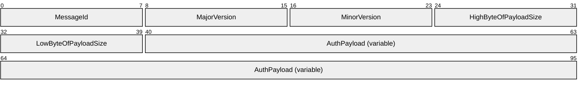
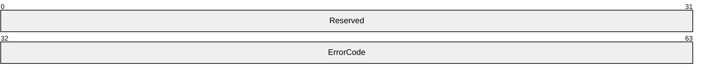
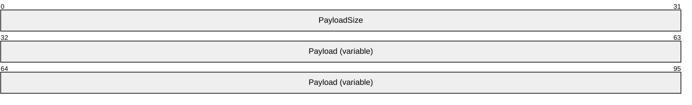
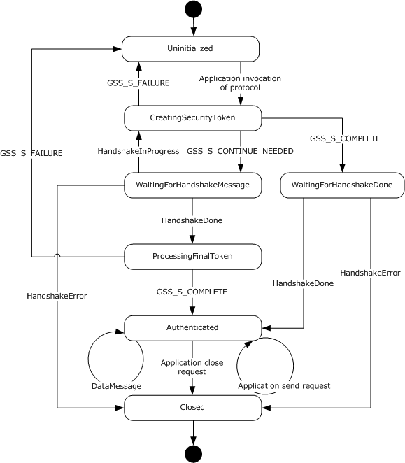
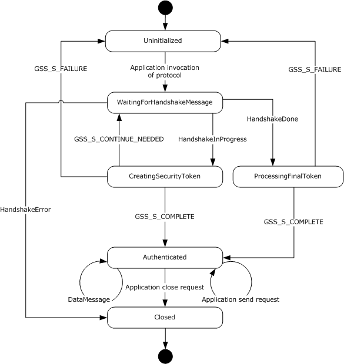
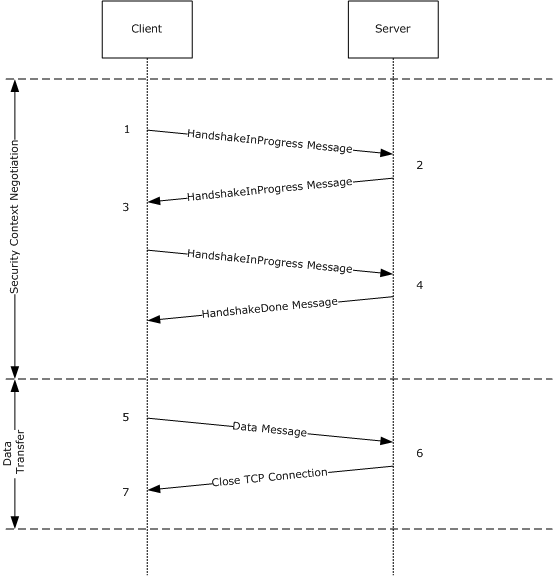
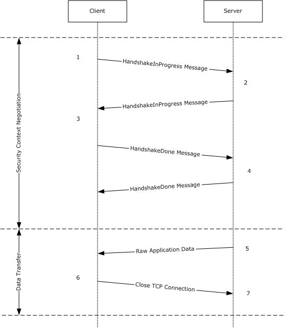
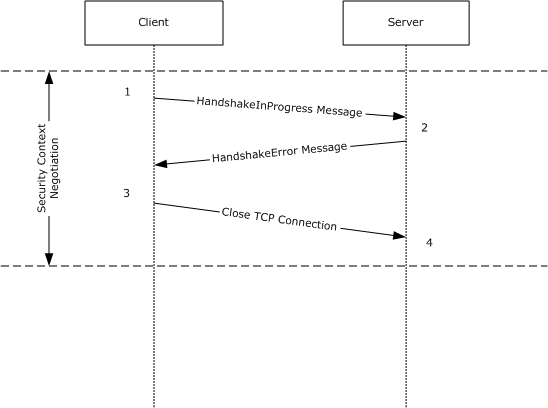

# [MS-NNS]: .NET NegotiateStream Protocol

Table of Contents

1 Introduction

- [1 Introduction](#Section_1)
  - [1.1 Glossary](#Section_1.1)
  - [1.2 References](#Section_1.2)
    - [1.2.1 Normative References](#Section_1.2.1)
    - [1.2.2 Informative References](#Section_1.2.2)
  - [1.3 Overview](#Section_1.3)
  - [1.4 Relationship to Other Protocols](#Section_1.4)
  - [1.5 Prerequisites/Preconditions](#Section_1.5)
  - [1.6 Applicability Statement](#Section_1.6)
  - [1.7 Versioning and Capability Negotiation](#Section_1.7)
  - [1.8 Vendor-Extensible Fields](#Section_1.8)
  - [1.9 Standards Assignments](#Section_1.9)

2 Messages

- [2 Messages](#Section_2)
  - [2.1 Transport](#Section_2.1)
  - [2.2 Message Syntax](#Section_2.2)
    - [2.2.1 Handshake Message](#Section_2.2.1)
    - [2.2.2 Data Message](#Section_2.2.2)

3 Protocol Details

- [3 Protocol Details](#Section_3)
  - [3.1 Client Details](#Section_3.1)
    - [3.1.1 Abstract Data Model](#Section_3.1.1)
      - [3.1.1.1 Underlying TCP Connection](#Section_3.1.1.1)
      - [3.1.1.2 Stream State](#Section_3.1.1.2)
      - [3.1.1.3 Required Protection Level](#Section_3.1.1.3)
      - [3.1.1.4 Negotiated Protection Level](#Section_3.1.1.4)
      - [3.1.1.5 Allowed Impersonation Level](#Section_3.1.1.5)
      - [3.1.1.6 Negotiated Impersonation Level](#Section_3.1.1.6)
      - [3.1.1.7 Client Credentials](#Section_3.1.1.7)
      - [3.1.1.8 Security Provider Context](#Section_3.1.1.8)
      - [3.1.1.9 Framing Buffer](#Section_3.1.1.9)
      - [3.1.1.10 Channel Binding Token](#Section_3.1.1.10)
      - [3.1.1.11 Target Name](#Section_3.1.1.11)
    - [3.1.2 Timers](#Section_3.1.2)
    - [3.1.3 Initialization](#Section_3.1.3)
    - [3.1.4 Higher-Layer Triggered Events](#Section_3.1.4)
      - [3.1.4.1 Application Invocation of the .NET NegotiateStream Protocol](#Section_3.1.4.1)
      - [3.1.4.2 Application Request to Send Data](#Section_3.1.4.2)
      - [3.1.4.3 Application Request to Close Stream](#Section_3.1.4.3)
    - [3.1.5 Message Processing Events and Sequencing Rules](#Section_3.1.5)
      - [3.1.5.1 GSS_Init_sec_context Returns While in the CreatingSecurityToken State](#Section_3.1.5.1)
      - [3.1.5.2 Receiving Data in the WaitingForHandshakeMessage State](#Section_3.1.5.2)
      - [3.1.5.3 GSS_Init_sec_context Returns While in the ProcessingFinalToken State](#Section_3.1.5.3)
      - [3.1.5.4 Receiving Data in the WaitingForHandshakeDone State](#Section_3.1.5.4)
      - [3.1.5.5 Receiving Data in the Authenticated State](#Section_3.1.5.5)
    - [3.1.6 Timer Events](#Section_3.1.6)
    - [3.1.7 Other Local Events](#Section_3.1.7)
  - [3.2 Server Details](#Section_3.2)
    - [3.2.1 Abstract Data Model](#Section_3.2.1)
      - [3.2.1.1 Underlying TCP Connection](#Section_3.2.1.1)
      - [3.2.1.2 Stream State](#Section_3.2.1.2)
      - [3.2.1.3 Required Protection Level](#Section_3.2.1.3)
      - [3.2.1.4 Negotiated Protection Level](#Section_3.2.1.4)
      - [3.2.1.5 Required Impersonation Level](#Section_3.2.1.5)
      - [3.2.1.6 Negotiated Impersonation Level](#Section_3.2.1.6)
      - [3.2.1.7 Server Credentials](#Section_3.2.1.7)
      - [3.2.1.8 Security Provider Context](#Section_3.2.1.8)
      - [3.2.1.9 Framing Buffer](#Section_3.2.1.9)
      - [3.2.1.10 Expected Channel Binding](#Section_3.2.1.10)
    - [3.2.2 Timers](#Section_3.2.2)
    - [3.2.3 Initialization](#Section_3.2.3)
    - [3.2.4 Higher-Layer Triggered Events](#Section_3.2.4)
      - [3.2.4.1 Application Invocation of the .NET NegotiateStream Protocol](#Section_3.2.4.1)
      - [3.2.4.2 Application Request to Send Data](#Section_3.2.4.2)
      - [3.2.4.3 Application Request to Close Stream](#Section_3.2.4.3)
    - [3.2.5 Message Processing Events and Sequencing Rules](#Section_3.2.5)
      - [3.2.5.1 Receiving Data in the WaitingForHandshakeMessage State](#Section_3.2.5.1)
      - [3.2.5.2 GSS_Accept_sec_context Returns While in the CreatingSecurityToken State](#Section_3.2.5.2)
      - [3.2.5.3 GSS_Accept_sec_context Returns While in the ProcessingFinalToken State](#Section_3.2.5.3)
      - [3.2.5.4 Receiving Data in the Authenticated State](#Section_3.2.5.4)
    - [3.2.6 Timer Events](#Section_3.2.6)
    - [3.2.7 Other Local Events](#Section_3.2.7)

4 Protocol Examples

- [4 Protocol Examples](#Section_4)

5 Security

- [5 Security](#Section_5)
  - [5.1 Security Considerations for Implementers](#Section_5.1)
  - [5.2 Index of Security Parameters](#Section_5.2)

6 Appendix A: Product Behavior

- [6 Appendix A: Product Behavior](#Section_6)

7 Change Tracking

- [7 Change Tracking](#Section_7)

For the legal notice and IP terms, see [LEGAL.md](../LEGAL.md).
Last updated: 3/13/2019.
See [Revision History](#revision-history) for full version history.

# 1 Introduction

The .NET NegotiateStream Protocol provides mutually authenticated and confidential communication over a TCP connection. It defines a framing mechanism used to transfer Generic Security Service Application Program Interface (GSS-API) [**security tokens**](#gt_security-token) between a client and server. It also defines a framing mechanism used to transfer signed and/or encrypted application data once the GSS-API security context initialization has completed. It uses the Simple and Protected Generic Security Service Application Program Interface (GSS-API) Negotiation (SPNEGO) mechanism for security services (authentication, key derivation, and data encryption and decryption).

Sections 1.5, 1.8, 1.9, 2, and 3 of this specification are normative. All other sections and examples in this specification are informative.

## 1.1 Glossary

This document uses the following terms:

**Kerberos**: An authentication system that enables two parties to exchange private information across an otherwise open network by assigning a unique key (called a ticket) to each user that logs on to the network and then embedding these tickets into messages sent by the users. For more information, see [MS-KILE](../MS-KILE/MS-KILE.md).

**little-endian**: Multiple-byte values that are byte-ordered with the least significant byte stored in the memory location with the lowest address.

**Security Support Provider Interface (SSPI)**: An API that allows connected applications to call one of several security providers to establish authenticated connections and to exchange data securely over those connections. It is equivalent to Generic Security Services (GSS)-API, and the two are on-the-wire compatible.

**security token**: An opaque message or data packet produced by a Generic Security Services (GSS)-style authentication package and carried by the application protocol. The application has no visibility into the contents of the token.

**MAY, SHOULD, MUST, SHOULD NOT, MUST NOT:** These terms (in all caps) are used as defined in [[RFC2119]](https://go.microsoft.com/fwlink/?LinkId=90317). All statements of optional behavior use either MAY, SHOULD, or SHOULD NOT.

## 1.2 References

Links to a document in the Microsoft Open Specifications library point to the correct section in the most recently published version of the referenced document. However, because individual documents in the library are not updated at the same time, the section numbers in the documents may not match. You can confirm the correct section numbering by checking the [Errata](https://go.microsoft.com/fwlink/?linkid=850906).

### 1.2.1 Normative References

We conduct frequent surveys of the normative references to assure their continued availability. If you have any issue with finding a normative reference, please contact [dochelp@microsoft.com](mailto:dochelp@microsoft.com). We will assist you in finding the relevant information.

[MS-ERREF] Microsoft Corporation, "[Windows Error Codes](../MS-ERREF/MS-ERREF.md)".

[MS-NLMP] Microsoft Corporation, "[NT LAN Manager (NTLM) Authentication Protocol](../MS-NLMP/MS-NLMP.md)".

[MS-SPNG] Microsoft Corporation, "[Simple and Protected GSS-API Negotiation Mechanism (SPNEGO) Extension](../MS-SPNG/MS-SPNG.md)".

[RFC2119] Bradner, S., "Key words for use in RFCs to Indicate Requirement Levels", BCP 14, RFC 2119, March 1997, [http://www.rfc-editor.org/rfc/rfc2119.txt](https://go.microsoft.com/fwlink/?LinkId=90317)

[RFC2743] Linn, J., "Generic Security Service Application Program Interface Version 2, Update 1", RFC 2743, January 2000, [http://www.rfc-editor.org/rfc/rfc2743.txt](https://go.microsoft.com/fwlink/?LinkId=90378)

[RFC4178] Zhu, L., Leach, P., Jaganathan, K., and Ingersoll, W., "The Simple and Protected Generic Security Service Application Program Interface (GSS-API) Negotiation Mechanism", RFC 4178, October 2005, [https://www.rfc-editor.org/rfc/rfc4178.txt](https://go.microsoft.com/fwlink/?LinkId=90461)

### 1.2.2 Informative References

[MS-KILE] Microsoft Corporation, "[Kerberos Protocol Extensions](../MS-KILE/MS-KILE.md)".

[MS-NETOD] Microsoft Corporation, "[Microsoft .NET Framework Protocols Overview](#Section_1.3)".

[RFC4120] Neuman, C., Yu, T., Hartman, S., and Raeburn, K., "The Kerberos Network Authentication Service (V5)", RFC 4120, July 2005, [https://www.rfc-editor.org/rfc/rfc4120.txt](https://go.microsoft.com/fwlink/?LinkId=90458)

[RFC5246] Dierks, T., and Rescorla, E., "The Transport Layer Security (TLS) Protocol Version 1.2", RFC 5246, August 2008, [http://www.ietf.org/rfc/rfc5246.txt](https://go.microsoft.com/fwlink/?LinkId=129803)

## 1.3 Overview

The .NET NegotiateStream Protocol was introduced to address the need for a simple and lightweight authentication and security mechanism between a client and a server when the client or server needs direct access to the TCP stream. A key benefit is that authentication is accomplished without the use of digital certificates, as is required by the Transport Layer Security (TLS) protocol [[RFC5246]](https://go.microsoft.com/fwlink/?LinkId=129803). The .NET NegotiateStream Protocol provides a means for framing GSS-API Negotiation (as specified in [[RFC4178]](https://go.microsoft.com/fwlink/?LinkId=90461)) over a TCP stream. This is used to negotiate the security context for communication between a client and a server. The client and server can then exchange data protected by the negotiated security context.

The .NET NegotiateStream Protocol uses the SPNEGO mechanism to determine which underlying security protocol to use. The .NET NegotiateStream Protocol can also forego negotiation with SPNEGO and use NTLM authentication directly.

This protocol enables:

- Client and/or server authentication
- Data confidentiality and integrity
The .NET NegotiateStream Protocol performs these functions in two phases: a security context negotiation phase and a data transfer phase.

The security context negotiation allows for the selection of mechanisms to protect the authenticity and confidentiality of data that will be subsequently exchanged. SPNEGO is used to select the underlying security protocol, and the security context is negotiated between the client and server in a set of opaque [**security tokens**](#gt_security-token) generated by the SPNEGO GSS-API mechanism, which are transferred between client and server over a TCP connection by use of a message framing protocol defined in this document. This context negotiation is initiated by the client, and several messages can be exchanged before the security context negotiation is complete. When the negotiation is completed, the client and server have agreed upon the necessary authentication, data integrity, and confidentiality mechanisms. These mechanisms will be used to secure subsequent data exchanges between the client and the server.

After the security context has been successfully negotiated, the client and server exchange data that is protected using the agreed-upon authentication, integrity, and confidentiality mechanisms. The server can initiate a data transfer to the client, or the client can initiate a data transfer to the server. A data transfer can happen at any time after the security context negotiation is complete.

An error in the negotiation process or the data transfer process invalidates the stream, and a new security context has to be renegotiated. The reason for the failure to negotiate a security context is communicated to the other application taking part in the negotiation. An error in the data transfer process can include transfer of data with an authentication, integrity, or confidentiality mechanism different from what was negotiated.

## 1.4 Relationship to Other Protocols

The .NET NegotiateStream Protocol relies on TCP for transport, and it relies on the SPNEGO security protocol and the NTLM security protocol for authentication and message security. If the client application requests data integrity protection or confidentiality, the .NET NegotiateStream Protocol performs authentication and negotiates a security protocol to be used to provide these features through the exchange of opaque [**security tokens**](#gt_security-token) generated by the SPNEGO GSS-API mechanism. If the client application protocol does not request either of these features, the .NET NegotiateStream Protocol performs authentication through the exchange of opaque security tokens generated by the NTLM GSS-API mechanism.

The .NET NegotiateStream Protocol provides an alternative to other security protocols, such as TLS [[RFC5246]](https://go.microsoft.com/fwlink/?LinkId=129803), which provide for authentication, integrity protection, and encryption of data exchanged by a higher-level protocol. Whereas TLS requires the client and server to maintain valid digital certificates with private keys to authenticate each other and establish key material for signing and encrypting application data, the .NET NegotiateStream Protocol allows authentication and key exchange to be performed securely without the need for digital certificates through the use of SPNEGO and NTLM.

## 1.5 Prerequisites/Preconditions

This protocol assumes that a TCP connection has been established between client and server.

## 1.6 Applicability Statement

The .NET NegotiateStream Protocol is designed to secure information transmitted between a client and a server. The protocol provides security services without using digital certificates, and is thus useful to secure network traffic when the use of certificates is not an option. The .NET NegotiateStream Protocol uses SPNEGO (which selects between [**Kerberos**](#gt_kerberos) and NTLM) to determine the underlying security protocol to use. Therefore, this protocol is best suited for environments in which a Kerberos infrastructure is deployed (see [MS-KILE](../MS-KILE/MS-KILE.md) and [[RFC4120]](https://go.microsoft.com/fwlink/?LinkId=90458)). Using SPNEGO, the .NET NegotiateStream Protocol enables:

- Client and/or server authentication
- Data integrity and confidentiality

## 1.7 Versioning and Capability Negotiation

This document covers versioning issues in the following areas:

**Protocol Versions:** The .NET NegotiateStream Protocol supports versioning and is currently at version 1.0. The versioning capability is outlined in section [2.2.1](#Section_2.2.1). Version 1.0 is the only defined version of the .NET NegotiateStream Protocol. Therefore, no version negotiation semantics are described in this specification.

**Security and Authentication Methods:** The .NET NegotiateStream Protocol supports the use of the SPNEGO and NTLM security protocols. The use of these security protocols is discussed in sections [2.2](#Section_2.2), [3.1.4](#Section_3.1.4), and [3.2.5](#Section_3.2.5).

**Capability Negotiation:** This protocol performs explicit negotiation of a security method for providing authentication, data integrity, and data confidentiality as specified in sections 2.2, 3.1.4, and 3.2.5.

## 1.8 Vendor-Extensible Fields

This protocol uses HRESULT values as defined in [MS-ERREF](../MS-ERREF/MS-ERREF.md) section 2.1. Vendors can define their own HRESULT values, provided they set the C bit (0x20000000) for each vendor-defined value, indicating the value is a customer code.

## 1.9 Standards Assignments

None.

# 2 Messages

## 2.1 Transport

The .NET NegotiateStream Protocol transports messages using a TCP stream. This protocol specifies a framing for messages over a TCP stream (see section [2.2](#Section_2.2) for message syntax). The protocol does not define a mechanism to establish the TCP connection; rather, an established TCP connection is a precondition for this protocol.

## 2.2 Message Syntax

There are two types of messages defined by the .NET NegotiateStream Protocol: Handshake messages and Data messages. Handshake messages are used to carry GSS-API [**security tokens**](#gt_security-token) used to establish a security context. Once the security context has been established, Data messages are used to carry application data that has been signed and/or encrypted by the negotiated security mechanism.

All multi-byte integer fields are transmitted using [**little-endian**](#gt_little-endian) representation.

### 2.2.1 Handshake Message

The Handshake message structure is defined as follows.

**MessageId (1 byte):** The type of Handshake message. The value of this field MUST be a value from the following table.

| Value | Meaning |
| --- | --- |
| HandshakeDone 0x14 | The handshake has completed successfully. |
| HandshakeError 0x15 | An error occurred during the handshake. The **AuthPayload** field contains an HRESULT. See the description of the **AuthPayload** field for further information. |
| HandshakeInProgress 0x16 | The message is part of the handshake phase and is not the final message from the host. The final Handshake message from a host is always transferred in a HandshakeDone message. |

**MajorVersion (1 byte):** An unsigned integer that, along with the **MinorVersion** field, specifies the version of the .NET NegotiateStream Protocol being used. This field MUST be set to 0x01.

**MinorVersion (1 byte):** An unsigned integer that, along with the **MajorVersion** field, defines the version of the .NET NegotiateStream Protocol being used. This field MUST be set to 0x00.

**HighByteOfPayloadSize (1 byte):** An unsigned integer that, along with the **LowByteOfPayloadSize** field, defines the size, in bytes, of the **AuthPayload** field. This field represents the high-order byte of the payload size.

**LowByteOfPayloadSize (1 byte):** An unsigned integer that, along with the **HighByteOfPayloadSize** field, defines the size, in bytes, of the **AuthPayload** field. This field represents the low-order byte of the payload size.

**AuthPayload (variable):** When the Handshake message has a MessageId of HandshakeDone or HandshakeInProgress, this field contains the authentication tokens generated by the [**Security Support Provider Interface (SSPI)**](#gt_security-support-provider-interface-sspi) security packages (SPNEGO and NTLM) used by the .NET NegotiateStream Protocol. The formats for these tokens are defined in [MS-SPNG](../MS-SPNG/MS-SPNG.md) section 2.2 and [MS-NLMP](../MS-NLMP/MS-NLMP.md) section 2.2 respectively. When the Handshake message has a **MessageId** of HandshakeInProgress, this field MUST have a non-zero length. When the Handshake message has a **MessageId** of HandshakeDone, this field MUST be of zero length if the remote side's security package did not return a [**security token**](#gt_security-token) when indicating successful initialization of the security context. When the Handshake message has a **MessageId** of HandshakeError, the **AuthPayload** field MUST have a length of 8 bytes, and contain either an HRESULT error code describing an error encountered by the security package or the Win32 error code ERROR_TRUST_FAILURE (0x000006FE) indicating that the security package was able to successfully authenticate, but the negotiated security parameters were unacceptable to the remote side.

The following structure MUST be used to format this error code within the **AuthPayload** field:

**Reserved (4 bytes):** This field is reserved and MUST be set to zero. The recipient MUST ignore the value.

**ErrorCode (4 bytes):** An HRESULT describing an error encountered by the remote side's security package, or the value 0x000006FE.

### 2.2.2 Data Message

This section defines the structure of the data exchange messages. These messages are used to transfer application-specific data after the handshake phase is complete. The .NET NegotiateStream Protocol only frames application data using the format noted in the following table if the negotiation of security services during the handshake phase resulted in both the client and server agreeing to sign or encrypt and sign the data to be transferred. Thus, if the negotiated security context in the handshake phase results in a context that supports neither message confidentiality nor integrity, then the data transferred is not framed, and does not follow the format specified in this section (that is, application-supplied data is written directly to the underlying TCP stream).

**PayloadSize (4 bytes):** The unsigned size, in bytes, of the **Payload** field. The maximum value for this field is 0x0000FC30 (64,560).

**Payload (variable):** The application-specific data to transfer between the client and server that has been secured by the selected security mechanism.

# 3 Protocol Details

## 3.1 Client Details

The following figure represents the client state machine for the .NET NegotiateStream Protocol. The remainder of this section will discuss the state machine in depth.

Figure 1: Client details

### 3.1.1 Abstract Data Model

This section describes a conceptual model of possible data organization that an implementation maintains to participate in this protocol. This specification does not mandate that implementations adhere to this model, as long as their external behavior is consistent with that specified in this specification.

#### 3.1.1.1 Underlying TCP Connection

The .NET NegotiateStream Protocol uses the **Underlying TCP Connection** to exchange data with the server.

#### 3.1.1.2 Stream State

The .NET NegotiateStream Protocol uses the **Stream State** to keep track of the state of the stream. The possible values for the state of the stream are:

- **Uninitialized**
- **CreatingSecurityToken**
- **WaitingForHandshakeMessage**
- **ProcessingFinalToken**
- **WaitingForHandshakeDone**
- **Authenticated**
- **Closed**

#### 3.1.1.3 Required Protection Level

The .NET NegotiateStream Protocol uses the **Required Protection Level** to keep track of the protection level required by the client application. The possible values for the **Required Protection Level** and **Negotiated Protection Level** are:

- None
- Sign
- EncryptAndSign

#### 3.1.1.4 Negotiated Protection Level

The .NET NegotiateStream Protocol uses the **Negotiated Protection Level** to keep track of the protection level agreed upon during the security context negotiation with the server. The possible values are the same as those for the **Required Protection Level**.

#### 3.1.1.5 Allowed Impersonation Level

The .NET NegotiateStream Protocol uses the **Allowed Impersonation Level** to keep track of the way in which the client application has specified that its credentials can be used by the server application. The possible values for the **Allowed Impersonation Level** and **Negotiated Impersonation Level** are:

- Identification
- Impersonation
- Delegation

#### 3.1.1.6 Negotiated Impersonation Level

The .NET NegotiateStream Protocol uses the **Negotiated Impersonation Level** to keep track of the impersonation level agreed upon during the security context negotiation with the server. The possible values are the same as those for the **Allowed Impersonation Level**.

#### 3.1.1.7 Client Credentials

The .NET NegotiateStream Protocol uses the **Client Credentials** to store a GSS-API handle to the credentials specified by the client application for authenticating to the server.

#### 3.1.1.8 Security Provider Context

The .NET NegotiateStream Protocol tracks the context of the current security provider chosen during the handshake phase.

#### 3.1.1.9 Framing Buffer

The .NET NegotiateStream Protocol employs a buffer mechanism to handle the receiving and processing of full frames while in the handshake phase, and when the data payloads are signed, and/or encrypted.

#### 3.1.1.10 Channel Binding Token

The .NET NegotiateStream Protocol uses the **Channel Binding Token** to store the channel binding token provided by the application.

#### 3.1.1.11 Target Name

The .NET NegotiateStream Protocol uses the **Target Name** to store the target name of the server provided by the application.

### 3.1.2 Timers

The .NET NegotiateStream Protocol does not use timers. Protocols above and below this protocol layer are responsible for implementing any timers for time-out events.

### 3.1.3 Initialization

The .NET NegotiateStream Protocol initialization for the client role is triggered by an application event. See section [3.1.4.1](#Section_3.1.4.1) for more details.

### 3.1.4 Higher-Layer Triggered Events

#### 3.1.4.1 Application Invocation of the .NET NegotiateStream Protocol

The .NET NegotiateStream Protocol is triggered by an invocation from the application while in the Uninitialized state. If an application invocation is received when the **Stream State** is not equal to Uninitialized, an error MUST be returned to the application. The application specifies an underlying TCP connection to the server, the desired name to be used for client authentication, a channel binding token, the target name of the server, a required protection level, and an allowed impersonation level. The Underlying TCP Connection, **Required Protection Level**, **Allowed Impersonation Level**, **Channel Binding Token**, and **Target Name** MUST be set based on these inputs. The application-specified *desired_name* MUST be passed to the **GSS_Acquire_cred** function ([[RFC2743]](https://go.microsoft.com/fwlink/?LinkId=90378) section 2.1.1). If the **Required Protection Level** is None, the implementation MUST pass a *desired_mechs* parameter indicating the NTLM mechanism. Otherwise, the implementation MUST pass a *desired_mechs* parameter indicating the SPNEGO mechanism. The *cred_usage* parameter MUST be set to INITIATE-ONLY and the *lifetime_req* parameter MUST be set to 0.

If the function returns any major_status other than GSS_S_COMPLETE, the implementation MUST notify the application of the failure without sending anything over the Underlying TCP Connection. Otherwise, the implementation MUST store the returned credential handle as the **Client Credentials**, and MUST set the **Stream State** to CreatingSecurityToken. The implementation MUST pass the **Client Credentials** to the **GSS_Init_sec_context** function ([RFC2743] section 2.2.1). The *input_context_handle* parameter MUST be GSS_C_NO_CONTEXT. The *targ_name* parameter MUST be the **Target Name**. The *mech_type* parameter MUST be the same as that passed to **GSS_Acquire_cred**. The *deleg_req_flag* MUST be true if and only if **Allowed Impersonation Level** is Delegation. The *conf_req_flag* MUST be true if and only if the **Required Protection Level** is EncryptAndSign. The *integ_req_flag* MUST be true if and only if the **Required Protection Level** is Sign or EncryptAndSign. The *mutual_req_flag*, *replay_det_req_flag*, and *sequence_req_flag* MUST be true. The *anon_req_flag* MUST be false. The *chan_bindings* parameter MUST be the **Channel Binding Token**. The *input_token* MUST be NULL, and the *lifetime_req* MUST be 0.

If the *conf_avail* return value is true, the *integ_avail* return value will also be true, and the **Negotiated Protection Level** is EncryptAndSign. If the *conf_avail* return value is false and the *integ_avail* return value is true, the **Negotiated Protection Level** is Sign. Otherwise, the **Negotiated Protection Level** is None.

#### 3.1.4.2 Application Request to Send Data

When the **Stream State** is set to Authenticated, the application can at any time request that the protocol transfer an application-specific data message to the server. If the application requests that data be transferred while not in the Authenticated state, an error MUST be returned. If the **Negotiated Protection Level** is None, the application data MUST be transferred directly over the **Underlying TCP Connection**. Otherwise, the application data MUST be passed as the input_message parameter to the **GSS_Wrap** function ([[RFC2743]](https://go.microsoft.com/fwlink/?LinkId=90378) section 2.3.3), along with the **Securty Provider Context** in the *context_handle* parameter. The *conf_req_flag* MUST be set if and only if the **Negotiated Protection Level** is EncryptAndSign, and the *qop_req* parameter MUST be set to 0. If the function returns a major_status of GSS_COMPLETE, the output_message MUST be wrapped in a Data Message (as specified in section [2.2.2](#Section_2.2.2)) and transmitted to the server via the **Underlying TCP Connection**. If any other major_status is returned, the client application MUST be notified of the failure without writing anything to the **Underlying TCP Connection**.

#### 3.1.4.3 Application Request to Close Stream

The application can at any time request that the stream be closed. When this trigger is received, the **Security Provider Context** MUST be deleted, the **Underlying TCP Connection** MUST be closed, and the **Stream State** MUST be set to Closed.

### 3.1.5 Message Processing Events and Sequencing Rules

#### 3.1.5.1 GSS_Init_sec_context Returns While in the CreatingSecurityToken State

If **GSS_Init_sec_context** returns a major_status of GSS_S_COMPLETE, the **Negotiated Protection Level** and **Negotiated Impersonation Level** MUST be set based on the returned state flags. The **Security Provider Context** MUST be set to the *output_context_handle*. If the **Negotiated Impersonation Level** is not equal to the **Allowed Impersonation Level** or the **Negotiated Protection Level** is lower than the **Required Protection Level**, the value 0x000006FE MUST be wrapped in the **AuthPayload** field of a **Handshake** message with the **HandshakeId** set to HandshakeError (as specified in section [2.2](#Section_2.2)) and transmitted to the server. The **Security Provider Context** MUST be deleted and the **Stream State** MUST be set to Uninitialized. Otherwise, the *output_token* MUST be wrapped in the **AuthPayload** field of a **Handshake** message with the **HandshakeId** set to HandshakeDone (as specified in section 2.2) and transmitted to the server. In this case, the **Stream State** MUST be set to WaitingForHandshakeDone.

If **GSS_Init_sec_context** returns a major status of GSS_S_CONTINUE_NEEDED, the **Security Provider Context** MUST be set to the *output_context_handle* and the *output_token* MUST be wrapped in the **AuthPayload** field of a **Handshake** message with the **HandshakeId** set to HandshakeInProgress (as specified in section 2.2) and sent to the server. The **Stream State** MUST be set to WaitingForHandshakeMessage.

If any other major_status is returned, an HRESULT error code describing the error MUST be wrapped in the **AuthPayload** of a **Handshake** message with the **HandshakeId** set to HandshakeError (as specified in section 2.2) and sent to the server. The **Stream State** MUST be set to Uninitialized.

#### 3.1.5.2 Receiving Data in the WaitingForHandshakeMessage State

The first five bytes received MUST be interpreted as the header of a **Handshake** message (as specified in section [2.2](#Section_2.2)). The payload size MUST be reassembled from the **HighByteOfPayloadSize** and **LowByteOfPayloadSize** fields. The **MajorVersion** and **MinorVersion** MUST be ignored. The implementation MUST continue to receive data from the **Underlying TCP Connection** (storing it in the **Framing Buffer**) until the entire payload has been received. When a full frame has been received, the client MUST check the **HandshakeId** field of the message to see if it matches one of the three known message IDs for .NET NegotiateStream Handshake messages. If the message ID received matches the message ID for:

- A HandshakeInProgress message: Upon receipt of a message of this type, the **Stream State** MUST be set to CreatingSecurityToken. The client MUST take the token from the **AuthPayload** field of the message and pass it to the **GSS_Init_sec_context** function ([[RFC2743]](https://go.microsoft.com/fwlink/?LinkId=90378) section 2.2.1), along with the **Security Provider Context**, **Client Credentials**, **Target Name**, **Channel Binding Token**, and the same other parameters as the first call to **GSS_Init_sec_context** (see section [3.1.4.1](#Section_3.1.4.1)).
- A HandshakeDone message:Upon receipt of a message of this type, the **Stream State** MUST be set to ProcessingFinalToken. The client MUST take the token from the **AuthPayload** field of the message and pass it to the **GSS_Init_sec_context** function ([RFC2743] section 2.2.1) along with the **Security Provider Context**, **Client Credentials**, **Target Name**, **Channel Binding Token**, and the same other parameters as the first call to **GSS_Init_sec_context** (see section 3.1.4.1).
- A HandshakeError message: Upon receipt of a message of this type, the **Security Provider Context** MUST be deleted, the **Underlying TCP Connection** MUST be closed, and the **Stream State** MUST be set to Closed. The application MUST be notified of the HRESULT contained in the **AuthPayload** field. (If the application wishes to retry the authentication, it can do so by invoking a new instance of the protocol with a new **Underlying TCP Connection**.)
- None of the preceding handshake message types: The message type is invalid. The **Security Provider Context** MUST be deleted, the **Underlying TCP Connection** MUST be closed, and the **Stream State** MUST be set to Closed. The application MUST be notified of the failure. (If the application wishes to retry the authentication, it can do so by invoking a new instance of the protocol with a new **Underlying TCP Connection**.)

#### 3.1.5.3 GSS_Init_sec_context Returns While in the ProcessingFinalToken State

If **GSS_Init_sec_context** returns a major_status of GSS_S_COMPLETE, the **Negotiated Protection Level** and **Negotiated Impersonation Level** MUST be set based on the returned state flags. If the **Negotiated Impersonation Level** is not equal to the **Allowed Impersonation Level** or the **Negotiated Protection Level** is less than the **Required Protection Level**, the value 0x000006FE MUST be wrapped in the **AuthPayload** field of a **Handshake** message with the **HandshakeId** set to HandshakeError (as specified in section [2.2](#Section_2.2)) and transmitted to the server. The **Security Provider Context** MUST be deleted, and the **Stream State** MUST be set to Uninitialized. Otherwise, the **Stream State** MUST be set to Authenticated and the client application MUST be notified of the successful authentication.

If the function returns any other *major_status*, an HRESULT describing the error MUST be wrapped in a Handshake message with the **HandshakeId** set to HandshakeError (as specified in section 2.2) and transmitted to the server. The **Security Provider Context** MUST be deleted and the **Stream State** MUST be set to Uninitialized. The application MUST be notified of the authentication failure.

#### 3.1.5.4 Receiving Data in the WaitingForHandshakeDone State

The first five bytes received MUST be interpreted as the header of a Handshake message (as specified in section [2.2](#Section_2.2)). The payload size MUST be reassembled from the **HighByteOfPayloadSize** and **LowByteOfPayloadSize** fields. The **MajorVersion** and **MinorVersion** MUST be ignored. The implementation MUST continue to receive data from the **Underlying TCP Connection** (storing it in the **Framing Buffer**) until the entire payload has been received. If the message has a **HandshakeId** of HandshakeDone, the **AuthPayload** field MUST be ignored. The **Stream State** MUST be set to Authenticated, and the client application MUST be notified of a successful authentication.

If the message has a **HandshakeId** of HandshakeError, the **Security Provider Context** MUST be deleted, the **Underlying TCP Connection** MUST be closed, and the **Stream State** MUST be set to Closed. The application MUST be notified of the HRESULT contained in the **AuthPayload** field. (If the application wishes to retry the authentication, it can do so by invoking a new instance of the protocol with a new **Underlying TCP Connection**.)

If the message has any other **HandshakeId** (including HandshakeInProgress) the message type is invalid. The **Security Provider Context** MUST be deleted, the **Underlying TCP Connection** MUST be closed, and the **Stream State** MUST be set to Closed. The application MUST be notified of the failure. (If the application wishes to retry the authentication, it can do so by invoking a new instance of the protocol with a new **Underlying TCP Connection**.)

#### 3.1.5.5 Receiving Data in the Authenticated State

When data arrives on the Underlying TCP Connection, the following actions MUST be taken:

- If the **Negotiated Protection Level** is None, any bytes received MUST be delivered unmodified to the application.
- Otherwise, the first four bytes received MUST be interpreted as the **PayloadSize** field of a Data message (as specified in section [2.2](#Section_2.2)). The implementation MUST then continue to receive data from the **Underlying TCP Connection** (storing it in the **Framing Buffer**) until **PayloadSize** bytes have been received. When a full frame has been received, it MUST be passed to the **GSS_Unwrap** function ([[RFC2743]](https://go.microsoft.com/fwlink/?LinkId=90378) section 2.3.4) along with the **Security Provider Context**. If the function returns a major_status of GSS_S_COMPLETE, the output_message MUST be delivered to the application. If the function returns any other *major_status*, the application MUST be notified of the failure and the buffered message MUST be discarded.

### 3.1.6 Timer Events

None.

### 3.1.7 Other Local Events

If the server closes the **Underlying TCP Connection**, the **Security Provider Context** MUST be deleted, the **Underlying TCP Connection** MUST be closed, and the **Stream State** MUST be set to Closed. The application MUST be notified that the server has closed the connection.

## 3.2 Server Details

The following figure represents the server state machine for the .NET NegotiateStream Protocol. The remainder of this section will discuss the state machine in depth.

Figure 2: Server details

### 3.2.1 Abstract Data Model

This section describes a conceptual model of possible data organization that an implementation maintains to participate in this protocol. This specification does not mandate that implementations adhere to this model as long as their external behavior is consistent with that specified in this specification.

#### 3.2.1.1 Underlying TCP Connection

The .NET NegotiateStream Protocol uses the **Underlying TCP Connection** to exchange data with the client.

#### 3.2.1.2 Stream State

The .NET NegotiateStream Protocol uses the **Stream State** to keep track of the state of the stream. The possible values for the state of the stream are:

- Uninitialized
- CreatingSecurityToken
- WaitingForHandshakeMessage
- ProcessingFinalToken
- Authenticated
- Closed

#### 3.2.1.3 Required Protection Level

The .NET NegotiateStream Protocol uses the **Required Protection Level** to keep track of the protection level required by the server application. The possible values for **Required Protection Level** and **Negotiated Protection Level** are:

- None
- Sign
- EncryptAndSign

#### 3.2.1.4 Negotiated Protection Level

The .NET NegotiateStream Protocol uses the **Negotiated Protection Level** to keep track of the protection level agreed upon during the security context negotiation with the client. The possible values are the same as those for the **Required Protection Level**.

#### 3.2.1.5 Required Impersonation Level

The .NET NegotiateStream Protocol uses the **Required Impersonation Level** to keep track of the way in which the server application intends to use the credentials specified by the client. The possible values for the **Required Impersonation Level** and **Negotiated Impersonation Level** are:

- Identification
- Impersonation
- Delegation

#### 3.2.1.6 Negotiated Impersonation Level

The .NET NegotiateStream Protocol uses the **Negotiated Impersonation Level** to keep track of the impersonation level agreed upon during the security context negotiation with the client. The possible values are the same as those for the **Required Impersonation Level**.

#### 3.2.1.7 Server Credentials

The .NET NegotiateStream Protocol uses the **Server Credentials** to store a GSS-API handle to the credentials specified by the server application for authenticating itself to the client.

#### 3.2.1.8 Security Provider Context

The .NET NegotiateStream Protocol tracks the context of the current security provider chosen during the handshake phase.

#### 3.2.1.9 Framing Buffer

The .NET NegotiateStream Protocol employs a buffer mechanism to handle the receiving and processing of full frames while in the handshake phase, and when the data payloads are signed, and/or encrypted.

#### 3.2.1.10 Expected Channel Binding

The .NET NegotiateStream Protocol uses the **Expected Channel Binding** to store the channel binding token, which the client is expected to provide along with its credentials.

### 3.2.2 Timers

The .NET NegotiateStream Protocol does not use timers. Protocols above and below this protocol layer are responsible for implementing any timers for time-out events.

### 3.2.3 Initialization

The .NET NegotiateStream Protocol initialization for the server role is triggered by an application event. See section [3.2.4.1](#Section_3.1.4.1) for more details.

### 3.2.4 Higher-Layer Triggered Events

#### 3.2.4.1 Application Invocation of the .NET NegotiateStream Protocol

The .NET NegotiateStream Protocol is triggered by an invocation from the application while the **Stream State** is set to Uninitialized. If an application invocation is received when the **Stream State** is not equal to Uninitialized, an error MUST be returned to the application. The application specifies an underlying TCP connection to the client, the desired name to be used for server authentication, an expected channel binding, a required protection level, and a required impersonation level. The **Underlying TCP Connection**, **Expected Channel Binding**, **Required Protection Level**, and **Required Impersonation Level** MUST be set based on these inputs. The application-specified *desired_name* MUST be passed to the **GSS_Acquire_cred** function ([[RFC2743]](https://go.microsoft.com/fwlink/?LinkId=90378) section 2.1.1). The implementation MUST pass a *desired_mechs* parameter indicating the SPNEGO mechanism. The *cred_usage* parameter MUST be set to ACCEPT-ONLY, and the *lifetime_req* parameter MUST be set to 0.

If the function returns a *major_status* other than GSS_S_COMPLETE, the implementation MUST notify the application of the failure without writing anything to the **Underlying TCP Connection**. Otherwise, the implementation MUST store the returned credential handle as the **Server Credentials** and set the **Stream State** to WaitingForHandshakeMessage.

#### 3.2.4.2 Application Request to Send Data

When the **Stream State** is set to Authenticated, the application can at any time request that the protocol transfer an application-specific data message to the client. If the application requests that data be transferred while not in the Authenticated state, an error MUST be returned. If the **Negotiated Protection Level** is None, the application data MUST be transferred directly over the **Underlying TCP Connection**. Otherwise, the application data MUST be passed as the input_message parameter to the **GSS_Wrap** function ([[RFC2743]](https://go.microsoft.com/fwlink/?LinkId=90378) section 2.3.3) along with the **Security Provider Context** as the *context_handle* parameter. The *conf_req_flag* MUST be set if and only if the **Negotiated Protection Level** is EncryptAndSign, and the *qop_req* parameter MUST be set to 0. If the function returns a *major_status* of GSS_S_COMPLETE, the *output_message* MUST be wrapped in a Data message (as specified in section [2.2](#Section_2.2)) and transmitted to the client via the **Underlying TCP Connection**. If any other *major_status* is returned, the server application MUST be notified of the failure without writing anything to the **Underlying TCP Connection**.

#### 3.2.4.3 Application Request to Close Stream

The application can at any time request that the stream be closed. When this trigger is received, the **Security Provider Context** MUST be deleted, the **Underlying TCP Connection** MUST be closed, and the **Stream State** MUST be set to Closed.

### 3.2.5 Message Processing Events and Sequencing Rules

#### 3.2.5.1 Receiving Data in the WaitingForHandshakeMessage State

The first five bytes received MUST be interpreted as the header of a Handshake message (as specified in section [2.2](#Section_2.2)). The payload size MUST be reassembled from the **HighByteOfPayloadSize** and **LowByteOfPayloadSize** fields. The **MajorVersion** and **MinorVersion** MUST be ignored. The implementation MUST continue to receive data from the **Underlying TCP Connection** (storing it in the **Framing Buffer**) until the entire payload has been received. When a full frame has been received, the server MUST check the **HandshakeId** field of the message to see whether it matches one of the three known message IDs for .NET NegotiateStream Handshake messages. If the message ID received matches the message ID for:

- A HandshakeInProgress message: Upon receipt of a message of this type, the **Stream State** MUST be set to CreatingSecurityToken. The server MUST take the token from the **AuthPayload** field of the message and pass it to the GSS_Accept_sec_context function ([[RFC2743]](https://go.microsoft.com/fwlink/?LinkId=90378) section 2.2.2) along with the **Server Credentials** and **Expected Channel Binding**. If no **Security Provider Context** has been saved from a previous call to GSS_Accept_sec_context, the *input_context_handle* MUST be set to GSS_C_NO_CONTEXT. Otherwise, the saved **Security Provider Context** MUST be passed.
- A HandshakeDone message: Upon receipt of a message of this type, the **Stream State** MUST be set to ProcessingLastToken. The server MUST take the token from the **AuthPayload** field of the message and pass it to the GSS_Accept_sec_context function ([RFC2743] section 2.2.2) along with the **Security Provider Context**, **Server Credentials**, and **Expected Channel Binding**.
- A HandshakeError message: Upon receipt of a message of this type, the **Security Provider Context** MUST be deleted, the **Underlying TCP Connection** MUST be closed, and the **Stream State** MUST be set to Closed. The application MUST be notified of the HRESULT contained in the **AuthPayload** field. (If the application wishes to retry the authentication, it can do so by invoking a new instance of the protocol with a new **Underlying TCP Connection**.)
- None of the preceding handshake message types: The message type is invalid. The **Security Provider Context** MUST be deleted, the **Underlying TCP Connection** MUST be closed, and the **Stream State** MUST be set to Closed. The application MUST be notified of the failure. (If the application wishes to retry the authentication, it can do so by invoking a new instance of the protocol with a new **Underlying TCP Connection**.)

#### 3.2.5.2 GSS_Accept_sec_context Returns While in the CreatingSecurityToken State

If GSS_Accept_sec_context returns a *major_status* of GSS_S_COMPLETE, the **Negotiated Protection Level** and **Negotiated Impersonation Level** MUST be set based on the returned state flags. The **Security Provider Context** MUST be set to the *output_context_handle*. If the **Negotiated Impersonation Level** is less than the **Required Impersonation Level** or the **Negotiated Protection Level** is less than the **Required Protection Level**, the value 0x000006FE MUST be wrapped in the **AuthPayload** field of a Handshake message with the **HandshakeId** set to HandshakeError (as specified in section [2.2](#Section_2.2)) and transmitted to the client. The **Security Provider Context** MUST be deleted, and the **Stream State** MUST be set to Uninitialized. Otherwise, the *output_token* MUST be wrapped in the **AuthPayload** field of a Handshake message with the **HandshakeId** set to HandshakeDone (as specified in section 2.2) and transmitted to the client. The **Stream State** MUST be set to Authenticated, and the server application MUST be notified of a successful authentication.

If the function returns a *major_status* of GSS_S_CONTINUE_NEEDED, the *output_token* MUST be wrapped in the **AuthPayload** field of a Handshake message with the **HandshakeId** set to HandshakeInProgress (as specified in section 2.2) and transmitted to the client. If the **Security Provider Context** has not yet been set, it MUST be set to the *output_context_handle*. The **Stream State** MUST be set to WaitingForHandshakeMessage.

If the function returns any other *major_status*, an HRESULT describing the error MUST be wrapped in the **AuthPayload** field of a Handshake message with the **HandshakeId** set to HandshakeError (as specified in section 2.2) and transmitted to the client. The **Security Provider Context** MUST be deleted, and the **Stream State** MUST be set to Uninitialized.

#### 3.2.5.3 GSS_Accept_sec_context Returns While in the ProcessingFinalToken State

If GSS_Accept_sec_context returns a *major_status* of GSS_S_COMPLETE, the **Negotiated Protection Level** and **Negotiated Impersonation Level** MUST be set based on the returned state flags. The **Security Provider Context** MUST be set to the *output_context_handle*. If the **Negotiated Impersonation Level** is less than the **Required Impersonation Level**, or the **Negotiated Protection Level** is less than the **Required Protection Level**, the value 0x000006FE MUST be wrapped in the **AuthPayload** field of a Handshake message with the **HandshakeId** set to HandshakeError (as specified in section [2.2](#Section_2.2)) and transmitted to the client. The **Security Provider Context** MUST be deleted, and the **Stream State** MUST be set to Uninitialized. Otherwise, a Handshake message with the **HandshakeId** set to HandshakeDone MUST be constructed with a zero-length **AuthPayload** and transmitted to the client. The **Stream State** MUST be set to Authenticated and the server application MUST be notified of the successful authentication.

If the function returns any other *major_status*, an HRESULT describing the error MUST be wrapped in the **AuthPayload** field of a Handshake message with the **HandshakeId** set to HandshakeError (as specified in section 2.2) and transmitted to the client. The **Security Provider Context** MUST be deleted and the **Stream State** MUST be set to Uninitialized. The application MUST be notified of the authentication failure.

#### 3.2.5.4 Receiving Data in the Authenticated State

After sending a HandshakeDone message to the client, the server can receive Data messages from the client at any time. When data arrives on the **Underlying TCP Connection**, the following actions MUST be taken:

- If the **Negotiated Protection Level** is None, any bytes received MUST be delivered unmodified to the application.
- Otherwise, the first four bytes received MUST be interpreted as the **PayloadSize** field of a Data message (as defined in section [2.2](#Section_2.2)). The implementation MUST then continue to receive data from the **Underlying TCP Connection** (storing it in the **Framing Buffer**) until **PayloadSize** bytes have been received. When a full frame has been received, it MUST be passed to the **GSS_Unwrap** function ([[RFC2743]](https://go.microsoft.com/fwlink/?LinkId=90378) section 2.3.4) along with the **Security Provider Context**. If the function returns a *major_status* of GSS_S_COMPLETE, the *output_message* MUST be delivered to the application. If the function returns any other *major_status*, the application MUST be notified of the failure and the buffered message MUST be discarded.

### 3.2.6 Timer Events

None.

### 3.2.7 Other Local Events

If the client closes the **Underlying TCP Connection**, the **Security Provider Context** MUST be deleted, the **Underlying TCP Connection** MUST be closed, and the **Stream State** MUST be set to Closed. The application MUST be notified that the client has closed the connection.

# 4 Protocol Examples

Figure 3: Protocol sequence example

The previous figure gives a simple example of handshake, data transfer, and closing of the connection when the client and server negotiate a security mechanism that authenticates both the client and server and provides data integrity and confidentiality protections.

- To initiate the connection, the client first calls the **GSS_Init_sec_context** function to obtain a [**security token**](#gt_security-token). This security token is placed in the **AuthPayload** field of a HandshakeInProgress message and sent to the server.
- Upon receipt of this HandshakeInProgress message, the server passes the **AuthPayload** to the **GSS_Accept_sec_context** function. In this example, this function returns an output token and indicates that the security context negotiation is not yet complete.
The server takes the token returned from **GSS_Accept_sec_context**, places this in the **AuthPayload** field of a HandShakeInProgress message, and sends this message to the client.

- The client receives the HandshakeInProgress message, and passes the token in the **AuthPayload** to **GSS_Init_sec_context**. The number of HandshakeInProgress messages exchanged between the client and server is dependent on the authentication level selected by the client and the authentication protocol that was negotiated between the client and server. In this example, the return code of **GSS_Init_sec_context** indicates that the handshake is not complete. The client takes the token returned from **GSS_Init_sec_context**, and places it in the **AuthPayload** field of a HandshakeInProgress message.
The client sends the HandshakeInProgress message to the server.

- After the server receives the HandshakeInProgress message from the client, the server passes the **AuthPayload** to the **GSS_Accept_sec_context** function. In this example, this function returns an output token and indicates that the security context negotiation is complete. The server takes the token returned from **GSS_Accept_sec_context**, places this in the **AuthPayload** field of a HandShakeDone message, and sends this message to the client. The server now enters the data transfer phase.
- When the client receives the HandshakeDone message from the server, it also transitions to the data transfer phase. In this example, the client chooses to send a single message to the server. The client creates this message as specified in section [2.2.2](#Section_2.2.2), using the negotiated security context from the handshake phase. The client then sends this message to the server.
- The server receives the message, and in this example chooses to end the connection at this time. The server closes the underlying TCP connection to the client.
- The client application is notified that the server has closed the connection.

Figure 4: Protocol sequence example

The previous figure gives another simple example of handshake, data transfer, and closing of the connection when the client and server negotiate a security mechanism that authenticates only the client and does not provide data integrity or confidentiality protections.

- To initiate the connection, the client first calls the **GSS_Init_sec_context** function to obtain a security token. This security token is placed in the **AuthPayload** field of a HandshakeInProgress message, which is sent to the server.
- Upon receipt of this HandshakeInProgress message, the server passes the **AuthPayload** to the **GSS_Accept_sec_context** function. In this example, this function returns an output token and indicates that the security context negotiation is not yet complete.
The server takes the token returned from **GSS_Accept_sec_context**, places this in the **AuthPayload** field of a HandShakeInProgress message, and sends this message to the client.

- The client receives the HandshakeInProgress message, and passes the token in the **AuthPayload** to **GSS_Init_sec_context**. In this example, the return code of **GSS_Init_sec_context** indicates that the handshake is complete. The client takes the token returned from **GSS_Init_sec_context**, and places it in the **AuthPayload** field of a HandshakeDone message.
The client sends the HandshakeDone message to the server.

- After the server receives the HandshakeDone message from the client, the server passes the **AuthPayload** to the **GSS_Accept_sec_context** function. In this example, this function indicates that the security context negotiation is complete as well. No token is returned, so the server sends a HandshakeDone message with no **AuthPayload** to the client. The server now enters the data transfer phase.
- In this example, the server chooses to send a single message to the client. No data integrity or confidentiality protections have been negotiated, so the data is sent directly over the underlying TCP connection.
- The client receives the message and in this example chooses to end the connection at this time. The client closes the underlying TCP connection to the server.
- The server application is notified that the client has closed the connection.

Figure 5: Protocol sequence example

The previous figure gives a final simple example of handshake in which the server rejects the client's credentials.

- To initiate the connection, the client first calls the **GSS_Init_sec_context** function to obtain a security token. This security token is placed in the **AuthPayload** field of a HandshakeInProgress message, which is sent to the server.
- Upon receipt of this HandshakeInProgress message, the server passes the **AuthPayload** to the **GSS_Accept_sec_context** function. In this example, this function returns an error indicating that the client's credentials have been rejected.
The server constructs a HandshakeError message containing the HRESULT SEC_E_LOGON_DENIED (0x8009030C) and sends it to the client to indicate the failure.

- The client receives the HandshakeError message, notifies the application that the provided credentials have been rejected, and closes the underlying TCP connection.
- The server application is notified that the client has closed the connection.

# 5 Security

## 5.1 Security Considerations for Implementers

The .NET NegotiateStream Protocol is dependent on the security services of the SPNEGO and NTLM security packages. Before using the .NET NegotiateStream Protocol, implementers will want to carefully review the characteristics of the NTLM security package and all security providers used by SPNEGO on the platforms where the implementation will be used.

## 5.2 Index of Security Parameters

| Security Parameter | Section |
| --- | --- |
| Client Role: Credentials, Required Protection Level, Allowed Impersonation Level, Channel Binding Token, Target Name | [3.1.4.1](#Section_3.1.4.1) |
| Server Role: Credentials, Required Protection Level, Required Impersonation Level, Expected Channel Binding | [3.2.4.1](#Section_3.1.4.1) |

# 6 Appendix A: Product Behavior

The information in this specification is applicable to the following Microsoft products or supplemental software. References to product versions include updates to those products.

This document specifies version-specific details in the Microsoft .NET Framework. For information about which versions of .NET Framework are available in each released Windows product or as supplemental software, see [MS-NETOD](#Section_1.3) section 4.

- Microsoft .NET Framework 2.0
- Microsoft .NET Framework 3.0
- Microsoft .NET Framework 3.5
- Microsoft .NET Framework 3.5 Service Pack 1 (SP1)
- Microsoft .NET Framework 4.0
- Microsoft .NET Framework 4.5
- Microsoft .NET Framework 4.6
- Microsoft .NET Framework 4.7
- Microsoft .NET Framework 4.8
Exceptions, if any, are noted in this section. If an update version, service pack or Knowledge Base (KB) number appears with a product name, the behavior changed in that update. The new behavior also applies to subsequent updates unless otherwise specified. If a product edition appears with the product version, behavior is different in that product edition.

Unless otherwise specified, any statement of optional behavior in this specification that is prescribed using the terms "SHOULD" or "SHOULD NOT" implies product behavior in accordance with the SHOULD or SHOULD NOT prescription. Unless otherwise specified, the term "MAY" implies that the product does not follow the prescription.

# 7 Change Tracking

This section identifies changes that were made to this document since the last release. Changes are classified as Major, Minor, or None.

The revision class **Major** means that the technical content in the document was significantly revised. Major changes affect protocol interoperability or implementation. Examples of major changes are:

- A document revision that incorporates changes to interoperability requirements.
- A document revision that captures changes to protocol functionality.
The revision class **Minor** means that the meaning of the technical content was clarified. Minor changes do not affect protocol interoperability or implementation. Examples of minor changes are updates to clarify ambiguity at the sentence, paragraph, or table level.

The revision class **None** means that no new technical changes were introduced. Minor editorial and formatting changes may have been made, but the relevant technical content is identical to the last released version.

The changes made to this document are listed in the following table. For more information, please contact [dochelp@microsoft.com](mailto:dochelp@microsoft.com).

| Section | Description | Revision class |
| --- | --- | --- |
| [2.2.2](#Section_2.2.2) Data Message | 9333 : Corrected the maximum size of the PayloadSize field by changing it from '0x0000FC00' to '0x0000FC30', to accommodate for both the application data size and the size increase that occurs when this protocol signs or encrypts the data to be transferred. | Major |
| [6](#Section_6) Appendix A: Product Behavior | Added .NET Framework v4.8 to the applicability list. | Major |

## Revision History

| Date | Version | Revision Class | Comments |
| --- | --- | --- | --- |
| 7/20/2007 | 0.1 | Major | MCPP Milestone 5 Initial Availability |
| 9/28/2007 | 0.1.1 | Editorial | Changed language and formatting in the technical content. |
| 10/23/2007 | 0.1.2 | Editorial | Changed language and formatting in the technical content. |
| 11/30/2007 | 0.1.3 | Editorial | Changed language and formatting in the technical content. |
| 1/25/2008 | 1.0 | Major | Updated and revised the technical content. |
| 3/14/2008 | 1.0.1 | Editorial | Changed language and formatting in the technical content. |
| 6/20/2008 | 1.1 | Minor | Clarified the meaning of the technical content. |
| 7/25/2008 | 2.0 | Major | Updated and revised the technical content. |
| 8/29/2008 | 2.0.1 | Editorial | Changed language and formatting in the technical content. |
| 10/24/2008 | 3.0 | Major | Updated and revised the technical content. |
| 12/5/2008 | 3.0.1 | Editorial | Changed language and formatting in the technical content. |
| 1/16/2009 | 3.0.2 | Editorial | Changed language and formatting in the technical content. |
| 2/27/2009 | 3.0.3 | Editorial | Changed language and formatting in the technical content. |
| 4/10/2009 | 3.0.4 | Editorial | Changed language and formatting in the technical content. |
| 5/22/2009 | 3.0.5 | Editorial | Changed language and formatting in the technical content. |
| 7/2/2009 | 3.0.6 | Editorial | Changed language and formatting in the technical content. |
| 8/14/2009 | 3.0.7 | Editorial | Changed language and formatting in the technical content. |
| 9/25/2009 | 3.1 | Minor | Clarified the meaning of the technical content. |
| 11/6/2009 | 3.1.1 | Editorial | Changed language and formatting in the technical content. |
| 12/18/2009 | 3.1.2 | Editorial | Changed language and formatting in the technical content. |
| 1/29/2010 | 3.1.3 | Editorial | Changed language and formatting in the technical content. |
| 3/12/2010 | 3.1.4 | Editorial | Changed language and formatting in the technical content. |
| 4/23/2010 | 3.1.5 | Editorial | Changed language and formatting in the technical content. |
| 6/4/2010 | 3.1.6 | Editorial | Changed language and formatting in the technical content. |
| 7/16/2010 | 4.0 | Major | Updated and revised the technical content. |
| 8/27/2010 | 4.0 | None | No changes to the meaning, language, or formatting of the technical content. |
| 10/8/2010 | 4.0 | None | No changes to the meaning, language, or formatting of the technical content. |
| 11/19/2010 | 4.0 | None | No changes to the meaning, language, or formatting of the technical content. |
| 1/7/2011 | 4.0 | None | No changes to the meaning, language, or formatting of the technical content. |
| 2/11/2011 | 4.0 | None | No changes to the meaning, language, or formatting of the technical content. |
| 3/25/2011 | 4.0 | None | No changes to the meaning, language, or formatting of the technical content. |
| 5/6/2011 | 4.0 | None | No changes to the meaning, language, or formatting of the technical content. |
| 6/17/2011 | 4.1 | Minor | Clarified the meaning of the technical content. |
| 9/23/2011 | 4.1 | None | No changes to the meaning, language, or formatting of the technical content. |
| 12/16/2011 | 5.0 | Major | Updated and revised the technical content. |
| 3/30/2012 | 5.0 | None | No changes to the meaning, language, or formatting of the technical content. |
| 7/12/2012 | 5.1 | Minor | Clarified the meaning of the technical content. |
| 10/25/2012 | 5.1 | None | No changes to the meaning, language, or formatting of the technical content. |
| 1/31/2013 | 5.1 | None | No changes to the meaning, language, or formatting of the technical content. |
| 8/8/2013 | 5.1 | None | No changes to the meaning, language, or formatting of the technical content. |
| 11/14/2013 | 5.1 | None | No changes to the meaning, language, or formatting of the technical content. |
| 2/13/2014 | 5.1 | None | No changes to the meaning, language, or formatting of the technical content. |
| 5/15/2014 | 5.1 | None | No changes to the meaning, language, or formatting of the technical content. |
| 6/30/2015 | 6.0 | Major | Significantly changed the technical content. |
| 10/16/2015 | 6.0 | None | No changes to the meaning, language, or formatting of the technical content. |
| 7/14/2016 | 6.0 | None | No changes to the meaning, language, or formatting of the technical content. |
| 3/16/2017 | 7.0 | Major | Significantly changed the technical content. |
| 6/1/2017 | 7.0 | None | No changes to the meaning, language, or formatting of the technical content. |
| 12/1/2017 | 7.0 | None | No changes to the meaning, language, or formatting of the technical content. |
| 3/13/2019 | 8.0 | Major | Significantly changed the technical content. |
