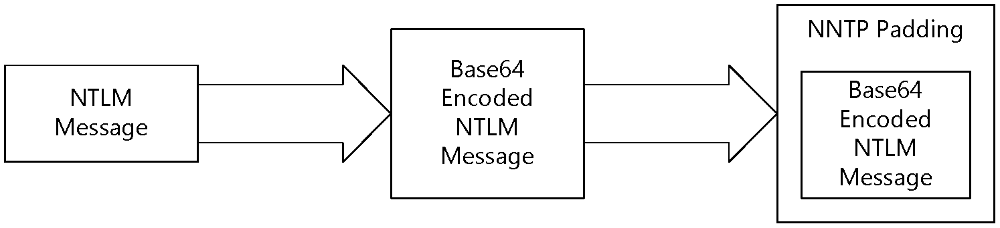
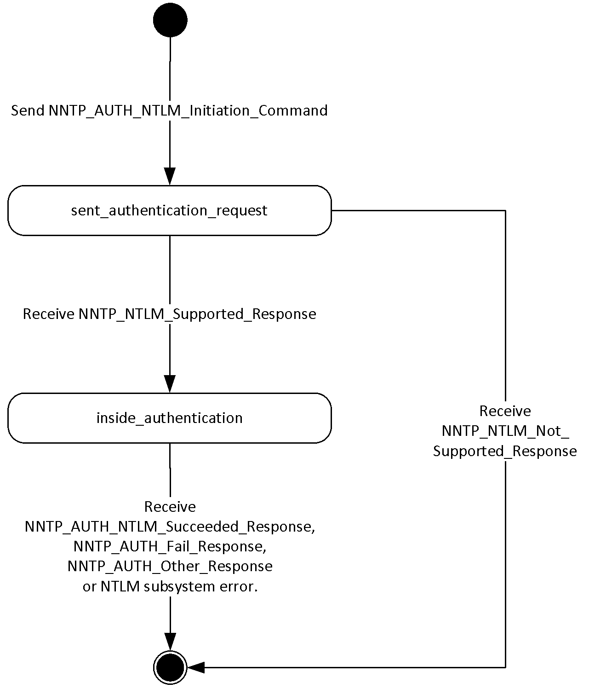
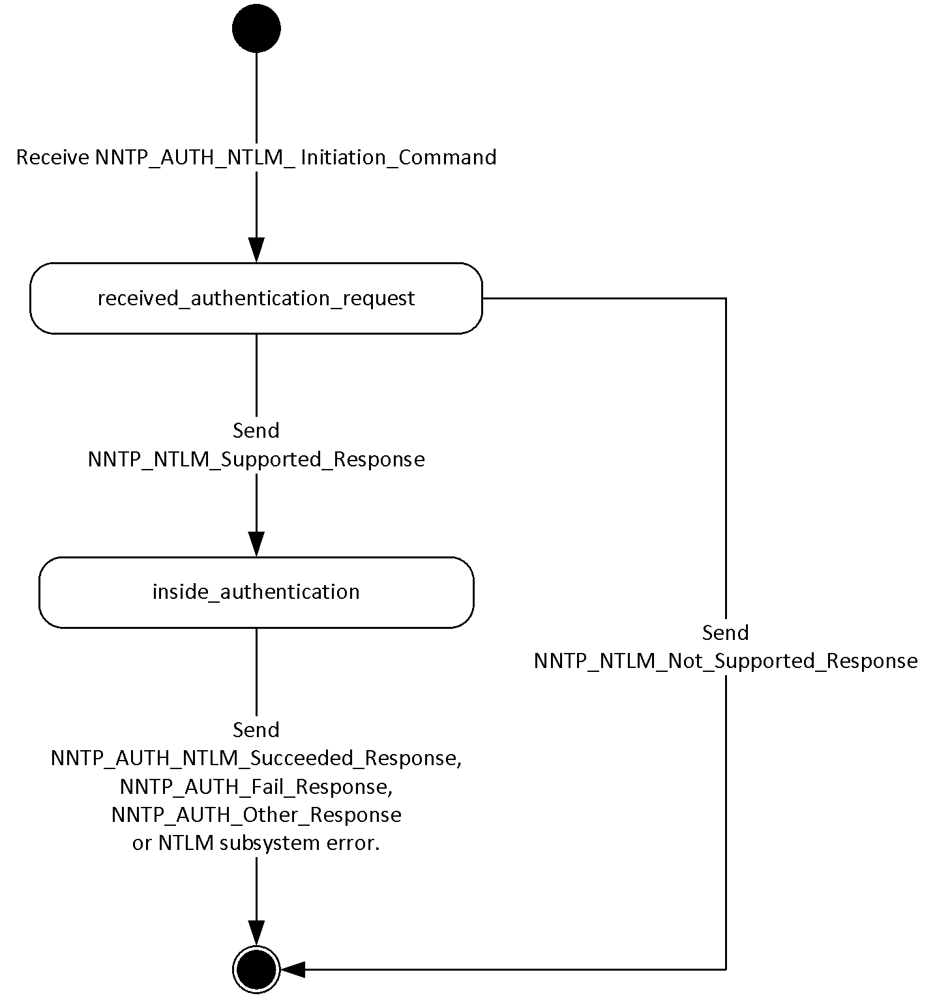
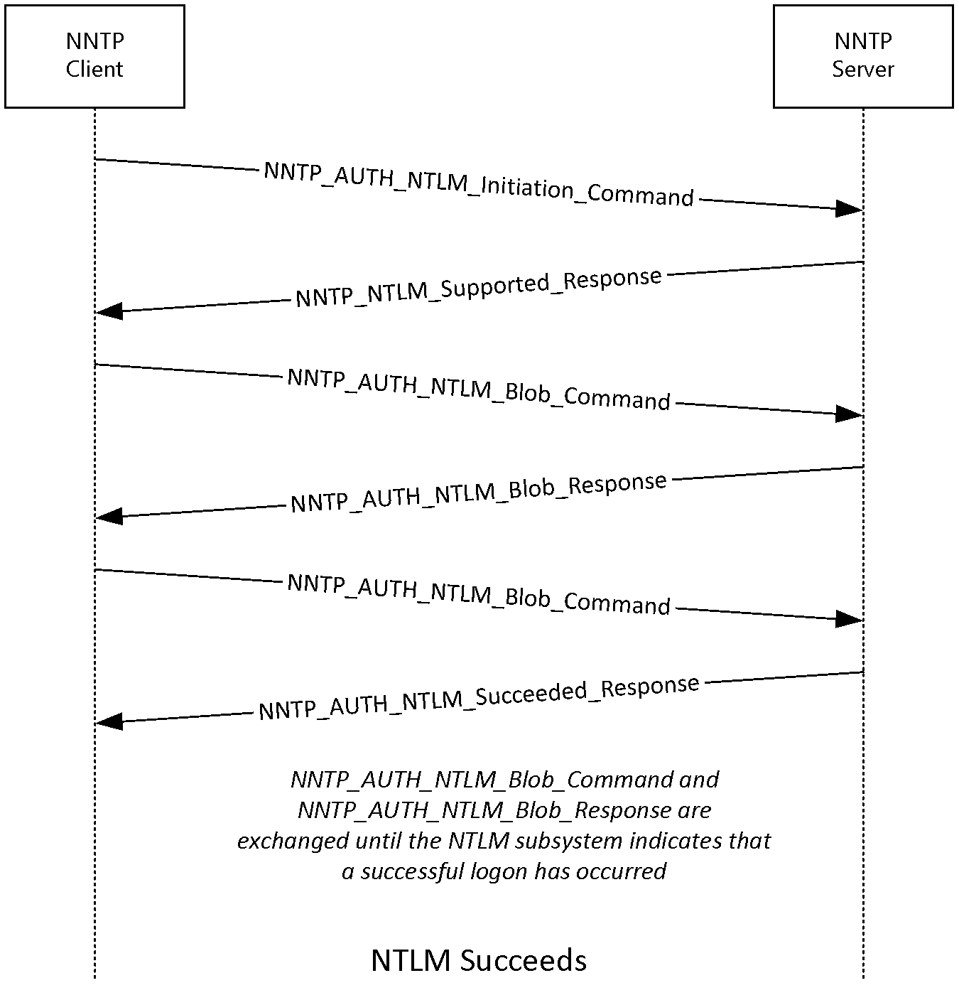
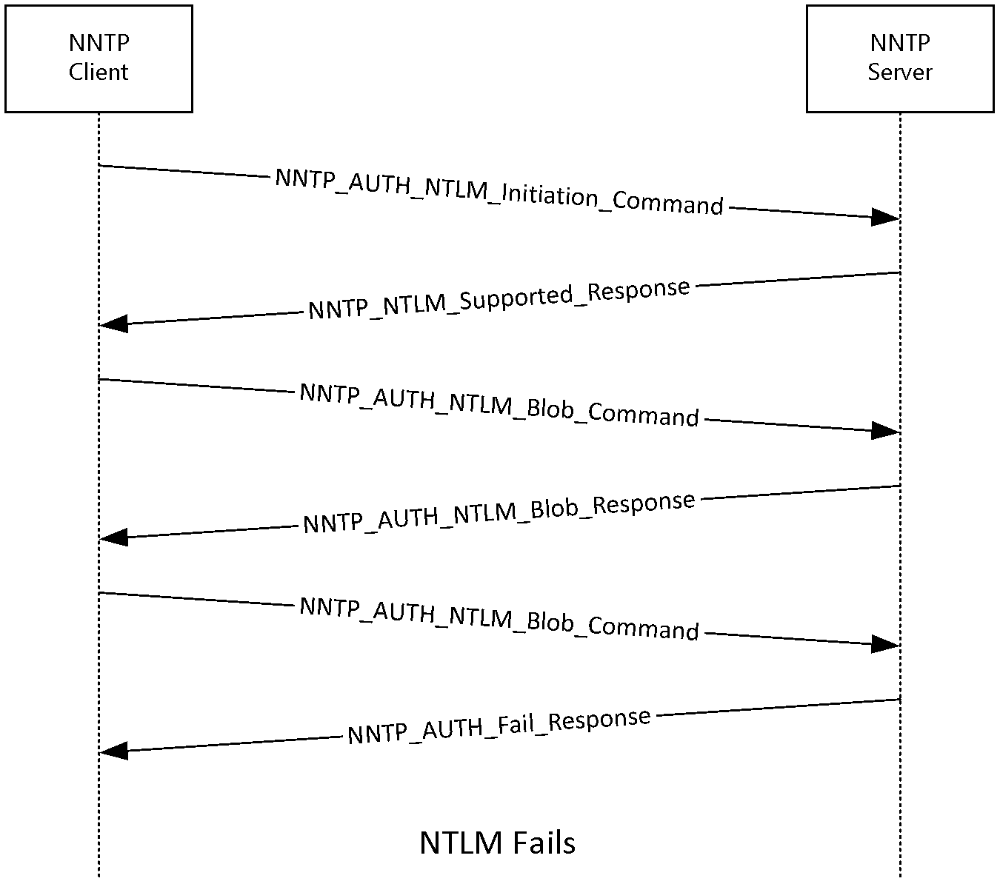

# [MS-NNTP]: NT LAN Manager (NTLM) Authentication: Network News Transfer Protocol (NNTP) Extension

Table of Contents

1 Introduction

- [1 Introduction](#Section_1)
  - [1.1 Glossary](#Section_1.1)
  - [1.2 References](#Section_1.2)
    - [1.2.1 Normative References](#Section_1.2.1)
    - [1.2.2 Informative References](#Section_1.2.2)
  - [1.3 Overview](#Section_1.3)
  - [1.4 Relationship to Other Protocols](#Section_1.4)
  - [1.5 Prerequisites/Preconditions](#Section_1.5)
  - [1.6 Applicability Statement](#Section_1.6)
  - [1.7 Versioning and Capability Negotiation](#Section_1.7)
  - [1.8 Vendor-Extensible Fields](#Section_1.8)
  - [1.9 Standards Assignments](#Section_1.9)

2 Messages

- [2 Messages](#Section_2)
  - [2.1 Transport](#Section_2.1)
  - [2.2 Message Syntax](#Section_2.2)
    - [2.2.1 AUTHINFO GENERIC Extensions](#Section_2.2.1)
      - [2.2.1.1 NNTP_AUTH_NTLM_Initiation_Command Message](#Section_2.2.1.1)
      - [2.2.1.2 NNTP_NTLM_Supported_Response Message](#Section_2.2.1.2)
      - [2.2.1.3 NNTP_AUTH_NTLM_Blob_Response Message](#Section_2.2.1.3)
      - [2.2.1.4 NNTP_AUTH_Fail_Response Message](#Section_2.2.1.4)
      - [2.2.1.5 NNTP_AUTH_NTLM_Succeeded_Response Message](#Section_2.2.1.5)
      - [2.2.1.6 NNTP_AUTH_NTLM_Blob_Command Message](#Section_2.2.1.6)
      - [2.2.1.7 AUTHINFO GENERIC Discovery Message](#Section_2.2.1.7)
      - [2.2.1.8 NNTP_NTLM_Not_Supported_Response](#Section_2.2.1.8)
    - [2.2.2 NNTP Server Messages](#Section_2.2.2)
    - [2.2.3 NNTP Client Messages](#Section_2.2.3)

3 Protocol Details

- [3 Protocol Details](#Section_3)
  - [3.1 Client Details](#Section_3.1)
    - [3.1.1 Abstract Data Model](#Section_3.1.1)
      - [3.1.1.1 NNTP State Model](#Section_3.1.1.1)
      - [3.1.1.2 NTLM Software Interaction](#Section_3.1.1.2)
    - [3.1.2 Timers](#Section_3.1.2)
    - [3.1.3 Initialization](#Section_3.1.3)
    - [3.1.4 Higher-Layer Triggered Events](#Section_3.1.4)
    - [3.1.5 Message Processing Events and Sequencing Rules](#Section_3.1.5)
      - [3.1.5.1 Receiving an NNTP_NTLM_Supported_Response Message](#Section_3.1.5.1)
      - [3.1.5.2 Receiving an NNTP_NTLM_Not_Supported_Response](#Section_3.1.5.2)
      - [3.1.5.3 Receiving an NNTP_AUTH_NTLM_Blob_Response](#Section_3.1.5.3)
        - [3.1.5.3.1 Error from NTLM](#Section_3.1.5.3.1)
        - [3.1.5.3.2 NTLM Reports Success and Returns an NTLM Message](#Section_3.1.5.3.2)
      - [3.1.5.4 Receiving an NNTP_AUTH_NTLM_Succeeded_Response Message](#Section_3.1.5.4)
      - [3.1.5.5 Receiving an NNTP_AUTH_Fail_Response](#Section_3.1.5.5)
    - [3.1.6 Timer Events](#Section_3.1.6)
    - [3.1.7 Other Local Events](#Section_3.1.7)
  - [3.2 Server Details](#Section_3.2)
    - [3.2.1 Abstract Data Model](#Section_3.2.1)
      - [3.2.1.1 NNTP State Model](#Section_3.2.1.1)
      - [3.2.1.2 NTLM Software Interaction](#Section_3.2.1.2)
    - [3.2.2 Timers](#Section_3.2.2)
    - [3.2.3 Initialization](#Section_3.2.3)
    - [3.2.4 Higher-Layer Triggered Events](#Section_3.2.4)
    - [3.2.5 Message Processing Events and Sequencing Rules](#Section_3.2.5)
      - [3.2.5.1 Receiving an NNTP_AUTH_NTLM_Initiation_Command Message](#Section_3.2.5.1)
      - [3.2.5.2 Receiving an NNTP_AUTH_NTLM_Blob_Command Message](#Section_3.2.5.2)
        - [3.2.5.2.1 NTLM Returns Success and an NTLM Message](#Section_3.2.5.2.1)
        - [3.2.5.2.2 NTLM Indicates the Authentication Completed Successfully](#Section_3.2.5.2.2)
        - [3.2.5.2.3 NTLM Indicates That the User Name or Password Was Incorrect](#Section_3.2.5.2.3)
        - [3.2.5.2.4 NTLM Returns a Failure Status Indicating Any Other Error](#Section_3.2.5.2.4)
    - [3.2.6 Timer Events](#Section_3.2.6)
    - [3.2.7 Other Local Events](#Section_3.2.7)

4 Protocol Examples

- [4 Protocol Examples](#Section_4)
  - [4.1 NNTP Client Successfully Authenticates to an NNTP Server](#Section_4.1)
  - [4.2 NNTP Client Does Not Successfully Authenticate to an NNTP Server](#Section_4.2)

5 Security

- [5 Security](#Section_5)
  - [5.1 Security Considerations for Implementers](#Section_5.1)
  - [5.2 Index of Security Parameters](#Section_5.2)

6 Appendix A: Product Behavior

- [6 Appendix A: Product Behavior](#Section_6)

7 Change Tracking

- [7 Change Tracking](#Section_7)

For the legal notice and IP terms, see [LEGAL.md](../LEGAL.md).
Last updated: 6/1/2017.
See [Revision History](#revision-history) for full version history.

# 1 Introduction

The NT LAN Manager (NTLM) Authentication: Network News Transfer Protocol (NNTP) Extension specifies the use of [**NTLM**](#gt_nt-lan-manager-ntlm) authentication by NNTP to facilitate client authentication to an NNTP server. For more information about NTLM authentication, see [MS-NLMP](../MS-NLMP/MS-NLMP.md).

NNTP specifies a protocol for the distribution, inquiry, retrieval, and posting of news articles by using a reliable stream-based transmission of news. For a detailed definition of NNTP, see [[RFC977]](https://go.microsoft.com/fwlink/?LinkId=94679).

This extension uses the NNTP [**AUTHINFO GENERIC command**](#gt_authinfo-generic-command) and [**NNTP response**](#gt_nntp-response) codes to negotiate NTLM authentication and send authentication data. The NNTP AUTHINFO GENERIC command is specified in [[RFC2980]](https://go.microsoft.com/fwlink/?LinkId=94782) section 3.1.3.

Sections 1.5, 1.8, 1.9, 2, and 3 of this specification are normative. All other sections and examples in this specification are informative.

## 1.1 Glossary

This document uses the following terms:

**AUTHINFO GENERIC Command**: A Network News Transfer Protocol (NNTP) command that is used to send authentication information, as specified in [[RFC2980]](https://go.microsoft.com/fwlink/?LinkId=94782). The structure of the AUTHINFO GENERIC command, as used in Network News Transfer Protocol, is: "AUTHINFO GENERIC NTLM<CR><LF>". The authenticator name, as defined in [RFC2980], is NTLM. The optional arguments field, as defined in [RFC2980], is not used.

**base64 encoding**: A binary-to-text encoding scheme whereby an arbitrary sequence of bytes is converted to a sequence of printable ASCII characters, as described in [[RFC4648]](https://go.microsoft.com/fwlink/?LinkId=90487).

**challenge/response authentication**: A common authentication technique in which a principal is prompted (the challenge) to provide some private information (the response) to facilitate authentication.

**connection-oriented NTLM**: A particular variant of [**NTLM**](#gt_nt-lan-manager-ntlm) designed to be used with connection-oriented remote procedure call (RPC), as described in [MS-NLMP](../MS-NLMP/MS-NLMP.md).

**NNTP response**: A message that is sent by an NNTP server in response to a message from an NNTP client. The structure of this message, as specified in [[RFC977]](https://go.microsoft.com/fwlink/?LinkId=94679), is: "<nnn> <response text><CR><LF>".

**NT LAN Manager (NTLM)**: An authentication protocol that is based on a challenge-response sequence for authentication. For more information, see [MS-NLMP].

**NT LAN Manager (NTLM) Authentication Protocol**: A protocol using a challenge-response mechanism for authentication in which clients are able to verify their identities without sending a password to the server. It consists of three messages, commonly referred to as Type 1 (negotiation), Type 2 (challenge) and Type 3 (authentication). For more information, see [MS-NLMP].

**NTLM AUTHENTICATE_MESSAGE**: The [**NTLM AUTHENTICATE_MESSAGE**](#gt_ntlm-authenticate_message) packet defines an [**NTLM**](#gt_nt-lan-manager-ntlm) authenticate message that is sent from the client to the server after the [**NTLM CHALLENGE_MESSAGE**](#gt_ntlm-challenge_message) is processed by the client. Message structure and other details of this packet are specified in [MS-NLMP].

**NTLM CHALLENGE_MESSAGE**: The [**NTLM CHALLENGE_MESSAGE**](#gt_ntlm-challenge_message) packet defines an NTLM challenge message that is sent from the server to the client. [**NTLM CHALLENGE_MESSAGE**](#gt_ntlm-challenge_message) is generated by the local [**NTLM software**](#gt_ntlm-software) and passed to the application that supports embedded [**NTLM**](#gt_nt-lan-manager-ntlm) authentication. This message is used by the server to challenge the client to prove its identity. Message structure and other details of this packet are specified in [MS-NLMP].

**NTLM message**: A message that carries authentication information. Its payload data is passed to the application that supports embedded NTLM authentication by the NTLM software installed on the local computer. NTLM messages are transmitted between the client and server embedded within the application protocol that is using NTLM authentication. There are three types of NTLM messages: NTLM NEGOTIATE_MESSAGE, NTLM CHALLENGE_MESSAGE, and NTLM AUTHENTICATE_MESSAGE.

**NTLM NEGOTIATE_MESSAGE**: The NEGOTIATE_MESSAGE packet defines an NTLM negotiate message that is sent from the client to the server. The [**NTLM NEGOTIATE_MESSAGE**](#gt_ntlm-negotiate_message) is generated by the local [**NTLM software**](#gt_ntlm-software) and passed to the application that supports embedded [**NTLM**](#gt_nt-lan-manager-ntlm) authentication. This message allows the client to specify its supported [**NTLM**](#gt_nt-lan-manager-ntlm) options to the server. Message structure and other details are specified in [MS-NLMP].

**NTLM software**: Software that implements the [**NT LAN Manager (NTLM) Authentication Protocol**](#gt_nt-lan-manager-ntlm).

**MAY, SHOULD, MUST, SHOULD NOT, MUST NOT:** These terms (in all caps) are used as defined in [[RFC2119]](https://go.microsoft.com/fwlink/?LinkId=90317). All statements of optional behavior use either MAY, SHOULD, or SHOULD NOT.

## 1.2 References

Links to a document in the Microsoft Open Specifications library point to the correct section in the most recently published version of the referenced document. However, because individual documents in the library are not updated at the same time, the section numbers in the documents may not match. You can confirm the correct section numbering by checking the [Errata](http://msdn.microsoft.com/en-us/library/dn781092.aspx).

### 1.2.1 Normative References

We conduct frequent surveys of the normative references to assure their continued availability. If you have any issue with finding a normative reference, please contact [dochelp@microsoft.com](mailto:dochelp@microsoft.com). We will assist you in finding the relevant information.

[MS-NLMP] Microsoft Corporation, "[NT LAN Manager (NTLM) Authentication Protocol](../MS-NLMP/MS-NLMP.md)".

[RFC1521] Borenstein, N., and Freed, N., "MIME (Multipurpose Internet Mail Extensions) Part One: Mechanisms for Specifying and Describing the Format of Internet Message Bodies", RFC 1521, September 1993, [http://www.rfc-editor.org/rfc/rfc1521.txt](https://go.microsoft.com/fwlink/?LinkId=94433)

[RFC2119] Bradner, S., "Key words for use in RFCs to Indicate Requirement Levels", BCP 14, RFC 2119, March 1997, [http://www.rfc-editor.org/rfc/rfc2119.txt](https://go.microsoft.com/fwlink/?LinkId=90317)

[RFC2980] Barber, S., "Common NNTP Extensions", RFC 2980, October 2000, [http://www.rfc-editor.org/rfc/rfc2980.txt](https://go.microsoft.com/fwlink/?LinkId=94782)

[RFC4234] Crocker, D., Ed., and Overell, P., "Augmented BNF for Syntax Specifications: ABNF", RFC 4234, October 2005, [http://www.rfc-editor.org/rfc/rfc4234.txt](https://go.microsoft.com/fwlink/?LinkId=90462)

[RFC977] Kantor, B., and Lapsley, P., "Network News Transfer Protocol", RFC 977, February, 1986, [http://www.ietf.org/rfc/rfc977.txt](https://go.microsoft.com/fwlink/?LinkId=94679)

### 1.2.2 Informative References

[SSPI] Microsoft Corporation, "SSPI", [http://msdn.microsoft.com/en-us/library/aa380493.aspx](https://go.microsoft.com/fwlink/?LinkId=90536)

## 1.3 Overview

Client applications that connect to the Network News Transport Protocol (NNTP) service that is included in Windows 2000 Server operating system and Windows Server 2003 operating system can use Windows [**NT LAN Manager (NTLM)**](#gt_nt-lan-manager-ntlm) authentication.

The NT LAN Manager (NTLM) Authentication: Network News Transfer Protocol (NNTP) Extension specifies how an NNTP client and an NNTP server can use the NTLM Authentication Protocol, as specified in [MS-NLMP](../MS-NLMP/MS-NLMP.md), so that the NNTP server can authenticate the NNTP client. [**NTLM**](#gt_nt-lan-manager-ntlm) is a [**challenge/response authentication**](#gt_challengeresponse-authentication) protocol that depends on the application layer protocols to transport NTLM packets from client to server and from server to client.

The NTLM Authentication: NNTP Extension defines how NNTP is extended to perform authentication by using the NTLM Authentication Protocol. The NNTP standard defines an extensibility mechanism for arbitrary authentication protocols to be plugged into the core protocol. This mechanism is the AUTHINFO GENERIC mechanism, as specified in [[RFC2980]](https://go.microsoft.com/fwlink/?LinkId=94782) section 3.1.3. A client that requests NTLM authentication and a server that processes the authentication stays within the framework of the AUTHINFO GENERIC mechanism.

The NTLM Authentication: NNTP Extension is an embedded protocol in which NTLM authentication data is first transformed into a [**base64**](#gt_179b9392-9019-45a3-880b-26f6890522b7) representation and then formatted by padding with NNTP status codes and NNTP keywords as defined by the AUTHINFO GENERIC mechanism. The base64 encoding and formatting are rudimentary and solely intended to make the NTLM data look like other NNTP commands and responses. The following diagram illustrates the sequence of transformations that are performed on an [**NTLM message**](#gt_ntlm-message) to produce a message that can be sent over NNTP.

Figure 1: Relationship between NTLM message and NNTP: NTLM Authentication Protocol message

The NTLM Authentication: NNTP Extension is a pass-through protocol that does not specify the structure of NTLM information. Instead, the protocol relies on the software that implements the NTLM Authentication Protocol, as specified in [MS-NLMP], to process each NTLM message to be sent or received.

The NTLM Authentication: NNTP Extension defines a server role and a client role.<1>

When NNTP wants to perform an NTLM authentication, it needs to interact with the [**NTLM software**](#gt_ntlm-software) appropriately. Below is an overview of this interaction.

If acting as an NNTP client:

- The NTLM software returns the first NTLM message to the client, to be sent to the server.
- The client applies the base64 encoding and NNTP-padding transformations that were mentioned earlier and are described in detail later in this document in order to produce an NNTP message and send this message to the server.
- The client waits for a response from the server. When the response is received, the client checks to see whether it indicates the end of authentication (success or failure), or that authentication is continuing.
- If the authentication is continuing, the response message is stripped of the NNTP padding, base64 decoded, and passed into the NTLM software, upon which the NTLM software can return another NTLM message that needs to be sent to the server. Steps 2 through 4 are repeated until authentication succeeds or fails.
If acting as an NNTP server:

- The server waits to receive the first NNTP authentication message from the client.
- When an NNTP message is received from the client, the NNTP padding is removed, the message is base64 decoded, and the resulting NTLM message is passed into the NTLM software.
- The NTLM software will return a status that indicates whether authentication completed successfully or authentication failed, or whether more NTLM messages need to be exchanged to complete the authentication.
- If the authentication is continuing, the NTLM software will return an NTLM message that needs to be sent to the server. This message is base64 encoded, and the NNTP padding is applied and sent to the client. Steps 2 through 4 are repeated until authentication succeeds or fails.
The sequence that follows shows the typical flow of packets between client and server after NTLM authentication has been selected.

- The NNTP client sends an [**NTLM NEGOTIATE_MESSAGE**](#gt_ntlm-negotiate_message) that is embedded in an [NNTP_AUTH_NTLM_Blob_Command](#Section_3.2.5.2) packet to the server.
- The NNTP client sends an NTLM NEGOTIATE_MESSAGE, and the NNTP server sends an [**NTLM CHALLENGE_MESSAGE**](#gt_ntlm-challenge_message) that is embedded in an NNTP packet to the client.
- In response, the NNTP client sends an [**NTLM AUTHENTICATE_MESSAGE**](#gt_ntlm-authenticate_message) that is embedded in an NNTP packet.
- The server then sends an [**NNTP response**](#gt_nntp-response) to the client to successfully complete the authentication process.
The NTLM NEGOTIATE_MESSAGE, NTLM CHALLENGE_MESSAGE, and NTLM AUTHENTICATE_MESSAGE packets contain NTLM authentication data that has to be processed by the NTLM software that is installed on the local computer. How to retrieve and process the NTLM message is specified in [MS-NLMP].

Implementers of the NTLM Authentication: NNTP Extension must have a working knowledge of:

- NNTP, as specified in [[RFC977]](https://go.microsoft.com/fwlink/?LinkId=94679) and [RFC2980].
- The Multipurpose Internet Mail Extensions (MIME) base64 encoding method, as specified in [[RFC1521]](https://go.microsoft.com/fwlink/?LinkId=94433).
- The NTLM Authentication Protocol, as specified in [MS-NLMP].

## 1.4 Relationship to Other Protocols

The NT LAN Manager (NTLM) Authentication: Network News Transfer Protocol (NNTP) Extension uses the NNTP AUTHINFO GENERIC extension mechanism, as specified in [[RFC2980]](https://go.microsoft.com/fwlink/?LinkId=94782), and is an embedded protocol. Unlike stand-alone application protocols, such as Telnet or the Hypertext Transfer Protocol (HTTP), the packets for this protocol extension are embedded in NNTP commands and server responses.

This extension specifies only the sequence in which an NNTP server and NNTP client exchange [**NTLM messages**](#gt_ntlm-message) in order to successfully authenticate the client to the server. It does not specify how the client obtains NTLM messages from the local [**NTLM software**](#gt_ntlm-software) or how the NNTP server processes NTLM messages.

The NNTP client and NNTP server implementations depend on the availability of an implementation of the NTLM Authentication Protocol, as specified in [MS-NLMP](../MS-NLMP/MS-NLMP.md), in order to obtain and process NTLM messages; and depend on the availability of the [**base64**](#gt_179b9392-9019-45a3-880b-26f6890522b7) encoding and decoding mechanisms, as specified in [[RFC1521]](https://go.microsoft.com/fwlink/?LinkId=94433), to encode and decode the NTLM messages that are embedded in NNTP packets.

## 1.5 Prerequisites/Preconditions

Because the NTLM Authentication: NNTP Extension depends on [**NTLM**](#gt_nt-lan-manager-ntlm) to authenticate the client to the server, both server and client need to have access to an implementation of the NTLM Authentication Protocol, as specified in [MS-NLMP](../MS-NLMP/MS-NLMP.md), that is capable of supporting [**connection-oriented NTLM**](#gt_connection-oriented-ntlm).<2>

## 1.6 Applicability Statement

The NTLM Authentication: NNTP Extension is used only when implementing an NNTP client that needs to authenticate to an NNTP server by using [**NTLM**](#gt_nt-lan-manager-ntlm) authentication.

## 1.7 Versioning and Capability Negotiation

This document covers versioning issues for the NTLM Authentication: NNTP Extension in the following areas:

- Security and Authentication Methods: The NTLM Authentication: NNTP Extension supports the NTLMv1 and NTLMv2 authentication methods, as specified in [MS-NLMP](../MS-NLMP/MS-NLMP.md).
- Capability Negotiation: NNTP does not support the negotiation of which NTLM Authentication Protocol version to use. Instead, the NTLM Authentication Protocol version is configured on both the client and the server prior to authentication. Mismatches of NTLM Authentication Protocol versions are handled by the NTLM Authentication Protocol implementation, and not by NNTP.
RFC 2980, as specified in [[RFC2980]](https://go.microsoft.com/fwlink/?LinkId=94782), does document the framework within which NNTP clients can discover (and NNTP servers can advertise) the ability to perform any authentication mechanism, including [**NTLM**](#gt_nt-lan-manager-ntlm) in particular.

The client discovers whether the server supports NTLM authentication by using the [**AUTHINFO GENERIC command**](#gt_authinfo-generic-command), which is issued without arguments. The server responds with a list of supported authentication mechanisms. If NTLM is supported, the server will include the word "NTLM" in the list. The messages involved are formally described in other sections of this document.

## 1.8 Vendor-Extensible Fields

The NTLM Authentication: NNTP Extension does not have any vendor-extensible fields.

## 1.9 Standards Assignments

The NTLM Authentication: NNTP Extension does not use any standards assignments.

# 2 Messages

The following sections specify how NTLM Authentication: NNTP Extension messages are transported and message syntax.

## 2.1 Transport

The NTLM Authentication: NNTP Extension does not establish transport connections. Instead, extension messages are encapsulated in NNTP commands and responses. Section [2.2](#Section_2.2) specifies how these messages MUST be encapsulated in NNTP commands.

## 2.2 Message Syntax

The NTLM Authentication: NNTP Extension messages are divided into three categories, depending on whether the message was sent by the server or the client. The message categories are:

- [AUTHINFO GENERIC Extensions](#Section_3.2.5.2)
- [NNTP Server Messages](#Section_2.2.2)
- [NNTP Client Messages](#Section_2.2.3)
The formal syntax of messages is provided in Augmented Backus-Naur Form (ABNF), as specified in [[RFC4234]](https://go.microsoft.com/fwlink/?LinkId=90462).

### 2.2.1 AUTHINFO GENERIC Extensions

The first category of NNTP messages are messages that fall within the AUTHINFO GENERIC extensibility framework. These messages are defined in [[RFC2980]](https://go.microsoft.com/fwlink/?LinkId=94782). Some of the messages have parameters that require customzation by the extensibility mechanism, such as [**NTLM**](#gt_nt-lan-manager-ntlm). This section describes the customizations that are introduced by the NTLM Authentication: NNTP Extension.

In addition to the messages specified in this section, the NNTP server returns a failure status code, as defined by [RFC2980], if NTLM is not supported. This message is a standard message that is defined by the NNTP standard and is not discussed here. This message is referred to as NNTP_NTLM_Not_Supported_Response in this document.

During every part of the authentication exchange, the client MUST parse the status codes on the messages that are sent by the server and interpret them as specified in [RFC2980]. The status codes define various states, such as success in authenticating, failure to authenticate, and any other arbitrary failures that the software might encounter.

The client can receive any one of the following responses during authentication. The syntax and meaning of all these messages are completely defined in [RFC2980]—except for the first message, for which [RFC2980] does not define the data that is encapsulated in the NNTP message, and leaves the definition and processing of that data to the extension mechanism. This specification focuses on defining that data. The potential response messages received by the client are:

- [NNTP_AUTH_NTLM_Blob_Response](#Section_2.2.1.3)
- [NNTP_AUTH_Fail_Response](#Section_3.1.5.5)
- [NNTP_AUTH_NTLM_Succeeded_Response](#Section_3.1.5.4)
- NNTP_AUTH_Other_Failure_Response, which is actually a class of messages whose syntax and interpretation are defined in [RFC2980] and [[RFC977]](https://go.microsoft.com/fwlink/?LinkId=94679). They indicate an abnormal termination of the NTLM authentication negotiation, which can occur for various reasons such as software errors or lack of system resources. For the purposes of this document, NNTP_AUTH_Other_Failure_Response is defined as any NNTP message other than NNTP_AUTH_NTLM_Succeeded_Response, NNTP_AUTH_Fail_Response and NNTP_AUTH_NTLM_Blob_Response. The interpretation of NNTP_AUTH_Other_Failure_Response, and the suggested client action when receiving such a message, is defined in [RFC2980]. This message represents an exit from AUTH and is, as such, not really part of AUTH negotiation.

#### 2.2.1.1 NNTP_AUTH_NTLM_Initiation_Command Message

Section 3.1.3 of [[RFC2980]](https://go.microsoft.com/fwlink/?LinkId=94782) defines the syntax of the [**AUTHINFO GENERIC command**](#gt_authinfo-generic-command) that is used to initiate authentication. The *authenticator* parameter MUST be the string "NTLM" for the NTLM Authentication: NNTP Extension. The optional *arguments* parameter MUST NOT be used. The command to initiate an [**NTLM**](#gt_nt-lan-manager-ntlm) conversation by a client is shown below in ABNF form. This message is referred to as **NNTP_AUTH_NTLM_Initiation_Command** in this document:

AUTHINFO GENERIC NTLM<CR><LF>

#### 2.2.1.2 NNTP_NTLM_Supported_Response Message

If [**NTLM**](#gt_nt-lan-manager-ntlm) is supported, the NNTP server will respond with an NNTP message that is prefixed with a status code of 381 to indicate that NTLM is supported. The only useful data in this message is the status code 381. The remaining data is human-readable data and has no impact on the authentication. The syntax of this command in ABNF form is shown below. This message is referred to as **NNTP_NTLM_Supported_Response** in this document.

381 <human-readable-string><CR><LF>

<human-readable-string> MUST be ignored by the client.

#### 2.2.1.3 NNTP_AUTH_NTLM_Blob_Response Message

**NNTP_AUTH_NTLM_Blob_Response** is defined as follows. This message is partially defined in [[RFC2980]](https://go.microsoft.com/fwlink/?LinkId=94782). The status code 381 indicates ongoing authentication and indicates that the <base64-encoded-NTLM-message> is to be processed by the authentication software. In this case, the client MUST de-encapsulate the data and pass it to the [**NTLM software**](#gt_ntlm-software).

381 <base64-encoded-NTLM-message><CR><LF>

#### 2.2.1.4 NNTP_AUTH_Fail_Response Message

**NNTP_AUTH_Fail_Response** is defined as follows. This message is defined in [[RFC2980]](https://go.microsoft.com/fwlink/?LinkId=94782) and indicates that the authentication has terminated unsuccessfully—either because the user name or password was incorrect, or due to some other arbitrary error, such as a software or data corruption error.

502 <human-readable-string><CR><LF>

#### 2.2.1.5 NNTP_AUTH_NTLM_Succeeded_Response Message

**NNTP_AUTH_NTLM_Succeeded_Response** is defined as follows. This message is defined in [[RFC2980]](https://go.microsoft.com/fwlink/?LinkId=94782) and indicates that the authentication negotiation has completed with the client successfully authenticating to the server.

281 <human-readable-string><CR><LF>

#### 2.2.1.6 NNTP_AUTH_NTLM_Blob_Command Message

[**NTLM messages**](#gt_ntlm-message) encapsulated by the client and sent to the server, are referred to as **NNTP_AUTH_NTLM_Blob_Command** in this document. They have the following syntax, as defined in ABNF, and conform to the prescription of [[RFC2980]](https://go.microsoft.com/fwlink/?LinkId=94782).

AUTHINFO GENERIC < base64-encoded-NTLM-message><CR><LF>

#### 2.2.1.7 AUTHINFO GENERIC Discovery Message

The NTLM Authentication: NNTP Extension also supports the discovery of supported authentication procedures, as defined in [[RFC2980]](https://go.microsoft.com/fwlink/?LinkId=94782) section 3.1.3. When the [**AUTHINFO GENERIC command**](#gt_authinfo-generic-command) is sent to the NNTP server without an authenticator or arguments, the NNTP server will list available authentication mechanisms using the syntax that is defined in [RFC2980]. The [**NTLM**](#gt_nt-lan-manager-ntlm) mechanism is indicated by the string "NTLM", which is returned if NTLM authentication is enabled for the NNTP server.

#### 2.2.1.8 NNTP_NTLM_Not_Supported_Response

If NTLM is not supported, the NNTP server will respond with an NNTP message that is prefixed with a status code of 485 to indicate that NTLM is not supported. The only useful data in this message is the status code of 485. This message is referred to as **NNTP_NTLM_Not_Supported_Response** in this document.

485 <human-readable-string><CR><LF>

<human-readable-string> MUST be ignored by the client.

### 2.2.2 NNTP Server Messages

This section defines the creation of [NNTP_AUTH_NTLM_Blob_Response](#Section_2.2.1.3) messages. These [**NTLM messages**](#gt_ntlm-message) are sent by the server and MUST be encapsulated as follows, in order to conform to syntax that is specified by the AUTHINFO GENERIC mechanism:

- Use [**base64**](#gt_179b9392-9019-45a3-880b-26f6890522b7) to encode the NTLM message data. Do this because NTLM messages contain data that is outside the ASCII character range, whereas NNTP supports only ASCII characters within the context of the [**AUTHINFO GENERIC command**](#gt_authinfo-generic-command).
- Prefix the base64-encoded string that is obtained in step 1 with the [**NNTP response**](#gt_nntp-response) code string "381 " (the ASCII digits 3, 8, and 1 followed by the ASCII space character 0x20).
- Append the <CR> and <LF> characters (ASCII values 0x0D and 0x0A) to the resulting string as required by NNTP.
The ABNF definition of a server message is as follows:

381 <base64-encoded-NTLM-message><CR><LF>

De-encapsulation of these messages by the client follows reverse logic:

- Remove the <CR> and <LF> characters (ASCII values 0x0D and 0x0A).
- Remove the NNTP response code string "381 " (the ASCII digits 3, 8, and 1 followed by the ASCII space character 0x20).
- Use base64 to decode the NNTP data in order to produce the original NTLM message data.

### 2.2.3 NNTP Client Messages

This section defines the processing of [NNTP_AUTH_NTLM_Blob_Command](#Section_3.2.5.2) messages. These [**NTLM messages**](#gt_ntlm-message) are sent by the client and MUST be encapsulated as follows, in order to conform to the syntax of the AUTHINFO GENERIC mechanism:

- Use [**base64**](#gt_179b9392-9019-45a3-880b-26f6890522b7) to encode the NTLM message data. Do this because NTLM messages contain data that is outside the ASCII character range, whereas NNTP only supports ASCII characters in context of the [**AUTHINFO GENERIC command**](#gt_authinfo-generic-command).
- Prefix the base64-encoded string that is obtained in step 1 with the ASCII string "AUTHINFO GENERIC " (the casing of the "AUTHINFO GENERIC " characters does not matter).
- Append the <CR> and <LF> characters (ASCII values 0x0D and 0x0A) to the resulting string, as required by NNTP.
The ABNF definition of a client message is as follows:

AUTHINFO GENERIC <base64-encoded-NTLM-message><CR><LF>

De-encapsulation of these messages by the server follows the reverse logic:

- Remove the <CR> and <LF> characters (ASCII values 0x0D and 0x0A).
- Remove the prefix string "AUTHINFO GENERIC " (the casing of the characters does not matter).
- Use base64 to decode the NNTP data in order to produce the original NTLM message data.

# 3 Protocol Details

The following sections specify details of the NTLM Authentication: NNTP Extension, including abstract data models and message processing rules.

## 3.1 Client Details

### 3.1.1 Abstract Data Model

#### 3.1.1.1 NNTP State Model

Figure 2: Client state model for NNTP_NTLM authentication

The abstract data model for NTLM Authentication: NNTP Extension has the following states:

- **start**
This is the state of the client before the [NNTP_AUTH_NTLM_Initiation_Command](#Section_2.2.1.1) has been sent.

- **sent_authentication_request**
This is the state of the client after the NNTP_AUTH_NTLM_Initiation_Command has been sent.

- **inside_authentication**
This is the state that a client enters after it has received an [NNTP_NTLM_Supported_Response](#Section_3.1.5.1). In this state, the client initializes the [**NTLM software**](#gt_ntlm-software) and repeats the following steps:

- Encapsulates the [**NTLM message**](#gt_ntlm-message) that is returned by the NTLM software into an NNTP message.
- Waits for a response from the server.
- De-encapsulates NNTP message data that is received, if any, from the other party and converts it to NTLM message data.
- Passes it to the NTLM software.
- Sends the NNTP message to the other party.
This state terminates when:

- For the server: the NTLM software reports completion with either a successful or failed authentication status. The server then sends the client an [NNTP_AUTH_NTLM_Succeeded_Response](#Section_3.1.5.4) message or [NNTP_AUTH_Fail_Response](#Section_3.1.5.5) message, as described in [[RFC2980]](https://go.microsoft.com/fwlink/?LinkId=94782).
- For the client: an NNTP_AUTH_NTLM_Succeeded_Response message or NNTP_AUTH_Fail_Response message is received.
- For either client or server: any failure is reported by the NTLM software.
- **completed_authentication**
This is the state of the client when it exits the inside_authentication state. The rules for how the inside_authentication state is exited are specified in section [3.1.5](#Section_3.2.5).

#### 3.1.1.2 NTLM Software Interaction

During the **inside_authentication** phase, the NNTP client invokes the [**NTLM software**](#gt_ntlm-software), as described in [MS-NLMP](../MS-NLMP/MS-NLMP.md) section 3.1. The NTLM Authentication Protocol is used with these options:

- The negotiation is a [**connection-oriented NTLM**](#gt_connection-oriented-ntlm) negotiation.
- None of the flags that are specified in [MS-NLMP] section 3.1.1 are passed to [**NTLM**](#gt_nt-lan-manager-ntlm).
The following describes how NNTP uses NTLM. Remember that all [**NTLM messages**](#gt_ntlm-message) are encapsulated as in section [2.2](../MS-NLMP/MS-NLMP.md). The NTLM Authentication Protocol, as specified in [MS-NLMP] section 3.1.1, describes the data model, internal states, and sequencing of NTLM messages in greater detail:

- The client initiates the authentication by invoking NTLM. NTLM then returns the [**NTLM NEGOTIATE_MESSAGE**](#gt_ntlm-negotiate_message) to be sent by the client to the server.
- Subsequently, the exchange of NTLM messages continues as defined by the NTLM Authentication Protocol: The NNTP client encapsulates the NTLM messages before sending them to the server and de-encapsulates NNTP messages to obtain the NTLM message, before giving it to NTLM.
- The NTLM Authentication Protocol completes authentication, either successfully or unsuccessfully, as follows:
- The server sends the NNTP_AUTH_NTLM_Succeeded_Response to the client. After receiving this message, the client transitions to the completed_authentication state and treats the authentication attempt as successful.
- The server sends the NNTP_AUTH_Fail_Response to the client. After receiving this message, the client transitions to the completed_authentication state and treats the authentication attempt as failed.
- The server sends the NNTP_AUTH_Other_Failure_Response to the client. After receiving this message, the client transitions to the completed_authentication state and treats the authentication attempt as failed.
- Failures reported from the NTLM software (which can occur for any reason, including incorrect data being passed in or implementation-specific errors), might be reported to the client by NTLM and cause the client to transition to the completed_authentication state.

### 3.1.2 Timers

There are no timers that are specific to authentication.

### 3.1.3 Initialization

There is no protocol-specific initialization.

### 3.1.4 Higher-Layer Triggered Events

There are no higher-layer triggered events in common to all parts of this protocol.

### 3.1.5 Message Processing Events and Sequencing Rules

The NTLM Authentication: NNTP Extension is driven by a series of message exchanges between an NNTP server and an NNTP client. The rules that govern the sequencing of commands and the internal states of the client and server are defined by [[RFC2980]](https://go.microsoft.com/fwlink/?LinkId=94782) and [MS-NLMP](../MS-NLMP/MS-NLMP.md). Section [3.1.1](../MS-NLMP/MS-NLMP.md) completely defines how the rules that are specified in [RFC2980] and [MS-NLMP] govern NNTP authentication.

#### 3.1.5.1 Receiving an NNTP_NTLM_Supported_Response Message

The expected state is **sent_authentication_request**.

When a client receives this message, it MUST generate the first [**NTLM message**](#gt_ntlm-message) by calling the [**NTLM software**](#gt_ntlm-software). The NTLM software then generates an [**NTLM NEGOTIATE_MESSAGE**](#gt_ntlm-negotiate_message), as specified in [MS-NLMP](../MS-NLMP/MS-NLMP.md). The NTLM message is then encapsulated as previously defined and sent to the server.

The state of the client is changed to **inside_authentication**.

#### 3.1.5.2 Receiving an NNTP_NTLM_Not_Supported_Response

The expected state is **sent_authentication_request**.

When a client receives this message, it MUST abort the [**NTLM**](#gt_nt-lan-manager-ntlm) authentication attempt.

#### 3.1.5.3 Receiving an NNTP_AUTH_NTLM_Blob_Response

The expected state is **inside_authentication**.

When a client receives this message, it MUST de-encapsulate it to obtain the embedded [**NTLM message**](#gt_ntlm-message) and pass it to the [**NTLM software**](#gt_ntlm-software) for processing. The NTLM software may then either report an error or report success, and return an NTLM message to be sent to the server.

##### 3.1.5.3.1 Error from NTLM

If the [**NTLM software**](#gt_ntlm-software) reports an error, the client MUST change its internal state to **completed_authentication** and assume that the authentication has failed. The client can then take any appropriate action. Typical actions are to attempt other non-authentication–related NNTP commands or to disconnect the connection. This document does not mandate any specific course of action.

##### 3.1.5.3.2 NTLM Reports Success and Returns an NTLM Message

The [**NTLM message**](#gt_ntlm-message) MUST be encapsulated and sent to the server. No change occurs in the state of the client.

#### 3.1.5.4 Receiving an NNTP_AUTH_NTLM_Succeeded_Response Message

The expected state is **inside_authentication**.

The NNTP client MUST change its internal state to **completed_authentication** and assume that the authentication succeeded. The client can then take any appropriate action. This document does not mandate any specific course of action.

#### 3.1.5.5 Receiving an NNTP_AUTH_Fail_Response

The expected state is **inside_authentication**.

The NNTP client MUST change its internal state to **completed_authentication** and assume that the authentication has failed. The client can then take any appropriate action. This document does not mandate any specific course of action.

### 3.1.6 Timer Events

None.

### 3.1.7 Other Local Events

None.

## 3.2 Server Details

### 3.2.1 Abstract Data Model

#### 3.2.1.1 NNTP State Model

Figure 3: Server state model for NNTP_NTLM authentication

The abstract data model for NTLM Authentication: NNTP Extension has these states:

- **start**
This is the state of the server before the [NNTP_AUTH_NTLM_Initiation_Command](#Section_2.2.1.1) has been received.

- **received_authentication_request**
This is the state of the server after the NNTP_AUTH_NTLM_Initiation_Command has been received.

- **inside_authentication**
This is the state that a server enters after it has sent an [NNTP_NTLM_Supported_Response](#Section_3.1.5.1). In this state, the server initializes the [**NTLM software**](#gt_ntlm-software) and repeats the following steps:

- Waits for a message from the client.
- De-encapsulates the NNTP message data that is received, if any, from the other party and obtains the embedded [**NTLM message**](#gt_ntlm-message) data.
- Passes it to the NTLM software.
- Encapsulates the NTLM message that is returned by the NTLM software, into an NNTP message.
- Sends the NNTP message to the other party.
This state terminates when:

- The NTLM software reports completion with either a successful or failed authentication status. The server then sends the client an [NNTP_AUTH_NTLM_Succeeded_Response](#Section_3.1.5.4) message or [NNTP_AUTH_Fail_Response](#Section_3.1.5.5) message, as described in [[RFC2980]](https://go.microsoft.com/fwlink/?LinkId=94782).
- Any failure is reported by the NTLM software.
- **completed_authentication**
This is the state of the server when it exits the inside_authentication state. The rules for how the inside_authentication state is exited are defined in section [3.2.5](#Section_1.3).

#### 3.2.1.2 NTLM Software Interaction

During the **inside_authentication** state, the NNTP server invokes the [**NTLM software**](#gt_ntlm-software), as described in [MS-NLMP](../MS-NLMP/MS-NLMP.md) section 3.2. The [**NTLM**](#gt_nt-lan-manager-ntlm) protocol is used with these options:

- The negotiation is a [**connection-oriented NTLM**](#gt_connection-oriented-ntlm) negotiation.
- None of the flags that are specified in [MS-NLMP] section 3.2.1 are passed to NTLM.
The following describes how NNTP uses NTLM. For more information, see [MS-NLMP] section 3.2.1, which describes the data model and sequencing of NTLM packets in greater detail:

- When the server receives the [**NTLM NEGOTIATE_MESSAGE**](#gt_ntlm-negotiate_message), it passes it to the NTLM software and if the NTLM NEGOTIATE_MESSAGE was valid, it receives the [**NTLM CHALLENGE_MESSAGE**](#gt_ntlm-challenge_message) in return.
- Subsequently, the exchange of [**NTLM messages**](#gt_ntlm-message) goes on as defined by the NTLM Authentication Protocol: The NNTP server encapsulates the NTLM messages that are returned by NTLM before sending them to the client.
- When the NTLM Authentication Protocol completes authentication, either successfully or unsuccessfully, the NTLM software notifies NNTP.
- Upon successful completion, the server MUST exit the inside_authentication state, enter the completed_authentication state, and send the [NNTP_AUTH_NTLM_Succeeded_Response](#Section_3.1.5.4) to the client. Upon receiving this message, the client MUST also transition to the completed_authentication state.
- If a failure occurs because of an incorrect password error, as described in [MS-NLMP] sections 3.3.1 and 3.3.2, the server MUST enter the completed_authentication state and send the client an [NNTP_AUTH_Fail_Response](#Section_3.1.5.5) message.
- If a failure occurs on the server because of any other reason than an incorrect password error, the server enters the completed_authentication state and sends the client an NNTP_AUTH_Fail_Response message. Upon receiving this message, the client enters the completed_authentication state.

### 3.2.2 Timers

There are no timers that are specific to authentication.

### 3.2.3 Initialization

There is no protocol-specific initialization.

### 3.2.4 Higher-Layer Triggered Events

There are no higher-layer triggered events in common to all parts of this protocol.

### 3.2.5 Message Processing Events and Sequencing Rules

The NTLM Authentication: NNTP Extension is driven by a series of message exchanges between an NNTP server and an NNTP client. The rules that govern the sequencing of commands and the internal states of the client and server are defined by [[RFC2980]](https://go.microsoft.com/fwlink/?LinkId=94782) and [MS-NLMP](../MS-NLMP/MS-NLMP.md). Section [3.2.1](../MS-NLMP/MS-NLMP.md) completely defines how the rules that are specified in [RFC2980] and [MS-NLMP] govern NNTP authentication.

#### 3.2.5.1 Receiving an NNTP_AUTH_NTLM_Initiation_Command Message

The expected state is **start**.

When a server receives this message, it MUST reply with the [NNTP_NTLM_Supported_Response](#Section_3.1.5.1) message if it supports [**NTLM**](#gt_nt-lan-manager-ntlm) and then change its state to the **inside_authentication** state.

If the server does not support NTLM, it MUST respond with the [NNTP_NTLM_Not_Supported_Response](#Section_2.2.1.8) message, and change its state to the **completed_authentication** state.

#### 3.2.5.2 Receiving an NNTP_AUTH_NTLM_Blob_Command Message

The expected state is **inside_authentication**.

When a server receives this message, it MUST de-encapsulate the message, obtain the embedded [**NTLM message**](#gt_ntlm-message), and pass it to the [**NTLM software**](#gt_ntlm-software). The NTLM software MUST then take one of the following actions:

- Report success in processing the message and return an NTLM message to continue the authentication.
- Report that authentication completed successfully.
- Report that the authentication failed due to a bad user name or password, as specified in [MS-NLMP](../MS-NLMP/MS-NLMP.md).
- Report that the authentication failed, which could be due to some other software error or message corruption.

##### 3.2.5.2.1 NTLM Returns Success and an NTLM Message

The [**NTLM message**](#gt_ntlm-message) MUST be encapsulated and sent to the client. The internal state of the NNTP server remains unchanged.

##### 3.2.5.2.2 NTLM Indicates the Authentication Completed Successfully

The server MUST return the [NNTP_AUTH_NTLM_Succeeded_Response](#Section_3.1.5.4) message and change its internal state to **completed_authentication**.<3>

##### 3.2.5.2.3 NTLM Indicates That the User Name or Password Was Incorrect

The server MUST return the [NNTP_AUTH_Fail_Response](#Section_3.1.5.5) message and change its internal state to **completed_authentication**.

##### 3.2.5.2.4 NTLM Returns a Failure Status Indicating Any Other Error

The server MUST return the [NNTP_AUTH_Fail_Response](#Section_3.1.5.5) message and change its internal state to **completed_authentication**.

### 3.2.6 Timer Events

None.

### 3.2.7 Other Local Events

None.

# 4 Protocol Examples

The following sections describe operations that are used in a common scenario to illustrate the function of the NTLM Authentication: NNTP Extension.

## 4.1 NNTP Client Successfully Authenticates to an NNTP Server

This section illustrates the NTLM Authentication: NNTP Extension with an example scenario in which an NNTP client successfully authenticates to an NNTP server by using [**NTLM**](#gt_nt-lan-manager-ntlm).

Figure 4: NNTP client authenticates to an NNTP server

- The client sends an [NNTP_AUTH_NTLM_Initiation_Command](#Section_2.2.1.1) to the server. This command is defined in [[RFC2980]](https://go.microsoft.com/fwlink/?LinkId=94782) section 3.1.3.
AUTHINFO GENERIC NTLM

- The server sends the [NNTP_NTLM_Supported_Response](#Section_3.1.5.1) message, indicating that it can perform NTLM authentication.
381 Protocol supported, proceed

- The client sends an [NNTP_AUTH_NTLM_Blob_Command](#Section_3.2.5.2) message that contains a base64-encoded [**NTLM NEGOTIATE_MESSAGE**](#gt_ntlm-negotiate_message).
AUTHINFO GENERIC TlRMTVNTUAABAAAAB7IIogcABwAvAAAABwAHACgAAAAFA

SgKAAAAD0dQVUxMQTFSRURNT05E

The contents of the [**NTLM message**](#gt_ntlm-message) after [**base64**](#gt_179b9392-9019-45a3-880b-26f6890522b7) decoding are:

0x00000000 4E 54 4C 4D 53 53 50 00 01 00 00 00 B7 82 08 E2 NTLMSSP.....7_.b

0x00000010 00 00 00 00 00 00 00 00 00 00 00 00 00 00 00 00 ................

0x00000020 05 02 CE 0E 00 00 00 0F ..N.....

- The server sends an [NNTP_AUTH_NTLM_Blob_Response](#Section_2.2.1.3) message that contains a base64-encoded [**NTLM CHALLENGE_MESSAGE**](#gt_ntlm-challenge_message).
381 TlRMTVNTUAACAAAAFgAWADgAAAA1goriFuADDG03d7EAAAAAAAAAAGwAbABOAAA

ABQLODgAAAA9FAFgAQwBIAC0AQwBMAEkALQA2ADYAAgAWAEUAWABDAEgALQBDAEwASQ

AtADYANgABABYARQBYAEMASAAtAEMATABJAC0ANgA2AAQAFgBlAHgAYwBoAC0AYwBsA

GkALQA2ADYAAwAWAGUAeABjAGgALQBjAGwAaQAtADYANgAAAAAA

The contents of the NTLM message after base64 decoding is:

0x00000000 4E 54 4C 4D 53 53 50 00 02 00 00 00 16 00 16 00 NTLMSSP.........

0x00000010 38 00 00 00 35 82 8A E2 16 E0 03 0C 6D 37 77 B1 8...5_b.`..m7w1

0x00000020 00 00 00 00 00 00 00 00 6C 00 6C 00 4E 00 00 00 ........l.l.N...

0x00000030 05 02 CE 0E 00 00 00 0F 45 00 58 00 43 00 48 00 ..N.....E.X.C.H.

0x00000040 2D 00 43 00 4C 00 49 00 2D 00 36 00 36 00 02 00 -.C.L.I.-.6.6...

0x00000050 16 00 45 00 58 00 43 00 48 00 2D 00 43 00 4C 00 ..E.X.C.H.-.C.L.

0x00000060 49 00 2D 00 36 00 36 00 01 00 16 00 45 00 58 00 I.-.6.6.....E.X.

0x00000070 43 00 48 00 2D 00 43 00 4C 00 49 00 2D 00 36 00 C.H.-.C.L.I.-.6.

0x00000080 36 00 04 00 16 00 65 00 78 00 63 00 68 00 2D 00 6.....e.x.c.h.-.

0x00000090 63 00 6C 00 69 00 2D 00 36 00 36 00 03 00 16 00 c.l.i.-.6.6.....

0x000000A0 65 00 78 00 63 00 68 00 2D 00 63 00 6C 00 69 00 e.x.c.h.-.c.l.i.

0x000000B0 2D 00 36 00 36 00 00 00 00 00 -.6.6.....

- The client sends an NNTP_AUTH_NTLM_Blob_Command message that contains a base64-encoded [**NTLM AUTHENTICATE_MESSAGE**](#gt_ntlm-authenticate_message).
AUTHINFO GENERIC TlRMTVNTUAADAAAAGAAYAHwAAAAYABgAlAAAABYAFgBIAAAACA

AIAF4AAAAWABYAZgAAABAAEACsAAAANYKI4gUCzg4AAAAPZQB4AGMAaAAtAGMAbABpA

C0ANgA2AHQAZQBzAHQARQBYAEMASAAtAEMATABJAC0ANgA2ANIo75EIhJe6AAAAAAAA

AAAAAAAAAAAAAMhyv9JNozcmNID+tIH3fL2M2EXYMshTz9RZZq2XG5CpiugFZJWZKxk

=

The contents of the NTLM message after base64 decoding are:

0x00000000 4E 54 4C 4D 53 53 50 00 03 00 00 00 18 00 18 00 NTLMSSP.........

0x00000010 7C 00 00 00 18 00 18 00 94 00 00 00 16 00 16 00 |......._.......

0x00000020 48 00 00 00 08 00 08 00 5E 00 00 00 16 00 16 00 H.......^.......

0x00000030 66 00 00 00 10 00 10 00 AC 00 00 00 35 82 88 E2 f.......,...5__b

0x00000040 05 02 CE 0E 00 00 00 0F 65 00 78 00 63 00 68 00 ..N.....e.x.c.h.

0x00000050 2D 00 63 00 6C 00 69 00 2D 00 36 00 36 00 74 00 -.c.l.i.-.6.6.t.

0x00000060 65 00 73 00 74 00 45 00 58 00 43 00 48 00 2D 00 e.s.t.E.X.C.H.-.

0x00000070 43 00 4C 00 49 00 2D 00 36 00 36 00 D2 28 EF 91 C.L.I.-.6.6.R(o_

0x00000080 08 84 97 BA 00 00 00 00 00 00 00 00 00 00 00 00 .__:............

0x00000090 00 00 00 00 C8 72 BF D2 4D A3 37 26 34 80 FE B4 ....Hr?RM#7&4

- The server sends an [NNTP_AUTH_NTLM_Succeeded_Response](#Section_3.1.5.4) message.
281 Authentication ok

## 4.2 NNTP Client Does Not Successfully Authenticate to an NNTP Server

This section illustrates the NTLM Authentication: NNTP Extension with an example scenario in which an NNTP client attempts [**NTLM**](#gt_nt-lan-manager-ntlm) authentication to an NNTP server and the authentication fails.

Figure 5: NNTP client attempts authentication to an NNTP server and is unsuccessful

- The client sends an [NNTP_AUTH_NTLM_Initiation_Command](#Section_2.2.1.1) to the server. This command is defined in [[RFC2980]](https://go.microsoft.com/fwlink/?LinkId=94782) section 3.1.3.
AUTHINFO GENERIC NTLM

- The server sends the [NNTP_NTLM_Supported_Response](#Section_3.1.5.1) message, indicating that it can perform NTLM authentication.
381 Protocol supported, proceed

- The client sends an [NNTP_AUTH_NTLM_Blob_Command](#Section_3.2.5.2) message.
AUTHINFO GENERIC TlRMTVNTUAABAAAAt4II4gAAAAAAAAAAAAAAAAAAAAAFAs4OAAAADw==

The contents of the [**NTLM message**](#gt_ntlm-message) after [**base64**](#gt_179b9392-9019-45a3-880b-26f6890522b7) decoding are:

0x00000000 4E 54 4C 4D 53 53 50 00 01 00 00 00 B7 82 08 E2 NTLMSSP.....7_.b

0x00000010 00 00 00 00 00 00 00 00 00 00 00 00 00 00 00 00 ................

0x00000020 05 02 CE 0E 00 00 00 0F ..N.....

- The server responds with an [NNTP_AUTH_NTLM_Blob_Response](#Section_2.2.1.3) message.
381 TlRMTVNTUAACAAAAFgAWADgAAAA1gori2zhKR64TNyYAAAAAAAAAAGwAbABOAAAABQLODgAAAA9FAFgA

QwBIAC0AQwBMAEkALQA2ADYAAgAWAEUAWABDAEgALQBDAEwASQAtADYANgABABYARQBYAEMASAAtAEMATABJ

AC0ANgA2AAQAFgBlAHgAYwBoAC0AYwBsAGkALQA2ADYAAwAWAGUAeABjAGgALQBjAGwAaQAtADYANgAAAAAA

The contents of the NTLM message after base64 decoding are:

0x00000000 4E 54 4C 4D 53 53 50 00 02 00 00 00 16 00 16 00 NTLMSSP.........

0x00000010 38 00 00 00 35 82 8A E2 DB 38 4A 47 AE 13 37 26 8...5_b[8JG..7&

0x00000020 00 00 00 00 00 00 00 00 6C 00 6C 00 4E 00 00 00 ........l.l.N...

0x00000030 05 02 CE 0E 00 00 00 0F 45 00 58 00 43 00 48 00 ..N.....E.X.C.H.

0x00000040 2D 00 43 00 4C 00 49 00 2D 00 36 00 36 00 02 00 -.C.L.I.-.6.6...

0x00000050 16 00 45 00 58 00 43 00 48 00 2D 00 43 00 4C 00 ..E.X.C.H.-.C.L.

0x00000060 49 00 2D 00 36 00 36 00 01 00 16 00 45 00 58 00 I.-.6.6.....E.X.

0x00000070 43 00 48 00 2D 00 43 00 4C 00 49 00 2D 00 36 00 C.H.-.C.L.I.-.6.

0x00000080 36 00 04 00 16 00 65 00 78 00 63 00 68 00 2D 00 6.....e.x.c.h.-.

0x00000090 63 00 6C 00 69 00 2D 00 36 00 36 00 03 00 16 00 c.l.i.-.6.6.....

0x000000A0 65 00 78 00 63 00 68 00 2D 00 63 00 6C 00 69 00 e.x.c.h.-.c.l.i.

0x000000B0 2D 00 36 00 36 00 00 00 00 00 -.6.6.....

- The client then sends an NNTP_AUTH_NTLM_Blob_Command.
AUTHINFO GENERIC TlRMTVNTUAADAAAAGAAYAHwAAAAYABgAlAAAABYAFgBIAAAACAAIAF4AAAAWABYAZgA

AABAAEACsAAAANYKI4gUCzg4AAAAPZQB4AGMAaAAtAGMAbABpAC0ANgA2AHQAZQBzAHQARQBYAEMASAAtAEM

ATABJAC0ANgA2AMW6+RoX0OggAAAAAAAAAAAAAAAAAAAAAKk1BEO/AprMd3f0tLtXMesmW2RK2ixxUaCLI3c

IssJY2B2gBX/KYho=

The contents of the NTLM message after base64 decoding are:

0x00000000 4E 54 4C 4D 53 53 50 00 03 00 00 00 18 00 18 00 NTLMSSP.........

0x00000010 7C 00 00 00 18 00 18 00 94 00 00 00 16 00 16 00 |......._.......

0x00000020 48 00 00 00 08 00 08 00 5E 00 00 00 16 00 16 00 H.......^.......

0x00000030 66 00 00 00 10 00 10 00 AC 00 00 00 35 82 88 E2 f.......,...5__b

0x00000040 05 02 CE 0E 00 00 00 0F 65 00 78 00 63 00 68 00 ..N.....e.x.c.h.

0x00000050 2D 00 63 00 6C 00 69 00 2D 00 36 00 36 00 74 00 -.c.l.i.-.6.6.t.

0x00000060 65 00 73 00 74 00 45 00 58 00 43 00 48 00 2D 00 e.s.t.E.X.C.H.-.

0x00000070 43 00 4C 00 49 00 2D 00 36 00 36 00 C5 BA F9 1A C.L.I.-.6.6.E:y.

0x00000080 17 D0 E8 20 00 00 00 00 00 00 00 00 00 00 00 00 .Ph ............

0x00000090 00 00 00 00 A9 35 04 43 BF 02 9A CC 77 77 F4 B4 ....)5.C?._Lwwt4

0x000000A0 BB 57 31 EB 26 5B 64 4A DA 2C 71 51 A0 8B 23 77 ;W1k&[dJZ,qQ #w

0x000000B0 08 B2 C2 58 D8 1D A0 05 7F CA 62 1A .2BXX. .Jb.

- The server sends an [NNTP_AUTH_Fail_Response](#Section_3.1.5.5) message.
502 Permission denied

# 5 Security

The following sections specify security considerations for implementers of the NTLM Authentication: NNTP Extension.

## 5.1 Security Considerations for Implementers

Implementers need to be aware of the security considerations of using [**NTLM**](#gt_nt-lan-manager-ntlm) authentication. Information about the security considerations of using NTLM authentication is specified in [MS-NLMP](../MS-NLMP/MS-NLMP.md) section 5.

## 5.2 Index of Security Parameters

| Security parameter | Section |
| --- | --- |
| This protocol requires the [**NTLM**](#gt_nt-lan-manager-ntlm) authentication mechanism, whose data is carried in packets as described in this document. | [2](#Section_1.3) and [3](#Section_1.3) |

# 6 Appendix A: Product Behavior

The information in this specification is applicable to the following Microsoft products or supplemental software. References to product versions include released service packs.

- Windows 2000 operating system
- Windows 2000 Server operating system
- Windows XP operating system
- Windows Server 2003 operating system
- Windows Vista operating system
Exceptions, if any, are noted below. If a service pack or Quick Fix Engineering (QFE) number appears with the product version, behavior changed in that service pack or QFE. The new behavior also applies to subsequent service packs of the product unless otherwise specified. If a product edition appears with the product version, behavior is different in that product edition.

Unless otherwise specified, any statement of optional behavior in this specification that is prescribed using the terms "SHOULD" or "SHOULD NOT" implies product behavior in accordance with the SHOULD or SHOULD NOT prescription. Unless otherwise specified, the term "MAY" implies that the product does not follow the prescription.

<1> Section 1.3: The NNTP Extension server role is supported on Windows 2000 Server and Windows Server 2003. The NNTP Extension client role is supported on Windows 2000, Windows XP, and Windows Vista.

<2> Section 1.5: Windows NNTP server and NNTP client use the Security Support Provider Interface (SSPI) to obtain and process [**NTLM messages**](#gt_ntlm-message). For more information about SSPI, see [[SSPI]](https://go.microsoft.com/fwlink/?LinkId=90536).

<3> Section 3.2.5.2.2: For security reasons, a Windows-based NNTP server does not permit a client to authenticate by using credentials for a user who is identified as the "BUILTIN\Administrator" account. Internally, the [**NTLM**](#gt_nt-lan-manager-ntlm) subsystem reports to the NNTP server that the authentication succeeded. However, Windows NNTP then checks the user credentials and fails the authentication by sending the NNTP_AUTH_Fail_Response message even though NTLM actually returned success for the authentication.

# 7 Change Tracking

No table of changes is available. The document is either new or has had no changes since its last release.

## Revision History

| Date | Version | Revision Class | Comments |
| --- | --- | --- | --- |
| 7/20/2007 | 0.1 | Major | MCPP Milestone 5 Initial Availability |
| 9/28/2007 | 0.1.1 | Editorial | Changed language and formatting in the technical content. |
| 10/23/2007 | 1.0 | Major | Updated and revised the technical content. |
| 11/30/2007 | 1.0.1 | Editorial | Changed language and formatting in the technical content. |
| 1/25/2008 | 1.0.2 | Editorial | Changed language and formatting in the technical content. |
| 3/14/2008 | 1.0.3 | Editorial | Changed language and formatting in the technical content. |
| 5/16/2008 | 1.0.4 | Editorial | Changed language and formatting in the technical content. |
| 6/20/2008 | 2.0 | Major | Updated and revised the technical content. |
| 7/25/2008 | 3.0 | Major | Updated and revised the technical content. |
| 8/29/2008 | 3.0.1 | Editorial | Changed language and formatting in the technical content. |
| 10/24/2008 | 3.0.2 | Editorial | Changed language and formatting in the technical content. |
| 12/5/2008 | 3.0.3 | Editorial | Changed language and formatting in the technical content. |
| 1/16/2009 | 3.0.4 | Editorial | Changed language and formatting in the technical content. |
| 2/27/2009 | 3.1 | Minor | Clarified the meaning of the technical content. |
| 4/10/2009 | 3.1.1 | Editorial | Changed language and formatting in the technical content. |
| 5/22/2009 | 3.1.2 | Editorial | Changed language and formatting in the technical content. |
| 7/2/2009 | 3.1.3 | Editorial | Changed language and formatting in the technical content. |
| 8/14/2009 | 3.1.4 | Editorial | Changed language and formatting in the technical content. |
| 9/25/2009 | 3.2 | Minor | Clarified the meaning of the technical content. |
| 11/6/2009 | 3.2.1 | Editorial | Changed language and formatting in the technical content. |
| 12/18/2009 | 3.2.2 | Editorial | Changed language and formatting in the technical content. |
| 1/29/2010 | 3.3 | Minor | Clarified the meaning of the technical content. |
| 3/12/2010 | 3.3.1 | Editorial | Changed language and formatting in the technical content. |
| 4/23/2010 | 3.3.2 | Editorial | Changed language and formatting in the technical content. |
| 6/4/2010 | 3.3.3 | Editorial | Changed language and formatting in the technical content. |
| 7/16/2010 | 3.3.3 | None | No changes to the meaning, language, or formatting of the technical content. |
| 8/27/2010 | 3.3.3 | None | No changes to the meaning, language, or formatting of the technical content. |
| 10/8/2010 | 3.3.3 | None | No changes to the meaning, language, or formatting of the technical content. |
| 11/19/2010 | 3.3.3 | None | No changes to the meaning, language, or formatting of the technical content. |
| 1/7/2011 | 3.3.3 | None | No changes to the meaning, language, or formatting of the technical content. |
| 2/11/2011 | 3.3.3 | None | No changes to the meaning, language, or formatting of the technical content. |
| 3/25/2011 | 3.3.3 | None | No changes to the meaning, language, or formatting of the technical content. |
| 5/6/2011 | 3.3.3 | None | No changes to the meaning, language, or formatting of the technical content. |
| 6/17/2011 | 3.4 | Minor | Clarified the meaning of the technical content. |
| 9/23/2011 | 3.4 | None | No changes to the meaning, language, or formatting of the technical content. |
| 12/16/2011 | 3.4 | None | No changes to the meaning, language, or formatting of the technical content. |
| 3/30/2012 | 3.4 | None | No changes to the meaning, language, or formatting of the technical content. |
| 7/12/2012 | 3.4 | None | No changes to the meaning, language, or formatting of the technical content. |
| 10/25/2012 | 3.4 | None | No changes to the meaning, language, or formatting of the technical content. |
| 1/31/2013 | 3.4 | None | No changes to the meaning, language, or formatting of the technical content. |
| 8/8/2013 | 3.4 | None | No changes to the meaning, language, or formatting of the technical content. |
| 11/14/2013 | 3.4 | None | No changes to the meaning, language, or formatting of the technical content. |
| 2/13/2014 | 3.4 | None | No changes to the meaning, language, or formatting of the technical content. |
| 5/15/2014 | 3.4 | None | No changes to the meaning, language, or formatting of the technical content. |
| 6/30/2015 | 3.4 | None | No changes to the meaning, language, or formatting of the technical content. |
| 10/16/2015 | 3.4 | None | No changes to the meaning, language, or formatting of the technical content. |
| 7/14/2016 | 3.4 | None | No changes to the meaning, language, or formatting of the technical content. |
| 6/1/2017 | 3.4 | None | No changes to the meaning, language, or formatting of the technical content. |
