# [MS-NRPC]: Netlogon Remote Protocol

Table of Contents

<details>
<summary>1 Introduction</summary>

- [1 Introduction](#Section_1)
  - [1.1 Glossary](#Section_1.1)
  - [1.2 References](#Section_1.2)
    - [1.2.1 Normative References](#Section_1.2.1)
    - [1.2.2 Informative References](#Section_1.2.2)
  - [1.3 Overview](#Section_1.3)
    - [1.3.1 Pass-Through Authentication](#Section_1.3.1)
    - [1.3.2 Pass-Through Authentication and Domain Trusts](#Section_1.3.2)
    - [1.3.3 Account Database Replication](#Section_1.3.3)
    - [1.3.4 Secure Channel Maintenance](#Section_1.3.4)
    - [1.3.5 Domain Trust Services](#Section_1.3.5)
    - [1.3.6 Message Protection Services](#Section_1.3.6)
    - [1.3.7 Administrative Services](#Section_1.3.7)
      - [1.3.7.1 Netlogon Operational Flow on Domain Members](#Section_1.3.7.1)
      - [1.3.7.2 Netlogon Operational Flow on Domain Controllers](#Section_1.3.7.2)
    - [1.3.8 Netlogon Structures and Methods](#Section_1.3.8)
      - [1.3.8.1 History of Netlogon](#Section_1.3.8.1)
        - [1.3.8.1.1 New Methods Derived from Existing Methods](#Section_1.3.8.1.1)
        - [1.3.8.1.2 Using Dummy Fields in Structures](#Section_1.3.8.1.2)
        - [1.3.8.1.3 Fields and Structures Used by Netlogon Pass-through Methods](#Section_1.3.8.1.3)
        - [1.3.8.1.4 Using Negotiated Flags](#Section_1.3.8.1.4)
  - [1.4 Relationship to Other Protocols](#Section_1.4)
  - [1.5 Prerequisites/Preconditions](#Section_1.5)
  - [1.6 Applicability Statement](#Section_1.6)
  - [1.7 Versioning and Capability Negotiation](#Section_1.7)
  - [1.8 Vendor-Extensible Fields](#Section_1.8)
  - [1.9 Standards Assignments](#Section_1.9)
</details>

<details>
<summary>2 Messages</summary>

- [2 Messages](#Section_2)
  - [2.1 Transport](#Section_2.1)
  - [2.2 Common Data Types](#Section_2.2)
    - [2.2.1 Structures and Enumerated Types](#Section_2.2.1)
      - [2.2.1.1 Basic Structures](#Section_2.2.1.1)
        - [2.2.1.1.1 CYPHER_BLOCK](#Section_2.2.1.1.1)
        - [2.2.1.1.2 STRING](#Section_2.2.1.1.2)
        - [2.2.1.1.3 UNICODE_STRING](#Section_2.2.1.1.3)
        - [2.2.1.1.4 LM_OWF_PASSWORD](#Section_2.2.1.1.4)
        - [2.2.1.1.5 NT_OWF_PASSWORD](#Section_2.2.1.1.5)
        - [2.2.1.1.6 NETLOGON_AUTHENTICATOR](#Section_2.2.1.1.6)
      - [2.2.1.2 DC Location Structures](#Section_2.2.1.2)
        - [2.2.1.2.1 DOMAIN_CONTROLLER_INFOW](#Section_2.2.1.2.1)
        - [2.2.1.2.2 NL_SITE_NAME_ARRAY](#Section_2.2.1.2.2)
        - [2.2.1.2.3 NL_SITE_NAME_EX_ARRAY](#Section_2.2.1.2.3)
        - [2.2.1.2.4 NL_SOCKET_ADDRESS](#Section_2.2.1.2.4)
          - [2.2.1.2.4.1 IPv4 Address Structure](#Section_2.2.1.2.4.1)
          - [2.2.1.2.4.2 IPv6 Address Structure](#Section_2.2.1.2.4.2)
        - [2.2.1.2.5 NL_DNS_NAME_INFO](#Section_2.2.1.2.5)
        - [2.2.1.2.6 NL_DNS_NAME_INFO_ARRAY](#Section_2.2.1.2.6)
      - [2.2.1.3 Secure Channel Establishment and Maintenance Structures](#Section_2.2.1.3)
        - [2.2.1.3.1 NL_AUTH_MESSAGE](#Section_2.2.1.3.1)
        - [2.2.1.3.2 NL_AUTH_SIGNATURE](#Section_2.2.1.3.2)
        - [2.2.1.3.3 NL_AUTH_SHA2_SIGNATURE](#Section_2.2.1.3.3)
        - [2.2.1.3.4 NETLOGON_CREDENTIAL](#Section_2.2.1.3.4)
        - [2.2.1.3.5 NETLOGON_LSA_POLICY_INFO](#Section_2.2.1.3.5)
        - [2.2.1.3.6 NETLOGON_WORKSTATION_INFO](#Section_2.2.1.3.6)
        - [2.2.1.3.7 NL_TRUST_PASSWORD](#Section_2.2.1.3.7)
        - [2.2.1.3.8 NL_PASSWORD_VERSION](#Section_2.2.1.3.8)
        - [2.2.1.3.9 NETLOGON_WORKSTATION_INFORMATION](#Section_2.2.1.3.9)
        - [2.2.1.3.10 NETLOGON_ONE_DOMAIN_INFO](#Section_2.2.1.3.10)
        - [2.2.1.3.11 NETLOGON_DOMAIN_INFO](#Section_2.2.1.3.11)
        - [2.2.1.3.12 NETLOGON_DOMAIN_INFORMATION](#Section_2.2.1.3.12)
        - [2.2.1.3.13 NETLOGON_SECURE_CHANNEL_TYPE](#Section_2.2.1.3.13)
        - [2.2.1.3.14 NETLOGON_CAPABILITIES](#Section_2.2.1.3.14)
        - [2.2.1.3.15 NL_OSVERSIONINFO_V1](#Section_2.2.1.3.15)
        - [2.2.1.3.16 NL_IN_CHAIN_SET_CLIENT_ATTRIBUTES_V1](#Section_2.2.1.3.16)
        - [2.2.1.3.17 NL_IN_CHAIN_SET_CLIENT_ATTRIBUTES](#Section_2.2.1.3.17)
        - [2.2.1.3.18 NL_OUT_CHAIN_SET_CLIENT_ATTRIBUTES_V1](#Section_2.2.1.3.18)
        - [2.2.1.3.19 NL_OUT_CHAIN_SET_CLIENT_ATTRIBUTES](#Section_2.2.1.3.19)
      - [2.2.1.4 Pass-Through Authentication Structures](#Section_2.2.1.4)
        - [2.2.1.4.1 LM_CHALLENGE](#Section_2.2.1.4.1)
        - [2.2.1.4.2 NETLOGON_GENERIC_INFO](#Section_2.2.1.4.2)
        - [2.2.1.4.3 NETLOGON_INTERACTIVE_INFO](#Section_2.2.1.4.3)
        - [2.2.1.4.4 NETLOGON_SERVICE_INFO](#Section_2.2.1.4.4)
        - [2.2.1.4.5 NETLOGON_NETWORK_INFO](#Section_2.2.1.4.5)
        - [2.2.1.4.6 NETLOGON_LEVEL](#Section_2.2.1.4.6)
        - [2.2.1.4.7 NETLOGON_SID_AND_ATTRIBUTES](#Section_2.2.1.4.7)
        - [2.2.1.4.8 NETLOGON_VALIDATION_GENERIC_INFO2](#Section_2.2.1.4.8)
        - [2.2.1.4.9 USER_SESSION_KEY](#Section_2.2.1.4.9)
        - [2.2.1.4.10 GROUP_MEMBERSHIP](#Section_2.2.1.4.10)
        - [2.2.1.4.11 NETLOGON_VALIDATION_SAM_INFO](#Section_2.2.1.4.11)
        - [2.2.1.4.12 NETLOGON_VALIDATION_SAM_INFO2](#Section_2.2.1.4.12)
        - [2.2.1.4.13 NETLOGON_VALIDATION_SAM_INFO4](#Section_2.2.1.4.13)
        - [2.2.1.4.14 NETLOGON_VALIDATION](#Section_2.2.1.4.14)
        - [2.2.1.4.15 NETLOGON_LOGON_IDENTITY_INFO](#Section_2.2.1.4.15)
        - [2.2.1.4.16 NETLOGON_LOGON_INFO_CLASS](#Section_2.2.1.4.16)
        - [2.2.1.4.17 NETLOGON_VALIDATION_INFO_CLASS](#Section_2.2.1.4.17)
        - [2.2.1.4.18 NETLOGON Specific Access Masks](#Section_2.2.1.4.18)
        - [2.2.1.4.19 NETLOGON_TICKET_LOGON_INFO](#Section_2.2.1.4.19)
        - [2.2.1.4.20 NETLOGON_VALIDATION_TICKET_LOGON](#Section_2.2.1.4.20)
      - [2.2.1.5 Account Database Replication Structures](#Section_2.2.1.5)
        - [2.2.1.5.1 NETLOGON_DB_CHANGE (Announcement) Message](#Section_2.2.1.5.1)
        - [2.2.1.5.2 NLPR_QUOTA_LIMITS](#Section_2.2.1.5.2)
        - [2.2.1.5.3 NETLOGON_DELTA_ACCOUNTS](#Section_2.2.1.5.3)
        - [2.2.1.5.4 NETLOGON_DELTA_ALIAS](#Section_2.2.1.5.4)
        - [2.2.1.5.5 NLPR_SID_INFORMATION](#Section_2.2.1.5.5)
        - [2.2.1.5.6 NLPR_SID_ARRAY](#Section_2.2.1.5.6)
        - [2.2.1.5.7 NETLOGON_DELTA_ALIAS_MEMBER](#Section_2.2.1.5.7)
        - [2.2.1.5.8 NETLOGON_DELTA_DELETE_GROUP](#Section_2.2.1.5.8)
        - [2.2.1.5.9 NETLOGON_DELTA_DELETE_USER](#Section_2.2.1.5.9)
        - [2.2.1.5.10 NETLOGON_DELTA_DOMAIN](#Section_2.2.1.5.10)
        - [2.2.1.5.11 NETLOGON_DELTA_ENUM](#Section_2.2.1.5.11)
        - [2.2.1.5.12 NETLOGON_DELTA_ENUM_ARRAY](#Section_2.2.1.5.12)
        - [2.2.1.5.13 NETLOGON_DELTA_GROUP](#Section_2.2.1.5.13)
        - [2.2.1.5.14 NLPR_LOGON_HOURS](#Section_2.2.1.5.14)
        - [2.2.1.5.15 NLPR_USER_PRIVATE_INFO](#Section_2.2.1.5.15)
        - [2.2.1.5.16 NETLOGON_DELTA_USER](#Section_2.2.1.5.16)
        - [2.2.1.5.17 NETLOGON_DELTA_GROUP_MEMBER](#Section_2.2.1.5.17)
        - [2.2.1.5.18 NETLOGON_DELTA_ID_UNION](#Section_2.2.1.5.18)
        - [2.2.1.5.19 NETLOGON_DELTA_POLICY](#Section_2.2.1.5.19)
        - [2.2.1.5.20 NLPR_CR_CIPHER_VALUE](#Section_2.2.1.5.20)
        - [2.2.1.5.21 NETLOGON_DELTA_SECRET](#Section_2.2.1.5.21)
        - [2.2.1.5.22 NETLOGON_DELTA_TRUSTED_DOMAINS](#Section_2.2.1.5.22)
        - [2.2.1.5.23 NETLOGON_RENAME_ALIAS](#Section_2.2.1.5.23)
        - [2.2.1.5.24 NETLOGON_RENAME_GROUP](#Section_2.2.1.5.24)
        - [2.2.1.5.25 NETLOGON_RENAME_USER](#Section_2.2.1.5.25)
        - [2.2.1.5.26 NLPR_MODIFIED_COUNT](#Section_2.2.1.5.26)
        - [2.2.1.5.27 NETLOGON_DELTA_UNION](#Section_2.2.1.5.27)
        - [2.2.1.5.28 NETLOGON_DELTA_TYPE](#Section_2.2.1.5.28)
        - [2.2.1.5.29 SYNC_STATE](#Section_2.2.1.5.29)
      - [2.2.1.6 Domain Trust Structures](#Section_2.2.1.6)
        - [2.2.1.6.1 DOMAIN_NAME_BUFFER](#Section_2.2.1.6.1)
        - [2.2.1.6.2 DS_DOMAIN_TRUSTSW](#Section_2.2.1.6.2)
        - [2.2.1.6.3 NETLOGON_TRUSTED_DOMAIN_ARRAY](#Section_2.2.1.6.3)
        - [2.2.1.6.4 NL_GENERIC_RPC_DATA](#Section_2.2.1.6.4)
      - [2.2.1.7 Administrative Services Structures](#Section_2.2.1.7)
        - [2.2.1.7.1 NETLOGON_CONTROL_DATA_INFORMATION](#Section_2.2.1.7.1)
        - [2.2.1.7.2 NETLOGON_INFO_1](#Section_2.2.1.7.2)
        - [2.2.1.7.3 NETLOGON_INFO_2](#Section_2.2.1.7.3)
        - [2.2.1.7.4 NETLOGON_INFO_3](#Section_2.2.1.7.4)
        - [2.2.1.7.5 NETLOGON_INFO_4](#Section_2.2.1.7.5)
        - [2.2.1.7.6 NETLOGON_CONTROL_QUERY_INFORMATION](#Section_2.2.1.7.6)
      - [2.2.1.8 Obsolete Structures](#Section_2.2.1.8)
        - [2.2.1.8.1 NETLOGON_VALIDATION_UAS_INFO](#Section_2.2.1.8.1)
        - [2.2.1.8.2 NETLOGON_LOGOFF_UAS_INFO](#Section_2.2.1.8.2)
        - [2.2.1.8.3 UAS_INFO_0](#Section_2.2.1.8.3)
        - [2.2.1.8.4 NETLOGON_DUMMY1](#Section_2.2.1.8.4)
  - [2.3 Directory Service Schema Elements Used by the Netlogon Remote Protocol](#Section_2.3)
</details>

<details>
<summary>3 Protocol Details</summary>

- [3 Protocol Details](#Section_3)
  - [3.1 Netlogon Common Authentication Details](#Section_3.1)
    - [3.1.1 Abstract Data Model](#Section_3.1.1)
    - [3.1.2 Timers](#Section_3.1.2)
    - [3.1.3 Initialization](#Section_3.1.3)
    - [3.1.4 Message Processing Events and Sequencing Rules](#Section_3.1.4)
      - [3.1.4.1 Session-Key Negotiation](#Section_3.1.4.1)
      - [3.1.4.2 Netlogon Negotiable Options](#Section_3.1.4.2)
      - [3.1.4.3 Session-Key Computation](#Section_3.1.4.3)
        - [3.1.4.3.1 AES Session-Key](#Section_3.1.4.3.1)
        - [3.1.4.3.2 Strong-key Session-Key](#Section_3.1.4.3.2)
        - [3.1.4.3.3 DES Session-Key](#Section_3.1.4.3.3)
      - [3.1.4.4 Netlogon Credential Computation](#Section_3.1.4.4)
        - [3.1.4.4.1 AES Credential](#Section_3.1.4.4.1)
        - [3.1.4.4.2 DES Credential](#Section_3.1.4.4.2)
      - [3.1.4.5 Netlogon Authenticator Computation and Verification](#Section_3.1.4.5)
      - [3.1.4.6 Calling Methods Requiring Session-Key Establishment](#Section_3.1.4.6)
      - [3.1.4.7 Calling Methods Not Requiring Session-Key Establishment](#Section_3.1.4.7)
      - [3.1.4.8 Determining If the Implementation Is Running on a Domain Controller](#Section_3.1.4.8)
      - [3.1.4.9 Determining if a Request is for the Current Domain](#Section_3.1.4.9)
      - [3.1.4.10 Client Domain Controller Location](#Section_3.1.4.10)
    - [3.1.5 Timer Events](#Section_3.1.5)
    - [3.1.6 Other Local Events](#Section_3.1.6)
  - [3.2 Pass-Through Authentication Details](#Section_3.2)
    - [3.2.1 Abstract Data Model](#Section_3.2.1)
    - [3.2.2 Timers](#Section_3.2.2)
    - [3.2.3 Initialization](#Section_3.2.3)
    - [3.2.4 Message Processing Events and Sequencing Rules](#Section_3.2.4)
      - [3.2.4.1 Generic Pass-Through](#Section_3.2.4.1)
      - [3.2.4.2 Network Ticket Logon](#Section_3.2.4.2)
        - [3.2.4.2.1 Netlogon Delivers the Request](#Section_3.2.4.2.1)
        - [3.2.4.2.2 Netlogon Processes Reply](#Section_3.2.4.2.2)
          - [3.2.4.2.2.1 Netlogon Not in the Domain that Issued the Ticket](#Section_3.2.4.2.2.1)
          - [3.2.4.2.2.2 Netlogon Not in the Domain of the Computer that Asked for Validation](#Section_3.2.4.2.2.2)
          - [3.2.4.2.2.3 Netlogon in the Domain of the Computer that Asked for Validation](#Section_3.2.4.2.2.3)
    - [3.2.5 Timer Events](#Section_3.2.5)
    - [3.2.6 Other Local Events](#Section_3.2.6)
  - [3.3 Netlogon as a Security Support Provider](#Section_3.3)
    - [3.3.1 Abstract Data Model](#Section_3.3.1)
    - [3.3.2 Timers](#Section_3.3.2)
    - [3.3.3 Initialization](#Section_3.3.3)
    - [3.3.4 Message Processing Events and Sequencing Rules](#Section_3.3.4)
      - [3.3.4.1 The NL_AUTH_MESSAGE Token](#Section_3.3.4.1)
        - [3.3.4.1.1 Generating an Initial NL_AUTH_MESSAGE Token](#Section_3.3.4.1.1)
        - [3.3.4.1.2 Receiving an Initial NL_AUTH_MESSAGE Token](#Section_3.3.4.1.2)
        - [3.3.4.1.3 Generating a Return NL_AUTH_MESSAGE Token](#Section_3.3.4.1.3)
        - [3.3.4.1.4 Receiving a Return NL_AUTH_MESSAGE Token](#Section_3.3.4.1.4)
      - [3.3.4.2 The Netlogon Signature Token](#Section_3.3.4.2)
        - [3.3.4.2.1 Generating a Client Netlogon Signature Token](#Section_3.3.4.2.1)
        - [3.3.4.2.2 Receiving a Client Netlogon Signature Token](#Section_3.3.4.2.2)
        - [3.3.4.2.3 Generating a Server Netlogon Signature Token](#Section_3.3.4.2.3)
        - [3.3.4.2.4 Receiving a Server Netlogon Signature Token](#Section_3.3.4.2.4)
    - [3.3.5 Timer Events](#Section_3.3.5)
    - [3.3.6 Other Local Events](#Section_3.3.6)
  - [3.4 Netlogon Client Details](#Section_3.4)
    - [3.4.1 Abstract Data Model](#Section_3.4.1)
    - [3.4.2 Timers](#Section_3.4.2)
    - [3.4.3 Initialization](#Section_3.4.3)
    - [3.4.4 Higher-Layer Triggered Events](#Section_3.4.4)
    - [3.4.5 Message Processing Events and Sequencing Rules](#Section_3.4.5)
      - [3.4.5.1 DC Location Methods](#Section_3.4.5.1)
        - [3.4.5.1.1 Calling DsrGetDcNameEx2](#Section_3.4.5.1.1)
        - [3.4.5.1.2 Calling DsrGetDcNameEx](#Section_3.4.5.1.2)
        - [3.4.5.1.3 Calling DsrGetDcName](#Section_3.4.5.1.3)
        - [3.4.5.1.4 Calling NetrGetDCName](#Section_3.4.5.1.4)
        - [3.4.5.1.5 Calling NetrGetAnyDCName](#Section_3.4.5.1.5)
        - [3.4.5.1.6 Calling DsrGetSiteName](#Section_3.4.5.1.6)
        - [3.4.5.1.7 Calling DsrGetDcSiteCoverageW](#Section_3.4.5.1.7)
        - [3.4.5.1.8 Calling DsrAddressToSiteNamesW](#Section_3.4.5.1.8)
        - [3.4.5.1.9 Calling DsrAddressToSiteNamesExW](#Section_3.4.5.1.9)
        - [3.4.5.1.10 Calling DsrDeregisterDnsHostRecords](#Section_3.4.5.1.10)
        - [3.4.5.1.11 Calling DsrUpdateReadOnlyServerDnsRecords](#Section_3.4.5.1.11)
      - [3.4.5.2 Secure Channel Establishment and Maintenance Methods](#Section_3.4.5.2)
        - [3.4.5.2.1 Calling NetrServerReqChallenge](#Section_3.4.5.2.1)
        - [3.4.5.2.2 Calling NetrServerAuthenticate3](#Section_3.4.5.2.2)
        - [3.4.5.2.3 Calling NetrServerAuthenticateKerberos](#Section_3.4.5.2.3)
        - [3.4.5.2.4 Calling NetrServerAuthenticate2](#Section_3.4.5.2.4)
        - [3.4.5.2.5 Calling NetrServerAuthenticate](#Section_3.4.5.2.5)
        - [3.4.5.2.6 Calling NetrServerPasswordSet2](#Section_3.4.5.2.6)
        - [3.4.5.2.7 Calling NetrServerPasswordSet](#Section_3.4.5.2.7)
        - [3.4.5.2.8 Calling NetrServerPasswordGet](#Section_3.4.5.2.8)
        - [3.4.5.2.9 Calling NetrServerTrustPasswordsGet](#Section_3.4.5.2.9)
        - [3.4.5.2.10 Calling NetrLogonGetDomainInfo](#Section_3.4.5.2.10)
        - [3.4.5.2.11 Calling NetrLogonGetCapabilities](#Section_3.4.5.2.11)
        - [3.4.5.2.12 Calling NetrChainSetClientAttributes](#Section_3.4.5.2.12)
      - [3.4.5.3 Pass-Through Authentication Methods](#Section_3.4.5.3)
        - [3.4.5.3.1 Setting ConnectionStatus](#Section_3.4.5.3.1)
        - [3.4.5.3.2 Calling NetrLogonSamLogonEx](#Section_3.4.5.3.2)
        - [3.4.5.3.3 Calling NetrLogonSamLogonWithFlags](#Section_3.4.5.3.3)
        - [3.4.5.3.4 Calling NetrLogonSamLogon](#Section_3.4.5.3.4)
        - [3.4.5.3.5 Calling NetrLogonSamLogoff](#Section_3.4.5.3.5)
      - [3.4.5.4 Account Database Replication Methods](#Section_3.4.5.4)
        - [3.4.5.4.1 Calling NetrDatabaseDeltas](#Section_3.4.5.4.1)
        - [3.4.5.4.2 Calling NetrDatabaseSync2](#Section_3.4.5.4.2)
        - [3.4.5.4.3 Calling NetrDatabaseSync](#Section_3.4.5.4.3)
        - [3.4.5.4.4 Calling NetrDatabaseRedo](#Section_3.4.5.4.4)
      - [3.4.5.5 Domain Trusts Methods](#Section_3.4.5.5)
        - [3.4.5.5.1 Calling DsrEnumerateDomainTrusts](#Section_3.4.5.5.1)
        - [3.4.5.5.2 Calling NetrEnumerateTrustedDomainsEx](#Section_3.4.5.5.2)
        - [3.4.5.5.3 Calling NetrEnumerateTrustedDomains](#Section_3.4.5.5.3)
        - [3.4.5.5.4 Calling NetrGetForestTrustInformation](#Section_3.4.5.5.4)
        - [3.4.5.5.5 Calling DsrGetForestTrustInformation](#Section_3.4.5.5.5)
        - [3.4.5.5.6 Calling NetrServerGetTrustInfo](#Section_3.4.5.5.6)
      - [3.4.5.6 Message Protection Methods](#Section_3.4.5.6)
        - [3.4.5.6.1 Calling NetrLogonGetTrustRid](#Section_3.4.5.6.1)
        - [3.4.5.6.2 Calling NetrLogonComputeServerDigest](#Section_3.4.5.6.2)
        - [3.4.5.6.3 Calling NetrLogonComputeClientDigest](#Section_3.4.5.6.3)
        - [3.4.5.6.4 Calling NetrLogonSendToSam](#Section_3.4.5.6.4)
        - [3.4.5.6.5 Calling NetrLogonSetServiceBits](#Section_3.4.5.6.5)
        - [3.4.5.6.6 Calling NetrLogonGetTimeServiceParentDomain](#Section_3.4.5.6.6)
      - [3.4.5.7 Administrative Services Methods](#Section_3.4.5.7)
        - [3.4.5.7.1 Calling NetrLogonControl2Ex](#Section_3.4.5.7.1)
        - [3.4.5.7.2 Calling NetrLogonControl2](#Section_3.4.5.7.2)
        - [3.4.5.7.3 Calling NetrLogonControl](#Section_3.4.5.7.3)
      - [3.4.5.8 Obsolete Methods](#Section_3.4.5.8)
        - [3.4.5.8.1 Calling NetrLogonUasLogon](#Section_3.4.5.8.1)
        - [3.4.5.8.2 Calling NetrLogonUasLogoff](#Section_3.4.5.8.2)
        - [3.4.5.8.3 Calling NetrAccountDeltas](#Section_3.4.5.8.3)
        - [3.4.5.8.4 Calling NetrAccountSync](#Section_3.4.5.8.4)
    - [3.4.6 Timer Events](#Section_3.4.6)
      - [3.4.6.1 Timer Expiry on domainControllerCacheTimer](#Section_3.4.6.1)
    - [3.4.7 Other Local Events](#Section_3.4.7)
  - [3.5 Netlogon Server Details](#Section_3.5)
    - [3.5.1 Abstract Data Model](#Section_3.5.1)
    - [3.5.2 Timers](#Section_3.5.2)
    - [3.5.3 Initialization](#Section_3.5.3)
    - [3.5.4 Message Processing Events and Sequencing Rules](#Section_3.5.4)
      - [3.5.4.1 RPC Binding Handles for Netlogon Methods](#Section_3.5.4.1)
      - [3.5.4.2 Determining client privileges](#Section_3.5.4.2)
      - [3.5.4.3 DC Location Methods](#Section_3.5.4.3)
        - [3.5.4.3.1 DsrGetDcNameEx2 (Opnum 34)](#Section_3.5.4.3.1)
        - [3.5.4.3.2 DsrGetDcNameEx (Opnum 27)](#Section_3.5.4.3.2)
        - [3.5.4.3.3 DsrGetDcName (Opnum 20)](#Section_3.5.4.3.3)
        - [3.5.4.3.4 NetrGetDCName (Opnum 11)](#Section_3.5.4.3.4)
        - [3.5.4.3.5 NetrGetAnyDCName (Opnum 13)](#Section_3.5.4.3.5)
        - [3.5.4.3.6 DsrGetSiteName (Opnum 28)](#Section_3.5.4.3.6)
        - [3.5.4.3.7 DsrGetDcSiteCoverageW (Opnum 38)](#Section_3.5.4.3.7)
        - [3.5.4.3.8 DsrAddressToSiteNamesW (Opnum 33)](#Section_3.5.4.3.8)
        - [3.5.4.3.9 DsrAddressToSiteNamesExW (Opnum 37)](#Section_3.5.4.3.9)
        - [3.5.4.3.10 DsrDeregisterDnsHostRecords (Opnum 41)](#Section_3.5.4.3.10)
        - [3.5.4.3.11 DsrUpdateReadOnlyServerDnsRecords (Opnum 48)](#Section_3.5.4.3.11)
      - [3.5.4.4 Secure Channel Establishment and Maintenance Methods](#Section_3.5.4.4)
        - [3.5.4.4.1 NetrServerReqChallenge (Opnum 4)](#Section_3.5.4.4.1)
        - [3.5.4.4.2 NetrServerAuthenticate3 (Opnum 26)](#Section_3.5.4.4.2)
        - [3.5.4.4.3 NetrServerAuthenticateKerberos (Opnum 59)](#Section_3.5.4.4.3)
        - [3.5.4.4.4 NetrServerAuthenticate2 (Opnum 15)](#Section_3.5.4.4.4)
        - [3.5.4.4.5 NetrServerAuthenticate (Opnum 5)](#Section_3.5.4.4.5)
        - [3.5.4.4.6 NetrServerPasswordSet2 (Opnum 30)](#Section_3.5.4.4.6)
        - [3.5.4.4.7 NetrServerPasswordSet (Opnum 6)](#Section_3.5.4.4.7)
        - [3.5.4.4.8 NetrServerPasswordGet (Opnum 31)](#Section_3.5.4.4.8)
        - [3.5.4.4.9 NetrServerTrustPasswordsGet (Opnum 42)](#Section_3.5.4.4.9)
        - [3.5.4.4.10 NetrLogonGetDomainInfo (Opnum 29)](#Section_3.5.4.4.10)
        - [3.5.4.4.11 NetrLogonGetCapabilities (Opnum 21)](#Section_3.5.4.4.11)
        - [3.5.4.4.12 NetrChainSetClientAttributes (Opnum 49)](#Section_3.5.4.4.12)
      - [3.5.4.5 Pass-Through Authentication Methods](#Section_3.5.4.5)
        - [3.5.4.5.1 NetrLogonSamLogonEx (Opnum 39)](#Section_3.5.4.5.1)
          - [3.5.4.5.1.1 Pass-through domain name validation](#Section_3.5.4.5.1.1)
          - [3.5.4.5.1.2 RODC server cachability validation](#Section_3.5.4.5.1.2)
        - [3.5.4.5.2 NetrLogonSamLogonWithFlags (Opnum 45)](#Section_3.5.4.5.2)
        - [3.5.4.5.3 NetrLogonSamLogon (Opnum 2)](#Section_3.5.4.5.3)
        - [3.5.4.5.4 NetrLogonSamLogoff (Opnum 3)](#Section_3.5.4.5.4)
      - [3.5.4.6 Account Database Replication Methods](#Section_3.5.4.6)
        - [3.5.4.6.1 NetrDatabaseDeltas (Opnum 7)](#Section_3.5.4.6.1)
        - [3.5.4.6.2 NetrDatabaseSync2 (Opnum 16)](#Section_3.5.4.6.2)
        - [3.5.4.6.3 NetrDatabaseSync (Opnum 8)](#Section_3.5.4.6.3)
        - [3.5.4.6.4 NetrDatabaseRedo (Opnum 17)](#Section_3.5.4.6.4)
      - [3.5.4.7 Domain Trust Methods](#Section_3.5.4.7)
        - [3.5.4.7.1 DsrEnumerateDomainTrusts (Opnum 40)](#Section_3.5.4.7.1)
        - [3.5.4.7.2 NetrEnumerateTrustedDomainsEx (Opnum 36)](#Section_3.5.4.7.2)
        - [3.5.4.7.3 NetrEnumerateTrustedDomains (Opnum 19)](#Section_3.5.4.7.3)
        - [3.5.4.7.4 NetrGetForestTrustInformation (Opnum 44)](#Section_3.5.4.7.4)
        - [3.5.4.7.5 DsrGetForestTrustInformation (Opnum 43)](#Section_3.5.4.7.5)
        - [3.5.4.7.6 NetrServerGetTrustInfo (Opnum 46)](#Section_3.5.4.7.6)
      - [3.5.4.8 Message Protection Methods](#Section_3.5.4.8)
        - [3.5.4.8.1 NetrLogonGetTrustRid (Opnum 23)](#Section_3.5.4.8.1)
        - [3.5.4.8.2 NetrLogonComputeServerDigest (Opnum 24)](#Section_3.5.4.8.2)
        - [3.5.4.8.3 NetrLogonComputeClientDigest (Opnum 25)](#Section_3.5.4.8.3)
        - [3.5.4.8.4 NetrLogonSendToSam (Opnum 32)](#Section_3.5.4.8.4)
        - [3.5.4.8.5 NetrLogonSetServiceBits (Opnum 22)](#Section_3.5.4.8.5)
        - [3.5.4.8.6 NetrLogonGetTimeServiceParentDomain (Opnum 35)](#Section_3.5.4.8.6)
      - [3.5.4.9 Administrative Services Methods](#Section_3.5.4.9)
        - [3.5.4.9.1 NetrLogonControl2Ex (Opnum 18)](#Section_3.5.4.9.1)
        - [3.5.4.9.2 NetrLogonControl2 (Opnum 14)](#Section_3.5.4.9.2)
        - [3.5.4.9.3 NetrLogonControl (Opnum 12)](#Section_3.5.4.9.3)
      - [3.5.4.10 Obsolete Methods](#Section_3.5.4.10)
        - [3.5.4.10.1 NetrLogonUasLogon (Opnum 0)](#Section_3.5.4.10.1)
        - [3.5.4.10.2 NetrLogonUasLogoff (Opnum 1)](#Section_3.5.4.10.2)
        - [3.5.4.10.3 NetrAccountDeltas (Opnum 9)](#Section_3.5.4.10.3)
        - [3.5.4.10.4 NetrAccountSync (Opnum 10)](#Section_3.5.4.10.4)
    - [3.5.5 Timer Events](#Section_3.5.5)
    - [3.5.6 Other Local Events](#Section_3.5.6)
  - [3.6 Netlogon NT Replication Details](#Section_3.6)
    - [3.6.1 Abstract Data Model](#Section_3.6.1)
    - [3.6.2 Timers](#Section_3.6.2)
    - [3.6.3 Initialization](#Section_3.6.3)
    - [3.6.4 Message Processing Events and Sequencing Rules](#Section_3.6.4)
      - [3.6.4.1 Message Processing on PDC](#Section_3.6.4.1)
      - [3.6.4.2 Message Processing on BDC](#Section_3.6.4.2)
    - [3.6.5 Timer Events](#Section_3.6.5)
      - [3.6.5.1 Timer Events on PDC](#Section_3.6.5.1)
      - [3.6.5.2 Timer Events on BDC](#Section_3.6.5.2)
        - [3.6.5.2.1 Full Synchronization](#Section_3.6.5.2.1)
        - [3.6.5.2.2 Partial Synchronization](#Section_3.6.5.2.2)
    - [3.6.6 Other Local Events](#Section_3.6.6)
</details>

<details>
<summary>4 Protocol Examples</summary>

- [4 Protocol Examples](#Section_4)
  - [4.1 NetrLogonSamLogon with Secure Channel](#Section_4.1)
  - [4.2 Cryptographic Values for Session Key Validation](#Section_4.2)
    - [4.2.1 ASCII MD4 Testing](#Section_4.2.1)
    - [4.2.2 UNICODE MD4 Testing](#Section_4.2.2)
  - [4.3 Cryptographic Values for Netlogon Signature Token](#Section_4.3)
    - [4.3.1 Netlogon Signature Token with RPC Header Signing](#Section_4.3.1)
</details>

<details>
<summary>5 Security Considerations</summary>

- [5 Security Considerations](#Section_5)
  - [5.1 Security Considerations for Implementers](#Section_5.1)
  - [5.2 Index of Security Parameters](#Section_5.2)
</details>

<details>
<summary>6 Appendix A: Full IDL</summary>

- [6 Appendix A: Full IDL](#Section_6)
</details>

<details>
<summary>7 Appendix B: Product Behavior</summary>

- [7 Appendix B: Product Behavior](#Section_7)
</details>

<details>
<summary>8 Change Tracking</summary>

- [8 Change Tracking](#Section_8)
</details>

For the legal notice and IP terms, see [LEGAL.md](../LEGAL.md).
Last updated: 2/9/2026.
See [Revision History](#revision-history) for full version history.

<a id="Section_1"></a>
# 1 Introduction

The Netlogon Remote Protocol is a remote procedure call (RPC) interface that is used for user and machine authentication on domain-based networks. The Netlogon Remote Protocol RPC interface is also used to replicate the database for backup domain controllers (BDCs).

The Netlogon Remote Protocol is used to maintain domain relationships from the members of a domain to the domain controller (DC), among DCs for a domain, and between DCs across domains. This RPC interface is used to discover and manage these relationships.

Sections 1.5, 1.8, 1.9, 2, and 3 of this specification are normative. All other sections and examples in this specification are informative.

<a id="Section_1.1"></a>
## 1.1 Glossary

This document uses the following terms:

<a id="gt_a2a"></a>
**A2A**: A security check to determine if the user principal has permissions to get a ticket to the supplied service principal.

<a id="gt_a2ato"></a>
**A2ATo**: A security check to determine what the caller is allowed to get a ticket to the supplied service principal.

<a id="gt_active-directory"></a>
**Active Directory**: The Windows implementation of a general-purpose [**directory service**](#gt_directory-service-ds), which uses [**LDAP**](#gt_lightweight-directory-access-protocol-ldap) as its primary access protocol. Active Directory stores information about a variety of objects in the network such as user accounts, computer accounts, groups, and all related credential information used by Kerberos [MS-KILE](../MS-KILE/MS-KILE.md). Active Directory is either deployed as Active Directory Domain Services (AD DS) or Active Directory Lightweight Directory Services (AD LDS), which are both described in [MS-ADOD](#Section_1.3): Active Directory Protocols Overview.

<a id="gt_advanced-encryption-standard-aes"></a>
**Advanced Encryption Standard (AES)**: A block cipher that supersedes the Data Encryption Standard (DES). AES can be used to protect electronic data. The AES algorithm can be used to encrypt (encipher) and decrypt (decipher) information. Encryption converts data to an unintelligible form called ciphertext; decrypting the ciphertext converts the data back into its original form, called plaintext. AES is used in symmetric-key cryptography, meaning that the same key is used for the encryption and decryption operations. It is also a block cipher, meaning that it operates on fixed-size blocks of plaintext and ciphertext, and requires the size of the plaintext as well as the ciphertext to be an exact multiple of this block size. AES is also known as the Rijndael symmetric encryption algorithm [[FIPS197]](https://go.microsoft.com/fwlink/?LinkId=89870).

<a id="gt_alias"></a>
**alias**: A group that is local to a particular machine (as opposed to a [**group**](#gt_group) that has security permissions and settings for the entire [**domain**](#gt_domain)).

<a id="gt_authentication"></a>
**authentication**: The ability of one entity to determine the identity of another entity by proving an identity to a [**server**](#gt_server) while providing key material that binds the identity to subsequent communications.

<a id="gt_authentication-level"></a>
**authentication level**: A numeric value indicating the level of [**authentication**](#gt_authentication) or message protection that [**remote procedure call (RPC)**](#gt_remote-procedure-call-rpc) will apply to a specific message exchange. For more information, see [[C706]](https://go.microsoft.com/fwlink/?LinkId=89824) section 13.1.2.1 and [MS-RPCE](../MS-RPCE/MS-RPCE.md).

<a id="gt_authenticator"></a>
**authenticator**: When used in reference to the Netlogon Protocol, the data stored in the NETLOGON_AUTHENTICATOR structure.

<a id="gt_authoritative-response"></a>
**authoritative response**: An authoritative response is one in which the server has all necessary resources to service the caller's request. If some of the resources are temporarily unavailable, then the server will indicate that its response is not authoritative. When a server does not return an authoritative response, it is reasonable for the caller to retry the request at another server. The reasons why a request is non-authoritative are always implementation-specific and could include any failure of the server to allocate necessary resources.

<a id="gt_backup-domain-controller-bdc"></a>
**backup domain controller (BDC)**: A [**domain controller (DC)**](#gt_domain-controller-dc) that receives a copy of the [**domain**](#gt_domain) directory database from the [**primary domain controller (PDC)**](#gt_primary-domain-controller-pdc). This copy is synchronized periodically and automatically with the [**primary domain controller (PDC)**](#gt_primary-domain-controller-pdc). BDCs also authenticate user logons and can be promoted to function as the [**PDC**](#gt_primary-domain-controller-pdc). There is only one [**PDC**](#gt_primary-domain-controller-pdc) or [**PDC**](#gt_primary-domain-controller-pdc) emulator in a [**domain**](#gt_domain), and the rest are [**backup domain controllers**](#gt_backup-domain-controller-bdc).

<a id="gt_binary-large-object-blob"></a>
**binary large object (BLOB)**: A collection of binary data stored as a single entity in a database.

<a id="gt_binding-handle"></a>
**binding handle**: A data structure that represents the logical connection between a client and a server.

<a id="gt_checked-build"></a>
**checked build**: A special build of an operating system that contains fewer compiler optimizations and more debugging checks than a production environment build. The purpose of the checked build is to make identifying and diagnosing operating system–level problems easier. For more information, see [[MSDN-CHKBLD]](https://go.microsoft.com/fwlink/?LinkId=105832).

<a id="gt_client-challenge"></a>
**client challenge**: A 64-bit [**nonce**](#gt_nonce) generated on the client side.

<a id="gt_computer-name"></a>
**computer name**: The [**DNS**](#gt_domain-name-system-dns) or NetBIOS name.

<a id="gt_computer-object"></a>
**computer object**: An object of class computer. A [**computer object**](#gt_computer-object) is a [**security principal**](#gt_security-principal) object; the principal is the operating system running on the computer. The shared secret allows the operating system running on the computer to authenticate itself independently of any user running on the system. See [**security principal**](#gt_security-principal).

<a id="gt_credential"></a>
**credential**: Previously established, authentication data that is used by a security principal to establish its own identity. When used in reference to the Netlogon Protocol, it is the data that is stored in the NETLOGON_CREDENTIAL structure.

<a id="gt_database"></a>
**database**: For the purposes of the Netlogon RPC, a database is a collection of user accounts, machine accounts, aliases, groups, and policies, managed by a component. The database, or the component managing the database, has to expose a mechanism to enable Netlogon to gather changes from and apply changes to the database. Additionally, it has to export a database serial number in order to track changes for efficient replication.

<a id="gt_database-serial-number"></a>
**database serial number**: A numeric value that is incremented each time a database transaction is applied to the database.

<a id="gt_decryption"></a>
**decryption**: In cryptography, the process of transforming encrypted information to its original clear text form.

<a id="gt_delta"></a>
**delta**: One of a set of possible changes that can be made to a [**database**](#gt_database).

<a id="gt_direct-trust"></a>
**direct trust**: A type of authentication functionality in which one [**domain**](#gt_domain) accepts another [**domain**](#gt_domain) as an authoritative source to provide object authentication and other [**Active Directory**](#gt_active-directory) services for that other [**domain**](#gt_domain). For example, if a [**direct trust**](#gt_direct-trust) is established from [**domain**](#gt_domain), DOMAIN-A, to [**domain**](#gt_domain), DOMAIN-B, DOMAIN-A trusts DOMAIN-B. If a [**domain**](#gt_domain), DOMAIN-A, has to authenticate an object, such as a user account, from a [**domain**](#gt_domain), DOMAIN-B, DOMAIN-A requests that DOMAIN-B authenticate the user account, and DOMAIN-A will treat the response from DOMAIN-B as reliable.

<a id="gt_directory-service-ds"></a>
**directory service (DS)**: A service that stores and organizes information about a computer network's users and network shares, and that allows network administrators to manage users' access to the shares. See also [**Active Directory**](#gt_active-directory).

<a id="gt_dns-name"></a>
**DNS name**: A [**fully qualified domain name (FQDN)**](#gt_fully-qualified-domain-name-fqdn).

<a id="gt_domain"></a>
**domain**: A set of users and computers sharing a common namespace and management infrastructure. At least one computer member of the set has to act as a [**domain controller (DC)**](#gt_domain-controller-dc) and host a member list that identifies all members of the domain, as well as optionally hosting the [**Active Directory**](#gt_active-directory) service. The domain controller provides authentication of members, creating a unit of trust for its members. Each domain has an identifier that is shared among its members. For more information, see [MS-AUTHSOD](../MS-AUTHSOD/MS-AUTHSOD.md) section 1.1.1.5 and [MS-ADTS](../MS-ADTS/MS-ADTS.md).

<a id="gt_domain-account"></a>
**domain account**: A stored set of attributes representing a principal used to authenticate a user or machine to an [**Active Directory**](#gt_active-directory) domain.

<a id="gt_domain-controller-dc"></a>
**domain controller (DC)**: The service, running on a server, that implements [**Active Directory**](#gt_active-directory), or the server hosting this service. The service hosts the data store for objects and interoperates with other [**DCs**](#gt_domain-controller-dc) to ensure that a local change to an object replicates correctly across all [**DCs**](#gt_domain-controller-dc). When [**Active Directory**](#gt_active-directory) is operating as Active Directory Domain Services (AD DS), the [**DC**](#gt_domain-controller-dc) contains full NC replicas of the configuration naming context (config NC), schema naming context (schema NC), and one of the domain NCs in its [**forest**](#gt_forest). If the AD DS [**DC**](#gt_domain-controller-dc) is a global catalog server (GC server), it contains partial NC replicas of the remaining domain NCs in its [**forest**](#gt_forest). For more information, see [MS-AUTHSOD] section 1.1.1.5.2 and [MS-ADTS]. When [**Active Directory**](#gt_active-directory) is operating as Active Directory Lightweight Directory Services (AD LDS), several AD LDS [**DCs**](#gt_domain-controller-dc) can run on one server. When [**Active Directory**](#gt_active-directory) is operating as AD DS, only one AD DS [**DC**](#gt_domain-controller-dc) can run on one server. However, several AD LDS [**DCs**](#gt_domain-controller-dc) can coexist with one AD DS [**DC**](#gt_domain-controller-dc) on one server. The AD LDS [**DC**](#gt_domain-controller-dc) contains full NC replicas of the config NC and the schema NC in its [**forest**](#gt_forest). The domain controller is the server side of Authentication Protocol Domain Support [MS-APDS](../MS-APDS/MS-APDS.md).

<a id="gt_domain-local-group"></a>
**domain local group**: An [**Active Directory**](#gt_active-directory) group that allows user objects, global groups, and universal groups from any [**domain**](#gt_domain) as members. It can additionally include, and be a member of, other [**domain local groups**](#gt_domain-local-group) from within its [**domain**](#gt_domain). A group object g is a [**domain local group**](#gt_domain-local-group) if and only if GROUP_TYPE_RESOURCE_GROUP is present in g!groupType; see [MS-ADTS] section 2.2.12, "Group Type Flags". A security-enabled [**domain local group**](#gt_domain-local-group) is valid for inclusion within access control lists (ACLs) from its own [**domain**](#gt_domain). If a [**domain**](#gt_domain) is in [**mixed mode**](#gt_mixed-mode), then a security-enabled [**domain local group**](#gt_domain-local-group) in that [**domain**](#gt_domain) allows only user objects as members.

<a id="gt_domain-member-member-machine"></a>
**domain member (member machine)**: A machine that is joined to a domain by sharing a secret between the machine and the domain.

<a id="gt_domain-name"></a>
**domain name**: A domain name or a [**NetBIOS name**](#gt_netbios-name) that identifies a [**domain**](#gt_domain).

<a id="gt_domain-name-system-dns"></a>
**Domain Name System (DNS)**: A hierarchical, distributed database that contains mappings of domain names to various types of data, such as IP addresses. DNS enables the location of computers and services by user-friendly names, and it also enables the discovery of other information stored in the database.

<a id="gt_domain-tree"></a>
**domain tree**: A set of [**domains**](#gt_domain) that are arranged hierarchically, typically following an accompanying DNS hierarchy, with trusts between parents and children. An example [**domain tree**](#gt_domain-tree) might be a.example.com, b.example.com, and example.com; domain A and domain B each trust example.com but do not trust each other directly. They will have a transitive trust relationship through example.com.

<a id="gt_dynamic-endpoint"></a>
**dynamic endpoint**: A network-specific server address that is requested and assigned at run time. For more information, see [C706].

<a id="gt_encryption-key"></a>
**encryption key**: One of the input parameters to an encryption algorithm. Generally speaking, an encryption algorithm takes as input a clear-text message and a key, and results in a cipher-text message. The corresponding [**decryption**](#gt_decryption) algorithm takes a cipher-text message, and the key, and results in the original clear-text message.

<a id="gt_endpoint"></a>
**endpoint**: A network-specific address of a remote procedure call (RPC) server process for remote procedure calls. The actual name and type of the endpoint depends on the [**RPC**](#gt_remote-procedure-call-rpc) protocol sequence that is being used. For example, for RPC over TCP (RPC Protocol Sequence ncacn_ip_tcp), an endpoint might be TCP port 1025. For RPC over Server Message Block (RPC Protocol Sequence ncacn_np), an endpoint might be the name of a named pipe. For more information, see [C706].

<a id="gt_enterprise-network"></a>
**enterprise network**: The network of computer systems in an organization, such as a corporation. An enterprise can span geographical locations and often includes a variety of computer types, operating systems, protocols, and network architectures.

<a id="gt_forest"></a>
**forest**: One or more [**domains**](#gt_domain) that share a common schema and trust each other transitively. An organization can have multiple [**forests**](#gt_forest). A [**forest**](#gt_forest) establishes the security and administrative boundary for all the objects that reside within the [**domains**](#gt_domain) that belong to the [**forest**](#gt_forest). In contrast, a [**domain**](#gt_domain) establishes the administrative boundary for managing objects, such as users, groups, and computers. In addition, each [**domain**](#gt_domain) has individual security policies and trust relationships with other [**domains**](#gt_domain).

<a id="gt_forest-trust"></a>
**forest trust**: A type of [**trust**](#gt_trust) where the trusted party is a [**forest**](#gt_forest), which means that all [**domains**](#gt_domain) in that [**forest**](#gt_forest) are trusted.

<a id="gt_forest-trust-information"></a>
**forest trust information**: Information about namespaces, [**domain names**](#gt_domain-name), and [**security identifiers (SIDs)**](#gt_security-identifier-sid) owned by a trusted [**forest**](#gt_forest).

<a id="gt_full-database-synchronization"></a>
**full database synchronization**: A mechanism for synchronizing an entire database record set on a particular replication partner.

<a id="gt_fully-qualified-domain-name-fqdn"></a>
**fully qualified domain name (FQDN)**: In [**Active Directory**](#gt_active-directory), a fully qualified domain name (FQDN) that identifies a [**domain**](#gt_domain).

<a id="gt_global-catalog-gc"></a>
**global catalog (GC)**: A unified partial view of multiple [**naming contexts (NCs)**](#gt_naming-context-nc) in a distributed partitioned directory. The [**Active Directory**](#gt_active-directory) directory service [**GC**](#gt_global-catalog-gc) is implemented by GC servers. The definition of [**global catalog**](#gt_global-catalog-gc) is specified in [MS-ADTS] section 3.1.1.1.8.

<a id="gt_globally-unique-identifier-guid"></a>
**globally unique identifier (GUID)**: A term used interchangeably with [**universally unique identifier (UUID)**](#gt_universally-unique-identifier-uuid) in Microsoft protocol technical documents (TDs). Interchanging the usage of these terms does not imply or require a specific algorithm or mechanism to generate the value. Specifically, the use of this term does not imply or require that the algorithms described in [[RFC4122]](https://go.microsoft.com/fwlink/?LinkId=90460) or [C706] have to be used for generating the GUID. See also universally unique identifier (UUID).

<a id="gt_group"></a>
**group**: A collection of objects that can be treated as a whole.

<a id="gt_hash-based-message-authentication-code-hmac"></a>
**Hash-based Message Authentication Code (HMAC)**: A mechanism for message authentication using cryptographic hash functions. HMAC can be used with any iterative cryptographic hash function (for example, MD5 and SHA-1) in combination with a secret shared key. The cryptographic strength of HMAC depends on the properties of the underlying hash function.

<a id="gt_interactive-logon"></a>
**interactive logon**: A software method in which the account information and credentials input by the user interactively are authenticated by a [**server**](#gt_server) or [**domain controller (DC)**](#gt_domain-controller-dc).

<a id="gt_interface-definition-language-idl"></a>
**Interface Definition Language (IDL)**: The International Standards Organization (ISO) standard language for specifying the interface for remote procedure calls. For more information, see [C706] section 4.

<a id="gt_key-distribution-center-kdc"></a>
**Key Distribution Center (KDC)**: The Kerberos service that implements the authentication and ticket granting services specified in the Kerberos protocol. The service runs on computers selected by the administrator of the realm or domain; it is not present on every machine on the network. It has to have access to an account database for the realm that it serves. KDCs are integrated into the [**domain controller**](#gt_domain-controller-dc) role. It is a network service that supplies tickets to clients for use in authenticating to services.

<a id="gt_key-list-request"></a>
**key list request**: A Kerberos protocol message used to request a list of key types the KDC can supply to the client to support single sign-on capabilities in legacy protocols.

<a id="gt_lightweight-directory-access-protocol-ldap"></a>
**Lightweight Directory Access Protocol (LDAP)**: The primary access protocol for [**Active Directory**](#gt_active-directory). Lightweight Directory Access Protocol (LDAP) is an industry-standard protocol, established by the Internet Engineering Task Force (IETF), which allows users to query and update information in a [**directory service (DS)**](#gt_directory-service-ds), as described in [MS-ADTS]. The Lightweight Directory Access Protocol can be either version 2 [[RFC1777]](https://go.microsoft.com/fwlink/?LinkId=90290) or version 3 [[RFC3377]](https://go.microsoft.com/fwlink/?LinkID=91337).

<a id="gt_local-security-authority-lsa"></a>
**Local Security Authority (LSA)**: A protected subsystem that authenticates and logs users onto the local system. [**LSA**](#gt_local-security-authority-lsa) also maintains information about all aspects of local security on a system, collectively known as the local security policy of the system.

<a id="gt_local-security-authority-lsa-database"></a>
**Local Security Authority (LSA) database**: A Microsoft-specific terminology for the part of the user account database containing account privilege information (such as specific account rights) and domain security policy information.

<a id="gt_mailslot"></a>
**mailslot**: A mechanism for one-way interprocess communications (IPC). For more information, see [[MSLOT]](https://go.microsoft.com/fwlink/?LinkId=90218) and [MS-MAIL](../MS-MAIL/MS-MAIL.md).

<a id="gt_mixed-mode"></a>
**mixed mode**: A state of an [**Active Directory**](#gt_active-directory) [**domain**](#gt_domain) that supports [**domain controllers (DCs)**](#gt_domain-controller-dc) running Windows NT Server 4.0 operating system. Mixed mode does not allow organizations to take advantage of new [**Active Directory**](#gt_active-directory) features such as universal groups, nested group membership, and interdomain group membership. See also native mode.

<a id="gt_naming-context-nc"></a>
**naming context (NC)**: An [**NC**](#gt_naming-context-nc) is a set of objects organized as a tree. It is referenced by a DSName. The DN of the DSName is the distinguishedName attribute of the tree root. The [**GUID**](#gt_globally-unique-identifier-guid) of the DSName is the objectGUID attribute of the tree root. The [**security identifier (SID)**](#gt_security-identifier-sid) of the DSName, if present, is the objectSid attribute of the tree root; for Active Directory Domain Services (AD DS), the [**SID**](#gt_security-identifier-sid) is present if and only if the [**NC**](#gt_naming-context-nc) is a domain naming context (domain NC). [**Active Directory**](#gt_active-directory) supports organizing several [**NCs**](#gt_naming-context-nc) into a tree structure.

<a id="gt_netbios-name"></a>
**NetBIOS name**: A 16-byte address that is used to identify a NetBIOS resource on the network. For more information, see [[RFC1001]](https://go.microsoft.com/fwlink/?LinkId=90260) and [[RFC1002]](https://go.microsoft.com/fwlink/?LinkId=90261).

<a id="gt_netlogon"></a>
**Netlogon**: In a Windows NT operating system-compatible network security environment, the component responsible for synchronization and maintenance functions between a [**primary domain controller (PDC)**](#gt_primary-domain-controller-pdc) and backup domain controllers (BDC). [**Netlogon**](#gt_netlogon) is a precursor to the directory replication server (DRS) protocol.

<a id="gt_network-logon"></a>
**network logon**: A software method in which the account information and credentials previously supplied by the user as part of an interactive logon are used again to log the user onto another network resource.

<a id="gt_nonce"></a>
**nonce**: A number that is used only once. This is typically implemented as a random number large enough that the probability of number reuse is extremely small. A nonce is used in authentication protocols to prevent replay attacks. For more information, see [[RFC2617]](https://go.microsoft.com/fwlink/?LinkId=90373).

<a id="gt_nt-lan-manager-ntlm"></a>
**NT LAN Manager (NTLM)**: An [**authentication**](#gt_authentication) protocol that is based on a challenge-response sequence for [**authentication**](#gt_authentication).

<a id="gt_one-way-function-owf"></a>
**one-way function (OWF)**: The calculation of a hash of the password using the Rivest-Shamir-Adleman (RSA) MD4 function. [**OWF**](#gt_one-way-function-owf) is used to refer to the resulting value of the hash operation.

<a id="gt_opnum"></a>
**opnum**: An operation number or numeric identifier that is used to identify a specific [**remote procedure call (RPC)**](#gt_remote-procedure-call-rpc) method or a method in an interface. For more information, see [C706] section 12.5.2.12 or [MS-RPCE].

<a id="gt_original-equipment-manufacturer-oem-character-set"></a>
**original equipment manufacturer (OEM) character set**: A character encoding used where the mappings between characters is dependent upon the code page configured on the machine, typically by the manufacturer.

<a id="gt_partial-database-synchronization"></a>
**partial database synchronization**: A mechanism for synchronizing a set of database records on a particular replication partner.

<a id="gt_primary-domain"></a>
**primary domain**: A [**domain**](#gt_domain) (identified by a [**security identifier (SID)**](#gt_security-identifier-sid)) that the server is joined to. For a [**domain controller (DC)**](#gt_domain-controller-dc), the [**primary domain**](#gt_primary-domain) is that of the [**domain**](#gt_domain) itself.

<a id="gt_primary-domain-controller-pdc"></a>
**primary domain controller (PDC)**: A [**domain controller (DC)**](#gt_domain-controller-dc) designated to track changes made to the accounts of all computers on a [**domain**](#gt_domain). It is the only computer to receive these changes directly, and is specialized so as to ensure consistency and to eliminate the potential for conflicting entries in the [**Active Directory**](#gt_active-directory) database. A [**domain**](#gt_domain) has only one [**PDC**](#gt_primary-domain-controller-pdc).

<a id="gt_principal"></a>
**principal**: An authenticated entity that initiates a message or channel in a distributed system.

<a id="gt_privilege"></a>
**privilege**: The right of a user to perform system-related operations, such as debugging the system. A user's authorization context specifies what privileges are held by that user.

<a id="gt_rc4"></a>
**RC4**: Means Rivest Cipher 4 invented by Ron Rivest in 1987 for RSA Security. It is a variable key-length symmetric encryption algorithm stream cipher that operates on a stream of data byte by byte. It's simple to apply, does not consume more memory, and works quickly on very large pieces of data such as WEP/WPA for wireless network encryption and SSL/ TLS for internet security. RC4 stream ciphers cannot be implemented on small streams of data. RC4 weaknesses make it vulnerable to various cryptographic attacks. For more information, see [SCHNEIER] section 17.1.

<a id="gt_read-only-domain-controller-rodc"></a>
**read-only domain controller (RODC)**: A [**domain controller (DC)**](#gt_domain-controller-dc) that does not accept originating updates. Additionally, an [**RODC**](#gt_read-only-domain-controller-rodc) does not perform outbound replication. An RODC cannot be the primary domain controller (PDC) for its domain.

<a id="gt_relative-identifier-rid"></a>
**relative identifier (RID)**: The last item in the series of SubAuthority values in a [**security identifier (SID)**](#gt_security-identifier-sid) [[SIDD]](https://go.microsoft.com/fwlink/?LinkId=90516). It distinguishes one account or group from all other accounts and groups in the domain. No two accounts or groups in any domain share the same RID.

<a id="gt_remote-procedure-call-rpc"></a>
**remote procedure call (RPC)**: A communication protocol used primarily between client and server. The term has three definitions that are often used interchangeably: a runtime environment providing for communication facilities between computers (the RPC runtime); a set of request-and-response message exchanges between computers (the RPC exchange); and the single message from an RPC exchange (the RPC message). For more information, see [C706].

<a id="gt_rpc-protocol-sequence"></a>
**RPC protocol sequence**: A character string that represents a valid combination of a [**remote procedure call (RPC)**](#gt_remote-procedure-call-rpc) protocol, a network layer protocol, and a transport layer protocol, as described in [C706] and [MS-RPCE].

<a id="gt_rpc-transport"></a>
**RPC transport**: The underlying network services used by the remote procedure call (RPC) runtime for communications between network nodes. For more information, see [C706] section 2.

<a id="gt_secret-key"></a>
**secret key**: A symmetric encryption key shared by two entities, such as between a user and the [**domain controller (DC)**](#gt_domain-controller-dc), with a long lifetime. A password is a common example of a secret key. When used in a context that implies Kerberos only, a principal's secret key.

<a id="gt_secure-channel"></a>
**secure channel**: An authenticated [**remote procedure call (RPC)**](#gt_remote-procedure-call-rpc) connection between two machines in a [**domain**](#gt_domain) with an established [**security context**](#gt_security-context) used for signing and encrypting [**RPC**](#gt_remote-procedure-call-rpc) packets.

<a id="gt_security-account-manager-sam"></a>
**Security Account Manager (SAM)**: A centrally managed service, such as Active Directory Domain Services (AD DS), that enables a server to establish a trust relationship with other authorized servers. The SAM also maintains information about domains and security principals, and provides client-to-server information by using several available standards for access control lists (ACLs).

<a id="gt_security-account-manager-sam-built-in-database"></a>
**security account manager (SAM) built-in database**: The part of the user account database that contains account information (such as account names and passwords) for accounts and groups that are pre-created at the database installation.

<a id="gt_security-context"></a>
**security context**: An abstract data structure that contains authorization information for a particular [**security principal**](#gt_security-principal) in the form of a Token/Authorization Context (see [MS-DTYP](../MS-DTYP/MS-DTYP.md) section 2.5.2). A server uses the authorization information in a [**security context**](#gt_security-context) to check access to requested resources. A [**security context**](#gt_security-context) also contains a key identifier that associates mutually established cryptographic keys, along with other information needed to perform secure communication with another security principal.

<a id="gt_security-descriptor-definition-language-sddl"></a>
**Security Descriptor Definition Language (SDDL)**: The format used to specify a security descriptor as a text string, specified in [MS-DTYP] section 2.5.1.

<a id="gt_security-identifier-sid"></a>
**security identifier (SID)**: An identifier for [**security principals**](#gt_security-principal) that is used to identify an account or a group. Conceptually, the [**SID**](#gt_security-identifier-sid) is composed of an account authority portion (typically a [**domain**](#gt_domain)) and a smaller integer representing an identity relative to the account authority, termed the [**relative identifier (RID)**](#gt_relative-identifier-rid). The [**SID**](#gt_security-identifier-sid) format is specified in [MS-DTYP] section 2.4.2; a string representation of [**SIDs**](#gt_security-identifier-sid) is specified in [MS-DTYP] section 2.4.2 and [MS-AZOD](../MS-AZOD/MS-AZOD.md) section 1.1.1.2.

<a id="gt_security-principal"></a>
**security principal**: A unique entity, also referred to as a principal, that can be authenticated by [**Active Directory**](#gt_active-directory). It frequently corresponds to a human user, but also can be a service that offers a resource to other security principals. Other security principals might be a group, which is a set of principals. Groups are supported by [**Active Directory**](#gt_active-directory).

<a id="gt_security-provider"></a>
**security provider**: A pluggable security module that is specified by the protocol layer above the [**remote procedure call (RPC)**](#gt_remote-procedure-call-rpc) layer, and will cause the [**RPC**](#gt_remote-procedure-call-rpc) layer to use this module to secure messages in a communication session with the server. The security provider is sometimes referred to as an [**authentication**](#gt_authentication) service. For more information, see [C706] and [MS-RPCE].

<a id="gt_security-support-provider-ssp"></a>
**security support provider (SSP)**: A dynamic-link library (DLL) that implements the [**Security Support Provider Interface (SSPI)**](#gt_security-support-provider-interface-sspi) by making one or more security packages available to applications. Each security package provides mappings between an application's [**SSPI**](#gt_security-support-provider-interface-sspi) function calls and an actual security model's functions. Security packages support security protocols such as Kerberos authentication and NTLM.

<a id="gt_security-support-provider-interface-sspi"></a>
**Security Support Provider Interface (SSPI)**: An API that allows connected applications to call one of several security providers to establish authenticated connections and to exchange data securely over those connections. It is equivalent to Generic Security Services (GSS)-API, and the two are on-the-wire compatible.

<a id="gt_server"></a>
**server**: A computer on which the [**remote procedure call (RPC)**](#gt_remote-procedure-call-rpc) server is executing.

<a id="gt_server-challenge-sc"></a>
**server challenge (SC)**: A 64-bit nonce generated on the server side.

<a id="gt_service-principal-name-spn"></a>
**service principal name (SPN)**: The name a client uses to identify a service for mutual authentication. For more information, see [MS-ADTS] section 2.2.21 (Service Principal Name) and [[RFC1964]](https://go.microsoft.com/fwlink/?LinkId=90304) section 2.1.1.

<a id="gt_session-key"></a>
**session key**: A relatively short-lived symmetric key (a cryptographic key negotiated by the client and the server based on a shared secret). A [**session key's**](#gt_session-key) lifespan is bounded by the session to which it is associated. A [**session key**](#gt_session-key) has to be strong enough to withstand cryptanalysis for the lifespan of the session.

<a id="gt_shared-secret"></a>
**shared secret**: A piece of data that is known only to the [**security principal**](#gt_security-principal) and an authenticating authority; for example, a user and a domain controller. It is used to prove the [**principal's**](#gt_principal) identity. A password is a common example of a shared secret. Also called a "secret key".

<a id="gt_site"></a>
**site**: A collection of one or more well-connected (reliable and fast) TCP/IP subnets. By defining [**sites**](#gt_site) (represented by site objects) an administrator can optimize both [**Active Directory**](#gt_active-directory) access and Active Directory replication with respect to the physical network. When users log in, Active Directory clients find [**domain controllers (DCs)**](#gt_domain-controller-dc) that are in the same site as the user, or near the same site if there is no [**DC**](#gt_domain-controller-dc) in the site. See also Knowledge Consistency Checker (KCC). For more information, see [MS-ADTS].

<a id="gt_sub-authentication"></a>
**sub-authentication**: Optional and additional [**authentication**](#gt_authentication) functionality, usually provided by extending an [**authentication**](#gt_authentication) algorithm.

<a id="gt_sub-authentication-package"></a>
**sub-authentication package**: An optional component that provides additional [**authentication**](#gt_authentication) functionality. If a [**sub-authentication package**](#gt_sub-authentication-package) is installed, the [**authentication**](#gt_authentication) package calls the [**sub-authentication package**](#gt_sub-authentication-package) before returning its [**authentication**](#gt_authentication) result. The request to verify by a [**sub-authentication package**](#gt_sub-authentication-package) is indicated by the ParameterControl field of the LogonInformation parameter (see [MS-APDS] section 3.1.5.2.1, Verifying Responses with Sub-Authentication Packages).

<a id="gt_time-to-live-ttl"></a>
**Time-To-Live (TTL)**: The time duration for which a Server Object is available.

<a id="gt_transitive-trust"></a>
**transitive trust**: The state of two domains establishing trust through an intermediary domain. For example, if domain A trusts domain B, and domain B trusts domain C, then domain A can be configured to trust domain C through transitive trust.

<a id="gt_trust"></a>
**trust**: To accept another authority's statements for the purposes of [**authentication**](#gt_authentication) and authorization, especially in the case of a relationship between two domains. If [**domain**](#gt_domain) A trusts [**domain**](#gt_domain) B, [**domain**](#gt_domain) A accepts [**domain**](#gt_domain) B's [**authentication**](#gt_authentication) and authorization statements for [**principals**](#gt_principal) represented by security principal objects in [**domain**](#gt_domain) B; for example, the list of groups to which a particular user belongs. As a noun, a [**trust**](#gt_trust) is the relationship between two [**domains**](#gt_domain) described in the previous sentence.

<a id="gt_trusted-domain"></a>
**trusted domain**: A domain that is trusted to make authentication decisions for security principals in that domain.

<a id="gt_trusted-domain-object-tdo"></a>
**trusted domain object (TDO)**: A collection of properties that define a trust relationship with another domain, such as direction (outbound, inbound, or both), trust attributes, name, and security identifier of the other domain. For more information, see [MS-ADTS].

<a id="gt_unicode"></a>
**Unicode**: A character encoding standard developed by the Unicode Consortium that represents almost all of the written languages of the world. The [**Unicode**](#gt_unicode) standard [[UNICODE5.0.0/2007]](https://go.microsoft.com/fwlink/?LinkId=154659) provides three forms (UTF-8, UTF-16, and UTF-32) and seven schemes (UTF-8, UTF-16, UTF-16 BE, UTF-16 LE, UTF-32, UTF-32 LE, and UTF-32 BE).

<a id="gt_unicode-string"></a>
**Unicode string**: A [**Unicode**](#gt_unicode) 8-bit string is an ordered sequence of 8-bit units, a [**Unicode**](#gt_unicode) 16-bit string is an ordered sequence of 16-bit code units, and a [**Unicode**](#gt_unicode) 32-bit string is an ordered sequence of 32-bit code units. In some cases, it could be acceptable not to terminate with a terminating null character. Unless otherwise specified, all [**Unicode strings**](#gt_unicode-string) follow the UTF-16LE encoding scheme with no Byte Order Mark (BOM).

<a id="gt_universally-unique-identifier-uuid"></a>
**universally unique identifier (UUID)**: A 128-bit value. UUIDs can be used for multiple purposes, from tagging objects with an extremely short lifetime, to reliably identifying very persistent objects in cross-process communication such as client and server interfaces, manager entry-point vectors, and [**RPC**](#gt_remote-procedure-call-rpc) objects. UUIDs are highly likely to be unique. UUIDs are also known as [**globally unique identifiers (GUIDs)**](#gt_globally-unique-identifier-guid) and these terms are used interchangeably in the Microsoft protocol technical documents (TDs). Interchanging the usage of these terms does not imply or require a specific algorithm or mechanism to generate the UUID. Specifically, the use of this term does not imply or require that the algorithms described in [RFC4122] or [C706] has to be used for generating the UUID.

<a id="gt_user-principal-name-upn"></a>
**user principal name (UPN)**: A user account name (sometimes referred to as the user logon name) and a domain name that identifies the domain in which the user account is located. This is the standard usage for logging on to a Windows domain. The format is: someone@example.com (in the form of an email address). In [**Active Directory**](#gt_active-directory), the userPrincipalName attribute of the account object, as described in [MS-ADTS].

<a id="gt_windows-time-service-w32time"></a>
**Windows Time Service (W32Time)**: A service that supports time synchronization against network and hardware time sources. For more information, see [[WTSREF]](https://go.microsoft.com/fwlink/?LinkId=90586) and [MS-SNTP](../MS-SNTP/MS-SNTP.md).

<a id="gt_writability"></a>
**writability**: The abstract feature capability representing the ability of a [**domain controller (DC)**](#gt_domain-controller-dc) to accept modifications and issue originating updates, with respect to a given [**naming context (NC)**](#gt_naming-context-nc) replica.

<a id="gt_writable-domain-controller"></a>
**writable domain controller**: A [**domain controller**](#gt_domain-controller-dc) that performs originating updates and outbound replication.

**MAY, SHOULD, MUST, SHOULD NOT, MUST NOT:** These terms (in all caps) are used as defined in [[RFC2119]](https://go.microsoft.com/fwlink/?LinkId=90317). All statements of optional behavior use either MAY, SHOULD, or SHOULD NOT.

<a id="Section_1.2"></a>
## 1.2 References

Links to a document in the Microsoft Open Specifications library point to the correct section in the most recently published version of the referenced document. However, because individual documents in the library are not updated at the same time, the section numbers in the documents may not match. You can confirm the correct section numbering by checking the [Errata](https://go.microsoft.com/fwlink/?linkid=850906).

<a id="Section_1.2.1"></a>
### 1.2.1 Normative References

We conduct frequent surveys of the normative references to assure their continued availability. If you have any issue with finding a normative reference, please contact [dochelp@microsoft.com](mailto:dochelp@microsoft.com). We will assist you in finding the relevant information.

[C706] The Open Group, "DCE 1.1: Remote Procedure Call", C706, August 1997, [https://publications.opengroup.org/c706](https://go.microsoft.com/fwlink/?LinkId=89824)

**Note** Registration is required to download the document.

[FIPS197] FIPS PUBS, "Advanced Encryption Standard (AES)", FIPS PUB 197, November 2001, [https://nvlpubs.nist.gov/nistpubs/FIPS/NIST.FIPS.197.pdf](https://go.microsoft.com/fwlink/?LinkId=89870)

[FIPS46-2] FIPS PUBS, "Data Encryption Standard (DES)", FIPS PUB 46-2, December 1993, [https://csrc.nist.gov/publications/detail/fips/46/2/archive/1993-12-30](https://go.microsoft.com/fwlink/?LinkId=89871)

[FIPS81] FIPS PUBS, "DES Modes of Operation", December 1980, [https://csrc.nist.gov/csrc/media/publications/fips/81/archive/1980-12-02/documents/fips81.pdf](https://go.microsoft.com/fwlink/?LinkId=89874)

[MS-ADA1] Microsoft Corporation, "[Active Directory Schema Attributes A-L](../MS-ADA1/MS-ADA1.md)".

[MS-ADA2] Microsoft Corporation, "[Active Directory Schema Attributes M](../MS-ADA2/MS-ADA2.md)".

[MS-ADA3] Microsoft Corporation, "[Active Directory Schema Attributes N-Z](../MS-ADA3/MS-ADA3.md)".

[MS-ADSC] Microsoft Corporation, "[Active Directory Schema Classes](../MS-ADSC/MS-ADSC.md)".

[MS-ADTS] Microsoft Corporation, "[Active Directory Technical Specification](../MS-ADTS/MS-ADTS.md)".

[MS-APDS] Microsoft Corporation, "[Authentication Protocol Domain Support](../MS-APDS/MS-APDS.md)".

[MS-CIFS] Microsoft Corporation, "[Common Internet File System (CIFS) Protocol](../MS-CIFS/MS-CIFS.md)".

[MS-DRSR] Microsoft Corporation, "[Directory Replication Service (DRS) Remote Protocol](../MS-DRSR/MS-DRSR.md)".

[MS-DTYP] Microsoft Corporation, "[Windows Data Types](../MS-DTYP/MS-DTYP.md)".

[MS-ERREF] Microsoft Corporation, "[Windows Error Codes](../MS-ERREF/MS-ERREF.md)".

[MS-GPSB] Microsoft Corporation, "[Group Policy: Security Protocol Extension](../MS-GPSB/MS-GPSB.md)".

[MS-KILE] Microsoft Corporation, "[Kerberos Protocol Extensions](../MS-KILE/MS-KILE.md)".

[MS-LSAD] Microsoft Corporation, "[Local Security Authority (Domain Policy) Remote Protocol](../MS-LSAD/MS-LSAD.md)".

[MS-MAIL] Microsoft Corporation, "[Remote Mailslot Protocol](../MS-MAIL/MS-MAIL.md)".

[MS-NBTE] Microsoft Corporation, "[NetBIOS over TCP (NBT) Extensions](../MS-NBTE/MS-NBTE.md)".

[MS-NLMP] Microsoft Corporation, "[NT LAN Manager (NTLM) Authentication Protocol](../MS-NLMP/MS-NLMP.md)".

[MS-PAC] Microsoft Corporation, "[Privilege Attribute Certificate Data Structure](../MS-PAC/MS-PAC.md)".

[MS-RCMP] Microsoft Corporation, "[Remote Certificate Mapping Protocol](../MS-RCMP/MS-RCMP.md)".

[MS-RPCE] Microsoft Corporation, "[Remote Procedure Call Protocol Extensions](../MS-RPCE/MS-RPCE.md)".

[MS-RPRN] Microsoft Corporation, "[Print System Remote Protocol](../MS-RPRN/MS-RPRN.md)".

[MS-RRP] Microsoft Corporation, "[Windows Remote Registry Protocol](../MS-RRP/MS-RRP.md)".

[MS-SAMR] Microsoft Corporation, "[Security Account Manager (SAM) Remote Protocol (Client-to-Server)](../MS-SAMR/MS-SAMR.md)".

[MS-SAMS] Microsoft Corporation, "[Security Account Manager (SAM) Remote Protocol (Server-to-Server)](../MS-SAMS/MS-SAMS.md)".

[MS-SMB] Microsoft Corporation, "[Server Message Block (SMB) Protocol](../MS-SMB/MS-SMB.md)".

[MS-SNTP] Microsoft Corporation, "[Network Time Protocol (NTP) Authentication Extensions](../MS-SNTP/MS-SNTP.md)".

[MS-WKST] Microsoft Corporation, "[Workstation Service Remote Protocol](../MS-WKST/MS-WKST.md)".

[MSDN-OLI] Microsoft Corporation, "OLD_LARGE_INTEGER", [http://msdn.microsoft.com/en-us/library/cc245533.aspx](https://go.microsoft.com/fwlink/?LinkId=124152)

[RFC1035] Mockapetris, P., "Domain Names - Implementation and Specification", STD 13, RFC 1035, November 1987, [https://www.rfc-editor.org/info/rfc1035](https://go.microsoft.com/fwlink/?LinkId=90264)

[RFC1320] Rivest, R., "The MD4 Message-Digest Algorithm", RFC 1320, April 1992, [https://www.rfc-editor.org/info/rfc1320](https://go.microsoft.com/fwlink/?LinkId=90274)

[RFC1321] Rivest, R., "The MD5 Message-Digest Algorithm", RFC 1321, April 1992, [https://www.rfc-editor.org/info/rfc1321](https://go.microsoft.com/fwlink/?LinkId=90275)

[RFC2104] Krawczyk, H., Bellare, M., and Canetti, R., "HMAC: Keyed-Hashing for Message Authentication", RFC 2104, February 1997, [https://www.rfc-editor.org/info/rfc2104](https://go.microsoft.com/fwlink/?LinkId=90314)

[RFC2119] Bradner, S., "Key words for use in RFCs to Indicate Requirement Levels", BCP 14, RFC 2119, March 1997, [https://www.rfc-editor.org/info/rfc2119](https://go.microsoft.com/fwlink/?LinkId=90317)

[RFC2234] Crocker, D. and Overell, P., "Augmented BNF for Syntax Specifications: ABNF", RFC 2234, November 1997, [https://www.rfc-editor.org/info/rfc2234](https://go.microsoft.com/fwlink/?LinkId=90323)

[RFC2782] Gulbrandsen, A., Vixie, P., and Esibov, L., "A DNS RR for specifying the location of services (DNS SRV)", RFC 2782, February 2000, [https://www.rfc-editor.org/info/rfc2782](https://go.microsoft.com/fwlink/?LinkId=90381)

[RFC3493] Gilligan, R., Thomson, S., Bound, J., McCann, J., and Stevens, W., "Basic Socket Interface Extensions for IPv6", RFC 3493, February 2003, [https://www.rfc-editor.org/info/rfc3493](https://go.microsoft.com/fwlink/?LinkId=90425)

[RFC4634] Eastlake III, D. and Hansen, T., "US Secure Hash Algorithms (SHA and HMAC-SHA)", RFC 4634, July 2006, [https://www.rfc-editor.org/info/rfc4634](https://go.microsoft.com/fwlink/?LinkId=90486)

[RFC791] Postel, J., Ed., "Internet Protocol: DARPA Internet Program Protocol Specification", RFC 791, September 1981, [https://www.rfc-editor.org/info/rfc791](https://go.microsoft.com/fwlink/?LinkId=392659)

<a id="Section_1.2.2"></a>
### 1.2.2 Informative References

[C706-RSCP] The Open Group, "DCE 1.1: Remote Procedure Call: Reject Status Codes and Parameters", C706, August 1997, [https://pubs.opengroup.org/onlinepubs/9629399/apdxe.htm](https://go.microsoft.com/fwlink/?linkid=2243583)

[LANMAN] Microsoft Corporation, "LAN Manager Authentication Level", [http://msdn.microsoft.com/en-us/library/ms814176.aspx](https://go.microsoft.com/fwlink/?LinkId=89929)

[LSAPOLICY] Microsoft Corporation, "LSA Policy", [http://msdn.microsoft.com/en-us/library/ms721831.aspx](https://go.microsoft.com/fwlink/?LinkId=89934)

[MS-ADOD] Microsoft Corporation, "[Active Directory Protocols Overview](#Section_1.3)".

[MS-GPOD] Microsoft Corporation, "[Group Policy Protocols Overview](#Section_1.3)".

[MSDN-FILETIME] Microsoft Corporation, "FILETIME structure", [http://msdn.microsoft.com/en-us/library/ms724284.aspx](https://go.microsoft.com/fwlink/?LinkId=90006)

[MSDOCS-TokenGrp] Microsoft Corporation, "TOKEN_GROUPS_AND_PRIVILEGES structure", [https://learn.microsoft.com/en-us/windows/win32/api/winnt/ns-winnt-token_groups_and_privileges](https://go.microsoft.com/fwlink/?linkid=2101788)

[MSFT-CVE-2020-1472] Microsoft Corporation, "Netlogon Elevation of Privilege Vulnerability", CVE-2020-1472, August 11, 2020, [https://msrc.microsoft.com/update-guide/en-US/vulnerability/CVE-2020-1472](https://go.microsoft.com/fwlink/?linkid=2143344)

[MSFT-CVE-2022-21857] Microsoft Corporation, "Active Directory Domain Services Elevation of Privilege Vulnerability", CVE-2022-21857, January 11, 2022, [https://msrc.microsoft.com/update-guide/vulnerability/CVE-2022-21857](https://go.microsoft.com/fwlink/?linkid=2184901)

[MSFT-CVE-2022-38023] Microsoft Corporation, "Netlogon RPC Elevation of Privilege Vulnerability", CVE-2022-38023, November 8, 2022, [https://msrc.microsoft.com/update-guide/vulnerability/CVE-2022-38023](https://go.microsoft.com/fwlink/?linkid=2214533)

[MSFT-CVE-2025-49716] Microsoft Corporation, "Windows Netlogon Denial of Service Vulnerability", CVE-2025-49716 July 8, 2025, [https://msrc.microsoft.com/update-guide/vulnerability/CVE-2025-49716](https://go.microsoft.com/fwlink/?linkid=2325593)

[MSKB-5063709] Microsoft Corporation, "August 2025 - 5063709", August 2025, [https://www.catalog.update.microsoft.com/Search.aspx?q=5063709](https://go.microsoft.com/fwlink/?linkid=2330553)

[MSKB-5063871] Microsoft Corporation, "August 2025 - 5063871", August 2025, [https://www.catalog.update.microsoft.com/Search.aspx?q=5063871](https://go.microsoft.com/fwlink/?linkid=2330656)

[MSKB-5063875] Microsoft Corporation, "August 2025 - 5063875", August 2025, [https://www.catalog.update.microsoft.com/Search.aspx?q=5063875](https://go.microsoft.com/fwlink/?linkid=2330455)

[MSKB-5063877] Microsoft Corporation, "August 2025 - 5063877", August 2025, [https://www.catalog.update.microsoft.com/Search.aspx?q=5063877](https://go.microsoft.com/fwlink/?linkid=2330554)

[MSKB-5063878] Microsoft Corporation, "August 2025 - 5063878", August 2025, [https://www.catalog.update.microsoft.com/Search.aspx?q=5063878](https://go.microsoft.com/fwlink/?linkid=2330536)

[MSKB-5063880] Microsoft Corporation, "August 12, 2025—KB5063880", August 2025, [https://support.microsoft.com/en-us/topic/august-12-2025-kb5063880-os-build-20348-4052-471ee125-e622-486c-ab3e-5847c8ca4e57](https://go.microsoft.com/fwlink/?linkid=2327426)

[MSKB-5063889] Microsoft Corporation, "August 2025 - 5063889", August 2025, [https://www.catalog.update.microsoft.com/Search.aspx?q=5063889](https://go.microsoft.com/fwlink/?linkid=2330456)

[MSKB-5063899] Microsoft Corporation, "August 12, 2025—KB5063899", August 2025, [https://support.microsoft.com/en-us/topic/august-12-2025-kb5063899-os-build-25398-1791-d7b4950f-7906-4521-a640-a3eb3fc11292](https://go.microsoft.com/fwlink/?linkid=2327818)

[MSKB-5063906] Microsoft Corporation, "August 12, 2025—KB5063906", August 2025, [https://support.microsoft.com/en-us/topic/august-12-2025-kb5063906-monthly-rollup-3184eb09-6864-4ee5-841e-861eb973ce2d](https://go.microsoft.com/fwlink/?linkid=2345718)

[MSKB-5063927] Microsoft Corporation, "August 12, 2025—KB5063927", August 2025, [https://support.microsoft.com/en-us/topic/august-12-2025-kb5063927-security-only-update-7044994e-bd04-4903-aa9a-b6408ad2937d](https://go.microsoft.com/fwlink/?linkid=2345816)

[MSKB-5063948] Microsoft Corporation, "August 12, 2025—KB5063948", August 2025, [https://support.microsoft.com/en-us/topic/august-12-2025-kb5063948-security-only-update-c4d4a8bd-1a81-4ea3-8e18-16235e881398](https://go.microsoft.com/fwlink/?linkid=2345914)

[MSKB-5063950] Microsoft Corporation, "August 12, 2025—KB5063950", August 2025, [https://support.microsoft.com/en-us/topic/august-12-2025-kb5063950-monthly-rollup-ad1dc185-bd8f-4a80-8584-db7cfa515f47](https://go.microsoft.com/fwlink/?linkid=2345812)

[NTLM] Microsoft Corporation, "Microsoft NTLM", [http://msdn.microsoft.com/en-us/library/aa378749.aspx](https://go.microsoft.com/fwlink/?LinkId=90235)

[NTSTATUSERR] Microsoft Corporation, "NTSTATUS Values", [http://msdn.microsoft.com/en-us/library/ff557697.aspx](https://go.microsoft.com/fwlink/?LinkId=90238)

[PIPE] Microsoft Corporation, "Named Pipes", [http://msdn.microsoft.com/en-us/library/aa365590.aspx](https://go.microsoft.com/fwlink/?LinkId=90247)

[SCHNEIER] Schneier, B., "Applied Cryptography, Second Edition", John Wiley and Sons, 1996, ISBN: 0471117099.

[SPNNAMES] Microsoft Corporation, "Name Formats for Unique SPNs", [http://msdn.microsoft.com/en-us/library/ms677601.aspx](https://go.microsoft.com/fwlink/?LinkId=90532)

[SSPI] Microsoft Corporation, "SSPI", [https://learn.microsoft.com/en-us/windows/desktop/SecAuthN/sspi](https://go.microsoft.com/fwlink/?LinkId=90536)

<a id="Section_1.3"></a>
## 1.3 Overview

The Netlogon Remote Protocol is used for secure communication between machines in a [**domain**](#gt_domain) and [**domain controllers (DCs)**](#gt_domain-controller-dc) (both [**domain members**](#gt_domain-member-member-machine) and DCs). The communication is secured by using a shared [**session key**](#gt_session-key) computed between the client and the DC that is engaged in the secure communication. The session key is computed by using a preconfigured [**shared secret**](#gt_shared-secret) that is known to the client and the DC.

The Netlogon Remote Protocol client and server can only run on domain-joined systems and are started during boot. When a system is unjoined from the domain, then the client and server are stopped and will not be started during boot.

The following sections describe the scenarios in which this protocol is used. It provides an overview about the general purpose of this protocol and the flow of its operations.

<a id="Section_1.3.1"></a>
### 1.3.1 Pass-Through Authentication

In a scenario where a user does an [**interactive logon**](#gt_interactive-logon) to a client machine and connects to a server, the connection is [**authenticated**](#gt_authentication). The client and the server engage in an authentication protocol, such as NTLM (as specified in [MS-NLMP](../MS-NLMP/MS-NLMP.md)), which validates the user [**credentials**](#gt_credential) and logs the user on to the server upon successful validation. This type of logon is known as [**network logon**](#gt_network-logon) because it happens over a network connection from the client to the server.

To authenticate the user, the server passes the user credentials securely to a [**Domain Controller (DC)**](#gt_domain-controller-dc) in the [**domain**](#gt_domain) of the user account. (The DC is the only entity, other than the client machine, that knows the user [**secret key**](#gt_secret-key); that is, the user password.) After the logon request is delivered to the DC and the DC successfully validates the credentials, the DC refers back to the server those attributes of the user account that the server can use in authorization decisions (such as granting the user access to a particular file). Unless otherwise specified, MS-NRPC uses little endian for byte ordering before encryption.

It is the responsibility of the Netlogon Remote Protocol to deliver the logon request to the DC over a [**secure channel**](#gt_secure-channel) that is established from the server (acting as the secure channel client) to the DC (acting as the secure channel server). The secure channel is achieved by encrypting the communication traffic with a [**session key**](#gt_session-key) computed using a secret key (called a server's machine account password) shared by the server and the DC.

Upon successful validation of the user credentials on the DC, the Netlogon Remote Protocol delivers the user authorization attributes (referred to as user validation information) back to the server over the secure channel.

This mechanism of delegating the authentication request to a DC is called pass-through authentication, a process in which the server passes the logon request through to the DC. The following figure is an illustration that depicts a process of pass-through authentication in which the authentication request is passed over a secure channel from a server in Domain A to a DC in the domain containing the user account, in this case the DC is also in Domain A.

Figure 1: Pass-through authentication

<a id="Section_1.3.2"></a>
### 1.3.2 Pass-Through Authentication and Domain Trusts

The user account can be in a [**domain**](#gt_domain) other than the domain of the server. In that case, the [**DC**](#gt_domain-controller-dc) receiving the logon request from the server passes the request on to a DC in the domain of the user account. To make such scenarios work, the domain of the server (called the resource domain) and the domain of the user account (called the account domain) engage in a [**trust**](#gt_trust) relationship, in which authentication decisions made in the account domain are trusted in the resource domain. In such trust relationships, the resource domain is called the trusting domain, while the account domain is called the trusted domain. Trust relationships are established by administrators of the two domains.

The result of a trust establishment is a [**shared secret**](#gt_shared-secret) (called a trust password) that DCs use in the two domains for computing the [**session key**](#gt_session-key) that is used for protecting the [**secure channel**](#gt_secure-channel) traffic. By using this secure channel, the DC in the resource domain can pass logon requests securely to the DC in the account domain, in the same way that the server passed the logon request to the former DC. The secure channel between DCs in two domains that are connected via a trust relationship is called a trusted domain secure channel. In contrast, the secure channel between the server and the DC in the resource domain is called a workstation secure channel. The following illustration depicts a process of pass-through authentication in which the authentication request is passed over two secure channels: from a server in Domain A to a DC in the same domain, and then from that DC to a DC in Domain B, which contains the user account.

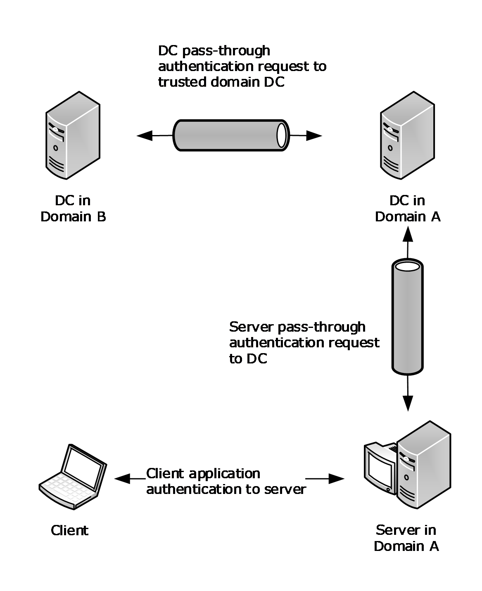

Figure 2: Pass-through authentication and domain trusts

In this scenario, the two domains are connected by means of a [**direct trust**](#gt_direct-trust) relationship. Consider a scenario in which the two domains are connected by means of an "intermediate trust partner"; the resource domain trusts the intermediate domain, which in turn trusts the account domain. There can be multiple domains connected by means of trust relationships along the chain of direct domain trusts between the resource and the account domains. This type of trust relationship, in which the resource domain trusts the account domain through a chain of trust relationships between intermediate domains, is called [**transitive trust**](#gt_transitive-trust). Each link in the transitive trust chain is backed by a shared secret used by DCs in two domains involved in the link for establishing the secure channel. Thus, the resource domain DC can deliver the logon request to the account domain DC over a chain of secure channels.

<a id="Section_1.3.3"></a>
### 1.3.3 Account Database Replication

Account [**database**](#gt_database) replication is relevant only for server-to-server communication of the protocol.

So far, we have considered scenarios in which there is one [**domain controller (DC)**](#gt_domain-controller-dc) in a [**domain**](#gt_domain). In practice, multiple DCs are placed into a domain for redundancy and load balancing so that multiple DCs can service logon requests from many servers. In such scenarios, the DCs need to share the user account database.<1>

A [**backup domain controller (BDC)**](#gt_backup-domain-controller-bdc) was a domain controller that maintained a full copy of the [**domain account**](#gt_domain-account) database and could satisfy authentication requests but would not allow modification of the accounts. Instead, the BDCs of a domain replicate the account database from the [**primary domain controller (PDC)**](#gt_primary-domain-controller-pdc) using account database replication methods.<2>

To request and transfer the replication data securely, [**Netlogon**](#gt_netlogon) uses the [**secure channel**](#gt_secure-channel) that the BDCs establish with the PDC by using the BDC's machine account password. This type of secure channel is called the server secure channel.

<a id="Section_1.3.4"></a>
### 1.3.4 Secure Channel Maintenance

The security of a channel based on a [**shared secret**](#gt_shared-secret) depends on the secrecy of that shared value. Good cryptographic hygiene requires that such a shared value not be permanent. This protocol includes the facility to choose a new password and communicate it from the client to the [**DC**](#gt_domain-controller-dc). This allows client implementations of this protocol to set new passwords on machine accounts (if the request comes over a workstation [**secure channel**](#gt_secure-channel)) or on the [**trust**](#gt_trust) accounts (if the request comes over a trusted [**domain**](#gt_domain) secure channel).

<a id="Section_1.3.5"></a>
### 1.3.5 Domain Trust Services

In some application scenarios, it can be desirable to obtain the list of [**domain**](#gt_domain) [**trusts**](#gt_trust). For example, an application collecting user [**credentials**](#gt_credential) might need to present the list of trusted domains from which users can choose their domains. The Netlogon Remote Protocol provides services to such applications via methods for retrieving domain trust information.

<a id="Section_1.3.6"></a>
### 1.3.6 Message Protection Services

Some applications might need to authenticate their messages sent to and received from a [**DC**](#gt_domain-controller-dc). [**Windows Time Service (W32Time)**](#gt_windows-time-service-w32time) is an example of such an application running on a machine that authenticates messages carrying time information received from the DC. The Netlogon Remote Protocol provides services to such applications via methods for computing a cryptographic digest of the message by using the machine account or trust password as the cryptographic key. By using these methods, the application running on the DC obtains the message digest and includes it in its response to the client. The application running on the client receives the message, obtains the message digest, and compares the digest with that received from the DC. If the two digests are the same, the client determines that the message was indeed sent by the DC.

<a id="Section_1.3.7"></a>
### 1.3.7 Administrative Services

Administrators might need to control or query the behavior related to Netlogon operations. For example, an administrator might want to force a change of the machine account password, or might want to reset the [**secure channel**](#gt_secure-channel) to a particular [**DC**](#gt_domain-controller-dc) in the [**domain**](#gt_domain). Netlogon provides such administrative services via methods for querying and controlling the server.

<a id="Section_1.3.7.1"></a>
#### 1.3.7.1 Netlogon Operational Flow on Domain Members

The first action that a Netlogon client performs on a [**domain member**](#gt_domain-member-member-machine) is finding a [**DC**](#gt_domain-controller-dc) in its [**domain**](#gt_domain) with which to set up the [**secure channel**](#gt_secure-channel). This process is called the DC discovery. After a DC is discovered, the domain member sets up a secure channel to the DC.

For all subsequent requests from the client to the DC pertaining to authentication, the Netlogon Remote Protocol transmits the request by using the secure channel. The Netlogon Remote Protocol receives the user validation data over the secure channel from the DC and returns the data to the authentication protocol.

Periodically, the operating system can use the Netlogon Remote Protocol to change the machine account password.

<a id="Section_1.3.7.2"></a>
#### 1.3.7.2 Netlogon Operational Flow on Domain Controllers

Upon receiving a logon request, Netlogon determines the account [**domain**](#gt_domain) of the user being authenticated. Netlogon determines the [**trust**](#gt_trust) link over which to send the request toward the account domain. Netlogon finds a [**DC**](#gt_domain-controller-dc) in the trusted domain on that link and sets up the [**secure channel**](#gt_secure-channel) to that DC by using the trust password for the trusted domain. Netlogon passes the logon request through to that DC. Netlogon receives the user validation data from that DC and returns the data to the secure channel client making the logon request.

Netlogon synchronizes BDC account [**databases**](#gt_database) with the [**PDC**](#gt_primary-domain-controller-pdc) account database.

Periodically, Netlogon changes the machine account password for the DC. On the PDC, Netlogon periodically changes trust passwords for all directly trusted domains.

Netlogon performs the aforementioned services requested by applications or administrators.

<a id="Section_1.3.8"></a>
### 1.3.8 Netlogon Structures and Methods

The Netlogon Remote Protocol structures and methods that are specified in **Structures and Enumerated Types** (section [2.2.1](#Section_2.2.1)) and **Messaging Processing Events and Sequencing Rules** (section [3.5.4](#Section_3.6.4.2)) are grouped according to the Netlogon scenarios and operational flows as follows:

- **DC Location Structures** (section [2.2.1.2](#Section_2.2.1.2)) and **DC Location Methods** (section [3.5.4.3](#Section_3.5.4.3)). This protocol uses the structures and methods in this group to locate a [**domain controller (DC)**](#gt_domain-controller-dc) in the specified [**domain**](#gt_domain). Methods in this group are also used for obtaining the [**site**](#gt_site) information that is related to DC discovery, as well as for maintaining [**Domain Name System (DNS)**](#gt_domain-name-system-dns) registration information for DCs.
- **Secure Channel Establishment and Maintenance Structures** (section [2.2.1.3](#Section_2.2.1.3)) and **Secure Channel Establishment and Maintenance Methods** (section [3.5.4.4](#Section_3.4.5.2)). Structures and methods in this [**group**](#gt_group) are used for setting up and maintaining the [**secure channel**](#gt_secure-channel).
- **Pass-Through Authentication Structures** (section [2.2.1.4](#Section_2.2.1.4)) and **Pass-Through Authentication Methods** (section [3.5.4.5](#Section_1.3.1)). These structures and methods are used for performing pass-through authentication and obtaining user validation information.
- **Account Database Replication Structures** (section [2.2.1.5](#Section_2)) and **Account Database Replication Methods** (section [3.5.4.6](#Section_1.3.3)). These structures and methods were used in the account database replication.
- **Domain Trust Structures** (section [2.2.1.6](#Section_2.2.1.6)) and **Domain Trust Methods** (section [3.5.4.7](#Section_3.5.4.7)). Structures and methods in this group are used for retrieving domain [**trust**](#gt_trust) information.
- **Message Protection Methods** (section [3.5.4.8](#Section_3.5.4.8)). Methods in this group are used for performing the message protection services.
- **Administrative Services Structures** (section [2.2.1.7](#Section_2.2.1.7)) and **Administrative Services Methods** (section [3.5.4.9](#Section_3.4.5.7)). This group of structures and methods is used for querying and controlling the Netlogon Remote Protocol server.
- **Obsolete Structures** (section [2.2.1.8](#Section_2.2.1.8)) and **Obsolete Methods** (section [3.5.4.10](#Section_3.5.4.10.3)). The structures and methods in this group are unsupported and obsolete.
<a id="Section_1.3.8.1"></a>
#### 1.3.8.1 History of Netlogon

The Netlogon Remote Protocol is an older protocol that has been through multiple revisions and expansions. As a result, some of the methods are used only in LAN Manager environments, and new structures and methods have been introduced to support new functionality.

<a id="Section_1.3.8.1.1"></a>
##### 1.3.8.1.1 New Methods Derived from Existing Methods

In many cases, a new method would differ from an existing method by the addition of one or a few new parameters. In such cases, one of two naming conventions was used. One convention was that the new method would typically be named identically to the existing method, except for the addition of a suffix such as Ex (to mean Extended, as in the DsrGetDcNameEx method (section [3.5.4.3.2](#Section_3.5.4.3.2)), which is the extended version of the original DsrGetDcName method (section [3.5.4.3.3](#Section_3.5.4.3.3))). The other convention was to add a numeral value to reflect the method revision number (as in the NetrServerAuthenticate2 method (section [3.5.4.4.4](#Section_3.5.4.4.4)) and NetrServerAuthenticate3 method (section [3.5.4.4.2](#Section_3.5.4.4.2)), which are the new versions of the original NetrServerAuthenticate method (section [3.5.4.4.5](#Section_3.5.4.4.5))).

<a id="Section_1.3.8.1.2"></a>
##### 1.3.8.1.2 Using Dummy Fields in Structures

The requirements of this protocol have evolved over time. During the original design phase, typed but unused fields were appended to some structures. In later versions of the protocol, if new data needed to be transmitted between the client and the server, these fields could be used without ill effects, so long as the type of the data was preserved. The servers of a previous version of the Netlogon protocol would receive and ignore the fields.

In many cases, an introduction of a new Ex structure necessitated an introduction of a corresponding Ex [**remote procedure call (RPC)**](#gt_remote-procedure-call-rpc) method for passing the new structure between the client and the server. As an alternative to the growing number of Ex structures and methods, an approach was introduced to avoid the addition of new structures and methods by using dummy fields. New structures would have a few unused fields, such as **DummyString1**, **DummyString2**, **DummyLong1**, and **DummyLong2**. These dummy fields allow additional information that was not conceived originally to be passed through the interface in a safe fashion. If the structure has not been extended, these fields are set to zero and ignored upon receipt.

For example, a dummy field **DummyString1** of the **NETLOGON_ONE_DOMAIN_INFO** (section [2.2.1.3.10](#Section_2.2.1.3.10)) structure was used at one point to carry [**trust**](#gt_trust) extension attributes. As a dummy field got used, it might or might not be renamed. In the case of **NETLOGON_ONE_DOMAIN_INFO**, **DummyString1** was renamed as **TrustExtension** to reflect the new nature of the field. This scheme of dummy field usage worked well: this protocol running on a new client receiving the **NETLOGON_ONE_DOMAIN_INFO** structure would use the **TrustExtension** field as appropriate, while the **NETLOGON_ONE_DOMAIN_INFO** running on an old client would completely ignore the **DummyString1** field.

<a id="Section_1.3.8.1.3"></a>
##### 1.3.8.1.3 Fields and Structures Used by Netlogon Pass-through Methods

During the design of the **NetrLogonSamLogon** method which is used for Netlogon pass-through, three fields were created to pass information opaquely for applications:

- **LogonLevel**
- **LogonInformation**
- **ValidationLevel**
At that time, it was thought that there would be four types of logon:

- Interactive
- Network
- Service
- Generic
However, only three were used: Interactive, Network, and Generic. Service type remains an option that can be used by callers, and like all Netlogon pass-through behavior, it is specified by the receiving protocol.

<a id="Section_1.3.8.1.4"></a>
##### 1.3.8.1.4 Using Negotiated Flags

The client and the server often need to know the capabilities of their partners in their client/server communications. For example, it is sometimes necessary or desirable for a newer version client to avoid calling a method that the older version server does not implement. Similarly, the new server would avoid sending fields that the older client is going to treat as dummies and ignore. To make this possible, the client and the server need to establish a common set of capabilities that both the client and the server support.

For this reason, the **NetrServerAuthenticate3** method (section [3.5.4.4.2](#Section_3.5.4.4.2)), which is called early on during setup of the [**secure channel**](#gt_secure-channel) between the client and the server, includes the *NegotiateFlags* parameter. The *NegotiateFlags* parameter uses a set of bit flags to carry the client and server capabilities. The client sets its capabilities on input, and the server responds with capabilities that it supports out of those sent by the client. The resulting set of bit flags is the set of capabilities that the client and the server mutually support.

<a id="Section_1.4"></a>
## 1.4 Relationship to Other Protocols

The Netlogon Remote Protocol depends on [**remote procedure call (RPC)**](#gt_remote-procedure-call-rpc) and on the [**mailslot**](#gt_mailslot) datagram delivery service, as specified in [MS-SMB](../MS-SMB/MS-SMB.md), which are its transports.

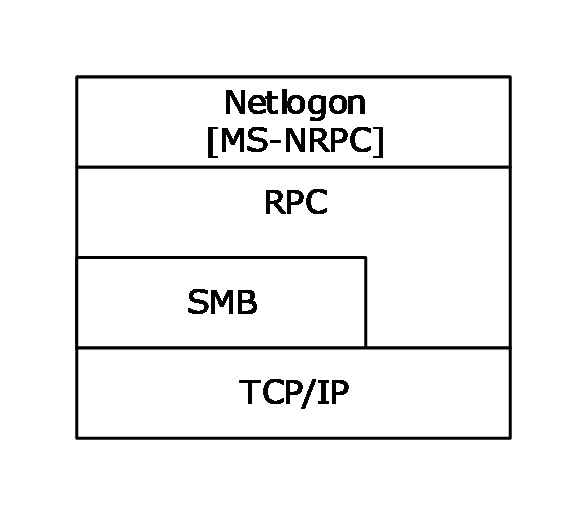

Figure 3: Transport relationships

Other non-RFC standard specifications relevant to the implementation of the Netlogon Remote Protocol are:

- Directory Technical Specification [MS-ADTS](../MS-ADTS/MS-ADTS.md) defines Active Directory data types, data structures, and their interactions, many of which are relevant to the functioning of the Netlogon Remote Protocol.
- Group Policy: Security Protocol Extension [MS-GPSB](../MS-GPSB/MS-GPSB.md) is for managing [**secure channel**](#gt_secure-channel) signing and encryption settings.
- Local Security Authority (Domain Policy) Remote Protocol Specification [MS-LSAD](../MS-LSAD/MS-LSAD.md) is used for accessing certain directory information.
- NT LAN Manager (NTLM) Authentication Protocol Specification [MS-NLMP](../MS-NLMP/MS-NLMP.md) uses netlogon for pass-through authentication and specifies how to do one-way functions (OWF) of the computer password.
- Security Account Manager (SAM) Remote Protocol Specification (Client-to-Server) [MS-SAMR](../MS-SAMR/MS-SAMR.md) is used for account lookup during session-key negotiation.
Authentication Protocol Domain Support Specification [MS-APDS](../MS-APDS/MS-APDS.md) is an example of how authentication protocols can use generic pass-through, as described in section [3.2.4.1](#Section_3.2.4.1).

<a id="Section_1.5"></a>
## 1.5 Prerequisites/Preconditions

This protocol is an [**RPC**](#gt_remote-procedure-call-rpc) interface and, as a result, has the prerequisites that [MS-RPCE](../MS-RPCE/MS-RPCE.md) specifies as being common to RPC interfaces.

Netlogon replication uses the [**mailslot**](#gt_mailslot) datagram delivery mechanism; therefore, it depends on this mailslot delivery mechanism being operational before Netlogon begins operation. For mailslot operational requirements, see [MS-MAIL](../MS-MAIL/MS-MAIL.md) section 1.5. The mailslot delivery mechanism is specified in [MS-CIFS](../MS-CIFS/MS-CIFS.md) section 2.2.4.33.

To use this protocol or to use Netlogon as a [**security support provider (SSP)**](#gt_security-support-provider-ssp), a computer requires a [**shared secret**](#gt_shared-secret) (section [3.1.1](#Section_3.1)) with the [**domain controller (DC)**](#gt_domain-controller-dc).

The client of the [**secure channel**](#gt_secure-channel) is required to discover the DC to which it is establishing a secure channel. Thus, a [**domain member**](#gt_domain-member-member-machine) discovers a DC in its [**domain**](#gt_domain).

A BDC discovers the [**primary domain controller (PDC)**](#gt_primary-domain-controller-pdc) in its domain. A DC discovers a DC for each of its [**trusted**](#gt_trust) domains.

Upon establishing a secure channel, a client can call any of the methods of this protocol that require a secure channel. This requires both the client and the server to have a working RPC implementation, including the security extensions ([MS-RPCE] section 2.2.1.1.7). For a complete list of methods that require a secure channel, see section [3.5](../MS-RPCE/MS-RPCE.md).

All methods of this protocol are RPC calls from the client to the server that perform the complete operation in a single call. No shared state between the client and server is assumed other than the [**security context**](#gt_security-context) that was previously established. There are no restrictions on the number of times that a method can be called or the order in which methods can be called, unless explicitly noted in sections [3.4](#Section_1.3) and 3.5.

The Netlogon Remote Protocol client and server can run only on domain-joined systems. This protocol is enabled or disabled during the domain join and unjoin tasks as described in [MS-ADOD](#Section_1.3) and specified in [MS-WKST](../MS-WKST/MS-WKST.md) sections 3.2.4.12, 3.2.4.13, and 3.2.4.14.

<a id="Section_1.6"></a>
## 1.6 Applicability Statement

The Netlogon Remote Protocol contains an implementation of a [**security support provider (SSP)**](#gt_security-support-provider-ssp), which provides packet encryption and signing services to secure client and server communication at the [**RPC**](#gt_remote-procedure-call-rpc) packet level. These security services are used for establishing a [**secure channel**](#gt_secure-channel) for RPC-based client-to-server communication.

The Netlogon Remote Protocol can act as a secure transport for NTLM authentication and for other authentication mechanisms between arbitrary servers and the account authority or [**DC**](#gt_domain-controller-dc) for that server. The Netlogon Remote Protocol also provides methods for maintaining the [**trust**](#gt_trust) password for all [**trusted domains**](#gt_trusted-domain). Additional information for the methods in this topic is provided in section [3](#Section_1.3) for cases where the server is not a member of a [**domain**](#gt_domain) and resolves requests independently.

<a id="Section_1.7"></a>
## 1.7 Versioning and Capability Negotiation

- Supported Transports: This protocol uses the [**mailslot**](#gt_mailslot) datagram delivery service, RPC over named pipes ([[PIPE]](https://go.microsoft.com/fwlink/?LinkId=90247)), and RPC over TCP/IP as its only transports. Also see **Transport** (section [2.1](#Section_2.1)).
- Security and Authentication Methods: As specified in section [3.2](#Section_1.3) and [MS-RPCE](../MS-RPCE/MS-RPCE.md) section 1.7.
- Protocol Version: This protocol's RPC interface has a single version number of 1.0. Microsoft can extend this protocol by adding RPC methods to the interface with [**opnums**](#gt_opnum) lying numerically beyond those defined in this document. A client determines whether such methods are supported by attempting to invoke the method. If the version of the interface does not implement the method being invoked, it is required that the RPC server return an opnum out of range error. RPC versioning and capability negotiation for this situation is specified in [[C706]](https://go.microsoft.com/fwlink/?LinkId=89824) and [MS-RPCE] section 2.1.
For methods with multiple definitions (for example, **NetrServerAuthenticate** (section [3.5.4.4.5](#Section_3.5.4.4.5)), **NetrServerAuthenticate2** (section [3.5.4.4.4](#Section_3.5.4.4.4)), and **NetrServerAuthenticate3** (section [3.5.4.4.2](#Section_3.5.4.4.2))), the Netlogon Remote Protocol first tries the most recent definition of the method for which it has code. If that fails, this protocol tries the next most recent definition, and so on. Using the **NetrServerAuthenticate** example, this protocol tries **NetrServerAuthenticate3** first, **NetrServerAuthenticate2** second, and finally **NetrServerAuthenticate**.

- Capability Negotiation: When a secure channel is established, the *NegotiateFlags* parameter of the **NetrServerAuthenticate2** and **NetrServerAuthenticate3** is used to negotiate a common set of capabilities that each of the participants in the negotiation can support. See section [3.1.4.2](#Section_3.1.4.2).
<a id="Section_1.8"></a>
## 1.8 Vendor-Extensible Fields

This protocol uses NTSTATUS values as defined in [MS-ERREF](../MS-ERREF/MS-ERREF.md) section 2.3. Vendors are free to choose their own values for this field, as long as the C bit (0x20000000) is set, indicating it is a customer code.

<a id="Section_1.9"></a>
## 1.9 Standards Assignments

This protocol uses the following [**RPC**](#gt_remote-procedure-call-rpc) [**UUID**](#gt_universally-unique-identifier-uuid), [**endpoint**](#gt_endpoint), and [**mailslot**](#gt_mailslot) assignments:

| Parameter | Value | Reference |
| --- | --- | --- |
| RPC interface UUID | 12345678-1234-ABCD-EF00-01234567CFFB | Section [2.1](#Section_2.1) |
| Pipe name | \PIPE\NETLOGON | Section 2.1 |
| Mailslot name | \MAILSLOT\NET\NETLOGON | Section 2.1 |

<a id="Section_2"></a>
# 2 Messages

<a id="Section_2.1"></a>
## 2.1 Transport

This protocol SHOULD<3> use the following [**RPC protocol sequences**](#gt_rpc-protocol-sequence) as specified in [MS-RPCE](../MS-RPCE/MS-RPCE.md) section 2.1:

- [**RPC**](#gt_remote-procedure-call-rpc) over TCP/IP
- RPC over named pipes
This protocol uses RPC [**dynamic endpoints**](#gt_dynamic-endpoint) for RPC over TCP/IP, as specified in [[C706]](https://go.microsoft.com/fwlink/?LinkId=89824) section 4.

This protocol uses the following well-known [**endpoint**](#gt_endpoint). This endpoint is a named pipe for RPC over SMB:

- \PIPE\NETLOGON
This protocol uses the [**mailslot**](#gt_mailslot) datagram delivery service ([MS-MAIL](../MS-MAIL/MS-MAIL.md) and [MS-SMB](../MS-SMB/MS-SMB.md)). Mailslot messages (see [MS-MAIL] section 2.2.1) are sent to the following mailslot:

- \MAILSLOT\NET\NETLOGON. This named mailslot is used in Netlogon replication, as defined in section [3.6](#Section_1.3).
This protocol MUST use the [**universally unique identifier (UUID)**](#gt_universally-unique-identifier-uuid) 12345678-1234-ABCD-EF00-01234567CFFB. The RPC version number is 1.0.

This protocol uses the Netlogon SSP. The server MUST use the RPC [**security provider**](#gt_security-provider) extensions ([MS-RPCE] section 2.2.1.1.7). It SHOULD<4> register the Netlogon security package as specified in section [3.3](#Section_1.3).

<a id="Section_2.2"></a>
## 2.2 Common Data Types

In addition to the [**RPC**](#gt_remote-procedure-call-rpc) base types and definitions that are specified in [[C706]](https://go.microsoft.com/fwlink/?LinkId=89824) section 4.2.9 and [MS-RPCE](../MS-RPCE/MS-RPCE.md) section 2.2, additional data types are defined in the following sections.<5>

<a id="Section_2.2.1"></a>
### 2.2.1 Structures and Enumerated Types

This section specifies structures and enumerated types that are used by the Netlogon RPC methods specified in section [3.5](#Section_3.5). Section [2.2.1.1](#Section_2.2.1.1) specifies the basic structures that are elementary to this protocol and which are used by many methods. The structures are grouped according to their usage scenarios.

<a id="Section_2.2.1.1"></a>
#### 2.2.1.1 Basic Structures

The structures in this group do not fall into any particular category of Netlogon usage scenarios. They are used by multiple Netlogon Remote Protocol methods.

<a id="Section_2.2.1.1.1"></a>
##### 2.2.1.1.1 CYPHER_BLOCK

The **CYPHER_BLOCK** structure defines an encrypted eight-character string. The type of encryption used is application dependent.

typedef struct _CYPHER_BLOCK {

CHAR data[8];

} CYPHER_BLOCK,

*PCYPHER_BLOCK;

**data:** An encrypted eight-character string.

<a id="Section_2.2.1.1.2"></a>
##### 2.2.1.1.2 STRING

The **STRING** structure contains the length, the maximum length, and a pointer to a buffer containing the string.

typedef struct _STRING {

USHORT Length;

USHORT MaximumLength;

[size_is(MaximumLength), length_is(Length)]

CHAR * Buffer;

} STRING,

*PSTRING;

**Length:** The length of the data pointed to by **Buffer**, in bytes.

**MaximumLength:** The total allocated length of the data pointed to by **Buffer**, in bytes.<6>

**Buffer:** A pointer to a buffer containing the character string.

<a id="Section_2.2.1.1.3"></a>
##### 2.2.1.1.3 UNICODE_STRING

The **UNICODE_STRING** structure contains the length, the maximum length, and a pointer to a buffer containing the [**Unicode string**](#gt_unicode-string).

typedef struct _UNICODE_STRING {

USHORT Length;

USHORT MaximumLength;

[size_is(MaximumLength / 2), length_is((Length) / 2)] USHORT * Buffer;

} UNICODE_STRING, *PUNICODE_STRING;

**Length:** The length, in bytes, of the string pointed to by the **Buffer** member. The length MUST be a multiple of 2. The length MUST equal the entire size of **Buffer**.

**MaximumLength:** The maximum size, in bytes, of the string pointed to by **Buffer**. The size MUST be a multiple of 2. This value MUST NOT be less than **Length**.

**Buffer:** A pointer to a buffer containing the Unicode string.

<a id="Section_2.2.1.1.4"></a>
##### 2.2.1.1.4 LM_OWF_PASSWORD

The **LM_OWF_PASSWORD** structure carries a [**one-way function (OWF)**](#gt_one-way-function-owf) of a LAN Manager password. The **LM_OWF_PASSWORD** structure SHOULD be encrypted, as specified by each method that uses this structure. See the **NetrServerPasswordSet** method (section [3.5.4.4.7](#Section_3.5.4.4.7)) for encryption information.

typedef struct _LM_OWF_PASSWORD {

CYPHER_BLOCK data[2];

} LM_OWF_PASSWORD,

*PLM_OWF_PASSWORD,

ENCRYPTED_LM_OWF_PASSWORD,

*PENCRYPTED_LM_OWF_PASSWORD;

**data:** An array of **CYPHER_BLOCK** structures (section [2.2.1.1.1](#Section_2.2.1.1.1)) that contains the LMOWFv1 of a password. LMOWFv1 is specified in NTLM v1 Authentication in [MS-NLMP](../MS-NLMP/MS-NLMP.md) section 3.3.1.

<a id="Section_2.2.1.1.5"></a>
##### 2.2.1.1.5 NT_OWF_PASSWORD

The **NT_OWF_PASSWORD** structure SHOULD<7> define a [**one-way function (OWF)**](#gt_one-way-function-owf) of a [**domain**](#gt_domain) password. The **NT_OWF_PASSWORD** structure SHOULD be encrypted, as specified by each method that uses this structure. When this structure is encrypted, Netlogon methods uses the DES encryption algorithm in ECB mode, as specified in [MS-SAMR](../MS-SAMR/MS-SAMR.md) section 2.2.11.1.1 Encrypting an NT Hash or LM Hash Value with a specified key. The [**session key**](#gt_session-key) is the specified 16-byte key used to derive its keys using the 16-byte value process, as specified in [MS-SAMR] section 2.2.11.1.4. For specific encryption information, see the individual methods, such as **NetrServerTrustPasswordsGet** (section [3.5.4.4.9](#Section_3.5.4.4.9)) and **NetrServerGetTrustInfo** (section [3.5.4.7.6](#Section_3.5.4.7.6)).

typedef struct _NT_OWF_PASSWORD {

CYPHER_BLOCK data[2];

} NT_OWF_PASSWORD,

*PNT_OWF_PASSWORD,

ENCRYPTED_NT_OWF_PASSWORD,

*PENCRYPTED_NT_OWF_PASSWORD;

**data:** An array of **CYPHER_BLOCK** structures (section [2.2.1.1.1](#Section_2.2.1.1.1)) that contains the NTOWFv1 of a password. NTOWFv1 is specified in NTLM v1 Authentication in [MS-NLMP](../MS-NLMP/MS-NLMP.md) section 3.3.1.

<a id="Section_2.2.1.1.6"></a>
##### 2.2.1.1.6 NETLOGON_AUTHENTICATOR

The **NETLOGON_AUTHENTICATOR** structure defines an authentication [**credential**](#gt_credential).

typedef struct _NETLOGON_AUTHENTICATOR {

NETLOGON_CREDENTIAL Credential;

DWORD Timestamp;

} NETLOGON_AUTHENTICATOR,

*PNETLOGON_AUTHENTICATOR;

**Credential:** A **NETLOGON_CREDENTIAL** (section [2.2.1.3.4](#Section_2.2.1.3.4)) structure that contains the encrypted portion of the [**authenticator**](#gt_authenticator).

**Timestamp:** An integer value that contains the time of day at which the client constructed this authentication credential, represented as the number of elapsed seconds since 00:00:00 of January 1, 1970. The authenticator is constructed just before making a call to a method that requires its usage.

<a id="Section_2.2.1.2"></a>
#### 2.2.1.2 DC Location Structures

The structures in this group relate to locating a [**domain controller (DC)**](#gt_domain-controller-dc).

<a id="Section_2.2.1.2.1"></a>
##### 2.2.1.2.1 DOMAIN_CONTROLLER_INFOW

The **DOMAIN_CONTROLLER_INFOW** structure SHOULD<8> define information returned by the following methods: [DsrGetDcName (section 3.5.4.3.3)](#Section_3.5.4.3.3), [DsrGetDcNameEx (section 3.5.4.3.2)](#Section_3.5.4.3.2), and [DsrGetDcNameEx2 (section 3.5.4.3.1)](#Section_3.5.4.3.1). This structure is used to describe naming and addressing information about a [**DC**](#gt_domain-controller-dc).

typedef struct _DOMAIN_CONTROLLER_INFOW {

[string, unique] wchar_t* DomainControllerName;

[string, unique] wchar_t* DomainControllerAddress;

ULONG DomainControllerAddressType;

GUID DomainGuid;

[string, unique] wchar_t* DomainName;

[string, unique] wchar_t* DnsForestName;

ULONG Flags;

[string, unique] wchar_t* DcSiteName;

[string, unique] wchar_t* ClientSiteName;

} DOMAIN_CONTROLLER_INFOW,

*PDOMAIN_CONTROLLER_INFOW;

**DomainControllerName:** A pointer to a null-terminated UTF-16 string that contains a NetBIOS or [**fully qualified domain name (FQDN)**](#gt_fully-qualified-domain-name-fqdn) of the DC, prefixed with "\\".

**DomainControllerAddress:** A pointer to a null-terminated [**Unicode string**](#gt_unicode-string) that contains the DC address, prefixed with "\\". The string SHOULD<9> be either a textual representation of an IPv4/IPv6 address or the [**NetBIOS name**](#gt_netbios-name) of the DC, determined by the **DomainControllerAddressType** field.

**DomainControllerAddressType:** A 32-bit value indicating the DC address type, which MUST be one, and only one, of the following.

| Value | Meaning |
| --- | --- |
| 0x00000001 | The address is a string that contains an IPv4 address in dotted-decimal notation (for example, 192.168.0.1), or an IPv6 address in colon-separated notation.<10> |
| 0x00000002 | The address is a NetBIOS name. |

**DomainGuid:** A [**globally unique identifier (GUID)**](#gt_globally-unique-identifier-guid) structure ([MS-DTYP](../MS-DTYP/MS-DTYP.md) section 2.3.4.1) that contains an identifier for the [**domain**](#gt_domain). When there is no domain GUID, this field MUST be set to zero. A GUID SHOULD<11> be used across all computers and networks wherever a unique identifier is required.

**DomainName:** A pointer to a Unicode string that contains the NetBIOS or FQDN of the domain.

**DnsForestName:** A pointer to a null-terminated Unicode string that contains the FQDN of the [**forest**](#gt_forest).

**Flags:** A set of bit flags in little-endian format that describe the features and roles of the DC. A flag is TRUE (or set) if its value is equal to 1. The value is constructed from zero or more bit flags from the following table, with the exceptions that bit J cannot be combined with A, B, D, E, or P; bit F cannot be combined with I; and bit K cannot be combined with L.

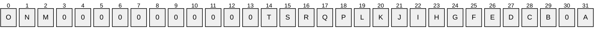

Where the bits are defined as:

| Value | Description |
| --- | --- |
| A | The DC is the domain's [**primary domain controller (PDC)**](#gt_primary-domain-controller-pdc). |
| B | The DC contains the [**global catalog (GC)**](#gt_global-catalog-gc) for the forest [**Active Directory**](#gt_active-directory). |
| C | The DC supports the [**Lightweight Directory Access Protocol (LDAP)**](#gt_lightweight-directory-access-protocol-ldap). |
| D | The DC supports a [**directory service**](#gt_directory-service-ds). |
| E | The DC is a Kerberos [**Key Distribution Center (KDC)**](#gt_key-distribution-center-kdc). |
| F | The DC has a network time service available but no clock hardware. |
| G | The DC is in the closest [**site**](#gt_site) to the client. |
| H | The DC has a [**writable**](#gt_5e5f9997-e6b4-4a73-aa22-984814b83a18) directory service available. |
| I | The DC has clock hardware and a network time service available. |
| J | The DC is an LDAP server servicing an Application [**naming context (NC)**](#gt_naming-context-nc) ([MS-ADTS](../MS-ADTS/MS-ADTS.md) section 3.1.1.1.5). |
| K | The DC is a [**read-only domain controller (RODC)**](#gt_read-only-domain-controller-rodc).<12> |
| L | The server is a [**writable domain controller**](#gt_writable-domain-controller).<13> |
| M | The DC's name is a [**DNS**](#gt_domain-name-system-dns) name. |
| N | The DC's [**domain name**](#gt_domain-name) is a DNS name. |
| O | The DC's forest name is a [**DNS name**](#gt_dns-name). |
| P | The DC has an Active Directory Web Service available.<14> |
| Q | The DC has a functional level of DS_BEHAVIOR_WIN2012 or later. |
| R | The DC has a functional level of DS_BEHAVIOR_WIN2012R2 or later. |
| S | The DC has a functional level of DS_BEHAVIOR_WIN2016 or later. |
| T | The DC supports [**key list requests**](#gt_key-list-request), as specified in [MS-KILE](../MS-KILE/MS-KILE.md) section 2.2.11. If this bit is set, bit S and bit E MUST also be set. |

All other bits MUST be set to zero and MUST be ignored on receipt.

**DcSiteName:** A pointer to a null-terminated Unicode string that SHOULD<15> contain the site name that is associated with the DC. When there is no associated site, this field MUST be NULL.

**ClientSiteName:** A pointer to a null-terminated Unicode string that contains the client's site name. When there is no client site name, this field MUST be NULL.

<a id="Section_2.2.1.2.2"></a>
##### 2.2.1.2.2 NL_SITE_NAME_ARRAY

The **NL_SITE_NAME_ARRAY** structure defines an array of [**site**](#gt_site) names.

typedef struct _NL_SITE_NAME_ARRAY {

ULONG EntryCount;

[size_is(EntryCount)] PUNICODE_STRING SiteNames;

} NL_SITE_NAME_ARRAY,

*PNL_SITE_NAME_ARRAY;

**EntryCount:** The number of entries in **SiteNames**.

**SiteNames:** A pointer to an array of null-terminated UNICODE_STRING structures that contain site names. For more information about sites, see [MS-ADTS](../MS-ADTS/MS-ADTS.md) section 6.1.1.2.2.1.

<a id="Section_2.2.1.2.3"></a>
##### 2.2.1.2.3 NL_SITE_NAME_EX_ARRAY

The **NL_SITE_NAME_EX_ARRAY** structure defines an array of [**site**](#gt_site) and subnet names. This structure extends the [NL_SITE_NAME_ARRAY (section 2.2.1.2.2)](#Section_2.2.1.2.2) structure by adding an array of subnets that correspond to the sites.

typedef struct _NL_SITE_NAME_EX_ARRAY {

ULONG EntryCount;

[size_is(EntryCount)] PUNICODE_STRING SiteNames;

[size_is(EntryCount)] PUNICODE_STRING SubnetNames;

} NL_SITE_NAME_EX_ARRAY,

*PNL_SITE_NAME_EX_ARRAY;

**EntryCount:** The number of entries in **SiteNames** and **SubnetNames**.

**SiteNames:** A pointer to an array of null-terminated [**Unicode strings**](#gt_unicode-string) that contain site names. For details about sites, see [MS-ADTS](../MS-ADTS/MS-ADTS.md) section 6.1.1.2.2.1.

**SubnetNames:** A pointer to an array of null-terminated Unicode strings that contain subnet names. For details about subnets, see [MS-ADTS] section 6.1.1.2.2.2.1.

<a id="Section_2.2.1.2.4"></a>
##### 2.2.1.2.4 NL_SOCKET_ADDRESS

The **NL_SOCKET_ADDRESS** structure contains a socket address.

typedef struct _NL_SOCKET_ADDRESS {

[size_is(iSockaddrLength)] UCHAR * lpSockaddr;

[range(0, 128)] ULONG iSockaddrLength;

} NL_SOCKET_ADDRESS,

*PNL_SOCKET_ADDRESS;

**lpSockaddr:** A pointer to an octet string. The format of the **lpSockaddr** member when an IPv4 socket address is used is specified in section [2.2.1.2.4.1](#Section_2.2.1.2.4.1). The format of the **lpSockaddr** member when an IPv6 socket address is used is specified in section [2.2.1.2.4.2](#Section_2.2.1.2.4.2).

**iSockaddrLength:** The length of the octet string pointed to by **lpSockaddr**, in bytes.

<a id="Section_2.2.1.2.4.1"></a>
###### 2.2.1.2.4.1 IPv4 Address Structure

The **IPv4 Address** structure specifies the format of an IPv4 socket address. This structure is built as if on a little-endian machine and is treated as a byte array.

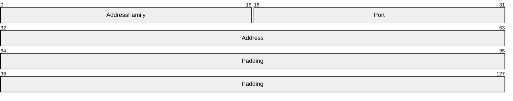

**AddressFamily (2 bytes):** The address family; MUST be 0x0002.

**Port (2 bytes):** An IP port number.

**Address (4 bytes):** An IP address, as specified in [[RFC791]](https://go.microsoft.com/fwlink/?LinkId=392659).

**Padding (8 bytes):** This field is set to zero and ignored by the server.

<a id="Section_2.2.1.2.4.2"></a>
###### 2.2.1.2.4.2 IPv6 Address Structure

The **IPv6 Address** structure specifies the format of an IPv6 socket address. This structure is built as if on a little-endian machine and is treated as a byte array.

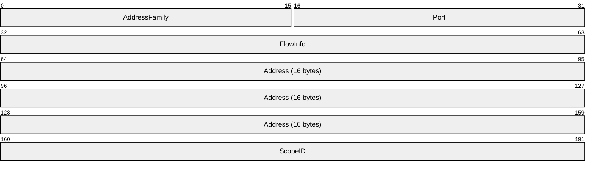

**AddressFamily (2 bytes):** Address family; MUST be 0x0017.

**Port (2 bytes):** An IP port number.

**FlowInfo (4 bytes):** Flow information. This field is not used by the protocol. The field MUST be set to zero and MUST be ignored on receipt.

**Address (16 bytes):** An IP address, as specified in [[RFC3493]](https://go.microsoft.com/fwlink/?LinkId=90425).

**ScopeID (4 bytes):** A set of interfaces for a scope, as specified in [RFC3493].

<a id="Section_2.2.1.2.5"></a>
##### 2.2.1.2.5 NL_DNS_NAME_INFO

The **NL_DNS_NAME_INFO** structure provides the information on a [**DNS**](#gt_domain-name-system-dns) name (record) (as specified in [[RFC2782]](https://go.microsoft.com/fwlink/?LinkId=90381)) to be updated by the **DsrUpdateReadOnlyServerDnsRecords** method (section [3.5.4.3.11](#Section_3.5.4.3.11)). **DsrUpdateReadOnlyServerDnsRecords** method will update DNS as requested by the **Register** field's value in this structure.

typedef struct _NL_DNS_NAME_INFO {

ULONG Type;

[string,range(0,256)] wchar_t* DnsDomainInfo;

ULONG DnsDomainInfoType;

ULONG Priority;

ULONG Weight;

ULONG Port;

UCHAR Register;

ULONG Status;

} NL_DNS_NAME_INFO,

*PNL_DNS_NAME_INFO;

**Type:** The type of DNS name, which MUST be one, and only one, of the following.

| Value | Meaning |
| --- | --- |
| NlDnsLdapAtSite 22 | _ldap._tcp.<SiteName>._sites.<DnsDomainName>. Allows a client to find an LDAP server in the domain named by <DnsDomainName> and is in the site named by <SiteName>. |
| NlDnsGcAtSite 25 | _ldap._tcp.<SiteName>._sites.gc._msdcs.<DnsForestName>. Allows a client to find a DC serving a [**global catalog (GC)**](#gt_global-catalog-gc) in the [**forest**](#gt_forest) named by <DnsForestName> and is in the site named by <SiteName>. |
| NlDnsDsaCname 28 | <DsaGuid>._msdcs.<DnsForestName>. Allows a client to find a DC in the forest named by <DnsForestName> based on the DSA GUID. For a definition of DSA GUID, see [MS-ADTS](../MS-ADTS/MS-ADTS.md) section 1.1. |
| NlDnsKdcAtSite 30 | _kerberos._tcp.<SiteName>._sites.dc._msdcs.<DnsDomainName>. Allows a client to find a DC running a Kerberos [**KDC**](#gt_key-distribution-center-kdc) in the domain named by <DnsDomainName> and is in the site named by <SiteName>. |
| NlDnsDcAtSite 32 | _ldap._tcp.<SiteName>._sites.dc._msdcs.<DnsDomainName>. Allows a client to find a DC in the domain named by <DnsDomainName> and is in the site named by <SiteName>. |
| NlDnsRfc1510KdcAtSite 34 | _kerberos._tcp.<SiteName>._sites.<DnsDomainName>. Allows a client to find an RFC-1510 compliant Kerberos KDC in the domain named by <DnsDomainName> and is in the site named by <SiteName>. |
| NlDnsGenericGcAtSite 36 | _gc._tcp.<SiteName>._sites.<DnsForestName>. Allows a client to find a global catalog (GC) server in the forest named by <DnsForestName> and is in the site named by <SiteName>. |

**DnsDomainInfo:** The string that will be based on the **DnsDomainInfoType** field defined below.

**DnsDomainInfoType:** The type of **DnsDomainInfo** member, which MUST be one, and only one, of the following:

| Value | Meaning |
| --- | --- |
| NlDnsDomainName 1 | The **DnsDomainInfo** member is a DNS domain name. |
| NlDnsDomainNameAlias 2 | The **DnsDomainInfo** member is a DNS domain name [**alias**](#gt_alias). |
| NlDnsForestName 3 | The **DnsDomainInfo** member is a DNS forest name. |
| NlDnsForestNameAlias 4 | The **DnsDomainInfo** member is a DNS forest name alias. |
| NlDnsNdncDomainName 5 | The **DnsDomainInfo** member is a non-domain [**NC**](#gt_naming-context-nc) (application NC) name. For a definition of application NC, see [MS-ADTS] section 1.1. |
| NlDnsRecordName 6 | The **DnsDomainInfo** member is a DNS record name that is required to be deregistered. This is valid only for deregistration in which the Register value is set to FALSE. For the types of DNS record name, see [MS-ADTS] section 6.3.2. |

**Priority:** The priority for DNS SRV records.

**Weight:** The weight for DNS SRV records.

**Port:** The port for the DNS SRV record.

**Register:** Zero indicates to deregister the DNS name; other values indicate to register the DNS name.

**Status:** The update status of the DNS name. Status SHOULD<16> be set to 0x00000000 on success; otherwise, it contains a nonzero error code.

<a id="Section_2.2.1.2.6"></a>
##### 2.2.1.2.6 NL_DNS_NAME_INFO_ARRAY

The **NL_DNS_NAME_INFO_ARRAY** structure provides the information on [**DNS**](#gt_domain-name-system-dns) names (records) to be updated by the **DsrUpdateReadOnlyServerDnsRecords** (section [3.5.4.3.11)](#Section_3.5.4.3.11) method.

typedef struct _NL_DNS_NAME_INFO_ARRAY {

[range(0,2048)] ULONG EntryCount;

[size_is(EntryCount)] PNL_DNS_NAME_INFO DnsNamesInfo;

} NL_DNS_NAME_INFO_ARRAY,

*PNL_DNS_NAME_INFO_ARRAY;

**EntryCount:** The number of entries in the **DnsNamesInfo** field.

**DnsNamesInfo:** A pointer to an array of the **NL_DNS_NAME_INFO** (section [2.2.1.2.5)](#Section_2.2.1.2.5) structure, which SHOULD<17> contain DNS name information.

<a id="Section_2.2.1.3"></a>
#### 2.2.1.3 Secure Channel Establishment and Maintenance Structures

Structures and enumerated types in this group are used to establish and maintain the [**secure channel**](#gt_secure-channel).

<a id="Section_2.2.1.3.1"></a>
##### 2.2.1.3.1 NL_AUTH_MESSAGE

The **NL_AUTH_MESSAGE** structure is a token containing information that is part of the first message in establishing a [**security context**](#gt_security-context) between a client and a server. It is used for establishing the secure session when Netlogon functions as a [**security support provider (SSP)**](#gt_security-support-provider-ssp). For details about **NL_AUTH_MESSAGE** construction, see section [3.3.4.1](#Section_1.3).

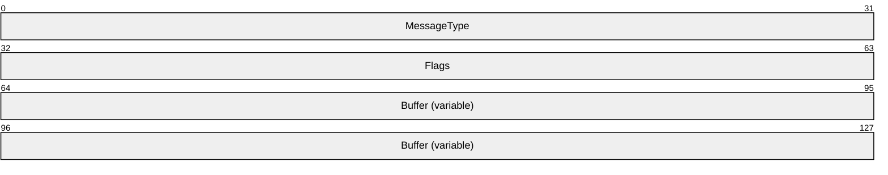

**MessageType (4 bytes):** A 32-bit unsigned integer. This value is used to indicate whether the message is a negotiate request message sent from a client to a server, or a negotiate response message sent from the server to the client. **MessageType** MUST be one, and only one, of the following.

| Value | Meaning |
| --- | --- |
| 0x00000000 | This is a negotiate request message. |
| 0x00000001 | This is a negotiate response message. |

**Flags (4 bytes):** A set of bit flags indicating the [**principal**](#gt_principal) names carried in the request. A flag is TRUE (or set) if its value is equal to 1. These flags are set only in negotiate request messages. The value is constructed from one or more bit flags from the following table.

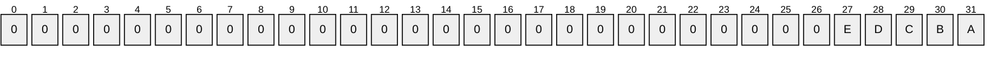

Where the bits are defined as:

| Value | Description |
| --- | --- |
| A | Buffer contains a NetBIOS [**domain name**](#gt_domain-name) as an OEM_STRING ([MS-CIFS](../MS-CIFS/MS-CIFS.md) section 2.2.1.1). |
| B | Buffer contains a NetBIOS [**computer name**](#gt_computer-name) as an OEM_STRING. |
| C | Buffer contains a [**DNS**](#gt_domain-name-system-dns) domain name as a compressed UTF-8 string, as specified in [[RFC1035]](https://go.microsoft.com/fwlink/?LinkId=90264) section 4.1.4. |
| D | Buffer contains a DNS host name as a compressed UTF-8 string. |
| E | Buffer contains a NetBIOS computer name as a compressed UTF-8 string. |

All other bits MUST be set to zero and MUST be ignored on receipt.

**Buffer (variable):** A text buffer that contains a concatenation of null-terminated strings for each of the name flags set in the **Flags** field. The order is the same as the order of the **Flags** values (A–E). This buffer is only used in negotiate request messages. For negotiate response messages, the buffer contains a NULL character.

<a id="Section_2.2.1.3.2"></a>
##### 2.2.1.3.2 NL_AUTH_SIGNATURE

The **NL_AUTH_SIGNATURE** structure is a security token that defines the authentication signature used by Netlogon to execute Netlogon methods over a [**secure channel**](#gt_secure-channel). It follows the security trailer that a [**security provider**](#gt_security-provider) MUST associate with a signed or encrypted message. A security trailer or sec_trailer structure ([MS-RPCE](../MS-RPCE/MS-RPCE.md) section 2.2.2.11) has syntax equivalent to the auth_verifier_co_t structure, as specified in "Common Authentication Verifier Encodings" in [[C706]](https://go.microsoft.com/fwlink/?LinkId=89824) section 13.2.6.1. When Netlogon is functioning as its own SSP for the [**RPC**](#gt_remote-procedure-call-rpc) connection, this structure contains the signature, a sequence number, and if encryption is requested, a confounder. See section [3.3.4.2](#Section_3.3.4.2).

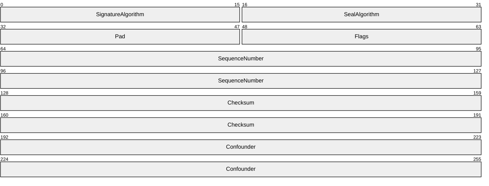

**SignatureAlgorithm (2 bytes):** A 16-bit little-endian integer that identifies the algorithm that is used for signature computation. The only supported signature algorithm is [**HMAC-MD5**](#gt_ba024019-a866-41df-99a5-764b7eab2e1e), as specified in [[RFC2104]](https://go.microsoft.com/fwlink/?LinkId=90314). The **SignatureAlgorithm** field MUST contain the following value.

| Value | Meaning |
| --- | --- |
| 0x0077 | The packet is signed using HMAC-MD5. |

**SealAlgorithm (2 bytes):** A 16-bit little-endian integer that identifies the algorithm used for encryption. The only supported encryption algorithm is RSA-[**RC4**](#gt_rc4) (for more information about RC4, see [SCHNEIER] section 17.1). The **SealAlgorithm** field MUST contain one of the following values.

| Value | Meaning |
| --- | --- |
| 0xFFFF | The packet is not encrypted. |
| 0x007A | The packet is encrypted using RC4. |

**Pad (2 bytes):** A 2-byte padding field. Both bytes MUST be set to 0xFF.

**Flags (2 bytes):** Specifies properties of the structure. No flags are currently defined. Both bytes MUST be set to zero and MUST be ignored on receipt.

**SequenceNumber (8 bytes):** A 64-bit little-endian integer containing the sequence number of the RPC message. For more details about how to calculate the **SequenceNumber**, see section [3.3.4.2.1](#Section_3.3.4.2.1).

**Checksum (8 bytes):** A 64-bit value containing the final checksum of the signature and the RPC message. For more details about how to calculate the checksum, see section 3.3.4.2.1.

**Confounder (8 bytes):** A buffer used when the structure is used for encryption in addition to signing. The bytes are filled with random data that is used by the encryption algorithm. If the structure is used only for signing, the confounder is not included. For details about the confounder and encrypting the data, see section 3.3.4.2.1.

<a id="Section_2.2.1.3.3"></a>
##### 2.2.1.3.3 NL_AUTH_SHA2_SIGNATURE

The **NL_AUTH_SHA2_SIGNATURE** structure is a security token that defines the SHA2 authentication signature that SHOULD<18> be used by Netlogon to execute Netlogon methods over a [**secure channel**](#gt_secure-channel). It follows the security trailer that a [**security provider**](#gt_security-provider) MUST associate with a signed or encrypted message. A security trailer or sec_trailer structure ([MS-RPCE](../MS-RPCE/MS-RPCE.md) section 2.2.2.11) has syntax equivalent to the auth_verifier_co_t structure, as specified in [[C706]](https://go.microsoft.com/fwlink/?LinkId=89824) section 13.2.6.1. When Netlogon is functioning as its own SSP for the [**RPC**](#gt_remote-procedure-call-rpc) connection, this structure contains the signature, a sequence number, and (if encryption is requested) a confounder. See section [3.3.4.2](#Section_3.3.4.2).

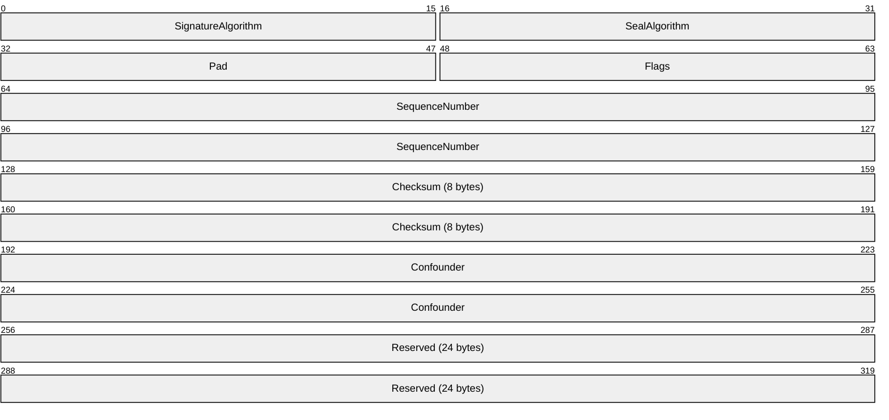

**SignatureAlgorithm (2 bytes):** A 16-bit little-endian integer that identifies the algorithm that is used for signature computation. The only supported signature algorithm is HMAC-SHA256 [[RFC4634]](https://go.microsoft.com/fwlink/?LinkId=90486). The **SignatureAlgorithm** field MUST contain the following value.

| Value | Meaning |
| --- | --- |
| 0x0013 | The packet is signed using HMAC-SHA256. |

**SealAlgorithm (2 bytes):** A 16-bit little-endian integer that identifies the algorithm used for encryption. The only supported encryption algorithm is AES-128 [[FIPS197]](https://go.microsoft.com/fwlink/?LinkId=89870). The **SealAlgorithm** field MUST contain one of the following values.

| Value | Meaning |
| --- | --- |
| 0xFFFF | The packet is not encrypted. |
| 0x001A | The packet is encrypted using AES-128. |

**Pad (2 bytes):** A 2-byte padding field. Both bytes MUST be set to 0xFF.

**Flags (2 bytes):** Specifies properties of the structure. No **Flags** are currently defined. Both bytes MUST be set to zero and MUST be ignored on receipt.

**SequenceNumber (8 bytes):** A 64-bit little-endian integer containing the sequence number of the RPC message. For more details about how to calculate the **SequenceNumber**, see section [3.3.4.2.1](#Section_3.3.4.2.1).

**Checksum (8 bytes):** A 64-bit value containing the final **Checksum** of the signature and the RPC message. For more details about how to calculate the **Checksum**, see section 3.3.4.2.1.

**Confounder (8 bytes):** A buffer that is employed when the structure is used for encryption, in addition to signing. The bytes are filled with random data that is used by the encryption algorithm. If the structure is used only for signing, the **Confounder** is not included. For details about the **Confounder** and encrypting the data, see section 3.3.4.2.1.

**Reserved (24 bytes):** The sender SHOULD<19> set these bytes to zero, and the receiver MUST ignore them.

<a id="Section_2.2.1.3.4"></a>
##### 2.2.1.3.4 NETLOGON_CREDENTIAL

The **NETLOGON_CREDENTIAL** structure contains 8 bytes of data that have two distinct uses: for [**session-key**](#gt_session-key) negotiation and for building a Netlogon [**authenticator**](#gt_authenticator).

typedef struct _NETLOGON_CREDENTIAL {

CHAR data[8];

} NETLOGON_CREDENTIAL,

*PNETLOGON_CREDENTIAL;

**data:** The meaning of the 8 bytes of data contained in this structure is determined by the following:

- When session-key negotiation is performed, the data field carries an 8-byte challenge. Also see section [3.1.4.1](#Section_3.1.4.1).
- When the **NETLOGON_CREDENTIAL** is used as part of a **NETLOGON_AUTHENTICATOR** structure (section [2.2.1.1.5](#Section_2.2.1.1.5)), the data field carries 8 bytes of encrypted data, as specified in the **Netlogon Credential Computation** (section [3.1.4.4](#Section_3.1.4.4)) and **Netlogon Authenticator Computation and Verification** (section [3.1.4.5](#Section_3.1.4.5)) sections.
<a id="Section_2.2.1.3.5"></a>
##### 2.2.1.3.5 NETLOGON_LSA_POLICY_INFO

The **NETLOGON_LSA_POLICY_INFO** structure defines [**Local Security Authority (LSA)**](#gt_local-security-authority-lsa) policy information as an unsigned character buffer. For details, see [[LSAPOLICY]](https://go.microsoft.com/fwlink/?LinkId=89934) and [MS-LSAD](../MS-LSAD/MS-LSAD.md).

typedef struct _NETLOGON_LSA_POLICY_INFO {

ULONG LsaPolicySize;

[size_is(LsaPolicySize)] UCHAR * LsaPolicy;

} NETLOGON_LSA_POLICY_INFO,

*PNETLOGON_LSA_POLICY_INFO;

**LsaPolicySize:** This field is not used and is set to zero.

**LsaPolicy:** This field is not used and is initialized to NULL.

<a id="Section_2.2.1.3.6"></a>
##### 2.2.1.3.6 NETLOGON_WORKSTATION_INFO

The **NETLOGON_WORKSTATION_INFO** structure defines information passed into the **NetrLogonGetDomainInfo** method, as specified in [3.5.4.4.10](#Section_3.5.4.4.10). It SHOULD<20> be used to convey information about a member workstation from the client side to the server side.

typedef struct _NETLOGON_WORKSTATION_INFO{

NETLOGON_LSA_POLICY_INFO LsaPolicy;

[string, range(0, 256)] wchar_t* DnsHostName;

[string, range(0, 256)] wchar_t* SiteName;

[string, range(0, 256)] wchar_t* Dummy1;

[string, range(0, 256)] wchar_t* Dummy2;

[string, range(0, 256)] wchar_t* Dummy3;

[string, range(0, 256)] wchar_t* Dummy4;

UNICODE_STRING OsVersion;

UNICODE_STRING OsName;

UNICODE_STRING DummyString3;

UNICODE_STRING DummyString4;

ULONG WorkstationFlags;

ULONG KerberosSupportedEncryptionTypes;

ULONG DummyLong3;

ULONG DummyLong4;

} NETLOGON_WORKSTATION_INFO,

*PNETLOGON_WORKSTATION_INFO;

**LsaPolicy:** A **NETLOGON_LSA_POLICY_INFO** structure, as specified in section [2.2.1.3.5](#Section_2.2.1.3.5), that contains the [**LSA**](#gt_local-security-authority-lsa) policy for this [**domain**](#gt_domain).

**DnsHostName:** A null-terminated [**Unicode string**](#gt_unicode-string) that contains the [**DNS**](#gt_domain-name-system-dns) host name of the client.

**SiteName:** A null-terminated Unicode string that contains the name of the [**site**](#gt_site) where the workstation resides.

**Dummy1:** MUST be set to NULL and MUST be ignored on receipt. The Netlogon usage of dummy fields is defined in section [1.3.8.1.2](#Section_1.3.8.1.2).

**Dummy2:** See definition of Dummy1.

**Dummy3:** See definition of Dummy1.

**Dummy4:** See definition of Dummy1.

**OsVersion:** A UNICODE_STRING structure in which the **Length** and **MaximumLength** fields are set to the size of an OSVERSIONINFOEX structure and the **Buffer** field points to an OSVERSIONINFOEX ([MS-RPRN](../MS-RPRN/MS-RPRN.md) section 2.2.3.10.2) structure. *OsVersion* contains the version number of the operating system installed on the client machine.

**OsName:** A null-terminated Unicode string that SHOULD<21> contain the name of the operating system installed on the client machine. The [**DC**](#gt_domain-controller-dc) that receives this data structure updates the **operatingSystem** attribute of the client's machine account object in [**Active Directory**](#gt_active-directory), as specified in [MS-ADA3](../MS-ADA3/MS-ADA3.md) section 2.53.

**DummyString3:** A STRING structure, defined in section [2.2.1.1.1](#Section_2.2.1.1.1), that MUST contain 0 for the **Length** field, 0 for the **MaximumLength** field, and NULL for the **Buffer** field. It is ignored upon receipt. The Netlogon usage of dummy fields is defined in section 1.3.8.1.2.

**DummyString4:** See definition for DummyString3.

**WorkstationFlags:** A set of bit flags specifying workstation behavior. A flag is TRUE (or set) if its value is equal to 1. The value is constructed from zero or more bit flags from the following table.

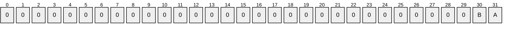

Where the bits are defined as:

| Value | Description |
| --- | --- |
| A | Client will receive inbound [**trusts**](#gt_trust) as specified in [MS-LSAD](../MS-LSAD/MS-LSAD.md) section 2.2.7.9. The client sets this bit in order to receive the inbound trusts. |
| B | Client handles the update of the [**service principal name (SPN)**](#gt_service-principal-name-spn). |

All other bits MUST be set to zero and MUST be ignored on receipt.

**KerberosSupportedEncryptionTypes:** The **msDS-SupportedEncryptionTypes** attribute of the client's machine account object in Active Directory, as specified in [MS-ADA2](../MS-ADA2/MS-ADA2.md) section 2.481.<22>

**DummyLong3:** MUST be set to zero and MUST be ignored on receipt. The Netlogon usage of dummy fields is defined in section 1.3.8.1.2.

**DummyLong4:** See definition of DummyLong3.

<a id="Section_2.2.1.3.7"></a>
##### 2.2.1.3.7 NL_TRUST_PASSWORD

The **NL_TRUST_PASSWORD** structure defines a buffer for carrying a computer account password, or a [**trust**](#gt_trust) password, to be transmitted over the wire. It SHOULD<23> be transported as an input parameter to the **NetrServerPasswordSet2** method, as specified in section [3.5.4.4.6](#Section_3.5.4.4.6). [**Domain members**](#gt_domain-member-member-machine) use NetrServerPasswordSet2 to change their computer account password. The [**primary domain controller**](#gt_primary-domain-controller-pdc) uses NetrServerPasswordSet2 to change trust passwords for all directly trusted [**domains**](#gt_domain). The **NL_TRUST_PASSWORD** structure is encrypted using the negotiated encryption algorithm before it is sent over the wire.<24>

typedef struct _NL_TRUST_PASSWORD {

WCHAR Buffer[256];

ULONG Length;

} NL_TRUST_PASSWORD,

*PNL_TRUST_PASSWORD;

**Buffer:** Array of [**Unicode**](#gt_unicode) characters that is treated as a byte buffer containing the password, as follows:

- For a computer account password, the buffer has the following format:
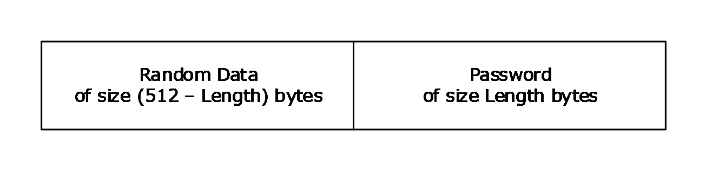

Figure 4: Computer account password buffer format

The first (512 – Length) bytes MUST be randomly generated data that serves as an additional source of entropy during encryption. The last Length bytes of the buffer MUST contain the clear text password.

- For a domain trust password, the buffer has the following format:
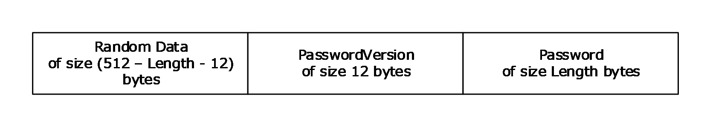

Figure 5: Domain trust password buffer format

The last Length bytes of the buffer contain the clear text password. The 12 bytes preceding the password are filled with the password version information as defined below. The rest of the buffer is filled with randomly generated data.

- The **PasswordVersion** part of the preceding diagram has the following format:


Figure 6: Password version buffer format

Where **ReservedField**, **PasswordVersionNumber**, and **PasswordVersionPresent** are the fields of the **NL_PASSWORD_VERSION** structure, as specified in section [2.2.1.3.8](#Section_2.2.1.3.8). The **PasswordVersionPresent** field is used to indicate whether the buffer contains a computer account password or a trust password: If the value of the **PasswordVersionPresent** field is 0x02231968, then the buffer contains a trust password; otherwise the buffer contains a computer account password.

**Length:** The length of the password, in bytes.

<a id="Section_2.2.1.3.8"></a>
##### 2.2.1.3.8 NL_PASSWORD_VERSION

The **NL_PASSWORD_VERSION** structure defines a password version number that is used to distinguish between different versions of information passed in the **Buffer** field of the **NL_TRUST_PASSWORD** structure (section [2.2.1.3.7](#Section_2.2.1.3.7)). The **NL_PASSWORD_VERSION** structure SHOULD<25> be prepended to the password in the buffer of **NL_TRUST_PASSWORD** and is only used for interdomain [**trust**](#gt_trust) accounts.

typedef struct _NL_PASSWORD_VERSION {

ULONG ReservedField;

ULONG PasswordVersionNumber;

ULONG PasswordVersionPresent;

} NL_PASSWORD_VERSION,

*PNL_PASSWORD_VERSION;

**ReservedField:** MUST be set to zero when sent and MUST be ignored on receipt.

**PasswordVersionNumber:** Integer value that contains the current password version number. The password version number is incremented by one when a new password is generated; the value for the first password is one.

**PasswordVersionPresent:** MUST be 0x02231968, which is a constant used to indicate that the password version number is present and is stored in **PasswordVersionNumber** field. This member is relevant only for server-to-server communication.

<a id="Section_2.2.1.3.9"></a>
##### 2.2.1.3.9 NETLOGON_WORKSTATION_INFORMATION

The **NETLOGON_WORKSTATION_INFORMATION** union SHOULD<26> select between two parameters of type **NETLOGON_WORKSTATION_INFO** structure, as specified in section [2.2.1.3.6](#Section_2.2.1.3.6), based on the value of the *Level* parameter of the **NetrLogonGetDomainInfo** method, as specified in section [3.5.4.4.10](#Section_3.5.4.4.10).

typedef

[switch_type(DWORD)]

union _NETLOGON_WORKSTATION_INFORMATION {

[case(1)]

PNETLOGON_WORKSTATION_INFO WorkstationInfo;

[case(2)]

PNETLOGON_WORKSTATION_INFO LsaPolicyInfo;

} NETLOGON_WORKSTATION_INFORMATION,

*PNETLOGON_WORKSTATION_INFORMATION;

**WorkstationInfo:** Field is selected when the switched DWORD ([MS-DTYP](../MS-DTYP/MS-DTYP.md) section 2.2.9) constant is 0x00000001.

**LsaPolicyInfo:** Field is selected when the switched DWORD constant is 0x00000002.

<a id="Section_2.2.1.3.10"></a>
##### 2.2.1.3.10 NETLOGON_ONE_DOMAIN_INFO

The **NETLOGON_ONE_DOMAIN_INFO** structure SHOULD<27> define information about a single [**domain**](#gt_domain). It is in turn contained in the **NETLOGON_DOMAIN_INFO** structure, as specified in section [2.2.1.3.11](#Section_2.2.1.3.11). The **NETLOGON_DOMAIN_INFO** structure describes domain relationships and is generated as output from the **NetrLogonGetDomainInfo** method, as specified in section [3.5.4.4.10](#Section_3.5.4.4.10).

typedef struct _NETLOGON_ONE_DOMAIN_INFO {

UNICODE_STRING DomainName;

UNICODE_STRING DnsDomainName;

UNICODE_STRING DnsForestName;

GUID DomainGuid;

PRPC_SID DomainSid;

UNICODE_STRING TrustExtension;

UNICODE_STRING DummyString2;

UNICODE_STRING DummyString3;

UNICODE_STRING DummyString4;

ULONG DummyLong1;

ULONG DummyLong2;

ULONG DummyLong3;

ULONG DummyLong4;

} NETLOGON_ONE_DOMAIN_INFO,

*PNETLOGON_ONE_DOMAIN_INFO;

**DomainName:** A null-terminated [**Unicode string**](#gt_unicode-string) that contains the [**NetBIOS name**](#gt_netbios-name) of the domain being described. This field MUST NOT be an empty string.

**DnsDomainName:** A null-terminated Unicode string that contains the [**DNS**](#gt_domain-name-system-dns) [**domain name**](#gt_domain-name) for this domain. This field MUST NOT be an empty string.

**DnsForestName:** A null-terminated Unicode string that contains the DNS [**forest**](#gt_forest) name for this domain.

**DomainGuid:** A globally unique 128-bit identifier for this domain.

**DomainSid:** The [**security identifier (SID)**](#gt_security-identifier-sid), as specified in [MS-DTYP](../MS-DTYP/MS-DTYP.md) section 2.4.2.3 for this domain.

**TrustExtension:** A **UNICODE_STRING** structure which does not point to a Unicode string, but in fact points to a buffer of size 16, in bytes, in the following format.

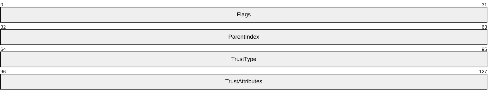

This structure is supplementary domain [**trust**](#gt_trust) information that contains the following fields of a [DS_DOMAIN_TRUSTSW](#Section_2.2.1.6.2) structure (section 2.2.1.6.2): **Flags**, **ParentIndex**, **TrustType**, and **TrustAttributes**. For more details on usage in NetrLogonGetDomainInfo, see section 3.5.4.4.10.

**DummyString2:** A STRING structure, defined in section [2.2.1.1.2](#Section_2.2.1.1.2), that MUST contain 0 for the **Length** field, 0 for the **MaximumLength** field, and NULL for the **Buffer** field. It is ignored upon receipt. The Netlogon usage of dummy fields is defined in section [1.3.8.1.2](#Section_1.3.8.1.2).

**DummyString3:** See definition for DummyString2.

**DummyString4:** See definition for DummyString2.

**DummyLong1:** MUST be set to zero and MUST be ignored on receipt. The Netlogon usage of dummy fields is defined in section 1.3.8.1.2.

**DummyLong2:** See definition for DummyLong1.

**DummyLong3:** See definition for DummyLong1.

**DummyLong4:** See definition for DummyLong1.

<a id="Section_2.2.1.3.11"></a>
##### 2.2.1.3.11 NETLOGON_DOMAIN_INFO

The **NETLOGON_DOMAIN_INFO** structure SHOULD<28> define information returned as output from the **NetrLogonGetDomainInfo** method, as specified in section [3.5.4.4.10](#Section_3.5.4.4.10). It contains information about a [**domain**](#gt_domain), including naming information and a list of [**trusted**](#gt_trust) domains.

typedef struct _NETLOGON_DOMAIN_INFO {

NETLOGON_ONE_DOMAIN_INFO PrimaryDomain;

ULONG TrustedDomainCount;

[size_is(TrustedDomainCount)] PNETLOGON_ONE_DOMAIN_INFO TrustedDomains;

NETLOGON_LSA_POLICY_INFO LsaPolicy;

UNICODE_STRING DnsHostNameInDs;

UNICODE_STRING DummyString2;

UNICODE_STRING DummyString3;

UNICODE_STRING DummyString4;

ULONG WorkstationFlags;

ULONG SupportedEncTypes;

ULONG DummyLong3;

ULONG DummyLong4;

} NETLOGON_DOMAIN_INFO,

*PNETLOGON_DOMAIN_INFO;

**PrimaryDomain:** A **NETLOGON_ONE_DOMAIN_INFO** structure, as specified in section [2.2.1.3.10](#Section_2.2.1.3.10), that contains information about the domain of which the server is a member.

**TrustedDomainCount:** The number of trusted domains listed in TrustedDomains.

**TrustedDomains:** A pointer to an array of **NETLOGON_ONE_DOMAIN_INFO** structures, as specified in section 2.2.1.3.10, which contain information about domains with which the current domain has a trust relationship.

**LsaPolicy:** A **NETLOGON_LSA_POLICY_INFO** data structure that contains the [**LSA**](#gt_local-security-authority-lsa) policy for this domain. This field is not used. For details, see section [2.2.1.3.5](#Section_2.2.1.3.5).

**DnsHostNameInDs:** A null-terminated [**Unicode string**](#gt_unicode-string) that contains the [**Active Directory**](#gt_active-directory) [**DNS**](#gt_domain-name-system-dns) host name for the client.

**DummyString2:** A STRING structure, defined in section [2.2.1.1.2](#Section_2.2.1.1.2), that MUST contain 0 for the **Length** field, 0 for the **MaximumLength** field, and NULL for the **Buffer** field. It is ignored upon receipt. The Netlogon usage of dummy fields is defined in section [1.3.8.1.2](#Section_1.3.8.1.2).

**DummyString3:** See definition for DummyString2.

**DummyString4:** See definition for DummyString2.

**WorkstationFlags:** A set of bit flags that specify workstation behavior. A flag is TRUE (or set) if its value is equal to 1. The value is constructed from zero or more bit flags from the following table.


Where the bits are defined as:

| Value | Description |
| --- | --- |
| A | Client receives inbound trusts. |
| B | Client handles the update of the [**service principal name (SPN)**](#gt_service-principal-name-spn). See [[SPNNAMES]](https://go.microsoft.com/fwlink/?LinkId=90532) for details. |

All other bits MUST be set to zero and MUST be ignored on receipt.

**SupportedEncTypes:** A set of bit flags that SHOULD<29> specify the encryption types supported, as specified in [MS-LSAD](../MS-LSAD/MS-LSAD.md) section 2.2.7.18. See [MS-LSAD] for a specification of these bit values and their allowed combinations.

**DummyLong3:** MUST be set to zero and MUST be ignored on receipt. The Netlogon usage of dummy fields is defined in section 1.3.8.1.2.

**DummyLong4:** See definition of DummyLong3.

<a id="Section_2.2.1.3.12"></a>
##### 2.2.1.3.12 NETLOGON_DOMAIN_INFORMATION

The **NETLOGON_DOMAIN_INFORMATION** union SHOULD<30> select either a **NETLOGON_DOMAIN_INFO**, as specified in section [2.2.1.3.11](#Section_2.2.1.3.11), or a **NETLOGON_LSA_POLICY_INFO**, as specified in section [2.2.1.3.5](#Section_2.2.1.3.5), data type based on the value of the *Level* parameter to the **NetrLogonGetDomainInfo** method, as specified in section [3.5.4.4.10](#Section_3.5.4.4.10).

typedef

[switch_type(DWORD)]

union _NETLOGON_DOMAIN_INFORMATION {

[case(1)]

PNETLOGON_DOMAIN_INFO DomainInfo;

[case(2)]

PNETLOGON_LSA_POLICY_INFO LsaPolicyInfo;

} NETLOGON_DOMAIN_INFORMATION,

*PNETLOGON_DOMAIN_INFORMATION;

**DomainInfo:** This field is selected when the switched DWORD ([MS-DTYP](../MS-DTYP/MS-DTYP.md) section 2.2.9) value is set to 0x00000001. The union contains a **NETLOGON_DOMAIN_INFO** structure, as specified in section 2.2.1.3.11.

**LsaPolicyInfo:** This field is selected when the switched DWORD value is set to 0x00000002. The union contains a **NETLOGON_LSA_POLICY_INFO** structure, as specified in section 2.2.1.3.5.

<a id="Section_2.2.1.3.13"></a>
##### 2.2.1.3.13 NETLOGON_SECURE_CHANNEL_TYPE

The **NETLOGON_SECURE_CHANNEL_TYPE** enumeration specifies the type of [**secure channel**](#gt_secure-channel) to use in a logon transaction.

typedef enum _NETLOGON_SECURE_CHANNEL_TYPE

{

NullSecureChannel = 0,

MsvApSecureChannel = 1,

WorkstationSecureChannel = 2,

TrustedDnsDomainSecureChannel = 3,

TrustedDomainSecureChannel = 4,

UasServerSecureChannel = 5,

ServerSecureChannel = 6,

CdcServerSecureChannel = 7

} NETLOGON_SECURE_CHANNEL_TYPE;

**NullSecureChannel:** An unauthenticated channel type. This value MUST NOT be used in the Netlogon [**RPC**](#gt_remote-procedure-call-rpc) calls between a client and a remote server. The error code STATUS_INVALID_PARAMETER is returned.

**MsvApSecureChannel:** A secure channel between the local [**NT LAN Manager (NTLM)**](#gt_nt-lan-manager-ntlm) [**security provider**](#gt_security-provider) and the Netlogon server. The client and the server are the same machine for this channel type. This value MUST NOT be used in the Netlogon RPC calls between a client and a remote server. The error code STATUS_INVALID_PARAMETER is returned.

**WorkstationSecureChannel:** A secure channel from a [**domain member**](#gt_domain-member-member-machine) to a [**DC**](#gt_domain-controller-dc).

**TrustedDnsDomainSecureChannel:** A secure channel between two DCs, connected through a [**trust**](#gt_trust) relationship created between two [**Active Directory**](#gt_active-directory) [**domains**](#gt_domain). A [**trusted domain object (TDO)**](#gt_trusted-domain-object-tdo) is used in this type of channel.

**TrustedDomainSecureChannel:** A secure channel between two DCs, connected through a trust relationship created between two domains.<31>

**UasServerSecureChannel:** Secure channel from a LAN Manager server to a DC. This value is no longer supported, and it MUST NOT be used in the Netlogon RPC calls between a client and a remote server. The error code STATUS_INVALID_PARAMETER is returned.

**ServerSecureChannel:** A secure channel from a [**backup domain controller**](#gt_backup-domain-controller-bdc) to a [**primary domain controller**](#gt_primary-domain-controller-pdc).

**CdcServerSecureChannel: A** secure channel from a [**read-only domain controller (RODC)**](#gt_read-only-domain-controller-rodc) to a domain controller.<32>

<a id="Section_2.2.1.3.14"></a>
##### 2.2.1.3.14 NETLOGON_CAPABILITIES

The **NETLOGON_CAPABILITIES** union SHOULD<33> carry the supported Netlogon capabilities.

typedef

[switch_type(DWORD)]

union _NETLOGON_CAPABILITIES {

[case(1)]

ULONG ServerCapabilities;

[case (2)]

ULONG RequestedFlags;

} NETLOGON_CAPABILITIES,

*PNETLOGON_CAPABILITIES;

**ServerCapabilities:** A 32-bit set of bit flags that identify the server's capabilities (section [3.5.4.4.11](#Section_3.5.4.4.11)).

**RequestedFlags:** A 32-bit set of bit flags that identify the client capabilities that server received during negotiation (section 3.5.4.4.11).<34>

<a id="Section_2.2.1.3.15"></a>
##### 2.2.1.3.15 NL_OSVERSIONINFO_V1

The **NL_OSVERSIONINFO_V1** structure specifies the values used to update the **operatingSystemVersion** and **operatingSystem** attributes on the client's computer account object in [**Active Directory**](#gt_active-directory) on a normal (writable) [**DC**](#gt_domain-controller-dc).<35>

typedef struct _NL_OSVERSIONINFO_V1 {

DWORD dwOSVersionInfoSize;

DWORD dwMajorVersion;

DWORD dwMinorVersion;

DWORD dwBuildNumber;

DWORD dwPlatformId;

wchar_t szCSDVersion[128];

USHORT wServicePackMajor;

USHORT wServicePackMinor;

USHORT wSuiteMask;

UCHAR wProductType;

UCHAR wReserved;

} NL_OSVERSIONINFO_V1;

**dwOSVersionInfoSize:** The size, in bytes, of this data structure. Set this member to sizeof(NL_OSVERSIONINFO_V1).

**dwMajorVersion:** The implementation-specific major version number of the operating system.<36>

**dwMinorVersion:** The implementation-specific minor version number of the operating system.<37>

**dwBuildNumber:** The build number of the operating system.

**dwPlatformId:** The operating system platform.<38>

**szCSDVersion:** A null-terminated string, such as "Service Pack 3", that indicates the latest service pack installed on the system. If no service pack has been installed, the string is empty.

**wServicePackMajor:** The major version number of the latest service pack installed on the system. For example, for "Service Pack 3", the major version number is 3. If no service pack has been installed, the value is 0.

**wServicePackMinor:** The minor version number of the latest service pack installed on the system. For example, for "Service Pack 3", the minor version number is 0.

**wProductType:** Any additional information about the system. This member can be one of the following values.

| Value | Meaning |
| --- | --- |
| VER_NT_DOMAIN_CONTROLLER 0x00000002 | The system is a DC. |
| VER_NT_SERVER 0x00000003 | The system is a server. Note that a server that is also a DC is reported as VER_NT_DOMAIN_CONTROLLER, not VER_NT_SERVER. |
| VER_NT_WORKSTATION 0x00000001 | Identifies the operating system.<39> |

**wReserved:** Reserved for future use.<40>

<a id="Section_2.2.1.3.16"></a>
##### 2.2.1.3.16 NL_IN_CHAIN_SET_CLIENT_ATTRIBUTES_V1

The **NL_IN_CHAIN_SET_CLIENT_ATTRIBUTES_V1** structure specifies the values to update on the client's computer account object in [**Active Directory**](#gt_active-directory) on a normal (writable) [**domain controller**](#gt_domain-controller-dc).<41>

typedef struct _NL_IN_CHAIN_SET_CLIENT_ATTRIBUTES_V1 {

[unique,string,range(0,256)] wchar_t* ClientDnsHostName;

[unique] NL_OSVERSIONINFO_V1* OsVersionInfo_V1;

[unique,string,range(0,256)] wchar_t* OsName;

} NL_IN_CHAIN_SET_CLIENT_ATTRIBUTES_V1;

**ClientDnsHostName:** A NULL or null-terminated [**Unicode string**](#gt_unicode-string) that is used to update the attribute **dNSHostName** on the client's computer account object in Active Directory.

**OsVersionInfo_V1:** If not NULL, the attribute **operatingSystemVersion** on the client's computer account in Active Directory (using the ABNF Syntax as specified in [[RFC2234]](https://go.microsoft.com/fwlink/?LinkId=90323)) is set to:

- If OsVersionInfo_V1.dwBuildNumber is 0:
operatingSystemVersion = MajorVersion "." MinorVersion

MajorVersion = "OsVersionInfo_V1.dwMajorVersion"

MinorVersion = "OsVersionInfo_V1.dwMinorVersion"

- Otherwise:
operatingSystemVersion = MajorVersion "." MinorVersion "."

BuildNumber

MajorVersion = "OsVersionInfo_V1.dwMajorVersion"

MinorVersion = "OsVersionInfo_V1.dwMinorVersion"

BuildNumber = "OsVersionInfo_V1.dwBuildNumber"

**OsName:** A NULL or a null-terminated Unicode string that SHOULD<42> be used to update the attribute **operatingSystem** on the client's computer account object in Active Directory.

<a id="Section_2.2.1.3.17"></a>
##### 2.2.1.3.17 NL_IN_CHAIN_SET_CLIENT_ATTRIBUTES

The **NL_IN_CHAIN_SET_CLIENT_ATTRIBUTES** union defines versioning.

typedef

[switch_type(DWORD)]

union {

[case(1)]

NL_IN_CHAIN_SET_CLIENT_ATTRIBUTES_V1 V1;

} NL_IN_CHAIN_SET_CLIENT_ATTRIBUTES;

**V1:** An **NL_IN_CHAIN_SET_CLIENT_ATTRIBUTES_V1** (section [2.2.1.3.16)](#Section_2.2.1.3.16) structure.<43>

<a id="Section_2.2.1.3.18"></a>
##### 2.2.1.3.18 NL_OUT_CHAIN_SET_CLIENT_ATTRIBUTES_V1

The **NL_OUT_CHAIN_SET_CLIENT_ATTRIBUTES_V1** structure SHOULD<44> specify the values returned from the normal (writable) [**DC**](#gt_domain-controller-dc).

typedef struct _NL_OUT_CHAIN_SET_CLIENT_ATTRIBUTES_V1 {

[unique, string] wchar_t* HubName;

[unique, string] wchar_t** OldDnsHostName;

[unique] ULONG * SupportedEncTypes;

} NL_OUT_CHAIN_SET_CLIENT_ATTRIBUTES_V1;

**HubName:** The [**NetBIOS name**](#gt_netbios-name) of the [**writable domain controller**](#gt_writable-domain-controller) receiving [NetrChainSetClientAttributes (section 3.5.4.4.12)](#Section_3.5.4.4.12). The [**read-only domain controller (RODC)**](#gt_read-only-domain-controller-rodc) that invoked the method NetrChainSetClientAttributes SHOULD<45> attempt to replicate the computer account object from **HubName** to itself, ignoring errors.

**OldDnsHostName:** The client's [**DNS**](#gt_domain-name-system-dns) host name, if any, from the **dNSHostName** attribute ([MS-ADA1](../MS-ADA1/MS-ADA1.md) section 2.185) on the client's computer account object in [**Active Directory**](#gt_active-directory) on the writable domain controller. If there was an update to the **dNSHostName** attribute by the writable domain controller as a result of receiving NetrChainSetClientAttributes, this value will hold the previous value of that attribute.

**SupportedEncTypes:** The supported encryption algorithms received from the [NetrLogonGetDomainInfo](#Section_3.5.4.4.10) request, in the **SupportedEncTypes** field in the [NETLOGON_DOMAIN_INFO (section 2.2.1.3.11)](#Section_2.2.1.3.11) structure.<46>

<a id="Section_2.2.1.3.19"></a>
##### 2.2.1.3.19 NL_OUT_CHAIN_SET_CLIENT_ATTRIBUTES

The **NL_OUT_CHAIN_SET_CLIENT_ATTRIBUTES** union defines versioning. Currently, only version 1 is supported.

typedef

[switch_type(DWORD)]

union {

[case(1)]

NL_OUT_CHAIN_SET_CLIENT_ATTRIBUTES_V1 V1;

} NL_OUT_CHAIN_SET_CLIENT_ATTRIBUTES;

**V1:** An [NL_OUT_CHAIN_SET_CLIENT_ATTRIBUTES_V1 (section 2.2.1.3.18)](#Section_2.2.1.3.19) structure.<47>

<a id="Section_2.2.1.4"></a>
#### 2.2.1.4 Pass-Through Authentication Structures

Structures and enumerated types in this group are used for generic pass-though and for user logon and logoff.

<a id="Section_2.2.1.4.1"></a>
##### 2.2.1.4.1 LM_CHALLENGE

The **LM_CHALLENGE** structure carries a LAN Manager authentication challenge.

typedef struct {

CHAR data[8];

} LM_CHALLENGE;

**data:** A string of eight characters that contains a LAN Manager authentication challenge, which is an unencrypted [**nonce**](#gt_nonce).

For more information, see [[LANMAN]](https://go.microsoft.com/fwlink/?LinkId=89929).

<a id="Section_2.2.1.4.2"></a>
##### 2.2.1.4.2 NETLOGON_GENERIC_INFO

The **NETLOGON_GENERIC_INFO** structure defines a structure that contains logon information in binary format. Authentication protocols make use of this structure for passing generic logon data through the Netlogon [**secure channel**](#gt_secure-channel) to a [**DC**](#gt_domain-controller-dc) in the [**domain**](#gt_domain) that contains the user account to use the domain's [**database**](#gt_database). For an example of using the **NETLOGON_GENERIC_INFO** structure, see any of the examples documented in [MS-APDS](../MS-APDS/MS-APDS.md).

typedef struct _NETLOGON_GENERIC_INFO {

NETLOGON_LOGON_IDENTITY_INFO Identity;

UNICODE_STRING PackageName;

ULONG DataLength;

[size_is(DataLength)] UCHAR * LogonData;

} NETLOGON_GENERIC_INFO,

*PNETLOGON_GENERIC_INFO;

**Identity:** The **NETLOGON_LOGON_IDENTITY_INFO** structure, as specified in section [2.2.1.4.15](#Section_2.2.1.4.15), contains information about the logon identity. The **LogonDomainName** field of the **NETLOGON_LOGON_IDENTITY_INFO** structure indicates the target domain that contains the user account.

**PackageName:** Contains the name of the [**security provider**](#gt_security-provider), such as Kerberos, to which the data will be delivered on the domain controller in the target domain that was specified in the **Identity** field. This name MUST match the name of an existing security provider; otherwise, the [**Security Support Provider Interface (SSPI)**](#gt_security-support-provider-interface-sspi) ([[SSPI]](https://go.microsoft.com/fwlink/?LinkId=90536)) returns a package not found error.

**DataLength:** The length, in bytes, of **LogonData**.

**LogonData:** A pointer to a block of binary data that contains the information to be sent to the security package referenced in **PackageName**. This data is opaque to Netlogon.

<a id="Section_2.2.1.4.3"></a>
##### 2.2.1.4.3 NETLOGON_INTERACTIVE_INFO

The **NETLOGON_INTERACTIVE_INFO** structure defines information about an [**interactive logon**](#gt_interactive-logon) instance.

typedef struct _NETLOGON_INTERACTIVE_INFO {

NETLOGON_LOGON_IDENTITY_INFO Identity;

LM_OWF_PASSWORD LmOwfPassword;

NT_OWF_PASSWORD NtOwfPassword;

} NETLOGON_INTERACTIVE_INFO,

*PNETLOGON_INTERACTIVE_INFO;

**Identity:** A **NETLOGON_LOGON_IDENTITY_INFO** structure, as specified in section [2.2.1.4.15](#Section_2.2.1.4.15), that contains information about the logon identity.

**LmOwfPassword:** An **LM_OWF_PASSWORD** structure, as specified in section [2.2.1.1.3](#Section_2.2.1.1.3), that contains the LMOWFv1 of a password. LMOWFv1 is specified in NTLM v1 Authentication in [MS-NLMP](../MS-NLMP/MS-NLMP.md) section 3.3.1.

**NtOwfPassword:** An **NT_OWF_PASSWORD** structure, as specified in section [2.2.1.1.4](#Section_2.2.1.1.4), that contains the NTOWFv1 of a password. NTOWFv1 is specified in NTLM v1 Authentication in [MS-NLMP] section 3.3.1.

<a id="Section_2.2.1.4.4"></a>
##### 2.2.1.4.4 NETLOGON_SERVICE_INFO

The **NETLOGON_SERVICE_INFO** structure defines information about a service account logon. Operating system services use service accounts as their run-time security identity.

typedef struct _NETLOGON_SERVICE_INFO {

NETLOGON_LOGON_IDENTITY_INFO Identity;

LM_OWF_PASSWORD LmOwfPassword;

NT_OWF_PASSWORD NtOwfPassword;

} NETLOGON_SERVICE_INFO,

*PNETLOGON_SERVICE_INFO;

**Identity: NETLOGON_LOGON_IDENTITY_INFO** structure, as specified in section [2.2.1.4.15](#Section_2.2.1.4.15), that contains information about the logon identity.

**LmOwfPassword: LM_OWF_PASSWORD** structure, as specified in section [2.2.1.1.3](#Section_2.2.1.1.3), that contains the LMOWFv1 of a password. LMOWFv1 is specified in NTLM v1 Authentication in [MS-NLMP](../MS-NLMP/MS-NLMP.md) section 3.3.1.

**NtOwfPassword: NT_OWF_PASSWORD** structure, as specified in section [2.2.1.1.4](#Section_2.2.1.1.4), that contains the NTOWFv1 of a password. NTOWFv1 is specified in NTLM v1 Authentication in [MS-NLMP] section 3.3.1.

<a id="Section_2.2.1.4.5"></a>
##### 2.2.1.4.5 NETLOGON_NETWORK_INFO

The **NETLOGON_NETWORK_INFO** structure defines information that describes a network account logon.

typedef struct _NETLOGON_NETWORK_INFO {

NETLOGON_LOGON_IDENTITY_INFO Identity;

LM_CHALLENGE LmChallenge;

STRING NtChallengeResponse;

STRING LmChallengeResponse;

} NETLOGON_NETWORK_INFO,

*PNETLOGON_NETWORK_INFO;

**Identity: NETLOGON_LOGON_IDENTITY_INFO** structure, as specified in section [2.2.1.4.15](#Section_2.2.1.4.15), that contains information about the logon identity. The **Identity.LogonDomainName** field MUST match the **DomainName** field of the authenticate message received by the client. The authenticate message is defined in [MS-NLMP](../MS-NLMP/MS-NLMP.md) section 2.2.1.3.

**LmChallenge: LM_CHALLENGE** structure, as specified in section [2.2.1.4.1](#Section_2.2.1.4.13), that contains the network authentication challenge. For details about challenges, see [MS-NLMP].

**NtChallengeResponse:** String that contains the NT response (see [MS-NLMP]) to the network authentication challenge.

**LmChallengeResponse:** String that contains the LAN Manager response (see [MS-NLMP]) to the network authentication challenge.

<a id="Section_2.2.1.4.6"></a>
##### 2.2.1.4.6 NETLOGON_LEVEL

The **NETLOGON_LEVEL** union defines a union of all types of logon information.

typedef

[switch_type(NETLOGON_LOGON_INFO_CLASS)]

union _NETLOGON_LEVEL {

[case(NetlogonInteractiveInformation)]

PNETLOGON_INTERACTIVE_INFO LogonInteractive;

[case(NetlogonInteractiveTransitiveInformation)]

PNETLOGON_INTERACTIVE_INFO LogonInteractiveTransitive;

[case(NetlogonServiceInformation)]

PNETLOGON_SERVICE_INFO LogonService;

[case(NetlogonServiceTransitiveInformation)]

PNETLOGON_SERVICE_INFO LogonServiceTransitive;

[case(NetlogonNetworkInformation)]

PNETLOGON_NETWORK_INFO LogonNetwork;

[case(NetlogonNetworkTransitiveInformation)]

PNETLOGON_NETWORK_INFO LogonNetworkTransitive;

[case(NetlogonGenericInformation)]

PNETLOGON_GENERIC_INFO LogonGeneric;

[case(NetlogonTicketLogonInformation)]

PNETLOGON_TICKET_LOGON_INFO LogonTicket;

[default] ;

} NETLOGON_LEVEL,

*PNETLOGON_LEVEL;

**LogonInteractive:** This field is selected when the logon information type is **NetlogonInteractiveInformation**. The data type is **NETLOGON_INTERACTIVE_INFO**, as specified in section [2.2.1.4.3](#Section_2.2.1.4.3).

**LogonInteractiveTransitive:** This field is selected when the logon information type is **NetlogonInteractiveTransitiveInformation**. The data type is **NETLOGON_INTERACTIVE_INFO**, as specified in section 2.2.1.4.3.

**LogonService:** This field is selected when the logon information type is **NetlogonServiceInformation**. The data type is **NETLOGON_SERVICE_INFO**, as specified in section [2.2.1.4.4](#Section_2.2.1.4.4).

**LogonServiceTransitive:** This field is selected when the logon information type is **NetlogonServiceTransitiveInformation**. The data type is **NETLOGON_SERVICE_INFO**, as specified in section 2.2.1.4.4.

**LogonNetwork:** This field is selected when the logon information type is **NetlogonNetworkInformation**. The data type is **NETLOGON_NETWORK_INFO**, as specified in section [2.2.1.4.5](#Section_2.2.1.4.5).

**LogonNetworkTransitive:** This field is selected when the logon information type is **NetlogonNetworkTransitiveInformation**. The data type is **NETLOGON_NETWORK_INFO**, as specified in section 2.2.1.4.5.

**LogonGeneric:** This field is selected when the logon information type is **NetlogonGenericInformation**. The data type is **NETLOGON_GENERIC_INFO**, as specified in section [2.2.1.4.2](#Section_2.2.1.4.2).

**LogonTicket:** This field is selected when the logon information type is **NetlogonTicketLogonInformation**. The data type is **NETLOGON_TICKET_LOGON_INFO**, as specified in section [2.2.1.4.19](#Section_2.2.1.4.19).

<a id="Section_2.2.1.4.7"></a>
##### 2.2.1.4.7 NETLOGON_SID_AND_ATTRIBUTES

The **NETLOGON_SID_AND_ATTRIBUTES** structure contains a [**security identifier (SID)**](#gt_security-identifier-sid) and its attributes.

typedef struct _NETLOGON_SID_AND_ATTRIBUTES {

PRPC_SID Sid;

ULONG Attributes;

} NETLOGON_SID_AND_ATTRIBUTES,

*PNETLOGON_SID_AND_ATTRIBUTES;

**Sid:** A pointer to a security identifier (SID), as specified in [MS-DTYP](../MS-DTYP/MS-DTYP.md) section 2.4.2.3.

**Attributes:** A set of bit flags that contains the set of security attributes assigned to this SID. A bit is TRUE (or set) if its value is equal to 1. The value is constructed from one or more bit flags from the following table.

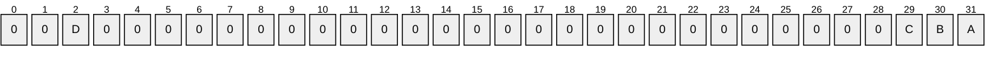

Where the bits are defined as:

| Value | Description |
| --- | --- |
| A | The SID cannot have the **SE_GROUP_ENABLED** attribute removed. Corresponds to the SID attribute **SE_GROUP_MANDATORY**. This attribute prevents the user from disabling the [**group**](#gt_group). Disabling a group causes the group to be ignored by access validation routines. |
| B | The SID is enabled by default (as opposed to being enabled by an application). Corresponds to the SID attribute **SE_GROUP_ENABLED_BY_DEFAULT**. |
| C | The SID is enabled for access checks. Corresponds to the SID attribute **SE_GROUP_ENABLED**. |
| D | This group is a [**domain local group**](#gt_domain-local-group). Corresponds to **SE_GROUP_RESOURCE**. |

All other bits MUST be set to zero and MUST be ignored on receipt. For more information, see [[MSDOCS-TokenGrp]](https://go.microsoft.com/fwlink/?linkid=2101788).

These values are opaque to the Netlogon protocol. They are not used or processed directly. All fields of this structure have the same meaning as the identically named fields in the **KERB_SID_AND_ATTRIBUTES** structure as specified in [MS-PAC](../MS-PAC/MS-PAC.md) section 2.2.1.

<a id="Section_2.2.1.4.8"></a>
##### 2.2.1.4.8 NETLOGON_VALIDATION_GENERIC_INFO2

The **NETLOGON_VALIDATION_GENERIC_INFO2** structure defines a structure that contains account information in binary format. This structure is used by authentication protocols to return generic account information upon successful logon validation. For an example of using the **NETLOGON_VALIDATION_GENERIC_INFO2** structure, see any of the examples in [MS-APDS](../MS-APDS/MS-APDS.md).

typedef struct _NETLOGON_VALIDATION_GENERIC_INFO2 {

ULONG DataLength;

[size_is(DataLength)] UCHAR * ValidationData;

} NETLOGON_VALIDATION_GENERIC_INFO2,

*PNETLOGON_VALIDATION_GENERIC_INFO2;

**DataLength:** An integer value that contains the length of the data referenced by **ValidationData**, in bytes.

**ValidationData:** A pointer to a buffer that contains the logon validation information.

<a id="Section_2.2.1.4.9"></a>
##### 2.2.1.4.9 USER_SESSION_KEY

The **USER_SESSION_KEY** structure defines an encrypted user [**session key**](#gt_session-key).

typedef struct _USER_SESSION_KEY {

CYPHER_BLOCK data[2];

} USER_SESSION_KEY,

*PUSER_SESSION_KEY;

**data:** A two-element **CYPHER_BLOCK** structure, as specified in section [2.2.1.1.1](#Section_2.2.1.1.1), that contains the 16-byte encrypted user session key.

<a id="Section_2.2.1.4.10"></a>
##### 2.2.1.4.10 GROUP_MEMBERSHIP

The **GROUP_MEMBERSHIP** structure identifies the [**group**](#gt_group) to which an account belongs.

typedef struct _GROUP_MEMBERSHIP {

ULONG RelativeId;

ULONG Attributes;

} GROUP_MEMBERSHIP,

*PGROUP_MEMBERSHIP;

**RelativeId:** The [**relative identifier (RID)**](#gt_relative-identifier-rid) for a particular group.

**Attributes:** A set of values that describe the group membership attributes set for the RID specified in **RelativeId**. The value is constructed from one or more bit flags from the following table.

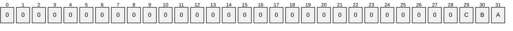

Where the bits are defined as:

| Value | Description |
| --- | --- |
| A | The [**SID**](#gt_security-identifier-sid) cannot have the **SE_GROUP_ENABLED** attribute removed. Corresponds to the SID attribute **SE_GROUP_MANDATORY**. This attribute prevents the user from disabling the group. Disabling a group causes the group to be ignored by access validation routines. |
| B | The SID is enabled by default (as opposed to being enabled by an application). Corresponds to the SID attribute **SE_GROUP_ENABLED_BY_DEFAULT**. |
| C | The SID is enabled for access checks. Corresponds to the SID attribute **SE_GROUP_ENABLED**. The **SE_GROUP_ENABLED** attribute enables the group. |

All other bits MUST be zero and MUST be ignored on receipt. For more information, see [[MSDOCS-TokenGrp]](https://go.microsoft.com/fwlink/?linkid=2101788).

These values are opaque to the Netlogon protocol. They are not used or processed directly. All fields of this structure have the same meaning as the identically named fields in the **GROUP_MEMBERSHIP** structure as specified in [MS-PAC](../MS-PAC/MS-PAC.md) section 2.2.2.

<a id="Section_2.2.1.4.11"></a>
##### 2.2.1.4.11 NETLOGON_VALIDATION_SAM_INFO

The **NETLOGON_VALIDATION_SAM_INFO** structure defines account information retrieved from a [**database**](#gt_database) upon a successful user logon validation.

All fields of this structure, except the fields detailed following the structure definition, have the same meaning as the identically named fields in the **KERB_VALIDATION_INFO** structure, as specified in [MS-PAC](../MS-PAC/MS-PAC.md) section 2.5. Additionally, fields of this structure that are defined as OLD_LARGE_INTEGER [[MSDN-OLI]](https://go.microsoft.com/fwlink/?LinkId=124152) are 64-bit timestamps equivalent to the identically named fields in the **KERB_VALIDATION_INFO** structure of **FILETIME** type ([MS-DTYP](../MS-DTYP/MS-DTYP.md) section 2.3.3). For more information see [[MSDN-FILETIME]](https://go.microsoft.com/fwlink/?LinkId=90006).

typedef struct _NETLOGON_VALIDATION_SAM_INFO {

OLD_LARGE_INTEGER LogonTime;

OLD_LARGE_INTEGER LogoffTime;

OLD_LARGE_INTEGER KickOffTime;

OLD_LARGE_INTEGER PasswordLastSet;

OLD_LARGE_INTEGER PasswordCanChange;

OLD_LARGE_INTEGER PasswordMustChange;

UNICODE_STRING EffectiveName;

UNICODE_STRING FullName;

UNICODE_STRING LogonScript;

UNICODE_STRING ProfilePath;

UNICODE_STRING HomeDirectory;

UNICODE_STRING HomeDirectoryDrive;

USHORT LogonCount;

USHORT BadPasswordCount;

ULONG UserId;

ULONG PrimaryGroupId;

[range(0,2048)] ULONG GroupCount;

[size_is(GroupCount)] PGROUP_MEMBERSHIP GroupIds;

ULONG UserFlags;

USER_SESSION_KEY UserSessionKey;

UNICODE_STRING LogonServer;

UNICODE_STRING LogonDomainName;

PRPC_SID LogonDomainId;

ULONG ExpansionRoom[10];

} NETLOGON_VALIDATION_SAM_INFO,

*PNETLOGON_VALIDATION_SAM_INFO;

**LogonServer:** A **UNICODE_STRING** structure that contains the [**NetBIOS name**](#gt_netbios-name) of the server that populates this structure.

**ExpansionRoom:** A ten-element array of unsigned 32-bit integers. This member has a function similar to that of dummy fields, as detailed in section [1.3.8.1.2](#Section_1.3.8.1.2). Each element of the array MUST be zero when sent and MUST be ignored on receipt.

<a id="Section_2.2.1.4.12"></a>
##### 2.2.1.4.12 NETLOGON_VALIDATION_SAM_INFO2

The **NETLOGON_VALIDATION_SAM_INFO2** structure is an extension to **NETLOGON_VALIDATION_SAM_INFO**, as specified in section [2.2.1.4.11](#Section_2.2.1.4.11), with support for storing extra [**SIDs**](#gt_security-identifier-sid).

All fields of this structure, except the fields detailed following the structure definition, have the same meaning as the identically named fields in the KERB_VALIDATION_INFO structure as specified in [MS-PAC](../MS-PAC/MS-PAC.md) section 2.5. Additionally, fields of this structure that are defined as OLD_LARGE_INTEGER are 64-bit timestamps equivalent to the identically named fields in the KERB_VALIDATION_INFO structure of **FILETIME** type ([MS-DTYP](../MS-DTYP/MS-DTYP.md) section 2.3.3).

typedef struct _NETLOGON_VALIDATION_SAM_INFO2 {

OLD_LARGE_INTEGER LogonTime;

OLD_LARGE_INTEGER LogoffTime;

OLD_LARGE_INTEGER KickOffTime;

OLD_LARGE_INTEGER PasswordLastSet;

OLD_LARGE_INTEGER PasswordCanChange;

OLD_LARGE_INTEGER PasswordMustChange;

UNICODE_STRING EffectiveName;

UNICODE_STRING FullName;

UNICODE_STRING LogonScript;

UNICODE_STRING ProfilePath;

UNICODE_STRING HomeDirectory;

UNICODE_STRING HomeDirectoryDrive;

USHORT LogonCount;

USHORT BadPasswordCount;

ULONG UserId;

ULONG PrimaryGroupId;

[range(0,2048)] ULONG GroupCount;

[size_is(GroupCount)] PGROUP_MEMBERSHIP GroupIds;

ULONG UserFlags;

USER_SESSION_KEY UserSessionKey;

UNICODE_STRING LogonServer;

UNICODE_STRING LogonDomainName;

PRPC_SID LogonDomainId;

ULONG ExpansionRoom[10];

[range(0,2048)] ULONG SidCount;

[size_is(SidCount)] PNETLOGON_SID_AND_ATTRIBUTES ExtraSids;

} NETLOGON_VALIDATION_SAM_INFO2,

*PNETLOGON_VALIDATION_SAM_INFO2;

**LogonServer:** A **UNICODE_STRING** structure that contains the [**NetBIOS name**](#gt_netbios-name) of the server that populates this structure.

**ExpansionRoom:** A ten-element array of unsigned 32-bit integers. This member has a function similar to that of dummy fields, as defined in section [1.3.8.1.2](#Section_1.3.8.1.2). Each element of the array MUST be zero when sent and MUST be ignored on receipt.

<a id="Section_2.2.1.4.13"></a>
##### 2.2.1.4.13 NETLOGON_VALIDATION_SAM_INFO4

The **NETLOGON_VALIDATION_SAM_INFO4** structure extends **NETLOGON_VALIDATION_SAM_INFO2**, as specified in section [2.2.1.4.12](#Section_2.2.1.4.12), by storing the [**FQDN**](#gt_fully-qualified-domain-name-fqdn) of the [**domain**](#gt_domain) of the user account and the user [**principal**](#gt_principal).

All fields of this structure, except the fields detailed following the structure definition, have the same meaning as the identically named fields in the KERB_VALIDATION_INFO structure, as specified in [MS-PAC](../MS-PAC/MS-PAC.md) section 2.5. Additionally, fields of this structure that are defined as OLD_LARGE_INTEGER are 64-bit timestamps equivalent to the identically named fields in the KERB_VALIDATION_INFO structure of **FILETIME** type ([MS-DTYP](../MS-DTYP/MS-DTYP.md) section 2.3.3).

typedef struct _NETLOGON_VALIDATION_SAM_INFO4 {

OLD_LARGE_INTEGER LogonTime;

OLD_LARGE_INTEGER LogoffTime;

OLD_LARGE_INTEGER KickOffTime;

OLD_LARGE_INTEGER PasswordLastSet;

OLD_LARGE_INTEGER PasswordCanChange;

OLD_LARGE_INTEGER PasswordMustChange;

UNICODE_STRING EffectiveName;

UNICODE_STRING FullName;

UNICODE_STRING LogonScript;

UNICODE_STRING ProfilePath;

UNICODE_STRING HomeDirectory;

UNICODE_STRING HomeDirectoryDrive;

unsigned short LogonCount;

unsigned short BadPasswordCount;

unsigned long UserId;

unsigned long PrimaryGroupId;

[range(0,2048)] unsigned long GroupCount;

[size_is(GroupCount)] PGROUP_MEMBERSHIP GroupIds;

unsigned long UserFlags;

USER_SESSION_KEY UserSessionKey;

UNICODE_STRING LogonServer;

UNICODE_STRING LogonDomainName;

PRPC_SID LogonDomainId;

unsigned char LMKey[8];

ULONG UserAccountControl;

ULONG SubAuthStatus;

OLD_LARGE_INTEGER LastSuccessfulILogon;

OLD_LARGE_INTEGER LastFailedILogon;

ULONG FailedILogonCount;

ULONG Reserved4[1];

[range(0,2048)] unsigned long SidCount;

[size_is(SidCount)] PNETLOGON_SID_AND_ATTRIBUTES ExtraSids;

UNICODE_STRING DnsLogonDomainName;

UNICODE_STRING Upn;

UNICODE_STRING ExpansionString1;

UNICODE_STRING ExpansionString2;

UNICODE_STRING ExpansionString3;

UNICODE_STRING ExpansionString4;

UNICODE_STRING ExpansionString5;

UNICODE_STRING ExpansionString6;

UNICODE_STRING ExpansionString7;

UNICODE_STRING ExpansionString8;

UNICODE_STRING ExpansionString9;

UNICODE_STRING ExpansionString10;

} NETLOGON_VALIDATION_SAM_INFO4,

*PNETLOGON_VALIDATION_SAM_INFO4;

**LogonServer:** A **UNICODE_STRING** structure that contains the [**NetBIOS name**](#gt_netbios-name) of the server that populates this structure.

**LMKey:** Contains the first 8 bytes of the LMOWF ([MS-NLMP](../MS-NLMP/MS-NLMP.md) section 3.3.1) if NTLMV1 is used, or the first 8 bytes of the KXKEY ([MS-NLMP] section 3.4.5.1) if NTLMV2 is used.

**Reserved4:** An unsigned 32-bit integer. This member is reserved. MUST be zero when sent and MUST be ignored on receipt.

**DnsLogonDomainName:** Contains the FQDN of the domain of the user account.

**Upn:** Contains the [**user principal name (UPN)**](#gt_user-principal-name-upn).

**ExpansionString1:** A STRING structure, defined in section [2.2.1.1.2](#Section_2.2.1.1.2), that MUST contain 0 for the **Length** field, 0 for the **MaximumLength** field, and NULL for the **Buffer** field. It is ignored upon receipt. Expansion strings have a function similar to that of dummy fields, as defined in section [1.3.8.1.2](#Section_1.3.8.1.2).

**ExpansionString2:** See definition for ExpansionString1.

**ExpansionString3:** See definition for ExpansionString1.

**ExpansionString4:** See definition for ExpansionString1.

**ExpansionString5:** See definition for ExpansionString1.

**ExpansionString6:** See definition for ExpansionString1.

**ExpansionString7:** See definition for ExpansionString1.

**ExpansionString8:** See definition for ExpansionString1.

**ExpansionString9:** See definition for ExpansionString1.

**ExpansionString10:** See definition for ExpansionString1.

<a id="Section_2.2.1.4.14"></a>
##### 2.2.1.4.14 NETLOGON_VALIDATION

The **NETLOGON_VALIDATION** union defines a union of all types of user validation information values.

typedef

[switch_type(enum _NETLOGON_VALIDATION_INFO_CLASS)]

union _NETLOGON_VALIDATION {

[case(NetlogonValidationSamInfo)]

PNETLOGON_VALIDATION_SAM_INFO ValidationSam;

[case(NetlogonValidationSamInfo2)]

PNETLOGON_VALIDATION_SAM_INFO2 ValidationSam2;

[case(NetlogonValidationGenericInfo2)]

PNETLOGON_VALIDATION_GENERIC_INFO2 ValidationGeneric2;

[case(NetlogonValidationSamInfo4)]

PNETLOGON_VALIDATION_SAM_INFO4 ValidationSam4;

[case(NetlogonValidationTicketLogon)]

PNETLOGON_VALIDATION_TICKET_LOGON ValidationTicket;

[default] ;

} NETLOGON_VALIDATION,

*PNETLOGON_VALIDATION;

**ValidationSam:** This field is selected when the validation information type is **NetlogonValidationSamInfo**. The selected data type is **NETLOGON_VALIDATION_SAM_INFO**, as specified in section [2.2.1.4.11](#Section_2.2.1.4.11).

**ValidationSam2:** This field is selected when the validation information type is **NetlogonValidationSamInfo2**. The selected data type is **NETLOGON_VALIDATION_SAM_INFO2**, as specified in section [2.2.1.4.12](#Section_2.2.1.4.12).

**ValidationGeneric2:** This field is selected when the validation information type is **NetlogonValidationGenericInfo2**. The selected data type is **NETLOGON_VALIDATION_GENERIC_INFO2**, as specified in section [2.2.1.4.8](#Section_2.2.1.4.8).

**ValidationSam4:** This field is selected when the validation information type is **NetlogonValidationSamInfo4**. The selected data type is **NETLOGON_VALIDATION_SAM_INFO4**, as specified in section [2.2.1.4.13](#Section_2.2.1.4.13).

**ValidationTicket:** This field is selected when the validation information type is **NetlogonValidationTicketLogon**. The selected data type is **NETLOGON_VALIDATION_TICKET_LOGON**, as specified in section [2.2.1.4.20](#Section_2.2.1.4.20).

<a id="Section_2.2.1.4.15"></a>
##### 2.2.1.4.15 NETLOGON_LOGON_IDENTITY_INFO

The **NETLOGON_LOGON_IDENTITY_INFO** structure defines a logon identity within a [**domain**](#gt_domain).

typedef struct _NETLOGON_LOGON_IDENTITY_INFO {

UNICODE_STRING LogonDomainName;

ULONG ParameterControl;

OLD_LARGE_INTEGER Reserved;

UNICODE_STRING UserName;

UNICODE_STRING Workstation;

} NETLOGON_LOGON_IDENTITY_INFO,

*PNETLOGON_LOGON_IDENTITY_INFO;

**LogonDomainName:** Contains the [**NetBIOS name**](#gt_netbios-name) of the domain of the account. The case of the domain name MUST be preserved across all messages.

**ParameterControl:** A set of bit flags that contain information pertaining to the logon validation processing. A flag is TRUE (or set) if its value is equal to 1. The value is constructed from zero or more bit flags from the following table.

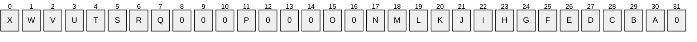

Where the bits are defined as:

| Value | Description |
| --- | --- |
| A | Clear text passwords can be transmitted for this logon identity. |
| B | Update the logon statistics for this account upon successful logon. |
| C | Return the user parameter list for this account upon successful logon. |
| D | Do not attempt to log this account on as a guest upon logon failure. |
| E | Allow this account to log on with the [**domain controller**](#gt_domain-controller-dc) account. |
| F | Return the password expiration date and time upon successful logon. |
| G | Send a [**client challenge**](#gt_client-challenge) upon logon request. |
| H | Attempt logon as a guest for this account only. |
| I | Return the profile path upon successful logon. |
| J | Attempt logon to the specified domain only. |
| K | Allow this account to log on with the computer account. |
| L | Disable allowing fallback to guest account for this account. |
| M | Force the logon of this account as a guest if the password is incorrect. |
| N | This account has supplied a clear text password. |
| O | Allow NTLMv1 authentication ([MS-NLMP](../MS-NLMP/MS-NLMP.md)) when only NTLMv2 ([[NTLM]](https://go.microsoft.com/fwlink/?LinkId=90235)) is allowed. |
| P | Use [**sub-authentication**](#gt_sub-authentication) ([MS-APDS](../MS-APDS/MS-APDS.md) section 3.1.5.2.1). |
| Q - X | Encode the [**sub-authentication package**](#gt_sub-authentication-package) identifier. Bits Q–X are used to encode the integer value of the sub-authentication package identifier (this is in little-endian order). |

**Reserved:** MUST be set to zero when sent and MUST be ignored on receipt.

**UserName:** Contains the name of the user.

**Workstation:** Contains the NetBIOS name of the workstation from which the user is logging on.

<a id="Section_2.2.1.4.16"></a>
##### 2.2.1.4.16 NETLOGON_LOGON_INFO_CLASS

The **NETLOGON_LOGON_INFO_CLASS** enumeration SHOULD<48> identify a particular type of logon information block.

typedef enum _NETLOGON_LOGON_INFO_CLASS

{

NetlogonInteractiveInformation = 1,

NetlogonNetworkInformation = 2,

NetlogonServiceInformation = 3,

NetlogonGenericInformation = 4,

NetlogonInteractiveTransitiveInformation = 5,

NetlogonNetworkTransitiveInformation = 6,

NetlogonServiceTransitiveInformation = 7,

NetlogonTicketLogonInformation = 8

} NETLOGON_LOGON_INFO_CLASS;

**NetlogonInteractiveInformation:** Logon information pertains to an interactive account logon. Interactive account logon requires a user to physically input [**credentials**](#gt_credential) to the client that are then authenticated by the [**DC**](#gt_domain-controller-dc).

**NetlogonNetworkInformation:** Logon information pertains to a network account logon. [**Network logon**](#gt_network-logon) is transparent to the user. The user has already input his or her credentials during [**interactive logon**](#gt_interactive-logon) and has been authenticated by the server or DC. These credentials are used again to log the user onto another network resource without prompting the user for his or her credentials.

**NetlogonServiceInformation:** Logon information pertains to a service account logon. A service account acts as a non-privileged user on the local computer and presents anonymous credentials to any remote server.

**NetlogonGenericInformation:** Logon information pertains to a generic account logon. This type of account logon is for generic pass-through authentication, as specified in section [3.2.4.1](#Section_3.2.4.1), that enables servers to forward NTLM and Digest authentication credentials to a DC for authorization.

**NetlogonInteractiveTransitiveInformation:** Logon information pertains to a transitive interactive account logon and can be passed through [**transitive trust**](#gt_transitive-trust) links.

**NetlogonNetworkTransitiveInformation:** Logon information pertains to a transitive network account logon and can be passed through transitive trust links.

**NetlogonServiceTransitiveInformation:** Logon information pertains to a transitive service account logon and can be passed through transitive trust links.

**NetlogonTicketLogonInformation:** Logon information pertains to a Kerberos account logon.

<a id="Section_2.2.1.4.17"></a>
##### 2.2.1.4.17 NETLOGON_VALIDATION_INFO_CLASS

The **NETLOGON_VALIDATION_INFO_CLASS** enumeration SHOULD<49> select the type of logon information block being used.

typedef enum _NETLOGON_VALIDATION_INFO_CLASS

{

NetlogonValidationUasInfo = 1,

NetlogonValidationSamInfo = 2,

NetlogonValidationSamInfo2 = 3,

NetlogonValidationGenericInfo = 4,

NetlogonValidationGenericInfo2 = 5,

NetlogonValidationSamInfo4 = 6,

NetlogonValidationTicketLogon = 7

} NETLOGON_VALIDATION_INFO_CLASS;

**NetlogonValidationUasInfo:** Associated structure is **NETLOGON_VALIDATION_UAS_INFO** (section [2.2.1.8.1](#Section_2.2.1.8.1)).

**NetlogonValidationSamInfo:** Associated structure is **NETLOGON_VALIDATION_SAM_INFO** (section [2.2.1.4.11](#Section_2.2.1.4.11)).

**NetlogonValidationSamInfo2:** Associated structure is **NETLOGON_VALIDATION_SAM_INFO2** (section [2.2.1.4.12](#Section_2.2.1.4.12)).

**NetlogonValidationGenericInfo:** Associated structure is **NETLOGON_VALIDATION_GENERIC_INFO2** (section [2.2.1.4.8](#Section_2.2.1.4.8)).

**NetlogonValidationGenericInfo2:** Associated structure is **NETLOGON_VALIDATION_GENERIC_INFO2**.

**NetlogonValidationSamInfo4:** Associated structure is **NETLOGON_VALIDATION_SAM_INFO4** (section [2.2.1.4.13](#Section_2.2.1.4.13)).

**NetlogonValidationTicketLogon:** Associated structure is **NETLOGON_VALIDATION_TICKET_LOGON** (section [2.2.1.4.20](#Section_2.2.1.4.20)).

<a id="Section_2.2.1.4.18"></a>
##### 2.2.1.4.18 NETLOGON Specific Access Masks

**Access Rights**: The access rights defined by this protocol are specified by the bit settings in the following table:

| Name | Value | Informative Summary |
| --- | --- | --- |
| NETLOGON_UAS_LOGON_ACCESS | 0x0001 | Obsolete (LAN Manager). |
| NETLOGON_UAS_LOGOFF_ACCESS | 0x0002 | Obsolete (LAN Manager). |
| NETLOGON_CONTROL_ACCESS | 0x0004 | Granted to [**security principals**](#gt_security-principal) that are system operators, account operators, administrators, or components of the operating system. |
| NETLOGON_QUERY_ACCESS | 0x0008 | Granted to all security principals. |
| NETLOGON_SERVICE_ACCESS | 0x0010 | Granted to all security principals that are administrators or components of the operating system. |
| NETLOGON_FTINFO_ACCESS | 0x0020 | Granted to all security principals that are authenticated users. |
| NETLOGON_WKSTA_RPC_ACCESS | 0x0040 | Granted to all security principals that are local users or administrators. |
| NETLOGON_DCLOC_RPC_ACCESS | 0x0080 | Granted to all authenticated security principals. Calls from non-authenticated or anonymous clients are not allowed. |

<a id="Section_2.2.1.4.19"></a>
##### 2.2.1.4.19 NETLOGON_TICKET_LOGON_INFO

The NETLOGON_TICKET_LOGON_INFO message is used by Kerberos to invoke the network ticket logon flow. In this flow, it calls Netlogon with the ticket which relays the ticket to the issuing domain in the same fashion as generic passthrough. Afterwards, the NETLOGON_VALIDATION_TICKET_LOGON message (section [2.2.1.4.20](#Section_2.2.1.4.20)) then processes the validation.

The encoded data SHOULD be sent using the network logon mechanism (section [3.2.4.2](#Section_3.2.4.2)).

The NETLOGON_TICKET_LOGON_INFO message is defined as follows.

typedef struct _NETLOGON_TICKET_LOGON_INFO { NETLOGON_LOGON_IDENTITY_INFO Identity; ULONGLONG RequestOptions; ULONG ServiceTicketLength; [size_is(ServiceTicketLength)] PUCHAR ServiceTicket; ULONG AdditionalTicketLength; [size_is(AdditionalTicketLength)] PUCHAR AdditionalTicket; } NETLOGON_TICKET_LOGON_INFO, *PNETLOGON_TICKET_LOGON_INFO;

**Identity:** A NETLOGON_LOGON_IDENTITY_INFO structure (see section [2.2.1.4.15](#Section_2.2.1.4.15)).

**RequestOptions:** An unsigned 64-bit integer that is treated as a four 16-bit fields.

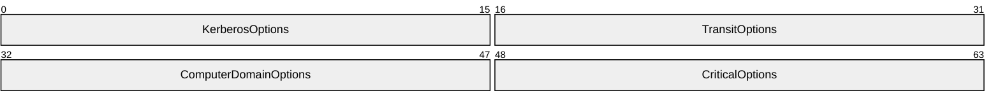

**KerberosOptions (2 bytes):** An unsigned 16-bit integer that groups together flags for operations performed by the KDC in the ticket's issuing realm. There are two flags: **SkipPacSignatures** and **RemoveResourceGroups**.

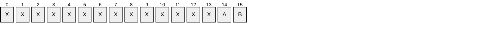

**A - RemoveResourceGroups (1 bit):** When set, remove the resource groups.

**B - SkipPacSignatures (1 bit):** When set, does not verify signatures present in the PAC.

**TransitOptions (2 bytes):** An unsigned 16-bit integer that groups together flags for operations performed by Netlogon at every hop. The flags are **SkipSIDFilter** and **SkipNamespaceFilter**.


**A - SkipNameSpaceFiltering (1 bit):** When set, the user domain is not filtered against the trust domain namespace.

**B - SkipSidFiltering (1 bit): When set, no SID filtering is performed and no claims are transformed.**

**ComputerDomainOptions (2 bytes):** An unsigned 16-bit integer that groups together flags for operations performed by Netlogon in the computer's domain. The flags are **SkipResourceGroups** and **SkipA2AChecks**.


**A – SkipA2AChecks (1 bit):** When set, indicates that [**A2A**](#gt_a2a) and [**A2ATo**](#gt_a2ato) checks are not to be performed.

**B – SkipResourceGroups (1 bit):** When set, indicates that resource groups in the computer’s domain are not to be added.

**CriticalOptions (2 bytes):** An unsigned 16-bit integer that groups together flags that MUST be understood to parse the rest of the request. The only defined flag is **NoAuthorizationData**.

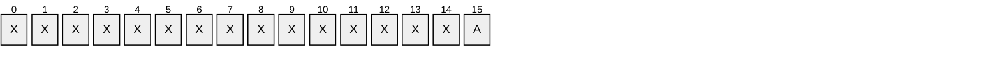

**A – NoAuthorizationData (1 bit):** When set, indicates that the ticket is to be checked but that authorization information is not to be returned.

**ServiceTicketLength:** An unsigned long that is the length of the service ticket.

**ServiceTicket:** A pointer to an unsigned character array containing the service ticket.

**AdditionalTicketLength:** An unsigned long that is the length of the Kerberos service ticket that is the source of authorization.

**AdditionalTicket:** A pointer to an unsigned character array containing the additional service ticket. If the service ticket is a User2User ticket then the ticket-granting ticket (TGT) used as the source of the session key MUST also be provided.

<a id="Section_2.2.1.4.20"></a>
##### 2.2.1.4.20 NETLOGON_VALIDATION_TICKET_LOGON

The NETLOGON_VALIDATION_TICKET_LOGON message is used after the NETLOGON_TICKET_LOGON_INFO message (section [2.2.1.4.19](#Section_2.2.1.4.19)) at the destination domain. The issuing KDC opens the ticket, verifies all the signatures, and then extracts the authorization information from the PAC.

The encoded data SHOULD be sent using the network logon mechanism (section [3.2.4.2](#Section_3.2.4.2)).

The message is defined as follows.

typedef struct _NETLOGON_VALIDATION_TICKET_LOGON {

ULONGLONG Results;

NTSTATUS KerberosStatus;

NTSTATUS NetlogonStatus;

UNICODE_STRING SourceOfStatus;

PNETLOGON_VALIDATION_SAM_INFO4 UserInformation;

PNETLOGON_VALIDATION_SAM_INFO4 DeviceInformation;

ULONG UserClaimsLength;

[size_is(UserClaimsLength)] PUCHAR UserClaims;

ULONG DeviceClaimsLength;

[size_is(DeviceClaimsLength)] PUCHAR DeviceClaims;

} NETLOGON_VALIDATION_TICKET_LOGON, * PNETLOGON_VALIDATION_TICKET_LOGON;

**Results:** An unsigned 64-bit integer that is treated as a six fields.

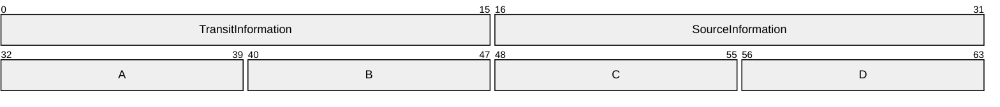

**TransitInformation (2 bytes):** A 16-bit unsigned integer that groups together flags providing information from Netlogon about operations performed while transiting back to the computer. The flags are as follows.

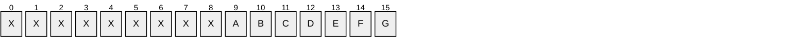

**A - DeviceSidsFiltered (1 bit):** When set, indicates SID filtering removed one or more SIDs from the device information.

**B - UserSidsFiltered (1 bit):** When set, indicates SID filtering removed one or more SIDs from the user information.

**C - DeviceNamespaceFailed (1 bit):** When set, indicates compound identity was removed because SID filtering did not allow the device domain name.

**D - DeviceSidsFailed (1 bit):** When set, indicates compound identity was removed because SID filtering did not allow the device identity.

**E - UserFailedA2A (1 bit):** Indicates, when set, that logon failed because the user is not allowed to authenticate to the computer.

**F - UserNamespaceFailed (1 bit):** When set, indicates logon failed because namespace filtering did not allow the user domain name.

**G - UserSidsFailed (1 bit):** When set, indicates logon failed because SID filtering did not allow the user identity.

**SourceInformation (2 bytes):** A 16-bit unsigned integer that groups together flags providing information about the ticket from the KDC that issued the service ticket.

```mermaid
packet-beta
  0-0: "X"
  1-1: "X"
  2-2: "X"
  3-3: "X"
  4-4: "X"
  5-5: "X"
  6-6: "X"
  7-7: "X"
  8-8: "X"
  9-9: "A"
  10-10: "B"
  11-11: "C"
  12-12: "D"
  13-13: "E"
  14-14: "F"
  15-15: "G"
```

**A - ResourceGroupsRemoved (1 bit):** Indicates, when set, that the KDC removed (by client request) resource groups from the source information.

**B - FullSignaturePresent (1 bit):** When set, indicates that the KDC checked the full ticket krbtgt signature.

**C - SourceDeviceClaims (1 bit):** When set, indicates that there were device claims in the source ticket.

**D - SourceUserClaims (1 bit):** If set, indicates there were user claims in the source ticket.

**E - CompoundSource (1 bit):** When set, indicates the source ticket contained device information.

**F - PacValidationFailed (1 bit):** When set, indicates the PAC signature did not validate causing the logon to fail.

**G - TicketDecryptionFailed (1 bit):** Indicates, when set, that ticket decryption failed and, therefore, the logon failed.

**A – CriticalTransitResults (1 byte):** Conditions that are handled by Netlogon in every transited domain. Unused, MUST be set to 0.

**B – CriticalComputerDomainResults (1 byte):** Conditions that are handled by Netlogon in the computer's domain. Unused, MUST be set to 0.

**C – CriticalClientResults (1 byte):** Conditions that the caller needs to understand before using the results. Unused, MUST be set to 0.

**D – CriticalResults (1 byte):** Conditions that all parties need to understand to interpret the rest of the results. The only defined flag is **LogonFailed**, the least significant bit. When set, the login failed.

**KerberosStatus:** An NTSTATUS code that, if unsuccessful, is an error encountered by the KDC during ticket validation.

**NetlogonStatus:** An NTSTATUS code that, if unsuccessful, is an NTSTATUS code that details an error encountered by Netlogon during transit back to the computer.

**SourceOfStatus:** A UNICODE_STRING containing (if populated) the name of the DC that set either the **KerberosStatus** or the **NetlogonStatus** codes.

**UserInformation:** A pointer to a NETLOGON_VALIDATION_SAM_INFO4 structure (see section [2.2.1.4.13](#Section_2.2.1.4.13)) that contains the authenticated user information.

**DeviceInformation:** A pointer to a NETLOGON_VALIDATION_SAM_INFO4 structure (see section 2.2.1.4.13) that contains optional authenticated device information.

**UserClaimsLength:** A 32-bit unsigned integer that is the length of the user claims data, **UserClaims**.

**UserClaims:** A pointer to an unsigned character array that contains the user claims data.

**DeviceClaimsLength:** A 32-bit unsigned integer that is the length of the device claims data, **DeviceClaims**.

**DeviceClaims:** A pointer to an unsigned character array that contains the device claims data.

<a id="Section_2.2.1.5"></a>
#### 2.2.1.5 Account Database Replication Structures

Structures and enumerated types in this group are used for account [**database**](#gt_database) replication.<50> These structures are relevant only for server-to-server communication, and are obsolete.

<a id="Section_2.2.1.5.1"></a>
##### 2.2.1.5.1 NETLOGON_DB_CHANGE (Announcement) Message

The NETLOGON_DB_CHANGE message is used to indicate that one or more changes have taken place in the account [**database**](#gt_database), and carries an indication of the changes from the [**PDC**](#gt_primary-domain-controller-pdc) to the backup domain controller (BDC). Because it is sent in the open, this is a hint, and the BDC MUST connect to the PDC over a reliable transport and secure connection to obtain the actual change. The following is the format of the payload of a [**mailslot**](#gt_mailslot) message that is used in [**Netlogon**](#gt_netlogon) replication, as specified in section [3.6](#Section_1.3).

The **DBChangeInfo** field represents information about a state of one of the databases ([**security account manager (SAM) built-in database**](#gt_security-account-manager-sam-built-in-database), [**Security Account Manager (SAM)**](#gt_security-account-manager-sam) database, or [**Local Security Authority (LSA)**](#gt_local-security-authority-lsa) database). The number of **DBChangeInfo** fields is specified by the **DBCount** field. The format of the **DBChangeInfo** field is defined in the following table.

The fields are in little-endian format and have the following meanings.

```mermaid
packet-beta
  0-15: "MessageType"
  16-47: "LowSerialNumber"
  48-79: "DateAndTime"
  80-111: "Pulse"
  112-143: "Random"
  144-191: "PrimaryDCName (variable)"
  192-255: "DomainName (variable)"
  256-319: "UnicodePrimaryDCName (variable)"
  320-383: "UnicodeDomainName (variable)"
  384-415: "DBCount"
  416-479: "DBChangeInfo (variable)"
  480-511: "DomainSidSize"
  512-575: "DomainSid (variable)"
  576-607: "MessageFormatVersion"
  608-639: "MessageToken"
```

**MessageType (2 bytes):** A two-byte field that identifies the message. MUST be set to 0x000A.

**LowSerialNumber (4 bytes):** The low DWORD ([MS-DTYP](../MS-DTYP/MS-DTYP.md) section 2.2.9) part of the 64-bit [**database serial number**](#gt_database-serial-number) of the SAM database.

**DateAndTime (4 bytes):** An unsigned 32-bit value that represents the time stamp for the SAM database creation time. This MUST be expressed as the number of seconds elapsed since midnight of January 1, 1970.

**Pulse (4 bytes):** An unsigned 32-bit value that specifies the message interval in seconds between change announcements sent to the [**BDCs**](#gt_backup-domain-controller-bdc).

**Random (4 bytes):** An unsigned 32-bit value that indicates the number of seconds the recipient of the message waits before contacting the sender.

**PrimaryDCName (variable):** The null-terminated name of the PDC that sends the message. MUST be encoded in the [**original equipment manufacturer (OEM) character set**](#gt_original-equipment-manufacturer-oem-character-set).

**DomainName (variable):** The null-terminated [**domain name**](#gt_domain-name) that is encoded in the OEM character set. The domain name is padded to a multiple of 2 bytes for alignment reasons.

**UnicodePrimaryDCName (variable):** The null-terminated name of the PDC that sends the message. MUST be encoded in the [**Unicode**](#gt_unicode) character set.

**UnicodeDomainName (variable):** The null-terminated domain name. MUST be encoded in the Unicode character set.

**DBCount (4 bytes):** An unsigned 32-bit value that represents the number of **DBChangeInfo** fields in the message.

**DBChangeInfo (variable):** A set of **DBChangeInfo** messages, as specified below, that indicates the changes that are pending replication. There are **DBCount** entries in this set.

```mermaid
packet-beta
  0-31: "DBIndex"
  32-95: "LargeSerialNumber"
  96-159: "DateAndTime"
```

**DBIndex (4 bytes):** A 32-bit value that identifies the database as follows.

| Value | Meaning |
| --- | --- |
| 0x00000000 | Indicates the SAM database. |
| 0x00000001 | Indicates the SAM built-in database. |
| 0x00000002 | Indicates the LSA database. |

**LargeSerialNumber (8 bytes):** A 64-bit value that contains the database serial number for the database identified by the **DBIndex** field.

**DateAndTime (8 bytes):** The time in UTC of the database creation expressed as an 8-byte value in the time format in a **FILETIME** structure, as specified in [MS-DTYP] section 2.3.3.

In what follows, the preceding message is referred to as the announcement message.

**DomainSidSize (4 bytes):** An unsigned 32-bit value that specifies the size in bytes of the **DomainSid** field.

**DomainSid (variable):** The [**domain**](#gt_domain) [**SID**](#gt_security-identifier-sid), as specified in [MS-DTYP] section 2.4.2.3.

**MessageFormatVersion (4 bytes):** An unsigned 32-bit value that contains the version of the message format. MUST be set to 0x00000001.

**MessageToken (4 bytes):** An unsigned 32-bit field that identifies the message. MUST be set to 0xFFFFFFFF.

<a id="Section_2.2.1.5.2"></a>
##### 2.2.1.5.2 NLPR_QUOTA_LIMITS

The **NLPR_QUOTA_LIMITS** structure defines a set of system resources that are available to a [**domain**](#gt_domain) user.

typedef struct _NLPR_QUOTA_LIMITS {

ULONG PagedPoolLimit;

ULONG NonPagedPoolLimit;

ULONG MinimumWorkingSetSize;

ULONG MaximumWorkingSetSize;

ULONG PagefileLimit;

OLD_LARGE_INTEGER Reserved;

} NLPR_QUOTA_LIMITS,

*PNLPR_QUOTA_LIMITS;

**PagedPoolLimit:** A ULONG that specifies the number of bytes of paged pool memory assigned to the user. The paged pool is an area of system memory (physical memory used by the operating system) for objects that can be written to disk when they are not being used.

**NonPagedPoolLimit:** A ULONG that specifies the number of bytes of nonpaged pool memory assigned to the user. The nonpaged pool is an area of system memory for objects that cannot be written to disk but MUST remain in physical memory as long as they are allocated.

**MinimumWorkingSetSize:** A ULONG that specifies the minimum set size assigned to the user. The working set of a process is the set of memory pages currently visible to the process in physical RAM memory. These pages are present in memory when the application is running and available for an application to use without triggering a page fault.

**MaximumWorkingSetSize:** A ULONG that specifies the maximum set size assigned to the user.

**PagefileLimit:** A ULONG that specifies the maximum size, in bytes, of the paging file, which is a reserved space on disk that backs up committed physical memory on the computer.

**Reserved:** An **OLD_LARGE_INTEGER** structure ([[MSDN-OLI]](https://go.microsoft.com/fwlink/?LinkId=124152)) that is set to zero and ignored on receipt.

<a id="Section_2.2.1.5.3"></a>
##### 2.2.1.5.3 NETLOGON_DELTA_ACCOUNTS

The **NETLOGON_DELTA_ACCOUNTS** structure contains the settings and [**privileges**](#gt_privilege) for a [**Local Security Authority (LSA)**](#gt_local-security-authority-lsa) account. This structure is used for replicating the LSA account data from the [**primary domain controller (PDC)**](#gt_primary-domain-controller-pdc) to a [**backup domain controller (BDC)**](#gt_backup-domain-controller-bdc).

typedef struct _NETLOGON_DELTA_ACCOUNTS {

ULONG PrivilegeEntries;

ULONG PrivilegeControl;

[size_is(PrivilegeEntries)] ULONG* PrivilegeAttributes;

[size_is(PrivilegeEntries)] PUNICODE_STRING PrivilegeNames;

NLPR_QUOTA_LIMITS QuotaLimits;

ULONG SystemAccessFlags;

SECURITY_INFORMATION SecurityInformation;

ULONG SecuritySize;

[size_is(SecuritySize)] UCHAR* SecurityDescriptor;

UNICODE_STRING DummyString1;

UNICODE_STRING DummyString2;

UNICODE_STRING DummyString3;

UNICODE_STRING DummyString4;

ULONG DummyLong1;

ULONG DummyLong2;

ULONG DummyLong3;

ULONG DummyLong4;

} NETLOGON_DELTA_ACCOUNTS,

*PNETLOGON_DELTA_ACCOUNTS;

**PrivilegeEntries:** The number of privileges associated with the LSA account.

**PrivilegeControl:** A bit flag describing the properties of the account privileges. A flag is TRUE (or set) if its value is equal to 1. The **PrivilegeControl** value is as follows.

```mermaid
packet-beta
  0-0: "0"
  1-1: "0"
  2-2: "0"
  3-3: "0"
  4-4: "0"
  5-5: "0"
  6-6: "0"
  7-7: "0"
  8-8: "0"
  9-9: "0"
  10-10: "0"
  11-11: "0"
  12-12: "0"
  13-13: "0"
  14-14: "0"
  15-15: "0"
  16-16: "0"
  17-17: "0"
  18-18: "0"
  19-19: "0"
  20-20: "0"
  21-21: "0"
  22-22: "0"
  23-23: "0"
  24-24: "0"
  25-25: "0"
  26-26: "0"
  27-27: "0"
  28-28: "0"
  29-29: "0"
  30-30: "0"
  31-31: "A"
```

Where the bits are defined as:

| Value | Description |
| --- | --- |
| A | All of the specified privileges MUST be held by the process that is requesting access. |

All other bits MUST be set to zero and MUST be ignored on receipt.

**PrivilegeAttributes:** Pointer to an array of unsigned 32-bit values that contain a set of bit flags describing each privilege's attributes. An attribute is TRUE (or set) if its value is equal to 1. The value is constructed from zero or more bit flags from the following table.

```mermaid
packet-beta
  0-0: "0"
  1-1: "0"
  2-2: "0"
  3-3: "0"
  4-4: "0"
  5-5: "0"
  6-6: "0"
  7-7: "0"
  8-8: "0"
  9-9: "0"
  10-10: "0"
  11-11: "0"
  12-12: "0"
  13-13: "0"
  14-14: "0"
  15-15: "0"
  16-16: "0"
  17-17: "0"
  18-18: "0"
  19-19: "0"
  20-20: "0"
  21-21: "0"
  22-22: "0"
  23-23: "0"
  24-24: "0"
  25-25: "0"
  26-26: "0"
  27-27: "0"
  28-28: "0"
  29-29: "0"
  30-30: "B"
  31-31: "A"
```

Where the bits are defined as:

| Value | Description |
| --- | --- |
| A | Privilege is enabled by default. |
| B | Privilege is enabled. |

All other bits MUST be set to zero and MUST be ignored on receipt.

**PrivilegeNames:** A pointer to an array of privilege names represented as **UNICODE_STRING** structures. The names of the privileges are implementation specific.

**QuotaLimits:** An **NLPR_QUOTA_LIMITS** structure (section [2.2.1.5.2](#Section_2.2.1.5.25)) that describes the account's current quota settings.

**SystemAccessFlags:** A set of the following bit flags that specify the ways in which the account is permitted to access the system as detailed in POLICY_MODE_INTERACTIVE, POLICY_MODE_NETWORK, POLICY_MODE_BATCH, POLICY_MODE_SERVICE, and POLICY_MODE_PROXY of [MS-LSAD](../MS-LSAD/MS-LSAD.md). See [MS-LSAD] for the specification of these bit values and allowed combinations.

**SecurityInformation:** A **SECURITY_INFORMATION** structure, as specified in [MS-DTYP](../MS-DTYP/MS-DTYP.md) section 2.4.7, that specifies portions of a security descriptor about the [**trusted**](#gt_trust) [**domain**](#gt_domain).

**SecuritySize:** The size, in bytes, of the **SecurityDescriptor** field.

**SecurityDescriptor:** A pointer to a **SECURITY_DESCRIPTOR** structure, as specified in [MS-DTYP] section 2.4.6, that describes the security settings for the account object.

**DummyString1:** A **UNICODE_STRING** structure, defined in section [2.2.1.1.3](#Section_2.2.1.1.3), that MUST contain 0 for the **Length** field, 0 for the **MaximumLength** field, and NULL for the **Buffer** field. It is ignored upon receipt. The Netlogon usage of dummy fields is defined in section [1.3.8.1.2](#Section_1.3.8.1.2).

**DummyString2:** See definition for **DummyString1** field.

**DummyString3:** See definition for **DummyString1** field.

**DummyString4:** See definition for **DummyString1** field.

**DummyLong1:** MUST be set to zero and MUST be ignored on receipt. The Netlogon usage of dummy fields is defined in section 1.3.8.1.2.

**DummyLong2:** See definition for **DummyLong1** field.

**DummyLong3:** See definition for **DummyLong1** field.

**DummyLong4:** See definition for **DummyLong1** field.

<a id="Section_2.2.1.5.4"></a>
##### 2.2.1.5.4 NETLOGON_DELTA_ALIAS

The **NETLOGON_DELTA_ALIAS** structure contains information about a SAM [**alias**](#gt_alias). This structure is used to replicate the SAM alias data from the [**PDC**](#gt_primary-domain-controller-pdc) to a BDC.

typedef struct _NETLOGON_DELTA_ALIAS {

UNICODE_STRING Name;

ULONG RelativeId;

SECURITY_INFORMATION SecurityInformation;

ULONG SecuritySize;

[size_is(SecuritySize)] UCHAR * SecurityDescriptor;

UNICODE_STRING Comment;

UNICODE_STRING DummyString2;

UNICODE_STRING DummyString3;

UNICODE_STRING DummyString4;

ULONG DummyLong1;

ULONG DummyLong2;

ULONG DummyLong3;

ULONG DummyLong4;

} NETLOGON_DELTA_ALIAS,

*PNETLOGON_DELTA_ALIAS;

**Name:** A **UNICODE_STRING** structure that contains the alias name.

**RelativeId:** The [**RID**](#gt_relative-identifier-rid) for the alias.

**SecurityInformation:** A **SECURITY_INFORMATION** structure, as specified in [MS-DTYP](../MS-DTYP/MS-DTYP.md) section 2.4.7, that contains security settings for the alias.

**SecuritySize:** The size, in bytes, of the **SecurityDescriptor** field.

**SecurityDescriptor:** A pointer to a **SECURITY_DESCRIPTOR** structure, as specified in [MS-DTYP] section 2.4.6, that describes the security information for the alias object.

**Comment:** A **UNICODE_STRING** structure that contains the administrative comment string for the alias.

**DummyString2:** A **STRING** structure, as defined in section [2.2.1.1.2](#Section_2.2.1.1.2), that MUST contain 0 for the **Length** field, 0 for the **MaximumLength** field, and NULL for the **Buffer** field. It is ignored upon receipt. The Netlogon usage of dummy fields is defined in section [1.3.8.1.2](#Section_1.3.8.1.2).

**DummyString3:** See definition for **DummyString2** field.

**DummyString4:** See definition for **DummyString2** field.

**DummyLong1:** MUST be set to zero and MUST be ignored on receipt. The Netlogon usage of dummy fields is defined in section 1.3.8.1.2.

**DummyLong2:** See definition for **DummyLong1** field.

**DummyLong3:** See definition for **DummyLong1** field.

**DummyLong4:** See definition for **DummyLong1** field.

<a id="Section_2.2.1.5.5"></a>
##### 2.2.1.5.5 NLPR_SID_INFORMATION

The **NLPR_SID_INFORMATION** structure is used to form a wrapper for a [**SID**](#gt_security-identifier-sid); it is used to transmit a SID during certain replication operations. See section [3.6](#Section_1.3) for details.

typedef struct _NLPR_SID_INFORMATION {

PRPC_SID SidPointer;

} NLPR_SID_INFORMATION,

*PNLPR_SID_INFORMATION;

**SidPointer:** A pointer to a SID structure ([MS-DTYP](../MS-DTYP/MS-DTYP.md) section 2.4.2.3).

<a id="Section_2.2.1.5.6"></a>
##### 2.2.1.5.6 NLPR_SID_ARRAY

The **NLPR_SID_ARRAY** structure defines an array of pointers to [**security identifier**](#gt_security-identifier-sid) structures.

typedef struct _NLPR_SID_ARRAY {

ULONG Count;

[size_is(Count)] PNLPR_SID_INFORMATION Sids;

} NLPR_SID_ARRAY,

*PNLPR_SID_ARRAY;

**Count:** The number of pointers in the **Sids** array.

**Sids:** An array of **NLPR_SID_INFORMATION** structures, as specified in section [2.2.1.5.5](#Section_2.2.1.5.5), each of which is a pointer to a SID.

<a id="Section_2.2.1.5.7"></a>
##### 2.2.1.5.7 NETLOGON_DELTA_ALIAS_MEMBER

The **NETLOGON_DELTA_ALIAS_MEMBER** structure contains all the members of a SAM [**alias**](#gt_alias). This structure is used for replicating the SAM alias data from the [**PDC**](#gt_primary-domain-controller-pdc) to a BDC, as detailed in section [3.6](#Section_1.3).

typedef struct _NETLOGON_DELTA_ALIAS_MEMBER {

NLPR_SID_ARRAY Members;

ULONG DummyLong1;

ULONG DummyLong2;

ULONG DummyLong3;

ULONG DummyLong4;

} NETLOGON_DELTA_ALIAS_MEMBER,

*PNETLOGON_DELTA_ALIAS_MEMBER;

**Members:** An **NLPR_SID_ARRAY** structure, as specified in section [2.2.1.5.6](#Section_2.2.1.5.6), that contains an array of [**SIDs**](#gt_security-identifier-sid) for each member of the alias.

**DummyLong1:** MUST be set to zero and MUST be ignored on receipt. The Netlogon usage of dummy fields is defined in section [1.3.8.1.2](#Section_1.3.8.1.2).

**DummyLong2:** See definition for **DummyLong1** field.

**DummyLong3:** See definition for **DummyLong1** field.

**DummyLong4:** See definition for **DummyLong1** field.

<a id="Section_2.2.1.5.8"></a>
##### 2.2.1.5.8 NETLOGON_DELTA_DELETE_GROUP

The **NETLOGON_DELTA_DELETE_GROUP** structure contains information about a [**group**](#gt_group) to be deleted in the [**database**](#gt_database). This structure is used for replicating the SAM group data from the [**PDC**](#gt_primary-domain-controller-pdc) to a BDC, as detailed in section [3.6](#Section_1.3).

typedef struct _NETLOGON_DELTA_DELETE_GROUP {

[string] wchar_t* AccountName;

UNICODE_STRING DummyString1;

UNICODE_STRING DummyString2;

UNICODE_STRING DummyString3;

UNICODE_STRING DummyString4;

ULONG DummyLong1;

ULONG DummyLong2;

ULONG DummyLong3;

ULONG DummyLong4;

} NETLOGON_DELTA_DELETE_GROUP,

*PNETLOGON_DELTA_DELETE_GROUP;

**AccountName:** A null-terminated [**Unicode string**](#gt_unicode-string) that contains the name of the group to delete.

**DummyString1:** A **UNICODE_STRING** structure, as defined in section [2.2.1.1.3](#Section_2.2.1.1.3), that MUST contain 0 for the **Length** field, 0 for the **MaximumLength** field, and NULL for the **Buffer** field. It is ignored upon receipt. The Netlogon usage of dummy fields is defined in section [1.3.8.1.2](#Section_1.3.8.1.2).

**DummyString2:** See definition for **DummyString1** field.

**DummyString3:** See definition for **DummyString1** field.

**DummyString4:** See definition for **DummyString1** field.

**DummyLong1:** MUST be set to zero and MUST be ignored on receipt. The Netlogon usage of dummy fields is defined in section 1.3.8.1.2.

**DummyLong2:** See definition for **DummyLong1** field.

**DummyLong3:** See definition for **DummyLong1** field.

**DummyLong4:** See definition for **DummyLong1** field.

<a id="Section_2.2.1.5.9"></a>
##### 2.2.1.5.9 NETLOGON_DELTA_DELETE_USER

The **NETLOGON_DELTA_DELETE_USER** structure contains information about a user account to be deleted in the [**database**](#gt_database).

typedef struct _NETLOGON_DELTA_DELETE_USER {

[string] wchar_t* AccountName;

UNICODE_STRING DummyString1;

UNICODE_STRING DummyString2;

UNICODE_STRING DummyString3;

UNICODE_STRING DummyString4;

ULONG DummyLong1;

ULONG DummyLong2;

ULONG DummyLong3;

ULONG DummyLong4;

} NETLOGON_DELTA_DELETE_USER,

*PNETLOGON_DELTA_DELETE_USER;

**AccountName:** A null-terminated [**Unicode string**](#gt_unicode-string) that contains the name of the user to delete.

**DummyString1:** A **UNICODE_STRING** structure, defined in section [2.2.1.1.3](#Section_2.2.1.1.3), that MUST contain 0 for the **Length** field, 0 for the **MaximumLength** field, and NULL for the **Buffer** field. It is ignored upon receipt. The Netlogon usage of dummy fields is defined in section [1.3.8.1.2](#Section_1.3.8.1.2).

**DummyString2:** See definition for DummyString1.

**DummyString3:** See definition for DummyString1.

**DummyString4:** See definition for DummyString1.

**DummyLong1:** MUST be set to zero and MUST be ignored on receipt. The Netlogon usage of dummy fields is defined in section 1.3.8.1.2.

**DummyLong2:** See definition for DummyLong1.

**DummyLong3:** See definition for DummyLong1.

**DummyLong4:** See definition for DummyLong1.

<a id="Section_2.2.1.5.10"></a>
##### 2.2.1.5.10 NETLOGON_DELTA_DOMAIN

The **NETLOGON_DELTA_DOMAIN** structure contains information about a [**domain**](#gt_domain). Most of the fields in this structure are obtained by querying the [**database**](#gt_database). This structure is used to replicate the domain data from the [**PDC**](#gt_primary-domain-controller-pdc) to a BDC, as detailed in **Netlogon NT Replicaton Details** (section [3.6](#Section_1.3)).

All fields of this structure, except the fields detailed following the structure definition, have the same meaning as the identically named fields in the **Domain Fields** section in [MS-SAMR](../MS-SAMR/MS-SAMR.md) section 2.2.3.1.

typedef struct _NETLOGON_DELTA_DOMAIN {

UNICODE_STRING DomainName;

UNICODE_STRING OemInformation;

OLD_LARGE_INTEGER ForceLogoff;

USHORT MinPasswordLength;

USHORT PasswordHistoryLength;

OLD_LARGE_INTEGER MaxPasswordAge;

OLD_LARGE_INTEGER MinPasswordAge;

OLD_LARGE_INTEGER DomainModifiedCount;

OLD_LARGE_INTEGER DomainCreationTime;

SECURITY_INFORMATION SecurityInformation;

ULONG SecuritySize;

[size_is(SecuritySize)] UCHAR * SecurityDescriptor;

UNICODE_STRING DomainLockoutInformation;

UNICODE_STRING DummyString2;

UNICODE_STRING DummyString3;

UNICODE_STRING DummyString4;

ULONG PasswordProperties;

ULONG DummyLong2;

ULONG DummyLong3;

ULONG DummyLong4;

} NETLOGON_DELTA_DOMAIN,

*PNETLOGON_DELTA_DOMAIN;

**SecurityInformation:** A **SECURITY_INFORMATION** structure, as specified in [MS-DTYP](../MS-DTYP/MS-DTYP.md) section 2.4.7, that specifies portions of a security descriptor about the domain.

**SecuritySize:** The size, in bytes, of the **SecurityDescriptor** field.

**SecurityDescriptor:** A pointer to a **SECURITY_DESCRIPTOR** structure, as specified in [MS-DTYP] section 2.4.6, that contains the security settings for the domain object.

**DomainLockoutInformation:** A **UNICODE_STRING** structure that contains the domain lockout information detailed in [MS-SAMR]. The **Buffer** field points to the **SAMPR_DOMAIN_LOCKOUT_INFORMATION** structure, as specified in [MS-SAMR] section 2.2.3.15, and the **Length** and **MaximumLength** fields are set to the size in bytes of the **SAMPR_DOMAIN_LOCKOUT_INFORMATION** structure pointed to by the **Buffer** field.

**DummyString2:** A **STRING** structure, defined in section [2.2.1.1.2](#Section_2.2.1.1.2), that MUST contain 0 for the **Length** field, 0 for the **MaximumLength** field, and NULL for the **Buffer** field. It is ignored upon receipt. The Netlogon usage of dummy fields is defined in section [1.3.8.1.2](#Section_1.3.8.1.2).

**DummyString3:** See definition for **DummyString2** field.

**DummyString4:** See definition for **DummyString2** field.

**DummyLong2:** MUST be set to zero and MUST be ignored on receipt. The Netlogon usage of dummy fields is defined in section 1.3.8.1.2.

**DummyLong3:** See definition for **DummyLong2** field.

**DummyLong4:** See definition for **DummyLong2** field.

<a id="Section_2.2.1.5.11"></a>
##### 2.2.1.5.11 NETLOGON_DELTA_ENUM

The **NETLOGON_DELTA_ENUM** structure defines a common structure that encapsulates all possible types of [**database**](#gt_database) changes. Database changes, in the context of Netlogon, are called [**deltas**](#gt_delta).

typedef struct _NETLOGON_DELTA_ENUM {

NETLOGON_DELTA_TYPE DeltaType;

[switch_is(DeltaType)] NETLOGON_DELTA_ID_UNION DeltaID;

[switch_is(DeltaType)] NETLOGON_DELTA_UNION DeltaUnion;

} NETLOGON_DELTA_ENUM,

*PNETLOGON_DELTA_ENUM;

**DeltaType:** One of the values from the **NETLOGON_DELTA_TYPE** enumeration, as specified in section [2.2.1.5.28](#Section_2.2.1.5.28).

**DeltaID:** One of the **NETLOGON_DELTA_ID_UNION** union (section [2.2.1.5.18](#Section_2.2.1.5.18)) types selected based on the value of the **DeltaType** field.

**DeltaUnion:** One of the **NETLOGON_DELTA_UNION** union (section [2.2.1.5.27](#Section_2.2.1.5.27)) types selected based on the value of the **DeltaType**.

<a id="Section_2.2.1.5.12"></a>
##### 2.2.1.5.12 NETLOGON_DELTA_ENUM_ARRAY

The **NETLOGON_DELTA_ENUM_ARRAY** structure defines an array of [**delta**](#gt_delta) objects.

typedef struct _NETLOGON_DELTA_ENUM_ARRAY {

DWORD CountReturned;

[size_is(CountReturned)] PNETLOGON_DELTA_ENUM Deltas;

} NETLOGON_DELTA_ENUM_ARRAY,

*PNETLOGON_DELTA_ENUM_ARRAY;

**CountReturned:** The number of elements in the Deltas field.

**Deltas:** An array of **NETLOGON_DELTA_ENUM** structures, as specified in section [2.2.1.5.11](#Section_2.2.1.5.11).

<a id="Section_2.2.1.5.13"></a>
##### 2.2.1.5.13 NETLOGON_DELTA_GROUP

The **NETLOGON_DELTA_GROUP** structure contains information about a SAM [**group**](#gt_group) account. This structure is used for replicating the group data from the [**PDC**](#gt_primary-domain-controller-pdc) to a BDC, as detailed in section [3.6](#Section_1.3).

typedef struct _NETLOGON_DELTA_GROUP {

UNICODE_STRING Name;

ULONG RelativeId;

ULONG Attributes;

UNICODE_STRING AdminComment;

SECURITY_INFORMATION SecurityInformation;

ULONG SecuritySize;

[size_is(SecuritySize)] UCHAR* SecurityDescriptor;

UNICODE_STRING DummyString1;

UNICODE_STRING DummyString2;

UNICODE_STRING DummyString3;

UNICODE_STRING DummyString4;

ULONG DummyLong1;

ULONG DummyLong2;

ULONG DummyLong3;

ULONG DummyLong4;

} NETLOGON_DELTA_GROUP,

*PNETLOGON_DELTA_GROUP;

**Name:** A **UNICODE_STRING** structure that contains the group name.

**RelativeId:** The [**RID**](#gt_relative-identifier-rid) for the group.

**Attributes:** A set of bit flags that describe attributes of the [**SID**](#gt_security-identifier-sid). An attribute is true (or set) if its value is equal to 1. The value is constructed from one or more bit flags from the following table.

```mermaid
packet-beta
  0-0: "0"
  1-1: "0"
  2-2: "0"
  3-3: "0"
  4-4: "0"
  5-5: "0"
  6-6: "0"
  7-7: "0"
  8-8: "0"
  9-9: "0"
  10-10: "0"
  11-11: "0"
  12-12: "0"
  13-13: "0"
  14-14: "0"
  15-15: "0"
  16-16: "0"
  17-17: "0"
  18-18: "0"
  19-19: "0"
  20-20: "0"
  21-21: "0"
  22-22: "0"
  23-23: "0"
  24-24: "0"
  25-25: "0"
  26-26: "0"
  27-27: "0"
  28-28: "0"
  29-29: "C"
  30-30: "B"
  31-31: "A"
```

Where the bits are defined as:

| Value | Description |
| --- | --- |
| A | The SID cannot have the **SE_GROUP_ENABLED** attribute removed. Corresponds to the SID attribute **SE_GROUP_MANDATORY**. This attribute prevents the user from disabling the group. Disabling a group causes the group to be ignored by access validation routines. |
| B | The SID is enabled by default (as opposed to being enabled by an application). Corresponds to the SID attribute **SE_GROUP_ENABLED_BY_DEFAULT**. |
| C | The SID is enabled for access checks. Corresponds to the SID attribute **SE_GROUP_ENABLED**. |

All other bits MUST be set to zero and MUST be ignored on receipt. For more information, see [[MSDOCS-TokenGrp]](https://go.microsoft.com/fwlink/?linkid=2101788).

**AdminComment:** A **UNICODE_STRING** structure that contains an administrative comment for the group.

**SecurityInformation:** A **SECURITY_INFORMATION** structure, as specified in [MS-DTYP](../MS-DTYP/MS-DTYP.md) section 2.4.7, that specifies portions of a security descriptor about the group.

**SecuritySize:** The size, in bytes, of the **SecurityDescriptor** field.

**SecurityDescriptor:** A pointer to a **SECURITY_DESCRIPTOR** structure, as specified in [MS-DTYP] section 2.4.6, that contains the security settings of the group object.

**DummyString1:** A **UNICODE_STRING** structure, defined in section [2.2.1.1.3](#Section_2.2.1.1.3), that MUST contain 0 for the **Length** field, 0 for the **MaximumLength** field, and NULL for the **Buffer** field. It is ignored upon receipt. The Netlogon usage of dummy fields is defined in section [1.3.8.1.2](#Section_1.3.8.1.2).

**DummyString2:** See definition for DummyString1.

**DummyString3:** See definition for DummyString1.

**DummyString4:** See definition for DummyString1.

**DummyLong1:** MUST be set to zero and MUST be ignored on receipt. The Netlogon usage of dummy fields is defined in section 1.3.8.1.2.

**DummyLong2:** See definition for DummyLong1.

**DummyLong3:** See definition for DummyLong1.

**DummyLong4:** See definition for DummyLong1.

<a id="Section_2.2.1.5.14"></a>
##### 2.2.1.5.14 NLPR_LOGON_HOURS

The **NLPR_LOGON_HOURS** structure contains the logon policy information that specifies when a user account is permitted to authenticate.

typedef struct _NLPR_LOGON_HOURS {

USHORT UnitsPerWeek;

[size_is(1260), length_is((UnitsPerWeek + 7)/8)]

UCHAR * LogonHours;

} NLPR_LOGON_HOURS,

*PNLPR_LOGON_HOURS;

The fields in this structure have the same meanings as identically named fields of the **SAMPR_LOGON_HOURS** structure, as specified in [MS-SAMR](../MS-SAMR/MS-SAMR.md) section 2.2.6.5.

<a id="Section_2.2.1.5.15"></a>
##### 2.2.1.5.15 NLPR_USER_PRIVATE_INFO

The **NLPR_USER_PRIVATE_INFO** structure defines a data buffer that is optionally encrypted with the [**session key**](#gt_session-key), as detailed in this section. The structure is used to carry user account passwords as follows.

typedef struct _NLPR_USER_PRIVATE_INFO {

UCHAR SensitiveData;

ULONG DataLength;

[size_is(DataLength)] UCHAR * Data;

} NLPR_USER_PRIVATE_INFO,

*PNLPR_USER_PRIVATE_INFO;

**SensitiveData:** Is either TRUE (0x01) or FALSE (0x00). The **SensitiveData** field indicates whether the data is encrypted as follows. If this field is set to 0x00, then the data is not encrypted. If the field is set to 0x01, the data pointed to by the **Data** field is encrypted with the session key used on the [**secure channel**](#gt_secure-channel) between the client and the server exchanging this data structure to the client. The encryption algorithm is [**RC4**](#gt_rc4) if the flag C is set in the negotiated flags between the client and the server, as specified in section [3.1.4.2](#Section_3.1.4.2); otherwise the encryption algorithm is DES.

**DataLength:** The size, in bytes, of the **Data** field.

**Data:** A pointer to a buffer with a size of **DataLength**. If the **SensitiveData** field is set to TRUE, this data is encrypted as defined in the **SensitiveData** field. The buffer content prior to encryption (if any) is shown in the following table.

```mermaid
packet-beta
  0-31: "DataType"
  32-47: "LmLength"
  48-63: "LmMaximumLength"
  64-95: "Unused1"
  96-127: "LmHash[0..3]"
  128-159: "LmHash[4..7]"
  160-191: "LmHash[8..11]"
  192-223: "LmHash[12..15]"
  224-239: "NtLength"
  240-255: "NtMaximumLength"
  256-287: "Unused2"
  288-319: "NtHash[0..3]"
  320-351: "NtHash[4..7]"
  352-383: "NtHash[8..11]"
  384-415: "NtHash[12..15]"
  416-431: "LmHistoryLength"
  432-447: "LmHistoryMaximumLength"
  448-479: "Unused3"
  480-495: "NtHistoryLength"
  496-511: "NtHistoryMaximumLength"
  512-543: "Unused4"
  544-607: "NtHistoryArray (variable)"
  608-671: "LmHistoryArray (variable)"
```

**DataType:** An unsigned integer. This value MUST be 0x00000002.

**LmLength:** An unsigned (short) integer. This value MUST be either 0x0010 or 0x0000. If 0x0010, the **LmHash** field contains the LM hash of the user password (specified in [MS-NLMP](../MS-NLMP/MS-NLMP.md)). If 0x0000, the value of the **LmHash** field is undefined and MUST be ignored upon receipt.

**LmMaximumLength:** This value MUST be the same value as **LmLength**.

**Unused1:** This value MUST be zero and ignored on receipt.

**LmHash:** The encrypted ([MS-SAMR](../MS-SAMR/MS-SAMR.md) section 2.2.11.1) **LM OWF** ([MS-NLMP] section 3.3) of the user password. The 16-byte [**encryption key**](#gt_encryption-key) is created by concatenating four times the relative ID (from the given user's [**SID**](#gt_security-identifier-sid)).

**NtLength:** An unsigned (short) integer. This value MUST be either 0x0010 or 0x0000. If 0x0010, the **NtHash** field contains the NT hash of the user password (specified in [MS-NLMP]). If 0x0000, the value of the **NtHash** field is undefined and MUST be ignored upon receipt.

**NtMaximumLength:** This value MUST be the same value as **NtLength**.

**Unused2:** This value MUST be zero and ignored on receipt.

**NtHash:** The encrypted ([MS-SAMR] section 2.2.11.1) NT OWF ([MS-NLMP] section 3.3) of the user password. The 16-byte encryption key is created by concatenating four times the relative ID (from the given user's SID).

**LmHistoryLength:** An unsigned (short) integer. This value is the length, in bytes, of the **LmHistoryArray** field.

**LmHistoryMaximumLength:** This value MUST be the same value as **LmHistoryLength**.

**Unused3:** This value MUST be zero and ignored on receipt.

**NtHistoryLength**: An unsigned (short) integer. This value is the length, in bytes, of the **NtHistoryArray** field.

**NtHistoryMaximumLength:** This value MUST be the same value as **NtHistoryLength**.

**Unused4**: This value MUST be zero and ignored on receipt.

**NtHistoryArray:** An array of NT hash values of user passwords for the given user. The array is ordered so that the first element is the hash of the current password and the last element is the hash of the oldest password.

**Note** The number of elements in the array is the value of the **NtHistoryLength** field divided by 0x0010.

**LmHistoryArray:** An array of LM hash values of user passwords for the given user. The array is ordered so that the first element is the hash of the current password and the last element is the hash of the oldest password.

**Note** The number of elements in the array is the value of the **LmHistoryLength** field divided by 0x0010.

<a id="Section_2.2.1.5.16"></a>
##### 2.2.1.5.16 NETLOGON_DELTA_USER

The **NETLOGON_DELTA_USER** structure contains information about a SAM user account. This structure is used for replicating the user account data from the [**PDC**](#gt_primary-domain-controller-pdc) to a BDC, as detailed in section [3.6](#Section_1.3).

All fields of this structure, except the fields detailed following the structure definition, have the same meanings as the identically named fields in the **Common User Fields**, as specified in [MS-SAMR](../MS-SAMR/MS-SAMR.md) section 2.2.6.1 and the **SAMPR_USER_INTERNAL1_INFORMATION** structure fields, as specified in [MS-SAMR] section 2.2.6.23.

typedef struct _NETLOGON_DELTA_USER {

UNICODE_STRING UserName;

UNICODE_STRING FullName;

ULONG UserId;

ULONG PrimaryGroupId;

UNICODE_STRING HomeDirectory;

UNICODE_STRING HomeDirectoryDrive;

UNICODE_STRING ScriptPath;

UNICODE_STRING AdminComment;

UNICODE_STRING WorkStations;

OLD_LARGE_INTEGER LastLogon;

OLD_LARGE_INTEGER LastLogoff;

NLPR_LOGON_HOURS LogonHours;

USHORT BadPasswordCount;

USHORT LogonCount;

OLD_LARGE_INTEGER PasswordLastSet;

OLD_LARGE_INTEGER AccountExpires;

ULONG UserAccountControl;

ENCRYPTED_NT_OWF_PASSWORD EncryptedNtOwfPassword;

ENCRYPTED_LM_OWF_PASSWORD EncryptedLmOwfPassword;

UCHAR NtPasswordPresent;

UCHAR LmPasswordPresent;

UCHAR PasswordExpired;

UNICODE_STRING UserComment;

UNICODE_STRING Parameters;

USHORT CountryCode;

USHORT CodePage;

NLPR_USER_PRIVATE_INFO PrivateData;

SECURITY_INFORMATION SecurityInformation;

ULONG SecuritySize;

[size_is(SecuritySize)] UCHAR * SecurityDescriptor;

UNICODE_STRING ProfilePath;

UNICODE_STRING DummyString2;

UNICODE_STRING DummyString3;

UNICODE_STRING DummyString4;

ULONG DummyLong1;

ULONG DummyLong2;

ULONG DummyLong3;

ULONG DummyLong4;

} NETLOGON_DELTA_USER,

*PNETLOGON_DELTA_USER;

**PrivateData:** An **NLPR_USER_PRIVATE_INFO** structure, as specified in section [2.2.1.5.15](#Section_2.2.1.5.15), containing the **PrivateData** field of the **SAMPR_USER_INFORMATION** structure, as specified in [MS-SAMR] section 2.2.6.6.

**SecurityInformation:** A **SECURITY_INFORMATION** structure, as specified in [MS-DTYP](../MS-DTYP/MS-DTYP.md) section 2.4.7, that specifies portions of a security descriptor about the user account.

**SecuritySize:** The size, in bytes, of **SecurityDescriptor**.

**SecurityDescriptor:** A pointer to a **SECURITY_DESCRIPTOR** structure, as specified in [MS-DTYP] section 2.4.6, that specifies the security settings for the user account object.

**DummyString2:** A **STRING** structure, defined in section [2.2.1.1.2](#Section_2.2.1.1.2), that MUST contain 0 for the **Length** field, 0 for the **MaximumLength** field, and NULL for the **Buffer** field. It is ignored upon receipt. The Netlogon usage of dummy fields is defined in section [1.3.8.1.2](#Section_1.3.8.1.2).

**DummyString3:** See definition for DummyString2.

**DummyString4:** See definition for DummyString2

**DummyLong1:** The high part (the first 32 bits) of the **LastBadPasswordTime** field of the **SAMPR_USER_INTERNAL3_INFORMATION** structure, as specified in [MS-SAMR] section 2.2.6.7.

**DummyLong2:** See definition for DummyLong1.

**DummyLong3:** See definition for DummyLong1.

**DummyLong4:** See definition for DummyLong1.

<a id="Section_2.2.1.5.17"></a>
##### 2.2.1.5.17 NETLOGON_DELTA_GROUP_MEMBER

The **NETLOGON_DELTA_GROUP_MEMBER** structure contains information about members of a [**group**](#gt_group) by providing pointers to a list of group members and their respective attributes. This structure is used to replicate the group membership data from the [**PDC**](#gt_primary-domain-controller-pdc) to a BDC, as detailed in section [3.6](#Section_1.3).

All fields of this structure, except the fields detailed following the structure definition, have the same meanings as the identically named fields of the **SAMPR_GET_MEMBERS_BUFFER** structure, as specified in [MS-SAMR](../MS-SAMR/MS-SAMR.md) section 2.2.7.14. The last four fields of the structure (DummyLong1, DummyLong2, DummyLong3, and DummyLong4) are not found in [MS-SAMR].

typedef struct _NETLOGON_DELTA_GROUP_MEMBER {

[size_is(MemberCount)] ULONG * Members;

[size_is(MemberCount)] ULONG * Attributes;

ULONG MemberCount;

ULONG DummyLong1;

ULONG DummyLong2;

ULONG DummyLong3;

ULONG DummyLong4;

} NETLOGON_DELTA_GROUP_MEMBER,

*PNETLOGON_DELTA_GROUP_MEMBER;

**DummyLong1:** MUST be set to zero and MUST be ignored on receipt. The Netlogon usage of dummy fields is defined in section [1.3.8.1.2](#Section_1.3.8.1.2).

**DummyLong2:** See definition for DummyLong1.

**DummyLong3:** See definition for DummyLong1.

**DummyLong4:** See definition for DummyLong1.

<a id="Section_2.2.1.5.18"></a>
##### 2.2.1.5.18 NETLOGON_DELTA_ID_UNION

The **NETLOGON_DELTA_ID_UNION** union defines an account identifier type that is selected based on the requested [**database**](#gt_database) change.

typedef

[switch_type(NETLOGON_DELTA_TYPE)]

union _NETLOGON_DELTA_ID_UNION {

[case(AddOrChangeDomain, AddOrChangeGroup, DeleteGroup, RenameGroup, AddOrChangeUser, DeleteUser, RenameUser, ChangeGroupMembership, AddOrChangeAlias, DeleteAlias, RenameAlias, ChangeAliasMembership, DeleteGroupByName, DeleteUserByName)]

ULONG Rid;

[case(AddOrChangeLsaPolicy, AddOrChangeLsaTDomain, DeleteLsaTDomain, AddOrChangeLsaAccount, DeleteLsaAccount)]

PRPC_SID Sid;

[case(AddOrChangeLsaSecret, DeleteLsaSecret)]

[string] wchar_t* Name;

[default] ;

} NETLOGON_DELTA_ID_UNION,

*PNETLOGON_DELTA_ID_UNION;

**Rid:** A 32-bit [**RID**](#gt_relative-identifier-rid) whose type is selected when the following [**delta**](#gt_delta) types are switched: AddOrChangeDomain(1), AddOrChangeGroup(2), RenameGroup(4), DeleteGroup(3), AddOrChangeUser(5), DeleteUser(6), RenameUser(7), ChangeGroupMembership(8), AddOrChangeAlias(9), DeleteAlias(10), RenameAlias(11), ChangeAliasMembership(12), DeleteGroupByName(20), and DeleteUserByName(21).

**Sid:** A pointer to a [**SID**](#gt_security-identifier-sid) whose type is selected when the following delta types are switched: AddOrChangeLsaPolicy(13), AddOrChangeLsaDomain(14), DeleteLsaTDomain(15), AddOrChangeLsaAccount(16), and DeleteLsaAccount(17).

**Name:** A null-terminated [**Unicode string**](#gt_unicode-string) that contains an identifier name. This identifier type is selected when the following delta types are switched: AddOrChangeLsaSecret(18) and DeleteLsaSecret(19).

<a id="Section_2.2.1.5.19"></a>
##### 2.2.1.5.19 NETLOGON_DELTA_POLICY

The **NETLOGON_DELTA_POLICY** structure contains information about the [**LSA**](#gt_local-security-authority-lsa) policy. This structure is used for replicating the LSA policy data from the [**PDC**](#gt_primary-domain-controller-pdc) to a BDC, as detailed in section [3.6](#Section_1.3).

typedef struct _NETLOGON_DELTA_POLICY {

ULONG MaximumLogSize;

OLD_LARGE_INTEGER AuditRetentionPeriod;

UCHAR AuditingMode;

ULONG MaximumAuditEventCount;

[size_is(MaximumAuditEventCount + 1)]

ULONG * EventAuditingOptions;

UNICODE_STRING PrimaryDomainName;

PRPC_SID PrimaryDomainSid;

NLPR_QUOTA_LIMITS QuotaLimits;

OLD_LARGE_INTEGER ModifiedId;

OLD_LARGE_INTEGER DatabaseCreationTime;

SECURITY_INFORMATION SecurityInformation;

ULONG SecuritySize;

[size_is(SecuritySize)] UCHAR * SecurityDescriptor;

UNICODE_STRING DummyString1;

UNICODE_STRING DummyString2;

UNICODE_STRING DummyString3;

UNICODE_STRING DummyString4;

ULONG DummyLong1;

ULONG DummyLong2;

ULONG DummyLong3;

ULONG DummyLong4;

} NETLOGON_DELTA_POLICY,

*PNETLOGON_DELTA_POLICY;

**MaximumLogSize:** This field has the same meaning as the identically named field of the **POLICY_AUDIT_LOG_INFO** structure, as specified in [MS-LSAD](../MS-LSAD/MS-LSAD.md) section 2.2.4.3.

**AuditRetentionPeriod:** This field has the same meaning as the identically named field of the **POLICY_AUDIT_LOG_INFO** structure, as specified in [MS-LSAD] section 2.2.4.3.

**AuditingMode:** This field has the same meaning as the identically named field of the **LSAPR_POLICY_AUDIT_EVENTS_INFO** structure, as specified in [MS-LSAD] section 2.2.4.4.

**MaximumAuditEventCount:** This field has the same meaning as the identically named field of the **LSAPR_POLICY_AUDIT_EVENTS_INFO** structure, as specified in [MS-LSAD] section 2.2.4.4.

**EventAuditingOptions:** This field has the same meaning as the identically named field of the **LSAPR_POLICY_AUDIT_EVENTS_INFO** structure, as specified in [MS-LSAD] section 2.2.4.4.

**PrimaryDomainName:** A **UNICODE_STRING** structure that contains the [**NetBIOS name**](#gt_netbios-name) of the [**primary domain**](#gt_primary-domain).

**PrimaryDomainSid:**A pointer to the [**SID**](#gt_security-identifier-sid) for the primary domain.

**QuotaLimits:** An **NLPR_QUOTA_LIMITS** structure, as specified in section [2.2.1.5.2](#Section_2.2.1.5.25), that contains information about system resource quotas imposed on an account.

**ModifiedId:** An **OLD_LARGE_INTEGER** structure, as specified in [MS-SAMR](../MS-SAMR/MS-SAMR.md) section 2.2.2.2, that contains the count that is incremented each time the [**database**](#gt_database) is modified. This count is the [**database serial number**](#gt_database-serial-number) for the database.

**DatabaseCreationTime:** A 64-bit time stamp, equivalent to a **FILETIME**, specifying when the database was created.

**SecurityInformation:** A **SECURITY_INFORMATION** bit flag that contains security information about the policy. For details about **SECURITY_INFORMATION** structure, see [MS-DTYP](../MS-DTYP/MS-DTYP.md) section 2.4.7.

**SecuritySize:** The size, in bytes, of the **SecurityDescriptor** field.

**SecurityDescriptor:** A pointer to a **SECURITY_DESCRIPTOR** structure, as specified in [MS-DTYP] section 2.4.6, that describes the security settings for the LSA policy object.

**DummyString1:** A **UNICODE_STRING** structure, defined in section [2.2.1.1.3](#Section_2.2.1.1.3), that MUST contain 0 for the **Length** field, 0 for the **MaximumLength** field, and NULL for the **Buffer** field. It is ignored upon receipt. The Netlogon usage of dummy fields is defined in section [1.3.8.1.2](#Section_1.3.8.1.2).

**DummyString2:** See definition for DummyString1.

**DummyString3:** See definition for DummyString1.

**DummyString4:** See definition for DummyString1.

**DummyLong1:** MUST be set to zero and MUST be ignored on receipt. The Netlogon usage of dummy fields is defined in section 1.3.8.1.2.

**DummyLong2:** See definition for DummyLong1.

**DummyLong3:** See definition for DummyLong1.

**DummyLong4:** See definition for DummyLong1.

<a id="Section_2.2.1.5.20"></a>
##### 2.2.1.5.20 NLPR_CR_CIPHER_VALUE

The **NLPR_CR_CIPHER_VALUE** structure defines an encrypted string buffer that contains the value of an [**LSA**](#gt_local-security-authority-lsa) Secret Object as specified in [MS-LSAD](../MS-LSAD/MS-LSAD.md).

typedef struct _NLPR_CR_CIPHER_VALUE {

ULONG Length;

ULONG MaximumLength;

[size_is(MaximumLength), length_is(Length)]

UCHAR * Buffer;

} NLPR_CR_CIPHER_VALUE,

*PNLPR_CR_CIPHER_VALUE;

**Length:** The length, in bytes, of the used portion of the buffer.

**MaximumLength:** The maximum length, in bytes, of the buffer.

**Buffer:** A pointer to a buffer that contains the secret data encrypted with the [**session key**](#gt_session-key) used on the [**secure channel**](#gt_secure-channel) between the client and the server exchanging this data structure. The encryption algorithm is [**RC4**](#gt_rc4) if the flag C is set in the negotiated flags between the client and the server as detailed in section [3.1.4.2](#Section_3.1.4.2); otherwise the encryption algorithm is DES.

<a id="Section_2.2.1.5.21"></a>
##### 2.2.1.5.21 NETLOGON_DELTA_SECRET

The **NETLOGON_DELTA_SECRET** structure contains information about the [**LSA**](#gt_local-security-authority-lsa) secret object, as specified in [MS-LSAD](../MS-LSAD/MS-LSAD.md). This structure is used to replicate the LSA secret object data from the [**PDC**](#gt_primary-domain-controller-pdc) to a BDC, as detailed in section [3.6](#Section_1.3).

typedef struct _NETLOGON_DELTA_SECRET {

NLPR_CR_CIPHER_VALUE CurrentValue;

OLD_LARGE_INTEGER CurrentValueSetTime;

NLPR_CR_CIPHER_VALUE OldValue;

OLD_LARGE_INTEGER OldValueSetTime;

SECURITY_INFORMATION SecurityInformation;

ULONG SecuritySize;

[size_is(SecuritySize)] PUCHAR SecurityDescriptor;

UNICODE_STRING DummyString1;

UNICODE_STRING DummyString2;

UNICODE_STRING DummyString3;

UNICODE_STRING DummyString4;

ULONG DummyLong1;

ULONG DummyLong2;

ULONG DummyLong3;

ULONG DummyLong4;

} NETLOGON_DELTA_SECRET, *PNETLOGON_DELTA_SECRET;

**CurrentValue:** An **NLPR_CR_CIPHER_VALUE** structure, as specified in section [2.2.1.5.20](#Section_2.2.1.5.20), that contains the encrypted current value of the LSA secret.

**CurrentValueSetTime:** A 64-bit time stamp, equivalent to a **FILETIME**, at which the current value of the LSA secret object was set.

**OldValue:** An **NLPR_CR_CIPHER_VALUE** structure, as specified in section 2.2.1.5.20, that contains the encrypted previous (old) value of the LSA secret.

**OldValueSetTime:** A 64-bit time stamp, equivalent to a **FILETIME**, at which the previous value of the LSA secret object was set.

**SecurityInformation:** A **SECURITY_INFORMATION** structure, as specified in [MS-DTYP](../MS-DTYP/MS-DTYP.md) section 2.4.7, that specifies portions of a security descriptor about the secret object.

**SecuritySize:** The size, in bytes, of the **SecurityDescriptor** member.

**SecurityDescriptor:** A pointer to a **SECURITY_DESCRIPTOR** structure, as specified in [MS-DTYP] section 2.4.6 that describes the security settings for the LSA secret object.

**DummyString1:** A **UNICODE_STRING** structure, defined in section [2.2.1.1.3](#Section_2.2.1.1.3), that MUST contain 0 for the **Length** field, 0 for the **MaximumLength** field, and NULL for the **Buffer** field. It is ignored upon receipt. The Netlogon usage of dummy fields is defined in section [1.3.8.1.2](#Section_1.3.8.1.2).

**DummyString2:** See definition for DummyString1.

**DummyString3:** See definition for DummyString1.

**DummyString4:** See definition for DummyString1

**DummyLong1:** MUST be set to zero and MUST be ignored on receipt. The Netlogon usage of dummy fields is defined in section 1.3.8.1.2.

**DummyLong2:** See definition for DummyLong1.

**DummyLong3:** See definition for DummyLong1.

**DummyLong4:** See definition for DummyLong1.

<a id="Section_2.2.1.5.22"></a>
##### 2.2.1.5.22 NETLOGON_DELTA_TRUSTED_DOMAINS

The **NETLOGON_DELTA_TRUSTED_DOMAINS** structure contains information about a [**trusted**](#gt_trust) [**domain**](#gt_domain). This structure is used for replicating the trusted domain data from the [**PDC**](#gt_primary-domain-controller-pdc) to a BDC.

typedef struct _NETLOGON_DELTA_TRUSTED_DOMAINS {

UNICODE_STRING DomainName;

ULONG NumControllerEntries;

[size_is(NumControllerEntries)]

PUNICODE_STRING ControllerNames;

SECURITY_INFORMATION SecurityInformation;

ULONG SecuritySize;

[size_is(SecuritySize)] UCHAR * SecurityDescriptor;

UNICODE_STRING DummyString1;

UNICODE_STRING DummyString2;

UNICODE_STRING DummyString3;

UNICODE_STRING DummyString4;

ULONG TrustedPosixOffset;

ULONG DummyLong2;

ULONG DummyLong3;

ULONG DummyLong4;

} NETLOGON_DELTA_TRUSTED_DOMAINS,

*PNETLOGON_DELTA_TRUSTED_DOMAINS;

**DomainName:** A **UNICODE_STRING** structure that contains the [**NetBIOS name**](#gt_netbios-name) of the trusted domain.

**NumControllerEntries:** Number of [**domain controller (DC)**](#gt_domain-controller-dc) names listed in the **ControllerNames** field.<51>

**ControllerNames:** Pointer to an array of **UNICODE_STRING** types that contain the NetBIOS names of the DCs in the trusted domain. The only restriction is the maximum value of the 32-bit unsigned integer enforced by [**RPC**](#gt_remote-procedure-call-rpc).<52>

**SecurityInformation:** A **SECURITY_INFORMATION** structure, as specified in [MS-DTYP](../MS-DTYP/MS-DTYP.md) section 2.4.7, that specifies portions of a security descriptor about the trusted domain.

**SecuritySize:** Size, in bytes, of the **SecurityDescriptor** field.

**SecurityDescriptor:** Pointer to a **SECURITY_DESCRIPTOR** structure, as specified in [MS-DTYP] section 2.4.6 that describes the security settings for the trusted domain object.

**DummyString1:** A **UNICODE_STRING** structure, defined in section [2.2.1.1.3](#Section_2.2.1.1.3), that MUST contain 0 for the **Length** field, 0 for the **MaximumLength** field, and NULL for the **Buffer** field. It is ignored upon receipt. The Netlogon usage of dummy fields is defined in section [1.3.8.1.2](#Section_1.3.8.1.2).

**DummyString2:** See definition for DummyString1.

**DummyString3:** See definition for DummyString1.

**DummyString4:** See definition for DummyString1.

**TrustedPosixOffset:** The value that contains the POSIX offset for the trusted domain, as specified in [MS-ADTS](../MS-ADTS/MS-ADTS.md) section 6.1.6.

**DummyLong2:** MUST be set to zero and MUST be ignored on receipt. The Netlogon usage of dummy fields is defined in section 1.3.8.1.2.

**DummyLong3:** See definition for DummyLong2.

**DummyLong4:** See definition for DummyLong2.

<a id="Section_2.2.1.5.23"></a>
##### 2.2.1.5.23 NETLOGON_RENAME_ALIAS

The **NETLOGON_RENAME_ALIAS** structure specifies a rename of an [**alias**](#gt_alias).

typedef struct _NETLOGON_DELTA_RENAME_ALIAS {

UNICODE_STRING OldName;

UNICODE_STRING NewName;

UNICODE_STRING DummyString1;

UNICODE_STRING DummyString2;

UNICODE_STRING DummyString3;

UNICODE_STRING DummyString4;

ULONG DummyLong1;

ULONG DummyLong2;

ULONG DummyLong3;

ULONG DummyLong4;

} NETLOGON_RENAME_ALIAS,

*PNETLOGON_DELTA_RENAME_ALIAS;

**OldName:** A **UNICODE_STRING** structure that contains the previous name of the alias.

**NewName:** A **UNICODE_STRING** structure that contains the new name to assign to the alias.

**DummyString1:** A **UNICODE_STRING** structure, defined in section [2.2.1.1.3](#Section_2.2.1.1.3), that MUST contain 0 for the **Length** field, 0 for the **MaximumLength** field, and NULL for the **Buffer** field. It is ignored upon receipt. The Netlogon usage of dummy fields is defined in section [1.3.8.1.2](#Section_1.3.8.1.2).

**DummyString2:** See definition for DummyString1.

**DummyString3:** See definition for DummyString1.

**DummyString4:** See definition for DummyString1.

**DummyLong1:** MUST be set to zero and MUST be ignored on receipt. The Netlogon usage of dummy fields is defined in section 1.3.8.1.2.

**DummyLong2:** See definition for DummyLong1.

**DummyLong3:** See definition for DummyLong1.

**DummyLong4:** See definition for DummyLong1.

<a id="Section_2.2.1.5.24"></a>
##### 2.2.1.5.24 NETLOGON_RENAME_GROUP

The **NETLOGON_RENAME_GROUP** structure specifies a rename of a [**group**](#gt_group).

typedef struct _NETLOGON_DELTA_RENAME_GROUP {

UNICODE_STRING OldName;

UNICODE_STRING NewName;

UNICODE_STRING DummyString1;

UNICODE_STRING DummyString2;

UNICODE_STRING DummyString3;

UNICODE_STRING DummyString4;

ULONG DummyLong1;

ULONG DummyLong2;

ULONG DummyLong3;

ULONG DummyLong4;

} NETLOGON_RENAME_GROUP,

*PNETLOGON_DELTA_RENAME_GROUP;

**OldName:** A **UNICODE_STRING** structure that contains the group's previous name.

**NewName:** A **UNICODE_STRING** structure that contains the new name to assign to the group.

**DummyString1:** A **UNICODE_STRING** structure, defined in section [2.2.1.1.3](#Section_2.2.1.1.3), that MUST contain 0 for the **Length** field, 0 for the **MaximumLength** field, and NULL for the **Buffer** field. It is ignored upon receipt. The Netlogon usage of dummy fields is defined in section [1.3.8.1.2](#Section_1.3.8.1.2).

**DummyString2:** See definition for DummyString1.

**DummyString3:** See definition for DummyString1.

**DummyString4:** See description for DummyString1.

**DummyLong1:** MUST be set to zero and MUST be ignored on receipt. The Netlogon usage of dummy fields is defined in section 1.3.8.1.2.

**DummyLong2:** See definition for DummyLong1.

**DummyLong3:** See definition for DummyLong1.

**DummyLong4:** See definition for DummyLong1.

<a id="Section_2.2.1.5.25"></a>
##### 2.2.1.5.25 NETLOGON_RENAME_USER

The **NETLOGON_RENAME_USER** structure specifies a rename of a user account.

typedef struct _NETLOGON_DELTA_RENAME_USER {

UNICODE_STRING OldName;

UNICODE_STRING NewName;

UNICODE_STRING DummyString1;

UNICODE_STRING DummyString2;

UNICODE_STRING DummyString3;

UNICODE_STRING DummyString4;

ULONG DummyLong1;

ULONG DummyLong2;

ULONG DummyLong3;

ULONG DummyLong4;

} NETLOGON_RENAME_USER,

*PNETLOGON_DELTA_RENAME_USER;

**OldName:** A **UNICODE_STRING** structure that contains the user account's previous name.

**NewName:** A **UNICODE_STRING** structure that contains the new name to assign to the user account.

**DummyString1:** A **UNICODE_STRING** structure, defined in section [2.2.1.1.3](#Section_2.2.1.1.3), that MUST contain 0 for the **Length** field, 0 for the **MaximumLength** field, and NULL for the **Buffer** field. It is ignored upon receipt. The Netlogon usage of dummy fields is defined in section [1.3.8.1.2](#Section_1.3.8.1.2).

**DummyString2:** See definition for DummyString1.

**DummyString3:** See definition for DummyString1.

**DummyString4:** See definition for DummyString1.

**DummyLong1:** MUST be set to zero and MUST be ignored on receipt. The Netlogon usage of dummy fields is defined in section 1.3.8.1.2.

**DummyLong2:** See definition for DummyLong1.

**DummyLong3:** See definition for DummyLong1.

**DummyLong4:** See definition for DummyLong1.

<a id="Section_2.2.1.5.26"></a>
##### 2.2.1.5.26 NLPR_MODIFIED_COUNT

The **NLPR_MODIFIED_COUNT** structure specifies a count for the number of times an account's [**database**](#gt_database) has been modified.

typedef struct _NLPR_MODIFIED_COUNT {

OLD_LARGE_INTEGER ModifiedCount;

} NLPR_MODIFIED_COUNT,

*PNLPR_MODIFIED_COUNT;

**ModifiedCount:** An OLD_LARGE_INTEGER structure, as specified in [MS-SAMR](../MS-SAMR/MS-SAMR.md) section 2.2.2.2, that contains the number of modifications made to the database since its creation. This value is the [**database serial number**](#gt_database-serial-number).

<a id="Section_2.2.1.5.27"></a>
##### 2.2.1.5.27 NETLOGON_DELTA_UNION

The **NETLOGON_DELTA_UNION** union defines a union of all types of [**database**](#gt_database) changes ([**deltas**](#gt_delta)).

typedef

[switch_type(NETLOGON_DELTA_TYPE)]

union _NETLOGON_DELTA_UNION {

[case(AddOrChangeDomain)]

PNETLOGON_DELTA_DOMAIN DeltaDomain;

[case(AddOrChangeGroup)]

PNETLOGON_DELTA_GROUP DeltaGroup;

[case(RenameGroup)]

PNETLOGON_DELTA_RENAME_GROUP DeltaRenameGroup;

[case(AddOrChangeUser)]

PNETLOGON_DELTA_USER DeltaUser;

[case(RenameUser)]

PNETLOGON_DELTA_RENAME_USER DeltaRenameUser;

[case(ChangeGroupMembership)]

PNETLOGON_DELTA_GROUP_MEMBER DeltaGroupMember;

[case(AddOrChangeAlias)]

PNETLOGON_DELTA_ALIAS DeltaAlias;

[case(RenameAlias)]

PNETLOGON_DELTA_RENAME_ALIAS DeltaRenameAlias;

[case(ChangeAliasMembership)]

PNETLOGON_DELTA_ALIAS_MEMBER DeltaAliasMember;

[case(AddOrChangeLsaPolicy)]

PNETLOGON_DELTA_POLICY DeltaPolicy;

[case(AddOrChangeLsaTDomain)]

PNETLOGON_DELTA_TRUSTED_DOMAINS DeltaTDomains;

[case(AddOrChangeLsaAccount)]

PNETLOGON_DELTA_ACCOUNTS DeltaAccounts;

[case(AddOrChangeLsaSecret)]

PNETLOGON_DELTA_SECRET DeltaSecret;

[case(DeleteGroupByName)]

PNETLOGON_DELTA_DELETE_GROUP DeltaDeleteGroup;

[case(DeleteUserByName)]

PNETLOGON_DELTA_DELETE_USER DeltaDeleteUser;

[case(SerialNumberSkip)]

PNLPR_MODIFIED_COUNT DeltaSerialNumberSkip;

[default] ;

} NETLOGON_DELTA_UNION,

*PNETLOGON_DELTA_UNION;

**DeltaDomain:** A pointer to a **NETLOGON_DELTA_DOMAIN** structure, as specified in section [2.2.1.5.10](#Section_2.2.1.5.10), that describes a [**domain**](#gt_domain). This structure is selected when the delta type is AddOrChangeDomain.

**DeltaGroup:** A pointer to a **NETLOGON_DELTA_GROUP** structure, as specified in section [2.2.1.5.13](#Section_2.2.1.5.13), that describes a [**group**](#gt_group) account. This structure is selected when the delta type is AddOrChangeGroup.

**DeltaRenameGroup:** A pointer to a **NETLOGON_RENAME_GROUP** structure, as specified in section [2.2.1.5.24](#Section_2.2.1.5.24), that describes a rename of a group account. This structure is selected when the delta type is RenameGroup.

**DeltaUser:** A pointer to a **NETLOGON_DELTA_USER** structure, as specified in section [2.2.1.5.16](#Section_2.2.1.5.16), that describes a domain user account. This structure is selected when the delta type is AddOrChangeUser.

**DeltaRenameUser:** A pointer to a **NETLOGON_RENAME_USER** structure, as specified in section [2.2.1.5.25](#Section_2.2.1.5.25), that describes a rename of a user account. This structure is selected when the delta type is RenameUser.

**DeltaGroupMember:** A pointer to a **NETLOGON_DELTA_GROUP_MEMBER** structure, as specified in section [2.2.1.5.17](#Section_2.2.1.5.17), that describes a group membership. This structure is selected when the delta type is ChangeGroupMembership.

**DeltaAlias:** A pointer to a **NETLOGON_DELTA_ALIAS** structure, as specified in section [2.2.1.5.4](#Section_2.2.1.5.4), that describes an [**alias**](#gt_alias). This structure is selected when the delta type is AddOrChangeAlias.

**DeltaRenameAlias:** A pointer to a **NETLOGON_RENAME_ALIAS** structure, as specified in section [2.2.1.5.23](#Section_2.2.1.5.23), that describes a rename of an alias. This structure is selected when the delta type is RenameAlias.

**DeltaAliasMember:** A pointer to a **NETLOGON_DELTA_ALIAS_MEMBER** structure, as specified in section [2.2.1.5.7](#Section_2.2.1.5.7), that describes an alias membership. This structure is selected when the delta type is ChangeAliasMembership.

**DeltaPolicy:** A pointer to a **NETLOGON_DELTA_POLICY** structure, as specified in section [2.2.1.5.19](#Section_2.2.1.5.19), that describes an [**LSA**](#gt_local-security-authority-lsa) policy. This structure is selected when the delta type is AddOrChangeLsaPolicy.

**DeltaTDomains:** A pointer to a **NETLOGON_DELTA_TRUSTED_DOMAINS** structure, as specified in section [2.2.1.5.22](#Section_2.2.1.5.22), that describes a [**trusted**](#gt_trust) domain. This structure is selected when the delta type is AddOrChangeLsaTDomain.

**DeltaAccounts:** A pointer to a **NETLOGON_DELTA_ACCOUNTS** structure, as specified in section [2.2.1.5.3](#Section_2.2.1.5.3), that describes an LSA account. This structure is selected when the delta type is AddOrChangeLsaAccount.

**DeltaSecret:** A pointer to a **NETLOGON_DELTA_SECRET** structure, as specified in section [2.2.1.5.21](#Section_2.2.1.5.21), that describes a LSA secret object as detailed in [MS-LSAD](../MS-LSAD/MS-LSAD.md). This structure is selected when the delta type is AddOrChangeLsaSecret.

**DeltaDeleteGroup:** A pointer to a **NETLOGON_DELTA_DELETE_GROUP** structure, as specified in section [2.2.1.5.8](#Section_2.2.1.5.8), that describes a group account deletion. This structure is selected when the delta type is DeleteGroupByName.

**DeltaDeleteUser:** A pointer to a **NETLOGON_DELTA_DELETE_USER** structure, as specified in section [2.2.1.5.9](#Section_2.2.1.5.9), that describes a user account deletion. This structure is selected when the delta type is DeleteUserByName.

**DeltaSerialNumberSkip:** A pointer to an **NLPR_MODIFIED_COUNT** structure, as specified in section [2.2.1.5.26](#Section_2.2.1.5.26), that holds the [**database serial number**](#gt_database-serial-number). This structure is selected when the delta type is SerialNumberSkip.

<a id="Section_2.2.1.5.28"></a>
##### 2.2.1.5.28 NETLOGON_DELTA_TYPE

The **NETLOGON_DELTA_TYPE** enumeration defines an enumerated set of possible [**database**](#gt_database) changes.

typedef enum _NETLOGON_DELTA_TYPE

{

AddOrChangeDomain = 1,

AddOrChangeGroup = 2,

DeleteGroup = 3,

RenameGroup = 4,

AddOrChangeUser = 5,

DeleteUser = 6,

RenameUser = 7,

ChangeGroupMembership = 8,

AddOrChangeAlias = 9,

DeleteAlias = 10,

RenameAlias = 11,

ChangeAliasMembership = 12,

AddOrChangeLsaPolicy = 13,

AddOrChangeLsaTDomain = 14,

DeleteLsaTDomain = 15,

AddOrChangeLsaAccount = 16,

DeleteLsaAccount = 17,

AddOrChangeLsaSecret = 18,

DeleteLsaSecret = 19,

DeleteGroupByName = 20,

DeleteUserByName = 21,

SerialNumberSkip = 22

} NETLOGON_DELTA_TYPE;

**AddOrChangeDomain:** Adds or changes a [**domain**](#gt_domain) [**Security Account Manager (SAM)**](#gt_security-account-manager-sam) account.

**AddOrChangeGroup:** Adds or changes a [**group**](#gt_group) SAM account.

**DeleteGroup:** Deletes a group SAM account.

**RenameGroup:** Renames a group SAM account.

**AddOrChangeUser:** Adds or changes a user SAM account.

**DeleteUser:** Deletes a user SAM account.

**RenameUser:** Renames a user SAM account.

**ChangeGroupMembership:** Changes a group membership record.

**AddOrChangeAlias:** Adds or changes an [**alias**](#gt_alias).

**DeleteAlias:** Deletes an alias.

**RenameAlias:** Renames an alias.

**ChangeAliasMembership:** Changes the membership record for an alias.

**AddOrChangeLsaPolicy:** Adds or changes an [**LSA**](#gt_local-security-authority-lsa) policy.

**AddOrChangeLsaTDomain:** Adds or changes a [**trusted**](#gt_trust) [**domain account**](#gt_domain-account).

**DeleteLsaTDomain:** Deletes a trusted domain account.

**AddOrChangeLsaAccount:** Adds or changes an LSA user or machine account.

**DeleteLsaAccount:** Deletes an LSA user or machine account.

**AddOrChangeLsaSecret:** Adds or changes an LSA encrypted data block.

**DeleteLsaSecret:** Deletes an LSA encrypted data block.

The following three types MAY<53> have an additional requirement.

**DeleteGroupByName:** Deletes a group account based on a string name.

**DeleteUserByName:** Deletes a user account based on a string name.

**SerialNumberSkip:** Updates the [**database serial number**](#gt_database-serial-number).

<a id="Section_2.2.1.5.29"></a>
##### 2.2.1.5.29 SYNC_STATE

The **SYNC_STATE** enumeration tracks the progress of synchronization of the [**database**](#gt_database) between [**BDCs**](#gt_backup-domain-controller-bdc) and [**PDCs**](#gt_primary-domain-controller-pdc). Synchronization is initiated by the client calling **NetrDatabaseSync2** (section [3.5.4.6.2](#Section_3.5.4.6.2)). All references to *SyncContext* in the following synchronization state descriptions refer to the *SyncContext* parameter in that method.

typedef enum _SYNC_STATE

{

NormalState = 0,

DomainState = 1,

GroupState = 2,

UasBuiltInGroupState = 3,

UserState = 4,

GroupMemberState = 5,

AliasState = 6,

AliasMemberState = 7,

SamDoneState = 8

} SYNC_STATE,

*PSYNC_STATE;

**NormalState:** A state that MUST be used unless the current synchronization is the restart of a full synchronization.

**DomainState:** The *SyncContext* parameter is the [**domain**](#gt_domain) [**RID**](#gt_relative-identifier-rid) with which to continue.

**GroupState:** The *SyncContext* parameter is the global [**group**](#gt_group) RID with which to continue.

**UasBuiltInGroupState:** Not used.

**UserState:** The *SyncContext* parameter is the user RID with which to continue.

**GroupMemberState:** The *SyncContext* parameter is the global group RID with which to continue.

**AliasState:** The *SyncContext* parameter MUST have a value of 0, indicating synchronization restarts at the first database [**alias**](#gt_alias) and that AddOrChangeAlias (see **NETLOGON_DELTA_TYPE** enumeration section [2.2.1.5.28](#Section_2.2.1.5.28)) was the last account change being performed prior to the restart.

**AliasMemberState:** The *SyncContext* parameter MUST have a value of 0, indicating synchronization restarts at the first database alias and that ChangeAliasMembership (**NETLOGON_DELTA_TYPE** enumeration section 2.2.1.5.28) was the last account change being performed prior to the restart.

**SamDoneState:** The database has finished synchronization.

<a id="Section_2.2.1.6"></a>
#### 2.2.1.6 Domain Trust Structures

Structures in this [**group**](#gt_group) are used for retrieving [**trust**](#gt_trust) information.

<a id="Section_2.2.1.6.1"></a>
##### 2.2.1.6.1 DOMAIN_NAME_BUFFER

The **DOMAIN_NAME_BUFFER** structure defines information returned by the **NetrEnumerateTrustedDomains** method, as specified in section [3.5.4.7.3](#Section_3.5.4.7.3). The structure is used to describe a set of [**trusted**](#gt_trust) [**domain names**](#gt_domain-name).

typedef struct _DOMAIN_NAME_BUFFER {

ULONG DomainNameByteCount;

[unique, size_is(DomainNameByteCount)]

UCHAR * DomainNames;

} DOMAIN_NAME_BUFFER,

*PDOMAIN_NAME_BUFFER;

**DomainNameByteCount:** The size, in bytes, of the buffer pointed to by the **DomainNames** field, including all UTF-16 null characters.

**DomainNames:** The [**Unicode string**](#gt_unicode-string) buffer that contains the list of trusted [**domains**](#gt_domain). The list format is a UTF-16 string composed of one or more substrings. Each substring is separated from adjacent substrings by the UTF-16 null character, 0x0000. After the final substring, the string is terminated by two UTF-16 null characters.

For example, if there are three trusted domains, DOMAIN1, DOMAIN2, and DOMAIN3, the **DomainNames** string buffer would have the following form:

DOMAIN1<null>DOMAIN2<null>DOMAIN3<null><null>

where <null> is the UTF-16 null character, 0x0000.

<a id="Section_2.2.1.6.2"></a>
##### 2.2.1.6.2 DS_DOMAIN_TRUSTSW

The **DS_DOMAIN_TRUSTSW** structure defines information about a [**domain**](#gt_domain) [**trust**](#gt_trust). It is part of the **NETLOGON_TRUSTED_DOMAIN_ARRAY** structure, as specified in section [2.2.1.6.3](#Section_2.2.1.6.3), returned by the **DsrEnumerateDomainTrusts** method, as specified in section [3.5.4.7.1](#Section_3.5.4.7.1). This structure SHOULD<54> contain naming information and trust-related information for a specific [**trusted domain**](#gt_trusted-domain).

typedef struct _DS_DOMAIN_TRUSTSW {

[string] wchar_t* NetbiosDomainName;

[string] wchar_t* DnsDomainName;

ULONG Flags;

ULONG ParentIndex;

ULONG TrustType;

ULONG TrustAttributes;

PRPC_SID DomainSid;

GUID DomainGuid;

} DS_DOMAIN_TRUSTSW,

*PDS_DOMAIN_TRUSTSW;

**NetbiosDomainName:** A pointer to a null-terminated [**Unicode**](#gt_unicode) string that contains the [**NetBIOS name**](#gt_netbios-name) of the trusted domain.

**DnsDomainName:** A pointer to a null-terminated Unicode string that contains the [**FQDN**](#gt_fully-qualified-domain-name-fqdn) of the trusted domain.

**Flags:** A set of bit flags that defines the domain trust attributes. A flag is TRUE (or set) if its value is equal to 1. The value is constructed from zero or more bit flags from the following table.

```mermaid
packet-beta
  0-0: "0"
  1-1: "0"
  2-2: "0"
  3-3: "0"
  4-4: "0"
  5-5: "0"
  6-6: "0"
  7-7: "0"
  8-8: "0"
  9-9: "0"
  10-10: "0"
  11-11: "0"
  12-12: "0"
  13-13: "0"
  14-14: "0"
  15-15: "0"
  16-16: "0"
  17-17: "0"
  18-18: "0"
  19-19: "0"
  20-20: "0"
  21-21: "0"
  22-22: "0"
  23-23: "0"
  24-24: "0"
  25-25: "0"
  26-26: "F"
  27-27: "E"
  28-28: "D"
  29-29: "C"
  30-30: "B"
  31-31: "A"
```

Where the bits are defined as:

| Value | Description |
| --- | --- |
| A | Domain is a member of a [**forest**](#gt_forest). |
| B | Domain is directly trusted by the current domain. |
| C | Domain is the root of a forests. |
| D | Domain is the [**primary domain**](#gt_primary-domain) of the queried server. |
| E | Primary domain is running in native mode. |
| F | Domain directly trusts the current domain. |

All other bits MUST be set to zero and MUST be ignored on receipt.

**ParentIndex:** An integer value that contains the index in the **NETLOGON_TRUSTED_DOMAIN_ARRAY** array (returned by **DsrEnumerateDomainTrusts** method) that corresponds to the parent domain of the domain represented by this structure. This field is set if all of the following conditions are met:

- The A flag is specified in the *Flags* parameter of the **DsrEnumerateDomainTrusts** method.
- The **Flags** field of **DS_DOMAIN_TRUSTSW** structure does not contain the C flag.
Otherwise, it MUST be set to zero and MUST be ignored.

**TrustType:** An integer value that describes the type of domain with which the trust is associated. **TrustType** is one of the following values.

| Value | Meaning |
| --- | --- |
| 0x00000001 | Trust is with a domain.<55> |
| 0x00000002 | Trust is with an [**Active Directory**](#gt_active-directory) domain.<56> |
| 0x00000003 | Trust is with an MIT Kerberos realm. |
| 0x00000004 | Trust is with a Distributed Computing Environment (DCE) realm. |

All other values MUST be ignored on receipt.

**TrustAttributes:** A set of bit flags describing trust link attributes. A flag is true (or set) if its value is equal to 1. The value is constructed from zero or more bit flags from the following table, with the exception that bit F cannot be combined with E or D.

```mermaid
packet-beta
  0-0: "0"
  1-1: "0"
  2-2: "0"
  3-3: "0"
  4-4: "0"
  5-5: "0"
  6-6: "0"
  7-7: "0"
  8-8: "I"
  9-9: "H"
  10-10: "0"
  11-11: "0"
  12-12: "0"
  13-13: "0"
  14-14: "0"
  15-15: "0"
  16-16: "0"
  17-17: "0"
  18-18: "0"
  19-19: "0"
  20-20: "0"
  21-21: "0"
  22-22: "0"
  23-23: "0"
  24-24: "0"
  25-25: "G"
  26-26: "F"
  27-27: "E"
  28-28: "D"
  29-29: "C"
  30-30: "B"
  31-31: "A"
```

Where the bits are defined as:

| Value | Description |
| --- | --- |
| A | Trust link MUST NOT allow transitivity. |
| B | Trust link MAY<57> be valid. |
| C | Trust link MUST be set for [**SID**](#gt_security-identifier-sid) filtering of the client domain. For details about SID filtering, see [MS-PAC](../MS-PAC/MS-PAC.md). |
| D | Trust link can contain [**forest trust information**](#gt_forest-trust-information). |
| E | Trust link is to either a domain or a forest that is not part of the [**enterprise network**](#gt_enterprise-network). |
| F | Trust link is internal to the forest. |
| G | Trust is to be treated as external for trust boundary purposes. |
| H | Domain is parent domain. |
| I | Domain is root of another forest. |

All other bits MUST be set to zero and MUST be ignored on receipt.

**DomainSid:** A pointer to a SID structure ([MS-DTYP](../MS-DTYP/MS-DTYP.md) section 2.4.2.3) that identifies the current domain. If the **TrustAttributes** field is set to C or D, the value is 0.

**DomainGuid:** A **GUID** structure ([MS-DTYP] section 2.3.4.1) that identifies the current domain.

<a id="Section_2.2.1.6.3"></a>
##### 2.2.1.6.3 NETLOGON_TRUSTED_DOMAIN_ARRAY

The **NETLOGON_TRUSTED_DOMAIN_ARRAY** structure SHOULD<58> define information returned by the **NetrEnumerateTrustedDomainsEx** method, as specified in section [3.5.4.7.2](#Section_3.5.4.7.2).

typedef struct _NETLOGON_TRUSTED_DOMAIN_ARRAY {

DWORD DomainCount;

[size_is(DomainCount)] PDS_DOMAIN_TRUSTSW Domains;

} NETLOGON_TRUSTED_DOMAIN_ARRAY,

*PNETLOGON_TRUSTED_DOMAIN_ARRAY;

**DomainCount:** The number of entries in the **Domains** field.

**Domains:** An array of **DS_DOMAIN_TRUSTSW** structures (section [2.2.1.6.2](#Section_2.2.1.6.2)) that describe [**domains**](#gt_domain) [**trusted**](#gt_trust) by the server processing the **NetrEnumerateTrustedDomainsEx** method call.

<a id="Section_2.2.1.6.4"></a>
##### 2.2.1.6.4 NL_GENERIC_RPC_DATA

The **NL_GENERIC_RPC_DATA** structure SHOULD<59> define a format for marshaling arrays of unsigned long values and [**Unicode strings**](#gt_unicode-string), by value, over [**RPC**](#gt_remote-procedure-call-rpc). This structure can be used to transmit generic data over RPC from the server to a client.

typedef struct _NL_GENERIC_RPC_DATA {

[range(0,4096)] ULONG UlongEntryCount;

[size_is(UlongEntryCount)] ULONG * UlongData;

[range(0,4096)] ULONG UnicodeStringEntryCount;

[size_is(UnicodeStringEntryCount)]

PUNICODE_STRING UnicodeStringData;

} NL_GENERIC_RPC_DATA,

*PNL_GENERIC_RPC_DATA;

**UlongEntryCount:** The number of entries in the **UlongData** field.

**UlongData:** A pointer to an array of unsigned 32-bit integer values.

**UnicodeStringEntryCount:** The number of entries in **UnicodeStringData** field.

**UnicodeStringData:** A pointer to an array of [**Unicode**](#gt_unicode) **STRING** structures (section [2.2.1.1.2](#Section_2.2.1.1.2)).

<a id="Section_2.2.1.7"></a>
#### 2.2.1.7 Administrative Services Structures

Structures in this [**group**](#gt_group) are used to query and control Netlogon behavior.

<a id="Section_2.2.1.7.1"></a>
##### 2.2.1.7.1 NETLOGON_CONTROL_DATA_INFORMATION

The **NETLOGON_CONTROL_DATA_INFORMATION** union is used as input to the **NetrLogonControl2** method, as specified in section [3.5.4.9.2](#Section_3.5.4.9.2), and the **NetrLogonControl2Ex** method, as specified in section [3.5.4.9.1](#Section_3.5.4.9.1). This union selects a data type, based on the *FunctionCode* parameter passed to the method. For details about *FunctionCode* values, see **NetrLogonControl2Ex**, section 3.5.4.9.1.

typedef

[switch_type(DWORD)]

union _NETLOGON_CONTROL_DATA_INFORMATION {

[case(5,6,9,10)]

[string,range(0, 256)] wchar_t* TrustedDomainName;

[case(65534)]

DWORD DebugFlag;

[case(8)]

[string,range(0, 256)] wchar_t* UserName;

[default] ;

} NETLOGON_CONTROL_DATA_INFORMATION,

*PNETLOGON_CONTROL_DATA_INFORMATION;

**TrustedDomainName:** A pointer to a null-terminated [**Unicode**](#gt_unicode) string that contains a [**trusted**](#gt_trust) [**domain name**](#gt_domain-name). Switched on the DWORD ([MS-DTYP](../MS-DTYP/MS-DTYP.md) section 2.2.9) values 0x00000005, 0x00000006, 0x00000009, and 0x0000000A. The DWORD values are equivalent to *FunctionCode* values. For a complete list of the Netlogon function codes and their associated meanings, see the **NetrLogonControl2Ex** method (section 3.5.4.9.1).

**DebugFlag:** A DWORD that contains an implementation-specific debug flag. Switched on the value 0x0000FFFE.

**UserName:** A pointer to null-terminated Unicode string that contains a username. Switched on the DWORD value 0x00000008.

<a id="Section_2.2.1.7.2"></a>
##### 2.2.1.7.2 NETLOGON_INFO_1

The **NETLOGON_INFO_1** structure defines information returned as part of an administrative query, as detailed in the description of the **NetrLogonControl2Ex** method in section [3.5.4.9.1](#Section_3.5.4.9.1). This structure is used to convey information about the state and properties of the [**secure channel**](#gt_secure-channel) to a [**DC**](#gt_domain-controller-dc) in the [**primary domain**](#gt_primary-domain) of the queried server. Additionally, this structure MAY<60> contain information about the state of the [**database**](#gt_database) synchronization.

typedef struct _NETLOGON_INFO_1 {

DWORD netlog1_flags;

NET_API_STATUS netlog1_pdc_connection_status;

} NETLOGON_INFO_1,

*PNETLOGON_INFO_1;

**netlog1_flags:** A set of bit flags that are defined in the following table. A flag SHOULD<61> be TRUE (or set) if its value is equal to 1. The value is constructed from zero or more bit flags from the following table.

```mermaid
packet-beta
  0-0: "0"
  1-1: "0"
  2-2: "0"
  3-3: "0"
  4-4: "0"
  5-5: "0"
  6-6: "0"
  7-7: "0"
  8-8: "0"
  9-9: "0"
  10-10: "0"
  11-11: "0"
  12-12: "0"
  13-13: "0"
  14-14: "0"
  15-15: "0"
  16-16: "0"
  17-17: "0"
  18-18: "0"
  19-19: "0"
  20-20: "0"
  21-21: "0"
  22-22: "0"
  23-23: "0"
  24-24: "0"
  25-25: "G"
  26-26: "F"
  27-27: "E"
  28-28: "D"
  29-29: "C"
  30-30: "B"
  31-31: "A"
```

| Value | Description |
| --- | --- |
| A | One of the databases is out-of-date, and replication is needed. |
| B | At least one of the databases is currently being replicated. |
| C | At least one of the databases requires a full synchronization update. |
| D | At least one database record requires an update. |
| E | The DC used on the secure channel is reachable over TCP/IP. If this flag is not set, then the DC does not have a known IP address. |
| F | The DC used on the secure channel runs [**W32Time**](#gt_windows-time-service-w32time). |
| G | The last update of one of the [**DNS**](#gt_domain-name-system-dns) records on the DC failed. |

All other bits MUST be set to zero and MUST be ignored on receipt.

To a client, bit D will appear arbitrarily set to 0 or 1 and the client is not expected to perform any action based on this value. For more information, see the server to server database synchronization topic in section [3.6](#Section_1.3).

**netlog1_pdc_connection_status:** The integer value that indicates the connection status, as defined in **Setting ConnectionStatus** (section [3.4.5.3.1](#Section_3.4.5.3.1)), of the secure channel to a DC in the primary domain of the queried server.

<a id="Section_2.2.1.7.3"></a>
##### 2.2.1.7.3 NETLOGON_INFO_2

The **NETLOGON_INFO_2** structure defines information returned as part of an administrative query of the status of the Netlogon server, as detailed in the description of the **NetrLogonControl2Ex** method in section [3.5.4.9.1](#Section_3.5.4.9.1). This structure is used to convey information about the status and properties of the [**secure channel**](#gt_secure-channel) to a [**DC**](#gt_domain-controller-dc) in the primary or directly [**trusted**](#gt_trust) [**domain**](#gt_domain) specified by the caller of **NetrLogonControl2Ex** method.

typedef struct _NETLOGON_INFO_2 {

DWORD netlog2_flags;

NET_API_STATUS netlog2_pdc_connection_status;

[string,range(0,256+1)] wchar_t* netlog2_trusted_dc_name;

NET_API_STATUS netlog2_tc_connection_status;

} NETLOGON_INFO_2,

*PNETLOGON_INFO_2;

**netlog2_flags:** A set of bit flags describing the following control query responses from the DC. A flag is TRUE (or set) if its value is equal to 1. The value is constructed from zero or more bit flags from the following table.

```mermaid
packet-beta
  0-0: "0"
  1-1: "0"
  2-2: "0"
  3-3: "0"
  4-4: "0"
  5-5: "0"
  6-6: "0"
  7-7: "0"
  8-8: "0"
  9-9: "0"
  10-10: "0"
  11-11: "0"
  12-12: "0"
  13-13: "0"
  14-14: "0"
  15-15: "0"
  16-16: "0"
  17-17: "0"
  18-18: "0"
  19-19: "0"
  20-20: "0"
  21-21: "0"
  22-22: "0"
  23-23: "0"
  24-24: "C"
  25-25: "0"
  26-26: "B"
  27-27: "A"
  28-28: "0"
  29-29: "0"
  30-30: "0"
  31-31: "0"
```

Where the flags SHOULD<62> be defined as shown in the following table.

| Value | Description |
| --- | --- |
| A | The DC used on the secure channel has an IP address (either IPv4 or IPv6). |
| B | The DC used on the secure channel runs [**W32Time**](#gt_windows-time-service-w32time). |
| C | Signifies that the trust verification status was returned in the netlog2_pdc_connection_status field. |

All other bits MUST be set to zero and MUST be ignored on receipt.

**netlog2_pdc_connection_status:** Unless the C bit is set in **netlog2_flags** field, this field indicates the connection status, as defined in **Setting ConnectionStatus** (section [3.4.5.3.1](#Section_3.4.5.3.1)), of the secure channel to a DC in the [**primary domain**](#gt_primary-domain) of the queried server. If the C bit is set in **netlog2_flags** field, this field indicates the connection status of verifying the secure channel to the DC in the specified domain specified by the caller of **NetrLogonControl2Ex** method (section 3.5.4.9.1).

**netlog2_trusted_dc_name:** A pointer to a null-terminated [**Unicode**](#gt_unicode) string that contains the [**DNS**](#gt_domain-name-system-dns) or [**NetBIOS name**](#gt_netbios-name) of the DC used on the secure channel for the specified domain. The name is the [**FQDN**](#gt_fully-qualified-domain-name-fqdn) if the DC was discovered using the discovery mechanism based on the DNS query and LDAP ping ([MS-ADTS](../MS-ADTS/MS-ADTS.md) section 6.3.3). The name is the NetBIOS name if the DC was discovered using the [**mailslot**](#gt_mailslot)-based mechanism ([MS-ADTS] section 6.3.5).

**netlog2_tc_connection_status:** An integer value that indicates the connection status, defined in **Setting ConnectionStatus** (section 3.4.5.3.1), of the secure channel to the DC in the specified domain.

<a id="Section_2.2.1.7.4"></a>
##### 2.2.1.7.4 NETLOGON_INFO_3

The **NETLOGON_INFO_3** structure defines information returned as part of an administrative query of the status of the Netlogon server, as detailed in the description of the **NetrLogonControl2Ex** method in section [3.5.4.9.1](#Section_3.5.4.9.1). This structure is used to return the number of NTLM logons attempted on the queried server since the last restart.

typedef struct _NETLOGON_INFO_3 {

DWORD netlog3_flags;

DWORD netlog3_logon_attempts;

DWORD netlog3_reserved1;

DWORD netlog3_reserved2;

DWORD netlog3_reserved3;

DWORD netlog3_reserved4;

DWORD netlog3_reserved5;

} NETLOGON_INFO_3,

*PNETLOGON_INFO_3;

**netlog3_flags:** MUST be set to zero and MUST be ignored on receipt.

**netlog3_logon_attempts:** The number of NTLM logon attempts made on the server since the last restart.

**netlog3_reserved1:** MUST be set to zero and MUST be ignored on receipt.

**netlog3_reserved2:** MUST be set to zero and MUST be ignored on receipt.

**netlog3_reserved3:** MUST be set to zero and MUST be ignored on receipt.

**netlog3_reserved4:** MUST be set to zero and MUST be ignored on receipt.

**netlog3_reserved5:** MUST be set to zero and MUST be ignored on receipt.

<a id="Section_2.2.1.7.5"></a>
##### 2.2.1.7.5 NETLOGON_INFO_4

The **NETLOGON_INFO_4** structure defines information that is returned as part of an administrative query of the status of the Netlogon server, as detailed in the description of the **NetrLogonControl2Ex** method in section [3.5.4.9.1](#Section_3.5.4.9.1). This structure is used to convey information about the status and properties of the [**secure channel**](#gt_secure-channel) to a [**DC**](#gt_domain-controller-dc) in the primary or directly [**trusted**](#gt_trust) [**domain**](#gt_domain) containing the user account specified by the caller of the **NetrLogonControl2Ex** method.

typedef struct _NETLOGON_INFO_4 {

[string,range(0,256+1)] wchar_t* netlog4_trusted_dc_name;

[string,range(0,256+1)] wchar_t* netlog4_trusted_domain_name;

} NETLOGON_INFO_4,

*PNETLOGON_INFO_4;

**netlog4_trusted_dc_name:** A pointer to a null-terminated [**Unicode**](#gt_unicode) string that contains the [**DNS**](#gt_domain-name-system-dns) or [**NetBIOS name**](#gt_netbios-name) of a DC that is used on the secure channel for the primary or directly trusted domain containing the specified user account. The name is the [**FQDN**](#gt_fully-qualified-domain-name-fqdn) if the DC was discovered using the discovery mechanism based on the DNS query and LDAP ping ([MS-ADTS](../MS-ADTS/MS-ADTS.md) section 6.3.3). The name is the NetBIOS name if the DC was discovered using the [**mailslot**](#gt_mailslot)-based mechanism ([MS-ADTS] section 6.3.5).

**netlog4_trusted_domain_name:** A pointer to a null-terminated Unicode string that contains the NetBIOS name of the primary or directly trusted domain containing the specified user account.

<a id="Section_2.2.1.7.6"></a>
##### 2.2.1.7.6 NETLOGON_CONTROL_QUERY_INFORMATION

The **NETLOGON_CONTROL_QUERY_INFORMATION** union selects an appropriate **NETLOGON_INFO** data type, based on the value of the *QueryLevel* parameter to the **NetrLogonControl2Ex** method defined in section [3.5.4.9.1](#Section_3.5.4.9.1).

typedef

[switch_type(DWORD)]

union _NETLOGON_CONTROL_QUERY_INFORMATION {

[case(1)]

PNETLOGON_INFO_1 NetlogonInfo1;

[case(2)]

PNETLOGON_INFO_2 NetlogonInfo2;

[case(3)]

PNETLOGON_INFO_3 NetlogonInfo3;

[case(4)]

PNETLOGON_INFO_4 NetlogonInfo4;

[default] ;

} NETLOGON_CONTROL_QUERY_INFORMATION,

*PNETLOGON_CONTROL_QUERY_INFORMATION;

**NetlogonInfo1:** This field is selected when the switched DWORD ([MS-DTYP](../MS-DTYP/MS-DTYP.md) section 2.2.9) value is 1. For more details about **NETLOGON_INFO_1** structure, see section [2.2.1.7.2](#Section_2.2.1.7.2).

**NetlogonInfo2:** This field is selected when the switched DWORD value is 2. For more details about **NETLOGON_INFO_2** structure, see section [2.2.1.7.3](#Section_2.2.1.7.3).

**NetlogonInfo3:** This field is selected when the switched DWORD value is 3. For more details about **NETLOGON_INFO_3** structure, see section [2.2.1.7.4](#Section_2.2.1.7.4).

**NetlogonInfo4:** This field is selected when the switched DWORD value is 4. For more details about **NETLOGON_INFO_4** structure, see section [2.2.1.7.5](#Section_2.2.1.7.5).

<a id="Section_2.2.1.8"></a>
#### 2.2.1.8 Obsolete Structures

The structures in this section SHOULD<63> be unsupported, but they are types associated with parameters in methods defined in **Obsolete Methods** (section [3.4.5.8](#Section_3.4.5.8)) that are also obsolete.

<a id="Section_2.2.1.8.1"></a>
##### 2.2.1.8.1 NETLOGON_VALIDATION_UAS_INFO

The **NETLOGON_VALIDATION_UAS_INFO** structure was for the support of LAN Manager products and is beyond the scope of this document.

typedef struct _NETLOGON_VALIDATION_UAS_INFO {

[string] wchar_t* usrlog1_eff_name;

DWORD usrlog1_priv;

DWORD usrlog1_auth_flags;

DWORD usrlog1_num_logons;

DWORD usrlog1_bad_pw_count;

DWORD usrlog1_last_logon;

DWORD usrlog1_last_logoff;

DWORD usrlog1_logoff_time;

DWORD usrlog1_kickoff_time;

DWORD usrlog1_password_age;

DWORD usrlog1_pw_can_change;

DWORD usrlog1_pw_must_change;

[string] wchar_t* usrlog1_computer;

[string] wchar_t* usrlog1_domain;

[string] wchar_t* usrlog1_script_path;

DWORD usrlog1_reserved1;

} NETLOGON_VALIDATION_UAS_INFO,

*PNETLOGON_VALIDATION_UAS_INFO;

<a id="Section_2.2.1.8.2"></a>
##### 2.2.1.8.2 NETLOGON_LOGOFF_UAS_INFO

The **NETLOGON_LOGOFF_UAS_INFO** structure was for the support of LAN Manager products and is beyond the scope of this document.

typedef struct _NETLOGON_LOGOFF_UAS_INFO {

DWORD Duration;

USHORT LogonCount;

} NETLOGON_LOGOFF_UAS_INFO,

*PNETLOGON_LOGOFF_UAS_INFO;

<a id="Section_2.2.1.8.3"></a>
##### 2.2.1.8.3 UAS_INFO_0

The **UAS_INFO_0** structure was for the support of LAN Manager products and is beyond the scope of this document.

typedef struct _UAS_INFO_0 {

CHAR ComputerName[16];

ULONG TimeCreated;

ULONG SerialNumber;

} UAS_INFO_0,

*PUAS_INFO_0;

<a id="Section_2.2.1.8.4"></a>
##### 2.2.1.8.4 NETLOGON_DUMMY1

The **NETLOGON_DUMMY1** union MAY<64> serve as a placeholder.

typedef

[switch_type(DWORD)]

union {

[case(1)]

ULONG Dummy;

} NETLOGON_DUMMY1,

*PNETLOGON_DUMMY1;

**Dummy:** The field is selected when the switched DWORD ([MS-DTYP](../MS-DTYP/MS-DTYP.md) section 2.2.9) value is 1.

<a id="Section_2.3"></a>
## 2.3 Directory Service Schema Elements Used by the Netlogon Remote Protocol

The Netlogon Remote Protocol accesses the [**directory service**](#gt_directory-service-ds) schema classes and attributes listed in the following table.

For the syntactic specifications of the following <Class> or <Class><Attribute> pairs, refer to Active Directory Domain Services (AD DS) ([MS-ADA1](../MS-ADA1/MS-ADA1.md), [MS-ADA3](../MS-ADA3/MS-ADA3.md), and [MS-ADSC](../MS-ADSC/MS-ADSC.md)).

| Class | Attribute |
| --- | --- |
| nTDSDSA | objectGUID |
| trustedDomain | trustAuthIncoming trustAuthOutgoing |
| computer | lmPwdHistory operatingSystem securityIdentifier operatingSystemVersion servicePrincipalName unicodePwd dnsHostName |

<a id="Section_3"></a>
# 3 Protocol Details

The Netlogon Remote Protocol [**remote procedure call (RPC)**](#gt_remote-procedure-call-rpc) interface is used primarily to maintain the relationship between a machine and its [**domain**](#gt_domain), and relationships among [**domain controllers (DCs)**](#gt_domain-controller-dc) and domains. As such, there are several distinct responsibilities that the RPC interface fulfills while acting in this maintenance capacity. These responsibilities are as follows:<65>

- To establish and maintain the [**secure channel**](#gt_secure-channel) that is used by members of a domain to communicate with the domain controller (DC).
- To transport authentication requests from domain members to the DC, and among DCs. This functionality is most commonly implemented by authentications using the NTLM Authentication Protocol ([MS-NLMP](../MS-NLMP/MS-NLMP.md)), but it is also used by other protocols such as Kerberos and Digest ([MS-APDS](../MS-APDS/MS-APDS.md) section 1.4).
- To transmit certain account changes, such as password changes or account lockout information. Details about the types of account changes that can be transmitted are as specified in **Netlogon NT Replication** Details (section [3.6](#Section_1.3)).
- To serve as its own [**security provider**](#gt_security-provider) for its RPC connection; that is, the authentication protocol is used both within the RPC exchanges for specific methods, and also as a general authentication protocol for the entire Netlogon Remote Protocol RPC interface.
The details of the Netlogon Remote Protocol are presented in the following sections:

- Section [3.1](#Section_1.3) specifies the authentication aspects that are common to all Netlogon Remote Protocol roles, including establishing the secure channel. Before any method that utilizes the secure channel can be invoked, the authentication process that is defined in this section MUST be completed.
- Section [3.2](#Section_1.3) specifies the use of the Netlogon Remote Protocol for pass-through authentication.
- Section [3.3](#Section_1.3) specifies the use of the Netlogon Remote Protocol authentication method as a generic security authentication mechanism.
- Sections [3.4](#Section_1.3) and [3.5](#Section_3.5) detail client and server operations, respectively.
- Section 3.6 specifies the behavior of the Netlogon Remote Protocol in the account replication role in environments with [**BDCs**](#gt_backup-domain-controller-bdc).
All the Netlogon Remote Protocol methods return 0x00000000 (NERR_Success) to indicate success; otherwise, they return a 32-bit nonzero error code. There are two types of error codes returned, NET_API_STATUS ([MS-ERREF](../MS-ERREF/MS-ERREF.md) section 2.2) and NTSTATUS ([MS-ERREF] section 2.3). For more information about NTSTATUS values, see [[NTSTATUSERR]](https://go.microsoft.com/fwlink/?LinkId=90238).

**Common Error Processing Rules**

Several Netlogon Remote Protocol methods apply the processing rules listed in the following section to determine which error codes are returned. The applicable processing rules from those mentioned in this section are referred to in each of the method descriptions. Error codes prepended with the prefix STATUS are of type NTSTATUS ([MS-ERREF] section 2.3); the remaining error codes are of type NET_API_STATUS. Error codes prepended with the prefix ERROR are defined in [MS-ERREF] section 2.2.

| Common Error Processing Rule | Description |
| --- | --- |
| **A** | If a server does not support a specific Netlogon RPC method, it MUST return ERROR_NOT_SUPPORTED or STATUS_NOT_SUPPORTED, based on the return type. This includes the case when the server is not a domain controller. |
| **B** | If the input parameter to a Netlogon RPC request is a [**computer name**](#gt_computer-name) or server name, the server SHOULD<66> look up this name in the domain the server hosts. If the name is not found, the server MUST return ERROR_INVALID_COMPUTERNAME or STATUS_INVALID_COMPUTER_NAME. |
| **C** | If a server needs to locate a domain controller (DC) to service a Netlogon RPC request, it follows the method specified in [MS-ADTS](../MS-ADTS/MS-ADTS.md) section 6.3.6. If the DC cannot be located by following this method, the server MUST return ERROR_NO_LOGON_SERVERS or STATUS_NO_LOGON_SERVERS, depending on the return type. |
| **D** | If the [**Directory Service**](#gt_directory-service-ds) is paused and the Netlogon RPC method cannot be processed further, the server returns STATUS_DS_BUSY. |
| **E** | The server MUST return ERROR_NO_SUCH_DOMAIN if the DC could not be located for the specified domain, or if the specified domain is not primary or directly [**trusted**](#gt_trust). |

The default pointer type for the Netlogon Remote Protocol RPC interface is pointer_default(unique). Method calls are received at a dynamically assigned [**endpoint**](#gt_endpoint) ([MS-RPCE](../MS-RPCE/MS-RPCE.md) section 3.3.3.3.1.4). The endpoints for the Netlogon Remote Protocol service are negotiated by the RPC endpoint mapper ([MS-RPCE] section 3.3.3.3.1.4).

**Out of Memory Errors**

Netlogon Remote Protocol methods require allocation of memory in order to execute their processing rules. If a client or server is unable to allocate the memory required, it MUST return STATUS_NO_MEMORY.

<a id="Section_3.1"></a>
## 3.1 Netlogon Common Authentication Details

The Netlogon [**RPC**](#gt_remote-procedure-call-rpc) interface is used to establish and maintain the [**secure channel**](#gt_secure-channel). The client MUST attempt to establish this secure channel with a [**domain controller**](#gt_domain-controller-dc) within the client's [**domain**](#gt_domain). (Common Error Processing Rule C MUST be applied whenever a secure connection to a DC is required by a method.) Establishing the secure channel is accomplished by first negotiating a [**session key**](#gt_session-key) (as specified in section [3.1.4.1](#Section_3.1.4.1)) over nonprotected RPC (nonprotected RPC is an RPC connection without any underlying security support), resulting in both the client and server mutually verifying each other's [**credentials**](#gt_credential). Verifying Netlogon credentials on both the client and server establishes that both ends shared the same password information for the requesting client. Therefore, both Netlogon credentials are valid. The client and server both store a copy of the Netlogon credential computed by using the [**client challenge**](#gt_client-challenge). This stored client Netlogon credential serves as a seed for authenticating further client-to-server operations.

Upon successful mutual verification, both client and server have the information necessary to compute a session key. The session key is used to secure further RPC communication between the two machines.

The following sections specify the common steps in the authentication portion of the Netlogon RPC interface, including Netlogon credential computation and the derivation and use of the session key.

<a id="Section_3.1.1"></a>
### 3.1.1 Abstract Data Model

This section describes a conceptual model of possible data organization that an implementation maintains to participate in this protocol. The described organization is provided to facilitate the explanation of how the protocol behaves. This document does not mandate that implementations adhere to this model as long as their external behavior is consistent with that described in this document.

The Netlogon interface is used to create a secure connection between a client and a server, where the server is a [**domain controller (DC)**](#gt_domain-controller-dc). The client of the Netlogon interface can be a member of the [**domain**](#gt_domain), another DC in the same domain, or a DC in a different but [**trusting**](#gt_trust) domain. This secure connection is often referred to as the [**secure channel**](#gt_secure-channel).

The connection is secured by using cryptographic algorithms. The key used for these algorithms, the [**session key**](#gt_session-key), is computed on both the client and the server and is based on a [**shared secret**](#gt_shared-secret) that has been previously shared between the client and the server. After the session key is computed on both sides, it is used to encrypt the communication between the two parties. There are two methods of deriving the key. The method used is version-dependent, as specified in section [3.1.4.3](#Section_3.1.4.3).

Abstract variables of the session key operations are as follows:

**ClientStoredCredential:** A [NETLOGON_CREDENTIAL (section 2.2.1.3.4)](#Section_2.2.1.3.4) structure containing the [**credential**](#gt_credential) that is created by the client and received by the server and that is used during computation and verification of the Netlogon [**authenticator**](#gt_authenticator) (section [3.1.4.5](#Section_3.1.4.5)).

**ClientChallenge:** A pointer to a **NETLOGON_CREDENTIAL** structure that contains the [**client challenge**](#gt_client-challenge).

**NegotiateFlags:** A 32-bit set of bit flags that identify the negotiated capabilities between the client and the server.

**RequestedFlags:** A 32-bit set of bit flags that identify the client capabilities sent by client to server in negotiation request.

**ServerStoredCredential:** A **NETLOGON_CREDENTIAL** structure containing the credential that is created by the server and received by the client and that is used during computation and verification of the Netlogon authenticator.

**ServerChallenge:** A pointer to a **NETLOGON_CREDENTIAL** structure that contains the [**server challenge (SC)**](#gt_server-challenge-sc) response.

**SharedSecret:** An even-numbered sequence of bytes, with no embedded zero values, that is a plain-text secret (password) shared between the client and the server. Implementers can choose to store the **unicodePwd** ([MS-ADA3](../MS-ADA3/MS-ADA3.md) section 2.332) instead of a clear text version of the shared secret.<67><68> For more information, refer to the ADM element **Password** in [MS-WKST](../MS-WKST/MS-WKST.md) section 3.2.1.6; initialization of this shared ADM element is covered in the domain join and unjoin sections of [MS-WKST] (sections 3.2.4.13 and 3.2.4.14).

**TrustPasswordVersion:** An unsigned 32-bit integer that SHOULD<69> indicate the number of times that a trust password has changed.

**StrongKeySupport:** A Boolean setting that indicates whether a strong method of creating the session key will be used. A strong method, in the context of Netlogon, is one that uses the MD5 message-digest algorithm [[RFC1321]](https://go.microsoft.com/fwlink/?LinkId=90275). The behavior of this setting is specified in section 3.1.4.3.

The Netlogon client and server variables are as follows:

**LocatedDCsCache:** A cache containing a set of previously located DCs. The fields of the cache are implementation-specific but are required to contain enough information to be able to respond correctly to a DC locator request. Any cache implementation MUST be able to return the set of cache results given a [**domain name**](#gt_domain-name). The results are equivalent to the **DOMAIN_CONTROLLER_INFOW** structure (section [2.2.1.2.1](#Section_2.2.1.2.1)). Also, each entry maintains, and returns with any cache lookup, two timestamps. The first timestamp indicates when the entry was created so that age checks can be performed to invalidate stale cache entries. The second timestamp indicates the last communication with the indicated machine in order to facilitate periodic liveliness tests with the cached DC (see section [3.5.4.3.1](#Section_3.5.4.3.1)).

**SealSecureChannel:** A Boolean setting that indicates whether the RPC message has to be encrypted or just integrity-protected ([[C706]](https://go.microsoft.com/fwlink/?LinkId=89824) section 13.2.5). This setting MUST be TRUE.

**VulnerableChannelAllowList:** A setting expressed in [**Security Descriptor Definition Language (SDDL)**](#gt_security-descriptor-definition-language-sddl) ([MS-DTYP](../MS-DTYP/MS-DTYP.md) section 2.5.1) of Netlogon client allowed to not use secure bindings, see section [3.1.4.6](#Section_3.1.4.6).<70>

<a id="Section_3.1.2"></a>
### 3.1.2 Timers

None.

<a id="Section_3.1.3"></a>
### 3.1.3 Initialization

See section [3.4.3](#Section_3.3.3) for client initialization, and see section [3.5.3](#Section_3.3.3) for server initialization.

<a id="Section_3.1.4"></a>
### 3.1.4 Message Processing Events and Sequencing Rules

Netlogon communication between a client and a server occurs through [**RPC**](#gt_remote-procedure-call-rpc) calls. A subset of the methods defined by Netlogon's RPC interface requires a [**session key**](#gt_session-key) to be established between the client and the server before these methods are called. Section [3.1.4.6](#Section_3.1.4.6) lists all Netlogon methods that require a session key. This section also specifies the sequence of steps that a client MUST follow when calling any method in the list. Section [3.1.4.7](#Section_3.1.4.7) specifies the required sequence of steps that a client MUST follow when calling methods that do not require a session key. Section [3.1.4.3](#Section_3.1.4.3) specifies how the session key is computed. Section [3.1.4.10](#Section_3.1.4.10) specifies how a client attempts to locate a [**domain controller**](#gt_domain-controller-dc) in a [**domain**](#gt_domain).

<a id="Section_3.1.4.1"></a>
#### 3.1.4.1 Session-Key Negotiation

[**Session-key**](#gt_session-key) negotiation between a client and a server is performed over an unprotected [**RPC**](#gt_remote-procedure-call-rpc) channel.

The following diagram illustrates the negotiation flow.

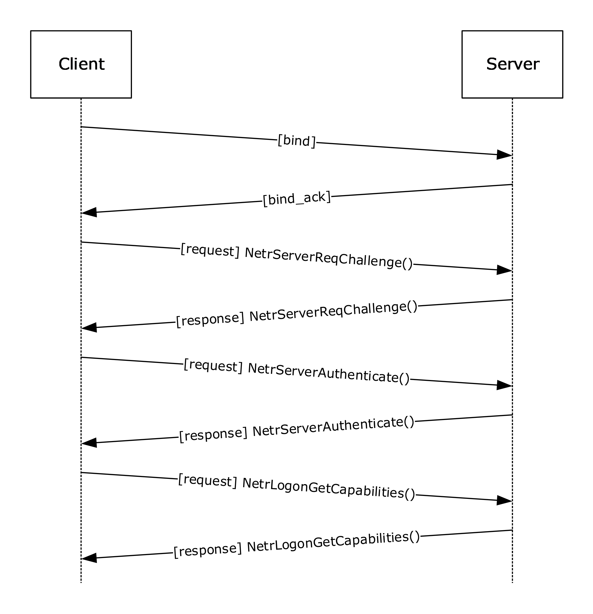

Figure 7: Session-key negotiation

Session-key negotiation works as follows.

- The client binds to the remote Netlogon RPC [**endpoint**](#gt_endpoint) on the server. The client then generates a [**nonce**](#gt_nonce), called the [**client challenge**](#gt_client-challenge), and sends the client challenge to the server as an input argument to the [**NetrServerReqChallenge**](#Section_3.4.5.2.1) method call.
- The server receives the client's **NetrServerReqChallenge** call. The server generates its own nonce, called the [**server challenge (SC)**](#gt_server-challenge-sc). In its response to the client's **NetrServerReqChallenge** method call, the server sends the SC back to the client as an output argument to **NetrServerReqChallenge**. After the client has received the server's response, both computers have one another's challenge nonce (client challenge and server challenge (SC), respectively).
- The client computes a session key, as specified in section [3.1.4.3](#Section_3.1.4.3), Session-Key Computation. The client specifies an initial set of capabilities by providing an initial set of values in the NegotiateFlags.
- The client computes its client Netlogon [**credential**](#gt_credential) by using client challenge as input to the credential computation algorithm, as specified in section [3.1.4.4](#Section_3.1.4.4).
- The client exchanges its client Netlogon credential with the server by passing it in the [**NetrServerAuthenticate**](#Section_3.5.4.4.5), [**NetrServerAuthenticate2**](#Section_3.5.4.4.4), or [**NetrServerAuthenticate3**](#Section_3.5.4.4.2) call as the ClientCredential input argument. The selection of the specific method called by the client is specified in section [3.4.5.2.2](#Section_3.4.5.2.2).
- The server receives the **NetrServerAuthenticate**, **NetrServerAuthenticate2**, or **NetrServerAuthenticate3** call and verifies the client Netlogon credential. It does this by computing a session key, as specified in section 3.1.4.3, duplicating the client Netlogon credential computation, using its stored copy of client challenge, and comparing the result of this recomputation with the client Netlogon credential that was just received from the client. If the comparison fails, the server MUST fail session-key negotiation without further processing of the following steps.
- If none of the first 5 bytes of the client challenge is unique, the server MUST fail session-key negotiation without further processing of the following steps.<71>
- The server computes its server Netlogon credential by using the server challenge as input to the credential computation algorithm, as specified in section 3.1.4.4. The server returns the server Netlogon credential as the *ServerCredential* output parameter of the **NetrServerAuthenticate**, **NetrServerAuthenticate2**, or **NetrServerAuthenticate3** call.
- The client verifies the server Netlogon credential. It does this by recomputing the server Netlogon credential, using its stored copy of server challenge, and comparing the result of this recomputation with the server Netlogon credential passed back from the server. If the comparison fails, the client MUST fail session-key negotiation.
- Upon mutual verification, the client and server agree to use the computed session key for encrypting and/or signing further communications.
- The client calls the NetrLogonGetCapabilities method to get Negotiaged flags by setting QueryLevel to 1 (section [3.4.5.2.11](#Section_3.4.5.2.11)).
- The server SHOULD<72> return the negotiated flags for the current exchange.
- The client SHOULD<73> compare the received ServerCapabilities (section [3.5.4.4.11](#Section_3.5.4.4.11)) with the negotiated NegotiateFlags (section 3.5.4.4.2), and if there is a difference, the session key negotiation is aborted.
- The client calls the NetrLogonGetCapabilities method to get Requested flags by setting QueryLevel to 2 (section 3.4.5.2.11).
- The server SHOULD<74> return the client capabilities received during a negotiation request from client.
- The client SHOULD<75> compare the received Requested flags (section 3.5.4.4.11) with the flags it has actually sent during negotiation (section 3.5.4.4.2), and if there is a difference, the session key negotiation is aborted.
- The client sets the ServerSessionInfo.LastAuthenticationTry (indexed by server name) to the current time. This prevents authentication retries from occurring for 45 seconds unless a new transport notification is received.
In the first phase of session-key negotiation (**NetrServerReqChallenge**), the client and server exchange nonces. This allows both the client and the server to compute a session key by using the algorithm defined in section 3.1.4.3. To provide mutual authentication, both the client and the server calculate a Netlogon credential based on their own nonce, using the computed session key, and exchange them in the second phase of session-key negotiation (**NetrServerAuthenticate** or **NetrServerAuthenticate2** or **NetrServerAuthenticate3**). Because nonces are exchanged in the first phase, this allows each side to calculate the other party's Netlogon credential locally, and then compare it with the received one. If the locally computed credential matches the one supplied by the other party, this proves to the client and to the server that the respective party has access to the [**shared secret**](#gt_shared-secret).

For more information about the methods involved in session-key negotiation, see client and server details in sections [3.4](#Section_1.3) and [3.5](#Section_3.5).

<a id="Section_3.1.4.2"></a>
#### 3.1.4.2 Netlogon Negotiable Options

As part of the [**session-key**](#gt_session-key) negotiation, the client and server use the *NegotiateFlags* parameter of [NetrServerAuthenticate2](#Section_3.5.4.4.4) or [NetrServerAuthenticate3](#Section_3.5.4.4.2) to negotiate support for the following options. The client offers an initial set of capabilities through the *NegotiateFlags* parameter to the server as input. The server then selects the capabilities acceptable to it. The capabilities that are supported by the server are combined with the capabilities supported by the client by performing a bit-wise AND; the result of the operation is returned to the client as output, as detailed in sections 3.5.4.4.2 and 3.5.4.4.4. The client MUST inspect the returned negotiation capabilities to determine whether server-selected capabilities are supported by the client, and that all of the capabilities required by the client are returned by the server. For example, a client could be configured outside the protocol to require strong-key support; if the server did not offer strong-key support, the client rejects the server.

If **NT4Emulator** is set to TRUE and bit U has not been set in *NegotiateFlags* as input, then the server MUST return 0 for bits J, K, L, M, N, O, P, Q, R, S, T, U, V, W, X, Y, and Z in the output of the *NegotiateFlags* parameter.

The following options are negotiable between the client and the server as part of the session-key negotiation. An option is TRUE (or set) if its value is equal to 1.

```mermaid
packet-beta
  0-0: "Z"
  1-1: "Y"
  2-2: "X"
  3-3: "0"
  4-4: "0"
  5-5: "0"
  6-6: "0"
  7-7: "W"
  8-8: "0"
  9-9: "0"
  10-10: "V"
  11-11: "U"
  12-12: "T"
  13-13: "S"
  14-14: "R"
  15-15: "Q"
  16-16: "P"
  17-17: "O"
  18-18: "N"
  19-19: "M"
  20-20: "L"
  21-21: "K"
  22-22: "J"
  23-23: "I"
  24-24: "H"
  25-25: "G"
  26-26: "F"
  27-27: "E"
  28-28: "D"
  29-29: "C"
  30-30: "B"
  31-31: "A"
```

Where the negotiable options SHOULD<76> be defined as the following:

| Option | Meaning |
| --- | --- |
| A | Not used. MUST be ignored on receipt. |
| B | Presence of this flag indicates that [**BDCs**](#gt_backup-domain-controller-bdc) persistently try to update their [**database**](#gt_database) to the [**PDC**](#gt_primary-domain-controller-pdc)'s version after they get a notification indicating that their database is out-of-date. Server-to-server only. |
| C | Supports [**RC4**](#gt_rc4) encryption. |
| D | Not used. MUST be ignored on receipt. |
| E | Supports BDCs handling CHANGELOGs. Server-to-server only. |
| F | Supports restarting of full synchronization between [**DCs**](#gt_domain-controller-dc). Server-to-server only. |
| G | Does not require ValidationLevel 2 for nongeneric passthrough. |
| H | Supports the NetrDatabaseRedo (Opnum 17) functionality (section [3.5.4.6.4](#Section_3.5.4.6.4)). |
| I | Supports refusal of password changes. |
| J | Supports the NetrLogonSendToSam (Opnum 32) functionality. |
| K | Supports generic pass-through authentication. |
| L | Supports concurrent [**RPC**](#gt_remote-procedure-call-rpc) calls. |
| M | Supports avoiding of user account database replication. Server-to-server only. |
| N | Supports avoiding of Security Authority database replication. Server-to-server only. |
| O | Supports strong keys. |
| P | Supports [**transitive trusts**](#gt_transitive-trust). |
| Q | Not used. MUST be ignored on receipt. |
| R | Supports the [NetrServerPasswordSet2](#Section_3.5.4.4.6) functionality. |
| S | Supports the [NetrLogonGetDomainInfo](#Section_3.5.4.4.10) functionality. |
| T | Supports cross-[**forest trusts**](#gt_forest-trust). |
| U | When this flag is negotiated between a client and a server, it indicates that the server ignores the **NT4Emulator** ADM element. |
| V | Supports [**RODC**](#gt_read-only-domain-controller-rodc) pass-through to different domains. |
| W | Supports [**Advanced Encryption Standard (AES)**](#gt_advanced-encryption-standard-aes) encryption (128 bit in 8-bit CFB mode) and SHA2 hashing as specified in sections [2.2.1.3.3](#Section_2.2.1.3.3), [3.1.4.3](#Section_3.1.4.3), [3.1.4.4](#Section_3.1.4.4), and [3.3](#Section_1.3). |
| X | Not used. MUST be ignored on receipt. |
| Y | Supports Secure RPC. |
| Z | Supports Kerberos as the [**security support provider (SSP)**](#gt_security-support-provider-ssp) for secure channel setup. |

All other bits MUST be set as specified in the *NegotiateFlags* description and MUST be ignored on receipt.

<a id="Section_3.1.4.3"></a>
#### 3.1.4.3 Session-Key Computation

Although **ClientChallenge** and **ServerChallenge** are treated normally as byte arrays, **ClientChallenge** and **ServerChallenge** are treated as 64-bit integers in little-endian format to set the sum in the following pseudocode. The carry of the most-significant bit is ignored in the sum of the **ClientChallenge** and **ServerChallenge**.

<a id="Section_3.1.4.3.1"></a>
##### 3.1.4.3.1 AES Session-Key

If [**AES**](#gt_advanced-encryption-standard-aes) support is negotiated between the client and the server, the strong-key support flag is ignored and the [**session key**](#gt_session-key) is computed with the HMAC-SHA256 algorithm [[RFC4634]](https://go.microsoft.com/fwlink/?LinkId=90486), as shown in the following pseudocode. SHA256Reset, SHA256Input, SHA256FinalBits, and SHA256Result are predicates or functions specified in [RFC4634]. MD4 is specified in [[RFC1320]](https://go.microsoft.com/fwlink/?LinkId=90274).

ComputeSessionKey(SharedSecret, ClientChallenge,

ServerChallenge)

M4SS := MD4(UNICODE(SharedSecret))

CALL SHA256Reset(HashContext, M4SS, sizeof(M4SS));

CALL SHA256Input(HashContext, ClientChallenge, sizeof(ClientChallenge));

CALL SHA256FinalBits (HashContext, ServerChallenge, sizeof(ServerChallenge));

CALL SHA256Result(HashContext, SessionKey);

SET SessionKey to lower 16 bytes of the SessionKey;

The key produced with AES support negotiated is 128 bits (16 bytes).

<a id="Section_3.1.4.3.2"></a>
##### 3.1.4.3.2 Strong-key Session-Key

If [**AES**](#gt_advanced-encryption-standard-aes) is not negotiated and strong-key support is one of the flags in the NegotiateFlags between the client and the server, the [**session key**](#gt_session-key) is computed with the MD5 message-digest algorithm [[RFC1321]](https://go.microsoft.com/fwlink/?LinkId=90275), as shown in the following pseudocode. MD5Init, MD5Update (where the third parameter is the byte count size of the second parameter), and MD5Final are predicates or functions specified in [RFC1321]. HMAC_MD5 is a function specified in [[RFC2104]](https://go.microsoft.com/fwlink/?LinkId=90314). The md5Context variable is of type MD5_CTX, as specified in [RFC1321].

SET zeroes to 4 bytes of 0

ComputeSessionKey(SharedSecret, ClientChallenge,

ServerChallenge)

M4SS := MD4(UNICODE(SharedSecret))

CALL MD5Init(md5context)

CALL MD5Update(md5context, zeroes, 4)

CALL MD5Update(md5context, ClientChallenge, 8)

CALL MD5Update(md5context, ServerChallenge, 8)

CALL MD5Final(md5context)

CALL HMAC_MD5(md5context.digest, md5context.digest length,

M4SS, length of M4SS, output)

SET Session-Key to output

The key produced with strong-key support negotiated is 128 bits (16 bytes).

<a id="Section_3.1.4.3.3"></a>
##### 3.1.4.3.3 DES Session-Key

If neither [**AES**](#gt_advanced-encryption-standard-aes) nor strong-key support is negotiated between the client and the server, the [**session key**](#gt_session-key) is computed by using the DES encryption algorithm in ECB mode, as specified in [[FIPS81]](https://go.microsoft.com/fwlink/?LinkId=89874), as follows.

ComputeSessionKey(SharedSecret, ClientChallenge,

ServerChallenge)

M4SS := MD4(UNICODE(SharedSecret))

SET sum to ClientChallenge + ServerChallenge

SET k1 to lower 7 bytes of the M4SS

SET k2 to upper 7 bytes of the M4SS

CALL DES_ECB(sum, k1, &output1)

CALL DES_ECB(output1, k2, &output2)

SET Session-Key to output2

The key produced without AES and strong-key support negotiated is 64 bits and is padded to 128 bits with zeros in the most-significant bits.

<a id="Section_3.1.4.4"></a>
#### 3.1.4.4 Netlogon Credential Computation

When establishing a [**secure channel**](#gt_secure-channel), the input is the [**client challenge**](#gt_client-challenge) when the Netlogon [**credential**](#gt_credential) for the client is being computed, and the [**server challenge (SC)**](#gt_server-challenge-sc) when the Netlogon credential for the server is being computed. For subsequent calls using [**authenticators**](#gt_authenticator), the input is the previously computed credential.

Output contains the computed 64-bit Netlogon credential.

<a id="Section_3.1.4.4.1"></a>
##### 3.1.4.4.1 AES Credential

If [**AES**](#gt_advanced-encryption-standard-aes) support is negotiated between the client and the server, the Netlogon [**credentials**](#gt_credential) are computed using the AES-128 encryption algorithm in 8-bit CFB mode with a zero initialization vector.

ComputeNetlogonCredential(Input, Sk,

Output)

SET IV = 0

CALL AesEncrypt(Input, Sk, IV, Output)

AesEncrypt is the AES-128 encryption algorithm in 8-bit CFB mode with a zero initialization vector [[FIPS197]](https://go.microsoft.com/fwlink/?LinkId=89870).

<a id="Section_3.1.4.4.2"></a>
##### 3.1.4.4.2 DES Credential

The [**session key**](#gt_session-key) is computed as follows.

InitLMKey(KeyIn, KeyOut)

KeyOut[0] = KeyIn[0] >> 0x01;

KeyOut[1] = ((KeyIn[0]&0x01)<<6) | (KeyIn[1]>>2);

KeyOut[2] = ((KeyIn[1]&0x03)<<5) | (KeyIn[2]>>3);

KeyOut[3] = ((KeyIn[2]&0x07)<<4) | (KeyIn[3]>>4);

KeyOut[4] = ((KeyIn[3]&0x0F)<<3) | (KeyIn[4]>>5);

KeyOut[5] = ((KeyIn[4]&0x1F)<<2) | (KeyIn[5]>>6);

KeyOut[6] = ((KeyIn[5]&0x3F)<<1) | (KeyIn[6]>>7);

KeyOut[7] = KeyIn[6] & 0x7F;

for( int i=0; i<8; i++ ){

KeyOut[i] = (KeyOut[i] << 1) & 0xfe;

}

Assume bytes(s, e, l) returns bytes from s to e of the byte array l. After a session key is computed, a Netlogon [**credential**](#gt_credential) is computed. If [**AES**](#gt_advanced-encryption-standard-aes) support is not negotiated between the client and the server, the Netlogon credentials are computed using DES:

ComputeNetlogonCredential(Input, Sk,

Output)

SET k1 to bytes(0, 6, Sk)

CALL InitLMKey(k1, k3)

SET k2 to bytes(7, 13, Sk)

CALL InitLMKey(k2, k4)

CALL DES_ECB(Input, k3, &output1)

CALL DES_ECB(output1, k4, &output2)

SET Output to output2

DES_ECB is the DES encryption algorithm in ECB mode ([[FIPS81]](https://go.microsoft.com/fwlink/?LinkId=89874) and [[FIPS46-2]](https://go.microsoft.com/fwlink/?LinkId=89871)).

<a id="Section_3.1.4.5"></a>
#### 3.1.4.5 Netlogon Authenticator Computation and Verification

All methods that require a [**secure channel**](#gt_secure-channel), except [NetrLogonSamLogonEx](#Section_3.4.5.3.2), will use Netlogon [**authenticators**](#gt_authenticator). If the Netlogon [**RPC**](#gt_remote-procedure-call-rpc) call is using Netlogon authenticators, the following steps are used to calculate the authenticator:

- Each time a client sends a new request, it records the current time stamp (expressed as the number of seconds since 00:00:00 on January 1, 1970 (UTC)) in the **Timestamp** field of the ReturnAuthenticator that is a **NETLOGON_AUTHENTICATOR** structure, as specified in section [2.2.1.1.5](#Section_2.2.1.1.5). The client also adds the value of this time stamp to the stored Netlogon client [**credential**](#gt_credential) and encrypts the result with the [**session key**](#gt_session-key), using the Netlogon credential computation algorithm defined in section [3.1.4.4](#Section_3.1.4.4). The result of this computation is stored in the **Credential** field of the **NETLOGON_AUTHENTICATOR** structure and is then sent to the server.
SET TimeNow = current time;

SET ClientAuthenticator.Timestamp = TimeNow;

SET ClientStoredCredential = ClientStoredCredential + TimeNow;

CALL ComputeNetlogonCredential(ClientStoredCredential,

Session-Key, ClientAuthenticator.Credential);

- When the server receives a request, the server confirms the validity of the Netlogon authenticator that it received with the request. Validation is achieved by adding the time stamp transmitted in the received Netlogon authenticator to the server's stored copy of the Netlogon credential, and by encrypting the result with the session key, using the algorithm specified in section 3.1.4.4. The server then compares the Netlogon credential that it just calculated with the Netlogon credential transmitted in the received Netlogon authenticator. If the Netlogon credentials do not match, the operation fails, and an error indicating that access is denied is returned to the client.
If the Netlogon credentials match, the server increments the Netlogon credential in the Netlogon authenticator by one, performs the computation defined in **Netlogon Credential Computation**, section 3.1.4.4, and stores the new Netlogon credential. The server returns a Netlogon authenticator that contains the new Netlogon credential to the client.

SET ServerStoredCredential = ServerStoredCredential +

ClientAuthenticator.Timestamp;

CALL ComputeNetlogonCredential(ServerStoredCredential,

Session-Key, TempCredential);

IF TempCredential != ClientAuthenticator.Credential

THEN return access denied error

SET ServerStoredCredential = ServerStoredCredential + 1;

CALL ComputeNetlogonCredential(ServerStoredCredential,

Session-Key, ServerAuthenticator.Credential);

- The client validates the returned Netlogon authenticator by incrementing its stored Netlogon credential by one, encrypting the result with the session key using the algorithm defined in section 3.1.4.4, and comparing the results. If this is successful, the client stores the Netlogon credential part of the Netlogon authenticator as the new Netlogon credential. If the validation fails, the client SHOULD re-establish its secure channel with the [**domain controller**](#gt_domain-controller-dc).
SET ClientStoredCredential = ClientStoredCredential + 1;

CALL ComputeNetlogonCredential(ClientStoredCredential,

Session-Key, TempCredential);

IF TempCredential != ServerAuthenticator.Credential

THEN return abort

In each of the addition operations previously performed, the least-significant 4 bytes of the credential are added with the 4-byte time stamp value (or the constant 1), and overflow is ignored. This leaves the most-significant 4 bytes of the credential unmodified.

<a id="Section_3.1.4.6"></a>
#### 3.1.4.6 Calling Methods Requiring Session-Key Establishment

To call the methods in the following set, the client and the server MUST have performed [**session-key**](#gt_session-key) negotiation. If negotiation has not been completed prior to the time of a call, negotiation MUST be initiated and completed before making the call. Each method that requires a [**secure channel**](#gt_secure-channel) is defined in section [3.5](#Section_3.5), with the errors specified. For descriptions of the following methods, see section 3.5.

- NetrGetForestTrustInformation
- NetrLogonGetCapabilities
- NetrLogonSamLogon
- NetrLogonSamLogonEx
- NetrLogonSamLogonWithFlags
- NetrLogonSamLogoff
- NetrLogonSendToSam
- NetrServerPasswordGet
- NetrServerPasswordSet
- NetrServerPasswordSet2
- NetrServerGetTrustInfo
- NetrServerTrustPasswordsGet
- NetrLogonGetDomainInfo
- NetrDatabaseDeltas
- NetrDatabaseSync2
- NetrDatabaseSync
- NetrDatabaseRedo
- NetrAccountDeltas
- NetrAccountSync
- NetrLogonDummyRoutine1
The client and server follow this sequence of steps.<77>

- The client SHOULD<78> bind to the [**RPC**](#gt_remote-procedure-call-rpc) server using TCP/IP.
The client and server MUST utilize a secure bind. If a secure bind is used, the client instructs the RPC runtime to use the Netlogon SSP ([MS-RPCE](../MS-RPCE/MS-RPCE.md) section 2.2.1.1.7) for privacy/integrity of the RPC messages. Clients MUST request the Privacy [**authentication level**](#gt_authentication-level).

- If the call to be made uses Netlogon [**authenticators**](#gt_authenticator), the client MUST compute the Netlogon authenticator to be passed as a parameter to the RPC method, as specified in section [3.1.4.5](#Section_3.1.4.5).
- The client calls the method on the server. If the RPC server denies access, the client attempts to re-establish the session key with the target server if the difference between the current time and value of ServerSessionInfo.LastAuthenticationTry (indexed by the name of the target server) is greater than 45 seconds.
- If secure bind is not used or the client is using RPC Integrity instead of RPC Privacy, the server MUST deny the request unless client is in the VulnerableChannelAllowList setting.<79>
- The server MUST verify the authenticator, if used, and compute the return authenticator, as specified in section 3.1.4.5.
- If none of the first 5 bytes of the ClientStoredCredential computation result (step 1, section 3.1.4.5) is unique, the server MUST fail session-key negotiation without further processing of the following steps.<80>
- The client MUST validate the returned authenticator, if used.
- The client MAY unbind from the server, but it SHOULD<81> reuse the binding for multiple RPC calls.
<a id="Section_3.1.4.7"></a>
#### 3.1.4.7 Calling Methods Not Requiring Session-Key Establishment

The client follows this sequence of steps:

- The client SHOULD bind to the [**RPC**](#gt_remote-procedure-call-rpc) server over TCP/IP but MAY<82> use the named pipe "\PIPE\NETLOGON".
**Note** The TCP/IP channel cannot support impersonation for access control and is therefore unusable. The server will ignore any calls made via this channel.

- The client calls the method on the server.
- The client unbinds from the server or reuses the binding for multiple RPC calls.
<a id="Section_3.1.4.8"></a>
#### 3.1.4.8 Determining If the Implementation Is Running on a Domain Controller

The implementation determines whether it is running on a domain controller by querying the current server configuration by calling the abstract interface **ServerGetInfo** specified in [MS-DTYP](../MS-DTYP/MS-DTYP.md) section 2.6, specifying a level of 101. The resulting bufptr contains a **SERVER_INFO_101** structure, as specified in [MS-DTYP] section 2.3.12. The determination is TRUE if **sv101_version_type** contains SV_TYPE_DOMAIN_CTRL or SV_TYPE_DOMAIN BAKCTRL. If **sv101_version_type** does not contain either of these values, the determination is FALSE.

<a id="Section_3.1.4.9"></a>
#### 3.1.4.9 Determining if a Request is for the Current Domain

If the server is running on a [**domain controller (DC)**](#gt_domain-controller-dc), the server determines if a request is for its domain by comparing the domain the request was intended for and the domain-name ADM element.

<a id="Section_3.1.4.10"></a>
#### 3.1.4.10 Client Domain Controller Location

The client MUST attempt to locate a domain controller of a given domain. A client locally invokes processing rules specified in **DsrGetDcName** (section [3.5.4.3.3](#Section_3.5.4.3.3)) with the method parameters set as follows:

- Set the *ComputerName* parameter to NULL.
- Set the *DomainName* parameter to the domain name.
- Set the *DomainGuid* parameter to NULL.
- Set the *SiteGuid* parameter to NULL.
- Set the *Flags* parameter to a bitwise OR of the bits L and R that are specified in **DsrGetDcNameEx2** (section [3.5.4.3.1](#Section_3.5.4.3.1)).
If **DsrGetDcName** returns with no errors, the **DomainControllerName** field of the returned **DomainControllerInfo** structure will contain the DC name.

<a id="Section_3.1.5"></a>
### 3.1.5 Timer Events

No protocol timer events are required on the client beyond the timers required in the underlying [**RPC transport**](#gt_rpc-transport).

<a id="Section_3.1.6"></a>
### 3.1.6 Other Local Events

No additional local events are used on the client beyond the events maintained in the underlying [**RPC transport**](#gt_rpc-transport) and Group Policy notification.

The Netlogon client and server register a local change notification callback with the Group Policy: Security Protocol Extension Client [MS-GPSB](../MS-GPSB/MS-GPSB.md). The client SHOULD<83> send Netlogon a PolicyChange event when the policy is changed.

<a id="Section_3.2"></a>
## 3.2 Pass-Through Authentication Details

Netlogon has various roles, one of which is to securely transport data for authentication packages between the client and the server.

<a id="Section_3.2.1"></a>
### 3.2.1 Abstract Data Model

None.

<a id="Section_3.2.2"></a>
### 3.2.2 Timers

None.

<a id="Section_3.2.3"></a>
### 3.2.3 Initialization

Using Netlogon for pass-through authentication requires a [**session key**](#gt_session-key) to have already been negotiated, as specified in section [3.1.4.1](#Section_3.1.4.1).

<a id="Section_3.2.4"></a>
### 3.2.4 Message Processing Events and Sequencing Rules

Netlogon is used to securely transport data for authentication packages between the client and the server. This is accomplished by packages calling the [**NetrLogonSamLogon**](#Section_3.5.4.5.2) or [**NetrLogonSamLogonEx**](#Section_3.4.5.3.2) methods. Netlogon takes the data specified in the input parameters by the authentication package on the client and sends it unexamined over the [**secure channel**](#gt_secure-channel) to the server. The server delivers the data to the target authentication package.

<a id="Section_3.2.4.1"></a>
#### 3.2.4.1 Generic Pass-Through

When using the **NetrLogonSamLogon** method, as specified in section [3.5.4.5.3](#Section_3.5.4.5.2), or the **NetrLogonSamLogonEx** method, as specified in section [3.5.4.5.1](#Section_3.4.5.3.2), for generic pass-through, the following requirements MUST be met:

- The *LogonLevel* parameter is 4 ([NetlogonGenericInformation](#Section_2.2.1.4.16)), as specified in section 2.2.1.4.16.
- The *ValidationLevel* parameter is 5 ([NetlogonValidationGenericInfo2](#Section_2.2.1.4.14)), as specified in section 2.2.1.4.14.
The *LogonInformation* parameter is **NETLOGON_GENERIC_INFO** structure, as specified in section [2.2.1.4.2](#Section_2.2.1.4.2).

- **NETLOGON_GENERIC_INFO**.**PackageName** is "Kerberos" ([MS-APDS](../MS-APDS/MS-APDS.md) section 3.2.5.5) or "WDigest" ([MS-APDS] section 3.3.5.1).
Protocols that use Netlogon for generic pass-through will also include opaque [**Binary Large Objects (BLOBs)**](#gt_binary-large-object-blob) that comprise their respective message data. These BLOBs are passed in the **LogonData** field of the **NETLOGON_GENERIC_INFO** structure, with the size of the data specified in the **DataLength** field. The BLOB is passed from one system's Netlogon component to the other system's component over the wire. Netlogon will then pass the opaque BLOB to the security package specified in the **PackageName** field.

The **NETLOGON_LOGON_IDENTITY_INFO** structure (as specified in section [2.2.1.4.15](#Section_2.2.1.4.15)) inside the **NETLOGON_GENERIC_INFO** structure (as specified in section 2.2.1.4.2) MUST:

- Contain the LogonDomainName.
- Ensure that the rest of the **NETLOGON_LOGON_IDENTITY_INFO** fields are zeroed out.
The response is sent by the [**domain controller**](#gt_domain-controller-dc) via the *ValidationInformation* parameter, which points to a pointer to the **NETLOGON_VALIDATION_GENERIC_INFO2** structure (section [2.2.1.4.8](#Section_2.2.1.4.8)).

See [MS-APDS] for a specification of how NTLM, Kerberos, and Digest authentication packages use the Netlogon [**secure channel**](#gt_secure-channel).

<a id="Section_3.2.4.2"></a>
#### 3.2.4.2 Network Ticket Logon

Network ticket logon is offered as an update to PAC validation. Use network ticket logon if the service process is untrusted, or if the service is in a different domain than the computer.

If at any point, error STATUS_INVALID_INFO_CLASS or error RPC_NT_BAD_STUB_DATA occurs (see [MS-ERREF](../MS-ERREF/MS-ERREF.md) section 2.3.1 for both), the chain of domain controllers does not support this form of validation and the client MUST use the PAC form of validation.

Broadly, there are five major steps in the network ticket logon process:

- The Kerberos client prepares and makes a request (see [MS-APDS](../MS-APDS/MS-APDS.md) sections 3.2.5.1 and 3.2.5.2)
- Netlogon delivers the request (see section [3.2.4.2.1](#Section_3.2.4.2.1))
- The [**Key Distribution Center (KDC)**](#gt_key-distribution-center-kdc) processes the request and sends a reply (see [MS-KILE](../MS-KILE/MS-KILE.md) section 3.3.5.8.1)
- Netlogon processes the reply and sends it to the client (see section [3.2.4.2.2](#Section_3.2.4.2.2.2))
- The Kerberos client receives the reply (see [MS-APDS] section 3.2.5.4)
Depending on the network, there can be several hops—for example, the recipient receives the request and relays it to another domain controller (DC)—involved before the request arrives at the appropriate domain controller. For an example, see the figure "Pass-through authentication and domain trusts" in section [1.3.2](#Section_1.3.2). Ingress and egress filtering are performed at each hop.

**Note**: If, at any point in processing, required bits of the response message are unrecognized, the request fails.

<a id="Section_3.2.4.2.1"></a>
##### 3.2.4.2.1 Netlogon Delivers the Request

When Netlogon gets the network ticket logon request (the NetrLogonSamLogonEx call), it follows the same dispatch rules as used for NetlogonNetworkInformation (section [2.2.1.4.16](#Section_2.2.1.4.16)). This includes both routing to the domain specified in the logon as well as the logic to forward to the primary domain controller (PDC) or a hub domain controller (DC) as a higher authority.

When the request reaches the target domain for authentication, the domain calls the key distribution center (KDC) located on that Domain Controller with the ticket logon request and receives ticket validation information in response.

<a id="Section_3.2.4.2.2"></a>
##### 3.2.4.2.2 Netlogon Processes Reply

Every hop in the Netlogon chain performs steps on the reply message depending on where it is in the chain. As with the KDC, it will report status codes for failures but it will use the **NetlogonStatus** field (see section [2.2.1.4.20](#Section_2.2.1.4.20)) instead. On failure, it MUST fill in the domain controller name in the **SourceOfStatus** field in the NETLOGON_VALIDATION_TICKET_LOGON.

<a id="Section_3.2.4.2.2.1"></a>
###### 3.2.4.2.2.1 Netlogon Not in the Domain that Issued the Ticket

Everywhere that Netlogon receives the ticket validation information from another domain, it MUST perform ingress transformation of the authorization data. In the simplest case where there is only **UserInformation** populated and no claims for compounding, this is the same as the SID and namespace filtering done during NTLM logon (see [MS-PAC](../MS-PAC/MS-PAC.md) section 4.1.2.2 for SID filtering). Because Kerberos supports claims and compounding, however, there can be more steps. If user or device claims are present, they’re transformed in the same way as they are for Kerberos referral tickets. If device groups are present, then they undergo SID filtering like the User groups. This all happens unless **SkipSIDFilter** is set in the request. The namespace filtering can also be skipped in isolation if the request contains **SkipNamespaceFilter**.

If user SID filtering fails, then the whole logon is failed. **LogonFailed** and **UserSidsFailed** are set.

If user namespace filtering fails, then the whole logon is failed. **UserNamespaceFailed** and **LogonFailed** are set.

If device SID filtering fails, then the device information is removed from the result but the logon can still succeed non-compounded. **DeviceSidsFailed** is set in the reply to indicate that **DeviceInformation** has been cleared.

If device namespace filtering fails, then the same steps are taken except that **DeviceNamespaceFailed** is set in the response instead.

SID filtering only fails if the primary SID or primary group are removed by filtering. Other SIDs will just be removed as disallowed. Netlogon watches the SID counts before and after filtering and sets **UserSidsFiltered** or **DeviceSidsFiltered** if user or device SIDs are removed as a result of filtering.

<a id="Section_3.2.4.2.2.2"></a>
###### 3.2.4.2.2.2 Netlogon Not in the Domain of the Computer that Asked for Validation

While SID filtering only occurs on ingress, claims are also subject to egress filtering. If Netlogon received its call from a DC in another domain, it calls egress claims transformation the same way as Kerberos does when the KDC generates a referral ticket.

As with ingress transformation, this is suppressed if the request contains the flag **SkipSIDFilter**.

<a id="Section_3.2.4.2.2.3"></a>
###### 3.2.4.2.2.3 Netlogon in the Domain of the Computer that Asked for Validation

There is an additional transformation step on the domain controller that the computer directly called with the ticket logon request performs. If the request does not have the flag **SkipResourceGroups** set then Netlogon will add resource groups for the computer’s domain. This is identical to the adding of resource groups during an NTLM logon, other than the fact that the ticket logon can contain device information that also gets resource groups added (see [MS-KILE](../MS-KILE/MS-KILE.md) section 3.3.5.7.3 for adding resource groups).

There’s also an additional security check on this domain controller. If the computer is subject to an authentication policy that includes [**A2ATo**](#gt_a2ato) or if the user information includes the cross-organization SID then this domain controller will perform the [**A2A**](#gt_a2a)/A2ATo access check unless the request has the **SkipA2AChecks** flag set. This access check works the same way as it does during NTLM logon, except for the fact that the network ticket logon can contain claims and device information that is used in the access check. If this A2A check fails, Netlogon sets **LogonFailed** and **UserFailedA2A** bits in the validation information.

<a id="Section_3.2.5"></a>
### 3.2.5 Timer Events

No protocol timer events are required on the client beyond the timers required in the underlying [**RPC transport**](#gt_rpc-transport).

<a id="Section_3.2.6"></a>
### 3.2.6 Other Local Events

No additional local events are used on the client beyond the events maintained in the underlying [**RPC transport**](#gt_rpc-transport).

<a id="Section_3.3"></a>
## 3.3 Netlogon as a Security Support Provider

In addition to other functionality, Netlogon also serves as a limited private SSP<84> for use by Netlogon and [**RPC**](#gt_remote-procedure-call-rpc) ([MS-RPCE](../MS-RPCE/MS-RPCE.md) section 2.2.1.1.7) when encrypting and signing data during communication.<85> Central to this capability is the use of the [**session key**](#gt_session-key), as specified in section [3.1](#Section_1.3). This section specifies the behavior of the [**security provider**](#gt_security-provider) role for both client and server.

Netlogon implements a service that allows the RPC runtime to perform a [**security context**](#gt_security-context) negotiation between the client and the server and to use per-message calls to protect the data being passed over the network. For Netlogon to be able to perform this functionality, a session key MUST have been established between the client and the server as specified in section 3.1. Netlogon registers with the RPC runtime as a security provider with the auth_type value (as specified in [MS-RPCE] section 2.2.2.11) of 0x44.

When serving as its own generic SSP, Netlogon always provides the following service features:

- **Integrity:** Signed messages are constructed so that they cannot be tampered with while in transit. The generation and receipt of the [Netlogon Signature](#Section_3.3.4.2) token will always provide integrity protection for the messages.
- **Sequence Detect:** Signed messages are constructed such that out-of-order sequences can be detected. The generation and receipt of the **Netlogon Signature** token will always detect out-of-sequence messages.
<a id="Section_3.3.1"></a>
### 3.3.1 Abstract Data Model

This section describes a conceptual model of possible data organization that an implementation maintains to participate in this protocol. The described organization is provided to facilitate the explanation of how the protocol behaves. This document does not mandate that implementations adhere to this model as long as their external behavior is consistent with that described in this document.

Netlogon serves as a [**security provider**](#gt_security-provider) for its own [**RPC**](#gt_remote-procedure-call-rpc) connections. As such, it provides the following service: Confidentiality.

For protocol features, once a [**session key**](#gt_session-key) has been established through the session key negotiation, Netlogon relies upon the RPC runtime to invoke the per-message functions. The following define the services provided by the Netlogon [**security support provider (SSP)**](#gt_security-support-provider-ssp).

**Note** The following defined variables are logical, abstract parameters that an implementation is required to maintain and expose to provide the proper level of service. How these variables are maintained and exposed is determined by the implementation.

**Confidentiality:** A Boolean setting that indicates that the caller is requiring encryption of messages so that they cannot be read while in transit. Requesting this service results in Netlogon encrypting the message. For more information, see sections [3.1.4.2](#Section_3.1.4.2) and [3.1.4.3](#Section_3.1.4.3).

As per [MS-RPCE](../MS-RPCE/MS-RPCE.md) section 2.2.2.11, the **auth_level** field of the **sec_trailer** structure determines the [**authentication level**](#gt_authentication-level) used. Netlogon only supports RPC_C_AUTHN_LEVEL_PKT_INTEGRITY and RPC_C_AUTHN_LEVEL_PKT_PRIVACY. A value of RPC_C_AUTHN_LEVEL_PKT_INTEGRITY implies that Integrity is provided by the Netlogon SSP, and a value of RPC_C_AUTHN_LEVEL_PKT_PRIVACY implies that Confidentiality is provided by the Netlogon SSP. Sequence detection is always provided.

The Netlogon SSP maintains the following set of data for each session:

**ClientSequenceNumber:** A 64-bit integer value used for detecting out-of-order messages on the client side.

**ServerSequenceNumber:** A 64-bit integer value used for detecting out-of-order messages on the server side.

**Session-Key:** See section 3.1.4.3 for **Session-Key** computation details.

**NegotiateFlags:** See section [3.1.1](#Section_3.1) for **NegotiateFlags** details.

**MessageBlockSize:** An integer that indicates the minimum size of messages for encryption. This value MUST be 1.

<a id="Section_3.3.2"></a>
### 3.3.2 Timers

None.

<a id="Section_3.3.3"></a>
### 3.3.3 Initialization

Establishing a Netlogon [**security context**](#gt_security-context) requires a [**session key**](#gt_session-key) to have already been negotiated, as specified in section [3.1.4.1](#Section_3.1.4.1).

<a id="Section_3.3.4"></a>
### 3.3.4 Message Processing Events and Sequencing Rules

Netlogon uses two types of tokens when functioning as an SSP: [NL_AUTH_MESSAGE](#Section_2.2.1.3.1) and [NL_AUTH_SIGNATURE](#Section_2.2.1.3.2).

<a id="Section_3.3.4.1"></a>
#### 3.3.4.1 The NL_AUTH_MESSAGE Token

The **NL_AUTH_MESSAGE** token contains information that is part of the first message in an authenticated transaction between a client and a server. It contains a message type, flags, and naming information. For the exact format, see section [2.2.1.3.1](#Section_2.2.1.3.1).

The NL_AUTH_MESSAGE token is part of the [**RPC**](#gt_remote-procedure-call-rpc) PDU AUTH trailer structure as specified in [MS-RPCE](../MS-RPCE/MS-RPCE.md) section 2.2.2.11.

The client generates an initial token and sends it to the server. The server receives the token, processes it, and passes back a return token to the client.

The exchange of this message requires a [**session key**](#gt_session-key) to have been negotiated as specified in section [3.1](#Section_1.3). Upon successful exchange of tokens, the application starts using per-message calls to protect the data being passed over the network.

<a id="Section_3.3.4.1.1"></a>
##### 3.3.4.1.1 Generating an Initial NL_AUTH_MESSAGE Token

The client generates a **NL_AUTH_MESSAGE token** to initiate authentication to a server. The **MessageType** field of this token MUST be set to zero to indicate that this is a Negotiate message type.

The client MUST provide at least one [**domain name**](#gt_domain-name) and one [**computer name**](#gt_computer-name) in the token by providing the **Flags** bit and the corresponding text buffer. The **Flags** field is a bitwise OR of the values defined under the **Flags** field of the **NL_AUTH_MESSAGE token** in section [2.2.1.3.1](#Section_2.2.1.3.1). This value represents the names available in the token. The **Buffer** field is then composed by concatenating the strings of the names indicated by the **Flags** value. The compressed UTF-8 strings are generated, as specified in [[RFC1035]](https://go.microsoft.com/fwlink/?LinkId=90264) section 4.1.4.

The following is an example token on the wire.

00 00 00 00 17 00 00 00 4E 54 44 45 56 00 4E 41 ........NTDEV.NA

53 4B 4F 00 05 6E 74 64 65 76 04 63 6F 72 70 09 SKO..ntdev.corp.

6D 69 63 72 6F 73 6F 66 74 03 63 6F 6D 00 05 4E microsoft.com..N

41 53 4B 4F 00 ASKO.

<a id="Section_3.3.4.1.2"></a>
##### 3.3.4.1.2 Receiving an Initial NL_AUTH_MESSAGE Token

When the server receives the initial **NL_AUTH_MESSAGE** token (section [2.2.1.3.1](#Section_2.2.1.3.1)), the server will check the token type and extract the client names using the Flags values and corresponding text buffer passed. The server MUST return SEC_E_INVALID_TOKEN (0x80090308), indicating that an invalid token has been received, when any of the following are true:

- The MessageType is not set to 0x00000000.
- A flag for a particular name type is present and the corresponding text buffer cannot be extracted from the Buffer.
- The token does not contain at least one [**domain name**](#gt_domain-name) and one [**computer name**](#gt_computer-name).
The server initializes **ServerSequenceNumber** to 0. This sequence number is used to detect out-of-order messages.

<a id="Section_3.3.4.1.3"></a>
##### 3.3.4.1.3 Generating a Return NL_AUTH_MESSAGE Token

Upon successful verification and extraction of data from the initial token, the server verifies that a successful [**session-key**](#gt_session-key) negotiation has occurred by the presence of the **Session-Key** data item for the client. If no negotiation has occurred, the server MUST return SEC_E_INVALID_TOKEN (0x80090308) indicating that an invalid token has been received.

The server generates a return **NL_AUTH_MESSAGE** (section [2.2.1.3.1](#Section_2.2.1.3.1)) token. The **MessageType** MUST be set to 1 to indicate that this is a Negotiate response message type, the **Flags** field is set to zero, the **Buffer** field contains a NULL character, and the **NL_AUTH_MESSAGE** token MUST be padded to 12 bytes in length.

The return **NL_AUTH_MESSAGE** token is then sent back to the client along with any additional application-specific data.

<a id="Section_3.3.4.1.4"></a>
##### 3.3.4.1.4 Receiving a Return NL_AUTH_MESSAGE Token

When the client receives the return token, it verifies that:

- The **NL_AUTH_MESSAGE** token is at least 12 bytes in length.
- The MessageType is set to 1.
If either of these conditions are not true, the client MUST return SEC_E_INVALID_TOKEN (0x80090308) indicating that an invalid token has been received.

Otherwise, the client initializes **ClientSequenceNumber** to 0, which is used to detect out-of-order messages.

<a id="Section_3.3.4.2"></a>
#### 3.3.4.2 The Netlogon Signature Token

The **Netlogon Signature** token contains information that MUST be part of each protected message. It contains a signature algorithm identifier, encryption algorithm identifier, confounder, flags, sequence number, and checksum (see section [2.2.1.3.2](#Section_2.2.1.3.2) for the exact format). When data is protected/signed, a **Netlogon Signature** token is generated that describes the algorithms used and contains the checksum of the data to be sent. When data is received and is unprotected/verified, the **Netlogon Signature** token is used.

<a id="Section_3.3.4.2.1"></a>
##### 3.3.4.2.1 Generating a Client Netlogon Signature Token

If [**AES**](#gt_advanced-encryption-standard-aes) is negotiated, a client generates an **NL_AUTH_SHA2_SIGNATURE** token (section [2.2.1.3.3](#Section_2.2.1.3.3)) that contains an HMAC-SHA256 checksum [[RFC4634]](https://go.microsoft.com/fwlink/?LinkId=90486), a sequence number, and a confounder (if confidentiality has been requested) to send data protected on the wire. The data is encrypted using the AES algorithm. If AES is not negotiated, a client generates a **Netlogon Signature** token that contains an [**HMAC-MD5**](#gt_ba024019-a866-41df-99a5-764b7eab2e1e) checksum ([[RFC2104]](https://go.microsoft.com/fwlink/?LinkId=90314)), a sequence number, and a confounder (if confidentiality has been requested) to send data protected on the wire. The data is encrypted using the negotiated encryption algorithm. Note that in the algorithm that follows, the term Confidentiality is used as defined in section [3.3.1](#Section_3.6.1). The following steps are performed to generate the client **Netlogon Signature** tokens and to encrypt the data if requested.

- If AES is negotiated:
- The **SignatureAlgorithm** first byte MUST be set to 0x13, and the second byte MUST be set to 0x00.
- If the Confidentiality option (section 3.3.1) is requested from the application, then the **SealAlgorithm** first byte MUST be set to 0x1A, the second byte MUST be set to 0x00, and the **Confounder** MUST be filled with cryptographically random data.
- If the Confidentiality option (section 3.3.1) is not requested, then the **SealAlgorithm** MUST be filled with two bytes of 0xff and the **Confounder** is not included in the token.
- If AES is not negotiated:
- The **SignatureAlgorithm** first byte MUST be set to 0x77, and the second byte MUST be set to 0x00.
- If the Confidentiality option (section 3.3.1) is requested from the application, then the **SealAlgorithm** first byte MUST be set to 0x7A, the second byte MUST be set to 0x00, and the **Confounder** MUST be filled with cryptographically random data.
- If the Confidentiality option is not requested, then the **SealAlgorithm** MUST be filled with two bytes of value 0xff and the **Confounder** is not included in the token.
- The **Pad** MUST be filled with 0xff bytes.
- The **Flags** MUST be filled with 0x00 bytes.
- The **SequenceNumber** is computed using the following algorithm.
Assume byte(n, l) returns byte n of the 32-bit number l. The n parameter is limited to 0..3. The least significant byte is 0, the most significant byte is 3.

SET CopySeqNumber[0] to byte(3, ClientSequenceNumber.LowPart)

SET CopySeqNumber[1] to byte(2, ClientSequenceNumber.LowPart)

SET CopySeqNumber[2] to byte(1, ClientSequenceNumber.LowPart)

SET CopySeqNumber[3] to byte(0, ClientSequenceNumber.LowPart)

SET CopySeqNumber[4] to byte(3, ClientSequenceNumber.HighPart)

SET CopySeqNumber[5] to byte(2, ClientSequenceNumber.HighPart)

SET CopySeqNumber[6] to byte(1, ClientSequenceNumber.HighPart)

SET CopySeqNumber[7] to byte(0, ClientSequenceNumber.HighPart)

Set CopySeqNumber[4] to CopySeqNumber[4] OR 0x80

- The **ClientSequenceNumber** MUST be incremented by 1.
- If AES is negotiated, then a signature MUST be computed using the following algorithm:
CALL SHA256Reset(&HashContext, Sk, sizeof(Sk));

CALL SHA256Input(HashContext, NL_AUTH_SHA2_SIGNATURE, 8);

IF Confidentiality requested

CALL SHA256Input(HashContext, Confounder, 8);

CALL SHA256FinalBits(HashContext, Message, size of Message);

CALL SHA256Result(HashContext, output);

SET Signature to output

**Note**: In the first call to SHA256Input, only the first 8-bytes of the **NL_AUTH_SHA2_SIGNATURE** structure are used.

Else, a signature MUST be computed using the following algorithm:

SET zeroes to 4 bytes of 0

CALL MD5Init(md5context)

CALL MD5Update(md5context, zeroes, 4)

CALL MD5Update(md5context, NL_AUTH_SIGNATURE, 8)

IF Confidentiality requested

CALL MD5Update(md5context, Confounder, 8)

CALL MD5Update(md5context, Message, size of Message)

CALL MD5Final(md5context)

CALL HMAC_MD5(md5context.digest, md5context.digest length,

Session-Key, size of Session Key, output)

SET Signature to output

**Note**: In the second call to MD5Update, only the first 8-bytes of the **NL_AUTH_SIGNATURE** structure are used.

After the signature is computed, the signature MUST be truncated, with only the first 8 bytes being copied into the **Checksum** field of **NL_AUTH_SHA2_SIGNATURE** structure (section 2.2.1.3.3) if AES is negotiated, otherwise, into the **Checksum** field of **NL_AUTH_SIGNATURE** structure (section [2.2.1.3.2](#Section_2.2.1.3.2)).

- If the Confidentiality option is requested, the **Confounder** field and the data MUST be encrypted, in that order, using the same encryption algorithm.
- If AES is negotiated, then the server MUST use AES-128 in 8-bit CFB mode for encryption. The server MUST derive the AES key using the following algorithm:
FOR (I=0; I < Key Length; I++)

EncryptionKey[I] = SessionKey[I] XOR 0xf0

The server MUST encrypt the **Confounder** field using the initialization vector constructed by concatenating the sequence number with itself twice (thus getting 16 bytes of data). For encrypting the data, the initialization vector MUST be constructed using the last block of the encrypted **Confounder** field.

- Else, the server MUST use [**RC4**](#gt_rc4) for encryption. The server MUST derive the RC4 key using the following algorithm:
SET zeroes to 4 bytes of 0

FOR (I=0; I < Key Length; I++)

XorKey [I] = SessionKey[I] XOR 0xf0

CALL hmac_md5(zeroes, 4, XorKey, size of XorKey, TmpData)

CALL hmac_md5(CopySeqNumber, size of CopySeqNumber, TmpData,

size of TmpData, EncryptionKey)

The hmac_md5 function is defined in the Appendix of [RFC2104]. The server MUST use this key to initialize RC4 and encrypt the **Confounder** field and then the data. The server MUST initialize RC4 twice: once before encrypting the **Confounder** field and the second time before encrypting the data.

- The **SequenceNumber** MUST be encrypted. If AES is negotiated, then the AES-128 algorithm in 8-bit CFB mode MUST be used, using the SessionKey with an initialization vector constructed by concatenating the first 8 bytes of the checksum with itself twice (thus getting 16 bytes of data), otherwise the RC4 algorithm MUST be used.
The RC4 key MUST be derived as follows:

SET zeroes to 4 bytes of 0

CALL hmac_md5(zeroes, 4, SessionKey, size of SessionKey, TmpData)

CALL hmac_md5(Checksum, size of Checksum, TmpData, size of TmpData,

EncryptionKey)

The **Netlogon Signature** token MUST then be sent to the server along with the data.

<a id="Section_3.3.4.2.2"></a>
##### 3.3.4.2.2 Receiving a Client Netlogon Signature Token

When a server receives encrypted data, it verifies the **Netlogon Signature** token. If [**AES**](#gt_advanced-encryption-standard-aes) is negotiated, a server receives an [NL_AUTH_SHA2_SIGNATURE](#Section_2.2.1.3.3) structure, otherwise it receives an [NL_AUTH_SIGNATURE](#Section_2.2.1.3.2) structure. The following steps are performed to verify the data and to decrypt with AES if negotiated, otherwise [**RC4**](#gt_rc4) if required:

- The **SignatureAlgorithm** bytes MUST be verified to ensure:
- If AES is negotiated, the first byte is set to 0x13; otherwise the first byte is set to 0x77.
- The second byte is set to 0x00.
If either of these two is incorrect, an SEC_E_MESSAGE_ALTERED (0x8009030F) MUST be returned.

- If the Confidentiality option is requested from the application, then the **SealAlgorithm** MUST be verified to ensure that if AES is negotiated, the first byte is set to 0x1A; otherwise the first byte is set to 0x7A. The second byte is set to 0x00.
If the Confidentiality option is not requested, then the **SealAlgorithm** MUST be verified to contain all 0xff bytes.

If either of these two is incorrect, an SEC_E_MESSAGE_ALTERED (0x8009030F) MUST be returned.

- The **Pad** MUST be verified to contain all 0xff bytes and SEC_E_MESSAGE_ALTERED (0x8009030F) MUST be returned otherwise.
- The **Flags** data SHOULD<86> be disregarded.
- The **SequenceNumber** MUST be decrypted. If AES is negotiated, then the AES-128 algorithm MUST be used with Session Key and an initialization vector constructed by concatenating the checksum with itself (thus getting 16 bytes of data). Otherwise, the RC4 algorithm MUST be used. The RC4 key MUST be derived as follows:
SET zeroes to 4 bytes of 0

CALL hmac_md5(zeroes, 4, SessionKey, size of SessionKey, TmpData)

CALL hmac_md5(Checksum, size of Checksum, TmpData, size of TmpData,

DecryptionKey)

- A local copy of **SequenceNumber** MUST be computed using the following algorithm.
Assume byte(n, l) returns byte n of the 32-bit number l. The n parameter is limited to 0..3. The least significant byte is 0, the most significant byte is 3.

SET CopySeqNumber[0] to byte(3, ServerSequenceNumber.LowPart)

SET CopySeqNumber[1] to byte(2, ServerSequenceNumber.LowPart)

SET CopySeqNumber[2] to byte(1, ServerSequenceNumber.LowPart)

SET CopySeqNumber[3] to byte(0, ServerSequenceNumber.LowPart)

SET CopySeqNumber[4] to byte(3, ServerSequenceNumber.HighPart)

SET CopySeqNumber[5] to byte(2, ServerSequenceNumber.HighPart)

SET CopySeqNumber[6] to byte(1, ServerSequenceNumber.HighPart)

SET CopySeqNumber[7] to byte(0, ServerSequenceNumber.HighPart)

Set CopySeqNumber[4] to CopySeqNumber[4] OR 0x80

- The **SequenceNumber** MUST be compared to **CopySeqNumber**. If these two do not match, SEC_E_OUT_OF_SEQUENCE ([MS-ERREF](../MS-ERREF/MS-ERREF.md) section 2.1.1) MUST be returned.<87>
- **ServerSequenceNumber** MUST be incremented.
If the Confidentiality option is requested, the **Confounder** and the data MUST be decrypted using RC4.

- If the Confidentiality option is requested, the **Confounder** and the data MUST be decrypted.
- The AES key used MUST be derived using the following algorithm:
FOR (I=0; I < Key Length; I++)

EncryptionKey [I] = SessionKey[I] XOR 0xf0

If AES is negotiated, decrypt using an initialization vector constructed by concatenating twice the sequence number (thus getting 16 bytes of data).

- The RC4 key used MUST be derived using the following algorithm:
SET zeroes to 4 bytes of 0

FOR (I=0; I < Key Length; I++)

XorKey [I] = SessionKey[I] XOR 0xf0

CALL hmac_md5(zeroes, 4, XorKey, size of XorKey, TmpData)

CALL hmac_md5(CopySeqNumber, size of CopySeqNumber, TmpData,

size of TmpData, EncryptionKey)

The hmac_md5 function is specified in [[RFC2104]](https://go.microsoft.com/fwlink/?LinkId=90314).

- If AES is negotiated, then a signature MUST be computed using the following algorithm:
CALL SHA256Reset(&HashContext, Sk, sizeof(Sk));

CALL SHA256Input(HashContext, NL_AUTH_SHA2_SIGNATURE, 8);

IF Confidentiality requested

CALL SHA256Input(HashContext, Confounder, 8);

CALL SHA256FinalBits(HashContext, Message, size of Message);

CALL SHA256Result(HashContext, output);

SET Signature to output

**Note**: In the first call to SHA256Input only the first 8-bytes of the **NL_AUTH_SHA2_SIGNATURE** structure are used.

Else a signature MUST be computed using the following algorithm:

SET zeroes to 4 bytes of 0

CALL MD5Init(md5context)

CALL MD5Update(md5context, zeroes, 4)

CALL MD5Update(md5context, NL_AUTH_SIGNATURE, 8)

IF Confidentiality requested

CALL MD5Update(md5context, Confounder, 8)

CALL MD5Update(md5context, Message, size of Message)

CALL MD5Final(md5context)

CALL HMAC_MD5(md5context.digest, md5context.digest length,

Session Key, size of Session Key, output)

SET Signature to output

**Note**: In the second call to MD5Update only the first 8-bytes of the **NL_AUTH_SIGNATURE** structure are used.

- The first 8 bytes of the computed signature MUST be compared to the checksum. If these two do not match, the SEC_E_MESSAGE_ALTERED (0x8009030F) MUST be returned, indicating that the message was altered.
<a id="Section_3.3.4.2.3"></a>
##### 3.3.4.2.3 Generating a Server Netlogon Signature Token

If [**AES**](#gt_advanced-encryption-standard-aes) is negotiated, a server generates an [NL_AUTH_SHA2_SIGNATURE](#Section_2.2.1.3.3) token that contains an HMAC-SHA256 checksum [[RFC4634]](https://go.microsoft.com/fwlink/?LinkId=90486), a sequence number, and a **Confounder** (if confidentiality has been requested) to send data protected on the wire. The data is encrypted using the AES algorithm. If AES is not negotiated, a client generates a [Netlogon Signature](#Section_3.3.4.2) token that contains an [**HMAC-MD5**](#gt_ba024019-a866-41df-99a5-764b7eab2e1e) checksum ([[RFC2104]](https://go.microsoft.com/fwlink/?LinkId=90314)), a sequence number, and a **Confounder** (if confidentiality has been requested) to send data protected on the wire. The data is encrypted using the negotiated encryption algorithm. Note that in the algorithm that follows, the term Confidentiality is used as defined in section [3.3.1](#Section_3.6.1). The following steps are performed to generate the server Netlogon Signature tokens and to encrypt the data if requested.

1-4. Same as steps 1-4 in section [3.3.4.2.1](#Section_3.3.4.2.1).

5. The **SequenceNumber** MUST be computed using the following algorithm:

Assume byte(n, l) returns byte n of the 32-bit number l. The n parameter is limited to 0..3. The least significant byte is 0, the most significant byte is 3.

SET CopySeqNumber[0] to byte(3, ServerSequenceNumber.LowPart)

SET CopySeqNumber[1] to byte(2, ServerSequenceNumber.LowPart)

SET CopySeqNumber[2] to byte(1, ServerSequenceNumber.LowPart)

SET CopySeqNumber[3] to byte(0, ServerSequenceNumber.LowPart)

SET CopySeqNumber[4] to byte(3, ServerSequenceNumber.HighPart)

SET CopySeqNumber[5] to byte(2, ServerSequenceNumber.HighPart)

SET CopySeqNumber[6] to byte(1, ServerSequenceNumber.HighPart)

SET CopySeqNumber[7] to byte(0, ServerSequenceNumber.HighPart)

6. The **ServerSequenceNumber** MUST be incremented by one. The Netlogon Signature token MUST then be sent to the client along with the data.

7-9. Same as steps 7-9 in section 3.3.4.2.1.

<a id="Section_3.3.4.2.4"></a>
##### 3.3.4.2.4 Receiving a Server Netlogon Signature Token

When a client receives encrypted data, it verifies the [Netlogon Signature](#Section_3.3.4.2) token. If [**AES**](#gt_advanced-encryption-standard-aes) is negotiated, a client receives an [NL_AUTH_SHA2_SIGNATURE](#Section_2.2.1.3.3) structure, otherwise it receives an [NL_AUTH_SIGNATURE](#Section_2.2.1.3.2) structure. The following steps are performed to verify the data and to decrypt with AES if negotiated, otherwise [**RC4**](#gt_rc4) MUST be used if required.

1-5. Follow steps 1-5 in section [3.3.4.2.2](#Section_3.3.4.2.2).

6. A local copy of **SequenceNumber** MUST be computed using the following algorithm:

Assume byte(n, l) returns byte n of the 32-bit number l. The n parameter is limited to 0..3. The least significant byte is 0, and the most significant byte is 3.

SET CopySeqNumber[0] to byte(3, ClientSequenceNumber.LowPart)

SET CopySeqNumber[1] to byte(2, ClientSequenceNumber.LowPart)

SET CopySeqNumber[2] to byte(1, ClientSequenceNumber.LowPart)

SET CopySeqNumber[3] to byte(0, ClientSequenceNumber.LowPart)

SET CopySeqNumber[4] to byte(3, ClientSequenceNumber.HighPart)

SET CopySeqNumber[5] to byte(2, ClientSequenceNumber.HighPart)

SET CopySeqNumber[6] to byte(1, ClientSequenceNumber.HighPart)

SET CopySeqNumber[7] to byte(0, ClientSequenceNumber.HighPart)

7. Follow step 7 in section 3.3.4.2.2.

8. **ClientSequenceNumber** MUST be incremented.

9. Follow steps 9-11 in section 3.3.4.2.2.

<a id="Section_3.3.5"></a>
### 3.3.5 Timer Events

None.

<a id="Section_3.3.6"></a>
### 3.3.6 Other Local Events

None.

<a id="Section_3.4"></a>
## 3.4 Netlogon Client Details

The following sections specify data and state maintained by the Netlogon [**RPC**](#gt_remote-procedure-call-rpc) client. They include details of calling Netlogon RPC methods on the client side of the client/server communication. A client in this context can be a [**domain member (member machine)**](#gt_domain-member-member-machine), a member server, or a DC. The provided data is to facilitate the explanation of how the protocol behaves. This section does not mandate that implementations adhere to this model as long as their external behavior is consistent with that described in this document.<88>

<a id="Section_3.4.1"></a>
### 3.4.1 Abstract Data Model

This section describes a conceptual model of possible data organization that an implementation maintains to participate in this protocol. The described organization is provided to facilitate the explanation of how the protocol behaves. This document does not mandate that implementations adhere to this model as long as their external behavior is consistent with that described in this document.

The Netlogon Protocol client maintains the following variables in addition to the ones defined in section [3.1](#Section_1.3), Netlogon Common Details, which are part of the abstract state.

**ClientCapabilities:** A 32-bit set of flags defined in section [3.1.4.2](#Section_3.1.4.2) that identifies the client's supported options.

**domain-name (Public):** For client machines, the [**NetBIOS name**](#gt_netbios-name) of the [**domain**](#gt_domain) to which the machine has been joined. This ADM element is shared with **DomainName.NetBIOS** ([MS-WKST](../MS-WKST/MS-WKST.md) section 3.2.1.6). For [**domain controllers**](#gt_domain-controller-dc), the [**domain name**](#gt_domain-name) to which the domain controller has a [**direct trust**](#gt_direct-trust).

The Netlogon client variables that are registry keys are as follows:

**RejectMD5Servers:** A Boolean variable that indicates whether the client SHOULD<89> reject servers that are using MD5 encryption.

**RequireSignOrSeal:** Indicates whether the client SHOULD<90> continue session-key negotiation when the server did not specify support for Secure [**RPC**](#gt_remote-procedure-call-rpc) as defined in the negotiable option Y of section 3.1.4.2. This setting MUST be TRUE.

**RequireStrongKey:** A Boolean variable that indicates whether the client SHOULD<91><92> negotiate the use of a strong key during [**secure channel**](#gt_secure-channel) creation as defined by the negotiable option O of section 3.1.4.2.

**RequestedFlags:** See section [3.1.1](#Section_3.1) for *RequestedFlags* details.

These registry keys and values MUST be exposed at a specified registry path via the Windows Remote Registry Protocol [MS-RRP](../MS-RRP/MS-RRP.md). For each abstract data model (ADM) element that is loaded from the registry, there is one instance that is shared between the Windows Remote Registry Protocol and the protocol(s) that uses the ADM element. Any changes made to the **RejectMD5Servers** registry key will not be reflected in the ADM elements until the Netlogon server is stopped and restarted. Any changes made to the **RequireStrongKey** and **RequireSignOrSeal** registry keys are reflected in the ADM elements when a PolicyChange event is received (section 3.1.6).

When a secure channel is established, the client maintains:

**ServerSessionInfo**: A table indexed by *PrimaryName* with the following members:

- **PrimaryName**: The *PrimaryName* (section [3.5.4.4.1](#Section_3.4.5.2.1)) used by the client during session-key negotiations (section [3.1.4.1](#Section_3.1.4.1)).
- **ClientSequenceNumber**: See section [3.3.1](#Section_3.6.1) for *ClientSequenceNumber* details.
- **ServerSequenceNumber**: See section 3.3.1 for *ServerSequenceNumber* details.
- **Session-Key**: See section [3.1.4.3](#Section_3.1.4.3) for *Session-Key* computation details.
- **NegotiateFlags**: See section 3.1.1 for *NegotiateFlags* details.
- **ClientStoredCredential**: See section 3.1.1 for *ClientStoredCredential* details.
- **DomainName**: See section 3.1.1 for *ClientStoredCredential* details.
- **ConnectionStatus**: See section 3.1.1 for *ClientStoredCredential* details.
- **LastAuthenticationTry**: A FILETIME ([MS-DTYP](../MS-DTYP/MS-DTYP.md) section 2.3.3) indicating the time when the last authentication attempt was made. The time stamp is used to determine if at least 45 seconds have passed since the last authentication attempt.
<a id="Section_3.4.2"></a>
### 3.4.2 Timers

If the client is running on a domain controller, the client MUST create a domainControllerCacheTimer with an expiry of 15 minutes. The operation of this timer is specified in section [3.4.6.1](#Section_3.4.6.1).

<a id="Section_3.4.3"></a>
### 3.4.3 Initialization

If the client is running on a member workstation, the client MUST initialize the **LocatedDCsCache** with one entry, as follows:

- The client MUST attempt to locate a [**domain controller (DC)**](#gt_domain-controller-dc) from the client's [**domain**](#gt_domain) by performing the steps as specified in section [3.1.4.10](#Section_3.1.4.10) for the domain specified by the domain-name ADM element. If a DC is successfully located, the **LocatedDCsCache** is populated based on the resulting **DomainControllerInfo** structure.
- If the client fails to locate a DC, the client ignores errors and MUST continue initialization.
If the client is running on a DC, the client MUST initialize the **LocatedDCsCache** for each domain [**trusted**](#gt_trust) by the client DC, as follows:

- The client MUST get a trusted domain list by performing the external behavior consistent with locally invoking the LsarEnumerateTrustedDomains method ([MS-LSAD](../MS-LSAD/MS-LSAD.md) section 3.1.4.7.8).
- The *EnumerationContext* parameter MUST be set to 0.
- The *PreferredMaximumLength* parameter SHOULD<93> be set to 4096.
- A policy handle is not needed locally.
- The client MUST attempt to locate a DC (section 3.1.4.10) for each of the domain entries of the returned trusted domain list.
- If the client fails when attempting to locate a DC for a domain entry in the trusted domain list, the client MUST ignore errors and continue to attempt to locate DCs for the remaining domain entries in the trusted domain list.
- For each successfully located DC, the client MUST add an entry to the ServerSessionInfo table with the new entry's **PrimaryName** set to **DOMAIN_CONTROLLER_INFOW.DomainControllerName** and the new entry's **DomainName** set to **DOMAIN_CONTROLLER_INFOW.DomainName**.
- For each located DC, the client MUST attempt to establish a [**session key**](#gt_session-key) with the located DC (section 3.1.4.10)
**ServerSessionInfo** MUST be empty.

**ClientCapabilities** are initialized in an implementation-specific way to reflect the capabilities that are offered by that client implementation. The client sets the value according to the bit field, defined as shown in Netlogon Negotiable Options (section [3.1.4.2](#Section_3.1.4.2)). Bits C, G, I, J, K, L, O, P, R, S, T, V, W, and Y SHOULD<94> be set to 1 when a corresponding capability is supported by a given implementation. Bit U is set if the client is determined to be running on a domain controller (section [3.1.4.8](#Section_3.1.4.8)). Other bits are not used and can be set to zero, but are ignored upon receipt.

**RejectMD5Servers** MUST be initialized to FALSE.

**RequireSignOrSeal** MUST<95> be initialized to TRUE.

**RequireStrongKey** SHOULD<96> be initialized to FALSE.

**domain-name** is a shared Abstract Data Model element with **DomainName.NetBIOS** in ([MS-WKST](../MS-WKST/MS-WKST.md) section 3.2.1.6).

**TrustPasswordVersion** MUST be initialized to 0.

<a id="Section_3.4.4"></a>
### 3.4.4 Higher-Layer Triggered Events

Netlogon responds to the following higher-layer triggered events:

- Transport being added or removed. Whenever a new transport becomes available or unavailable, Netlogon MUST incorporate the transport event and use the DC Locator components ([MS-ADTS](../MS-ADTS/MS-ADTS.md) section 6.3.6) to make sure that it has a valid domain controller with which to connect.
- If an application calls a Netlogon method and a secure channel is not currently set up, a secure channel MUST be established before the RPC call to the server is made.
<a id="Section_3.4.5"></a>
### 3.4.5 Message Processing Events and Sequencing Rules

For all of the method calls, the client MUST bind to the server before making the [**RPC**](#gt_remote-procedure-call-rpc) call. If an application calls a Netlogon method and a [**secure channel**](#gt_secure-channel) is not currently set up, a secure channel MUST be established before the RPC call to the server is made. For details, see sections [3.1.4.6](#Section_3.1.4.6) and [3.1.4.7](#Section_3.1.4.7).

If the *NegotiateFlags* bit L is not set, clients calling the **NetrLogonSamLogon**/**NetrLogonSamLogonEx**/**NetrLogonSamLogonWithFlags** methods MUST have only one outstanding RPC call at a time. If the *NegotiateFlags* bit L is set, clients can have more than one concurrent RPC call.

Whenever a new transport becomes available or unavailable, Netlogon receives a notification, and it uses the DC Locator component ([MS-ADTS](../MS-ADTS/MS-ADTS.md) section 6.3.6) to make sure that it has a valid [**domain controller**](#gt_domain-controller-dc) with which to connect.

<a id="Section_3.4.5.1"></a>
#### 3.4.5.1 DC Location Methods

<a id="Section_3.4.5.1.1"></a>
##### 3.4.5.1.1 Calling DsrGetDcNameEx2

No client-specific events or rules are required.

<a id="Section_3.4.5.1.2"></a>
##### 3.4.5.1.2 Calling DsrGetDcNameEx

No client-specific events or rules are required.

<a id="Section_3.4.5.1.3"></a>
##### 3.4.5.1.3 Calling DsrGetDcName

No client-specific events or rules are required.<97>

<a id="Section_3.4.5.1.4"></a>
##### 3.4.5.1.4 Calling NetrGetDCName

No client-specific events or rules are required.

<a id="Section_3.4.5.1.5"></a>
##### 3.4.5.1.5 Calling NetrGetAnyDCName

No client-specific events or rules are required.

<a id="Section_3.4.5.1.6"></a>
##### 3.4.5.1.6 Calling DsrGetSiteName

No client-specific events or rules are required.

<a id="Section_3.4.5.1.7"></a>
##### 3.4.5.1.7 Calling DsrGetDcSiteCoverageW

No client-specific events or rules are required.

<a id="Section_3.4.5.1.8"></a>
##### 3.4.5.1.8 Calling DsrAddressToSiteNamesW

No client-specific events or rules are required.

<a id="Section_3.4.5.1.9"></a>
##### 3.4.5.1.9 Calling DsrAddressToSiteNamesExW

No client-specific events or rules are required.

<a id="Section_3.4.5.1.10"></a>
##### 3.4.5.1.10 Calling DsrDeregisterDnsHostRecords

The client SHOULD be prepared to handle ERROR_ACCESS_DENIED if the server determines that the client does not have appropriate [**privileges**](#gt_privilege).

<a id="Section_3.4.5.1.11"></a>
##### 3.4.5.1.11 Calling DsrUpdateReadOnlyServerDnsRecords

The [**RODC**](#gt_read-only-domain-controller-rodc) client MUST do the following to call DsrUpdateReadOnlyServerDnsRecords.

- Use the [**secure channel**](#gt_secure-channel) established with a [**DC**](#gt_domain-controller-dc) in the domain identified by domain-name and pass its name as the *ServerName* parameter.<98>
- Pass the client name as the *ComputerName* parameter.
- Pass a valid client Netlogon [**authenticator**](#gt_authenticator) as the *Authenticator* parameter.
After the method returns, the client MUST verify the ReturnAuthenticator, as defined in section [3.1.4.5](#Section_3.1.4.5).

<a id="Section_3.4.5.2"></a>
#### 3.4.5.2 Secure Channel Establishment and Maintenance Methods

<a id="Section_3.4.5.2.1"></a>
##### 3.4.5.2.1 Calling NetrServerReqChallenge

The client MUST do the following:

- Pass a valid domain controller name as the *PrimaryName* parameter.
- Generate 64 bits of random data to pass as the *ClientChallenge* parameter.
<a id="Section_3.4.5.2.2"></a>
##### 3.4.5.2.2 Calling NetrServerAuthenticate3

To call NetrServerAuthenticate3, the client MUST have called [NetrServerReqChallenge](#Section_3.4.5.2.1) and have a local copy of the [**server challenge (SC)**](#gt_server-challenge-sc).

The client MUST set **ClientStoredCredential** to 0.

The client MUST set **ServerStoredCredential** to 0.

The client MUST compute a Netlogon [**credential**](#gt_credential) using the algorithm defined in section [3.1.4.4](#Section_3.1.4.4). The result MUST be computed using the [**client challenge**](#gt_client-challenge) used in the call to NetrServerReqChallenge. The computed credential is passed as the *ClientCredential* parameter.

If the server returns STATUS_ACCESS_DENIED and the client used [**AES**](#gt_advanced-encryption-standard-aes):

- If RejectMD5Servers is set to FALSE and the *NegotiateFlags* parameter bit flag W is not set, the client retries to establish the session with the MD5/DES algorithm.
- If RejectMD5Servers is set to TRUE, the client MUST fail session-key negotiation.
If RequireStrongKey is set to TRUE, and the server did not specify bit O in the *NegotiateFlags* output parameter as specified in section [3.1.4.2](#Section_3.1.4.2), the client MUST fail session-key negotiation.

If RequireSignOrSeal is set to TRUE, and the server did not specify bit Y in the *NegotiateFlags* output parameter as specified in section 3.1.4.2, the client MUST fail session-key negotiation.

After the call to NetrServerAuthenticate3 completes successfully, the client MUST compute the server Netlogon credential (as specified in section 3.1.4.4) and compare it with the one passed from the server for verification. The result MUST be computed using the server challenge. If the comparison fails, the client MUST fail [**session-key**](#gt_session-key) negotiation.

If the return value indicates that the method is not available on the server, the client MUST retry with a call to [NetrServerAuthenticate2](#Section_3.5.4.4.4). If that call also fails with the method not available on the server, the client MUST retry with a call to [NetrServerAuthenticate](#Section_3.5.4.4.5).

The client MUST compute a session key to use for encrypting further communications, as specified in section [3.1.4.3](#Section_3.1.4.3).

The client sets **ConnectionStatus** (section [3.4.5.3.1](#Section_3.4.5.3.1)) if changed.

<a id="Section_3.4.5.2.3"></a>
##### 3.4.5.2.3 Calling NetrServerAuthenticateKerberos

To call [NetrServerAuthenticateKerberos](#Section_3.5.4.4.3), the client MUST use Kerberos as the authentication provider using RPC_C_AUTHN_GSS_KERBEROS as defined in [MS-RPCE](../MS-RPCE/MS-RPCE.md). Additionally, the client MUST use the target name registered with the RPC runtime. This is analogous to NetrServerAuthenticate3 (section [3.4.5.2.2](#Section_3.4.5.2.2)) with Kerberos as the security support provider instead of Netlogon.

<a id="Section_3.4.5.2.4"></a>
##### 3.4.5.2.4 Calling NetrServerAuthenticate2

Message processing is identical to [NetrServerAuthenticate3](#Section_3.5.4.4.2), as specified in section 3.4.5.2.2, except for the following:

The *AccountRid* parameter is not present in [NetrServerAuthenticate2](#Section_3.5.4.4.4).

<a id="Section_3.4.5.2.5"></a>
##### 3.4.5.2.5 Calling NetrServerAuthenticate

Message processing is identical to [NetrServerAuthenticate3](#Section_3.5.4.4.2),<99> as specified in section [3.4.5.2.2](#Section_3.4.5.2.2), except for the following:

- The *NegotiateFlags* parameter is not present in [NetrServerAuthenticate](#Section_3.5.4.4.5).
- The *AccountRid* parameter is not present in NetrServerAuthenticate.
<a id="Section_3.4.5.2.6"></a>
##### 3.4.5.2.6 Calling NetrServerPasswordSet2

The client MUST do the following:

- Have a [**secure channel**](#gt_secure-channel) that is established with a [**domain controller**](#gt_domain-controller-dc) in the domain that is identified by domain-name and pass its name as the *PrimaryName* parameter.
- Encrypt<100> the *ClearNewPassword* parameter using the negotiated encryption algorithm (determined by bits C, O, or W, respectively, in the **NegotiateFlags** member of the **ServerSessionInfo** table entry for *PrimaryName*) and the [**session key**](#gt_session-key) established as the [**encryption key**](#gt_encryption-key).
- Pass a valid client Netlogon [**authenticator**](#gt_authenticator) as the *Authenticator* parameter.
The *ClearNewPassword* parameter is constructed as follows, assuming a WCHAR-represented password of length X bytes.

If the password is for an interdomain account:

- The password is copied into the **Buffer** field of *ClearNewPassword*, which is treated as an array of bytes, starting at byte offset (512 - X).
- An **NL_PASSWORD_VERSION** structure as specified in section [2.2.1.3.8](#Section_2.2.1.3.8), is prepared. The **PasswordVersionNumber** field of the structure is set to the value of the [TrustPasswordVersion](#Section_3.1) variable corresponding to the password being set. The first trust password generated has **TrustPasswordVersion** equal to one. Each time a new trust password is generated, its **TrustPasswordVersion** is computed by adding one to the value of **TrustPasswordVersion** of the previous password. The **NL_PASSWORD_VERSION** structure is copied into ClearNewPassword.Buffer starting at byte offset (512 - X - size of (**NL_PASSWORD_VERSION**)).
- The first (512 - X) - size of (**NL_PASSWORD_VERSION**) bytes of ClearNewPassword.Buffer are filled with randomly generated data.
- ClearNewPassword.Length is set to X.
For any other type of account:<101>

- The password is copied into the **Buffer** field of *ClearNewPassword*, which is treated as an array of bytes, starting at byte offset (512 - X).
- The first (512 - X) bytes are filled with randomly generated data.
- ClearNewPassword.Length is set to X.
After the method returns, the client MUST verify the ReturnAuthenticator, as defined in section [3.1.4.5](#Section_3.1.4.5).

On receiving STATUS_ACCESS_DENIED, the client SHOULD<102> re-establish the secure channel with the domain controller.

<a id="Section_3.4.5.2.7"></a>
##### 3.4.5.2.7 Calling NetrServerPasswordSet

The client MUST do the following:

- Have a secure channel established with a [**DC**](#gt_domain-controller-dc) in the domain identified by domain-name and pass its name as the *PrimaryName* parameter.
- Pass the encrypted new password:
- Compute the NTOWFv1 ([MS-NLMP](../MS-NLMP/MS-NLMP.md) section 3.3.1) of the new password.
- Encrypt ([MS-SAMR](../MS-SAMR/MS-SAMR.md) section 2.2.11.1.1) the result of step 1 using the Session-Key for the secure channel as the specified key.
- Pass the result of step 2 as the *UasNewPassword* parameter.
- Pass a valid client Netlogon [**authenticator**](#gt_authenticator) as the *Authenticator* parameter.
After the method returns, the client MUST verify the ReturnAuthenticator, as defined in section [3.1.4.5](#Section_3.1.4.5).

On receiving STATUS_ACCESS_DENIED, the client SHOULD<103> re-establish the secure channel with the domain controller.

<a id="Section_3.4.5.2.8"></a>
##### 3.4.5.2.8 Calling NetrServerPasswordGet

The client calling this method MUST be a [**backup domain controller (BDC)**](#gt_backup-domain-controller-bdc). The client MUST do the following:

- Have a [**secure channel**](#gt_secure-channel) established with a [**domain controller**](#gt_domain-controller-dc) in the domain identified by domain-name and pass its name as the *ServerName* parameter.
- Pass a valid client Netlogon [**authenticator**](#gt_authenticator) as the *Authenticator* parameter.
The client MUST decrypt the *EncryptedNtOwfPassword* return parameter that was encrypted (as specified in [MS-SAMR](../MS-SAMR/MS-SAMR.md) section 2.2.11.1.1) with the Session-Key for the secure channel as the specified key.

After the method returns, the client MUST verify the ReturnAuthenticator, as defined in section [3.1.4.5](#Section_3.1.4.5).

On receiving STATUS_ACCESS_DENIED, the client SHOULD<104> reestablish the secure channel with the domain controller.

<a id="Section_3.4.5.2.9"></a>
##### 3.4.5.2.9 Calling NetrServerTrustPasswordsGet

The process for calling NetrServerTrustPasswordsGet is the same as that used for [NetrServerGetTrustInfo](#Section_3.5.4.7.6), except the *TrustInfo* parameter is not specified.

See section [3.4.5.5.6](#Section_3.4.5.5.6), Calling NetrServerGetTrustInfo.

<a id="Section_3.4.5.2.10"></a>
##### 3.4.5.2.10 Calling NetrLogonGetDomainInfo

The client MUST do the following:

- Have a [**secure channel**](#gt_secure-channel) established with a [**domain controller**](#gt_domain-controller-dc) in the domain identified by domain-name and pass its name as the *ServerName* parameter.
- Pass a valid client Netlogon [**authenticator**](#gt_authenticator) as the *Authenticator* parameter.
- Pass the *Level* parameter set to 1 or 2.
After the method returns, the client MUST verify the ReturnAuthenticator, as defined in section [3.1.4.5](#Section_3.1.4.5).

On receiving STATUS_ACCESS_DENIED, the client SHOULD<105> re-establish the secure channel with the domain controller.

<a id="Section_3.4.5.2.11"></a>
##### 3.4.5.2.11 Calling NetrLogonGetCapabilities

The client SHOULD<106> do the following:

- Have a [**secure channel**](#gt_secure-channel) established with a [**domain controller**](#gt_domain-controller-dc) in the domain identified by domain-name and pass its name as the *ServerName* parameter.
- Pass a valid client Netlogon [**authenticator**](#gt_authenticator) as the *Authenticator* parameter.
After the method returns, the client MUST verify the ReturnAuthenticator, as defined in section [3.1.4.5](#Section_3.1.4.5) and compares the received **Capabilities** with the negotiated flags of the current secure channel. If the negotiated flags and the requested flags do not match, then the client SHOULD<107> re-establish the secure channel with the DC.

On successful comparison of received Capabilities with negotiated flags, client also compares the capabilities sent in the negotiate request with the flags received by the server. If the negotiated flags and requested flags do not match, then the client SHOULD<108> re-establish the secure channel with the DC.

Upon receiving STATUS_NOT_IMPLEMENTED, the client MUST treat this as successful confirmation that the DC does not support [**AES**](#gt_advanced-encryption-standard-aes) [[FIPS197]](https://go.microsoft.com/fwlink/?LinkId=89870).<109>

On receiving STATUS_ACCESS_DENIED, the client SHOULD<110> re-establish the secure channel with the DC.

<a id="Section_3.4.5.2.12"></a>
##### 3.4.5.2.12 Calling NetrChainSetClientAttributes

The [**read-only domain controller**](#gt_read-only-domain-controller-rodc) MUST do the following:

- Have a [**secure channel**](#gt_secure-channel) established with a normal (writable) DC in the domain identified by domain-name and pass its name as the *ServerName* parameter.
- Pass a valid client Netlogon [**authenticator**](#gt_authenticator) as the *Authenticator* parameter.
- Pass the *dwInVersion* parameter set to 1.
- Pass the address of a valid [NL_OUT_CHAIN_SET_CLIENT_ATTRIBUTES_V1](#Section_2.2.1.3.19) structure as the *pmsgIn* parameter.
- Pass the *pdwOutVersion* parameter set to the address of the value 1.
- Pass the address of a valid NL_OUT_CHAIN_SET_CLIENT_ATTRIBUTES_V1 structure as the *pmsgOut* parameter.
After the method returns, the client MUST verify the ReturnAuthenticator, as defined in section [3.1.4.5](#Section_3.1.4.5).

On receiving STATUS_ACCESS_DENIED, the client SHOULD<111> reestablish the secure channel with the normal (writable) DC.

<a id="Section_3.4.5.3"></a>
#### 3.4.5.3 Pass-Through Authentication Methods

All clients set **ConnectionStatus** (section [3.4.5.3.1](#Section_3.4.5.3.1)) if changed.

<a id="Section_3.4.5.3.1"></a>
##### 3.4.5.3.1 Setting ConnectionStatus

When one of the following return values is received, the client sets **ConnectionStatus** to that value:

- NERR_Success
- STATUS_NO_LOGON_SERVERS
- STATUS_ACCESS_DENIED
- STATUS_NO_TRUST_LSA_SECRET
- STATUS_NO_TRUST_SAM_ACCOUNT
- STATUS_INVALID_SERVER_STATE
- STATUS_NO_MEMORY
- STATUS_INSUFFICIENT_RESOURCES
- STATUS_DISK_FULL
<a id="Section_3.4.5.3.2"></a>
##### 3.4.5.3.2 Calling NetrLogonSamLogonEx

The client MUST do the following:

- Have a [**secure channel**](#gt_secure-channel) established with a [**domain controller**](#gt_domain-controller-dc) in the domain identified by domain-name and pass its name as the *LogonServer* parameter.
- Pass the client name as the *ComputerName* parameter.
- If the *LogonLevel* is [NetlogonInteractiveInformation](#Section_2.2.1.4.16) or NetlogonInteractiveTransitiveInformation, the client SHOULD<112> encrypt the **LmOwfPassword** and **NtOwfPassword** members in the [NETLOGON_INTERACTIVE_INFO](#Section_2.2.1.4.3) structure.
- If the *LogonLevel* is NetlogonServiceInformation or NetlogonServiceTransitiveInformation, encrypt<113> the **LmOwfPassword** and **NtOwfPassword** members in the [NETLOGON_SERVICE_INFO](#Section_2.2.1.4.4) structure.
- If the *LogonLevel* is NetlogonGenericInformation, then encrypt<114> the **LogonData** member in the [NETLOGON_GENERIC_INFO](#Section_2.2.1.4.2) structure.
- Call the method using Secure [**RPC**](#gt_remote-procedure-call-rpc), as specified in [MS-RPCE](../MS-RPCE/MS-RPCE.md) section 3.3.1.5.2.1.
If the *NegotiateFlags* bit V is not set, then the [**read-only domain controller (RODC)**](#gt_read-only-domain-controller-rodc) does not set *ExtraFlags* C or D.

If the *NegotiateFlags* bit P is set, then the client converts the following:

- NetlogonInteractiveInformation to NetlogonInteractiveTransitiveInformation
- NetlogonNetworkInformation to NetlogonNetworkTransitiveInformation
- NetlogonServiceInformation to NetlogonServiceTransitiveInformation
If the *NegotiateFlags* bit G is not set and *LogonLevel* is not NetlogonGenericInformation, then the *ValidationLevel* parameter MUST be set to 2 ([NETLOGON_VALIDATION_SAM_INFO (section 2.2.1.4.11)](#Section_2.2.1.4.11)).

The *LogonLevel*, *LogonInformation*, *ValidationLevel*, and *ValidationInformation* parameters are specified in [MS-APDS](../MS-APDS/MS-APDS.md) for NTLM, Kerberos, and Digest, and in [MS-RCMP](../MS-RCMP/MS-RCMP.md) for TLS/SSL.

To call for Generic-Passthrough to authentication packages, the *LogonLevel* parameter MUST be set to 4 (NetlogonGenericInformation), and the *ValidationLevel* parameter MUST be set to 5 ([NetlogonValidationGenericInfo2](#Section_2.2.1.4.17)). The *LogonInformation* parameter MUST be a NETLOGON_GENERIC_INFO structure, as specified in section 2.2.1.4.2.

After the method returns, the client MUST:

- If the *LogonLevel* is **NetlogonNetworkInformation** or **NetlogonNetworkTransitiveInformation**, the client MUST decrypt the *UserSessionKey* and the first two elements of the **ExpansionRoom** array in the NETLOGON_VALIDATION_SAM_INFO (section 2.2.1.4.11) or in the [NETLOGON_VALIDATION_SAM_INFO2 (section 2.2.1.4.12)](#Section_2.2.1.4.12) structure.
- Verify that it received an [**authoritative response**](#gt_authoritative-response) by checking the *Authoritative* parameter. If the *Authoritative* parameter is TRUE, the client MUST treat the result as final. If the *Authoritative* parameter is FALSE, the client retries the call at a later time or at a different domain controller.
On receiving STATUS_ACCESS_DENIED, the client SHOULD<115> re-establish the secure channel with the DC.

<a id="Section_3.4.5.3.3"></a>
##### 3.4.5.3.3 Calling NetrLogonSamLogonWithFlags

Message processing for NetrLogonSamLogonWithFlags is identical to [NetrLogonSamLogon](#Section_3.5.4.5.2), except for the following:

- NetrLogonSamLogonWithFlags has the additional parameter *ExtraFlags*.
See section 3.4.5.3.4.

<a id="Section_3.4.5.3.4"></a>
##### 3.4.5.3.4 Calling NetrLogonSamLogon

The client MUST do the following:

- Have a [**secure channel**](#gt_secure-channel) established with a [**domain controller**](#gt_domain-controller-dc) in the domain identified by domain-name and pass its name as the *LogonServer* parameter.
- Pass the client name as the *ComputerName* parameter.
- If the *LogonLevel* is [NetlogonInteractiveInformation](#Section_2.2.1.4.16) or NetlogonInteractiveTransitiveInformation, then encrypt<116> the **LmOwfPassword** and **NtOwfPassword** members in the [NETLOGON_INTERACTIVE_INFO](#Section_2.2.1.4.3) structure.
- If the *LogonLevel* is NetlogonServiceInformation or NetlogonServiceTransitiveInformation, then encrypt the **LmOwfPassword** and **NtOwfPassword** members in the [NETLOGON_SERVICE_INFO](#Section_2.2.1.4.4) structure.
- If the *LogonLevel* is NetlogonGenericInformation, then encrypt the **LogonData** member in the [NETLOGON_GENERIC_INFO](#Section_2.2.1.4.2) structure.
- If the *LogonLevel* is **NetlogonNetworkInformation** or **NetlogonNetworkTransitiveInformation**, then encrypt the *UserSessionKey* and the first two elements of the **ExpansionRoom** array in the [NETLOGON_VALIDATION_SAM_INFO (section 2.2.1.4.11)](#Section_2.2.1.4.11) or in the [NETLOGON_VALIDATION_SAM_INFO2 (section 2.2.1.4.12)](#Section_2.2.1.4.12) structure.
- Pass a valid client Netlogon [**authenticator**](#gt_authenticator) as the *Authenticator* parameter.
If the *NegotiateFlags* bit P is set, the client converts the following:

- NetlogonInteractiveInformation to NetlogonInteractiveTransitiveInformation
- NetlogonNetworkInformation to NetlogonNetworkTransitiveInformation
- NetlogonServiceInformation to NetlogonServiceTransitiveInformation
If the *NegotiateFlags* bit G is not set and *LogonLevel* is not NetlogonGenericInformation, then the *ValidationLevel* parameter MUST be set to 2 (NETLOGON_VALIDATION_SAM_INFO (section 2.2.1.4.11)).

The *LogonLevel*, *LogonInformation*, *ValidationLevel*, and *ValidationInformation* parameters are specified in [MS-APDS](../MS-APDS/MS-APDS.md) for NTLM, Kerberos, and Digest, and in [MS-RCMP](../MS-RCMP/MS-RCMP.md) for TLS/SSL.

To call for Generic-Passthrough to authentication packages, the *LogonLevel* parameter MUST be set to 4 (NetlogonGenericInformation), and the *ValidationLevel* parameter MUST be set to 5 ([NetlogonValidationGenericInfo2](#Section_2.2.1.4.17)). The *LogonInformation* parameter MUST be a NETLOGON_GENERIC_INFO structure, as specified in section 2.2.1.4.2.

After the method returns, the client MUST:

- Verify the *ReturnAuthenticator*, as specified in section [3.1.4.5](#Section_3.1.4.5).
- Verify that it received an [**authoritative response**](#gt_authoritative-response) by checking the *Authoritative* parameter. If the *Authoritative* parameter is TRUE, the client MUST treat the result as final. If the *Authoritative* parameter is FALSE, the client retries the call at a later time or at a different domain controller.
On receiving STATUS_ACCESS_DENIED, the client SHOULD<117> reestablish the secure channel with the DC.

<a id="Section_3.4.5.3.5"></a>
##### 3.4.5.3.5 Calling NetrLogonSamLogoff

The client MUST do the following:

- Have a [**secure channel**](#gt_secure-channel) established with a [**domain controller**](#gt_domain-controller-dc) in the domain identified by domain-name and pass its name as the *LogonServer* parameter.
- Pass the client name as the *ComputerName* parameter.
- Pass a valid client Netlogon [**authenticator**](#gt_authenticator) as the *Authenticator* parameter.
After the method returns, the client MUST verify the *ReturnAuthenticator* as specified in section [3.1.4.5](#Section_3.1.4.5).

On receiving STATUS_ACCESS_DENIED, the client SHOULD<118> reestablish the secure channel with the DC.

<a id="Section_3.4.5.4"></a>
#### 3.4.5.4 Account Database Replication Methods

<a id="Section_3.4.5.4.1"></a>
##### 3.4.5.4.1 Calling NetrDatabaseDeltas

The client calling this method MUST be a [**backup domain controller (BDC)**](#gt_backup-domain-controller-bdc). It MUST do the following:

- Pass a valid [**PDC**](#gt_primary-domain-controller-pdc) name as the *PrimaryName* parameter.
- Pass the client BDC name as the *ComputerName* parameter.
- Pass a valid client Netlogon [**authenticator**](#gt_authenticator) as the *Authenticator* parameter.
- Pass a valid database identifier as the *DatabaseID* parameter as follows:
- For the [**SAM database**](#gt_security-account-manager-sam-built-in-database), the *DatabaseID* parameter MUST be 0x00000000.
- For the SAM built-in database, the *DatabaseID* parameter MUST be 0x00000001.
- For the [**LSA database**](#gt_48a53a9a-6c9a-4df8-9882-1eccdf32340b), the *DatabaseID* parameter MUST be 0x00000002.
- Pass the value of the local [**database serial number**](#gt_database-serial-number) as the *DomainModifiedCount*.
- Pass the preferred maximum length of data to be returned in the DeltaArray parameter as the *PreferredMaximumLength* parameter.
On receiving the STATUS_MORE_ENTRIES status code, the client continues calling this routine in a loop updating DomainModifiedCount until all missing database entries are received. On receiving the STATUS_SUCCESS status code, the client terminates the loop. The client MAY terminate the loop early without receiving all entries. For example, if the client chooses to do so on a system shutdown notification.

On receiving STATUS_ACCESS_DENIED, the client SHOULD<119> reestablish the [**secure channel**](#gt_secure-channel) with the [**domain controller**](#gt_domain-controller-dc).

<a id="Section_3.4.5.4.2"></a>
##### 3.4.5.4.2 Calling NetrDatabaseSync2

The client calling this method MUST be a [**backup domain controller (BDC)**](#gt_backup-domain-controller-bdc). The client SHOULD<120> call this method in a loop (referred to in this section as the synchronization loop) until all [**database**](#gt_database) records are received as indicated by the return code STATUS_SUCCESS.

The client MUST do the following:

- Pass a valid [**PDC**](#gt_primary-domain-controller-pdc) name as the *PrimaryName* parameter.
- Pass the client BDC name as the *ComputerName* parameter.
- Pass a valid client Netlogon [**authenticator**](#gt_authenticator) as the *Authenticator* parameter.
- Pass a valid database identifier as the *DatabaseID* parameter as follows:
- For the [**SAM database**](#gt_security-account-manager-sam-built-in-database), the *DatabaseID* parameter MUST be 0x00000000.
- For the SAM built-in database, the *DatabaseID* parameter MUST be 0x00000001.
- For the [**LSA database**](#gt_48a53a9a-6c9a-4df8-9882-1eccdf32340b), *DatabaseID* MUST be 0x00000002.
- Set *RestartState* to NormalState unless this call is a restart of a synchronization loop, in which case set *RestartState* as follows:
- GroupState if the last [**delta**](#gt_delta) type of the previous synchronization loop was AddOrChangeGroup.
- UserState if the last delta type of the previous synchronization loop was AddOrChangeUser.
- GroupMemberState if the last delta type of the previous synchronization loop was ChangeGroupMembership.
- AliasState if the last delta type of the previous synchronization loop was AddOrChangeAlias.
- AliasMemberState if the last delta type of the previous synchronization loop was ChangeAliasMembership.
- If this is a first call in a synchronization loop, pass *SyncContext* as 0x00000000. Otherwise, pass *SyncContext* as the *SyncContext* value returned by the previous call in a synchronization loop, either continued as normal or terminated.
- Pass the preferred maximum length of data to be referenced in the *DeltaArray* parameter as the *PreferredMaximumLength* parameter.
On receiving the STATUS_MORE_ENTRIES status code, the client SHOULD<121> continue calling this routine in a loop until all missing database entries are received. On receiving the STATUS_SUCCESS status code, the client MUST terminate the loop. The client MAY terminate the loop early on without receiving all entries. For example, if the client chooses to do so on a system shutdown notification. In that case, if the client intends to restart the synchronization loop at a later point, the client MUST maintain the state for setting the *RestartState* parameter to restart the loop as previously described.

On receiving STATUS_ACCESS_DENIED, the client SHOULD<122> re-establish the secure channel with the [**domain controller**](#gt_domain-controller-dc).

<a id="Section_3.4.5.4.3"></a>
##### 3.4.5.4.3 Calling NetrDatabaseSync

Calling this method is identical to calling [NetrDatabaseSync2](#Section_3.5.4.6.2), as specified in section 3.4.5.4.2, except that this call does not use the *RestartState* parameter, as it doesn't support restarting the synchronization loop.

<a id="Section_3.4.5.4.4"></a>
##### 3.4.5.4.4 Calling NetrDatabaseRedo

The client calling this method MUST be a [**backup domain controller (BDC)**](#gt_backup-domain-controller-bdc). The client MUST do the following:

- Pass a valid [**PDC**](#gt_primary-domain-controller-pdc) name as the *PrimaryName* parameter.
- Pass the client BDC name as the *ComputerName* parameter.
- Pass a valid client Netlogon [**authenticator**](#gt_authenticator) as the *Authenticator* parameter.
- Pass a valid single account object information request message as defined in the CHANGELOG_ENTRY structure in section [3.5.4.6.4](#Section_3.5.4.6.4).
- Pass the size of the single account object information request message as the *ChangeLogEntrySize* parameter.
On receiving STATUS_ACCESS_DENIED, the client SHOULD<123> reestablish the [**secure channel**](#gt_secure-channel) with the [**domain controller**](#gt_domain-controller-dc).

<a id="Section_3.4.5.5"></a>
#### 3.4.5.5 Domain Trusts Methods

<a id="Section_3.4.5.5.1"></a>
##### 3.4.5.5.1 Calling DsrEnumerateDomainTrusts

No client-specific events or rules are required.

<a id="Section_3.4.5.5.2"></a>
##### 3.4.5.5.2 Calling NetrEnumerateTrustedDomainsEx

No client-specific events or rules are required.

<a id="Section_3.4.5.5.3"></a>
##### 3.4.5.5.3 Calling NetrEnumerateTrustedDomains

No client-specific events or rules are required.

<a id="Section_3.4.5.5.4"></a>
##### 3.4.5.5.4 Calling NetrGetForestTrustInformation

The client calling this method MUST be a DC in a different domain. If the NegotiateFlags bit T is not set, then the client does not call this method.

The client MUST do the following:

- Have a [**secure channel**](#gt_secure-channel) established with a [**domain controller**](#gt_domain-controller-dc) in the domain identified by domain-name and pass its name as the *ServerName* parameter.
- Pass a valid client Netlogon [**authenticator**](#gt_authenticator) as the *Authenticator* parameter.
After the method returns, the client MUST verify the ReturnAuthenticator, as defined in section [3.1.4.5](#Section_3.1.4.5).

On receiving STATUS_ACCESS_DENIED, the client SHOULD<124> reestablish the secure channel with the domain controller.

<a id="Section_3.4.5.5.5"></a>
##### 3.4.5.5.5 Calling DsrGetForestTrustInformation

The client SHOULD be prepared to handle ERROR_ACCESS_DENIED, if the server determines that the client does not have appropriate privileges.

<a id="Section_3.4.5.5.6"></a>
##### 3.4.5.5.6 Calling NetrServerGetTrustInfo

The client MUST do the following:

- Have a [**secure channel**](#gt_secure-channel) established with a [**domain controller**](#gt_domain-controller-dc) in the domain identified by domain-name and pass its name as the *TrustedDcName* parameter.
After the method returns, the client MUST verify the ReturnAuthenticator, as defined in section [3.1.4.5](#Section_3.1.4.5).

On receiving STATUS_ACCESS_DENIED, the client SHOULD<125> reestablish the secure channel with the domain controller.

<a id="Section_3.4.5.6"></a>
#### 3.4.5.6 Message Protection Methods

<a id="Section_3.4.5.6.1"></a>
##### 3.4.5.6.1 Calling NetrLogonGetTrustRid

If the client requires the RID for the computer account of the calling machine, the caller MUST specify this by passing NULL for both the *ServerName* and *DomainName* parameters. Otherwise, a valid *ServerName* MUST be passed. The client SHOULD be prepared to handle ERROR_ACCESS_DENIED, if the server determines that the client does not have appropriate privileges.

<a id="Section_3.4.5.6.2"></a>
##### 3.4.5.6.2 Calling NetrLogonComputeServerDigest

The client SHOULD be prepared to handle ERROR_ACCESS_DENIED, if the server determines that the client does not have appropriate privileges.

<a id="Section_3.4.5.6.3"></a>
##### 3.4.5.6.3 Calling NetrLogonComputeClientDigest

When comparing digests, the client compares the new password digest first. If this comparison fails, the client compares the old password digest. If that comparison also fails, the digests do not match. The client SHOULD be prepared to handle ERROR_ACCESS_DENIED, if the server determines that the client does not have appropriate privileges.

<a id="Section_3.4.5.6.4"></a>
##### 3.4.5.6.4 Calling NetrLogonSendToSam

The client calling this method MUST be a [**backup domain controller (BDC)**](#gt_backup-domain-controller-bdc) or [**read-only domain controller (RODC)**](#gt_read-only-domain-controller-rodc). The client MUST do the following:

- Have a [**secure channel**](#gt_secure-channel) established with a [**domain controller**](#gt_domain-controller-dc) in the domain identified by domain-name and pass its name as the *PrimaryName* parameter.
- Encrypt the *OpaqueBuffer* parameter using the negotiated encryption algorithm (determined by bits C, O, or W, respectively, in the **NegotiateFlags** member of the **ServerSessionInfo** table entry for *PrimaryName*) and the [**session key**](#gt_session-key) established as the [**encryption key**](#gt_encryption-key).
- Pass a valid client Netlogon [**authenticator**](#gt_authenticator) as the *Authenticator* parameter.
After the method returns, the client SHOULD<126> verify the ReturnAuthenticator, as defined in section [3.1.4.5](#Section_3.1.4.5).

For details about how the *OpaqueBuffer* parameter is used, see [MS-SAMS](../MS-SAMS/MS-SAMS.md).

<a id="Section_3.4.5.6.5"></a>
##### 3.4.5.6.5 Calling NetrLogonSetServiceBits

The client SHOULD be prepared to handle ERROR_ACCESS_DENIED if the server determines that the client does not have appropriate [**privileges**](#gt_privilege).

<a id="Section_3.4.5.6.6"></a>
##### 3.4.5.6.6 Calling NetrLogonGetTimeServiceParentDomain

The client SHOULD be prepared to handle ERROR_ACCESS_DENIED, if the server determines that the client does not have appropriate privileges.

<a id="Section_3.4.5.7"></a>
#### 3.4.5.7 Administrative Services Methods

<a id="Section_3.4.5.7.1"></a>
##### 3.4.5.7.1 Calling NetrLogonControl2Ex

The client MUST do the following:

Supply the *Data* parameter if the client is calling with one of the following *FunctionCode* values:

- 0x00000005(NETLOGON_CONTROL_REDISCOVER)
- 0x00000006(NETLOGON_CONTROL_TC_QUERY)
- 0x00000008(NETLOGON_CONTROL_FIND_USER)
- 0x00000009(NETLOGON_CONTROL_CHANGE_PASSWORD)
- 0x0000000A(NETLOGON_CONTROL_TC_VERIFY)
For details about the *FunctionCode* values, see section [3.5.4.9.1](#Section_3.5.4.9.1).

The client SHOULD be prepared to handle ERROR_ACCESS_DENIED, if the server determines that the client does not have appropriate [**privileges**](#gt_privilege).

<a id="Section_3.4.5.7.2"></a>
##### 3.4.5.7.2 Calling NetrLogonControl2

The client MUST not use this method for calls requiring *QueryLevel* set to 4. All other client requirements are identical to NetrLogonControl2Ex (section [3.4.5.7.1](#Section_3.4.5.7.1)).

<a id="Section_3.4.5.7.3"></a>
##### 3.4.5.7.3 Calling NetrLogonControl

No client-specific events or rules are required.

<a id="Section_3.4.5.8"></a>
#### 3.4.5.8 Obsolete Methods

<a id="Section_3.4.5.8.1"></a>
##### 3.4.5.8.1 Calling NetrLogonUasLogon

This method was used only by LAN Manager clients and is not currently used.

<a id="Section_3.4.5.8.2"></a>
##### 3.4.5.8.2 Calling NetrLogonUasLogoff

This method was used only by LAN Manager clients and is not currently used.

<a id="Section_3.4.5.8.3"></a>
##### 3.4.5.8.3 Calling NetrAccountDeltas

This method supports LAN Manager products.

<a id="Section_3.4.5.8.4"></a>
##### 3.4.5.8.4 Calling NetrAccountSync

This method supports LAN Manager products.

<a id="Section_3.4.6"></a>
### 3.4.6 Timer Events

<a id="Section_3.4.6.1"></a>
#### 3.4.6.1 Timer Expiry on domainControllerCacheTimer

This event occurs whenever the domainControllerCacheTimer expires.

If the client is a [**domain controller (DC)**](#gt_domain-controller-dc), the client MUST get a [**trusted**](#gt_trust) [**domain**](#gt_domain) list by performing the external behavior consistent with locally invoking LsarEnumerateTrustedDomains ([MS-LSAD](../MS-LSAD/MS-LSAD.md) section 3.1.4.7.8).

- The *EnumerationContext* parameter MUST be set to 0.
- The *PreferredMaximumLength* SHOULD<127> be set to 4096.
- A policy handle is not needed locally.
The client MUST attempt to locate a DC (section [3.1.4.10](#Section_3.1.4.10)) for each of the domain entries of the returned trusted domain list.

- If the client fails when attempting to locate a DC for a domain entry in the trusted domain list, the client MUST ignore errors and continue to attempt to locate DCs for the remaining domain entries in the trusted domain list.
- For each successfully located DC: If the DomainControllerInfo.Flags has bit G set, and the ServerSessionInfo table's entry **PrimaryName** field whose **DomainName** field matches the **DomainControllerInfo.DomainName** field does not match the **DomainControllerInfo.DomainControllerName** field, the client MUST update the name in **PrimaryName** so that it matches **DomainControllerInfo.DomainControllerName**. The client also MUST attempt to establish a [**session key**](#gt_session-key) with the located DC (section 3.1.4.10).
<a id="Section_3.4.7"></a>
### 3.4.7 Other Local Events

No additional local events are used on the client beyond the events maintained in the underlying [**RPC transport**](#gt_rpc-transport) and GP notification.

When Netlogon receives a PolicyChange event ([MS-GPOD](#Section_1.3) section 2.8.2), NRPC implementations that persistently store and retrieve the **RequireStrongKey** and **RequireSignOrSeal** variables as defined in section [3.4.1](#Section_3.6.1) SHOULD<128> load the new value.

<a id="Section_3.5"></a>
## 3.5 Netlogon Server Details

<a id="Section_3.5.1"></a>
### 3.5.1 Abstract Data Model

This section describes a conceptual model of possible data organization that an implementation maintains to participate in this protocol. The described organization is provided to facilitate the explanation of how the protocol behaves. This document does not mandate that implementations adhere to this model as long as their external behavior is consistent with that described in this document.

A Netlogon Remote Protocol server maintains the following abstract variables in addition to the ones defined in section [3.1](#Section_1.3):

**NetlogonSecurityDescriptor:** A security descriptor that is used for verifying access security during processing of some methods. This security descriptor MUST NOT be changed.

**ServerCapabilities:** A 32-bit set of bit flag options defined in section [3.1.4.2](#Section_3.1.4.2) that identifies the server's supported options.

**DNSDomainName:** The [**FQDN**](#gt_fully-qualified-domain-name-fqdn) [**domain name**](#gt_domain-name) for the [**domain**](#gt_domain) to which the server belongs. This ADM element is shared with **DomainName.FQDN** ([MS-WKST](../MS-WKST/MS-WKST.md) section 3.2.1.6).

**NetbiosDomainName:** The NetBIOS domain name for the domain to which the server belongs. This ADM element is shared with **DomainName.NetBIOS** [MS-WKST] section 3.2.1.6).

**DomainGuid:** The GUID for the domain. This ADM element is shared with **DomainGuid** ([MS-WKST] section 3.2.1.6).

**DomainSid:** The [**security identifier**](#gt_security-identifier-sid) for the domain. This ADM element is shared with **DomainSid** ([MS-WKST] section 3.2.1.6).

**AllowSingleLabelDNSDomain:** A Boolean that specifies whether DC location via single label [**DNS**](#gt_domain-name-system-dns) names is enabled.

**AllowDnsSuffixSearch:** A Boolean that specifies whether DC location via single-label domains using DNS suffix composition is enabled.

**SiteName:** The [**site**](#gt_site) name of the computer.

**NextClostestSiteName:** The name of the site that is closest to the site of the computer.

**DynamicSiteName:** Dynamically determined site name of the computer.

**DynamicSiteNameTimeout:** An implementation-specific time span that determines whether it SHOULD<129> be time to rediscover the site name.

**DynamicSiteNameSetTime:** An implementation-specific timestamp indicating the time at which DynamicSiteName was determined.

**ChallengeTable:** A table indexed by **ComputerName** with the following members:

- **ComputerName:** The **ComputerName** (section [3.5.4.4.1](#Section_3.4.5.2.1)) used by the [**DC**](#gt_domain-controller-dc) during [session-key negotiations (section 3.1.4.1)](#Section_3.1.4.1).
- **ClientChallenge:** A pointer to a [NETLOGON_CREDENTIAL (section 2.2.1.3.4)](#Section_2.2.1.3.4) structure that contains the [**client challenge**](#gt_client-challenge).
- **ServerChallenge:** A pointer to a NETLOGON_CREDENTIAL structure that contains the [**server challenge (SC)**](#gt_server-challenge-sc) response.
- **SecureChannelType:** A [NETLOGON_SECURE_CHANNEL_TYPE (section 2.2.1.3.13)](#Section_2.2.1.3.13) enumerated value, as specified in section 2.2.1.3.13, that indicates the type of the [**secure channel**](#gt_secure-channel) being established.
**FailedDiscoveryCache:** A cache containing a set of failed DC discovery attempts. The fields of the cache are implementation-specific but any cache implementation MUST be able to return the time when the last DC discovery attempt failed for a given domain name (see section [3.5.4.3.1](#Section_3.5.4.3.1)).

**FailedDiscoveryCachePeriod:** The length of time, in seconds, for which an entry in the **FailedDiscoveryCache** is valid.

**CacheEntryValidityPeriod:** The length of time, in hours, for which an entry in the **LocatedDCsCache** is valid.

**CacheEntryPingValidityPeriod:** The length of time, in minutes, for which an entry in the **LocatedDCsCache** is considered valid without having to ping the DC represented by that cached entry.

The Netlogon server variables which are registry keys are as follows:

**RejectMD5Clients:** A Boolean variable that indicates whether the server SHOULD<130> reject incoming clients that are using MD5 encryption.

**SignSecureChannel:** A Boolean variable that determines whether a [**domain member**](#gt_domain-member-member-machine) attempts to negotiate signing for all secure channel traffic that it initiates. This setting is deprecated, as SealSecureChannel MUST be TRUE.

**TrustedDomains:** A list of domain [**trusts**](#gt_trust) (of type [DS_DOMAIN_TRUSTSW (section 2.2.1.6.2)](#Section_2.2.1.6.2)) obtained by calling [DsrEnumerateDomainTrusts (section 3.5.4.7.1)](#Section_3.5.4.7.1).

When the server is a DC, it also maintains the following abstract variables:

**RejectDES:** A Boolean variable that indicates whether the server MUST reject incoming clients using DES encryption in ECB mode.

**DnsForestName:** The FQDN [**forest**](#gt_forest) name for the forest to which the domain belongs. The **DnsForestName** value is configured as specified in [MS-WKST] and is shared with **DomainName.FQDN** ([MS-WKST] section 3.2.1.6).

**LogonAttempts:** A 32-bit unsigned integer shared from LogonAttempts ([MS-APDS](../MS-APDS/MS-APDS.md) section 3.1.1).

**NT4Emulator:** A Boolean variable that indicates whether the server offers only server capabilities of a the client specifically requests otherwise.<131>

**RefusePasswordChange:** Indicates whether the server refuses client password changes. This domain-wide setting indicates to client machines to avoid password changes. When TRUE, the *NegotiateFlags* bit I is sent.

**DCRPCPort:** The domain controller Netlogon port that SHOULD<132> be registered with the [**RPC**](#gt_remote-procedure-call-rpc) [**endpoint**](#gt_endpoint) mapper instead of the standard dynamic port. It is read only once, at initialization.

**SiteCoverage:** The names of all the sites that a domain controller covers.

**TrustedDomainObjectsCollection:** A collection of trusted domain objects as defined and initialized in [MS-LSAD](../MS-LSAD/MS-LSAD.md) section 3.1.1.5.

The server also maintains the following abstract variable for [**backup domain controller (BDC)**](#gt_backup-domain-controller-bdc) replication:

**SynchronizationComplete:** A Boolean variable that indicates that [**database**](#gt_database) synchronization is complete.

When a secure channel is established, the server maintains:

**ClientSessionInfo**: A table indexed by *ComputerName* with the following members:

- **ComputerName**: The *ComputerName* (section 3.5.4.4.1) used by the DC during session-key negotiations (section 3.1.4.1).
- **ClientSequenceNumber**: See section [3.3.1](#Section_3.6.1) for *ClientSequenceNumber* details.
- **AccountRid**: The [**RID**](#gt_relative-identifier-rid) of this client's machine account.
- **ServerSequenceNumber**: See section 3.3.1 for *ServerSequenceNumber* details.
- **Session-Key**: See section [3.1.4.3](#Section_3.1.4.3) for *Session-Key* computation details.
- **NegotiateFlags**: See section [3.1.1](#Section_3.1) for *NegotiateFlags* details.
- **ServerStoredCredential**: See section 3.1.1 for *ServerStoredCredential* details.
- **SecureChannelType**: A **NETLOGON_SECURE_CHANNEL_TYPE** enumerated value, as specified in section 2.2.1.3.13, which indicates the type of secure channel being established with this client.
In addition, Netlogon stores service state information.

**ServerServiceBits:** A set of bit flags used to store the state of running services. If the bit is set to 0, the corresponding service is not running; otherwise, the bit is set to 1 and the corresponding service is running. The value of the bit flags is constructed from zero or more bit flags in the following table.

```mermaid
packet-beta
  0-0: "0"
  1-1: "0"
  2-2: "0"
  3-3: "0"
  4-4: "0"
  5-5: "0"
  6-6: "0"
  7-7: "0"
  8-8: "0"
  9-9: "0"
  10-10: "0"
  11-11: "0"
  12-12: "0"
  13-13: "0"
  14-14: "0"
  15-15: "0"
  16-16: "0"
  17-17: "0"
  18-18: "C"
  19-19: "0"
  20-20: "0"
  21-21: "0"
  22-22: "B"
  23-23: "0"
  24-24: "0"
  25-25: "A"
  26-26: "0"
  27-27: "0"
  28-28: "0"
  29-29: "0"
  30-30: "0"
  31-31: "0"
```

The meanings of the flags are defined in the following table.

| Value | Description |
| --- | --- |
| A | The time service is running. |
| B | The time service with clock hardware is running. |
| C | The Active Directory Web service is running. |

<a id="Section_3.5.2"></a>
### 3.5.2 Timers

None.

<a id="Section_3.5.3"></a>
### 3.5.3 Initialization

The server side registers an [**endpoint**](#gt_endpoint) with [**RPC**](#gt_remote-procedure-call-rpc) over named pipes transport, using the NETLOGON named pipe<133> and an endpoint with RPC over TCP/IP. When DCRPCPort is present and is not NULL, and the [**server**](#gt_server) is a [**domain controller**](#gt_domain-controller-dc), then the DC MUST also register the port listed in DCRPCPort ([MS-RPCE](../MS-RPCE/MS-RPCE.md) section 3.3.3.3.1.4). The server side MUST register the Netlogon [**security support provider (SSP)**](#gt_security-support-provider-ssp) authentication_type constant [0x44] as the [**security provider**](#gt_security-provider) ([MS-RPCE] section 3.3.3.3.1.3) used by the RPC interface.

**NetlogonSecurityDescriptor**: Initialized to the following value, expressed in Security Descriptor Description Language (SDDL) ([MS-DTYP](../MS-DTYP/MS-DTYP.md) section 2.5.1): D:(A;;CCLCSWRPWPDTLOCRRC;;;SY)(A;;CCDCLCSWRPWPDTLOCRSDRCWDWO;;;BA)(A;;CCLCSWLOCRRC;;;IU)(A;;CCLCSWLOCRRC;;;SU) S:(AU;FA;CCDCLCSWRPWPDTLOCRSDRCWDWO;;;WD)

**ChallengeTable** MUST be empty.

**ClientSessionInfo** MUST be empty.

**RefusePasswordChange** SHOULD be FALSE.

The **ServerCapabilities** field is initialized to reflect the capabilities offered by that server implementation.

**RejectMD5Clients** SHOULD<134> be initialized in an implementation-specific way and set to TRUE.

**SealSecureChannel** MUST be TRUE.

**SignSecureChannel** SHOULD<135> be initialized in an implementation-specific way and set to TRUE. Any changes made to the **SignSecureChannel** registry keys are reflected in the ADM elements when a PolicyChange event is received (section [3.1.6](#Section_3.1)). This setting is deprecated, as **SealSecureChannel** MUST be true.

**StrongKeySupport** SHOULD<136> be TRUE.

**NetbiosDomainName** is a shared ADM element with **DomainName.NetBIOS** ([MS-WKST](../MS-WKST/MS-WKST.md) section 3.2.1.6).

**DomainGuid**: Prior to the initialization of the Netlogon Remote Protocol, **DomainGuid** has already been initialized, as specified in [MS-WKST] section 3.2.1.6, since Netlogon Remote Protocol is running on a system already joined to a [**domain**](#gt_domain).

**DomainSid**: Prior to the initialization of the Netlogon Remote Protocol, **DomainSid** has already been initialized, as specified in [MS-WKST] section 3.2.1.6, since Netlogon Remote Protocol is running on a system already joined to a domain.

**AllowSingleLabelDNSDomain** SHOULD<137> be set to a locally configured value.

**AllowDnsSuffixSearch** SHOULD<138> be set to TRUE.

**SiteName** SHOULD<139> be initialized from msDS-SiteName ([MS-ADTS](../MS-ADTS/MS-ADTS.md) section 3.1.1.4.5.29) of the [**computer object**](#gt_computer-object) if the server is a DC. If the server is not a DC, this ADM element is set to a locally configured value.

**NextClosestSiteName** Initialized as follows: If the server is a DC, the server invokes IDL_DRSQuerySitesByCost ([MS-DRSR](../MS-DRSR/MS-DRSR.md) section 4.1.16), setting **NextClosestSiteName** to the [**site**](#gt_site) that is closest to **SiteName** but not equal to **SiteName**. If the server is not a DC, this ADM element is initialized to NULL.

**DynamicSiteNameSetTime** MUST be set to a value such that **DynamicSiteNameSetTime** plus **DynamicSiteNameTimeout** is less than the current time.

**FailedDiscoveryCachePeriod** SHOULD<140> be set to a locally configured value.

**CacheEntryValidityPeriod** SHOULD<141> be set to a locally configured value.

**CacheEntryPingValidityPeriod** SHOULD<142> be set to a locally configured value.

If the NRPC server is a DC, then the following abstract data model variables are initialized:

- **DCRPCPort** SHOULD<143> be initialized in an implementation-specific way and MUST default to NULL.
- **DnsForestName** is initialized from the [**FQDN**](#gt_fully-qualified-domain-name-fqdn) of **rootDomainNamingContext** ([MS-ADTS] section 3.1.1.3.2.16).
- The objects in **TrustedDomainObjectsCollection** are initialized as specified in [MS-LSAD](../MS-LSAD/MS-LSAD.md) section 3.1.1.5.
- The **NT4Emulator** field is set to FALSE.
- **RejectDES** SHOULD<144> be initialized in an implementation-specific way and SHOULD<145> default to TRUE.
- **ServerServiceBits** is initialized to zero.
- **SiteCoverage** is initialized in an implementation-specific way and MUST default to NULL. Implementations SHOULD<146> persistently store and retrieve the **SiteCoverage** variable.
<a id="Section_3.5.4"></a>
### 3.5.4 Message Processing Events and Sequencing Rules

The following section specifies data and state maintained by the Netlogon [**RPC**](#gt_remote-procedure-call-rpc) server. It includes details about receiving Netlogon RPC methods on the server side of the client/server communication. The provided data is to facilitate the explanation of how the protocol behaves. This section does not mandate that implementations adhere to this model as long as their external behavior is consistent with that described in this document.

This protocol MUST instruct the RPC runtime, via the **strict_context_handle** attribute, to reject use of context handles created by a method of a different RPC interface than this one, as specified in [MS-RPCE](../MS-RPCE/MS-RPCE.md) section 3.

This protocol MUST indicate to the RPC runtime that it is to perform a strict NDR data consistency check at target level 6.0, as specified in [MS-RPCE] section 3.

Methods in RPC Opnum Order

| Method | Description |
| --- | --- |
| [NetrLogonUasLogon](#Section_3.5.4.10.1) | This method was for support of LAN Manager products, and it is no longer used. This method was introduced in LAN Manager. Opnum: 0 |
| [NetrLogonUasLogoff](#Section_3.5.4.10.2) | This method was for support of LAN Manager products, and it is no longer used. This method was introduced in LAN Manager. Opnum: 1 |
| [NetrLogonSamLogon](#Section_3.5.4.5.2) | The NetrLogonSamLogon method updates the user's **lastLogon** attribute for the [**Security Account Manager (SAM)**](#gt_security-account-manager-sam). Opnum: 2 |
| [NetrLogonSamLogoff](#Section_3.5.4.5.4) | The NetrLogonSamLogoff method handles logoff requests for the SAM. Opnum: 3 |
| [NetrServerReqChallenge](#Section_3.4.5.2.1) | The NetrServerReqChallenge method receives a [**client challenge**](#gt_client-challenge) and returns a server challenge. Opnum: 4 |
| [NetrServerAuthenticate](#Section_3.5.4.4.5) | The NetrServerAuthenticate method authenticates an account by verifying that the computed client [**credentials**](#gt_credential) are the same as those provided in the previous challenge. Opnum: 5 |
| [NetrServerPasswordSet](#Section_3.5.4.4.7) | The NetrServerPasswordSet method sets a new password for an account in the User Account Subsystem (UAS). Opnum: 6 |
| [NetrDatabaseDeltas](#Section_3.4.5.4.1) | The NetrDatabaseDeltas method returns a set of recent actions performed on the [**Security Account Manager (SAM) database**](#gt_security-account-manager-sam-built-in-database), along with the number of times the domain has been modified. Opnum: 7 |
| [NetrDatabaseSync](#Section_3.5.4.6.3) | The NetrDatabaseSync method provides an interface to synchronize a [**backup domain controller's**](#gt_backup-domain-controller-bdc) Security Account Manager (SAM) database to that of the [**primary domain controller (PDC)**](#gt_primary-domain-controller-pdc) by means of replication. Opnum: 8 |
| [NetrAccountDeltas](#Section_3.5.4.10.3) | The NetrAccountDeltas method supported LAN Manager BDCs and is no longer supported. Opnum: 9 |
| [NetrAccountSync](#Section_3.5.4.10.4) | The NetrAccountSync method supported LAN Manager BDCs and is no longer supported. Opnum: 10 |
| [NetrGetDCName](#Section_3.5.4.3.4) | The NetrGetDCName method retrieves the [**NetBIOS name**](#gt_netbios-name) of the PDC for a specified domain. Opnum: 11 |
| [NetrLogonControl](#Section_3.5.4.9.3) | The NetrLogonControl method executes a specific Netlogon control operation. Opnum: 12 |
| [NetrGetAnyDCName](#Section_3.5.4.3.5) | The NetrGetAnyDCName method retrieves the name of a [**domain controller**](#gt_domain-controller-dc) in a specified domain. Opnum: 13 |
| [NetrLogonControl2](#Section_3.5.4.9.2) | The NetrLogonControl2 method executes a specific Netlogon control operation. This method extends NetrLogonControl by allowing an input buffer that contains data for a particular query. Opnum: 14 |
| [NetrServerAuthenticate2](#Section_3.5.4.4.4) | The NetrServerAuthenticate2 method handles logoff requests for the Security Account Manager (SAM). Opnum: 15 |
| [NetrDatabaseSync2](#Section_3.5.4.6.2) | The NetrDatabaseSync2 method is used by a BDC to request the entire [**database**](#gt_database) from a PDC. It is called only by a BDC that has been previously authenticated by the PDC. Opnum: 16 |
| [NetrDatabaseRedo](#Section_3.5.4.6.4) | The NetrDatabaseRedo method is used by a SAM BDC to request information about a single account. It is called only by a BDC that has been previously authenticated by the PDC. Opnum: 17 |
| [NetrLogonControl2Ex](#Section_3.5.4.9.1) | The NetrLogonControl2Ex method executes a specific Netlogon control operation. The introduction of this method added support for query level (4) to both NetrLogonControl2Ex and NetrLogonControl2 for retrieving user account information. Opnum: 18 |
| [NetrEnumerateTrustedDomains](#Section_3.5.4.7.3) | The NetrEnumerateTrustedDomains method returns an enumeration of [**trusted**](#gt_trust) [**domain names**](#gt_domain-name). Opnum: 19 |
| [DsrGetDcName](#Section_3.5.4.3.3) | The DsrGetDcName method returns the current domain controller for a specified domain. Opnum: 20 |
| [NetrLogonGetCapabilities](#Section_3.5.4.4.11) | The NetrLogonGetCapabilities method returns server capabilities or requested flags based on input QueryLevel parameter. Opnum: 21 |
| [NetrLogonSetServiceBits](#Section_3.4.5.6.5) | The NetrLogonSetServiceBits method indicates to Netlogon whether a domain controller is running a specified service. This is done by setting service bits. Opnum: 22 |
| [NetrLogonGetTrustRid](#Section_3.5.4.8.1) | The NetrLogonGetTrustRid method is used to obtain the [**RID**](#gt_relative-identifier-rid) of the account that is used by the specified server in its [**secure channel**](#gt_secure-channel), to determine the **DomainName** for the specified domain. Opnum: 23 |
| [NetrLogonComputeServerDigest](#Section_3.4.5.6.2) | The NetrLogonComputeServerDigest method computes a cryptographic digest of a message. Opnum: 24 |
| [NetrLogonComputeClientDigest](#Section_3.5.4.8.3) | The NetrLogonComputeClientDigest method is used by a client to compute a cryptographic digest of a message. Opnum: 25 |
| [NetrServerAuthenticate3](#Section_3.5.4.4.2) | The NetrServerAuthenticate3 method extends NetrServerAuthenticate2, returning an account RID after authentication. Opnum: 26 |
| [DsrGetDcNameEx](#Section_3.5.4.3.2) | The DsrGetDcNameEx method returns the current domain controller for a specified domain and [**site**](#gt_site). Opnum: 27 |
| [DsrGetSiteName](#Section_3.5.4.3.6) | The DsrGetSiteName method returns the site name for a specified computer. Opnum: 28 |
| [NetrLogonGetDomainInfo](#Section_3.5.4.4.10) | The NetrLogonGetDomainInfo method returns information that describes the current domain to which a specified client belongs. Opnum: 29 |
| [NetrServerPasswordSet2](#Section_3.5.4.4.6) | The NetrServerPasswordSet2 method allows an account to set a new clear text password. This method extends NetrServerPasswordSet, which specifies an encrypted [**one-way function (OWF)**](#gt_one-way-function-owf) of a password. Opnum: 30 |
| [NetrServerPasswordGet](#Section_3.5.4.4.8) | The NetrServerPasswordGet method allows a BDC to get a computer account password from the PDC in the domain. Opnum: 31 |
| [NetrLogonSendToSam](#Section_3.5.4.8.4) | The NetrLogonSendToSam method allows a BDC or [**RODC**](#gt_read-only-domain-controller-rodc) to forward user account password changes to the PDC. Opnum: 32 |
| [DsrAddressToSiteNamesW](#Section_3.5.4.3.8) | The DsrAddressToSiteNamesW method resolves a list of socket addresses as their corresponding site names. Opnum: 33 |
| [DsrGetDcNameEx2](#Section_3.5.4.3.1) | The DsrGetDcNameEx2 method returns the current DC for a specified domain and site. Opnum: 34 |
| [NetrLogonGetTimeServiceParentDomain](#Section_3.4.5.6.6) | The NetrLogonGetTimeServiceParentDomain method returns the name of the parent domain of the current domain. Opnum: 35 |
| [NetrEnumerateTrustedDomainsEx](#Section_3.5.4.7.2) | The NetrEnumerateTrustedDomainsEx method returns a list of trusted domains from a specified server. Opnum: 36 |
| [DsrAddressToSiteNamesExW](#Section_3.5.4.3.9) | The DsrAddressToSiteNamesExW method translates a list of socket addresses into their corresponding site names and subnet names. Opnum: 37 |
| [DsrGetDcSiteCoverageW](#Section_3.5.4.3.7) | The DsrGetDcSiteCoverageW method returns a list of sites covered by a DC. Opnum: 38 |
| [NetrLogonSamLogonEx](#Section_3.4.5.3.2) | The NetrLogonSamLogonEx method provides an extension to NetrLogonSamLogon that allows for [**NT LAN Manager (NTLM)**](#gt_nt-lan-manager-ntlm) pass-through authentication. Opnum: 39 |
| [DsrEnumerateDomainTrusts](#Section_3.5.4.7.1) | The DsrEnumerateDomainTrusts method returns an enumerated list of domain trusts, filtered by a set of flags, from a specified server. Opnum: 40 |
| [DsrDeregisterDnsHostRecords](#Section_3.4.5.1.10) | The DsrDeregisterDnsHostRecords method deletes [**DNS**](#gt_domain-name-system-dns) entries, except for type A records registered by a DC. Opnum: 41 |
| [NetrServerTrustPasswordsGet](#Section_3.5.4.4.9) | The NetrServerTrustPasswordsGet method returns encrypted passwords for an account on a server. Opnum: 42 |
| [DsrGetForestTrustInformation](#Section_3.4.5.5.5) | The DsrGetForestTrustInformation method retrieves the trust information for the [**forest**](#gt_forest) of the specified domain controller, or for a forest trusted by the forest of the specified DC. Opnum: 43 |
| [NetrGetForestTrustInformation](#Section_3.5.4.7.4) | The NetrGetForestTrustInformation method retrieves the trust information for the forest of which the member's domain is itself a member. Opnum: 44 |
| [NetrLogonSamLogonWithFlags](#Section_3.5.4.5.2) | The NetrLogonSamLogonWithFlags method handles logon requests for the SAM according to specific property flags. Opnum: 45 |
| [NetrServerGetTrustInfo](#Section_3.5.4.7.6) | The NetrServerGetTrustInfo method returns an information block from a specified server. The information includes encrypted passwords for a specific account and trust data. Opnum: 46 |
| OpnumUnused47 | Opnum: 47 |
| [DsrUpdateReadOnlyServerDnsRecords](#Section_3.5.4.3.11) | The DsrUpdateReadOnlyServerDnsRecords method allows an RODC to send a control command to a normal (writable) DC for site-specific and CName types of DNS records update. Opnum: 48 |
| [NetrChainSetClientAttributes](#Section_3.5.4.4.12) | When a read-only DC receives either the NetrServerAuthenticate3 method or the NetrLogonGetDomainInfo method, with updates requested, it invokes this method on a normal (writable) DC to update to a client's computer account object in [**Active Directory**](#gt_active-directory). Opnum: 49 |
| [NetrServerAuthenticateKerberos](#Section_3.5.4.4.3) | This method extends NetrServerAuthenticate3 to use Kerberos as the security support provider to establish the secure channel. Opnum: 59 |

**Note** that gaps in the [**opnum**](#gt_opnum) numbering sequence represent opnums that SHOULD NOT<147> be used over the wire.

All methods MUST NOT throw an exception.

The following is a complete list of the Netlogon methods that require a secure channel to be established before they are called by a client. See section [3.1.4.1](#Section_3.1.4.1) for details about how to establish a secure channel between the client and the server:

- DsrUpdateReadOnlyServerDnsRecords
- NetrGetForestTrustInformation
- NetrLogonSamLogon
- NetrLogonSamLogonEx
- NetrLogonSamLogonWithFlags
- NetrLogonSamLogoff
- NetrLogonSendToSam
- NetrServerPasswordGet
- NetrServerPasswordSet
- NetrServerPasswordSet2
- NetrServerGetTrustInfo
- NetrServerTrustPasswordsGet
- NetrLogonGetDomainInfo
- NetrChainSetClientAttributes
- NetrDatabaseDeltas
- NetrDatabaseSync
- NetrDatabaseSync2
- NetrDatabaseRedo
- NetrAccountDeltas
- NetrAccountSync
- NetrLogonDummyRoutine1
<a id="Section_3.5.4.1"></a>
#### 3.5.4.1 RPC Binding Handles for Netlogon Methods

[**RPC**](#gt_remote-procedure-call-rpc) binding is the process of creating a logical connection between a client and a server. The information that composes the binding between client and server is represented by a structure called a [**binding handle**](#gt_binding-handle).

All Netlogon RPC methods accept an RPC binding handle as the first parameter. With the exception of the [NetrLogonSamLogonEx (section 3.5.4.5.1)](#Section_3.4.5.3.2) method, which uses an RPC primitive binding handle as specified in [[C706]](https://go.microsoft.com/fwlink/?LinkId=89824) section 2, all Netlogon RPC methods use a custom binding handle.

This type is declared as follows:

typedef [handle] wchar_t* LOGONSRV_HANDLE;

This custom binding handle is a null-terminated [**Unicode**](#gt_unicode) string of the name of the server that receives the call. The server name can be in either the NetBIOS format or the [**DNS**](#gt_domain-name-system-dns) format. It might or might not be prefixed with two backslashes. There is no prescriptive requirement regarding backslashes. If the string is NULL, the server is the same as the client (that is, the local computer).

<a id="Section_3.5.4.2"></a>
#### 3.5.4.2 Determining client privileges

To determine access rights, the client access token is retrieved from the [**RPC transport**](#gt_rpc-transport), as defined for RpcImpersonationAccessToken in [MS-RPCE](../MS-RPCE/MS-RPCE.md) section 3.3.3.4.3.

Method Access Control Algorithm: During processing of methods that implement access checks, the server implementing this protocol SHOULD perform access security verification on the client's identity using the algorithm specified by the Access Check Algorithm Pseudocode ([MS-DTYP](../MS-DTYP/MS-DTYP.md) section 2.5.3.2). For this protocol, the input parameters of that algorithm are mapped as follows:

- *SecurityDescriptor*: This MUST be the NetlogonSecurityDescriptor ADM element.
- *Token / Authorization Context*: This MUST be the identity of the client from the ADM element RpcImpersonationAccessToken, retrieved as specified in [MS-RPCE] section 3.3.3.4.3.
- *Access Request mask*: This is specified by each method's processing logic and MUST be one or more of the Access Rights specified previously in section [2.2.1.4.18](#Section_2.2.1.4.18).
- *Object Tree*: This parameter MUST be NULL.
- *PrincipalSelfSubst SID*: This parameter MUST be NULL.
<a id="Section_3.5.4.3"></a>
#### 3.5.4.3 DC Location Methods

Methods in this [**group**](#gt_group) are used to locate a [**domain controller**](#gt_domain-controller-dc).

<a id="Section_3.5.4.3.1"></a>
##### 3.5.4.3.1 DsrGetDcNameEx2 (Opnum 34)

The **DsrGetDcNameEx2** method SHOULD<148> return information about a [**domain controller (DC)**](#gt_domain-controller-dc) in the specified domain and site. If the *AccountName* parameter is not NULL, and a DC matching the requested capabilities (as defined in the *Flags* parameter) responds during this method call, then that DC will have verified that the DC account database contains an account for the *AccountName* specified. The server that receives this call is not required to be a DC.

NET_API_STATUS DsrGetDcNameEx2(

[in, unique, string] LOGONSRV_HANDLE ComputerName,

[in, unique, string, range(0,256)] wchar_t* AccountName,

[in] ULONG AllowableAccountControlBits,

[in, unique, string, range(0,256)] wchar_t* DomainName,

[in, unique] GUID* DomainGuid,

[in, unique, string, range(0,256)] wchar_t* SiteName,

[in] ULONG Flags,

[out] PDOMAIN_CONTROLLER_INFOW* DomainControllerInfo

);

**ComputerName:** The custom [**binding handle**](#gt_binding-handle) defined in section [3.5.4.1](#Section_3.5.4.1).

**AccountName:** A null-terminated [**Unicode**](#gt_unicode) string that contains the name of the account that MUST exist and be enabled on the DC.

**AllowableAccountControlBits:** A set of bit flags that list properties of the *AccountName* account. A flag is TRUE (or set) if its value is equal to 1. If the flag is set, then the account MUST have that property; otherwise, the property is ignored. The value is constructed from zero or more bit flags from the following table.

```mermaid
packet-beta
  0-0: "0"
  1-1: "0"
  2-2: "0"
  3-3: "0"
  4-4: "0"
  5-5: "0"
  6-6: "F"
  7-7: "0"
  8-8: "0"
  9-9: "0"
  10-10: "0"
  11-11: "0"
  12-12: "0"
  13-13: "0"
  14-14: "0"
  15-15: "0"
  16-16: "0"
  17-17: "0"
  18-18: "E"
  19-19: "D"
  20-20: "C"
  21-21: "0"
  22-22: "B"
  23-23: "A"
  24-24: "0"
  25-25: "0"
  26-26: "0"
  27-27: "0"
  28-28: "0"
  29-29: "0"
  30-30: "0"
  31-31: "0"
```

Where the bits are defined as:

| Value | Description |
| --- | --- |
| A | Account for users whose primary account is in another domain. This account provides user access to the domain, but not to any domain that trusts the domain. |
| B | Normal domain user account. |
| C | Interdomain [**trust**](#gt_trust) account. |
| D | Computer account for a [**domain member**](#gt_domain-member-member-machine). |
| E | Computer account for a [**backup domain controller (BDC)**](#gt_backup-domain-controller-bdc). |
| F | Computer account for a [**read-only domain controller (RODC)**](#gt_read-only-domain-controller-rodc).<149> |

All other bits MUST be set to zero and MUST be ignored on receipt.

**DomainName:** A null-terminated Unicode string that contains the [**domain name**](#gt_domain-name). If the string is NULL or empty (that is, the first character in the string is the null-terminator character), then the primary domain name is assumed.

**DomainGuid:** A pointer to a [**GUID**](#gt_globally-unique-identifier-guid) structure that specifies the GUID of the domain queried. If *DomainGuid* is not NULL and the domain specified by *DomainName* cannot be found, the DC locator attempts to locate a DC in the domain that has the GUID specified by *DomainGuid*. This allows renamed domains to be found by their GUID.

**SiteName:** A null-terminated string that contains the name of the site in which the DC MUST be located.

**Flags:** A set of bit flags that provide additional data that is used to process the request. A flag is TRUE (or set) if its value is equal to 1. The value is constructed from zero or more bit flags from the following table.

```mermaid
packet-beta
  0-0: "S"
  1-1: "R"
  2-2: "0"
  3-3: "0"
  4-4: "0"
  5-5: "0"
  6-6: "0"
  7-7: "0"
  8-8: "W"
  9-9: "V"
  10-10: "U"
  11-11: "T"
  12-12: "Q"
  13-13: "P"
  14-14: "O"
  15-15: "N"
  16-16: "M"
  17-17: "L"
  18-18: "K"
  19-19: "J"
  20-20: "I"
  21-21: "H"
  22-22: "G"
  23-23: "F"
  24-24: "E"
  25-25: "D"
  26-26: "C"
  27-27: "B"
  28-28: "0"
  29-29: "0"
  30-30: "0"
  31-31: "A"
```

Where the bits are defined as:

| Value | Description |
| --- | --- |
| A | The server ignores any cached DC data. |
| B | The server returns a DC that supports [**directory service**](#gt_directory-service-ds) functions. |
| C | The server first attempts to find a DC that supports directory service functions. |
| D | The server returns a DC that is a [**global catalog**](#gt_global-catalog-gc) server for the [**forest**](#gt_forest). |
| E | The server returns a DC that is the [**PDC**](#gt_primary-domain-controller-pdc) for the domain. |
| F | The server uses cached DC data if available, even if the cached data is expired. |
| G | The server returns a DC that has an IP (either IPv4 or IPv6) address. |
| H | The server returns a DC that is currently running the Kerberos [**Key Distribution Center**](#gt_key-distribution-center-kdc) service. |
| I | The server returns a DC that is currently running [**W32Time**](#gt_windows-time-service-w32time). |
| J | The server returns a DC that is writable. |
| K | The server first attempts to find a DC that is a reliable time server. If a reliable time server is unavailable, the server returns a DC that is currently running W32Time. |
| L | The server returns a different DC in the domain if one exists. |
| M | The server returns an LDAP server. The server MAY return a DC. |
| N | Specifies that the *DomainName* parameter is a [**NetBIOS name**](#gt_netbios-name). |
| O | Specifies that the *DomainName* parameter is a [**DNS**](#gt_domain-name-system-dns) name. |
| P | The server attempts to find a DC in the next closest site if a DC in the closest site is not available. If a DC in the next closest site is also not available, the server returns any available DC.<150> |
| Q | The server returns a DC that has a DC functional level of DS_BEHAVIOR_WIN2008 or greater, as specified in [MS-ADTS](../MS-ADTS/MS-ADTS.md) section 6.1.4.2. |
| R | Specifies that the names returned in the **DomainControllerName** and **DomainName** fields of *DomainControllerInfo* are DNS names. |
| S | Specifies that the names returned in the **DomainControllerName** and **DomainName** fields of *DomainControllerInfo* are NetBIOS names. |
| T | The server returns a DC that is currently running the Active Directory Web Service. |
| U | The server returns a DC that has a DC functional level of DS_BEHAVIOR_WIN2012 or greater, as specified in [MS-ADTS] section 6.1.4.2. |
| V | The server returns a DC that has a DC functional level of DS_BEHAVIOR_WIN2012R2 or greater, as specified in [MS-ADTS] section 6.1.4.2. |
| W | The server returns a DC that has a DC functional level of DS_BEHAVIOR_WIN2016 or greater, as specified in [MS-ADTS] section 6.1.4.2. |

All other bits MUST be set to zero. The server MUST return ERROR_INVALID_FLAGS if any of the unspecified bits are not zero.

**DomainControllerInfo:** A pointer to a [DOMAIN_CONTROLLER_INFOW](#Section_2.2.1.2.1) structure (section 2.2.1.2.1) containing data about the DC.

**Return Values:** The method returns 0x00000000 on success; otherwise, it returns a nonzero error code.

Verify that the client has sufficient privileges. The server determines if the client has sufficient privileges (as specified in section [3.5.4.2](#Section_3.5.4.2)). If the server is not a domain controller the Access Request mask is set to NETLOGON_WKSTA_RPC_ACCESS. If the server is a domain controller the Access Request mask is set to NETLOGON_DCLOC_RPC_ACCESS.<151> If the client does not have sufficient privileges the server MUST return ERROR_ACCESS_DENIED.

On receiving this call, the server MUST perform the following *Flags* parameter validations:

- Flags D, E, and H MUST NOT be combined with each other.
- Flag N MUST NOT be combined with the O flag.
- Flag R MUST NOT be combined with the S flag.
- Flags B, Q, U, V, and W MUST NOT be combined with each other.
- Flag K MUST NOT be combined with any of the flags: B, C, D, E, or H.
- Flag P MUST NOT be set when the SiteName parameter is provided.
The server MUST return ERROR_INVALID_FLAGS for any of the previously mentioned conflicting combinations.

Additionally, the server MUST perform the following parameter validations:

- If the flag D is set and *DomainName* parameter is neither NULL nor empty, the *DomainName* is a valid NetBIOS name format or a [**FQDN**](#gt_fully-qualified-domain-name-fqdn) format, and the *DomainName* is not the FQDN or NetBIOS name of a trusted forest, then the server MUST return ERROR_NO_SUCH_DOMAIN. To determine the list of trusted forests, and their FQDN) and NetBIOS names, the server MUST use the **TrustedDomains** ADM. The domains from this collection that have the C bit set in the Flags field represent the trusted forests.
- If the flag N is set and *DomainName* parameter is neither NULL nor empty and the *DomainName* is NOT a valid NetBIOS name format, then the server MUST return ERROR_INVALID_DOMAINNAME.
- If the flag O is set and *DomainName* parameter is neither NULL nor empty and the *DomainName* is NOT in a valid FQDN format and **AllowDnsSuffixSearch** is FALSE, then the server MUST return ERROR_INVALID_DOMAINNAME.
- If neither the N flag nor the O flag are specified and *DomainName* parameter is neither NULL nor empty, then the server MUST return ERROR_INVALID_DOMAINNAME if the *DomainName* is neither a valid NetBIOS name format nor a valid FQDN format.
If the A bit in *Flags* is not set, then the server attempts to use the **LocatedDCsCache** and **FailedDiscoveryCache** if it has them, even if the F bit in *Flags* is not set. The process for this is as follows:

- If there is no entry for the requested domain in **LocatedDCsCache**, then check if it exists in **FailedDiscoveryCache**. If an entry is found in **FailedDiscoveryCache**, then find the [**delta**](#gt_delta) between the current time and the last failure time for that cache entry. If this delta is less than **FailedDiscoveryCachePeriod**, the server returns an error.
- If there is an entry for the requested domain in **LocatedDCsCache**, but its capabilities do not include the requested capabilities, then invalidate the cached entry and attempt to locate a DC as follows.
- If the delta between the current time and the creation time for the entry in **LocatedDCsCache** is greater than the **CacheEntryValidityPeriod** and the F bit in the *Flags* is not set, then invalidate the cached entry and attempt to locate a DC as follows.
- If the difference between the current time and the refresh time for the entry in **LocatedDCsCache** is greater than **CacheEntryPingValidityPeriod**, then the server MUST send a ping message to the DC prior to returning the value. The ping mechanism to be used, whether LDAP Ping ([MS-ADTS] section 6.3.3) or Mailslot Ping ([MS-ADTS] section 6.3.5), is determined based on the N and O bit settings in the *Flags*, as follows. If a ping of the DC fails, then it MUST invalidate the cache entry and attempt to locate a DC as follows. Otherwise update the refresh time and return the cached result.
The server MUST attempt to locate a domain controller for the domain specified by the client. The server SHOULD<152> implement alternate means of locating a DC: for example, a static list in a file, or the two methods detailed in [MS-ADTS] section 6.3.6.

If the *ComputerName* parameter is not NULL, it is compared against the server's [**computer name**](#gt_computer-name). If the server is not a DC (section [3.1.4.8](#Section_3.1.4.8)) and the *ComputerName* parameter does not match the server's computer name, the server MUST return STATUS_INVALID_COMPUTER_NAME. If the *ComputerName* parameter matches the server's computer name, the *ComputerName* parameter is NULL, or the server is a DC, then processing proceeds.

The server uses the DC location protocol ([MS-ADTS] section 6.3.6) to locate a DC (the located DC is known as the responding DC). There are two methods of locating a DC that the DC location protocol supports. One of the methods involves the DNS-based discovery mechanism (defined in the following) and then the LDAP ping message, and the other method involves the [**mailslot**](#gt_mailslot) ping message.

If the N bit is set in the *Flags* parameter, the mailslot message MUST be sent.

If the O bit is set in the *Flags* parameter, DNS-based discovery MUST be performed, and the LDAP message MUST be sent.

- If the *DomainName* parameter is an FQDN with a single label and **AllowDnsSuffixSearch** is TRUE and **AllowSingleLabelDNSDomain** is FALSE, then a DNS-based discovery is attempted. The DNS SRV queries specified below are performed by using FQDNs formed by appending in turn each of the server's DNS suffixes to *DomainName*.
If neither the N bit nor the O bit are specified, then:

- If the *DomainName* parameter is an FQDN with more than one label (as specified in [[RFC1035]](https://go.microsoft.com/fwlink/?LinkId=90264)), or if the **AllowSingleLabelDNSDomain** field is TRUE and the *DomainName* parameter is an FQDN with a single label, then a DNS-based discovery is attempted and an LDAP message sent.
- If the DomainName parameter is a syntactically valid NetBIOS name (as specified in [MS-NBTE](../MS-NBTE/MS-NBTE.md)), then the mailslot message MUST be sent.
If the DNS-based discovery is performed, the server identifies the candidate DCs by performing DNS SRV queries as follows:

- Based on the value of the B, D, E, H, and M bits in the *Flags* parameter, the appropriate query is selected from those listed in [MS-ADTS] section 6.3.6. Other bits specified in the *Flags* parameter do not contribute to the selection of this query but are used to validate against the capabilities published in the ping response. The table below shows the specific query that is used for the different valid combinations of these bits:
| Bit Range | Field | Description |
| --- | --- | --- |
| Variable | B=0/1, D=0, E=1, H=0, M=0/1 | _ldap._tcp.pdc._msdcs.<domainname> N/A |
| Variable | B=0/1, D=0, E=0, H=1, M=0/1 | _kerberos._tcp.dc._msdcs.<domainname> _kerberos._tcp.<sitename>._sites.dc._msdcs.<domainname> |
| Variable | B=0/1, D=1, E=0, H=0, M=1 | _gc._tcp.<forestname> _gc._tcp.<sitename>._sites.<forestname> |
| Variable | B=0/1, D=0, E=0, H=0, M=1 | _ldap._tcp.<domainname> _ldap._tcp.<sitename>._sites.<domainname> |
| Variable | B=0/1, D=1, E=0, H=0, M=0 | _gc._tcp.dc._msdcs.<forestname> _gc._tcp.<sitename>._sites.dc._msdcs.<forestname> |
| Variable | B=0/1, D=0, E=0, H=0, M=0 | _ldap._tcp.dc._msdcs.<domainname> _ldap._tcp.<sitename>._sites.dc._msdcs.<domainname> |

- If the SiteName parameter is not NULL, the server MUST attempt a site-specific query. For example, if the request is to locate a Key Distribution Center (KDC), the following query is used: _kerberos._tcp.<*SiteName*>._sites.dc._msdcs.<*DomainName*>.
- If the *SiteName* parameter is NULL, the server MUST attempt to first use a site-specific query for the **SiteName** (ADM element) site where applicable. For example, if the request is to locate a KDC, the following query is used: _kerberos._tcp.<**SiteName**>._sites.dc._msdcs.<*DomainName*>. If the site-specific query does not result in any candidate domain controllers, or if the candidate domain controllers are not reachable via LDAP ping (defined in the following), and if the P bit in the *Flags* parameter is set, and if **NextClosestSiteName** (ADM element) is not NULL, then the server MUST attempt to locate a DC in the next closest site by performing a site-specific query for **NextClosestSiteName**. If a DC in the next closest site is not available, or if the P bit in the *Flags* parameter was not set, or if **NextClosestSiteName** was NULL, the server MUST return any available DC, using a non-site-specific query to determine the candidate domain controllers. Using the same KDC example as before, the following non-site-specific query is used: _kerberos._tcp.dc._msdcs.<*DomainName*>.
In either mechanism (defined in [MS-ADTS] section 6.3.6), multiple candidate DCs can be discovered. The candidate DCs are pinged to determine availability and ability to satisfy the specified requirements.

The LDAP/mailslot ping messages are constructed as follows:

When using the LDAP ping method ([MS-ADTS] section 6.3.3), the server MUST set the parameters of the LDAP message as follows:

- The **DnsDomain** field of the message is set to the *DomainName* parameter of the **DsrGetDcNameEx2** call. If *DomainName* is NULL, the **DnsDomain** field of the message is set to **DnsDomainName** (section [3.5.1](#Section_3.6.1)). If the *DomainName* parameter is an FQDN with a single label and **AllowDnsSuffixSearch** is TRUE and **AllowSingleLabelDNSDomain** is FALSE, the **DnsDomain** field of the message is set to the FQDN formed by appending in turn each of the server's DNS suffixes to *DomainName*.
- The **Host** field of the message is set to the *ComputerName* that is sending the message.
- The **User** field of the message is not set.
- The **AAC** field of the message is not set.
- The **DomainSid** field of the message is not set.
- If the **DomainGuid** parameter of the **DsrGetDcNameEx2** is not NULL, the **DomainGuid** field of the message is set to the *DomainGuid* parameter, else the **DomainGuid** field of the message is not set.
When using the mailslot ping method ([MS-ADTS] section 6.3.5), the server MUST set the parameters of the mailslot message as follows:

- The **UnicodeComputerName** field of the message is set to the *ComputerName* that is sending the message.
- The **UnicodeUserName** field of the message is not set.
- The **AllowableAccountControlBits** field of the message is not set.
- The **DomainSidSize** field of the message is set to 0x00000000.
- The **DomainSid** field of the message is not set.
- The **DomainGuid** field of the message is not set.
If the *AccountName* parameter is specified, the server MUST perform the following additional processing that is defined in [MS-ADTS]:

- The LDAP and mailslot query message fields are set as specified in [MS-ADTS] sections 6.3.3 and 6.3.5, except for the following:
- LDAP ping message:
- The **User** field of the message is set to the value of the *AccountName* parameter.
- The **AAC** field of the message is mapped from the *AllowableAccountControlBits* parameter, according to the table in [MS-SAMR](../MS-SAMR/MS-SAMR.md) section 3.1.5.14.2, where the "ProtocolUserAccountControl" column defines the **AAC** field while the "DatabaseUserAccountControl" column defines the *AllowableAccountControlBits*.
- Mailslot message:
- The **UnicodeUserName** field of the message is set to the value of the *AccountName* parameter.
- The **AllowableAccountControlBits** field of the message is mapped from the *AllowableAccountControlBits* parameter, according to the table in [MS-SAMR] section 3.1.5.14.2, where the "ProtocolUserAccountControl" column defines the **AAC** field while the "DatabaseUserAccountControl" column defines the *AllowableAccountControlBits*.
LDAP/Mailslot ping responses from the candidate DCs are processed (in the order in which they are received) along with the flags to determine if the server queried meets all of the requirements, until a server that meets the requirements is found or an implementation-specific timeout is reached.

If the B bit in the *Flags* is set, the server SHOULD<153> return a DC that supports directory service functions. To determine if a domain controller meets this requirement, the server MUST check the value of the **NETLOGON_SAM_LOGON_RESPONSE.NtVersion** field in the message and ensure that NETLOGON_NT_VERSION_5 or greater is specified. If a server that meets this requirement cannot be located, the server MUST return ERROR_NO_SUCH_DOMAIN.

If the C bit in the *Flags* is set, the service MUST first attempt to find a DC that supports directory service functions.<154> To determine if a domain controller meets this requirement, the server MUST check the value of the **NETLOGON_SAM_LOGON_RESPONSE.NtVersion** field in the message and ensure that NETLOGON_NT_VERSION_5 or greater is specified. If a DC that supports the directory service functions is not available, the server MUST return the name of a non–directory service DC.

If the D bit in the Flags is set, the server MUST return a DC that is a global catalog server for the forest of domains. To determine if a domain controller is a global catalog server, the server MUST check the value of the FG bit in the *Flags* field of the message as defined in [MS-ADTS] section 6.3.1.2.

If the E bit in the *Flags* is set, the server MUST return a DC that is the PDC for the domain. To determine if a domain controller is a primary domain controller the server MUST check the value of the FP bit in the *Flags* field of the message as defined in [MS-ADTS] section 6.3.1.2. If a server that meets this requirement cannot be located, the server MUST return ERROR_NO_SUCH_DOMAIN.

If the G bit in the *Flags* is set, the server MUST return a DC that has an IP (either IPv4 or IPv6) address. The IP address is verified by examining the **DcIpAddress** field of the NETLOGON_SAM_LOGON_RESPONSE message ([MS-ADTS] section 6.3.1.8) or the **DcSockAddr** field of the NETLOGON_SAM_LOGON_RESPONSE_EX message ([MS-ADTS] section 6.3.1.9). If a server that meets this requirement cannot be located, the server MUST return ERROR_NO_SUCH_DOMAIN.

If the H bit in the *Flags* is set, the server MUST return a DC that is currently running the Kerberos Key Distribution Center service. To determine if a domain controller is currently running the Kerberos Key Distribution Center service, the server MUST check the value of the FK bit in the **Flags** field of the message as defined in [MS-ADTS] section 6.3.1.2. If a server that meets this requirement cannot be located, the server MUST return ERROR_NO_SUCH_DOMAIN.

If the I bit in the *Flags* is set, then the server MUST return a DC that is currently running W32Time. To determine if a domain controller is currently running an [MS-SNTP](../MS-SNTP/MS-SNTP.md) implementation, the server MUST check the value of the FT bit in the *Flags* field of the message as defined in [MS-ADTS] section 6.3.1.2. If a server that meets this requirement cannot be located, the server MUST return ERROR_NO_SUCH_DOMAIN.

If the J bit in the *Flags* is set, the server MUST return a DC that is writable.<155> To determine if a domain controller is writable, the server MUST check the value of the FW bit in the *Flags* field of the message as defined in [MS-ADTS] section 6.3.1.2. If a server that meets this requirement cannot be located, the server MUST return ERROR_NO_SUCH_DOMAIN.

If the K bit in the *Flags* is set, the server returns a DC that is a reliable time server. If a reliable time server is unavailable, the server returns a DC that is a time server. To determine whether a domain controller is a reliable time server, the server MUST check the value of the FGT bit in the **Flags** field of the message as defined in [MS-ADTS] section 6.3.1.2. To determine whether a domain controller is a time server, the server MUST check the value of the FT bit in the **Flags** field of the message as defined in [MS-ADTS] section 6.3.1.2. If a domain controller that meets either of these requirements cannot be located, the server MUST return ERROR_NO_SUCH_DOMAIN.

If the L bit in the **Flags** is set, the server MUST return a DC in the domain other than the server if one exists. This flag is ignored if the recipient if not running as a DC.

If the M bit in the *Flags* is set, the server MUST return an LDAP server. To determine if a domain controller is an LDAP server, the server MUST check the value of the FL bit in the **Flags** field of the message as defined in [MS-ADTS] section 6.3.1.2. The server MAY return a DC. No other services are required to be present on the server returned. The server MAY return a server that has a writable config container or a writable schema container. If the D bit in the **Flags** is set, the server returned MUST be an LDAP server and a global catalog server and might be a DC. No other services are implied to be present at the server. If this flag is specified, the B, C, E, H, I, J, and T bits in the **Flags** are ignored along with their respective processing requirements.

If the Q bit in **Flags** is set, the server MUST return a DC that has a functional level of DS_BEHAVIOR_WIN2008 or greater. To determine the functional level of a DC, the server MUST locate the DC's nTDSDSA object in the directory and verify the **msDS-Behavior-Version** attribute as specified in [MS-ADTS] section 6.1.4.2.

If the T bit in the *Flags* is set, the server SHOULD<156> return a DC that is currently running the Active Directory Web Service. To determine if a domain controller is currently running the Active Directory Web Service, the server MUST check the value of the FWS bit in the *Flags* field of the message as defined in [MS-ADTS] section 6.3.1.2. If a server that meets this requirement cannot be located, the server MUST return ERROR_NO_SUCH_DOMAIN.

If the U bit in **Flags** is set, the server MUST return a DC that has a functional level of DS_BEHAVIOR_WIN2012 or greater. To determine the functional level of a DC, the server MUST locate the DC's nTDSDSA object in the directory and verify the **msDS-Behavior-Version** attribute as specified in [MS-ADTS] section 6.1.4.2.

If the V bit in **Flags** is set, the server MUST return a DC that has a functional level of DS_BEHAVIOR_WIN2012R2 or greater. To determine the functional level of a DC, the server MUST locate the DC's nTDSDSA object in the directory and verify the **msDS-Behavior-Version** attribute as specified in [MS-ADTS] section 6.1.4.2.

If the W bit in **Flags** is set, then the server MUST return a DC that has a functional level of DS_BEHAVIOR_WIN2016 or greater. To determine the functional level of a DC, the server MUST locate the DC's nTDSDSA object in the directory and verify the **msDS-Behavior-Version** attribute as specified in [MS-ADTS] section 6.1.4.2.

NETLOGON_SAM_LOGON_RESPONSE_EX ([MS-ADTS] section 6.3.1.9) and NETLOGON_SAM_LOGON_RESPONSE ([MS-ADTS] section 6.3.1.8) messages are received from a DC in response to the LDAP and the mailslot messages, respectively. Using these response messages, the **DsrGetDcNameEx2** populates the returned DOMAIN_CONTROLLER_INFOW structure (section 2.2.1.2.1) as follows:

- The **DnsHostName**, **DnsDomainName**, **NetbiosComputerName**, and **NetbiosDomainName** fields are compressed and MUST be decompressed as specified in [MS-ADTS] section 6.3.7.
- If the R flag is set in the *Flags* parameter:
- The **DomainControllerInfo.DomainControllerName** field MUST be set to the value of the **DnsHostName** message field. If the **DnsHostName** field is not set in the message, the error ERROR_NO_SUCH_DOMAIN MUST be returned.
- The **DomainControllerInfo.DomainName** field MUST be set to the value of the **DnsDomainName** message field. If the **DnsDomainName** field is not set in the message, the error ERROR_NO_SUCH_DOMAIN MUST be returned.
- If the S flag is set in the *Flags* parameter:
- The **DomainControllerInfo.DomainControllerName** field MUST be set to the value of the **NetbiosComputerName** message field.
- The **DomainControllerInfo.DomainName** field MUST be set to the value of the **NetbiosDomainName** message field.
- If neither the R nor S flags are set in the *Flags* parameter:<157>
- The **DomainControllerInfo.DomainControllerName** field MUST be set to either the value of the **DnsHostName** message field, or to the value of the **NetbiosComputerName** message field.<158>
- The **DomainControllerInfo.DomainName** field MUST be set to either the value of the **DnsDomainName** message field, or to the value of the **NetbiosDomainName** message field.<159>
- If the IP address of the DC to which the message was sent is known from the underlying transport protocol, the **DomainControllerInfo.DomainControllerAddress** field MUST be set to that address. Otherwise, the field is set from the value of the **NETLOGON_SAM_LOGON_RESPONSE_EX.DcSockAddr** message field if the **NETLOGON_SAM_LOGON_RESPONSE_EX.DcSockAddrSize** message field is not zero.
- If the IP address of the DC is not available because the aforementioned conditions are not met, the **DomainControllerInfo.DomainControllerAddress** field MUST be set to the **NETLOGON_SAM_LOGON_RESPONSE_EX.NetbiosComputerName** field.
- The **DomainControllerInfo.DomainControllerAddressType** field MUST be set to 0x00000001 if the **DomainControllerAddress** field is set to the IP address of the DC. Otherwise, the **DomainControllerInfo.DomainControllerAddressType** field MUST be set to 0x00000002 for a NETBIOS name.
- The **DomainControllerInfo.DomainGuid** field MUST be set to the **NETLOGON_SAM_LOGON_RESPONSE.DomainGuid** or the **NETLOGON_SAM_LOGON_RESPONSE_EX.DomainGuid** field.
- The **DomainControllerInfo.DnsForestName** field MUST be set to the value of the **NETLOGON_SAM_LOGON_RESPONSE.DnsForestName** or the **NETLOGON_SAM_LOGON_RESPONSE_EX.DnsForestName** fields if they are present, or to NULL if the **NETLOGON_SAM_LOGON_RESPONSE.DnsForestName** and the **NETLOGON_SAM_LOGON_RESPONSE_EX.DnsForestName** fields are not present.
- The **DomainControllerInfo.Flags** field MUST be set to the value of the **NETLOGON_SAM_LOGON_RESPONSE.Flags** or the **NETLOGON_SAM_LOGON_RESPONSE_EX.Flags** field. Additionally, the following flags are set in the **DomainControllerInfo.Flags** field:
- The flag M MUST be set if the **DomainControllerInfo.DomainControllerName** field is set to the FQDN of the DC.
- The flag N MUST be set if the **DomainControllerInfo.DomainName** field is set to the FQDN of the domain.
- The flag O MUST be set if the **DomainControllerInfo.DnsForestName** field is set.
- The **DomainControllerInfo.DcSiteName** field MUST be set to the value of the **NETLOGON_SAM_LOGON_RESPONSE_EX.DcSiteName** field if it is present, or to NULL if the **NETLOGON_SAM_LOGON_RESPONSE_EX.DcSiteName** field is not present.
- The **DomainControllerInfo.ClientSiteName** field MUST be set to the value of the **NETLOGON_SAM_LOGON_RESPONSE_EX.ClientSiteName** field if it is present, or to NULL if the **NETLOGON_SAM_LOGON_RESPONSE_EX.ClientSiteName** field is not present.
- If the **NETLOGON_SAM_LOGON_RESPONSE_EX.NextClosestSiteName** field is present, the value MUST be saved in the **NextClosestSiteName** ADM element.
If a satisfactory NETLOGON_SAM_LOGON_RESPONSE_NT40 ([MS-ADTS] section 6.3.1.7) response message is received in response to the mailslot messages, the **DsrGetDcNameEx2** call populates the returned **DOMAIN_CONTROLLER_INFOW** structure (section 2.2.1.2.1) as follows:

- The **DomainControllerInfo.DomainControllerName** field MUST be set to the **NETLOGON_SAM_LOGON_RESPONSE_NT40.UnicodeLogonServer** field.
- The **DomainControllerInfo.DomainControllerAddress** field MUST be set to the **NETLOGON_SAM_LOGON_RESPONSE_NT40.UnicodeLogonServer** field.
- The **DomainControllerInfo.DomainControllerAddressType** field MUST be set to 0x00000002.
- The **DomainControllerInfo.DomainGuid** field MUST be set to NULL.
- The **DomainControllerInfo.DomainName** field MUST be set to the **NETLOGON_SAM_LOGON_RESPONSE_NT40.UnicodeLogonServer** field.
- The **DomainControllerInfo.DnsForestName** field MUST be set to NULL.
- The **DomainControllerInfo.Flags** field MUST have the A and H flags set if the response is to a PDC query; otherwise it MUST be set to 0x00000000.
- The **DomainControllerInfo.DcSiteName** field MUST be set to NULL.
- The **DomainControllerInfo.ClientSiteName** field MUST be set to NULL.
If the *AccountName* parameter is not NULL, the response message validation adds the following check: if the DC response is received indicating the lack of an account, as specified in [MS-ADTS] sections 6.3.3 and 6.3.5, the server MUST return ERROR_NO_SUCH_USER.

If the server successfully locates a DC for the requested capabilities, it saves the result in the **LocatedDCsCache**. If a DC for the domain cannot be located, the server saves the result in the **FailedDiscoveryCache**.

<a id="Section_3.5.4.3.2"></a>
##### 3.5.4.3.2 DsrGetDcNameEx (Opnum 27)

The **DsrGetDcNameEx** method is a predecessor to the [DsrGetDcNameEx2 (section 3.5.4.3.1)](#Section_3.5.4.3.1) method. The method SHOULD<160> return information about a [**domain controller**](#gt_domain-controller-dc) in the specified domain and [**site**](#gt_site). All parameters of this method have the same meanings as the identically named parameters of the **DsrGetDcNameEx2** method.

NET_API_STATUS DsrGetDcNameEx(

[in, unique, string] LOGONSRV_HANDLE ComputerName,

[in, unique, string, range(0,256)] wchar_t* DomainName,

[in, unique] GUID* DomainGuid,

[in, unique, string, range(0,256)] wchar_t* SiteName,

[in] ULONG Flags,

[out] PDOMAIN_CONTROLLER_INFOW* DomainControllerInfo

);

On receiving this call, the server MUST perform all of the processing done on receiving the **DsrGetDcNameEx2** call, except that any processing specific to the *AccountName* and *AllowableAccountControlBits* parameters is ignored. This function MUST be processed as if the *AccountName* and *AllowableAccountControlBits* parameters were not specified.

<a id="Section_3.5.4.3.3"></a>
##### 3.5.4.3.3 DsrGetDcName (Opnum 20)

The **DsrGetDcName** method is a predecessor to the [DsrGetDcNameEx2](#Section_3.5.4.3.1) method (section 3.5.4.3.1). The method SHOULD<161> return information about a [**domain controller**](#gt_domain-controller-dc) in the specified domain. All parameters of this method have the same meanings as the identically named parameters of the **DsrGetDcNameEx2** method, except for the *SiteGuid* parameter, detailed as follows.

NET_API_STATUS DsrGetDcName(

[in, unique, string] LOGONSRV_HANDLE ComputerName,

[in, unique, string, range(0,256)] wchar_t* DomainName,

[in, unique] GUID* DomainGuid,

[in, unique] GUID* SiteGuid,

[in] ULONG Flags,

[out] PDOMAIN_CONTROLLER_INFOW* DomainControllerInfo

);

**SiteGuid:** This parameter MUST be NULL and ignored upon receipt.

The **DsrGetDcName** call accepts the *SiteGuid* parameter instead of the *SiteName* parameter of the **DsrGetDcNameEx** call. On receiving this call, the server MUST perform all of the processing done on receiving the **DsrGetDcNameEx** call.

<a id="Section_3.5.4.3.4"></a>
##### 3.5.4.3.4 NetrGetDCName (Opnum 11)

The **NetrGetDCName** method MAY<162> be used to retrieve the [**NetBIOS name**](#gt_netbios-name) of the [**PDC**](#gt_primary-domain-controller-pdc) for the specified domain.

NET_API_STATUS NetrGetDCName(

[in, string] LOGONSRV_HANDLE ServerName,

[in, unique, string, range(0,256)] wchar_t* DomainName,

[out, string] wchar_t** Buffer

);

**ServerName:** The custom [**binding handle**](#gt_binding-handle), as defined in section [3.5.4.1](#Section_3.5.4.1), that represents the connection to a [**domain controller**](#gt_domain-controller-dc).

**DomainName:** A null-terminated [**Unicode**](#gt_unicode) string that specifies the NetBIOS name of the domain.

**Buffer:** A pointer to a null-terminated Unicode string that contains the NetBIOS name of the PDC for the specified domain. The server name returned by this method is prefixed by two backslashes (\\).

**Return Values:** The method returns 0x00000000 on success; otherwise, it MUST return a nonzero error code and SHOULD return the following error code.

| Return Value/Code | Description |
| --- | --- |
| 0x00000035 ERROR_ BAD_ NETPATH | The network path was not found. |

Verify that the client has sufficient privileges. The server determines if the client has sufficient privileges (as specified in section [3.5.4.2](#Section_3.5.4.2)). If the server is not a domain controller the Access Request mask is set to NETLOGON_WKSTA_RPC_ACCESS. If the server is a domain controller the Access Request mask is set to NETLOGON_DCLOC_RPC_ACCESS.<163> If the client does not have sufficient privileges the server MUST return ERROR_ACCESS_DENIED.

If the *DomainName* parameter is not NULL and is not a valid NetBIOS name format, the server MUST return NERR_DCNotFound ([MS-ERREF](../MS-ERREF/MS-ERREF.md) section 2.2).

The server MUST attempt to locate a PDC for the domain specified by the client. The server MUST return NERR_DCNotFound if the PDC could not be located for the specified domain. The server SHOULD<164> implement alternate means of locating DCs: for example, a static list in a file, or two methods detailed in [MS-ADTS](../MS-ADTS/MS-ADTS.md) section 6.3.6.

NetrGetDcName returns the name of the discovered PDC.

<a id="Section_3.5.4.3.5"></a>
##### 3.5.4.3.5 NetrGetAnyDCName (Opnum 13)

The **NetrGetAnyDCName** method MAY<165> be used to retrieve the name of a [**domain controller**](#gt_domain-controller-dc) in the specified primary or directly [**trusted**](#gt_trust) domain. Only DCs can return the name of a DC in a specified directly trusted domain.

NET_API_STATUS NetrGetAnyDCName(

[in, unique, string] LOGONSRV_HANDLE ServerName,

[in, unique, string, range(0,256)] wchar_t* DomainName,

[out, string] wchar_t** Buffer

);

**ServerName:** The custom [**binding handle**](#gt_binding-handle), as defined in section [3.5.4.1](#Section_3.5.4.1).

**DomainName:** A null-terminated [**Unicode**](#gt_unicode) string that contains the name of the primary or directly trusted domain. If the string is NULL or empty (that is, the first character in the string is the null-terminator character), the primary [**domain name**](#gt_domain-name) is assumed.

**Buffer:** A pointer to an allocated buffer that contains the null-terminated Unicode string containing the [**NetBIOS name**](#gt_netbios-name) of a DC in the specified domain. The DC name is prefixed by two backslashes (\\).

**Return Values:** The method returns 0x00000000 on success; otherwise, it MUST return a nonzero error code and SHOULD return the following error code.

| Return Value/Code | Description |
| --- | --- |
| 0x00000712 ERROR_DOMAIN_TRUST_INCONSISTENT | The name or security ID ([**SID**](#gt_security-identifier-sid)) of the domain specified is inconsistent with the trust information for that domain. |

Verify that the client has sufficient privileges. The server determines if the client has sufficient privileges (as specified in section [3.5.4.2](#Section_3.5.4.2)). If the server is not a domain controller the Access Request mask is set to NETLOGON_WKSTA_RPC_ACCESS. If the server is a domain controller the Access Request mask is set to NETLOGON_DCLOC_RPC_ACCESS.<166> If the client does not have sufficient privileges the server MUST return ERROR_ACCESS_DENIED.

The server MUST attempt to locate a DC for the domain specified by the client. The server SHOULD<167> implement alternate means to locate domain controllers: for example, a static list in a file, or the two methods detailed in [MS-ADTS](../MS-ADTS/MS-ADTS.md) section 6.3.6. If the server that receives this call is the PDC for the domain specified in DomainName, the server MUST return ERROR_NO_SUCH_DOMAIN.

If the *ServerName* parameter is not a valid binding handle (as defined in section 3.5.4.1), the server MUST return ERROR_INVALID_COMPUTERNAME.

This method also returns errors based on Common Error Processing Rule E, specified in section [3](#Section_1.3).

NetrGetAnyDcName returns the name of the discovered DC.

<a id="Section_3.5.4.3.6"></a>
##### 3.5.4.3.6 DsrGetSiteName (Opnum 28)

The **DsrGetSiteName** method SHOULD<168> return the [**site**](#gt_site) name for the specified computer that receives this call.

NET_API_STATUS DsrGetSiteName(

[in, unique, string] LOGONSRV_HANDLE ComputerName,

[out, string] wchar_t** SiteName

);

**ComputerName:** The custom [**binding handle**](#gt_binding-handle) (defined in section [3.5.4.1](#Section_3.5.4.1)).

**SiteName:** A null-terminated [**Unicode**](#gt_unicode) string that contains the name of the site in which the computer that receives this call resides.

**Return Values:** The method returns 0x00000000 on success; otherwise, it MUST return a nonzero error code and SHOULD return the following error code.

| Return Value/Code | Description |
| --- | --- |
| 0x0000077F ERROR_NO_SITENAME | No site name is available for this machine. |

Verify that the client has sufficient privileges. The server determines if the client has sufficient privileges (as specified in section [3.5.4.2](#Section_3.5.4.2)). If the server is not a domain controller the Access Request mask is set to NETLOGON_WKSTA_RPC_ACCESS. If the server is a domain controller the Access Request mask is set to NETLOGON_DCLOC_RPC_ACCESS.<169> If the client does not have sufficient privileges the server MUST return ERROR_ACCESS_DENIED.

If the computer has been configured with a SiteName, it MUST return the SiteName immediately.

If the DynamicSiteNameSetTime plus the DynamicSiteNameTimeout is less than the current time (meaning that the DynamicSiteNameSetTime is older than allowed by DynamicSiteNameTimeout), then:

- The server MUST locate a [**domain controller**](#gt_domain-controller-dc) in the domain. The server SHOULD<170> implement alternate means to locate DCs: for example, a static list in a file, or the two methods detailed in [MS-ADTS](../MS-ADTS/MS-ADTS.md) section 6.3.6. If the server cannot locate a DC for the domain, then the server MUST return ERROR_NO_SUCH_DOMAIN.
- The server then populates the *SiteName* parameter with the NETLOGON_SAM_LOGON_RESPONSE_EX message ([MS-ADTS] section 6.3.1.9) by setting the *SiteName* parameter to NETLOGON_SAM_LOGON_RESPONSE_EX.ClientSiteName. The server stores the discovered site name in **DynamicSiteName**.
- The server sets the DynamicSiteNameSetTime to the current time.
Otherwise, **DynamicSiteName** MUST be returned immediately as the *SiteName* parameter.

If it is determined that the server that receives this call has no site name, the server MUST return ERROR_NO_SITENAME.

This method also returns errors based on Common Error Processing Rules B and C, specified in section [3](#Section_1.3).

<a id="Section_3.5.4.3.7"></a>
##### 3.5.4.3.7 DsrGetDcSiteCoverageW (Opnum 38)

The **DsrGetDcSiteCoverageW** method SHOULD<171> return a list of [**sites**](#gt_site) covered by a [**domain controller**](#gt_domain-controller-dc). Site coverage is detailed in [MS-ADTS](../MS-ADTS/MS-ADTS.md) section 6.1.1.2.2.

NET_API_STATUS DsrGetDcSiteCoverageW(

[in, unique, string] LOGONSRV_HANDLE ServerName,

[out] PNL_SITE_NAME_ARRAY* SiteNames

);

**ServerName:** The custom [**binding handle**](#gt_binding-handle) (defined in section [3.5.4.1](#Section_3.5.4.1)) that represents the connection to a DC.

**SiteNames:** A pointer to an [NL_SITE_NAME_ARRAY](#Section_2.2.1.2.2) structure (section 2.2.1.2.2) that contains an array of site name strings.

**Return Values:** The method returns 0x00000000 on success; otherwise, it returns a nonzero error code.

This method returns errors based on Common Error Processing Rules A and B, specified in section [3](#Section_1.3).

Verify that the client has sufficient privileges. The server determines if the client has sufficient privileges (as specified in section [3.5.4.2](#Section_3.5.4.2)). If the server is not a domain controller the Access Request mask is set to NETLOGON_WKSTA_RPC_ACCESS. If the server is a domain controller the Access Request mask is set to NETLOGON_DCLOC_RPC_ACCESS.<172> If the client does not have sufficient privileges the server MUST return ERROR_ACCESS_DENIED.

The server MUST return all the sites for which the DC publishes site-specific [**DNS**](#gt_domain-name-system-dns) SRV records ([MS-ADTS] section 6.3.2.3).

<a id="Section_3.5.4.3.8"></a>
##### 3.5.4.3.8 DsrAddressToSiteNamesW (Opnum 33)

The **DsrAddressToSiteNamesW** method SHOULD<173> translate a list of socket addresses into their corresponding [**site**](#gt_site) names. For details about the mapping from socket address to subnet/site name, see [MS-ADTS](../MS-ADTS/MS-ADTS.md) sections 6.1.1.2.2.1 and 6.1.1.2.2.2.

NET_API_STATUS DsrAddressToSiteNamesW(

[in, unique, string] LOGONSRV_HANDLE ComputerName,

[in, range(0,4096)] DWORD EntryCount,

[in, size_is(EntryCount)] PNL_SOCKET_ADDRESS SocketAddresses,

[out] PNL_SITE_NAME_ARRAY* SiteNames

);

**ComputerName:** The custom [**binding handle**](#gt_binding-handle) (section [3.5.4.1](#Section_3.5.4.1)) that represents the connection to a [**domain controller**](#gt_domain-controller-dc).

**EntryCount:** The number of socket addresses specified in *SocketAddresses*. The maximum value for *EntryCount* is 32000. The limit was chosen to prevent clients from being able to force large memory allocations on servers.

**SocketAddresses:** An array of [NL_SOCKET_ADDRESS](#Section_2.2.1.2.4) structures (section 2.2.1.2.4) that contains socket addresses to translate. The number of addresses specified MUST be equal to *EntryCount*.

**SiteNames:** A pointer to an [NL_SITE_NAME_ARRAY](#Section_2.2.1.2.2) structure (section 2.2.1.2.2) that contains a corresponding array of site names. The number of entries returned is equal to *EntryCount*. The fields of an entry are set to zero if the corresponding socket address does not map to any site, or if the address family of the socket address is not IPV4 or IPV6. The mapping of IP addresses to sites is specified in [MS-ADTS] section 6.1.1.2.2.1.

**Return Values:** The method returns 0x00000000 on success; otherwise, it returns a nonzero error code.

| Return Value/Code | Description |
| --- | --- |
| 0x00000008 ERROR_NOT_ENOUGH_MEMORY | Not enough storage is available to process this command. |
| 0x00000057 ERROR_INVALID_PARAMETER | One of the parameters is invalid. This error value is returned if the value of *EntryCount* passed to **DsrAddressToSiteNamesW** is zero. |

This method returns errors based on Common Error Processing Rule A, specified in section [3](#Section_1.3).

Verify that the client has sufficient privileges. The server determines if the client has sufficient privileges (as specified in section [3.5.4.2](#Section_3.5.4.2)). If the server is not a domain controller the Access Request mask is set to NETLOGON_WKSTA_RPC_ACCESS. If the server is a domain controller the Access Request mask is set to NETLOGON_DCLOC_RPC_ACCESS.<174> If the client does not have sufficient privileges the server MUST return ERROR_ACCESS_DENIED.

The server MUST return the site names that correspond to the *SocketAddresses* parameter by using the method specified for IP address and site/subnet mapping ([MS-ADTS] section 6.1.1.2.2.2.1).

<a id="Section_3.5.4.3.9"></a>
##### 3.5.4.3.9 DsrAddressToSiteNamesExW (Opnum 37)

The **DsrAddressToSiteNamesExW** method SHOULD<175> translate a list of socket addresses into their corresponding [**site**](#gt_site) names and subnet names. For details about the mapping from socket address to subnet/site name, see [MS-ADTS](../MS-ADTS/MS-ADTS.md) sections 6.1.1.2.2.1 and 6.1.1.2.2.2.

NET_API_STATUS DsrAddressToSiteNamesExW(

[in, unique, string] LOGONSRV_HANDLE ComputerName,

[in, range(0,4096)] DWORD EntryCount,

[in, size_is(EntryCount)] PNL_SOCKET_ADDRESS SocketAddresses,

[out] PNL_SITE_NAME_EX_ARRAY* SiteNames

);

**ComputerName:** The custom [**binding handle**](#gt_binding-handle) (defined in section [3.5.4.1](#Section_3.5.4.1)) that represents the connection to a [**domain controller**](#gt_domain-controller-dc).

**EntryCount:** The number of socket addresses specified in *SocketAddresses*. The maximum value for *EntryCount* is 32000. To avoid large memory allocations, this number was chosen as a reasonable limit for the maximum number of socket addresses that this method accepts.

**SocketAddresses:** An array of [NL_SOCKET_ADDRESS](#Section_2.2.1.2.4) structures (section 2.2.1.2.4) that contains socket addresses to translate. The number of addresses specified MUST be equal to *EntryCount*.

**SiteNames:** A pointer to an [NL_SITE_NAME_EX_ARRAY](#Section_2.2.1.2.3) structure (section 2.2.1.2.3) that contains an array of site names and an array of subnet names that correspond to socket addresses in *SocketAddresses*. The number of entries returned is equal to *EntryCount*. The fields of an entry are set to zero if the corresponding socket address does not map to any site, or if the address family of the socket address is not IPV4 or IPV6. The mapping of IP addresses to sites is specified in [MS-ADTS] section 6.1.1.2.2.1.

**Return Values:** The method returns 0x00000000 on success; otherwise, it SHOULD return one of the following error codes.

| Return Value/Code | Description |
| --- | --- |
| 0x00000008 ERROR_NOT_ENOUGH_MEMORY | Not enough storage is available to process this command. |
| 0x00000057 ERROR_INVALID_PARAMETER | One of the parameters is invalid. This error value is returned if the value of *EntryCount* passed to **DsrAddressToSiteNamesExW** is zero. |

This method returns errors based on Common Error Processing Rule A, specified in section [3](#Section_1.3).

Verify that the client has sufficient privileges. The server determines if the client has sufficient privileges (as specified in section [3.5.4.2](#Section_3.5.4.2)). If the server is not a domain controller the Access Request mask is set to NETLOGON_WKSTA_RPC_ACCESS. If the server is a domain controller the Access Request mask is set to NETLOGON_DCLOC_RPC_ACCESS.<176> If the client does not have sufficient privileges the server MUST return ERROR_ACCESS_DENIED.

The server MUST return the site and subnet names that correspond to the *SocketAddresses* by using the method specified for IP address and site/subnet mapping ([MS-ADTS] section 6.1.1.2.2.2.1).

<a id="Section_3.5.4.3.10"></a>
##### 3.5.4.3.10 DsrDeregisterDnsHostRecords (Opnum 41)

The **DsrDeregisterDnsHostRecords** method SHOULD<177> delete all of the [**DNS**](#gt_domain-name-system-dns) SRV records registered by a specified [**domain controller**](#gt_domain-controller-dc). For the list of SRV records that a domain registers, see [MS-ADTS](../MS-ADTS/MS-ADTS.md) section 6.3.2.3, "SRV Records Registered by DC".

NET_API_STATUS DsrDeregisterDnsHostRecords(

[in, unique, string] LOGONSRV_HANDLE ServerName,

[in, unique, string, range(0,256)] wchar_t* DnsDomainName,

[in, unique] GUID* DomainGuid,

[in, unique] GUID* DsaGuid,

[in, unique, string, range(0,256)] wchar_t* DnsHostName

);

**ServerName:** The custom [**binding handle**](#gt_binding-handle), as defined in section [3.5.4.1](#Section_3.5.4.1), that represents the connection to the DC.

**DnsDomainName:** A null-terminated [**Unicode**](#gt_unicode) string that specifies the [**FQDN**](#gt_fully-qualified-domain-name-fqdn).

**DomainGuid:** A pointer to the domain [**GUID**](#gt_globally-unique-identifier-guid). If the value is not NULL, the DNS SRV record of type _ldap._tcp.DomainGuid.domains._msdcs.DnsDomainName is also deregistered.

**DsaGuid:** A pointer to the objectGUID of the DC's NTDSDSA object. For details about the NTDSDSA object, see [MS-ADTS] section 6.1.1.2.2.1.2.1.1. If the value is not NULL, the CNAME [[RFC1035]](https://go.microsoft.com/fwlink/?LinkId=90264) record of the domain in the form of DsaGuid._msdcs.DnsDomainName is also deregistered.

**DnsHostName:** A null-terminated Unicode string that specifies the FQDN of the DC whose records are being deregistered.

**Return Values:** The method returns 0x00000000 on success; otherwise, it SHOULD return the following error code.

| Return Value/Code | Description |
| --- | --- |
| 0x00000032 ERROR_NOT_SUPPORTED | The request is not supported. This error value is returned when **DsrDeregisterDnsHostRecords** is called on a machine that is not a DC. |

The server determines if the client has sufficient [**privileges**](#gt_privilege) (as specified in section [3.5.4.2](#Section_3.5.4.2)) with the Access Request mask set to the NETLOGON_CONTROL_ACCESS mask.

If the client does not have sufficient privilege, the server MUST return ERROR_ACCESS_DENIED.

If the *DnsHostName* parameter is not null, the server MUST attempt to delete the DNS SRV records registered for the DC *DnsHostName*, as specified in [MS-ADTS] section 6.3.2.3.

If the *DomainGuid* parameter is not null, then the server MUST attempt to delete the domain-GUID-based SRV record.

If the *DsaGuid* parameter is not null, then the server MUST attempt to delete the domain CNAME record.

The deletion of [**site**](#gt_site)-specific records MUST be attempted for every site in the enterprise of the DC on which the method is executed.

Unless stated otherwise, if the attempt to delete any records documented previously fails for any reason, then the server MUST ignore the error and continue message processing.

It is possible that this method call will create a time-consuming run that generates significant network traffic for enterprises with many sites.

<a id="Section_3.5.4.3.11"></a>
##### 3.5.4.3.11 DsrUpdateReadOnlyServerDnsRecords (Opnum 48)

The **DsrUpdateReadOnlyServerDnsRecords** method SHOULD<178> allow an [**RODC**](#gt_read-only-domain-controller-rodc) to send a control command to a normal (writable) DC for site-specific and CName types of [**DNS**](#gt_domain-name-system-dns) records update. For registration, site-specific records are for the [**site**](#gt_site) in which RODC resides. For the types of DNS records, see [MS-ADTS](../MS-ADTS/MS-ADTS.md) section 6.3.2.

NTSTATUS DsrUpdateReadOnlyServerDnsRecords (

[in, unique, string] LOGONSRV_HANDLE ServerName,

[in, string, range(0,256)] wchar_t* ComputerName,

[in] PNETLOGON_AUTHENTICATOR Authenticator,

[out] PNETLOGON_AUTHENTICATOR ReturnAuthenticator,

[in, unique, string, range(0,256)] wchar_t* SiteName,

[in] ULONG DnsTtl,

[in, out] PNL_DNS_NAME_INFO_ARRAY DnsNames

);

**ServerName:** The custom [**binding handle**](#gt_binding-handle) (as defined in section [3.5.4.1](#Section_3.5.4.1)) that represents the connection to the normal (writable) DC.

**ComputerName:** A null-terminated [**Unicode**](#gt_unicode) string that contains the client computer [**NetBIOS name**](#gt_netbios-name).

**Authenticator:** A pointer to a **NETLOGON_AUTHENTICATOR** structure (as specified in section [2.2.1.1.5](#Section_2.2.1.1.5)) that contains the client [**authenticator**](#gt_authenticator) that will be used to authenticate the client.

**ReturnAuthenticator:** A pointer to a **NETLOGON_AUTHENTICATOR** structure (as specified in section 2.2.1.1.5) that contains the server return authenticator.

**SiteName:** A pointer to a null-terminated Unicode string that contains the site name where the RODC resides.

**DnsTtl:** The [**Time-To-Live (TTL)**](#gt_time-to-live-ttl) value, in seconds, for DNS records.

**DnsNames:** A pointer to an [NL_DNS_NAME_INFO_ARRAY (section 2.2.1.2.6)](#Section_2.2.1.2.6) structure that contains an array of [NL_DNS_NAME_INFO](#Section_2.2.1.2.5) structures.

**Return Values:** The method returns 0x00000000 (NO_ERROR) on success; otherwise, it returns a nonzero error code.

On receiving this call, the server performs the following steps:

- Verifies that the server is a normal (writable) DC; otherwise, the server MUST return STATUS_NOT_SUPPORTED.<179>
- Verifies that the caller (ComputerName) is an RODC; otherwise, the server MUST return STATUS_NOT_SUPPORTED.
- Verifies that the *Authenticator* passed, and compute the *ReturnAuthenticator*, as specified in section [3.1.4.5](#Section_3.1.4.5). If the *Authenticator* verification fails, the server MUST return STATUS_ACCESS_DENIED.
- Validates the requested DNS name type. Only site-specific and CName types are supported. For an unsupported DNS name type, sets the DNS name status to STATUS_NOT_SUPPORTED.
- Validates the site name for site-specific DNS name registration. Sets DNS name status to STATUS_ACCESS_DENIED for an invalid site name.
- Validates Ndnc [**domain name**](#gt_domain-name) for the registration of NlDnsNdncDomainName DnsDomainInfoType. Sets DNS name status to STATUS_ACCESS_DENIED for an invalid Ndnc domain name.
This method SHOULD be called only by a machine that has established a [**secure channel**](#gt_secure-channel) with the server.

<a id="Section_3.5.4.4"></a>
#### 3.5.4.4 Secure Channel Establishment and Maintenance Methods

Methods in this [**group**](#gt_group) are used to establish the [**secure channel**](#gt_secure-channel).

<a id="Section_3.5.4.4.1"></a>
##### 3.5.4.4.1 NetrServerReqChallenge (Opnum 4)

The **NetrServerReqChallenge** method SHOULD<180> receive a [**client challenge**](#gt_client-challenge) and return a [**server challenge (SC)**](#gt_server-challenge-sc).

NTSTATUS NetrServerReqChallenge(

[in, unique, string] LOGONSRV_HANDLE PrimaryName,

[in, string] wchar_t* ComputerName,

[in] PNETLOGON_CREDENTIAL ClientChallenge,

[out] PNETLOGON_CREDENTIAL ServerChallenge

);

**PrimaryName:** The custom [**binding handle**](#gt_binding-handle), as defined in section [3.5.4.1](#Section_3.5.4.1).

**ComputerName:** A [**Unicode**](#gt_unicode) string that contains the [**NetBIOS name**](#gt_netbios-name) of the client computer calling this method.

**ClientChallenge:** A pointer to a [NETLOGON_CREDENTIAL](#Section_2.2.1.3.4) structure, as specified in section 2.2.1.3.4, that contains the client challenge.

**ServerChallenge:** A pointer to a NETLOGON_CREDENTIAL structure, as specified in section 2.2.1.3.4, that contains the server challenge response.

**Return Values:** The method returns 0x00000000 on success; otherwise, it returns a nonzero error code.

On receiving this call, the server MUST perform the following validation steps:

- Apply Common Error Processing Rule A, specified in section [3](#Section_1.3).
- Apply Common Error Processing Rule B, specified in section 3, to the *PrimaryName* parameter.
The server MUST generate 64 bits of random data as the server challenge to be returned in the *ServerChallenge* parameter. The *ServerChallenge* is saved in the **ChallengeTable**, along with the client name passed in the *ComputerName* parameter and the client challenge passed in the *ClientChallenge* parameter.

<a id="Section_3.5.4.4.2"></a>
##### 3.5.4.4.2 NetrServerAuthenticate3 (Opnum 26)

The **NetrServerAuthenticate3** method SHOULD<181> mutually authenticate the client and the server and establish the [**session key**](#gt_session-key) to be used for the [**secure channel**](#gt_secure-channel) message protection between the client and the server. It is called after the [NetrServerReqChallenge](#Section_3.4.5.2.1) method, as specified in section 3.5.4.4.1.

NTSTATUS NetrServerAuthenticate3 (

[in,unique,string] LOGONSRV_HANDLE PrimaryName,

[in, string, range(0,256)] wchar_t* AccountName,

[in] NETLOGON_SECURE_CHANNEL_TYPE SecureChannelType,

[in, string, range(0,256)] wchar_t* ComputerName,

[in] PNETLOGON_CREDENTIAL ClientCredential,

[out] PNETLOGON_CREDENTIAL ServerCredential,

[in,out] PULONG NegotiateFlags,

[out] PULONG AccountRid

);

**PrimaryName:** The custom [**binding handle**](#gt_binding-handle), as defined in section [3.5.4.1](#Section_3.5.4.1).

**AccountName:** A null-terminated [**Unicode**](#gt_unicode) string that identifies the name of the account that contains the [**secret key**](#gt_secret-key) (password) that is shared between the client and the server.<182>

**SecureChannelType:** A [NETLOGON_SECURE_CHANNEL_TYPE](#Section_2.2.1.3.13) enumerated value, as specified in section 2.2.1.3.13, that indicates the type of the secure channel being established by this call.

**ComputerName:** A null-terminated Unicode string that contains the [**NetBIOS name**](#gt_netbios-name) of the client computer calling this method.

**ClientCredential:** A pointer to a [NETLOGON_CREDENTIAL](#Section_2.2.1.3.4) structure, as specified in section 2.2.1.3.4, that contains the supplied client [**credentials**](#gt_credential), as specified in section [3.1.4.4](#Section_3.1.4.4).

**ServerCredential:** A pointer to a NETLOGON_CREDENTIAL structure, as specified in section 2.2.1.3.4, that contains the returned server credentials.

**NegotiateFlags:** A pointer to a 32-bit set of bit flags in little-endian format that indicate features supported. As input, the flags are those requested by the client and are the same as [ClientCapabilities](#Section_3.6.1). As output, they are the bit-wise AND of the client's requested capabilities and the server's [ServerCapabilities](#Section_3.6.1). For more details, see section [3.1.4.2](#Section_3.1.4.2).

**AccountRid:** A pointer that receives the [**RID**](#gt_relative-identifier-rid) of the account specified by the *AccountName* parameter. ([MS-ADTS](../MS-ADTS/MS-ADTS.md) section 3.1.1.5.2.4 specifies how this RID is assigned at account creation time.) This value is stored in the **AccountRid** ADM element within the ClientSessionInfo table.

**Return Values:** The method returns 0x00000000 on success; otherwise, it returns a nonzero error code.

On receiving this call, the server MUST perform the following validation steps:

- Apply Common Error Processing Rule A, specified in section [3](#Section_1.3).
- Apply Common Error Processing Rule B, specified in section 3, to the *PrimaryName* parameter.
If the *AccountName* parameter is the name of a domain trust object, and there is a period at the end of the parameter name, the period is ignored during processing.

The server SHOULD<183> check the *SecureChannelType* parameter.

The server MUST compute the mask of supported Netlogon Options.

If **RejectDES** is set to TRUE and neither flag O nor flag W is specified by the client, the server MUST fail the session-key negotiation and return STATUS_DOWNGRADE_DETECTED.

If **RejectMD5Clients** is set to TRUE and flag W is not specified by the client, the server MUST fail the session-key negotiation and return STATUS_DOWNGRADE_DETECTED.

The server MUST set **ClientStoredCredential** to 0.

The server MUST set **ServerStoredCredential** to the value of the *ClientCredential* parameter.

The server MUST compute or retrieve the NTOWFv1 (as specified in NTLM v1 Authentication in [MS-NLMP](../MS-NLMP/MS-NLMP.md) section 3.3.1) of the client computer password and use it to compute a session key, as specified in section [3.1.4.3](#Section_3.1.4.3). If the server cannot compute or retrieve the NTOWFv1 of the client computer password, it MUST return STATUS_NO_TRUST_SAM_ACCOUNT.

The server MUST compute the client Netlogon credential as specified in section 3.1.4.4 and compare the result with the client Netlogon credential passed from the client for verification. The computation is performed using the *ClientChallenge* from the **ChallengeTable**. If the comparison fails, session-key negotiation fails, and the server MUST return STATUS_ACCESS_DENIED.

The server MUST compute the server Netlogon credential to be returned to the client.

The server MUST obtain the RID to be returned in the *AccountRid* parameter by performing external behavior consistent with locally invoking **SamrLookupNamesInDomain** ([MS-SAMR](../MS-SAMR/MS-SAMR.md) section 3.1.5.11.2), using the following parameters:

- *DomainHandle* is set to the value received by performing external behavior consistent with locally invoking **SamrOpenDomain** ([MS-SAMR] section 3.1.5.1.5).
- *Count* is set to the value of 1.
- *Names* is set to an array with a length of 1 and is the only array element set to the value of <AccountName>.
If the call returns any error code other than STATUS_SUCCESS, the server MUST return that error code.

The server MUST obtain the value of the DomainHandle parameter used when invoking **SamrLookupNamesInDomain** by performing external behavior consistent with locally invoking **SamrOpenDomain** ([MS-SAMR] section 3.1.5.1.5), using the following parameters:

- *ServerHandle* is set to the value returned by performing external behavior consistent with locally invoking **SamrConnect** ([MS-SAMR] section 3.1.5.1.4).
- *DesiredAccess* is set to the value DOMAIN_LOOKUP.
- *DomainId* is set to the value of DomainSid (section 3.5.1).
If the call returns any error code other than STATUS_SUCCESS, the server MUST return that error code.

The server MUST obtain the value of the *ServerHandle* parameter used when invoking **SamrOpenDomain** by performing external behavior consistent with locally invoking **SamrConnect** ([MS-SAMR] section 3.1.5.1.4), using the following parameters:

- *ServerName* is set to the value of the NetBIOS form of the server [**computer name**](#gt_computer-name).
- *DesiredAccess* is set to the value SAM_SERVER_LOOKUP_DOMAIN.
If the call returns any error code other than STATUS_SUCCESS, the server MUST return that error code.

<a id="Section_3.5.4.4.3"></a>
##### 3.5.4.4.3 NetrServerAuthenticateKerberos (Opnum 59)

The **NetrServerAuthenticateKerberos** method SHOULD<184> mutually authenticate the client and the server using Kerberos as the security support provider instead of netlogon as specified in [MS-RPCE](../MS-RPCE/MS-RPCE.md) section 4.1.

NTSTATUS NetrServerAuthenticateKerberos(

[in,unique,string] LOGONSRV_HANDLE PrimaryName,

[in, string, range(0,256)] wchar_t * AccountName,

[in] NETLOGON_SECURE_CHANNEL_TYPE AccountType,

[in, string, range(0,256)] wchar_t * ComputerName,

[in,out] PULONG NegotiateFlags,

[out] PULONG AccountRid

);

**PrimaryName:** The custom [**binding handle**](#gt_binding-handle), as defined in section [3.5.4.1](#Section_3.5.4.1).

**AccountName:** A null-terminated **Unicode** string that identifies the name of the account with which to authenticate.

**SecureChannelType:** A **NETLOGON_SECURE_CHANNEL_TYPE** enumerated value, as defined in section [2.2.1.3.13](#Section_2.2.1.3.13), that indicates the type of the secure channel being established by this call.

**ComputerName:** A null-terminated **Unicode** string that contains the **NetBIOS name** of the client computer calling this method.

**NegotiateFlags:** A pointer to a 32-bit set of bit flags in little-endian format that indicate features supported. As input, the flags are those requested by the client and are the same as ClientCapabilities. As output, they are the bit-wise AND of the client's requested capabilities and the server's ServerCapabilities. For more details, see section [3.1.4.2](#Section_3.1.4.2).

**AccountRid:** A pointer that receives the [**RID**](#gt_relative-identifier-rid) of the account specified by the *AccountName* parameter. ([MS-ADTS](../MS-ADTS/MS-ADTS.md) section 3.1.1.5.2.4 specifies how this RID is assigned at account creation time.) This value is stored in the **AccountRid** ADM element within the ClientSessionInfo table.

**Return Values:** The method returns 0x00000000 on success; otherwise, it returns a nonzero error code.

On receiving this call, the server MUST perform the following validation steps:

- Apply Common Error Processing Rule A, defined in section [3](#Section_1.3).
- Apply Common Error Processing Rule B, defined in section 3, to the *PrimaryName* parameter.
The server SHOULD check the *SecureChannelType* parameter.

The server MUST compute the mask of supported Netlogon Options.

The server MUST obtain the RID to be returned in the *AccountRid* parameter by performing external behavior that is consistent with locally invoking **SamrLookupNamesInDomain** ([MS-SAMR](../MS-SAMR/MS-SAMR.md) section 3.1.5.11.2), using the following parameters:

- *DomainHandle* is set to the value received by performing external behavior consistent with locally invoking **SamrOpenDomain** ([MS-SAMR] section 3.1.5.1.5).
- *Count* is set to the value of 1.
- *Names* is set to an array with a length of 1 and is the only array element set to the value of <AccountName>.
If the call returns any error code other than STATUS_SUCCESS, the server MUST return that error code.

The server MUST obtain the value of the *DomainHandle* parameter used when invoking **SamrLookupNamesInDomain** by performing external behavior that is consistent with locally invoking **SamrOpenDomain** ([MS-SAMR] section 3.1.5.1.5), using the following parameters:

- *ServerHandle* is set to the value returned by performing external behavior consistent with locally invoking **SamrConnect** ([MS-SAMR] section 3.1.5.1.4).
- *DesiredAccess* is set to the value DOMAIN_LOOKUP.
- *DomainId* is set to the value of **DomainSid** (section [3.5.1](#Section_3.6.1)).
If the call returns any error code other than STATUS_SUCCESS, the server MUST return that error code.

The server MUST obtain the value of the *ServerHandle* parameter used when invoking **SamrOpenDomain** by performing external behavior that is consistent with locally invoking **SamrConnect** ([MS-SAMR] section 3.1.5.1.4), using the following parameters:

- *ServerName* is set to the value of the NetBIOS form of the server [**computer name**](#gt_computer-name).
- *DesiredAccess* is set to the value SAM_SERVER_LOOKUP_DOMAIN.
If the call returns any error code other than STATUS_SUCCESS, the server MUST return that error code.

The server MUST verify that the RID obtained from **SamrLookupNamesInDomain** matches the RID obtained from the token as specified in [MS-RPCE] section 3.1.1.1.1.

The server MUST store the NegotiateFlags sent by the client to detect a downgrade in negotiated flags

When Kerberos is used as the security support provider, the server MUST always require an authentication level of RPC_C_AUTHN_LEVEL_PKT_PRIVACY or higher as specified in [MS-RPCE] section 2.2.1.1.8.

The server MUST register a targetname for use by the client with RPC_C_AUTHN_GSS_KERBEROS as specified in [MS-RPCE] .<185>

<a id="Section_3.5.4.4.4"></a>
##### 3.5.4.4.4 NetrServerAuthenticate2 (Opnum 15)

The **NetrServerAuthenticate2** method<186> is a predecessor to the [NetrServerAuthenticate3](#Section_3.5.4.4.2) method, as specified in section 3.5.4.4.2. All parameters of this method have the same meanings as the identically named parameters of the NetrServerAuthenticate3 method.

NTSTATUS NetrServerAuthenticate2(

[in, unique, string] LOGONSRV_HANDLE PrimaryName,

[in, string, range(0,256)] wchar_t* AccountName,

[in] NETLOGON_SECURE_CHANNEL_TYPE SecureChannelType,

[in, string, range(0,256)] wchar_t* ComputerName,

[in] PNETLOGON_CREDENTIAL ClientCredential,

[out] PNETLOGON_CREDENTIAL ServerCredential,

[in, out] ULONG * NegotiateFlags

);

Message processing is identical to NetrServerAuthenticate3, except for the following:

The *AccountRid* parameter is not present in NetrServerAuthenticate2.

<a id="Section_3.5.4.4.5"></a>
##### 3.5.4.4.5 NetrServerAuthenticate (Opnum 5)

The **NetrServerAuthenticate** method<187> is a predecessor to the [NetrServerAuthenticate3](#Section_3.5.4.4.2) method (section 3.5.4.4.2). All parameters of this method have the same meanings as the identically named parameters of the NetrServerAuthenticate3 method.

NTSTATUS NetrServerAuthenticate(

[in, unique, string] LOGONSRV_HANDLE PrimaryName,

[in, string] wchar_t* AccountName,

[in] NETLOGON_SECURE_CHANNEL_TYPE SecureChannelType,

[in, string] wchar_t* ComputerName,

[in] PNETLOGON_CREDENTIAL ClientCredential,

[out] PNETLOGON_CREDENTIAL ServerCredential

);

Message processing is identical to NetrServerAuthenticate3, as specified in section 3.5.4.4.2, except for the following:

- The *NegotiateFlags* parameter is not present in NetrServerAuthenticate. Message processing would be identical to an invocation of NetrServerAuthenticate3 with the *NegotiateFlags* parameter set to 0.
- The *AccountRid* parameter is not present in NetrServerAuthenticate.
<a id="Section_3.5.4.4.6"></a>
##### 3.5.4.4.6 NetrServerPasswordSet2 (Opnum 30)

The **NetrServerPasswordSet2** method SHOULD<188> allow the client to set a new clear text password for an account used by the [**domain controller**](#gt_domain-controller-dc) for setting up the [**secure channel**](#gt_secure-channel) from the client. A [**domain member**](#gt_domain-member-member-machine) SHOULD<189> use this function to periodically change its machine account password. A [**PDC**](#gt_primary-domain-controller-pdc) uses this function to periodically change the trust password for all directly [**trusted**](#gt_trust) domains.

NTSTATUS NetrServerPasswordSet2(

[in, unique, string] LOGONSRV_HANDLE PrimaryName,

[in, string, range(0,256)] wchar_t* AccountName,

[in] NETLOGON_SECURE_CHANNEL_TYPE SecureChannelType,

[in, string, range(0,256)] wchar_t* ComputerName,

[in] PNETLOGON_AUTHENTICATOR Authenticator,

[out] PNETLOGON_AUTHENTICATOR ReturnAuthenticator,

[in] PNL_TRUST_PASSWORD ClearNewPassword

);

**PrimaryName:** The custom [**binding handle**](#gt_binding-handle), as defined in section [3.5.4.1](#Section_3.5.4.1).

**AccountName:** The null-terminated [**Unicode**](#gt_unicode) string that contains the name of the account whose password is being changed.<190>

**SecureChannelType:** An enumerated value that defines the secure channel to be used for authentication, as specified in section [2.2.1.3.13](#Section_2.2.1.3.13).

**ComputerName:** The null-terminated Unicode string that contains the [**NetBIOS name**](#gt_netbios-name) of the computer making the request.

**Authenticator:** A pointer to a **NETLOGON_AUTHENTICATOR** structure, as specified in section [2.2.1.1.5](#Section_2.2.1.1.5), that contains the encrypted logon [**credential**](#gt_credential) and a time stamp.

**ReturnAuthenticator:** A pointer to a **NETLOGON_AUTHENTICATOR** structure, as specified in section 2.2.1.1.5, that contains the server return [**authenticator**](#gt_authenticator).

**ClearNewPassword:** A pointer to an [NL_TRUST_PASSWORD](#Section_2.2.1.3.7) structure, as specified in section 2.2.1.3.7, that contains the new password encrypted<191> as specified in [Calling NetrServerPasswordSet2 (section 3.4.5.2.6)](#Section_3.4.5.2.6).

**Return Values:** The method returns 0x00000000 on success; otherwise, it returns a nonzero error code.

On receiving this call, the server MUST perform the following validation steps:

- Apply Common Error Processing Rule A, specified in section [3](#Section_1.3).
- Using the *ComputerName* for the secure channel to find the corresponding record in the ClientSessionInfo table, verify the *Authenticator* parameter (section [3.1.4.5](#Section_3.1.4.5)). If the *Authenticator* parameter is valid, compute the *ReturnAuthenticator* parameter returned (section 3.1.4.5). Otherwise, the server MUST return STATUS_ACCESS_DENIED.
- Apply Common Error Processing Rule B, specified in section 3, to the *PrimaryName* parameter.
If the server *RefusePasswordChange* variable (section [3.5.1](#Section_3.6.1)) is set and the *SecureChannelType* is WorkstationSecureChannel, the server MUST return STATUS_WRONG_PASSWORD.

The server MUST decrypt the new password supplied in the *ClearNewPassword* parameter, by using the negotiated encryption algorithm (determined by bits C, O, or W, respectively, in the **NegotiateFlags** member of the **ClientSessionInfo** table entry for *ComputerName*) and the [**session key**](#gt_session-key) established as the [**decryption**](#gt_decryption) key. The NTOWFv1 (as specified in NTLM v1 Authentication in [MS-NLMP](../MS-NLMP/MS-NLMP.md) section 3.3.1) of the cleartext password MUST be computed.

The server MUST compute or retrieve (see unicodePwd, [MS-ADA3](../MS-ADA3/MS-ADA3.md) section 2.332) the NTOWFv1 of the current client machine password, which is stored as the result of the [**OWF**](#gt_one-way-function-owf) on the clear text password for the AccountName. If the current password matches the new password, success is returned to the client, but no actual password change is performed.

The server MUST change the SharedSecret abstract value to the new password supplied in the *ClearNewPassword* parameter. If the value of the **PasswordVersionPresent** field of the ClearNewPassword.Buffer parameter is equal to 0x02231968, the server MUST change the **TrustPasswordVersion** abstract value to the value of the **PasswordVersionNumber** field of the ClearNewPassword.Buffer parameter. See section [2.2.1.3.8](#Section_2.2.1.3.8) for more details about the type of the *ClearNewPassword* parameter.

This method SHOULD only be called by a machine that has established a secure channel with the server.

This method also returns errors based on Common Error Processing Rule D, specified in section 3.

<a id="Section_3.5.4.4.7"></a>
##### 3.5.4.4.7 NetrServerPasswordSet (Opnum 6)

The **NetrServerPasswordSet** method SHOULD<192> set a new [**one-way function (OWF)**](#gt_one-way-function-owf) of a password for an account used by the [**domain controller**](#gt_domain-controller-dc) for setting up the [**secure channel**](#gt_secure-channel) from the client.

NTSTATUS NetrServerPasswordSet(

[in, unique, string] LOGONSRV_HANDLE PrimaryName,

[in, string] wchar_t* AccountName,

[in] NETLOGON_SECURE_CHANNEL_TYPE SecureChannelType,

[in, string] wchar_t* ComputerName,

[in] PNETLOGON_AUTHENTICATOR Authenticator,

[out] PNETLOGON_AUTHENTICATOR ReturnAuthenticator,

[in] PENCRYPTED_NT_OWF_PASSWORD UasNewPassword

);

**PrimaryName:** The custom binding handle, as defined in section [3.5.4.1](#Section_3.5.4.1).

**AccountName:** The null-terminated Unicode string that contains the name of the account whose password is being changed.<193>

**SecureChannelType:** An enumerated value (specified in section [2.2.1.3.13](#Section_2.2.1.3.13)) that indicates the type of secure channel used by the client.

**ComputerName:** A null-terminated Unicode string that contains the [**NetBIOS name**](#gt_netbios-name) of the client computer calling this method.

**Authenticator:** A pointer to a **NETLOGON_AUTHENTICATOR** structure, as specified in section [2.2.1.1.5](#Section_2.2.1.1.5), that contains the client [**authenticator**](#gt_authenticator).

**ReturnAuthenticator:** A pointer to a **NETLOGON_AUTHENTICATOR** structure, as specified in section 2.2.1.1.5, that contains the server return authenticator.

**UasNewPassword:** A pointer to an ENCRYPTED_NT_OWF_PASSWORD structure, as specified in [MS-SAMR](../MS-SAMR/MS-SAMR.md) section 2.2.7.3 and encrypted by the algorithm specified in section [3.4.5.2.7](#Section_3.4.5.2.7).

**Return Values:** The method returns 0x00000000 on success; otherwise, it returns a nonzero error code.

On receiving this call, the server MUST perform the following validation steps:

- Apply Common Error Processing Rule A, specified in section [3](#Section_1.3).
- Using the *ComputerName* for the secure channel to find the corresponding record in the ClientSessionInfo table, verify the *Authenticator* parameter (section [3.1.4.5](#Section_3.1.4.5)). If the *Authenticator* parameter is valid, compute the *ReturnAuthenticator* parameter returned (section 3.1.4.5). Otherwise, the server MUST return STATUS_ACCESS_DENIED.
If the *RefusePasswordChange* variable (section [3.5.1](#Section_3.6.1)) is set and the *SecureChannelType* is WorkstationSecureChannel, the server MUST return STATUS_WRONG_PASSWORD.

The server MUST decrypt the new password that is supplied in the *UasNewPassword* parameter by using the inverse to the encryption algorithm that is specified in [MS-SAMR] section 2.2.11.1.1, Encrypt an NT Hash or LM Hash Value with a specified key. The [**session key**](#gt_session-key) is the specified key input, and the [**decryption**](#gt_decryption) keys are derived using the 16-byte value process, as specified in [MS-SAMR] section 2.2.11.1.4.

The server MUST compute or retrieve the NTOWFv1 (as specified in NTLM v1 Authentication in [MS-NLMP](../MS-NLMP/MS-NLMP.md) section 3.3.1) of the current client machine password, which is stored as an OWF of the clear-text password for the account.

The server MUST compute or retrieve the NTOWFv1 of the old client machine password and compare it to the NTOWFv1 of the new password supplied in the *UasNewPassword* parameter; if they match, the server MUST return STATUS_ACCESS_DENIED.

This method SHOULD only be called by a machine that has established a secure channel with the server.

This method also returns errors based on Common Error Processing Rule D, specified in section 3.

<a id="Section_3.5.4.4.8"></a>
##### 3.5.4.4.8 NetrServerPasswordGet (Opnum 31)

The **NetrServerPasswordGet** method SHOULD<194> allow a BDC to get a machine account password from the DC with the [**PDC**](#gt_primary-domain-controller-pdc) role in the domain.

NTSTATUS NetrServerPasswordGet(

[in, unique, string] LOGONSRV_HANDLE PrimaryName,

[in, string, range(0,256)] wchar_t* AccountName,

[in] NETLOGON_SECURE_CHANNEL_TYPE AccountType,

[in, string, range(0,256)] wchar_t* ComputerName,

[in] PNETLOGON_AUTHENTICATOR Authenticator,

[out] PNETLOGON_AUTHENTICATOR ReturnAuthenticator,

[out] PENCRYPTED_NT_OWF_PASSWORD EncryptedNtOwfPassword

);

**PrimaryName:** The custom binding handle, as defined in section [3.5.4.1](#Section_3.5.4.1).

**AccountName:** A null-terminated [**Unicode**](#gt_unicode) string that contains the name of the account to retrieve the password for.<195>

**AccountType:** A [NETLOGON_SECURE_CHANNEL_TYPE](#Section_2.2.1.3.13) enumerated value, as specified in section 2.2.1.3.13, that defines the [**secure channel**](#gt_secure-channel) to be used for authentication.

**ComputerName:** A null-terminated Unicode string that contains the [**NetBIOS name**](#gt_netbios-name) of the DC making the call.

**Authenticator:** A pointer to a **NETLOGON_AUTHENTICATOR** structure, as specified in section [2.2.1.1.5](#Section_2.2.1.1.5), that contains the encrypted logon [**credential**](#gt_credential) and a time stamp.

**ReturnAuthenticator:** A pointer to a **NETLOGON_AUTHENTICATOR** structure, as specified in section 2.2.1.1.5, that contains the server return [**authenticator**](#gt_authenticator).

**EncryptedNtOwfPassword:** A pointer to an [ENCRYPTED_NT_OWF_PASSWORD](#Section_2.2.1.1.4) structure, as specified in [MS-SAMR](../MS-SAMR/MS-SAMR.md) section 2.2.7.3, that contains the [**OWF**](#gt_one-way-function-owf) password of the account.

**Return Values:** The method returns 0x00000000 on success; otherwise, it returns a nonzero error code.

On receiving this call, the server MUST perform the following validation steps:

- Verify that the caller of this method is not an [**RODC**](#gt_read-only-domain-controller-rodc) or PDC; otherwise, the server MUST return STATUS_ACCESS_DENIED.
- Verify that AccountName is not NULL and AccountType flags are valid; otherwise, the server MUST return STATUS_INVALID_PARAMETER.
- Apply Common Error Processing Rule A, specified in section [3](#Section_1.3).
- Apply Common Error Processing Rule B, specified in section 3, to the *PrimaryName* parameter.
- The server uses the server name passed in the PrimaryName parameter to look up the domain that the server hosts. If the name is not found, the server MUST return STATUS_INVALID_COMPUTER_NAME.
- Using the *ComputerName* for the secure channel to find the corresponding record in the ClientSessionInfo table, verify the *Authenticator* parameter (section [3.1.4.5](#Section_3.1.4.5)). If the *Authenticator* parameter is valid, compute the *ReturnAuthenticator* parameter returned (section 3.1.4.5). Otherwise, the server MUST return STATUS_ACCESS_DENIED.
The server MUST retrieve the current OWF of the password for the account identified by the *AccountName* and *AccountType* parameters. If the *AccountType* is TrustedDnsDomainSecureChannel or TrustedDomainSecureChannel, then the SharedSecret of the trust will be used. All other types of **SecureChannelType** that can be used require that the SharedSecret of the computer account is used.

The server MUST retrieve the current OWF of the client password and encrypt it with the key that is derived by using the [**session key**](#gt_session-key) as the specified 16-byte key. The specified 16-byte key uses the 16-byte value process, as specified in [MS-SAMR] section 2.2.11.1.4. The encrypted version of the password MUST be returned in the *EncryptedNtOwfPassword* parameter.

This method SHOULD only be called by a machine that has established a secure channel with the server.

<a id="Section_3.5.4.4.9"></a>
##### 3.5.4.4.9 NetrServerTrustPasswordsGet (Opnum 42)

The **NetrServerTrustPasswordsGet** method SHOULD<196> return the encrypted current and previous passwords for an account in the domain. This method is called by a client to retrieve the current and previous account passwords from a [**domain controller**](#gt_domain-controller-dc). The account name requested MUST be the name used when the [**secure channel**](#gt_secure-channel) was created, unless the method is called on a [**PDC**](#gt_primary-domain-controller-pdc) by a DC, in which case it can be any valid account name.

NTSTATUS NetrServerTrustPasswordsGet(

[in, unique, string] LOGONSRV_HANDLE TrustedDcName,

[in, string, range(0,256)] wchar_t* AccountName,

[in] NETLOGON_SECURE_CHANNEL_TYPE SecureChannelType,

[in, string, range(0,256)] wchar_t* ComputerName,

[in] PNETLOGON_AUTHENTICATOR Authenticator,

[out] PNETLOGON_AUTHENTICATOR ReturnAuthenticator,

[out] PENCRYPTED_NT_OWF_PASSWORD EncryptedNewOwfPassword,

[out] PENCRYPTED_NT_OWF_PASSWORD EncryptedOldOwfPassword

);

**TrustedDcName:** The custom binding handle, as defined in section [3.5.4.1](#Section_3.5.4.1).

**AccountName:** The null-terminated Unicode string that contains the name of the client account in the domain for which the trust password MUST be returned.<197>

**SecureChannelType:** A [NETLOGON_SECURE_CHANNEL_TYPE](#Section_2.2.1.3.13) enumerated value, as specified in section 2.2.1.3.13, that indicates the type of the secure channel being established by this call.

**ComputerName:** The null-terminated Unicode string that contains the [**NetBIOS name**](#gt_netbios-name) of the client computer.

**Authenticator:** A pointer to a **NETLOGON_AUTHENTICATOR** structure, as specified in section [2.2.1.1.5](#Section_2.2.1.1.5), that contains the client [**authenticator**](#gt_authenticator).

**ReturnAuthenticator:** A pointer to a **NETLOGON_AUTHENTICATOR** structure, as specified in section 2.2.1.1.5, that contains the server return authenticator.

**EncryptedNewOwfPassword:** A pointer to an [ENCRYPTED_NT_OWF_PASSWORD](#Section_2.2.1.1.4) structure, as specified in [MS-SAMR](../MS-SAMR/MS-SAMR.md) section 2.2.7.3, that contains the NTOWFv1 (as specified in NTLM v1 Authentication in [MS-NLMP](../MS-NLMP/MS-NLMP.md) section 3.3.1) of the current password, encrypted as specified in [MS-SAMR] section 2.2.11.1.1, Encrypting an NT Hash or LM Hash Value with a specified key. The [**session key**](#gt_session-key) is the specified 16-byte key that is used to derive the password's keys. The specified 16-byte key uses the 16-byte value process, as specified in [MS-SAMR] section 2.2.11.1.4.

**EncryptedOldOwfPassword:** A pointer to an ENCRYPTED_NT_OWF_PASSWORD structure, as specified in [MS-SAMR] section 2.2.7.3, that contains the NTOWFv1 (as specified in NTLM v1 Authentication in [MS-NLMP] section 3.3.1) of the previous password, encrypted as specified in [MS-SAMR] section 2.2.11.1.1, Encrypting an NT Hash or LM Hash Value with a specified key. The session key is the specified 16-byte key that is used to derive the password's keys. The specified 16-byte key uses the 16-byte value process, as specified in [MS-SAMR] section 2.2.11.1.4.

**Return Values:** The method returns 0x00000000 on success; otherwise, it returns a nonzero error code.

Message processing is identical to [NetrServerGetTrustInfo](#Section_3.5.4.7.6), as specified in section 3.5.4.7.6, except for the following:

- The *TrustInfo* parameter is not present in NetrServerTrustPasswordsGet.
<a id="Section_3.5.4.4.10"></a>
##### 3.5.4.4.10 NetrLogonGetDomainInfo (Opnum 29)

The **NetrLogonGetDomainInfo** method SHOULD<198> return information that describes the current domain to which the specified client belongs.

NTSTATUS NetrLogonGetDomainInfo(

[in, string] LOGONSRV_HANDLE ServerName,

[in,string,unique,range(0,256)] wchar_t* ComputerName,

[in] PNETLOGON_AUTHENTICATOR Authenticator,

[in, out] PNETLOGON_AUTHENTICATOR ReturnAuthenticator,

[in] DWORD Level,

[in, switch_is(Level)] PNETLOGON_WORKSTATION_INFORMATION WkstaBuffer,

[out, switch_is(Level)] PNETLOGON_DOMAIN_INFORMATION DomBuffer

);

**ServerName:** The custom binding handle, as defined in section [3.5.4.1](#Section_3.5.4.1).

**ComputerName:** The null-terminated Unicode string that contains the name of the client computer issuing the request.

**Authenticator:** A pointer to a **NETLOGON_AUTHENTICATOR** structure, as specified in section [2.2.1.1.5](#Section_2.2.1.1.5), that contains the client [**authenticator**](#gt_authenticator).

**ReturnAuthenticator:** A pointer to a **NETLOGON_AUTHENTICATOR** structure, as specified in section 2.2.1.1.5, that contains the server return authenticator.

**Level:** The information level requested by the client. The *DomBuffer* parameter contains one of the following structures, based on the value of this field.

| Value | Meaning |
| --- | --- |
| 0x00000001 | The *DomBuffer* contains a [NETLOGON_DOMAIN_INFO](#Section_2.2.1.3.11) structure. |
| 0x00000002 | The *DomBuffer* contains a [NETLOGON_LSA_POLICY_INFO](#Section_2.2.1.3.5) structure. |

**WkstaBuffer:** A pointer to a NETLOGON_WORKSTATION_INFO structure, as specified in section [2.2.1.3.6](#Section_2.2.1.3.6), that contains information about the client workstation.

**DomBuffer:** A pointer to a [NETLOGON_DOMAIN_INFORMATION](#Section_2.2.1.3.12) structure, as specified in section 2.2.1.3.12, that contains information about the domain or policy information.

**Return Values:** The method returns 0x00000000 on success; otherwise, it returns a nonzero error code.

On receiving this call, the server MUST perform the following validation steps:

- Apply Common Error Processing Rule A, specified in section [3](#Section_1.3).
- Verify that the *WkstaBuffer* parameter is not NULL. If it is, the server SHOULD<199> return STATUS_INVALID_PARAMETER.
- Verify that the *Level* parameter is set to 1 or 2. All other values are invalid, and STATUS_INVALID_LEVEL MUST be returned.
- Using the *ComputerName* for the [**secure channel**](#gt_secure-channel) to find the corresponding record in the ClientSessionInfo table, verify the *Authenticator* parameter (section [3.1.4.5](#Section_3.1.4.5)). If the *Authenticator* parameter is valid, compute the *ReturnAuthenticator* parameter returned (section 3.1.4.5). Otherwise, the server MUST return STATUS_ACCESS_DENIED.
If the *Level* parameter is set to 1, the return structure pointed to by *DomBuffer* MUST be generated as follows:

- NETLOGON_DOMAIN_INFO.PrimaryDomain.DomainName MUST be set to **NetbiosDomainName**.
- NETLOGON_DOMAIN_INFO.PrimaryDomain.DnsDomainName MUST be set to **DnsDomainName**.
- NETLOGON_DOMAIN_INFO.PrimaryDomain.DnsForestName MUST be set to **DnsForestName**.
- NETLOGON_DOMAIN_INFO.PrimaryDomain.DomainGuid MUST be set to **DomainGuid**.
- NETLOGON_DOMAIN_INFO.PrimaryDomain.DomainSid MUST be set to **DomainSid**.
- NETLOGON_DOMAIN_INFO.WorkstationFlags MUST be set with the bitwise AND of NETLOGON_WORKSTATION_INFORMATION.WorkstationInfo.WorkstationFlags and 0x3.
- NETLOGON_DOMAIN_INFO.TrustedDomainCount MUST be set to the number of elements of the [**trusted**](#gt_trust) domain list returned by performing the external behavior consistent with locally invoking LsarEnumerateTrustedDomainsEx ([MS-LSAD](../MS-LSAD/MS-LSAD.md) section 3.1.4.7.7). The *EnumerationContext* parameter MUST be set to 0 and *PreferredMaximumLength* SHOULD<200> be set to 4096. A policy handle is not needed locally.
- NETLOGON_DOMAIN_INFO.TrustedDomains MUST be set to a TrustedDomainCount-sized array of NETLOGON_ONE_DOMAIN_INFO structures. Each structure MUST be generated as follows:
- NETLOGON_ONE_DOMAIN_INFO.DomainName MUST be set to the NetBIOS [**domain name**](#gt_domain-name) of the trusted domain.
- NETLOGON_ONE_DOMAIN_INFO.DnsDomainName MUST be set to the [**DNS**](#gt_domain-name-system-dns) domain name of the trusted domain.
- NETLOGON_ONE_DOMAIN_INFO.DnsForestName MUST be set to NULL string.
- NETLOGON_ONE_DOMAIN_INFO.DomainGuid MUST be set to the domain [**GUID**](#gt_globally-unique-identifier-guid) of the trusted domain.
- NETLOGON_ONE_DOMAIN_INFO.DomainSid SHOULD<201> be set to the domain [**SID**](#gt_security-identifier-sid) of the trusted domain.
- NETLOGON_DOMAIN_INFO.SupportedEncTypes MUST be set to the value of the msDS-SupportedEncryptionTypes attribute ([MS-ADA2](../MS-ADA2/MS-ADA2.md) section 2.481) of the *ComputerName* account. If the msDS-SupportedEncryptionTypes attribute does not exist, then set NETLOGON_DOMAIN_INFO.SupportedEncTypes to 0xFFFFFFFF.
| Structure | Reference |
| --- | --- |
| NETLOGON_DOMAIN_INFO | For details, see section 2.2.1.3.11. |
| NETLOGON_WORKSTATION_INFO | For details, see section 2.2.1.3.6. |
| DS_DOMAIN_TRUSTSW | For details, see section [2.2.1.6.2](#Section_2.2.1.6.2). |
| NETLOGON_ONE_DOMAIN_INFO | For details, see section [2.2.1.3.10](#Section_2.2.1.3.10). |

If the Level parameter is set to 2:

- NETLOGON_DOMAIN_INFO.LsaPolicy.LsaPolicySize MUST be set to 0.
- **NETLOGON_DOMAIN_INFO.LsaPolicy.LsaPolicy** MUST be set to NULL.
If the WkstaBuffer.*WorkstationInfo* pointer is NULL, no further processing occurs and NERR_Success MUST be returned.

If WkstaBuffer.*WorkstationInfo*.*WorkstationFlags* has the 0x2 bit set, NETLOGON_DOMAIN_INFO.DnsHostNameInDs is set to the **dNSHostName** attribute ([MS-ADA1](../MS-ADA1/MS-ADA1.md) section 2.185) of the client account. The **dNSHostName** attribute is validated against the constraints specified in [MS-ADTS](../MS-ADTS/MS-ADTS.md) section 3.1.1.5.3.1.1.2. If there was a change in domain naming, this value holds the previous DNS host name because the AD query is done prior to changing the value. If WkstaBuffer.*WorkstationInfo*.*WorkstationFlags* does not have the 0x2 bit set, the server adds the following [**SPNs**](#gt_service-principal-name-spn) to the **ServicePrincipalName** attribute of the clients account:

- HOST/<Netbios name>
- HOST/<FQDN name>
WkstaBuffer.*WorkstationInfo*.*OsName* and WkstaBuffer.*WorkstationInfo*.*OsVersion* are processed as specified in section 2.2.1.3.6. If WkstaBuffer.*WorkstationInfo*.*OsName* and WkstaBuffer.*WorkstationInfo*.*OsVersion* are not specified, then use a generic string, for example, "Windows unknown version" to update the operatingSystem attribute. If WkstaBuffer.*WorkstationInfo*.*OsVersion* is specified but WkstaBuffer.*WorkstationInfo*.*OsName* is not, then a different generic string SHOULD<202> be used to update the **operatingSystem** attribute, depending on the value of WkstaBuffer.*WorkstationInfo*.*OsVersion*.*wProductType*.<203>

If WkstaBuffer*.WorkstationInfo.KerberosSupportedEncryptionTypes* is set, NETLOGON_DOMAIN_INFO.SupportedEncTypes is set to the **msDS-SupportedEncryptionTypes** attribute ([MS-ADA2] section 2.481) of the client account.

This method SHOULD only be called by a machine that has established a secure channel with the server.

<a id="Section_3.5.4.4.11"></a>
##### 3.5.4.4.11 NetrLogonGetCapabilities (Opnum 21)

The **NetrLogonGetCapabilities** method is used by clients to confirm the server capabilities after a [**secure channel**](#gt_secure-channel) has been established.<204>

NTSTATUS NetrLogonGetCapabilities(

[in, string] LOGONSRV_HANDLE ServerName,

[in,string,unique,range(0,256)] wchar_t* ComputerName,

[in] PNETLOGON_AUTHENTICATOR Authenticator,

[in, out] PNETLOGON_AUTHENTICATOR ReturnAuthenticator,

[in] DWORD QueryLevel,

[out, switch_is(QueryLevel)] PNETLOGON_CAPABILITIES Capabilities

);

**ServerName:** A [LOGONSRV_HANDLE](#Section_3.5.4.1) Unicode string handle of the server that is handling the request.

**ComputerName:** A string that contains the name of the computer.

**Authenticator:** A pointer to a **NETLOGON_AUTHENTICATOR** structure, as specified in section [2.2.1.1.5](#Section_2.2.1.1.5), that contains the client [**authenticator**](#gt_authenticator).

**ReturnAuthenticator:** A pointer to a **NETLOGON_AUTHENTICATOR** structure, as specified in section 2.2.1.1.5, that contains the server return authenticator.

**QueryLevel:** Specifies the level of information to return from the [**domain controller**](#gt_domain-controller-dc) being queried. A value of 0x00000001 causes return of a [NETLOGON_CAPABILITIES](#Section_2.2.1.3.14) structure that contains server capabilities.

A value of 0x00000002 causes the return of a **NETLOGON_CAPABILITIES** structure that contains client capabilities received by server when a negotiation request is made from the client.

**Capabilities:** A pointer to a 32-bit set of bit flags that identify the server's capabilities or client’s capabilities received by server during negotiation.<205>

**Return Values:** The method returns 0x00000000 on success; otherwise, it returns a nonzero error code.

Upon receiving this call, the server MUST perform the following validation steps:<206>

- Apply Common Error Processing Rule A, specified in section [3](#Section_1.3).
- Verify that the *QueryLevel* parameter is set to 1 or 2. All other values are invalid, and STATUS_INVALID_LEVEL MUST be returned.<207>
- Using the ComputerName for the secure channel to find the corresponding record in the ClientSessionInfo table, verify the *Authenticator* parameter (section [3.1.4.5](#Section_3.1.4.5)). If the *Authenticator* parameter is valid, compute the *ReturnAuthenticator* parameter returned (section 3.1.4.5). Otherwise, the server MUST return STATUS_ACCESS_DENIED.
If *ServerCapabilities* bit 1 is true, then *Capabilities* MUST be set to the ServerSessionInfo.NegotiateFlags being used by the secure channel of the calling client.

If ServerCapabilities bit 2 is true, then Capabilities MUST be set to the ServerSessionInfo.RequestedFlags which would be captured by server when client sends the negotiation request.

Otherwise, the server MUST return STATUS_NOT_IMPLEMENTED.

<a id="Section_3.5.4.4.12"></a>
##### 3.5.4.4.12 NetrChainSetClientAttributes (Opnum 49)

The **NetrChainSetClientAttributes** method SHOULD<208> be invoked by an [**RODC**](#gt_read-only-domain-controller-rodc) on a normal (writable) DC to update to a client's computer account object in [**Active Directory**](#gt_active-directory) when it receives either the [**NetrServerAuthenticate3**](#Section_3.5.4.4.2) method or the [**NetrLogonGetDomainInfo**](#Section_3.5.4.4.10) method with updates requested.

NTSTATUS NetrChainSetClientAttributes(

[in, string, ref] LOGONSRV_HANDLE PrimaryName,

[in,string,ref,range(0,256)] wchar_t* ChainedFromServerName,

[in,string,ref,range(0,256)] wchar_t* ChainedForClientName,

[in, ref] PNETLOGON_AUTHENTICATOR Authenticator,

[in, out, ref] PNETLOGON_AUTHENTICATOR ReturnAuthenticator,

[in] DWORD dwInVersion,

[in, ref] [switch_is(dwInVersion)]

NL_IN_CHAIN_SET_CLIENT_ATTRIBUTES* pmsgIn,

[in, out, ref] DWORD* pdwOutVersion,

[in, out, ref] [switch_is(*pdwOutVersion)]

NL_OUT_CHAIN_SET_CLIENT_ATTRIBUTES* pmsgOut

);

**PrimaryName:** The custom binding handle, as defined in section [3.5.4.1](#Section_3.5.4.1).

**ChainedFromServerName:** The null-terminated Unicode string that contains the name of the read-only DC that issues the request.

**ChainedForClientName:** The null-terminated Unicode string that contains the name of the client computer that called NetrServerAuthenticate3 or NetrLogonGetDomainInfo on the RODC.

**Authenticator:** A pointer to a **NETLOGON_AUTHENTICATOR** structure, as specified in section [2.2.1.1.5](#Section_2.2.1.1.5), that contains the client [**authenticator**](#gt_authenticator).

**ReturnAuthenticator:** A pointer to a **NETLOGON_AUTHENTICATOR** structure, as specified in section 2.2.1.1.5, that contains the server return authenticator.

**dwInVersion:** One of the [NL_IN_CHAIN_SET_CLIENT_ATTRIBUTES](#Section_2.2.1.3.17) union types selected based on the value of the *pmsgIn* field. The value MUST be 1.

**pmsgIn:** A pointer to an [NL_IN_CHAIN_SET_CLIENT_ATTRIBUTES_V1](#Section_2.2.1.3.16) structure that contains the values to update on the client's computer account object in Active Directory on the normal (writable) DC.

**pdwOutVersion:** A pointer to one of the [NL_OUT_CHAIN_SET_CLIENT_ATTRIBUTES](#Section_2.2.1.3.19) union types selected based on the value of the *pmsgIn* field. The value MUST be 1.

**pmsgOut:** A pointer to an [NL_OUT_CHAIN_SET_CLIENT_ATTRIBUTES_V1](#Section_2.2.1.3.19) structure that contains information on the client workstation and the [**writable domain controller**](#gt_writable-domain-controller). For how it is populated by the server, see below.

**Return Values:** The method returns 0x00000000 on success.

On receiving this call, the normal (writable) DC MUST perform the following validation steps.

- Verify that the server is a normal (writable) DC machine; otherwise, the server MUST return STATUS_NOT_SUPPORTED.
- Verify that the *dwInVersion* parameter is set to 1. All other values are invalid and STATUS_NOT_SUPPORTED MUST be returned.
- Verify that the *pdwOutVersion* parameter is set to 1. All other values are invalid and STATUS_NOT_SUPPORTED MUST be returned.
- Verify that the *Authenticator* passed, and compute the *ReturnAuthenticator*, as specified in section [3.1.4.5](#Section_3.1.4.5). If the *Authenticator* verification fails, the server MUST return STATUS_ACCESS_DENIED.
STATUS_ACCESS_DENIED is returned if the RODC, *ChainedFromServerName*, does not have permission to replicate the secrets for the client's computer account identified by *ChainedForClientName*.

The return structure MUST be generated as follows:

- NL_OUT_CHAIN_SET_CLIENT_ATTRIBUTES.HubName MUST be set to the [**NetBIOS name**](#gt_netbios-name) of the writable domain controller.
- If NL_OUT_CHAIN_SET_CLIENT_ATTRIBUTES.OldDnsHostName is not NULL, it MUST be set to the client's [**DNS**](#gt_domain-name-system-dns) host name, if any. If there was a change in domain naming, this value holds the previous DNS host name.
- If NL_OUT_CHAIN_SET_CLIENT_ATTRIBUTES.SupportedEncTypes is not NULL, it MUST be set to the supported encryption algorithms.
<a id="Section_3.5.4.5"></a>
#### 3.5.4.5 Pass-Through Authentication Methods

Methods in this [**group**](#gt_group) are used for generic pass-though, user logon, and user logoff.

<a id="Section_3.5.4.5.1"></a>
##### 3.5.4.5.1 NetrLogonSamLogonEx (Opnum 39)

The **NetrLogonSamLogonEx** method SHOULD<209> provide an extension to [NetrLogonSamLogon](#Section_3.5.4.5.2) that accepts an extra flags parameter and uses Secure [**RPC**](#gt_remote-procedure-call-rpc) ([MS-RPCE](../MS-RPCE/MS-RPCE.md) section 3.3.1.5.2) instead of Netlogon [**authenticators**](#gt_authenticator). This method handles logon requests for the [**SAM**](#gt_security-account-manager-sam) accounts and allows for generic pass-through authentication, as specified in section [3.2.4.1](#Section_3.2.4.1).

NTSTATUS NetrLogonSamLogonEx(

[in] handle_t ContextHandle,

[in,unique,string,range(0, 256)] wchar_t* LogonServer,

[in,unique,string,range(0, 256)] wchar_t* ComputerName,

[in] NETLOGON_LOGON_INFO_CLASS LogonLevel,

[in, switch_is(LogonLevel)] PNETLOGON_LEVEL LogonInformation,

[in] NETLOGON_VALIDATION_INFO_CLASS ValidationLevel,

[out, switch_is(ValidationLevel)]

PNETLOGON_VALIDATION ValidationInformation,

[out] UCHAR * Authoritative,

[in, out] ULONG * ExtraFlags

);

**ContextHandle:** A primitive RPC handle that identifies a particular client/server binding, as specified in section [3.5.4.1](#Section_3.5.4.1).

**LogonServer:** The null-terminated Unicode string that contains the [**NetBIOS name**](#gt_netbios-name) of the server that will handle the logon request.

**ComputerName:** The null-terminated Unicode string that contains the NetBIOS name of the client computer sending the logon request.

**LogonLevel:** A [NETLOGON_LOGON_INFO_CLASS](#Section_2.2.1.4.16) enumerated type, as specified in section 2.2.1.4.16, that specifies the type of the logon information passed in the *LogonInformation* parameter.

**LogonInformation:** A pointer to a [NETLOGON_LEVEL](#Section_2.2.1.4.6) structure, as specified in section 2.2.1.4.6, that describes the logon request information.

**ValidationLevel:** A **NETLOGON_VALIDATION_INFO_CLASS** enumerated type, as specified in section [2.2.1.4.17](#Section_2.2.1.4.17), that contains the validation level requested by the client.

**ValidationInformation:** A pointer to a [NETLOGON_VALIDATION](#Section_2.2.1.4.14) structure, as specified in section 2.2.1.4.14, that describes the user validation information returned to the client. The type of the **NETLOGON_VALIDATION** used is determined by the value of the *ValidationLevel* parameter.

**Authoritative:** A pointer to a char value that represents a Boolean condition. FALSE is indicated by the value 0x00, and TRUE SHOULD<210> be indicated by the value 0x01 and MAY also be indicated by any nonzero value.

This Boolean value indicates whether the validation information is final. This field is necessary because the request might be forwarded through multiple servers. The value TRUE indicates that the validation information is an [**authoritative response**](#gt_authoritative-response) and MUST remain unchanged. The value FALSE indicates that the validation information is not an authoritative response and that the client can resend the request to another server.

**ExtraFlags:** A pointer to a set of bit flags that specify delivery settings. A flag is TRUE (or set) if its value is equal to 1. Output flags MUST be the same as input. The value is constructed from zero or more bit flags from the following table.

```mermaid
packet-beta
  0-0: "0"
  1-1: "0"
  2-2: "0"
  3-3: "0"
  4-4: "0"
  5-5: "0"
  6-6: "0"
  7-7: "0"
  8-8: "0"
  9-9: "0"
  10-10: "0"
  11-11: "0"
  12-12: "0"
  13-13: "0"
  14-14: "0"
  15-15: "0"
  16-16: "0"
  17-17: "0"
  18-18: "0"
  19-19: "0"
  20-20: "0"
  21-21: "0"
  22-22: "0"
  23-23: "0"
  24-24: "0"
  25-25: "0"
  26-26: "0"
  27-27: "0"
  28-28: "D"
  29-29: "C"
  30-30: "B"
  31-31: "A"
```

Where the bits SHOULD<211> be defined as:

| Value | Description |
| --- | --- |
| A | Request MUST be passed to the [**domain controller**](#gt_domain-controller-dc) at the root of the [**forest**](#gt_forest). |
| B | Request MUST be passed to the DC at the end of the first hop over a cross-[**forest trust**](#gt_forest-trust). |
| C | Request was passed by an [**RODC**](#gt_read-only-domain-controller-rodc) to a DC in a different domain. |
| D | Request is an NTLM authentication package request passed by an RODC. |

All other bits MUST be set to zero and ignored on receipt. Flags A, B, C, and D can be combined, and the server SHOULD honor the flags. Flags A and B require the server to take action to deliver the request, while flags C and D are informational and implementation specific.

**Return Values:** The method returns 0x00000000 on success; otherwise, it returns a nonzero error code.

On receiving this call, the server MUST perform the following validation steps:<212>

- Apply Common Error Processing Rule A, specified in section [3](#Section_1.3).
- The pointer contained in the *LogonInformation* parameter MUST NOT be NULL; otherwise, the server MUST return STATUS_INVALID_PARAMETER.
- Verify that the caller is using Secure RPC ([MS-RPCE] section 3.3.1.5.2); otherwise, the server MUST return STATUS_ACCESS_DENIED.
- Verify that if bit B in *ExtraFlags* is enabled, then the [**domain's**](#gt_domain) TAFT bit in the **trustAttributes** structure ([MS-ADTS](../MS-ADTS/MS-ADTS.md) section 6.1.6.7.9) is also enabled; otherwise, the server MUST return STATUS_NO_SUCH_USER.
- Apply Common Error Processing Rule B, specified in section 3, to the *LogonServer* parameter.
- If the *LogonServer* parameter is not NULL, it is compared against the server's [**computer name**](#gt_computer-name). If the *LogonServer* parameter does not match the server's computer name or is NULL, the server MUST return STATUS_INVALID_COMPUTER_NAME. If the *LogonServer* parameter matches the server's computer name, processing proceeds.
If the server cannot service the request due to an implementation-specific condition, the server returns STATUS_ACCESS_DENIED.

The server uses the server name passed in the *LogonServer* parameter to look up the domain that the server hosts. If the name is not found, the server MUST return STATUS_INVALID_COMPUTER_NAME.

The server MUST decrypt data protected in transport:

- If the *LogonLevel* is **NetlogonInteractiveInformation** or **NetlogonInteractiveTransitiveInformation**, decrypt<213> the **LmOwfPassword** and **NtOwfPassword** members in the [NETLOGON_INTERACTIVE_INFO (section 2.2.1.4.3)](#Section_2.2.1.4.3) structure.
- If the *LogonLevel* is **NetlogonServiceInformation** or **NetlogonServiceTransitiveInformation**, decrypt<214> the **LmOwfPassword** and **NtOwfPassword** members in the [NETLOGON_SERVICE_INFO (section 2.2.1.4.4)](#Section_2.2.1.4.4) structure.
- If the *LogonLevel* is **NetlogonGenericInformation**, decrypt<215> the **LogonData** member in the [NETLOGON_GENERIC_INFO (section 2.2.1.4.2)](#Section_2.2.1.4.2) structure.
When the *LogonLevel* parameter is set to 4 (**NetlogonGenericInformation**), the call is for generic pass-through to authentication packages, and the *ValidationLevel* parameter MUST be 5 (**NetlogonValidationGenericInfo2**) or 4 (**NetlogonValidationGenericInfo**). If this is not true, the server MUST return STATUS_INVALID_INFO_CLASS.<216>

If *LogonLevel* is not set to 4 (**NetlogonGenericInformation**), the ValidationLevel parameter MUST be 6 (**NetlogonValidationSamInfo4**) or 3 (**NetlogonValidationSamInfo2**) or 2 (**NetlogonValidationSamInfo**). If this is not true, the server MUST return STATUS_INVALID_INFO_CLASS.<217> The data is opaque to Netlogon, and the parameters MUST be passed to NTLM ([MS-APDS](../MS-APDS/MS-APDS.md) section 3.1).

If the request is not for the domain of which the server is a member and the server is a DC, then the server MUST perform external behavior consistent with locally invoking **LsarQueryTrustedDomainInfoByName** ([MS-LSAD](../MS-LSAD/MS-LSAD.md) section 3.1.4.7.5), using the following parameters (policy handle is not needed locally):

- *Domain* is set to the value of the *TrustedDomainName* parameter.
- *InformationClass* is set to the value of *TrustedDomainInformationEx*.
The server MUST also verify that:

- The **securityIdentifier** (Sid) field ([MS-ADTS] section 6.1.6.7.8) is not NULL,
- The **trustType** field ([MS-ADTS] section 6.1.6.7.15) is 1 or 2, and
- The **trustAttributes** field ([MS-ADTS] section 6.1.6.7.9) does not contain TRUST_ATTRIBUTE_UPLEVEL_ONLY
If **LsarQueryTrustedDomainInfoByName** succeeds and returns the domain information in *TrustedDomainInformation*, the server MUST check if it has established a [**secure channel**](#gt_secure-channel) with the domain. If there is not an established secure channel, then the server MUST return the error code STATUS_NO_SUCH_USER. If there is an established secure channel then the server MUST call NetrLogonSamLogonEx using **LogonLevel**, **LogonInformation**, **ValidationLevel**, **ValidationInformation**, and **ExtraFlags** (**ExtraFlags** can be updated by the server before passing it to NetrLogonSamLogonEx on the DC) to the DC with which it has an established secure channel.

If the server is a DC, the request uses NTLMv2, and *LogonLevel* is set to either NetlogonNetworkInformation or NetlogonNetworkTransitiveInformation, the server MUST perform target domain name validation as specified in section [3.5.4.5.1.1](#Section_3.5.4.5.1.1).<218>

If the server is a DC, the request uses NTLMv2, and the client is an RODC in the server’s domain, the server MUST perform RODC cachability validation as specified in section [3.5.4.5.1.2](#Section_3.5.4.5.1.2).<219>

If an error is returned from an authentication package (in the case of generic pass-through) or from NTLM (in the case of logon), the error code MUST be propagated to the caller of this method.

If the *LogonLevel* is **NetlogonNetworkInformation** or **NetlogonNetworkTransitiveInformation**, the server MUST encrypt the *UserSessionKey* and the first two elements of the **ExpansionRoom** array in the [NETLOGON_VALIDATION_SAM_INFO (section 2.2.1.4.11)](#Section_2.2.1.4.11) or in the [NETLOGON_VALIDATION_SAM_INFO2 (section 2.2.1.4.12)](#Section_2.2.1.4.12) structure.

This method SHOULD be called only by a machine that has established a secure channel with the server.

This is the only NetrLogonSamLogon family method that uses secure channel and does not use Netlogon authenticator parameters.

<a id="Section_3.5.4.5.1.1"></a>
###### 3.5.4.5.1.1 Pass-through domain name validation

If the NTLMv2_CLIENT_CHALLENGE request (see [MS-NLMP](../MS-NLMP/MS-NLMP.md) section 2.2.2.7) does not include a non-empty MsvAvNbDomainName AVPair (see [MS-NLMP] section 2.2.2.1), the validation succeeds.

Otherwise, validation proceeds as follows:

- Let *NBDomainName* be the value of the MsvAvNbDomainName AVPair.
- Let *DnsDomainName* be the value of the MsvAvNbDomainName AVPair. It is acceptable for this value to be empty.
- Let *TDO* be the Trusted Domain Object used to send the request.
- If *TDO*!trustAttributes does not contain TRUST_ATTRIBUTE_FOREST_TRANSITIVE, validation proceeds as follows:
- If *NBDomainName* does not match the *TDO*!flatName attribute, the validation fails.
- If *DnsDomainName* is non-empty and does not match the *TDO*!name attribute, the validation fails.
- Otherwise, validation succeeds.
- Otherwise, if *TDO*!trustAttributes does contain TRUST_ATTRIBUTE_FOREST_TRANSITIVE, validation proceeds as follows:
- If *NBDomainName* matches the NetbiosName of any domain in the current forest, the validation fails.
- If *DnsDomainName* is non-empty and matches the DNS name of any domain in the current forest, the validation fails.
- Otherwise, let SRs be the set of all ForestTrustScannerInfo records stored across all Trusted Domain Objects in the Trusted Domain Object Data Model (see [MS-LSAD](../MS-LSAD/MS-LSAD.md) section 2.2.7.29 and section 3.1.1.5).
- If *NBDomainName* matches none of the NetbiosName values across all records in SRs, validation succeeds.
- If *NBDomainName* matches the NetbiosName value of exactly one record in SRs, and that record originates from the *TDO*!msdsForestTrustInfo attribute, validation succeeds.
- If *NBDomainName* matches the NetbiosName value of multiple records in SRs, and none of those records originate from the *TDO*!msdsForestTrustInfo attribute, validation fails.
- If *NBDomainName* matches the NetbiosName value of multiple records in SRs, and one matching record SR originates from the *TDO*!msdsForestTrustInfo attribute, validation proceeds as follows:
- If *DnsDomainName* is non-empty and matches *SR*!DnsName, and *DnsDomainName* does not match any other DnsName values in *SRs*, validation succeeds.
- Otherwise, validation fails.
<a id="Section_3.5.4.5.1.2"></a>
###### 3.5.4.5.1.2 RODC server cachability validation

If the NTLMv2_CLIENT_CHALLENGE request (see [MS-NLMP](../MS-NLMP/MS-NLMP.md) section 2.2.2.7) does not include a non-empty MsvAvNbComputerName AVPair (see [MS-NLMP] section 2.2.2.1), the validation succeeds.

Otherwise, validation proceeds as follows:

- Let *NBComputerName* be the value of the MsvAvNbComputerName AVPair.
- Append a ‘$’ character to *NBComputerName*.
- Let *RODC* be the Read only domain controller object that submitted the request.
- Let *O* be the security principal object whose samAccountName attribute matches *NBComputerName*.
- Let *Cacheable* be the value consistent with locally querying the *RODC*!msDS-IsUserCachableAtRodc attribute specified in [MS-ADTS](../MS-ADTS/MS-ADTS.md) section 3.1.1.4.5.32, where *TO=O*.
- If *Cacheable* is true, validation succeeds.
- Otherwise, validation fails.
<a id="Section_3.5.4.5.2"></a>
##### 3.5.4.5.2 NetrLogonSamLogonWithFlags (Opnum 45)

The **NetrLogonSamLogonWithFlags** method SHOULD<220> handle logon requests for the [**SAM**](#gt_security-account-manager-sam) accounts.

NTSTATUS NetrLogonSamLogonWithFlags(

[in, unique, string] LOGONSRV_HANDLE LogonServer,

[in,string,unique,range(0, 256)] wchar_t* ComputerName,

[in, unique] PNETLOGON_AUTHENTICATOR Authenticator,

[in, out, unique] PNETLOGON_AUTHENTICATOR ReturnAuthenticator,

[in] NETLOGON_LOGON_INFO_CLASS LogonLevel,

[in, switch_is(LogonLevel)] PNETLOGON_LEVEL LogonInformation,

[in] NETLOGON_VALIDATION_INFO_CLASS ValidationLevel,

[out, switch_is(ValidationLevel)]

PNETLOGON_VALIDATION ValidationInformation,

[out] UCHAR * Authoritative,

[in, out] ULONG * ExtraFlags

);

**LogonServer:** The custom binding handle, as defined in section [3.5.4.1](#Section_3.5.4.1).

**ComputerName:** The Unicode string that contains the [**NetBIOS name**](#gt_netbios-name) of the client computer calling this method.

**Authenticator:** A pointer to a **NETLOGON_AUTHENTICATOR** structure, as specified in section [2.2.1.1.5](#Section_2.2.1.1.5), that contains the client [**authenticator**](#gt_authenticator).

**ReturnAuthenticator:** A pointer to a **NETLOGON_AUTHENTICATOR** structure, as specified in section 2.2.1.1.5, that contains the server return authenticator.

**LogonLevel:** A [NETLOGON_LOGON_INFO_CLASS](#Section_2.2.1.4.16) structure, as specified in section 2.2.1.4.16, that specifies the type of logon information passed in the *LogonInformation* parameter.

**LogonInformation:** A pointer to a [NETLOGON_LEVEL](#Section_2.2.1.4.6) structure, as specified in section 2.2.1.4.6, that describes the logon request information.

**ValidationLevel:** A **NETLOGON_VALIDATION_INFO_CLASS** enumerated type, as specified in section [2.2.1.4.17](#Section_2.2.1.4.17), that contains the validation level requested by the client.

**ValidationInformation:** A pointer to a [NETLOGON_VALIDATION](#Section_2.2.1.4.14) structure, as specified in section 2.2.1.4.14, that describes the user validation information returned to the client. The type of the **NETLOGON_VALIDATION** used is determined by the value of the *ValidationLevel* parameter.

**Authoritative:** A pointer to a char value representing a Boolean condition. FALSE is indicated by the value 0x00; TRUE SHOULD<221> be indicated by the value 0x01 and MAY also be indicated by any nonzero value.

This Boolean value indicates whether the validation information is an [**authoritative response**](#gt_authoritative-response). This field is necessary because the request might be forwarded through multiple servers. A value of TRUE indicates that the validation information is final and MUST remain unchanged. The value FALSE indicates that the validation information is not an authoritative response and that the client SHOULD resend the request to another server.

**ExtraFlags:** A pointer to a set of bit flags that specify delivery settings. A flag is TRUE (or set) if its value is equal to 1. The value is constructed from zero or more bit flags from the following table.

```mermaid
packet-beta
  0-0: "0"
  1-1: "0"
  2-2: "0"
  3-3: "0"
  4-4: "0"
  5-5: "0"
  6-6: "0"
  7-7: "0"
  8-8: "0"
  9-9: "0"
  10-10: "0"
  11-11: "0"
  12-12: "0"
  13-13: "0"
  14-14: "0"
  15-15: "0"
  16-16: "0"
  17-17: "0"
  18-18: "0"
  19-19: "0"
  20-20: "0"
  21-21: "0"
  22-22: "0"
  23-23: "0"
  24-24: "0"
  25-25: "0"
  26-26: "0"
  27-27: "0"
  28-28: "D"
  29-29: "C"
  30-30: "B"
  31-31: "A"
```

Where the bits SHOULD<222> defined as:

| Value | Description |
| --- | --- |
| A | Request is passed to the [**domain controller**](#gt_domain-controller-dc) at the root of the [**forest**](#gt_forest). |
| B | Request is passed to the DC at the end of the first hop over a cross-[**forest trust**](#gt_forest-trust). |
| C | Request is passed by an [**RODC**](#gt_read-only-domain-controller-rodc) to a DC in a different domain. |
| D | Request is an NTLM authentication package request passed by an RODC. |

All other bits MUST be set to zero and MUST be ignored on receipt.

**Return Values:** The method returns 0x00000000 on success; otherwise, it returns a nonzero error code.

Message processing is identical to [NetrLogonSamLogon](#Section_3.5.4.5.2), as specified in section 3.5.4.5.3, except for the following:

- NetrLogonSamLogonWithFlags contains an additional parameter named *ExtraFlags*.
<a id="Section_3.5.4.5.3"></a>
##### 3.5.4.5.3 NetrLogonSamLogon (Opnum 2)

The **NetrLogonSamLogon** method<223> is a predecessor to the [NetrLogonSamLogonWithFlags](#Section_3.5.4.5.2) method (section 3.5.4.5.2). All parameters of this method have the same meanings as the identically named parameters of the NetrLogonSamLogonWithFlags method.

NTSTATUS NetrLogonSamLogon(

[in, unique, string] LOGONSRV_HANDLE LogonServer,

[in, string, unique] wchar_t* ComputerName,

[in, unique] PNETLOGON_AUTHENTICATOR Authenticator,

[in, out, unique] PNETLOGON_AUTHENTICATOR ReturnAuthenticator,

[in] NETLOGON_LOGON_INFO_CLASS LogonLevel,

[in, switch_is(LogonLevel)] PNETLOGON_LEVEL LogonInformation,

[in] NETLOGON_VALIDATION_INFO_CLASS ValidationLevel,

[out, switch_is(ValidationLevel)]

PNETLOGON_VALIDATION ValidationInformation,

[out] UCHAR * Authoritative

);

Message processing<224> is identical to [NetrLogonSamLogonEx](#Section_3.4.5.3.2), as specified in section 3.5.4.5.1, except for the following:

- The method uses Netlogon [**authenticators**](#gt_authenticator), so instead of checking for Secure RPC, the server MUST confirm the validity of the *Authenticator* (section [3.1.4.5](#Section_3.1.4.5)) that it received using the ComputerName for the [**secure channel**](#gt_secure-channel) to find the corresponding record in the ClientSessionInfo table. If the *Authenticator* parameter is valid, the server MUST compute the *ReturnAuthenticator* parameter returned (section 3.1.4.5). Otherwise, the server MUST return STATUS_ACCESS_DENIED.
- The ExtraFlags parameter is not processed.
This method SHOULD only be called by a machine that has established a secure channel with the server.

On receiving this call, the server MUST perform the following validation step:

- Apply Common Error Processing Rule A, specified in section [3](#Section_1.3).
<a id="Section_3.5.4.5.4"></a>
##### 3.5.4.5.4 NetrLogonSamLogoff (Opnum 3)

The **NetrLogonSamLogoff** method SHOULD<225> update the user **lastLogoff** attribute for the [**SAM**](#gt_security-account-manager-sam) accounts.

NTSTATUS NetrLogonSamLogoff(

[in, unique, string] LOGONSRV_HANDLE LogonServer,

[in, string, unique] wchar_t* ComputerName,

[in, unique] PNETLOGON_AUTHENTICATOR Authenticator,

[in, out, unique] PNETLOGON_AUTHENTICATOR ReturnAuthenticator,

[in] NETLOGON_LOGON_INFO_CLASS LogonLevel,

[in, switch_is(LogonLevel)] PNETLOGON_LEVEL LogonInformation

);

**LogonServer:** The custom binding handle, as defined in section [3.5.4.1](#Section_3.5.4.1).

**ComputerName:** The Unicode string that contains the [**NetBIOS name**](#gt_netbios-name) of the client computer calling this method.

**Authenticator:** A pointer to a **NETLOGON_AUTHENTICATOR** structure, as specified in section [2.2.1.1.5](#Section_2.2.1.1.5), that contains the client [**authenticator**](#gt_authenticator).

**ReturnAuthenticator:** A pointer to a **NETLOGON_AUTHENTICATOR** structure, as specified in section 2.2.1.1.5, that contains the server return authenticator.

**LogonLevel:** A NETLOGON_LOGON_INFO_CLASS structure, as specified in section [2.2.1.4.16](#Section_2.2.1.4.16), that identifies the type of logon information in the *LogonInformation* union.

**LogonInformation:** A pointer to a [NETLOGON_LEVEL](#Section_2.2.1.4.6) structure, as specified in section 2.2.1.4.6, that describes the logon information.

**Return Values:** The method returns 0x00000000 on success; otherwise, it returns a nonzero error code.

On receiving this call, the server MUST perform the following validation steps:

- The pointer contained in the *LogonInformation* parameter MUST not be NULL; otherwise, the server MUST return STATUS_INVALID_PARAMETER.
- Apply Common Error Processing Rule A, specified in section [3](#Section_1.3).
- Using the *ComputerName* for the [**secure channel**](#gt_secure-channel) to find the corresponding record in the ClientSessionInfo table, verify the *Authenticator* parameter (section [3.1.4.5](#Section_3.1.4.5)). If the *Authenticator* parameter is valid, compute the *ReturnAuthenticator* parameter returned (section 3.1.4.5). Otherwise, the server MUST return STATUS_ACCESS_DENIED.
The server MUST check the following parameters, and if any of them are NULL, it MUST return STATUS_INVALID_PARAMETER:

- *LogonServer*
- *ComputerName*
- *Authenticator*
- *ReturnAuthenticator*
The server MUST check the *LogonLevel* parameter, and the server MUST return STATUS_INVALID_INFO_CLASS if it is not set to 1 (**NetlogonInteractiveInformation**).

If the request is not for the domain of which the server is a member and the server is a DC, then the server MUST perform external behavior consistent with locally invoking **LsarQueryTrustedDomainInfoByName** ([MS-LSAD](../MS-LSAD/MS-LSAD.md) section 3.1.4.7.5), using the following parameters (policy handle is not needed locally):

- **TrustedDomainName** is set to the value of the *LogonInformation.LogonInteractive.Identity.LogonDomainName* parameter
- **InformationClass** is set to the value of **TrustedDomainInformationEx**.
If the call returns STATUS_OBJECT_NAME_NOT_FOUND (0xC0000034) the server MUST return STATUS_NO_SUCH_DOMAIN. If the call returns any other error code other than STATUS_SUCCESS the server MUST return that error code.

Additionally, the server MUST also verify that:

- The **securityIdentifier** (Sid) field ([MS-ADTS](../MS-ADTS/MS-ADTS.md) section 6.1.6.7.8) is not NULL,
- The **trustType** field ([MS-ADTS] section 6.1.6.7.15) is 1 or 2
- The **trustAttributes** field ([MS-ADTS] section 6.1.6.7.9) does not contain TRUST_ATTRIBUTE_UPLEVEL_ONLY.
If **LsarQueryTrustedDomainInfoByName** succeeds and returns the domain information in *TrustedDomainInformation*, the server MUST check if it has established a secure channel with the domain. If there is not an established secure channel, then the server MUST return the error code STATUS_NO_SUCH_DOMAIN. If there is an established secure channel, then the server MUST call NetrLogonSamLogoff using **LogonLevel** and **LogonInformation** to the DC with which it has established a secure channel.

Otherwise, if the server's account database is for the domain specified by **LogonInformation.LogonInteractive.Identity.LogonDomainName**, then it MAY update the **lastLogoff** attribute ([MS-ADA1](../MS-ADA1/MS-ADA1.md) section 2.350) on the account object specified by the **LogonInformation.LogonInteractive.Identity.UserName** field.<226>

This method SHOULD only be called by a machine that has established a secure channel with the server.

<a id="Section_3.5.4.6"></a>
#### 3.5.4.6 Account Database Replication Methods

Methods in this [**group**](#gt_group) are used for [**database**](#gt_database) replication.

<a id="Section_3.5.4.6.1"></a>
##### 3.5.4.6.1 NetrDatabaseDeltas (Opnum 7)

The **NetrDatabaseDeltas** method SHOULD<227> return a set of changes (or [**deltas**](#gt_delta)) performed to the [**SAM database**](#gt_security-account-manager-sam-built-in-database), SAM built-in database, or [**LSA databases**](#gt_48a53a9a-6c9a-4df8-9882-1eccdf32340b) after a particular value of the [**database serial number**](#gt_database-serial-number). It is used by [**BDCs**](#gt_backup-domain-controller-bdc) to request [**database**](#gt_database) changes from the [**PDC**](#gt_primary-domain-controller-pdc) that are missing on the BDC.

NTSTATUS NetrDatabaseDeltas(

[in, string] LOGONSRV_HANDLE PrimaryName,

[in, string, range(0,256)] wchar_t* ComputerName,

[in] PNETLOGON_AUTHENTICATOR Authenticator,

[in, out] PNETLOGON_AUTHENTICATOR ReturnAuthenticator,

[in] DWORD DatabaseID,

[in, out] PNLPR_MODIFIED_COUNT DomainModifiedCount,

[out] PNETLOGON_DELTA_ENUM_ARRAY* DeltaArray,

[in] DWORD PreferredMaximumLength

);

**PrimaryName:** The custom binding handle (as defined in section [3.5.4.1](#Section_3.5.4.1)) that represents the connection to the PDC.

**ComputerName:** The null-terminated Unicode string that contains the [**NetBIOS name**](#gt_netbios-name) of the BDC calling this method.

**Authenticator:** A pointer to a **NETLOGON_AUTHENTICATOR** structure, as specified in section [2.2.1.1.5](#Section_2.2.1.1.5), that contains the client [**authenticator**](#gt_authenticator).

**ReturnAuthenticator:** A pointer to a **NETLOGON_AUTHENTICATOR** structure, as specified in section 2.2.1.1.5, that contains the server return authenticator.

**DatabaseID:** The identifier for a specific account database set as follows:

| Value | Meaning |
| --- | --- |
| 0x00000000 | Indicates the SAM database. |
| 0x00000001 | Indicates the SAM built-in database. |
| 0x00000002 | Indicates the LSA database. |

**DomainModifiedCount:** A pointer to an NLPR_MODIFIED_COUNT structure, as specified in section [2.2.1.5.26](#Section_2.2.1.5.26), that contains the database serial number. On input, this is the value of the database serial number on the client. On output, this is the value of the database serial number corresponding to the last element (delta) returned in the DeltaArray parameter.

**DeltaArray:** A pointer to a [NETLOGON_DELTA_ENUM_ARRAY](#Section_2.2.1.5.12) structure that contains an array of enumerated changes (deltas) to the specified database with database serial numbers larger than the database serial number value specified in the input value of the *DomainModifiedCount* parameter.

**PreferredMaximumLength:** The value that specifies the preferred maximum size, in bytes, of data to return in the *DeltaArray* parameter. This is not a hard upper limit but serves as a guide to the server. The server SHOULD<228> stop including elements in the returned *DeltaArray* after the size of the returned data equals or exceeds the value of the *PreferredMaximumLength* parameter. It is up to the client implementation to choose the value for this parameter.

**Return Values:** The method returns 0x00000000 on success; otherwise, it returns a nonzero error code.

The synchronization that this method performs is not a full synchronization; rather, a subset of database changes is returned. To perform a full synchronization, call [NetrDatabaseSync](#Section_3.5.4.6.3).

The server that receives this call MUST do the following:

- Verify that the client is a BDC.
- Verify the client authenticator. The server MUST return status code STATUS_ACCESS_DENIED if the verification fails.
- Validate that *DatabaseID* is one of the allowed values, 0x00000000 through 0x00000002. If the *DatabaseID* is not one of these values, the server MUST return the status code STATUS_INVALID_LEVEL.
- Given the BDC database serial number, obtain all database records that are missing on the BDC and return the array of deltas, NETLOGON_DELTA_ENUM_ARRAY, for the missing records. The number of elements returned is affected by the value of the *PreferredMaximumLength* parameter. The server SHOULD<229> stop including elements in the returned array after the size of the returned data equals or exceeds the value of the *PreferredMaximumLength* parameter. The server SHOULD also limit the number of elements per local configuration to avoid large array allocations.
- Compute and return the server authenticator.
- The server MUST set the value of the *DomainModifiedCount* parameter to the database serial number of the last delta returned in the array.
- If not all missing records are returned, the server MUST return the status code STATUS_MORE_ENTRIES.
- The server maintains and updates a state that indicates the client progress in the synchronization protocol, as defined in section [3.6](#Section_1.3).
<a id="Section_3.5.4.6.2"></a>
##### 3.5.4.6.2 NetrDatabaseSync2 (Opnum 16)

The **NetrDatabaseSync2** method SHOULD<230> return a set of all changes applied to the specified [**database**](#gt_database) since its creation. It provides an interface for a BDC to fully synchronize its databases to those of the [**PDC**](#gt_primary-domain-controller-pdc). Because returning all changes in one call might be prohibitively expensive due to a large amount of data being returned, this method supports retrieving portions of the database changes in a series of calls using a continuation context until all changes are received. It is possible for the series of calls to be terminated prematurely due to external events, such as system restarts. For that reason, the method also supports restarting the series of calls at a particular point specified by the caller. The caller MUST keep track of synchronization progress during the series of calls as detailed in this section.

NTSTATUS NetrDatabaseSync2(

[in, string] LOGONSRV_HANDLE PrimaryName,

[in, string, range(0,256)] wchar_t* ComputerName,

[in] PNETLOGON_AUTHENTICATOR Authenticator,

[in, out] PNETLOGON_AUTHENTICATOR ReturnAuthenticator,

[in] DWORD DatabaseID,

[in] SYNC_STATE RestartState,

[in, out] ULONG * SyncContext,

[out] PNETLOGON_DELTA_ENUM_ARRAY* DeltaArray,

[in] DWORD PreferredMaximumLength

);

**PrimaryName:** The custom binding handle, as defined in section [3.5.4.1](#Section_3.5.4.1), that represents the connection to the PDC.

**ComputerName:** The null-terminated Unicode string that contains the [**NetBIOS name**](#gt_netbios-name) of the BDC calling this method.

**Authenticator:** A pointer to a **NETLOGON_AUTHENTICATOR** structure, as specified in section [2.2.1.1.5](#Section_2.2.1.1.5), that contains the client [**authenticator**](#gt_authenticator).

**ReturnAuthenticator:** A pointer to a **NETLOGON_AUTHENTICATOR** structure, as specified in section 2.2.1.1.5, that contains the server return authenticator.

**DatabaseID:** The identifier for a specific database for which the changes are requested. It MUST be one of the following values.

| Value | Meaning |
| --- | --- |
| 0x00000000 | Indicates the [**SAM database**](#gt_security-account-manager-sam-built-in-database). |
| 0x00000001 | Indicates the SAM built-in database. |
| 0x00000002 | Indicates the [**LSA database**](#gt_48a53a9a-6c9a-4df8-9882-1eccdf32340b). |

**RestartState:** Specifies whether this is a restart of the series of the synchronization calls and how to interpret *SyncContext*. This value MUST be NormalState unless this is the restart, in which case the value MUST be set as specified in the description of the *SyncContext* parameter.

**SyncContext:** Specifies context needed to continue the operation. The value MUST be set to zero on the first call. The caller MUST treat this as an opaque value, unless this call is a restart of the series of synchronization calls. The value returned is to be used on input for the next call in the series of synchronization calls.

If this call is the restart of the series, the values of the *RestartState* and the *SyncContext* parameters are dependent on the **DeltaType** value received on the last call before the restart and MUST be set as follows. Find the last [NETLOGON_DELTA_ENUM](#Section_2.2.1.5.11) structure in the *DeltaArray* parameter of the call. The **DeltaType** field of this NETLOGON_DELTA_ENUM structure, as specified in section 2.2.1.5.11, is the **DeltaType** needed for the restart. The values of *RestartState* and *SyncContext* are then determined from the following table.

| DeltaType | RestartState | SyncContext |
| --- | --- | --- |
| AddOrChangeGroup | GroupState | The value of the [**RID**](#gt_relative-identifier-rid) of the last element |
| AddOrChangeUser | UserState | The value of the RID of the last element |
| ChangeGroupMembership | GroupMemberState | The value of the RID of the last element |
| AddOrChangeAlias | AliasState | 0x00000000 |
| ChangeAliasMembership | AliasMemberState | 0x00000000 |
| Any other value not previously listed | NormalState | 0x00000000 |

**DeltaArray:** A pointer to a [NETLOGON_DELTA_ENUM_ARRAY](#Section_2.2.1.5.12) structure, as specified in section 2.2.1.5.12, that contains an array of enumerated changes ([**deltas**](#gt_delta)) to the specified database.

**PreferredMaximumLength:** The value that specifies the preferred maximum size, in bytes, of data referenced in the *DeltaArray* parameter. This is not a hard upper limit but serves as a guide to the server. The server SHOULD<231> stop including elements in the returned *DeltaArray* once the size of the returned data equals or exceeds the value of the *PreferredMaximumLength* parameter. It is up to the client implementation to choose the value for this parameter.

**Return Values:** The method returns 0x00000000 on success; otherwise, it returns a nonzero error code.

The server that receives this call MUST do the following:

- Verify that the client is a [**backup domain controller (BDC)**](#gt_backup-domain-controller-bdc), the server is a PDC, and is enabled. If any of these conditions are false, the server MUST return the status code STATUS_NOT_SUPPORTED.
- Apply Common Error Processing Rule B, specified in section [3](#Section_1.3).
- Using the *ComputerName* for the [**secure channel**](#gt_secure-channel) to find the corresponding record in the ClientSessionInfo table, verify the *Authenticator* parameter (section [3.1.4.5](#Section_3.1.4.5)). If the *Authenticator* parameter is valid, compute the *ReturnAuthenticator* parameter returned (section 3.1.4.5). Otherwise, the server MUST return STATUS_ACCESS_DENIED.
- Validate that *DatabaseID* is one of the allowed values, 0x00000000 through 0x00000002. If the *DatabaseID* is not one of these values, the server MUST return the status code STATUS_INVALID_LEVEL.
- Given the *RestartState* parameter and the *SyncContext* parameter, obtain database records that are missing on the BDC and return the array of deltas, NETLOGON_DELTA_ENUM_ARRAY, for the missing records. The number of elements returned is affected by the value of the *PreferredMaximumLength* parameter. The server SHOULD<232> stop including elements in the returned array once the size of the returned data equals or exceeds the value of the *PreferredMaximumLength* parameter. The server SHOULD also limit the number of elements per local configuration to avoid large array allocations.
- The server MUST update and return the *SyncContext* parameter (section [2.2.1.5.29](#Section_2.2.1.5.29)) to continue the synchronization loop on the next client request.
- Compute and return the server authenticator.
- Initialize **SynchronizationComplete** by setting it to FALSE, and when all the missing records are sent set **SynchronizationComplete** to TRUE.
- If **SynchronizationComplete** is FALSE, the server MUST return the status code STATUS_MORE_ENTRIES.
<a id="Section_3.5.4.6.3"></a>
##### 3.5.4.6.3 NetrDatabaseSync (Opnum 8)

The **NetrDatabaseSync** method<233> is a predecessor to the [NetrDatabaseSync2](#Section_3.5.4.6.2) method (section 3.5.4.6.2). All parameters of this method have the same meanings as the identically named parameters of the NetrDatabaseSync2 method.

NTSTATUS NetrDatabaseSync(

[in, string] LOGONSRV_HANDLE PrimaryName,

[in, string, range(0,256)] wchar_t* ComputerName,

[in] PNETLOGON_AUTHENTICATOR Authenticator,

[in, out] PNETLOGON_AUTHENTICATOR ReturnAuthenticator,

[in] DWORD DatabaseID,

[in, out] ULONG * SyncContext,

[out] PNETLOGON_DELTA_ENUM_ARRAY* DeltaArray,

[in] DWORD PreferredMaximumLength

);

Receiving this method is identical to receiving NetrDatabaseSync2, as specified in section 3.5.4.6.2, except that this call does not use the *RestartState* parameter. **NetrDatabaseSync** does not support restarting the synchronization loop.

<a id="Section_3.5.4.6.4"></a>
##### 3.5.4.6.4 NetrDatabaseRedo (Opnum 17)

The **NetrDatabaseRedo** method SHOULD<234> be used by a [**backup domain controller (BDC)**](#gt_backup-domain-controller-bdc) to request information about a single account from the [**PDC**](#gt_primary-domain-controller-pdc).

NTSTATUS NetrDatabaseRedo(

[in, string] LOGONSRV_HANDLE PrimaryName,

[in, string, range(0,256)] wchar_t* ComputerName,

[in] PNETLOGON_AUTHENTICATOR Authenticator,

[in, out] PNETLOGON_AUTHENTICATOR ReturnAuthenticator,

[in, size_is(ChangeLogEntrySize)]

UCHAR * ChangeLogEntry,

[in, range(0,4096)] DWORD ChangeLogEntrySize,

[out] PNETLOGON_DELTA_ENUM_ARRAY* DeltaArray

);

**PrimaryName:** The custom binding handle, defined in section [3.5.4.1](#Section_3.5.4.1), representing the connection to the PDC.

**ComputerName:** The null-terminated Unicode string that contains the [**NetBIOS name**](#gt_netbios-name) of the BDC calling this method.

**Authenticator:** A pointer to a **NETLOGON_AUTHENTICATOR** structure, as specified in section [2.2.1.1.5](#Section_2.2.1.1.5), that contains the client [**authenticator**](#gt_authenticator).

**ReturnAuthenticator:** A pointer to a **NETLOGON_AUTHENTICATOR** structure, as specified in section 2.2.1.1.5, that contains the server return authenticator.

**ChangeLogEntry:** A pointer to a buffer that contains a CHANGELOG_ENTRY structure, specified as follows, for the account being queried.

**ChangeLogEntrySize:** The size, in bytes, of the buffer pointed to by the *ChangeLogEntry* parameter.

**DeltaArray:** A pointer to a [NETLOGON_DELTA_ENUM_ARRAY](#Section_2.2.1.5.12) structure, as specified in section 2.2.1.5.12, that contains an array of enumerated database changes for the account being queried.

**Return Values:** The method returns 0x00000000 on success; otherwise, it returns a nonzero error code.

The following CHANGELOG_ENTRY structure pointed to by the *ChangeLogEntry* parameter carries information about the account object being queried.

```mermaid
packet-beta
  0-31: "SerialNumber [0..3]"
  32-63: "SerialNumber [4..7]"
  64-95: "ObjectRid"
  96-111: "Flags"
  112-119: "DBIndex"
  120-127: "DeltaType"
  128-159: "ObjectSid (optional, variable length) …"
  160-191: "ObjectName (optional, variable length) …"
```

**SerialNumber:** The [**database serial number**](#gt_database-serial-number) that corresponds to this account object (64-bit integer).

**ObjectRid:** The [**RID**](#gt_relative-identifier-rid) of the object (32-bit integer).

**Flags:** A two-byte set of bit flags that describes the properties of the message. A flag is TRUE (or set) if its value is equal to 1. The value is constructed from zero or more bit flags from the following table, with the exception that bit C cannot be combined with bit D.

```mermaid
packet-beta
  0-0: "0"
  1-1: "0"
  2-2: "0"
  3-3: "0"
  4-4: "0"
  5-5: "0"
  6-6: "0"
  7-7: "0"
  8-8: "0"
  9-9: "0"
  10-10: "0"
  11-11: "E"
  12-12: "D"
  13-13: "C"
  14-14: "B"
  15-15: "A"
```

The flags are defined as follows.

| Flag | Meaning |
| --- | --- |
| A | The object requires immediate replication at the moment that the object is changed. |
| B | The object is an account with a changed password. |
| C | The optional **ObjectSid** field is included in the message. Cannot be combined with flag D. |
| D | The optional **ObjectName** field is included in the message. Cannot be combined with flag C. |
| E | The object is the first object changed after a promotion of a BDC to a new PDC. |

All other bits MUST be set to zero and MUST be ignored on receipt.

**DBIndex:** The 8-bit integer identifier of the database containing the object. MUST be one, and only one, of the following values.

| Value | Meaning |
| --- | --- |
| 0x00 | The [**SAM database**](#gt_security-account-manager-sam-built-in-database). |
| 0x01 | The SAM built-in database. |
| 0x02 | The [**LSA database**](#gt_48a53a9a-6c9a-4df8-9882-1eccdf32340b). |

**DeltaType:** One of the [NETLOGON_DELTA_TYPE](#Section_2.2.1.5.28) values specified in section 2.2.1.5.28.

**ObjectSid:** The [**SID**](#gt_security-identifier-sid) of the object. Included only if flag C is set. This is an RPC_SID structure, as defined in [MS-DTYP](../MS-DTYP/MS-DTYP.md) section 2.4.2.3.

**ObjectName:** The name of the object. **ObjectName** is a null-terminated Unicode string, and is included only if flag D is set.

The server that receives this call MUST do the following:

- Verify that the client is a backup domain controller (BDC), the server is a PDC, and synchronization is enabled. If any of these conditions are false, the server MUST return the status code STATUS_NOT_SUPPORTED.
- Using the *ComputerName* for the [**secure channel**](#gt_secure-channel) to find the corresponding record in the ClientSessionInfo table, verify the *Authenticator* parameter (section [3.1.4.5](#Section_3.1.4.5)). If the *Authenticator* parameter is valid, compute the *ReturnAuthenticator* parameter returned (section 3.1.4.5). Otherwise, the server MUST return STATUS_ACCESS_DENIED.
- Validate the *ChangeLogEntry* parameter as a valid single account object information request message. If the *ChangeLogEntry* parameter is not valid, the server MUST return the status code STATUS_INVALID_PARAMETER.
The server uses the server name passed in the *PrimaryName* parameter to look up the domain that the server hosts. If the name is not found, the server MUST return STATUS_INVALID_COMPUTER_NAME.

Return a single [**delta**](#gt_delta) for the requested account in the *DeltaArray* parameter.

<a id="Section_3.5.4.7"></a>
#### 3.5.4.7 Domain Trust Methods

Methods in this [**group**](#gt_group) are used to retrieve [**trust**](#gt_trust) data.

<a id="Section_3.5.4.7.1"></a>
##### 3.5.4.7.1 DsrEnumerateDomainTrusts (Opnum 40)

The **DsrEnumerateDomainTrusts** method SHOULD<235> return an enumerated list of domain [**trusts**](#gt_trust), filtered by a set of flags, from the specified server.

NET_API_STATUS DsrEnumerateDomainTrusts(

[in, unique, string] LOGONSRV_HANDLE ServerName,

[in] ULONG Flags,

[out] PNETLOGON_TRUSTED_DOMAIN_ARRAY Domains

);

**ServerName:** The custom binding handle, as defined in section [3.5.4.1](#Section_3.5.4.1).

**Flags:** A set of bit flags that specify properties that MUST be true for a domain trust to be part of the returned [**domain name**](#gt_domain-name) list. A flag is TRUE (or set) if its value is equal to 1. Flags MUST contain one or more of the following bits.

```mermaid
packet-beta
  0-0: "0"
  1-1: "0"
  2-2: "0"
  3-3: "0"
  4-4: "0"
  5-5: "0"
  6-6: "0"
  7-7: "0"
  8-8: "0"
  9-9: "0"
  10-10: "0"
  11-11: "0"
  12-12: "0"
  13-13: "0"
  14-14: "0"
  15-15: "0"
  16-16: "0"
  17-17: "0"
  18-18: "0"
  19-19: "0"
  20-20: "0"
  21-21: "0"
  22-22: "0"
  23-23: "0"
  24-24: "0"
  25-25: "0"
  26-26: "F"
  27-27: "E"
  28-28: "D"
  29-29: "C"
  30-30: "B"
  31-31: "A"
```

Where the bits are defined as:

| Value | Description |
| --- | --- |
| A | Domain is a member of the [**forest**](#gt_forest). |
| B | Domain is directly trusted by this domain. |
| C | Domain is the root of a [**domain tree**](#gt_domain-tree) in the forest. |
| D | Domain is the [**primary domain**](#gt_primary-domain) of the queried server. |
| E | Primary domain is running in native mode. |
| F | Domain directly trusts this domain. |

All other bits MUST be set to zero.

**Domains:** A pointer to a [NETLOGON_TRUSTED_DOMAIN_ARRAY](#Section_2.2.1.6.3) structure, as specified in section 2.2.1.6.3, that contains a list of trusted domains.

**Return Values:** The method returns 0x00000000 on success; otherwise, it SHOULD return one of the following error codes.

| Return Value/Code | Description |
| --- | --- |
| 0x0000051F ERROR_NO_LOGON_SERVERS | There are currently no logon servers available to service the logon request. |
| 0x000006FA ERROR_NO_TRUST_LSA_SECRET | The workstation does not have a trust secret. |
| 0x000006FB ERROR_NO_TRUST_SAM_ACCOUNT | The security database on the server does not have a computer account for this workstation trust relationship. |

On receiving this call, the server MUST perform the following validation step:

- The *Flags* parameter MUST be checked to verify that at least one of the valid bits is set. All other bits (0-24) MUST be zero. The server MUST return ERROR_INVALID_FLAGS if there are invalid bits present.
If the *ServerName* parameter is not NULL, it is compared against the server's [**computer name**](#gt_computer-name). If the *ServerName* parameter does not match the server's computer name, the server MUST return ERROR_INVALID_COMPUTERNAME. If the *ServerName* parameter matches the server's computer name or the *ServerName* parameter is NULL, then processing proceeds.

If the server is not a DC (section [3.1.4.8](#Section_3.1.4.8)), the server calls [NetrLogonGetDomainInfo](#Section_3.5.4.4.10) to a DC in its domain, with the following parameters:

- The WkstaBuffer parameter is a NETLOGON_WORKSTATION_INFO (section [2.2.1.3.6](#Section_2.2.1.3.6)) structure with the following elements:
- *NETLOGON_WORKSTATION_INFO.LsaPolicy.LsaPolicySize* is set to 0.
- *NETLOGON_WORKSTATION_INFO.LsaPolicy.LsaPolicy* is set to NULL.
- *NETLOGON_WORKSTATION_INFO.WorkStationFlags* has the A flag set.
- *NETLOGON_WORKSTATION_INFO.DnsHostName* set to the [**DNS**](#gt_domain-name-system-dns) computer name.
- Level MUST be set to 0x1.
If the server is a [**domain controller**](#gt_domain-controller-dc) (section 3.1.4.8), it MUST perform behavior equivalent to locally invoking NetrLogonGetDomainInfo with the previously defined parameters.

If the call returns any other error code other than STATUS_SUCCESS, then the server MUST return that error code and no further processing occurs.

If the call returns STATUS_SUCCESS, the server MUST use the returned [**domains**](#gt_domain) in the DomBuffer.TrustedDomains parameter to build and return an array of **DS_DOMAIN_TRUSTSW** structures from the **NETLOGON_ONE_DOMAIN_INFO** structures as follows:

- If the primary domain is determined to not be running in [**mixed mode**](#gt_mixed-mode) ([MS-ADTS](../MS-ADTS/MS-ADTS.md) section 6.1.4.1), and the E bit is set in the *Flags* parameter, the server MUST include the primary domain (*DomBuffer.PrimaryDomain*) in the returned array.
- For each element of *DomBuffer.TrustedDomains*, if the bitwise AND of the *Flags* parameter and the *DomBuffer.TrustedDomains.TrustExtension.Flags* (*Flags* & *DomBuffer.TrustedDomains.TrustExtension[0-3]*) is true, the server MUST include the domain in the returned array.
- For each element to be included in the returned array, each field in the NETLOGON_ONE_DOMAIN_INFO structure listed in the first column of the following table is copied to the field of the DS_DOMAIN_TRUSTSW structure listed on the same line in the second column:
| NETLOGON_ONE_DOMAIN_INFO element | DS_DOMAIN_TRUSTSW element |
| --- | --- |
| DomainName | NetBiosDomainName |
| DnsDomainName | DnsDomainName |
| DomainGuid | DomainGuid |
| DomainSid | DomainSid |
| Bytes 0 – 3 of TrustExtension | Flags |
| Bytes 4 – 7 of TrustExtension | ParentIndex |
| Bytes 8 – 11 of TrustExtension | TrustType |
| Bytes 12 – 15 of Trust Extension | TrustAttributes |

<a id="Section_3.5.4.7.2"></a>
##### 3.5.4.7.2 NetrEnumerateTrustedDomainsEx (Opnum 36)

The **NetrEnumerateTrustedDomainsEx** method SHOULD<236> return a list of [**trusted**](#gt_trust) [**domains**](#gt_domain) from a specified server. This method extends NetrEnumerateTrustedDomains by returning an array of domains in a more flexible [DS_DOMAIN_TRUSTSW](#Section_2.2.1.6.2) structure, as specified in section 2.2.1.6.2, rather than the array of strings in [DOMAIN_NAME_BUFFER](#Section_2.2.1.6.1) structure, as specified in section 2.2.1.6.1. The array is returned as part of the [NETLOGON_TRUSTED_DOMAIN_ARRAY](#Section_2.2.1.6.3) structure, as specified in section 2.2.1.6.3.

NET_API_STATUS NetrEnumerateTrustedDomainsEx(

[in, unique, string] LOGONSRV_HANDLE ServerName,

[out] PNETLOGON_TRUSTED_DOMAIN_ARRAY Domains

);

**ServerName:** The custom binding handle, as defined in section [3.5.4.1](#Section_3.5.4.1).

**Domains:** A pointer to a **NETLOGON_TRUSTED_DOMAIN_ARRAY** structure, as specified in section 2.2.1.6.3, that contains an array of **DS_DOMAIN_TRUSTSW** structures, as specified in section 2.2.1.6.2, one for each trusted domain.

**Return Values:** The method returns 0x00000000 on success; otherwise, it SHOULD return one of the following error codes.

| Return Value/Code | Description |
| --- | --- |
| 0x0000051F ERROR_NO_LOGON_SERVERS | There are currently no logon servers available to service the logon request. |
| 0x000006FA ERROR_NO_TRUST_LSA_SECRET | The workstation does not have a trust secret. |
| 0x000006FB ERROR_NO_TRUST_SAM_ACCOUNT | The security [**database**](#gt_database) on the server does not have a computer account for this workstation trust relationship. |

This method is a wrapper for [DsrEnumerateDomainTrusts](#Section_3.5.4.7.1), which strips off the F flag from the returned data for backward compatibility. For details, see section 3.5.4.7.1.

<a id="Section_3.5.4.7.3"></a>
##### 3.5.4.7.3 NetrEnumerateTrustedDomains (Opnum 19)

The **NetrEnumerateTrustedDomains** method SHOULD<237> return a set of [**NetBIOS names**](#gt_netbios-name) of [**trusted**](#gt_trust) [**domains**](#gt_domain).

NTSTATUS NetrEnumerateTrustedDomains(

[in, unique, string] LOGONSRV_HANDLE ServerName,

[out] PDOMAIN_NAME_BUFFER DomainNameBuffer

);

**ServerName:** The custom binding handle, as defined in section [3.5.4.1](#Section_3.5.4.1).

**DomainNameBuffer:** A pointer to a [DOMAIN_NAME_BUFFER](#Section_2.2.1.6.1) structure, as specified in section 2.2.1.6.1, that contains a list of trusted [**domain names**](#gt_domain-name). The format of domain names contained in the buffer is specified in section 2.2.1.6.1.

**Return Values:** The method returns 0x00000000 on success; otherwise, it SHOULD return one of the following error codes.

| Return Value/Code | Description |
| --- | --- |
| 0x0000051F ERROR_NO_LOGON_SERVERS | There are currently no logon servers available to service the logon request. |
| 0x000006FA ERROR_NO_TRUST_LSA_SECRET | The workstation does not have a trust secret. |
| 0x000006FB ERROR_NO_TRUST_SAM_ACCOUNT | The security database on the server does not have a computer account for this workstation trust relationship. |

The server initializes the *DomainNames* field of the DOMAIN_NAME_BUFFER to the empty string. The server calls the [NetrEnumerateTrustedDomainsEx](#Section_3.5.4.7.2) method and for each **PDS_DOMAIN_TRUSTSW** element of the **NETLOGON_TRUSTED_DOMAIN_ARRAY**, appends the *NetbiosDomainName* field to the *DomainNames* field of the **DOMAIN_NAME_BUFFER** (section 2.2.1.6.1). Then the server terminates the *DomainNames* field with two null bytes.

For details, see section 3.5.4.7.2, Receiving NetrEnumerateTrustedDomainsEx.

<a id="Section_3.5.4.7.4"></a>
##### 3.5.4.7.4 NetrGetForestTrustInformation (Opnum 44)

The **NetrGetForestTrustInformation** method SHOULD<238> retrieve the [**trust**](#gt_trust) information for the [**forest**](#gt_forest) of which the member's domain is itself a member.

NTSTATUS NetrGetForestTrustInformation(

[in, unique, string] LOGONSRV_HANDLE ServerName,

[in, string, range(0,256)] wchar_t* ComputerName,

[in] PNETLOGON_AUTHENTICATOR Authenticator,

[out] PNETLOGON_AUTHENTICATOR ReturnAuthenticator,

[in] DWORD Flags,

[out] PLSA_FOREST_TRUST_INFORMATION* ForestTrustInfo

);

**ServerName:** The custom binding handle, as defined in section [3.5.4.1](#Section_3.5.4.1).

**ComputerName:** The null-terminated Unicode string that contains the client computer [**NetBIOS name**](#gt_netbios-name).

**Authenticator:** A pointer to a **NETLOGON_AUTHENTICATOR** structure, as specified in section [2.2.1.1.5](#Section_2.2.1.1.5), that contains the client [**authenticator**](#gt_authenticator).

**ReturnAuthenticator:** A pointer to a **NETLOGON_AUTHENTICATOR** structure, as specified in section 2.2.1.1.5, that contains the server return authenticator.

**Flags:** MUST be set to zero and MUST be ignored on receipt.

**ForestTrustInfo:** A pointer to an LSA_FOREST_TRUST_INFORMATION structure, as specified in [MS-LSAD](../MS-LSAD/MS-LSAD.md) section 2.2.7.25, that contains data for each [**forest trust**](#gt_forest-trust).

**Return Values:** The method returns 0x00000000 on success; otherwise, it returns a nonzero error code.

On receiving this call, the server MUST perform the following validation steps:

- Apply Common Error Processing Rule A, specified in section [3](#Section_1.3).
- Using the *ComputerName* for the [**secure channel**](#gt_secure-channel) to find the corresponding record in the ClientSessionInfo table, verify the *Authenticator* parameter (section [3.1.4.5](#Section_3.1.4.5)). If the *Authenticator* parameter is valid, compute the *ReturnAuthenticator* parameter returned (section 3.1.4.5). Otherwise, the server MUST return STATUS_ACCESS_DENIED.
- Ensure that the caller is a DC in a different domain by checking that the *SecureChannelType* from ChallengeTable is TrustedDnsDomainSecureChannel or TrustedDomainSecureChannel. For all other types, this call MUST return STATUS_NOT_IMPLEMENTED.
- Apply Common Error Processing Rule B, specified in section 3, to the *ServerName* parameter.
The [**forest trust information**](#gt_forest-trust-information) for the domain hosted by *ServerName* MUST be returned.

This method SHOULD only be called by a machine that has established a secure channel with the server.

<a id="Section_3.5.4.7.5"></a>
##### 3.5.4.7.5 DsrGetForestTrustInformation (Opnum 43)

The **DsrGetForestTrustInformation** method SHOULD<239> retrieve the [**trust**](#gt_trust) information for the [**forest**](#gt_forest) of the specified [**domain controller (DC)**](#gt_domain-controller-dc), or for a forest trusted by the forest of the specified DC.

NET_API_STATUS DsrGetForestTrustInformation(

[in, unique, string] LOGONSRV_HANDLE ServerName,

[in, unique, string, range(0, 256)] wchar_t* TrustedDomainName,

[in] DWORD Flags,

[out] PLSA_FOREST_TRUST_INFORMATION* ForestTrustInfo

);

**ServerName:** The custom binding handle, as defined in section [3.5.4.1](#Section_3.5.4.1).

**TrustedDomainName:** The optional null-terminated Unicode string that contains the [**DNS**](#gt_domain-name-system-dns) or [**NetBIOS name**](#gt_netbios-name) of the trusted domain for which the [**forest trust information**](#gt_forest-trust-information) is to be gathered.

**Flags:** A set of bit flags that specify additional applications for the forest trust information. A flag is TRUE (or set) if its value is equal to 1.

```mermaid
packet-beta
  0-0: "0"
  1-1: "0"
  2-2: "0"
  3-3: "0"
  4-4: "0"
  5-5: "0"
  6-6: "0"
  7-7: "0"
  8-8: "0"
  9-9: "0"
  10-10: "0"
  11-11: "0"
  12-12: "0"
  13-13: "0"
  14-14: "0"
  15-15: "0"
  16-16: "0"
  17-17: "0"
  18-18: "0"
  19-19: "0"
  20-20: "0"
  21-21: "0"
  22-22: "0"
  23-23: "0"
  24-24: "0"
  25-25: "0"
  26-26: "0"
  27-27: "0"
  28-28: "0"
  29-29: "0"
  30-30: "0"
  31-31: "A"
```

Where the bits are defined as:

| Value | Description |
| --- | --- |
| A | Update a [**trusted domain object (TDO)**](#gt_trusted-domain-object-tdo) with the information returned in ForestTrustInfo. |

All other bits MUST be set to zero.

**ForestTrustInfo:** A pointer to an LSA_FOREST_TRUST_INFORMATION structure, as specified in [MS-LSAD](../MS-LSAD/MS-LSAD.md) section 2.2.7.25, that contains data for each [**forest trust**](#gt_forest-trust).

**Return Values:** The method returns 0x00000000 on success; otherwise, it SHOULD return the following error code.

| Return Value/Code | Description |
| --- | --- |
| 0x00000001 ERROR_INVALID_FUNCTION | Incorrect function. |

On receiving this call, the server MUST perform the following validation steps:

- Apply Common Error Processing Rule A, specified in section [3](#Section_1.3).
- Apply Common Error Processing Rule B, specified in section 3.
- Verify that the client has sufficient [**privileges**](#gt_privilege). The server determines if the client has sufficient privileges (as specified in section [3.5.4.2](#Section_3.5.4.2)) with the Access Request mask set to match the NETLOGON_FTINFO_ACCESS mask; otherwise, the server MUST return ERROR_ACCESS_DENIED.
- Verify that if the *Flags* parameter has bit A enabled, the server is a PDC; otherwise, the server MUST return NERR_NotPrimary ([MS-ERREF](../MS-ERREF/MS-ERREF.md) section 2.2).
- The *Flags* parameter MUST be checked for invalid bit flags. The server MUST return ERROR_INVALID_FLAGS if any bit other than A is set.
If the *TrustedDomainName* parameter is specified, the server calls the DsrGetForestTrustInformation method on a DC in the trusted domain specified by the *TrustedDomainName* parameter.

Additionally, if the *TrustedDomainName* is not NULL, the server MUST perform the additional following validation steps:

- Verify that the server has established a [**secure channel**](#gt_secure-channel) with the domain specified in the *TrustedDomainName* parameter, and apply Common Error Processing Rule E, specified in section 3. If the server has not established a secure channel with the domain specified in the *TrustedDomainName* parameter, then the server MUST return the error code ERROR_NO_SUCH_DOMAIN.
- Apply Common Error Processing Rule C, specified in section 3.
- The forest trust information for the domain specified by the *TrustedDomainName* parameter MUST be returned.
- The server MUST verify that the *TrustedDomainName* refers to a cross-forest trust by performing external behavior consistent with locally invoking LsarQueryTrustedDomainInfoByName ([MS-LSAD] section 3.1.4.7.5), using the following parameters (a policy handle is not needed locally):
- *Domain* is set to the value of the *TrustedDomainName* parameter.
- *InformationClass* is set to the value of TrustedDomainInformationEx.
If the call returns STATUS_OBJECT_NAME_NOT_FOUND the server MUST return ERROR_NO_SUCH_DOMAIN. Additionally, the server MUST verify that:

- The **securityIdentifier** (Sid) field ([MS-ADTS](../MS-ADTS/MS-ADTS.md) section 6.1.6.7.8) is not NULL.
- The **trustType** field ([MS-ADTS] section 6.1.6.7.15) is 1 or 2.
- The **trustAttributes** field ([MS-ADTS] section 6.1.6.7.9) does not contain TRUST_ATTRIBUTE_UPLEVEL_ONLY.
- The **trustAttributes** field ([MS-ADTS] section 6.1.6.7.9) contains TRUST_ATTRIBUTE_FOREST_TRANSITIVE.
If the server fails to verify any of the preceding conditions, the server MUST return ERROR_NO_SUCH_DOMAIN.

Otherwise, if the *TrustedDomainName* is NULL, the server MUST check to see if Flags bit A is set. If Flags bit A is set, the server MUST return ERROR_INVALID_FLAGS, and no further processing occurs.

The server MUST retrieve the forest trust information for the domain specified by the TrustedDomainName parameter:

- If the *TrustedDomainName* is NULL the server performs external behavior equivalent to locally invoking NetrGetForestTrustInformation with the parameters specified in the previous paragraph, return the forest trust information, and stop further processing.
- Otherwise, the server calls NetrGetForestTrustInformation with the following parameters (in addition to those specified in section [3.4.5.5.4](#Section_3.4.5.5.4)) to a [**PDC**](#gt_primary-domain-controller-pdc), in the domain specified by the *TrustedDomainName* Parameter, in order to retrieve the Trusted Forest's version of the LSA_FOREST_TRUST_INFORMATION, referred to in the rest of this section as NewTrustInfo:
- **ServerName** is set to NULL, indicating the current server's domain.
- **ComputerName** is set to the NetBIOS [**computer name**](#gt_computer-name) of the server.
- **Flags** is set to 0.
Otherwise, if the *TrustedDomainName* is not NULL and Flags bit A is set, the server updates the server's forest information for the domain specified by the *TrustedDomainName* parameter as follows:

- The server MUST retrieve its version of the forest trust information, referred to in the rest of this section as OldTrustInfo, by performing external behavior equivalent to locally invoking LsarQueryForestTrustInformation with the following parameters (a policy handle is not required locally):
- **TrustedDomainName** is set to the *TrustedDomainName* parameter that was passed by the caller of DsrGetForestTrustInformation.
- **HighestRecordType** is set to ForestTrustRecordTypeLast ([MS-LSAD] section 2.2.7.22).
- If the call returns STATUS_NOT_FOUND, the server ignores this error and continue processing. If any other error is returned, the server passes the error through and stops processing.
- The server merges the OldTrustInfo LSA_FOREST_TRUST_INFORMATION with the Trusted Forest's version of the NewTrustInfo LSA_FOREST_TRUST_INFORMATION. The server creates an LSA_FOREST_TRUST_INFORMATION structure. After the merge, the new version of the LSA_FOREST_TRUST_INFORMATION will result in the merged result, referred to in this section as MergedTrustInfo. The server performs the merge using the following rules:
- The server iterates through the LSA_FOREST_TRUST_RECORD ([MS-LSAD] section 2.2.7.21) entries in the NewTrustInfo version of the LSA_FOREST_TRUST_INFORMATION according to the following rules. The index for the current entry in NewTrustInfo.Entries is denoted as "i":
- If the NewTrustInfo.Entries[i].ForestTrustType is not ForestTrustTopLevelName, then ignore further rules for NewTrustInfo.Entries[i], and continue iterating through NewTrustInfo.Entries.
- If the NewTrustInfo.Entries[i].ForestTrustData.TopLevelName is equal to the DNS domain name of the TDO, copy NewTrustInfo.Entries[i] into MergedTrustInfo.Entries, ignore further rules for NewTrustInfo.Entries[i] and continue iterating through NewTrustInfo.Entries.
- Iterate through the LSA_FOREST_TRUST_RECORD entries in the MergedTrustInfo version of the LSA_FOREST_TRUST_INFORMATION according to the following rules. The index for the current entry in MergedTrustInfo.Entries is denoted as "m":
- If the NewTrustInfo.Entries[i].ForestTrustData.TopLevelName is subordinate to the MergedTrustInfo.Entries[m].ForestTrustData.TopLevelName, stop iterating through MergedTrustInfo.Entries, ignore further rules for NewTrustInfo.Entries[i], and continue iterating through NewTrustInfo.Entries.
- Copy the NewTrustInfo.Entries[i] to MergedTrustInfo.Entries. The new entry in MergedTrustInfo.Entries is referred to as MergedEntry.
- Iterate through the LSA_FOREST_TRUST_RECORD entries in the OldTrustInfo version of the LSA_FOREST_TRUST_INFORMATION according to the following rules. The index for the current entry in OldTrustInfo.Entries is denoted as "k":
- If the OldTrustInfo.Entries[k].ForestTrustType is equal to ForestTrustTopLevelName, and the NewTrustInfo.Entries[i].ForestTrustData.TopLevelName is equal to OldTrustInfo.Entries[k].ForestTrustData.TopLevelName, copy OldTrustInfo.Entries[k].Flags to MergedEntry.Flags and copy OldTrustInfo.Entries[k].Time to MergedEntry.Time.
- Otherwise, MergedEntry.Flags is set to LSA_TLN_DISABLED_NEW (0x00000001) ([MS-LSAD] section 2.2.1.5) and MergedEntry.Time is set to 0.
- The server iterates through the LSA_FOREST_TRUST_RECORD ([MS-LSAD] section 2.2.7.21) entries in the NewTrustInfo version of the LSA_FOREST_TRUST_INFORMATION ([MS-LSAD] section 2.2.7.25) according to the following rules. The index for the current entry in NewTrustInfo.Entries is denoted as "i":
- If the NewTrustInfo.Entries[i].ForestTrustType is a ForestTrustDomainInfo, create a new LSA_FOREST_TRUST_RECORD, referred to in this section as TempEntry, and copy NewTrustInfo.Entries[i] into TempEntry. TempEntry.Flags is set to 0 and TempEntry.Time is set to 0.
- Iterate through the LSA_FOREST_TRUST_RECORD entries in the MergedTrustInfo version of the LSA_FOREST_TRUST_INFORMATION according to the following rules. The index for the current entry in MergedTrustInfo.Entries is denoted as "m":
- If MergedTrustInfo.Entries[m].ForestTrustType is a ForestTrustDomainInfo and TempEntry.ForestTrustData.DomainInfo.Sid is equal to MergedTrustInfo.Entries[m].ForestTrustData.DomainInfo.Sid, delete TempEntry, stop iterating through MergedTrustInfo.Entries, ignore further rules for NewTrustInfo.Entries[i], and continue iterating through NewTrustInfo.Entries.
- Iterate through the LSA_FOREST_TRUST_RECORD Entries in the OldTrustInfo version of the LSA_FOREST_TRUST_INFORMATION according to the following rules. The index for the current entry in OldTrustInfo.Entries is denoted as "n":
- If OldTrustInfo.Entries[n].ForestTrustType is a ForestTrustDomainInfo and TempEntry.ForestTrustData.DomainInfo.NetbiosName is equal to OldTrustInfo.Entries[n].ForestTrustData.DomainInfo.NetbiosName, copy OldTrustInfo.Entries[n].Flags into TempEntry.Flags and also copy OldTrustInfo.Entries[n].Time into TempEntry.Time.
- Copy TempEntry into MergedTrustedInfo.Entries.
- The server iterates through the LSA_FOREST_TRUST_RECORD ([MS-LSAD] section 2.2.7.21) entries in the OldTrustInfo version of the LSA_FOREST_TRUST_INFORMATION according to the following rules. The index for the current entry in OldTrustInfo.Entries is denoted as "i":
- If OldTrustInfo.Entries[i].ForestTrustType is not ForestTrustDomainInfo, then ignore further rules for OldTrustInfo.Entries[i] and continue iterating through OldTrustInfo.Entries.
- Iterate through the LSA_FOREST_TRUST_RECORD entries in the MergedTrustInfo version of the LSA_FOREST_TRUST_INFORMATION according to the following rules. The index for the current entry in MergedTrustInfo.Entries is denoted as "m":
- If MergedTrustInfo.Entries[m].ForestTrustType is a ForestTrustDomainInfo and OldTrustInfo.Entries[m].ForestTrustData.DomainInfo.NetbiosName equals MergedTrustInfo.Entries[m].ForestTrustData.DomainInfo.NetbiosName, stop iterating through the MergedTrustInfo.Entries, ignore further rules for OldTrustInfo.Entries[i] and continue iterating through OldTrustInfo.Entries.
- If OldTrustInfo.Entries[i].Flags has either the LSA_SID_DISABLED_ADMIN (0x00000001) flag set or the LSA_NB_DISABLED_ADMIN (0x00000004) flag set ([MS-LSAD] section 2.2.1.5), copy OldTrustInfo.Entries[i] into MergedTrustInfo.Entries.
- The server iterates through the LSA_FOREST_TRUST_RECORD ([MS-LSAD] section 2.2.7.21) entries in the OldTrustInfo version of the LSA_FOREST_TRUST_INFORMATION according to the following rules. The index for the current entry in OldTrustInfo.Entries is denoted as "i":
- If OldTrustInfo.Entries[i].ForestTrustType is not equal to ForestTrustTopLevelNameEx, then ignore further rules for OldTrustInfo.Entries[i] and continue iterating through OldTrustInfo.Entries.
- Iterate through the LSA_FOREST_TRUST_RECORD entries in the MergedTrustInfo version of the LSA_FOREST_TRUST_INFORMATION according to the following rules. The index for the current entry in MergedTrustInfo.Entries is denoted as "m":
- If MergedTrustInfo.Entries[m].ForestTrustType is a ForestTrustTopLevelName and OldTrustInfo.Entries[i].ForestTrustData.TopLevelName is equal to or subordinate to MergedTrustInfo.Entries[m].ForestTrustData.TopLevelName, copy OldTrustInfo.Entries[i] into MergedTrustInfo.Entries. Stop iterating through MergedTrustInfo.Entries but continue iterating through OldTrustInfo.Entries.
The server MUST update its version of the forest trust information for the domain specified by the TrustedDomainName parameter by performing external behavior equivalent to locally invoking LsarSetForestTrustInformation, with the following parameters (a policy handle is not needed locally):

- **TrustedDomainName** is set to the TrustedDomainName parameter that was passed by the caller of DsrGetForestTrustInformation.
- **HighestRecordType** is set to ForestTrustRecordTypeLast.
- **ForestTrustInfo** is set to the merged forest trust information, MergedTrustInfo.
If the *TrustedDomainName* is NULL:

- The forest trust information for the domain hosted by *ServerName* MUST be returned if *Flags* bit A is not set.
- The server MUST return ERROR_INVALID_FLAGS if *Flags* bit A is set.
<a id="Section_3.5.4.7.6"></a>
##### 3.5.4.7.6 NetrServerGetTrustInfo (Opnum 46)

The **NetrServerGetTrustInfo** method SHOULD<240> return an information block from a specified server. The information includes encrypted current and previous passwords for a particular account and additional trust data. The account name requested MUST be the name used when the [**secure channel**](#gt_secure-channel) was created, unless the method is called on a [**PDC**](#gt_primary-domain-controller-pdc) by a [**domain controller**](#gt_domain-controller-dc), in which case it can be any valid account name.

NTSTATUS NetrServerGetTrustInfo(

[in, unique, string] LOGONSRV_HANDLE TrustedDcName,

[in,string,range(0,256)] wchar_t* AccountName,

[in] NETLOGON_SECURE_CHANNEL_TYPE SecureChannelType,

[in,string,range(0,256)] wchar_t* ComputerName,

[in] PNETLOGON_AUTHENTICATOR Authenticator,

[out] PNETLOGON_AUTHENTICATOR ReturnAuthenticator,

[out] PENCRYPTED_NT_OWF_PASSWORD EncryptedNewOwfPassword,

[out] PENCRYPTED_NT_OWF_PASSWORD EncryptedOldOwfPassword,

[out] PNL_GENERIC_RPC_DATA* TrustInfo

);

**TrustedDcName:** The custom binding handle, as defined in section [3.5.4.1](#Section_3.5.4.1).

**AccountName:** The null-terminated Unicode string that contains the name of the client account in the domain.

**SecureChannelType:** A [NETLOGON_SECURE_CHANNEL_TYPE](#Section_2.2.1.3.13) enumerated value, as specified in section 2.2.1.3.13, that indicates the type of the secure channel being established by this call.

**ComputerName:** The null-terminated Unicode string that contains the [**NetBIOS name**](#gt_netbios-name) of the client computer, for which the trust information MUST be returned.

**Authenticator:** A pointer to a **NETLOGON_AUTHENTICATOR** structure, as specified in section [2.2.1.1.5](#Section_2.2.1.1.5), that contains the client [**authenticator**](#gt_authenticator).

**ReturnAuthenticator:** A pointer to a **NETLOGON_AUTHENTICATOR** structure, as specified in section 2.2.1.1.5, that contains the server return authenticator.

**EncryptedNewOwfPassword:** A pointer to an [ENCRYPTED_NT_OWF_PASSWORD](#Section_2.2.1.1.4) structure, as specified in [MS-SAMR](../MS-SAMR/MS-SAMR.md) section 2.2.7.3, that contains the NTOWFv1 (as specified in NTLM v1 Authentication in [MS-NLMP](../MS-NLMP/MS-NLMP.md) section 3.3.1) of the current password, encrypted as specified in [MS-SAMR] section 2.2.11.1.1, Encrypting an NT Hash or LM Hash Value with a specified key. The [**session key**](#gt_session-key) is the specified 16-byte key that is used to derive its keys via the 16-byte value process, as specified in [MS-SAMR] section 2.2.11.1.4.

**EncryptedOldOwfPassword:** A pointer to an ENCRYPTED_NT_OWF_PASSWORD structure, as specified in [MS-SAMR] section 2.2.7.3, that contains the NTOWFv1 (as specified in NTLM v1 Authentication in [MS-NLMP] section 3.3.1) of the old password, encrypted as specified in [MS-SAMR] section 2.2.11.1.1, Encrypting an NT Hash or LM Hash Value with a specified key. The session key is the specified 16-byte key that is used to derive its keys via the 16-byte value process, as specified in [MS-SAMR] section 2.2.11.1.4.

**TrustInfo:** A pointer to an [NL_GENERIC_RPC_DATA](#Section_2.2.1.6.4) structure, as specified in section 2.2.1.6.4, that contains a block of generic RPC data with trust information for the specified server.

**Return Values:** The method returns 0x00000000 to indicate success; otherwise, it returns a nonzero error code.

On receiving this call, the server MUST perform the following validation steps:

- Apply Common Error Processing Rule A, specified in section [3](#Section_1.3).
- Using the *ComputerName* for the secure channel to find the corresponding record in the ClientSessionInfo table, verify the *Authenticator* parameter (section [3.1.4.5](#Section_3.1.4.5)). If the *Authenticator* parameter is valid, compute the *ReturnAuthenticator* parameter returned (section 3.1.4.5). Otherwise, the server MUST return STATUS_ACCESS_DENIED.
If the *TrustedDcName* parameter is not NULL, it is compared against the server's [**computer name**](#gt_computer-name). If the *TrustedDcName* parameter does not match the server's computer name, or is NULL, then the server MUST return STATUS_INVALID_COMPUTER_NAME. If the *TrustedDcName* parameter matches the server's computer name, processing proceeds.

The server MUST retrieve the [**OWF**](#gt_one-way-function-owf) of the current password for the account identified by the *AccountName* and *SecureChannelType* parameters. If the *SecureChannelType* is **TrustedDnsDomainSecureChannel** or **TrustedDomainSecureChannel**, then the SharedSecret of the [**trust**](#gt_trust) will be used and the OWF of the previous password MUST also be retrieved. All other types of *SecureChannelType* require that the SharedSecret of the computer account be used, and that an empty string MUST be used when calculating the OWF of the previous password.

The NTOWFv1 of the current and previous passwords MUST be encrypted as specified in [MS-SAMR] section 2.2.11.1.1, Encrypting an NT Hash or LM Hash Value with a specified key. The session key is the specified 16-byte key used to derive its keys via the 16-byte value process, as specified in [MS-SAMR] section 2.2.11.1.4. The encrypted versions of the NTOWFv1 for the current password and previous password MUST be returned in the parameters *EncryptedNewOwfPassword* and *EncryptedOldOwfPassword*, respectively.

If the *TrustInfo* parameter is not NULL, the structure is generated by setting NL_GENERIC_RPC_DATA.UlongEntryCount to 1 and setting NL_GENERIC_RPC_DATA.UlongData to a 32-bit value that contains the trust attributes. The trust attributes themselves are defined in [MS-LSAD](../MS-LSAD/MS-LSAD.md) section 2.2.7.9 as the TrustAttributes member, as part of the LSAPR_TRUSTED_DOMAIN_INFORMATION_EX structure.

This method SHOULD only be called by a machine that has established a secure channel with the server.

<a id="Section_3.5.4.8"></a>
#### 3.5.4.8 Message Protection Methods

Methods in this [**group**](#gt_group) are used by components outside Netlogon to accomplish certain tasks.

<a id="Section_3.5.4.8.1"></a>
##### 3.5.4.8.1 NetrLogonGetTrustRid (Opnum 23)

The **NetrLogonGetTrustRid** method SHOULD<241> be used to obtain the [**RID**](#gt_relative-identifier-rid) of the account whose password is used by [**domain controllers**](#gt_domain-controller-dc) in the specified domain for establishing the [**secure channel**](#gt_secure-channel) from the server receiving this call.

NET_API_STATUS NetrLogonGetTrustRid(

[in, unique, string] LOGONSRV_HANDLE ServerName,

[in,string,unique,range(0, 256)] wchar_t* DomainName,

[out] ULONG * Rid

);

**ServerName:** The custom binding handle, as defined in section [3.5.4.1](#Section_3.5.4.1).

**DomainName:** The null-terminated Unicode string that contains the [**DNS**](#gt_domain-name-system-dns) or [**NetBIOS name**](#gt_netbios-name) of the primary or [**trusted**](#gt_trust) domain. If this parameter is NULL, this method uses the name of the [**primary domain**](#gt_primary-domain) of the server.

**Rid:** A pointer to an unsigned long that receives the RID of the account.

**Return Values:** The method returns 0x00000000 on success; otherwise, it returns a nonzero error code.

The server SHOULD<242> return ERROR_ACCESS_DENIED if the caller is not local.

If *ServerName* equals NULL and *DomainName* equals NULL, the server determines if the client has sufficient [**privilege**](#gt_privilege) (as specified in section [3.5.4.2](#Section_3.5.4.2)) with the Access Request mask set to NETLOGON_FTINFO_ACCESS.

Otherwise, the server determines if the client has sufficient privilege (as specified in section 3.5.4.2) with the Access Request mask set to NETLOGON_SERVICE_ACCESS.

If the client does not have sufficient privilege, the server MUST return ERROR_ACCESS_DENIED.

If *ServerName* equals NULL, then the call MUST be made to the local machine. If the *DomainName* is the same as the domain that the machine is joined to, the call MUST succeed, and the server MUST return the **AccountRid** of the machine in the domain. If the *DomainName* is a different domain, the server MUST return ERROR_NO_SUCH_DOMAIN.

If both *ServerName* and *DomainName* are NULL, the server MUST return the RID for the computer account of the caller. Otherwise, the RID for the account identified by *ServerName* and *DomainName* MUST be returned.

The server uses the server name passed in the *ServerName* parameter to look up the domain for the request. If the name is not found, the server MUST return ERROR_INVALID_COMPUTERNAME.

If the RID cannot be determined, the server SHOULD return ERROR_TRUSTED_RELATIONSHIP_FAILURE.

<a id="Section_3.5.4.8.2"></a>
##### 3.5.4.8.2 NetrLogonComputeServerDigest (Opnum 24)

The **NetrLogonComputeServerDigest** method computes a cryptographic digest of a message by using the MD5 message-digest algorithm, as specified in [[RFC1321]](https://go.microsoft.com/fwlink/?LinkId=90275). This method SHOULD<243> be called by a client computer against a server and is used to compute a message digest, as specified in this section. The client then calls the [NetrLogonComputeClientDigest](#Section_3.5.4.8.3) method (as specified in section [3.4.5.6.3](#Section_3.4.5.6.3)) and compare the digests to ensure that the server that it communicates with knows the [**shared secret**](#gt_shared-secret) between the client machine and the domain.

NET_API_STATUS NetrLogonComputeServerDigest(

[in, unique, string] LOGONSRV_HANDLE ServerName,

[in] ULONG Rid,

[in, size_is(MessageSize)] UCHAR * Message,

[in, range(0,2048)] ULONG MessageSize,

[out] CHAR NewMessageDigest[16],

[out] CHAR OldMessageDigest[16]

);

**ServerName:** The custom binding handle, as defined in section [3.5.4.1](#Section_3.5.4.1).

**Rid:** The [**RID**](#gt_relative-identifier-rid) of the machine account for which the digest is to be computed. The [NetrLogonGetTrustRid method](#Section_3.5.4.8.1), as specified in section 3.5.4.8.1, is used to obtain the RID.

**Message:** A pointer to buffer that contains the message to compute the digest.

**MessageSize:** The length of the data referenced by the *Message* parameter, in bytes.

**NewMessageDigest:** A 128-bit MD5 digest of the current machine account password and the message in the *Message* buffer. The machine account is identified by the *Rid* parameter.

**OldMessageDigest:** A 128-bit MD5 digest of the previous machine account password, if present, and the message in the *Message* buffer. If no previous machine account password exists, then the current password is used. The machine account is identified by the *Rid* parameter.

**Return Values:** The method returns 0x00000000 on success; otherwise, it returns a nonzero error code.

The server uses the server name passed in the *ServerName* parameter to look up the domain for the request. If the name is not found, the server MUST return ERROR_INVALID_COMPUTERNAME.

If the client does not have sufficient [**privilege**](#gt_privilege), the server MUST return ERROR_ACCESS_DENIED.

The server MUST construct the machine account [**SID**](#gt_security-identifier-sid) using the *Rid* parameter and the current domain with the format S-1-5-*current domain*-*Rid parameter*.

The server MUST compute or retrieve the NTOWFv1 of the current password, retrieve **lmPwdHistory** ([MS-ADA1](../MS-ADA1/MS-ADA1.md) section 2.363), and the NTOWFv1 of the previous password (if it exists) for the machine account whose security identifier ([MS-ADA3](../MS-ADA3/MS-ADA3.md) section 2.237) corresponds to the generated SID. If the machine account cannot be found, or the machine account does not correspond to a machine, or the machine account is disabled, the server MUST return ERROR_NO_SUCH_USER. When the server is an [**RODC**](#gt_read-only-domain-controller-rodc) and the NTOWFv1 of the current password cannot be retrieved, the server MUST return ERROR_NO_TRUST_LSA_SECRET.

The digest of the *Message* parameter MUST be calculated with the following algorithm, using this [**one-way function (OWF)**](#gt_one-way-function-owf) of the password.

- CALL MD5Init(md5context)
- IF OWF of password is present:
- CALL MD5Update(md5context, OWF of password, length of OWF of password)
- CALL MD5Update(md5context, Message, MessageSize)
- CALL MD5Final(md5context)
- SET digest to md5context.digest
The *NewMessageDigest* parameter MUST be computed by using the current password. The *OldMessageDigest* parameter MUST be computed by using the previous password, if it exists. If the previous password is not present, the new password MAY<244> be used to compute the *OldMessageDigest*.

Creating a message digest for the previous password allows the possibility of password replication latency to be accounted for. If the machine account password was recently changed, but the change has not propagated to the server processing this method, the server keeps the old password.

<a id="Section_3.5.4.8.3"></a>
##### 3.5.4.8.3 NetrLogonComputeClientDigest (Opnum 25)

The **NetrLogonComputeClientDigest** method is used by a client to compute a cryptographic digest of a message by using the MD5 message-digest algorithm, as specified in [[RFC1321]](https://go.microsoft.com/fwlink/?LinkId=90275). This method is called by a client to compute a message digest, as specified in this section. The client SHOULD<245> use this digest to compare against one that is returned by a call to [NetrLogonComputeServerDigest](#Section_3.4.5.6.2). This comparison allows the client to ensure that the server that it communicates with knows the [**shared secret**](#gt_shared-secret) between the client machine and the domain.

NET_API_STATUS NetrLogonComputeClientDigest(

[in, unique, string] LOGONSRV_HANDLE ServerName,

[in,string,unique,range(0,256)] wchar_t* DomainName,

[in, size_is(MessageSize)] UCHAR * Message,

[in, range(0,2048)] ULONG MessageSize,

[out] CHAR NewMessageDigest[16],

[out] CHAR OldMessageDigest[16]

);

**ServerName:** The custom binding handle, as defined in section [3.5.4.1](#Section_3.5.4.1).

**DomainName:** A pointer to a null-terminated Unicode string that contains the [**DNS**](#gt_domain-name-system-dns) or [**NetBIOS name**](#gt_netbios-name) of the trusted domain. If this parameter is NULL, the domain of which the client computer is a member is used.

**Message:** A pointer to a buffer that contains the message for which the digest is to be computed.

**MessageSize:** The length, in bytes, of the *Message* parameter.

**NewMessageDigest:** A 128-bit MD5 digest of the current computer account password and the message in the *Message* buffer.

**OldMessageDigest:** A 128-bit MD5 digest of the previous machine account password and the message in the *Message* buffer. If no previous computer account password exists, the current password is used.

**Return Values:** The method returns 0x00000000 on success; otherwise, it returns a nonzero error code.

If the client does not have sufficient [**privilege**](#gt_privilege), the server MUST return ERROR_ACCESS_DENIED.

The server MUST compute or retrieve the NTOWFv1 of the current machine password and the NTOWFv1 of the previous machine password, if it exists. If the password cannot be found, the server MUST return ERROR_NO_TRUST_LSA_SECRET.

The server MUST compute the NTOWFv1 (as specified in [MS-NLMP](../MS-NLMP/MS-NLMP.md) section 3.3.1) of each password, if present. The digest of the *Message* parameter MUST be calculated using this [**OWF**](#gt_one-way-function-owf) of the password, as follows.

- CALL MD5Init(md5context)
- IF OWF of password is present:
- CALL MD5Update(md5context, OWF of password, length of OWF of password)
- CALL MD5Update(md5context, Message, MessageSize)
- CALL MD5Final(md5context)
- SET digest to md5context.digest
The *NewMessageDigest* parameter MUST be computed by using the current password. The *OldMessageDigest* parameter MUST be computed by using the previous password, if it exists. If the previous password is not present, the new password MUST be used to compute the *OldMessageDigest*.

Creating a message digest for the previous password allows the possibility of password replication latency to be accounted for. If the client computer password was recently changed, but the change has not propagated to the server processing this method, the client and the server will have two different passwords.

<a id="Section_3.5.4.8.4"></a>
##### 3.5.4.8.4 NetrLogonSendToSam (Opnum 32)

The **NetrLogonSendToSam** method allows a BDC or [**RODC**](#gt_read-only-domain-controller-rodc) to forward user account password changes to the [**PDC**](#gt_primary-domain-controller-pdc). It SHOULD<246> be used by the client to deliver an opaque buffer to the [**SAM database**](#gt_security-account-manager-sam-built-in-database) ([MS-SAMR](../MS-SAMR/MS-SAMR.md) section 3.1.1) on the server side.

NTSTATUS NetrLogonSendToSam(

[in, unique, string] LOGONSRV_HANDLE PrimaryName,

[in, string, range(0,256)] wchar_t* ComputerName,

[in] PNETLOGON_AUTHENTICATOR Authenticator,

[out] PNETLOGON_AUTHENTICATOR ReturnAuthenticator,

[in, size_is(OpaqueBufferSize)]

UCHAR * OpaqueBuffer,

[in] ULONG OpaqueBufferSize

);

**PrimaryName:** The custom binding handle, as defined in [3.5.4.1](#Section_3.5.4.1).

**ComputerName:** A null-terminated Unicode string that contains the [**NetBIOS name**](#gt_netbios-name) of the client computer making the call.

**Authenticator:** A pointer to a **NETLOGON_AUTHENTICATOR** structure, as specified in section [2.2.1.1.5](#Section_2.2.1.1.5), that contains the client [**authenticator**](#gt_authenticator).

**ReturnAuthenticator:** A pointer to a **NETLOGON_AUTHENTICATOR** structure, as specified in section 2.2.1.1.5, that contains the server return authenticator.

**OpaqueBuffer:** A buffer to be passed to the [**Security Account Manager (SAM)**](#gt_security-account-manager-sam) service on the PDC. The buffer is encrypted on the wire.

**OpaqueBufferSize:** The size, in bytes, of the *OpaqueBuffer* parameter.

**Return Values:** The method returns 0x00000000 on success; otherwise, it returns a nonzero error code.

On receiving this call, the server MUST perform the following validation steps:

- Apply Common Error Processing Rule A, specified in section [3](#Section_1.3).
- Using the *ComputerName* for the [**secure channel**](#gt_secure-channel) to find the corresponding record in the ClientSessionInfo table, verify the *Authenticator* parameter (section [3.1.4.5](#Section_3.1.4.5)). If the *Authenticator* parameter is valid, compute the *ReturnAuthenticator* parameter returned (section 3.1.4.5). Otherwise, the server MUST return STATUS_ACCESS_DENIED.
If the *PrimaryName* parameter is not NULL, it is compared against the server's [**computer name**](#gt_computer-name). If the *PrimaryName* parameter does not match the server's computer name, the server MUST return STATUS_INVALID_COMPUTER_NAME. If the *PrimaryName* parameter matches the server's computer name, or the *PrimaryName* parameter is NULL, then processing proceeds.

The server MUST check whether the caller is a BDC or RODC; otherwise, it MUST return STATUS_ACCESS_DENIED. The server determines whether the caller is BDC or RODC by examining the value of *SecureChannelType* parameter in the ClientSessionInfo table. The caller is a BDC if *SecureChannelType* is ServerSecureChannel. The caller is an RODC if the *SecureChannelType* is CdcServerSecureChannel.

The server MUST decrypt the message passed in the *OpaqueBuffer* parameter using the negotiated encryption algorithm (determined by bits C, O, or W, respectively, in the **NegotiateFlags** member of the **ClientSessionInfo** table entry for *ComputerName*) and the established [**session key**](#gt_session-key) as the [**decryption**](#gt_decryption) key. The server passes the decrypted data to the local SAM for processing. The buffer specified by *OpaqueBuffer* is completely opaque to the Netlogon Protocol.

This method SHOULD be called only by a machine that has established a secure channel with the server.

<a id="Section_3.5.4.8.5"></a>
##### 3.5.4.8.5 NetrLogonSetServiceBits (Opnum 22)

The **NetrLogonSetServiceBits** method SHOULD<247> be used to notify Netlogon whether a [**domain controller**](#gt_domain-controller-dc) is running specified services, as detailed in the following section.

NTSTATUS NetrLogonSetServiceBits(

[in, unique, string] LOGONSRV_HANDLE ServerName,

[in] DWORD ServiceBitsOfInterest,

[in] DWORD ServiceBits

);

**ServerName:** The custom binding handle, as defined in section [3.5.4.1](#Section_3.5.4.1), representing the connection to a DC.

**ServiceBitsOfInterest:** A set of bit flags used as a mask to indicate which service's state (running or not running) is being set by this call. The value is constructed from zero or more bit flags from the following table.

```mermaid
packet-beta
  0-0: "0"
  1-1: "0"
  2-2: "0"
  3-3: "0"
  4-4: "0"
  5-5: "0"
  6-6: "0"
  7-7: "0"
  8-8: "0"
  9-9: "0"
  10-10: "0"
  11-11: "0"
  12-12: "0"
  13-13: "0"
  14-14: "0"
  15-15: "0"
  16-16: "0"
  17-17: "0"
  18-18: "C"
  19-19: "0"
  20-20: "0"
  21-21: "0"
  22-22: "B"
  23-23: "0"
  24-24: "0"
  25-25: "A"
  26-26: "0"
  27-27: "0"
  28-28: "0"
  29-29: "0"
  30-30: "0"
  31-31: "0"
```

The flags SHOULD<248> be defined as follows.

| Value | Description |
| --- | --- |
| A | The state of the time service is being set. |
| B | The state of the time service with clock hardware is being set. |
| C | The state of the Active Directory Web service is being set. |

All other bits MUST be set to zero; otherwise, the error STATUS_ACCESS_DENIED is returned.

**ServiceBits:** A set of bit flags used as a mask to indicate whether the service indicated by *ServiceBitsOfInterest* is running. If the flag is set to 0, the corresponding service indicated by *ServiceBitsOfInterest* is not running. Otherwise, if the flag is set to 1, the corresponding service indicated by *ServiceBitsOfInterest* is running. The value is constructed from zero or more bit flags from the following table.

```mermaid
packet-beta
  0-0: "0"
  1-1: "0"
  2-2: "0"
  3-3: "0"
  4-4: "0"
  5-5: "0"
  6-6: "0"
  7-7: "0"
  8-8: "0"
  9-9: "0"
  10-10: "0"
  11-11: "0"
  12-12: "0"
  13-13: "0"
  14-14: "0"
  15-15: "0"
  16-16: "0"
  17-17: "0"
  18-18: "C"
  19-19: "0"
  20-20: "0"
  21-21: "0"
  22-22: "B"
  23-23: "0"
  24-24: "0"
  25-25: "A"
  26-26: "0"
  27-27: "0"
  28-28: "0"
  29-29: "0"
  30-30: "0"
  31-31: "0"
```

The flags SHOULD<249> be defined as follows.

| Value | Description |
| --- | --- |
| A | Time service is running. |
| B | Time service with clock hardware is running. |
| C | Active Directory Web service is running. |

All other bits MUST be set to zero; otherwise, the error STATUS_INVALID_PARAMETER is returned.

If a flag is set to 1 and the same flag is set to 0 in the *ServiceBitsOfInterest* parameter, the error STATUS_INVALID_PARAMETER is returned.

**Return Values:** The method returns 0x00000000 on success; otherwise, it returns a nonzero error code.

The server SHOULD<250> return ERROR_ACCESS_DENIED if the caller is not local.

If the client does not have sufficient privilege, the server MUST return ERROR_ACCESS_DENIED.

The server MUST return STATUS_ACCESS_DENIED if bits other than those previously specified are passed in.

For every service state being set by this call, as indicated by *ServiceBitsOfInterest*, the state of the corresponding service ([MS-ADTS](../MS-ADTS/MS-ADTS.md) section 6.3.1.2), as indicated by *ServiceBits*, is updated in the **ServerServiceBits** ADM element.

<a id="Section_3.5.4.8.6"></a>
##### 3.5.4.8.6 NetrLogonGetTimeServiceParentDomain (Opnum 35)

The **NetrLogonGetTimeServiceParentDomain** method SHOULD<251> return the name of the parent domain of the current domain. The domain name returned by this method is suitable for passing into the [NetrLogonGetTrustRid](#Section_3.5.4.8.1) method and [NetrLogonComputeClientDigest](#Section_3.5.4.8.3) method.

NET_API_STATUS NetrLogonGetTimeServiceParentDomain(

[in, unique, string] LOGONSRV_HANDLE ServerName,

[out, string] wchar_t** DomainName,

[out] int* PdcSameSite

);

**ServerName:** The custom [**binding handle**](#gt_binding-handle), as defined in section [3.5.4.1](#Section_3.5.4.1).

**DomainName:** A pointer to the buffer that receives the null-terminated Unicode string that contains the name of the parent domain. If the [**DNS**](#gt_domain-name-system-dns) domain name is available, it is returned through this parameter; otherwise, the NetBIOS domain name is returned.

**PdcSameSite:** A pointer to the integer that receives the value that indicates whether the [**PDC**](#gt_primary-domain-controller-pdc) for the domain *DomainName* is in the same site as the server specified by *ServerName*. The Netlogon client ignores this value if *ServerName* is not a [**domain controller**](#gt_domain-controller-dc).

| Value | Meaning |
| --- | --- |
| False 0 | The PDC is not in the same site as the server specified by *ServerName*. |
| True 1 | The PDC is in the same site as the server specified by *ServerName*. |

**Return Values:** The method returns 0x00000000 on success; otherwise, it returns a nonzero error code.

The server SHOULD<252> return ERROR_ACCESS_DENIED if the caller is not local.

If the client does not have sufficient [**privilege**](#gt_privilege), the server MUST return ERROR_ACCESS_DENIED.

The domain name returned MUST be determined according to the following rules:

- On a non-DC machine, the returned domain name is the name of the domain of which the *ServerName* is a member. If *ServerName* is not valid, the server MUST return ERROR_INVALID_COMPUTERNAME.
- On a DC that is at the root of the [**forest**](#gt_forest), **rootDomainNamingContext** ([MS-ADTS](../MS-ADTS/MS-ADTS.md) section 3.1.1.3.2.16) is equal to **defaultNamingContext** ([MS-ADTS] section 3.1.1.3.2.3). In this case, ERROR_NO_SUCH_DOMAIN is returned.
- On a DC that is at the root of a [**domain tree**](#gt_domain-tree) in the forest, the name of a [**trusted**](#gt_trust) domain that is also at the root of a domain tree in the forest is returned.
On any other DC, the name of the domain that is directly the parent domain is returned.

The [**domain's**](#gt_domain) information MUST be retrieved from an implementation-specific directory. Based on this retrieved information, if the domain has a DNS domain name, it MUST be returned; otherwise, the NetBIOS domain name MUST be returned. This behavior is functionally equivalent to locally invoking LsarQueryTrustedDomainInfo ([MS-LSAD](../MS-LSAD/MS-LSAD.md) section 3.1.4.7.2) for the domain, where TrustedDomainSid is the domain [**SID**](#gt_security-identifier-sid) corresponding to the appropriate domain name retrieved from a cached list, and InformationClass is TrustedDomainInformationEx (policy handle is not needed locally), to return the TrustedDomainInformationEx.Name string (DNS name) if it is present or TrustedDomainInformationEx.Flat Name string ([**NetBIOS name**](#gt_netbios-name)) otherwise.

The *PdcSameSite* returned MUST be determined according to the following rules:

- On a non-DC machine, the value of *PdcSameSite* is set to TRUE.
- On a DC machine, the server determines the PDC as specified in [MS-ADTS] section 3.1.1.1.11. Then the server determines the sites of both the server and PDC as specified in [MS-ADTS] section 3.1.1.4.5.29. The server MUST compare the PDC site with its own site, and if the two match, the *PdcSameSite* output parameter MUST be set to TRUE; otherwise, it MUST be set to FALSE.
<a id="Section_3.5.4.9"></a>
#### 3.5.4.9 Administrative Services Methods

Methods in this [**group**](#gt_group) are used for querying and controlling Netlogon behavior.

<a id="Section_3.5.4.9.1"></a>
##### 3.5.4.9.1 NetrLogonControl2Ex (Opnum 18)

The **NetrLogonControl2Ex** method SHOULD<253> execute administrative actions that pertain to the Netlogon server operation. It is used to query the status and control the actions of the Netlogon server.

NET_API_STATUS NetrLogonControl2Ex(

[in, unique, string] LOGONSRV_HANDLE ServerName,

[in] DWORD FunctionCode,

[in] DWORD QueryLevel,

[in, switch_is(FunctionCode)] PNETLOGON_CONTROL_DATA_INFORMATION Data,

[out, switch_is(QueryLevel)] PNETLOGON_CONTROL_QUERY_INFORMATION Buffer

);

**ServerName:** The custom [**binding handle**](#gt_binding-handle), as defined in section [3.5.4.1](#Section_3.5.4.1).

**FunctionCode:** The control operation to be performed; it SHOULD<254> be one of the following values:

| Value | Meaning |
| --- | --- |
| NETLOGON_CONTROL_QUERY 0x00000001 | No operation, only the requested information is returned. |
| NETLOGON_CONTROL_REPLICATE 0x00000002 | Forces a [**backup domain controller (BDC)**](#gt_backup-domain-controller-bdc) to perform an immediate partial synchronization of all databases, as detailed in section [3.6.5.2.2](#Section_3.6.5.2.2).<255> |
| NETLOGON_CONTROL_SYNCHRONIZE 0x00000003 | Forces a BDC to perform an immediate full synchronization of all databases.<256> |
| NETLOGON_CONTROL_PDC_REPLICATE 0x00000004 | Forces a [**PDC**](#gt_primary-domain-controller-pdc) to immediately send announcement messages to ask each BDC to replicate the database for details (see section [3.6](#Section_1.3)). |
| NETLOGON_CONTROL_REDISCOVER 0x00000005 | Forces the server to rediscover a [**domain controller**](#gt_domain-controller-dc) in the specified domain and to set up a [**secure channel**](#gt_secure-channel) to the discovered DC. |
| NETLOGON_CONTROL_TC_QUERY 0x00000006 | Queries the status of the last usage of the secure channel to the DC. |
| NETLOGON_CONTROL_TRANSPORT_NOTIFY 0x00000007 | Notifies the Netlogon server that a new network connection has been added and causes the server to flush any DC cache. |
| NETLOGON_CONTROL_FIND_USER 0x00000008 | Queries the name of a trusted domain that contains an account for a user. |
| NETLOGON_CONTROL_CHANGE_PASSWORD 0x00000009 | Causes the server to generate a new [**shared secret**](#gt_shared-secret) and to set it on the account used by the DC for setting up the secure channel from the server. |
| NETLOGON_CONTROL_TC_VERIFY 0x0000000A | Verifies the current status of the server's secure channel to a DC in the specified domain. |
| NETLOGON_CONTROL_FORCE_DNS_REG 0x0000000B | Triggers the non-timer event, Force Register DNS Records, defined in [MS-ADTS](../MS-ADTS/MS-ADTS.md) section 6.3.2.2.1. |
| NETLOGON_CONTROL_QUERY_DNS_REG 0x0000000C | SHOULD<257> query the status of [**DNS**](#gt_domain-name-system-dns) updates performed by the Netlogon server, as specified in [MS-ADTS] section 6.3.2. |
| NETLOGON_CONTROL_BACKUP_CHANGE_LOG 0x0000FFFC | Used for debugging purposes and does not affect the Netlogon protocol behavior.<258> |
| NETLOGON_CONTROL_TRUNCATE_LOG 0x0000FFFD | Used for debugging purposes and does not affect the Netlogon protocol behavior.<259> |
| NETLOGON_CONTROL_SET_DBFLAG 0x0000FFFE | Used for debugging purposes and does not affect the Netlogon protocol behavior.<260> |
| NETLOGON_CONTROL_BREAKPOINT 0x0000FFFF | Used for debugging purposes and SHOULD<261> be used only with [**checked builds**](#gt_checked-build). Calling NetrLogonControl2Ex with this function code does not affect the Netlogon protocol behavior.<262> |

**QueryLevel:** Information query level requested by the client. The buffer returned in the *Buffer* parameter contains one of the following structures, based on the value of this field.

| Value | Buffer Contents |
| --- | --- |
| 0x00000001 | A [NETLOGON_INFO_1](#Section_2.2.1.7.2) structure is returned. |
| 0x00000002 | A [NETLOGON_INFO_2](#Section_2.2.1.7.3) structure is returned. |
| 0x00000003 | A [NETLOGON_INFO_3](#Section_2.2.1.7.4) structure is returned. |
| 0x00000004 | A [NETLOGON_INFO_4](#Section_2.2.1.7.5) structure is returned.<263> |

**Data:** A [NETLOGON_CONTROL_DATA_INFORMATION](#Section_2.2.1.7.1) structure, as specified in section 2.2.1.7.1, that contains specific data required by the query.

**Buffer:** A [NETLOGON_CONTROL_QUERY_INFORMATION](#Section_2.2.1.7.6) structure, as specified in section 2.2.1.7.6, that contains the specific query results, with a level of verbosity as specified in *QueryLevel*.

**Return Values:** The method returns 0x00000000 on success; otherwise, it returns a nonzero error code.

On receiving this call, the server MUST perform the following validation steps:

- The server uses the server name passed in the *ServerName* parameter to look up the domain for the request. If the name is not found, the server MUST return ERROR_INVALID_COMPUTERNAME.
- If the client does not have sufficient privilege, the server MUST return ERROR_ACCESS_DENIED.
- The *QueryLevel* parameter MUST contain a value between 1 and 4; otherwise, the server MUST return ERROR_INVALID_LEVEL.
- When the *QueryLevel* parameter is set to 0x00000004, the *FunctionCode* parameter MUST be set to NETLOGON_CONTROL_FIND_USER (0x00000008); otherwise, the server MUST return ERROR_INVALID_PARAMETER.
- When the *QueryLevel* parameter is set to 0x00000002, the *FunctionCode* parameter MUST be set to NETLOGON_CONTROL_REDISCOVER (0x00000005), NETLOGON_CONTROL_TC_QUERY (0x00000006), or NETLOGON_CONTROL_TC_VERIFY (0x0000000A); otherwise, the server MUST return ERROR_INVALID_PARAMETER.
- When the *FunctionCode* parameter is set to:
- NETLOGON_CONTROL_FIND_USER (0x00000008), the *QueryLevel* parameter MUST be set to 0x00000004; otherwise, the server MUST return ERROR_INVALID_PARAMETER.
- NETLOGON_CONTROL_TC_VERIFY (0x0000000A), the *QueryLevel* parameter MUST be set to 0x00000002; otherwise, the server MUST return ERROR_INVALID_PARAMETER.
- NETLOGON_CONTROL_QUERY_DNS_REG (0x0000000C), the *QueryLevel* parameter MUST be set to 0x00000001; otherwise, the server MUST return ERROR_INVALID_LEVEL.
- The server MUST verify the *Data* parameter for the NETLOGON_CONTROL_REDISCOVER (0x00000005), NETLOGON_CONTROL_TC_QUERY (0x00000006), NETLOGON_CONTROL_FIND_USER (0x00000008), NETLOGON_CONTROL_CHANGE_PASSWORD (0x00000009), and NETLOGON_CONTROL_TC_VERIFY (0x0000000A) function codes:
- If the parameter is NULL, the server MUST return ERROR_INVALID_PARAMETER.
- For the NETLOGON_CONTROL_REDISCOVER (0x00000005), NETLOGON_CONTROL_TC_QUERY (0x00000006), NETLOGON_CONTROL_CHANGE_PASSWORD (0x00000009), and NETLOGON_CONTROL_TC_VERIFY (0x0000000A) function codes, if the parameter does not contain a valid domain name in the trust list, the server MUST return ERROR_NO_SUCH_DOMAIN.
- For the NETLOGON_CONTROL_FIND_USER (0x00000008) function code, if the parameter does not contain a valid username, the server MUST return NERR_UserNotFound.
For other function codes, the *Data* parameter is ignored.

Based on the *FunctionCode* parameter provided by the client, the server MUST complete the following before populating the return structure:

- NETLOGON_CONTROL_QUERY: Nothing.
- NETLOGON_CONTROL_REPLICATE: Return ERROR_NOT_SUPPORTED.<264>
- NETLOGON_CONTROL_SYNCHRONIZE: Return ERROR_NOT_SUPPORTED.<265>
- NETLOGON_CONTROL_PDC_REPLICATE: Return ERROR_NOT_SUPPORTED.<266>
- NETLOGON_CONTROL_REDISCOVER: Force the server to rediscover DCs in the domain name provided in the **TrustedDomainName** field of the *Data* parameter and to set up a secure channel (section [3.1](#Section_1.3)) to the discovered DC. DC rediscovery is the same as initial DC discovery (section [3.1.4.10](#Section_3.1.4.10)). If a DC discovery and establishment of a secure channel to the DC fails, the error ERROR_NO_LOGON_SERVERS is returned.
- NETLOGON_CONTROL_TC_QUERY: Provide return data based on the DC in the domain name provided in the **TrustedDomainName** field of the *Data* parameter.
- NETLOGON_CONTROL_TRANSPORT_NOTIFY: To allow the server to immediately retry establishing a secure session over the new network connection that became available, the server sets the **LastAuthenticationTry** member of every entry in the ServerSessionInfo table maintained by the Netlogon client on the server's machine to zero, enumerating across every entry in the table. Also, if the server has a DC cache, the server flushes the **LocatedDCsCache** and **FailedDiscoveryCache**.
- NETLOGON_CONTROL_FIND_USER: Query the name of a trusted domain that contains an account for a user with the username provided in the **UserName** field of the *Data* parameter. The server MUST be a DC; otherwise, return ERROR_NOT_SUPPORTED.
- NETLOGON_CONTROL_CHANGE_PASSWORD: Generate a new shared secret for the domain name provided in the **TrustedDomainName** field of the *Data* parameter. The server MUST update the **SharedSecret** (section [3.1.1](#Section_3.1)). If the **TrustedDomainName** field of the *Data* parameter is a trust name and the server is not a PDC ([MS-ADTS] section 6.1.5.3), the server MUST return ERROR_INVALID_DOMAIN_ROLE.
- NETLOGON_CONTROL_TC_VERIFY: Call any Netlogon method that requires a secure channel (section [3.1.4.6](#Section_3.1.4.6)) to the DC in the domain name provided in the **TrustedDomainName** field of the *Data* parameter.
- NETLOGON_CONTROL_FORCE_DNS_REG: The DC SHOULD<267> re-register all of its DNS records ([MS-ADTS] section 6.3.2).
- NETLOGON_CONTROL_QUERY_DNS_REG: Query the status of DNS updates performed by the Netlogon server.<268>
- NETLOGON_CONTROL_BACKUP_CHANGE_LOG: Nothing.
- NETLOGON_CONTROL_TRUNCATE_LOG: Nothing.
- NETLOGON_CONTROL_SET_DBFLAG: Nothing.
- NETLOGON_CONTROL_BREAKPOINT: Nothing.
The following describes the output generated in the *Buffer* parameter based on the *FunctionCode* and *QueryLevel* requested.

For *QueryLevel* 1, the return structure MUST be generated as follows:

- **NETLOGON_CONTROL_QUERY_INFORMATION.NetlogonInfo1.netlog1_flags** MUST be set to the **netlog1_flags** values that are applicable to the server. See NETLOGON_INFO_1 (section 2.2.1.7.2) for a description of the netlog1_flags field.
- If the *FunctionCode* parameter has the value NETLOGON_CONTROL_QUERY_DNS_REG (0x0000000C), and any DNS registration or deregistration ([MS-ADTS] section 6.3.2) errors occurred on the last completed update, then the NETLOGON_CONTROL_QUERY_INFORMATION.NetlogonInfo1.netlog1_flags G bit MUST be set. Otherwise, the NETLOGON_CONTROL_QUERY_INFORMATION.NetlogonInfo1.netlog1_flags G bit MUST NOT be set.
- If this is a non-PDC computer, **NETLOGON_CONTROL_QUERY_INFORMATION.NetlogonInfo1.netlog1_pdc_connection_status** MUST be set to the current connection status of the PDC, which is stored in the **ConnectionStatus** field of the **ServerSessionInfo** table. This field MUST be set to zero if this server is the PDC.
- If *FunctionCode* NETLOGON_CONTROL_PDC_REPLICATE (0x00000004) is supported and **ntMixedDomain** is set to zero ([MS-ADTS] section 6.1.4.1), the server MUST return ERROR_NOT_SUPPORTED. Otherwise, the server returns ERROR_SUCCESS.
For *QueryLevel* 2, the return structure MUST be generated as follows:

- **NETLOGON_CONTROL_QUERY_INFORMATION.NetlogonInfo2.netlog2_flags** MUST be set to the **netlog2_flags** values that are applicable to the server. For a description of the **netlog2_flags** member, see 2.2.1.7.3.
- **NETLOGON_CONTROL_QUERY_INFORMATION.NetlogonInfo2.netlog2_pdc_connection_status** MUST be set as follows.
- Call NetrServerGetTrustInof to the DC with which it has an established secure channel for the domain specified in the *Data.TrustedDomainName* parameter received.
- If the server returns STATUS_NOT_SUPPORTED, then NETLOGON_CONTROL_QUERY_INFORMATION.NetlogonInfo2.netlog2_pdc_connection_status MUST be set to the value of the ConnectionStatus field from the ServerSessionInfo table.
- If the server returns anything else and ServerSessionInfo.ConnectionStatus is not STATUS_SUCCESS, then **NETLOGON_CONTROL_QUERY_INFORMATION.NetlogonInfo2.netlog2_pdc_connection_status** MUST be set to the value of **ConnectionStatus** field from the **ServerSessionInfo** table.
- Otherwise, the **ConnectionStatus** field of the **ServerSessionInfo** table is STATUS_SUCCESS and the following rules apply:
- If the *TrustInfo* value returned by NetrServerGetTrustInfo is not NULL and the *UlongEntryCount* value is greater than 0, then process the first ULONG element in the *UlongData* array as follows:
- If the TRUST_ATTRIBUTE_FOREST_TRANSITIVE (0x00000008) bit is set, and if the server processing the element is either of the following:
- Workstation: **NETLOGON_CONTROL_QUERY_INFORMATION.NetlogonInfo2.netlog2_pdc_connection_status** MUST be set to STATUS_DOMAIN_TRUST_INCONSISTENT.
- Domain controller (DC): If the D flag is not set in the TrustedDomains.TrustAttributes for the domain specified in the *Data.TrustedDomainName* parameter received, then **NETLOGON_CONTROL_QUERY_INFORMATION.NetlogonInfo2.netlog2_pdc_connection_status** MUST be set to STATUS_DOMAIN_TRUST_INCONSISTENT.
- Otherwise, if the server processing the element is a domain controller and the D flag is set in the TrustedDomains.TrustAttributes for the domain specified in the *Data.TrustedDomainName* parameter received, then **NETLOGON_CONTROL_QUERY_INFORMATION.NetlogonInfo2.netlog2_pdc_connection_status** MUST be set to STATUS_DOMAIN_TRUST_INCONSISTENT.
- Verify that the SharedSecret stored locally is the same as what was returned by NetrServerGetTrustInfo in EncryptedNewOwfPassword and EncryptedOldOwfPassword. If the SecureChannelType returned by NetrServerGetTrustInfo is **TrustedDnsDomainSecureChannel** or **TrustedDomainSecureChannel**, then verify using the local trust secrets. For all other types of *SecureChannelType* values, verify using the **SharedSecret** of the computer account. If verification fails, then **NETLOGON_CONTROL_QUERY_INFORMATION.NetlogonInfo2.netlog2_pdc_connection_status** MUST be set to STATUS_WRONG_PASSWORD.
- If **NETLOGON_CONTROL_QUERY_INFORMATION.NetlogonInfo2.netlog2_pdc_connection_status** has not been set, then it MUST be set to STATUS_SUCCESS.
- **NETLOGON_CONTROL_QUERY_INFORMATION.NetlogonInfo2.netlog2_trusted_dc_name** MUST be set to the name of the DC with which the computer has a secure channel established, which is stored in the **DomainName** field of the **ServerSessionInfo** table.
- **NETLOGON_CONTROL_QUERY_INFORMATION.NetlogonInfo2.netlog2_tc_connection_status** MUST be set to the status of the secure channel, which is stored in the ConnectionStatus field of the ServerSessionInfo table.
For *QueryLevel* 3, the return structure MUST be generated as follows:

- **NETLOGON_CONTROL_QUERY_INFORMATION.NetlogonInfo3.netlog3_flags** MUST be set to zero.
- **NETLOGON_CONTROL_QUERY_INFORMATION.NetlogonInfo3.netlog3_logon_attempts** MUST be set to LogonAttempts.
- **NETLOGON_CONTROL_QUERY_INFORMATION.NetlogonInfo3.netlog3_reserved1** through **NETLOGON_CONTROL_QUERY_INFORMATION.NetlogonInfo3.netlog3_reserved5** MUST be set to zero.
For *QueryLevel* 4, the return structure MUST be generated as follows:

- **NETLOGON_CONTROL_QUERY_INFORMATION.NetlogonInfo4.netlog4_trusted_domain_name** MUST be set to the trusted domain that the user was found in. **NETLOGON_CONTROL_QUERY_INFORMATION.NetlogonInfo4.netlog4_trusted_dc_name** MUST be set to the DC in the trusted domain.
In addition, the returned *Buffer* structure contains undefined data of varied size at the end, which MUST be ignored.

<a id="Section_3.5.4.9.2"></a>
##### 3.5.4.9.2 NetrLogonControl2 (Opnum 14)

The **NetrLogonControl2** method<269> is a predecessor to the [NetrLogonControl2Ex](#Section_3.5.4.9.1) method (section 3.5.4.9.1) and is updated to have the same functionality as NetrLogonControl2Ex. All parameters of this method have the same meanings as the identically named parameters of the NetrLogonControl2Ex method.

NET_API_STATUS NetrLogonControl2(

[in, unique, string] LOGONSRV_HANDLE ServerName,

[in] DWORD FunctionCode,

[in] DWORD QueryLevel,

[in, switch_is(FunctionCode)] PNETLOGON_CONTROL_DATA_INFORMATION Data,

[out, switch_is(QueryLevel)] PNETLOGON_CONTROL_QUERY_INFORMATION Buffer

);

All restrictions on parameter values in the NetrLoginControl2Ex method (section 3.5.4.9.1) apply. Extra restrictions are applied to the values of the *QueryLevel* parameter as follows:

- If the *QueryLevel* parameter is set to 0x00000004, the error ERROR_INVALID_LEVEL is returned.
Message processing is identical to NetrLogonControl2Ex (section 3.5.4.9.1).

<a id="Section_3.5.4.9.3"></a>
##### 3.5.4.9.3 NetrLogonControl (Opnum 12)

The **NetrLogonControl** method is a predecessor to the [NetrLogonControl2Ex](#Section_3.5.4.9.2) method (section [3.5.4.9.1](#Section_3.5.4.9.1)). All parameters of this method SHOULD<270> have the same meanings as the identically named parameters of the **NetrLogonControl2Ex** method.

NET_API_STATUS NetrLogonControl(

[in, unique, string] LOGONSRV_HANDLE ServerName,

[in] DWORD FunctionCode,

[in] DWORD QueryLevel,

[out, switch_is(QueryLevel)] PNETLOGON_CONTROL_QUERY_INFORMATION Buffer

);

All restrictions on parameter values in the **NetrLogonControl2Ex** method (section 3.5.4.9.1) apply. Extra restrictions are applied to the values of the *FunctionCode*<271> and *QueryLevel* parameters as follows:

- The value of *QueryLevel* parameter is restricted to 0x00000001. If 0x00000002 is used, the error ERROR_NOT_SUPPORTED is returned; if any value larger than 0x00000002 is used, the error ERROR_INVALID_LEVEL is returned.
Message processing is identical to **NetrLogonControl2Ex** (section 3.5.4.9.1), except for the following:

- The *Data* parameter of **NetrLogonControl2Ex** is set to NULL.
<a id="Section_3.5.4.10"></a>
#### 3.5.4.10 Obsolete Methods

Methods in this group support LAN Manager products and are now obsolete. They SHOULD<272> be rejected with an error code.

<a id="Section_3.5.4.10.1"></a>
##### 3.5.4.10.1 NetrLogonUasLogon (Opnum 0)

- NET_API_STATUS NetrLogonUasLogon (
- [in,unique,string] LOGONSRV_HANDLE ServerName,
- [in, string, range(0,256)] wchar_t* UserName,
- [in, string, range(0,256)] wchar_t* Workstation,
- [out] PNETLOGON_VALIDATION_UAS_INFO *ValidationInformation
- );
<a id="Section_3.5.4.10.2"></a>
##### 3.5.4.10.2 NetrLogonUasLogoff (Opnum 1)

NET_API_STATUS NetrLogonUasLogoff (

[in,unique,string] LOGONSRV_HANDLE ServerName,

[in, string, range(0,256)] wchar_t* UserName,

[in, string, range(0,256)] wchar_t* Workstation,

- [out] PNETLOGON_LOGOFF_UAS_INFO LogoffInformation
- );
<a id="Section_3.5.4.10.3"></a>
##### 3.5.4.10.3 NetrAccountDeltas (Opnum 9)

NTSTATUS NetrAccountDeltas(

[in, unique, string] LOGONSRV_HANDLE PrimaryName,

[in, string, range(0,256)] wchar_t* ComputerName,

[in] PNETLOGON_AUTHENTICATOR Authenticator,

[in, out] PNETLOGON_AUTHENTICATOR ReturnAuthenticator,

[in] PUAS_INFO_0 RecordId,

[in] DWORD Count,

[in] DWORD Level,

[out, size_is(BufferSize)] UCHAR * Buffer,

[in] DWORD BufferSize,

[out] ULONG * CountReturned,

[out] ULONG * TotalEntries,

[out] PUAS_INFO_0 NextRecordId

);

<a id="Section_3.5.4.10.4"></a>
##### 3.5.4.10.4 NetrAccountSync (Opnum 10)

NTSTATUS NetrAccountSync(

[in, unique, string] LOGONSRV_HANDLE PrimaryName,

[in, string, range(0,256)] wchar_t* ComputerName,

[in] PNETLOGON_AUTHENTICATOR Authenticator,

[in, out] PNETLOGON_AUTHENTICATOR ReturnAuthenticator,

[in] DWORD Reference,

[in] DWORD Level,

[out, size_is(BufferSize)] UCHAR * Buffer,

[in, range(0,4096)] DWORD BufferSize,

[out] ULONG * CountReturned,

[out] ULONG * TotalEntries,

[out] ULONG * NextReference,

[out] PUAS_INFO_0 LastRecordId

);

<a id="Section_3.5.5"></a>
### 3.5.5 Timer Events

None.

<a id="Section_3.5.6"></a>
### 3.5.6 Other Local Events

When Netlogon receives a PolicyChange event ([MS-GPOD](#Section_1.3) section 2.8.2), NRPC implementations SHOULD<273> load the new value.

<a id="Section_3.6"></a>
## 3.6 Netlogon NT Replication Details

Netlogon replication is a single master replication in which the [**PDC**](#gt_primary-domain-controller-pdc) serves as the replication master. <274> The PDC maintains a state for each [**backup domain controller (BDC)**](#gt_backup-domain-controller-bdc) that includes the [**database serial number**](#gt_database-serial-number) of the BDC database. The PDC periodically sends announcement messages to BDCs with out-of-sync database serial numbers to notify them about database changes accumulated during the period. In response, BDCs receiving the message update their database by making synchronization calls to the PDC using [**RPC**](#gt_remote-procedure-call-rpc). The PDC updates the database serial number in the local state information for the BDC after processing the synchronization call from that BDC.

Figure 8: PDC States

Figure 9: BDC States

<a id="Section_3.6.1"></a>
### 3.6.1 Abstract Data Model

The following section describes data organization and state maintained for purposes of Netlogon replication. The described organization is provided to explain how the protocol behaves. This document does not mandate that implementations adhere to this model as long as their external behavior is consistent with that described in this document.

Each DC in the [**domain**](#gt_domain) maintains the following set of data.

**AbstractDomainName:** The name of the domain.

**AbstractDomainSid:** The [**SID**](#gt_security-identifier-sid) of the domain.

**AbstractPrimaryDCName:** The name of the [**PDC**](#gt_primary-domain-controller-pdc).

**AbstractBuiltinDatabaseCreationTime:** The QWORD time stamp in UTC for the [**SAM built-in database**](#gt_security-account-manager-sam-built-in-database) creation time.

**AbstractBuiltinDatabaseSerialNumber:** The database serial number of the SAM built-in database.

**AbstractSamDatabaseCreationTime:** The QWORD time stamp in UTC for the **SAM database** creation time.

**AbstractSamDatabaseSerialNumber:** The [**database serial number**](#gt_database-serial-number) of the SAM database.

**AbstractLsaDatabaseCreationTime:** The QWORD time stamp in UTC for the [**LSA database**](#gt_48a53a9a-6c9a-4df8-9882-1eccdf32340b) creation time.

**AbstractLsaDatabaseSerialNumber:** The database serial number of the LSA database.

Additionally, the PDC maintains the following set of data.

**AbstractPulse:** A setting on the PDC that specifies the period, in seconds, at which the announcement message will be sent periodically by the PDC to BDCs needing synchronization in the domain.

**AbstractRandom:** A setting on the PDC that indicates the amount of time, in seconds, that the BDC recipient of the message waits before contacting the PDC with a synchronization request.

**AbstractPulseConcurrency:** A setting on the PDC indicating the number of outstanding messages the PDC has sent to BDCs that haven't yet contacted the PDC with a synchronization request.

**AbstractMaximumPulse:** A setting on the PDC indicating a timeout value. If the last announcement message sent to a BDC was more than this value ago, the PDC will send a message to that BDC, as specified below.

**AbstractBdcDatabaseSerialNumbers:** An array of numbers that the PDC maintains to track database serial numbers for corresponding databases on BDCs.

Additionally, the BDC maintains the following set of data.

**AbstractFullSamSynchronizationNeeded:** A Boolean setting on the BDC that indicates whether full synchronization of the **SAM database** is needed. If TRUE, the BDC needs to perform full synchronization. If FALSE, the BDC needs to perform partial synchronization.

**AbstractFullBuiltinSynchronizationNeeded:** A Boolean setting on the BDC that indicates whether full synchronization of the SAM built-in database is needed. If TRUE, the BDC needs to perform full synchronization. If FALSE, the BDC needs to perform partial synchronization.

**AbstractFullLsaSynchronizationNeeded:** A Boolean setting on the BDC that indicates whether full synchronization of the LSA database is needed. If TRUE, the BDC needs to perform full synchronization. If FALSE, the BDC needs to perform partial synchronization.

<a id="Section_3.6.2"></a>
### 3.6.2 Timers

A timer is maintained on [**PDC**](#gt_primary-domain-controller-pdc) to periodically notify [**BDCs**](#gt_backup-domain-controller-bdc) of the changes to the database state. The protocol does not mandate a particular time-out value for the timer. The time-out SHOULD be configured between 1 minute and 2 days, inclusive. The default time-out is 5 minutes.

A timer is maintained on the BDC to start synchronization requests with the expiration time as specified in section [3.6.3](#Section_3.6).

<a id="Section_3.6.3"></a>
### 3.6.3 Initialization

The [**PDC**](#gt_primary-domain-controller-pdc) MUST register the [**RPC**](#gt_remote-procedure-call-rpc) endpoint. The PDC timer MUST be initialized to expire in AbstractPulse seconds. [**BDCs**](#gt_backup-domain-controller-bdc) MUST create the \MAILSLOT\NET\NETLOGON mailslot, as specified in section [2.1](#Section_2.1). BDCs MUST initialize their BDC timers to never expire.

<a id="Section_3.6.4"></a>
### 3.6.4 Message Processing Events and Sequencing Rules

<a id="Section_3.6.4.1"></a>
#### 3.6.4.1 Message Processing on PDC

After the PDC protocol initialization, the PDC MUST prepare an initial announcement message as follows:

- Set **LowSerialNumber** to the low DWORD part of AbstractSamDatabaseSerialNumber.
- Set **DateAndTime** to the value of AbstractSamDatabaseCreationTime expressed as the number of seconds elapsed since midnight of January 1, 1970.
- Set **Pulse** to the value of AbstractPulse.
- Set **Random** to the value of AbstractRandom.
- Set **PrimaryDCName** to the value of AbstractPrimaryDCName encoded in the OEM character set.
- Set **DomainName** to the value of AbstractDomainName encoded in the OEM character set.
- Optionally set **Pad** to 0x00 to make the next field in the message 2-byte aligned.
- Set **UnicodePrimaryDCName** to the value of AbstractPrimaryDCName encoded in Unicode.
- Set **UnicodeDomainName** to the value of AbstractDomainName encoded in Unicode.
- Set **DBCount** to 0x3.
- Set three **DBChangeInfo** fields as follows:
- Set **DBIndex** of the 1st **DBChangeInfo** field to 0x0.
Set **LargeSerialNumber** of the 1st DBChangeInfo field to the value of AbstractSamDatabaseSerialNumber.

Set **DateAndTime** of the 1st **DBChangeInfo** field to the value of AbstractSamDatabaseCreationTime.

- Set **DBIndex** of the 2nd **DBChangeInfo** field to 0x1.
Set **LargeSerialNumber** of the 2nd **DBChangeInfo** field to the value of AbstractBuiltinDatabaseSerialNumber.

Set **DateAndTime** of the 2nd **DBChangeInfo** field to the value of AbstractBuiltinDatabaseCreationTime.

- Set **DBIndex** of the 3rd **DBChangeInfo** field to 0x2.
Set **LargeSerialNumber** of the 3rd **DBChangeInfo** field to the value of AbstractLsaDatabaseSerialNumber.

Set **DateAndTime** of the 3rd **DBChangeInfo** field to the value of AbstractLsaDatabaseCreationTime.

- Set **DBCount** to 0x3.
- Set **DomainSidSize** to the size in bytes of AbstractDomainSid.
- Set **DomainSid** to the value of AbstractDomainSid.
The PDC MUST send the message to all BDCs configured in the domain. In response to this message, the PDC MUST expect BDCs to synchronize their database by calling [NetrDatabaseSync](#Section_3.5.4.6.3), [NetrDatabaseSync2](#Section_3.5.4.6.2), or [NetrDatabaseDeltas](#Section_3.4.5.4.1), as defined in the following. For details about calling this method, see Calling NetrDatabaseSync2 in section [3.4.5.4.2](#Section_3.5.4.6.2).

In processing the NetrDatabaseDeltas call, the PDC SHOULD<275> indicate to the caller that it's unable to fulfill the partial synchronization request due to local conditions. The BDC MUST handle the error by performing full synchronization as defined in the following.

When processing NetrDatabaseSync, NetrDatabaseSync2, or NetrDatabaseDeltas calls, the PDC MUST update the AbstractBdcDatabaseSerialNumbers element corresponding to the database of the BDC making the call to be equal to the value of the [**database serial number**](#gt_database-serial-number) for the last database record returned by the call.

<a id="Section_3.6.4.2"></a>
#### 3.6.4.2 Message Processing on BDC

Upon receiving an announcement message, the [**backup domain controller (BDC)**](#gt_backup-domain-controller-bdc) MUST process the message as follows.

- The BDC MUST validate the message to fully conform to the format of the announcement message, and extract all of the message fields.
- The BDC MUST validate that the value of **DomainName** is equal to the value of AbstractDomainName encoded in the [**OEM character set**](#gt_original-equipment-manufacturer-oem-character-set). If the value is different, the BDC MUST ignore the message as invalid.
- The BDC MUST validate that the value of **DomainSid** is equal to the value of AbstractDomainSid. If the value is different, the BDC MUST ignore the message as invalid.
- The BDC MUST determine that a synchronization request is needed if one of the following conditions is true:
- The value of **DateAndTime** of one of the **DBChangeInfo** fields is not equal to the local value of the corresponding abstract database creation time (AbstractSamDatabaseCreationTime, AbstractBuiltinDatabaseCreationTime, or AbstractLsaDatabaseCreationTime). If this condition is true, the BDC MUST set to TRUE the corresponding Boolean value (AbstractFullSamSynchronizationNeeded, AbstractFullBuiltinSynchronizationNeeded, or AbstractFullLsaSynchronizationNeeded) to indicate that a full synchronization is needed for the corresponding database.
- The value of **LargeSerialNumber** of one of the **DBChangeInfo** fields is not equal to the local value of the corresponding abstract [**database serial number**](#gt_database-serial-number) (AbstractSamDatabaseSerialNumber, AbstractBuiltinDatabaseSerialNumber, or AbstractLsaDatabaseSerialNumber). If this condition is true, the BDC MUST set to FALSE the corresponding Boolean value (AbstractFullSamSynchronizationNeeded, AbstractFullBuiltinSynchronizationNeeded, or AbstractFullLsaSynchronizationNeeded) to indicate that a partial ([**delta**](#gt_delta)) synchronization is needed for the corresponding database.
- If a synchronization request is needed, the BDC MUST set the BDC timer to expire in the amount of time equal to a random value between zero and the value of the Random field.
<a id="Section_3.6.5"></a>
### 3.6.5 Timer Events

<a id="Section_3.6.5.1"></a>
#### 3.6.5.1 Timer Events on PDC

When the [**PDC**](#gt_primary-domain-controller-pdc) timer expires, the PDC MUST prepare the announcement message (as specified in section [2.2.1.5.1](#Section_2.2.1.5.15)) using the current database state, and send the message to [**BDCs**](#gt_backup-domain-controller-bdc) that need synchronization. A BDC needs database synchronization if one of the following conditions is true:

- The announcement is forced as a result of administrative action.
The announcement is forced if this is a new BDC configured in the domain.

- The BDC [**database serial number**](#gt_database-serial-number) is less than the PDC database serial number for the corresponding database as indicated by an AbstractBdcDatabaseSerialNumbers element corresponding to the BDC and the database. To prevent sending messages to slow or unreachable BDCs, this condition can be augmented to require that the BDC finishes processing the previous announcement (if any), or it is timed out before the PDC sends a new announcement message.
- A separate timer is used on the PDC to time out announcements sent to the BDCs. A BDC is deemed as processing the announcement request until it finishes the processing by completing a synchronization request as defined in the following sections. During that time, no additional announcements are sent to the BDC. If a BDC doesn't respond with a synchronization request within the time-out period as set by the timer, the announcement is deemed as timed out.
- More than AbstractMaximumPulse seconds passed since the BDC was sent the previous announcement message.
To reduce the load on the PDC from synchronization requests following the PDC announcement, the PDC sends messages only if the current value of AbstractPulseConcurrency is less than a certain value defined as a configuration setting.

The PDC resets its timer to expire in the AbstractPulse seconds.

<a id="Section_3.6.5.2"></a>
#### 3.6.5.2 Timer Events on BDC

When the BDC timer expires, the BDC MUST synchronize all its databases as follows.

<a id="Section_3.6.5.2.1"></a>
##### 3.6.5.2.1 Full Synchronization

[**Full database synchronization**](#gt_full-database-synchronization) is performed if the corresponding Boolean value (AbstractFullSamSynchronizationNeeded, AbstractFullBuiltinSynchronizationNeeded, or AbstractFullLsaSynchronizationNeeded) is TRUE. If F is set in the NegotiateFlags, the [**backup domain controller (BDC)**](#gt_backup-domain-controller-bdc) MUST call [NetrDatabaseSync2](#Section_3.5.4.6.2); otherwise the BDC will call [NetrDatabaseSync](#Section_3.5.4.6.3) until all changes are obtained for the corresponding database. After successfully receiving the changes, the BDC MUST update local database to bring it in sync with the PDC. The BDC MUST update the value of the abstract database serial number for the corresponding database (AbstractSamDatabaseSerialNumber, AbstractBuiltinDatabaseSerialNumber, or AbstractLsaDatabaseSerialNumber) and the abstract database creation time (AbstractSamDatabaseCreationTime, AbstractBuiltinDatabaseCreationTime, or AbstractLsaDatabaseCreationTime) to equal to the corresponding value from the PDC as follows:

- The values are set depending on the value of the **DeltaType** field of the last NETLOGON_DELTA_ENUM (section [2.2.1.5.11](#Section_2.2.1.5.11)) element in the **Deltas** field of the NETLOGON_DELTA_ENUM_ARRAY (section [2.2.1.5.12](#Section_2.2.1.5.12)) structure that is one of the following values:
- If **DeltaType** is AddOrChangeDomain, the abstract database serial number and the abstract database creation time values MUST set to the **DomainModifiedCount** and **DomainCreationTime** fields, respectively, of the NETLOGON_DELTA_DOMAIN structure (section [2.2.1.5.10](#Section_2.2.1.5.10)).
- If **DeltaType** is AddOrChangeLsaPolicy, the abstract database serial number and the abstract database creation time values MUST be set to the **ModifiedId** and **DatabaseCreationTime** fields, respectively, of the NETLOGON_DELTA_POLICY structure (section [2.2.1.5.19](#Section_2.2.1.5.19)).
<a id="Section_3.6.5.2.2"></a>
##### 3.6.5.2.2 Partial Synchronization

[**Partial database synchronization**](#gt_partial-database-synchronization) is performed if the corresponding Boolean value (AbstractFullSamSynchronizationNeeded, AbstractFullBuiltinSynchronizationNeeded, or AbstractFullLsaSynchronizationNeeded) is FALSE. In that case, the [**backup domain controller (BDC)**](#gt_backup-domain-controller-bdc) MUST call [NetrDatabaseDeltas](#Section_3.4.5.4.1) in a loop until all changes are obtained for the corresponding database. After successfully receiving the changes, the BDC MUST update the local database to bring it in sync with the PDC. The BDC sets the value of the abstract [**database serial number**](#gt_database-serial-number) for the corresponding database (AbstractSamDatabaseSerialNumber, AbstractBuiltinDatabaseSerialNumber, or AbstractLsaDatabaseSerialNumber) to the value of the *DomainModifiedCount* parameter returned by the last NetrDatabaseDeltas call in the replication loop.

If a NetrDatabaseDeltas call returns a status code 0xC0000134, the BDC MUST fully synchronize its entire database as defined previously. The BDC performs a full synchronization on receiving any error code other than STATUS_SUCCESS or STATUS_ACCESS_DENIED.

For either synchronization type, the BDC resets its timer to never expire at the end of processing.

<a id="Section_3.6.6"></a>
### 3.6.6 Other Local Events

Administrative actions can cause [**full database synchronization**](#gt_full-database-synchronization) for all or some BDCs. For example, a configuration change promoting a server to a BDC SHOULD result in full database synchronization for that BDC. Similarly, a configuration change to elect a new PDC SHOULD result in full database synchronization for all BDCs. If the accounts database becomes corrupt, it SHOULD be recovered via a full synchronization request.

In all of the message processing scenarios in section [3.6.4](#Section_3.6.4), the Netlogon protocol performs a full database synchronization.

<a id="Section_4"></a>
# 4 Protocol Examples

The Netlogon Remote Protocol methods are simple client/server [**RPC**](#gt_remote-procedure-call-rpc) methods in which the client calls the method and the server returns a response. In establishing the connection with the server, the methods have two flows of operation:

- Not requiring a [**session key**](#gt_session-key) establishment.
- Requiring a session key establishment (often referred to as establishing a [**secure channel**](#gt_secure-channel)).
If a method does not require a session key establishment, the flow of operations will be as specified in section [3.1.4.7](#Section_3.1.4.7). The server will return a response whenever a method is called by the client.

When a method requires a session key establishment, the flow of operations to establish a secure channel will be as specified in section [3.1.4.6](#Section_3.1.4.6). RPC will use the Netlogon SSP to protect the method. The Netlogon SSP protects the data using the negotiated session key. The server will return a response whenever a method is called by the client.

The following section describes an example of pass-through authentication to illustrate the function of this protocol and values that are used to test session key validation cryptography.

<a id="Section_4.1"></a>
## 4.1 NetrLogonSamLogon with Secure Channel

When a [**secure channel**](#gt_secure-channel) is required, a number of additional steps are taken in the process of executing the method. For example, if a client calls the NetrLogonSamLogon method (section [3.5.4.5.3](#Section_3.5.4.5.2)) to execute an interactive account logon, the execution of the method involves several steps.

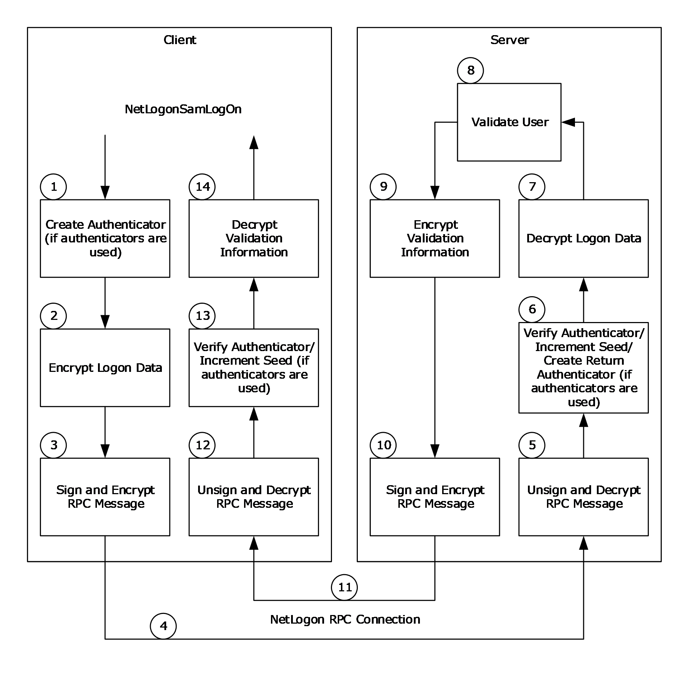

Figure 10: Secure channel execution of NetrLogonSamLogon

NetrLogonSamLogon involves the following steps:

- If the Netlogon [**RPC**](#gt_remote-procedure-call-rpc) call is using [**authenticators**](#gt_authenticator), the following steps are also performed.
- The client creates an authenticator. An authenticator is represented by a **NETLOGON_AUTHENTICATOR** structure (section [2.2.1.1.5](#Section_2.2.1.1.5)).
- The client fills in the **Timestamp** field of the structure with the number of seconds since 00:00:00 on January 1, 1970 (UTC). The client then adds this value to the current authentication seed to produce a new seed value.
- The client computes the [**credential**](#gt_credential) based on the new authentication seed, the [**session key**](#gt_session-key), and the [**client challenge**](#gt_client-challenge), per the calculation specified in the previous Netlogon Credentials section.
- If the *LogonLevel* parameter of the NetrLogonSamLogon method contained one of a set of specific values, the client encrypts the logon data using the session key with the negotiated encryption algorithm. The following table defines the *LogonLevel* parameter value and the data that is encrypted.
| LogonLevel value | Data encrypted |
| --- | --- |
| NetlogonInteractiveInformation (1) | The **LmOwfPassword** and **NtOwfPassword** fields of the **NETLOGON_INTERACTIVE_INFO** structure (section [2.2.1.4.3](#Section_2.2.1.4.3)) that was passed in the *LogonInformation* parameter. |
| NetlogonInteractiveTransitiveInformation (5) | The **LmOwfPassword** and **NtOwfPassword** fields of the **NETLOGON_INTERACTIVE_INFO** structure (section 2.2.1.4.3) that was passed in the *LogonInformation* parameter. |
| NetlogonServiceInformation (3) | The **LmOwfPassword** and **NtOwfPassword** fields of the **NETLOGON_SERVICE_INFO** structure (section [2.2.1.4.4](#Section_2.2.1.4.4)) that was passed in the *LogonInformation* parameter. |
| NetlogonServiceTransitiveInformation (7) | The **LmOwfPassword** and **NtOwfPassword** fields of the **NETLOGON_SERVICE_INFO** structure (section 2.2.1.4.4) that was passed in the *LogonInformation* parameter. |
| NetlogonGenericInformation (4) | The contents of the **LogonData** buffer of the **NETLOGON_GENERIC_INFO** structure (section [2.2.1.4.2](#Section_2.2.1.4.2)) that was passed in the *LogonInformation* parameter. |

This step is not performed for any other *LogonLevel* parameter values.

- The client signs and encrypts the RPC message or each message fragment. If the RPC message is fragmented, operations are done on each message fragment. The data is first passed to RPC, where it is formatted according to the RPC standard ([[C706]](https://go.microsoft.com/fwlink/?LinkId=89824) section 12.6.2). RPC then calls back to Netlogon to encrypt the RPC data buffer. The encryption of the RPC data buffer includes the following steps. (The checksum algorithm used is the negotiated checksum algorithm. The encryption algorithm used is the negotiated encryption algorithm.)
- Create and initialize a signature. A signature is represented by an NL_AUTH_SIGNATURE structure (section [2.2.1.3.2](#Section_2.2.1.3.2)).
- Generate random data for the confounder in the signature.
- Assign the sequence number in the signature based on the [**nonce**](#gt_nonce) and increment the nonce.
**Note** The nonce is initialized to zero and is used to maintain the sequence number for the calls over the secure channel.

- Calculate the checksum of the first 8 bytes of the signature.
- Calculate the checksum of the 8 bytes that make up the confounder in the signature.
- Create an [**encryption key**](#gt_encryption-key) by XOR’ing every byte of the session key with 0xF0.
- Encrypt the confounder using the encryption key.
- If PFC_SUPPORT_HEADER_SIGN has been negotiated by the RPC layer [MS-RPCE](../MS-RPCE/MS-RPCE.md) section 3.3.1.5.2.2), calculate the checksum of the PDU Header.
- Calculate the checksum of the caller's message.
- Encrypt the caller's message or message fragment using the encryption key.
If PFC_SUPPORT_HEADER_SIGN has been negotiated by the RPC layer, calculate the checksum of the sec_trailer.

Finalize the checksum and assign it to the checksum in the signature.

- Encrypt the sequence number in the signature using the session key.
- The client sends the data over the Netlogon RPC connection.
- The server verifies the signature and decrypts the RPC message or each message fragment. If the RPC message is fragmented, operations are done on each message fragment. The [**decryption**](#gt_decryption) of the RPC message includes the following steps:
- Decrypt the sequence number in the signature using the session key.
- Compare the sequence number with the nonce and increment the nonce.
- Calculate the checksum of the first 8 bytes of the signature.
- Create an encryption key by XOR'ing every byte of the session key with 0xF0.
- Decrypt the confounder using the encryption key.
- Calculate the checksum of the 8 bytes that make up the confounder in the signature.
- If PFC_SUPPORT_HEADER_SIGN has been negotiated by the RPC layer [MS-RPCE] section 3.3.1.5.2.2), calculate the checkum of the PDU Header.
- Decrypt the caller's message or message fragment using the encryption key.
- Calculate the checksum of the caller's message.
- Finalize the checksum and compare it with the checksum in the signature.
- If the Netlogon RPC call is using authenticators, the server verifies the received authenticator and creates a return authenticator. To verify the received authenticator, the server adds the time stamp value in the authenticator to the current authentication seed to produce a new seed value. The server then computes the client's credential based on the new authentication seed, the session key, and the client challenge, per the calculation specified in the previous Netlogon Credentials section. Finally, the server checks whether the resulting credential is equal to the credential in the received authenticator. If successful, the server adds 1 to the authentication seed. Then the server creates a return authenticator. The server computes the credential for the return authenticator based on the new authentication seed, the session key, and the [**server challenge (SC)**](#gt_server-challenge-sc), per the calculation specified in the previous Netlogon Credentials section.
- If the *LogonLevel* parameter of the NetrLogonSamLogon method contained one of a set of particular values, the server decrypts the logon data, using the session key with the negotiated decryption algorithm. The following table defines the *LogonLevel* parameter values and the data that is decrypted.
| LogonLevel value | Data decrypted |
| --- | --- |
| 1 | The **LmOwfPassword** and **NtOwfPassword** fields of the **NETLOGON_INTERACTIVE_INFO** structure that was passed in the *LogonInformation* parameter. |
| 5 | The **LmOwfPassword** and **NtOwfPassword** fields of the **NETLOGON_INTERACTIVE_INFO** structure that was passed in the *LogonInformation* parameter. |
| 3 | The **LmOwfPassword** and **NtOwfPassword** fields of the **NETLOGON_SERVICE_INFO** structure that was passed in the *LogonInformation* parameter. |
| 7 | The **LmOwfPassword** and **NtOwfPassword** fields of the **NETLOGON_SERVICE_INFO** structure that was passed in the *LogonInformation* parameter. |
| 4 | The contents of the **LogonData** buffer of the **NETLOGON_GENERIC_INFO** structure that was passed in the *LogonInformation* parameter. |

This step is not performed for any other *LogonLevel* parameter values.

- The server executes its implementation of the NetrLogonSamLogon method to validate the user. The resulting validation information is returned in a [NETLOGON_VALIDATION](#Section_2.2.1.4.14) union.
- If the *LogonLevel* parameter of the NetrLogonSamLogon method contained one of the following values, the server encrypts the validation information:
- NetlogonNetworkInformation
- NetlogonNetworkTransitiveInformation
- NetlogonGenericInformation
The validation data is encrypted using the session key with the negotiated encryption algorithm. The data that is encrypted depends on the value that was passed in the *ValidationLevel* parameter of the NetrLogonSamLogon method. The following table defines the *ValidationLevel* parameter values and the data that is encrypted.

| ValidationLevel value | Data encrypted |
| --- | --- |
| 2 | The **UserSessionKey** and **ExpansionRoom** fields of the **NETLOGON_VALIDATION_SAM_INFO** structure (section [2.2.1.4.11](#Section_2.2.1.4.11)) that was passed in the *ValidationInformation* parameter. |
| 3 | The **UserSessionKey** and **ExpansionRoom** fields of the **NETLOGON_VALIDATION_SAM_INFO2** structure (section [2.2.1.4.12](#Section_2.2.1.4.12)) that was passed in the *ValidationInformation* parameter. |
| 5 | The contents of the **ValidationData** buffer of the **NETLOGON_VALIDATION_GENERIC_INFO2** structure (section [2.2.1.4.8](#Section_2.2.1.4.8)) that was passed in the *ValidationInformation* parameter. |

This step is not performed for any other *LogonLevel* parameter values.

- The server signs and encrypts the RPC response message. The server performs the same steps as the client performed in step 3.
- The server sends the response back to client over the Netlogon RPC connection.
- The client unsigns and decrypts the RPC message. The client performs the same steps as the server performed in step 5.
- If the Netlogon RPC call is using authenticators, the client verifies the return authenticator. To verify the return authenticator, the client adds 1 to the authentication seed to produce a new seed value. The client then computes the server's credential based on the new authentication seed, the session key, and the server challenge, per the calculation specified in the previous Netlogon Credentials section. Finally, the client checks whether the resulting credential is equal to the credential in the return authenticator.
- If the *LogonLevel* parameter of the NetrLogonSamLogon method contained one of the following values, the client decrypts the validation information:
- NetlogonNetworkInformation
- NetlogonNetworkTransitiveInformation
- NetlogonGenericInformation
The validation data is decrypted using the session key with the negotiated decryption algorithm. The data that is decrypted depends on the value that was passed in the *ValidationLevel* parameter of the NetrLogonSamLogon method. The following table defines the *ValidationLevel* parameter value and the data that is decrypted.

| ValidationLevel value | Data decrypted |
| --- | --- |
| 2 | The **UserSessionKey** and **ExpansionRoom** fields of the **NETLOGON_VALIDATION_SAM_INFO** structure (section 2.2.1.4.11) that was passed in the *ValidationInformation* parameter. |
| 3 | The **UserSessionKey** and **ExpansionRoom** fields of the **NETLOGON_VALIDATION_SAM_INFO2** structure (section 2.2.1.4.12) that was passed in the *ValidationInformation* parameter. |
| 5 | The contents of the **ValidationData** buffer of the **NETLOGON_VALIDATION_GENERIC_INFO2** structure (section 2.2.1.4.8) that was passed in the *ValidationInformation* parameter. |

This step is not performed for all other *LogonLevel* parameter values.

The execution of all other Netlogon methods requiring a secure channel is like the previous example.

<a id="Section_4.2"></a>
## 4.2 Cryptographic Values for Session Key Validation

The following values were obtained from a Kernel debugger dump. They are used to validate [**session key**](#gt_session-key) negotiation code.

Clear-text **SharedSecret** (machine password):

0000000: 2e 00 2f 00 2c 00 6e 00 4c 00 3e 00 4f 00 4c 00 ../.,.n.L.>.O.L.

0000010: 5a 00 36 00 73 00 74 00 5e 00 58 00 4b 00 65 00 Z.6.s.t.^.X.K.e.

0000020: 4d 00 25 00 2e 00 49 00 2d 00 74 00 45 00 60 00 M.%...I.-.t.E.`.

0000030: 57 00 56 00 6a 00 43 00 5b 00 30 00 36 00 3f 00 W.V.j.C.[.0.6.?.

0000040: 5d 00 3a 00 51 00 76 00 5f 00 54 00 6e 00 55 00 ].:.Q.v._.T.n.U.

0000050: 6f 00 3a 00 3a 00 42 00 77 00 2c 00 67 00 60 00 o.:.:.B.w.,.g.`.

0000060: 76 00 23 00 4a 00 4d 00 36 00 4d 00 71 00 53 00 v.#.J.M.6.M.q.S.

0000070: 50 00 75 00 55 00 28 00 6e 00 71 00 34 00 3e 00 P.u.U.(.n.q.4.>.

0000080: 79 00 6a 00 5b 00 64 00 5c 00 2b 00 56 00 70 00 y.j.[.d.\.+.V.p.

0000090: 52 00 5f 00 79 00 78 00 75 00 63 00 21 00 67 00 R._.y.x.u.c.!.g.

00000a0: 30 00 54 00 36 00 35 00 76 00 7a 00 57 00 41 00 0.T.6.5.v.z.W.A.

00000b0: 42 00 5f 00 42 00 22 00 69 00 3c 00 3c 00 53 00 B._.B.".i.<.<.S.

00000c0: 2b 00 34 00 27 00 5e 00 3a 00 21 00 2c 00 3b 00 +.4.'.^.:.!.,.;.

00000d0: 25 00 47 00 73 00 2d 00 28 00 22 00 3a 00 20 00 %.G.s.-.(.".:. .

00000e0: 6d 00 3e 00 21 00 43 00 4c 00 66 00 6e 00 4e 00 m.>.!.C.L.f.n.N.

OWF of **SharedSecret**:

0000000: 31 a5 90 17 0a 35 1f d5-11 48 b2 a1 0a f2 c3 05 1....5...H......

Client Challenge:

0000000: 3a 03 90 a4 6d 0c 3d 4f :...m.=O

Server Challenge:

0000000: 0c 4c 13 d1 60 41 c8 60 .L..`A.`

Session Key:

0000000: ee fe 8f 40 00 7a 2e eb-68 43 d0 d3 0a 5b e2 e3 ...@.z..hC...[..

<a id="Section_4.2.1"></a>
### 4.2.1 ASCII MD4 Testing

The following cryptographic values are provided to test using the session key to produce MD4 outputs with ASCII inputs.

Input:

0000000: 74 65 73 74 test

Output:

0000000: db 34 6d 69 1d 7a cc 4d c2 62 5d b1 9f 9e 3f 52 .4mi.z.M.b]...?R

<a id="Section_4.2.2"></a>
### 4.2.2 UNICODE MD4 Testing

The following cryptographic values are provided to test using the session key to produce MD4 outputs with UNICODE inputs.

Input:

0000000: 74 00 65 00 73 00 74 00 t.e.s.t.

Output:

0000000: 0c b6 94 88 05 f7 97 bf 2a 82 80 79 73 b8 95 37 ........*..ys..7

<a id="Section_4.3"></a>
## 4.3 Cryptographic Values for Netlogon Signature Token

The following sample values can be used to verify that the Netlogon Signature Token is generated correctly. It is simulating a Netlogon client contacting a Netlogon server when the Netlogon client and server have negotiated AES with Sealing. The session key used was generated from the example in section [4.2](#Section_4.2).

Session Key:

0c b6 94 88 05 f7 97 bf 2a 82 80 79 73 b8 95 37

Confounder:

71 7f 50 76 c5 90 2b cd

Sequence Number:

00 00 00 00 00 00 00 00

Cleartext Message:

30 00 00 00 00 00 00 00 00 00 00 00 00 00 00 00 30 00 00 00 00 00 00 00 5c 00 5c 00 57 00 49 00 4e 00 2d 00 45 00 55 00 34 00 55 00 47 00 38 00 37 00 48 00 32 00 49 00 56 00 2e 00 32 00 33 00 30 00 36 00 66 00 65 00 76 00 32 00 2e 00 6e 00 74 00 74 00 65 00 73 00 74 00 2e 00 6d 00 69 00 63 00 72 00 6f 00 73 00 6f 00 66 00 74 00 2e 00 63 00 6f 00 6d 00 00 00 00 00 02 00 00 00 00 00 10 00 00 00 00 00 00 00 00 00 00 00 00 00 00 00 10 00 00 00 00 00 00 00 57 00 49 00 4e 00 2d 00 44 00 31 00 49 00 54 00 42 00 46 00 4d 00 34 00 41 00 38 00 55 00 00 00 85 bb 15 11 fd 09 78 6d 3b 61 b0 64 00 00 00 00 00 00 00 00 00 00 00 00 01 00 00 00 00 00 00 00 00 00 00 00 00 00 00 00

Generated Encryption Key:

fc 46 64 78 f5 07 67 4f da 72 70 89 83 48 65 c7

Encrypted Sequence Number:

- b3 7c 1f 0e c8 64 68 f0
Checksum:

86 76 1f 2f 86 f4 f4 c1

Encrypted Confounder:

63 2d 1f 54 7d 2c f6 ff

Full Netlogon Signature header:

13 00 1a 00 ff ff 00 00 b3 7c 1f 0e c8 64 68 f0 86 76 1f 2f 86 f4 f4 c1 63 2d 1f 54 7d 2c f6 ff

Encrypted message:

c9 30 c9 a0 79 d9 5c 78 be a6 a3 15 09 08 c1 1f 4b 68 e4 12 19 bc b9 16 80 ea d2 87 da 21 1e ec 66 bc 27 df 2b c9 a0 f4 ec f2 5c 88 62 4e 49 3c 59 cd ec 6b c7 b0 8b ed 84 b9 7c 33 13 8a e3 c8 37 7c b3 27 f3 ea 60 76 da 91 c5 d2 3d bf 1b 2f 40 66 a4 55 33 27 16 b7 b6 4f 2e c9 a9 44 70 2d 20 a8 50 35 de 3b 23 1a 52 16 b7 a6 c9 10 2b d1 7c 7d 6a b1 b3 79 44 5e b5 a5 27 6e 36 0d 3b ce f9 3b 53 59 d3 6b 00 06 b0 c1 0b c2 fe c7 37 77 81 6a 38 3a 46 14 49 4b 7b 18 bc 34 cd 54 47 68 1e b4 8f 81 32 a0 a0 8a 50 d7 52 82 6c ff 06 8c 76 95 9d 49 76 75 57 e5 03 d5 09 fa 3c 18 b0 86 0a 22 a7 e2 ba e5 0e 81 2c 5d 71 c3 1f 9f 1d fd 14 33 33 b3 04 3f 6b f9 06 e5 d9 12 07 f1 d9 88

<a id="Section_4.3.1"></a>
### 4.3.1 Netlogon Signature Token with RPC Header Signing

If the RPC client and server negotiated PFC_SUPPORT_HEADER_SIGN, the PDU Header and sec_trailer are added to the checksum. Following is an example using the same sample buffers as in section [4.3](#Section_4.3) but with a PDU Header and sec_trailer. The Encrypted Confounder and Encrypted Data are still the same, but the Checksum and Encrypted Sequence Number changes.

RPC PDU Header:

- 05 00 00 03 10 00 00 00 38 01 38 00 0c 00 00 00 d4 00 00 00 01 00 15 00
RPC sec_trailer:

44 06 0c 00 03 00 00 00

Encrypted Sequence Number:

5d 69 95 0d fd e4 5a e9

Checksum:

f0 92 ae 5c 3c 55 aa cd

Encrypted Confounder:

63 2d 1f 54 7d 2c f6 ff

Full Netlogon Signature header:

13 00 1a 00 ff ff 00 00 5d 69 95 0d fd e4 5a e9 f0 92 ae 5c 3c 55 aa cd 63 2d 1f 54 7d 2c f6 ff

Encrypted message:

c9 30 c9 a0 79 d9 5c 78 be a6 a3 15 09 08 c1 1f 4b 68 e4 12 19 bc b9 16 80 ea d2 87 da 21 1e ec 66 bc 27 df 2b c9 a0 f4 ec f2 5c 88 62 4e 49 3c 59 cd ec 6b c7 b0 8b ed 84 b9 7c 33 13 8a e3 c8 37 7c b3 27 f3 ea 60 76 da 91 c5 d2 3d bf 1b 2f 40 66 a4 55 33 27 16 b7 b6 4f 2e c9 a9 44 70 2d 20 a8 50 35 de 3b 23 1a 52 16 b7 a6 c9 10 2b d1 7c 7d 6a b1 b3 79 44 5e b5 a5 27 6e 36 0d 3b ce f9 3b 53 59 d3 6b 00 06 b0 c1 0b c2 fe c7 37 77 81 6a 38 3a 46 14 49 4b 7b 18 bc 34 cd 54 47 68 1e b4 8f 81 32 a0 a0 8a 50 d7 52 82 6c ff 06 8c 76 95 9d 49 76 75 57 e5 03 d5 09 fa 3c 18 b0 86 0a 22 a7 e2 ba e5 0e 81 2c 5d 71 c3 1f 9f 1d fd 14 33 33 b3 04 3f 6b f9 06 e5 d9 12 07 f1 d9 88

<a id="Section_5"></a>
# 5 Security Considerations

<a id="Section_5.1"></a>
## 5.1 Security Considerations for Implementers

Security considerations for both unauthenticated [**RPC**](#gt_remote-procedure-call-rpc) and Secure RPC, as used in this protocol, are as specified in [MS-RPCE](../MS-RPCE/MS-RPCE.md) sections 5.1 and 5.2.

When the Netlogon Remote Protocol [**secure channel**](#gt_secure-channel) was originally implemented, only certain security-sensitive RPC call arguments, such as passwords, were encrypted. This mechanism involved passing extra parameters, known as [**authenticators**](#gt_authenticator), as RPC call arguments; these are used for authenticating the RPC calls. Later, support was added to sign and encrypt the entire RPC message with the help of a new Netlogon Remote Protocol security package. However, the encryption and validation of individual security-sensitive parameters, and the use of authenticators that are passed as RPC-call arguments for authenticating the calls, were preserved in the existing RPC calls, even though these were redundant at that point.

On receiving the [DsrDeregisterDnsHostRecords](#Section_3.4.5.1.10) call, the server controls access to this method. Because DsrDeregisterDnsHostRecords deletes [**DNS**](#gt_domain-name-system-dns) records for any specific [**DC**](#gt_domain-controller-dc), the client needs administrative [**privileges**](#gt_privilege) (such as those Administrator, Local System, Account Operator, or System Operator accounts have) for the call to succeed.

One of the new RPC calls that was added later, [NetrLogonSamLogonEx](#Section_3.4.5.3.2), does not use authenticators. Instead, it encrypts the entire RPC message when encryption is requested. NetrLogonSamLogonEx is currently the only RPC call that is made over a secure channel that does not use authenticators. The presence of authenticators is determined by the Netlogon Remote Protocol call that was made.

To prevent remote denial of service (DoS) attacks, it is recommended that the server delete the stored *ServerChallenge*, client name, and [**client challenge**](#gt_client-challenge) used for the [NetrServerReqChallenge](#Section_3.4.5.2.1) method after a couple of minutes.

To prevent information disclosure, it is important for the server to control access to the [DsrGetForestTrustInformation](#Section_3.4.5.5.5) method to authenticated users.

To prevent information disclosure, it is important for the client to be a registered user of the corporate [**forest**](#gt_forest) for the local computer account [**RID**](#gt_relative-identifier-rid) and limited to only those clients (such as local system or members of the local administrators [**group**](#gt_group)) that need the RID for a [**trust**](#gt_trust) account for the [NetrLogonGetTrustRid](#Section_3.5.4.8.1) call to succeed.

On receiving the [NetrLogonComputeServerDigest](#Section_3.4.5.6.2) call, the server controls access to this method. Because NetrLogonComputeServerDigest is an administrative method, the client needs to have administrative privileges (such as those the local administrator's group, local system, or local service have) for the call to succeed.

On receiving the [NetrLogonComputeClientDigest](#Section_3.5.4.8.3) call, the server controls access to this method. Because NetrLogonComputeClientDigest is an administrative method, the client needs to have administrative privileges (such as those the local administrator's group, local system, or local service have) for the call to succeed.

On receiving the [NetrLogonSetServiceBits](#Section_3.4.5.6.5) call, the server controls access to this method. Because NetrLogonSetServiceBits is an administrative method, the client needs to have administrative privileges (such as those the local administrators group, local system, or local service have) for the call to succeed.

On receiving the [NetrLogonGetTimeServiceParentDomain](#Section_3.4.5.6.6) call, the server controls access to this method to determine whether the caller can access the parent [**domain**](#gt_domain). To prevent information disclosure, the client needs administrative privileges (such as those the local administrator's group, local system, or local service have) for the call to succeed.

The server controls access to the [NetrLogonControl2Ex](#Section_3.5.4.9.1) method to determine whether the caller is allowed to manage the Netlogon service (the caller requires administrative privileges such as those the local administrators group, local system, or local service have).

<a id="Section_5.2"></a>
## 5.2 Index of Security Parameters

| Security parameter | Section |
| --- | --- |
| SealSecureChannel | [3.1.1](#Section_3.1) |
| Session Key Parameters | 3.1.1 |
| Netlogon Negotiable Options | [3.1.4.2](#Section_3.1.4.2) |
| Session-Key Computation | [3.1.4.3](#Section_3.1.4.3) |
| Netlogon Credential Computation | [3.1.4.4](#Section_3.1.4.4) |
| Netlogon Authenticator Computation and Verification | [3.1.4.5](#Section_3.1.4.5) |
| Session-Key Negotiation | [3.1.4.1](#Section_3.1.4.1) |
| Integrity | [3.3.1](#Section_3.6.1) |
| Sequence Detect | 3.3.1 |
| Confidentiality | 3.3.1 |
| Netlogon Security Context Establishment | [3.3.4.1](#Section_1.3) |
| NL_AUTH_MESSAGE | 3.3.4.1 |
| Signing and Encrypting | [3.3.4.2](#Section_3.3.4.2) |
| NL_AUTH_SIGNATURE | 3.3.4.2 |
| domain-name | [3.4.1](#Section_3.6.1) |

<a id="Section_6"></a>
# 6 Appendix A: Full IDL

For ease of implementation, the full IDL is provided, where "ms-dtyp.idl" refers to the IDL found in [MS-DTYP](../MS-DTYP/MS-DTYP.md) Appendix A.

The syntax uses the [**IDL**](#gt_interface-definition-language-idl) syntax extensions defined in [MS-RPCE](../MS-RPCE/MS-RPCE.md) sections 2.2.4 and 3.1.1.5.1. For example, as noted in [MS-RPCE] section 2.2.4.9, a pointer_default declaration is not required and pointer_default(unique) is assumed.

import "ms-dtyp.idl";

[

uuid(12345678-1234-ABCD-EF00-01234567CFFB),

version(1.0),

ms_union,

pointer_default(unique)

]

interface logon

{

typedef struct _STRING {

USHORT Length;

USHORT MaximumLength;

[size_is(MaximumLength), length_is(Length)] CHAR* Buffer;

} STRING, *PSTRING;

typedef struct _UNICODE_STRING {

USHORT Length;

USHORT MaximumLength;

[size_is(MaximumLength / 2), length_is((Length) / 2) ] USHORT * Buffer;

} UNICODE_STRING, * PUNICODE_STRING;

typedef struct _OLD_LARGE_INTEGER {

ULONG LowPart;

LONG HighPart;

} OLD_LARGE_INTEGER,* POLD_LARGE_INTEGER;

typedef struct _CYPHER_BLOCK {

CHAR data[8];

} CYPHER_BLOCK,* PCYPHER_BLOCK;

typedef struct _NT_OWF_PASSWORD {

CYPHER_BLOCK data[2];

}NT_OWF_PASSWORD,* PNT_OWF_PASSWORD,

ENCRYPTED_NT_OWF_PASSWORD,* PENCRYPTED_NT_OWF_PASSWORD;

typedef struct _LM_OWF_PASSWORD {

CYPHER_BLOCK data[2];

} LM_OWF_PASSWORD,* PLM_OWF_PASSWORD,

ENCRYPTED_LM_OWF_PASSWORD,* PENCRYPTED_LM_OWF_PASSWORD;

typedef [handle] wchar_t* LOGONSRV_HANDLE;

typedef struct _NLPR_SID_INFORMATION {

PRPC_SID SidPointer;

} NLPR_SID_INFORMATION,* PNLPR_SID_INFORMATION;

typedef struct _NLPR_SID_ARRAY {

ULONG Count;

[size_is(Count)] PNLPR_SID_INFORMATION Sids;

} NLPR_SID_ARRAY,* PNLPR_SID_ARRAY;

typedef struct _NLPR_CR_CIPHER_VALUE {

ULONG Length;

ULONG MaximumLength;

[size_is(MaximumLength), length_is(Length)]

UCHAR* Buffer;

} NLPR_CR_CIPHER_VALUE,* PNLPR_CR_CIPHER_VALUE;

typedef struct _NLPR_LOGON_HOURS {

USHORT UnitsPerWeek;

[size_is(1260), length_is((UnitsPerWeek + 7) / 8)]

UCHAR* LogonHours;

} NLPR_LOGON_HOURS,* PNLPR_LOGON_HOURS;

typedef struct _NLPR_USER_PRIVATE_INFO {

UCHAR SensitiveData;

ULONG DataLength;

[size_is(DataLength)] UCHAR* Data;

} NLPR_USER_PRIVATE_INFO,* PNLPR_USER_PRIVATE_INFO;

typedef struct _NLPR_MODIFIED_COUNT {

OLD_LARGE_INTEGER ModifiedCount;

} NLPR_MODIFIED_COUNT,* PNLPR_MODIFIED_COUNT;

typedef struct _NLPR_QUOTA_LIMITS {

ULONG PagedPoolLimit;

ULONG NonPagedPoolLimit;

ULONG MinimumWorkingSetSize;

ULONG MaximumWorkingSetSize;

ULONG PagefileLimit;

OLD_LARGE_INTEGER Reserved;

} NLPR_QUOTA_LIMITS,

* PNLPR_QUOTA_LIMITS;

typedef struct _NETLOGON_DELTA_USER {

UNICODE_STRING UserName;

UNICODE_STRING FullName;

ULONG UserId;

ULONG PrimaryGroupId;

UNICODE_STRING HomeDirectory;

UNICODE_STRING HomeDirectoryDrive;

UNICODE_STRING ScriptPath;

UNICODE_STRING AdminComment;

UNICODE_STRING WorkStations;

OLD_LARGE_INTEGER LastLogon;

OLD_LARGE_INTEGER LastLogoff;

NLPR_LOGON_HOURS LogonHours;

USHORT BadPasswordCount;

USHORT LogonCount;

OLD_LARGE_INTEGER PasswordLastSet;

OLD_LARGE_INTEGER AccountExpires;

ULONG UserAccountControl;

ENCRYPTED_NT_OWF_PASSWORD EncryptedNtOwfPassword;

ENCRYPTED_LM_OWF_PASSWORD EncryptedLmOwfPassword;

UCHAR NtPasswordPresent;

UCHAR LmPasswordPresent;

UCHAR PasswordExpired;

UNICODE_STRING UserComment;

UNICODE_STRING Parameters;

USHORT CountryCode;

USHORT CodePage;

NLPR_USER_PRIVATE_INFO PrivateData;

SECURITY_INFORMATION SecurityInformation;

ULONG SecuritySize;

[size_is(SecuritySize)] UCHAR* SecurityDescriptor;

UNICODE_STRING ProfilePath;

UNICODE_STRING DummyString2;

UNICODE_STRING DummyString3;

UNICODE_STRING DummyString4;

ULONG DummyLong1;

ULONG DummyLong2;

ULONG DummyLong3;

ULONG DummyLong4;

} NETLOGON_DELTA_USER,

* PNETLOGON_DELTA_USER;

typedef struct _NETLOGON_DELTA_GROUP {

UNICODE_STRING Name;

ULONG RelativeId;

ULONG Attributes;

UNICODE_STRING AdminComment;

SECURITY_INFORMATION SecurityInformation;

ULONG SecuritySize;

[size_is(SecuritySize)] UCHAR* SecurityDescriptor;

UNICODE_STRING DummyString1;

UNICODE_STRING DummyString2;

UNICODE_STRING DummyString3;

UNICODE_STRING DummyString4;

ULONG DummyLong1;

ULONG DummyLong2;

ULONG DummyLong3;

ULONG DummyLong4;

} NETLOGON_DELTA_GROUP,

* PNETLOGON_DELTA_GROUP;

typedef struct _NETLOGON_DELTA_GROUP_MEMBER {

[size_is(MemberCount)] ULONG* Members;

[size_is(MemberCount)] ULONG* Attributes;

ULONG MemberCount;

ULONG DummyLong1;

ULONG DummyLong2;

ULONG DummyLong3;

ULONG DummyLong4;

} NETLOGON_DELTA_GROUP_MEMBER,

* PNETLOGON_DELTA_GROUP_MEMBER;

typedef struct _NETLOGON_DELTA_ALIAS {

UNICODE_STRING Name;

ULONG RelativeId;

SECURITY_INFORMATION SecurityInformation;

ULONG SecuritySize;

[size_is(SecuritySize)] UCHAR* SecurityDescriptor;

UNICODE_STRING Comment;

UNICODE_STRING DummyString2;

UNICODE_STRING DummyString3;

UNICODE_STRING DummyString4;

ULONG DummyLong1;

ULONG DummyLong2;

ULONG DummyLong3;

ULONG DummyLong4;

} NETLOGON_DELTA_ALIAS,

* PNETLOGON_DELTA_ALIAS;

typedef struct _NETLOGON_DELTA_ALIAS_MEMBER {

NLPR_SID_ARRAY Members;

ULONG DummyLong1;

ULONG DummyLong2;

ULONG DummyLong3;

ULONG DummyLong4;

} NETLOGON_DELTA_ALIAS_MEMBER,

* PNETLOGON_DELTA_ALIAS_MEMBER;

typedef struct _NETLOGON_DELTA_DOMAIN {

UNICODE_STRING DomainName;

UNICODE_STRING OemInformation;

OLD_LARGE_INTEGER ForceLogoff;

USHORT MinPasswordLength;

USHORT PasswordHistoryLength;

OLD_LARGE_INTEGER MaxPasswordAge;

OLD_LARGE_INTEGER MinPasswordAge;

OLD_LARGE_INTEGER DomainModifiedCount;

OLD_LARGE_INTEGER DomainCreationTime;

SECURITY_INFORMATION SecurityInformation;

ULONG SecuritySize;

[size_is(SecuritySize)] UCHAR* SecurityDescriptor;

UNICODE_STRING DomainLockoutInformation;

UNICODE_STRING DummyString2;

UNICODE_STRING DummyString3;

UNICODE_STRING DummyString4;

ULONG PasswordProperties;

ULONG DummyLong2;

ULONG DummyLong3;

ULONG DummyLong4;

} NETLOGON_DELTA_DOMAIN,

* PNETLOGON_DELTA_DOMAIN;

typedef struct _NETLOGON_DELTA_RENAME_GROUP {

UNICODE_STRING OldName;

UNICODE_STRING NewName;

UNICODE_STRING DummyString1;

UNICODE_STRING DummyString2;

UNICODE_STRING DummyString3;

UNICODE_STRING DummyString4;

ULONG DummyLong1;

ULONG DummyLong2;

ULONG DummyLong3;

ULONG DummyLong4;

} NETLOGON_RENAME_GROUP,

* PNETLOGON_DELTA_RENAME_GROUP;

typedef struct _NETLOGON_DELTA_RENAME_USER {

UNICODE_STRING OldName;

UNICODE_STRING NewName;

UNICODE_STRING DummyString1;

UNICODE_STRING DummyString2;

UNICODE_STRING DummyString3;

UNICODE_STRING DummyString4;

ULONG DummyLong1;

ULONG DummyLong2;

ULONG DummyLong3;

ULONG DummyLong4;

} NETLOGON_RENAME_USER,

* PNETLOGON_DELTA_RENAME_USER;

typedef struct _NETLOGON_DELTA_RENAME_ALIAS {

UNICODE_STRING OldName;

UNICODE_STRING NewName;

UNICODE_STRING DummyString1;

UNICODE_STRING DummyString2;

UNICODE_STRING DummyString3;

UNICODE_STRING DummyString4;

ULONG DummyLong1;

ULONG DummyLong2;

ULONG DummyLong3;

ULONG DummyLong4;

} NETLOGON_RENAME_ALIAS,

* PNETLOGON_DELTA_RENAME_ALIAS;

typedef struct _NETLOGON_DELTA_POLICY {

ULONG MaximumLogSize;

OLD_LARGE_INTEGER AuditRetentionPeriod;

UCHAR AuditingMode;

ULONG MaximumAuditEventCount;

[size_is(MaximumAuditEventCount + 1)]

ULONG* EventAuditingOptions;

UNICODE_STRING PrimaryDomainName;

PRPC_SID PrimaryDomainSid;

NLPR_QUOTA_LIMITS QuotaLimits;

OLD_LARGE_INTEGER ModifiedId;

OLD_LARGE_INTEGER DatabaseCreationTime;

SECURITY_INFORMATION SecurityInformation;

ULONG SecuritySize;

[size_is(SecuritySize)] UCHAR* SecurityDescriptor;

UNICODE_STRING DummyString1;

UNICODE_STRING DummyString2;

UNICODE_STRING DummyString3;

UNICODE_STRING DummyString4;

ULONG DummyLong1;

ULONG DummyLong2;

ULONG DummyLong3;

ULONG DummyLong4;

} NETLOGON_DELTA_POLICY,

* PNETLOGON_DELTA_POLICY;

typedef struct _NETLOGON_DELTA_TRUSTED_DOMAINS {

UNICODE_STRING DomainName;

ULONG NumControllerEntries;

[size_is(NumControllerEntries)]

PUNICODE_STRING ControllerNames;

SECURITY_INFORMATION SecurityInformation;

ULONG SecuritySize;

[size_is(SecuritySize)] UCHAR* SecurityDescriptor;

UNICODE_STRING DummyString1;

UNICODE_STRING DummyString2;

UNICODE_STRING DummyString3;

UNICODE_STRING DummyString4;

ULONG TrustedPosixOffset;

ULONG DummyLong2;

ULONG DummyLong3;

ULONG DummyLong4;

} NETLOGON_DELTA_TRUSTED_DOMAINS,

* PNETLOGON_DELTA_TRUSTED_DOMAINS;

typedef struct _NETLOGON_DELTA_ACCOUNTS {

ULONG PrivilegeEntries;

ULONG PrivilegeControl;

[size_is(PrivilegeEntries)]

ULONG* PrivilegeAttributes;

[size_is(PrivilegeEntries)] PUNICODE_STRING PrivilegeNames;

NLPR_QUOTA_LIMITS QuotaLimits;

ULONG SystemAccessFlags;

SECURITY_INFORMATION SecurityInformation;

ULONG SecuritySize;

[size_is(SecuritySize)] UCHAR* SecurityDescriptor;

UNICODE_STRING DummyString1;

UNICODE_STRING DummyString2;

UNICODE_STRING DummyString3;

UNICODE_STRING DummyString4;

ULONG DummyLong1;

ULONG DummyLong2;

ULONG DummyLong3;

ULONG DummyLong4;

} NETLOGON_DELTA_ACCOUNTS,

* PNETLOGON_DELTA_ACCOUNTS;

typedef struct _NETLOGON_DELTA_SECRET {

NLPR_CR_CIPHER_VALUE CurrentValue;

OLD_LARGE_INTEGER CurrentValueSetTime;

NLPR_CR_CIPHER_VALUE OldValue;

OLD_LARGE_INTEGER OldValueSetTime;

SECURITY_INFORMATION SecurityInformation;

ULONG SecuritySize;

[size_is(SecuritySize)] PUCHAR SecurityDescriptor;

UNICODE_STRING DummyString1;

UNICODE_STRING DummyString2;

UNICODE_STRING DummyString3;

UNICODE_STRING DummyString4;

ULONG DummyLong1;

ULONG DummyLong2;

ULONG DummyLong3;

ULONG DummyLong4;

- } NETLOGON_DELTA_SECRET, *PNETLOGON_DELTA_SECRET;

typedef struct _NETLOGON_DELTA_DELETE_GROUP {

[string] wchar_t* AccountName;

UNICODE_STRING DummyString1;

UNICODE_STRING DummyString2;

UNICODE_STRING DummyString3;

UNICODE_STRING DummyString4;

ULONG DummyLong1;

ULONG DummyLong2;

ULONG DummyLong3;

ULONG DummyLong4;

} NETLOGON_DELTA_DELETE_GROUP,

* PNETLOGON_DELTA_DELETE_GROUP;

typedef struct _NETLOGON_DELTA_DELETE_USER {

[string] wchar_t* AccountName;

UNICODE_STRING DummyString1;

UNICODE_STRING DummyString2;

UNICODE_STRING DummyString3;

UNICODE_STRING DummyString4;

ULONG DummyLong1;

ULONG DummyLong2;

ULONG DummyLong3;

ULONG DummyLong4;

} NETLOGON_DELTA_DELETE_USER,

* PNETLOGON_DELTA_DELETE_USER;

typedef enum _NETLOGON_DELTA_TYPE {

AddOrChangeDomain = 1,

AddOrChangeGroup = 2,

DeleteGroup = 3,

RenameGroup = 4,

AddOrChangeUser = 5,

DeleteUser = 6,

RenameUser = 7,

ChangeGroupMembership = 8,

AddOrChangeAlias = 9,

DeleteAlias = 10,

RenameAlias = 11,

ChangeAliasMembership = 12,

AddOrChangeLsaPolicy = 13,

AddOrChangeLsaTDomain = 14,

DeleteLsaTDomain = 15,

AddOrChangeLsaAccount = 16,

DeleteLsaAccount = 17,

AddOrChangeLsaSecret = 18,

DeleteLsaSecret = 19,

DeleteGroupByName = 20,

DeleteUserByName = 21,

SerialNumberSkip = 22

} NETLOGON_DELTA_TYPE;

typedef [switch_type(NETLOGON_DELTA_TYPE)] union

_NETLOGON_DELTA_UNION {

[case(AddOrChangeDomain)]

PNETLOGON_DELTA_DOMAIN DeltaDomain;

[case(AddOrChangeGroup)]

PNETLOGON_DELTA_GROUP DeltaGroup;

[case(RenameGroup)]

PNETLOGON_DELTA_RENAME_GROUP DeltaRenameGroup;

[case(AddOrChangeUser)]

PNETLOGON_DELTA_USER DeltaUser;

[case(RenameUser)]

PNETLOGON_DELTA_RENAME_USER DeltaRenameUser;

[case(ChangeGroupMembership)]

PNETLOGON_DELTA_GROUP_MEMBER DeltaGroupMember;

[case(AddOrChangeAlias)]

PNETLOGON_DELTA_ALIAS DeltaAlias;

[case(RenameAlias)]

PNETLOGON_DELTA_RENAME_ALIAS DeltaRenameAlias;

[case(ChangeAliasMembership)]

PNETLOGON_DELTA_ALIAS_MEMBER DeltaAliasMember;

[case(AddOrChangeLsaPolicy)]

PNETLOGON_DELTA_POLICY DeltaPolicy;

[case(AddOrChangeLsaTDomain)]

PNETLOGON_DELTA_TRUSTED_DOMAINS DeltaTDomains;

[case(AddOrChangeLsaAccount)]

PNETLOGON_DELTA_ACCOUNTS DeltaAccounts;

[case(AddOrChangeLsaSecret)]

PNETLOGON_DELTA_SECRET DeltaSecret;

[case(DeleteGroupByName)]

PNETLOGON_DELTA_DELETE_GROUP DeltaDeleteGroup;

[case(DeleteUserByName)]

PNETLOGON_DELTA_DELETE_USER DeltaDeleteUser;

[case(SerialNumberSkip)]

PNLPR_MODIFIED_COUNT DeltaSerialNumberSkip;

[default] ;

} NETLOGON_DELTA_UNION,

* PNETLOGON_DELTA_UNION;

typedef [switch_type(NETLOGON_DELTA_TYPE)] union

_NETLOGON_DELTA_ID_UNION {

[case(AddOrChangeDomain,

AddOrChangeGroup,

DeleteGroup,

RenameGroup,

AddOrChangeUser,

DeleteUser,

RenameUser,

ChangeGroupMembership,

AddOrChangeAlias,

DeleteAlias,

RenameAlias,

ChangeAliasMembership,

DeleteGroupByName,

DeleteUserByName)] ULONG Rid;

[case(AddOrChangeLsaPolicy,

AddOrChangeLsaTDomain,

DeleteLsaTDomain,

AddOrChangeLsaAccount,

DeleteLsaAccount)] PRPC_SID Sid;

[case(AddOrChangeLsaSecret,

DeleteLsaSecret)] [string] wchar_t* Name;

[default] ;

} NETLOGON_DELTA_ID_UNION,

* PNETLOGON_DELTA_ID_UNION;

typedef struct _NETLOGON_DELTA_ENUM {

NETLOGON_DELTA_TYPE DeltaType;

[switch_is(DeltaType)] NETLOGON_DELTA_ID_UNION DeltaID;

[switch_is(DeltaType)] NETLOGON_DELTA_UNION DeltaUnion;

} NETLOGON_DELTA_ENUM,

* PNETLOGON_DELTA_ENUM;

typedef struct _NETLOGON_DELTA_ENUM_ARRAY {

DWORD CountReturned;

[size_is(CountReturned)] PNETLOGON_DELTA_ENUM Deltas;

} NETLOGON_DELTA_ENUM_ARRAY,

* PNETLOGON_DELTA_ENUM_ARRAY;

typedef struct _NETLOGON_LOGON_IDENTITY_INFO {

UNICODE_STRING LogonDomainName;

ULONG ParameterControl;

OLD_LARGE_INTEGER Reserved;

UNICODE_STRING UserName;

UNICODE_STRING Workstation;

} NETLOGON_LOGON_IDENTITY_INFO,

* PNETLOGON_LOGON_IDENTITY_INFO;

typedef struct _NETLOGON_INTERACTIVE_INFO {

NETLOGON_LOGON_IDENTITY_INFO Identity;

LM_OWF_PASSWORD LmOwfPassword;

NT_OWF_PASSWORD NtOwfPassword;

} NETLOGON_INTERACTIVE_INFO,

* PNETLOGON_INTERACTIVE_INFO;

typedef enum _NETLOGON_LOGON_INFO_CLASS {

NetlogonInteractiveInformation = 1,

NetlogonNetworkInformation = 2,

NetlogonServiceInformation = 3,

NetlogonGenericInformation = 4,

NetlogonInteractiveTransitiveInformation = 5,

NetlogonNetworkTransitiveInformation = 6,

NetlogonServiceTransitiveInformation = 7,

NetlogonTicketLogonInformation = 8

} NETLOGON_LOGON_INFO_CLASS;

typedef struct _NETLOGON_SERVICE_INFO {

NETLOGON_LOGON_IDENTITY_INFO Identity;

LM_OWF_PASSWORD LmOwfPassword;

NT_OWF_PASSWORD NtOwfPassword;

} NETLOGON_SERVICE_INFO,

* PNETLOGON_SERVICE_INFO;

typedef struct {

CHAR data[8];

} LM_CHALLENGE;

typedef struct _NETLOGON_NETWORK_INFO {

NETLOGON_LOGON_IDENTITY_INFO Identity;

LM_CHALLENGE LmChallenge;

STRING NtChallengeResponse;

STRING LmChallengeResponse;

} NETLOGON_NETWORK_INFO,

* PNETLOGON_NETWORK_INFO;

typedef struct _NETLOGON_GENERIC_INFO {

NETLOGON_LOGON_IDENTITY_INFO Identity;

UNICODE_STRING PackageName;

ULONG DataLength;

[size_is(DataLength)] UCHAR* LogonData;

} NETLOGON_GENERIC_INFO,

* PNETLOGON_GENERIC_INFO;

typedef enum _NETLOGON_VALIDATION_INFO_CLASS {

NetlogonValidationUasInfo = 1,

NetlogonValidationSamInfo = 2,

NetlogonValidationSamInfo2 = 3,

NetlogonValidationGenericInfo = 4,

NetlogonValidationGenericInfo2 = 5,

NetlogonValidationSamInfo4 = 6,

NetlogonValidationTicketLogon = 7

} NETLOGON_VALIDATION_INFO_CLASS;

typedef struct _GROUP_MEMBERSHIP {

ULONG RelativeId;

ULONG Attributes;

} GROUP_MEMBERSHIP,

* PGROUP_MEMBERSHIP;

typedef struct _USER_SESSION_KEY {

CYPHER_BLOCK data[2];

} USER_SESSION_KEY,

* PUSER_SESSION_KEY;

typedef struct _NETLOGON_SID_AND_ATTRIBUTES {

PRPC_SID Sid;

ULONG Attributes;

} NETLOGON_SID_AND_ATTRIBUTES,

* PNETLOGON_SID_AND_ATTRIBUTES;

typedef struct _NETLOGON_VALIDATION_SAM_INFO {

OLD_LARGE_INTEGER LogonTime;

OLD_LARGE_INTEGER LogoffTime;

OLD_LARGE_INTEGER KickOffTime;

OLD_LARGE_INTEGER PasswordLastSet;

OLD_LARGE_INTEGER PasswordCanChange;

OLD_LARGE_INTEGER PasswordMustChange;

UNICODE_STRING EffectiveName;

UNICODE_STRING FullName;

UNICODE_STRING LogonScript;

UNICODE_STRING ProfilePath;

UNICODE_STRING HomeDirectory;

UNICODE_STRING HomeDirectoryDrive;

USHORT LogonCount;

USHORT BadPasswordCount;

ULONG UserId;

ULONG PrimaryGroupId;

[range(0,2048)] ULONG GroupCount;

[size_is(GroupCount)] PGROUP_MEMBERSHIP GroupIds;

ULONG UserFlags;

USER_SESSION_KEY UserSessionKey;

UNICODE_STRING LogonServer;

UNICODE_STRING LogonDomainName;

PRPC_SID LogonDomainId;

ULONG ExpansionRoom[10];

} NETLOGON_VALIDATION_SAM_INFO,

* PNETLOGON_VALIDATION_SAM_INFO;

typedef struct _NETLOGON_VALIDATION_SAM_INFO2 {

OLD_LARGE_INTEGER LogonTime;

OLD_LARGE_INTEGER LogoffTime;

OLD_LARGE_INTEGER KickOffTime;

OLD_LARGE_INTEGER PasswordLastSet;

OLD_LARGE_INTEGER PasswordCanChange;

OLD_LARGE_INTEGER PasswordMustChange;

UNICODE_STRING EffectiveName;

UNICODE_STRING FullName;

UNICODE_STRING LogonScript;

UNICODE_STRING ProfilePath;

UNICODE_STRING HomeDirectory;

UNICODE_STRING HomeDirectoryDrive;

USHORT LogonCount;

USHORT BadPasswordCount;

ULONG UserId;

ULONG PrimaryGroupId;

[range(0,2048)] ULONG GroupCount;

[size_is(GroupCount)] PGROUP_MEMBERSHIP GroupIds;

ULONG UserFlags;

USER_SESSION_KEY UserSessionKey;

UNICODE_STRING LogonServer;

UNICODE_STRING LogonDomainName;

PRPC_SID LogonDomainId;

ULONG ExpansionRoom[10];

[range(0,2048)] ULONG SidCount;

[size_is(SidCount)] PNETLOGON_SID_AND_ATTRIBUTES ExtraSids;

} NETLOGON_VALIDATION_SAM_INFO2,

* PNETLOGON_VALIDATION_SAM_INFO2;

typedef struct _NETLOGON_VALIDATION_GENERIC_INFO2 {

ULONG DataLength;

[size_is(DataLength)] UCHAR* ValidationData;

} NETLOGON_VALIDATION_GENERIC_INFO2,

* PNETLOGON_VALIDATION_GENERIC_INFO2;

typedef struct _NETLOGON_VALIDATION_SAM_INFO4 {

OLD_LARGE_INTEGER LogonTime;

OLD_LARGE_INTEGER LogoffTime;

OLD_LARGE_INTEGER KickOffTime;

OLD_LARGE_INTEGER PasswordLastSet;

OLD_LARGE_INTEGER PasswordCanChange;

OLD_LARGE_INTEGER PasswordMustChange;

UNICODE_STRING EffectiveName;

UNICODE_STRING FullName;

UNICODE_STRING LogonScript;

UNICODE_STRING ProfilePath;

UNICODE_STRING HomeDirectory;

UNICODE_STRING HomeDirectoryDrive;

unsigned short LogonCount;

unsigned short BadPasswordCount;

unsigned long UserId;

unsigned long PrimaryGroupId;

[range(0,2048)] unsigned long GroupCount;

[size_is(GroupCount)] PGROUP_MEMBERSHIP GroupIds;

unsigned long UserFlags;

USER_SESSION_KEY UserSessionKey;

UNICODE_STRING LogonServer;

UNICODE_STRING LogonDomainName;

PRPC_SID LogonDomainId;

unsigned char LMKey[8];

ULONG UserAccountControl;

ULONG SubAuthStatus;

OLD_LARGE_INTEGER LastSuccessfulILogon;

OLD_LARGE_INTEGER LastFailedILogon;

ULONG FailedILogonCount;

ULONG Reserved4[1];

[range(0,2048)] unsigned long SidCount;

[size_is(SidCount)] PNETLOGON_SID_AND_ATTRIBUTES ExtraSids;

UNICODE_STRING DnsLogonDomainName;

UNICODE_STRING Upn;

UNICODE_STRING ExpansionString1;

UNICODE_STRING ExpansionString2;

UNICODE_STRING ExpansionString3;

UNICODE_STRING ExpansionString4;

UNICODE_STRING ExpansionString5;

UNICODE_STRING ExpansionString6;

UNICODE_STRING ExpansionString7;

UNICODE_STRING ExpansionString8;

UNICODE_STRING ExpansionString9;

UNICODE_STRING ExpansionString10;

} NETLOGON_VALIDATION_SAM_INFO4,

* PNETLOGON_VALIDATION_SAM_INFO4;

typedef struct _NETLOGON_TICKET_LOGON_INFO {

NETLOGON_LOGON_IDENTITY_INFO Identity;

ULONGLONG RequestOptions;

ULONG ServiceTicketLength;

[size_is(ServiceTicketLength)] PUCHAR ServiceTicket;

ULONG AdditionalTicketLength;

[size_is(AdditionalTicketLength)] PUCHAR AdditionalTicket;

} NETLOGON_TICKET_LOGON_INFO, * PNETLOGON_TICKET_LOGON_INFO;

typedef struct _NETLOGON_VALIDATION_TICKET_LOGON {

ULONGLONG Results;

NTSTATUS KerberosStatus;

NTSTATUS NetlogonStatus;

UNICODE_STRING SourceOfStatus;

PNETLOGON_VALIDATION_SAM_INFO4 UserInformation;

PNETLOGON_VALIDATION_SAM_INFO4 DeviceInformation;

ULONG UserClaimsLength;

[size_is(UserClaimsLength)] PUCHAR UserClaims;

ULONG DeviceClaimsLength;

[size_is(DeviceClaimsLength)] PUCHAR DeviceClaims;

} NETLOGON_VALIDATION_TICKET_LOGON, * PNETLOGON_VALIDATION_TICKET_LOGON;

typedef [switch_type(NETLOGON_LOGON_INFO_CLASS)] union

_NETLOGON_LEVEL {

[case(NetlogonInteractiveInformation)]

PNETLOGON_INTERACTIVE_INFO LogonInteractive;

[case(NetlogonInteractiveTransitiveInformation)]

PNETLOGON_INTERACTIVE_INFO LogonInteractiveTransitive;

[case(NetlogonServiceInformation)]

PNETLOGON_SERVICE_INFO LogonService;

[case(NetlogonServiceTransitiveInformation)]

PNETLOGON_SERVICE_INFO LogonServiceTransitive;

[case(NetlogonNetworkInformation)]

PNETLOGON_NETWORK_INFO LogonNetwork;

[case(NetlogonNetworkTransitiveInformation)]

PNETLOGON_NETWORK_INFO LogonNetworkTransitive;

[case(NetlogonGenericInformation)]

PNETLOGON_GENERIC_INFO LogonGeneric;

[case(NetlogonTicketLogonInformation)]

PNETLOGON_TICKET_LOGON_INFO LogonTicket;

[default]

;

} NETLOGON_LEVEL, * PNETLOGON_LEVEL;

typedef [switch_type(enum _NETLOGON_VALIDATION_INFO_CLASS)] union

_NETLOGON_VALIDATION {

[case(NetlogonValidationSamInfo)]

PNETLOGON_VALIDATION_SAM_INFO ValidationSam;

[case(NetlogonValidationSamInfo2)]

PNETLOGON_VALIDATION_SAM_INFO2 ValidationSam2;

[case(NetlogonValidationGenericInfo2)]

PNETLOGON_VALIDATION_GENERIC_INFO2 ValidationGeneric2;

[case(NetlogonValidationSamInfo4)]

PNETLOGON_VALIDATION_SAM_INFO4 ValidationSam4;

[case(NetlogonValidationTicketLogon)]

PNETLOGON_VALIDATION_TICKET_LOGON ValidationTicket;

[default]

;

} NETLOGON_VALIDATION,

* PNETLOGON_VALIDATION;

typedef [switch_type(DWORD)] union

_NETLOGON_CONTROL_DATA_INFORMATION {

[case(5,6,9,10)] [string,range(0, 256)] wchar_t* TrustedDomainName;

[case(65534)] DWORD DebugFlag;

[case(8)] [string,range(0,256)] wchar_t* UserName;

[default]

;

} NETLOGON_CONTROL_DATA_INFORMATION,

* PNETLOGON_CONTROL_DATA_INFORMATION;

typedef struct _NETLOGON_INFO_1 {

DWORD netlog1_flags;

NET_API_STATUS netlog1_pdc_connection_status;

} NETLOGON_INFO_1,

* PNETLOGON_INFO_1;

typedef struct _NETLOGON_INFO_2 {

DWORD netlog2_flags;

NET_API_STATUS netlog2_pdc_connection_status;

[string,range(0,256+1)] wchar_t* netlog2_trusted_dc_name;

NET_API_STATUS netlog2_tc_connection_status;

} NETLOGON_INFO_2,

* PNETLOGON_INFO_2;

typedef struct _NETLOGON_INFO_3 {

DWORD netlog3_flags;

DWORD netlog3_logon_attempts;

DWORD netlog3_reserved1;

DWORD netlog3_reserved2;

DWORD netlog3_reserved3;

DWORD netlog3_reserved4;

DWORD netlog3_reserved5;

} NETLOGON_INFO_3,

* PNETLOGON_INFO_3;

typedef struct _NETLOGON_INFO_4 {

[string,range(0,256+1)] wchar_t* netlog4_trusted_dc_name;

[string,range(0,256+1)] wchar_t* netlog4_trusted_domain_name;

} NETLOGON_INFO_4,

* PNETLOGON_INFO_4;

typedef [switch_type(DWORD)] union

_NETLOGON_CONTROL_QUERY_INFORMATION {

[case(1)] PNETLOGON_INFO_1 NetlogonInfo1;

[case(2)] PNETLOGON_INFO_2 NetlogonInfo2;

[case(3)] PNETLOGON_INFO_3 NetlogonInfo3;

[case(4)] PNETLOGON_INFO_4 NetlogonInfo4;

[default] ;

} NETLOGON_CONTROL_QUERY_INFORMATION,

* PNETLOGON_CONTROL_QUERY_INFORMATION;

typedef enum _SYNC_STATE {

NormalState = 0,

DomainState = 1,

GroupState = 2,

UasBuiltInGroupState = 3,

UserState = 4,

GroupMemberState = 5,

AliasState = 6,

AliasMemberState = 7,

SamDoneState = 8

} SYNC_STATE,

* PSYNC_STATE;

typedef struct _DOMAIN_NAME_BUFFER {

ULONG DomainNameByteCount;

[unique, size_is(DomainNameByteCount)]

UCHAR* DomainNames;

} DOMAIN_NAME_BUFFER,

* PDOMAIN_NAME_BUFFER;

typedef struct _NETLOGON_LSA_POLICY_INFO {

ULONG LsaPolicySize;

[size_is(LsaPolicySize)] UCHAR* LsaPolicy;

} NETLOGON_LSA_POLICY_INFO,

* PNETLOGON_LSA_POLICY_INFO;

typedef struct _NETLOGON_ONE_DOMAIN_INFO {

UNICODE_STRING DomainName;

UNICODE_STRING DnsDomainName;

UNICODE_STRING DnsForestName;

GUID DomainGuid;

PRPC_SID DomainSid;

UNICODE_STRING TrustExtension;

UNICODE_STRING DummyString2;

UNICODE_STRING DummyString3;

UNICODE_STRING DummyString4;

ULONG DummyLong1;

ULONG DummyLong2;

ULONG DummyLong3;

ULONG DummyLong4;

} NETLOGON_ONE_DOMAIN_INFO,

* PNETLOGON_ONE_DOMAIN_INFO;

typedef struct _NETLOGON_DOMAIN_INFO {

NETLOGON_ONE_DOMAIN_INFO PrimaryDomain;

ULONG TrustedDomainCount;

[size_is(TrustedDomainCount)]

PNETLOGON_ONE_DOMAIN_INFO TrustedDomains;

NETLOGON_LSA_POLICY_INFO LsaPolicy;

UNICODE_STRING DnsHostNameInDs;

UNICODE_STRING DummyString2;

UNICODE_STRING DummyString3;

UNICODE_STRING DummyString4;

ULONG WorkstationFlags;

ULONG SupportedEncTypes;

ULONG DummyLong3;

ULONG DummyLong4;

} NETLOGON_DOMAIN_INFO,

* PNETLOGON_DOMAIN_INFO;

typedef [switch_type(DWORD)] union

_NETLOGON_DOMAIN_INFORMATION {

[case(1)] PNETLOGON_DOMAIN_INFO DomainInfo;

[case(2)] PNETLOGON_LSA_POLICY_INFO LsaPolicyInfo;

} NETLOGON_DOMAIN_INFORMATION,

* PNETLOGON_DOMAIN_INFORMATION;

typedef struct _NETLOGON_WORKSTATION_INFO {

NETLOGON_LSA_POLICY_INFO LsaPolicy;

[string, range(0, 256)] wchar_t* DnsHostName;

[string, range(0, 256)] wchar_t* SiteName;

[string, range(0, 256)] wchar_t* Dummy1;

[string, range(0, 256)] wchar_t* Dummy2;

[string, range(0, 256)] wchar_t* Dummy3;

[string, range(0, 256)] wchar_t* Dummy4;

UNICODE_STRING OsVersion;

UNICODE_STRING OsName;

UNICODE_STRING DummyString3;

UNICODE_STRING DummyString4;

ULONG WorkstationFlags;

ULONG KerberosSupportedEncryptionTypes;

ULONG DummyLong3;

ULONG DummyLong4;

} NETLOGON_WORKSTATION_INFO,

* PNETLOGON_WORKSTATION_INFO;

typedef [switch_type(DWORD)] union

_NETLOGON_WORKSTATION_INFORMATION {

[case(1)] PNETLOGON_WORKSTATION_INFO WorkstationInfo;

[case(2)] PNETLOGON_WORKSTATION_INFO LsaPolicyInfo;

} NETLOGON_WORKSTATION_INFORMATION,

* PNETLOGON_WORKSTATION_INFORMATION;

typedef struct _NL_SOCKET_ADDRESS {

[size_is(iSockaddrLength)] UCHAR* lpSockaddr;

[range(0, 128)] ULONG iSockaddrLength;

} NL_SOCKET_ADDRESS,

* PNL_SOCKET_ADDRESS;

typedef struct _NL_SITE_NAME_ARRAY {

ULONG EntryCount;

[size_is(EntryCount)] PUNICODE_STRING SiteNames;

} NL_SITE_NAME_ARRAY,

* PNL_SITE_NAME_ARRAY;

typedef struct _DS_DOMAIN_TRUSTSW {

[string] wchar_t* NetbiosDomainName;

[string] wchar_t* DnsDomainName;

ULONG Flags;

ULONG ParentIndex;

ULONG TrustType;

ULONG TrustAttributes;

PRPC_SID DomainSid;

GUID DomainGuid;

} DS_DOMAIN_TRUSTSW,

* PDS_DOMAIN_TRUSTSW;

typedef struct _NETLOGON_TRUSTED_DOMAIN_ARRAY {

DWORD DomainCount;

[size_is(DomainCount)] PDS_DOMAIN_TRUSTSW Domains;

} NETLOGON_TRUSTED_DOMAIN_ARRAY,

* PNETLOGON_TRUSTED_DOMAIN_ARRAY;

typedef struct _NL_SITE_NAME_EX_ARRAY {

ULONG EntryCount;

[size_is(EntryCount)] PUNICODE_STRING SiteNames;

[size_is(EntryCount)] PUNICODE_STRING SubnetNames;

} NL_SITE_NAME_EX_ARRAY,

* PNL_SITE_NAME_EX_ARRAY;

typedef struct _NL_GENERIC_RPC_DATA {

[range(0,4096)] ULONG UlongEntryCount;

[size_is(UlongEntryCount)] ULONG* UlongData;

[range(0,4096)] ULONG UnicodeStringEntryCount;

[size_is(UnicodeStringEntryCount)]

PUNICODE_STRING UnicodeStringData;

} NL_GENERIC_RPC_DATA,

* PNL_GENERIC_RPC_DATA;

typedef struct _NETLOGON_VALIDATION_UAS_INFO {

[string] wchar_t* usrlog1_eff_name;

DWORD usrlog1_priv;

DWORD usrlog1_auth_flags;

DWORD usrlog1_num_logons;

DWORD usrlog1_bad_pw_count;

DWORD usrlog1_last_logon;

DWORD usrlog1_last_logoff;

DWORD usrlog1_logoff_time;

DWORD usrlog1_kickoff_time;

DWORD usrlog1_password_age;

DWORD usrlog1_pw_can_change;

DWORD usrlog1_pw_must_change;

[string] wchar_t* usrlog1_computer;

[string] wchar_t* usrlog1_domain;

[string] wchar_t* usrlog1_script_path;

DWORD usrlog1_reserved1;

} NETLOGON_VALIDATION_UAS_INFO,

* PNETLOGON_VALIDATION_UAS_INFO;

typedef struct _NETLOGON_LOGOFF_UAS_INFO {

DWORD Duration;

USHORT LogonCount;

} NETLOGON_LOGOFF_UAS_INFO,

* PNETLOGON_LOGOFF_UAS_INFO;

// This structure has been replaced by NETLOGON_CAPABILITIES.

// See the behavior notes associated with the description of

// NetrLogonGetCapabilities for details.

//typedef [switch_type(DWORD)] union{

// [case(1)] ULONG Dummy;

//} NETLOGON_DUMMY1,

// *PNETLOGON_DUMMY1;

typedef

[switch_type(DWORD)]

union _NETLOGON_CAPABILITIES {

[case(1)]

ULONG ServerCapabilities;

[case(2)]

ULONG RequestedFlags;

} NETLOGON_CAPABILITIES,

* PNETLOGON_CAPABILITIES;

typedef struct _NETLOGON_CREDENTIAL {

CHAR data[8];

} NETLOGON_CREDENTIAL,

* PNETLOGON_CREDENTIAL;

typedef struct _NETLOGON_AUTHENTICATOR {

NETLOGON_CREDENTIAL Credential;

DWORD Timestamp;

} NETLOGON_AUTHENTICATOR,

* PNETLOGON_AUTHENTICATOR;

typedef enum _NETLOGON_SECURE_CHANNEL_TYPE {

NullSecureChannel = 0,

MsvApSecureChannel = 1,

WorkstationSecureChannel = 2,

TrustedDnsDomainSecureChannel = 3,

TrustedDomainSecureChannel = 4,

UasServerSecureChannel = 5,

ServerSecureChannel = 6,

CdcServerSecureChannel = 7

} NETLOGON_SECURE_CHANNEL_TYPE;

typedef struct _UAS_INFO_0 {

CHAR ComputerName[16];

ULONG TimeCreated;

ULONG SerialNumber;

} UAS_INFO_0,

* PUAS_INFO_0;

typedef struct _DOMAIN_CONTROLLER_INFOW {

[string,unique] wchar_t* DomainControllerName;

[string,unique] wchar_t* DomainControllerAddress;

ULONG DomainControllerAddressType;

GUID DomainGuid;

[string,unique] wchar_t* DomainName;

[string,unique] wchar_t* DnsForestName;

ULONG Flags;

[string,unique] wchar_t* DcSiteName;

[string,unique] wchar_t* ClientSiteName;

} DOMAIN_CONTROLLER_INFOW,

* PDOMAIN_CONTROLLER_INFOW;

typedef struct _NL_TRUST_PASSWORD {

WCHAR Buffer[256];

ULONG Length;

} NL_TRUST_PASSWORD,

* PNL_TRUST_PASSWORD;

typedef struct _NL_PASSWORD_VERSION {

ULONG ReservedField;

ULONG PasswordVersionNumber;

ULONG PasswordVersionPresent;

} NL_PASSWORD_VERSION,

* PNL_PASSWORD_VERSION;

typedef enum _LSA_FOREST_TRUST_RECORD_TYPE {

ForestTrustTopLevelName = 0,

ForestTrustTopLevelNameEx = 1,

ForestTrustDomainInfo = 2,

ForestTrustRecordTypeLast = ForestTrustDomainInfo

} LSA_FOREST_TRUST_RECORD_TYPE;

typedef UNICODE_STRING LSA_UNICODE_STRING,

* PLSA_UNICODE_STRING;

typedef struct _LSA_FOREST_TRUST_DOMAIN_INFO {

PRPC_SID Sid;

LSA_UNICODE_STRING DnsName;

LSA_UNICODE_STRING NetbiosName;

} LSA_FOREST_TRUST_DOMAIN_INFO,

* PLSA_FOREST_TRUST_DOMAIN_INFO;

typedef struct _LSA_FOREST_TRUST_BINARY_DATA {

[range(0, 131072)] ULONG Length;

[size_is(Length)] UCHAR* Buffer;

} LSA_FOREST_TRUST_BINARY_DATA,

* PLSA_FOREST_TRUST_BINARY_DATA;

typedef struct _LSA_FOREST_TRUST_RECORD {

ULONG Flags;

LSA_FOREST_TRUST_RECORD_TYPE ForestTrustType;

LARGE_INTEGER Time;

[switch_type(LSA_FOREST_TRUST_RECORD_TYPE),

switch_is(ForestTrustType)] union {

[case(ForestTrustTopLevelName,

ForestTrustTopLevelNameEx)]

LSA_UNICODE_STRING TopLevelName;

[case(ForestTrustDomainInfo)]

LSA_FOREST_TRUST_DOMAIN_INFO DomainInfo;

[default] LSA_FOREST_TRUST_BINARY_DATA Data;

} ForestTrustData;

} LSA_FOREST_TRUST_RECORD,

* PLSA_FOREST_TRUST_RECORD;

typedef struct _LSA_FOREST_TRUST_INFORMATION {

[range(0, 4000)] ULONG RecordCount;

[size_is(RecordCount)] PLSA_FOREST_TRUST_RECORD* Entries;

} LSA_FOREST_TRUST_INFORMATION,

* PLSA_FOREST_TRUST_INFORMATION;

// Opnum 0

NET_API_STATUS

NetrLogonUasLogon (

[in,unique,string] LOGONSRV_HANDLE ServerName,

[in, string, range(0,256)] wchar_t* UserName,

[in, string, range(0,256)] wchar_t* Workstation,

[out] PNETLOGON_VALIDATION_UAS_INFO *ValidationInformation

);

// Opnum 1

NET_API_STATUS

NetrLogonUasLogoff (

[in,unique,string] LOGONSRV_HANDLE ServerName,

[in, string, range(0,256)] wchar_t* UserName,

[in, string, range(0,256)] wchar_t* Workstation,

[out] PNETLOGON_LOGOFF_UAS_INFO LogoffInformation

);

// Opnum 2

NTSTATUS

NetrLogonSamLogon(

[in,unique,string] LOGONSRV_HANDLE LogonServer,

[in,string,unique] wchar_t* ComputerName,

[in,unique] PNETLOGON_AUTHENTICATOR Authenticator,

[in,out,unique] PNETLOGON_AUTHENTICATOR ReturnAuthenticator,

[in] NETLOGON_LOGON_INFO_CLASS LogonLevel,

[in,switch_is(LogonLevel)] PNETLOGON_LEVEL LogonInformation,

[in] NETLOGON_VALIDATION_INFO_CLASS ValidationLevel,

[out,switch_is(ValidationLevel)]

PNETLOGON_VALIDATION ValidationInformation,

[out] UCHAR* Authoritative

);

// Opnum 3

NTSTATUS

NetrLogonSamLogoff(

[in,unique,string] LOGONSRV_HANDLE LogonServer,

[in,string,unique] wchar_t* ComputerName,

[in,unique] PNETLOGON_AUTHENTICATOR Authenticator,

[in,out,unique] PNETLOGON_AUTHENTICATOR ReturnAuthenticator,

[in] NETLOGON_LOGON_INFO_CLASS LogonLevel,

[in,switch_is(LogonLevel)] PNETLOGON_LEVEL LogonInformation

);

// Opnum 4

NTSTATUS

NetrServerReqChallenge(

[in,unique,string] LOGONSRV_HANDLE PrimaryName,

[in, string] wchar_t* ComputerName,

[in] PNETLOGON_CREDENTIAL ClientChallenge,

[out] PNETLOGON_CREDENTIAL ServerChallenge

);

// Opnum 5

NTSTATUS

NetrServerAuthenticate(

[in,unique,string] LOGONSRV_HANDLE PrimaryName,

[in,string] wchar_t* AccountName,

[in] NETLOGON_SECURE_CHANNEL_TYPE SecureChannelType,

[in, string] wchar_t* ComputerName,

[in] PNETLOGON_CREDENTIAL ClientCredential,

[out] PNETLOGON_CREDENTIAL ServerCredential

);

// Opnum 6

NTSTATUS

NetrServerPasswordSet(

[in,unique,string] LOGONSRV_HANDLE PrimaryName,

[in,string] wchar_t* AccountName,

[in] NETLOGON_SECURE_CHANNEL_TYPE SecureChannelType,

[in, string] wchar_t* ComputerName,

[in] PNETLOGON_AUTHENTICATOR Authenticator,

[out] PNETLOGON_AUTHENTICATOR ReturnAuthenticator,

[in] PENCRYPTED_NT_OWF_PASSWORD UasNewPassword

);

// Opnum 7

NTSTATUS

NetrDatabaseDeltas(

[in, string] LOGONSRV_HANDLE PrimaryName,

[in, string, range(0,256)] wchar_t* ComputerName,

[in] PNETLOGON_AUTHENTICATOR Authenticator,

[in,out] PNETLOGON_AUTHENTICATOR ReturnAuthenticator,

[in] DWORD DatabaseID,

[in, out] PNLPR_MODIFIED_COUNT DomainModifiedCount,

[out] PNETLOGON_DELTA_ENUM_ARRAY* DeltaArray,

[in] DWORD PreferredMaximumLength

);

// Opnum 8

NTSTATUS

NetrDatabaseSync(

[in, string] LOGONSRV_HANDLE PrimaryName,

[in, string, range(0,256)] wchar_t* ComputerName,

[in] PNETLOGON_AUTHENTICATOR Authenticator,

[in,out] PNETLOGON_AUTHENTICATOR ReturnAuthenticator,

[in] DWORD DatabaseID,

[in, out] ULONG* SyncContext,

[out] PNETLOGON_DELTA_ENUM_ARRAY* DeltaArray,

[in] DWORD PreferredMaximumLength

);

// Opnum 9

NTSTATUS

NetrAccountDeltas(

[in, unique, string] LOGONSRV_HANDLE PrimaryName,

[in, string, range(0,256)] wchar_t* ComputerName,

[in] PNETLOGON_AUTHENTICATOR Authenticator,

[in,out] PNETLOGON_AUTHENTICATOR ReturnAuthenticator,

[in] PUAS_INFO_0 RecordId,

[in] DWORD Count,

[in] DWORD Level,

[out, size_is(BufferSize)] UCHAR* Buffer,

[in] DWORD BufferSize,

[out] ULONG* CountReturned,

[out] ULONG* TotalEntries,

[out] PUAS_INFO_0 NextRecordId

);

// Opnum 10

NTSTATUS

NetrAccountSync(

[in, unique, string] LOGONSRV_HANDLE PrimaryName,

[in, string, range(0,256)] wchar_t* ComputerName,

[in] PNETLOGON_AUTHENTICATOR Authenticator,

[in,out] PNETLOGON_AUTHENTICATOR ReturnAuthenticator,

[in] DWORD Reference,

[in] DWORD Level,

[out, size_is(BufferSize)] UCHAR* Buffer,

[in, range(0,4096)] DWORD BufferSize,

[out] ULONG* CountReturned,

[out] ULONG* TotalEntries,

[out] ULONG* NextReference,

[out] PUAS_INFO_0 LastRecordId

);

// Opnum 11

NET_API_STATUS

NetrGetDCName(

[in, string] LOGONSRV_HANDLE ServerName,

[in, unique, string, range(0, 256)] wchar_t* DomainName,

[out, string] wchar_t** Buffer

);

// Opnum 12

NET_API_STATUS

NetrLogonControl(

[in, unique, string] LOGONSRV_HANDLE ServerName,

[in] DWORD FunctionCode,

[in] DWORD QueryLevel,

[out,switch_is(QueryLevel)]

PNETLOGON_CONTROL_QUERY_INFORMATION Buffer

);

// Opnum 13

NET_API_STATUS

NetrGetAnyDCName(

[in, unique, string] LOGONSRV_HANDLE ServerName,

[in, unique, string, range(0, 256)] wchar_t* DomainName,

[out, string] wchar_t** Buffer

);

// Opnum 14

NET_API_STATUS

NetrLogonControl2(

[in, unique, string] LOGONSRV_HANDLE ServerName,

[in] DWORD FunctionCode,

[in] DWORD QueryLevel,

[in,switch_is(FunctionCode)]

PNETLOGON_CONTROL_DATA_INFORMATION Data,

[out,switch_is(QueryLevel)]

PNETLOGON_CONTROL_QUERY_INFORMATION Buffer

);

// Opnum 15

NTSTATUS

NetrServerAuthenticate2(

[in,unique,string] LOGONSRV_HANDLE PrimaryName,

[in,string,range(0,256)] wchar_t* AccountName,

[in] NETLOGON_SECURE_CHANNEL_TYPE SecureChannelType,

[in, string, range(0,256)] wchar_t* ComputerName,

[in] PNETLOGON_CREDENTIAL ClientCredential,

[out] PNETLOGON_CREDENTIAL ServerCredential,

[in,out] ULONG* NegotiateFlags

);

// Opnum 16

NTSTATUS

NetrDatabaseSync2(

[in, string] LOGONSRV_HANDLE PrimaryName,

[in, string, range(0,256)] wchar_t* ComputerName,

[in] PNETLOGON_AUTHENTICATOR Authenticator,

[in,out] PNETLOGON_AUTHENTICATOR ReturnAuthenticator,

[in] DWORD DatabaseID,

[in] SYNC_STATE RestartState,

[in, out] ULONG* SyncContext,

[out] PNETLOGON_DELTA_ENUM_ARRAY* DeltaArray,

[in] DWORD PreferredMaximumLength

);

// Opnum 17

NTSTATUS

NetrDatabaseRedo(

[in, string] LOGONSRV_HANDLE PrimaryName,

[in, string, range(0,256)] wchar_t* ComputerName,

[in] PNETLOGON_AUTHENTICATOR Authenticator,

[in,out] PNETLOGON_AUTHENTICATOR ReturnAuthenticator,

[in, size_is(ChangeLogEntrySize)]

UCHAR* ChangeLogEntry,

[in, range(0,4096)] DWORD ChangeLogEntrySize,

[out] PNETLOGON_DELTA_ENUM_ARRAY* DeltaArray

);

// Opnum 18

NET_API_STATUS

NetrLogonControl2Ex(

[in, unique, string] LOGONSRV_HANDLE ServerName,

[in] DWORD FunctionCode,

[in] DWORD QueryLevel,

[in,switch_is(FunctionCode)]

PNETLOGON_CONTROL_DATA_INFORMATION Data,

[out,switch_is(QueryLevel)]

PNETLOGON_CONTROL_QUERY_INFORMATION Buffer

);

// Opnum 19

NTSTATUS

NetrEnumerateTrustedDomains(

[in, unique, string] LOGONSRV_HANDLE ServerName,

[out] PDOMAIN_NAME_BUFFER DomainNameBuffer

);

// Opnum 20

NET_API_STATUS

DsrGetDcName(

[in, unique, string] LOGONSRV_HANDLE ComputerName,

[in, unique, string, range(0, 256)] wchar_t* DomainName,

[in, unique] GUID* DomainGuid,

[in, unique] GUID* SiteGuid,

[in] ULONG Flags,

[out] PDOMAIN_CONTROLLER_INFOW* DomainControllerInfo

);

//This method has been replaced by NetrLogonGetCapabilities.

//See the behavior notes associated with the description of

// NetrLogonGetCapabilities for details.

//NTSTATUS

//NetrLogonDummyRoutine1(

// [in, string] LOGONSRV_HANDLE ServerName,

// [in, string, unique] wchar_t* ComputerName,

// [in] PNETLOGON_AUTHENTICATOR Authenticator,

// [in, out] PNETLOGON_AUTHENTICATOR ReturnAuthenticator,

// [in] DWORD QueryLevel,

// [out, switch_is(QueryLevel)] PNETLOGON_DUMMY1 Buffer

//);

// Opnum 21

NTSTATUS

NetrLogonGetCapabilities(

[in, string] LOGONSRV_HANDLE ServerName,

[in,string,unique,range(0,256)] wchar_t* ComputerName,

[in] PNETLOGON_AUTHENTICATOR Authenticator,

[in, out] PNETLOGON_AUTHENTICATOR ReturnAuthenticator,

[in] DWORD QueryLevel,

[out, switch_is(QueryLevel)] PNETLOGON_CAPABILITIES Capabilities

);

// Opnum 22

NTSTATUS

NetrLogonSetServiceBits(

[in, unique, string] LOGONSRV_HANDLE ServerName,

[in] DWORD ServiceBitsOfInterest,

[in] DWORD ServiceBits

);

// Opnum 23

NET_API_STATUS

NetrLogonGetTrustRid(

[in, unique, string] LOGONSRV_HANDLE ServerName,

[in,string,unique,range(0, 256)] wchar_t* DomainName,

[out] ULONG* Rid

);

// Opnum 24

NET_API_STATUS

NetrLogonComputeServerDigest(

[in, unique, string] LOGONSRV_HANDLE ServerName,

[in] ULONG Rid,

[in, size_is(MessageSize)] UCHAR* Message,

[in, range(0,2048)] ULONG MessageSize,

[out] CHAR NewMessageDigest[16],

[out] CHAR OldMessageDigest[16]

);

// Opnum 25

NET_API_STATUS

NetrLogonComputeClientDigest(

[in, unique, string] LOGONSRV_HANDLE ServerName,

[in,string,unique,range(0,256)] wchar_t* DomainName,

[in, size_is(MessageSize)] UCHAR* Message,

[in, range(0,2048)] ULONG MessageSize,

[out] CHAR NewMessageDigest[16],

[out] CHAR OldMessageDigest[16]

);

// Opnum 26

NTSTATUS

NetrServerAuthenticate3 (

[in,unique,string] LOGONSRV_HANDLE PrimaryName,

[in, string, range(0,256)] wchar_t* AccountName,

[in] NETLOGON_SECURE_CHANNEL_TYPE SecureChannelType,

[in, string, range(0,256)] wchar_t* ComputerName,

[in] PNETLOGON_CREDENTIAL ClientCredential,

[out] PNETLOGON_CREDENTIAL ServerCredential,

[in,out] PULONG NegotiateFlags,

[out] PULONG AccountRid

);

// Opnum 27

NET_API_STATUS

DsrGetDcNameEx(

[in, unique, string] LOGONSRV_HANDLE ComputerName,

[in, unique, string, range(0, 256)] wchar_t* DomainName,

[in, unique] GUID* DomainGuid,

[in, unique, string, range(0, 256)] wchar_t* SiteName,

[in] ULONG Flags,

[out] PDOMAIN_CONTROLLER_INFOW* DomainControllerInfo

);

// Opnum 28

NET_API_STATUS

DsrGetSiteName(

[in, unique, string] LOGONSRV_HANDLE ComputerName,

[out, string] wchar_t** SiteName

);

// Opnum 29

NTSTATUS

NetrLogonGetDomainInfo(

[in, string] LOGONSRV_HANDLE ServerName,

[in,string,unique,range(0,256)] wchar_t* ComputerName,

[in] PNETLOGON_AUTHENTICATOR Authenticator,

[in,out] PNETLOGON_AUTHENTICATOR ReturnAuthenticator,

[in] DWORD Level,

[in,switch_is(Level)] PNETLOGON_WORKSTATION_INFORMATION WkstaBuffer,

[out,switch_is(Level)] PNETLOGON_DOMAIN_INFORMATION DomBuffer

);

// Opnum 30

NTSTATUS

NetrServerPasswordSet2(

[in,unique,string] LOGONSRV_HANDLE PrimaryName,

[in,string,range(0,256)] wchar_t* AccountName,

[in] NETLOGON_SECURE_CHANNEL_TYPE SecureChannelType,

[in, string, range(0,256)] wchar_t* ComputerName,

[in] PNETLOGON_AUTHENTICATOR Authenticator,

[out] PNETLOGON_AUTHENTICATOR ReturnAuthenticator,

[in] PNL_TRUST_PASSWORD ClearNewPassword

);

// Opnum 31

NTSTATUS

NetrServerPasswordGet(

[in,unique,string] LOGONSRV_HANDLE PrimaryName,

[in,string,range(0,256)] wchar_t* AccountName,

[in] NETLOGON_SECURE_CHANNEL_TYPE AccountType,

[in, string, range(0,256)] wchar_t* ComputerName,

[in] PNETLOGON_AUTHENTICATOR Authenticator,

[out] PNETLOGON_AUTHENTICATOR ReturnAuthenticator,

[out] PENCRYPTED_NT_OWF_PASSWORD EncryptedNtOwfPassword

);

// Opnum 32

NTSTATUS

NetrLogonSendToSam(

[in,unique,string] LOGONSRV_HANDLE PrimaryName,

[in, string, range(0,256)] wchar_t* ComputerName,

[in] PNETLOGON_AUTHENTICATOR Authenticator,

[out] PNETLOGON_AUTHENTICATOR ReturnAuthenticator,

[in,size_is(OpaqueBufferSize)] UCHAR* OpaqueBuffer,

[in] ULONG OpaqueBufferSize

);

// Opnum 33

NET_API_STATUS

DsrAddressToSiteNamesW(

[in,unique,string] LOGONSRV_HANDLE ComputerName,

[in, range(0,4096)] DWORD EntryCount,

[in,size_is(EntryCount)] PNL_SOCKET_ADDRESS SocketAddresses,

[out] PNL_SITE_NAME_ARRAY* SiteNames

);

// Opnum 34

NET_API_STATUS

DsrGetDcNameEx2(

[in, unique, string] LOGONSRV_HANDLE ComputerName,

[in, unique, string, range(0,256)] wchar_t* AccountName,

[in] ULONG AllowableAccountControlBits,

[in, unique, string, range(0, 256)] wchar_t* DomainName,

[in, unique] GUID* DomainGuid,

[in, unique, string, range(0, 256)] wchar_t* SiteName,

[in] ULONG Flags,

[out] PDOMAIN_CONTROLLER_INFOW* DomainControllerInfo

);

// Opnum35

NET_API_STATUS

NetrLogonGetTimeServiceParentDomain(

[in, unique, string] LOGONSRV_HANDLE ServerName,

[out, string] wchar_t** DomainName,

[out] int* PdcSameSite

);

// Opnum 36

NET_API_STATUS

NetrEnumerateTrustedDomainsEx(

[in, unique, string] LOGONSRV_HANDLE ServerName,

[out] PNETLOGON_TRUSTED_DOMAIN_ARRAY Domains

);

// Opnum 37

NET_API_STATUS

DsrAddressToSiteNamesExW(

[in,unique,string] LOGONSRV_HANDLE ComputerName,

[in, range(0,4096)] DWORD EntryCount,

[in,size_is(EntryCount)] PNL_SOCKET_ADDRESS SocketAddresses,

[out] PNL_SITE_NAME_EX_ARRAY* SiteNames

);

// Opnum 38

NET_API_STATUS

DsrGetDcSiteCoverageW(

[in,unique,string] LOGONSRV_HANDLE ServerName,

[out] PNL_SITE_NAME_ARRAY* SiteNames

);

// Opnum 39

NTSTATUS

NetrLogonSamLogonEx(

[in] handle_t ContextHandle,

[in,unique,string,range(0, 256)] wchar_t* LogonServer,

[in,unique,string,range(0, 256)] wchar_t* ComputerName,

[in] NETLOGON_LOGON_INFO_CLASS LogonLevel,

[in,switch_is(LogonLevel)] PNETLOGON_LEVEL LogonInformation,

[in] NETLOGON_VALIDATION_INFO_CLASS ValidationLevel,

[out,switch_is(ValidationLevel)]

PNETLOGON_VALIDATION ValidationInformation,

[out] UCHAR* Authoritative,

[in,out] ULONG* ExtraFlags

);

// Opnum 40

NET_API_STATUS

DsrEnumerateDomainTrusts(

[in, unique, string] LOGONSRV_HANDLE ServerName,

[in] ULONG Flags,

[out] PNETLOGON_TRUSTED_DOMAIN_ARRAY Domains

);

// Opnum 41

NET_API_STATUS

DsrDeregisterDnsHostRecords(

[in, unique, string] LOGONSRV_HANDLE ServerName,

[in, unique, string, range(0,256)] wchar_t* DnsDomainName,

[in, unique] GUID* DomainGuid,

[in, unique] GUID* DsaGuid,

[in, unique, string, range(0,256)] wchar_t* DnsHostName

);

// Opnum 42

NTSTATUS

NetrServerTrustPasswordsGet(

[in,unique,string] LOGONSRV_HANDLE TrustedDcName,

[in,string,range(0,256)] wchar_t* AccountName,

[in] NETLOGON_SECURE_CHANNEL_TYPE SecureChannelType,

[in, string, range(0,256)] wchar_t* ComputerName,

[in] PNETLOGON_AUTHENTICATOR Authenticator,

[out] PNETLOGON_AUTHENTICATOR ReturnAuthenticator,

[out] PENCRYPTED_NT_OWF_PASSWORD EncryptedNewOwfPassword,

[out] PENCRYPTED_NT_OWF_PASSWORD EncryptedOldOwfPassword

);

// Opnum 43

NET_API_STATUS

DsrGetForestTrustInformation(

[in, unique, string] LOGONSRV_HANDLE ServerName,

[in, unique, string, range(0, 256)] wchar_t* TrustedDomainName,

[in] DWORD Flags,

[out] PLSA_FOREST_TRUST_INFORMATION* ForestTrustInfo

);

// Opnum 44

NTSTATUS

NetrGetForestTrustInformation(

[in,unique,string] LOGONSRV_HANDLE ServerName,

[in, string, range(0,256)] wchar_t* ComputerName,

[in] PNETLOGON_AUTHENTICATOR Authenticator,

[out] PNETLOGON_AUTHENTICATOR ReturnAuthenticator,

[in] DWORD Flags,

[out] PLSA_FOREST_TRUST_INFORMATION* ForestTrustInfo

);

// Opnum 45

NTSTATUS

NetrLogonSamLogonWithFlags(

[in,unique,string] LOGONSRV_HANDLE LogonServer,

[in,string,unique,range(0,256)] wchar_t* ComputerName,

[in,unique] PNETLOGON_AUTHENTICATOR Authenticator,

[in,out,unique] PNETLOGON_AUTHENTICATOR ReturnAuthenticator,

[in] NETLOGON_LOGON_INFO_CLASS LogonLevel,

[in,switch_is(LogonLevel)] PNETLOGON_LEVEL LogonInformation,

[in] NETLOGON_VALIDATION_INFO_CLASS ValidationLevel,

[out,switch_is(ValidationLevel)]

PNETLOGON_VALIDATION ValidationInformation,

[out] UCHAR* Authoritative,

[in,out] ULONG* ExtraFlags

);

// Opnum 46

NTSTATUS

NetrServerGetTrustInfo(

[in,unique,string] LOGONSRV_HANDLE TrustedDcName,

[in,string,range(0,256)] wchar_t* AccountName,

[in] NETLOGON_SECURE_CHANNEL_TYPE SecureChannelType,

[in, string, range(0,256)] wchar_t* ComputerName,

[in] PNETLOGON_AUTHENTICATOR Authenticator,

[out] PNETLOGON_AUTHENTICATOR ReturnAuthenticator,

[out] PENCRYPTED_NT_OWF_PASSWORD EncryptedNewOwfPassword,

[out] PENCRYPTED_NT_OWF_PASSWORD EncryptedOldOwfPassword,

[out] PNL_GENERIC_RPC_DATA* TrustInfo

);

// Opnum 47

//Local only method

NTSTATUS

OpnumUnused47(

void

);

typedef struct _NL_DNS_NAME_INFO {

ULONG Type;

[string,range(0,256)] wchar_t* DnsDomainInfo;

ULONG DnsDomainInfoType;

ULONG Priority;

ULONG Weight;

ULONG Port;

UCHAR Register;

ULONG Status;

} NL_DNS_NAME_INFO,

* PNL_DNS_NAME_INFO;

typedef struct _NL_DNS_NAME_INFO_ARRAY {

[range(0,2048)] ULONG EntryCount;

[size_is(EntryCount)] PNL_DNS_NAME_INFO DnsNamesInfo;

} NL_DNS_NAME_INFO_ARRAY,

* PNL_DNS_NAME_INFO_ARRAY;

// Opnum 48

NTSTATUS

DsrUpdateReadOnlyServerDnsRecords (

[in, unique, string] LOGONSRV_HANDLE ServerName,

[in, string, range(0,256)] wchar_t* ComputerName,

[in] PNETLOGON_AUTHENTICATOR Authenticator,

[out] PNETLOGON_AUTHENTICATOR ReturnAuthenticator,

[in, unique, string, range(0,256)] wchar_t* SiteName,

[in] ULONG DnsTtl,

[in, out] PNL_DNS_NAME_INFO_ARRAY DnsNames

);

typedef struct _NL_OSVERSIONINFO_V1 {

DWORD dwOSVersionInfoSize;

DWORD dwMajorVersion;

DWORD dwMinorVersion;

DWORD dwBuildNumber;

DWORD dwPlatformId;

wchar_t szCSDVersion[128];

USHORT wServicePackMajor;

USHORT wServicePackMinor;

USHORT wSuiteMask;

UCHAR wProductType;

UCHAR wReserved;

} NL_OSVERSIONINFO_V1;

typedef struct _NL_IN_CHAIN_SET_CLIENT_ATTRIBUTES_V1 {

[unique,string,range(0,256)] wchar_t* ClientDnsHostName;

[unique] NL_OSVERSIONINFO_V1* OsVersionInfo_V1;

[unique,string,range(0,256)] wchar_t* OsName;

} NL_IN_CHAIN_SET_CLIENT_ATTRIBUTES_V1;

typedef [switch_type(DWORD)] union {

[case(1)] NL_IN_CHAIN_SET_CLIENT_ATTRIBUTES_V1 V1;

} NL_IN_CHAIN_SET_CLIENT_ATTRIBUTES;

typedef struct _NL_OUT_CHAIN_SET_CLIENT_ATTRIBUTES_V1 {

[unique,string] wchar_t* HubName;

[unique,string] wchar_t** OldDnsHostName;

[unique] ULONG* SupportedEncTypes;

} NL_OUT_CHAIN_SET_CLIENT_ATTRIBUTES_V1;

typedef [switch_type(DWORD)] union {

[case(1)] NL_OUT_CHAIN_SET_CLIENT_ATTRIBUTES_V1 V1;

} NL_OUT_CHAIN_SET_CLIENT_ATTRIBUTES;

// Opnum 49

NTSTATUS

NetrChainSetClientAttributes(

[in,string,ref] LOGONSRV_HANDLE PrimaryName,

[in,string,ref,range(0,256)] wchar_t* ChainedFromServerName,

[in,string,ref,range(0,256)] wchar_t* ChainedForClientName,

[in,ref] PNETLOGON_AUTHENTICATOR Authenticator,

[in,out,ref] PNETLOGON_AUTHENTICATOR ReturnAuthenticator,

[in] DWORD dwInVersion,

[in,ref][switch_is(dwInVersion)]

NL_IN_CHAIN_SET_CLIENT_ATTRIBUTES* pmsgIn,

[in,out,ref] DWORD* pdwOutVersion,

[in,out,ref][switch_is(*pdwOutVersion)]

NL_OUT_CHAIN_SET_CLIENT_ATTRIBUTES* pmsgOut

);

// Opnums 50-58

void Opnum50NotUsedOnWire(void);

void Opnum51NotUsedOnWire(void);

void Opnum52NotUsedOnWire(void);

void Opnum53NotUsedOnWire(void);

void Opnum54NotUsedOnWire(void);

void Opnum55NotUsedOnWire(void);

void Opnum56NotUsedOnWire(void);

void Opnum57NotUsedOnWire(void);

void Opnum58NotUsedOnWire(void);

// Opnum 59

NTSTATUS

NetrServerAuthenticateKerberos(

[in,unique,string] LOGONSRV_HANDLE PrimaryName,

[in,string,range(0,256)] wchar_t* AccountName,

[in] NETLOGON_SECURE_CHANNEL_TYPE AccountType,

[in, string, range(0,256)] wchar_t* ComputerName,

[in,out] PULONG NegotiateFlags,

[out] PULONG AccountRid

);

}

<a id="Section_7"></a>
# 7 Appendix B: Product Behavior

The information in this specification is applicable to the following Microsoft products or supplemental software. References to product versions include updates to those products.

The terms "earlier" and "later", when used with a product version, refer to either all preceding versions or all subsequent versions, respectively. The term "through" refers to the inclusive range of versions. Applicable Microsoft products are listed chronologically in this section.

**Windows Client**

- Windows NT operating system
- Windows 2000 Professional operating system
- Windows XP operating system
- Windows Vista operating system
- Windows 7 operating system
- Windows 8 operating system
- Windows 8.1 operating system
- Windows 10 operating system
- Windows 11 operating system
**Windows Server**

- Windows NT Server operating system
- Windows 2000 Server operating system
- Windows Server 2003 operating system
- Windows Server 2008 operating system
- Windows Server 2008 R2 operating system
- Windows Server 2012 operating system
- Windows Server 2012 R2 operating system
- Windows Server 2016 operating system
- Windows Server operating system
- Windows Server 2019 operating system
- Windows Server 2022 operating system
- Windows Server 2025 operating system
Exceptions, if any, are noted in this section. If an update version, service pack or Knowledge Base (KB) number appears with a product name, the behavior changed in that update. The new behavior also applies to subsequent updates unless otherwise specified. If a product edition appears with the product version, behavior is different in that product edition.

Unless otherwise specified, any statement of optional behavior in this specification that is prescribed using the terms "SHOULD" or "SHOULD NOT" implies product behavior in accordance with the SHOULD or SHOULD NOT prescription. Unless otherwise specified, the term "MAY" implies that the product does not follow the prescription.

<1> Section 1.3.3: Except for [**DCs**](#gt_domain-controller-dc) running Windows NT 4.0 operating system, synchronization between DCs running Windows is performed by the [**Active Directory**](#gt_active-directory) replication service [MS-DRSR](../MS-DRSR/MS-DRSR.md). Synchronization involving a DC running Windows NT 4.0 is performed by the Netlogon service.

<2> Section 1.3.3: In Windows NT 4.0, a single DC in a domain is designated the [**primary domain controller (PDC)**](#gt_primary-domain-controller-pdc). The PDC is the only DC that accepts changes to the account information it stores. A Windows NT 4.0 domain has zero or more [**BDCs**](#gt_backup-domain-controller-bdc).

<3> Section 2.1: The Netlogon Remote Protocol is used only when the client or server is a member of a Windows domain.

<4> Section 2.1: The Netlogon security package functionality is not implemented in Windows NT.

<5> Section 2.2: Netlogon Remote Protocol predates Windows NT. Microsoft's first network operating system was LAN Manager. However, Windows NT does not make use of interfaces that were implemented by using RPC in Lan Manager, or methods within those interfaces. Therefore, those methods are not documented.

<6> Section 2.2.1.1.2: The value of **MaximumLength** is ignored by the Windows NT 4.0 implementation.

<7> Section 2.2.1.1.5: This is a Windows NT domain password.

<8> Section 2.2.1.2.1: The **DOMAIN_CONTROLLER_INFOW** structure is not supported in Windows NT.

<9> Section 2.2.1.2.1: IPv6 is not supported in Windows NT, Windows 2000 operating system, Windows XP, or Windows Server 2003.

<10> Section 2.2.1.2.1: In Windows NT, Windows 2000 Server, Windows XP, and Windows Server 2003, this address is an IPv4 address. For all other Windows releases, this address can be an IPv4 or IPv6 address.

<11> Section 2.2.1.2.1: Windows NT-based domain controllers do not have a domain GUID.

<12> Section 2.2.1.2.1: **read-only domain controllers (RODCs)** are not supported in Windows NT Server, Windows 2000 Server and Windows Server 2003.

<13> Section 2.2.1.2.1: Writable domain controllers are not supported in Windows NT Server, Windows 2000, and Windows Server 2003. The concept of designating a DC as writable was added when read-only DCs were created.

<14> Section 2.2.1.2.1: Active Directory Web Service is not available in Windows NT and Windows 2000. It is available in Windows Server 2003 and Windows Server 2008 when Active Directory Management Gateway Service is installed.

<15> Section 2.2.1.2.1: Windows NT-based domain controllers do not have an associated [**site**](#gt_site).

<16> Section 2.2.1.2.5: The **Status** field is not implemented in Windows NT, Windows 2000, Windows XP, Windows Server 2003, and Windows Vista.

<17> Section 2.2.1.2.6: **DnsNamesInfo** is not implemented in Windows NT, Windows 2000, Windows XP, Windows Server 2003, and Windows Vista.

<18> Section 2.2.1.3.3: The **NL_AUTH_SHA2_SIGNATURE** structure is not supported in Windows NT, Windows 2000, Windows XP, Windows Server 2003, or Windows Vista.

<19> Section 2.2.1.3.3: Windows sets these bytes to an indeterminate value.

<20> Section 2.2.1.3.6: The **NETLOGON_WORKSTATION_INFO** structure is not supported in Windows NT.

<21> Section 2.2.1.3.6: For example, for Windows 7 Ultimate operating system, the string "Windows 7 Ultimate" is used.

<22> Section 2.2.1.3.6: The **KerberosSupportedEncryptionTypes** field is not supported in Windows NT, Windows 2000, and Windows Server 2003.

<23> Section 2.2.1.3.7: The **NL_TRUST_PASSWORD** structure is not supported in Windows NT.

<24> Section 2.2.1.3.7: Windows domain controller expects little-endian byte ordering for the encryption input. If your processor is in big endian, then both the wide-character buffer and length fields in the **NL_TRUST_PASSWORD** structure MUST be converted to little endian before encryption. After encryption, byte swapping to reverse the order will be needed.

<25> Section 2.2.1.3.8: The **NL_PASSWORD_VERSION** structure is not supported in Windows NT.

<26> Section 2.2.1.3.9: The **NETLOGON_WORKSTATION_INFORMATION** union is not supported in Windows NT.

<27> Section 2.2.1.3.10: The **NETLOGON_ONE_DOMAIN_INFO** structure is not supported in Windows NT.

<28> Section 2.2.1.3.11: The **NETLOGON_DOMAIN_INFO** structure is not supported in Windows NT.

<29> Section 2.2.1.3.11: The **SupportedEncTypes** field is ignored in Windows NT, Windows 2000, and Windows XP.

<30> Section 2.2.1.3.12: The **NETLOGON_DOMAIN_INFORMATION** structure is not implemented in Windows NT.

<31> Section 2.2.1.3.13: One or both domains in a secure channel is required to be a Windows NT 4.0 domain.

<32> Section 2.2.1.3.13: The **CdcServerSecureChannel** type is not implemented in Windows NT, Windows 2000, Windows XP, Windows Server 2003, and Windows Vista.

<33> Section 2.2.1.3.14: The **NETLOGON_CAPABILITIES** union is not supported in Windows NT, Windows 2000, Windows XP, and Windows Server 2003.

<34> Section 2.2.1.3.14: The **RequestedFlags** addition applies to Windows 7 operating system with Service Pack 1 (SP1) and later and Windows Server 2008 operating system with Service Pack 2 (SP2) and later.

<35> Section 2.2.1.3.15: The normal (writable) DC cannot be a Windows Server 2003 or a Windows 2000 Server DC.

<36> Section 2.2.1.3.15: The following table defines the **dwMajorVersion** values.

| Value | Meaning |
| --- | --- |
| 4 | The operating system is Windows NT 4.0. |
| 5 | The operating system is Windows 2000, Windows XP, Windows Server 2003, or Windows Server 2003 R2 operating system. |
| 6 | The operating system is Windows Vista, Windows Server 2008, Windows 7, Windows Server 2008 R2, Windows 8, Windows Server 2012, Windows 8.1, or Windows Server 2012 R2. |
| 10 | The operating system is Windows 10 and later. |

<37> Section 2.2.1.3.15: The following table defines the **dwMinorVersion** values.

| Value | Meaning |
| --- | --- |
| 0 | The operating system is Windows NT 4.0, Windows 2000, Windows Vista, Windows Server 2008, Windows 10, Windows Server 2016, and later. |
| 1 | The operating system is Windows XP, Windows 7, or Windows Server 2008 R2. |
| 2 | The operating system is Windows XP Professional x64 Edition operating system, Windows Server 2003, Windows Server 2003 R2, Windows 8, or Windows Server 2012. |
| 3 | The operating system is Windows 8.1 or Windows Server 2012 R2. |

<38> Section 2.2.1.3.15: For Windows NT, the value is 0x00000002.

<39> Section 2.2.1.3.15: The VER_NT_WORKSTATION value identifies the operating system as one of the following: Windows NT Workstation 4.0 operating system, Windows 2000 Professional, Windows XP Home Edition operating system, Windows XP Professional operating system, Windows Vista, Windows 7, Windows 8, Windows 8.1, or Windows 10.

<40> Section 2.2.1.3.15: The **wReserved** field is not implemented in Windows NT, Windows 2000, Windows XP, Windows Server 2003, and Windows Vista. The Netlogon server ignores this value.

<41> Section 2.2.1.3.16: The normal (writable) DC cannot be a Windows 2000 Server or a Windows Server 2003 domain controller.

<42> Section 2.2.1.3.16: The **OsName** field is not implemented in Windows NT, Windows 2000, Windows XP, Windows Server 2003, and Windows Vista.

<43> Section 2.2.1.3.17: The **V1** field is not supported by Windows NT, Windows 2000, Windows XP, Windows Server 2003, and Windows Vista.

<44> Section 2.2.1.3.18: The normal (writable) DC cannot be a Windows 2000 Server or a Windows Server 2003 DC.

<45> Section 2.2.1.3.18: RODCs are not supported in Windows NT, Windows 2000, Windows XP, and Windows Server 2003.

<46> Section 2.2.1.3.18: The **SupportedEncTypes** field is not implemented in Windows NT, Windows 2000, Windows XP, Windows Server 2003, and Windows Vista.

<47> Section 2.2.1.3.19: The **V1** field is not implemented in Windows NT, Windows 2000, Windows XP, Windows Server 2003, and Windows Vista.

<48> Section 2.2.1.4.16: The **NETLOGON_LOGON_INFO_CLASS** enumeration types are not supported in Windows Vista.

<49> Section 2.2.1.4.17: The **NETLOGON_VALIDATION_INFO_CLASS** enumeration types are not supported in Windows Vista.

<50> Section 2.2.1.5: Sharing the user account [**database**](#gt_database) is achieved in Windows via replication of the account database among DCs so that each DC in the domain has a matching copy of the database.

<51> Section 2.2.1.5.22: Except for Windows NT, **NumControllerEntries** is set to zero in the **NETLOGON_DELTA_TRUSTED_DOMAINS** structure.

<52> Section 2.2.1.5.22: Except for Windows NT, **ControllerNames** is set to NULL in the **NETLOGON_DELTA_TRUSTED_DOMAINS** structure.

<53> Section 2.2.1.5.28: In Windows NT 4.0 replication, the **DeleteGroupByName**, **DeleteUserByName**, and **SerialNumberSkip** types require NegotiateFlags=0x00000010. For more information, see the Capability Negotiation bullet in section [1.7](#Section_1.7) and the *NegotiateFlags* parameter description in sections [3.5.4.4.4](#Section_3.5.4.4.4) (**NetrServerAuthenticate2**) and [3.5.4.4.2](#Section_3.5.4.4.2) (**NetrServerAuthenticate3**).

<54> Section 2.2.1.6.2: The **DS_DOMAIN_TRUSTSW** structure is not supported in Windows NT.

<55> Section 2.2.1.6.2: 0x00000001 is supported only in Windows NT.

<56> Section 2.2.1.6.2: Trust with an Active Directory domain is not supported in Windows NT.

<57> Section 2.2.1.6.2: A trust link is valid only for Windows 2000, Windows XP, Windows Server 2003, Windows Vista, and Windows Server 2008 domains.

<58> Section 2.2.1.6.3: The **NETLOGON_TRUSTED_DOMAIN_ARRAY** structure is not supported in Windows NT.

<59> Section 2.2.1.6.4: The **NL_GENERIC_RPC_DATA** structure is not supported in Windows NT or Windows 2000.

<60> Section 2.2.1.7.2: The **NETLOGON_INFO_1** structure contains information about the state of the database synchronization for Windows NT 4.0 backup domain controllers only.

<61> Section 2.2.1.7.2: Flags A, B, C, and D are set only in the query response from a Windows NT 4.0-based backup domain controller. Flags E, F, and G are not available in Windows NT and cannot be set in the query response from a domain controller running Windows NT.

<62> Section 2.2.1.7.3: Flags A, B, and C cannot be set in the query response from a server running Windows NT. Flag C is also not supported in Windows 2000 or Windows XP.

<63> Section 2.2.1.8: The unsupported structures are used in Windows releases that are not applicable to this specification.

<64> Section 2.2.1.8.4: Windows never uses the **NETLOGON_DUMMY1** union.

<65> Section 3: In Windows NT 4.0, the **Netlogon Remote Protocol** [**RPC**](#gt_remote-procedure-call-rpc) interface is used to replicate account information from the primary domain controllers (PDCs) to the backup domain controllers (BDCs). PDCs also use [**mailslots**](#gt_mailslot) to broadcast messages to the BDCs; these messages (as specified in section [2.2.1.5.1](#Section_2.2.1.5.15)) are not transmitted via RPC.

<66> Section 3: Except in Windows NT, the server defaults to the primary domain if the name is not found.

<67> Section 3.1.1: In all applicable Windows Server releases except Windows NT, for computer accounts in a domain, the [**OWF**](#gt_one-way-function-owf) of the [**shared secret**](#gt_shared-secret) is stored in the **unicodePwd** attribute of the computer account object in Active Directory ([MS-ADTS](../MS-ADTS/MS-ADTS.md) section 6.4.2).

For [**trusts**](#gt_trust) with applicable Windows Server releases domains (except Windows NT), the shared secret is stored in the **trustAuthIncoming** attribute ([MS-ADTS] section 6.1.6.7.10) and the **trustAuthOutgoing** attribute ([MS-ADTS] section 6.1.6.7.11) of the [**trusted domain object (TDO)**](#gt_trusted-domain-object-tdo) that contains trust information in Active Directory ([MS-ADTS] section 6.1.6.9.1). Depending on the **AuthType** either the shared secret (TRUST_AUTH_TYPE_CLEAR) or NTOWFv1 (TRUST_AUTH_TYPE_NT4OWF) is stored.

For trusts with Windows NT 4.0 domains, the OWF of the shared secret is stored in the **trustAuth** attribute of the corresponding TDO for the Windows NT 4.0 domain.

<68> Section 3.1.1: In Windows NT 4.0, the OWF of the shared secret is stored as an attribute of the computer account object (for [**domain members**](#gt_domain-member-member-machine)) or the interdomain trust account object (for domain trusts) ([MS-SAMR](../MS-SAMR/MS-SAMR.md) section 3.1.1.3).

<69> Section 3.1.1: In all applicable Windows Server releases (except Windows NT), the trust password version is stored in the TRUST_AUTH_TYPE_VERSION of the **trustAuthIncoming** attribute ([MS-ADTS] section 6.1.6.7.10) and the **trustAuthOutgoing** attribute ([MS-ADTS] section 6.1.6.7.11) of the TDO that contains trust information in Active Directory ([MS-ADTS] section 6.1.6.9.1). The trust password version is not maintained for Windows NT 4.0 domains.

<70> Section 3.1.1: **VulnerableChannelAllowList** is not supported in Windows NT, Windows 2000, Windows Server 2003.

<71> Section 3.1.4.1: Windows NT, Windows 2000, Windows Server 2003, and Windows Server 2008 allow the call to succeed.

<72> Section 3.1.4.1: Returning the negotiated flags or received client flags for the current exchange is not supported in Windows NT, Windows 2000, Windows XP, and Windows Server 2003.

<73> Section 3.1.4.1: Comparing the received **Capabilities** with the negotiated **NegotiateFlags** or **RequestedFlags** is not supported in Windows NT, Windows 2000, Windows XP, and Windows Server 2003.

<74> Section 3.1.4.1: Returning the negotiated flags or received client flags for the current exchange is not supported in Windows NT, Windows 2000, Windows XP, Windows Server 2003.

<75> Section 3.1.4.1: Comparing the received **Capabilities** with the negotiated **NegotiateFlags** or **RequestedFlags** is not supported in Windows NT, Windows 2000, Windows XP, and Windows Server 2003.

<76> Section 3.1.4.2: The negotiable options that are available vary by Windows releases:

- B is used in Windows NT 3.5 operating system only.
- J through S are not supported in Windows NT.
- T and U are not supported in Windows NT or Windows 2000. U supports neutralizing Windows NT 4.0 emulation.
- V is not supported in Windows NT, Windows 2000, Windows XP, and Windows Server 2003.
- W is not supported in Windows NT, Windows 2000, Windows XP, Windows Server 2003, Windows Vista, and Windows Server 2008.
- Y is not supported in Windows NT prior to Windows NT 4.0 operating system Service Pack 2 (SP2). Windows NT 4.0 operating system Service Pack 4 (SP4) does not support Secure RPC and does not perform a secure bind.
<77> Section 3.1.4.6: Windows XP and later clients will request secure RPC. Windows Server 2008 and later will enforce that clients are using RPC Confidentiality to secure the connection. For more information, see [[MSFT-CVE-2020-1472]](https://go.microsoft.com/fwlink/?linkid=2143344) and [[MSFT-CVE-2022-38023]](https://go.microsoft.com/fwlink/?linkid=2214533).

<78> Section 3.1.4.6: For Windows, the client binds to the RPC server using TCP (except for Windows NT, in which the client binds to the RPC server using the named pipe "\PIPE\NETLOGON"). If RPC returns an error indicating that the protocol sequence is not supported, the client binds to the RPC server using named pipes.

<79> Section 3.1.4.6: Windows NT, Windows 2000, and Windows Server 2003 MS-NRPC servers do not support enforcing that clients are using RPC Integrity and Confidentiality to secure the connection.

<80> Section 3.1.4.6: Windows NT, Windows 2000, Windows Server 2003, and Windows Server 2008 allow the call to succeed.

<81> Section 3.1.4.6: Windows caches and reuses the binding for subsequent RPC calls to the server.

<82> Section 3.1.4.7: Only Windows NT uses named pipes, see product note in step 1 in section [3.1.4.6](#Section_3.1.4.6).

<83> Section 3.1.6: When Netlogon receives a PolicyChange event, NRPC implementations that use the Windows registry to persistently store and retrieve the **SealSecureChannel** variable need to load the new value from the HKEY_LOCAL_MACHINE\SYSTEM\CurrentControlSet\Services\Netlogon\Parameters registry path and **SealSecureChannel** key.

<84> Section 3.3: The Windows Netlogon SSP is not provided for use by other applications. It has neither the full functionally of public [**SSPs**](#gt_security-support-provider-ssp) nor access from non-[**LSA**](#gt_local-security-authority-lsa) applications.

<85> Section 3.3: The Netlogon capability of encrypting and signing data during communication is not supported in Windows NT prior to Windows NT 4.0 operating system Service Pack 6 (SP6).

<86> Section 3.3.4.2.2: Windows disregards the **Flags** data.

<87> Section 3.3.4.2.2: In Windows when SEC_E_OUT_OF_SEQUENCE is returned, the exact error shown depends on the RPC layer. The RPC_S_SEC_PKG_ERROR ([MS-ERREF](../MS-ERREF/MS-ERREF.md) section 2.2) might be the ultimate error shown.

<88> Section 3.4: Netlogon runs only on machines joined to a domain. Upon startup, it locates a domain controller and establishes a [**secure channel**](#gt_secure-channel) to it. It is used for secure communication between the client and the domain controller and for passing sensitive data between the two entities. Except in Windows NT, Netlogon also registers the [**SPNs**](#gt_service-principal-name-spn) for the computer that it runs on. It registers the SPNs of the form "HOST/NetBIOSName" and "HOST/Full.Dns.Name", which updates the **servicePrincipalName** attribute of the computer account object in Active Directory.

<89> Section 3.4.1: The **RejectMD5Servers** variable is not supported in Windows NT, Windows 2000, Windows XP, Windows Server 2003, Windows Vista, and Windows Server 2008.

The Windows registry settings used to persistently store and retrieve the **RejectMD5Servers** variable are the HKEY_LOCAL_MACHINE\SOFTWARE\Policies\Microsoft\Netlogon\Parameters registry path and **RejectMD5Servers** key.

<90> Section 3.4.1: The following Windows registry settings are used to persistently store and retrieve the **RequireSignOrSeal** variable:

- RegistryValueName: HKEY_LOCAL_MACHINE\SOFTWARE\Policies\Microsoft\Netlogon\Parameters
- RegistryValueType: 4
- RegistryValue: RequireSignOrSeal
See [MS-GPSB](../MS-GPSB/MS-GPSB.md) section 2.2.5 for information on setting registry entries.

<91> Section 3.4.1: The **RequireStrongKey** variable is not supported in Windows NT.

<92> Section 3.4.1: The Windows registry settings used to persistently store and retrieve the **RequireStrongKey** variable are as follows:

- RegistryValueName: HKEY_LOCAL_MACHINE\SOFTWARE\Policies\Microsoft\Netlogon\Parameters
- RegistryValueType: 4
- RegistryValue: RequireStrongKey
<93> Section 3.4.3: Windows uses 4096. Other implementations can use any value.

<94> Section 3.4.3: Implementations that use the Windows registry to persistently store and retrieve the settings for **ClientCapabilities** bit O use the HKEY_LOCAL_MACHINE\SOFTWARE\Policies\Microsoft\Netlogon\Parameters registry path and the **SignSecureChannel** and **SealSecureChannel** values to indicate whether bit O is to be set. If either of these registry values are set to 0x1, then bit O is set.

Implementations that use the Windows registry to persistently store settings for **ClientCapabilities** bit U use the HKEY_LOCAL_MACHINE\SOFTWARE\Policies\Microsoft\Netlogon\Parameters registry path and NeutralizeNt4Emulator key to indicate whether bit U is set. If this registry value is set to 0x1, then bit U is set.

<95> Section 3.4.3: Windows NT 4.0 SP4, Windows 2000, Windows XP, Windows Server 2003, Windows Vista, and Windows Server 2008 initialize **RequireSignOrSeal** to FALSE.

<96> Section 3.4.3: The **RequireStrongKey** is initialized to FALSE in Windows.

<97> Section 3.4.5.1.3: The *SiteGuid* parameter is set to NULL by all applications available as part of Windows.

<98> Section 3.4.5.1.11: The *ServerName* parameter is a normal (writable) DC but is not a Windows Server 2003 or a Windows 2000 Server DC.

<99> Section 3.4.5.2.5: The **NetrServerAuthenticate** method is used only in Windows NT Server 3.1 operating system.

<100> Section 3.4.5.2.6: Windows domain controller expects little-endian byte ordering for the encryption input. If your processor is in big endian, then both the wide-character buffer and length fields in the **NL_TRUST_PASSWORD** structure MUST be converted to little endian before encryption. After encryption, byte swapping to reverse the order will be needed.

<101> Section 3.4.5.2.6: Windows clients do not call NetrServerPasswordSet2 for group managed Microsoft Service Accounts (gMSA) accounts. Calling this API for gMSA accounts could cause undefined behavior.

<102> Section 3.4.5.2.6: Windows clients re-establish the secure channel with the domain controller upon receiving STATUS_ACCESS_DENIED.

<103> Section 3.4.5.2.7: Windows clients re-establish the secure channel with the domain controller upon receiving STATUS_ACCESS_DENIED.

<104> Section 3.4.5.2.8: Windows clients re-establish the secure channel with the domain controller upon receiving STATUS_ACCESS_DENIED.

<105> Section 3.4.5.2.10: Windows clients reestablish the secure channel with the domain controller upon receiving STATUS_ACCESS_DENIED.

<106> Section 3.4.5.2.11: **NetrLogonGetCapabilities** is not supported by Windows NT, Windows 2000, Windows XP, and Windows Server 2003.

<107> Section 3.4.5.2.11: Re-establishing the secure channel with the DC is not supported by Windows NT, Windows 2000, Windows XP, and Windows Server 2003, Windows Vista, and Windows Server 2008.

<108> Section 3.4.5.2.11: Re-establishing the secure channel with the DC is not supported by Windows NT, Windows 2000, Windows XP, Windows Server 2003, Windows Vista, and Windows Server 2008.

<109> Section 3.4.5.2.11: For Windows DCs, the STATUS_NOT_IMPLEMENTED error means the DC is a Windows NT, Windows Server 2003, or Windows Server 2008 machine.

<110> Section 3.4.5.2.11: Windows clients re-establish the secure channel with the domain controller upon receiving STATUS_ACCESS_DENIED.

<111> Section 3.4.5.2.12: The normal (writable) DC cannot be a Windows 2000 Server or a Windows Server 2003 DC.

<112> Section 3.4.5.3.2: Except in Windows NT 3.1 operating system, Windows encrypts by using the negotiated encryption algorithm and the [**session key**](#gt_session-key).

For Windows NT 3.1, encrypt as follows.

InitLMKey(KeyIn, KeyOut)

KeyOut[0] = KeyIn[0] >> 0x01;

KeyOut[1] = ((KeyIn[0]&0x01)<<6) | (KeyIn[1]>>2);

KeyOut[2] = ((KeyIn[1]&0x03)<<5) | (KeyIn[2]>>3);

KeyOut[3] = ((KeyIn[2]&0x07)<<4) | (KeyIn[3]>>4);

KeyOut[4] = ((KeyIn[3]&0x0F)<<3) | (KeyIn[4]>>5);

KeyOut[5] = ((KeyIn[4]&0x1F)<<2) | (KeyIn[5]>>6);

KeyOut[6] = ((KeyIn[5]&0x3F)<<1) | (KeyIn[6]>>7);

KeyOut[7] = KeyIn[6] & 0x7F;

((DWORD*)KeyOut)[0] <<= 1;

((DWORD*)KeyOut)[1] <<= 1;

((DWORD*)KeyOut)[0] &= 0xfefefefe;

((DWORD*)KeyOut)[1] &= 0xfefefefe;

Assume bytes(s, e, l) returns bytes from s to e of the byte array l. Assume concat(a1, a2) returns byte array containing the bytes of array a1 followed by the bytes from byte array a2.

LMDESECB(Input, Sk, Output)

SET k1 to bytes(0, 7, Sk)

CALL InitLMKey(k1, k3)

SET k2 to bytes(8, 15, Sk)

CALL InitLMKey(k2, k4)

SET i1 to bytes(0, 7, Input)

SET i2 to bytes(8, 15, Input)

CALL DES_ECB(i1, k3, &output1)

CALL DES_ECB(i2, k4, &output2)

SET Output to concat(output1, output2)

<113> Section 3.4.5.3.2: Except in Windows NT 3.1, Windows encrypts using the negotiated encryption algorithm and the session key. Windows NT 3.1 encryption is described in the preceding product behavior note.

<114> Section 3.4.5.3.2: Except in Windows NT 3.1, Windows encrypts using the negotiated encryption algorithm and the session key. Windows NT 3.1 encryption is described in a preceding product behavior note in this section.

<115> Section 3.4.5.3.2: Windows clients reestablish the secure channel with the domain controller upon receiving STATUS_ACCESS_DENIED.

<116> Section 3.4.5.3.4: Except in Windows NT 3.1, Windows encrypts by using the negotiated encryption algorithm and the session key. For Windows NT 3.1, encrypt as described in the product behavior note in section [3.4.5.3.2](#Section_3.4.5.3.2).

<117> Section 3.4.5.3.4: Windows clients reestablish the secure channel with the domain controller upon receiving STATUS_ACCESS_DENIED.

<118> Section 3.4.5.3.5: Windows clients reestablish the secure channel with the domain controller upon receiving STATUS_ACCESS_DENIED.

<119> Section 3.4.5.4.1: Windows clients reestablish the secure channel with the domain controller upon receiving STATUS_ACCESS_DENIED.

<120> Section 3.4.5.4.2: Windows clients call the **NetrDatabaseSync2** method in a loop until all database records are received.

<121> Section 3.4.5.4.2: On receiving the STATUS_MORE_ENTRIES status code, Windows clients continue calling the **NetrDatabaseSync2** routine in a loop until all missing database entries are received. The client terminates the loop on a computer shutdown notification.

<122> Section 3.4.5.4.2: Windows clients re-establish the secure channel with the domain controller upon receiving STATUS_ACCESS_DENIED.

<123> Section 3.4.5.4.4: Windows clients reestablish the secure channel with the domain controller upon receiving STATUS_ACCESS_DENIED.

<124> Section 3.4.5.5.4: Windows clients reestablish the secure channel with the domain controller upon receiving STATUS_ACCESS_DENIED.

<125> Section 3.4.5.5.6: Windows clients reestablish the secure channel with the domain controller upon receiving STATUS_ACCESS_DENIED.

<126> Section 3.4.5.6.4: Windows clients reestablish the secure channel with the domain controller upon receiving STATUS_ACCESS_DENIED.

<127> Section 3.4.6.1: Windows uses 4096. Other implementations can use any value.

<128> Section 3.4.7: The new Windows registry settings for the **RequireStrongKey** and **RequireSignOrSeal** variables are loaded from the HKEY_LOCAL_MACHINE\SOFTWARE\Policies\Microsoft\Netlogon\Parameters registry path and the **RequireStrongKey** and **RequireSignOrSeal** keys.

<129> Section 3.5.1: In Windows, the default **DynamicSiteNameTimeout** value is 5 minutes, and the allowed range is 0 minutes to 49 days.

<130> Section 3.5.1: **RejectMD5Clients** is not supported in Windows NT, Windows 2000, Windows XP, Windows Server 2003, Windows Vista, and Windows Server 2008.

<131> Section 3.5.1: The **NT4Emulator** ADM element is not implemented in Windows NT prior to Windows NT 4.0.

<132> Section 3.5.1: **DCRPCPort** is not supported in Windows NT Server and Windows 2000 Server.

<133> Section 3.5.3: The named pipe LSASS is also known by the alias NETLOGON. The client can use this alias to establish an RPC over a named pipe connection.

<134> Section 3.5.3: Implementations that use the Windows registry to persistently store and retrieve the **RejectMD5Clients** variable use the HKEY_LOCAL_MACHINE\SOFTWARE\Policies\Microsoft\Netlogon\Parameters registry path and RejectMD5Clients key.

<135> Section 3.5.3: Implementations that use the Windows registry to persistently store and retrieve the **SignSecureChannel** variable set the following values:

- RegistryValueName: HKEY_LOCAL_MACHINE\SOFTWARE\Policies\Microsoft\Netlogon\Parameters
- RegistryValueType: 4
- RegistryValue: SignSecureChannel
Windows registry keys and values ([MS-GPSB] section 2.2.5) are exposed at a specified registry path via the Windows Remote Registry Protocol [MS-RRP](../MS-RRP/MS-RRP.md). For each abstract data model (ADM) element that is loaded from the registry, there is one instance that is shared between the Windows Remote Registry Protocol and the protocol(s) that use(s) the ADM element. Any changes made to the **RejectMD5Clients** registry key will not be reflected in the ADM elements until the [**Netlogon**](#gt_netlogon) [**server**](#gt_server) is stopped and restarted.

<136> Section 3.5.3: The **StrongKeySupport** value is initialized to FALSE in Windows NT 4.0.

<137> Section 3.5.3: In Windows, **AllowSingleLabelDNSDomain** is configured using the following Windows registry path:

- Registry path: HKEY_LOCAL_MACHINE\SOFTWARE\Policies\Microsoft\Netlogon\Parameters
- RegistryValueName: AllowSingleLabelDNSDomain
- RegistryType: DWORD
- Acceptable values: 0 = Disabled, 1 = Enabled
- Default value if not explicitly configured: 0.
<138> Section 3.5.3: Windows 2000, Windows XP, Windows Server 2003, Windows Vista, Windows Server 2008, Windows 7, and Windows Server 2008 R2 consider **AllowDnsSuffixSearch** to be FALSE.

<139> Section 3.5.3: Windows uses the HKEY_LOCAL_MACHINE\SYSTEM\CurrentControlSet\Services\Netlogon\Parameters registry path and **SiteName** value.

<140> Section 3.5.3: In Windows, **FailedDiscoveryCachePeriod** can be configured using the following Windows registry path:

- Registry path: HKEY_LOCAL_MACHINE\SOFTWARE\Policies\Microsoft\Netlogon\Parameters
- RegistryValueName: NegativeCachePeriod
- RegistryType: DWORD
- AllowedRange: 0 - 604800 (7 days)
- Default value if not explicitly configured: 45 seconds
<141> Section 3.5.3: In Windows, the **CacheEntryValidityPeriod** variable value is 12 hours, unless changed by an administrator.

<142> Section 3.5.3: In Windows, the **CacheEntryPingValidityPeriod** variable value is 30 minutes, unless changed by an administrator.

<143> Section 3.5.3: The Windows registry settings to persistently store and retrieve the **DCRPCPort** variable are the HKEY_LOCAL_MACHINE\SOFTWARE\Policies\Microsoft\Netlogon\Parameters registry path and **DCRPCPort** key.

<144> Section 3.5.3: The Windows registry settings to persistently store and retrieve the **RejectDES** variable are the HKEY_LOCAL_MACHINE\SOFTWARE\Policies\Microsoft\Netlogon\Parameters registry path and **AllowNT4Crypto** key set to negation of the **RejectDES** variable.

<145> Section 3.5.3: The **RejectDES** is FALSE in Windows NT, Windows 2000, Windows XP, Windows Server 2003, and Windows Vista.

<146> Section 3.5.3: The Windows registry settings to persistently store and retrieve the **SiteCoverage** variable are the HKEY_LOCAL_MACHINE\SOFTWARE\Policies\Microsoft\Netlogon\Parameters registry path and **SiteCoverage** key.

<147> Section 3.5.4: Gaps in the [**opnum**](#gt_opnum) numbering sequence apply to Windows as follows.

| Opnum | Description |
| --- | --- |
| 47 | Windows uses this method only locally, never remotely. |

<148> Section 3.5.4.3.1: The **DsrGetDcNameEx2** method is not supported in Windows NT.

<149> Section 3.5.4.3.1: The F bit is not implemented in Windows NT, Windows 2000, Windows XP, Windows Server 2003, and Windows Vista.

<150> Section 3.5.4.3.1: The P bit is not implemented in Windows NT, Windows 2000, Windows XP, and Windows Server 2003.

<151> Section 3.5.4.3.1: Only domain controllers with security update [[MSFT-CVE-2025-49716]](https://go.microsoft.com/fwlink/?linkid=2325593) with its related updates installed enforce NETLOGON_DCLOC_RPC_ACCESS.

<152> Section 3.5.4.3.1: Windows implements both the **LDAP Ping** and the **Mailslot Ping** methods ([MS-ADTS] section 6.3.3 and section 6.3.5 respectively) and uses them to locate a DC.

<153> Section 3.5.4.3.1: Windows NT does not support [**directory service**](#gt_directory-service-ds) functions.

<154> Section 3.5.4.3.1: In all applicable Windows Server releases except Windows NT, DCs support directory service functions.

<155> Section 3.5.4.3.1: In all applicable Windows Server releases except Windows NT, a DC is writable when it hosts a writable copy of the directory service. These DCs are writable unless they are RODCs. A Windows NT DC is writable only if it is a PDC.

<156> Section 3.5.4.3.1: The T bit is not supported in Windows NT, Windows 2000, Windows XP, Windows Server 2003, Windows Vista, and Windows Server 2008.

<157> Section 3.5.4.3.1: If neither the R nor S flag is specified, Windows returns the type of name that matches the type of the *DomainName* parameter.

<158> Section 3.5.4.3.1: In Windows, if neither the R nor S flags are set in the *Flags* parameter, the behavior is as follows:

- If only one of the **DnsHostName** or **NetbiosComputerName** fields is set in the message, the **DomainControllerName** field is set to that value.
- Otherwise, if both the **DnsHostName** and **NetbiosComputerName** fields are set in the message:
- If the *DomainName* parameter is equal to the **DnsDomainName** message field, the **DomainControllerName** field is set to the value of the **DnsHostName** message field.
- If the *DomainName* parameter is equal to the **NetbiosDomainName** message field, the **DomainControllerName** field is set to the value of the **NetbiosComputerName** message field.
- If the *DomainName* parameter is NULL:
- If the DC responded to the LDAP message, the **DomainControllerName** field is set to the value of the **DnsHostName** message field.
- If the DC responded to the mailslot message, the **DomainControllerName** field is set to the value of the **NetbiosComputerName** message field.
<159> Section 3.5.4.3.1: In Windows, if neither the R nor S flags are set in the *Flags* parameter, the behavior is as follows:

- If only one of the **DnsDomainName** or **NetbiosDomainName** fields is set in the message, the **DomainName** field is set to that value.
- Otherwise, if both the **DnsDomainName** and **NetbiosDomainName** fields are set in the message:
- If the *DomainName* parameter of the **DsrGetDcNameEx2** call is equal to the **DnsDomainName** message field, the **DomainName** field is set to the value of the **DnsDomainName** message field.
- If the *DomainName* parameter of the **DsrGetDcNameEx2** call is equal to the **NetbiosDomainName** message field, the **DomainName** field is set to the value of the **NetbiosDomainName** message field.
- If the *DomainName* parameter of the **DsrGetDcNameEx2** call is NULL:
- If the DC responded to the LDAP message, the **DomainName** field is set to the value of the **DnsDomainName** message field.
- If the DC responded to the mailslot message, the **DomainName** field is set to the value of the **NetbiosDomainName** message field.
<160> Section 3.5.4.3.2: The **DsrGetDcNameEx** method is not supported in Windows NT.

<161> Section 3.5.4.3.3: The **DsrGetDcName** method is not supported in Windows NT.

<162> Section 3.5.4.3.4: The **NetrGetDCName** method is supported in Windows NT Server 3.1. It is superseded by the **DsrGetDcNameEx2** method (section [3.5.4.3.1](#Section_3.5.4.3.1)) in Windows 2000.

<163> Section 3.5.4.3.4: Only domain controllers with the appropriate updates enforce NETLOGON_DCLOC_RPC_ACCESS. The following table lists the updates and Microsoft Windows versions:

| Windows Version | Update |
| --- | --- |
| Windows 11, version 24H2 operating system, Windows Server 2025 | [[MSKB-5063878]](https://go.microsoft.com/fwlink/?linkid=2330536) |
| Windows Server 2022, 23H2 operating system | [[MSKB-5063899]](https://go.microsoft.com/fwlink/?linkid=2327818) |
| Windows 11, version 22H2 operating system, Windows 11, version 23H2 operating system | [[MSKB-5063875]](https://go.microsoft.com/fwlink/?linkid=2330455) |
| Windows Server 2022 | [[MSKB-5063880]](https://go.microsoft.com/fwlink/?linkid=2327426) |
| Windows 10 v2004 operating system, Windows Server v2004 operating system | [[MSKB-5063709]](https://go.microsoft.com/fwlink/?linkid=2330553) |
| Windows 10 v1809 operating system, Windows Server 2019 | [[MSKB-5063877]](https://go.microsoft.com/fwlink/?linkid=2330554) |
| Windows 10 v1607 operating system, Windows Server 2016 | [[MSKB-5063871]](https://go.microsoft.com/fwlink/?linkid=2330656) |
| Windows 10 v1507 operating system | [[MSKB-5063889]](https://go.microsoft.com/fwlink/?linkid=2330456) |
| Windows 8.1, Windows Server 2012 R2 | [[MSKB-5063950]](https://go.microsoft.com/fwlink/?linkid=2345812) |
| Windows 8 operating system | [[MSKB-5063906]](https://go.microsoft.com/fwlink/?linkid=2345718) |
| Windows 7 operating system | [[MSKB-5063927]](https://go.microsoft.com/fwlink/?linkid=2345816) |
| Windows Vista operating system | [[MSKB-5063948]](https://go.microsoft.com/fwlink/?linkid=2345914) |

<164> Section 3.5.4.3.4: Windows implements both the **LDAP Ping** method ([MS-ADTS] section 6.3.3) and the **Mailslot Ping** method ([MS-ADTS] section 6.3.5), and uses those two methods to locate a DC.

<165> Section 3.5.4.3.5: The **NetrGetAnyDCName** method is supported in Windows NT Server 3.1 through Windows NT 4.0. It is superseded by the **DsrGetDcNameEx2** method (section 3.5.4.3.1) in Windows 2000.

<166> Section 3.5.4.3.5: Only domain controllers with the appropriate updates enforce NETLOGON_DCLOC_RPC_ACCESS. The following table lists the updates and Windows versions:

| Windows Version | Update |
| --- | --- |
| Windows 11, version 24H2, Windows Server 2025 | [MSKB-5063878] |
| Windows Server 2022, 23H2 | [MSKB-5063899] |
| Windows 11 v22H2, Windows 11, version 23H2 | [MSKB-5063875] |
| Windows Server 2022 | [MSKB-5063880] |
| Windows 10 v2004, Windows Server v2004 | [MSKB-5063709] |
| Windows 10 v1809, Windows Server 2019 | [MSKB-5063877] |
| Windows 10 v1607, Windows Server 2016 | [MSKB-5063871] |
| Windows 10 v1507 | [MSKB-5063889] |
| Windows 8.1, Windows Server 2012 R2 | [MSKB-5063950] |
| Windows 8 | [MSKB-5063906] |
| Windows 7 | [MSKB-5063927] |
| Windows Vista | [MSKB-5063948] |

<167> Section 3.5.4.3.5: Windows implements both the **LDAP Ping** method ([MS-ADTS] section 6.3.3) and the **Mailslot Ping** method ([MS-ADTS] section 6.3.5), and uses those two methods to locate a DC ([MS-ADTS] section 6.3.6).

<168> Section 3.5.4.3.6: The **DsrGetSiteName** method is not supported in Windows NT.

<169> Section 3.5.4.3.6: Only domain controllers with security update [MSFT-CVE-2025-49716] with its related KB article installed enforce NETLOGON_DCLOC_RPC_ACCESS.

<170> Section 3.5.4.3.6: Windows implements both the **LDAP Ping** method ([MS-ADTS] section 6.3.3) and the **Mailslot Ping** method ([MS-ADTS] section 6.3.5), and uses those two methods to locate a DC ([MS-ADTS] section 6.3.6).

<171> Section 3.5.4.3.7: The **DsrGetDcSiteCoverageW** method is not supported in Windows NT.

<172> Section 3.5.4.3.7: Only domain controllers with security update [MSFT-CVE-2025-49716] with its related KB article installed enforce NETLOGON_DCLOC_RPC_ACCESS.

<173> Section 3.5.4.3.8: The **DsrAddressToSiteNamesW** method is not supported in Windows NT.

<174> Section 3.5.4.3.8: Only domain controllers with security update [MSFT-CVE-2025-49716] with its related KB article installed enforce NETLOGON_DCLOC_RPC_ACCESS.

<175> Section 3.5.4.3.9: The **DsrAddressToSiteNamesExW** method is not supported in Windows NT.

<176> Section 3.5.4.3.9: Only domain controllers with security update [MSFT-CVE-2025-49716] with its related KB article installed enforce NETLOGON_DCLOC_RPC_ACCESS.

<177> Section 3.5.4.3.10: The **DsrDeregisterDnsHostRecords** method is not supported in Windows NT.

<178> Section 3.5.4.3.11: The **DsrUpdateReadOnlyServerDnsRecords** method is not implemented in Windows NT, Windows 2000, Windows XP, Windows Server 2003, and Windows Vista.

<179> Section 3.5.4.3.11: The normal (writable) DC cannot be a Windows 2000 Server or a Windows Server 2003 DC.

<180> Section 3.5.4.4.1: The **NetrServerReqChallenge** method is not implemented in Windows NT 3.1.

<181> Section 3.5.4.4.2: The **NetrServerAuthenticate3** method is not supported in Windows NT.

<182> Section 3.5.4.4.2: In Windows, all machine account names are the name of the machine with a "$" (dollar sign) appended.

<183> Section 3.5.4.4.2: Except in Windows NT 4.0, if the value is 5 (UasServerSecureChannel), the server always returns an access-denied error because this functionality is no longer supported. Windows NT 4.0 has configuration parameter options allowing UAS compatibility mode, and if this mode is enabled, the error is not returned, and further processing occurs. Otherwise, it returns an access-denied error.

<184> Section 3.5.4.4.3: Supported on Windows 11, version 24H2 and Windows Server 2025.

<185> Section 3.5.4.4.3: Windows uses netlogon/<hostname> as the targetname for the workstation secure channels.

<186> Section 3.5.4.4.4: The **NetrServerAuthenticate2** method is used in Windows NT 3.5 and Windows NT 4.0. It is superseded by the NetrServerAuthenticate3 method (section 3.5.4.4.2).

<187> Section 3.5.4.4.5: The **NetrServerAuthenticate** method is used only in Windows NT Server 3.1. In Windows NT Server 3.5 operating system, it is superseded by the NetrServerAuthenticate2 method (section 3.5.4.4.4).

<188> Section 3.5.4.4.6: The **NetrServerPasswordSet2** method is not supported in Windows NT.

<189> Section 3.5.4.4.6: By default, the machine account password is changed every 30 days in Windows. The value is configurable with a minimum of one day and maximum of 1,000,000 days.

<190> Section 3.5.4.4.6: In Windows, all machine account names are the name of the machine with a "$" (dollar sign) appended.

<191> Section 3.5.4.4.6: Windows domain controller expects little-endian byte ordering for the encryption input. If your processor is in big endian, then both the wide-character buffer and length fields in the **NL_TRUST_PASSWORD** structure MUST be converted to little endian before encryption. After encryption, byte swapping to reverse the order will be needed.

<192> Section 3.5.4.4.7: The **NetrServerPasswordSet** method is not implemented in Windows NT 3.1.

<193> Section 3.5.4.4.7: In Windows, all machine account names are the name of the machine with a "$" (dollar sign) appended.

<194> Section 3.5.4.4.8: The **NetrServerPasswordGet** method is not supported in Windows NT.

<195> Section 3.5.4.4.8: In Windows, all machine account names are the name of the machine with a "$" (dollar sign) appended.

<196> Section 3.5.4.4.9: The **NetrServerTrustPasswordsGet** method is not supported in Windows NT and Windows 2000 prior to Windows 2000 Server operating system Service Pack 4 (SP4).

<197> Section 3.5.4.4.9: In Windows, all machine account names are the name of the machine with a "$" (dollar sign) appended.

<198> Section 3.5.4.4.10: The **NetrLogonGetDomainInfo** method is not supported in Windows NT.

<199> Section 3.5.4.4.10: Verifying that the *WkstaBuffer* parameter is not NULL is not supported in Windows NT, Windows 2000, Windows Server 2003, and Windows Server 2008.

<200> Section 3.5.4.4.10: Windows uses 4096. Other implementations can use any value.

<201> Section 3.5.4.4.10: In Windows, **NETLOGON_ONE_DOMAIN_INFO.TrustExtension MaximumLength** and **Length** are set to the size 0x10, and **Buffer** points to a buffer containing the following fields of a **DS_DOMAIN_TRUSTSW** structure: **Flags**, **ParentIndex**, **TrustType**, **TrustAttributes**.

<202> Section 3.5.4.4.10: If the *wProductType* is VER_NT_WORKSTATION, then the string is "Windows Workstation", otherwise the string is "Windows Server".

<203> Section 3.5.4.4.10: If both WkstaBuffer.*WorkstationInfo*.*OsVersion* and WkstaBuffer.*WorkstationInfo*.*OsName* are unspecified, Windows 2000, Windows XP, and Windows Server 2003 use the generic string "Windows 2000" to update the **operatingSystem** attribute. If only WkstaBuffer.*WorkstationInfo*.*OsName* is unspecified, Windows 2000, Windows XP, and Windows Server 2003 use the generic string "Windows 2000 Professional" when WkstaBuffer.*WorkstationInfo*.*OsVersion*.*wProductType* is VER_NT_WORKSTATION, and otherwise use the string "Windows 2000 Server" to update the **operatingSystem** attribute.

<204> Section 3.5.4.4.11: The **NetrLogonGetCapabilities** method is not supported in Windows NT, Windows 2000, Windows XP, and Windows Server 2003.

In Windows NT, Windows 2000, Windows XP, Windows Server 2003, Windows Vista, and Windows Server 2008, RPC Opnum 21 is associated with the following RPC method, which does not perform any protocol-relevant function:

NTSTATUS NetrLogonDummyRoutine1(

[in, string] LOGONSRV_HANDLE ServerName,

[in, string, unique] wchar_t* ComputerName,

[in] PNETLOGON_AUTHENTICATOR Authenticator,

[in, out] PNETLOGON_AUTHENTICATOR ReturnAuthenticator,

[in] DWORD QueryLevel,

[out, switch_is(QueryLevel)] PNETLOGON_DUMMY1 Buffer

);

The return type and parameters for NetrLogonDummyRoutine1 take on the same data representation as those for **NetrLogonGetCapabilities**.

<205> Section 3.5.4.4.11: The *Capabilities* parameter is not supported by Windows NT, Windows 2000, Windows XP, and Windows Server 2003. These operating systems supported a dummy buffer type:

[out, switch_is(QueryLevel)] PNETLOGON_DUMMY1 Buffer

**Buffer**: A pointer to a byte buffer.

<206> Section 3.5.4.4.11: Windows NT, Windows 2000, Windows XP, and Windows Server 2003 do no processing for this call, and always return 0xC0000002 (STATUS_NOT_IMPLEMENTED).

<207> Section 3.5.4.4.11: Windows RPC layer may return its own error code instead of STATUS_INVALID_LEVEL. The error code that a client gets depends on where the calling application is getting the error from:

- If the client is running on Windows and calling Windows RPC APIs, they may get the Win32 error code RPC_S_INVALID_TAG ([MS-ERREF] section 2.2).
- If the client is running on third-party operating systems or getting the error code from the wire, they may get nca_s_fault_invalid_tag (0x1C000006). ([[C706-RSCP]](https://go.microsoft.com/fwlink/?linkid=2243583)).
- The conversion between the on-the-wire nca_s_fault_invalid_tag and Win32 error code RPC_S_INVALID_TAG is specified in [MS-RPCE](../MS-RPCE/MS-RPCE.md) section 3.1.1.5.5.
<208> Section 3.5.4.4.12: The **NetrChainSetClientAttributes** method is not supported by Windows NT, Windows 2000, Windows XP, Windows Server 2003, and Windows Vista. The normal (writable) DC cannot be a Windows 2000 Server or a Windows Server 2003 DC.

<209> Section 3.5.4.5.1: The **NetrLogonSamLogonEx** method is not supported in Windows NT.

<210> Section 3.5.4.5.1: Windows uses the value 0x01 as the representation of TRUE and 0x00 for FALSE.

<211> Section 3.5.4.5.1: Bits C and D are not implemented in Windows NT, Windows 2000, and Windows Server 2003.

<212> Section 3.5.4.5.1: Windows will fragment a response that exceeds the maximum fragment size even if minor version is 0. If the RPC message is fragmented, operations are done on each message fragment.

<213> Section 3.5.4.5.1: Except in Windows NT 3.1, Windows decrypts by using the negotiated [**decryption**](#gt_decryption) algorithm and the session key. For Windows NT 3.1, decrypt as follows.

InitLMKey(KeyIn, KeyOut)

KeyOut[0] = KeyIn[0] >> 0x01;

KeyOut[1] = ((KeyIn[0]&0x01)<<6) | (KeyIn[1]>>2);

KeyOut[2] = ((KeyIn[1]&0x03)<<5) | (KeyIn[2]>>3);

KeyOut[3] = ((KeyIn[2]&0x07)<<4) | (KeyIn[3]>>4);

KeyOut[4] = ((KeyIn[3]&0x0F)<<3) | (KeyIn[4]>>5);

KeyOut[5] = ((KeyIn[4]&0x1F)<<2) | (KeyIn[5]>>6);

KeyOut[6] = ((KeyIn[5]&0x3F)<<1) | (KeyIn[6]>>7);

KeyOut[7] = KeyIn[6] & 0x7F;

((DWORD*)KeyOut)[0] <<= 1;

((DWORD*)KeyOut)[1] <<= 1;

((DWORD*)KeyOut)[0] &= 0xfefefefe;

((DWORD*)KeyOut)[1] &= 0xfefefefe;

Assume bytes(s, e, l) returns bytes from s to e of the byte array l. Assume concat(a1, a2) returns byte array containing the bytes of array a1 followed by the bytes from byte array a2.

LMDESECB(Input, Sk, Output)

SET k1 to bytes(0, 7, Sk)

CALL InitLMKey(k1, k3)

SET k2 to bytes(8, 15, Sk)

CALL InitLMKey(k2, k4)

SET i1 to bytes(0, 7, Input)

SET i2 to bytes(8, 15, Input)

CALL DES_ECB(i1, k3, &output1)

CALL DES_ECB(i2, k4, &output2)

SET Output to concat(output1, output2)

<214> Section 3.5.4.5.1: Except in Windows NT 3.1, Windows decrypts by using the negotiated decryption algorithm and the session key. For Windows NT 3.1, decrypt as described in the product behavior note earlier in the section.

<215> Section 3.5.4.5.1: Except in Windows NT 3.1, Windows decrypts by using the negotiated decryption algorithm and the session key. For Windows NT 3.1, decrypt as described in the product behavior note earlier in the section.

<216> Section 3.5.4.5.1: Except in Windows NT and Windows 2000, Windows supports verifying whether a correct combination of *LogonLevel* and *ValidationLevel* is supplied. The data is opaque to Netlogon and is passed unexamined to the package specified by the **PackageName** field of the **NETLOGON_GENERIC_INFO** structure. For more information, see section [3.2.4.1](#Section_3.2.4.1).

<217> Section 3.5.4.5.1: Windows NT and Windows 2000 do not verify whether a correct combination of *LogonLevel* and *ValidationLevel* is supplied.

<218> Section 3.5.4.5.1: This functionality is only performed by the operating systems specified by security update [[MSFT-CVE-2022-21857]](https://go.microsoft.com/fwlink/?linkid=2184901) with its related KB article installed. It excludes Windows Vista and earlier and Windows Server 2003 R2 and earlier.

<219> Section 3.5.4.5.1: This functionality is only performed by the operating systems specified by security update [MSFT-CVE-2022-21857] with its related KB article installed. It excludes Windows Vista and earlier and Windows Server 2003 R2 and earlier.

<220> Section 3.5.4.5.2: The **NetrLogonSamLogonWithFlags** method is not supported in Windows NT and Windows 2000 prior to Windows 2000 Server SP4.

<221> Section 3.5.4.5.2: Windows uses the value of 0x01 as the representation of TRUE and 0x00 for FALSE.

<222> Section 3.5.4.5.2: Bits C and D are not supported in Windows NT, Windows 2000, Windows XP, and Windows Server 2003.

<223> Section 3.5.4.5.3: The **NetrLogonSamLogon** method is only used in Windows NT 4.0. It is superseded by the [NetrLogonSamLogonWithFlags](#Section_3.5.4.5.2) method (section 3.5.4.5.2).

<224> Section 3.5.4.5.3: Windows will fragment a response that exceeds the maximum fragment size even if minor version is 0. If the RPC message is fragmented, operations are done on each message fragment.

<225> Section 3.5.4.5.4: The **NetrLogonSamLogoff** method is not available in Windows NT 3.1.

<226> Section 3.5.4.5.4: Windows NT servers support logoff updates.

<227> Section 3.5.4.6.1: The **NetrDatabaseDeltas** method is not available in Windows NT 3.1.

<228> Section 3.5.4.6.1: All applicable Windows Server releases stop including elements in the returned *DeltaArray* after the size of the returned data equals or exceeds the value of the *PreferredMaximumLength* parameter.

<229> Section 3.5.4.6.1: Windows limits the number of records to approximately 1,000 records per call.

<230> Section 3.5.4.6.2: The **NetrDatabaseSync2** method is not available in Windows NT 3.1, Windows NT Server 3.1, Windows NT 3.5, Windows 7, or Windows Server 2008 R2.

<231> Section 3.5.4.6.2: Windows stops including elements in the returned *DeltaArray* once the size of the returned data equals or exceeds the value of the *PreferredMaximumLength* parameter.

<232> Section 3.5.4.6.2: Windows limits the number of records to approximately 1,000 records per call.

<233> Section 3.5.4.6.3: The **NetrDatabaseSync** method was used in Windows NT prior to Windows NT 4.0. It is superseded by the [NetrDatabaseSync2](#Section_3.5.4.6.2) method.

<234> Section 3.5.4.6.4: The **NetrDatabaseRedo** method is not available in Windows NT 3.1, Windows NT Server 3.1, Windows NT 3.5, Windows 7, or Windows Server 2008 R2.

<235> Section 3.5.4.7.1: The **DsrEnumerateDomainTrusts** method is not supported in Windows NT.

<236> Section 3.5.4.7.2: The **NetrEnumerateTrustedDomainsEx** method is not supported in Windows NT.

<237> Section 3.5.4.7.3: The **NetrEnumerateTrustedDomains** method is not available in Windows NT prior to Windows NT 4.0.

<238> Section 3.5.4.7.4: The **NetrGetForestTrustInformation** method is not supported in Windows NT and Windows 2000 Server prior to Windows 2000 Server SP4.

<239> Section 3.5.4.7.5: The **DsrGetForestTrustInformation** method is not supported in Windows NT and Windows 2000 prior to Windows 2000 Server SP4.

<240> Section 3.5.4.7.6: The **NetrServerGetTrustInfo** method is not supported in Windows NT and Windows 2000 prior to Windows 2000 Server SP4.

<241> Section 3.5.4.8.1: The **NetrLogonGetTrustRid** method is not supported in Windows NT.

<242> Section 3.5.4.8.1: Windows NT, Windows 2000, Windows XP, and Windows Server 2003 allow the call to succeed. Other Windows releases return ERROR_ACCESS_DENIED if not local.

<243> Section 3.5.4.8.2: The **NetrLogonComputeServerDigest** method is not implemented in Windows NT.

<244> Section 3.5.4.8.2: When the previous password is not present, Windows Server 2012 and later use an uninitialized value to compute the *OldMessageDigest* parameter.

<245> Section 3.5.4.8.3: The **NetrLogonComputeClientDigest** method is not implemented in Windows NT.

<246> Section 3.5.4.8.4: The **NetrLogonSendToSam** method is not supported in Windows NT.

<247> Section 3.5.4.8.5: The **NetrLogonSetServiceBits** method is not supported in Windows NT.

<248> Section 3.5.4.8.5: The C flag is not supported in Windows NT, Windows 2000, Windows XP, Windows Server 2003, Windows Vista, and Windows Server 2008.

<249> Section 3.5.4.8.5: The C flag is not supported in Windows NT, Windows 2000, Windows XP, Windows Server 2003, Windows Vista, and Windows Server 2008.

<250> Section 3.5.4.8.5: Windows NT, Windows 2000, Windows XP, and Windows Server 2003 allow the call to succeed. Other Windows releases return ERROR_ACCESS_DENIED if not local.

<251> Section 3.5.4.8.6: The **NetrLogonGetTimeServiceParentDomain** method is not supported in Windows NT.

<252> Section 3.5.4.8.6: Windows NT, Windows 2000, Windows XP, and Windows Server 2003 allow the call to succeed.

<253> Section 3.5.4.9.1: The **NetrLogonControl2Ex** method executes Windows-specific administrative actions and is not available in Windows NT prior to Windows NT 4.0.

<254> Section 3.5.4.9.1: The following restrictions apply to the values of the *FunctionCode* parameter. The error ERROR_NOT_SUPPORTED is returned if one of these values is used.

The following values are not supported on Windows NT 4.0:

- NETLOGON_CONTROL_CHANGE_PASSWORD (0x00000009)
- NETLOGON_CONTROL_TC_VERIFY (0x0000000A)
- NETLOGON_CONTROL_FORCE_DNS_REG (0x0000000B)
- NETLOGON_CONTROL_QUERY_DNS_REG (0x0000000C)
- NETLOGON_CONTROL_BACKUP_CHANGE_LOG (0x0000FFFC)
- NETLOGON_CONTROL_TRUNCATE_LOG (0x0000FFFD)
- NETLOGON_CONTROL_SET_DBFLAG (0x0000FFFE)
- NETLOGON_CONTROL_BREAKPOINT (0x0000FFFF)
The following values are not supported on Windows 2000 Server:

- NETLOGON_CONTROL_TC_VERIFY (0x0000000A)
- NETLOGON_CONTROL_FORCE_DNS_REG (0x0000000B)
- NETLOGON_CONTROL_QUERY_DNS_REG (0x0000000C)
The following values are not supported on Windows 7 and Windows Server 2008 R2:

- NETLOGON_CONTROL_REPLICATE (0x00000002)
- NETLOGON_CONTROL_SYNCHRONIZE (0x00000003)
- NETLOGON_CONTROL_PDC_REPLICATE (0x00000004)
- NETLOGON_CONTROL_BACKUP_CHANGE_LOG (0x0000FFFC)
No restrictions apply in Windows Server 2003, Windows Vista, and Windows Server 2008.

<255> Section 3.5.4.9.1: NETLOGON_CONTROL_REPLICATE is supported on servers that are Windows NT 4.0 BDCs; otherwise, the ERROR_NOT_SUPPORTED error is returned from a server that is not a Windows NT 4.0 BDC.

<256> Section 3.5.4.9.1: NETLOGON_CONTROL_SYNCHRONIZE is supported on Windows NT 4.0 BDCs; otherwise, the ERROR_NOT_SUPPORTED error is returned from a server that is not a Windows NT 4.0 BDC.

<257> Section 3.5.4.9.1: On a Windows NT, Windows 2000, or Windows XP DC, ERROR_NOT_SUPPORTED is returned. The server implementation decides how the DNS update status is recorded.

<258> Section 3.5.4.9.1: In Windows, the server copies to a backup file the contents of a file that contains a cache of database changes.

<259> Section 3.5.4.9.1: In Windows, the server truncates the contents of a debug file that contains debugging information about the Netlogon service operations.

<260> Section 3.5.4.9.1: In Windows, the server sets the level of verbosity of output into the debug file that contains debugging information about the Netlogon service operations. The level of verbosity to set is specified in the **DebugFlag** field of the *Data* parameter.

<261> Section 3.5.4.9.1: In Windows, if the [NetrLogonControl2Ex](#Section_3.5.4.9.1) method is called with the function code NETLOGON_CONTROL_BREAKPOINT and the operating system is not a checked build, the method returns ERROR_NOT_SUPPORTED.

<262> Section 3.5.4.9.1: In Windows, the server breaks into the debugger if it is attached to the computer that supports debugging.

<263> Section 3.5.4.9.1: The **NETLOGON_INFO_4** structure is not supported in Windows NT.

<264> Section 3.5.4.9.1: Windows NT 4.0 BDCs force an immediate partial synchronization of all databases.

<265> Section 3.5.4.9.1: Windows NT 4.0 BDCs force an immediate full synchronization of all databases.

<266> Section 3.5.4.9.1: Windows NT 4.0 PDCs immediately send announcement messages to request each BDC to replicate the database.

<267> Section 3.5.4.9.1: Windows NT and Windows 2000 DCs return ERROR_NOT_SUPPORTED.

<268> Section 3.5.4.9.1: Windows NT and Windows 2000 DCs return ERROR_NOT_SUPPORTED.

<269> Section 3.5.4.9.2: The **NetrLogonControl2** method is not supported in Windows NT 3.1.

<270> Section 3.5.4.9.3: NetrLogonControl is not available in Windows NT 3.1.

<271> Section 3.5.4.9.3: The *FunctionCode* parameter is restricted to the following values. If any other value is used, the error code ERROR_NOT_SUPPORTED is returned.

Windows NT 4.0:

- NETLOGON_CONTROL_QUERY (0x00000001)
- NETLOGON_CONTROL_REPLICATE (0x00000002)
- NETLOGON_CONTROL_SYNCHRONIZE (0x00000003)
- NETLOGON_CONTROL_PDC_REPLICATE (0x00000004)
Windows 2000, Windows XP, Windows Server 2003, Windows Vista, and Windows Server 2008:

- NETLOGON_CONTROL_QUERY (0x00000001)
- NETLOGON_CONTROL_REPLICATE (0x00000002)
- NETLOGON_CONTROL_SYNCHRONIZE (0x00000003)
- NETLOGON_CONTROL_PDC_REPLICATE (0x00000004)
- NETLOGON_CONTROL_BACKUP_CHANGE_LOG (0x0000FFFC)
- NETLOGON_CONTROL_TRUNCATE_LOG (0x0000FFFD)
- NETLOGON_CONTROL_BREAKPOINT (0x0000FFFF)
For all windows releases except Windows NT 4.0, Windows 2000, Windows XP, Windows Server 2003, Windows Vista, and Windows Server 2008:

- NETLOGON_CONTROL_QUERY (0x00000001)
- NETLOGON_CONTROL_TRUNCATE_LOG (0x0000FFFD)
- NETLOGON_CONTROL_BREAKPOINT (0x0000FFFF)
<272> Section 3.5.4.10: The Netlogon client implementations in Windows ignore these methods. The Netlogon server returns STATUS_NOT_IMPLEMENTED.

<273> Section 3.5.6: The new **SignSecureChannel** value is loaded into the Windows registry from the HKEY_LOCAL_MACHINE\SOFTWARE\Policies\Microsoft\Netlogon\Parameters registry path and SignSecureChannel key.

<274> Section 3.6: On Windows DCs, replication is performed by the Active Directory replication service ([MS-DRSR]), except on Windows NT 4.0 DCs, where replication is performed by the Netlogon replication. Netlogon replication requires the PDC to run Windows NT Server 4.0 operating system, Windows 2000 Server, or Windows Server 2003, while BDCs run Windows NT Server 4.0. Windows Server 2008 does not support replication to Windows NT 4.0 BDCs.

<275> Section 3.6.4.1: To indicate such a local condition, the PDC returns a value of 0xC0000134 as the return value of the NetrDatabaseDeltas call. For example, the PDC maintains a partial database state cached in memory that the PDC can use for processing partial synchronization requests. If the cached information is not available (for example, if the cache gets flushed), the PDC returns the error code 0xC0000134.

<a id="Section_8"></a>
# 8 Change Tracking

This section identifies changes that were made to this document since the last release. Changes are classified as Major, Minor, or None.

The revision class **Major** means that the technical content in the document was significantly revised. Major changes affect protocol interoperability or implementation. Examples of major changes are:

- A document revision that incorporates changes to interoperability requirements.
- A document revision that captures changes to protocol functionality.
The revision class **Minor** means that the meaning of the technical content was clarified. Minor changes do not affect protocol interoperability or implementation. Examples of minor changes are updates to clarify ambiguity at the sentence, paragraph, or table level.

The revision class **None** means that no new technical changes were introduced. Minor editorial and formatting changes may have been made, but the relevant technical content is identical to the last released version.

The changes made to this document are listed in the following table. For more information, please contact [dochelp@microsoft.com](mailto:dochelp@microsoft.com).

| Section | Description | Revision class |
| --- | --- | --- |
| [2.2.1.1.3](#Section_2.2.1.1.3) UNICODE_STRING | 32050 : Added a new section "UNICODE_STRING". | Major |
| [2.2.1.4.19](#Section_2.2.1.4.19) NETLOGON_TICKET_LOGON_INFO | 32056 : Added Glossary terms for A2A and A2ATo. | Major |
| [2.2.1.5](#Section_2) Account Database Replication Structures | 32051 : Updated definition for DummyString1. | Major |
| [2.2.1.5.21](#Section_2.2.1.5.21) NETLOGON_DELTA_SECRET | 32052 : Updated datatype for DummyString1, DummyString2, DummyString3, and DummyString4. | Major |
| [3.5.4.3.4](#Section_3.5.4.3.4) NetrGetDCName (Opnum 11) | 32045 : Corrected KB Articles for Windows Versions. | Major |
| 3.5.4.3.4 NetrGetDCName (Opnum 11) | 32046 : Corrected KB Articles for Windows Versions. | Major |
| 3.5.4.3.4 NetrGetDCName (Opnum 11) | 32047 : Corrected KB Articles for Windows Versions. | Major |
| 3.5.4.3.4 NetrGetDCName (Opnum 11) | 32048 : Corrected KB Articles for Windows Versions. | Major |
| [3.5.4.4.2](#Section_3.5.4.4.2) NetrServerAuthenticate3 (Opnum 26) | 32054 : Fixed unique restriction for NetrServerAuthenticate3, DsrUpdateReadOnlyServerDnsRecords, and IDL. | Major |
| [3.5.4.10](#Section_3.5.4.10.3) Obsolete Methods | 32053 : Added range restriction for NetrLogonUasLogon and NetrLogonUasLogoff. | Major |
| [6](#Section_6) Appendix A: Full IDL | 30605 : Updated the definition for the public IDL. | Major |

<a id="revision-history"></a>

## Revision History

| Date | Version | Revision Class | Comments |
| --- | --- | --- | --- |
| 12/18/2006 | 0.01 | New | Version 0.01 release |
| 3/2/2007 | 1.0 | Major | Version 1.0 release |
| 4/3/2007 | 1.1 | Minor | Version 1.1 release |
| 5/11/2007 | 1.2 | Minor | Version 1.2 release |
| 6/1/2007 | 1.2.1 | Editorial | Changed language and formatting in the technical content. |
| 7/3/2007 | 2.0 | Major | Technical changes were made to existing sections. |
| 7/20/2007 | 2.1 | Minor | Made technical and editorial changes based on feedback. |
| 8/10/2007 | 2.2 | Minor | Updated content based on feedback. |
| 9/28/2007 | 2.3 | Minor | Made technical and editorial changes based on feedback. |
| 10/23/2007 | 2.4 | Minor | Made technical and editorial changes based on feedback. |
| 11/30/2007 | 2.5 | Minor | Made technical changes based on feedback. |
| 1/25/2008 | 2.6 | Minor | Clarified the meaning of the technical content. |
| 3/14/2008 | 2.7 | Minor | Clarified the meaning of the technical content. |
| 5/16/2008 | 3.0 | Major | Updated and revised the technical content. |
| 6/20/2008 | 4.0 | Major | Updated and revised the technical content. |
| 7/25/2008 | 5.0 | Major | Updated and revised the technical content. |
| 8/29/2008 | 6.0 | Major | Updated and revised the technical content. |
| 10/24/2008 | 6.1 | Minor | Clarified the meaning of the technical content. |
| 12/5/2008 | 7.0 | Major | Updated and revised the technical content. |
| 1/16/2009 | 7.1 | Minor | Clarified the meaning of the technical content. |
| 2/27/2009 | 8.0 | Major | Updated and revised the technical content. |
| 4/10/2009 | 9.0 | Major | Updated and revised the technical content. |
| 5/22/2009 | 9.1 | Minor | Clarified the meaning of the technical content. |
| 7/2/2009 | 10.0 | Major | Updated and revised the technical content. |
| 8/14/2009 | 11.0 | Major | Updated and revised the technical content. |
| 9/25/2009 | 12.0 | Major | Updated and revised the technical content. |
| 11/6/2009 | 13.0 | Major | Updated and revised the technical content. |
| 12/18/2009 | 14.0 | Major | Updated and revised the technical content. |
| 1/29/2010 | 15.0 | Major | Updated and revised the technical content. |
| 3/12/2010 | 16.0 | Major | Updated and revised the technical content. |
| 4/23/2010 | 17.0 | Major | Updated and revised the technical content. |
| 6/4/2010 | 18.0 | Major | Updated and revised the technical content. |
| 7/16/2010 | 18.1 | Minor | Clarified the meaning of the technical content. |
| 8/27/2010 | 19.0 | Major | Updated and revised the technical content. |
| 10/8/2010 | 20.0 | Major | Updated and revised the technical content. |
| 11/19/2010 | 21.0 | Major | Updated and revised the technical content. |
| 1/7/2011 | 21.1 | Minor | Clarified the meaning of the technical content. |
| 2/11/2011 | 21.2 | Minor | Clarified the meaning of the technical content. |
| 3/25/2011 | 21.3 | Minor | Clarified the meaning of the technical content. |
| 5/6/2011 | 22.0 | Major | Updated and revised the technical content. |
| 6/17/2011 | 23.0 | Major | Updated and revised the technical content. |
| 9/23/2011 | 23.0 | None | No changes to the meaning, language, or formatting of the technical content. |
| 12/16/2011 | 24.0 | Major | Updated and revised the technical content. |
| 3/30/2012 | 25.0 | Major | Updated and revised the technical content. |
| 7/12/2012 | 26.0 | Major | Updated and revised the technical content. |
| 10/25/2012 | 27.0 | Major | Updated and revised the technical content. |
| 1/31/2013 | 28.0 | Major | Updated and revised the technical content. |
| 8/8/2013 | 29.0 | Major | Updated and revised the technical content. |
| 11/14/2013 | 30.0 | Major | Updated and revised the technical content. |
| 2/13/2014 | 30.1 | Minor | Clarified the meaning of the technical content. |
| 5/15/2014 | 31.0 | Major | Updated and revised the technical content. |
| 6/30/2015 | 32.0 | Major | Significantly changed the technical content. |
| 10/16/2015 | 32.0 | None | No changes to the meaning, language, or formatting of the technical content. |
| 7/14/2016 | 33.0 | Major | Significantly changed the technical content. |
| 6/1/2017 | 33.1 | Minor | Clarified the meaning of the technical content. |
| 9/15/2017 | 34.0 | Major | Significantly changed the technical content. |
| 12/1/2017 | 34.0 | None | No changes to the meaning, language, or formatting of the technical content. |
| 9/12/2018 | 35.0 | Major | Significantly changed the technical content. |
| 9/23/2019 | 36.0 | Major | Significantly changed the technical content. |
| 8/26/2020 | 37.0 | Major | Significantly changed the technical content. |
| 4/7/2021 | 38.0 | Major | Significantly changed the technical content. |
| 6/25/2021 | 39.0 | Major | Significantly changed the technical content. |
| 4/29/2022 | 40.0 | Major | Significantly changed the technical content. |
| 9/20/2023 | 41.0 | Major | Significantly changed the technical content. |
| 12/12/2023 | 41.0 | None | No changes to the meaning, language, or formatting of the technical content. |
| 4/9/2024 | 42.0 | Major | Significantly changed the technical content. |
| 4/23/2024 | 42.0 | None | No changes to the meaning, language, or formatting of the technical content. |
| 7/29/2024 | 43.0 | Major | Significantly changed the technical content. |
| 11/19/2024 | 44.0 | Major | Significantly changed the technical content. |
| 7/8/2025 | 45.0 | Major | Significantly changed the technical content. |
| 8/12/2025 | 46.0 | Major | Significantly changed the technical content. |
| 9/9/2025 | 47.0 | Major | Significantly changed the technical content. |
| 11/21/2025 | 48.0 | Major | Significantly changed the technical content. |
| 2/9/2026 | 49.0 | Major | Significantly changed the technical content. |
