# [MS-NRTP]: .NET Remoting: Core Protocol

Table of Contents

1 Introduction

- [1 Introduction](#Section_1)
  - [1.1 Glossary](#Section_1.1)
  - [1.2 References](#Section_1.2)
    - [1.2.1 Normative References](#Section_1.2.1)
    - [1.2.2 Informative References](#Section_1.2.2)
  - [1.3 Overview](#Section_1.3)
    - [1.3.1 Remote Method Invocation Model](#Section_1.3.1)
    - [1.3.2 Passing Server Objects](#Section_1.3.2)
    - [1.3.3 Server Object Instantiation and Binding](#Section_1.3.3)
  - [1.4 Relationship to Other Protocols](#Section_1.4)
  - [1.5 Prerequisites/Preconditions](#Section_1.5)
  - [1.6 Applicability Statement](#Section_1.6)
  - [1.7 Versioning and Capability Negotiation](#Section_1.7)
  - [1.8 Vendor-Extensible Fields](#Section_1.8)
  - [1.9 Standards Assignments](#Section_1.9)

2 Messages

- [2 Messages](#Section_2)
  - [2.1 Transport](#Section_2.1)
    - [2.1.1 TCP Transport](#Section_2.1.1)
      - [2.1.1.1 Client Details](#Section_2.1.1.1)
        - [2.1.1.1.1 Sending Request](#Section_2.1.1.1.1)
        - [2.1.1.1.2 Receiving Reply](#Section_2.1.1.1.2)
      - [2.1.1.2 Server Details](#Section_2.1.1.2)
        - [2.1.1.2.1 Receiving Request](#Section_2.1.1.2.1)
        - [2.1.1.2.2 Sending Reply](#Section_2.1.1.2.2)
    - [2.1.2 HTTP Transport](#Section_2.1.2)
      - [2.1.2.1 Client Details](#Section_2.1.2.1)
        - [2.1.2.1.1 Sending Request](#Section_2.1.2.1.1)
        - [2.1.2.1.2 Receiving Reply](#Section_2.1.2.1.2)
      - [2.1.2.2 Server Details](#Section_2.1.2.2)
        - [2.1.2.2.1 Receiving Request](#Section_2.1.2.2.1)
        - [2.1.2.2.2 Sending Reply](#Section_2.1.2.2.2)
    - [2.1.3 SOAP Transport](#Section_2.1.3)
      - [2.1.3.1 SOAP on HTTP](#Section_2.1.3.1)
        - [2.1.3.1.1 Client Details](#Section_2.1.3.1.1)
          - [2.1.3.1.1.1 Sending Request](#Section_2.1.3.1.1.1)
          - [2.1.3.1.1.2 Receiving Reply](#Section_2.1.3.1.1.2)
        - [2.1.3.1.2 Server Details](#Section_2.1.3.1.2)
          - [2.1.3.1.2.1 Receiving Request](#Section_2.1.3.1.2.1)
          - [2.1.3.1.2.2 Sending Reply](#Section_2.1.3.1.2.2)
      - [2.1.3.2 SOAP on TCP](#Section_2.1.3.2)
        - [2.1.3.2.1 Client Details](#Section_2.1.3.2.1)
          - [2.1.3.2.1.1 Sending Request](#Section_2.1.3.2.1.1)
          - [2.1.3.2.1.2 Receiving Reply](#Section_2.1.3.2.1.2)
        - [2.1.3.2.2 Server Details](#Section_2.1.3.2.2)
          - [2.1.3.2.2.1 Receiving Request](#Section_2.1.3.2.2.1)
          - [2.1.3.2.2.2 Sending Reply](#Section_2.1.3.2.2.2)
  - [2.2 Message Syntax](#Section_2.2)
    - [2.2.1 Common Patterns](#Section_2.2.1)
      - [2.2.1.1 IdentifierName](#Section_2.2.1.1)
      - [2.2.1.2 RemotingTypeName](#Section_2.2.1.2)
      - [2.2.1.3 LibraryName](#Section_2.2.1.3)
      - [2.2.1.4 Method Signature](#Section_2.2.1.4)
    - [2.2.2 Common Types](#Section_2.2.2)
      - [2.2.2.1 ObjRef](#Section_2.2.2.1)
      - [2.2.2.2 TypeInfo](#Section_2.2.2.2)
      - [2.2.2.3 EnvoyInfo](#Section_2.2.2.3)
      - [2.2.2.4 ChannelInfo](#Section_2.2.2.4)
      - [2.2.2.5 ChannelDataStore](#Section_2.2.2.5)
      - [2.2.2.6 DictionaryEntry](#Section_2.2.2.6)
      - [2.2.2.7 System.Exception](#Section_2.2.2.7)
      - [2.2.2.8 SystemException](#Section_2.2.2.8)
      - [2.2.2.9 RemotingException](#Section_2.2.2.9)
      - [2.2.2.10 SerializationException](#Section_2.2.2.10)
      - [2.2.2.11 System.Type](#Section_2.2.2.11)
      - [2.2.2.12 UnitySerializationHolder](#Section_2.2.2.12)
      - [2.2.2.13 MemberInfoSerializationHolder](#Section_2.2.2.13)
      - [2.2.2.14 DelegateEntry](#Section_2.2.2.14)
      - [2.2.2.15 DelegateSerializationHolder](#Section_2.2.2.15)
      - [2.2.2.16 CallContextRemotingData](#Section_2.2.2.16)
      - [2.2.2.17 ServerFault](#Section_2.2.2.17)
    - [2.2.3 TCP Message Syntax](#Section_2.2.3)
      - [2.2.3.1 Common Enumerations](#Section_2.2.3.1)
        - [2.2.3.1.1 OperationType](#Section_2.2.3.1.1)
        - [2.2.3.1.2 ContentDistribution](#Section_2.2.3.1.2)
        - [2.2.3.1.3 HeaderToken](#Section_2.2.3.1.3)
        - [2.2.3.1.4 HeaderDataFormat](#Section_2.2.3.1.4)
        - [2.2.3.1.5 StringEncoding](#Section_2.2.3.1.5)
        - [2.2.3.1.6 TCPStatusCode](#Section_2.2.3.1.6)
      - [2.2.3.2 Common Types](#Section_2.2.3.2)
        - [2.2.3.2.1 CountedString](#Section_2.2.3.2.1)
        - [2.2.3.2.2 TcpUriString](#Section_2.2.3.2.2)
        - [2.2.3.2.3 ChunkDelimiter](#Section_2.2.3.2.3)
      - [2.2.3.3 Message Frame Structure](#Section_2.2.3.3)
        - [2.2.3.3.1 Single Message Content](#Section_2.2.3.3.1)
        - [2.2.3.3.2 Chunked Message Content](#Section_2.2.3.3.2)
        - [2.2.3.3.3 Frame Headers](#Section_2.2.3.3.3)
          - [2.2.3.3.3.1 EndHeader](#Section_2.2.3.3.3.1)
          - [2.2.3.3.3.2 CustomHeader](#Section_2.2.3.3.3.2)
          - [2.2.3.3.3.3 StatusCodeHeader](#Section_2.2.3.3.3.3)
          - [2.2.3.3.3.4 StatusPhraseHeader](#Section_2.2.3.3.3.4)
          - [2.2.3.3.3.5 RequestUriHeader](#Section_2.2.3.3.3.5)
          - [2.2.3.3.3.6 CloseConnectionHeader](#Section_2.2.3.3.3.6)
          - [2.2.3.3.3.7 ContentTypeHeader](#Section_2.2.3.3.3.7)
          - [2.2.3.3.3.8 UnknownHeader](#Section_2.2.3.3.3.8)
    - [2.2.4 SOAP Serialization Format](#Section_2.2.4)
      - [2.2.4.1 SOAP Action String](#Section_2.2.4.1)
      - [2.2.4.2 Remoting Type Name Encoding](#Section_2.2.4.2)
      - [2.2.4.3 Method Name Encoding](#Section_2.2.4.3)
      - [2.2.4.4 Method Signature SOAP Header](#Section_2.2.4.4)
      - [2.2.4.5 Call Context SOAP Header](#Section_2.2.4.5)
    - [2.2.5 .NET Remoting Description Notation](#Section_2.2.5)

3 Protocol Details

- [3 Protocol Details](#Section_3)
  - [3.1 Common Details](#Section_3.1)
    - [3.1.1 Abstract Data Model](#Section_3.1.1)
    - [3.1.2 Timers](#Section_3.1.2)
    - [3.1.3 Initialization](#Section_3.1.3)
    - [3.1.4 Higher-Layer Triggered Events](#Section_3.1.4)
    - [3.1.5 Message Processing Events and Sequencing Rules](#Section_3.1.5)
      - [3.1.5.1 Mapping to Binary Format](#Section_3.1.5.1)
        - [3.1.5.1.1 Mapping Remote Method Request](#Section_3.1.5.1.1)
        - [3.1.5.1.2 Mapping Remote Method Invocation Reply](#Section_3.1.5.1.2)
        - [3.1.5.1.3 Mapping Remote Field Get](#Section_3.1.5.1.3)
        - [3.1.5.1.4 Mapping Remote Field Set](#Section_3.1.5.1.4)
        - [3.1.5.1.5 Mapping Library Information](#Section_3.1.5.1.5)
        - [3.1.5.1.6 Mapping Class Instances](#Section_3.1.5.1.6)
        - [3.1.5.1.7 Mapping Array Instances](#Section_3.1.5.1.7)
        - [3.1.5.1.8 Mapping Primitive Values](#Section_3.1.5.1.8)
        - [3.1.5.1.9 Mapping Enum Values](#Section_3.1.5.1.9)
        - [3.1.5.1.10 Mapping Delegate](#Section_3.1.5.1.10)
        - [3.1.5.1.11 Mapping String Values](#Section_3.1.5.1.11)
        - [3.1.5.1.12 Mapping Null Object](#Section_3.1.5.1.12)
      - [3.1.5.2 Mapping Remoting Data Model to SOAP Format](#Section_3.1.5.2)
        - [3.1.5.2.1 Mapping Remote Method Invocation](#Section_3.1.5.2.1)
        - [3.1.5.2.2 Mapping Remote Method Invocation Reply](#Section_3.1.5.2.2)
        - [3.1.5.2.3 Mapping Remote Field Get](#Section_3.1.5.2.3)
        - [3.1.5.2.4 Mapping Remote Field Set](#Section_3.1.5.2.4)
        - [3.1.5.2.5 Mapping Class Instances](#Section_3.1.5.2.5)
        - [3.1.5.2.6 Mapping Array Instances](#Section_3.1.5.2.6)
        - [3.1.5.2.7 Mapping Primitive Values](#Section_3.1.5.2.7)
        - [3.1.5.2.8 Mapping Enum Values](#Section_3.1.5.2.8)
        - [3.1.5.2.9 Mapping Delegate](#Section_3.1.5.2.9)
        - [3.1.5.2.10 Mapping Null Object](#Section_3.1.5.2.10)
        - [3.1.5.2.11 Mapping Exception](#Section_3.1.5.2.11)
      - [3.1.5.3 Resolving Object Reference](#Section_3.1.5.3)
    - [3.1.6 Timer Events](#Section_3.1.6)
    - [3.1.7 Other Local Events](#Section_3.1.7)
  - [3.2 Server Details](#Section_3.2)
    - [3.2.1 Abstract Data Model](#Section_3.2.1)
    - [3.2.2 Timers](#Section_3.2.2)
    - [3.2.3 Initialization](#Section_3.2.3)
    - [3.2.4 Higher-Layer Triggered Events](#Section_3.2.4)
      - [3.2.4.1 Register SAO ServerType](#Section_3.2.4.1)
      - [3.2.4.2 Marshal Server Object](#Section_3.2.4.2)
      - [3.2.4.3 Unmarshal Server Object](#Section_3.2.4.3)
    - [3.2.5 Message Processing Events and Sequencing Rules](#Section_3.2.5)
      - [3.2.5.1 Receiving a Message](#Section_3.2.5.1)
        - [3.2.5.1.1 Process the Message Frame](#Section_3.2.5.1.1)
        - [3.2.5.1.2 Binding to Server Object](#Section_3.2.5.1.2)
        - [3.2.5.1.3 De-Serializing the Message Content](#Section_3.2.5.1.3)
        - [3.2.5.1.4 Dispatching the Call](#Section_3.2.5.1.4)
        - [3.2.5.1.5 Serializing the Reply](#Section_3.2.5.1.5)
          - [3.2.5.1.5.1 Serializing to Binary Serialization Format](#Section_3.2.5.1.5.1)
          - [3.2.5.1.5.2 Serializing to SOAP Serialization Format](#Section_3.2.5.1.5.2)
          - [3.2.5.1.5.3 Marshaling Server Objects and Proxy Instances](#Section_3.2.5.1.5.3)
        - [3.2.5.1.6 Sending Reply](#Section_3.2.5.1.6)
        - [3.2.5.1.7 Constructing Exception Messages](#Section_3.2.5.1.7)
          - [3.2.5.1.7.1 Constructing SerializationException](#Section_3.2.5.1.7.1)
          - [3.2.5.1.7.2 Constructing a Remoting Exception](#Section_3.2.5.1.7.2)
    - [3.2.6 Timer Events](#Section_3.2.6)
    - [3.2.7 Other Local Events](#Section_3.2.7)
  - [3.3 Client Details](#Section_3.3)
    - [3.3.1 Abstract Data Model](#Section_3.3.1)
    - [3.3.2 Timers](#Section_3.3.2)
    - [3.3.3 Initialization](#Section_3.3.3)
    - [3.3.4 Higher-Layer Triggered Events](#Section_3.3.4)
      - [3.3.4.1 Get SAO Proxy](#Section_3.3.4.1)
        - [3.3.4.1.1 Creating Proxy from Request URI and Server Type](#Section_3.3.4.1.1)
      - [3.3.4.2 Remote Method Invocation](#Section_3.3.4.2)
        - [3.3.4.2.1 Serializing the Request](#Section_3.3.4.2.1)
          - [3.3.4.2.1.1 Serializing to Binary Serialization Format](#Section_3.3.4.2.1.1)
          - [3.3.4.2.1.2 Serializing to SOAP Serialization Format](#Section_3.3.4.2.1.2)
        - [3.3.4.2.2 Sending the Request](#Section_3.3.4.2.2)
        - [3.3.4.2.3 Reading the Reply](#Section_3.3.4.2.3)
        - [3.3.4.2.4 De-Serializing the Response](#Section_3.3.4.2.4)
        - [3.3.4.2.5 Completing the Invocation](#Section_3.3.4.2.5)
    - [3.3.5 Message Processing Events and Sequencing Rules](#Section_3.3.5)
    - [3.3.6 Timer Events](#Section_3.3.6)
    - [3.3.7 Other Local Events](#Section_3.3.7)

4 Protocol Examples

- [4 Protocol Examples](#Section_4)
  - [4.1 Two-Way Method Invocation Using TCP-Binary](#Section_4.1)
  - [4.2 Two-Way Method Invocation Using SOAP Over HTTP](#Section_4.2)
  - [4.3 Faults in SOAP Over HTTP](#Section_4.3)
  - [4.4 One-Way Method Invocation Using SOAP Over TCP](#Section_4.4)
  - [4.5 One-Way Method Invocation Using HTTP-Binary](#Section_4.5)

5 Security

- [5 Security](#Section_5)
  - [5.1 Security Considerations for Implementers](#Section_5.1)
  - [5.2 Index of Security Parameters](#Section_5.2)

6 Appendix A: Product Behavior

- [6 Appendix A: Product Behavior](#Section_6)

7 Change Tracking

- [7 Change Tracking](#Section_7)

For the legal notice and IP terms, see [LEGAL.md](../LEGAL.md).
Last updated: 3/13/2019.
See [Revision History](#revision-history) for full version history.

# 1 Introduction

The .NET Remoting: Core Protocol Specification specifies a mechanism by which a calling program can invoke a method in a different address space over the network. Arguments are passed along as part of the invocation message and return values are sent in the response.

Sections 1.5, 1.8, 1.9, 2, and 3 of this specification are normative. All other sections and examples in this specification are informative.

## 1.1 Glossary

This document uses the following terms:

**AppDomain**: An isolated environment where .NET applications execute. AppDomains provide isolation, unloading, and security boundaries for executing .NET managed code. For more information see [[MSDN-AppDomain]](https://go.microsoft.com/fwlink/?LinkId=193455).

**argument**: A named [**Data Value**](#gt_data-value) that is passed as part of a [**Remote Method**](#gt_remote-method) invocation or returned as part of the results of a [**Remote Method**](#gt_remote-method) invocation. For more information about Remote Method invocation, see [MS-NRTP] section 3.1.1.

**array**: A [**Remoting Type**](#gt_remoting-type) that is an ordered collection of values. The values are identified by their position and position is determined by a set of integer indices. The number of indices required to represent the position is called the Rank of the [**Array**](#gt_array). An [**Array**](#gt_array) is part of the [**Remoting Data Model**](#gt_remoting-data-model) and also specifies the [**Remoting Type**](#gt_remoting-type) of its items. For more information, [MS-NRTP] section 3.1.1.

**Assignable**: A reference to the ability of a [**Data Value**](#gt_data-value) to be assigned to a [**Remoting Type**](#gt_remoting-type). This ability is determined by a set of rules described in the Abstract Data Model (section 3.1.1) under [**Data Values**](#gt_data-value).

**authentication**: The ability of one entity to determine the identity of another entity.

**base64 encoding**: A binary-to-text encoding scheme whereby an arbitrary sequence of bytes is converted to a sequence of printable ASCII characters, as described in [[RFC4648]](https://go.microsoft.com/fwlink/?LinkId=90487).

**binary format identifier**: A string that is contained in the [**message frame**](#gt_message-frame). The binary format identifier identifies the [**serialization format**](#gt_serialization-format) of the [**message content**](#gt_message-content) as specified in [MS-NRBF](../MS-NRBF/MS-NRBF.md). Its value is 'application/octet-stream'.

**Call Context**: A mechanism to pass data that is not part of the method [**Arguments**](#gt_argument) between client and server. It is a collection of name-value pairs that is carried with the execution of a [**Remote Method**](#gt_remote-method). This collection is sent along with other method [**Arguments**](#gt_argument) from client to server, and is transmitted back, along with the [**Return Values**](#gt_return-value) and output [**Arguments**](#gt_argument), from the server to the client. For more information, see [MS-NRTP] section 1.3.

**certificate**: A certificate is a collection of attributes and extensions that can be stored persistently. The set of attributes in a certificate can vary depending on the intended usage of the certificate. A certificate securely binds a public key to the entity that holds the corresponding private key. A certificate is commonly used for authentication and secure exchange of information on open networks, such as the Internet, extranets, and intranets. Certificates are digitally signed by the issuing certification authority (CA) and can be issued for a user, a computer, or a service. The most widely accepted format for certificates is defined by the ITU-T X.509 version 3 international standards. For more information about attributes and extensions, see [[RFC3280]](https://go.microsoft.com/fwlink/?LinkId=90414) and [[X509]](https://go.microsoft.com/fwlink/?LinkId=90590) sections 7 and 8.

**channel**: An entry point through which a server gets connection requests from a client. A [**Channel**](#gt_channel) contains information about the chosen transport (for example, TCP) and supports one or more formats (for example, binary or SOAP). A server can host one or more [**Channels**](#gt_channel). For more information, see [MS-NRTP] section 3.2.3.

**Channel URI**: The part of the [**Request URI**](#gt_request-uri) that contains the [**URI**](#gt_uniform-resource-identifier-uri) scheme, the host name, and an optional port number for a [**Channel**](#gt_channel). For TCP, the [**Channel URI**](#gt_channel-uri) has the form tcp://hostname:port. For HTTP, the [**Channel URI**](#gt_channel-uri) has the form http://hostname[:port]. For more information, see [[RFC3986]](https://go.microsoft.com/fwlink/?LinkId=90453).

**chunked encoding**: A transport-specific encoding of [**message content**](#gt_message-content) that breaks the content up into a series of octet segments. This allows dynamically produced content to be transferred, along with the information necessary for the recipient to verify that it has received the full message. For more information on [**HTTP**](#gt_hypertext-transfer-protocol-http) chunking, see HTTP Transport (section 2.1.2). For more information on TCP chunking, see TCP Transport (section 2.1.1).

**class**: A [**Remoting Type**](#gt_remoting-type) that encapsulates a set of named values and a set of methods that operate on those values. The named values are called Members of the Class. A Class is part of the [**Remoting Data Model**](#gt_remoting-data-model). For more information, see [MS-NRTP](#Section_3acb31b0b8734aaf85039727ec40fbec) section 3.1.1.

**credential**: Previously established, authentication data that is used by a security principal to establish its own identity. When used in reference to the Netlogon Protocol, it is the data that is stored in the NETLOGON_CREDENTIAL structure.

**data value**: An instance of a [**Remoting Type**](#gt_remoting-type), which may be a [**Class**](#gt_class), [**Array**](#gt_array), [**Enum**](#gt_enum), or Primitive. A [**Data Value**](#gt_data-value) is part of the [**Remoting Data Model**](#gt_remoting-data-model). For more information, see [MS-NRTP] section 3.1.1.

**delegate**: A user or resource that has permissions to act on behalf of another user or resource.

**deserialize**: See unmarshal.

**digest**: The fixed-length output string from a one-way hash function that takes a variable-length input string and is probabilistically unique for every different input string. Also, a cryptographic checksum of a data (octet) stream.

**Digest Access Authentication**: A mechanism built on top of [**HTTP**](#gt_hypertext-transfer-protocol-http) that allows a client program to provide [**credentials**](#gt_credential) without having to send a user name and password in plaintext when making a request. For more information, see [[RFC2617]](https://go.microsoft.com/fwlink/?LinkId=90373).

**Enum**: A Primitive type whose members are constrained to a set of values. The Primitive type is considered to be an underlying [**Remoting Type**](#gt_remoting-type) of the [**Enum**](#gt_enum). Each value has a name associated with it. An [**Enum**](#gt_enum) is part of the [**Remoting Data Model**](#gt_remoting-data-model), and an abbreviation for "enumeration." For more information, see [MS-NRTP] section 3.1.1.

**Envoy Sink Information**: A [**Data Value**](#gt_data-value) associated with a [**Server Object**](#gt_server-object) or [**Server Type**](#gt_server-type). When a [**Server Object**](#gt_server-object) reference to an associated [**Server Object**](#gt_server-object) or [**Server Type**](#gt_server-type) is transmitted to a client, the [**Envoy Sink Information**](#gt_envoy-sink-information) is sent as well. The [**Envoy Sink Information**](#gt_envoy-sink-information) contents are undefined, and can be used by application authors to send arbitrary data. For more information, see the example in Protocol Overview (section 1.3).

**Exception**: A [**Class**](#gt_class) that indicates an error in the execution of a [**Remote Method**](#gt_remote-method). It is sent as part of the return message from a server to a client. An [**Exception**](#gt_exception) contains a human-readable message that indicates what the error is, and can also have additional data to identify the error. An [**Exception**](#gt_exception) is part of the [**Remoting Data Model**](#gt_remoting-data-model). For more information, see [MS-NRTP] section 3.1.1.

**Generic Argument**: A formal argument used in a [**Generic Type**](#gt_generic-type) or a [**Generic Remote Method**](#gt_generic-remote-method) to represent a parameterized [**Remoting Type**](#gt_remoting-type). [**Generic Arguments**](#gt_generic-argument) can be referenced in the [**Class**](#gt_class) or the method as opaque [**Remoting Types**](#gt_remoting-type). They are replaced by the actual types when the [**Class**](#gt_class) or the method is used. For more information, see Generic Type and Methods in [[ECMA-335]](https://go.microsoft.com/fwlink/?LinkId=93453).

**Generic Remote Method**: A [**Remote Method**](#gt_remote-method) that is parameterized by one or more [**Remoting Types**](#gt_remoting-type). The method caller must provide the actual [**Remoting Types**](#gt_remoting-type) (in addition to the [**Input Arguments**](#gt_input-argument)). For more information, see [MS-NRTP] section 3.1.1.

**Generic Type**: A [**Class**](#gt_class), [**Server Type**](#gt_server-type), or [**Server Interface**](#gt_server-interface) that is parameterized by one or more [**Remoting Types**](#gt_remoting-type). A [**Generic Type**](#gt_generic-type) contains GenericArguments as a placeholder for the parameterized [**Remoting Types**](#gt_remoting-type). A [**Generic Type**](#gt_generic-type) cannot have any instances. For more information, see Generic Types and Methods in [ECMA-335].

**Hypertext Transfer Protocol (HTTP)**: An application-level protocol for distributed, collaborative, hypermedia information systems (text, graphic images, sound, video, and other multimedia files) on the World Wide Web.

**Input Argument**: A named [**Data Value**](#gt_data-value) that is passed as part of a [**Remote Method**](#gt_remote-method) invocation from the client to the server. For more information, see [**Remote Method**](#gt_remote-method) in the Abstract Data Model (section 3.1.1).

**Instantiated Generic Type**: A [**Remoting Type**](#gt_remoting-type) that is the result of replacing the [**Generic Arguments**](#gt_generic-argument) of a [**Generic Type**](#gt_generic-type) with the actual [**Remoting Types**](#gt_remoting-type). An Instantiated Generic [**Class**](#gt_class) can have instances. For more information, see Generic Types and Methods in [ECMA-335].

**IPv4 address in string format**: A string representation of an IPv4 address in dotted-decimal notation, as described in [[RFC1123]](https://go.microsoft.com/fwlink/?LinkId=90268) section 2.1.

**IPv6 address in string format**: A string representation of an IPv6 address, as described in [[RFC4291]](https://go.microsoft.com/fwlink/?LinkId=90464) section 2.2.

**Library**: Part of the [**Remoting Data Model**](#gt_remoting-data-model). A [**Library**](#gt_library) is a named unit that contains a collection of [**Remoting Types**](#gt_remoting-type). For more information, see Library in [MS-NRTP] section 3.1.1.

**local name**: A string value that, together with an [**XML namespace**](#gt_xml-namespace), identifies [**XML**](#gt_xml) element and attribute names. For more information, see [[XMLNS-2ED]](https://go.microsoft.com/fwlink/?LinkId=90602).

**logical call ID**: An optional string value that identifies the logical thread of execution. This value is passed as part of the [**Call Context**](#gt_call-context) and can be used in implementation-specific local threading models on the server.

**marshaled server object (MSO)**: A [**Marshaled Server Object**](#gt_marshaled-server-object-mso) is a [**Server Object**](#gt_server-object) that is created by a higher layer, and not in response to an incoming request. For more information on server objects, (see [**Server-Activated Object (SAO)**](#gt_server-activated-object-sao) for more information on the latter).. The .NET Remoting Lifetime Services Protocol [MS-NRLS](../MS-NRLS/MS-NRLS.md) provides a mechanism for controlling the lifetimes of [**marshaled server objects**](#gt_marshaled-server-object-mso).

**member**: See [**Class**](#gt_class).

**message content**: The [**serialized**](#gt_serialize) body of a message.

**message frame**: A transport-specific structure for adding headers to a message. When using HTTP, [**message frames**](#gt_message-frame) are represented as [**HTTP**](#gt_hypertext-transfer-protocol-http) headers. For more information, see HTTP Transport (section 2.1.2). When using TCP, [**message frames**](#gt_message-frame) are represented as defined in Message Frame Structure (section 2.2.3.3).

**Message Properties**: A collection of implementation-specific, name-value pairs that are transmitted as part of a [**Remote Method**](#gt_remote-method) invocation. [**Message Properties**](#gt_message-properties) are used to exchange implementation-specific data between clients and servers.

**method signature**: A list of the remoting types of the arguments of a remote method.

**NT LAN Manager (NTLM) Authentication Protocol**: A protocol using a challenge-response mechanism for authentication in which clients are able to verify their identities without sending a password to the server. It consists of three messages, commonly referred to as Type 1 (negotiation), Type 2 (challenge) and Type 3 (authentication). For more information, see [MS-NLMP](../MS-NLMP/MS-NLMP.md).

**Null Object**: Part of the [**Remoting Data Model**](#gt_remoting-data-model). [**Null Object**](#gt_null-object) is a special value that can be used in place of an instance of a [**Class**](#gt_class), [**Array**](#gt_array), or String. It indicates that no instance is being specified. For more information, see [MS-NRTP] section 3.1.1.

**One-Way Method**: A [**Remote Method**](#gt_remote-method) that has no application response sent from the implementation of the [**Remote Method**](#gt_remote-method) back to the caller. This pattern is sometimes referred to as "fire and forget".

**Output Argument**: A named [**Data Value**](#gt_data-value) that is returned as part of the results of a [**Remote Method**](#gt_remote-method) invocation. For more information, see [**Remote Method**](#gt_remote-method) in Abstract Data Model (section 3.1.1).

**Primitive Type**: Part of the [**Remoting Data Model**](#gt_remoting-data-model). [**Primitive Types**](#gt_primitive-type) are predefined [**Remoting Types**](#gt_remoting-type) such as Byte, Int16, Int32, Int64, and so on. For more information, see [MS-NRTP] section 3.1.1

**Primitive Value**: Part of the [**Remoting Data Model**](#gt_remoting-data-model). A [**Primitive Value**](#gt_primitive-value) is an instance of a [**Primitive Type**](#gt_primitive-type).

**proxy**: Part of the [**Remoting Data Model**](#gt_remoting-data-model). A [**Proxy**](#gt_proxy) forwards the invocations of [**Remote Methods**](#gt_remote-method) from the client to the [**Server Object**](#gt_server-object) for execution. The [**Proxy**](#gt_proxy) contains the [**Request URI**](#gt_request-uri) of the [**Server Object**](#gt_server-object). For more information, see [MS-NRTP] section 3.1.1.

**Remote Field**: Part of the [**Remoting Data Model**](#gt_remoting-data-model). A [**Remote Field**](#gt_remote-field) is a remotely accessible field. For more information, see [MS-NRTP] section 3.1.1.

**Remote Method**: Part of the [**Remoting Data Model**](#gt_remoting-data-model). A [**Remote Method**](#gt_remote-method) is a remotely callable operation. A [**Remote Method**](#gt_remote-method) can either be One-Way or [**Two-Way**](#gt_two-way-method). In the case of a [**One-Way Method**](#gt_one-way-method), there is no reply from the implementation. For more information, see [MS-NRTP] section 3.1.1

**Remoting Data Model**: A model that is used to represent higher-layer–defined data structures and values, and to represent a [**Remote Method**](#gt_remote-method) invocation and the [**Return Value**](#gt_return-value) or error information from that invocation. A protocol, such as [MS-NRLS], that is built on top of this protocol can be defined by using the [**Remoting Data Model**](#gt_remoting-data-model), and can be agnostic to the [**serialization format**](#gt_serialization-format). For more information, see Abstract Data Model (section 3.1.1).

**Remoting Type**: Part of the [**Remoting Data Model**](#gt_remoting-data-model). [**Class**](#gt_class), [**Array**](#gt_array), [**Enum**](#gt_enum), and Primitive are different kinds of [**Remoting Types**](#gt_remoting-type). All [**Remoting Types**](#gt_remoting-type) are identified by a name that is case sensitive. For more information, see [MS-NRTP] section 3.1.1

**Request URI**: A [**URI**](#gt_uniform-resource-identifier-uri) that provides an address of a [**Server Object**](#gt_server-object). The [**Request URI**](#gt_request-uri) has two major components: a component that is used by the underlying transport to route the message to an appropriate transport endpoint ([**Channel URI**](#gt_channel-uri)); and another component to map the message to a [**Server Object**](#gt_server-object) within a server ([**Server Object URI**](#gt_server-object-uri)).

**Return Value**: A [**Data Value**](#gt_data-value) that is returned as part of the results of a [**Remote Method**](#gt_remote-method) invocation. For more information, see [**Remote Method**](#gt_remote-method) in Abstract Data Model (section 3.1.1).

**serialization**: A mechanism by which an application converts an object into an XML representation.

**Serialization Format**: The structure of the serialized message content, which can be either binary or [**SOAP**](#gt_soap). Binary serialization format is specified in [MS-NRBF]. SOAP serialization format is specified in [MS-NRTP].

**serialize**: The process of taking an in-memory data structure, flat or otherwise, and turning it into a flat stream of bytes. See also marshal.

**Server Interface**: Part of the [**Remoting Data Model**](#gt_remoting-data-model). A [**Server Interface**](#gt_server-interface) is a [**Remoting Type**](#gt_remoting-type) that encapsulates a set of method declarations. The methods have no implementation. For more information, see Server Interface in Abstract Data Model (section 3.1.1).

**server object**: Part of the [**Remoting Data Model**](#gt_remoting-data-model). A [**server object**](#gt_server-object) is an instance of a [**Server Type**](#gt_server-type). A [**server object**](#gt_server-object) is either an [**SAO**](#gt_server-activated-object-sao) or an [**MSO**](#gt_marshaled-server-object-mso).

**Server Object Reference**: A representation of an [**SAO**](#gt_server-activated-object-sao) or [**MSO**](#gt_marshaled-server-object-mso) that can be passed between a client and a server. It contains sufficient information to construct a [**proxy**](#gt_proxy) to invoke [**Remote Methods**](#gt_remote-method) on the [**SAO**](#gt_server-activated-object-sao) or [**MSO**](#gt_marshaled-server-object-mso).

**Server Object Table**: A table that contains the list of available [**Server Objects**](#gt_server-object) in the server.

**Server Object URI**: A relative [**URI**](#gt_uniform-resource-identifier-uri) that identifies a [**Server Object**](#gt_server-object) in a given server. It is the path part of [**Request URI**](#gt_request-uri), excluding the leading forward slash (/).

**Server Type**: Part of the [**Remoting Data Model**](#gt_remoting-data-model). A [**Server Type**](#gt_server-type) contains [**Remote Methods**](#gt_remote-method).

**server-activated object (SAO)**: A server object that is created on demand in response to a client request. See also [**marshaled server object**](#gt_marshaled-server-object-mso).

**Simple and Protected GSS-API Negotiation Mechanism (SPNEGO)**: An [**authentication**](#gt_authentication) mechanism that allows Generic Security Services (GSS) peers to determine whether their credentials support a common set of GSS-API security mechanisms, to negotiate different options within a given security mechanism or different options from several security mechanisms, to select a service, and to establish a security context among themselves using that service. [**SPNEGO**](#gt_simple-and-protected-gss-api-negotiation-mechanism-spnego) is specified in [[RFC4178]](https://go.microsoft.com/fwlink/?LinkId=90461).

**Single-Call SAO**: An [**SAO**](#gt_server-activated-object-sao) that is created every time a [**Remote Method**](#gt_remote-method) on its [**Server Type**](#gt_server-type) is called. For longer-lived [**SAOs**](#gt_server-activated-object-sao), see [**Singleton SAO**](#gt_singleton-sao).

**Singleton SAO**: An [**SAO**](#gt_server-activated-object-sao) that is created the first time a method on its server type is called; subsequent calls to the [**remote methods**](#gt_remote-method) on the server type reuse the existing [**SAO**](#gt_server-activated-object-sao) unless it expires. For shorter-lived [**SAOs**](#gt_server-activated-object-sao), see single-call SAO.

**SOAP**: A lightweight protocol for exchanging structured information in a decentralized, distributed environment. [**SOAP**](#gt_soap) uses [**XML**](#gt_xml) technologies to define an extensible messaging framework, which provides a message construct that can be exchanged over a variety of underlying protocols. The framework has been designed to be independent of any particular programming model and other implementation-specific semantics. SOAP 1.2 supersedes SOAP 1.1. See [[SOAP1.2-1/2003]](https://go.microsoft.com/fwlink/?LinkId=90521).

**SOAP Format Identifier**: A string that is contained in the [**message frame**](#gt_message-frame). It identifies the [**serialization format**](#gt_serialization-format) of the [**message content**](#gt_message-content) as specified in [[SOAP1.1]](https://go.microsoft.com/fwlink/?LinkId=90520). Its value is 'text/xml; charset="utf-8"'.

**System Library**: A specially designated [**library**](#gt_library) that can be used to reduce the wire size for commonly used data types. The name of the [**library**](#gt_library) is agreed to by both the server and the client.

**System.Object**: Part of the [**Remoting Data Model**](#gt_remoting-data-model). [**System.Object**](#gt_systemobject) is a [**Class**](#gt_class) that has no [**Members**](#gt_member). A [**Class**](#gt_class) that does not extend another [**Class**](#gt_class) is considered to extend [**System.Object**](#gt_systemobject).

**Transmission Control Protocol (TCP)**: A protocol used with the Internet Protocol (IP) to send data in the form of message units between computers over the Internet. TCP handles keeping track of the individual units of data (called packets) that a message is divided into for efficient routing through the Internet.

**Two-Way Method**: A [**Remote Method**](#gt_remote-method) that has a response sent from the implementation of the [**Remote Method**](#gt_remote-method) back to the caller.

**Unicode**: A character encoding standard developed by the Unicode Consortium that represents almost all of the written languages of the world. The [**Unicode**](#gt_unicode) standard [[UNICODE5.0.0/2007]](https://go.microsoft.com/fwlink/?LinkId=154659) provides three forms (UTF-8, UTF-16, and UTF-32) and seven schemes (UTF-8, UTF-16, UTF-16 BE, UTF-16 LE, UTF-32, UTF-32 LE, and UTF-32 BE).

**Uniform Resource Identifier (URI)**: A string that identifies a resource. The URI is an addressing mechanism defined in Internet Engineering Task Force (IETF) Uniform Resource Identifier (URI): Generic Syntax [RFC3986].

**user agent**: An HTTP user agent, as specified in [[RFC2616]](https://go.microsoft.com/fwlink/?LinkId=90372).

**UTF-8**: A byte-oriented standard for encoding Unicode characters, defined in the Unicode standard. Unless specified otherwise, this term refers to the UTF-8 encoding form specified in [UNICODE5.0.0/2007] section 3.9.

**XML**: The Extensible Markup Language, as described in [[XML1.0]](https://go.microsoft.com/fwlink/?LinkId=90599).

**XML namespace**: A collection of names that is used to identify elements, types, and attributes in XML documents identified in a URI reference [RFC3986]. A combination of XML namespace and local name allows XML documents to use elements, types, and attributes that have the same names but come from different sources. For more information, see [XMLNS-2ED].

**MAY, SHOULD, MUST, SHOULD NOT, MUST NOT:** These terms (in all caps) are used as defined in [[RFC2119]](https://go.microsoft.com/fwlink/?LinkId=90317). All statements of optional behavior use either MAY, SHOULD, or SHOULD NOT.

## 1.2 References

Links to a document in the Microsoft Open Specifications library point to the correct section in the most recently published version of the referenced document. However, because individual documents in the library are not updated at the same time, the section numbers in the documents may not match. You can confirm the correct section numbering by checking the [Errata](https://go.microsoft.com/fwlink/?linkid=850906).

### 1.2.1 Normative References

We conduct frequent surveys of the normative references to assure their continued availability. If you have any issue with finding a normative reference, please contact [dochelp@microsoft.com](mailto:dochelp@microsoft.com). We will assist you in finding the relevant information.

[MS-DTYP] Microsoft Corporation, "[Windows Data Types](../MS-DTYP/MS-DTYP.md)".

[MS-NLMP] Microsoft Corporation, "[NT LAN Manager (NTLM) Authentication Protocol](../MS-NLMP/MS-NLMP.md)".

[MS-NNS] Microsoft Corporation, "[.NET NegotiateStream Protocol](../MS-NNS/MS-NNS.md)".

[MS-NRBF] Microsoft Corporation, "[.NET Remoting: Binary Format Data Structure](../MS-NRBF/MS-NRBF.md)".

[MS-NRLS] Microsoft Corporation, "[.NET Remoting: Lifetime Services Extension](../MS-NRLS/MS-NRLS.md)".

[MS-OAUT] Microsoft Corporation, "[OLE Automation Protocol](../MS-OAUT/MS-OAUT.md)".

[RFC1034] Mockapetris, P., "Domain Names - Concepts and Facilities", STD 13, RFC 1034, November 1987, [http://www.ietf.org/rfc/rfc1034.txt](https://go.microsoft.com/fwlink/?LinkId=90263)

[RFC1123] Braden, R., "Requirements for Internet Hosts - Application and Support", RFC 1123, October 1989, [http://www.ietf.org/rfc/rfc1123.txt](https://go.microsoft.com/fwlink/?LinkId=90268)

[RFC1766] Alvestrand, H., "Tags for the Identification of Languages", RFC 1766, March 1995, [http://www.ietf.org/rfc/rfc1766.txt](https://go.microsoft.com/fwlink/?LinkId=120475)

[RFC1945] Berners-Lee, T., Fielding, R., and Frystyk, H., "Hypertext Transfer Protocol -- HTTP/1.0", RFC 1945, May 1996, [http://www.ietf.org/rfc/rfc1945.txt](https://go.microsoft.com/fwlink/?LinkId=90300)

[RFC2119] Bradner, S., "Key words for use in RFCs to Indicate Requirement Levels", BCP 14, RFC 2119, March 1997, [http://www.rfc-editor.org/rfc/rfc2119.txt](https://go.microsoft.com/fwlink/?LinkId=90317)

[RFC2616] Fielding, R., Gettys, J., Mogul, J., et al., "Hypertext Transfer Protocol -- HTTP/1.1", RFC 2616, June 1999, [http://www.rfc-editor.org/rfc/rfc2616.txt](https://go.microsoft.com/fwlink/?LinkId=90372)

[RFC2617] Franks, J., Hallam-Baker, P., Hostetler, J., et al., "HTTP Authentication: Basic and Digest Access Authentication", RFC 2617, June 1999, [http://www.rfc-editor.org/rfc/rfc2617.txt](https://go.microsoft.com/fwlink/?LinkId=90373)

[RFC3513] Hinden, R. and Deering, S., "Internet Protocol Version 6 (IPv6) Addressing Architecture", RFC 3513, April 2003, [http://www.ietf.org/rfc/rfc3513.txt](https://go.microsoft.com/fwlink/?LinkId=90427)

[RFC3986] Berners-Lee, T., Fielding, R., and Masinter, L., "Uniform Resource Identifier (URI): Generic Syntax", STD 66, RFC 3986, January 2005, [http://www.rfc-editor.org/rfc/rfc3986.txt](https://go.microsoft.com/fwlink/?LinkId=90453)

[RFC4234] Crocker, D., Ed., and Overell, P., "Augmented BNF for Syntax Specifications: ABNF", RFC 4234, October 2005, [http://www.rfc-editor.org/rfc/rfc4234.txt](https://go.microsoft.com/fwlink/?LinkId=90462)

[RFC793] Postel, J., Ed., "Transmission Control Protocol: DARPA Internet Program Protocol Specification", RFC 793, September 1981, [http://www.rfc-editor.org/rfc/rfc793.txt](https://go.microsoft.com/fwlink/?LinkId=150872)

[SOAP1.1] Box, D., Ehnebuske, D., Kakivaya, G., et al., "Simple Object Access Protocol (SOAP) 1.1", W3C Note, May 2000, [http://www.w3.org/TR/2000/NOTE-SOAP-20000508/](https://go.microsoft.com/fwlink/?LinkId=90520)

[UNICODENORMFORMS] Davis, M., "Unicode Normalization Forms", November, 1999, [http://www.unicode.org/unicode/reports/tr15/tr15-18.html](https://go.microsoft.com/fwlink/?LinkId=93485)

### 1.2.2 Informative References

[ECMA-335] ECMA, "Common Language Infrastructure (CLI): Partitions I through VI", Standard ECMA-335, [http://www.ecma-international.org/publications/standards/Ecma-335.htm](https://go.microsoft.com/fwlink/?LinkId=93453)

[MS-NETOD] Microsoft Corporation, "[Microsoft .NET Framework Protocols Overview](#Section_1.3)".

## 1.3 Overview

The .NET Remoting Protocol specifies a mechanism by which a calling program on one machine can invoke a method on a different machine. [**Arguments**](#gt_argument) are passed along as part of the invocation message, and [**Return Values**](#gt_return-value) are sent in the response.

This protocol defines a simple type system that is a generalization of the common features found in type systems in programming languages. The components of the type system are specified in [Abstract Data Model (section 3.1.1)](#Section_3.1.1). If data can be represented as a [**Remoting Type**](#gt_remoting-type), it can be serialized into the .NET Remoting Binary Format, as defined in [MS-NRBF](../MS-NRBF/MS-NRBF.md), or the SOAP format as specified in [[SOAP1.1]](https://go.microsoft.com/fwlink/?LinkId=90520). The rules for serialization of data that is represented using the [**Remoting Data Model**](#gt_remoting-data-model) into the .NET Remoting Binary Format are specified in [Mapping to Binary Format (section 3.1.5.1)](#Section_3.1.5.1). The rules for serialization of data represented using the Remoting Data Model into the [**SOAP**](#gt_soap) format are defined in [Mapping Remoting Data Model to SOAP Format (section 3.1.5.2)](#Section_3.1.5.2). The .NET Remoting: Core Protocol Specification introduces a notation for the higher layer to define types and methods in the Remoting Data Model. The grammar for the notation is given in [.NET Remoting Description Notation (section 2.2.5)](#Section_2.2.5). This notation can be used by any protocol that depends on the .NET Remoting Protocol. The notation is used in this specification and in [MS-NRLS](../MS-NRLS/MS-NRLS.md).

This section presents a brief overview of the following:

- [**Remote Method**](#gt_remote-method) Invocation Model
- Passing [**Server Objects**](#gt_server-object)
- Server Objects Instantiation and Binding

### 1.3.1 Remote Method Invocation Model

The .NET Remoting Protocol specifies a mechanism to invoke a method where the calling program and the target method are in different address spaces. Following is an example.

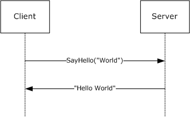

Figure 1: The .NET Remoting Protocol

This protocol defines two roles: client and server. A client initiates communication by calling a [**Remote Method**](#gt_remote-method) with [**Input Arguments**](#gt_input-argument) using a [**Proxy**](#gt_proxy). The server responds by executing the method in an implementation-specific manner. The Remote Method can be either a [**One-Way**](#gt_one-way-method) or a [**Two-Way Method**](#gt_two-way-method). If the method is One-Way, then no response is sent back to the client. If the method is Two-Way, then the server sends back a response that can contain a [**Return Value**](#gt_return-value) and [**Output Arguments**](#gt_output-argument).

The protocol defines two mechanisms for exchanging additional data with each Remote Method call: [**Call Context**](#gt_call-context) and [**Message Properties**](#gt_message-properties).

A Call Context is a collection of name-value pairs. A client can add name-value pairs to the Call Context of a Remote Method. The Call Context is then transmitted when the Remote Method is invoked. The server can then modify the Call Context before it transmits the updated Call Context back to the client.

Message Properties is another collection of name-value pairs that behaves in the same way as Call Context. Values in the Call Context are intended to be used for transmitting application-defined values, while the Message Properties are intended to be used for infrastructure-defined values. This protocol does not define any values that are carried as Message Properties or Call Context values.

Remote Method implementations can choose to return an [**Exception**](#gt_exception) to the caller to indicate an error in processing. Server-side errors such as a connection error, a data validity error, or a server availability error are returned to the client as one of two Exceptions: **Remoting Exception** or **Serialization Exception**.

Remote Method Arguments, Return Value, Call Context, Message Properties, and Exceptions are all represented by [**Data Values**](#gt_data-value).

### 1.3.2 Passing Server Objects

The [**Server Object**](#gt_server-object) or a [**Proxy**](#gt_proxy) can be part of a graph of nodes of a [**Data Value**](#gt_data-value). However, unlike other Data Values, when a graph that contains a Server Object or a Proxy is passed as part of a [**Remote Method**](#gt_remote-method) invocation they are transmitted as Server Object **References**.

When a client receives a [**Server Object Reference**](#gt_server-object-reference) from a server, it might receive additional, application-specific data in a part of the Server Object Reference called the [**Envoy Sink Information**](#gt_envoy-sink-information). Data sent as the Envoy Sink Information is implementation specific, and the semantics of that information have to be agreed between the client and server out of band. An example of Envoy Sink Information is a set of rules to validate Remote Method Arguments. This protocol does not define any data sent in the Envoy Sink Information.<1>

The following example shows a server sending a Server Object Reference from a server to a client.

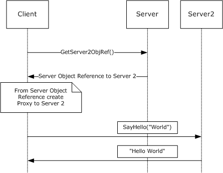

Figure 2: A server sending a Server Object Reference from a server to a client

The following example shows a client sending a Server Object Reference to a server. The server uses the Server Object Reference to call back the client.

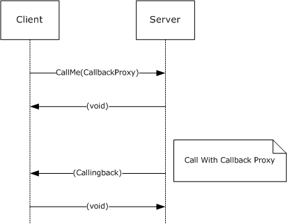

Figure 3: A Server Object Reference being sent by the client and then used by the server to call back the client

### 1.3.3 Server Object Instantiation and Binding

A client's [**Remote Method**](#gt_remote-method) invocation is targeted to a given [**Server Object**](#gt_server-object) by the passing of the [**Request URI**](#gt_request-uri) of the Server Object as part of the call. A server implementation uses the Request URI to bind the call to the appropriate Server Object. A server implementation can bind the Request URI to a [**Server Type**](#gt_server-type) or Server Object.

If the binding is to a Server Type, then the server implementation creates a new Server Object by instantiating the Server Type. The created Server Object can then be used to dispatch the method call in an implementation-specific way. Such Server Objects are called [**Server-Activated Objects (SAOs)**](#gt_server-activated-object-sao). Server implementations can be configured to save created SAOs for future calls. Such SAOs are called [**Singleton SAOs**](#gt_singleton-sao). If the SAO is not configured to be saved, every subsequent call results in the creation of a new instance of the SAO. Such SAOs are called [**Single-Call SAOs**](#gt_single-call-sao).

Some Server Objects are created by a higher-layer on the server, and not in response to a client request. These Server Objects are called [**Marshaled Server Objects (MSO)**](#gt_marshaled-server-object-mso). When a Request URI is bound to such an object, the object is used to dispatch the server call in an implementation-specific way.

## 1.4 Relationship to Other Protocols

This protocol defines the central mechanisms of the .NET Remoting Protocol stack, which convert a [**Remote Method**](#gt_remote-method) invocation into an exchange of encoded messages. This protocol depends on other structures and protocols for the encoding and transport of its messages. Further protocols can extend this protocol to provide additional services, such as .NET Remoting Lifetime Services [MS-NRLS](../MS-NRLS/MS-NRLS.md) which defines additional message and semantics to add activation and distributed lifetime management to .NET Remoting. User applications are layered on top of this protocol and use its services for application-specific purposes.

Before a message is sent, the Remote Method is converted to a [**serialized**](#gt_serialize) form for transmission on the wire. A binary encoding for .NET Remoting is specified in .NET Remoting Binary Format [MS-NRBF](../MS-NRBF/MS-NRBF.md). When the binary encoding is used, .NET Remoting can be bound to either TCP [[RFC793]](https://go.microsoft.com/fwlink/?LinkId=150872) or [**HTTP**](#gt_hypertext-transfer-protocol-http) [[RFC2616]](https://go.microsoft.com/fwlink/?LinkId=90372). The TCP binding is specified in [TCP Transport (section 2.1.1)](#Section_2.1.1), and the HTTP binding is specified in [HTTP Transport (section 2.1.2)](#Section_2.1).

.NET remoting can also use SOAP1.1, which includes both encoding semantics and transport bindings. The [**SOAP**](#gt_soap) encoding is specified in [[SOAP1.1]](https://go.microsoft.com/fwlink/?LinkId=90520), with .NET remoting-specific portions of the mapping specified in [SOAP Serialization Format (section 2.2.4)](#Section_2.2.4) of this specification. When SOAP is used, .NET remoting can be bound to either TCP [RFC793] or HTTP [RFC2616]. The TCP binding to SOAP is specified in [SOAP on TCP (section 2.1.3.2)](#Section_2.1.3.2), and the HTTP binding can be found in [SOAP1.1] section 6, with .NET remoting-specific portions of the mapping specified in [SOAP on HTTP (section 2.1.3.1)](#Section_2.1.3.1) of this specification.

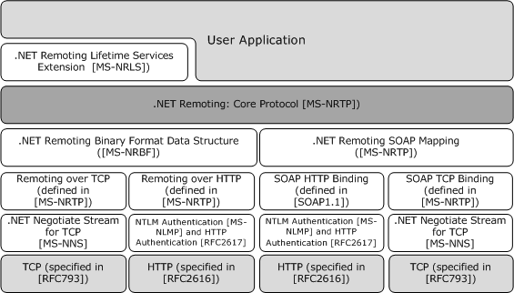

Figure 4: Relationships between .NET Remoting protocols

## 1.5 Prerequisites/Preconditions

If the HTTPS transport is used, a server [**certificate**](#gt_certificate) must be deployed and a client certificate can be deployed.

This protocol does not define any means for activating a server or a client. The server must be configured and begin listening in an implementation-specific way on a [**Channel**](#gt_channel). For more information on Channels, see [Initialization (section 3.2.3)](#Section_3.3.3). The client must know the format and transport used by the server (for example, binary format over [**HTTP**](#gt_hypertext-transfer-protocol-http)).

The client needs the [**Request URI**](#gt_request-uri) of the server, and both the client and server need to agree on the following:

- Definitions of the [**Remote Method**](#gt_remote-method)
- The Types of [**Data Values**](#gt_data-value) to be exchanged
- The names of the Libraries that contain the types
- The [**Library**](#gt_library) that is the [**System Library**](#gt_system-library)

## 1.6 Applicability Statement

This protocol is useful for transferring object method invocation information in a distributed environment. This protocol is designed for use on private networks, and is not appropriate for use on public networks. See [Security Considerations for Implementers (section 5.1)](#Section_5.1) for more details.

## 1.7 Versioning and Capability Negotiation

This specification covers versioning issues in the following areas:

- **Supported transports:** This protocol can use [**SOAP**](#gt_soap), TCP, [**HTTP**](#gt_hypertext-transfer-protocol-http), or HTTPS as a transport. Details are provided in [Transport (section 2.1)](#Section_2.1).
- **Protocol versions:** Only one version of this protocol is currently defined.
- **Security and authentication methods:** This protocol relies on the security provided by the following:
- .NET Negotiate Stream for TCP as defined in [MS-NNS](../MS-NNS/MS-NNS.md), HTTPS, HTTP Basic Access, and [**Digest Access**](#gt_digest-access-authentication)
- [**NTLM**](#gt_fff710f9-e3d1-4991-99a2-009768d57585) [**authentication**](#gt_authentication) as defined in [[RFC2617]](https://go.microsoft.com/fwlink/?LinkId=90373) and [MS-NLMP](../MS-NLMP/MS-NLMP.md)
This protocol does not have security and authentication provisions of its own.

- **Capability negotiation:** An implementation of this protocol with SOAP over HTTP can interoperate with other implementations of SOAP over HTTP that implement [[SOAP1.1]](https://go.microsoft.com/fwlink/?LinkId=90520). This protocol provides a mechanism to distinguish an implementation of this protocol from other implementations of SOAP over HTTP. A client role of this protocol indicates this by using the [**User-Agent**](#gt_e0d80398-1411-47cf-8201-a1e284415fce) header as specified in [Versioning and Capability Negotiation (section 2.1.3.1.1.1)](#Section_1.7). The server role uses this information when sending a SOAP fault as specified in [ServerFault (section 2.2.2.17)](#Section_2.2.2.17).

## 1.8 Vendor-Extensible Fields

This protocol allows custom headers to be added to the [**message frame**](#gt_message-frame) structure when TCP is used as a transport, as specified in [CustomHeader (section 2.2.3.3.3.2)](#Section_2.2.3.3.3.2). Custom headers added to the TCP message frame are ignored by .NET remoting. This protocol does not include vendor-extensible fields when [**HTTP**](#gt_hypertext-transfer-protocol-http) is used as a transport. However, this protocol does not preclude implementers from adding HTTP headers, as specified in [[RFC2616]](https://go.microsoft.com/fwlink/?LinkId=90372) section 4.2. This protocol also does not preclude implementers from adding [**SOAP**](#gt_soap) headers as specified in [[SOAP1.1]](https://go.microsoft.com/fwlink/?LinkId=90520) section 4.2.

## 1.9 Standards Assignments

No standards assignments are made by this protocol.

# 2 Messages

## 2.1 Transport

### 2.1.1 TCP Transport

This section specifies the protocol to use TCP as specified in [[RFC793]](https://go.microsoft.com/fwlink/?LinkId=150872) to transmit method invocation and return information.

If instructed by a higher-level protocol in an implementation-specific way, an implementation of this protocol MUST require the implementation of the [MS-NNS](../MS-NNS/MS-NNS.md) protocol on the server to authenticate the TCP client using [**SPNEGO**](#gt_simple-and-protected-gss-api-negotiation-mechanism-spnego).

The higher-level protocol MUST provide, in an implementation-specific way, the required [**credentials**](#gt_credential) for the [**authentication**](#gt_authentication). Implementations of this protocol MUST NOT process the credentials or authentication information before transmission. Such processing typically happens entirely inside implementations of lower protocol layers. An extension of this protocol MAY use the credentials from the lower protocol layers for authorization or impersonation.

#### 2.1.1.1 Client Details

##### 2.1.1.1.1 Sending Request

In the client role, an implementation MUST first establish a TCP connection to the server. A client implementation MAY cache and reuse a connection to a specific server port or create a new connection.<2>

After a connection is established, a client implementation MUST transmit the [**message content**](#gt_message-content) that contains information to perform invocation of the target [**Remote Method**](#gt_remote-method) identified by the higher layer as specified in [Remote Method Invocation](#Section_3.3.4.2).

The implementation MUST construct a [**message frame**](#gt_message-frame) structure as specified in [Message Frame Structure](#Section_2.2.3.3) with the following additional constraints:

- The implementation SHOULD use [single message content (section 2.2.3.3.1)](#Section_2.2.3.3.1) but MAY use [chunked message content (section 2.2.3.3.2)](#Section_2.2.3.3.2).<3>
- The implementation MUST set the **OperationType** field of the message frame to OneWayRequest(1) if the Remote Method is a [**One-Way Method**](#gt_one-way-method); otherwise, the field MUST be set to Request(0).
- The implementation MUST send a request message that consists of the message frame and the message content using the previously established TCP connection. The message content MUST be sent as specified in Message Frame Structure. If any error occurs while the message is being written, the implementation MAY reestablish the connection and retransmit the message.
- If the Remote Method is One-Way then the connection MAY be reused after the message has been sent. If the Remote Method is [**Two-Way**](#gt_two-way-method) then the connection MUST NOT be used to send any other requests to the server until the response for the request is received.<4>

##### 2.1.1.1.2 Receiving Reply

If the [OperationType](#Section_2.2.3.1.1) of the message is Request(0), an implementation MUST wait for the Two-Way Reply message in the same connection. The implementation MAY have an implementation-specific time-out period. If the server does not reply within the time-out period, the higher layer MAY be notified of the time-out error.<5>

If the [**message frame**](#gt_message-frame) of the reply message does not conform to the structure specified in [Message Frame Structure (section 2.2.3.3)](#Section_2.2.3.3) or if the **OperationType** field of the message frame is not Reply(2), then the implementation MUST notify the higher layer of the error.

An implementation MAY process implementation-defined [CustomHeaders](#Section_2.2.3.3.3.2) in an implementation-specific way. The implementation MUST ignore any CustomHeaders that it does not understand.

The data in the transport buffer MUST be consumed so that the connection can be reused.

An implementation of the protocol MAY cache the connection after reading the reply, unless the message frame has a [CloseConnectionHeader](#Section_2.2.3.3.3.6).

#### 2.1.1.2 Server Details

##### 2.1.1.2.1 Receiving Request

The server implementation of this protocol MUST listen on the TCP port as specified in section [3.2.3](#Section_3.3.3). When a connection is available, the implementation of the protocol MUST process the message from the connection stream as follows. An implementation MUST NOT send anything other than the reply to this request in this connection.

If the [**message frame**](#gt_message-frame) of the request message does not conform to the structure specified in [Message Frame Structure (section 2.2.3.3)](#Section_2.2.3.3) or if the **OperationType** field of the message frame is neither Request(0) nor OneWayRequest(1) then an implementation MUST send back a fault as specified below.

An implementation MAY process implementation-defined [CustomHeaders](#Section_2.2.3.3.3.2) in an implementation-specific way. The implementation MUST ignore any CustomHeaders that it does not understand.<6>

A transport fault MUST be sent as a reply as specified in [Sending Reply (section 2.1.1.2.2)](#Section_2.1.2.2.2) with additional constraints on the message frame construction as follows:

- The **ContentDistribution** field MUST be written as NotChunked.
- The **ContentLength** field MUST be written as zero.
- The StatusCode header MUST be written with a value of 1 (Error).
- The StatusPhrase header SHOULD contain helpful text about the error.
- The CloseConnection header MUST be written to indicate that the connection must not be cached after processing this message.
- The implementation MUST NOT write any MessageContent.

##### 2.1.1.2.2 Sending Reply

If the [OperationType](#Section_2.2.3.1.1) of the request message is OneWayRequest(1), then an implementation MUST NOT send any response. The rest of this section applies only to incoming request messages where the OperationType of the message is Request(0).

An implementation MUST construct a TCP [**message frame**](#gt_message-frame) as specified in [Message Frame Structure (section 2.2.3.3)](#Section_2.2.3.3) with the following constraints:

- The implementation SHOULD use [single message content (section 2.2.3.3.1)](#Section_2.2.3.3.1) but MAY use [chunked message content (section 2.2.3.3.2)](#Section_2.2.3.3.2).<7>
- The OperationType MUST be written as Reply(2).
- The associated **Method Type** of the target [**Remote Method**](#gt_remote-method) obtained as specified in [Dispatching the Call (section 3.2.5.1.4)](#Section_3.2.5.1.4) MUST be obtained in an implementation-specific way. If the **Method Type** is One-Way, then the reply MUST contain an empty [**message content**](#gt_message-content).
Finally, the implementation MUST package the message content following the message frame as specified in Message Frame Structure (section 2.2.3.3).

A server implementation MUST send the reply in the same connection that the request came in. The implementation MAY use the Close Connection header specified in the [CloseConnectionHeader](#Section_2.2.3.3.3.6) subsection under the Message Frame Structure (section 2.2.3.3) to indicate the client should not send any more messages in this connection.

### 2.1.2 HTTP Transport

This section specifies the protocol to use [**HTTP**](#gt_hypertext-transfer-protocol-http) transport as specified in [[RFC1945]](https://go.microsoft.com/fwlink/?LinkId=90300) and [[RFC2616]](https://go.microsoft.com/fwlink/?LinkId=90372) to transmit method invocation and return information. At a high level, the message request of a [**Remote Method**](#gt_remote-method) invocation MUST be sent as part of an HTTP request and the reply from the server MUST be sent as part of the HTTP response. In the case of a [**one-way method**](#gt_one-way-method), the HTTP response body MUST be empty, as specified in [Sending Reply (section 2.1.2.2.2)](#Section_2.1.2.2.2).

Port 80 is the standard port assignment for HTTP and port 443 is the standard port assignment for HTTPS. However, an implementation MUST support other ports if specified by a higher-level protocol in an implementation-defined way.

If instructed by a higher-level protocol in an implementation-specific way, implementations of this protocol MUST require that the HTTP implementation on the server use Basic or [**Digest Access Authentication**](#gt_digest-access-authentication) for HTTP to authenticate the HTTP client, as specified in [[RFC2617]](https://go.microsoft.com/fwlink/?LinkId=90373) or [**NTLM**](#gt_fff710f9-e3d1-4991-99a2-009768d57585) [**authentication**](#gt_authentication) [MS-NLMP](../MS-NLMP/MS-NLMP.md) for HTTP.

The higher-level protocol MUST provide in an implementation-specific way either [**credentials**](#gt_credential) in the form of user name/password or a client-side [**certificate**](#gt_certificate). Implementations of this protocol MUST NOT process the credentials or authentication information. Such processing typically happens entirely inside implementations of lower protocol layers.

#### 2.1.2.1 Client Details

##### 2.1.2.1.1 Sending Request

A [**Remote Method**](#gt_remote-method) invocation request MUST be mapped to an [**HTTP**](#gt_hypertext-transfer-protocol-http) request and MUST have the following HTTP headers:

- An implementation MAY use HTTP/1.0 or HTTP/1.1.<8><9>
- The HTTP Method SHOULD be a POST. The HTTP Method MAY be M-POST.
- The Request-URI of the HTTP request message MUST be set to the [**Server Object URI**](#gt_server-object-uri) of the Remote Method.
- The User-Agent SHOULD contain the string "MS .NET Remoting".<10>
- The Content-Type MUST be either a [**binary format identifier**](#gt_binary-format-identifier) or a [**SOAP format identifier**](#gt_soap-format-identifier).
- The [**message content**](#gt_message-content) MUST be transmitted as the HTTP request message body. The message body MAY be sent using chunked transfer coding as specified in [[RFC2616]](https://go.microsoft.com/fwlink/?LinkId=90372) section 3.6.1. If the message body is not chunked then the Content-Length entity header MUST contain the length of the message body in decimal number of octets.<11>

##### 2.1.2.1.2 Receiving Reply

If the target [**Remote Method**](#gt_remote-method) that is identified by the higher layer as specified in [Remote Method Invocation (section 3.3.4.2)](#Section_3.3.4.2) is [**Two-Way**](#gt_two-way-method), then the implementation MUST wait for a response. If a response is not received before an implementation-defined time-out, the implementation SHOULD cancel the request and report an error to the higher layer.<12>

For Two-Way Remote Methods, if the status code of the [**HTTP**](#gt_hypertext-transfer-protocol-http) response is one of the successful codes as specified in [[RFC2616]](https://go.microsoft.com/fwlink/?LinkId=90372) section 10.2 or one of the server-error codes as specified in [RFC2616] section 10.5, the response MUST be processed further as specified in section [3.3.4.2.4](#Section_3.3.4.2.4). If the Status-Code is one of the client-error codes as specified in [RFC2616] section 10.4, the response MUST NOT be processed any further.

For both Two-Way and [**One-Way Remote Methods**](#gt_one-way-method) an implementation MAY handle other status codes in an implementation-specific way that complies with [RFC2616]. If an error occurs in processing of the other status codes, the response MUST NOT be processed any further.<13>

#### 2.1.2.2 Server Details

##### 2.1.2.2.1 Receiving Request

A [**Remote Method**](#gt_remote-method) invocation request is mapped to an [**HTTP**](#gt_hypertext-transfer-protocol-http) request. An implementation MUST accept request messages that are sent using either HTTP/1.0 or HTTP/1.1. If the HTTP method is neither POST nor M-POST or if the Content-Type is neither a [**binary format identifier**](#gt_binary-format-identifier) nor a [**SOAP format identifier**](#gt_soap-format-identifier), then an implementation MUST send back a transport fault as specified in the following list.

An implementation MUST send back an HTTP response:

- The HTTP Status-Code of the response MUST be 400.
- The Reason-Phrase SHOULD be "Bad Request".
- The Body of the response MUST be empty.

##### 2.1.2.2.2 Sending Reply

A [**Remote Method**](#gt_remote-method) reply is mapped to an [**HTTP**](#gt_hypertext-transfer-protocol-http) response and MUST have the following HTTP header fields:

- The Content-Type of the response MUST match the Content-Type of the request.
- An implementation MUST return an HTTP response with a Status-Code and message body as shown in the following table. The Reason-Phrase value SHOULD be as follows.
| Request message | Status-Code | Reason-Phrase | Message body |
| --- | --- | --- | --- |
| [**One-Way Method**](#gt_one-way-method) | 202 | Accepted | Empty |
| [**Two-Way Method**](#gt_two-way-method) | 200 | OK | [**Serialized**](#gt_serialize) [**message content**](#gt_message-content) |

### 2.1.3 SOAP Transport

At a high level, a [**Two-Way Remote Method**](#gt_two-way-method) invocation is modeled as a [**SOAP**](#gt_soap) request message with an associated response message. A [**One-Way Remote Method**](#gt_one-way-method) invocation is modeled as a SOAP request message with no response message.

A request message MUST be constructed as follows:

- The content of the request message MUST be a valid Envelope infoset per [[SOAP1.1]](https://go.microsoft.com/fwlink/?LinkId=90520) section 4.
- The SOAP body infoset MUST contain a valid method request struct per [SOAP1.1] section 7.
- Any method parameters MUST be encoded as a valid serialization of the [SOAP1.1] section 5 encoding.
A response message MUST be constructed as follows:

- The content of the response message MUST be a valid Envelope infoset per [SOAP1.1] section 4.
- The SOAP body infoset MUST contain a valid method response struct per [SOAP1.1] section 7.
- Any method parameters MUST be encoded as a valid serialization of the [SOAP1.1] section 5 encoding.
When using .NET Remoting over the SOAP protocol, .NET Remoting can be bound to [**HTTP**](#gt_hypertext-transfer-protocol-http) or TCP.

- For HTTP, .NET Remoting method invocation MUST be bound to an HTTP request/response pair per [SOAP1.1] section 6.
- For TCP, see section [2.1.1](#Section_2.1.1) (raw TCP binding).

#### 2.1.3.1 SOAP on HTTP

When using [**HTTP**](#gt_hypertext-transfer-protocol-http), the message MUST be transmitted as specified in [[SOAP1.1]](https://go.microsoft.com/fwlink/?LinkId=90520) section 6.

##### 2.1.3.1.1 Client Details

###### 2.1.3.1.1.1 Sending Request

[**HTTP**](#gt_hypertext-transfer-protocol-http) request MUST be constructed as specified in [[SOAP1.1]](https://go.microsoft.com/fwlink/?LinkId=90520) section 6 with the following additional constraints:

- The Request-URI of the HTTP request message MUST be set to the [**Server Object URI**](#gt_server-object-uri) of the [**Remote Method**](#gt_remote-method).
- The User-Agent SHOULD contain the string "MS .NET Remoting".<14>
- The charset of the Content-Type SHOULD be [**UTF-8**](#gt_utf-8).

###### 2.1.3.1.1.2 Receiving Reply

An [**HTTP**](#gt_hypertext-transfer-protocol-http) response MUST be processed as specified in [[SOAP1.1]](https://go.microsoft.com/fwlink/?LinkId=90520) section 6.

An implementation MAY handle status codes—other than successful codes specified in [[RFC2616]](https://go.microsoft.com/fwlink/?LinkId=90372) section 10.2 or one of the server-error codes as specified in [RFC2616] section 10.5—in an implementation-specific way that complies with [RFC2616]. If an error occurs in the processing of the other status codes, the response MUST NOT be processed any further.<15>

##### 2.1.3.1.2 Server Details

###### 2.1.3.1.2.1 Receiving Request

[**HTTP**](#gt_hypertext-transfer-protocol-http) request MUST be processed as specified in [[SOAP1.1]](https://go.microsoft.com/fwlink/?LinkId=90520) section 6.

###### 2.1.3.1.2.2 Sending Reply

[**HTTP**](#gt_hypertext-transfer-protocol-http) response MUST be constructed as specified in [[SOAP1.1]](https://go.microsoft.com/fwlink/?LinkId=90520) section 6 with the following additional constraint:

- The charset of the Content-Type SHOULD be [**UTF-8**](#gt_utf-8).

#### 2.1.3.2 SOAP on TCP

This section specifies a binding of [**SOAP**](#gt_soap) to TCP for use in .NET Remoting:

- The TCP connection MUST be a duplex connection.
- The SOAP request and the SOAP response MUST be transmitted through the same connection. The connection MUST be exclusive for a request-response until the response is completely processed by the client.
- The payload MUST include enough information outside the SOAP Envelope (as transport frame header) to identify the [**Server Object**](#gt_server-object) and the format identifier.
- SOAP Faults have no impact on the TCP [**Message Frame**](#gt_message-frame) structure.

##### 2.1.3.2.1 Client Details

###### 2.1.3.2.1.1 Sending Request

A [**SOAP**](#gt_soap) request parameter using TCP transport MUST be sent as specified in the [Sending Request](#Section_2.1.1.1.1) subsection under the [TCP Transport](#Section_2.1.1) section with the following additional constraint:

- The Content-Type header MUST be set to a [**SOAP format identifier**](#gt_soap-format-identifier).

###### 2.1.3.2.1.2 Receiving Reply

A [**SOAP**](#gt_soap) reply using TCP transport MUST be processed as specified in the [Receiving Reply](#Section_2.1.1.1.2) subsection under the [TCP Transport](#Section_2.1.1) section.

##### 2.1.3.2.2 Server Details

###### 2.1.3.2.2.1 Receiving Request

A [**SOAP**](#gt_soap) request parameter using TCP transport MUST be processed as specified in the [Receiving Request](#Section_2.1.3.2.2.1) subsection under the [TCP Transport](#Section_2.1.1) section with the following additional constraint:

- If the Content-Type is not a [**SOAP format identifier**](#gt_soap-format-identifier), the message does not belong to this transport protocol. A transport fault MUST be sent back as specified in the Receiving Request subsection under the TCP Transport section.

###### 2.1.3.2.2.2 Sending Reply

A [**SOAP**](#gt_soap) reply parameter using TCP transport MUST be sent as specified in the [Sending Reply](#Section_2.1.2.2.2) subsection under the [TCP Transport](#Section_2.1.1) section.

## 2.2 Message Syntax

### 2.2.1 Common Patterns

This section specifies common string patterns using Augmented Backus-Naur Form (ABNF) syntax specified in [[RFC4234]](https://go.microsoft.com/fwlink/?LinkId=90462).

#### 2.2.1.1 IdentifierName

IdentifierName MUST follow Annex 7 of Technical Report 15 of the [**Unicode**](#gt_unicode) Standard 3.0 governing the set of characters permitted to start and be included in identifiers as specified in [[UNICODENORMFORMS]](https://go.microsoft.com/fwlink/?LinkId=93485). Identifiers MUST be in the canonical format defined by Unicode Normalization Form C.

For more information see [[ECMA-335]](https://go.microsoft.com/fwlink/?LinkId=93453) section 8.5.1.

#### 2.2.1.2 RemotingTypeName

A value that complies with this pattern identifies a [**Remoting Type**](#gt_remoting-type). It MUST be of the following format.

| Formats for type names | Column 2 | Column 3 |
| --- | --- | --- |
| TypeName | = | 0*1(NamespaceIdentifier '.') TypeIdentifier 0*1(TypeParameterList) 0*1(Dimension) |
| Dimension | = | '[' '*' / 0*(',') ']' |
| TypeIdentifier | = | 0*(TypeIdentifier '+') IDENTIFIER 0*1(TypeParameterCount) |
| TypeParameterCount | = | '`' 1*('0'-'9') |
| TypeParameterList | = | '[' '[' QualifiedTypeName ']' 0*(',' '[' QualifiedTypeName ']') ']' <16> |
| NamespaceIdentifier | = | IDENTIFIER 0*('.' IDENTIFIER) |
| IDENTIFIER | = | See [IdentifierName (section 2.2.1.1)](#Section_2.2.1.1) |
| QualifiedTypeName | = | TypeName ',' LibraryName |

#### 2.2.1.3 LibraryName

A value complying with this pattern identifies a [**Library**](#gt_library) in the Remoting Data Model. It MUST be of the following format.

| Formats for library names | Column 2 | Column 3 |
| --- | --- | --- |
| LibraryName | = | LibraryIdentifier *(',' LibraryProperty) |
| LibraryIdentifier | = | IDENTIFIER; as specified in [IdentifierName (section 2.2.1.1)](#Section_2.2.1.1) |
| LibraryProperty | = | VersionProperty / PublicKeyTokenProperty / CultureProperty / RetargetableProperty |
| VersionProperty | = | 'Version' '=' VersionValue |
| RetargetableProperty | = | 'Retargetable' '=' 'Yes' / 'No' |
| VersionValue | = | UInt16 '.' UInt16 '.' UInt16 '.' UInt16 |
| UInt16 | = | 1*5(DIGIT) ; Range from 0 to 65536 |
| PublicKeyTokenProperty | = | 'PublicKeyToken' '=' TokenValue |
| TokenValue | = | 16*16(HEXDIG) / NULLSTRING |
| NULLSTRING | = | 'null' |
| CultureProperty | = | Culture of the Library in [[RFC1766]](https://go.microsoft.com/fwlink/?LinkId=120475) format, or "neutral" for language-independent (nonsatellite) assemblies. |

#### 2.2.1.4 Method Signature

A value complying with this pattern uniquely identifies a Method in a [**Class**](#gt_class). The value MUST be of the following format.

| Formats for Method Signature | Column 2 | Column 3 |
| --- | --- | --- |
| Method | = | TypeName IDENTIFIER TypeIdentifierList ArgumentList |
| ArgumentList | = | '(' 0*1(Argument 0*(',' Argument ) ) ')' ';' |
| Argument | = | TypeName 0*1('ByRef'') |
| TypeIdentifierList | = | '[' '[' TypeIdentifier ']' 0*(',' '[' TypeIdentifier ']') ']' |
| IDENTIFIER | = | See [IdentifierName (section 2.2.1.1)](#Section_2.2.1.1) |
| TypeIdentifier | = | See [RemotingTypeName (section 2.2.1.2)](#Section_2.2.1.2) |

### 2.2.2 Common Types

This section defines [**Classes**](#gt_class) that are used by this protocol. The Class definitions in this section use the notation defined in section [2.2.5](#Section_2.2.5). The definitions correspond to the [**Remoting Data Model**](#gt_remoting-data-model) and can be mapped to the formats specified in [MS-NRBF](../MS-NRBF/MS-NRBF.md) or [[SOAP1.1]](https://go.microsoft.com/fwlink/?LinkId=90520). The instructions to map the Classes to the binary format specified in [MS-NRBF] are specified in [3.1.5.1](#Section_3.1.5.1). The instructions to map the Classes to the [**SOAP**](#gt_soap) format [SOAP1.1] are specified in [3.1.5.2](#Section_3.1.5.2).

#### 2.2.2.1 ObjRef

**ObjRef** is a [**Class**](#gt_class). The [**Library**](#gt_library) name of the Class is "mscorlib". It represents a [**Server Object Reference**](#gt_server-object-reference). It is Assignable to [**Remoting Types**](#gt_remoting-type) of all [**Server Objects**](#gt_server-object).

namespace System.Runtime.Remoting

{

class ObjRef

{

String uri;

Int32 objRefFlags;

System.Runtime.Remoting.TypeInfo typeInfo;

System.Runtime.Remoting.EnvoyInfo envoyInfo;

System.Runtime.Remoting.ChannelInfo channelInfo;

Bool fIsMarshalled;

}

}

**uri:** A [**URI**](#gt_uniform-resource-identifier-uri) that identifies the Server Object.

**objRefFlags:** An Int32 value that indicates whether the **ObjRef** is created from a [**MSO**](#gt_marshaled-server-object-mso) or from a [**SAO**](#gt_server-activated-object-sao). If the second lowest bit (value of 2) is set, then **ObjRef** is created from an SAO. Otherwise, it is created from an MSO.

**typeInfo:** A [TypeInfo](#Section_2.2.2.2) instance that contains name, Base Class, and Interfaces of the [**Server Type**](#gt_server-type).

**envoyInfo:** An instance of [EnvoyInfo](#Section_2.2.2.3) that contains the [**Envoy Sink Information**](#gt_envoy-sink-information) of the Server Object.

**channelInfo:** A [ChannelInfo](#Section_2.2.2.4) instance that contains a list of ServerURIs.

**fIsMarshalled:** An Int32 value that specifies whether **ObjRef** is well-formed. An **ObjRef** is well-formed if all of the following are true:

- The ObjRef Class is not a [**Null Object**](#gt_null-object).
- The **uri** field is not a Null Object.
- One of the following is true:
- The second lowest bit of objRefFlags (value of 2) is set.
- The **channelInfo** field is not a Null Object.
If the second lowest bit (value of 2) is set, then the value of the **uri** field MUST be an absolute URI. Otherwise, the value of the **uri** field MUST be a relative URI.

#### 2.2.2.2 TypeInfo

TypeInfo is a [**Class**](#gt_class). The [**Library**](#gt_library) name of the Class is "mscorlib". It contains information about the [**Server Type**](#gt_server-type) and is used in an **ObjRef** class.

namespace System.Runtime.Remoting

{

class TypeInfo

{

String serverType;

String[] serverHierarchy;

String[] interfacesImplemented;

}

}

**serverType:** A String value that identifies the Server Type. The format of the String value is specified as QualifiedTypeName in section [TypeName](#Section_2.2.1.2).

**serverHierarchy:** An [**Array**](#gt_array) of String values that identifies the Base Classes of the Server Type. The format of the String is specified as QualifiedTypeName in section TypeName.

**interfacesImplemented:** An Array of String that identifies the [**Server Interfaces**](#gt_server-interface) implemented by Server Type. The format of the String value is specified as QualifiedTypeName in section TypeName.

#### 2.2.2.3 EnvoyInfo

EnvoyInfo is a [**Class**](#gt_class). The [**Library**](#gt_library) name of the Class is "mscorlib". An instance of this Class contains [**Envoy Sink Information**](#gt_envoy-sink-information).

namespace System.Runtime.Remoting

{

class EnvoyInfo

{

System.Object envoySinks;

}

}

**envoySinks:** A [**Data Value**](#gt_data-value) that represents the Envoy Sink Information of a Server Object. The value of this field MUST NOT be a Server Object or a [**Proxy**](#gt_proxy).

#### 2.2.2.4 ChannelInfo

ChannelInfo is a [**Class**](#gt_class). The [**Library**](#gt_library) name of the Class is "mscorlib". It contains the information about available [**channels**](#gt_channel) in the server. It is used by ObjRef.

namespace System.Runtime.Remoting

{

class ChannelInfo

{

System.Object[] channelData;

}

}

**channelData:** An [**Array**](#gt_array) that can contain instances of ChannelDataStore specified in [ChannelDataStore (section 2.2.2.5)](#Section_2.2.2.5).

#### 2.2.2.5 ChannelDataStore

ChannelDataStore is a Class. The [**Library**](#gt_library) name of the Class is "mscorlib". It is an item in the 'channelData' [**Array**](#gt_array) in the ChannelInfo Class.

namespace System.Runtime.Remoting

{

class ChannelDataStore

{

String[] _channelURIs;

System.Collections.DictionaryEntry[] extraData;

}

}

**_channelURIs:** Contains a [**Channel URI**](#gt_channel-uri). The Array MUST contain at least one item.

**extraData:** This field SHOULD be a [**Null Object**](#gt_null-object). Readers MUST ignore this field.

#### 2.2.2.6 DictionaryEntry

DictionaryEntry is a Class. The [**Library**](#gt_library) name of the Class is "mscorlib". It is defined as follows.

namespace System.Collection

{

class DictionaryEntry

{

System.Object _key;

System.Object _value;

}

}

**key:** _An instance of any [**Remoting Type**](#gt_remoting-type).

**_value:** An instance of any Remoting Type.

#### 2.2.2.7 System.Exception

System.Exception is a Class. The [**Library**](#gt_library) name of the Class is "mscorlib". This is the Base Class for all [**Exception**](#gt_exception) [**Classes**](#gt_class).

namespace System

{

class Exception

{

String ClassName;

String Message;

System.Exception InnerException;

String HelpUrl;

String StackTraceString;

String RemoteStackTraceString;

Int32 RemoteStackIndex;

String ExceptionMethod;

Int32 HResult;

String Source;

System.Object Data;

}

}

**ClassName:** The [TypeName](#Section_2.2.1.2) of the Exception Class. If the instance is a Derived Class of this Class then this field MUST contain the TypeName of the most Derived Class.

**Message:** A String value that represents a human-readable text that describes the Exception. The string MAY be localized.<17>

**InnerException:** An instance assignable to System.Exception that is wrapped by this Exception. If this Exception does not wrap any other Exception, then the value of this field MUST be NullObject.

**HelpUrl:** Link to a page that contains additional information about the Exception. This field is optional and its value MAY be NullObject.

**RemoteStackTraceString:** String representation of the call stack when the Exception was thrown on the server side. If the Exception was thrown across multiple remoting boundaries, then this field SHOULD contain a concatenation of the stack traces of all the remoting servers. The stack traces MUST be ordered from the ultimate Remoting Server to the first Remoting Server that was called by the client.

**RemoteStackIndex:** An int representing the number of Remoting boundaries that the Exception has propagated beyond the first one. This value MUST be zero for a simple client server scenario.

**ExceptionMethod:** A string value that provides information about the method that throws the Exception.

**HResult:** An Int32 value that specifies the numerical error code.

**Source:** A string value that is set by the code that throws the Exception. This MAY be any string.

**Data:** An instance of any [**Data Value**](#gt_data-value) that provides additional information about the Exception. The semantics of the value are not part of this protocol.<18>

#### 2.2.2.8 SystemException

SystemException is a Derived Class of System.Exception. The Library name of the Class is "mscorlib". There are no [**Members**](#gt_member) other than the Members inherited from the System.Exception Class. This Class has an additional constraint: The **HResult** MUST be hex value 0x80131501.

namespace System

{

class SystemException : System.Exception

{

}

}

#### 2.2.2.9 RemotingException

RemotingException is a Derived Class of SystemException. The Library name of the Class is "mscorlib". There are no [**Members**](#gt_member) other than the Members inherited from the System.Exception Class. This Class has an additional constraint: The **HResult** MUST be hex value 0x8013150B.

namespace System.Runtime.Remoting

{

class RemotingException : System.SystemException

{

}

}

#### 2.2.2.10 SerializationException

SerializationException is a Derived Class of SystemException. The Library name of the Class is "mscorlib". There are no [**Members**](#gt_member) other than the Members inherited from the System.Exception Class. This Class has an additional constraint: The **HResult** MUST be hex value 0x8013150C.

namespace System.Runtime.Serialization

{

class SerializationException : System.SystemException

{

}

}

#### 2.2.2.11 System.Type

System.Type is a Class contained in the System Assembly. An instance of System.Type represents a [**Remoting Type**](#gt_remoting-type). The instance can be part of a [**Data Value**](#gt_data-value) graph. The Class has no [**Members**](#gt_member). It relies on [**Classes**](#gt_class) that are assignable to System.Type to provide the information about the Remoting Type. For further information, see [UnitySerializationHolder (section 2.2.2.12)](#Section_2.2.2.12).

namespace System

{

class System.Type

{

}

}

This Class has no Members.

#### 2.2.2.12 UnitySerializationHolder

UnitySerializationHolder is a Class. The Library name of the Class is "mscorlib". It contains metadata that provides information about a [**Remoting Type**](#gt_remoting-type). It is Assignable to System.Type.

namespace System

{

class UnitySerializationHolder

{

Int32 UnityType;

String _Data;

String AssemblyName;

System.Type[] GenericArguments;

}

}

**UnityType:** An Int32 value that indicates whether the Remoting Type is a [**Generic Type**](#gt_generic-type) as shown in the following table.

| UnityType value | Remoting Type category |
| --- | --- |
| 4 | All types except [**Instantiated Generic Type**](#gt_instantiated-generic-type) |
| 8 | Instantiated Generic Type |

**Data:** _A **String** value that contains the name of the Remoting Type. The value MUST conform to the format specified in [TypeName (section 2.2.1.2)](#Section_2.2.1.2).

**AssemblyName:** A **String** value that contains the name of the Library that contains the Remoting Type. The value MUST conform to the format specified in [LibraryName (section 2.2.1.3)](#Section_2.2.1.3).

**GenericArguments:** A **System.Type Array** value that contains the information about the Remoting Type of the actual parameters that were used to construct the Instantiated Generic Type. This field MUST be present if UnityType is 8. This field MUST NOT be present for other values of UnityType. This field MUST have at least one entry and MUST NOT contain any null entries.<19>

#### 2.2.2.13 MemberInfoSerializationHolder

MemberInfoSerializationHolder is a Class. The Library name of the Class is "mscorlib". It contains information about a [**Member**](#gt_member). The Class is defined as follows.

namespace System.Reflection

{

class MemberInfoSerializationHolder

{

String Name;

String AssemblyName;

String ClassName;

String Signature;

Int32 MemberType;

System.Type[] GenericArguments;

}

}

**Name:** A String value that contains the name of the Member.

**AssemblyName:** A String value that represents the name of the Library containing the Class that contains the Member. The value MUST conform to the format specified in [LibraryName (section 2.2.1.3)](#Section_2.2.1.3).

**ClassName:** A String value that represents the name of the Class that contains the Member. The value MUST conform to the format specified in [RemotingTypeName (section 2.2.1.2)](#Section_2.2.1.2).

**Signature:** A String value that uniquely identifies a Member in the given [**Remoting Type**](#gt_remoting-type).

**MemberType:** An Int32 value that indicates the type of the Member. The possible values of the field are as follows.

| Bit Range | Field | Description |
| --- | --- | --- |
| Variable | Constructor | Indicates that the Member is a constructor of a .NET Class. Its value is 1. |
| Variable | Event | Indicates that the Member is a .NET Event. Its value is 2. |
| Variable | Field | Indicates that the Member is a field of a .NET Class. Its value is 4. |
| Variable | Method | Indicates that the Member is a method of a .NET Class. Its value is 8. |
| Variable | NestedType | Indicates that the Member is a nested .NET Class. Its value is 128. |
| Variable | Property | Indicates that the Member is a property of a .NET Class. Its value is 16. |

**GenericArguments:** A [System.Type](#Section_2.2.2.11) [**Array**](#gt_array) value that contains the information about the Remoting Type of the actual parameters that were used to construct the Instantiated Generic Method. If the Member is not generic, then this field MUST contain [**Null Object**](#gt_null-object).<20>

#### 2.2.2.14 DelegateEntry

DelegateEntry is a Class. The Library name of the Class is "mscorlib". The full name of the Class is System.DelegateSerializationHolder+DelegateEntry. It is a linked list that has one node for each [**Remote Method**](#gt_remote-method). Each entry contains information about the [**Delegate**](#gt_delegate) itself, the Remote Method, and Target object. It is defined as follows.

namespace System

{

class DelegateSerializationHolder+DelegateEntry

{

String assembly;

System.DelegateSerializationHolder+DelegateEntry delegateEntry;

String methodName;

System.Object target;

String targetTypeAssembly;

String targetTypeName;

String type;

}

}

**assembly:** A String value that contains the name of a Library that contains the Delegate. The value MUST conform to the format specified in [LibraryName (section 2.2.1.3)](#Section_2.2.1.3).

**delegateEntry:** A DelegateEntry value that contains a reference to another DelegateEntry. The value MUST be a [**Null Object**](#gt_null-object) if there are no additional DelegateEntries.

**methodName:** A String value that contains the name of a Remote Method of the Delegate.

**target:** A String value that contains the name of a [**Member**](#gt_member) of [DelegateSerializationHolder](#Section_2.2.2.15). The DelegateSerializationHolder instance that contains this DelegateEntry MUST contain a Member with this name.

**targetTypeAssembly:** A String value that contains the name of the Library that contains the [**Remoting Type**](#gt_remoting-type) target of the Delegate. The value MUST conform to the format specified in LibraryName (section 2.2.1.3).

**targetTypeName:** A String value that contains the name of the Remoting Type target of the Delegate. The value MUST conform to the format specified in [RemotingTypeName (section 2.2.1.2)](#Section_2.2.1.2).

**type:** A String value that contains the name of the Delegate. The value MUST conform to the format specified in RemotingTypeName (section 2.2.1.2).

#### 2.2.2.15 DelegateSerializationHolder

DelegateSerializationHolder is a Class. The Library name of the Class is "mscorlib". Its full name is 'System.DelegateSerializationHolder'. It contains information about a [**Delegate**](#gt_delegate).

The DelegateSerializationHolder has a [**Member**](#gt_member) called Delegate, whose type is a [DelegateEntry (section 2.2.2.14)](#Section_2.2.2.14) value. The DelegateSerializationHolder is structured as a linked list, with each instance of DelegateEntry providing a reference to information about a [**Remote Method**](#gt_remote-method) and its target in the Delegate.

For each Remote Method target of the Delegate, there is a Member to contain the Target Proxy for the Method. The Member is typed to the [**Server Type**](#gt_server-type) of the Remote Method. As specified in section 2.2.2.14, the value of the target field of the DelegateEntry for the Remote Method MUST match the name of this Member. An implementation MAY use any naming scheme to name the target Member.<21>

For each Remote Method, there is an optional Member that is typed to System.Reflection.[MemberInfoSerializationHolder](#Section_2.2.2.13) that contains information about the Method. To represent a Method, the Members of MemberInfoSerializationHolder MUST be set as follows:

- The field **Signature** MUST contain the [**Method Signature**](#gt_method-signature) of the Delegate. It MUST conform to the format specified in [Method Signature (section 2.2.1.4)](#Section_2.2.1.4).
- The value of the field **MemberType** MUST be 8.
If the Method Member is present, then the method name specified by the Name field of MemberInfoSerializationHolder MUST match the **methodName** in the DelegateEntry.

The Method Member MUST be of the following format.

| Format for Member names | Column 2 | Column 3 |
| --- | --- | --- |
| MethodMemberName | = | 'Method' Index |
| Index | = | 1*('0'-'9') |

For a given DelegateSerializationHolder, the value of the Index MUST start from 0 and MUST increase by 1 for each Method Member. The Index value MUST match the index of the DelegateEntry for the Remote Method in the linked list.<22>

#### 2.2.2.16 CallContextRemotingData

CallContextRemotingData is a Class. The Library name of the Class is "mscorlib". It is used to send [**Logical Call ID**](#gt_logical-call-id) as part of the [**Call Context**](#gt_call-context).

namespace System.Runtime.Remoting.Messaging

{

class CallContextRemotingData

{

String ___logicalCallID;

}

}

**_logicalCallID:** A string value that represents the Logical Call ID. The value MAY be any [**Unicode**](#gt_unicode) string.

#### 2.2.2.17 ServerFault

ServerFault is a Class. The Library name of the Class is "mscorlib". It contains fault detail information that is used as part of [**SOAP**](#gt_soap) fault.

namespace System.Runtime.Serialization.Formatters

{

class ServerFault

{

String exceptionType;

String message;

String stackTrace;

System.Exception exception;

}

}

- **exceptionType:** A String that contains the name of the [**Remoting Type**](#gt_remoting-type) of the [**Exception**](#gt_exception). The format of the string is as specified in section [2.2.1.2](#Section_2.2.1.2).
- **message:** A String that contains a human-readable text message that describes the fault.
- **stackTrace:** A String that contains the **StackTrace** field of the Exception.
- **exception:** A Data Value that is assignable to [System.Exception](#Section_2.2.2.7). The exception object is [**serialized**](#gt_serialize) as specified in [[SOAP1.1]](https://go.microsoft.com/fwlink/?LinkId=90520) section 5. The structure of the System.Exception Class is specified in section 2.2.2.7.
If the client is an implementation of the .NET Remoting Protocol, then the Exception field MUST have a valid value and the other elements MUST contain a serialized [**Null Object**](#gt_null-object). Otherwise, the Exception field MUST contain a Null Object and other elements MUST contain a valid value.

The client is considered to be an implementation of the .NET Remoting Protocol if one of the following is true:

- The transport is TCP.
- The transport is [**HTTP**](#gt_hypertext-transfer-protocol-http) and the User-Agent header contains "MS .Net Remoting" (case sensitive).

### 2.2.3 TCP Message Syntax

The [**Remote Method**](#gt_remote-method) payload is transmitted in [**message content**](#gt_message-content) between clients and server. The protocol does not consume or modify the message content (except in the case of [**chunked encoding**](#gt_chunked-encoding) where the message content is encoded into one or more chunks). The protocol inserts a [**message frame**](#gt_message-frame) before the message content and consumes it on the receiving end. The message frame contains the following information:

- [OperationType](#Section_2.2.3.1.1) that specifies whether the message is a Two-Way Request, Two-Way Response or One-Way message.
- [**Request URI**](#gt_request-uri) that identifies the Server Object.
- **Content Type** that identifies the [**serialization format**](#gt_serialization-format).
- **ContentDistribution** that specifies whether or not the message content is transmitted as chunked encoding.
- **Close Connection** header that indicates whether the connection must be closed after reading the message.
- **Custom Headers** from higher layers.

#### 2.2.3.1 Common Enumerations

##### 2.2.3.1.1 OperationType

The type of the values of this enumeration is UInt16. The enumeration is used in the **OperationType** field of the TCP [**message frame**](#gt_message-frame). The possible values of the enumeration and their meanings are given as follows.

| Constant/value | Description |
| --- | --- |
| Request 0 | Identifies a request message of a [**Two-Way Method**](#gt_two-way-method). |
| OneWayRequest 1 | Identifies a request message of a [**One-Way Method**](#gt_one-way-method). |
| Reply 2 | Identifies a reply message of a Two-Way Method. |

##### 2.2.3.1.2 ContentDistribution

The type of the values of this enumeration is UInt16. The enumeration is used in the ContentDistribution field of the TCP [**message frame**](#gt_message-frame). The possible values of the enumeration and their meanings are given as follows.

| Constant/value | Description |
| --- | --- |
| NotChunked 0 | [**Message content**](#gt_message-content) is not written as [**chunked encoding**](#gt_chunked-encoding). |
| Chunked 1 | Message content is written as chunked encoding. |

##### 2.2.3.1.3 HeaderToken

The type of the values of this enumeration is UInt16. The enumeration is used to identify the message [frame headers](#Section_2.2.3.3.3). The possible values of the enumeration and their meanings are given as follows.

| Constant/value | Description |
| --- | --- |
| EndHeaders 0 | Identifies the [EndHeader](#Section_2.2.3.3.3.1). |
| Custom 1 | Identifies a [CustomHeader](#Section_2.2.3.3.3.2). |
| StatusCode 2 | Identifies a [StatusCodeHeader](#Section_2.2.3.3.3.3). |
| StatusPhrase 3 | Identifies a [StatusPhraseHeader](#Section_2.2.3.3.3.4). |
| RequestUri 4 | Identifies the [RequestURIHeader](#Section_2.2.3.3.3.5). |
| CloseConnection 5 | Identifies a [CloseConnectionHeader](#Section_2.2.3.3.3.6). |
| ContentType 6 | Identifies a [ContentTypeHeader](#Section_2.2.3.3.3.7). |

##### 2.2.3.1.4 HeaderDataFormat

The type of the values of this enumeration is Byte. A value of the enumeration is contained in a message [frame header](#Section_2.2.3.3.3) and identifies the type of the data contained in the header. The possible HeaderDataFormat constants and their meanings are as follows.

| Constant/value | Description |
| --- | --- |
| Void 0 | Indicates that there is no data in the containing header. |
| CountedString 1 | Indicates that the following data is a [CountedString](#Section_2.2.3.2.1). |
| Byte 2 | Indicates that the following data is a BYTE. |
| Uint16 3 | Indicates that the following data is a UINT16. |
| Int32 4 | Indicates that the following data is an INT32. |

##### 2.2.3.1.5 StringEncoding

The type of the values of this enumeration is Byte. The enumeration is used in the [CountedString](#Section_2.2.3.2.1) type. The values for the StringEncoding constant are as follows.

| Constant/value | Description |
| --- | --- |
| Unicode 0 | Byte that identifies the string as a [**Unicode**](#gt_unicode)-encoded string. |
| UTF8 1 | Byte that identifies the string as a [**UTF-8**](#gt_utf-8)-encoded string. |

##### 2.2.3.1.6 TCPStatusCode

The type of the values of this enumeration is UInt16. The enumeration is used in the [StatusCodeHeader](#Section_2.2.3.3.3.3). The possible values and their meanings are as follows.

| Constant/value | Description |
| --- | --- |
| Success 0 | No Error. |
| Error 1 | Error when processing the [**message frame**](#gt_message-frame). |

#### 2.2.3.2 Common Types

##### 2.2.3.2.1 CountedString

The strings in the header section are defined as CountedString. The CountedString has a one-byte format identifier, followed by the length of the encoded string in bytes and the encoded bytes.

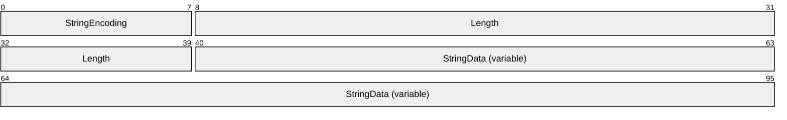

**StringEncoding (1 byte):** A [StringEncoding](#Section_2.2.3.1.5) value that identifies whether the string encoding is [**UTF-8**](#gt_utf-8) or [**Unicode**](#gt_unicode).

**Length (4 bytes):** An int32 value that specifies the length of **StringData** in bytes.

**StringData (variable):** The string data whose length is specified in the **Length** field and encoding specified in the **StringEncoding** field.

##### 2.2.3.2.2 TcpUriString

This is the [**Request URI**](#gt_request-uri) for the TCP transport. The format of the [**URI**](#gt_uniform-resource-identifier-uri) MUST conform to the form specified in [[RFC3986]](https://go.microsoft.com/fwlink/?LinkId=90453) section 3 with the following constraints:

- The URI string MUST have the scheme as "tcp".
- The server host address MUST be in the host subcomponent of the URI. It MAY be a Domain Name System (DNS) name as specified in [[RFC1034]](https://go.microsoft.com/fwlink/?LinkId=90263) section 3, an [**IPv4 address**](#gt_4e201ead-736f-4aed-bd66-4ff53468bf06) as specified in [[RFC1123]](https://go.microsoft.com/fwlink/?LinkId=90268) section 2.1, or an [**IPv6 address**](#gt_50fe15b6-ddc6-4856-8c3b-e652b245b22d) as specified in [[RFC3513]](https://go.microsoft.com/fwlink/?LinkId=90427) section 2.2.<23>
- There are no fixed ports for this protocol. The URI MUST contain the port subcomponent.
- The [**Server Object URI**](#gt_server-object-uri) path MUST be the path subcomponent.

##### 2.2.3.2.3 ChunkDelimiter

When a message frame contains multiple chunks of message content, an instance of the ChunkDelimiter type is used at the end of each chunk.

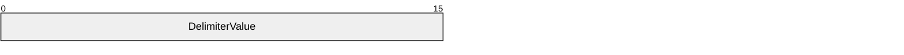

**DelimiterValue (2 bytes):** This field contains a UInt16 value that indicates a delimiter. Its value MUST be hex 0x0D0A ('\r' '\n').

#### 2.2.3.3 Message Frame Structure

The message body consists of a [**message frame**](#gt_message-frame) structure followed by the [**message content**](#gt_message-content). The protocol allows writing all of the message content in a single chunk after the message frame or as multiple chunks that appear contiguously after the message frame. Each chunk is prefixed by the length of the chunk and the last chunk as a length of 0 bytes.<24>

##### 2.2.3.3.1 Single Message Content

The [**message content**](#gt_message-content) follows the [**message frame**](#gt_message-frame). The message frame's **ContentLength** field indicates this with a value of 0 followed by an int32 value that indicates the length of the message content.

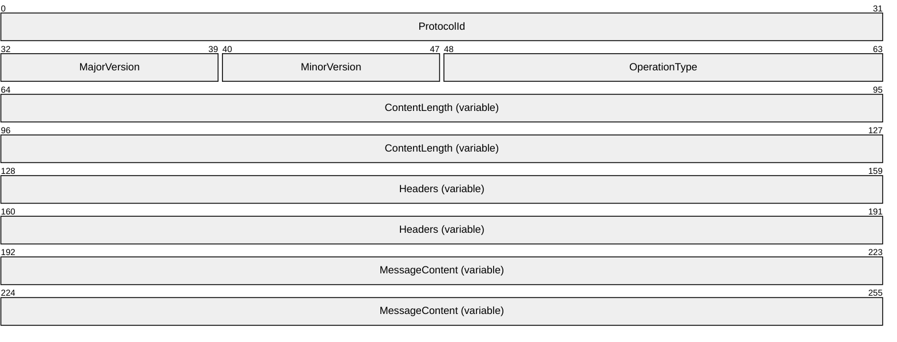

**ProtocolId (4 bytes):** This field contains an Int32 value that identifies the protocol. Its value MUST be hex 0x54454E2E.

**MajorVersion (1 byte):** This field contains a byte value that identifies the major version of the protocol. Its value MUST be 1.

**MinorVersion (1 byte):** This field contains a byte value that identifies the minor version of the protocol. Its value MUST be 0.

**OperationType (2 bytes):** The field is of type [OperationType](#Section_2.2.3.1.1). This field identifies whether the message is for a [**One-Way Method**](#gt_one-way-method) or [**Two-Way Method**](#gt_two-way-method) and, if the message is for a Two-Way Method, the field identifies whether the message is a request message or reply message.

**ContentLength (variable):** A field that follows the operation field. This field is of variable length. It contains a UInt16 and can optionally contain an Int32.

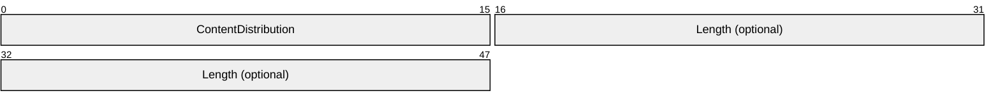

**ContentDistribution (2 bytes):** A value that specifies whether the content is chunked or not. Its value MUST be 0.

**Length (4 bytes):** An Int32 value that specifies the length of the data in the message content. This field MUST be present if the **ContentDistribution** field is 0 (Not Chunked); otherwise, this field MUST NOT be present.

**Headers (variable):** A combination of frame header packets as defined in section [Frame Headers (section 2.2.3.3.3)](#Section_2.2.3.3.3).

**MessageContent (variable):** A stream of bytes that contains the content. The number of bytes in the stream MUST equal the value of the **Length** field of the **ContentLength** field of the message frame.

##### 2.2.3.3.2 Chunked Message Content

In this mode, the [**message content**](#gt_message-content) is segmented into multiple parts. The mode is indicated with a value of 1 in the **ContentDistribution** field of the [**message frame**](#gt_message-frame). A chunked message content is shown as follows.

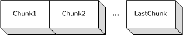

Figure 5: Layout of chunked message content

The message is of the following format.

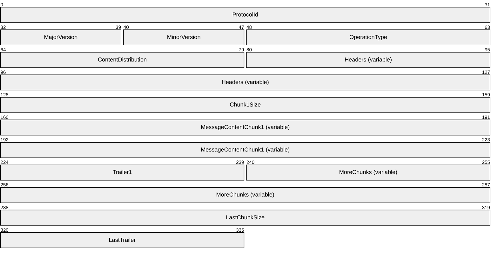

**ProtocolId (4 bytes):** This field contains an Int32 value that identifies the protocol. Its value MUST be hex 0x54454E2E.

**MajorVersion (1 byte):** This field contains a byte value that identifies the major version of the protocol. Its value MUST be 1.

**MinorVersion (1 byte):** This field contains a byte value that identifies the minor version of the protocol. Its value MUST be 0.

**OperationType (2 bytes):** The field is of type [OperationType](#Section_2.2.3.1.1). This field identifies whether the message is for a [**One-Way Method**](#gt_one-way-method) or [**Two-Way Method**](#gt_two-way-method) and, if the message is for a Two-Way Method, identifies whether the message is a request message or reply message.

**ContentDistribution (2 bytes):** A value that specifies whether the content is chunked or not. Its value MUST be 1.

**Headers (variable):** A combination of frame header packets as specified in section [Frame Headers (section 2.2.3.3.3)](#Section_2.2.3.3.3).

**Chunk1Size (4 bytes):** This field is of type Int32 and specifies the length of the message content chunk.

**MessageContentChunk1 (variable):** A segment of the message content data whose length is specified by the last field (**Chunk1Size**). The number of bytes in the MessageContentChunk1 segment MUST equal the value of the **Chunk1Size** field.

**Trailer1 (2 bytes):** Indicates the end of a chunk. The type of this field is [ChunkDelimiter](#Section_2.2.3.2.3).

**MoreChunks (variable):** Additional segments of the message content. Each segment consists of a ChunkSize, MessageContentChunk, and Trailer, as previously specified for the first segment. The number of bytes in MessageContentChunk MUST equal the value of the ChunkSize field.

**LastChunkSize (4 bytes):** This field is of type Int32 and specifies the length of the message content chunk. The size of the last chunk MUST be zero.

**LastTrailer (2 bytes):** Indicates the end of a chunk. The type of this field is ChunkDelimiter.

##### 2.2.3.3.3 Frame Headers

[**Message frames**](#gt_message-frame) SHOULD have one or more frame headers. The last frame header MUST be an [EndHeader](#Section_2.2.3.3.3.1) that marks the end of headers. The following diagram describes the layout of headers in a message frame.

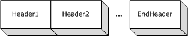

Figure 6: Layout of headers in a message frame

For more information on the [**Members**](#gt_member) of the message frame structure, refer to section [Message Frame Structure (section 2.2.3.3)](#Section_2.2.3.3).

The following sections describe the headers that are available for the Headers and EndHeader sections of this packet.

###### 2.2.3.3.3.1 EndHeader

The EndHeader marks the end of the headers.

**EndHeadersToken (2 bytes):** The field contains a [HeaderToken](#Section_2.2.3.1.3) value that identifies the EndHeader type. Its value MUST be 0.

###### 2.2.3.3.3.2 CustomHeader

The CustomHeader is used for passing implementation-specific information.

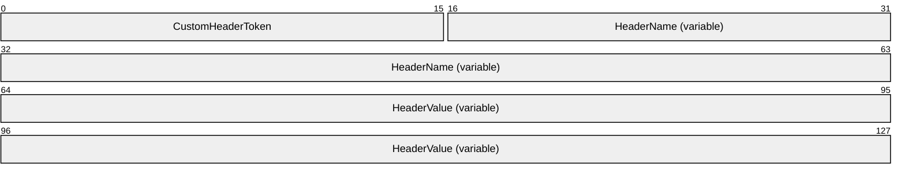

**CustomHeaderToken (2 bytes):** A [HeaderToken](#Section_2.2.3.1.3) enumeration that identifies the custom header. Its value MUST be 1.

**HeaderName (variable):** A [CountedString](#Section_2.2.3.2.1) value that represents the name of the custom header.

**HeaderValue (variable):** A CountedString value that represents the value of the custom header.

###### 2.2.3.3.3.3 StatusCodeHeader

The StatusCodeHeader is included in reply messages of [**Two-Way Method**](#gt_two-way-method) invocation. StatusCodeHeader contains the error code for any error that occurred when the server interpreted the request [**message frame**](#gt_message-frame).

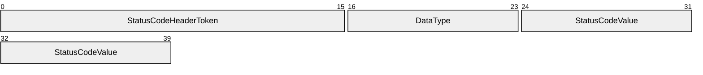

**StatusCodeHeaderToken (2 bytes):** A [HeaderToken](#Section_2.2.3.1.3) enumeration that indicates the header type. Its value MUST be 2.

**DataType (1 byte):** A [HeaderDataFormat](#Section_2.2.3.1.4) enumeration indicating the type of the data to be UInt16. Its value MUST be 3.

**StatusCodeValue (2 bytes):** A [TCPStatusCode](#Section_2.2.3.1.6) enumeration that indicates the status code.

###### 2.2.3.3.3.4 StatusPhraseHeader

The StatusPhraseHeader header is optionally included along with [StatusCodeHeader](#Section_2.2.3.3.3.3) with an error code. It contains a human-readable message about the error.

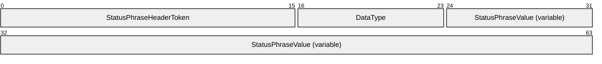

**StatusPhraseHeaderToken (2 bytes):** A [HeaderToken](#Section_2.2.3.1.3) enumeration that indicates the Header type. Its value MUST be 3.

**DataType (1 byte):** A [HeaderDataFormat](#Section_2.2.3.1.4) enumeration that indicates the type of the data to be [CountedString](#Section_2.2.3.2.1). Its value MUST be 1.

**StatusPhraseValue (variable):** A CountedString value that represents the human-readable message.

This header MAY accompany StatusCodeHeader to indicate the error in human-readable form. A missing header implies a value of empty string.

###### 2.2.3.3.3.5 RequestUriHeader

The RequestUriHeader header contains the **RequestURI**.

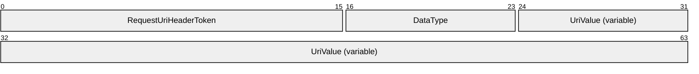

**RequestUriHeaderToken (2 bytes):** A [HeaderToken](#Section_2.2.3.1.3) enumeration that indicates the Header type. Its value MUST be 4.

**DataType (1 byte):** A [HeaderDataFormat](#Section_2.2.3.1.4) enumeration that indicates the type of the data to be CountedString. Its value MUST be 1.

**UriValue (variable):** A [TcpUriString](#Section_2.2.3.2.2) value that represents the RequestURI.

The requested [**URI**](#gt_uniform-resource-identifier-uri) can be a relative or an absolute URI.

###### 2.2.3.3.3.6 CloseConnectionHeader

The CloseConnectionHeader packet header indicates that the receiver is not supposed to cache the connection after processing message containing this header.

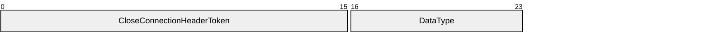

**CloseConnectionHeaderToken (2 bytes):** A [HeaderToken](#Section_2.2.3.1.3) enumeration that indicates the Header type. Its value MUST be 5.

**DataType (1 byte):** A [HeaderDataFormat](#Section_2.2.3.1.4) enumeration that indicates the type of the data. Its value MUST be 0 indicating that there is no Data for this record.

###### 2.2.3.3.3.7 ContentTypeHeader

The ContentTypeHeader header indicates the [**serialization format**](#gt_serialization-format) of the [**message content**](#gt_message-content).

**ContentTypeHeaderToken (2 bytes):** A [HeaderToken](#Section_2.2.3.1.3) enumeration that indicates the Header type. Its value MUST be 6.

**DataType (1 byte):** A [HeaderDataFormat](#Section_2.2.3.1.4) enumeration that indicates the type of the data to be [CountedString](#Section_2.2.3.2.1). Its value MUST be 1.

**ContentTypeValue (variable):** A CountedString value that represents the content-type of the message content.

###### 2.2.3.3.3.8 UnknownHeader

An UnknownHeader header has an unknown HeaderToken. It is meant for handling the addition of headers in future. An implementation MUST NOT write this header. However this header MUST be ignored on read.

**UnknownHeaderToken (2 bytes):** An UInt16 value. Its value MUST be greater than 6.

**DataType (1 byte):** A [HeaderDataFormat](#Section_2.2.3.1.4) enumeration that indicates the type of the data.

**DataValue (variable):** The type of this field is as specified in the table in HeaderDataFormat.

### 2.2.4 SOAP Serialization Format

#### 2.2.4.1 SOAP Action String

A [**SOAP**](#gt_soap) Action string is a [**URI**](#gt_uniform-resource-identifier-uri) that is used as the SOAP Action field in the [**HTTP**](#gt_hypertext-transfer-protocol-http) header as specified in [[SOAP1.1]](https://go.microsoft.com/fwlink/?LinkId=90520) section 6. The SOAP action is derived from the [**Remote Method**](#gt_remote-method). An implementation MUST define its own mechanism to create a SOAP action for the given Remote Method. The client and server MUST agree on the mechanism so that a given Remote Method ends up with the same SOAP action on both sides.<25>

#### 2.2.4.2 Remoting Type Name Encoding

[**SOAP**](#gt_soap) [**XML**](#gt_xml) messages use qualified names to identify [**Remoting Type**](#gt_remoting-type) names, which consist of an [**XML namespace**](#gt_xml-namespace) and a [**local name**](#gt_local-name). An implementation MUST define its own mechanism to derive the XML namespace and local name for the given Remoting Type. The client and the server MUST agree on the mechanism so that a given Remoting Type ends up with the same qualified name on both sides.<26>

#### 2.2.4.3 Method Name Encoding

As specified in [[SOAP1.1]](https://go.microsoft.com/fwlink/?LinkId=90520) section 7, the **Remoting Method** MUST be mapped to a [**SOAP**](#gt_soap) struct. The name of the struct MUST be a qualified name and MUST be distinct for request and response. An implementation MUST define its own mechanism to derive the [**XML namespace**](#gt_xml-namespace) and [**local name**](#gt_local-name) for the request and response. The client and the server MUST agree on the mechanism so that a given method ends up with the same qualified names on both sides.<27>

#### 2.2.4.4 Method Signature SOAP Header

The [**Method Signature**](#gt_method-signature) in [**SOAP**](#gt_soap) is [**serialized**](#gt_serialize) as an element whose schema is as follows.

<xs:schema xmlns:tns="http://schemas.microsoft.com/clr/soap/

messageProperties" elementFormDefault="qualified"

targetNamespace="http://schemas.microsoft.com/clr/soap/messageProperties"

xmlns:xs="http://www.w3.org/2001/XMLSchema">

<xs:element name="__MethodSignature">

<xs:simpleType>

<xs:list itemType="xs:QName" />

</xs:simpleType>

</xs:element>

</xs:schema>

MethodSignature is an element whose [**local name**](#gt_local-name) is "__MethodSignature" and whose [**XML namespace**](#gt_xml-namespace) is "http://schemas.microsoft.com/clr/soap/messageProperties". The value of the header contains a list of qualified names separated by a SPACE (x20). Each qualified name identifies the [**Remoting Type**](#gt_remoting-type) of a parameter encoded as specified in the [Remoting Type Name Encoding](#Section_2.2.4.2) section.

#### 2.2.4.5 Call Context SOAP Header

The [**Call Context**](#gt_call-context) MUST be encoded as a [**SOAP**](#gt_soap) header element. The element's [**local name**](#gt_local-name) MUST be "__CallContext" and its [**XML namespace**](#gt_xml-namespace) MUST be "http://schemas.microsoft.com/clr/soap/messageProperties". It MUST be encoded as a struct, as specified in [[SOAP1.1]](https://go.microsoft.com/fwlink/?LinkId=90520) section 5. The name of the struct MUST be "LogicalCallContext" from "http://schemas.microsoft.com/clr/ns/System.Runtime.Remoting.Messaging" namespace. Each name-value pair of the Call Context MUST be mapped to a Member name and a Member value of the struct. The Member values MUST be encoded as specified in [SOAP1.1] section 5.

### 2.2.5 .NET Remoting Description Notation

This section specifies a description notation to describe the metadata of the [**Remoting Data Model**](#gt_remoting-data-model). The notation is meant for higher-level services such as [MS-NRLS](../MS-NRLS/MS-NRLS.md) that are layered on top of this protocol to define their protocol in a remote procedure call (RPC) style.

The notation provides a way to describe the following components of the Remoting Data Model that is defined in [Abstract Data Model (section 3.1.1)](#Section_3.1.1).

[**Primitive Types**](#gt_primitive-type) are mapped to the following keywords in the notation:

| Data model type | Notation keyword |
| --- | --- |
| BOOLEAN | bool |
| BYTE | Byte |
| INT8 | SByte |
| INT16 | Int16 |
| INT32 | Int32 |
| INT64 | Int64 |
| UINT16 | UInt16 |
| UINT32 | UInt32 |
| UINT64 | UInt64 |
| Decimal | Decimal |
| Char | Char |
| String | String |
| Double | Double |
| Single | Single |
| TimeSpan | TimeSpan |
| DateTime | DateTime |

A Class is defined with the keyword *class* followed by the name of the Class. The [**Generic Arguments**](#gt_generic-argument) of a Class are defined inside a pair of angle brackets '<', '>' following the name of the Class and are separated by commas. The Base Class of a Class is defined following the Generic Arguments and is separated from the Generic Argument with a colon ':'. The body of the Class is defined inside a pair of braces '{', '}'. A Class definition consists of a list of Member definitions. Each Member definition consists of a [**Remoting Type**](#gt_remoting-type) name followed by the name of the Member terminated with a semicolon ';'.

An [**Array**](#gt_array) is constructed by appending opening and closing brackets '[]' to the item Remoting Type name. The Rank of an Array is indicated by putting a comma ',' inside the brackets '[]'. The number of commas inside a pair of brackets '[]' is one less than the value of the Rank. For example, an Array with a Rank of 2 is '[,]'. The notation does not have a way to represent the lower bounds or upper bounds of an Array.

An [**Enum**](#gt_enum) is defined with the keyword *enum* followed by the name of the Enum. The underlying Remoting Type of the Enum is defined following the Enum name separated by a colon ':'. The [**Members**](#gt_member) of the Enum are defined inside a pair of braces '{', '}' following the name of the Enum. Each Member definition consists of a Member name followed by an '=' and the value of the Member. Member definitions are separated by a ','.

A [**Server Interface**](#gt_server-interface) is defined with the keyword *interface* followed by the name of the Server Interface. The Generic Arguments of the Server Interface are defined inside a pair of angle brackets '<', '>' following the name of the Server Interface and are separated by commas. The Base Interfaces are defined following the Generic Arguments and are separated from the Generic Arguments with a colon ':' The Base Interfaces are separated by a comma ','. The body of the Server Interface is defined inside opening and closing braces '{', '}'. A Server Interface definition consists of a list of Method and Member definitions.

Each [**Remote Field**](#gt_remote-field) is defined as a Member consisting of a Remoting Type name followed by the name of the Remote Field terminated with a semicolon ';'.

Each [**Remote Method**](#gt_remote-method) definition consists of a Remoting Type name followed by the name of the Remote Method. The Generic Arguments of the Remote Method are defined inside a pair of angle brackets '<', '>' following the name of the Remote Method and are separated by commas. The Arguments of the Remote Method are defined inside a pair of parentheses '(', ')' following the Generic Arguments and are separated by commas. Each [**Arguments**](#gt_argument) definition consists of the name of the Remoting Type of an Arguments followed by the Arguments name. An Argument can be prefixed with a 'out' or 'ref' keyword to indicate an out or ref Arguments. If neither 'out' nor 'ref' is specified, then it indicates the Argument to be an 'in' Argument.

A [**Delegate**](#gt_delegate) is defined with the keyword *delegate* followed by the declaration of the Remote Method.

The grammar for the subset used by this specification and by [MS-NRLS] is specified in the following table with the ABNF syntax specified in [[RFC4234]](https://go.microsoft.com/fwlink/?LinkId=90462).

| Grammar | Column 2 | Column 3 |
| --- | --- | --- |
| CompilationUnit | = | 0*(Namespace) |
| Namespace | = | 'namespace' NamespaceIdentifier '{' 0*(Class / Interface / Enum / Delegate) '}' |
| Class | = | 'class' IDENTIFIER TypeVariableList Base ClassBody |
| ClassBase | = | 0*1(':' TypeIdentifier) |
| ClassBody | = | '{' 0*(Member) '}' |
| Member | = | TypeName IDENTIFIER ';' |
| Interface | = | 'interface' IDENTIFIER TypeVariableList InterfaceBase InterfaceBody |
| InterfaceBase | = | 0*1(':' TypeIdentifier 0*(',' TypeIdentifier)) |
| InterfaceBody | = | '{' 0*(Method / Member) '}' |
| Method | = | TypeName IDENTIFIER TypeVariableList ArgumentList |
| ArgumentList | = | '(' 0*1(Argument 0*(',' Argument ) ) ')' ';' |
| Argument | = | (0*1('ref' / 'out')) TypeName IDENTIFIER |
| Enum | = | 'enum' IDENTIFIER ':' EnumBase EnumBody |
| EnumBase | = | NumericType |
| EnumBody | = | '{' 0*1(EnumMember 0*(',' EnumMember) ) '}' |
| EnumMember | = | IDENTIFIER '=' 1*(DIGIT) |
| Delegate | = | 'delegate' Method |
| TypeVariableList | = | 0*1( '<' IDENTIFIER 0*(',' IDENTIFIER) '>') |
| TypeName | = | (TypeIdentifier / PrimitiveType ) |
| Dimension | = | 0*('[' 0* ( ',') ']') |
| TypeIdentifier | = | NamespaceIdentifier TypeArgumentList |
| TypeArgumentList | = | 0*1(',' TypeName 0*(',' TypeName) '.') <28> |
| PrimitiveType | = | NumericType / 'String'/ 'Decimal' / 'TimeSpan' / 'DateTime' / 'Double' / 'Single' / 'Char'/ 'Bool' |
| NumericType | = | 'SByte' / 'Int16' / 'Int32' / 'Int64' / 'Byte' / 'UInt16' / 'UInt32' / 'UInt64' |
| NamespaceIdentifier | = | 0*(IDENTIFIER '.') IDENTIFIER |
| IDENTIFIER | = | See section [IdentifierName](#Section_2.2.1.1) (Identifier Name) |

# 3 Protocol Details

## 3.1 Common Details

### 3.1.1 Abstract Data Model

This section describes a conceptual model of possible data organization that an implementation maintains to participate in this protocol. The described organization is provided to facilitate the explanation of how the protocol behaves. This document does not mandate that implementations adhere to this model as long as their external behavior is consistent with that described in this document.

The [**Remoting Data Model**](#gt_remoting-data-model) represents higher-layer-defined data structures and values as directed edge-labeled graphs of nodes. Also, the Remoting Data Model can represent a [**Remote Method**](#gt_remote-method) invocation and the [**Return Value**](#gt_return-value) or error information from the invocation. Providing a mapping to any specific programming language is beyond the scope of this document. Section [2.2.5](#Section_2.2.5) contains an informal notation to describe the Remoting Data Model.

[Mapping to Binary Format (section 3.1.5.1)](#Section_3.1.5.1) provides a mapping to binary format structures from the Remoting Data Model. [Mapping RDM to SOAP Format (section 3.1.5.2)](#Section_3.1.5.2) provides a mapping between the Remoting Data Model and the [**SOAP**](#gt_soap) Data Model.

[**Remoting Type**](#gt_remoting-type)

A Remoting Type defines the structure of data. Class, [**Array**](#gt_array), [**Enum**](#gt_enum), [**Primitive Type**](#gt_primitive-type), [**Server Interface**](#gt_server-interface), and [**Server Type**](#gt_server-type) are different kinds of Remoting Types. Remoting Types are contained in a Library. All Remoting Types are identified by a name that is unique when qualified with the name of the containing Library. Remoting Type names are case sensitive. A Remoting Type name consists of a namespace and a name. The format of the name of a Remoting Type is defined in [RemotingTypeName (section 2.2.1.2)](#Section_2.2.1.2).

[**Library**](#gt_library)

A Library is a named unit that contains a collection of Remoting Types. The names of the Remoting Types in a Library are unique within the Library. The Library name includes a version, culture string, and a hash value that together uniquely identify the Library. The format of the name of a Library is defined in [LibraryName (section 2.2.1.3)](#Section_2.2.1.3).<29>

[**System Library**](#gt_system-library)

A designated library that can be used to reduce the wire size for commonly used data types. The name of the Library <30> is agreed to by both the server and the client implementations of the protocol. The protocol provides mechanisms to convey the Library information in an implicit way. For more information about the specific mechanisms, see section [2.2.4.2](#Section_2.2.4.2) in this document; also see BinaryTypeEnum and Class Record definitions in [MS-NRBF](../MS-NRBF/MS-NRBF.md).

[**Data Value**](#gt_data-value)

A Data Value is an instance of a Remoting Type that can be a Class, Array, Enum, **Primitive** or Server Type. Data Values are logically structured as directed edge-labeled graphs of nodes where nodes are also Data Values. Instances of Primitive Types and Enums have no outbound edges. Instances of Server Types, Arrays, and [**Classes**](#gt_class) have outbound edges. A single-reference graph node has a single inbound edge. A multireference graph node has multiple inbound edges.

A Data Value is defined to be [**Assignable**](#gt_assignable) to a Server Type if one of the following is true:

- The Data Value is of the specified Server Type.
- The Data Value is [**Null Object**](#gt_null-object) and the specified Remoting Type is a Class, Array, String, Server Interface, or Server Type.
- The Remoting Type of the Data Value is specified to be Assignable to the specified Remoting Type.
- If a Remoting Type is Assignable to a Class, then it is Assignable to its Base Class.
Primitive Types

Primitive Types are predefined Remoting Types. The Remoting Data Model supports the following Primitive Types specified in [MS-DTYP](../MS-DTYP/MS-DTYP.md):

- BOOLEAN
- BYTE
- INT8
- INT16
- INT32
- INT64
- UINT16
- UINT32
- UINT64
The Remoting Data Model supports the Type Decimal specified in [MS-OAUT](../MS-OAUT/MS-OAUT.md).

It also supports the following Primitive Types:

- **Char:** Represents a [**Unicode**](#gt_unicode) character value.
- **String:** Represents a string of Unicode characters.
- **Double:** Represents a 64-bit double-precision floating-point value. A double value ranges from negative 1.79769313486232e308 to positive 1.79769313486232e308.
- **Single:** Represents a 32-bit single-precision floating-point value. A Single value ranges from -3.402823e38 to positive 3.402823e38.
- **TimeSpan:** Represents time duration as an integer value that specifies the number of 100 nanoseconds. The values range from -10675199 days, 2 hours, 48 minutes and 05.4775808 seconds to 10675199 days, 2 hours, 48 minutes and 05.4775807 seconds.
- **DateTime:** Represents an instant of time as an INT64 value that specifies the number of 100 nanoseconds that had elapsed since 12:00:00, January 1, 0001. The value can represent time instants in a granularity of 100 nanoseconds until 23:59:59.9999999, December 31, 9999. A DateTime value can also indicate information about the time zone as follows.
| Bit Range | Field | Description |
| --- | --- | --- |
| Variable | Unspecified | Time zone information is not specified. |
| Variable | UTC | The time specified is in the Coordinated Universal Time (UTC) time zone. |
| Variable | Local | The time specified is in the local time zone.<31> |

Null Object

Null Object is a special value that can be used in place of an instance of a Server Type, Class, Array, or String. Null Object indicates that no instance is being specified.

Class

A Class is a Remoting Type that contains a set of named values. The named values are called [**Members**](#gt_member) of the Class. Every Member of a Class is defined to be of a specific Remoting Type called the Member Type. The value of a Member is a Data Value that is Assignable to the Member Type. See Data Value for rules about when a Data Value is Assignable to a Remoting Type.

The Remoting Data Model supports a Class extending another Class. The extended Class is called the Base Class. The extending Class is called the Derived Class. A Derived Class can be extended by another Class. For example Class B extends Class A and Class C extends Class B. In this case both Class A and B are Base Classes of Class C and both Class B and C are Derived Classes of A. A Derived Class inherits the Members of its Base Classes. If a Class does not extend any Class then it is considered to implicitly extend a Class called [**System.Object**](#gt_systemobject). System.Object is a Class that has no Members.

Array

An Array is a Remoting Type that is an ordered collection of items. The items are identified by their position. Position is determined by a set of integer indices. The number of indices that are required to represent the position is called the Rank of the Array. An Array with Rank equal to 1 is said to be single-dimensional; an Array with Rank greater than 1 is said to be multidimensional. The Array supports specifying the lower and the upper bounds of the indices. Unless a lower bound is specified, an index value's lower bound is 0. Unless an upper bound is specified an index has no upper bounds.

An Array also specifies the Remoting Type of its items, called the Item Type. In an instance of an Array, the value of an item is a Data Value that is Assignable to the Item Type. See Data Value for rules about when a Data Value is Assignable to a Remoting Type.

Enum

Enum (short for Enumeration) is a Primitive Type whose values are constrained to a set of values. The Primitive Type is considered to be the underlying Remoting Type of the Enum. Each value of the Enum has a name associated with it that is unique within the values of the Enum.

Server Interface

A Server Interface is a Remoting Type that contains a collection of Remote Methods and [**Remote Field**](#gt_remote-field) declarations. A Remote Method defined in a Server Interface does not have an implementation. A Server Interface does not have any instances.

Server Type

A Server Type is a Remoting Type that implements the Remote Methods in one or more Interfaces. The Remoting Data Model allows Server Types that extend Server Types. An Extending Server Type inherits the Methods of the extending Server Type.

[**Server Object**](#gt_server-object)

A Server Object is an instance of a Server Type.

[**Proxy**](#gt_proxy)

A Proxy is an instance of a Server Type that forwards references to Remote Methods to the Server Object for execution.

Remote Field

A Remote Field is a remotely accessible field declared in a Server Interface or a Server Type. A definition of a Remote Field includes the following:

- **Name:** A String value representing the name of the Remote Field.
- **Type:** The Remoting Type of the value contained by the field Remote Field.
Remote Method

A Remote Method is a remotely callable method declared in a Server Interface or a Server Type. A definition of a Remote Method includes the following:

- **Name:** A String value representing the name of the Remote Method.
- **Arguments:** An ordered collection of [**Arguments**](#gt_argument) where each Argument has a name, direction, and a Remoting Type. The direction is defined as follows:
- **in:** The Arguments appears in the Remote Method invocation request.
- **out:** The Arguments appears in the Remote Method invocation reply.
- **ref:** The Arguments appears in both the Remote Method invocation request and the Remote Method invocation reply.
- **Return Type:** The Remoting Type of the value returned by the Remote Method.
- **Method Type:** An enumeration indicating whether the Remote Method is [**One-Way**](#gt_one-way-method) or [**Two-Way**](#gt_two-way-method). A One-Way Method invocation does not expect any replies.
A Method is uniquely identified in a Server Interface or a Server Type with the name of the Method and the ordered collection of Remoting Types of the Arguments, called the [**Method Signature**](#gt_method-signature).

The Remote Method invocation request consists of the following:

- **Input Arguments:** An ordered collection of named Data Values, one for each Argument whose direction is 'in' or 'ref'. A Data Value corresponding to an Argument MUST be Assignable to the Remoting Type of the Argument. See Data Value for rules about when a Data Value is Assignable to a Remoting Type.
- **CallContext:** A collection of name-value pairs. The collection supports any valid String as the name and any Data Value as its value. The names MUST be unique in the collection.
- Method Signature: An ordered collection of Remoting Types. Each Remoting Type in the collection corresponds to an Argument of the Method.
The information returned by a Remote Method consists of the following:

- **Return Value:** A Data Value that is Assignable to the Return Type of the Method.
- **Output Arguments:** An ordered collection of named Data Values, one for each Argument whose direction is 'out' or 'ref'. A Data Value corresponding to an Argument MUST be Assignable to the Remoting Type of the Argument. See Data Value for rules about when a Data Value is Assignable to a Remoting Type.
- **Exception:** A Data Value that is Assignable to the [System.Exception](#Section_2.2.2.7) Class. The structure of System.Exception is specified in section 2.2.2.7.
- **CallContext:** A collection of name-value pairs. The collection supports any valid String as the name and any Data Value as its value. The names MUST be unique in the collection.
An [**Exception**](#gt_exception) is returned to indicate a failure in the execution of a Remote Method. When a Remote Method's execution fails there are no Return Values or Output Arguments.

[**Generic Remote Method**](#gt_generic-remote-method)

A Generic Remote Method is a Remote Method that is parameterized by one or more Remoting Types. The method caller must provide the actual Remoting Types (in addition to the [**Input Arguments**](#gt_input-argument)). It adds the following to the definition of a Method:

- **Generic Method Arguments:** An ordered collection of [**Generic Arguments**](#gt_generic-argument)
The Remote Method invocation request consists of the following in addition to what is defined in

- **Generic Argument Values:** An Array of [System.Type](#Section_2.2.2.11) classes that contains the values for the parameterized Remoting Types.<32>
[**Delegate**](#gt_delegate)

A Delegate is a part of the Remoting Data Model. It contains references to one or more Remote Methods. A Delegate has a fixed Method Signature, and each Remote Method referenced by the Delegate has the same Method Signature.

**Client Connection State Diagram**

The following state diagram captures the state transitions during the lifetime of a client connection.

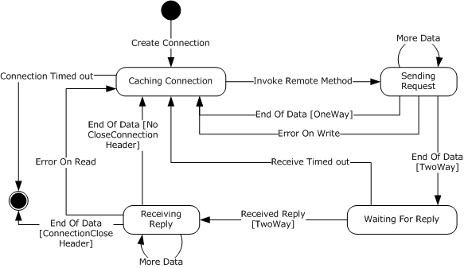

Figure 7: State transitions during the lifetime of a client connection

### 3.1.2 Timers

There are no timers that are common to the server and the client.

### 3.1.3 Initialization

There is no initialization that is common to the server and the client.

### 3.1.4 Higher-Layer Triggered Events

There are no higher-layer triggered events that are common to the server and the client.

### 3.1.5 Message Processing Events and Sequencing Rules

#### 3.1.5.1 Mapping to Binary Format

##### 3.1.5.1.1 Mapping Remote Method Request

Information required to perform a [**Remote Method**](#gt_remote-method) invocation consists of a [**Server Type**](#gt_server-type) or [**Server Interface**](#gt_server-interface) name, a Remote Method name, Input Arguments, [**Generic Arguments**](#gt_generic-argument) values, [**Method Signature**](#gt_method-signature), and a [**Call Context**](#gt_call-context).

The implementation MAY construct an [**Array**](#gt_array) of [**System.Object**](#gt_systemobject) classes called [**Message Properties**](#gt_message-properties) in order to transmit implementation-specific information to the server. The Array, if constructed, MUST contain items whose [**Remoting Types**](#gt_remoting-type) are instances of the DictionaryEntry Class as specified in [DictionaryEntry (section 2.2.2.6)](#Section_2.2.2.6). Each DictionaryEntry item MUST contain the name and the value of the implementation-specific information.<33>

The request is [**serialized**](#gt_serialize) into the serialization stream by using the records specified in [MS-NRBF](../MS-NRBF/MS-NRBF.md), as follows:

A SerializationHeaderRecord record as specified in [MS-NRBF] MUST be serialized. The Remote Method invocation request is serialized using a BinaryMethodCall record and a MethodCallArray record. The Server Type or the Server Interface name MUST be serialized in the **TypeName** field of the BinaryMethodCall record. The Remote Method name is serialized in the **MethodName** field of the BinaryMethodCall record. The MethodCallArray record is conditional and the rules for the presence of the MethodCallArray record are given in the following table. The table specifies the rules for serializing the request and the values for the **MessageEnum** field of the BinaryMethodCall record.

| Bit Range | Field | Description |
| --- | --- | --- |
| Variable | Input Arguments | No Arguments *NoArgs* -NA- |
| Variable | Input Arguments | All Arguments are primitive *ArgsInLine* *Args* field of the BinaryMethodCall record |
| Variable | Input Arguments | At least one nonprimitive Argument and no GenericArgumentsValues, MethodSignature, CallContext, or Message Properties *ArgsIsArray* A separate ArraySingleObject record that follows the BinaryMethodCall record |
| Variable | Input Arguments | Otherwise *ArgsInArray* An item in the MethodCallArray record |
| Variable | GenericArgumentsValues | Absent *0* -NA- |
| Variable | GenericArgumentsValues | Present *Generic Method* An item in the MethodCallArray record |
| Variable | Method Signature | Absent *0* -NA- |
| Variable | Method Signature | Present *MethodSignatureInArray* An item in the MethodCallArray record |
| Variable | Call Context | **LogicalCallID** Only *ContextInLine* *CallContext* field of the BinaryMethodCall record |
| Variable | Call Context | Otherwise *ContextInArray* An item in the MethodCallArray record |
| Variable | Message Properties | Absent *0* -NA- |
| Variable | Message Properties | Present *PropertiesInArray* An item in the MethodCallArray record |

If none of the items in the preceding table ended up in a MethodCallArray record then the record MUST be not present.

Following this, the [**Data Values**](#gt_data-value) contained in the Input Arguments, Generic Arguments values, Method Signature, Call Context, and Message Properties MUST be serialized. Each node in the Data Value graph MUST be iterated and each node MUST be serialized exactly once as specified in the following sections.

##### 3.1.5.1.2 Mapping Remote Method Invocation Reply

The [**Remote Method**](#gt_remote-method) invocation reply consists of Return Value, OutputArguments, [**Exception**](#gt_exception), and [**Call Context**](#gt_call-context).

The implementation MAY construct an [**Array**](#gt_array) of [**System.Object**](#gt_systemobject) classes called [**Message Properties**](#gt_message-properties) in order to transmit implementation-specific information to the client. The Array, if constructed, MUST contain items whose [**Remoting Types**](#gt_remoting-type) are instances of the DictionaryEntry Class as defined in [DictionaryEntry (section 2.2.2.6)](#Section_2.2.2.6). Each DictionaryEntry item MUST contain the name and the value of the implementation-specific information.<34>

The reply is [**serialized**](#gt_serialize) into the serialization stream by using the records defined in [MS-NRBF](../MS-NRBF/MS-NRBF.md), as follows:

A SerializationHeader record as defined in [MS-NRBF] MUST be serialized. Following the SerializationHeader record, the Remote Method invocation reply MUST be serialized using a BinaryMethodReturn record and a MethodReturnCallArray record. The MethodReturnCallArray record is conditional and the rules for the presence of the MethodReturnCallArray record are given in the following table. The table specifies the rules for serializing reply and the values for the **MessageEnum** field of the BinaryMethodReturn record.

| Bit Range | Field | Description |
| --- | --- | --- |
| Variable | Return value | None **ReturnValueVoid** -NA- |
| Variable | Return value | Null **NoReturnValue** -NA- |
| [**Primitive Value**](#gt_primitive-value) | Return value | **ReturnValueInline** **ReturnValue** field of the BinaryMethodReturn record |
| Variable | Return value | non-Primitive Value **ReturnValueInArray** An item in the MethodReturnCallArray record |
| Variable | Output Argument | None **NoArgs** -NA- |
| Variable | Output Argument | All Primitive **ArgsInLine** **Args** field of the BinaryMethodReturn record |
| Variable | Output Argument | At least one non-primitive Argument and no Exception, Call Context, or Message Properties **ArgsIsArray** A separate ArraySingleObject record that follows the BinaryMethodReturn record |
| Variable | Output Argumen t | Otherwise **ArgsInArray** An item in the MethodReturnCallArray record |
| Variable | Exception | Absent **0** -NA- |
| Variable | Exception | Present **ExceptionInArray** An item in the MethodReturnCallArray record |
| Variable | Call Context | **LogicalCallID** Only **ContextInLine** The Call Context field of the BinaryMethodReturn record |
| Variable | Call Context | Otherwise **ContextInArray** An item in the MethodReturnCallArray record |
| Variable | Message Properties | Absent **0** -NA- |
| Variable | Message Properties | Present **PropertiesInArray** An item in the MethodReturnCallArray record |

If none of the items in the preceding table ended up in the MethodReturnCallArray record, then the record MUST be not present.

Following this, the [**Data Value**](#gt_data-value) contained in the Return Value, OutputArguments, Exception, Call Context, and Message Properties MUST be serialized. Each node in the Data Value graph MUST be iterated and each node MUST be serialized exactly once as specified in the following sections.

##### 3.1.5.1.3 Mapping Remote Field Get

An implementation MUST implement getting the value of a [**Remote Field**](#gt_remote-field) as a [**Remote Method**](#gt_remote-method) invocation of the method FieldGetter as specified in [MS-NRLS](../MS-NRLS/MS-NRLS.md) section 3.5.4.1, with the following constraints:

- The fieldName Argument MUST be set to the name of the Remote Field.
- The typeName Argument MUST be set to the name of the [**Server Interface**](#gt_server-interface) containing the Remote Field.
The output value of the val Argument MUST be used as the Field value.

##### 3.1.5.1.4 Mapping Remote Field Set

An implementation MUST implement setting the value of a [**Remote Field**](#gt_remote-field) as a [**Remote Method**](#gt_remote-method) invocation of the method FieldSetter as specified in [MS-NRLS] section 3.5.4.2, with the following constraints:

- The fieldName Argument MUST be set to the name of the Remote Field.
- The typeName Argument MUST be set to the name of the [**Server Interface**](#gt_server-interface) containing the Remote Field.
- The val Argument MUST be set to the new value of the field.

##### 3.1.5.1.5 Mapping Library Information

The following records defined in [MS-NRBF](../MS-NRBF/MS-NRBF.md) reference a Library:

- BinaryArray
- ClassWithMembersAndTypes
Each of the preceding records references a BinaryLibrary record by **LibraryId** field. Before [**serializing**](#gt_serialize) any of the preceding records, the referenced BinaryLibrary record MUST be written.

##### 3.1.5.1.6 Mapping Class Instances

A Class instance MUST be [**serialized**](#gt_serialize) by using the Class records specified in [MS-NRBF](../MS-NRBF/MS-NRBF.md).

The first instance in the [**serialization**](#gt_serialization) stream of a Class in a Library other than the [**System Library**](#gt_system-library) SHOULD be serialized by using the ClassWithMembersAndTypes record. The ClassWithMembersAndTypes record allows a receiver to de-serialize the Class instance without requiring the receiver to have any out-of-band information about the Class. If the Member Type information is available to the receiver through an implementation-specific out-of-band mechanism, then a sender MAY perform serialization by using the ClassWithMembers record in order to reduce the size of data transmitted.

If the receiver is unable to process a ClassWithMembers record because it does not have the Member Type information for the record, the receiver MUST treat the case as a serialization error and abort processing. Sections [3.2.5.1.3](#Section_3.2.5.1.3) and [3.3.4.2.4](#Section_3.3.4.2.4) specify the error handling mechanism for the server and the client implementation, respectively.

Subsequent instances of the Class SHOULD be serialized by using the ClassWithId record but MAY be serialized like the first instance of the Class.<35>

The first instance in the serialization stream of a Class in the System Library SHOULD be serialized by using the SystemClassWithMembersAndTypes record. The SystemClassWithMembersAndTypes record allows a receiver to de-serialize the Class instance without requiring the receiver to have any out-of-band information about the Class. If the Member Type information is available to the receiver through an implementation-specific out-of-band mechanism, then a sender MAY perform serialization by using the SystemClassWithMembers record in order to reduce the size of data transmitted.

If the receiver is unable to process a SystemClassWithMembers record because it does not have the Member Type information for the record, the receiver MUST treat the case as a serialization error and abort processing. Sections 3.2.5.1.3 and 3.3.4.2.4 specify the error handling mechanism for the server and the client implementation respectively.

The first instance in the serialization stream of a Class in the System Library MAY instead be serialized using a ClassWithMembersAndTypes or ClassWithMembers record. In such cases the Library name MUST be serialized as specified in section [3.1.5.1.5](#Section_3.1.5.1.5) and the Library Identifier part of the Library name as specified in section [2.2.1.3](#Section_2.2.1.3) MUST be the name of the System Library.

Subsequent instances of the Class SHOULD be serialized using the ClassWithId record but MAY be serialized like the first instance of the Class.<36>

The names of the Class [**Members**](#gt_member) whose values are serialized are set in the **MemberNames** field of the ClassInfo structure of the Class records. For ClassWithMembersAndTypes and SystemClassWithMembersAndTypes records, the **MemberTypeInfo** field MUST be set by using the Member Types of the Class as specified in the MemberTypeInfo structure.

The values of all the Members MUST be serialized following this record. The record types that MUST be used for various types of Member values are as follows.

| Data value type | Binary record |
| --- | --- |
| [**Primitive Type**](#gt_primitive-type) | MemberPrimitiveUnTyped, if MemberType was Primitive Type MemberPrimitiveTyped, if MemberType was [**System.Object**](#gt_systemobject) |
| String | BinaryObjectString or MemberReferenceRecord |
| Class | MemberReference or Class records |
| [**Array**](#gt_array) | Member ReferenceRecord |
| [**Enum**](#gt_enum) | MemberReference or Class records |

##### 3.1.5.1.7 Mapping Array Instances

An [**Array**](#gt_array) with more than one dimension or with a dimension whose first index is not 0 MUST be [**serialized**](#gt_serialize) by using the BinaryArray record.

A single-dimensional Array of string whose lower bound is 0 SHOULD be serialized by using the ArraySingleString record. The Array MAY be serialized by using the BinaryArray record.

A single-dimensional Array of primitive whose lower bound is 0 SHOULD be serialized by using the ArraySinglePrimitive record. It MAY be serialized by using the BinaryArray record.

A single-dimensional Array of [**System.Object**](#gt_systemobject) whose lower bound is 0 MAY be serialized as an ArraySingleObject record. The Array MAY be serialized by using the BinaryArray record.<37>

The values of the Array items MUST be serialized following the BinaryArray, ArraySingleString, ArraySinglePrimitive or ArraySingleObject record. The record types that MUST be used for various types of Array item values are given in the table in the [Mapping Class Instances](#Section_3.1.5.2.5) section.

##### 3.1.5.1.8 Mapping Primitive Values

[**Primitive Values**](#gt_primitive-value) in [**Classes**](#gt_class) and [**Arrays**](#gt_array) MUST be [**serialized**](#gt_serialize) as part of MemberPrimitiveUnTyped or MemberPrimitiveTyped. If the value is part of Arguments inlined in the BinaryMethodCall or BinaryMethodReturn record then they MUST be serialized as ValueWithCode.

##### 3.1.5.1.9 Mapping Enum Values

An [**Enum**](#gt_enum) MUST be [**serialized**](#gt_serialize) as a Class with a single Member called "value__". The Member Type MUST be the underlying [**Primitive Type**](#gt_primitive-type) of the Enum.

##### 3.1.5.1.10 Mapping Delegate

A [**Delegate**](#gt_delegate) MUST be serialized as the [DelegateSerializationHolder](#Section_2.2.2.15) Class, as specified in section 2.2.2.15. Each [**Remote Method**](#gt_remote-method) of the Delegate is mapped to a Method and each [**Proxy**](#gt_proxy) is mapped to a Target in the DelegateSerializationHolder instance.

##### 3.1.5.1.11 Mapping String Values

String values in [**Classes**](#gt_class) and [**Arrays**](#gt_array) MUST be [**serialized**](#gt_serialize) as part of BinaryObjectString, as specified in [MS-NRBF](../MS-NRBF/MS-NRBF.md). If the value is part of Arguments inlined in the BinaryMethodCall or BinaryMethodReturn record, as specified in [MS-NRBF], then they MUST be serialized as StringValueWithCode, as specified in [MS-NRBF] section 2.2.2.2.

##### 3.1.5.1.12 Mapping Null Object

A [**Null Object**](#gt_null-object) in [**Classes**](#gt_class) and [**Arrays**](#gt_array) MUST be [**serialized**](#gt_serialize) using ObjectNull, ObjectNullMultiple or ObjectNullMultiple256 records, as specified in [MS-NRBF](../MS-NRBF/MS-NRBF.md). A Null Object in Arguments inlined in the BinaryMethodCall or BinaryMethodReturn record, as specified in [MS-NRBF], MUST be serialized as ValueWithCode, as specifed in [MS-NRBF] section 2.2.2.1, with the value of the **PrimitiveTypeEnum** field set to 17 (Null).

#### 3.1.5.2 Mapping Remoting Data Model to SOAP Format

##### 3.1.5.2.1 Mapping Remote Method Invocation

The [**message content**](#gt_message-content) of a [**Remote Method**](#gt_remote-method) call MUST be encoded as a [**SOAP**](#gt_soap) Envelope as specified in [[SOAP1.1]](https://go.microsoft.com/fwlink/?LinkId=90520) section 4:

- The encodingStyle attribute SHOULD be written as part of the SOAP Envelope element with a value of http://schemas.xmlsoap.org/soap/encoding/.
- The [**Call Context**](#gt_call-context) of a Remote Method call MUST be encoded as specified in [Call Context SOAP Header (section 2.2.4.5)](#Section_2.2.4.5)
- The implementation MAY add implementation-defined SOAP header elements (children of the soap:Header element) to the SOAP request in order to transmit implementation-specific information to the server. Any implementation-defined SOAP header elements SHOULD use the namepace "http://schemas.microsoft.com/clr/soap/messageProperties".<38>
- If a [**Method Signature**](#gt_method-signature) is present then it MUST be mapped as a SOAP header element as specified in [Method Signature SOAP Header (section 2.2.4.4)](#Section_2.2.4.4) with additional constraint that the order of the qualified names MUST match the parameter order.
- The qualified name of the method struct MUST be derived as specified in [Method Name Encoding (section 2.2.4.3)](#Section_2.2.4.3).
- The [**Input Arguments**](#gt_input-argument) MUST be mapped as specified in [SOAP1.1] section 7.1.
- Each [**Data Value**](#gt_data-value) in the Arguments MUST be encoded by using the SOAP encoding style. The specification for SOAP encoding is specified in [SOAP1.1] section 5.

##### 3.1.5.2.2 Mapping Remote Method Invocation Reply

The [**message content**](#gt_message-content) of a [**Remote Method**](#gt_remote-method) invocation reply MUST be encoded as a [**SOAP**](#gt_soap) Envelope as specified in [[SOAP1.1]](https://go.microsoft.com/fwlink/?LinkId=90520) section 4:

- The encodingStyle attribute SHOULD be written as part of the SOAP Envelope element with a value of http://schemas.xmlsoap.org/soap/encoding/.
- The [**Call Context**](#gt_call-context) of a Remote Method invocation reply MUST be encoded as specified in [Call Context SOAP Header (section 2.2.4.5)](#Section_2.2.4.5).
- The implementation MAY add implementation-defined SOAP header elements (children of the soap:Header element) to the SOAP response in order to transmit implementation-specific information to the client. Any implementation-defined SOAP header elements SHOULD use the namespace "http://schemas.microsoft.com/clr/soap/messageProperties".<39>
- If the method was executed without any [**Exception**](#gt_exception), then the Return Value and the Output Arguments MUST be mapped as specified in section 7.1 of [SOAP1.1].<40>
- Each [**Data Value**](#gt_data-value) in the [**Return Value**](#gt_return-value) and Arguments MUST be encoded by using SOAP encoding. The specification for SOAP encoding can be found in [SOAP1.1] section 5.
If the method resulted in an Exception, then the Exception MUST be encoded as a SOAP fault as specified in the [Mapping Exception](#Section_3.1.5.2.11) section.

##### 3.1.5.2.3 Mapping Remote Field Get

An implementation MUST implement getting the value of a [**Remote Field**](#gt_remote-field) as a [**Remote Method**](#gt_remote-method) invocation of the method FieldGetter as specified in [MS-NRLS] section 3.5.4.1, with the following constraints:

- The fieldName Argument MUST be set to the name of the Remote Field.
- The typeName Argument MUST be set to the name of the [**Server Interface**](#gt_server-interface) that contains the Remote Field.
The output value of the val Argument MUST be used as the Remote Field value.

##### 3.1.5.2.4 Mapping Remote Field Set

An implementation MUST implement setting the value of a [**Remote Field**](#gt_remote-field) as a [**Remote Method**](#gt_remote-method) invocation of the FieldSetter method as specified in [MS-NRLS] section 3.5.4.2, with the following constraints:

- The fieldName Argument MUST be set to the name of the Remote Field.
- The typeName Argument MUST be set to the name of the [**Server Interface**](#gt_server-interface) that contains the Remote Field.
- The val Argument MUST be set to the new value of the Remote Field.

##### 3.1.5.2.5 Mapping Class Instances

[**Classes**](#gt_class) MUST be encoded as [**SOAP**](#gt_soap) structs as specified in [[SOAP1.1]](https://go.microsoft.com/fwlink/?LinkId=90520) section 5.4.1, where the Member names are the accessor names. The Class name MUST be encoded as specified in [Remoting Type Name Encoding (section 2.2.4.2)](#Section_2.2.4.2).

##### 3.1.5.2.6 Mapping Array Instances

[**Arrays**](#gt_array) MUST be encoded as [**SOAP**](#gt_soap) Arrays as specified in [[SOAP1.1]](https://go.microsoft.com/fwlink/?LinkId=90520) section 5.4.2. The [**Remoting Type**](#gt_remoting-type) name of the Array MUST be encoded as specified in the [Remoting Type Name Encoding](#Section_2.2.4.2) section. An Array with a lower bound greater than 0 is encoded as Partial Arrays as specified in [SOAP1.1] section 5.4.2.

An Array of bytes MUST be encoded as specified in [SOAP1.1] section 5.2.3.

##### 3.1.5.2.7 Mapping Primitive Values

[**Primitive Type**](#gt_primitive-type) Values MUST be encoded as [**SOAP**](#gt_soap) simple values as specified in [[SOAP1.1]](https://go.microsoft.com/fwlink/?LinkId=90520) section 5.2.

##### 3.1.5.2.8 Mapping Enum Values

[**Enum**](#gt_enum) Values MUST be encoded using the name associated with the value as [**SOAP**](#gt_soap) enumerations as specified in [[SOAP1.1]](https://go.microsoft.com/fwlink/?LinkId=90520) section 5.2.2.

##### 3.1.5.2.9 Mapping Delegate

A [**Delegate**](#gt_delegate) MUST be serialized as the [DelegateSerializationHolder](#Section_2.2.2.15) Class, as specified in section 2.2.2.15. Each [**Remote Method**](#gt_remote-method) of the Delegate is mapped to a Method and each [**Proxy**](#gt_proxy) is mapped to a Target in the DelegateSerializationHolder instance.

##### 3.1.5.2.10 Mapping Null Object

[**Null Object**](#gt_null-object) MUST be encoded as specified in [[SOAP1.1]](https://go.microsoft.com/fwlink/?LinkId=90520) section 5.

##### 3.1.5.2.11 Mapping Exception

[**Exceptions**](#gt_exception) returned by the server MUST be turned into [**SOAP**](#gt_soap) faults as specified in [[SOAP1.1]](https://go.microsoft.com/fwlink/?LinkId=90520) section 4.4:

**faultcode:** MUST be set as specified in [SOAP1.1] section 4.4.

**faultstring:** SHOULD be set to a human-readable message as specified in [SOAP1.1] section 4.4.

**faultactor:** SHOULD be a [**URI**](#gt_uniform-resource-identifier-uri) that identifies the source as specified in [SOAP1.1] section 4.4.<41>

**detail:** As specified in [SOAP1.1] section 4.4, this element is intended for carrying application-specific error information. In .NET Remoting, the detail MUST contain a [**serialized**](#gt_serialize) instance of ServerFault as specified in section [2.2.2.17](#Section_2.2.2.17). The instance MUST be encoded as specified in [SOAP1.1] section 5.

#### 3.1.5.3 Resolving Object Reference

When [**de-serializing**](#gt_6c5144b9-bdbd-4c6a-b544-309486392879) the [**message content**](#gt_message-content), if an **ObjRef** is encountered and has the **fIsMarshalled** field set to true, then it MUST be converted either into a [**Proxy**](#gt_proxy) or a Server Object. To create a Proxy, an implementation requires a [**Request URI**](#gt_request-uri) and a [**Server Type**](#gt_server-type). The Server Type MUST be obtained from the **typeInfo** field of the **ObjRef**. The Request URI MUST be obtained as follows:

- As specified in [ObjRef (section 2.2.2.1)](#Section_2.2.2.1), if the value of the **objRefFlags** field has the second lowest bit (value of 2), then the **uri** field of the **ObjRef** has an absolute [**URI**](#gt_uniform-resource-identifier-uri) that MUST be used as the Request URI.
- If the value of the **objRefFlags** field has the second lowest bit (value of 2) not set, then the **uri** field contains a relative URI. ObjRef.ChannelInfo.ChannelData contains information about the available [**channel**](#gt_channel), including any intraprocess and interprocess channel. An implementation MUST ignore **ChannelData** information if the implementation does not understand the structure. An implementation MAY choose any one of the channels. The implementation MUST combine the relative URI specified in the **uri** field with the [**Channel URI**](#gt_channel-uri) of the chosen channel to get the Request URI.<42>
If the host subcomponent of the Request URI refers to the implementation's machine and if the [**Server Object URI**](#gt_server-object-uri) part of the Request URI is present in the [**Server Object Table**](#gt_server-object-table), then the **ObjRef** is resolved to the actual Server Object in the ServerObjectTable. In this case, the de-serialized object graph contains the actual Server Object. Otherwise, a new Proxy MUST be created from the Request URI and the Server Type, as specified in [Creating Proxy from Request URI and Server Type (section 3.3.4.1.1)](#Section_3.3.4.1.1).

### 3.1.6 Timer Events

There are no timer events that are common to the server and the client.

### 3.1.7 Other Local Events

There are no other local events that are common to the server and the client.

## 3.2 Server Details

### 3.2.1 Abstract Data Model

This section describes a conceptual model of possible data organization that an implementation maintains to participate in this protocol. The described organization is provided to facilitate the explanation of how the protocol behaves. This document does not mandate that implementations adhere to this model as long as their external behavior is consistent with that described in this document.

**Server Type Table**

This table contains entries of [**Server Object URI**](#gt_server-object-uri), the [**Server Types**](#gt_server-type) of [**SAO**](#gt_server-activated-object-sao), and a Boolean value that specifies whether the SAO is a [**Singleton**](#gt_singleton-sao).

**Server Object Table**

This table contains Server Object URIs and the corresponding [**Server Objects**](#gt_server-object). The Server Objects can be Singleton SAOs or [**MSOs**](#gt_marshaled-server-object-mso).

**Channel Table**

This table contains an entry for each [**Channel**](#gt_channel) instance. Each entry has the following items.

- **Channel:** The instance of the Channel set up on the server.
- **Channel URI:** [**URI**](#gt_uniform-resource-identifier-uri) for the Server Channel.
- **Format Identifier:** A string value that identifies the [**serialization format**](#gt_serialization-format). Valid values are a [**binary format identifier**](#gt_binary-format-identifier) and a [**SOAP format identifier**](#gt_soap-format-identifier).
- **Transport:** A string value that indicates which transport protocol to use. Valid values are "TCP", "SOAP-TCP", "HTTP", and "SOAP-HTTP".

### 3.2.2 Timers

There are no timers used by this protocol.

### 3.2.3 Initialization

The server **Channel Table** is initialized by the higher layer. Each [**Channel**](#gt_channel) has a [**Channel URI**](#gt_channel-uri). Higher-level protocols MUST indicate in an implementation-specific way the following information about the Transport:

- Whether the Channel uses [**TCP**](#gt_transmission-control-protocol-tcp), [**HTTP**](#gt_hypertext-transfer-protocol-http), [**SOAP**](#gt_soap)-TCP (SOAP protocol over the underlying TCP transport) or SOAP-HTTP (SOAP protocol over the underlying HTTP transport) Transport.
- If the transport is HTTP (with or without SOAP), then the [**authentication**](#gt_authentication) mechanism as none, Basic, [**Digest**](#gt_digest), or [**NTLM**](#gt_fff710f9-e3d1-4991-99a2-009768d57585), required [**credentials**](#gt_credential), and client certification to use in the case of HTTPS.
- If the transport is TCP then the authentication mechanism as none or .NET NegotiateStream Protocol and the required credentials as specified in [MS-NNS](../MS-NNS/MS-NNS.md).
For each Channel, the server MUST listen at the port indicated by the Channel's Channel URI.

### 3.2.4 Higher-Layer Triggered Events

#### 3.2.4.1 Register SAO ServerType

When the higher-layer registers a [**Server Type**](#gt_server-type) with a [**Server Object URI**](#gt_server-object-uri) and a Boolean value specifying whether the [**SAO**](#gt_server-activated-object-sao) is [**singleton**](#gt_singleton-sao), an implementation MUST do the following:

- If the [**URI**](#gt_uniform-resource-identifier-uri) is already present in the **Server Type Table** or the [**Server Object Table**](#gt_server-object-table), the implementation MUST notify the higher layer about the error.
- If there were no errors then the implementation MUST add the Server Type, Server Object URI, and the **boolean value** to the **Server Type Table**.

#### 3.2.4.2 Marshal Server Object

When the higher layer registers a Server Object with a [**Server Object URI**](#gt_server-object-uri), the implementation MUST do the following:

- If the [**URI**](#gt_uniform-resource-identifier-uri) is already present in the **Server Type Table** or the [**Server Object Table**](#gt_server-object-table), the implementation MUST notify the higher layer about the error.
- If there were no errors, then the implementation MUST add the Server Object URI and Server Object to the Server Object Table.

#### 3.2.4.3 Unmarshal Server Object

When the higher layer unregisters a Server Object using its [**Server Object URI**](#gt_server-object-uri), an implementation MUST do the following:

- If the Server Object URI is not found in the [**Server Object Table**](#gt_server-object-table), then the higher layer MUST be notified about the error and not do the following:
- Remove the entry with the Server Object URI from the Server Object Table.
- The requests that are being processed, if any, MUST be allowed to complete.

### 3.2.5 Message Processing Events and Sequencing Rules

#### 3.2.5.1 Receiving a Message

On receiving a message, an implementation of the protocol MUST perform the following actions:

- Process the [**message frame**](#gt_message-frame).
- Bind to an appropriate Server Object.
- [**De-serialize**](#gt_6c5144b9-bdbd-4c6a-b544-309486392879) the Request [**message content**](#gt_message-content).
- Validate and Dispatch call.
- [**Serialize**](#gt_serialize) the Reply message content.
- Send the Reply.

##### 3.2.5.1.1 Process the Message Frame

An implementation MUST determine the [**Channel**](#gt_channel) associated with the received message in an implementation-specific way. How the [message frame](#Section_2.2.3.3) is processed depends on the transport information of the associated Channel, as specified in the following table.

| Transport | Section specifying the process | Server Object URI | Format identifier |
| --- | --- | --- | --- |
| **TCP** | [Receiving Request](#Section_2.1.3.2.2.1) under [TCP Transport](#Section_2.1.1) | The path subcomponent of the [**URI**](#gt_uniform-resource-identifier-uri) extracted from the [RequestURIHeader](#Section_2.2.3.3.3.5) of the [**message frame**](#gt_message-frame) | The **Content Type** field of the [ContentTypeHeader](#Section_2.2.3.3.3.7) |
| **SOAP-** **TCP** | [Receiving Request](#Section_2.1.3.2.2.1) under [SOAP on TCP](#Section_2.1.3.2) | The path subcomponent of the URI extracted from the RequestURIHeader of the message frame | The **Content Type** field of the ContentTypeHeader |
| **HTTP** | [Receiving Request](#Section_2.1.3.2.2.1) under [HTTP Transport](#Section_2.1) | [**Request URI**](#gt_request-uri) in the Request-Line of the [**HTTP**](#gt_hypertext-transfer-protocol-http) message | Content-Type entity-header field |
| **SOAP-HTTP** | [Receiving Request](#Section_2.1.3.2.2.1) under [SOAP on HTTP](#Section_2.1.3.1) | Request URI in the Request-Line of the HTTP message | Content-Type entity-header field |

##### 3.2.5.1.2 Binding to Server Object

An implementation MUST look up the [**Server Object URI**](#gt_server-object-uri) got from the message in the [**Server Object Table**](#gt_server-object-table). If Server Object Table does not have the Server Object, then the **Server Type Table** MUST be looked up for the specified Server Object URI. If the Server Object URI is not found in both the tables, then a **RemotingException** MUST be constructed as specified in [Constructing a Remoting Exception (section 3.2.5.1.7.2)](#Section_3.2.5.1.7.2) and the [**Exception**](#gt_exception) MUST be sent back to the client.

If the Server Object URI is found in the Server Object Table, then the corresponding Server Object in the table MUST be used to dispatch the call. Otherwise, if the Server Object URI is found in the **Server Type Table**, then a new Server Object MUST be created. If the Boolean value for the Server Object URI in the Server Object Table indicated that the [**SAO**](#gt_server-activated-object-sao) is a [**singleton**](#gt_singleton-sao) then the Server Object MUST be added to the Server Object Table.

##### 3.2.5.1.3 De-Serializing the Message Content

An implementation MUST use the **Content Type** retrieved from the message to identify the [**serialization format**](#gt_serialization-format) of the [**message content**](#gt_message-content) as specified in the following table.

| Content Type | Serialization format specification | Mapping section |
| --- | --- | --- |
| [**Binary format identifier**](#gt_binary-format-identifier) | Binary format as specified in [MS-NRBF](../MS-NRBF/MS-NRBF.md) | Section [3.1.5.1](#Section_3.1.5.1) |
| [**SOAP format identifier**](#gt_soap-format-identifier) | [**SOAP**](#gt_soap) format as specified in [[SOAP1.1]](https://go.microsoft.com/fwlink/?LinkId=90520) | Section [3.1.5.2](#Section_3.1.5.2) |

The message content MUST be [**de-serialized**](#gt_6c5144b9-bdbd-4c6a-b544-309486392879) to produce the [**Server Type**](#gt_server-type) or [**Server Interface**](#gt_server-interface) name, [**Remote Method**](#gt_remote-method) name, Input Arguments, [**Call Context**](#gt_call-context), and the [**Method Signature**](#gt_method-signature). If the message content does not conform to the structure specified in the appropriate serialization format specification (as specified in the preceding table) or if mapping (as specified in the preceding table) the data from the serialization stream to the [**Remoting Data Model**](#gt_remoting-data-model) resulted in an error, then a SerializationException instance MUST be constructed as specified in [Constructing SerializationException (section 3.2.5.1.7.1)](#Section_2.2.2.10) and the [**Exception**](#gt_exception) MUST be returned to the client. The Exception message SHOULD convey the nature of the structural error. If the [**Data Values**](#gt_data-value) in the message content contain ObjRefs they MUST be resolved as specified in [Resolving Object Reference (section 3.1.5.3)](#Section_3.1.5.3).

##### 3.2.5.1.4 Dispatching the Call

This section defines the mechanism to invoke the [**Remote Method**](#gt_remote-method) implementation targeted for the Server Object that was bound to the [**Server Object URI**](#gt_server-object-uri) as specified in [Binding to Server Object (section 3.2.5.1.2)](#Section_3.2.5.1.2) using the values [**de-serialized**](#gt_6c5144b9-bdbd-4c6a-b544-309486392879) from the [**message content**](#gt_message-content).

The [**Server Type**](#gt_server-type) or [**Server Interface**](#gt_server-interface) de-serialized from the message content has to fulfill one of the following conditions:

- The [**Remoting Type**](#gt_remoting-type) of the Server Object is the Server Type.
- The Remoting Type of the Server Object is a derived Class of the Server Type.
- The Remoting Type of the Server Object implements the Server Interface.
If none of the above conditions is true, then a RemotingException MUST be constructed as specified in [Constructing a Remoting Exception (section 3.2.5.1.7.2)](#Section_3.2.5.1.7.2) and the [**Exception**](#gt_exception) MUST be sent back to the client.

An implementation of this protocol MAY use this information in an implementation-specific way to bind to the Remote Method implementation. An implementation MAY also perform integrity checks of this information in an implementation-specific way. If any error is encountered in this process, then a RemotingException MUST be constructed as specified in the Constructing a Remoting Exception (section 3.2.5.1.7.2) and the Exception MUST be sent back to the client.<43>

An implementation of the protocol MUST invoke the Remote Method targeted for the Server Object with the [**Input Arguments**](#gt_input-argument) and CallContext got by de-serialization as specified in [De-Serializing the Message Content (section 3.2.5.1.3)](#Section_3.2.5.1.3).<44>

##### 3.2.5.1.5 Serializing the Reply

The completion of a [**Remote Method**](#gt_remote-method) can yield a Return Value, Output Arguments, or [**Exception**](#gt_exception). The values of the [**Call Context**](#gt_call-context) that were part of the request message MUST be returned back as part of the reply unless the Remote Method implementation removed the values explicitly. These values MUST be [**serialized**](#gt_serialize) into the [**message content**](#gt_message-content). The [**serialization format**](#gt_serialization-format) MUST be the same as that of the request. If there is any error during serialization then a SerializationException instance MUST be constructed as specified in [Constructing SerializationException (section 3.2.5.1.7.1)](#Section_2.2.2.10) and the Exception MUST be returned to the client.

###### 3.2.5.1.5.1 Serializing to Binary Serialization Format

An implementation MUST construct a BinaryMethodReturn record and insert any additional required records as defined in [Mapping Remote Method Invocation Reply (section 3.1.5.1.2)](#Section_3.3.4.2) using the [**Return Value**](#gt_return-value), [**Output Arguments**](#gt_output-argument), [**Call Context**](#gt_call-context), and [**Exception**](#gt_exception) values.

###### 3.2.5.1.5.2 Serializing to SOAP Serialization Format

An implementation MUST [**serialize**](#gt_serialize) the [**Return Value**](#gt_return-value), [**Output Arguments**](#gt_output-argument), [**Call Context**](#gt_call-context), and [**Exception**](#gt_exception) values as specified in [Mapping Remote Method Invocation Reply (section 3.1.5.2.2)](#Section_3.3.4.2).

###### 3.2.5.1.5.3 Marshaling Server Objects and Proxy Instances

A [**Data Value**](#gt_data-value) that is being [**serialized**](#gt_serialize) can contain a Server Object or a Proxy. These MUST be serialized as **ObjRef** instances.

In case of a Server Object, the Server Object MUST be marshaled as specified in the [Marshal Server Object](#Section_3.2.4.2) section if it is not already marshaled. An implementation MUST provide a valid [**Server Object URI**](#gt_server-object-uri) but MAY use any algorithm to create it.<45>

For a Data Value containing a Server Object or [**MSO**](#gt_marshaled-server-object-mso) Proxy instance, an **ObjRef** MUST be constructed as specified in the following table.

| Bit Range | Field | Description |
| --- | --- | --- |
| Variable | uri | Server Object URI of the Server Object |
| Names of the [**Server Type**](#gt_server-type), its Base [**Classes**](#gt_class), and interfaces as specified in the [TypeInfo](#Section_2.2.2.2) section | typeInfo | - |
| Variable | objRefFlags | 0 |
| Variable | fIsMarshalled | True |
| Must be initialized as specified in the [ChannelInfo](#Section_2.2.2.4) section with each instance of **ChannelData** containing a [**Channel URI**](#gt_channel-uri) for each initialized [**channel**](#gt_channel). | ChannelInfo | - |

For a Data Value containing an [**SAO**](#gt_server-activated-object-sao) Proxy, an **ObjRef** MUST be constructed as specified in the following table.

| Bit Range | Field | Description |
| --- | --- | --- |
| Variable | uri | Request-URI for the Proxy |
| Variable | typeInfo | Names of the Server Type, its Base Classes, and interfaces as specified in the TypeInfo section |
| Variable | objRefFlags | 2 |
| Variable | fIsMarshalled | True |
| [**Null Object**](#gt_null-object) | ChannelInfo | - |

##### 3.2.5.1.6 Sending Reply

The [**serialized**](#gt_serialize) [**message content**](#gt_message-content) of the reply MUST be sent back as the reply. The mechanism to send the reply message is dependent on the transport that is used. The actual mechanism is specified in the [Transport (section 2.1)](#Section_2.1) section. The reply message MUST have the same Content-Type as the request. How the reply message is transmitted depends on the transport information of the associated [**Channel**](#gt_channel), as specified in the following table.

| Transport | Section specifying the process |
| --- | --- |
| TCP | Sending Reply under [TCP Transport (section 2.1.1)](#Section_2.1.1) |
| SOAP-TCP | Sending Reply under the [SOAP on TCP (section 2.1.3.2)](#Section_2.1.3.2) |
| HTTP | Sending Reply under [HTTP Transport (section 2.1.2)](#Section_2.1) |
| SOAP-HTTP | Sending Reply under the [SOAP on HTTP (section 2.1.3.1)](#Section_2.1.3.1) |

##### 3.2.5.1.7 Constructing Exception Messages

###### 3.2.5.1.7.1 Constructing SerializationException

An instance of SerializationException as specified in section [2.2.2.10](#Section_2.2.2.10) MUST be constructed with the **InnerException** field as a [**Null Object**](#gt_null-object). The value of the field Data MUST be a Null Object.<46>

###### 3.2.5.1.7.2 Constructing a Remoting Exception

A RemotingException (as specified in section [2.2.2.9](#Section_2.2.2.8)) MUST be constructed with the **InnerException** field as a [**Null Object**](#gt_null-object). The value of the field Data MUST be a Null Object.<47>

### 3.2.6 Timer Events

There are no timer events in this protocol.

### 3.2.7 Other Local Events

There are no other local events.

## 3.3 Client Details

### 3.3.1 Abstract Data Model

This section describes a conceptual model of possible data organization that an implementation maintains to participate in this protocol. The described organization is provided to facilitate the explanation of how the protocol behaves. This document does not mandate that implementations adhere to this model as long as their external behavior is consistent with that described in this document.

**Proxy Table**

The **Proxy Table** is used to associate a Proxy with appropriate Server Object, transport, [**serialization format**](#gt_serialization-format), and the address of the Server Object. It contains an entry for each Proxy instance. Each entry has the following items.

**Proxy:** The instance of the Proxy that is being looked up.

**Request URI:** [**URI**](#gt_uniform-resource-identifier-uri) for the Server Object.

**ServerTypeName:** QualifiedTypeName, as specified in [RemotingTypeName (section 2.2.1.2)](#Section_2.2.1.2), that identifies the [**Server Type**](#gt_server-type).

**Format Identifier:** A string value that identifies the serialization format. Valid values are a [**binary format identifier**](#gt_binary-format-identifier) and a [**SOAP format identifier**](#gt_soap-format-identifier).

**Transport:** A string value that indicates which transport protocol to use. Valid values are "TCP", "SOAP-TCP", "HTTP", and "SOAP-HTTP".

### 3.3.2 Timers

There are no timers used by this protocol.

### 3.3.3 Initialization

### 3.3.4 Higher-Layer Triggered Events

#### 3.3.4.1 Get SAO Proxy

When the higher layer requests a Proxy for a [**Request URI**](#gt_request-uri) and a [**Server Type**](#gt_server-type) name, an implementation MUST create a Proxy as specified in the following section.

##### 3.3.4.1.1 Creating Proxy from Request URI and Server Type

If the [**Request URI**](#gt_request-uri) is not well-formed, the higher layer MUST be notified of the error. The format of the Request URI for TCP is specified in the [TcpUriString](#Section_2.2.3.2.2) section. The format of the Request URI for [**HTTP**](#gt_hypertext-transfer-protocol-http) is specified in [[RFC2616]](https://go.microsoft.com/fwlink/?LinkId=90372) section 3.2.2.

The implementation MUST create a new Proxy instance and add the Proxy, Request URI, [**Server Type**](#gt_server-type) name, Transport Protocol information, and the [**serialization format**](#gt_serialization-format) to the Proxy **Table**. The mechanism for determining the serialization format and the **Transport Protocol** for the given Request URI is implementation-specific and beyond the scope of this protocol.

#### 3.3.4.2 Remote Method Invocation

When the higher layer invokes a [**Remote Method**](#gt_remote-method) using a Proxy that passes Arguments and [**Call Context**](#gt_call-context), the implementation MUST do the following:

- [**Serialize**](#gt_serialize) the Request.
- Send the message to the server.
- Wait for the response from the server.
- Read the response from the connection stream.
- [**De-serialize**](#gt_6c5144b9-bdbd-4c6a-b544-309486392879) the response [**message content**](#gt_message-content).
- Pass the de-serialized values to the higher layer that invoked the Remote Method.

##### 3.3.4.2.1 Serializing the Request

An implementation MUST look up the **Proxy Table** to get the [**Request URI**](#gt_request-uri), **ServerTypeName**, Transport, and Content-Type. If the **Proxy Table** does not contain the Proxy, then the higher layer MUST be notified of the error. An instance of [**Method Signature**](#gt_method-signature) MAY be constructed from the [**Remoting Types**](#gt_remoting-type) of the Arguments of the [**Remote Method**](#gt_remote-method) that is being invoked.<48>

The [**Server Type**](#gt_server-type) name, Remote Method name, Method Signature, [**Input Arguments**](#gt_input-argument) and **CallContext** MUST be [**serialized**](#gt_serialize) into [**message content**](#gt_message-content). The [**serialization format**](#gt_serialization-format) of the message content is specified by the Content-Type value, specified as follows.

| Format identifier | Serializaton format |
| --- | --- |
| [**Binary format identifier**](#gt_binary-format-identifier) | Binary format as specified in [MS-NRBF](../MS-NRBF/MS-NRBF.md) |
| [**SOAP format identifier**](#gt_soap-format-identifier) | [**SOAP**](#gt_soap) format as specified in [[SOAP1.1]](https://go.microsoft.com/fwlink/?LinkId=90520) |

###### 3.3.4.2.1.1 Serializing to Binary Serialization Format

An implementation MUST construct a BinaryMethodCall record and insert any additional required records as defined in [Mapping Remote Method Request (section 3.1.5.1.1)](#Section_3.1.5.1.1) using the [**Server Type**](#gt_server-type) name, [**Remote Method**](#gt_remote-method) name, [**Method Signature**](#gt_method-signature), [**Input Arguments**](#gt_input-argument), and [**Call Context**](#gt_call-context).

###### 3.3.4.2.1.2 Serializing to SOAP Serialization Format

An implementation MUST [**serialize**](#gt_serialize) the [**Server Type**](#gt_server-type) name, [**Remote Method**](#gt_remote-method) name, [**Method Signature**](#gt_method-signature), [**Input Arguments**](#gt_input-argument), and [**Call Context**](#gt_call-context) as specified in [Mapping Remote Method Invocation (section 3.1.5.2.1)](#Section_3.3.4.2).

When using the [**SOAP**](#gt_soap) protocol, the value of the SOAP Action MUST be encoded as specified in [Soap Action String (section 2.2.4.1)](#Section_2.2.4.1) and set in the [**message frame**](#gt_message-frame) as specified in the following list:

- If SOAP is bound to HTTP, then the value of SOAP Action MUST be set as the "SOAPAction" [**HTTP**](#gt_hypertext-transfer-protocol-http) header.
- If SOAP is bound to TCP then, the value of SOAP Action MUST be encoded as a CustomHeader with "SOAPAction" as the name as specified in [Custom Header (section 2.2.3.3.3.2)](#Section_2.2.3.3.3.2).
If the serialized [**Data Values**](#gt_data-value) contain a Server Object or a Proxy, they MUST be serialized as specified in [Marshaling Server Objects and Proxy instances (section 3.2.5.1.5.3)](#Section_3.2.5.1.5.3).

##### 3.3.4.2.2 Sending the Request

How the [**Request URI**](#gt_request-uri) and Content-Type are transmitted depends on the transport information associated with the Proxy, which was obtained in an earlier step, "Serializing the Request" (section [3.3.4.2.1](#Section_3.3.4.2.1)). The Request MUST be transmitted as specified in the following table.

| Transport | Request URI | Content Type | Specification for sending message |
| --- | --- | --- | --- |
| **TCP** | MUST be set in the [RequestURIHeader](#Section_2.2.3.3.3.5) of the [**message frame**](#gt_message-frame). | MUST be set in the [ContentTypeHeader](#Section_2.2.3.3.3.7) of the message frame. | [Sending Request](#Section_2.1.1.1.1) under [TCP Transport](#Section_2.1.1) |
| **SOAP-** **TCP** | MUST be set in the RequestURIHeader of the message frame. | MUST be set in the ContentTypeHeader of the message frame. | [Sending Request](#Section_2.1.1.1.1) under [SOAP on TCP](#Section_2.1.3.2) |
| **HTTP** | The [**Server Object URI**](#gt_server-object-uri)part of the Request URI MUST be set as the Request-URI in the Request-Line of the [**HTTP**](#gt_hypertext-transfer-protocol-http) Request. | MUST be set in the Content-Type entity-header field. | Sending Request under [HTTP Transport](#Section_2.1) |
| **SOAP-HTTP** | The Server Object URI part of the Request URI MUST be set as the Request-URI in the Request-Line of the HTTP Request. | MUST be set in the Content-Type entity-header field section. | Sending Request under [SOAP on HTTP](#Section_2.1.3.1) |

##### 3.3.4.2.3 Reading the Reply

For a [**One-Way Method**](#gt_one-way-method), there is no reply message and hence an implementation MUST NOT wait for a reply. For a [**Two-Way Method**](#gt_two-way-method), the implementation MUST wait for the reply. How the Reply message is processed depends on the transport information associated with the Proxy, which was obtained in an earlier step, "Serializing the Request" (section [3.3.4.2.1](#Section_3.3.4.2.1)). The Reply message MUST be processed as specified in the sections listed in the following table.

| Transport | Section specifying the process |
| --- | --- |
| TCP | [Receiving Reply](#Section_2.1.1) under [TCP Transport](#Section_2.1.1.1.2) section |
| SOAP-TCP | [Receiving Reply](#Section_2.1.1.1.2) under the [SOAP on TCP](#Section_2.1.3.2) section |
| HTTP | [Receiving Reply](#Section_2.1.1.1.2) under [HTTP Transport](#Section_2.1) section |
| SOAP-HTTP | [Receiving Reply](#Section_2.1.1.1.2) under the [SOAP on HTTP](#Section_2.1.3.1) section |

##### 3.3.4.2.4 De-Serializing the Response

The [**Return Value**](#gt_return-value) and [**Output Arguments**](#gt_output-argument) or an [**Exception**](#gt_exception) along with values MUST be obtained by [**de-serializing**](#gt_6c5144b9-bdbd-4c6a-b544-309486392879) the [**message content**](#gt_message-content). The [**serialization format**](#gt_serialization-format) MUST be the same as that specified in the [Sending the Request](#Section_3.3.4.2.2) section. The serialization format and the mapping to the [**Remoting Data Model**](#gt_remoting-data-model) for a Content Type are specified in the following table.

| Content Type | Serialization format specification | Mapping section |
| --- | --- | --- |
| [**Binary format identifier**](#gt_binary-format-identifier) | Binary format as specified in [MS-NRBF](../MS-NRBF/MS-NRBF.md) | Section [3.1.5.1](#Section_3.1.5.1) |
| [**SOAP format identifier**](#gt_soap-format-identifier) | [**SOAP**](#gt_soap) format as specified in [[SOAP1.1]](https://go.microsoft.com/fwlink/?LinkId=90520) | Section [3.1.5.2](#Section_3.1.5.2) |

If the message content does not conform to the structure specified in the appropriate serialization format specification (as specified in the preceding table) or if mapping (as specified in the preceding table) the data from the serialization stream to the Remoting Data Model resulted in an error, then the higher layer MUST be notified of the error. In case of an error the implementation MAY stop reading the message further. If the [**Data Values**](#gt_data-value) in the message content contain **ObjRefs** they MUST be resolved as specified in [Resolving Object Reference (section 3.1.5.3)](#Section_3.1.5.3)

##### 3.3.4.2.5 Completing the Invocation

The [**de-serialized**](#gt_6c5144b9-bdbd-4c6a-b544-309486392879) values MUST be returned to the calling method as ReturnValue, [**Output Arguments**](#gt_output-argument), [**Call Context**](#gt_call-context), or [**Exception**](#gt_exception). If the [**Remoting Type**](#gt_remoting-type) of any of the de-serialized values does not match the Remoting Types expected by the [**remote method**](#gt_remote-method), then the higher-layer abstraction MUST be notified of the type mismatch error.

### 3.3.5 Message Processing Events and Sequencing Rules

There are no events processed by the client role.

### 3.3.6 Timer Events

There are no timer events in the client role.

### 3.3.7 Other Local Events

There are no other local events in the client role.

# 4 Protocol Examples

## 4.1 Two-Way Method Invocation Using TCP-Binary

This code sample illustrates the message exchanged for a [**Remote Method**](#gt_remote-method) invocation.

In this sample the client invokes the SendAddress method defined in the [**Server Interface**](#gt_server-interface) RemotingTest.MyServer defined as follows.

namespace RemotingTest

{

interface MyServer

{

System.String SendAddress(Address address);

}

class Address

{

System.String Street;

System.String City;

System.String State;

System.String Zip;

}

}

The client invokes the method with the following values for the parameters:

Address.Street = "One Microsoft Way",

Address.City = "Redmond",

Address.State = "WA"

Address.Zip = "98054".

The server is configured to support TCP and the messages are expected to be encoded in [MS-NRBF](../MS-NRBF/MS-NRBF.md). The remoting server is a [**Single-Call SAO**](#gt_single-call-sao) at "tcp://RemotingMachine:8080/MyServer.Rem".

The Remote Method returns a value of "Address received" in the response message to the client.

A sequence diagram for the preceding message exchange pattern is provided in the following figure.

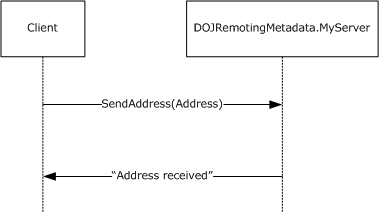

Figure 8: A sequence diagram for the preceding message exchange pattern

A dump of the request message is as follows.

0000 2E 4E 45 54 01 00 00 00 00 00 74 01 00 00 04 00 .NET......t.....

0010 01 01 22 00 00 00 74 63 70 3A 2F 2F 6D 61 68 65 .."...tcp://mahe

0020 73 68 64 65 76 32 3A 38 30 38 30 2F 4D 79 53 65 shdev2:8080/MySe

0030 72 76 65 72 2E 72 65 6D 06 00 01 01 18 00 00 00 rver.rem........

0040 61 70 70 6C 69 63 61 74 69 6F 6E 2F 6F 63 74 65 application/octe

0050 74 2D 73 74 72 65 61 6D 00 00 t-stream..

The interpretation of the preceding [**message frame**](#gt_message-frame) is as follows.

ProtocolIdentifier: 0x54454E2E

MajorVersion: 1 (0x1)

MinorVersion: 0 (0x0)

OperationType: Request (0x00)

ContentLength

ContentDistribution : ContentLength (0x00)

ContentLength: 314 (0x13A)

Header 1:

RequestUriHeader

HeaderToken: RequestUri (0x04)

DataType: CountedString (0x01)

StringEncoding: UTF8 (0x01)

UriValue : tcp://RemotingTestMachine:8080/MyServer.rem

Header 2:

ContentTypeHeader:

HeaderToken: ContentType (0x06)

DataType: CountedString (0x01)

ContentTypeValue: application/octet-stream

Header 3:

EndHeader:

HeaderToken: EndOfHeaders(0x00)

- The **OperationType** field indicates this is a Request message of a [**Two-Way Method**](#gt_two-way-method).
- The **ContentDistribution** field indicates that the [**message content**](#gt_message-content) is not chunked.
- The **ContentLength** field indicates the length of the message content in bytes.
- The RequestUriHeader header contains the [**Request URI**](#gt_request-uri) of the server.
- The ContentTypeHeader header indicates the format identifier to be binary [**serialization format**](#gt_serialization-format).
- The EndHeader header indicates the end of the headers and the message frame.

0000 00 01 00 00 00 FF FF FF FF 01 00 00 00 00 00 00 .....ÿÿÿÿ.......

0010 00 15 14 00 00 00 12 0B 53 65 6E 64 41 64 64 72 ........SendAddr

0020 65 73 73 12 6F 44 4F 4A 52 65 6D 6F 74 69 6E 67 ess.oDOJRemoting

0030 4D 65 74 61 64 61 74 61 2E 4D 79 53 65 72 76 65 Metadata.MyServe

0040 72 2C 20 44 4F 4A 52 65 6D 6F 74 69 6E 67 4D 65 r, DOJRemotingMe

0050 74 61 64 61 74 61 2C 20 56 65 72 73 69 6F 6E 3D tadata, Version=

0060 31 2E 30 2E 32 36 32 32 2E 33 31 33 32 36 2C 20 1.0.2622.31326,

0070 43 75 6C 74 75 72 65 3D 6E 65 75 74 72 61 6C 2C Culture=neutral,

0080 20 50 75 62 6C 69 63 4B 65 79 54 6F 6B 65 6E 3D PublicKeyToken=

0090 6E 75 6C 6C 10 01 00 00 00 01 00 00 00 09 02 00 null............

00A0 00 00 0C 03 00 00 00 51 44 4F 4A 52 65 6D 6F 74 .......QDOJRemot

00B0 69 6E 67 4D 65 74 61 64 61 74 61 2C 20 56 65 72 ingMetadata, Ver

00C0 73 69 6F 6E 3D 31 2E 30 2E 32 36 32 32 2E 33 31 sion=1.0.2622.31

00D0 33 32 36 2C 20 43 75 6C 74 75 72 65 3D 6E 65 75 326, Culture=neu

00E0 74 72 61 6C 2C 20 50 75 62 6C 69 63 4B 65 79 54 tral, PublicKeyT

00F0 6F 6B 65 6E 3D 6E 75 6C 6C 05 02 00 00 00 1B 44 oken=null......D

0100 4F 4A 52 65 6D 6F 74 69 6E 67 4D 65 74 61 64 61 OJRemotingMetada

0110 74 61 2E 41 64 64 72 65 73 73 04 00 00 00 06 53 ta.Address.....S

0120 74 72 65 65 74 04 43 69 74 79 05 53 74 61 74 65 treet.City.State

0130 03 5A 69 70 01 01 01 01 03 00 00 00 06 04 00 00 .Zip............

0140 00 11 4F 6E 65 20 4D 69 63 72 6F 73 6F 66 74 20 ..One Microsoft

0150 57 61 79 06 05 00 00 00 07 52 65 64 6D 6F 6E 64 Way......Redmond

0160 06 06 00 00 00 02 57 41 06 07 00 00 00 05 39 38 ......WA......98

0170 30 35 34 0B 054.

The interpretation of the preceding message content is as follows.

Binary Serialization Format

SerializationHeaderRecord:

BinaryHeaderEnum: SerializedStreamHeader (0x00)

TopId: 0 (0x0)

HeaderId: -1 (0xFFFFFFFF)

MajorVersion: 1 (0x1)

MinorVersion: 0 (0x0)

BinaryMethodCall:

BinaryHeaderEnum: BinaryMethodCall (0x15)

MessageEnum: 00000014

NoArgs: (...............................0)

ArgsInline: (..............................0.)

ArgsIsArray: (.............................1..)

ArgsInArray: (............................0...)

NoContext: (...........................1....)

ContextInline: (..........................0.....)

ContextInArray: (.........................0......)

MethodSignatureInArray: (........................0.......)

PropertyInArray: (.......................0........)

NoReturnValue: (......................0.........)

ReturnValueVoid: (.....................0..........)

ReturnValueInline: (....................0...........)

ReturnValueInArray: (...................0............)

ExceptionInArray: (..................0.............)

Reserved: (000000000000000000..............)

MethodName:

PrimitiveTypeEnum: String (0x12)

Data: SendAddress

TypeName:

PrimitiveTypeEnum: String (0x12)

Data: RemotingTest.MyServer, RemotingTest, Version=1.0.2616.21414,

Culture=neutral, PublicKeyToken=null

MethodCallArray:(ArraySingleObject)

BinaryHeaderEnum: ArraySingleObject (0x10)

ObjectId: 1 (0x01)

Length: 1 (0x1)

MemberReference:

BinaryHeaderEnum: MemberReference (0x09)

IdRef: 2 (0x02)

BinaryLibrary:

BinaryHeaderEnum: BinaryLibrary (0x0C)

AssemId: 3 (0x03)

LibraryString: LibraryString:RemotingTest,

Version=1.0.2621.26113, Culture=neutral, PublicKeyToken=null

ClassWithMembersAndTypes:

BinaryHeaderEnum: ClassWithMembersAndTypes (0x05)

ObjectId: 2 (0x02)

Name: RemotingTest.MyData

NumMembers: 4 (0x04)

MemberNames:

Data: Street

MemberNames:

Data: City

MemberNames:

Data: State

MemberNames:

Data: Zip

BinaryTypeEnumA:

String (0x01)

String (0x01)

String (0x01)

String (0x01)

AssemId: 3 (0x03)

BinaryObjectString:

BinaryHeaderEnum: BinaryObjectString (0x06)

ObjectId: 04 (0x04)

Length: 17 (0x11)

Value: One Microsoft Way

BinaryObjectString:

BinaryHeaderEnum: BinaryObjectString (0x06)

ObjectId: 05 (0x04)

Length: 7 (0x07)

Value: Redmond

BinaryObjectString:

BinaryHeaderEnum: BinaryObjectString (0x06)

ObjectId: 06 (0x04)

Length: 2 (0x02)

Value: WA

BinaryObjectString:

BinaryHeaderEnum: BinaryObjectString (0x06)

ObjectId: 07 (0x04)

Length: 5 (0x05)

Value: 98054

MessageEnd:

BinaryHeaderEnum: MessageEnd (0x11)

- The BinaryMethodCall record contains the [**Server Type**](#gt_server-type) name and the Remote Method name. The ArgsIsArray flag in the MessageEnum field indicates that the Arguments are passed as part of a MethodCallArray record. The NoContext flag in the MessageEnum field indicates that there is no CallContext that is sent as part of this message.
- The MethodCallArray record contains one entry for the only Argument.
- The MemberReference record provides a reference to the actual value.
- The BinaryLibrary record associates the Id value of 3 to the Library name RemotingTest, Version=1.0.2621.26113, Culture=neutral, PublicKeyToken=null.
- ClassWithMembersAndTypes record contains the [**Input Argument**](#gt_input-argument) passed. It lists the four Member names and their [**Remoting Types**](#gt_remoting-type) (all strings in this case).
- Four BinaryObjectString records contain the string values of the four [**Members**](#gt_member) (Street, City, State and Zip).
The message frame and the message content for the response message from the server are as follows.

0000 2E 4E 45 54 01 00 02 00 00 00 27 00 00 00 00 00 .NET......'.....

The interpretation of the preceding message frame is as follows.

ProtocolIdentifier: 54454E2E

MajorVersion: 1 (0x1)

MinorVersion: 0 (0x0)

OperationType: Response (0x02)

ContentLength

ContentDistribution : ContentLength (0x00)

ContentLength: 39 (0x27)

Header 1:

EndHeader:

HeaderToken: EndOfHeaders(0x00)

- The **OperationType** field indicates that this is a Response message of a Two-Way Method.
- The **ContentDistribution** field indicates that the message content is not chunked.
- The **ContentLength** field indicates the length of the message content in bytes.
- The EndHeader header indicates the end of the headers and the message frame.

0000 00 00 00 00 00 00 00 00 00 01 00 00 00 00 00 00 ................

0010 00 16 11 08 00 00 12 10 41 64 64 72 65 73 73 20 ........Address

0020 72 65 63 65 69 76 65 64 0B received.

The interpretation of the preceding message content is as follows.

Binary Serialization Format

SerializationHeaderRecord:

BinaryHeaderEnum: SerializedStreamHeader (0x00)

TopId: 0 (0x0)

HeaderId: 0 (0x0)

MajorVersion: 1 (0x1)

MinorVersion: 0 (0x0)

BinaryMethodReturn:

BinaryHeaderEnum: BinaryMethodReturn (0x16)

MessageEnum: 00000811

NoArgs: (...............................1)

ArgsInline: (..............................0.)

ArgsIsArray: (.............................0..)

ArgsInArray: (............................0...)

NoContext: (...........................1....)

ContextInline: (..........................0.....)

ContextInArray: (.........................0......)

MethodSignatureInArray: (........................0.......)

PropertyInArray: (.......................0........)

NoReturnValue: (......................0.........)

ReturnValueVoid: (.....................0..........)

ReturnValueInline: (....................1...........)

ReturnValueInArray: (...................0............)

ExceptionInArray: (..................0.............)

Reserved: (000000000000000000..............)

ReturnValue:

PrimitiveTypeEnum: String (0x12)

Data: Address received

ArgsCount: 0 (0x0)

MessageEnd:

BinaryHeaderEnum: MessageEnd (0x0B)

The BinaryMethodReturn record indicates that the message content is a response to a message. The NoArgs and the NoContext flags in the **MessageEnum** field indicate that there is no [**Output Arguments**](#gt_output-argument) or [**Call Context**](#gt_call-context) associated with this call. The ReturnValueInline flag in the **MessageEnum** field indicates that the [**Return Value**](#gt_return-value) is part of the Method Return record. The actual value is encoded as StringValueWithCode.

## 4.2 Two-Way Method Invocation Using SOAP Over HTTP

The next example shows the message trace using the [**SOAP**](#gt_soap) transport with HTTP. In this sample, the client invokes the SendAddress method defined in the [**Server Interface**](#gt_server-interface) RemotingTest.MyServer defined as follows.

namespace RemotingTest

{

interface MyServer

{

Address SendAddress(Array a, int I);

}

class Address

{

String Street;

String City;

String State;

String Zip;

}

}

The client invokes the method with the following values for the parameters:

a = new int[-1..8][4..5],

I = 42

The remoting server is a [**Single-Call SAO**](#gt_single-call-sao) at "http://RemotingMachine:8080/MyServer.soap".

The HTTP headers of the request message are shown as follows.

POST /MyServer.soap HTTP/1.1

User-Agent: Mozilla/4.0+(compatible; MSIE 6.0; Windows 6.0.6000.0; MS .NET

Remoting; MS .NET CLR 2.0.50727.1318 )

Content-Type: text/xml; charset="utf-8"

SOAPAction: "http://schemas.microsoft.com/clr/nsassem/

RemotingTest.MyServer/RemotingTest#DoIt"

Host: localhost:8080

Content-Length: 1582

Expect: 100-continue

Connection: Keep-Alive

The request is an HTTP/1.1 request. The HTTP headers are set as specified in the [Sending Request](#Section_1.7) subsection of [SOAP on HTTP](#Section_2.1.3.1). The "MyServer.soap" is the [**Server Object URI**](#gt_server-object-uri). The "http://schemas.microsoft.com/clr/nsassem/RemotingTest.MyServer/RemotingTest#DoIt" is the SOAPAction created from the name of the [**Remote Method**](#gt_remote-method) and the [**Server Type**](#gt_server-type) name as specified in [SOAP Action String (section 2.2.4.1)](#Section_2.2.4.1).

The body of the message is as follows.

<SOAP-ENV:Envelope

xmlns:xsi="http://www.w3.org/2001/XMLSchema-instance"

xmlns:xsd="http://www.w3.org/2001/XMLSchema"

xmlns:SOAP-ENC="http://schemas.xmlsoap.org/soap/encoding/"

xmlns:SOAP-ENV="http://schemas.xmlsoap.org/soap/envelope/"

xmlns:clr="http://schemas.microsoft.com/soap/encoding/clr/1.0"

SOAP-ENV:encodingStyle="http://schemas.xmlsoap.org/soap/encoding/">

<SOAP-ENV:Header>

<h3:__MethodSignature xsi:type="SOAP-ENC:methodSignature"

SOAP-ENC:root="1"

xmlns:h3="http://schemas.microsoft.com/clr/soap/messageProperties"

xmlns:a1="http://schemas.microsoft.com/clr/ns/System">

a1:Array xsd:int

</h3:__MethodSignature>

<h3:__CallContext href="#ref-4" SOAP-ENC:root="1"

xmlns:h3="http://schemas.microsoft.com/clr/soap/messageProperties" />

<a2:LogicalCallContext id="ref-4"

xmlns:a2="http://schemas.microsoft.com/clr/ns/System.Runtime.Remoting.Messaging">

<Hdr1 id="ref-5">HeaderValue</Hdr1>

</a2:LogicalCallContext>

</SOAP-ENV:Header>

<SOAP-ENV:Body>

<i6:DoIt id="ref-1"

xmlns:i6="http://schemas.microsoft.com/clr/nsassem/RemotingTest.MyServer/RemotingTest">

<a href="#ref-7"/>

*42*

</i6:DoIt>

<SOAP-ENC:Array id="ref-7"

SOAP-ENC:arrayType="xsd:int[10,2]" SOAP-ENC:offset="[-1,4]">

<item>0</item>

<item>0</item>

<item>0</item>

<item>0</item>

<item>0</item>

<item>0</item>

<item>0</item>

<item>0</item>

<item>0</item>

<item>0</item>

<item>0</item>

<item>0</item>

<item>0</item>

<item>0</item>

<item>0</item>

<item>0</item>

<item>0</item>

<item>0</item>

<item>0</item>

<item>0</item>

</SOAP-ENC:Array>

</SOAP-ENV:Body>

</SOAP-ENV:Envelope>

The message is a SOAP envelope. There are two SOAP headers: MethodSignature and CallContext. The MethodSignature header contains the string "a1:Array xsd:int", which is a list of qualified names as specified in [Mapping Remoting Data Model to SOAP Format (section 3.1.5.2)](#Section_3.1.5.2), subsection [Mapping Remote Method Invocation (section 3.1.5.2.1)](#Section_3.3.4.2). The CallContext header contains a single name-value pair encoded as specified in [Call Context SOAP Header (section 2.2.4.5)](#Section_2.2.4.5). The name is "Hdr1" and the value is "HeaderValue". The SOAP body consists of a single element called "DoIt" from the "http://schemas.microsoft.com/clr/nsassem/RemotingTest.MyServer/RemotingTest" namespace. The [**local name**](#gt_local-name) and the [**XML namespace**](#gt_xml-namespace) of this element are encoded as specified in the Windows behavior of [Method Name Encoding (section 2.2.4.3)](#Section_2.2.4.3). The Arguments "a" and "I" are represented by the two child elements of DoIt. [**Argument**](#gt_argument) "I" is a simple value (42). Argument "a" is a two-dimensional [**Array**](#gt_array) with the dimension of the first Array spanning from -1 to 8 (10 items) and the second Array spanning from 4 to 5 (2 items). The 20 items of the Array are encoded inside the Array element.

The server returns an instance of the Address Class as [**Return Value**](#gt_return-value) as follows:

Address.Street = "One Microsoft Way",

Address.City = "Redmond",

Address.State = "WA"

Address.Zip = "98054".

The HTTP headers of the reply message are shown as follows. The reply message is encoded as specified in the [Sending Reply](#Section_2.1.2.2.2) subsection under SOAP on HTTP (section 2.1.3.1). The StatusCode is 200. The Content-Type is text/xml;charset="utf-8" which is the [**SOAP Format Identifier**](#gt_soap-format-identifier).

Version=1.1, Status-Code=200, Reason-Phrase=OK.

Content-Length: 1497

Content-Type: text/xml; charset="utf-8"

Server: MS .NET Remoting, MS .NET CLR 2.0.50727.1318

The HTTP body of the reply message is given as follows. The body is a SOAP Envelope. The reply echoes the CallContext and MethodSignature headers. The SOAP body of the reply message contains a single element called DoItResponse. It is encoded as specified in the Windows behavior of Method Name Encoding (section 2.2.4.3). The element contains one child element called "return" that contains a reference to the Return Value. The Return Value is [**serialized**](#gt_serialize) under the "Address" element.

<SOAP-ENV:Envelope

xmlns:xsi="http://www.w3.org/2001/XMLSchema-instance"

xmlns:xsd="http://www.w3.org/2001/XMLSchema"

xmlns:SOAP-ENC="http://schemas.xmlsoap.org/soap/encoding/"

xmlns:SOAP-ENV="http://schemas.xmlsoap.org/soap/envelope/"

xmlns:clr="http://schemas.microsoft.com/soap/encoding/clr/1.0"

SOAP-ENV:encodingStyle="http://schemas.xmlsoap.org/soap/encoding/">

<SOAP-ENV:Header>

<h3:__MethodSignature xsi:type="SOAP-ENC:methodSignature"

SOAP-ENC:root="1"

xmlns:h3="http://schemas.microsoft.com/clr/soap/messageProperties"

xmlns:a1="http://schemas.microsoft.com/clr/ns/System">

a1:Array xsd:int

</h3:__MethodSignature>

<h3:__CallContext href="#ref-4"

xmlns:h3="http://schemas.microsoft.com/clr/soap/messageProperties"

SOAP-ENC:root="1"/>

<a2:LogicalCallContext id="ref-4"

xmlns:a2="http://schemas.microsoft.com/clr/ns/System.Runtime.Remoting.

Messaging">

<Hdr1 id="ref-5">HeaderValue</Hdr1>

</a2:LogicalCallContext>

</SOAP-ENV:Header>

<SOAP-ENV:Body>

<i6:DoItResponse id="ref-1"

xmlns:i6="http://schemas.microsoft.com/clr/nsassem/RemotingTest.MyServer/

RemotingTest">

<return href="#ref-8"/>

</i6:DoItResponse>

<a3:Address id="ref-8" xmlns:a3="http://schemas.microsoft.com/clr/

nsassem/RemotingTest/RemotingTest%2C%20Version%3D1.0.0.0%2C%20Culture%

3Dneutral%2C%20PublicKeyToken%3Dnull">

<Street id="ref-9">One Microsoft Way</Street>

<City id="ref-10">Redmond</City>

<State id="ref-11">WA</State>

<Zip id="ref-12">98052</Zip>

</a3:Address>.

</SOAP-ENV:Body>

</SOAP-ENV:Envelope>

## 4.3 Faults in SOAP Over HTTP

If the Remoting Method implementation of "DoIt" throws an [**Exception**](#gt_exception), then it is returned to the client as a [**SOAP**](#gt_soap) fault. The [**HTTP**](#gt_hypertext-transfer-protocol-http) headers of the reply message are shown in the following code example. The reply message is encoded as specified in [Sending Reply (section 2.1.3.1.2.2)](#Section_2.1.2.2.2) under [SOAP on HTTP (section 2.1.3.1)](#Section_2.1.3.1). The Status-Code is 500. The Content-Type is text/xml;charset="utf-8" which is the [**SOAP Format Identifier**](#gt_soap-format-identifier).

Version=1.1, Status-Code=500, Reason-Phrase=Internal Server Error.Content-Length: 2312

Content-Type: text/xml; charset="utf-8"

Server: MS .NET Remoting, MS .NET CLR 2.0.50727.1318

The HTTP body of the reply message is given in the following sample. The body is a SOAP Envelope. The reply echoes the CallContext and MethodSignature headers. The SOAP body of the reply message contains the SOAP Fault element. It is encoded as specified in [Mapping Exception (section 3.1.5.2.11)](#Section_3.1.5.2.11). The faultcode value of SOAP-ENV:Server conveys the fault is on the server side. The faultstring contains the Exception message thrown by the application. The detail value consists of the [**serialized**](#gt_serialize) instance of the Exception. The other elements—exceptionType, message, and stackTrace—have null values. The structure of the serialized Exception message can be found in [SystemException (section 2.2.2.9)](#Section_2.2.2.8).

<SOAP-ENV:Envelope

xmlns:xsi="http://www.w3.org/2001/XMLSchema-instance"

xmlns:xsd="http://www.w3.org/2001/XMLSchema"

xmlns:SOAP-ENC="http://schemas.xmlsoap.org/soap/encoding/"

xmlns:SOAP-ENV="http://schemas.xmlsoap.org/soap/envelope/"

xmlns:clr="http://schemas.microsoft.com/soap/encoding/clr/1.0"

SOAP-ENV:encodingStyle="http://schemas.xmlsoap.org/soap/encoding/">

<SOAP-ENV:Header>

<h4:__CallContext href="#ref-3"

xmlns:h4="http://schemas.microsoft.com/clr/soap/

messageProperties"

SOAP-ENC:root="1"/>

<a1:LogicalCallContext id="ref-3"

xmlns:a1="http://schemas.microsoft.com/clr/ns/System.Runtime.

Remoting.Messaging">

<Hdr1 id="ref-5">HeaderValue</Hdr1>

</a1:LogicalCallContext>

</SOAP-ENV:Header>

<SOAP-ENV:Body>

<SOAP-ENV:Fault id="ref-1">

<faultcode id="ref-6">SOAP-ENV:Server</faultcode>

<faultstring id="ref-7">

**** System.Exception - Invalid Arguments

</faultstring>

<detail xsi:type="a2:ServerFault"

xmlns:a2="http://schemas.microsoft.com/clr/ns/System.Runtime.

Serialization.Formatters">

<exceptionType xsi:null="1"/>

<message xsi:null="1"/>

<stackTrace xsi:null="1"/>

<exception href="#ref-8"/>

</detail>

</SOAP-ENV:Fault>

<a3:Exception id="ref-8"

xmlns:a3="http://schemas.microsoft.com/clr/ns/System">

<ClassName id="ref-9">System.Exception</ClassName>

<Message id="ref-10">Invalid Arguments</Message>

<InnerException xsi:null="1"/>

<HelpURL xsi:null="1"/>

<StackTraceString id="ref-11">

at RemotingTest.MyServer.DoIt(Array a, Int32 I) in

C:\temp\RemotingTest\RemotingSinkTest\RemotingTest\Program.cs:line 245

at System.Runtime.Remoting.Messaging.StackBuilderSink.

_PrivateProcessMessage(IntPtr md, Object[] args, Object server,

Int32 methodPtr, Boolean fExecuteInContext, Object[] outArgs)

at System.Runtime.Remoting.Messaging.StackBuilderSink.

SyncProcessMessage(IMessage msg, Int32 methodPtr, Boolean

fExecuteInContext)

</StackTraceString>

<RemoteStackTraceString xsi:null="1"/>

<RemoteStackIndex>0</RemoteStackIndex>

<ExceptionMethod id="ref-12">8.DoIt.RemotingTest,

Version=1.0.0.0, Culture=neutral, PublicKeyToken=null.RemotingTest.

MyServer.RemotingTest.Method1 DoIt(System.Array, Int32)</ExceptionMethod>

<HResult>-2146233079</HResult>

<Source id="ref-13">RemotingTest</Source>

</a3:Exception>

</SOAP-ENV:Body>

</SOAP-ENV:Envelope>

## 4.4 One-Way Method Invocation Using SOAP Over TCP

The SOAP envelope is constructed in the same way as SOAP over HTTP. However, a TCP [**message frame**](#gt_message-frame) is used as specified in the [Sending Request](#Section_2.1.1.1.1) subsection under the [SOAP on TCP](#Section_2.1.3.2) section.

The TCP message frame for a [**One-Way Method**](#gt_one-way-method) with SOAP payload is as follows.

0000 2E 4E 45 54 01 00 01 00 00 00 52 02 00 00 04 00 .NET......R.....

0010 01 01 22 00 00 00 74 63 70 3A 2F 2F 6D 61 68 65 .."...tcp://mahe

0020 73 68 64 65 76 32 3A 38 30 38 30 2F 4D 79 53 65 shdev2:8080/MySe

0030 72 76 65 72 2E 72 65 6D 06 00 01 01 19 00 00 00 rver.rem........

0040 74 65 78 74 2F 78 6D 6C 3B 20 63 68 61 72 73 65 text/xml; charse

0050 74 3D 22 75 74 66 2D 38 22 01 00 01 0A 00 00 00 t="utf-8".......

0060 53 4F 41 50 41 63 74 69 6F 6E 01 64 00 00 00 22 SOAPAction.d..."

0070 68 74 74 70 3A 2F 2F 73 63 68 65 6D 61 73 2E 6D http://schemas.m

0080 69 63 72 6F 73 6F 66 74 2E 63 6F 6D 2F 63 6C 72 icrosoft.com/clr

0090 2F 6E 73 61 73 73 65 6D 2F 44 4F 4A 52 65 6D 6F /nsassem/DOJRemo

00A0 74 69 6E 67 4D 65 74 61 64 61 74 61 2E 4D 79 53 tingMetadata.MyS

00B0 65 72 76 65 72 2F 44 4F 4A 52 65 6D 6F 74 69 6E erver/DOJRemotin

00C0 67 4D 65 74 61 64 61 74 61 23 53 61 79 48 65 6C gMetadata#SayHel

00D0 6C 6F 22 00 00 lo"..

The interpretation of the preceding trace is as follows.

ProtocolIdentifier: 0x54454E2E

MajorVersion: 1 (0x1)

MinorVersion: 0 (0x0)

OperationType: OneWay (0x01)

ContentLength

ContentDistribution : Not Chunked (0x01)

ContentLength: 594 (0x252)

Header 1

RequestUriHeader

HeaderToken : RequestUri (0x04)

DataType : CountedString (0x01)

UriValue: tcp://maheshdev2:8080/MyServer.rem

Header 2:

ContentTypeHeader

HeaderToken: ContentType (0x06)

DataType : CountedString (0x01)

ContentTypeValue : text/xml; charset="utf-8"

Header 3:

Custom Header

StringEncoding: UTF8 (0x01)

Name: SOAPAction

StringEncoding: UTF8 (0x01)

Value: "http://schemas.microsoft.com/clr/nsassem/

DOJRemotingMetadata.MyServer/

DOJRemotingMetadata#SayHello"

Header 3:

EndHeader:

HeaderToken: EndOfHeaders(0x00)

The key field to note for a One-Way Method request is the **OperationType** field. It contains a value of 1 indicating the request as One-Way. Because the payload is SOAP, the content-type is text/xml and the message frame has a custom header for SOAPAction.

## 4.5 One-Way Method Invocation Using HTTP-Binary

The binary [**message content**](#gt_message-content) of [**HTTP**](#gt_hypertext-transfer-protocol-http) with binary is constructed the same way as TCP with binary as shown in the [Two-Way Method Invocation Using TCP-Binary](#Section_4.1) section. However, the **message frame** is made of HTTP headers as specified in the [Sending Request](#Section_2.1.1.1.1) subsection under the [HTTP Transport](#Section_2.1) section.

The HTTP headers for a [**One-Way Method**](#gt_one-way-method) with Binary payload is shown as follows.

POST /MyServer.soap HTTP/1.1

User-Agent: Mozilla/4.0+(compatible; MSIE 6.0; Windows 6.0.6000.0;

MS .NET Remoting; MS .NET CLR 2.0.50727.1318 )

Content-Type: application/octet-stream

Host: localhost:8080

Content-Length: 607

Expect: 100-continue

Connection: Keep-Alive

The HTTP request header "Content-Type" contains "application/octet-stream" indicating that the payload is binary. For HTTP there is no field in the request headers to indicate that the request is One-Way.

The server returns an HTTP response with a Status-Code of 202, as follows.

Version=1.1, Status-Code=202, Reason-Phrase=Accepted.

Content-Length: 0

Server: MS .NET Remoting, MS .NET CLR 2.0.50727.1318

# 5 Security

## 5.1 Security Considerations for Implementers

As specified in [MS-NRBF](../MS-NRBF/MS-NRBF.md), the .NET Remoting Binary Format has constructs that could lead to security attacks. Such attacks are also possible in the [**SOAP**](#gt_soap) encoding, where the [**Array**](#gt_array) sizes can be specified in the wire. To mitigate these attacks, it is recommended that implementers consider building implementations that use or encourage the use of HTTPS and that enforce use of [**HTTP**](#gt_hypertext-transfer-protocol-http) [**authentication**](#gt_authentication) or TCP with authentication and encryption (as specified in [MS-NNS](../MS-NNS/MS-NNS.md)). Alternatively, an implementation can allow the higher layer to configure an upper limit for the size.

The .NET Remoting Protocol allows [**Server Objects**](#gt_server-object) to be marshaled transparently when a graph of [**Data Values**](#gt_data-value) containing a Server Object is sent across. This inadvertent exposing of new service endpoints can result in security issues. To mitigate such attacks, it is recommended that implementers consider building implementations that require explicit opt-in by the application to enable the transparent marshaling.

[**De-serialization**](#gt_6c5144b9-bdbd-4c6a-b544-309486392879) results in the creation of an instance of a [**Remoting Type**](#gt_remoting-type) whose information is provided in the [**message content**](#gt_message-content). It might be unsafe to create an instance of certain Remoting Types. It is recommended that an implementation protect against attacks in which the message content includes unsafe Remoting Types. Such attacks can be mitigated by authentication. Alternatively, an implementation can allow the higher layer to configure a list of Remoting Types in an implementation-specific way and disallow de-serialization of any Remoting Type that is not in the list.

## 5.2 Index of Security Parameters

| Security parameter | Section |
| --- | --- |
| TCP [**authentication**](#gt_authentication) | [TCP Transport (section 2.1.1)](#Section_2.1.1) |
| [**HTTP**](#gt_hypertext-transfer-protocol-http) authentication | [HTTP Transport (section 2.1.2)](#Section_2.1) |
| HTTPS | HTTP Transport (section 2.1.2) |

# 6 Appendix A: Product Behavior

The information in this specification is applicable to the following Microsoft products or supplemental software. References to product versions include updates to those products.

This document specifies version-specific details in the Microsoft .NET Framework. The following versions of .NET Framework are available in the following released Windows product or as supplemental software, see [MS-NETOD](#Section_1.3) section 4.

The terms "earlier" and "later", when used with a product version, refer to either all preceding versions or all subsequent versions, respectively. The term "through" refers to the inclusive range of versions. Applicable Microsoft products are listed chronologically in this section.

- Microsoft .NET Framework 1.0
- Microsoft .NET Framework 2.0
- Microsoft .NET Framework 3.0
- Microsoft .NET Framework 3.5
- Microsoft .NET Framework 4.0
- Microsoft .NET Framework 4.5
- Microsoft .NET Framework 4.6
- Microsoft .NET Framework 4.7
- Microsoft .NET Framework 4.8
Exceptions, if any, are noted in this section. If an update version, service pack or Knowledge Base (KB) number appears with a product name, the behavior changed in that update. The new behavior also applies to subsequent updates unless otherwise specified. If a product edition appears with the product version, behavior is different in that product edition.

Unless otherwise specified, any statement of optional behavior in this specification that is prescribed using the terms "SHOULD" or "SHOULD NOT" implies product behavior in accordance with the SHOULD or SHOULD NOT prescription. Unless otherwise specified, the term "MAY" implies that the product does not follow the prescription.

<1> Section 1.3.2: Windows allows applications to plug in extensions called Envoy Sinks that are run when a [**Remote Method**](#gt_remote-method) is invoked. The actual interface of the extension is beyond the scope of this protocol. Windows uses the [**Envoy Sink Information**](#gt_envoy-sink-information) to send a list of Envoy Sinks from the server to the client to carry out any client-side behavior such as validating parameters. If there is no application-provided data, this field is a NullObject in Windows.

<2> Section 2.1.1.1.1: Windows maintains a pool of connections for a given ServerObject (identified by its address). Each pool has a receive time-out and a connection time-out. Connections are preserved until the connection time-out expires. A new connection is created if there are no cached connections or if the connection is configured to do [**SPNEGO**](#gt_simple-and-protected-gss-api-negotiation-mechanism-spnego) [**authentication**](#gt_authentication).

<3> Section 2.1.1.1.1: Windows never writes chunked messages. However, it can consume chunked messages.

<4> Section 2.1.1.1.1: Windows with .NET Framework 1.0 or Microsoft .NET Framework 1.1 retransmits a message once upon failure. Windows with .NET Framework 2.0 and later versions allows users to configure the number of retransmissions. The default count is 1.

<5> Section 2.1.1.1.2: A Receive time-out can be configured by the higher layer.

<6> Section 2.1.1.2.1: If the serialization format is SOAP, then the SOAPAction in the [CustomHeader](#Section_2.2.3.3.3.2) of a request message is processed as specified in the first Windows behavior note in section [3.2.5.1.4](#Section_3.2.5.1.4).

<7> Section 2.1.1.2.2: Windows never writes chunked messages. However, it can consume chunked messages.

<8> Section 2.1.2.1.1: In Windows the client always sends request in [**HTTP**](#gt_hypertext-transfer-protocol-http)/1.1. The request has the following request headers set:

- Host request header is set to the host and the port number of the server.
- Expect request header is set to 100-continue.
- Connection request header is set to Keep-Alive.
<9> Section 2.1.2.1.1: **IPv6 address** is supported only on .NET Framework 2.0 and later versions.

<10> Section 2.1.2.1.1: Windows sets the User-Agent to "Mozilla/4.0+(compatible; MSIE 6.0; Windows <Windows-Ver>; MS .NET Remoting; MS .NET CLR <.NET-Ver> )" where "Windows-Ver" refers to the version of Windows and ".NET-Ver" refers to the version of .NET Framework.

<11> Section 2.1.2.1.1: Windows never sends messages by using chunked transfer coding.

<12> Section 2.1.2.1.2: The response time-out can be configured by the higher layer.

<13> Section 2.1.2.1.2: Windows supports HTTP redirection (status code specified in [[RFC2616]](https://go.microsoft.com/fwlink/?LinkId=90372) section 10.3). The higher layer can configure to disable HTTP redirection. If disabled, the higher layer is notified of the error. The informational codes (the status code specified in section [RFC2616] 10.1) are handled as specified in [RFC2616] and are not propagated to the higher layer.

<14> Section 2.1.3.1.1.1: Windows sets the User-Agent to "Mozilla/4.0+(compatible; MSIE 6.0; Windows <Windows-Ver>; MS .NET Remoting; MS .NET CLR <.NET-Ver> )" where "Windows-Ver" refers to the version of Windows and ".NET-Ver" refers to the version of .NET Framework.

<15> Section 2.1.3.1.1.2: Windows supports HTTP redirection (status code specified in [RFC2616] section 10.3). The higher layer can configure to disable HTTP redirection. If disabled, the higher layer is notified of the error. The informational codes (status code specified in [RFC2616] section 10.1) are handled as specified in [RFC2616] and are not propagated to the higher layer.

<16> Section 2.2.1.2: TypeParameterList is always empty in .NET Framework 1.0 and .NET Framework 1.1.

<17> Section 2.2.2.7: This field is localized in Windows.

<18> Section 2.2.2.7: The Data field is present only in .NET Framework 2.0 and later versions.

<19> Section 2.2.2.12: A UnityType value of 8 is valid only in .NET Framework 2.0 and later versions.

<20> Section 2.2.2.13: The **GenericArguments** field is present only in .NET Framework 2.0 and later versions.

<21> Section 2.2.2.15: Windows names the target [**Member**](#gt_member) as specified by the following format.

| Format for target Member name | Column 2 | Column 3 |
| --- | --- | --- |
| TargetMemberName | = | 'Target' Index |
| Index | = | 1*('0'-'9') |

For a given [DelegateSerializationHolder](#Section_2.2.2.15), the Index value starts from 0 and increases by 1 for each target Member. The Index value matches the index of the [DelegateEntry](#Section_2.2.2.14) for the Remote Method in the linked list.

<22> Section 2.2.2.15: The Method Member is present only in .NET Framework 2.0 and later versions.

<23> Section 2.2.3.2.2: IPv6 addresses are supported only on .NET Framework 2.0 and later versions.

<24> Section 2.2.3.3: Windows never writes chunked messages. However, it can consume chunked messages.

<25> Section 2.2.4.1: Windows allows the application to associate a [**SOAP**](#gt_soap) action with a Remote Method. In the absence of such an association, Windows derives SOAPAction from the Remote Method name by concatenating the [**XML namespace**](#gt_xml-namespace) of the [**Server Type**](#gt_server-type) and the Remote Method name separated by a number sign ('#').

SoapAction = XML namespace of Server Type '#' Remote Method Name where XML namespace of a Server Type is constructed as specified in section [Remoting Type Name Encoding](#Section_2.2.4.2).

<26> Section 2.2.4.2: Windows allows the application to associate an XML namespace and a [**local name**](#gt_local-name) with a [**Remoting Type**](#gt_remoting-type). In the absence of such an association, Windows derives the qualified name from the Remoting Type name and the [**Library**](#gt_library) name.

If the Library name of the Remoting Type is "mscorlib", then the XML namespace is defined as follows.

| XML namespace definition | Column 2 | Column 3 |
| --- | --- | --- |
| SystemNamespace | = | CLRNSPREFIX '/' ClrNamespace( [TypeName](#Section_2.2.1.2) ) |
| CLRNSPREFIX | = | 'http://schemas.microsoft.com/clr/ns' |
| ClrNamespace( TypeName ) | = | ClrNamespace nonterminal token in TypeName in the [Common Patterns](#Section_2.2.1) section |

If the Library name of the Remoting Type is not "mscorlib", then the XML namespace is defined by using the ABNF syntax specified in [[RFC4234]](https://go.microsoft.com/fwlink/?LinkId=90462) as follows.

| XML namespace definition | Column 2 | Column 3 |
| --- | --- | --- |
| NonSystemNamespace | = | CLRNSASSEMPREFIX '/' ClrNamespace( TypeName ) '/' UriEncoded( [LibraryName](#Section_2.2.1.3) ) |
| CLRNSASSEMPREFIX | = | 'http://schemas.microsoft.com/clr/nsassem' |
| ClrNamespace( TypeName ) | = | ClrNamespace nonterminal token in TypeName in the Common Patterns section |
| UriEncoded(LibraryName ) | = | LibraryName as defined in the Common Patterns section with characters ' ' (SPACE) replaced with '%20', '=' replaced with '%3D' and ',' replaced with '%2C' |

If the application did not explicitly define it, the local name is defined by the LocalName nonterminal token in TypeName in the Common Patterns section.

<27> Section 2.2.4.3: Windows allows the application to associate an XML namespace and a local name for the request and response. In the absence of such an association, Windows derives the XML namespace from the Server Type name and the Library name by using the ABNF syntax defined in [RFC4234], specified as follows.

| How Windows derives an XML namespace from the Server Type name and the Library name | Column 2 | Column 3 |
| --- | --- | --- |
| MethodNamespace | = | CLRNSASSEMPREFIX '/' ClrNamespace( TypeName ) '/' LibraryIdentifier( LibraryName) '/' LocalName( ) '/' LocalName( TypeName ) |
| CLRNSASSEMPREFIX | = | 'http://schemas.microsoft.com/clr/nsassem' |
| ClrNamespace( TypeName ) | = | ClrNamespace nonterminal token in TypeName in the Common Patterns section |
| LibraryIdentifier ( LibraryName ) | = | The LibraryIdentifier nonterminal token in LibraryName as defined in the Common Patterns section |
| LocalName( TypeName ) | = | The LocalName nonterminal token in TypeName in the Common Patterns section |

The LocalName of the request is the same as the name of the Remote Method.

The LocalName of the response is the name of the request appended with the string "Response".

<28> Section 2.2.5: TypeArgumentList is always empty in .NET Framework version 1.0 and .NET Framework version 1.1.

<29> Section 3.1.1: In Windows a Library is called an assembly.

<30> Section 3.1.1: The name of the [**System Library**](#gt_system-library) in Windows is "mscorlib".

<31> Section 3.1.1: In .NET Framework 1.0 and .NET Framework 1.1, the DateTime value supports only Unspecified. UTC and Local are supported only in .NET Framework 2.0 and later versions.

<32> Section 3.1.1: In Windows, the [**Generic Remote Method**](#gt_generic-remote-method) is supported only on .NET Framework 2.0 and later versions.

<33> Section 3.1.5.1.1: Windows allows extensions of its implementation to participate in the serialization of a message. It allows the extensions to provide a collection of DictionaryEntry items that are [**serialized**](#gt_serialize) as [**Message Properties**](#gt_message-properties).

<34> Section 3.1.5.1.2: Windows allows extensions of its implementation to participate in the serialization of a message. It allows the extensions to provide a collection of DictionaryEntry items that are serialized as Message Properties.

<35> Section 3.1.5.1.6: Windows always writes using the ClassWithMembersAndTypes for [**Classes**](#gt_class) that are not in the System Library. Windows can read all the versions. Windows uses the ClassWithId record to write subsequent instances of a Class unless the Members that are serialized vary from one instance to another; in that case, Windows uses the Class records with Member information.

<36> Section 3.1.5.1.6: Windows always writes using the SystemClassWithMembersAndTypes for classes that are in the System Library and ClassWithMembersAndTypes for Classes that are not in the System Library. Windows can read all the versions. Windows uses the ClassWithId record to write subsequent instances of a Class unless the Members that are serialized vary from one instance to another; in that case, Windows uses the Class records with Member information.

<37> Section 3.1.5.1.7: Windows always writes:

- ArraySingleString for single-dimensional string [**Arrays**](#gt_array) with a lower bound of 0.
- ArraySinglePrimitive for single-dimensional primitive Arrays with a lower bound of 0.
- ArraySingleObject for single-dimensional [**System.Object**](#gt_systemobject) Arrays with a lower bound of 0.
<38> Section 3.1.5.2.1: Windows allows extensions of its implementation to participate in the serialization of a message. Windows allows the extensions to provide a collection of name-value pairs. The name is written as the local name of the header element. The namespace of the header element is "http://schemas.microsoft.com/clr/soap/messageProperties". The value is encoded as specified in [Mapping Remoting Data Model to SOAP Format (section 3.1.5.2)](#Section_3.1.5.2).

<39> Section 3.1.5.2.2: Windows allows extensions of its implementation to participate in the serialization of a message. It allows the extensions to provide a collection of name-value pairs. The name is written as the local name of the header element. The namespace of the header element is "http://schemas.microsoft.com/clr/soap/messageProperties". The value is encoded as specified in the Data Values Encoding section.

<40> Section 3.1.5.2.2: Windows gets the name of the response struct (child of the SOAP Body element in the response message) by appending the name of the request struct (child of the SOAP Body element in the request message) with the string "Response". The name of the Return Value accessor in Windows is "return".

<41> Section 3.1.5.2.11: Windows server implementation never writes the **faultactor** field. However it can consume a SOAP fault message with the **faultactor** field present.

<42> Section 3.1.5.3: Windows chooses a [**Channel URI**](#gt_channel-uri) based on the registered schemes specified in [Creating Proxy from Request URI and Server Type (section 3.3.4.1.1)](#Section_3.3.4.1.1). It picks the first Channel URI whose scheme is registered in the client **Channel Table**.

<43> Section 3.2.5.1.4: The Windows mechanism for binding to a Remote Method is as follows:

If there is no method in the Server Type with the Remote Method name that was [**de-serialized**](#gt_6c5144b9-bdbd-4c6a-b544-309486392879), then a RemotingException is constructed as specified in the [Constructing a Remoting Exception (section 3.2.5.1.7.2)](#Section_3.2.5.1.7.2) section and the [**Exception**](#gt_exception) is sent back to the client.

If there is more than one Remote Method in the Server Type with the given name, Windows uses the [**Method Signature**](#gt_method-signature) de-serialized to disambiguate. For each of the matching Remote Methods, the Remoting Types in the Method Signature are checked against the Remoting Type of the Remote Method's Argument. If all the Remoting Types match, then the Remote Method is chosen. If no Remote Method matches the Method Signature or if there are multiple matches and no Method Signature, then a RemotingException is constructed as specified in the Constructing a Remoting Exception (section 3.2.5.1.7.2) section, and the Exception is sent back to the client.

When using the SOAP protocol, if the [**Message Frame**](#gt_message-frame) has a SOAP-Action header then the SOAP-Action is compared with the SOAP-Action inferred for the Remote Method as specified in the [SOAP Action String (section 2.2.4.1)](#Section_2.2.4.1) section. If they do not match, then a RemotingException is constructed as specified in the Constructing a Remoting Exception (section 3.2.5.1.7.2) section and the Exception is sent back to the client.

<44> Section 3.2.5.1.4: The Server Object is a CLR object whose type is Server Type and the Remote Method maps to a method in the Class. The Array of [**Data Values**](#gt_data-value) is passed as parameters to the method. The CallContext is passed as thread-specific CallContext values in the CLR.

<45> Section 3.2.5.1.5.3: Windows generates unique [**Server Object URIs**](#gt_server-object-uri) as shown in the following table.

| Format of the dynamically generated Server Object URI | Column 2 | Column 3 |
| --- | --- | --- |
| ServerObjectURI | = | GuidPart '/ 'BytesPart '_' SequenceId '.rem' |
| GuidPart | = | 8*8(HEXDIGIT) 3*3 ('_' 4*4(HEXDIGHT)) '_' 12*12(HEXDIGIT) |
| BytesPart | = | 24 * 24 (DIGIT / ('A'-'Z') / ('a'-'z') / '+' / '_') |
| SequenceId | = | 1*10(DIGIT) |

The GuidPart is a string representation of a GUID with '-' replaced by '_'. Windows uses the same GUID for all the Server Object URIs hosted in an [**AppDomain**](#gt_appdomain). The BytePart consists of 18 randomly generated bytes that are [**Base64**](#gt_179b9392-9019-45a3-880b-26f6890522b7) encoded. The bytes are generated for every [**Marshaled Server Object**](#gt_marshaled-server-object-mso). SequenceId is an integer ranging from -2,147,483,648 to 2,147,483,647. It starts from 1 and is incremented for every Marshaled Server Object. Incrementing SequenceId value from 2,147,483,647 wraps it to be -2,147,483,648.

<46> Section 3.2.5.1.7.1: Windows populates the **Message** field with a localized text message describing the error. The StackTraceString contains text describing the call stack from where the Exception is thrown. The RemoteStackTraceString is NullObject. RemoteStackIndex is 0. ExceptionMethod contains text that lists the Method name, Library name and Remoting Type name. Source contains text representing the name of the Application.

<47> Section 3.2.5.1.7.2: Windows populates the **Message** field with a localized text message describing the error. The StackTraceString contains text describing the call stack from where the Exception is thrown. The RemoteStackTraceString is NullObject. RemoteStackIndex is 0. ExceptionMethod contains text that lists the Method Name, Library name, and Remoting Type name. Source contains text representing the name of the Application.

<48> Section 3.3.4.2.1: Windows constructs a MethodSignature when there is more than one method with the same name in a Server Type. In this case the MethodSignature is used to disambiguate the methods.

# 7 Change Tracking

This section identifies changes that were made to this document since the last release. Changes are classified as Major, Minor, or None.

The revision class **Major** means that the technical content in the document was significantly revised. Major changes affect protocol interoperability or implementation. Examples of major changes are:

- A document revision that incorporates changes to interoperability requirements.
- A document revision that captures changes to protocol functionality.
The revision class **Minor** means that the meaning of the technical content was clarified. Minor changes do not affect protocol interoperability or implementation. Examples of minor changes are updates to clarify ambiguity at the sentence, paragraph, or table level.

The revision class **None** means that no new technical changes were introduced. Minor editorial and formatting changes may have been made, but the relevant technical content is identical to the last released version.

The changes made to this document are listed in the following table. For more information, please contact [dochelp@microsoft.com](mailto:dochelp@microsoft.com).

| Section | Description | Revision class |
| --- | --- | --- |
| [3.1.5.1.11](#Section_3.1.5.1.11) Mapping String Values | 9220 : Added a reference to [MS-NRBF] section 2.2.2.2 for information about serializing string values for inline arguments in a BinaryMethodCall or BinaryMethodReturn record. | Major |
| [3.1.5.1.12](../MS-NRBF/MS-NRBF.md) Mapping Null Object | 9220 : Added a reference to [MS-NRBF] section 2.2.2.1 for information about serializing a Null Object for inline arguments in a BinaryMethodCall or BinaryMethodReturn record. | Major |
| [6](#Section_6) Appendix A: Product Behavior | Added .NET Framework v4.8 to the applicability list. | Major |

## Revision History

| Date | Version | Revision Class | Comments |
| --- | --- | --- | --- |
| 7/20/2007 | 0.1 | Major | MCPP Milestone 5 Initial Availability |
| 9/28/2007 | 1.0 | Major | Updated and revised the technical content. |
| 10/23/2007 | 1.0.1 | Editorial | Changed language and formatting in the technical content. |
| 11/30/2007 | 2.0 | Major | Added and updated sections. |
| 1/25/2008 | 2.0.1 | Editorial | Changed language and formatting in the technical content. |
| 3/14/2008 | 2.0.2 | Editorial | Changed language and formatting in the technical content. |
| 5/16/2008 | 2.0.3 | Editorial | Changed language and formatting in the technical content. |
| 6/20/2008 | 3.0 | Major | Updated and revised the technical content. |
| 7/25/2008 | 4.0 | Major | Updated and revised the technical content. |
| 8/29/2008 | 4.1 | Minor | Clarified the meaning of the technical content. |
| 10/24/2008 | 5.0 | Major | Updated and revised the technical content. |
| 12/5/2008 | 5.1 | Minor | Clarified the meaning of the technical content. |
| 1/16/2009 | 6.0 | Major | Updated and revised the technical content. |
| 2/27/2009 | 6.1 | Minor | Clarified the meaning of the technical content. |
| 4/10/2009 | 6.1.1 | Editorial | Changed language and formatting in the technical content. |
| 5/22/2009 | 6.1.2 | Editorial | Changed language and formatting in the technical content. |
| 7/2/2009 | 6.1.3 | Editorial | Changed language and formatting in the technical content. |
| 8/14/2009 | 6.1.4 | Editorial | Changed language and formatting in the technical content. |
| 9/25/2009 | 6.2 | Minor | Clarified the meaning of the technical content. |
| 11/6/2009 | 6.2.1 | Editorial | Changed language and formatting in the technical content. |
| 12/18/2009 | 6.3 | Minor | Clarified the meaning of the technical content. |
| 1/29/2010 | 6.4 | Minor | Clarified the meaning of the technical content. |
| 3/12/2010 | 7.0 | Major | Updated and revised the technical content. |
| 4/23/2010 | 8.0 | Major | Updated and revised the technical content. |
| 6/4/2010 | 8.0.1 | Editorial | Changed language and formatting in the technical content. |
| 7/16/2010 | 9.0 | Major | Updated and revised the technical content. |
| 8/27/2010 | 9.0 | None | No changes to the meaning, language, or formatting of the technical content. |
| 10/8/2010 | 9.0 | None | No changes to the meaning, language, or formatting of the technical content. |
| 11/19/2010 | 9.0 | None | No changes to the meaning, language, or formatting of the technical content. |
| 1/7/2011 | 10.0 | Major | Updated and revised the technical content. |
| 2/11/2011 | 10.0 | None | No changes to the meaning, language, or formatting of the technical content. |
| 3/25/2011 | 10.0 | None | No changes to the meaning, language, or formatting of the technical content. |
| 5/6/2011 | 10.0 | None | No changes to the meaning, language, or formatting of the technical content. |
| 6/17/2011 | 10.1 | Minor | Clarified the meaning of the technical content. |
| 9/23/2011 | 10.1 | None | No changes to the meaning, language, or formatting of the technical content. |
| 12/16/2011 | 11.0 | Major | Updated and revised the technical content. |
| 3/30/2012 | 11.0 | None | No changes to the meaning, language, or formatting of the technical content. |
| 7/12/2012 | 11.1 | Minor | Clarified the meaning of the technical content. |
| 10/25/2012 | 11.1 | None | No changes to the meaning, language, or formatting of the technical content. |
| 1/31/2013 | 11.1 | None | No changes to the meaning, language, or formatting of the technical content. |
| 8/8/2013 | 11.1 | None | No changes to the meaning, language, or formatting of the technical content. |
| 11/14/2013 | 11.1 | None | No changes to the meaning, language, or formatting of the technical content. |
| 2/13/2014 | 11.1 | None | No changes to the meaning, language, or formatting of the technical content. |
| 5/15/2014 | 11.1 | None | No changes to the meaning, language, or formatting of the technical content. |
| 6/30/2015 | 12.0 | Major | Significantly changed the technical content. |
| 10/16/2015 | 12.0 | None | No changes to the meaning, language, or formatting of the technical content. |
| 7/14/2016 | 12.0 | None | No changes to the meaning, language, or formatting of the technical content. |
| 3/16/2017 | 13.0 | Major | Significantly changed the technical content. |
| 6/1/2017 | 13.0 | None | No changes to the meaning, language, or formatting of the technical content. |
| 3/13/2019 | 14.0 | Major | Significantly changed the technical content. |
