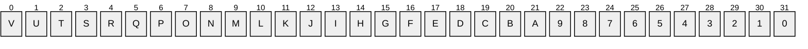
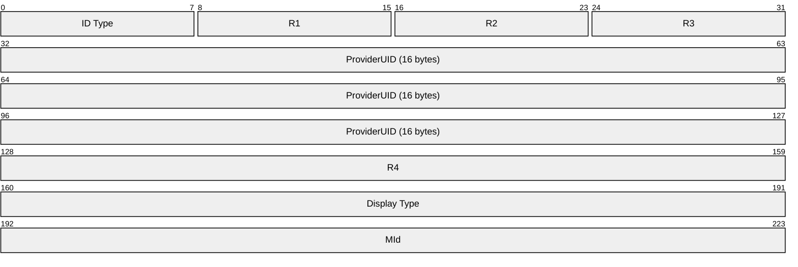
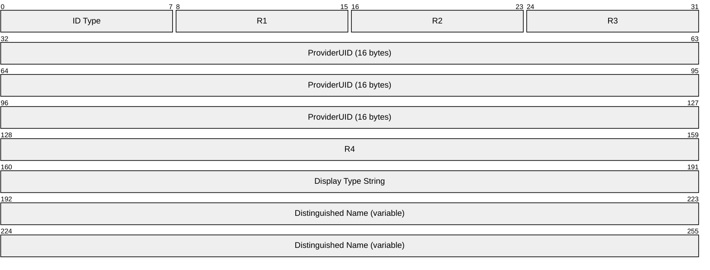

# [MS-NSPI]: Name Service Provider Interface (NSPI) Protocol

Table of Contents

1 Introduction

- [1 Introduction](#Section_1)
  - [1.1 Glossary](#Section_1.1)
  - [1.2 References](#Section_1.2)
    - [1.2.1 Normative References](#Section_1.2.1)
    - [1.2.2 Informative References](#Section_1.2.2)
  - [1.3 Overview](#Section_1.3)
  - [1.4 Relationship to Other Protocols](#Section_1.4)
  - [1.5 Prerequisites/Preconditions](#Section_1.5)
  - [1.6 Applicability Statement](#Section_1.6)
  - [1.7 Versioning and Capability Negotiation](#Section_1.7)
  - [1.8 Vendor-Extensible Fields](#Section_1.8)
  - [1.9 Standards Assignments](#Section_1.9)

2 Messages

- [2 Messages](#Section_2)
  - [2.1 Transport](#Section_2.1)
  - [2.2 Constant Value Definitions](#Section_2.2)
    - [2.2.1 Permitted Property Type Values](#Section_2.2.1)
    - [2.2.2 Permitted Error Code Values](#Section_2.2.2)
    - [2.2.3 Display Type Values](#Section_2.2.3)
    - [2.2.4 Default Language Code Identifier](#Section_2.2.4)
    - [2.2.5 Required Codepages](#Section_2.2.5)
    - [2.2.6 Unicode Comparison Flags](#Section_2.2.6)
      - [2.2.6.1 Comparison Flags](#Section_2.2.6.1)
    - [2.2.7 Permanent Entry ID GUID](#Section_2.2.7)
    - [2.2.8 Positioning Minimal Entry IDs](#Section_2.2.8)
    - [2.2.9 Ambiguous Name Resolution Minimal Entry IDs](#Section_2.2.9)
    - [2.2.10 Table Sort Orders](#Section_2.2.10)
    - [2.2.11 NspiBind Flags](#Section_2.2.11)
    - [2.2.12 Retrieve Property Flags](#Section_2.2.12)
    - [2.2.13 NspiGetSpecialTable Flags](#Section_2.2.13)
    - [2.2.14 NspiQueryColumns Flags](#Section_2.2.14)
    - [2.2.15 NspiGetIDsFromNames Flags](#Section_2.2.15)
    - [2.2.16 NspiGetTemplateInfo Flags](#Section_2.2.16)
    - [2.2.17 NspiModLinkAtt Flags](#Section_2.2.17)
  - [2.3 Common Data Types](#Section_2.3)
    - [2.3.1 Property Values](#Section_2.3.1)
      - [2.3.1.1 FlatUID_r](#Section_2.3.1.1)
      - [2.3.1.2 PropertyTagArray_r](#Section_2.3.1.2)
      - [2.3.1.3 Binary_r](#Section_2.3.1.3)
      - [2.3.1.4 ShortArray_r](#Section_2.3.1.4)
      - [2.3.1.5 LongArray_r](#Section_2.3.1.5)
      - [2.3.1.6 StringArray_r](#Section_2.3.1.6)
      - [2.3.1.7 BinaryArray_r](#Section_2.3.1.7)
      - [2.3.1.8 FlatUIDArray_r](#Section_2.3.1.8)
      - [2.3.1.9 WStringArray_r](#Section_2.3.1.9)
      - [2.3.1.10 DateTimeArray_r](#Section_2.3.1.10)
      - [2.3.1.11 PROP_VAL_UNION](#Section_2.3.1.11)
      - [2.3.1.12 PropertyValue_r](#Section_2.3.1.12)
    - [2.3.2 PropertyRow_r](#Section_2.3.2)
    - [2.3.3 PropertyRowSet_r](#Section_2.3.3)
    - [2.3.4 Restrictions](#Section_2.3.4)
      - [2.3.4.1 AndRestriction_r, OrRestriction_r](#Section_2.3.4.1)
      - [2.3.4.2 NotRestriction_r](#Section_2.3.4.2)
      - [2.3.4.3 ContentRestriction_r](#Section_2.3.4.3)
      - [2.3.4.4 BitMaskRestriction_r](#Section_2.3.4.4)
      - [2.3.4.5 PropertyRestriction_r](#Section_2.3.4.5)
      - [2.3.4.6 ComparePropsRestriction_r](#Section_2.3.4.6)
      - [2.3.4.7 SubRestriction_r](#Section_2.3.4.7)
      - [2.3.4.8 SizeRestriction_r](#Section_2.3.4.8)
      - [2.3.4.9 ExistRestriction_r](#Section_2.3.4.9)
      - [2.3.4.10 RestrictionUnion_r](#Section_2.3.4.10)
      - [2.3.4.11 Restriction_r](#Section_2.3.4.11)
    - [2.3.5 Property Name/Property ID Structures](#Section_2.3.5)
      - [2.3.5.1 PropertyName_r](#Section_2.3.5.1)
      - [2.3.5.2 PropertyNameSet_r](#Section_2.3.5.2)
    - [2.3.6 String Arrays](#Section_2.3.6)
      - [2.3.6.1 StringsArray_r](#Section_2.3.6.1)
      - [2.3.6.2 WStringsArray_r](#Section_2.3.6.2)
    - [2.3.7 STAT](#Section_2.3.7)
    - [2.3.8 Entry IDs](#Section_2.3.8)
      - [2.3.8.1 MinimalEntryID](#Section_2.3.8.1)
      - [2.3.8.2 EphemeralEntryID](#Section_2.3.8.2)
      - [2.3.8.3 PermanentEntryID](#Section_2.3.8.3)
    - [2.3.9 NSPI_HANDLE](#Section_2.3.9)

3 Protocol Details

- [3 Protocol Details](#Section_3)
  - [3.1 Server Details](#Section_3.1)
    - [3.1.1 Abstract Data Model](#Section_3.1.1)
      - [3.1.1.1 Required Properties](#Section_3.1.1.1)
      - [3.1.1.2 String Handling](#Section_3.1.1.2)
        - [3.1.1.2.1 Required Native Categorizations](#Section_3.1.1.2.1)
        - [3.1.1.2.2 Required Codepage Support](#Section_3.1.1.2.2)
        - [3.1.1.2.3 Conversion Rules for String Values Specified by the Server to the Client](#Section_3.1.1.2.3)
        - [3.1.1.2.4 Conversion Rules for String Values Specified by the Client to the Server](#Section_3.1.1.2.4)
        - [3.1.1.2.5 String Comparison](#Section_3.1.1.2.5)
          - [3.1.1.2.5.1 Unicode String Comparison](#Section_3.1.1.2.5.1)
          - [3.1.1.2.5.2 8-Bit String Comparison](#Section_3.1.1.2.5.2)
        - [3.1.1.2.6 String Sorting](#Section_3.1.1.2.6)
      - [3.1.1.3 Tables](#Section_3.1.1.3)
        - [3.1.1.3.1 Status-Based Tables](#Section_3.1.1.3.1)
        - [3.1.1.3.2 Explicit Tables](#Section_3.1.1.3.2)
          - [3.1.1.3.2.1 Restriction-Based Explicit Tables](#Section_3.1.1.3.2.1)
          - [3.1.1.3.2.2 Property Value-Based Explicit Tables](#Section_3.1.1.3.2.2)
        - [3.1.1.3.3 Specific Instantiations of Special Tables](#Section_3.1.1.3.3)
          - [3.1.1.3.3.1 Address Book Hierarchy Table](#Section_3.1.1.3.3.1)
          - [3.1.1.3.3.2 Address Creation Table](#Section_3.1.1.3.3.2)
      - [3.1.1.4 Positioning in a Table](#Section_3.1.1.4)
        - [3.1.1.4.1 Absolute Positioning](#Section_3.1.1.4.1)
        - [3.1.1.4.2 Fractional Positioning](#Section_3.1.1.4.2)
      - [3.1.1.5 Object Identity](#Section_3.1.1.5)
      - [3.1.1.6 Ambiguous Name Resolution](#Section_3.1.1.6)
    - [3.1.2 Timers](#Section_3.1.2)
    - [3.1.3 Initialization](#Section_3.1.3)
    - [3.1.4 Message Processing Events and Sequencing Rules](#Section_3.1.4)
      - [3.1.4.1 NspiBind (Opnum 0)](#Section_3.1.4.1)
      - [3.1.4.2 NspiUnbind (Opnum 1)](#Section_3.1.4.2)
      - [3.1.4.3 NspiGetSpecialTable (Opnum 12)](#Section_3.1.4.3)
      - [3.1.4.4 NspiUpdateStat (Opnum 2)](#Section_3.1.4.4)
      - [3.1.4.5 NspiQueryColumns (Opnum 16)](#Section_3.1.4.5)
      - [3.1.4.6 NspiGetPropList (Opnum 8)](#Section_3.1.4.6)
      - [3.1.4.7 NspiGetProps (Opnum 9)](#Section_3.1.4.7)
      - [3.1.4.8 NspiQueryRows (Opnum 3)](#Section_3.1.4.8)
      - [3.1.4.9 NspiSeekEntries (Opnum 4)](#Section_3.1.4.9)
      - [3.1.4.10 NspiGetMatches (Opnum 5)](#Section_3.1.4.10)
      - [3.1.4.11 NspiResortRestriction (Opnum 6)](#Section_3.1.4.11)
      - [3.1.4.12 NspiCompareMIds (Opnum 10)](#Section_3.1.4.12)
      - [3.1.4.13 NspiDNToMId (Opnum 7)](#Section_3.1.4.13)
      - [3.1.4.14 NspiModProps (Opnum 11)](#Section_3.1.4.14)
      - [3.1.4.15 NspiModLinkAtt (Opnum 14)](#Section_3.1.4.15)
      - [3.1.4.16 NspiGetNamesFromIDs (Opnum 17)](#Section_3.1.4.16)
      - [3.1.4.17 NspiGetIDsFromNames (Opnum 18)](#Section_3.1.4.17)
      - [3.1.4.18 NspiResolveNames (Opnum 19)](#Section_3.1.4.18)
      - [3.1.4.19 NspiResolveNamesW (Opnum 20)](#Section_3.1.4.19)
      - [3.1.4.20 NspiGetTemplateInfo (Opnum 13)](#Section_3.1.4.20)
    - [3.1.5 Timer Events](#Section_3.1.5)
    - [3.1.6 Other Local Events](#Section_3.1.6)
  - [3.2 Client Details](#Section_3.2)
    - [3.2.1 Abstract Data Model](#Section_3.2.1)
    - [3.2.2 Timers](#Section_3.2.2)
    - [3.2.3 Initialization](#Section_3.2.3)
    - [3.2.4 Message Processing Events and Sequencing Rules](#Section_3.2.4)
    - [3.2.5 Timer Events](#Section_3.2.5)
    - [3.2.6 Other Local Events](#Section_3.2.6)

4 Protocol Examples

- [4 Protocol Examples](#Section_4)

5 Security

- [5 Security](#Section_5)
  - [5.1 Security Considerations for Implementers](#Section_5.1)
  - [5.2 Index of Security Parameters](#Section_5.2)

6 Appendix A: Full IDL

- [6 Appendix A: Full IDL](#Section_6)

7 Appendix B: Product Behavior

- [7 Appendix B: Product Behavior](#Section_7)

8 Change Tracking

- [8 Change Tracking](#Section_8)

For the legal notice and IP terms, see [LEGAL.md](../LEGAL.md).
Last updated: 4/23/2024.
See [Revision History](#revision-history) for full version history.

# 1 Introduction

The Name Service Provider Interface (NSPI) Protocol provides messaging clients a way to access and manipulate addressing data stored by a server. This protocol consists of an abstract data model and a single [**remote procedure call (RPC)**](#gt_remote-procedure-call-rpc) interface to manipulate data in that model.

Sections 1.5, 1.8, 1.9, 2, and 3 of this specification are normative. All other sections and examples in this specification are informative.

## 1.1 Glossary

This document uses the following terms:

**address book container**: An [**Address Book object**](#gt_address-book-object) that describes an [**address list**](#gt_address-list).

**address book hierarchy table**: A collection of [**address book containers**](#gt_address-book-container) arranged in a hierarchy.

**Address Book object**: An entity in an address book that contains a set of attributes, each attribute with a set of associated values.

**address creation table**: A table containing information about the templates that an address book server supports for creating new email addresses.

**address creation template**: A template that describes how to present a dialog to a messaging user along with a script describing how to construct a new email address from the user's response.

**address list**: A collection of distinct [**Address Book objects**](#gt_address-book-object).

**ambiguous name resolution (ANR)**: A search algorithm that permits a client to search multiple naming-related attributes on objects by way of a single clause of the form "(anr=value)" in a Lightweight Directory Access Protocol (LDAP) search filter. This permits a client to query for an object when the client possesses some identifying material related to the object but does not know which attribute of the object contains that identifying material.

**code page**: An ordered set of characters of a specific script in which a numerical index (code-point value) is associated with each character. Code pages are a means of providing support for character sets and keyboard layouts used in different countries. Devices such as the display and keyboard can be configured to use a specific code page and to switch from one code page (such as the United States) to another (such as Portugal) at the user's request.

**display template**: A template that describes how to display or allow a user to modify information about an [**Address Book object**](#gt_address-book-object).

**display type**: A property of an Address Book object indicating the object's type that can be used to choose a format when displaying the object.

**distinguished name (DN)**: A name that uniquely identifies an object by using the relative distinguished name (RDN) for the object, and the names of container objects and domains that contain the object. The distinguished name (DN) identifies the object and its location in a tree.

**dynamic endpoint**: A network-specific server address that is requested and assigned at run time. For more information, see [[C706]](https://go.microsoft.com/fwlink/?LinkId=89824).

**endpoint**: A network-specific address of a remote procedure call (RPC) server process for remote procedure calls. The actual name and type of the endpoint depends on the [**RPC**](#gt_remote-procedure-call-rpc) protocol sequence that is being used. For example, for RPC over TCP (RPC Protocol Sequence ncacn_ip_tcp), an endpoint might be TCP port 1025. For RPC over Server Message Block (RPC Protocol Sequence ncacn_np), an endpoint might be the name of a named pipe. For more information, see [C706].

**Ephemeral Entry ID**: A property of an [**Address Book object**](#gt_address-book-object) that can be used to uniquely identify the object.

**globally unique identifier (GUID)**: A term used interchangeably with [**universally unique identifier (UUID)**](#gt_universally-unique-identifier-uuid) in Microsoft protocol technical documents (TDs). Interchanging the usage of these terms does not imply or require a specific algorithm or mechanism to generate the value. Specifically, the use of this term does not imply or require that the algorithms described in [[RFC4122]](https://go.microsoft.com/fwlink/?LinkId=90460) or [C706] must be used for generating the [**GUID**](#gt_globally-unique-identifier-guid). See also [**universally unique identifier (UUID)**](#gt_universally-unique-identifier-uuid).

**Interface Definition Language (IDL)**: The International Standards Organization (ISO) standard language for specifying the interface for remote procedure calls. For more information, see [C706] section 4.

**Kerberos**: An authentication system that enables two parties to exchange private information across an otherwise open network by assigning a unique key (called a ticket) to each user that logs on to the network and then embedding these tickets into messages sent by the users. For more information, see [MS-KILE](../MS-KILE/MS-KILE.md).

**language code identifier (LCID)**: A 32-bit number that identifies the user interface human language dialect or variation that is supported by an application or a client computer.

**Minimal Entry ID (MId)**: A property of an [**Address Book object**](#gt_address-book-object) that can be used to uniquely identify the object.

**name service provider interface (NSPI)**: A method of performing address-book-related operations on Active Directory.

**Network Data Representation (NDR)**: A specification that defines a mapping from [**Interface Definition Language (IDL)**](#gt_interface-definition-language-idl) data types onto octet streams. [**NDR**](#gt_network-data-representation-ndr) also refers to the runtime environment that implements the mapping facilities (for example, data provided to [**NDR**](#gt_network-data-representation-ndr)). For more information, see [MS-RPCE](../MS-RPCE/MS-RPCE.md) and [C706] section 14.

**NT LAN Manager (NTLM) Authentication Protocol**: A protocol using a challenge-response mechanism for authentication in which clients are able to verify their identities without sending a password to the server. It consists of three messages, commonly referred to as Type 1 (negotiation), Type 2 (challenge) and Type 3 (authentication).

**opnum**: An operation number or numeric identifier that is used to identify a specific [**remote procedure call (RPC)**](#gt_remote-procedure-call-rpc) method or a method in an interface. For more information, see [C706] section 12.5.2.12 or [MS-RPCE].

**Permanent Entry ID**: A property of an [**Address Book object**](#gt_address-book-object) that can be used to uniquely identify the object.

**property ID**: A 16-bit numeric identifier of a specific attribute. A property ID does not include any [**property type**](#gt_property-type) information.

**property type**: A 16-bit quantity that specifies the data type of a property value.

**proptag**: A 32-bit, little-endian value comprising a Property Type and Property ID. The low-order 16 bits are the Property Type, and the high-order 16 bits are the Property ID.

**remote procedure call (RPC)**: A communication protocol used primarily between client and server. The term has three definitions that are often used interchangeably: a runtime environment providing for communication facilities between computers (the RPC runtime); a set of request-and-response message exchanges between computers (the RPC exchange); and the single message from an RPC exchange (the RPC message). For more information, see [C706].

**RPC protocol sequence**: A character string that represents a valid combination of a [**remote procedure call (RPC)**](#gt_remote-procedure-call-rpc) protocol, a network layer protocol, and a transport layer protocol, as described in [C706] and [MS-RPCE].

**RPC transport**: The underlying network services used by the remote procedure call (RPC) runtime for communications between network nodes. For more information, see [C706] section 2.

**security provider**: A pluggable security module that is specified by the protocol layer above the [**remote procedure call (RPC)**](#gt_remote-procedure-call-rpc) layer, and will cause the [**RPC**](#gt_remote-procedure-call-rpc) layer to use this module to secure messages in a communication session with the server. The security provider is sometimes referred to as an authentication service. For more information, see [C706] and [MS-RPCE].

**Teletex**: A string value expressed as UTF-8 string restricted to characters with values between 0x20 and 0x7E, inclusive.

**Unicode**: A character encoding standard developed by the Unicode Consortium that represents almost all of the written languages of the world. The [**Unicode**](#gt_unicode) standard [[UNICODE5.0.0/2007]](https://go.microsoft.com/fwlink/?LinkId=154659) provides three forms (UTF-8, UTF-16, and UTF-32) and seven schemes (UTF-8, UTF-16, UTF-16 BE, UTF-16 LE, UTF-32, UTF-32 LE, and UTF-32 BE).

**universally unique identifier (UUID)**: A 128-bit value. UUIDs can be used for multiple purposes, from tagging objects with an extremely short lifetime, to reliably identifying very persistent objects in cross-process communication such as client and server interfaces, manager entry-point vectors, and [**RPC**](#gt_remote-procedure-call-rpc) objects. UUIDs are highly likely to be unique. UUIDs are also known as [**globally unique identifiers (GUIDs)**](#gt_globally-unique-identifier-guid) and these terms are used interchangeably in the Microsoft protocol technical documents (TDs). Interchanging the usage of these terms does not imply or require a specific algorithm or mechanism to generate the UUID. Specifically, the use of this term does not imply or require that the algorithms described in [RFC4122] or [C706] must be used for generating the UUID.

**UTF-16LE**: The Unicode Transformation Format - 16-bit, Little Endian encoding scheme. It is used to encode [**Unicode**](#gt_unicode) characters as a sequence of 16-bit codes, each encoded as two 8-bit bytes with the least-significant byte first.

**MAY, SHOULD, MUST, SHOULD NOT, MUST NOT:** These terms (in all caps) are used as defined in [[RFC2119]](https://go.microsoft.com/fwlink/?LinkId=90317). All statements of optional behavior use either MAY, SHOULD, or SHOULD NOT.

## 1.2 References

Links to a document in the Microsoft Open Specifications library point to the correct section in the most recently published version of the referenced document. However, because individual documents in the library are not updated at the same time, the section numbers in the documents may not match. You can confirm the correct section numbering by checking the [Errata](https://go.microsoft.com/fwlink/?linkid=850906).

### 1.2.1 Normative References

We conduct frequent surveys of the normative references to assure their continued availability. If you have any issue with finding a normative reference, please contact [dochelp@microsoft.com](mailto:dochelp@microsoft.com). We will assist you in finding the relevant information.

[C706] The Open Group, "DCE 1.1: Remote Procedure Call", C706, August 1997, [https://publications.opengroup.org/c706](https://go.microsoft.com/fwlink/?LinkId=89824)

**Note** Registration is required to download the document.

[MS-KILE] Microsoft Corporation, "[Kerberos Protocol Extensions](../MS-KILE/MS-KILE.md)".

[MS-NLMP] Microsoft Corporation, "[NT LAN Manager (NTLM) Authentication Protocol](../MS-NLMP/MS-NLMP.md)".

[MS-OXCDATA] Microsoft Corporation, "[Data Structures](../MS-OXCDATA/MS-OXCDATA.md)".

[MS-OXOABKT] Microsoft Corporation, "[Address Book User Interface Templates Protocol](../MS-OXOABKT/MS-OXOABKT.md)".

[MS-OXOABK] Microsoft Corporation, "[Address Book Object Protocol](../MS-OXOABK/MS-OXOABK.md)".

[MS-OXPROPS] Microsoft Corporation, "[Exchange Server Protocols Master Property List](../MS-OXPROPS/MS-OXPROPS.md)".

[MS-RPCE] Microsoft Corporation, "[Remote Procedure Call Protocol Extensions](../MS-RPCE/MS-RPCE.md)".

[MS-UCODEREF] Microsoft Corporation, "[Windows Protocols Unicode Reference](../MS-UCODEREF/MS-UCODEREF.md)".

[RFC1510] Kohl, J., and Neuman, C., "The Kerberos Network Authentication Service (V5)", RFC 1510, September 1993, [https://www.rfc-editor.org/info/rfc1510](https://go.microsoft.com/fwlink/?LinkId=90279)

[RFC2119] Bradner, S., "Key words for use in RFCs to Indicate Requirement Levels", BCP 14, RFC 2119, March 1997, [https://www.rfc-editor.org/info/rfc2119](https://go.microsoft.com/fwlink/?LinkId=90317)

[RFC4120] Neuman, C., Yu, T., Hartman, S., and Raeburn, K., "The Kerberos Network Authentication Service (V5)", RFC 4120, July 2005, [https://www.rfc-editor.org/rfc/rfc4120](https://go.microsoft.com/fwlink/?LinkId=90458)

### 1.2.2 Informative References

None.

## 1.3 Overview

Messaging clients that implement a browsable address book need a way to communicate with a data store that holds addressing data to access and manipulate that data. The NSPI Protocol enables communication between a messaging client and a data store.<1>

The NSPI Protocol is a protocol layer that uses the [**remote procedure call (RPC)**](#gt_remote-procedure-call-rpc) protocol as a transport, with a series of interface methods as specified in this document, that clients can use to communicate with an [**NSPI**](#gt_name-service-provider-interface-nspi) server.

The following diagram is a graphical representation of a typical communication sequence between a messaging client and an NSPI server.

Figure 1: NSPI Protocol message sequence

## 1.4 Relationship to Other Protocols

The NSPI protocol depends on the following protocols:

- The [**remote procedure call (RPC)**](#gt_remote-procedure-call-rpc) protocol [[C706]](https://go.microsoft.com/fwlink/?LinkId=89824), [MS-RPCE](../MS-RPCE/MS-RPCE.md) as a transport.
- The [**Kerberos**](#gt_kerberos) authentication protocols [MS-KILE](../MS-KILE/MS-KILE.md), [[RFC1510]](https://go.microsoft.com/fwlink/?LinkId=90279), and [[RFC4120]](https://go.microsoft.com/fwlink/?LinkId=90458) for client authentication.
- The [**NT LAN Manager (NTLM) Authentication Protocol**](#gt_nt-lan-manager-ntlm-authentication-protocol) [MS-NLMP](../MS-NLMP/MS-NLMP.md) for client authentication.
- The Windows Protocol Unicode Reference [MS-UCODEREF](../MS-UCODEREF/MS-UCODEREF.md) for data comparisons.
- The Outlook Exchange Address Book Protocol [MS-OXOABK](../MS-OXOABK/MS-OXOABK.md) for property definitions.
- The Address Book User Interface Templates Protocol Specification [MS-OXOABKT](../MS-OXOABKT/MS-OXOABKT.md) for the definition of Address Book Templates.
- The Data Structures Protocol [MS-OXCDATA](../MS-OXCDATA/MS-OXCDATA.md) for common data structure definitions.
- The Master Property List [MS-OXPROPS](../MS-OXPROPS/MS-OXPROPS.md) for [**property type**](#gt_property-type) and [**property ID**](#gt_property-id) definitions.

## 1.5 Prerequisites/Preconditions

The [**NSPI**](#gt_name-service-provider-interface-nspi) client implementation is expected to possess the network address of the server. This network address satisfies the requirements of a network address for the underlying transport of [**remote procedure call (RPC)**](#gt_remote-procedure-call-rpc). This allows the NSPI client to initiate communication with the NSPI server using the RPC protocol.

The NSPI client and NSPI server are expected to share at least one [**security provider**](#gt_security-provider) in common for the [**RPC transport**](#gt_rpc-transport). This allows the NSPI server to authenticate the NSPI client.

The NSPI client is expected to possess credentials recognized by the server. These credentials are obtained from the shared security provider. The mechanism for obtaining these credentials is specific to the protocol of the security provider used.

The NSPI server is expected to have determined any local policies as specified in sections [2](#Section_2), [3](#Section_3), and [5](#Section_5). This allows the server to provide consistent behavior for all communications in the protocol.

The server is expected to be configured to support the required [**codepages**](#gt_210637d9-9634-4652-a935-ded3cd434f38) and [**language code identifiers (LCID)**](#gt_language-code-identifier-lcid), as specified in sections [2.2.4](#Section_2.2.4) and [2.2.5](#Section_2.2.5). This allows the server to provide the minimal required string conversions and sort orders.

The NSPI server is expected to be started and fully initialized before the protocol can start.

## 1.6 Applicability Statement

The NSPI Protocol is appropriate for messaging clients that implement online access to address books for browsing and viewing of [**Address Book objects**](#gt_address-book-object) stored in a data store.

## 1.7 Versioning and Capability Negotiation

This document covers versioning issues in the following areas:

- **Supported Transports:** This protocol uses multiple [**RPC protocol sequences**](#gt_rpc-protocol-sequence), as specified in section [2.1](#Section_2.1).
- **Protocol Versions:** This protocol has a single interface version. This version is defined in section 2.1.
- **Security and Authentication Methods:** This protocol supports the following authentication methods: [**NTLM**](#gt_nt-lan-manager-ntlm-authentication-protocol) and [**Kerberos**](#gt_kerberos).
- **Localization:** This protocol passes text strings in various methods. Localization considerations for such strings are specified in [String Handling (section 3.1.1.2)](#Section_3.1.1.2).
- **Capability Negotiation:** The NSPI Protocol does not support negotiation. There is only one interface version.

## 1.8 Vendor-Extensible Fields

None.

## 1.9 Standards Assignments

This protocol uses the following RPC UUID for the nspi interface.

| Parameter | Value | Reference |
| --- | --- | --- |
| Interface [**UUID**](#gt_universally-unique-identifier-uuid) | F5CC5A18-4264-101A-8C59-08002B2F8426 | [[C706]](https://go.microsoft.com/fwlink/?LinkId=89824) section A.2.5 |

# 2 Messages

The following sections specify transport methods of NSPI Protocol messages and common NSPI Protocol data types.

Unless otherwise specified, all numeric values in this protocol are in little-endian format.

Unless otherwise specified, all [**Unicode**](#gt_unicode) string representations are in [**UTF-16LE**](#gt_utf-16le) format.

## 2.1 Transport

All [**remote procedure call (RPC)**](#gt_remote-procedure-call-rpc) protocols use RPC [**dynamic endpoints**](#gt_dynamic-endpoint) as specified in Part 4 of [[C706]](https://go.microsoft.com/fwlink/?LinkId=89824).

The NSPI Protocol uses the following [**RPC protocol sequences**](#gt_rpc-protocol-sequence):

- RPC over Named Pipes
- RPC over HTTP
- RPC over TCP
The protocol allows a server to be configured to use a specific port for RPC over TCP. The mechanism for configuring an [**NSPI**](#gt_name-service-provider-interface-nspi) server to use a specific port is not constrained by the NSPI Protocol. The mechanism for a client to discover this configured TCP port is not constrained by the NSPI Protocol.

This protocol MUST use the [**UUID**](#gt_universally-unique-identifier-uuid) F5CC5A18-4264-101A-8C59-08002B2F8426. The protocol MUST use the RPC version number 56.0.

This protocol SHOULD<2> indicate to the RPC runtime that it is to perform a strict [**Network Data Representation (NDR)**](#gt_network-data-representation-ndr) data consistency check at target level 6.0, as specified in [MS-RPCE](../MS-RPCE/MS-RPCE.md) section 3.

This protocol uses security information as described in [MS-RPCE]. The server MUST register one or both of the [**security providers**](#gt_security-provider) [**NT LAN Manager Protocol (NTLM)**](#gt_nt-lan-manager-ntlm-authentication-protocol) and [**Kerberos**](#gt_kerberos). Additionally, the server MUST register the negotiation security provider.

The protocol does not require mutual authentication; the NSPI client and NSPI server MUST use an authentication mechanism capable of authenticating the client to the server. The protocol does not require that the NSPI client be capable of authenticating the NSPI server.

The protocol uses the underlying RPC protocol to retrieve the identity of the client that made the method call as specified in [MS-RPCE]. The server MAY<3> use this identity to perform access checks as specified in section [5](#Section_5) of this document.

The server MAY<4> enforce limits on the maximum RPC packet size that it will accept.

## 2.2 Constant Value Definitions

This section is used as a reference from one or more message syntax and message processing sections.

### 2.2.1 Permitted Property Type Values

These values are used to specify Property Types. They appear in various places in the NSPI Protocol. All [**NSPI**](#gt_name-service-provider-interface-nspi) servers MUST recognize and be capable of accepting and returning these Property Types. Values representing Property Types are defined in [MS-OXCDATA](../MS-OXCDATA/MS-OXCDATA.md).

The values specified in [MS-OXCDATA] are 16-bit integers. The NSPI Protocol uses the same numeric values but expressed as 32-bit integers. The high-order 16 bits of the 32-bit representation used by the NSPI Protocol are always 0x0000. Permitted values for the NSPI Protocol listed in the following table.

| Name | Value as defined in [MS-OXCDATA] | Value as used in NSPI Protocol |
| --- | --- | --- |
| PtypInteger16 | 0x0002 | 0x00000002 |
| PtypInteger32 | 0x0003 | 0x00000003 |
| PtypBoolean | 0x000B | 0x0000000B |
| PtypString8 | 0x001E | 0x0000001E |
| PtypBinary | 0x0102 | 0x00000102 |
| PtypString | 0x001F | 0x0000001F |
| PtypGuid | 0x0048 | 0x00000048 |
| PtypTime | 0x0040 | 0x00000040 |
| PtypErrorCode | 0x000A | 0x0000000A |
| PtypMultipleInteger16 | 0x1002 | 0x00001002 |
| PtypMultipleInteger32 | 0x1003 | 0x00001003 |
| PtypMultipleString8 | 0x101E | 0x0000101E |
| PtypMultipleBinary | 0x1102 | 0x00001102 |
| PtypMultipleString | 0x101F | 0x0000101F |
| PtypMultipleGuid | 0x1048 | 0x00001048 |
| PtypMultipleTime | 0x1040 | 0x00001040 |

In addition to the Property Types defined in [MS-OXCDATA], all NSPI servers and clients MUST recognize and be capable of accepting and returning the following Property Types.

| Name and value | Description |
| --- | --- |
| PtypEmbeddedTable 0x0000000D | Single 32-bit value, referencing an [**address list**](#gt_address-list). |
| PtypNull 0x00000001 | Clients MUST NOT specify this Property Type in any method's input parameters. The server MUST specify this Property Type in any method's output parameters to indicate that a property has a value that cannot be expressed in the NSPI Protocol. |
| PtypUnspecified 0x00000000 | Clients specify this Property Type in a method's input parameter to indicate that the client will accept any Property Type the server chooses when returning propvalues. Servers MUST NOT specify this Property Type in any method's output parameters except the method [NspiGetIDsFromNames](#Section_2.2.15). |

All NSPI clients and servers MUST NOT use any other Property Types.

### 2.2.2 Permitted Error Code Values

These values are used to specify status from an [**Name Service Provider Interface (NSPI)**](#gt_name-service-provider-interface-nspi) method. They appear as return codes from NSPI methods and as values of properties with Property Type **PtypErrorCode**. All NSPI servers MUST recognize and be capable of accepting and returning these error codes. The values representing error codes are defined in [MS-OXCDATA](../MS-OXCDATA/MS-OXCDATA.md). Permitted values for the NSPI Protocol are as follows:

- Success
- ErrorsReturned
- GeneralFailure
- NotSupported
- InvalidObject
- OutOfResources
- NotFound
- LogonFailed
- TooComplex
- InvalidCodepage
- InvalidLocale
- TooBig
- TableTooBig
- InvalidBookmark
- AmbiguousRecipient
- AccessDenied
- NotEnoughMemory
- InvalidParameter
All NSPI clients and servers MUST NOT use any other error codes.

### 2.2.3 Display Type Values

These values are used to specify [**display types**](#gt_display-type). They appear in various places in the NSPI Protocol as object properties and as part of EntryIDs. Except where otherwise specified in the following table, all [**NSPI**](#gt_name-service-provider-interface-nspi) servers MUST recognize and be capable of accepting and returning these display types. Permitted values for the NSPI Protocol are as follows.

| Name and value | Description |
| --- | --- |
| DT_MAILUSER 0x00000000 | A typical messaging user. |
| DT_DISTLIST 0x00000001 | A distribution list. |
| DT_FORUM 0x00000002 | A forum, such as a bulletin board service or a public or shared folder. |
| DT_AGENT 0x00000003 | An automated agent, such as Quote-Of-The-Day or a weather chart display. |
| DT_ORGANIZATION 0x00000004 | An [**Address Book object**](#gt_address-book-object) defined for a large group, such as helpdesk, accounting, coordinator, or department. Department objects usually have this display type. |
| DT_PRIVATE_DISTLIST 0x00000005 | A private, personally administered distribution list. |
| DT_REMOTE_MAILUSER 0x00000006 | An Address Book object known to be from a foreign or remote messaging system. |
| DT_CONTAINER 0x00000100 | An [**address book hierarchy table**](#gt_address-book-hierarchy-table) container. An NSPI server MUST NOT return this display type except as part of an EntryID of an object in the address book hierarchy table. |
| DT_TEMPLATE 0x00000101 | A [**display template**](#gt_display-template) object. An NSPI server MUST NOT return this display type. |
| DT_ADDRESS_TEMPLATE 0x00000102 | An [**address creation template**](#gt_address-creation-template). An NSPI server MUST NOT return this display type except as part of an EntryID of an object in the [**address creation table**](#gt_address-creation-table). |
| DT_SEARCH 0x00000200 | A Search Template. An NSPI server MUST NOT return this display type. |

All NSPI clients and servers MUST NOT use any other display types.

### 2.2.4 Default Language Code Identifier

This value is the [**LCID**](#gt_language-code-identifier-lcid) associated with the minimal required sort order for [**Unicode**](#gt_unicode) strings. It appears in input parameters to NSPI Protocol methods. It affects [**NSPI**](#gt_name-service-provider-interface-nspi) server string handling, as detailed in [3.1.1.2](#Section_3.1.1.2).

| Name and value | Description |
| --- | --- |
| NSPI_DEFAULT_LOCALE 0x00000409 | Represents the default LCID used for comparison of Unicode string representations. |

### 2.2.5 Required Codepages

These values are associated with the string handling in the NSPI Protocol, and they appear in input parameters to methods in the NSPI Protocol. They affect [**NSPI**](#gt_name-service-provider-interface-nspi) server string handling, as detailed in [3.1.1.2](#Section_3.1.1.2).

| Name and value | Description |
| --- | --- |
| CP_TELETEX 0x00004F25 | Represents the [**Teletex**](#gt_teletex) [**codepage**](#gt_210637d9-9634-4652-a935-ded3cd434f38). |
| CP_WINUNICODE 0x000004B0 | Represents the [**Unicode**](#gt_unicode) codepage. |

### 2.2.6 Unicode Comparison Flags

These values are associated with string handling in the NSPI Protocol. These values are defined in terms of definitions from [MS-UCODEREF](../MS-UCODEREF/MS-UCODEREF.md). The server uses the constants NSPI_DEFAULT_LOCALE_COMPARE_FLAGS and NSPI_NON_DEFAULT_LOCALE_COMPARE_FLAGS to modify the behavior of comparisons of [**Unicode**](#gt_unicode) string representations, as detailed in section [3.1.1.2](#Section_3.1.1.2).

| Name and value | Description |
| --- | --- |
| NSPI_DEFAULT_LOCALE_COMPARE_FLAGS (NORM_IGNORECASE \| \ NORM_IGNOREKANATYPE \| \ NORM_IGNORENONSPACE \| \ NORM_IGNOREWIDTH \| \ SORT_STRINGSORT) | Flags used when comparing Unicode strings in the [**language code identifier (LCID)**](#gt_language-code-identifier-lcid) represented by NSPI_DEFAULT_LOCALE. |
| NSPI_NON_DEFAULT_LOCALE_COMPARE_FLAGS (NORM_IGNORECASE \| \ NORM_IGNOREKANATYPE \| \ NORM_IGNORENONSPACE \| \ NORM_IGNOREWIDTH \| \ NORM_IGNORESYMBOLS \| \ SORT_STRINGSORT) | Flags used when comparing Unicode strings in any LCID except the LCID represented by NSPI_DEFAULT_LOCALE. |

#### 2.2.6.1 Comparison Flags

The following defines the comparison flags used by this protocol. The flags are presented in big-endian byte order.

Where the bits are defined as:

| Value | Description |
| --- | --- |
| 0 X | Unused |
| 1 X | Unused |
| 2 X | Unused |
| 3 X | Unused |
| 4 X | Unused |
| 5 X | Unused |
| 6 X | Unused |
| 7 X | Unused |
| 8 X | Unused |
| 9 X | Unused |
| A X | Unused |
| B X | Unused |
| C X | Unused |
| D X | Unused |
| E IW | NORM IGNOREWIDTH: Ignore the difference between half-width and full-width characters. |
| F IK | NORM IGNOREKANATYPE: Do not differentiate between hinrangana and katanaka characters. Corresponding hirangana and katanaka characters compare as equal. |
| G X | Unused |
| H X | Unused |
| I X | Unused |
| J SS | SORT STRINGSORT: Treat punctuation the same as symbols. |
| K X | Unused |
| L X | Unused |
| M X | Unused |
| N X | Unused |
| O X | Unused |
| P X | Unused |
| Q X | Unused |
| R X | Unused |
| S X | Unused |
| T IB | NORM IGNORESYMBOLS: Ignore symbols. |
| U INS | NORM IGNORENONSPACE: Ignore non-spacing characters. |
| V IC | NORM IGNORECASE: Ignore Case |

### 2.2.7 Permanent Entry ID GUID

This value is associated with the NSPI Protocol and appears in [**Permanent Entry IDs**](#gt_permanent-entry-id).

| Name and value | Description |
| --- | --- |
| GUID_NSPI {0xDC, 0xA7, 0x40, 0xC8, 0xC0, 0x42, 0x10, 0x1A, 0xB4, 0xB9, 0x08, 0x00, 0x2B, 0x2F, 0xE1, 0x82} | Represents the NSPI Protocol in Permanent Entry IDs. |

### 2.2.8 Positioning Minimal Entry IDs

These values are used to specify objects in the address book as a function of their positions in tables. They appear as [**Minimal Entry IDs (MIds)**](#gt_minimal-entry-id-mid) in the **CurrentRec** field of the [STAT](#Section_2.3.7) structure. Possible values are as follows.

| Name and value | Description |
| --- | --- |
| MID_BEGINNING_OF_TABLE 0x00000000 | Specifies the position before the first row in the current [**address book container**](#gt_address-book-container). |
| MID_END_OF_TABLE 0x00000002 | Specifies the position after the last row in the current address book container. |
| MID_CURRENT 0x00000001 | Specifies the current position in a table. This MId is only valid in the method [NspiUpdateStat](#Section_3.1.4.4). In all other cases, it is an invalid MId, guaranteed to not specify any object in the address book. |

### 2.2.9 Ambiguous Name Resolution Minimal Entry IDs

These values are used to specify the outcome of the [**ambiguous name resolution (ANR)**](#gt_ambiguous-name-resolution-anr) process. They appear in return data from the methods [NspiResolveNames](#Section_3.1.4.18) and [NspiResolveNamesW](#Section_3.1.4.19). Possible values are as follows.

| Name and value | Description |
| --- | --- |
| MID_UNRESOLVED 0x00000000 | The ANR process was unable to map a string to any objects in the address book. |
| MID_AMBIGUOUS 0x0000001 | The ANR process mapped a string to multiple objects in the address book. |
| MID_RESOLVED 0x0000002 | The ANR process mapped a string to a single object in the address book. |

### 2.2.10 Table Sort Orders

These values are used to specify specific sort orders for tables, and they appear in the **SortType** field of the [STAT](#Section_2.3.7) data structure.

Possible values are as follows.

| Name and value | Description |
| --- | --- |
| SortTypeDisplayName 0x00000000 | The table is sorted ascending on the property PidTagDisplayName, as defined in [MS-OXPROPS](../MS-OXPROPS/MS-OXPROPS.md). All [**Name Service Provider Interface (NSPI)**](#gt_name-service-provider-interface-nspi) servers MUST support this sort order for at least one [**LCID**](#gt_language-code-identifier-lcid). |
| SortTypePhoneticDisplayName 0x00000003 | The table is sorted ascending on the property PidTagAddressBookPhoneticDisplayName, as defined in [MS-OXPROPS]. NSPI servers SHOULD support this sort order. NSPI servers MAY support this only for some LCIDs.<5> |
| SortTypeDisplayName_RO 0x000003E8 | The table is sorted ascending on the property PidTagDisplayName. The client MUST set this value only when using the [NspiGetMatches](#Section_3.1.4.10) method to open a nonwritable table on an object-valued property. |
| SortTypeDisplayName_W 0x000003E9 | The table is sorted ascending on the property PidTagDisplayName. The client MUST set this value only when using the NspiGetMatches method to open a writable table on an object-valued property. |

### 2.2.11 NspiBind Flags

This value is used to specify optional behavior to an [**NSPI**](#gt_name-service-provider-interface-nspi) server. It appears as a bit flag in the [NspiBind](#Section_2.2.11) method.

| Name and value | Description |
| --- | --- |
| fAnonymousLogin 0x00000020 | Client requests that the server allow an anonymous logon. |

### 2.2.12 Retrieve Property Flags

These values are used to specify optional behavior to an [**NSPI**](#gt_name-service-provider-interface-nspi) server. They appear as bit flags in methods that return property values to the client ([NspiGetPropList](#Section_3.1.4.6), [NspiGetProps](#Section_3.1.4.7), and [NspiQueryRows](#Section_3.1.4.8)). Possible values are given in the following table.

| Name and value | Description |
| --- | --- |
| fSkipObjects 0x00000001 | Client requires that the server MUST NOT include [**proptags**](#gt_proptag) with the Property Type PtypEmbeddedTable in any lists of proptags that the server creates on behalf of the client. |
| fEphID 0x00000002 | Client requires that the server MUST return Entry ID values in [**Ephemeral Entry ID**](#gt_ephemeral-entry-id) form. |

### 2.2.13 NspiGetSpecialTable Flags

These values are used to specify optional behavior to an [**NSPI**](#gt_name-service-provider-interface-nspi) server. They appear as bit flags in the [NspiGetSpecialTable](#Section_2.2.13) method. Possible values are given in the following table.

| Name and value | Description |
| --- | --- |
| NspiAddressCreationTemplates 0x00000002 | Specifies that the NSPI server MUST return the table of the Address Creation Templates available. Specifying this flag causes the NSPI server to ignore the **NspiUnicodeStrings** flag. |
| NspiUnicodeStrings 0x00000004 | Specifies that the NSPI server MUST return all strings as [**Unicode**](#gt_unicode) representations rather than as multibyte strings in the client's [**codepage**](#gt_210637d9-9634-4652-a935-ded3cd434f38). |

### 2.2.14 NspiQueryColumns Flags

This value is used to specify optional behavior to an [**NSPI**](#gt_name-service-provider-interface-nspi) server. It appears as a bit flag in the [NspiQueryColumns](#Section_2.2.14) method.

| Name and value | Description |
| --- | --- |
| NspiUnicodeProptypes 0x80000000 | Specifies that the NSPI server MUST return all [**proptags**](#gt_proptag) specifying values with string representations as having the Property Type PtypString. The default behavior is that the NSPI server MUST return all proptags specifying values with string representations as having the Property Type PtypString8. |

### 2.2.15 NspiGetIDsFromNames Flags

This value is used to specify optional behavior to an [**NSPI**](#gt_name-service-provider-interface-nspi) server. It appears as a flag in the [NspiGetIDsFromNames](#Section_2.2.15) method.

| Name and value | Description |
| --- | --- |
| NspiVerifyNames 0x00000002 | Specifies that the NSPI server MUST verify that all client specified names are recognized by the server. |

### 2.2.16 NspiGetTemplateInfo Flags

These values are used to specify optional behavior to an [**NSPI**](#gt_name-service-provider-interface-nspi) server. They appear as bit flags in the [NspiGetTemplateInfo](#Section_2.2.16) method. Possible values are as follows.

| Name and value | Description |
| --- | --- |
| TI_TEMPLATE 0x00000001 | Specifies that the server is to return the value that represents a template. |
| TI_SCRIPT 0x00000004 | Specifies that the server is to return the value of the script associated with a template. |
| TI_EMT 0x00000010 | Specifies that the server is to return the email type associated with a template. |
| TI_HELPFILE_NAME 0x00000020 | Specifies that the server is to return the name of the help file associated with a template. |
| TI_HELPFILE_CONTENTS 0x00000040 | Specifies that the server is to return the contents of the help file associated with a template. |

### 2.2.17 NspiModLinkAtt Flags

These values are used to specify optional behavior to an [**NSPI**](#gt_name-service-provider-interface-nspi) server. They appear as bit flags in the [NspiModLinkAtt](#Section_2.2.17) method. The following table lists the possible values of the flags.

| Name and Value | Description |
| --- | --- |
| fDelete 0x00000001 | Specifies that the server is to remove values when modifying. The default behavior is that the server adds values when modifying. |

## 2.3 Common Data Types

This protocol enables the **ms_union** extension specified in [MS-RPCE](../MS-RPCE/MS-RPCE.md) (section 2.2.4.5).

This protocol requests that the [**RPC**](#gt_remote-procedure-call-rpc) runtime, via the **strict_context_handle** attribute, rejects the use of context handles created by a method of a different RPC interface than this one, as specified in [MS-RPCE] (section 3).

In addition to RPC base types and definitions specified in [[C706]](https://go.microsoft.com/fwlink/?LinkId=89824) and [MS-RPCE], the NSPI protocol uses additional data types.

The following table summarizes the types that are defined in this specification.

| Name | Description |
| --- | --- |
| [FlatUID_r](#Section_2.3.1.1) | Byte order specified [**GUIDs**](#gt_globally-unique-identifier-guid) |
| [PropertyTagArray_r](#Section_2.3.1.2) | Property value structure |
| [Binary_r](#Section_2.3.1.3) | Property value structure |
| [ShortArray_r](#Section_2.3.1.4) | Property value structure |
| [LongArray_r](#Section_2.3.1.5) | Property value structure |
| [StringArray_r](#Section_2.3.1.6) | Property value structure |
| [BinaryArray_r](#Section_2.3.1.7) | Property value structure |
| [FlatUIDArray_r](#Section_2.3.1.8) | Property value structure |
| [WStringArray_r](#Section_2.3.1.9) | Property value structure |
| [DateTimeArray_r](#Section_2.3.1.10) | Property value structure |
| [PROP_VAL_UNION](#Section_2.3.1.11) | Property value structure |
| [PropertyValue_r](#Section_2.3.1.12) | Property value structure |
| [PropertyRow_r](#Section_2.3.2) | Table row structure |
| [PropertyRowSet_r](#Section_2.3.3) | Table rows structure |
| [AndRestriction_r](#Section_2.3.4.1) | Table restriction structure |
| OrRestriction_r | Table restriction structure |
| [NotRestriction_r](#Section_2.3.4.2) | Table restriction structure |
| [ContentRestriction_r](#Section_2.3.5) | Table restriction structure |
| [BitMaskRestriction_r](#Section_2.3.4.4) | Table restriction structure |
| [PropertyRestriction_r](#Section_2.3.4.5) | Table restriction structure |
| [ComparePropsRestriction_r](#Section_2.3.4.6) | Table restriction structure |
| [SubRestriction_r](#Section_2.3.4.7) | Table restriction structure |
| [SizeRestriction_r](#Section_2.3.4.8) | Table restriction structure |
| [ExistRestriction_r](#Section_2.3.4.9) | Table restriction structure |
| [RestrictionUnion_r](#Section_2.3.4.10) | Table restriction structure |
| [Restriction_r](#Section_2.3.4.11) | Table restriction structure |
| [PropertyName_r](#Section_2.3.5.1) | Address book property specifier |
| [PropertyNameSet_r](#Section_2.3.5.2) | Collection of PropertyName_r structures |
| [StringsArray_r](#Section_2.3.6.1) | Collection of 8-bit character strings |
| [WStringsArray_r](#Section_2.3.6.2) | Collection of [**Unicode**](#gt_unicode) strings |
| [STAT](#Section_2.3.7) | Table status structure |
| [MinimalEntryID](#Section_2.3.8.1) | [**Address Book object**](#gt_address-book-object) identification |
| [EphemeralEntryID](#Section_2.3.8.2) | Address Book object identification |
| [PermanentEntryID](#Section_2.3.8.3) | Address Book object identification |
| [NSPI_HANDLE](#Section_2.3.9) | RPC context handle |

### 2.3.1 Property Values

The following structures are used to represent specific property values.

#### 2.3.1.1 FlatUID_r

The FlatUID_r structure is an encoding of the **FlatUID** data structure defined in [MS-OXCDATA](../MS-OXCDATA/MS-OXCDATA.md). The semantic meaning is unchanged from the **FlatUID** data structure.

typedef struct {

BYTE ab[16];

} FlatUID_r;

**ab:** Encodes the ordered bytes of the **FlatUID** data structure.

#### 2.3.1.2 PropertyTagArray_r

The PropertyTagArray_r structure is an encoding of the **PropTagArray** data structure defined in [MS-OXCDATA](../MS-OXCDATA/MS-OXCDATA.md). The permissible number of [**proptag**](#gt_proptag) values in the PropertyTagArray_r structure exceeds that of the **PropTagArray** data structure. The semantic meaning is otherwise unchanged from the **PropTagArray** data structure.

typedef struct PropertyTagArray_r {

DWORD cValues;

[range(0,100001)] [size_is(cValues+1), length_is(cValues)]

DWORD aulPropTag[];

} PropertyTagArray_r;

**cValues:** Encodes the **Count** field of **PropTagArray**. This field MUST NOT exceed 100,000.

**aulPropTag:** Encodes the PropertyTags field of **PropTagArray**.

#### 2.3.1.3 Binary_r

The Binary_r structure encodes an array of uninterpreted bytes.

typedef struct Binary_r {

[range(0,2097152)] DWORD cb;

[size_is(cb)] BYTE* lpb;

} Binary_r;

**cb:** The number of uninterpreted bytes represented in this structure. This value MUST NOT exceed 2,097,152.

**lpb:** The uninterpreted bytes.

#### 2.3.1.4 ShortArray_r

The ShortArray_r structure encodes an array of 16-bit integers.

typedef struct ShortArray_r {

[range(0,100000)] DWORD cValues;

[size_is(cValues)] short int* lpi;

} ShortArray_r;

**cValues:** The number of 16-bit integer values represented in the ShortArray_r structure. This value MUST NOT exceed 100,000.

**lpi:** The 16-bit integer values.

#### 2.3.1.5 LongArray_r

The LongArray_r structure encodes an array of 32-bit integers.

typedef struct _LongArray_r {

[range(0,100000)] DWORD cValues;

[size_is(cValues)] long* lpl;

} LongArray_r;

**cValues:** The number of 32-bit integers represented in this structure. This value MUST NOT exceed 100,000.

**lpl:** The 32-bit integer values.

#### 2.3.1.6 StringArray_r

The StringArray_r structure encodes an array of references to 8-bit character strings.

typedef struct _StringArray_r {

[range(0,100000)] DWORD cValues;

[size_is(cValues)] [string] char** lppszA;

} StringArray_r;

**cValues:** The number of 8-bit character strings references represented in the StringArray_r structure. This value MUST NOT exceed 100,000.

**lppszA:** The 8-bit character string references. The strings referred to are NULL-terminated.

#### 2.3.1.7 BinaryArray_r

The BinaryArray_r structure is an array of [Binary_r](#Section_2.3.1.3) data structures.

typedef struct _BinaryArray_r {

[range(0,100000)] DWORD cValues;

[size_is(cValues)] Binary_r* lpbin;

} BinaryArray_r;

**cValues:** The number of Binary_r data structures represented in the BinaryArray_r structure. This value MUST NOT exceed 100,000.

**lpbin:** The Binary_r data structures.

#### 2.3.1.8 FlatUIDArray_r

The FlatUIDArray_r structure encodes an array of [FlatUID_r](#Section_2.3.1.1) data structures.

typedef struct _FlatUIDArray_r {

[range(0,100000)] DWORD cValues;

[size_is(cValues)] FlatUID_r** lpguid;

} FlatUIDArray_r;

**cValues:** The number of FlatUID_r structures represented in the FlatUIDArray_r structure. This value MUST NOT exceed 100,000.

**lpguid:** The FlatUID_r data structures.

#### 2.3.1.9 WStringArray_r

The WStringArray_r structure encodes an array of references to [**Unicode**](#gt_unicode) strings.

typedef struct _WStringArray_r {

[range(0,100000)] DWORD cValues;

[size_is(cValues)] [string] wchar_t** lppszW;

} WStringArray_r;

**cValues:** The number of Unicode character strings references represented in the WStringArray_r structure. This value MUST NOT exceed 100,000.

**lppszW:** The Unicode character string references. The strings referred to are NULL-terminated.

#### 2.3.1.10 DateTimeArray_r

The DateTimeArray_r structure encodes an array of FILETIME structures.

typedef struct _DateTimeArray_r {

[range(0,100000)] DWORD cValues;

[size_is(cValues)] FILETIME* lpft;

} DateTimeArray_r;

**cValues:** The number of FILETIME data structures represented in the DateTimeArray_r structure. This value MUST NOT exceed 100,000.

**lpft:** The FILETIME data structures.

#### 2.3.1.11 PROP_VAL_UNION

The PROP_VAL_UNION structure encodes a single instance of any type of property value. It is an aggregation data structure, allowing a single parameter to an [**NSPI**](#gt_name-service-provider-interface-nspi) method to contain any type of property value.

typedef

[switch_type(long)]

union _PV_r {

[case(0x00000002)]

short int i;

[case(0x00000003)]

long l;

[case(0x0000000B)]

unsigned short int b;

[case(0x0000001E)]

[string] char* lpszA;

[case(0x00000102)]

Binary_r bin;

[case(0x0000001F)]

[string] wchar_t* lpszW;

[case(0x00000048)]

FlatUID_r* lpguid;

[case(0x00000040)]

FILETIME ft;

[case(0x0000000A)]

long err;

[case(0x00001002)]

ShortArray_r MVi;

[case(0x00001003)]

LongArray_r MVl;

[case(0x0000101E)]

StringArray_r MVszA;

[case(0x00001102)]

BinaryArray_r MVbin;

[case(0x00001048)]

FlatUIDArray_r MVguid;

[case(0x0000101F)]

WStringArray_r MVszW;

[case(0x00001040)]

DateTimeArray_r MVft;

[case(0x00000001, 0x0000000D)]

long lReserved;

} PROP_VAL_UNION;

**i:** PROP_VAL_UNION contains an encoding of the value of a property that can contain a single 16-bit integer value.

**l:** PROP_VAL_UNION contains an encoding of the value of a property that can contain a single 32-bit integer value.

**b:** PROP_VAL_UNION contains an encoding of the value of a property that can contain a single Boolean value. The client and server MUST NOT set this to values other than 1 or 0.

**lpszA:** PROP_VAL_UNION contains an encoding of the value of a property that can contain a single 8-bit character string value. This value is NULL-terminated.

**bin:** PROP_VAL_UNION contains an encoding of the value of a property that can contain a single binary data value. The number of bytes that can be encoded in this structure is 2,097,152.

**lpszW:** PROP_VAL_UNION contains an encoding of the value of a property that can contain a single [**Unicode**](#gt_unicode) string value. This value is NULL-terminated.

**lpguid:** PROP_VAL_UNION contains an encoding of the value of a property that can contain a single [**GUID**](#gt_globally-unique-identifier-guid) value. The value is encoded as a [FlatUID_r](#Section_2.3.1.1) data structure.

**ft:** PROP_VAL_UNION contains an encoding of the value of a property that can contain a single 64-bit integer value. The value is encoded as a FILETIME structure.

**err:** PROP_VAL_UNION contains an encoding of the value of a property that can contain a single PtypErrorCode value.

**MVi:** PROP_VAL_UNION contains an encoding of the values of a property that can contain multiple 16-bit integer values. The number of values that can be encoded in this structure is 100,000.

**MVl:** PROP_VAL_UNION contains an encoding of the values of a property that can contain multiple 32-bit integer values. The number of values that can be encoded in this structure is 100,000.

**MVszA:** PROP_VAL_UNION contains an encoding of the values of a property that can contain multiple 8-bit character string values. These string values are NULL-terminated. The number of values that can be encoded in this structure is 100,000.

**MVbin:** PROP_VAL_UNION contains an encoding of the values of a property that can contain multiple binary data values. The number of bytes that can be encoded in each value of this structure is 2,097,152. The number of values that can be encoded in this structure is 100,000.

**MVguid:** PROP_VAL_UNION contains an encoding of the values of a property that can contain multiple GUID values. The values are encoded as FlatUID_r data structures. The number of values that can be encoded in this structure is 100,000.

**MVszW:** PROP_VAL_UNION contains an encoding of the values of a property that can contain multiple Unicode string values. These string values are NULL-terminated. The number of values that can be encoded in this structure is 100,000.

**MVft:** PROP_VAL_UNION contains an encoding of the value of a property that can contain multiple 64-bit integer values. The values are encoded as FILETIME structures. The number of values that can be encoded in this structure is 100,000.

**lReserved:** Reserved. All clients and servers MUST set this value to the constant 0x00000000.

#### 2.3.1.12 PropertyValue_r

The PropertyValue_r structure is an encoding of the **PropertyValue** data structure defined in [MS-OXCDATA](../MS-OXCDATA/MS-OXCDATA.md).

For property values with uninterpreted byte values, the permissible number of bytes in the PropertyValue_r structure exceeds that of the **PropertyValue** data structure. For property values with multiple values, the permissible number of values in the PropertyValue_r structure exceeds that of the **PropertyValue** data structure. The semantic meaning is otherwise unchanged from the **PropertyValue** data structure.

typedef struct _PropertyValue_r {

DWORD ulPropTag;

DWORD ulReserved;

[switch_is((long)(ulPropTag & 0x0000FFFF))]

PROP_VAL_UNION Value;

} PropertyValue_r;

**ulPropTag:** Encodes the [**proptag**](#gt_proptag) of the property whose value is represented by the PropertyValue_r data structure.

**ulReserved:** Reserved. All clients and servers MUST set this value to the constant 0x00000000.

**Value:** Encodes the actual value of the property represented by the PropertyValue_r data structure. The type value held is specified by the Property Type of the proptag in the field **ulPropTag**.

### 2.3.2 PropertyRow_r

The PropertyRow_r structure is an encoding of the **StandardPropertyRow** data structure defined in [MS-OXCDATA](../MS-OXCDATA/MS-OXCDATA.md). The semantic meaning is unchanged from the **StandardPropertyRow** data structure.

typedef struct _PropertyRow_r {

DWORD Reserved;

[range(0,100000)] DWORD cValues;

[size_is(cValues)] PropertyValue_r* lpProps;

} PropertyRow_r;

**Reserved:** Reserved. All clients and servers MUST set this value to the constant 0x00000000.

**cValues:** The number of [PropertyValue_r](#Section_2.3.1.12) structures represented in the PropertyRow_r structure. This value MUST NOT exceed 100,000.

**lpProps:** Encodes the **ValueArray** field of the **StandardPropertyRow** data structure.

### 2.3.3 PropertyRowSet_r

The PropertyRowSet_r structure is an encoding of the **PropertyRowSet** data structure defined in [MS-OXCDATA](../MS-OXCDATA/MS-OXCDATA.md) section 2.19.2, PropertyRowSet.

The permissible number of **PropertyRows** in the PropertyRowSet_r data structure exceeds that of the **PropertyRowSet** data structure. The semantic meaning is otherwise unchanged from the **PropertyRowSet** data structure.

typedef struct _PropertyRowSet_r {

[range(0,100000)] DWORD cRows;

[size_is(cRows)] PropertyRow_r aRow[];

} PropertyRowSet_r;

**cRows:** Encodes the **RowCount** field of the **PropertyRowSet** data structures. This value MUST NOT exceed 100,000.

**aRow:** Encodes the **Rows** field of the **PropertyRowSet** data structure.

### 2.3.4 Restrictions

The following structures are used to represent restrictions of a table, as defined in [MS-OXCDATA](../MS-OXCDATA/MS-OXCDATA.md).

#### 2.3.4.1 AndRestriction_r, OrRestriction_r

The AndRestriction_r, OrRestriction_r restriction types share a single [**RPC**](#gt_remote-procedure-call-rpc) encoding. The **AndOrRestriction_r** structure is an encoding of the both the **AndRestriction** data structure and the **OrRestriction** data structure defined in [MS-OXCDATA](../MS-OXCDATA/MS-OXCDATA.md). These two data structures share the same data layout, so a single encoding is included in the NSPI Protocol. The sense of the data structure's use is derived from the context of its inclusion in the [RestrictionUnion_r](#Section_2.3.4.10) data structure defined in this specification.

The permissible number of Restriction structures in the AndRestriction_r and OrRestriction_r data structures exceeds that of the **AndRestriction** and **OrRestriction** structures. The semantic meaning is otherwise unchanged from the **AndRestriction** and **OrRestriction** data structures, as context dictates.

typedef struct _AndOrRestriction_r {

[range(0,100000)] DWORD cRes;

[size_is(cRes)] Restriction_r* lpRes;

} AndRestriction_r,

OrRestriction_r;

**cRes:** Encodes the **RestrictCount** field of the **AndRestriction** and **OrRestriction** data structures. This value MUST NOT exceed 100,000.

**lpRes:** Encodes the **Restricts** field of the **AndRestriction** and **OrRestriction** data structures.

#### 2.3.4.2 NotRestriction_r

The NotRestriction_r structure is an encoding of the **NotRestriction** data structure defined in [MS-OXCDATA](../MS-OXCDATA/MS-OXCDATA.md). The semantic meaning is unchanged from the **NotRestriction** data structure.

typedef struct _NotRestriction_r {

Restriction_r* lpRes;

} NotRestriction_r;

**lpRes:** Encodes the **Restriction** field of the **NotRestriction** data structure.

#### 2.3.4.3 ContentRestriction_r

The ContentRestriction_r structure is an encoding of the **ContentRestriction** data structure defined in [MS-OXCDATA](../MS-OXCDATA/MS-OXCDATA.md). The semantic meaning is unchanged from the **ContentRestriction** data structure.

typedef struct _ContentRestriction_r {

DWORD ulFuzzyLevel;

DWORD ulPropTag;

PropertyValue_r * lpProp;

} ContentRestriction_r;

**ulFuzzyLevel:** Encodes the FuzzyLevelLow and FuzzyLevelHigh fields of the ContentRestriction data structure.

**FuzzyLevelLow:** Encodes the FuzzyLevelLow field of the ContentRestriction data structure.

**FuzzyLevelHigh:** Encodes the FuzzyLevelHigh field of the ContentRestriction data structure.

**R1:** Reserved. All clients and servers MUST set this value to the constant 0x00.

**ulPropTag:** Encodes the **PropertyTag** field of the **ContentRestriction** data structure.

**lpProp:** Encodes the **TaggedValue** field of the **ContentRestriction** data structure.

#### 2.3.4.4 BitMaskRestriction_r

The BitMaskRestriction_r structure is an encoding of the **BitMaskRestriction** data structure defined in [MS-OXCDATA](../MS-OXCDATA/MS-OXCDATA.md). The semantic meaning is unchanged from the **BitMaskRestriction** data structure.

typedef struct _BitMaskRestriction_r {

DWORD relBMR;

DWORD ulPropTag;

DWORD ulMask;

} BitMaskRestriction_r;

**relBMR:** Encodes the **BitmapRelOp** field of the **BitMaskRestriction** data structure.

**ulPropTag:** Encodes the **PropTag** field of the **BitMaskRestriction** data structure.

**ulMask:** Encodes the **Mask** field of the **BitMaskRestriction** data structure.

#### 2.3.4.5 PropertyRestriction_r

The PropertyRestriction_r structure is an encoding of the **PropertyRestriction** data structure defined in [MS-OXCDATA](../MS-OXCDATA/MS-OXCDATA.md). The semantic meaning is unchanged from the **PropertyRestriction** data structure.

typedef struct _PropertyRestriction_r {

DWORD relop;

DWORD ulPropTag;

PropertyValue_r* lpProp;

} PropertyRestriction_r;

**relop:** Encodes the **RelOp** field of the **PropertyRestriction** data structure.

**ulPropTag:** Encodes the **PropTag** field of the **PropertyRestriction** data structure.

**lpProp:** Encodes the **TaggedValue** field of the **PropertyRestriction** data structure.

#### 2.3.4.6 ComparePropsRestriction_r

The ComparePropsRestriction_r structure is an encoding of the **ComparePropsRestriction** data structure defined in [MS-OXCDATA](../MS-OXCDATA/MS-OXCDATA.md). The semantic meaning is unchanged from the **ComparePropsRestriction** data structure.

typedef struct _ComparePropsRestriction_r {

DWORD relop;

DWORD ulPropTag1;

DWORD ulPropTag2;

} ComparePropsRestriction_r;

**relop:** Encodes the **RelOp** field of the **ComparePropsRestriction** data structure.

**ulPropTag1:** Encodes the **PropTag1** field of the **ComparePropsRestriction** data structure.

**ulPropTag2:** Encodes the **PropTag2** field of the **ComparePropsRestriction** data structure.

#### 2.3.4.7 SubRestriction_r

The SubRestriction_r structure is an encoding of the **SubObjectRestriction** data structure defined in [MS-OXCDATA](../MS-OXCDATA/MS-OXCDATA.md). The semantic meaning is unchanged from the **SubObjectRestriction** data structure.

typedef struct _SubRestriction_r {

DWORD ulSubObject;

Restriction_r* lpRes;

} SubRestriction_r;

**ulSubObject:** Encodes the **SubObject** field of the **SubObjectRestriction** data structure.

**lpRes:** Encodes the **Restriction** field of the **SubObjectRestriction** data structure.

#### 2.3.4.8 SizeRestriction_r

The SizeRestriction_r structure is an encoding of the **SizeRestriction** data structure defined in [MS-OXCDATA](../MS-OXCDATA/MS-OXCDATA.md). The semantic meaning is unchanged from the **SizeRestriction** data structure.

typedef struct _SizeRestriction_r {

DWORD relop;

DWORD ulPropTag;

DWORD cb;

} SizeRestriction_r;

**relop:** Encodes the **RelOp** field of the **SizeRestriction** data structure.

**ulPropTag:** Encodes the **PropTag** field of the **SizeRestriction** data structure.

**cb:** Encodes the **Size** field of the **SizeRestriction** data structure.

#### 2.3.4.9 ExistRestriction_r

The ExistRestriction_r structure is an encoding of the **ExistRestriction** data structure defined in [MS-OXCDATA](../MS-OXCDATA/MS-OXCDATA.md). The semantic meaning is unchanged from the **ExistRestriction** data structure.

typedef struct _ExistRestriction_r {

DWORD ulReserved1;

DWORD ulPropTag;

DWORD ulReserved2;

} ExistRestriction_r;

**ulReserved1:** Reserved. All clients and servers MUST set this value to the constant 0x00000000.

**ulPropTag:** Encodes the **PropTag** field of the **ExistRestriction** data structure.

**ulReserved2:** Reserved. All clients and servers MUST set this value to the constant 0x00000000.

#### 2.3.4.10 RestrictionUnion_r

The RestrictionUnion_r structure encodes a single instance of any type of restriction. It is an aggregation data structure, allowing a single parameter to a [**Name Service Provider Interface (NSPI)**](#gt_name-service-provider-interface-nspi) method to contain any type of restriction data structure.

typedef

[switch_type(long)]

union _RestrictionUnion_r {

[case(0x00000000)]

AndRestriction_r resAnd;

[case(0x00000001)] OrRestriction_r resOr;

[case(0x00000002)]

NotRestriction_r resNot;

[case(0x00000003)]

ContentRestriction_r resContent;

[case(0x00000004)]

PropertyRestriction_r resProperty;

[case(0x00000005)]

ComparePropsRestriction_r resCompareProps;

[case(0x00000006)]

BitMaskRestriction_r resBitMask;

[case(0x00000007)]

SizeRestriction_r resSize;

[case(0x00000008)]

ExistRestriction_r resExist;

[case(0x00000009)]

SubRestriction_r resSubRestriction;

} RestrictionUnion_r;

**resAnd:** RestrictionUnion_r contains an encoding of an **AndRestriction**.

**resOr:** RestrictionUnion_r contains an encoding of an **OrRestriction**.

**resNot:** RestrictionUnion_r contains an encoding of a **NotRestriction**.

**resContent:** RestrictionUnion_r contains an encoding of a **ContentRestriction**.

**resProperty:** RestrictionUnion_r contains an encoding of a **PropertyRestriction**.

**resCompareProps:** RestrictionUnion_r contains an encoding of a **CompareRestriction**.

**resBitMask:** RestrictionUnion_r contains an encoding of a **BitMaskRestriction**.

**resSize:** RestrictionUnion_r contains an encoding of a **SizeRestriction**.

**resExist:** RestrictionUnion_r contains an encoding of an **ExistRestriction**.

**resSubRestriction:** RestrictionUnion_r contains an encoding of a **SubRestriction**.

#### 2.3.4.11 Restriction_r

The Restriction_r structure is an encoding of the **Restriction** filters defined in [MS-OXCDATA](../MS-OXCDATA/MS-OXCDATA.md).

The permissible number of **Restriction** structures encoded in AndRestriction_r and OrRestriction_r data structures recursively included in the Restriction_r data type exceeds that of the AndRestriction_r and OrRestriction_r data structures recursively included in the **Restriction** filters. The semantic meaning is otherwise unchanged from the **Restriction** filters.

typedef struct _Restriction_r {

DWORD rt;

[switch_is((long)rt)] RestrictionUnion_r res;

} Restriction_r;

**rt:** Encodes the **RestrictType** field common to all restriction structures.

**res:** Encodes the actual restriction specified by the type in the **rt** field.

### 2.3.5 Property Name/Property ID Structures

The following structures are used to represent named properties, as specified in [MS-OXCDATA](../MS-OXCDATA/MS-OXCDATA.md).

#### 2.3.5.1 PropertyName_r

The PropertyName_r structure is an encoding of the **PropertyName** data structure defined in [MS-OXCDATA](../MS-OXCDATA/MS-OXCDATA.md). The semantic meaning is unchanged from the **PropertyName** data structure.

typedef struct PropertyName_r {

FlatUID_r* lpguid;

DWORD ulReserved;

long lID;

} PropertyName_r;

**lpguid:** Encodes the [**GUID**](#gt_globally-unique-identifier-guid) field of the **PropertyName** data structure. This field is encoded as a [FlatUID_r](#Section_2.3.1.1) data structure.

**ulReserved:** Reserved. All clients and servers MUST set this value to the constant 0x00000000.

**lID:** Encodes the **lID** field of the **PropertyName** data structure. In addition to the definition of the **LID** field, this field is always present in the PropertyName_r data structure; it is not optional.

#### 2.3.5.2 PropertyNameSet_r

The PropertyNameSet_r structure is used to aggregate a number of [PropertyName_r](#Section_2.3.5.1) structures into a single data structure.

typedef struct PropertyNameSet_r {

[range(0,100000)] DWORD cNames;

[size_is(cNames)] PropertyName_r aNames[];

} PropertyNameSet_r;

**cNames:** The number of PropertyName_r structures in this aggregation. The value MUST NOT exceed 100,000.

**aNames:** The list of PropertyName_r structures in this aggregation.

### 2.3.6 String Arrays

The following structures are used to aggregate a number of strings into a single data structure.

#### 2.3.6.1 StringsArray_r

The StringsArray_r structure is used to aggregate a number of character type strings into a single data structure.

typedef struct _StringsArray {

[range(0,100000)] DWORD Count;

[size_is(Count)] [string] char* Strings[];

} StringsArray_r;

**Count:** The number of character string structures in this aggregation. The value MUST NOT exceed 100,000.

**Strings:** The list of character type strings in this aggregation. The strings in this list are NULL-terminated.

#### 2.3.6.2 WStringsArray_r

The WStringsArray_r structure is used to aggregate a number of wchar_t type strings into a single data structure.

typedef struct _WStringsArray {

[range(0,100000)] DWORD Count;

[size_is(Count)] [string] wchar_t* Strings[];

} WStringsArray_r;

**Count:** The number of character strings structures in this aggregation. The value MUST NOT exceed 100,000.

**Strings:** The list of wchar_t type strings in this aggregation. The strings in this list are NULL-terminated.

### 2.3.7 STAT

The STAT structure is used to specify the state of a table and location information that applies to that table. It appears as both an input parameter and an output parameter in many [**Name Service Provider Interface (NSPI)**](#gt_name-service-provider-interface-nspi) methods.

typedef struct _STAT {

DWORD SortType;

DWORD ContainerID;

DWORD CurrentRec;

long Delta;

DWORD NumPos;

DWORD TotalRecs;

DWORD CodePage;

DWORD TemplateLocale;

DWORD SortLocale;

} STAT;

**SortType:** This field contains a DWORD representing a sort order. The client sets this field to specify the sort type of this table. Possible values are specified in [Table Sort Orders (section 2.2.10)](#Section_2.2.10). The server MUST NOT modify this field.

**ContainerID:** This field contains a [**MId**](#gt_minimal-entry-id-mid). The client sets this field to specify the MId of the [**address book container**](#gt_address-book-container) that this STAT represents. The client obtains these MIds from the server's [**address book hierarchy table**](#gt_address-book-hierarchy-table). The server MUST NOT modify this field in any NSPI method except [NspiGetMatches](#Section_3.1.4.10).

**CurrentRec:** This field contains a MId. The client sets this field to specify a beginning position in the table for the start of an NSPI method. The server sets this field to report the end position in the table after processing an NSPI method.

**Delta:** This field contains a long value. The client sets this field to specify an offset from the beginning position in the table for the start of an NSPI method. If the NSPI method returns a success value, the server MUST set this field to 0.

**NumPos:** This field contains a DWORD value specifying a position in the table. The client sets this field to specify a fractional position for the beginning position in the table for the start of an NSPI method (section [3.1.1.4.2](#Section_3.1.1.4.2)). The server sets this field to specify the approximate fractional position at the end of an NSPI method. This value is a zero index; the first element in a table has the numeric position 0. Although the protocol places no boundary or requirements on the accuracy of the approximation the server reports, it is recommended that implementations maximize the accuracy of the approximation to improve usability of the NSPI server for clients.

**TotalRecs:** This field contains a DWORD specifying the number of rows in the table. The client sets this field to specify a fractional position for the beginning position in the table for the start of an NSPI method (section 3.1.1.4.2). The server sets this field to specify the total number of rows in the table. Unlike the **NumPos** field, the server MUST report this number accurately; an approximation is insufficient.

**CodePage:** This field contains a DWORD value representing a [**codepage**](#gt_210637d9-9634-4652-a935-ded3cd434f38). The client sets this field to specify the codepage the client uses for non-[**Unicode**](#gt_unicode) strings. The server MUST use this value during string handling (section [3.1.1.2](#Section_3.1.1.2)). The server MUST NOT modify this field.

**TemplateLocale:** This field contains a DWORD value representing a [**language code identifier (LCID)**](#gt_language-code-identifier-lcid). The client sets this field to specify the LCID associated with the template the client wishes the server to return. The server MUST NOT modify this field.

**SortLocale:** This field contains a DWORD value representing an LCID. The client sets this field to specify the LCID that it wishes the server to use when sorting any strings. The server MUST use this value during sorting (section 3.1.1.2). The server MUST NOT modify this field.

### 2.3.8 Entry IDs

Each object in the address book is identified by one or more Entry IDs (section [3.1.1.5](#Section_3.1.1.5)). There are three types of Entry IDs, as specified in the following table.

| Name | Description |
| --- | --- |
| [MinimalEntryID](#Section_2.3.8.1) | A minimal identifier |
| [EphemeralEntryID](#Section_2.3.8.2) | An ephemeral identifier |
| [PermanentEntryID](#Section_2.3.8.3) | A permanent identifier |

#### 2.3.8.1 MinimalEntryID

A [**Minimal Entry ID (MId)**](#gt_minimal-entry-id-mid) is a single DWORD value that identifies a specific object in the address book. MIds with values less than 0x00000010 are used by [**NSPI**](#gt_name-service-provider-interface-nspi) clients as signals to trigger specific behaviors in specific NSPI methods. Except in those places where the protocol defines a specific behavior for these MIds, the server MUST treat these MIds as MIds that do not specify an object in the address book. Specific values used in this way are defined in sections [2.2.8](#Section_2.2.8) and [2.2.9](#Section_2.2.9).

MIds are created and assigned by NSPI server. The algorithm used by a server to create a MId is not restricted by this protocol. A MId is valid only to servers that respond to a [NspiBind](#Section_2.2.11) (Section 3.1.4.1) with same server [**GUID**](#gt_globally-unique-identifier-guid) as that used by the server that created the MId. It is not possible for a client to predict a MId.

This type is declared as follows:

typedef DWORD MinEntryID;

#### 2.3.8.2 EphemeralEntryID

The EphemeralEntryID is a structure that identifies a specific object in the address book. Additionally, it encodes the [**NSPI**](#gt_name-service-provider-interface-nspi) server that issued the [**Ephemeral Entry ID**](#gt_ephemeral-entry-id) and enough information for a client to make a decision as to how to display the object to an end user.

A server MUST NOT change an object's Ephemeral Entry ID during the lifetime of an NSPI session.

**ID Type (1 byte):** The type of this ID. The value is the constant 0x87. The server uses the presence of this value to identify this Entry ID as an Ephemeral Entry ID rather than a [**Permanent Entry ID**](#gt_permanent-entry-id).

**R1 (1 byte):** Reserved. All clients and servers MUST set this value to the constant 0x00.

**R2 (1 byte):** Reserved. All clients and servers MUST set this value to the constant 0x00.

**R3 (1 byte):** Reserved. All clients and servers MUST set this value to the constant 0x00.

**ProviderUID (16 bytes):** A [FlatUID_r](#Section_2.3.1.1) value containing the [**GUID**](#gt_globally-unique-identifier-guid) of the server that issued this Ephemeral Entry ID (section [3.1.3](#Section_3.1.3)). A server MUST treat any value other than its own GUID as an error condition.

**R4 (4 bytes):** Reserved. All clients and servers MUST set this value to the constant 0x00000001.

**Display Type (4 bytes):** The [**display type**](#gt_display-type) of the object specified by this Ephemeral Entry ID. This value is expressed in little-endian format. Valid values for this field are specified in [2.2.3](#Section_2.2.3). The display type is not considered part of the object's identity; it is set in the EphemeralEntryID by the NSPI server as a convenience to NSPI clients. The NSPI server MUST set this field when this data structure is returned in an output parameter. An NSPI server MUST ignore values of this field on input parameters.

**MId (4 bytes):** The [**MId**](#gt_minimal-entry-id-mid) of this object, as specified in section [2.3.8.1](#Section_2.3.8.1). This value is expressed in little-endian format.

#### 2.3.8.3 PermanentEntryID

The PermanentEntryID is a structure that identifies a specific object in the address book. Additionally, it encodes the constant NSPI Protocol interface (via the **ProviderUID** field) and enough information for a client to make a decision as to how to display the object to an end user.

[**Permanent Entry IDs**](#gt_permanent-entry-id) are transmitted in the protocol as values with the Property Type **PtypBinary**.

An [**NSPI**](#gt_name-service-provider-interface-nspi) server MAY allow an object's [**distinguished name (DN)**](#gt_distinguished-name-dn) to change. If this happens, the server SHOULD map a Permanent Entry ID containing the old DN to the object with the new DN. When returning a PermanentEntryID to satisfy a query from an NSPI client, an NSPI server MUST use the most current version of an object's DN.<6>

**ID Type (1 byte):** The type of this ID. The value is the constant 0x00. The server uses the presence of this value to identify this Entry ID as a Permanent Entry ID rather than an [**Ephemeral Entry ID**](#gt_ephemeral-entry-id).

**R1 (1 byte):** Reserved. All clients and servers MUST set this value to the constant 0x00.

**R2 (1 byte):** Reserved. All clients and servers MUST set this value to the constant 0x00.

**R3 (1 byte):** Reserved. All clients and servers MUST set this value to the constant 0x00.

**ProviderUID (16 bytes):** A [FlatUID_r](#Section_2.3.1.1) value, containing the constant [**GUID**](#gt_globally-unique-identifier-guid) specified in [Permanent Entry ID GUID (section 2.2.7)](#Section_2.2.7). A server MUST treat any other value as an error condition.

**R4 (4 bytes):** Reserved. All clients and servers MUST set this value to the constant 0x00000001.

**Display Type String (4 bytes):** The [**display type**](#gt_display-type) of the object specified by this Permanent Entry ID. This value is expressed in little-endian format. Valid values for this field are specified in [Display Types (section 2.2.3)](#Section_2.2.3). The display type is not considered part of the object's identity; it is set in the PermanentEntryID by the NSPI server as a convenience to NSPI clients. An NSPI server MUST set this field when this data structure is returned in an output parameter. An NSPI server MUST ignore values of this field on input parameters.

**Distinguished Name (variable):** The DN of the object specified by this Permanent Entry ID. The value is expressed as a DN, as specified in [MS-OXOABK](../MS-OXOABK/MS-OXOABK.md).

### 2.3.9 NSPI_HANDLE

The NSPI_HANDLE type is an [**RPC**](#gt_remote-procedure-call-rpc) context handle that is used to share a session between method calls.

The RPC context handle as specified in [[C706]](https://go.microsoft.com/fwlink/?LinkId=89824), chapter 2.3.1, "Binding Handles".

This type is declared as follows:

typedef [context_handle] void* NSPI_HANDLE;

# 3 Protocol Details

The client side of this protocol is simply a pass-through. That is, no additional timers or other state is required on the client side of this protocol. Calls made by the higher-layer protocol or application are passed directly to the transport, and the results returned by the transport are passed directly back to the higher-layer protocol or application.

The client MUST call the [**NSPI**](#gt_name-service-provider-interface-nspi) method [NspiBind](#Section_2.2.11) in order to obtain an [**RPC**](#gt_remote-procedure-call-rpc) context handle used in all other NSPI methods. The NSPI method [NspiUnbind](#Section_3.1.4.2) destroys this context handle. Therefore, it is not possible to call any methods other than NspiBind immediately after a call to NspiUnbind. The final method an NSPI client MUST call is NspiUnbind.

## 3.1 Server Details

This protocol enables address book access to a directory data store. This includes [**address book hierarchy table**](#gt_address-book-hierarchy-table) discovery, [**address creation template**](#gt_address-creation-template) table discovery, [**address book container**](#gt_address-book-container) access and browsing, and read and modification of individual address book entries. In addition to the abstract data model specified here, this specification uses the address book data model, as specified in the entire document of [MS-OXOABK](../MS-OXOABK/MS-OXOABK.md), for the server of this protocol. This specification uses the definitions of object properties from [MS-OXPROPS](../MS-OXPROPS/MS-OXPROPS.md).

### 3.1.1 Abstract Data Model

This section describes a conceptual model of possible data organization that an implementation maintains to participate in this protocol. The described organization is provided to facilitate the explanation of how the protocol behaves. This document does not mandate that implementations adhere to this model as long as their external behavior is consistent with that described in this document.

#### 3.1.1.1 Required Properties

For every object in the address book, the server MUST minimally maintain the following properties, which are defined in [MS-OXPROPS](../MS-OXPROPS/MS-OXPROPS.md):

- **PidTagObjectType**
- **PidTagInitialDetailsPane**
- **PidTag7BitDisplayName**
- **PidTagAddressBookContainerId**
- **PidTagEntryId**
- **PidTagInstanceKey**
- **PidTagSearchKey**
- **PidTagRecordKey**
- **PidTagAddressType**
- **PidTagEmailAddress**
- **PidTagDisplayType**
- **PidTagTemplateid**
- **PidTagTransmittableDisplayName**
- **PidTagDisplayName**
- **PidTagMappingSignature**
- **PidTagAddressBookObjectDistinguishedName**
The server MUST maintain the following properties, which are defined in [MS-OXPROPS], for every object that has a **PidTagObjectType** with the value DISTLIST (defined in [MS-OXOABK](../MS-OXOABK/MS-OXOABK.md)):

- **PidTagContainerContents**
- **PidTagContainerFlags**

#### 3.1.1.2 String Handling

An [**NSPI**](#gt_name-service-provider-interface-nspi) server holds values of properties for objects. Some of these values are strings. The NSPI Protocol allows string values to be represented as 8-bit character strings or [**Unicode**](#gt_unicode) strings. All string valued properties held by an NSPI server are categorized as either natively of Property Type PtypString or natively of Property Type PtypString8. Those properties natively of Property Type PtypString8 are further categorized as either case-sensitive or case-insensitive.

##### 3.1.1.2.1 Required Native Categorizations

Unless specified here, the NSPI Protocol does not constrain the categorization of properties, and clients and servers MUST NOT require specific categorizations. However, because the protocol intends for clients to be able to persist sorted string values across multiple [**NSPI**](#gt_name-service-provider-interface-nspi) connections to an NSPI server, a server MUST NOT modify its native categorization for string properties once the categorization has been determined, as doing so would lead to inconsistent behavior of NSPI methods across multiple NSPI sessions.

The following table specifies those properties whose categorization is specified by the NSPI Protocol, and the categorization of those properties.

| Property | String categorization |
| --- | --- |
| **PidTagDisplayName** | PtypString |
| **PidTagAddressBookPhoneticDisplayName** | PtypString |
| **PidTag7BitDisplayName** | PtypString8, case sensitive |

##### 3.1.1.2.2 Required Codepage Support

While processing an [**NSPI**](#gt_name-service-provider-interface-nspi) method, a server associates a [**codepage**](#gt_210637d9-9634-4652-a935-ded3cd434f38) with all strings expressed as parameters in the method. The server MUST at a minimum be able to convert string representations between the [**Unicode**](#gt_unicode) codepage CP_WINUNICODE and the TELETEX codepage CP_TELETEX. Clients specify a desired codepage for 8-bit strings in input parameters to server methods. This protocol does not specify conversion rules. However, because the protocol allows for clients to be able to reliably access data that has been so converted, once a server uses an algorithm, it MUST NOT modify its algorithm for converting between string representations in different codepages. Doing so would lead to inconsistent behavior of NSPI methods across multiple NSPI sessions.

##### 3.1.1.2.3 Conversion Rules for String Values Specified by the Server to the Client

When returning string values as output parameters for methods where the method allows for both [**Unicode**](#gt_unicode) and 8-bit character representations, the server MUST follow these conversion rules.

If the native type of a property is PtypString and the client has requested that property with the type PtypString8, the server MUST convert the Unicode representation to an 8-bit character representation in the [**codepage**](#gt_210637d9-9634-4652-a935-ded3cd434f38) specified by the **CodePage** field of the *pStat* parameter prior to returning the value.

If the native type of a property is PtypString and the client has requested that property with the type PtypString, the server MUST return the Unicode representation unmodified.

If the native type of a property is PtypString8 and the client has requested that property with the type PtypString, the server MUST convert the 8-bit character representation to a Unicode representation prior to returning the value. The 8-bit character representation is considered to be in the codepage CP_TELETEX.

If the native type of a property is PtypString8 and the client has requested that property with the type PtypString8, the server MUST return the 8-bit character representation unmodified.

Servers MAY<7> undertake other conversions and substitutions for specific properties.

The following table specifies [**NSPI**](#gt_name-service-provider-interface-nspi) methods, that are capable of returning string values in both Unicode and 8-bit character representations, and the methods for which the conversion rules are applicable.

| Method | Description |
| --- | --- |
| [NspiGetTemplateInfo](#Section_2.2.16) | String values can be returned in the output parameter *ppData*. |
| [NspiGetSpecialTable](#Section_2.2.13) | String values can be returned in the output parameter *ppRows*. |
| [NspiGetProps](#Section_3.1.4.7) | String values can be returned in the output parameter *ppRows*. |
| [NspiQueryRows](#Section_3.1.4.8) | String values can be returned in the output parameter *ppRows*. |
| [NspiGetMatches](#Section_3.1.4.10) | String values can be returned in the output parameter *ppRows*. |
| [NspiSeekEntries](#Section_3.1.4.9) | String values can be returned in the output parameter *ppRows*. |
| [NspiResolveNames](#Section_3.1.4.18) | String values can be returned in the output parameter *ppRows*. |
| [NspiResolveNamesW](#Section_3.1.4.19) | String values can be returned in the output parameter *ppRows*. |

##### 3.1.1.2.4 Conversion Rules for String Values Specified by the Client to the Server

When accepting strings as input parameters for methods where the method allows for both [**Unicode**](#gt_unicode) and 8-bit character representations, the server MUST follow these conversion rules:

If the native type of a property is PtypString8 and the client has specified a property value with the type PtypString, the server MUST convert the Unicode representation to an 8-bit character representation in the [**codepage**](#gt_210637d9-9634-4652-a935-ded3cd434f38) specified by the **CodePage** field of the *pStat* parameter prior to processing the method.

If the native type of a property is PtypString8 and the client has specified a property value with the type PtypString8, the server MUST leave the 8-bit character representation unmodified while processing the method.

If the native type of a property is PtypString and the client has specified a property value with the type PtypString8, the server MUST convert the 8-bit character representation to a Unicode representation prior to processing the method. The 8-bit character representation is considered to be in the codepage specified by the **CodePage** field of the *pStat* parameter.

If the native type of a property is PtypString and the client has specified a property value with the type PtypString, the server MUST leave the Unicode representation unmodified while processing the method.

The following table specifies [**NSPI**](#gt_name-service-provider-interface-nspi) methods, which are capable of specifying input parameters containing string values in both Unicode and 8-bit character representations, and methods for which these conversion rules are applicable.

| Method | Description |
| --- | --- |
| [NspiModProps](#Section_3.1.4.14) | String values can be specified in the input parameter *pRow*. |
| [NspiSeekEntries](#Section_3.1.4.9) | String values can be specified in the input parameter *pTarget*. |
| [NspiGetMatches](#Section_3.1.4.10) | String values can be specified in the input parameter *Filter*. |
| [NspiResolveNames](#Section_3.1.4.18) | String values can be specified in the input parameter *paStr*. |
| [NspiResolveNamesW](#Section_3.1.4.19) | String values can be specified in the input parameter *paWStr*. |

##### 3.1.1.2.5 String Comparison

[**NSPI**](#gt_name-service-provider-interface-nspi) servers MUST implement comparison between string values. This comparison yields the normal semantics of **less than**, **equal to**, and **greater than**.

###### 3.1.1.2.5.1 Unicode String Comparison

[**NSPI**](#gt_name-service-provider-interface-nspi) servers MUST compare [**Unicode**](#gt_unicode) representations of strings according to [MS-UCODEREF](../MS-UCODEREF/MS-UCODEREF.md). All methods in which a server is required to perform such Unicode string comparison include [**LCID**](#gt_language-code-identifier-lcid) as part of the input parameters. The server SHOULD compare the strings using the closest supported LCID.<8> The NSPI Protocol does not constrain how a server chooses this closest supported LCID. However, because the protocol intends for clients to be able to persist sorted string values across multiple NSPI connections to an NSPI server, a server SHOULD NOT modify its algorithm for choosing the closest LCID once an algorithm has been implemented because doing so would lead to inconsistent behavior of NSPI methods across multiple NSPI sessions. The server MUST minimally support the **LCID NSPI_DEFAULT_LOCALE** flag ([2.2.4](#Section_2.2.4)). When making comparisons of Unicode string values, if the server uses **LCID NSPI_DEFAULT_LOCALE**, the server MUST also use the flag **NSPI_DEFAULT_LOCALE_COMPARE_FLAGS** for the comparison. Otherwise, the server MUST use the flag **NSPI_NON_DEFAULT_LOCALE_COMPARE_FLAGS**.

###### 3.1.1.2.5.2 8-Bit String Comparison

When making comparisons of 8-bit character string values, the [**NSPI**](#gt_name-service-provider-interface-nspi) server MUST compare according to the following series of steps:

- If the strings are categorized as case-sensitive, the NSPI server MUST implement a case-sensitive buffer comparison. If the strings are case-insensitive, the NSPI server MUST implement a case-insensitive buffer comparison. The NSPI Protocol does not constrain how a server implements these comparison functions. However, because the protocol intends for clients to be able to persist sorted string values across multiple NSPI connections to an NSPI server, a server MUST NOT modify its algorithm for either of these buffer comparison functions, because doing so would lead to inconsistent behavior of NSPI methods across multiple NSPI sessions.
- If the buffer representing one of the string values is shorter than the buffer representing the other string value, then the NSPI server considers the string value represented by the shorter buffer to be less than the string represented by the longer buffer. No further comparison steps are taken.
- If the buffers representing the two string values have equal lengths, the comparison function implemented by the server MUST determine that one buffer is less than the other, or that the buffers are equal.
- If the comparison function determines that one of the buffers is less than the other, then the NSPI server considers the string value represented by the lesser buffer to be less than the string value represented by the greater buffer. No further comparison steps are taken.
- If the comparison function determines that the two buffers are equal, then the NSPI server considers the two string values to be equal.

##### 3.1.1.2.6 String Sorting

Every [**NSPI**](#gt_name-service-provider-interface-nspi) server MUST support sorting on [**Unicode**](#gt_unicode) string representations for the property **PidTagDisplayName**. If the server supports the **SortTypePhoneticDisplayName** property, it MUST also support sorting on Unicode string representation for the property **PidTagAddressBookPhoneticDisplayName**. The server MUST minimally support the **LCID NSPI_DEFAULT_LOCALE** flag. This sorting adheres to [MS-UCODEREF](../MS-UCODEREF/MS-UCODEREF.md) and section [3.1.1.2.5](#Section_3.1.1.2.5) in this specification.

#### 3.1.1.3 Tables

In order to achieve the primary goal of the NSPI Protocol (browsing [**address book containers**](#gt_address-book-container)), the protocol defines a data model based on tables. Two types of tables are used in the data model for the NSPI Protocol.

##### 3.1.1.3.1 Status-Based Tables

The first type of table specified by the NSPI Protocol is the Status-Based Table. This table directly represents an [**address book container**](#gt_address-book-container). A Status-Based Table is specified in the protocol by the use of a [STAT](#Section_2.3.7) data structure. The data structure identifies an address book container, the order of objects in the address book container as exposed by the table, and positioning in the address book container.

The server is not required to maintain any state for a Status-Based Table; the state of the table is entirely specified by the fields of the STAT data structure, which is passed back and forth between the client and the server. Therefore, a single client can have multiple instances of an "open" address book container, each specified by a separate STAT structure.

##### 3.1.1.3.2 Explicit Tables

The second type of table specified by the NSPI Protocol is the Explicit Table. This table is implemented as a list of [**MIds**](#gt_minimal-entry-id-mid). The list is instantiated in the protocol either as an array of DWORDs or as a [PropertyTagArray_r](#Section_2.3.1.2). This kind of table is used to implement Restriction-Based Explicit Tables and Property Value-Based Explicit Tables.

###### 3.1.1.3.2.1 Restriction-Based Explicit Tables

When a restriction on a table is specified to the [**NSPI**](#gt_name-service-provider-interface-nspi) server via the [NspiGetMatches](#Section_3.1.4.10) method, the server locates all the objects that meet the restriction criteria, and the list of the [**MIds**](#gt_minimal-entry-id-mid) of those objects is constructed. This list is passed back to the client. Therefore, these Explicit Tables are "snapshots" of the base table. That is, if an object is placed in an Explicit Table, even if the object is deleted from the server, the MId that specifies that object will still be in the Explicit Table.

###### 3.1.1.3.2.2 Property Value-Based Explicit Tables

When a specific object in the address book and a property on that object is specified to the [**NSPI**](#gt_name-service-provider-interface-nspi) server via the [NspiGetMatches](#Section_3.1.4.10) method, the server reads the values of that property and constructs a list of [**MIds**](#gt_minimal-entry-id-mid) based on a mapping between the values and other objects in the address book. This is not possible on all properties, only on those properties for which the server can establish a reference between the value of the property and some object in the address book. The NSPI Protocol does not constrain how a server establishes this reference. Clients can identify the properties that the server can map by attempting to obtain such a table. The server MUST return an error when it cannot make such a mapping (3.1.4.10).

##### 3.1.1.3.3 Specific Instantiations of Special Tables

The NSPI Protocol requires servers to maintain two special tables, in addition to any tables they maintain for normal browsing. The two required special tables are described in the following two sections.

###### 3.1.1.3.3.1 Address Book Hierarchy Table

Each [**NSPI**](#gt_name-service-provider-interface-nspi) server MUST maintain an [**address book hierarchy table**](#gt_address-book-hierarchy-table) according to [MS-OXOABK](../MS-OXOABK/MS-OXOABK.md).

###### 3.1.1.3.3.2 Address Creation Table

Each [**NSPI**](#gt_name-service-provider-interface-nspi) server MUST maintain an [**address creation table**](#gt_address-creation-table) to clients according to [MS-OXOABKT](../MS-OXOABKT/MS-OXOABKT.md).

#### 3.1.1.4 Positioning in a Table

In order to achieve the primary goal of the NSPI Protocol (browsing [**address lists**](#gt_address-list)), in addition to the concept of tables, a server MUST support the concept of position in Status-Based and Explicit Tables. Each such table has a **Current Position**, which specifies a specific row in the table. Methods such as [NspiQueryRows](#Section_3.1.4.8) return values based on the **Current Position** in the table, and methods such as [NspiUpdateStat](#Section_3.1.4.4) and NspiQueryRows modify the **Current Position**. Positioning in an Explicit Table is defined specifically in the semantics of the [**NSPI**](#gt_name-service-provider-interface-nspi) methods that operate on them.

When specifying position in a [STAT](#Section_2.3.7) structure based table, the client sets the **CurrentRec**, **Delta**, **ContainerID**, **SortType**, and **SortLocale** fields of the STAT structure to specify to the server the **Current Position** in the table at the beginning of an NSPI method. The server sets the **CurrentRec**, **NumPos**, and **TotalRecs** fields to specify to the client the **Current Position** in the table at the end of an NSPI method. There are two ways for the client to specify position in a STAT-based table in the NSPI Protocol: Absolute Positioning and Fractional Positioning.

##### 3.1.1.4.1 Absolute Positioning

The first form of specifying position in a [STAT](#Section_2.3.7) structure–based table is called **Absolute Positioning**. The client specifies this type of positioning by setting any value in the field **CurrentRec** field other than MID_CURRENT. The server uses the following steps to identify the **Current Position** specified by the client:

- First, the server MUST determine the [**LCID**](#gt_language-code-identifier-lcid) that it supports that is closest to the LCID specified by **SortLocale**. The server can choose this closest LCID in any way. See the product behavior note cited in section [3.1.1.2.5.1](#Section_3.1.1.2.5.1) for more information.
- The server sorts the objects in the [**address book container**](#gt_address-book-container) specified by **ContainerID** by the sort type specified in the **SortType** field and the LCID identified in step 1.
- The server identifies the number of objects in the sorted table. The server reports this in the **TotalRecs** field of the STAT structure.
- The server locates the object specified by the **CurrentRec** field. If the server cannot locate the object, the **Current Position** in the table is undefined. The server MUST support the special [**MId**](#gt_minimal-entry-id-mid) MID_BEGINNING_OF_TABLE and MID_END_OF_TABLE (section [2.2.8](#Section_2.2.8)).
- The server verifies that the object located in step 4 is in the container specified by the **ContainerID** field. If the server cannot verify this, the **Current Position** in the table is undefined.
- The server moves the **Current Position** by the number of rows specified by the absolute value of the **Delta** field of the STAT structure. If the value of **Delta** is negative, the **Current Position** is moved toward the beginning of the table. If the value of **Delta** is positive, the **Current Position** is moved toward the end of the table. A **Delta** with the value 0 results in no change to the **Current Position**.
- If applying the **Delta** as described in step 6 would move the **Current Position** to be before the first row of the table, the server sets the **Current Position** to the first row of the table and sets the **CurrentRec** to the MId of the object occupying the first row of the table.
- If applying the **Delta** as described in step 6 would move the **Current Position** to be after the end of the table, the server sets the **Current Position** to a location one row past the last valid row of the table and sets the **CurrentRec** to the value MID_END_OF_TABLE.
- The server sets the field **CurrentRec** to the MId of the object occupying the row specified by the **Current Position**.
- The server identifies the numeric row of the **Current Position** in the sorted table. This numeric row is 0-based. That is, the first valid row in the table has the numeric position 0. This is the **Numeric Position** of the **Current Position** of the table. The server reports this in the **NumPos** field of the STAT structure. The server MAY report an approximate value for the **Numeric Position**. Although the protocol places no boundary or requirements on the accuracy of the approximate value the server returns, it is recommended that implementations maximize the accuracy of the approximation to improve usability of the [**NSPI**](#gt_name-service-provider-interface-nspi) server for clients.

##### 3.1.1.4.2 Fractional Positioning

The second form of specifying position in a [STAT](#Section_2.3.7) structure–based table is called **Fractional Positioning**. The client specifies this type of positioning by setting the field **CurrentRec** to the value MID_CURRENT. Fractional positioning is defined as only an approximation in the NSPI Protocol. The server MAY<9> be inaccurate both in locating a row based on fractional positioning and in reporting the resultant actual fractional position. The server uses the following steps to identify the **Current Position** specified by the client:

- First, the server identifies the [**LCID**](#gt_language-code-identifier-lcid) it supports that is closest to the LCID specified by the **SortLocale** field. The server can choose this closest LCID in any way. See the product behavior note cited in section [3.1.1.2.5.1](#Section_3.1.1.2.5.1) for more information.
- The server sorts the objects in the [**address book container**](#gt_address-book-container) specified by the **ContainerID** field by the sort type specified in the **SortType** field and the LCID identified in step 1.
- The server identifies the number of objects in the sorted table. The server reports this in the **TotalRecs** field of the STAT structure.
- The server calculates the **Intended Numeric Position** in the table as the **TotalRecs** multiplied by the **NumPos** field of the STAT structure divided by the value of **TotalRecs** as specified by the client. The value is truncated to its integral part.
- If the **Intended Numeric Position** thus calculated is greater than **TotalRecs**, the intended **Intended Numeric Position** is **TotalRecs** (that is, the last row in the table).
- Once the server has identified the **Intended Numeric Position**, the server sets **Numeric Position** to an approximation of that value. Although the protocol places no boundary or requirements on the accuracy of the approximation the server uses to set the **Numeric Position**, it is recommended that implementations maximize accuracy of the approximation to improve usability of the [**NSPI**](#gt_name-service-provider-interface-nspi) server for clients.
- The server moves the **Current Position** to the row chosen in step 6.
- The server moves the **Current Position** by the number of rows specified by the absolute value of the **Delta** field of the STAT structure. If the value of **Delta** is negative, the **Current Position** is moved toward the beginning of the table. If the value of **Delta** is positive, the **Current Position** is moved toward the end of the table. A **Delta** field with the value 0 results in no change to the **Current Position**.
- If applying the **Delta** as described in step 8 would move the **Current Position** to be before the beginning of the table, the server sets the **Current Position** to the beginning of the table and sets the **CurrentRec** field to the [**MId**](#gt_minimal-entry-id-mid) of the object occupying the first row of the table.
- If applying **Delta** as described in step 8 would move the **Current Position** to be after the end of the table, the server sets the **Current Position** to a location one row past the last valid row of the table and sets the **CurrentRec** to the value MID_END_OF_TABLE.
- The server sets the field **CurrentRec** to the MId of the object occupying the row specified by the **Current Position**.
- The server identifies the numeric row of the **Current Position** in the sorted table. This numeric row is 0-based. That is, the first valid row in the table has the numeric position 0. This is the **Numeric Position** of the **Current Position** of the table. The server reports this in the **NumPos** field of the STAT structure.

#### 3.1.1.5 Object Identity

Objects maintained by the [**NSPI**](#gt_name-service-provider-interface-nspi) server need to be identified in the NSPI Protocol. The NSPI Protocol makes use of three kinds of identifiers, differentiated primarily by their intended lifespan.

**Permanent Identifier:** A Permanent Identifier specifies a specific object across all NSPI sessions. The [**display type**](#gt_display-type) of the object is included in the Permanent Identifier.

**Ephemeral Identifier:** An Ephemeral Identifier specifies a specific object in a single NSPI session. The display type of the object is included in the Ephemeral Identifier. A server MUST NOT change an object's Ephemeral Identifier during the lifetime of an NSPI session. If a server uses the same NSPI session [**GUID**](#gt_globally-unique-identifier-guid) (that is, the GUID returned by the server in the *pServerGuid* output parameter of the [NspiBind](#Section_2.2.11) method) for multiple NSPI sessions, the server MUST use the same Ephemeral Identifier for the same specific object in both sessions.

**Minimal Identifier:** A Minimal Identifier specifies a specific object in a single NSPI session. A server MUST NOT change an object's [**Minimal Entry ID (MId)**](#gt_minimal-entry-id-mid) during the lifetime of an NSPI session. If a server uses the same NSPI session GUID (that is, the GUID returned by the server in the in the *pServerGuid* output parameter of the NspiBind method) for multiple NSPI sessions, the server MUST use the same Minimal Identifier for the same specific object in all sessions.

#### 3.1.1.6 Ambiguous Name Resolution

Ambiguous Name Resolution (ANR) is a process by which a server maps a string to a specific object in a specific [**address book container**](#gt_address-book-container). The string is provided by the client and is interpreted by the server according to section [3.1.1.2](#Section_3.1.1.2).

The specific algorithm used to map the string to an object is not prescribed by this protocol and is left to each server instance to define as local policy. The intended usage is an end user of a computer program entering free-form text and finding a unique object in an address book most closely matching the user's requirements. The specific result of an [**ANR**](#gt_ambiguous-name-resolution-anr) process is a [**MId**](#gt_minimal-entry-id-mid). There are three possible outcomes to the ANR process:

- If the server is unable to map the string to any objects in the address book, the result of the ANR process is the MId with the value MID_UNRESOLVED.
- If the server is able to map the string to more than one object in the address book, the result of the ANR process is the MId with the value MID_AMBIGUOUS.
- If the server is able to map the string to exactly one object in the address book, the result of the ANR process is the MId with the value MID_RESOLVED.
The server MUST map the NULL string to the MId MID_UNRESOLVED.

The server MUST map a zero-length string to the MId MID_UNRESOLVED.

### 3.1.2 Timers

This protocol does not introduce any timers. For any transport-level timers, see [MS-RPCE](../MS-RPCE/MS-RPCE.md).

### 3.1.3 Initialization

Each [**NSPI**](#gt_name-service-provider-interface-nspi) server MUST have at least one unique [**GUID**](#gt_globally-unique-identifier-guid), used to identify an NSPI session (section [3.1.4.1](#Section_3.1.4.1)). The server MUST acquire this GUID before it is prepared to respond to NSPI Protocol methods. The protocol does not constrain how a server acquires this GUID. The server MUST maintain this GUID for the duration of an NSPI session. Although the protocol places no further boundary or requirements on the time period for which the server maintains this GUID, it is recommended that implementations maximize this time period to improve the usability of the NSPI server for clients.

Each NSPI server maintains a set of [**Address Book objects**](#gt_address-book-object) and containers, according to [MS-OXOABK](../MS-OXOABK/MS-OXOABK.md). The NSPI Protocol does not constrain how an NSPI server obtains its initial data set, nor does it constrain the contents of this initial data set. How an NSPI server obtains this data is an implementation-specific detail.

When an NSPI server is prepared to respond to NSPI Protocol methods, it creates an [**RPC**](#gt_remote-procedure-call-rpc) listening [**endpoint**](#gt_endpoint), according to section [2.1](#Section_2.1).

### 3.1.4 Message Processing Events and Sequencing Rules

This protocol MUST indicate to the [**RPC**](#gt_remote-procedure-call-rpc) runtime via the **strict_context_handle** property that it is to reject use of context handles created by a method of a different RPC interface than this one, as specified in [MS-RPCE](../MS-RPCE/MS-RPCE.md).

This protocol MUST indicate to the RPC runtime via the **type_strict_context_handle** property that it is to reject use of context handles created by a method that creates a different type of context handle, as specified in [MS-RPCE].

This interface includes the following methods.

Methods in RPC Opnum Order

| Method | Description |
| --- | --- |
| [NspiBind](#Section_2.2.11) | Initiate a session with the [**NSPI**](#gt_name-service-provider-interface-nspi) server. Opnum: 0 |
| [NspiUnbind](#Section_3.1.4.2) | Conclude a session with the NSPI server. Opnum: 1 |
| [NspiUpdateStat](#Section_3.1.4.4) | Update the logical position in a specified table. Opnum: 2 |
| [NspiQueryRows](#Section_3.1.4.8) | Return information about a set of rows in a table. Opnum: 3 |
| [NspiSeekEntries](#Section_3.1.4.9) | Seek forward in a specified table and update the logical position in that table Opnum: 4 |
| [NspiGetMatches](#Section_3.1.4.10) | Restrict a specific table based on input parameters and return the resultant Explicit Table. Opnum: 5 |
| [NspiResortRestriction](#Section_3.1.4.11) | Change the sort order of an Explicit Table. Opnum: 6 |
| [NspiDNToMId](#Section_3.1.4.13) | Translate a [**DN**](#gt_distinguished-name-dn) to a [**MId**](#gt_minimal-entry-id-mid). Opnum: 7 |
| [NspiGetPropList](#Section_3.1.4.6) | Return a list of all the properties which exist on a specific object in the address book. Opnum: 8 |
| [NspiGetProps](#Section_3.1.4.7) | Return a list of properties and their values for a specific object in the address book. Opnum: 9 |
| [NspiCompareMIds](#Section_3.1.4.12) | Compare the position of two rows in a table. Opnum: 10 |
| [NspiModProps](#Section_3.1.4.14) | Modify a property of a row in the address book. Opnum: 11 |
| [NspiGetSpecialTable](#Section_2.2.13) | Retrieve the [**address book hierarchy table**](#gt_address-book-hierarchy-table) of the NSPI server, or retrieve the [**address creation table**](#gt_address-creation-table) from the NSPI server. Opnum: 12 |
| [NspiGetTemplateInfo](#Section_2.2.16) | Retrieve addressing or [**display templates**](#gt_display-template) from the NSPI server. Opnum: 13 |
| [NspiModLinkAtt](#Section_2.2.17) | Modify a property of a row in the address book. Applies only to rows that support the PtypEmbeddedTable Property Type. Opnum: 14 |
| Opnum15NotUsedOnWire | Opnum: 15 |
| [NspiQueryColumns](#Section_2.2.14) | Retrieve a list of all the [**proptags**](#gt_proptag) the NSPI server recognizes. Opnum: 16 |
| [NspiGetNamesFromIDs](#Section_3.1.4.16) | Retrieve the property names associated with [**Property IDs**](#gt_property-id) from the NSPI server. Opnum: 17 |
| [NspiGetIDsFromNames](#Section_2.2.15) | Retrieve the Property IDs associated with property names from the NSPI server. Opnum: 18 |
| [NspiResolveNames](#Section_3.1.4.18) | Perform ANR on a set of provided names. The names are specified in the [**codepage**](#gt_210637d9-9634-4652-a935-ded3cd434f38) of the client. Opnum: 19 |
| [NspiResolveNamesW](#Section_3.1.4.19) | Perform ANR on a set of provided names. The names are specified in the [**Unicode**](#gt_unicode) character set. Opnum: 20 |

No exceptions are thrown beyond those thrown by the underlying RPC protocol, as specified in [MS-RPCE].

The server MUST return the value NotEnoughMemory if unable to complete processing a method due to errors allocating memory.

The server MUST return the value OutOfResources if unable to complete processing a method due to lack of some nonmemory resource.

The server MUST return the value GeneralFailure if unable to complete processing a method for reasons other than those specified here or in the methods details.

The server MUST return the value Success if it completes without some other return value being specified in the method details.

**Note** Gaps in the [**opnum**](#gt_opnum) numbering sequence represent opnums that are reserved for local use. The server behavior is undefined, because it does not affect interoperability.<10>

#### 3.1.4.1 NspiBind (Opnum 0)

The NspiBind method initiates a session between a client and the [**NSPI**](#gt_name-service-provider-interface-nspi) server.

long NspiBind(

[in] handle_t hRpc,

[in] DWORD dwFlags,

[in] STAT* pStat,

[in, out, unique] FlatUID_r* pServerGuid,

[out, ref] NSPI_HANDLE* contextHandle

);

**hRpc:** An [**RPC**](#gt_remote-procedure-call-rpc) binding handle parameter, as specified in [[C706]](https://go.microsoft.com/fwlink/?LinkId=89824) section 2.

**dwFlags:** A DWORD value containing a set of bit flags. The server MUST ignore values other than the bit flag **fAnonymousLogin**.

**pStat:** A pointer to a [STAT](#Section_2.3.7) block describing a logical position in a specific [**address book container**](#gt_address-book-container). This parameter is used to specify both input parameters from the client and return values from the NSPI server.

**pServerGuid:** The value NULL or a pointer to a [**GUID**](#gt_globally-unique-identifier-guid) value associated with the specific NSPI server.

**contextHandle:** An RPC context handle as specified in section [2.3.9](#Section_2.3.9).

**Return Values:** The server returns a long value specifying the return status of the method.

Exceptions Thrown

No exceptions are thrown beyond those thrown by the underlying RPC protocol, as specified in [MS-RPCE](../MS-RPCE/MS-RPCE.md).

Server Processing Rules

Upon receiving this message, the server MUST process the data from the message subject to the following constraints:

- If the **CodePage** field of the input parameter *pStat* contains the value CP_WINUNICODE, the server MUST return one of the return values specified in section [2.2.2](#Section_2.2.2). No further constraints are applied to server processing of this method; in this case server behavior is undefined. Note especially that there is no constraint on the data the server returns in any output parameter other than the return value, nor is there any constraint on how or if the server changes its state.
- If the server returns any return value other than Success, the server MUST return a NULL for the output parameter *pServerGuid*.
- The server MAY<11> make additional validations including but not limited to limiting the number of concurrent connections to any specific client or checking the data access rights of the client. If these checks fail, the server MUST return LogonFailed.
- A value of **fAnonymousLogin** in the input parameter *dwFlags* indicates that the server did not validate that the client is an authenticated user. The server MAY<12> ignore this request.
- Subject to constraint 4, the server MAY<13> authenticate the client. How a server authenticates a client is an implementation-specific detail.
- The **CodePage** field of the input parameter *pStat* specifies the [**codepage**](#gt_210637d9-9634-4652-a935-ded3cd434f38) to use in this session. If the server will not service connections using that codepage, the server MUST return the error code InvalidCodepage.
- Subject to the prior constraints, if the input parameter *pServerGuid* is not NULL, the server MUST set the output parameter *pServerGuid* to a GUID associated with the NSPI server. The NSPI server MAY<14> use a different GUID for each RPC connection. Each NSPI server MUST use a different GUID.
- If no other return code has been set, the server MUST return the value Success.

#### 3.1.4.2 NspiUnbind (Opnum 1)

The NspiUnbind method destroys the context handle. No other action is taken.

DWORD NspiUnbind(

[in, out] NSPI_HANDLE* contextHandle,

[in] DWORD Reserved

);

**contextHandle:** An [**RPC**](#gt_remote-procedure-call-rpc) context handle as specified in section [2.3.9](#Section_2.3.9).

**Reserved:** A DWORD value reserved for future use. MUST be ignored by the server.

**Return Values:** The server returns a DWORD value specifying the return status of the method.

Exceptions Thrown

No exceptions are thrown beyond those thrown by the underlying RPC protocol, as specified in [MS-RPCE](../MS-RPCE/MS-RPCE.md).

Server Processing Rules

Upon receiving this message, the server MUST process the data from the message subject to the following constraints:

- If the input parameter *contextHandle* is NULL, the server MUST return the value 2.
- If the server successfully destroys the context handle, the server MUST return the value 1.
- If no other return code has been set, the server MUST return the value 2.
- The server MUST set the output parameter *contextHandle* to NULL.

#### 3.1.4.3 NspiGetSpecialTable (Opnum 12)

The NspiGetSpecialTable method returns the rows of a special table to the client. The special table can be an [Address Book Hierarchy Table](#Section_3.1.1.3.3.1) or an [Address Creation Table](#Section_3.1.1.3.3.2).

long NspiGetSpecialTable(

[in] NSPI_HANDLE hRpc,

[in] DWORD dwFlags,

[in] STAT* pStat,

[in, out] DWORD* lpVersion,

[out] PropertyRowSet_r** ppRows

);

**hRpc:** An [**RPC**](#gt_remote-procedure-call-rpc) context handle as specified in section [2.3.9](#Section_2.3.9).

**dwFlags:** A DWORD value containing a set of bit flags. The server MUST ignore values other than the bit flags **NspiAddressCreationTemplates** and **NspiUnicodeStrings**.

**pStat:** A pointer to a [STAT](#Section_2.3.7) block describing a logical position in a specific [**address book container**](#gt_address-book-container). This parameter is used to both specify input parameters from the client and return values from the [**NSPI**](#gt_name-service-provider-interface-nspi) server.

**lpVersion:** A reference to a DWORD. On input, holds the value of the version number of the [**address book hierarchy table**](#gt_address-book-hierarchy-table) that the client has.

**ppRows:** An PropertyRowSet_r. On return, holds the rows for the table that the client is requesting.

**Return Values:** The server returns a long value specifying the return status of the method.

Exceptions Thrown

No exceptions are thrown beyond those thrown by the underlying RPC protocol, as specified in [MS-RPCE](../MS-RPCE/MS-RPCE.md).

Server Processing Rules

Upon receiving this message, the server MUST process the data from the message subject to the following constraints:

- If the input parameter *dwFlags* does not contain the value **NspiUnicodeStrings**, and the input parameter *dwFlags* does not contain the value **NspiAddressCreationTemplates**, and the **CodePage** field of the input parameter *pStat* contains the value CP_WINUNICODE, the server MUST return one of the return values documented in section [2.2.2](#Section_2.2.2). No further constraints are applied to server processing of this method; in this case server behavior is undefined. Note especially that there is no constraint on the data the server returns in any output parameter other than the return value, nor is there any constraint on how or if the server changes its state.
- If the server returns any return value other than Success, the server MUST return a NULL for the output parameter *ppRows*.
- The server MAY make additional validations according to section [5](#Section_5). If the server chooses to limit the visibility of data based on these validations, the server MUST proceed as if that data did not exist in the address book. See the product behavior note cited in section [5.1](#Section_5.1) for more information.
- If the input parameter *dwFlags* contains both the value **NspiAddressCreationTemplates** and the value **NspiUnicodeStrings**, the server MUST ignore the value **NspiUnicodeStrings** and proceed as if the parameter *dwFlags* contained only the value **NspiAddressCreationTemplates**.
- If the input parameter *dwFlags* does not contain the value **NspiAddressCreationTemplates**, the client is requesting the rows of the server's address book hierarchy table (section 3.1.1.3.3.1).
- If the client is requesting the rows of the server's address book hierarchy table and the server is not maintaining an address book hierarchy table, the server MUST return the error code OutOfResources.
- If the client is requesting the rows of the server's address book hierarchy table, the input parameter *lpVersion* contains a version number. If the version number of the address book hierarchy table the server is holding matches this version number, the server MUST proceed as if the address book hierarchy table had no rows.
- If the client is requesting the rows of the server's address book hierarchy table and the server returns the value Success, the server MUST set the output parameter *lpVersion* to the version of the server's address book hierarchy table.
- If the input parameter *dwFlags* contains the value **NspiAddressCreationTemplates**, the client is requesting the rows of an Address Creation Table (section 3.1.1.3.3.2).
- There is no constraint on the parameter *lpVersion* if the client is requesting the rows of an [**address creation table**](#gt_address-creation-table).
- If the client is requesting the rows of an address creation table, the **TemplateLocale** field of the input parameter *pStat* specifies the [**LCID**](#gt_language-code-identifier-lcid) for which the client requires an address creation table. If the server does not maintain an address creation table for that LCID, the server MUST proceed as if it maintained an address creation table with no rows for that LCID. That is, the server MUST NOT return an error code if it does not maintain an address creation table for that LCID.
- If the input parameter *dwFlags* contains the value **NspiUnicodeStrings** and the client is requesting the rows of the server's address book hierarchy table, the server MUST express string-valued properties in the table as [**Unicode**](#gt_unicode) values (section [3.1.1.2](#Section_3.1.1.2)).
- If the input parameter *dwFlags* does not contain the value **NspiUnicodeStrings** and the client is requesting the rows of the server's hierarchy table, and the **CodePage** field of the input parameter *pStat* does not contain the value CP_WINUNICODE, the server MUST express string-valued properties as 8-bit strings in the [**codepage**](#gt_210637d9-9634-4652-a935-ded3cd434f38) specified by the field **CodePage** in the input parameter *pStat*. See section 3.1.1.2.
- Subject to the prior constraints, the server returns the rows of the table requested by the client in the output parameter *ppRows*.
- If no error condition has been specified by the previous constraints, the server MUST return the value Success.

#### 3.1.4.4 NspiUpdateStat (Opnum 2)

The NspiUpdateStat method updates the [STAT](#Section_2.3.7) block representing position in a table to reflect positioning changes requested by the client.

long NspiUpdateStat(

[in] NSPI_HANDLE hRpc,

[in] DWORD Reserved,

[in, out] STAT* pStat,

[in, out, unique] long* plDelta

);

**hRpc:** An [**RPC**](#gt_remote-procedure-call-rpc) context handle as specified in section [2.3.9](#Section_2.3.9).

**Reserved:** A DWORD value. Reserved for future use. Ignored by the server.

**pStat:** A pointer to a STAT block describing a logical position in a specific [**address book container**](#gt_address-book-container). This parameter is used to specify both input parameters from the client and return values from the [**NSPI**](#gt_name-service-provider-interface-nspi) server.

**plDelta:** The value NULL or a pointer to a long value indicating movement within the address book container specified by the input parameter *pStat*.

**Return Values:** The server returns a long value specifying the return status of the method.

Exceptions Thrown

No exceptions are thrown beyond those thrown by the underlying RPC protocol, as specified in [MS-RPCE](../MS-RPCE/MS-RPCE.md).

Server Processing Rules

Upon receiving this message, the server MUST process the data from the message subject to the following constraints:

- If the **CodePage** field of the input parameter *pStat* contains the value CP_WINUNICODE, the server MUST return one of the return values specified in section [2.2.2](#Section_2.2.2). No further constraints are applied to server processing of this method; in this case server behavior is undefined. Note especially that there is no constraint on the data the server returns in any output parameter other than the return value, nor is there any constraint on how or if the server changes its state.
- If the server returns any return value other than Success, the server MUST NOT modify the output parameter *pStat*.
- The server MAY make additional validations according to section [5](#Section_5). If the server chooses to limit the visibility of data based on these validations, the server MUST proceed as if that data did not exist in the address book. See the product behavior note cited in section [5.1](#Section_5.1) for more information.
- If the server is unable to locate the address book container specified by the **ContainerID** field in the input parameter *pStat*, the server MUST return the return value InvalidBookmark.
- The server locates the initial position row in the table specified by the **ContainerID** field of the input parameter *pStat* as follows:
- If the row specified by the **CurrentRec** field of the input parameter *pStat* is not MID_CURRENT, the server locates that row as the initial position row. If the row cannot be found, the NSPI server MUST return the error NotFound.
- If the row specified by the **CurrentRec** field of the input parameter *pStat* is MID_CURRENT, the server locates the initial position row using the fractional position specified in the **NumPos** field of the input parameter *pStat* as specified in section [3.1.1.4.2](#Section_3.1.1.4.2).
- After locating the initial position row in the current table, the server locates the final position row by moving forward or backward in the table from the current position row as specified in the **Delta** field of the input parameter *pStat*, with the constraints specified in section [3.1.1.4](#Section_3.1.1.4) with respect to movement beyond the beginning or end of a table.
- If the input parameter *plDelta* is not null, the server MUST set it to the actual number of rows between the initial position row and the final position row.
- The server MUST set the **CurrentRec** field of the parameter *pStat* to the [**MId**](#gt_minimal-entry-id-mid) of the current row in the current address book container.
- The server MUST set the **NumPos** field of the parameter *pStat* to the approximate numeric position of the current row of the current address book container according to section 3.1.1.4.2.
- The server MUST set the **TotalRecs** field of the parameter *pStat* to the number of rows in the current address book container according to section 3.1.1.4.2.
- The server MUST leave all other fields of the parameter *pStat* unchanged.
- If no error condition has been specified by the previous constraints, the server MUST return Success.

#### 3.1.4.5 NspiQueryColumns (Opnum 16)

The NspiQueryColumns method returns a list of all the properties the [**NSPI**](#gt_name-service-provider-interface-nspi) server is aware of. It returns this list as an array of [**proptags**](#gt_proptag).

long NspiQueryColumns(

[in] NSPI_HANDLE hRpc,

[in] DWORD Reserved,

[in] DWORD dwFlags,

[out] PropertyTagArray_r** ppColumns

);

**hRpc:** An [**RPC**](#gt_remote-procedure-call-rpc) context handle as specified in section [2.3.9](#Section_2.3.9).

**Reserved:** A DWORD value reserved for future use. Ignored by the server.

**dwFlags:** A DWORD value containing a set of bit flags. The server MUST ignore values other than the bit flag **NspiUnicodeProptypes**.

**ppColumns:** A reference to a [PropertyTagArray_r](#Section_2.3.1.2) structure. On return, contains a list of proptags.

**Return Values:** The server returns a long value specifying the return status of the method.

Exceptions Thrown

No exceptions are thrown beyond those thrown by the underlying RPC protocol, as specified in [MS-RPCE](../MS-RPCE/MS-RPCE.md).

Server Processing Rules

Upon receiving this message, the server MUST process the data from the message subject to the following constraints:

- If the server returns any return value other than Success, the server MUST return a NULL for the output parameter *ppColumns*.
- The server MAY make additional validations according to section [5](#Section_5). If the server chooses to limit the visibility of data based on these validations, the server MUST proceed as if that data did not exist in the address book. See the product behavior note cited in section [5.1](#Section_5.1) for more information.
- If the input parameter *dwFlags* contains the bit flag **NspiUnicodeProptypes**, then the server MUST report the Property Type of all string valued properties as PtypString.
- If the input parameter *dwFlags* does not contain the bit flag **NspiUnicodeProptypes**, the server MUST report the Property Type of all string valued properties as PtypString8.
- Subject to the prior constraints, the server MUST construct a list of all the properties it is aware of and return that list as an SPropTagArray in the output parameter *ppColumns*. The protocol does not constrain the order of this list.
- If no error condition has been specified by the previous constraints, the server MUST return the value Success.

#### 3.1.4.6 NspiGetPropList (Opnum 8)

The NspiGetPropList method returns a list of all the properties that have values on a specified object.

long NspiGetPropList(

[in] NSPI_HANDLE hRpc,

[in] DWORD dwFlags,

[in] DWORD dwMId,

[in] DWORD CodePage,

[out] PropertyTagArray_r** ppPropTags

);

**hRpc:** An [**RPC**](#gt_remote-procedure-call-rpc) context handle as specified in section [2.3.9](#Section_2.3.9).

**dwFlags:** A DWORD value, containing a set of bit flags. The server MUST ignore values other than the bit flag **fSkipObjects**.

**dwMId:** A DWORD value, containing a [**MId**](#gt_minimal-entry-id-mid).

**CodePage:** The [**codepage**](#gt_210637d9-9634-4652-a935-ded3cd434f38) in which the client wishes the server to express string values properties.

**ppPropTags:** A [PropertyTagArray_r](#Section_2.3.1.2) value. On return, it holds a list of properties.

**Return Values:** The server returns a long value specifying the return status of the method.

Exceptions Thrown

No exceptions are thrown beyond those thrown by the underlying RPC protocol, as specified in [MS-RPCE](../MS-RPCE/MS-RPCE.md).

Server Processing Rules

Upon receiving this message, the server MUST process the data from the message subject to the following constraints:

- If the server returns any return value other than Success, the server MUST return a NULL for the output parameter *ppPropTags*.
- The server MAY make additional validations according to section [5](#Section_5). If the server chooses to limit the visibility of data based on these validations, the server MUST proceed as if that data did not exist in the address book. See the product behavior note cited in section [5.1](#Section_5.1) for more information.
- If the input parameter *CodePage* does not specify a codepage the [**NSPI**](#gt_name-service-provider-interface-nspi) server supports, the server MUST return the return value InvalidCodepage.
- If the input parameter *dwMId* does not specify an object in the Address Book, the server MUST return the value GeneralFailure.
- If the input parameter *dwFlags* contains the bit flag **fSkipObjects**, the server MUST NOT return any [**proptags**](#gt_proptag) with the Property Type PtypEmbeddedTable in the output parameter *ppPropTags*.
- If the input parameter *CodePage* is CP_WINUNICODE, the server MUST return all string valued properties as having the Property Type PtypString.
- If the input parameter *CodePage* is not CP_WINUNICODE, the server MUST return all string valued properties as having the Property Type PtypString8.
- Subject to the previous constraints, the server constructs a list of all proptags corresponding to values on the object specified in the input parameter *dwMId*. The server MUST return this list in the output parameter *ppPropTags*. The protocol does not constrain the order of this list.
- If no error condition has been specified by the previous constraints, the server MUST return the value Success.

#### 3.1.4.7 NspiGetProps (Opnum 9)

The NspiGetProps method returns an address book row containing a set of the properties and values that exist on an object.

long NspiGetProps(

[in] NSPI_HANDLE hRpc,

[in] DWORD dwFlags,

[in] STAT* pStat,

[in, unique] PropertyTagArray_r* pPropTags,

[out] PropertyRow_r** ppRows

);

**hRpc:** An [**RPC**](#gt_remote-procedure-call-rpc) context handle as specified in section [2.3.9](#Section_2.3.9).

**dwFlags:** A DWORD value, containing a set of bit flags. The server MUST ignore values other than the bit flags **fEphID** and **fSkipObjects**.

**pStat:** A pointer to a [STAT](#Section_2.3.7) block describing a logical position in a specific [**address book container**](#gt_address-book-container). This parameter is used to both specify input parameters from the client and return values from the [**NSPI**](#gt_name-service-provider-interface-nspi) server.

**pPropTags:** The value NULL or a reference to a [PropertyTagArray_r](#Section_2.3.1.2) value. Contains list of the [**proptags**](#gt_proptag) of the properties that the client wants to be returned.

**ppRows:** A reference to a [PropertyRow_r](#Section_2.3.2) value. Contains the address book container row the server returns in response to the request.

**Return Values:** The server returns a long value specifying the return status of the method.

Exceptions Thrown

No exceptions are thrown beyond those thrown by the underlying RPC protocol, as specified in [MS-RPCE](../MS-RPCE/MS-RPCE.md).

Server Processing Rules

Upon receiving this message, the server MUST process the data from the message subject to the following constraints:

- If the **CodePage** field of the input parameter *pStat* is set to the value CP_WINUNICODE and the type of the proptags in the input parameter pPropTags is PtypString8, then the server MUST return one of the return values specified in section [2.2.2](#Section_2.2.2). No further constraints are applied to server processing of this method; in this case server behavior is undefined. Note especially that there is no constraint on the data the server returns in any output parameter other than the return value, nor is there any constraint on how or if the server changes its state.
- If the server returns any return values other than ErrorsReturned or Success, the server MUST return a NULL for the output parameter *ppRows*.
- The server MAY make additional validations according to section [5](#Section_5). If the server chooses to limit the visibility of data based on these validations, the server MUST proceed as if that data did not exist in the address book. See the product behavior note cited in section [5.1](#Section_5.1) for more information.
- If the server is unable to locate the address book container specified by the **ContainerID** field in the input parameter *pStat*, the server MUST return the return value InvalidBookmark.
- The server constructs a list of proptags for which it will return property values as follows:
- If the input parameter *pPropTags* is not NULL, the client is requesting the server return only those properties and their values in the output parameter *ppRows*. The server MUST use this list.
- If the input parameter *pPropTags* is NULL, the client is requesting that the server constructs a list of proptags on its behalf. The server MUST construct a proptag list that is exactly the same list that would be returned to the client in the *pPropTags* output parameter of the method [NspiGetPropList](#Section_3.1.4.6) (section 3.1.4.6) using the following parameters as inputs to method NspiGetPropList:
- The NspiGetProps parameter *hRpc* is used as the NspiGetPropList parameter *hRpc*.
- The NspiGetProps parameter *dwFlags* is used as the NspiGetPropList parameter *dwFlags*.
- The field **CurrentRec** of the NspiGetProps parameter *pStat* is used as the NspiGetPropList parameter *dwMId*.
- The field **CodePage** of the NspiGetProps parameter *pStat* is used as the NspiGetPropList parameter *CodePage*.
If a call to the NspiGetPropList method with these parameters and relaxed constraints would return anything other than Success, the server MUST return that error code as the return value for the NspiGetProps method.

- If the length of the list of proptags for which the server will return property values is excessive, the server MUST return the return value TableBig. The NSPI Protocol does not prescribe what constitutes an excessive length.
- If input parameter *dwFlags* contains the bit flag **fEphID** and the property **PidTagEntryId** is present in the list of proptags, the server MUST return the values of the property **PidTagEntryId** in the [**Ephemeral Entry ID**](#gt_ephemeral-entry-id) format as specified in section [2.3.8.2](#Section_2.3.8.2).
- If input parameter *dwFlags* does not contain the bit flag **fEphID** and the property **PidTagEntryId** is present in the list of proptags, the server MUST return the values of the property **PidTagEntryId** in the [**Permanent Entry ID**](#gt_permanent-entry-id) format as specified in section [2.3.8.3](#Section_2.3.8.3).
- The server MUST return string-valued properties in the [**codepage**](#gt_210637d9-9634-4652-a935-ded3cd434f38) specified in **CodePage** field of the input parameter *pStat*, as specified in section [3.1.1.2](#Section_3.1.1.2).
- If the server is able to locate the object specified in the **CurrentRec** field of the input parameter *pStat*, the server MUST return values associated with this object.
- If the server is unable to locate the object specified in the **CurrentRec** field of the input parameter *pStat*, the server MUST proceed as if the object was located but had no values for any properties.
- If a property in the proptag list has no value on the object specified by the **CurrentRec** field, the server MUST return the error code ErrorsReturned. The server MUST set the **aulPropTag** member corresponding to the proptag with no value with the proptag that has no value with the Property Type **PtypErrorCode**. Subject to the prior constraints, the server constructs a list of properties and their values as a single PropertyRow_r with a one-to-one order preserving correspondence between the values in the proptag list specified by input parameters and the returned properties and values in the RowSet. If there are duplicate properties in the proptag list, the server MUST create duplicate values in the parameter RowSet. The server MUST return this RowSet in the output parameter *ppRows*.
- If no other return values have been specified by these constraints, the server MUST return the return value Success.

#### 3.1.4.8 NspiQueryRows (Opnum 3)

The NspiQueryRows method returns to the client a number of rows from a specified table. The server MUST return no more rows than the number specified in the input parameter *Count*. Although the protocol places no further boundary or requirements on the minimum number of rows the server returns, implementations SHOULD return as many rows as possible subject to this maximum limit to improve usability of the [**NSPI**](#gt_name-service-provider-interface-nspi) server for clients.

long NspiQueryRows(

[in] NSPI_HANDLE hRpc,

[in] DWORD dwFlags,

[in, out] STAT* pStat,

[in, range(0,100000)] DWORD dwETableCount,

[in, unique, size_is(dwETableCount)]

DWORD* lpETable,

[in] DWORD Count,

[in, unique] PropertyTagArray_r* pPropTags,

[out] PropertyRowSet_r** ppRows

);

**hRpc:** An [**RPC**](#gt_remote-procedure-call-rpc) context handle as specified in section [2.3.9](#Section_2.3.9).

**dwFlags:** A DWORD value, containing a set of bit flags. The server MUST ignore values other than the bit flags **fEphID** and **fSkipObjects**.

**pStat:** A pointer to a [STAT](#Section_2.3.7) block describing a logical position in a specific [**address book container**](#gt_address-book-container). This parameter is used to specify both input parameters from the client and return values from the NSPI server.

**dwETableCount:** A DWORD value containing the number values in the input parameter *lpETable*. This value is limited to 100,000.

**lpETable:** An array of DWORD values, representing an Explicit Table (see [Explicit Tables (section 3.1.1.3.2)](#Section_3.1.1.3.2)).

**Count:** A DWORD value containing the number of rows the client is requesting.

**pPropTags:** The value NULL or a reference to a [PropertyTagArray_r](#Section_2.3.1.2) value, containing a list of the [**proptags**](#gt_proptag) of the properties that client requires to be returned for each row returned.

**ppRows:** A reference to a [PropertyRowSet_r](#Section_2.3.3) value. Contains the address book container rows the server returns in response to the request.

**Return Values:** The server returns a long value specifying the return status of the method.

Exceptions Thrown

No exceptions are thrown beyond those thrown by the underlying RPC protocol, as specified in [MS-RPCE](../MS-RPCE/MS-RPCE.md).

Server Processing Rules

Upon receiving this message, the server MUST process the data from the message subject to the following constraints:

- If the **CodePage** field of the input parameter pStat contains the value CP_WINUNICODE, the server MUST return one of the return values documented in section [2.2.2](#Section_2.2.2). No further constraints are applied to server processing of this method; in this case server behavior is undefined. Note especially that there is no constraint on the data the server returns in any output parameter other than the return value, nor is there any constraint on how or if the server changes its state.
- If the input parameter lpETable is NULL and the input parameter Count is 0, the server MUST return one of the return values documented in section 2.2.2. No further constraints are applied to server processing of this method; in this case server behavior is undefined. Note especially that there is no constraint on the data the server returns in any output parameter other than the return value, nor is there any constraint on how or if the server changes its state.
- If the server returns any return values other than Success, the server MUST return a NULL for the output parameter *ppRows* and MUST NOT modify the output parameter *pStat*.
- The server MAY make additional validations as described in section [5](#Section_5). If the server chooses to limit the visibility of data based on these validations, the server MUST proceed as if that data did not exist in the address book. See the product behavior note cited in section [5.1](#Section_5.1) for more information.
- If the input parameter *lpETable* is NULL and the server is unable to locate the address book container specified by the **ContainerID** field in the input parameter *pStat*, the server MUST return the return value InvalidBookmark.
- The server constructs a list of proptags for which it will return property values as follows:
- If the input parameter *pPropTags* is not NULL, the client is requesting the server return only those properties and their values in the output parameter *ppRows*. The server MUST use this list.
- If the input parameter *pPropTags* is NULL, the client is requesting that the server construct a list of proptags on its behalf. This server MUST use the following proptag list (using proptags defined in [MS-OXPROPS](../MS-OXPROPS/MS-OXPROPS.md)), in this order:
{PidTagAddressBookContainerId,

PidTagObjectType,

PidTagDisplayType,

PidTagDisplayName with the Property Type PtypString8,

PidTagPrimaryTelephoneNumber with the Property Type PtypString8,

PidTagDepartmentName with the Property Type PtypString8,

PidTagOfficeLocation with the Property Type PtypString8}

- If the input parameter *lpETable* is NULL, the server MUST use the table specified by the input parameter *pStat* when constructing the return parameter *ppRows*.
- If the input parameter *lpETable* is not NULL, it contains an Explicit Table. The server MUST use that table when constructing the return parameter *ppRows*.
- If there are any rows that satisfy the client's query, the server MUST return at least one row.
- The server MUST return as many rows as possible, up to the number value specified in the input parameter *Count*. The server MAY return fewer for any reason.
- The server MUST return rows in the order they exist in the table being used.
- If the server is using the table specified by the input parameter *pStat*, the server MUST process rows starting from the current position in the table specified in that parameter (including any values of the field **Delta**).
- If the server is using the table specified by the input parameter *lpETable*, the server MUST process rows starting from the beginning of the table.
- The server constructs a RowSet. Each row in the RowSet corresponds to a row in the table specified by input parameters. The rows in the RowSet are in a one-to-one order preserving correspondence with the rows in the table specified by input parameters. The Rows placed into the RowSet are exactly those Rows that would be returned to the client in the *ppRows* output parameter of the method [NspiGetProps](#Section_3.1.4.7) (see section 3.1.4.7) using the following parameters:
- The NspiQueryRows parameter *hRpc* is used as the NspiGetProps parameter *hRpc*.
- The NspiQueryRows parameter *dwFlags* is used as the NspiGetProps parameter *dwFlags*.
- The NspiQueryRows parameter *pStat* is used as the NspiGetProps parameter *pStat*. The **CurrentRec** field is set to the [**Minimal Entry ID (MId)**](#gt_minimal-entry-id-mid) of the row being returned.
- The list of proptags the server constructs as specified by constraint 5 is used as the NspiGetProps parameter *pPropTags*.
If a call to the NspiGetProps method with these parameters would return any value other than Success or ErrorsReturned, the server MUST return that error code as the return value for the NspiQueryRows method. Otherwise, the server MUST return the RowSet constructed in the output parameter *ppRows*.

- If the server has no rows that satisfy this query, the server MUST place an PropertyRpw_r Set with 0 rows in the output parameter *ppRows*. The server MUST return the return value Success.
- If the server is using the table specified by the input parameter *pStat*, the server MUST update the status of the table. This update MUST be exactly the same update that would occur via the method [NspiUpdateStat](#Section_3.1.4.4) with the following parameters:
- The NspiQueryRows parameter *hRpc* is used as the NspiUpdateStat parameter *hRpc*.
- The value 0 is used as NspiUpdateStat parameter *Reserved*.
- The NspiQueryRows parameter *pStat* is used as the NspiGetProps parameter *pStat*. The number of rows returned in the NspiQueryRows output parameter *ppRows* is added to the **Delta** field.
- The value NULL is used as the NspiUpdateStat parameter *lpDelta*. The list of proptags the server constructs as specified by constraint 5 is used as the NspiGetProps parameter *pPropTags*.
- If no other return values have been specified by these constraints, the server MUST return the return value Success.

#### 3.1.4.9 NspiSeekEntries (Opnum 4)

The NspiSeekEntries method searches for and sets the logical position in a specific table to the first entry greater than or equal to a specified value. Optionally, it might also return information about rows in the table.

long NspiSeekEntries(

[in] NSPI_HANDLE hRpc,

[in] DWORD Reserved,

[in, out] STAT* pStat,

[in] PropertyValue_r* pTarget,

[in, unique] PropertyTagArray_r* lpETable,

[in, unique] PropertyTagArray_r* pPropTags,

[out] PropertyRowSet_r** ppRows

);

**hRpc:** An [**RPC**](#gt_remote-procedure-call-rpc) context handle as specified in section [2.3.9](#Section_2.3.9).

**Reserved:** A DWORD value reserved for future use. Ignored by the server.

**pStat:** A pointer to a [STAT](#Section_2.3.7) block describing a logical position in a specific [**address book container**](#gt_address-book-container). This parameter is used to both specify input parameters from the client and return values from the [**NSPI**](#gt_name-service-provider-interface-nspi) server.

**pTarget:** A [PropertyValue_r](#Section_2.3.1.12) value holding the value that is being sought.

**lpETable:** The value NULL or a [PropertyTagArray_r](#Section_2.3.1.2) value. It holds a list of Mids that comprises a restricted address book container.

**pPropTags:** The value NULL or a reference to a PropertyTagArray_r value. Contains list of the [**proptags**](#gt_proptag) of the columns that client wants to be returned for each row returned.

**ppRows:** A reference to a [PropertyRowSet_r](#Section_2.3.3) value. Contains the address book container rows the server returns in response to the request.

**Return Values:** The server returns a long value specifying the return status of the method.

Exceptions Thrown

No exceptions are thrown beyond those thrown by the underlying RPC protocol, as specified in [MS-RPCE](../MS-RPCE/MS-RPCE.md).

Server Processing Rules

Upon receiving this message, the server MUST process the data from the message subject to the following constraints:

- If the **CodePage** field of the input parameter pStat contains the value CP_WINUNICODE, the server MUST return one of the return values documented in section [2.2.2](#Section_2.2.2). No further constraints are applied to server processing of this method; in this case server behavior is undefined. Note especially that there is no constraint on the data the server returns in any output parameter other than the return value, nor is there any constraint on how or if the server changes its state.
- If the input parameter lpETable is not NULL and does not contain an Explicit Table both containing a restriction of the table specified by the input parameter pStat and sorted as specified by the SortType field of the input parameter pStat, the server MUST return one of the return values documented in section 2.2.2. No further constraints are applied to server processing of this method; in this case server behavior is undefined. Note especially that there is no constraint on the data the server returns in any output parameter other than the return value, nor is there any constraint on how or if the server changes its state.
- If the input parameter Reserved contains any value other than 0, the server MUST return one of the return values documented in section 2.2.2. No further constraints are applied to server processing of this method; in this case server behavior is undefined. Note especially that there is no constraint on the data the server returns in any output parameter other than the return value, nor is there any constraint on how or if the server changes its state.
- If the server returns any return values other than Success, the server MUST return a NULL for the output parameter *ppRows* and MUST NOT modify the value of the parameter *pStat*.
- The server MAY make additional validations as described in [Security (section 5)](#Section_5). If the server chooses to limit the visibility of data based on these validations, the server MUST proceed as if that data did not exist in the address book. See the product behavior note cited in section [5.1](#Section_5.1) for more information.
- If the server is unable to locate the address book container specified by the **ContainerID** field in the input parameter *pStat*, the server MUST return the return value InvalidBookmark.
- If the input parameter *lpETable* is NULL, the server MUST use the table specified by the input parameter *pStat* when constructing the return parameter *ppRows*.
- If the input parameter *lpETable* contains an Explicit Table, the server MUST use that table when constructing the return parameter *ppRows*.
- If the server does not support the SortTypePhoneticDisplayName and the **SortType** field of the input parameter *pStat* has the value SortTypePhoneticDisplayName, the server MUST return the value GeneralFailure.
- If the **SortType** field in the input parameter *pStat* has any value other than SortTypeDisplayName or SortTypePhoneticDisplayName, the server MUST return the value GeneralFailure.
- If the **SortType** field in the input parameter *pStat* is SortTypeDisplayName and the property specified in the input parameter *pTarget* is anything other than PidTagDisplayName (with either the Property Type PtypString8 or PtypString), the server MUST return the value GeneralFailure.
- If the **SortType** field in the input parameter *pStat* is SortTypePhoneticDisplayName and the property specified in the input parameter *pTarget* is anything other than PidTagAddressBookPhoneticDisplayName (with either the Property Type PtypString8 or PtypString), the server MUST return the value GeneralFailure.
- The server MUST locate the first row in the specified table that has a value equal to or greater than the value specified in the input parameter *pTarget*. If no such row exists, the server MUST return the value NotFound.
- If a qualifying row was found, the server MUST update the position information in the parameter *pStat*.
- The server MUST set **CurrentRec** field of the parameter *pStat* to the [**MId**](#gt_minimal-entry-id-mid) of the qualifying row.
- If the server is using the table specified by the input parameter *lpETable*, the server MUST set the **NumPos** field of the parameter *pStat* to the accurate numeric position of the qualifying row in the table.
- If the server is using the table specified by the input parameter *pStat*, the server MUST set the **NumPos** field of the parameter *pStat* to the approximate numeric position of the qualifying row in the table.
- The **TotalRecs** field of the parameter *pStat* MUST be set to the accurate number of records in the table used.
- The server MUST NOT modify any other fields of the parameter *pStat*.
- If the input parameter *pPropTags* is not NULL, the client is requesting the server to return an PropertyRowSet_r. Subject to the prior constraints, the server MUST construct an PropertyRowSet_r to return to the client in the output parameter *ppRows*. This PropertyRowSet_r MUST be exactly the same PropertyRowSet_r that would be returned in the *ppRows* parameter of a call to the [NspiQueryRows](#Section_3.1.4.8) method with the following parameters:
- The NspiSeekEntries parameter *hRpc* is used as the NspiQueryRows parameter *hRpc*.
- The value **fEphID** is used as the NspiQueryRows parameter *dwFlag*.
- The NspiSeekEntries output parameter *pStat* (as modified by the prior constraints) is used as the NspiQueryRows parameter *pStat*.
- If the NspiSeekEntries input parameter *lpETable* is NULL, the value 0 is used as the NspiQueryRows parameter *dwETableCount*, and the value NULL is used as the NspiQueryRows parameter *lpETable*.
- If the NspiSeekEntries input parameter *lpETable* is not NULL, the server constructs an explicit table from the table specified by *lpETable* by copying rows in order from *lpETable* to the new explicit table. The server begins copying from the row specified by the **NumPos** field of the *pStat* parameter (as modified by the prior constraints), and continues until all remaining rows are added to the new table. The number of rows in this new table is used as the NspiQueryRows parameter *dwETableCount*, and the new table is used as the NspiQueryRows *lpETable* parameter.
- The list of MIds in the input parameter *lpETable* starting with the qualifying row is used as the NspiQueryRows parameter *lpETable*. These MIds are expressed as a simple array of DWORD values rather than as a PropertyTagArray_r value. Note that the qualifying row is included in this list, and that the order of the MIds from the input parameter *lpETable* is preserved in this list.
- If the NspiSeekEntries input parameter *lpETable* is NULL, the server MUST choose a value for the NspiQueryRows parameter *Count*. The NSPI Protocol does not prescribe any particular algorithm. The server MUST use a value greater than 0.
- If the NspiSeekEntries input parameter *lpETable* is not NULL, the value used for the NspiQueryRows parameter *dwETableCount* is used for the NspiQueryRows parameter *Count*.
- The NspiSeekEntries parameter *pPropTags* is used as the NspiQueryRows parameter *pPropTags*.
Note that the server MUST NOT modify the return value of the NspiSeekEntry output parameter *pStat* in any way in the process of constructing the output PropertyRowSet_r.

- If no other return values have been specified by these constraints, the server MUST return the return value Success.

#### 3.1.4.10 NspiGetMatches (Opnum 5)

The NspiGetMatches method returns an Explicit Table. The rows in the table are chosen based on a two possible criteria: a restriction applied to an [**address book container**](#gt_address-book-container) or the values of a property on a single object that hold references to other objects.

long NspiGetMatches(

[in] NSPI_HANDLE hRpc,

[in] DWORD Reserved1,

[in, out] STAT* pStat,

[in, unique] PropertyTagArray_r* pReserved,

[in] DWORD Reserved2,

[in, unique] Restriction_r* Filter,

[in, unique] PropertyName_r* lpPropName,

[in] DWORD ulRequested,

[out] PropertyTagArray_r** ppOutMIds,

[in, unique] PropertyTagArray_r* pPropTags,

[out] PropertyRowSet_r** ppRows

);

**hRpc:** An [**RPC**](#gt_remote-procedure-call-rpc) context handle as specified in section [2.3.9](#Section_2.3.9).

**Reserved1:** A DWORD value reserved for future use.

**pStat:** A reference to a [STAT](#Section_2.3.7) block describing a logical position in a specific address book container.

**pReserved:** A [PropertyTagArray_r](#Section_2.3.1.2) reserved for future use.

**Reserved2:** A DWORD value reserved for future use. Ignored by the server.

**Filter:** The value NULL or a Restriction_r value. Holds a logical restriction to apply to the rows in the address book container specified in the *pStat* parameter.

**lpPropName:** The value NULL or a [PropertyName_r](#Section_2.3.5.1) value. Holds the property to be opened as a restricted address book container.

**ulRequested:** A DWORD value. Contains the maximum number of rows to return in a restricted address book container.

**ppOutMIds:** A PropertyTagArray_r value. On return, it holds a list of [**MId**](#gt_minimal-entry-id-mid) that comprise a restricted address book container.

**pPropTags:** The value NULL or a reference to a PropertyTagArray_r value. Contains list of the [**proptags**](#gt_proptag) of the columns that client wants to be returned for each row returned.

**ppRows:** A reference to a [PropertyRowSet_r](#Section_2.3.3) value. Contains the address book container rows the server returns in response to the request.

**Return Values:** The server returns a long value specifying the return status of the method.

Exceptions Thrown

No exceptions are thrown beyond those thrown by the underlying RPC protocol, as specified in [MS-RPCE](../MS-RPCE/MS-RPCE.md).

Server Processing Rules

Upon receiving this message, the server MUST process the data from the message subject to the following constraints:

- If the **CodePage** field of the input parameter *pStat* contains the value CP_WINUNICODE, the server MUST return one of the return values documented in section [2.2.2](#Section_2.2.2). No further constraints are applied to server processing of this method; in this case server behavior is undefined. Note especially that there is no constraint on the data the server returns in any output parameter other than the return value, nor is there any constraint on how or if the server changes its state.
- If the input parameter *Filter* contains any value other than NULL and the **SortOrder** field of the input parameter *pStat* contains any value other than SortTypeDisplayName or SortTypePhoneticDisplayName, the server MUST return one of the return values documented in section 2.2.2. No further constraints are applied to server processing of this method; in this case server behavior is undefined. Note especially that there is no constraint on the data the server returns in any output parameter other than the return value, nor is there any constraint on how or if the server changes its state.
- If the input parameter Reserved1 contains any value other than 0, the server MUST return one of the return values documented in section 2.2.2. No further constraints are applied to server processing of this method; in this case server behavior is undefined. Note especially that there is no constraint on the data the server returns in any output parameter other than the return value, nor is there any constraint on how or if the server changes its state.
- If the server returns any return values other than Success, the server MUST return a NULL for the output parameters *ppOutMIds* and *ppRows* and MUST NOT modify the value of the parameter *pStat*.
- The server MAY make additional validations as described in section [5](#Section_5). If the server chooses to limit the visibility of data based on these validations, the server MUST proceed as if that data did not exist in the address book. See the product behavior note cited in section [5.1](#Section_5.1) for more information.
- If the reserved input parameter **pReserved** contains any value other than NULL, the server MUST return the value TooComplex.
- If the server does not support the SortTypePhoneticDisplayName and the **SortType** field of the input parameter *pStat* has the value SortTypePhoneticDisplayName, the server MUST return the value GeneralFailure.
- If the input **SortType** field of the input parameter *pStat* is SortTypeDisplayName or SortTypePhoneticDisplayName and the server is unable to locate the address book container specified by the **ContainerID** field in the input parameter *pStat*, the server MUST return the return value InvalidBookmark.
- If the input parameter *Filter* is not NULL, the server constructs an Explicit Table as follows:
- If the input parameter *Filter* is not NULL, it specifies a restriction, according to [MS-OXCDATA](../MS-OXCDATA/MS-OXCDATA.md).
- If the server will not support the call because the search is too complex, the server MUST return the value TooComplex. The NSPI Protocol does not prescribe what constitutes a search that is too complex.
- If the server will support the filter, it identifies the rows in the table specified in the input parameter *pStat* for which the filter is true. The Minimal IDs of these rows are inserted into the Explicit Table, maintaining their order from the originating table.
- If the input parameter *Filter* is NULL, the server constructs an Explicit Table as follows:
- The MId of the object the server is to read values from is specified in the **CurrentRec** field of the input parameter *pStat*. The server MUST ignore any values of the **Delta** and **ContainerID** fields while locating the object. That is, the server MUST NOT enforce any restrictions that the object specified by **CurrentRec** is actually in any particular address book container. Note that this is an exceptional use of the *pStat* parameter for position, not conforming to the semantic meaning of this field in all other [**NSPI**](#gt_name-service-provider-interface-nspi) methods.
- If the input parameter *lpPropName* is not NULL, it specifies the property the server is to read the values of. If the input parameter *lpPropName* is NULL, the server is to read the values of the property specified as a proptag value in the **ContainerID** field of the input parameter *pStat*. Note, this is an exceptional use of this field, not conforming to the semantic meaning of this field in all other NSPI methods.
- The server locates the object specified by the client, subject to these restraints. If the server is unable to locate the object, the server MUST return the value GeneralFailure.
- If the field **SortType** of the input parameter *pStat* has the value SortTypeDisplayName_W and the server does not support modifying the value of the property specified by the client on the object specified by the client, the server MUST return the value NotSupported.
- If the server is unable to locate objects in the address book based on values of the property specified by the client on the object specified by the client, the server MUST return the value NotSupported. Note that this constraint is intended to apply in the case where the server is categorically unable to locate specific objects based on the value of the property, not the case where the property has no values.
- The server reads the values of the property specified by the client. For each value read, the server attempts to locate a specific object in the address book corresponding to this value. If a specific object is located, the Minimal ID of the object is inserted into the Explicit Table.
- The server MUST sort the rows in Explicit Table by the [**Unicode**](#gt_unicode) representation of the value of the property **PidTagDisplayName**, as specified in [String Handling (section 3.1.1.2)](#Section_3.1.1.2).
- If the server returns Success, the server MUST set the **ContainerID** field of the output parameter *pStat* to be equal to the **CurrentRec** field of the input parameter *pStat*. The server MUST NOT modify any other fields in this parameter.
- If the number of rows in the constructed Explicit Table is greater than the input parameter *ulRequested*, the server MUST return the value TableTooBig.
- If the server will not support the call because the Explicit Table is larger than the server will allow, the server MUST return the value TableTooBig. The NSPI Protocol does not prescribe what constitutes a table that is too large.
- If the input parameter proptags is not NULL, the client is requesting the server to return an PropertyRowSet_r. Subject to the prior constraints, the server MUST construct an PropertyRowSet_r to return to the client in the output parameter *ppRows*. This PropertyRowSet_r MUST be exactly the same PropertyRowSet_r that would be returned in the *ppRows* parameter of a call to the method [NspiQueryRows](#Section_3.1.4.8) with the following parameters:
- The NspiGetMatches parameter *hRpc* is used as the NspiQueryRows parameter *hRpc*.
- The value **fEphID** is used as the NspiQueryRows parameter *dwFlags*.
- The NspiGetMatches output parameter *pStat* (as modified by the prior constraints) is used as the NspiQueryRows parameter *pStat*.
- The number of MIds in the constructed Explicit Table is used as the NspiQueryRows parameter *dwETableCount*.
- The constructed Explicit Table is used as the NspiQueryRows parameter *lpETable*. These MIds are expressed as a simple array of DWORD values rather than as a PropertyTagArray_r value.
- The number of MIds in the constructed Explicit Table is used as the NspiQueryRows parameter *Count*.
- The NspiGetMatches parameter proptags is used as the NspiQueryRows parameter proptags.
Note that the server MUST NOT modify the return value of the [NspiSeekEntries](#Section_3.1.4.9) output parameter *pStat* in any way in the process of constructing the output PropertyRowSet_r. The server MUST return the constructed PropertyRowSet_r in the output parameter *ppRows*.

- If no other return values have been specified by these constraints, the server MUST return the return value Success.

#### 3.1.4.11 NspiResortRestriction (Opnum 6)

The NspiResortRestriction method applies a sort order to the objects in a restricted [**address book container**](#gt_address-book-container).

long NspiResortRestriction(

[in] NSPI_HANDLE hRpc,

[in] DWORD Reserved,

[in, out] STAT* pStat,

[in] PropertyTagArray_r* pInMIds,

[in, out] PropertyTagArray_r** ppOutMIds

);

**hRpc:** An [**RPC**](#gt_remote-procedure-call-rpc) context handle as specified in section [2.3.9](#Section_2.3.9).

**Reserved:** A DWORD value reserved for future use. Ignored by the server.

**pStat:** A reference to a [STAT](#Section_2.3.7) block describing a logical position in a specific address book container.

**pInMIds:** A [PropertyTagArray_r](#Section_2.3.1.2) value. It holds a list of [**MIds**](#gt_minimal-entry-id-mid) that comprise a restricted address book container.

**ppOutMIds:** A PropertyTagArray_r value. On return, it holds a list of MIds that comprise a restricted address book container.

**Return Values:** The server returns a long value specifying the return status of the method.

Exceptions Thrown

No exceptions are thrown beyond those thrown by the underlying RPC protocol, as specified in [MS-RPCE](../MS-RPCE/MS-RPCE.md).

Server Processing Rules

Upon receiving this message, the server MUST process the data from the message subject to the following constraints:

- If the **CodePage** field of the input parameter *pStat* contains the value CP_WINUNICODE, the server MUST return one of the return values documented in section [2.2.2](#Section_2.2.2). No further constraints are applied to server processing of this method; in this case server behavior is undefined. Note especially that there is no constraint on the data the server returns in any output parameter other than the return value, nor is there any constraint on how or if the server changes its state.
- If the **SortType** field of the input parameter *pStat* contains any value other than SortTypeDisplayName or SortTypePhoneticDisplayName, the server MUST return one of the return values documented in section 2.2.2. No further constraints are applied to server processing of this method; in this case server behavior is undefined. Note especially that there is no constraint on the data the server returns in any output parameter other than the return value, nor is there any constraint on how or if the server changes its state.
- If the server returns any return values other than Success, the server MUST return a NULL for the output parameter *ppOutMIds* and MUST NOT modify the value of the parameter *pStat*
- The server MAY make additional validations as described in section [5](#Section_5). If the server chooses to limit the visibility of data based on these validations, the server MUST proceed as if that data did not exist in the address book. See the product behavior note cited in section [5.1](#Section_5.1) for more information.
- If the server does not support the SortTypePhoneticDisplayName and the **SortType** field of the input parameter *pStat* has the value SortTypePhoneticDisplayName, the server MUST return the value GeneralFailure.
- The server constructs an Explicit Table as follows:
- The server locates all the objects specified in the Explicit Table specified by the input value *pInMIds*. The server MUST ignore any MIds that do not specify an object.
- For each such object located, a row is inserted into the constructed Explicit Table.
- The server MUST sort the rows in the constructed explicit table by the property specified in the **SortType** field of the input parameter *pStat*.
- The server MUST return the constructed Explicit Table in the output parameter *ppOutMIds*.
- The server MUST update the output parameter *pStat* as follows:
- The **TotalRecs** field is set to the number of objects in the constructed Explicit Table.
- If the object specified by the **CurrentRec** field of the input parameter *pStat* is not in the constructed Explicit Table, the **CurrentRec** field of the output parameter *pStat* is set to the value MID_BEGINNING_OF_TABLE and the **NumPos** field of the output parameter *pStat* is set to the value 0.
- If the object specified by the **CurrentRec** field of the input parameter *pStat* is in the constructed Explicit Table, the **NumPos** field of the output parameter *pStat* is set to the numeric position in the Explicit Table.
- The server MUST NOT modify any other fields of the output parameter *pStat*.
- If no other return values have been specified by these constraints, the server MUST return the return value Success.

#### 3.1.4.12 NspiCompareMIds (Opnum 10)

The NspiCompareMIds method compares the position in an [**address book container**](#gt_address-book-container) of two objects identified by [**MId**](#gt_minimal-entry-id-mid) and returns the value of the comparison.

long NspiCompareMIds(

[in] NSPI_HANDLE hRpc,

[in] DWORD Reserved,

[in] STAT* pStat,

[in] DWORD MId1,

[in] DWORD MId2,

[out] long* plResult

);

**hRpc:** An [**RPC**](#gt_remote-procedure-call-rpc) context handle as specified in section [2.3.9](#Section_2.3.9).

**Reserved:** A DWORD value reserved for future use. Ignored by the server.

**pStat:** pStat: A reference to a [STAT](#Section_2.3.7) block describing a logical position in a specific address book container.

**MId1:** A DWORD value containing a MId.

**MId2:** A DWORD value containing a MId.

**plResult:** A DWORD value. On return, it contains the result of the comparison.

**Return Values:** The server returns a long value specifying the return status of the method.

Exceptions Thrown

No exceptions are thrown beyond those thrown by the underlying RPC protocol, as specified in [MS-RPCE](../MS-RPCE/MS-RPCE.md).

Server Processing Rules

Upon receiving this message, the server MUST process the data from the message subject to the following constraints:

- If the **CodePage** field of the input parameter *pStat* contains the value CP_WINUNICODE, the server MUST return one of the return values documented in section [2.2.2](#Section_2.2.2). No further constraints are applied to server processing of this method; in this case server behavior is undefined. Note especially that there is no constraint on the data the server returns in any output parameter other than the return value, nor is there any constraint on how or if the server changes its state.
- The server MAY make additional validations as described in [Security (section 5)](#Section_5). If the server chooses to limit the visibility of data based on these validations, the server MUST proceed as if that data did not exist in the address book. See the product behavior note cited in section [5.1](#Section_5.1) for more information.
- If the server is unable to locate the address book container specified by the **ContainerID** field in the input parameter *pStat*, the server MUST return the return value InvalidBookmark.
- If the server returns any return value other than Success, the protocol does not constrain the value in the return parameter *plResult*.
- If the server is unable to locate the objects specified by the input parameters *MId1* or *MId2* in the table specified by the **ContainerID** field of the input parameter *pStat*, the server MUST return the return value GeneralFailure.
- If the position of the object specified by *MId1* comes before the position of the object specified by *MId2* in the table specified by the field **ContainerID** of the input parameter *pStat*, the server MUST return a value less than 0 in the output parameter *plResult*.
- If the position of the object specified by *MId1* comes after the position of the object specified by *MId2* in the table specified by the field **ContainerID** of the input parameter *pStat*, the server MUST return a value greater than 0 in the output parameter *plResult*.
- If the position of the object specified by *MId1* is the same as the position of the object specified by *MId2* in the table specified by the field **ContainerID** of the input parameter *pStat* (that is, they specify the same object), the server MUST return a value of 0 in the output parameter *plResult*.
- If no other return values have been specified by these constraints, the server MUST return the return value Success.

#### 3.1.4.13 NspiDNToMId (Opnum 7)

The NspiDNToMId method maps a set of [**DN**](#gt_distinguished-name-dn) to a set of [**MId**](#gt_minimal-entry-id-mid).

long NspiDNToMId(

[in] NSPI_HANDLE hRpc,

[in] DWORD Reserved,

[in] StringsArray_r* pNames,

[out] PropertyTagArray_r** ppOutMIds

);

**hRpc:** An [**RPC**](#gt_remote-procedure-call-rpc) context handle as specified in section [2.3.9](#Section_2.3.9).

**Reserved:** A DWORD value reserved for future use. Ignored by the server.

**pNames:** A [StringsArray_r](#Section_2.3.6.1) value. It holds a list of strings containing DNs, according to [MS-OXOABK](../MS-OXOABK/MS-OXOABK.md).

**ppOutMIds:** A [PropertyTagArray_r](#Section_2.3.1.2) value. On return, it holds a list of MIds.

**Return Values:** The server returns a long value specifying the return status of the method.

Exceptions Thrown

No exceptions are thrown beyond those thrown by the underlying RPC protocol, as specified in [MS-RPCE](../MS-RPCE/MS-RPCE.md).

Server Processing Rules

Upon receiving this message, the server MUST process the data from the message subject to the following constraints:

- If the server returns any return value other than Success, the server MUST return the value NULL in the return parameter *ppOutMIds*.
- The server MAY make additional validations as described in [Security (section 5)](#Section_5). If the server chooses to limit the visibility of data based on these validations, the server MUST proceed as if that data did not exist in the address book. See the product behavior note cited in section [5.1](#Section_5.1) for more information.
- If the server is unable to locate an appropriate mapping between a DN and a MId, it MUST map the DN to a MId with the value 0.
- The server constructs a list of MIds to return to the client, encoding the mappings. The list is in a one-to-one order preserving correspondence with the list of DNs in the input parameter *pNames*. The server MUST return the list in the output parameter *ppOutMIds*.
- If no other return values have been specified by these constraints, the server MUST return the return value Success.

#### 3.1.4.14 NspiModProps (Opnum 11)

The NspiModProps method is used to modify the properties of an object in the address book.

long NspiModProps(

[in] NSPI_HANDLE hRpc,

[in] DWORD Reserved,

[in] STAT* pStat,

[in, unique] PropertyTagArray_r* pPropTags,

[in] PropertyRow_r* pRow

);

**hRpc:** An [**RPC**](#gt_remote-procedure-call-rpc) context handle as specified in section [2.3.9](#Section_2.3.9).

**Reserved:** A DWORD value reserved for future use.

**pStat:** A reference to a [STAT](#Section_2.3.7) block describing a logical position in a specific [**address book container**](#gt_address-book-container).

**pPropTags:** The value NULL or a reference to a [PropertyTagArray_r](#Section_2.3.1.2). Contains list of the [**proptags**](#gt_proptag) of the columns that client requests all values to be removed from.

**pRow:** A [PropertyRow_r](#Section_2.3.2) value. Contains an address book row.

**Return Values:** The server returns a long value specifying the return status of the method.

Exceptions Thrown

No exceptions are thrown beyond those thrown by the underlying RPC protocol, as specified in [MS-RPCE](../MS-RPCE/MS-RPCE.md).

Server Processing Rules

Upon receiving this message, the server MUST process the data from the message subject to the following constraints:

- If the **CodePage** field of the input parameter *pStat* contains the value CP_WINUNICODE, the server MUST return one of the return values documented in section [2.2.2](#Section_2.2.2). No further constraints are applied to server processing of this method; in this case server behavior is undefined. Note especially that there is no constraint on the data the server returns in any output parameter other than the return value, nor is there any constraint on how or if the server changes its state.
- If the server returns any return value other than Success, the server MUST NOT modify any properties of any objects in the address book.
- The server MAY make additional validations as described in [Security (section 5)](#Section_5). If the server chooses to limit the visibility of data based on these validations, the server MUST proceed as if that data did not exist in the address book. See the product behavior note cited in section [5.1](#Section_5.1) for more information.
- If the reserved input parameter Reserved contains any value other than 0, the server MUST return the value CallFailed.
- If the input parameter *pPropTags* is NULL, the server MUST return the value InvalidParameter.
- If the server is unable to locate the object specified by the **CurrentRec** field of the input parameter *pStat*, the server MUST return the value InvalidParameter.
- If the server is able to locate the object, but will not allow modifications to the object due to its [**display type**](#gt_display-type), the server MUST return the value InvalidObject.
- The server MUST remove all values for all properties specified in the input parameter *pPropTags* from the object specified by the field **CurrentRec** in the input parameter *pStat*.
- The server MUST remove all values for all properties specified in the input parameter *pRow* from the object specified by the field **CurrentRec** in the input parameter *pStat*.
- The server MUST add all values for all properties specified in the input parameter *pRow* to the object specified by the field **CurrentRec** in the input parameter *pStat*.
- If the server is unable to apply the modifications specified for any other reason, the server MUST return the value AccessDenied.
- If no other return values have been specified by these constraints, the server MUST return the return value Success.

#### 3.1.4.15 NspiModLinkAtt (Opnum 14)

The NspiModLinkAtt method modifies the values of a specific property of a specific row in the address book.

long NspiModLinkAtt(

[in] NSPI_HANDLE hRpc,

[in] DWORD dwFlags,

[in] DWORD ulPropTag,

[in] DWORD dwMId,

[in] BinaryArray_r* lpEntryIds

);

**hRpc:** An [**RPC**](#gt_remote-procedure-call-rpc) context handle as specified in section [2.3.9](#Section_2.3.9).

**dwFlags:** A DWORD value containing a set of bit flags. The server MUST ignore values other than the bit flag fDelete.

**ulPropTag:** A DWORD value. Contains the [**proptag**](#gt_proptag) of the property that the client wishes to modify.

**dwMId:** A DWORD value containing the [**MId**](#gt_minimal-entry-id-mid) of the address book row that the client wishes to modify.

**lpEntryIds:** A **BinaryArray** value. Contains a list of Entry IDs to be used to modify the requested property on the requested address book row. These Entry IDs can be either [**Ephemeral Entry IDs**](#gt_ephemeral-entry-id) or [**Permanent Entry IDs**](#gt_permanent-entry-id) or both.

**Return Values:** The server returns a long value specifying the return status of the method.

Exceptions Thrown

No exceptions are thrown beyond those thrown by the underlying RPC protocol, as specified in [MS-RPCE](../MS-RPCE/MS-RPCE.md).

Server Processing Rules

Upon receiving this message, the server MUST process the data from the message subject to the following constraints:

- If the server returns any return value other than Success, the server MUST NOT modify any properties of any objects in the address book.
- The server MAY make additional validations as described in [Security (section 5)](#Section_5). If the server chooses to limit the visibility of data based on these validations, the server MUST proceed as if that data did not exist in the address book. See the product behavior note cited in section [5.1](#Section_5.1) for more information.
- If the input parameter *ulPropTag* does not specify a proptag the server recognizes, the server MUST return NotFound.
- If the server is unable to locate the object specified by the input parameter *dwMId*, the server MUST return the value InvalidParameter.
- If the server is able to locate the object, but will not allow modifications to the object due to its [**display type**](#gt_display-type), the server MUST NOT modify any properties of any objects in the address book, and the server MUST return the value Success.
- If the input parameter *dwFlags* contains the bit value fDelete, the server MUST remove all values specified by the input parameter *lpEntryIDs* from the property specified by ulPropTag for the object specified by input parameter *dwMId*. The server MUST ignore any values specified by *lpEntryIDs* that are not present on the object specified by *dwMId*.
- If the input parameter *dwFlags* does not contain the bit value fDelete, the server MUST add all values specified by the input parameter *lpEntryIDs* to the property specified by *ulPropTag* for the object specified by the input parameter *dwMId*. The server MUST ignore any values specified by *lpEntryIDs* that are already present on the object specified by *dwMId*.
- If the server is unable to apply the modifications specified, the server MUST return the value AccessDenied.
- If no other return values have been specified by these constraints, the server MUST return the return value Success.

#### 3.1.4.16 NspiGetNamesFromIDs (Opnum 17)

The NspiGetNamesFromIDs method returns a list of property names for a set of [**proptags**](#gt_proptag).

long NspiGetNamesFromIDs(

[in] NSPI_HANDLE hRpc,

[in] DWORD Reserved,

[in, unique] FlatUID_r* lpguid,

[in, unique] PropertyTagArray_r* pPropTags,

[out] PropertyTagArray_r** ppReturnedPropTags,

[out] PropertyNameSet_r** ppNames

);

**hRpc:** An [**RPC**](#gt_remote-procedure-call-rpc) context handle as specified in section [2.3.9](#Section_2.3.9).

**Reserved:** A DWORD value reserved for future use. Ignored by the server.

**lpguid:** The value NULL or a [FlatUID_r](#Section_2.3.1.1) value. Specifies the property set about which the client is requesting information.

**pPropTags:** The value NULL or a [PropertyTagArray_r](#Section_2.3.1.2) value. Specifies the specific [**Property IDs**](#gt_property-id) about which the client is requesting information.

**ppReturnedPropTags:** Contains an SPropTagArray. On return, it contains a list of all the proptags in the property set specified in the input parameter *lpguid*. If *lpguid* is NULL, this value MUST be NULL.

**ppNames:** A [PropertyNameSet_r](#Section_2.3.5.2) value. On return, it contains a list of property names satisfying the client's request.

**Return Values:** The server returns a long value specifying the return status of the method.

Exceptions Thrown

No exceptions are thrown beyond those thrown by the underlying RPC protocol, as specified in [MS-RPCE](../MS-RPCE/MS-RPCE.md).

Server Processing Rules

Upon receiving this message, the server MUST process the data from the message subject to the following constraints:

- If the server returns any return value other than Success, the server MUST return a NULL for the output parameters *ppReturnedPropTags* and *ppNames*.
- The server MAY make additional validations as described in section [5](#Section_5). If the server chooses to limit the visibility of data based on these validations, the server MUST proceed as if that data did not exist in the address book. See the product behavior note cited in section [5.1](#Section_5.1) for more information.
- If the input parameter *pPropTags* has the value NULL and the input parameter *lpGuid* has the value PS_MAPI, as defined in [MS-OXCDATA](../MS-OXCDATA/MS-OXCDATA.md), the server MUST return the value NotSupported.
- The server constructs a list of property sets as follows:
- If the input parameter *lpGuid* is not NULL, the list of property sets contains only the property set specified by the value of *lpGuid*.
- If the input parameter *lpGuid* is NULL, the list of property sets contains all property sets supported by the [**NSPI**](#gt_name-service-provider-interface-nspi) server.
- The server constructs a list of proptags as follows:
- If the input parameter *pPropTags* is not NULL, the list of proptags contains the proptags specified by the value of *pPropTags*. The list is ordered in one-to-one order preserving correspondence with the proptags specified by the input parameter *pPropTags*.
- If the input parameter *pPropTags* is NULL, the list of proptags contains all the proptags supported by the NSPI server. The ordering of the list is not specified.
- If the input parameter *pPropTags* has the value NULL and the input parameter *lpGuid* has the value NULL, the server MUST NOT return any names from the property set PS_MAPI as defined in [MS-OXCDATA].
- The server constructs a list of [PropertyName_r](#Section_2.3.5.1) structures. This list MUST be in a one-to-one order preserving correspondence with the constructed list of proptags. The values in this list are constructed as follows:
- If the proptag in the constructed list of proptags is not a member of one of the property sets in the constructed list of property sets, the server MUST map that proptag to a PropertyName_r structure with the *lpGuid* field set to the property set value NULL and the **lID** field set to the value 0.
- If the server is able to identify a proptag as being a member of a property set in the constructed list of property sets, it maps the proptag to a PropertyName_r structure with the *lpGuid* field set to the property set the proptag is a member of and the **lID** field set to the value of the proptag.
- If the server is otherwise unable to map a proptag to a PropertyName_r structure, the server MUST map that property to a PropertyName_r structure with the *lpGuid* field set to the property set value NULL and the **lID** field set to the value 0.
- The server MUST return the constructed list of PropertyName_r structures in the output parameter *ppNames*.
- If the value of the input parameter *pPropTags* is NULL, the server constructs a list of proptags from the elements of the list of PropertyName_r structures in the parameter *ppNames*. The proptags in the list of proptags are in a one-to-one order preserving correspondence with the list of PropertyName_r structures in *ppNames*. The server MUST return this list in the output parameter *ppReturnedPropTags*.
- If the value of the input parameter *pPropTags* is not NULL, the server MUST set the value of the output parameter *ppReturnedPropTags* to NULL.
- If no other return values have been specified by these constraints, the server MUST return the return value Success.

#### 3.1.4.17 NspiGetIDsFromNames (Opnum 18)

The NspiGetIDsFromNames method returns a list of [**proptags**](#gt_proptag) for a set of property names.

long NspiGetIDsFromNames(

[in] NSPI_HANDLE hRpc,

[in] DWORD Reserved,

[in] DWORD dwFlags,

[in, range(0,100000)] DWORD cPropNames,

[in, size_is(cPropNames)] PropertyName_r** pNames,

[out] PropertyTagArray_r** ppPropTags

);

**hRpc:** An [**RPC**](#gt_remote-procedure-call-rpc) context handle as specified in section [2.3.9](#Section_2.3.9).

**Reserved:** A DWORD value reserved for future use. Ignored by the server.

**dwFlags:** A DWORD value. All clients MUST set this value to either 0 or the flag NspiVerifyNames.

**cPropNames:** A DWORD value containing the number property names supplied by the client. The value is limited to 100,000.

**pNames:** A reference to a [PropertyName_r](#Section_2.3.5.1) value. Contains a list of property names supplied by the client.

**ppPropTags:** A reference to a [PropertyTagArray_r](#Section_2.3.1.2) value. On successful return to the client, contains a list of proptags.

**Return Values:** The server returns a long value specifying the return status of the method.

Exceptions Thrown

No exceptions are thrown beyond those thrown by the underlying RPC protocol, as specified in [MS-RPCE](../MS-RPCE/MS-RPCE.md).

Server Processing Rules

Upon receiving this message, the server MUST process the data from the message subject to the following constraints:

- If the server returns any return value other than Success or ErrorsReturned, the server MUST return a NULL for the output parameters *ppPropTags*.
- The server MAY make additional validations as described in section [5](#Section_5). If the server chooses to limit the visibility of data based on these validations, the server MUST proceed as if that data did not exist in the address book. See the product behavior note cited in section [5.1](#Section_5.1) for more information.
- The server constructs a list of proptags. This list MUST be in a one-to-one order preserving correspondence with the list of names specified in the input parameter *pNames*. The values in this list are constructed as follows:
- If the *lpGuid* field of the PropertyName_r structure that the *pNames* input parameter points to is NULL, the server MUST insert the proptag value 0x0000000A into the list.
- If the server is unable to locate a proptag corresponding to a property name, the server MUST insert the proptag value 0x0000000A into the list.
- If the server is able to locate a proptag corresponding to a property name, the server MUST insert the proptag thus mapped into the list. However, the Property Type of the proptag inserted into the list is modified to be UnspecifiedType, regardless of the original Property Type in the proptag thus mapped.
- If the proptag value 0x0000000A appears in the constructed list of proptags and the flag NspiVerifyNames appears in the input parameter *dwFlags*, the server MUST return the value AccessDenied.
- If the proptag value 0x0000000A appears in the constructed list of proptags and the flag NspiVerifyNames does not appear in the input parameter *dwFlags*, the server MUST return the value ErrorsReturned.
- Subject to the prior constraints, the server MUST return the constructed list of proptags in the output parameter *ppPropTags*.
- If no other return values have been specified by these constraints, the server MUST return the return value Success.

#### 3.1.4.18 NspiResolveNames (Opnum 19)

The NspiResolveNames method takes a set of string values in an 8-bit character set and performs [**ANR**](#gt_ambiguous-name-resolution-anr) (as specified in [3.1.1.6](#Section_3.1.1.6)) on those strings. The server reports the [**MId**](#gt_minimal-entry-id-mid) that are the result of the ANR process. Certain property values are returned for any valid MIds identified by the ANR process.

long NspiResolveNames(

[in] NSPI_HANDLE hRpc,

[in] DWORD Reserved,

[in] STAT* pStat,

[in, unique] PropertyTagArray_r* pPropTags,

[in] StringsArray_r* paStr,

[out] PropertyTagArray_r** ppMIds,

[out] PropertyRowSet_r** ppRows

);

**hRpc:** An [**RPC**](#gt_remote-procedure-call-rpc) context handle as specified in section [2.3.9](#Section_2.3.9).

**Reserved:** A DWORD value reserved for future use.

**pStat:** A reference to a [STAT](#Section_2.3.7) block describing a logical position in a specific [**address book container**](#gt_address-book-container).

**pPropTags:** The value NULL or a reference to a [PropertyTagArray_r](#Section_2.3.1.2) value containing a list of the [**proptags**](#gt_proptag) of the columns that the client requests to be returned for each row returned.

**paStr:** A [StringsArray_r](#Section_2.3.6.1) value. Specifies the values the client is requesting the server to do ANR on. The server MUST apply any necessary character set conversion as specified in [String Handling (section 3.1.1.2)](#Section_3.1.1.2).

**ppMIds:** A PropertyTagArray_r value. On return, contains a list of MIds matching the array of strings, as specified in the input parameter *paStr*.

**ppRows:** A reference to a [PropertyRowSet_r](#Section_2.3.3) value. Contains the address book container rows that the server returns in response to the request.

**Return Values:** The server returns a long value specifying the return status of the method.

Exceptions Thrown

No exceptions are thrown beyond those thrown by the underlying RPC protocol, as specified in [MS-RPCE](../MS-RPCE/MS-RPCE.md).

Server Processing Rules

Upon receiving this message, the server MUST process the data from the message subject to the following constraints:

- If the **CodePage** field of the input parameter *pStat* contains the value CP_WINUNICODE, the server MUST return one of the return values documented in section [2.2.2](#Section_2.2.2). No further constraints are applied to server processing of this method; in this case server behavior is undefined. Note especially that there is no constraint on the data the server returns in any output parameter other than the return value, nor is there any constraint on how or if the server changes its state.
- If the input parameter Reserved1 contains any value other than 0, the server MUST return one of the return values documented in section 2.2.2. No further constraints are applied to server processing of this method; in this case server behavior is undefined. Note especially that there is no constraint on the data the server returns in any output parameter other than the return value, nor is there any constraint on how or if the server changes its state.
- If the server returns any return value other than Success, the server MUST return the value NULL in the return parameters *ppMIds* and *ppRows*.
- The server MAY make additional validations as described in section [5](#Section_5). If the server chooses to limit the visibility of data based on these validations, the server MUST proceed as if that data did not exist in the address book. See the product behavior note cited in section [5.1](#Section_5.1) for more information.
- If the server is unable to locate the address book container specified by the **ContainerID** field in the input parameter *pStat*, the server MUST return the return value InvalidBookmark.
- The server constructs a list of the MIds defined in section [2.2.9](#Section_2.2.9) to return to the client. These MIds are those that result from applying the ANR process (see section 3.1.1.6) to the strings in the input parameter *paStr*. This list is in a one-to-one order preserving correspondence with the strings in the input parameter *paStr*. The server MUST return this list of MIds in the output parameter *ppMIds*.
- Subject to the prior constraints, the server MUST construct an PropertyRowSet_r to return to the client. This PropertyRowSet_r MUST be exactly the same PropertyRowSet_r that would be returned via the method [NspiQueryRows](#Section_3.1.4.8) with the following parameters:
- The NspiResolveNames parameter *hRpc* is used as the NspiQueryRows parameter *hRpc*.
- The value 0 is used as the NspiQueryRows parameter *dwFlag*.
- The NspiResolveNames parameter *pStat* is used as the NspiQueryRows parameter *pStat*.
- The number of valid MIds constructed for the NspiResolveNames output parameter *ppMIds* (that is, all those MIds not equal to MID_AMBIGUOUS or MID_UNRESOLVED) is used as the NspiQueryRows parameter *dwETableCount*.
- The list of valid MIds constructed for the NspiResolveNames output parameter *ppMIds* (that is, all those MIds not equal to MID_AMBIGUOUS or MID_UNRESOLVED) is used as the NspiQueryRows parameter *lpETable*. These MIds are expressed as a simple array of DWORD values rather than as a PropertyTagArray_r value.
- The number of valid MIds constructed for the NspiResolveNames output parameter *ppMIds* (that is, all those MIds not equal to MID_AMBIGUOUS or MID_UNRESOLVED) is used as the NspiQueryRows parameter *Count*.
- The NspiResolveNames parameter *pPropTags* is used as the NspiQueryRows parameter *pPropTags*.
And the additional constraint:

- If the NspiQueryRows returns Success or ErrorsReturned, the method MUST return the number of rows specified by the input parameter *Count*.
If the method NspiQueryRows with the specified parameters and additional constraint would return any value other than Success or ErrorsReturned, the NspiResolveNames method MUST return that error code. If the NspiQueryRows would return either Success or ErrorsReturned, the server MUST return the constructed PropertyRowSet_r in the output parameter *ppRows*.

- If no other return values have been specified by these constraints, the server MUST return the return value Success.

#### 3.1.4.19 NspiResolveNamesW (Opnum 20)

The NspiResolveNamesW method takes a set of string values in the [**Unicode**](#gt_unicode) character set and performs [**ANR**](#gt_ambiguous-name-resolution-anr) (as specified in [3.1.1.6](#Section_3.1.1.6)) on those strings. The server reports the [**MId**](#gt_minimal-entry-id-mid) that are the result of the ANR process. Certain property values are returned for any valid MIds identified by the ANR process.

long NspiResolveNamesW(

[in] NSPI_HANDLE hRpc,

[in] DWORD Reserved,

[in] STAT* pStat,

[in, unique] PropertyTagArray_r* pPropTags,

[in] WStringsArray_r* paWStr,

[out] PropertyTagArray_r** ppMIds,

[out] PropertyRowSet_r** ppRows

);

**hRpc:** An [**RPC**](#gt_remote-procedure-call-rpc) context handle as specified in section [2.3.9](#Section_2.3.9).

**Reserved:** A DWORD value reserved for future use.

**pStat:** A reference to a [STAT](#Section_2.3.7) block describing a logical position in a specific [**address book container**](#gt_address-book-container).

**pPropTags:** The value NULL or a reference to a [PropertyTagArray_r](#Section_2.3.1.2) containing a list of the [**proptags**](#gt_proptag) of the columns that the client requests to be returned for each row returned.

**paWStr:** A [WStringsArray_r](#Section_2.3.6.2) value. Specifies the values on which the client is requesting that the server perform ANR. The server MUST apply any necessary character set conversion as specified in [String Handling (section 3.1.1.2)](#Section_3.1.1.2).

**ppMIds:** A PropertyTagArray_r value. On return, contains a list of MIds matching the array of strings, as specified in the input parameter *paWStr*

**ppRows:** A reference to a [PropertyRowSet_r](#Section_2.3.3). Contains the address book container rows that the server returns in response to the request.

**Return Values:** The server returns a long value specifying the return status of the method.

Exceptions Thrown

No exceptions are thrown beyond those thrown by the underlying RPC protocol, as specified in [MS-RPCE](../MS-RPCE/MS-RPCE.md).

Server Processing Rules

Upon receiving this message, the server MUST process the data from the message subject to the following constraints:

- If the **CodePage** field of the input parameter *pStat* contains the value CP_WINUNICODE, the server MUST return one of the return values documented in section [2.2.2](#Section_2.2.2). No further constraints are applied to server processing of this method; in this case server behavior is undefined. Note especially that there is no constraint on the data the server returns in any output parameter other than the return value, nor is there any constraint on how or if the server changes its state.
- If the input parameter Reserved1 contains any value other than 0, the server MUST return one of the return values documented in section 2.2.2. No further constraints are applied to server processing of this method; in this case server behavior is undefined. Note especially that there is no constraint on the data the server returns in any output parameter other than the return value, nor is there any constraint on how or if the server changes its state.
- If the server returns any return value other than Success, the server MUST return the value NULL in the return parameters *ppMIds* and *ppRows*.
- The server MAY make additional validations as described in [Security (section 5)](#Section_5). If the server chooses to limit the visibility of data based on these validations, the server MUST proceed as if that data did not exist in the address book. See the product behavior note cited in section [5.1](#Section_5.1) for more information.
- If the server is unable to locate the address book container specified by the **ContainerID** field in the input parameter *pStat*, the server MUST return the return value InvalidBookmark.
- The server constructs a list of the MIds defined in section [2.2.9](#Section_2.2.9) to return to the client. These MIds are those that result from the ANR process (see section 3.1.1.6) to the strings in the input parameter *paStr*. This list is in a one-to-one order preserving correspondence with the strings in the input parameter *paStr*. The server MUST return this list of MIds in the output parameter *ppMIds*.
- Subject to the prior constraints, the server MUST construct an PropertyRowSet_r to return to the client. This PropertyRowSet_r MUST be exactly the same PropertyRowSet_r that would be returned via the method [NspiQueryRows](#Section_3.1.4.8) with the following parameters:
- The NspiResolveNamesW parameter *hRpc* is used as the NspiQueryRows parameter *hRpc*.
- The value 0 is used as the NspiQueryRows parameter *dwFlag*.
- The NspiResolveNamesW parameter *pStat* is used as the NspiQueryRows parameter *pStat*.
- The number of valid MIds constructed for the NspiResolveNamesW output parameter *ppMIds* (that is, all those MIds not equal to MID_AMBIGUOUS or MID_UNRESOLVED) is used as the NspiQueryRows parameter *dwETableCount*.
- The list of valid MIds constructed for the NspiResolveNamesW output parameter *ppMIds* (that is, all those MIds not equal to MID_AMBIGUOUS or MID_UNRESOLVED) is used as the NspiQueryRows parameter *lpETable*. These MIds are expressed as a simple array of DWORD values rather than as a PropertyTagArray_r value.
- The number of valid MIds constructed for the NspiResolveNamesW output parameter *ppMIds* (that is, all those MIds not equal to MID_AMBIGUOUS or MID_UNRESOLVED) is used as the NspiQueryRows parameter *Count*.
- The NspiResolveNamesW parameter *pPropTags* is used as the NspiQueryRows parameter *pPropTags*.
The additional constraint applies:

- If the NspiQueryRows returns Success or ErrorsReturned, the server MUST return the number of rows specified by the input parameter *Count*.
If the method NspiQueryRows with the specified parameters and additional constraint would return any value other than Success or ErrorsReturned, the NspiResolveNamesW method MUST return that error code. If the NspiQueryRows would return either Success or ErrorsReturned, the server MUST return the constructed PropertyRowSet_r in the output parameter *ppRows*.

- If no other return values have been specified by these constraints, the server MUST return the return value Success.

#### 3.1.4.20 NspiGetTemplateInfo (Opnum 13)

The NspiGetTemplateInfo method returns information about template objects in the address book.

long NspiGetTemplateInfo(

[in] NSPI_HANDLE hRpc,

[in] DWORD dwFlags,

[in] DWORD ulType,

[in, unique] [string] char* pDN,

[in] DWORD dwCodePage,

[in] DWORD dwLocaleID,

[out] PropertyRow_r** ppData

);

**hRpc:** An [**RPC**](#gt_remote-procedure-call-rpc) context handle as specified in section [2.3.9](#Section_2.3.9).

**dwFlags:** A DWORD value containing a set of bit flags. The server MUST ignore values other than the bit flags TI_HELPFILE_NAME, TI_HELPFILE_CONTENTS, TI_SCRIPT, TI_TEMPLATE, and TI_EMT.

**ulType:** A DWORD value. Specifies the [**display type**](#gt_display-type) of the template for which information is requested.

**pDN:** The value NULL or the [**DN**](#gt_distinguished-name-dn) of the template requested. The value is NULL-terminated.

**dwCodePage:** A DWORD value. Specifies the [**codepage**](#gt_210637d9-9634-4652-a935-ded3cd434f38) of the template for which information is requested.

**dwLocaleID:** A DWORD value. Specifies the [**LCID**](#gt_language-code-identifier-lcid) of the template for which information is requested.

**ppData:** A reference to a [PropertyRow_r](#Section_2.3.2) value. On return, it contains the information requested.

**Return Values:** The server returns a long value specifying the return status of the method.

Exceptions Thrown

No exceptions are thrown beyond those thrown by the underlying RPC protocol, as specified in [MS-RPCE](../MS-RPCE/MS-RPCE.md).

Server Processing Rules

Upon receiving this message, the server MUST process the data from the message subject to the following constraints:

- If the server returns any return value other than Success, the server MUST return the value NULL in the return parameters *ppData*.
- The server MAY make additional validations as described in section [5](#Section_5). If the server chooses to limit the visibility of data based on these validations, the server MUST proceed as if that data did not exist in the address book. See the product behavior note cited in section [5.1](#Section_5.1) for more information.
- If the codepage specified in the *dwCodePage* input parameter has the value CP_WINUNICODE, the server MUST return the value InvalidCodePage.
- If the server does not recognize the codepage specified in the *dwCodePage* input parameter as a supported codepage, the server MUST return the value InvalidCodePage.
- The server locates the template for which it will return information as follows:
- If the input parameter *pDN* is NULL, the server MUST choose an appropriate template object for the display type specified by the input parameter *ulType* and for the LCID specified by the input parameter *dwLocaleID*. The specific choice of an appropriate template object is defined by local policy, and is not constrained by the NSPI Protocol. See [MS-OXOABKT](../MS-OXOABKT/MS-OXOABKT.md).
- If the input parameter *pDN* is not NULL, it specifies the DN of a template object in the address book. In this case, the server MUST ignore the input parameters *ulDispType* and *dwLocaleID*.
- If the server is unable to locate a specific object based on these constraints, the server MUST return the value InvalidLocale.
- The server constructs an PropertyRow_rvalue. This property values in this PropertyRow_rare specified as follows:
- If the input parameter **dwFlags** has the TI_HELPFILE_NAME bit set, the client is requesting the helpfile name data for the template, as described in [MS-OXOABKT]. The server MUST place this data into the PropertyRow_r.
- If the input parameter **dwFlags** has the TI_HELPFILE_CONTENTS bit set, the client is requesting the helpfile contents data for the template, as described in [MS-OXOABKT]. The server MUST place this data into the PropertyRow_r.
- If the input parameter **dwFlags** has the TI_SCRIPT bit set, the client is requesting the script data for the template, as described in [MS-OXOABKT]. The server MUST place this data into the PropertyRow_r.
- If the input parameter **dwFlags** has the TI_TEMPLATE bit set, the client is requesting the user interface data for the template, as described in the [MS-OXOABKT]. The server MUST place this data into the PropertyRow_r.
- If the input parameter **dwFlags** has the TI_EMT set, the client is requesting the address type data for the template, as described in [MS-OXOABKT]. The server MUST place this data into the PropertyRow_r.
- The server MUST return the constructed PropertyRow_rin the output parameter *ppData*.
- If no other return values have been specified by these constraints, the server MUST return the return value Success.

### 3.1.5 Timer Events

No timer events. For any transport-level timers, see [MS-RPCE](../MS-RPCE/MS-RPCE.md).

### 3.1.6 Other Local Events

None.

## 3.2 Client Details

### 3.2.1 Abstract Data Model

There is no normative data model for the client. The input data might come from any source, and the returned data can be processed by the client in any manner.

### 3.2.2 Timers

None.

### 3.2.3 Initialization

None.

### 3.2.4 Message Processing Events and Sequencing Rules

In order to obtain any context handle to the server, the [NspiBind](#Section_2.2.11) method MUST be called initially. With the *contextHandle* parameter returned from this method, it is possible to call any associated methods on the handle. See section [4](#Section_4) for an example.

This protocol MUST indicate to the [**RPC**](#gt_remote-procedure-call-rpc) runtime via the strict_context_handle attribute that it is to reject use of context handles created by a method of a different RPC interface than this one, as specified in [MS-RPCE](../MS-RPCE/MS-RPCE.md) section 3.

This protocol MUST indicate to the RPC runtime via the type_strict_context_handle attribute that it is to reject use of context handles created by a method that creates a different type of context handle, as specified in [MS-RPCE] section 3.

### 3.2.5 Timer Events

No timer events. For any transport-level timers, see [MS-RPCE](../MS-RPCE/MS-RPCE.md).

### 3.2.6 Other Local Events

None.

# 4 Protocol Examples

This section illustrates the call sequence of obtaining the [**address book hierarchy table**](#gt_address-book-hierarchy-table) at the [**NSPI**](#gt_name-service-provider-interface-nspi) layer. It further illustrates how a messaging client can use this table to retrieve properties of the address objects using [NspiQueryRows](#Section_3.1.4.8).

It is assumed that the messaging client has established an [**RPC**](#gt_remote-procedure-call-rpc) connection to the NSPI server.

**Note** Only parts of the details of client request parameters and server response parameters are documented, to show only the relevant information.

Figure 2: Example NSPI session message sequence

- Client initiates a session to the NSPI server by calling [NspiBind](#Section_2.2.11). Messaging clients send the following values to the server.
**Note** Not all parameters are shown, only relevant information.

dwFlags 0x00000000unsigned long

pStat

SortType 0x00000000 unsigned long

ContainerID 0x00000000 unsigned long

CurrentRec 0x00000000 unsigned long

Delta 0x00000000 long

NumPos 0x00000000 unsigned long

TotalRecs 0x00000000 unsigned long

CodePage 0x000004e4 unsigned long

TemplateLocale 0x00000409 unsigned long

SortLocale 0x00000409 unsigned long

pServerGuid pointer to an array of 16 unsigned char to be returned by the server

- Server responds to NspiBind call with return code Success and a valid server [**GUID**](#gt_globally-unique-identifier-guid).
Typical parameters look like this.

pServerGuid

[0x0]0xab 0xbc 0x8b 0x86 0x79 0x33 0xc4 0x48 0xa1 0xef

[0xa]0x1b 0x53 0xe6 0x3b 0xdc 0x46

contextHandle

<a token>

- Client requests the address book hierarchy table from the server by calling [NspiGetSpecialTable](#Section_2.2.13) with **dwFlags** typically set to the **NspiUnicodeStrings** bit flag. More importantly, the client does not set the **NspiAddressCreationTemplates** flag.
Typical parameters look like this.

dwFlags0x00000004unsigned long

pStat

SortType 0x00000000 unsigned long

ContainerID 0x00000000 unsigned long

CurrentRec 0x00000000 unsigned long

Delta 0x00000000 long

NumPos 0x00000000 unsigned long

TotalRecs 0x00000000 unsigned long

CodePage 0x000004e4 unsigned long

TemplateLocale 0x00000409 unsigned long

SortLocale 0x00000409 unsigned long

ppRows

<memory location that holds _PropertyRowSet_r** returned by the

server>

- Server responds to the NspiGetSpecialTable call with return code Success, and the rows of the address book hierarchy table typically have the following columns set: **PidTagEntryId**, **PidTagContainerFlags**, **PidTagDepth**, **PidTagAddressBookContainerId**, **PidTagDisplayName**, and **PidTagAddressBookIsMaster** as described in [MS-OXOABK](../MS-OXOABK/MS-OXOABK.md). In this example, the server did not return the optional **PidTagAddressBookParentEntryId**.
**Note** Not all return parameters are shown, only relevant information.

A typical table looks like this.

ppRows_PropertyRowSet_r * *

{

cRows=0x00000007

aRow=<a pointer to an array of rows>

}

In this example, the server has returned a total of 0x7 rows denoted as [0x0]...[0x6], and each row typically looks like this.

aRow[0x0] ... [0x6]_PropertyRow_r *

{

Reserved=0x00000000

cValues=0x00000006

lpProps=<a pointer to an array of columns>

}

In this example, the server has returned a column set of six properties, and each column looks like this.

[0x0]_PropertyValue_r

{

ulPropTag=PidTagEntryId

dwAlignPad=0x00000000

Value={...}

}

[0x1]_PropertyValue_r

{

ulPropTag=PidTagContainerFlags

dwAlignPad=0x00000000

Value={...}

}

[0x2]_PropertyValue_r

{

ulPropTag=PidTagDepth

dwAlignPad=0x00000000

Value={...}

}

[0x3]_PropertyValue_r

{

ulPropTag=PidTagAddressBookContainerId

dwAlignPad=0x00000000

Value={...}

}

[0x4]_PropertyValue_r

{

ulPropTag=PidTagDisplayName

dwAlignPad=0x00000000

Value={...}

}

[0x5]_PropertyValue_r

{

ulPropTag=PidTagAddressBookIsMaster

dwAlignPad=0x00000000

Value={...}

}

**Note** Client can invoke additional NSPI calls to access other information from the server before calling [NspiUnbind](#Section_3.1.4.2).

- Messaging clients call NspiQueryRows to retrieve various properties of [**Address Book objects**](#gt_address-book-object). The following example illustrates the client requesting the server a total of two rows containing specific properties **PidTagEntryId**, **PidTagDisplayName**, **PidTagSmtpAddress**, and **PidTagTitle**. Also, the client is requesting the server to use the *pStat* structure for table information by setting lpETable NULL and setting relevant values in the *pStat* structure. It typically looks like this.<15>
**Note** Not all return parameters are shown, only relevant information.

pStat

SortType 0x00000000 unsigned long

ContainerID 0x00000000 unsigned long

CurrentRec 0x00000000 unsigned long

Delta 0x00000000 long

NumPos 0x00000000 unsigned long

TotalRecs 0xffffffff unsigned long

CodePage 0x000004e4 unsigned long

TemplateLocale0x00000409 unsigned long

SortLocale0x00000409 unsigned long

dwETableCount00x00000000 unsigned long

lpETable0x00000000 unsigned long *

Count0x00000002 unsigned long

Flags0x00000000 unsigned long

pPropTags_PropertyTagArray_r *

{

cValues=0x00000004

aulPropTag=<a pointer to an array of properties>

}

aulPropTag<array of 4 PropTags>

[0x0]PidTagEntryIdunsigned long

[0x1]PidTagDisplayNameunsigned long

[0x2]PidTagSmtpAddressunsigned long

[0x3]PidTagTitleunsigned long

- The server responds to the NspiQueryRows call with return code Success and a row set.
**Note** Not all parameters are shown, only relevant information.

Typical return parameters are as follows.

dwFlags 0x00000000unsigned long

pStat

SortType 0x00000000 unsigned long

ContainerID 0x00000000 unsigned long

CurrentRec 0x00001928 unsigned long

Delta 0x00000000 long

NumPos 0x00000002 unsigned long

TotalRecs 0x00000016 unsigned long

CodePage 0x000004e4 unsigned long

TemplateLocale 0x00000409 unsigned long

SortLocale 0x00000409 unsigned long

dwETableCount 0x00000000 unsigned long

lpETable 0x00000000 unsigned long *

Count 0x00000002 unsigned long

pPropTags_PropertyRowSet_r * *

{

cRows=0x00000002

aRow=<a pointer to an array of rows>

}

In this example, the server has returned a total of 0x2 rows denoted as [0x0]...[0x1] equal to the number of rows requested by the client. Each row typically looks like this.

aRow[0x0] ... [0x1]_PropertyRow_r *

{

Reserved=0x00000000

cValues=0x00000004

lpProps=<a pointer to an array of columns>

}

In this example, the server has returned a column set of four properties equal to the number of properties requested by the client. Each column looks like this.

[0x0]_PropertyValue_r

{

ulPropTag= PidTagEntryId

dwAlignPad=0x00000000

Value={...}

}

[0x1]_PropertyValue_r

{

ulPropTag= PidTagDisplayName

dwAlignPad=0x00000000

Value={...}

}

[0x2]_PropertyValue_r

{

ulPropTag= PidTagSmtpAddress

dwAlignPad=0x00000000

Value={...}

}

[0x3]_PropertyValue_r

{

ulPropTag= PidTagTitle

dwAlignPad=0x00000000

Value={...}

}

- The client terminates the connection by calling NspiUnbind with a token that the server returned in response to the NspiBind call.
contextHandleNSPI_HANDLE *

<a token>

dwFlags0x00000000unsigned long

- Server responds with return code 0x00000001 and destroys the token that the client passed.

# 5 Security

## 5.1 Security Considerations for Implementers

The NSPI Protocol is not suited for general administration of the data held by an [**NSPI**](#gt_name-service-provider-interface-nspi) server. It is suitable for client read access to data with limited modification of existing objects, not including [**address book container**](#gt_address-book-container) objects. Administration tasks the NSPI Protocol does not support include (but are not limited to) adding new objects to an address book, removing existing objects, and moving existing objects from one address book to another.

Beyond the basic support for address book browsing, an NSPI server can apply local security policies. When applying these security policies, an NSPI server can limit a client's access to data, either reading access and/or modification access. The simplest form of local security policy is the empty set; all data held by the NSPI server is accessible to all clients of the NSPI Protocol for both reading and modifying, regardless of the identity of the client. Local security policy is, with one exception, an implementation-specific detail and is not constrained by the NSPI Protocol. If local security policy allows a client read access to an object, the server is required to allow the client read access to the properties of the object specifying the objects identity. The following properties specify an object's identity:

- **PidTagTransmittableDisplayName**
- **PidTagDisplayName**
- **PidTag7BitDisplayName**
- **PidTagEmailAddress**
- **PidTagAddressType**
- **PidTagInitialDetailsPane**
- **PidTagInstanceKey**
- **PidTagAddressBookContainerId**
- **PidTagObjectType**
- **PidTagContainerContents**
- **PidTagContainerFlags**
- **PidTagDisplayType**
- **PidTagTemplateid**
- **PidTagEntryId**
- **PidTagMappingSignature**
- **PidTagRecordKey**
- **PidTagSearchKey**
The protocol does not provide support for administration of local security policy or for client discovery of a server's security policy.

The protocol carries identity information from the client to the server in the form of an authenticated [**remote procedure call (RPC)**](#gt_remote-procedure-call-rpc) connection. The client has to create a secure RPC session such that the server can identify and determine the authorization for the client. For information on secure RPC, see [MS-RPCE](../MS-RPCE/MS-RPCE.md). This requirement exists so that the server can implement its security model.

The server can use this information to apply local security policy. How the server uses this information is an implementation-specific detail and not constrained by the protocol.

**Note**: For information about whether and how local security policies are applied in the Microsoft implementation, and the limitations that result, see the following product behavior note:<16>

## 5.2 Index of Security Parameters

| Security parameter | Section |
| --- | --- |
| [**RPC**](#gt_remote-procedure-call-rpc) connection security | [Transport (section 2.1)](#Section_2.1) |

# 6 Appendix A: Full IDL

For ease of implementation, the following full [**Interface Definition Language (IDL)**](#gt_interface-definition-language-idl) is provided, where "ms-rpce.idl" is the IDL, as specified in [MS-RPCE](../MS-RPCE/MS-RPCE.md) 6.

import "ms-dtyp.idl";

[

uuid (F5CC5A18-4264-101A-8C59-08002B2F8426),

version(56.0)

]

interface nspi {

typedef struct {

BYTE ab[16];

} FlatUID_r;

typedef struct PropertyTagArray_r {

DWORD cValues;

[range(0, 100001)]

[size_is(cValues + 1),

length_is(cValues)] DWORD aulPropTag[];

} PropertyTagArray_r;

typedef struct Binary_r {

[range(0, 2097152)] DWORD cb;

[size_is(cb)] BYTE * lpb;

} Binary_r;

typedef struct ShortArray_r {

[range(0, 100000)] DWORD cValues;

[size_is(cValues)] short int * lpi;

} ShortArray_r;

typedef struct _LongArray_r {

[range(0, 100000)] DWORD cValues;

[size_is(cValues)] long * lpl;

} LongArray_r;

typedef struct _StringArray_r {

[range(0, 100000)] DWORD cValues;

[size_is(cValues)] [string] char ** lppszA;

} StringArray_r;

typedef struct _BinaryArray_r {

[range(0, 100000)] DWORD cValues;

[size_is(cValues)] Binary_r * lpbin;

} BinaryArray_r;

typedef struct _FlatUIDArray_r {

[range(0, 100000)] DWORD cValues;

[size_is(cValues)] FlatUID_r** lpguid;

} FlatUIDArray_r;

typedef struct _WStringArray_r {

[range(0, 100000)] DWORD cValues;

[size_is(cValues)] [string] wchar_t ** lppszW;

} WStringArray_r;

typedef struct _DateTimeArray_r {

[range(0, 100000)] DWORD cValues;

[size_is(cValues)] FILETIME * lpft;

} DateTimeArray_r;

typedef struct _PropertyValue_r PropertyValue_r;

typedef struct _PropertyRow_r {

DWORD Reserved;

[range(0, 100000)] DWORD cValues;

[size_is(cValues)] PropertyValue_r * lpProps;

} PropertyRow_r;

typedef struct _PropertyRowSet_r {

[range(0, 100000)] DWORD cRows;

[size_is(cRows)] PropertyRow_r aRow[];

} PropertyRowSet_r;

typedef struct _Restriction_r Restriction_r;

typedef struct _AndOrRestriction_r {

[range(0, 100000)] DWORD cRes;

[size_is(cRes)] Restriction_r * lpRes;

} AndRestriction_r, OrRestriction_r;

typedef struct _NotRestriction_r {

Restriction_r * lpRes;

} NotRestriction_r;

typedef struct _ContentRestriction_r {

DWORD ulFuzzyLevel;

DWORD ulPropTag;

PropertyValue_r * lpProp;

} ContentRestriction_r;

typedef struct _BitMaskRestriction_r {

DWORD relBMR;

DWORD ulPropTag;

DWORD ulMask;

} BitMaskRestriction_r;

typedef struct _PropertyRestriction_r {

DWORD relop;

DWORD ulPropTag;

PropertyValue_r * lpProp;

} PropertyRestriction_r;

typedef struct _ComparePropsRestriction_r {

DWORD relop;

DWORD ulPropTag1;

DWORD ulPropTag2;

} ComparePropsRestriction_r;

typedef struct _SubRestriction_r {

DWORD ulSubObject;

Restriction_r * lpRes;

} SubRestriction_r;

typedef struct _SizeRestriction_r {

DWORD relop;

DWORD ulPropTag;

DWORD cb;

} SizeRestriction_r;

typedef struct _ExistRestriction_r {

DWORD ulReserved1;

DWORD ulPropTag;

DWORD ulReserved2;

} ExistRestriction_r;

typedef [switch_type(long)] union _RestrictionUnion_r {

[case (0x00000000)] AndRestriction_r resAnd;

[case (0x00000001)] OrRestriction_r resOr;

[case (0x00000002)] NotRestriction_r resNot;

[case (0x00000003)] ContentRestriction_r resContent;

[case (0x00000004)] PropertyRestriction_r resProperty;

[case (0x00000005)] ComparePropsRestriction_r resCompareProps;

[case (0x00000006)] BitMaskRestriction_r resBitMask;

[case (0x00000007)] SizeRestriction_r resSize;

[case (0x00000008)] ExistRestriction_r resExist;

[case (0x00000009)] SubRestriction_r resSubRestriction;

} RestrictionUnion_r;

struct _Restriction_r {

DWORD rt;

[switch_is((long)rt)] RestrictionUnion_r res;

};

typedef struct PropertyName_r {

FlatUID_r * lpguid;

DWORD ulReserved;

long lID;

} PropertyName_r;

typedef struct PropertyNameSet_r {

[range(0, 100000)] DWORD cNames;

[size_is(cNames)] PropertyName_r aNames[];

} PropertyNameSet_r;

typedef struct _StringsArray {

[range(0, 100000)] DWORD Count;

[size_is(Count)] [string] char * Strings[];

} StringsArray_r;

typedef struct _WStringsArray {

[range(0, 100000)] DWORD Count;

[size_is(Count)] [string] wchar_t * Strings[];

} WStringsArray_r;

typedef struct _STAT {

DWORD SortType;

DWORD ContainerID;

DWORD CurrentRec;

long Delta;

DWORD NumPos;

DWORD TotalRecs;

DWORD CodePage;

DWORD TemplateLocale;

DWORD SortLocale;

}STAT;

typedef [switch_type(long)] union _PV_r {

[case (0x00000002)] short int i;

[case (0x00000003)] long l;

[case (0x0000000B)] unsigned short int b;

[case (0x0000001E)] [string] char * lpszA;

[case (0x00000102)] Binary_r bin;

[case (0x0000001F)] [string] wchar_t * lpszW;

[case (0x00000048)] FlatUID_r * lpguid;

[case (0x00000040)] FILETIME ft;

[case (0x0000000A)] long err;

[case (0x00001002)] ShortArray_r MVi;

[case (0x00001003)] LongArray_r MVl;

[case (0x0000101E)] StringArray_r MVszA;

[case (0x00001102)] BinaryArray_r MVbin;

[case (0x00001048)] FlatUIDArray_r MVguid;

[case (0x0000101F)] WStringArray_r MVszW;

[case (0x00001040)] DateTimeArray_r MVft;

[case (0x00000001, 0x0000000D)] long lReserved;

} PROP_VAL_UNION;

struct _PropertyValue_r {

DWORD ulPropTag;

DWORD ulReserved;

[switch_is ((long)(ulPropTag & 0x0000FFFF))]

PROP_VAL_UNION Value;

};

typedef [context_handle ] void * NSPI_HANDLE;

//opnum 0

long

NspiBind(

[in] handle_t hRpc,

[in] DWORD dwFlags,

[in] STAT * pStat,

[in,out,unique] FlatUID_r * pServerGuid,

[out,ref] NSPI_HANDLE * contextHandle

);

//opnum 1

DWORD

NspiUnbind(

[in,out] NSPI_HANDLE * contextHandle,

[in] DWORD Reserved

);

//opnum 2

long

NspiUpdateStat(

[in] NSPI_HANDLE hRpc,

[in] DWORD Reserved,

[in,out] STAT * pStat,

[in,out,unique] long * plDelta

);

//opnum 3

long

NspiQueryRows(

[in] NSPI_HANDLE hRpc,

[in] DWORD dwFlags,

[in, out] STAT * pStat,

[in, range(0, 100000)] DWORD dwETableCount,

[in, unique, size_is(dwETableCount)] DWORD * lpETable,

[in] DWORD Count,

[in,unique] PropertyTagArray_r * pPropTags,

[out] PropertyRowSet_r ** ppRows

);

//opnum 4

long

NspiSeekEntries(

[in] NSPI_HANDLE hRpc,

[in] DWORD Reserved,

[in,out] STAT * pStat,

[in] PropertyValue_r * pTarget,

[in, unique] PropertyTagArray_r * lpETable,

[in,unique] PropertyTagArray_r * pPropTags,

[out] PropertyRowSet_r ** ppRows

);

//opnum 5

long

NspiGetMatches(

[in] NSPI_HANDLE hRpc,

[in] DWORD Reserved1,

[in,out] STAT * pStat,

[in, unique] PropertyTagArray_r * pReserved,

[in] DWORD Reserved2,

[in,unique] Restriction_r * Filter,

[in,unique] PropertyName_r * lpPropName,

[in] DWORD ulRequested,

[out] PropertyTagArray_r ** ppOutMIds,

[in,unique] PropertyTagArray_r * pPropTags,

[out] PropertyRowSet_r ** ppRows

);

//opnum 6

long

NspiResortRestriction(

[in] NSPI_HANDLE hRpc,

[in] DWORD Reserved,

[in,out] STAT * pStat,

[in] PropertyTagArray_r * pInMIds,

[in,out] PropertyTagArray_r ** ppOutMIds

);

//opnum 7

long

NspiDNToMId(

[in] NSPI_HANDLE hRpc,

[in] DWORD Reserved,

[in] StringsArray_r * pNames,

[out] PropertyTagArray_r ** ppOutMIds

);

//opnum 8

long

NspiGetPropList(

[in] NSPI_HANDLE hRpc,

[in] DWORD dwFlags,

[in] DWORD dwMId,

[in] DWORD CodePage,

[out] PropertyTagArray_r ** ppPropTags

);

//opnum 9

long

NspiGetProps(

[in] NSPI_HANDLE hRpc,

[in] DWORD dwFlags,

[in] STAT * pStat,

[in,unique] PropertyTagArray_r * pPropTags,

[out] PropertyRow_r ** ppRows

);

//opnum 10

long

NspiCompareMIds(

[in] NSPI_HANDLE hRpc,

[in] DWORD Reserved,

[in] STAT * pStat,

[in] DWORD MId1,

[in] DWORD MId2,

[out] long * plResult

);

//opnum 11

long

NspiModProps(

[in] NSPI_HANDLE hRpc,

[in] DWORD Reserved,

[in] STAT * pStat,

[in, unique] PropertyTagArray_r * pPropTags,

[in] PropertyRow_r * pRow

);

//opnum 12

long

NspiGetSpecialTable(

[in] NSPI_HANDLE hRpc,

[in] DWORD dwFlags,

[in] STAT * pStat,

[in, out] DWORD * lpVersion,

[out] PropertyRowSet_r ** ppRows

);

//opnum 13

long

NspiGetTemplateInfo(

[in] NSPI_HANDLE hRpc,

[in] DWORD dwFlags,

[in] DWORD ulType,

[in,unique] [string] char * pDN,

[in] DWORD dwCodePage,

[in] DWORD dwLocaleID,

[out] PropertyRow_r ** ppData

);

//opnum 14

long

NspiModLinkAtt(

[in] NSPI_HANDLE hRpc,

[in] DWORD dwFlags,

[in] DWORD ulPropTag,

[in] DWORD dwMId,

[in] BinaryArray_r * lpEntryIds

);

//opnum 15

long

Opnum15NotUsedOnWire(

[in] NSPI_HANDLE Reserved1,

[in] DWORD Reserved2,

[in] DWORD Reserved3,

[in] BinaryArray_r * Reserved4

);

//opnum 16

long

NspiQueryColumns(

[in] NSPI_HANDLE hRpc,

[in] DWORD Reserved,

[in] DWORD dwFlags,

[out] PropertyTagArray_r ** ppColumns

);

//opnum 17

long

NspiGetNamesFromIDs(

[in] NSPI_HANDLE hRpc,

[in] DWORD Reserved,

[in, unique] FlatUID_r * lpguid,

[in, unique] PropertyTagArray_r * pPropTags,

[out] PropertyTagArray_r ** ppReturnedPropTags,

[out] PropertyNameSet_r ** ppNames

);

//opnum 18

long

NspiGetIDsFromNames(

[in] NSPI_HANDLE hRpc,

[in] DWORD Reserved,

[in] DWORD dwFlags,

[in, range(0, 100000)] DWORD cPropNames,

[in, size_is(cPropNames)] PropertyName_r ** pNames,

[out] PropertyTagArray_r ** ppPropTags

);

//opnum 19

long

NspiResolveNames(

[in] NSPI_HANDLE hRpc,

[in] DWORD Reserved,

[in] STAT * pStat,

[in, unique] PropertyTagArray_r * pPropTags,

[in] StringsArray_r * paStr,

[out] PropertyTagArray_r ** ppMIds,

[out] PropertyRowSet_r ** ppRows

);

//opnum 20

long

NspiResolveNamesW(

[in] NSPI_HANDLE hRpc,

[in] DWORD Reserved,

[in] STAT * pStat,

[in, unique] PropertyTagArray_r * pPropTags,

[in] WStringsArray_r * paWStr,

[out] PropertyTagArray_r ** ppMIds,

[out] PropertyRowSet_r ** ppRows

);

}

# 7 Appendix B: Product Behavior

The information in this specification is applicable to the following Microsoft products or supplemental software. References to product versions include updates to those products.

The terms "earlier" and "later", when used with a product version, refer to either all preceding versions or all subsequent versions, respectively. The term "through" refers to the inclusive range of versions. Applicable Microsoft products are listed chronologically in this section.

**Microsoft Outlook**

- Microsoft Office Outlook 2003
- Microsoft Office Outlook 2007
- Microsoft Outlook 2010
- Microsoft Outlook 2013
- Microsoft Outlook 2016
**Microsoft Exchange Server**

- Microsoft Exchange Server 2003
- Microsoft Exchange Server 2007
- Microsoft Exchange Server 2010
- Microsoft Exchange Server 2013
- Microsoft Exchange Server 2016
**Windows Server**

- Windows 2000 Server operating system
- Windows Server 2003 operating system
- Windows Server 2008 operating system
- Windows Server 2008 R2 operating system
- Windows Server 2012 operating system
- Windows Server 2012 R2 operating system
- Windows Server 2016 operating system
- Windows Server operating system
- Windows Server 2019 operating system
- Windows Server 2022 operating system
- Windows Server 2025 operating system
Exceptions, if any, are noted in this section. If an update version, service pack or Knowledge Base (KB) number appears with a product name, the behavior changed in that update. The new behavior also applies to subsequent updates unless otherwise specified. If a product edition appears with the product version, behavior is different in that product edition.

Unless otherwise specified, any statement of optional behavior in this specification that is prescribed using the terms "SHOULD" or "SHOULD NOT" implies product behavior in accordance with the SHOULD or SHOULD NOT prescription. Unless otherwise specified, the term "MAY" implies that the product does not follow the prescription.

<1> Section 1.3: The NSPI client is provided by Microsoft Outlook. The NSPI server is provided by Microsoft Exchange Server.

<2> Section 2.1: When Microsoft Exchange is running on Windows 2000 Server and Windows Server 2003, the [**NSPI**](#gt_name-service-provider-interface-nspi) server enforces a target level of 5.0.

<3> Section 2.1: The NSPI server applies local security policies. All versions limit access to data, both read and modification access, based on these security policies. All versions apply local security policies on a per property, per object, and per container basis, as outlined in section [5](#Section_5). These policies render some data inaccessible to some clients. All versions use the identity information from the [**RPC**](#gt_remote-procedure-call-rpc) connection when applying security policies. These policies are not configurable or discoverable via the NSPI Protocol.

<4> Section 2.1: When Microsoft Exchange is running on Windows Server 2003 and later, the NSPI server limits the maximum allowable RPC packet to be 13 megabytes.

<5> Section 2.2.10: When Microsoft Exchange is running on Windows 2000 Server, the NSPI server does not support the SortTypePhoneticDisplayName sort order.

When Microsoft Exchange is running on Windows Server 2003 and later, the NSPI server supports the SortTypePhoneticDisplayName sort order, but only for the LCID_JAPANESE LCID, and only when the server has been configured to do so. This is not configurable via the NSPI Protocol.

<6> Section 2.3.8.3: The NSPI server allows an object's [**distinguished name (DN)**](#gt_distinguished-name-dn) to be modified. There is no mechanism for performing this modification via the NSPI Protocol. When an object's DN is modified, the NSPI server continues to map [**Permanent Entry IDs**](#gt_permanent-entry-id) containing the old DN to the original object.

<7> Section 3.1.1.2.3: The NSPI server applies special handling to the string representations of the following properties when specified by the server to the client:

- **PidTag7BitDisplayName**
- This value is natively of type PtypString8. The NSPI server constructs this value as follows:
- If the server has a stored value for this property, the value is used.
- If step 1 did not yield a value, the server reads the value of the property with the [**Property ID**](#gt_property-id) 0x8202. This value is natively [**Unicode**](#gt_unicode). The server converts this value to an 8-bit character representation in the [**codepage**](#gt_210637d9-9634-4652-a935-ded3cd434f38) specified by the client. If the server can convert the Unicode representation to an 8-bit character representation without the use of any default characters, the converted value is used.
- If step 2 did not yield a value, the constant 8-bit character string "Unavailable" is used.
- **PidTagTransmittableDisplayName**
- **PidTagDisplayName**
- These values are natively of type PtypString. The NSPI server constructs these values as follows:
- If the server has a stored value for this property, the value is used.
- If step 1 did not yield a value, the server obtains the value of **PidTag7BitDisplayName** and converts the 8-bit representation to a Unicode representation and uses the converted value.
- If the client requests the PtypString8 version of these properties, the server converts the Unicode representation to an 8-bit representation in the client's codepage. If the server can convert the Unicode representation to an 8-bit character representation without the use of any default characters, the converted value is used. Otherwise, the value of **PidTag7BitDisplayName** is used.
When these properties are specified by the client to the server, no such conversion is done. It is therefore possible for a client to read these properties from an object and then apply the value read as a restriction, and have the resultant set of objects returned from the server be empty.

<8> Section 3.1.1.2.5.1: When Microsoft Exchange is running on Windows 2000 Server, the NSPI server does not support locating a closest [**LCID**](#gt_language-code-identifier-lcid). If the server does not support the explicit LCID specified by the client, the results of the string representation conversions are undefined. All comparing and sorting of strings is done using the protocol's required default LCID.

When Microsoft Exchange is running on Windows Server 2003 and later, the NSPI server locates a closest supported LCID as follows:

- If the server supports the LCID specified by the client, the server uses that LCID. Otherwise:
- The server removes any sublocale information from the LCID specified by the client. If the server supports the resultant LCID, the server uses that LCID. Otherwise:
- The server uses the server's default LCID.
The LCID chosen by the server is not discoverable via the NSPI Protocol.

<9> Section 3.1.1.4.2: For the NSPI server, approximate positioning in tables (both in servicing client position requests and in reporting approximate numeric positions) has no upper bound on the possible error of the approximation. That is, the server cannot guarantee where in a table it has actually set current position when applying an approximate location received from the client. Also, it cannot guarantee that the approximate position reported to the client is accurate.

<10> Section 3.1.4: The gaps in the [**opnum**](#gt_opnum) numbering sequence apply to the products as follows.

| Opnum | Description |
| --- | --- |
| 15 | Used only locally, never remotely. |

<11> Section 3.1.4.1: When Microsoft Exchange is running on Windows Server 2008 and later, the NSPI server limits the number of simultaneous NSPI connections from a single client. The limit is not configurable or discoverable via the NSPI Protocol.

<12> Section 3.1.4.1: When Microsoft Exchange is running on Windows 2000 Server, the NSPI server always honors the **fAnonymous** flag for the NspiBind method.

When Microsoft Exchange is running on Windows Server 2003 and later, the NSPI server can be configured to honor or ignore the **fAnonymous** flag. This setting is not configurable or discoverable via the NSPI Protocol.

<13> Section 3.1.4.1: When verifying an RPC client, the NSPI server authenticates RPC clients by verifying the client's identity as a member of the Windows domains Authenticated Users well known group.

<14> Section 3.1.4.1: The NSPI server uses a single [**GUID**](#gt_globally-unique-identifier-guid) for multiple NSPI sessions for as long as the server can guarantee no object's [**Minimal Entry ID (MId)**](#gt_minimal-entry-id-mid) has changed. Modifications to the data stored in the NSPI server by mechanisms outside of the NSPI Protocol can result in the modification of an object's MId. These modifications can only take place while there are no active NSPI sessions.

<15> Section 4: When processing the [NspiQueryRows](#Section_3.1.4.8) method, the NSPI server enforces time and size constraints, limiting the number of rows returned to be less than the number of rows requested, if the limits of the constraints are reached. These constraints are local policy and are not configurable or discoverable via the NSPI Protocol.

<16> Section 5.1: The NSPI server applies local security policies. The NSPI server limits access to data, for both read and modification access, based on these security policies. The NSPI server applies local security policies on a per-property, per-object, and per-container basis. These policies render some data inaccessible to some clients. The NSPI server uses the identity information from the RPC connection when applying security policies. These policies are not configurable or discoverable through the NSPI Protocol.

# 8 Change Tracking

This section identifies changes that were made to this document since the last release. Changes are classified as Major, Minor, or None.

The revision class **Major** means that the technical content in the document was significantly revised. Major changes affect protocol interoperability or implementation. Examples of major changes are:

- A document revision that incorporates changes to interoperability requirements.
- A document revision that captures changes to protocol functionality.
The revision class **Minor** means that the meaning of the technical content was clarified. Minor changes do not affect protocol interoperability or implementation. Examples of minor changes are updates to clarify ambiguity at the sentence, paragraph, or table level.

The revision class **None** means that no new technical changes were introduced. Minor editorial and formatting changes may have been made, but the relevant technical content is identical to the last released version.

The changes made to this document are listed in the following table. For more information, please contact [dochelp@microsoft.com](mailto:dochelp@microsoft.com).

| Section | Description | Revision class |
| --- | --- | --- |
| [7](#Section_7) Appendix B: Product Behavior | Added Windows Server 2025 to the list of applicable products. | Major |

## Revision History

| Date | Version | Revision Class | Comments |
| --- | --- | --- | --- |
| 4/8/2008 | 0.1 | New | Version 0.1 release |
| 4/25/2008 | 0.2 | Minor | Version 0.2 release |
| 6/30/2008 | 1.0 | Major | Version 1.0 release |
| 7/25/2008 | 1.0.1 | Editorial | Changed language and formatting in the technical content. |
| 8/29/2008 | 1.1 | Minor | Clarified the meaning of the technical content. |
| 10/24/2008 | 2.0 | Major | Updated and revised the technical content. |
| 12/5/2008 | 2.0.1 | Editorial | Changed language and formatting in the technical content. |
| 1/16/2009 | 2.0.2 | Editorial | Changed language and formatting in the technical content. |
| 2/27/2009 | 2.0.3 | Editorial | Changed language and formatting in the technical content. |
| 4/10/2009 | 2.0.4 | Editorial | Changed language and formatting in the technical content. |
| 5/22/2009 | 2.0.5 | Editorial | Changed language and formatting in the technical content. |
| 7/2/2009 | 2.0.6 | Editorial | Changed language and formatting in the technical content. |
| 8/14/2009 | 2.0.7 | Editorial | Changed language and formatting in the technical content. |
| 9/25/2009 | 2.1 | Minor | Clarified the meaning of the technical content. |
| 11/6/2009 | 3.0 | Major | Updated and revised the technical content. |
| 12/18/2009 | 3.1 | Minor | Clarified the meaning of the technical content. |
| 1/29/2010 | 3.2 | Minor | Clarified the meaning of the technical content. |
| 3/12/2010 | 3.2.1 | Editorial | Changed language and formatting in the technical content. |
| 4/23/2010 | 3.2.2 | Editorial | Changed language and formatting in the technical content. |
| 6/4/2010 | 3.2.3 | Editorial | Changed language and formatting in the technical content. |
| 7/16/2010 | 3.3 | Minor | Clarified the meaning of the technical content. |
| 8/27/2010 | 3.3 | None | No changes to the meaning, language, or formatting of the technical content. |
| 10/8/2010 | 4.0 | Major | Updated and revised the technical content. |
| 11/19/2010 | 4.0 | None | No changes to the meaning, language, or formatting of the technical content. |
| 1/7/2011 | 4.0 | None | No changes to the meaning, language, or formatting of the technical content. |
| 2/11/2011 | 5.0 | Major | Updated and revised the technical content. |
| 3/25/2011 | 5.0 | None | No changes to the meaning, language, or formatting of the technical content. |
| 5/6/2011 | 6.0 | Major | Updated and revised the technical content. |
| 6/17/2011 | 6.1 | Minor | Clarified the meaning of the technical content. |
| 9/23/2011 | 6.1 | None | No changes to the meaning, language, or formatting of the technical content. |
| 12/16/2011 | 7.0 | Major | Updated and revised the technical content. |
| 3/30/2012 | 7.0 | None | No changes to the meaning, language, or formatting of the technical content. |
| 7/12/2012 | 7.0 | None | No changes to the meaning, language, or formatting of the technical content. |
| 10/25/2012 | 7.0 | None | No changes to the meaning, language, or formatting of the technical content. |
| 1/31/2013 | 8.0 | Major | Updated and revised the technical content. |
| 8/8/2013 | 9.0 | Major | Updated and revised the technical content. |
| 11/14/2013 | 10.0 | Major | Updated and revised the technical content. |
| 2/13/2014 | 10.0 | None | No changes to the meaning, language, or formatting of the technical content. |
| 5/15/2014 | 10.0 | None | No changes to the meaning, language, or formatting of the technical content. |
| 6/30/2015 | 11.0 | Major | Significantly changed the technical content. |
| 10/16/2015 | 11.0 | None | No changes to the meaning, language, or formatting of the technical content. |
| 7/14/2016 | 11.0 | None | No changes to the meaning, language, or formatting of the technical content. |
| 6/1/2017 | 12.0 | Major | Significantly changed the technical content. |
| 9/15/2017 | 13.0 | Major | Significantly changed the technical content. |
| 12/1/2017 | 13.0 | None | No changes to the meaning, language, or formatting of the technical content. |
| 9/12/2018 | 14.0 | Major | Significantly changed the technical content. |
| 4/7/2021 | 15.0 | Major | Significantly changed the technical content. |
| 4/23/2024 | 16.0 | Major | Significantly changed the technical content. |
