# [MS-OAUT]: OLE Automation Protocol

Table of Contents

1 Introduction

- [1 Introduction](#Section_1)
  - [1.1 Glossary](#Section_1.1)
  - [1.2 References](#Section_1.2)
    - [1.2.1 Normative References](#Section_1.2.1)
    - [1.2.2 Informative References](#Section_1.2.2)
  - [1.3 Overview](#Section_1.3)
  - [1.4 Relationship to Other Protocols](#Section_1.4)
  - [1.5 Prerequisites/Preconditions](#Section_1.5)
  - [1.6 Applicability Statement](#Section_1.6)
  - [1.7 Versioning and Capability Negotiation](#Section_1.7)
  - [1.8 Vendor-Extensible Fields](#Section_1.8)
  - [1.9 Standards Assignments](#Section_1.9)

2 Messages

- [2 Messages](#Section_2)
  - [2.1 Transport](#Section_2.1)
  - [2.2 Common Data Types](#Section_2.2)
    - [2.2.1 BYTE](#Section_2.2.1)
    - [2.2.2 IID](#Section_2.2.2)
    - [2.2.3 LPOLESTR](#Section_2.2.3)
    - [2.2.4 REFIID](#Section_2.2.4)
    - [2.2.5 REFGUID](#Section_2.2.5)
    - [2.2.6 PSAFEARRAY, LPSAFEARRAY](#Section_2.2.6)
    - [2.2.7 VARIANT Type Constants](#Section_2.2.7)
    - [2.2.8 SAFEARRAY Feature Constants](#Section_2.2.8)
    - [2.2.9 ADVFEATUREFLAGS Advanced Feature Flags](#Section_2.2.9)
    - [2.2.10 CALLCONV Calling Convention Constants](#Section_2.2.10)
    - [2.2.11 FUNCFLAGS Function Feature Constants](#Section_2.2.11)
    - [2.2.12 FUNCKIND Function Access Constants](#Section_2.2.12)
    - [2.2.13 IMPLTYPEFLAGS Feature Constants](#Section_2.2.13)
    - [2.2.14 INVOKEKIND Function Invocation Constants](#Section_2.2.14)
    - [2.2.15 PARAMFLAGS Parameter Feature Constants](#Section_2.2.15)
    - [2.2.16 TYPEFLAGS Type Feature Constants](#Section_2.2.16)
    - [2.2.17 TYPEKIND Type Kind Constants](#Section_2.2.17)
    - [2.2.18 VARFLAGS Variable Feature Constants](#Section_2.2.18)
    - [2.2.19 VARKIND Variable Kind Constants](#Section_2.2.19)
    - [2.2.20 LIBFLAGS Type Library Feature Constants](#Section_2.2.20)
    - [2.2.21 SYSKIND System Pointer Size Constants](#Section_2.2.21)
    - [2.2.22 DESCKIND Name Description Constants](#Section_2.2.22)
    - [2.2.23 BSTR](#Section_2.2.23)
      - [2.2.23.1 FLAGGED_WORD_BLOB](#Section_2.2.23.1)
      - [2.2.23.2 BSTR Type Definition](#Section_2.2.23.2)
      - [2.2.23.3 Mapping Between Presented and Transmitted BSTRs](#Section_2.2.23.3)
    - [2.2.24 CURRENCY](#Section_2.2.24)
    - [2.2.25 DATE](#Section_2.2.25)
    - [2.2.26 DECIMAL](#Section_2.2.26)
    - [2.2.27 VARIANT_BOOL](#Section_2.2.27)
    - [2.2.28 User-Defined Data Types and BRECORD](#Section_2.2.28)
      - [2.2.28.1 User-Defined Data Types](#Section_2.2.28.1)
      - [2.2.28.2 BRECORD](#Section_2.2.28.2)
        - [2.2.28.2.1 _wireBRECORD](#Section_2.2.28.2.1)
        - [2.2.28.2.2 BRECORD](#Section_2.2.28.2.2)
    - [2.2.29 VARIANT](#Section_2.2.29)
      - [2.2.29.1 _wireVARIANT](#Section_2.2.29.1)
      - [2.2.29.2 VARIANT](#Section_2.2.29.2)
    - [2.2.30 SAFEARRAY](#Section_2.2.30)
      - [2.2.30.1 SAFEARRAYBOUND](#Section_2.2.30.1)
      - [2.2.30.2 SAFEARR_BSTR](#Section_2.2.30.2)
      - [2.2.30.3 SAFEARR_UNKNOWN](#Section_2.2.30.3)
      - [2.2.30.4 SAFEARR_DISPATCH](#Section_2.2.30.4)
      - [2.2.30.5 SAFEARR_VARIANT](#Section_2.2.30.5)
      - [2.2.30.6 SAFEARR_BRECORD](#Section_2.2.30.6)
      - [2.2.30.7 SAFEARR_HAVEIID](#Section_2.2.30.7)
      - [2.2.30.8 Scalar-Sized Arrays](#Section_2.2.30.8)
        - [2.2.30.8.1 BYTE_SIZEDARR](#Section_2.2.30.8.1)
        - [2.2.30.8.2 WORD_SIZEDARR](#Section_2.2.30.8.2)
        - [2.2.30.8.3 DWORD_SIZEDARR](#Section_2.2.30.8.3)
        - [2.2.30.8.4 HYPER_SIZEDARR](#Section_2.2.30.8.4)
      - [2.2.30.9 SAFEARRAYUNION](#Section_2.2.30.9)
      - [2.2.30.10 SAFEARRAY](#Section_2.2.30.10)
    - [2.2.31 RecordInfoData](#Section_2.2.31)
    - [2.2.32 DISPID](#Section_2.2.32)
      - [2.2.32.1 Reserved DISPIDs](#Section_2.2.32.1)
    - [2.2.33 DISPPARAMS](#Section_2.2.33)
    - [2.2.34 EXCEPINFO](#Section_2.2.34)
    - [2.2.35 MEMBERID](#Section_2.2.35)
      - [2.2.35.1 Reserved MEMBERIDs](#Section_2.2.35.1)
    - [2.2.36 HREFTYPE](#Section_2.2.36)
    - [2.2.37 TYPEDESC](#Section_2.2.37)
    - [2.2.38 ARRAYDESC](#Section_2.2.38)
    - [2.2.39 PARAMDESCEX](#Section_2.2.39)
    - [2.2.40 PARAMDESC](#Section_2.2.40)
    - [2.2.41 ELEMDESC](#Section_2.2.41)
    - [2.2.42 FUNCDESC](#Section_2.2.42)
    - [2.2.43 VARDESC](#Section_2.2.43)
    - [2.2.44 TYPEATTR](#Section_2.2.44)
    - [2.2.45 TLIBATTR](#Section_2.2.45)
    - [2.2.46 CUSTDATAITEM](#Section_2.2.46)
    - [2.2.47 CUSTDATA](#Section_2.2.47)
    - [2.2.48 SCODE](#Section_2.2.48)
    - [2.2.49 IDL Syntax Extensions](#Section_2.2.49)
      - [2.2.49.1 COM Server Categories](#Section_2.2.49.1)
        - [2.2.49.1.1 Aggregatable Servers](#Section_2.2.49.1.1)
        - [2.2.49.1.2 Connectable Servers](#Section_2.2.49.1.2)
        - [2.2.49.1.3 Bindable Servers](#Section_2.2.49.1.3)
      - [2.2.49.2 IDL Automation Scope](#Section_2.2.49.2)
      - [2.2.49.3 Automation-Compatible Types](#Section_2.2.49.3)
      - [2.2.49.4 Automation Interfaces](#Section_2.2.49.4)
        - [2.2.49.4.1 Automation-Compatible Interfaces](#Section_2.2.49.4.1)
        - [2.2.49.4.2 Dual Interfaces](#Section_2.2.49.4.2)
        - [2.2.49.4.3 Dispinterface Interfaces](#Section_2.2.49.4.3)
      - [2.2.49.5 Automation Members](#Section_2.2.49.5)
        - [2.2.49.5.1 Interfaces Automation Members](#Section_2.2.49.5.1)
        - [2.2.49.5.2 Bindable Properties](#Section_2.2.49.5.2)
        - [2.2.49.5.3 Dispinterfaces Automation Members](#Section_2.2.49.5.3)
      - [2.2.49.6 Automation Parameters](#Section_2.2.49.6)
      - [2.2.49.7 AIDL Interfaces and ODL Dispinterfaces](#Section_2.2.49.7)
        - [2.2.49.7.1 Property Equivalence](#Section_2.2.49.7.1)
        - [2.2.49.7.2 Method Equivalence](#Section_2.2.49.7.2)
      - [2.2.49.8 Coclass Specifications](#Section_2.2.49.8)
      - [2.2.49.9 Module Specifications](#Section_2.2.49.9)
      - [2.2.49.10 Referencing External Types](#Section_2.2.49.10)
    - [2.2.50 String Handling](#Section_2.2.50)
      - [2.2.50.1 String Equivalence](#Section_2.2.50.1)
      - [2.2.50.2 Globalization](#Section_2.2.50.2)
    - [2.2.51 Automation Hash Values](#Section_2.2.51)
      - [2.2.51.1 ComputeHash Method](#Section_2.2.51.1)
      - [2.2.51.2 ComputeHashDBCS Method](#Section_2.2.51.2)
      - [2.2.51.3 MapDBChar Method](#Section_2.2.51.3)
      - [2.2.51.4 Locale Names](#Section_2.2.51.4)
      - [2.2.51.5 Primary Lookup Tables](#Section_2.2.51.5)
      - [2.2.51.6 DBCS Substitution Tables](#Section_2.2.51.6)

3 Protocol Details

- [3 Protocol Details](#Section_3)
  - [3.1 Automation Server Details](#Section_3.1)
    - [3.1.1 Abstract Data Model](#Section_3.1.1)
    - [3.1.2 Timers](#Section_3.1.2)
    - [3.1.3 Initialization](#Section_3.1.3)
    - [3.1.4 Message Processing Events and Sequencing Rules](#Section_3.1.4)
      - [3.1.4.1 IDispatch::GetTypeInfoCount (Opnum 3)](#Section_3.1.4.1)
      - [3.1.4.2 IDispatch::GetTypeInfo (Opnum 4)](#Section_3.1.4.2)
      - [3.1.4.3 IDispatch::GetIDsOfNames (Opnum 5)](#Section_3.1.4.3)
      - [3.1.4.4 IDispatch::Invoke (Opnum 6)](#Section_3.1.4.4)
        - [3.1.4.4.1 Invoke Consistency Checks](#Section_3.1.4.4.1)
        - [3.1.4.4.2 Invoke Argument-Parameter Mapping](#Section_3.1.4.4.2)
        - [3.1.4.4.3 Handling Default Value and Optional Arguments](#Section_3.1.4.4.3)
        - [3.1.4.4.4 Argument Coercion](#Section_3.1.4.4.4)
    - [3.1.5 Timer Events](#Section_3.1.5)
    - [3.1.6 Other Local Events](#Section_3.1.6)
  - [3.2 Automation Client Details](#Section_3.2)
    - [3.2.1 Abstract Data Model](#Section_3.2.1)
    - [3.2.2 Timers](#Section_3.2.2)
    - [3.2.3 Initialization](#Section_3.2.3)
    - [3.2.4 Message Processing and Sequencing Rules](#Section_3.2.4)
    - [3.2.5 Timer Events](#Section_3.2.5)
    - [3.2.6 Other Local Events](#Section_3.2.6)
  - [3.3 IEnumVARIANT Server Details](#Section_3.3)
    - [3.3.1 Abstract Data Model](#Section_3.3.1)
    - [3.3.2 Timers](#Section_3.3.2)
    - [3.3.3 Initialization](#Section_3.3.3)
    - [3.3.4 Message Processing and Sequencing Rules](#Section_3.3.4)
      - [3.3.4.1 IEnumVARIANT::Next (Opnum 3)](#Section_3.3.4.1)
      - [3.3.4.2 IEnumVARIANT::Skip (Opnum 4)](#Section_3.3.4.2)
      - [3.3.4.3 IEnumVARIANT::Reset (Opnum 5)](#Section_3.3.4.3)
      - [3.3.4.4 IEnumVARIANT::Clone (Opnum 6)](#Section_3.3.4.4)
    - [3.3.5 Timer Events](#Section_3.3.5)
    - [3.3.6 Other Local Events](#Section_3.3.6)
  - [3.4 IEnumVARIANT Client Details](#Section_3.4)
    - [3.4.1 Abstract Data Model](#Section_3.4.1)
    - [3.4.2 Timers](#Section_3.4.2)
    - [3.4.3 Initialization](#Section_3.4.3)
    - [3.4.4 Message Processing and Sequencing Rules](#Section_3.4.4)
    - [3.4.5 Timer Events](#Section_3.4.5)
    - [3.4.6 Other Local Events](#Section_3.4.6)
  - [3.5 ITypeComp Server Details](#Section_3.5)
    - [3.5.1 Abstract Data Model](#Section_3.5.1)
    - [3.5.2 Timers](#Section_3.5.2)
    - [3.5.3 Initialization](#Section_3.5.3)
    - [3.5.4 Message Processing Events and Sequencing Rules](#Section_3.5.4)
      - [3.5.4.1 ITypeComp::Bind (Opnum 3)](#Section_3.5.4.1)
        - [3.5.4.1.1 Binding Context](#Section_3.5.4.1.1)
          - [3.5.4.1.1.1 Automation Type Library Binding Context](#Section_3.5.4.1.1.1)
          - [3.5.4.1.1.2 Automation Type Description Binding Context](#Section_3.5.4.1.1.2)
        - [3.5.4.1.2 Types Returned with Bound Elements](#Section_3.5.4.1.2)
          - [3.5.4.1.2.1 Types Returned with ITypeLib Members](#Section_3.5.4.1.2.1)
          - [3.5.4.1.2.2 Types Returned with ITypeInfo Members](#Section_3.5.4.1.2.2)
      - [3.5.4.2 ITypeComp::BindType (Opnum 4)](#Section_3.5.4.2)
    - [3.5.5 Timer Events](#Section_3.5.5)
    - [3.5.6 Other Local Events](#Section_3.5.6)
  - [3.6 ITypeComp Client Details](#Section_3.6)
    - [3.6.1 Abstract Data Model](#Section_3.6.1)
    - [3.6.2 Timers](#Section_3.6.2)
    - [3.6.3 Initialization](#Section_3.6.3)
    - [3.6.4 Message Processing Events and Sequencing Rules](#Section_3.6.4)
    - [3.6.5 Timer Events](#Section_3.6.5)
    - [3.6.6 Other Local Events](#Section_3.6.6)
  - [3.7 ITypeInfo Server Details](#Section_3.7)
    - [3.7.1 Abstract Data Model](#Section_3.7.1)
      - [3.7.1.1 Common Automation Type Description Elements](#Section_3.7.1.1)
      - [3.7.1.2 TYPEKIND Dependent Automation Type Description Elements](#Section_3.7.1.2)
    - [3.7.2 Timers](#Section_3.7.2)
    - [3.7.3 Initialization](#Section_3.7.3)
    - [3.7.4 Message Processing Events and Sequencing Rules](#Section_3.7.4)
      - [3.7.4.1 ITypeInfo::GetTypeAttr (Opnum 3)](#Section_3.7.4.1)
      - [3.7.4.2 ITypeInfo::GetTypeComp (Opnum 4)](#Section_3.7.4.2)
      - [3.7.4.3 ITypeInfo::GetFuncDesc (Opnum 5)](#Section_3.7.4.3)
      - [3.7.4.4 ITypeInfo::GetVarDesc (Opnum 6)](#Section_3.7.4.4)
      - [3.7.4.5 ITypeInfo::GetNames (Opnum 7)](#Section_3.7.4.5)
      - [3.7.4.6 ITypeInfo::GetRefTypeOfImplType (Opnum 8)](#Section_3.7.4.6)
      - [3.7.4.7 ITypeInfo::GetImplTypeFlags (Opnum 9)](#Section_3.7.4.7)
      - [3.7.4.8 ITypeInfo::GetDocumentation (Opnum 12)](#Section_3.7.4.8)
      - [3.7.4.9 ITypeInfo::GetDllEntry (Opnum 13)](#Section_3.7.4.9)
      - [3.7.4.10 ITypeInfo::GetRefTypeInfo (Opnum 14)](#Section_3.7.4.10)
      - [3.7.4.11 ITypeInfo::CreateInstance (Opnum 16)](#Section_3.7.4.11)
      - [3.7.4.12 ITypeInfo::GetMops (Opnum 17)](#Section_3.7.4.12)
      - [3.7.4.13 ITypeInfo::GetContainingTypeLib (Opnum 18)](#Section_3.7.4.13)
    - [3.7.5 Timer Events](#Section_3.7.5)
    - [3.7.6 Other Local Events](#Section_3.7.6)
  - [3.8 ITypeInfo Client Details](#Section_3.8)
    - [3.8.1 Abstract Data Model](#Section_3.8.1)
    - [3.8.2 Timers](#Section_3.8.2)
    - [3.8.3 Initialization](#Section_3.8.3)
    - [3.8.4 Message Processing Events and Sequencing Rules](#Section_3.8.4)
    - [3.8.5 Timer Events](#Section_3.8.5)
    - [3.8.6 Other Local Events](#Section_3.8.6)
  - [3.9 ITypeInfo2 Server Details](#Section_3.9)
    - [3.9.1 Abstract Data Model](#Section_3.9.1)
    - [3.9.2 Timers](#Section_3.9.2)
    - [3.9.3 Initialization](#Section_3.9.3)
    - [3.9.4 Message Processing Events and Sequencing Rules](#Section_3.9.4)
      - [3.9.4.1 ITypeInfo2::GetTypeKind (Opnum 22)](#Section_3.9.4.1)
      - [3.9.4.2 ITypeInfo2::GetTypeFlags (Opnum 23)](#Section_3.9.4.2)
      - [3.9.4.3 ITypeInfo2::GetFuncIndexOfMemId (Opnum 24)](#Section_3.9.4.3)
      - [3.9.4.4 ITypeInfo2::GetVarIndexOfMemId (Opnum 25)](#Section_3.9.4.4)
      - [3.9.4.5 ITypeInfo2::GetCustData (Opnum 26)](#Section_3.9.4.5)
      - [3.9.4.6 ITypeInfo2::GetFuncCustData (Opnum 27)](#Section_3.9.4.6)
      - [3.9.4.7 ITypeInfo2::GetParamCustData (Opnum 28)](#Section_3.9.4.7)
      - [3.9.4.8 ITypeInfo2::GetVarCustData (Opnum 29)](#Section_3.9.4.8)
      - [3.9.4.9 ITypeInfo2::GetImplTypeCustData (Opnum 30)](#Section_3.9.4.9)
      - [3.9.4.10 ITypeInfo2::GetDocumentation2 (Opnum 31)](#Section_3.9.4.10)
      - [3.9.4.11 ITypeInfo2::GetAllCustData (Opnum 32)](#Section_3.9.4.11)
      - [3.9.4.12 ITypeInfo2::GetAllFuncCustData (Opnum 33)](#Section_3.9.4.12)
      - [3.9.4.13 ITypeInfo2::GetAllParamCustData (Opnum 34)](#Section_3.9.4.13)
      - [3.9.4.14 ITypeInfo2::GetAllVarCustData (Opnum 35)](#Section_3.9.4.14)
      - [3.9.4.15 ITypeInfo2::GetAllImplTypeCustData (Opnum 36)](#Section_3.9.4.15)
    - [3.9.5 Timer Events](#Section_3.9.5)
    - [3.9.6 Other Local Events](#Section_3.9.6)
  - [3.10 ITypeInfo2 Client Details](#Section_3.10)
    - [3.10.1 Abstract Data Model](#Section_3.10.1)
    - [3.10.2 Timers](#Section_3.10.2)
    - [3.10.3 Initialization](#Section_3.10.3)
    - [3.10.4 Message Processing Events and Sequencing Rules](#Section_3.10.4)
    - [3.10.5 Timer Events](#Section_3.10.5)
    - [3.10.6 Other Local Events](#Section_3.10.6)
  - [3.11 ITypeLib Server Details](#Section_3.11)
    - [3.11.1 Abstract Data Model](#Section_3.11.1)
    - [3.11.2 Timers](#Section_3.11.2)
    - [3.11.3 Initialization](#Section_3.11.3)
    - [3.11.4 Message Processing Events and Sequencing Rules](#Section_3.11.4)
      - [3.11.4.1 ITypeLib::GetTypeInfoCount (Opnum 3)](#Section_3.11.4.1)
      - [3.11.4.2 ITypeLib::GetTypeInfo (Opnum 4)](#Section_3.11.4.2)
      - [3.11.4.3 ITypeLib::GetTypeInfoType (Opnum 5)](#Section_3.11.4.3)
      - [3.11.4.4 ITypeLib::GetTypeInfoOfGuid (Opnum 6)](#Section_3.11.4.4)
      - [3.11.4.5 ITypeLib::GetLibAttr (Opnum 7)](#Section_3.11.4.5)
      - [3.11.4.6 ITypeLib::GetTypeComp (Opnum 8)](#Section_3.11.4.6)
      - [3.11.4.7 ITypeLib::GetDocumentation (Opnum 9)](#Section_3.11.4.7)
      - [3.11.4.8 ITypeLib::IsName (Opnum 10)](#Section_3.11.4.8)
      - [3.11.4.9 ITypeLib::FindName (Opnum 11)](#Section_3.11.4.9)
    - [3.11.5 Timer Events](#Section_3.11.5)
    - [3.11.6 Other Local Events](#Section_3.11.6)
  - [3.12 ITypeLib Client Details](#Section_3.12)
    - [3.12.1 Abstract Data Model](#Section_3.12.1)
    - [3.12.2 Timers](#Section_3.12.2)
    - [3.12.3 Initialization](#Section_3.12.3)
    - [3.12.4 Message Processing Events and Sequencing Rules](#Section_3.12.4)
    - [3.12.5 Timer Events](#Section_3.12.5)
    - [3.12.6 Other Local Events](#Section_3.12.6)
  - [3.13 ITypeLib2 Server Details](#Section_3.13)
    - [3.13.1 Abstract Data Model](#Section_3.13.1)
    - [3.13.2 Timers](#Section_3.13.2)
    - [3.13.3 Initialization](#Section_3.13.3)
    - [3.13.4 Message Processing Events and Sequencing Rules](#Section_3.13.4)
      - [3.13.4.1 ITypeLib2::GetCustData (Opnum 13)](#Section_3.13.4.1)
      - [3.13.4.2 ITypeLib2::GetLibStatistics (Opnum 14)](#Section_3.13.4.2)
      - [3.13.4.3 ITypeLib2::GetDocumentation2 (Opnum 15)](#Section_3.13.4.3)
      - [3.13.4.4 ITypeLib2::GetAllCustData (Opnum 16)](#Section_3.13.4.4)
    - [3.13.5 Timer Events](#Section_3.13.5)
    - [3.13.6 Other Local Events](#Section_3.13.6)
  - [3.14 ITypeLib2 Client Details](#Section_3.14)
    - [3.14.1 Abstract Data Model](#Section_3.14.1)
    - [3.14.2 Timers](#Section_3.14.2)
    - [3.14.3 Initialization](#Section_3.14.3)
    - [3.14.4 Message Processing Events and Sequencing Rules](#Section_3.14.4)
    - [3.14.5 Timer Events](#Section_3.14.5)
    - [3.14.6 Other Local Events](#Section_3.14.6)

4 Protocol Examples

- [4 Protocol Examples](#Section_4)
  - [4.1 AIDL-ODL Property Equivalence](#Section_4.1)
  - [4.2 AIDL-ODL Method Equivalence](#Section_4.2)
  - [4.3 Invoke Argument Parameter Mapping](#Section_4.3)
  - [4.4 Getting the Value of a Property](#Section_4.4)
  - [4.5 Setting the Value of a Property](#Section_4.5)
  - [4.6 Calling a Method with Byref and Optional Arguments](#Section_4.6)
  - [4.7 IEnumVARIANT Example](#Section_4.7)
    - [4.7.1 IEnumVARIANT Next() Example](#Section_4.7.1)
    - [4.7.2 IEnumVARIANT Skip() Example](#Section_4.7.2)
    - [4.7.3 IEnumVARIANT Reset() Example](#Section_4.7.3)
    - [4.7.4 IEnumVARIANT Clone() Example](#Section_4.7.4)
  - [4.8 Reading Type Information](#Section_4.8)
    - [4.8.1 Getting ITypeLib Implementations from Automation Server](#Section_4.8.1)
    - [4.8.2 Enumerating on All Types in a Type Library](#Section_4.8.2)
    - [4.8.3 Enumerating on All Enumerations in a Type Library](#Section_4.8.3)
    - [4.8.4 Enumerating All Nonsource Interfaces in a Coclass](#Section_4.8.4)
    - [4.8.5 Enumerating All Methods in an Interface](#Section_4.8.5)
    - [4.8.6 Retrieving Type Information](#Section_4.8.6)
    - [4.8.7 Binding to a Member of a Default Nonsource Interface of an Appobject Coclass](#Section_4.8.7)
    - [4.8.8 Binding to a Member of a Partner Interface](#Section_4.8.8)

5 Security

- [5 Security](#Section_5)
  - [5.1 Security Considerations for Implementer](#Section_5.1)
  - [5.2 Index of Security Parameters](#Section_5.2)

6 Appendix A: Full IDL

- [6 Appendix A: Full IDL](#Section_6)

7 Appendix B: Product Behavior

- [7 Appendix B: Product Behavior](#Section_7)

8 Appendix C: Full ABNF

- [8 Appendix C: Full ABNF](#Section_8)

9 Change Tracking

- [9 Change Tracking](#Section_9)

For the legal notice and IP terms, see [LEGAL.md](../LEGAL.md).
Last updated: 4/23/2024.
See [Revision History](#revision-history) for full version history.

# 1 Introduction

The OLE Automation Protocol uses [**Distributed Component Object Model (DCOM)**](#gt_distributed-component-object-model-dcom) as its transport layer. It provides support for an additional set of types, a late-bound calling mechanism, and type description and discovery. The late-bound calling mechanism is based on dispatch identifiers and a dispatching table that maps the identifiers to specific operations. The dispatch identifiers and the dispatching table are specified by using [**IDL**](#gt_interface-definition-language-idl) extensions specified in this document. Type description and discovery are based on a set of IDL extensions and a set of interfaces that are implemented by type library and type description servers.

Sections 1.5, 1.8, 1.9, 2, and 3 of this specification are normative. All other sections and examples in this specification are informative.

## 1.1 Glossary

This document uses the following terms:

**aggregatable server**: A [**COM server**](#gt_com-server) that can be contained by another [**COM server**](#gt_com-server) and can allow its [**interfaces**](#gt_interface) to be used as if they were defined by the containing [**server**](#gt_server).

**automation client**: An application that can manipulate objects exposed by other applications, which are also called [**automation servers**](#gt_automation-server).

**automation interface**: An [**interface**](#gt_interface) that supports the OLE Automation Protocol.

**Automation Interface Definition Language (AIDL) interface**: An [**automation interface**](#gt_automation-interface) that is not defined with the syntax of properties and methods.

**automation scope**: An [**IDL**](#gt_interface-definition-language-idl) scope that provides a context for [**automation types**](#gt_automation-types) that are defined or referenced.

**automation scope family**: A set of [**automation scopes**](#gt_automation-scope) that share the same [**GUID**](#gt_globally-unique-identifier-guid).

**automation scope generation**: A set of [**automation scopes**](#gt_automation-scope) that belong to the same automation family and share the same version.

**automation server**: An application that exposes its functionality through COM interfaces to other applications, which are also called [**automation clients**](#gt_automation-client).

**automation type browser**: A COM [**client**](#gt_client) that uses [**automation type descriptions**](#gt_automation-type-description) to examine the functionality provided by an [**automation type library**](#gt_automation-type-library) or an [**automation server**](#gt_automation-server).

**automation type description**: A [**COM server**](#gt_com-server) that describes and provides access to the members of a type that is defined or referenced in an [**automation scope**](#gt_automation-scope).

**automation type library**: A [**COM server**](#gt_com-server) that provides descriptions of the automation-compatible types that are defined or referenced in an [**automation scope**](#gt_automation-scope).

**automation types**: Types that support the OLE Automation Protocol.

**bindable server**: A [**server**](#gt_server) that is able to notify a [**client**](#gt_client) whenever the value of a specified [**property**](#gt_property) is changed.

**byref argument**: An argument to be modified by the invoked automation method. Such an argument is represented as a VARIANT with the VT_BYREF flag set.

**class identifier (CLSID)**: A [**GUID**](#gt_globally-unique-identifier-guid) that identifies a software component; for instance, a DCOM object class or a COM class.

**client**: An execution environment that holds object references and issues object RPC (ORPC) calls.

**coclass**: A component [**object**](#gt_object) (an association between a [**class identifier (CLSID)**](#gt_class-identifier-clsid) and a set of named implementations of IUnknown) that is defined using the [**coclass**](#gt_coclass) keyword.

**COM server**: A [**server**](#gt_server) that provides access to a component [**object**](#gt_object) (an association between a [**CLSID**](#gt_class-identifier-clsid) and a set of named implementations of IUnknown).

**connectable server**: A [**server**](#gt_server) that uses specified source [**interfaces**](#gt_interface) to communicate with clients that implement those [**interfaces**](#gt_interface).

**DCOM interface**: An ORPC [**interface**](#gt_interface).

**dispatch ID (DISPID)**: A 32-bit signed integer used in [**automation interfaces**](#gt_automation-interface) to identify methods, properties, and arguments.

**dispinterface**: An [**automation interface**](#gt_automation-interface) defined by using the [**dispinterface**](#gt_dispinterface) keyword or as part of a [**dual interface**](#gt_dual-interface).

**Distributed Component Object Model (DCOM)**: The Microsoft Component Object Model (COM) specification that defines how components communicate over networks, as specified in [MS-DCOM](../MS-DCOM/MS-DCOM.md).

**dual interface**: An interface that can act either as a dispinterface or a Distributed Component Object Model (DCOM) interface.

**dynamic endpoint**: A network-specific server address that is requested and assigned at run time. For more information, see [[C706]](https://go.microsoft.com/fwlink/?LinkId=89824).

**endpoint**: A network-specific address of a remote procedure call (RPC) server process for remote procedure calls. The actual name and type of the endpoint depends on the [**RPC**](#gt_remote-procedure-call-rpc) protocol sequence that is being used. For example, for RPC over TCP (RPC Protocol Sequence ncacn_ip_tcp), an endpoint might be TCP port 1025. For RPC over Server Message Block (RPC Protocol Sequence ncacn_np), an endpoint might be the name of a named pipe. For more information, see [C706].

**globally unique identifier (GUID)**: A term used interchangeably with [**universally unique identifier (UUID)**](#gt_universally-unique-identifier-uuid) in Microsoft protocol technical documents (TDs). Interchanging the usage of these terms does not imply or require a specific algorithm or mechanism to generate the value. Specifically, the use of this term does not imply or require that the algorithms described in [[RFC4122]](https://go.microsoft.com/fwlink/?LinkId=90460) or [C706] must be used for generating the [**GUID**](#gt_globally-unique-identifier-guid). See also [**universally unique identifier (UUID)**](#gt_universally-unique-identifier-uuid).

**HRESULT**: An integer value that indicates the result or status of an operation. A particular HRESULT can have different meanings depending on the protocol using it. See [MS-ERREF](../MS-ERREF/MS-ERREF.md) section 2.1 and specific protocol documents for further details.

**interface**: A specification in a Component Object Model (COM) server that describes how to access the methods of a class. For more information, see [MS-DCOM].

**Interface Definition Language (IDL)**: The International Standards Organization (ISO) standard language for specifying the [**interface**](#gt_interface) for remote procedure calls. For more information, see [C706] section 4.

**interface identifier (IID)**: A [**GUID**](#gt_globally-unique-identifier-guid) that identifies an [**interface**](#gt_interface).

**language code identifier (LCID)**: A 32-bit number that identifies the user interface human language dialect or variation that is supported by an application or a client computer.

**Microsoft Interface Definition Language (MIDL)**: The Microsoft implementation and extension of the OSF-DCE [**Interface Definition Language (IDL)**](#gt_interface-definition-language-idl). [**MIDL**](#gt_microsoft-interface-definition-language-midl) can also mean the [**Interface Definition Language (IDL)**](#gt_interface-definition-language-idl) compiler provided by Microsoft. For more information, see [MS-RPCE](../MS-RPCE/MS-RPCE.md).

**named argument**: An argument specified in a call both by its value and by its [**DISPID**](#gt_dispatch-id-dispid). [**Named arguments**](#gt_named-argument) always follow positional arguments.

**Network Data Representation (NDR)**: A specification that defines a mapping from [**Interface Definition Language (IDL)**](#gt_interface-definition-language-idl) data types onto octet streams. [**NDR**](#gt_network-data-representation-ndr) also refers to the runtime environment that implements the mapping facilities (for example, data provided to [**NDR**](#gt_network-data-representation-ndr)). For more information, see [MS-RPCE] and [C706] section 14.

**object**: In COM, a software entity that implements the IUnknown interface and zero or more additional interfaces that may be obtained from each other using the IUnknown interface. A COM [**object**](#gt_object) can be exposed to remote clients via the DCOM protocol, in which case it is also a [**DCOM**](#gt_distributed-component-object-model-dcom) object.

**OBJREF**: The marshaled form of an object reference.

**ODL dispinterface**: An Object Description Language (ODL) [**dispinterface**](#gt_dispinterface) defined using the syntax of properties and methods.

**opnum**: An operation number or numeric identifier that is used to identify a specific [**remote procedure call (RPC)**](#gt_remote-procedure-call-rpc) method or a method in an interface. For more information, see [C706] section 12.5.2.12 or [MS-RPCE].

**partner dispinterface**: An [**automation type description**](#gt_automation-type-description) that exposes the members of a [**dual interface**](#gt_dual-interface) as a [**dispinterface**](#gt_dispinterface).

**partner interface**: An [**automation type description**](#gt_automation-type-description) that exposes the members of a [**dual interface**](#gt_dual-interface) as a [**DCOM interface**](#gt_dcom-interface).

**property**: A data field within a Common Information Model (CIM) class definition. This consists of a simple name, a type, and a value.

**reference dispinterface**: A [**dispinterface**](#gt_dispinterface) defined by referencing a [**DCOM interface**](#gt_dcom-interface).

**remote procedure call (RPC)**: A communication protocol used primarily between client and server. The term has three definitions that are often used interchangeably: a runtime environment providing for communication facilities between computers (the RPC runtime); a set of request-and-response message exchanges between computers (the RPC exchange); and the single message from an RPC exchange (the RPC message). For more information, see [C706].

**server**: A computer on which the [**remote procedure call (RPC)**](#gt_remote-procedure-call-rpc) server is executing.

**source interface**: An [**interface**](#gt_interface) that is defined by a [**connectable server**](#gt_connectable-server), and implemented by a [**client**](#gt_client) to enable the [**server**](#gt_server) to initiate communication with the [**client**](#gt_client).

**universally unique identifier (UUID)**: A 128-bit value. UUIDs can be used for multiple purposes, from tagging objects with an extremely short lifetime, to reliably identifying very persistent objects in cross-process communication such as client and server interfaces, manager entry-point vectors, and [**RPC**](#gt_remote-procedure-call-rpc) objects. UUIDs are highly likely to be unique. UUIDs are also known as [**globally unique identifiers (GUIDs)**](#gt_globally-unique-identifier-guid) and these terms are used interchangeably in the Microsoft protocol technical documents (TDs). Interchanging the usage of these terms does not imply or require a specific algorithm or mechanism to generate the UUID. Specifically, the use of this term does not imply or require that the algorithms described in [RFC4122] or [C706] must be used for generating the UUID.

**user-defined type (UDT)**: A group of related data items that is declared as one type of information in an [**Interface Definition Language (IDL)**](#gt_interface-definition-language-idl) file.

**MAY, SHOULD, MUST, SHOULD NOT, MUST NOT:** These terms (in all caps) are used as defined in [[RFC2119]](https://go.microsoft.com/fwlink/?LinkId=90317). All statements of optional behavior use either MAY, SHOULD, or SHOULD NOT.

## 1.2 References

Links to a document in the Microsoft Open Specifications library point to the correct section in the most recently published version of the referenced document. However, because individual documents in the library are not updated at the same time, the section numbers in the documents may not match. You can confirm the correct section numbering by checking the [Errata](https://go.microsoft.com/fwlink/?linkid=850906).

### 1.2.1 Normative References

We conduct frequent surveys of the normative references to assure their continued availability. If you have any issue with finding a normative reference, please contact [dochelp@microsoft.com](mailto:dochelp@microsoft.com). We will assist you in finding the relevant information.

[C706] The Open Group, "DCE 1.1: Remote Procedure Call", C706, August 1997, [https://publications.opengroup.org/c706](https://go.microsoft.com/fwlink/?LinkId=89824)

**Note** Registration is required to download the document.

[MS-DCOM] Microsoft Corporation, "[Distributed Component Object Model (DCOM) Remote Protocol](../MS-DCOM/MS-DCOM.md)".

[MS-DTYP] Microsoft Corporation, "[Windows Data Types](../MS-DTYP/MS-DTYP.md)".

[MS-ERREF] Microsoft Corporation, "[Windows Error Codes](../MS-ERREF/MS-ERREF.md)".

[MS-OAUT] Microsoft Corporation, "[OLE Automation Protocol](#Section_bbb05720f72445c78d17f83c3d1a3961)".

[MS-RPCE] Microsoft Corporation, "[Remote Procedure Call Protocol Extensions](../MS-RPCE/MS-RPCE.md)".

[MS-UCODEREF] Microsoft Corporation, "[Windows Protocols Unicode Reference](../MS-UCODEREF/MS-UCODEREF.md)".

[RFC2119] Bradner, S., "Key words for use in RFCs to Indicate Requirement Levels", BCP 14, RFC 2119, March 1997, [https://www.rfc-editor.org/info/rfc2119](https://go.microsoft.com/fwlink/?LinkId=90317)

[RFC4234] Crocker, D., Ed., and Overell, P., "Augmented BNF for Syntax Specifications: ABNF", RFC 4234, October 2005, [https://www.rfc-editor.org/info/rfc4234](https://go.microsoft.com/fwlink/?LinkId=90462)

### 1.2.2 Informative References

[MSDN-CALLCONV] Microsoft Corporation, "C++ Calling Conventions", [http://msdn.microsoft.com/en-us/library/k2b2ssfy(VS.80).aspx](https://go.microsoft.com/fwlink/?LinkId=94981)

[MSDN-COM] Microsoft Corporation, "Component Object Model", [http://msdn.microsoft.com/en-us/library/aa286559.aspx](https://go.microsoft.com/fwlink/?LinkId=89977)

[MSDN-ErrorHandling] Microsoft Corporation, "Win32 and Com Development Error Handling", [http://msdn.microsoft.com/en-us/library/ms679320.aspx](https://go.microsoft.com/fwlink/?LinkId=94931)

[MSDN-SafeArrayAccessData] Microsoft Corporation, "SafeArrayAccessData Function", [http://msdn.microsoft.com/en-us/library/ms221620.aspx](https://go.microsoft.com/fwlink/?LinkId=90119)

[MSDN-WinHelp] Microsoft Corporation, "WinHelp function", [http://msdn.microsoft.com/en-us/library/ms647953.aspx](https://go.microsoft.com/fwlink/?LinkId=90163)

[MSDN] Microsoft Corporation, "MSDN Home Page", [http://msdn.microsoft.com/en-us/default.aspx](https://go.microsoft.com/fwlink/?LinkId=124362)

[SCODE] Microsoft Corporation, "SCODE", [http://msdn.microsoft.com/en-us/library/ms527117.aspx](https://go.microsoft.com/fwlink/?LinkId=90511)

## 1.3 Overview

The OLE Automation Protocol extends the use of [**DCOM**](#gt_distributed-component-object-model-dcom) by providing support for marshaling an additional set of types (known as [**automation types**](#gt_automation-types)) and by providing support for exposing COM components to [**automation clients**](#gt_automation-client) (such as scripting engines) through a late-bound calling alternative to the traditional COM calls. Additionally, the OLE Automation Protocol specifies how a type browser can discover and interpret type information provided by a type description [**server**](#gt_server).

The automation client and server can be present on the same machine, or on different machines connected by a network. Automation takes advantage of functionality provided by the Microsoft Component Object Model (for more information, see [[MSDN-COM]](https://go.microsoft.com/fwlink/?LinkId=89977)) and the Microsoft Distributed Component Object Model (as specified in [MS-DCOM](../MS-DCOM/MS-DCOM.md)) for creating, activating, and managing the lifetime of the objects exposed by an [**automation server**](#gt_automation-server).

To support late-bound calling, the OLE Automation Protocol specifies the following:

- How a server defines a set of automation methods that can be dispatched, based on a [**dispatch ID (DISPID)**](#gt_dispatch-id-dispid).
- How the server provides a way to map a method name to the DISPID.
- How the server performs the late-bound call, based on the DISPID.
The automation methods are defined by using extensions to the [**IDL**](#gt_interface-definition-language-idl) language specified in [[C706]](https://go.microsoft.com/fwlink/?LinkId=89824) sections 6, 7, 8, 9, 10, 11, 12, 13, and 14. These extensions provide the definition of [**automation interfaces**](#gt_automation-interface) containing automation methods and properties. Each IDL definition of an automation method and [**property**](#gt_property) can have a unique (per [**interface**](#gt_interface)) integer value associated with it. This value is defined as a DISPID and is statically discoverable (from the IDL specification of the method), and dynamically discoverable (through a call to [IDispatch::GetIDsOfNames (section 3.1.4.3)](#Section_3.1.4.3)). This value is then used by automation clients to invoke the automation method, or to set or retrieve an automation property (through a call to IDispatch::Invoke).

To support this late-bound calling mechanism, Automation defines a set of types, [VARIANT (section 2.2.29)](#Section_2.2.29) being the most important of them. A VARIANT can be thought of as a discriminated union of all automation-supported types. The OLE Automation Protocol imposes the following restriction on the automation interfaces: All types of method arguments and properties can be stored as VARIANT structures.

The following illustration shows a generic automation call sequence:

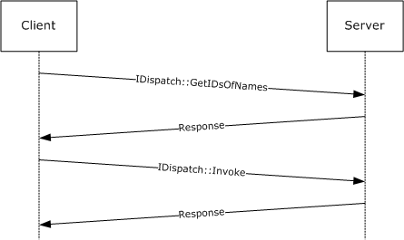

Figure 1: Generic Automation call

This automation call response can be optimized if the automation client knows the DISPIDs associated with an automation server's method at compile time, and forgoes the initial call to GetIDsOfNames:

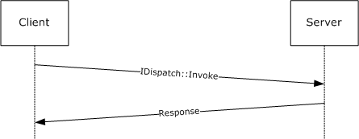

Figure 2: Optimized Automation call

To support type description and discovery, the OLE Automation Protocol specifies:

- How the automation server supports queries for type-description support.
- How to specify an extended set of capabilities and relationships using automation IDL extensions.
- How a server can provide access to the information specified in the IDL.
An automation server specifies that it provides type information by implementing [IDispatch::GetTypeInfoCount (section 3.1.4.1)](#Section_3.1.4.1), and exposes access to the type description server that describes the server's [**dispinterface**](#gt_dispinterface) by implementing [IDispatch::GetTypeInfo (section 3.1.4.2)](#Section_3.1.4.1).

The following diagram illustrates a generic query for type information.

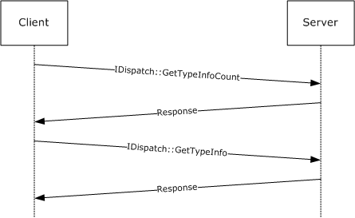

Figure 3: Generic query for type information

To support exposing type information related to [**COM servers**](#gt_com-server), the OLE Automation Protocol specifies the set of types that are used to encapsulate semantic information associated with a COM server, with the interfaces it implements, and with the methods and properties defined on those interfaces ([TYPEATTR (section 2.2.44)](#Section_2.2.44), [FUNCDESC (section 2.2.42)](#Section_2.2.42), and [VARDESC (section 2.2.43)](#Section_2.2.43) being the most important), in addition to the set of interfaces that a server has to implement to provide COM clients with access to the type information (ITypeInfo being the central one).

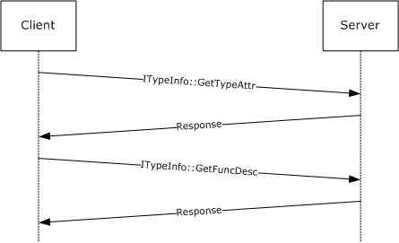

Figure 4: Generic query for type information related to COM servers

## 1.4 Relationship to Other Protocols

The OLE Automation Protocol uses the DCOM Remote Protocol, as specified in [MS-DCOM](../MS-DCOM/MS-DCOM.md).

## 1.5 Prerequisites/Preconditions

The DCOM Remote Protocol, as specified in [MS-DCOM](../MS-DCOM/MS-DCOM.md), must be installed on both the [**automation client**](#gt_automation-client) and [**automation server**](#gt_automation-server).

## 1.6 Applicability Statement

The OLE Automation Protocol is useful for exposing application functionality to scripting languages and across a distributed environment.

Exposing COM objects as [**automation servers**](#gt_automation-server) offers several benefits:

- Exposed objects from many applications are available in a single programming environment. Software implementers can choose from these objects to create solutions that span applications.
- Exposed objects are accessible from any scripting environment or programming tool that implements automation. Systems integrators are not limited to the programming language in which the objects were developed. Instead, they can choose the programming tool or scripting language that best suits their needs and capabilities.
- Object names can remain consistent across versions of an application and can conform automatically to the user's language.

## 1.7 Versioning and Capability Negotiation

Supported Transports: This protocol uses the DCOM Remote Protocol, as specified in [MS-DCOM](../MS-DCOM/MS-DCOM.md), as its transport.

Protocol Version: This protocol comprises two DCOM interfaces: IDispatch and IEnumVARIANT, which are both version 0.0.

## 1.8 Vendor-Extensible Fields

This protocol uses HRESULTs, as specified in [MS-ERREF](../MS-ERREF/MS-ERREF.md). Vendors can choose their own values for this field as long as the C bit (0x20000000) is set, which indicates that it is a customer code.

This protocol uses Win32 error codes. These values are taken from the Windows error number space, as specified in [MS-ERREF]. Vendors SHOULD<1> reuse those values with their indicated meaning. Choosing any other value runs the risk of a collision.

This protocol uses [**DISPIDs**](#gt_dispatch-id-dispid), which are vendor-extensible. Vendors are free to choose their own values, as long as the method and [**property**](#gt_property) DISPIDs are strictly positive 32-bit values. For more information about DISPIDs, see section [2.2.32](#Section_2.2.32).

## 1.9 Standards Assignments

The following [**GUIDs**](#gt_globally-unique-identifier-guid) are used by the OLE Automation Protocol.

| Constant/value | Description |
| --- | --- |
| CLSID_RecordInfo {0000002F-0000-0000-C000-000000000046} | The OBJREF_CUSTOM unmarshaler [**CLSID**](#gt_class-identifier-clsid) for [RecordInfoData (section 2.2.31)](#Section_2.2.31). |
| IID_IRecordInfo {0000002F-0000-0000-C000-000000000046} | The value of the **IID** field of the pRecInfo OBJREF structure (see section [2.2.28.2.1](#Section_2.2.28.2.1)). |
| IID_IDispatch {00020400-0000-0000-C000-000000000046} | The GUID associated with the IDispatch [**interface**](#gt_interface) (see section [3.1](#Section_2.2.49.4)). |
| IID_ITypeComp {00020403-0000-0000-C000-000000000046} | The GUID associated with the ITypeComp interface (see section [3.5](#Section_3.5)). |
| IID_ITypeInfo {00020401-0000-0000-C000-000000000046} | The GUID associated with the ITypeInfo interface (see section [3.7](#Section_3.7)). |
| IID_ITypeInfo2 {00020412-0000-0000-C000-000000000046} | The GUID associated with the ITypeInfo2 interface (see section [3.9](#Section_3.9)). |
| IID_ITypeLib {00020402-0000-0000-C000-000000000046} | The GUID associated with the ITypeLib interface (see section [3.11](#Section_3.11)). |
| IID_ITypeLib2 {00020411-0000-0000-C000-000000000046} | The GUID associated with the ITypeLib2 interface (see section [3.13](#Section_3.13)). |
| IID_IUnknown {00000000-0000-0000-C000-000000000046} | The GUID associated with the IUnknown interface. |
| IID_IEnumVARIANT {00020404-0000-0000-C000-000000000046} | The GUID associated with the IEnumVARIANT interface (see section [3.3](#Section_3.3)). |
| IID_NULL {00000000-0000-0000-0000-000000000000} | The GUID that identifies a NULL value (as specified in [[C706]](https://go.microsoft.com/fwlink/?LinkId=89824) section A1 nil [**UUID**](#gt_universally-unique-identifier-uuid)). |

# 2 Messages

The following sections specify how OLE Automation Protocol messages are encapsulated on the wire, common OLE Automation Protocol data types, and the [**IDL**](#gt_interface-definition-language-idl) extensions that support late-bound calling.

## 2.1 Transport

This protocol uses [**remote procedure call (RPC)**](#gt_remote-procedure-call-rpc) [**dynamic endpoints**](#gt_dynamic-endpoint) (as specified in [[C706]](https://go.microsoft.com/fwlink/?LinkId=89824) sections 6, 7, 8, 9, 10, 11, 12, 13, and 14) and the DCOM Remote Protocol, as specified in [MS-DCOM](../MS-DCOM/MS-DCOM.md).

To access an [**interface**](#gt_interface), the [**client**](#gt_client) MUST request a DCOM connection to its well-known [**object**](#gt_object) [**UUID**](#gt_universally-unique-identifier-uuid) [**endpoint**](#gt_endpoint) on the [**server**](#gt_server), as specified in section [1.9](#Section_1.9).

The RPC version number for all interfaces MUST be 0.0.

## 2.2 Common Data Types

This protocol MUST indicate to the [**RPC**](#gt_remote-procedure-call-rpc) runtime that it is to support the [**Network Data Representation (NDR)**](#gt_network-data-representation-ndr) transfer syntax only, as specified in [[C706]](https://go.microsoft.com/fwlink/?LinkId=89824) sections 6, 7, 8, 9, 10, 11, 12, 13, and 14.

In addition to RPC base types and definitions specified in [C706] and [MS-DTYP](../MS-DTYP/MS-DTYP.md), additional data types are defined in the following sections.

### 2.2.1 BYTE

A BYTE is an 8-bit, unsigned value that corresponds to a single octet in a network protocol.

This type is declared as follows:

typedef byte BYTE;

### 2.2.2 IID

The IID type specifies an [**interface identifier (IID)**](#gt_interface-identifier-iid).

A [**globally unique identifier (GUID)**](#gt_globally-unique-identifier-guid), as specified in [MS-DTYP](../MS-DTYP/MS-DTYP.md), section 2.3.4.

This type is declared as follows:

typedef GUID IID;

### 2.2.3 LPOLESTR

The following is the type definition for the LPOLESTR type.

This type is declared as follows:

typedef [string] wchar_t* LPOLESTR;

### 2.2.4 REFIID

The following is the type definition for the REFIID type.

This type is declared as follows:

typedef IID* REFIID;

### 2.2.5 REFGUID

The following is the type definition for the REFGUID type.

This type is declared as follows:

typedef GUID* REFGUID;

### 2.2.6 PSAFEARRAY, LPSAFEARRAY

Definitions for the PSAFEARRAY and LPSAFEARRAY types follow:

This type is declared as follows:

typedef [unique] SAFEARRAY* PSAFEARRAY, *LPSAFEARRAY;

### 2.2.7 VARIANT Type Constants

The VARENUM enumeration constants are used in the discriminant field, **vt**, of the VARIANT type specified in section [2.2.29.2](#Section_2.2.29.2). When present, the VT_BYREF flag MUST be in an OR relation with another value to specify the [**byref argument**](#gt_byref-argument) for the VARIANT. The VT_EMPTY and VT_NULL values MUST NOT be specified with the VT_BYREF bit flag.

The following values are also used in the discriminant field, **vt**, of the **TYPEDESC** structure specified in section [2.2.37](#Section_2.2.37).

The meaning of each VARIANT type constant is specified as follows. The Context column specifies the context in which each constant is used. A constant MUST NOT be used in a VARIANT unless it is specified with a "V". A constant MUST NOT be used in a SAFEARRAY unless it is specified with an "S". A constant MUST NOT be used in a TYPEDESC unless it is specified with a "T".

typedef enum tagVARENUM

{

VT_EMPTY = 0x0000,

VT_NULL = 0x0001,

VT_I2 = 0x0002,

VT_I4 = 0x0003,

VT_R4 = 0x0004,

VT_R8 = 0x0005,

VT_CY = 0x0006,

VT_DATE = 0x0007,

VT_BSTR = 0x0008,

VT_DISPATCH = 0x0009,

VT_ERROR = 0x000A,

VT_BOOL = 0x000B,

VT_VARIANT = 0x000C,

VT_UNKNOWN = 0x000D,

VT_DECIMAL = 0x000E,

VT_I1 = 0x0010,

VT_UI1 = 0x0011,

VT_UI2 = 0x0012,

VT_UI4 = 0x0013,

VT_I8 = 0x0014,

VT_UI8 = 0x0015,

VT_INT = 0x0016,

VT_UINT = 0x0017,

VT_VOID = 0x0018,

VT_HRESULT = 0x0019,

VT_PTR = 0x001A,

VT_SAFEARRAY = 0x001B,

VT_CARRAY = 0x001C,

VT_USERDEFINED = 0x001D,

VT_LPSTR = 0x001E,

VT_LPWSTR = 0x001F,

VT_RECORD = 0x0024,

VT_INT_PTR = 0x0025,

VT_UINT_PTR = 0x0026,

VT_ARRAY = 0x2000,

VT_BYREF = 0x4000

} VARENUM;

**VT_EMPTY:**

| Context | Description |
| --- | --- |
| V | The type of the contained field is undefined. When this flag is specified, the VARIANT MUST NOT contain a data field. The VARIANT definition is specified in section 2.2.29.2. |

**VT_NULL:**

| Context | Description |
| --- | --- |
| V | The type of the contained field is NULL. When this flag is specified, the VARIANT MUST NOT contain a data field. The VARIANT definition is specified in section 2.2.29.2. |

**VT_I2:**

| Context | Description |
| --- | --- |
| V, S, T | Either the specified type, or the type of the element or contained field MUST be a 2-byte signed integer. |

**VT_I4:**

| Context | Description |
| --- | --- |
| V, S, T | Either the specified type, or the type of the element or contained field MUST be a 4-byte signed integer. |

**VT_R4:**

| Context | Description |
| --- | --- |
| V, S, T | Either the specified type, or the type of the element or contained field MUST be a 4-byte IEEE floating-point number. |

**VT_R8:**

| Context | Description |
| --- | --- |
| V, S, T | Either the specified type, or the type of the element or contained field MUST be an 8-byte IEEE floating-point number. |

**VT_CY:**

| Context | Description |
| --- | --- |
| V, S, T | Either the specified type, or the type of the element or contained field MUST be CURRENCY (see section [2.2.24](#Section_2.2.24)). |

**VT_DATE:**

| Context | Description |
| --- | --- |
| V, S, T | Either the specified type, or the type of the element or contained field MUST be DATE (see section [2.2.25](#Section_2.2.25)). |

**VT_BSTR:**

| Context | Description |
| --- | --- |
| V, S, T | Either the specified type, or the type of the element or contained field MUST be BSTR (see section [2.2.23](#Section_2.2.23)). |

**VT_DISPATCH:**

| Context | Description |
| --- | --- |
| V, S, T | Either the specified type, or the type of the element or contained field MUST be a pointer to IDispatch (see section [3.1.4](#Section_3.9.4)). |

**VT_ERROR:**

| Context | Description |
| --- | --- |
| V, S, T | Either the specified type, or the type of the element or contained field MUST be HRESULT. |

**VT_BOOL:**

| Context | Description |
| --- | --- |
| V, S, T | Either the specified type, or the type of the element or contained field MUST be VARIANT_BOOL (see section [2.2.27](#Section_2.2.27)). |

**VT_VARIANT:**

| Context | Description |
| --- | --- |
| V, S, T | Either the specified type, or the type of the element or contained field MUST be VARIANT (see section [2.2.29](#Section_2.2.29)). It MUST appear with the bit flag VT_BYREF. |

**VT_UNKNOWN:**

| Context | Description |
| --- | --- |
| V, S, T | Either the specified type, or the type of the element or contained field MUST be a pointer to IUnknown. |

**VT_DECIMAL:**

| Context | Description |
| --- | --- |
| V, S, T | Either the specified type, or the type of the element or contained field MUST be DECIMAL (see section [2.2.26](#Section_2.2.26)). |

**VT_I1:**

| Context | Description |
| --- | --- |
| V, S, T | Either the specified type, or the type of the element or contained field MUST be a 1-byte integer. |

**VT_UI1:**

| Context | Description |
| --- | --- |
| V, S, T | Either the specified type, or the type of the element or contained field MUST be a 1-byte unsigned integer. |

**VT_UI2:**

| Context | Description |
| --- | --- |
| V, S, T | Either the specified type, or the type of the element or contained field MUST be a 2-byte unsigned integer. |

**VT_UI4:**

| Context | Description |
| --- | --- |
| V, S, T | Either the specified type, or the type of the element or contained field MUST be a 4-byte unsigned integer. |

**VT_I8:**

| Context | Description |
| --- | --- |
| V, S, T | Either the specified type, or the type of the element or contained field MUST be an 8-byte signed integer. |

**VT_UI8:**

| Context | Description |
| --- | --- |
| V, S, T | Either the specified type, or the type of the element or contained field MUST be an 8-byte unsigned integer. |

**VT_INT:**

| Context | Description |
| --- | --- |
| V, S, T | Either the specified type, or the type of the element or contained field MUST be a 4-byte signed integer. |

**VT_UINT:**

| Context | Description |
| --- | --- |
| V, S, T | Either the specified type, or the type of the element or contained field MUST be a 4-byte unsigned integer. |

**VT_VOID:**

| Context | Description |
| --- | --- |
| T | The specified type MUST be void. |

**VT_HRESULT:**

| Context | Description |
| --- | --- |
| T | The specified type MUST be HRESULT. |

**VT_PTR:**

| Context | Description |
| --- | --- |
| T | The specified type MUST be a unique pointer, as specified in [[C706]](https://go.microsoft.com/fwlink/?LinkId=89824) section 4.2.20.2. |

**VT_SAFEARRAY:**

| Context | Description |
| --- | --- |
| T | The specified type MUST be [SAFEARRAY (section 2.2.30)](#Section_2.2.30). |

**VT_CARRAY:**

| Context | Description |
| --- | --- |
| T | The specified type MUST be a fixed-size array. |

**VT_USERDEFINED:**

| Context | Description |
| --- | --- |
| T | The specified type MUST be user defined. |

**VT_LPSTR:**

| Context | Description |
| --- | --- |
| T | The specified type MUST be a NULL-terminated string, as specified in [C706] section 14.3.4. |

**VT_LPWSTR:**

| Context | Description |
| --- | --- |
| T | The specified type MUST be a zero-terminated string of UNICODE characters, as specified in [C706], section 14.3.4. |

**VT_RECORD:**

| Context | Description |
| --- | --- |
| V, S | The type of the element or contained field MUST be a BRECORD (see section [2.2.28.2](#Section_2.2.28.2.2)). |

**VT_INT_PTR:**

| Context | Description |
| --- | --- |
| T | The specified type MUST be either a 4-byte or an 8-byte signed integer. The size of the integer is platform specific and determines the system pointer size value, as specified in section [2.2.21](#Section_2.2.21). |

**VT_UINT_PTR:**

| Context | Description |
| --- | --- |
| T | The specified type MUST be either a 4 byte or an 8 byte unsigned integer. The size of the integer is platform specific and determines the system pointer size value, as specified in section 2.2.21. |

**VT_ARRAY:**

| Context | Description |
| --- | --- |
| V, S | The type of the element or contained field MUST be a SAFEARRAY (see section [2.2.30.10](#Section_2.2.30)). |

**VT_BYREF:**

| Context | Description |
| --- | --- |
| V, S | The type of the element or contained field MUST be a pointer to one of the types listed in the previous rows of this table. If present, this bit flag MUST appear in a VARIANT discriminant (see section [2.2.28](#Section_2.2.28)) with one of the previous flags. |

### 2.2.8 SAFEARRAY Feature Constants

The SF_TYPE enumeration values are used in the discriminant field, **sfType**, of a [SAFEARRAYUNION](#Section_2.2.30.9) structure.

The SAFEARRAY feature constants are defined in the SF_TYPE enumeration.

typedef [v1_enum] enum tagSF_TYPE

{

SF_ERROR = VT_ERROR,

SF_I1 = VT_I1,

SF_I2 = VT_I2,

SF_I4 = VT_I4,

SF_I8 = VT_I8,

SF_BSTR = VT_BSTR,

SF_UNKNOWN = VT_UNKNOWN,

SF_DISPATCH = VT_DISPATCH,

SF_VARIANT = VT_VARIANT,

SF_RECORD = VT_RECORD,

SF_HAVEIID = VT_UNKNOWN | 0x8000

} SF_TYPE;

**SF_ERROR:** This value means that the SAFEARRAY was incorrectly marshaled. The receiver MUST reject any call that has a SAFEARRAY argument with this flag specified, by raising an RPC_X_BAD_STUB_DATA [**RPC**](#gt_remote-procedure-call-rpc) exception.

Hex value is 0x0000000A.

Element marshaling size: N/A

**SF_I1:** The type of the elements contained in the SAFEARRAY MUST be a 1-byte integer.

Hex value is 0x00000010.

Element marshaling size in bytes: 1

**SF_I2:** The type of the elements contained in the SAFEARRAY MUST be a 2-byte integer.

Hex value is 0x00000002.

Element marshaling size in bytes: 2

**SF_I4:** The type of the elements contained in the SAFEARRAY MUST be a 4-byte integer.

Hex value is 0x00000003.

Element marshaling size in bytes: 4

**SF_I8:** The type of the elements contained in the SAFEARRAY MUST be an 8-byte integer.

Hex value is 0x00000014.

Element marshaling size in bytes: 8

**SF_BSTR:** The type of the elements contained in the SAFEARRAY MUST be a BSTR.

Hex value is 0x00000008.

Element marshaling size in bytes: 4

**SF_UNKNOWN:** The type of the elements contained in the SAFEARRAY MUST be a pointer to IUnknown.

Hex value is 0x0000000D.

Element marshaling size in bytes: 4

**SF_DISPATCH:** The type of the elements contained in the SAFEARRAY MUST be a pointer to IDispatch (see section [3.1.4](#Section_3.9.4)).

Hex value is 0x00000009.

Element marshaling size in bytes: 4

**SF_VARIANT:** The type of the elements contained in the SAFEARRAY MUST be VARIANT.

Hex value is 0x0000000C.

Element marshaling size in bytes: 16

**SF_RECORD:** The type of the elements contained in the SAFEARRAY is a [**user-defined type (UDT)**](#gt_user-defined-type-udt) (as defined in section [2.2.28.1](#Section_2.2.28.1).

Hex value is 0x00000024.

Element marshaling size in bytes: 4

**SF_HAVEIID:** The type of the elements contained in the SAFEARRAY MUST be an MInterfacePointer.

Hex value is 0x0000800D.

Element marshaling size in bytes: 4

### 2.2.9 ADVFEATUREFLAGS Advanced Feature Flags

The following values are used in the field **fFeatures** of a [SAFEARRAY (section 2.2.30.10)](#Section_2.2.30) data type.

typedef enum tagADVFEATUREFLAGS

{

FADF_AUTO = 0x0001,

FADF_STATIC = 0x0002,

FADF_EMBEDDED = 0x0004,

FADF_FIXEDSIZE = 0x0010,

FADF_RECORD = 0x0020,

FADF_HAVEIID = 0x0040,

FADF_HAVEVARTYPE = 0x0080,

FADF_BSTR = 0x0100,

FADF_UNKNOWN = 0x0200,

FADF_DISPATCH = 0x0400,

FADF_VARIANT = 0x0800

} ADVFEATUREFLAGS;

**FADF_AUTO:** MUST be set if the SAFEARRAY is allocated on the stack. This flag MUST be ignored on receipt.

**FADF_STATIC:** MUST be set if the SAFEARRAY is statically allocated. This flag MUST be ignored on receipt.

**FADF_EMBEDDED:** MUST be set if the SAFEARRAY is embedded in a structure. This flag MUST be ignored on receipt.

**FADF_FIXEDSIZE:** MUST be set if the SAFEARRAY cannot be resized or reallocated. This flag MUST be ignored on receipt.

**FADF_RECORD:** The [SAFEARRAY](#Section_2.2.30) MUST contain elements of a [**UDT**](#gt_user-defined-type-udt) (see section [2.2.28.1](#Section_2.2.28.1))

**FADF_HAVEIID:** The SAFEARRAY MUST contain MInterfacePointers elements.

**FADF_HAVEVARTYPE:** If this bit flag is set, the high word of the **cLocks** field of the SAFEARRAY MUST contain a VARIANT type constant that describes the type of the array's elements (see sections [2.2.7](#Section_2.2.7) and 2.2.30.10).

**FADF_BSTR:** The SAFEARRAY MUST contain an array of BSTR elements (see section [2.2.23](#Section_2.2.23)).

**FADF_UNKNOWN:** The SAFEARRAY MUST contain an array of pointers to IUnknown.

**FADF_DISPATCH:** The SAFEARRAY MUST contain an array of pointers to IDispatch (see section [3.1.4](#Section_3.9.4)).

**FADF_VARIANT:** The SAFEARRAY MUST contain an array of VARIANT instances.

### 2.2.10 CALLCONV Calling Convention Constants

The CALLCONV enumeration values are used in the **callconv** field of a FUNCDESC to identify the calling convention of a local method defined in the [**automation type library**](#gt_automation-type-library) module, as specified in sections [2.2.42](#Section_2.2.42) and [2.2.49.9](#Section_2.2.49.9) .

The following calling convention constants are defined in the CALLCONV enumeration:

typedef [v1_enum] enum tagCALLCONV

{

CC_CDECL = 1,

CC_PASCAL = 2,

CC_STDCALL = 4

} CALLCONV;

**CC_CDECL:** MUST be set if the method was declared with the cdecl keyword.

**CC_PASCAL:** MUST be set if the method was declared with the pascal keyword.

**CC_STDCALL:** MUST be set if the method was declared with the stdcall keyword.

### 2.2.11 FUNCFLAGS Function Feature Constants

The FUNCFLAGS enumeration values are used in the **wFuncFlags** field of a FUNCDESC to identify features of a function, as specified in section [2.2.42](#Section_2.2.42).

The function feature constants are defined in the FUNCFLAGS enumeration.

typedef enum tagFUNCFLAGS

{

FUNCFLAG_FRESTRICTED = 1,

FUNCFLAG_FSOURCE = 0x2,

FUNCFLAG_FBINDABLE = 0x4,

FUNCFLAG_FREQUESTEDIT = 0x8,

FUNCFLAG_FDISPLAYBIND = 0x10,

FUNCFLAG_FDEFAULTBIND = 0x20,

FUNCFLAG_FHIDDEN = 0x40,

FUNCFLAG_FUSESGETLASTERROR = 0x80,

FUNCFLAG_FDEFAULTCOLLELEM = 0x100,

FUNCFLAG_FUIDEFAULT = 0x200,

FUNCFLAG_FNONBROWSABLE = 0x400,

FUNCFLAG_FREPLACEABLE = 0x800,

FUNCFLAG_FIMMEDIATEBIND = 0x1000

} FUNCFLAGS;

**FUNCFLAG_FRESTRICTED:** MUST be set if the method or [**property**](#gt_property) was declared with the **[restricted]** attribute (as specified in section [2.2.49.5.1](#Section_2.2.49.5.1)).

**FUNCFLAG_FSOURCE:** MUST be set if the method or property is a member of an [**interface**](#gt_interface) declared with the **[source]** attribute (as specified in section [2.2.49.8](#Section_2.2.49.8)).

**FUNCFLAG_FBINDABLE:** MUST be set if the property was declared with the **[bindable]** attribute (as specified in section [2.2.49.5.2](#Section_2.2.49.5.2)).

**FUNCFLAG_FREQUESTEDIT:** MUST be set if the property was declared with the **[requestedit]** attribute (as specified in section 2.2.49.5.2).

**FUNCFLAG_FDISPLAYBIND:** MUST be set if the property was declared with the **[displaybind]** attribute (as specified in section 2.2.49.5.2).

**FUNCFLAG_FDEFAULTBIND:** MUST be set if the property was declared with the **[defaultbind]** attribute (as specified in section 2.2.49.5.2).

**FUNCFLAG_FHIDDEN:** MUST be set if the method or property was declared with the **[hidden]** attribute (as specified in section 2.2.49.5.1).

**FUNCFLAG_FUSESGETLASTERROR:** MUST be set if the method or property was declared with the **[usesgetlasterror]** attribute (as specified in section [2.2.49.9](#Section_2.2.49.9)) and MUST be ignored on receipt.

**FUNCFLAG_FDEFAULTCOLLELEM:** MUST be set if the method or property was declared with the **[defaultcollelem]** attribute (as specified in section 2.2.49.5.1).

**FUNCFLAG_FUIDEFAULT:** MUST be set if the method or property was declared with the **[uidefault]** attribute (as specified in section 2.2.49.5.1).

**FUNCFLAG_FNONBROWSABLE:** MUST be set if the property was declared with the **[nonbrowsable]** attribute (as specified in section 2.2.49.5.1).

**FUNCFLAG_FREPLACEABLE:** MUST be set if the property was declared with the **[replaceable]** attribute (as specified in section 2.2.49.5.1). MUST be ignored on receipt.

**FUNCFLAG_FIMMEDIATEBIND:** MUST be set if the property was declared with the **[immediatebind]** attribute (as specified in section 2.2.49.5.2).

### 2.2.12 FUNCKIND Function Access Constants

The FUNCKIND enumeration values are used in the **funckind** field of a [FUNCDESC](#Section_2.2.42) to specify the way that a method is accessed, as specified in section 2.2.42.

The following function access constants are defined in the FUNCKIND enumeration.

typedef [v1_enum] enum tagFUNCKIND

{

FUNC_PUREVIRTUAL = 1,

FUNC_STATIC = 3,

FUNC_DISPATCH = 4

} FUNCKIND;

**FUNC_PUREVIRTUAL:** MUST be set if the method described by the **FUNCDESC** structure is a member of an [**interface**](#gt_interface) whose associated TYPEKIND value is TKIND_INTERFACE (as specified in section [2.2.17](#Section_3.7.1.2)).

**FUNC_STATIC:** MUST be set if the method described by the **FUNCDESC** structure is a method member of the module defined with the [**automation scope**](#gt_automation-scope) (as specified in section [2.2.49.9](#Section_2.2.49.9)).

**FUNC_DISPATCH:** MUST be set if the method described by the **FUNCDESC** structure is a member of an interface whose associated TYPEKIND value is TKIND_DISPATCH (as specified in section 2.2.17). MUST NOT be set if the FUNC_PUREVIRTUAL flag is set.

### 2.2.13 IMPLTYPEFLAGS Feature Constants

The IMPLTYPEFLAGS enumeration values are stored in the pImplTypeFlags parameter of the [ITypeInfo::GetImplTypeFlags](#Section_3.7.4.7) method to specify the implementation features of a [**COM server**](#gt_com-server), as specified in section 3.7.4.7.

The following implementation type feature constants are defined in the IMPLTYPEFLAGS enumeration.

typedef enum tagIMPLTYPEFLAGS

{

IMPLTYPEFLAG_FDEFAULT = 0x1,

IMPLTYPEFLAG_FSOURCE = 0x2,

IMPLTYPEFLAG_FRESTRICTED = 0x4,

IMPLTYPEFLAG_FDEFAULTVTABLE = 0x8

} IMPLTYPEFLAGS;

**IMPLTYPEFLAG_FDEFAULT:** MUST be set if the interface was declared with the **[default]** attribute (as specified in section [2.2.49.8](#Section_2.2.49.8)).

**IMPLTYPEFLAG_FSOURCE:** MUST be set if the interface was declared with the **[source]** or **[defaultvtable]** attributes (as specified in section 2.2.49.8).

**IMPLTYPEFLAG_FRESTRICTED:** MUST be set if the interface was declared with the **[restricted]** attribute (as specified in section 2.2.49.8).

**IMPLTYPEFLAG_FDEFAULTVTABLE:** MUST be set if the interface was declared with the **[defaultvtable]** attribute (as specified in section 2.2.49.8).

### 2.2.14 INVOKEKIND Function Invocation Constants

The INVOKEKIND enumeration values are used in the **invkind** field of a [FUNCDESC (section 2.2.42)](#Section_2.2.42) to specify the way that a method is invoked using [IDispatch::Invoke (section 3.1.4.4)](#Section_3.1.4.4). They are also used in the [ITypeInfo2::GetFuncIndexOfMemId](#Section_3.9.4.3), [ITypeInfo::GetDllEntry](#Section_3.7.4.9) and [ITypeComp::Bind](#Section_3.5.4.2) methods to distinguish between properties and [**property**](#gt_property) accessor methods that have the same [MEMBERID (section 2.2.35)](#Section_2.2.35) but are invoked differently.

Fields and parameters that contain function invocation constants MUST contain a single INVOKEKIND value, and MUST NOT contain bitwise combinations of multiple INVOKEKIND values.

The function invocation constants are defined in the INVOKEKIND enumeration.

typedef [v1_enum] enum tagINVOKEKIND

{

INVOKE_FUNC = 0x1,

INVOKE_PROPERTYGET = 0x2,

INVOKE_PROPERTYPUT = 0x4,

INVOKE_PROPERTYPUTREF = 0x8

} INVOKEKIND;

**INVOKE_FUNC:** MUST be set if the type member is a method declared without the **[propget]**, **[propput]**, or **[propputref]** attributes, or to specify that a [**client**](#gt_client) method request MUST NOT return a property.

**INVOKE_PROPERTYGET:** MUST be set if the type member is a property declared with the **[propget]** attribute (as specified in section [2.2.49.5.1](#Section_2.2.49.5.1)), or to specify that a client method request MUST NOT return anything but an [**ODL dispinterface**](#gt_odl-dispinterface) property (as specified in section [2.2.49.5.3](#Section_2.2.49.5.3)) or a property declared with the **[propget]** attribute.

**INVOKE_PROPERTYPUT:** MUST be set if the type member is a property declared with the **[propput]** attribute (as specified in section 2.2.49.5.1), or to specify that a client method request MUST NOT return anything but a property declared with the **[propput]** attribute.

**INVOKE_PROPERTYPUTREF:** MUST be set if the type member is a property declared with the **[propputref]** attribute (as specified in section 2.2.49.5.1), or to specify that a client method request MUST NOT return anything but a property declared with the **[propputref]** attribute.

### 2.2.15 PARAMFLAGS Parameter Feature Constants

The PARAMFLAGS enumeration values are used in the **wParamFlags** field of a PARAMFLAGS to identify the features of a method parameter, as specified in section [2.2.40](#Section_2.2.40).

The following parameter feature constants are defined in the PARAMFLAGS enumeration.

typedef enum tagPARAMFLAGS

{

PARAMFLAG_NONE = 0,

PARAMFLAG_FIN = 0x1,

PARAMFLAG_FOUT = 0x2,

PARAMFLAG_FLCID = 0x4,

PARAMFLAG_FRETVAL = 0x8,

PARAMFLAG_FOPT = 0x10,

PARAMFLAG_FHASDEFAULT = 0x20,

PARAMFLAG_FHASCUSTDATA = 0x40

} PARAMFLAGS;

**PARAMFLAG_NONE:** The behavior of the parameter is not specified.

**PARAMFLAG_FIN:** MUST be set if the parameter was declared by using the [in] attribute (for more information, see section [2.2.49.6](#Section_2.2.49.6)).

**PARAMFLAG_FOUT:** MUST be set if the parameter was declared by using the [out] attribute (for more information, see section [2.2.49.5](#Section_2.2.49.5)).

**PARAMFLAG_FLCID:** MUST be set if the parameter was declared by using the [lcid] attribute (for more information, see section 2.2.49.6).

**PARAMFLAG_FRETVAL:** MUST be set if the parameter was declared by using the [retval] attribute (for more information, see section 2.2.49.6).

**PARAMFLAG_FOPT:** MUST be set if the parameter was declared by using the [optional] attribute (for more information, see section 2.2.49.6). MUST be set if the PARAMFLAG_FHASDEFAULT flag is set.

**PARAMFLAG_FHASDEFAULT:** MUST be set if the parameter was declared by using the [defaultvalue] attribute (for more information, see section 2.2.49.6).

**PARAMFLAG_FHASCUSTDATA:** MAY<2> be set if the parameter was declared by using the [custom] attribute (for more information, see section [2.2.49.2](#Section_2.2.49.2)).

### 2.2.16 TYPEFLAGS Type Feature Constants

The TYPEFLAGS enumeration values are used in the **wTypeFlags** field of a TYPEATTR to specify the features of a type, as specified in section [2.2.44](#Section_2.2.44). They also are used in the *pTypeFlags* parameter of the [ITypeInfo2::GetTypeFlags](#Section_3.9.4.2) method.

The function invocation constants are defined in the TYPEFLAGS enumeration.

typedef enum tagTYPEFLAGS

{

TYPEFLAG_FAPPOBJECT = 0x1,

TYPEFLAG_FCANCREATE = 0x2,

TYPEFLAG_FLICENSED = 0x4,

TYPEFLAG_FPREDECLID = 0x8,

TYPEFLAG_FHIDDEN = 0x10,

TYPEFLAG_FCONTROL = 0x20,

TYPEFLAG_FDUAL = 0x40,

TYPEFLAG_FNONEXTENSIBLE = 0x80,

TYPEFLAG_FOLEAUTOMATION = 0x100,

TYPEFLAG_FRESTRICTED = 0x200,

TYPEFLAG_FAGGREGATABLE = 0x400,

TYPEFLAG_FREPLACEABLE = 0x800,

TYPEFLAG_FDISPATCHABLE = 0x1000,

TYPEFLAG_FPROXY = 0x4000

} TYPEFLAGS;

**TYPEFLAG_FAPPOBJECT:** MUST be set if the type was declared with the **[appobject]** attribute (see section [2.2.49.8](#Section_2.2.49.8)).

**TYPEFLAG_FCANCREATE:** MUST NOT be set if the type was declared with the **[noncreatable]** attribute (see section 2.2.49.8). Otherwise, MUST be set.

**TYPEFLAG_FLICENSED:** MUST be set if the type was declared with the **[licensed]** attribute (see section 2.2.49.8).

**TYPEFLAG_FPREDECLID:** MUST be set if the type was declared with the **[predeclid]** or **[appobject]** attributes (see section 2.2.49.8).

**TYPEFLAG_FHIDDEN:** MUST be set if the type was declared with the **[hidden]** attribute (see section 2.2.49.8).

**TYPEFLAG_FCONTROL:** MUST be set if the type was declared with the **[control]** attribute (see section 2.2.49.8).

**TYPEFLAG_FDUAL:** MUST be set if the type was declared with the **[dual]** attribute (see section [2.2.49.4.2](#Section_2.2.49.4.2)).

**TYPEFLAG_FNONEXTENSIBLE:** MUST be set if the type was declared with the **[nonextensible]** attribute (see section [2.2.49.4](#Section_2.2.49.4.3)).

**TYPEFLAG_FOLEAUTOMATION:** MUST be set if the type is a [**DCOM interface**](#gt_dcom-interface) that was declared with the **[oleautomation]** or **[dual]** attributes (see section 2.2.49.4). MUST NOT be set if the type is a [**dispinterface**](#gt_dispinterface).

**TYPEFLAG_FRESTRICTED:** MUST be set if the type was declared with the **[restricted]** attribute (see section [2.2.49.5.1](#Section_2.2.49.5.1)).

**TYPEFLAG_FAGGREGATABLE:** MUST be set if the type was declared with the **[aggregatable]** attribute (see section 2.2.49.8).

**TYPEFLAG_FREPLACEABLE:** MUST be set if the type contains a member that was declared with the **[replaceable]** attribute (see section 2.2.49.5.1). MUST be ignored on receipt.

**TYPEFLAG_FDISPATCHABLE:** MUST be set if the type derives from IDispatch, either directly or indirectly. MUST be set if the type is a dispinterface or [**dual interface**](#gt_dual-interface) <3> (see section 2.2.49.4.2).

**TYPEFLAG_FPROXY:** MUST be set if the type was declared with the **[proxy]** attribute (see section 2.2.49.4). MUST be ignored on receipt.

### 2.2.17 TYPEKIND Type Kind Constants

The TYPEKIND enumeration values are used in the **typekind** field of a TYPEATTR to specify the features of a type, as specified in section [2.2.44](#Section_2.2.44). They are also used in the *pTypeKind* parameter of the [ITypeInfo2::GetTypeKind](#Section_3.9.4.1) method, as specified in section 3.9.4.1.

The type kind constants are defined in the TYPEKIND enumeration.

typedef [v1_enum] enum tagTYPEKIND

{

TKIND_ENUM = 0x0,

TKIND_RECORD = 0x1,

TKIND_MODULE = 0x2,

TKIND_INTERFACE = 0x3,

TKIND_DISPATCH = 0x4,

TKIND_COCLASS = 0x5,

TKIND_ALIAS = 0x6,

TKIND_UNION = 0x7

} TYPEKIND;

**TKIND_ENUM:** MUST be used if the type is an enumeration that was defined with the **typedef** and **enum** keywords.

**TKIND_RECORD:** MUST be used if the type is a structure that was defined with the **typedef** and **struct** keywords.

**TKIND_MODULE:** MUST be used if the type is a module that was defined with the **module** keyword.

**TKIND_INTERFACE:** MUST be used if the type is a [**DCOM interface**](#gt_dcom-interface) that was defined with the interface keyword.

**TKIND_DISPATCH:** MUST be used if the type is a [**dispinterface**](#gt_dispinterface) that was defined with either the **dispinterface** keyword or the **interface** keyword with the **[dual]** attribute.

**TKIND_COCLASS:** MUST be used if the type is a [**COM server**](#gt_com-server) that was defined with the **coclass** keyword.

**TKIND_ALIAS:** MUST be used if the type is an alias for a predefined type that was defined with the **typedef** keyword and added to the [**automation scope**](#gt_automation-scope) by using the **[public]** attribute as specified in section [2.2.49.3](#Section_2.2.49.3).

**TKIND_UNION:** MUST be used if the type is a union that was defined with the **typedef** and **union** keywords.

### 2.2.18 VARFLAGS Variable Feature Constants

The VARFLAGS enumeration values are used in the **wVarFlags** field of a [VARDESC](#Section_2.2.43) to specify the features of a field, constant, or [**ODL dispinterface**](#gt_odl-dispinterface) [**property**](#gt_property), as specified in section 2.2.43.

The variable feature constants are defined in the VARFLAGS enumeration.

typedef enum tagVARFLAGS

{

VARFLAG_FREADONLY = 0x1,

VARFLAG_FSOURCE = 0x2,

VARFLAG_FBINDABLE = 0x4,

VARFLAG_FREQUESTEDIT = 0x8,

VARFLAG_FDISPLAYBIND = 0x10,

VARFLAG_FDEFAULTBIND = 0x20,

VARFLAG_FHIDDEN = 0x40,

VARFLAG_FRESTRICTED = 0x80,

VARFLAG_FDEFAULTCOLLELEM = 0x100,

VARFLAG_FUIDEFAULT = 0x200,

VARFLAG_FNONBROWSABLE = 0x400,

VARFLAG_FREPLACEABLE = 0x800,

VARFLAG_FIMMEDIATEBIND = 0x1000

} VARFLAGS;

**VARFLAG_FREADONLY:** MUST be set if the variable is an ODL dispinterface property that was declared with the [readonly] attribute (see section [2.2.49.5.3](#Section_2.2.49.5.3)).

**VARFLAG_FSOURCE:** MUST be set if the variable is a property member of an ODL interface that was declared with the [source] attribute (see section [2.2.49.8](#Section_2.2.49.8)).

**VARFLAG_FBINDABLE:** MUST be set if the variable is an ODL dispinterface property that was declared with the [bindable] attribute (see section [2.2.49.5.2](#Section_2.2.49.5.2)).

**VARFLAG_FREQUESTEDIT:** MUST be set if the variable is an ODL dispinterface property that was declared with the [requestedit] attribute (see section 2.2.49.5.2).

**VARFLAG_FDISPLAYBIND:** MUST be set if the variable is an ODL dispinterface property that was declared with the [displaybind] attribute (see section 2.2.49.5.2).

**VARFLAG_FDEFAULTBIND:** MUST be set if the variable is an ODL dispinterface property that was declared with the [defaultbind] attribute (see section 2.2.49.5.2).

**VARFLAG_FHIDDEN:** MUST be set if the variable is a member of a type that was declared with the [hidden] attribute (see section [2.2.49.5.1](#Section_2.2.49.5.1)).

**VARFLAG_FRESTRICTED:** MUST be set if the variable is a member of a type that was declared with the [restricted] attribute (see section 2.2.49.5.1).

**VARFLAG_FDEFAULTCOLLELEM:** MUST be set if the variable is an ODL dispinterface property that was declared with the [defaultcollelem] attribute (see section 2.2.49.5.1).

**VARFLAG_FUIDEFAULT:** MUST be set if the variable is an ODL dispinterface property that was declared with the [uidefault] attribute (see section 2.2.49.5.1).

**VARFLAG_FNONBROWSABLE:** MUST be set if the variable is an ODL dispinterface property that was declared with the [nonbrowsable] attribute (see section 2.2.49.5.1).

**VARFLAG_FREPLACEABLE:** MUST be set if the variable is an ODL dispinterface property that was declared with the [replaceable] attribute (see section 2.2.49.5.1). MUST be ignored on receipt.

**VARFLAG_FIMMEDIATEBIND:** MUST be set if the variable is an ODL dispinterface property that was declared with the [immediatebind] attribute (see section 2.2.49.5.2).

### 2.2.19 VARKIND Variable Kind Constants

The VARKIND enumeration values are used in the **varkind** field of a [VARDESC](#Section_2.2.43) to specify the kind of element that is described by the VARDESC, as specified in section 2.2.43.

The variable kind constants are defined in the VARKIND enumeration:

typedef [v1_enum] enum tagVARKIND

{

VAR_PERINSTANCE = 0,

VAR_STATIC = (VAR_PERINSTANCE + 1),

VAR_CONST = (VAR_STATIC + 1),

VAR_DISPATCH = (VAR_CONST + 1)

} VARKIND;

**VAR_PERINSTANCE:** MUST be used if the VARDESC describes a member of a structure or union.

**VAR_STATIC:** MUST be used if the VARDESC describes an appobject [**coclass**](#gt_coclass) (see section [2.2.49.8](#Section_2.2.49.8)).

**VAR_CONST:** MUST be used if the VARDESC describes a member of a module or enumeration.

**VAR_DISPATCH:** MUST be used if the VARDESC describes an [**ODL dispinterface**](#gt_odl-dispinterface) property (see section [2.2.49.5.3](#Section_2.2.49.5.3)).

### 2.2.20 LIBFLAGS Type Library Feature Constants

The LIBFLAGS enumeration values are used in the **wLibFlags** field of a TLIBATTR to specify the features of the [**automation scope**](#gt_automation-scope) of an ITypeLib [**server**](#gt_server), as specified in section [2.2.45](#Section_2.2.45).

The Type library feature constants are defined in the LIBFLAGS enumeration.

typedef [v1_enum] enum tagLIBFLAGS

{

LIBFLAG_FRESTRICTED = 0x01,

LIBFLAG_FCONTROL = 0x02,

LIBFLAG_FHIDDEN = 0x04,

LIBFLAG_FHASDISKIMAGE = 0x08

} LIBFLAGS;

**LIBFLAG_FRESTRICTED:** MUST be set if the automation scope was declared with the **[restricted]** attribute (as specified in section [2.2.49.2](#Section_2.2.49.2)).

**LIBFLAG_FCONTROL:** MUST be set if the automation scope was declared with the **[control]** attribute (as specified in section 2.2.49.2).

**LIBFLAG_FHIDDEN:** MUST be set if the automation scope was declared with the **[hidden]** attribute (as specified in section 2.2.49.2).

**LIBFLAG_FHASDISKIMAGE:** MAY be set <4>and MUST be ignored on receipt.

### 2.2.21 SYSKIND System Pointer Size Constants

SYSKIND is used in the **syskind** field of a [TLIBATTR](#Section_2.2.45) to specify the system pointer size value, as specified in section 2.2.45.

The system pointer size constants are defined in the SYSKIND enumeration.

typedef [v1_enum] enum tagSYSKIND

{

SYS_WIN32 = 1,

SYS_WIN64 = 3

} SYSKIND;

**SYS_WIN32:** MUST be set if the [**automation type library**](#gt_automation-type-library) uses 32 bits for pointer-sized values.

**SYS_WIN64:** MUST be set if the automation type library uses 64 bits for pointer-sized values.

### 2.2.22 DESCKIND Name Description Constants

The DESCKIND Name Description Constants enumeration values are used by the [ITypeComp::Bind](#Section_3.5.4.2) method to indicate the kind of element to which a name has been bound, as specified in section 3.5.4.1.

The name description constants are defined in the DESCKIND enumeration.

typedef [v1_enum] enum tagDESCKIND

{

DESCKIND_NONE = 0,

DESCKIND_FUNCDESC = 1,

DESCKIND_VARDESC = 2,

DESCKIND_TYPECOMP = 3,

DESCKIND_IMPLICITAPPOBJ = 4

} DESCKIND;

**DESCKIND_NONE:** MUST be set if there is no element bound to the name.

**DESCKIND_FUNCDESC:** MUST be set if the name is bound to a method or property accessor method. MUST NOT be set if the name is bound to an [ODL dispinterface](#Section_2.2.49.7) property.

**DESCKIND_VARDESC:** MUST be set if the name is bound to a data element or ODL dispinterface property.

**DESCKIND_TYPECOMP:** MUST be set if the name is bound to an enumeration or module.

**DESCKIND_IMPLICITAPPOBJ:** MUST be set if the name is bound to an appobject [**coclass**](#gt_coclass) (see section [2.2.49.8](#Section_2.2.49.8)) or a member of its default nonsource interface (also see 2.2.49.8).

### 2.2.23 BSTR

BSTR is an OLE [**automation type**](#gt_automation-types) for transferring length-prefixed strings, either Unicode or ANSI, as well as length-prefixed binary data.

The **BSTR** type defined in this section specifies the wire representation of a length-prefixed data block whose memory representation is specified in [MS-DTYP](../MS-DTYP/MS-DTYP.md) section 2.2.5. To clarify, the memory specification will be referred to as the presented **BSTR**, and the wire specification will be referred to as the transmitted **BSTR**.

For any document referencing both [MS-DTYP] and [MS-OAUT](#Section_bbb05720f72445c78d17f83c3d1a3961), specifying **BSTR** in a wire representation context MUST be considered as a reference to the transmitted **BSTR** type, while specifying **BSTR** in a memory representation context MUST be considered as a reference to the presented **BSTR** type ([MS-DTYP] section 2.2.5). Reflecting the terminology used for presented **BSTRs**, a **NULL BSTR**, or NULL transmitted **BSTR**, is defined as the wire representation of a NULL presented BSTR; and an empty **BSTR**, or empty transmitted **BSTR**, is defined as the wire representation of a zero-length presented **BSTR**. Preserving this distinction in the wire representation enables clients and servers to distinguish between NULL presented **BSTRs** and zero-length presented **BSTRs**, and thus associate possibly different, application-specific semantics to these two values.

#### 2.2.23.1 FLAGGED_WORD_BLOB

The FLAGGED_WORD_BLOB structure defines a type for transferring length-prefixed data.

typedef struct _FLAGGED_WORD_BLOB {

unsigned long cBytes;

unsigned long clSize;

[size_is(clSize)] unsigned short asData[];

} FLAGGED_WORD_BLOB;

**cBytes:** MUST be the size, in bytes, of the **asData** array.

**Note** A value of 0xFFFFFFFF MUST be considered as representing a null **BSTR**.

**clSize:** MUST be the total number of unsigned shorts in the asData array. This value MUST be half the value of **cBytes**, rounded up, unless this is a null **BSTR**. In the latter case, a value of 0 MUST be used.

**asData:** An array of unsigned shorts. If **clSize** is 0, **asData** MUST not contain any elements.

Data of this type MUST be marshaled as specified in [[C706]](https://go.microsoft.com/fwlink/?LinkId=89824), section 14, with the exception that it MUST be marshaled by using a little-endian data representation regardless of the data representation format label. For more information, see [C706] section 14.2.5.

#### 2.2.23.2 BSTR Type Definition

BSTR Type Definition is an OLE [**Automation type**](#gt_automation-types) for transferring length-prefixed data.

This type is declared as follows:

typedef [unique] FLAGGED_WORD_BLOB* BSTR;

A null transmitted **BSTR** is a pointer to a FLAGGED_WORD_BLOB whose **cBytes** field MUST equal 0xFFFFFFFF, **clSize** field MUST equal 0, and **asData** MUST NOT contain any elements.An empty transmitted **BSTR** is a pointer to a [FLAGGED_WORD_BLOB](#Section_2.2.23.1) whose **cBytes** and **clSize** fields MUST both equal 0, and **asData** MUST NOT contain any elements.

#### 2.2.23.3 Mapping Between Presented and Transmitted BSTRs

The mapping from the memory representation of a [BSTR](#Section_2.2.23) to the wire representation MUST be performed by setting the fields of **FLAGGED_WORD_BLOB** referred by the transmitted **BSTR** as specified below:

**cBytes:** MUST be set to the value of the presented **BSTR**'s length prefix, or 0xFFFFFFFF for a NULL presented **BSTR**.

**clSize:** MUST be half the value of **cBytes** rounded up, or 0 for a NULL presented **BSTR**.

**asData:** MUST contain exactly **clSize** elements, and MUST be filled from the contents of the data pointed to by the presented **BSTR**.

The mapping from the transmitted **BSTR** to the presented **BSTR** MUST be performed as follows:

- The length prefix MUST be set to the value of the **cBytes** field of the transmitted **BSTR**'s **FLAGGED_WORD_BLOB**.
- The data pointed to by the presented BSTR MUST be set to the contents of the **asData** field of the transmitted **BSTR**'s **FLAGGED_WORD_BLOB**.

### 2.2.24 CURRENCY

The CURRENCY type specifies currency information. It is represented as an 8-byte integer, scaled by 10,000, to give a fixed-point number with 15 digits to the left of the decimal point, and four digits to the right. This representation provides a range of 922337203685477.5807 to –922337203685477.5808. For example, $5.25 is stored as the value 52500.

typedef struct tagCY {

__int64 int64;

} CURRENCY;

### 2.2.25 DATE

DATE is a type that specifies date and time information. It is represented as an 8-byte floating-point number.

This type is declared as follows:

typedef double DATE;

The date information is represented by whole-number increments, starting with December 30, 1899 midnight as time zero. The time information is represented by the fraction of a day since the preceding midnight. For example, 6:00 A.M. on January 4, 1900 would be represented by the value 5.25 (5 and 1/4 of a day past December 30, 1899).

### 2.2.26 DECIMAL

The DECIMAL structure specifies a sign and scale for a number. Decimal variables are represented as 96-bit unsigned integers that are scaled by a variable power of 10.

typedef struct tagDEC {

WORD wReserved;

BYTE scale;

BYTE sign;

ULONG Hi32;

ULONGLONG Lo64;

} DECIMAL;

**wReserved:** MUST be set to 0 and MUST be ignored by the recipient.

**scale:** MUST be the power of 10 by which to divide the 96-bit integer represented by Hi32 * 2^64 + Lo64. The value MUST be in the range of 0 to 28, inclusive.

| Value | Meaning |
| --- | --- |
| 0 — 28 | Order of magnitude of the decimal number. |

**sign:** MUST equal one of the following values.

| Value | Meaning |
| --- | --- |
| 0 | The decimal contains a positive value. |
| 0x80 | The decimal contains a negative value. |

**Hi32:** MUST be the high 32 bits of the 96-bit integer that is scaled and signed to represent the final DECIMAL value.

**Lo64:** MUST be the low 64 bits of the 96-bit integer that is scaled and signed to represent the final DECIMAL value.

### 2.2.27 VARIANT_BOOL

The VARIANT_BOOL type specifies Boolean values.

This type is declared as follows:

typedef short VARIANT_BOOL;

The values MUST be defined as:

| Value | Meaning |
| --- | --- |
| VARIANT_TRUE 0xFFFF | MUST indicate a Boolean value of TRUE. |
| VARIANT_FALSE 0x0000 | MUST indicate a Boolean value of FALSE. |

### 2.2.28 User-Defined Data Types and BRECORD

#### 2.2.28.1 User-Defined Data Types

The OLE Automation Protocol supports the specification of [**UDTs**](#gt_user-defined-type-udt), in the form of structures of related data elements. The data elements MUST consist of scalar and OLE [**automation types**](#gt_automation-types). The structure is considered to be a single type and is referred to as a UDT.

In the [**IDL**](#gt_interface-definition-language-idl), a UDT MUST be identified by the uuid attribute (see section [2.2.49.2](#Section_2.2.49.2)). The GUID from this attribute MUST uniquely identify the UDT.

A UDT MUST be specified or referenced from an [**automation scope**](#gt_automation-scope) (see section 2.2.49.2). For more information about the wire representation of the UDT, see sections [2.2.31](#Section_2.2.31) and 2.2.49.2.

#### 2.2.28.2 BRECORD

A BRECORD is the type used for the representation of [**UDTs**](#gt_user-defined-type-udt) on the wire.

##### 2.2.28.2.1 _wireBRECORD

The _wireBRECORD structure is the wire representation of a collection of [**UDTs**](#gt_user-defined-type-udt) of the same type. This representation MUST be used when the UDTs appear inside a [SAFEARRAY (section 2.2.30.10)](#Section_2.2.30) or inside a [VARIANT (section 2.2.29.2)](#Section_2.2.29.2). Otherwise, the UDTs MUST be [**NDR**](#gt_network-data-representation-ndr)-marshaled as specified by their [**IDL**](#gt_interface-definition-language-idl). For more information, see [[C706]](https://go.microsoft.com/fwlink/?LinkId=89824) section 14.

typedef struct _wireBRECORD {

ULONG fFlags;

ULONG clSize;

MInterfacePointer* pRecInfo;

[size_is(clSize)] byte* pRecord;

} wireBRECORDStr;

**fFlags:** MUST be 0 if pRecord is NULL. Otherwise, the value MUST be 1.

**clSize:** MUST be 0 if **pRecord** is NULL. Otherwise, the value MUST equal the size (in bytes) of the UDTs contained in **pRecord**, plus 4 bytes to account for the prefix contained in **pRecord**.

**pRecInfo:** MUST specify an MInterfacePointer that MUST contain an OBJREF_CUSTOM with a CLSID field set to CLSID_RecordInfo ([1.9](#Section_1.9)) and a pObjectData field that MUST contain a RecordInfoData binary large object (BLOB) ([2.2.31](#Section_2.2.31)). The iid field of the OBJREF portion of the structure MUST be set to IID_IRecordInfo (1.9). An implementation MAY use this value as the IID of a local-only interface.<5>

**pRecord:** MUST be NULL if there are no UDTs. Otherwise, the value MUST contain the NDR-marshaled representation of the UDTs, prefixed by a 4-byte unsigned integer that specifies the size, in bytes. This integer MUST equal the value of **clSize**.

Data of this type MUST be marshaled as specified in [C706] section 14, with the exception that the fields **fFlags**, **clSize**, and the 4-byte prefix in **pRecord** MUST be marshaled by using a little-endian data representation, regardless of the data representation format label. For more information, see [C706] section 14.2.5.

##### 2.2.28.2.2 BRECORD

The following is the type definition for the BRECORD type.

This type is declared as follows:

typedef [unique] struct _wireBRECORD* BRECORD;

### 2.2.29 VARIANT

VARIANT is a container for a union that can hold many types of data.

#### 2.2.29.1 _wireVARIANT

The _wireVARIANT is a container for a union that in turn contains scalar and OLE Automation data types.

typedef struct _wireVARIANT {

DWORD clSize;

DWORD rpcReserved;

USHORT vt;

USHORT wReserved1;

USHORT wReserved2;

USHORT wReserved3;

[switch_type(ULONG), switch_is(vt)]

union {

[case(VT_I8)]

LONGLONG llVal;

[case(VT_I4)]

LONG lVal;

[case(VT_UI1)]

BYTE bVal;

[case(VT_I2)]

SHORT iVal;

[case(VT_R4)]

FLOAT fltVal;

[case(VT_R8)]

DOUBLE dblVal;

[case(VT_BOOL)]

VARIANT_BOOL boolVal;

[case(VT_ERROR)]

HRESULT scode;

[case(VT_CY)]

CURRENCY cyVal;

[case(VT_DATE)]

DATE date;

[case(VT_BSTR)]

BSTR bstrVal;

[case(VT_UNKNOWN)]

IUnknown* punkVal;

[case(VT_DISPATCH)]

IDispatch* pdispVal;

[case(VT_ARRAY)]

PSAFEARRAY parray;

[case(VT_RECORD, VT_RECORD|VT_BYREF)]

BRECORD brecVal;

[case(VT_UI1|VT_BYREF)]

BYTE* pbVal;

[case(VT_I2|VT_BYREF)]

SHORT* piVal;

[case(VT_I4|VT_BYREF)]

LONG* plVal;

[case(VT_I8|VT_BYREF)]

LONGLONG* pllVal;

[case(VT_R4|VT_BYREF)]

FLOAT* pfltVal;

[case(VT_R8|VT_BYREF)]

DOUBLE* pdblVal;

[case(VT_BOOL|VT_BYREF)]

VARIANT_BOOL* pboolVal;

[case(VT_ERROR|VT_BYREF)]

HRESULT* pscode;

[case(VT_CY|VT_BYREF)]

CURRENCY* pcyVal;

[case(VT_DATE|VT_BYREF)]

DATE* pdate;

[case(VT_BSTR|VT_BYREF)]

BSTR* pbstrVal;

[case(VT_UNKNOWN|VT_BYREF)]

IUnknown** ppunkVal;

[case(VT_DISPATCH|VT_BYREF)]

IDispatch** ppdispVal;

[case(VT_ARRAY|VT_BYREF)]

PSAFEARRAY* pparray;

[case(VT_VARIANT|VT_BYREF)]

VARIANT* pvarVal;

[case(VT_I1)]

CHAR cVal;

[case(VT_UI2)]

USHORT uiVal;

[case(VT_UI4)]

ULONG ulVal;

[case(VT_UI8)]

ULONGLONG ullVal;

[case(VT_INT)]

INT intVal;

[case(VT_UINT)]

UINT uintVal;

[case(VT_DECIMAL)]

DECIMAL decVal;

[case(VT_I1|VT_BYREF)]

CHAR* pcVal;

[case(VT_UI2|VT_BYREF)]

USHORT* puiVal;

[case(VT_UI4|VT_BYREF)]

ULONG* pulVal;

[case(VT_UI8|VT_BYREF)]

ULONGLONG* pullVal;

[case(VT_INT|VT_BYREF)]

INT* pintVal;

[case(VT_UINT|VT_BYREF)]

UINT* puintVal;

[case(VT_DECIMAL|VT_BYREF)]

DECIMAL* pdecVal;

[case(VT_EMPTY)]

;

[case(VT_NULL)]

;

} _varUnion;

} wireVARIANTStr;

**clSize:** MUST be set to the size, in quad words (64 bits), of the structure.

**rpcReserved:** MUST be set to 0 and MUST be ignored by the recipient.

**vt:** MUST be set to one of the values specified with a "V" in the Context column of the table in section [2.2.7](#Section_2.2.7).

**wReserved1:** MAY be set to 0 and MUST be ignored by the recipient.<6>

**wReserved2:** MAY be set to 0 and MUST be ignored by the recipient.<7>

**wReserved3:** MAY be set to 0 and MUST be ignored by the recipient.<8>

**_varUnion:** MUST contain an instance of the type, according to the value in the **vt** field.

Data of this type MUST be marshaled as specified in [[C706]](https://go.microsoft.com/fwlink/?LinkId=89824) section 14, with the following additional restrictions.

- All fields except **_varUnion** MUST be marshaled using a little-endian data representation, regardless of the data representation format label. For more information, see [C706] section 14.2.5.
- If the **vt** field has the flag VT_ARRAY set, then **_varUnion** MUST be marshaled according to [2.2.30](#Section_2.2.30).
- If the **vt** field has the flags VT_UNKNOWN or VT_DISPATCH set, then **_varUnion** MUST be marshaled according to [MS-DCOM](../MS-DCOM/MS-DCOM.md) section 1.3.2.
- If the **vt** field has the flag VT_RECORD set, then **_varUnion** field MUST be marshaled according to [2.2.28](#Section_2.2.28).
- If the **vt** field has the flag VT_BSTR set, then **_varUnion** MUST be marshaled according to [2.2.23](#Section_2.2.23).
- If none of the preceding flags is specified in the **vt** field, the **_varUnion** field MUST be marshaled by using a little-endian data representation, regardless of the data representation format label.

#### 2.2.29.2 VARIANT

The VARIANT type is defined as follows. Also, the definitions of the VARIANT data type provided in this section correspond to the wire formats of these data types.<9>

This type is declared as follows:

typedef [unique] struct _wireVARIANT* VARIANT;

### 2.2.30 SAFEARRAY

A SAFEARRAY specifies a multidimensional array of OLE [**Automation types**](#gt_automation-types).

#### 2.2.30.1 SAFEARRAYBOUND

The SAFEARRAYBOUND structure specifies the bounds of one dimension of a [SAFEARRAY](#Section_2.2.30).

typedef struct tagSAFEARRAYBOUND {

ULONG cElements;

LONG lLbound;

} SAFEARRAYBOUND,

*LPSAFEARRAYBOUND;

**cElements:** MUST be set to the number of elements in the current dimension. MUST be nonzero.

**lLbound:** MUST be set to the lower bound of the current dimension.

Data of this type MUST be marshaled as specified in [[C706]](https://go.microsoft.com/fwlink/?LinkId=89824) section 14, except that it MUST be marshaled by using a little-endian data representation, regardless of the data representation format label. For more information, see [C706] section 14.2.5.

#### 2.2.30.2 SAFEARR_BSTR

The SAFEARR_BSTR structure specifies an array of BSTRs (see section [2.2.23](#Section_2.2.23)).

typedef struct _wireSAFEARR_BSTR {

ULONG Size;

[size_is(Size), ref] BSTR* aBstr;

} SAFEARR_BSTR;

**Size:** MUST be set to the total number of elements in the array.

**aBstr:** MUST be an array of BSTRs (see section 2.2.23).

Data of this type MUST be marshaled as specified in [[C706]](https://go.microsoft.com/fwlink/?LinkId=89824) section 14, with the exception that it MUST be marshaled by using a little-endian data representation, regardless of the data representation format label. For more information, see [C706] section 14.2.5.

#### 2.2.30.3 SAFEARR_UNKNOWN

The SAFEARR_UNKNOWN structure specifies an array of MInterfacePointers elements (see [MS-DCOM](../MS-DCOM/MS-DCOM.md) section 2.2.14) whose IPID is IID_IUnknown (see section [1.9](#Section_1.9)).

typedef struct _wireSAFEARR_UNKNOWN {

ULONG Size;

[size_is(Size), ref] IUnknown** apUnknown;

} SAFEARR_UNKNOWN;

**Size:** MUST be set to the total number of elements in the array.

**apUnknown:** MUST be an array of MInterfacePointer (see [MS-DCOM], section 2.2.1.10). The iid field in the [**OBJREF**](#gt_objref) MUST be IID_IUnknown (see section 1.9).

The **Size** field of this type MUST be marshaled as specified in [[C706]](https://go.microsoft.com/fwlink/?LinkId=89824) section 14, with the exception that it MUST be marshaled by using a little-endian data representation, regardless of the data representation format label. For more information, see [C706] section 14.2.5.

#### 2.2.30.4 SAFEARR_DISPATCH

The SAFEARR_DISPATCH structure specifies an array of MInterfacePointer elements (see [MS-DCOM](../MS-DCOM/MS-DCOM.md) section 2.2.14) whose IPID is IID_IDispatch (see section [1.9](#Section_1.9)).

typedef struct _wireSAFEARR_DISPATCH {

ULONG Size;

[size_is(Size), ref] IDispatch** apDispatch;

} SAFEARR_DISPATCH;

**Size:** MUST be set to the total number of elements in the array.

**apDispatch:** MUST be an array of MInterfacePointer elements (see [MS-DCOM] section 2.2.14). The **iid** field in the [**OBJREF**](#gt_objref) MUST be IID_IDispatch (see section 1.9).

The **Size** field of this type MUST be marshaled as specified in [[C706]](https://go.microsoft.com/fwlink/?LinkId=89824) section 14, with the exception that it MUST be marshaled by using a little-endian data representation, regardless of the data representation format label. For more information, see [C706] section 14.2.5.

#### 2.2.30.5 SAFEARR_VARIANT

The SAFEARR_VARIANT structure specifies an array of [VARIANT](#Section_2.2.29.2) types.

typedef struct _wireSAFEARR_VARIANT {

ULONG Size;

[size_is(Size), ref] VARIANT* aVariant;

} SAFEARR_VARIANT;

**Size:** MUST be set to the total number of elements in the array. MUST be nonzero.

**aVariant:** MUST be an array of VARIANT types. For more information, see section 2.2.29.2.

The **Size** field of this type MUST be marshaled as specified in [[C706]](https://go.microsoft.com/fwlink/?LinkId=89824) section 14, with the exception that it MUST be marshaled by using a little-endian data representation, regardless of the data representation format label. For more information, see [C706] section 14.2.5.

#### 2.2.30.6 SAFEARR_BRECORD

The SAFEARR_BRECORD structure specifies an array of [**UDTs**](#gt_user-defined-type-udt).

typedef struct _wireSAFEARR_BRECORD {

ULONG Size;

[size_is(Size), ref] BRECORD* aRecord;

} SAFEARR_BRECORD;

**Size:** The number of BRECORD elements in the aRecord array. This MUST be set to 1.

**aRecord:** MUST be the collection of UDTs as specified in BRECORD (see section [2.2.28.2](#Section_2.2.28.2.2)).

The **Size** field of this type MUST be marshaled as specified in [[C706]](https://go.microsoft.com/fwlink/?LinkId=89824) section 14, with the exception that it MUST be marshaled by using a little-endian data representation, regardless of the data representation format label. For more information, see [C706] section 14.2.5.

#### 2.2.30.7 SAFEARR_HAVEIID

The SAFEARR_HAVEIID structure defines an array of MInterfacePointers (see [MS-DCOM](../MS-DCOM/MS-DCOM.md) section 2.2.14

typedef struct _wireSAFEARR_HAVEIID {

ULONG Size;

[size_is(Size), ref] IUnknown** apUnknown;

IID iid;

} SAFEARR_HAVEIID;

**Size:** MUST be set to the total number of elements in the array. This MUST be nonzero.

**apUnknown:** MUST be an array of MInterfacePointer elements. The [**OBJREF**](#gt_objref) **iid** field MUST be the same as the value of the **iid**.

**iid:** MUST specify the [IID](#Section_2.2.2) of each of the elements in the SAFEARRAY.

The **Size** and **iid** fields of this type MUST be marshaled as specified in [[C706]](https://go.microsoft.com/fwlink/?LinkId=89824) section 14, with the exception that it MUST be marshaled by using a little-endian data representation, regardless of the data representation format label. For more information, see [C706] section 14.2.5.

#### 2.2.30.8 Scalar-Sized Arrays

The following four types represent byte-sized, short-sized, long-sized, and hyper-sized arrays.

##### 2.2.30.8.1 BYTE_SIZEDARR

The BYTE_SIZEDARR structure specifies a BYTE array.

typedef struct _BYTE_SIZEDARR {

unsigned long clSize;

[size_is(clSize)] byte* pData;

} BYTE_SIZEDARR;

**clSize:** MUST be set to the total number of elements in the array. This MUST be nonzero.

**pData:** MUST be an array of BYTEs.

Data of this type MUST be marshaled as specified in [[C706]](https://go.microsoft.com/fwlink/?LinkId=89824) section 14, with the exception that it MUST be marshaled by using a little-endian data representation, regardless of the data representation format label. For more information, see [C706] section 14.2.5.

##### 2.2.30.8.2 WORD_SIZEDARR

The WORD_SIZEDARR structure defines an array of unsigned 16-bit integers.

typedef struct _SHORT_SIZEDARR {

unsigned long clSize;

[size_is(clSize)] unsigned short* pData;

} WORD_SIZEDARR;

**clSize:** MUST be set to the total number of elements in the array. This MUST be nonzero.

**pData:** MUST be an array of WORD elements.

Data of this type MUST be marshaled as specified in [[C706]](https://go.microsoft.com/fwlink/?LinkId=89824) section 14, with the exception that it MUST be marshaled by using a little-endian data representation, regardless of the data representation format label. For more information, see [C706] section 14.2.5.

##### 2.2.30.8.3 DWORD_SIZEDARR

The DWORD_SIZEDARR structure defines an array of unsigned 32-bit integers.

typedef struct _LONG_SIZEDARR {

unsigned long clSize;

[size_is(clSize)] unsigned long* pData;

} DWORD_SIZEDARR;

**clSize:** MUST be set to the number of elements within the array. This MUST be nonzero.

**pData:** MUST be an array of DWORD elements.

Data of this type MUST be marshaled as specified in [[C706]](https://go.microsoft.com/fwlink/?LinkId=89824) section 14, with the exception that it MUST be marshaled by using a little-endian data representation, regardless of the data representation format label. For more information, see [C706] section 14.2.5.

##### 2.2.30.8.4 HYPER_SIZEDARR

The HYPER_SIZEDARR structure defines an array of 64-bit integers.

typedef struct _HYPER_SIZEDARR {

unsigned long clSize;

[size_is(clSize)] hyper* pData;

} HYPER_SIZEDARR;

**clSize:** MUST be set to the total number of elements in the array. This MUST be nonzero.

**pData:** MUST be an array of hyper elements.

Data of this type MUST be marshaled as specified in [[C706]](https://go.microsoft.com/fwlink/?LinkId=89824) section 14, with the exception that it MUST be marshaled by using a little-endian data representation, regardless of the data representation format label. For more information, see [C706] section 14.2.5.

#### 2.2.30.9 SAFEARRAYUNION

The SAFEARRAYUNION union defines the mapping between the discriminant value and the contained array data.

typedef

union _wireSAFEARRAY_UNION switch(unsigned long sfType) u {

case SF_BSTR : SAFEARR_BSTR BstrStr;

case SF_UNKNOWN : SAFEARR_UNKNOWN UnknownStr;

case SF_DISPATCH : SAFEARR_DISPATCH DispatchStr;

case SF_VARIANT : SAFEARR_VARIANT VariantStr;

case SF_RECORD : SAFEARR_BRECORD RecordStr;

case SF_HAVEIID : SAFEARR_HAVEIID HaveIidStr;

case SF_I1 : BYTE_SIZEDARR ByteStr;

case SF_I2 : WORD_SIZEDARR WordStr;

case SF_I4 : DWORD_SIZEDARR LongStr;

case SF_I8 : HYPER_SIZEDARR HyperStr;

} SAFEARRAYUNION;

_wireSAFEARRAY_UNION: MUST contain an instance of the type, according to the value of the union discriminant.

The **sfType** field MUST be marshaled as specified in [[C706]](https://go.microsoft.com/fwlink/?LinkId=89824) section 14, with the exception that it MUST be marshaled by using a little-endian data representation, regardless of the data representation format label. For more information, see [C706] section 14.2.5.

#### 2.2.30.10 SAFEARRAY

The SAFEARRAY structure defines a multidimensional array of OLE [**automation types**](#gt_automation-types). The definitions of SAFEARRAY data types provided in this section correspond to the wire formats of these data types.<10>

typedef[unique]

struct _wireSAFEARRAY {

USHORT cDims;

USHORT fFeatures;

ULONG cbElements;

ULONG cLocks;

SAFEARRAYUNION uArrayStructs;

[size_is(cDims)] SAFEARRAYBOUND rgsabound[];

} *SAFEARRAY;

**cDims:** MUST be set to the number of dimensions of the array. cDims MUST NOT be set to 0.

**fFeatures:** MUST be set to a combination of the bit flags specified in section [2.2.9](#Section_2.2.9).

**cbElements:** MUST be set to the size, in bytes, of an element in the SAFEARRAY, as specified in the table in section [2.2.8](#Section_2.2.8).

**cLocks:** If the **fFeatures** field contains FADF_HAVEVARTYPE (see section 2.2.9), the **cLocks** field MUST contain a [VARIANT (section 2.2.7)](#Section_2.2.7) type constant in its high word that specifies the type of the elements in the array. Otherwise, the high word of the **cLocks** field MUST be set to 0.

The low word of the **cLocks** field MAY<11> be set to an implementation-specific value, and MUST be ignored on receipt.

**uArrayStructs:** MUST be a [SAFEARRAYUNION (section 2.2.30.9)](#Section_2.2.30.9).

**rgsabound:** MUST contain an array of bounds, specifying the shape of the array. This array MUST be represented in reverse order. That is, for an array [0:5][0:2][0:10], the bounds would be represented as (10, 0), (2, 0), (5, 0).

The following consistency statements MUST hold, where **sfType** is the discriminant field in the SAFEARRAYUNION data member.

| If sfType equals | fFeatures MUST be set to |
| --- | --- |
| SF_HAVEIID | FADF_UNKNOWN \| FADF_HAVEIID or FADF_DISPATCH \| FADF_HAVEIID |
| SF_BSTR | FADF_BSTR or FADF_BSTR \| FADF_HAVEVARTYPE |
| SF_UNKNOWN | FADF_UNKNOWN or FADF_UNKNOWN \| FADF_HAVEVARTYPE or FADF_UNKNOWN \| FADF_HAVEIID |
| SF_DISPATCH | FADF_DISPATCH or FADF_DISPATCH \| FADF_HAVEVARTYPE or FADF_DISPATCH \| FADF_HAVEIID |
| SF_VARIANT | FADF_VARIANT or FADF_VARIANT \| FADF_HAVEVARTYPE |
| SF_RECORD | FADF_RECORD |

If **fFeatures** field specifies FADF_HAVEVARTYPE, the following additional statements MUST hold, where **vt** is the high word of the **cLocks** field.

| If vt (the high word of cLocks) equals | sfType MUST be set to |
| --- | --- |
| VT_I1 VT_UI1 | SF_I1 |
| VT_I2 VT_UI2 VT_BOOL | SF_I2 |
| VT_ERROR VT_I4 VT_UI4 VT_R4 VT_INT VT_UINT | SF_I4 |
| VT_I8 VT_UI8 VT_R8 VT_CY VT_DATE | SF_I8 |
| VT_BSTR | SF_BSTR |
| VT_VARIANT | SF_VARIANT |
| VT_UNKNOWN | SF_UNKNOWN or SF_HAVEIID |
| VT_DISPATCH | SF_DISPATCH or SF_HAVEIID |
| VT_RECORD | SF_RECORD |

In addition, the type of **vt** MUST NOT equal VT_DECIMAL.

If any of the consistency checks fail, the protocol implementation SHOULD<12>

Data of this type MUST be marshaled as specified in [[C706]](https://go.microsoft.com/fwlink/?LinkId=89824) section 14, with the exception that it MUST be marshaled by using a little-endian data representation, regardless of the data representation format label. For more information, see [C706] section 14.2.5.

### 2.2.31 RecordInfoData

The RecordInfoData structure specifies information that is needed to identify the definition of a [**UDT**](#gt_user-defined-type-udt), such as the [**GUID**](#gt_globally-unique-identifier-guid) and version of the [**automation scope**](#gt_automation-scope) that defines the UDT, and the GUID of the type itself.

typedef struct tagRecordInfo {

GUID libraryGuid;

DWORD verMajor;

GUID recGuid;

DWORD verMinor;

DWORD Lcid;

} RecordInfo;

**libraryGuid:** MUST be set to a GUID that identifies the [**IDL**](#gt_interface-definition-language-idl) automation scope of the UDT (see section [2.2.49.2](#Section_2.2.49.2)).

**verMajor:** MUST be set to the major version of the UDT automation scope (see section 2.2.49.2).

**recGuid:** MUST be set to the GUID of the UDT.

**verMinor:** MUST be set to the minor version of the UDT's automation scope (see section 2.2.49.2).

**Lcid:** MUST be set to the locale ID of the UDT's automation scope (see section 2.2.49.2).

RecordInfoData structures allow a client and a server to fully specify the identity of the UDT type being marshaled in the containing [BRECORD (section 2.2.28.2)](#Section_2.2.28.2.2). The client and the server MUST be able to reference the same type definition, by sharing through an unspecified mechanism a consistent view of the IDL automation scope of the UDT.<13>

Data of this type MUST be marshaled as specified in [[C706]](https://go.microsoft.com/fwlink/?LinkId=89824) section 14, with the exception that it MUST be marshaled by using a little-endian data representation, regardless of the data representation format label. For more information, see [C706] section 14.2.5.

### 2.2.32 DISPID

[DISPID](#Section_2.2.32) is used by [IDispatch::Invoke](#Section_3.1.4.4) to identify methods, properties, and [**named arguments**](#gt_named-argument).

This type is declared as follows:

typedef LONG DISPID;

The [**DISPID**](#gt_dispatch-id-dispid) values associated with methods, properties, and named arguments are retrieved as specified in section [3.1.4.3](#Section_3.1.4.3).

#### 2.2.32.1 Reserved DISPIDs

The following [**DISPIDs**](#gt_dispatch-id-dispid) are defined by the OLE Automation Protocol, as specified in [MS-OAUT](#Section_bbb05720f72445c78d17f83c3d1a3961). These DISPIDs are reserved and are meant to provide common, well-known DISPIDs associated with methods that have similar semantics across all [**automation server**](#gt_automation-server) implementations. When an automation server needs to provide access to methods or properties that have specific semantics that map to one from the set below, they SHOULD use the DISPIDs specified in the following table.

| Constant/value | Description |
| --- | --- |
| DISPID_VALUE 0 | This MUST designate the default member for the [**object**](#gt_object). The default member is the member that best represents the automation server. |
| DISPID_UNKNOWN -1 | The value MUST be returned by GetIDsOfNames (see section [3.1.4.3](#Section_3.1.4.3)) to indicate that a member or parameter name was not found. |
| DISPID_PROPERTYPUT -3 | This MUST designate the parameter that receives the value of an assignment in a DISPATCH PROPERTYPUT or DISPATCH PROPERTYPUTREF invocation (see section [3.1.4.4](#Section_3.1.4.4)). |
| DISPID_NEWENUM -4 | This MUST designate the DISPID associated with a _NewEnum method that MUST have the following signature. HRESULT _NewEnum([out,retval] IEnumVARIANT** ppenum); OR: HRESULT _NewEnum([out,retval] IUnknown** ppenum); For more information about IEnumVARIANT, see section [3.3](#Section_3.3). |

### 2.2.33 DISPPARAMS

The DISPPARAMS structure is used by the Invoke method (see section [3.1.4.4](#Section_3.1.4.4)) to contain the arguments passed to a method or property.

typedef struct tagDISPPARAMS {

[size_is(cArgs)] VARIANT* rgvarg;

[size_is(cNamedArgs)] DISPID* rgdispidNamedArgs;

UINT cArgs;

UINT cNamedArgs;

} DISPPARAMS;

**rgvarg:** MUST be the array of arguments passed to the method or property call.

**rgdispidNamedArgs:** MUST be the array of [**DISPIDs**](#gt_dispatch-id-dispid) corresponding to the [**named arguments**](#gt_named-argument) (see section 3.1.4.4).

**cArgs:** MUST equal the number of arguments passed to the method.

**cNamedArgs:** MUST equal the number of named arguments passed to the method. This value MUST be less than or equal to the value of **cArgs**.

The arguments passed in DISPPARAMS MUST be stored as specified in section [3.1.4.4.2](#Section_3.1.4.4.2).

### 2.2.34 EXCEPINFO

The EXCEPINFO structure is filled in by an [**automation server**](#gt_automation-server) to describe an exception that occurred during a call to Invoke (as specified in section [3.1.4.4](#Section_3.1.4.4)). If no exception occurred, the [**server**](#gt_server) MUST set both wCode and scode to 0.

typedef struct tagEXCEPINFO {

WORD wCode;

WORD wReserved;

BSTR bstrSource;

BSTR bstrDescription;

BSTR bstrHelpFile;

DWORD dwHelpContext;

ULONG_PTR pvReserved;

ULONG_PTR pfnDeferredFillIn;

HRESULT scode;

} EXCEPINFO;

**wCode:** An implementation-specific<14> value that identifies an error.

| Value | Meaning |
| --- | --- |
| 0 | The value MUST be zero for either of the following conditions: This field does not contain an error code. The value in the **scode** field is nonzero. |
| 1000 < *value* | Implementation-specific error values MUST be greater than 1000. |

**wReserved:** MUST be set to 0, and MUST be ignored on receipt.

**bstrSource:** MUST<15> be set to an implementation-specific string that identifies the source of the exception.

**bstrDescription:** MUST<16> be set to an implementation-specific string, or to a NULL BSTR if no description is available.

**bstrHelpFile:** MUST<17> be set to an implementation-specific string, or to a NULL BSTR if no help is available.

**dwHelpContext:** MUST<18> be set to an implementation-specific integer. If **bstrHelpFile** is NULL, this field MUST be set to 0, and MUST be ignored on receipt.

**pvReserved:** MUST be set to NULL, and MUST be ignored on receipt.

**pfnDeferredFillIn:** MAY be set to NULL, and MUST be ignored on receipt.<19>

**scode:** MUST be set to a failure HRESULT that describes the error, or to 0 to indicate that it does not contain an error code. If **wCode** is nonzero, this field MUST be set to 0.

### 2.2.35 MEMBERID

A MEMBERID type is a 32-bit value that identifies a data or method member of a type.

This type is declared as follows:

typedef DISPID MEMBERID;

The MEMBERID of an IDispatch interface MUST be the same as its [**DISPID**](#gt_dispatch-id-dispid).

A type MUST NOT have more than one member with the same MEMBERID, unless the members are accessor methods for the same property. A property accessor methods with the same name and MEMBERID MUST specify different [INVOKEKIND](#Section_2.2.14) constant values, as specified in section 2.2.14.

#### 2.2.35.1 Reserved MEMBERIDs

The following [MEMBERIDs](#Section_2.2.35) are defined by the OLE Automation Protocol. These MEMBERIDs are reserved and are meant to provide common, well-known MEMBERIDs that are associated with methods that have similar semantics across all [**automation server**](#gt_automation-server) implementations. When an automation server needs to provide MEMBERID references that have specific semantics that map to one from the set below, they MUST use the MEMBERIDs specified in the following table.

| Constant/value | Description |
| --- | --- |
| MEMBERID_NIL -1 | This MUST designate the containing type in a context where it is also possible to refer to elements in its method or data member tables. |
| MEMBERID_DEFAULTINST -2 | This MUST designate an appobject [**coclass**](#gt_coclass) in a context where it is also possible to refer to members of its default nonsource interface (as specified in [2.2.49.8](#Section_2.2.49.8)). |

### 2.2.36 HREFTYPE

An HREFTYPE is a 32-bit value that an [**automation type library**](#gt_automation-type-library) [**server**](#gt_server) uses as a handle to associate a type that is defined or referenced in its [**automation scope**](#gt_automation-scope) with an instance of an [**automation type description**](#gt_automation-type-description) server.

This type is declared as follows:

typedef DWORD HREFTYPE;

### 2.2.37 TYPEDESC

The TYPEDESC structure is used in the [ARRAYDESC](#Section_2.2.38), [ELEMDESC](#Section_2.2.41), and [TYPEATTR](#Section_2.2.44) structures to identify and describe the type of a data member, the return type of a method, or the type of a method parameter.

typedef struct tagTYPEDESC {

[switch_type(USHORT), switch_is(vt)]

union {

[case(VT_PTR, VT_SAFEARRAY)]

struct tagTYPEDESC* lptdesc;

[case(VT_CARRAY)]

struct tagARRAYDESC* lpadesc;

[case(VT_USERDEFINED)]

HREFTYPE hreftype;

[default] ;

} _tdUnion;

USHORT vt;

} TYPEDESC;

**_tdUnion:** MUST contain an instance of the type, according to the [VARENUM](#Section_3fe7db9f58034dc49d145425d3f5461f) value provided in the **vt** field.

**lptdesc:** MUST refer to a TYPEDESC that specifies the element type. If the ELEMDESC is contained in a [VARDESC](#Section_2.2.43) that describes an appobject [**coclass**](#gt_coclass), the TYPEDESC MUST specify the type of the coclass.

**lpadesc:** MUST refer to an ARRAYDESC that describes a fixed-length array.

**hreftype:** MUST be set to an HREFTYPE that identifies the UDT (see section [2.2.28](#Section_2.2.28)).

**vt:** MUST be set to one of the values that are specified as available to a TYPEDESC and identified with a "T" in the Context column of the table in 2.2.7. MUST be set to VT_PTR if the ELEMDESC is contained in a VARDESC that describes an appobject coclass, as specified in section [2.2.49.8](#Section_2.2.49.8).

### 2.2.38 ARRAYDESC

The ARRAYDESC structure is used in a [TYPEDESC](#Section_2.2.37) structure to specify the dimensions of an array and the type of its elements.

typedef struct tagARRAYDESC {

TYPEDESC tdescElem;

USHORT cDims;

[size_is(cDims)] SAFEARRAYBOUND rgbounds[];

} ARRAYDESC;

**tdescElem:** MUST contain a TYPEDESC that specifies the type of the elements in the array as specified in section 2.2.37.

**cDims:** MUST be set to the number of dimensions in the array.

**rgbounds:** MUST refer to a [SAFEARRAYBOUND](#Section_2.2.30.1) that specifies the maximum index value for each dimension of the array, as specified in section 2.2.30.1.

### 2.2.39 PARAMDESCEX

The PARAMDESCEX structure is used in a [PARAMDESC (section 2.2.40)](#Section_2.2.40) structure to specify information about the default value of a parameter.

typedef struct tagPARAMDESCEX {

ULONG cBytes;

VARIANT varDefaultValue;

} PARAMDESCEX;

**cBytes:** MUST be set to an implementation-specific value.<20>

**varDefaultValue:** MUST contain a VARIANT that specifies the default value of the parameter.

### 2.2.40 PARAMDESC

The PARAMDESC structure is used in an [ELEMDESC (section 2.2.41)](#Section_2.2.41) structure to specify the features of a method parameter.

typedef struct tagPARAMDESC {

PARAMDESCEX* pparamdescex;

USHORT wParamFlags;

} PARAMDESC;

**pparamdescex:** MUST refer to a [PARAMDESCEX](#Section_2.2.39) structure that specifies the default value of the parameter if the PARAMFLAG_FHASDEFAULT flag is set in the **wParamFlags** field. MUST be set to NULL otherwise.

**wParamFlags:** MUST be set to a combination of the [PARAMFLAG (section 2.2.15)](#Section_2.2.15) bit flags if the PARAMDESC belongs to an element of the lprgelemdescParam array in a [FUNCDESC (section 2.2.42)](#Section_2.2.42) structure. MUST be set to 0 otherwise.

### 2.2.41 ELEMDESC

The ELEMDESC structure is used in the [FUNCDESC (section 2.2.42)](#Section_2.2.42) and [VARDESC (section 2.2.43)](#Section_2.2.43) structures to describe a member of a structure, a parameter, or the return value of a method.

typedef struct tagELEMDESC {

TYPEDESC tdesc;

PARAMDESC paramdesc;

} ELEMDESC;

**tdesc:** MUST contain a [TYPEDESC (section 2.2.37)](#Section_2.2.37) that describes the element, parameter, or return value.

**paramdesc:** MUST contain a [PARAMDESC](#Section_2.2.40) that has the values as specified in section 2.2.40, if the ELEMDESC is a member of the lprgelemdescParam array in a FUNCDESC (section 2.2.42) structure. Otherwise, it MUST contain a PARAMDESC that has the data fields pparamdescex and wParamFlags set to NULL and 0 respectively.

### 2.2.42 FUNCDESC

The FUNCDESC structure is used by an [ITypeComp server](#Section_3.5) or [ITypeInfo server](#Section_3.7) to describe a method, as specified in sections [3.5.4.1](#Section_3.5.4.2) and [3.7.4.3](#Section_2.2.42).

typedef struct tagFUNCDESC {

MEMBERID memid;

[size_is(cReserved2)] SCODE* lReserved1;

[size_is(cParams)] ELEMDESC* lprgelemdescParam;

FUNCKIND funckind;

INVOKEKIND invkind;

CALLCONV callconv;

SHORT cParams;

SHORT cParamsOpt;

SHORT oVft;

SHORT cReserved2;

ELEMDESC elemdescFunc;

WORD wFuncFlags;

} FUNCDESC,

*LPFUNCDESC;

**memid:** MUST be set to the [MEMBERID (section 2.2.35)](#Section_2.2.35) of the method.

**lReserved1:** MUST be set to 0 and ignored on receipt. An [**HRESULT**](#gt_hresult) value is closely related, or identical to an [SCODE](#Section_2.2.48).

**lprgelemdescParam:** MUST refer to an array of [ELEMDESC](#Section_2.2.41) that contains one entry for each element in the method's parameter table.

The lprgelemdescParam array MUST NOT include parameters that are declared with the [lcid] or [retval] attributes if the value of funckind is FUNC_DISPATCH (as specified in section [3.1.4.4.2](#Section_3.1.4.4.2)).

**funckind:** MUST be set to one of the values of the [FUNCKIND (section 2.2.12)](#Section_2.2.12) enumeration.

**invkind:** MUST be set to one of the values of the [INVOKEKIND (section 2.2.14)](#Section_2.2.14) enumeration.

**callconv:** MUST be set to one of the values of the [CALLCONV (section 2.2.10)](#Section_2.2.10) enumeration.

**cParams:** MUST be set to the length of the lprgelemdescParam array.

**cParamsOpt:** SHOULD be set to the number of optional VARIANT parameters<21>. MUST be set to -1 if the method was declared with the [vararg] attribute. Otherwise, MUST be set to 0.

**oVft:** MUST be set to either 0 or to the [**opnum**](#gt_opnum) of the interface method multiplied by the system pointer size value (as specified in sections [2.2.44](#Section_2.2.44) and [3.11.1](#Section_3.13.4.2)).

**cReserved2:** MUST be set to 0, and ignored on receipt.

**elemdescFunc:** MUST contain an ELEMDESC that specifies the return type of the method, as specified in section 2.2.41.

**wFuncFlags:** MUST be set to a combination of the [FUNCFLAGS](#Section_2.2.11) bit flags (as specified in section 2.2.11), or set to 0.

### 2.2.43 VARDESC

The VARDESC structure is used by an [ITypeInfo server](#Section_3.7) or [ITypeComp server](#Section_3.5) to describe a data member, constant, or [**ODL dispinterface**](#gt_odl-dispinterface) property, as specified in sections [3.5.4.1](#Section_3.5.4.2) and [3.7.4.4](#Section_3.7.4.4).

typedef struct tagVARDESC {

MEMBERID memid;

LPOLESTR lpstrReserved;

[switch_type(VARKIND), switch_is(varkind)]

union {

[case(VAR_PERINSTANCE, VAR_DISPATCH, VAR_STATIC)]

ULONG oInst;

[case(VAR_CONST)]

VARIANT* lpvarValue;

} _vdUnion;

ELEMDESC elemdescVar;

WORD wVarFlags;

VARKIND varkind;

} VARDESC,

*LPVARDESC;

**memid:** MUST be set to the [MEMBERID (section 2.2.35)](#Section_2.2.35) of the data member, the constant, or the ODL dispinterface property. MUST be set to MEMBERID_DEFAULTINST if the VARDESC describes an appobject [**coclass**](#gt_coclass), as specified in section [2.2.49.8](#Section_2.2.49.8).

**lpstrReserved:** MUST be set to NULL, and MUST be ignored by the recipient.

**_vdUnion:** MUST be set to an instance of the type, according to the value in the **varkind** field.

**oInst:**

- VAR_PERINSTANCE: MUST be set to an implementation-specific value<22>
- VAR_DISPATCH: MUST be set to 0.
- VAR_STATIC: MUST be set to 0.
**lpVarValue:** MUST be set to a reference to a [VARIANT](#Section_2.2.29.2) that specifies the value of the constant.

**elemdescVar:** MUST contain an [ELEMDESC](#Section_2.2.41) that describes the data member, constant, or ODL dispinterface property and its type, as specified in section 2.2.41.

**wVarFlags:** MUST be set to a combination of the [VARFLAGS](#Section_2.2.18) bit flags (as specified in 2.2.18), or set to 0. MUST be set to 0 if the VARDESC describes an appobject coclass, as specified in section 2.2.49.8.

**varkind:** MUST be set to a value of the [VARKIND](#Section_2.2.19) enumeration. MUST be set to VAR_STATIC if the VARDESC describes an appobject coclass, as specified in section 2.2.49.8.

### 2.2.44 TYPEATTR

The TYPEATTR structure is used by an [ITypeInfo server](#Section_3.7) to describe a type, as specified in section [3.7.4.1](#Section_2.2.44).

typedef struct tagTYPEATTR {

GUID guid;

LCID lcid;

DWORD dwReserved1;

DWORD dwReserved2;

DWORD dwReserved3;

LPOLESTR lpstrReserved4;

ULONG cbSizeInstance;

TYPEKIND typekind;

WORD cFuncs;

WORD cVars;

WORD cImplTypes;

WORD cbSizeVft;

WORD cbAlignment;

WORD wTypeFlags;

WORD wMajorVerNum;

WORD wMinorVerNum;

TYPEDESC tdescAlias;

DWORD dwReserved5;

WORD wReserved6;

} TYPEATTR,

*LPTYPEATTR;

**guid:** MUST be set to the [**GUID**](#gt_globally-unique-identifier-guid) that is associated with the type, or to IID_NULL, if the type was not declared with the [uuid] attribute (see section [2.2.49.2](#Section_2.2.49.2)).

**lcid:** MUST be set to the locale ID of the type's member names and documentation strings (see section 2.2.49.2).

**dwReserved1:** MUST be set to 0, and MUST be ignored on receipt.

**dwReserved2:** MUST be set to -1, and MUST be ignored on receipt.

**dwReserved3:** MUST be set to -1, and MUST be ignored on receipt.

**lpstrReserved4:** MUST be set to NULL, and MUST be ignored on receipt.

**cbSizeInstance:** MUST be set to a value that is specified by the value of **typekind**.

| Bit Range | Field | Description |
| --- | --- | --- |
| Variable | TKIND_COCLASS | MUST be set to the system pointer size (see section [3.7.1.2](#Section_3.7.1.2)). |
| Variable | TKIND_DISPATCH | MUST be set to the system pointer size (see section 3.7.1.2). |
| Variable | TKIND_INTERFACE | MUST be set to the system pointer size (see section 3.7.1.2). |
| Variable | TKIND_MODULE | MUST be set to 2. |
| Variable | TKIND_ENUM | MUST be set to an implementation-specific value<23> that specifies the size of an integer. |
| Variable | TKIND_UNION | MUST be set to an implementation-specific value<24> that specifies the size of its largest element. |
| Variable | TKIND_RECORD | MUST be set to an implementation-specific value<25> that specifies the size in bytes, of the structure. |
| Variable | TKIND_ALIAS | MUST be set to an implementation-specific value<26> that specifies the size, in bytes, of the predefined type for which this type is an alias. |

**typekind:** MUST be set to a value of the [TYPEKIND](#Section_3.7.1.2) enumeration, as specified in section 2.2.17.

**cFuncs:** MUST be set to a value specified by the value of **typekind**.

| Value of typekind | Value of cfuncs |
| --- | --- |
| TKIND_COCLASS | MUST be set to 0. |
| TKIND_DISPATCH | MUST be set to the number of elements in the dispatch method table, as specified in section 3.7.1.2. |
| TKIND_INTERFACE | MUST be set to the number of elements in the method table, as specified in section 3.7.1.2. |
| TKIND_MODULE | MUST be set to the number of elements in the method table, as specified in section 3.7.1.2. |
| TKIND_ENUM | MUST be set to 0. |
| TKIND_UNION | MUST be set to 0. |
| TKIND_RECORD | MUST be set to 0. |
| TKIND_ALIAS | MUST be set to 0. |

**cVars:** MUST be set to the number of elements in the data member table, as specified in section 3.7.1.2.

**cImplTypes:** MUST be set to the number of elements in the interface table, as specified in section 3.7.1.2.

**cbSizeVft:** MUST be set to a value specified by the value of **typekind**.

| Bit Range | Field | Description |
| --- | --- | --- |
| Variable | TKIND_COCLASS | MUST be set to 0. |
| Variable | TKIND_DISPATCH | MUST be set to the system pointer size value (see section [2.2.45](#Section_2.2.45)) multiplied by seven. |
| Variable | TKIND_INTERFACE | MUST be set to the system pointer size value multiplied by the number of methods that are defined by the interface and all its inherited interfaces. |
| Variable | TKIND_MODULE | MUST be set to 0. |
| Variable | TKIND_ENUM | MUST be set to 0. |
| Variable | TKIND_UNION | MUST be set to 0. |
| Variable | TKIND_RECORD | MUST be set to 0. |
| Variable | TKIND_ALIAS | MUST be set to 0. |

**cbAlignment:** MUST be set to 0 or to an implementation-specific positive value.<27>

**wTypeFlags:** MUST be either a combination of the [TYPEFLAGS](#Section_2.2.16) bit flags that are specified in section 2.2.16, or 0.

**wMajorVerNum:** MUST be set to the major version number of the [**automation scope**](#gt_automation-scope) that is associated with the ITypeLib server, as specified in section 2.2.49.2.

**wMinorVerNum:** MUST be set to the minor version number of the automation scope that is associated with the ITypeLib server, as specified in section 2.2.49.2.

**tdescAlias:** MUST contain a [TYPEDESC (section 2.2.37)](#Section_2.2.37) that describes the predefined type for which this type is an alias, if **typekind** is set to TKIND_ALIAS. Otherwise, MUST contain a TYPEDESC with the **vt** field set to VT_EMPTY.

**dwReserved5:** MUST be set to 0, and MUST be ignored on receipt.

**wReserved6:** MUST be set to 0, and MUST be ignored on receipt.

### 2.2.45 TLIBATTR

The TLIBATTR structure is used to specify the attributes of an [ITypeLib server](#Section_3.11), as specified in section [3.11.4](#Section_3.9.4).

typedef struct tagTLIBATTR {

GUID guid;

LCID lcid;

SYSKIND syskind;

unsigned short wMajorVerNum;

unsigned short wMinorVerNum;

unsigned short wLibFlags;

} TLIBATTR,

*LPTLIBATTR;

**guid:** MUST be set to the [**GUID**](#gt_globally-unique-identifier-guid) of the [**automation scope**](#gt_automation-scope) that is associated with the ITypeLib server, as specified in section [2.2.49.1](#Section_2.2.49.10).

**lcid:** MUST be set to the [**LCID**](#gt_language-code-identifier-lcid) of the automation scope that is associated with the ITypeLib server, as specified in section 2.2.49.1.

**syskind:** MUST be set to a value of the [SYSKIND](#Section_2.2.21) enumeration, as specified in section 2.2.21.

The value of syskind specifies the system pointer-size value. If syskind is SYS_WIN32, the system pointer-size value is 4. If syskind is SYS_WIN64, the system pointer-size value is 8.

The system pointer-size value MUST be the size, in bytes, of the VT_INT_PTR and VT_UINT_PTR type variables created by the server (see section [2.2.7](#Section_2.2.7)). It is used as a multiplier in the **oVft** field of a [FUNCDESC](#Section_2.2.42) (see section 2.2.42) and in the **cbSizeVft** field of a [TYPEATTR](#Section_2.2.44) (see section 2.2.44).

**wMajorVerNum:** MUST be set to the major version number of the automation scope that is associated with the ITypeLib server, as specified in section [2.2.49.2](#Section_2.2.49.2).

**wMinorVerNum:** MUST be set to the minor version number of the automation scope that is associated with the ITypeLib server, as specified in section 2.2.49.2.

**wLibFlags:** MUST be either a combination of the LIBFLAGS bit flags (as specified in section [2.2.20](#Section_2.2.20)) or 0.

### 2.2.46 CUSTDATAITEM

The CUSTDATAITEM structure is used in a [CUSTDATA](#Section_2.2.47) structure to store custom data items, as specified in section 2.2.47.

typedef struct tagCUSTDATAITEM {

GUID guid;

VARIANT varValue;

} CUSTDATAITEM;

**guid:** MUST be set to the [**GUID**](#gt_globally-unique-identifier-guid) associated with the custom data item that uses the [custom] attribute, as specified in section [2.2.49.5.1](#Section_2.2.49.5.1).

**varValue:** MUST be set to the value of the custom data item.

### 2.2.47 CUSTDATA

The CUSTDATA structure is used by an [ITypeInfo2 server](#Section_3.9) or [ITypeLib2 server](#Section_3.13) to retrieve custom data items, as specified in sections [3.9.4](#Section_3.9.4) and [3.13.4](#Section_3.9.4).

typedef struct tagCUSTDATA {

DWORD cCustData;

[size_is(cCustData)] CUSTDATAITEM* prgCustData;

} CUSTDATA;

**cCustData:** MUST be set to the number of custom data items in **prgCustData**.

**prgCustData:** MUST refer to an array of [CUSTDATAITEM](#Section_2.2.46) structures that contain custom data items, as specified in section 2.2.46.

### 2.2.48 SCODE

The SCODE data type is a 32-bit status value that is used to describe an error or warning.

This type is declared as follows:

typedef LONG SCODE;

On 32-bit platforms, the **SCODE** data type is the same as the HRESULT data type. On 16-bit platforms, an **SCODE** value is used to generate an HRESULT value.

For more information, see [[SCODE]](https://go.microsoft.com/fwlink/?LinkId=90511).

### 2.2.49 IDL Syntax Extensions

Automation provides a number of [**IDL**](#gt_interface-definition-language-idl) extensions that support a seamless integration of [**automation servers**](#gt_automation-server) with generic [**automation clients**](#gt_automation-client), scripting languages, and various development environments.<28> A [**client**](#gt_client) that uses [**automation type descriptions**](#gt_automation-type-description) to examine the functionality provided by an [**automation type library**](#gt_automation-type-library) or an automation server is an [**automation type browser**](#gt_automation-type-browser).

This section specifies the [**automation types**](#gt_automation-types) and the IDL attributes and statements that have an impact on the wire communication between an automation client and server. It also specifies the attributes and statements that allow a client to discover rich type information regarding the automation servers that it is calling.

The areas covered are:

- COM server categories and behaviors that can be described by the IDL extensions: [**aggregatable servers**](#gt_aggregatable-server), connectable servers, and bindable servers.
- Automation-compatible types, which are relevant to marshaling the arguments as part of the call to IDispatch::Invoke (see section [3.1.4.4](#Section_3.1.4.4)).
- Automation library scope, which provides context for marshaling UDTs (see sections [2.2.28](#Section_2.2.28) and [2.2.31](#Section_2.2.31)).
- Automation [**DISPIDs**](#gt_dispatch-id-dispid), which provide the information needed for performing an automation call through IDispatch::Invoke (see section 3.1.4.4).
- Automation attributes and statements that specify a rich set of type information regarding an automation server (see sections [3.5](#Section_3.5) through [3.14](#Section_3.14)).
The extensions to the IDL that are specified by the OLE Automation Protocol are derived from the now-obsolete Object Definition Language (ODL). The extensions take the following forms.

- A set of attributes that specify additional semantic meaning for the language element they decorate: version, lcid, oleautomation, dual, id, propget, propput, propputref, readonly, defaultvalue, optional, vararg, and retval.
- A set of statements that allow for additional information to be specified, or for an alternative way to define language elements. The statements are introduced by the following keywords: library, [**dispinterface**](#gt_dispinterface), methods, and properties.
- A set of attributes that specify a rich group of properties of interest to the automation client: control, source, default, defaultvtable, bindable, defaultbind, immediatebind, displaybind, requestedit, public, uidefault, restricted, hidden, nonbrowsable, helpcontext, helpfile, helpstring, helpstringcontext, helpstringdll, appobject, predeclid, aggregatable, defaultcollelem, licensed, proxy, noncreatable, nonextensible, custom, and replaceable.
- A statement that allows specifying an automation server [**coclass**](#gt_coclass).
Extensions to the IDL syntax that support the OLE Automation Protocol are specified by using the Augmented Backus-Naur Form (ABNF) notation, as specified in [[RFC4234]](https://go.microsoft.com/fwlink/?LinkId=90462) section 2.2.

The DCE 1.1: Remote Procedure Call, as specified in [[C706]](https://go.microsoft.com/fwlink/?LinkId=89824), specifies the syntax for IDL by using an extended BNF notation. The following table specifies the DCE 1.1: Remote Procedure Call (as specified in [C706]), the production names referenced later, and the corresponding ABNF name as it will be used in this specification.

| DCE 1.1: Remote Procedure Call production name | Equivalent ABNF production name |
| --- | --- |
| <Uuid_rep> | uuid-rep |
| <integer_const_exp> | integer-const-exp |
| <param_attribute> | param-attribute |
| <const_exp> | const-exp |
| <type_attribute> | type-attribute |
| <param_attribute> | param-attribute |
| <operation_attributes> | operation-attributes |
| <op_declarator> | op-declarator |
| <interface_attribute> | interface-attribute |
| <interface_attributes> | interface-attributes |
| <interface> | interface |
| <import> | import |
| <export> | export |
| <string> | string |
| <param_declarators> | param-declarators |

In addition, the productions use LWSP as the linear whitespace production rpcidl-defined for any production defined in [C706] section 4, and "kw-KEYWORD" as the production for the case-sensitive keyword **KEYWORD**:

kw-aggregatable = %d97.103.103.114.101.103.97.116.97.98.108.101

kw-appobject = %d97.112.112.111.98.106.101.99.116

kw-bindable = %d98.105.110.100.97.98.108.101

kw-boolean = %d98.111.111.108.101.97.110

kw-BSTR = %d66.83.84.82

kw-cdecl = %d99.100.101.99.108

kw-char = %d99.104.97.114

kw-coclass = %d99.111.99.108.97.115.115

kw-const = %d99.111.110.115.116

kw-control = %d99.111.110.116.114.111.108

kw-CURRENCY = %d67.85.82.82.69.78.67.89

kw-custom = %d99.117.115.116.111.109

kw-DATE = %d68.65.84.69

kw-Decimal = %d68.101.99.105.109.97.108

kw-default = %d100.101.102.97.117.108.116

kw-defaultbind = %d100.101.102.97.117.108.116.98.105.110.100

kw-defaultcollelem =

%d100.101.102.97.117.108.116.99.111.108.108.101.108.101.109

kw-defaultvalue =

%d100.101.102.97.117.108.116.118.97.108.117.101

kw-defaultvtable =

%d100.101.102.97.117.108.116.118.116.97.98.108.101

kw-dispinterface =

%d100.105.115.112.105.110.116.101.114.102.97.99.101

kw-displaybind =

%d100.105.115.112.108.97.121.98.105.110.100

kw-dllname = %d100.108.108.110.97.109.101

kw-double = %d100.111.117.98.108.101

kw-dual = %d100.117.97.108

kw-entry = %d101.110.116.114.121

kw-float = %d102.108.111.97.116

kw-helpcontext = %d104.101.108.112.99.111.110.116.101.120.116

kw-helpfile = %d104.101.108.112.102.105.108.101

kw-helpstring = %d104.101.108.112.115.116.114.105.110.103

kw-helpstringcontext =

%d104.101.108.112.115.116.114.105.110.103.99.111.110.116.101.120.116

kw-helpstringdll =

%d104.101.108.112.115.116.114.105.110.103.100.108.108

kw-hidden = %d104.105.100.100.101.110

kw-id = %d105.100

kw-immediatebind =

%d105.109.109.101.100.105.97.116.101.98.105.110.100

kw-importlib = %d105.109.112.111.114.116.108.105.98

kw-int = %d105.110.116

kw-interface = %d105.110.116.101.114.102.97.99.101

kw-lcid = %d108.99.105.100

kw-library = %d108.105.98.114.97.114.121

kw-licensed = %d108.105.99.101.110.115.101.100

kw-long = %d108.111.110.103

kw-methods = %d109.101.116.104.111.100.115

kw-module = %d109.111.100.117.108.101

kw-nonbrowsable = %d110.111.110.98.114.111.119.115.97.98.108.101

kw-noncreatable = %d110.111.110.99.114.101.97.116.97.98.108.101

kw-nonextensible =

%d110.111.110.101.120.116.101.110.115.105.98.108.101

kw-oleautomation =

%d111.108.101.97.117.116.111.109.97.116.105.111.110

kw-optional = %d111.112.116.105.111.110.97.108

kw-pascal = %d112.97.115.99.97.108

kw-predeclid = %d112.114.101.100.101.99.108.105.100

kw-properties = %d112.114.111.112.101.114.116.105.101.115

kw-propget = %d112.114.111.112.103.101.116

kw-propput = %d112.114.111.112.112.117.116

kw-propputref = %d112.114.111.112.112.117.116.114.101.102

kw-proxy = %d112.114.111.120.121

kw-public = %d112.117.98.108.105.99

kw-readonly = %d114.101.97.100.111.110.108.121

kw-replaceable = %d114.101.112.108.97.99.101.97.98.108.101

kw-requestedit = %d114.101.113.117.101.115.116.101.100.105.116

kw-restricted = %d114.101.115.116.114.105.99.116.101.100

kw-retval = %d114.101.116.118.97.108

kw-SAFEARRAY = %d83.65.70.69.65.82.82.65.89

kw-SCODE = %d83.67.79.68.69

kw-short = %d115.104.111.114.116

kw-source = %d115.111.117.114.99.101

kw-static = %d115.116.97.116.105.99

kw-stdcall = %d115.116.100.99.97.108.108

kw-uidefault = %d117.105.100.101.102.97.117.108.116

kw-unsigned = %d117.110.115.105.103.110.101.100

kw-uuid = %d117.117.105.100

kw-usesgetlasterror =

%d117.115.101.115.103.101.116.108.97.115.116.101.114.114.111.114

kw-vararg = %d118.97.114.97.114.103

kw-version = %d118.101.114.115.105.111.110

For the full ABNF specification of the extensions provided in this section, see [Appendix C](#Section_8).

#### 2.2.49.1 COM Server Categories

The following are particular [**COM server**](#gt_com-server) categories that can be specified using the automation [**IDL**](#gt_interface-definition-language-idl) extensions described in this section. Clients can use [**automation type description**](#gt_automation-type-description) interfaces to identify servers that advertise their capabilities and to communicate with them according to the categories they publicly support.

##### 2.2.49.1.1 Aggregatable Servers

An [**aggregatable server**](#gt_aggregatable-server) is a [**COM server**](#gt_com-server) that can be contained by another COM server and that allows its interfaces to be used as if they were defined by the containing server.

##### 2.2.49.1.2 Connectable Servers

A [**connectable server**](#gt_connectable-server) is a [**COM server**](#gt_com-server) that enables bidirectional communication with clients. Server-initiated communication MAY be specified using source interfaces (as specified in section [2.2.49.8](#Section_2.2.49.8)) or bindable properties (as specified in section [2.2.49.1.3](#Section_2.2.49.1.3)).

The automation IDL extensions allow a connectable server to define source interfaces for communicating with clients. If the server does not define source interfaces, server-initiated communication is limited to notifications related to bindable properties.

A connectable server provides the following functionality:<29>

- Identifies itself as a connectable server.
- Enables its clients to enumerate its available source interfaces.
- Enables its clients to register and unregister a client-implemented interface with any of its available [**source interfaces**](#gt_source-interface).
- Enables its clients to enumerate the registered connections for each available source interface.
A [**client**](#gt_client) of the connectable server MUST implement one or more of the source interfaces that are specified by the server.

A connectable server MUST have one or more interfaces that are declared with the [source] attribute (as specified in section 2.2.49.8) or one or more properties that are declared with the [bindable] attribute (as specified in section [2.2.49.5.2](#Section_2.2.49.5.2)).

##### 2.2.49.1.3 Bindable Servers

A [**bindable server**](#gt_bindable-server) extends the functionality of a [**connectable server**](#gt_connectable-server). It associates clients with bindable properties and notifies the clients whenever the value of the property is changed.

A bindable server provides the same functionality as a connectable server (see section [2.2.49.1.2](#Section_2.2.49.1.2)) and MUST have one or more properties declared with the [bindable] attribute (see section [2.2.49.5.2](#Section_2.2.49.5.2)).

A [**client**](#gt_client) for a bindable server MUST provide the following functionality:<30>

- The client MUST receive notifications that the value of the associated property has changed.
- The client MUST specify whether it provides the functionality to determine whether a property value can be changed. If it does provide this functionality, it either grants or denies permission to change the value of the property upon request.
When the value of a bindable property is changed, the server notifies each registered client that the value of the property was changed.

#### 2.2.49.2 IDL Automation Scope

An [**IDL**](#gt_interface-definition-language-idl) [**automation scope**](#gt_automation-scope) is defined by the **library** keyword, as in the following.

oa-scope =

oa-library-header LWSP "{" oa-library-body "}" LWSP [";"]

oa-library-header =

"[" LWSP library-attributes LWSP "]"

LWSP kw-library LWSP Identifier

oa-library-body = *oa-library-declarator

library-attributes =

library-attribute *( "," LWSP library-attribute LWSP )

library-attribute = uuid-attr /

version-attr /

lcid-attr /

help-attr /

custom-attr /

kw-control /

kw-hidden /

kw-restricted

uuid-attr = kw-uuid LWSP "(" LWSP uuid-rep LWSP ")"

version-attr =

kw-version LWSP "(" LWSP 1*DIGIT *( "." 1*DIGIT ) LWSP ")"

lcid-attr = kw-lcid LWSP "(" LWSP integer-const-exp LWSP ")"

help-attr = helpcontext-attr /

helpfile-attr /

helpstring-attr /

helpstringcontext-attr /

helpstringdll-attr

helpcontext-attr =

kw-helpcontext LWSP "(" LWSP integer-const-exp LWSP ")"

helpfile-attr = kw-helpfile LWSP "(" LWSP string LWSP ")"

helpstring-attr = kw-helpstring LWSP "(" LWSP string LWSP ")"

helpstringcontext-attr = kw-helpstringcontext LWSP "("

LWSP integer-const-exp LWSP ")"

helpstringdll-attr = kw-helpstringdll LWSP "(" LWSP string LWSP ")"

custom-attr = kw-custom LWSP

"(" uuid-rep LWSP "," LWSP const-exp LWSP ")"

oa-library-declarator = interface /

import /

export /

oa-importlib /

oa-module /

oa-dispinterface /

oa-coclass

- **oa-scope:** Specifies a new automation scope. There MUST be, at most, one automation scope defined in an IDL file.
- **uuid-attr:** Specifies a [**GUID**](#gt_globally-unique-identifier-guid) that MUST identify the automation scope. This attribute MUST be present in the library scope.
- **version-attr:** Specifies the version of the automation scope. If this attribute is not specified, a version of 0.0 MUST be assumed for the automation scope. Otherwise, it MUST contain a major version that MUST be a decimal number between 0 and 65535 inclusive. If the minor version is missing, it MUST be treated as 0. Otherwise, it MUST be a decimal number between 0 and 65535 inclusive.
**lcid-attr:** Specifies the locale ID of the automation scope. If this attribute is not specified, the locale ID of 0x0409 MUST be used for the automation scope. Otherwise, this value MUST resolve to a valid locale ID.

The combination (<guid>, <vMajor>, <vMinor>, <lcidValue>) MUST uniquely identify an automation scope.

The <guid> value is the main component of the automation scope identity. Scopes with identical <guid> values MUST belong to the same [**automation scope family**](#gt_automation-scope-family).

The <vMajor> and <vMinor> values MUST be used to specify different versions of an automation scope. automation scopes from the same automation scope family that also share the same version numbers MUST belong to the same [**automation scope generation**](#gt_automation-scope-generation).

The <lcidValue> MUST be used to define multiple automation scopes within an automation scope generation. Two such automation scopes MUST define the same [**automation interfaces**](#gt_automation-interface), and the interfaces MUST differ only in the names that are used for methods, properties, and parameter names (see sections [2.2.49.5](#Section_2.2.49.5) and [2.2.49.6](#Section_2.2.49.6)). The equivalent names from the two automation scopes MUST map to the same [**DISPIDs**](#gt_dispatch-id-dispid). This enables an [**automation server**](#gt_automation-server) to define multiple mappings from method/property names to a determined set of DISPIDs, with one mapping for each supported locale ID.

**helpcontext-attr**: Specifies an implementation-specific integer.<31> The value of this attribute MUST be a 32-bit integer. When used on nonlibrary elements, the language element it decorates MUST belong to an automation scope that is declared with the helpfile attribute.

**helpfile-attr**: Specifies an implementation-specific string.<32>

**helpstring-attr**: Specifies an implementation-specific string.<33>

**helpstringcontext-attr**: Specifies an implementation-specific integer.<34> The value of this attribute MUST be a 32-bit integer.

**helpstringdll-attr**: Specifies an implementation-specific string.<35>

**uuid-attr**: Specifies a GUID that MUST identify the type. Any Automation-compatible constructed types (enums, structs, or unions) that are not declared with a specifying GUID cannot be retrieved by using ITypeLib::GetTypeInfoOfGuid.

**kw-control**: Specifies that all COM servers in the automation scope are visual controls. A type browser [**client**](#gt_client) can limit the visibility of elements that have this attribute.

**kw-hidden**: Specifies that the automation scope elements are not intended to be displayed to users. Type browser clients SHOULD NOT expose the functionality of elements with this attribute.

**kw-restricted**: Specifies that the element is not intended to be used under all conditions. Type browser clients MAY<36> place restrictions on the visibility or usability of elements that have this attribute. Elements that have the **[restricted]** attribute MUST NOT also have the **[default]** attribute.

**help-attr**: Specifies information associated with language elements that can be retrieved by using ITypeLib::GetDocumentation or ITypeInfo::GetDocumentation (as specified in section [3.11.4.7](#Section_3.11.4.7)).

**custom-attr**: Specifies that the attribute is user-defined, and that its meaning depends on its associated GUID.

Custom attributes are optional. If there is more than one custom attribute decorating an automation scope, each one MUST have a different identifying GUID.

The constant value associated with a [custom] attribute MUST be a value that can be stored in a _wireVARIANT, as specified in section [2.2.29.2](#Section_2.2.29.2).

#### 2.2.49.3 Automation-Compatible Types

The OLE Automation Protocol restricts the types of parameters that can be used in the definition of an [**automation interface**](#gt_automation-interface) (see section [2.2.49.4](#Section_2.2.49.4.3)).

type-attribute = rpc-defined /

uuid-attr /

help-attr /

custom-attr /

kw-public /

kw-restricted

oa-type-spec = oa-base-type-spec /

oa-safearray-type-spec /

oa-ptr-type-spec /

Identifier

oa-base-type-spec = oa-base-nondecimal-type-spec / kw-Decimal

oa-base-nondecimal-type-spec = kw-boolean /

[kw-unsigned] LWSP kw-char /

[kw-unsigned] LWSP kw-short /

[kw-unsigned] LWSP kw-int /

[kw-unsigned] LWSP kw-long /

kw-double /

kw-float /

kw-BSTR /

kw-CURRENCY /

kw-DATE /

kw-SCODE

oa-safearray-type-spec =

kw-SAFEARRAY "(" oa-base-nondecimal-type-spec ")" /

kw-SAFEARRAY "(" oa-ptr-type-spec ")" /

kw-SAFEARRAY "(" Identifier ")"

oa-ptr-type-spec = oa-base-nondecimal-type-spec "*" /

oa-safearray-type-spec "*" /

Identifier "*"

In the preceding productions, <Identifier> MUST be a type that is defined as an enumeration type, a UDT, or an automation-compatible interface (see section [2.2.49.4.1](#Section_2.2.49.4.1) for details).

The restriction that defines the automation-compatible types is that they MUST be representable as a field in a [VARIANT (section 2.2.29.2)](#Section_2.2.29.2).

The following table specifies the mapping between the [**IDL**](#gt_interface-definition-language-idl) keyword and the associated VARIANT type constant (see section [2.2.7](#Section_2.2.7)) that MUST<37> be used when storing the type in a VARIANT. These are the only types that are legal in an automation-compatible interface (see section 2.2.49.4.1).

| Type keyword | VARIANT type constant |
| --- | --- |
| boolean | VT_BOOL |
| unsigned char | VT_UI1 |
| char | VT_I1 |
| double | VT_R8 |
| float | VT_R4 |
| unsigned int | VT_UI4 |
| int | VT_I4 |
| unsigned long | VT_UI4 |
| long | VT_I4 |
| unsigned short | VT_UI2 |
| short | VT_I2 |
| BSTR | VT_BSTR |
| CURRENCY | VT_CY |
| VARIANT | VT_BYREF\|VT_VARIANT |
| DATE | VT_DATE |
| Decimal | VT_DECIMAL |
| SCODE | VT_ERROR |
| HRESULT | VT_ERROR |
| typedef enum myenum | VT_I4 |
| typedef struct myUDT | VT_RECORD or VT_BYREF\|VT_RECORD |
| interface IDispatch* | VT_DISPATCH |
| interface IUnknown* | VT_UNKNOWN |
| dispinterface Typename* | VT_DISPATCH |
| [oleautomation] interface Typename* | VT_UNKNOWN |
| SAFEARRAY(Typename) | VT_ARRAY |
| Typename* | VT_BYREF \| the variant type associated with Typename |
| [dual] interface Typename* | VT_DISPATCH |

The methods of an [**Automation Interface Definition Language (AIDL) interface**](#gt_automation-interface-definition-language-aidl-interface) MUST return an HRESULT or SCODE. The methods and properties of an [**ODL dispinterface**](#gt_odl-dispinterface) MUST return only the types that are specified in the previous table. Otherwise, an automation interface MUST use types from the previous table. See [AIDL Interfaces and ODL Dispinterfaces (section 2.2.49.7)](#Section_2.2.49.7) for more information.

**uuid-attr**: Specifies a [**GUID**](#gt_globally-unique-identifier-guid) that MUST identify the type. Any automation-compatible constructed types (enums, structs, or unions) that are not declared with a specifying GUID cannot be retrieved using [ITypeLib::GetTypeInfoOfGuid (section 3.11.4.4)](#Section_3.11.4.4).

**help-attr**: Specifies information associated with the type that can be retrieved using [ITypeLib::GetDocumentation (section 3.11.4.7)](#Section_3.11.4.7) or [ITypeInfo::GetDocumentation (section 3.7.4.8)](#Section_3.13.4.3).

**kw-public**: Specifies that the element is an alias declared with the typedef keyword and explicitly included in an [**automation scope**](#gt_automation-scope).

**kw-restricted**: Specifies that the element is not intended to be used under all conditions. Type browser clients MAY<38> place restrictions on the visibility or usability of elements that have this attribute. Elements with the **[restricted]** attribute MUST NOT also have the **[default]** attribute.

**kw-hidden**: Specifies that the type is not intended to be displayed to users. Type browser clients SHOULD NOT expose the functionality of elements that have this attribute.

#### 2.2.49.4 Automation Interfaces

The OLE Automation Protocol allows interfaces to specify two degrees of Automation support:

- Automation-compatible interfaces are interfaces whose methods use only automation-compatible types.
- [**automation interfaces**](#gt_automation-interface) are interfaces that define an automation behavior. That is, servers that implement the automation interfaces MUST provide access to the automation functionality through an implementation of IDispatch (see section [3.1.4](#Section_3.9.4)).
In order for an interface to be used as an automation-compatible type (see section [2.2.49.3](#Section_2.2.49.3)), it MUST be defined as an automation-compatible interface.

All automation interfaces MUST be Automation-compatible.

The following attributes apply to interfaces defined in an [**automation scope**](#gt_automation-scope):

interface-attribute = rpcidl-defined /

kw-nonextensible /

kw-proxy /

attr-oleautomation /

attr-dual /

custom-attr

**kw-nonextensible**: Specifies that an interface or [**dispinterface**](#gt_dispinterface) implements IDispatch, but includes only the properties and methods listed in the interface description. Interfaces and dispinterfaces with this attribute MUST NOT be extended with additional members at run time.

**kw-proxy**: Specifies an implementation-specific local behavior of the interface <39>. This attribute has no effect across the wire.

##### 2.2.49.4.1 Automation-Compatible Interfaces

To define an interface as an automation-compatible interface, the **oleautomation** attribute MUST be specified when defining the interface.

The following production extends the <interface_attribute> production from [[C706]](https://go.microsoft.com/fwlink/?LinkId=89824):

attr-oleautomation = kw-oleautomation

An automation-compatible interface MUST be derived from IDispatch or IUnknown, MUST have the [**oleautomation** attribute, and all of its methods MUST have only automation-compatible parameters and return types.

##### 2.2.49.4.2 Dual Interfaces

A [**dual interface**](#gt_dual-interface) is an [**automation interface**](#gt_automation-interface) that allows a server to expose its functionality both to [**automation clients**](#gt_automation-client) and to regular DCOM clients. A dual interface MUST derive from IDispatch (see section [3.1.4](#Section_3.9.4)), and be Automation compatible (that is, its methods MUST have only automation-compatible parameters and return values).

To define an interface as a dual interface, the **dual** attribute MUST be specified when defining the interface.

The following production extends the <interface_attribute> production from [[C706]](https://go.microsoft.com/fwlink/?LinkId=89824):

attr-dual = kw-dual

##### 2.2.49.4.3 Dispinterface Interfaces

A [**dispinterface**](#gt_dispinterface) is an [**automation interface**](#gt_automation-interface) that specifies the properties and methods (see section [2.2.49.5](#Section_2.2.49.5)) that the IDispatch implementation of the [**automation server**](#gt_automation-server) MUST implement.

A dispinterface is specified as:

oa-dispinterface =

oa-dispitf-header LWSP "{" LWSP oa-dispitf-body LWSP "}"

oa-dispitf-header = "[" interface-attributes "]"

LWSP kw-dispinterface LWSP Identifier

oa-dispitf-body = oa-itf-ref / oa-odl-body

oa-itf-ref = kw-interface LWSP Identifier LWSP ";"

A dispinterface defined using the <oa-itf-ref> production is a [**reference dispinterface**](#gt_reference-dispinterface). The interface referenced from the <oa-itf-ref> production (its "referenced interface") MUST be an automation-compatible interface.

The **oleautomation** attribute MUST NOT be used on dispinterfaces.

#### 2.2.49.5 Automation Members

Any [**automation interface**](#gt_automation-interface) defines one or more automation members, either methods or properties. Methods and properties are specified differently, depending on whether they are defined in a [**dispinterface**](#gt_dispinterface), in a [**dual interface**](#gt_dual-interface), or in a regular interface.

##### 2.2.49.5.1 Interfaces Automation Members

An interface defined as "dual", or an interface referenced from the <oa-itf-ref> production, defines the automation members by extending the <op_declarator> production from [[C706]](https://go.microsoft.com/fwlink/?LinkId=89824) with a new set of attributes:

operation-attribute = rpcidl-defined /

kw-id LWSP "(" LWSP integer-const-exp LWSP ")" /

kw-propget /

kw-propput /

kw-propputref /

kw-vararg /

kw-defaultcollelem /

kw-nonbrowsable /

kw-replaceable /

kw-restricted /

kw-uidefault /

kw-hidden /

oa-bindable-attr /

readonly-attr /

help-attr /

custom-attr

If the **id** attribute exists, it MUST represent the [**DISPID**](#gt_dispatch-id-dispid) that any client MUST pass in as the dispIdMember argument in calls to IDispatch::Invoke (see section [3.1.4.4](#Section_3.1.4.4)) to execute the automation method identified by this value.

An operation that specifies any of the **propget**, **propput**, or **propputref** attributes MUST be a property accessor method. Two operations with the same property name MUST have the same DISPID; one of them MUST have the **propget** attribute; the other MUST have either the **propput** or **propputref** attribute.

If the attributes **propget**, **propput**, or **propputref** exist for a method, a client MUST set the values DISPATCH_PROPERTYGET, DISPATCH_PROPERTYPUT, or DISPATCH_PROPERTYPUTREF, respectively, into the wFlags argument in calls to IDispatch::Invoke (see section 3.1.4.4) to disambiguate between the put and get semantics. The disambiguation is needed because the DISPID identifies only the property to be accessed, not the operation to be executed.

**kw-vararg**: Specifies that the final parameter of the method MUST be a SAFEARRAY containing VARIANTs or a pointer to a SAFEARRAY containing VARIANTs. This parameter MUST NOT be used on an [**ODL dispinterface**](#gt_odl-dispinterface) property or on a property accessor method. For further specifications on handling "vararg" arguments, see section [3.1.4.4.3](#Section_3.1.4.4.3).

**kw-defaultcollelem**: Specifies that a property is available for compiler-specific optimizations<40>. The **[defaultcollelem]** attribute refers to the property as a whole, and MUST be applied to both get and set accessor methods, if they exist. A type SHOULD NOT contain more than one property with this attribute<41>.

**kw-nonbrowsable**: Specifies that a property is not always safe to evaluate. The attribute MUST be specified only for property accessor methods or properties. Type browser clients SHOULD display the name of the property to users, but MUST NOT call the [**property's**](#gt_property) get accessor in order to display its contents.

**kw-replaceable**: This attribute SHOULD NOT be used<42>.

**kw-restricted**: Specifies that the element is not intended to be used under all conditions, as specified in section [2.2.49.3](#Section_2.2.49.3).

**kw-uidefault**: Specifies that the element is intended to be used to represent its containing type to users. Type browser clients MUST display an element with this attribute whenever only one member of a type can be displayed. A type MUST NOT contain more than one element with this attribute.

##### 2.2.49.5.2 Bindable Properties

Bindable attributes are applied only to property accessor methods and properties.

oa-bindable-attr = kw-bindable /

kw-immediatebind /

kw-defaultbind /

kw-displaybind /

kw-requestedit

**kw-bindable**: Specifies that the property can act as a bindable server (see section [2.2.49.1.3](#Section_2.2.49.1.3)). The bindable attribute refers to the property as a whole, and is applied to both get and set accessor methods, if they exist.

If the server is capable of distinguishing between temporary and permanent states when the value of a property is changed (see the following entry for the immediatebind attribute), the server MUST call clients that are bound to the property, each time the value of the property is permanently changed. If the server is incapable of distinguishing between temporary and permanent states, the server MUST call clients that are bound to the property each time the value of the property is changed.

**kw-immediatebind**: Specifies that, if the server is capable of distinguishing between intermediate and final states when the value of a property is changed,<43> the server MUST call clients that are bound to the property each time the value of the property is temporarily or permanently changed. Properties that have the immediatebind attribute MUST also have the bindable attribute.

**kw-defaultbind**: Specifies that the property acts as the default bindable server for clients that bind to objects rather than to properties. Properties with the defaultbind attribute MUST also have the bindable attribute.

**kw-displaybind**: Specifies that Type browser clients MUST indicate to users that the property is bindable. Properties with the displaybind attribute MUST also have the bindable attribute.

**kw-requestedit**: Specifies that the server calls clients that are bound to the property before the property value is changed, in order to determine whether the change can be allowed. The server must not change the value of the property if any client specifies that the property cannot be changed. Properties with the requestedit attribute MUST also have the bindable attribute.

##### 2.2.49.5.3 Dispinterfaces Automation Members

When defining a [**dispinterface**](#gt_dispinterface), the automation members can also be declared by using a split properties/methods syntax:

oa-odl-body =

kw-properties LWSP ":" LWSP *oa-odl-prop LWSP

kw-methods LWSP ":" LWSP *oa-odl-method

oa-odl-prop =

*( operation-attributes ) LWSP oa-type-spec LWSP

Identifier LWSP ";"

oa-odl-method = op-declarator

readonly-attr = kw-readonly

The **readonly** attribute, if present, MUST be specified only in the context of an oa-odl-prop production. If this attribute is specified for a property, the client MUST NOT set either DISPATCH_PROPERTYPUT or DISPATCH_PROPERTYPUTREF into the wFlags argument in calls to IDispatch::Invoke (see section [3.1.4.4](#Section_3.1.4.4)).

The automation properties MUST specify automation-compatible types. The automation methods MUST have return types that are automation-compatible, as well as parameters that MUST be automation-compatible.

#### 2.2.49.6 Automation Parameters

The OLE Automation Protocol provides a number of attributes, specified in this section, that extend the [**IDL**](#gt_interface-definition-language-idl) syntax specified by the <param-attribute> production from [[C706]](https://go.microsoft.com/fwlink/?LinkId=89824) chapter 4. When these attributes are used, they specify how the client MUST pack the arguments when calling [IDispatch::Invoke (section 3.1.4.4)](#Section_3.1.4.4).

The automation extensions to IDL expand the definition for the <param_attribute> production in [C706]:

param-attribute = rpcidl-defined /

kw-defaultvalue LWSP "(" LWSP integer-const-exp LWSP ")" /

kw-optional /

kw-lcid /

kw-retval/

custom-attr

The **defaultvalue** attribute is valid only if the parameter is a scalar type, an enum, or a [BSTR (section 2.2.23)](#Section_2.2.23). The expression specified with **defaultvalue** MUST be a constant, or an expression resolving to a constant, that can be represented by a VARIANT. The **defaultvalue** attribute MUST NOT be used on a parameter of a method declared with the **vararg** attribute.

The **optional** attribute is valid only if the parameter is of type VARIANT or VARIANT*. The **optional** attribute MUST NOT be used on a parameter of a method declared with the **vararg** attribute. For information on handling **optional** arguments, see section [3.1.4.4.3](#Section_3.1.4.4.3).

When applied to a parameter, the **lcid** attribute lets you pass a locale identifier to a function. A function MUST have at most one [lcid] parameter, which MUST be [in] only, and MUST have a type of LONG.

The **retval** attribute designates the parameter that receives the return value of an interface member that describes a method or get property. The attribute MUST appear on the last parameter of a method that has the **propget** attribute. The parameter MUST have the **[out]** attribute, and MUST be a pointer type.

The following parameter ordering (from left to right) MUST be respected when defining an automation-compatible method.

- Required parameters (parameters that do not have the **defaultvalue** or **optional** attributes)
- Parameters with the **defaultvalue** attribute, if any
- Parameters with the **optional** attribute, if any
- *lcid* parameter, if present
- *retval* parameter, if present

#### 2.2.49.7 AIDL Interfaces and ODL Dispinterfaces

An [**ODL dispinterface**](#gt_odl-dispinterface) is a [**dispinterface**](#gt_dispinterface) whose properties and methods are specified using the two keywords: "properties" and "methods", as specified in [2.2.49.5.3](#Section_2.2.49.5.3). All other [**automation interfaces**](#gt_automation-interface) (that is, dual interfaces and reference dispinterfaces) are [**AIDL interfaces**](#gt_automation-interface-definition-language-aidl-interface).

This section explains how the methods defined in an AIDL interface map to properties and methods in an equivalent conceptual ODL dispinterface.

The conceptual signature of an ODL operation (a method call, or setting or retrieving a property) determines how an [**automation client**](#gt_automation-client) MUST call [IDispatch::Invoke](#Section_3.1.4.4) (see section 3.1.4.4): how it MUST pack the arguments in *pDispParams* and *rgVarRef*, as well as how *pVarResult* and *pExcepInfo* MUST be filled in on return (see section [3.1.4.4.2](#Section_3.1.4.4.2)):

- The conceptual ODL arguments MUST be packed in *pDispParams* and *rgVarRef*.
- The conceptual return value MUST be returned in *pVarResult*.
- The actual HRESULT of an AIDL method MUST be set in pExcepInfo->scode.

##### 2.2.49.7.1 Property Equivalence

Any [**AIDL interface**](#gt_automation-interface-definition-language-aidl-interface) method that has the "propget", "propput", or "propputref" method MUST map to a conceptual ODL property. If only a "propget" method exists for the property, it MUST map to a "readonly" conceptual ODL property.

- For an example illustrating this, see section [4.1](#Section_4.5).
- AIDL supports the definition of indexed properties, which MUST NOT be expressed as ODL properties.

##### 2.2.49.7.2 Method Equivalence

Any [**AIDL**](#gt_automation-interface-definition-language-aidl-interface) method that does not have any parameters with the **lcid** or **retval** attributes MUST map to an ODL method with the same argument types, and a void return type.

An AIDL method with a parameter with the **lcid** attribute MUST map to an ODL method that is equivalent to the AIDL method with the *lcid* parameter removed.

An AIDL method that has a parameter with the **retval** attribute MUST map to an ODL method whose return type is the type of the *retval* parameter, with one level of indirection removed. The argument types of the ODL method MUST correspond to the arguments in the AIDL method, with the *retval* parameter and any *lcid* parameter removed.

For an example illustrating this, see section [4.2](#Section_2.2.49.7.2).

#### 2.2.49.8 Coclass Specifications

The automation [**IDL**](#gt_interface-definition-language-idl) extensions allow a [**COM server**](#gt_com-server) to expose a rich set of attributes and behaviors, as specified below.

oa-coclass = "[" LWSP oa-coclass-attrs LWSP "]" LWSP

kw-coclass LWSP Identifier

LWSP "{" LWSP oa-coclass-body LWSP "}"

oa-coclass-attrs = oa-coclass-attr *( LWSP ","LWSP oa-coclass-attr)

oa-coclass-attr = uuid-attr /

help-attr /

version-attr /

custom-attr /

kw-aggregatable /

kw-appobject /

kw-control /

kw-hidden /

kw-licensed /

kw-noncreatable /

kw-predeclid

oa-coclass-body = *( oa-coclass-itf-decl )

oa-coclass-itf-decl = [ "[" LWSP oa-cid-attrs LWSP "]" LWSP ]

( kw-interface / kw-dispinterface ) LWSP Identifier

LWSP ";"

oa-cid-attrs = oa-cid-attr *( LWSP "," LWSP oa-cid-attr )

oa-cid-attr = kw-source /

kw-default /

kw-defaultvtable /

kw-restricted

A coclass statement MUST specify a [**UUID**](#gt_universally-unique-identifier-uuid) using the uuid-attr production. The other attributes in the oa-coclass-attrs production are optional.

**kw-aggregatable**: Specifies that the COM server is aggregatable (see section [2.2.49.1.1](#Section_2.2.49.1.1)).

**kw-appobject**: Specifies that the [**coclass**](#gt_coclass) is an "appobject coclass" and that its members MUST be included in the binding context of the [**automation type library**](#gt_automation-type-library) (see section [3.5.4.1.1](#Section_3.5.4.1.1)). It also specifies that ITypeInfo::CreateInstance MUST NOT create more than one instance of the coclass, and MUST return a reference to an existing instance of the coclass if one has already been created.

**kw-control**: Specifies that the COM server it describes is a visual control and is not intended to be used in a nonvisual environment. When applied to an [**automation scope**](#gt_automation-scope), it specifies that all COM servers in the scope are visual controls. A Type browser client MAY limit the visibility of elements with this attribute<44>.

**kw-hidden**: Specifies that the coclass element is not intended to be displayed to users. Type browser clients SHOULD NOT expose the functionality of elements with this attribute<45>.

**kw-licensed**: Specifies that the COM server is licensed, and can be instantiated only by using a license-aware [**object**](#gt_object) creation method<46>. Calls to any object creation method requesting an object of this type MUST fail if the creation method cannot validate licensing requirements at run time.

**kw-noncreatable**: Specifies that the coclass can be instantiated only by using a custom object creation method. Calls to any generic object creation method, including ITypeInfo::CreateInstance (as specified in section [3.7.4.11](#Section_3.7.4.11)), that request an object of this type MUST fail<47>.

**kw-predeclid**: Specifies that ITypeInfo::CreateInstance MUST NOT create more than one instance of the coclass, and MUST return a reference to an existing instance of the coclass if one has already been created.

**kw-default**: Specifies that the interface or [**dispinterface**](#gt_dispinterface) it decorates is a default interface, and can be used in a context where it is not specified by name. Elements with the default attribute MUST NOT also have the [restricted] attribute.

An interface with the [default] attribute and without the [source] attribute is a "default nonsource interface" and defines the binding context of its coclass. Clients, such as macro languages, that can refer to only one interface per coclass MUST use this interface. A coclass MUST NOT contain more than one default nonsource interface.

An interface with both the [default] and [source] attributes behaves as specified by the [source] and [defaultvtable] sections that follow.

**kw-source**: Specifies that the interface is a [**source interface**](#gt_source-interface) for the COM server described by the oa-coclass production. Such a COM server is a [**connectable server**](#gt_connectable-server) (as specified in section [2.2.49.1.2](#Section_2.2.49.1.2)). The interface MUST be implemented by a client in order to receive events raised by the connectable server.

When combined with the [default] attribute, this attribute specifies that the interface is the default source interface for clients that can refer to only one source interface per coclass. A coclass MUST NOT contain more than one interface with both the [source] and [default] attributes.

**kw-defaultvtable**: Specifies that the interface is the default source [**DCOM interface**](#gt_dcom-interface) for clients that can refer to only one source DCOM interface per coclass. Interfaces with this attribute MUST also have the [source] attribute. A coclass MUST NOT contain more than one interface with the [defaultvtable] attribute.

An interface that is declared with the [dual], [source], [default], and [defaultvtable] attributes MUST be both the default dispinterface and the default DCOM interface of its coclass.

**kw-restricted**: Specifies that the element is not intended to be used under all conditions, as specified in section [2.2.49.3](#Section_2.2.49.3).

#### 2.2.49.9 Module Specifications

The module statement is provided as a means to define non-enum symbolic constants.

oa-module = [ "[" LWSP oa-module-attrs LWSP "]" LWSP ]

kw-module LWSP Identifier LWSP

"{" oa-module-body "}"

oa-module-attrs = oa-module-attr *( LWSP "," LWSP oa-module-attr )

oa-module-attr = uuid-attr /

version-attr /

help-attr /

kw-dllname LWSP "(" LWSP string LWSP ")" /

kw-hidden

oa-module-body = *( oa-const-stmt / oa-mmethod-stmt )

oa-const-stmt = [ "[" LWSP *(help-attr) LWSP "]" LWSP ]

( kw-const / kw-static ) LWSP

oa-base-type-spec LWSP Identifier LWSP

"=" LWSP const-exp LWSP ";"

oa-mmethod-stmt = [ "[" LWSP oa-mmethod-attrs LWSP "]" LWSP ]

oa-type-spec LWSP [ oa-mmethod-cc LWSP ]

Identifier LWSP param-declarators LWSP ";"

oa-mmethod-attrs = oa-mmethod-attr *( LWSP "," LWSP oa-mmethod-attr )

oa-mmethod-attr =

kw-entry LWSP "(" LWSP oa-entry-id LWSP ")" /

kw-propget /

kw-propput /

kw-propputref /

kw-usesgetlasterror /

kw-vararg /

help-attr

oa-entry-id = string / integer-const-exp

oa-mmethod-cc = kw-cdecl /

kw-stdcall /

kw-pascal

**kw-usesgetlasterror:** Specifies that the module method supports an implementation-specific local error handling method<48>.

**kw-vararg:** Specifies that the final parameter of the method MUST be of type SAFEARRAY(VARIANT) or SAFEARRAY(VARIANT)*. This attribute MUST NOT be used on an [**ODL dispinterface**](#gt_odl-dispinterface) property or on a property accessor method. For information on handling **vararg** arguments, see section [3.1.4.4.3](#Section_3.1.4.4.3).

**oa-mmethod-cc:** Specifies an implementation-specific local calling convention for the method<49>.

The statements within the scope of the module statement define constant symbols with the specified type and values, and static entry points in the module are specified by the string argument of the **dllname** attribute.

All oa-mmethod-stmt productions MUST have an entry attribute specified. If oa-entry-id is a string, this is a named entry point. If oa-entry-id is an integer, the entry point is defined by an ordinal.

#### 2.2.49.10 Referencing External Types

The automation [**IDL**](#gt_interface-definition-language-idl) extensions allow elements defined inside an [**automation scope**](#gt_automation-scope) to reference types defined in an external [**automation type library**](#gt_automation-type-library). This is done through the use of the importlib statement:

oa-importlib = kw-importlib LWSP "(" LWSP string LWSP ")" LWSP ";"

The string specified in the importlib statement is an implementation-specific string<50> that MUST allow an automation type library to locate the definitions of referenced types that are defined in another automation type library.

### 2.2.50 String Handling

The following sections specify the ways in which strings are compared and stored in the [ITypeComp::Bind](#Section_3.5.4.2), [ITypeComp::BindType](#Section_3.5.4.2), [ITypeLib::IsName](#Section_3.11.4.8), and [ITypeLib::FindName](#Section_3.11.4.9) methods.

#### 2.2.50.1 String Equivalence

The OLE Automation Protocol interfaces MUST treat two strings as equivalent when a comparison of their values with the CompareString method (see [MS-UCODEREF](../MS-UCODEREF/MS-UCODEREF.md) section 1) returns CSTR_EQUAL.

All automation string comparisons MUST conform to the behavior of the CompareString method with the following bit flags set in its *dwCmpFlags* parameter:

- NORM_IGNORECASE
- NORM_IGNOREWIDTH
- NORM_IGNOREKANATYPE

#### 2.2.50.2 Globalization

The OLE Automation Protocol interfaces MUST use the WideCharToMultiByte method (as specified in [MS-UCODEREF](../MS-UCODEREF/MS-UCODEREF.md) section 2) to preprocess strings before they are compared or stored.

Automation string preprocessing MUST conform to the behavior of the WideCharToMultiByte method with the following parameter values:

- CodePage: CP_ACP (zero – the current system Windows ANSI code page)
- dwFlags: zero or NULL
- lpDefaultChar: zero or NULL
- lpUsedDefaultChar: zero or NULL

### 2.2.51 Automation Hash Values

An automation hash value is a numeric representation of a string that is used by an [**automation server**](#gt_automation-server) to perform implementation-specific optimizations<51> in methods that reference types and type members by name.

Implementation of the hash function is optional. An automation hash value of zero MAY be used to represent any string<52>. If an automation hash value is nonzero, it MUST be computed from the specified string after it is preprocessed, as specified in section [2.2.50.2](#Section_2.2.50.2), using a hash algorithm that MUST be consistent with the pseudocode specified in this section.

The values of [out] parameters returned by automation server methods MUST be the same for both zero and matching nonzero automation hash values.

#### 2.2.51.1 ComputeHash Method

The ComputeHash algorithm requires two externally specified values:

- A string of no more than 255 characters, converted to the ANSI code page as specified in [2.2.50.2](#Section_2.2.50.2).
- A [**language code identifier (LCID)**](#gt_language-code-identifier-lcid) that specifies the locale ID associated with the string.
The ComputeHash method uses the named constants defined in the [LocaleNames (section 2.2.51.4)](#Section_2.2.51.4) and [PrimaryLookupTables (section 2.2.51.5)](#Section_2.2.51.5) sections.

Use alternative hash function if the locale ID uses DBCS-encoded strings.

SET PrimaryLocale to the bitwise AND of LocaleID and 0x000003FF

IF PrimaryLocale is LocaleChinese

OR PrimaryLocale is LocaleJapanese

OR PrimaryLocale is LocaleKorean THEN

CALL ComputeHashDBCS

WITH LocaleID, Name

RETURNING HashValue

RETURN HashValue as a 32-bit unsigned integer

ENDIF

COMMENT Set LookupTable and Encoding Mask based on Locale ID.

CASE LocaleID OF

LocaleRussian: SET LookupTable to Eur_English_1251

SET EncodingMask to 0x00300000

LocaleGreek: SET LookupTable to WGreek

SET EncodingMask to 0x00800000

LocaleIceland: SET LookupTable to WIceland

SET EncodingMask to 0x00900000

LocaleTurkish: SET LookupTable to WTurkish

SET EncodingMask to 0x00A00000

LocaleNorway: SET LookupTable to WNorwegian

SET EncodingMask to 0x00B00000

LocaleIreland: SET LookupTable to WEngIreland

SET EncodingMask to 0x00C00000

LocaleHebrew: SET LookupTable to WHebrew

SET EncodingMask to 0x00E00000

LocaleCzech: SET LookupTable to Eur_English_1250

SET EncodingMask to 0x00200000

LocaleHungary: SET LookupTable to Eur_English_1250

SET EncodingMask to 0x00200000

LocalePoland: SET LookupTable to Eur_English_1250

SET EncodingMask to 0x00200000

LocaleSlovak: SET LookupTable to Eur_English_1250

SET EncodingMask to 0x00200000

OTHERS: IF LocaleID is LocaleFarsi

OR the lower byte of LocaleID is

SecondaryLocaleArabic THEN

SET LookupTable to WArabic

SET EncodingMask to 0x00D00000

ELSE

SET LookupTable to US_English_1252

SET EncodingMask to 0x00100000

ENDIF

ENDCASE

SET HashAccumulator to 0x0DEADBEE

COMMENT Step through the characters in the string,

multiplying the accumulator by 37 at each step

and adding a value specified by the value of the

character.

FOR each Character in Name

COMPUTE HashAccumulator as HashAccumulator multiplied by 37,

allowing unsigned 32 bit overflows

COMPUTE HashAcculumator as LookupTable (Character) added to

HashAccumulator, allowing unsigned 32 bit overflows

END FOR

COMPUTE HashAccumulator as the remainder when HashAccumulator is

divided by 0x0001003F

COMPUTE HashAccumulator as the bitwise AND of HashAccumulator and

0x0000FFFF

COMPUTE HashAccumulator as the bitwise OR of HashAccumulator and

EncodingMask

RETURN HashAccumulator as a 32-bit unsigned integer

#### 2.2.51.2 ComputeHashDBCS Method

The DBCS implementation of the hash algorithm uses the default lookup table for all locales.

The ComputeHashDBCS method uses the named constants defined in the [LocaleNames (section 2.2.51.4)](#Section_2.2.51.4), [PrimaryLookupTables (section 2.2.51.5)](#Section_2.2.51.5), and [DBCS Substitution Tables (section 2.2.51.6)](#Section_2.2.51.6) sections.

Set the substitution table and the character range boundaries based on the locale ID and define the character ranges that contain two-byte characters. The Korean and Chinese character tables have two-byte characters only within a single range of character values, so the second range is empty.

SET LookupTable to US_English_1252

SET PrimaryLocale to the Logical AND of LocaleID and 0x000003FF

COMMENT This method MUST only be called when PrimaryLocale

is LocaleJapanese, LocaleKorean, or LocaleChinese.

CASE PrimaryLocale OF

LocaleJapanese: SET SubstitutionTable to WJapanese

SET EncodingMask to 0x00400000

SET LowerRangeStart to 0x80

SET LowerRangeEnd to 0xA0

SET UpperRangeStart to 0xE0

SET UpperRangeEnd to 0xFF

LocaleKorean: SET SubstitutionTable to WKorean

SET EncodingMask to 0x00500000

SET LowerRangeStart to 0x81

SET LowerRangeEnd to 0xFE

SET UpperRangeStart to 0xFE

SET UpperRangeEnd to 0xFE

LocaleChinese: SET UpperRangeStart to 0xFE

SET UpperRangeEnd to 0xFE

SET SecondaryLocale to the lower 16 bits of LocaleID

COMPUTE SecondaryLocale AS SecondaryLocale divided by 1024

IF SecondaryLocale is SecondaryLocaleChineseTraditional

OR SecondaryLocale is SecondaryLocaleChineseHongKong THEN

SET SubstitutionTable to WChineseTraditional

SET EncodingMask to 0x00700000

SET LowerRangeStart to 0x81

SET LowerRangeEnd to 0xFE

ELSE

SET SubstitutionTable to WChineseSimplified

SET EncodingMask to 0x00600000

SET LowerRangeStart to 0xA1

SET LowerRangeEnd to 0xFE

ENDIF

ENDCASE

COMMENT Initialize hash accumulator with a predefined value.

COMMENT Initialize byte index and loop flag.

SET HashAccumulator to 0x0DEADBEE

SET ByteIndex to refer to the first byte in Name

SET ByteInName to the value of the byte indexed by ByteIndex

SET Break to False

COMMENT Step through the characters in the string, multiplying

the accumulator by 37 at each step and adding a value

specified by the value of the character.

REPEAT

COMMENT Store the current byte or exit the loop.

IF the value of ByteInName is zero THEN

SET Break to True

ELSE

SET TempChar to the value of ByteInName

ENDIF

COMMENT Increment the byte index. If the previous byte

was the first byte of a DBCS two-byte character,

compute the DBCS character value and increment

the byte index again.

IF Break is False THEN

INCREMENT ByteIndex to refer to the next byte in Name

SET ByteInName to

the value of the byte indexed by ByteIndex

IF (TempChar >= LowerRangeStart AND

TempChar <= LowerRangeEnd)

OR (TempChar >= UpperRangeStart AND

TempChar <= UpperRangeEnd) THEN

COMMENT If the second byte of the DBCS character

is zero, ignore the character and

exit the loop.

IF the value of ByteInName is zero THEN

SET Break to True

ELSE

COMPUTE TempChar as TempChar

multiplied by 256

COMPUTE TempChar as the value of ByteInName

added to TempChar

INCREMENT ByteIndex to refer

to the next byte in Name

SET ByteInName to the value of the byte

indexed by ByteIndex

ENDIF

ENDIF

ENDIF

IF Break is False THEN

COMMENT If the character has an upper byte, replace

its value with the appropriate value from a

Locale-specified substitution table.

COMMENT If the upper byte is nonzero after substitution,

update the hash accumulator using its value.

IF TempChar > 255

CALL MapDBChar

WITH TempChar, SubstitutionTable

RETURNING TempChar

SET HighByte to the upper byte of TempChar

IF HighByte is not 0

COMPUTE HashAccumulator as HashAccumulator

multiplied by 37, allowing unsigned 32 bit

overflows

COMPUTE HashAcculumator as LookupTable

(HighByte) added to HashAccumulator,

allowing unsigned 32 bit overflows

ENDIF

ENDIF

COMMENT Update the hash accumulator using the value of

a one-byte character or the lower byte of a

two-byte character.

SET LowByte to the lower byte of TempChar

COMPUTE HashAccumulator as HashAccumulator

multiplied by 37, allowing unsigned

32 bit overflows

COMPUTE HashAcculumator as LookupTable

(LowByte) added to HashAccumulator, allowing

unsigned 32 bit overflows

ENDIF

UNTIL Break is True

COMPUTE HashAccumulator as the remainder when HashAccumulator is

divided by 0x0001003F

COMPUTE HashAccumulator as the bitwise AND of HashAccumulator and

0x0000FFFF

COMPUTE HashAccumulator as the bitwise OR of HashAccumulator and

EncodingMask

RETURN HashAccumulator as a 32-bit unsigned integer

#### 2.2.51.3 MapDBChar Method

Loop through the table, returning a substitution character if a match is found. If no match is found, return the original character.

FOR each Row in SubstitutionTable

IF Row (0) is TempChar THEN

RETURN Row (1)

END IF

END FOR

RETURN TempChar

#### 2.2.51.4 Locale Names

SET LocaleRussian to 0x0419

SET LocaleGreek to 0x0408

SET LocaleIceland to 0x040f

SET LocaleTurkish to 0x041f

SET LocaleNorway to 0x0814

SET LocaleIreland to 0x1809

SET LocaleHebrew to 0x040d

SET LocaleCzech to 0x0405

SET LocaleHungary to 0x040e

SET LocalePoland to 0x0415

SET LocaleSlovak to 0x041b

SET LocaleFarsi to 0x0429

SET LocaleChinese to 0x04

SET LocaleJapanese to 0x11

SET LocaleKorean to 0x12

SET SecondaryLocaleChineseTraditional to 0x01

SET SecondaryLocaleChineseHongKong to 0x03

SET SecondaryLocaleArabic to 0x01

#### 2.2.51.5 Primary Lookup Tables

SET US_English_1252 (256) to

0, 1, 2, 3, 4, 5, 6, 7, 8, 9, 10, 11, 12, 13, 14, 15,

16, 17, 18, 19, 20, 21, 22, 23, 24, 25, 26, 27, 28, 29, 30, 31,

32, 33, 34, 35, 36, 37, 38, 39, 40, 41, 42, 43, 44, 45, 46, 0,

48, 49, 50, 51, 52, 53, 54, 55, 56, 57, 58, 59, 60, 61, 62, 63,

64, 65, 66, 67, 68, 69, 70, 71, 72, 73, 74, 75, 76, 77, 78, 79,

80, 81, 82, 83, 84, 85, 86, 86, 88, 85, 90, 91, 92, 93, 94, 95,

96, 65, 66, 67, 68, 69, 70, 71, 72, 73, 74, 75, 76, 77, 78, 79,

80, 81, 82, 83, 84, 85, 86, 86, 88, 85, 90, 123, 124, 125, 126, 127,

127, 127, 130, 70, 132, 133, 134, 135, 127, 137, 83, 139, 140, 127,

127, 127,

127, 145, 146, 147, 148, 149, 150, 150, 152, 153, 83, 155, 140, 127,

127, 85,

160, 161, 162, 163, 164, 165, 166, 167, 168, 169, 65, 171, 172, 150,

174, 175,

176, 177, 50, 51, 180, 181, 182, 183, 184, 49, 79, 187, 188, 189, 190,

191,

65, 65, 65, 65, 65, 65, 65, 67, 69, 69, 69, 69, 73, 73, 73, 73,

68, 78, 79, 79, 79, 79, 79, 215, 79, 85, 85, 85, 85, 85, 222, 223,

65, 65, 65, 65, 65, 65, 65, 67, 69, 69, 69, 69, 73, 73, 73, 73,

68, 78, 79, 79, 79, 79, 79, 247, 79, 85, 85, 85, 85, 85, 222, 85

SET Eur_1250 (256) to

0, 1, 2, 3, 4, 5, 6, 7, 8, 9, 10, 11, 12, 13, 14, 15,

16, 17, 18, 19, 20, 21, 22, 23, 24, 25, 26, 27, 28, 29, 30, 31,

32, 33, 34, 35, 36, 37, 38, 39, 40, 41, 42, 43, 44, 45, 46, 0,

48, 49, 50, 51, 52, 53, 54, 55, 56, 57, 58, 59, 60, 61, 62, 63,

64, 65, 66, 67, 68, 69, 70, 71, 72, 73, 74, 75, 76, 77, 78, 79,

80, 81, 82, 83, 84, 85, 86, 87, 88, 89, 90, 91, 92, 93, 94, 95,

96, 65, 66, 67, 68, 69, 70, 71, 72, 73, 74, 75, 76, 77, 78, 79,

80, 81, 82, 83, 84, 85, 86, 87, 88, 89, 90, 123, 124, 125, 126,

127,

127, 127, 130, 127, 132, 133, 134, 135, 127, 137, 83, 139, 83, 84,

90, 90,

127, 145, 146, 147, 148, 149, 150, 150, 127, 153, 83, 155, 83, 84,

90, 90,

160, 127, 162, 76, 164, 65, 166, 167, 168, 169, 83, 171, 172, 150,

174, 90,

176, 177, 178, 76, 180, 181, 182, 183, 184, 65, 83, 187, 76, 189,

76, 90,

82, 65, 65, 65, 65, 76, 67, 67, 67, 69, 69, 69, 69, 73, 73, 68,

208, 78, 78, 79, 79, 79, 79, 215, 82, 85, 85, 85, 85, 89, 84, 223,

82, 65, 65, 65, 65, 76, 67, 67, 67, 69, 69, 69, 69, 73, 73, 68,

208, 78, 78, 79, 79, 79, 79, 247, 82, 85, 85, 85, 85, 89, 84, 255

SET Eur_English_1251 (256) to

0, 1, 2, 3, 4, 5, 6, 7, 8, 9, 10, 11, 12, 13, 14, 15,

16, 17, 18, 19, 20, 21, 22, 23, 24, 25, 26, 27, 28, 29, 30, 31,

32, 33, 34, 35, 36, 37, 38, 39, 40, 41, 42, 43, 44, 45, 46, 0,

48, 49, 50, 51, 52, 53, 54, 55, 56, 57, 58, 59, 60, 61, 62, 63,

64, 65, 66, 67, 68, 69, 70, 71, 72, 73, 74, 75, 76, 77, 78, 79,

80, 81, 82, 83, 84, 85, 86, 87, 88, 89, 90, 91, 92, 93, 94, 95,

96, 65, 66, 67, 68, 69, 70, 71, 72, 73, 74, 75, 76, 77, 78, 79,

80, 81, 82, 83, 84, 85, 86, 87, 88, 89, 90, 123, 124, 125, 126,

127,

127, 127, 130, 70, 132, 133, 134, 135, 127, 137, 83, 139, 140,

127, 127, 127,

127, 145, 146, 147, 148, 149, 150, 150, 152, 153, 83, 155, 140,

127, 127, 89,

160, 161, 162, 163, 164, 165, 166, 167, 168, 169, 65, 171, 172,

150, 174, 175,

176, 177, 50, 51, 180, 181, 182, 183, 184, 49, 79, 187, 188, 189,

190, 191,

65, 65, 65, 65, 65, 65, 198, 67, 69, 69, 69, 69, 73, 73, 73, 73,

208, 78, 79, 79, 79, 79, 79, 215, 79, 85, 85, 85, 85, 89, 222,

223,

65, 65, 65, 65, 65, 65, 198, 67, 69, 69, 69, 69, 73, 73, 73, 73,

208, 78, 79, 79, 79, 79, 79, 247, 79, 85, 85, 85, 85, 89, 222, 89

SET WGreek (256) to

0, 1, 2, 3, 4, 5, 6, 7, 8, 9, 10, 11, 12, 13, 14, 15,

16, 17, 18, 19, 20, 21, 22, 23, 24, 25, 26, 27, 28, 29, 30, 31,

32, 33, 34, 35, 36, 37, 38, 39, 40, 41, 42, 43, 44, 45, 46, 47,

48, 49, 50, 51, 52, 53, 54, 55, 56, 57, 58, 59, 60, 61, 62, 63,

64, 65, 66, 67, 68, 69, 70, 71, 72, 73, 74, 75, 76, 77, 78, 79,

80, 81, 82, 83, 84, 85, 86, 87, 88, 89, 90, 91, 92, 93, 94, 95,

96, 65, 66, 67, 68, 69, 70, 71, 72, 73, 74, 75, 76, 77, 78, 79,

80, 81, 82, 83, 84, 85, 86, 87, 88, 89, 90, 123, 124, 125, 126,

0,

0, 0, 130, 70, 132, 133, 134, 135, 0, 137, 0, 139, 0, 0, 0, 0,

0, 145, 146, 147, 148, 149, 45, 45, 0, 153, 0, 155, 0, 0, 0, 0,

9, 161, 162, 163, 164, 165, 166, 167, 168, 169, 0, 171, 172, 45,

174, 45,

176, 177, 50, 51, 180, 181, 182, 183, 184, 185, 186, 187, 188,

189, 190, 191,

186, 162, 194, 195, 196, 184, 198, 185, 200, 186, 202, 203, 204,

205, 206, 188,

208, 209, 0, 211, 212, 190, 214, 215, 216, 191, 186, 190, 162,

184, 185, 186,

190, 162, 194, 195, 196, 184, 198, 185, 200, 186, 202, 203, 204,

205, 206, 188,

208, 209, 211, 211, 212, 190, 214, 215, 216, 191, 186, 190, 188,

190, 191, 0

SET WIceland (256) to

0, 1, 2, 3, 4, 5, 6, 7, 8, 9, 10, 11, 12, 13, 14, 15,

16, 17, 18, 19, 20, 21, 22, 23, 24, 25, 26, 27, 28, 29, 30, 31,

32, 33, 34, 35, 36, 37, 38, 39, 40, 41, 42, 43, 44, 45, 46, 47,

48, 49, 50, 51, 52, 53, 54, 55, 56, 57, 58, 59, 60, 61, 62, 63,

64, 65, 66, 67, 68, 69, 70, 71, 72, 73, 74, 75, 76, 77, 78, 79,

80, 81, 82, 83, 84, 85, 86, 87, 88, 89, 90, 91, 92, 93, 94, 95,

96, 65, 66, 67, 68, 69, 70, 71, 72, 73, 74, 75, 76, 77, 78, 79,

80, 81, 82, 83, 84, 85, 86, 87, 88, 89, 90, 123, 124, 125, 126,

0,

0, 0, 130, 70, 132, 133, 134, 135, 0, 137, 83, 139, 140, 0, 0,

0,

0, 145, 146, 147, 148, 149, 45, 45, 152, 153, 83, 155, 140, 0,

0, 89,

9, 161, 162, 163, 164, 165, 166, 167, 168, 169, 65, 171, 172, 45,

174, 175,

176, 177, 50, 51, 180, 181, 182, 183, 184, 49, 79, 187, 188, 189,

190, 191,

65, 193, 65, 65, 65, 65, 198, 67, 69, 201, 69, 69, 73, 205, 73,

73,

208, 78, 79, 211, 79, 79, 214, 215, 214, 85, 218, 85, 85, 221,

222, 223,

65, 193, 65, 65, 65, 65, 198, 67, 69, 201, 69, 69, 73, 205, 73,

73,

208, 78, 79, 211, 79, 79, 214, 247, 214, 85, 218, 85, 85, 221,

222, 89

SET WTurkish (256) to

0, 1, 2, 3, 4, 5, 6, 7, 8, 9, 10, 11, 12, 13, 14, 15,

16, 17, 18, 19, 20, 21, 22, 23, 24, 25, 26, 27, 28, 29, 30, 31,

32, 33, 34, 35, 36, 37, 38, 39, 40, 41, 42, 43, 44, 45, 46, 47,

48, 49, 50, 51, 52, 53, 54, 55, 56, 57, 58, 59, 60, 61, 62, 63,

64, 65, 66, 67, 68, 69, 70, 71, 72, 73, 74, 75, 76, 77, 78, 79,

80, 81, 82, 83, 84, 85, 86, 87, 88, 89, 90, 91, 92, 93, 94, 95,

96, 65, 66, 67, 68, 69, 70, 71, 72, 73, 74, 75, 76, 77, 78, 79,

80, 81, 82, 83, 84, 85, 86, 87, 88, 89, 90, 123, 124, 125, 126,

0,

0, 0, 130, 70, 132, 133, 134, 135, 0, 137, 83, 139, 140, 0, 0,

0,

0, 145, 146, 147, 148, 149, 45, 45, 152, 153, 83, 155, 140, 0, 0,

89,

9, 161, 162, 163, 164, 165, 166, 167, 168, 169, 65, 171, 172, 45,

174, 175,

176, 177, 50, 51, 180, 181, 182, 183, 184, 49, 79, 187, 188, 189,

190, 191,

65, 65, 65, 65, 65, 65, 198, 199, 69, 69, 69, 69, 73, 73, 73,

73,

208, 78, 79, 79, 79, 79, 214, 215, 79, 85, 85, 85, 220, 221, 222,

223,

65, 65, 65, 65, 65, 65, 198, 199, 69, 69, 69, 69, 73, 73, 73,

73,

208, 78, 79, 79, 79, 79, 214, 247, 79, 85, 85, 85, 220, 221, 222,

89

SET WNorwegian (256) to

0, 1, 2, 3, 4, 5, 6, 7, 8, 9, 10, 11, 12, 13, 14, 15,

16, 17, 18, 19, 20, 21, 22, 23, 24, 25, 26, 27, 28, 29, 30, 31,

32, 33, 34, 35, 36, 37, 38, 39, 40, 41, 42, 43, 44, 45, 46, 47,

48, 49, 50, 51, 52, 53, 54, 55, 56, 57, 58, 59, 60, 61, 62, 63,

64, 65, 66, 67, 68, 69, 70, 71, 72, 73, 74, 75, 76, 77, 78, 79,

80, 81, 82, 83, 84, 85, 86, 87, 88, 89, 90, 91, 92, 93, 94, 95,

96, 65, 66, 67, 68, 69, 70, 71, 72, 73, 74, 75, 76, 77, 78, 79,

80, 81, 82, 83, 84, 85, 86, 87, 88, 89, 90, 123, 124, 125, 126,

0,

0, 0, 130, 70, 132, 133, 134, 135, 0, 137, 83, 139, 140, 0, 0,

0,

0, 145, 146, 147, 148, 149, 45, 45, 152, 153, 83, 155, 140, 0, 0,

89,

9, 161, 162, 163, 164, 165, 166, 167, 168, 169, 65, 171, 172, 45,

174, 175,

176, 177, 50, 51, 180, 181, 182, 183, 184, 49, 79, 187, 188, 189,

190, 191,

65, 65, 65, 65, 196, 197, 196, 67, 69, 69, 69, 69, 73, 73, 73, 73,

68, 78, 79, 79, 79, 79, 214, 215, 214, 85, 85, 85, 89, 89, 222,

223,

65, 65, 65, 65, 196, 197, 196, 67, 69, 69, 69, 69, 73, 73, 73, 73,

68, 78, 79, 79, 79, 79, 214, 247, 214, 85, 85, 85, 89, 89, 222, 89

SET WIreland (256) to

0, 1, 2, 3, 4, 5, 6, 7, 8, 9, 10, 11, 12, 13, 14, 15,

16, 17, 18, 19, 20, 21, 22, 23, 24, 25, 26, 27, 28, 29, 30, 31,

32, 33, 34, 35, 36, 37, 38, 39, 40, 41, 42, 43, 44, 45, 46, 47,

48, 49, 50, 51, 52, 53, 54, 55, 56, 57, 58, 59, 60, 61, 62, 63,

64, 65, 66, 67, 68, 69, 70, 71, 72, 73, 74, 75, 76, 77, 78, 79,

80, 81, 82, 83, 84, 85, 86, 87, 88, 89, 90, 91, 92, 93, 94, 95,

96, 65, 66, 67, 68, 69, 70, 71, 72, 73, 74, 75, 76, 77, 78, 79,

80, 81, 82, 83, 84, 85, 86, 87, 88, 89, 90, 123, 124, 125, 126,

0,

0, 0, 130, 70, 132, 133, 134, 135, 0, 137, 83, 139, 140, 0, 0,

0,

0, 145, 146, 147, 148, 149, 45, 45, 152, 153, 83, 155, 140, 0,

0, 89,

9, 161, 162, 163, 164, 165, 166, 167, 168, 169, 65, 171, 172, 45,

174, 175,

176, 177, 50, 51, 180, 181, 182, 183, 184, 49, 79, 187, 188, 189,

190, 191,

65, 65, 65, 65, 65, 65, 198, 67, 69, 69, 69, 69, 73, 73, 73, 73,

208, 78, 79, 79, 79, 79, 79, 215, 79, 85, 85, 85, 85, 89, 222,

223,

65, 65, 65, 65, 65, 65, 198, 67, 69, 69, 69, 69, 73, 73, 73, 73,

208, 78, 79, 79, 79, 79, 79, 247, 79, 85, 85, 85, 85, 89, 222, 89

SET WArabic (256) to

0, 1, 2, 3, 4, 5, 6, 7, 8, 9, 10, 11, 12, 13, 14, 15,

16, 17, 18, 19, 20, 21, 22, 23, 24, 25, 26, 27, 28, 29, 30, 31,

32, 33, 34, 35, 36, 37, 38, 39, 40, 41, 42, 43, 44, 45, 46, 47,

48, 49, 50, 51, 52, 53, 54, 55, 56, 57, 58, 59, 60, 61, 62, 63,

64, 65, 66, 67, 68, 69, 70, 71, 72, 73, 74, 75, 76, 77, 78, 79,

80, 81, 82, 83, 84, 85, 86, 87, 88, 89, 90, 91, 92, 93, 94, 95,

96, 65, 66, 67, 68, 69, 70, 71, 72, 73, 74, 75, 76, 77, 78, 79,

80, 81, 82, 83, 84, 85, 86, 87, 88, 89, 90, 123, 124, 125, 126,

127,

128, 129, 130, 70, 132, 133, 134, 135, 94, 137, 138, 139, 140,

141, 142, 143,

144, 145, 146, 147, 148, 149, 150, 151, 152, 153, 154, 155, 140,

157, 0, 159,

160, 161, 162, 163, 164, 165, 166, 167, 168, 169, 170, 171, 172,

173, 174, 175,

176, 177, 50, 51, 180, 181, 182, 183, 184, 49, 186, 187, 188, 189,

190, 191,

192, 193, 194, 193, 193, 193, 193, 199, 200, 201, 201, 203, 204,

205, 206, 207,

208, 209, 210, 211, 212, 213, 214, 215, 216, 217, 218, 219, 0,

221, 222, 223,

65, 225, 65, 227, 228, 229, 230, 67, 69, 69, 69, 69, 236, 236,

73, 73,

240, 241, 242, 243, 79, 245, 246, 247, 248, 85, 250, 85, 85, 0,

0, 255

SET WHebrew (256) to

0, 1, 2, 3, 4, 5, 6, 7, 8, 9, 10, 11, 12, 13, 14, 15,

16, 17, 18, 19, 20, 21, 22, 23, 24, 25, 26, 27, 28, 29, 30, 31,

32, 33, 34, 35, 36, 37, 38, 39, 40, 41, 42, 43, 44, 45, 46, 47,

48, 49, 50, 51, 52, 53, 54, 55, 56, 57, 58, 59, 60, 61, 62, 63,

64, 65, 66, 67, 68, 69, 70, 71, 72, 73, 74, 75, 76, 77, 78, 79,

80, 81, 82, 83, 84, 85, 86, 87, 88, 89, 90, 91, 92, 93, 94, 95,

96, 65, 66, 67, 68, 69, 70, 71, 72, 73, 74, 75, 76, 77, 78, 79,

80, 81, 82, 83, 84, 85, 86, 87, 88, 89, 90, 123, 124, 125, 126,

127,

128, 129, 130, 70, 132, 133, 134, 135, 94, 137, 138, 139, 140,

141, 142, 143,

144, 145, 146, 147, 148, 149, 150, 151, 152, 153, 154, 155, 156,

157, 158, 159,

160, 161, 162, 163, 164, 165, 166, 167, 168, 169, 170, 171, 172,

173, 174, 175,

176, 177, 50, 51, 180, 181, 182, 183, 184, 49, 186, 187, 188, 189,

190, 191,

192, 193, 194, 195, 196, 197, 198, 199, 200, 201, 202, 203, 204,

205, 206, 207,

208, 209, 210, 211, 212, 213, 214, 215, 216, 217, 218, 219, 220,

221, 222, 223,

224, 225, 226, 227, 228, 229, 230, 231, 232, 233, 234, 234, 236,

237, 237, 239,

239, 241, 242, 243, 243, 245, 245, 247, 248, 249, 250, 251, 252,

0, 0, 255

#### 2.2.51.6 DBCS Substitution Tables

SET WJapanese (235)(2) to

(0x815C, 0x815C), (0x815B, 0x815B), (0x829F, 0x00A7),

(0x82A0, 0x00B1),

(0x82A1, 0x00A8), (0x82A2, 0x00B2), (0x82A3, 0x00A9),

(0x82A4, 0x00B3),

(0x82A5, 0x00AA), (0x82A6, 0x00B4), (0x82A7, 0x00AB),

(0x82A8, 0x00B5),

(0x82A9, 0x00B6), (0x82AA, 0xB6DE), (0x82AB, 0x00B7),

(0x82AC, 0xB7DE),

(0x82AD, 0x00B8), (0x82AE, 0xB8DE), (0x82AF, 0x00B9),

(0x82B0, 0xB9DE),

(0x82B1, 0x00BA), (0x82B2, 0xBADE), (0x82B3, 0x00BB),

(0x82B4, 0xBBDE),

(0x82B5, 0x00BC), (0x82B6, 0xBCDE), (0x82B7, 0x00BD),

(0x82B8, 0xBDDE),

(0x82B9, 0x00BE), (0x82BA, 0xBEDE), (0x82BB, 0x00BF),

(0x82BC, 0xBFDE),

(0x82BD, 0x00C0), (0x82BE, 0xC0DE), (0x82BF, 0x00C1),

(0x82C0, 0xC1DE),

(0x82C1, 0x00AF), (0x82C2, 0x00C2), (0x82C3, 0xC2DE),

(0x82C4, 0x00C3),

(0x82C5, 0xC3DE), (0x82C6, 0x00C4), (0x82C7, 0xC4DE),

(0x82C8, 0x00C5),

(0x82C9, 0x00C6), (0x82CA, 0x00C7), (0x82CB, 0x00C8),

(0x82CC, 0x00C9),

(0x82CD, 0x00CA), (0x82CE, 0xCADE), (0x82CF, 0xCADF),

(0x82D0, 0x00CB),

(0x82D1, 0xCBDE), (0x82D2, 0xCBDF), (0x82D3, 0x00CC),

(0x82D4, 0xCCDE),

(0x82D5, 0xCCDF), (0x82D6, 0x00CD), (0x82D7, 0xCDDE),

(0x82D8, 0xCDDF),

(0x82D9, 0x00CE), (0x82DA, 0xCEDE), (0x82DB, 0xCEDF),

(0x82DC, 0x00CF),

(0x82DD, 0x00D0), (0x82DE, 0x00D1), (0x82DF, 0x00D2),

(0x82E0, 0x00D3),

(0x82E1, 0x00AC), (0x82E2, 0x00D4), (0x82E3, 0x00AD),

(0x82E4, 0x00D5),

(0x82E5, 0x00AE), (0x82E6, 0x00D6), (0x82E7, 0x00D7),

(0x82E8, 0x00D8),

(0x82E9, 0x00D9), (0x82EA, 0x00DA), (0x82EB, 0x00DB),

(0x82EC, 0x838E),

(0x82ED, 0x00DC), (0x82EE, 0x8390), (0x82EF, 0x8391),

(0x82F0, 0x00A6),

(0x82F1, 0x00DD), (0x8340, 0x00A7), (0x8341, 0x00B1),

(0x8342, 0x00A8),

(0x8343, 0x00B2), (0x8344, 0x00A9), (0x8345, 0x00B3),

(0x8346, 0x00AA),

(0x8347, 0x00B4), (0x8348, 0x00AB), (0x8349, 0x00B5),

(0x834A, 0x00B6),

(0x834B, 0xB6DE), (0x834C, 0x00B7), (0x834D, 0xB7DE),

(0x834E, 0x00B8),

(0x834F, 0xB8DE), (0x8350, 0x00B9), (0x8351, 0xB9DE),

(0x8352, 0x00BA),

(0x8353, 0xBADE), (0x8354, 0x00BB), (0x8355, 0xBBDE),

(0x8356, 0x00BC),

(0x8357, 0xBCDE), (0x8358, 0x00BD), (0x8359, 0xBDDE),

(0x835A, 0x00BE),

(0x835B, 0xBEDE), (0x835C, 0x00BF), (0x835D, 0xBFDE),

(0x835E, 0x00C0),

(0x835F, 0xC0DE), (0x8360, 0x00C1), (0x8361, 0xC1DE),

(0x8362, 0x00AF),

(0x8363, 0x00C2), (0x8364, 0xC2DE), (0x8365, 0x00C3),

(0x8366, 0xC3DE),

(0x8367, 0x00C4), (0x8368, 0xC4DE), (0x8369, 0x00C5),

(0x836A, 0x00C6),

(0x836B, 0x00C7), (0x836C, 0x00C8), (0x836D, 0x00C9),

(0x836E, 0x00CA),

(0x836F, 0xCADE), (0x8370, 0xCADF), (0x8371, 0x00CB),

(0x8372, 0xCBDE),

(0x8373, 0xCBDF), (0x8374, 0x00CC), (0x8375, 0xCCDE),

(0x8376, 0xCCDF),

(0x8377, 0x00CD), (0x8378, 0xCDDE), (0x8379, 0xCDDF),

(0x837A, 0x00CE),

(0x837B, 0xCEDE), (0x837C, 0xCEDF), (0x837D, 0x00CF),

(0x837E, 0x00D0),

(0x8380, 0x00D1), (0x8381, 0x00D2), (0x8382, 0x00D3),

(0x8383, 0x00AC),

(0x8384, 0x00D4), (0x8385, 0x00AD), (0x8386, 0x00D5),

(0x8387, 0x00AE),

(0x8388, 0x00D6), (0x8389, 0x00D7), (0x838A, 0x00D8),

(0x838B, 0x00D9),

(0x838C, 0x00DA), (0x838D, 0x00DB), (0x838E, 0x838E),

(0x838F, 0x00DC),

(0x8390, 0x8390), (0x8391, 0x8391), (0x8392, 0x00A6),

(0x8393, 0x00DD),

(0x8394, 0xB3DE), (0x8395, 0x8395), (0x8396, 0x8396),

(0x824F, 0x30),

(0x8250, 0x31), (0x8251, 0x32), (0x8252, 0x33), (0x8253, 0x34),

(0x8254, 0x35), (0x8255, 0x36), (0x8256, 0x37), (0x8257, 0x38),

(0x8258, 0x39), (0x8260, 0x41), (0x8261, 0x42), (0x8262, 0x43),

(0x8263, 0x44), (0x8264, 0x45), (0x8265, 0x46), (0x8266, 0x47),

(0x8267, 0x48), (0x8268, 0x49), (0x8269, 0x4A), (0x826A, 0x4B),

(0x826B, 0x4C), (0x826C, 0x4D), (0x826D, 0x4E), (0x826E, 0x4F),

(0x826F, 0x50), (0x8270, 0x51), (0x8271, 0x52), (0x8272, 0x53),

(0x8273, 0x54), (0x8274, 0x55), (0x8275, 0x56), (0x8276, 0x57),

(0x8277, 0x58), (0x8278, 0x59), (0x8279, 0x5A), (0x8151, 0x5F),

(0x8281, 0x61), (0x8282, 0x62), (0x8283, 0x63), (0x8284, 0x64),

(0x8285, 0x65), (0x8286, 0x66), (0x8287, 0x67), (0x8288, 0x68),

(0x8289, 0x69), (0x828A, 0x6A), (0x828B, 0x6B), (0x828C, 0x6C),

(0x828D, 0x6D), (0x828E, 0x6E), (0x828F, 0x6F), (0x8290, 0x70),

(0x8291, 0x71), (0x8292, 0x72), (0x8293, 0x73), (0x8294, 0x74),

(0x8295, 0x75), (0x8296, 0x76), (0x8297, 0x77), (0x8298, 0x78),

(0x8299, 0x79), (0x829A, 0x7A)

SET WKorean (64)(2) to

(0xA3B0, 0x30), (0xA3B1, 0x31), (0xA3B2, 0x32), (0xA3B3, 0x33),

(0xA3B4, 0x34), (0xA3B5, 0x35), (0xA3B6, 0x36), (0xA3B7, 0x37),

(0xA3B8, 0x38), (0xA3B9, 0x39), (0xA3C1, 0x41), (0xA3C2, 0x42),

(0xA3C3, 0x43), (0xA3C4, 0x44), (0xA3C5, 0x45), (0xA3C6, 0x46),

(0xA3C7, 0x47), (0xA3C8, 0x48), (0xA3C9, 0x49), (0xA3CA, 0x4A),

(0xA3CB, 0x4B), (0xA3CC, 0x4C), (0xA3CD, 0x4D), (0xA3CE, 0x4E),

(0xA3CF, 0x4F), (0xA3D0, 0x50), (0xA3D1, 0x51), (0xA3D2, 0x52),

(0xA3D3, 0x53), (0xA3D4, 0x54), (0xA3D5, 0x55), (0xA3D6, 0x56),

(0xA3D7, 0x57), (0xA3D8, 0x58), (0xA3D9, 0x59), (0xA3DA, 0x5A),

(0xA3DF, 0x5F), (0xA3E1, 0x61), (0xA3E2, 0x62), (0xA3E3, 0x63),

(0xA3E4, 0x64), (0xA3E5, 0x65), (0xA3E6, 0x66), (0xA3E7, 0x67),

(0xA3E8, 0x68), (0xA3E9, 0x69), (0xA3EA, 0x6A), (0xA3EB, 0x6B),

(0xA3EC, 0x6C), (0xA3ED, 0x6D), (0xA3EE, 0x6E), (0xA3EF, 0x6F),

(0xA3F0, 0x70), (0xA3F1, 0x71), (0xA3F2, 0x72), (0xA3F3, 0x73),

(0xA3F4, 0x74), (0xA3F5, 0x75), (0xA3F6, 0x76), (0xA3F7, 0x77),

(0xA3F8, 0x78), (0xA3F9, 0x79), (0xA3FA, 0x7A)

SET WChineseTraditional (64)(2) to

(0xA2AF, 0x30), (0xA2B0, 0x31), (0xA2B1, 0x32), (0xA2B2, 0x33),

(0xA2B3, 0x34), (0xA2B4, 0x35), (0xA2B5, 0x36), (0xA2B6, 0x37),

(0xA2B7, 0x38), (0xA2B8, 0x39), (0xA2CF, 0x41), (0xA2D0, 0x42),

(0xA2D1, 0x43), (0xA2D2, 0x44), (0xA2D3, 0x45), (0xA2D4, 0x46),

(0xA2D5, 0x47), (0xA2D6, 0x48), (0xA2D7, 0x49), (0xA2D8, 0x4A),

(0xA2D9, 0x4B), (0xA2DA, 0x4C), (0xA2DB, 0x4D), (0xA2DC, 0x4E),

(0xA2DD, 0x4F), (0xA2DE, 0x50), (0xA2DF, 0x51), (0xA2E0, 0x52),

(0xA2E1, 0x53), (0xA2E2, 0x54), (0xA2E3, 0x55), (0xA2E4, 0x56),

(0xA2E5, 0x57), (0xA2E6, 0x58), (0xA2E7, 0x59), (0xA2E8, 0x5A),

(0xA1C5, 0x5F), (0xA2E9, 0x61), (0xA2EA, 0x62), (0xA2EB, 0x63),

(0xA2EC, 0x64), (0xA2ED, 0x65), (0xA2EE, 0x66), (0xA2EF, 0x67),

(0xA2F0, 0x68), (0xA2F1, 0x69), (0xA2F2, 0x6A), (0xA2F3, 0x6B),

(0xA2F4, 0x6C), (0xA2F5, 0x6D), (0xA2F6, 0x6E), (0xA2F7, 0x6F),

(0xA2F8, 0x70), (0xA2F9, 0x71), (0xA2FA, 0x72), (0xA2FB, 0x73),

(0xA2FC, 0x74), (0xA2FD, 0x75), (0xA2FE, 0x76), (0xA340, 0x77),

(0xA341, 0x78), (0xA342, 0x79), (0xA343, 0x7A)

SET WChineseSimplified (64)(2) to

(0xA3B0, 0x30), (0xA3B1, 0x31), (0xA3B2, 0x32), (0xA3B3, 0x33),

(0xA3B4, 0x34), (0xA3B5, 0x35), (0xA3B6, 0x36), (0xA3B7, 0x37),

(0xA3B8, 0x38), (0xA3B9, 0x39), (0xA3C1, 0x41), (0xA3C2, 0x42),

(0xA3C3, 0x43), (0xA3C4, 0x44), (0xA3C5, 0x45), (0xA3C6, 0x46),

(0xA3C7, 0x47), (0xA3C8, 0x48), (0xA3C9, 0x49), (0xA3CA, 0x4A),

(0xA3CB, 0x4B), (0xA3CC, 0x4C), (0xA3CD, 0x4D), (0xA3CE, 0x4E),

(0xA3CF, 0x4F), (0xA3D0, 0x50), (0xA3D1, 0x51), (0xA3D2, 0x52),

(0xA3D3, 0x53), (0xA3D4, 0x54), (0xA3D5, 0x55), (0xA3D6, 0x56),

(0xA3D7, 0x57), (0xA3D8, 0x58), (0xA3D9, 0x59), (0xA3DA, 0x5A),

(0xA3DF, 0x5F), (0xA3E1, 0x61), (0xA3E2, 0x62), (0xA3E3, 0x63),

(0xA3E4, 0x64), (0xA3E5, 0x65), (0xA3E6, 0x66), (0xA3E7, 0x67),

(0xA3E8, 0x68), (0xA3E9, 0x69), (0xA3EA, 0x6A), (0xA3EB, 0x6B),

(0xA3EC, 0x6C), (0xA3ED, 0x6D), (0xA3EE, 0x6E), (0xA3EF, 0x6F),

(0xA3F0, 0x70), (0xA3F1, 0x71), (0xA3F2, 0x72), (0xA3F3, 0x73),

(0xA3F4, 0x74), (0xA3F5, 0x75), (0xA3F6, 0x76), (0xA3F7, 0x77),

(0xA3F8, 0x78), (0xA3F9, 0x79), (0xA3FA, 0x7A)

# 3 Protocol Details

The following sections specify OLE Automation Protocol details, including abstract data models, interface method syntax, and message processing rules.

## 3.1 Automation Server Details

An [**automation server**](#gt_automation-server) is any [**COM server**](#gt_com-server) that exposes access to its functionality through an implementation of IDispatch. This [**automation interface**](#gt_automation-interface) can be either an oleautomation interface or a "dual" interface; but, for the server to qualify as an automation server, its clients need to be able to access its functionality through calls to [IDispatch::Invoke (section 3.1.4.4)](#Section_3.1.4.4).

The distinguishing characteristic of IDispatch is that clients do not need to have specific type information regarding the way the automation server exposes its functionality. Rather, clients can use a looser approach in which they provide a name for the method that they need to call, and then provide the arguments to be passed to this method in a format that allows for both [**named arguments**](#gt_named-argument) and more loosely typed arguments.

### 3.1.1 Abstract Data Model

This section describes a conceptual model of possible data organization that an implementation maintains to participate in this protocol. The described organization is provided to explain how the protocol behaves. This specification does not mandate that implementations adhere to this model as long as their external behavior is consistent with the behavior described in this specification.

The [**automation server**](#gt_automation-server) needs to maintain a direct and consistent mapping for the [**DISPIDs**](#gt_dispatch-id-dispid) that it recognizes for specific name requests. This mapping is permanent if, and only if, the method definition in the [**IDL**](#gt_interface-definition-language-idl) file is marked with the id attribute (as specified in section [2.2.49.5](#Section_2.2.49.5)) or if the server documents the mapping in the component documentation. If the preceding conditions are not satisfied, the automation server MAY<53> generate the mapping on the fly, but it maintains it for the extent of its own lifetime.

The automation server maintains a dispatch mapping table that contains a list of mapping entries for each supported locale ID. Automation clients calling servers that do not have their DISPIDs specified in the IDL and that also do not have their DISPIDs specified in the server documentation cannot assume that the mapping is permanent and always query for the current mapping.

Each mapping entry contains:

- A list of names that identify the method or property and the named parameters that the server supports for it.
- A corresponding list of DISPIDs.
**Note** The preceding conceptual data can be implemented by using a variety of techniques. Any data structure that stores this conceptual data can be used in the implementation.

### 3.1.2 Timers

None.

### 3.1.3 Initialization

The server MUST initialize its dispatch mapping tables.

### 3.1.4 Message Processing Events and Sequencing Rules

This is an overview of the four methods used by the IDispatch interface. The names and [**opnums**](#gt_opnum) of each method follow, as well as a simple description of the method.

IDispatch derives from the IUnknown interface. IDispatch servers MUST implement the methods that are defined in IUnknown, in the order in which and with the opnums with which they are specified, in [MS-DCOM](../MS-DCOM/MS-DCOM.md) Appendix A.

Methods in RPC Opnum Order

| Method | Description |
| --- | --- |
| [GetTypeInfoCount](#Section_3.1.4.1) | The GetTypeInfoCount method specifies whether the [**automation server**](#gt_automation-server) provides type description information. Opnum: 3 |
| [GetTypeInfo](#Section_3.1.4.1) | The GetTypeInfo method provides access to the type description information that is exposed by the automation server. Opnum: 4 |
| [GetIDsOfNames](#Section_3.1.4.3) | The GetIDsOfNames method maps a single member name (method or property name), and an optional set of argument names, to a corresponding set of integer [**DISPIDs**](#gt_dispatch-id-dispid), which can be used on subsequent calls to [IDispatch::Invoke](#Section_3.1.4.4). Opnum: 5 |
| Invoke | The Invoke method provides access to properties and methods that are exposed by the automation server. Opnum: 6 |

All methods MUST NOT throw exceptions. All return values use the NTSTATUS numbering space; in particular, a value of 0x00000000 indicates success, and any other return value indicates an error. All error values are specified in [MS-ERREF](../MS-ERREF/MS-ERREF.md) and MUST be treated the same, unless specified otherwise.

#### 3.1.4.1 IDispatch::GetTypeInfoCount (Opnum 3)

The GetTypeInfoCount method specifies whether the [**automation server**](#gt_automation-server) provides Type description information.

HRESULT GetTypeInfoCount(

[out] UINT* pctinfo

);

**pctinfo:** MUST be set to 0 if the automation server does not provide Type description information. Otherwise, it MUST be set to 1.

**Return Values:** The method MUST return information in an **HRESULT** data structure, defined in [MS-ERREF](../MS-ERREF/MS-ERREF.md) section 2.1. The severity bit in the structure identifies the following conditions:

- If the severity bit is set to 0, the method completed successfully.
- If the severity bit is set to 1, the method failed and encountered a fatal error.

#### 3.1.4.2 IDispatch::GetTypeInfo (Opnum 4)

The GetTypeInfo method provides access to the Type description information exposed by the [**automation server**](#gt_automation-server).

HRESULT GetTypeInfo(

[in] UINT iTInfo,

[in] LCID lcid,

[out] ITypeInfo** ppTInfo

);

**iTInfo:** MUST be 0.

**lcid:** MUST equal the locale ID for the Type description information to be retrieved.

**ppTInfo:** MUST be set to reference an instance of an [ITypeInfo server](#Section_3.7) that corresponds to the default nonsource interface of the [**coclass**](#gt_coclass) implementing IDispatch (see section [2.2.49.8](#Section_2.2.49.8)). MUST refer to the [**partner dispinterface**](#gt_partner-dispinterface) if the default nonsource interface is a [**dual interface**](#gt_dual-interface). MUST be set to NULL if the coclass does not specify a default nonsource interface.

**Return Values:** The method MUST return information in an **HRESULT** data structure, defined in [MS-ERREF](../MS-ERREF/MS-ERREF.md) section 2.1. The severity bit in the structure identifies the following conditions:

- If the severity bit is set to 0, the method completed successfully.
- If the severity bit is set to 1 and the entire HRESULT DWORD does not match the value in the following table, a fatal failure occurred.
- If the severity bit is set to 1 and the entire HRESULT DWORD matches the value in the following table, a failure occurred.
| Return value/code | Description |
| --- | --- |
| 0x8002000B DISP_E_BADINDEX | SHOULD be returned when the value of the passed in iTInfo argument was not 0. See [MS-ERREF]. |

#### 3.1.4.3 IDispatch::GetIDsOfNames (Opnum 5)

The GetIDsOfNames method maps a single member (method or property) name, and an optional set of argument names, to a corresponding set of integer [**DISPIDs**](#gt_dispatch-id-dispid), which can be used on subsequent calls to [IDispatch::Invoke](#Section_3.1.4.4).

HRESULT GetIDsOfNames(

[in] REFIID riid,

[in, size_is(cNames)] LPOLESTR* rgszNames,

[in, range(0,16384)] UINT cNames,

[in] LCID lcid,

[out, size_is(cNames)] DISPID* rgDispId

);

**riid:** MUST equal IID_NULL (see section [1.9](#Section_1.9)).

**rgszNames:** MUST be the array of strings to be mapped. The first string in the array MUST specify the name of a method or property that is supported by the server. Any additional strings MUST contain the names of all arguments for the method or property that is specified by the value in the first string. The mapping MUST be case-insensitive.

**cNames:** MUST equal the count of names to be mapped, and MUST<54> be between 0 and 16384.

**lcid:** MUST equal the locale ID in which to interpret the names.

**rgDispId:** MUST be an array of DISPIDs that are filled in by the server. Each DISPID corresponds, by position, to one of the names passed in *rgszNames*.

**Return Values:** The method MUST return information in an HRESULT data structure, as defined in [MS-ERREF](../MS-ERREF/MS-ERREF.md) section 2.1. The severity bit in the structure identifies the following conditions:

- If the severity bit is set to 0, the method completed successfully.
- If the severity bit is set to 1 and the entire HRESULT DWORD does not match a value in the following table, a fatal failure occurred.
- If the severity bit is set to 1 and the entire HRESULT DWORD matches a value in the following table, a failure occurred.
| Return value/code | Description |
| --- | --- |
| 0x80020006 DISP_E_UNKNOWNNAME | One or more names were not known. The returned array of DISPIDs MUST contain at least one DISPID_UNKNOWN, and there MUST be one DISPID_UNKNOWN for each entry that corresponds to an unknown name. See [MS-ERREF]. |
| 0x80020001 DISP_E_UNKNOWNINTERFACE | The interface identifier passed in riid is not IID_NULL. See [MS-ERREF]. |

Exceptions Thrown: No exceptions are thrown from this method except those that are thrown by the underlying RPC Protocol specified in [MS-RPCE](../MS-RPCE/MS-RPCE.md).

When GetIDsOfNames is called with more than one name, the first name (rgszNames[0]) corresponds to the member name, and subsequent names correspond to the names of member parameters.

The same name can map to different DISPIDs, depending on context. For example, a name can have a DISPID when it is used as: a member name with a particular interface, a different ID as a member of a different interface, or a different mapping for each time it appears as a parameter.

The implementation of GetIDsOfNames MUST be case-insensitive.

An implementation of the OLE Automation Protocol MAY<55> choose to implement a mapping for the parameter names that map to the index of the parameter in the member parameter list.

#### 3.1.4.4 IDispatch::Invoke (Opnum 6)

The Invoke method provides access to properties and methods exposed by the [**automation server**](#gt_automation-server).

HRESULT Invoke(

[in] DISPID dispIdMember,

[in] REFIID riid,

[in] LCID lcid,

[in] DWORD dwFlags,

[in] DISPPARAMS* pDispParams,

[out] VARIANT* pVarResult,

[out] EXCEPINFO* pExcepInfo,

[out] UINT* pArgErr,

[in] UINT cVarRef,

[in, size_is(cVarRef)] UINT* rgVarRefIdx,

[in, out, size_is(cVarRef)] VARIANT* rgVarRef

);

**dispIdMember:** MUST equal the [**DISPID**](#gt_dispatch-id-dispid) of the method or property to call.

**riid:** MUST equal IID_NULL (see section [1.9](#Section_1.9)).

**lcid:** MUST equal a locale ID supported by the automation server. This value SHOULD be used by the automation server if any of the arguments are strings whose meaning is dependent on a specific locale ID. If no such strings are present in the arguments the server SHOULD ignore this value.

**dwFlags:** MUST be a combination of the bit flags specified in the following table.

**Note** The value MUST specify one and only one of the following bit flags: DISPATCH_METHOD, DISPATCH_PROPERTYGET, DISPATCH_PROPERTYPUT, or DISPATCH_PROPERTYPUTREF.

| Value | Meaning |
| --- | --- |
| DISPATCH_METHOD 0x00000001 | The member is invoked as a method. |
| DISPATCH_PROPERTYGET 0x00000002 | The member is retrieved as a property or data member. |
| DISPATCH_PROPERTYPUT 0x00000004 | The member is changed as a property or data member. |
| DISPATCH_PROPERTYPUTREF 0x00000008 | The member is changed by a reference assignment, rather than by a value assignment. This flag is valid only when the property accepts a reference to an [**object**](#gt_object). |
| DISPATCH_zeroVarResult 0x00020000 | MUST specify that the client is not interested in the actual pVarResult [out] argument. On return the *pVarResult* argument MUST point to a VT_EMPTY variant, with all reserved fields set to 0. |
| DISPATCH_zeroExcepInfo 0x00040000 | MUST specify that the client is not interested in the actual pExcepInfo [out] argument. On return *pExcepInfo* MUST point to an EXCEPINFO structure, with all scalar fields set to 0 and all BSTR fields set to NULL. |
| DISPATCH_zeroArgErr 0x00080000 | MUST specify that the client is not interested in the actual pArgErr [out] argument. On return, *pArgErr* MUST be set to 0. |

**pDispParams:** MUST point to a [DISPPARAMS](#Section_2.2.33) structure that defines the arguments passed to the method. Arguments MUST be stored in `pDispParams->rgvarg` in reverse order, so that the first argument is the one with the highest index in the array. [**Byref arguments**](#gt_byref-argument) MUST be marked in this array as VT_EMPTY entries, and stored in *rgVarRef* instead. For more information, see section 2.2.33.

**pVarResult:** MUST point to a VARIANT that will be filled with the result of the method or property call.

**pExcepInfo:** If this value is not null and the return value is DISP_E_EXCEPTION, this structure MUST be filled by the automation server. Otherwise, it MUST specify a 0 value for the **scode** and **wCode** fields, and it MUST be ignored on receipt.

**pArgErr:** If this value is not null and the return value is DISP_E_TYPEMISMATCH or DISP_E_PARAMNOTFOUND, this argument MUST equal the index (within `pDispParams->rgvarg`) of the first argument that has an error. Otherwise, it MUST be ignored on receipt.

**cVarRef:** MUST equal the number of byref arguments passed in *pDispParams*.

**rgVarRefIdx:** MUST contain an array of *cVarRef* unsigned integers that holds the indices of the byref arguments marked as VT_EMPTY entries in `pDispParams->rgvarg`.

**rgVarRef:** MUST contain the byref arguments as set by the client at the time of the call, and by the server on successful return from the call. Arguments in this array MUST also be stored in reverse order, so that the first byref argument has the highest index in the array.

**Return Values:** The method MUST return information in an HRESULT data structure, defined in [MS-ERREF](../MS-ERREF/MS-ERREF.md) section 2.1. The severity bit in the structure identifies the following conditions:

- If the severity bit is set to 0, the method completed successfully.
- If the severity bit is set to 1 and the entire HRESULT DWORD does not match a value in the following table, a fatal failure occurred.
- If the severity bit is set to 1 and the entire HRESULT DWORD matches a value in the following table, a failure occurred.
| Return value/code | Description |
| --- | --- |
| 0x80020009 DISP_E_EXCEPTION | The application needs to raise an exception. In this case, the structure passed in *pExcepInfo* MUST be filled in with a nonzero error code. See [MS-ERREF]. |
| 0x80020004 DISP_E_PARAMNOTFOUND | One of the parameter DISPIDs does not correspond to a parameter on the method. In this case, pArgErr MUST be set to the first argument that contains the error. See [MS-ERREF]. |
| 0x80020005 DISP_E_TYPEMISMATCH | One or more of the arguments could not be coerced into the type of the corresponding formal parameter. The index within rgvarg of the first parameter with the incorrect type MUST be returned in the pArgErr parameter. For more information, see section [3.1.4.4.4](#Section_3.1.4.4.4) and [MS-ERREF]. |
| 0x8002000E DISP_E_BADPARAMCOUNT | The number of elements provided to DISPPARAMS is different from the number of arguments accepted by the method or property. See [MS-ERREF]. |
| 0x80020008 DISP_E_BADVARTYPE | One of the arguments in rgvarg is not a valid variant type. See [MS-ERREF]. |
| 0x80020003 DISP_E_MEMBERNOTFOUND | The requested member does not exist, or the call to Invoke tried to set the value of a read-only property. See [MS-ERREF]. |
| 0x80020007 DISP_E_NONAMEDARGS | At least one named argument was provided for methods with a vararg parameter (see section [3.1.4.4.3](#Section_3.1.4.4.3)), for which named arguments are illegal. See [MS-ERREF]. |
| 0x8002000A DISP_E_OVERFLOW | One of the arguments in rgvarg could not be coerced to the type of its corresponding formal parameter. See [MS-ERREF]. |
| 0x80020001 DISP_E_UNKNOWNINTERFACE | The interface identifier passed in riid is not IID_NULL. See [MS-ERREF]. |
| 0x8002000F DISP_E_PARAMNOTOPTIONAL | A required parameter was omitted. See [MS-ERREF]. |

Exceptions Thrown: No exceptions are thrown beyond those thrown by the underlying RPC Protocol, as specified in [MS-RPCE](../MS-RPCE/MS-RPCE.md).

##### 3.1.4.4.1 Invoke Consistency Checks

The following conditions MUST hold:

- If `pDispParams->cNamedArgs` is nonzero, rgdispidNamedArgs MUST contain the [**DISPIDs**](#gt_dispatch-id-dispid) corresponding to the [**named arguments**](#gt_named-argument) that are recognized by the server in the context of the current method or property (identified by the dispIdMember argument passed to Invoke).
- The last `cArgs-cNamedArgs` VARIANT values from rgvargs correspond to the positional arguments passed to the method.
- There are no VT_BYREF variant values in rgvargs.
- All variant values in rgVarRef have the VT_BYREF bit flag set.
- Each VARIANT contained within the `pDispParams->rgvarg` array, whose index corresponds to an entry in *rgVarRefIdx*, is set to VT_EMPTY.

##### 3.1.4.4.2 Invoke Argument-Parameter Mapping

The two arrays of VARIANTs that appear in this method, `pDispParams->rgvarg` and *rgVarRef*, are two halves of the same whole.

The first array, `pDispParams->rgvarg`, MUST contain only the [in] argument values, whose updates do not need to be reflected on the client side. The second array, rgVarRef, MUST contains all the [in, out] or [out] arguments, passed by reference, which need to update client-side state upon return. The elements in this array MUST be mapped to positional or named arguments through *rgVarRefIdx*.

In addition, any parameters that have the lcid or retval attributes MUST NOT be packed in the `pDispParams->rgvarg` or *rgVarRef*. Instead the "lcid" argument MUST be used to specify the third argument (lcid) to [IDispatch::Invoke](#Section_3.1.4.4). Also, the "retval" argument MUST be set from the sixth argument (pVarResult) to IDispatch::Invoke.

##### 3.1.4.4.3 Handling Default Value and Optional Arguments

For any arguments that the [**automation client**](#gt_automation-client) does not semantically need to specify that correspond to *defaultvalue* parameters, the automation client MUST<56> use the value specified in the **defaultvalue** attribute.

For any arguments that the automation client does not semantically need to specify, that correspond to optional parameters, the automation client MUST use the "optional argument marker". The "optional argument marker" is a [VARIANT](#Section_2.2.29.2) value with the **discriminant** field set to VT_ERROR and the **scode** field set to DISP_E_PARAMNOTFOUND.

A method with the **vararg** attribute does not specify optional arguments by position. To pass arguments that do not correspond to positional arguments, the automation client MUST create a one-dimensional [SAFEARRAY](#Section_2.2.30) of VARIANTs whose length is the number of additional arguments, package the values of the arguments as VARIANTs in the SAFEARRAY, and pass the SAFEARRAY as the first argument in *pDispParams*. The automation client MUST pass an empty SAFEARRAY as the final argument of a **vararg** method if it does not need to specify any optional arguments.

##### 3.1.4.4.4 Argument Coercion

The [**automation server**](#gt_automation-server) MAY<57> attempt to convert the arguments passed in pDispParams to the expected types of the formal parameters of the method or property that is called. If no possible coercion exists, the server MUST return DISP_E_TYPEMISMATCH.

### 3.1.5 Timer Events

None.

### 3.1.6 Other Local Events

None.

## 3.2 Automation Client Details

### 3.2.1 Abstract Data Model

This section describes a conceptual model of possible data organization that an implementation maintains to participate in this protocol. The described organization is provided to explain how the protocol behaves. This specification does not mandate that implementations adhere to this model as long as their external behavior is consistent with the behavior described in this specification.

For every locale ID that an [**automation client**](#gt_automation-client) is using, it MUST maintain a dispatch mapping table that contains a list of mapping entries.

Each mapping entry MUST contain:

- The list of names that identify the method or property, and the named parameters that the client intends to use for calls to those operations.
- A corresponding list of [**DISPIDs**](#gt_dispatch-id-dispid).
**Note** The preceding conceptual data can be implemented by using a variety of techniques. Any data structure that stores this conceptual data can be used in the implementation.

### 3.2.2 Timers

None.

### 3.2.3 Initialization

If the client caches the mapping between the [**automation server's**](#gt_automation-server) member names and the corresponding [**DISPIDs**](#gt_dispatch-id-dispid), the client MUST initialize the cache at this time.

### 3.2.4 Message Processing and Sequencing Rules

If the client does not have prior knowledge of the [**server's**](#gt_server) [**DISPIDs**](#gt_dispatch-id-dispid), it MUST call [IDispatch::GetIDsOfNames (section 3.1.4.3)](#Section_3.1.4.3) before calling [IDispatch::Invoke (section 3.1.4.4)](#Section_3.1.4.4). The client MUST call GetIDsOfNames at least once for each automation member (see section [2.2.49.5](#Section_2.2.49.5) ) that it needs to call.

The sequence of events in this case MUST be as follows:

- The [**automation client**](#gt_automation-client) calls IDispatch::GetIDsOfNames to obtain the mapping between the automation member name and any of its [**named arguments**](#gt_named-argument), and their corresponding DISPIDs (see section [2.2.32](#Section_2.2.32)).
- The automation client potentially caches this mapping in the dispatch mapping table that corresponds to the locale ID value it specified.
- The automation client invokes the operation by using IDispatch::Invoke one or more times.
If the client uses the DISPIDs retrieved at compile time (from the documentation of the [**automation server**](#gt_automation-server), or from the [**IDL**](#gt_interface-definition-language-idl) that describes the [**Automation interface**](#gt_automation-interface)), there are no sequencing rules.

### 3.2.5 Timer Events

None.

### 3.2.6 Other Local Events

None.

## 3.3 IEnumVARIANT Server Details

By implementing the IEnumVARIANT interface, a server provides a method for enumerating a collection of variants, including heterogeneous collections of objects. This interface SHOULD be implemented by COM servers that expose collections of objects.

An [**automation server**](#gt_automation-server) SHOULD expose this functionality by implementing a _NewEnum method with a [**DISPID**](#gt_dispatch-id-dispid) of DISPID_NEWENUM, as specified in section [2.2.32.1](#Section_2.2.32.1).

IEnumVARIANT MUST NOT impose restrictions on the semantics associated with the collection it manages.

### 3.3.1 Abstract Data Model

An [IEnumVARIANT server](#Section_3.3) MUST maintain a sequence of elements and the current position in the enumeration:

- Static servers: MUST maintain a static sequence of elements throughout its lifetime, and the current position in the sequence.
- Semi-static servers: MUST maintain a static sequence of elements, and the current position in the sequence. The sequence MUST be updated upon the call to Reset.
- Dynamic servers: MUST maintain the current position in the sequence and server-specific state that allows it to dynamically retrieve the next elements requested by a client.

### 3.3.2 Timers

None.

### 3.3.3 Initialization

The server MUST initialize the current position. A static and semi-static server MUST initialize the sequence of elements it manages.

### 3.3.4 Message Processing and Sequencing Rules

This is an overview of the four methods that are used by the [IEnumVARIANT](#Section_3.3) interface. The names and [**opnums**](#gt_opnum) of each method are given as follows, as well as a simple description of the method.

The IEnumVARIANT derives from the IUnknown interface. IEnumVARIANT servers MUST implement the methods defined in IUnknown in the order and with the opnums with which they are specified in [MS-DCOM](../MS-DCOM/MS-DCOM.md) Appendix A.

Methods in RPC Opnum Order

| Method | Description |
| --- | --- |
| [Next](#Section_3.3.4.1) | The IEnumVARIANT::Next method returns the requested items that are next in the enumeration sequence. Opnum: 3 |
| [Skip](#Section_3.3.4.2) | The IEnumVARIANT::Skip method skips over the requested number of elements in the enumeration sequence. Opnum: 4 |
| [Reset](#Section_3.3.4.3) | The IEnumVARIANT::Reset method resets the enumeration sequence to the beginning. Opnum: 5 |
| [Clone](#Section_3.3.4.4) | The IEnumVARIANT::Clone method creates a copy of the current state of the enumeration. Opnum: 6 |

All methods MUST NOT throw exceptions. All return values use the NTSTATUS numbering space; in particular, a value of 0x00000000 indicates success, and any other return value indicates an error. All error values are specified in [MS-ERREF](../MS-ERREF/MS-ERREF.md) and MUST be treated the same unless specified otherwise.

#### 3.3.4.1 IEnumVARIANT::Next (Opnum 3)

The IEnumVARIANT::Next method returns up to the number of requested items that occur next in the enumeration sequence.

HRESULT Next(

[in] ULONG celt,

[out, size_is(celt), length_is(*pCeltFetched)]

VARIANT* rgVar,

[out] ULONG* pCeltFetched

);

**celt:** MUST be set to the maximum number of elements to return. The value MUST NOT be 0.

**rgVar:** MUST be set to an array of elements that are returned from the enumeration sequence.

**pCeltFetched:** MUST be set to the number of elements successfully returned. This number MUST be equal to the value in *celt*, unless the end of the enumeration sequence is encountered.

**Return Values:** The method MUST return the information in an **HRESULT** data structure, which is defined in [MS-ERREF](../MS-ERREF/MS-ERREF.md) section 2.1. The severity bit in the structure identifies the following conditions:

- If the severity bit is set to 0, the method completed successfully.
- If the severity bit is set to 1, the method failed and encountered a fatal error.
A static or semistatic IEnumVARIANT server MUST retrieve the next *celt* elements from the sequence and fill in *rgVar* up to the *celt* elements or up to the remaining number of elements that are not yet enumerated.

A dynamic server MUST use its server-specific state to retrieve the next elements.

In all cases, the server MUST:

- Set *pCeltFetched* with the number retrieved.
- Update the current position in the sequence.
- Return a status of 1 (S_FALSE) if *pCeltFetched* is not equal to *celt*.

#### 3.3.4.2 IEnumVARIANT::Skip (Opnum 4)

The IEnumVARIANT::Skip method skips over the requested number of elements in the enumeration sequence.

HRESULT Skip(

[in] ULONG celt

);

**celt:** MUST be set to the maximum number of elements to skip over.

**Return Values:** The method MUST return information in an **HRESULT** data structure, defined in [MS-ERREF](../MS-ERREF/MS-ERREF.md) section 2.1. The severity bit in the structure identifies the following conditions:

- If the severity bit is set to 0, the method completed successfully.
- If the severity bit is set to 1, the method failed and encountered a fatal error.
A static or semi-static [IEnumVARIANT server](#Section_3.3) MUST update the current position in the sequence by either celt elements, or the number of elements remaining, whichever is smaller.

A dynamic server MUST use its server-specific state to affect the dynamic collection it manages, and MUST update the current position in the sequence by either celt elements, or the number of elements remaining, whichever is smaller.

In all cases, the server MUST return 1 (S_FALSE), if the current position was updated by less than celt elements.

#### 3.3.4.3 IEnumVARIANT::Reset (Opnum 5)

The IEnumVARIANT::Reset method resets the enumeration sequence to the beginning.

HRESULT Reset();

This method has no parameters.

**Return Values:** The method MUST return information in an **HRESULT** data structure, defined in [MS-ERREF](../MS-ERREF/MS-ERREF.md) section 2.1. The severity bit in the structure identifies the following conditions:

- If the severity bit is set to 0, the method completed successfully.
- If the severity bit is set to 1, the method failed and encountered a fatal error.
A static server MUST reset its current position in the sequence.

A semi-static or dynamic server MUST update the sequence of elements it maintains and MUST reset the current position in the sequence to the beginning.

#### 3.3.4.4 IEnumVARIANT::Clone (Opnum 6)

The IEnumVARIANT::Clone method creates a copy of the current state of the enumeration.

HRESULT Clone(

[out] IEnumVARIANT** ppEnum

);

**ppEnum:** MUST be set to an instance of the enumeration.

**Return Values:** The method MUST return information in an **HRESULT** data structure, defined in [MS-ERREF](../MS-ERREF/MS-ERREF.md) section 2.1. The severity bit in the structure identifies the following conditions:

- If the severity bit is set to 0, the method completed successfully.
- If the severity bit is set to 1, the method failed and encountered a fatal error.
The server MUST create a new [**COM server**](#gt_com-server) that implements IEnumVARIANT. The state of the newly created IEnumVARIANT server MUST be set according to the type of the current server:

- If the original server is a static or semi-static server, the state of the new COM server MUST be based on the current state of the enumeration.
- If the original server is a dynamic server, the state of the new COM server MUST be based on the current state of the underlying collection, and the current position in the sequence.

### 3.3.5 Timer Events

None.

### 3.3.6 Other Local Events

None.

## 3.4 IEnumVARIANT Client Details

An IEnumVARIANT client iterates over the elements of a collection managed by an [IEnumVARIANT server](#Section_3.3).

### 3.4.1 Abstract Data Model

None.

### 3.4.2 Timers

None.

### 3.4.3 Initialization

None.

### 3.4.4 Message Processing and Sequencing Rules

An [IEnumVARIANT client](#Section_3.4) MUST retrieve an instance of the server by:

- Some DCOM server-specific method.
- Calling _NewEnum (see section [2.2.32.1](#Section_2.2.32.1)) on an [**automation server**](#gt_automation-server).
The client MUST call [IEnumVARIANT::Next](#Section_3.3.4.1) to enumerate over the elements of the collection.

The client MUST call [IEnumVARIANT::Skip](#Section_3.3.4.2) if it needs to omit collection elements from the enumeration.

The client MUST call [IEnumVARIANT::Reset](#Section_3.3.4.3) if it needs to restart the enumeration.

The client MUST call [IEnumVARIANT::Clone](#Section_3.3.4.4) if it needs to save the current state of the enumeration.

### 3.4.5 Timer Events

None.

### 3.4.6 Other Local Events

None.

## 3.5 ITypeComp Server Details

The ITypeComp interface defines methods that map names to types and type members.

### 3.5.1 Abstract Data Model

This section describes a conceptual model of possible data organization that an implementation maintains to participate in this protocol. The described organization is provided to facilitate the explanation of how the protocol behaves. This specification does not mandate that implementations adhere to this model so long as their external behavior is consistent with the behavior described in this specification.

An [ITypeComp server](#Section_3.5) MUST maintain a "binding server" reference to either an [ITypeLib server](#Section_3.11) or an [ITypeInfo server](#Section_3.7). The binding context of the ITypeComp server (see section [3.5.4.1.1](#Section_3.5.4.1.1)) MUST be the same as the binding context of the binding server.

The reference to an ITypeLib server or ITypeInfo server MUST be permanent over the lifetime of the ITypeComp server.

### 3.5.2 Timers

None.

### 3.5.3 Initialization

The server MUST initialize its [ITypeLib](#Section_3.11) or [ITypeInfo](#Section_3.7) reference and maintain the reference over its lifetime. The ITypeLib or ITypeInfo instance referenced by the [ITypeComp server](#Section_3.5) MUST be initialized as specified in section [3.11.3](#Section_3.11) or section [3.7.3](#Section_3.7).

### 3.5.4 Message Processing Events and Sequencing Rules

This is an overview of the two methods that are used by the [ITypeComp](#Section_3.5) interface. The names and [**opnums**](#gt_opnum) of each method are given as follows, in addition to simple descriptions of the methods.

ITypeComp derives from the IUnknown interface. ITypeComp servers MUST implement the methods that are defined in IUnknown, in the order in which and with the opnums with which they are specified in [MS-DCOM](../MS-DCOM/MS-DCOM.md) Appendix A.

Methods in RPC Opnum Order

| Method | Description |
| --- | --- |
| [Bind](#Section_3.5.4.2) | The Bind method retrieves a type member whose name corresponds to a specified string. Opnum: 3 |
| [BindType](#Section_3.5.4.2) | The BindType method retrieves a reference to an [**Automation type description**](#gt_automation-type-description) whose name corresponds to a specified string. Opnum: 4 |

All methods MUST NOT throw exceptions. All return values use the NTSTATUS numbering space; in particular, a value of 0x00000000 indicates success, and any other return value indicates an error. All error values are specified in [MS-ERREF](../MS-ERREF/MS-ERREF.md) and MUST be treated the same, unless specified otherwise.

#### 3.5.4.1 ITypeComp::Bind (Opnum 3)

The Bind method retrieves [**automation type description**](#gt_automation-type-description) server instances and related structures that provide access to a method, property or data member whose name corresponds to a specified string.

HRESULT Bind(

[in] LPOLESTR szName,

[in] ULONG lHashVal,

[in] WORD wFlags,

[out] ITypeInfo** ppTInfo,

[out] DESCKIND* pDescKind,

[out] LPFUNCDESC* ppFuncDesc,

[out] LPVARDESC* ppVarDesc,

[out] ITypeComp** ppTypeComp,

[out] DWORD* pReserved

);

**szName:** MUST be set to a string.

**lHashVal:** MUST be set to the hash value that corresponds to the value of *szName* (as specified in section [2.2.51](#Section_2.2.51)) or 0. Whether 0 or a computed hash value is specified for this argument, the server MUST return the same values in *ppTInfo*, *pDescKind*, *ppFuncDesc*, *ppVarDesc*, and *ppTypeComp*.

**wFlags:** MUST be set to a value of the [INVOKEKIND](#Section_2.2.14) enumeration, as specified in section 2.2.14, or 0.

**ppTInfo:** MUST be set to a reference to the [ITypeInfo server](#Section_3.7) instance that corresponds to the element whose name matches the value of *szName* or NULL, as specified in sections [3.5.4.1.2](#Section_3.5.4.1.2) and [2.2.50](#Section_2.2.50). MUST be set to NULL if *szName* does not match the name of any element in the binding context (see section [3.5.4.1.1](#Section_3.5.4.1.1)).

**pDescKind:** MUST be set to one of the following values of the [DESCKIND enumeration (section 2.2.22)](#Section_2.2.22):

- MUST be set to DESCKIND_FUNCDESC if the values of *szName* and *wFlags* specify a method or property accessor method in the binding context of the [ITypeComp server](#Section_3.5).
- MUST be set to DESCKIND_VARDESC if the values of *szName* and *wFlags* specify a data member of an enumeration, module, or [**ODL dispinterface**](#gt_odl-dispinterface) in the binding context of the ITypeComp server, or if the binding server is an [ITypeLib server](#Section_3.11) and *szName* specifies the name of an appobject [**coclass**](#gt_coclass) in the binding context of the ITypeComp server.
- MUST be set to DESCKIND_TYPECOMP if the value of *szName* specifies an enumeration or module in the binding context of the ITypeComp server.
- MUST be set to DESCKIND_IMPLICITAPPOBJ if the binding server is an ITypeLib server, the value of *szName* specifies an element in the binding context of an appobject coclass, and the appobject coclass is in the binding context of the ITypeComp server.
- Otherwise, MUST be set to DESCKIND_NONE.
**ppFuncDesc:** MUST be set to a FUNCDESC that describes the method or property whose name matches the value of *szName*, if *pDescKind* is DESCKIND_FUNCDESC. Otherwise, MUST be set to NULL.

**ppVarDesc:** MUST be set to a value that is specified by the value of *pDescKind*.

- DESCKIND_VARDESC: MUST be set to a VARDESC that describes a data member of an enumeration, module, or ODL dispinterface if the name of the data member matches *szName*.
- DESCKIND_IMPLICITAPPOBJ: MUST be set to a VARDESC that describes the appobject coclass whose binding context contains a member whose name matches *szName*.
- DESCKIND_FUNCDESC, DESCKIND_TYPECOMP, DESCKIND_NONE: MUST be set to NULL.
**ppTypeComp:** MUST be set to a reference to an ITypeComp server instance that provides access to the binding context of the bound element, if *pDescKind* is DESCKIND_TYPECOMP or DESCKIND_IMPLICITAPPOBJ. Otherwise, MUST be set to NULL.

**pReserved:** MUST be set to 0.

**Return Values:** The method MUST return information in an HRESULT data structure, which is defined in [MS-ERREF](../MS-ERREF/MS-ERREF.md) section 2.1. The severity bit in the structure identifies the following conditions:

- If the severity bit is set to 0, the method completed successfully.
- If the severity bit is set to 1 and the entire HRESULT DWORD does not match a value in the following table, a fatal failure occurred.
- If the severity bit is set to 1 and the entire HRESULT DWORD matches a value in the following table, a failure occurred.
| Return value/code | Description |
| --- | --- |
| 0x8002802C TYPE_E_AMBIGUOUSNAME | The values of *szName* and *wFlags* match more than one element in the binding context. See [MS-ERREF]. |
| 0x80028CA0 TYPE_E_TYPEMISMATCH | The value of *szName* matched a single element in the binding context, but the **INVOKEKIND** value that is associated with that element did not match the value of *wFlags*. See [MS-ERREF]. |

##### 3.5.4.1.1 Binding Context

The binding context of [ITypeComp server](#Section_3.5) is determined by its associated [**automation type library**](#gt_automation-type-library) or [**Automation type description**](#gt_automation-type-description) server. The binding context defines the set of members and members of inherited types that can be referenced by name.

###### 3.5.4.1.1.1 Automation Type Library Binding Context

The binding context of an [**automation type library**](#gt_automation-type-library) MUST consist of the following elements:

- The names of all enum types of the module, if present, and of all appobject [**coclass**](#gt_coclass) types.
- The data members of each enumeration member of its type information table.
- The data and method members of the module member of its type information table, if there is one.
- The binding context of each coclass defined in the [**Automation scope**](#gt_automation-scope), if the coclass was declared with the **[appobject]** attribute (an appobject coclass).

###### 3.5.4.1.1.2 Automation Type Description Binding Context

The binding context of an [**Automation type description**](#gt_automation-type-description) MUST be specified by its associated TYPEKIND value.

| TYPEKIND value | Binding context |
| --- | --- |
| TKIND_ENUM, TKIND_RECORD, TKIND_UNION | The binding context MUST consist of the members of the data member table. |
| TKIND_MODULE | The binding context MUST consist of the members of the method and data member tables. |
| TKIND_COCLASS | The binding context MUST consist of the binding context of the default nonsource interface in the interface table (see section [2.2.49.8](#Section_2.2.49.8)). A [**coclass**](#gt_coclass) whose interface table does not include an interface declared with the [default] attribute and without the [source] attribute (that is, a "default nonsource interface") MUST have an empty binding context. |
| TKIND_DISPATCH | The binding context MUST consist of the members of the dispatch method and data member tables. The binding context of an [**ODL dispinterface**](#gt_odl-dispinterface) also includes the members of the method tables of IDispatch and IUnknown. |
| TKIND_INTERFACE | The binding context MUST consist of the members of the method table, plus the members of the binding context specified by the entry in the interface table (if present). |
| TKIND_ALIAS | The binding context MUST be empty. |

##### 3.5.4.1.2 Types Returned with Bound Elements

The following rules specify the [ITypeInfo server](#Section_3.7) instance that is returned with each element in the binding context whose name matches a specified string according to the string-matching criteria specified in section [2.2.50](#Section_2.2.50).

###### 3.5.4.1.2.1 Types Returned with ITypeLib Members

The [ITypeInfo server](#Section_3.7) returned with a member of an [**automation type library**](#gt_automation-type-library) MUST be specified by the kind of element whose name was matched.

- MUST be the ITypeInfo server instance that represents an enumeration, if the matched element was a member of the enumeration's data member table.
- MUST be the ITypeInfo server instance that represents the module declared with the automation type library, if the matched element was a member of the module's method or data member tables.
- MUST be the ITypeInfo server instance that represents the [**coclass**](#gt_coclass), if the matched element was an appobject coclass with a default nonsource interface or a member of its default nonsource interface.
- MUST be NULL, if the matched element was an enumeration or the module declared with the automation type library.

###### 3.5.4.1.2.2 Types Returned with ITypeInfo Members

The [ITypeInfo server](#Section_3.7) reference returned with a member of an [**automation type description**](#gt_automation-type-description) MUST be specified by its associated TYPEKIND value.

| TYPEKIND value | Returned type |
| --- | --- |
| TKIND_ENUM, TKIND_RECORD, TKIND_UNION, TKIND_MODULE: | MUST be the ITypeInfo server instance whose corresponding Bind method was called. |
| TKIND_COCLASS | MUST be the ITypeInfo server instance that would be returned by the Bind method associated with its default nonsource interface. |
| TKIND_DISPATCH | MUST be the ITypeInfo server instance that represents IDispatch, if the ITypeInfo server instance whose corresponding Bind method was called represents an [**ODL dispinterface**](#gt_odl-dispinterface), and the bound element is a method member of IDispatch or IUnknown. MUST be the ITypeInfo server instance whose corresponding Bind method was called in all other cases. |
| TKIND_INTERFACE | MUST be the ITypeInfo server whose method table contains the matching element. |
| TKIND_ALIAS: | MUST be NULL. |

#### 3.5.4.2 ITypeComp::BindType (Opnum 4)

The BindType method retrieves a reference to an [**automation type description**](#gt_automation-type-description) whose name corresponds to a specified string.

HRESULT BindType(

[in] LPOLESTR szName,

[in] ULONG lHashVal,

[out] ITypeInfo** ppTInfo

);

**szName:** MUST be set to a string.

**lHashVal:** MUST be the hash value associated with the value of *szName* as specified in section [2.2.51](#Section_2.2.51), or 0. The server MUST return the same values in *ppTInfo* in either case.

**ppTInfo:** MUST be set to a reference to an [ITypeInfo server](#Section_3.7) instance, or NULL.

If the [ITypeComp server](#Section_3.5) is associated with an [ITypeLib server](#Section_3.11), *ppTInfo* MUST specify a type defined in its [**automation scope**](#gt_automation-scope) whose name matches the value of *szName* according to the string-matching criteria specified in section [2.2.50](#Section_2.2.50), or be set to NULL if no such type exists.

MUST be set to NULL if the ITypeComp server is associated with an ITypeInfo server.

**Return Values:** The method MUST return information in an **HRESULT** data structure, defined in [MS-ERREF](../MS-ERREF/MS-ERREF.md) section 2.1. The severity bit in the structure identifies the following conditions:

- If the severity bit is set to 0, the method completed successfully.
- If the severity bit is set to 1, the method failed and encountered a fatal error.

### 3.5.5 Timer Events

None.

### 3.5.6 Other Local Events

None.

## 3.6 ITypeComp Client Details

### 3.6.1 Abstract Data Model

None.

### 3.6.2 Timers

None.

### 3.6.3 Initialization

None.

### 3.6.4 Message Processing Events and Sequencing Rules

To retrieve a reference to an [ITypeComp server](#Section_3.5), a client MUST call [ITypeLib::GetTypeComp (section 3.11.4.6)](#Section_3.11.4.6), [ITypeInfo::GetTypeComp (section 3.7.4.2)](#Section_3.7.4.2), or [ITypeComp::Bind (section 3.5.4.1)](#Section_3.5.4.2).

The protocol specifies no additional sequencing rules.

### 3.6.5 Timer Events

None.

### 3.6.6 Other Local Events

None.

## 3.7 ITypeInfo Server Details

An [**automation type description**](#gt_automation-type-description) server is a [**COM server**](#gt_com-server) that provides access to an automation type through an implementation of ITypeInfo.

### 3.7.1 Abstract Data Model

This section describes a conceptual model of possible data organization that an implementation maintains to participate in this protocol. The described organization is provided to explain how the protocol behaves. This specification does not mandate that implementations adhere to this model so long as their external behavior is consistent with that described in this specification.

An [**automation type description**](#gt_automation-type-description) server provides a concrete representation of a type element that has been defined or referenced in an [**automation scope**](#gt_automation-scope). An automation type description can describe the following type elements: an enumeration, a data-only structure, a union, a typedef alias, an interface, a [**dispinterface**](#gt_dispinterface), a module, or a [**COM server**](#gt_com-server).

#### 3.7.1.1 Common Automation Type Description Elements

Every [**automation type description**](#gt_automation-type-description) server maintains the following data elements:

- The name of the type.
- A [TYPEKIND](#Section_3.7.1.2) value that specifies the type that the automation type description describes, as specified in section 2.2.17.
- A value or structure that specifies the attributes declared with the type in the [**IDL**](#gt_interface-definition-language-idl), as specified in section [2.2.49](#Section_2.2.49).
- A value that specifies the size, in bytes, of an instance of the type.
- A reference to the [**automation type library**](#gt_automation-type-library) that contains the automation type description in its type information table.
- A reference to an [ITypeComp server](#Section_3.5) whose binding context (see section [3.5.4.1.1](#Section_3.5.4.1.1)) is specified by the members of the automation type description.
- A set of implementation-specific documentation values.<58>
An automation type description can include the following tables of member elements, as specified in the remainder of this topic.

A method table specifies the methods that are defined by an interface. Each element of a method table includes the following:

- The name of the method.
- The [MEMBERID](#Section_2.2.35) of the method.
- A value or structure that specifies the attributes declared with the method in the IDL (as specified in section 2.2.49) and other method information, as specified in section [2.2.42](#Section_2.2.42).
- An [ELEMDESC](#Section_2.2.41) that specifies the return type of the method.
- A parameter table (see below) that specifies the parameters declared with the method in the IDL, as specified in section [2.2.49.5](#Section_2.2.49.5).
A data member table describes data-only members of the type. Each element of a data member table includes the following:

- The name of the data member.
- The MEMBERID of the data member.
- A value or structure that specifies the attributes declared with the data member in the IDL (as specified in section 2.2.49.5) and other data member information, as specified in section [2.2.43](#Section_2.2.43).
- An ELEMDESC that specifies the type of the data member.
An interface table contains references to interfaces and [**dispinterfaces**](#gt_dispinterface). Each element of an interface table includes the following:

- The HREFTYPE of the referenced interface or dispinterface.
- A reference to the automation type description of the interface or dispinterface.
- A value or structure that specifies the attributes declared with the interface reference in the IDL (as specified in section [2.2.49.8](#Section_2.2.49.8)) and other information, as specified in section [2.2.13](#Section_2.2.13).
A parameter table contains references to method parameters. The order of the elements in the parameter table follows the parameter ordering criteria specified in section [2.2.49.6](#Section_2.2.49.6). Each element of a parameter table includes the following:

- The name of the parameter.
- An ELEMDESC that specifies the type of the parameter.
- A value or structure that specifies the attributes declared with the parameter in the IDL (as specified in section 2.2.49.6) and other data member information, as specified in section [2.2.40](#Section_2.2.40).

#### 3.7.1.2 TYPEKIND Dependent Automation Type Description Elements

Every [**automation type description**](#gt_automation-type-description) maintains the following data elements specified by its [TYPEKIND](#Section_3.7.1.2) value.

| TYPEKIND value | Type description elements |
| --- | --- |
| TKIND_ENUM | A data member table that specifies the values defined by the enumeration. |
| TKIND_RECORD and TKIND_UNION | A data member table that specifies the fields of the structure or union. |
| TKIND_INTERFACE | A method table that specifies the method members of the interface. An interface table that specifies the interfaces inherited by the described interface. A reference to the [**partner dispinterface**](#gt_partner-dispinterface) if the described type is a [**dual interface**](#gt_dual-interface) (see section [2.2.49.4.2](#Section_2.2.49.4.2)). |
| TKIND_DISPATCH | A method table that specifies the method members defined by the [**dispinterface**](#gt_dispinterface). If the type is an [**ODL dispinterface**](#gt_odl-dispinterface), the method table includes the elements defined with the "methods" keyword. If the type is a partner dispinterface, the method table includes the methods defined by the dual interface. If the type is a [**reference dispinterface**](#gt_reference-dispinterface), the method table is empty. A "dispatch" method table that specifies the method members available through [ITypeComp::Bind](#Section_3.5.4.2). If the type is an ODL dispinterface, the dispatch method table includes the elements defined with the "methods" keyword. If the type is a reference dispinterface, the dispatch method table includes all members defined by its referenced [**DCOM interface**](#gt_dcom-interface) and its base interfaces (including IUnknown), and includes separate entries for property accessor methods with the same [MEMBERID](#Section_2.2.35) (see 2.2.35). If the type is a partner dispinterface, the dispatch method table includes all members defined by the dual interface or its base interfaces (including IUnknown), and includes separate entries for property accessor methods with the same MEMBERID (see section 2.2.35). A data member table that specifies the data members defined by the dispinterface and available through [IDispatch::Invoke](#Section_3.1.4.4). If the type is an ODL dispinterface, the data member table includes the elements defined with the properties keyword. Otherwise, it is empty. An interface table that specifies a single interface. If the type is an ODL dispinterface or a partner dispinterface, the specified interface is IDispatch. If the type is a reference dispinterface, the specified interface is its referenced DCOM interface (see section [2.2.49.4.3](#Section_2.2.49.4.3).) A reference to the [**partner interface**](#gt_partner-interface) if the described type is a dual interface (see section 2.2.49.4.2). |
| TKIND_COCLASS | An interface table that specifies the interfaces and dispinterfaces defined or referenced by the [**coclass**](#gt_coclass). |
| TKIND_MODULE | A method table that specifies the local-only methods defined by the module. A data member table that specifies the symbolic constants and static variables defined by the module (see section [2.2.49.9](#Section_2.2.49.9)). |
| TKIND_ALIAS | A reference to the [TYPEDESC](#Section_2.2.37) that specifies the predefined type of the alias. |

### 3.7.2 Timers

None.

### 3.7.3 Initialization

The server MUST initialize its name, [TYPEKIND](#Section_3.7.1.2), [**automation type library**](#gt_automation-type-library) reference, and [ITypeComp server](#Section_3.5) reference, and specify the size of an instance of the type in bytes. These values MUST NOT change over the [**server's**](#gt_server) lifetime.

The server MUST initialize the representation of the [**IDL**](#gt_interface-definition-language-idl) attributes declared with the type and its implementation-specific documentation values. The attribute representation and documentation values MUST NOT change over the server's lifetime.

The server MUST initialize the following elements according to its TYPEKIND value, as specified in the first paragraph of this section:

- Data member table
- Method tables (including parameter tables)
- Interface table
- Partner interface reference or [**partner dispinterface**](#gt_partner-dispinterface) reference
- Alias type reference
These tables and references MUST NOT change over the server's lifetime.

### 3.7.4 Message Processing Events and Sequencing Rules

The ITypeInfo interface derives from the IUnknown interface. [ITypeInfo servers](#Section_3.7) MUST implement the methods that are defined in IUnknown in the order in which, and with the opnums with which, they are specified in [MS-DCOM](../MS-DCOM/MS-DCOM.md) Appendix A.

Methods in RPC Opnum Order

| Method | Description |
| --- | --- |
| [GetTypeAttr](#Section_2.2.44) | The GetTypeAttr method retrieves a **TYPEATTR** structure that contains information about the type described by the ITypeInfo server. Opnum: 3 |
| [GetTypeComp](#Section_3.7.4.2) | The GetTypeComp method retrieves a reference to the [ITypeComp server](#Section_3.5) instance associated with the ITypeInfo server. Opnum: 4 |
| [GetFuncDesc](#Section_2.2.42) | The GetFuncDesc method retrieves a [FUNCDESC](#Section_2.2.42) structure that contains information about a member of the ITypeInfo server's method or dispatch method table. Opnum: 5 |
| [GetVarDesc](#Section_3.7.4.4) | The GetVarDesc method retrieves a VARDESC structure that contains information about a member of the ITypeInfo server’s data member table. Opnum: 6 |
| [GetNames](#Section_3.7.4.5) | The GetNames method retrieves the data member name, or the method and parameter names associated with a specified MEMBERID. Opnum: 7 |
| [GetRefTypeOfImplType](#Section_3.7.4.6) | The GetRefTypeOfImplType method retrieves the HREFTYPE corresponding to the [**automation type description**](#gt_automation-type-description) of an interface that is inherited, implemented, or referenced by the ITypeInfo server. Opnum: 8 |
| [GetImplTypeFlags](#Section_3.7.4.7) | The GetImplTypeFlags method retrieves the IMPLTYPEFLAGS values associated with an interface member of a [**coclass**](#gt_coclass). Opnum: 9 |
| Opnum10NotUsedOnWire | Reserved for local use. Opnum: 10 |
| Opnum11NotUsedOnWire | Reserved for local use. Opnum: 11 |
| [GetDocumentation](#Section_3.13.4.3) | The GetDocumentation method retrieves the documentation resources associated with a type member. Opnum: 12 |
| [GetDllEntry](#Section_3.7.4.9) | The GetDllEntry method retrieves values associated with a local-only method defined in a module. Opnum: 13 |
| [GetRefTypeInfo](#Section_3.7.4.10) | The GetRefTypeInfo method retrieves an automation type description that describes a type that is inherited or referenced by the ITypeInfo server. Opnum: 14 |
| Opnum15NotUsedOnWire | Reserved for local use. Opnum: 15 |
| [CreateInstance](#Section_3.7.4.11) | The CreateInstance method creates a new instance of a type that describes a [**COM server**](#gt_com-server) (coclass). Opnum: 16 |
| [GetMops](#Section_3.7.4.12) | The GetMops method has no effect when called across the wire. Opnum: 17 |
| [GetContainingTypeLib](#Section_3.7.4.13) | The GetContainingTypeLib method retrieves the [ITypeLib server](#Section_3.11) instance whose type information table contains the ITypeInfo instance, and the index of the ITypeInfo instance within the type information table. Opnum: 18 |
| Opnum19NotUsedOnWire | Reserved for local use. Opnum: 19 |
| Opnum20NotUsedOnWire | Reserved for local use. Opnum: 20 |
| Opnum21NotUsedOnWire | Reserved for local use. Opnum: 21 |

In the preceding table, the term "Reserved for local use" means that the client MUST NOT send the [**opnum**](#gt_opnum), and the server behavior is undefined because it does not affect interoperability.

All methods MUST NOT throw exceptions. All return values use the NTSTATUS numbering space; in particular, a value of 0x00000000 indicates success, and any other return value indicates an error. All error values are specified in [MS-ERREF](../MS-ERREF/MS-ERREF.md) and MUST be treated the same, unless specified otherwise.

#### 3.7.4.1 ITypeInfo::GetTypeAttr (Opnum 3)

The GetTypeAttr method retrieves a [TYPEATTR](#Section_2.2.44) structure that contains information about the type described by the [ITypeInfo server](#Section_3.7).

HRESULT GetTypeAttr(

[out] LPTYPEATTR* ppTypeAttr,

[out] DWORD* pReserved

);

**ppTypeAttr:** MUST be set to a TYPEATTR structure whose data values describe the type associated with the ITypeInfo server, as specified in section 2.2.44.

**pReserved:** MUST be set to 0 and ignored on receipt.

**Return Values:** The method MUST return information in an **HRESULT** data structure, defined in [MS-ERREF](../MS-ERREF/MS-ERREF.md) section 2.1. The severity bit in the structure identifies the following conditions:

- If the severity bit is set to 0, the method completed successfully.
- If the severity bit is set to 1, the method failed and encountered a fatal error.

#### 3.7.4.2 ITypeInfo::GetTypeComp (Opnum 4)

The GetTypeComp method retrieves a reference to the [ITypeComp server](#Section_3.5) instance associated with the [ITypeInfo server](#Section_3.7).

HRESULT GetTypeComp(

[out] ITypeComp** ppTComp

);

**ppTComp:** MUST be set to a reference to the ITypeComp server instance associated with the ITypeInfo server (see section 3.5).

**Return Values:** The method MUST return information in an **HRESULT** data structure, defined in [MS-ERREF](../MS-ERREF/MS-ERREF.md) section 2.1. The severity bit in the structure identifies the following conditions:

- If the severity bit is set to 0, the method completed successfully.
- If the sevierty bit is set to 1, the method failed and encountered a fatal error.

#### 3.7.4.3 ITypeInfo::GetFuncDesc (Opnum 5)

The GetFuncDesc method retrieves a [FUNCDESC](#Section_2.2.42) structure that contains information about a member of the [ITypeInfo server's](#Section_3.7) method or dispatch method table.

HRESULT GetFuncDesc(

[in] UINT index,

[out] LPFUNCDESC* ppFuncDesc,

[out] DWORD* pReserved

);

**index:** MUST equal the ordinal position in the method table (if the type describes a [**DCOM interface**](#gt_dcom-interface) or module) or the dispatch method table (if the type describes a [**dispinterface**](#gt_dispinterface)) of the method whose description is to be returned. The value of index MUST be less than the value of the cFuncs field in the [TYPEATTR (section 2.2.44)](#Section_2.2.44) structure returned by the [GetTypeAttr (section 3.7.4.1)](#Section_2.2.44) method.

**ppFuncDesc:** MUST be set to a FUNCDESC structure (see section 2.2.42) that contains the data values associated with the specified member of the method or dispatch method table, or NULL if no such member exists.

**pReserved:** MUST be set to 0 and ignored on receipt.

**Return Values:** The method MUST return information in an HRESULT data structure, defined in [MS-ERREF](../MS-ERREF/MS-ERREF.md) section 2.1. The severity bit in the structure identifies the following conditions:

- If the severity bit is set to 0, the method completed successfully.
- If the severity bit is set to 1 and the entire HRESULT DWORD does not match a value in the following table, a fatal failure occurred.
- If the severity bit is set to 1 and the entire HRESULT DWORD matches a value in the following table, a failure occurred.
| Return value/code | Description |
| --- | --- |
| 0x8002802B TYPE_E_ELEMENTNOTFOUND | The value of *index* did not specify the ordinal position of an element in the method table. |

#### 3.7.4.4 ITypeInfo::GetVarDesc (Opnum 6)

The GetVarDesc method retrieves a [VARDESC](#Section_2.2.43) structure that contains information about a member of the [ITypeInfo server's](#Section_3.7) data member table.

HRESULT GetVarDesc(

[in] UINT index,

[out] LPVARDESC* ppVarDesc,

[out] DWORD* pReserved

);

**index:** MUST equal the data member table index value of the data member whose description is to be returned. The value of index MUST be less than the value of the cVars field in the [TYPEATTR](#Section_2.2.44) structure returned by the GetTypeAttr method, as specified in [3.7.4.1](#Section_2.2.44) and 2.2.44.

**ppVarDesc:** MUST be set to a VARDESC structure (see section 2.2.43) that contains the data values associated with the specified member of the data member table, or NULL if no such member exists.

**pReserved:** MUST be set to 0 and ignored on receipt.

**Return Values:** The method MUST return information in an HRESULT data structure, defined in [MS-ERREF](../MS-ERREF/MS-ERREF.md) section 2.1. The severity bit in the structure identifies the following conditions:

- If the severity bit is set to 0, the method completed successfully.
- If the severity bit is set to 1 and the entire HRESULT DWORD does not match a value in the following table, a fatal failure occurred.
- If the severity bit is set to 1 and the entire HRESULT DWORD matches a value in the following table, a failure occurred.
| Return value/code | Description |
| --- | --- |
| 0x8002802B TYPE_E_ELEMENTNOTFOUND | The value of *index* and *invKind* did not specify the ordinal position of an element in the method table. See [MS-ERREF]. |

#### 3.7.4.5 ITypeInfo::GetNames (Opnum 7)

The GetNames method retrieves the data member name or the method and parameter names associated with a specified [MEMBERID](#Section_2.2.35).

HRESULT GetNames(

[in] MEMBERID memid,

[out, size_is(cMaxNames), length_is(*pcNames)]

BSTR* rgBstrNames,

[in] UINT cMaxNames,

[out] UINT* pcNames

);

**memid:** MUST be a MEMBERID (section 2.2.35).

**rgBstrNames:** MUST be set to an array of [BSTR](#Section_2.2.23). If *pcNames* is 0, *rgBstrNames* MUST be NULL.

**cMaxNames:** MUST specify the maximum length of the *rgBstrNames* array that the client can accept.

**pcNames:** MUST be set to the length of the *rgBstrNames* array.

**Return Values:** The method MUST return information in an HRESULT data structure, defined in [MS-ERREF](../MS-ERREF/MS-ERREF.md) section 2.1. The severity bit in the structure identifies the following conditions:

- If the severity bit is set to 0, the method completed successfully.
- If the severity bit is set to 1 and the entire HRESULT DWORD does not match a value in the following table, a fatal failure occurred.
- If the severity bit is set to 1 and the entire HRESULT DWORD matches a value in the following table, a failure occurred.
| Return value/code | Description |
| --- | --- |
| 0x8002802B TYPE_E_ELEMENTNOTFOUND | The value of memid did not specify the MEMBERID of a member of the type. See [MS-ERREF]. |

If the *memid* field corresponds to multiple property accessor methods, the contents of *rgBstrNames* MUST correspond to the [propget] property accessor.

If the [ITypeInfo server](#Section_3.7) represents an appobject [**coclass**](#gt_coclass) (see section [2.2.49.8](#Section_2.2.49.8)) and *memid* is MEMBERID_DEFAULTINST, the first element of *rgBstrNames* MUST be set to the name of the coclass.

In all other cases, the first element of *rgBstrNames* MUST be set to the name of the method or data element in the binding context of the ITypeInfo server that corresponds to the value of *memid*.

If *memid* specifies a method or property accessor method, the remaining elements of *rgBstrNames* MUST be set to the names of entries in its parameter table, in the order in which they are stored in the parameter table.

If *memid* specifies a put or putref property, the *rgBstrNames* array MUST NOT include the name of the [retval] parameter. If *memid* specifies a member of a [**dispinterface**](#gt_dispinterface), the *rgBstrNames* array MUST NOT include the names of [lcid] or [retval] parameters (see section [3.1.4.4](#Section_3.1.4.4)). In all other cases, the *rgBstrNames* array MUST include all members of the parameter table.

#### 3.7.4.6 ITypeInfo::GetRefTypeOfImplType (Opnum 8)

The GetRefTypeOfImplType method retrieves the [HREFTYPE](#Section_2.2.36) corresponding to the [**automation type description**](#gt_automation-type-description) of an interface that is inherited, implemented, or referenced by the [ITypeInfo server](#Section_3.7).

HRESULT GetRefTypeOfImplType(

[in] UINT index,

[out] HREFTYPE* pRefType

);

**index:** MUST be a nonnegative integer, or -1.

If the ITypeInfo server describes a [**dual interface**](#gt_dual-interface) (see sections [2.2.49.4.2](#Section_2.2.49.4.2) and [3.7.1](#Section_1.3)), the value of index MUST be 0 or -1.

If the ITypeInfo server describes a [**coclass**](#gt_coclass), the value of index MUST be nonnegative and less than the value of the *cImplTypes* field in the [TYPEATTR (section 2.2.44)](#Section_2.2.44) structure returned by the [GetTypeAttr (section 3.7.4.1)](#Section_2.2.44) method.

For all other ITypeInfo servers, the value of index MUST be 0.

**pRefType:** MUST be set to one of the following values, if index is -1 or specifies an interface table entry.

If the ITypeInfo server describes a dual interface and index is -1, *pRefType* is specified by the [TYPEKIND](#Section_3.7.1.2) value associated with the ITypeInfo server (see section 2.2.44):

TKIND_DISPATCH: MUST be set to the HREFTYPE of the [**partner interface**](#gt_partner-interface).

TKIND_INTERFACE: MUST be set to the HREFTYPE of the [**partner dispinterface**](#gt_partner-dispinterface).

In all other cases, *pRefType* is specified by the interface table member whose ordinal position is specified by index:

If the interface table member is a dual interface and the ITypeInfo server describes a [**DCOM interface**](#gt_dcom-interface) or partner interface, *pRefType* MUST be the HREFTYPE of the partner interface of the interface table member.

**Note** This is the only case where an OLE Automation Protocol interface method returns a partner interface by default.

If the interface table member is a dual interface and the ITypeInfo server describes a coclass, *pRefType* MUST be the HREFTYPE of the partner dispinterface of the interface table member.

MUST be set to the HREFTYPE of the interface table member in all other cases.

**Return Values:** The method MUST return information in an HRESULT data structure, defined in [MS-ERREF](../MS-ERREF/MS-ERREF.md) section 2.1. The severity bit in the structure identifies the following conditions:

- If the severity bit is set to 0, the method completed successfully.
- If the severity bit is set to 1 and the entire HRESULT DWORD does not match a value in the following table, a fatal failure occurred.
- If the severity bit is set to 1 and the entire HRESULT DWORD matches a value in the following table, a failure occurred.
| Return value/code | Description |
| --- | --- |
| 0x8002802B TYPE_E_ELEMENTNOTFOUND | The value of index did not specify the ordinal position of an element in the interface table, or the value of index was -1 and the type was not a dual interface. See [MS-ERREF]. |

#### 3.7.4.7 ITypeInfo::GetImplTypeFlags (Opnum 9)

The GetImplTypeFlags method retrieves the [IMPLTYPEFLAGS values](#Section_2743c240436242bf9482a910ac1857f7) associated with an interface member of a [**coclass**](#gt_coclass).

HRESULT GetImplTypeFlags(

[in] UINT index,

[out] INT* pImplTypeFlags

);

**index:** MUST be the ordinal position in the coclass interface table of the interface whose associated IMPLTYPEFLAGS values are to be returned.

**pImplTypeFlags:** MUST be set to either a combination of the IMPLTYPEFLAGS feature constants specified in section 2.2.13, or 0.

**Return Values:** The method MUST return information in an HRESULT data structure, defined in [MS-ERREF](../MS-ERREF/MS-ERREF.md) section 2.1. The severity bit in the structure identifies the following conditions:

- If the severity bit is set to 0, the method completed successfully.
- If the severity bit is set to 1 and the entire HRESULT DWORD does not match a value in the following table, a fatal failure occurred.
- If the severity bit is set to 1 and the entire HRESULT DWORD matches a value in the following table, a failure occurred.
| Return value/code | Description |
| --- | --- |
| 0x8002802B TYPE_E_ELEMENTNOTFOUND | The value of index did not specify the ordinal position of an element in the interface table. See [MS-ERREF]. |

#### 3.7.4.8 ITypeInfo::GetDocumentation (Opnum 12)

The GetDocumentation method retrieves the documentation resources associated with a type member.

HRESULT GetDocumentation(

[in] MEMBERID memid,

[in] DWORD refPtrFlags,

[out] BSTR* pBstrName,

[out] BSTR* pBstrDocString,

[out] DWORD* pdwHelpContext,

[out] BSTR* pBstrHelpFile

);

**memid:** MUST be either the [MEMBERID](#Section_2.2.35) of a method or data member in the binding context of the [ITypeInfo server](#Section_3.7) (see section [3.5.4.1.1](#Section_3.5.4.1.1)), or MEMBERID_NIL (see section [2.2.35.1](#Section_2.2.35.1)).

**refPtrFlags:** MUST be a combination of the bit flags specified in the following table, or 0.

| Value | Meaning |
| --- | --- |
| TYPEINFO_NameArg 0x00000001 | MUST specify that the client is interested in the actual *pBstrName* [out] argument. |
| TYPEINFO_DocStringArg 0x00000002 | MUST specify that the client is interested in the actual *pBstrDocString* [out] argument. |
| TYPEINFO_HelpContextArg 0x00000004 | MUST specify that the client is interested in the actual *pdwHelpContext* [out] argument. |
| TYPEINFO_HelpFileArg 0x00000008 | MUST specify that the client is interested in the actual *pBstrHelpFile* [out] argument. |

**pBstrName:** If the TYPEINFO_NameArg bit flag is set in *refPtrFlags*,*pBstrName* MUST be set to a [BSTR](#Section_2.2.23) that contains the name of the type or specified type member. Othernwise, *pBstrName* MUST be set to a NULL BSTR.

**pBstrDocString:** MUST be set to the documentation string that was associated with the type or specified type member using the [helpstring] attribute (see section [2.2.49.2](#Section_2.2.49.2)), if the TYPEINFO_DocStringArg bit flag is set in *refPtrFlags*. MAY be set to an implementation-specific string<59> if no [helpstring] attribute is specified. MUST be set to a NULL BSTR otherwise.

**pdwHelpContext:** MUST be set to the value that was associated with the type or specified type member using the [helpcontext] attribute (see section 2.2.49.2), if the TYPEINFO_HelpContextArg bit flag is set in *refPtrFlags*. MUST be set to 0 otherwise.

**pBstrHelpFile:** MUST be set to the documentation string that was associated with the type or specified type member using the [helpfile] attribute (see section 2.2.49.2), if the TYPEINFO_HelpFileArg bit flag is set in *refPtrFlags*. MUST be set to a NULL BSTR otherwise.

**Return Values:** The method MUST return information in an **HRESULT** data structure, defined in [MS-ERREF](../MS-ERREF/MS-ERREF.md) section 2.1. The severity bit in the structure identifies the following conditions:

- If the severity bit is set to 0, the method completed successfully.
- If the severity bit is set to 1, the method failed and encountered a fatal error.
If *memid* is MEMBERID_NIL, the values of *pBstrName*, *pBstrDocString*, *pdwHelpContext*, and *pBstrHelpFile* MUST correspond to the attributes declared with the type, as specified in section [2.2.49.3](#Section_2.2.49.3). Otherwise, they MUST correspond to the attributes declared with the specified member of the type.

#### 3.7.4.9 ITypeInfo::GetDllEntry (Opnum 13)

The GetDllEntry method retrieves values associated with a local-only method defined in a module.

HRESULT GetDllEntry(

[in] MEMBERID memid,

[in] INVOKEKIND invKind,

[in] DWORD refPtrFlags,

[out] BSTR* pBstrDllName,

[out] BSTR* pBstrName,

[out] WORD* pwOrdinal

);

**memid:** MUST be the [MEMBERID](#Section_2.2.35) of a method member of the module defined in the [**automation type library**](#gt_automation-type-library).

**invKind:** MUST be a value of the [INVOKEKIND (section 2.2.14)](#Section_2.2.14) enumeration that specifies a single property accessor method, if *memid* corresponds to a property with multiple accessors.

**refPtrFlags:** MUST be a combination of the bit flags specified in the following table, or 0.

| Value | Meaning |
| --- | --- |
| TYPEINFO_DLLNameArg 0x00000001 | MUST specify that the client is interested in the actual *pBstrDllName* [out] argument. |
| TYPEINFO_NameArg 0x00000002 | MUST specify that the client is interested in the actual *pBstrName* [out] argument. |
| TYPEINFO_OrdinalArg 0x00000004 | MUST specify that the client is interested in the actual *pwOrdinal* [out] argument. |

**pBstrDllName:** MUST be set to the value associated with the method using the [dllname] attribute (see section [2.2.49.9](#Section_2.2.49.9)) if the TYPEINFO_DllNameArg bit flag is set in *refPtrFlags*. MUST be set to a NULL BSTR otherwise.

**pBstrName:** MUST be set to the value associated with the method using the [entry] attribute (see section 2.2.49.9), if the associated value is a string and the TYPEINFO_NameArg bit flag is set in *refPtrFlags*. MUST be set to a NULL BSTR otherwise.

**pwOrdinal:** MUST be set to the value associated with the method using the [entry] attribute (see section 2.2.49.9), if the associated value is an integer and the TYPEINFO_OrdinalArg bit flag is set in *refPtrFlags*. MUST be set to 0 otherwise.

**Return Values:** The method MUST return information in an HRESULT data structure, defined in [MS-ERREF](../MS-ERREF/MS-ERREF.md) section 2.1. The severity bit in the structure identifies the following conditions:

- If the severity bit is set to 0, the method completed successfully.
- If the severity bit is set to 1 and the entire HRESULT DWORD does not match a value in the following table, a fatal failure occurred.
- If the severity bit is set to 1 and the entire HRESULT DWORD matches a value in the following table, a failure occurred.
| Return value/code | Description |
| --- | --- |
| 0x800288BD TYPE_E_BADMODULEKIND | The type is not a module. See [MS-ERREF]. |
| 0x8002802C TYPE_E_AMBIGUOUSNAME | The values of *memid* and *invKind* match more than one element in the binding context. See [MS-ERREF]. |
| 0x8002802B TYPE_E_ELEMENTNOTFOUND | The value of *memid* and *invKind* did not specify the ordinal position of an element in the interface table, or the type is not a [**coclass**](#gt_coclass). See [MS-ERREF]. |

#### 3.7.4.10 ITypeInfo::GetRefTypeInfo (Opnum 14)

The GetRefTypeInfo method retrieves an [**automation type description**](#gt_automation-type-description) that describes a type that is inherited, implemented, or referenced by the [ITypeInfo server](#Section_3.7).

HRESULT GetRefTypeInfo(

[in] HREFTYPE hRefType,

[out] ITypeInfo** ppTInfo

);

**hRefType:** MUST be an [HREFTYPE (section 2.2.36)](#Section_2.2.36) that has been provided by the ITypeInfo server instance whose GetRefTypeInfo method is being called.

**ppTInfo:** MUST be set to a reference to an ITypeInfo server instance that provides an automation type description of the inherited or referenced interface, or NULL if *hRefType* does not specify an available interface.

**Return Values:** The method MUST return information in an **HRESULT** data structure, defined in [MS-ERREF](../MS-ERREF/MS-ERREF.md) section 2.1. The severity bit in the structure identifies the following conditions:

- If the severity bit is set to 0, the method completed successfully.
- If the severity bit is set to 1, the method failed and encountered a fatal error.

#### 3.7.4.11 ITypeInfo::CreateInstance (Opnum 16)

The CreateInstance method creates a new instance of a type that describes a [**COM server**](#gt_com-server) ([**coclass**](#gt_coclass)).

HRESULT CreateInstance(

[in] REFIID riid,

[out, iid_is(riid)] IUnknown** ppvObj

);

**riid:** MUST be an [**IID**](#gt_interface-identifier-iid).

**ppvObj:** MUST be set to reference an existing instance of the coclass described by the [ITypeInfo server](#Section_3.7), if the coclass was declared with the [predeclid] or [appobject] attributes and an instance of the coclass exists. MUST be set to NULL if the coclass was declared with the [noncreatable] attribute. Otherwise, MUST be set to a new instance of the coclass described by the ITypeInfo server or NULL if the class cannot be instantiated.

**Return Values:** The method MUST return information in an HRESULT data structure, defined in [MS-ERREF](../MS-ERREF/MS-ERREF.md) section 2.1. The severity bit in the structure identifies the following conditions:

- If the severity bit is set to 0, the method completed successfully.
- If the severity bit is set to 1 and the entire HRESULT DWORD does not match a value in the following table, a fatal failure occurred.
- If the severity bit is set to 1 and the entire HRESULT DWORD matches a value in the following table, a failure occurred.
| Return value/code | Description |
| --- | --- |
| 0x80000004 TYPE_E_NOINTERFACE | The value of riid did not specify a known type. See [MS-ERREF]. |
| 0x800288BD TYPE_E_BADMODULEKIND | The ITypeInfo server specified a non-coclass type. See [MS-ERREF]. |

#### 3.7.4.12 ITypeInfo::GetMops (Opnum 17)

The GetMops method has no effect when called across the wire.

HRESULT GetMops(

[in] MEMBERID memid,

[out] BSTR* pBstrMops

);

**memid:** MUST be a nonzero [MEMBERID](#Section_2.2.35).

**pBstrMops:** MUST be set to a NULL BSTR.

**Return Values:** The method MUST return information in an **HRESULT** data structure, defined in [MS-ERREF](../MS-ERREF/MS-ERREF.md) section 2.1. The severity bit in the structure identifies the following conditions:

- If the severity bit is set to 0, the method completed successfully.
- If the severity bit is set to 1, the method failed and encountered a fatal error.

#### 3.7.4.13 ITypeInfo::GetContainingTypeLib (Opnum 18)

The GetContainingTypeLib method retrieves the [ITypeLib server](#Section_3.11) instance whose type information table contains the ITypeInfo instance, and the index of the ITypeInfo instance within the type information table.

HRESULT GetContainingTypeLib(

[out] ITypeLib** ppTLib,

[out] UINT* pIndex

);

**ppTLib:** MUST be set to a reference to an ITypeLib server instance (see section 3.11).

**pIndex:** MUST be set to the index value of the current [**automation type description**](#gt_automation-type-description) within the type information table (see section [3.11.1](#Section_3.13.4.2)).

**Return Values:** The method MUST return information in an **HRESULT** data structure, defined in [MS-ERREF](../MS-ERREF/MS-ERREF.md) section 2.1. The severity bit in the structure identifies the following conditions:

- If the severity bit is set to 0, the method completed successfully.
- If the severity bit is set to 1, the method failed and encountered a fatal error.

### 3.7.5 Timer Events

None.

### 3.7.6 Other Local Events

None.

## 3.8 ITypeInfo Client Details

### 3.8.1 Abstract Data Model

None.

### 3.8.2 Timers

None.

### 3.8.3 Initialization

None.

### 3.8.4 Message Processing Events and Sequencing Rules

To retrieve a reference to an [ITypeInfo server](#Section_3.7), a client MUST do one of the following:

- If the client holds a reference to an [**automation server**](#gt_automation-server) IDispatch implementation, it can call [IDispatch::GetTypeInfo](#Section_3.1.4.1) (see section 3.1.4.2)
- If the client holds a reference to an [ITypeComp server](#Section_3.5), it can call [ITypeComp::Bind](#Section_3.5.4.2) (see section 3.5.4.1) or [ITypeComp::BindType](#Section_3.5.4.2) (see section 3.5.4.2)
- If the client holds a reference to another ITypeInfo server, it can call [ITypeInfo::GetRefTypeInfo](#Section_3.7.4.10) (see section 3.7.4.10)
- If the client holds a reference to an [ITypeLib server](#Section_3.11), it can call [ITypeLib::GetTypeInfo](#Section_3.11.4.2) (see section 3.11.4.2), [ITypeLib::GetTypeInfoOfGuid](#Section_3.11.4.4) (see section 3.11.4.4), or [ITypeLib::FindName](#Section_3.11.4.9) (see section 3.11.4.9)
A client MUST call [ITypeInfo::GetTypeAttr (section 3.7.4.1)](#Section_2.2.44) to retrieve the essential characteristics of the type. To iterate over the data and method members of the type, the client MUST use the data retrieved in [TYPEATTR](#Section_2.2.44) and then call [ITypeInfo::GetVarDesc (section 3.7.4.4)](#Section_3.7.4.4) and [ITypeInfo::GetFuncDesc (section 3.7.4.3)](#Section_2.2.42).

To discover inheritance relationships for interfaces or the set of nonsource and source interfaces supported by a [**coclass**](#gt_coclass), a client MUST enumerate the referenced types of an ITypeInfo server using [ITypeInfo::GetRefTypeOfImplType (section 3.7.4.6)](#Section_3.7.4.6) and ITypeInfo::GetRefTypeInfo (section 3.7.4.10).

To retrieve string information related to the ITypeInfo server, the client MUST call [ITypeInfo::GetDocumentation (section 3.7.4.8)](#Section_3.13.4.3) or [ITypeInfo::GetNames (section 3.7.4.5)](#Section_3.7.4.5).

### 3.8.5 Timer Events

None.

### 3.8.6 Other Local Events

None.

## 3.9 ITypeInfo2 Server Details

An ITypeInfo2 server MUST extend the functionality of [ITypeInfo](#Section_3.7). The main extension present in ITypeInfo2 is the support it provides for custom attributes as well as support for reverse mapping between the MEMBERID of one of its members and its index in the corresponding member table.

### 3.9.1 Abstract Data Model

An [ITypeInfo2 server (section 3.9)](#Section_3.9) MUST implement the data model of an [ITypeInfo server (section 3.7)](#Section_3.7).

The [**automation type library**](#gt_automation-type-library) reference maintained by an ITypeInfo2 server MUST refer to a server that implements [ITypeLib2](#Section_3.13).

An ITypeInfo2 server MUST maintain a collection of custom data items for the type, as well as a collection of custom data items for each element in its method table, data member table, interface table, and parameter tables.

Each entry in a custom data item collection corresponds to a custom data item that was declared with the named element in the [**IDL**](#gt_interface-definition-language-idl), as specified by the **custom-attr** production throughout section [2.2.49](#Section_2.2.49). For each custom data item, the server MUST maintain the mapping between the [**GUID**](#gt_globally-unique-identifier-guid) and the value of the custom data item.

The data value of all custom data items MUST be a value that can be stored in a [_wireVARIANT (section 2.2.29.1)](#Section_2.2.29.1).

The custom data item mappings maintained by an ITypeInfo2 server MUST be permanent.

### 3.9.2 Timers

None.

### 3.9.3 Initialization

The server MUST initialize all data objects that are required of an [ITypeInfo server](#Section_3.7), as specified in section [3.7.3](#Section_3.7).

The server MUST initialize its collection of custom data items. The collection MUST NOT change over the [**server's**](#gt_server) lifetime.

### 3.9.4 Message Processing Events and Sequencing Rules

The [ITypeInfo2](#Section_3.9) interface derives from the [ITypeInfo](#Section_3.7.4.13) interface. ITypeInfo2 servers MUST implement the methods defined in ITypeInfo in the order in which, and with the opnums with which, they are specified in section 3.7.4.

Methods in RPC Opnum Order

| Method | Description |
| --- | --- |
| [GetTypeKind](#Section_3.9.4.1) | The GetTypeKind method returns the TYPEKIND value that is associated with the [**automation type description**](#gt_automation-type-description). Opnum: 22 |
| [GetTypeFlags](#Section_3.9.4.2) | The GetTypeFlags method returns the TYPEFLAGS value that is associated with the automation type description. Opnum: 23 |
| [GetFuncIndexOfMemId](#Section_3.9.4.3) | The GetFuncIndexOfMemId method retrieves the location of an element in the data member table, given the associated MEMBERID of the element. Opnum: 24 |
| [GetVarIndexOfMemId](#Section_3.9.4.4) | The GetVarIndexOfMemId method retrieves the location of an element in the data member table, given the associated MEMBERID of the element. Opnum: 25 |
| [GetCustData](#Section_2.2.47) | The GetCustData method retrieves the value of a custom data item that is associated with the type. Opnum: 26 |
| [GetFuncCustData](#Section_2.2.47) | The GetFuncCustData method retrieves the value of a custom data item that is associated with the specified method. Opnum: 27 |
| [GetParamCustData](#Section_2.2.47) | The GetParamCustData method retrieves the value of a custom data item that is associated with the specified method parameter. Opnum: 28 |
| [GetVarCustData](#Section_2.2.47) | The GetVarCustData method retrieves the value of a custom data item that is associated with the specified data member. Opnum: 29 |
| [GetImplTypeCustData](#Section_2.2.47) | The GetImplTypeCustData method retrieves the value of a custom data item that is associated with the specified interface. Opnum: 30 |
| [GetDocumentation2](#Section_3.9.4.10) | The GetDocumentation2 method retrieves the values that are associated with a type member. Opnum: 31 |
| [GetAllCustData](#Section_2.2.47) | The GetAllCustData method retrieves all the custom data items that are associated with the automation type description. Opnum: 32 |
| [GetAllFuncCustData](#Section_2.2.47) | The GetAllFuncCustData method retrieves all the custom data items that are associated with the specified method. Opnum: 33 |
| [GetAllParamCustData](#Section_2.2.47) | The GetAllParamCustData method retrieves all the custom data items that are associated with the specified method parameter. Opnum: 34 |
| [GetAllVarCustData](#Section_2.2.47) | The GetAllVarCustData method retrieves all the custom data items that are associated with the specified data member. Opnum: 35 |
| [GetAllImplTypeCustData](#Section_2.2.47) | The GetAllImplTypeCustData method retrieves all the custom data items that are associated with the specified interface. Opnum: 36 |

All methods MUST NOT throw exceptions. All return values use the NTSTATUS numbering space; in particular, a value of 0x00000000 indicates success, and any other return value indicates an error. All error values are specified in [MS-ERREF](../MS-ERREF/MS-ERREF.md) and MUST be treated the same, unless specified otherwise.

#### 3.9.4.1 ITypeInfo2::GetTypeKind (Opnum 22)

The GetTypeKind method returns the TYPEKIND value associated with the [**automation type description**](#gt_automation-type-description).

HRESULT GetTypeKind(

[out] TYPEKIND* pTypeKind

);

**pTypeKind:** MUST be set to the TYPEKIND value associated with the automation type description, as specified in section [2.2.17](#Section_3.7.1.2).

**Return Values:** The method MUST return information in an **HRESULT** data structure, defined in [MS-ERREF](../MS-ERREF/MS-ERREF.md) section 2.1. The severity bit in the structure identifies the following conditions:

- If the severity bit is set to 0, the method completed successfully.
- If the severity bit is set to 1, the method failed and encountered a fatal error.

#### 3.9.4.2 ITypeInfo2::GetTypeFlags (Opnum 23)

The GetTypeFlags method returns the TYPEFLAGS value associated with the [**automation type description**](#gt_automation-type-description).

HRESULT GetTypeFlags(

[out] ULONG* pTypeFlags

);

**pTypeFlags:** MUST be set either to a combination of the TYPEFLAGS type feature constants specified in section [2.2.16](#Section_2.2.16), or to 0.

**Return Values:** The method MUST return information in an **HRESULT** data structure, defined in [MS-ERREF](../MS-ERREF/MS-ERREF.md) section 2.1. The severity bit in the structure identifies the following conditions:

- If the severity bit is set to 0, the method completed successfully.
- If the severity bit is set to 1, the method failed and encountered a fatal error.

#### 3.9.4.3 ITypeInfo2::GetFuncIndexOfMemId (Opnum 24)

The GetFuncIndexOfMemId method retrieves the location of an element in the data member table, given its associated MEMBERID.

HRESULT GetFuncIndexOfMemId(

[in] MEMBERID memid,

[in] INVOKEKIND invKind,

[out] UINT* pFuncIndex

);

**memid:** MUST be a MEMBERID, as specified in section [2.2.35](#Section_2.2.35).

**invKind:** MUST be set to one of the values of the INVOKEKIND enumeration (as specified in section [2.2.14](#Section_2.2.14)) or to 0.

**pFuncIndex:** MUST be set to the ordinal position in the method table of the element specified by the values of memid and invKind as described below, or to –1 if no such element exists.

If invKind is not 0, the specified element is the one whose MEMBERID matches the value of memid, and whose associated INVOKEKIND constant (see [FUNCDESC](#Section_2.2.42)) matches the value of invKind.

If invKind is 0, the specified element is the one with the lowest ordinal position in the method table whose MEMBERID matches the value of memid.

**Return Values:** The method MUST return information in an HRESULT data structure, defined in [MS-ERREF](../MS-ERREF/MS-ERREF.md) section 2.1. The severity bit in the structure identifies the following conditions:

- If the severity bit is set to 0, the method completed successfully.
- If the severity bit is set to 1 and the entire HRESULT DWORD does not match a value in the following table, a fatal failure occurred.
- If the severity bit is set to 1 and the entire HRESULT DWORD matches a value in the following table, a failure occurred.
| Return value/code | Description |
| --- | --- |
| 0x8002802B TYPE_E_ELEMENTNOTFOUND | The values of *memid* and *invKind* did not specify a member of the type. See [MS-ERREF]. |

#### 3.9.4.4 ITypeInfo2::GetVarIndexOfMemId (Opnum 25)

The GetVarIndexOfMemId method retrieves the location of an element in the data member table by using the associated MEMBERID of the element.

The method is received by the server in an RPC_REQUEST packet.

HRESULT GetVarIndexOfMemId(

[in] MEMBERID memid,

[out] UINT* pVarIndex

);

**memid:** MUST be a MEMBERID, as specified in section [2.2.35](#Section_2.2.35). MUST NOT be MEMBERID_NIL.

**pVarIndex:** MUST be set to the ordinal position in the data member table of the element whose MEMBERID is specified by memid, if such an element exists. If the method returns a failure code, the value MUST be ignored on receipt.

**Return Values:** The method MUST return information in an HRESULT data structure that is defined in [MS-ERREF](../MS-ERREF/MS-ERREF.md) section 2.1. The severity bit in the structure identifies the following conditions:

- If the severity bit is set to 0, the method completed successfully.
- If the severity bit is set to 1 and the entire HRESULT DWORD does not match a value in the following table, a fatal failure occurred.
- If the severity bit is set to 1 and the entire HRESULT DWORD matches a value in the following table, a failure occurred.
| Return value/code | Description |
| --- | --- |
| 0x8002802B TYPE_E_ELEMENTNOTFOUND | The value of *memid* did not specify a member of the type. See [MS-ERREF]. |

#### 3.9.4.5 ITypeInfo2::GetCustData (Opnum 26)

The GetCustData method retrieves the value of a custom data item associated with the type.

HRESULT GetCustData(

[in] REFGUID guid,

[out] VARIANT* pVarVal

);

**guid:** MUST be a [**GUID**](#gt_globally-unique-identifier-guid) associated with the custom data item.

**pVarVal:** MUST be set to the value associated with the GUID using the [custom] attribute (as specified in section [2.2.49.3](#Section_2.2.49.3)), or VT_EMPTY if the type does not have a value associated with the GUID.

**Return Values:** The method MUST return information in an **HRESULT** data structure, defined in [MS-ERREF](../MS-ERREF/MS-ERREF.md) section 2.1. The severity bit in the structure identifies the following conditions:

- If the severity bit is set to 0, the method completed successfully.
- If the severity bit is set to 1, the method failed and encountered a fatal error.

#### 3.9.4.6 ITypeInfo2::GetFuncCustData (Opnum 27)

The GetFuncCustData method retrieves the value of a custom data item associated with the specified method.

HRESULT GetFuncCustData(

[in] UINT index,

[in] REFGUID guid,

[out] VARIANT* pVarVal

);

**index:** MUST specify an ordinal position in the method table and MUST be less than the value of the **cFuncs** field in the [TYPEATTR](#Section_2.2.44) structure of the associated type, as specified in sections 2.2.44 and [3.7.4.1](#Section_2.2.44).

**guid:** MUST be the [**GUID**](#gt_globally-unique-identifier-guid) associated with the custom data item using the [custom] attribute, as specified in section [2.2.49.5.1](#Section_2.2.49.5.1).

**pVarVal:** MUST be set to the value of the custom data item, or VT_EMPTY if *index* and *guid* do not specify a custom data item.

**Return Values:** The method MUST return information in an HRESULT data structure, defined in [MS-ERREF](../MS-ERREF/MS-ERREF.md) section 2.1. The severity bit in the structure identifies the following conditions:

- If the severity bit is set to 0, the method completed successfully.
- If the severity bit is set to 1 and the entire HRESULT DWORD does not match a value in the following table, a fatal failure occurred.
- If the severity bit is set to 1 and the entire HRESULT DWORD matches a value in the following table, a failure occurred.
| Return value/code | Description |
| --- | --- |
| 0x8002802B TYPE_E_ELEMENTNOTFOUND | The value of *index* did not specify the ordinal position of an element in the method table. See [MS-ERREF]. |

#### 3.9.4.7 ITypeInfo2::GetParamCustData (Opnum 28)

The GetParamCustData method retrieves the value of a custom data item associated with the specified method parameter.

HRESULT GetParamCustData(

[in] UINT indexFunc,

[in] UINT indexParam,

[in] REFGUID guid,

[out] VARIANT* pVarVal

);

**indexFunc:** MUST specify an ordinal position in the method table and MUST be less than the value of the **cFuncs** field in the TYPEATTR structure of the associated type, as specified in sections [2.2.44](#Section_2.2.44) and [3.7.4.1](#Section_2.2.44).

**indexParam:** MUST specify an ordinal position in the parameter table of the method specified by *indexFunc*. The value of *indexParam* MUST be less than the value of the **cParams** field in the [FUNCDESC](#Section_2.2.42) structure of the associated method, as specified in sections 2.2.42 and [3.7.4.3](#Section_2.2.42).

**guid:** MUST be the [**GUID**](#gt_globally-unique-identifier-guid) associated with the custom data item using the [custom] attribute, as specified in section [2.2.49.6](#Section_2.2.49.6).

**pVarVal:** MUST be set to the value of the custom data item, or to VT_EMPTY if the parameter does not have an associated custom data item.

**Return Values:** The method MUST return information in an HRESULT data structure, defined in [MS-ERREF](../MS-ERREF/MS-ERREF.md) section 2.1. The severity bit in the structure identifies the following conditions:

- If the severity bit is set to 0, the method completed successfully.
- If the severity bit is set to 1 and the entire HRESULT DWORD does not match a value in the following table, a fatal failure occurred.
- If the severity bit is set to 1 and the entire HRESULT DWORD matches a value in the following table, a failure occurred.
| Return value/code | Description |
| --- | --- |
| 0x8002802B TYPE_E_ELEMENTNOTFOUND | The value of *indexFunc* did not specify the ordinal position of an element in the interface table, or the value of *indexParam* did not specify the ordinal position of an element in the method's parameter table. See [MS-ERREF]. |

#### 3.9.4.8 ITypeInfo2::GetVarCustData (Opnum 29)

The GetVarCustData method retrieves the value of a custom data item associated with the specified data member.

HRESULT GetVarCustData(

[in] UINT index,

[in] REFGUID guid,

[out] VARIANT* pVarVal

);

**index:** MUST specify an ordinal position in the data member table and MUST be less than the value of the **cVars** field in the TYPEATTR structure of the associated type, as specified in sections [2.2.44](#Section_2.2.44) and [3.7.4.1](#Section_2.2.44).

**guid:** MUST be the [**GUID**](#gt_globally-unique-identifier-guid) associated with the custom data item using the [custom] attribute, as specified in section [2.2.49.5](#Section_2.2.49.5).

**pVarVal:** MUST be set to the value of the custom data item, or to VT_EMPTY if the type does not have a value associated with the GUID.

**Return Values:** The method MUST return information in an HRESULT data structure, defined in [MS-ERREF](../MS-ERREF/MS-ERREF.md) section 2.1. The severity bit in the structure identifies the following conditions:

- If the severity bit is set to 0, the method completed successfully.
- If the severity bit is set to 1 and the entire HRESULT DWORD does not match a value in the following table, a fatal failure occurred.
- If the severity bit is set to 1 and the entire HRESULT DWORD matches a value in the following table, a failure occurred.
| Return value/code | Description |
| --- | --- |
| 0x8002802B TYPE_E_ELEMENTNOTFOUND | The value of *index* did not specify the ordinal position of an element in the data member table. See [MS-ERREF]. |

#### 3.9.4.9 ITypeInfo2::GetImplTypeCustData (Opnum 30)

The GetImplTypeCustData method retrieves the value of a custom data item associated with the specified interface member of a [**coclass**](#gt_coclass).

HRESULT GetImplTypeCustData(

[in] UINT index,

[in] REFGUID guid,

[out] VARIANT* pVarVal

);

**index:** MUST specify an ordinal position in the interface table and MUST be less than the value of the cImplTypes field in the TYPEATTR structure of the associated type, as specified in sections [2.2.44](#Section_2.2.44) and [3.7.4.1](#Section_2.2.44).

**guid:** MUST be the [**GUID**](#gt_globally-unique-identifier-guid) associated with the custom data item using the [custom] attribute, as specified in section [2.2.49.8](#Section_2.2.49.8).

**pVarVal:** MUST be set to the value of the custom data item, or to VT_EMPTY if the type does not have a value associated with the GUID.

**Return Values:** The method MUST return information in an HRESULT data structure, defined in [MS-ERREF](../MS-ERREF/MS-ERREF.md) section 2.1. The severity bit in the structure identifies the following conditions:

- If the severity bit is set to 0, the method completed successfully.
- If the severity bit is set to 1 and the entire HRESULT DWORD does not match a value in the following table, a fatal failure occurred.
- If the severity bit is set to 1 and the entire HRESULT DWORD matches a value in the following table, a failure occurred.
| Return value/code | Description |
| --- | --- |
| 0x8002802B TYPE_E_ELEMENTNOTFOUND | The value of *index* did not specify the ordinal position of an element in the interface table, or the type is not a coclass. See [MS-ERREF]. |

#### 3.9.4.10 ITypeInfo2::GetDocumentation2 (Opnum 31)

The GetDocumentation2 method retrieves values associated with a type member.

HRESULT GetDocumentation2(

[in] MEMBERID memid,

[in] LCID lcid,

[in] DWORD refPtrFlags,

[out] BSTR* pbstrHelpString,

[out] DWORD* pdwHelpStringContext,

[out] BSTR* pbstrHelpStringDll

);

**memid:** MUST be the MEMBERID of a member of the type (as specified in section [2.2.35](#Section_2.2.35)), or MEMBERID_NIL.

If *memid* is MEMBERID_NIL, the values of *pBstrHelpString*, *pdwHelpStringContext*, and *pBstrHelpStringDll* MUST correspond to the attributes declared with the type as specified in [2.2.49.3](#Section_2.2.49.3). Otherwise, they MUST correspond to the attributes declared with the specified member of the type.

**lcid:** MUST be the Locale ID associated with the specified type member.

**refPtrFlags:** MUST be 0, or a combination of the bit flags specified in the following table.

| Value | Meaning |
| --- | --- |
| TYPEINFO_HelpStringArg 0x00000001 | MUST specify that the client is interested in the actual *pBstrHelpString* [out] argument. |
| TYPEINFO_HelpStringContextArg 0x00000002 | MUST specify that the client is interested in the actual *pdwHelpStringContext* [out] argument. |
| TYPEINFO_HelpStringDllArg 0x00000004 | MUST specify that the client is interested in the actual *pBstrHelpStringDll* [out] argument. |

**pbstrHelpString:** If the TYPEINFO_HelpStringContextArg and TYPEINFO_HelpStringDllArg bit flags are set in *refPtrFlags*, *pbstrHelpString* MUST be set to an implementation-specific BSTR<60> . Otherwise, MUST be set to a NULL BSTR.

**pdwHelpStringContext:** MUST be set to the value that was associated with the specified type or type member using the [helpstringcontext] attribute (see [IDL Automation Scope](#Section_2.2.49.2)) if the TYPEINFO_HelpStringContextArg bit flag is set in *refPtrFlags*. MUST be set to 0 otherwise.

**pbstrHelpStringDll:** MUST be set to the documentation string that was associated with the specified type or type member using the [helpstringdll] attribute (see IDL Automation Scope) if the TYPEINFO_HelpStringDllArg bit flag is set in *refPtrFlags*. MUST be set to a NULL BSTR otherwise.

**Return Values:** The method MUST return information in an **HRESULT** data structure, defined in [MS-ERREF](../MS-ERREF/MS-ERREF.md) section 2.1. The severity bit in the structure identifies the following conditions:

- If the severity bit is set to 0, the method completed successfully.
- If the severity bit is set to 1, the method failed and encountered a fatal error.

#### 3.9.4.11 ITypeInfo2::GetAllCustData (Opnum 32)

The GetAllCustData method retrieves all the custom data items associated with the [**automation type description**](#gt_automation-type-description).

HRESULT GetAllCustData(

[out] CUSTDATA* pCustData

);

**pCustData:** MUST be set to a CUSTDATA structure that contains an array of custom data items, as specified in section [2.2.47](#Section_2.2.47). The structure's **cCustData** field MUST be set to 0 and its **prgCustData** field set to NULL, if there are no custom data items associated with the automation type description.

**Return Values:** The method MUST return information in an **HRESULT** data structure, defined in [MS-ERREF](../MS-ERREF/MS-ERREF.md) section 2.1. The severity bit in the structure identifies the following conditions:

- If the severity bit is set to 0, the method completed successfully.
- If the severity bit is set to 1, the method failed and encountered a fatal error.

#### 3.9.4.12 ITypeInfo2::GetAllFuncCustData (Opnum 33)

The GetAllFuncCustData method retrieves all of the custom data items associated with the specified method.

HRESULT GetAllFuncCustData(

[in] UINT index,

[out] CUSTDATA* pCustData

);

**index:** MUST specify an ordinal position in the method table and MUST be less than the value of the cFuncs field in the TYPEATTR structure of the associated type, as specified in sections [2.2.44](#Section_2.2.44) and [3.7.4.1](#Section_2.2.44).

**pCustData:** MUST be set to a CUSTDATA structure that contains an array of custom data items, as specified in section [2.2.49.5.1](#Section_2.2.49.5.1). The structure's **cCustData** field MUST be set to 0 and its **prgCustData** field set to NULL, if there are no custom data items associated with the method.

**Return Values:** The method MUST return information in an HRESULT data structure, defined in [MS-ERREF](../MS-ERREF/MS-ERREF.md) section 2.1. The severity bit in the structure identifies the following conditions:

- If the severity bit is set to 0, the method completed successfully.
- If the severity bit is set to 1 and the entire HRESULT DWORD does not match a value in the following table, a fatal failure occurred.
- If the severity bit is set to 1 and the entire HRESULT DWORD matches a value in the following table, a failure occurred.
| Return value/code | Description |
| --- | --- |
| 0x8002802B TYPE_E_ELEMENTNOTFOUND | The value of *index* did not specify the ordinal position of an element in the data member table. See [MS-ERREF]. |

#### 3.9.4.13 ITypeInfo2::GetAllParamCustData (Opnum 34)

The GetAllParamCustData method retrieves all of the custom data items associated with the specified parameter.

HRESULT GetAllParamCustData(

[in] UINT indexFunc,

[in] UINT indexParam,

[out] CUSTDATA* pCustData

);

**indexFunc:** MUST specify an ordinal position in the method table and MUST be less than the value of the **cFuncs** field in the TYPEATTR structure of the associated type, as specified in sections [2.2.44](#Section_2.2.44) and [3.7.4.1](#Section_2.2.44).

**indexParam:** MUST specify an ordinal position in the parameter table of the method specified by *indexFunc*. The value of *indexParam* MUST be less than the value of the **cParams** field in the FUNCDESC structure of the associated method, as specified in sections [2.2.42](#Section_2.2.42) and [3.7.4.3](#Section_2.2.42).

**pCustData:** MUST be set to a CUSTDATA structure that contains an array of custom data items, as specified in section [2.2.49.6](#Section_2.2.49.6). The structure's **cCustData** field MUST be set to 0 and its **prgCustData** field set to NULL, if there are no custom data items associated with the parameter.

**Return Values:** The method MUST return information in an HRESULT data structure, defined in [MS-ERREF](../MS-ERREF/MS-ERREF.md) section 2.1. The severity bit in the structure identifies the following conditions:

- If the severity bit is set to 0, the method completed successfully.
- If the severity bit is set to 1 and the entire HRESULT DWORD does not match a value in the following table, a fatal failure occurred.
- If the severity bit is set to 1 and the entire HRESULT DWORD matches a value in the following table, a failure occurred.
| Return value/code | Description |
| --- | --- |
| 0x8002802B TYPE_E_ELEMENTNOTFOUND | The value of *indexFunc* did not specify the ordinal position of an element in the method table, or the value of *indexParam* did not specify the ordinal position of an element in the parameter table. |

#### 3.9.4.14 ITypeInfo2::GetAllVarCustData (Opnum 35)

The GetAllVarCustData method retrieves all of the custom data items associated with the specified data member.

HRESULT GetAllVarCustData(

[in] UINT index,

[out] CUSTDATA* pCustData

);

**index:** MUST specify an ordinal position in the data member table and MUST be less than the value of the **cVars** field in the TYPEATTR structure of the associated type, as specified in sections [2.2.44](#Section_2.2.44) and [3.7.4.1](#Section_2.2.44).

**pCustData:** MUST be set to a CUSTDATA structure that contains an array of custom data items, as specified in section [2.2.49.5](#Section_2.2.49.5). The structure's **cCustData** field MUST be set to 0 and its **prgCustData** field set to NULL, if there are no custom data items associated with the data member.

**Return Values:** The method MUST return information in an HRESULT data structure, defined in [MS-ERREF](../MS-ERREF/MS-ERREF.md) section 2.1. The severity bit in the structure identifies the following conditions:

- If the severity bit is set to 0, the method completed successfully.
- If the severity bit is set to 1 and the entire HRESULT DWORD does not match a value in the following table, a fatal failure occurred.
- If the severity bit is set to 1 and the entire HRESULT DWORD matches a value in the following table, a failure occurred.
| Return value/code | Description |
| --- | --- |
| 0x8002802B TYPE_E_ELEMENTNOTFOUND | The value of *index* did not specify the ordinal position of an element in the data member table. See [MS-ERREF]. |

#### 3.9.4.15 ITypeInfo2::GetAllImplTypeCustData (Opnum 36)

The GetAllImplTypeCustData method retrieves all of the custom data items associated with the specified data member.

HRESULT GetAllImplTypeCustData(

[in] UINT index,

[out] CUSTDATA* pCustData

);

**index:** MUST specify an ordinal position in the interface table and MUST be less than the value of the **cImplTypes** field in the TYPEATTR structure of the associated type, as specified in sections [2.2.44](#Section_2.2.44) and [3.7.4.1](#Section_2.2.44).

**pCustData:** MUST be set to a CUSTDATA structure that contains an array of custom data items, as specified in section [2.2.49.8](#Section_2.2.49.8). The structure's **cCustData** field MUST be set to 0 and its **prgCustData** field set to NULL if there are no custom data items associated with the interface.

**Return Values:** The method MUST return information in an HRESULT data structure, defined in [MS-ERREF](../MS-ERREF/MS-ERREF.md) section 2.1. The severity bit in the structure identifies the following conditions:

- If the severity bit is set to 0, the method completed successfully.
- If the severity bit is set to 1 and the entire HRESULT DWORD does not match a value in the following table, a fatal failure occurred.
- If the severity bit is set to 1 and the entire HRESULT DWORD matches a value in the following table, a failure occurred.
| Return value/code | Description |
| --- | --- |
| 0x8002802B TYPE_E_ELEMENTNOTFOUND | The value of*index* did not specify the ordinal position of an element in the interface table, or the type is not a [**coclass**](#gt_coclass). See [MS-ERREF]. |

### 3.9.5 Timer Events

None.

### 3.9.6 Other Local Events

None.

## 3.10 ITypeInfo2 Client Details

### 3.10.1 Abstract Data Model

None.

### 3.10.2 Timers

None.

### 3.10.3 Initialization

None.

### 3.10.4 Message Processing Events and Sequencing Rules

To retrieve a reference to an [ITypeInfo2 server](#Section_3.9), the client MUST first retrieve a reference to an [ITypeInfo server](#Section_3.7) (as specified in section [3.7.4](#Section_3.7.4.13)), and then call IUnknown::QueryInterface and request IID_ITypeInfo2.

The protocol specifies no additional sequencing rules.

### 3.10.5 Timer Events

None.

### 3.10.6 Other Local Events

None.

## 3.11 ITypeLib Server Details

An [**automation type library**](#gt_automation-type-library) server is a [**COM server**](#gt_com-server) that provides access to a collection of automation type descriptions through an implementation of ITypeLib.

The types described in an automation type library are defined or referenced in a single [IDL Automation scope (section 2.2.49.2)](#Section_2.2.49.2).

### 3.11.1 Abstract Data Model

This section describes a conceptual model of possible data organization that an implementation maintains to participate in this protocol. The described organization is provided to explain how the protocol behaves. This specification does not mandate that implementations adhere to this model, as long as their external behavior is consistent with the behavior described in this specification.

An [**automation type library**](#gt_automation-type-library) server provides a concrete representation of an [**IDL**](#gt_interface-definition-language-idl) [**automation scope**](#gt_automation-scope).

Every automation type library server MUST maintain the following data elements:

- A string that MUST specify the name of the type library.
- A value or structure that MUST specify the attributes declared with the type library in the IDL, as specified in section [2.2.49.2](#Section_2.2.49.2).
- A type information table (see below) that contains a list of [**automation type description**](#gt_automation-type-description) mapping entries for types that are defined in the automation scope.
- A type reference table (see below) that contains a list of mappings between HREFTYPE values and automation type descriptions.
- A library reference table (see below) that contains a list of mappings between strings, as specified by importlib statements (see section [2.2.49.10](#Section_2.2.49.10)) and automation type libraries.
- A reference to an [ITypeComp](#Section_3.5) server whose binding context (see section [3.5.4.1.1](#Section_3.5.4.1.1)) is specified by the members of the automation type library.
- A system pointer size value that specifies the size of a pointer within the data structures used by the automation type descriptions in its type information table. This value is determined when the server is initialized, and is not specified as part of the IDL automation scope.
Each entry in the type information table MUST correspond to a type that is defined or referenced in the automation scope. The entry that corresponds to a [**dual interface**](#gt_dual-interface) MUST be its [**partner dispinterface**](#gt_partner-dispinterface). Each entry MUST contain:

- An ordinal value. The ordinal position of automation type descriptions within the type information table MUST be permanent.
- A [**GUID**](#gt_globally-unique-identifier-guid). The GUID MUST be the GUID specified in the automation scope defining the type, or IID_NULL if no GUID is specified. The mapping between a GUID and an automation type description MUST be permanent and MUST be consistent among all servers that represent automation scopes within the same [**automation scope family**](#gt_automation-scope-family).
- A string. The mapping between a type name and an automation type description MUST be permanent and MUST be consistent among all servers that represent automation scopes with the same LCID in the same automation scope family.
The type reference table MUST contain one entry for each type defined or referenced in the automation scope.

Each element of the type reference table MUST include the following:

- An HREFTYPE.
- A reference to the automation type description [**object**](#gt_object) corresponding to the HREFTYPE.
- A reference to an entry in the library reference table (see below) if the automation type description corresponds to a type that is defined by another automation type library.
The library reference table MUST contain one entry for each external automation type library that defines types that are referenced by members of the type reference table.

Each element of the library reference table MUST include the following:

- A string specified by an importlib statement (see section 2.2.49.10).
- A reference to the automation type library instance that corresponds to the specified string.

### 3.11.2 Timers

None.

### 3.11.3 Initialization

The server MUST initialize its name and [ITypeComp server](#Section_3.5) reference, and specify the system pointer size value. These values MUST NOT change over the [**server's**](#gt_server) lifetime.

The server MUST initialize its type information table, type reference table, and library reference table. The tables MUST NOT change over the server's lifetime.

The server MUST initialize the representation of the attributes declared with its [IDL Automation scope](#Section_2.2.49.2). The attribute representation MUST NOT change over the server's lifetime.

### 3.11.4 Message Processing Events and Sequencing Rules

ITypeLib derives from the IUnknown interface. ITypeLib servers MUST implement the methods that are defined in IUnknown, in the order in which, and with the opnums with which, they are specified in [MS-DCOM](../MS-DCOM/MS-DCOM.md) Appendix A.

Methods in RPC Opnum Order

| Method | Description |
| --- | --- |
| [GetTypeInfoCount](#Section_3.11.4.1) | The GetTypeInfoCount method provides the number of [**automation type descriptions**](#gt_automation-type-description) in the type information table. Opnum: 3 |
| [GetTypeInfo](#Section_3.11.4.2) | The GetTypeInfo method retrieves the automation type description that has the specified ordinal position within the type information table. Opnum: 4 |
| [GetTypeInfoType](#Section_3.11.4.3) | The GetTypeInfoType method retrieves the [TYPEKIND](#Section_3.7.1.2) value that is associated with an automation type description. Opnum: 5 |
| [GetTypeInfoOfGuid](#Section_3.11.4.4) | The GetTypeInfoOfGuid method retrieves the automation type description with the specified [**GUID**](#gt_globally-unique-identifier-guid) from the [**server's**](#gt_server) type information table. Opnum: 6 |
| [GetLibAttr](#Section_2.2.45) | The GetLibAttr method retrieves a structure that contains the attributes that are declared with the type library. Opnum: 7 |
| [GetTypeComp](#Section_3.11.4.6) | The GetTypeComp method retrieves a reference to the [ITypeComp server](#Section_3.5) instance that is associated with the [ITypeLib server](#Section_3.11). Opnum: 8 |
| [GetDocumentation](#Section_3.11.4.7) | The GetDocumentation method retrieves the documentation resources that are associated with the [**automation type library**](#gt_automation-type-library). Opnum: 9 |
| [IsName](#Section_3.11.4.8) | The IsName method indicates whether the specified string matches the name of a type or type member that is contained in the automation type library or its binding context. Opnum: 10 |
| [FindName](#Section_3.11.4.9) | The FindName method retrieves references to types or type members that are contained in the automation type library and whose names match a specified string. Opnum: 11 |
| Opnum12NotUsedOnWire | This method is reserved for local use. Opnum: 12 |

In the preceding table, the term "Reserved for local use" means that the client MUST NOT send the [**opnum**](#gt_opnum), and the server behavior is undefined because it does not affect interoperability.

All methods MUST NOT throw exceptions. All return values use the NTSTATUS numbering space; in particular, a value of 0x00000000 indicates success, and any other return value indicates an error. All error values are specified in [MS-ERREF](../MS-ERREF/MS-ERREF.md) and MUST be treated the same, unless specified otherwise.

#### 3.11.4.1 ITypeLib::GetTypeInfoCount (Opnum 3)

The GetTypeInfoCount method provides the number of [**automation type descriptions**](#gt_automation-type-description) in the type information table.

HRESULT GetTypeInfoCount(

[out] UINT* pcTInfo

);

**pcTInfo:** MUST be set to the number of automation type descriptions contained in the type information table of the [**automation type library**](#gt_automation-type-library).

**Return Values:** The method MUST return information in an **HRESULT** data structure, defined in [MS-ERREF](../MS-ERREF/MS-ERREF.md) section 2.1. The severity bit in the structure identifies the following conditions:

- If the severity bit is set to 0, the method completed successfully.
- If the severity bit is set to 1, the method failed and encountered a fatal error.

#### 3.11.4.2 ITypeLib::GetTypeInfo (Opnum 4)

The GetTypeInfo method retrieves the [**automation type description**](#gt_automation-type-description) that has the specified ordinal position within the type information table.

HRESULT GetTypeInfo(

[in] UINT index,

[out] ITypeInfo** ppTInfo

);

**index:** MUST equal the ordinal position of the specified automation type description within the type information table.

**ppTInfo:** MUST be set to a reference to the [ITypeInfo server](#Section_3.7) instance (see section 3.7) with the specified position in the type information table, or to NULL if the value of index is greater than or equal to the number of automation type descriptions in the type information table.

MUST refer to the [**partner dispinterface**](#gt_partner-dispinterface) if index specifies a [dual interface](#Section_2.2.49.4.2). To retrieve the ITypeInfo server that corresponds to the [**partner interface**](#gt_partner-interface), the client MUST call the [GetRefTypeOfImplType](#Section_3.7.4.6) and [GetRefTypeInfo](#Section_3.7.4.10) methods of the ITypeInfo instance that correspond to the partner dispinterface, as specified in sections 3.7.4.6 and 3.7.4.10.

**Return Values:** The method MUST return information in an **HRESULT** data structure, defined in [MS-ERREF](../MS-ERREF/MS-ERREF.md) section 2.1. The severity bit in the structure identifies the following conditions:

- If the severity bit is set to 0, the method completed successfully.
- If the severity bit is set to 1 and the entire **HRESULT** DWORD does not match a value in the following table, a fatal failure occurred.
- If the severity bit is set to 1 and the entire **HRESULT** DWORD matches a value in the following table, a failure occurred.
| Return value/code | Description |
| --- | --- |
| 0x8002802B TYPE_E_ELEMENTNOTFOUND | The value of *index* did not specify the ordinal position of an element in the type information table. See [MS-ERREF]. |

#### 3.11.4.3 ITypeLib::GetTypeInfoType (Opnum 5)

The GetTypeInfoType method retrieves the [TYPEKIND](#Section_3.7.1.2) value associated with an [**automation type description**](#gt_automation-type-description).

HRESULT GetTypeInfoType(

[in] UINT index,

[out] TYPEKIND* pTKind

);

**index:** MUST equal the ordinal position of the specified automation type description within the type information table.

**pTKind:** MUST be set to the TYPEKIND value associated with the type description, as specified in 2.2.17.

**Return Values:** The method MUST return information in an **HRESULT** data structure, defined in [MS-ERREF](../MS-ERREF/MS-ERREF.md) section 2.1. The severity bit in the structure identifies the following conditions:

- If the severity bit is set to 0, the method completed successfully.
- If the severity bit is set to 1 and the entire **HRESULT** DWORD does not match a value in the following table, a fatal failure occurred.
- If the severity bit is set to 1 and the entire **HRESULT** DWORD matches a value in the following table, a failure occurred.
| Return value/code | Description |
| --- | --- |
| 0x8002802B TYPE_E_ELEMENTNOTFOUND | The value of *index* did not specify the ordinal position of an element in the type information table. See [MS-ERREF]. |

#### 3.11.4.4 ITypeLib::GetTypeInfoOfGuid (Opnum 6)

The GetTypeInfoOfGuid method retrieves the [**automation type description**](#gt_automation-type-description) with the specified [**GUID**](#gt_globally-unique-identifier-guid) from the [**server's**](#gt_server) type information table.

HRESULT GetTypeInfoOfGuid(

[in] REFGUID guid,

[out] ITypeInfo** ppTInfo

);

**guid:** MUST be a GUID.

**ppTInfo:** MUST be set to an [ITypeInfo server](#Section_3.7) instance that represents the automation type description associated with the specified GUID in the type information table (see section 3.7) or to NULL. MUST be NULL if the value of *guid* is IID_NULL, or is not associated with an automation type description.

**Return Values:** The method MUST return information in an **HRESULT** data structure, defined in [MS-ERREF](../MS-ERREF/MS-ERREF.md) section 2.1. The severity bit in the structure identifies the following conditions:

- If the severity bit is set to 0, the method completed successfully.
- If the severity bit is set to 1 and the entire **HRESULT** DWORD does not match a value in the following table, a fatal failure occurred.
- If the severity bit is set to 1 and the entire **HRESULT** DWORD matches a value in the following table, a failure occurred.
| Return value/code | Description |
| --- | --- |
| 0x8002802B TYPE_E_ELEMENTNOTFOUND | The value of *guid* did not correspond to any entry in the Type information table, or the value of *guid* was IID_NULL. See [MS-ERREF]. |

#### 3.11.4.5 ITypeLib::GetLibAttr (Opnum 7)

The GetLibAttr method retrieves a structure that contains the attributes declared with the Type library.

HRESULT GetLibAttr(

[out] LPTLIBATTR* ppTLibAttr,

[out] DWORD* pReserved

);

**ppTLibAttr:** MUST be set to a [TLIBATTR (section 2.2.45)](#Section_2.2.45) structure that specifies the attributes declared with the Type library.

**pReserved:** MUST be set to 0 and ignored on receipt.

**Return Values:** The method MUST return information in an **HRESULT** data structure, defined in [MS-ERREF](../MS-ERREF/MS-ERREF.md) section 2.1. The severity bit in the structure identifies the following conditions:

- If the severity bit is set to 0, the method completed successfully.
- If the severity bit is set to 1, the method failed and encountered a fatal error.

#### 3.11.4.6 ITypeLib::GetTypeComp (Opnum 8)

The GetTypeComp method retrieves a reference to the [ITypeComp server](#Section_3.5) instance associated with the [ITypeLib server](#Section_3.11).

HRESULT GetTypeComp(

[out] ITypeComp** ppTComp

);

**ppTComp:** MUST be set to a reference to the ITypeComp server instance associated with the [**automation type library**](#gt_automation-type-library), or to NULL if the automation type library does not have an associated ITypeComp server instance.

**Return Values:** The method MUST return information in an **HRESULT** data structure, defined in [MS-ERREF](../MS-ERREF/MS-ERREF.md) section 2.1. The severity bit in the structure identifies the following conditions:

- If the severity bit is set to 0, the method completed successfully.
- If the severity bit is set to 1, the method failed and encountered a fatal error.

#### 3.11.4.7 ITypeLib::GetDocumentation (Opnum 9)

The GetDocumentation method retrieves the documentation resources associated with the [**automation type library**](#gt_automation-type-library).

HRESULT GetDocumentation(

[in] INT index,

[in] DWORD refPtrFlags,

[out] BSTR* pBstrName,

[out] BSTR* pBstrDocString,

[out] DWORD* pdwHelpContext,

[out] BSTR* pBstrHelpFile

);

**index:** MUST equal the ordinal position of an [**automation type description**](#gt_automation-type-description) in the type information table, or –1. If index is –1, the values of *pBstrName*, *pBstrDocString*, *pdwHelpContext*, and *pBstrHelpFile* MUST correspond to the attributes declared with the Type library, as specified in section [2.2.49.2](#Section_2.2.49.2). Otherwise, they MUST correspond to the attributes declared with the specified type.

**refPtrFlags:** MUST be a combination of 0, or the bit flags specified in the following table.

| Value | Meaning |
| --- | --- |
| TYPELIB_NameArg 0x00000001 | MUST specify that the client is interested in the actual *pBstrName* [out] argument. |
| TYPELIB_DocStringArg 0x00000002 | MUST specify that the client is interested in the actual *pBstrDocString* [out] argument. |
| TYPELIB_HelpContextArg 0x00000004 | MUST specify that the client is interested in the actual *pdwHelpContext* [out] argument. |
| TYPELIB_HelpFileArg 0x00000008 | MUST specify that the client is interested in the actual *pBstrHelpFile* [out] argument. |

**pBstrName:** MUST be set to a BSTR that contains the name of the specified type or Type library if the TYPELIB_NameArg bit flag is set in *refPtrFlags*. MUST be set to a NULL BSTR otherwise.

**pBstrDocString:** MUST be set to the documentation string that was associated with the specified type or Type library using the [helpstring] attribute (see section 2.2.49.2), if the TYPELIB_DocStringArg bit flag is set in *refPtrFlags*. MAY be set to an implementation-specific string<61> if no [helpstring] attribute is specified. MUST be set to a NULL BSTR otherwise.

**pdwHelpContext:** MUST be set to the value that was associated with the specified type or Type library using the [helpcontext] attribute (see section 2.2.49.2), if the TYPELIB_HelpContextArg bit flag is set in *refPtrFlags*. MUST be set to 0 otherwise.

**pBstrHelpFile:** MUST be set to the documentation string that was associated with the specified type or Type library using the [helpfile] attribute (see section 2.2.49.2), if the TYPELIB_HelpFileArg bit flag is set in *refPtrFlags*. MUST be set to a NULL BSTR otherwise.

**Return Values:** The method MUST return information in an HRESULT data structure, defined in [MS-ERREF](../MS-ERREF/MS-ERREF.md) section 2.1. The severity bit in the structure identifies the following conditions:

- If the severity bit is set to 0, the method completed successfully.
- If the severity bit is set to 1 and the entire **HRESULT** DWORD does not match a value in the following table, a fatal failure occurred.
- If the severity bit is set to 1 and the entire **HRESULT** DWORD matches a value in the following table, a failure occurred.
| Return value/code | Description |
| --- | --- |
| 0x8002802B TYPE_E_ELEMENTNOTFOUND | The value of *index* was not –1 and did not specify the ordinal position of an element in the type information table. See [MS-ERREF]. |

#### 3.11.4.8 ITypeLib::IsName (Opnum 10)

The IsName method indicates whether the specified string matches the name of a type or type member that is contained in the [**automation type library**](#gt_automation-type-library) or its binding context.

HRESULT IsName(

[in] LPOLESTR szNameBuf,

[in] ULONG lHashVal,

[out] BOOL* pfName,

[out] BSTR* pBstrNameInLibrary

);

**szNameBuf:** MUST be set to a string to be tested if it matches the name of a type or type member.

**lHashVal:** MUST be either the hash value that corresponds to the value of *szNameBuf* (as specified in section [2.2.51](#Section_2.2.51)) or 0.

**pfName:** MUST be set to TRUE if the specified string matches the name of a type or member that is contained in the automation type library (see section [3.11.4.9](#Section_3.11.4.9)) or its binding context (see section [3.5.4.1.1.1](#Section_3.5.4.1.1.1)) according to the string-matching criteria, as specified in section [2.2.50](#Section_2.2.50). Otherwise, MUST be set to FALSE.

**pBstrNameInLibrary:** MUST be set to a string whose value matches the value of *szNameBuf* according to the string-matching rules (as specified in section 2.2.50), if *pfName* is TRUE. MUST be set to a NULL BSTR if *pfName* is FALSE.

**Return Values:** The method MUST return the information in an **HRESULT** data structure, which is defined in [MS-ERREF](../MS-ERREF/MS-ERREF.md) section 2.1. The severity bit in the structure identifies the following conditions:

- If the severity bit is set to 0, the method completed successfully.
- If the severity bit is set to 1, the method failed and encountered a fatal error.

#### 3.11.4.9 ITypeLib::FindName (Opnum 11)

The FindName method retrieves references to types, or type members, contained in the [**automation type library**](#gt_automation-type-library) whose names match a specified string.

HRESULT FindName(

[in] LPOLESTR szNameBuf,

[in] ULONG lHashVal,

[out, size_is(*pcFound), length_is(*pcFound)]

ITypeInfo** ppTInfo,

[out, size_is(*pcFound), length_is(*pcFound)]

MEMBERID* rgMemId,

[in, out] USHORT* pcFound,

[out] BSTR* pBstrNameInLibrary

);

**szNameBuf:** MUST be a string.

**lHashVal:** MUST be either the hash value corresponding to the value of *szNameBuf* (as specified in section [2.2.51](#Section_2.2.51)), or 0.

**ppTInfo:** MUST be set to an array of references to ITypeInfo server instances (see section [3.7.4](#Section_3.7.4.13)). Each entry of *ppTInfo* MUST correspond to a type whose name matches the value of *szNameBuf* according to the string matching criteria (as specified in section [2.2.50](#Section_2.2.50)) or that contains a member whose name matches the value of *szNameBuf*.

The array MUST be empty if there are no types or method or data members of types defined in the [**automation scope**](#gt_automation-scope) whose names match the value of *szNameBuf*. Otherwise, the array MUST contain one entry for each named nonparameter element defined in the automation scope whose name matches *szNameBuf*. The array MAY contain entries for matching types or type members that are referenced, but not defined in the automation scope. <62>

If *szNameBuf* matches the name of a [**dual interface**](#gt_dual-interface) or one of its members, the corresponding entry in *ppTInfo* MUST refer to the [**partner dispinterface**](#gt_partner-dispinterface) and MUST NOT refer to the [**partner interface**](#gt_partner-interface).

The length of the array MUST NOT be greater than the value of *pcFound* set by the client.

**rgMemId:** MUST be set to an array of [MEMBERIDs](#Section_2.2.35) (see section 2.2.35) corresponding to the ITypeInfo instances in the *ppTInfo* array. For each entry in the *ppTInfo* array, the corresponding value in the *rgMemId* array MUST specify the MEMBERID of the type member whose name matches the value of *szNameBuf*, or MEMBERID_NIL to specify that the name of the type matches the value of *szNameBuf*.

**pcFound:** The client MUST set *pcFound* to the maximum number of matches that can be returned. The server MUST set *pcFound* to the number of elements in the *ppTInfo* and *rgMemId* arrays.

**pBstrNameInLibrary:** MUST be set to a string whose value matches the value of *szNameBuf* according to the string-matching rules (as specified in section 2.2.50), if the *ppTInfo* array is not empty. MUST be set to a NULL BSTR otherwise.

**Return Values:** The method MUST return information in an **HRESULT** data structure, defined in [MS-ERREF](../MS-ERREF/MS-ERREF.md) section 2.1. The severity bit in the structure identifies the following conditions:

- If the severity bit is set to 0, the method completed successfully.
- If the severity bit is set to 1, the method failed and encountered a fatal error.

### 3.11.5 Timer Events

None.

### 3.11.6 Other Local Events

None.

## 3.12 ITypeLib Client Details

### 3.12.1 Abstract Data Model

None.

### 3.12.2 Timers

None.

### 3.12.3 Initialization

None.

### 3.12.4 Message Processing Events and Sequencing Rules

A client MUST retrieve a reference to an [ITypeLib server](#Section_3.11) by calling [ITypeInfo::GetContainingTypeLib](#Section_3.7.4.13).

To iterate over the [**server's**](#gt_server) collection of [ITypeInfo server](#Section_3.7) references, a client MUST first call [ITypeLib::GetTypeInfoCount](#Section_3.11.4.1) to retrieve the count, and then call [ITypeLib::GetTypeInfo,](#Section_3.11.4.2) repeatedly for each index value between 0 and one less than the count previously retrieved.

To retrieve an ITypeInfo reference, given the [**UUID**](#gt_universally-unique-identifier-uuid) associated with the type, the client MUST call [ITypeLib::GetTypeInfoOfGuid](#Section_3.11.4.4).

To retrieve all the ITypeInfo references associated with a string, the client MUST call [ITypeLib::FindName](#Section_3.11.4.9).

### 3.12.5 Timer Events

None.

### 3.12.6 Other Local Events

None.

## 3.13 ITypeLib2 Server Details

An ITypeLib2 server MUST extend the functionality of [ITypeLib](#Section_3.11). The main extension present in ITypeLib2 is the support it provides for custom attributes.

### 3.13.1 Abstract Data Model

An [ITypeLib2 server](#Section_3.13) MUST implement the data model of an [ITypeLib](#Section_3.13.4.2) server, as specified in [3.11](#Section_3.11).

An ITypeLib2 server MUST maintain a collection of the custom data items that were declared with the library keyword in the [**IDL**](#gt_interface-definition-language-idl), as specified in section [2.2.49.2](#Section_2.2.49.2). For each custom data item, the server MUST maintain the following mapping:

- The mapping between the [**GUID**](#gt_globally-unique-identifier-guid) and the value of the custom data item.
The data value of a custom data item MUST be a value that can be stored in a _wireVARIANT, as specified in [2.2.29.1](#Section_2.2.29.1).

The custom data item mappings maintained by an ITypeLib2 server MUST be permanent.

### 3.13.2 Timers

None.

### 3.13.3 Initialization

The server MUST initialize all data objects that are required of an [ITypeLib](#Section_3.11) server, as specified in section [3.11.3](#Section_3.11).

The server MUST initialize its collection of custom data items. The collection MUST NOT change over the [**server's**](#gt_server) lifetime.

### 3.13.4 Message Processing Events and Sequencing Rules

[ITypeLib2](#Section_3.13) derives from the [ITypeLib](#Section_3.11) interface. ITypeLib2 servers MUST implement the opnums with which they are specified in section [3.11.4](#Section_3.9.4).

Methods in RPC Opnum Order

| Method | Description |
| --- | --- |
| [GetCustData](#Section_2.2.47) | The GetCustData method retrieves the value of a custom data item that is associated with the [**automation type library**](#gt_automation-type-library). Opnum: 13 |
| [GetLibStatistics](#Section_3.13.4.2) | The GetLibStatistics method returns statistics about the unique names in the automation type library. Opnum: 14 |
| [GetDocumentation2](#Section_3.13.4.3) | The GetDocumentation2 method retrieves the values that are associated with the automation type library. Opnum: 15 |
| [GetAllCustData](#Section_2.2.47) | The GetAllCustData method retrieves the values of all custom data items that are associated with the automation type library. Opnum: 16 |

All methods MUST NOT throw exceptions. All return values use the NTSTATUS numbering space; in particular, a value of 0x00000000 indicates success, and any other return value indicates an error. All error values are specified in [MS-ERREF](../MS-ERREF/MS-ERREF.md) and MUST be treated the same, unless specified otherwise.

#### 3.13.4.1 ITypeLib2::GetCustData (Opnum 13)

The GetCustData method retrieves the value of a custom data item associated with the [**automation type library**](#gt_automation-type-library).

HRESULT GetCustData(

[in] REFGUID guid,

[out] VARIANT* pVarVal

);

**guid:** MUST be the [**GUID**](#gt_globally-unique-identifier-guid) associated with the custom data item using the [custom] attribute, as specified in section [2.2.49.2](#Section_2.2.49.2).

**pVarVal:** MUST be set to the value of the custom data item, or [VT_EMPTY](#Section_3fe7db9f58034dc49d145425d3f5461f) if there is no custom data item associated with the specified GUID.

**Return Values:** The method MUST return information in an **HRESULT** data structure, defined in [MS-ERREF](../MS-ERREF/MS-ERREF.md) section 2.1. The severity bit in the structure identifies the following conditions:

- If the severity bit is set to 0, the method completed successfully.
- If the severity bit is set to 1, the method failed and encountered a fatal error.

#### 3.13.4.2 ITypeLib2::GetLibStatistics (Opnum 14)

The GetLibStatistics method returns statistics about the unique names in the [**automation type library**](#gt_automation-type-library).

HRESULT GetLibStatistics(

[out] ULONG* pcUniqueNames,

[out] ULONG* pcchUniqueNames

);

**pcUniqueNames:** MUST be set to the number of unique names in the Type library.

**pcchUniqueNames:** MUST be set to the total length, in characters, of the unique names in the library.

**Return Values:** The method MUST return information in an **HRESULT** data structure, defined in [MS-ERREF](../MS-ERREF/MS-ERREF.md) section 2.1. The severity bit in the structure identifies the following conditions:

- If the severity bit is set to 0, the method completed successfully.
- If the severity bit is set to 1, the method failed and encountered a fatal error.

#### 3.13.4.3 ITypeLib2::GetDocumentation2 (Opnum 15)

The GetDocumentation2 method retrieves values associated with the [**automation type library**](#gt_automation-type-library).

HRESULT GetDocumentation2(

[in] INT index,

[in] LCID lcid,

[in] DWORD refPtrFlags,

[out] BSTR* pbstrHelpString,

[out] DWORD* pdwHelpStringContext,

[out] BSTR* pbstrHelpStringDll

);

**index:** MUST be equal to the index of an [**automation type description**](#gt_automation-type-description) or to –1. If index is –1, the values of *pBstrHelpString*, *pdwHelpStringContext*, and *pBstrHelpStringDll* MUST correspond to the attributes declared with the Type library as specified in section [2.2.49.3](#Section_2.2.49.3). Otherwise, they MUST correspond to the attributes declared with the specified type.

**lcid:** MUST be the locale ID of the specified type or type library.

**refPtrFlags:** MUST be 0, or a combination of the bit flags specified in the following table.

| Value | Meaning |
| --- | --- |
| TYPELIB_HelpStringArg 0x00000001 | MUST specify that the client is interested in the actual *pBstrHelpString* [out] argument. |
| TYPELIB_HelpContextArg 0x00000002 | MUST specify that the client is interested in the actual *pdwHelpStringContext* [out] argument. |
| TYPELIB_HelpFileArg 0x00000004 | MUST specify that the client is interested in the actual *pBstrHelpStringDll* [out] argument. |

**pbstrHelpString:** MUST be set to an implementation-specific [BSTR](#Section_2.2.23) type<63> if the TYPELIB_HelpStringArg bit flag is set in *refPtrFlags*. MUST be set to a NULL BSTR otherwise.

**pdwHelpStringContext:** MUST be set to the value that was associated with the specified type or type library using the [helpstringcontext] attribute (see section [2.2.49.2](#Section_2.2.49.2)) if the TYPELIB_HelpContextArg bit flag is set in *refPtrFlags*. MUST be set to 0 otherwise.

**pbstrHelpStringDll:** MUST be set to the documentation string that was associated with the specified type or type library using the [helpstringdll] attribute (see section 2.2.49.2) if the TYPELIB_HelpFileArg bit flag is set in *refPtrFlags*. MUST be set to a NULL BSTR otherwise.

**Return Values:** The method MUST return information in an **HRESULT** data structure, defined in [MS-ERREF](../MS-ERREF/MS-ERREF.md) section 2.1. The severity bit in the structure identifies the following conditions:

- If the severity bit is set to 0, the method completed successfully.
- If the severity bit is set to 1, the method failed and encountered a fatal error.

#### 3.13.4.4 ITypeLib2::GetAllCustData (Opnum 16)

The GetAllCustData method retrieves the values of all custom data items associated with the [**automation type library**](#gt_automation-type-library).

HRESULT GetAllCustData(

[out] CUSTDATA* pCustData

);

**pCustData:** MUST be set to a [CUSTDATA](#Section_2.2.47) structure that contains an array of custom data items, as specified in section 2.2.47. The structure's **cCustData** field MUST be set to 0 and its **prgCustData** field set to NULL if there are no custom data items associated with the automation type library.

**Return Values:** The method MUST return information in an **HRESULT** data structure, defined in [MS-ERREF](../MS-ERREF/MS-ERREF.md) section 2.1. The severity bit in the structure identifies the following conditions:

- If the severity bit is set to 0, the method completed successfully.
- If the severity bit is set to 1, the method failed and encountered a fatal error.

### 3.13.5 Timer Events

None.

### 3.13.6 Other Local Events

None.

## 3.14 ITypeLib2 Client Details

### 3.14.1 Abstract Data Model

None.

### 3.14.2 Timers

None.

### 3.14.3 Initialization

None.

### 3.14.4 Message Processing Events and Sequencing Rules

To retrieve a reference to an [ITypeLib2 server](#Section_3.13), the client MUST first retrieve a reference to an [ITypeLib server](#Section_3.11) (as specified in section [3.12.4](#Section_3.9.4)), and then call IUnknown::QueryInterface requesting IID_ITypeLib2.

The protocol specifies no additional sequencing rules.

### 3.14.5 Timer Events

None.

### 3.14.6 Other Local Events

None.

# 4 Protocol Examples

The following sections describe several operations as used in common scenarios to illustrate the function of the OLE Automation Protocol.

## 4.1 AIDL-ODL Property Equivalence

This example shows how to map [**AIDL**](#gt_automation-interface-definition-language-aidl-interface) operations to their conceptual ODL equivalents.

For example, a property specified in AIDL as follows:

[id(1), propget] HRESULT prop1 ( [out, retval] BSTR* bstr );

... is equivalent to:

[id(1), readonly] BSTR prop1;

Or, the following two methods specified in AIDL as:

[id(2), propget] HRESULT prop2 ( [out, retval] BSTR* bstr );

[id(2), propput] HRESULT prop2 ( [in] BSTR bstr );

... are equivalent to a:

[id(2)] BSTR prop2;

## 4.2 AIDL-ODL Method Equivalence

This example shows how to map an [**AIDL**](#gt_automation-interface-definition-language-aidl-interface) method to its conceptual ODL equivalent.

For example, a method specified in AIDL as follows:

[id(3)] HRESULT func1 ( [in] int n, [in] BSTR ticker,

[lcid] DWORD lcid,

[out, retval] CURRENCY* cy);

... is equivalent to:

[id(3)] CURRENCY func1 ( [in] int n, [in] BSTR ticker );

## 4.3 Invoke Argument Parameter Mapping

This example shows how automation method arguments map to [IDispatch::Invoke](#Section_3.1.4.4) arguments.

Consider a method that conceptually takes the following arguments.

test(vPos0, vPosByRef1, vPos2, vNamed3, vNamedByRef4);

The call to the server must be structured as in the following figure.

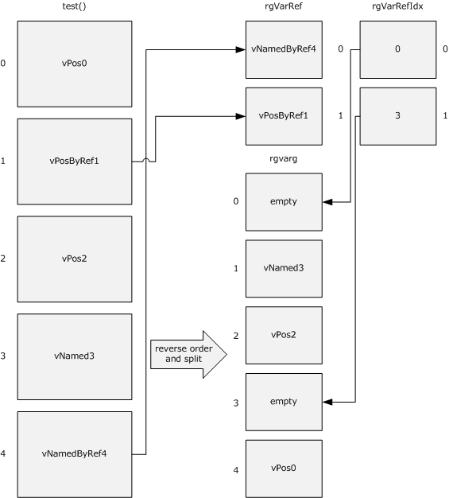

Figure 5: Call to server

## 4.4 Getting the Value of a Property

This example shows a sequence of messages between an [**automation client**](#gt_automation-client) and a server to get the value of a property.

- The client calls the [GetIDsOfNames](#Section_3.1.4.3) method on the server for a property named test. The server returns the [**DISPID**](#gt_dispatch-id-dispid) (see section [2.2.32](#Section_2.2.32)) of the property in the pointer passed by the client.
- The client calls the [Invoke](#Section_3.1.4.4) method on the server by using the DISPID returned from the server. Other parameters can be filled as shown in the following diagram. The property value is returned by the server in pVarResult. If an exception occurs during execution, or if there is an error in the arguments passed to Invoke, it is indicated in pExcepInfo or in pArgErr, accordingly (see section 3.1.4.4).
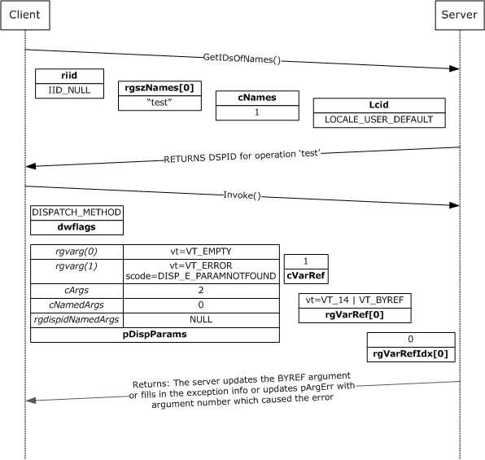

Figure 6: Getting the value of a property

**Note** For brevity, the **Invoke** method's *dispid*, *riid*, and *lcid* parameters are not shown.

## 4.5 Setting the Value of a Property

This example shows a sequence of messages between an [**automation client**](#gt_automation-client) and a server to set the value of a property.

- The client calls the [GetIDsOfName](#Section_3.1.4.3) method on the server for a property named test. The server returns the [**DISPID**](#gt_dispatch-id-dispid) (see section [2.2.32](#Section_2.2.32)) of the property in the pointer passed by the client.
- The client calls the [Invoke](#Section_3.1.4.4) method on the server by using the DISPID returned from the server. The client passes the value of the property in the first VARIANT in rgVarg that is a member of pDispParams (see section [2.2.33](#Section_2.2.33)). The remaining members of pDispParams must be filled as shown in the following diagram. On the server side, if an exception occurs during execution, or if there is an error in the arguments passed to Invoke, it is indicated in pExcepInfo or in pArgErr, accordingly (see section 3.1.4.4).
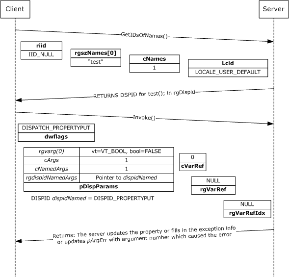

Figure 7: Setting the value of a property

**Note** For brevity, the **Invoke** method's *dispid*, *riid*, and *lcid* parameters are not shown.

## 4.6 Calling a Method with Byref and Optional Arguments

This example shows a sequence of messages between an [**automation client**](#gt_automation-client) and a server to call a method with a byref and an optional argument. The signature of the function is:

HRESULT test ([in, optional] VARIANT A, [in, out, optional] VARIANT *B);

- The client calls the **GetIDsOfName** method on the server for the method named test. The server returns the [DISPID (section 2.2.32)](#Section_2.2.32) in the pointer passed by the client.
- The client calls the [Invoke](#Section_3.1.4.4) method, filling the parameters as shown in the following figure. In the following example, the client is not passing any value for the first optional argument; thus, the VARIANT in rgVarg[1] has to have the field **vt** set to VT_ERROR and scode set to DISP_E_PARAMNOTFOUND. rgVarg[0] has the **vt** field set to VT_EMPTY. rgVarRef[0] is a VARIANT with the VT_BYREF bit flag set.
- On return from Invoke, rgVarRef[0] with the server-updated value is passed back to the client.

Figure 8: Calling a method with Byref and optional arguments

**Note** For brevity, the **Invoke** method's *dispid*, *riid*, and *lcid* parameters are not shown.

## 4.7 IEnumVARIANT Example

An application implementer can choose to implement IEnumVARIANT to expose a collection of homogeneous or heterogeneous data. Depending on the requirements of the application and the nature of the data exposed, the implementer can choose to implement the collection either as a static, semi-static, or dynamic server.

If the application exposes a rarely changing collection (such as the set of students that are enrolled in a specific class), it can do so by exposing a static [IEnumVARIANT server](#Section_3.3).

If the application exposes data that might change more frequently, but that is meant to be read-only (such as statistics on a set of currently running processes), it can do so by exposing a semi-static IEnumVARIANT server.

If the application exposes data that changes frequently and that is to be as current as possible (such as the set of files from a folder), it can do so by exposing a dynamic IEnumVARIANT server.

In all the examples that follow, the client can use either the _NewEnum method or the QueryInterface method on the [**automation server**](#gt_automation-server) [**object**](#gt_object) to get the IEnumVARIANT implementation.

In the examples, an array is maintained as a collection by the server, and the variable `current` shows the first position in the enumeration that has not yet been returned to the client (see section [3.3.1](#Section_3.3)).

### 4.7.1 IEnumVARIANT Next() Example

The following diagram illustrates a call to IEnumVARIANT::Next for a server that manages a collection of seven elements. Before the call, the current position is 2. The call to Next(), requesting two elements, causes the current position to be updated to 4, and results in the return by the server to the client of elements with indices 2 and 3. The server also indicates that it filled two elements by setting *pCeltFetched to 2, and returning 0 as the HRESULT.

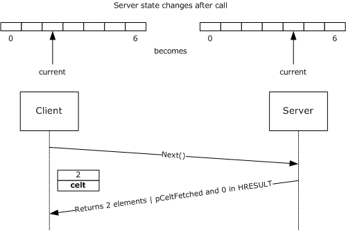

Figure 9: Call to IEnumVARIANT::Next

The following diagram illustrates a call to IEnumVARIANT::Next for a server that manages a collection of seven elements. Before the call, the current position is 3. The call to Next(), requesting seven elements, causes the current position to be updated to 7, and results in the return by the server to the client of elements with indices 3, 4, 5, and 6. The server also indicates that it filled only four elements by setting *pCeltFetched to 4, and returning 1 as the HRESULT.

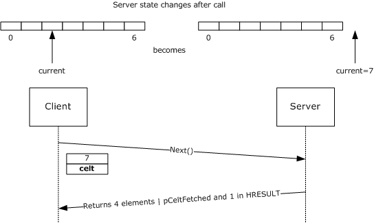

Figure 10: Call to IEnumVARIANT::Next

### 4.7.2 IEnumVARIANT Skip() Example

The following diagram illustrates a call to IEnumVARIANT::Skip for a server that manages a collection of seven elements. Before the call, the current position is 2. The call to Skip(), requesting that two elements be skipped, causes the current position to be updated to 4.

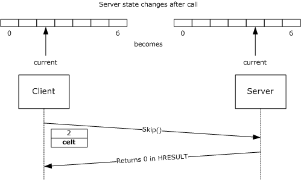

Figure 11: Call to IEnumVARIANT::Skip

### 4.7.3 IEnumVARIANT Reset() Example

The following diagram illustrates a call to IEnumVARIANT::Reset for a server that manages a collection of seven elements. Before the call, the current position is 2. The call to Reset() causes the current position to be updated to 0.

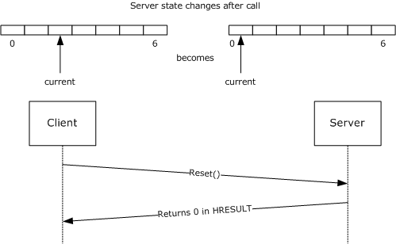

Figure 12: Call to IEnumVARIANT::Reset

### 4.7.4 IEnumVARIANT Clone() Example

The following diagram illustrates a call to IEnumVARIANT::Clone for a server that manages a collection of seven elements. Before the call, the current position is 2. The call to Clone() causes a new IEnumVARIANT server to be created. The new server manages a copy of the collection of seven elements, and its current position is set to 2. An **object reference** to the new IEnumVARIANT server is returned to the client.

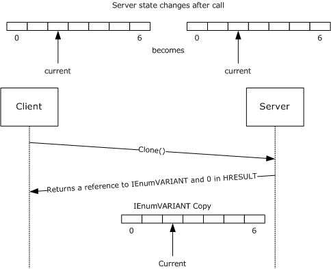

Figure 13: Call to IEnumVARIANT::Clone

## 4.8 Reading Type Information

The type information exposed by an [**automation server**](#gt_automation-server) can be read by an [**automation client**](#gt_automation-client) using the ITypeLib and ITypeInfo interfaces. The examples that follow show common scenarios.

### 4.8.1 Getting ITypeLib Implementations from Automation Server

Assuming that the [**automation client**](#gt_automation-client) already has an IDispatch pointer from the [**automation server**](#gt_automation-server), the following pseudocode shows how to get the ITypeLib implementation.

INPUT: IDispatch pointer from the Automation Server

CALL IDispatch::GetTypeInfoCount and OBTAIN pcTInfo

COMMENT see Section 3.1.4.1 for information on pcTInfo

IF pcTInfo = 0 THEN

PRINT Automation Server does not support type information for this object

ELSE

CALL IDispatch::GetTypeInfo with correct LocaleID and OBTAIN ITypeInfo pointer

CALL ITypeInfo::GetContainingTypeLib and OBTAIN ITypeLib pointer

ENDIF

### 4.8.2 Enumerating on All Types in a Type Library

Building on the [previous example](#Section_4.8.1), it is assumed that the [**automation client**](#gt_automation-client) has the ITypeLib implementation of the [**automation server**](#gt_automation-server). The following pseudocode illustrates how to get type information for all types defined in the type library.

INPUT: Reference to the ITypeLib server corresponding to the Automation Server

CALL ITypeLib::GetTypeInfoCount and OBTAIN pcTInfo

COMMENT see Section 3.11.4.1 for information on pcTInfo

FOR X = 0 to pctInfo -1

CALL ITypeLib::GetTypeInfo with X and OBTAIN ITypeInfo pointer

END FOR

### 4.8.3 Enumerating on All Enumerations in a Type Library

This example illustrates how to get all enumerations in a type library, and the value represented by each member within the enumeration.

INPUT: Reference to the ITypeLib server corresponding to the Automation Server

CALL ITypeLib::GetTypeInfoCount and OBTAIN pcTInfo

COMMENT see Section 3.11.4.1 for information on pcTInfo

FOR X = 0 to pctInfo -1

CALL ITypeLib::GetTypeInfoType with X and OBTAIN pTKind

COMMENT see Section 3.11.4.3 for more information on pTKind

IF ptKind = TYPEKIND::TKIND_ENUM THEN

CALL ITypeLib::GetTypeInfo with X and OBTAIN ITypeInfo pointer

CALL ITypeInfo::GetDocumentation(MEMBERID_NIL, 1, &BstrName, NULL, NULL, NULL)

PRINT Name of the Enumeration is BstrName

CALL ITypeInfo::GetTypeAttr and OBTAIN TYPEATTR pointer

FOR Y = 0 to TYPEATTR::cVars -1

ITypeInfo::GetVarDesc with Y and OBTAIN VARDESC pointer

CALL ITypeInfo::GetDocumentation(VARDESC::memid, 1, &BstrName, NULL, NULL,

NULL)

COMMENT BstrName will contain the name of the enumeration member

PRINT BstrName =

SET Z to the constant value from VARDESC::lpvarValue

COMMENT On most platforms the constant value for enumerations would be in

VARDESC::lpvarValue::intVal

PRINT Z

END FOR

END IF

END FOR

### 4.8.4 Enumerating All Nonsource Interfaces in a Coclass

This example illustrates the identification of all [**coclasses**](#gt_coclass) in an [**automation server**](#gt_automation-server) type library, and the interfaces implemented by the coclasses.

INPUT: Reference to the ITypeLib server corresponding to the Automation Server

COMMENT See example in Section 4.8.1 for getting ITypeLib pointer

CALL ITypeLib::GetTypeInfoCount and OBTAIN pcTInfo

COMMENT see Section 3.11.4.1 for information on pcTInfo

FOR X = 0 to pctInfo -1

CALL ITypeLib::GetTypeInfoType with X and OBTAIN pTKind

COMMENT See Section 3.11.4.3 for more information on pTKind

IF pTKind = TYPEKIND::TKIND_COCLASS THEN

CALL ITypeLib::GetDocumentation(X, 1, &BstrName, NULL, NULL, NULL)

PRINT Name of the CoClass is BstrName

CALL ITypeLib::GetTypeInfo with X and OBTAIN ITypeInfo pointer

CALL ITypeInfo::GetTypeAttr and OBTAIN TYPEATTR pointer

FOR Y = 0 to TYPEATTR::cImplTypes -1

ITypeInfo::GetRefTypeOfImplType with Y and OBTAIN HREFTYPE

COMMENT HREFTYPE is a handle to the implemented interface

ITypeInfo::GetRefTypeInfo with HREFTYPE and OBTAIN pInterfaceTypeInfo

COMMENT pInterfaceTypeInfo is a ITypeInfo pointer for interface implemented

by this CoClass

CALL pInterfaceTypeInfo::GetDocumentation(MEMBERID_NIL, 1, &BstrName, NULL,

NULL, NULL)

PRINT Interface implemented is BstrName

END FOR

END IF

END FOR

### 4.8.5 Enumerating All Methods in an Interface

This example pseudocode shows how to enumerate on all the methods declared in an interface. It assumes that the [**automation client**](#gt_automation-client) has already obtained the IDispatch pointer from the [**automation server**](#gt_automation-server).

INPUT: IDispatch pointer from the automation server

CALL IDispatch::GetTypeInfoCount and OBTAIN pcTInfo

COMMENT see Section 3.1.4.1 for information on pcTInfo

IF pcTInfo = 0 THEN

PRINT Automation Server does not support type information for this object

ELSE

CALL IDispatch::GetTypeInfo with correct LocaleID and OBTAIN ITypeInfo pointer

CALL ITypeInfo::GetDocumentation(MEMBERID_NIL, 1, &BstrName, NULL,

NULL, NULL)

PRINT Name of the Interface is BstrName

CALL ITypeInfo::GetTypeAttr and OBTAIN TYPEATTR pointer

FOR X = 0 to TYPEATTR:: cFuncs -1

CALL ITypeInfo::GetFuncDesc with X and OBTAIN FUNCDESC pointer

CALL ITypeInfo::GetNames with FUNCDESC::memid and appropriate values for

rgBstrNames, cMaxNames and pcNames

COMMENT see Section 3.7.4.5 for more information regarding the parameters

to ITypeinfo::GetNames

IF pcNames > 0 THEN

PRINT Name of the method is rgBstrNames[0]

PRINT Parameters to above method are following

FOR Y = 1 to pcNames -1

PRINT rgBstrNames[Y]

END FOR

END IF

END FOR

ENDIF

### 4.8.6 Retrieving Type Information

This example shows how to retrieve type information for method parameters or members of a struct, a union, or an enumeration given a [TYPEDESC (section 2.2.37)](#Section_2.2.37) structure. A **TYPEDESC** can be obtained from an [ELEMDESC](#Section_2.2.41) structure, which is a member of [VARDESC](#Section_2.2.43) or [FUNCDESC](#Section_2.2.42).

COMMENT This is a recursive procedure and is called PrintTypeDesc.

INPUT: TYPEDESC pointer and reference to ITypeInfo server in the binding context

OUTPUT: Prints type described by the TYPEDESC

CASE TYPEDESC::vt OF

VT_PTR:

CALL PrintTypeDesc with TYPEDESC::lptdesc and ITypeInfo pointer

PRINT *

VT_SAFEARRAY:

PRINT SAFEARRAY OF

CALL PrintTypeDesc with TYPEDESC::lptdesc and ITypeInfo pointer

VT_CARRAY:

CALL PrintTypeDesc with TYPEDESC::lpadesc::tdescElem and ITypeInfo pointer

COMMENT see Section 2.2.31 for more information on TYPEDESC::lpadesc

FOR X = 0 to TYPEDESC::lpadesc::cDims -1

PRINT [

PRINT TYPEDESC::lpadesc::rgbounds[X].lLbound

PRINT &

SET Y to TYPEDESC::lpadesc::rgbounds[X].lLbound +

TYPEDESC::lpadesc::rgbounds[X].cElements -1

PRINT Y

PRINT ]

END FOR

VT_USERDEFINED:

CALL ITypeInfo::GetRefTypeInfo with TYPEDESC::hreftype and OBTAIN

pCustomTypeInfo which of type ITypeInfo pointer

CALL pCustomTypeInfo::GetDocumentation(MEMBERID_NIL, 1, &BstrName, NULL,

NULL, NULL)

PRINT BstrName

VT_I2: PRINT short

VT_I4: PRINT int

VT_R4: PRINT float

VT_R8: PRINT double

VT_CY: PRINT CY

VT_DATE: PRINT DATE

VT_BSTR: PRINT BSTR

VT_DECIMAL: PRINT DECIMAL

VT_DISPATCH: PRINT IDispatch

VT_ERROR: PRINT SCODE

VT_BOOL: PRINT VARIANT_BOOL

VT_VARIANT: PRINT VARIANT

VT_UNKNOWN: PRINT IUnknown

VT_UI1: PRINT BYTE

VT_I1: PRINT char

VT_UI2: PRINT unsigned short

VT_UI4: PRINT unsigned long

VT_I8: PRINT __int64

VT_UI8: PRINT unsigned __int64

VT_INT: PRINT int

VT_UINT: PRINT unsigned int

VT_HRESULT: PRINT HRESULT

VT_VOID: PRINT void

VT_LPSTR: PRINT char *

VT_LPWSTR: PRINT wchar *

OTHERS: PRINT Error

ENDCASE

### 4.8.7 Binding to a Member of a Default Nonsource Interface of an Appobject Coclass

This example shows how to bind to a member of a default nonsource interface of an appobject class.

The sample first tries to bind against the name by using the ITypeComp that corresponds to the [**automation type library**](#gt_automation-type-library). The sample then uses the ITypeInfo reference thus retrieved, corresponding to the [**coclass**](#gt_coclass) definition, to bind against the name again, retrieving the ITypeInfo server that contains the name in its binding context and the element description (a FUNCDESC or a VARDESC) that corresponds to the name passed in.

INPUT: A reference to an ITypeLib server and the name of the

member to bind against

OUTPUT: A reference to the ITypeInfo server corresponding to the

interface containing the member

CALL ITypeLib::GetTypeComp with pTypeLib and OBTAIN ITypeComp

pointer pTLComp

CALL ITypeComp::Bind with pTLComp and name and OBTAIN ITypeInfo

pointer pTIAppObj and DESCKIND value dk1

COMMENT If the name was a member of a default nonsource interface

on an appobject coclass the Bind operation will return

the coclass ITypeInfo, DESCKIND_IMPLICITAPPOBJ, and a

VAR_STATIC VARDESC

IF dk1 = DESCKIND_IMPLICITAPPOBJ THEN

CALL ITypeInfo::GetTypeComp with pTIAppObj

and OBTAIN ITypeComp pointer pAppObjComp

COMMENT The Bind operation below will return the default

interface ITypeInfo, DESCKIND_VARDESC or DESCKIND_FUNCDESC,

and a corresponding VARDESC or FUNCDESC

CALL ITypeComp::Bind with pAppObjComp and name

and OBTAIN ITypeInfo pointer pTIDefItf and DESCKIND value dk2

END IF

### 4.8.8 Binding to a Member of a Partner Interface

This example shows how to bind to a member of a [**partner dispinterface**](#gt_partner-dispinterface) given a reference to an ITypeInfo server corresponding to a partner dispinterface.

The sample first retrieves the ITypeInfo reference corresponding to the [**partner interface**](#gt_partner-interface) by using the special value –1 as an argument to [ITypeInfo::GetRefTypeOfImpleType](#Section_3.7.4.6). Next, the sample uses the ITypeInfo reference to complete a bind operation on the specified member name.

INPUT: A reference to an ITypeInfo server, and a name of a member

OUTPUT: A reference to the corresponding partner interface ITypeInfo server and the FUNCDESC that describes the named member

COMMENT pass -1 to GetRefTypeOfImplType to retrieve the HREFTYPE

Corresponding to the partner interface

CALL ITypeInfo::GetRefTypeOfImplType with pTIDispPartner and -1

and OBTAIN HREFTYPE value hrefItfPartner

CALL ITypeInfo::GetRefTypeInfo with pTIDispPartner and hrefItfPartner

and OBTAIN ITypeInfo pointer pTIItfPartner

CALL ITypeInfo::GetTypeComp with pTIItfPartner

and OBTAIN ITypeComp pointer pItfPartnerComp

COMMENT The Bind operation below will return the ITypeInfo pointer

corresponding to the interface in the inheritance hierarchy

that defines "name"

CALL ITypeComp::Bind with pItfPartnerComp and name

and OBTAIN ITypeInfo pointer pTIBindRes and FUNCDESC struct fd

# 5 Security

The following sections specify security considerations for implementers of the OLE Automation Protocol.

## 5.1 Security Considerations for Implementer

There are no security considerations for this protocol.

## 5.2 Index of Security Parameters

There are no protocol-specific security parameters.

# 6 Appendix A: Full IDL

For ease of implementation, the full [**IDL**](#gt_interface-definition-language-idl) is provided where "ms-dcom.idl" is the IDL specified in [MS-DCOM](../MS-DCOM/MS-DCOM.md) Appendix A.

import "ms-dtyp.idl";

import "ms-dcom.idl";

// Begin: Extra definitions

// Use the next line in any IDL file that imports ms-oaut.idl

// that makes use of SAFEARRAYs.

// It is needed to bypass special assumptions MIDL compiler makes

// about the SAFEARRAY type in windows environment.

// #define SAFEARRAY(type) SAFEARRAY

// basic type aliases

typedef byte BYTE;

typedef LONG SCODE;

typedef IID *REFIID;

typedef GUID *REFGUID;

typedef [string] wchar_t *LPOLESTR;

typedef [string] const wchar_t *LPCOLESTR;

typedef [public] unsigned __int3264 ULONG_PTR, *PULONG_PTR;

typedef void *PVOID, *LPVOID;

// forward declarations

interface IDispatch;

interface ITypeLib;

interface ITypeInfo;

typedef [unique] SAFEARRAY * PSAFEARRAY, *LPSAFEARRAY;

typedef [unique] struct _wireVARIANT * VARIANT;

// End: Extra definitions

typedef enum tagVARENUM

{

VT_EMPTY = 0x0000,

VT_NULL = 0x0001,

VT_I2 = 0x0002,

VT_I4 = 0x0003,

VT_R4 = 0x0004,

VT_R8 = 0x0005,

VT_CY = 0x0006,

VT_DATE = 0x0007,

VT_BSTR = 0x0008,

VT_DISPATCH = 0x0009,

VT_ERROR = 0x000A,

VT_BOOL = 0x000B,

VT_VARIANT = 0x000C,

VT_UNKNOWN = 0x000D,

VT_DECIMAL = 0x000E,

VT_I1 = 0x0010,

VT_UI1 = 0x0011,

VT_UI2 = 0x0012,

VT_UI4 = 0x0013,

VT_I8 = 0x0014,

VT_UI8 = 0x0015,

VT_INT = 0x0016,

VT_UINT = 0x0017,

VT_VOID = 0x0018,

VT_HRESULT = 0x0019,

VT_PTR = 0x001A,

VT_SAFEARRAY = 0x001B,

VT_CARRAY = 0x001C,

VT_USERDEFINED = 0x001D,

VT_LPSTR = 0x001E,

VT_LPWSTR = 0x001F,

VT_RECORD = 0x0024,

VT_INT_PTR = 0x0025,

VT_UINT_PTR = 0x0026,

VT_ARRAY = 0x2000,

VT_BYREF = 0x4000

} VARENUM;

typedef enum tagADVFEATUREFLAGS

{

FADF_AUTO = 0x0001,

FADF_STATIC = 0x0002,

FADF_EMBEDDED = 0x0004,

FADF_FIXEDSIZE = 0x0010,

FADF_RECORD = 0x0020,

FADF_HAVEIID = 0x0040,

FADF_HAVEVARTYPE = 0x0080,

FADF_BSTR = 0x0100,

FADF_UNKNOWN = 0x0200,

FADF_DISPATCH = 0x0400,

FADF_VARIANT = 0x0800

} ADVFEATUREFLAGS;

typedef [v1_enum] enum tagSF_TYPE {

SF_ERROR = VT_ERROR,

SF_I1 = VT_I1,

SF_I2 = VT_I2,

SF_I4 = VT_I4,

SF_I8 = VT_I8,

SF_BSTR = VT_BSTR,

SF_UNKNOWN = VT_UNKNOWN,

SF_DISPATCH = VT_DISPATCH,

SF_VARIANT = VT_VARIANT,

SF_RECORD = VT_RECORD,

SF_HAVEIID = VT_UNKNOWN|0x8000

} SF_TYPE;

typedef [v1_enum] enum tagCALLCONV {

CC_CDECL = 1,

CC_PASCAL = 2,

CC_STDCALL = 4

} CALLCONV;

typedef enum tagFUNCFLAGS {

FUNCFLAG_FRESTRICTED = 1,

FUNCFLAG_FSOURCE = 0x2,

FUNCFLAG_FBINDABLE = 0x4,

FUNCFLAG_FREQUESTEDIT = 0x8,

FUNCFLAG_FDISPLAYBIND = 0x10,

FUNCFLAG_FDEFAULTBIND = 0x20,

FUNCFLAG_FHIDDEN = 0x40,

FUNCFLAG_FUSESGETLASTERROR = 0x80,

FUNCFLAG_FDEFAULTCOLLELEM = 0x100,

FUNCFLAG_FUIDEFAULT = 0x200,

FUNCFLAG_FNONBROWSABLE = 0x400,

FUNCFLAG_FREPLACEABLE = 0x800,

FUNCFLAG_FIMMEDIATEBIND = 0x1000

} FUNCFLAGS;

typedef [v1_enum] enum tagFUNCKIND {

FUNC_PUREVIRTUAL = 1,

FUNC_STATIC = 3,

FUNC_DISPATCH = 4

} FUNCKIND;

typedef enum tagIMPLTYPEFLAGS {

IMPLTYPEFLAG_FDEFAULT = 0x1,

IMPLTYPEFLAG_FSOURCE = 0x2,

IMPLTYPEFLAG_FRESTRICTED = 0x4,

IMPLTYPEFLAG_FDEFAULTVTABLE = 0x8

} IMPLTYPEFLAGS;

typedef [v1_enum] enum tagINVOKEKIND {

INVOKE_FUNC = 0x1,

INVOKE_PROPERTYGET = 0x2,

INVOKE_PROPERTYPUT = 0x4,

INVOKE_PROPERTYPUTREF = 0x8

} INVOKEKIND;

typedef enum tagPARAMFLAGS {

PARAMFLAG_NONE = 0,

PARAMFLAG_FIN = 0x1,

PARAMFLAG_FOUT = 0x2,

PARAMFLAG_FLCID = 0x4,

PARAMFLAG_FRETVAL = 0x8,

PARAMFLAG_FOPT = 0x10,

PARAMFLAG_FHASDEFAULT = 0x20,

PARAMFLAG_FHASCUSTDATA = 0x40

} PARAMFLAGS;

typedef enum tagTYPEFLAGS {

TYPEFLAG_FAPPOBJECT = 0x1,

TYPEFLAG_FCANCREATE = 0x2,

TYPEFLAG_FLICENSED = 0x4,

TYPEFLAG_FPREDECLID = 0x8,

TYPEFLAG_FHIDDEN = 0x10,

TYPEFLAG_FCONTROL = 0x20,

TYPEFLAG_FDUAL = 0x40,

TYPEFLAG_FNONEXTENSIBLE = 0x80,

TYPEFLAG_FOLEAUTOMATION = 0x100,

TYPEFLAG_FRESTRICTED = 0x200,

TYPEFLAG_FAGGREGATABLE = 0x400,

TYPEFLAG_FREPLACEABLE = 0x800,

TYPEFLAG_FDISPATCHABLE = 0x1000,

TYPEFLAG_FPROXY = 0x4000

} TYPEFLAGS;

typedef [v1_enum] enum tagTYPEKIND {

TKIND_ENUM = 0x0,

TKIND_RECORD = 0x1,

TKIND_MODULE = 0x2,

TKIND_INTERFACE = 0x3,

TKIND_DISPATCH = 0x4,

TKIND_COCLASS = 0x5,

TKIND_ALIAS = 0x6,

TKIND_UNION = 0x7

} TYPEKIND;

typedef enum tagVARFLAGS {

VARFLAG_FREADONLY = 0x1,

VARFLAG_FSOURCE = 0x2,

VARFLAG_FBINDABLE = 0x4,

VARFLAG_FREQUESTEDIT = 0x8,

VARFLAG_FDISPLAYBIND = 0x10,

VARFLAG_FDEFAULTBIND = 0x20,

VARFLAG_FHIDDEN = 0x40,

VARFLAG_FRESTRICTED = 0x80,

VARFLAG_FDEFAULTCOLLELEM = 0x100,

VARFLAG_FUIDEFAULT = 0x200,

VARFLAG_FNONBROWSABLE = 0x400,

VARFLAG_FREPLACEABLE = 0x800,

VARFLAG_FIMMEDIATEBIND = 0x1000

} VARFLAGS;

typedef [v1_enum] enum tagVARKIND {

VAR_PERINSTANCE = 0,

VAR_STATIC = ( VAR_PERINSTANCE + 1 ),

VAR_CONST = ( VAR_STATIC + 1 ),

VAR_DISPATCH = ( VAR_CONST + 1 )

} VARKIND;

typedef [v1_enum] enum tagLIBFLAGS {

LIBFLAG_FRESTRICTED = 0x01,

LIBFLAG_FCONTROL = 0x02,

LIBFLAG_FHIDDEN = 0x04,

LIBFLAG_FHASDISKIMAGE = 0x08

} LIBFLAGS;

typedef [v1_enum] enum tagSYSKIND {

SYS_WIN32 = 1,

SYS_WIN64 = 3

} SYSKIND;

typedef [v1_enum] enum tagDESCKIND {

DESCKIND_NONE = 0,

DESCKIND_FUNCDESC = 1,

DESCKIND_VARDESC = 2,

DESCKIND_TYPECOMP = 3,

DESCKIND_IMPLICITAPPOBJ = 4

} DESCKIND;

typedef struct _FLAGGED_WORD_BLOB {

unsigned long cBytes;

unsigned long clSize;

[size_is(clSize)] unsigned short asData[];

} FLAGGED_WORD_BLOB;

typedef [unique] FLAGGED_WORD_BLOB* BSTR;

typedef struct tagCY {

__int64 int64;

} CURRENCY;

typedef double DATE;

typedef struct tagDEC {

WORD wReserved;

BYTE scale;

BYTE sign;

ULONG Hi32;

ULONGLONG Lo64;

} DECIMAL;

typedef short VARIANT_BOOL;

#define VARIANT_TRUE ((VARIANT_BOOL)0xffff)

#define VARIANT_FALSE ((VARIANT_BOOL)0)

typedef struct _wireBRECORD {

ULONG fFlags;

ULONG clSize;

MInterfacePointer * pRecInfo;

[size_is(clSize)] byte* pRecord;

} wireBRECORDStr;

typedef [unique] struct _wireBRECORD* BRECORD;

typedef struct _wireVARIANT {

DWORD clSize;

DWORD rpcReserved;

USHORT vt;

USHORT wReserved1;

USHORT wReserved2;

USHORT wReserved3;

[switch_type(ULONG), switch_is(vt)]

union {

[case(VT_I8)]

LONGLONG llVal;

[case(VT_I4)]

LONG lVal;

[case(VT_UI1)]

BYTE bVal;

[case(VT_I2)]

SHORT iVal;

[case(VT_R4)]

FLOAT fltVal;

[case(VT_R8)]

DOUBLE dblVal;

[case(VT_BOOL)]

VARIANT_BOOL boolVal;

[case(VT_ERROR)]

HRESULT scode;

[case(VT_CY)]

CURRENCY cyVal;

[case(VT_DATE)]

DATE date;

[case(VT_BSTR)]

BSTR bstrVal;

[case(VT_UNKNOWN)]

IUnknown* punkVal;

[case(VT_DISPATCH)]

IDispatch* pdispVal;

[case(VT_ARRAY)]

PSAFEARRAY parray;

[case(VT_RECORD, VT_RECORD|VT_BYREF)]

BRECORD brecVal;

[case(VT_UI1|VT_BYREF)]

BYTE* pbVal;

[case(VT_I2|VT_BYREF)]

SHORT* piVal;

[case(VT_I4|VT_BYREF)]

LONG* plVal;

[case(VT_I8|VT_BYREF)]

LONGLONG* pllVal;

[case(VT_R4|VT_BYREF)]

FLOAT* pfltVal;

[case(VT_R8|VT_BYREF)]

DOUBLE* pdblVal;

[case(VT_BOOL|VT_BYREF)]

VARIANT_BOOL* pboolVal;

[case(VT_ERROR|VT_BYREF)]

HRESULT* pscode;

[case(VT_CY|VT_BYREF)]

CURRENCY* pcyVal;

[case(VT_DATE|VT_BYREF)]

DATE* pdate;

[case(VT_BSTR|VT_BYREF)]

BSTR* pbstrVal;

[case(VT_UNKNOWN|VT_BYREF)]

IUnknown** ppunkVal;

[case(VT_DISPATCH|VT_BYREF)]

IDispatch** ppdispVal;

[case(VT_ARRAY|VT_BYREF)]

PSAFEARRAY* pparray;

[case(VT_VARIANT|VT_BYREF)]

VARIANT* pvarVal;

[case(VT_I1)]

CHAR cVal;

[case(VT_UI2)]

USHORT uiVal;

[case(VT_UI4)]

ULONG ulVal;

[case(VT_UI8)]

ULONGLONG ullVal;

[case(VT_INT)]

INT intVal;

[case(VT_UINT)]

UINT uintVal;

[case(VT_DECIMAL)]

DECIMAL decVal;

[case(VT_I1|VT_BYREF)]

CHAR* pcVal;

[case(VT_UI2|VT_BYREF)]

USHORT* puiVal;

[case(VT_UI4|VT_BYREF)]

ULONG* pulVal;

[case(VT_UI8|VT_BYREF)]

ULONGLONG* pullVal;

[case(VT_INT|VT_BYREF)]

INT* pintVal;

[case(VT_UINT|VT_BYREF)]

UINT* puintVal;

[case(VT_DECIMAL|VT_BYREF)]

DECIMAL* pdecVal;

[case(VT_EMPTY)]

; /*nothing*/

[case(VT_NULL)]

; /*nothing*/

} _varUnion;

} wireVARIANTStr;

typedef struct tagSAFEARRAYBOUND {

ULONG cElements;

LONG lLbound;

} SAFEARRAYBOUND,

*LPSAFEARRAYBOUND;

typedef struct _wireSAFEARR_BSTR {

ULONG Size;

[size_is(Size), ref] BSTR* aBstr;

} SAFEARR_BSTR;

typedef struct _wireSAFEARR_UNKNOWN {

ULONG Size;

[size_is(Size), ref] IUnknown** apUnknown;

} SAFEARR_UNKNOWN;

typedef struct _wireSAFEARR_DISPATCH {

ULONG Size;

[size_is(Size), ref] IDispatch** apDispatch;

} SAFEARR_DISPATCH;

typedef struct _wireSAFEARR_VARIANT {

ULONG Size;

[size_is(Size), ref] VARIANT* aVariant;

} SAFEARR_VARIANT;

typedef struct _wireSAFEARR_BRECORD {

ULONG Size;

[size_is(Size), ref] BRECORD* aRecord;

} SAFEARR_BRECORD;

typedef struct _wireSAFEARR_HAVEIID {

ULONG Size;

[size_is(Size), ref] IUnknown** apUnknown;

IID iid;

} SAFEARR_HAVEIID;

typedef struct _BYTE_SIZEDARR {

unsigned long clSize;

[size_is(clSize)] byte* pData;

} BYTE_SIZEDARR;

typedef struct _SHORT_SIZEDARR {

unsigned long clSize;

[size_is(clSize)] unsigned short* pData;

} WORD_SIZEDARR;

typedef struct _LONG_SIZEDARR {

unsigned long clSize;

[size_is(clSize)] unsigned long* pData;

} DWORD_SIZEDARR;

typedef struct _HYPER_SIZEDARR {

unsigned long clSize;

[size_is(clSize)] hyper* pData;

} HYPER_SIZEDARR;

typedef union _wireSAFEARRAY_UNION

switch(unsigned long sfType) u {

case SF_BSTR: SAFEARR_BSTR BstrStr;

case SF_UNKNOWN: SAFEARR_UNKNOWN UnknownStr;

case SF_DISPATCH: SAFEARR_DISPATCH DispatchStr;

case SF_VARIANT: SAFEARR_VARIANT VariantStr;

case SF_RECORD: SAFEARR_BRECORD RecordStr;

case SF_HAVEIID: SAFEARR_HAVEIID HaveIidStr;

case SF_I1: BYTE_SIZEDARR ByteStr;

case SF_I2: WORD_SIZEDARR WordStr;

case SF_I4: DWORD_SIZEDARR LongStr;

case SF_I8: HYPER_SIZEDARR HyperStr;

} SAFEARRAYUNION;

typedef

[unique]

struct _wireSAFEARRAY {

USHORT cDims;

USHORT fFeatures;

ULONG cbElements;

ULONG cLocks;

SAFEARRAYUNION uArrayStructs;

[size_is(cDims)] SAFEARRAYBOUND rgsabound[];

} *SAFEARRAY;

typedef struct tagRecordInfo {

GUID libraryGuid;

DWORD verMajor;

GUID recGuid;

DWORD verMinor;

DWORD Lcid;

} RecordInfo;

typedef LONG DISPID;

typedef struct tagDISPPARAMS {

[size_is(cArgs)] VARIANT* rgvarg;

[size_is(cNamedArgs)] DISPID* rgdispidNamedArgs;

UINT cArgs;

UINT cNamedArgs;

} DISPPARAMS;

typedef struct tagEXCEPINFO {

WORD wCode;

WORD wReserved;

BSTR bstrSource;

BSTR bstrDescription;

BSTR bstrHelpFile;

DWORD dwHelpContext;

ULONG_PTR pvReserved;

ULONG_PTR pfnDeferredFillIn;

HRESULT scode;

} EXCEPINFO;

typedef DISPID MEMBERID;

typedef DWORD HREFTYPE;

typedef struct tagTYPEDESC {

[switch_type(USHORT), switch_is(vt)] union {

[case(VT_PTR, VT_SAFEARRAY)] struct tagTYPEDESC * lptdesc;

[case(VT_CARRAY)] struct tagARRAYDESC * lpadesc;

[case(VT_USERDEFINED)] HREFTYPE hreftype;

[default] ;

} _tdUnion;

USHORT vt;

} TYPEDESC;

typedef struct tagARRAYDESC {

TYPEDESC tdescElem;

USHORT cDims;

[size_is(cDims)] SAFEARRAYBOUND rgbounds[];

} ARRAYDESC;

typedef struct tagPARAMDESCEX {

ULONG cBytes;

VARIANT varDefaultValue;

} PARAMDESCEX;

typedef struct tagPARAMDESC {

PARAMDESCEX *pparamdescex;

USHORT wParamFlags;

} PARAMDESC;

typedef struct tagELEMDESC {

TYPEDESC tdesc;

PARAMDESC paramdesc;

} ELEMDESC;

typedef struct tagFUNCDESC {

MEMBERID memid;

[size_is(cReserved2)] SCODE * lReserved1;

[size_is(cParams)] ELEMDESC * lprgelemdescParam;

FUNCKIND funckind;

INVOKEKIND invkind;

CALLCONV callconv;

SHORT cParams;

SHORT cParamsOpt;

SHORT oVft;

SHORT cReserved2;

ELEMDESC elemdescFunc;

WORD wFuncFlags;

} FUNCDESC, *LPFUNCDESC;

typedef struct tagVARDESC {

MEMBERID memid;

LPOLESTR lpstrReserved;

[switch_type(VARKIND), switch_is(varkind)] union {

[case(VAR_PERINSTANCE, VAR_DISPATCH, VAR_STATIC)] ULONG oInst;

[case(VAR_CONST)] VARIANT * lpvarValue;

} _vdUnion;

ELEMDESC elemdescVar;

WORD wVarFlags;

VARKIND varkind;

} VARDESC, *LPVARDESC;

typedef struct tagTYPEATTR {

GUID guid;

LCID lcid;

DWORD dwReserved1;

DWORD dwReserved2;

DWORD dwReserved3;

LPOLESTR lpstrReserved4;

ULONG cbSizeInstance;

TYPEKIND typekind;

WORD cFuncs;

WORD cVars;

WORD cImplTypes;

WORD cbSizeVft;

WORD cbAlignment;

WORD wTypeFlags;

WORD wMajorVerNum;

WORD wMinorVerNum;

TYPEDESC tdescAlias;

DWORD dwReserved5;

WORD wReserved6;

} TYPEATTR, *LPTYPEATTR;

typedef struct tagTLIBATTR {

GUID guid;

LCID lcid;

SYSKIND syskind;

unsigned short wMajorVerNum;

unsigned short wMinorVerNum;

unsigned short wLibFlags;

} TLIBATTR, *LPTLIBATTR;

typedef struct tagCUSTDATAITEM {

GUID guid;

VARIANT varValue;

} CUSTDATAITEM;

typedef struct tagCUSTDATA {

DWORD cCustData;

[size_is(cCustData)] CUSTDATAITEM * prgCustData;

} CUSTDATA;

[

object,

uuid(00020400-0000-0000-C000-000000000046),

pointer_default(unique)

]

interface IDispatch : IUnknown

{

typedef [unique] IDispatch * LPDISPATCH;

HRESULT GetTypeInfoCount(

[out] UINT * pctinfo

);

HRESULT GetTypeInfo(

[in] UINT iTInfo,

[in] LCID lcid,

[out] ITypeInfo ** ppTInfo

);

HRESULT GetIDsOfNames(

[in] REFIID riid,

[in, size_is(cNames)] LPOLESTR * rgszNames,

[in, range(0, 16384)] UINT cNames,

[in] LCID lcid,

[out, size_is(cNames)] DISPID * rgDispId

);

HRESULT Invoke(

[in] DISPID dispIdMember,

[in] REFIID riid,

[in] LCID lcid,

[in] DWORD dwFlags,

[in] DISPPARAMS * pDispParams,

[out] VARIANT * pVarResult,

[out] EXCEPINFO * pExcepInfo,

[out] UINT * pArgErr,

[in] UINT cVarRef,

[in, size_is(cVarRef)] UINT * rgVarRefIdx,

[in, out, size_is(cVarRef)] VARIANT * rgVarRef

);

const DWORD DISPATCH_METHOD = 0x00000001;

const DWORD DISPATCH_PROPERTYGET = 0x00000002;

const DWORD DISPATCH_PROPERTYPUT = 0x00000004;

const DWORD DISPATCH_PROPERTYPUTREF = 0x00000008;

const DWORD DISPATCH_zeroVarResult = 0x00020000;

const DWORD DISPATCH_zeroExcepInfo = 0x00040000;

const DWORD DISPATCH_zeroArgErr = 0x00080000;

const DISPID DISPID_VALUE = 0;

const DISPID DISPID_UNKNOWN = -1;

const DISPID DISPID_PROPERTYPUT = -3;

const DISPID DISPID_NEWENUM = -4;

}

[

object,

uuid(00020404-0000-0000-C000-000000000046),

pointer_default(unique)

]

interface IEnumVARIANT : IUnknown

{

HRESULT Next(

[in] ULONG celt,

[out, size_is(celt), length_is(*pCeltFetched)]

VARIANT * rgVar,

[out] ULONG * pCeltFetched

);

HRESULT Skip(

[in] ULONG celt

);

HRESULT Reset();

HRESULT Clone(

[out] IEnumVARIANT ** ppEnum

);

}

[

object,

uuid(00020403-0000-0000-C000-000000000046),

pointer_default(unique)

]

interface ITypeComp : IUnknown

{

HRESULT Bind(

[in] LPOLESTR szName,

[in] ULONG lHashVal,

[in] WORD wFlags,

[out] ITypeInfo ** ppTInfo,

[out] DESCKIND * pDescKind,

[out] LPFUNCDESC * ppFuncDesc,

[out] LPVARDESC * ppVarDesc,

[out] ITypeComp ** ppTypeComp,

[out] DWORD * pReserved

);

HRESULT BindType(

[in] LPOLESTR szName,

[in] ULONG lHashVal,

[out] ITypeInfo ** ppTInfo

);

}

[

object,

uuid(00020401-0000-0000-C000-000000000046),

pointer_default(unique)

]

interface ITypeInfo : IUnknown

{

HRESULT GetTypeAttr(

[out] LPTYPEATTR * ppTypeAttr,

[out] DWORD * pReserved

);

HRESULT GetTypeComp(

[out] ITypeComp ** ppTComp

);

HRESULT GetFuncDesc(

[in] UINT index,

[out] LPFUNCDESC * ppFuncDesc,

[out] DWORD * pReserved

);

HRESULT GetVarDesc(

[in] UINT index,

[out] LPVARDESC * ppVarDesc,

[out] DWORD * pReserved

);

HRESULT GetNames(

[in] MEMBERID memid,

[out,size_is(cMaxNames),length_is(*pcNames)]

BSTR * rgBstrNames,

[in] UINT cMaxNames,

[out] UINT * pcNames

);

HRESULT GetRefTypeOfImplType(

[in] UINT index,

[out] HREFTYPE * pRefType

);

HRESULT GetImplTypeFlags(

[in] UINT index,

[out] INT * pImplTypeFlags

);

HRESULT Opnum10NotUsedOnWire(

void

);

HRESULT Opnum11NotUsedOnWire(

void

);

HRESULT GetDocumentation(

[in] MEMBERID memid,

[in] DWORD refPtrFlags,

[out] BSTR * pBstrName,

[out] BSTR * pBstrDocString,

[out] DWORD * pdwHelpContext,

[out] BSTR * pBstrHelpFile

);

HRESULT GetDllEntry(

[in] MEMBERID memid,

[in] INVOKEKIND invKind,

[in] DWORD refPtrFlags,

[out] BSTR * pBstrDllName,

[out] BSTR * pBstrName,

[out] WORD * pwOrdinal

);

HRESULT GetRefTypeInfo(

[in] HREFTYPE hRefType,

[out] ITypeInfo ** ppTInfo

);

HRESULT Opnum15NotUsedOnWire(

void

);

HRESULT CreateInstance(

[in] REFIID riid,

[out, iid_is(riid)] IUnknown ** ppvObj

);

HRESULT GetMops(

[in] MEMBERID memid,

[out] BSTR * pBstrMops

);

HRESULT GetContainingTypeLib(

[out] ITypeLib ** ppTLib,

[out] UINT * pIndex

);

HRESULT Opnum19NotUsedOnWire(

void

);

HRESULT Opnum20NotUsedOnWire(

void

);

HRESULT Opnum21NotUsedOnWire(

void

);

}

[

object,

uuid(00020412-0000-0000-C000-000000000046),

pointer_default(unique)

]

interface ITypeInfo2 : ITypeInfo

{

HRESULT GetTypeKind(

[out] TYPEKIND * pTypeKind

);

HRESULT GetTypeFlags(

[out] ULONG * pTypeFlags

);

HRESULT GetFuncIndexOfMemId(

[in] MEMBERID memid,

[in] INVOKEKIND invKind,

[out] UINT * pFuncIndex

);

HRESULT GetVarIndexOfMemId(

[in] MEMBERID memid,

[out] UINT * pVarIndex

);

HRESULT GetCustData(

[in] REFGUID guid,

[out] VARIANT * pVarVal

);

HRESULT GetFuncCustData(

[in] UINT index,

[in] REFGUID guid,

[out] VARIANT * pVarVal

);

HRESULT GetParamCustData(

[in] UINT indexFunc,

[in] UINT indexParam,

[in] REFGUID guid,

[out] VARIANT * pVarVal

);

HRESULT GetVarCustData(

[in] UINT index,

[in] REFGUID guid,

[out] VARIANT * pVarVal

);

HRESULT GetImplTypeCustData(

[in] UINT index,

[in] REFGUID guid,

[out] VARIANT * pVarVal

);

HRESULT GetDocumentation2(

[in] MEMBERID memid,

[in] LCID lcid,

[in] DWORD refPtrFlags,

[out] BSTR *pbstrHelpString,

[out] DWORD *pdwHelpStringContext,

[out] BSTR *pbstrHelpStringDll

);

HRESULT GetAllCustData(

[out] CUSTDATA * pCustData

);

HRESULT GetAllFuncCustData(

[in] UINT index,

[out] CUSTDATA * pCustData

);

HRESULT GetAllParamCustData(

[in] UINT indexFunc,

[in] UINT indexParam,

[out] CUSTDATA * pCustData

);

HRESULT GetAllVarCustData(

[in] UINT index,

[out] CUSTDATA * pCustData

);

HRESULT GetAllImplTypeCustData(

[in] UINT index,

[out] CUSTDATA * pCustData

);

}

[

object,

uuid(00020402-0000-0000-C000-000000000046),

pointer_default(unique)

]

interface ITypeLib : IUnknown

{

HRESULT GetTypeInfoCount(

[out] UINT * pcTInfo

);

HRESULT GetTypeInfo(

[in] UINT index,

[out] ITypeInfo ** ppTInfo

);

HRESULT GetTypeInfoType(

[in] UINT index,

[out] TYPEKIND * pTKind

);

HRESULT GetTypeInfoOfGuid(

[in] REFGUID guid,

[out] ITypeInfo ** ppTInfo

);

HRESULT GetLibAttr(

[out] LPTLIBATTR * ppTLibAttr,

[out] DWORD * pReserved

);

HRESULT GetTypeComp(

[out] ITypeComp ** ppTComp

);

HRESULT GetDocumentation(

[in] INT index,

[in] DWORD refPtrFlags,

[out] BSTR * pBstrName,

[out] BSTR * pBstrDocString,

[out] DWORD * pdwHelpContext,

[out] BSTR * pBstrHelpFile

);

HRESULT IsName(

[in] LPOLESTR szNameBuf,

[in] ULONG lHashVal,

[out] BOOL * pfName,

[out] BSTR * pBstrNameInLibrary

);

HRESULT FindName(

[in] LPOLESTR szNameBuf,

[in] ULONG lHashVal,

[out,size_is(*pcFound),length_is(*pcFound)] ITypeInfo **ppTInfo,

[out,size_is(*pcFound),length_is(*pcFound)] MEMBERID * rgMemId,

[in, out] USHORT * pcFound,

[out] BSTR * pBstrNameInLibrary

);

HRESULT Opnum12NotUsedOnWire(

void

);

}

[

object,

uuid(00020411-0000-0000-C000-000000000046),

pointer_default(unique)

]

interface ITypeLib2 : ITypeLib

{

HRESULT GetCustData(

[in] REFGUID guid,

[out] VARIANT * pVarVal

);

HRESULT GetLibStatistics(

[out] ULONG * pcUniqueNames,

[out] ULONG * pcchUniqueNames

);

HRESULT GetDocumentation2(

[in] INT index,

[in] LCID lcid,

[in] DWORD refPtrFlags,

[out] BSTR *pbstrHelpString,

[out] DWORD *pdwHelpStringContext,

[out] BSTR *pbstrHelpStringDll

);

HRESULT GetAllCustData(

[out] CUSTDATA * pCustData

);

}

# 7 Appendix B: Product Behavior

The information in this specification is applicable to the following Microsoft products or supplemental software. References to product versions include updates to those products.

- Windows NT operating system
- Windows 2000 operating system
- Windows XP operating system
- Windows Server 2003 operating system
- Windows Vista operating system
- Windows Server 2008 operating system
- Windows 7 operating system
- Windows Server 2008 R2 operating system
- Windows 8 operating system
- Windows Server 2012 operating system
- Windows 8.1 operating system
- Windows Server 2012 R2 operating system
- Windows 10 operating system
- Windows Server 2016 operating system
- Windows Server operating system
- Windows Server 2019 operating system
- Windows Server 2022 operating system
- Windows 11 operating system
- Windows Server 2025 operating system
Exceptions, if any, are noted in this section. If an update version, service pack or Knowledge Base (KB) number appears with a product name, the behavior changed in that update. The new behavior also applies to subsequent updates unless otherwise specified. If a product edition appears with the product version, behavior is different in that product edition.

Unless otherwise specified, any statement of optional behavior in this specification that is prescribed using the terms "SHOULD" or "SHOULD NOT" implies product behavior in accordance with the SHOULD or SHOULD NOT prescription. Unless otherwise specified, the term "MAY" implies that the product does not follow the prescription.

<1> Section 1.8: Windows uses only Windows Errors Codes, as specified in [MS-ERREF](../MS-ERREF/MS-ERREF.md).

<2> Section 2.2.15: For type libraries that are generated by means of the [**Microsoft Interface Definition Language (MIDL)**](#gt_microsoft-interface-definition-language-midl), a parameter that has the [custom] attribute does not specify PARAMFLAG_FHASCUSTDATA. For type libraries that are generated by means of *MkTypLib*, a parameter that has the [custom] attribute always specifies PARAMFLAG_FHASCUSTDATA.

<3> Section 2.2.16: The TYPEFLAG_FDISPATCHABLE flag value is computed based on the presence of IDispatch. It is never set directly.

<4> Section 2.2.20: Type libraries generated by means of Microsoft Interface Definition Language (MIDL) always specify LIBFLAG_FHASDISKIMAGE.

<5> Section 2.2.28.2.1: Windows uses IID_IRecordInfo as the [**IID**](#gt_interface-identifier-iid) of a local-only interface.

<6> Section 2.2.29.1: wReserved1 is not set to 0 by Windows automation clients.

<7> Section 2.2.29.1: wReserved2 is not set to 0 by Windows automation clients.

<8> Section 2.2.29.1: wReserved3 is not set to 0 by Windows automation clients.

<9> Section 2.2.29.2: Windows uses these data type names when defining the local Windows **VARIANT** data types, and another set of data types whose names are prefixed by "_wire", such as **_wireVARIANT**, to define the wire formats for these data types. Because the local Windows data types are not used on the network, the protocol specification uses the original data type names such as "VARIANT" when specifying wire format data type definitions for VARIANT data types".

<10> Section 2.2.30.10: Windows uses these data type names when defining the local Windows **SAFEARRAY** data types, and another set of data types whose names are prefixed by "_wire", such as **_wireSAFEARRAY**, to define the wire formats for these data types. Because the local Windows data types are not used on the network, the protocol specification uses the original data type names such as "SAFEARRAY" when specifying wire format data type definitions for SAFEARRAY data types.

<11> Section 2.2.30.10: The low word of **cLocks** represents the number of times the [SAFEARRAY](#Section_2.2.30) was "locked" using the SafeArrayAccessData API. For more information, see [[MSDN-SafeArrayAccessData]](https://go.microsoft.com/fwlink/?LinkId=90119).

<12> Section 2.2.30.10: The consistency checks are not enforced in Windows NT, Windows 2000 and Windows XP without SP 2. If any of the consistency checks fails, the protocol implementation raises an RPC_X_BAD_STUB_DATA exception.

<13> Section 2.2.31: On Windows platforms, the type library that defines the UDT is registered on both the client and the server.

<14> Section 2.2.34: The **wCode** field is always set to 0.

<15> Section 2.2.34: The **bstrSource** field is set to a textual, human-readable name of the source of the exception, typically the application name of the server.

<16> Section 2.2.34: The Windows implementation of the protocol uses any value passed to it by higher-layer software.

<17> Section 2.2.34: bstrHelpFile can be set to the fully qualified path name of a Help file with more information about the error.

<18> Section 2.2.34: dwHelpContext can be set to a help context ID. For more information, see [[MSDN-WinHelp]](https://go.microsoft.com/fwlink/?LinkId=90163).

<19> Section 2.2.34: pfnDeferredFillIn can be non-NULL when the [**automation server**](#gt_automation-server) implementing IDispatch sets it to a non-NULL value. This function is meant to defer the need to fill in the rest of the structure until the client actually requests it. This value is bound to the server process address space. When the client and the server are not hosted in the same process, this value is ignored.

<20> Section 2.2.39: The value, in bytes, of **cBytes** is the in-memory size of the [PARAMDESCEX](#Section_2.2.39) structure.

<21> Section 2.2.42: If a MIDL-generated type library has an [lcid] parameter following the [optional] parameters, cParamsOpt is set to 0. To count the optional parameters specified by the method, iterate through the members of the lprgelemdescParam array and evaluate the paramdesc.wParamFlags bit flags of each element. Each optional parameter must have the PARAMFLAG_FOPT bit flag set.

<22> Section 2.2.43: For a per-instance field, **_vdUnion** specifies the offset of the field in memory relative to the starting address of the structure, or 0 if the [VARDESC](#Section_2.2.43) describes a member of a union.

<23> Section 2.2.44: The sizes of data-only types in Windows are specified in [[MSDN]](https://go.microsoft.com/fwlink/?LinkId=124362). The size of a structure is specified in [MSDN].

<24> Section 2.2.44: The sizes of data-only types in Windows are specified in [MSDN]. The size of a structure is specified in [MSDN].

<25> Section 2.2.44: The sizes of data-only types in Windows are specified in [MSDN]. The size of a structure is specified in [MSDN].

<26> Section 2.2.44: The sizes of data-only types in Windows are specified in [MSDN]. The size of a structure is specified in [MSDN].

<27> Section 2.2.44: Windows does not use the value of the cbAlignment field. Windows sets this value to the required byte alignment for an instance of the type, as in the following table.

| Value | Meaning |
| --- | --- |
| 0 | Specifies alignment with a 64-KB boundary. |
| 1 | Specifies byte alignment. |
| 2 | Specifies word alignment. |
| 4 | Specifies dword alignment. |

<28> Section 2.2.49: There are two Windows compilers that process [**IDL**](#gt_interface-definition-language-idl) specifications that contain automation definitions: mktyplib.exe and midl.exe. Mktyplib.exe has been deprecated, so do not use it. Mktyplib accepts only a subset of the following specified syntax and keywords, while midl.exe accepts all of them. The OLE Automation Protocol supports the entire range.

<29> Section 2.2.49.1.2: Connectable servers implement the following interfaces: IConnectionPointContainer, IConnectionPoint, IEnumConnectionPoints, and IEnumConnections as described in [[MSDN-COM]](https://go.microsoft.com/fwlink/?LinkId=89977).

<30> Section 2.2.49.1.3: Clients implement IPropertyNotifySink::OnChanged to handle calls from [**bindable server**](#gt_bindable-server) properties that are compiled with the [bindable] attribute and IPropertyNotifySink::OnRequestEdit to handle calls from properties that are declared with the [requestedit] attribute. Both methods identify each property by its [**DISPID**](#gt_dispatch-id-dispid). The proposed replacement value is not available to IPropertyNotifySink::OnRequestEdit; so its use is limited to determining whether the existing value can be changed. The value cannot be used for data validation.

<31> Section 2.2.49.2: The value of the **[helpcontext]** attribute specifies a 32-bit context identifier that is used to associate the library, type, or type member with a topic in the Help file.

<32> Section 2.2.49.2: The value of the **[helpfile]** attribute specifies the fully qualified name of the Help file that is used by all types in the type library.

<33> Section 2.2.49.2: The value of the **[helpstring]** attribute provides a description of the element to which it is applied.

<34> Section 2.2.49.2: The value of the **[helpstringcontext]** attribute specifies a 32-bit identifier that is used to associate the library, type, or type member with a string resource in the DLL specified by the [helpstringdll] attribute.

<35> Section 2.2.49.2: The value of the **[helpstringdll]** attribute specifies the fully qualified name of a dynamic link library that contains localized Help resources.

<36> Section 2.2.49.2: Windows uses the **[restricted]** attribute to indicate that an [**interface**](#gt_interface) or [**dispinterface**](#gt_dispinterface) cannot be available to macro languages. For libraries and modules, it is a visibility attribute with the same meaning as the **[hidden]** attribute: do not display to users.

<37> Section 2.2.49.3: There are two Windows compilers that process IDL specifications that contain automation definitions: mktyplib.exe and midl.exe. Mktyplib.exe has been deprecated, so do not use it anymore. Mktyplib accepts only a subset of the types specified earlier in this section, while midl.exe accepts all of them. The OLE Automation Protocol supports the entire range.

<38> Section 2.2.49.3: Windows uses the **[restricted]** attribute to indicate that an interface or dispinterface cannot be available to macro languages. For libraries and modules, it is a visibility attribute with the same meaning as the **[hidden]** attribute: do not display to users.

<39> Section 2.2.49.4: Windows uses the [proxy] attribute to specify that the code for marshaling the interface data is external to the type library.

<40> Section 2.2.49.5.1: Windows uses the **[defaultcollelem]** attribute to enable Visual Basic–specific optimizations, some of which treat the property as the default collection of the [**coclass**](#gt_coclass) that contains it. In cases where the application of the attribute is inconsistent (such as coclasses with multiple **[defaultcollelem]** assignments or an assignment to a property that returns objects that are not enumerable), some or all of the optimizations are not performed, and the attribute is ignored.

<41> Section 2.2.49.5.1: MIDL does not enforce a restriction on the number of properties with the **[defaultcollelem]** attribute, but some Visual Basic–specific optimizations are not applied if a type has more than one property.

<42> Section 2.2.49.5.1: Windows type libraries do not use the **replaceable** attribute.

<43> Section 2.2.49.5.2: Windows uses the [immediatebind] attribute to distinguish between controls such as check boxes (in which the bound data source is updated every time the control state changes), and list boxes (in which the bound data source is updated only when the control is saved or loses focus).

<44> Section 2.2.49.8: Windows type browsers distinguish between COM components that explicitly support a windowed user interface and components that do not. Non-visual type browsers do not display components with the **control** attribute to users.

<45> Section 2.2.49.8: By default, Windows type browsers do not display elements with the **hidden** attribute to users.

<46> Section 2.2.49.8: Coclasses defined with the [licensed] attribute can be instantiated using only the IClassFactory2 interface.

<47> Section 2.2.49.8: Coclasses defined with the [noncreatable] attribute cannot be instantiated using IClassFactory::CreateInstance, CoCreateInstance, or OleCreate.

<48> Section 2.2.49.9: The FUNCFLAG_FUSESGETLASTERROR bit flag indicates that the method was declared with the **[usesgetlasterror]** attribute and supports the **GetLastError** method (see [[MSDN-ErrorHandling]](https://go.microsoft.com/fwlink/?LinkId=94931)). The **GetLastError** method is local-only and this flag has no effect on the wire.

<49> Section 2.2.49.9: The cdecl, stdcall, and pascal calling conventions are specified in [[MSDN-CALLCONV]](https://go.microsoft.com/fwlink/?LinkId=94981).

<50> Section 2.2.49.10: The string specified in an importlib statement specifies the fully qualified name of a compiled type library (*.tlb) file.

<51> Section 2.2.51: Windows uses the hash value to quickly reject names that do not correspond to any entities defined in the [**automation type library**](#gt_automation-type-library).

<52> Section 2.2.51: If the hash value is zero, Windows computes a new hash value before evaluating the name.

<53> Section 3.1.1: Windows automation servers can generate the mappings on the fly according to the requirements of the application.

<54> Section 3.1.4.3: The range restriction is not present for Windows NT, Windows 2000, Windows XP, or Windows Server 2003.

<55> Section 3.1.4.3: The default implementation of Automation performs this mapping; however, any automation server can override this behavior by providing its own implementation for [IDispatch::GetIDsOfNames](#Section_3.1.4.3).

<56> Section 3.1.4.4.3: Windows [**automation clients**](#gt_automation-client) use the value specified in the *defaultvalue* parameter.

<57> Section 3.1.4.4.4: The default Automation implementation does attempt to convert the actual arguments to the formal parameters' type, as declared in the IDL of the method or property. If no such conversion exists, the default Automation implementation returns DISP_E_TYPEMISMATCH. However, any automation server can choose to implement [IDispatch::Invoke](#Section_3.1.4.4) and exhibit different behavior

<58> Section 3.7.1.1: The implementation-specific documentation values correspond to the values declared with the [helpstring], [helpcontext], and [helpfile] attributes. If the server also implements [ITypeInfo2](#Section_3.9), the documentation values include the values declared with the [helpstringcontext] and [helpstringdll] attributes.

<59> Section 3.7.4.8: If the library, type, or type member was declared without the [helpstring] attribute and the Type information server implements ITypeInfo2, the [GetDocumentation](#Section_3.13.4.3) method attempts to return the localized value specified by the *pBstrHelpString* parameter of [ITypeInfo2::GetDocumentation2](#Section_3.9.4.10), using an LCID of 0.

<60> Section 3.9.4.10: *pbstrHelpString* is set to the value of the string resource that is contained in the DLL specified by *pBstrHelpStringDll* and that is associated with the resource handle specified by *pdwHelpStringContext* and LocaleID specified by *lcid*, or is set to NULL if no such resource exists.

<61> Section 3.11.4.7: If the library or type was declared without the [helpstring] attribute and the Type library server implements ITypeLib2, the [GetDocumentation](#Section_3.11.4.7) method attempts to return the localized value specified by the *pBstrHelpString* parameter of [ITypeLib2::GetDocumentation2](#Section_3.13.4.3), using an LCID of 0.

<62> Section 3.11.4.9: Matching members of the binding member table of a [**reference dispinterface**](#gt_reference-dispinterface) that are defined outside the [**automation scope**](#gt_automation-scope) are included in the *ppTInfo* and *rgMemId* arrays if the automation scope includes at least two named non-parameter elements whose names match *szNameBuf*.

<63> Section 3.13.4.3: *pBstrHelpString* is set to the value of the string resource contained in the DLL specified by *pBstrHelpStringDll* and associated with the resource handle specified by *pdwHelpStringContext* and LocaleID specified by *lcid*, or NULL if no such resource exists.

# 8 Appendix C: Full ABNF

start-rule =

*( interface / import / export / oa-scope / oa-dispinterface )

; Automation scope

oa-scope = oa-library-header LWSP "{" oa-library-body "}" LWSP [";"]

oa-library-header =

"[" LWSP library-attributes LWSP "]" LWSP kw-library LWSP

Identifier

oa-library-body = *oa-library-declarator

library-attributes =

library-attribute *( "," LWSP library-attribute LWSP )

library-attribute = uuid-attr /

version-attr /

lcid-attr /

help-attr /

custom-attr /

kw-control /

kw-hidden /

kw-restricted

uuid-attr = kw-uuid LWSP "(" LWSP uuid-rep LWSP ")"

version-attr =

kw-version LWSP "(" LWSP 1*DIGIT *( "." 1*DIGIT ) LWSP ")"

lcid-attr = kw-lcid LWSP "(" LWSP integer-const-exp LWSP ")"

help-attr = helpcontext-attr /

helpfile-attr /

helpstring-attr /

helpstringcontext-attr /

helpstringdll-attr

helpcontext-attr =

kw-helpcontext LWSP "(" LWSP integer-const-exp LWSP ")"

helpfile-attr = kw-helpfile LWSP "(" LWSP string LWSP ")"

helpstring-attr = kw-helpstring LWSP "(" LWSP string LWSP ")"

helpstringcontext-attr =

kw-helpstringcontext LWSP "(" LWSP integer-const-exp LWSP ")"

helpstringdll-attr = kw-helpstringdll LWSP "(" LWSP string LWSP ")"

custom-attr =

kw-custom LWSP "(" uuid-rep LWSP "," LWSP const-exp LWSP ")"

oa-library-declarator = interface /

import /

export /

oa-importlib /

oa-module /

oa-dispinterface /

oa-coclass

type-attribute = rpcidl-defined /

uuid-attr /

help-attr /

custom-attr /

kw-public /

kw-restricted

; Automation Compatible Types

oa-type-spec = oa-base-type-spec /

oa-safearray-type-spec /

oa-ptr-type-spec /

Identifier

oa-base-type-spec = oa-base-nondecimal-type-spec / kw-Decimal

oa-base-nondecimal-type-spec = kw-boolean /

[kw-unsigned] LWSP kw-char /

[kw-unsigned] LWSP kw-short /

[kw-unsigned] LWSP kw-int /

[kw-unsigned] LWSP kw-long /

kw-double /

kw-float /

kw-BSTR /

kw-CURRENCY /

kw-DATE /

kw-SCODE

oa-safearray-type-spec =

kw-SAFEARRAY "(" oa-base-nondecimal-type-spec ")" /

kw-SAFEARRAY "(" oa-ptr-type-spec ")" /

kw-SAFEARRAY "(" Identifier ")"

oa-ptr-type-spec = oa-base-nondecimal-type-spec "*" /

oa-safearray-type-spec "*" /

Identifier "*"

; Automation Interfaces

interface-attribute = rpcidl-defined /

attr-oleautomation /

attr-dual /

kw-nonextensible /

kw-proxy /

custom-attr

attr-oleautomation = kw-oleautomation

attr-dual = kw-dual

oa-dispinterface =

oa-dispitf-header LWSP "{" LWSP oa-dispitf-body LWSP "}"

oa-dispitf-header = "[" interface-attributes "]"

LWSP kw-dispinterface LWSP Identifier

oa-dispitf-body = oa-itf-ref / oa-odl-body

oa-itf-ref = kw-interface LWSP Identifier LWSP ";"

; Automation Members

operation-attribute = rpcidl-defined /

kw-id LWSP "(" LWSP integer-const-exp LWSP ")" /

kw-propget /

kw-propput /

kw-propputref /

kw-vararg /

kw-defaultcollelem /

kw-nonbrowsable /

kw-replaceable /

kw-restricted /

kw-uidefault /

kw-hidden /

oa-bindable-attr /

readonly-attr /

help-attr /

custom-attr

oa-bindable-attr = kw-bindable /

kw-immediatebind /

kw-defaultbind /

kw-displaybind /

kw-requestedit

oa-odl-body =

kw-properties LWSP ":" LWSP *oa-odl-prop LWSP

kw-methods LWSP ":" LWSP *oa-odl-method

oa-odl-prop =

*( operation-attributes ) LWSP oa-type-spec LWSP

Identifier LWSP ";"

oa-odl-method = op-declarator

readonly-attr = kw-readonly

; Automation Parameters

param-attribute = rpcidl-defined /

kw-defaultvalue LWSP "(" LWSP const-exp LWSP ")" /

kw-optional /

kw-lcid /

kw-retval /

custom-attr

oa-coclass = "[" LWSP oa-coclass-attrs LWSP "]" LWSP

kw-coclass LWSP Identifier

LWSP "{" LWSP oa-coclass-body LWSP "}"

oa-coclass-attrs = oa-coclass-attr *( LWSP "," LWSP

oa-coclass-attr)

oa-coclass-attr = uuid-attr /

help-attr /

version-attr /

custom-attr /

kw-aggregatable /

kw-appobject /

kw-control /

kw-hidden /

kw-licensed /

kw-noncreatable /

kw-predeclid

oa-coclass-body = *( oa-coclass-itf-decl )

oa-coclass-itf-decl = [ "[" LWSP oa-cid-attrs LWSP "]" LWSP ]

( kw-interface / kw-dispinterface ) LWSP Identifier LWSP ";"

oa-cid-attrs = oa-cid-attr *( LWSP "," LWSP oa-cid-attr )

oa-cid-attr = kw-source /

kw-default /

kw-defaultvtable /

kw-restricted

oa-module = [ "[" LWSP oa-module-attrs LWSP "]" LWSP ]

kw-module LWSP Identifier LWSP

"{" oa-module-body "}"

oa-module-attrs = oa-module-attr *( LWSP "," LWSP oa-module-attr )

oa-module-attr = uuid-attr /

version-attr /

help-attr /

kw-dllname LWSP "(" LWSP string LWSP ")" /

kw-hidden

oa-module-body = *( oa-const-stmt / oa-mmethod-stmt )

oa-const-stmt = [ "[" LWSP *( help-attr ) LWSP "]" LWSP ]

( kw-const / kw-static ) LWSP

oa-base-type-spec LWSP Identifier LWSP

"=" LWSP const-exp LWSP ";"

oa-mmethod-stmt = [ "[" LWSP oa-mmethod-attrs LWSP "]" LWSP ]

oa-type-spec LWSP [ oa-mmethod-cc LWSP ]

Identifier LWSP param-declarators LWSP ";"

oa-mmethod-attrs = oa-mmethod-attr *( LWSP "," LWSP oa-mmethod-attr )

oa-mmethod-attr =

kw-entry LWSP "(" LWSP oa-entry-id LWSP ")" /

kw-propget /

kw-propput /

kw-propputref /

kw-usesgetlasterror /

kw-vararg /

help-attr

oa-entry-id = string / integer-const-exp

oa-mmethod-cc = kw-cdecl /

kw-stdcall /

kw-pascal

oa-importlib = kw-importlib LWSP "(" LWSP string LWSP ")" LWSP ";"

; Automation keywords: case sensitive

kw-aggregatable = %d97.103.103.114.101.103.97.116.97.98.108.101

kw-appobject = %d97.112.112.111.98.106.101.99.116

kw-bindable = %d98.105.110.100.97.98.108.101

kw-boolean = %d98.111.111.108.101.97.110

kw-BSTR = %d66.83.84.82

kw-cdecl = %d99.100.101.99.108

kw-char = %d99.104.97.114

kw-coclass = %d99.111.99.108.97.115.115

kw-const = %d99.111.110.115.116

kw-control = %d99.111.110.116.114.111.108

kw-CURRENCY = %d67.85.82.82.69.78.67.89

kw-custom = %d99.117.115.116.111.109

kw-DATE = %d68.65.84.69

kw-Decimal = %d68.101.99.105.109.97.108

kw-default = %d100.101.102.97.117.108.116

kw-defaultbind = %d100.101.102.97.117.108.116.98.105.110.100

kw-defaultcollelem =

%d100.101.102.97.117.108.116.99.111.108.108.101.108.101.109

kw-defaultvalue =

%d100.101.102.97.117.108.116.118.97.108.117.101

kw-defaultvtable =

%d100.101.102.97.117.108.116.118.116.97.98.108.101

kw-dispinterface =

%d100.105.115.112.105.110.116.101.114.102.97.99.101

kw-displaybind =

%d100.105.115.112.108.97.121.98.105.110.100

kw-dllname = %d100.108.108.110.97.109.101

kw-double = %d100.111.117.98.108.101

kw-dual = %d100.117.97.108

kw-entry = %d101.110.116.114.121

kw-float = %d102.108.111.97.116

kw-helpcontext = %d104.101.108.112.99.111.110.116.101.120.116

kw-helpfile = %d104.101.108.112.102.105.108.101

kw-helpstring = %d104.101.108.112.115.116.114.105.110.103

kw-helpstringcontext =

%d104.101.108.112.115.116.114.105.110.103.99.111.110.116.101.120.116

kw-helpstringdll =

%d104.101.108.112.115.116.114.105.110.103.100.108.108

kw-hidden = %d104.105.100.100.101.110

kw-id = %d105.100

kw-immediatebind =

%d105.109.109.101.100.105.97.116.101.98.105.110.100

kw-importlib = %d105.109.112.111.114.116.108.105.98

kw-int = %d105.110.116

kw-interface = %d105.110.116.101.114.102.97.99.101

kw-lcid = %d108.99.105.100

kw-library = %d108.105.98.114.97.114.121

kw-licensed = %d108.105.99.101.110.115.101.100

kw-long = %d108.111.110.103

kw-methods = %d109.101.116.104.111.100.115

kw-module = %d109.111.100.117.108.101

kw-nonbrowsable = %d110.111.110.98.114.111.119.115.97.98.108.101

kw-noncreatable = %d110.111.110.99.114.101.97.116.97.98.108.101

kw-nonextensible =

%d110.111.110.101.120.116.101.110.115.105.98.108.101

kw-oleautomation =

%d111.108.101.97.117.116.111.109.97.116.105.111.110

kw-optional = %d111.112.116.105.111.110.97.108

kw-pascal = %d112.97.115.99.97.108

kw-predeclid = %d112.114.101.100.101.99.108.105.100

kw-properties = %d112.114.111.112.101.114.116.105.101.115

kw-propget = %d112.114.111.112.103.101.116

kw-propput = %d112.114.111.112.112.117.116

kw-propputref = %d112.114.111.112.112.117.116.114.101.102

kw-proxy = %d112.114.111.120.121

kw-public = %d112.117.98.108.105.99

kw-readonly = %d114.101.97.100.111.110.108.121

kw-replaceable = %d114.101.112.108.97.99.101.97.98.108.101

kw-requestedit = %d114.101.113.117.101.115.116.101.100.105.116

kw-restricted = %d114.101.115.116.114.105.99.116.101.100

kw-retval = %d114.101.116.118.97.108

kw-SAFEARRAY = %d83.65.70.69.65.82.82.65.89

kw-SCODE = %d83.67.79.68.69

kw-short = %d115.104.111.114.116

kw-source = %d115.111.117.114.99.101

kw-static = %d115.116.97.116.105.99

kw-stdcall = %d115.116.100.99.97.108.108

kw-uidefault = %d117.105.100.101.102.97.117.108.116

kw-unsigned = %d117.110.115.105.103.110.101.100

kw-uuid = %d117.117.105.100

kw-usesgetlasterror =

%d117.115.101.115.103.101.116.108.97.115.116.101.114.114.111.114

kw-vararg = %d118.97.114.97.114.103

kw-version = %d118.101.114.115.105.111.110

; Rules defined in the [C706] IDL specification

uuid-rep = rpcidl-defined

string = rpcidl-defined

const-exp = rpcidl-defined

integer-const-exp = rpcidl-defined

operation-attributes = rpcidl-defined

op-declarator = rpcidl-defined

interface-attributes = rpcidl-defined

interface = rpcidl-defined

import = rpcidl-defined

export = rpcidl-defined

param-declarators = rpcidl-defined

Identifier = rpcidl-defined

rpcidl-defined = "already defined"

;Tokens

; The ABNF Core rules

ALPHA = %x41-5A / %x61-7A ; A-Z / a-z

BIT = "0" / "1"

CHAR = %x01-7F

; any 7-bit US-ASCII character,

; excluding NUL

CR = %x0D

; carriage return

CRLF = CR LF

; Internet standard newline

CTL = %x00-1F / %x7F

; controls

DIGIT = %x30-39

; 0-9

DQUOTE = %x22

; " (Double Quote)

HEXDIG = DIGIT / "A" / "B" / "C" / "D" / "E" / "F"

HTAB = %x09

; horizontal tab

LF = %x0A

; linefeed

LWSP = *(WSP / CRLF WSP)

; linear white space (past newline)

OCTET = %x00-FF

; 8 bits of data

SP = %x20

VCHAR = %x21-7E

; visible (printing) characters

WSP = SP / HTAB

; white space

# 9 Change Tracking

This section identifies changes that were made to this document since the last release. Changes are classified as Major, Minor, or None.

The revision class **Major** means that the technical content in the document was significantly revised. Major changes affect protocol interoperability or implementation. Examples of major changes are:

- A document revision that incorporates changes to interoperability requirements.
- A document revision that captures changes to protocol functionality.
The revision class **Minor** means that the meaning of the technical content was clarified. Minor changes do not affect protocol interoperability or implementation. Examples of minor changes are updates to clarify ambiguity at the sentence, paragraph, or table level.

The revision class **None** means that no new technical changes were introduced. Minor editorial and formatting changes may have been made, but the relevant technical content is identical to the last released version.

The changes made to this document are listed in the following table. For more information, please contact [dochelp@microsoft.com](mailto:dochelp@microsoft.com).

| Section | Description | Revision class |
| --- | --- | --- |
| [7](#Section_7) Appendix B: Product Behavior | Added Windows Server 2025 to the list of applicable products. | Major |

## Revision History

| Date | Version | Revision Class | Comments |
| --- | --- | --- | --- |
| 12/18/2006 | 0.1 | New | Version 0.1 release |
| 3/2/2007 | 1.0 | Major | Version 1.0 release |
| 4/3/2007 | 1.1 | Minor | Version 1.1 release |
| 5/11/2007 | 1.2 | Minor | Version 1.2 release |
| 6/1/2007 | 1.2.1 | Editorial | Changed language and formatting in the technical content. |
| 7/20/2007 | 2.0 | Major | Updated and revised the technical content. |
| 8/10/2007 | 2.0.1 | Editorial | Changed language and formatting in the technical content. |
| 9/28/2007 | 2.1 | Minor | Clarified the meaning of the technical content. |
| 10/23/2007 | 3.0 | Major | Updated and revised the technical content. |
| 11/30/2007 | 4.0 | Major | Updated and revised the technical content. |
| 1/25/2008 | 5.0 | Major | Updated and revised the technical content. |
| 3/14/2008 | 6.0 | Major | Updated and revised the technical content. |
| 5/16/2008 | 7.0 | Major | Updated and revised the technical content. |
| 6/20/2008 | 8.0 | Major | Updated and revised the technical content. |
| 7/25/2008 | 8.1 | Minor | Clarified the meaning of the technical content. |
| 8/29/2008 | 8.1.1 | Editorial | Changed language and formatting in the technical content. |
| 10/24/2008 | 8.2 | Minor | Clarified the meaning of the technical content. |
| 12/5/2008 | 8.3 | Minor | Added Windows 7 Applicability. |
| 1/16/2009 | 8.3.1 | Editorial | Changed language and formatting in the technical content. |
| 2/27/2009 | 8.4 | Minor | Clarified the meaning of the technical content. |
| 4/10/2009 | 8.4.1 | Editorial | Changed language and formatting in the technical content. |
| 5/22/2009 | 8.4.2 | Editorial | Changed language and formatting in the technical content. |
| 7/2/2009 | 9.0 | Major | Updated and revised the technical content. |
| 8/14/2009 | 9.0.1 | Editorial | Changed language and formatting in the technical content. |
| 9/25/2009 | 9.1 | Minor | Clarified the meaning of the technical content. |
| 11/6/2009 | 10.0 | Major | Updated and revised the technical content. |
| 12/18/2009 | 11.0 | Major | Updated and revised the technical content. |
| 1/29/2010 | 11.0.1 | Editorial | Changed language and formatting in the technical content. |
| 3/12/2010 | 12.0 | Major | Updated and revised the technical content. |
| 4/23/2010 | 12.0.1 | Editorial | Changed language and formatting in the technical content. |
| 6/4/2010 | 12.0.2 | Editorial | Changed language and formatting in the technical content. |
| 7/16/2010 | 12.0.2 | None | No changes to the meaning, language, or formatting of the technical content. |
| 8/27/2010 | 12.0.2 | None | No changes to the meaning, language, or formatting of the technical content. |
| 10/8/2010 | 12.0.2 | None | No changes to the meaning, language, or formatting of the technical content. |
| 11/19/2010 | 12.0.2 | None | No changes to the meaning, language, or formatting of the technical content. |
| 1/7/2011 | 13.0 | Major | Updated and revised the technical content. |
| 2/11/2011 | 13.0 | None | No changes to the meaning, language, or formatting of the technical content. |
| 3/25/2011 | 13.0 | None | No changes to the meaning, language, or formatting of the technical content. |
| 5/6/2011 | 13.0 | None | No changes to the meaning, language, or formatting of the technical content. |
| 6/17/2011 | 13.1 | Minor | Clarified the meaning of the technical content. |
| 9/23/2011 | 13.1 | None | No changes to the meaning, language, or formatting of the technical content. |
| 12/16/2011 | 14.0 | Major | Updated and revised the technical content. |
| 3/30/2012 | 14.0 | None | No changes to the meaning, language, or formatting of the technical content. |
| 7/12/2012 | 14.0 | None | No changes to the meaning, language, or formatting of the technical content. |
| 10/25/2012 | 14.0 | None | No changes to the meaning, language, or formatting of the technical content. |
| 1/31/2013 | 14.0 | None | No changes to the meaning, language, or formatting of the technical content. |
| 8/8/2013 | 15.0 | Major | Updated and revised the technical content. |
| 11/14/2013 | 15.0 | None | No changes to the meaning, language, or formatting of the technical content. |
| 2/13/2014 | 15.0 | None | No changes to the meaning, language, or formatting of the technical content. |
| 5/15/2014 | 15.0 | None | No changes to the meaning, language, or formatting of the technical content. |
| 6/30/2015 | 16.0 | Major | Significantly changed the technical content. |
| 10/16/2015 | 16.0 | None | No changes to the meaning, language, or formatting of the technical content. |
| 7/14/2016 | 16.0 | None | No changes to the meaning, language, or formatting of the technical content. |
| 6/1/2017 | 16.0 | None | No changes to the meaning, language, or formatting of the technical content. |
| 9/15/2017 | 17.0 | Major | Significantly changed the technical content. |
| 9/12/2018 | 18.0 | Major | Significantly changed the technical content. |
| 4/7/2021 | 19.0 | Major | Significantly changed the technical content. |
| 6/25/2021 | 20.0 | Major | Significantly changed the technical content. |
| 4/23/2024 | 21.0 | Major | Significantly changed the technical content. |
