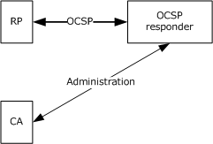
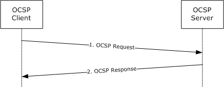

# [MS-OCSP]: Online Certificate Status Protocol (OCSP) Extensions

Table of Contents

1 Introduction

- [1 Introduction](#Section_1)
  - [1.1 Glossary](#Section_1.1)
  - [1.2 References](#Section_1.2)
    - [1.2.1 Normative References](#Section_1.2.1)
    - [1.2.2 Informative References](#Section_1.2.2)
  - [1.3 Overview](#Section_1.3)
  - [1.4 Relationship to Other Protocols](#Section_1.4)
  - [1.5 Prerequisites/Preconditions](#Section_1.5)
  - [1.6 Applicability Statement](#Section_1.6)
  - [1.7 Versioning and Capability Negotiation](#Section_1.7)
  - [1.8 Vendor-Extensible Fields](#Section_1.8)
  - [1.9 Standards Assignments](#Section_1.9)

2 Messages

- [2 Messages](#Section_2)
  - [2.1 Transport](#Section_2.1)
  - [2.2 Message Syntax](#Section_2.2)
    - [2.2.1 Common Structures](#Section_2.2.1)

3 Protocol Details

- [3 Protocol Details](#Section_3)
  - [3.1 Client Details](#Section_3.1)
    - [3.1.1 Abstract Data Model](#Section_3.1.1)
    - [3.1.2 Timers](#Section_3.1.2)
    - [3.1.3 Initialization](#Section_3.1.3)
    - [3.1.4 Higher-Layer Triggered Events](#Section_3.1.4)
    - [3.1.5 Processing Events and Sequencing Rules](#Section_3.1.5)
    - [3.1.6 Timer Events](#Section_3.1.6)
    - [3.1.7 Other Local Events](#Section_3.1.7)
  - [3.2 Server Details](#Section_3.2)
    - [3.2.1 Abstract Data Model](#Section_3.2.1)
    - [3.2.2 Timers](#Section_3.2.2)
    - [3.2.3 Initialization](#Section_3.2.3)
    - [3.2.4 Higher-Layer Triggered Events](#Section_3.2.4)
    - [3.2.5 Processing Events and Sequencing Rules](#Section_3.2.5)
    - [3.2.6 Timer Events](#Section_3.2.6)
    - [3.2.7 Other Local Events](#Section_3.2.7)

4 Protocol Example

- [4 Protocol Example](#Section_4)

5 Security

- [5 Security](#Section_5)
  - [5.1 Security Considerations for Implementers](#Section_5.1)
    - [5.1.1 Keeping Information Secret](#Section_5.1.1)
    - [5.1.2 Coding Practices](#Section_5.1.2)
    - [5.1.3 Security Consideration Citations](#Section_5.1.3)
  - [5.2 Index of Security Parameters](#Section_5.2)

6 Appendix A: Product Behavior

- [6 Appendix A: Product Behavior](#Section_6)

7 Change Tracking

- [7 Change Tracking](#Section_7)

For the legal notice and IP terms, see [LEGAL.md](../LEGAL.md).
Last updated: 4/23/2024.
See [Revision History](#revision-history) for full version history.

# 1 Introduction

The Online Certificate Status Protocol (OCSP) Extensions provide the Microsoft implementation of the Lightweight Online Certificate Status Protocol (OCSP) Profile for High Volume Environments [[RFC5019]](https://go.microsoft.com/fwlink/?LinkId=115190), a profile of the Online Certificate Status Protocol (OCSP) [[RFC2560]](https://go.microsoft.com/fwlink/?LinkId=90369) and any extensions.

Familiarity with public key infrastructure (PKI) concepts such as asymmetric and symmetric cryptography, asymmetric and symmetric encryption techniques, digital certificate concepts, and cryptographic key establishment is required for a complete understanding of OCSP Extensions. [[CRYPTO]](https://go.microsoft.com/fwlink/?LinkId=89841) provides an excellent introduction to cryptography and PKI concepts. [[X509]](https://go.microsoft.com/fwlink/?LinkId=90590) provides an excellent introduction to PKI and certificate concepts.

Sections 1.5, 1.8, 1.9, 2, and 3 of this specification are normative. All other sections and examples in this specification are informative.

## 1.1 Glossary

This document uses the following terms:

**certificate**: A certificate is a collection of attributes and extensions that can be stored persistently. The set of attributes in a certificate can vary depending on the intended usage of the certificate. A certificate securely binds a public key to the entity that holds the corresponding private key. A certificate is commonly used for authentication and secure exchange of information on open networks, such as the Internet, extranets, and intranets. Certificates are digitally signed by the issuing [**certification authority (CA)**](#gt_certification-authority-ca) and can be issued for a user, a computer, or a service. The most widely accepted format for certificates is defined by the ITU-T X.509 version 3 international standards. For more information about attributes and extensions, see [[RFC3280]](https://go.microsoft.com/fwlink/?LinkId=90414) and [[X509]](https://go.microsoft.com/fwlink/?LinkId=90590) sections 7 and 8.

**certificate revocation list (CRL)**: A list of [**certificates**](#gt_certificate) that have been revoked by the [**certification authority (CA)**](#gt_certification-authority-ca) that issued them (that have not yet expired of their own accord). The list has to be cryptographically signed by the CA that issues it. Typically, the certificates are identified by serial number. In addition to the serial number for the revoked certificates, the CRL contains the revocation reason for each certificate and the time the certificate was revoked. As described in [RFC3280], two types of CRLs commonly exist in the industry. Base CRLs keep a complete list of revoked certificates, while delta CRLs maintain only those certificates that have been revoked since the last issuance of a base CRL. For more information, see [X509] section 7.3, [[MSFT-CRL]](https://go.microsoft.com/fwlink/?LinkId=90181), and [RFC3280] section 5.

**certification authority (CA)**: A third party that issues [**public key**](#gt_public-key) [**certificates**](#gt_certificate). Certificates serve to bind public keys to a user identity. Each user and certification authority (CA) can decide whether to trust another user or CA for a specific purpose, and whether this trust is to be transitive. For more information, see [RFC3280].

**key**: In cryptography, a generic term used to refer to cryptographic data that is used to initialize a cryptographic algorithm. [**Keys**](#gt_key) are also sometimes referred to as keying material.

**object identifier (OID)**: In the context of an object server, a 64-bit number that uniquely identifies an object.

**private key**: One of a pair of keys used in public-key cryptography. The private key is kept secret and is used to decrypt data that has been encrypted with the corresponding public key. For an introduction to this concept, see [[CRYPTO]](https://go.microsoft.com/fwlink/?LinkId=89841) section 1.8 and [[IEEE1363]](https://go.microsoft.com/fwlink/?LinkId=89899) section 3.1.

**public key**: One of a pair of keys used in public-key cryptography. The public key is distributed freely and published as part of a digital certificate. For an introduction to this concept, see [CRYPTO] section 1.8 and [IEEE1363] section 3.1.

**public key infrastructure (PKI)**: The laws, policies, standards, and software that regulate or manipulate certificates and public and private keys. In practice, it is a system of digital certificates, [**certificate authorities (CAs)**](#gt_certification-authority-ca), and other registration authorities that verify and authenticate the validity of each party involved in an electronic transaction. For more information, see [X509] section 6.

**registration authority (RA)**: A generic term for a software module, hardware component, or human operator thereof that enables a user or [**public key infrastructure (PKI)**](#gt_public-key-infrastructure-pki) administrator to perform various administration and operational functions as part of the certification or revocation process.

**relying party (RP)**: The entity (person or computer) using information from a certificate in order to make a security decision. Typically, the RP is responsible for guarding some resource and applying access control policies based on information learned from a certificate.

**request**: A message from a client to an OCSP [**responder**](#gt_responder). The message requests the [**revocation**](#gt_revocation) status of an X.509 [**certificate**](#gt_certificate) (see [[RFC2560]](https://go.microsoft.com/fwlink/?LinkId=90369)).

**responder**: An OCSP Extensions server that provides OCSP [**responses**](#gt_response) (see [RFC2560]).

**response**: A message from an OCSP [**responder**](#gt_responder). The message specifies the status of an X.509 [**certificate**](#gt_certificate) (see [RFC2560]).

**revocation**: The process of invalidating a certificate. For more details, see [RFC3280] section 3.3.

**SHA-1**: An algorithm that generates a 160-bit hash value from an arbitrary amount of input data, as described in [[RFC3174]](https://go.microsoft.com/fwlink/?LinkId=90408). SHA-1 is used with the Digital Signature Algorithm (DSA) in the Digital Signature Standard (DSS), in addition to other algorithms and standards.

**trust**: To accept another authority's statements for the purposes of authentication and authorization, especially in the case of a relationship between two domains. If domain A trusts domain B, domain A accepts domain B's authentication and authorization statements for principals represented by security principal objects in domain B; for example, the list of groups to which a particular user belongs. As a noun, a [**trust**](#gt_trust) is the relationship between two domains described in the previous sentence.

**MAY, SHOULD, MUST, SHOULD NOT, MUST NOT:** These terms (in all caps) are used as defined in [[RFC2119]](https://go.microsoft.com/fwlink/?LinkId=90317). All statements of optional behavior use either MAY, SHOULD, or SHOULD NOT.

## 1.2 References

Links to a document in the Microsoft Open Specifications library point to the correct section in the most recently published version of the referenced document. However, because individual documents in the library are not updated at the same time, the section numbers in the documents may not match. You can confirm the correct section numbering by checking the [Errata](https://go.microsoft.com/fwlink/?linkid=850906).

### 1.2.1 Normative References

We conduct frequent surveys of the normative references to assure their continued availability. If you have any issue with finding a normative reference, please contact [dochelp@microsoft.com](mailto:dochelp@microsoft.com). We will assist you in finding the relevant information.

[ITUX690] ITU-T, "ASN.1 Encoding Rules: Specification of Basic Encoding Rules (BER), Canonical Encoding Rules (CER) and Distinguished Encoding Rules (DER)", Recommendation X.690, July 2002, [http://www.itu.int/ITU-T/studygroups/com17/languages/X.690-0207.pdf](https://go.microsoft.com/fwlink/?LinkId=89924)

[LWOCSP] Deacon, A. and Hurst, R., "Lightweight OCSP Profile for High Volume Environments", February 2007, [http://tools.ietf.org/html/draft-ietf-pkix-lightweight-ocsp-profile-09](https://go.microsoft.com/fwlink/?LinkId=89935)

[MS-CSRA] Microsoft Corporation, "[Certificate Services Remote Administration Protocol](../MS-CSRA/MS-CSRA.md)".

[MS-OCSPA] Microsoft Corporation, "[Microsoft OCSP Administration Protocol](../MS-OCSPA/MS-OCSPA.md)".

[RFC2119] Bradner, S., "Key words for use in RFCs to Indicate Requirement Levels", BCP 14, RFC 2119, March 1997, [https://www.rfc-editor.org/info/rfc2119](https://go.microsoft.com/fwlink/?LinkId=90317)

[RFC2560] Myers, M., Ankney, R., Malpani, A., Glaperin, S., and Adams, C., "X.509 Internet Public Key Infrastructure Online Certificate Status Protocol - OCSP", RFC 2560, June 1999, [http://www.rfc-editor.org/info/rfc2560](https://go.microsoft.com/fwlink/?LinkId=90369)

[RFC2616] Fielding, R., Gettys, J., Mogul, J., et al., "Hypertext Transfer Protocol -- HTTP/1.1", RFC 2616, June 1999, [https://www.rfc-editor.org/info/rfc2616](https://go.microsoft.com/fwlink/?LinkId=90372)

[RFC3280] Housley, R., Polk, W., Ford, W., and Solo, D., "Internet X.509 Public Key Infrastructure Certificate and Certificate Revocation List (CRL) Profile", RFC 3280, April 2002, [http://www.rfc-editor.org/info/rfc3280](https://go.microsoft.com/fwlink/?LinkId=90414)

[RFC5019] Deacon, A., and Hurst, R., "The Lightweight Online Certificate Status Protocol (OCSP) Profile for High-Volume Environments", RFC 5019, September 2007, [http://www.rfc-editor.org/info/rfc5019](https://go.microsoft.com/fwlink/?LinkId=115190)

[X509] ITU-T, "Information Technology - Open Systems Interconnection - The Directory: Public-Key and Attribute Certificate Frameworks", Recommendation X.509, August 2005, [http://www.itu.int/rec/T-REC-X.509/en](https://go.microsoft.com/fwlink/?LinkId=90590)

[X660] ITU-T, "Information Technology - Open Systems Interconnection - Procedures for the Operation of OSI Registration Authorities: General Procedures and Top Arcs of the ASN.1 Object Identifier Tree", Recommendation X.660, August 2004, [http://www.itu.int/rec/T-REC-X.660/en](https://go.microsoft.com/fwlink/?LinkId=90592)

### 1.2.2 Informative References

[CRYPTO] Menezes, A., Vanstone, S., and Oorschot, P., "Handbook of Applied Cryptography", 1997, [https://cacr.uwaterloo.ca/hac/](https://go.microsoft.com/fwlink/?LinkId=89841)

[FIPS140] FIPS PUBS, "Security Requirements for Cryptographic Modules", FIPS PUB 140-2, May 2001, [https://csrc.nist.gov/csrc/media/publications/fips/140/2/final/documents/fips1402.pdf](https://go.microsoft.com/fwlink/?LinkId=89866)

[HOWARD] Howard, M., "Writing Secure Code", Microsoft Press, 2002, ISBN: 0735617228.

[RFC2315] Kaliski, B., "PKCS #7: Cryptographic Message Syntax Version 1.5", RFC 2315, March 1998, [https://www.rfc-editor.org/info/rfc2315](https://go.microsoft.com/fwlink/?LinkId=90334)

[RFC2797] Myers, M., Liu, X., Schaad, J., and Weinstein, J., "Certificate Management Messages Over CMS", RFC 2797, April 2000, [http://www.rfc-editor.org/info/rfc2797](https://go.microsoft.com/fwlink/?LinkId=90382)

[RFC2986] Nystrom, M. and Kaliski, B., "PKCS#10: Certificate Request Syntax Specification", RFC 2986, November 2000, [http://www.rfc-editor.org/info/rfc2986](https://go.microsoft.com/fwlink/?LinkId=90401)

## 1.3 Overview

The Online Certificate Status Protocol (OCSP), described in [[RFC2560]](https://go.microsoft.com/fwlink/?LinkId=90369), provides a mechanism, as a supplement to checking against a periodic [**certificate revocation list (CRL)**](#gt_certificate-revocation-list-crl), to obtain timely information regarding the [**revocation**](#gt_revocation) status of a [**certificate**](#gt_certificate) (see [[RFC3280]](https://go.microsoft.com/fwlink/?LinkId=90414) section 3.3). OCSP enables applications to determine the revocation state of an identified X.509 certificate (see [[X509]](https://go.microsoft.com/fwlink/?LinkId=90590) ). The Lightweight Online Certificate Status Protocol (OCSP) Profile for High-Volume Environments ([[RFC5019]](https://go.microsoft.com/fwlink/?LinkId=115190)) provides a profile of OCSP that specifies a subset of the functionality of the complete OCSP defined in [RFC2560]. OCSP Extensions specifies the data that needs to be exchanged between an application that checks the status of a certificate and the [**responder**](#gt_responder) that provides the status.

OCSP is a component of a [**public key infrastructure (PKI)**](#gt_public-key-infrastructure-pki). A PKI consists of a system of digital certificates, certification authorities (CAs), and other [**registration authorities (RAs)**](#gt_8afbead6-bab7-44e7-a69b-d92247740f69) that verify and authenticate the validity of each party involved in an electronic transaction through the use of [**public key**](#gt_public-key) cryptography.

The certificate status received as a result of using OCSP is known as a response from an OCSP responder. The OCSP [**request**](#gt_request)/[**response**](#gt_response) process involves a number of different machines (or functions that might be hosted on the same machine), as indicated in Figure 1.

Figure 1: Response from an OCSP

In the preceding figure, the principal components are as follows:

- **CA:** The certification authority that provides certificate status information to the OCSP responder through the use of CRLs.
- [**Relying party (RP)**](#gt_relying-party-rp): The resource guard that validates a certificate chain and contacts an OCSP responder to request certificate status.
- **OCSP responder:** An authoritative source for certificate revocation status (see [RFC3280] section 3.3). The protocols and data structures used for OCSP are defined in section [2.2](#Section_2.2). The connection over which OCSP is conducted is shown in the preceding figure as a solid bold horizontal line.

## 1.4 Relationship to Other Protocols

The Hypertext Transfer Protocol (HTTP/1.1) [[RFC2616]](https://go.microsoft.com/fwlink/?LinkId=90372) is the transport protocol for Online Certificate Status Protocol (OCSP) Extensions messages.

## 1.5 Prerequisites/Preconditions

OCSP Extensions requires HTTP/1.1 ([[RFC2616]](https://go.microsoft.com/fwlink/?LinkId=90372)) for transport of all messages.

OCSP Extensions assumes the following:

The client discovers the OCSP Extensions server through the Authority Information Access (AIA) extension that is defined in [[RFC3280]](https://go.microsoft.com/fwlink/?LinkId=90414) section 4.2.2.1 or through a URL configured through out-of-band means.<1>

## 1.6 Applicability Statement

OCSP Extensions is applicable to an environment in which clients are able to interact with an OCSP [**responder**](#gt_responder) for the purpose of [**requesting**](#gt_request) the [**revocation**](#gt_revocation) status of an [[X509]](https://go.microsoft.com/fwlink/?LinkId=90590) [**certificate**](#gt_certificate).

## 1.7 Versioning and Capability Negotiation

None.

## 1.8 Vendor-Extensible Fields

None.

## 1.9 Standards Assignments

None.

# 2 Messages

The following sections specify how messages of the OCSP Extensions are transported and encoded on the wire.

## 2.1 Transport

OCSP is commonly used over HTTP [[RFC2616]](https://go.microsoft.com/fwlink/?LinkId=90372), although additional transports are allowed per [[RFC2560]](https://go.microsoft.com/fwlink/?LinkId=90369) section 4.1.<2>

OCSP Extensions uses HTTP as the transport.

## 2.2 Message Syntax

The following sections define the message syntax for OCSP Extensions. OCSP messages are defined in ASN.1 as specified in [[X660]](https://go.microsoft.com/fwlink/?LinkId=90592) and encoded by using DER encoding as specified in [[ITUX690]](https://go.microsoft.com/fwlink/?LinkId=89924).

### 2.2.1 Common Structures

OCSP client and server implementations MUST use the ASN.1 structures specified in [[RFC2560]](https://go.microsoft.com/fwlink/?LinkId=90369) when constructing an OCSP [**request**](#gt_request) and [**response**](#gt_response). The following fields are introduced and defined in sections 4.1 and 4.2 of [RFC2560], respectively, and are used by OCSP Extensions.

OCSPRequest

TBSRequest

OPTIONAL Signature

OCSPResponse

OCSPResponseStatus

ResponseBytes

Detailed server processing information is in section [3.2](#Section_1.3)

# 3 Protocol Details

The following sections specify protocol details, including abstract data models and message processing rules.

## 3.1 Client Details

The client role in OCSP Extensions is to generate a [**request**](#gt_request), as specified in section [2.2.1](#Section_2.2.1), and upon receipt, validate the [**response**](#gt_response).

### 3.1.1 Abstract Data Model

None.

### 3.1.2 Timers

None.

### 3.1.3 Initialization

None.

### 3.1.4 Higher-Layer Triggered Events

None.

### 3.1.5 Processing Events and Sequencing Rules

OCSP [**request**](#gt_request) creation MUST adhere to [[RFC5019]](https://go.microsoft.com/fwlink/?LinkId=115190) section 2.1.<3>

When an OCSP Extensions client processes the [**response**](#gt_response) from a [**responder**](#gt_responder), it enforces that the response is signed by one of the following [**keys**](#gt_key):

- The [**private key**](#gt_private-key) that was used to sign the inspected [**certificate**](#gt_certificate).
- A private key with a corresponding certificate that was signed by using the same private key that was used to sign the inspected certificate.

### 3.1.6 Timer Events

None.

### 3.1.7 Other Local Events

None.

## 3.2 Server Details

The following sections define the server sequencing and processing rules for the OCSP implementation.<4>

### 3.2.1 Abstract Data Model

This section describes a conceptual model of possible data organization that an implementation can maintain to participate in this protocol. The organization is provided to help explain how the protocol works. This document does not require that implementations adhere to this model, provided their external behavior is consistent with that specified in this document.

The following elements are described by OCSP Extensions.

**Revoked Certificates List:** The server maintains a list of revoked [**certificates**](#gt_certificate) and maintains the following fields for each revoked certificate:

- Certificate serial number, as specified in [[RFC3280]](https://go.microsoft.com/fwlink/?LinkId=90414) section 4.1.2.2.
- [**Revocation**](#gt_revocation) date and time, as specified in [RFC3280] section 5.3.3.
- Revocation reason, as specified in [RFC3280] section 5.3.1.
**OCSP Signing Key Pair:** The server maintains a [**private key**](#gt_private-key) with which to sign OCSP [**responses**](#gt_response). The server holds a certificate that has the associated [**public key**](#gt_public-key), which is delivered to OCSP clients to verify that the server can authorize OCSP responses.

**Nonce Policy:** The server maintains exactly one variable that is called a Nonce Policy, which can have one of two values: "Allowed" or "Not Allowed". The initial value is "Not Allowed". This variable can be changed directly on the OCSP Extensions server, or it can be changed by using the Microsoft OCSP Administration Protocol, as specified in [MS-OCSPA](../MS-OCSPA/MS-OCSPA.md). In the Microsoft OCSP Administration Protocol, this variable can be set to "Allowed" by adding the bit value "0x00000100" to the SigningFlags property of the revocation configuration, as documented in [MS-OCSPA] section 3.2.4.1.3.

### 3.2.2 Timers

None.

### 3.2.3 Initialization

The [**responder**](#gt_responder) MUST acquire a [**certificate**](#gt_certificate) as defined in [[RFC2560]](https://go.microsoft.com/fwlink/?LinkId=90369) section 4.2.2.2.

### 3.2.4 Higher-Layer Triggered Events

None.

### 3.2.5 Processing Events and Sequencing Rules

The OCSP Extensions server processes an OCSP [**request**](#gt_request) and generates an OCSP [**response**](#gt_response) as follows:

- If the **requestList** field of the request includes more requests than the MaxNumOfRequestEntries property specified in [MS-OCSPA](../MS-OCSPA/MS-OCSPA.md) section 3.2.1.2,<5> the OCSP Extensions [**responder**](#gt_responder) MUST reject the request with an "unauthorized" response, as specified in [[RFC2560]](https://go.microsoft.com/fwlink/?LinkId=90369) section 2.3.
- The **CertID.issuerNameHash** and **CertID.issuerKeyHash** values of each request entry included in the **requestList** field of the request MUST be [**SHA-1**](#gt_sha-1) hash values as specified in section 2.1.1 of [[RFC5019]](https://go.microsoft.com/fwlink/?LinkId=115190). Otherwise, the OCSP Extensions responder MUST reject the request with an "unauthorized" response, as specified in [RFC2560] section 2.3.
- While [RFC5019] section 2.1.1 "RECOMMENDS that [the requestExtensions structure] contain only the nonce extension", if the request contains a critical extension that is not the Nonce extension, the OCSP Extensions responder rejects with an "unauthorized" response, as specified in [RFC2560] section 2.3.
- While [RFC5019] section 2.1.1 "RECOMMENDS that [the requestExtensions structure] contain only the nonce extension", if the request contains a noncritical extension, the OCSP Extensions responder ignores the extension.
- If the request is signed, the OCSP Extensions responder ignores the signature and processes the request as though it were an unsigned request, as specified in [RFC5019] section 2.1.2.
- The **responseType** field for all OCSP responses is id-pkix-ocsp-basic, as defined in [RFC2560] section 4.2.1.
- The **responses** field of all responses includes the same number of responses as the number of requests. See step 1 for information about the number of requests.
- The Nonce extension defined in [RFC2560] section 4.4.1 can be included in requests in the **requestExtensions** field. If the OCSP Extensions responder Nonce Policy is set to "Allowed", the responder includes the Nonce extension in the **responseExtensions** field of the response. If the Nonce Policy is set to "Not Allowed", the responder rejects the request with an "unauthorized" response as specified in [RFC2560] section 2.3.
- The OCSP Extensions responder includes a noncritical extension that has an [**object identifier (OID)**](#gt_object-identifier-oid) of 1.3.6.1.4.1.311.21.4 in the **singleExtensions** field of the response. This field contains the specified OID only if the [**CA**](#gt_certification-authority-ca) issues a [**certificate revocation list (CRL)**](#gt_certificate-revocation-list-crl) that contains the same CRL.Next.Publish extension as specified in [MS-CSRA](../MS-CSRA/MS-CSRA.md) section 3.1.2.
- The value of the extension referenced above, with an OID of 1.3.6.1.4.1.311.21.4, contains the time when the next [**revocation**](#gt_revocation) information is expected to be published. This time can be sooner than the **NextUpdate** field. The extension value is DER-encoded and is defined in ASN.1 [[X509]](https://go.microsoft.com/fwlink/?LinkId=90590), as the following example shows.
CHOICE {

utcTime UTCTime,

generalTime GeneralizedTime

}

If the time is after 1950 and before 2050, it is UTC time that is encoded with a two-digit year. Otherwise, the time is Generalized time that is encoded with a four-digit year. The date is precise to seconds.

- The OCSP Extensions responder adds the HTTP headers as specified in [[LWOCSP]](https://go.microsoft.com/fwlink/?LinkId=89935) section 4 for an OCSPResponse.
- If the OCSPRequest is preceded by the conditional HTTP headers "If-Modified-Since" or "If-None-Match", the OCSP Extensions responder evaluates whether it has a newer OCSPResponse value (a newer value than what is specified in the condition) for the OCSPRequest value and responds with an HTTP 304 (not modified) status message if it does not (see [[RFC2616]](https://go.microsoft.com/fwlink/?LinkId=90372)).
With the exception of the deviations and extensions previously enumerated, OCSP request processing and response generation complies with [RFC5019].

### 3.2.6 Timer Events

None.

### 3.2.7 Other Local Events

None.

# 4 Protocol Example

The client determines that it has to validate the [**revocation**](#gt_revocation) status of a [**certificate**](#gt_certificate). When the client invokes the revocation-checking process, the following event sequence occurs:

Figure 2: Revocation-checking process

- The OCSP Extensions client generates an OCSP [**request**](#gt_request) as specified in section [3.1.5](#Section_3.1.5) and submits the request to the [**responder**](#gt_responder).
- The responder inspects the requests and generates a [**response**](#gt_response) as specified in section [3.2.5](#Section_3.1.5).

# 5 Security

The following sections specify security considerations for implementers of the OCSP Extensions.

## 5.1 Security Considerations for Implementers

Any cryptographic protocol has security considerations with [**key**](#gt_key) handling during cryptographic operations and key distribution. Although a [**public key**](#gt_public-key) [**certificate**](#gt_certificate) is not a protocol by itself, it has most of the same security considerations of a cryptographic protocol in the sense that a public key certificate is a message from the [**CA**](#gt_certification-authority-ca) to the [**RP**](#gt_relying-party-rp)—a message addressed, in effect, "to whom it may concern." A cryptographic protocol that deals with the transmission or issuance or other use of a public key certificate therefore has security considerations in two areas: around the protocol itself and around the certificate and its use.

In addition, a certificate binds two or more pieces of information together. In the most common case, that is a public key and a name. The name in such a certificate has security relevance and there are security considerations around the use and provisioning of those names. In some certificate forms, there are attributes bound to either a name or a key, and there are security considerations regarding the use and provisioning of those attributes.

### 5.1.1 Keeping Information Secret

Any cryptographic [**key**](#gt_key) has to be kept secret. Any function of a secret (such as a key schedule) also has to be kept secret, because knowing such functions would reduce an attacker's work in cryptanalyzing the secret.

When a secret is stored in the normal memory of a general-purpose computer in order to be used, that secret should be erased (for example, replaced with a constant value, such as 0) as soon as possible after use.

A secret can be stored in specially protected memory where it can be used without being erased. Typically, one finds such memory in a hardware security module (HSM). If an HSM is used, it should be compliant with [[FIPS140]](https://go.microsoft.com/fwlink/?LinkId=89866), or the equivalent at a level consistent with the security requirements of the customer deploying the cryptographic protocol or the [**CA**](#gt_certification-authority-ca) that uses the HSM.

### 5.1.2 Coding Practices

Any implementation of a protocol exposes code to security attacks. Such code has to be developed according to secure coding and development practices in order to avoid buffer overflows, denial-of-service attacks, escalation of privilege, and disclosure of information. For an introduction to these concepts, secure development best practices, and common errors, see [HOWARD].

### 5.1.3 Security Consideration Citations

Implementers of OCSP Extensions are advised to consider the following security precautions, as OCSP client and server implementations should observe the following:

- Follow generally accepted principles of secure [**key**](#gt_key) management. For more information, see [[RFC3280]](https://go.microsoft.com/fwlink/?LinkId=90414) section 9. For an introduction to these generally accepted principles, see [[CRYPTO]](https://go.microsoft.com/fwlink/?LinkId=89841) and [HOWARD].
- Validate cryptographic parameters prior to issuing or accepting [**certificates**](#gt_certificate). For more information, see section 9 of [[RFC2797]](https://go.microsoft.com/fwlink/?LinkId=90382).
- Validate and verify the certificate path information identified in section 6 of [RFC3280]. See section 9 of [RFC3280] for more information on the requirement for certificate path validation.
- Validate and verify the freshness of [**revocation**](#gt_revocation) information of all digital certificates prior to usage, [**trust**](#gt_trust), or encryption as identified in section 6.3 of [RFC3280]. See section 9 of [RFC3280] for more information on the requirement for revocation freshness.
- Follow all security considerations in section 5 of [[RFC2560]](https://go.microsoft.com/fwlink/?LinkId=90369).
- Follow all security considerations discussed throughout [[RFC2315]](https://go.microsoft.com/fwlink/?LinkId=90334) and [[RFC2986]](https://go.microsoft.com/fwlink/?LinkId=90401) as neither normative reference has a specific security section.
- Use an authenticated HTTP session between client and server to mitigate denial-of-service attacks. For more information on generic denial-of-service mitigation techniques, see [HOWARD].

## 5.2 Index of Security Parameters

None.

# 6 Appendix A: Product Behavior

The information in this specification is applicable to the following Microsoft products or supplemental software. References to product versions include updates to those products.

The terms "earlier" and "later", when used with a product version, refer to either all preceding versions or all subsequent versions, respectively. The term "through" refers to the inclusive range of versions. Applicable Microsoft products are listed chronologically in this section.

The following tables show the relationships between Microsoft product versions or supplemental software and the roles they perform.

| Windows Client Releases | Server Role | Client Role |
| --- | --- | --- |
| Windows Vista operating system | NA | Yes |
| Windows 7 operating system | NA | Yes |
| Windows 8 operating system | NA | Yes |
| Windows 8.1 operating system | NA | Yes |
| Windows 10 operating system | NA | Yes |
| Windows 11 operating system | NA | Yes |

| Windows Server Releases | Server Role | Client Role |
| --- | --- | --- |
| Windows Server 2008 operating system | Yes | Yes |
| Windows Server 2008 R2 operating system | Yes | Yes |
| Windows Server 2012 operating system | Yes | Yes |
| Windows Server 2012 R2 operating system | Yes | Yes |
| Windows Server 2016 operating system | Yes | Yes |
| Windows Server operating system | Yes | Yes |
| Windows Server 2019 operating system | Yes | Yes |
| Windows Server 2022 operating system | Yes | Yes |
| Windows Server 2025 operating system | Yes | Yes |

Exceptions, if any, are noted in this section. If an update version, service pack or Knowledge Base (KB) number appears with a product name, the behavior changed in that update. The new behavior also applies to subsequent updates unless otherwise specified. If a product edition appears with the product version, behavior is different in that product edition.

Unless otherwise specified, any statement of optional behavior in this specification that is prescribed using the terms "SHOULD" or "SHOULD NOT" implies product behavior in accordance with the SHOULD or SHOULD NOT prescription. Unless otherwise specified, the term "MAY" implies that the product does not follow the prescription.

<1> Section 1.5: On Windows, only the URL specified in the validated [**certificate**](#gt_certificate) AIA extension is used.

<2> Section 2.1: OCSP Extensions conform to OCSP over HTTP as described in [[RFC2560]](https://go.microsoft.com/fwlink/?LinkId=90369) Appendix A.

<3> Section 3.1.5: On Windows, OCSP clients generate the OCSP request as follows:

- The version field is set to 1.
- The **requestorName** and **requestExtensions** request fields are not included in the request.
- The requestList always contains only one request.
- The **CertId** field always uses the SHA-1 hash algorithm.
- The OCSP Extensions client does not sign the requests.
<4> Section 3.2: Only Windows Server 2008 and later can perform the server role.

<5> Section 3.2.5: Windows Server 2008 allows only one request in the **requestList** field.

# 7 Change Tracking

This section identifies changes that were made to this document since the last release. Changes are classified as Major, Minor, or None.

The revision class **Major** means that the technical content in the document was significantly revised. Major changes affect protocol interoperability or implementation. Examples of major changes are:

- A document revision that incorporates changes to interoperability requirements.
- A document revision that captures changes to protocol functionality.
The revision class **Minor** means that the meaning of the technical content was clarified. Minor changes do not affect protocol interoperability or implementation. Examples of minor changes are updates to clarify ambiguity at the sentence, paragraph, or table level.

The revision class **None** means that no new technical changes were introduced. Minor editorial and formatting changes may have been made, but the relevant technical content is identical to the last released version.

The changes made to this document are listed in the following table. For more information, please contact [dochelp@microsoft.com](mailto:dochelp@microsoft.com).

| Section | Description | Revision class |
| --- | --- | --- |
| [6](#Section_6) Appendix A: Product Behavior | Added Windows Server 2025 to the list of applicable products. | Major |

## Revision History

| Date | Version | Revision Class | Comments |
| --- | --- | --- | --- |
| 12/18/2006 | 0.1 | New | Version 0.1 release |
| 3/2/2007 | 1.0 | Major | Version 1.0 release |
| 4/3/2007 | 1.1 | Minor | Version 1.1 release |
| 5/11/2007 | 1.2 | Minor | Version 1.2 release |
| 6/1/2007 | 1.2.1 | Editorial | Changed language and formatting in the technical content. |
| 7/3/2007 | 1.2.2 | Editorial | Changed language and formatting in the technical content. |
| 7/20/2007 | 1.2.3 | Editorial | Changed language and formatting in the technical content. |
| 8/10/2007 | 1.2.4 | Editorial | Changed language and formatting in the technical content. |
| 9/28/2007 | 1.3 | Minor | Added captions to figures. |
| 10/23/2007 | 1.4 | Minor | Clarified the meaning of the technical content. |
| 11/30/2007 | 2.0 | Major | Updated and revised the technical content. |
| 1/25/2008 | 3.0 | Major | Updated and revised the technical content. |
| 3/14/2008 | 3.0.1 | Editorial | Changed language and formatting in the technical content. |
| 5/16/2008 | 4.0 | Major | Updated and revised the technical content. |
| 6/20/2008 | 5.0 | Major | Updated and revised the technical content. |
| 7/25/2008 | 5.0.1 | Editorial | Changed language and formatting in the technical content. |
| 8/29/2008 | 5.0.2 | Editorial | Changed language and formatting in the technical content. |
| 10/24/2008 | 5.1 | Minor | Clarified the meaning of the technical content. |
| 12/5/2008 | 5.2 | Minor | Clarified the meaning of the technical content. |
| 1/16/2009 | 5.3 | Minor | Clarified the meaning of the technical content. |
| 2/27/2009 | 5.3.1 | Editorial | Changed language and formatting in the technical content. |
| 4/10/2009 | 5.3.2 | Editorial | Changed language and formatting in the technical content. |
| 5/22/2009 | 6.0 | Major | Updated and revised the technical content. |
| 7/2/2009 | 6.0.1 | Editorial | Changed language and formatting in the technical content. |
| 8/14/2009 | 6.0.2 | Editorial | Changed language and formatting in the technical content. |
| 9/25/2009 | 6.1 | Minor | Clarified the meaning of the technical content. |
| 11/6/2009 | 6.1.1 | Editorial | Changed language and formatting in the technical content. |
| 12/18/2009 | 6.2 | Minor | Clarified the meaning of the technical content. |
| 1/29/2010 | 7.0 | Major | Updated and revised the technical content. |
| 3/12/2010 | 7.0.1 | Editorial | Changed language and formatting in the technical content. |
| 4/23/2010 | 7.0.2 | Editorial | Changed language and formatting in the technical content. |
| 6/4/2010 | 7.0.3 | Editorial | Changed language and formatting in the technical content. |
| 7/16/2010 | 7.0.3 | None | No changes to the meaning, language, or formatting of the technical content. |
| 8/27/2010 | 7.0.3 | None | No changes to the meaning, language, or formatting of the technical content. |
| 10/8/2010 | 7.0.3 | None | No changes to the meaning, language, or formatting of the technical content. |
| 11/19/2010 | 8.0 | Major | Updated and revised the technical content. |
| 1/7/2011 | 8.0 | None | No changes to the meaning, language, or formatting of the technical content. |
| 2/11/2011 | 8.0 | None | No changes to the meaning, language, or formatting of the technical content. |
| 3/25/2011 | 8.0 | None | No changes to the meaning, language, or formatting of the technical content. |
| 5/6/2011 | 8.0 | None | No changes to the meaning, language, or formatting of the technical content. |
| 6/17/2011 | 8.1 | Minor | Clarified the meaning of the technical content. |
| 9/23/2011 | 8.1 | None | No changes to the meaning, language, or formatting of the technical content. |
| 12/16/2011 | 9.0 | Major | Updated and revised the technical content. |
| 3/30/2012 | 9.0 | None | No changes to the meaning, language, or formatting of the technical content. |
| 7/12/2012 | 9.0 | None | No changes to the meaning, language, or formatting of the technical content. |
| 10/25/2012 | 10.0 | Major | Updated and revised the technical content. |
| 1/31/2013 | 10.0 | None | No changes to the meaning, language, or formatting of the technical content. |
| 8/8/2013 | 11.0 | Major | Updated and revised the technical content. |
| 11/14/2013 | 11.0 | None | No changes to the meaning, language, or formatting of the technical content. |
| 2/13/2014 | 11.0 | None | No changes to the meaning, language, or formatting of the technical content. |
| 5/15/2014 | 11.0 | None | No changes to the meaning, language, or formatting of the technical content. |
| 6/30/2015 | 12.0 | Major | Significantly changed the technical content. |
| 10/16/2015 | 12.0 | None | No changes to the meaning, language, or formatting of the technical content. |
| 7/14/2016 | 13.0 | Major | Significantly changed the technical content. |
| 6/1/2017 | 13.0 | None | No changes to the meaning, language, or formatting of the technical content. |
| 9/15/2017 | 14.0 | Major | Significantly changed the technical content. |
| 9/12/2018 | 15.0 | Major | Significantly changed the technical content. |
| 4/7/2021 | 16.0 | Major | Significantly changed the technical content. |
| 6/25/2021 | 17.0 | Major | Significantly changed the technical content. |
| 12/12/2023 | 18.0 | Major | Significantly changed the technical content. |
| 4/23/2024 | 19.0 | Major | Significantly changed the technical content. |
