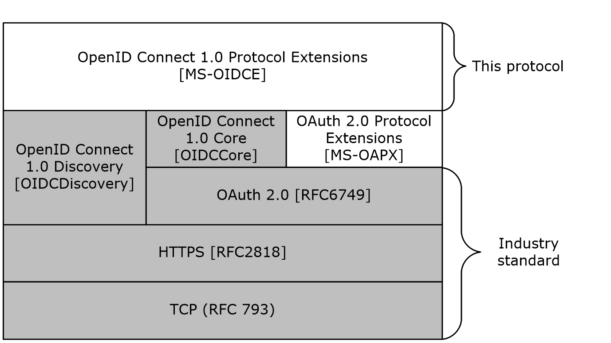

# [MS-OIDCE]: OpenID Connect 1.0 Protocol Extensions

Table of Contents

1 Introduction

- [1 Introduction](#Section_1)
  - [1.1 Glossary](#Section_1.1)
  - [1.2 References](#Section_1.2)
    - [1.2.1 Normative References](#Section_1.2.1)
    - [1.2.2 Informative References](#Section_1.2.2)
  - [1.3 Overview](#Section_1.3)
  - [1.4 Relationship to Other Protocols](#Section_1.4)
  - [1.5 Prerequisites/Preconditions](#Section_1.5)
  - [1.6 Applicability Statement](#Section_1.6)
  - [1.7 Versioning and Capability Negotiation](#Section_1.7)
  - [1.8 Vendor-Extensible Fields](#Section_1.8)
  - [1.9 Standards Assignments](#Section_1.9)

2 Messages

- [2 Messages](#Section_2)
  - [2.1 Transport](#Section_2.1)
  - [2.2 Common Data Types](#Section_2.2)
    - [2.2.1 HTTP Headers](#Section_2.2.1)
    - [2.2.2 Common URI Parameters](#Section_2.2.2)
    - [2.2.3 Common Data Structures](#Section_2.2.3)
      - [2.2.3.1 ID Token](#Section_2.2.3.1)
      - [2.2.3.2 OpenID Provider Metadata](#Section_2.2.3.2)

3 Protocol Details

- [3 Protocol Details](#Section_3)
  - [3.1 OpenID Connect Extension Client Details](#Section_3.1)
    - [3.1.1 Abstract Data Model](#Section_3.1.1)
    - [3.1.2 Timers](#Section_3.1.2)
    - [3.1.3 Initialization](#Section_3.1.3)
    - [3.1.4 Higher-Layer Triggered Events](#Section_3.1.4)
    - [3.1.5 Message Processing Events and Sequencing Rules](#Section_3.1.5)
      - [3.1.5.1 Authorization endpoint (/authorize)](#Section_3.1.5.1)
        - [3.1.5.1.1 GET](#Section_3.1.5.1.1)
          - [3.1.5.1.1.1 Request Body](#Section_3.1.5.1.1.1)
          - [3.1.5.1.1.2 Response Body](#Section_3.1.5.1.1.2)
          - [3.1.5.1.1.3 Processing Details](#Section_3.1.5.1.1.3)
        - [3.1.5.1.2 POST](#Section_3.1.5.1.2)
          - [3.1.5.1.2.1 Request Body](#Section_3.1.5.1.2.1)
          - [3.1.5.1.2.2 Response Body](#Section_3.1.5.1.2.2)
          - [3.1.5.1.2.3 Processing Details](#Section_3.1.5.1.2.3)
      - [3.1.5.2 Token endpoint (/token)](#Section_3.1.5.2)
        - [3.1.5.2.1 POST](#Section_3.1.5.2.1)
          - [3.1.5.2.1.1 Request Body](#Section_3.1.5.2.1.1)
          - [3.1.5.2.1.2 Response Body](#Section_3.1.5.2.1.2)
          - [3.1.5.2.1.3 Processing Details](#Section_3.1.5.2.1.3)
      - [3.1.5.3 OpenID Provider Configuration endpoint (/.well-known/openid-configuration)](#Section_3.1.5.3)
        - [3.1.5.3.1 GET](#Section_3.1.5.3.1)
          - [3.1.5.3.1.1 Request Body](#Section_3.1.5.3.1.1)
          - [3.1.5.3.1.2 Response Body](#Section_3.1.5.3.1.2)
          - [3.1.5.3.1.3 Processing Details](#Section_3.1.5.3.1.3)
      - [3.1.5.4 Logout endpoint (/logout)](#Section_3.1.5.4)
        - [3.1.5.4.1 GET](#Section_3.1.5.4.1)
          - [3.1.5.4.1.1 Request Body](#Section_3.1.5.4.1.1)
          - [3.1.5.4.1.2 Response Body](#Section_3.1.5.4.1.2)
          - [3.1.5.4.1.3 Processing Details](#Section_3.1.5.4.1.3)
    - [3.1.6 Timer Events](#Section_3.1.6)
    - [3.1.7 Other Local Events](#Section_3.1.7)
  - [3.2 OpenID Connect Extension Server Details](#Section_3.2)
    - [3.2.1 Abstract Data Model](#Section_3.2.1)
    - [3.2.2 Timers](#Section_3.2.2)
    - [3.2.3 Initialization](#Section_3.2.3)
    - [3.2.4 Higher-Layer Triggered Events](#Section_3.2.4)
    - [3.2.5 Message Processing Events and Sequencing Rules](#Section_3.2.5)
      - [3.2.5.1 Authorization endpoint (/authorize)](#Section_3.2.5.1)
        - [3.2.5.1.1 GET](#Section_3.2.5.1.1)
          - [3.2.5.1.1.1 Request Body](#Section_3.2.5.1.1.1)
          - [3.2.5.1.1.2 Response Body](#Section_3.2.5.1.1.2)
          - [3.2.5.1.1.3 Processing Details](#Section_3.2.5.1.1.3)
        - [3.2.5.1.2 POST](#Section_3.2.5.1.2)
          - [3.2.5.1.2.1 Request Body](#Section_3.2.5.1.2.1)
          - [3.2.5.1.2.2 Response Body](#Section_3.2.5.1.2.2)
          - [3.2.5.1.2.3 Processing Details](#Section_3.2.5.1.2.3)
      - [3.2.5.2 Token endpoint (/token)](#Section_3.2.5.2)
        - [3.2.5.2.1 POST](#Section_3.2.5.2.1)
          - [3.2.5.2.1.1 Request Body](#Section_3.2.5.2.1.1)
          - [3.2.5.2.1.2 Response Body](#Section_3.2.5.2.1.2)
          - [3.2.5.2.1.3 Processing Details](#Section_3.2.5.2.1.3)
      - [3.2.5.3 OpenID Provider Configuration endpoint (/.well-known/openid-configuration)](#Section_3.2.5.3)
        - [3.2.5.3.1 GET](#Section_3.2.5.3.1)
          - [3.2.5.3.1.1 Request Body](#Section_3.2.5.3.1.1)
          - [3.2.5.3.1.2 Response Body](#Section_3.2.5.3.1.2)
          - [3.2.5.3.1.3 Processing Details](#Section_3.2.5.3.1.3)
      - [3.2.5.4 Logout endpoint (/logout)](#Section_3.2.5.4)
        - [3.2.5.4.1 GET](#Section_3.2.5.4.1)
          - [3.2.5.4.1.1 Request Body](#Section_3.2.5.4.1.1)
          - [3.2.5.4.1.2 Response Body](#Section_3.2.5.4.1.2)
          - [3.2.5.4.1.3 Processing Details](#Section_3.2.5.4.1.3)
    - [3.2.6 Timer Events](#Section_3.2.6)
    - [3.2.7 Other Local Events](#Section_3.2.7)

4 Protocol Examples

- [4 Protocol Examples](#Section_4)
  - [4.1 Example ID Token](#Section_4.1)
  - [4.2 Example OpenID Provider Configuration Response](#Section_4.2)

5 Security

- [5 Security](#Section_5)
  - [5.1 Security Considerations for Implementers](#Section_5.1)
  - [5.2 Index of Security Parameters](#Section_5.2)

6 Appendix A: Product Behavior

- [6 Appendix A: Product Behavior](#Section_6)

7 Change Tracking

- [7 Change Tracking](#Section_7)

For the legal notice and IP terms, see [LEGAL.md](../LEGAL.md).
Last updated: 2/10/2025.
See [Revision History](#revision-history) for full version history.

# 1 Introduction

The OpenID Connect 1.0 Protocol Extensions specify extensions to [[OIDCCore]](https://go.microsoft.com/fwlink/?LinkId=523840) (OpenID Connect Core 1.0) and [[OIDCDiscovery]](https://go.microsoft.com/fwlink/?LinkId=529548) (OpenID Connect Discovery). When no operating system version information is specified, information in this document applies to all relevant versions of Windows. Similarly, when no [**AD FS behavior level**](#gt_ad-fs-behavior-level) is specified, information in this document applies to all AD FS behavior levels.

Sections 1.5, 1.8, 1.9, 2, and 3 of this specification are normative. All other sections and examples in this specification are informative.

## 1.1 Glossary

This document uses the following terms:

**Active Directory Federation Services (AD FS)**: A Microsoft implementation of a federation services provider, which provides a security token service (STS) that can issue security tokens to a caller using various protocols such as WS-Trust, WS-Federation, and Security Assertion Markup Language (SAML) version 2.0.

**AD FS behavior level**: A specification of the functionality available in an AD FS server. Possible values such as AD_FS_BEHAVIOR_LEVEL_1 and AD_FS_BEHAVIOR_LEVEL_2 are described in [MS-OAPX].

**AD FS server**: See authorization server in [[RFC6749]](https://go.microsoft.com/fwlink/?LinkId=301486).

**JavaScript Object Notation (JSON)**: A text-based, data interchange format that is used to transmit structured data, typically in Asynchronous JavaScript + XML (AJAX) web applications, as described in [[RFC7159]](https://go.microsoft.com/fwlink/?linkid=842522). The JSON format is based on the structure of ECMAScript (Jscript, JavaScript) objects.

**JSON Web Token (JWT)**: A string representing a set of claims as a JSON object that is encoded in a JWS or JWE, enabling the claims to be digitally signed or integrity protected with a Message Authentication Code (MAC) and/or encrypted. For more information, see [[RFC7519]](https://go.microsoft.com/fwlink/?LinkId=824833).

**multi-resource refresh token**: A refresh token (see [RFC6749] section 1.5) that can be redeemed for an access token for any resource. If a refresh token is not a multi-resource refresh token, then it can only be redeemed for an access token for the same resource that was originally requested when the refresh token was granted.

**relying party (RP)**: A web application or service that consumes security tokens issued by a security token service (STS).

**Uniform Resource Identifier (URI)**: A string that identifies a resource. The URI is an addressing mechanism defined in Internet Engineering Task Force (IETF) Uniform Resource Identifier (URI): Generic Syntax [[RFC3986]](https://go.microsoft.com/fwlink/?LinkId=90453).

**Uniform Resource Locator (URL)**: A string of characters in a standardized format that identifies a document or resource on the World Wide Web. The format is as specified in [[RFC1738]](https://go.microsoft.com/fwlink/?LinkId=90287).

**user principal name (UPN)**: A user account name (sometimes referred to as the user logon name) and a domain name that identifies the domain in which the user account is located. This is the standard usage for logging on to a Windows domain. The format is: someone@example.com (in the form of an email address). In Active Directory, the userPrincipalName attribute of the account object, as described in [MS-ADTS](../MS-ADTS/MS-ADTS.md).

**MAY, SHOULD, MUST, SHOULD NOT, MUST NOT:** These terms (in all caps) are used as defined in [[RFC2119]](https://go.microsoft.com/fwlink/?LinkId=90317). All statements of optional behavior use either MAY, SHOULD, or SHOULD NOT.

## 1.2 References

Links to a document in the Microsoft Open Specifications library point to the correct section in the most recently published version of the referenced document. However, because individual documents in the library are not updated at the same time, the section numbers in the documents may not match. You can confirm the correct section numbering by checking the [Errata](https://go.microsoft.com/fwlink/?linkid=850906).

### 1.2.1 Normative References

We conduct frequent surveys of the normative references to assure their continued availability. If you have any issue with finding a normative reference, please contact [dochelp@microsoft.com](mailto:dochelp@microsoft.com). We will assist you in finding the relevant information.

[MS-OAPXBC] Microsoft Corporation, "[OAuth 2.0 Protocol Extensions for Broker Clients](../MS-OAPXBC/MS-OAPXBC.md)".

[MS-OAPX] Microsoft Corporation, "[OAuth 2.0 Protocol Extensions](../MS-OAPX/MS-OAPX.md)".

[MSKB-4019472] Microsoft Corporation, "May 9, 2017—KB4019472 (OS Build 14393.1198)", [https://support.microsoft.com/en-us/kb/4019472](https://go.microsoft.com/fwlink/?linkid=849457)

[MSKB-4022723] Microsoft Corporation, "June 27, 2017 - KB4022723 (OS Build 14393.1378)", [https://support.microsoft.com/en-us/kb/4022723](https://go.microsoft.com/fwlink/?linkid=851207)

[MSKB-4038801] Microsoft Corporation, "September 28, 2017—KB4038801 (OS Build 14393.1737)", [https://support.microsoft.com/help/4038801](https://go.microsoft.com/fwlink/?linkid=856119)

[MSKB-4058258] Microsoft Corporation, "January 31, 2018—KB4058258 (OS Build 16299.214)", [https://support.microsoft.com/en-us/topic/january-31-2018-kb4058258-os-build-16299-214-49747260-0bb0-24d2-c9cf-e6ccd513946d](https://go.microsoft.com/fwlink/?linkid=866444)

[MSKB-4088889] Microsoft Corporation, "March 22, 2018 - KB4088889 (OS Build 14393.2155)", [https://support.microsoft.com/en-us/help/4088889](https://go.microsoft.com/fwlink/?linkid=869224)

[MSKB-4457127] Microsoft Corporation, "September 20, 2018—KB4457127 (OS Build 14393.2515)", [https://support.microsoft.com/en-us/help/4457127/windows-10-update-kb4457127](https://go.microsoft.com/fwlink/?linkid=2010731)

[OIDCCore] Sakimura, N., Bradley, J., Jones, M., de Medeiros, B., and Mortimore, C., "OpenID Connect Core 1.0 incorporating errata set 1", November 2014, [http://openid.net/specs/openid-connect-core-1_0.html](https://go.microsoft.com/fwlink/?LinkId=523840)

[OIDCDiscovery] Sakimura, N., Bradley, J., Jones, M., and Jay, Edmund, "OpenID Connect Discovery 1.0 incorporating errata set 1", November 2014, [http://openid.net/specs/openid-connect-discovery-1_0.html](https://go.microsoft.com/fwlink/?LinkId=529548)

[OIDCFrontChanLO] Jones, M., "OpenID Connect Front-Channel Logout 1.0 - draft 02", January 2017, [http://openid.net/specs/openid-connect-frontchannel-1_0.html](https://go.microsoft.com/fwlink/?linkid=858797)

[OIDCSession] Medeiros, B., Agarwal, N., Sakimura, N. Bradley J., and Jones, M., "OpenID Connect Session Management 1.0 – draft 28", March 2017, [http://openid.net/specs/openid-connect-session-1_0.html](https://go.microsoft.com/fwlink/?linkid=849458)

[RFC2119] Bradner, S., "Key words for use in RFCs to Indicate Requirement Levels", BCP 14, RFC 2119, March 1997, [https://www.rfc-editor.org/info/rfc2119](https://go.microsoft.com/fwlink/?LinkId=90317)

[RFC2818] Rescorla, E., "HTTP Over TLS", RFC 2818, May 2000, [https://www.rfc-editor.org/info/rfc2818](https://go.microsoft.com/fwlink/?LinkId=90383)

[RFC6749] Hardt, D., Ed., "The OAuth 2.0 Authorization Framework", RFC 6749, October 2012, [https://www.rfc-editor.org/info/rfc6749](https://go.microsoft.com/fwlink/?LinkId=301486)

[RFC7519] Internet Engineering Task Force, "JSON Web Token (JWT)", [https://www.rfc-editor.org/info/rfc7519](https://go.microsoft.com/fwlink/?LinkId=824833)

[RFC8628] Denniss, W., Bradley, J., Jones, M., and Tschofenig, H., "OAuth 2.0 Device Authorization Grant", RFC 8628, August 2019, [https://www.rfc-editor.org/info/rfc8628](https://go.microsoft.com/fwlink/?linkid=2111034)

### 1.2.2 Informative References

[MSFT-CVE-2021-33779] Microsoft Corporation, "Windows ADFS Security Feature Bypass Vulnerability", CVE-2021-33779, July 13, 2021, [https://msrc.microsoft.com/update-guide/vulnerability/CVE-2021-33779](https://go.microsoft.com/fwlink/?linkid=2168038)

## 1.3 Overview

The OpenID Connect 1.0 identity layer enhances the OAuth 2.0 protocol by providing a means for clients to verify end-user identities. [**Active Directory Federation Services (AD FS)**](#gt_active-directory-federation-services-ad-fs) implements parts of OpenID Connect 1.0, as defined in [[OIDCCore]](https://go.microsoft.com/fwlink/?LinkId=523840) and [[OIDCDiscovery]](https://go.microsoft.com/fwlink/?LinkId=529548). Additionally, AD FS implements a number of extensions to the core protocol, referred to as the OpenID Connect 1.0 Protocol Extensions, which are specified in this document.

The extensions specified in this document define additional claims to carry information about the end user, including the [**user principal name (UPN)**](#gt_user-principal-name-upn), a locally unique identifier, a time for password expiration, and a [**URL**](#gt_uniform-resource-locator-url) for password change. These extensions also define additional provider metadata that enable the discovery of the issuer of access tokens and give additional information about provider capabilities.

In addition to the terms specified in section [1.1](#Section_1.1), the following terms are used in this document:

From [[RFC6749]](https://go.microsoft.com/fwlink/?LinkId=301486):

- client identifier
- confidential client
From [OIDCCore]:

- Issuer
**Note** Throughout this specification, the fictitious names "client.example.com" and "server.example.com" are used as they are used in [RFC6749].

## 1.4 Relationship to Other Protocols

The OpenID Connect 1.0 Protocol Extensions (this document) specify extensions to the industry standard OpenID Connect 1.0 Protocol that is defined in [[OIDCCore]](https://go.microsoft.com/fwlink/?LinkId=523840) and [[OIDCDiscovery]](https://go.microsoft.com/fwlink/?LinkId=529548). These extensions are dependent on the OpenID Connect 1.0 protocol and the OAuth 2.0 protocol [[RFC6749]](https://go.microsoft.com/fwlink/?LinkId=301486) and OAuth 2.0 Protocol Extensions [MS-OAPX](../MS-OAPX/MS-OAPX.md), and use HTTPS [[RFC2818]](https://go.microsoft.com/fwlink/?LinkId=90383) as the underlying transport protocol.

Figure 1: Protocol dependency

## 1.5 Prerequisites/Preconditions

The OpenID Connect 1.0 Protocol Extensions define extensions to [[OIDCCore]](https://go.microsoft.com/fwlink/?LinkId=523840), [[OIDCFrontChanLO]](https://go.microsoft.com/fwlink/?linkid=858797), and [[OIDCDiscovery]](https://go.microsoft.com/fwlink/?LinkId=529548). The following prerequisites are required for implementing the OpenID Connect 1.0 Protocol Extensions:

- The REQUIRED parts of [OIDCCore], [OIDCDiscovery], and [OIDCFrontChanLO] have been implemented on the [**AD FS server**](#gt_ad-fs-server).
- The REQUIRED parts for RP-Initiated Logout, as defined in [[OIDCSession]](https://go.microsoft.com/fwlink/?linkid=849458) section 5, MAY<1> have been implemented on the AD FS server.
The OpenID Connect 1.0 Protocol Extensions also assume that if the OpenID Connect 1.0 client requests authorization for a particular resource, or [**relying party**](#gt_relying-party-rp), secured by the AD FS server, the client knows the identifier of that resource. These extensions also assume that the OpenID Connect 1.0 client knows its own client identifier and all relevant client authentication information if it is a confidential client.

The OAuth 2.0 Protocol Extensions [MS-OAPX](../MS-OAPX/MS-OAPX.md), the OAuth 2.0 Protocol Extensions for Broker Clients [MS-OAPXBC](../MS-OAPXBC/MS-OAPXBC.md), and the OpenID Connect 1.0 Protocol Extensions (this document), if being used, MUST all be running on the same AD FS server.

## 1.6 Applicability Statement

The OpenID Connect 1.0 Protocol Extensions are supported by all [**AD FS servers**](#gt_ad-fs-server) that support the OpenID Connect 1.0 Protocol.<2> OpenID Connect 1.0 clients that request authorization using the OpenID Connect 1.0 protocol are required to implement the mandatory extensions defined in this protocol document.

## 1.7 Versioning and Capability Negotiation

This document covers versioning issues in the following areas:

**Supported Transports**: The OpenID Connect 1.0 Protocol Extensions support only HTTPS [[RFC2818]](https://go.microsoft.com/fwlink/?LinkId=90383) as the transport protocol.

**Protocol Versions**: The OpenID Connect 1.0 Protocol Extensions do not define protocol versions.

**Localization**: The OpenID Connect 1.0 Protocol Extensions do not return localized strings.

**Capability Negotiation**: The OpenID Connect 1.0 Protocol Extensions do not support capability negotiation.

## 1.8 Vendor-Extensible Fields

None.

## 1.9 Standards Assignments

None.

# 2 Messages

## 2.1 Transport

The HTTPS protocol [[RFC2818]](https://go.microsoft.com/fwlink/?LinkId=90383) MUST be used as the transport.

## 2.2 Common Data Types

### 2.2.1 HTTP Headers

In addition to the existing set of standard HTTP headers, messages exchanged in the OpenID Connect 1.0 Protocol Extensions also use the headers defined in [MS-OAPX](../MS-OAPX/MS-OAPX.md) section 2.2.1.

### 2.2.2 Common URI Parameters

In addition to the query parameters defined in [[RFC6749]](https://go.microsoft.com/fwlink/?LinkId=301486) and [[OIDCCore]](https://go.microsoft.com/fwlink/?LinkId=523840), the messages exchanged in the OpenID Connect 1.0 Protocol Extensions also use the URI parameters defined in [MS-OAPX](../MS-OAPX/MS-OAPX.md) section 2.2.2.

### 2.2.3 Common Data Structures

In addition to the request and response parameters defined in [[RFC6749]](https://go.microsoft.com/fwlink/?LinkId=301486) and [[OIDCCore]](https://go.microsoft.com/fwlink/?LinkId=523840), the messages exchanged in the OpenID Connect 1.0 Protocol Extensions also use the parameters defined in [MS-OAPX](../MS-OAPX/MS-OAPX.md) section 2.2.3.

The OpenID Connect 1.0 Protocol Extensions also define a number of extensions to existing data structures defined in [OIDCCore] and [[OIDCDiscovery]](https://go.microsoft.com/fwlink/?LinkId=529548). These extensions are summarized in the following table.

| Data structure | Section | Description |
| --- | --- | --- |
| ID Token | [2.2.3.1](#Section_2.2.3.1) | The ID Token is a [**JSON Web Token (JWT)**](#gt_json-web-token-jwt) [[RFC7519]](https://go.microsoft.com/fwlink/?LinkId=824833) that contains claims about the authentication of an end user, as defined in [OIDCCore] section 2. The OpenID Connect 1.0 Protocol Extensions define additional claims that can be included in the ID Token. |
| OpenID Provider Metadata | [2.2.3.2](#Section_2.2.3.2) | OpenID Provider Metadata is a [**JSON**](#gt_javascript-object-notation-json) object that provides information about the OpenID connect provider, as defined in [OIDCDiscovery] section 3. The OpenID Connect 1.0 Protocol Extensions define additional values that can be included in the OpenID Provider Metadata. |

#### 2.2.3.1 ID Token

The ID Token is a JSON Web Token (JWT) that contains claims about the authentication of an end user as described in [[OIDCCore]](https://go.microsoft.com/fwlink/?LinkId=523840) section 2.

The OpenID Connect 1.0 Protocol Extensions extend ID Token by adding a number of claims. See [OIDCCore] section 2 for definitions of the standard claims. The extended claims are defined as follows.

**upn**: OPTIONAL. The [**user principal name (UPN)**](#gt_user-principal-name-upn) of the end user represented in this ID Token. Note that for clients constructed according to [MS-OAPXBC](../MS-OAPXBC/MS-OAPXBC.md), claims must have either the upn or the email. It is not necessary to have both.

**unique_name:** REQUIRED. A locally unique identifier within the Issuer for the end user. This is like the sub claim ([OIDCCore] section 2), but the value provided is always consistent across all clients, like a public subject identifier ([OIDCCore] section 8).

**pwd_exp:** OPTIONAL. An integer that expresses the number of seconds until the expiration of the end user's password or a similar authentication secret, such as a PIN.

**pwd_url:** OPTIONAL. The [**URL**](#gt_uniform-resource-locator-url) at which the end user can change their password or similar authentication secret.

**email**: OPTIONAL. The email address of the user represented in this ID token. Note that for clients constructed according to [MS-OAPXBC], claims must have either the upn or the email. It is not necessary to have both.

#### 2.2.3.2 OpenID Provider Metadata

OpenID Provider Metadata provides information about the OpenID connect provider, as described in [[OIDCDiscovery]](https://go.microsoft.com/fwlink/?LinkId=529548) section 3.

**Note:**

- The **end_session_endpoint** metadata field defined in [[OIDCFrontChanLO]](https://go.microsoft.com/fwlink/?linkid=858797) section 4 is required for the OpenID Connect 1.0 Protocol Extensions.<3>
- The **frontchannel_logout_supported** and **frontchannel_logout_session_supported** metadata fields defined in [OIDCFrontChanLO] section 3 are required for the OpenID Connect 1.0 Protocol Extensions.<4>
- The **device_authorization_endpoint** metadata fields defined in [[RFC8628]](https://go.microsoft.com/fwlink/?linkid=2111034) section 4 are required for the OpenID Connect 1.0 Protocol Extensions.<5>
The OpenID Connect 1.0 Protocol Extensions extend OpenID Provider Metadata by adding a number of fields. See [OIDCDiscovery] section 3 for the OpenID Provider Metadata with the standard fields. The extended fields are defined as follows.

**access_token_issuer**: OPTIONAL. A string that specifies the issuer for access tokens issued by the OpenID provider.

**microsoft_multi_refresh_token:** OPTIONAL. A Boolean value that indicates whether the OpenID provider supports [**multi-resource refresh tokens**](#gt_multi-resource-refresh-token), which are refresh tokens that can be redeemed for an access token for any resource registered with the [**AD FS server**](#gt_ad-fs-server).

**capabilities**: OPTIONAL. A [**JSON**](#gt_javascript-object-notation-json) array of strings describing additional protocol capabilities that are supported by the AD FS server.<6>

# 3 Protocol Details

## 3.1 OpenID Connect Extension Client Details

The client role of the OpenID Connect 1.0 Protocol Extensions corresponds to any OpenID Connect 1.0 client that needs to request authorization to access a resource secured by an [**AD FS server**](#gt_ad-fs-server).

The client role of this protocol uses the extensions defined in this document.

### 3.1.1 Abstract Data Model

The client role is expected to be aware of the [**relying party**](#gt_relying-party-rp) or resource identifier of the resource server if it requests authorization for a particular resource. The client role sends this value to the [**AD FS server**](#gt_ad-fs-server) using the *resource* query string parameter ([MS-OAPX](../MS-OAPX/MS-OAPX.md) section 2.2.2.1).

The client role is also expected to be aware of its own client identifier and all relevant client authentication information if it is a confidential client.

### 3.1.2 Timers

None.

### 3.1.3 Initialization

The OpenID Connect 1.0 Protocol Extensions do not define any special initialization requirements.

### 3.1.4 Higher-Layer Triggered Events

None.

### 3.1.5 Message Processing Events and Sequencing Rules

The resources accessed and manipulated by this protocol are the same as those defined in [[OIDCCore]](https://go.microsoft.com/fwlink/?LinkId=523840), [[OIDCFrontChanLO]](https://go.microsoft.com/fwlink/?linkid=858797), and [[OIDCDiscovery]](https://go.microsoft.com/fwlink/?LinkId=529548). They are also listed below for reference:

| Resource | Description |
| --- | --- |
| Authorization endpoint (/authorize) | For a description, see section [3.1.5.1](#Section_3.1.5.1). |
| Token endpoint (/token) | For a description, see section [3.1.5.2](#Section_3.1.5.2). |
| OpenID Provider Configuration endpoint (/.well-known/openid-configuration) | For a description, see section [3.1.5.3](#Section_3.1.5.3). |
| Logout endpoint (/logout) | For a description, see section [3.1.5.4](#Section_3.1.5.4). |

The HTTP responses to all the HTTP methods are defined in corresponding sections of [OIDCCore], [OIDCFrontChanLO], and [OIDCDiscovery].

The response messages for these methods do not contain custom HTTP headers.

#### 3.1.5.1 Authorization endpoint (/authorize)

As defined in [[OIDCCore]](https://go.microsoft.com/fwlink/?LinkId=523840) sections 3.1.2, 3.2.2, and 3.3.2, the authorization endpoint performs authentication of the end user and returns an ID Token, access token, and/or authorization grant as required by the request. The following HTTP methods are allowed to be performed on this endpoint.

| HTTP method | Description |
| --- | --- |
| GET | For a description, see section [3.1.5.1.1](#Section_3.1.5.1.1). |
| POST | For a description, see section [3.1.5.1.2](#Section_3.1.5.1.2). |

##### 3.1.5.1.1 GET

For the syntax and semantics of the GET method, see section [3.2.5.1.1](#Section_3.2.5.1.1).

###### 3.1.5.1.1.1 Request Body

The format of the request is defined in [[OIDCCore]](https://go.microsoft.com/fwlink/?LinkId=523840) sections 3.1.2.1, 3.2.2.1, and 3.3.2.1.

###### 3.1.5.1.1.2 Response Body

The format of the response body is defined in [[OIDCCore]](https://go.microsoft.com/fwlink/?LinkId=523840) sections 3.1.2.5, 3.2.2.5, and 3.3.2.5 for successful responses, and sections 3.1.2.6, 3.2.2.6, and 3.3.2.6 for error responses.

###### 3.1.5.1.1.3 Processing Details

The steps performed by the OpenID Connect 1.0 client to request authentication are defined in [[OIDCCore]](https://go.microsoft.com/fwlink/?LinkId=523840) sections 3.1.2.1, 3.2.2.1, and 3.3.2.1.

The client MUST meet the requirements specified in [MS-OAPX](../MS-OAPX/MS-OAPX.md) section 3.1.5.1.1.3.

##### 3.1.5.1.2 POST

For the syntax and semantics of the POST method, see section [3.2.5.1.2](#Section_3.2.5.1.2).

###### 3.1.5.1.2.1 Request Body

The format of the request is defined in [[OIDCCore]](https://go.microsoft.com/fwlink/?LinkId=523840) sections 3.1.2.1, 3.2.2.1, and 3.3.2.1.

###### 3.1.5.1.2.2 Response Body

The format of the response body is defined in [[OIDCCore]](https://go.microsoft.com/fwlink/?LinkId=523840) sections 3.1.2.5, 3.2.2.5, and 3.3.2.5 for successful responses, and sections 3.1.2.6, 3.2.2.6, and 3.3.2.6 for error responses.

###### 3.1.5.1.2.3 Processing Details

The steps performed by the OpenID Connect 1.0 client to request authentication are defined in [[OIDCCore]](https://go.microsoft.com/fwlink/?LinkId=523840) sections 3.1.2.1, 3.2.2.1, and 3.3.2.1.

The client MUST meet the requirements specified in [MS-OAPX](../MS-OAPX/MS-OAPX.md) section 3.1.5.1.1.3.

#### 3.1.5.2 Token endpoint (/token)

As defined in [[OIDCCore]](https://go.microsoft.com/fwlink/?LinkId=523840) sections 3.1.3 and 3.3.3, the client uses the token endpoint to retrieve an ID Token, an access token, and optionally a refresh token by presenting its authorization grant or refresh token. The following HTTP methods are allowed to be performed on this resource.

| HTTP method | Description |
| --- | --- |
| POST | For a description, see section [3.1.5.2.1](#Section_3.1.5.2.1). |

##### 3.1.5.2.1 POST

For the syntax and semantics of the POST method, see section [3.2.5.2.1](#Section_3.2.5.2.1.1).

The client MUST meet the requirements specified in [MS-OAPX](../MS-OAPX/MS-OAPX.md) section 3.1.5.2.1.

###### 3.1.5.2.1.1 Request Body

The format of the request is defined in [[OIDCCore]](https://go.microsoft.com/fwlink/?LinkId=523840) sections 3.1.3.1 and 3.3.3.1.

The client can also provide the additional request parameters listed in [MS-OAPX](../MS-OAPX/MS-OAPX.md) section 3.2.5.2.1.1.

###### 3.1.5.2.1.2 Response Body

The format of the response is defined in [[OIDCCore]](https://go.microsoft.com/fwlink/?LinkId=523840) sections 3.1.3.3 and 3.3.3.3 for successful responses, and sections 3.1.3.4 and 3.3.3.4 for error responses.

The server can also provide the additional response parameters listed in [MS-OAPX](../MS-OAPX/MS-OAPX.md) section 3.2.5.2.1.2.

###### 3.1.5.2.1.3 Processing Details

The steps performed by the OpenID Connect 1.0 client to request an access token are defined in [[OIDCCore]](https://go.microsoft.com/fwlink/?LinkId=523840) sections 3.1.3.1 and 3.3.3.1.

Additionally, the OpenID Connect 1.0 client MUST expect the [**AD FS server**](#gt_ad-fs-server) to respond with an error response according to the requirements of [OIDCCore] sections 3.1.3.4 and 3.3.3.4, with the error parameter of the response set to the server_error error code as defined in [MS-OAPX](../MS-OAPX/MS-OAPX.md) section 2.2.4.2.

#### 3.1.5.3 OpenID Provider Configuration endpoint (/.well-known/openid-configuration)

As defined in [[OIDCDiscovery]](https://go.microsoft.com/fwlink/?LinkId=529548) section 4, the OpenID Provider Configuration endpoint serves the OpenID provider's configuration information as a JSON object. The following HTTP methods are allowed to be performed on this endpoint.<7>

| HTTP method | Description |
| --- | --- |
| GET | For a description, see section [3.1.5.3.1](#Section_3.1.5.3.1). |

##### 3.1.5.3.1 GET

For the syntax and semantics of the GET method, see section [3.2.5.3.1](#Section_3.2.5.3.1.1).

###### 3.1.5.3.1.1 Request Body

The format of the request is defined in [[OIDCDiscovery]](https://go.microsoft.com/fwlink/?LinkId=529548) section 4.1.

###### 3.1.5.3.1.2 Response Body

The format of the response is defined in [[OIDCDiscovery]](https://go.microsoft.com/fwlink/?LinkId=529548) section 4.2.

The server can also include additional fields, described in section [2.2.3.2](#Section_2.2.3.2), in the returned OpenID Provider Metadata.

###### 3.1.5.3.1.3 Processing Details

The steps performed by the OpenID Connect 1.0 client to request the OpenID Provider Configuration are defined in [[OIDCDiscovery]](https://go.microsoft.com/fwlink/?LinkId=529548) section 4.

#### 3.1.5.4 Logout endpoint (/logout)

As defined in the [[OIDCFrontChanLO]](https://go.microsoft.com/fwlink/?linkid=858797) section 4, the Logout endpoint logs out the user from the [**AD FS server**](#gt_ad-fs-server). The following HTTP methods are allowed to be performed on this endpoint.<8>

| HTTP method | Description |
| --- | --- |
| GET | For a description, see section [3.1.5.4.1](#Section_3.1.5.4.1). |

##### 3.1.5.4.1 GET

For the syntax and semantics of the GET method, see section [3.2.5.4.1](#Section_3.2.5.4.1).

###### 3.1.5.4.1.1 Request Body

The format of the request is defined in [[OIDCFrontChanLO]](https://go.microsoft.com/fwlink/?linkid=858797) section 4.

###### 3.1.5.4.1.2 Response Body

The format of the response is defined in [[OIDCFrontChanLO]](https://go.microsoft.com/fwlink/?linkid=858797) section 4.

###### 3.1.5.4.1.3 Processing Details

The steps performed by the OpenID Connect 1.0 client to request the Logout endpoint are defined in [[OIDCFrontChanLO]](https://go.microsoft.com/fwlink/?linkid=858797) section 4.

### 3.1.6 Timer Events

None.

### 3.1.7 Other Local Events

None.

## 3.2 OpenID Connect Extension Server Details

The server role of the OpenID Connect 1.0 Protocol Extensions corresponds to the notion of an OpenID provider, as defined in [[OIDCCore]](https://go.microsoft.com/fwlink/?LinkId=523840) section 1.

The server role of this protocol implements support for the extensions defined in this document.

### 3.2.1 Abstract Data Model

None.

### 3.2.2 Timers

None.

### 3.2.3 Initialization

The OpenID Connect 1.0 Protocol Extensions do not define any special initialization requirements.

### 3.2.4 Higher-Layer Triggered Events

None.

### 3.2.5 Message Processing Events and Sequencing Rules

The resources accessed and manipulated by this protocol are the same as those defined in [[OIDCCore]](https://go.microsoft.com/fwlink/?LinkId=523840), [[OIDCFrontChanLO]](https://go.microsoft.com/fwlink/?linkid=858797), and [[OIDCDiscovery]](https://go.microsoft.com/fwlink/?LinkId=529548). They are also listed below for reference:

| Resource | Description |
| --- | --- |
| Authorization endpoint (/authorize) | For a description, see section [3.2.5.1](#Section_3.2.5.1). |
| Token endpoint (/token) | For a description, see section [3.2.5.2](#Section_3.2.5.2). |
| OpenID Provider Configuration endpoint (/.well-known/openid-configuration) | For a description, see section [3.2.5.3](#Section_3.2.5.3) |
| Logout endpoint (/logout) | For a description, see section [3.2.5.4](#Section_3.2.5.4). |

The HTTP responses to all the HTTP methods are defined in corresponding sections of [OIDCCore], [OIDCFrontChanLO], and [OIDCDiscovery].

The response messages for these methods do not contain custom HTTP headers.

#### 3.2.5.1 Authorization endpoint (/authorize)

As defined in [[OIDCCore]](https://go.microsoft.com/fwlink/?LinkId=523840) sections 3.1.2, 3.2.2, and 3.3.2, the authorization endpoint performs authentication of the end user and returns an ID Token, an access token, and/or an authorization grant, as required by the request. The following HTTP methods are allowed to be performed on this endpoint.

| HTTP method | Description |
| --- | --- |
| GET | An authorization request is issued by the OpenID Connect 1.0 client to the authorization endpoint of the [**AD FS server**](#gt_ad-fs-server) in accordance with the requirements of [OIDCCore] sections 3.1.2, 3.2.2, and 3.3.2. When using the GET method, the request parameters are provided in the query string as specified in [OIDCCore] sections 3.1.2.1, 3.2.2.1, and 3.3.2.1. |
| POST | An authorization request is issued by the OpenID Connect 1.0 client to the authorization endpoint of the AD FS server in accordance with the requirements of [OIDCCore] sections 3.1.2, 3.2.2, and 3.3.2. When using the POST method, the request parameters are provided in the POST body as specified in [OIDCCore] sections 3.1.2.1, 3.2.2.1, and 3.3.2.1. |

##### 3.2.5.1.1 GET

This method is transported by an HTTP **GET**.

The method can be invoked through the following [**URI**](#gt_uniform-resource-identifier-uri):

/authorize?response_type={response_type}&client_id={client_id}&redirect_uri={redirect_uri}&scope={scope}&state={state}&resource={resource}

The format of the authorization request is specified in [[OIDCCore]](https://go.microsoft.com/fwlink/?LinkId=523840) sections 3.1.2.1, 3.2.2.1, and 3.3.2.1. The OpenID Connect 1.0 client MUST specify the parameters marked as REQUIRED in these sections.

In addition to the [OIDCCore] parameters mentioned previously, the OpenID Connect 1.0 client uses the parameters and HTTP headers given in [MS-OAPX](../MS-OAPX/MS-OAPX.md) section 3.2.5.1.1.

###### 3.2.5.1.1.1 Request Body

The format of the request is defined in [[OIDCCore]](https://go.microsoft.com/fwlink/?LinkId=523840) sections 3.1.2.1, 3.2.2.1, and 3.3.2.1.

###### 3.2.5.1.1.2 Response Body

The format of the response body is defined in [[OIDCCore]](https://go.microsoft.com/fwlink/?LinkId=523840) sections 3.1.2.5, 3.2.2.5, and 3.3.2.5 for successful responses, and sections 3.1.2.6, 3.2.2.6, and 3.3.2.6 for error responses.

###### 3.2.5.1.1.3 Processing Details

The steps performed by the [**AD FS server**](#gt_ad-fs-server) to respond to an authentication request are defined in [[OIDCCore]](https://go.microsoft.com/fwlink/?LinkId=523840) sections 3.1.2, 3.2.2, and 3.3.2.

The following additional processing steps are expected as a result of the extensions included in this document:

- The AD FS server performs the additional processing steps listed in [MS-OAPX](../MS-OAPX/MS-OAPX.md) section 3.2.5.1.1.3
- When providing an ID Token in the response, the AD FS server includes additional claims in the ID Token:
- The AD FS server can include a **upn** claim in the ID Token. If provided, the **upn** claim value MUST be a string that is set to the [**user principal name (UPN)**](#gt_user-principal-name-upn) of the end user that is represented in the ID Token. If there is no known UPN for the end user that is represented in the ID Token, the server SHOULD NOT provide a value for this claim.
- The AD FS server MUST include a **unique_name** claim in the ID Token. The **unique_name** claim value MUST be a string that is set to a locally unique identifier for the end user within the Issuer. Construction of a locally unique identifier is implementation-specific; OpenID Connect 1.0 clients MUST NOT assume any particular format or meaning.<9>
**Note** The **unique_name** claim is similar to the **sub** claim ([OIDCCore] section 2), but the value provided is always consistent across all clients, similar to a public subject identifier, as described in [OIDCCore] section 8.

- The AD FS server can include a **pwd_exp** claim in the ID Token. If provided, the **pwd_exp** claim value MUST be an integer that is set to the number of seconds from the current time until the password of the end user represented in the ID Token expires. If the end user does not have a password but does have a similar authentication secret that will expire at some time, such as a personal identification number (PIN), the server can provide the number of seconds until that secret expires instead.<10>
- The AD FS server can include a **pwd_url** claim in the ID Token. If provided, the **pwd_url** claim value MUST be a string that is set to a [**URL**](#gt_uniform-resource-locator-url) that can be visited by the end user represented in the ID Token in order to change the user password. If the end user does not have a password but does have a similar authentication secret such as a PIN that can be interactively changed by visiting a particular URL, the server can provide that URL instead.<11>

##### 3.2.5.1.2 POST

This method is transported by an HTTP **POST**.

The method can be invoked through the following [**URI**](#gt_uniform-resource-identifier-uri):

/authorize

The format of the authorization request is specified in [[OIDCCore]](https://go.microsoft.com/fwlink/?LinkId=523840) sections 3.1.2.1, 3.2.2.1, and 3.3.2.1. The OpenID Connect 1.0 client MUST specify the parameters marked as REQUIRED in those sections.

In addition to the [OIDCCore] parameters mentioned previously, the OpenID Connect 1.0 client uses the parameters and HTTP headers given in [MS-OAPX](../MS-OAPX/MS-OAPX.md) section 3.2.5.1.1.

###### 3.2.5.1.2.1 Request Body

The format of the request is defined in [[OIDCCore]](https://go.microsoft.com/fwlink/?LinkId=523840) sections 3.1.2.1, 3.2.2.1, and 3.3.2.1.

###### 3.2.5.1.2.2 Response Body

The format of the response body is defined in [[OIDCCore]](https://go.microsoft.com/fwlink/?LinkId=523840) sections 3.1.2.5, 3.2.2.5, and 3.3.2.5 for successful responses, and sections 3.1.2.6, 3.2.2.6, and 3.3.2.6 for error responses.

###### 3.2.5.1.2.3 Processing Details

The steps performed by the [**AD FS server**](#gt_ad-fs-server) to respond to an authentication request are the same as those defined in section [3.1.5.1.1.3](#Section_3.1.5.1.1.3) for the client.

#### 3.2.5.2 Token endpoint (/token)

As defined in [[OIDCCore]](https://go.microsoft.com/fwlink/?LinkId=523840) sections 3.1.3 and 3.3.3, the client uses the token endpoint to retrieve an ID Token, an access token, and optionally a refresh token by presenting its authorization grant or refresh token. The following HTTP methods are allowed to be performed on this resource.

| HTTP method | Description |
| --- | --- |
| POST | A token request is issued by the OpenID Connect 1.0 client to the token endpoint of the [**AD FS server**](#gt_ad-fs-server) in accordance with the requirements of [OIDCCore] sections 3.1.3 and 3.3.3. |

##### 3.2.5.2.1 POST

This method is transported by an HTTP **POST**.

The method can be invoked through the following [**URI**](#gt_uniform-resource-identifier-uri):

/token

The format of the authorization request is specified in [[OIDCCore]](https://go.microsoft.com/fwlink/?LinkId=523840) sections 3.1.3.1 and 3.3.3.1. The OpenID Connect 1.0 client MUST specify the parameters marked as REQUIRED in these sections.

In addition to the [OIDCCore] parameters mentioned previously, the OpenID Connect 1.0 client uses the parameters and HTTP headers given in [MS-OAPX](../MS-OAPX/MS-OAPX.md) section 3.1.5.2.1.

###### 3.2.5.2.1.1 Request Body

The format of the request is defined in [[OIDCCore]](https://go.microsoft.com/fwlink/?LinkId=523840) sections 3.1.3.1 and 3.3.3.1.

###### 3.2.5.2.1.2 Response Body

The format of the response is defined in [[OIDCCore]](https://go.microsoft.com/fwlink/?LinkId=523840) sections 3.1.3.3 and 3.3.3.3 for successful responses, and sections 3.1.3.4 and 3.3.3.4 for error responses.

###### 3.2.5.2.1.3 Processing Details

The steps performed by the [**AD FS server**](#gt_ad-fs-server) to respond to a token request are defined in [[OIDCCore]](https://go.microsoft.com/fwlink/?LinkId=523840) sections 3.1.3 and 3.3.3.

The following additional processing steps are expected as a result of the extensions included in this document:

- The AD FS server performs the additional processing steps listed in [MS-OAPX](../MS-OAPX/MS-OAPX.md) section 3.1.5.2.1.3
- When providing an ID Token in the response, the AD FS server includes additional claims in the ID Token as described in section [3.2.5.1.1.3](#Section_3.2.5.1.1.3) (specifically, the information about additional ID Token claims).

#### 3.2.5.3 OpenID Provider Configuration endpoint (/.well-known/openid-configuration)

As defined in [[OIDCDiscovery]](https://go.microsoft.com/fwlink/?LinkId=529548) section 4, the OpenID Provider Configuration endpoint serves the OpenID provider's configuration information as a JSON object. The following HTTP methods are allowed to be performed on this endpoint.

| HTTP method | Description |
| --- | --- |
| GET | An OpenID Provider Configuration request is issued by the OpenID Connect 1.0 client to the OpenID Provider Configuration endpoint of the [**AD FS server**](#gt_ad-fs-server) in accordance with the requirements of [OIDCDiscovery] section 4. |

##### 3.2.5.3.1 GET

This method is transported by an HTTP **GET**.

The method can be invoked through the following [**URI**](#gt_uniform-resource-identifier-uri):

/.well-known/openid-configuration

###### 3.2.5.3.1.1 Request Body

The format of the OpenID Provider Configuration request is specified in [[OIDCDiscovery]](https://go.microsoft.com/fwlink/?LinkId=529548) section 4.1.

###### 3.2.5.3.1.2 Response Body

The format of the OpenID Provider Configuration response is specified in [[OIDCDiscovery]](https://go.microsoft.com/fwlink/?LinkId=529548) section 4.2.

###### 3.2.5.3.1.3 Processing Details

The steps performed by the [**AD FS server**](#gt_ad-fs-server) to respond to an OpenID Provider Configuration request are defined in [[OIDCDiscovery]](https://go.microsoft.com/fwlink/?LinkId=529548) section 4.

The following additional processing steps are expected as a result of the extensions included in this document:

- The AD FS server includes additional fields in the OpenID Provider Metadata:
- The AD FS server can include an **access_token_issuer** field in the OpenID Provider Metadata. If provided, the **access_token_issuer** value MUST be a string that is set to the issuer of any access tokens issued by the AD FS server.
- The AD FS server can include a **microsoft_multi_refresh_token** field in the OpenID Provider Metadata. If provided, the **microsoft_multi_refresh_token** value is set to true if the server supports [**multi-resource refresh tokens**](#gt_multi-resource-refresh-token).
- The AD FS server can include a **capabilities** field in the OpenID Provider Metadata. If the server supports exchanging a primary refresh token for a user authentication certificate ([MS-OAPXBC](../MS-OAPXBC/MS-OAPXBC.md) section 3.2.5.1.4), it includes the following values in the **capabilities** field:
- "winhello_cert" ([**AD FS behavior level**](#gt_ad-fs-behavior-level) is AD_FS_BEHAVIOR_LEVEL_2 or higher).
- "winhello_cert_kr" (AD FS behavior level is AD_FS_BEHAVIOR_LEVEL_3 or higher). The server can include "winhello_cert_kr" in the **capabilities** field if it supports the *krctx* parameter as part of the OAuth token request ([MS-OAPXBC] section 2.2.2).<12>
- **kdf_ver2** (AD FS behavior level is AD_FS_BEHAVIOR_LEVEL_3 or higher). The server can include "kdf_ver2" in the capabilities field if it is supported.<13> The client can use KDFv2 version for deriving the Session Key, as specified in [MS-OAPXBC] section 3.1.5.1.3.3.
See [MS-OAPX](../MS-OAPX/MS-OAPX.md) section 3.2.1.1 for the formal definition of AD FS behavior level.

#### 3.2.5.4 Logout endpoint (/logout)

As defined in [[OIDCFrontChanLO]](https://go.microsoft.com/fwlink/?linkid=858797) section 4, the Logout endpoint logs out the user from the [**AD FS server**](#gt_ad-fs-server). The following HTTP methods are allowed to be performed on this endpoint.<14>

| HTTP method | Description |
| --- | --- |
| GET | A logout request is issued by the OpenID Connect 1.0 client to the Logout endpoint of the AD FS server in accordance with the requirements of [OIDCFrontChanLO] section 4. |

##### 3.2.5.4.1 GET

This method is transported by an HTTP **GET**.

The method can be invoked through the following [**URI**](#gt_uniform-resource-identifier-uri):

- /logout?post_logout_redirect_uri=[redirect_uri]&state=[state]&id_token_hint=[token_hint]

###### 3.2.5.4.1.1 Request Body

The format of the Logout request is specified in [[OIDCFrontChanLO]](https://go.microsoft.com/fwlink/?linkid=858797) section 4.

###### 3.2.5.4.1.2 Response Body

The format of the Logout response is specified in [[OIDCFrontChanLO]](https://go.microsoft.com/fwlink/?linkid=858797) section 4.

###### 3.2.5.4.1.3 Processing Details

The steps performed by the [**AD FS server**](#gt_ad-fs-server) to respond to a logout request are defined in [[OIDCFrontChanLO]](https://go.microsoft.com/fwlink/?linkid=858797) section 4.

### 3.2.6 Timer Events

None.

### 3.2.7 Other Local Events

None.

# 4 Protocol Examples

**Note** Throughout these examples, the fictitious names "client.example.com", "server.example.com", and "janedoe@example.com" are used as they are used in [[OIDCCore]](https://go.microsoft.com/fwlink/?LinkId=523840).

**Note** Throughout these examples, the HTTP samples contain extra line breaks to enhance readability.

## 4.1 Example ID Token

The following example shows an ID Token that contains the additional claims defined in section [2.2.3.1](#Section_2.2.3.1):

{

"iss": "https://server.example.com",

"sub": "248289761001",

"aud": "s6BhdRkqt3",

"nonce": "n-0S6_WzA2Mj",

"exp": 1311281970,

"iat": 1311280970,

"at_hash": "77QmUPtjPfzWtF2AnpK9RQ",

"c_hash": "LDktKdoQak3Pk0cnXxCltA",

"upn": "janedoe@example.com",

"unique_name": "janedoe@example.com",

"pwd_exp": 5000,

"pwd_url": "https://server.example.com/changePassword"

}

## 4.2 Example OpenID Provider Configuration Response

The following example shows a response to an OpenID Provider Configuration request. The response includes the additional fields defined in section [2.2.3.2](#Section_2.2.3.2).

HTTP/1.1 200 OK

Content-Type: application/json

{

"issuer":"https://server.example.com",

"authorization_endpoint":"https://server.example.com/authorize/",

"token_endpoint":"https://server.example.com/token/",

"jwks_uri":"https://server.example.com/discovery/keys",

"token_endpoint_auth_methods_supported": ["client_secret_post","client_secret_basic","private_key_jwt","windows_client_authentication"],

"response_types_supported":["code","id_token","code id_token","token id_token"],

"response_modes_supported":["query","fragment","form_post"],

"grant_types_supported":["authorization_code","refresh_token","client_credentials","urn:ietf:params:oauth:grant-type:jwt-bearer","implicit","password"],

"subject_types_supported":["pairwise"],

"scopes_supported":["profile","email","openid"],

"id_token_signing_alg_values_supported":["RS256"],

"token_endpoint_auth_signing_alg_values_supported":["RS256"],

"claims_supported":["aud","iss","iat","exp","auth_time","nonce","at_hash","c_hash","sub","upn","unique_name","pwd_url","pwd_exp"],

"access_token_issuer":"https://server.example.com",

"microsoft_multi_refresh_token":true,

"end_session_endpoint":"https://server.example.com/logout",

"frontchannel_logout_supported":true,

"frontchannel_logout_session_supported":true

}

# 5 Security

## 5.1 Security Considerations for Implementers

None.

## 5.2 Index of Security Parameters

None.

# 6 Appendix A: Product Behavior

The information in this specification is applicable to the following Microsoft products or supplemental software. References to product versions include updates to those products.

The terms "earlier" and "later", when used with a product version, refer to either all preceding versions or all subsequent versions, respectively. The term "through" refers to the inclusive range of versions. Applicable Microsoft products are listed chronologically in this section.

The following tables show the relationships between Microsoft product versions or supplemental software and the roles they perform.

| Windows Client release | Client role | Server role |
| --- | --- | --- |
| Windows 10 v1511 operating system | Yes | No |
| Windows 11 operating system | Yes | No |

| Windows Server release | Client role | Server role |
| --- | --- | --- |
| Windows Server 2016 operating system | Yes | Yes |
| Windows Server operating system | Yes | Yes |
| Windows Server 2019 operating system | Yes | Yes |
| Windows Server 2025 operating system | Yes | Yes |

Exceptions, if any, are noted in this section. If an update version, service pack or Knowledge Base (KB) number appears with a product name, the behavior changed in that update. The new behavior also applies to subsequent updates unless otherwise specified. If a product edition appears with the product version, behavior is different in that product edition.

Unless otherwise specified, any statement of optional behavior in this specification that is prescribed using the terms "SHOULD" or "SHOULD NOT" implies product behavior in accordance with the SHOULD or SHOULD NOT prescription. Unless otherwise specified, the term "MAY" implies that the product does not follow the prescription.

<1> Section 1.5: Only Windows Server 2016 with [[MSKB-4019472]](https://go.microsoft.com/fwlink/?linkid=849457) installed but without [[MSKB-4038801]](https://go.microsoft.com/fwlink/?linkid=856119) installed and Windows Server v1709 operating system without [[MSKB-4058258]](https://go.microsoft.com/fwlink/?linkid=866444) installed implement the REQUIRED parts for RP-Initiated Logout as defined in [[OIDCSession]](https://go.microsoft.com/fwlink/?linkid=849458) section 5.

<2> Section 1.6: Support for the OpenID Connect 1.0 protocol in [**AD FS**](#gt_active-directory-federation-services-ad-fs) is available in Windows 10 v1511 and later and in Windows Server 2016 and later.

<3> Section 2.2.3.2: In Windows Server 2016 with [MSKB-4019472] installed but without [MSKB-4038801] installed and in Windows Server v1709 without [MSKB-4058258] installed, the [**AD FS server**](#gt_ad-fs-server) can be configured in an implementation-specific way to either return or not return the end_session_endpoint metadata.

<4> Section 2.2.3.2: Windows Server 2016 without [MSKB-4038801] installed and Windows Server v1709 without [MSKB-4058258] installed do not support [[OIDCFrontChanLO]](https://go.microsoft.com/fwlink/?linkid=858797).

<5> Section 2.2.3.2: [RFC8628] is supported in Windows Server v1809 operating system and later and in Windows Server 2019 and later. It is also supported in Windows Server 2016 if [[MSKB-4457127]](https://go.microsoft.com/fwlink/?linkid=2010731) is installed.

<6> Section 2.2.3.2: The **capabilities** field is not supported on Windows 10 v1511 or Windows 10 v1607 operating system. It is also not supported on Windows Server 2016 without [[MSKB-4022723]](https://go.microsoft.com/fwlink/?linkid=851207) installed.

<7> Section 3.1.5.3: Windows 10 v1511 and Windows 10 v1607 do not use the extensions to OpenID Connect Discovery.

<8> Section 3.1.5.4: Logout support in Windows Server 2016 without [MSKB-4038801] installed and in Windows Server v1709 without [MSKB-4058258] installed is limited to OpenID Connect Session Management ([OIDCSession], specifically, section 5).

Windows Client operating systems (Windows 10 v1511 and later) do not implement the extensions to OpenID Connect Session Management or OpenID Connect Front-Channel Logout.

<9> Section 3.2.5.1.1.3: Windows implementations of the AD FS server use the UPN or Windows account name for the locally unique identifier if either of these is available. Otherwise, the identifier depends on configuration by an administrator.

<10> Section 3.2.5.1.1.3: Windows implementations of the AD FS server include a **pwd_exp** claim only if the identity store provides a value for it.

<11> Section 3.2.5.1.1.3: Windows implementations of the AD FS server include a **pwd_url** claim only if the identity store provides a value for it.

<12> Section 3.2.5.3.1.3: Even though AD_FS_BEHAVIOR_LEVEL_3 is supported on Windows Server 2016 ([MS-OAPX](../MS-OAPX/MS-OAPX.md) section 3.2.1.1), the *krctx* parameter and the "winhello_cert_kr" value are supported on Windows Server 2016 only if [[MSKB-4088889]](https://go.microsoft.com/fwlink/?linkid=869224) is installed.

<13> Section 3.2.5.3.1.3: KDF Version 2 is supported on the operating systems specified in [[MSFT-CVE-2021-33779]](https://go.microsoft.com/fwlink/?linkid=2168038), each with its related KB article download installed.

<14> Section 3.2.5.4: The following support information applies to the Logout endpoint:

- The Logout endpoint is not supported on Windows Server 2016 unless [MSKB-4019472] is installed.
- The Logout endpoint is implemented as OpenID Connect Session Management ([OIDCSession], specifically, section 5) in Windows Server 2016 with [MSKB-4019472] installed but without [MSKB-4038801] installed.
- The Logout endpoint is implemented as OpenID Connect Session Management ([OIDCSession], specifically, section 5) in Windows Server v1709 without [MSKB-4058258] installed.
- The Logout endpoint is implemented as OpenID Connect Front-Channel Logout ([OIDCFrontChanLO]) in Windows Server 2016 with [MSKB-4038801] installed, Windows Server v1709 with [MSKB-4058258] installed, and Windows Server v1803 operating system and later.

# 7 Change Tracking

This section identifies changes that were made to this document since the last release. Changes are classified as Major, Minor, or None.

The revision class **Major** means that the technical content in the document was significantly revised. Major changes affect protocol interoperability or implementation. Examples of major changes are:

- A document revision that incorporates changes to interoperability requirements.
- A document revision that captures changes to protocol functionality.
The revision class **Minor** means that the meaning of the technical content was clarified. Minor changes do not affect protocol interoperability or implementation. Examples of minor changes are updates to clarify ambiguity at the sentence, paragraph, or table level.

The revision class **None** means that no new technical changes were introduced. Minor editorial and formatting changes may have been made, but the relevant technical content is identical to the last released version.

The changes made to this document are listed in the following table. For more information, please contact [dochelp@microsoft.com](mailto:dochelp@microsoft.com).

| Section | Description | Revision class |
| --- | --- | --- |
| [2.2.3.1](#Section_2.2.3.1) ID Token | 11895 : Added information about the user principal name (UPN) and email alias. | Major |

## Revision History

| Date | Version | Revision Class | Comments |
| --- | --- | --- | --- |
| 7/14/2016 | 1.0 | New | Released new document. |
| 6/1/2017 | 2.0 | Major | Significantly changed the technical content. |
| 6/13/2017 | 3.0 | Major | Significantly changed the technical content. |
| 9/15/2017 | 4.0 | Major | Significantly changed the technical content. |
| 12/1/2017 | 5.0 | Major | Significantly changed the technical content. |
| 3/16/2018 | 6.0 | Major | Significantly changed the technical content. |
| 9/12/2018 | 7.0 | Major | Significantly changed the technical content. |
| 4/7/2021 | 8.0 | Major | Significantly changed the technical content. |
| 6/25/2021 | 8.0 | None | No changes to the meaning, language, or formatting of the technical content. |
| 10/6/2021 | 9.0 | Major | Significantly changed the technical content. |
| 4/23/2024 | 10.0 | Major | Significantly changed the technical content. |
| 2/10/2025 | 11.0 | Major | Significantly changed the technical content. |
