# [MS-OLEDS]: Object Linking and Embedding (OLE) Data Structures

Table of Contents

<details>
<summary>1 Introduction</summary>

- [1 Introduction](#Section_1)
  - [1.1 Glossary](#Section_1.1)
  - [1.2 References](#Section_1.2)
    - [1.2.1 Normative References](#Section_1.2.1)
    - [1.2.2 Informative References](#Section_1.2.2)
  - [1.3 Overview](#Section_1.3)
    - [1.3.1 Embedded Objects](#Section_1.3.1)
    - [1.3.2 Linked Objects](#Section_1.3.2)
    - [1.3.3 OLE1.0 and OLE2.0 Formats](#Section_1.3.3)
    - [1.3.4 Miscellaneous OLE2.0 Streams](#Section_1.3.4)
    - [1.3.5 Clipboard Formats](#Section_1.3.5)
      - [1.3.5.1 Standard Clipboard Formats](#Section_1.3.5.1)
  - [1.4 Relationship to Protocols and Other Structures](#Section_1.4)
  - [1.5 Applicability Statement](#Section_1.5)
  - [1.6 Versioning and Localization](#Section_1.6)
  - [1.7 Vendor-Extensible Fields](#Section_1.7)
    - [1.7.1 Registered Clipboard Formats](#Section_1.7.1)
</details>

<details>
<summary>2 Structures</summary>

- [2 Structures](#Section_2)
  - [2.1 Common Data Types](#Section_2.1)
    - [2.1.1 Clipboard Formats](#Section_2.1.1)
    - [2.1.2 CLSID (Packet)](#Section_2.1.2)
    - [2.1.3 FILETIME (Packet)](#Section_2.1.3)
    - [2.1.4 LengthPrefixedAnsiString](#Section_2.1.4)
    - [2.1.5 LengthPrefixedUnicodeString](#Section_2.1.5)
    - [2.1.6 DEVMODEA](#Section_2.1.6)
    - [2.1.7 DVTARGETDEVICE](#Section_2.1.7)
    - [2.1.8 MetaFilePresentationDataWidth](#Section_2.1.8)
    - [2.1.9 MetaFilePresentationDataHeight](#Section_2.1.9)
    - [2.1.10 EnhancedMetaFilePresentationDataWidth](#Section_2.1.10)
    - [2.1.11 EnhancedMetaFilePresentationDataHeight](#Section_2.1.11)
    - [2.1.12 DIBPresentationDataWidth](#Section_2.1.12)
    - [2.1.13 DIBPresentationDataHeight](#Section_2.1.13)
  - [2.2 OLE1.0 Format Structures](#Section_2.2)
    - [2.2.1 PresentationObjectHeader](#Section_2.2.1)
    - [2.2.2 StandardPresentationObject](#Section_2.2.2)
      - [2.2.2.1 MetaFilePresentationObject](#Section_2.2.2.1)
      - [2.2.2.2 BitmapPresentationObject](#Section_2.2.2.2)
      - [2.2.2.3 DIBPresentationObject](#Section_2.2.2.3)
    - [2.2.3 GenericPresentationObject](#Section_2.2.3)
      - [2.2.3.1 ClipboardFormatHeader](#Section_2.2.3.1)
      - [2.2.3.2 StandardClipboardFormatPresentationObject](#Section_2.2.3.2)
      - [2.2.3.3 RegisteredClipboardFormatPresentationObject](#Section_2.2.3.3)
    - [2.2.4 ObjectHeader](#Section_2.2.4)
    - [2.2.5 EmbeddedObject](#Section_2.2.5)
    - [2.2.6 LinkedObject](#Section_2.2.6)
  - [2.3 OLE2.0 Format Structures](#Section_2.3)
    - [2.3.1 ClipboardFormatOrAnsiString](#Section_2.3.1)
    - [2.3.2 ClipboardFormatOrUnicodeString](#Section_2.3.2)
    - [2.3.3 OLEStream](#Section_2.3.3)
      - [2.3.3.1 MONIKERSTREAM](#Section_2.3.3.1)
    - [2.3.4 OLEPresentationStream](#Section_2.3.4)
    - [2.3.5 TOCENTRY](#Section_2.3.5)
    - [2.3.6 OLENativeStream](#Section_2.3.6)
    - [2.3.7 CompObjHeader](#Section_2.3.7)
    - [2.3.8 CompObjStream](#Section_2.3.8)
</details>

<details>
<summary>3 Structure Examples</summary>

- [3 Structure Examples](#Section_3)
  - [3.1 OLEStream Structure - Embedded Object](#Section_3.1)
  - [3.2 OLEStream Structure - Linked Object](#Section_3.2)
  - [3.3 OLEPresentationStream Structure](#Section_3.3)
  - [3.4 TOCENTRY Structure](#Section_3.4)
  - [3.5 OLENativeStream Structure](#Section_3.5)
</details>

<details>
<summary>4 Security Considerations</summary>

- [4 Security Considerations](#Section_4)
</details>

<details>
<summary>5 Appendix A: Product Behavior</summary>

- [5 Appendix A: Product Behavior](#Section_5)
</details>

<details>
<summary>6 Change Tracking</summary>

- [6 Change Tracking](#Section_6)
</details>

For the legal notice and IP terms, see [LEGAL.md](../LEGAL.md).
Last updated: 4/23/2024.
See [Revision History](#revision-history) for full version history.

<a id="Section_1"></a>
# 1 Introduction

This document specifies the Object Linking and Embedding (OLE) Data Structures:

- The Object Linking and Embedding (OLE) Data Structures allow data from one application to be stored in the document of another application. The first application is called the [**creating application**](#gt_creating-application) and the second application is called the [**container application**](#gt_container-application). The data itself is called an [**embedded object**](#gt_embedded-object).
- The OLE File Format Data Structures also allow a document from one application to reference data that resides in a different application. The first application is called the container application and the second application is called the creating application. The data being referenced is called a [**linked object**](#gt_linked-object).
For example, a user can embed a spreadsheet (which is data that belongs to the spreadsheet application) in a word-processing document. When the word-processing application displays the document to the user, it can establish that the spreadsheet data belongs to the spreadsheet application and the word-processing application can interact with the spreadsheet application to display the spreadsheet data to the user.

Sections 1.7 and 2 of this specification are normative. All other sections and examples in this specification are informative.

<a id="Section_1.1"></a>
## 1.1 Glossary

This document uses the following terms:

<a id="gt_american-national-standards-institute-ansi-character-set"></a>
**American National Standards Institute (ANSI) character set**: A character set defined by a code page approved by the American National Standards Institute (ANSI). The term "ANSI" as used to signify Windows code pages is a historical reference and a misnomer that persists in the Windows community. The source of this misnomer stems from the fact that the Windows code page 1252 was originally based on an ANSI draft, which became International Organization for Standardization (ISO) Standard 8859-1 [[ISO/IEC-8859-1]](https://go.microsoft.com/fwlink/?LinkId=90689). In Windows, the ANSI character set can be any of the following code pages: 1252, 1250, 1251, 1253, 1254, 1255, 1256, 1257, 1258, 874, 932, 936, 949, or 950. For example, "ANSI application" is usually a reference to a non-[**Unicode**](#gt_unicode) or code-page-based application. Therefore, "ANSI character set" is often misused to refer to one of the character sets defined by a Windows code page that can be used as an active system code page; for example, character sets defined by code page 1252 or character sets defined by code page 950. Windows is now based on [**Unicode**](#gt_unicode), so the use of ANSI character sets is strongly discouraged unless they are used to interoperate with legacy applications or legacy data.

<a id="gt_class-identifier-clsid"></a>
**class identifier (CLSID)**: A GUID that identifies a software component; for instance, a DCOM object class or a COM class.

<a id="gt_clipboard"></a>
**clipboard**: A program provided by the operating system that enables local data transfer between applications by using the cut, copy, and paste operations.

<a id="gt_color-matching"></a>
**color matching**: The conversion of a color, sent from its original color space, to its visually closest color in the destination color space. See also [**Image Color Management (ICM)**](#gt_image-color-management-icm).

<a id="gt_container-application"></a>
**container application**: An application that creates documents that store reference data from other applications.

<a id="gt_container-document"></a>
**container document**: A document that stores or references data from more than one application.

<a id="gt_creating-application"></a>
**creating application**: An application whose data is stored in or referenced by documents from other applications.

<a id="gt_dithering"></a>
**dithering**: A form of digital halftoning.

<a id="gt_drive-letter"></a>
**drive letter**: One of the 26 alphabetical characters A-Z, in uppercase or lowercase, that is assigned to a volume. Drive letters serve as a namespace through which data on the volume can be accessed. A volume with a drive letter can be referred to with the drive letter followed by a colon (for example, C:).

<a id="gt_embedded-object"></a>
**embedded object**: An object that is created by using one application and is hosted in a document that was created by using another application. Embedding an object, rather than inserting or pasting it, ensures that the object retains its original format. Users can double-click an embedded object and edit it with the toolbars and menus from the application that was used to create it. See also Object Linking and Embedding (OLE).

<a id="gt_image-color-management-icm"></a>
**Image Color Management (ICM)**: Technology that ensures that a color image, graphic, or text object is rendered as closely as possible to its original intent on any device despite differences in imaging technologies and color capabilities between devices.

<a id="gt_linked-object"></a>
**linked object**: An object that is inserted into a document and continues to exist in a separate source file. If the object in the source file changes, the object in the document is updated automatically to reflect those changes.

<a id="gt_little-endian"></a>
**little-endian**: Multiple-byte values that are byte-ordered with the least significant byte stored in the memory location with the lowest address.

<a id="gt_native-data"></a>
**native data**: The data that constitutes the state of an [**embedded object**](#gt_embedded-object). The only entity that can create and process the data is the [**creating application**](#gt_creating-application).

<a id="gt_n-up-printing"></a>
**n-up printing**: The act of arranging multiple logical pages on a physical sheet of paper.

<a id="gt_path"></a>
**path**: When referring to a file path on a file system, a hierarchical sequence of folders. When referring to a connection to a storage device, a connection through which a machine can communicate with the storage device.

<a id="gt_presentation-data"></a>
**presentation data**: Data that is required to display the linked or [**embedded object**](#gt_embedded-object) within the [**container application**](#gt_container-application).

<a id="gt_printer-driver"></a>
**printer driver**: The interface component between the operating system and the printer device. It is responsible for processing the application data into a page description language (PDL) that can be interpreted by the printer device.

<a id="gt_unicode"></a>
**Unicode**: A character encoding standard developed by the Unicode Consortium that represents almost all of the written languages of the world. The [**Unicode**](#gt_unicode) standard [[UNICODE5.0.0/2007]](https://go.microsoft.com/fwlink/?LinkId=154659) provides three forms (UTF-8, UTF-16, and UTF-32) and seven schemes (UTF-8, UTF-16, UTF-16 BE, UTF-16 LE, UTF-32, UTF-32 LE, and UTF-32 BE).

<a id="gt_unicode-string"></a>
**Unicode string**: A [**Unicode**](#gt_unicode) 8-bit string is an ordered sequence of 8-bit units, a [**Unicode**](#gt_unicode) 16-bit string is an ordered sequence of 16-bit code units, and a [**Unicode**](#gt_unicode) 32-bit string is an ordered sequence of 32-bit code units. In some cases, it could be acceptable not to terminate with a terminating null character. Unless otherwise specified, all [**Unicode strings**](#gt_unicode-string) follow the UTF-16LE encoding scheme with no Byte Order Mark (BOM).

<a id="gt_universal-naming-convention-unc"></a>
**Universal Naming Convention (UNC)**: A string format that specifies the location of a resource. For more information, see [MS-DTYP](../MS-DTYP/MS-DTYP.md) section 2.2.57.

<a id="gt_value"></a>
**value**: A data element associated with a key.

**MAY, SHOULD, MUST, SHOULD NOT, MUST NOT:** These terms (in all caps) are used as defined in [[RFC2119]](https://go.microsoft.com/fwlink/?LinkId=90317). All statements of optional behavior use either MAY, SHOULD, or SHOULD NOT.

<a id="Section_1.2"></a>
## 1.2 References

Links to a document in the Microsoft Open Specifications library point to the correct section in the most recently published version of the referenced document. However, because individual documents in the library are not updated at the same time, the section numbers in the documents may not match. You can confirm the correct section numbering by checking the [Errata](https://go.microsoft.com/fwlink/?linkid=850906).

<a id="Section_1.2.1"></a>
### 1.2.1 Normative References

We conduct frequent surveys of the normative references to assure their continued availability. If you have any issue with finding a normative reference, please contact [dochelp@microsoft.com](mailto:dochelp@microsoft.com). We will assist you in finding the relevant information.

[MS-CFB] Microsoft Corporation, "[Compound File Binary File Format](../MS-CFB/MS-CFB.md)".

[MS-DTYP] Microsoft Corporation, "[Windows Data Types](../MS-DTYP/MS-DTYP.md)".

[MS-EMF] Microsoft Corporation, "[Enhanced Metafile Format](../MS-EMF/MS-EMF.md)".

[MS-ERREF] Microsoft Corporation, "[Windows Error Codes](../MS-ERREF/MS-ERREF.md)".

[MS-RPRN] Microsoft Corporation, "[Print System Remote Protocol](../MS-RPRN/MS-RPRN.md)".

[MS-WMF] Microsoft Corporation, "[Windows Metafile Format](../MS-WMF/MS-WMF.md)".

[RFC2119] Bradner, S., "Key words for use in RFCs to Indicate Requirement Levels", BCP 14, RFC 2119, March 1997, [https://www.rfc-editor.org/info/rfc2119](https://go.microsoft.com/fwlink/?LinkId=90317)

<a id="Section_1.2.2"></a>
### 1.2.2 Informative References

[MSDN-ADVF] Microsoft Corporation, "ADVF", [http://msdn.microsoft.com/en-us/library/ms693742(VS.85).aspx](https://go.microsoft.com/fwlink/?LinkId=119715)

[MSDN-COM] Microsoft Corporation, "Component Object Model", [http://msdn.microsoft.com/en-us/library/aa286559.aspx](https://go.microsoft.com/fwlink/?LinkId=89977)

[MSDN-CP] Microsoft Corporation, "Code Page Identifiers", [https://learn.microsoft.com/en-us/windows/desktop/Intl/code-page-identifiers](https://go.microsoft.com/fwlink/?LinkId=89981)

[MSDN-CREATEDC] Microsoft Corporation, "CreateDC function", [http://msdn.microsoft.com/en-us/library/dd183490(v=VS.85).aspx](https://go.microsoft.com/fwlink/?LinkId=119718)

[MSDN-DVAPSECT] Microsoft Corporation, "DVAPSECT enumeration", [http://msdn.microsoft.com/en-us/library/ms690318(VS.85).aspx](https://go.microsoft.com/fwlink/?LinkId=119716)

[MSDN-FRMATCLNDX] Microsoft Corporation, "FORMATETC structure", [http://msdn.microsoft.com/en-us/library/ms682177(vs.85).aspx](https://go.microsoft.com/fwlink/?LinkId=119724)

[MSDN-IPersistStream] Microsoft Corporation, "IPersistStream interface", [http://msdn.microsoft.com/en-us/library/ms690091.aspx](https://go.microsoft.com/fwlink/?LinkId=99065)

[MSDN-IStream] Microsoft Corporation, "IStream interface", [http://msdn.microsoft.com/en-us/library/aa380034.aspx](https://go.microsoft.com/fwlink/?LinkId=116148)

[MSDN-OLEUPDATE] Microsoft Corporation, "OLEUPDATE enumeration", [http://msdn.microsoft.com/en-us/library/ms679715.aspx](https://go.microsoft.com/fwlink/?LinkId=119725)

[MSDN-ProgID] Microsoft Corporation, "<ProgID> Key", [http://msdn.microsoft.com/en-us/library/ms690196.aspx](https://go.microsoft.com/fwlink/?LinkId=116149)

<a id="Section_1.3"></a>
## 1.3 Overview

The Object Linking and Embedding (OLE) Data Structures enable applications to create documents that contain linked or [**embedded objects**](#gt_embedded-object). The file format of an embedded object is different from that of a [**linked object**](#gt_linked-object) because the embedded object is required to contain its [**native data**](#gt_native-data) as well as data about its [**creating application**](#gt_creating-application). The linked object, however, is required only to contain a reference to its data. Both embedded and linked objects are required to contain [**presentation data**](#gt_presentation-data).

The following sections describe the logical layout of the file formats of embedded and linked objects.

<a id="Section_1.3.1"></a>
### 1.3.1 Embedded Objects

The logical layout of a [**container document**](#gt_container-document) that contains an [**embedded object**](#gt_embedded-object) is shown in the following figure.

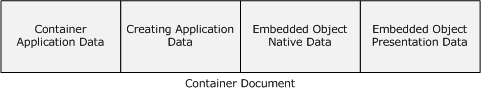

Figure 1: Embedded object container document

The document contains data that is specific to the [**container application**](#gt_container-application), an identifier of the [**creating application**](#gt_creating-application), the [**native data**](#gt_native-data) of the embedded object, and the [**presentation data**](#gt_presentation-data) of the embedded object. The native data allows the container application to pass the object back to its creating application for possible changes.

The container application data is private to the container application and is not specified in this document. The rest of the data that make up the embedded object file format are specified in this document as follows:

Creating Application Identifier

- When using the OLE1.0 Format (section [1.3.3](#Section_1.3.3)), the creating application identifier is specified in the **ClassName** field of the [ObjectHeader](#Section_2.2.4) structure (section 2.2.4).
- When using the OLE2.0 Format (section 1.3.3), the creating application identifier is specified as follows:
- For embedded objects, the creating application identifier is specified by the object class globally unique identifier (GUID) contained in the [**class identifier (CLSID)**](#gt_class-identifier-clsid) field of the Compound File Directory Entry ([MS-CFB](../MS-CFB/MS-CFB.md) section 2.6.1) of the OLE Compound File Storage object ([MS-CFB] section 1.3) that contains the [OLESTREAM](#Section_2.3.3) structure (section 2.3.3) that specifies the embedded object.
- For linked objects, the creating application identifier is specified by the object class GUID contained in the **Clsid** field of the OLESTREAM structure (section 2.3.3) that specifies the linked object.
Embedded Object Native Data

- When using the OLE1.0 Format (section 1.3.3), the embedded object native data is specified in the **NativeData** field of [EmbeddedObject](#Section_2.2.5) structure (section 2.2.5).
- When using the OLE2.0 Format (section 1.3.3), the embedded object native data is specified in the following two ways, which can be used interchangeably:
- An OLE Compound File Stream object that uses the name "\1Ole10Native" is created within the OLE Compound File Storage object that corresponds to the [**linked object**](#gt_linked-object) or embedded object. The stream object is used to contain the native data, as specified in the **NativeData** field of the [OLENativeStream](#Section_2.3.6) structure (section 2.3.6).
- OLE Compound File Stream objects are created by the creating application within the OLE Compound File Storage object that corresponds to the linked object or embedded object. The stream objects are used to contain the native data. Such stream objects are private to the creating application and are not specified in this document.
Embedded Object Presentation Data

- When using the OLE1.0 Format (section 1.3.3), the embedded object presentation data is specified in the **Presentation** field of EmbeddedObject structure (section 2.2.5).
- When using the OLE2.0 Format (section 1.3.3), the embedded object presentation data is specified in OLE Compound File Stream objects with names that contain the prefix "\2OlePres" within the OLE Compound File Storage object. The names correspond to the linked object or embedded object. Each of these streams contains an instance of the [OLEPresentationStream](#Section_2.3.4) structure (section 2.3.4).
<a id="Section_1.3.2"></a>
### 1.3.2 Linked Objects

The logical layout of a [**container document**](#gt_container-document) that contains a [**linked object**](#gt_linked-object) is shown in the following figure:

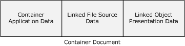

Figure 2: Linked object container document

The document contains data that is specific to the [**container application**](#gt_container-application), data that describes the source file that contains the linked object's [**native data**](#gt_native-data), and the [**presentation data**](#gt_presentation-data) for the linked object. The document does not contain the native data of the linked object.

The container application data is private to the container application and is not specified in this document. The rest of the data that make up the linked object format are specified in this document as follows:

Linked File Source Data

- When using the OLE1.0 Format (section [1.3.3](#Section_1.3.3)), the Linked File Source Data is specified in the **TopicName** and the **NetworkName** fields of the [LinkedObject](#Section_2.2.6) structure (section 2.2.6).
- When using the OLE2.0 Format (section 1.3.3), the Linked File Source Data is specified by the **MonikerStream** field of the [OLEStream](#Section_2.3.3) structure (section 2.3.3).
Linked Object Presentation Data

- When using the OLE1.0 Format (section 1.3.3), the linked object presentation data is specified in the **Presentation** field of the LinkedObject structure (section 2.2.6).
- When using the OLE2.0 Format (section 1.3.3), the linked object presentation data is specified in the [OLEPresentationStream](#Section_2.3.4) structure (section 2.3.4).
<a id="Section_1.3.3"></a>
### 1.3.3 OLE1.0 and OLE2.0 Formats

There are two different formats for representing [linked objects](#Section_1.3.2) and [embedded objects](#Section_1.3.1) within [**container documents**](#gt_container-document). The first format is the OLE1.0 Format. This format predates the OLE Compound File technology (as specified in [MS-CFB](../MS-CFB/MS-CFB.md)). When using the OLE1.0 Format, the [**linked object**](#gt_linked-object) and [**embedded object**](#gt_embedded-object) data is laid out as a sequence of bytes within the container document. The data structures in section [2.2](../MS-CFB/MS-CFB.md) specify the format of the data within the byte sequence.

The second format is the OLE2.0 Format. This format uses the OLE Compound File technology (as specified in [MS-CFB]). When using the OLE2.0 Format, the [**container application**](#gt_container-application) creates an OLE Compound File Storage object ([MS-CFB] section 1.3) for each linked object or embedded object. The linked object or embedded object data is contained in this storage in the form of OLE Compound File Stream objects ([MS-CFB] section 1.3). The data structures in section [2.3](../MS-CFB/MS-CFB.md) specify the format of the data contained in the stream objects.

It is required that an application differentiate in advance whether it is processing a file that uses the OLE1.0 Format or the OLE2.0 Format. This information is local to the application and is not specified in this document.

It is strongly advised that implementations of this specification use the OLE2.0 Format when creating container documents. The OLE1.0 Format is specified to allow only for backward-compatible implementations.

<a id="Section_1.3.4"></a>
### 1.3.4 Miscellaneous OLE2.0 Streams

In addition to the OLE2.0 streams mentioned in sections [1.3.1](#Section_1.3.1) and [1.3.2](#Section_1.3.2), a [**container document**](#gt_container-document) can also include another OLE2.0 stream:

[CompObjStream](#Section_2.3.8) (section 2.3.7).

<a id="Section_1.3.5"></a>
### 1.3.5 Clipboard Formats

The users of [**container applications**](#gt_container-application) and [**creating applications**](#gt_creating-application) can use the system [**clipboard**](#gt_clipboard) to transfer data between applications. All data copied to a system clipboard has to conform to a format specification, known as a [Clipboard Format](#Section_1.3.5.1). Each Clipboard Format is identified by a unique numeric format ID.

<a id="Section_1.3.5.1"></a>
#### 1.3.5.1 Standard Clipboard Formats

This specification uses a number of [Clipboard Formats](#Section_1.3.5.1) called the Standard Clipboard Formats. These are specified in section 2.1.1. A standard Clipboard Format is identified by a numeric ID as specified in section 2.1.1.

<a id="Section_1.4"></a>
## 1.4 Relationship to Protocols and Other Structures

The OLE2.0 Format uses the OLE Compound File Streams (as specified in [MS-CFB](../MS-CFB/MS-CFB.md)) to store [**linked object**](#gt_linked-object) and embedded object data in [**container documents**](#gt_container-document).

<a id="Section_1.5"></a>
## 1.5 Applicability Statement

The OLE File Format specification is appropriate when creating a single [**container document**](#gt_container-document) that contains data from multiple applications. It is applicable when one of the applications is the primary owner of the document and that application will always be asked to process the document first. It is not applicable if there are no applications with primary ownership of the document.

<a id="Section_1.6"></a>
## 1.6 Versioning and Localization

There is only one version of the OLE File Format Data Structure. This data structure does not define locale-specific processes or data.

This document specifies two types of OLE File Formats: the OLE1.0 Format and the OLE2.0 Format. These two formats are independent and are not differentiated using a versioning mechanism.

<a id="Section_1.7"></a>
## 1.7 Vendor-Extensible Fields

The Object Linking and Embedding Data Structures use HRESULT error codes. These [**values**](#gt_value) are taken from the Windows error number space as specified in [MS-ERREF](../MS-ERREF/MS-ERREF.md). Vendors SHOULD<1> reuse those values with their indicated meaning. Choosing any other value runs the risk of a collision in the future.

<a id="Section_1.7.1"></a>
### 1.7.1 Registered Clipboard Formats

Vendors can create their own [Clipboard Formats](#Section_1.3.5.1), called Registered Clipboard Formats. A Registered Clipboard Format is identified by a string that contains the name of the Clipboard Format (as specified in section 2.1.1). Vendors can define their own Registered Clipboard Formats provided that the string that identifies the Registered Clipboard Format is prefixed with the "OleExternal" string literal.

<a id="Section_2"></a>
# 2 Structures

Field types in packet diagrams are defined by the packet diagram and the field descriptions. All of the fields in packet diagrams use [**little-endian**](#gt_little-endian) byte ordering unless otherwise stated. There is no alignment padding between fields unless otherwise specified.

This protocol uses the following types specified in [MS-DTYP](../MS-DTYP/MS-DTYP.md):

| Type | Reference |
| --- | --- |
| **HRESULT** | [MS-DTYP] section 2.2.18 |
| **LONG** | [MS-DTYP] section 2.2.27 |
| **FILETIME** | [MS-DTYP] section 2.3.3 |

Data structures in this document make use of [**ANSI**](#gt_american-national-standards-institute-ansi-character-set) characters. This structure specification does not mandate the use of any particular ANSI code page.<2>

<a id="Section_2.1"></a>
## 2.1 Common Data Types

This section describes the structures that are common to both the OLE1.0 Format and the OLE2.0 Format.

<a id="Section_2.1.1"></a>
### 2.1.1 Clipboard Formats

[Standard Clipboard Formats](#Section_1.3.5.1) and [Registered Clipboard Formats](#Section_1.7.1) (see sections 1.3.5.1 and 1.7.1 for more details) are used to identify [**presentation data**](#gt_presentation-data) formats.

A standard clipboard format identifier is of type unsigned long.

A registered clipboard format is identified by a [LengthPrefixedAnsiString](#Section_2.1.4) (section [2.1.4](#Section_2.1.4)) or a LengthPrefixedUnicodeString (section [2.1.5](#Section_2.1.5)).

The Object Linking and Embedding (OLE) Data Structures: Structure Specification defines the following standard clipboard format values to be used to identify presentation data formats:

| Name | Value | Presentation Data Format |
| --- | --- | --- |
| CF_BITMAP | 0x00000002 | Bitmap16 Object structure (as specified in [MS-WMF](../MS-WMF/MS-WMF.md) section 2.2.2.1) |
| CF_METAFILEPICT | 0x00000003 | Windows metafile (as specified in [MS-WMF] section 1.3.1) |
| CF_DIB | 0x00000008 | DeviceIndependentBitmap Object structure (as specified in [MS-WMF] section 2.2.2.9) |
| CF_ENHMETAFILE | 0x0000000E | Enhanced Metafile (as specified in [MS-EMF](../MS-EMF/MS-EMF.md) section 1.3.1) |

In addition, an application or higher level protocol MAY supply registered clipboard formats (section 1.7.1) to identify custom presentation data formats.

<a id="Section_2.1.2"></a>
### 2.1.2 CLSID (Packet)

The packet version of the [**CLSID**](#gt_class-identifier-clsid) structure represents a class identifier (CLSID) in a serialized manner.

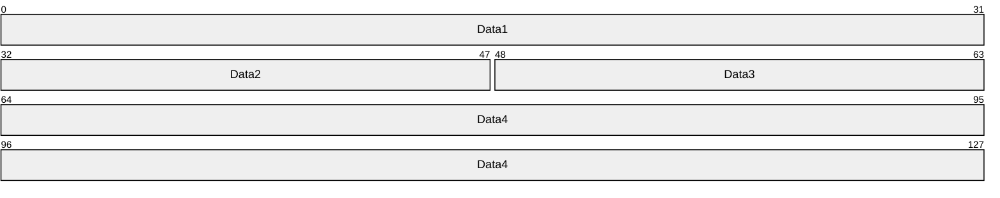

**Data1 (4 bytes):** This MUST be identical in meaning to the **Data1** field specified in [MS-DTYP](../MS-DTYP/MS-DTYP.md) section 2.3.4.

**Data2 (2 bytes):** This MUST be identical in meaning to the **Data2** field specified in [MS-DTYP] section 2.3.4.

**Data3 (2 bytes):** This MUST be identical in meaning to the **Data3** field specified in [MS-DTYP] section 2.3.4.

**Data4 (8 bytes):** This MUST be identical in meaning to the **Data4** field specified in [MS-DTYP] section 2.3.4.

<a id="Section_2.1.3"></a>
### 2.1.3 FILETIME (Packet)

The FILETIME (Packet) structure represents a FILETIME as specified in [MS-DTYP](../MS-DTYP/MS-DTYP.md) section 2.3.3.

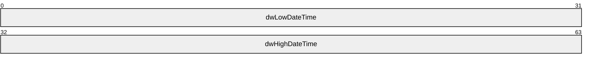

**dwLowDateTime (4 bytes):** This MUST be identical in meaning to the **dwLowDateTime** field specified in [MS-DTYP] section 2.3.3.

**dwHighDateTime (4 bytes):** This MUST be identical in meaning to the **dwHighDateTime** field specified in [MS-DTYP] section 2.3.3.

<a id="Section_2.1.4"></a>
### 2.1.4 LengthPrefixedAnsiString

This structure specifies a null-terminated [**American National Standards Institute (ANSI) character set**](#gt_american-national-standards-institute-ansi-character-set) string.

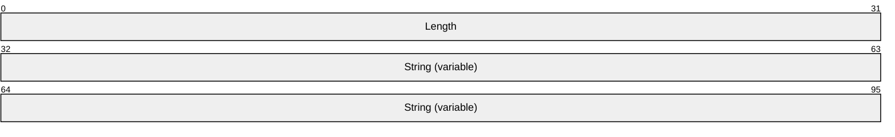

**Length (4 bytes):** This MUST be set to the number of ANSI characters in the **String** field, including the terminating null character. Length MUST be set to 0x00000000 to indicate an empty string.

**String (variable):** This MUST be a null-terminated ANSI string.

<a id="Section_2.1.5"></a>
### 2.1.5 LengthPrefixedUnicodeString

This structure specifies a [**Unicode string**](#gt_unicode-string).


**Length (4 bytes):** This MUST be set to the number of bytes in the **String** field, including the terminating null character. Length MUST be set to 0x00000000 to indicate an empty string.

**String (variable):** (Optional.) This MUST be a Unicode string.

<a id="Section_2.1.6"></a>
### 2.1.6 DEVMODEA

This structure is identical to the DEVMODE structure specified in [MS-RPRN](../MS-RPRN/MS-RPRN.md) section 2.2.1.1.1, except for the **dmDeviceName** and **dmFormName** fields:

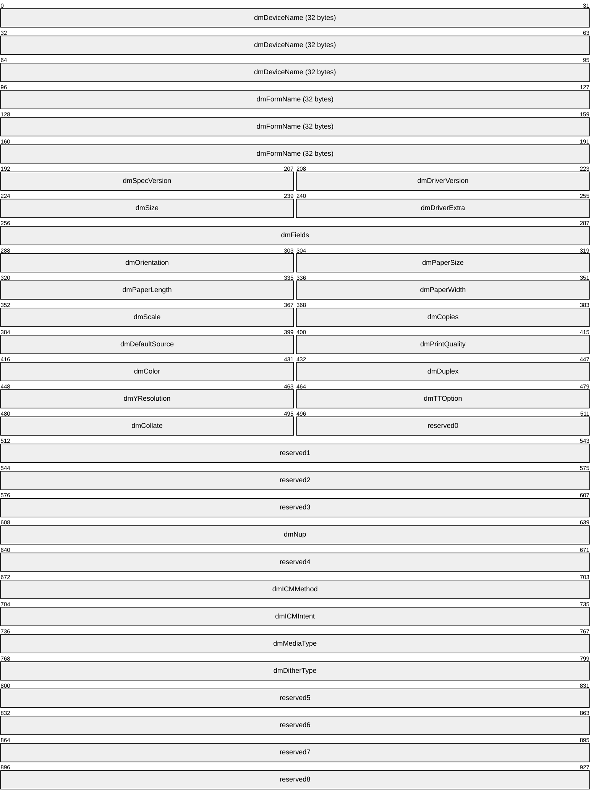

**dmDeviceName (32 bytes):** This field is a 32-element array of 8-bit [**ANSI**](#gt_american-national-standards-institute-ansi-character-set) characters.

**dmFormName (32 bytes):** This field is a 32-element array of 8-bit ANSI characters.

**dmSpecVersion (2 bytes):** The version of initialization data specification on which the DEVMODE structure is based.

**dmDriverVersion (2 bytes):** For printers, an optional, implementation-defined version of the [**printer driver**](#gt_printer-driver).

**dmSize (2 bytes):** The size, in bytes, of the DEVMODE structure. The size MUST NOT include the length of any private, printer driver–specific data that might follow the DEVMODE structure's public fields.

**dmDriverExtra (2 bytes):** The size, in bytes, of the private printer driver data that follows this structure.

**dmFields (4 bytes):** A bitfield that specifies the fields of the DEVMODE structure that have been initialized. If a bit is set, the corresponding field MUST be initialized and MUST be processed on receipt. If a bit is not set, the value of the corresponding field SHOULD be set to zero and MUST be ignored on receipt.

**dmOrientation (2 bytes):** For printers, the orientation for output. If the DM_ORIENTATION bit is set in **dmFields**, this value MUST be specified.

**dmPaperSize (2 bytes):** For printers, the size of the output media. If the DM_PAPERSIZE bit is set in **dmFields**, this value MUST be specified. The value of this field SHOULD be one of the following, or it MAY be a device-specific value that is greater than or equal to 0x0100.

**dmPaperLength (2 bytes):** If the DM_PAPERLENGTH bit is set in the **dmFields** field, the value of this field specifies the length of the paper, in tenths of a millimeter, to use in the printer for which the job is destined.

**dmPaperWidth (2 bytes):** If the DM_PAPERWIDTH bit is set in the **dmFields** field, the value of this field specifies the width of the paper, in tenths of a millimeter, to use in the printer for which the job is destined.

**dmScale (2 bytes):** If the DM_SCALE bit is set in the **dmFields** field, the value of this field specifies the percentage factor by which the printed output is to be scaled.

**dmCopies (2 bytes):** If the DM_COPIES bit is set in the **dmFields** field, the value of this field specifies the number of copies to be printed, if the device supports multiple-page copies.

**dmDefaultSource (2 bytes):** If the DM_DEFAULTSOURCE bit is set in the **dmFields** field, the value of this field specifies the paper source.

**dmPrintQuality (2 bytes):** If the DM_PRINTQUALITY bit is set in the **dmFields** field, the value of this field specifies the printer resolution. The value of this field MUST be either a positive value that specifies a device-dependent resolution in dots per inch (DPI) or one of the following four predefined device-independent values that are mapped to a device-specific resolution in an implementation-specific manner.

**dmColor (2 bytes):** If the DM_COLOR bit is set in the **dmFields** field, the value of this field specifies the color mode to use with color printers.

**dmDuplex (2 bytes):** If the DM_DUPLEX bit is set in the **dmFields** field, the value of this field specifies duplex or double-sided printing for printers that are capable of duplex printing.

**dmYResolution (2 bytes):** If the DM_YRESOLUTION bit is set in the **dmFields**, the value of this field specifies the y-resolution, in dots per inch, of the printer.

**dmTTOption (2 bytes):** If the DM_TTOPTION bit is set in the **dmFields** field, the value of this field specifies how TrueType fonts MUST be printed.

**dmCollate (2 bytes):** If the DM_COLLATE bit is set in the **dmFields** field, the value of this field specifies whether collation MUST be used when printing multiple copies.

**reserved0 (2 bytes):** A value that SHOULD be zero and MUST be ignored on receipt.

**reserved1 (4 bytes):** A value that SHOULD be zero and MUST be ignored on receipt.

**reserved2 (4 bytes):** A value that SHOULD be zero and MUST be ignored on receipt.

**reserved3 (4 bytes):** A value that SHOULD be zero and MUST be ignored on receipt.

**dmNup (4 bytes):** If the DM_NUP bit is set in the **dmFields**, the value of this field specifies the responsibility for performing page layout for [**N-Up Printing**](#gt_n-up-printing).

**reserved4 (4 bytes):** A value that SHOULD be zero and MUST be ignored on receipt.

**dmICMMethod (4 bytes):** If the DM_ICMMETHOD bit is set in the **dmFields** field, the value of this field specifies how [**Image Color Management (ICM)**](#gt_image-color-management-icm) is handled. For a non-ICM application, this field determines if ICM is enabled or disabled. For ICM applications, the system examines this field to determine how to handle ICM support. For values see [MS-RPRN]section 2.2.2.1.

**dmICMIntent (4 bytes):** If the DM_ICMINTENT bit is set in the **dmFields** field, the value of this field specifies which [**color matching**](#gt_color-matching) method, or intent, MUST be used by default. This field is primarily for non-ICM applications. ICM applications can establish intents by using the ICM functions. For values see [MS-RPRN]section 2.2.2.1.

**dmMediaType (4 bytes):** If the DM_MEDIATYPE bit is set in the **dmFields** field, the value of this field specifies the type of media to print on. For values see [MS-RPRN]section 2.2.2.1.

**dmDitherType (4 bytes):** If the DM_DITHERTYPE bit is set in the **dmFields** field, the value of this field specifies how [**dithering**](#gt_dithering) is to be done. For values see [MS-RPRN]section 2.2.2.1.

**reserved5 (4 bytes):** A value that SHOULD be zero and MUST be ignored on receipt.

**reserved6 (4 bytes):** A value that SHOULD be zero and MUST be ignored on receipt.

**reserved7 (4 bytes):** A value that SHOULD be zero and MUST be ignored on receipt.

**reserved8 (4 bytes):** A value that SHOULD be zero and MUST be ignored on receipt.

<a id="Section_2.1.7"></a>
### 2.1.7 DVTARGETDEVICE

The DVTARGETDEVICE structure specifies information about a device (such as a display or printer device) that renders the [**presentation data**](#gt_presentation-data).

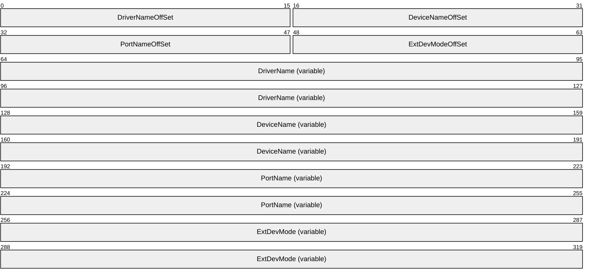

**DriverNameOffSet (2 bytes):** This MUST be set to the offset, in bytes, from the beginning of the structure to the **DriverName** field. If this field is set to 0x0000, the **DriverName** field MUST NOT be present.

**DeviceNameOffSet (2 bytes):** This MUST be set to the offset, in bytes, from the beginning of the structure to the **DeviceName** field. If this field is set to 0x0000, the **DeviceName** field MUST NOT be present.

**PortNameOffSet (2 bytes):** This MUST be set to the offset, in bytes, from the beginning of the structure to the **PortName** field. If this field is set to 0x0000, the **PortName** field MUST NOT be present.

**ExtDevModeOffSet (2 bytes):** This MUST be set to the offset, in bytes, from the beginning of the structure to the **ExtDevMode** field. If this field is set to 0x0000, the **ExtDevMode** field MUST NOT be present. Any gaps between the end of this field and the beginning of the next field MUST be ignored on processing.

**DriverName (variable):** This MUST be a null-terminated [**ANSI**](#gt_american-national-standards-institute-ansi-character-set) string that contains a hint on how to display or print presentation data. The creator of this data structure MUST NOT assume that it will be understood during processing. On processing, the hint MAY be ignored. Any gaps between the end of this field and the beginning of the next field MUST be ignored on processing.<3>

**DeviceName (variable):** This MUST be a null-terminated ANSI string that contains a hint on how to display or print presentation data. The creator of this data structure MUST NOT assume that it will be understood during processing. On processing, the hint MAY be ignored. Any gaps between the end of this field and the beginning of the next field MUST be ignored on processing. This field is optional.<4>

**PortName (variable):** This MUST be a null-terminated ANSI string that contains any arbitrary value and MUST be ignored on processing. Any gaps between the end of this field and the beginning of the next field MUST be ignored on processing. This field is optional.

**ExtDevMode (variable):** This MUST contain a [DEVMODEA](#Section_2.1.6) structure (as specified in section 2.1.6). This field is optional.

<a id="Section_2.1.8"></a>
### 2.1.8 MetaFilePresentationDataWidth

This MUST be a long value that contains the width of a metafile (as specified in [MS-WMF](../MS-WMF/MS-WMF.md) section 1.3.1) in logical units. The MM_ANISOTROPIC mapping mode (as specified in [MS-WMF] section 2.1.1.16) MUST be used to convert the logical units to physical units.

<a id="Section_2.1.9"></a>
### 2.1.9 MetaFilePresentationDataHeight

This MUST be a long value that contains the height of a metafile (as specified in [MS-WMF](../MS-WMF/MS-WMF.md) section 1.3.1) in logical units. The **MM_ANISOTROPIC** mapping mode (as specified in [MS-WMF] section 2.1.1.16) MUST be used to convert the logical units to physical units.

<a id="Section_2.1.10"></a>
### 2.1.10 EnhancedMetaFilePresentationDataWidth

This MUST be a long value that contains the width of an Enhanced metafile (as specified in [MS-EMF](../MS-EMF/MS-EMF.md) section 1.3.1) in logical units. The MM_HIMETRIC mapping mode (as specified in [MS-EMF] section 2.1.21) MUST be used to convert the logical units to physical units.

<a id="Section_2.1.11"></a>
### 2.1.11 EnhancedMetaFilePresentationDataHeight

This MUST be a long value that contains the height of an enhanced metafile (as specified in [MS-EMF](../MS-EMF/MS-EMF.md) section 1.3.1) in logical units. The MM_HIMETRIC mapping mode (as specified in [MS-EMF] section 2.1.21) MUST be used to convert the logical units to physical units.

<a id="Section_2.1.12"></a>
### 2.1.12 DIBPresentationDataWidth

This MUST be a long value that contains the width of a Device Independent Bitmap object (as specified in [MS-WMF](../MS-WMF/MS-WMF.md) section 2.2.2.9) in logical units. The MM_HIMETRIC mapping mode (as specified in [MS-WMF] section 2.1.1.16) MUST be used to convert the logical units to physical units.

<a id="Section_2.1.13"></a>
### 2.1.13 DIBPresentationDataHeight

This MUST be a **long** value that contains the height of a Device Independent Bitmap object (as specified in [MS-WMF](../MS-WMF/MS-WMF.md) section 2.2.2.9) in logical units. The MM_HIMETRIC mapping mode (as specified in [MS-WMF] section 2.1.1.16) MUST be used to convert the logical units to physical units.

<a id="Section_2.2"></a>
## 2.2 OLE1.0 Format Structures

This section specifies the data structures that constitute the OLE1.0 Format.

<a id="Section_2.2.1"></a>
### 2.2.1 PresentationObjectHeader

The PresentationObjectHeader structure specifies the header for different types of [**presentation data**](#gt_presentation-data) structures.

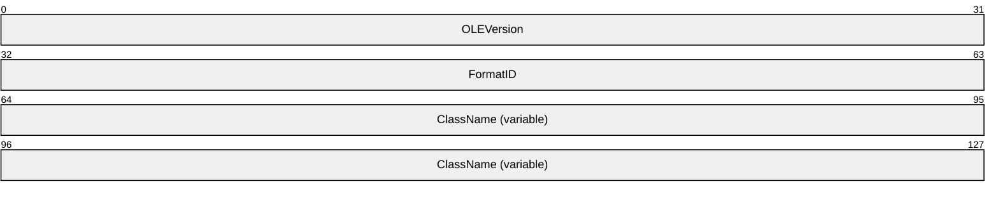

**OLEVersion (4 bytes):** This can be set to any arbitrary value and MUST be ignored on processing.

**FormatID (4 bytes):** This MUST be set to 0x00000000 or 0x00000005. If this is set to 0x00000000, the **ClassName** field MUST NOT be present and this structure MUST NOT be contained by another structure. If this is a value other than 0x00000000 or 0x00000005, the PresentationObjectHeader structure is invalid.<5>

| Value | Meaning |
| --- | --- |
| 0x00000000 | The **ClassName** field MUST NOT be present. |
| 0x00000005 | The **ClassName** field is present. |

**ClassName (variable):** This MUST be a [LengthPrefixedAnsiString](#Section_2.1.4) (section 2.1.4) that identifies the type of the presentation data structure that follows the PresentationObjectHeader.

There are two types of presentation objects. These are specified in sections [2.2.2](#Section_2.2.2) and [2.2.3](#Section_2.2.3).

<a id="Section_2.2.2"></a>
### 2.2.2 StandardPresentationObject

A StandardPresentationObject structure contains a [PresentationObjectHeader](#Section_2.2.1) structure (section 2.2.1). The **ClassName** field of the PresentationObjectHeader MUST be set to the case-sensitive values "METAFILEPICT", "DIB", or "BITMAP".

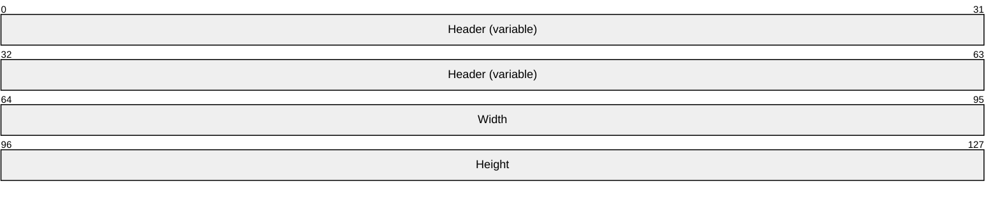

**Header (variable):** This MUST be a PresentationObjectHeader (section 2.2.1). The **FormatID** field of the Header MUST NOT be set to 0x00000000 and the **ClassName** field of the Header MUST be set to the case-sensitive values "METAFILEPICT", "BITMAP", or "DIB". The **ClassName** field identifies the type of the [**presentation data**](#gt_presentation-data) structure that follows the StandardPresentationObject.

**Width (4 bytes):** This MUST be set to the width of the presentation object. If the **ClassName** field of the **Header** is set to the case-sensitive value "METAFILEPICT", this MUST be a [MetaFilePresentationDataWidth](#Section_2.1.8) (section 2.1.8). If the **ClassName** field of the **Header** is set to either the case-sensitive value "BITMAP" or the case-sensitive value "DIB", this MUST be a [DIBPresentationDataWidth](#Section_2.1.12) (section 2.1.12).

**Height (4 bytes):** This MUST be set to the height of the presentation object multiplied by the LONG (as specified in [MS-DTYP](../MS-DTYP/MS-DTYP.md) section 2.2.27) value -1. If the **ClassName** field of the **Header** is set to the case-sensitive value "METAFILEPICT", this MUST be a [MetaFilePresentationDataHeight](#Section_2.1.9) (section 2.1.9). If the **ClassName** field of the **Header** is set to either the case-sensitive value "BITMAP" or the case-sensitive value "DIB", this MUST be a [DIBPresentationDataHeight](#Section_2.1.13) (section 2.1.13).

There are three types of StandardPresentationObject. These are specified as follows.

<a id="Section_2.2.2.1"></a>
#### 2.2.2.1 MetaFilePresentationObject

The MetaFilePresentationObject structure specifies a [**presentation data**](#gt_presentation-data) type that is used to display [**linked objects**](#gt_linked-object) or [**embedded objects**](#gt_embedded-object) in [**container applications**](#gt_container-application). The presentation data is in the form of a Windows metafile (as specified in [MS-WMF](../MS-WMF/MS-WMF.md) section 1.3.1).

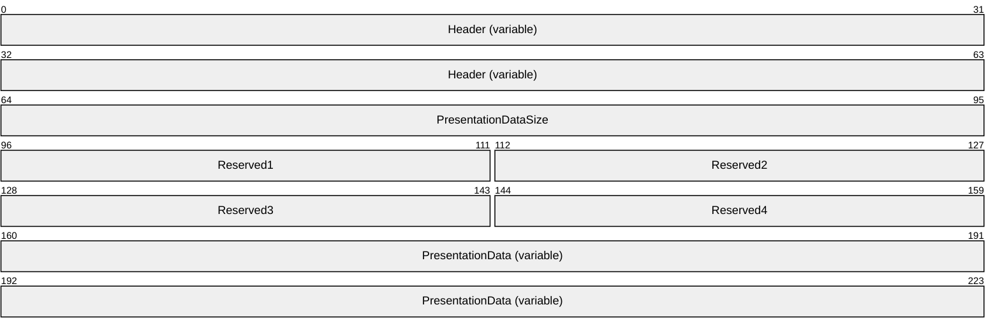

**Header (variable):** This MUST be a [StandardPresentationObject](#Section_2.2.2) (section 2.2.2). The **ClassName** field of the contained [PresentationObjectHeader](#Section_2.2.1) (section 2.2.1) MUST be set to the case-sensitive value "METAFILEPICT".

**PresentationDataSize (4 bytes):** This MUST be an unsigned long integer set to the sum of the size, in bytes, of the **PresentationData** field and the number 8. If this field contains the value 8, the **PresentationData** field MUST NOT be present.

**Reserved1 (2 bytes):** Reserved. This can be set to any arbitrary value and MUST be ignored on processing.

**Reserved2 (2 bytes):** Reserved. This can be set to any arbitrary value and MUST be ignored on processing.

**Reserved3 (2 bytes):** Reserved. This can be set to any arbitrary value and MUST be ignored on processing.

**Reserved4 (2 bytes):** Reserved. This can be set to any arbitrary value and MUST be ignored on processing.

**PresentationData (variable):** This MUST be an array of bytes that contain a metafile (as specified in [MS-WMF] section 1.3.1).

<a id="Section_2.2.2.2"></a>
#### 2.2.2.2 BitmapPresentationObject

The BitmapPresentationObject structure specifies a [**presentation data**](#gt_presentation-data) type that is used to display [**linked objects**](#gt_linked-object) or [**embedded objects**](#gt_embedded-object) in [**container applications**](#gt_container-application). The presentation data is in the form of a Bitmap16 Object structure (as specified in [MS-WMF](../MS-WMF/MS-WMF.md) section 2.2.2.1).

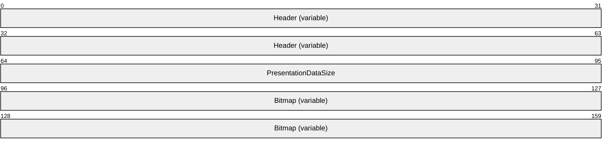

**Header (variable):** This MUST be a [StandardPresentationObject](#Section_2.2.2) (section 2.2.2). The **ClassName** field of the contained [PresentationObjectHeader](#Section_2.2.1) (section 2.2.1) MUST be set to the case-sensitive value "BITMAP".

**PresentationDataSize (4 bytes):** This MUST be an unsigned long integer set to the size, in bytes, of the **Bitmap** field. If this field has the value 0, the **Bitmap** field MUST NOT be present.

**Bitmap (variable):** This MUST be a Bitmap16 Object structure as specified in [MS-WMF] section 2.2.2.1.

<a id="Section_2.2.2.3"></a>
#### 2.2.2.3 DIBPresentationObject

The DIBPresentationObject structure specifies a [**presentation data**](#gt_presentation-data) type that is used to display [**linked objects**](#gt_linked-object) or [**embedded objects**](#gt_embedded-object) in [**container applications**](#gt_container-application). The presentation data is in the form of a DeviceIndependentBitmap object structure (as specified in [MS-WMF](../MS-WMF/MS-WMF.md) section 2.2.2.9).

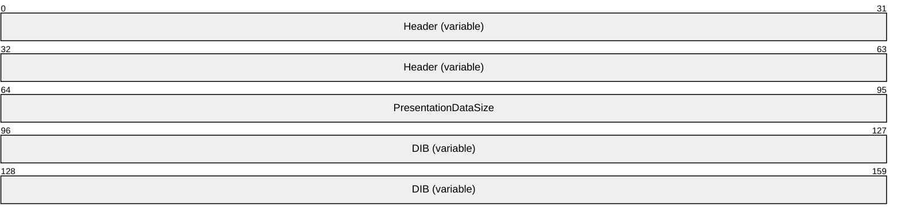

**Header (variable):** This MUST be a [StandardPresentationObject](#Section_2.2.2) (section 2.2.2). The **ClassName** field of the contained PresentationObjectHeader (section [2.2.1](#Section_2.2.1)) MUST be set to the case-sensitive value "DIB".

**PresentationDataSize (4 bytes):** This MUST be an unsigned long integer set to the size, in bytes, of the **DIB** field. If this field has the value 0, the **DIB** field MUST NOT be present.

**DIB (variable):** This MUST be a DeviceIndependentBitmap Object structure as specified in [MS-WMF] section 2.2.2.9.

<a id="Section_2.2.3"></a>
### 2.2.3 GenericPresentationObject

A GenericPresentationObject structure contains a [PresentationObjectHeader](#Section_2.2.1) structure (section 2.2.1). The **ClassName** field of the PresentationObjectHeader MUST NOT be set to "METAFILEPICT", "DIB", or "BITMAP".

There are two types of GenericPresentationObject: the [StandardClipboardFormatPresentationObject](#Section_2.2.3.2) (section 2.2.3.2) and the [RegisteredClipboardFormatPresentationObject](#Section_2.2.3.3) (section 2.2.3.3).

<a id="Section_2.2.3.1"></a>
#### 2.2.3.1 ClipboardFormatHeader

The ClipboardFormatHeader structure specifies the header for the two types of [GenericPresentationObject](#Section_2.2.3) described as follows:

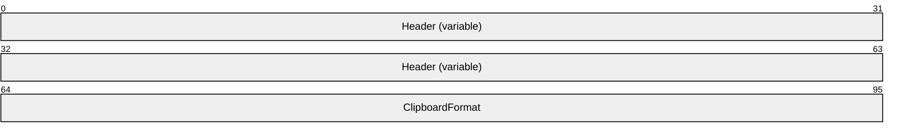

**Header (variable):** This MUST be a [PresentationObjectHeader](#Section_2.2.1) (section 2.2.1). The **FormatID** field of the PresentationObjectHeader MUST NOT be set to 0x00000000 and the **ClassName** field of the **Header** MUST NOT be set to "METAFILEPICT", "DIB", or "BITMAP".

**ClipboardFormat (4 bytes):** If this is set to 0x0000000, the ClipboardFormatHeader structure MUST be contained by a [RegisteredClipboardFormatPresentationObject](#Section_2.2.3.3) (see section 2.2.3.3). Otherwise, the ClipboardFormatHeader structure MUST be contained by a [StandardClipboardFormatPresentationObject](#Section_2.2.3.2) (see section 2.2.3.2). A value other than 0x00000000 MUST identify a [standard clipboard format](#Section_1.3.5.1) (section 1.3.5.1).

<a id="Section_2.2.3.2"></a>
#### 2.2.3.2 StandardClipboardFormatPresentationObject

The StandardClipboardFormatPresentationObject structure specifies a [**presentation data**](#gt_presentation-data) type that is used to display [**linked objects**](#gt_linked-object) or [**embedded objects**](#gt_embedded-object) in [**container applications**](#gt_container-application). The presentation data is identified using a [standard clipboard format](#Section_1.3.5.1) (section 1.3.5.1).

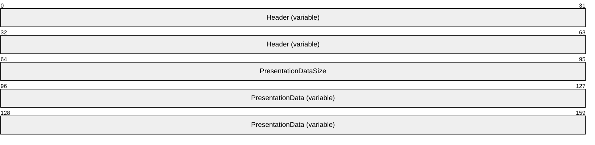

**Header (variable):** This MUST be a [ClipboardFormatHeader](#Section_2.2.3.1) (see section 2.2.3.1). The **ClipboardFormat** field MUST be set to a value other than 0x00000000.

**PresentationDataSize (4 bytes):** This MUST be an unsigned long integer set to the size, in bytes, of the **PresentationData** field.

**PresentationData (variable):** This MUST be an array of bytes that contains the presentation data. The format of the data is identified by the [Clipboard Format](#Section_1.3.5.1) contained in the **Header** field.

If the Clipboard Format contains CF_DIB (section 2.1.1), the **Data** field MUST contain a DeviceIndependentBitmap Object structure (as specified in [MS-WMF](../MS-WMF/MS-WMF.md) section 2.2.2.9).

If the Clipboard Format contains CF_METAFILEPICT (section 2.1.1), the **Data** field MUST contain a Windows metafile (as specified in [MS-WMF] section 1.3.1). If, after processing the Data field the end of the stream has not been reached, then the **Reserved2** field MUST be present.

If the Clipboard Format contains CF_ENHMETAFILE (section 2.1.1), the **Data** field MUST contain an enhanced metafile (as specified in [MS-EMF](../MS-EMF/MS-EMF.md) section 1.3.1).

<a id="Section_2.2.3.3"></a>
#### 2.2.3.3 RegisteredClipboardFormatPresentationObject

The RegisteredClipboardFormatPresentationObject structure specifies a [**presentation data**](#gt_presentation-data) type that is used to display [**linked objects**](#gt_linked-object) or [**embedded objects**](#gt_embedded-object) in [**container applications**](#gt_container-application). The presentation data is identified using a registered [Clipboard Format](#Section_1.3.5.1) (section [1.7.1](#Section_1.7.1)).

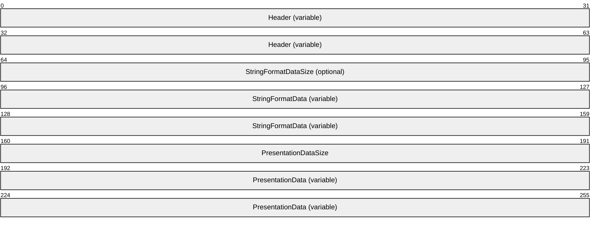

**Header (variable):** This MUST be a ClipboardFormatHeader (see section [2.2.3.1](#Section_2.2.3.1)). The **ClipboardFormat** field MUST be set to 0x00000000.

**StringFormatDataSize (4 bytes):** This MUST be set to the size, in bytes, of the **StringFormatData** field.

**StringFormatData (variable):** This MUST be a [LengthPrefixedAnsiString](#Section_2.1.4) (section 2.1.4) or a [LengthPrefixedUnicodeString](#Section_2.1.5) (section 2.1.5), either of which contain a registered clipboard format name (section 1.7.1).

**PresentationDataSize (4 bytes):** This MUST be set to the size in, bytes, of the **PresentationData** field.

**PresentationData (variable):** This MUST be an array of bytes that contains the presentation data that is supplied by an application or a higher-level protocol.

<a id="Section_2.2.4"></a>
### 2.2.4 ObjectHeader

The ObjectHeader structure specifies the headers for the [LinkedObject](#Section_2.2.6) (section 2.2.6) and [EmbeddedObject](#Section_2.2.5) (section 2.2.5) structures.

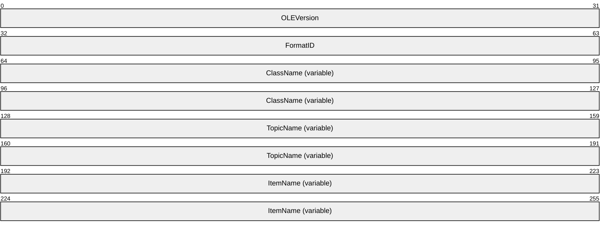

**OLEVersion (4 bytes):** This can be set to any arbitrary value and MUST be ignored on receipt.

**FormatID (4 bytes):** This MUST be set to 0x00000001 or 0x00000002. Otherwise, the ObjectHeader structure is invalid.<6>

If this field is set to 0x00000001, the ObjectHeader structure MUST be contained by a LinkedObject structure (see section 2.2.6). If this field is set to 0x00000002, the ObjectHeader structure MUST be contained by an EmbeddedObject structure (see section 2.2.5).

| Value | Meaning |
| --- | --- |
| 0x00000001 | The ObjectHeader structure MUST be followed by a LinkedObject structure. |
| 0x00000002 | The ObjectHeader structure MUST be followed by an EmbeddedObject structure. |

**ClassName (variable):** This MUST be a [LengthPrefixedAnsiString](#Section_2.1.4) (section 2.1.4) that contains a value identifying the [**creating application**](#gt_creating-application). The value is mapped to the creating application in an implementation-specific manner.<7>

**TopicName (variable):** This MUST be a [LengthPrefixedAnsiString](#Section_2.1.4) (section 2.1.4).

If the ObjectHeader structure is contained by an EmbeddedObject structure (see section 2.2.5), the TopicName field SHOULD contain an empty string and MUST be ignored on processing.

If the ObjectHeader structure is contained by a LinkedObject structure (see section 2.2.6), the **TopicName** field MUST contain the absolute [**path**](#gt_path) name of the linked file. The path name either MUST start with a [**drive letter**](#gt_drive-letter) or MUST be in the [**Universal Naming Convention (UNC)**](#gt_universal-naming-convention-unc) format.

**ItemName (variable):** This MUST be a LengthPrefixedAnsiString (section 2.1.4).

If the ObjectHeader structure is contained by an EmbeddedObject structure (see section 2.2.5), the **ItemName** field SHOULD contain an empty string and MUST be ignored on processing.

If the ObjectHeader structure is contained by a LinkedObject structure (see section 2.2.6),the **ItemName** field MUST contain a string that is used by the application or higher-level protocol to identify the item within the file to which is being linked. The format and meaning of the **ItemName** string is specific to the creating application and MUST be treated by other parties as an opaque string when processing this data structure. An example of such an item is an individual cell within a spreadsheet application.

<a id="Section_2.2.5"></a>
### 2.2.5 EmbeddedObject

The EmbeddedObject structure specifies how an embedded object is laid out in a [**container document**](#gt_container-document).

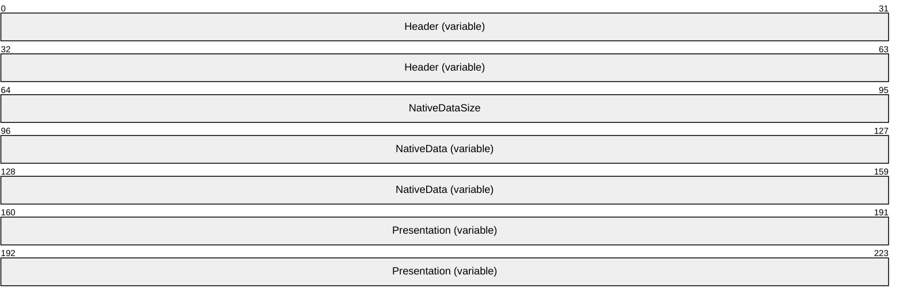

**Header (variable):** This MUST be an [ObjectHeader](#Section_2.2.4) (section 2.2.4). The **FormatID** field of the **Header** MUST be set to 0x00000002.

**NativeDataSize (4 bytes):** This MUST be set to the size of the **NativeData** field, in bytes.

**NativeData (variable):** This must be an array of bytes that contains the [**native data**](#gt_native-data).

**Presentation (variable):** This MUST be a [MetaFilePresentationObject](#Section_2.2.2.1) (section 2.2.2.1), a [BitmapPresentationObject](#Section_2.2.2.2) (section 2.2.2.2), a [DIBPresentationObject](#Section_2.2.2.3) (section 2.2.2.3), a [StandardClipboardFormatPresentationObject](#Section_2.2.3.2) (section 2.2.3.2), or a [RegisteredClipboardFormatPresentationObject](#Section_2.2.3.3) (section 2.2.3.3).

<a id="Section_2.2.6"></a>
### 2.2.6 LinkedObject

The LinkedObject structure specifies how a [**linked object**](#gt_linked-object) is laid out in a [**container document**](#gt_container-document).

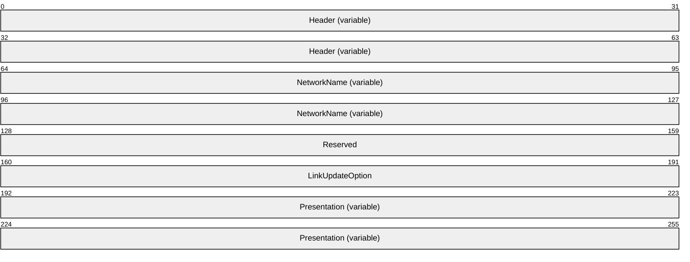

**Header (variable):** This MUST an [ObjectHeader](#Section_2.2.4) structure (section 2.2.4). The **FormatID** field of the **Header** MUST be set to 0x00000001.

**NetworkName (variable):** This MUST be a [LengthPrefixedAnsiString](#Section_2.1.4) (section 2.1.4).

If the **TopicName** field of the ObjectHeader structure contains a [**path**](#gt_path) that starts with a [**drive letter**](#gt_drive-letter) and if the drive letter is for a remote drive, the **NetworkName** field MUST contain the path name of the linked file in the [**Universal Naming Convention (UNC)**](#gt_universal-naming-convention-unc) format.

**Reserved (4 bytes):** This MUST be set to 0x00000000.

**LinkUpdateOption (4 bytes):** This field contains an implementation-specific hint supplied by the application or higher-level protocol responsible for creating the data structure. The hint MAY be ignored on processing of this data structure.<8>

**Presentation (variable):** This MUST be a [MetaFilePresentationObject](#Section_2.2.2.1) (section 2.2.2.1), a [BitmapPresentationObject](#Section_2.2.2.2) (section 2.2.2.2), a [DIBPresentationObject](#Section_2.2.2.3) (section 2.2.2.3), a [StandardClipboardFormatPresentationObject](#Section_2.2.3.2) (section 2.2.3.2), or a [RegisteredClipboardFormatPresentationObject](#Section_2.2.3.3) (section 2.2.3.3).

<a id="Section_2.3"></a>
## 2.3 OLE2.0 Format Structures

This section describes the data structures that constitute the OLE2.0 Format. The OLE2.0 Format is specified using Compound File Streams (as specified in [MS-CFB](../MS-CFB/MS-CFB.md)).

<a id="Section_2.3.1"></a>
### 2.3.1 ClipboardFormatOrAnsiString

The ClipboardFormatOrAnsiString structure specifies either a [standard clipboard format](#Section_1.3.5.1) (section 1.3.5.1) or a [registered clipboard format](#Section_1.7.1) as an [**ANSI**](#gt_american-national-standards-institute-ansi-character-set) string.

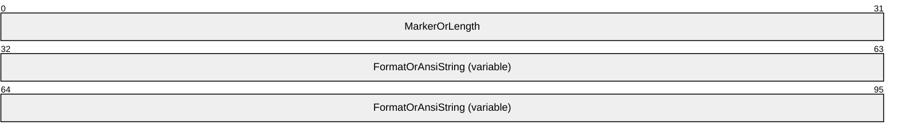

**MarkerOrLength (4 bytes):** If this is set to 0x00000000, the **FormatOrAnsiString** field MUST NOT be present. If this field is set to 0xFFFFFFFF or 0xFFFFFFFE, the **FormatOrAnsiString** field MUST be 4 bytes in size and MUST contain a standard clipboard format identifier (section [2.1.1](#Section_1.3.5.1)).

If this set to a value other than 0x00000000, the **FormatOrAnsiString** field MUST be set to a null-terminated ANSI string containing the name of a registered clipboard format (section 2.1.1) and the **MarkerOrLength** field MUST be set to the number of ANSI characters in the **FormatOrAnsiString** field, including the terminating null character.

| Value | Meaning |
| --- | --- |
| 0x00000000 | The **FormatOrAnsiString** field MUST NOT be present. |
| 0xfffffffe | The **FormatOrAnsiString** field MUST be 4 bytes in size and MUST contain a standard clipboard format (section 1.3.5.1). |
| 0xffffffff | The **FormatOrAnsiString** field MUST be 4 bytes in size and MUST contain a standard clipboard format (section 1.3.5.1). |

**FormatOrAnsiString (variable):** This MUST be set to a value as specified by the **MarkerOrLength** field.

<a id="Section_2.3.2"></a>
### 2.3.2 ClipboardFormatOrUnicodeString

The ClipboardFormatOrUnicodeString structure specifies either a [standard clipboard format](#Section_1.3.5.1) identifier (section [2.1.1](#Section_1.3.5.1)) or a [registered clipboard format](#Section_1.7.1) as a [**Unicode string**](#gt_unicode-string).

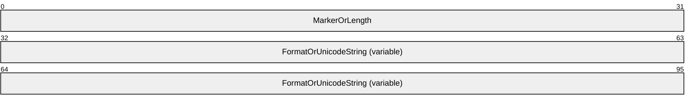

**MarkerOrLength (4 bytes):** If this is set to 0x00000000, the **FormatOrUnicodeString** field MUST NOT be present. If this is set to 0xffffffff or 0xfffffffe, the **FormatOrUnicodeString** field MUST be 4 bytes in size and MUST contain a standard clipboard format identifier (section 2.1.1).

Otherwise, the **FormatOrUnicodeString** field MUST be set to a Unicode string containing the name of a registered clipboard format (section 2.1.1) and the **MarkerOrLength** field MUST be set to the number of [**Unicode**](#gt_unicode) characters in the **FormatOrUnicodeString** field, including the terminating null character.

| Value | Meaning |
| --- | --- |
| 0xFFFFFFFE | Indicates a standard clipboard format. |
| 0xFFFFFFFF | Indicates a standard clipboard format. |
| 0x00000001 — 0xfffffffd | Indicates a registered clipboard format. |

**FormatOrUnicodeString (variable):** This MUST be set to a value as specified by the **MarkerOrLength** field.

<a id="Section_2.3.3"></a>
### 2.3.3 OLEStream

The OLEStream structure is contained inside an **OLE Compound File Stream** object ([MS-CFB](../MS-CFB/MS-CFB.md) section 1.3). The name of this Compound File Stream object is "\1Ole". The stream object is contained within the **OLE Compound File Storage** object ([MS-CFB] section 1.3) corresponding to the linked object or embedded object (see section [1.3.3](../MS-CFB/MS-CFB.md)). The OLEStream structure specifies whether the storage object is for a linked object or an embedded object. When this structure specifies a storage object for a linked object, it also specifies the reference to the linked object.

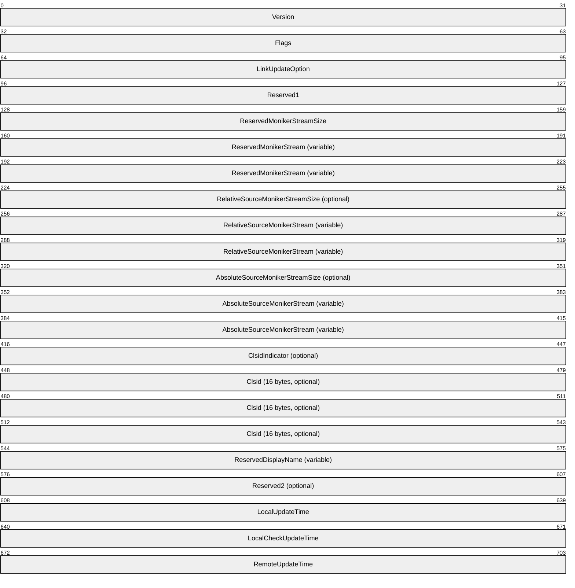

**Version (4 bytes):** This MUST be set to 0x02000001. Otherwise, the OLEStream structure is invalid.<9>

**Flags (4 bytes):** If this field is set to 0x00000001, the OLEStream structure MUST be for a linked object and the **CLSID** field of the Compound File Directory Entry ([MS-CFB] section 2.6.1) of the OLE Compound File Storage object ([MS-CFB] section 1.3) MUST be set to CLSID_StdOleLink ({00000300-0000-0000-C000-000000000046}). If this field is set to 0x00000000, then the OLEStream structure MUST be for an embedded object and the **CLSID** field of the Compound File Directory Entry ([MS-CFB] section 2.6.1) of the OLE Compound File Storage object ([MS-CFB] section 1.3) MUST be set to the object class GUID of the creating application.

| Value | Meaning |
| --- | --- |
| 0x00000001 | The OLEStream structure MUST be for a linked object. |
| 0x00000000 | The OLEStream structure MUST be for an embedded object. |
| 0x00001000 | This bit is set as an implementation-specific hint supplied by the application or by a higher-level protocol that creates the data structure. The bit MAY be ignored on processing of this data structure. A server implementation which does not ignore this bit MAY cache the storage when the bit is set.<10> |

**LinkUpdateOption (4 bytes):** This field contains an implementation-specific hint supplied by the application or by a higher-level protocol that creates the data structure. The hint MAY be ignored on processing of this data structure.<11>

**Reserved1 (4 bytes):** This MUST be set to 0x00000000. Otherwise, the OLEStream structure is invalid.<12>

**ReservedMonikerStreamSize (4 bytes):** This MUST be set to the size, in bytes, of the **ReservedMonikerStream** field plus the size of this field. If this field has a value 0x00000000, the **ReservedMonikerStream** field MUST NOT be present.

**ReservedMonikerStream (variable):** This MUST be a [MONIKERSTREAM](#Section_2.3.3.1) structure (section 2.3.3.1) that can contain any arbitrary value and MUST be ignored on processing.

**Note** The fields that follow MUST NOT be present if the OLEStream structure is for an embedded object.

**RelativeSourceMonikerStreamSize (4 bytes):** This MUST be set to the size, in bytes, of the **RelativeSourceMonikerStream** field plus the size of this field. If this field has a value 0x00000000, the **RelativeSourceMonikerStream** field MUST NOT be present.

**RelativeSourceMonikerStream (variable):** This MUST be a MONIKERSTREAM structure (section 2.3.3.1) that specifies the relative path to the linked object.

**AbsoluteSourceMonikerStreamSize (4 bytes):** This MUST be set to the size, in bytes, of the **AbsoluteSourceMonikerStream** field plus the size of this field. This field MUST NOT contain the value 0x00000000.

**AbsoluteSourceMonikerStream (variable):** This MUST be a MONIKERSTREAM structure (section 2.3.3.1) that specifies the full path to the linked object.

If the **RelativeSourceMonikerStream** field is present, it MUST be used by the container application instead of the **AbsoluteSourceMonikerStream**. If the **RelativeSourceMonikerStream** field is not present, the **AbsoluteSourceMonikerStream** MUST be used by the container application.

**ClsidIndicator (4 bytes):** This MUST be the LONG (as specified in section 2.2.27 of [MS-DTYP](../MS-DTYP/MS-DTYP.md)) value -1. Otherwise the OLEStream structure is invalid.<13>

**Clsid (16 bytes):** This MUST be the [CLSID (Packet)](#Section_2.1.4) (section 2.1.2) containing the object class GUID of the creating application.

**ReservedDisplayName (variable):** This MUST be a [LengthPrefixedUnicodeString](#Section_2.1.5) (section 2.1.5) that can contain any arbitrary value and MUST be ignored on processing.

**Reserved2 (4 bytes):** This can contain any arbitrary value and MUST be ignored on processing.

**LocalUpdateTime (8 bytes):** This MUST be a [FILETIME (Packet)](#Section_2.1.3) (section 2.1.3) that contains the time when the container application last updated the **RemoteUpdateTime** field.

**LocalCheckUpdateTime (8 bytes):** This MUST be a FILETIME (Packet) (section 2.1.3) that contains the time when the container application last checked the update time of the linked object.

**RemoteUpdateTime (8 bytes):** This MUST be a FILETIME (Packet) (section 2.1.3) that contains the time when the linked object was last updated.

<a id="Section_2.3.3.1"></a>
#### 2.3.3.1 MONIKERSTREAM

The MONIKERSTREAM structure specifies the reference to the linked object.

```mermaid
packet-beta
  0-95: "Clsid (16 bytes)"
  96-159: "StreamData (variable)"
```

**Clsid (16 bytes):** This MUST be the packetized [CLSID](#Section_2.1.4) (section 2.1.2) of an implementation-specific object capable of processing the data contained in the **StreamData** field.

**StreamData (variable):** This MUST be an array of bytes that specifies the reference to the linked object. The value of this array is interpreted in an implementation-specific manner.<14>

<a id="Section_2.3.4"></a>
### 2.3.4 OLEPresentationStream

The OLEPresentationStream structure is contained inside an OLE Compound File Stream object ([MS-CFB](../MS-CFB/MS-CFB.md) section 1.3) within the OLE Compound File Storage object ([MS-CFB] section 1.3) that corresponds to the linked object or embedded object (see section [1.3.3](../MS-CFB/MS-CFB.md)). There MUST be no more than 999 presentation streams in the storage object. The name of the stream is a concatenation of the prefix "\2OlePres" followed by three numeric characters, each of which is in the range of numbers from '0'-'9'. Some examples of stream names are "\2OlePres000", "\2OlePres123", and "\2OlePres999". The OLEPresentationStream structure specifies the [**presentation data**](#gt_presentation-data) for linked and [**embedded objects**](#gt_embedded-object).

```mermaid
packet-beta
  0-63: "AnsiClipboardFormat (variable)"
  64-95: "TargetDeviceSize"
  96-159: "TargetDevice (variable)"
  160-191: "Aspect"
  192-223: "Lindex"
  224-255: "Advf"
  256-287: "Reserved1"
  288-319: "Width"
  320-351: "Height"
  352-383: "Size"
  384-447: "Data (variable)"
  448-559: "Reserved2 (18 bytes)"
  560-591: "TocSignature"
  592-623: "TocCount"
  624-687: "TocEntry (variable)"
```

**AnsiClipboardFormat (variable):** This MUST be a [ClipboardFormatOrAnsiString](#Section_2.3.1) structure (section 2.3.1) that contains the [Clipboard Format](#Section_1.3.5.1) of the presentation data. If the **MarkerOrLength** field of the ClipboardFormatOrAnsiString structure contains 0x0000000, the OLEPresentationStream structure is invalid.<15>

If the **MarkerOrLength** field contains a value other than 0xFFFFFFFF or 0xFFFFFFFE, the value MUST NOT be greater than 0x00000201. Otherwise, the OLEPresentationStream structure is invalid.<16>

If the **FormatOrAnsiString** field of the ClipboardFormatOrAnsiString structure contains the value CF_BITMAP (section [1.3.5.1](#Section_1.3.5.1)), the OLEPresentationStream structure is invalid.<17>

**TargetDeviceSize (4 bytes):** This MUST be set to a value greater than or equal to 0x00000004. If this is set to 0x00000004, the **TargetDevice** field MUST NOT be present. Otherwise, this MUST contain the size of the **TargetDevice** field in bytes.

| Value | Meaning |
| --- | --- |
| 0x00000004 | The **TargetDevice** field MUST NOT be present. |
| 0x0000005 — 0xFFFFFFFF | MUST be the size of the **TargetDevice** field in bytes. |

**TargetDevice (variable):** This field MUST contain a [DVTARGETDEVICE](#Section_2.1.7) structure (as specified in section 2.1.7).

**Aspect (4 bytes):** This field contains an implementation-specific hint on how to render the presentation data on the screen. It MAY be ignored on processing.<18>

**Lindex (4 bytes):** This field contains an implementation-specific hint on how to render the presentation data on the screen. It MAY be ignored on processing. <19>

**Advf (4 bytes):** This field contains an implementation-specific hint on how to render the presentation data on the screen. It MAY be ignored on processing.<20>

**Reserved1 (4 bytes):** This can contain any arbitrary value and MUST be ignored on processing.

**Width (4 bytes):** This MUST contain the width in pixels of the presentation data.

If the **FormatOrAnsiString** field of **AnsiClipboardFormat** contains CF_DIB (section 2.1.1), this MUST be a [DIBPresentationWidth](#Section_2.1.12) (section 2.1.12).

If the **FormatOrAnsiString** field of **AnsiClipboardFormat** contains CF_METAFILEPICT (section 2.1.1), this MUST be a [MetaFilePresentationDataWidth](#Section_2.1.8) (section 2.1.8).

If the **FormatOrAnsiString** field of **AnsiClipboardFormat** contains CF_ENHMETAFILE (section 2.1.1), this MUST be a [EnhancedMetaFilePresentationDataWidth](#Section_2.1.10) (section 2.1.10).

**Height (4 bytes):** This MUST contain the height in pixels of the presentation data.

If the **FormatOrAnsiString** field of **AnsiClipboardFormat** contains CF_DIB (section 2.1.1), this MUST be a [DIBPresentationDataHeight](#Section_2.1.13) (section 2.1.13).

If the **FormatOrAnsiString** field of **AnsiClipboardFormat** contains CF_METAFILEPICT (section 2.1.1), this MUST be a [MetaFilePresentationDataHeight](#Section_2.1.9) (section 2.1.9).

If the **FormatOrAnsiString** field of **AnsiClipboardFormat** contains CF_ENHMETAFILE (section 2.1.1), this MUST be a [EnhancedMetaFilePresentationDataHeight](#Section_2.1.11) (section 2.1.11).

**Size (4 bytes):** This MUST contain the size, in bytes, of the **Data** field.

**Data (variable):** This MUST contain the presentation data.

If the **FormatOrAnsiString** field of **AnsiClipboardFormat** contains CF_DIB (section 2.1.1), the **Data** field MUST contain a DeviceIndependentBitmap Object structure as specified in [MS-WMF](../MS-WMF/MS-WMF.md) section 2.2.2.9.

If the **FormatOrAnsiString** field of **AnsiClipboardFormat** contains CF_METAFILEPICT (section 2.1.1), the **Data** field MUST contain a Windows metafile, as specified in [MS-WMF] section 1.3.1. If, after processing the **Data** field the end of the stream has not been reached, then the **Reserved2** field MUST be present.

If the **FormatOrAnsiString** field of **AnsiClipboardFormat** contains CF_ENHMETAFILE (section 2.1.1), the **Data** field MUST contain an Enhanced metafile as specified in [MS-WMF] section 1.3.1.

If the **FormatOrAnsiString** field of **AnsiClipboardFormat** contains the name of a [registered clipboard format](#Section_1.7.1) (section 2.1.1), the format of the **Data** field is specified by the application or the higher level protocol.

**Reserved2 (18 bytes):** This field MUST be present if the **FormatOrAnsiString** field of **AnsiClipboardFormat** contains CF_METAFILEPICT (section 2.1.1). Otherwise, this field MUST NOT be present. This field can contain any arbitrary value and MUST be ignored on receipt.

**TocSignature (4 bytes):** If this field does not contain the value 0x494E414E, the **TocEntry** field MUST NOT be present.

**TocCount (4 bytes):** This MUST contain the number of elements in the **TocEntry** array. If 0, the **TocEntry** structure MUST NOT be present.

**TocEntry (variable):** This MUST contain an array of [TOCENTRY](#Section_2.3.5) structures (section 2.3.5). The number of structures MUST be specified in the **TocCount** field. The first octet of an array element MUST immediately follow the last octet of the previous element without any alignment gaps.

<a id="Section_2.3.5"></a>
### 2.3.5 TOCENTRY

The TOCENTRY structure is used to specify the additional values of the attributes of the [OLEPresentationStream](#Section_2.3.4) structure.

An OLEPresentationStream structure, if present, MUST have one or more values for attributes such as the [Clipboard Format](#Section_1.3.5.1) and the target device.

```mermaid
packet-beta
  0-63: "AnsiClipboardFormat (variable)"
  64-95: "TargetDeviceSize"
  96-127: "Aspect"
  128-159: "Lindex"
  160-191: "Tymed"
  192-287: "Reserved1"
  288-319: "Advf"
  320-351: "Reserved2"
  352-415: "TargetDevice (variable)"
```

**AnsiClipboardFormat (variable):** This MUST be a [ClipboardFormatOrAnsiString](#Section_2.3.1) structure (section 2.3.1) containing the Clipboard Format of the [**presentation data**](#gt_presentation-data).

**TargetDeviceSize (4 bytes):** This MUST contain the size, in bytes, of the **TargetDevice** field.

**Aspect (4 bytes):** This field contains an implementation-specific hint on how to render the presentation data on the screen. It MAY be ignored on processing.<21>

**Lindex (4 bytes):** This field contains an implementation-specific hint on how to render the presentation data on the screen. It MAY be ignored on processing.<22>

**Tymed (4 bytes):** This field MUST be ignored on processing.

**Reserved1 (12 bytes):** This can contain any arbitrary value and MUST be ignored on processing.

**Advf (4 bytes):** This field contains an implementation-specific hint on how to render the presentation data on the screen. It MAY be ignored on processing.<23>

**Reserved2 (4 bytes):** This can contain any arbitrary value and MUST be ignored on processing.

**TargetDevice (variable):** This field MUST contain a [DVTARGETDEVICE](#Section_2.1.7) structure (as specified in section 2.1.7).

<a id="Section_2.3.6"></a>
### 2.3.6 OLENativeStream

The OLENativeStream structure is contained inside an **OLE Compound File Stream** object ([MS-CFB](../MS-CFB/MS-CFB.md) section 1.3). The **OLE Compound File Stream** object is named "\1Ole10Native". The stream object is contained within the OLE Compound File Storage object ([MS-CFB] section 1.3) that corresponds to the linked object or embedded object (see section [1.3.3](../MS-CFB/MS-CFB.md)). This stream is present when [**native data**](#gt_native-data) from a [**container document**](#gt_container-document) in the OLE1.0 format is converted to the OLE2.0 format. The [OLENativeStream](#Section_2.3.5) structure specifies the native data for OLE1.0 [**embedded objects**](#gt_embedded-object).

```mermaid
packet-beta
  0-31: "NativeDataSize"
  32-95: "NativeData (variable)"
```

**NativeDataSize (4 bytes):** This MUST be set to the size, in bytes, of the **NativeData** field.

**NativeData (variable):** This MUST be set to an array of bytes that contains the native data.

<a id="Section_2.3.7"></a>
### 2.3.7 CompObjHeader

The CompObjHeader structure specifies the header of the CompObjStream structure (section [2.3.8](#Section_2.3.8)).

```mermaid
packet-beta
  0-31: "Reserved1"
  32-63: "Version"
  64-159: "Reserved2 (20 bytes)"
```

**Reserved1 (4 bytes):** This can be set to any arbitrary value and MUST be ignored on processing.

**Version (4 bytes):** This can be set to any arbitrary value and MUST be ignored on processing.

**Reserved2 (20 bytes):** This can be set to any arbitrary value and MUST be ignored on processing.

<a id="Section_2.3.8"></a>
### 2.3.8 CompObjStream

The CompObjStream structure is contained inside of an **OLE Compound File Stream** (as specified in [MS-CFB](../MS-CFB/MS-CFB.md)). The **OLE Compound File Stream** has the name "\1CompObj". The CompObjStream structure specifies the [Clipboard Format](#Section_1.3.5.1) and the display name of the linked object or embedded object.

```mermaid
packet-beta
  0-95: "Header (28 bytes)"
  96-159: "AnsiUserType (variable)"
  160-223: "AnsiClipboardFormat (variable)"
  224-287: "Reserved1 (variable)"
  288-351: "UnicodeMarker (variable)"
  352-415: "UnicodeUserType (variable)"
  416-479: "UnicodeClipboardFormat (variable)"
  480-543: "Reserved2 (variable)"
```

**Header (28 bytes):** This MUST be a [CompObjHeader](#Section_2.3.8) structure (section 2.3.7).

**AnsiUserType (variable):** This MUST be a [LengthPrefixedAnsiString](#Section_2.1.4) structure (section [2.1.4](#Section_2.1.4)) that contains a display name of the linked object or embedded object.

**AnsiClipboardFormat (variable):** This MUST be a [ClipboardFormatOrAnsiString](#Section_2.3.1) structure (section 2.3.1) that contains the Clipboard Format of the linked object or embedded object. If the **MarkerOrLength** field of the ClipboardFormatOrAnsiString structure contains a value other than 0x00000000, 0xffffffff, or 0xfffffffe, the value MUST NOT be greater than 0x00000190. Otherwise the CompObjStream structure is invalid.<24>

**Reserved1 (variable):** If present, this MUST be a LengthPrefixedAnsiString structure (section 2.1.4). If the **Length** field of the LengthPrefixedAnsiString contains a value of 0 or a value that is greater than 0x00000028 , the remaining fields of the structure starting with the **String** field of the LengthPrefixedAnsiString MUST be ignored on processing.

If the **String** field of the LengthPrefixedAnsiString is not present, the remaining fields of the structure starting with the **UnicodeMarker** field MUST be ignored on processing.

Otherwise, the **String** field of the LengthPrefixedAnsiString MUST be ignored on processing.

**UnicodeMarker (variable):** If this field is present and is NOT set to 0x71B239F4, the remaining fields of the structure MUST be ignored on processing.

**UnicodeUserType (variable):** This MUST be a [LengthPrefixedUnicodeString](#Section_2.1.5) structure (section 2.1.5) that contains a display name of the linked object or embedded object.

**UnicodeClipboardFormat (variable):** This MUST be a [ClipboardFormatOrUnicodeString](#Section_2.3.2) structure (section 2.3.2) that contains a Clipboard Format of the linked object or embedded object. If the **MarkerOrLength** field of the ClipboardFormatOrUnicodeString structure contains a value other than 0x00000000, 0xffffffff, or 0xfffffffe, the value MUST NOT be more than 0x00000190. Otherwise, the CompObjStream structure is invalid. <25>

**Reserved2 (variable):** This MUST be a LengthPrefixedUnicodeString (section 2.1.5). The **String** field of the LengthPrefixedUnicodeString can contain any arbitrary value and MUST be ignored on processing.

<a id="Section_3"></a>
# 3 Structure Examples

<a id="Section_3.1"></a>
## 3.1 OLEStream Structure - Embedded Object

This section describes the binary layout of an [OLEStream (section 2.3.3)](#Section_2.3.3) structure that represents an embedded object.

| 00000000 | 01 00 00 02 00 00 00 00-00 00 00 00 00 00 00 00 ................ |
| --- | --- |

| Bit Range | Field | Description |
| --- | --- | --- |
| Variable | 0x00000000 | Version 0x02000001 |
| Variable | 0x00000004 | Flags 0x00000000 (embedded object) |
| Variable | 0x00000008 | LinkUpdateOption 0x00000000 |
| Variable | 0x0000000C | Reserved 0x00000000 |

<a id="Section_3.2"></a>
## 3.2 OLEStream Structure - Linked Object

This section describes the binary layout of an [OLEStream (section 2.3.3)](#Section_2.3.3) structure that represents a linked object.

| 00000000 00000010 00000020 00000030 00000040 00000050 00000060 00000070 00000080 00000090 000000A0 000000B0 000000C0 000000D0 000000E0 000000F0 00000100 00000110 00000120 00000130 00000140 00000150 00000160 00000170 00000180 00000190 000001A0 000001B0 000001C0 000001D0 000001E0 000001F0 00000200 00000210 00000220 00000230 00000240 00000250 00000260 00000270 00000280 00000290 000002A0 000002B0 000002C0 000002D0 000002E0 000002F0 00000300 | 01 00 00 02 01 00 00 00-01 00 00 00 00 00 00 00 ................ 00 00 00 00 55 00 00 00-03 03 00 00 00 00 00 00 ....U........... c0 00 00 00 00 00 00 46-01 00 09 00 00 00 74 65 .......F......te 73 74 2E 78 6C 73 00 FF-FF AD DE 00 00 00 00 00 st.xls.......... 00 00 00 00 00 00 00 00-00 00 00 00 00 00 00 16 ................ 00 00 00 10 00 00 00 03-00 74 00 65 00 73 00 74 .........t.e.s.t 00 2E 00 78 00 6C 00 73-00 65 02 00 00 03 03 00 ...x.l.s.e...... 00 00 00 00 00 C0 00 00-00 00 00 00 46 00 00 18 ............F... 00 00 00 45 3A 5C 6F 6C-65 64 73 5C 65 78 63 65 ...E:\oleds\exce 6C 5C 74 65 73 74 2E 78-6C 73 00 FF FF AD DE 00 l\test.xls...... 00 00 00 00 00 00 00 00-00 00 00 00 00 00 00 02 ................ 00 00 00 17 02 00 00 2E-00 00 00 03 00 45 00 3A .............E.: 00 5C 00 6F 00 6C 00 65-00 64 00 73 00 5C 00 65 .\.o.l.e.d.s.\.e 00 78 00 63 00 65 00 6C-00 5C 00 74 00 65 00 73 .x.c.e.l.\.t.e.s 00 74 00 2E 00 78 00 6C-00 73 00 DD 01 00 00 05 .t...x.l.s...... 00 4C 00 00 00 01 14 02-00 00 00 00 00 c0 00 00 .L.............. 00 00 00 00 46 83 00 00-00 20 08 00 00 7d 69 d0 ....F.......}i. 31 C4 AF C8 01 D6 CB D2-31 C4 AF C8 01 E0 5B 7E 1.......1.....[~ A2 C4 AF C8 01 00 58 00-00 00 00 00 00 01 00 00 ......X......... 00 00 00 00 00 00 00 00-00 00 00 00 00 db 00 14 ................ 00 1F 50 E0 4F D0 20 EA-3A 69 10 A2 D8 08 00 2B ..P.O..:i.....+ 30 30 9D 19 00 2F 45 3A-5C 00 00 00 00 00 00 00 00.../E:\....... 00 00 00 00 00 00 00 00-00 00 00 00 36 00 31 00 ............6.1. 00 00 00 00 A6 38 ED 9E-10 08 6F 6C 65 64 73 00 .....8....oleds. 22 00 03 00 04 00 EF BE-8C 38 78 0E A6 38 ED 9E "........8x..8.. 14 00 00 00 6F 00 6C 00-65 00 64 00 73 00 00 00 ....o.l.e.d.s... 14 00 36 00 31 00 00 00-00 00 a6 38 08 B3 10 08 ..6.1......8.... 65 78 63 65 6C 00 22 00-03 00 04 00 EF BE 99 38 excel."........8 B2 0A A6 38 08 B3 14 00-00 00 65 00 78 00 63 00 ...8......e.x.c. 65 00 6C 00 00 00 14 00-40 00 32 00 00 58 00 00 e.l.....@.2..X.. A6 38 37 B3 20 08 74 65-73 74 2E 78 6C 73 00 00 .87..test.xls.. 28 00 03 00 04 00 EF BE-A6 38 33 AF A6 38 33 AF (........83..83. 14 00 00 00 74 00 65 00-73 00 74 00 2E 00 78 00 ....t.e.s.t...x. 6C 00 73 00 00 00 18 00-00 00 50 00 00 00 1C 00 l.s.......P..... 00 00 01 00 00 00 1C 00-00 00 37 00 00 00 00 00 ..........7..... 00 00 4F 00 00 00 1B 00-00 00 03 00 00 00 E1 99 ..O............. 1E 18 10 00 00 00 4E 65-77 20 56 6F 6C 75 6D 65 ......New Volume 00 45 3A 5C 6F 6C 65 64-73 5C 65 78 63 65 6C 5C .E:\oleds\excel\ 74 65 73 74 2E 78 6C 73-00 00 60 00 00 00 03 00 test.xls..`..... 00 A0 58 00 00 00 00 00-00 00 78 78 78 78 78 78 ..X.......xxxxxx 78 78 78 00 00 00 00 00-00 00 B6 F5 56 97 AB 4A xxx.........V..J 6A 40 B6 b1 84 E1 8D D1-76 EE AC 14 D9 7D 90 18 j@......v....}.. DD 11 BA D5 00 0B DB CA-27 8E B6 F5 56 97 Ab 4A ........'...V..J 6A 40 B6 B1 84 E1 8D D1-76 EE AC 14 D9 7D 90 18 j@......v....}.. DD 11 BA D5 00 0B DB CA-27 8E 00 00 00 00 FF FF ........'....... FF FF 20 08 02 00 00 00-00 00 c0 00 00 00 00 00 ............... 00 46 00 00 00 00 FF FF-FF FF F0 4E 44 26 C8 AF .F.........ND&.. C8 01 60 B9 45 27 C8 AF-C8 01 F0 4e 44 26 C8 AF ..`.E'.....ND&.. C8 01 .. |
| --- | --- |

| Bit Range | Field | Description |
| --- | --- | --- |
| Variable | 0x00000000 | Version 0x02000001 |
| Variable | 0x00000004 | Flags 0x00000001 (linked object) |
| Variable | 0x00000008 | LinkUpdateOption 0x00000001 |
| Variable | 0x0000000C | Reserved 0x00000000 |
| Variable | 0x00000010 | ReservedMonikerStreamSize 0x00000000 |
| Variable | 0x00000014 | RelativeSourceMonikerStreamSize 0x00000055 |
| {00000303-0000-0000-C000-000000000046} | 0x00000018 | RelativeSourceMonikerStream.Clsid |
| Variable | 0x00000028 | RelativeSourceMonikerStream.StreamData - |
| Variable | 0x00000069 | AbsoluteSourceMonikerStreamSize 0x00000265 |
| {00000303-0000-0000-C000-000000000046} | 0x0000006D | AbsoluteSourceMonikerStream.Clsid |
| Variable | 0x0000007D | AbsoluteSourceMonikerStream. StreamData - |
| Variable | 0x000002CE | ClsidIndicator 0xFFFFFFFF |
| {00020820-0000-0000-c000-000000000046} | 0x000002D2 | Clsid |
| Variable | 0x000002E2 | ReservedDisplayName.Length 0x00000000 |
| Variable | 0x000002E6 | Reserved2 0xFFFFFFFF |
| Variable | 0x000002EA | LocalUpdateTime.dwLowDateTime 0x26444EF0 |
| 0x01C8AFC8 (05/06/2008 15:25:55:039) | 0x000002EE | LocalUpdateTime.dwHighDateTime |
| Variable | 0x000002F2 | LocalCheckUpdateTime.dwLowDateTime 0x2745B960 |
| 0x01C8AFC8 (05/06/2008 15:25:56:726) | 0x000002F6 | LocalCheckUpdateTime.dwHighDateTime |
| Variable | 0x000002FA | RemoteUpdateTime.dwLowDateTime 0x26444EF0 |
| 0x01C8AFC8 (05/06/2008 15:25:55:039) | 0x000002FE | RemoteUpdateTime.dwHighDateTime |

<a id="Section_3.3"></a>
## 3.3 OLEPresentationStream Structure

This section describes the binary layout of the [OLEPresentationStream (section 2.3.4)](#Section_2.3.4)structure.

| 00000000 00000010 00000020 00000030 00000040 00000050 00000060 00000070 ... 00214E58 00214E68 00214E78 00214E98 00214EA8 | FF FF FF FF 08 00 00 00-04 00 00 00 01 00 00 00 ................ FF FF FF FF 02 00 00 00-00 00 00 00 91 74 00 00 .............t.. A7 42 00 00 40 4E 21 00-28 00 00 00 68 04 00 00 .B..@N!.(...h... 85 02 00 00 01 00 18 00-00 00 00 00 18 4E 21 00 .............N!. C4 0E 00 00 C4 0E 00 00-00 00 00 00 00 00 00 00 ................ FF FF FF FF FF FF FF FF-FF FF FF FF FF FF FF FF ................ FF FF FF FF FF FF FF FF-FF FF FF FF FF FF FF FF ................ FF FF FF FF FF FF FF FF-FF FF FF FF FF FF FF FF ................ ... FF FF FF FF FF FF FF FF-FF FF FF FF FF FF FF FF ................ 4E 41 4E 49 01 00 00 00-FF FF FF FF 03 00 00 00 NANI............ 00 00 00 00 01 00 00 00-FF FF FF FF 20 00 00 00 ............ ... 95 74 00 00 AA 42 00 00-16 00 00 00 02 00 00 00 .t...B.......... 18 00 00 00 .... |
| --- | --- |

| Bit Range | Field | Description |
| --- | --- | --- |
| Variable | 0x00000000 | AnsiClipboardFormat.MarkerOrLength 0xFFFFFFFF |
| Variable | 0x00000004 | AnsiClipboardFormat.FormatOrAnsiString 0x00000008 (CF_DIB) |
| Variable | 0x00000008 | TargetDeviceSize 0x00000004 |
| Variable | 0x0000000C | Aspect 0x00000001 |
| Variable | 0x00000010 | Lindex 0xFFFFFFFF |
| Variable | 0x00000014 | Advf 0x00000002 |
| Variable | 0x00000018 | Reserved1 0x00000000 |
| Variable | 0x0000001C | Width 0x00007491 |
| Variable | 0x00000020 | Height 0x000042A7 |
| Variable | 0x00000024 | Size 0x00214E40 |
| Variable | 0x00000028 | Data - |
| Variable | ... | Data - |
| Variable | 0x00214E68 | TocSignature 0x494E414E |
| Variable | 0x00214E6C | TocCount 0x00000001 |

<a id="Section_3.4"></a>
## 3.4 TOCENTRY Structure

This section describes the binary layout of the [TOCENTRY (section 2.3.5)](#Section_2.3.5) structure.

| 00000000 00000010 00000020 | FF FF FF FF 03 00 00 00-00 00 00 00 01 00 00 00 ................ FF FF FF FF 20 00 00 00-95 74 00 00 AA 42 00 00 .... ....t...B.. 16 00 00 00 02 00 00 00-18 00 00 00 ............ |
| --- | --- |

| Bit Range | Field | Description |
| --- | --- | --- |
| Variable | 0x00000000 | AnsiClipboardFormat.MarkerOrLength 0xFFFFFFFF |
| Variable | 0x00000004 | AnsiClipboardFormat.FormatOrAnsiString 0x00000003 (CF_METAFILEPICT) |
| Variable | 0x00000008 | TargetDeviceSize 0x00000000 |
| Variable | 0x0000000C | Aspect 0x00000001 |
| Variable | 0x00000010 | Lindex 0xFFFFFFFF |
| Variable | 0x00000014 | Tymed 0x00000020 |
| Variable | 0x00000018 | Reserved1[0] 0x00007495 |
| Variable | 0x0000001C | Reserved1[1] 0x000042AA |
| Variable | 0x00000020 | Reserved1[2] 0x00000016 |
| Variable | 0x00000024 | Advf 0x00000002 |
| Variable | 0x00000028 | Reserved2 0x00000018 |

<a id="Section_3.5"></a>
## 3.5 OLENativeStream Structure

This section describes the binary layout of the [OLENativeStream (section 2.3.6)](#Section_2.3.6) structure.

| 00000000 00000010 00000020 00000030 00000040 ... | 80 F3 01 00 42 4D 6E F3-01 00 00 00 00 00 36 00 ....BMn.......6. 00 00 28 00 00 00 C8 00-00 00 D5 00 00 00 01 00 ..(............. 18 00 00 00 00 00 38 F3-01 00 00 00 00 00 00 00 ......8......... 00 00 00 00 00 00 00 00-00 00 FF FF FF FF FF FF ................ FF FF FF FF FF FF FF FF-FF FF FF FF FF FF FF FF ................ ... |
| --- | --- |

| Bit Range | Field | Description |
| --- | --- | --- |
| Variable | 0x00000000 | NativeDataSize 0x0001F380 |
| Variable | 0x00000004 | NativeData - |

<a id="Section_4"></a>
# 4 Security Considerations

None.

<a id="Section_5"></a>
# 5 Appendix A: Product Behavior

The information in this specification is applicable to the following Microsoft products or supplemental software. References to product versions include updates to those products.

- Windows NT 4.0 operating system
- Windows 2000 operating system
- Windows XP operating system
- Windows Server 2003 operating system
- Windows Vista operating system
- Windows Server 2008 operating system
- Windows 7 operating system
- Windows Server 2008 R2 operating system
- Windows 10 operating system
- Windows Server 2016 operating system
- Windows Server operating system
- Windows Server 2019 operating system
- Windows Server 2022 operating system
- Windows 11 operating system
- Windows Server 2025 operating system
Exceptions, if any, are noted in this section. If an update version, service pack or Knowledge Base (KB) number appears with a product name, the behavior changed in that update. The new behavior also applies to subsequent updates unless otherwise specified. If a product edition appears with the product version, behavior is different in that product edition.

Unless otherwise specified, any statement of optional behavior in this specification that is prescribed using the terms "SHOULD" or "SHOULD NOT" implies product behavior in accordance with the SHOULD or SHOULD NOT prescription. Unless otherwise specified, the term "MAY" implies that the product does not follow the prescription.

<1> Section 1.7: Windows only uses the [**values**](#gt_value) in [MS-ERREF](../MS-ERREF/MS-ERREF.md).

<2> Section 2: The Windows implementation of this structure uses the default system code page as the [**ANSI**](#gt_american-national-standards-institute-ansi-character-set) code page for this structure. For more information, see [[MSDN-CP]](https://go.microsoft.com/fwlink/?LinkId=89981).

<3> Section 2.1.7: In Windows, this field contains the name of the display or the printer driver as described in [[MSDN-CREATEDC]](https://go.microsoft.com/fwlink/?LinkId=119718).

<4> Section 2.1.7: In Windows, this field contains the name of the display or the printer driver as described in [MSDN-CREATEDC].

<5> Section 2.2.1: Windows will fail processing a [PresentationObjectHeader](#Section_2.2.1) structure with error CONVERT10_E_OLESTREAM_FMT (as specified in [MS-ERREF]) if the **FormatID** field is a value other than 0x00000000 or 0x00000005.

<6> Section 2.2.4: Windows will fail to process an [ObjectHeader](#Section_2.2.4) structure with error CONVERT10_E_OLESTREAM_FMT (as specified in [MS-ERREF]) if the **FormatId** field is a value other than 0x00000001 or 0x00000002.

<7> Section 2.2.4: In Windows the **ClassName** field contains the ProgID (see [[MSDN-ProgID]](https://go.microsoft.com/fwlink/?LinkId=116149)) of a Component Object Model (COM) component (see [[MSDN-COM]](https://go.microsoft.com/fwlink/?LinkId=89977)) belonging to the [**creating application**](#gt_creating-application).

<8> Section 2.2.6: In Windows, this field contains values from the **OLEUPDATE** enumeration as described in [[MSDN-OLEUPDATE]](https://go.microsoft.com/fwlink/?LinkId=119725).

<9> Section 2.3.3: Windows will fail processing an [OLEStream](#Section_2.3.3) structure with error DV_E_CLIPFORMAT (as specified in [MS-ERREF]) if the value of the **Version** field is not 0x02000001.

<10> Section 2.3.3: Windows caches the storage when the bit is set.

<11> Section 2.3.3: In Windows, this field contains values from the OLEUPDATE enumeration as described in [MSDN-OLEUPDATE].

<12> Section 2.3.3: Windows will fail to process such a structure with error DV_E_CLIPFORMAT (as specified in [MS-ERREF]) if the value of this field is not 0x02000001.

<13> Section 2.3.3: Windows will fail processing such a structure with the error E_FAIL (as specified in [MS-ERREF]) if this field contains a value other than the LONG (as specified in section 2.2.27 of [MS-DTYP](../MS-DTYP/MS-DTYP.md)) value -1.

<14> Section 2.3.3.1: In Windows, the [**CLSID**](#gt_class-identifier-clsid) present in the **StreamData** field is that of a COM (see [MSDN-COM]) object that implements the IPersistStream interface (see [[MSDN-IPersistStream]](https://go.microsoft.com/fwlink/?LinkId=99065)) On receipt, Windows activates the COM object, obtains the IPersistStream interface and calls the Load method of the interface passing an IStream object reference (see [[MSDN-IStream]](https://go.microsoft.com/fwlink/?LinkId=116148)) that encapsulates the **StreamData** field.

<15> Section 2.3.4: Windows will fail to process the structure with the error DV_E_CLIPFORMAT (as specified in [MS-ERREF]) if the **MarkerOrLength** field contains 0x0000000.

<16> Section 2.3.4: Windows will fail to process the structure with the error DV_E_CLIPFORMAT (as specified in [MS-ERREF]) if the **MarkerOrLength** field contains a value other than 0xffffffff or 0xfffffffe and the value is greater than 0x00000201.

<17> Section 2.3.4: Windows will fail to process the structure with the error DV_E_CLIPFORMAT (as specified in [MS-ERREF]) if the **FormatOrAnsiString** field contains the value CF_BITMAP.

<18> Section 2.3.4: In Windows, this field contains values from the **DVASPECT** enumeration as described in [[MSDN-DVAPSECT]](https://go.microsoft.com/fwlink/?LinkId=119716).

<19> Section 2.3.4: In Windows, this field contains the lindex value as described in [[MSDN-FRMATCLNDX]](https://go.microsoft.com/fwlink/?LinkId=119724).

<20> Section 2.3.4: In Windows, this field contains values from the **ADVF** enumeration as described in [[MSDN-ADVF]](https://go.microsoft.com/fwlink/?LinkId=119715).

<21> Section 2.3.5: In Windows, this field contains values from the **DVASPECT** enumeration as described in [MSDN-DVAPSECT]

<22> Section 2.3.5: In Windows, this field contains the FORMATETCLINDEX value as described in [MSDN-FRMATCLNDX].

<23> Section 2.3.5: In Windows, this field contains values from the **ADVF** enumeration as described in [MSDN-ADVF].

<24> Section 2.3.8: Windows will fail to process the structure with the error DV_E_CLIPFORMAT (as specified in [MS-ERREF]) if the **MarkerOrLength** field contains a value other than 0x00000000, 0xffffffff, or 0xfffffffe and the value is greater than 0x00000190.

<25> Section 2.3.8: Windows will fail to process the structure with the error **DV_E_CLIPFORMAT** (as specified in [MS-ERREF]) if the **MarkerOrLength** field of the [ClipboardFormatOrUnicodeString](#Section_2.3.2) structure contains a value other than 0x00000000, 0xffffffff, or 0xfffffffe and the value is greater than 0x00000190.

<a id="Section_6"></a>
# 6 Change Tracking

This section identifies changes that were made to this document since the last release. Changes are classified as Major, Minor, or None.

The revision class **Major** means that the technical content in the document was significantly revised. Major changes affect protocol interoperability or implementation. Examples of major changes are:

- A document revision that incorporates changes to interoperability requirements.
- A document revision that captures changes to protocol functionality.
The revision class **Minor** means that the meaning of the technical content was clarified. Minor changes do not affect protocol interoperability or implementation. Examples of minor changes are updates to clarify ambiguity at the sentence, paragraph, or table level.

The revision class **None** means that no new technical changes were introduced. Minor editorial and formatting changes may have been made, but the relevant technical content is identical to the last released version.

The changes made to this document are listed in the following table. For more information, please contact [dochelp@microsoft.com](mailto:dochelp@microsoft.com).

| Section | Description | Revision class |
| --- | --- | --- |
| [5](#Section_5) Appendix A: Product Behavior | Added Windows Server 2025 to the list of applicable products. | Major |

<a id="revision-history"></a>

## Revision History

| Date | Version | Revision Class | Comments |
| --- | --- | --- | --- |
| 4/8/2008 | 0.1 | New | Version 0.1 release |
| 6/20/2008 | 0.1.1 | Editorial | Changed language and formatting in the technical content. |
| 7/25/2008 | 0.1.2 | Editorial | Changed language and formatting in the technical content. |
| 8/29/2008 | 1.0 | Major | Updated and revised the technical content. |
| 10/24/2008 | 1.0.1 | Editorial | Changed language and formatting in the technical content. |
| 12/5/2008 | 1.1 | Minor | Clarified the meaning of the technical content. |
| 1/16/2009 | 1.1.1 | Editorial | Changed language and formatting in the technical content. |
| 2/27/2009 | 1.1.2 | Editorial | Changed language and formatting in the technical content. |
| 4/10/2009 | 1.1.3 | Editorial | Changed language and formatting in the technical content. |
| 5/22/2009 | 1.1.4 | Editorial | Changed language and formatting in the technical content. |
| 7/2/2009 | 1.1.5 | Editorial | Changed language and formatting in the technical content. |
| 8/14/2009 | 2.0 | Major | Updated and revised the technical content. |
| 9/25/2009 | 3.0 | Major | Updated and revised the technical content. |
| 11/6/2009 | 3.0.1 | Editorial | Changed language and formatting in the technical content. |
| 12/18/2009 | 3.0.2 | Editorial | Changed language and formatting in the technical content. |
| 1/29/2010 | 4.0 | Major | Updated and revised the technical content. |
| 3/12/2010 | 4.0.1 | Editorial | Changed language and formatting in the technical content. |
| 4/23/2010 | 5.0 | Major | Updated and revised the technical content. |
| 6/4/2010 | 5.0.1 | Editorial | Changed language and formatting in the technical content. |
| 7/16/2010 | 5.0.1 | None | No changes to the meaning, language, or formatting of the technical content. |
| 8/27/2010 | 5.0.1 | None | No changes to the meaning, language, or formatting of the technical content. |
| 10/8/2010 | 5.0.1 | None | No changes to the meaning, language, or formatting of the technical content. |
| 11/19/2010 | 5.0.1 | None | No changes to the meaning, language, or formatting of the technical content. |
| 1/7/2011 | 5.0.1 | None | No changes to the meaning, language, or formatting of the technical content. |
| 2/11/2011 | 5.0.1 | None | No changes to the meaning, language, or formatting of the technical content. |
| 3/25/2011 | 5.0.1 | None | No changes to the meaning, language, or formatting of the technical content. |
| 5/6/2011 | 5.0.1 | None | No changes to the meaning, language, or formatting of the technical content. |
| 6/17/2011 | 5.1 | Minor | Clarified the meaning of the technical content. |
| 9/23/2011 | 5.1 | None | No changes to the meaning, language, or formatting of the technical content. |
| 12/16/2011 | 5.1 | None | No changes to the meaning, language, or formatting of the technical content. |
| 3/30/2012 | 5.1 | None | No changes to the meaning, language, or formatting of the technical content. |
| 7/12/2012 | 5.1 | None | No changes to the meaning, language, or formatting of the technical content. |
| 10/25/2012 | 6.0 | Major | Updated and revised the technical content. |
| 1/31/2013 | 6.0 | None | No changes to the meaning, language, or formatting of the technical content. |
| 8/8/2013 | 6.0 | None | No changes to the meaning, language, or formatting of the technical content. |
| 11/14/2013 | 6.0 | None | No changes to the meaning, language, or formatting of the technical content. |
| 2/13/2014 | 6.0 | None | No changes to the meaning, language, or formatting of the technical content. |
| 5/15/2014 | 6.0 | None | No changes to the meaning, language, or formatting of the technical content. |
| 6/30/2015 | 7.0 | Major | Significantly changed the technical content. |
| 10/16/2015 | 7.0 | None | No changes to the meaning, language, or formatting of the technical content. |
| 7/14/2016 | 7.0 | None | No changes to the meaning, language, or formatting of the technical content. |
| 6/1/2017 | 7.0 | None | No changes to the meaning, language, or formatting of the technical content. |
| 9/15/2017 | 8.0 | Major | Significantly changed the technical content. |
| 12/1/2017 | 9.0 | Major | Significantly changed the technical content. |
| 9/12/2018 | 10.0 | Major | Significantly changed the technical content. |
| 4/7/2021 | 11.0 | Major | Significantly changed the technical content. |
| 6/25/2021 | 12.0 | Major | Significantly changed the technical content. |
| 4/23/2024 | 13.0 | Major | Significantly changed the technical content. |
