# [MS-OLEPS]: Object Linking and Embedding (OLE) Property Set Data Structures

Table of Contents

1 Introduction

- [1 Introduction](#Section_1)
  - [1.1 Glossary](#Section_1.1)
  - [1.2 References](#Section_1.2)
    - [1.2.1 Normative References](#Section_1.2.1)
    - [1.2.2 Informative References](#Section_1.2.2)
  - [1.3 Overview](#Section_1.3)
    - [1.3.1 Background](#Section_1.3.1)
    - [1.3.2 Properties and Property Sets](#Section_1.3.2)
  - [1.4 Relationship to Protocols and Other Structures](#Section_1.4)
  - [1.5 Applicability Statement](#Section_1.5)
  - [1.6 Versioning and Localization](#Section_1.6)
  - [1.7 Vendor-Extensible Fields](#Section_1.7)

2 Structures

- [2 Structures](#Section_2)
  - [2.1 PropertyIdentifier](#Section_2.1)
  - [2.2 PropertyType](#Section_2.2)
  - [2.3 CURRENCY (Packet Version)](#Section_2.3)
  - [2.4 DATE (Packet Version)](#Section_2.4)
  - [2.5 CodePageString](#Section_2.5)
  - [2.6 DECIMAL (Packet Version)](#Section_2.6)
  - [2.7 UnicodeString](#Section_2.7)
  - [2.8 FILETIME (Packet Version)](#Section_2.8)
  - [2.9 BLOB](#Section_2.9)
  - [2.10 IndirectPropertyName](#Section_2.10)
  - [2.11 ClipboardData](#Section_2.11)
  - [2.12 GUID (Packet Version)](#Section_2.12)
  - [2.13 VersionedStream](#Section_2.13)
  - [2.14 Vector and Array Property Types](#Section_2.14)
    - [2.14.1 Property Types in Variable-Typed Vectors and Arrays](#Section_2.14.1)
    - [2.14.2 VectorHeader](#Section_2.14.2)
    - [2.14.3 ArrayDimension](#Section_2.14.3)
    - [2.14.4 ArrayHeader](#Section_2.14.4)
  - [2.15 TypedPropertyValue](#Section_2.15)
  - [2.16 DictionaryEntry](#Section_2.16)
  - [2.17 Dictionary](#Section_2.17)
  - [2.18 Special Properties](#Section_2.18)
    - [2.18.1 Dictionary Property](#Section_2.18.1)
    - [2.18.2 CodePage Property](#Section_2.18.2)
    - [2.18.3 Locale Property](#Section_2.18.3)
    - [2.18.4 Behavior Property](#Section_2.18.4)
  - [2.19 PropertyIdentifierAndOffset](#Section_2.19)
  - [2.20 PropertySet](#Section_2.20)
  - [2.21 PropertySetStream](#Section_2.21)
  - [2.22 Non-Simple Property Set Storage Format](#Section_2.22)
  - [2.23 Property Set Stream and Storage Names](#Section_2.23)
  - [2.24 Standard Bindings](#Section_2.24)
    - [2.24.1 Compound File Binding](#Section_2.24.1)
    - [2.24.2 Alternate Stream Binding](#Section_2.24.2)
    - [2.24.3 Control Stream](#Section_2.24.3)
    - [2.24.4 Simple Property Set Stream](#Section_2.24.4)
    - [2.24.5 Non-Simple Property Set Storage](#Section_2.24.5)
  - [2.25 Well-Known Property Set Formats](#Section_2.25)
    - [2.25.1 SummaryInformation](#Section_2.25.1)
    - [2.25.2 PropertyBag](#Section_2.25.2)

3 Structure Examples

- [3 Structure Examples](#Section_3)
  - [3.1 SummaryInformation Property Set](#Section_3.1)
    - [3.1.1 CodePage Property](#Section_3.1.1)
    - [3.1.2 PIDSI_TITLE](#Section_3.1.2)
    - [3.1.3 PIDSI_SUBJECT](#Section_3.1.3)
    - [3.1.4 PIDSI_AUTHOR](#Section_3.1.4)
    - [3.1.5 PIDSI_KEYWORDS](#Section_3.1.5)
    - [3.1.6 PIDSI_COMMENTS](#Section_3.1.6)
    - [3.1.7 PIDSI_TEMPLATE](#Section_3.1.7)
    - [3.1.8 PIDSI_LASTAUTHOR](#Section_3.1.8)
    - [3.1.9 PIDSI_REVNUMBER](#Section_3.1.9)
    - [3.1.10 PIDSI_APPNAME](#Section_3.1.10)
    - [3.1.11 PIDSI_EDITTIME](#Section_3.1.11)
    - [3.1.12 PIDSI_LASTPRINTED](#Section_3.1.12)
    - [3.1.13 PIDSI_CREATE_DTM](#Section_3.1.13)
    - [3.1.14 PIDSI_LASTSAVE_DTM](#Section_3.1.14)
    - [3.1.15 PIDSI_PAGECOUNT](#Section_3.1.15)
    - [3.1.16 PIDSI_WORDCOUNT](#Section_3.1.16)
    - [3.1.17 PIDSI_CHARCOUNT](#Section_3.1.17)
    - [3.1.18 PIDSI_DOC_SECURITY](#Section_3.1.18)
  - [3.2 PropertyBag Property Set](#Section_3.2)
    - [3.2.1 Control Stream ("{4c8cc155-6c1e-11d1-8e41-00c04fb9386d}")](#Section_3.2.1)
    - [3.2.2 PropertyBag Stream ("Docf_\005Bagaaqy23kudbhchAaq5u2chNd")](#Section_3.2.2)
      - [3.2.2.1 "CONTENTS" Stream](#Section_3.2.2.1)
        - [3.2.2.1.1 CodePage](#Section_3.2.2.1.1)
        - [3.2.2.1.2 Locale](#Section_3.2.2.1.2)
        - [3.2.2.1.3 Behavior](#Section_3.2.2.1.3)
        - [3.2.2.1.4 Dictionary](#Section_3.2.2.1.4)
          - [3.2.2.1.4.1 Dictionary Entry 0](#Section_3.2.2.1.4.1)
          - [3.2.2.1.4.2 Dictionary Entry 1](#Section_3.2.2.1.4.2)
          - [3.2.2.1.4.3 Dictionary Entry 2](#Section_3.2.2.1.4.3)
          - [3.2.2.1.4.4 Dictionary Entry 3](#Section_3.2.2.1.4.4)
          - [3.2.2.1.4.5 Dictionary Entry 4](#Section_3.2.2.1.4.5)
          - [3.2.2.1.4.6 Dictionary Entry 5](#Section_3.2.2.1.4.6)
        - [3.2.2.1.5 DisplayColour](#Section_3.2.2.1.5)
        - [3.2.2.1.6 MyStream](#Section_3.2.2.1.6)
        - [3.2.2.1.7 Price(GBP)](#Section_3.2.2.1.7)
        - [3.2.2.1.8 MyStorage](#Section_3.2.2.1.8)
        - [3.2.2.1.9 CaseSensitive Mixed Case](#Section_3.2.2.1.9)
        - [3.2.2.1.10 CASESENSITIVE All Uppercase](#Section_3.2.2.1.10)
      - [3.2.2.2 "prop6" Stream](#Section_3.2.2.2)
      - [3.2.2.3 "prop12" Storage](#Section_3.2.2.3)

4 Security Considerations

- [4 Security Considerations](#Section_4)

5 Appendix A: Product Behavior

- [5 Appendix A: Product Behavior](#Section_5)

6 Change Tracking

- [6 Change Tracking](#Section_6)

For the legal notice and IP terms, see [LEGAL.md](../LEGAL.md).
Last updated: 4/23/2024.
See [Revision History](#revision-history) for full version history.

# 1 Introduction

This document specifies the Object Linking and Embedding (OLE) Property Set Data Structures (OLEPS), a generic persistence format for sets of [**properties**](#gt_property) typically used to associate simple typed metadata with a [**file**](#gt_file). In order for an application to make metadata discoverable to other software, it chooses a [**property set format**](#gt_property-set-format), either a well-known published format or an application-defined format, and writes a property set containing the properties specified for this format. In combination with technologies that support multiple virtual [**streams**](#gt_stream) in a single physical file, such as the Compound File Binary File Format (for details, see [MS-CFB](../MS-CFB/MS-CFB.md)) or the alternate user data stream feature of certain file systems, one or more [**property sets**](#gt_property-set) can be associated with a file. This enables applications to make properties of a file discoverable to software that does not support parsing application-specific portions of the file format.

Sections 1.7 and 2 of this specification are normative. All other sections and examples in this specification are informative.

## 1.1 Glossary

This document uses the following terms:

**alternate stream**: See named stream.

**class identifier (CLSID)**: A [**GUID**](#gt_globally-unique-identifier-guid) that identifies a software component; for instance, a DCOM object class or a COM class.

**compound file**: A file that is created as defined in [MS-CFB](../MS-CFB/MS-CFB.md) and that is capable of storing data that is structured as storage and streams.

**element**: A stream or storage that is identified by a unique name.

**file**: An entity of data in the file system that a user can access and manage. A [**file**](#gt_file) must have a unique name in its directory. It consists of one or more streams of bytes that hold a set of related data, plus a set of attributes (also called properties) that describe the [**file**](#gt_file) or the data within the [**file**](#gt_file). The creation time of a [**file**](#gt_file) is an example of a file attribute.

**FMTID**: A GUID value that identifies a property set format.

**globally unique identifier (GUID)**: A term used interchangeably with universally unique identifier (UUID) in Microsoft protocol technical documents (TDs). Interchanging the usage of these terms does not imply or require a specific algorithm or mechanism to generate the value. Specifically, the use of this term does not imply or require that the algorithms described in [[RFC4122]](https://go.microsoft.com/fwlink/?LinkId=90460) or [[C706]](https://go.microsoft.com/fwlink/?LinkId=89824) must be used for generating the [**GUID**](#gt_globally-unique-identifier-guid). See also universally unique identifier (UUID).

**GUID_NULL**: A [**GUID**](#gt_globally-unique-identifier-guid) that has the value "{00000000-0000-0000-0000-000000000000}".

**little-endian**: Multiple-byte values that are byte-ordered with the least significant byte stored in the memory location with the lowest address.

**non-simple property set**: A property set that is stored as a storage, which enables stream and storage as property types.

**NT file system (NTFS)**: A proprietary Microsoft file system. For more information, see [[MSFT-NTFS]](https://go.microsoft.com/fwlink/?LinkId=90200).

**property**: A typed value associated with a property identifier and optionally a property name.

**property identifier**: A unique integer or a 16-bit, numeric identifier that is used to identify a specific attribute or property.

**property name**: A string that, in combination with a [**property set**](#gt_property-set), identifies a named property.

**property set**: A set of properties, along with an FMTID, identifying the property set format and an associated class identifier (CLSID). The CLSID is used to identify the application or component that created the property set.

**property set format**: A specification for the properties in a property set, including the property identifier, type, semantics, and, optionally, a property name for each property.

**simple property set**: A property set that is stored as a stream and does not enable streams and storages as property types.

**storage**: (1) An element of a compound file that is a unit of containment for one or more storages and streams, analogous to directories in a file system, as described in [MS-CFB].

(2) A set of elements with an associated CLSID used to identify the application or component that created the storage.

**storage container**: A software-provided location for a stream.

**storage format**: A specification for encoding a particular type of data as a stream.

**stream**: A sequence of bytes that typically encodes application data.

**stream container**: A software-provided location for a stream.

**stream format**: A specification for encoding a particular type of data as a stream.

**Unicode**: A character encoding standard developed by the Unicode Consortium that represents almost all of the written languages of the world. The [**Unicode**](#gt_unicode) standard [[UNICODE5.0.0/2007]](https://go.microsoft.com/fwlink/?LinkId=154659) provides three forms (UTF-8, UTF-16, and UTF-32) and seven schemes (UTF-8, UTF-16, UTF-16 BE, UTF-16 LE, UTF-32, UTF-32 LE, and UTF-32 BE).

**MAY, SHOULD, MUST, SHOULD NOT, MUST NOT:** These terms (in all caps) are used as defined in [[RFC2119]](https://go.microsoft.com/fwlink/?LinkId=90317). All statements of optional behavior use either MAY, SHOULD, or SHOULD NOT.

## 1.2 References

Links to a document in the Microsoft Open Specifications library point to the correct section in the most recently published version of the referenced document. However, because individual documents in the library are not updated at the same time, the section numbers in the documents may not match. You can confirm the correct section numbering by checking the [Errata](https://go.microsoft.com/fwlink/?linkid=850906).

### 1.2.1 Normative References

We conduct frequent surveys of the normative references to assure their continued availability. If you have any issue with finding a normative reference, please contact [dochelp@microsoft.com](mailto:dochelp@microsoft.com). We will assist you in finding the relevant information.

[C706] The Open Group, "DCE 1.1: Remote Procedure Call", C706, August 1997, [https://publications.opengroup.org/c706](https://go.microsoft.com/fwlink/?LinkId=89824)

**Note** Registration is required to download the document.

[MS-CFB] Microsoft Corporation, "[Compound File Binary File Format](../MS-CFB/MS-CFB.md)".

[MS-DTYP] Microsoft Corporation, "[Windows Data Types](../MS-DTYP/MS-DTYP.md)".

[MS-LCID] Microsoft Corporation, "[Windows Language Code Identifier (LCID) Reference](../MS-LCID/MS-LCID.md)".

[MS-OAUT] Microsoft Corporation, "[OLE Automation Protocol](../MS-OAUT/MS-OAUT.md)".

[MS-UCODEREF] Microsoft Corporation, "[Windows Protocols Unicode Reference](../MS-UCODEREF/MS-UCODEREF.md)".

[RFC2119] Bradner, S., "Key words for use in RFCs to Indicate Requirement Levels", BCP 14, RFC 2119, March 1997, [https://www.rfc-editor.org/info/rfc2119](https://go.microsoft.com/fwlink/?LinkId=90317)

[RFC4234] Crocker, D., Ed., and Overell, P., "Augmented BNF for Syntax Specifications: ABNF", RFC 4234, October 2005, [https://www.rfc-editor.org/info/rfc4234](https://go.microsoft.com/fwlink/?LinkId=90462)

### 1.2.2 Informative References

[MSDN-COM] Microsoft Corporation, "Component Object Model", [http://msdn.microsoft.com/en-us/library/aa286559.aspx](https://go.microsoft.com/fwlink/?LinkId=89977)

[MSDN-FileStreams] Microsoft Corporation, "File Streams", [http://msdn.microsoft.com/en-us/library/aa364404.aspx](https://go.microsoft.com/fwlink/?LinkId=90537)

## 1.3 Overview

The Object Linking and Embedding (OLE) Property Set Data Structures (OLEPS) enable applications to write metadata in a manner that is discoverable to other software. A [**property set**](#gt_property-set) consists of a set of [**properties**](#gt_property), each of which is a typed value associated with a numerical [**property identifier**](#gt_property-identifier), and a [**globally unique identifier (GUID)**](#gt_globally-unique-identifier-guid) format identifier, or [**FMTID**](#gt_fmtid), which can be used to identify the semantics and expected usage of the properties.

Certain FMTIDs correspond to well-known, published [**property set formats**](#gt_property-set-format), while other property set formats are application-defined. If an application defines its own property set format or formats, the developer of the application will typically publish (through an out-of-band mechanism) the application-defined formats and FMTIDs so that other software can recognize and use the properties in a meaningful way. In either case, the semantics and expected usage of properties in a property set are dependent on the property set format. This document does not specify the semantics of properties or assignment of property identifiers in general, nor does it specify the mechanism to be used for publishing property set formats.

The OLE Property Set Data Structures Specification consists of the following:

- The specification for storing a property set as a [**stream**](#gt_stream) or [**storage (2)**](#gt_63525252-3f66-4459-9b64-5b77f57b2f84) suitable for use with a [**file**](#gt_file) format or other storage (2) technology that provides containers for these abstract types.
- Standard bindings for storing property set streams and storages (1) in a [**compound file**](#gt_compound-file) (for details see [MS-CFB](../MS-CFB/MS-CFB.md)), and for storing property sets in [**alternate streams**](#gt_alternate-stream) of a file, in file systems that provide such a feature. An example of a file system that provides alternate streams is [**NTFS**](#gt_nt-file-system-ntfs) (for more information, see [[MSDN-FileStreams]](https://go.microsoft.com/fwlink/?LinkId=90537) ).
- The specifications for the well-known property set formats, [PropertyIdentifier](#Section_2.1) and [PropertyBag](#Section_2.25.2).

### 1.3.1 Background

A [**stream**](#gt_stream) is a sequence of bytes that typically encodes application data. An example of a stream is the data contents of an ordinary [**file**](#gt_file). A [**stream container**](#gt_stream-container) is a software-provided location for a stream. An example of a stream container is a file for which the provider is the file system. In order for an application to store data in a stream container, the application can either define a [**stream format**](#gt_stream-format)—a specification for encoding a particular type of data as a stream—or use an existing stream format.

A [**storage (2)**](#gt_63525252-3f66-4459-9b64-5b77f57b2f84) is a collection of [**elements**](#gt_element) for which each element consists of either a stream or a storage (2) and a unique name that identifies the element within the storage (2). The definition of a storage (2) is recursive. For example, a storage (2) can contain another storage (2), which can in turn contain a third storage, and so on. In addition to its elements, a storage also has an associated [**class identifier (CLSID)**](#gt_class-identifier-clsid), which is a [GUID](#Section_2.12) value typically used to identify the application or component that created the storage. For example, an application that implements a Component Object Model (COM) class (for more information, see [[MSDN-COM]](https://go.microsoft.com/fwlink/?LinkId=89977)) capable of parsing a storage might set the associated CLSID to the CLSID of this COM class. A [**storage container**](#gt_storage-container) is a software-provided location for a storage. An example of a storage container is a [**compound file**](#gt_compound-file). In order for an application to store data in a storage container, it either defines a [**storage format**](#gt_storage-format)—a specification for encoding a particular type of data as a storage—or uses an existing storage format.

The specification for standard property set stream and storage names in section [2.23](#Section_2.23) assumes that storage containers provide element-naming that is case-insensitive for at least the characters A-Z/a-z. Compound files have this property.

### 1.3.2 Properties and Property Sets

A [**property**](#gt_property) is a typed value associated with a numerical identifier, known as the [**property identifier**](#gt_property-identifier). OLEPS also enables a property to be optionally associated with a string known as the [**property name**](#gt_property-name). Typically, this is used to provide a human-readable description of the semantics of the property. A [**property set**](#gt_property-set) is a set of properties, along with a [**globally unique identifier (GUID)**](#gt_globally-unique-identifier-guid) format identifier, or [**FMTID**](#gt_fmtid). The FMTID serves to identify the [**property set format**](#gt_property-set-format), which is a specification for the properties in the property set, including the property identifier, type, semantics and, optionally, a property name for each property. Property identifiers and property names (if present) of the properties in a property set are distinct such that both property identifiers and property names (if present) uniquely identify properties.

To accommodate specialized uses of property sets, OLEPS also enables a property set to have an associated [**class identifier (CLSID)**](#gt_class-identifier-clsid), a GUID value typically used to identify the application or component that created the property set. For example, an application that persists an instance of a Component Object Model (COM) class in a property set might set the associated CLSID to the CLSID of this COM class.

Two kinds of property sets are defined: [**simple property sets**](#gt_simple-property-set) and [**non-simple property sets**](#gt_non-simple-property-set). Non-simple property sets allow a set of property types that are a superset of the types allowed by simple property sets. In particular, [**streams**](#gt_stream) and [**storages (1)**](#gt_63525252-3f66-4459-9b64-5b77f57b2f84) are valid types for properties in a non-simple property set, whereas these types are not valid in a simple property set. Additionally, the specification for simple property set is a [**stream format**](#gt_stream-format), whereas the specification for non-simple property sets is a [**storage format**](#gt_storage-format).

## 1.4 Relationship to Protocols and Other Structures

The OLEPS protocol enables [**property sets**](#gt_property-set) to be stored in a [**compound file**](#gt_compound-file) (for details, see [MS-CFB](../MS-CFB/MS-CFB.md)).

## 1.5 Applicability Statement

OLEPS is appropriate for writing simple metadata to a [**file**](#gt_file), especially when this metadata needs to be discoverable by other software. It is most appropriate when the file format itself does not provide a format-specific mechanism for writing typed [**property**](#gt_property).

## 1.6 Versioning and Localization

This document covers versioning issues in the following areas:

- **Structure Versions:** The [PropertySetStream](#Section_2.21) packet supports two versions: version 0 and version 1. Version 0 does not support some of the property types in the PropertyType enumeration and does not support the special [Behavior property](#Section_2.18.4). These versions are defined in section [2](#Section_2).
- **Localization:** The encoding of strings in the [CodePageString](#Section_2.5) and [PropertyIdentifier](#Section_2.1) packets is dependent on a [**property set's**](#gt_property-set) [CodePage property](#Section_2.18.2). Property sets optionally have an informational [Locale property](#Section_2.18.3) to identify the language for strings in the property set. Localization-dependent structure content is specified in section 2.
This document specifies two versions for property sets: version 0 and version 1. Version 1 supports additional [**property**](#gt_property) types and a special Behavior property. The granularity for versioning is the [PropertyIdentifier](#Section_2.1) packet, which usually contains a single property set. Therefore, in general, it is possible for a [**file**](#gt_file) to contain both version 0 and version 1 property sets.

For maximum interoperability, it is recommended that implementations write property sets as version 0 unless they make use of features only supported in version 1.

## 1.7 Vendor-Extensible Fields

Vendors are free to define new [**property set formats**](#gt_property-set-format). The [**FMTIDs**](#gt_fmtid) of these formats are [**GUIDs**](#gt_globally-unique-identifier-guid) that are generated using the mechanism specified in [[C706]](https://go.microsoft.com/fwlink/?LinkId=89824) section A.2.5.

# 2 Structures

Field types in packet diagrams are defined by the packet diagram and the field descriptions. All fields in packet diagrams use [**little endian**](#gt_079478cb-f4c5-4ce5-b72b-2144da5d2ce7) byte ordering unless otherwise stated.

This protocol uses the following types specified in [MS-DTYP](../MS-DTYP/MS-DTYP.md) and [MS-OAUT](../MS-OAUT/MS-OAUT.md).

| Type | Reference |
| --- | --- |
| HRESULT | [MS-DTYP] section 2.2.18 |
| FILETIME | [MS-DTYP] section 2.3.3 |
| GUID | [MS-DTYP] section 2.3.4 |
| LCID | [MS-DTYP] section 2.3.6 |
| CURRENCY | [MS-OAUT] section 2.2.24 |
| DATE | [MS-OAUT] section 2.2.25 |
| VARIANT_BOOL | [MS-OAUT] section 2.2.27 |

## 2.1 PropertyIdentifier

The PropertyIdentifier data type represents the [**property identifier**](#gt_property-identifier) of a [**property**](#gt_property) in a [**property set**](#gt_property-set).

This type is declared as follows:

typedef unsigned int PropertyIdentifier;

| Value | Meaning |
| --- | --- |
| Normal 0x00000002 — 0x7FFFFFFF | Used to identify normal properties. |
| DICTIONARY_PROPERTY_IDENTIFIER 0x00000000 | property identifier for the [Dictionary property](#Section_2.18.1). |
| CODEPAGE_PROPERTY_IDENTIFIER 0x00000001 | property identifier for the [CodePage property](#Section_2.18.2). |
| LOCALE_PROPERTY_IDENTIFIER 0x80000000 | property identifier for the [Locale property](#Section_2.18.3). |
| BEHAVIOR_PROPERTY_IDENTIFIER 0x80000003 | property identifier for the [Behavior property](#Section_2.18.4). |

## 2.2 PropertyType

The PropertyType enumeration represents the type of a [**property**](#gt_property) in a [**property set**](#gt_property-set). The set of types supported depends on the version of the property set, which is indicated by the **Version** field of the [PropertySetStream](#Section_2.1) packet. In addition, the property types not supported in [**simple property sets**](#gt_simple-property-set) are specified as such. PropertyType is an enumeration, which MUST be one of the following values:

This type is declared as follows:

typedef unsigned int PropertyType;

| Value | Meaning |
| --- | --- |
| VT_EMPTY 0x0000 | Type is undefined, and the minimum property set version is 0. |
| VT_NULL 0x0001 | Type is null, and the minimum property set version is 0. |
| VT_I2 0x0002 | Type is **16-bit signed integer**, and the minimum property set version is 0. |
| VT_I4 0x0003 | Type is **32-bit signed integer**, and the minimum property set version is 0. |
| VT_R4 0x0004 | Type is **4-byte (single-precision) IEEE floating-point number**, and the minimum property set version is 0. |
| VT_R8 0x0005 | Type is **8-byte (double-precision) IEEE floating-point number**, and the minimum property set version is 0. |
| VT_CY 0x0006 | Type is [CURRENCY](#Section_2.3), and the minimum property set version is 0. |
| VT_DATE 0x0007 | Type is [DATE](#Section_2.4), and the minimum property set version is 0. |
| VT_BSTR 0x0008 | Type is [CodePageString](#Section_2.5), and the minimum property set version is 0. |
| VT_ERROR 0x000A | Type is HRESULT, and the minimum property set version is 0. |
| VT_BOOL 0x000B | Type is VARIANT_BOOL, and the minimum property set version is 0. |
| VT_DECIMAL 0x000E | Type is [DECIMAL](#Section_2.6), and the minimum property set version is 0. |
| VT_I1 0x0010 | Type is **1-byte signed integer**, and the minimum property set version is 1. |
| VT_UI1 0x0011 | Type is **1-byte unsigned integer**, and the minimum property set version is 0. |
| VT_UI2 0x0012 | Type is **2-byte unsigned integer**, and the minimum property set version is 0. |
| VT_UI4 0x0013 | Type is **4-byte unsigned integer**, and the minimum property set version is 0. |
| VT_I8 0x0014 | Type is **8-byte signed integer**, and the minimum property set version is 0. |
| VT_UI8 0x0015 | Type is **8-byte unsigned integer**, and the minimum property set version is 0. |
| VT_INT 0x0016 | Type is **4-byte signed integer**, and the minimum property set version is 1. |
| VT_UINT 0x0017 | Type is **4-byte unsigned integer**, and the minimum property set version is 1. |
| VT_LPSTR 0x001E | Type is CodePageString, and the minimum property set version is 0. |
| VT_LPWSTR 0x001F | Type is [UnicodeString](#Section_2.7), and the minimum property set version is 0. |
| VT_FILETIME 0x0040 | Type is [FILETIME](#Section_2.8), and the minimum property set version is 0. |
| VT_BLOB 0x0041 | Type is [binary large object (BLOB)](#Section_8d5b277838214e2db1fcf52d6ad1e446), and the minimum property set version is 0. |
| VT_STREAM 0x0042 | Type is **Stream**, and the minimum property set version is 0. VT_STREAM is not allowed in a simple property set. |
| VT_STORAGE 0x0043 | Type is Storage, and the minimum property set version is 0. VT_STORAGE is not allowed in a simple property set. |
| VT_STREAMED_Object 0x0044 | Type is **Stream** representing an Object in an application-specific manner, and the minimum property set version is 0. VT_STREAMED_Object is not allowed in a simple property set. |
| VT_STORED_Object 0x0045 | Type is Storage representing an Object in an application-specific manner, and the minimum property set version is 0. VT_STORED_Object is not allowed in a simple property set. |
| VT_BLOB_Object 0x0046 | Type is BLOB representing an object in an application-specific manner. The minimum property set version is 0. |
| VT_CF 0x0047 | Type is [PropertyIdentifier](#Section_2.11), and the minimum property set version is 0. |
| VT_CLSID 0x0048 | Type is **CLSID**, and the minimum property set version is 0. |
| VT_VERSIONED_STREAM 0x0049 | Type is **Stream** with application-specific version [GUID](#Section_2.12) ([VersionedStream](#Section_2.13)). The minimum property set version is 0. VT_VERSIONED_STREAM is not allowed in a simple property set. |
| VT_VECTOR \| VT_I2 0x1002 | Type is **Vector of 16-bit signed integers**, and the minimum property set version is 0. |
| VT_VECTOR \| VT_I4 0x1003 | Type is **Vector of 32-bit signed integers**, and the minimum property set version is 0. |
| VT_VECTOR \| VT_R4 0x1004 | Type is **Vector of 4-byte (single-precision) IEEE floating-point numbers**, and the minimum property set version is 0. |
| VT_VECTOR \| VT_R8 0x1005 | Type is **Vector of 8-byte (double-precision) IEEE floating-point numbers**, and the minimum property set version is 0. |
| VT_VECTOR \| VT_CY 0x1006 | Type is **Vector** of CURRENCY, and the minimum property set version is 0. |
| VT_VECTOR \| VT_DATE 0x1007 | Type is **Vector** of DATE, and the minimum property set version is 0. |
| VT_VECTOR \| VT_BSTR 0x1008 | Type is **Vector** of CodePageString, and the minimum property set version is 0. |
| VT_VECTOR \| VT_ERROR 0x100A | Type is **Vector of HRESULT**, and the minimum property set version is 0. |
| VT_VECTOR \| VT_BOOL 0x100B | Type is **Vector of VARIANT_BOOL**, and the minimum property set version is 0. |
| VT_VECTOR \| VT_VARIANT 0x100C | Type is **Vector of variable-typed properties**, and the minimum property set version is 0. |
| VT_VECTOR \| VT_I1 0x1010 | Type is **Vector of 1-byte signed integers** and the minimum property set version is 1. |
| VT_VECTOR \| VT_UI1 0x1011 | Type is **Vector of 1-byte unsigned integers**, and the minimum property set version is 0. |
| VT_VECTOR \| VT_UI2 0x1012 | Type is **Vector of 2-byte unsigned integers**, and the minimum property set version is 0. |
| VT_VECTOR \| VT_UI4 0x1013 | Type is **Vector of 4-byte unsigned integers**, and the minimum property set version is 0. |
| VT_VECTOR \| VT_I8 0x1014 | Type is **Vector of 8-byte signed integers**, and the minimum property set version is 0. |
| VT_VECTOR \| VT_UI8 0x1015 | Type is **Vector of 8-byte unsigned integers** and the minimum property set version is 0. |
| VT_VECTOR \| VT_LPSTR 0x101E | Type is **Vector** of CodePageString, and the minimum property set version is 0. |
| VT_VECTOR \| VT_LPWSTR 0x101F | Type is **Vector** of UnicodeString, and the minimum property set version is 0. |
| VT_VECTOR \| VT_FILETIME 0x1040 | Type is **Vector** of FILETIME, and the minimum property set version is 0. |
| VT_VECTOR \| VT_CF 0x1047 | Type is **Vector** of PropertyIdentifier, and the minimum property set version is 0. |
| VT_VECTOR \| VT_CLSID 0x1048 | Type is **Vector** of **CLSID**, and the minimum property set version is 0. |
| VT_ARRAY \| VT_I2 0x2002 | Type is **Array** of **16-bit signed integers**, and the minimum property set version is 1. |
| VT_ARRAY \| VT_I4 0x2003 | Type is **Array** of **32-bit signed integers**, and the minimum property set version is 1. |
| VT_ARRAY \| VT_R4 0x2004 | Type is **Array** of **4-byte (single-precision) IEEE floating-point numbers**, and the minimum property set version is 1. |
| VT_ARRAY \| VT_R8 0x2005 | Type is **IEEE floating-point numbers**, and the minimum property set version is 1. |
| VT_ARRAY \| VT_CY 0x2006 | Type is **Array** of CURRENCY, and the minimum property set version is 1. |
| VT_ARRAY \| VT_DATE 0x2007 | Type is **Array** of DATE, and the minimum property set version is 1. |
| VT_ARRAY \| VT_BSTR 0x2008 | Type is **Array** of CodePageString, and the minimum property set version is 1. |
| VT_ARRAY \| VT_ERROR 0x200A | Type is **Array of HRESULT**, and the minimum property set version is 1. |
| VT_ARRAY \| VT_BOOL 0x200B | Type is **Array of VARIANT_BOOL**, and the minimum property set version is 1. |
| VT_ARRAY \| VT_VARIANT 0x200C | Type is **Array of variable-typed properties**, and the minimum property set version is 1. |
| VT_ARRAY \| VT_DECIMAL 0x200E | Type is **Array** of DECIMAL, and the minimum property set version is 1. |
| VT_ARRAY \| VT_I1 0x2010 | Type is **Array of 1-byte signed integers**, and the minimum property set version is 1. |
| VT_ARRAY \| VT_UI1 0x2011 | Type is **Array of 1-byte unsigned integers**, and the minimum property set version is 1. |
| VT_ARRAY \| VT_UI2 0x2012 | Type is **Array of 2-byte unsigned integers**, and the minimum property set version is 1. |
| VT_ARRAY \| VT_UI4 0x2013 | Type is **Array of 4-byte unsigned integers**, and the minimum property set version is 1. |
| VT_ARRAY \| VT_INT 0x2016 | Type is **Array of 4-byte signed integers**, and the minimum property set version is 1. |
| VT_ARRAY \| VT_UINT 0x2017 | Type is **Array of 4-byte unsigned integers**, and the minimum property set version is 1. |

## 2.3 CURRENCY (Packet Version)

The CURRENCY (Packet Version) packet represents a CURRENCY as specified in [MS-OAUT](../MS-OAUT/MS-OAUT.md) section 2.2.24.

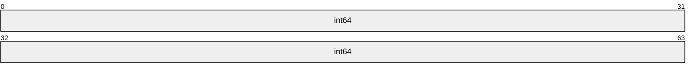

**int64 (8 bytes):** The value of the **int64** field specified in [MS-OAUT] section 2.2.24.

## 2.4 DATE (Packet Version)

The DATE (Packet Version) packet represents a DATE as specified in[MS-OAUT](../MS-OAUT/MS-OAUT.md) section 2.2.25.

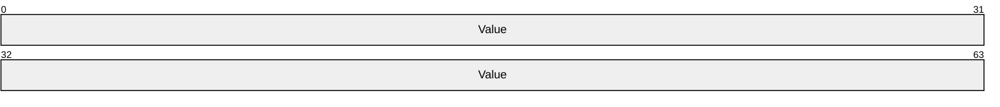

**Value (8 bytes):** The value of the **DATE** is an 8-byte IEEE floating-point number, as specified in [MS-OAUT] section 2.2.25.

## 2.5 CodePageString

The CodePageString packet represents a string whose encoding depends on the value of the [**property set's**](#gt_property-set) [CodePage property](#Section_2.18.2).

**Size (4 bytes):** The size in bytes of the **Characters** field, including the null terminator, but not including padding (if any). If the property set's CodePage property has the value CP_WINUNICODE (0x04B0), then the value MUST be a multiple of 2.

**Characters (variable):** If **Size** is zero, this field MUST be zero bytes in length. If **Size** is nonzero and the CodePage property set's CodePage property has the value CP_WINUNICODE (0x04B0), then the value MUST be a null-terminated array of 16-bit [**Unicode**](#gt_unicode) characters, followed by zero padding to a multiple of 4 bytes. If **Size** is nonzero and the property set's CodePage property has any other value, it MUST be a null-terminated array of 8-bit characters from the code page identified by the CodePage property, followed by zero padding to a multiple of 4 bytes. The string represented by this field MAY contain embedded or additional trailing null characters and an OLEPS implementation MUST be able to handle such strings. However, the manner in which strings with embedded or additional trailing null characters are presented by the implementation to an application is implementation-specific.<1> For maximum interoperability, an OLEPS implementation SHOULD NOT write strings with embedded or trailing null characters unless specifically requested to do so by an application.

## 2.6 DECIMAL (Packet Version)

The DECIMAL (Packet Version) packet represents a DECIMAL as specified in [MS-OAUT](../MS-OAUT/MS-OAUT.md) section 2.2.26.

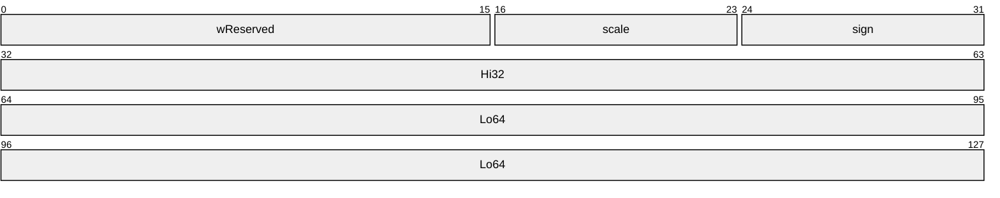

**wReserved (2 bytes):** MUST be set to zero and MUST be ignored.

**scale (1 byte):** The value of the **scale** field specified in [MS-OAUT] section 2.2.26.

**sign (1 byte):** The value of the **sign** field specified in [MS-OAUT] section 2.2.26.

**Hi32 (4 bytes):** The value of the **Hi32** field specified in [MS-OAUT] section 2.2.26.

**Lo64 (8 bytes):** The value of the **Lo64** field specified in [MS-OAUT] section 2.2.26.

## 2.7 UnicodeString

The UnicodeString packet represents a [**Unicode**](#gt_unicode) string.

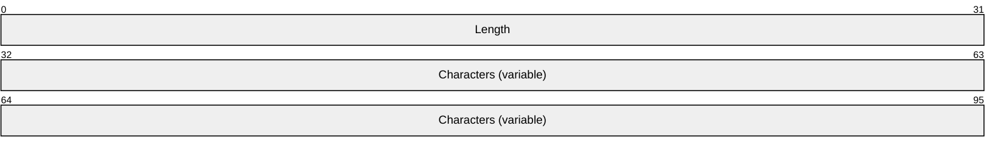

**Length (4 bytes):** The length in 16-bit Unicode characters of the **Characters** field, including the null terminator, but not including padding (if any).

**Characters (variable):** If **Length** is zero, this field MUST be zero bytes in length. If **Length** is nonzero, this field MUST be a null-terminated array of 16-bit Unicode characters, followed by zero padding to a multiple of 4 bytes. The string represented by this field SHOULD NOT contain embedded or additional trailing null characters.

## 2.8 FILETIME (Packet Version)

The FILETIME (Packet Version) packet represents a FILETIME structure ([MS-DTYP](../MS-DTYP/MS-DTYP.md) section 2.3.3).

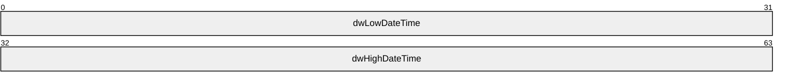

**dwLowDateTime (4 bytes):** The value of the **dwLowDateTime** field specified in [MS-DTYP] section 2.3.3.

**dwHighDateTime (4 bytes):** The value of the **dwHighDateTime** field specified in [MS-DTYP] section 2.3.3.

## 2.9 BLOB

The BLOB packet represents binary data.

**Size (4 bytes):** The size in bytes of the **Bytes** field, not including padding (if any).

**Bytes (variable):** MUST be an array of bytes, followed by zero padding to a multiple of 4 bytes.

## 2.10 IndirectPropertyName

The IndirectPropertyName packet represents the name of a [**stream**](#gt_stream) or storage as used in the representation of the following property types in a [**non-simple property set**](#gt_non-simple-property-set): VT_STREAM (0x0042), VT_STORAGE (0x0043), VT_STREAMED_OBJECT (0x0044), VT_STORED_OBJECT (0x0044), and VT_VERSIONED_STREAM (0x0049). It MUST be represented as a [CodePageString](#Section_2.5), and its value MUST be derived from the [**property identifier**](#gt_property-identifier) of the [**property**](#gt_property) represented according to the following Augmented Backus–Naur Form (ABNF) [[RFC4234]](https://go.microsoft.com/fwlink/?LinkId=90462) syntax.

Indirectproperty = "prop" propertyIdentifier

Where [PropertyIdentifier](#Section_2.1) is the decimal string representation of the property identifier. This property identifier MUST be a valid PropertyIdentifier value and MUST NOT be the property identifier for any of the special properties specified in section [2.18](#Section_2.18).

## 2.11 ClipboardData

The ClipboardData packet represents clipboard data.

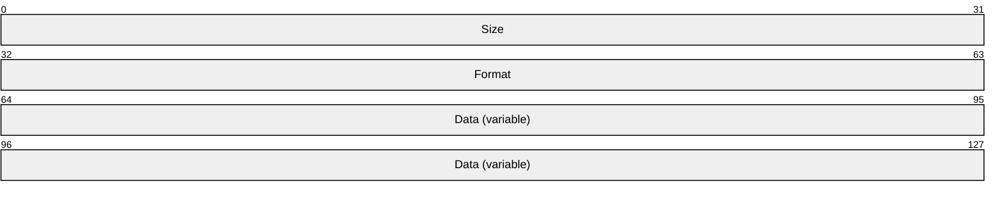

**Size (4 bytes):** The total size in bytes of the **Format** and **Data** fields, not including padding (if any).

**Format (4 bytes):** An application-specific identifier for the format of the data in the **Data** field.

**Data (variable):** MUST be an array of bytes, followed by zero padding to a multiple of 4 bytes.

## 2.12 GUID (Packet Version)

The GUID (Packet Version) packet represents a [**GUID**](#gt_globally-unique-identifier-guid).

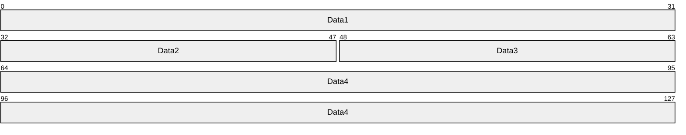

**Data1 (4 bytes):** The value of the **Data1** field specified in [MS-DTYP](../MS-DTYP/MS-DTYP.md) section 2.3.4.

**Data2 (2 bytes):** The value of the **Data2** field specified in [MS-DTYP] section 2.3.4.

**Data3 (2 bytes):** The value of the **Data3** field specified in [MS-DTYP] section 2.3.4.

**Data4 (8 bytes):** The value of the **Data4** field specified in [MS-DTYP] section 2.3.4.

## 2.13 VersionedStream

The VersionedStream packet represents a [**stream**](#gt_stream) with an application-specific version [GUID](#Section_2.12).

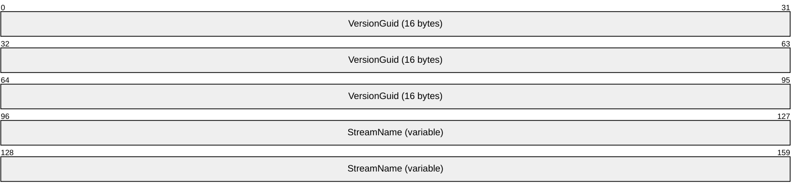

**VersionGuid (16 bytes):** MUST be a GUID (Packet Version).

**StreamName (variable):** MUST be an [IndirectPropertyName](#Section_2.10).

## 2.14 Vector and Array Property Types

Several property types are defined to be a vector or an array of another property type, known as the property's scalar type. **Vector** types, indicated by a [PropertyType](#Section_2.21) value with the VT_VECTOR (0x1000) bit set, are simple, one-dimensional arrays of the scalar type. **Array** types, indicated by a PropertyType value with the VT_ARRAY (0x2000) bit set, are multi-dimensional arrays of the scalar type, with [**elements**](#gt_element) in row-major order (that is, elements with indices differing only in that the highest-numbered dimensions are consecutive). All such types are represented by a header, which provides information on the size and dimensions of the vector or array, followed by a sequence of scalar values.

The following sections provide details on the representation of vector and array property types.

### 2.14.1 Property Types in Variable-Typed Vectors and Arrays

The property types **VT_VECTOR | VT_VARIANT** (0x100C) and **VT_ARRAY | VT_VARIANT** (0x200C) are variable-typed sequences in which each scalar value has its own type. The types of the individual scalar values in such a [**property**](#gt_property) MUST be taken from the following subset of the [PropertyType](#Section_2.21) enumeration values.

| Value | Allowed in VT_VECTOR \| VT_VARIANT property? | Allowed in VT_ARRAY \| VT_VARIANT property? |
| --- | --- | --- |
| VT_I2 (0x0002) | Yes | Yes |
| VT_I4 (0x0003) | Yes | Yes |
| VT_R4 (0x0004) | Yes | Yes |
| VT_R8 (0x0005) | Yes | Yes |
| VT_CY (0x0006) | Yes | Yes |
| VT_DATE (0x0007) | Yes | Yes |
| VT_BSTR (0x0008) | Yes | Yes |
| VT_ERROR (0x000A) | Yes | Yes |
| VT_BOOL (0x000B) | Yes | Yes |
| VT_DECIMAL (0x000E) | No | Yes |
| VT_I1 (0x0010) | Yes | Yes |
| VT_UI1 (0x0011) | Yes | Yes |
| VT_UI2 (0x0012) | Yes | Yes |
| VT_UI4 (0x0013) | Yes | Yes |
| VT_I8 (0x0014) | Yes | No |
| VT_UI8 (0x0015) | Yes | No |
| VT_INT (0x0016) | No | Yes |
| VT_UINT (0x0017) | No | Yes |
| VT_LPSTR (0x001E) | Yes | No |
| VT_LPWSTR (0x001F) | Yes | No |
| VT_FILETIME (0x0040) | Yes | No |
| VT_CF (0x0047) | Yes | No |
| VT_CLSID (0x0048) | Yes | No |

### 2.14.2 VectorHeader

The VectorHeader packet represents the number of scalar values in a vector property type.

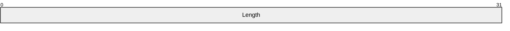

**Length (4 bytes):** An unsigned integer indicating the number of scalar values following the header.

### 2.14.3 ArrayDimension

The ArrayDimension packet represents the size and index offset of a dimension of an array property type.

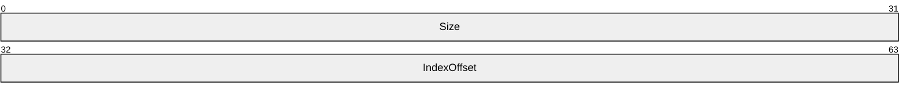

**Size (4 bytes):** An unsigned integer representing the size of the dimension.

**IndexOffset (4 bytes):** A signed integer representing the index offset of the dimension. For example, an array dimension that is to be accessed with a 0-based index would have the value zero, whereas an array dimension that is to be accessed with a 1-based index would have the value 0x00000001.

| Value | Meaning |
| --- | --- |
| 0 | An array dimension that is to be accessed with a 0-based index would have the value zero. |
| 0x00000001 | An array dimension that is to be accessed with a 1-based index would have the value 0x00000001. |

### 2.14.4 ArrayHeader

The ArrayHeader packet represents the type and dimensions of an array property type.

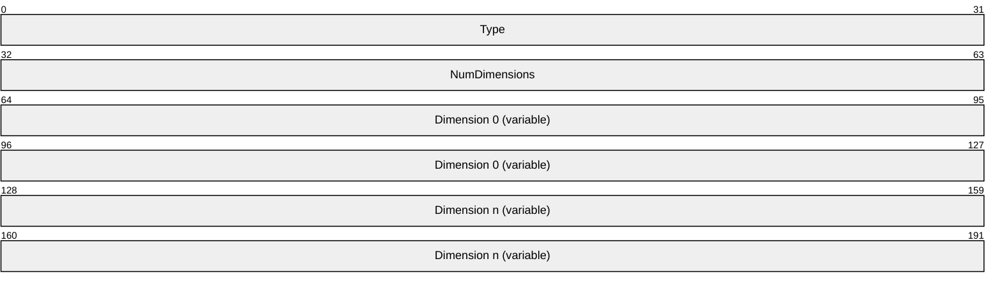

**Type (4 bytes):** MUST be set to the value obtained by clearing the VT_ARRAY (0x2000) bit of this array property's [PropertyType](#Section_2.21) value.

**NumDimensions (4 bytes):** An unsigned integer representing the number of dimensions in the array property. MUST be at least 1 and at most 31.

| Value | Meaning |
| --- | --- |
| 1 — 31 | An unsigned integer representing the number of dimensions in the array property. |

**Dimension 0 (variable):** MUST be a sequence of [ArrayDimension](#Section_2.14.3) packets.

The number of scalar values in an array property can be calculated from the ArrayHeader packet as the product of the **Size** fields of each of the ArrayDimension packets.

## 2.15 TypedPropertyValue

The TypedPropertyValue structure represents the typed value of a [**property**](#gt_property) in a property set.

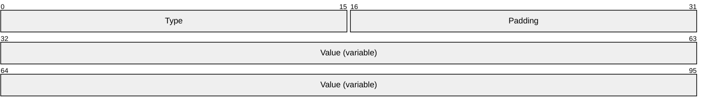

**Type (2 bytes):** MUST be a value from the [PropertyType](#Section_2.21) enumeration, indicating the type of property represented.

**Padding (2 bytes):** MUST be set to zero, and any nonzero value SHOULD be rejected.

| Value | Meaning |
| --- | --- |
| 0 | As required. |

**Value (variable):** MUST be the value of the property represented and serialized according to the value of **Type** as follows.

| Type | Format |
| --- | --- |
| VT_EMPTY (0x0000) | MUST be zero bytes in length. |
| VT_NULL (0x0001) | MUST be zero bytes in length. |
| VT_I2 (0x0002) | MUST be a **16-bit signed integer**, followed by zero padding to 4 bytes. |
| VT_I4 (0x0003) | MUST be a **32-bit signed integer**. |
| VT_R4 (0x0004) | MUST be a **4-byte (single-precision) IEEE floating-point number**. |
| VT_R8 (0x0005) | MUST be an **8-byte (double-precision) IEEE floating-point number**. |
| VT_CY (0x0006) | MUST be a [CURRENCY](#Section_2.3) (Packet Version). |
| VT_DATE (0x0007) | MUST be a DATE (Packet Version). |
| VT_BSTR (0x0008) | MUST be a [CodePageString](#Section_2.5). |
| VT_ERROR (0x000A) | MUST be a **32-bit unsigned integer** representing an HRESULT, as specified in [MS-DTYP](../MS-DTYP/MS-DTYP.md) section 2.2.18. |
| VT_BOOL (0x000B) | MUST be a **VARIANT_BOOL** as specified in [MS-OAUT](../MS-OAUT/MS-OAUT.md) section 2.2.27, followed by zero padding to 4 bytes. |
| VT_DECIMAL (0x000E) | MUST be a [DECIMAL](#Section_2.6) (Packet Version). |
| VT_I1 (0x0010) | MUST be a **1-byte signed integer**, followed by zero padding to 4 bytes. |
| VT_UI1 (0x0011) | MUST be a **1-byte unsigned integer**, followed by zero padding to 4 bytes. |
| VT_UI2 (0x0012) | MUST be a **2-byte unsigned integer**, followed by zero padding to 4 bytes. |
| VT_UI4 (0x0013) | MUST be a **4-byte unsigned integer**. |
| VT_I8 (0x0014) | MUST be an **8-byte signed integer**. |
| VT_UI8 (0x0015) | MUST be an **8-byte unsigned integer**. |
| VT_INT (0x0016) | MUST be a **4-byte signed integer**. |
| VT_UINT (0x0017) | MUST be a **4-byte unsigned integer**. |
| VT_LPSTR (0x001E) | MUST be a CodePageString. |
| VT_LPWSTR (0x001F) | MUST be a [UnicodeString](#Section_2.7). |
| VT_FILETIME (0x0040) | MUST be a [FILETIME (Packet Version)](#Section_2.8). |
| VT_BLOB (0x0041) | MUST be a [BLOB](#Section_2.9). |
| VT_STREAM (0x0042) | MUST be an [IndirectPropertyName](#Section_2.10). The storage representing the (non-simple) property set MUST have a stream element with this name. |
| VT_STORAGE (0x0043) | MUST be an IndirectPropertyName. The storage representing the (non-simple) property set MUST have a storage element with this name. |
| VT_STREAMED_OBJECT (0x0044) | MUST be an IndirectPropertyName. The storage representing the (non-simple) property set MUST have a stream element with this name. |
| VT_STORED_OBJECT (0x0045) | MUST be an IndirectPropertyName. The storage representing the (non-simple) property set MUST have a storage element with this name. |
| VT_BLOB_OBJECT (0x0046) | MUST be a BLOB. |
| VT_CF (0x0047) | MUST be a [ClipboardData](#Section_2.11). |
| VT_CLSID (0x0048) | MUST be a [GUID](#Section_2.12) (Packet Version). |
| VT_VERSIONED_STREAM (0x0049) | MUST be a [VersionedStream](#Section_2.13). The storage representing the (non-simple) property set MUST have a stream element with the name in the **StreamName** field. |
| VT_VECTOR \| VT_I2 (0x1002) | MUST be a [VectorHeader](#Section_2.14.2) followed by a sequence of **16-bit signed integers**, followed by zero padding to a total length that is a multiple of 4 bytes. |
| VT_VECTOR \| VT_I4 (0x1003) | MUST be a VectorHeader followed by a sequence of **32-bit signed integers**. |
| VT_VECTOR \| VT_R4 (0x1004) | MUST be a VectorHeader followed by a sequence of **4-byte (single-precision) IEEE floating-point numbers**. |
| VT_VECTOR \| VT_R8 (0x1005) | MUST be a VectorHeader followed by a sequence of **8-byte (double-precision) IEEE floating-point numbers**. |
| VT_VECTOR \| VT_CY (0x1006) | MUST be a VectorHeader followed by a sequence of CURRENCY (Packet Version) packets. |
| VT_VECTOR \| VT_DATE (0x1007) | MUST be a VectorHeader followed by a sequence of DATE (Packet Version) packets. |
| VT_VECTOR \| VT_BSTR (0x1008) | MUST be a VectorHeader followed by a sequence of CodePageString packets. |
| VT_VECTOR \| VT_ERROR (0x100A) | MUST be a VectorHeader followed by a sequence of **32-bit unsigned integers** representing HRESULTs, as specified in [MS-DTYP] section 2.2.18. |
| VT_VECTOR \| VT_BOOL (0x100B) | MUST be a VectorHeader followed by a sequence of **VARIANT_BOOL** as specified in [MS-OAUT] section 2.2.27, followed by zero padding to a total length that is a multiple of 4 bytes. |
| VT_VECTOR \| VT_VARIANT (0x100C) | MUST be a VectorHeader followed by a sequence of TypedPropertyValue packets. |
| VT_VECTOR \| VT_I1 (0x1010) | MUST be a VectorHeader followed by a sequence of **1-byte signed integers**, followed by zero padding to a total length that is a multiple of 4 bytes. |
| VT_VECTOR \| VT_UI1 (0x1011) | MUST be a VectorHeader followed by a sequence of **1-byte unsigned integers**, followed by zero padding to a total length that is a multiple of 4 bytes. |
| VT_VECTOR \| VT_UI2 (0x1012) | MUST be a VectorHeader followed by a sequence of **2-byte unsigned integers**, followed by zero padding to a total length that is a multiple of 4 bytes. |
| VT_VECTOR \| VT_UI4 (0x1013) | MUST be a VectorHeader followed by a sequence of **4-byte unsigned integers**. |
| VT_VECTOR \| VT_I8 (0x1014) | MUST be a VectorHeader followed by a sequence of **8-byte signed integers**. |
| VT_VECTOR \| VT_UI8 (0x1015) | MUST be a VectorHeader followed by a sequence of **8-byte unsigned integers**. |
| VT_VECTOR \| VT_LPSTR (0x101E) | MUST be a VectorHeader followed by a sequence of CodePageString packets. |
| VT_VECTOR \| VT_LPWSTR (0x101F) | MUST be a VectorHeader followed by a sequence of UnicodeString packets. |
| VT_VECTOR \| VT_FILETIME (0x1040) | MUST be a VectorHeader followed by a sequence of FILETIME (Packet Version) packets. |
| VT_VECTOR \| VT_CF (0x1047) | MUST be a VectorHeader followed by a sequence of ClipboardData packets. |
| VT_VECTOR \| VT_CLSID (0x1048) | MUST be a VectorHeader followed by a sequence of GUID (Packet Version) packets. |
| VT_ARRAY \| VT_I2 (0x2002) | MUST be an [ArrayHeader](#Section_2.14.4) followed by a sequence of **16-bit signed integers**, followed by zero padding to a total length that is a multiple of 4 bytes. |
| VT_ARRAY \| VT_I4 (0x2003) | MUST be an ArrayHeader followed by a sequence of **32-bit signed integers**. |
| VT_ARRAY \| VT_R4 (0x2004) | MUST be an ArrayHeader followed by a sequence of **4-byte (single-precision) IEEE floating-point numbers**. |
| VT_ARRAY \| VT_R8 (0x2005) | MUST be an ArrayHeader followed by a sequence of **8-byte (double-precision) IEEE floating-point numbers**. |
| VT_ARRAY \| VT_CY (0x2006) | MUST be an ArrayHeader followed by a sequence of CURRENCY (Packet Version) packets. |
| VT_ARRAY \| VT_DATE (0x2007) | MUST be an ArrayHeader followed by a sequence of DATE (Packet Version) packets. |
| VT_ARRAY \| VT_BSTR (0x2008) | MUST be an ArrayHeader followed by a sequence of CodePageString packets. |
| VT_ARRAY \| VT_ERROR (0x200A) | MUST be an ArrayHeader followed by a sequence of **32-bit unsigned integers** representing HRESULTs, as specified in [MS-DTYP] section 2.2.18. |
| VT_ARRAY \| VT_BOOL (0x200B) | MUST be an ArrayHeader followed by a sequence of VARIANT_BOOL as specified in [MS-OAUT] section 2.2.27, followed by zero padding to a total length that is a multiple of 4 bytes. |
| VT_ARRAY \| VT_VARIANT (0x200C) | MUST be an ArrayHeader followed by a sequence of TypedPropertyValue packets. |
| VT_ARRAY \| VT_DECIMAL (0x200E) | MUST be an ArrayHeader followed by a sequence of DECIMAL (Packet Version) packets. |
| VT_ARRAY \| VT_I1 (0x2010) | MUST be an ArrayHeader followed by a sequence of **1-byte signed integers**, followed by zero padding to a total length that is a multiple of 4 bytes. |
| VT_ARRAY \| VT_UI1 (0x2011) | MUST be an ArrayHeader followed by a sequence of **1-byte unsigned integers**, followed by zero padding to a total length that is a multiple of 4 bytes. |
| VT_ARRAY \| VT_UI2 (0x2012) | MUST be an ArrayHeader followed by a sequence of **2-byte unsigned integers**, followed by zero padding to a total length that is a multiple of 4 bytes. |
| VT_ARRAY \| VT_UI4 (0x2013) | MUST be an ArrayHeader followed by a sequence of **4-byte unsigned integers**. |
| VT_ARRAY \| VT_INT (0x2016) | MUST be an ArrayHeader followed by a sequence of **4-byte signed integers**. |
| VT_ARRAY \| VT_UINT (0x2017) | MUST be an ArrayHeader followed by a sequence of **4-byte unsigned integers**. |

## 2.16 DictionaryEntry

The DictionaryEntry packet represents a mapping between a property identifier and a [**property name**](#gt_property-name).

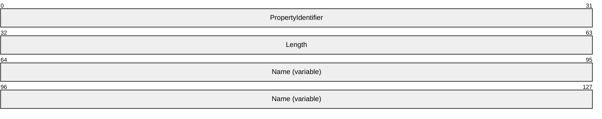

**PropertyIdentifier (4 bytes):** An unsigned integer representing a property identifier. MUST be a valid [PropertyIdentifier](#Section_2.1) value in the range 0x00000002 to 0x7FFFFFFF, inclusive (this specifically excludes the [**property identifiers**](#gt_property-identifier) for any of the special properties specified in section [2.18](#Section_2.18)).

**Length (4 bytes):** If the property set's [CodePage property](#Section_2.18.2) has the value CP_WINUNICODE (0x04B0), MUST be the length of the **Name** field in 16-bit [**Unicode**](#gt_unicode) characters, including the null terminator but not including padding (if any). Otherwise, MUST be the length of the **Name** field in 8-bit characters, including the null terminator.

**Name (variable):** If the property set's CodePage property has the value CP_WINUNICODE (0x04B0), MUST be a null-terminated array of 16-bit Unicode characters, followed by zero padding to a multiple of 4 bytes. Otherwise, MUST be a null-terminated array of 8-bit characters from the code page identified by the CodePage property and MUST NOT be padded.

## 2.17 Dictionary

The Dictionary packet represents all mappings between [**property identifiers**](#gt_property-identifier) and [**property names**](#gt_property-name) in a property set.

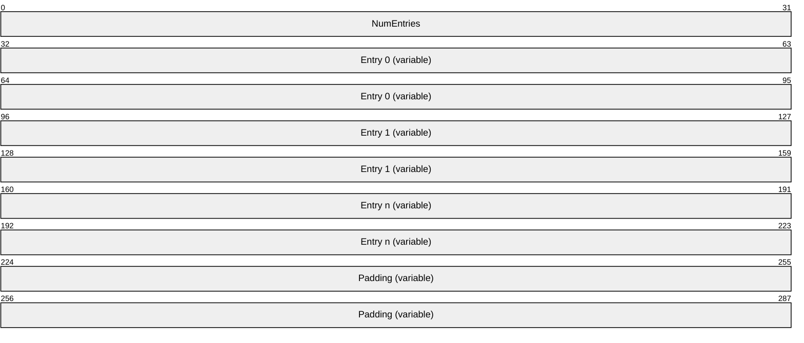

**NumEntries (4 bytes):** (4 bytes) An unsigned integer representing the number of entries in the Dictionary.

**Entry 1 (variable):** All Entry fields MUST be a sequence of [DictionaryEntry](#Section_2.1) packets. Entries are not required to appear in any particular order.

**Padding (variable):** Padding, if necessary, to a total length that is a multiple of 4 bytes.

## 2.18 Special Properties

The following sections provide additional information on [**properties**](#gt_property) that have special representation, usage, or restrictions.

### 2.18.1 Dictionary Property

The Dictionary property, if present, MUST have a property identifier of 0x00000000 and MUST NOT have a [**property name**](#gt_property-name). Unlike other properties, which are represented as [TypedPropertyValue](#Section_2.15) packets, the Dictionary property MUST be represented as a [Dictionary](#Section_3.2.2.1.4) packet. A property set in which any [**properties**](#gt_property) have property names MUST have a Dictionary property.

The Dictionary property MUST NOT have multiple entries with the same property identifier or multiple entries with the same property name. Property names MUST be compared in a case-insensitive manner unless the property set has a [Behavior property](#Section_2.18.4) with the value 0x00000001, in which case property names MUST be compared in a case-sensitive manner.

### 2.18.2 CodePage Property

The CodePage property MUST have the property identifier 0x00000001, MUST NOT have a [**property name**](#gt_property-name), and MUST have type VT_I2 (0x0002). Every property set MUST have a CodePage property and its value MUST be a valid code page identifier as specified in [MS-UCODEREF](../MS-UCODEREF/MS-UCODEREF.md) section 2.2.1. Its value is selected in an implementation-specific manner.<2>

The CodePage property of a property set affects the representation of the [CodePageString](#Section_2.5) and [DictionaryEntry](#Section_2.1) packets. The value CP_WINUNICODE (0x04B0) indicates that the strings in these packets are encoded as arrays of 16-bit [**Unicode**](#gt_unicode) characters. Any other value indicates that the strings in these packets are encoded as arrays of 8-bit characters from the code page identified.

### 2.18.3 Locale Property

The Locale property, if present, MUST have the property identifier 0x80000000, MUST NOT have a [**property name**](#gt_property-name), and MUST have type VT_UI4 (0x0013). If present, its value MUST be a valid language code identifier as specified in [MS-LCID](../MS-LCID/MS-LCID.md). Its value is selected in an implementation-specific manner.<3>

### 2.18.4 Behavior Property

The Behavior property, if present, MUST have the property identifier 0x80000003, MUST NOT have a [**property name**](#gt_property-name), and MUST have type VT_UI4 (0x0013). A version 0 property set, indicated by the value 0x0000 for the **Version** field of the [PropertySetStream](#Section_2.1) packet, MUST NOT have a Behavior property.

If the Behavior property is present, it MUST have one of the following values.

| Value | Meaning |
| --- | --- |
| 0x00000000 | Property names are case-insensitive (default). |
| 0x00000001 | Property names are case-sensitive. |

## 2.19 PropertyIdentifierAndOffset

The PropertyIdentifierAndOffset packet is used in the [PropertySet](#Section_2.20) packet to represent a property identifier and the byte offset of the property in the PropertySet packet.

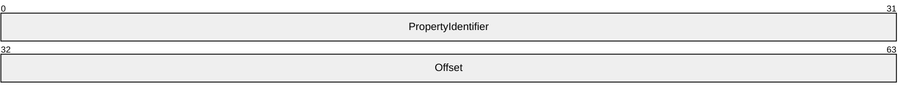

**PropertyIdentifier (4 bytes):** An unsigned integer representing the property identifier of a property in the property set. MUST be a valid [PropertyIdentifier](#Section_2.1) value.

**Offset (4 bytes):** An unsigned integer representing the offset in bytes from the beginning of the PropertySet packet to the beginning of the **Property** field for the property represented. MUST be a multiple of 4 bytes.

## 2.20 PropertySet

The PropertySet packet represents a property set.

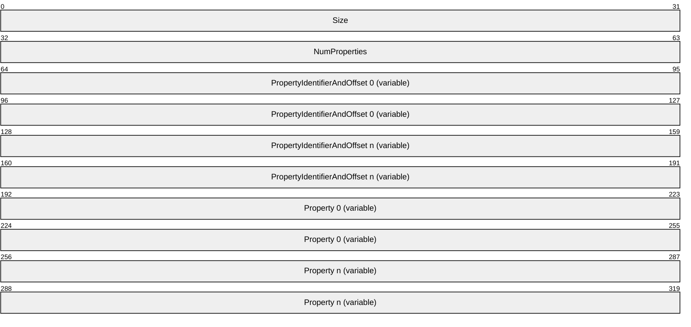

**Size (4 bytes):** MUST be the total size in bytes of the PropertySet packet.

**NumProperties (4 bytes):** An unsigned integer representing the number of [**properties**](#gt_property) in the property set.

**PropertyIdentifierAndOffset 0 (variable):** All PropertyIdentifierAndOffset fields MUST be a sequence of [PropertyIdentifierAndOffset](#Section_2.19) packets. The sequence MUST be in order of increasing value of the **Offset** field. Packets are not required to be in any particular order with regard to the value of the **PropertyIdentifier** field.

**Property 0 (variable):** Each Property field is a sequence of property values, each of which MUST be represented by a [TypedPropertyValue](#Section_2.15) packet or a [Dictionary](#Section_3.2.2.1.4) packet in the special case of the [Dictionary property](#Section_2.18.1).

## 2.21 PropertySetStream

The PropertySetStream packet specifies the [**stream format**](#gt_stream-format) for [**simple property sets**](#gt_simple-property-set) and the stream format for the CONTENTS stream in the [Non-Simple Property Set Storage Format](#Section_2.22). A simple property set MUST be represented by a [**stream**](#gt_stream) containing a PropertySetStream packet.

The PropertySetStream packet usually represents exactly one property set, but for historical reasons, the DocumentSummaryInfo and UserDefinedProperties [**property sets**](#gt_property-set) are represented in the same stream. In this special case, a PropertySetStream might represent two property sets.

An implementation SHOULD enforce a limit on the total size of a PropertySetStream packet. This limit MUST be at least 262,144 bytes, and for maximum interoperability SHOULD<4> be 2,097,152 bytes.

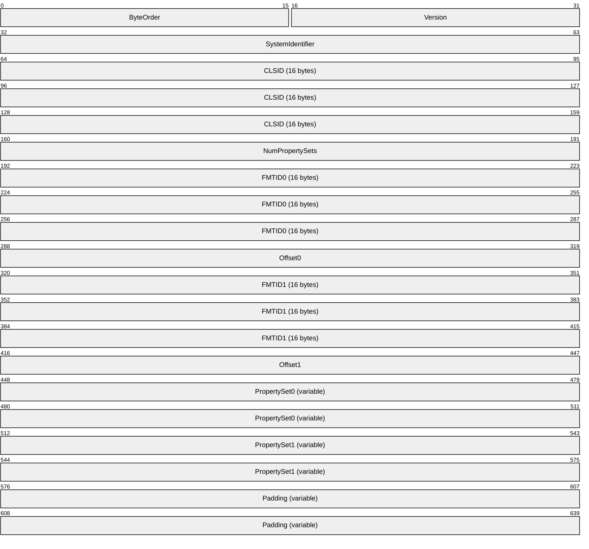

**ByteOrder (2 bytes):** MUST be set to 0xFFFE.

**Version (2 bytes):** An unsigned integer indicating the version number of the property set (or property sets). MUST be 0x0000 or 0x0001. An OLEPS implementation MUST accept version 0 property sets and SHOULD<5> also accept version 1 property sets. This field MUST be set to 0x0001 if the property set or property sets use any of the following features not supported by version 0 property sets:

- Property types not supported for version 0 property sets, as specified in the [PropertyType](#Section_2.21) enumeration.
- The [Behavior property](#Section_2.18.4).
If the property set does not use any of these features, this field SHOULD be set to 0x0000 for maximum interoperability.

| Value | Meaning |
| --- | --- |
| 0x0000 | Version 0 property sets will be used. |
| 0x0001 | Version 1 property sets will be used. |

**SystemIdentifier (4 bytes):** An implementation-specific<6> value that SHOULD be ignored, except possibly to report this value to applications. It SHOULD NOT be interpreted by the OLEPS implementation.

**CLSID (16 bytes):** MUST be a [GUID](#Section_2.12) (Packet Version) packet representing the associated [**CLSID**](#gt_class-identifier-clsid) of the property set (or property sets). If no CLSID is provided by the application, it SHOULD be set to [**GUID_NULL**](#gt_guid_null) by default.

**NumPropertySets (4 bytes):** An unsigned integer indicating the number of property sets represented by this PropertySetStream structure. MUST be either 0x00000001 or 0x00000002.

| Value | Meaning |
| --- | --- |
| 0x00000001 | This structure contains one property set. |
| 0x00000002 | This structure contains two property sets. The optional fields for **PropertySet 1** are present. |

**FMTID0 (16 bytes):** A [**GUID**](#gt_globally-unique-identifier-guid) that MUST be set to the [**FMTID**](#gt_fmtid) of the property set represented by the field **PropertySet 0**. If **NumPropertySets** has the value 0x00000002, then this GUID MUST be set to FMTID_DocSummaryInformation ({D5CDD502-2E9C-101B-9397-08002B2CF9AE}).

**Offset0 (4 bytes):** An unsigned integer that MUST be set to the offset in bytes from the beginning of this PropertySetStream structure to the beginning of the field **PropertySet 0**.

**FMTID1 (16 bytes):** If **NumPropertySets** has the value 0x00000002, it MUST be set to FMTID_UserDefinedProperties ({D5CDD505-2E9C-101B-9397-08002B2CF9AE}). Otherwise, it MUST be absent.

**Offset1 (4 bytes):** If **NumPropertySets** has the value 0x00000002, it MUST be set to the offset in bytes from the beginning of this PropertySetStream structure to the beginning of the field **PropertySet 1**. Otherwise, it MUST be absent.

**PropertySet0 (variable):** MUST be a [PropertySet](#Section_2.20) packet.

**PropertySet1 (variable):** If **NumPropertySets** has the value 0x00000002, it MUST be a PropertySet packet. Otherwise, it MUST be absent.

**Padding (variable):** Contains additional padding added by the implementation. If present, padding MUST be zeroes and MUST be ignored.

## 2.22 Non-Simple Property Set Storage Format

A [**non-simple property set**](#gt_non-simple-property-set) MUST be represented by a storage. This storage MUST have a stream element with the name "CONTENTS", which MUST contain a [PropertySetStream](#Section_2.1) packet. The [**CLSID**](#gt_class-identifier-clsid) of the storage MUST be set to the associated CLSID of the property set from the **CLSID** field of the PropertySetStream packet.

In addition, the property set MUST have an [**element**](#gt_element) for each property of the following types:

| Property Type | Element Type |
| --- | --- |
| VT_STREAM (0x0042) | [**stream**](#gt_stream) |
| VT_STORAGE(0x0043) | [**storage (2)**](#gt_63525252-3f66-4459-9b64-5b77f57b2f84) |
| VT_STREAMED_OBJECT (0x0044) | stream |
| VT_STORED_OBJECT (0x0044) | storage (2) |
| VT_VERSIONED_STREAM (0x0049) | stream |

Each of these elements MUST have the name specified in the property's [IndirectPropertyName](#Section_2.10) packet.

## 2.23 Property Set Stream and Storage Names

A [**stream**](#gt_stream) or storage representing a property set might be an [**element**](#gt_element) of a storage. For example, the standard binding for property set streams or storages in a [**compound file**](#gt_compound-file) requires each to be an element of the root storage of the [**file**](#gt_file). This section specifies a standard mapping between a property set's [**FMTID**](#gt_fmtid) and the name for the stream or storage element representing the property set, so that property sets stored in this way are discoverable.

An OLEPS implementation SHOULD provide a mechanism by which elements with names derived according to this standard mapping are used for property sets, although the implementation MAY<7> additionally provide one or more other mechanisms that do not follow this convention. For example, the implementation might provide a mechanism by which a property set can be stored in an arbitrary application-provided [**stream container**](#gt_stream-container) or [**storage container**](#gt_storage-container).

The following ABNF [[RFC4234]](https://go.microsoft.com/fwlink/?LinkId=90462) syntax specifies the standard names for property set streams and storages.

PropertySetStreamOrStorageName = %x05 ("SummaryInformation" /

"DocumentSummaryInformation" / "GlobalInfo" / "ImageContents" /

"ImageInfo" / 26(ALPHA / "0" / "1" / "2" / "3" / "4" / "5") )

The special-case FMTID values listed in the following table MUST be mapped to the names as specified in the table.

| FMTID | Stream or storage name |
| --- | --- |
| FMTID_SummaryInformation {F29F85E0-4FF9-1068-AB91-08002B27B3D9} | "\005SummaryInformation" |
| FMTID_DocSummaryInformation {D5CDD502-2E9C-101B-9397-08002B2CF9AE} | "\005DocumentSummaryInformation" |
| FMTID_UserDefinedProperties {D5CDD505-2E9C-101B-9397-08002B2CF9AE} | "\005DocumentSummaryInformation" |
| FMTID_GlobalInfo {56616F00-C154-11CE-8553-00AA00A1F95B} | "\005GlobalInfo" |
| FMTID_ImageContents {56616400-C154-11CE-8553-00AA00A1F95B} | "\005ImageContents" |
| FMTID_ImageInfo {56616500-C154-11CE-8553-00AA00A1F95B} | "\005ImageInfo" |

All other FMTID values MUST be mapped to names as follows:

- Start with the 128-bit [GUID](#Section_2.12) (Packet Version) representation of the FMTID and append 2 zero bits for a total of 130 bits.
- Split the 130 bits into 26 groups of 5 consecutive bits each.
- Map each group to a character as specified in the following table. Character mappings are case-insensitive, and an implementation MAY<8> convert characters to uppercase.
| Bit Range | Field | Description |
| --- | --- | --- |
| Variable | 00000 | a 01000 i 10000 q 11000 y |
| Variable | 00001 | b 01001 j 10001 r 11001 z |
| Variable | 00010 | c 01010 k 10010 s 11010 0 |
| Variable | 00011 | d 01011 l 10011 t 11011 1 |
| Variable | 00100 | e 01100 m 10100 u 11100 2 |
| Variable | 00101 | f 01101 n 10101 v 11101 3 |
| Variable | 00110 | g 01110 o 10110 w 11110 4 |
| Variable | 00111 | h 01111 p 10111 x 11111 5 |

- The stream or storage name is the character "\005" followed by the 26 characters obtained from this mapping.

## 2.24 Standard Bindings

The following sections specify standard bindings that can be used to associate property sets with a [**file**](#gt_file), so that property sets stored in this manner are discoverable to other implementations. An OLEPS implementation SHOULD support the [Compound File binding](#Section_2.24.1) for [**compound files**](#gt_compound-file). An implementation MAY<9> additionally support the [**alternate stream**](#gt_alternate-stream) binding if the file system supports alternate streams, but this binding MUST NOT be used for compound files.

### 2.24.1 Compound File Binding

To associate a property set with a [**compound file**](#gt_compound-file), the [**stream**](#gt_stream) or storage representing the property set MUST be an [**element**](#gt_element) of the compound file's root storage and MUST have the standard name specified in section [2.23](#Section_2.23).

### 2.24.2 Alternate Stream Binding

Some file systems provide a feature where a file can have alternate, named streams in addition to the main data stream of the file. For example, [**NTFS**](#gt_nt-file-system-ntfs) has such a feature (see [[MSDN-FileStreams]](https://go.microsoft.com/fwlink/?LinkId=90537) for more information). The [**alternate stream**](#gt_alternate-stream) binding enables property sets to be stored in these alternate streams, such that property sets can be associated with a file that is not a [**compound file**](#gt_compound-file).

### 2.24.3 Control Stream

A [**file**](#gt_file) that has one or more property sets associated with it through the [alternate stream binding](#Section_2.24.2) MUST have a control stream, which is an [**alternate stream**](#gt_alternate-stream) with the name "{4c8cc155-6c1e-11d1-8e41-00c04fb9386d}". This [**stream**](#gt_stream) MUST contain the following packet.

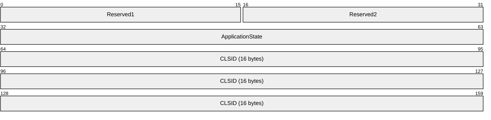

**Reserved1 (2 bytes):** MUST be set to zero, and nonzero values MUST be rejected.

**Reserved2 (2 bytes):** MUST be set to zero, and MUST be ignored.

**ApplicationState (4 bytes):** An application-provided value that MUST NOT be interpreted by the OLEPS implementation. If the application did not provide a value, it SHOULD be set to zero.

**CLSID (16 bytes):** An application-provided value that MUST NOT be interpreted by the OLEPS implementation. If the application did not provide a value, it SHOULD be absent.

### 2.24.4 Simple Property Set Stream

A [**simple property set**](#gt_simple-property-set) MUST be represented by an [**alternate stream**](#gt_alternate-stream) with the standard name specified in section [2.23](#Section_2.23). This stream MUST contain a [PropertySetStream](#Section_2.1) packet.

### 2.24.5 Non-Simple Property Set Storage

A [**non-simple property set**](#gt_non-simple-property-set) MUST be represented by an [**alternate stream**](#gt_alternate-stream) with a name derived from the standard name specified in section [2.23](#Section_2.23) according to the following ABNF [[RFC4234]](https://go.microsoft.com/fwlink/?LinkId=90462) syntax.

NonSimplePropertySetAlternateStreamName = "Docf_"

PropertySetStreamOrStorageName

This stream's contents MUST be in the format of a [**compound file**](#gt_compound-file) (see [MS-CFB](../MS-CFB/MS-CFB.md) for details). The root storage of this compound file MUST conform to the non-simple property set [**storage format**](#gt_storage-format) as specified in section [2.22](#Section_2.22).

## 2.25 Well-Known Property Set Formats

The following sections specify the well-known [**property set formats**](#gt_property-set-format) [PropertyIdentifier](#Section_2.1) and [PropertyBag](#Section_2.25.2).

### 2.25.1 SummaryInformation

The SummaryInformation property set format, identified by FMTID_SummaryInformation ({F29F85E0-4FF9-1068-AB91-08002B27B3D9}), represents generic [**properties**](#gt_property) of a document. The properties specific to the SummaryInformation property set are specified in the following table. Except where otherwise stated, a SummaryInformation property set SHOULD have all of these properties, and SHOULD NOT have any other properties, except for the special properties specified in section [2.18](#Section_2.18).

| Property identifier | Type | Meaning |
| --- | --- | --- |
| PIDSI_TITLE (0x00000002) | **VT_LPSTR (0x001E)** | The title of the document. |
| PIDSI_SUBJECT (0x00000003) | **VT_LPSTR (0x001E)** | The subject of the document. |
| PIDSI_AUTHOR (0x00000004) | **VT_LPSTR (0x001E)** | The author of the document. |
| PIDSI_KEYWORDS (0x00000005) | **VT_LPSTR (0x001E)** | Keywords related to the document. |
| PIDSI_COMMENTS (0x00000006) | **VT_LPSTR (0x001E)** | Comments related the document. |
| PIDSI_TEMPLATE (0x00000007) | **VT_LPSTR (0x001E)** | The application-specific template from which the document was created. |
| PIDSI_LASTAUTHOR (0x00000008) | **VT_LPSTR (0x001E)** | The last author of the document. |
| PIDSI_REVNUMBER (0x00000009) | **VT_LPSTR (0x001E)** | An application-specific revision number for this version of the document. |
| PIDSI_EDITTIME (0x0000000A) | **VT_FILETIME (0x0040)** | A 64-bit unsigned integer indicating the total amount of time that has been spent editing the document in 100-nanosecond increments. MUST be encoded as a [FILETIME](#Section_2.8) by setting the dwLowDataTime field to the low 32-bits and the dwHighDateTime field to the high 32-bits. |
| PIDSI_LASTPRINTED (0x0000000B) | **VT_FILETIME (0x0040)** | The most recent time that the document was printed. |
| PIDSI_CREATE_DTM (0x0000000C) | **VT_FILETIME (0x0040)** | The time that the document was created. |
| PIDSI_LASTSAVE_DTM (0x0000000D) | **VT_FILETIME (0x0040)** | The most recent time that the document was saved. |
| PIDSI_PAGECOUNT (0x0000000E) | **VT_I4 (0x0003)** | The total number of pages in the document. |
| PIDSI_WORDCOUNT (0x0000000F) | **VT_I4 (0x0003)** | The total number of words in the document. |
| PIDSI_CHARCOUNT (0x00000010) | **VT_I4 (0x0003)** | The total number of characters in the document. |
| PIDSI_THUMBNAIL (0x00000011) | **VT_CF (0x0047)** | Application-specific clipboard data containing a thumbnail representing the document's contents. MAY be absent. |
| PIDSI_APPNAME (0x00000012) | **VT_LPSTR (0x001E)** | The name of the application that was used to create the document. |
| PIDSI_DOC_SECURITY (0x00000013) | **VT_I4 (0x0003)** | A 32-bit signed integer representing a set of application-suggested access control flags with the following values: 0x00000001: Password protected 0x00000002: Read-only recommended 0x00000004: Read-only enforced 0x00000008: Locked for annotations |

### 2.25.2 PropertyBag

The PropertyBag [**property set format**](#gt_property-set-format), identified by FMTID_PropertyBag ({20001801-5DE6-11D1-8E38-00C04FB9386D}), is used in applications that persist an object as a property set, typically by saving state variables as properties. A PropertyBag [**property set's**](#gt_property-set) associated [**CLSID**](#gt_class-identifier-clsid) SHOULD identify the application or component whose object is persisted in the property set. The properties contained in a PropertyBag property set are application-specific.

# 3 Structure Examples

## 3.1 SummaryInformation Property Set

The following table shows the binary contents of a stream representing a SummaryInformation Property Set. This is a [**simple property set**](#gt_simple-property-set), as the [SummaryInformation](#Section_2.1) format does not require support for stream and storage type properties. The name of this stream is "\005SummaryInformation", as specified in section [2.23](#Section_2.23).

| Stream contents | Column 2 | Column 3 | Column 4 | Column 5 | Column 6 | Column 7 | Column 8 | Column 9 | Column 10 | Column 11 | Column 12 | Column 13 | Column 14 | Column 15 | Column 16 | Column 17 |
| --- | --- | --- | --- | --- | --- | --- | --- | --- | --- | --- | --- | --- | --- | --- | --- | --- |
| - | x0 | x1 | x2 | x3 | x4 | x5 | x6 | x7 | x8 | x9 | xA | xB | xC | xD | xE | xF |
| 00x | FE | FF | 00 | 00 | 06 | 00 | 02 | 00 | 00 | 00 | 00 | 00 | 00 | 00 | 00 | 00 |
| 01x | 00 | 00 | 00 | 00 | 00 | 00 | 00 | 00 | 01 | 00 | 00 | 00 | E0 | 85 | 9F | F2 |
| 02x | F9 | 4F | 68 | 10 | AB | 91 | 08 | 00 | 2B | 27 | B3 | D9 | 30 | 00 | 00 | 00 |
| 03x | 8C | 01 | 00 | 00 | 12 | 00 | 00 | 00 | 01 | 00 | 00 | 00 | 98 | 00 | 00 | 00 |
| 04x | 02 | 00 | 00 | 00 | A0 | 00 | 00 | 00 | 03 | 00 | 00 | 00 | B8 | 00 | 00 | 00 |
| 05x | 04 | 00 | 00 | 00 | C4 | 00 | 00 | 00 | 05 | 00 | 00 | 00 | D0 | 00 | 00 | 00 |
| 06x | 06 | 00 | 00 | 00 | DC | 00 | 00 | 00 | 07 | 00 | 00 | 00 | E8 | 00 | 00 | 00 |
| 07x | 08 | 00 | 00 | 00 | FC | 00 | 00 | 00 | 09 | 00 | 00 | 00 | 10 | 01 | 00 | 00 |
| 08x | 12 | 00 | 00 | 00 | 1C | 01 | 00 | 00 | 0A | 00 | 00 | 00 | 3C | 01 | 00 | 00 |
| 09x | 0B | 00 | 00 | 00 | 48 | 01 | 00 | 00 | 0C | 00 | 00 | 00 | 54 | 01 | 00 | 00 |
| 0Ax | 0D | 00 | 00 | 00 | 60 | 01 | 00 | 00 | 0E | 00 | 00 | 00 | 6C | 01 | 00 | 00 |
| 0Bx | 0F | 00 | 00 | 00 | 74 | 01 | 00 | 00 | 10 | 00 | 00 | 00 | 7C | 01 | 00 | 00 |
| 0Cx | 13 | 00 | 00 | 00 | 84 | 01 | 00 | 00 | 02 | 00 | 00 | 00 | E4 | 04 | 00 | 00 |
| 0Dx | 1E | 00 | 00 | 00 | 0F | 00 | 00 | 00 | 4A | 6F | 65 | 27 | 73 | 20 | 64 | 6F |
| 0Ex | 63 | 75 | 6D | 65 | 6E | 74 | 00 | 00 | 1E | 00 | 00 | 00 | 04 | 00 | 00 | 00 |
| 0Fx | 4A | 6F | 62 | 00 | 1E | 00 | 00 | 00 | 04 | 00 | 00 | 00 | 4A | 6F | 65 | 00 |
| 10x | 1E | 00 | 00 | 00 | 04 | 00 | 00 | 00 | 00 | 00 | 00 | 00 | 1E | 00 | 00 | 00 |
| 11x | 04 | 00 | 00 | 00 | 00 | 00 | 00 | 00 | 1E | 00 | 00 | 00 | 0C | 00 | 00 | 00 |
| 12x | 4E | 6F | 72 | 6D | 61 | 6C | 2E | 64 | 6F | 74 | 6D | 00 | 1E | 00 | 00 | 00 |
| 13x | 0A | 00 | 00 | 00 | 43 | 6F | 72 | 6E | 65 | 6C | 69 | 75 | 73 | 00 | 00 | 00 |
| 14x | 1E | 00 | 00 | 00 | 04 | 00 | 00 | 00 | 36 | 36 | 00 | 00 | 1E | 00 | 00 | 00 |
| 15x | 18 | 00 | 00 | 00 | 4D | 69 | 63 | 72 | 6F | 73 | 6F | 66 | 74 | 20 | 4F | 66 |
| 16x | 66 | 69 | 63 | 65 | 20 | 57 | 6F | 72 | 64 | 00 | 00 | 00 | 40 | 00 | 00 | 00 |
| 17x | 00 | 6E | D9 | A2 | 42 | 00 | 00 | 00 | 40 | 00 | 00 | 00 | 00 | 16 | D0 | A1 |
| 18x | 4E | 8E | C6 | 01 | 40 | 00 | 00 | 00 | 00 | 1C | F2 | D5 | 2A | CE | C6 | 01 |
| 19x | 40 | 00 | 00 | 00 | 00 | 3C | DC | 73 | DD | 80 | C8 | 01 | 03 | 00 | 00 | 00 |
| 1Ax | 0E | 00 | 00 | 00 | 03 | 00 | 00 | 00 | E5 | 0D | 00 | 00 | 03 | 00 | 00 | 00 |
| 1Bx | 38 | 4F | 00 | 00 | 03 | 00 | 00 | 00 | 00 | 00 | 00 | 00 | - | - | - | - |

The stream contains a [PropertySetStream](#Section_2.1) packet, with the following field values. Field offsets in this example are calculated from the beginning of the PropertySetStream packet.

**ByteOrder (2 bytes at offset 0):** 0xFFFE, as required.

**Version (2 bytes at offset 2):** 0x0000, indicating that this is a version 0 property set.

**SystemIdentifier (4 bytes at offset 4):** 0x00020006, which is the implementation-specific identifier written by Windows Vista operating system.

**CLSID (16 bytes at offset 8):** GUID_NULL ({00000000-0000-0000-0000-000000000000}), the default value which indicates that the application that wrote the property set did not set the [**property set's**](#gt_property-set) [**CLSID**](#gt_class-identifier-clsid).

**NumPropertySets (4 bytes at offset 24):** 0x00000001, which indicates that there is only one property set in this stream (as required, since this is not the special case of FMTID_DocSummaryInformation/FMTID_UserDefinedProperties).

**FMTID 0 (16 bytes at offset 28):** FMTID_SummaryInformation ({F29F85E0-4FF9-1068-AB91-08002B27B3D9}).

**Offset 0 (4 bytes at offset 44):** 0x00000030, the offset from the beginning of this structure to the beginning of the field **PropertySet 0**.

**FMTID 1 (0 bytes):** Absent, as required for a PropertySetStream with only one property set.

**Offset 1 (0 bytes):** Absent, as required for a PropertySetStream with only one property set.

**PropertySet 0 (396 bytes at offset 48):** A [PropertySet](#Section_2.20) packet (consists of the remainder of the stream contents).

The field **PropertySet 0** has the following subfield values:

**Size (4 bytes at offset 48):** 0x0000018C.

**NumProperties (4 bytes at offset 52):** 0x00000012 (decimal 18).

**PropertyIdentifierAndOffset 0-17 (144 bytes total at offset 56):** This field includes the following sequence of 18 [PropertyIdentifierAndOffset](#Section_2.19) packets.

| Bit Range | Field | Description |
| --- | --- | --- |
| Variable | 0x00000001 (property identifier for the [CodePage property](#Section_2.18.2)) | 0x00000098 |
| Variable | PIDSI_TITLE (0x00000002) | 0x000000A0 |
| Variable | PIDSI_SUBJECT (0x00000003) | 0x000000B8 |
| Variable | PIDSI_AUTHOR (0x00000004) | 0x000000C4 |
| Variable | PIDSI_KEYWORDS (0x00000005) | 0x000000D0 |
| Variable | PIDSI_COMMENTS (0x00000006) | 0x000000DC |
| Variable | PIDSI_TEMPLATE (0x00000007) | 0x000000E8 |
| Variable | PIDSI_LASTAUTHOR (0x00000008) | 0x000000FC |
| Variable | PIDSI_REVNUMBER (0x00000009) | 0x00000110 |
| Variable | PIDSI_APPNAME (0x00000012) | 0x0000011C |
| Variable | PIDSI_EDITTIME (0x0000000A) | 0x0000013C |
| Variable | PIDSI_LASTPRINTED (0x0000000B) | 0x00000148 |
| Variable | PIDSI_CREATE_DTM (0x0000000C) | 0x00000154 |
| Variable | PIDSI_LASTSAVE_DTM (0x0000000D) | 0x00000160 |
| Variable | PIDSI_PAGECOUNT (0x0000000E) | 0x0000016C |
| Variable | PIDSI_WORDCOUNT (0x0000000F) | 0x00000174 |
| Variable | PIDSI_CHARCOUNT (0x00000010) | 0x0000017C |
| Variable | PIDSI_DOC_SECURITY (0x00000013) | 0x00000184 |

**Property 0-17 (252 bytes total at offset 200):** A sequence of 18 [TypedPropertyValue](#Section_2.15) packets, as described in the following sections (3.1.1 through [3.1.18](#Section_3.1.18)).

**PropertySet 1:** Absent, as required for a PropertySetStream with only one property set.

### 3.1.1 CodePage Property

The CodePage property is an instance of the **TypedPropertyValue** structure defined in section [2.15](#Section_2.15).

**Property identifier:** 0x00000001

**Property offset:** 0x00000030 + 0x00000098 = 0x000000C8 (decimal 200)

The following table shows the binary contents of the structure representing the property.

| Structure contents | Column 2 | Column 3 | Column 4 | Column 5 | Column 6 | Column 7 | Column 8 | Column 9 | Column 10 | Column 11 | Column 12 | Column 13 | Column 14 | Column 15 | Column 16 | Column 17 |
| --- | --- | --- | --- | --- | --- | --- | --- | --- | --- | --- | --- | --- | --- | --- | --- | --- |
| - | x0 | x1 | x2 | x3 | x4 | x5 | x6 | x7 | x8 | x9 | xA | xB | xC | xD | xE | xF |
| 00x | 02 | 00 | 00 | 00 | E4 | 04 | 00 | 00 | - | - | - | - | - | - | - | - |

**Type (2 bytes at offset 200):** The type of property represented in the packet; the type is identified as the **PropertyType** enumeration value VT_I2 (0x0002).

**Padding (2 bytes at offset 202):** Set to zero, as required.

**Value (4 bytes at offset 204):** The 2-byte signed integer 0x04E4 (decimal 1252) followed by 2 bytes of zero padding as required. Indicates that [CodePageString](#Section_2.5) packets in this property set are encoded with code page 1252 (Latin 1).

### 3.1.2 PIDSI_TITLE

The PIDSI_TITLE property is an instance of the **TypedPropertyValue** structure defined in section [2.15](#Section_2.15).

**Property identifier:** 0x00000002

**Property offset:** 0x00000030 + 0x000000A0 = 0x000000D0 (decimal 208)

The following table shows the binary contents of the structure representing the property.

| Structure contents | Column 2 | Column 3 | Column 4 | Column 5 | Column 6 | Column 7 | Column 8 | Column 9 | Column 10 | Column 11 | Column 12 | Column 13 | Column 14 | Column 15 | Column 16 | Column 17 |
| --- | --- | --- | --- | --- | --- | --- | --- | --- | --- | --- | --- | --- | --- | --- | --- | --- |
| - | x0 | x1 | x2 | x3 | x4 | x5 | x6 | x7 | x8 | x9 | xA | xB | xC | xD | xE | xF |
| 00x | 1E | 00 | 00 | 00 | 0F | 00 | 00 | 00 | 4A J | 6F o | 65 e | 27 ' | 73 s | 20 | 64 D | 6F o |
| 01x | 63 c | 75 u | 6D m | 65 e | 6E n | 74 t | 00 | 00 | - | - | - | - | - | - | - | - |

**Type (2 bytes at offset 208):** The type of property represented in the packet; the type is identified as the **PropertyType** enumeration value VT_LPSTR (0x001E).

**Padding (2 bytes at offset 210):** Set to zero, as required.

**Value:** A [CodePageString](#Section_2.5) packet with the following subfields:

**Size (4 bytes at offset 212):** 0x00000F (decimal 15).

**Characters (16 bytes at offset 216):** The null-terminated sequence of 8-bit characters, "Joe's document", padded to a total length of 16 bytes.

### 3.1.3 PIDSI_SUBJECT

The PIDSI_SUBJECT property is an instance of the **TypedPropertyValue** structure defined in section [2.15](#Section_2.15).

**Property identifier:** 0x00000003

**Property offset:** 0x00000030 + 0x000000B8 = 0x000000E8 (decimal 232)

The following table shows the binary contents of the structure representing the property.

| Structure contents | Column 2 | Column 3 | Column 4 | Column 5 | Column 6 | Column 7 | Column 8 | Column 9 | Column 10 | Column 11 | Column 12 | Column 13 | Column 14 | Column 15 | Column 16 | Column 17 |
| --- | --- | --- | --- | --- | --- | --- | --- | --- | --- | --- | --- | --- | --- | --- | --- | --- |
| - | x0 | x1 | x2 | x3 | x4 | x5 | x6 | x7 | x8 | x9 | xA | xB | xC | xD | xE | xF |
| 00x | 1E | 00 | 00 | 00 | 04 | 00 | 00 | 00 | 4A J | 6F o | 62 b | 00 | - | - | - | - |

**Type (2 bytes at offset 232):** The type of property represented in the packet; the type is identified as the **PropertyType** enumeration value VT_LPSTR (0x001E).

**Padding (2 bytes at offset 234):** Set to zero, as required.

**Value:** A [CodePageString](#Section_2.5) packet with the following subfields:

**Size (4 bytes at offset 236):** 0x000004.

**Characters (4 bytes at offset 240):** The null-terminated sequence of 8-bit characters, "Job".

### 3.1.4 PIDSI_AUTHOR

The PIDSI_AUTHOR property is an instance of the **TypedPropertyValue** structure defined in section [2.15](#Section_2.15).

**Property identifier:** 0x00000004

**Property offset:** 0x00000030 + 0x000000C4 = 0x000000F4 (decimal 244)

The following table shows the binary contents of the structure representing the property.

| Structure contents | Column 2 | Column 3 | Column 4 | Column 5 | Column 6 | Column 7 | Column 8 | Column 9 | Column 10 | Column 11 | Column 12 | Column 13 | Column 14 | Column 15 | Column 16 | Column 17 |
| --- | --- | --- | --- | --- | --- | --- | --- | --- | --- | --- | --- | --- | --- | --- | --- | --- |
| - | x0 | x1 | x2 | x3 | x4 | x5 | x6 | x7 | x8 | x9 | xA | xB | xC | xD | xE | xF |
| 00x | 1E | 00 | 00 | 00 | 04 | 00 | 00 | 00 | 4A J | 6F o | 65 e | 00 | - | - | - | - |

**Type (2 bytes at offset 244):** The type of property represented in the packet; the type is identified as the **PropertyType** enumeration value VT_LPSTR (0x001E).

**Padding (2 bytes at offset 246):** Set to zero, as required.

**Value:** A [CodePageString](#Section_2.5) packet with the following subfields:

**Size (4 bytes at offset 248):** 0x000004.

**Characters (4 bytes at offset 252):** The null-terminated sequence of 8-bit characters, "Joe".

### 3.1.5 PIDSI_KEYWORDS

The PIDSI_KEYWORDS property is an instance of the **TypedPropertyValue** structure defined in section [2.15](#Section_2.15).

**Property identifier:** 0x00000005

**Property offset:** 0x00000030 + 0x000000D0 = 0x00000100 (decimal 256)

The following table shows the binary contents of the structure representing the property.

| Structure contents | Column 2 | Column 3 | Column 4 | Column 5 | Column 6 | Column 7 | Column 8 | Column 9 | Column 10 | Column 11 | Column 12 | Column 13 | Column 14 | Column 15 | Column 16 | Column 17 |
| --- | --- | --- | --- | --- | --- | --- | --- | --- | --- | --- | --- | --- | --- | --- | --- | --- |
| - | x0 | x1 | x2 | x3 | x4 | x5 | x6 | x7 | x8 | x9 | xA | xB | xC | xD | xE | xF |
| 00x | 1E | 00 | 00 | 00 | 04 | 00 | 00 | 00 | 00 | 00 | 00 | 00 | - | - | - | - |

**Type (2 bytes at offset 256):** The type of property represented in the packet; the type is identified as the **PropertyType** enumeration value VT_LPSTR (0x001E).

**Padding (2 bytes at offset 258):** Set to zero, as required.

**Value:** A [CodePageString](#Section_2.5) packet with the following subfields:

**Size (4 bytes at offset 260):** 0x000004.

**Characters (4 bytes at offset 264):** A null-terminated sequence of 8-bit characters. The string itself consists entirely of null characters.

### 3.1.6 PIDSI_COMMENTS

The PIDSI_COMMENTS property is an instance of the **TypedPropertyValue** structure defined in section [2.15](#Section_2.15).

**Property identifier:** 0x00000006

**Property offset:** 0x00000030 + 0x000000DC = 0x0000010C (decimal 268)

The following table shows the binary contents of the structure representing the property.

| Structure contents | Column 2 | Column 3 | Column 4 | Column 5 | Column 6 | Column 7 | Column 8 | Column 9 | Column 10 | Column 11 | Column 12 | Column 13 | Column 14 | Column 15 | Column 16 | Column 17 |
| --- | --- | --- | --- | --- | --- | --- | --- | --- | --- | --- | --- | --- | --- | --- | --- | --- |
| - | x0 | x1 | x2 | x3 | x4 | x5 | x6 | x7 | x8 | x9 | xA | xB | xC | xD | xE | xF |
| 00x | 1E | 00 | 00 | 00 | 04 | 00 | 00 | 00 | 00 | 00 | 00 | 00 | - | - | - | - |

**Type (2 bytes at offset 268):** The type of property represented in the packet; the type is identified as the **PropertyType** enumeration value VT_LPSTR (0x001E).

**Padding (2 bytes at offset 270):** Set to zero, as required.

**Value:** A [CodePageString](#Section_2.5) packet with the following subfields:

**Size (4 bytes at offset 272):** 0x000004.

**Characters (4 bytes at offset 276):** A null-terminated sequence of 8-bit characters. The string itself consists entirely of null characters.

### 3.1.7 PIDSI_TEMPLATE

The PIDSI_TEMPLATE property is an instance of the **TypedPropertyValue** structure defined in section [2.15](#Section_2.15).

**Property identifier:** 0x00000007

**Property offset:** 0x00000014 + 0x000000FC = 0x00000110 (decimal 272)

The following table shows the binary contents of the structure representing the property.

| Structure contents | Column 2 | Column 3 | Column 4 | Column 5 | Column 6 | Column 7 | Column 8 | Column 9 | Column 10 | Column 11 | Column 12 | Column 13 | Column 14 | Column 15 | Column 16 | Column 17 |
| --- | --- | --- | --- | --- | --- | --- | --- | --- | --- | --- | --- | --- | --- | --- | --- | --- |
| - | x0 | x1 | x2 | x3 | x4 | x5 | x6 | x7 | x8 | x9 | xA | xB | xC | xD | xE | xF |
| 00x | 1E | 00 | 00 | 00 | 0C | 00 | 00 | 00 | 4E N | 6F o | 72 r | 6D m | 61 a | 6C l | 2E . | 64 d |
| 01x | 6F o | 74 t | 6D m | 00 | - | - | - | - | - | - | - | - | - | - | - | - |

**Type (2 bytes at offset 280):** The type of property represented in the packet; the type is identified as the **PropertyType** enumeration value VT_LPSTR (0x001E).

**Padding (2 bytes at offset 282):** Set to zero, as required.

**Value:** A [CodePageString](#Section_2.5) packet with the following subfields:

**Size (4 bytes at offset 284):** 0x0000000C (decimal 12).

**Characters (12 bytes at offset 288):** The null-terminated sequence of 8-bit characters, "Normal.dotm".

### 3.1.8 PIDSI_LASTAUTHOR

The PIDSI_LASTAUTHOR property is an instance of the **TypedPropertyValue** structure defined in section [2.15](#Section_2.15).

**Property identifier:** 0x00000008

**Property offset:** 0x00000030 + 0x000000FC = 0x0000012C (decimal 300)

The following table shows the binary contents of the structure representing the property.

| Structure contents | Column 2 | Column 3 | Column 4 | Column 5 | Column 6 | Column 7 | Column 8 | Column 9 | Column 10 | Column 11 | Column 12 | Column 13 | Column 14 | Column 15 | Column 16 | Column 17 |
| --- | --- | --- | --- | --- | --- | --- | --- | --- | --- | --- | --- | --- | --- | --- | --- | --- |
| - | x0 | x1 | x2 | x3 | x4 | x5 | x6 | x7 | x8 | x9 | xA | xB | xC | xD | xE | xF |
| 00x | 1E | 00 | 00 | 00 | 0A | 00 | 00 | 00 | 43 C | 6F o | 72 r | 6E n | 65 e | 6C l | 69 i | 75 u |
| 01x | 73 s | 00 | 00 | 00 | - | - | - | - | - | - | - | - | - | - | - | - |

**Type (2 bytes at offset 300):** The type of property represented in the packet; the type is identified as the **PropertyType** enumeration value VT_LPSTR (0x001E).

**Padding (2 bytes at offset 302):** Set to zero, as required.

**Value:** A [CodePageString](#Section_2.5) packet with the following subfields:

**Size (4 bytes at offset 304):** 0x00000A (decimal 10).

**Characters (12 bytes at offset 308):** The null-terminated sequence of 8-bit characters, "Cornelius", padded to a total length of 12 bytes.

### 3.1.9 PIDSI_REVNUMBER

The PIDSI_REVNUMBER property is an instance of the **TypedPropertyValue** structure defined in section [2.15](#Section_2.15).

**Property identifier:** 0x00000009

**Property offset:** 0x00000030 + 0x00000110 = 0x00000140 (decimal 320)

The following table shows the binary contents of the structure representing the property.

| Structure contents | Column 2 | Column 3 | Column 4 | Column 5 | Column 6 | Column 7 | Column 8 | Column 9 | Column 10 | Column 11 | Column 12 | Column 13 | Column 14 | Column 15 | Column 16 | Column 17 |
| --- | --- | --- | --- | --- | --- | --- | --- | --- | --- | --- | --- | --- | --- | --- | --- | --- |
| - | x0 | x1 | x2 | x3 | x4 | x5 | x6 | x7 | x8 | x9 | xA | xB | xC | xD | xE | xF |
| 00x | 1E | 00 | 00 | 00 | 04 | 00 | 00 | 00 | 36 6 | 36 6 | 00 | 00 | - | - | - | - |

**Type (2 bytes at offset 320):** The type of property represented in the packet; the type is identified as the **PropertyType** enumeration value VT_LPSTR (0x001E).

**Padding (2 bytes at offset 322):** Set to zero, as required.

**Value:** A [CodePageString](#Section_2.5) packet with the following subfields:

**Size (4 bytes at offset 324):** 0x000004.

**Characters (4 bytes at offset 328):** The null-terminated sequence of 8-bit characters, "66", followed by an additional null character.

### 3.1.10 PIDSI_APPNAME

The PIDSI_APPNAME property is an instance of the **TypedPropertyValue** structure defined in section [2.15](#Section_2.15).

**Property identifier:** 0x00000012

**Property offset:** 0x00000030 + 0x0000011C = 0x0000014C (decimal 332)

The following table shows the binary contents of the structure representing the property.

| Structure contents | Column 2 | Column 3 | Column 4 | Column 5 | Column 6 | Column 7 | Column 8 | Column 9 | Column 10 | Column 11 | Column 12 | Column 13 | Column 14 | Column 15 | Column 16 | Column 17 |
| --- | --- | --- | --- | --- | --- | --- | --- | --- | --- | --- | --- | --- | --- | --- | --- | --- |
| - | x0 | x1 | x2 | x3 | x4 | x5 | x6 | x7 | x8 | x9 | xA | xB | xC | xD | xE | xF |
| 00x | 1E | 00 | 00 | 00 | 18 | 00 | 00 | 00 | 4D M | 69 i | 63 c | 72 r | 6F o | 73 s | 6F o | 66 f |
| 01x | 74 t | 20 | 4F O | 66 f | 66 f | 69 i | 63 c | 65 e | 20 | 57 W | 6F o | 72 r | 64 d | 00 | 00 | 00 |

**Type (2 bytes at offset 332):** The type of property represented in the packet; the type is identified as the **PropertyType** enumeration value VT_LPSTR (0x001E).

**Padding (2 bytes at offset 334):** Set to zero, as required.

**Value:** A [CodePageString](#Section_2.5) packet with the following subfields:

**Size (4 bytes at offset 336):** 0x000018.

**Characters (24 bytes at offset 340):** The null-terminated sequence of 8-bit characters, "Microsoft Office Word", followed by two additional null characters.

### 3.1.11 PIDSI_EDITTIME

The PIDSI_EDITTIME property is an instance of the **TypedPropertyValue** structure defined in section [2.15](#Section_2.15).

**Property identifier:** 0x0000000A

**Property offset:** 0x00000030 + 0x0000013C = 0x0000016C (decimal 364)

The following table shows the binary contents of the structure representing the property.

| Structure contents | Column 2 | Column 3 | Column 4 | Column 5 | Column 6 | Column 7 | Column 8 | Column 9 | Column 10 | Column 11 | Column 12 | Column 13 | Column 14 | Column 15 | Column 16 | Column 17 |
| --- | --- | --- | --- | --- | --- | --- | --- | --- | --- | --- | --- | --- | --- | --- | --- | --- |
| - | x0 | x1 | x2 | x3 | x4 | x5 | x6 | x7 | x8 | x9 | xA | xB | xC | xD | xE | xF |
| 00x | 40 | 00 | 00 | 00 | 00 | 6E | D9 | A2 | 42 | 00 | 00 | 00 | - | - | - | - |

**Type (2 bytes at offset 364):** The type of property represented in the packet; the type is identified as the **PropertyType** enumeration value VT_FILETIME (0x0040).

**Padding (2 bytes at offset 366):** Set to zero, as required.

**Value (8 bytes at offset 368):** A [FILETIME](#Section_2.8) packet that, when interpreted as a **64-bit unsigned integer**, as is appropriate for the **PIDSI_EDITTIME** property, has the value 0x00000042A2D96E00 (decimal 286,200,000,000). This value is in 100-nanosecond increments and is equal to 7 hours, 57 minutes.

### 3.1.12 PIDSI_LASTPRINTED

The PIDSI_LASTPRINTED property is an instance of the **TypedPropertyValue** structure defined in section [2.15](#Section_2.15).

**Property identifier:** 0x0000000B

**Property offset:** 0x00000030 + 0x00000148 = 0x00000178 (decimal 376)

The following table shows the binary contents of the structure representing the property.

| Structure contents | Column 2 | Column 3 | Column 4 | Column 5 | Column 6 | Column 7 | Column 8 | Column 9 | Column 10 | Column 11 | Column 12 | Column 13 | Column 14 | Column 15 | Column 16 | Column 17 |
| --- | --- | --- | --- | --- | --- | --- | --- | --- | --- | --- | --- | --- | --- | --- | --- | --- |
| - | x0 | x1 | x2 | x3 | x4 | x5 | x6 | x7 | x8 | x9 | xA | xB | xC | xD | xE | xF |
| 00x | 40 | 00 | 00 | 00 | 00 | 16 | D0 | A1 | 4E | 8E | C6 | 01 | - | - | - | - |

**Type (2 bytes at offset 376):** The type of property represented in the packet; the type is identified as the **PropertyType** enumeration value VT_FILETIME (0x0040).

**Padding (2 bytes at offset 378):** Set to zero, as required.

**Value (8 bytes at offset 380):** A [FILETIME](#Section_2.8) packet with the value June 12, 2006 6:33 P.M. coordinated universal time (UTC).

### 3.1.13 PIDSI_CREATE_DTM

The PIDSI_CREATE_DTM property is an instance of the **TypedPropertyValue** structure defined in section [2.15](#Section_2.15).

**Property identifier:** 0x0000000C

**Property offset:** 0x00000030 + 0x00000154 = 0x00000184 (decimal 388)

The following table shows the binary contents of the structure representing the property.

| Structure contents | Column 2 | Column 3 | Column 4 | Column 5 | Column 6 | Column 7 | Column 8 | Column 9 | Column 10 | Column 11 | Column 12 | Column 13 | Column 14 | Column 15 | Column 16 | Column 17 |
| --- | --- | --- | --- | --- | --- | --- | --- | --- | --- | --- | --- | --- | --- | --- | --- | --- |
| - | x0 | x1 | x2 | x3 | x4 | x5 | x6 | x7 | x8 | x9 | xA | xB | xC | xD | xE | xF |
| 00x | 40 | 00 | 00 | 00 | 00 | 1C | F2 | D5 | 2A | CE | C6 | 01 | - | - | - | - |

**Type (2 bytes at offset 388):** The type of property represented in the packet; the type is identified as the **PropertyType** enumeration value VT_FILETIME (0x0040).

**Padding (2 bytes at offset 390):** Set to zero, as required.

**Value (8 bytes at offset 392):** A [FILETIME](#Section_2.8) packet with the value September 2, 2006 12:58 A.M. UTC.

### 3.1.14 PIDSI_LASTSAVE_DTM

The PIDSI_LASTSAVE_DTM property is an instance of the **TypedPropertyValue** structure defined in section [2.15](#Section_2.15).

**Property identifier:** 0x0000000D

**Property offset:** 0x00000030 + 0x00000160 = 0x00000190 (decimal 400)

The following table shows the binary contents of the structure representing the property.

| Structure contents | Column 2 | Column 3 | Column 4 | Column 5 | Column 6 | Column 7 | Column 8 | Column 9 | Column 10 | Column 11 | Column 12 | Column 13 | Column 14 | Column 15 | Column 16 | Column 17 |
| --- | --- | --- | --- | --- | --- | --- | --- | --- | --- | --- | --- | --- | --- | --- | --- | --- |
| - | x0 | x1 | x2 | x3 | x4 | x5 | x6 | x7 | x8 | x9 | xA | xB | xC | xD | xE | xF |
| 00x | 40 | 00 | 00 | 00 | 00 | 3C | DC | 73 | DD | 80 | C8 | 01 | - | - | - | - |

**Type (2 bytes at offset 400):** The type of property represented in the packet; the type is identified as the **PropertyType** enumeration value VT_FILETIME (0x0040).

**Padding (2 bytes at offset 402):** Set to zero, as required.

**Value (8 bytes at offset 404):** A [FILETIME](#Section_2.8) packet with the value March 8, 2008 5:30 A.M. UTC.

### 3.1.15 PIDSI_PAGECOUNT

The PIDSI_PAGECOUNT property is an instance of the **TypedPropertyValue** structure defined in section [2.15](#Section_2.15).

**Property identifier:** 0x0000000E

**Property offset:** 0x00000030 + 0x0000016C = 0x0000019C (decimal 412)

The following table shows the binary contents of the structure representing the property.

| Structure contents | Column 2 | Column 3 | Column 4 | Column 5 | Column 6 | Column 7 | Column 8 | Column 9 | Column 10 | Column 11 | Column 12 | Column 13 | Column 14 | Column 15 | Column 16 | Column 17 |
| --- | --- | --- | --- | --- | --- | --- | --- | --- | --- | --- | --- | --- | --- | --- | --- | --- |
| - | x0 | x1 | x2 | x3 | x4 | x5 | x6 | x7 | x8 | x9 | xA | xB | xC | xD | xE | xF |
| 00x | 03 | 00 | 00 | 00 | 0E | 00 | 00 | 00 | - | - | - | - | - | - | - | - |

**Type (2 bytes at offset 412):** The type of property represented in the packet; the type is identified as the **PropertyType** enumeration value VT_I4 (0x0003).

**Padding (2 bytes at offset 414):** Set to zero, as required.

**Value (4 bytes at offset 416):** The 32-bit signed integer 0x0000000E (decimal 14).

### 3.1.16 PIDSI_WORDCOUNT

The PIDSI_WORDCOUNT property is an instance of the **TypedPropertyValue** structure defined in section [2.15](#Section_2.15).

**Property identifier:** 0x0000000F

**Property offset:** 0x00000030 + 0x00000174 = 0x000001A4 (decimal 420)

The following table shows the binary contents of the structure representing the property.

| Structure contents | Column 2 | Column 3 | Column 4 | Column 5 | Column 6 | Column 7 | Column 8 | Column 9 | Column 10 | Column 11 | Column 12 | Column 13 | Column 14 | Column 15 | Column 16 | Column 17 |
| --- | --- | --- | --- | --- | --- | --- | --- | --- | --- | --- | --- | --- | --- | --- | --- | --- |
| - | x0 | x1 | x2 | x3 | x4 | x5 | x6 | x7 | x8 | x9 | xA | xB | xC | xD | xE | xF |
| 00x | 03 | 00 | 00 | 00 | E5 | 0D | 00 | 00 | - | - | - | - | - | - | - | - |

**Type (2 bytes at offset 420):** The type of property represented in the packet; the type is identified as the **PropertyType** enumeration value VT_I4 (0x0003).

**Padding (2 bytes at offset 422):** Set to zero, as required.

**Value (4 bytes at offset 424):** The 32-bit signed integer 0x00000DE5 (decimal 3,557).

### 3.1.17 PIDSI_CHARCOUNT

The PIDSI_CHARCOUNT property is an instance of the **TypedPropertyValue** structure defined in section [2.15](#Section_2.15).

**Property identifier:** 0x00000010

**Property offset:** 0x00000030 + 0x0000017C = 0x000001AC (decimal 428)

The following table shows the binary contents of the structure representing the property.

| Structure contents | Column 2 | Column 3 | Column 4 | Column 5 | Column 6 | Column 7 | Column 8 | Column 9 | Column 10 | Column 11 | Column 12 | Column 13 | Column 14 | Column 15 | Column 16 | Column 17 |
| --- | --- | --- | --- | --- | --- | --- | --- | --- | --- | --- | --- | --- | --- | --- | --- | --- |
| - | x0 | x1 | x2 | x3 | x4 | x5 | x6 | x7 | x8 | x9 | xA | xB | xC | xD | xE | xF |
| 00x | 03 | 00 | 00 | 00 | 38 | 4F | 00 | 00 | - | - | - | - | - | - | - | - |

**Type (2 bytes at offset 428):** The type of property represented in the packet; the type is identified as the **PropertyType** enumeration value VT_I4 (0x0003).

**Padding (2 bytes at offset 430):** Set to zero, as required.

**Value (4 bytes at offset 432):** The 32-bit signed integer 0x00004F38 (decimal 20,280).

### 3.1.18 PIDSI_DOC_SECURITY

The PIDSI_DOC_SECURITY property is an instance of the **TypedPropertyValue** structure defined in section [2.15](#Section_2.15).

**Property identifier:** 0x00000013

**Property offset:** 0x00000030 + 0x00000184 = 0x000001B4 (decimal 436)

The following table shows the binary contents of the structure representing the property.

| Structure contents | Column 2 | Column 3 | Column 4 | Column 5 | Column 6 | Column 7 | Column 8 | Column 9 | Column 10 | Column 11 | Column 12 | Column 13 | Column 14 | Column 15 | Column 16 | Column 17 |
| --- | --- | --- | --- | --- | --- | --- | --- | --- | --- | --- | --- | --- | --- | --- | --- | --- |
| - | x0 | x1 | x2 | x3 | x4 | x5 | x6 | x7 | x8 | x9 | xA | xB | xC | xD | xE | xF |
| 00x | 03 | 00 | 00 | 00 | 00 | 00 | 00 | 00 | - | - | - | - | - | - | - | - |

**Type (2 bytes at offset 436):** The type of property represented in the packet; the type is identified as the **PropertyType** enumeration value VT_I4 (0x0003).

**Padding (2 bytes at offset 438):** Set to zero, as required.

**Value (4 bytes at offset 440):** The 32-bit signed integer 0x00000000, indicating that no access control is suggested by the application used to create the document.

## 3.2 PropertyBag Property Set

This section demonstrates the usage of some of the capabilities of OLEPS that are not used in [SummaryInformation](#Section_2.1) property sets (as described in section [3.1](#Section_3.1)). The example is a [PropertyBag](#Section_2.25.2) property set, which an application has used to persist object state in an application-specific manner. The example property set uses the [**non-simple property set**](#gt_non-simple-property-set) format and is stored using the [Alternate Stream Binding](#Section_2.24.2).

The [**file**](#gt_file) with which the property set is associated has two [**alternate streams**](#gt_alternate-stream): "{4c8cc155-6c1e-11d1-8e41-00c04fb9386d}" and "Docf_\005Bagaaqy23kudbhchAaq5u2chNd".

### 3.2.1 Control Stream ("{4c8cc155-6c1e-11d1-8e41-00c04fb9386d}")

The following table shows the binary contents of the control stream, which is required for a [**file**](#gt_file) containing one or more property sets stored using the [alternate stream binding](#Section_2.24.2). This stream is identified by its name, "{4c8cc155-6c1e-11d1-8e41-00c04fb9386d}", as specified in section [2.24.3](#Section_2.24.3).

| Stream contents | Column 2 | Column 3 | Column 4 | Column 5 | Column 6 | Column 7 | Column 8 | Column 9 | Column 10 | Column 11 | Column 12 | Column 13 | Column 14 | Column 15 | Column 16 | Column 17 |
| --- | --- | --- | --- | --- | --- | --- | --- | --- | --- | --- | --- | --- | --- | --- | --- | --- |
| - | x0 | x1 | x2 | x3 | x4 | x5 | x6 | x7 | x8 | x9 | xA | xB | xC | xD | xE | xF |
| 00x | 00 | 00 | 00 | 00 | 00 | 00 | 00 | 00 | - | - | - | - | - | - | - | - |

**Reserved1 (2 bytes at offset 0):** Set to zero, as required.

**Reserved2 (2 bytes at offset 2):** Set to zero, as required.

**ApplicationState (4 bytes at offset 4):** Set to zero, indicating that the application did not provide a value.

**CLSID (0 bytes):** Absent, indicating that the application did not provide a value.

### 3.2.2 PropertyBag Stream ("Docf_\005Bagaaqy23kudbhchAaq5u2chNd")

This stream contains the [non-simple property set storage format](#Section_2.22) representing the PropertyBag property set (as described in section [3.2](#Section_3.2)). The [**FMTID**](#gt_fmtid) of the property set, FMTID_PropertyBag ({20001801-5DE6-11D1-8E38-00C04FB9386D}), as well as the fact that it is a [**non-simple property set**](#gt_non-simple-property-set), are indicated by its name, "Docf_\005Bagaaqy23kudbhchAaq5u2chNd", as specified in section [2.24.5](#Section_2.24.5).

The [**stream's**](#gt_stream) contents are in the format of a [**compound file**](#gt_compound-file) (see [MS-CFB](../MS-CFB/MS-CFB.md) for details). For brevity, the binary contents of this stream are omitted here. The compound file stored in this [**alternate stream**](#gt_alternate-stream) represents a storage with the following elements:

- A stream named "CONTENTS"
- A stream named "prop6"
- A storage named "prop12"
The associated [**CLSID**](#gt_class-identifier-clsid) of the root storage is {994BFF53-DDF9-42AD-A56A-FFEA3617AC16}, which, as specified in section 2.22, is the associated CLSID of the property set. This value was set by the application and is not recognized by OLEPS implementations.

#### 3.2.2.1 "CONTENTS" Stream

The following table shows the binary contents of the "CONTENTS" stream.

| Stream contents | Column 2 | Column 3 | Column 4 | Column 5 | Column 6 | Column 7 | Column 8 | Column 9 | Column 10 | Column 11 | Column 12 | Column 13 | Column 14 | Column 15 | Column 16 | Column 17 |
| --- | --- | --- | --- | --- | --- | --- | --- | --- | --- | --- | --- | --- | --- | --- | --- | --- |
| - | x0 | x1 | x2 | x3 | x4 | x5 | x6 | x7 | x8 | x9 | xA | xB | xC | xD | xE | xF |
| 00x | FE | FF | 01 | 00 | 06 | 00 | 02 | 00 | 53 | FF | 4B | 99 | F9 | DD | AD | 42 |
| 01x | A5 | 6A | FF | EA | 36 | 17 | AC | 16 | 01 | 00 | 00 | 00 | 01 | 18 | 00 | 20 |
| 02x | E6 | 5D | D1 | 11 | 8E | 38 | 00 | C0 | 4F | B9 | 38 | 6D | 30 | 00 | 00 | 00 |
| 03x | DC | 01 | 00 | 00 | 0A | 00 | 00 | 00 | 01 | 00 | 00 | 00 | 58 | 00 | 00 | 00 |
| 04x | 00 | 00 | 00 | 80 | 60 | 00 | 00 | 00 | 01 | 00 | 00 | 80 | 68 | 00 | 00 | 00 |
| 05x | 00 | 00 | 00 | 00 | 70 | 00 | 00 | 00 | 04 | 00 | 00 | 00 | 38 | 01 | 00 | 00 |
| 06x | 06 | 00 | 00 | 00 | 4C | 01 | 00 | 00 | 07 | 00 | 00 | 00 | 70 | 01 | 00 | 00 |
| 07x | 0C | 00 | 00 | 00 | 7C | 01 | 00 | 00 | 27 | 00 | 00 | 00 | 94 | 01 | 00 | 00 |
| 08x | 92 | 00 | 00 | 00 | C0 | 01 | 00 | 00 | 02 | 00 | 00 | 00 | B0 | 04 | 00 | 00 |
| 09x | 13 | 00 | 00 | 00 | 00 | 00 | 09 | 08 | 13 | 00 | 00 | 00 | 01 | 00 | 00 | 00 |
| 0Ax | 06 | 00 | 00 | 00 | 04 | 00 | 00 | 00 | 0E | 00 | 00 | 00 | 44 | 00 | 69 | 00 |
| 0Bx | 73 | 00 | 70 | 00 | 6C | 00 | 61 | 00 | 79 | 00 | 43 | 00 | 6F | 00 | 6C | 00 |
| 0Cx | 6F | 00 | 75 | 00 | 72 | 00 | 00 | 00 | 06 | 00 | 00 | 00 | 09 | 00 | 00 | 00 |
| 0Dx | 4D | 00 | 79 | 00 | 53 | 00 | 74 | 00 | 72 | 00 | 65 | 00 | 61 | 00 | 6D | 00 |
| 0Ex | 00 | 00 | 00 | 00 | 07 | 00 | 00 | 00 | 0B | 00 | 00 | 00 | 50 | 00 | 72 | 00 |
| 0Fx | 69 | 00 | 63 | 00 | 65 | 00 | 28 | 00 | 47 | 00 | 42 | 00 | 50 | 00 | 29 | 00 |
| 10x | 00 | 00 | 00 | 00 | 0C | 00 | 00 | 00 | 0A | 00 | 00 | 00 | 4D | 00 | 79 | 00 |
| 11x | 53 | 00 | 74 | 00 | 6F | 00 | 72 | 00 | 61 | 00 | 67 | 00 | 65 | 00 | 00 | 00 |
| 12x | 27 | 00 | 00 | 00 | 0E | 00 | 00 | 00 | 43 | 00 | 61 | 00 | 73 | 00 | 65 | 00 |
| 13x | 53 | 00 | 65 | 00 | 6E | 00 | 73 | 00 | 69 | 00 | 74 | 00 | 69 | 00 | 76 | 00 |
| 14x | 65 | 00 | 00 | 00 | 92 | 00 | 00 | 00 | 0E | 00 | 00 | 00 | 43 | 00 | 41 | 00 |
| 15x | 53 | 00 | 45 | 00 | 53 | 00 | 45 | 00 | 4E | 00 | 53 | 00 | 49 | 00 | 54 | 00 |
| 16x | 49 | 00 | 56 | 00 | 45 | 00 | 00 | 00 | 08 | 00 | 00 | 00 | 0A | 00 | 00 | 00 |
| 17x | 47 | 00 | 72 | 00 | 65 | 00 | 79 | 00 | 00 | 00 | 00 | 00 | 49 | 00 | 00 | 00 |
| 18x | CA | 84 | 95 | F9 | 23 | CA | 0B | 47 | 83 | 94 | 22 | 01 | 77 | 90 | 7A | AD |
| 19x | 0C | 00 | 00 | 00 | 70 | 00 | 72 | 00 | 6F | 00 | 70 | 00 | 36 | 00 | 00 | 00 |
| 1Ax | 06 | 00 | 00 | 00 | 00 | 50 | 14 | 00 | 00 | 00 | 00 | 00 | 45 | 00 | 00 | 00 |
| 1Bx | 0E | 00 | 00 | 00 | 70 | 00 | 72 | 00 | 6F | 00 | 70 | 00 | 31 | 00 | 32 | 00 |
| 1Cx | 00 | 00 | 00 | 00 | 10 | 20 | 00 | 00 | 10 | 00 | 00 | 00 | 02 | 00 | 00 | 00 |
| 1Dx | 03 | 00 | 00 | 00 | FF | FF | FF | FF | 05 | 00 | 00 | 00 | 00 | 00 | 00 | 00 |
| 1Ex | 03 | F8 | 14 | 17 | 12 | 87 | 45 | 29 | 25 | 11 | 33 | 56 | 79 | A2 | 9C | 00 |
| 1Fx | 0C | 10 | 00 | 00 | 02 | 00 | 00 | 00 | 11 | 00 | 00 | 00 | A9 | 00 | 00 | 00 |
| 20x | 14 | 00 | 00 | 00 | A9 | 00 | 76 | 99 | 3B | 22 | 10 | 9C | - | - | - | - |

The stream contains a [PropertySetStream](#Section_2.1) packet, with the following field values:

**Note** Field offsets in this example are calculated from the beginning of the PropertySetStream packet.

**ByteOrder (2 bytes at offset 0):** 0xFFFE, as required.

**Version (2 bytes at offset 2):** 0x0001, indicating that this is a version 1 property set. This value was set by the OLEPS implementation, because the application used the following features not supported by version 0 property sets:

- A property of type VT_ARRAY | VT_I1 (0x2010).
- The [Behavior property](#Section_2.18.4).
**SystemIdentifier (4 bytes at offset 4):** 0x00020006, which is the operating system identifier.<10>

**CLSID (16 bytes at offset 8):** {994BFF53-DDF9-42AD-A56A-FFEA3617AC16}. This is the same value as the associated [**CLSID**](#gt_class-identifier-clsid) of the storage in which this property set is stored.

**NumPropertySets (4 bytes at offset 24):** 0x00000001, which indicates that there is only one property set in this stream (as required, because this is not the special case of FMTID_DocSummaryInformation/FMTID_UserDefinedProperties).

**FMTID 0 (16 bytes at offset 28):** FMTID_PropertyBag ({20001801-5DE6-11D1-8E38-00C04FB9386D}).

**Offset 0 (4 bytes at offset 44):** 0x00000030, the offset from the beginning of this structure to the beginning of the field **PropertySet 0**.

**FMTID 1 (0 bytes):** Absent, as required for a PropertySetStream with only one property set.

**Offset 1 (0 bytes):** Absent, as required for a PropertySetStream with only one property set.

**PropertySet 0 (396 bytes at offset 48):** A [PropertySet](#Section_2.20) packet (consists of the remainder of the stream contents).

The field **PropertySet 0** has the following subfield values:

**Size (4 bytes at offset 48):** 0x000001DC (decimal 496).

**NumProperties (4 bytes at offset 52):** 0x0000000A (decimal 10).

**PropertyIdentifierAndOffset 0–9 (80 bytes total at offset 56):** This consists of the following sequence of [PropertyIdentifierAndOffset](#Section_2.19) packets.

| Bit Range | Field | Description |
| --- | --- | --- |
| Variable | 0x00000001 (property identifier for the [CodePage property](#Section_2.18.2)) | 0x00000058 |
| Variable | 0x80000000 (property identifier for the [Locale property](#Section_2.18.3)) | 0x00000060 |
| Variable | 0x80000001 (property identifier for the Behavior property) | 0x00000068 |
| Variable | 0x00000000 (property identifier for the [Dictionary property](#Section_2.18.1)) | 0x00000070 |
| Variable | 0x00000004 | 0x00000138 |
| Variable | 0x00000006 | 0x0000014C |
| Variable | 0x00000007 | 0x00000170 |
| Variable | 0x0000000c | 0x0000017C |
| Variable | 0x00000027 | 0x00000194 |
| Variable | 0x00000092 | 0x000001C0 |

**Property 0–9 (496 bytes total at offset 136):** A sequence of 10 [TypedPropertyValue](#Section_2.15) packets, except the Dictionary property, which is a [Dictionary](#Section_3.2.2.1.4) packet, as described in section 3.2.2.1.4.

##### 3.2.2.1.1 CodePage

The CodePage property is an instance of the **TypedPropertyValue** structure defined in section [2.15](#Section_2.15).

**Property identifier:** 0x00000001

**Property offset:** 0x00000030 + 0x00000058 = 0x00000088 (decimal 136)

The following table shows the binary contents of the structure representing the property.

| Structure contents | Column 2 | Column 3 | Column 4 | Column 5 | Column 6 | Column 7 | Column 8 | Column 9 | Column 10 | Column 11 | Column 12 | Column 13 | Column 14 | Column 15 | Column 16 | Column 17 |
| --- | --- | --- | --- | --- | --- | --- | --- | --- | --- | --- | --- | --- | --- | --- | --- | --- |
| - | x0 | x1 | x2 | x3 | x4 | x5 | x6 | x7 | x8 | x9 | xA | xB | xC | xD | xE | xF |
| 00x | 02 | 00 | 00 | 00 | B0 | 04 | 00 | 00 | - | - | - | - | - | - | - | - |

**Type (2 bytes at offset 136):** The type of property represented in the packet; the type is identified as the **PropertyType** enumeration value VT_I2 (0x0002).

**Padding (2 bytes at offset 138):** Set to zero, as required.

**Value (4 bytes at offset 140):** The 2-byte signed integer 0x04B0 (decimal 1200) followed by 2 bytes of zero padding as required. This value is CP_WINUNICODE, which indicates that [CodePageString](#Section_2.5) packets in this property set are encoded as arrays of 16-bit [**Unicode**](#gt_unicode) characters.

##### 3.2.2.1.2 Locale

The Locale property is an instance of the **TypedPropertyValue** structure defined in section [2.15](#Section_2.15).

**Property identifier:** 0x80000000

**Property offset:** 0x00000030 + 0x00000060 = 0x00000090 (decimal 144)

The following table shows the binary contents of the structure representing the property.

| Structure contents | Column 2 | Column 3 | Column 4 | Column 5 | Column 6 | Column 7 | Column 8 | Column 9 | Column 10 | Column 11 | Column 12 | Column 13 | Column 14 | Column 15 | Column 16 | Column 17 |
| --- | --- | --- | --- | --- | --- | --- | --- | --- | --- | --- | --- | --- | --- | --- | --- | --- |
| - | x0 | x1 | x2 | x3 | x4 | x5 | x6 | x7 | x8 | x9 | xA | xB | xC | xD | xE | xF |
| 00x | 13 | 00 | 00 | 00 | 00 | 00 | 09 | 08 | - | - | - | - | - | - | - | - |

**Type (2 bytes at offset 144):** The type of property represented in the packet; the type is identified as the **PropertyType** enumeration value VT_UI4 (0x0013).

**Padding (2 bytes at offset 146):** Set to zero, as required.

**Value (4 bytes at offset 148):** The 4-byte unsigned integer 0x08090000. This value encodes the Language ID 0x0809 (en-GB) and Sort ID 0x0 (SORT_DEFAULT), as specified in [MS-LCID](../MS-LCID/MS-LCID.md) section 2.2.

##### 3.2.2.1.3 Behavior

The Behavior property is an instance of the **TypedPropertyValue** structure defined in section [2.15](#Section_2.15).

**Property identifier:** 0x80000001

**Property offset:** 0x00000030 + 0x00000068 = 0x00000098 (decimal 152)

The following table shows the binary contents of the structure representing the property.

| Structure contents | Column 2 | Column 3 | Column 4 | Column 5 | Column 6 | Column 7 | Column 8 | Column 9 | Column 10 | Column 11 | Column 12 | Column 13 | Column 14 | Column 15 | Column 16 | Column 17 |
| --- | --- | --- | --- | --- | --- | --- | --- | --- | --- | --- | --- | --- | --- | --- | --- | --- |
| - | x0 | x1 | x2 | x3 | x4 | x5 | x6 | x7 | x8 | x9 | xA | xB | xC | xD | xE | xF |
| 00x | 13 | 00 | 00 | 00 | 01 | 00 | 00 | 00 | - | - | - | - | - | - | - | - |

**Type (2 bytes at offset 152):** The type of property represented in the packet; the type is identified as the **PropertyType** enumeration value VT_UI4 (0x0013).

**Padding (2 bytes at offset 154):** Set to zero, as required.

**Value (4 bytes at offset 156):** The 4-byte unsigned integer 0x00000001, indicating that property names are case-sensitive.

##### 3.2.2.1.4 Dictionary

The Dictionary property is an instance of the **Dictionary** structure defined in section [2.17](#Section_3.2.2.1.4).

**Property identifier:** 0x00000000

**Property offset:** 0x00000030 + 0x00000070 = 0x000000A0 (decimal 160)

The following table shows the binary contents of the structure representing the property.

| Structure contents | Column 2 | Column 3 | Column 4 | Column 5 | Column 6 | Column 7 | Column 8 | Column 9 | Column 10 | Column 11 | Column 12 | Column 13 | Column 14 | Column 15 | Column 16 | Column 17 |
| --- | --- | --- | --- | --- | --- | --- | --- | --- | --- | --- | --- | --- | --- | --- | --- | --- |
| - | x0 | x1 | x2 | x3 | x4 | x5 | x6 | x7 | x8 | x9 | xA | xB | xC | xD | xE | xF |
| 00x | 06 | 00 | 00 | 00 | 04 | 00 | 00 | 00 | 0E | 00 | 00 | 00 | 44 | 00 | 69 | 00 |
| 01x | 73 | 00 | 70 | 00 | 6C | 00 | 61 | 00 | 79 | 00 | 43 | 00 | 6F | 00 | 6C | 00 |
| 02x | 6F | 00 | 75 | 00 | 72 | 00 | 00 | 00 | 06 | 00 | 00 | 00 | 09 | 00 | 00 | 00 |
| 03x | 4D | 00 | 79 | 00 | 53 | 00 | 74 | 00 | 72 | 00 | 65 | 00 | 61 | 00 | 6D | 00 |
| 04x | 00 | 00 | 00 | 00 | 07 | 00 | 00 | 00 | 0B | 00 | 00 | 00 | 50 | 00 | 72 | 00 |
| 05x | 69 | 00 | 63 | 00 | 65 | 00 | 28 | 00 | 47 | 00 | 42 | 00 | 50 | 00 | 29 | 00 |
| 06x | 00 | 00 | 00 | 00 | 0C | 00 | 00 | 00 | 0A | 00 | 00 | 00 | 4D | 00 | 79 | 00 |
| 07x | 53 | 00 | 74 | 00 | 6F | 00 | 72 | 00 | 61 | 00 | 67 | 00 | 65 | 00 | 00 | 00 |
| 08x | 27 | 00 | 00 | 00 | 0E | 00 | 00 | 00 | 43 | 00 | 61 | 00 | 73 | 00 | 65 | 00 |
| 09x | 53 | 00 | 65 | 00 | 6E | 00 | 73 | 00 | 69 | 00 | 74 | 00 | 69 | 00 | 76 | 00 |
| 0Ax | 65 | 00 | 00 | 00 | 92 | 00 | 00 | 00 | 0E | 00 | 00 | 00 | 43 | 00 | 41 | 00 |
| 0Bx | 53 | 00 | 45 | 00 | 53 | 00 | 45 | 00 | 4E | 00 | 53 | 00 | 49 | 00 | 54 | 00 |
| 0Cx | 49 | 00 | 56 | 00 | 45 | 00 | 00 | 00 | - | - | - | - | - | - | - | - |

**NumEntries (4 bytes at offset 160):** 0x00000006.

**Entry 0–5 (196 bytes total at offset 164):** A sequence of six [DictionaryEntry](#Section_2.1) packets as described in sections [3.2.2.1.4.1](#Section_3.2.2.1.4.1) through [3.2.2.1.4.6](#Section_3.2.2.1.4.6).

The Dictionary property set assigns [**property names**](#gt_property-name) to each of its properties (except the [Special properties](#Section_2.18), which cannot have property names).

| PropertyIdentifier | Name | Section |
| --- | --- | --- |
| 0x00000004 | DisplayColour | Dictionary Entry 0 (section 3.2.2.1.4.1) |
| 0x00000006 | MyStream | Dictionary Entry 1 (section [3.2.2.1.4.2](#Section_3.2.2.1.4.2)) |
| 0x00000007 | Price(GBP) | Dictionary Entry 2 (section [3.2.2.1.4.3](#Section_3.2.2.1.4.3)) |
| 0x0000000c | MyStorage | Dictionary Entry 3 (section [3.2.2.1.4.4](#Section_3.2.2.1.4.4)) |
| 0x00000027 | CaseSensitive | Dictionary Entry 4 (section [3.2.2.1.4.5](#Section_3.2.2.1.4.5)) |
| 0x00000092 | CASESENSITIVE | Dictionary Entry 5 (section 3.2.2.1.4.6) |

Note that two of these properties have names that are equal when compared in a manner that ignores case sensitivity ("CaseSensitive" and "CASESENSITIVE"). This equality is valid because the Dictionary [**property set's**](#gt_property-set) [Behavior property](#Section_2.18.4) has the value 0x00000001; otherwise, this would be invalid.

###### 3.2.2.1.4.1 Dictionary Entry 0

Entry 0 of the [Dictionary (section 3.2.2.1.4)](#Section_3.2.2.1.4) property is an instance of the **DictionaryEntry** structure defined in section [2.16](#Section_2.1).

**Entry offset:** 0x000000A4 (decimal 164)

The following table shows the binary contents of the structure representing the entry.

| Structure contents | Column 2 | Column 3 | Column 4 | Column 5 | Column 6 | Column 7 | Column 8 | Column 9 | Column 10 | Column 11 | Column 12 | Column 13 | Column 14 | Column 15 | Column 16 | Column 17 |
| --- | --- | --- | --- | --- | --- | --- | --- | --- | --- | --- | --- | --- | --- | --- | --- | --- |
| - | x0 | x1 | x2 | x3 | x4 | x5 | x6 | x7 | x8 | x9 | xA | xB | xC | xD | xE | xF |
| 00x | 04 | 00 | 00 | 00 | 0E | 00 | 00 | 00 | 44 | 00 | 69 | 00 | 73 | 00 | 70 | 00 |
| - | - | - | - | - | - | - | - | - | D | i | s | p | - | - | - | - |
| 00x | 6C | 00 | 61 | 00 | 79 | 00 | 43 | 00 | 6F | 00 | 6C | 00 | 6F | 00 | 75 | 00 |
| - | l | a | y | C | o | l | o | u | - | - | - | - | - | - | - | - |
| 02x | 72 | 00 | 00 | 00 | - | - | - | - | - | - | - | - | - | - | - | - |
| - | r | - | - | - | - | - | - | - | - | - | - | - | - | - | - | - |

**PropertyIdentifier (4 bytes at offset 164):** 0x00000004

**Length (4 bytes at offset 168):** 0x0000000E (decimal 14).

**Name (28 bytes at offset 172):** The null-terminated sequence of 16-bit Unicode characters, "DisplayColour".

###### 3.2.2.1.4.2 Dictionary Entry 1

Entry 1 of the [Dictionary (section 3.2.2.1.4)](#Section_3.2.2.1.4) property is an instance of the **DictionaryEntry** structure defined in section [2.16](#Section_2.1).

**Entry offset:** 0x000000C8 (decimal 200)

The following table shows the binary contents of the structure representing the entry.

| Structure contents | Column 2 | Column 3 | Column 4 | Column 5 | Column 6 | Column 7 | Column 8 | Column 9 | Column 10 | Column 11 | Column 12 | Column 13 | Column 14 | Column 15 | Column 16 | Column 17 |
| --- | --- | --- | --- | --- | --- | --- | --- | --- | --- | --- | --- | --- | --- | --- | --- | --- |
| - | x0 | x1 | x2 | x3 | x4 | x5 | x6 | x7 | x8 | x9 | xA | xB | xC | xD | xE | xF |
| 00x | 06 | 00 | 00 | 00 | 09 | 00 | 00 | 00 | 4D | 00 | 79 | 00 | 53 | 00 | 74 | 00 |
| - | - | - | - | - | - | - | - | - | M | y | S | t | - | - | - | - |
| 00x | 72 | 00 | 65 | 00 | 61 | 00 | 6D | 00 | 00 | 00 | 00 | 00 | - | - | - | - |
| - | r | e | a | m | - | - | - | - | - | - | - | - | - | - | - | - |

**PropertyIdentifier (4 bytes at offset 200):** 0x00000006

**Length (4 bytes at offset 204):** 0x00000009.

**Name (20 bytes at offset 208):** The null-terminated sequence of 16-bit Unicode characters, "MyStream", padded with zeroes to a multiple of 4 bytes.

###### 3.2.2.1.4.3 Dictionary Entry 2

Entry 2 of the [Dictionary (section 3.2.2.1.4)](#Section_3.2.2.1.4) property is an instance of the **DictionaryEntry** structure defined in section [2.16](#Section_2.1).

**Entry offset:** 0x000000E4 (decimal 228)

The following table shows the binary contents of the structure representing the entry.

| Structure contents | Column 2 | Column 3 | Column 4 | Column 5 | Column 6 | Column 7 | Column 8 | Column 9 | Column 10 | Column 11 | Column 12 | Column 13 | Column 14 | Column 15 | Column 16 | Column 17 |
| --- | --- | --- | --- | --- | --- | --- | --- | --- | --- | --- | --- | --- | --- | --- | --- | --- |
| - | x0 | x1 | x2 | x3 | x4 | x5 | x6 | x7 | x8 | x9 | xA | xB | xC | xD | xE | xF |
| 00x | 07 | 00 | 00 | 00 | 0B | 00 | 00 | 00 | 50 | 00 | 72 | 00 | 69 | 00 | 63 | 00 |
| - | - | - | - | - | - | - | - | - | P | r | i | c | - | - | - | - |
| 00x | 65 | 00 | 28 | 00 | 47 | 00 | 42 | 00 | 50 | 00 | 29 | 00 | 00 | 00 | 00 | 00 |
| - | e | ( | G | B | P | ) | - | - | - | - | - | - | - | - | - | - |

**PropertyIdentifier (4 bytes at offset 228):** 0x00000007

**Length (4 bytes at offset 232):** 0x0000000B (decimal 11).

**Name (24 bytes at offset 236):** The null-terminated sequence of 16-bit Unicode characters, "Price(GBP)", padded with zeroes to a multiple of 4 bytes.

###### 3.2.2.1.4.4 Dictionary Entry 3

Entry 3 of the [Dictionary (section 3.2.2.1.4)](#Section_3.2.2.1.4) property is an instance of the **DictionaryEntry** structure defined in section [2.16](#Section_2.1).

**Entry offset:** 0x00000104 (decimal 260)

The following table shows the binary contents of the structure representing the entry.

| Structure contents | Column 2 | Column 3 | Column 4 | Column 5 | Column 6 | Column 7 | Column 8 | Column 9 | Column 10 | Column 11 | Column 12 | Column 13 | Column 14 | Column 15 | Column 16 | Column 17 |
| --- | --- | --- | --- | --- | --- | --- | --- | --- | --- | --- | --- | --- | --- | --- | --- | --- |
| - | x0 | x1 | x2 | x3 | x4 | x5 | x6 | x7 | x8 | x9 | xA | xB | xC | xD | xE | xF |
| 00x | 0C | 00 | 00 | 00 | 0A | 00 | 00 | 00 | 4D | 00 | 79 | 00 | 53 | 00 | 74 | 00 |
| - | - | - | - | - | - | - | - | - | M | y | S | t | - | - | - | - |
| 00x | 6F | 00 | 72 | 00 | 61 | 00 | 67 | 00 | 65 | 00 | 00 | 00 | - | - | - | - |
| - | o | r | a | g | e | - | - | - | - | - | - | - | - | - | - | - |

**PropertyIdentifier (4 bytes at offset 260):** 0x0000000C (decimal 12).

**Length (4 bytes at offset 264):** 0x0000000A (decimal 10).

**Name (20 bytes at offset 268):** The null-terminated sequence of 16-bit Unicode characters, "MyStorage".

###### 3.2.2.1.4.5 Dictionary Entry 4

Entry 4 of the [Dictionary (section 3.2.2.1.4)](#Section_3.2.2.1.4) property is an instance of the **DictionaryEntry** structure defined in section [2.16](#Section_2.1).

**Entry offset:** 0x000000A4 (decimal 288)

The following table shows the binary contents of the structure representing the entry.

| Structure contents | Column 2 | Column 3 | Column 4 | Column 5 | Column 6 | Column 7 | Column 8 | Column 9 | Column 10 | Column 11 | Column 12 | Column 13 | Column 14 | Column 15 | Column 16 | Column 17 |
| --- | --- | --- | --- | --- | --- | --- | --- | --- | --- | --- | --- | --- | --- | --- | --- | --- |
| - | x0 | x1 | x2 | x3 | x4 | x5 | x6 | x7 | x8 | x9 | xA | xB | xC | xD | xE | xF |
| 00x | 27 | 00 | 00 | 00 | 0E | 00 | 00 | 00 | 43 | 00 | 61 | 00 | 73 | 00 | 65 | 00 |
| - | - | - | - | - | - | - | - | - | C | a | s | e | - | - | - | - |
| 00x | 53 | 00 | 65 | 00 | 6E | 00 | 73 | 00 | 69 | 00 | 74 | 00 | 69 | 00 | 76 | 00 |
| - | S | e | n | s | i | t | i | v | - | - | - | - | - | - | - | - |
| 02x | 65 | 00 | 00 | 00 | - | - | - | - | - | - | - | - | - | - | - | - |
| - | e | - | - | - | - | - | - | - | - | - | - | - | - | - | - | - |

**PropertyIdentifier (4 bytes at offset 288):** 0x00000027

**Length (4 bytes at offset 292):** 0x0000000E (decimal 14).

**Name (28 bytes at offset 296):** The null-terminated sequence of 16-bit Unicode characters, "CaseSensitive".

###### 3.2.2.1.4.6 Dictionary Entry 5

Entry 5 of the [Dictionary (section 3.2.2.1.4)](#Section_3.2.2.1.4) property is an instance of the **DictionaryEntry** structure defined in section [2.16](#Section_2.1).

**Entry offset:** 0x00000144 (decimal 324)

The following table shows the binary contents of the structure representing the entry.

| Structure contents | Column 2 | Column 3 | Column 4 | Column 5 | Column 6 | Column 7 | Column 8 | Column 9 | Column 10 | Column 11 | Column 12 | Column 13 | Column 14 | Column 15 | Column 16 | Column 17 |
| --- | --- | --- | --- | --- | --- | --- | --- | --- | --- | --- | --- | --- | --- | --- | --- | --- |
| - | x0 | x1 | x2 | x3 | x4 | x5 | x6 | x7 | x8 | x9 | xA | xB | xC | xD | xE | xF |
| 00x | 92 | 00 | 00 | 00 | 0E | 00 | 00 | 00 | 43 | 00 | 41 | 00 | 53 | 00 | 45 | 00 |
| - | - | - | - | - | - | - | - | - | C | A | S | E | - | - | - | - |
| 00x | 53 | 00 | 45 | 00 | 4E | 00 | 53 | 00 | 49 | 00 | 54 | 00 | 49 | 00 | 56 | 00 |
| - | S | E | N | S | I | T | I | V | - | - | - | - | - | - | - | - |
| 02x | 45 | 00 | 00 | 00 | - | - | - | - | - | - | - | - | - | - | - | - |
| - | E | - | - | - | - | - | - | - | - | - | - | - | - | - | - | - |

**PropertyIdentifier (4 bytes at offset 324):** 0x00000092 (decimal 146).

**Length (4 bytes at offset 328):** 0x0000000E (decimal 14).

**Name (28 bytes at offset 332):** The null-terminated sequence of 16-bit Unicode characters, "CASESENSITIVE".

##### 3.2.2.1.5 DisplayColour

The DisplayColour property is an instance of the **TypedPropertyValue** structure defined in section [2.15](#Section_2.15).

**Property identifier:** 0x00000004

**Property offset:** 0x00000030 + 0x00000138 = 0x00000168 (decimal 360)

The following table shows the binary contents of the structure representing the property.

| Structure contents | Column 2 | Column 3 | Column 4 | Column 5 | Column 6 | Column 7 | Column 8 | Column 9 | Column 10 | Column 11 | Column 12 | Column 13 | Column 14 | Column 15 | Column 16 | Column 17 |
| --- | --- | --- | --- | --- | --- | --- | --- | --- | --- | --- | --- | --- | --- | --- | --- | --- |
| - | x0 | x1 | x2 | x3 | x4 | x5 | x6 | x7 | x8 | x9 | xA | xB | xC | xD | xE | xF |
| 00x | 08 | 00 | 00 | 00 | 0A | 00 | 00 | 00 | 47 | 00 | 72 | 00 | 65 | 00 | 79 | 00 |
| - | - | - | - | - | - | - | - | - | G | r | e | y | - | - | - | - |
| 01x | 00 | 00 | 00 | 00 | - | - | - | - | - | - | - | - | - | - | - | - |
| - | - | - | - | - | - | - | - | - | - | - | - | - | - | - | - | - |

**Type (2 bytes at offset 360):** The type of property represented in the packet; the type is identified as the **PropertyType** enumeration value VT_BSTR (0x0008).

**Padding (2 bytes at offset 362):** Set to zero, as required.

**Value:** Value A [CodePageString](#Section_2.5) packet with the following subfields:

**Size (4 bytes at offset 364):** 0x00000A (decimal 10).

**Characters (12 bytes at offset 368):** The null-terminated sequence of 16-bit [**Unicode**](#gt_unicode) characters, "Grey", padded with zeroes to a multiple of 4 bytes.

##### 3.2.2.1.6 MyStream

The MyStream property is an instance of the **TypedPropertyValue** structure defined in section [2.15](#Section_2.15).

**Property identifier:** 0x00000006

**Property offset:** 0x00000030 + 0x0000014C = 0x0000017C (decimal 380)

The following table shows the binary contents of the structure representing the property.

| Structure contents | Column 2 | Column 3 | Column 4 | Column 5 | Column 6 | Column 7 | Column 8 | Column 9 | Column 10 | Column 11 | Column 12 | Column 13 | Column 14 | Column 15 | Column 16 | Column 17 |
| --- | --- | --- | --- | --- | --- | --- | --- | --- | --- | --- | --- | --- | --- | --- | --- | --- |
| - | x0 | x1 | x2 | x3 | x4 | x5 | x6 | x7 | x8 | x9 | xA | xB | xC | xD | xE | xF |
| 00x | 49 | 00 | 00 | 00 | CA | 84 | 95 | F9 | 23 | CA | 0B | 47 | 83 | 94 | 22 | 01 |
| 01x | 77 | 90 | 7A | AD | 0C | 00 | 00 | 00 | 70 | 00 | 72 | 00 | 6F | 00 | 70 | 00 |
| - | - | - | - | - | - | - | - | - | p | r | o | p | - | - | - | - |
| 02x | 36 | 00 | 00 | 00 | - | - | - | - | - | - | - | - | - | - | - | - |
| - | 6 | - | - | - | - | - | - | - | - | - | - | - | - | - | - | - |

**Type (2 bytes at offset 380):** The type of property represented in the packet; the type is identified as the **PropertyType** enumeration value VT_VERSIONED_STREAM (0x0049).

**Padding (2 bytes at offset 382):** Set to zero, as required.

**Value:** A [VersionedStream](#Section_2.13) packet with the following subfields:

**VersionGuid (16 bytes at offset 384):** {F99584CA-CA23-470B-8394-220177907AAD}. This is an application-specific value that has no meaning to OLEPS implementations.

**Size (4 bytes at offset 400):** 0x0000000C (decimal 12).

**Characters (12 bytes at offset 404):** The null-terminated sequence of 16-bit [**Unicode**](#gt_unicode) characters, "prop6".

Note that the TypedPropertyValue packet representing this property does not contain the complete property value. The remainder of the property value is contained in the stream, "[prop6](#Section_7b86c5e9a6e14e2e93b14e51b2c90eea)".

##### 3.2.2.1.7 Price(GBP)

The Price(GBP) property is an instance of the **TypedPropertyValue** structure defined in section [2.15](#Section_2.15).

**Property identifier:** 0x00000007

**Property offset:** 0x00000030 + 0x00000170 = 0x000001A0 (decimal 416)

The following table shows the binary contents of the structure representing the property.

| Structure contents | Column 2 | Column 3 | Column 4 | Column 5 | Column 6 | Column 7 | Column 8 | Column 9 | Column 10 | Column 11 | Column 12 | Column 13 | Column 14 | Column 15 | Column 16 | Column 17 |
| --- | --- | --- | --- | --- | --- | --- | --- | --- | --- | --- | --- | --- | --- | --- | --- | --- |
| - | x0 | x1 | x2 | x3 | x4 | x5 | x6 | x7 | x8 | x9 | xA | xB | xC | xD | xE | xF |
| 00x | 06 | 00 | 00 | 00 | 00 | 50 | 14 | 00 | 00 | 00 | 00 | 00 | - | - | - | - |

**Type (2 bytes at offset 416):** The type of property represented in the packet; the type is identified as the **PropertyType** enumeration value VT_CY (0x0006).

**Padding (2 bytes at offset 418):** Set to zero, as required.

**Value (8 bytes at offset 420):** A [CURRENCY](#Section_2.3) packet with the value 133.1200 (presumably £133.12 based on the name of the property).

##### 3.2.2.1.8 MyStorage

The MyStorage property is an instance of the **TypedPropertyValue** structure defined in section [2.15](#Section_2.15).

**Property identifier:** 0x0000000C

**Property offset:** 0x00000030 + 0x0000017C = 0x000001AC (decimal 428)

The following table shows the binary contents of the structure representing the property.

| Structure contents | Column 2 | Column 3 | Column 4 | Column 5 | Column 6 | Column 7 | Column 8 | Column 9 | Column 10 | Column 11 | Column 12 | Column 13 | Column 14 | Column 15 | Column 16 | Column 17 |
| --- | --- | --- | --- | --- | --- | --- | --- | --- | --- | --- | --- | --- | --- | --- | --- | --- |
| - | x0 | x1 | x2 | x3 | x4 | x5 | x6 | x7 | x8 | x9 | xA | xB | xC | xD | xE | xF |
| 01x | 45 | 00 | 00 | 00 | 0E | 00 | 00 | 00 | 70 | 00 | 72 | 00 | 6F | 00 | 70 | 00 |
| - | - | - | - | - | - | - | - | - | p | r | o | p | - | - | - | - |
| 02x | 31 | 00 | 32 | 00 | 00 | 00 | 00 | 00 | - | - | - | - | - | - | - | - |
| - | 1 | 2 | - | - | - | - | - | - | - | - | - | - | - | - | - | - |

**Type (2 bytes at offset 428):** The type of property represented in the packet; the type is identified as the **PropertyType** enumeration value VT_STORED_OBJECT (0x0045).

**Padding (2 bytes at offset 430):** Set to zero, as required.

**Value:** An [IndirectPropertyName](#Section_2.10) packet with the following subfields:

**Size (4 bytes at offset 432):** 0x0000000E (decimal 14).

**Characters (16 bytes at offset 436):** The null-terminated sequence of 16-bit [**Unicode**](#gt_unicode) characters, "prop12", padded with zeroes to a multiple of 4 bytes.

Note that the TypedPropertyValue packet representing this property does not contain the property value. The property value is contained in the storage, "prop12".

##### 3.2.2.1.9 CaseSensitive Mixed Case

The CaseSensitive property is an instance of the **TypedPropertyValue** structure defined in section [2.15](#Section_2.15).

**Property identifier:** 0x00000027

**Property offset:** 0x00000030 + 0x00000194 = 0x000001C4 (decimal 452)

The following table shows the binary contents of the structure representing the property.

| Structure contents | Column 2 | Column 3 | Column 4 | Column 5 | Column 6 | Column 7 | Column 8 | Column 9 | Column 10 | Column 11 | Column 12 | Column 13 | Column 14 | Column 15 | Column 16 | Column 17 |
| --- | --- | --- | --- | --- | --- | --- | --- | --- | --- | --- | --- | --- | --- | --- | --- | --- |
| - | x0 | x1 | x2 | x3 | x4 | x5 | x6 | x7 | x8 | x9 | xA | xB | xC | xD | xE | xF |
| 00x | 10 | 20 | 00 | 00 | 10 | 00 | 00 | 00 | 02 | 00 | 00 | 00 | 03 | 00 | 00 | 00 |
| 01x | FF | FF | FF | FF | 05 | 00 | 00 | 00 | 00 | 00 | 00 | 00 | 03 | F8 | 14 | 17 |
| 02x | 12 | 87 | 45 | 29 | 25 | 11 | 33 | 56 | 79 | A2 | 9C | 00 | - | - | - | - |

**Type (2 bytes at offset 452):** The type of property represented in the packet; the type is identified as the **PropertyType** enumeration value VT_ARRAY | VT_I1 (0x2010).

**Padding (2 bytes at offset 454):** Set to zero, as required.

**Value:** An [ArrayHeader](#Section_2.14.4) followed by a sequence of 1-byte signed integers, followed by zero padding to a total length that is a multiple of 4 bytes. The ArrayHeader has the following subfields:

**Type (4 bytes at offset 456):** 0x00000010, the value obtained by clearing the VT_ARRAY (0x2000) bit of the **Type** field.

**NumDimensions (4 bytes at offset 460):** 0x00000002.

**Dimension 0-1 (16 bytes total at offset 464):** A sequence of [ArrayDimension](#Section_2.14.3) packets described as follows.

| Dimension 0 contents | Column 2 | Column 3 | Column 4 | Column 5 | Column 6 | Column 7 | Column 8 | Column 9 | Column 10 | Column 11 | Column 12 | Column 13 | Column 14 | Column 15 | Column 16 | Column 17 |
| --- | --- | --- | --- | --- | --- | --- | --- | --- | --- | --- | --- | --- | --- | --- | --- | --- |
| - | x0 | x1 | x2 | x3 | x4 | x5 | x6 | x7 | x8 | x9 | xA | xB | xC | xD | xE | xF |
| 00x | 03 | 00 | 00 | 00 | FF | FF | FF | FF | - | - | - | - | - | - | - | - |

**Size (4 bytes at offset 464):** 0x00000003.

**IndexOffset (4 bytes at offset 468):** 0xFFFFFFFF (decimal -1).

| Dimension 1 contents | Column 2 | Column 3 | Column 4 | Column 5 | Column 6 | Column 7 | Column 8 | Column 9 | Column 10 | Column 11 | Column 12 | Column 13 | Column 14 | Column 15 | Column 16 | Column 17 |
| --- | --- | --- | --- | --- | --- | --- | --- | --- | --- | --- | --- | --- | --- | --- | --- | --- |
| - | x0 | x1 | x2 | x3 | x4 | x5 | x6 | x7 | x8 | x9 | xA | xB | xC | xD | xE | xF |
| 00x | 05 | 00 | 00 | 00 | 00 | 00 | 00 | 00 | - | - | - | - | - | - | - | - |

**Size (4 bytes at offset 472):** 0x00000005.

**IndexOffset (4 bytes at offset 476):** 0x00000000.

**Scalar values 0-14 (16 bytes total at offset 480):** The total number of scalar values in the array property is 3×5 = 15.

A sequence of 15 1-byte signed integers, padded with zeroes to a multiple of 4 bytes. The arrangement of the integer sequence in the array is shown in the following table.

|  | Dimension 1 (index 0) | Dimension 1 (index 1) | Dimension 1 (index 2) | Dimension 1 (index 3) | Dimension 1 (index 4) |
| --- | --- | --- | --- | --- | --- |
| Dimension 0 (index -1) | 0x03 | 0xF8 (decimal -8) | 0x14 (decimal 20) | 0x17 (decimal 23) | 0x12 (decimal 18) |
| Dimension 0 (index 0) | 0x87 (decimal -121) | 0x45 (decimal 69) | 0x29 (decimal 41) | 0x25 (decimal 37) | 0x11 (decimal 17) |
| Dimension 0 (index 1) | 0x33 (decimal 51) | 0x56 (decimal 86) | 0x79 (decimal 121) | 0xA2 (decimal -94) | 0x9C (decimal -100) |

##### 3.2.2.1.10 CASESENSITIVE All Uppercase

The CASESENSITIVE All Uppercase property is an instance of the **TypedPropertyValue** structure defined in section [2.15](#Section_2.15).

**Property identifier:** 0x00000092

**Property offset:** 0x00000030 + 0x000001C0 = 0x000001F0 (decimal 496)

The following table shows the binary contents of the structure representing the property.

| Structure contents | Column 2 | Column 3 | Column 4 | Column 5 | Column 6 | Column 7 | Column 8 | Column 9 | Column 10 | Column 11 | Column 12 | Column 13 | Column 14 | Column 15 | Column 16 | Column 17 |
| --- | --- | --- | --- | --- | --- | --- | --- | --- | --- | --- | --- | --- | --- | --- | --- | --- |
| - | x0 | x1 | x2 | x3 | x4 | x5 | x6 | x7 | x8 | x9 | xA | xB | xC | xD | xE | xF |
| 00x | 0C | 10 | 00 | 00 | 02 | 00 | 00 | 00 | 11 | 00 | 00 | 00 | A9 | 00 | 00 | 00 |
| 01x | 14 | 00 | 00 | 00 | A9 | 00 | 76 | 99 | 3B | 22 | 10 | 9C | - | - | - | - |

**Type (2 bytes at offset 496):** The type of property represented in the packet; the type is identified as the **PropertyType** enumeration value VT_VECTOR | VT_VARIANT (0x100C).

**Padding (2 bytes at offset 498):** Set to zero, as required.

**Value:** A [VectorHeader](#Section_2.14.3) followed by a sequence of TypedPropertyValue packets. The VectorHeader has the following subfield:

**Length (4 bytes at offset 500):** 0x00000002.

**Scalar values 0-1 (20 bytes total at offset 504):** This includes the following sequence of TypedPropertyValue packets.

| Value 0 contents | Column 2 | Column 3 | Column 4 | Column 5 | Column 6 | Column 7 | Column 8 | Column 9 | Column 10 | Column 11 | Column 12 | Column 13 | Column 14 | Column 15 | Column 16 | Column 17 |
| --- | --- | --- | --- | --- | --- | --- | --- | --- | --- | --- | --- | --- | --- | --- | --- | --- |
| - | x0 | x1 | x2 | x3 | x4 | x5 | x6 | x7 | x8 | x9 | xA | xB | xC | xD | xE | xF |
| 00x | 11 | 00 | 00 | 00 | A9 | 00 | 00 | 00 | - | - | - | - | - | - | - | - |

**Type (2 bytes at offset 504):** The type of property represented in the packet; the type is identified as the **PropertyType** enumeration value VT_UI1 (0x0011).

**Padding (2 bytes at offset 506):** Set to zero, as required.

**Value (4 bytes at offset 508):** The 1-byte unsigned integer 0xA9 (decimal 169), padded with zeroes to a multiple of 4 bytes.

| Value 1 contents | Column 2 | Column 3 | Column 4 | Column 5 | Column 6 | Column 7 | Column 8 | Column 9 | Column 10 | Column 11 | Column 12 | Column 13 | Column 14 | Column 15 | Column 16 | Column 17 |
| --- | --- | --- | --- | --- | --- | --- | --- | --- | --- | --- | --- | --- | --- | --- | --- | --- |
| - | x0 | x1 | x2 | x3 | x4 | x5 | x6 | x7 | x8 | x9 | xA | xB | xC | xD | xE | xF |
| 00x | 14 | 00 | 00 | 00 | A9 | 00 | 76 | 99 | 3B | 22 | 10 | 9C | - | - | - | - |

**Type (2 bytes at offset 512):** The type of property represented in the packet; the type is identified as the **PropertyType** enumeration value VT_I8 (0x0014).

**Padding (2 bytes at offset 514):** Set to zero, as required.

**Value (8 bytes at offset 516):** The 8-byte signed integer 0x9C10223B997600A9 (decimal -7201218164792360791).

#### 3.2.2.2 "prop6" Stream

This stream contains the stream portion of the VT_VERSIONED_STREAM property, "MyStream" ([PropertyIdentifier](#Section_2.1) 0x00000006). For brevity, the contents of the stream are omitted here.

#### 3.2.2.3 "prop12" Storage

This storage contains the value of the VT_STORED_OBJECT property, "MyStorage" ([PropertyIdentifier](#Section_2.1) 0x0000000C). This storage contains an application-specific representation of an object. For brevity, the contents of the storage are omitted here.

# 4 Security Considerations

None.

# 5 Appendix A: Product Behavior

The information in this specification is applicable to the following Microsoft products or supplemental software. References to product versions include updates to those products.

- Windows NT 4.0 operating system
- Windows 2000 operating system
- Windows XP operating system
- Windows Server 2003 operating system
- Windows Vista operating system
- Windows Server 2008 operating system
- Windows 7 operating system
- Windows Server 2008 R2 operating system
- Windows 8 operating system
- Windows Server 2012 operating system
- Windows 8.1 operating system
- Windows Server 2012 R2 operating system
- Windows 10 operating system
- Windows Server 2016 operating system
- Windows Server operating system
- Windows Server 2019 operating system
- Windows Server 2022 operating system
- Windows 11 operating system
- Windows Server 2025 operating system
Exceptions, if any, are noted in this section. If an update version, service pack or Knowledge Base (KB) number appears with a product name, the behavior changed in that update. The new behavior also applies to subsequent updates unless otherwise specified. If a product edition appears with the product version, behavior is different in that product edition.

Unless otherwise specified, any statement of optional behavior in this specification that is prescribed using the terms "SHOULD" or "SHOULD NOT" implies product behavior in accordance with the SHOULD or SHOULD NOT prescription. Unless otherwise specified, the term "MAY" implies that the product does not follow the prescription.

<1> Section 2.5: Windows presents properties with [PropertySet](#Section_2.20) VT_LPSTR (0x001E) to applications as null-terminated string values such that the application cannot reliably detect the presence of trailing null characters or any characters following the first embedded null character. Properties with [PropertyType](#Section_2.21) VT_BSTR (0x0008) are presented to the application as a value of type **BSTR** (for more information, see [MS-DTYP](../MS-DTYP/MS-DTYP.md) section 2.2.5), which is an explicitly-sized string type, and in which an application can detect these characters. Identical behavior also applies to scalar values of type VT_LPSTR or VT_BSTR, respectively, when these values are part of a vector or array property type.

<2> Section 2.18.2: Windows enables applications creating a [**property set**](#gt_property-set) to select whether a property set is [**Unicode**](#gt_unicode), in which case the [CodePage property](#Section_2.18.2) is CP_WINUNICODE (0x04B0). Alternatively, it can select ANSI, in which case the CodePage property is the current ANSI code page identifier for the system.

<3> Section 2.18.3: Windows always selects the current user's default locale for the [Locale property](#Section_2.18.3).

<4> Section 2.21: Different versions of Windows limit the size of a [PropertySetStream](#Section_2.1) packet as follows.

| Bit Range | Field | Description |
| --- | --- | --- |
| Variable | Windows NT operating system | 262,144 |
| Variable | Windows 2000 | 1,048,576 |
| Variable | Windows XP | 1,048,576 |
| Variable | Windows XP operating system Service Pack 2 (SP2) | 1,048,576 |
| Variable | Windows XP operating system Service Pack 3 (SP3) | 2,097,152 |
| Variable | Windows Server 2003 operating system with Service Pack 1 (SP1) | 1,048,576 |
| Variable | Windows Server 2003 operating system with Service Pack 2 (SP2) | 2,097,152 |
| Variable | Windows Vista and later | 2,097,152 |
| Variable | Windows Server 2008 and later | 2,097,152 |

<5> Section 2.21: Windows NT does not support version 1 property sets.

<6> Section 2.21: Different versions of Windows write the **SystemIdentifier** field as follows.

| Windows version | SystemIdentifier |
| --- | --- |
| Windows | 0x00020004 |
| Windows 2000 | 0x00020005 |
| Windows XP | 0x00020105 |
| Windows Server 2003 | 0x00020205 |
| Windows Vista and later | 0x00020006 |
| Windows Server 2008 and later | 0x00020006 |

<7> Section 2.23: Windows provides a mechanism for applications to store property sets in an arbitrary application-provided [**stream container**](#gt_stream-container) or [**storage container**](#gt_storage-container).

<8> Section 2.23: Windows converts the mapped characters in positions 0, 8, 16, and 24 to uppercase.

<9> Section 2.24: Windows NT does not support the [**alternate stream**](#gt_alternate-stream) binding for files on [**NTFS**](#gt_nt-file-system-ntfs) volumes.

<10> Section 3.2.2.1: Different versions of Windows write the **SystemIdentifier** field as follows.

| Windows version | SystemIdentifier |
| --- | --- |
| Windows Vista | 0x00020006 |
| Windows 7 | 0x00020106 |
| Windows 8 | 0x00020206 |
| Windows 8.1 | 0x00020306 |
| Windows 10 | 0x0002000a |

# 6 Change Tracking

This section identifies changes that were made to this document since the last release. Changes are classified as Major, Minor, or None.

The revision class **Major** means that the technical content in the document was significantly revised. Major changes affect protocol interoperability or implementation. Examples of major changes are:

- A document revision that incorporates changes to interoperability requirements.
- A document revision that captures changes to protocol functionality.
The revision class **Minor** means that the meaning of the technical content was clarified. Minor changes do not affect protocol interoperability or implementation. Examples of minor changes are updates to clarify ambiguity at the sentence, paragraph, or table level.

The revision class **None** means that no new technical changes were introduced. Minor editorial and formatting changes may have been made, but the relevant technical content is identical to the last released version.

The changes made to this document are listed in the following table. For more information, please contact [dochelp@microsoft.com](mailto:dochelp@microsoft.com).

| Section | Description | Revision class |
| --- | --- | --- |
| [5](#Section_3.2.2.1.3) Appendix A: Product Behavior | Added Windows Server 2025 to the list of applicable products. | Major |

## Revision History

| Date | Version | Revision Class | Comments |
| --- | --- | --- | --- |
| 4/8/2008 | 0.1 | New | Version 0.1 release |
| 6/20/2008 | 0.1.1 | Editorial | Changed language and formatting in the technical content. |
| 7/25/2008 | 0.1.2 | Editorial | Changed language and formatting in the technical content. |
| 8/29/2008 | 0.1.3 | Editorial | Changed language and formatting in the technical content. |
| 10/24/2008 | 0.1.4 | Editorial | Changed language and formatting in the technical content. |
| 12/5/2008 | 0.2 | Minor | Clarified the meaning of the technical content. |
| 1/16/2009 | 0.2.1 | Editorial | Changed language and formatting in the technical content. |
| 2/27/2009 | 0.2.2 | Editorial | Changed language and formatting in the technical content. |
| 4/10/2009 | 0.2.3 | Editorial | Changed language and formatting in the technical content. |
| 5/22/2009 | 0.2.4 | Editorial | Changed language and formatting in the technical content. |
| 7/2/2009 | 1.0 | Major | Updated and revised the technical content. |
| 8/14/2009 | 1.0.1 | Editorial | Changed language and formatting in the technical content. |
| 9/25/2009 | 1.1 | Minor | Clarified the meaning of the technical content. |
| 11/6/2009 | 1.1.1 | Editorial | Changed language and formatting in the technical content. |
| 12/18/2009 | 2.0 | Major | Updated and revised the technical content. |
| 1/29/2010 | 3.0 | Major | Updated and revised the technical content. |
| 3/12/2010 | 3.0.1 | Editorial | Changed language and formatting in the technical content. |
| 4/23/2010 | 3.0.2 | Editorial | Changed language and formatting in the technical content. |
| 6/4/2010 | 3.0.3 | Editorial | Changed language and formatting in the technical content. |
| 7/16/2010 | 3.0.3 | None | No changes to the meaning, language, or formatting of the technical content. |
| 8/27/2010 | 3.0.3 | None | No changes to the meaning, language, or formatting of the technical content. |
| 10/8/2010 | 3.0.3 | None | No changes to the meaning, language, or formatting of the technical content. |
| 11/19/2010 | 3.0.3 | None | No changes to the meaning, language, or formatting of the technical content. |
| 1/7/2011 | 3.0.3 | None | No changes to the meaning, language, or formatting of the technical content. |
| 2/11/2011 | 3.0.3 | None | No changes to the meaning, language, or formatting of the technical content. |
| 3/25/2011 | 3.0.3 | None | No changes to the meaning, language, or formatting of the technical content. |
| 5/6/2011 | 3.0.3 | None | No changes to the meaning, language, or formatting of the technical content. |
| 6/17/2011 | 3.1 | Minor | Clarified the meaning of the technical content. |
| 9/23/2011 | 3.1 | None | No changes to the meaning, language, or formatting of the technical content. |
| 12/16/2011 | 3.1 | None | No changes to the meaning, language, or formatting of the technical content. |
| 3/30/2012 | 3.1 | None | No changes to the meaning, language, or formatting of the technical content. |
| 7/12/2012 | 3.1 | None | No changes to the meaning, language, or formatting of the technical content. |
| 10/25/2012 | 3.1 | None | No changes to the meaning, language, or formatting of the technical content. |
| 1/31/2013 | 3.1 | None | No changes to the meaning, language, or formatting of the technical content. |
| 8/8/2013 | 4.0 | Major | Updated and revised the technical content. |
| 11/14/2013 | 4.1 | Minor | Clarified the meaning of the technical content. |
| 2/13/2014 | 4.1 | None | No changes to the meaning, language, or formatting of the technical content. |
| 5/15/2014 | 4.1 | None | No changes to the meaning, language, or formatting of the technical content. |
| 6/30/2015 | 4.1 | None | No changes to the meaning, language, or formatting of the technical content. |
| 10/16/2015 | 4.1 | None | No changes to the meaning, language, or formatting of the technical content. |
| 7/14/2016 | 4.1 | None | No changes to the meaning, language, or formatting of the technical content. |
| 6/1/2017 | 4.1 | None | No changes to the meaning, language, or formatting of the technical content. |
| 9/15/2017 | 5.0 | Major | Significantly changed the technical content. |
| 9/12/2018 | 6.0 | Major | Significantly changed the technical content. |
| 3/15/2019 | 6.0 | None | No changes to the meaning, language, or formatting of the technical content. |
| 4/7/2021 | 7.0 | Major | Significantly changed the technical content. |
| 6/25/2021 | 8.0 | Major | Significantly changed the technical content. |
| 4/23/2024 | 9.0 | Major | Significantly changed the technical content. |
