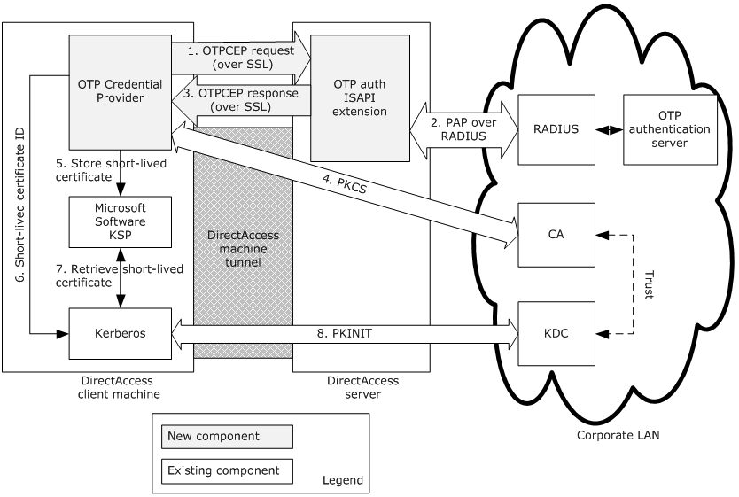
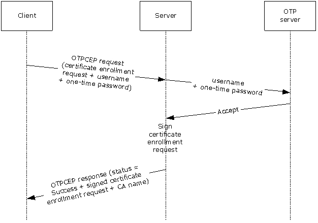
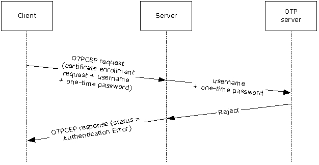
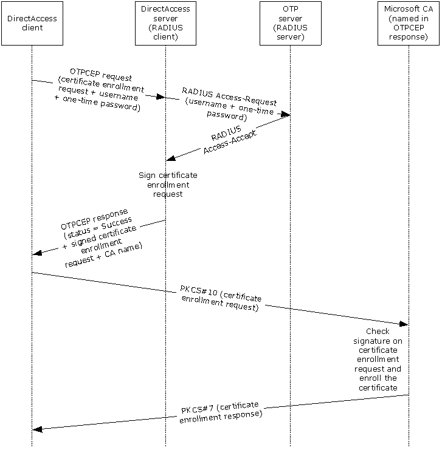

# [MS-OTPCE]: One-Time Password Certificate Enrollment Protocol

Table of Contents

1 Introduction

- [1 Introduction](#Section_1)
  - [1.1 Glossary](#Section_1.1)
  - [1.2 References](#Section_1.2)
    - [1.2.1 Normative References](#Section_1.2.1)
    - [1.2.2 Informative References](#Section_1.2.2)
  - [1.3 Overview](#Section_1.3)
  - [1.4 Relationship to Other Protocols](#Section_1.4)
  - [1.5 Prerequisites/Preconditions](#Section_1.5)
  - [1.6 Applicability Statement](#Section_1.6)
  - [1.7 Versioning and Capability Negotiation](#Section_1.7)
  - [1.8 Vendor-Extensible Fields](#Section_1.8)
  - [1.9 Standards Assignments](#Section_1.9)

2 Messages

- [2 Messages](#Section_2)
  - [2.1 Transport](#Section_2.1)
  - [2.2 Message Syntax](#Section_2.2)
    - [2.2.1 Namespaces](#Section_2.2.1)
    - [2.2.2 SignCert Request](#Section_2.2.2)
    - [2.2.3 SignCert Response](#Section_2.2.3)

3 Protocol Details

- [3 Protocol Details](#Section_3)
  - [3.1 Client Details](#Section_3.1)
    - [3.1.1 Abstract Data Model](#Section_3.1.1)
    - [3.1.2 Timers](#Section_3.1.2)
    - [3.1.3 Initialization](#Section_3.1.3)
    - [3.1.4 Higher-Layer Triggered Events](#Section_3.1.4)
    - [3.1.5 Message Processing Events and Sequencing Rules](#Section_3.1.5)
      - [3.1.5.1 Creating A SignCert Request Message](#Section_3.1.5.1)
      - [3.1.5.2 Processing A SignCert Response Message](#Section_3.1.5.2)
    - [3.1.6 Timer Events](#Section_3.1.6)
    - [3.1.7 Other Local Events](#Section_3.1.7)
  - [3.2 Server Details](#Section_3.2)
    - [3.2.1 Abstract Data Model](#Section_3.2.1)
    - [3.2.2 Timers](#Section_3.2.2)
    - [3.2.3 Initialization](#Section_3.2.3)
    - [3.2.4 Higher-Layer Triggered Events](#Section_3.2.4)
    - [3.2.5 Message Processing Events and Sequencing Rules](#Section_3.2.5)
      - [3.2.5.1 Processing A SignCert Request Message](#Section_3.2.5.1)
    - [3.2.6 Timer Events](#Section_3.2.6)
    - [3.2.7 Other Local Events](#Section_3.2.7)

4 Protocol Examples

- [4 Protocol Examples](#Section_4)
  - [4.1 Accepted SignCert Request Example](#Section_4.1)
  - [4.2 SignCert Request with Invalid Credentials Example](#Section_4.2)
  - [4.3 Challenged SignCert Request Example](#Section_4.3)
  - [4.4 Invalid SignCert Request Example](#Section_4.4)

5 Security

- [5 Security](#Section_5)
  - [5.1 Security Considerations for Implementers](#Section_5.1)
  - [5.2 Index of Security Parameters](#Section_5.2)

6 Appendix A: Full XML Schema

- [6 Appendix A: Full XML Schema](#Section_6)

7 Appendix B: Product Behavior

- [7 Appendix B: Product Behavior](#Section_7)

8 Change Tracking

- [8 Change Tracking](#Section_8)

For the legal notice and IP terms, see [LEGAL.md](../LEGAL.md).
Last updated: 4/23/2024.
See [Revision History](#revision-history) for full version history.

# 1 Introduction

The One-Time Password Certificate Enrollment Protocol was created to enhance the network security of remote access connections. The protocol uses different components to increase network security. For example, the [**one-time password (OTP)**](#gt_one-time-password-otp) authentication mechanism provides enhanced security for remote clients connecting to a server by using different passwords for each logon session. Another component used by the protocol is a short-lived [**smart card**](#gt_smart-card) logon [**certificate template**](#gt_certificate-template).

Sections 1.5, 1.8, 1.9, 2, and 3 of this specification are normative. All other sections and examples in this specification are informative.

## 1.1 Glossary

This document uses the following terms:

**Active Directory**: The Windows implementation of a general-purpose directory service, which uses LDAP as its primary access protocol. [**Active Directory**](#gt_active-directory) stores information about a variety of objects in the network such as user accounts, computer accounts, groups, and all related credential information used by [**Kerberos**](#gt_kerberos) [MS-KILE](../MS-KILE/MS-KILE.md). [**Active Directory**](#gt_active-directory) is either deployed as Active Directory Domain Services (AD DS) or Active Directory Lightweight Directory Services (AD LDS), which are both described in [MS-ADOD](../MS-ADOD/MS-ADOD.md): Active Directory Protocols Overview.

**certificate template**: A list of attributes that define a blueprint for creating an X.509 certificate. It is often referred to in non-Microsoft documentation as a "certificate profile". A [**certificate template**](#gt_certificate-template) is used to define the content and purpose of a digital certificate, including issuance requirements (certificate policies), implemented X.509 extensions such as application policies, key usage, or extended key usage as specified in [[X509]](https://go.microsoft.com/fwlink/?LinkId=90590), and enrollment permissions. Enrollment permissions define the rules by which a [**certification authority (CA)**](#gt_certification-authority-ca) will issue or deny certificate requests. In Windows environments, [**certificate templates**](#gt_certificate-template) are stored as objects in the [**Active Directory**](#gt_active-directory) and used by Microsoft enterprise [**CAs**](#gt_certification-authority-ca).

**certification authority (CA)**: A third party that issues public key certificates. Certificates serve to bind public keys to a user identity. Each user and certification authority (CA) can decide whether to trust another user or CA for a specific purpose, and whether this trust is to be transitive. For more information, see [[RFC3280]](https://go.microsoft.com/fwlink/?LinkId=90414).

**DirectAccess**: A collection of different component policies, including Name Resolution Policy and IPsec, which allows seamless connectivity to corporate resources when not physically connected to the corporate network.

**enhanced key usage (EKU)**: An extension that is a collection of object identifiers (OIDs) that indicate the applications that use the key.

**Group Policy**: A mechanism that allows the implementer to specify managed configurations for users and computers in an [**Active Directory**](#gt_active-directory) service environment.

**Hypertext Transfer Protocol (HTTP)**: An application-level protocol for distributed, collaborative, hypermedia information systems (text, graphic images, sound, video, and other multimedia files) on the World Wide Web.

**Hypertext Transfer Protocol Secure (HTTPS)**: An extension of HTTP that securely encrypts and decrypts web page requests. In some older protocols, "Hypertext Transfer Protocol over Secure Sockets Layer" is still used (Secure Sockets Layer has been deprecated). For more information, see [[SSL3]](https://go.microsoft.com/fwlink/?LinkId=90534) and [[RFC5246]](https://go.microsoft.com/fwlink/?LinkId=129803).

**Kerberos**: An authentication system that enables two parties to exchange private information across an otherwise open network by assigning a unique key (called a ticket) to each user that logs on to the network and then embedding these tickets into messages sent by the users. For more information, see [MS-KILE].

**Key Distribution Center (KDC)**: The [**Kerberos**](#gt_kerberos) service that implements the authentication and ticket granting services specified in the [**Kerberos**](#gt_kerberos) protocol. The service runs on computers selected by the administrator of the realm or domain; it is not present on every machine on the network. It has to have access to an account database for the realm that it serves. [**KDCs**](#gt_key-distribution-center-kdc) are integrated into the domain controller role. It is a network service that supplies tickets to clients for use in authenticating to services.

**key storage provider (KSP)**: A Cryptography API: Next Generation (CNG) component which can be used to create, delete, export, import, open and store keys.

**one-time password (OTP)**: A password that is valid for only one logon session or transaction in the One-Time Password Certificate Enrollment Protocol.

**Public Key Cryptography Standards (PKCS)**: A group of Public Key Cryptography Standards published by RSA Laboratories.

**public key infrastructure (PKI)**: The laws, policies, standards, and software that regulate or manipulate certificates and public and private keys. In practice, it is a system of digital certificates, [**certificate authorities (CAs)**](#gt_certification-authority-ca), and other registration authorities that verify and authenticate the validity of each party involved in an electronic transaction. For more information, see [X509] section 6.

**Remote Authentication Dial-In User Service (RADIUS)**: A protocol for carrying authentication, authorization, and configuration information between a network access server (NAS) that prefers to authenticate connection requests from endpoints and a shared server that performs authentication, authorization, and accounting.

**Secure Sockets Layer (SSL)**: A security protocol that supports confidentiality and integrity of messages in client and server applications that communicate over open networks. SSL supports server and, optionally, client authentication using X.509 certificates [X509] and [[RFC5280]](https://go.microsoft.com/fwlink/?LinkId=131034). SSL is superseded by Transport Layer Security (TLS). TLS version 1.0 is based on SSL version 3.0 [SSL3].

**smart card**: A portable device that is shaped like a business card and is embedded with a memory chip and either a microprocessor or some non-programmable logic. [**Smart cards**](#gt_smart-card) are often used as authentication tokens and for secure key storage. [**Smart cards**](#gt_smart-card) used for secure key storage have the ability to perform cryptographic operations with the stored key without allowing the key itself to be read or otherwise extracted from the card.

**Unicode**: A character encoding standard developed by the Unicode Consortium that represents almost all of the written languages of the world. The [**Unicode**](#gt_unicode) standard [[UNICODE5.0.0/2007]](https://go.microsoft.com/fwlink/?LinkId=154659) provides three forms (UTF-8, UTF-16, and UTF-32) and seven schemes (UTF-8, UTF-16, UTF-16 BE, UTF-16 LE, UTF-32, UTF-32 LE, and UTF-32 BE).

**XML**: The Extensible Markup Language, as described in [[XML1.0]](https://go.microsoft.com/fwlink/?LinkId=90599).

**XML namespace**: A collection of names that is used to identify elements, types, and attributes in XML documents identified in a URI reference [[RFC3986]](https://go.microsoft.com/fwlink/?LinkId=90453). A combination of XML namespace and local name allows XML documents to use elements, types, and attributes that have the same names but come from different sources. For more information, see [[XMLNS-2ED]](https://go.microsoft.com/fwlink/?LinkId=90602).

**MAY, SHOULD, MUST, SHOULD NOT, MUST NOT:** These terms (in all caps) are used as defined in [[RFC2119]](https://go.microsoft.com/fwlink/?LinkId=90317). All statements of optional behavior use either MAY, SHOULD, or SHOULD NOT.

## 1.2 References

Links to a document in the Microsoft Open Specifications library point to the correct section in the most recently published version of the referenced document. However, because individual documents in the library are not updated at the same time, the section numbers in the documents may not match. You can confirm the correct section numbering by checking the [Errata](https://go.microsoft.com/fwlink/?linkid=850906).

### 1.2.1 Normative References

We conduct frequent surveys of the normative references to assure their continued availability. If you have any issue with finding a normative reference, please contact [dochelp@microsoft.com](mailto:dochelp@microsoft.com). We will assist you in finding the relevant information.

[MS-ADTS] Microsoft Corporation, "[Active Directory Technical Specification](../MS-ADTS/MS-ADTS.md)".

[RFC1334] Lloyd, B., and Simpson, W., "PPP Authentication Protocols", RFC 1334, October 1992, [https://www.rfc-editor.org/info/rfc1334](https://go.microsoft.com/fwlink/?LinkId=148311)

[RFC2119] Bradner, S., "Key words for use in RFCs to Indicate Requirement Levels", BCP 14, RFC 2119, March 1997, [https://www.rfc-editor.org/info/rfc2119](https://go.microsoft.com/fwlink/?LinkId=90317)

[RFC2315] Kaliski, B., "PKCS #7: Cryptographic Message Syntax Version 1.5", RFC 2315, March 1998, [https://www.rfc-editor.org/info/rfc2315](https://go.microsoft.com/fwlink/?LinkId=90334)

[RFC2616] Fielding, R., Gettys, J., Mogul, J., et al., "Hypertext Transfer Protocol -- HTTP/1.1", RFC 2616, June 1999, [https://www.rfc-editor.org/info/rfc2616](https://go.microsoft.com/fwlink/?LinkId=90372)

[RFC2818] Rescorla, E., "HTTP Over TLS", RFC 2818, May 2000, [https://www.rfc-editor.org/info/rfc2818](https://go.microsoft.com/fwlink/?LinkId=90383)

[RFC2986] Nystrom, M. and Kaliski, B., "PKCS#10: Certificate Request Syntax Specification", RFC 2986, November 2000, [http://www.rfc-editor.org/info/rfc2986](https://go.microsoft.com/fwlink/?LinkId=90401)

[XMLNS-2ED] Bray, T., Hollander, D., Layman, A., and Tobin, R., Eds., "Namespaces in XML 1.0 (Second Edition)", W3C Recommendation, August 2006, [https://www.w3.org/TR/2006/REC-xml-names-20060816/](https://go.microsoft.com/fwlink/?LinkId=90602)

[XMLSCHEMA1] Thompson, H., Beech, D., Maloney, M., and Mendelsohn, N., Eds., "XML Schema Part 1: Structures", W3C Recommendation, May 2001, [https://www.w3.org/TR/2001/REC-xmlschema-1-20010502/](https://go.microsoft.com/fwlink/?LinkId=90608)

[XML] World Wide Web Consortium, "Extensible Markup Language (XML) 1.0 (Fourth Edition)", W3C Recommendation 16 August 2006, edited in place 29 September 2006, [http://www.w3.org/TR/2006/REC-xml-20060816/](https://go.microsoft.com/fwlink/?LinkId=90598)

### 1.2.2 Informative References

[MS-GPNRPT] Microsoft Corporation, "[Group Policy: Name Resolution Policy Table (NRPT) Data Extension](../MS-GPNRPT/MS-GPNRPT.md)".

[MS-PKCA] Microsoft Corporation, "[Public Key Cryptography for Initial Authentication (PKINIT) in Kerberos Protocol](../MS-PKCA/MS-PKCA.md)".

[MSFT-OTP] Microsoft Corporation, "Strong Authentication with One-Time Passwords in Windows 7 and Windows Server 2008 R2", February 2011, [http://technet.microsoft.com/en-us/library/gg637807(WS.10).aspx](https://go.microsoft.com/fwlink/?LinkId=229474)

[MSFT-TEMPLATES] Microsoft Corporation, "Implementing and Administering Certificate Templates in Windows Server 2003", July 2004, [http://technet.microsoft.com/en-us/library/c25f57b0-5459-4c17-bb3f-2f657bd23f78](https://go.microsoft.com/fwlink/?LinkId=90209)

## 1.3 Overview

The One-Time Password Certificate Enrollment Protocol is a stateless application-layer protocol. This protocol defines one type of request message, sent from the client to the server, and one type of response message, returned by the server to the client. The request message consists of the user name, [**one-time password (OTP)**](#gt_one-time-password-otp), and certificate enrollment request. The response message consists of the return code, an optional signed certificate enrollment request (the same request that was sent by the client to the server), and (also optional) the name of the [**certification authority (CA)**](#gt_certification-authority-ca) from which to enroll the certificate.

This protocol was created for OTP authentication with [**DirectAccess**](#gt_directaccess) as described in [[MSFT-OTP]](https://go.microsoft.com/fwlink/?LinkId=229474). It is used as part of the mechanism that transforms OTP credentials into a short-lived [**smart card**](#gt_smart-card) logon certificate that is used for [**Kerberos**](#gt_kerberos) smart card authentication. The certificate is short-lived to minimize the risk of it being reused for future authentication sessions. It is configured to the minimum lifetime supported by the [**public key infrastructure (PKI)**](#gt_public-key-infrastructure-pki) in use. The following figure shows how the protocol is used in DirectAccess authentication.

Figure 1: DirectAccess OTP authentication process

In the DirectAccess implementation of the One-Time Password Certificate Enrollment Protocol, the following events take place.

- The DirectAccess client sends OTP credentials along with a short-lived smart card logon certificate enrollment request to the DirectAccess server over a [**Secure Sockets Layer (SSL)**](#gt_secure-sockets-layer-ssl) tunnel, where both client and server are mutually authenticated by certificates.
- The DirectAccess server communicates with an OTP authentication server using the Password Authentication Protocol (PAP) [[RFC1334]](https://go.microsoft.com/fwlink/?LinkId=148311) over [**Remote Authentication Dial-In User Service (RADIUS)**](#gt_remote-authentication-dial-in-user-service-radius) in order to validate the OTP credentials.
- The DirectAccess server signs the certificate enrollment request with a dedicated signing certificate only the DirectAccess server possesses. After that, the signed certificate request and the name of the CA (from which the DirectAccess client enrolls the short-lived smart card logon certificate) are sent to the DirectAccess client by using the OTPCE protocol.
- The DirectAccess client communicates with the certification authority (CA) using a [**Public Key Cryptography Standards (PKCS)**](#gt_public-key-cryptography-standards-pkcs) #10 request [[RFC2986]](https://go.microsoft.com/fwlink/?LinkId=90401) and a PKCS #7 response [[RFC2315]](https://go.microsoft.com/fwlink/?LinkId=90334) in order to enroll a short-lived smart card logon certificate. The enrolled short-lived certificate is used by the PKINIT Protocol ([MS-PKCA](../MS-PKCA/MS-PKCA.md)) to acquire a new Kerberos ticket from the [**Key Distribution Center (KDC)**](#gt_key-distribution-center-kdc) for the user.
The following figure shows a protocol message exchange of successful OTP credential validation by the OTP server and the subsequent signing of the certificate enrollment request by the server.

Figure 2: Successful sequence for certificate enrollment

The following figure shows a typical protocol message exchange in which invalid OTP credentials are rejected by the OTP server. In this case, the server returns an error and does not proceed with the signing of the certificate enrollment request.

Figure 3: Typical sequence of a certificate enrollment with erroneous credentials

The following figure shows the use of the OTPCE protocol in Windows DirectAccess OTP authentication.

Figure 4: DirectAccess OTP authentication end to end flow

## 1.4 Relationship to Other Protocols

The One-Time Password Certificate Enrollment Protocol is a [**Hypertext Transfer Protocol (HTTP)**](#gt_hypertext-transfer-protocol-http)-based protocol. Every protocol request is a single pair of HTTP POST and HTTP response messages. Failure to carry out the request due to server error is reported by an HTTP response code.

The parameters of the protocol's requests and responses are carried in [**XML**](#gt_xml)-formatted body of the message. The full XML schema (XSD) is described in section [6](#Section_6).

## 1.5 Prerequisites/Preconditions

For One-Time Password Certificate Enrollment Protocol communication to begin, the prerequisite configuration is as follows:

- The administrator sets up an [**OTP**](#gt_one-time-password-otp) authentication solution from an OTP vendor that includes an OTP authentication server and hardware/software OTP tokens for end users.
- The administrator establishes one or more implementation-specific<1> [**CA**](#gt_certification-authority-ca) servers, configures a new, unique application-policy [**enhanced key usage (EKU)**](#gt_enhanced-key-usage-eku) in [**Active Directory**](#gt_active-directory), and configures two [**certificate templates**](#gt_certificate-template) on it:
- A short-lived [**smart card**](#gt_smart-card) logon certificate template.
- A signing certificate template with the new, unique application-policy EKU.
The CA server requires permissions to enroll certificates by using this certificate template. The administrator grants users read and enroll permissions to the short-lived smart card logon certificate template. The administrator grants the OTPCEP server enroll and auto enroll permissions to the signing certificate template.

In addition, configure the CA to verify that any short-lived smart card logon certificate request is signed by the signing certificate.

## 1.6 Applicability Statement

The One-Time Password Certificate Enrollment Protocol was designed to support [**OTP**](#gt_one-time-password-otp) authentication for [**DirectAccess**](#gt_directaccess).

The use of this protocol is appropriate as the basis for any network authentication scenario that involves sending a request with OTP credentials and a certificate enrollment request, and receiving a signed certificate enrollment request.

## 1.7 Versioning and Capability Negotiation

For versioning control, a proprietary [**HTTP**](#gt_hypertext-transfer-protocol-http) header "X-OTPCEP-version" is introduced and is mandatory in both the request and response. It is required to have the value of "1.0".

## 1.8 Vendor-Extensible Fields

None.

## 1.9 Standards Assignments

None.

# 2 Messages

## 2.1 Transport

The One-Time Password Certificate Enrollment Protocol does not provide its own secure transport. It MUST be transmitted over a secured channel, for example, [**Hypertext Transfer Protocol over Secure Sockets Layer (HTTPS)**](#gt_hypertext-transfer-protocol-secure-https), as specified in [[RFC2818]](https://go.microsoft.com/fwlink/?LinkId=90383).

This protocol is encapsulated within and depends on [**HTTP**](#gt_hypertext-transfer-protocol-http)**,** as specified in [[RFC2616]](https://go.microsoft.com/fwlink/?LinkId=90372), for delivery of messages. The protocol does not impose any message retransmissions or other requirements on this transport.

## 2.2 Message Syntax

This section contains common definitions used by this protocol. The protocol is [**HTTP**](#gt_hypertext-transfer-protocol-http)-based protocol. "Content-type" header is always set to Application/xml;charset=utf-8. The syntax of the definitions uses the [**XML**](#gt_xml) schema as specified in [[XMLSCHEMA1]](https://go.microsoft.com/fwlink/?LinkId=90608).

### 2.2.1 Namespaces

This specification defines and references various [**XML namespaces**](#gt_xml-namespace) that are using the mechanisms specified in [[XMLNS-2ED]](https://go.microsoft.com/fwlink/?LinkId=90602). Although this document associates a specific XML namespace prefix for each XML namespace that is used, the choice of any particular XML namespace prefix is implementation-specific and not significant for interoperability.

Prefixes and XML namespaces used in this specification are as follows:

| Prefix | Namespace URI | Reference |
| --- | --- | --- |
| xs | http://www.w3.org/2001/XMLSchema | [[XMLSCHEMA1]](https://go.microsoft.com/fwlink/?LinkId=90608) |
| otpcep | http://schemas.microsoft.com/otpcep/1.0/protocol | - |

### 2.2.2 SignCert Request

The **SignCert Request** is the message sent by a client when the end user is asked to provide [**OTP**](#gt_one-time-password-otp) credentials in order to perform OTP authentication.

The message MUST be a [**Unicode**](#gt_unicode) [**XML**](#gt_xml) 1.0 document that uses the following [**XML namespace**](#gt_xml-namespace) as its default:

http://schemas.microsoft.com/otpcep/1.0/protocol

The XML document MUST contain a **signCertRequest** element. The message MUST NOT include additional data before or after the XML document. The XML document MAY contain trailing whitespace as part of the encoded content, as specified in [[XML]](https://go.microsoft.com/fwlink/?LinkId=90598) section 2.1.

<xs:element name="signCertRequest">

<xs:complexType>

<xs:attribute name="username" type="xs:string"

use="required" />

<xs:attribute name="oneTimePassword" type="xs:string"

use="required" />

<xs:attribute name="certRequest" type="otpcep:CertificateRequestBase64Binary"

use="required" />

</xs:complexType>

</xs:element>

The **signCertRequest** element contains the following attributes:

**username:** A NULL-terminated string that contains the user name.

**oneTimePassword:** A NULL-terminated string that contains the user's one-time credentials. The one-time credentials MUST contain an ever-changing one-time password (OTP) part. The one-time credentials MAY contain a static password (PIN) part.

**certRequest:** The certificate enrollment request in [**PKCS**](#gt_public-key-cryptography-standards-pkcs) #10 format ([[RFC2986]](https://go.microsoft.com/fwlink/?LinkId=90401)). The request MUST be created by using the [**certificate template**](#gt_certificate-template) as defined in section [1.5](#Section_1.5).

The request MUST be digitally signed with a valid signature, as specified in [RFC2986].

### 2.2.3 SignCert Response

A **SignCert Response** message is returned by the OTPCEP server as a response to a **SignCert Request** message (section [2.2.2](#Section_2.2.2)) received from the client.

The message MUST be a [**Unicode**](#gt_unicode) [**XML**](#gt_xml) 1.0 document that uses the following [**XML namespace**](#gt_xml-namespace) as its default:

http://schemas.microsoft.com/otpcep/1.0/protocol

The document MUST contain a **signCertResponse** element. The message MUST NOT include additional data before or after the XML document. The XML document MAY contain trailing whitespace as part of the encoded content, as specified in [[XML]](https://go.microsoft.com/fwlink/?LinkId=90598) section 2.1.

<xs:complexType name="SignCertResponse">

<xs:sequence>

<xs:element name="IssuingCA" type="xs:anyURI" minOccurs="0" maxOccurs="unbounded" />

</xs:sequence>

<xs:attribute name="statusCode" type="otpcep:SignCertStatusCode" use="required" />

<xs:attribute name="SignedCertRequest" type="otpcep:CertificateBase64Binary" use="optional" />

</xs:complexType>

The **signCertResponse** element contains the following attributes:

**IssuingCA (optional):** If the user credentials are valid and the statusCode attribute equals Success, the names of one or more [**CA**](#gt_certification-authority-ca) servers from which the client enrolls the short-lived [**smart card**](#gt_smart-card) certificate are included in the **SignCert Response** message. Otherwise, this field MUST be empty.

**statusCode:** Can be one of the following enumeration values.

| Value | Meaning |
| --- | --- |
| Success | Certificate enrollment request was signed successfully. |
| AuthenticationError | User credentials validation failed. |
| ChallengeResponseRequired | User credentials were challenged. |
| OtherError | Other error occurred during the validation of the [**OTP**](#gt_one-time-password-otp) credentials or during signing of the certificate enrollment request. |

**SignedCertRequest (optional):** If the user credentials are valid and the **statusCode** attribute equals Success, a signed certificate enrollment request is included in the **SignCert Response** message. Otherwise, this field MUST be empty.

# 3 Protocol Details

## 3.1 Client Details

### 3.1.1 Abstract Data Model

This section describes a conceptual model of possible data organization that an implementation maintains to participate in this protocol. The described organization is provided to facilitate the explanation of how the protocol behaves. This document does not mandate that implementations adhere to this model as long as their external behavior is consistent with that described in this document.

**Server Name:** A null-terminated [**Unicode**](#gt_unicode) string that represents the name of the server the client can communicate with in order to authenticate the user and enroll certificates for accessing corporate resources. A list of strings representing available servers can be used for high availability.

**OTP Certificate Template Name:** A null-terminated string representing the name of the short-lived [**smart card**](#gt_smart-card) [**certificate template**](#gt_certificate-template) that is in use.

### 3.1.2 Timers

None.

### 3.1.3 Initialization

The Abstract Data Model (ADM) elements defined in section [3.1.1](#Section_3.2.1) are initialized during the client startup. They are configured by the administrator<2> and stored in persistent storage. On client startup, the configuration is read from the persistent storage and set in the ADM elements.

### 3.1.4 Higher-Layer Triggered Events

The One-Time Password Certificate Enrollment Protocol is invoked when a user logs on to a client computer from outside the corporate network by using a username/password, [**smart card**](#gt_smart-card), or any other user credentials available for login, and then attempts to connect to a corporate resource using a connection that requires [**one-time password (OTP)**](#gt_one-time-password-otp) authentication. The client MUST create and send a **SignCert Request** message (section [2.2.2](#Section_2.2.2)), as specified in section [3.1.5.2](#Section_3.1.5.2).

### 3.1.5 Message Processing Events and Sequencing Rules

#### 3.1.5.1 Creating A SignCert Request Message

When the user performs an [**OTP**](#gt_one-time-password-otp) authentication, the client performs the following steps.

- The client creates a **SignCert Request** message (section [2.2.2](#Section_2.2.2)) with the following attributes:
- The logon name of the user is set as the **username** attribute in the **SignCert Request** message. The name is in the domain\username format.
- The one-time credentials that the user provides after the logon are set in the **oneTimePassword** attribute of the **SignCert Request** message. The **oneTimePassword** attribute contains an ever-changing OTP part. The **oneTimePassword** attribure MAY contain a static password (PIN) part. The existence of the PIN part and the PIN and one-time password (OTP) concatenating format depend on the OTP vendor implementation.
- The client creates the certificate [**PKCS**](#gt_public-key-cryptography-standards-pkcs) #10 request, as specified in [[RFC2986]](https://go.microsoft.com/fwlink/?LinkId=90401), by using the template referred by the **OTP Certificate Template Name** ADM element, and sets it as the **CertRequest** attribute in the **SignCert Request** message.
- The client sends the **SignCert Request** message to the server.

#### 3.1.5.2 Processing A SignCert Response Message

Upon receiving the **SignCert Response** message (section [2.2.3](#Section_2.2.3)), the client MUST send an enrollment request to the [**Certification Authority (CA)**](#gt_certification-authority-ca) server using the signed certificate request, and MUST store the certificate issued by the CA using a [**key storage provider (KSP)**](#gt_key-storage-provider-ksp) to be used by the upper layer for authentication, thus enabling connectivity to the corporate resources.

If the **statusCode** attribute does not equal Success, the client fails the operation. The client MAY<3> display an error message to the user indicating that the operation failed.

### 3.1.6 Timer Events

None.

### 3.1.7 Other Local Events

None.

## 3.2 Server Details

### 3.2.1 Abstract Data Model

This section describes a conceptual model of possible data organization that an implementation maintains to participate in this protocol. The described organization is provided to facilitate the explanation of how the protocol behaves. This document does not mandate that implementations adhere to this model as long as their external behavior is consistent with that described in this document.

**OTP servers information:** A structure that represents the [**OTP**](#gt_one-time-password-otp) servers that are available for credentials validation on the server. The information in the structure MAY contain a server name or IP address, port, and other connectivity-related attributes. A sorted list of available servers can be used for high availability or load balancing.

**CA servers list:** A null-terminated [**Unicode**](#gt_unicode) string that represents the names of the [**CAs**](#gt_certification-authority-ca) available for issuing OTP certificates. A sorted list of strings representing available CAs can be used for high availability or load balancing.

**Signing Certificate Template Name:** A null-terminated string representing the name of the signing [**certificate template**](#gt_certificate-template) that is in use.

### 3.2.2 Timers

None.

### 3.2.3 Initialization

The ADM elements defined in section [3.2.1](#Section_3.2.1) are initialized during the server startup. They are configured by the administrator<4> and stored in persistent storage. On server startup, the configuration is read from persistent storage and set in the ADM elements.

### 3.2.4 Higher-Layer Triggered Events

None.

### 3.2.5 Message Processing Events and Sequencing Rules

#### 3.2.5.1 Processing A SignCert Request Message

Upon receiving a **SignCert Request** message (section [2.2.2](#Section_2.2.2)), the server performs the following steps:

- Validate the certificate request received in the **SignCert Request** message:
- The user name inside the certificate request MUST match the [**OTP**](#gt_one-time-password-otp) user name received in the **username** attribute of the **SignCert Request** message. If the user name appears in multiple places in the certificate request, all instances MUST match the OTP user name.
- The [**certificate template**](#gt_certificate-template) named in the user certificate request MUST NOT be empty and it MUST be the one that is configured in the server.
- The certificate request MUST be digitally signed with a valid signature, as specified in [[RFC2986]](https://go.microsoft.com/fwlink/?LinkId=90401).
If the validations fail, the server MUST stop processing the request and send a **SignCert Response** message (section [2.2.3](#Section_2.2.3)) to the client with a status of OtherError, without setting the **SignedCertRequest** and **IssuingCA** attributes.

- Validate that the user name is listed in [**Active Directory**](#gt_active-directory), as specified in [MS-ADTS](../MS-ADTS/MS-ADTS.md). If the validation fails, the server MUST stop processing the request and send a **SignCert Response** message to the client with a status of AuthenticationError, without setting the **SignedCertRequest** and **IssuingCA** attributes.
- Validate user name, static password (if available), and one-time password (OTP) with the first OTP server represented in the **OTP servers information** ADM element using the Password Authentication Protocol (PAP) [[RFC1334]](https://go.microsoft.com/fwlink/?LinkId=148311) over Remote Authentication Dial-In User Service (RADIUS) to validate the OTP credentials. If the validation fails, the server MUST stop the processing and send a **SignCert Response** message with an error status corresponding to the response received from OTP server:
- If the OTP server cannot be reached, the server MUST send a status of OtherError to the client.
- If the response from the OTP server is Access-Reject, the server MUST send a status message of AuthenticationError to the client.
- If the response from OTP server is Challenge-Response, the server MUST send a status message of ChallengeResponseRequired to the client.
The **SignedCertRequest** and **IssuingCA** attributes are not set upon failure.

- Sign the certificate request that was part of the **SignCert Request** message using the dedicated signing certificate. If this operation fails, the server MUST send a status message of OtherError to the client.
The **SignedCertRequest** and **IssuingCA** attributes are not set upon failure.

- Verify that the list of [**CA**](#gt_certification-authority-ca) servers in the **CA servers list** ADM element is not empty and pick the first CA server from the list. If this operation fails, the server MUST send a status message of OtherError to the client.
- When a certificate is successfully signed, the server MUST create a **SignCert Response** message with the following values in it:
- The **statusCode** attribute is set to Success.
- The **SignedCertRequest** attribute value is set to the signed certificate enrollment request.
- The **IssuingCA** attribute is set to the name of the first or several high-ranked CA servers from the **CA servers list** ADM element.
Then the server MUST send the response back to the client.

### 3.2.6 Timer Events

None.

### 3.2.7 Other Local Events

None.

# 4 Protocol Examples

The following sections describe four examples of the **SignCert Request** message (section [2.2.2](#Section_2.2.2)) and the **SignCert Response** message (section [2.2.3](#Section_2.2.3)).

## 4.1 Accepted SignCert Request Example

The following example describes an accepted **SignCert Request** message (section [2.2.2](#Section_2.2.2)).

<?xml version="1.0" encoding="UTF-8"?>

<signCertRequest xmlns="http://schemas.microsoft.com/otpcep/1.0/protocol" username="DOMAIN1\user1" oneTimePassword="Pa$$word1" certRequest="MIIEjzCCA3cCAQAwfjETMBEGCgmSJomT8ixkARkWA2NvbTEXMBUGCgmSJomT8ixk
ARkWB2NvbXBhbnkxFDASBgoJkiaJk/IsZAEZFgRjb3JwMRcwFQYKCZImiZPyLGQB
GRYHZG9tYWluMTEOMAwGA1UEAwwFVXNlcnMxDzANBgNVBAMMBlVzZXIgMTCCASIw
DQYJKoZIhvcNAQEBBQADggEPADCCAQoCggEBAL/jy9vhdLG3yZJYw7VC6PGFwA2c
yG7G9TaRX5z23o26qe8AQIsKsMkepv4qCv8xEs0Q4grSkEmTXOPbMsxeogzKt9/E
el7Hg0bdrGWyoSl6lykVB9gu8blx7LXmj4E2p1rjO4O1Z5be3hVbPijuGa6M8mh9
n3pDar5sbe8YY4gwNU9gtgWSg7N9FCIyRm9hjqF60M55totkCTa11+K4n+vL/71c
IxFUKqeYiHD8pbhEaKUesfGQl1TsXhUjMWCxJLJaeclCXkms2wky9fbbA8Xvfc4j
V101XcaL7nns/ymmVZLig8LPimcvr8wY+t+Bbzlx7BPcYap8b3+NeiZrzTUCAwEA
AaCCAcowGgYKKwYBBAGCNw0CAzEMFgo2LjIuODMxMS4yMFMGCSsGAQQBgjcVFDFG
MEQCAQUMIENMSUVOVDIuZG9tYWluMS5jb3JwLmNvbXBhbnkuY29tDBBET01BSU4x
XENMSUVOVDIkDAtMb2dvblVJLmV4ZTBmBgorBgEEAYI3DQICMVgwVgIBAB5OAE0A
aQBjAHIAbwBzAG8AZgB0ACAAUwBvAGYAdAB3AGEAcgBlACAASwBlAHkAIABTAHQA
bwByAGEAZwBlACAAUAByAG8AdgBpAGQAZQByAwEAMIHuBgkqhkiG9w0BCQ4xgeAw
gd0wOwYJKwYBBAGCNxUHBC4wLAYkKwYBBAGCNxUIjcRr39UihpmHLoHq2CGG1OV5
S4e7th2DlIhxAgFkAgEFMBUGA1UdJQQOMAwGCisGAQQBgjcUAgIwDgYDVR0PAQH/
BAQDAgWgMB0GCSsGAQQBgjcVCgQQMA4wDAYKKwYBBAGCNxQCAjA5BgNVHREEMjAw
oC4GCisGAQQBgjcUAgOgIAwedXNlcjFAZG9tYWluMS5jb3JwLmNvbXBhbnkuY29t
MB0GA1UdDgQWBBQqn0jnsdeugKhWrG0ts4ucmuuRvzANBgkqhkiG9w0BAQUFAAOC
AQEAn7/yTQYMpLsn+ktTRUwvHdJQ7Prelccssn7hChTRm0GCarrS+KlID0WXDU8W
tYAEXv8fA6MXFoYK4rrdtyZImqpkuxhO5H5XnuytTY6K3WqtIviDSFYNahNCAUBN
6syO9ydrXWJ21BBtsPlhoczkLEmIsV/bRSdfrYh2rUtBP+P4s9TqRtZ3WtBsOaXH
Tqq4rUqGXCTarm2ESe9z0PlIroKVD9qv4ZjxXbpuId3NKYeso9BNO9rtNS/unNBY
wI2mD6W7wigK/jQUpxuWljhzCy1GxvIxN9iZNq4VBIV7cJsz5X7OlTo1AIjM0NfI
kpEgwEeOg7h3Mwqft6zPV9shBA==
"/>

The following example describes the **SignCert Response** message (section [2.2.3](#Section_2.2.3)) for the accepted request. The **statusCode** attribute equals Success.

<?xml version="1.0" encoding="UTF-8"?>

<signCertResponse xmlns="http://schemas.microsoft.com/otpcep/1.0/protocol" statusCode="Success" SignedCertRequest="MIINbgYJKoZIhvcNAQcCoIINXzCCDVsCAQMxCzAJBgUrDgMCGgUAMIIFIwYIKwYB
BQUHDAKgggUVBIIFETCCBQ0waTBnAgECBgorBgEEAYI3CgoBMVYwVAIBADADAgEB
MUowSAYJKwYBBAGCNxUUMTswOQIBBQwcREExLmRvbWFpbjEuY29ycC5jb21wYW55
LmNvbQwMRE9NQUlOMVxEQTEkDAh3M3dwLmV4ZTCCBJqgggSWAgEBMIIEjzCCA3cC
AQAwfjETMBEGCgmSJomT8ixkARkWA2NvbTEXMBUGCgmSJomT8ixkARkWB2NvbXBh
bnkxFDASBgoJkiaJk/IsZAEZFgRjb3JwMRcwFQYKCZImiZPyLGQBGRYHZG9tYWlu
MTEOMAwGA1UEAwwFVXNlcnMxDzANBgNVBAMMBlVzZXIgMTCCASIwDQYJKoZIhvcN
AQEBBQADggEPADCCAQoCggEBAL/jy9vhdLG3yZJYw7VC6PGFwA2cyG7G9TaRX5z2
3o26qe8AQIsKsMkepv4qCv8xEs0Q4grSkEmTXOPbMsxeogzKt9/Eel7Hg0bdrGWy
oSl6lykVB9gu8blx7LXmj4E2p1rjO4O1Z5be3hVbPijuGa6M8mh9n3pDar5sbe8Y
Y4gwNU9gtgWSg7N9FCIyRm9hjqF60M55totkCTa11+K4n+vL/71cIxFUKqeYiHD8
pbhEaKUesfGQl1TsXhUjMWCxJLJaeclCXkms2wky9fbbA8Xvfc4jV101XcaL7nns
/ymmVZLig8LPimcvr8wY+t+Bbzlx7BPcYap8b3+NeiZrzTUCAwEAAaCCAcowGgYK
KwYBBAGCNw0CAzEMFgo2LjIuODMxMS4yMFMGCSsGAQQBgjcVFDFGMEQCAQUMIENM
SUVOVDIuZG9tYWluMS5jb3JwLmNvbXBhbnkuY29tDBBET01BSU4xXENMSUVOVDIk
DAtMb2dvblVJLmV4ZTBmBgorBgEEAYI3DQICMVgwVgIBAB5OAE0AaQBjAHIAbwBz
AG8AZgB0ACAAUwBvAGYAdAB3AGEAcgBlACAASwBlAHkAIABTAHQAbwByAGEAZwBl
ACAAUAByAG8AdgBpAGQAZQByAwEAMIHuBgkqhkiG9w0BCQ4xgeAwgd0wOwYJKwYB
BAGCNxUHBC4wLAYkKwYBBAGCNxUIjcRr39UihpmHLoHq2CGG1OV5S4e7th2DlIhx
AgFkAgEFMBUGA1UdJQQOMAwGCisGAQQBgjcUAgIwDgYDVR0PAQH/BAQDAgWgMB0G
CSsGAQQBgjcVCgQQMA4wDAYKKwYBBAGCNxQCAjA5BgNVHREEMjAwoC4GCisGAQQB
gjcUAgOgIAwedXNlcjFAZG9tYWluMS5jb3JwLmNvbXBhbnkuY29tMB0GA1UdDgQW
BBQqn0jnsdeugKhWrG0ts4ucmuuRvzANBgkqhkiG9w0BAQUFAAOCAQEAn7/yTQYM
pLsn+ktTRUwvHdJQ7Prelccssn7hChTRm0GCarrS+KlID0WXDU8WtYAEXv8fA6MX
FoYK4rrdtyZImqpkuxhO5H5XnuytTY6K3WqtIviDSFYNahNCAUBN6syO9ydrXWJ2
1BBtsPlhoczkLEmIsV/bRSdfrYh2rUtBP+P4s9TqRtZ3WtBsOaXHTqq4rUqGXCTa
rm2ESe9z0PlIroKVD9qv4ZjxXbpuId3NKYeso9BNO9rtNS/unNBYwI2mD6W7wigK
/jQUpxuWljhzCy1GxvIxN9iZNq4VBIV7cJsz5X7OlTo1AIjM0NfIkpEgwEeOg7h3
Mwqft6zPV9shBDAAMACgggWbMIIFlzCCBH+gAwIBAgIKYV+kUAAAAAAAQDANBgkq
hkiG9w0BAQUFADByMRMwEQYKCZImiZPyLGQBGRYDY29tMRcwFQYKCZImiZPyLGQB
GRYHY29tcGFueTEUMBIGCgmSJomT8ixkARkWBGNvcnAxFzAVBgoJkiaJk/IsZAEZ
Fgdkb21haW4xMRMwEQYDVQQDEwpSb290Q0EtREMxMB4XDTEyMDQxMDEwMjgxNloX
DTEyMDQxMjEwMjgxNlowADCCASIwDQYJKoZIhvcNAQEBBQADggEPADCCAQoCggEB
ALMeQgmLbcP2pYDav6ZndelJbuS/Dwz3DxVRRZrgB7u9xK/vM8uJLVbkOeXB3yvr
WwgoZ/n2MPqgb/SFAVnRcT/zugY7myGQgqPO8TP4Ds7M4oPZkFl+Gvm30dpclUWK
2alz+FqJ0OhL5BetISr8pR8aEtC6CGF+ZOvmLgQaPmctu0izTlA9TUj60UyHrNvY
tPRcqWrMHAVPZgrl+cceUBM8gSLQzFrI3JCA2WrRBVepEwQ7DaLmN52KnOMnRaWx
4uLRtS9c+HgiLYjWhz2ZAel1UL+1C5byofUKyKuxymlZyAK8htG6ZjcpblgJ+tHp
Bo/H9LqeXxV1hGm1iaklRJ8CAwEAAaOCAp8wggKbMDsGCSsGAQQBgjcVBwQuMCwG
JCsGAQQBgjcVCI3Ea9/VIoaZhy6B6tghhtTleUuBv/1bhNObdQIBZAIBAjAVBgNV
HSUEDjAMBgorBgEEAYI3UQEBMA4GA1UdDwEB/wQEAwIHgDAdBgkrBgEEAYI3FQoE
EDAOMAwGCisGAQQBgjdRAQEwHQYDVR0OBBYEFJ1BItqJOcAV4x48mx6N5PIYAnUg
MB8GA1UdIwQYMBaAFKBJofXgEOVQXMoEy3jGrNnwhuHzMIHXBgNVHR8Egc8wgcww
gcmggcaggcOGgcBsZGFwOi8vL0NOPVJvb3RDQS1EQzEsQ049REMxLENOPUNEUCxD
Tj1QdWJsaWMlMjBLZXklMjBTZXJ2aWNlcyxDTj1TZXJ2aWNlcyxDTj1Db25maWd1
cmF0aW9uLERDPWRvbWFpbjEsREM9Y29ycCxEQz1jb21wYW55LERDPWNvbT9jZXJ0
aWZpY2F0ZVJldm9jYXRpb25MaXN0P2Jhc2U/b2JqZWN0Q2xhc3M9Y1JMRGlzdHJp
YnV0aW9uUG9pbnQwgc8GCCsGAQUFBwEBBIHCMIG/MIG8BggrBgEFBQcwAoaBr2xk
YXA6Ly8vQ049Um9vdENBLURDMSxDTj1BSUEsQ049UHVibGljJTIwS2V5JTIwU2Vy
dmljZXMsQ049U2VydmljZXMsQ049Q29uZmlndXJhdGlvbixEQz1kb21haW4xLERD
PWNvcnAsREM9Y29tcGFueSxEQz1jb20/Y0FDZXJ0aWZpY2F0ZT9iYXNlP29iamVj
dENsYXNzPWNlcnRpZmljYXRpb25BdXRob3JpdHkwKgYDVR0RAQH/BCAwHoIcREEx
LmRvbWFpbjEuY29ycC5jb21wYW55LmNvbTANBgkqhkiG9w0BAQUFAAOCAQEANqGM
G1cNVQxFsWc9/RYrMAGatUG2YnqrE6IQMEeLGUv2XoHvQFwyX43+58h0rlmNdRVt
MQ6VvzsWz1gFUZBzUJ3YfugQNR8IAWd7XKgYTcRJ8GlcTEPvU7XeCpMesXuYzvop
NuTdpP6R1OiAJmv3H7Y8qyVCb9m6AWZkmfR3hLiXgBBk0yhMLsi2MogmEoO7wuwS
owbikkHqxGamlf1wr0RqmcVC0ywS+FDgTJ3BNatQGoHnLCGH7/2fBnIxuDcD8vgc
amtDlZkvvjGdrr8uhD2oKtbVSj/U7Z/VbGzgtoTOfhtrqpb0uVrAZQ/CbAorbQOQ
tEYEaROefOskvHqK7zGCAoEwgZYCAQEwIjAdMRswGQYJKwYBBAGCNxUJEwxEdW1t
eSBTaWduZXICAQAwCQYFKw4DAhoFAKA+MBcGCSqGSIb3DQEJAzEKBggrBgEFBQcM
AjAjBgkqhkiG9w0BCQQxFgQUnUMoa0CcmKMAyCl9SWFV0Y419l8wDAYIKwYBBQUH
BgIFAAQUuQKxuLM8spZptYmlzo4u8cPm8r4wggHkAgEBMIGAMHIxEzARBgoJkiaJ
k/IsZAEZFgNjb20xFzAVBgoJkiaJk/IsZAEZFgdjb21wYW55MRQwEgYKCZImiZPy
LGQBGRYEY29ycDEXMBUGCgmSJomT8ixkARkWB2RvbWFpbjExEzARBgNVBAMTClJv
b3RDQS1EQzECCmFfpFAAAAAAAEAwCQYFKw4DAhoFAKA+MBcGCSqGSIb3DQEJAzEK
BggrBgEFBQcMAjAjBgkqhkiG9w0BCQQxFgQUnUMoa0CcmKMAyCl9SWFV0Y419l8w
DQYJKoZIhvcNAQEBBQAEggEAipLGv8ke7ktQzupRn93FMrp+5V3UPqdbSI7UVWq2
CUTr49K2HHTCpNfQFgCdnrEWkHvunoGszIlvHQaVi0mRc8RK9Q9xM+QMQwXyAu25
YdX6Zqrof9f+VzdkPdmAeVLuxRe9CAFD95RjGGTR59EJTIjwp43LUYyaXG7eGjVi
Y7yQuYNlO+HUYmbu0yPR2DkOtk7NHfmVZHu6Y0yQarjhMuHGlUn6RmqwV8bW5HAQ
4bFOKlCNxpGhtbCueCgisN0S1ig9P/rcHsi73fEdpuN55CIB/AcZLvxA3yQCz/s2
HxFXnepVhjBHLPGl87oaTjS4aDQaC3PxLHoltFs3UZnAbw==
"><IssuingCA xmlns="http://schemas.microsoft.com/otpcep/1.0/protocol">DC1.domain1.corp.company.com\RootCA-DC1</IssuingCA></signCertResponse>

## 4.2 SignCert Request with Invalid Credentials Example

The following example describes a **SignCert Request** message (section [2.2.2](#Section_2.2.2)) with an authentication error, where the user credentials validation failed.

<?xml version="1.0" encoding="UTF-8"?>

<signCertRequest xmlns="http://schemas.microsoft.com/otpcep/1.0/protocol" certRequest="MIIElzCCA38CAQAwfjETMBEGCgmSJomT8ixkARkWA2NvbTEXMBUGCgmSJomT8ixk ARkWB2NvbXBhbnkxFDASBgoJkiaJk/IsZAEZFgRjb3JwMRcwFQYKCZImiZPyLGQB GRYHZG9tYWluMTEOMAwGA1UEAwwFVXNlcnMxDzANBgNVBAMMBlVzZXIgMTCCASIw DQYJKoZIhvcNAQEBBQADggEPADCCAQoCggEBAK79jEXP6OFccV9x0+mH22Up+56X TLHLompiiu/iH+NOUMj95qqKtqstUCjM2ij/0lMYTp3NPx/Z+FrDCJ1o/83x1Adi o/Y6DkgiAxt268adVKQ+WgZjVB1N8LSsJmOEjl+9zXKUsnJIP4JCHgmnAwxr/Ok2 vxw4EpLcI97Lr5JmkpIsm5k9bTxJCZdYptAW889gFY0dXHVeq9wZU3jEKycOl72X cJSvgMdxuUq3d+/cgdz6DAkVeP2NTR6tzeCY4gVMFQl2OIfylKZFkKIFBTuBC/jv Ionbb0TSznshInSVof6IOcylJUzLjhcqq+fO0WXPuY2QNym1natV4LaCW6sCAwEA AaCCAdIwGgYKKwYBBAGCNw0CAzEMFgo2LjIuODA1OC4yMFwGCSsGAQQBgjcVFDFP ME0CAQUMIENMSUVOVDIuZG9tYWluMS5jb3JwLmNvbXBhbnkuY29tDA1ET01BSU4x XHVzZXIxDBdUZXN0RXZlbnRMb2dCYWRDZXJ0LmV4ZTBmBgorBgEEAYI3DQICMVgw VgIBAB5OAE0AaQBjAHIAbwBzAG8AZgB0ACAAUwBvAGYAdAB3AGEAcgBlACAASwBl AHkAIABTAHQAbwByAGEAZwBlACAAUAByAG8AdgBpAGQAZQByAwEAMIHtBgkqhkiG 9w0BCQ4xgd8wgdwwOgYJKwYBBAGCNxUHBC0wKwYjKwYBBAGCNxUIjcRr39UihpmH LoHq2CGG1OV5S7SgJYfGrhQCAWQCAQMwFQYDVR0lBA4wDAYKKwYBBAGCNxQCAjAO BgNVHQ8BAf8EBAMCBaAwHQYJKwYBBAGCNxUKBBAwDjAMBgorBg" oneTimePassword="aPa$$word1" username="domain1\user1" xmlns:xsd="http://www.w3.org/2001/XMLSchema" xmlns:xsi="http://www.w3.org/2001/XMLSchema-instance"/>

The following example describes the **SignCert Response** message (section [2.2.3](#Section_2.2.3)) for the request that contained invalid data. The **statusCode** attribute equals AuthenticationError.

<?xml version="1.0" encoding="UTF-8"?>

<signCertResponse statusCode="AuthenticationError" xmlns="http://schemas.microsoft.com/otpcep/1.0/protocol"/>

## 4.3 Challenged SignCert Request Example

The following example describes a **SignCert Request** message (section [2.2.2](#Section_2.2.2)) that is challenged by the [**OTP**](#gt_one-time-password-otp) server.

<?xml version="1.0" encoding="UTF-8"?>

<signCertRequest xmlns="http://schemas.microsoft.com/otpcep/1.0/protocol" certRequest="MIIElzCCA38CAQAwfjETMBEGCgmSJomT8ixkARkWA2NvbTEXMBUGCgmSJomT8ixk ARkWB2NvbXBhbnkxFDASBgoJkiaJk/IsZAEZFgRjb3JwMRcwFQYKCZImiZPyLGQB GRYHZG9tYWluMTEOMAwGA1UEAwwFVXNlcnMxDzANBgNVBAMMBlVzZXIgMTCCASIw DQYJKoZIhvcNAQEBBQADggEPADCCAQoCggEBALA9+uJTdQSiAvW3n4hJZ6Eec89G bjE+bC9ZsnyO19Wn/qffppXAjOKp4g1Bn/DUJNYEtFUL0eeNZG2qv3ZAsplchiAq 03FcEblAEyz4hVSF/bAF83Snz08m2/DZONl4pMd0RLf3KNu7ERGuJQ1/pDKUMU1t NOm6qDM2nAT/OpsPjcfOD7W7LlPFH8sDzFgcipPQ237aoAIw2c7coott7gg8CwDN k6Dccmt5ThD9KWYveDZxSMYfGH/+P6GhFHMZDf74lzegSahIgrTFiGXc3tnyr8e5 MLEnHDMNtJP83yrSLmlx3oVzdhujtMsD/euz56K3ltz+f7PojI7mLBip4HECAwEA AaCCAdIwGgYKKwYBBAGCNw0CAzEMFgo2LjIuODA1OC4yMFwGCSsGAQQBgjcVFDFP ME0CAQUMIENMSUVOVDIuZG9tYWluMS5jb3JwLmNvbXBhbnkuY29tDA1ET01BSU4x XHVzZXIxDBdUZXN0RXZlbnRMb2dCYWRDZXJ0LmV4ZTBmBgorBgEEAYI3DQICMVgw VgIBAB5OAE0AaQBjAHIAbwBzAG8AZgB0ACAAUwBvAGYAdAB3AGEAcgBlACAASwBl AHkAIABTAHQAbwByAGEAZwBlACAAUAByAG8AdgBpAGQAZQByAwEAMIHtBgkqhkiG 9w0BCQ4xgd8wgdwwOgYJKwYBBAGCNxUHBC0wKwYjKwYBBAGCNxUIjcRr39UihpmH LoHq2CGG1OV5S7SgJYfGrhQCAWQCAQMwFQYDVR0lBA4wDAYKKwYBBAGCNxQCAjAO BgNVHQ8BAf8EBAMCBaAwHQYJKwYBBAGCNxUKBBAwDjAMBgorBgEE" oneTimePassword="05278361" username="domain1\user1" xmlns:xsd="http://www.w3.org/2001/XMLSchema" xmlns:xsi="http://www.w3.org/2001/XMLSchema-instance"/>

The following example describes the **SignCert Response** message (section [2.2.3](#Section_2.2.3)) for the challenged request. The **statusCode** attribute equals ChallengeResponseRequired.

<?xml version="1.0" encoding="UTF-8"?>

<signCertResponse statusCode="ChallengeResponseRequired" xmlns="http://schemas.microsoft.com/otpcep/1.0/protocol"/>

## 4.4 Invalid SignCert Request Example

The following example describes a **SignCert Request** message (section [2.2.2](#Section_2.2.2)) that contains an invalid value for the **certRequest** attribute.

<?xml version="1.0" encoding="UTF-8"?>

<signCertRequest xmlns="http://schemas.microsoft.com/otpcep/1.0/protocol" certRequest="asdf" oneTimePassword="Pa$$word1" username="domain1\user1" xmlns:xsd="http://www.w3.org/2001/XMLSchema" xmlns:xsi="http://www.w3.org/2001/XMLSchema-instance"/>

The following example describes the **SignCert Response** message (section [2.2.3](#Section_2.2.3)) for the request that contains the invalid field value. The **statusCode** attribute equals OtherError.

<?xml version="1.0" encoding="UTF-8"?>

<signCertResponse certificate="" statusCode="OtherError" xmlns="http://schemas.microsoft.com/otpcep/1.0/protocol"/>

# 5 Security

## 5.1 Security Considerations for Implementers

The One-Time Password Certificate Enrollment Protocol does not provide message-level signing or message-level encryption for either **SignCert Request** messages (section [2.2.2](#Section_2.2.2)) or **SignCert Response** messages (section [2.2.3](#Section_2.2.3)). Implementers can make use of available transport protection as available in [**HTTPS**](#gt_hypertext-transfer-protocol-secure-https) to provide security to the client/server interaction.

## 5.2 Index of Security Parameters

None.

# 6 Appendix A: Full XML Schema

For ease of implementation, the following is the full [**XML**](#gt_xml) schema (XSD) for this protocol.

<?xml version="1.0" encoding="utf-8"?>

<!-- Copyright (c) Microsoft Corporation. All Rights Reserved. -->

<xs:schema targetNamespace="http://schemas.microsoft.com/otpcep/1.0/protocol"

elementFormDefault="qualified"

xmlns="http://schemas.microsoft.com/otpcep/1.0/protocol"

xmlns:otpcep="http://schemas.microsoft.com/otpcep/1.0/protocol"

xmlns:xs="http://www.w3.org/2001/XMLSchema">

<xs:import namespace="http://schemas.microsoft.com/otpcep/1.0/common" />

<xs:simpleType name="SignCertStatusCode">

<xs:restriction base="xs:string">

<xs:enumeration value="Success"/>

<xs:enumeration value="AuthenticationError" />

<xs:enumeration value="ChallengeResponseRequired" />

<xs:enumeration value="OtherError" />

</xs:restriction>

</xs:simpleType>

<xs:simpleType name="CertificateRequestBase64Binary">

<xs:restriction base="xs:base64Binary">

</xs:restriction>

</xs:simpleType>

<xs:simpleType name="CertificateBase64Binary">

<xs:restriction base="xs:base64Binary">

</xs:restriction>

</xs:simpleType>

<xs:complexType name="SignCertRequest">

<xs:attribute name="username" type="xs:string" use="required" />

<xs:attribute name="oneTimePassword" type="xs:string" use="required" />

<xs:attribute name="certRequest" type="otpcep:CertificateRequestBase64Binary" use="required" />

</xs:complexType>

<xs:complexType name="SignCertResponse">

<xs:sequence>

<xs:element name="IssuingCA" type="xs:anyURI" minOccurs="0" maxOccurs="unbounded" />

</xs:sequence>

<xs:attribute name="statusCode" type="otpcep:SignCertStatusCode" use="required" />

<xs:attribute name="SignedCertRequest" type="otpcep:CertificateBase64Binary" use="optional" />

</xs:complexType>

<xs:simpleType name="SignedCertBase64Binary">

<xs:restriction base="xs:base64Binary">

</xs:restriction>

</xs:simpleType>

<xs:element name="signCertRequest" type="otpcep:SignCertRequest" />

<xs:element name="signCertResponse" type="otpcep:SignCertResponse" />

</xs:schema>

# 7 Appendix B: Product Behavior

The information in this specification is applicable to the following Microsoft products or supplemental software. References to product versions include updates to those products.

The following table shows the relationships between Microsoft product versions or supplemental software and the roles they perform.

| Windows Release | Client Role | Server Role |
| --- | --- | --- |
| Windows 7 operating system | Yes | No |
| Windows 8 operating system | Yes | No |
| Windows Server 2012 operating system | No | Yes |
| Windows 8.1 operating system | Yes | No |
| Windows Server 2012 R2 operating system | No | Yes |
| Windows 10 operating system | Yes | No |
| Windows Server 2016 operating system | No | Yes |
| Windows Server operating system | No | Yes |
| Windows Server 2019 operating system | No | Yes |
| Windows Server 2022 operating system | No | Yes |
| Windows 11 operating system | Yes | No |
| Windows Server 2025 operating system | No | Yes |

Exceptions, if any, are noted in this section. If an update version, service pack or Knowledge Base (KB) number appears with a product name, the behavior changed in that update. The new behavior also applies to subsequent updates unless otherwise specified. If a product edition appears with the product version, behavior is different in that product edition.

Unless otherwise specified, any statement of optional behavior in this specification that is prescribed using the terms "SHOULD" or "SHOULD NOT" implies product behavior in accordance with the SHOULD or SHOULD NOT prescription. Unless otherwise specified, the term "MAY" implies that the product does not follow the prescription.

<1> Section 1.5: The Microsoft [**CA**](#gt_certification-authority-ca) implementation uses the [**certificate template**](#gt_certificate-template) as described in [[MSFT-TEMPLATES]](https://go.microsoft.com/fwlink/?LinkId=90209).

<2> Section 3.1.3: On Windows, implementations depend on the administrator for configuration. The administrator configures this manually or by using [**Group Policy**](#gt_group-policy) as specified in [MS-GPNRPT](../MS-GPNRPT/MS-GPNRPT.md).

<3> Section 3.1.5.2: On Windows implementations, if the **statusCode** attribute equals Challenge, an error message is displayed to the user.

<4> Section 3.2.3: On Windows, implementations depend on the administrator for configuration. The administrator configures this manually or by using Group Policy as specified in [MS-GPNRPT].

# 8 Change Tracking

This section identifies changes that were made to this document since the last release. Changes are classified as Major, Minor, or None.

The revision class **Major** means that the technical content in the document was significantly revised. Major changes affect protocol interoperability or implementation. Examples of major changes are:

- A document revision that incorporates changes to interoperability requirements.
- A document revision that captures changes to protocol functionality.
The revision class **Minor** means that the meaning of the technical content was clarified. Minor changes do not affect protocol interoperability or implementation. Examples of minor changes are updates to clarify ambiguity at the sentence, paragraph, or table level.

The revision class **None** means that no new technical changes were introduced. Minor editorial and formatting changes may have been made, but the relevant technical content is identical to the last released version.

The changes made to this document are listed in the following table. For more information, please contact [dochelp@microsoft.com](mailto:dochelp@microsoft.com).

| Section | Description | Revision class |
| --- | --- | --- |
| [7](#Section_7) Appendix B: Product Behavior | Added Windows Server 2025 to the list of applicable products. | Major |

## Revision History

| Date | Version | Revision Class | Comments |
| --- | --- | --- | --- |
| 12/16/2011 | 1.0 | New | Released new document. |
| 3/30/2012 | 1.0 | None | No changes to the meaning, language, or formatting of the technical content. |
| 7/12/2012 | 2.0 | Major | Significantly changed the technical content. |
| 10/25/2012 | 2.0 | None | No changes to the meaning, language, or formatting of the technical content. |
| 1/31/2013 | 2.0 | None | No changes to the meaning, language, or formatting of the technical content. |
| 8/8/2013 | 3.0 | Major | Significantly changed the technical content. |
| 11/14/2013 | 3.0 | None | No changes to the meaning, language, or formatting of the technical content. |
| 2/13/2014 | 3.0 | None | No changes to the meaning, language, or formatting of the technical content. |
| 5/15/2014 | 3.0 | None | No changes to the meaning, language, or formatting of the technical content. |
| 6/30/2015 | 4.0 | Major | Significantly changed the technical content. |
| 10/16/2015 | 4.0 | None | No changes to the meaning, language, or formatting of the technical content. |
| 7/14/2016 | 4.0 | None | No changes to the meaning, language, or formatting of the technical content. |
| 6/1/2017 | 5.0 | Major | Significantly changed the technical content. |
| 9/15/2017 | 6.0 | Major | Significantly changed the technical content. |
| 12/1/2017 | 6.0 | None | No changes to the meaning, language, or formatting of the technical content. |
| 9/12/2018 | 7.0 | Major | Significantly changed the technical content. |
| 4/7/2021 | 8.0 | Major | Significantly changed the technical content. |
| 6/25/2021 | 9.0 | Major | Significantly changed the technical content. |
| 4/23/2024 | 10.0 | Major | Significantly changed the technical content. |
