# [MS-PAN]: Print System Asynchronous Notification Protocol

Table of Contents

1 Introduction

- [1 Introduction](#Section_1)
  - [1.1 Glossary](#Section_1.1)
  - [1.2 References](#Section_1.2)
    - [1.2.1 Normative References](#Section_1.2.1)
    - [1.2.2 Informative References](#Section_1.2.2)
  - [1.3 Overview](#Section_1.3)
  - [1.4 Relationship to Other Protocols](#Section_1.4)
  - [1.5 Prerequisites/Preconditions](#Section_1.5)
  - [1.6 Applicability Statement](#Section_1.6)
  - [1.7 Versioning and Capability Negotiation](#Section_1.7)
  - [1.8 Vendor-Extensible Fields](#Section_1.8)
  - [1.9 Standards Assignments](#Section_1.9)

2 Messages

- [2 Messages](#Section_2)
  - [2.1 Transport](#Section_2.1)
  - [2.2 Common Data Types](#Section_2.2)
    - [2.2.1 PrintAsyncNotificationType](#Section_2.2.1)
    - [2.2.2 PrintAsyncNotifyUserFilter](#Section_2.2.2)
    - [2.2.3 PrintAsyncNotifyConversationStyle](#Section_2.2.3)
    - [2.2.4 PRPCREMOTEOBJECT](#Section_2.2.4)
    - [2.2.5 PNOTIFYOBJECT](#Section_2.2.5)
    - [2.2.6 AsyncUI Default Resource File String Resources](#Section_2.2.6)
    - [2.2.7 AsyncUI XML Notification and Response Formats](#Section_2.2.7)
      - [2.2.7.1 Common AsyncUI Elements](#Section_2.2.7.1)
        - [2.2.7.1.1 asyncPrintUIRequest Element](#Section_2.2.7.1.1)
        - [2.2.7.1.2 asyncPrintUIResponse Element](#Section_2.2.7.1.2)
        - [2.2.7.1.3 title Element](#Section_2.2.7.1.3)
        - [2.2.7.1.4 body Element](#Section_2.2.7.1.4)
        - [2.2.7.1.5 parameter Element](#Section_2.2.7.1.5)
      - [2.2.7.2 AsyncUIBalloon](#Section_2.2.7.2)
        - [2.2.7.2.1 action Element](#Section_2.2.7.2.1)
        - [2.2.7.2.2 balloonUI Element](#Section_2.2.7.2.2)
      - [2.2.7.3 AsyncUIMessageBox](#Section_2.2.7.3)
        - [2.2.7.3.1 button Element](#Section_2.2.7.3.1)
        - [2.2.7.3.2 buttons Element](#Section_2.2.7.3.2)
        - [2.2.7.3.3 bitmap Element](#Section_2.2.7.3.3)
        - [2.2.7.3.4 messageBoxUI Element](#Section_2.2.7.3.4)
      - [2.2.7.4 AsyncUIMessageBoxUIReply](#Section_2.2.7.4)
        - [2.2.7.4.1 buttonID Element](#Section_2.2.7.4.1)
        - [2.2.7.4.2 messageBoxUI Element](#Section_2.2.7.4.2)
      - [2.2.7.5 AsyncUICustomUI](#Section_2.2.7.5)
        - [2.2.7.5.1 customUI Element](#Section_2.2.7.5.1)
      - [2.2.7.6 AsyncUICustomUIReply](#Section_2.2.7.6)
        - [2.2.7.6.1 CustomUI Element](#Section_2.2.7.6.1)
      - [2.2.7.7 AsyncUICustomData](#Section_2.2.7.7)
        - [2.2.7.7.1 customData Element](#Section_2.2.7.7.1)
    - [2.2.8 Printer Configuration Notification Formats](#Section_2.2.8)
      - [2.2.8.1 Printer Configuration Notification](#Section_2.2.8.1)
        - [2.2.8.1.1 Notification Element](#Section_2.2.8.1.1)
        - [2.2.8.1.2 Schema Element](#Section_2.2.8.1.2)
        - [2.2.8.1.3 BIDI_STRING Element](#Section_2.2.8.1.3)
        - [2.2.8.1.4 BIDI_TEXT Element](#Section_2.2.8.1.4)
        - [2.2.8.1.5 BIDI_ENUM Element](#Section_2.2.8.1.5)
        - [2.2.8.1.6 BIDI_INT Element](#Section_2.2.8.1.6)
        - [2.2.8.1.7 BIDI_FLOAT Element](#Section_2.2.8.1.7)
        - [2.2.8.1.8 BIDI_BOOL Element](#Section_2.2.8.1.8)
        - [2.2.8.1.9 BIDI_BLOB Element](#Section_2.2.8.1.9)
        - [2.2.8.1.10 ReducedSchema Element](#Section_2.2.8.1.10)

3 Protocol Details

- [3 Protocol Details](#Section_3)
  - [3.1 Server Details](#Section_3.1)
    - [3.1.1 IRPCAsyncNotify Server Details](#Section_3.1.1)
      - [3.1.1.1 Abstract Data Model](#Section_3.1.1.1)
      - [3.1.1.2 Timers](#Section_3.1.1.2)
      - [3.1.1.3 Initialization](#Section_3.1.1.3)
      - [3.1.1.4 Message Processing Events and Sequencing Rules](#Section_3.1.1.4)
        - [3.1.1.4.1 IRPCAsyncNotify_RegisterClient (Opnum 0)](#Section_3.1.1.4.1)
        - [3.1.1.4.2 IRPCAsyncNotify_UnregisterClient (Opnum 1)](#Section_3.1.1.4.2)
        - [3.1.1.4.3 IRPCAsyncNotify_GetNewChannel (Opnum 3)](#Section_3.1.1.4.3)
        - [3.1.1.4.4 IRPCAsyncNotify_GetNotificationSendResponse (Opnum 4)](#Section_3.1.1.4.4)
        - [3.1.1.4.5 IRPCAsyncNotify_GetNotification (Opnum 5)](#Section_3.1.1.4.5)
        - [3.1.1.4.6 IRPCAsyncNotify_CloseChannel (Opnum 6)](#Section_3.1.1.4.6)
      - [3.1.1.5 Timer Events](#Section_3.1.1.5)
      - [3.1.1.6 Other Local Events](#Section_3.1.1.6)
        - [3.1.1.6.1 Unidirectional Notification Generated](#Section_3.1.1.6.1)
        - [3.1.1.6.2 Bidirectional Notification Channel Opened](#Section_3.1.1.6.2)
        - [3.1.1.6.3 Bidirectional Notification Generated](#Section_3.1.1.6.3)
        - [3.1.1.6.4 Bidirectional Notification Channel Closed](#Section_3.1.1.6.4)
        - [3.1.1.6.5 Impersonate Client](#Section_3.1.1.6.5)
    - [3.1.2 IRPCRemoteObject Server Details](#Section_3.1.2)
      - [3.1.2.1 Abstract Data Model](#Section_3.1.2.1)
      - [3.1.2.2 Timers](#Section_3.1.2.2)
      - [3.1.2.3 Initialization](#Section_3.1.2.3)
      - [3.1.2.4 Message Processing Events and Sequencing Rules](#Section_3.1.2.4)
        - [3.1.2.4.1 IRPCRemoteObject_Create (Opnum 0)](#Section_3.1.2.4.1)
        - [3.1.2.4.2 IRPCRemoteObject_Delete (Opnum 1)](#Section_3.1.2.4.2)
      - [3.1.2.5 Timer Events](#Section_3.1.2.5)
      - [3.1.2.6 Other Local Events](#Section_3.1.2.6)
    - [3.1.3 AsyncUI Server Details](#Section_3.1.3)
      - [3.1.3.1 Abstract Data Model](#Section_3.1.3.1)
      - [3.1.3.2 Timers](#Section_3.1.3.2)
      - [3.1.3.3 Initialization](#Section_3.1.3.3)
      - [3.1.3.4 Message Processing Events and Sequencing Rules](#Section_3.1.3.4)
        - [3.1.3.4.1 IRPCAsyncNotify_RegisterClient (Opnum 0)](#Section_3.1.3.4.1)
        - [3.1.3.4.2 IRPCAsyncNotify_GetNotificationSendResponse (Opnum 4)](#Section_3.1.3.4.2)
        - [3.1.3.4.3 IRPCAsyncNotify_GetNotification (Opnum 5)](#Section_3.1.3.4.3)
        - [3.1.3.4.4 IRPCAsyncNotify_CloseChannel (Opnum 6)](#Section_3.1.3.4.4)
      - [3.1.3.5 Timer Events](#Section_3.1.3.5)
      - [3.1.3.6 Other Local Events](#Section_3.1.3.6)
    - [3.1.4 Printer Configuration Server Details](#Section_3.1.4)
      - [3.1.4.1 Abstract Data Model](#Section_3.1.4.1)
      - [3.1.4.2 Timers](#Section_3.1.4.2)
      - [3.1.4.3 Initialization](#Section_3.1.4.3)
      - [3.1.4.4 Message Processing Events and Sequencing Rules](#Section_3.1.4.4)
        - [3.1.4.4.1 IRPCAsyncNotify_RegisterClient (Opnum 0)](#Section_3.1.4.4.1)
        - [3.1.4.4.2 IRPCAsyncNotify_GetNotification (Opnum 5)](#Section_3.1.4.4.2)
      - [3.1.4.5 Timer Events](#Section_3.1.4.5)
      - [3.1.4.6 Other Local Events](#Section_3.1.4.6)
  - [3.2 Client Details](#Section_3.2)
    - [3.2.1 IRPCRemoteObject Client Details](#Section_3.2.1)
      - [3.2.1.1 Abstract Data Model](#Section_3.2.1.1)
      - [3.2.1.2 Timers](#Section_3.2.1.2)
      - [3.2.1.3 Initialization](#Section_3.2.1.3)
      - [3.2.1.4 Message Processing Events and Sequencing Rules](#Section_3.2.1.4)
      - [3.2.1.5 Timer Events](#Section_3.2.1.5)
      - [3.2.1.6 Other Local Events](#Section_3.2.1.6)
    - [3.2.2 IRPCAsyncNotify Client Details](#Section_3.2.2)
      - [3.2.2.1 Abstract Data Model](#Section_3.2.2.1)
      - [3.2.2.2 Timers](#Section_3.2.2.2)
      - [3.2.2.3 Initialization](#Section_3.2.2.3)
      - [3.2.2.4 Message Processing Events and Sequencing Rules](#Section_3.2.2.4)
      - [3.2.2.5 Timer Events](#Section_3.2.2.5)
      - [3.2.2.6 Other Local Events](#Section_3.2.2.6)
    - [3.2.3 AsyncUI Client Details](#Section_3.2.3)
      - [3.2.3.1 Abstract Data Model](#Section_3.2.3.1)
      - [3.2.3.2 Timers](#Section_3.2.3.2)
      - [3.2.3.3 Initialization](#Section_3.2.3.3)
      - [3.2.3.4 Message Processing Events and Sequencing Rules](#Section_3.2.3.4)
        - [3.2.3.4.1 AsyncUIBalloon Notification](#Section_3.2.3.4.1)
        - [3.2.3.4.2 AsyncUIMessageBox Notification](#Section_3.2.3.4.2)
        - [3.2.3.4.3 AsyncUICustomUI Notification](#Section_3.2.3.4.3)
        - [3.2.3.4.4 AsyncUICustomData Notification](#Section_3.2.3.4.4)
      - [3.2.3.5 Timer Events](#Section_3.2.3.5)
      - [3.2.3.6 Other Local Events](#Section_3.2.3.6)
    - [3.2.4 Printer Configuration Client Details](#Section_3.2.4)
      - [3.2.4.1 Abstract Data Model](#Section_3.2.4.1)
      - [3.2.4.2 Timers](#Section_3.2.4.2)
      - [3.2.4.3 Initialization](#Section_3.2.4.3)
      - [3.2.4.4 Message Processing Events and Sequencing Rules](#Section_3.2.4.4)
        - [3.2.4.4.1 Printer Configuration Notification](#Section_3.2.4.4.1)
      - [3.2.4.5 Timer Events](#Section_3.2.4.5)
      - [3.2.4.6 Other Local Events](#Section_3.2.4.6)

4 Protocol Examples

- [4 Protocol Examples](#Section_4)
  - [4.1 Unidirectional Communication Mode](#Section_4.1)
  - [4.2 AsyncUI Notification in Unidirectional Communication Mode](#Section_4.2)
  - [4.3 Bidirectional Communication Mode](#Section_4.3)
  - [4.4 AsyncUI Notification in Bidirectional Communication Mode](#Section_4.4)

5 Security

- [5 Security](#Section_5)
  - [5.1 Security Considerations for Implementers](#Section_5.1)
  - [5.2 Index of Security Parameters](#Section_5.2)

6 Appendix A: Full IDL

- [6 Appendix A: Full IDL](#Section_6)
  - [6.1 Appendix A.1: IRPCAsyncNotify.IDL](#Section_6.1)
  - [6.2 Appendix A.2: IRPCRemoteObject.IDL](#Section_6.2)

7 Appendix B: Product Behavior

- [7 Appendix B: Product Behavior](#Section_7)

8 Change Tracking

- [8 Change Tracking](#Section_8)

For the legal notice and IP terms, see [LEGAL.md](../LEGAL.md).
Last updated: 4/23/2024.
See [Revision History](#revision-history) for full version history.

# 1 Introduction

The Print System Asynchronous Notification Protocol is used asynchronously by clients to receive print status notifications from a server and to send back responses to those notifications. A set of notifications and responses are defined together as a [**notification type**](#gt_notification-type).

This protocol is based on [**remote procedure call (RPC)**](#gt_remote-procedure-call-rpc) [[C706]](https://go.microsoft.com/fwlink/?LinkId=89824) [MS-RPCE](../MS-RPCE/MS-RPCE.md). The interfaces and methods defined by this protocol provide a transport mechanism for arbitrary notification types.

The Print System Asynchronous Notification Protocol defines a notification type called [**AsyncUI**](#gt_asyncui). The AsyncUI notification type enables a [**notification source**](#gt_notification-source) on a server to request the display of an informative alert on a client, the client to send back user input requested by the alert, and the notification source to request the execution of code that is resident on the client.

Sections 1.5, 1.8, 1.9, 2, and 3 of this specification are normative. All other sections and examples in this specification are informative.

## 1.1 Glossary

This document uses the following terms:

**access control entry (ACE)**: An entry in an access control list (ACL) that contains a set of user rights and a [**security identifier (SID)**](#gt_security-identifier-sid) that identifies a principal for whom the rights are allowed, denied, or audited.

**ASCII**: The American Standard Code for Information Interchange (ASCII) is an 8-bit character-encoding scheme based on the English alphabet. ASCII codes represent text in computers, communications equipment, and other devices that work with text. ASCII refers to a single 8-bit ASCII character or an array of 8-bit ASCII characters with the high bit of each character set to zero.

**AsyncUI**: A [**notification type**](#gt_notification-type) that can be used by server-resident [**notification sources**](#gt_notification-source) to send informational alerts and user inquiries to a [**print client**](#gt_print-client) component that presents them to users and to execute client-resident [**printer driver**](#gt_printer-driver) code.

**authenticated user identity**: The [**principal**](#gt_principal) that is provided by the underlying protocol. See retrieval of client identity in [MS-RPCE](../MS-RPCE/MS-RPCE.md) sections 3.2.3.4.2 and 3.3.3.4.3 for details.

**authentication**: The ability of one entity to determine the identity of another entity.

**authentication level**: A numeric value indicating the level of [**authentication**](#gt_authentication) or message protection that [**remote procedure call (RPC)**](#gt_remote-procedure-call-rpc) will apply to a specific message exchange. For more information, see [[C706]](https://go.microsoft.com/fwlink/?LinkId=89824) section 13.1.2.1 and [MS-RPCE].

**bidirectional communication mode**: A communication mode in which a server sends [**notifications**](#gt_notification) to a single [**print client**](#gt_print-client); the client replies to the [**notifications**](#gt_notification), and the server accepts that client's [**response**](#gt_response).

**bitmap**: A collection of structures that contain a representation of a graphical image, a logical palette, dimensions and other information.

**bitmap resource**: A [**bitmap**](#gt_bitmap) stored in a [**resource file**](#gt_resource-file) that can be retrieved with a key.

**default resource file**: The [**resource file**](#gt_resource-file) that is used by an [**AsyncUI**](#gt_asyncui) client to look up [**icons**](#gt_icon), [**bitmaps**](#gt_bitmap), and [**string resources**](#gt_string-resource) that are referenced in [**notifications**](#gt_notification) that do not explicitly name a [**resource file**](#gt_resource-file). [**String resources**](#gt_string-resource) that are present in the [**default resource file**](#gt_default-resource-file) are specified in section 2.2.6.

**discretionary access control list (DACL)**: An access control list (ACL) that is controlled by the owner of an object and that specifies the access particular users or groups can have to the object.

**Domain Name System (DNS)**: A hierarchical, distributed database that contains mappings of domain names to various types of data, such as IP addresses. DNS enables the location of computers and services by user-friendly names, and it also enables the discovery of other information stored in the database.

**driver-file name**: The name of file that is part of a [**printer driver**](#gt_printer-driver) that was previously installed on an [**AsyncUI**](#gt_asyncui) client via point-and-print. Driver-file names are relative to the directories that contain them.

**HRESULT**: An integer value that indicates the result or status of an operation. A particular HRESULT can have different meanings depending on the protocol using it. See [MS-ERREF](../MS-ERREF/MS-ERREF.md) section 2.1 and specific protocol documents for further details.

**icon**: A graphical image used to supplement alphanumeric text in the visual identification of an object on a computer monitor. [**Icons**](#gt_icon) are typically small, relative to the size of the area on which they are displayed.

**icon resource**: An [**icon**](#gt_icon) stored in a [**resource file**](#gt_resource-file) that can be retrieved with a key.

**Interface Definition Language (IDL)**: The International Standards Organization (ISO) standard language for specifying the interface for remote procedure calls. For more information, see [C706] section 4.

**Internet Protocol version 4 (IPv4)**: An Internet protocol that has 32-bit source and destination addresses. IPv4 is the predecessor of IPv6.

**Internet Protocol version 6 (IPv6)**: A revised version of the Internet Protocol (IP) designed to address growth on the Internet. Improvements include a 128-bit IP address size, expanded routing capabilities, and support for [**authentication**](#gt_authentication) and privacy.

**NetBIOS**: A particular network transport that is part of the LAN Manager protocol suite. [**NetBIOS**](#gt_netbios) uses a broadcast communication style that was applicable to early segmented local area networks. A protocol family including name resolution, datagram, and connection services. For more information, see [[RFC1001]](https://go.microsoft.com/fwlink/?LinkId=90260) and [[RFC1002]](https://go.microsoft.com/fwlink/?LinkId=90261).

**Network Data Representation (NDR)**: A specification that defines a mapping from [**Interface Definition Language (IDL)**](#gt_interface-definition-language-idl) data types onto octet streams. [**NDR**](#gt_network-data-representation-ndr) also refers to the runtime environment that implements the mapping facilities (for example, data provided to [**NDR**](#gt_network-data-representation-ndr)). For more information, see [MS-RPCE] and [C706] section 14.

**notification**: A typed buffer of data sent by a [**print server**](#gt_print-server) to a [**print client**](#gt_print-client) as a result of an event on the server.

**notification channel**: A shareable, server-side object capable of routing [**notifications**](#gt_notification) from a [**print server**](#gt_print-server) to appropriately registered [**print clients**](#gt_print-client).

**notification source**: A print-server-resident software component, such as a [**printer driver**](#gt_printer-driver), which generates [**notifications**](#gt_notification) conforming to a particular [**notification type**](#gt_notification-type), or set of [**notification types**](#gt_notification-type), and processes any [**responses**](#gt_response) required by those [**notifications**](#gt_notification).

**notification type**: A set of [**notification**](#gt_notification) and [**response**](#gt_response) data formats and their associated semantics. A [**notification type**](#gt_notification-type) can be thought of as a higher-level protocol that is transported via the Print System Asynchronous Notification Protocol.

**notification type identifier**: A 128-bit value that either uniquely identifies a [**notification type**](#gt_notification-type) or is a reserved value defined for special purposes by the Print Asynchronous Notification Protocol. Although defined in [**Interface Definition Language (IDL)**](#gt_interface-definition-language-idl) as a GUID, a [**notification type**](#gt_notification-type) identifier is considered to be an opaque 128-bit value. This protocol makes no assumptions about the format of those 128 bits or about the mechanism used by the creator of a [**notification type**](#gt_notification-type) to assure uniqueness of its [**notification type identifier**](#gt_notification-type-identifier).

**opnum**: An operation number or numeric identifier that is used to identify a specific [**remote procedure call (RPC)**](#gt_remote-procedure-call-rpc) method or a method in an interface. For more information, see [C706] section 12.5.2.12 or [MS-RPCE].

**position parameter replacement tags**: Indicators within a string that can be replaced by parameter data during a formatting process. The indicators show which parameter of an ordered list should be used for the replacement. For more information, see [[MSDN-FMT]](https://go.microsoft.com/fwlink/?LinkId=90007).

**principal**: An authenticated entity that initiates a message or channel in a distributed system.

**print client**: The application or user that is trying to apply an operation on the print system either by printing a job or by managing the data structures or devices maintained by the print system.

**print queue**: The logical entity to which jobs can be submitted for a particular print device. Associated with a print queue is a print driver, a user's print configuration in the form of a DEVMODE structure, and a system print configuration stored in the system registry.

**print server**: A machine that hosts the print system and all its different components.

**printer driver**: The interface component between the operating system and the printer device. It is responsible for processing the application data into a page description language (PDL) that can be interpreted by the printer device.

**remote object**: An unshared, server-side object capable of representing a registration.

**remote procedure call (RPC)**: A communication protocol used primarily between client and server. The term has three definitions that are often used interchangeably: a runtime environment providing for communication facilities between computers (the RPC runtime); a set of request-and-response message exchanges between computers (the RPC exchange); and the single message from an RPC exchange (the RPC message). For more information, see [C706].

**resource file**: A file that contains one or more [**icons**](#gt_icon), [**bitmaps**](#gt_bitmap), or [**string resources**](#gt_string-resource) that can be retrieved with an integer key and used by other software components.

**response**: A typed buffer of data sent by the client to the server in response to a [**notification**](#gt_notification).

**RPC context handle**: A representation of state maintained between a remote procedure call (RPC) client and server. The state is maintained on the server on behalf of the client. An RPC context handle is created by the server and given to the client. The client passes the RPC context handle back to the server in method calls to assist in identifying the state. For more information, see [C706].

**RPC dynamic endpoint**: A network-specific server address that is requested and assigned at run time, as described in [C706].

**security descriptor**: A data structure containing the security information associated with a securable object. A [**security descriptor**](#gt_security-descriptor) identifies an object's owner by its [**security identifier (SID)**](#gt_security-identifier-sid). If access control is configured for the object, its [**security descriptor**](#gt_security-descriptor) contains a [**discretionary access control list (DACL)**](#gt_discretionary-access-control-list-dacl) with [**SIDs**](#gt_security-identifier-sid) for the security principals who are allowed or denied access. Applications use this structure to set and query an object's security status. The [**security descriptor**](#gt_security-descriptor) is used to guard access to an object as well as to control which type of auditing takes place when the object is accessed. The [**security descriptor**](#gt_security-descriptor) format is specified in [MS-DTYP](../MS-DTYP/MS-DTYP.md) section 2.4.6; a string representation of [**security descriptors**](#gt_security-descriptor), called SDDL, is specified in [MS-DTYP] section 2.5.1.

**security identifier (SID)**: An identifier for security principals that is used to identify an account or a group. Conceptually, the [**SID**](#gt_security-identifier-sid) is composed of an account authority portion (typically a domain) and a smaller integer representing an identity relative to the account authority, termed the relative identifier (RID). The [**SID**](#gt_security-identifier-sid) format is specified in [MS-DTYP] section 2.4.2; a string representation of [**SIDs**](#gt_security-identifier-sid) is specified in [MS-DTYP] section 2.4.2 and [MS-AZOD](../MS-AZOD/MS-AZOD.md) section 1.1.1.2.

**security provider**: A pluggable security module that is specified by the protocol layer above the [**remote procedure call (RPC)**](#gt_remote-procedure-call-rpc) layer, and will cause the [**RPC**](#gt_remote-procedure-call-rpc) layer to use this module to secure messages in a communication session with the server. The security provider is sometimes referred to as an [**authentication**](#gt_authentication) service. For more information, see [C706] and [MS-RPCE].

**string resource**: A string that is stored in a [**resource file**](#gt_resource-file) and that can be retrieved with a key. A [**string resource**](#gt_string-resource) is localizable into multiple languages. It is up to an [**AsyncUI**](#gt_asyncui) client implementation to determine which language string to retrieve for a given key.

**Transmission Control Protocol (TCP)**: A protocol used with the Internet Protocol (IP) to send data in the form of message units between computers over the Internet. TCP handles keeping track of the individual units of data (called packets) that a message is divided into for efficient routing through the Internet.

**Unicode**: A character encoding standard developed by the Unicode Consortium that represents almost all of the written languages of the world. The [**Unicode**](#gt_unicode) standard [[UNICODE5.0.0/2007]](https://go.microsoft.com/fwlink/?LinkId=154659) provides three forms (UTF-8, UTF-16, and UTF-32) and seven schemes (UTF-8, UTF-16, UTF-16 BE, UTF-16 LE, UTF-32, UTF-32 LE, and UTF-32 BE).

**unidirectional communication mode**: A communication mode in which a server sends [**notifications**](#gt_notification) to a client without requesting or accepting [**responses**](#gt_response).

**Uniform Resource Identifier (URI)**: A string that identifies a resource. The URI is an addressing mechanism defined in Internet Engineering Task Force (IETF) Uniform Resource Identifier (URI): Generic Syntax [[RFC3986]](https://go.microsoft.com/fwlink/?LinkId=90453).

**Universal Naming Convention (UNC)**: A string format that specifies the location of a resource. For more information, see [MS-DTYP] section 2.2.57.

**universally unique identifier (UUID)**: A 128-bit value. UUIDs can be used for multiple purposes, from tagging objects with an extremely short lifetime, to reliably identifying very persistent objects in cross-process communication such as client and server interfaces, manager entry-point vectors, and [**RPC**](#gt_remote-procedure-call-rpc) objects. UUIDs are highly likely to be unique. UUIDs are also known as globally unique identifiers (GUIDs) and these terms are used interchangeably in the Microsoft protocol technical documents (TDs). Interchanging the usage of these terms does not imply or require a specific algorithm or mechanism to generate the UUID. Specifically, the use of this term does not imply or require that the algorithms described in [[RFC4122]](https://go.microsoft.com/fwlink/?LinkId=90460) or [C706] must be used for generating the UUID.

**user identity filter**: A mechanism supported by this protocol that allows [**notifications**](#gt_notification) to be directed to a particular user.

**UTF-16LE**: The Unicode Transformation Format - 16-bit, Little Endian encoding scheme. It is used to encode [**Unicode**](#gt_unicode) characters as a sequence of 16-bit codes, each encoded as two 8-bit bytes with the least-significant byte first.

**UTF-16LE (Unicode Transformation Format, 16-bits, little-endian)**: The encoding scheme specified in [UNICODE5.0.0/2007] section 2.6 for encoding Unicode characters as a sequence of 16-bit codes, each encoded as two 8-bit bytes with the least-significant byte first.

**XML**: The Extensible Markup Language, as described in [[XML1.0]](https://go.microsoft.com/fwlink/?LinkId=90599).

**MAY, SHOULD, MUST, SHOULD NOT, MUST NOT:** These terms (in all caps) are used as defined in [[RFC2119]](https://go.microsoft.com/fwlink/?LinkId=90317). All statements of optional behavior use either MAY, SHOULD, or SHOULD NOT.

## 1.2 References

Links to a document in the Microsoft Open Specifications library point to the correct section in the most recently published version of the referenced document. However, because individual documents in the library are not updated at the same time, the section numbers in the documents may not match. You can confirm the correct section numbering by checking the [Errata](https://go.microsoft.com/fwlink/?linkid=850906).

### 1.2.1 Normative References

We conduct frequent surveys of the normative references to assure their continued availability. If you have any issue with finding a normative reference, please contact [dochelp@microsoft.com](mailto:dochelp@microsoft.com). We will assist you in finding the relevant information.

[C706] The Open Group, "DCE 1.1: Remote Procedure Call", C706, August 1997, [https://publications.opengroup.org/c706](https://go.microsoft.com/fwlink/?LinkId=89824)

**Note** Registration is required to download the document.

[MS-DTYP] Microsoft Corporation, "[Windows Data Types](../MS-DTYP/MS-DTYP.md)".

[MS-ERREF] Microsoft Corporation, "[Windows Error Codes](../MS-ERREF/MS-ERREF.md)".

[MS-RPCE] Microsoft Corporation, "[Remote Procedure Call Protocol Extensions](../MS-RPCE/MS-RPCE.md)".

[MS-SPNG] Microsoft Corporation, "[Simple and Protected GSS-API Negotiation Mechanism (SPNEGO) Extension](../MS-SPNG/MS-SPNG.md)".

[RFC1001] Network Working Group, "Protocol Standard for a NetBIOS Service on a TCP/UDP Transport: Concepts and Methods", RFC 1001, March 1987, [https://www.rfc-editor.org/info/rfc1001](https://go.microsoft.com/fwlink/?LinkId=90260)

[RFC2119] Bradner, S., "Key words for use in RFCs to Indicate Requirement Levels", BCP 14, RFC 2119, March 1997, [https://www.rfc-editor.org/info/rfc2119](https://go.microsoft.com/fwlink/?LinkId=90317)

[RFC2616] Fielding, R., Gettys, J., Mogul, J., et al., "Hypertext Transfer Protocol -- HTTP/1.1", RFC 2616, June 1999, [https://www.rfc-editor.org/info/rfc2616](https://go.microsoft.com/fwlink/?LinkId=90372)

[RFC2781] Hoffman, P., and Yergeau, F., "UTF-16, an encoding of ISO 10646", RFC 2781, February 2000, [https://www.rfc-editor.org/info/rfc2781](https://go.microsoft.com/fwlink/?LinkId=90380)

[RFC3986] Berners-Lee, T., Fielding, R., and Masinter, L., "Uniform Resource Identifier (URI): Generic Syntax", STD 66, RFC 3986, January 2005, [https://www.rfc-editor.org/info/rfc3986](https://go.microsoft.com/fwlink/?LinkId=90453)

[RFC819] Su, Z.S. and Postel, J., "The Domain Naming Convention for Internet User Applications", RFC 819, August 1982, [https://www.rfc-editor.org/info/rfc819](https://go.microsoft.com/fwlink/?LinkId=90495)

[W3C-XSD] World Wide Web Consortium, "XML Schema Part 2: Datatypes Second Edition", 28 October 2004, [http://www.w3.org/TR/2004/REC-xmlschema-2-20041028](https://go.microsoft.com/fwlink/?LinkId=90563)

[XML1.0] Bray, T., Paoli, J., Sperberg-McQueen, C.M., and Maler, E., "Extensible Markup Language (XML) 1.0 (Second Edition)", W3C Recommendation, October 2000, [https://www.w3.org/TR/2000/REC-xml-20001006](https://go.microsoft.com/fwlink/?LinkId=90599)

[XMLNS] Bray, T., Hollander, D., Layman, A., et al., Eds., "Namespaces in XML 1.0 (Third Edition)", W3C Recommendation, December 2009, [https://www.w3.org/TR/2009/REC-xml-names-20091208/](https://go.microsoft.com/fwlink/?LinkId=191840)

[XMLSCHEMA1/2] Thompson, H., Beech, D., Maloney, M., and Mendelsohn, N., Eds., "XML Schema Part 1: Structures Second Edition", W3C Recommendation, October 2004, [https://www.w3.org/TR/2004/REC-xmlschema-1-20041028/](https://go.microsoft.com/fwlink/?LinkId=90607)

### 1.2.2 Informative References

[MS-AZOD] Microsoft Corporation, "[Authorization Protocols Overview](../MS-AZOD/MS-AZOD.md)".

[MS-RPRN] Microsoft Corporation, "[Print System Remote Protocol](../MS-RPRN/MS-RPRN.md)".

[MS-WPO] Microsoft Corporation, "[Windows Protocols Overview](../MS-WPO/MS-WPO.md)".

[MSDN-ASYNC] Microsoft Corporation, "Asynchronous Printing Notification Reference", [http://msdn.microsoft.com/en-us/library/ff686795.aspx](https://go.microsoft.com/fwlink/?LinkId=225112)

[MSDN-AUTHN] Microsoft Corporation, "Authentication-Service Constants", [http://msdn.microsoft.com/en-us/library/aa373556.aspx](https://go.microsoft.com/fwlink/?LinkId=89957)

[MSDN-BIDI] Microsoft Corporation, "Bidirectional Communication", [https://learn.microsoft.com/en-us/windows-hardware/drivers/print/bidirectional-communication](https://go.microsoft.com/fwlink/?LinkId=122185)

[MSDN-MPD] Microsoft Corporation, "Microsoft Print Drivers", [http://msdn.microsoft.com/en-us/library/ff556565.aspx](https://go.microsoft.com/fwlink/?LinkId=91840)

[UNICODE] The Unicode Consortium, "The Unicode Consortium Home Page", [http://www.unicode.org/](https://go.microsoft.com/fwlink/?LinkId=90550)

## 1.3 Overview

The Print System Asynchronous Notification Protocol serves two primary functions:

- A [**print server**](#gt_print-server) sending status [**notifications**](#gt_notification) to a [**print client**](#gt_print-client).
- A print server receiving the client's [**response**](#gt_response) to the notifications.
This protocol has two modes of operation:

- [**bidirectional communication mode**](#gt_bidirectional-communication-mode)
- [**unidirectional communication mode**](#gt_unidirectional-communication-mode)
In bidirectional communication mode, data can flow in two directions between a server and client. After a client registers with a server, the client requests a bidirectional [**notification channel**](#gt_notification-channel) from the server. The client uses the channel to request predefined print status notifications from the server. When the client subsequently receives a notification, the client also uses the channel to send a response back to the server.

In bidirectional communication mode, if multiple clients open the same bidirectional notification channel and attempt to respond to the channel's initial notification, the server accepts only the first response received and continues to send further notifications only to the client whose response was accepted. Subsequent exchanges of notifications and responses on the channel take place only between the server and that client. Because bidirectional notifications each require a response, the initial notification intended to be transmitted on a bidirectional notification channel cannot be discarded before a registered client sends a response on that channel (or the channel is closed).

The following diagram shows bidirectional communication.

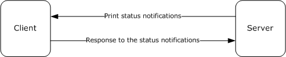

Figure 1: Bidirectional communication

In unidirectional communication mode, multiple clients can register for the same notifications. The server sends a given notification to all clients that have registered for it. Because unidirectional notifications do not require a response, the server can discard the notifications in the absence of an appropriately registered client.

The following diagram shows unidirectional communication.

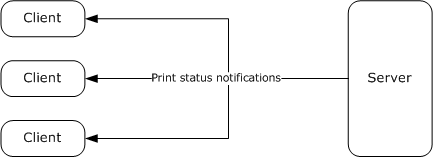

Figure 2: Unidirectional communication

Server-resident [**notification sources**](#gt_notification-source) create, on behalf of print clients, notification channels to send notifications as printing events occur. Each channel is created to send only a given [**notification type**](#gt_notification-type) in a single communication mode, unidirectional or bidirectional.

Each notification channel is created to send notifications to registered clients, irrespective of their [**authenticated user identity**](#gt_authenticated-user-identity), or to send notifications to the subset of registered clients with associated authenticated user identity matching that of a specific print client. When registering for notifications, clients specify the [**notification type identifier**](#gt_notification-type-identifier), communication mode, and [**user identity filter**](#gt_user-identity-filter) for the notifications they are interested in receiving.

Unidirectional notification channels are closed only by the notification source that created the channel. Bidirectional notification channels can be closed by the client that acquired the channel or by the notification source that created the channel. The interaction with notification sources is described in [3.1.1.6](#Section_3.1.1.6).

The Print System Asynchronous Notification Protocol is based on the [**RPC**](#gt_remote-procedure-call-rpc) Protocol, and it defines the following two RPC interfaces, which are called by the client and implemented by the server:

- IRPCAsyncNotify, which is used to register and deregister clients, establish notification channels, and send data back and forth between the client and the server.
- IRPCRemoteObject, which is used to create and destroy [**remote objects**](#gt_remote-object) that refer to printers.
This specification also defines the [**AsyncUI**](#gt_asyncui) notification type, which exists to support a client component that receives and interprets notifications from server-hosted notification sources, such as [**printer drivers**](#gt_printer-driver). The AsyncUI client component can be used to display an informative message, send user input back to the notification source on the server, or trigger the execution of printer driver code on the client computer. The following diagram illustrates the relationship between a notification source and an AsyncUI client.

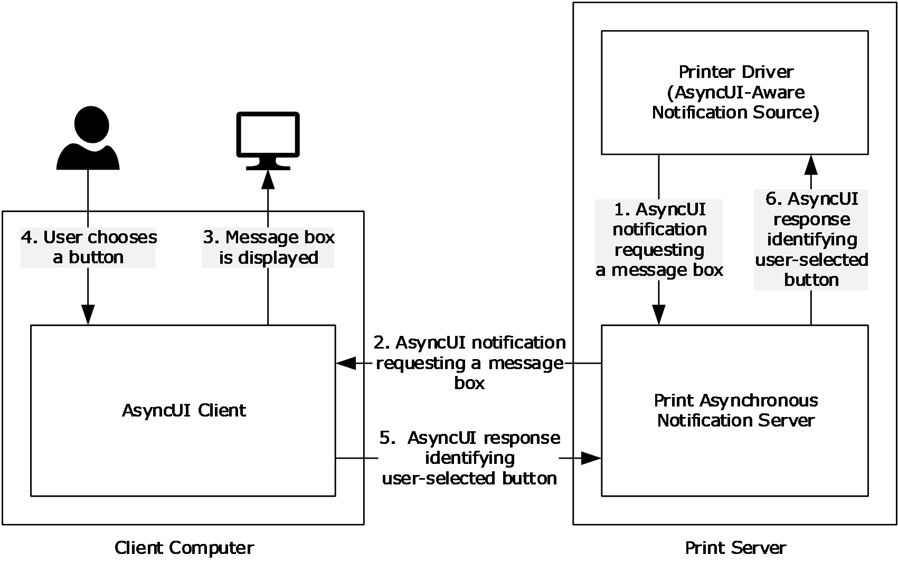

Figure 3: Relationship between a notification source and an AsyncUI client

## 1.4 Relationship to Other Protocols

The Print System Asynchronous Notification protocol is dependent on [**RPC**](#gt_remote-procedure-call-rpc) [MS-RPCE](../MS-RPCE/MS-RPCE.md) running on [**TCP**](#gt_transmission-control-protocol-tcp)/IP. These protocol relationships are shown in the following figure:

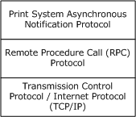

Figure 4: Protocol Relationships

No protocols are dependent on the Print System Asynchronous Notification protocol.

## 1.5 Prerequisites/Preconditions

The Print System Asynchronous Notification Protocol has the prerequisites common to [**RPC**](#gt_remote-procedure-call-rpc) interfaces ([MS-RPCE](../MS-RPCE/MS-RPCE.md) section 1.5). It is a precondition of invoking this protocol that a client obtains the name of a server that supports this protocol.

This specification assumes that a server that generates [**AsyncUI**](#gt_asyncui) notifications and the clients that receive them both agree on [**resource files**](#gt_resource-file), resource keys within those files, and positional parameters within [**string resources**](#gt_string-resource) that are referenced in those notifications.

## 1.6 Applicability Statement

The Print System Asynchronous Notification Protocol is applicable only for printing operations between a machine functioning as a client and a machine functioning as a [**print server**](#gt_print-server). The protocol is intended for the communication of notifications and responses between [**notification sources**](#gt_notification-source) operating on a print server and client applications.

The protocol can be used in a broad set of scenarios ranging from home use, where one computer makes its printer available for use by other computers, to enterprise use, where a print server provides printing services for many computers.

The protocol is not applicable outside client/server printing and monitoring print operations.

## 1.7 Versioning and Capability Negotiation

This specification covers versioning issues in the following areas:

**Supported Transports**: The Print System Asynchronous Notification Protocol uses [**RPC**](#gt_remote-procedure-call-rpc) over TCP only (section [2.1](#Section_2.1)).

**Protocol Versions**: There is only one version of this protocol. It has a built-in versioning and extensibility feature that can be used to send and receive new data formats by defining new [**notification types**](#gt_notification-type) and creating associated [**notification type identifiers**](#gt_notification-type-identifier) (section [2.2.1](#Section_2.2.1)).

**Security and Authentication Methods**: This protocol uses Simple and Protected Generic Security Service Application Program Interface Negotiation Mechanism (SPNEGO) Protocol Extensions [MS-SPNG](../MS-SPNG/MS-SPNG.md) and RPC packet [**authentication level**](#gt_authentication-level) for security and [**authentication**](#gt_authentication) (section 2.1).

**Localization**: The [**AsyncUI**](#gt_asyncui) notification types pass [**string resource**](#gt_string-resource) keys in various message data formats. Localization considerations for the associated string resources are specified in section [2.2.6](#Section_2.2.6).

**Capability Negotiation**: There is no capability negotiation mechanism built into the protocol itself. A vendor can, however, define a new notification type identifier and associate it with a set of [**notification**](#gt_notification) and [**response**](#gt_response) data formats and sequencing rules (section 2.2.1).

## 1.8 Vendor-Extensible Fields

The Print System Asynchronous Notification Protocol uses [**HRESULT**](#gt_hresult) method return values [MS-ERREF](../MS-ERREF/MS-ERREF.md). In addition to the values defined in this specification and those defined in [MS-ERREF], vendors are free to choose their own values for this field, but the C bit (0x20000000) MUST be set, indicating it is a customer code.

Unless otherwise stated in this specification, a client of this protocol MUST NOT interpret returned error codes. The client MUST simply return error codes to the invoking application without taking any protocol action.

The set of [**notification types**](#gt_notification-type) used by this protocol is extensible. New notification types can be defined and associated with new [**notification type identifiers**](#gt_notification-type-identifier). This mechanism (section [2.2.1](#Section_2.2.1)) enables future versioning and extensibility.

## 1.9 Standards Assignments

| Parameter | Value | Reference |
| --- | --- | --- |
| [**RPC**](#gt_remote-procedure-call-rpc) [**UUID**](#gt_universally-unique-identifier-uuid) for the [IRPCAsyncNotify interface (section 3.1)](#Section_3.1) | 0b6edbfa-4a24-4fc6-8a23-942b1eca65d1 | [[C706]](https://go.microsoft.com/fwlink/?LinkId=89824), Appendix A. For more information, see section [3.1.1](#Section_3.1.1). |
| RPC UUID for the [IRPCRemoteObject interface (section 3.2)](#Section_3.2) | ae33069b-a2a8-46ee-a235-ddfd339be281 | [C706] Appendix A. For more information, see section [3.1.2](#Section_3.1.2). |

# 2 Messages

## 2.1 Transport

The Print System Asynchronous Notification Protocol MUST use:

- The transport [**RPC**](#gt_remote-procedure-call-rpc) over TCP/IP ([MS-RPCE](../MS-RPCE/MS-RPCE.md) section 2.1.1.1).
- [**RPC dynamic endpoints**](#gt_rpc-dynamic-endpoint) ([[C706]](https://go.microsoft.com/fwlink/?LinkId=89824) chapter 6).
- [**UUIDs**](#gt_universally-unique-identifier-uuid) (section [1.9](#Section_1.9)).
A server of this protocol MUST use:

- A [**security provider**](#gt_security-provider) that supports SPNEGO Protocol Extensions ([MS-RPCE] section 3 and [MS-SPNG](../MS-SPNG/MS-SPNG.md)).
- The default server [**principal**](#gt_principal) name for the security provider, which is the authentication-service constant **RPC_C_AUTHN_GSS_NEGOTIATE**. For information concerning Windows authentication-service constants [[MSDN-AUTHN]](https://go.microsoft.com/fwlink/?LinkId=89957).
A client of this protocol MUST use:

- A security provider that supports SPNEGO Protocol Extensions ([MS-RPCE] section 3 and [MS-SPNG]).
- A principal name constructed by appending the name of the [**print server**](#gt_print-server) to the string "host/".
- Packet [**authentication level**](#gt_authentication-level) ([MS-RPCE] section 3).

## 2.2 Common Data Types

This protocol MUST indicate to the [**RPC**](#gt_remote-procedure-call-rpc) runtime that it is to support both the [**Network Data Representation (NDR)**](#gt_network-data-representation-ndr) and NDR64 transfer syntaxes, and provide a negotiation mechanism for determining which transfer syntax will be used ([MS-RPCE](../MS-RPCE/MS-RPCE.md) section 3).

In addition to RPC base types and definitions ([[C706]](https://go.microsoft.com/fwlink/?LinkId=89824) section 4.2.9 and [MS-RPCE] section 2.2.1), additional data types are defined in the following sections.

### 2.2.1 PrintAsyncNotificationType

The PrintAsyncNotificationType data type supports the definition of unique functional categories of [**notifications**](#gt_notification) for the Print System Asynchronous Notification Protocol. This type is used for matching notifications from the server to appropriate clients.

This type is declared as follows:

typedef GUID PrintAsyncNotificationType;

PrintAsyncNotificationType MUST be a [**notification type identifier**](#gt_notification-type-identifier).

This protocol defines a reserved notification type identifier value, **NOTIFICATION_RELEASE** (ba9a5027-a70e-4ae7-9b7d-eb3e06ad4157). This value is not associated with any specific set of notification and [**response**](#gt_response) data formats, but rather has special meaning in the definition of this protocol. This value indicates that a client or server is not accepting further communication (sections [3.1.1.4.4](#Section_3.1.1.4.4), [3.1.1.4.5](#Section_3.1.1.4.5), and [3.1.1.4.6](#Section_3.1.1.4.6)).

This protocol also defines the notification and response data formats for the [**AsyncUI**](#gt_asyncui) [**notification type**](#gt_notification-type). Associated with the AsyncUI notification type is its notification type identifier. The value **AsyncPrintNotificationType_AsyncUI** (f6853f92-eb31-4e23-b6e7-fd69056153f0) indicates that the notification data byte arrays contain AsyncUI data formats. For details, see sections [2.2.7](#Section_2.2.7), [3.1.3](#Section_3.1.3), and [3.2.3](#Section_3.2.3).

Finally, this protocol defines notification and response data formats for the printer configuration notification type. The value **AsyncPrintNotificationType_PrinterConfiguration** (2abad223-b994-4aca-82fd4571b1b585ac) indicates that the notification data byte arrays contain printer configuration data formats. For details, see sections [2.2.8](#Section_2.2.8), [3.1.4](#Section_3.1.4), and [3.2.4](#Section_3.2.4).

### 2.2.2 PrintAsyncNotifyUserFilter

The PrintAsyncNotifyUserFilter enumeration is used by clients when they register to receive notifications from server-resident [**notification sources**](#gt_notification-source). The following types of notifications can be requested:

- Notifications intended specifically for a particular client's user identity.
- Notifications intended for all registered client user identities.
typedef [v1_enum] enum

{

kPerUser = 0,

kAllUsers = 1,

} PrintAsyncNotifyUserFilter;

**kPerUser:** Indicates that the client is requesting notifications that are intended specifically for its own user identity and notifications that are intended for all registered user identities.

**kAllUsers:** Indicates that the client is requesting every notification, whether intended for a specific user identity or for all registered user identities.

### 2.2.3 PrintAsyncNotifyConversationStyle

The PrintAsyncNotifyConversationStyle enumeration MUST specify the communication mode expected between the sender and a registered client.

typedef [v1_enum] enum

{

kBiDirectional = 0,

kUniDirectional = 1,

} PrintAsyncNotifyConversationStyle;

**kBiDirectional:** [**Bidirectional communication mode**](#gt_bidirectional-communication-mode) is specified. The sender expects the client to send responses to notifications.

**kUniDirectional:** [**Unidirectional communication mode**](#gt_unidirectional-communication-mode) is specified. The sender does not expect the client to respond to notifications.

### 2.2.4 PRPCREMOTEOBJECT

The PRPCREMOTEOBJECT data type defines an [**RPC context handle**](#gt_rpc-context-handle), which corresponds to the server [**remote object**](#gt_remote-object) representing a client registration. A client MUST call [IRPCRemoteObject_Create](#Section_3.1.2.4.1) to create a PRPCREMOTEOBJECT handle, and [IRPCRemoteObject_Delete](#Section_3.1.2.4.2) to delete a PRPCREMOTEOBJECT handle (section [3.1.2.4](#Section_3.1.2.4)).

This type is declared as follows:

typedef [context_handle] void* PRPCREMOTEOBJECT;

### 2.2.5 PNOTIFYOBJECT

The PNOTIFYOBJECT data type defines an [**RPC context handle**](#gt_rpc-context-handle), which corresponds to the server object representing a [**notification channel**](#gt_notification-channel). This handle is used in [**bidirectional communication mode**](#gt_bidirectional-communication-mode) only.

This type is declared as follows:

typedef [context_handle] void* PNOTIFYOBJECT;

### 2.2.6 AsyncUI Default Resource File String Resources

AsyncUI default resource file string resources are used to specify localizable text for the user interface of the Print System Asynchronous Notification protocol. Each [**string resource**](#gt_string-resource) defines a unique key and a corresponding localizable text string. An [**AsyncUI**](#gt_asyncui) client uses the key to retrieve the text string from a [**resource file**](#gt_resource-file).

String resources that convey information equivalent to the localizable text in the following table MUST be present in a [**default resource file**](#gt_default-resource-file). The string resources MUST include the same number of [**position parameter replacement tags**](#gt_position-parameter-replacement-tags) as are present in the table, with equivalent meanings.

In the text strings that follow, position parameter replacement tags are indicated by "%" characters. Reading from left to right, "%1" is the first parameter, "%2" is the second parameter, and so on. The "!format string!" after a position parameter replacement tag specifies the format of the parameter. Specifically, in the case of the string resource localizable text with resource key 2702, the notation "%1!d!" indicates that the first parameter is formatted as a signed decimal integer.

| String resource key | String resource localizable text |
| --- | --- |
| 100 | "..." |
| 101 | "This document was sent to the printer" |
| 102 | "Document: %1\nPrinter: %2\nTime: %3\nTotal pages: %4" |
| 103 | "Printer out of paper" |
| 104 | "Printer '%1' is out of paper." |
| 105 | "This document failed to print" |
| 106 | "Document: %1\nPrinter: %2\nTime: %3\nTotal pages: %4" |
| 107 | "Printer door open" |
| 108 | "The door on '%1' is open." |
| 109 | "Printer in an error state" |
| 110 | "'%1' is in an error state." |
| 111 | "Printer out of toner/ink" |
| 112 | "'%1' is out of toner/ink." |
| 113 | "Printer not available" |
| 114 | "'%1' is not available for printing." |
| 115 | "Printer offline" |
| 116 | "'%1' is offline." |
| 117 | "Printer out of memory" |
| 118 | "'%1' has run out of memory." |
| 119 | "Printer output bin full" |
| 120 | "The output bin on '%1' is full." |
| 121 | "Printer paper jam" |
| 122 | "Paper is jammed in '%1'." |
| 123 | "Printer out of paper" |
| 124 | "'%1' is out of paper." |
| 125 | "Printer paper problem" |
| 126 | "'%1' has a paper problem." |
| 127 | "Printer paused" |
| 128 | "'%1' is paused." |
| 129 | "Printer needs user intervention" |
| 130 | "'%1' has a problem that requires your intervention." |
| 131 | "Printer is low on toner/ink" |
| 132 | "'%1' is low on toner/ink." |
| 600 | "OK" |
| 601 | "Cancel" |
| 1000 | "Document: %1\n" |
| 1001 | "Printer: %1\n" |
| 1002 | "Paper size: %1\n" |
| 1003 | "Ink: %1\n" |
| 1004 | "Cartridge: %1\n" |
| 1005 | "Paper jam area: %1\n" |
| 1006 | "A printer problem occurred" |
| 1007 | "Please check the printer for any problems." |
| 1008 | "Please check the printer status and settings." |
| 1009 | "Check if the printer is online and ready to print." |
| 1100 | "The printer is ready to print on the other side of the paper." |
| 1101 | "To finish double-sided printing, remove the paper from the output tray. Re-insert the paper in the input tray, facing up." |
| 1102 | "To finish double-sided printing, remove the paper from the output tray. Re-insert the paper in the input tray, facing down." |
| 1200 | "Press the Resume button on the printer when done." |
| 1201 | "Press the Cancel button on the printer when done." |
| 1202 | "Press the OK button on the printer when done." |
| 1203 | "Press the Online button on the printer when done." |
| 1204 | "Press the Reset button on the printer when done." |
| 1300 | "The printer is offline." |
| 1301 | "Windows could not connect to your printer. Please check the connection between the computer and the printer." |
| 1302 | "The printer is not responding. Please check the connection between your computer and the printer." |
| 1400 | "Paper Jam" |
| 1401 | "Your printer has a paper jam." |
| 1402 | "Please check the printer and clear the paper jam. The printer cannot print until the paper jam is cleared." |
| 1403 | "Please clear the paper jam on the printer." |
| 1500 | "Your printer is out of paper." |
| 1501 | "Please check the printer and add more paper." |
| 1502 | "Please check the printer and add more paper in tray %1." |
| 1503 | "Please check the printer and add more %1 paper in tray %2." |
| 1600 | "The output tray on your printer is full." |
| 1601 | "Please empty the output tray on the printer." |
| 1700 | "Your printer has a paper problem" |
| 1701 | "Please check your printer for paper problems." |
| 1800 | "Your printer is out of ink" |
| 1801 | "The ink cartridge in your printer is empty." |
| 1802 | "Your printer is out of toner." |
| 1803 | "Please check the printer and add more ink." |
| 1804 | "Please check the printer and replace the ink cartridge." |
| 1805 | "Please check the printer and add toner." |
| 2000 | "Cyan" |
| 2001 | "Magenta" |
| 2002 | "Yellow" |
| 2003 | "Black" |
| 2004 | "Light Cyan" |
| 2005 | "Light Magenta" |
| 2006 | "Red" |
| 2007 | "Green" |
| 2008 | "Blue" |
| 2009 | "Gloss optimizer" |
| 2010 | "Photo Black" |
| 2011 | "Matte Black" |
| 2012 | "Photo Cyan" |
| 2013 | "Photo Magenta" |
| 2014 | "Light Black" |
| 2015 | "Ink optimizer" |
| 2016 | "Blue photo" |
| 2017 | "Gray photo" |
| 2018 | "Tricolor photo" |
| 2100 | "Cyan cartridge" |
| 2101 | "Magenta cartridge" |
| 2102 | "Black cartridge" |
| 2103 | "CMYK cartridge" |
| 2104 | "Gray cartridge" |
| 2105 | "Color cartridge" |
| 2106 | "Photo cartridge" |
| 2200 | "A door on your printer is open." |
| 2201 | "A cover on your printer is open." |
| 2202 | "Please check the printer and close any open doors. The printer cannot print while a door is open." |
| 2203 | "Please check the printer and close any open covers. The printer cannot print while a cover is open." |
| 2300 | "Your printer is not printing" |
| 2301 | "Please check your printer" |
| 2302 | "Your printer is out of memory" |
| 2303 | "Your document might not print correctly. Please see online help." |
| 2400 | "Your printer is low on ink" |
| 2401 | "The ink cartridge in your printer is almost empty." |
| 2402 | "Your printer is low on toner" |
| 2403 | "Please check the printer and add more ink when needed." |
| 2404 | "Please check the printer and replace the ink cartridge when needed." |
| 2405 | "Please check the printer and add toner when needed." |
| 2500 | "The ink system in your printer is not working" |
| 2501 | "The ink cartridge in your printer is not working" |
| 2502 | "The toner system in your printer is not working" |
| 2503 | "Please check the ink system in your printer." |
| 2504 | "Please check the ink cartridge in your printer." |
| 2505 | "Please check the toner system in your printer." |
| 2506 | "Please check that the ink cartridge was installed correctly in the printer." |
| 2600 | "Printer has been paused" |
| 2601 | "'%1' cannot print, because it has been put into a paused state at the device." |
| 2602 | "'%1' cannot print, because it has been put into an offline state at the device." |
| 2700 | "Your document has been printed." |
| 2701 | "Your document is in the output tray." |
| 2702 | "%1!d! document(s) pending for %2" |
| 2703 | "<unknown>" |

### 2.2.7 AsyncUI XML Notification and Response Formats

This section specifies the data formats for notifications and responses associated with the [**notification type identifier**](#gt_notification-type-identifier) value **AsyncPrintNotificationType_AsyncUI** (section [2.2.1](#Section_2.2.1)). The data formats are specified by using a combination of prose and [**XML**](#gt_xml) schema syntax [[W3C-XSD]](https://go.microsoft.com/fwlink/?LinkId=90563).

The XML schema fragments contained in this section are drawn from two separate XML schema documents, one for [**AsyncUI**](#gt_asyncui) [**notifications**](#gt_notification) and one for AsyncUI responses. Both schema documents specify a value of "qualified" for the **elementFormDefault** attribute of the root "schema" element.

The XML schema document for AsyncUI notifications MUST specify a **targetNamespace** attribute value of "http://schemas.microsoft.com/2003/print/asyncui/v1/request" and also MUST use that [**URI**](#gt_uniform-resource-identifier-uri) as the schema document's default namespace ([[XMLNS]](https://go.microsoft.com/fwlink/?LinkId=191840) sections 2.1 and 3.0).

The XML schema document for AsyncUI responses MUST specify a **targetNamespace** attribute value of "http://schemas.microsoft.com/2003/print/asyncui/v1/response", and also MUST use that URI as the schema document's default namespace.

Server-resident [**notification sources**](#gt_notification-source) such as [**printer drivers**](#gt_printer-driver) can use the AsyncUI [**notification type**](#gt_notification-type) to display printing-related, interactive UIs on client systems.

The XML data contained within AsyncUI notifications and responses MUST obey the syntax of well-formed XML 1.0 documents ([[XML1.0]](https://go.microsoft.com/fwlink/?LinkId=90599) section 2.1). Furthermore, those documents MUST be encoded in [**UTF-16LE (Unicode Transformation Format, 16-bits, little-endian)**](#gt_utf-16le-unicode-transformation-format-16-bits-little-endian) ([[RFC2781]](https://go.microsoft.com/fwlink/?LinkId=90380) section 4.2).

Note that XML 1.0 [XML1.0], restricts the set of legal characters that can be used. Values that cannot be expressed in XML MUST NOT be represented in an XML document contained within an AsyncUI notification or [**response**](#gt_response). Furthermore, some legal characters, such as "<" and "&", require some form of escaping when encoded in XML. Implementations MUST use an XML-defined mechanism, such as CDATA ([XML1.0] sections 2.4 and 2.7) or numeric character references ([XML1.0] section 4.1), to encode such characters within XML documents.

#### 2.2.7.1 Common AsyncUI Elements

The following sections define [**XML**](#gt_xml) elements common to some of the AsyncUI [**notification**](#gt_notification) data formats.

##### 2.2.7.1.1 asyncPrintUIRequest Element

The asyncPrintUIRequest [**XML**](#gt_xml) element MUST be the root element of XML documents used in the **AsyncUIBalloon** (section [2.2.7.2](#Section_2.2.7.2)), **AsyncUIMessageBox** (section [2.2.7.3](#Section_2.2.7.3)), **AsyncUICustomUI** (section [2.2.7.5](#Section_2.2.7.5)), and **AsyncUICustomData** (section [2.2.7.7](#Section_2.2.7.7)) server-to-client [**notification**](#gt_notification) formats.

The document markup MUST be schema-valid according to the following XML schema, which refers to additional schema fragments (section [2.2.7](#Section_2.2.7)). Schema-Validity Assessment of the document's root element MUST result in a value of "valid" for the **[validity]** property ([[XMLSCHEMA1/2]](https://go.microsoft.com/fwlink/?LinkId=90607) section 3.3.5).

<xs:element name="asyncPrintUIRequest">

<xs:complexType>

<xs:sequence>

<xs:element name="v1">

<xs:complexType>

<xs:sequence>

<xs:element name="requestOpen">

<xs:complexType>

<xs:choice>

<xs:element

ref="balloonUI"

/>

<xs:element

ref="messageBoxUI"

/>

<xs:element

ref="customUI"

/>

<xs:element

ref="customData"

/>

</xs:choice>

</xs:complexType>

</xs:element>

</xs:sequence>

</xs:complexType>

</xs:element>

</xs:sequence>

</xs:complexType>

</xs:element>

Child Elements

| Element | Type | Description |
| --- | --- | --- |
| v1 | N/A | A required element within an asyncPrintUIRequest element that MUST contain exactly one requestOpen element. |
| requestOpen | N/A | A required element that MUST contain exactly one [balloonUI](#Section_2.2.7.2.2), [messageBoxUI](#Section_2.2.7.3.4), [customUI](#Section_2.2.7.5), or [customData](#Section_2.2.7.7) element. |
| balloonUI | balloonUI | See section 2.2.7.2.2. |
| messageBoxUI | messageBoxUI | See section 2.2.7.3.4. |
| customUI | customUI | See section 2.2.7.5.1. |
| customData | customData | See section 2.2.7.7.1. |

##### 2.2.7.1.2 asyncPrintUIResponse Element

The asyncPrintUIResponse [**XML**](#gt_xml) element MUST be the root element of the XML documents used in the **AsyncUIMessageBoxReply** (section [2.2.7.4](#Section_2.2.7.4)) and **AsyncUICustomUIReply** (section [2.2.7.6](#Section_2.2.7.6)) client-to-server [**response**](#gt_response) formats.

The document markup MUST be schema-valid according to the following XML schema, which refers to additional schema fragments (section [2.2.7](#Section_2.2.7)). Schema-Validity Assessment of the document's root element MUST result in a value of "valid" for the **[validity]** property ([[XMLSCHEMA1/2]](https://go.microsoft.com/fwlink/?LinkId=90607) section 3.3.5).

<xs:element name="asyncPrintUIResponse">

<xs:complexType>

<xs:sequence>

<xs:element name="v1">

<xs:complexType>

<xs:sequence>

<xs:element name="requestClose">

<xs:complexType>

<xs:choice>

<xs:element

ref="CustomUI"

/>

<xs:element

ref="messageBoxUI"

/>

</xs:choice>

</xs:complexType>

</xs:element>

</xs:sequence>

</xs:complexType>

</xs:element>

</xs:sequence>

</xs:complexType>

</xs:element>

Child Elements

| Element | Type | Description |
| --- | --- | --- |
| v1 | N/A | A required element within an asyncPrintUIResponse element that MUST contain exactly one requestClose element. |
| requestClose | N/A | A required element that MUST contain exactly one [messageBoxUI](#Section_2.2.7.3.4) or [CustomUI](#Section_2.2.7.5.1) element. |
| CustomUI | CustomUI | See section 2.2.7.6.1. |
| messageBoxUI | messageBoxUI | See section 2.2.7.3.4. |

##### 2.2.7.1.3 title Element

The title [**XML**](#gt_xml) element specifies a string using attributes or nested text, optionally combined with nested [parameter](#Section_2.2.7.1.5) elements, that SHOULD be used by the AsyncUI client as the displayable title of a printer event.

If any of the strings specified by attributes or nested text contains [**position parameter replacement tags**](#gt_position-parameter-replacement-tags), the client MUST replace the parameters with strings that are constructed from the sequence of parameter elements.

<xs:element name="title">

<xs:complexType

mixed="true"

>

<xs:sequence>

<xs:element

minOccurs="0"

maxOccurs="unbounded"

ref="parameter"

/>

</xs:sequence>

<xs:attribute name="stringID"

type="xs:integer"

use="optional"

/>

<xs:attribute name="resourceDll"

type="xs:string"

use="optional"

/>

</xs:complexType>

</xs:element>

Child Elements

| Element | Type | Description |
| --- | --- | --- |
| parameter | parameter | See section 2.2.7.1.5. |

Attributes

| Name | Type | Description |
| --- | --- | --- |
| stringID | xs:integer | The value of this optional attribute, if present, is the key of a [**string resource**](#gt_string-resource) in the [**resource file**](#gt_resource-file) specified by the **resourceDll** attribute. If the **resourceDll** attribute is not specified, **stringID** MUST be used as the key of a string resource in the [**default resource file**](#gt_default-resource-file). String resources that are present in the default resource file are specified in section [2.2.6](#Section_2.2.6). |
| resourceDll | xs:string | The value of this optional attribute, if present, is the [**driver-file name**](#gt_driver-file-name) of a resource file on the client system that contains the string resources used in this message. If no value is specified, a default resource file MUST be used. |

If the **stringID** attribute is not specified, the text content in the title element MUST be present, and it MUST be used by the client as the string to display.

If the **stringID** attribute is specified, the title element MUST NOT contain nested text, and the client MUST treat the presence of such text as an error.

Nested text MUST NOT follow a parameter element.

##### 2.2.7.1.4 body Element

The body [**XML**](#gt_xml) element specifies a string using attributes or nested text, optionally combined with nested [parameter](#Section_2.2.7.1.5) elements that SHOULD be used by the [**AsyncUI**](#gt_asyncui) client as the displayable description of a printer event.

If any of the strings specified by attributes or nested text contains [**position parameter replacement tags**](#gt_position-parameter-replacement-tags), the client MUST replace the parameters with strings that are constructed from the sequence of parameter elements.

If a single [**notification**](#gt_notification) contains multiple body elements, the client MUST concatenate the text resulting from the processing of each successive body element to determine the complete displayable description. The client SHOULD interpose a single space character between each pair of concatenated strings.

<xs:element name="body">

<xs:complexType

mixed="true"

>

<xs:sequence>

<xs:element

minOccurs="0"

maxOccurs="unbounded"

ref="parameter"

/>

</xs:sequence>

<xs:attribute name="stringID"

type="xs:integer"

use="optional"

/>

<xs:attribute name="resourceDll"

type="xs:string"

use="optional"

/>

</xs:complexType>

</xs:element>

Child Elements

| Element | Type | Description |
| --- | --- | --- |
| parameter | parameter | See section 2.2.7.1.5. |

Attributes

| Name | Type | Description |
| --- | --- | --- |
| stringID | xs:integer | The value of this optional attribute, if present, is the key of a [**string resource**](#gt_string-resource) in the [**resource file**](#gt_resource-file) specified by the **resourceDll** attribute. If the **resourceDll** attribute is not specified, **stringID** MUST be used as the key of a string resource in the [**default resource file**](#gt_default-resource-file). String resources that are present in the default resource file are specified in section [2.2.6](#Section_2.2.6). |
| resourceDll | xs:string | The value of this optional attribute, if present, is the [**driver-file name**](#gt_driver-file-name) of a resource file on the client system that contains the string resources used in this message. If no value is specified, a default resource file MUST be used. |

If the **stringID** attribute is not specified, the text content in the body element MUST be present, and it MUST be used by the client as the string to display.

If the **stringID** attribute is specified, then the body element MUST NOT contain nested text and the client MUST treat the presence of such text as an error.

Nested text MUST NOT follow a parameter element.

##### 2.2.7.1.5 parameter Element

The parameter XML element specifies a string using attributes or nested text that provides parameter substitution information for a string specified by a [body](#Section_2.2.7.1.4) or [title](#Section_2.2.7.1.3) element.

<xs:element name="parameter">

<xs:complexType>

<xs:simpleContent>

<xs:extension

base="xs:string"

>

<xs:attribute name="type"

type="xs:string"

use="optional"

/>

<xs:attribute name="stringID"

type="xs:integer"

use="optional"

/>

<xs:attribute name="resourceDll"

type="xs:string"

use="optional"

/>

</xs:extension>

</xs:simpleContent>

</xs:complexType>

</xs:element>

Attributes

| Name | Type | Description |
| --- | --- | --- |
| type | xs:string | The value of this optional attribute, if present, MUST be the string "PrinterName". If this value is specified, then the client MUST ignore the **stringID** and **resourceDll** attributes. For [**string resource**](#gt_string-resource) formatting purposes, the client SHOULD use a recognizable name for the printer that triggered the [**notification**](#gt_notification). |
| stringID | xs:integer | The value of this optional attribute, if present, is the key of a string resource in the [**resource file**](#gt_resource-file) specified by the **resourceDll** attribute. If the **resourceDll** attribute is not specified, **stringID** MUST be used as the key of a string resource in the [**default resource file**](#gt_default-resource-file). String resources that are present in the default resource file are specified in section [2.2.6](#Section_2.2.6). |
| resourceDll | xs:string | The value of this optional attribute, if present, is the [**driver-file name**](#gt_driver-file-name) of a resource file on the client system that contains the string resources used in this message. If neither a **type** attribute nor a **resourceDll** attribute is specified, then the default resource file MUST be used. |

If neither the **type** nor the **stringID** attribute is specified, then the text content in the parameter element MUST be present and MUST be used by the client when processing [**position parameter replacement tags**](#gt_position-parameter-replacement-tags) within a string specified by a title or body element.

If the **type** attribute is specified, then the parameter element SHOULD NOT contain nested text and the client SHOULD treat the presence of such text as an error. If **stringID** is present but the client is unable to load a corresponding string resource, the client SHOULD use the nested text.

#### 2.2.7.2 AsyncUIBalloon

AsyncUIBalloon is a string that contains a well-formed [**XML**](#gt_xml) document ([[XML1.0]](https://go.microsoft.com/fwlink/?LinkId=90599) section 2.1). The root element of the document MUST be the [asyncPrintUIRequest element (section 2.2.7.1.1)](#Section_2.2.7.1.1). A [balloonUI element (section 2.2.7.2.2)](#Section_2.2.7.2.2) MUST be nested within the **AsyncPrintUIRequest** markup at the point where it is referenced in the XML schema.

AsyncUIBalloon SHOULD be used by a [**printer driver**](#gt_printer-driver) on a server to deliver to a client UI the details of an event or a change in device status. Print servers SHOULD also use AsyncUIBalloon to send details about printer configuration changes, when available, to a client UI.<1>

##### 2.2.7.2.1 action Element

The action [**XML**](#gt_xml) element directs the client to execute a method at a specific entry point in a specific file on the client computer.

The action element SHOULD contain text data, encoded as a null-terminated [**UTF-16LE**](#gt_utf-16le) string ([[RFC2781]](https://go.microsoft.com/fwlink/?LinkId=90380) section 4.2), to pass to the method indicated by the **entrypoint** attribute. The mechanism by which the client invokes the executable code is specific to the client implementation.<2>

<xs:element name="action">

<xs:complexType>

<xs:simpleContent>

<xs:extension

base="xs:string"

>

<xs:attribute name="dll"

type="xs:string"

use="required"

/>

<xs:attribute name="entrypoint"

type="xs:string"

use="required"

/>

</xs:extension>

</xs:simpleContent>

</xs:complexType>

</xs:element>

Attributes

| Name | Type | Description |
| --- | --- | --- |
| dll | xs:string | The value of this attribute is a string that contains the [**driver-file name**](#gt_driver-file-name) of a file on the client system that contains executable code. The driver-file name MUST NOT contain any of the following [**Unicode**](#gt_unicode) standard [[UNICODE]](https://go.microsoft.com/fwlink/?LinkId=90550) characters: \ (character code U+005C) / (character code U+002F) ? (character code U+003F) * (character code U+002A) < (character code U+003C) > (character code U+003E) " (character code U+0022) \| (character code U+007C) : (character code U+003A) |
| entrypoint | xs:string | The value of this attribute is a string that specifies a public method in the file designated by the **dll** attribute. |

##### 2.2.7.2.2 balloonUI Element

The balloonUI [**XML**](#gt_xml) element contains information on a printer event that can be displayed on the client computer. The [**notification**](#gt_notification) MUST contain references to [**string resources**](#gt_string-resource) that pertain to printer events.

A balloonUI element can optionally call for the execution of code on the client system by means of a nested [action](#Section_2.2.7.2.1) element.

<xs:element name="balloonUI">

<xs:complexType>

<xs:sequence>

<xs:element

ref="title"

/>

<xs:element

maxOccurs="unbounded"

ref="body"

/>

<xs:element

minOccurs="0"

ref="action"

/>

</xs:sequence>

<xs:attribute name="iconID"

type="xs:integer"

use="optional"

/>

<xs:attribute name="resourceDll"

type="xs:string"

use="optional"

/>

</xs:complexType>

</xs:element>

Child Elements

| Element | Type | Description |
| --- | --- | --- |
| title | title | See section [2.2.7.1.3](#Section_2.2.7.1.3). |
| body | body | See section [2.2.7.1.4](#Section_2.2.7.1.4). |
| action | action | See section 2.2.7.2.1 |

Attributes

| Name | Type | Description |
| --- | --- | --- |
| iconID | xs:integer | The value of this optional attribute, if present, is the key of an [**icon resource**](#gt_icon-resource) in the [**resource file**](#gt_resource-file) specified by the **resourceDll** attribute. If an **iconID** is provided, a **resourceDll** MUST also be specified. |
| resourceDll | xs:string | The value of this optional attribute, if present, is the [**driver-file name**](#gt_driver-file-name) of a resource file on the client system that contains the icon resource specified by the **iconID** attribute. If this attribute is not specified, a generic [**icon**](#gt_icon) SHOULD be used. |

#### 2.2.7.3 AsyncUIMessageBox

AsyncUIMessageBox is a string that contains a well-formed [**XML**](#gt_xml) document ([[XML1.0]](https://go.microsoft.com/fwlink/?LinkId=90599) section 2.1).

The root element of the document MUST be the [asyncPrintUIRequest element (section 2.2.7.1.1)](#Section_2.2.7.1.1). A [messageBoxUI element (section 2.2.7.3.4)](#Section_2.2.7.3.4) MUST be nested within the AsyncPrintUIRequest markup at the point where it is referenced in the XML schema.

AsyncUIMessageBox SHOULD be used by a [**printer driver**](#gt_printer-driver) on a server to deliver to a client UI the details of an event or a change in device status and to request input from the user to guide its handling of the event or change in status.

##### 2.2.7.3.1 button Element

The button [**XML**](#gt_xml) element contains information on a button control in the UI that SHOULD be displayed on the client computer.

<xs:element name="button">

<xs:complexType>

<xs:sequence />

<xs:attribute name="stringID"

type="xs:integer"

use="optional"

/>

<xs:attribute name="resourceDll"

type="xs:string"

use="optional"

/>

<xs:attribute name="buttonID"

use="required"

>

<xs:simpleType>

<xs:restriction

base="xs:string"

>

<xs:pattern

value="IDOK|IDCANCEL|\s*(\-|\+)?[0-9]+\s*"

/>

</xs:restriction>

</xs:simpleType>

</xs:attribute>

</xs:complexType>

</xs:element>

Attributes

| Name | Type | Description |
| --- | --- | --- |
| stringID | xs:integer | This attribute MUST be present if the value of the **buttonID** attribute is neither "IDOK" nor "IDCANCEL". If present, the value of this attribute MUST be the key of a [**string resource**](#gt_string-resource) in the [**resource file**](#gt_resource-file) specified by the **resourceDll** attribute. If the **resourceDll** attribute is not specified, **stringID** MUST be the key of a string resource in the [**default resource file**](#gt_default-resource-file). String resources that are present in the default resource file are specified in section [2.2.6](#Section_2.2.6). |
| resourceDll | xs:string | The value of this optional attribute, if present, is the [**driver-file name**](#gt_driver-file-name) of a resource file on the client system, which contains the string resources used in this message. If no value is specified, the default resource file MUST be used. |
| buttonID | xs:string | The value of this attribute MUST be a string representation of an integer, or one of the following case-sensitive strings: "IDOK" The button SHOULD correspond to OK button behavior in the dialog. "IDCANCEL" The button SHOULD correspond to Cancel button behavior in the dialog. If the attribute value is "IDOK" or "IDCANCEL", the **stringID** and **resourceDll** values MUST be ignored. |

##### 2.2.7.3.2 buttons Element

The buttons [**XML**](#gt_xml) element contains a collection of [button](#Section_2.2.7.3.1) elements. The client can display these buttons to present the user with a choice of actions.

<xs:element name="buttons">

<xs:complexType>

<xs:sequence>

<xs:element

maxOccurs="5"

ref="button"

/>

</xs:sequence>

</xs:complexType>

</xs:element>

Child Elements

| Element | Type | Description |
| --- | --- | --- |
| button | button | See section 2.2.7.3.1. |

##### 2.2.7.3.3 bitmap Element

The bitmap [**XML**](#gt_xml) element, if present, specifies a [**bitmap**](#gt_bitmap) that can be displayed on the client computer to describe a printer event.

This element can be used to add an informational graphic to the UI for printer events. For example, in the case of a paper jam, a schematic could be displayed that indicates where the paper jam occurred.

<xs:element name="bitmap">

<xs:complexType>

<xs:sequence />

<xs:attribute name="bitmapID"

type="xs:integer"

use="required"

/>

<xs:attribute name="resourceDll"

type="xs:string"

use="optional"

/>

</xs:complexType>

</xs:element>

Attributes

| Name | Type | Description |
| --- | --- | --- |
| bitmapID | xs:integer | The value of this attribute is the key of a [**bitmap resource**](#gt_bitmap-resource) in the [**resource file**](#gt_resource-file) specified by the **resourceDll** attribute. If no **resourceDll** value is specified, **bitmapID** MUST be the key of a bitmap resource in a [**default resource file**](#gt_default-resource-file). |
| resourceDll | xs:string | The value of this optional attribute is the [**driver-file name**](#gt_driver-file-name) of a resource file on the client system that contain the bitmap resource used in this message. |

##### 2.2.7.3.4 messageBoxUI Element

The messageBoxUI XML element specifies elements that compose a message box for display in a client UI.

<xs:element name="messageBoxUI">

<xs:complexType>

<xs:sequence>

<xs:element

ref="title"

/>

<xs:element

minOccurs="0"

ref="bitmap"

/>

<xs:element

maxOccurs="unbounded"

ref="body"

/>

<xs:element

ref="buttons"

/>

</xs:sequence>

</xs:complexType>

</xs:element>

Child Elements

| Element | Type | Description |
| --- | --- | --- |
| title | title | See section [2.2.7.1.3](#Section_2.2.7.1.3). |
| bitmap | bitmap | See section [2.2.7.3.3](#Section_2.2.7.3.3). |
| body | body | See section [2.2.7.1.4](#Section_2.2.7.1.4). |
| buttons | buttons | See section [2.2.7.3.2](#Section_2.2.7.3.2). |

#### 2.2.7.4 AsyncUIMessageBoxUIReply

AsyncUIMessageBoxUIReply is a string that contains a well-formed [**XML**](#gt_xml) document ([[XML1.0]](https://go.microsoft.com/fwlink/?LinkId=90599) section 2.1).

The root element of the document MUST be an [asyncPrintUIResponse](#Section_2.2.7.1.2) element. A [messageBoxUI](#Section_2.2.7.3.4) element MUST be nested within the asyncPrintUIResponse markup at the point where it is referenced in the XML schema.

The AsyncUIMessageBoxUIReply carries the [**response**](#gt_response) from a client to an AsyncUIMessageBoxUIReply [**notification**](#gt_notification).

##### 2.2.7.4.1 buttonID Element

The buttonID XML element specifies the [button](#Section_2.2.7.3.1) element from an [AsyncUIMessageBox](#Section_2.2.7.3) string that was selected by the user.

If the selected button element has a **buttonID** attribute value of "IDOK", the buttonID element MUST contain the value 1. If the selected button element has a **buttonID** attribute value of "IDCANCEL", the buttonID element MUST contain the value 2. If the selected button element holds an integer value, the buttonID element MUST contain that value.

<xs:element name="buttonID"

type="xs:integer"

/>

##### 2.2.7.4.2 messageBoxUI Element

The messageBoxUI XML element contains a [buttonID](#Section_2.2.7.4.1) element that identifies the button that was selected by the user.

<xs:element name="messageBoxUI">

<xs:complexType>

<xs:sequence>

<xs:element

ref="buttonID"

/>

</xs:sequence>

</xs:complexType>

</xs:element>

Child Elements

| Element | Type | Description |
| --- | --- | --- |
| buttonID | buttonID | See section 2.2.7.4.1 . |

#### 2.2.7.5 AsyncUICustomUI

AsyncUICustomUI is a string that contains a well-formed XML document ([[XML1.0]](https://go.microsoft.com/fwlink/?LinkId=90599) section 2.1).

The root element of the document MUST be an [asyncPrintUIRequest](#Section_2.2.7.1.1) element (section 2.2.7.1.1). A [customUI](#Section_2.2.7.5) element MUST be nested within the asyncPrintUIRequest markup at the point where it is referenced in the XML schema.

AsyncUICustomUI (or the similar [AsyncUICustomData](#Section_2.2.7.7)) SHOULD be used by a [**printer driver**](#gt_printer-driver) on a server when it requires client-side handling of an event or a change in device status that cannot be expressed by using an [AsyncUIMessageBox](#Section_2.2.7.3) or [AsyncUIBalloon](#Section_2.2.7.2) [**notification**](#gt_notification). The AsyncUICustomUI notification calls for the execution of client-resident code that is associated with the server-resident printer driver.

##### 2.2.7.5.1 customUI Element

The customUI XML element directs the client to execute a method at a specific entry point in a specific file on the client computer. This element can also direct the client to respond with the result of the execution.

The customUI element SHOULD contain text data, encoded as a null-terminated [**UTF-16LE**](#gt_utf-16le) string ([[RFC2781]](https://go.microsoft.com/fwlink/?LinkId=90380) section 4.2), to pass to the method indicated by the **entrypoint** attribute. The mechanism by which the client invokes the executable code is specific to the client implementation.<3>

If the **bidi** attribute value is "true", the **entrypoint** method MUST return a text value encoded as a null-terminated UTF-16LE string in the [AsyncUICustomUIReply](#Section_2.2.7.6) [**response**](#gt_response) (section 2.2.7.6) to this notification.

<xs:element name="customUI">

<xs:complexType>

<xs:simpleContent>

<xs:extension

base="xs:string"

>

<xs:attribute name="dll"

type="xs:string"

use="required"

/>

<xs:attribute name="entrypoint"

type="xs:string"

use="required"

/>

<xs:attribute name="bidi"

use="required"

>

<xs:simpleType>

<xs:restriction

base="xs:string"

>

<xs:enumeration

value="true"

/>

<xs:enumeration

value="false"

/>

</xs:restriction>

</xs:simpleType>

</xs:attribute>

</xs:extension>

</xs:simpleContent>

</xs:complexType>

</xs:element>

Attributes

| Name | Type | Description |
| --- | --- | --- |
| dll | xs:string | The value of this attribute is a string that contains the [**driver-file name**](#gt_driver-file-name) of a file on the client system that contains executable code. The driver-file name MUST NOT contain any of the following [**Unicode**](#gt_unicode) standard [[UNICODE]](https://go.microsoft.com/fwlink/?LinkId=90550) characters: \ (character code U+005C) / (character code U+002F) ? (character code U+003F) * (character code U+002A) < (character code U+003C) > (character code U+003E) " (character code U+0022) \| (character code U+007C) : (character code U+003A) |
| entrypoint | xs:string | The value of this attribute is a string that specifies a public method in the file designated by the **dll** attribute. |
| bidi | enumeration | The value of this attribute MUST specify whether the client is expected to send a response to the server. The case-sensitive string MUST be one of the following values. |

#### 2.2.7.6 AsyncUICustomUIReply

AsyncUICustomUIReply is a string that contains a well-formed [**XML**](#gt_xml) document ([[XML1.0]](https://go.microsoft.com/fwlink/?LinkId=90599) section 2.1).

The root element of the document MUST be the [asyncPrintUIResponse element](#Section_2.2.7.1.2). A [CustomUI element](#Section_2.2.7.5.1) MUST be nested within the asyncPrintUIResponse markup at the point where it is referenced in the XML schema.

AsyncUICustomUIReply MUST carry the [**response**](#gt_response) from a client to an [AsyncUICustomUI](#Section_2.2.7.5) or [AsyncUICustomData](#Section_2.2.7.7) [**notification**](#gt_notification).

##### 2.2.7.6.1 CustomUI Element

The CustomUI XML element contains text that encodes the value returned by the call to the **entrypoint** method, which is identified in the [customUI](#Section_2.2.7.5) element of an [AsyncUICustomUI](#Section_2.2.7.5) [**notification**](#gt_notification) or in the [customData](#Section_2.2.7.7) element of an [AsyncUICustomData](#Section_2.2.7.7) notification.

<xs:element name="CustomUI"

type="xs:string"

/>

#### 2.2.7.7 AsyncUICustomData

AsyncUICustomData is a null-terminated string containing a well-formed XML document ([[XML1.0]](https://go.microsoft.com/fwlink/?LinkId=90599) section 2.1) followed by binary data.

The root element of the document MUST be the [asyncPrintUIRequest](#Section_2.2.7.1.1) element (section 2.2.7.1.1). A [customData](#Section_2.2.7.7) element MUST be nested within the asyncPrintUIRequest markup at the point where it is referenced in the XML schema.

The entry point specified in the customData element MUST be called, passing the binary data as an argument.

AsyncUICustomData can be used in any case where a [**printer driver**](#gt_printer-driver) on a server might choose to use [AsyncUICustomUI](#Section_2.2.7.5). However, because AsyncUICustomData encodes the data passed to the specified entry point in binary form, the AsyncUICustomData [**notification**](#gt_notification) can transport argument values that cannot be expressed in legal XML within an AsyncUICustomUI notification.

##### 2.2.7.7.1 customData Element

The customData XML element directs the client to execute a method at a specific entry point in a specific file on the client computer. This element can also direct the client to respond with the result of the execution.

The customData element SHOULD contain binary data following the null-terminated XML document to pass to the method indicated by the **entrypoint** attribute. The mechanism by which the client invokes the executable code is specific to the client implementation.<4>

If the **bidi** attribute value is "true", the **entrypoint** method MUST return a text value encoded as a null-terminated [**UTF-16LE**](#gt_utf-16le) string in the [AsyncUICustomUIReply](#Section_2.2.7.6) [**response**](#gt_response) (section 2.2.7.6) to this [**notification**](#gt_notification).

<xs:element name="customData">

<xs:complexType>

<xs:sequence />

<xs:attribute name="dll"

type="xs:string"

use="required"

/>

<xs:attribute name="entrypoint"

type="xs:string"

use="required"

/>

<xs:attribute name="bidi"

use="required"

>

<xs:simpleType>

<xs:restriction

base="xs:string"

>

<xs:enumeration

value="true"

/>

<xs:enumeration

value="false"

/>

</xs:restriction>

</xs:simpleType>

</xs:attribute>

</xs:complexType>

</xs:element>

Attributes

| Name | Type | Description |
| --- | --- | --- |
| dll | xs:string | The value of this attribute is a string that contains the [**driver-file name**](#gt_driver-file-name) of a file on the client system that contains executable code. The driver-file name MUST NOT contain any of the following [**Unicode**](#gt_unicode) standard [[UNICODE]](https://go.microsoft.com/fwlink/?LinkId=90550) characters: \ (character code U+005C) / (character code U+002F) ? (character code U+003F) * (character code U+002A) < (character code U+003C) > (character code U+003E) " (character code U+0022) \| (character code U+007C) : (character code U+003A) |
| entrypoint | xs:string | The value of this attribute is a string that specifies the entry point of a public method in the file designated by the **dll** attribute. |
| bidi | enumeration | The value of this attribute MUST specify whether the client is expected to send a response to the server. The case-sensitive string MUST be one of the following values. |

### 2.2.8 Printer Configuration Notification Formats

This section specifies the data formats for notifications associated with the [**notification type**](#gt_notification-type) identifier value **AsyncPrintNotificationType_PrinterConfiguration** (see section [2.2.1](#Section_2.2.1)). The data formats are specified by using a combination of text and XML schema syntax (see [[W3C-XSD]](https://go.microsoft.com/fwlink/?LinkId=90563)).

The [**XML**](#gt_xml) schema document for printer bidirectional notifications MUST specify a **targetNamespace** attribute value of "http://schemas.microsoft.com/windows/2005/03/printing/bidi" and also MUST use that [**URI**](#gt_uniform-resource-identifier-uri) as the schema document's default namespace ([[XMLNS]](https://go.microsoft.com/fwlink/?LinkId=191840) sections 2.1 and 3.0).

Print servers can use the printer configuration notification type to update clients when the printer configuration changes. Clients MUST use the [**unidirectional communication mode**](#gt_unidirectional-communication-mode) for this notification type.

The XML data contained within printer configuration notifications MUST conform to the syntax of well-formed XML 1.0 documents ([[XML1.0]](https://go.microsoft.com/fwlink/?LinkId=90599) section 2.1). Furthermore, those documents MUST be encoded in [**UTF-16LE**](#gt_utf-16le) ([[RFC2781]](https://go.microsoft.com/fwlink/?LinkId=90380) section 4.2).

Note that XML 1.0 [XML1.0], restricts the set of legal characters that can be used. Values that cannot be expressed in XML MUST NOT be represented in an XML document contained within an AsyncUI notification or response. Furthermore, some legal characters, such as "<" and "&", require some form of escaping when encoded in XML. Implementations MUST use an XML-defined mechanism, such as CDATA ([XML1.0] sections 2.4 and 2.7) or numeric character references ([XML1.0] section 4.1), to encode such characters within XML documents.

#### 2.2.8.1 Printer Configuration Notification

Printer Configuration Notification is a string that contains a well-formed [**XML**](#gt_xml) document ([[XML1.0]](https://go.microsoft.com/fwlink/?LinkId=90599) section 2.1). The root element of the document MUST be the [Notification element (section 2.2.8.1.1)](#Section_2.2.8.1.1). Notification SHOULD be used by a print server to notify a client of change in printer configuration; the Notification element SHOULD contain one or more [Schema elements (section 2.2.8.1.2)](#Section_2.2.8.1.2) representing the names and values for the new printer configuration settings. If the size of the Printer Configuration Notification containing all of the changed printer configuration settings exceeds the server's maximum notification size, the server MUST replace Schema elements in the Printer Configuration Notification message with [ReducedSchema elements (section 2.2.8.1.10)](#Section_2.2.8.1.10) until the size of the Printer Configuration Notification message is smaller than the maximum notification size.

The document markup MUST be valid according to the following XML schema, whose elements are described in more detail in the following sections. Schema-Validity Assessment of the document's root element MUST result in a value of "valid" for the [validity] property ([[XMLSCHEMA1/2]](https://go.microsoft.com/fwlink/?LinkId=90607) section 3.3.5).

<xs:element name='Notification'>

<xs:complexType>

<xs:choice maxOccurs='unbounded'>

<xs:element name='Schema'>

<xs:complexType>

<xs:choice>

<xs:element name='BIDI_STRING' type='string'/>

<xs:element name='BIDI_TEXT' type='string'/>

<xs:element name='BIDI_ENUM' type='string'/>

<xs:element name='BIDI_INT' type='integer'/>

<xs:element name='BIDI_FLOAT' type='float'/>

<xs:element name='BIDI_BOOL' type='boolean'/>

<xs:element name='BIDI_BLOB' type='base64Binary'/>

</xs:choice>

<xs:attribute name='name' use='required'>

<xs:simpleType>

<xs:restriction base='string'>

<xs:pattern value='\\\w+(\.\w+)*\:\w+'/>

</xs:restriction>

</xs:simpleType>

</xs:attribute>

</xs:complexType>

</xs:element>

<xs:element name='ReducedSchema'>

<xs:complexType>

<xs:attribute name='name' use='required'>

<xs:simpleType>

<xs:restriction base='string'>

<xs:pattern value='\\(\w+(\.\w+)*(\:\w+)?)?'/>

</xs:restriction>

</xs:simpleType>

</xs:attribute>

</xs:complexType>

</xs:element>

</xs:choice>

<xs:attribute name='printerName' type='string' use='required'/>

</xs:complexType>

</xs:element>

##### 2.2.8.1.1 Notification Element

The Notification element represents changes in the configuration of a printer and contains a list of [Schema elements (section 2.2.8.1.2)](#Section_2.2.8.1.2) and [ReducedSchema elements (section 2.2.8.1.10)](#Section_2.2.8.1.10) representing these changes.

| Name | Type | Description |
| --- | --- | --- |
| printerName | xs:string | The value of this attribute is a string that contains the name of the [**print queue**](#gt_print-queue) whose configuration has changed. |

##### 2.2.8.1.2 Schema Element

The Schema XML element represents a configuration setting for a printer. It contains exactly one [BIDI_STRING (section 2.2.8.1.3)](#Section_2.2.8.1.3), [BIDI_TEXT (section 2.2.8.1.4)](#Section_2.2.8.1.4), [BIDI_ENUM (section 2.2.8.1.5)](#Section_2.2.8.1.5), [BIDI_INT (section 2.2.8.1.6)](#Section_2.2.8.1.6), [BIDI_FLOAT (section 2.2.8.1.7)](#Section_2.2.8.1.7), [BIDI_BOOL (section 2.2.8.1.8)](#Section_2.2.8.1.8), or [BIDI_BLOB (section 2.2.8.1.9)](#Section_2.2.8.1.9) element representing the value of the new configuration for the printer.

| Name | Type | Description |
| --- | --- | --- |
| name | xs:string | The name of the configuration attribute that has changed, corresponding to a name in the implementation-specific list of printer configuration attributes.<5> |

##### 2.2.8.1.3 BIDI_STRING Element

The BIDI_STRING XML element represents a configuration attribute of a printer. It contains a string that is the value of the configuration setting represented by the [Schema element (section 2.2.8.1.2)](#Section_2.2.8.1.2) containing the BIDI_STRING element.

##### 2.2.8.1.4 BIDI_TEXT Element

The BIDI_TEXT XML element represents a configuration attribute of a printer. It contains a string that is the value for the configuration setting represented by the [Schema element (section 2.2.8.1.2)](#Section_2.2.8.1.2) containing the BIDI_TEXT element.

##### 2.2.8.1.5 BIDI_ENUM Element

The BIDI_ENUM XML element represents a configuration attribute for a printer. It contains a string that is the value of the configuration setting represented by the [Schema element (section 2.2.8.1.2)](#Section_2.2.8.1.2) containing the BIDI_ENUM element.

##### 2.2.8.1.6 BIDI_INT Element

The BIDI_INT XML element represents a configuration attribute for a printer. It contains an integer that is the value of the configuration setting represented by the [Schema element (section 2.2.8.1.2)](#Section_2.2.8.1.2) containing the BIDI_INT element.

##### 2.2.8.1.7 BIDI_FLOAT Element

The BIDI_FLOAT XML element represents a configuration attribute of a printer. It contains a value of the **float** datatype, as defined in [[W3C-XSD]](https://go.microsoft.com/fwlink/?LinkId=90563) section 3.2.4, which is the value of the configuration setting represented by the [Schema element (section 2.2.8.1.2)](#Section_2.2.8.1.2) containing the BIDI_FLOAT element.

##### 2.2.8.1.8 BIDI_BOOL Element

The BIDI_BOOL XML element represents a configuration attribute for a printer. It contains a value of the **Boolean** datatype, as defined in [[W3C-XSD]](https://go.microsoft.com/fwlink/?LinkId=90563) section 3.2.2, which is the value of the configuration setting represented by the [Schema element (section 2.2.8.1.2)](#Section_2.2.8.1.2) containing the BIDI_BOOL element.

##### 2.2.8.1.9 BIDI_BLOB Element

The BIDI_BLOB XML element represents a configuration attribute for a printer. It contains a value of the **base64Binary** datatype, as defined in [[W3C-XSD]](https://go.microsoft.com/fwlink/?LinkId=90563) section 3.2.16, which is the value of the configuration setting represented by the [Schema element (section 2.2.8.1.2)](#Section_2.2.8.1.2) containing the BIDI_BLOB element.

##### 2.2.8.1.10 ReducedSchema Element

The ReducedSchema XML element represents only the name of a configuration setting for a printer. Print servers SHOULD use it only when using the [Schema element (section 2.2.8.1.2)](#Section_2.2.8.1.2), which includes the value of the configuration setting, results in a [Printer Configuration Notification (section 2.2.8.1)](#Section_2.2.8.1) message that is too large.

| Name | Type | Description |
| --- | --- | --- |
| name | xs:string | The name of the configuration attribute that has changed, corresponding to a name in the implementation-specific list of printer configuration attributes.<6> |

# 3 Protocol Details

The [IRPCAsyncNotify](#Section_3.1.1) interface is identified by [**UUID**](#gt_universally-unique-identifier-uuid) 0b6edbfa-4a24-4fc6-8a23-942b1eca65d1.

The [IRPCRemoteObject](#Section_3.1.2.4) interface is identified by UUID ae33069b-a2a8-46ee-a235-ddfd339be281.

## 3.1 Server Details

### 3.1.1 IRPCAsyncNotify Server Details

Unidirectional message passing mode in the [IRPCAsyncNotify](#Section_3.1.1) interface is illustrated by the following server state diagram.

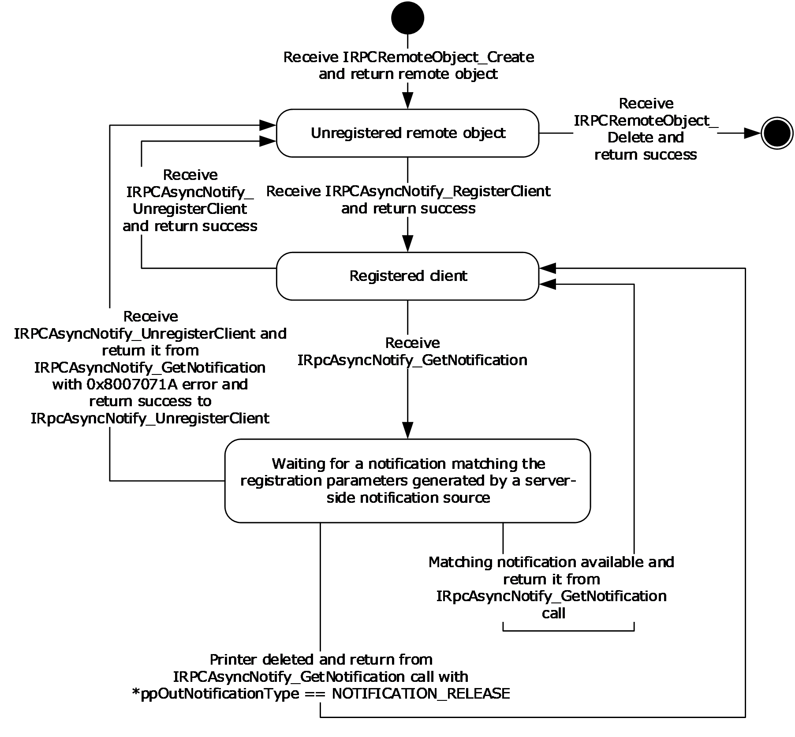

Figure 5: Unidirectional message passing mode

Bidirectional message passing mode is illustrated by the following two server state diagrams. The first diagram illustrates [**remote object**](#gt_remote-object) creation and deletion, client registration, and the opening of [**notification channels**](#gt_notification-channel). The second diagram details the processing of an open channel, including its eventual closure.

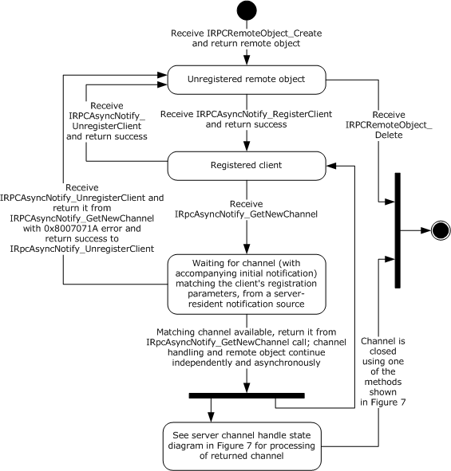

Figure 6: Bidirectional message passing mode

The following diagram illustrates the processing of a single open channel.

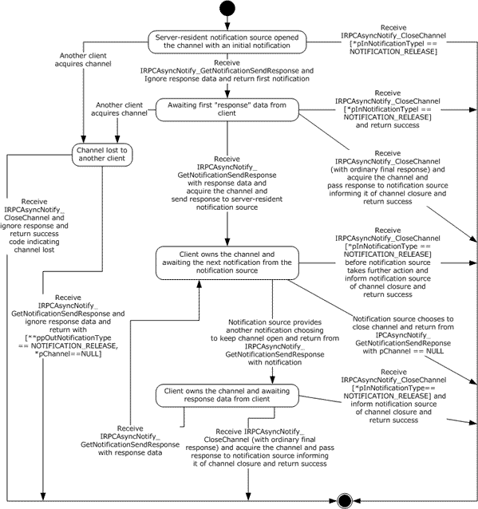

Figure 7: Processing a single open channel

#### 3.1.1.1 Abstract Data Model

This section describes a conceptual model of the possible data organization that an implementation SHOULD maintain to participate in this protocol. The organization that is described in this section is provided to facilitate the explanation of how the protocol behaves. This specification does not mandate that implementations adhere to this model as long as their external behavior is consistent with the behavior described in this specification.

This section describes the Print System Asynchronous Notification Protocol in terms of an abstract data model that represents physical devices as objects and provides interfaces for communication and configuration management.

**Current Authenticated User**: A [**print server**](#gt_print-server) data structure scoped to the context of processing a particular message. This data structure holds an implementation-specific identifier for the [**authenticated user identity**](#gt_authenticated-user-identity).

**Client Registration**: A print server data structure that holds all the information provided by a [**print client**](#gt_print-client) via input parameters in its call to [IRPCAsyncNotify_RegisterClient (section 3.1.1.4.1)](#Section_3.1.1.4.1), as well as the **Current Authenticated User** when the server processed the message for the clients call. The **Client Registration** maps directly to a registered [PRPCREMOTEOBJECT (section 2.2.4)](#Section_2.2.4). The server MUST use this information to filter **Bidirectional Notification Channels** and unidirectional notifications that are sent to the client from [**notification sources**](#gt_notification-source). [Other Local Events (section 3.1.1.6)](#Section_3.1.1.6) specifies this filtering mechanism, which is based upon information associated with requests that originate from notification sources.

**Unidirectional Notification Queue**: Associated with each **Client Registration** in [**unidirectional communication mode**](#gt_unidirectional-communication-mode), a queue of unidirectional notifications that have been initiated by server-resident notification sources, but which have not yet been returned to the client of the **Client Registration** by [IRPCAsyncNotify_GetNotification (section 3.1.1.4.5)](#Section_3.1.1.4.5).

**Bidirectional Notification Channel Queue**: Associated with each **Client Registration** in [**bidirectional communication mode**](#gt_bidirectional-communication-mode), a queue of bidirectional [**notification channels**](#gt_notification-channel) that have been opened by server-resident notification sources, but which have not yet been acquired by a client, as specified in [IRPCAsyncNotify_GetNotificationSendResponse (section 3.1.1.4.4)](#Section_3.1.1.4.4).

**Bidirectional Notification Channel**: A notification channel that is created for use by a single notification source in bidirectional communication mode. Associated with each **Bidirectional Notification Channel** are [PrintAsyncNotificationType](#Section_2.2.1) and [PrintAsyncNotifyUserFilter](#Section_2.2.2) values (sections 2.2.1 and 2.2.2), and an authenticated user identity, which are provided by the notification source when the channel is opened, as specified by the local event [Bidirectional Notification Channel Opened](#Section_3.1.1.6.2) (section 3.1.1.6.2).

The **Bidirectional Notification Channel** is exposed to zero, one, or more clients as a [PNOTIFYOBJECT (section 2.2.5)](#Section_2.2.5) that is returned by [IRPCAsyncNotify_GetNewChannel (section 3.1.1.4.3)](#Section_3.1.1.4.3). Each client is distinguished by a specific PNOTIFYOBJECT, and one client, at most, can be marked as having acquired the **Bidirectional Notification Channel**. After a particular client has acquired the channel, none of the responses from other clients will be successfully accepted by the server. This continues even after the channel is closed; once acquired, the channel can never be acquired again.

Zero or one unsent notifications can be associated with the **Bidirectional Notification Channel**. Held notifications are discussed in [Bidirectional Notification Generated (section 3.1.1.6.3)](#Section_3.1.1.6.3). A held unsent notification is used for the initial notification mediating behavior specified in IRPCAsyncNotify_GetNotificationSendResponse (Opnum 4) (section 3.1.1.4.4).

**Note** The preceding conceptual data can be implemented using a variety of techniques.

#### 3.1.1.2 Timers

No timer events are required on the client outside of the timers required in the underlying [**RPC**](#gt_remote-procedure-call-rpc) ([MS-RPCE](../MS-RPCE/MS-RPCE.md) section 3).

#### 3.1.1.3 Initialization

The server MUST listen on dynamically assigned endpoints ([[C706]](https://go.microsoft.com/fwlink/?LinkId=89824) section 6.2.2).

#### 3.1.1.4 Message Processing Events and Sequencing Rules

This protocol MUST direct the [**RPC**](#gt_remote-procedure-call-rpc) runtime ([MS-RPCE](../MS-RPCE/MS-RPCE.md) section 3) to do the following:

- Perform a strict [**NDR**](#gt_network-data-representation-ndr) data consistency check at target level 6.0.
- Reject a null unique or full pointer with a nonzero conforming value.
Methods in RPC Opnum Order

| Method | Description |
| --- | --- |
| [IRPCAsyncNotify_RegisterClient](#Section_3.1.1.4.1) | This method is called by clients to register to receive [**notifications**](#gt_notification) and to associate the parameters describing the set of notifications they are registering to receive with a [**remote object**](#gt_remote-object). Opnum: 0 |
| [IRPCAsyncNotify_UnregisterClient](#Section_3.1.1.4.2) | This method is called by registered clients to unregister remote objects. Opnum: 1 |
| Opnum2NotUsedOnWire | Reserved for local use. Opnum: 2 |
| [IRPCAsyncNotify_GetNewChannel](#Section_3.1.1.4.3) | This method returns an array of pointers to print [**notification channels**](#gt_notification-channel). Opnum: 3 |
| [IRPCAsyncNotify_GetNotificationSendResponse](#Section_3.1.1.4.4) | This method sends a client [**response**](#gt_response) to the server and returns the next notification sent by way of the same channel when it becomes available. Opnum: 4 |
| [IRPCAsyncNotify_GetNotification](#Section_3.1.1.4.5) | This method returns notification data from the server. Opnum: 5 |
| [IRPCAsyncNotify_CloseChannel](#Section_3.1.1.4.6) | This method sends a final response on the notification channel and closes it. Opnum: 6 |

In the preceding table, the term "Reserved for local use" means that the client MUST NOT send the [**opnum**](#gt_opnum), and the server behavior is undefined<7> because it does not affect interoperability.

##### 3.1.1.4.1 IRPCAsyncNotify_RegisterClient (Opnum 0)

The IRPCAsyncNotify_RegisterClient method is called by clients to register to receive notifications and to associate the parameters describing the set of notifications they are registering to receive with a [**remote object**](#gt_remote-object).

HRESULT IRPCAsyncNotify_RegisterClient(

[in] PRPCREMOTEOBJECT pRegistrationObj,

[in, string, unique] const wchar_t* pName,

[in] PrintAsyncNotificationType* pInNotificationType,

[in] PrintAsyncNotifyUserFilter NotifyFilter,

[in] PrintAsyncNotifyConversationStyle conversationStyle,

[out, string] wchar_t** ppRmtServerReferral

);

**pRegistrationObj:** MUST be the remote object context handle that was returned by the server in the *ppRemoteObject* output parameter of a prior call to [IRPCRemoteObject_Create (section 3.1.2.4.1)](#Section_3.1.2.4.1). This value MUST NOT be NULL.

**pName:** MUST be NULL or a pointer to a NULL-terminated string, encoded in [**Unicode**](#gt_unicode) [**UTF-16LE**](#gt_utf-16le) ([[RFC2781]](https://go.microsoft.com/fwlink/?LinkId=90380) section 4.2), which specifies the full [**UNC**](#gt_universal-naming-convention-unc) name of the [**print queue**](#gt_print-queue) from which the [**print client**](#gt_print-client) is registering to receive notifications.

This UNC name MUST be in the following format:

"\\" SERVER_NAME "\" LOCAL_PRINTER_NAME

**SERVER_NAME** is a [**DNS**](#gt_domain-name-system-dns), [**NetBIOS**](#gt_netbios), [**IPv4**](#gt_internet-protocol-version-4-ipv4), or [**IPv6**](#gt_internet-protocol-version-6-ipv6) host name.

**LOCAL_PRINTER_NAME** is a string that MUST NOT contain the characters "\" or ",".

DNS names are specified in [[RFC819]](https://go.microsoft.com/fwlink/?LinkId=90495) section 2, and NetBIOS names are specified in [[RFC1001]](https://go.microsoft.com/fwlink/?LinkId=90260) section 14. Basic notational conventions are specified in [[RFC2616]](https://go.microsoft.com/fwlink/?LinkId=90372) section 2, and "host" is defined in [[RFC3986]](https://go.microsoft.com/fwlink/?LinkId=90453) section 3.2.2.

If *pName* is NULL, the registration MUST be made for the remote [**print server**](#gt_print-server) itself.

**pInNotificationType:** MUST be a pointer to a [PrintAsyncNotificationType](#Section_2.2.1) structure that specifies the [**notification type identifier**](#gt_notification-type-identifier) for the notifications that the client is registering to receive.

**NotifyFilter:** MUST be a value of type [PrintAsyncNotifyUserFilter](#Section_2.2.2) that specifies whether the client is registering to receive notifications that are issued to all registered clients, irrespective of their [**authenticated user identity**](#gt_authenticated-user-identity), or to receive notifications that are issued only to the specific authenticated user identity of the registering [**RPC**](#gt_remote-procedure-call-rpc) client.

**conversationStyle:** MUST be a value of type [PrintAsyncNotifyConversationStyle](#Section_2.2.3) that specifies whether the client is registering for [**bidirectional communication mode**](#gt_bidirectional-communication-mode) or [**unidirectional communication mode**](#gt_unidirectional-communication-mode).

**ppRmtServerReferral:** Servers SHOULD return NULL for this parameter, and clients MUST ignore it on receipt.

**Return Values:** This method MUST return zero to indicate success, or an [**HRESULT**](#gt_hresult) error value ([MS-ERREF](../MS-ERREF/MS-ERREF.md) section 2.1.1) to indicate failure. Protocol-specific error values are defined in the following table. The client SHOULD treat all error return values the same, except where noted.

| Return value | Description |
| --- | --- |
| 0x80070005 | The client does not have authorization to register for notifications with the set of parameters specified in this call. If this error value is returned, the client SHOULD NOT retry this call; the client SHOULD consider the error to be fatal and report it to the higher level caller. |
| 0x8007000E | The server does not have enough memory for the new registration. |
| 0x80070015 | The server has reached its maximum registration limit. |
| 0x8007007B | The *pName* parameter does not conform to the format specified above. If this error value is returned, the client SHOULD NOT retry this call; the client SHOULD consider the error to be fatal and report it to the higher level caller. |

**Exceptions Thrown**: No exceptions are thrown beyond those thrown by the underlying RPC protocol [MS-RPCE](../MS-RPCE/MS-RPCE.md).

Unless specified otherwise, if a failure is indicated by an error return or an exception, the client SHOULD retry this method call by performing the following steps:

- Call IRPCRemoteObject_Create to generate a new [PRPCREMOTEOBJECT (section 2.2.4)](#Section_2.2.4).
- Call IRPCAsyncNotify_RegisterClient with the new PRPCREMOTEOBJECT.
Retries SHOULD be separated by time intervals decaying from 1 second to 1 minute to reduce a potential burden on the server.

The IRPCAsyncNotify_RegisterClient method MUST be called by clients to register for receiving notifications. Servers MUST associate the given remote object with the registration parameters specified.

A client MUST NOT call IRPCAsyncNotify_RegisterClient if a prior call to IRPCAsyncNotify_RegisterClient succeeded using the same PRPCREMOTEOBJECT value, unless a later call to [IRPCAsyncNotify_UnregisterClient](#Section_3.1.1.4.2) also succeeded.

If registering for unidirectional communication mode, a client SHOULD call [IRPCAsyncNotify_GetNotification](#Section_3.1.1.4.5) after a successful call to IRPCAsyncNotify_RegisterClient using the same PRPCREMOTEOBJECT value.

If registering for bidirectional communication mode, a client SHOULD call [IRPCAsyncNotify_GetNewChannel](#Section_3.1.1.4.3) after a successful call to IRPCAsyncNotify_RegisterClient using the same PRPCREMOTEOBJECT value.

Servers MUST support the concurrent registration of multiple remote objects with different registration parameters, including [**notification type**](#gt_notification-type), filter, and communication mode.

Servers SHOULD consider the security and privacy context prior to letting clients monitor and receive notifications for all user identities. Relevant access rights are defined in the following table.

| Name/Value | Description |
| --- | --- |
| SERVER_ALL_ACCESS 0x000F0003 | Combines the **WO** (Write Owner), **WD** (Write DACL), **RC** (Read Control), and **DE** (Delete) bits of the ACCESS_MASK data type ([MS-DTYP](../MS-DTYP/MS-DTYP.md) section 2.4.3) with the following protocol-specific bits: 0x00000001 (bit 31): Access rights to administer print servers. 0x00000002 (bit 30): Access rights to enumerate print servers. These printing-specific access rights allow a client to administer the server and to enumerate server components such as print queues. |
| PRINTER_ALL_ACCESS 0x000F000C | Combines the **WO** (Write Owner), **WD** (Write DACL), **RC** (Read Control), and **DE** (Delete) bits of the ACCESS_MASK data type with the following protocol-specific bits: 0x00000004 (bit 29): Access rights for printers to perform administrative tasks. 0x00000008 (bit 28): Access rights for printers to perform basic printing operations. These printing-specific access rights allow a client basic and administrative use of print queues. |

For calls to IRPCAsyncNotify_RegisterClient with *NotifyFilter* set to **kAllUsers**, if *pName* is set to NULL, the server SHOULD fail the call if the calling principal lacks any of the server access rights specified by **SERVER_ALL_ACCESS**. If *pName* points to the name of a print queue, the server SHOULD fail the call if the calling principal lacks any of the print queue access rights specified by **PRINTER_ALL_ACCESS**. For additional information concerning access rights, see [MS-AZOD](../MS-AZOD/MS-AZOD.md) section 1.1.1.5.

##### 3.1.1.4.2 IRPCAsyncNotify_UnregisterClient (Opnum 1)

The IRPCAsyncNotify_UnregisterClient method is called by registered clients to unregister previously-registered [**remote objects**](#gt_remote-object). For this call to succeed, the remote object MUST have already successfully called [IRPCAsyncNotify_RegisterClient](#Section_3.1.1.4.1).

HRESULT IRPCAsyncNotify_UnregisterClient(

[in] PRPCREMOTEOBJECT pRegistrationObj

);

**pRegistrationObj:** MUST be the remote object context handle that MUST have been successfully registered by a prior call to IRPCAsyncNotify_RegisterClient. This value MUST NOT be NULL.

**Return Values:** This method MUST return an [**HRESULT**](#gt_hresult) success value ([MS-ERREF](../MS-ERREF/MS-ERREF.md) section 2.1.1) to indicate success, or an HRESULT error value to indicate failure. The client MUST consider all error return values fatal and report them to the higher-level caller.

**Exceptions Thrown**: No exceptions are thrown beyond those thrown by the underlying RPC protocol [MS-RPCE](../MS-RPCE/MS-RPCE.md).

If a client call to [IRPCAsyncNotify_GetNewChannel](#Section_3.1.1.4.3) or [IRPCAsyncNotify_GetNotification](#Section_3.1.1.4.5) is blocked on the server waiting for a [**notification channel**](#gt_notification-channel) or [**notification**](#gt_notification) to become available, the server MUST process a client call to IRPCAsyncNotify_UnregisterClient without waiting for the notification channel or notification.

A server MUST NOT do the following:

- Indicate success to a client call of IRPCAsyncNotify_UnregisterClient unless a prior call to IRPCAsyncNotify_RegisterClient succeeded using the same [PRPCREMOTEOBJECT](#Section_2.2.4) value.
- Indicate success to a client call of IRPCAsyncNotify_UnregisterClient following a prior successful call to IRPCAsyncNotify_UnregisterClient by using the same PRPCREMOTEOBJECT value.
A client MUST NOT do the following:

- Call IRPCAsyncNotify_UnregisterClient, unless a prior call to IRPCAsyncNotify_RegisterClient succeeded by using the same PRPCREMOTEOBJECT value.
- Call IRPCAsyncNotify_UnregisterClient following a prior call to IRPCAsyncNotify_UnregisterClient by using the same PRPCREMOTEOBJECT value.

##### 3.1.1.4.3 IRPCAsyncNotify_GetNewChannel (Opnum 3)

The IRPCAsyncNotify_GetNewChannel method returns an array of pointers to print [**notification channels**](#gt_notification-channel). This method MUST only be used with [**bidirectional communication mode**](#gt_bidirectional-communication-mode).

HRESULT IRPCAsyncNotify_GetNewChannel(

[in] PRPCREMOTEOBJECT pRemoteObj,

[out] unsigned long* pNoOfChannels,

[out, size_is( , *pNoOfChannels)]

PNOTIFYOBJECT** ppChannelCtxt

);

**pRemoteObj:** MUST be the [**remote object**](#gt_remote-object) context handle. This handle is obtained from [IRPCRemoteObject_Create (section 3.1.2.4.1)](#Section_3.1.2.4.1). This remote object MUST have been registered for bidirectional communication mode by a prior successful call to [IRPCAsyncNotify_RegisterClient (section 3.1.1.4.1)](#Section_3.1.1.4.1).

**pNoOfChannels:** MUST specify the number of notification channels returned. The array of notification channels is specified by the **ppChannelCtxt** parameter.

The server SHOULD return all not-yet-acquired bidirectional channels in response to a single IRPCAsyncNotify_GetNewChannel call. The server SHOULD return such channels regardless of whether they were created before or after client registration or the call to IRPCAsyncNotify_GetNewChannel.

**ppChannelCtxt:** MUST specify a pointer to the array of returned notification channels. This data is represented by a **Bidirectional Notification Channel** structure in the [Abstract Data Model (section 3.1.1.1)](#Section_3.1.1.1).

**Return Values:** This method MUST return zero to indicate success, or an [**HRESULT**](#gt_hresult) error value ([MS-ERREF](../MS-ERREF/MS-ERREF.md) section 2.1.1) to indicate failure. Protocol-specific error values are defined in the following table. The client SHOULD treat all error return values the same, except where noted.

| Return value | Description |
| --- | --- |
| 0x8004000C | The server has not yet returned from a previous call to this method with the same remote object. If this error value is returned, the client SHOULD NOT retry this call before the previous call to this method with the specified remote object has completed. |
| 0x8007000E | The server does not have enough memory for the new channel. |
| 0x8007071A | Incoming notifications have been terminated. Upon completion of this call with this return value, the server MUST fail subsequent calls to this method with the same remote object. If this error value is returned, the client SHOULD NOT retry this call. |

**Exceptions Thrown**: An exception code of 0x8004000C or 0x8007071A SHOULD be thrown by the server under the circumstances described in the preceding table for the corresponding return values. The client MUST treat these exception codes exactly as it would treat the same return values. No additional exceptions are thrown beyond those thrown by the underlying RPC protocol [MS-RPCE](../MS-RPCE/MS-RPCE.md).

Unless specified otherwise, if a failure is indicated by an error return or an exception, the client SHOULD retry this method call by performing the following steps:

- Call IRPCRemoteObject_Create to generate a new [PRPCREMOTEOBJECT (section 2.2.4)](#Section_2.2.4).
- Call IRPCAsyncNotify_RegisterClient with the new PRPCREMOTEOBJECT.
- Call IRPCAsyncNotify_GetNewChannel with the new PRPCREMOTEOBJECT.
Retries SHOULD be separated by time intervals decaying from 1 second to 1 minute to reduce a potential burden on the server. Retries SHOULD terminate when the above sequence succeeds or the client determines that it is no longer interested in notifications for the particular combination of [**notification type**](#gt_notification-type), [**print queue**](#gt_print-queue) name, conversation style, and [**user identity filter**](#gt_user-identity-filter) that were originally specified in the call to IRPCAsyncNotify_RegisterClient.

If successful, the IRPCAsyncNotify_GetNewChannel method MUST return an array of pointers to print notification channels.

A server MUST NOT do the following:

- Indicate success to a client call of IRPCAsyncNotify_GetNewChannel unless a prior call to IRPCAsyncNotify_RegisterClient succeeded using the same PRPCREMOTEOBJECT value.
- Indicate success to a client call of IRPCAsyncNotify_GetNewChannel following a prior successful call to [IRPCAsyncNotify_UnregisterClient](#Section_3.1.1.4.2) using the same PRPCREMOTEOBJECT value.
- Complete a call to IRPCAsyncNotify_GetNewChannel unless an unreturned notification channel is available on the **Bidirectional Notification Channel Queue** associated with the **Client Registration** (Abstract Data Model, section 3.1.1.1), or an abnormal event happened, such as an initiated server shutdown sequence.
A client SHOULD do the following:

- Call IRPCAsyncNotify_GetNewChannel in response to a prior successful return from IRPCAsyncNotify_RegisterClient or IRPCAsyncNotify_GetNewChannel.
- Call [IRPCAsyncNotify_GetNotificationSendResponse](#Section_3.1.1.4.4) in response to a prior successful return from IRPCAsyncNotify_GetNewChannel.
A client MUST NOT do the following:

- Call IRPCAsyncNotify_GetNewChannel, unless a prior call to IRPCAsyncNotify_RegisterClient succeeded by using the same PRPCREMOTEOBJECT value.<8>
- Call IRPCAsyncNotify_GetNewChannel following a prior call to IRPCAsyncNotify_UnregisterClient by using the same PRPCREMOTEOBJECT value.<9>

##### 3.1.1.4.4 IRPCAsyncNotify_GetNotificationSendResponse (Opnum 4)

The IRPCAsyncNotify_GetNotificationSendResponse method sends a client [**response**](#gt_response) to the server and returns the next [**notification**](#gt_notification) sent by way of the same channel when it becomes available. This method MUST be used only with [**bidirectional communication mode**](#gt_bidirectional-communication-mode).

HRESULT IRPCAsyncNotify_GetNotificationSendResponse(

[in, out] PNOTIFYOBJECT* pChannel,

[in, unique] PrintAsyncNotificationType* pInNotificationType,

[in] unsigned long InSize,

[in, size_is(InSize), unique] byte* pInNotificationData,

[out] PrintAsyncNotificationType** ppOutNotificationType,

[out] unsigned long* pOutSize,

[out, size_is( , *pOutSize)] byte** ppOutNotificationData

);

**pChannel:** A pointer to a [**notification channel**](#gt_notification-channel) that MUST NOT be closed or zero, and which MUST have been returned by the server in the *ppChannelCtxt* output parameter of a prior call to [IRPCAsyncNotify_GetNewChannel](#Section_3.1.1.4.3). If the server closes the notification channel, it MUST set the *pChannel* value to NULL upon return from this method. If the notification channel was acquired by a different client, the server MUST set the *pChannel* value to NULL upon return from this method.

**pInNotificationType:** A NULL value or a pointer to a [PrintAsyncNotificationType](#Section_2.2.1) structure that specifies the [**notification type identifier**](#gt_notification-type-identifier) of the [**notification type**](#gt_notification-type) in which the registered client is interested.

On the first call to this method, the value of *pInNotificationType* MUST be NULL. On subsequent calls to this method, the value of *pInNotificationType* MUST be a pointer to a PrintAsyncNotificationType structure that specifies the notification type identifier for which the client has registered.

**InSize:** The size, in bytes, of the input data that the *pInNotificationData* parameter points to. The server SHOULD impose an upper limit of 0x00A00000 on this value. If the client exceeds the server-imposed limit, the server MUST return an error result.

**pInNotificationData:** A pointer to input data holding the client's response to the previous notification that was received on the same bidirectional notification channel.

On the first call to this method for a given channel, the client SHOULD provide zero bytes of response data and the server MUST ignore any response data sent. On subsequent calls to this method, the response format MUST conform to the requirements of the notification channel's notification type, and those notification type requirements determine whether or a not a zero-byte response is acceptable.

If the value of *InSize* is not 0x00000000, *pInNotificationData* MUST NOT be NULL.

**ppOutNotificationType:** A pointer to the returned pointer to the notification type identifier of the server-to-client notification. If the notification channel was acquired by a different client, the value MUST be **NOTIFICATION_RELEASE** (section 2.2.1). If the server needs to close the notification channel without sending a final response, the value SHOULD be **NOTIFICATION_RELEASE**. In all other cases, the value MUST be the same as the notification type identifier of the notification type for which the client has registered.

**pOutSize:** A pointer to the returned length of server-to-client notification data, in number of bytes. The client MAY impose an upper limit on this value that is smaller than the maximum unsigned 32-bit integer. If the notification channel was acquired by a different client, the server SHOULD set the value of *pOutSize* to 0x00000000. If the value of *ppOutNotificationType* points to **NOTIFICATION_RELEASE**, the server SHOULD set the value of *pOutSize* to 0x00000000.

**ppOutNotificationData:** A pointer to the returned pointer to server-to-client notification data in a format that MUST conform to the notification channel's notification type. If the notification channel was acquired by a different client, the server SHOULD set the value of *ppOutNotificationData* to NULL. If the value of *ppOutNotificationType* points to **NOTIFICATION_RELEASE**, the client MUST ignore the content of *ppOutNotificationData*.

**Return Values:** This method MUST return zero to indicate success, or an [**HRESULT**](#gt_hresult) error value ([MS-ERREF](../MS-ERREF/MS-ERREF.md) section 2.1.1) to indicate failure. Protocol-specific error values are defined in the following table. The client MUST consider all error return values fatal and report them to the higher-level caller.

| Return value | Description |
| --- | --- |
| 0x80040008 | The notification channel represented by *pChannel* was previously closed. |
| 0x8004000C | The server has not yet returned from a previous call to IRPCAsyncNotify_GetNotificationSendResponse or [IRPCAsyncNotify_CloseChannel (section 3.1.1.4.6)](#Section_3.1.1.4.6) with the same notification channel. |
| 0x80040012 | The size of the client-to-server response exceeded the maximum size. |
| 0x80040014 | The notification type identifier is different from the notification type of the notification channel. |
| 0x8007000E | The server does not have enough memory to complete the request. |

**Exceptions Thrown**: No exceptions are thrown beyond those thrown by the underlying RPC protocol [MS-RPCE](../MS-RPCE/MS-RPCE.md).

If a failure is indicated by an error return or an exception, the client SHOULD close the channel.

The first call to this method on the newly opened notification channel serves as a mediator among all the clients that registered themselves for the given notification type. This MUST be done by blocking all calls from clients until a matching server-side event occurs, including the following:

- The channel issues a notification.
- An abnormal condition occurs, such as an initiated server shutdown sequence.
- The server receives a client request to close the channel.
The server MUST do the following.

- Choose the first client that sent a response, whether by calling this method or by calling [IRPCAsyncNotify_CloseChannel](#Section_3.1.1.4.6) with a notification type identifier other than **NOTIFICATION_RELEASE**, and assign the opened notification channel to that client.
- For all other clients, set the value of the *ppOutNotificationType* output parameter to **NOTIFICATION_RELEASE** and the value of the *pChannel* parameter to NULL.
- Return an HRESULT success value [MS-ERREF] to all the other clients that have outstanding blocked calls to this method.
All subsequent calls to this method MUST take the response provided by the client that was assigned to the notification channel and pass it to the server-resident [**notification source**](#gt_notification-source) that opened the notification channel. The call MUST return when a subsequent notification is sent from a notification source using the bidirectional notification channel; the channel is closed; or an abnormal event happens, such as the print spooler server terminating its execution.

The server MUST NOT indicate success to a client call to this method if a prior call to IRPCAsyncNotify_CloseChannel succeeded specifying the same notification channel.

A client MUST NOT call IRPCAsyncNotify_GetNotificationSendResponse following a prior successful return from IRPCAsyncNotify_GetNotificationSendResponse with a NULL output value of the *pChannel* parameter or following a prior successful return from IRPCAsyncNotify_CloseChannel.

A client SHOULD call IRPCAsyncNotify_GetNotificationSendResponse or IRPCAsyncNotify_CloseChannel following a prior successful return from IRPCAsyncNotify_GetNotificationSendResponse with a non-NULL output value of the *pChannel* parameter.

##### 3.1.1.4.5 IRPCAsyncNotify_GetNotification (Opnum 5)

The IRPCAsyncNotify_GetNotification method returns [**notification**](#gt_notification) data from the [**print server**](#gt_print-server). This method MUST NOT be used with [**bidirectional communication mode**](#gt_bidirectional-communication-mode).

HRESULT IRPCAsyncNotify_GetNotification(

[in] PRPCREMOTEOBJECT pRemoteObj,

[out] PrintAsyncNotificationType** ppOutNotificationType,

[out] unsigned long* pOutSize,

[out, size_is(, *pOutSize)] byte** ppOutNotificationData

);

**pRemoteObj:** MUST be the [**remote object**](#gt_remote-object) context handle. This remote object MUST have been registered for [**unidirectional communication mode**](#gt_unidirectional-communication-mode) by a prior successful call to [IRPCAsyncNotify_RegisterClient (section 3.1.1.4.1)](#Section_3.1.1.4.1).

**ppOutNotificationType:** MUST return a pointer to the [**notification type identifier**](#gt_notification-type-identifier) of the server-to-client notification. If the registered remote object has been deleted, the value MUST be **NOTIFICATION_RELEASE** (section [2.2.1](#Section_2.2.1)). In all other cases the value MUST be the same as the notification type identifier of the [**notification type**](#gt_notification-type) for which the [**print client**](#gt_print-client) has registered.

**pOutSize:** MUST be the length of server-to-client notification data, in number of bytes. The client MAY impose an upper limit on this value that is smaller than the maximum unsigned 32-bit integer.

**ppOutNotificationData:** MUST be a pointer to server-to-client notification data in a format that MUST conform to the channel's notification type.

**Return Values:** This method MUST return zero to indicate success, or an [**HRESULT**](#gt_hresult) error value ([MS-ERREF](../MS-ERREF/MS-ERREF.md) section 2.1.1) to indicate failure. Protocol-specific error values are defined in the following table. The client SHOULD treat all error return values the same, except where noted.

| Return value | Description |
| --- | --- |
| 0x8004000C | The server has not yet returned from a previous call to this method with the same remote object. If this error value is returned, the client SHOULD NOT retry this call before the previous call to this method with the specified remote object has completed. |
| 0x8007000E | The server does not have enough memory to complete the request. |
| 0x8007071A | Incoming notifications have been terminated. Upon completion of this call with this return value, the server MUST fail subsequent calls to this method with the same remote object. If this error value is returned, the client SHOULD NOT retry this call. |

**Exceptions Thrown**: An exception code of 0x08004000C or 0x8007071A SHOULD be thrown by the server under the circumstances described in the preceding table for the corresponding return values. The client MUST treat these exception codes exactly as it would treat the same return values. No additional exceptions are thrown beyond those thrown by the underlying RPC protocol [MS-RPCE](../MS-RPCE/MS-RPCE.md).

Unless specified otherwise, if a failure is indicated by an error return or an exception, the client SHOULD retry this method call by performing the following steps:

- Call [IRPCRemoteObject_Create (section 3.1.2.4.1)](#Section_3.1.2.4.1) to generate a new [PRPCREMOTEOBJECT (section 2.2.4)](#Section_2.2.4).
- Call IRPCAsyncNotify_RegisterClient with the new PRPCREMOTEOBJECT.
- Call IRPCAsyncNotify_GetNotification with the new PRPCREMOTEOBJECT.
Retries SHOULD be separated by time intervals decaying from 1 second to 1 minute to reduce a potential burden on the server. Retries SHOULD terminate when the above sequence succeeds or the client determines that it is no longer interested in notifications for the particular combination of notification type, [**print queue**](#gt_print-queue) name, conversation style, and [**user identity filter**](#gt_user-identity-filter) that were originally specified in the call to IRPCAsyncNotify_RegisterClient.

The IRPCAsyncNotify_GetNotification method MUST return data from the server that matches the registration for the given remote object.

A server MUST NOT do the following:

- Indicate success to a client call of IRPCAsyncNotify_GetNotification unless a prior call to IRPCAsyncNotify_RegisterClient succeeded using the same PRPCREMOTEOBJECT value.
- Indicate success to a client call of IRPCAsyncNotify_GetNotification following a prior successful call to [IRPCAsyncNotify_UnregisterClient](#Section_3.1.1.4.2) using the same PRPCREMOTEOBJECT value.
- Complete a call to IRPCAsyncNotify_GetNotification until the **Unidirectional Notification Queue** associated with the **Client Registration** ([Abstract Data Model (section 3.1.1.1)](#Section_3.1.1.1)) contains an unreturned notification, or an abnormal condition occurs. An example of an abnormal condition is an initiated server shutdown sequence or remote object unregistration. An abnormal condition will result in a failure error code returned prior to the server having data.
A server SHOULD do the following:

- Discard unidirectional notifications in the absence of corresponding registered clients.
- Buffer unidirectional notifications, up to some implementation-defined limit,<10> for each registered client that does not have pending IRPCAsyncNotify_GetNotification calls.
If a client wants to receive further notifications from the server, the client SHOULD call IRPCAsyncNotify_GetNotification in response to a prior successful return from IRPCAsyncNotify_GetNotification. When the client no longer wants to receive notifications from the server, it SHOULD call IRPCAsyncNotify_UnregisterClient, either before or after the return from IRPCAsyncNotify_GetNotification.

A client MUST NOT do the following:

- Call IRPCAsyncNotify_GetNotification unless a prior call to IRPCAsyncNotify_RegisterClient succeeded, using the same PRPCREMOTEOBJECT value.
- Call IRPCAsyncNotify_GetNotification following a prior call to IRPCAsyncNotify_UnregisterClient by using the same PRPCREMOTEOBJECT value.

##### 3.1.1.4.6 IRPCAsyncNotify_CloseChannel (Opnum 6)

The IRPCAsyncNotify_CloseChannel method sends a final [**response**](#gt_response) on the [**notification channel**](#gt_notification-channel) and closes it. This method MUST NOT be used with [**unidirectional communication mode**](#gt_unidirectional-communication-mode).

HRESULT IRPCAsyncNotify_CloseChannel(

[in, out] PNOTIFYOBJECT* pChannel,

[in] PrintAsyncNotificationType* pInNotificationType,

[in] unsigned long InSize,

[in, size_is(InSize), unique] byte* pReason

);

**pChannel:** MUST be a pointer to a notification channel that MUST NOT be closed or zero and that MUST have been returned by the server in the *ppChannelCtxt* output parameter of a prior call to [IRPCAsyncNotify_GetNewChannel](#Section_3.1.1.4.3). Upon receipt, the server MUST set the **pChannel** value to NULL.

**pInNotificationType:** MUST be a pointer to a [PrintAsyncNotificationType](#Section_2.2.1) value. If the client needs to close the notification channels without sending a final response, then this value SHOULD point to **NOTIFICATION_RELEASE**. In all other cases, this value MUST point to the [**notification type identifier**](#gt_notification-type-identifier) of the [**notification type**](#gt_notification-type) for which the client has registered.

**InSize:** The server SHOULD impose an upper limit on this value that is smaller than the maximum unsigned 32-bit integer. That limit SHOULD be 0x00A00000. If the client exceeds the server-imposed limit, the server MUST return an error result.

If **pInNotificationType** is **NOTIFICATION_RELEASE**, then InSize SHOULD be 0x00000000.

**pReason:** MUST be a pointer to a sequence of bytes conveying final client-to-server response data. The number of bytes MUST be provided in the *InSize* parameter. If InSize is not 0x00000000, then pReason MUST NOT be NULL.

If **pInNotificationType** is **NOTIFICATION_RELEASE**, then the client SHOULD provide zero bytes of response data and the server MUST ignore any response data pointed to by **pReason**. If **pInNotificationType** is not **NOTIFICATION_RELEASE**, then the response format MUST conform to the requirements of the notification channel's notification type and those notification type requirements determine whether or not a zero-byte response is acceptable.

**Return Values:** This method MUST return zero or an [**HRESULT**](#gt_hresult) success value ([MS-ERREF](../MS-ERREF/MS-ERREF.md) section 2.1.1) to indicate success, or an HRESULT error value to indicate failure.

Protocol-specific success values are defined in the following table.

| Return value | Description |
| --- | --- |
| 0x00040010 | Another client has acquired the channel. |

Protocol-specific error values are defined in the following table. The client MUST consider all error return values fatal and report them to the higher-level caller.

| Return value | Description |
| --- | --- |
| 0x80040012 | The response exceeds the maximum size allowed by the server. |
| 0x80040014 | The notification type identifier is different from the notification type of the notification channel. |
| 0x8007000E | The server does not have enough memory to complete the request. |

**Exceptions Thrown**: No exceptions are thrown beyond those thrown by the underlying RPC protocol [MS-RPCE](../MS-RPCE/MS-RPCE.md).

If a client call to [IRPCAsyncNotify_GetNotificationSendResponse](#Section_3.1.1.4.4) is blocked on the server, waiting for a notification to become available on a notification channel, then the server MUST process a client call to this method on the same notification channel without waiting for a notification.

A client MUST NOT call IRPCAsyncNotify_CloseChannel following a prior successful return from IRPCAsyncNotify_GetNotificationSendResponse with a NULL value of *pChannel* parameter or following a prior successful return from IRPCAsyncNotify_CloseChannel.<11>

#### 3.1.1.5 Timer Events

No timer events are required on the server outside of the timers required in the underlying [**RPC**](#gt_remote-procedure-call-rpc) Protocol ([MS-RPCE](../MS-RPCE/MS-RPCE.md) section 3).

#### 3.1.1.6 Other Local Events

This protocol does not define the set of printing events that cause [**notification sources**](#gt_notification-source) to trigger [**notifications**](#gt_notification).

When a notification source opens a **Bidirectional Notification Channel** (section [3.1.1.1](#Section_3.1.1.1)) or sends a unidirectional notification, it MUST associate a [PrintAsyncNotificationType](#Section_2.2.1) value (section 2.2.1) with the request. That value SHOULD be used to match the request to a **Client Registration** (section 3.1.1.1). The notification source MUST also associate a [PrintAsyncNotifyUserFilter](#Section_2.2.2) value (section 2.2.2) with the request, to facilitate the application of a [**user identity filter**](#gt_user-identity-filter) in performing such matches. If the PrintAsyncNotifyUserFilter value is **kPerUser**, the notification source MUST also associate with the request the [**authenticated user identity**](#gt_authenticated-user-identity) of the user who is the intended target for receiving the notifications. The rules for interpreting PrintAsyncNotifyUserFilter values to apply a user identity filter are specified in section 2.2.2.

##### 3.1.1.6.1 Unidirectional Notification Generated

A [**notification source**](#gt_notification-source) that provides unidirectional notifications to a [**print client**](#gt_print-client) MUST provide the following with each [**notification**](#gt_notification):

- A [PrintAsyncNotificationType](#Section_2.2.1) value (section 2.2.1).
- A [PrintAsyncNotifyUserFilter](#Section_2.2.2) value (section 2.2.2).
- An [**authenticated user identity**](#gt_authenticated-user-identity).

##### 3.1.1.6.2 Bidirectional Notification Channel Opened

A [**notification source**](#gt_notification-source) that initiates the exchange of a sequence of one or more notifications and responses with a [**print client**](#gt_print-client) MUST open a **Bidirectional Notification Channel** (section [3.1.1.1](#Section_3.1.1.1)) to do so. When opening a **Bidirectional Notification Channel**, the notification source MUST provide the following:

- A [PrintAsyncNotificationType](#Section_2.2.1) value (section 2.2.1).
- A [PrintAsyncNotifyUserFilter](#Section_2.2.2) value (section 2.2.2).
- An [**authenticated user identity**](#gt_authenticated-user-identity).

##### 3.1.1.6.3 Bidirectional Notification Generated

When generating a bidirectional [**notification**](#gt_notification), a [**notification source**](#gt_notification-source) MUST identify an opened **Bidirectional Notification Channel** (section [3.1.1.1](#Section_3.1.1.1)). In order to successfully generate a bidirectional notification, a notification source MUST NOT identify a particular bidirectional notification channel if a prior notification sent on that channel has not been responded to by a client’s call to IRPCAsyncNotify_GetNotificationSendResponse (Opnum 4) (section [3.1.1.4.4)](#Section_3.1.1.4.4) or IRPCAsyncNotify_CloseChannel (Opnum 6) (section [3.1.1.4.6)](#Section_3.1.1.4.6).

When a notification source generates the initial notification for a bidirectional notification channel, the server MUST hold that notification until one of two events occurs.

- A client acquires the channel by sending a [**response**](#gt_response) as an input parameter to a call to IRPCAsyncNotify_GetNotificationSendResponse (Opnum 4) or IRPCAsyncNotify_CloseChannel (Opnum 6).
- The bidirectional notification channel is closed by the notification source.
When a notification source generates any subsequent notification for a bidirectional notification channel, the server MUST immediately send it to the client as an output parameter to the IRPCAsyncNotify_GetNotificationSendResponse (Opnum 4) call that was used by the client to send its response to the preceding notification.

##### 3.1.1.6.4 Bidirectional Notification Channel Closed

A [**notification source**](#gt_notification-source) that terminates the exchange of a sequence of notifications and responses with a [**print client**](#gt_print-client) MUST close the **Bidirectional Notification Channel** (section [3.1.1.1](#Section_3.1.1.1)). Such a closure can be due to normal processing or a critical failure in the notification source.

##### 3.1.1.6.5 Impersonate Client

This protocol uses local interfaces provided by the server implementation of [MS-RPCE](../MS-RPCE/MS-RPCE.md) to impersonate the user associated to the security context defined in [MS-RPCE] sections 3.1.1.1.1 and 3.2.1.4.1.1. This local interface is specified in [MS-RPCE] sections 3.1.1.4.2. This event stores an implementation-specific identifier for the [**authenticated user identity**](#gt_authenticated-user-identity) for the duration of processing the message reflected in the abstract data model as **Current Authenticated User**. This local event occurs for the processing of all messages in section [3.1.1.4](#Section_3.1.1.4).

### 3.1.2 IRPCRemoteObject Server Details

The IRPCRemoteObject server interface provides methods that allow a client to define a generic [**remote object**](#gt_remote-object) on a server. The version for this interface is 1.0. To receive incoming remote calls for this interface, the client MUST establish an [**RPC dynamic endpoint**](#gt_rpc-dynamic-endpoint) by using the [**UUID**](#gt_universally-unique-identifier-uuid) ae33069b-a2a8-46ee-a235-ddfd339be281.

#### 3.1.2.1 Abstract Data Model

No abstract data model is required.

#### 3.1.2.2 Timers

No protocol timer events are required on the client beyond the timers required in the underlying [**RPC**](#gt_remote-procedure-call-rpc) protocol ([MS-RPCE](../MS-RPCE/MS-RPCE.md) section 3).

#### 3.1.2.3 Initialization

The server MUST listen on dynamically assigned endpoints (see [[C706]](https://go.microsoft.com/fwlink/?LinkId=89824) section 6.2.2).

#### 3.1.2.4 Message Processing Events and Sequencing Rules

This protocol MUST direct the [**RPC**](#gt_remote-procedure-call-rpc) protocol ([MS-RPCE](../MS-RPCE/MS-RPCE.md) section 3) runtime to the following:

- Perform a strict [**NDR**](#gt_network-data-representation-ndr) data consistency check at target level 6.0.
- Reject a NULL unique or full pointer with non-zero conforming value.
The sections that follow specify the syntax and behavior for each method defined in this interface:

Methods in RPC Opnum Order

| Method | Description |
| --- | --- |
| [IRPCRemoteObject_Create](#Section_3.1.2.4.1) | The method creates a [**remote object**](#gt_remote-object) on a server and returns it to the client. Opnum: 0 |
| [IRPCRemoteObject_Delete](#Section_3.1.2.4.2) | The method destroys the specified remote object. Opnum: 1 |

##### 3.1.2.4.1 IRPCRemoteObject_Create (Opnum 0)

The IRPCRemoteObject_Create method creates a [**remote object**](#gt_remote-object) on a server and returns it to the client.

HRESULT IRPCRemoteObject_Create(

[in] handle_t hRemoteBinding,

[out] PRPCREMOTEOBJECT* ppRemoteObj

);

**hRemoteBinding:** MUST be a client-generated [**RPC**](#gt_remote-procedure-call-rpc) binding handle ([[C706]](https://go.microsoft.com/fwlink/?LinkId=89824) section 2.3) by using a [**Universal Naming Convention (UNC)**](#gt_universal-naming-convention-unc) name that MUST uniquely identify a print server on the network.

**ppRemoteObj:** MUST be a remote object context handle returned by the server. It MUST be a non-NULL value.

**Return Values:** This method MUST return zero to indicate success, or an [**HRESULT**](#gt_hresult) error value ([MS-ERREF](../MS-ERREF/MS-ERREF.md) section 2.1.1) to indicate failure. The client MUST consider all error return values fatal and report them to the higher-level caller.

**Exceptions Thrown**: No exceptions are thrown beyond those thrown by the underlying RPC protocol [MS-RPCE](../MS-RPCE/MS-RPCE.md).

##### 3.1.2.4.2 IRPCRemoteObject_Delete (Opnum 1)

The IRPCRemoteObject_Delete method destroys the specified [**remote object**](#gt_remote-object).

void IRPCRemoteObject_Delete(

[in, out] PRPCREMOTEOBJECT* ppRemoteObj

);

**ppRemoteObj:** MUST be the remote object to delete. The handle MUST have been returned by the server in the ppRemoteObj output parameter of a prior call to [IRPCRemoteObject_Create](#Section_3.1.2.4.1) and MUST NOT have been previously deleted. If this handle were previously registered by a successful call to [IRPCAsyncNotify_RegisterClient](#Section_3.1.1.4.1), then it MUST have been subsequently unregistered by a call to [IRPCAsyncNotify_UnregisterClient](#Section_3.1.1.4.2). It MUST NOT be NULL.

Upon receipt, the server MUST set the ppRemoteObj value to NULL.

**Return Values:** This method has no return values.

**Exceptions Thrown**: No exceptions are thrown beyond those thrown by the underlying RPC protocol [MS-RPCE](../MS-RPCE/MS-RPCE.md).

#### 3.1.2.5 Timer Events

No protocol timer events are required on the server outside of the timers required in the underlying [**RPC**](#gt_remote-procedure-call-rpc) protocol ([MS-RPCE](../MS-RPCE/MS-RPCE.md) section 3).

#### 3.1.2.6 Other Local Events

No higher-level triggered events are processed.

### 3.1.3 AsyncUI Server Details

The AsyncUI [**notification type**](#gt_notification-type) allows for a print-server-resident [**notification source**](#gt_notification-source) to request the following:

- The display of an informative alert on a client machine.
- The client sends user input requested by the alert back to the server.
- The client executes code that is resident on the client machine.
The AsyncUI notification type MUST use the [**notification type identifier**](#gt_notification-type-identifier) value **AsyncPrintNotificationType_AsyncUI** (section [2.2.1](#Section_2.2.1)).

#### 3.1.3.1 Abstract Data Model

No abstract data model is required.

#### 3.1.3.2 Timers

No timer events are required on the client besides those required in the underlying [**RPC**](#gt_remote-procedure-call-rpc) protocol ([MS-RPCE](../MS-RPCE/MS-RPCE.md) section 3).

#### 3.1.3.3 Initialization

A [**remote object**](#gt_remote-object) server (section [3.1.2](#Section_3.1.2)) and an asynchronous [**notification**](#gt_notification) server (section [3.1.1](#Section_3.1.1)) MUST be fully initialized on the server.

#### 3.1.3.4 Message Processing Events and Sequencing Rules

The Print System Asynchronous Notification Protocol MUST specify the [**notification type identifier**](#gt_notification-type-identifier) [AsyncPrintNotificationType_AsyncUI](#Section_2.2.1) when registering for notifications or when requesting or returning notifications or [**response**](#gt_response) data using the methods of the [IRPCAsyncNotify interface](#Section_58a60592efbb4136a426a309b882c8f9). The sections that follow specify the [**AsyncUI**](#gt_asyncui) server syntax and behavior for the parameters for those methods.

Methods in RPC Opnum Order

| Method | Description |
| --- | --- |
| [IRPCAsyncNotify_RegisterClient](#Section_3.1.1.4.1) | AsyncUI server parameter details are specified in section [3.1.3.4.1](#Section_3.1.3.4.1). Opnum: 0 |
| [IRPCAsyncNotify_UnregisterClient](#Section_3.1.1.4.2) | There are no AsyncUI server parameter details for this method. Opnum: 1 |
| Opnum2NotUsedOnWire | Reserved for local use Opnum: 2 |
| [IRPCAsyncNotify_GetNewChannel](#Section_3.1.1.4.3) | There are no AsyncUI server parameter details for this method. Opnum: 3 |
| [IRPCAsyncNotify_GetNotificationSendResponse](#Section_3.1.1.4.4) | AsyncUI server parameter details are specified in section [3.1.3.4.2](#Section_3.1.3.4.2). Opnum: 4 |
| [IRPCAsyncNotify_GetNotification](#Section_3.1.1.4.5) | AsyncUI server parameter details are specified in section [3.1.3.4.3](#Section_3.1.3.4.3). Opnum: 5 |
| [IRPCAsyncNotify_CloseChannel](#Section_3.1.1.4.6) | AsyncUI server parameter details are specified in section [3.1.3.4.4](#Section_3.1.3.4.4). Opnum: 6 |

The specific [**notification**](#gt_notification) and response formats referenced are defined in section [2.2.7](#Section_2.2.7). The behavior of methods reserved for local use is specified in section [3.1.1.4](#Section_3.1.1.4).

There is no AsyncUI server syntax or behavior for methods of the [IRPCRemoteObject interface (section 3.2)](#Section_3.2).

##### 3.1.3.4.1 IRPCAsyncNotify_RegisterClient (Opnum 0)

The IRPCAsyncNotify_RegisterClient method is specified in section [3.1.1.4.1](#Section_3.1.1.4.1). Additional [**AsyncUI**](#gt_asyncui)-specific server parameter details are defined here.

**pInNotificationType:** MUST hold the [**notification type identifier**](#gt_notification-type-identifier) value. **AsyncPrintNotificationType_AsyncUI** (section [2.2.1](#Section_2.2.1)).

##### 3.1.3.4.2 IRPCAsyncNotify_GetNotificationSendResponse (Opnum 4)

The IRPCAsyncNotify_GetNotificationSendResponse method is specified in section [3.1.1.4.4](#Section_3.1.1.4.4). Additional [**AsyncUI**](#gt_asyncui)-specific server parameter details are defined here.

**pInNotificationType:** MUST hold the [**notification type identifier**](#gt_notification-type-identifier) value **AsyncPrintNotificationType_AsyncUI** (section [2.2.1](#Section_2.2.1)).

**InSize:** SHOULD be 0 (section 3.1.1.4.4) on the first IRPCAsyncNotify_GetNotificationSendResponse call using a given [**notification channel**](#gt_notification-channel), the client SHOULD provide 0 bytes of data, and the server MUST ignore any [**response**](#gt_response) data. The AsyncUI notification type requires that any response to the initial [**notification**](#gt_notification) sent on a bidirectional notification channel MUST be sent using a call to [IRPCAsyncNotify_CloseChannel](#Section_3.1.1.4.6) and MUST NOT be sent by using a call to IRPCAsyncNotify_GetNotificationSendResponse.

**pInNotificationData:** SHOULD be NULL, consistent with the guidance of section 3.1.1.4.4 and the specification of the **InSize** parameter.

**ppOutNotificationData:** MUST hold server-to-client notification data, which conforms to the format for **AsyncUIMessageBox** (section [2.2.7.3](#Section_2.2.7.3)), **AsyncUICustomUI** (section [2.2.7.5](#Section_2.2.7.5)), or **AsyncUICustomData** (section [2.2.7.7](#Section_2.2.7.7)). If the notification is of format **AsyncUICustomUI** (section [2.2.7.5.1](#Section_2.2.7.5.1)) or **AsyncUICustomData** (section [2.2.7.7.1](#Section_2.2.7.7.1)), the value of the **bidi** attribute of the contained "customUI" or "customData" element, specified in sections and respectively, MUST be "true".

##### 3.1.3.4.3 IRPCAsyncNotify_GetNotification (Opnum 5)

The IRPCAsyncNotify_GetNotification method is specified in section [3.1.1.4.5](#Section_3.1.1.4.5). Additional [**AsyncUI**](#gt_asyncui)-specific server parameter details are defined here.

**ppOutNotificationType:** MUST hold either [**notification type identifier**](#gt_notification-type-identifier) value **AsyncPrintNotificationType_AsyncUI** or **NOTIFICATION_RELEASE**, as specified in section [2.2.1](#Section_2.2.1).

**ppOutNotificationData:** MUST hold server-to-client [**notification**](#gt_notification) data, which conforms to the data format for **AsyncUIBalloon** (section [2.2.7.2](#Section_2.2.7.2)), **AsyncUICustomUI** (section [2.2.7.5](#Section_2.2.7.5)), or **AsyncUICustomData** (section [2.2.7.7](#Section_2.2.7.7)). If the notification is of format **AsyncUICustomUI** (section [2.2.7.5.1](#Section_2.2.7.5.1)) or **AsyncUICustomData** (section [2.2.7.7.1](#Section_2.2.7.7.1)), the value of the **bidi** attribute of the contained "customUI" or "customData" element, MUST be "false".

##### 3.1.3.4.4 IRPCAsyncNotify_CloseChannel (Opnum 6)

The IRPCAsyncNotify_CloseChannel method is specified in section [3.1.1.4.6](#Section_3.1.1.4.6). Additional [**AsyncUI**](#gt_asyncui)-specific server parameter details are defined here.

**pInNotificationType:** MUST hold either [**notification type identifier**](#gt_notification-type-identifier) value **AsyncPrintNotificationType_AsyncUI** or **NOTIFICATION_RELEASE** (section [2.2.1](#Section_2.2.1)).

**pReason:** If **pInNotificationType** does hold **NOTIFICATION_RELEASE**, **pReason** MUST hold client-to-server [**response**](#gt_response) data conforming to the data format for **AsyncUIMessageBoxReply** (section [2.2.7.4](#Section_2.2.7.4)) or **AsyncUICustomUIReply** (section [2.2.7.6](#Section_2.2.7.6)). The client sequencing rules defining the conditions under which each response format is sent can be found in section [3.2.3.4](#Section_3.2.3.4).

#### 3.1.3.5 Timer Events

No timer events are required on the server beyond the timers required in the underlying [**RPC**](#gt_remote-procedure-call-rpc) protocol ([MS-RPCE](../MS-RPCE/MS-RPCE.md) section 3).

#### 3.1.3.6 Other Local Events

This protocol does not define the set of printing events that cause [**notification sources**](#gt_notification-source) to trigger notifications.

### 3.1.4 Printer Configuration Server Details

The printer configuration notification type allows for a [**print server**](#gt_print-server)-resident notification source to notify a [**print client**](#gt_print-client) of a change in the configuration of a printer on the print server.

The printer configuration [**notification type**](#gt_notification-type) MUST use the [**notification type identifier**](#gt_notification-type-identifier) value **AsyncPrintNotificationType_PrinterConfiguration** (section [2.2.1](#Section_2.2.1)).

#### 3.1.4.1 Abstract Data Model

No abstract data model is required.

#### 3.1.4.2 Timers

No timer events are required on the client beyond those required in the underlying RPC protocol (see [MS-RPCE](../MS-RPCE/MS-RPCE.md) section 3).

#### 3.1.4.3 Initialization

A remote object server (section [3.1.2](#Section_3.1.2)) and an asynchronous notification server (section [3.1.1](#Section_3.1.1)) MUST be fully initialized on the server.

#### 3.1.4.4 Message Processing Events and Sequencing Rules

The Print System Asynchronous Notification Protocol MUST specify the [**notification type identifier**](#gt_notification-type-identifier) **AsyncPrintNotificationType_PrinterConfiguration** when registering for notifications or returning notification data using the methods of the **IRPCAsyncNotify** interface and MUST use the [**unidirectional communication mode**](#gt_unidirectional-communication-mode). The sections that follow specify the printer configuration server syntax and behavior for the parameters of those methods.

Methods in RPC Opnum order:

| Method | Description |
| --- | --- |
| [IRPCAsyncNotify_RegisterClient](#Section_3.1.4.4.1) | Printer configuration server parameter details are specified in section 3.1.4.4.1. Opnum: 0 |
| [IRPCAsyncNotify_UnregisterClient](#Section_3.1.1.4.2) | There are no printer configuration server parameter details for this method. Opnum: 1 |
| Opnum2NotUsedOnWire | Reserved for local use. Opnum: 2 |
| [IRPCAsyncNotify_GetNewChannel](#Section_3.1.1.4.3) | There are no printer configuration server parameter details for this method. Opnum: 3 |
| [IRPCAsyncNotify_GetNotificationSendResponse](#Section_3.1.1.4.4) | There are no printer configuration server parameter details for this method. Opnum: 4 |
| [IRPCAsyncNotify_GetNotification](#Section_3.1.4.4.2) | Printer configuration server parameter details are specified in section 3.1.4.4.2. Opnum: 5 |
| [IRPCAsyncNotify_CloseChannel](#Section_3.1.1.4.6) | There are no printer configuration server parameter details for this method. Opnum: 6 |

The specific notification and response formats referenced are defined in section [2.2.7](#Section_2.2.7). The behavior of methods reserved for local use is specified in section [3.1.1.4](#Section_3.1.1.4).

There is no printer configuration server syntax or behavior for methods of the **IRPCRemoteObject** interface (section [3.2](#Section_3.2)).

##### 3.1.4.4.1 IRPCAsyncNotify_RegisterClient (Opnum 0)

The [IRPCAsyncNotify_RegisterClient](#Section_3.1.1.4.1) method is specified in section 3.1.1.4.1. Additional printer configuration-specific server parameter details are defined here.

**pInNotificationType:** MUST hold the notification type identifier value **AsyncPrintNotificationType_PrinterConfiguration** as specified in section [2.2.1](#Section_2.2.1)).

**conversationStyle:** MUST be the conversation style value **kUniDirectional** (see section [2.2.3](#Section_2.2.3)).

##### 3.1.4.4.2 IRPCAsyncNotify_GetNotification (Opnum 5)

The [IRPCAsyncNotify_GetNotification](#Section_3.1.1.4.5) method is specified in section 3.1.1.4.5. Additional printer configuration-specific server parameter details are defined here.

**ppOutNotificationType:** MUST hold either notification type identifier value **AsyncPrintNotificationType_PrinterConfiguration** or **NOTIFICATION_RELEASE**, as specified in section [2.2.1](#Section_2.2.1).

**ppOutNotificationData:** MUST hold server-to-client notification data that conforms to the data format for a [Printer Configuration Notification (section 2.2.8.1)](#Section_2.2.8.1).

#### 3.1.4.5 Timer Events

No timer events are required on the server beyond the timers required in the underlying RPC protocol (see [MS-RPCE](../MS-RPCE/MS-RPCE.md) section 3).

#### 3.1.4.6 Other Local Events

This protocol does not define the set of printing events that cause notification sources to trigger notifications.

## 3.2 Client Details

### 3.2.1 IRPCRemoteObject Client Details

#### 3.2.1.1 Abstract Data Model

No abstract data model is required.

#### 3.2.1.2 Timers

No timers are required beyond those used internally by the [**RPC**](#gt_remote-procedure-call-rpc) Protocol ([MS-RPCE](../MS-RPCE/MS-RPCE.md) section 3) to implement resiliency to network outages.

#### 3.2.1.3 Initialization

The client creates an [**RPC**](#gt_remote-procedure-call-rpc) binding handle ([[C706]](https://go.microsoft.com/fwlink/?LinkId=89824) section 2.3), to the server [**RPC dynamic endpoint**](#gt_rpc-dynamic-endpoint) when an RPC method is called.

#### 3.2.1.4 Message Processing Events and Sequencing Rules

This protocol MUST direct the [**RPC**](#gt_remote-procedure-call-rpc) Protocol ([MS-RPCE](../MS-RPCE/MS-RPCE.md) section 3) runtime to do the following:

- Perform a strict [**NDR**](#gt_network-data-representation-ndr) data consistency check at target level 6.0.
- Reject a NULL unique or full pointer with a non-zero conforming value.
[**Remote object**](#gt_remote-object) clients MUST manage the lifetime of the remote objects. Specifically, clients MUST call [IRPCRemoteObject_Delete](#Section_3.1.2.4.2) (section [3.1.2.4](#Section_3.1.2.4)) for each successful call to [IRPCRemoteObject_Create](#Section_3.1.2.4.1) (section 3.1.2.4). These methods are specified in section 3.1.2.4.

#### 3.2.1.5 Timer Events

No protocol timer events are required on the client beyond the timers required in the underlying [**RPC**](#gt_remote-procedure-call-rpc) Protocol ([MS-RPCE](../MS-RPCE/MS-RPCE.md) section 3).

#### 3.2.1.6 Other Local Events

A client's invocation of each method is typically the result of local application activity. No other higher-layer triggered events are processed.

### 3.2.2 IRPCAsyncNotify Client Details

Unidirectional message passing mode is illustrated by the following client state diagram. This diagram represents a client that is registering and receiving notifications of a predetermined [**notification type**](#gt_notification-type) and user filter in the [IRPCAsyncNotify_RegisterClient](#Section_3.1.1.4.1) parameters.

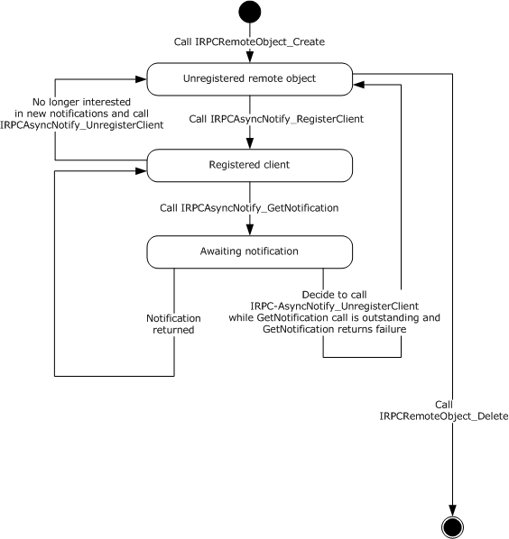

Figure 8: Client registering and receiving notifications of a predetermined notification type

Bidirectional message passing mode is illustrated by the following two client state diagrams. The first diagram illustrates [**remote object**](#gt_remote-object) creation and deletion, client registration, and the opening of [**notification channels**](#gt_notification-channel). The second diagram provides the details of the processing of an open channel, including its eventual closure.

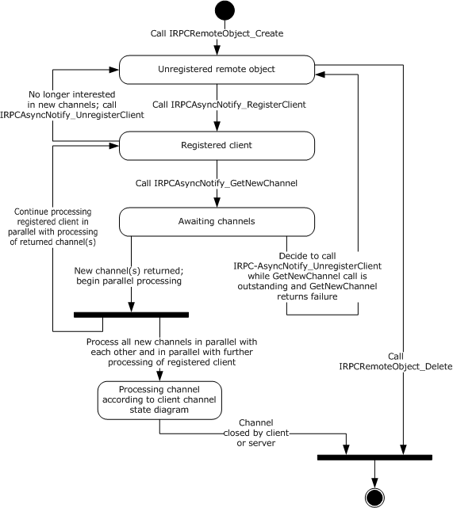

Figure 9: Remote object creation and deletion, client registration, and opening of notification channels

The following diagram illustrates the processing of a single open channel.

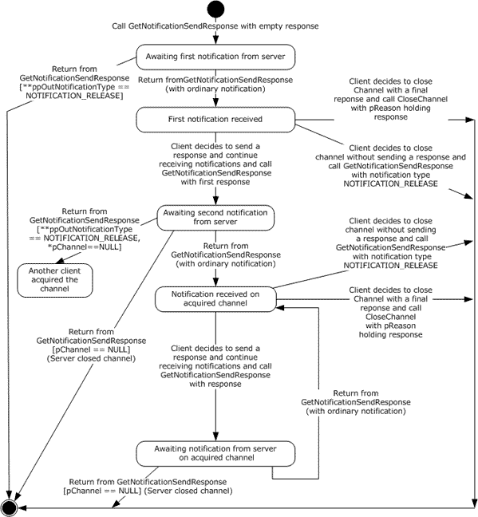

Figure 10: Processing a single open channel

#### 3.2.2.1 Abstract Data Model

No abstract data model is required.

#### 3.2.2.2 Timers

No timers are required outside of those used internally by the [**RPC**](#gt_remote-procedure-call-rpc) Protocol ([MS-RPCE](../MS-RPCE/MS-RPCE.md) section 3) to implement resiliency to network outages.

**Note** Although timers are not required, the methods [IRPCAsyncNotify_RegisterClient (section 3.1.1.4.1)](#Section_3.1.1.4.1), [IRPCAsyncNotify_GetNewChannel (section 3.1.1.4.3)](#Section_3.1.1.4.3) , and [IRPCAsyncNotify_GetNotification (section 3.1.1.4.5)](#Section_3.1.1.4.5) specify the use of a decaying time interval to separate retries until the connection is reestablished or the client unregisters the remote object.

#### 3.2.2.3 Initialization

The client MUST create a [**RPC**](#gt_remote-procedure-call-rpc) binding handle to the server [**RPC dynamic endpoint**](#gt_rpc-dynamic-endpoint) when an RPC method is called ([[C706]](https://go.microsoft.com/fwlink/?LinkId=89824) section 2.3).

#### 3.2.2.4 Message Processing Events and Sequencing Rules

This protocol MUST direct the [**RPC**](#gt_remote-procedure-call-rpc) ([MS-RPCE](../MS-RPCE/MS-RPCE.md) section 3) runtime to do the following:

- Perform a strict [**NDR**](#gt_network-data-representation-ndr) data consistency check at target level 6.0.
- Reject a NULL unique or full pointer with a non-zero conforming value.
Clients MUST manage registrations throughout their lifetimes. Specifically, clients MUST call [IRPCAsyncNotify_UnregisterClient](#Section_3.1.1.4.2) for each successful call to [IRPCAsyncNotify_RegisterClient](#Section_3.1.1.4.1).

When either [IRPCAsyncNotify_GetNewChannel](#Section_3.1.1.4.3) or [IRPCAsyncNotify_GetNotification](#Section_3.1.1.4.5) returns with a success code, the client SHOULD issue the next call of the same kind as soon as possible in order to minimize the amount of buffering and risk of event loss on the server.

The syntax and behavior for the methods of the IRPCAsyncNotify interface are fully specified in section [3.1.1.4](#Section_3.1.1.4).

#### 3.2.2.5 Timer Events

No timer events are required on the client except the timers that are required in the underlying [**RPC**](#gt_remote-procedure-call-rpc) Protocol ([MS-RPCE](../MS-RPCE/MS-RPCE.md) section 3).

#### 3.2.2.6 Other Local Events

A client's registration is typically the result of printing activity.

### 3.2.3 AsyncUI Client Details

The AsyncUI notification type MUST use the [**notification type identifier**](#gt_notification-type-identifier) value **AsyncPrintNotificationType_AsyncUI** (section [2.2.1](#Section_2.2.1)).

The AsyncUI notification type includes some notifications that are sent in [**unidirectional communication mode**](#gt_unidirectional-communication-mode) and others that are sent in [**bidirectional communication mode**](#gt_bidirectional-communication-mode). In bidirectional communication mode, the type of [**notification**](#gt_notification) received by a client determines the required [**response**](#gt_response) type. A client of the AsyncUI notification type that uses the Print System Asynchronous Notification Protocol to process notification in bidirectional communication mode has the following state diagram when dealing with a single communication channel.

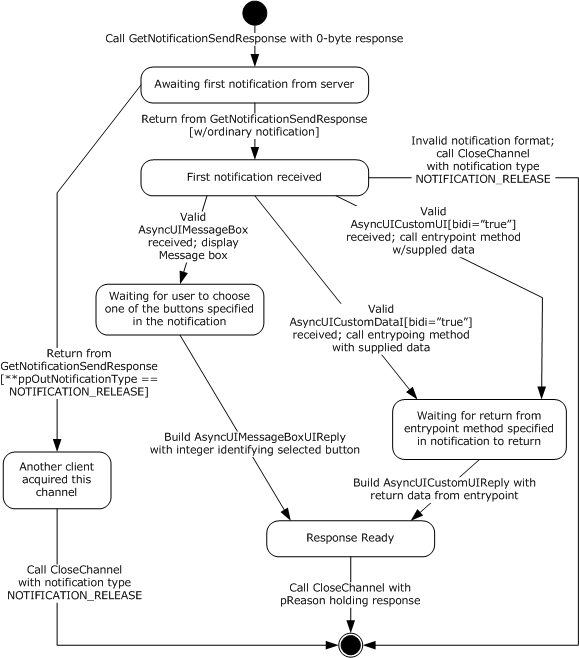

Figure 11: Client state diagram when dealing with a single communication channel

#### 3.2.3.1 Abstract Data Model

No abstract data model is required.

#### 3.2.3.2 Timers

No timer events are required on the client outside of the timers required in the underlying [**RPC**](#gt_remote-procedure-call-rpc) protocol ([MS-RPCE](../MS-RPCE/MS-RPCE.md) section 3).

#### 3.2.3.3 Initialization

A [**remote object**](#gt_remote-object) client (section [3.2.1](#Section_3.2.1)) and an asynchronous [**notification**](#gt_notification) client (section [3.2.2](#Section_3.2.2)) MUST be fully initialized on the client.

#### 3.2.3.4 Message Processing Events and Sequencing Rules

An [**AsyncUI**](#gt_asyncui) client MUST specify a [**notification type identifier**](#gt_notification-type-identifier) value **AsyncPrintNotificationType_AsyncUI** (section [2.2.1](#Section_2.2.1)) when registering for, requesting, or responding to notifications or [**response**](#gt_response) data, using the methods of the Print System Asynchronous Notification Protocol.

The AsyncUI-specific syntax and behavior for each method specified in section [3.1.3.4](#Section_3.1.3.4).

There is no AsyncUI-specific syntax or behavior for the **IRPCRemoteObject** interface methods described in section [3.1.2.4](#Section_3.1.2.4).

The sections that follow specify the processing of AsyncUI notifications that are delivered to a client from a printer driver using this protocol.

##### 3.2.3.4.1 AsyncUIBalloon Notification

The AsyncUIBalloon notification MUST use [**unidirectional communication mode**](#gt_unidirectional-communication-mode) and MUST be delivered by way of an output parameter of an [IRPCAsyncNotify_GetNotification](#Section_3.1.1.4.5) call.

Before acting on a [**notification**](#gt_notification), the client SHOULD verify that the notification complies with the requirements for the [AsyncUIBalloon](#Section_2.2.7.2) type, but SHOULD accept as compliant the following inconsistencies with the AsyncUIBalloon specification:

- Clients SHOULD accept [**XML**](#gt_xml)-element names that differ in [**ASCII**](#gt_ascii) case from those specified in the XML schema.
- Clients SHOULD accept values of the **bidi** and **buttonID** attributes that differ in ASCII case from those specified in the XML schema.
- Where the XML schema specifies an ordering for sibling elements, clients SHOULD accept as compliant those elements in any order.
- Clients SHOULD ignore and consider as compliant **XML** attributes with unrecognized names.
- Where this specification calls for an integer to be encoded as a string, clients SHOULD accept any string as compliant, and SHOULD interpret the string as follows:
- If leading, contiguous non-white-space characters of the string can be decoded as an integer, clients SHOULD accept the integer and discard remaining characters.
- If no leading characters can be decoded as an integer, clients SHOULD treat the string as if it held the value "0".
- Clients SHOULD accept as compliant any string for the value of the **bidi** attribute, and treat any value other than "true" as if it were "false".
- Clients SHOULD accept as compliant a "messageBoxUI" or "balloonUI" element that lacks the required "body" element.
If a compliance error is detected, the client MUST NOT take any further action based on the notification data, but rather MUST continue with a subsequent call to IRPCAsyncNotify_GetNotification.

After validating the notification, an AsyncUI client MUST process the request as follows:

- The client SHOULD format a display by using AsyncUI "title", "body", and "parameter" elements, as well as **iconID** and **resourceDll** attributes from the "balloonUI" element (sections [2.2.7.1.3](#Section_2.2.7.1.3), [2.2.7.1.4](#Section_2.2.7.1.4), and [2.2.7.1.5](#Section_2.2.7.1.5)).
- If an "action" element is specified, the client MUST call the method identified by the **entrypoint** and **dll** attributes of that element (section [2.2.7.1](#Section_2.2.7.1)). If the method entry point cannot be called successfully for any reason, the client MUST ignore the error and continue with a subsequent call to IRPCAsyncNotify_GetNotification.

##### 3.2.3.4.2 AsyncUIMessageBox Notification

The AsyncUIMessageBox notification MUST use [**bidirectional communication mode**](#gt_bidirectional-communication-mode) and MUST be delivered by way of an output parameter of an [IRPCAsyncNotify_GetNotificationSendResponse](#Section_3.1.1.4.4) call. Once the [**notification**](#gt_notification) has been processed, a client MUST NOT make an additional call to IRPCAsyncNotify_GetNotificationSendResponse by using the same **pChannel** parameter and MUST send a [**response**](#gt_response) using a call to [IRPCAsyncNotify_CloseChannel](#Section_3.1.1.4.6).

Before acting on a notification, a client SHOULD verify that the notification complies with the requirements specified for [AsyncUIMessageBox (section 2.2.7.3)](#Section_2.2.7.3), but SHOULD accept as compliant any of the inconsistencies described in section [3.2.3.4.1](#Section_3.2.3.4.1).

If a compliance error is detected, the client MUST NOT send any further response on the same [**notification channel**](#gt_notification-channel) and MUST close the channel by calling [IRPCAsyncNotify_CloseChannel](#Section_3.1.1.4.6) with its **pInNotificationType** parameter holding NOTIFICATION_RELEASE.

After successfully validating the notification:

- The client SHOULD format a display by using AsyncUI [title](#Section_2.2.7.1.3), [body](#Section_2.2.7.1.4), [parameter](#Section_2.2.7.1.5), [button](#Section_2.2.7.3.1), and [bitmap](#Section_2.2.7.3.3) elements and wait for the user to select one of the buttons.
- The client MUST:
- Identify a selected button.
- Construct an AsyncUIMessageBoxReply string. The [buttonID](#Section_2.2.7.4.1) element MUST specify the **buttonID** attribute of the button element that was selected (section 2.2.7.3).
- Send the AsyncUIMessageBoxReply to the server in the **pReason** parameter of an IRPCAsyncNotify_CloseChannel call.

##### 3.2.3.4.3 AsyncUICustomUI Notification

The AsyncUICustomUI notification can be sent by using either [**unidirectional communication mode**](#gt_unidirectional-communication-mode) or [**bidirectional communication mode**](#gt_bidirectional-communication-mode).

A [**notification**](#gt_notification) sent by using unidirectional communication mode MUST be delivered by way of an output parameter of an [IRPCAsyncNotify_GetNotification](#Section_3.1.1.4.5) call.

A notification sent by using bidirectional communication mode MUST be delivered by way of an output parameter of an [IRPCAsyncNotify_GetNotificationSendResponse](#Section_3.1.1.4.4) call.

Once a bidirectional notification has been processed, the client MUST NOT make an additional call to IRPCAsyncNotify_GetNotificationSendResponse using the same **pChannel** parameter and MUST send a response using [IRPCAsyncNotify_CloseChannel](#Section_3.1.1.4.6).

Before acting on a notification, the client SHOULD verify that the notification complies with the requirements specified for [AsyncUICustomUI (section 2.2.7.5)](#Section_2.2.7.5), but SHOULD accept as compliant any of the inconsistencies described in section [3.2.3.4.1](#Section_3.2.3.4.1).

If a compliance error is detected, the client MUST NOT take any further action based on the notification data. If the invalid notification was sent in unidirectional communication mode, the client MUST continue with a subsequent call to [IRPCAsyncNotify_GetNotification](#Section_3.1.1.4.5). If the invalid notification was sent in bidirectional communication mode, the client MUST NOT send any further response on the same [**notification channel**](#gt_notification-channel) and MUST close the channel by calling IRPCAsyncNotify_CloseChannel with its **pInNotificationType** parameter holding **NOTIFICATION_RELEASE**.

After successfully validating the notification:

- The client MUST call the executable method identified by the **entrypoint** and **dll** attributes of the [customUI](#Section_2.2.7.5) element.
- If the **entrypoint** cannot be successfully called for any reason:
- If the **bidi** attribute is "false", the client MUST ignore the error and MUST continue with a subsequent call to IRPCAsyncNotify_GetNotification.
- If the **bidi** attribute is "true":
- The client MUST stop further processing of this notification.
- The client MUST NOT send any further [**response**](#gt_response) on the same notification channel.
- The client MUST close the notification channel by calling IRPCAsyncNotify_CloseChannel with its **pInNotificationType** parameter holding **NOTIFICATION_RELEASE**.
- Otherwise, if the **entrypoint** is successful and the **bidi** attribute is "true":
- The client MUST construct an [AsyncUICustomUIReply](#Section_2.2.7.6) string. The [CustomUI](#Section_2.2.7.5.1) element MUST contain a string that is returned by the called method.
- The client MUST send the AsyncUICustomUIReply to the server in the **pReason** parameter of an IRPCAsyncNotify_CloseChannel call.

##### 3.2.3.4.4 AsyncUICustomData Notification

The AsyncUICustomData notification can be sent using either [**unidirectional communication mode**](#gt_unidirectional-communication-mode) or [**bidirectional communication mode**](#gt_bidirectional-communication-mode).

A [**notification**](#gt_notification) that is sent using unidirectional communication mode MUST be delivered by an output parameter from [IRPCAsyncNotify_GetNotification](#Section_3.1.1.4.5).

A notification that is sent using bidirectional communication mode MUST be delivered by an output parameter from [IRPCAsyncNotify_GetNotificationSendResponse](#Section_3.1.1.4.4).

After a bidirectional notification has been processed, the client MUST NOT make an additional call to [IRPCAsyncNotify_GetNotificationSendResponse](#Section_3.1.1.4.4) using the same *pChannel* parameter. The client MUST send a [**response**](#gt_response) using [IRPCAsyncNotify_CloseChannel](#Section_3.1.1.4.6).

Before acting on a notification, the client SHOULD verify that the notification complies with the requirements specified for [AsyncUICustomData (section 2.2.7.7)](#Section_2.2.7.7), but SHOULD accept as compliant the following inconsistencies with the [AsyncUIBalloon](#Section_2.2.7.2) specification.

If a compliance error is detected, the client MUST NOT take any further action based on the notification data. If the invalid notification was sent in unidirectional communication mode, the client MUST continue with a subsequent call to [IRPCAsyncNotify_GetNotification](#Section_3.1.1.4.5). If the invalid notification was sent in bidirectional communication mode, the client MUST NOT send any further response on the same [**notification channel**](#gt_notification-channel) and MUST close the channel by calling IRPCAsyncNotify_CloseChannel with its *pInNotificationType* parameter set to **NOTIFICATION_RELEASE**.

After successfully validating the notification, the following actions MUST be taken:

- The client MUST call the executable method identified by the **entrypoint** and **dll** attributes of the **customData** element (section [2.2.7.7.1](#Section_2.2.7.7.1)).
- If the **entrypoint** cannot be successfully called for any reason, the following actions MUST be taken:
- If the **bidi** attribute is "false", the client MUST ignore the error and MUST continue with a subsequent call to IRPCAsyncNotify_GetNotification.
- If the **bidi** attribute is "true", the following actions MUST be taken:
- The client MUST stop further processing of this notification.
- The client MUST NOT send any further response on the same notification channel.
- The client MUST close the notification channel by calling IRPCAsyncNotify_CloseChannel with its *pInNotificationType* parameter set to **NOTIFICATION_RELEASE**.
- Otherwise, if the **entrypoint** is successful and the **bidi** attribute is "true", the following action MUST be taken:
- The client MUST construct an [AsyncUICustomUIReply](#Section_2.2.7.6) string. The **CustomUI** element (section [2.2.7.6.1](#Section_2.2.7.6.1)) MUST contain a string that is returned by the called method.
- The client MUST send the AsyncUICustomUIReply string to the server in the *pReason* parameter of an IRPCAsyncNotify_CloseChannel call.

#### 3.2.3.5 Timer Events

No timer events are required on the client beyond the timers required in the underlying [**RPC**](#gt_remote-procedure-call-rpc) protocol ([MS-RPCE](../MS-RPCE/MS-RPCE.md) section 3).

#### 3.2.3.6 Other Local Events

There are no [**AsyncUI**](#gt_asyncui)-specific local events.

### 3.2.4 Printer Configuration Client Details

The printer configuration notification client MUST use the notification type identifier value **AsyncPrintNotificationType_PrinterConfiguration** as specified in section [2.2.1](#Section_2.2.1).

The printer configuration notification type includes only notifications that are sent in [**unidirectional communication mode**](#gt_unidirectional-communication-mode).

#### 3.2.4.1 Abstract Data Model

No abstract data model is required.

#### 3.2.4.2 Timers

No timer events are required on the client beyond the timers required in the underlying RPC protocol ((see [MS-RPCE](../MS-RPCE/MS-RPCE.md) section 3).

#### 3.2.4.3 Initialization

A [**remote object**](#gt_remote-object) client (section [3.2.1](#Section_3.2.1)) and an asynchronous notification client (section [3.2.2](#Section_3.2.2)) MUST be fully initialized on the client.

#### 3.2.4.4 Message Processing Events and Sequencing Rules

An AsyncUI client MUST specify a [**notification type identifier**](#gt_notification-type-identifier) value **AsyncPrintNotificationType_PrinterConfiguration** (section [2.2.1](#Section_2.2.1)) when registering for, requesting, or responding to notifications or [**response**](#gt_response) data, using the methods of the Print System Asynchronous Notification Protocol.

The printer configuration-specific syntax and behavior for each method is specified in section [3.1.4.4](#Section_3.1.4.4).

There is no printer configuration-specific syntax or behavior for the **IRPCRemoteObject** interface methods described in section [3.1.2.4](#Section_3.1.2.4).

The sections that follow specify the processing of printer configuration notifications that are delivered to a client from a [**print server**](#gt_print-server) using this protocol.

##### 3.2.4.4.1 Printer Configuration Notification

The printer configuration notification MUST use [**unidirectional communication mode**](#gt_unidirectional-communication-mode) and MUST be delivered by way of an output parameter of an [IRPCAsyncNotify_GetNotification (section 3.1.4.4.2)](#Section_3.1.4.4.2) call.

Before acting on a [**notification**](#gt_notification), the client SHOULD verify that the notification complies with the requirements for the printer configuration notification type.

If a compliance error is detected, the client MUST NOT take any further action based on the notification data, but rather MUST continue with a subsequent call to IRPCAsyncNotify_GetNotification.

#### 3.2.4.5 Timer Events

No timer events are required on the client beyond the timers required in the underlying RPC protocol (see [MS-RPCE](../MS-RPCE/MS-RPCE.md) section 3).

#### 3.2.4.6 Other Local Events

There are no printer configuration-specific local events.

# 4 Protocol Examples

## 4.1 Unidirectional Communication Mode

This section presents an example of [**unidirectional communication mode**](#gt_unidirectional-communication-mode), which illustrates a single-server to single-client scenario. If multiple clients register with matching parameters, including [**notification type identifier**](#gt_notification-type-identifier) and user privileges, then each registered client would receive a copy of the [**notification**](#gt_notification).

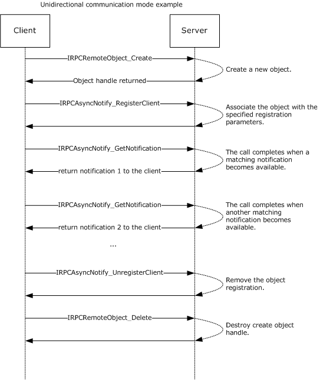

Figure 12: Unidirectional communication mode: single-server to single-client

## 4.2 AsyncUI Notification in Unidirectional Communication Mode

The following diagram illustrates the processing of an AsyncUI [**notification**](#gt_notification) in [**unidirectional communication mode**](#gt_unidirectional-communication-mode). In this example, the printer driver uses the [**notification type identifier**](#gt_notification-type-identifier) value **AsyncPrintNotificationType_AsyncUI** (section [2.2.1](#Section_2.2.1)) to request the client to display an informative message to the user without requesting any [**response**](#gt_response) to that message.

All text within the message box is identified by using references to a [**string resource**](#gt_string-resource) contained within a client-resident [**resource file**](#gt_resource-file).

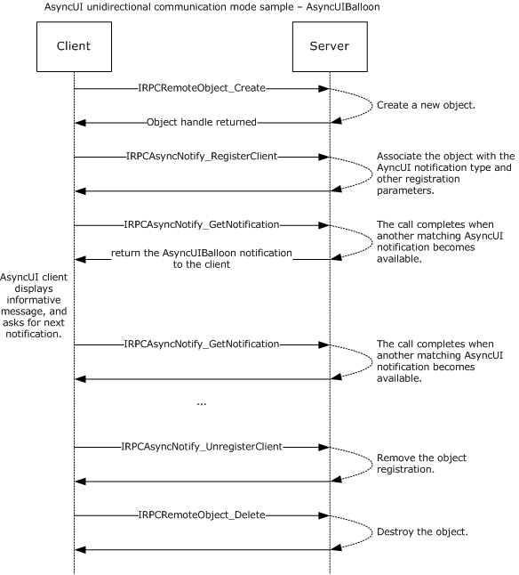

Figure 13: Processing an AsyncUI notification in unidirectional communication mode

The following is a sample notification.

<?xml version="1.0" ?>

<asyncPrintUIRequest xmlns=

"http://schemas.microsoft.com/2003/print/asyncui/v1/request">

<v1>

<requestOpen>

<balloonUI iconID="1" resourceDll="IHV.dll">

<title stringID="1234" resourceDll="IHV.dll" />

<body stringID="100" resourceDll="IHV.dll" />

</balloonUI>

</requestOpen>

</v1>

</asyncPrintUIRequest>

## 4.3 Bidirectional Communication Mode

This section presents an example of [**bidirectional communication mode**](#gt_bidirectional-communication-mode), in which only the first [**notification**](#gt_notification) is sent to all clients registered with matching parameters, including [**notification type identifier**](#gt_notification-type-identifier) and user privileges. After the first notification, the first client to send a [**response**](#gt_response) to that notification acquires the [**notification channel**](#gt_notification-channel). All other clients are notified that the notification channel was acquired by another client.

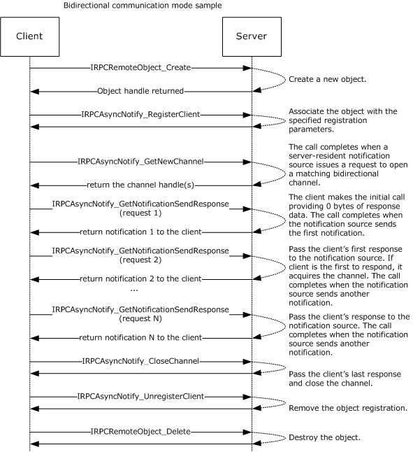

Figure 14: Bidirectional communication mode

## 4.4 AsyncUI Notification in Bidirectional Communication Mode

This section presents an example of processing an AsyncUI [**notification**](#gt_notification) in [**bidirectional communication mode**](#gt_bidirectional-communication-mode). In this example, a printer driver uses the [**notification type identifier**](#gt_notification-type-identifier) value **AsyncPrintNotificationType_AsyncUI** (section [2.2.1](#Section_2.2.1)) to request the client to display a message box containing multiple buttons. The client then sends back a [**response**](#gt_response) identifying the selected button.

All text within the message box is identified by using references to a [**string resource**](#gt_string-resource) contained within a client-resident [**resource file**](#gt_resource-file).

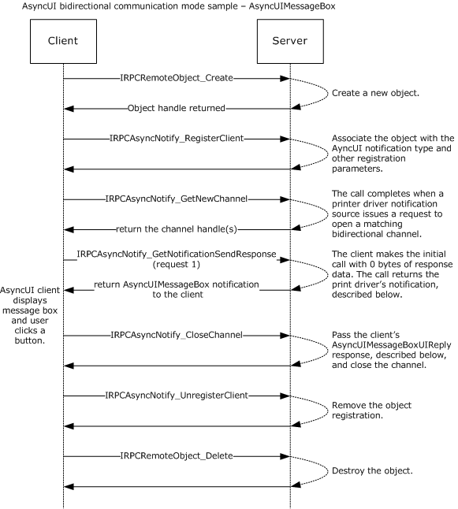

Figure 15: Processing an AsyncUI notification in bidirectional communication mode

Sample notification:

<asyncPrintUIRequest xmlns=

"http://schemas.microsoft.com/2003/print/asyncui/v1/request">

<v1>

<requestOpen>

<messageBoxUI>

<title stringID="100" resourceDll="IHV.dll" />

<body stringID="101" resourceDll="IHV.dll" />

<buttons>

<button stringID="102" resourceDll="IHV.dll" buttonID="3"/>

<button stringID="103" resourceDll="IHV.dll" buttonID="4"/>

</buttons>

</messageBoxUI>

</requestOpen>

</v1>

</asyncPrintUIRequest>

Sample response:

<asyncPrintUIResponse xmlns=

"http://schemas.microsoft.com/2003/print/asyncui/v1/response">

<v1>

<requestClose>

<messageBoxUI>

<buttonID>4</buttonID>

</messageBoxUI >

</requestClose>

</v1>

</asyncPrintUIResponse>

# 5 Security

## 5.1 Security Considerations for Implementers

The Print System Asynchronous Notification Protocol treats the [**print server**](#gt_print-server) and [**print queues**](#gt_print-queue) as securable resources in its security model. See section [2.1](#Section_2.1) for relevant security specifications; basic concepts of the security model are described in [MS-WPO](../MS-WPO/MS-WPO.md) section 9; and security considerations for implementers of [**print clients**](#gt_print-client) that use authenticated [**RPC**](#gt_remote-procedure-call-rpc) are specified in [MS-RPCE](../MS-RPCE/MS-RPCE.md) section 3.

The print server and print queues each has an associated [**security descriptor**](#gt_security-descriptor) that contains the security information for that printing resource. The security descriptor identifies the owner of the resource, and it contains a [**discretionary access control list (DACL)**](#gt_discretionary-access-control-list-dacl). The DACL contains [**access control entries (ACEs)**](#gt_b581857f-39aa-4979-876b-daba67a40f15) that specify the [**security identifier (SID)**](#gt_security-identifier-sid) of a user or group of users and whether access rights are to be allowed, denied, or audited. For resources on a print server, the ACEs specify operations including printing, managing printers, and managing documents in a print queue.

Each RPC client has an associated access token that contains the SID of the user making the RPC call. The print server checks the client's access to resources by comparing the security information of the caller against the security descriptor of the resource. Prior to allowing a user to monitor and receive notifications, security and privacy contexts are considered. [IRPCAsyncNotify_RegisterClient (section 3.1.1.4.1)](#Section_3.1.1.4.1) specifies the security and privacy checks performed by the server before it allows the registration of the client to succeed.

There is the risk of an AsyncUI client being used to execute arbitrary client-resident code, as identified by an **entrypoint** attribute within an executable driver file that is identified by a **dll** attribute (sections [2.2.7.2.1](#Section_2.2.7.2.1), [2.2.7.5.1](#Section_2.2.7.5.1), and [2.2.7.7.1](#Section_2.2.7.7.1)). By enforcing the character restrictions specified for the **entrypoint** attribute, the client can ensure that the driver-file name refers to a constituent file of a printer driver. An AsyncUI client can further reduce risk of execution of arbitrary code by minimizing the active permissions when calling an **entrypoint**.

## 5.2 Index of Security Parameters

There are no security parameters associated with this protocol.

# 6 Appendix A: Full IDL

For ease of implementation, the following sections provide the full IDL for this protocol.

| IDL name | Section |
| --- | --- |
| ms-pan_IRPCAsyncNotify | [6.1](#Section_6.1) |
| ms-pan_IRPCRemoteObject | [6.2](#Section_6.2) |

## 6.1 Appendix A.1: IRPCAsyncNotify.IDL

This [**IDL**](#gt_interface-definition-language-idl) uses definitions from the IRPCRemoteObject interface (section [6.2](#Section_6.2)) and RPC extensions defined in [MS-RPCE](../MS-RPCE/MS-RPCE.md).

import "ms-pan_irpcremoteobject.idl";

[

uuid(0b6edbfa-4a24-4fc6-8a23-942b1eca65d1),

version(1.0),

pointer_default(unique)

]

interface IRPCAsyncNotify {

// [MS-PAN] enumerations

typedef [v1_enum] enum {

kBiDirectional = 0,

kUniDirectional = 1,

} PrintAsyncNotifyConversationStyle;

typedef [v1_enum] enum {

kPerUser = 0,

kAllUsers = 1,

} PrintAsyncNotifyUserFilter;

// [MS-PAN] data types

typedef GUID PrintAsyncNotificationType;

typedef [context_handle] void* PNOTIFYOBJECT;

// [MS-PAN] methods

HRESULT

IRPCAsyncNotify_RegisterClient(

[in] PRPCREMOTEOBJECT pRegistrationObj,

[in,string,unique] const wchar_t* pName,

[in] PrintAsyncNotificationType* pInNotificationType,

[in] PrintAsyncNotifyUserFilter NotifyFilter,

[in] PrintAsyncNotifyConversationStyle conversationStyle,

[out, string] wchar_t** ppRmtServerReferral

);

HRESULT

IRPCAsyncNotify_UnregisterClient(

[in] PRPCREMOTEOBJECT pRegistrationObj

);

void Opnum2NotUsedOnWire(void);

HRESULT

IRPCAsyncNotify_GetNewChannel(

[in] PRPCREMOTEOBJECT pRemoteObj,

[out] unsigned long* pNoOfChannels,

[out,size_is( , *pNoOfChannels)] PNOTIFYOBJECT** ppChannelCtxt

);

HRESULT

IRPCAsyncNotify_GetNotificationSendResponse(

[in, out] PNOTIFYOBJECT* pChannel,

[in, unique] PrintAsyncNotificationType* pInNotificationType,

[in] unsigned long InSize,

[in, size_is(InSize), unique] byte* pInNotificationData,

[out] PrintAsyncNotificationType** ppOutNotificationType,

[out] unsigned long* pOutSize,

[out, size_is( , *pOutSize)] byte** ppOutNotificationData

);

HRESULT

IRPCAsyncNotify_GetNotification(

[in] PRPCREMOTEOBJECT pRemoteObj,

[out] PrintAsyncNotificationType** ppOutNotificationType,

[out] unsigned long* pOutSize,

[out, size_is( , *pOutSize)] byte** ppOutNotificationData

);

HRESULT

IRPCAsyncNotify_CloseChannel(

[in, out] PNOTIFYOBJECT* pChannel,

[in] PrintAsyncNotificationType* pInNotificationType,

[in] unsigned long InSize,

[in, size_is(InSize), unique] byte* pReason

);

}

## 6.2 Appendix A.2: IRPCRemoteObject.IDL

This [**IDL**](#gt_interface-definition-language-idl) uses definitions from the full IDL in [MS-DTYP] and RPC extensions defined in [MS-RPCE](../MS-RPCE/MS-RPCE.md).

import "ms-dtyp.idl";

[

uuid(ae33069b-a2a8-46ee-a235-ddfd339be281),

version(1.0),

pointer_default(unique)

]

interface IRPCRemoteObject

{

// [MS-PAN] data types

typedef [context_handle] void* PRPCREMOTEOBJECT;

// [MS-PAN] methods

HRESULT

IRPCRemoteObject_Create(

[in] handle_t hRemoteBinding,

[out] PRPCREMOTEOBJECT* ppRemoteObj

);

void

IRPCRemoteObject_Delete(

[in,out] PRPCREMOTEOBJECT* ppRemoteObj

);

}

# 7 Appendix B: Product Behavior

The information in this specification is applicable to the following Microsoft products or supplemental software. References to product versions include updates to those products.

- Windows XP operating system
- Windows Server 2003 operating system
- Windows Vista operating system
- Windows Server 2008 operating system
- Windows 7 operating system
- Windows Server 2008 R2 operating system
- Windows 8 operating system
- Windows Server 2012 operating system
- Windows 8.1 operating system
- Windows Server 2012 R2 operating system
- Windows 10 operating system
- Windows Server 2016 operating system
- Windows Server operating system
- Windows Server 2019 operating system
- Windows Server 2022 operating system
- Windows 11 operating system
- Windows Server 2025 operating system
Exceptions, if any, are noted in this section. If an update version, service pack or Knowledge Base (KB) number appears with a product name, the behavior changed in that update. The new behavior also applies to subsequent updates unless otherwise specified. If a product edition appears with the product version, behavior is different in that product edition.

Unless otherwise specified, any statement of optional behavior in this specification that is prescribed using the terms "SHOULD" or "SHOULD NOT" implies product behavior in accordance with the SHOULD or SHOULD NOT prescription. Unless otherwise specified, the term "MAY" implies that the product does not follow the prescription.

<1> Section 2.2.7.2: For print queues using a printer driver with a driver version of 0x00000004 (see *cVersion* in [MS-RPRN](../MS-RPRN/MS-RPRN.md) section 2.2.1.3.1), Windows print servers use [AsyncUIBalloon](#Section_2.2.7.2) messages to send details about configuration status changes to client UI components. In these messages, the [balloonUI element](#Section_2.2.7.2.2) contains exactly one [action element (section 2.2.7.2.1)](#Section_2.2.7.2.1). The action element contains the **dll** attribute "PrintConfig.dll" and the **entrypoint** attribute "NotifyEntry". The text data in the action element is an XML fragment of the following form:

<Envelope printer="…" reason="{23bb1328-63de-4293-915b-a6a23d929acb}" detail="…">

<Schema … />

…

</Envelope>

The Envelope element contains the following attributes:

**printer:** A string containing the name of the print queue whose configuration has changed.

**reason:** The GUID {23bb1328-63de-4293-915b-a6a23d929acb}.

**detail:** A GUID provided by the printer driver excluding the GUID {ec8f261f-267c-469f-b5d6-3933023c29cc} which is reserved.

The Envelope element contains one or more [Schema elements (section 2.2.8.1.2)](#Section_2.2.8.1.2), each of which represents one of the configuration changes.

<2> Section 2.2.7.2.1: For all Windows versions, the function signature of the method specified by the **entrypoint** attribute is as follows.

void entrypoint(void * data);

**data:** The data from the action element.

Windows clients load the file indicated by the **dll** attribute as a dynamic linked library and call the method in the library indicated by the **entrypoint** attribute, passing in data by using the *data* parameter.

<3> Section 2.2.7.5.1: For all Windows versions, the function signature of the method specified by the **entrypoint** attribute varies depending on the **bidi** attribute value, as shown in the following table.

| bidi value | Method prototype |
| --- | --- |
| "true" | void * **entrypoint**(void * **data:**) |
| "false" | void **entrypoint**(void * **data:**) |

**data:** The data from the [customUI](#Section_2.2.7.5) element.

Windows clients load the file indicated by the **dll** attribute as a dynamic linked library and call the method in the library indicated by the **entrypoint** attribute, passing in data by using the *data* parameter.

<4> Section 2.2.7.7.1: For all Windows versions, the function signature of the method specified by the **entrypoint** attribute depends on the **bidi** attribute value as shown in the following table.

| bidi value | Method prototype |
| --- | --- |
| "true" | void * **entrypoint**(void * data) |
| "false" | void **entrypoint**(void * data) |

**data:** The data from the [customData](#Section_2.2.7.7) element.

Windows clients load the file indicated by the **dll** attribute as a dynamic linked library and call the method in the library indicated by the **entrypoint** attribute, passing in data by using the *data* parameter.

<5> Section 2.2.8.1.2: In Windows, these attributes correspond to printer attributes in the bidirectional communications schema. This schema is a hierarchy of printer attributes, some of which are properties, and the rest are values or value entries. Bidirectional communications interfaces are implemented by printer-specific components. A detailed description of printer drivers and the bidirectional communications schema can be found in [[MSDN-MPD]](https://go.microsoft.com/fwlink/?LinkId=91840) and [[MSDN-BIDI]](https://go.microsoft.com/fwlink/?LinkId=122185).

<6> Section 2.2.8.1.10: In Windows, these attributes correspond to printer attributes in the bidirectional communications schema. This schema is a hierarchy of printer attributes, some of which are properties, and the rest are values or value entries. Bidirectional communications interfaces are implemented by printer-specific components. A detailed description of printer drivers and the bidirectional communications schema can be found in [MSDN-MPD] and [MSDN-BIDI].

<7> Section 3.1.1.4: Opnums reserved for local use apply to Windows as follows.

| opnum | Description |
| --- | --- |
| 2 | Not used by Windows. |

<8> Section 3.1.1.4.3: When a local client directly calls the local API equivalent of [IRPCAsyncNotify_GetNewChannel](#Section_3.1.1.4.3) (CreatePrintAsyncNotifyChannel as described in [[MSDN-ASYNC]](https://go.microsoft.com/fwlink/?LinkId=225112)) without a prior successful call to [IRPCAsyncNotify_RegisterClient](#Section_3.1.1.4.1) using the same [PRPCREMOTEOBJECT](#Section_2.2.4) value, the local server fails the call immediately and returns the HRESULT error value ([MS-ERREF](../MS-ERREF/MS-ERREF.md) section 2.1.1) 0x8004000D. This action is not supported on Windows XP or Windows Server 2003.

<9> Section 3.1.1.4.3: When a local client directly calls the local API equivalent of IRPCAsyncNotify_GetNewChannel (CreatePrintAsyncNotifyChannel as described in [MSDN-ASYNC]) following a prior call to [IRPCAsyncNotify_UnregisterClient](#Section_3.1.1.4.2) using the same PRPCREMOTEOBJECT value, the server fails the call immediately and returns the HRESULT error value ([MS-ERREF] section 2.1.1) 0x8004000E. This action is not supported on Windows XP or Windows Server 2003.

<10> Section 3.1.1.4.5: For all Windows versions, the server by default limits the number of buffered unidirectional notifications to 100.

The default limit of 100 can be changed by creating a REG_DWORD value in the registry at HKEY_LOCAL_MACHINE\Software\Policies\Microsoft\Windows NT\Printers\InternalQueueSizeForUniDiChannel and setting this value to the desired limit for the number of buffered unidirectional notifications. This action is not supported on Windows XP, Windows Server 2003, Windows Vista, or Windows Server 2008.

<11> Section 3.1.1.4.6: When a local client directly calls the local API equivalent of [IRPCAsyncNotify_CloseChannel](#Section_3.1.1.4.6) (IPrintAsyncNotifyChannel::CloseChannel as described in [MSDN-ASYNC]) following a successful return from [IRPCAsyncNotify_GetNotificationSendResponse](#Section_3.1.1.4.4) with a NULL value returned for the *pChannel* parameter, or following a prior successful return from IRPCAsyncNotify_CloseChannel, the server fails the call immediately and returns the HRESULT error value ([MS-ERREF] section 2.1.1) 0x80040008. This action is not supported on Windows XP or Windows Server 2003.

# 8 Change Tracking

This section identifies changes that were made to this document since the last release. Changes are classified as Major, Minor, or None.

The revision class **Major** means that the technical content in the document was significantly revised. Major changes affect protocol interoperability or implementation. Examples of major changes are:

- A document revision that incorporates changes to interoperability requirements.
- A document revision that captures changes to protocol functionality.
The revision class **Minor** means that the meaning of the technical content was clarified. Minor changes do not affect protocol interoperability or implementation. Examples of minor changes are updates to clarify ambiguity at the sentence, paragraph, or table level.

The revision class **None** means that no new technical changes were introduced. Minor editorial and formatting changes may have been made, but the relevant technical content is identical to the last released version.

The changes made to this document are listed in the following table. For more information, please contact [dochelp@microsoft.com](mailto:dochelp@microsoft.com).

| Section | Description | Revision class |
| --- | --- | --- |
| [7](#Section_7) Appendix B: Product Behavior | Added Windows Server 2025 to the list of applicable products. | Major |

## Revision History

| Date | Version | Revision Class | Comments |
| --- | --- | --- | --- |
| 10/22/2006 | 0.01 | New | Version 0.01 release |
| 1/19/2007 | 1.0 | Major | Version 1.0 release |
| 3/2/2007 | 1.1 | Minor | Version 1.1 release |
| 4/3/2007 | 1.2 | Minor | Version 1.2 release |
| 5/11/2007 | 1.3 | Minor | Version 1.3 release |
| 6/1/2007 | 1.3.1 | Editorial | Changed language and formatting in the technical content. |
| 7/3/2007 | 1.3.2 | Editorial | Changed language and formatting in the technical content. |
| 7/20/2007 | 1.3.3 | Editorial | Changed language and formatting in the technical content. |
| 8/10/2007 | 1.4 | Minor | Clarified the meaning of the technical content. |
| 9/28/2007 | 1.5 | Minor | Clarified the meaning of the technical content. |
| 10/23/2007 | 1.6 | Minor | Clarified the meaning of the technical content. |
| 11/30/2007 | 1.7 | Minor | Clarified the meaning of the technical content. |
| 1/25/2008 | 1.8 | Minor | Clarified the meaning of the technical content. |
| 3/14/2008 | 2.0 | Major | Updated and revised the technical content. |
| 5/16/2008 | 2.0.1 | Editorial | Changed language and formatting in the technical content. |
| 6/20/2008 | 2.1 | Minor | Clarified the meaning of the technical content. |
| 7/25/2008 | 3.0 | Major | Updated and revised the technical content. |
| 8/29/2008 | 3.1 | Minor | Added protocol relationship diagram. |
| 10/24/2008 | 3.1.1 | Editorial | Changed language and formatting in the technical content. |
| 12/5/2008 | 3.2 | Minor | Clarified the meaning of the technical content. |
| 1/16/2009 | 4.0 | Major | Updated and revised the technical content. |
| 2/27/2009 | 5.0 | Major | Updated and revised the technical content. |
| 4/10/2009 | 5.1 | Minor | Clarified the meaning of the technical content. |
| 5/22/2009 | 5.2 | Minor | Clarified the meaning of the technical content. |
| 7/2/2009 | 6.0 | Major | Updated and revised the technical content. |
| 8/14/2009 | 6.1 | Minor | Clarified the meaning of the technical content. |
| 9/25/2009 | 6.2 | Minor | Clarified the meaning of the technical content. |
| 11/6/2009 | 6.2.1 | Editorial | Changed language and formatting in the technical content. |
| 12/18/2009 | 6.3 | Minor | Clarified the meaning of the technical content. |
| 1/29/2010 | 6.4 | Minor | Clarified the meaning of the technical content. |
| 3/12/2010 | 6.5 | Minor | Clarified the meaning of the technical content. |
| 4/23/2010 | 6.5.1 | Editorial | Changed language and formatting in the technical content. |
| 6/4/2010 | 7.0 | Major | Updated and revised the technical content. |
| 7/16/2010 | 7.1 | Minor | Clarified the meaning of the technical content. |
| 8/27/2010 | 7.1 | None | No changes to the meaning, language, or formatting of the technical content. |
| 10/8/2010 | 7.1 | None | No changes to the meaning, language, or formatting of the technical content. |
| 11/19/2010 | 7.1 | None | No changes to the meaning, language, or formatting of the technical content. |
| 1/7/2011 | 7.1 | None | No changes to the meaning, language, or formatting of the technical content. |
| 2/11/2011 | 7.1 | None | No changes to the meaning, language, or formatting of the technical content. |
| 3/25/2011 | 7.2 | Minor | Clarified the meaning of the technical content. |
| 5/6/2011 | 7.2 | None | No changes to the meaning, language, or formatting of the technical content. |
| 6/17/2011 | 7.3 | Minor | Clarified the meaning of the technical content. |
| 9/23/2011 | 8.0 | Major | Updated and revised the technical content. |
| 12/16/2011 | 9.0 | Major | Updated and revised the technical content. |
| 3/30/2012 | 10.0 | Major | Updated and revised the technical content. |
| 7/12/2012 | 11.0 | Major | Updated and revised the technical content. |
| 10/25/2012 | 11.1 | Minor | Clarified the meaning of the technical content. |
| 1/31/2013 | 11.1 | None | No changes to the meaning, language, or formatting of the technical content. |
| 8/8/2013 | 12.0 | Major | Updated and revised the technical content. |
| 11/14/2013 | 12.0 | None | No changes to the meaning, language, or formatting of the technical content. |
| 2/13/2014 | 12.0 | None | No changes to the meaning, language, or formatting of the technical content. |
| 5/15/2014 | 12.0 | None | No changes to the meaning, language, or formatting of the technical content. |
| 6/30/2015 | 13.0 | Major | Significantly changed the technical content. |
| 10/16/2015 | 13.0 | None | No changes to the meaning, language, or formatting of the technical content. |
| 7/14/2016 | 14.0 | Major | Significantly changed the technical content. |
| 6/1/2017 | 14.0 | None | No changes to the meaning, language, or formatting of the technical content. |
| 9/15/2017 | 15.0 | Major | Significantly changed the technical content. |
| 9/12/2018 | 16.0 | Major | Significantly changed the technical content. |
| 4/7/2021 | 17.0 | Major | Significantly changed the technical content. |
| 6/25/2021 | 18.0 | Major | Significantly changed the technical content. |
| 4/23/2024 | 19.0 | Major | Significantly changed the technical content. |
