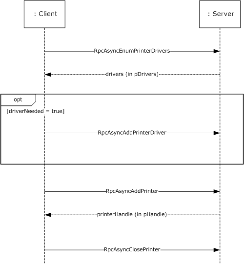
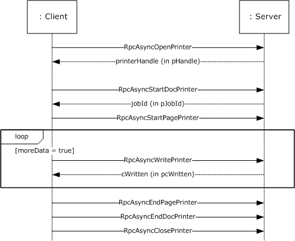
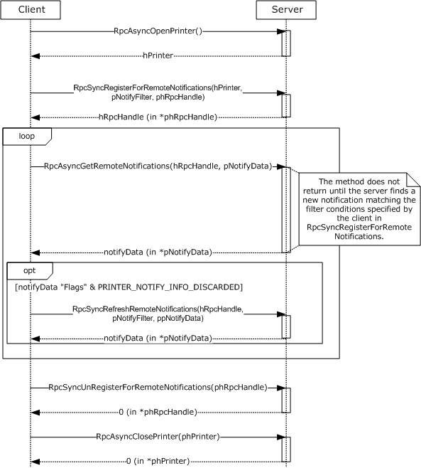
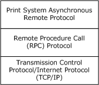
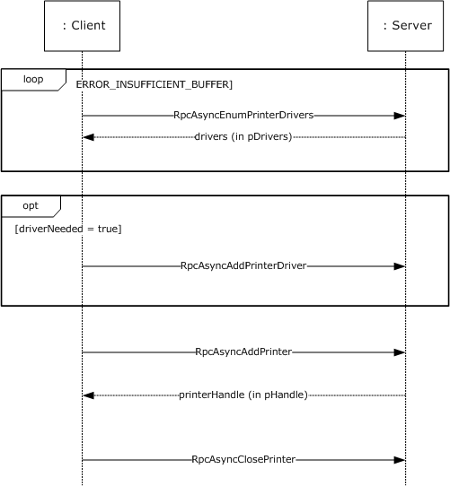
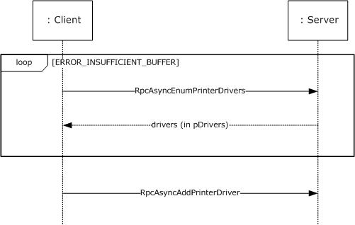
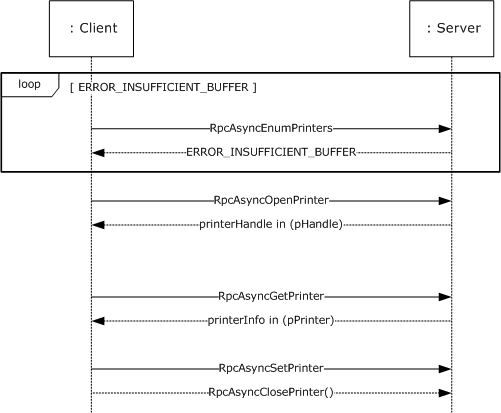
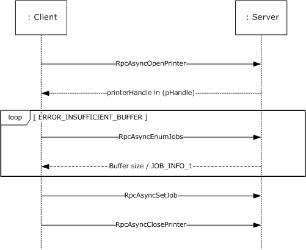

# [MS-PAR]: Print System Asynchronous Remote Protocol

Table of Contents

1 Introduction

- [1 Introduction](#Section_1)
  - [1.1 Glossary](#Section_1.1)
  - [1.2 References](#Section_1.2)
    - [1.2.1 Normative References](#Section_1.2.1)
    - [1.2.2 Informative References](#Section_1.2.2)
  - [1.3 Overview](#Section_1.3)
    - [1.3.1 Management of the Print System](#Section_1.3.1)
    - [1.3.2 Communication of Print Job Data](#Section_1.3.2)
    - [1.3.3 Notification of Print System Changes](#Section_1.3.3)
  - [1.4 Relationship to Other Protocols](#Section_1.4)
  - [1.5 Prerequisites/Preconditions](#Section_1.5)
  - [1.6 Applicability Statement](#Section_1.6)
  - [1.7 Versioning and Capability Negotiation](#Section_1.7)
  - [1.8 Vendor-Extensible Fields](#Section_1.8)
  - [1.9 Standards Assignments](#Section_1.9)

2 Messages

- [2 Messages](#Section_2)
  - [2.1 Transport](#Section_2.1)
  - [2.2 Common Data Types](#Section_2.2)
    - [2.2.1 EPrintPropertyType](#Section_2.2.1)
    - [2.2.2 RpcPrintPropertyValue](#Section_2.2.2)
    - [2.2.3 RpcPrintNamedProperty](#Section_2.2.3)
    - [2.2.4 RpcPrintPropertiesCollection](#Section_2.2.4)
    - [2.2.5 RMTNTFY_HANDLE](#Section_2.2.5)
    - [2.2.6 NOTIFY_OPTIONS_CONTAINER](#Section_2.2.6)
    - [2.2.7 NOTIFY_REPLY_CONTAINER](#Section_2.2.7)
    - [2.2.8 CORE_PRINTER_DRIVER](#Section_2.2.8)

3 Protocol Details

- [3 Protocol Details](#Section_3)
  - [3.1 IRemoteWinspool Server Details](#Section_3.1)
    - [3.1.1 Abstract Data Model](#Section_3.1.1)
    - [3.1.2 Timers](#Section_3.1.2)
    - [3.1.3 Initialization](#Section_3.1.3)
    - [3.1.4 Message Processing Events and Sequencing Rules](#Section_3.1.4)
      - [3.1.4.1 Printer Management Methods](#Section_3.1.4.1)
        - [3.1.4.1.1 RpcAsyncOpenPrinter (Opnum 0)](#Section_3.1.4.1.1)
        - [3.1.4.1.2 RpcAsyncAddPrinter (Opnum 1)](#Section_3.1.4.1.2)
        - [3.1.4.1.3 RpcAsyncDeletePrinter (Opnum 7)](#Section_3.1.4.1.3)
        - [3.1.4.1.4 RpcAsyncSetPrinter (Opnum 8)](#Section_3.1.4.1.4)
        - [3.1.4.1.5 RpcAsyncGetPrinter (Opnum 9)](#Section_3.1.4.1.5)
        - [3.1.4.1.6 RpcAsyncGetPrinterData (Opnum 16)](#Section_3.1.4.1.6)
        - [3.1.4.1.7 RpcAsyncGetPrinterDataEx (Opnum 17)](#Section_3.1.4.1.7)
        - [3.1.4.1.8 RpcAsyncSetPrinterData (Opnum 18)](#Section_3.1.4.1.8)
        - [3.1.4.1.9 RpcAsyncSetPrinterDataEx (Opnum 19)](#Section_3.1.4.1.9)
        - [3.1.4.1.10 RpcAsyncClosePrinter (Opnum 20)](#Section_3.1.4.1.10)
        - [3.1.4.1.11 RpcAsyncEnumPrinterData (Opnum 27)](#Section_3.1.4.1.11)
        - [3.1.4.1.12 RpcAsyncEnumPrinterDataEx (Opnum 28)](#Section_3.1.4.1.12)
        - [3.1.4.1.13 RpcAsyncEnumPrinterKey (Opnum 29)](#Section_3.1.4.1.13)
        - [3.1.4.1.14 RpcAsyncDeletePrinterData (Opnum 30)](#Section_3.1.4.1.14)
        - [3.1.4.1.15 RpcAsyncDeletePrinterDataEx (Opnum 31)](#Section_3.1.4.1.15)
        - [3.1.4.1.16 RpcAsyncDeletePrinterKey (Opnum 32)](#Section_3.1.4.1.16)
        - [3.1.4.1.17 RpcAsyncSendRecvBidiData (Opnum 34)](#Section_3.1.4.1.17)
        - [3.1.4.1.18 RpcAsyncCreatePrinterIC (Opnum 35)](#Section_3.1.4.1.18)
        - [3.1.4.1.19 RpcAsyncPlayGdiScriptOnPrinterIC (Opnum 36)](#Section_3.1.4.1.19)
        - [3.1.4.1.20 RpcAsyncDeletePrinterIC (Opnum 37)](#Section_3.1.4.1.20)
        - [3.1.4.1.21 RpcAsyncEnumPrinters (Opnum 38)](#Section_3.1.4.1.21)
        - [3.1.4.1.22 RpcAsyncAddPerMachineConnection (Opnum 55)](#Section_3.1.4.1.22)
        - [3.1.4.1.23 RpcAsyncDeletePerMachineConnection (Opnum 56)](#Section_3.1.4.1.23)
        - [3.1.4.1.24 RpcAsyncEnumPerMachineConnections (Opnum 57)](#Section_3.1.4.1.24)
        - [3.1.4.1.25 RpcAsyncResetPrinter (Opnum 69)](#Section_3.1.4.1.25)
      - [3.1.4.2 Printer-Driver Management Methods](#Section_3.1.4.2)
        - [3.1.4.2.1 RpcAsyncGetPrinterDriver (Opnum 26)](#Section_3.1.4.2.1)
        - [3.1.4.2.2 RpcAsyncAddPrinterDriver (Opnum 39)](#Section_3.1.4.2.2)
        - [3.1.4.2.3 RpcAsyncEnumPrinterDrivers (Opnum 40)](#Section_3.1.4.2.3)
        - [3.1.4.2.4 RpcAsyncGetPrinterDriverDirectory (Opnum 41)](#Section_3.1.4.2.4)
        - [3.1.4.2.5 RpcAsyncDeletePrinterDriver (Opnum 42)](#Section_3.1.4.2.5)
        - [3.1.4.2.6 RpcAsyncDeletePrinterDriverEx (Opnum 43)](#Section_3.1.4.2.6)
        - [3.1.4.2.7 RpcAsyncInstallPrinterDriverFromPackage (Opnum 62)](#Section_3.1.4.2.7)
        - [3.1.4.2.8 RpcAsyncUploadPrinterDriverPackage (Opnum 63)](#Section_3.1.4.2.8)
        - [3.1.4.2.9 RpcAsyncGetCorePrinterDrivers (Opnum 64)](#Section_3.1.4.2.9)
        - [3.1.4.2.10 RpcAsyncCorePrinterDriverInstalled (Opnum 65)](#Section_3.1.4.2.10)
        - [3.1.4.2.11 RpcAsyncGetPrinterDriverPackagePath (Opnum 66)](#Section_3.1.4.2.11)
        - [3.1.4.2.12 RpcAsyncDeletePrinterDriverPackage (Opnum 67)](#Section_3.1.4.2.12)
      - [3.1.4.3 Printer-Port Management Methods](#Section_3.1.4.3)
        - [3.1.4.3.1 RpcAsyncXcvData (Opnum 33)](#Section_3.1.4.3.1)
        - [3.1.4.3.2 RpcAsyncEnumPorts (Opnum 47)](#Section_3.1.4.3.2)
        - [3.1.4.3.3 RpcAsyncAddPort (Opnum 49)](#Section_3.1.4.3.3)
        - [3.1.4.3.4 RpcAsyncSetPort (Opnum 50)](#Section_3.1.4.3.4)
      - [3.1.4.4 Print-Processor Management Methods](#Section_3.1.4.4)
        - [3.1.4.4.1 RpcAsyncAddPrintProcessor (Opnum 44)](#Section_3.1.4.4.1)
        - [3.1.4.4.2 RpcAsyncEnumPrintProcessors (Opnum 45)](#Section_3.1.4.4.2)
        - [3.1.4.4.3 RpcAsyncGetPrintProcessorDirectory (Opnum 46)](#Section_3.1.4.4.3)
        - [3.1.4.4.4 RpcAsyncDeletePrintProcessor (Opnum 53)](#Section_3.1.4.4.4)
        - [3.1.4.4.5 RpcAsyncEnumPrintProcessorDatatypes (Opnum 54)](#Section_3.1.4.4.5)
      - [3.1.4.5 Port Monitor Management Methods](#Section_3.1.4.5)
        - [3.1.4.5.1 RpcAsyncEnumMonitors (Opnum 48)](#Section_3.1.4.5.1)
        - [3.1.4.5.2 RpcAsyncAddMonitor (Opnum 51)](#Section_3.1.4.5.2)
        - [3.1.4.5.3 RpcAsyncDeleteMonitor (Opnum 52)](#Section_3.1.4.5.3)
      - [3.1.4.6 Form Management Methods](#Section_3.1.4.6)
        - [3.1.4.6.1 RpcAsyncAddForm (Opnum 21)](#Section_3.1.4.6.1)
        - [3.1.4.6.2 RpcAsyncDeleteForm (Opnum 22)](#Section_3.1.4.6.2)
        - [3.1.4.6.3 RpcAsyncGetForm (Opnum 23)](#Section_3.1.4.6.3)
        - [3.1.4.6.4 RpcAsyncSetForm (Opnum 24)](#Section_3.1.4.6.4)
        - [3.1.4.6.5 RpcAsyncEnumForms (Opnum 25)](#Section_3.1.4.6.5)
      - [3.1.4.7 Job Management Methods](#Section_3.1.4.7)
        - [3.1.4.7.1 RpcAsyncSetJob (Opnum 2)](#Section_3.1.4.7.1)
        - [3.1.4.7.2 RpcAsyncGetJob (Opnum 3)](#Section_3.1.4.7.2)
        - [3.1.4.7.3 RpcAsyncEnumJobs (Opnum 4)](#Section_3.1.4.7.3)
        - [3.1.4.7.4 RpcAsyncAddJob (Opnum 5)](#Section_3.1.4.7.4)
        - [3.1.4.7.5 RpcAsyncScheduleJob (Opnum 6)](#Section_3.1.4.7.5)
      - [3.1.4.8 Job Printing Methods](#Section_3.1.4.8)
        - [3.1.4.8.1 RpcAsyncStartDocPrinter (Opnum 10)](#Section_3.1.4.8.1)
        - [3.1.4.8.2 RpcAsyncStartPagePrinter (Opnum 11)](#Section_3.1.4.8.2)
        - [3.1.4.8.3 RpcAsyncWritePrinter (Opnum 12)](#Section_3.1.4.8.3)
        - [3.1.4.8.4 RpcAsyncEndPagePrinter (Opnum 13)](#Section_3.1.4.8.4)
        - [3.1.4.8.5 RpcAsyncEndDocPrinter (Opnum 14)](#Section_3.1.4.8.5)
        - [3.1.4.8.6 RpcAsyncAbortPrinter (Opnum 15)](#Section_3.1.4.8.6)
        - [3.1.4.8.7 RpcAsyncReadPrinter (Opnum 68)](#Section_3.1.4.8.7)
      - [3.1.4.9 Printing-Related Notification Methods](#Section_3.1.4.9)
        - [3.1.4.9.1 RpcSyncRegisterForRemoteNotifications (Opnum 58)](#Section_3.1.4.9.1)
        - [3.1.4.9.2 RpcSyncUnRegisterForRemoteNotifications (Opnum 59)](#Section_3.1.4.9.2)
        - [3.1.4.9.3 RpcSyncRefreshRemoteNotifications (Opnum 60)](#Section_3.1.4.9.3)
        - [3.1.4.9.4 RpcAsyncGetRemoteNotifications (Opnum 61)](#Section_3.1.4.9.4)
      - [3.1.4.10 Job Named Property Management Methods](#Section_3.1.4.10)
        - [3.1.4.10.1 RpcAsyncGetJobNamedPropertyValue (Opnum 70)](#Section_3.1.4.10.1)
        - [3.1.4.10.2 RpcAsyncSetJobNamedProperty (Opnum 71)](#Section_3.1.4.10.2)
        - [3.1.4.10.3 RpcAsyncDeleteJobNamedProperty (Opnum 72)](#Section_3.1.4.10.3)
        - [3.1.4.10.4 RpcAsyncEnumJobNamedProperties (Opnum 73)](#Section_3.1.4.10.4)
      - [3.1.4.11 Branch Office Print Remote Logging Methods](#Section_3.1.4.11)
        - [3.1.4.11.1 RpcAsyncLogJobInfoForBranchOffice (Opnum 74)](#Section_3.1.4.11.1)
    - [3.1.5 Timer Events](#Section_3.1.5)
    - [3.1.6 Other Local Events](#Section_3.1.6)
  - [3.2 IRemoteWinspool Client Details](#Section_3.2)
    - [3.2.1 Abstract Data Model](#Section_3.2.1)
    - [3.2.2 Timers](#Section_3.2.2)
    - [3.2.3 Initialization](#Section_3.2.3)
    - [3.2.4 Message Processing Events and Sequencing Rules](#Section_3.2.4)
    - [3.2.5 Timer Events](#Section_3.2.5)
    - [3.2.6 Other Local Events](#Section_3.2.6)

4 Protocol Examples

- [4 Protocol Examples](#Section_4)
  - [4.1 Adding a Printer to a Server](#Section_4.1)
  - [4.2 Adding a Printer Driver to a Server](#Section_4.2)
  - [4.3 Enumerating Printers on a Server](#Section_4.3)
  - [4.4 Enumerating Print Jobs on a Server](#Section_4.4)
  - [4.5 Receiving Notifications from a Server](#Section_4.5)

5 Security Considerations

- [5 Security Considerations](#Section_5)

6 Appendix A: Full IDL

- [6 Appendix A: Full IDL](#Section_6)

7 Appendix B: Product Behavior

- [7 Appendix B: Product Behavior](#Section_7)

8 Change Tracking

- [8 Change Tracking](#Section_8)

For the legal notice and IP terms, see [LEGAL.md](../LEGAL.md).
Last updated: 8/11/2025.
See [Revision History](#revision-history) for full version history.

# 1 Introduction

The Print System Asynchronous Remote Protocol supports printing and spooling operations between a client and server, including [**print job**](#gt_print-job) control and [**print system**](#gt_print-system) management. It is designed to be used asynchronously by clients whose implementations permit them to continue execution without waiting for a method call to return.

This protocol is based on the [**Remote Procedure Call (RPC)**](#gt_remote-procedure-call-rpc) protocol [[C706]](https://go.microsoft.com/fwlink/?LinkId=89824) [MS-RPCE](../MS-RPCE/MS-RPCE.md). Its functionality is parallel to the Print System Remote Protocol [MS-RPRN](../MS-RPRN/MS-RPRN.md), which is used synchronously.

Sections 1.5, 1.8, 1.9, 2, and 3 of this specification are normative. All other sections and examples in this specification are informative.

## 1.1 Glossary

This document uses the following terms:

**access control entry (ACE)**: An entry in an access control list (ACL) that contains a set of user rights and a [**security identifier (SID)**](#gt_security-identifier-sid) that identifies a principal for whom the rights are allowed, denied, or audited.

**access level**: The type of access that the client requests for an object, such as read access, write access, or administrative access.

**authentication level**: A numeric value indicating the level of authentication or message protection that [**remote procedure call (RPC)**](#gt_remote-procedure-call-rpc) will apply to a specific message exchange. For more information, see [[C706]](https://go.microsoft.com/fwlink/?LinkId=89824) section 13.1.2.1 and [MS-RPCE](../MS-RPCE/MS-RPCE.md).

**bidirectional**: The ability to move, transfer, or transmit in two directions.

**branch office print remote logging**: An operating mode in which a [**print client**](#gt_print-client) logs printing-related Windows Events on the [**print server**](#gt_print-server). Branch office print remote logging occurs only when the [**print client**](#gt_print-client) is in branch office print mode.

**CAB file**: See [**cabinet file**](#gt_cabinet-file).

**cabinet file**: A file that has the suffix .cab and that acts as a container for other files. It serves as a compressed archive for a group of files. For more information, including the format of [**CAB files**](#gt_cab-file), see [[MSDN-CAB]](https://go.microsoft.com/fwlink/?LinkId=226293).

**class printer driver**: Any [**printer driver**](#gt_printer-driver) declared by its manufacturer to be one from which a [**derived printer driver**](#gt_derived-printer-driver) can derive. A [**class printer driver**](#gt_class-printer-driver) cannot itself be a [**derived printer driver**](#gt_derived-printer-driver). Typically, [**class printer drivers**](#gt_class-printer-driver) are generic and work with a variety of [**devices**](#gt_device), while [**derived printer drivers**](#gt_derived-printer-driver) work with a particular [**device**](#gt_device) and support features specific to that [**device**](#gt_device).

**core printer driver**: A [**printer driver**](#gt_printer-driver) that other printer drivers depend on. This term includes the Unidrv and Pscript printer drivers. For more information, see [[MSDN-UNIDRV]](https://go.microsoft.com/fwlink/?LinkId=184749) and [[MSDN-PSCRIPT]](https://go.microsoft.com/fwlink/?LinkId=184750) respectively.

**derived printer driver**: A [**printer driver**](#gt_printer-driver) declared by its manufacturer to depend on a particular [**class printer driver**](#gt_class-printer-driver) by sharing modules with the [**class printer driver**](#gt_class-printer-driver).

**device**: Any peripheral or part of a computer system that can send or receive data.

**discretionary access control list (DACL)**: An access control list (ACL) that is controlled by the owner of an object and that specifies the access particular users or groups can have to the object.

**domain**: A set of users and computers sharing a common namespace and management infrastructure. At least one computer member of the set has to act as a domain controller (DC) and host a member list that identifies all members of the domain, as well as optionally hosting the Active Directory service. The domain controller provides authentication of members, creating a unit of trust for its members. Each domain has an identifier that is shared among its members. For more information, see [MS-AUTHSOD](../MS-AUTHSOD/MS-AUTHSOD.md) section 1.1.1.5 and [MS-ADTS](../MS-ADTS/MS-ADTS.md).

**driver package**: A collection of the files needed to successfully load a driver. This includes the device information (.inf) file, the catalog file, and all of the binaries that are copied by the .inf file. Multiple drivers packaged together for deployment purposes.

**driver store**: A secure location on the local hard disk where the entire driver package is copied.

**enhanced metafile spool format (EMFSPOOL)**: A format that specifies a structure of enhanced metafile format (EMF) records used for defining application and device-independent printer [**spool files**](#gt_spool-file).

**event channel**: A collection of Windows Events that is provided by the system. Also referred to as an event log. The name of an event channel is composed of an event provider name combined with a channel type string. Valid channel types are "Admin", "Analytic", "Debug", and "Operational". For more information, see [[MSDN-WINEV]](https://go.microsoft.com/fwlink/?LinkId=90161).

**failover**: A backup operation that automatically switches to a standby database, server, or network if the primary system fails or is temporarily shut down for servicing. [**Failover**](#gt_failover) is an important fault tolerance function of mission-critical systems that rely on constant accessibility. To the user, [**failover**](#gt_failover) automatically and transparently redirects requests from the failed or down system to the backup system that mimics the operations of the primary system. A [**failover**](#gt_failover) operation is always followed by a failback operation, which is the process of returning production to its original location.

**globally unique identifier (GUID)**: A term used interchangeably with [**universally unique identifier (UUID)**](#gt_universally-unique-identifier-uuid) in Microsoft protocol technical documents (TDs). Interchanging the usage of these terms does not imply or require a specific algorithm or mechanism to generate the value. Specifically, the use of this term does not imply or require that the algorithms described in [[RFC4122]](https://go.microsoft.com/fwlink/?LinkId=90460) or [C706] have to be used for generating the GUID. See also universally unique identifier (UUID).

**GUIDString**: A [**GUID**](#gt_globally-unique-identifier-guid) in the form of an ASCII or Unicode string, consisting of one group of 8 hexadecimal digits, followed by three groups of 4 hexadecimal digits each, followed by one group of 12 hexadecimal digits. It is the standard representation of a GUID, as described in [RFC4122] section 3. For example, "6B29FC40-CA47-1067-B31D-00DD010662DA". Unlike a curly braced GUID string, a GUIDString is not enclosed in braces.

**HRESULT**: An integer value that indicates the result or status of an operation. A particular HRESULT can have different meanings depending on the protocol using it. See [MS-ERREF](../MS-ERREF/MS-ERREF.md) section 2.1 and specific protocol documents for further details.

**INF file**: A file that provides setup information required to set up a device, such as a list of valid logical configurations for the device and the names of driver files associated with the device.

**information context**: A special-purpose printer object that can only be used to obtain information about fonts that are supported by a printer. For more information, see [[MSDN-FONTS]](https://go.microsoft.com/fwlink/?LinkId=90008).

**Interface Definition Language (IDL)**: The International Standards Organization (ISO) standard language for specifying the interface for remote procedure calls. For more information, see [C706] section 4.

**Microsoft-Windows-PrintService**: An event provider for printing services on operating systems.

**monitor module**: An executable object that provides a communication path between the [**print system**](#gt_print-system) and the printers on a server.

**multisz**: A data type that defines an array of null-terminated, 16-bit Unicode [**UTF-16LE**](#gt_utf-16le)-encoded strings, with an additional null after the final string.

**named pipe**: A named, one-way, or duplex pipe for communication between a pipe server and one or more pipe clients.

**Network Data Representation (NDR)**: A specification that defines a mapping from [**Interface Definition Language (IDL)**](#gt_interface-definition-language-idl) data types onto octet streams. [**NDR**](#gt_network-data-representation-ndr) also refers to the runtime environment that implements the mapping facilities (for example, data provided to [**NDR**](#gt_network-data-representation-ndr)). For more information, see [MS-RPCE] and [C706] section 14.

**object UUID**: A [**UUID**](#gt_universally-unique-identifier-uuid) that is used to represent a resource available on the remote procedure call (RPC) servers. For more information, see [C706].

**opnum**: An operation number or numeric identifier that is used to identify a specific [**remote procedure call (RPC)**](#gt_remote-procedure-call-rpc) method or a method in an interface. For more information, see [C706] section 12.5.2.12 or [MS-RPCE].

**package**: A conceptual set of commands that can be spread over multiple messages.

**page description language (PDL)**: The language for describing the layout and contents of a printed page. Common examples are PostScript and Printer Control Language (PCL).

**port**: A logical name that represents a connection to a [**device**](#gt_device). A [**port**](#gt_port) can represent a network address (for example, a TCP/IP address) or a local connection (for example, a USB [**port**](#gt_port)).

**port monitor**: A plug-in that communicates with a [**device**](#gt_device) that is connected to a port. A [**port monitor**](#gt_port-monitor) can interact with the [**device**](#gt_device) locally, remotely over a network, or through some other communication channel. The data that passes through a [**port monitor**](#gt_port-monitor) is in a form that can be understood by the destination [**device**](#gt_device), such as [**page description language (PDL)**](#gt_page-description-language-pdl).

**port monitor module**: A [**monitor module**](#gt_monitor-module) for a [**port monitor**](#gt_port-monitor).

**principal name**: The computer or user name that is maintained and authenticated by the Active Directory directory service.

**print client**: The application or user that is trying to apply an operation on the print system either by printing a job or by managing the data structures or devices maintained by the print system.

**print job**: The rendered [**page description language (PDL)**](#gt_page-description-language-pdl) output data sent to a print device for a particular application or user request.

**print processor**: A plug-in that runs on the [**print server**](#gt_print-server) and processes [**print job**](#gt_print-job) data before it is sent to a print [**device**](#gt_device).

**print provider**: A plug-in that runs on the [**print server**](#gt_print-server) and routes [**print system**](#gt_print-system) requests. Print providers are an implementation detail and are not required by this protocol.

**print queue**: The logical entity to which jobs can be submitted for a particular print device. Associated with a print queue is a print driver, a user's print configuration in the form of a DEVMODE structure, and a system print configuration stored in the system registry.

**print server**: A machine that hosts the print system and all its different components.

**print system**: A system component that is responsible for coordinating and controlling the operation of [**print queues**](#gt_print-queue), [**printer drivers**](#gt_printer-driver), and [**print jobs**](#gt_print-job).

**printer driver**: The interface component between the operating system and the printer device. It is responsible for processing the application data into a [**page description language (PDL)**](#gt_page-description-language-pdl) that can be interpreted by the printer device.

**printer driver manifest**: A file that is installed with a [**printer driver**](#gt_printer-driver) and lists attributes of the [**printer driver**](#gt_printer-driver). The formatting of [**printer driver manifests**](#gt_printer-driver-manifest) is specific to the print server implementation.

**printer driver upgrade**: An upgrade operation where a newer [**printer driver**](#gt_printer-driver) is installed, replacing an older [**printer driver**](#gt_printer-driver).

**printer form**: A preprinted blank paper form, or a print job's virtual representation of this form, which enables a printer to position form elements in their physical location on the page.

**RAW format**: A data type consisting of [**PDL**](#gt_page-description-language-pdl) data that can be sent to a [**device**](#gt_device) without further processing.

**registry**: A local system-defined database in which applications and system components store and retrieve configuration data. It is a hierarchical data store with lightly typed elements that are logically stored in tree format. Applications use the registry API to retrieve, modify, or delete registry data. The data stored in the registry varies according to the version of the operating system.

**remote procedure call (RPC)**: A communication protocol used primarily between client and server. The term has three definitions that are often used interchangeably: a runtime environment providing for communication facilities between computers (the RPC runtime); a set of request-and-response message exchanges between computers (the RPC exchange); and the single message from an RPC exchange (the RPC message). For more information, see [C706].

**RPC context handle**: A representation of state maintained between a remote procedure call (RPC) client and server. The state is maintained on the server on behalf of the client. An RPC context handle is created by the server and given to the client. The client passes the RPC context handle back to the server in method calls to assist in identifying the state. For more information, see [C706].

**RPC dynamic endpoint**: A network-specific server address that is requested and assigned at run time, as described in [C706].

**RPC endpoint**: A network-specific address of a server process for remote procedure calls (RPCs). The actual name of the RPC endpoint depends on the RPC protocol sequence being used. For example, for the NCACN_IP_TCP RPC protocol sequence an RPC endpoint might be TCP port 1025. For more information, see [C706].

**security descriptor**: A data structure containing the security information associated with a securable object. A [**security descriptor**](#gt_security-descriptor) identifies an object's owner by its [**security identifier (SID)**](#gt_security-identifier-sid). If access control is configured for the object, its [**security descriptor**](#gt_security-descriptor) contains a [**discretionary access control list (DACL)**](#gt_discretionary-access-control-list-dacl) with [**SIDs**](#gt_security-identifier-sid) for the security principals who are allowed or denied access. Applications use this structure to set and query an object's security status. The [**security descriptor**](#gt_security-descriptor) is used to guard access to an object as well as to control which type of auditing takes place when the object is accessed. The [**security descriptor**](#gt_security-descriptor) format is specified in [MS-DTYP](../MS-DTYP/MS-DTYP.md) section 2.4.6; a string representation of [**security descriptors**](#gt_security-descriptor), called SDDL, is specified in [MS-DTYP] section 2.5.1.

**security identifier (SID)**: An identifier for security principals that is used to identify an account or a group. Conceptually, the [**SID**](#gt_security-identifier-sid) is composed of an account authority portion (typically a [**domain**](#gt_domain)) and a smaller integer representing an identity relative to the account authority, termed the relative identifier (RID). The [**SID**](#gt_security-identifier-sid) format is specified in [MS-DTYP] section 2.4.2; a string representation of [**SIDs**](#gt_security-identifier-sid) is specified in [MS-DTYP] section 2.4.2 and [MS-AZOD](../MS-AZOD/MS-AZOD.md) section 1.1.1.2.

**security provider**: A pluggable security module that is specified by the protocol layer above the [**remote procedure call (RPC)**](#gt_remote-procedure-call-rpc) layer, and will cause the [**RPC**](#gt_remote-procedure-call-rpc) layer to use this module to secure messages in a communication session with the server. The security provider is sometimes referred to as an authentication service. For more information, see [C706] and [MS-RPCE].

**Simple and Protected GSS-API Negotiation Mechanism (SPNEGO)**: An authentication mechanism that allows Generic Security Services (GSS) peers to determine whether their credentials support a common set of GSS-API security mechanisms, to negotiate different options within a given security mechanism or different options from several security mechanisms, to select a service, and to establish a security context among themselves using that service. [**SPNEGO**](#gt_simple-and-protected-gss-api-negotiation-mechanism-spnego) is specified in [[RFC4178]](https://go.microsoft.com/fwlink/?LinkId=90461).

**spool file**: A representation of application content data than can be processed by a [**printer driver**](#gt_printer-driver). Common examples are enhanced metafile format and XML Paper Specification (XPS) [[MSDN-XMLP]](https://go.microsoft.com/fwlink/?LinkId=90172). For more information, see [[MSDN-META]](https://go.microsoft.com/fwlink/?LinkId=90040).

**spool file format**: The specific representation that is used in an instance of a [**spool file**](#gt_spool-file). Common examples for [**spool file**](#gt_spool-file) formats are [**enhanced metafile spool format (EMFSPOOL)**](#gt_enhanced-metafile-spool-format-emfspool) [MS-EMFSPOOL](../MS-EMFSPOOL/MS-EMFSPOOL.md) and XML Paper Specification (XPS) [MSDN-XMLP]. For more information, see [[MSDN-SPOOL]](https://go.microsoft.com/fwlink/?LinkId=90134).

**string resource**: A string that is stored in a resource file and that can be retrieved with a key. A [**string resource**](#gt_string-resource) is localizable into multiple languages. It is up to an AsyncUI client implementation to determine which language string to retrieve for a given key.

**Transmission Control Protocol (TCP)**: A protocol used with the Internet Protocol (IP) to send data in the form of message units between computers over the Internet. TCP handles keeping track of the individual units of data (called packets) that a message is divided into for efficient routing through the Internet.

**universally unique identifier (UUID)**: A 128-bit value. UUIDs can be used for multiple purposes, from tagging objects with an extremely short lifetime, to reliably identifying very persistent objects in cross-process communication such as client and server interfaces, manager entry-point vectors, and [**RPC**](#gt_remote-procedure-call-rpc) objects. UUIDs are highly likely to be unique. UUIDs are also known as [**globally unique identifiers (GUIDs)**](#gt_globally-unique-identifier-guid) and these terms are used interchangeably in the Microsoft protocol technical documents (TDs). Interchanging the usage of these terms does not imply or require a specific algorithm or mechanism to generate the UUID. Specifically, the use of this term does not imply or require that the algorithms described in [RFC4122] or [C706] has to be used for generating the UUID.

**UTF-16**: A standard for encoding Unicode characters, defined in the Unicode standard, in which the most commonly used characters are defined as double-byte characters. Unless specified otherwise, this term refers to the UTF-16 encoding form specified in [[UNICODE5.0.0/2007]](https://go.microsoft.com/fwlink/?LinkId=154659) section 3.9.

**UTF-16LE**: The Unicode Transformation Format - 16-bit, Little Endian encoding scheme. It is used to encode Unicode characters as a sequence of 16-bit codes, each encoded as two 8-bit bytes with the least-significant byte first.

**well-known endpoint**: A preassigned, network-specific, stable address for a particular client/server instance. For more information, see [C706].

**MAY, SHOULD, MUST, SHOULD NOT, MUST NOT:** These terms (in all caps) are used as defined in [[RFC2119]](https://go.microsoft.com/fwlink/?LinkId=90317). All statements of optional behavior use either MAY, SHOULD, or SHOULD NOT.

## 1.2 References

Links to a document in the Microsoft Open Specifications library point to the correct section in the most recently published version of the referenced document. However, because individual documents in the library are not updated at the same time, the section numbers in the documents may not match. You can confirm the correct section numbering by checking the [Errata](https://go.microsoft.com/fwlink/?linkid=850906).

### 1.2.1 Normative References

We conduct frequent surveys of the normative references to assure their continued availability. If you have any issue with finding a normative reference, please contact [dochelp@microsoft.com](mailto:dochelp@microsoft.com). We will assist you in finding the relevant information.

[C706] The Open Group, "DCE 1.1: Remote Procedure Call", C706, August 1997, [https://publications.opengroup.org/c706](https://go.microsoft.com/fwlink/?LinkId=89824)

**Note** Registration is required to download the document.

[MS-DTYP] Microsoft Corporation, "[Windows Data Types](../MS-DTYP/MS-DTYP.md)".

[MS-ERREF] Microsoft Corporation, "[Windows Error Codes](../MS-ERREF/MS-ERREF.md)".

[MS-RPCE] Microsoft Corporation, "[Remote Procedure Call Protocol Extensions](../MS-RPCE/MS-RPCE.md)".

[MS-RPRN] Microsoft Corporation, "[Print System Remote Protocol](../MS-RPRN/MS-RPRN.md)".

[MS-SPNG] Microsoft Corporation, "[Simple and Protected GSS-API Negotiation Mechanism (SPNEGO) Extension](../MS-SPNG/MS-SPNG.md)".

[RFC2119] Bradner, S., "Key words for use in RFCs to Indicate Requirement Levels", BCP 14, RFC 2119, March 1997, [https://www.rfc-editor.org/info/rfc2119](https://go.microsoft.com/fwlink/?LinkId=90317)

[RFC2781] Hoffman, P., and Yergeau, F., "UTF-16, an encoding of ISO 10646", RFC 2781, February 2000, [https://www.rfc-editor.org/info/rfc2781](https://go.microsoft.com/fwlink/?LinkId=90380)

### 1.2.2 Informative References

[DEVMODE] Microsoft Corporation, "DEVMODE structure", [http://msdn.microsoft.com/en-us/library/dd183565(VS.85).aspx](https://go.microsoft.com/fwlink/?LinkId=89844)

[MS-EMFSPOOL] Microsoft Corporation, "[Enhanced Metafile Spool Format](../MS-EMFSPOOL/MS-EMFSPOOL.md)".

[MS-SMB2] Microsoft Corporation, "[Server Message Block (SMB) Protocol Versions 2 and 3](../MS-SMB2/MS-SMB2.md)".

[MS-WUSP] Microsoft Corporation, "[Windows Update Services: Client-Server Protocol](../MS-WUSP/MS-WUSP.md)".

[MSDN-AUTHN] Microsoft Corporation, "Authentication-Service Constants", [http://msdn.microsoft.com/en-us/library/aa373556.aspx](https://go.microsoft.com/fwlink/?LinkId=89957)

[MSDN-CAB] Microsoft Corporation, "Microsoft Cabinet Format", March 1997, [http://msdn.microsoft.com/en-us/library/bb417343.aspx](https://go.microsoft.com/fwlink/?LinkId=226293)

[MSDN-INFS] Microsoft Corporation, "Overview of INF Files", [https://learn.microsoft.com/en-us/windows-hardware/drivers/install/overview-of-inf-files](https://go.microsoft.com/fwlink/?linkid=842371)

[MSDN-MUI] Microsoft Corporation, "Language Identifier Constants and Strings", [https://learn.microsoft.com/en-us/windows/win32/intl/language-identifier-constants-and-strings](https://go.microsoft.com/fwlink/?LinkId=90048)

[MSDN-PRNINF] Microsoft Corporation, "Printer INF Files", [https://msdn.microsoft.com/en-us/windows/hardware/drivers/print/printer-inf-files](https://go.microsoft.com/fwlink/?LinkId=90066)

[MSDN-SPOOL] Microsoft Corporation, "Print Spooler Components", [http://msdn.microsoft.com/en-us/library/ff561109.aspx](https://go.microsoft.com/fwlink/?LinkId=90134)

[MSDN-UINF] Microsoft Corporation, "Using INF Files", [http://msdn.microsoft.com/en-us/library/Aa741213.aspx](https://go.microsoft.com/fwlink/?LinkId=90152)

[MSDN-XMLP] Microsoft Corporation, "A First Look at APIs For Creating XML Paper Specification Documents", January 2006, [http://msdn.microsoft.com/en-us/magazine/cc163664.aspx](https://go.microsoft.com/fwlink/?LinkId=90172)

**Note** The 2006 archive is located further down the page.

[MSFT-CVE-2021-1678] Microsoft Corporation, "NTLM Security Feature Bypass Vulnerability", CVE-2021-1678, January 12, 2021, [https://msrc.microsoft.com/update-guide/vulnerability/CVE-2021-1678](https://go.microsoft.com/fwlink/?linkid=2166268)

[MSFT-PRPCBC] Microsoft Corporation, "Managing deployment of Printer RPC binding changes for CVE-2021-1678", January 2021, [https://support.microsoft.com/en-us/topic/managing-deployment-of-printer-rpc-binding-changes-for-cve-2021-1678-12a69652-30b9-3d61-d9f7-7201623a8b25](https://go.microsoft.com/fwlink/?linkid=2166267)

## 1.3 Overview

The Print System Asynchronous Remote Protocol provides the following functions:

- Management of the [**print system**](#gt_print-system) of a [**print server**](#gt_print-server) from a client.
- Communication of [**print job**](#gt_print-job) data from a client to a print server.
- Notifications to the client of changes in the print server's print system.
Server processing instructions are specified by the parameters that are used in the protocol methods. These parameters include:

- [**Printer driver**](#gt_printer-driver) configuration information.
- The [**spool file format**](#gt_spool-file-format) for the print data that is sent by the client.
- The [**access level**](#gt_access-level) of the connection.
- The target [**print queue**](#gt_print-queue) name for name-based methods.
- A handle to the target print queue for handle-based methods.
Status information is communicated back to the client in the return codes from calls that are made to the print server.

The following sections give an overview of these functions.

### 1.3.1 Management of the Print System

A client can use this protocol to perform remote management operations on a [**print server**](#gt_print-server). With server access credentials, client applications can manipulate the print server state and print server components, such as [**printer driver**](#gt_printer-driver) configuration and [**print queue**](#gt_print-queue) configuration, or adding printer drivers and printers; they can monitor the print queue status; and they can perform general print server administration.

These operations are supported in the protocol by a set of container structures that are used by different [**print system**](#gt_print-system) components, specifically: DEVMODE_CONTAINER, DRIVER_CONTAINER, FORM_CONTAINER, JOB_CONTAINER, PORT_CONTAINER, SECURITY_CONTAINER, PRINTER_CONTAINER, and SPLCLIENT_CONTAINER. These print system components are supported as specified in [MS-RPRN](../MS-RPRN/MS-RPRN.md) section 2.2.1.

To produce printed output that is the same, regardless of the configuration, the printer driver that is installed on the client computer must be identical to or compatible with the printer driver that is installed on the print server. This protocol provides the methods that the client can use after it connects to a printer on a print server to obtain the information about the printer driver that is associated with the printer. If necessary, the client computer can use this information to download the printer driver from the print server.

The client can also use this protocol to obtain detailed information about the settings of the printer and the printer driver that are installed on the server. The client application can use this information to perform layout and to make device-specific choices about paper formats, resolution, and color handling. After the client connects to a printer, this protocol provides the methods that the client can use to query these settings.

The following diagram illustrates this interaction using the scenario of adding a new printer:

Figure 1: Adding a new printer

### 1.3.2 Communication of Print Job Data

Communication of [**print job**](#gt_print-job) data enables a client to print to [**devices**](#gt_device) that are hosted by the [**print server**](#gt_print-server).

In one configuration, a client uses a [**printer driver**](#gt_printer-driver) that is installed on the client computer in order to convert a graphical representation of application content and layout into device-specific [**page description language (PDL)**](#gt_page-description-language-pdl) data. It then sends the data, also called RAW data, to the print server using methods this protocol provides. The print server can temporarily store the RAW data from the client in a [**spool file**](#gt_spool-file), or it can print it immediately. As the print server sends the data to the target printer, the [**print processor**](#gt_print-processor) on the print server that is associated with the target printer can post-process the RAW data in an implementation-specific way.

In another configuration, a client sends data to the print server in an intermediate format that contains graphics primitives and layout information as well as processing instructions for the print server. The print server can temporarily store this intermediate data in a spool file, or it can print it immediately. As the data is sent to the printer, the print processor on the print server that is associated with the printer converts the data from the intermediate spool file to device-specific PDL data, typically by using the printer driver that is installed on the print server.<1>

The following diagram illustrates this interaction.

Figure 2: Communication of print job data

### 1.3.3 Notification of Print System Changes

This protocol also provides the methods that the client can use to register for incremental change notifications. These notifications enable the client application to maintain an accurate local view of the printer and [**printer driver**](#gt_printer-driver) settings by enabling the client application to synchronize the local view with the actual settings of those components on the [**print server**](#gt_print-server), without having to repeatedly query the server for its complete configuration information.

A client can register with the print server to receive notifications of changes in a [**print queue**](#gt_print-queue). As long as the client is connected to the print server, it can poll the print server for the current status after it receives a notification.

The application calls **RpcAsyncGetRemoteNotifications** (section [3.1.4.9.4](#Section_3.1.4.9.4)) to receive notification that something has changed. The server suspends the processing of this call until there are new notifications available on the print server, at which time the server prepares a response and returns from the outstanding RpcAsyncGetRemoteNotifications call.

Notifications include status changes of print server resources, for example when a print queue goes online, goes offline, or enters an error state.

The following diagram illustrates this interaction.

Figure 3: Notification of print system changes

In addition to composing and returning the notifications, the print server maintains a change identifier that changes whenever the server-side printing configuration changes; for example, changes to user-configurable settings, to print queue items, to [**print job**](#gt_print-job) status, or to the printer driver would cause this identifier to change. The client can query this change identifier by calling **RpcAsyncGetPrinterData** (section [3.1.4.1.6](#Section_3.1.4.1.6)) with the *pValueName* parameter pointing to the string "ChangeID".

When a disconnected client reconnects to the print server, the client can query the change identifier again; if the change identifier is different from the one returned before the client was disconnected, the client can retrieve the complete configuration and update its view of the server configuration. The client retrieves the complete configuration by using the functions for **Management of the Print System** (section [1.3.1](#Section_1.3.1)).

## 1.4 Relationship to Other Protocols

The Print System Asynchronous Remote Protocol is dependent on [**RPC**](#gt_remote-procedure-call-rpc) [MS-RPCE](../MS-RPCE/MS-RPCE.md) running on [**TCP**](#gt_transmission-control-protocol-tcp)/IP. These protocol relationships are shown in the following figure:

Figure 4: Protocol Relationships

The Print System Asynchronous Remote Protocol references the Print System Remote Protocol [MS-RPRN](../MS-RPRN/MS-RPRN.md). Many of the data structures that are used in the Print System Asynchronous Remote Protocol are specified in [MS-RPRN] sections 2.2.1 and 2.2.2.

**Note** The implementation of the Print System Remote Protocol is required for all [**print servers**](#gt_print-server), but a print server can additionally implement the Print System Asynchronous Remote Protocol.

This protocol does not specify methods for file transfer between client and server. The [MS-SMB2](../MS-SMB2/MS-SMB2.md) protocol can be used to transfer files between client and server, as in driver download operations.

No protocols are dependent on the Print System Asynchronous Remote Protocol.

## 1.5 Prerequisites/Preconditions

The Print System Asynchronous Remote Protocol is a [**remote procedure call (RPC)**](#gt_remote-procedure-call-rpc) interface, and therefore it has the prerequisites that are specified in [MS-RPCE](../MS-RPCE/MS-RPCE.md) section 1.5, as common to RPC interfaces.

A [**print client**](#gt_print-client) must obtain the name of a [**print server**](#gt_print-server) that supports this protocol before this protocol is invoked. How a client does that is not addressed in this specification.

## 1.6 Applicability Statement

The Print System Asynchronous Remote Protocol is applicable only for printing operations between a system functioning as a client and a system functioning as a [**print server**](#gt_print-server). This protocol scales from home use; to print [**device**](#gt_device) sharing between computers; to an enterprise-use scenario that has multiple print servers that are employed in a cluster configuration and client configurations that are managed by a directory access protocol.

## 1.7 Versioning and Capability Negotiation

This specification covers versioning issues in the following areas:

- **Supported Transports**: The Print System Asynchronous Remote Protocol uses [**remote procedure call (RPC)**](#gt_remote-procedure-call-rpc) over [**TCP**](#gt_transmission-control-protocol-tcp)/IP only (section [2.1](#Section_2.1)).
- **Protocol Versions**: This protocol has only one interface version (section [3.1.4](#Section_3.1.4)).
Versioning of data structures is controlled through the use of information levels specified in container structures ([MS-RPRN](../MS-RPRN/MS-RPRN.md) section 2.2.1). Data in a container that is identified by a given information level is typically a superset of the data identified by a lower level. This mechanism is also used in capability negotiation, as described below.

- **Security and Authentication Methods**: This protocol uses [**Simple and Protected GSS-API Negotiation Mechanism (SPNEGO)**](#gt_simple-and-protected-gss-api-negotiation-mechanism-spnego) [MS-SPNG](../MS-SPNG/MS-SPNG.md) and RPC packet [**authentication levels**](#gt_authentication-level) for security and authentication (section 2.1). The parameters that are sent from client to server include a "token" ([MS-RPCE](../MS-RPCE/MS-RPCE.md) section 2.2.2.12) that defines user credentials. The [**print server**](#gt_print-server) processes that token to verify access permissions.
- **Localization**: This protocol specifies languages and localizable [**string resources**](#gt_string-resource) for [**printer forms**](#gt_printer-form) (section [3.1.4.6.1](#Section_3.1.4.6.1)) and [**printer driver**](#gt_printer-driver) packages (section [3.1.4.2.11](#Section_3.1.4.2.11)).
**Localization**: The protocol does not contain locale-dependent information.

- **Return Values**: The methods comprising this RPC interface return zero to indicate successful completion and nonzero values to indicate failure. A server implementation of this protocol can return any nonzero value to signify an error condition (section [1.8](#Section_1.8)); however, the client does not interpret it, but simply returns the error code to the invoking application without taking any protocol action.
- **Capability Negotiation**: Functional negotiation in this protocol is supported through the use of information levels ([MS-RPRN] section 2.2.1). On connection to a server, a client requests an information level. If the level is supported by the server, the request is processed; otherwise, the server returns an error, and the client repeats the request with a lower level.

## 1.8 Vendor-Extensible Fields

The methods defined in the Print System Asynchronous Remote Protocol return either [**HRESULT**](#gt_hresult) values ([MS-ERREF](../MS-ERREF/MS-ERREF.md) section 2.1) or DWORD **Win32** values ([MS-ERREF] section 2.2).

Implementers can define and use their own HRESULT values, provided the C bit (0x20000000) is set, indicating that it is a vendor code.

Implementers SHOULD NOT assign vendor-specific meanings to Win32 values, to avoid the risk of collisions in future versions.

## 1.9 Standards Assignments

| Parameter | Value | Reference |
| --- | --- | --- |
| [**UUID**](#gt_universally-unique-identifier-uuid) | 76F03F96-CDFD-44FC-A22C-64950A001209 | Section [2.1](#Section_2.1) [[C706]](https://go.microsoft.com/fwlink/?LinkId=89824) Appendix A |
| [**Object UUID**](#gt_object-uuid) for all method calls | 9940CA8E-512F-4C58-88A9-61098D6896BD | [C706] section 2.3 |

# 2 Messages

## 2.1 Transport

The Print System Asynchronous Remote Protocol specifies the following transport requirements:

- This protocol uses:
- The transport [**remote procedure call (RPC)**](#gt_remote-procedure-call-rpc) over [**TCP**](#gt_transmission-control-protocol-tcp)/IP ([MS-RPCE](../MS-RPCE/MS-RPCE.md) section 2.1.1.1).
- [**RPC dynamic endpoints**](#gt_rpc-dynamic-endpoint) ([[C706]](https://go.microsoft.com/fwlink/?LinkId=89824) section 4).
- The [**UUID**](#gt_universally-unique-identifier-uuid) that is specified in section [1.9](#Section_1.9).
- Packet privacy (RPC_C_AUTHN_LEVEL_PKT_PRIVACY) authentication level for both client and server ([MS-RPCE] section 2.2.1.1.8).<2>
- A server of this protocol uses:
- A [**Simple and Protected GSS-API Negotiation Mechanism (SPNEGO)**](#gt_simple-and-protected-gss-api-negotiation-mechanism-spnego) [MS-SPNG](../MS-SPNG/MS-SPNG.md) [**security provider**](#gt_security-provider) ([MS-RPCE] section 3).
- The default server [**principal name**](#gt_principal-name) for the security provider, which is the authentication-service constant **RPC_C_AUTHN_GSS_NEGOTIATE**.<3>
- A client of this protocol uses:
- A SPNEGO [MS-SPNG] security provider.
- A principal name constructed by appending the name of the [**print server**](#gt_print-server) to the string "host/".
- Packet [**authentication level**](#gt_authentication-level) ([MS-RPCE] section 3).
- A server of this protocol SHOULD<4> impersonate the client while processing a method.

## 2.2 Common Data Types

In addition to the [**remote procedure call (RPC)**](#gt_remote-procedure-call-rpc) base types and definitions that are specified in [[C706]](https://go.microsoft.com/fwlink/?LinkId=89824) and [MS-DTYP](../MS-DTYP/MS-DTYP.md), additional data types are defined in this section.

The Print System Asynchronous Remote Protocol MUST indicate to the RPC runtime that it is to support both the [**NDR**](#gt_network-data-representation-ndr) and NDR64 transfer syntaxes and provide a negotiation mechanism for determining which transfer syntax is used, as specified in [MS-RPCE](../MS-RPCE/MS-RPCE.md) section 3.

This protocol MUST enable the ms_union extension, as specified in [MS-RPCE] section 2.2.4.

The Print System Asynchronous Remote Protocol employs a combination of the following data representations:

- [**Interface Definition Language (IDL)**](#gt_interface-definition-language-idl) data structures that are used with RPC methods, including structures used as containers for custom C data, as specified in [MS-RPRN](../MS-RPRN/MS-RPRN.md) section 2.2.1.
- Custom C data structures and their wire formats as used in custom-marshaled data streams, as specified in [MS-RPRN] section 2.2.2.
The following statements apply to the entire specification, unless noted otherwise:

- All **strings** that are defined in this protocol consist of characters encoded in Unicode [**UTF-16LE**](#gt_utf-16le), and MUST be null terminated. Each [**UTF-16**](#gt_utf-16) code point in a string, including null terminating characters, occupies 16 bits. The details of these strings are as specified in [[RFC2781]](https://go.microsoft.com/fwlink/?LinkId=90380) section 2.1.
- A list of **strings** is referred to as a [**multisz**](#gt_multisz) structure, in which the characters making up the string N+1 directly follow the terminating null character of string N. The last string in a multisz structure MUST be terminated by two null-terminated characters.
- All method parameters and structure members that specify the number of characters in a string or multisz structure include the number of terminating null characters.
- The term "NULL" means "a NULL pointer", and "zero" means the number 0.
- All method parameters and structure members that specify the size of a buffer that is pointed to by another parameter or member MUST be zero if the pointer parameter or member is NULL.
- The term "empty string" means a "string" containing only the terminating null character.

### 2.2.1 EPrintPropertyType

The **EPrintPropertyType** enumeration defines the data types for different printing properties.

typedef enum

{

kPropertyTypeString = 1,

kPropertyTypeInt32,

kPropertyTypeInt64,

kPropertyTypeByte,

kPropertyTypeTime,

kPropertyTypeDevMode,

kPropertyTypeSD,

kPropertyTypeNotificationReply,

kPropertyTypeNotificationOptions

} EPrintPropertyType;

**kPropertyTypeString:** A string data type.

**kPropertyTypeInt32:** A 32-bit signed integer.

**kPropertyTypeInt64:** A 64-bit signed integer.

**kPropertyTypeByte:** A **BYTE**.

**kPropertyTypeTime:** The **SYSTEMTIME_CONTAINER** data type, as specified in [MS-RPRN](../MS-RPRN/MS-RPRN.md) section 2.2.1.2.16.

**kPropertyTypeDevMode:** The **DEVMODE_CONTAINER** data type, as specified in [MS-RPRN] section 2.2.1.2.1.

**kPropertyTypeSD:** The **SECURITY_CONTAINER** data type, as specified in [MS-RPRN] section 2.2.1.2.13.

**kPropertyTypeNotificationReply:** The **NOTIFY_REPLY_CONTAINER** data type, as specified in section [2.2.7](#Section_2.2.7).

**kPropertyTypeNotificationOptions:** The **NOTIFY_OPTIONS_CONTAINER** data type, as specified in section [2.2.6](#Section_2.2.6).

### 2.2.2 RpcPrintPropertyValue

The **RpcPrintPropertyValue** structure specifies a data type and its value. Data types are members of the enumeration **EPrintPropertyType**, specified in section [2.2.1](#Section_2.2.1).

typedef struct {

EPrintPropertyType ePropertyType;

[switch_type(EPrintPropertyType), switch_is(ePropertyType)]

union {

[case(kPropertyTypeString)]

[string] wchar_t* propertyString;

[case(kPropertyTypeInt32)]

long propertyInt32;

[case(kPropertyTypeInt64)]

__int64 propertyInt64;

[case(kPropertyTypeByte)]

BYTE propertyByte;

[case(kPropertyTypeTime)]

SYSTEMTIME_CONTAINER propertyTimeContainer;

[case(kPropertyTypeDevMode)]

DEVMODE_CONTAINER propertyDevModeContainer;

[case(kPropertyTypeSD)]

SECURITY_CONTAINER propertySDContainer;

[case(kPropertyTypeNotificationReply)]

NOTIFY_REPLY_CONTAINER propertyReplyContainer;

[case(kPropertyTypeNotificationOptions)]

NOTIFY_OPTIONS_CONTAINER propertyOptionsContainer;

} value;

} RpcPrintPropertyValue;

**ePropertyType:** A value from the **EPrintPropertyType** enumeration that specifies the data type of the variable.

**value:** An information structure that corresponds to the type of property specified by the **ePropertyType** member. Information containers and structures are defined in [MS-RPRN](../MS-RPRN/MS-RPRN.md) sections 2.2.1 and 2.2.2.

**propertyString:** A string.

**propertyInt32:** A 32-bit signed integer.

**propertyInt64:** A 64-bit signed integer.

**propertyByte:** A **BYTE**.

**propertyTimeContainer:** A **SYSTEMTIME_CONTAINER**, specified in [MS-RPRN] section 2.2.1.2.16.

**propertyDevModeContainer:** A **DEVMODE_CONTAINER**, specified in [MS-RPRN] section 2.2.1.2.1.

**propertySDContainer:** A **SECURITY_CONTAINER**, specified in [MS-RPRN] section 2.2.1.2.13.

**propertyReplyContainer:** A **NOTIFY_REPLY_CONTAINER**, specified in section [2.2.7](#Section_2.2.7).

**propertyOptionsContainer:** A **NOTIFY_OPTIONS_CONTAINER**, specified in section [2.2.6](#Section_2.2.6).

### 2.2.3 RpcPrintNamedProperty

The **RpcPrintNamedProperty** structure specifies a name/typed-value pair that defines a single property.

typedef struct {

[string] wchar_t* propertyName;

RpcPrintPropertyValue propertyValue;

} RpcPrintNamedProperty;

**propertyName:** A pointer to a string that specifies the name of the property.

**propertyValue:** An **RpcPrintPropertyValue** structure (section [2.2.2](#Section_2.2.2)).

When used as an input value, the **propertyName** member and the **ePropertyType** member of **propertyValue** MUST be one of the following pairs:

| propertyName | propertyValue | Column 3 |
| --- | --- | --- |
| - | **ePropertyType** | **value** |
| "RemoteNotifyFilter Flags" | kPropertyTypeInt32 | Same as *fdwFlags* ([MS-RPRN](../MS-RPRN/MS-RPRN.md) section 3.1.4.10.4). |
| "RemoteNotifyFilter Options" | kPropertyTypeInt32 | Same as *fdwOptions* ([MS-RPRN] section 3.1.4.10.4). |
| "RemoteNotifyFilter NotifyOptions" | kPropertyTypeNotificationOptions | Same as *pOptions* ([MS-RPRN] section 3.1.4.10.4). |
| "RemoteNotifyFilter Color" | kPropertyTypeInt32 | Same as *dwColor* ([MS-RPRN] section 3.1.4.10.5). |

When used as an output value, the **propertyName** and the **ePropertyType** member of **propertyValue** MUST be one of the following pairs:

| propertyName | propertyValue | Column 3 |
| --- | --- | --- |
| - | **ePropertyType** | **value** |
| "RemoteNotifyData Flags" | kPropertyTypeInt32 | Same as *fdwFlags* ([MS-RPRN] section 3.2.4.1.4). |
| "RemoteNotifyData Info" | kPropertyTypeNotificationReply | Same as the **pInfo** member of the **RPC_V2_UREPLY_PRINTER** union ([MS-RPRN] section 2.2.1.13.6), specified by the *Reply* parameter of the **RpcRouterReplyPrinterEx** method ([MS-RPRN] section 3.2.4.1.4). |
| "RemoteNotifyData Color" | kPropertyTypeInt32 | Same as *dwColor* ([MS-RPRN] section 3.2.4.1.4). |

### 2.2.4 RpcPrintPropertiesCollection

The **RpcPrintPropertiesCollection** structure holds a collection of name/typed-value pairs.

typedef struct {

[range(0,50)] DWORD numberOfProperties;

[size_is(numberOfProperties), unique]

RpcPrintNamedProperty* propertiesCollection;

} RpcPrintPropertiesCollection;

**numberOfProperties:** The number of properties in the collection, which MUST be between zero and 50, inclusive.

**propertiesCollection:** A pointer to an array of **RpcPrintNamedProperty** structures (section [2.2.3](#Section_2.2.3)).

When used as input to specify notification filter settings, the following properties MUST be present in the collection pointed to by the **propertiesCollection** member:

- "RemoteNotifyFilter Flags"
- "RemoteNotifyFilter Options"
- "RemoteNotifyFilter NotifyOptions"
- "RemoteNotifyFilter Color"
When used as output to return notification data, the following properties MUST be present in the collection pointed to by the **propertiesCollection** member:

- "RemoteNotifyData Flags"
- "RemoteNotifyData Info"
- "RemoteNotifyData Color"

### 2.2.5 RMTNTFY_HANDLE

The **RMTNTFY_HANDLE** serves as a [**remote procedure call (RPC)**](#gt_remote-procedure-call-rpc) context handle for methods that take an RMTNTFY_HANDLE parameter. [**RPC context handles**](#gt_rpc-context-handle) are specified in [[C706]](https://go.microsoft.com/fwlink/?LinkId=89824) sections 2 and 6.

This type is declared as follows:

typedef [context_handle] void* RMTNTFY_HANDLE;

The **RMTNTFY_HANDLE** context handle is returned by **RpcSyncRegisterForRemoteNotifications** (section [3.1.4.9.1](#Section_3.1.4.9.1)).

### 2.2.6 NOTIFY_OPTIONS_CONTAINER

The **NOTIFY_OPTIONS_CONTAINER** structure encapsulates an **RPC_V2_NOTIFY_OPTIONS** structure ([MS-RPRN](../MS-RPRN/MS-RPRN.md) section 2.2.1.13.1), which specifies options for a change notification object that monitors a printer or [**print server**](#gt_print-server) for changes in state.

typedef struct _NOTIFY_OPTIONS_CONTAINER {

RPC_V2_NOTIFY_OPTIONS* pOptions;

} NOTIFY_OPTIONS_CONTAINER;

**pOptions:** A pointer to an **RPC_V2_NOTIFY_OPTIONS**.

### 2.2.7 NOTIFY_REPLY_CONTAINER

The **NOTIFY_REPLY_CONTAINER** structure encapsulates an **RPC_V2_NOTIFY_INFO** structure ([MS-RPRN](../MS-RPRN/MS-RPRN.md) section 2.2.1.13.3), which provides printer information members and current data for those members.

typedef struct _NOTIFY_REPLY_CONTAINER {

RPC_V2_NOTIFY_INFO* pInfo;

} NOTIFY_REPLY_CONTAINER;

**pInfo:** A pointer to an **RPC_V2_NOTIFY_INFO**.

### 2.2.8 CORE_PRINTER_DRIVER

The **CORE_PRINTER_DRIVER** structure specifies information that identifies a specific [**core printer driver**](#gt_core-printer-driver). See the **RpcAsyncGetCorePrinterDrivers** method (section [3.1.4.2.9](#Section_3.1.4.2.9)) for an example of its use.

typedef struct _CORE_PRINTER_DRIVER {

GUID CoreDriverGUID;

FILETIME ftDriverDate;

DWORDLONG dwlDriverVersion;

wchar_t szPackageID[260];

} CORE_PRINTER_DRIVER;

**CoreDriverGUID:** A **GUID** value ([MS-DTYP](../MS-DTYP/MS-DTYP.md) sections 2.3.4, 2.3.4.2, and 2.3.4.3) that uniquely identifies the package.

**ftDriverDate:** A **FILETIME** value ([MS-DTYP] section 2.3.3) that specifies the date this package was published.

**dwlDriverVersion:** A 64-bit value that specifies the version of the core printer driver. This version number MAY be used to match the driver version in the driver installation control file.<5>

**szPackageID:** A string that specifies the package name. The server MUST generate a unique package name when the package is uploaded using the **RpcAsyncUploadPrinterDriverPackage** method (section [3.1.4.2.8](#Section_3.1.4.2.8)). The length of the string MUST not exceed the maximum path size, which is 260 characters, including a null-terminated character.

# 3 Protocol Details

## 3.1 IRemoteWinspool Server Details

The Print System Asynchronous Remote protocol server interface, **IRemoteWinspool** (section [6](#Section_6)), is identified by [**UUID**](#gt_universally-unique-identifier-uuid) 76F03F96-CDFD-44FC-A22C-64950A001209. The server implementation MUST only accept [**remote procedure call (RPC)**](#gt_remote-procedure-call-rpc) method calls with the [**object UUID**](#gt_object-uuid) 9940CA8E-512F-4C58-88A9-61098D6896BD and reject all other method calls.

### 3.1.1 Abstract Data Model

This section describes a conceptual model of a possible data organization that an implementation might need to maintain in order to participate in this protocol. The organization that is described in this section is provided to facilitate the explanation of how the protocol behaves. This specification does not mandate that implementations adhere to this model as long as their external behavior is consistent with the behavior described in this specification.

This protocol depends on an abstract data model that maintains information about printers and related objects. These objects represent physical output [**devices**](#gt_device), and they are used in the protocol to communicate with those devices, to print to them, and to manage their configurations.

A [**print server**](#gt_print-server) behaves as if it hosted the following objects in the hierarchy specified in the abstract data model for the Print System Remote Protocol ([MS-RPRN](../MS-RPRN/MS-RPRN.md) section 3.1.1).

**Note** A print server maintains only one copy of the data underlying the implementation that exposes the Print System Remote Protocol or Print System Asynchronous Remote Protocol.

- **List of Print Server Names**
- **List of Form Objects**
- **List of Printers**
- **List of Printer Drivers**
- **List of Core Printer Drivers**
- **List of Language Monitors**
- **List of Port Monitors**
- **List of Ports**
- **List of Print Providers**
- **List of Print Processors**
- **List of Known Printers**
- **List of Notification Clients**
- **Job Named Properties**<6>
- **Branch Office Print Remote Log Entries**<7>
The abstract data model associates each printer with a single [**printer driver**](#gt_printer-driver), a single printer [**port**](#gt_port), and exactly one [**print processor**](#gt_print-processor). Every object stored in the abstract data model defines an associated set of attributes, as Print System Remote Protocol **IDL Data Types** ([MS-RPRN] section 2.2.1) and **Custom-Marshaled Data Types** ([MS-RPRN] section 2.2.2).

**Note** The previous conceptual data can be implemented using a variety of techniques. A print server can implement such data as needed.

### 3.1.2 Timers

No protocol timers are required on the server other than those that are used internally by [**remote procedure call (RPC)**](#gt_remote-procedure-call-rpc) to implement resiliency to network outages, as specified in [MS-RPCE](../MS-RPCE/MS-RPCE.md) section 3.2.3.2.

### 3.1.3 Initialization

- The server SHOULD listen on [**well-known endpoints**](#gt_well-known-endpoint) that are defined for this [**remote procedure call (RPC)**](#gt_remote-procedure-call-rpc) interface. The server uses packet privacy (RPC_C_AUTHN_LEVEL_PKT_PRIVACY) authentication level ([MS-RPCE](../MS-RPCE/MS-RPCE.md) section 2.2.1.1.8).<8>
For details, see section [2.1](#Section_2.1).

### 3.1.4 Message Processing Events and Sequencing Rules

An implementation of the Print System Asynchronous Remote Protocol MUST indicate the following to the [**remote procedure call (RPC)**](#gt_remote-procedure-call-rpc) runtime ([MS-RPCE](../MS-RPCE/MS-RPCE.md) section 3).

- Perform a strict [**NDR**](#gt_network-data-representation-ndr) data consistency check at target level 6.0.
- Reject a NULL unique or full pointer with nonzero conformant value.
- Using the **strict_context_handle** attribute ([MS-RPCE] section 2.2.4.15), reject the use of context handles that are created by the methods of a different RPC interface.
The methods that are defined by this protocol are grouped into functional categories, and their syntax and behavior are specified in sections, as shown in the following table. Most methods described in these sections have functional equivalents in the Print System Remote Protocol ([MS-RPRN](../MS-RPRN/MS-RPRN.md) section 3.1.4).

| Functional category | Description | Section |
| --- | --- | --- |
| Printer management | Methods used for discovering and obtaining access to supported printers. | [3.1.4.1](#Section_3.1.4.1) |
| Printer driver management | Methods for discovering and installing [**printer drivers**](#gt_printer-driver). | [3.1.4.2](#Section_3.1.4.2) |
| Printer port management | Methods for discovering and communicating with printer ports. | [3.1.4.3](#Section_3.1.4.3) |
| Print-processor management | Methods for discovering and manipulating print-processor objects. | [3.1.4.4](#Section_3.1.4.4) |
| Port monitor management | Methods for discovering and installation of [**port monitor modules**](#gt_port-monitor-module). | [3.1.4.5](#Section_3.1.4.5) |
| Form management | Methods for discovering and configuring [**printer forms**](#gt_printer-form). | [3.1.4.6](#Section_3.1.4.6) |
| Job management | Methods for discovering, defining, and scheduling [**print jobs**](#gt_print-job). | [3.1.4.7](#Section_3.1.4.7) |
| Job printing | Methods for adding documents, pages, and data to print jobs. | [3.1.4.8](#Section_3.1.4.8) |
| Printing-related notifications | Methods for obtaining notifications of printing events. | [3.1.4.9](#Section_3.1.4.9) |
| Job named property management | Methods for creating, updating, deleting, and enumerating **Job Named Properties** (section [3.1.1](#Section_3.1.1)).<9> | [3.1.4.10](#Section_3.1.4.10) |
| [**Branch office print remote logging**](#gt_branch-office-print-remote-logging) | Methods for processing **Branch Office Print Remote Log Entries** (section 3.1.1).<10> | [3.1.4.11](#Section_3.1.4.11) |

The following table lists all the methods of the Print System Asynchronous Remote Protocol in ascending order of their [**opnums**](#gt_opnum).

Methods in RPC opnum order:

| Method | Description |
| --- | --- |
| [RpcAsyncOpenPrinter](#Section_3.1.4.1.1) | **RpcAsyncOpenPrinter** retrieves a handle to a specified printer, port, print job or [**print server**](#gt_print-server). A client uses this method to obtain a print handle to an existing printer on a remote computer. The counterpart of this method in the Print System Remote Protocol is **RpcOpenPrinterEx**. All parameters not defined below are specified in [MS-RPRN] section 3.1.4.2.14. Opnum: 0 |
| [RpcAsyncAddPrinter](#Section_3.1.4.1.2) | **RpcAsyncAddPrinter** installs a printer on the print server. The counterpart of this method in the Print System Remote Protocol is **RpcAddPrinterEx**. All parameters not defined below are specified in [MS-RPRN] section 3.1.4.2.15. Opnum: 1 |
| [RpcAsyncSetJob](#Section_3.1.4.7.1) | RpcAsyncSetJ**ob** pauses, resumes, cancels, or restarts a print job on a specified printer. This method also can set print job parameters, including the job priority and document name. Opnum: 2 |
| [RpcAsyncGetJob](#Section_3.1.4.7.2) | RpcAsyncGet**Job** retrieves information about a specified print job on a specified printer. Opnum: 3 |
| [RpcAsyncEnumJobs](#Section_3.1.4.7.3) | **RpcAsyncEnumJobs** retrieves information about a specified set of print jobs on a specified printer. Opnum: 4 |
| [RpcAsyncAddJob](#Section_3.1.4.7.4) | **RpcAsyncAddJob** returns **ERROR_INVALID_PARAMETER**. Opnum: 5 |
| [RpcAsyncScheduleJob](#Section_3.1.4.7.5) | **RpcAsyncScheduleJob** returns **ERROR_SPL_NO_ADDJOB**. Opnum: 6 |
| [RpcAsyncDeletePrinter](#Section_3.1.4.1.3) | **RpcAsyncDeletePrinter** deletes the specified printer object. The client MUST call **RpcAsyncClosePrinter** (section [3.1.4.1.10](#Section_3.1.4.1.10)) with the same **PRINTER_HANDLE** after calling this method. Opnum: 7 |
| [RpcAsyncSetPrinter](#Section_3.1.4.1.4) | **RpcAsyncSetPrinter** sets the state of a specified printer. Opnum: 8 |
| [RpcAsyncGetPrinter](#Section_3.1.4.1.5) | **RpcAsyncGetPrinter** retrieves information about a specified printer. Opnum: 9 |
| [RpcAsyncStartDocPrinter](#Section_3.1.4.8.1) | **RpcAsyncStartDocPrinter** notifies a specified printer that a document is being spooled for printing. Opnum: 10 |
| [RpcAsyncStartPagePrinter](#Section_3.1.4.8.2) | **RpcAsyncStartPagePrinter** notifies a specified printer that a page is about to be printed. Opnum: 11 |
| [RpcAsyncWritePrinter](#Section_3.1.4.8.3) | **RpcAsyncWritePrinter** adds data to the file representing the [**spool file**](#gt_spool-file) for a specified printer, if the spooling option is turned on; or it sends data to the [**device**](#gt_device) directly, if the printer is configured for direct printing. Opnum: 12 |
| [RpcAsyncEndPagePrinter](#Section_3.1.4.8.4) | **RpcAsyncEndPagePrinter** notifies a specified printer that the application is at the end of a page in a print job. Opnum: 13 |
| [RpcAsyncEndDocPrinter](#Section_3.1.4.8.5) | **RpcAsyncEndDocPrinter** signals the completion of the current print job on a specified printer. Opnum: 14 |
| [RpcAsyncAbortPrinter](#Section_3.1.4.8.6) | **RpcAsyncAbortPrinter** aborts the current document on a specified printer. Opnum: 15 |
| [RpcAsyncGetPrinterData](#Section_3.1.4.1.6) | **RpcAsyncGetPrinterData** retrieves configuration data from a specified printer or print server. Opnum: 16 |
| [RpcAsyncGetPrinterDataEx](#Section_3.1.4.1.7) | **RpcAsyncGetPrinterDataEx** retrieves configuration data for the specified printer or print server. This method extends **RpcAsyncGetPrinterData** (section 3.1.4.1.6) and can retrieve values stored under a specified key by **RpcAsyncSetPrinterDataEx** (section [3.1.4.1.9)](#Section_3.1.4.1.9). Opnum: 17 |
| [RpcAsyncSetPrinterData](#Section_3.1.4.1.8) | **RpcAsyncSetPrinterData** sets the configuration data for a printer or print server. Opnum: 18 |
| RpcAsyncSetPrinterDataEx | **RpcAsyncSetPrinterDataEx** sets the configuration data for a printer or print server. This method is similar to **RpcAsyncSetPrinterData** (section 3.1.4.1.8) but also allows the caller to specify the [**registry**](#gt_registry) key under which to store the data. Opnum: 19 |
| RpcAsyncClosePrinter | **RpcAsyncClosePrinter** closes a handle to a printer object, server object, job object, or [**port**](#gt_port) object, which is opened by calling **RpcAsyncOpenPrinter** (section 3.1.4.1.1) or **RpcAsyncAddPrinter** (section 3.1.4.1.2). Opnum: 20 |
| [RpcAsyncAddForm](#Section_3.1.4.6.1) | **RpcAsyncAddForm** adds a form name to the list of supported forms. Opnum: 21 |
| [RpcAsyncDeleteForm](#Section_3.1.4.6.2) | **RpcAsyncDeleteForm** removes a form name from the list of supported forms. Opnum: 22 |
| [RpcAsyncGetForm](#Section_3.1.4.6.3) | **RpcAsyncGetForm** retrieves information about a specified form. Opnum: 23 |
| [RpcAsyncSetForm](#Section_3.1.4.6.4) | **RpcAsyncSetForm** sets the form information for the specified printer. Opnum: 24 |
| [RpcAsyncEnumForms](#Section_3.1.4.6.5) | **RpcAsyncEnumForms** enumerates the forms that the specified printer supports. Opnum: 25 |
| [RpcAsyncGetPrinterDriver](#Section_3.1.4.2.1) | **RpcAsyncGetPrinterDriver** retrieves data about a specified printer driver on a specified printer. Opnum: 26 |
| [RpcAsyncEnumPrinterData](#Section_3.1.4.1.11) | **RpcAsyncEnumPrinterData** enumerates configuration data for a specified printer. Opnum: 27 |
| [RpcAsyncEnumPrinterDataEx](#Section_3.1.4.1.12) | **RpcAsyncEnumPrinterDataEx** enumerates all value names and data for a specified printer and key. This method extends **RpcAsyncEnumPrinterData** (section 3.1.4.1.11) by retrieving several values in a single call. Opnum: 28 |
| [RpcAsyncEnumPrinterKey](#Section_3.1.4.1.13) | **RpcAsyncEnumPrinterKey** enumerates the subkeys of a specified key for a specified printer. Opnum: 29 |
| [RpcAsyncDeletePrinterData](#Section_3.1.4.1.14) | **RpcAsyncDeletePrinterData** deletes a specified value from the configuration of a specified printer. Opnum: 30 |
| [RpcAsyncDeletePrinterDataEx](#Section_3.1.4.1.15) | **RpcAsyncDeletePrinterDataEx** deletes a specified value from the configuration of a specified printer. This method is similar to **RpcAsyncDeletePrinterData** (section 3.1.4.1.14) but accesses the configuration data using a set of named and typed values that are stored in a hierarchy of registry keys. Opnum: 31 |
| [RpcAsyncDeletePrinterKey](#Section_3.1.4.1.16) | **RpcAsyncDeletePrinterKey** deletes a specified key and all its subkeys from the configuration of a specified printer. Opnum: 32 |
| [RpcAsyncXcvData](#Section_3.1.4.3.1) | **RpcAsyncXcvData** provides the means by which a [**port monitor**](#gt_port-monitor) client component can communicate with its server-side counterpart, the actual port monitor that is hosted by the server. Opnum: 33 |
| [RpcAsyncSendRecvBidiData](#Section_3.1.4.1.17) | **RpcAsyncSendRecvBidiData** sends and receives [**bidirectional**](#gt_bidirectional) data. This method is used to communicate with [**print monitors**](#gt_monitor-module) that support such data. Opnum: 34 |
| [RpcAsyncCreatePrinterIC](#Section_3.1.4.1.18) | **RpcAsyncCreatePrinterIC** creates an [**information context**](#gt_information-context) on a specified printer. Opnum: 35 |
| [RpcAsyncPlayGdiScriptOnPrinterIC](#Section_3.1.4.1.19) | **RpcAsyncPlayGdiScriptOnPrinterIC** queries fonts for printer connections. Opnum: 36 |
| [RpcAsyncDeletePrinterIC](#Section_3.1.4.1.20) | **RpcAsyncDeletePrinterIC** deletes a printer information context. Opnum: 37 |
| [RpcAsyncEnumPrinters](#Section_3.1.4.1.21) | **RpcAsyncEnumPrinters** enumerates available local printers, printers on a specified print server, printers in a specified [**domain**](#gt_domain), or [**print providers**](#gt_print-provider). Opnum: 38 |
| [RpcAsyncAddPrinterDriver](#Section_3.1.4.2.2) | **RpcAsyncAddPrinterDriver** installs a specified local or a remote printer driver on a specified print server, and it links the configuration, data, and driver files. Opnum: 39 |
| [RpcAsyncEnumPrinterDrivers](#Section_3.1.4.2.3) | **RpcAsyncEnumPrinterDrivers** enumerates the printer drivers installed on a specified print server. Opnum: 40 |
| [RpcAsyncGetPrinterDriverDirectory](#Section_3.1.4.2.4) | **RpcAsyncGetPrinterDriverDirectory** retrieves the path of the printer-driver directory on a specified print server. Opnum: 41 |
| [RpcAsyncDeletePrinterDriver](#Section_3.1.4.2.5) | **RpcAsyncDeletePrinterDriver** removes the specified printer driver from the list of supported drivers for a specified print server. Opnum: 42 |
| [RpcAsyncDeletePrinterDriverEx](#Section_3.1.4.2.6) | **RpcAsyncDeletePrinterDriverEx** removes the specified printer driver from the list of supported drivers on a specified print server, and deletes the files associated with the driver. This method is similar to **RpcAsyncDeletePrinterDriver** (section 3.1.4.2.5) but can also delete specific versions of the driver. Opnum: 43 |
| [RpcAsyncAddPrintProcessor](#Section_3.1.4.4.1) | **RpcAsyncAddPrintProcessor** installs a specified [**print processor**](#gt_print-processor) on the specified server and adds its name to an internal list of supported print processors. Opnum: 44 |
| [RpcAsyncEnumPrintProcessors](#Section_3.1.4.4.2) | **RpcAsyncEnumPrintProcessors** enumerates the print processors installed on a specified server. Opnum: 45 |
| [RpcAsyncGetPrintProcessorDirectory](#Section_3.1.4.4.3) | **RpcAsyncGetPrintProcessorDirectory** retrieves the path for the print processor on the specified server. Opnum: 46 |
| [RpcAsyncEnumPorts](#Section_3.1.4.3.2) | **RpcAsyncEnumPorts** enumerates the ports that are available for printing on a specified server. Opnum: 47 |
| [RpcAsyncEnumMonitors](#Section_3.1.4.5.1) | **RpcAsyncEnumMonitors** retrieves information about the port monitors installed on a specified server. Opnum: 48 |
| [RpcAsyncAddPort](#Section_3.1.4.3.3) | **RpcAsyncAddPort** adds a specified port name to the list of supported ports on a specified server. Opnum: 49 |
| [RpcAsyncSetPort](#Section_3.1.4.3.4) | **RpcAsyncSetPort** sets the status associated with a specified port on a specified print server. Opnum: 50 |
| [RpcAsyncAddMonitor](#Section_3.1.4.5.2) | **RpcAsyncAddMonitor** installs a specified local port monitor, and links the configuration, data, and monitor files on a specified print server. Opnum: 51 |
| [RpcAsyncDeleteMonitor](#Section_3.1.4.5.3) | **RpcAsyncDeleteMonitor** removes a specified port monitor from a specified print server. Opnum: 52 |
| [RpcAsyncDeletePrintProcessor](#Section_3.1.4.4.4) | **RpcAsyncDeletePrintProcessor** removes a specified print processor from a specified server. Opnum: 53 |
| [RpcAsyncEnumPrintProcessorDatatypes](#Section_3.1.4.4.5) | **RpcAsyncEnumPrintProcessorDatatypes** enumerates the data types that a specified print processor supports. Opnum: 54 |
| [RpcAsyncAddPerMachineConnection](#Section_3.1.4.1.22) | **RpcAsyncAddPerMachineConnection** persistently saves the configuration information for a connection, including the print server name and the name of the print providers for a specified connection. Opnum: 55 |
| [RpcAsyncDeletePerMachineConnection](#Section_3.1.4.1.23) | **RpcAsyncDeletePerMachineConnection** deletes the stored connection configuration information that corresponds to the *pPrinterName* parameter value. Opnum: 56 |
| [RpcAsyncEnumPerMachineConnections](#Section_3.1.4.1.24) | **RpcAsyncEnumPerMachineConnections** enumerates each of the per-machine connections into a specified buffer. Opnum: 57 |
| [RpcSyncRegisterForRemoteNotifications](#Section_3.1.4.9.1) | **RpcSyncRegisterForRemoteNotifications** opens a notification handle by using a printer handle or print server handle, to listen for remote printer change notifications. Opnum: 58 |
| [RpcSyncUnRegisterForRemoteNotifications](#Section_3.1.4.9.2) | **RpcSyncUnRegisterForRemoteNotifications** closes a notification handle that is opened by calling **RpcSyncRegisterForRemoteNotifications** (section 3.1.4.9.1). Opnum: 59 |
| [RpcSyncRefreshRemoteNotifications](#Section_3.1.4.9.3) | **RpcSyncRefreshRemoteNotifications** gets notification information for all requested members. This is called by a client if the "RemoteNotifyData Flags" property in the **RpcPrintPropertiesCollection** (section [2.2.4](#Section_2.2.4)) instance, which was returned as part of the notification from an **RpcAsyncGetRemoteNotifications** (section [3.1.4.9.4](#Section_3.1.4.9.4)) call, has the **PRINTER_NOTIFY_INFO_DISCARDED** bit set ([MS-RPRN] section 2.2.3.2). Opnum: 60 |
| RpcAsyncGetRemoteNotifications | **RpcAsyncGetRemoteNotifications** is used to poll the print server for specified change notifications. A call to this method is suspended until the server has a new change notification for the client. Subsequently, the client calls this method again to poll for additional notifications from the server. Opnum: 61 |
| [RpcAsyncInstallPrinterDriverFromPackage](#Section_3.1.4.2.7) | **RpcAsyncInstallPrinterDriverFromPackage** installs a printer driver from a [**driver package**](#gt_driver-package). Opnum: 62 |
| [RpcAsyncUploadPrinterDriverPackage](#Section_3.1.4.2.8) | **RpcAsyncUploadPrinterDriverPackage** uploads a driver package so it can be installed with the **RpcAsyncInstallPrinterDriverFromPackage** method (section 3.1.4.2.7). Opnum: 63 |
| [RpcAsyncGetCorePrinterDrivers](#Section_3.1.4.2.9) | **RpcAsyncGetCorePrinterDrivers** retrieves the [**globally unique identifier (GUID)**](#gt_globally-unique-identifier-guid), the version, the date of the specified [**core printer drivers**](#gt_core-printer-driver), and the path to their packages. Opnum: 64 |
| [RpcAsyncCorePrinterDriverInstalled](#Section_3.1.4.2.10) | **RpcAsyncCorePrinterDriverInstalled** determines if a specific core printer driver is installed. Opnum: 65 |
| [RpcAsyncGetPrinterDriverPackagePath](#Section_3.1.4.2.11) | **RpcAsyncGetPrinterDriverPackagePath** gets the path to the specified printer driver [**package**](#gt_package). Opnum: 66 |
| [RpcAsyncDeletePrinterDriverPackage](#Section_3.1.4.2.12) | **RpcAsyncDeletePrinterDriverPackage** deletes a specified printer driver package. Opnum: 67 |
| [RpcAsyncReadPrinter](#Section_3.1.4.8.7) | **RpcAsyncReadPrinter** retrieves data from the specified job object. Opnum: 68 |
| [RpcAsyncResetPrinter](#Section_3.1.4.1.25) | **RpcAsyncResetPrinter** resets the data type and device mode values to use for printing documents that are submitted by the **RpcAsyncStartDocPrinter** method (section 3.1.4.8.1). Opnum: 69 |
| [RpcAsyncGetJobNamedPropertyValue](#Section_3.1.4.10.1) | **RpcAsyncGetJobNamedPropertyValue** retrieves the value of the specified **Job Named Property** (section 3.1.1) for the specified print job. Opnum: 70 |
| [RpcAsyncSetJobNamedProperty](#Section_3.1.4.10.2) | **RpcAsyncSetJobNamedProperty** creates a new **Job Named Property** or changes the value of an existent **Job Named Property** for the specified print job. Opnum: 71 |
| [RpcAsyncDeleteJobNamedProperty](#Section_3.1.4.10.3) | **RpcAsyncDeleteJobNamedProperty** deletes a **Job Named Property** for the specified print job. Opnum: 72 |
| [RpcAsyncEnumJobNamedProperties](#Section_3.1.4.10.4) | **RpcAsyncEnumJobNamedProperties** enumerates the **Job Named Properties** for the specified print job. Opnum: 73 |
| [RpcAsyncLogJobInfoForBranchOffice](#Section_3.1.4.11.1) | **RpcAsyncLogJobInfoForBranchOffice** processes one or more **Branch Office Print Remote Log Entries** (section 3.1.1) by writing them to the [**Microsoft-Windows-PrintService**](#gt_microsoft-windows-printservice)/Admin and Microsoft-Windows-PrintService/Operations [**event channels**](#gt_event-channel). Opnum: 74 |

All methods defined in this protocol are request/response RPC methods. Each method returns either an [**HRESULT**](#gt_hresult) value ([MS-ERREF](../MS-ERREF/MS-ERREF.md) section 2.1) or a **Win32** code ([MS-ERREF] section 2.2).

A non-negative HRESULT return value indicates successful completion, and a negative value indicates failure. A Win32 return value of zero indicates successful completion, and a nonzero value indicates failure, with the following exceptions.

The **ERROR_MORE_DATA** and **ERROR_INSUFFICIENT_BUFFER** Win32 codes defined in the table have specific meanings in this protocol. When a method has an output parameter that returns a required buffer size, the method can return one of these errors.

| Name/Value | Meaning |
| --- | --- |
| ERROR_INSUFFICIENT_BUFFER 0x0000007A | The buffer size specified in a method call is too small. |
| ERROR_MORE_DATA 0x000000EA | More data is available. |

The caller SHOULD NOT treat these return values as errors. The caller SHOULD use the buffer size returned by the method to resize the buffers, and it SHOULD call the method again using the resized buffers. These cases are noted in the method definitions in this section and in their corresponding definitions in [MS-RPRN] section 3.1.4.

#### 3.1.4.1 Printer Management Methods

The **Printer Management** methods support the discovery, access, and configuration of printer and [**print server**](#gt_print-server) objects. The following table presents a list of printer management methods and their counterparts in the Print System Remote Protocol [MS-RPRN](../MS-RPRN/MS-RPRN.md). All methods are specified in sections that follow.

Parameter descriptions, parameter validation, and processing and response requirements that are not specified in methods of this protocol are specified in the corresponding methods of the Print System Remote Protocol.

| [MS-PAR] method | Description | Corresponding [MS-RPRN] method |
| --- | --- | --- |
| [RpcAsyncOpenPrinter](#Section_3.1.4.1.1) | Retrieves a handle to a specified printer or print server. A client uses this method to obtain a print handle to an existing printer on a remote machine. Opnum 0 | RpcOpenPrinterEx |
| [RpcAsyncAddPrinter](#Section_3.1.4.1.2) | Installs a printer on the print server. Opnum 1 | RpcAddPrinterEx |
| [RpcAsyncDeletePrinter](#Section_3.1.4.1.3) | Deletes the specified printer object. The client MUST call **RpcAsyncClosePrinter** (section [3.1.4.1.10](#Section_3.1.4.1.10)) with the same printer handle after calling this method. Opnum 7 | RpcDeletePrinter |
| [RpcAsyncSetPrinter](#Section_3.1.4.1.4) | Sets the state of a specified printer, optionally by performing an action to change the state. Opnum 8 | RpcSetPrinter |
| [RpcAsyncGetPrinter](#Section_3.1.4.1.5) | Retrieves information about a specified printer. Opnum 9 | RpcGetPrinter |
| [RpcAsyncGetPrinterData](#Section_3.1.4.1.6) | Retrieves printer data from a specified printer or print server. Opnum 16 | RpcGetPrinterData |
| [RpcAsyncGetPrinterDataEx](#Section_3.1.4.1.7) | Retrieves configuration data for the specified printer or print server. Opnum 17 | RpcGetPrinterDataEx |
| [RpcAsyncSetPrinterData](#Section_3.1.4.1.8) | Sets the configuration data for a printer or print server. Opnum 18 | RpcSetPrinterData |
| [RpcAsyncSetPrinterDataEx](#Section_3.1.4.1.9) | Sets the configuration data for a printer or print server. Opnum 19 | RpcSetPrinterDataEx |
| RpcAsyncClosePrinter | Closes a handle to a printer, server, job or port object that was opened by calling **RpcAsyncOpenPrinter** (section 3.1.4.1.1) or **RpcAsyncAddPrinter** (section 3.1.4.1.2). Opnum 20 | RpcClosePrinter |
| [RpcAsyncEnumPrinterData](#Section_3.1.4.1.11) | Enumerates configuration data for a specified printer. Opnum 27 | RpcEnumPrinterData |
| [RpcAsyncEnumPrinterDataEx](#Section_3.1.4.1.12) | Enumerates all value names and data for a specified printer and key. Opnum 28 | RpcEnumPrinterDataEx |
| [RpcAsyncEnumPrinterKey](#Section_3.1.4.1.13) | Enumerates the subkeys of a specified key for a specified printer. Opnum 29 | RpcEnumPrinterKey |
| [RpcAsyncDeletePrinterData](#Section_3.1.4.1.14) | Deletes a specified value from the configuration of a specified printer. Opnum 30 | RpcDeletePrinterData |
| [RpcAsyncDeletePrinterDataEx](#Section_3.1.4.1.15) | Deletes a specified value from the configuration data of a specified printer, which consists of a set of named and typed values stored in a hierarchy of registry keys. Opnum 31 | RpcDeletePrinterDataEx |
| [RpcAsyncDeletePrinterKey](#Section_3.1.4.1.16) | Deletes a specified key and all of its subkeys from the configuration of a specified printer. Opnum 32 | RpcDeletePrinterKey |
| [RpcAsyncSendRecvBidiData](#Section_3.1.4.1.17) | Sends and receives [**bidirectional**](#gt_bidirectional) data. This method is used to communicate with print monitors that support such data. Opnum 34 | RpcSendRecvBidiData |
| [RpcAsyncCreatePrinterIC](#Section_3.1.4.1.18) | Creates an [**information context**](#gt_information-context) on a specified printer. Opnum 35 | RpcCreatePrinterIC |
| [RpcAsyncPlayGdiScriptOnPrinterIC](#Section_3.1.4.1.19) | Queries fonts for printer connections. Opnum 36 | RpcPlayGdiScriptOnPrinterIC |
| [RpcAsyncDeletePrinterIC](#Section_3.1.4.1.20) | Deletes a printer information context. Opnum 37 | RpcDeletePrinterIC |
| [RpcAsyncEnumPrinters](#Section_3.1.4.1.21) | Enumerates available local printers, printers on a specified print server, printers in a specified [**domain**](#gt_domain), or [**print providers**](#gt_print-provider). Opnum 38 | RpcEnumPrinters |
| [RpcAsyncAddPerMachineConnection](#Section_3.1.4.1.22) | Persistently saves the configuration information for a connection, including the print server name and the name of the print provider for a specified connection. Opnum 55 | RpcAddPerMachineConnection |
| [RpcAsyncDeletePerMachineConnection](#Section_3.1.4.1.23) | Deletes the stored connection configuration information that corresponds to the *pPrinterName* parameter value. Opnum 56 | RpcDeletePerMachineConnection |
| [RpcAsyncEnumPerMachineConnections](#Section_3.1.4.1.24) | Enumerates each of the per-machine connections into a specified buffer. Opnum 57 | RpcEnumPerMachineConnections |
| [RpcAsyncResetPrinter](#Section_3.1.4.1.25) | Resets the data type and device mode values to use for printing documents submitted by **RpcAsyncStartDocPrinter** method (section [3.1.4.8.1)](#Section_3.1.4.8.1). Opnum 69 | RpcResetPrinter |

##### 3.1.4.1.1 RpcAsyncOpenPrinter (Opnum 0)

**RpcAsyncOpenPrinter** retrieves a handle to a specified printer, port, [**print job**](#gt_print-job) or [**print server**](#gt_print-server). A client uses this method to obtain a print handle to an existing printer on a remote computer.

The counterpart of this method in the Print System Remote Protocol is **RpcOpenPrinterEx**. All parameters not defined below are specified in [MS-RPRN](../MS-RPRN/MS-RPRN.md) section 3.1.4.2.14.

DWORD RpcAsyncOpenPrinter(

[in] handle_t hRemoteBinding,

[in, string, unique] wchar_t* pPrinterName,

[out] PRINTER_HANDLE* pHandle,

[in, string, unique] wchar_t* pDatatype,

[in] DEVMODE_CONTAINER* pDevModeContainer,

[in] DWORD AccessRequired,

[in] SPLCLIENT_CONTAINER* pClientInfo

);

**hRemoteBinding:** An [**RPC**](#gt_remote-procedure-call-rpc) explicit binding handle.

**Return Values:** This method returns zero to indicate successful completion or a nonzero Win32 error code ([MS-ERREF](../MS-ERREF/MS-ERREF.md) section 2.2) to indicate failure. The client MUST treat any nonzero return value as a fatal error.

**Exceptions Thrown**: This method MUST NOT throw any exceptions other than those that are thrown by the underlying RPC protocol [MS-RPCE](../MS-RPCE/MS-RPCE.md).

This method MUST adhere to the parameter validation, processing, and response requirements that are specified in [MS-RPRN] section 3.1.4.2.14.

##### 3.1.4.1.2 RpcAsyncAddPrinter (Opnum 1)

**RpcAsyncAddPrinter** installs a printer on the [**print server**](#gt_print-server).

The counterpart of this method in the Print System Remote Protocol is **RpcAddPrinterEx**. All parameters not defined below are specified in [MS-RPRN](../MS-RPRN/MS-RPRN.md) section 3.1.4.2.15.

DWORD RpcAsyncAddPrinter(

[in] handle_t hRemoteBinding,

[in, string, unique] wchar_t* pName,

[in] PRINTER_CONTAINER* pPrinterContainer,

[in] DEVMODE_CONTAINER* pDevModeContainer,

[in] SECURITY_CONTAINER* pSecurityContainer,

[in] SPLCLIENT_CONTAINER* pClientInfo,

[out] PRINTER_HANDLE* pHandle

);

**hRemoteBinding:** An [**RPC**](#gt_remote-procedure-call-rpc) explicit binding handle.

**Return Values:** This method returns zero to indicate successful completion or a nonzero Win32 error code ([MS-ERREF](../MS-ERREF/MS-ERREF.md) section 2.2) to indicate failure. The client MUST treat any nonzero return value as a fatal error.

**Exceptions Thrown**: This method MUST NOT throw any exceptions other than those that are thrown by the underlying RPC protocol [MS-RPCE](../MS-RPCE/MS-RPCE.md).

This method MUST adhere to the parameter validation, processing, and response requirements that are specified in [MS-RPRN] section 3.1.4.2.15.

##### 3.1.4.1.3 RpcAsyncDeletePrinter (Opnum 7)

**RpcAsyncDeletePrinter** deletes the specified printer object.

The counterpart of this method in the Print System Remote Protocol is **RpcDeletePrinter**. All parameters not defined below are specified in [MS-RPRN](../MS-RPRN/MS-RPRN.md) section 3.1.4.2.4.

The client MUST call **RpcAsyncClosePrinter** (section [3.1.4.1.10](#Section_3.1.4.1.10)) with the **PRINTER_HANDLE** ([MS-RPRN] section 2.2.1.1.4) represented by the *hPrinter* parameter after calling **RpcAsyncDeletePrinter**.

DWORD RpcAsyncDeletePrinter(

[in] PRINTER_HANDLE hPrinter

);

**hPrinter:** A handle to a printer object that has been opened using either **RpcAsyncOpenPrinter** (section [3.1.4.1.1](#Section_3.1.4.1.1)) or **RpcAsyncAddPrinter** (section [3.1.4.1.2)](#Section_3.1.4.1.2).

**Return Values:** This method returns zero to indicate successful completion or a nonzero Win32 error code ([MS-ERREF](../MS-ERREF/MS-ERREF.md) section 2.2) to indicate failure. The client MUST treat any nonzero return value as a fatal error.

**Exceptions Thrown**: This method MUST NOT throw any exceptions other than those that are thrown by the underlying [**RPC**](#gt_remote-procedure-call-rpc) protocol [MS-RPCE](../MS-RPCE/MS-RPCE.md).

This method MUST adhere to the parameter validation, processing, and response requirements that are specified in [MS-RPRN] section 3.1.4.2.4.

##### 3.1.4.1.4 RpcAsyncSetPrinter (Opnum 8)

**RpcAsyncSetPrinter** sets configuration information, initialization data, and security information of the specified printer to the values contained in the method parameters. It can also perform an action to change the active status of the printer.

The counterpart of this method in the Print System Remote Protocol is **RpcSetPrinter**. All parameters not defined below are specified in [MS-RPRN](../MS-RPRN/MS-RPRN.md) section 3.1.4.2.5.

DWORD RpcAsyncSetPrinter(

[in] PRINTER_HANDLE hPrinter,

[in] PRINTER_CONTAINER* pPrinterContainer,

[in] DEVMODE_CONTAINER* pDevModeContainer,

[in] SECURITY_CONTAINER* pSecurityContainer,

[in] DWORD Command

);

**hPrinter:** A handle to a printer object or server object that has been opened by using either **RpcAsyncOpenPrinter** (section [3.1.4.1.1](#Section_3.1.4.1.1)) or **RpcAsyncAddPrinter** (section [3.1.4.1.2](#Section_3.1.4.1.2)).

**Return Values:** This method returns zero to indicate successful completion or a nonzero Win32 error code ([MS-ERREF](../MS-ERREF/MS-ERREF.md) section 2.2) to indicate failure. The client MUST treat any nonzero return value as a fatal error.

**Exceptions Thrown**: This method MUST NOT throw any exceptions other than those that are thrown by the underlying [**RPC**](#gt_remote-procedure-call-rpc) protocol [MS-RPCE](../MS-RPCE/MS-RPCE.md).

This method MUST adhere to the parameter validation, processing, and response requirements that are specified in [MS-RPRN] section 3.1.4.2.5.

##### 3.1.4.1.5 RpcAsyncGetPrinter (Opnum 9)

**RpcAsyncGetPrinter** retrieves information about a specified printer.

The counterpart of this method in the Print System Remote Protocol is **RpcGetPrinter**. All parameters not defined below are specified in [MS-RPRN](../MS-RPRN/MS-RPRN.md) section 3.1.4.2.6.

DWORD RpcAsyncGetPrinter(

[in] PRINTER_HANDLE hPrinter,

[in] DWORD Level,

[in, out, unique, size_is(cbBuf)]

unsigned char* pPrinter,

[in] DWORD cbBuf,

[out] DWORD* pcbNeeded

);

**hPrinter:** A handle to a printer object that has been opened by using either **RpcAsyncOpenPrinter** (section [3.1.4.1.1](#Section_3.1.4.1.1)) or **RpcAsyncAddPrinter** (section [3.1.4.1.2](#Section_3.1.4.1.2)).

**Return Values:** This method returns zero to indicate successful completion or a nonzero Win32 error code ([MS-ERREF](../MS-ERREF/MS-ERREF.md) section 2.2) to indicate failure. Aside from the specific nonzero return values documented in section [3.1.4](#Section_3.1.4), the client MUST treat any nonzero return value as a fatal error.

**Exceptions Thrown**: This method MUST NOT throw any exceptions other than those that are thrown by the underlying [**RPC**](#gt_remote-procedure-call-rpc) protocol [MS-RPCE](../MS-RPCE/MS-RPCE.md).

This method MUST adhere to the parameter validation, processing, and response requirements that are specified in [MS-RPRN] section 3.1.4.2.6.

##### 3.1.4.1.6 RpcAsyncGetPrinterData (Opnum 16)

**RpcAsyncGetPrinterData** retrieves configuration data for the specified printer or [**print server**](#gt_print-server).

The counterpart of this method in the Print System Remote Protocol is **RpcGetPrinterData**. All parameters not defined below are specified in [MS-RPRN](../MS-RPRN/MS-RPRN.md) section 3.1.4.2.7.

DWORD RpcAsyncGetPrinterData(

[in] PRINTER_HANDLE hPrinter,

[in, string] wchar_t* pValueName,

[out] DWORD* pType,

[out, size_is(nSize)] unsigned char* pData,

[in] DWORD nSize,

[out] DWORD* pcbNeeded

);

**hPrinter:** A handle to a printer object or server object that has been opened using either **RpcAsyncOpenPrinter** (section [3.1.4.1.1](#Section_3.1.4.1.1)) or **RpcAsyncAddPrinter** (section [3.1.4.1.2](#Section_3.1.4.1.2)).

**Return Values:** This method returns zero to indicate successful completion or a nonzero Win32 error code ([MS-ERREF](../MS-ERREF/MS-ERREF.md) section 2.2) to indicate failure. Aside from the specific nonzero return values documented in section [3.1.4](#Section_3.1.4), the client MUST treat any nonzero return value as a fatal error.

**Exceptions Thrown**: This method MUST NOT throw any exceptions other than those that are thrown by the underlying [**RPC**](#gt_remote-procedure-call-rpc) protocol [MS-RPCE](../MS-RPCE/MS-RPCE.md).

This method MUST adhere to the parameter validation, processing, and response requirements that are specified in [MS-RPRN] section 3.1.4.2.7.

##### 3.1.4.1.7 RpcAsyncGetPrinterDataEx (Opnum 17)

**RpcAsyncGetPrinterDataEx** retrieves configuration data for the specified printer or [**print server**](#gt_print-server). This method extends **RpcAsyncGetPrinterData** (section [3.1.4.1.6](#Section_3.1.4.1.6)) and can retrieve values stored under the specified key by **RpcAsyncSetPrinterDataEx** (section [3.1.4.1.9](#Section_3.1.4.1.9)).

The counterpart of this method in the Print System Remote Protocol is **RpcGetPrinterDataEx**. All parameters not defined below are specified in [MS-RPRN](../MS-RPRN/MS-RPRN.md) section 3.1.4.2.19.

DWORD RpcAsyncGetPrinterDataEx(

[in] PRINTER_HANDLE hPrinter,

[in, string] const wchar_t* pKeyName,

[in, string] const wchar_t* pValueName,

[out] DWORD* pType,

[out, size_is(nSize)] unsigned char* pData,

[in] DWORD nSize,

[out] DWORD* pcbNeeded

);

**hPrinter:** A handle to a printer object or server object that has been opened using either **RpcAsyncOpenPrinter** (section [3.1.4.1.1](#Section_3.1.4.1.1)) or **RpcAsyncAddPrinter** (section [3.1.4.1.2](#Section_3.1.4.1.2)).

**Return Values:** This method returns zero to indicate successful completion or a nonzero Win32 error code ([MS-ERREF](../MS-ERREF/MS-ERREF.md) section 2.2) to indicate failure. Aside from the specific nonzero return values documented in section [3.1.4](#Section_3.1.4), the client MUST treat any nonzero return value as a fatal error.

**Exceptions Thrown**: This method MUST NOT throw any exceptions other than those that are thrown by the underlying [**RPC**](#gt_remote-procedure-call-rpc) protocol [MS-RPCE](../MS-RPCE/MS-RPCE.md).

This method MUST adhere to the parameter validation, processing, and response requirements that are specified in [MS-RPRN] section 3.1.4.2.19.

##### 3.1.4.1.8 RpcAsyncSetPrinterData (Opnum 18)

**RpcAsyncSetPrinterData** sets configuration data for the specified printer or [**print server**](#gt_print-server).

The counterpart of this method in the Print System Remote Protocol is **RpcSetPrinterData**. All parameters not defined below are specified in [MS-RPRN](../MS-RPRN/MS-RPRN.md) section 3.1.4.2.8.

DWORD RpcAsyncSetPrinterData(

[in] PRINTER_HANDLE hPrinter,

[in, string] wchar_t* pValueName,

[in] DWORD Type,

[in, size_is(cbData)] unsigned char* pData,

[in] DWORD cbData

);

**hPrinter:** A handle to a printer object or server object that has been opened using either **RpcAsyncOpenPrinter** (section [3.1.4.1.1](#Section_3.1.4.1.1)) or **RpcAsyncAddPrinter** (section [3.1.4.1.2](#Section_3.1.4.1.2)).

**Return Values:** This method returns zero to indicate successful completion or a nonzero Win32 error code ([MS-ERREF](../MS-ERREF/MS-ERREF.md) section 2.2) to indicate failure. The client MUST treat any nonzero return value as a fatal error.

**Exceptions Thrown**: This method MUST NOT throw any exceptions other than those that are thrown by the underlying [**RPC**](#gt_remote-procedure-call-rpc) protocol [MS-RPCE](../MS-RPCE/MS-RPCE.md).

This method MUST adhere to the parameter validation, processing, and response requirements that are specified in [MS-RPRN] section 3.1.4.2.8.

##### 3.1.4.1.9 RpcAsyncSetPrinterDataEx (Opnum 19)

**RpcAsyncSetPrinterDataEx** sets configuration data for the specified printer or [**print server**](#gt_print-server). This method is similar to **RpcAsyncSetPrinterData** (section [3.1.4.1.8](#Section_3.1.4.1.8)) but also allows the caller to specify the **registry** key under which to store the data.

The counterpart of this method in the Print System Remote Protocol is **RpcSetPrinterDataEx**. All parameters not defined below are specified in [MS-RPRN](../MS-RPRN/MS-RPRN.md) section 3.1.4.2.18.

DWORD RpcAsyncSetPrinterDataEx(

[in] PRINTER_HANDLE hPrinter,

[in, string] const wchar_t* pKeyName,

[in, string] const wchar_t* pValueName,

[in] DWORD Type,

[in, size_is(cbData)] unsigned char* pData,

[in] DWORD cbData

);

**hPrinter:** A handle to a printer object or server object that has been opened using either **RpcAsyncOpenPrinter** (section [3.1.4.1.1](#Section_3.1.4.1.1)) or **RpcAsyncAddPrinter** (section [3.1.4.1.2](#Section_3.1.4.1.2)).

**Return Values:** This method returns zero to indicate successful completion or a nonzero Win32 error code ([MS-ERREF](../MS-ERREF/MS-ERREF.md) section 2.2) to indicate failure. The client MUST treat any nonzero return value as a fatal error.

**Exceptions Thrown**: This method MUST NOT throw any exceptions other than those that are thrown by the underlying [**RPC**](#gt_remote-procedure-call-rpc) protocol [MS-RPCE](../MS-RPCE/MS-RPCE.md).

This method MUST adhere to the parameter validation, processing, and response requirements specified in [MS-RPRN] section 3.1.4.2.18.

##### 3.1.4.1.10 RpcAsyncClosePrinter (Opnum 20)

**RpcAsyncClosePrinter** closes a handle to a printer, server, job, or [**port**](#gt_port) object that was previously opened by either **RpcAsyncOpenPrinter** (section [3.1.4.1.1](#Section_3.1.4.1.1)) or **RpcAsyncAddPrinter** (section [3.1.4.1.2](#Section_3.1.4.1.2)).

The counterpart of this method in the Print System Remote Protocol is **RpcClosePrinter**. All parameters not defined below are specified in [MS-RPRN](../MS-RPRN/MS-RPRN.md) section 3.1.4.2.9.

DWORD RpcAsyncClosePrinter(

[in, out] PRINTER_HANDLE* phPrinter

);

**phPrinter:** A pointer to the handle for a printer object, server object, job object, or port object.

**Return Values:** This method returns zero to indicate successful completion or a nonzero Win32 error code ([MS-ERREF](../MS-ERREF/MS-ERREF.md) section 2.2) to indicate failure. The client MUST treat any nonzero return value as a fatal error.

**Exceptions Thrown**: This method MUST NOT throw any exceptions other than those that are thrown by the underlying [**RPC**](#gt_remote-procedure-call-rpc) protocol [MS-RPCE](../MS-RPCE/MS-RPCE.md).

This method MUST adhere to the parameter validation, processing, and response requirements that are specified in [MS-RPRN] section 3.1.4.2.9.

##### 3.1.4.1.11 RpcAsyncEnumPrinterData (Opnum 27)

**RpcAsyncEnumPrinterData** enumerates configuration data for a specified printer.

The counterpart of this method in the Print System Remote Protocol is **RpcEnumPrinterData**. All parameters not defined below are specified in [MS-RPRN](../MS-RPRN/MS-RPRN.md) section 3.1.4.2.16.

DWORD RpcAsyncEnumPrinterData(

[in] PRINTER_HANDLE hPrinter,

[in] DWORD dwIndex,

[out, size_is(cbValueName/sizeof(wchar_t))]

wchar_t* pValueName,

[in] DWORD cbValueName,

[out] DWORD* pcbValueName,

[out] DWORD* pType,

[out, size_is(cbData)] unsigned char* pData,

[in] DWORD cbData,

[out] DWORD* pcbData

);

**hPrinter:** A handle to a printer object that has been opened using either **RpcAsyncOpenPrinter** (section [3.1.4.1.1](#Section_3.1.4.1.1)) or **RpcAsyncAddPrinter** (section [3.1.4.1.2](#Section_3.1.4.1.2)).

**Return Values:** This method returns zero to indicate successful completion or a nonzero Win32 error code ([MS-ERREF](../MS-ERREF/MS-ERREF.md) section 2.2) to indicate failure. Aside from the specific nonzero return values documented in section [3.1.4](#Section_3.1.4), the client MUST treat any nonzero return value as a fatal error.

**Exceptions Thrown**: This method MUST NOT throw any exceptions other than those that are thrown by the underlying [**RPC**](#gt_remote-procedure-call-rpc) protocol [MS-RPCE](../MS-RPCE/MS-RPCE.md).

This method MUST adhere to the parameter validation, processing, and response requirements that are specified in [MS-RPRN] section 3.1.4.2.16.

##### 3.1.4.1.12 RpcAsyncEnumPrinterDataEx (Opnum 28)

**RpcAsyncEnumPrinterDataEx** enumerates all registry value names and data under the key for the specified printer.

The counterpart of this method in the Print System Remote Protocol is **RpcEnumPrinterDataEx**. All parameters not defined below are specified in [MS-RPRN](../MS-RPRN/MS-RPRN.md) section 3.1.4.2.20.

DWORD RpcAsyncEnumPrinterDataEx(

[in] PRINTER_HANDLE hPrinter,

[in, string] const wchar_t* pKeyName,

[out, size_is(cbEnumValues)] unsigned char* pEnumValues,

[in] DWORD cbEnumValues,

[out] DWORD* pcbEnumValues,

[out] DWORD* pnEnumValues

);

**hPrinter:** A handle to a printer object that has been opened using either **RpcAsyncOpenPrinter** (section [3.1.4.1.1](#Section_3.1.4.1.1)) or **RpcAsyncAddPrinter** (section [3.1.4.1.2](#Section_3.1.4.1.2)).

**Return Values:** This method returns zero to indicate successful completion or a nonzero Win32 error code ([MS-ERREF](../MS-ERREF/MS-ERREF.md) section 2.2) to indicate failure. Aside from the specific nonzero return values documented in section [3.1.4](#Section_3.1.4), the client MUST treat any nonzero return value as a fatal error.

**Exceptions Thrown**: This method MUST NOT throw any exceptions other than those that are thrown by the underlying [**RPC**](#gt_remote-procedure-call-rpc) protocol [MS-RPCE](../MS-RPCE/MS-RPCE.md).

This method MUST adhere to the parameter validation, processing, and response requirements that are specified in [MS-RPRN] section 3.1.4.2.20.

##### 3.1.4.1.13 RpcAsyncEnumPrinterKey (Opnum 29)

**RpcAsyncEnumPrinterKey** enumerates the subkeys of a specified key for a specified printer.

The counterpart of this method in the Print System Remote Protocol is **RpcEnumPrinterKey**. All parameters not defined below are specified in [MS-RPRN](../MS-RPRN/MS-RPRN.md) section 3.1.4.2.21.

DWORD RpcAsyncEnumPrinterKey(

[in] PRINTER_HANDLE hPrinter,

[in, string] const wchar_t* pKeyName,

[out, size_is(cbSubkey/sizeof(wchar_t))]

wchar_t* pSubkey,

[in] DWORD cbSubkey,

[out] DWORD* pcbSubkey

);

**hPrinter:** A handle to a printer object that has been opened using either **RpcAsyncOpenPrinter** (section [3.1.4.1.1](#Section_3.1.4.1.1)) or **RpcAsyncAddPrinter** (section [3.1.4.1.2](#Section_3.1.4.1.2)**)**.

**Return V**a**lues:** This method returns zero to indicate successful completion or a nonzero Win32 error code ([MS-ERREF](../MS-ERREF/MS-ERREF.md) section 2.2) to indicate failure. Aside from the specific nonzero return values documented in section [3.1.4](#Section_3.1.4), the client MUST treat any nonzero return value as a fatal error.

**Exceptions Thrown**: This method MUST NOT throw any exceptions other than those that are thrown by the underlying [**RPC**](#gt_remote-procedure-call-rpc) protocol [MS-RPCE](../MS-RPCE/MS-RPCE.md).

This method MUST adhere to the parameter validation, processing, and response requirements that are specified in [MS-RPRN] section 3.1.4.2.21.

##### 3.1.4.1.14 RpcAsyncDeletePrinterData (Opnum 30)

**RpcAsyncDeletePrinterData** deletes a specified value from the configuration of a specified printer.

The counterpart of this method in the Print System Remote Protocol is **RpcDeletePrinterData**. All parameters not defined below are specified in [MS-RPRN](../MS-RPRN/MS-RPRN.md) section 3.1.4.2.17.

DWORD RpcAsyncDeletePrinterData(

[in] PRINTER_HANDLE hPrinter,

[in, string] wchar_t* pValueName

);

**hPrinter:** A handle to a printer object that has been opened using either **RpcAsyncOpenPrinter** (section [3.1.4.1.1](#Section_3.1.4.1.1)) or **RpcAsyncAddPrinter** (section [3.1.4.1.2](#Section_3.1.4.1.2)).

**Return Values:** This method returns zero to indicate successful completion or a nonzero Win32 error code ([MS-ERREF](../MS-ERREF/MS-ERREF.md) section 2.2) to indicate failure. The client MUST treat any nonzero return value as a fatal error.

**Exceptions Thrown**: This method MUST NOT throw any exceptions other than those that are thrown by the underlying [**RPC**](#gt_remote-procedure-call-rpc) protocol [MS-RPCE](../MS-RPCE/MS-RPCE.md).

This method MUST adhere to the parameter validation, processing, and response requirements that are specified in [MS-RPRN] section 3.1.4.2.17.

##### 3.1.4.1.15 RpcAsyncDeletePrinterDataEx (Opnum 31)

**RpcAsyncDeletePrinterDataEx** deletes a specified value from the configuration data of a specified printer, which consists of a set of named and typed values stored in a hierarchy of [**registry**](#gt_registry) keys.

The counterpart of this method in the Print System Remote Protocol is **RpcDeletePrinterDataEx**. All parameters not defined below are specified in [MS-RPRN](../MS-RPRN/MS-RPRN.md) section 3.1.4.2.22.

DWORD RpcAsyncDeletePrinterDataEx(

[in] PRINTER_HANDLE hPrinter,

[in, string] const wchar_t* pKeyName,

[in, string] const wchar_t* pValueName

);

**hPrinter:** A handle to a printer object that has been opened using either **RpcAsyncOpenPrinter** (section [3.1.4.1.1](#Section_3.1.4.1.1)) or **RpcAsyncAddPrinter** (section [3.1.4.1.2](#Section_3.1.4.1.2)).

**Return Values:** This method returns zero to indicate successful completion or a nonzero Win32 error code ([MS-ERREF](../MS-ERREF/MS-ERREF.md) section 2.2) to indicate failure. The client MUST treat any nonzero return value as a fatal error.

**Exceptions Thrown**: This method MUST NOT throw any exceptions other than those that are thrown by the underlying [**RPC**](#gt_remote-procedure-call-rpc) protocol [MS-RPCE](../MS-RPCE/MS-RPCE.md).

This method MUST adhere to the parameter validation, processing, and response requirements that are specified in [MS-RPRN] section 3.1.4.2.22.

##### 3.1.4.1.16 RpcAsyncDeletePrinterKey (Opnum 32)

**RpcAsyncDeletePrinterKey** deletes a specified key and all of its subkeys from the configuration of a specified printer.

The counterpart of this method in the Print System Remote Protocol is **RpcDeletePrinterKey**. All parameters not defined below are specified in [MS-RPRN](../MS-RPRN/MS-RPRN.md) section 3.1.4.2.23.

DWORD RpcAsyncDeletePrinterKey(

[in] PRINTER_HANDLE hPrinter,

[in, string] const wchar_t* pKeyName

);

**hPrinter:** A handle to a printer object that has been opened using either **RpcAsyncOpenPrinter** (section [3.1.4.1.1](#Section_3.1.4.1.1)) or **RpcAsyncAddPrinter** (section [3.1.4.1.2](#Section_3.1.4.1.2)).

**Return Values:** This method returns zero to indicate successful completion or a nonzero Win32 error code ([MS-ERREF](../MS-ERREF/MS-ERREF.md) section 2.2) to indicate failure. The client MUST treat any nonzero return value as a fatal error.

**Exceptions Thrown**: This method MUST NOT throw any exceptions other than those that are thrown by the underlying [**RPC**](#gt_remote-procedure-call-rpc) protocol [MS-RPCE](../MS-RPCE/MS-RPCE.md).

This method MUST adhere to the parameter validation, processing, and response requirements that are specified in [MS-RPRN] section 3.1.4.2.23.

##### 3.1.4.1.17 RpcAsyncSendRecvBidiData (Opnum 34)

**RpcAsyncSendRecvBidiData** sends and receives [**bidirectional**](#gt_bidirectional) data. This method is used to communicate with print monitors that support such data.

The counterpart of this method in the Print System Remote Protocol is **RpcSendRecvBidiData**. All parameters not defined below are specified in [MS-RPRN](../MS-RPRN/MS-RPRN.md) section 3.1.4.2.27.

DWORD RpcAsyncSendRecvBidiData(

[in] PRINTER_HANDLE hPrinter,

[in, string, unique] const wchar_t* pAction,

[in] RPC_BIDI_REQUEST_CONTAINER* pReqData,

[out] RPC_BIDI_RESPONSE_CONTAINER** ppRespData

);

**hPrinter:** A handle to a printer object that has been opened using either **RpcAsyncOpenPrinter** (section [3.1.4.1.1](#Section_3.1.4.1.1)) or **RpcAsyncAddPrinter** (section [3.1.4.1.2](#Section_3.1.4.1.2)).

**Return Values:** This method returns zero to indicate successful completion or a nonzero Win32 error code ([MS-ERREF](../MS-ERREF/MS-ERREF.md) section 2.2) to indicate failure. The client MUST treat any nonzero return value as a fatal error.

**Exceptions Thrown**: This method MUST NOT throw any exceptions other than those that are thrown by the underlying [**RPC**](#gt_remote-procedure-call-rpc) protocol [MS-RPCE](../MS-RPCE/MS-RPCE.md).

This method MUST adhere to the parameter validation, processing, and response requirements that are specified in [MS-RPRN] section 3.1.4.2.27.

##### 3.1.4.1.18 RpcAsyncCreatePrinterIC (Opnum 35)

**RpcAsyncCreatePrinterIC** creates an [**information context**](#gt_information-context) for a specified printer.

The counterpart of this method in the Print System Remote Protocol is **RpcCreatePrinterIC**. All parameters not defined below are specified in [MS-RPRN](../MS-RPRN/MS-RPRN.md) section 3.1.4.2.10.

DWORD RpcAsyncCreatePrinterIC(

[in] PRINTER_HANDLE hPrinter,

[out] GDI_HANDLE* pHandle,

[in] DEVMODE_CONTAINER* pDevModeContainer

);

**hPrinter:** A handle to a printer object ([MS-RPRN] section 2.2.1.1.4) that has been opened using **RpcAsyncOpenPrinter** (section [3.1.4.1.1](#Section_3.1.4.1.1)) or **RpcAsyncAddPrinter** (section [3.1.4.1.2](#Section_3.1.4.1.2)).

**Return Values:** This method returns zero to indicate successful completion or a nonzero Win32 error code ([MS-ERREF](../MS-ERREF/MS-ERREF.md) section 2.2) to indicate failure. The client MUST treat any nonzero return value as a fatal error.

**Exceptions Thrown**: This method MUST NOT throw any exceptions other than those that are thrown by the underlying [**RPC**](#gt_remote-procedure-call-rpc) protocol [MS-RPCE](../MS-RPCE/MS-RPCE.md).

This method MUST adhere to the parameter validation, processing, and response requirements that are specified in [MS-RPRN] section 3.1.4.2.10.

##### 3.1.4.1.19 RpcAsyncPlayGdiScriptOnPrinterIC (Opnum 36)

**RpcAsyncPlayGdiScriptOnPrinterIC** returns font information for a printer connection.

The counterpart of this method in the Print System Remote Protocol is **RpcPlayGdiScriptOnPrinterIC**. All parameters not defined below are specified in [MS-RPRN](../MS-RPRN/MS-RPRN.md) section 3.1.4.2.11.

DWORD RpcAsyncPlayGdiScriptOnPrinterIC(

[in] GDI_HANDLE hPrinterIC,

[in, size_is(cIn)] unsigned char* pIn,

[in] DWORD cIn,

[out, size_is(cOut)] unsigned char* pOut,

[in] DWORD cOut,

[in] DWORD ul

);

**hPrinterIC:** A printer [**information context**](#gt_information-context) handle ([MS-RPRN] section 2.2.1.1.2) that has been returned by **RpcAsyncCreatePrinterIC** (section [3.1.4.1.18](#Section_3.1.4.1.18)).

**Return Values:** This method returns zero to indicate successful completion or a nonzero Win32 error code ([MS-ERREF](../MS-ERREF/MS-ERREF.md) section 2.2) to indicate failure. The client MUST treat any nonzero return value as a fatal error.

**Exceptions Thrown**: This method MUST NOT throw any exceptions other than those that are thrown by the underlying [**RPC**](#gt_remote-procedure-call-rpc) protocol [MS-RPCE](../MS-RPCE/MS-RPCE.md).

This method MUST adhere to the parameter validation, processing, and response requirements that are specified in [MS-RPRN] section 3.1.4.2.11.

##### 3.1.4.1.20 RpcAsyncDeletePrinterIC (Opnum 37)

**RpcAsyncDeletePrinterIC** deletes a printer [**information context**](#gt_information-context).

The counterpart of this method in the Print System Remote Protocol is **RpcDeletePrinterIC**. All parameters not defined below are specified in [MS-RPRN](../MS-RPRN/MS-RPRN.md) section 3.1.4.2.12.

DWORD RpcAsyncDeletePrinterIC(

[in, out] GDI_HANDLE* phPrinterIC

);

**phPrinterIC:** A non-NULL pointer to a printer information context handle ([MS-RPRN] section 2.2.1.1.2) that has been returned by **RpcAsyncCreatePrinterIC** (section [3.1.4.1.18](#Section_3.1.4.1.18)).

**Return Values:** This method returns zero to indicate successful completion or a nonzero Win32 error code ([MS-ERREF](../MS-ERREF/MS-ERREF.md) section 2.2) to indicate failure. The client MUST treat any nonzero return value as a fatal error.

**Exceptions Thrown**: This method MUST NOT throw any exceptions other than those that are thrown by the underlying [**RPC**](#gt_remote-procedure-call-rpc) protocol [MS-RPCE](../MS-RPCE/MS-RPCE.md).

This method MUST adhere to the parameter validation, processing, and response requirements that are specified in [MS-RPRN] section 3.1.4.2.12.

##### 3.1.4.1.21 RpcAsyncEnumPrinters (Opnum 38)

**RpcAsyncEnumPrinters** enumerates available local printers, printers on a specified [**print server**](#gt_print-server), printers in a specified [**domain**](#gt_domain), or [**print providers**](#gt_print-provider).

The counterpart of this method in the Print System Remote Protocol is **RpcEnumPrinters**. All parameters not defined below are specified in [MS-RPRN](../MS-RPRN/MS-RPRN.md) section 3.1.4.2.1.

DWORD RpcAsyncEnumPrinters(

[in] handle_t hRemoteBinding,

[in] DWORD Flags,

[in, string, unique] wchar_t* Name,

[in] DWORD Level,

[in, out, unique, size_is(cbBuf)]

unsigned char* pPrinterEnum,

[in] DWORD cbBuf,

[out] DWORD* pcbNeeded,

[out] DWORD* pcReturned

);

**hRemoteBinding:** An RPC explicit binding handle.

**Return Values:** This method returns zero to indicate successful completion or a nonzero Win32 error code ([MS-ERREF](../MS-ERREF/MS-ERREF.md) section 2.2) to indicate failure. Aside from the specific nonzero return values documented in section [3.1.4](#Section_3.1.4), the client MUST treat any nonzero return value as a fatal error.

**Exceptions Thrown**: This method MUST NOT throw any exceptions other than those that are thrown by the underlying [**RPC**](#gt_remote-procedure-call-rpc) protocol [MS-RPCE](../MS-RPCE/MS-RPCE.md).

This method MUST adhere to the parameter validation, processing, and response requirements that are specified in [MS-RPRN] section 3.1.4.2.1.

##### 3.1.4.1.22 RpcAsyncAddPerMachineConnection (Opnum 55)

**RpcAsyncAddPerMachineConnection** persistently saves the configuration information for a connection, including the [**print server**](#gt_print-server) name and the name of the print providers for the specified connection.

The counterpart of this method in the Print System Remote Protocol is **RpcAddPerMachineConnection**. All parameters not defined below are specified in [MS-RPRN](../MS-RPRN/MS-RPRN.md) section 3.1.4.2.24.

DWORD RpcAsyncAddPerMachineConnection(

[in] handle_t hRemoteBinding,

[in, string, unique] wchar_t* pServer,

[in, string] const wchar_t* pPrinterName,

[in, string] const wchar_t* pPrintServer,

[in, string] const wchar_t* pProvider

);

**hRemoteBinding:** An [**RPC**](#gt_remote-procedure-call-rpc) explicit binding handle.

**Return Values:** This method returns zero to indicate successful completion or a nonzero Win32 error code ([MS-ERREF](../MS-ERREF/MS-ERREF.md) section 2.2) to indicate failure. The client MUST treat any nonzero return value as a fatal error.

**Exceptions Thrown**: This method MUST NOT throw any exceptions other than those that are thrown by the underlying RPC protocol [MS-RPCE](../MS-RPCE/MS-RPCE.md).

This method MUST adhere to the parameter validation, processing, and response requirements that are specified in [MS-RPRN] section 3.1.4.2.24.

##### 3.1.4.1.23 RpcAsyncDeletePerMachineConnection (Opnum 56)

**RpcAsyncDeletePerMachineConnection** deletes the stored connection configuration information that corresponds to the *pPrinterName* parameter value.

The counterpart of this method in the Print System Remote Protocol is **RpcDeletePerMachineConnection**. All parameters not defined below are specified in [MS-RPRN](../MS-RPRN/MS-RPRN.md) section 3.1.4.2.25.

DWORD RpcAsyncDeletePerMachineConnection(

[in] handle_t hRemoteBinding,

[in, string, unique] wchar_t* pServer,

[in, string] const wchar_t* pPrinterName

);

**hRemoteBinding:** An [**RPC**](#gt_remote-procedure-call-rpc) explicit binding handle.

**Return Values:** This method returns zero to indicate successful completion or a nonzero Win32 error code ([MS-ERREF](../MS-ERREF/MS-ERREF.md) section 2.2) to indicate failure. The client MUST treat any nonzero return value as a fatal error.

**Exceptions Thrown**: This method MUST NOT throw any exceptions other than those that are thrown by the underlying RPC protocol [MS-RPCE](../MS-RPCE/MS-RPCE.md).

This method MUST adhere to the parameter validation, processing, and response requirements that are specified in [MS-RPRN] section 3.1.4.2.25.

##### 3.1.4.1.24 RpcAsyncEnumPerMachineConnections (Opnum 57)

**RpcAsyncEnumPerMachineConnections** enumerates each of the per-machine connections into a specified buffer.

The counterpart of this method in the Print System Remote Protocol is **RpcEnumPerMachineConnections**. All parameters not defined below are specified in [MS-RPRN](../MS-RPRN/MS-RPRN.md) section 3.1.4.2.26.

DWORD RpcAsyncEnumPerMachineConnections(

[in] handle_t hRemoteBinding,

[in, string, unique] wchar_t* pServer,

[in, out, unique, size_is(cbBuf)]

unsigned char* pPrinterEnum,

[in] DWORD cbBuf,

[out] DWORD* pcbNeeded,

[out] DWORD* pcReturned

);

**hRemoteBinding:** An [**RPC**](#gt_remote-procedure-call-rpc) explicit binding handle.

**Return Values:** This method returns zero to indicate successful completion or a nonzero Win32 error code ([MS-ERREF](../MS-ERREF/MS-ERREF.md) section 2.2) to indicate failure. Aside from the specific nonzero return values documented in section [3.1.4](#Section_3.1.4), the client MUST treat any nonzero return value as a fatal error.

**Exceptions Thrown**: This method MUST NOT throw any exceptions other than those that are thrown by the underlying RPC protocol [MS-RPCE](../MS-RPCE/MS-RPCE.md).

This method MUST adhere to the parameter validation, processing, and response requirements that are specified in [MS-RPRN] section 3.1.4.2.26.

##### 3.1.4.1.25 RpcAsyncResetPrinter (Opnum 69)

**RpcAsyncResetPrinter** resets the data type and device mode (For more information, see [[DEVMODE]](https://go.microsoft.com/fwlink/?LinkId=89844)) values to use for printing documents submitted by the **RpcAsyncStartDocPrinter** method (section [3.1.4.8.1](#Section_3.1.4.8.1)).

The counterpart of this method in the Print System Remote Protocol is **RpcResetPrinter**. All parameters not defined below are specified in [MS-RPRN](../MS-RPRN/MS-RPRN.md) section 3.1.4.2.13.

DWORD RpcAsyncResetPrinter(

[in] PRINTER_HANDLE hPrinter,

[in, string, unique] wchar_t* pDatatype,

[in] DEVMODE_CONTAINER* pDevModeContainer

);

**hPrinter:** A handle to a printer object that has been opened using either **RpcAsyncOpenPrinter** (section [3.1.4.1.1](#Section_3.1.4.1.1)) or **RpcAsyncAddPrinter** (section [3.1.4.1.2](#Section_3.1.4.1.2)).

**Return Values:** This method returns zero to indicate successful completion or a nonzero Win32 error code ([MS-ERREF](../MS-ERREF/MS-ERREF.md) section 2.2) to indicate failure. The client MUST treat any nonzero return value as a fatal error.

**Exceptions Thrown**: This method MUST NOT throw any exceptions other than those that are thrown by the underlying [**RPC**](#gt_remote-procedure-call-rpc) protocol [MS-RPCE](../MS-RPCE/MS-RPCE.md).

This method MUST adhere to the parameter validation, processing, and response requirements that are specified in [MS-RPRN] section 3.1.4.2.13.

#### 3.1.4.2 Printer-Driver Management Methods

The **Printer-Driver Management** methods support the discovery, access, and installation of [**printer drivers**](#gt_printer-driver). The following table presents a list of printer-driver management methods and their counterparts, if any, in the Print System Remote Protocol [MS-RPRN](../MS-RPRN/MS-RPRN.md). All methods are specified in sections that follow.

Parameter descriptions, parameter validation, and processing and response requirements that are not specified in methods of this protocol are specified in the corresponding methods of the Print System Remote protocol [MS-RPRN].

| [MS-PAR] method | Description | [MS-RPRN] method |
| --- | --- | --- |
| [RpcAsyncGetPrinterDriver](#Section_3.1.4.2.1) | Retrieves data about a specified printer driver on a specified printer. Opnum 26 | RpcGetPrinterDriver2 |
| [RpcAsyncAddPrinterDriver](#Section_3.1.4.2.2) | Installs a specified local or a remote printer driver on a specified [**print server**](#gt_print-server), and it links the configuration, data, and driver files. Opnum 39 | RpcAddPrinterDriverEx |
| [RpcAsyncEnumPrinterDrivers](#Section_3.1.4.2.3) | Enumerates the printer drivers installed on a specified print server. Opnum 40 | RpcEnumPrinterDrivers |
| [RpcAsyncGetPrinterDriverDirectory](#Section_3.1.4.2.4) | Retrieves the path of the printer-driver directory on a specified print server. Opnum 41 | RpcGetPrinterDriverDirectory |
| [RpcAsyncDeletePrinterDriver](#Section_3.1.4.2.5) | Removes the specified printer driver from the list of supported drivers for a specified print server. Opnum 42 | RpcDeletePrinterDriver |
| [RpcAsyncDeletePrinterDriverEx](#Section_3.1.4.2.6) | Removes the specified printer driver from the list of supported drivers on a specified print server, and deletes the files associated with the driver. This method also can delete specific versions of the driver. Opnum 43 | RpcDeletePrinterDriverEx |
| [RpcAsyncInstallPrinterDriverFromPackage](#Section_3.1.4.2.7) | Installs a printer driver from a driver package. Opnum 62 | None. |
| [RpcAsyncUploadPrinterDriverPackage](#Section_3.1.4.2.8) | Uploads a driver package so that it can be installed with **RpcAsyncInstallPrinterDriverFromPackage**. Opnum 63 | None. |
| [RpcAsyncGetCorePrinterDrivers](#Section_3.1.4.2.9) | Gets the [**GUID**](#gt_globally-unique-identifier-guid), version, and date of the specified core printer drivers and the path to their packages. Opnum 64 | RpcGetCorePrinterDrivers |
| [RpcAsyncCorePrinterDriverInstalled](#Section_3.1.4.2.10) | Determines if a specific core printer driver is installed. Opnum 65 | None. |
| [RpcAsyncGetPrinterDriverPackagePath](#Section_3.1.4.2.11) | Gets the path to the specified printer driver package. Opnum 66 | RpcGetPrinterDriverPackagePath |
| [RpcAsyncDeletePrinterDriverPackage](#Section_3.1.4.2.12) | Deletes a specified printer driver package. Opnum 67 | None. |

##### 3.1.4.2.1 RpcAsyncGetPrinterDriver (Opnum 26)

**RpcAsyncGetPrinterDriver** retrieves data about a specified [**printer driver**](#gt_printer-driver) on a specified printer.

The counterpart of this method in the Print System Remote Protocol is **RpcGetPrinterDriver2**. All parameters not defined below are specified in [MS-RPRN](../MS-RPRN/MS-RPRN.md) section 3.1.4.4.6.

DWORD RpcAsyncGetPrinterDriver(

[in] PRINTER_HANDLE hPrinter,

[in, string, unique] wchar_t* pEnvironment,

[in] DWORD Level,

[in, out, unique, size_is(cbBuf)]

unsigned char* pDriver,

[in] DWORD cbBuf,

[out] DWORD* pcbNeeded,

[in] DWORD dwClientMajorVersion,

[in] DWORD dwClientMinorVersion,

[out] DWORD* pdwServerMaxVersion,

[out] DWORD* pdwServerMinVersion

);

**hPrinter:** A handle to a printer object that has been opened by using either **RpcAsyncOpenPrinter** (section [3.1.4.1.1](#Section_3.1.4.1.1)) or **RpcAsyncAddPrinter** (section [3.1.4.1.2](#Section_3.1.4.1.2)).

**Return Values:** This method returns zero to indicate successful completion or a nonzero Win32 error code ([MS-ERREF](../MS-ERREF/MS-ERREF.md) section 2.2) to indicate failure. Aside from the specific nonzero return values documented in section [3.1.4](#Section_3.1.4), the client MUST treat any nonzero return value as a fatal error.

**Exceptions Thrown**: This method MUST NOT throw any exceptions other than those that are thrown by the underlying [**RPC**](#gt_remote-procedure-call-rpc) protocol [MS-RPCE](../MS-RPCE/MS-RPCE.md).

This method MUST adhere to the parameter validation, processing, and response requirements that are specified in [MS-RPRN] section 3.1.4.4.6.

##### 3.1.4.2.2 RpcAsyncAddPrinterDriver (Opnum 39)

**RpcAsyncAddPrinterDriver** installs a specified local or a remote [**printer driver**](#gt_printer-driver) on a specified [**print server**](#gt_print-server), and it links the configuration, data, and driver files.

The counterpart of this method in the Print System Remote Protocol is **RpcAddPrinterDriverEx**. All parameters not defined below are specified in [MS-RPRN](../MS-RPRN/MS-RPRN.md) section 3.1.4.4.8.

DWORD RpcAsyncAddPrinterDriver(

[in] handle_t hRemoteBinding,

[in, string, unique] wchar_t* pName,

[in] DRIVER_CONTAINER* pDriverContainer,

[in] DWORD dwFileCopyFlags

);

**hRemoteBinding:** An [**RPC**](#gt_remote-procedure-call-rpc) explicit binding handle.

**Return Values:** This method returns zero to indicate successful completion or a nonzero Win32 error code ([MS-ERREF](../MS-ERREF/MS-ERREF.md) section 2.2) to indicate failure. The client MUST treat any nonzero return value as a fatal error.

**Exceptions Thrown**: This method MUST NOT throw any exceptions other than those that are thrown by the underlying RPC protocol [MS-RPCE](../MS-RPCE/MS-RPCE.md).

This method MUST adhere to the parameter validation, processing, and response requirements that are specified in [MS-RPRN] section 3.1.4.4.8.

##### 3.1.4.2.3 RpcAsyncEnumPrinterDrivers (Opnum 40)

**RpcAsyncEnumPrinterDrivers** enumerates the [**printer drivers**](#gt_printer-driver) installed on a specified [**print server**](#gt_print-server).

The counterpart of this method in the Print System Remote Protocol is **RpcEnumPrinterDrivers**. All parameters not defined below are specified in [MS-RPRN](../MS-RPRN/MS-RPRN.md) section 3.1.4.4.2.

DWORD RpcAsyncEnumPrinterDrivers(

[in] handle_t hRemoteBinding,

[in, string, unique] wchar_t* pName,

[in, string, unique] wchar_t* pEnvironment,

[in] DWORD Level,

[in, out, unique, size_is(cbBuf)]

unsigned char* pDrivers,

[in] DWORD cbBuf,

[out] DWORD* pcbNeeded,

[out] DWORD* pcReturned

);

**hRemoteBinding:** An [**RPC**](#gt_remote-procedure-call-rpc) explicit binding handle.

**Return Values:** This method returns zero to indicate successful completion or a nonzero Win32 error code ([MS-ERREF](../MS-ERREF/MS-ERREF.md) section 2.2) to indicate failure. Aside from the specific nonzero return values documented in section [3.1.4](#Section_3.1.4), the client MUST treat any nonzero return value as a fatal error.

**Exceptions Thrown**: This method MUST NOT throw any exceptions other than those that are thrown by the underlying RPC protocol [MS-RPCE](../MS-RPCE/MS-RPCE.md).

This method MUST adhere to the parameter validation, processing, and response requirements that are specified in [MS-RPRN] section 3.1.4.4.2.

##### 3.1.4.2.4 RpcAsyncGetPrinterDriverDirectory (Opnum 41)

**RpcAsyncGetPrinterDriverDirectory** retrieves the path of the [**printer driver**](#gt_printer-driver) directory on a specified [**print server**](#gt_print-server).

The counterpart of this method in the Print System Remote Protocol is **RpcGetPrinterDriverDirectory**. All parameters not defined below are specified in [MS-RPRN](../MS-RPRN/MS-RPRN.md) section 3.1.4.4.4.

DWORD RpcAsyncGetPrinterDriverDirectory(

[in] handle_t hRemoteBinding,

[in, string, unique] wchar_t* pName,

[in, string, unique] wchar_t* pEnvironment,

[in] DWORD Level,

[in, out, unique, size_is(cbBuf)]

unsigned char* pDriverDirectory,

[in] DWORD cbBuf,

[out] DWORD* pcbNeeded

);

**hRemoteBinding:** An [**RPC**](#gt_remote-procedure-call-rpc) explicit binding handle.

**Return Values:** This method returns zero to indicate successful completion or a nonzero Win32 error code ([MS-ERREF](../MS-ERREF/MS-ERREF.md) section 2.2) to indicate failure. Aside from the specific nonzero return values documented in section [3.1.4](#Section_3.1.4), the client MUST treat any nonzero return value as a fatal error.

**Exceptions Thrown**: This method MUST NOT throw any exceptions other than those that are thrown by the underlying RPC protocol [MS-RPCE](../MS-RPCE/MS-RPCE.md).

This method MUST adhere to the parameter validation, processing, and response requirements that are specified in [MS-RPRN] section 3.1.4.4.4.

##### 3.1.4.2.5 RpcAsyncDeletePrinterDriver (Opnum 42)

**RpcAsyncDeletePrinterDriver** removes the specified [**printer driver**](#gt_printer-driver) from the list of supported drivers for a specified [**print server**](#gt_print-server).

The counterpart of this method in the Print System Remote Protocol is **RpcDeletePrinterDriver**. All parameters not defined below are specified in [MS-RPRN](../MS-RPRN/MS-RPRN.md) section 3.1.4.4.5.

DWORD RpcAsyncDeletePrinterDriver(

[in] handle_t hRemoteBinding,

[in, string, unique] wchar_t* pName,

[in, string] wchar_t* pEnvironment,

[in, string] wchar_t* pDriverName

);

**hRemoteBinding:** An [**RPC**](#gt_remote-procedure-call-rpc) explicit binding handle.

**Return Values:** This method returns zero to indicate successful completion or a nonzero Win32 error code ([MS-ERREF](../MS-ERREF/MS-ERREF.md) section 2.2) to indicate failure. The client MUST treat any nonzero return value as a fatal error.

**Exceptions Thrown**: This method MUST NOT throw any exceptions other than those that are thrown by the underlying RPC protocol [MS-RPCE](../MS-RPCE/MS-RPCE.md).

This method MUST adhere to the parameter validation, processing, and response requirements that are specified in [MS-RPRN] section 3.1.4.4.5.

##### 3.1.4.2.6 RpcAsyncDeletePrinterDriverEx (Opnum 43)

**RpcAsyncDeletePrinterDriverEx** removes the specified [**printer driver**](#gt_printer-driver) from the list of supported drivers on a specified [**print server**](#gt_print-server), and deletes the files associated with the driver. This method also can delete specific versions of the driver.

The counterpart of this method in the Print System Remote Protocol is **RpcDeletePrinterDriverEx**. All parameters not defined below are specified in [MS-RPRN](../MS-RPRN/MS-RPRN.md) section 3.1.4.4.7.

DWORD RpcAsyncDeletePrinterDriverEx(

[in] handle_t hRemoteBinding,

[in, string, unique] wchar_t* pName,

[in, string] wchar_t* pEnvironment,

[in, string] wchar_t* pDriverName,

[in] DWORD dwDeleteFlag,

[in] DWORD dwVersionNum

);

**hRemoteBinding:** An [**RPC**](#gt_remote-procedure-call-rpc) explicit binding handle.

**Return Values:** This method returns zero to indicate successful completion or a nonzero Win32 error code ([MS-ERREF](../MS-ERREF/MS-ERREF.md) section 2.2) to indicate failure. The client MUST treat any nonzero return value as a fatal error.

**Exceptions Thrown**: This method MUST NOT throw any exceptions other than those that are thrown by the underlying RPC protocol [MS-RPCE](../MS-RPCE/MS-RPCE.md).

This method MUST adhere to the parameter validation, processing, and response requirements that are specified in [MS-RPRN] section 3.1.4.4.7.

##### 3.1.4.2.7 RpcAsyncInstallPrinterDriverFromPackage (Opnum 62)

**RpcAsyncInstallPrinterDriverFromPackage** installs a [**printer driver**](#gt_printer-driver) from a [**driver package**](#gt_driver-package).

HRESULT RpcAsyncInstallPrinterDriverFromPackage(

[in] handle_t hRemoteBinding,

[in, string, unique] const wchar_t* pszServer,

[in, string, unique] const wchar_t* pszInfPath,

[in, string] const wchar_t* pszDriverName,

[in, string] const wchar_t* pszEnvironment,

[in] DWORD dwFlags

);

**hRemoteBinding:** An [**RPC**](#gt_remote-procedure-call-rpc) explicit binding handle.

**pszServer:** A pointer to a string that specifies the name of the [**print server**](#gt_print-server) on which to install the printer driver.

This string contains the server name that was used to create the *hRemoteBinding* parameter. For RPC bind handles, refer to [MS-RPCE](../MS-RPCE/MS-RPCE.md). For rules governing server names, refer to [MS-RPRN](../MS-RPRN/MS-RPRN.md) section 2.2.4.16.

**pszInfPath:** A pointer to a string that specifies the path to a driver installation control file that specifies the printer driver.

This control file MAY<11> be used to install the driver on a target system. For rules governing path names, refer to [MS-RPRN] section 2.2.4.9.

**pszDriverName:** A pointer to a string that specifies the name of the printer driver.

**pszEnvironment:** A pointer to a string that specifies the environment name for which the printer driver is installed. For rules governing environment names, refer to [MS-RPRN] section 2.2.4.4.

**dwFlags:** A bitfield that specifies the options for installing printer driver files from a driver package.

| Value | Meaning |
| --- | --- |
| 0x00000000 | Only the files that will not overwrite files with a newer version SHOULD be installed. |
| IPDFP_COPY_ALL_FILES 0x00000001 | All files SHOULD be installed, even if doing so would overwrite some newer versions. |

All other bits SHOULD be set to zero by the client and MUST be ignored by the server upon receipt.

**Return Values:** This method returns either an [**HRESULT**](#gt_hresult) success value ([MS-ERREF](../MS-ERREF/MS-ERREF.md) section 2.1) or an HRESULT error value to indicate failure.

**Exceptions Thrown**: This method MUST NOT throw any exceptions other than those that are thrown by the underlying RPC protocol [MS-RPCE].

**Parameter Validation Requirements**: Upon receiving this method call, the server MUST validate parameters as follows:

- The string pointed to by the *pszInfPath* parameter contains a valid path name; otherwise the server returns ERROR_INVALID PARAMETER.
- The string pointed to by the *pszEnvironment* parameter specifies one of the supported environment names on this server for that type of driver; otherwise the server returns ERROR_INVALID_ENVIRONMENT.
The print server SHOULD<12> perform the following additional validation steps:

- Validate that, if the printer driver specified by the client has a driver version of 0x00000004 (*cVersion* in [MS-RPRN] section 2.2.1.3.1), the driver package specified by the printer client contains exactly one [**printer driver manifest**](#gt_printer-driver-manifest) for the printer driver and the printer driver manifest conforms to the implementation-specific rules governing the format of printer driver manifests; otherwise, the server returns ERROR_INVALID_PRINTER_DRIVER_MANIFEST.
- Validate that, if the printer driver specified by the client is a [**derived printer driver**](#gt_derived-printer-driver), either the [**class printer driver**](#gt_class-printer-driver) on which the derived printer driver depends is already installed on the print server, or a driver package containing the class printer driver is installed in the print server's [**driver store**](#gt_driver-store), or the print server can locate a driver package containing the class printer driver through some other implementation-specific mechanism;<13> otherwise, the server returns ERROR_UNKNOWN_PRINTER_DRIVER. This HRESULT error code is constructed by using the HRESULT from WIN32 Error Code Macro ([MS-ERREF] section 2.1.2) on the 16-bit Win32 value for this error ([MS-ERREF] section 2.2).
- Validate that any files referenced in the driver installation control file specified by the print client or in the printer driver manifest in the driver package specified by the print client are present on the print server; otherwise, the server returns ERROR_FILE_NOT_FOUND.
- Validate that, if the printer driver specified by the client has a driver version of 0x00000003 (*cVersion* parameter in [MS-RPRN] section 2.2.1.3.1), the string pointed to by the *pszEnvironment* parameter is not "Windows ARM"; otherwise, the server returns ERROR_NOT_SUPPORTED.
If the installation requested by the print client is a [**printer driver upgrade**](#gt_printer-driver-upgrade) and the new printer driver has a driver version of 0x00000003, the print server SHOULD perform the following additional validation steps:

- Validate that the currently installed printer driver is not a class printer driver.
- Validate that if the currently installed printer driver has a driver version of 0x00000004, the currently installed printer driver does not have a newer driver date, or if the driver dates are the same, the currently installed printer driver does not have a newer manufacturer-provided driver version number.
- Validate that if the currently installed printer driver has a driver version of 0x00000004, there are no printers on the print server that are shared and also use the currently installed printer driver.
If this validation fails, the print server returns ERROR_PRINTER_DRIVER_BLOCKED.<14>

If the installation requested by the print client is a printer driver upgrade and the new printer driver has a driver version of 0x00000004, the print server SHOULD perform the following additional validation steps:

- Validate that, if the currently installed printer driver is a class printer driver, the new printer driver is also a class printer driver.
- Validate that, unless the currently installed printer driver is not a class printer driver and the new printer driver is a class printer driver, the currently installed printer driver does not have a newer driver date than the new printer driver, or, if the driver dates are the same, that the currently installed printer driver does not have a newer manufacturer-provided driver version number.
- Validate that, if there are one or more printers on the print server that are shared and also use the currently installed printer driver, the new printer driver does not indicate that printers using that printer driver cannot be shared.
If this validation fails, the print server returns S_FALSE.<15>

If parameter validation fails, the server MUST fail the operation immediately and return a nonzero error response to the client.

For general information about driver installation control files, see [[MSDN-INFS]](https://go.microsoft.com/fwlink/?linkid=842371). For printer-specific information about printer-driver installation control files, see [[MSDN-PRNINF]](https://go.microsoft.com/fwlink/?LinkId=90066).

**Processing and Response Requirements**: If parameter validation succeeds, the server MUST process the method call by:

- Installing a printer driver from the driver package that is located in the print server's driver store, using an implementation-specific mechanism to determine the Boolean values of each of the attributes of the printer driver object.<16> If the printer driver is a derived printer driver and the class printer driver on which the derived printer driver depends is not currently installed, the print server MUST first install the class printer driver. If a driver package containing the class printer driver on which the derived printer driver depends is also located in the print server's driver store, the print server SHOULD install the class printer driver from the driver package that contains it. If a driver package containing the class printer driver is not located in the print server's driver store but the print server can locate a driver package containing the class printer driver through some other implementation-specific mechanism,<17> the print server SHOULD install the driver package containing the class printer driver and then SHOULD install the class printer driver from that driver package.<18>
- Returning the status of the operation.
If the operation is successful, the server MUST install the printer driver from the driver package before returning the response.

##### 3.1.4.2.8 RpcAsyncUploadPrinterDriverPackage (Opnum 63)

**RpcAsyncUploadPrinterDriverPackage** uploads a [**driver package**](#gt_driver-package) so it can be installed with **RpcAsyncInstallPrinterDriverFromPackage** (section [3.1.4.2.7](#Section_3.1.4.2.7)).

HRESULT RpcAsyncUploadPrinterDriverPackage(

[in] handle_t hRemoteBinding,

[in, string, unique] const wchar_t* pszServer,

[in, string] const wchar_t* pszInfPath,

[in, string] const wchar_t* pszEnvironment,

[in] DWORD dwFlags,

[in, out, unique, size_is(*pcchDestInfPath)]

wchar_t* pszDestInfPath,

[in, out] DWORD* pcchDestInfPath

);

**hRemoteBinding:** An [**RPC**](#gt_remote-procedure-call-rpc) explicit binding handle.

**pszServer:** A pointer to a string that specifies the name of the [**print server**](#gt_print-server) to which this method will upload the [**printer driver**](#gt_printer-driver) [**package**](#gt_package).

This string contains the server name that was used to create the *hRemoteBinding* parameter. For RPC bind handles, refer to [MS-RPCE](../MS-RPCE/MS-RPCE.md). For rules governing server names, refer to [MS-RPRN](../MS-RPRN/MS-RPRN.md) section 2.2.4.16.

**pszInfPath:** A pointer to a string that specifies the path to a driver installation control file that specifies the printer driver.

This control file MAY be used to install the driver on a target system.<19> For rules governing path names, see [MS-RPRN] section 2.2.4.9.

The path specified by *pszInfPath* MUST be accessible by the server.<20>

**pszEnvironment:** A pointer to a string that specifies the environment name for which the driver package is uploaded. For rules governing environment names, see [MS-RPRN] section 2.2.4.4.

**dwFlags:** A bitfield that specifies the options for uploading a driver package.

| Value | Meaning |
| --- | --- |
| 0x00000000 | This method uploads the driver package that is named by the string pointed to by the *pszInfPath* parameter to the print server, but only if that driver package is not already present on the server. |
| UPDP_UPLOAD_ALWAYS 0x00000002 | This method uploads the driver package files specified by the *pszInfPath* parameter even if the driver package is already present on the print server. |
| UPDP_CHECK_DRIVERSTORE 0x00000004 | This method only checks the print server's [**driver store**](#gt_driver-store) to see if the driver package specified by the *pszInfPath* parameter is already present on the print server. If the driver package is not present on the print server, this method returns ERROR_NOT_FOUND; otherwise, the method returns zero. This flag is ignored if the UPDP_UPLOAD_ALWAYS flag is set. |

All other bits are set to zero by the client and ignored by the server upon receipt.

**pszDestInfPath:** A pointer to a buffer that receives a string that specifies the full path of the directory to which the driver installation control file was copied. For rules governing path names, see [MS-RPRN] section 2.2.4.9.

The value of the string is ignored by the server upon input.

**pcchDestInfPath:** On input, this parameter is a pointer to a variable that specifies the size, in characters, of the buffer that is referenced by the *pszDestInfPath* parameter. The specified size is at least 260 characters.

On output, the variable to which this parameter points receives the size, in characters, of the path string. The path string includes the terminating null character that was written into the buffer referenced by the *pszDestInfPath* parameter.

**Return Values:** This method returns either an [**HRESULT**](#gt_hresult) success value ([MS-ERREF](../MS-ERREF/MS-ERREF.md) section 2.1) or an HRESULT error value to indicate failure.

**Exceptions Thrown**: This method MUST NOT throw any exceptions other than those that are thrown by the underlying RPC protocol [MS-RPCE].

**Parameter Validation Requirements**: Upon receiving this method call, the server MUST validate parameters as follows:

- The string pointed to by the *pszInfPath* parameter contains a valid path name; otherwise the server MUST return ERROR_INVALID_PARAMETER.
- The string pointed to by the *pszEnvironment* parameter specifies one of the supported environment names on this server for that type of driver; otherwise the server MUST return ERROR_INVALID_ENVIRONMENT.
- The size specified by the variable pointed to by *pcchDestInfPath* is at least 260 characters; otherwise the server MUST return ERROR_INVALID_PARAMETER.
If parameter validation fails, the server MUST fail the operation immediately and return a nonzero error response to the client.

**Processing and Response Requirements**: If parameter validation succeeds, the server MUST process the method call as follows:

- If the *dwFlags* parameter is 0x00000000 and the driver package does not exist already in the server's driver store, upload the signed driver package to the driver store of the print server so that it can be installed with **RpcAsyncInstallPrinterDriverFromPackage**.
- If the *dwFlags* parameter is 0x00000002, upload the signed driver package to the driver store of the print server, even if it already exists in the server's driver store, so that it can be installed with **RpcAsyncInstallPrinterDriverFromPackage**.
- Return the driver store path name of the file that describes the printer driver in the buffer pointed to by the output parameter *pszDestInfPath*.<21>
- Set the contents of the output parameter *pcchDestInfPath* to the size of the data in the buffer.
- If the *dwFlags* parameter is 0x00000004, check whether the driver package already exists in the server's driver store. If the driver package exists, return zero; otherwise, return ERROR_FILE_NOT_FOUND.
- Return a response that contains the specified output parameters and the status of the operation.
If the operation is successful, the server MUST upload the driver package into the system driver store before returning the response.

##### 3.1.4.2.9 RpcAsyncGetCorePrinterDrivers (Opnum 64)

**RpcAsyncGetCorePrinterDrivers** gets the [**GUID**](#gt_globally-unique-identifier-guid), versions, and publish dates of the specified [**core printer drivers**](#gt_core-printer-driver), and the paths to their packages.

The counterpart of this method in the Print System Remote Protocol is **RpcGetCorePrinterDrivers** ([MS-RPRN](../MS-RPRN/MS-RPRN.md) section 3.1.4.4.9).

HRESULT RpcAsyncGetCorePrinterDrivers(

[in] handle_t hRemoteBinding,

[in, string, unique] const wchar_t* pszServer,

[in, string] const wchar_t* pszEnvironment,

[in] DWORD cchCoreDrivers,

[in, size_is(cchCoreDrivers)] const wchar_t* pszzCoreDriverDependencies,

[in] DWORD cCorePrinterDrivers,

[out, size_is(cCorePrinterDrivers)]

CORE_PRINTER_DRIVER* pCorePrinterDrivers

);

**hRemoteBinding:** An [**RPC**](#gt_remote-procedure-call-rpc) explicit binding handle.

**pszServer:** A pointer to a string that specifies the name of the [**print server**](#gt_print-server) from which to get the core printer driver information. This string contains a server name that is identical to the server name that was used to create the *hRemoteBinding* parameter. For details on RPC bind handles, see [MS-RPCE](../MS-RPCE/MS-RPCE.md). For rules governing print server names, see [MS-RPRN] section 2.2.4.16.

**pszEnvironment:** A pointer to a string that specifies the environment name for which the core printer driver information will be returned. For rules governing environment names, see [MS-RPRN] section 2.2.4.4.

**cchCoreDrivers:** The size, in bytes, of the buffer that is referenced by the *pszzCoreDriverDependencies* parameter.

**pszzCoreDriverDependencies:** A pointer to a [**multisz**](#gt_multisz) that contains a list of IDs <22> of the core printer drivers to be retrieved.

A [**print client**](#gt_print-client) SHOULD obtain this list of IDs as follows:

- Call **RpcAsyncGetPrinterDriver** (section [3.1.4.2.1](#Section_3.1.4.2.1)) with a *Level* parameter value of 0x00000008.
- A **_DRIVER_INFO_8** custom-marshaled structure ([MS-RPRN] section 2.2.2.4.8) is returned in the *pDriver* parameter.
- In the **_DRIVER_INFO_8**, the **szzCoreDependenciesOffset** field contains an offset to a multisz that contains the list of IDs.
**cCorePrinterDrivers:** The count of **CORE_PRINTER_DRIVER** structures (section [2.2.8](#Section_2.2.8)) that are contained in the buffer that is pointed to by the *pCorePrinterDrivers* parameter. It equals the number of IDs that are specified in the multisz that is pointed to by the *pszzCoreDriverDependencies* parameter.

**pCorePrinterDrivers:** A pointer to a buffer that receives an array of **CORE_PRINTER_DRIVER** structures.

**Return Values:** This method returns either an HRESULT success value ([MS-ERREF](../MS-ERREF/MS-ERREF.md) section 2.1) or an HRESULT error value to indicate failure.

**Exceptions Thrown**: This method MUST NOT throw any exceptions other than those that are thrown by the underlying RPC protocol [MS-RPCE].

This method MUST adhere to the parameter validation, processing, and response requirements that are specified in [MS-RPRN] section 3.1.4.4.9.

##### 3.1.4.2.10 RpcAsyncCorePrinterDriverInstalled (Opnum 65)

**RpcAsyncCorePrinterDriverInstalled** determines if a specific [**core printer driver**](#gt_core-printer-driver) is installed.

HRESULT RpcAsyncCorePrinterDriverInstalled(

[in] handle_t hRemoteBinding,

[in, string, unique] const wchar_t* pszServer,

[in, string] const wchar_t* pszEnvironment,

[in] GUID CoreDriverGUID,

[in] FILETIME ftDriverDate,

[in] DWORDLONG dwlDriverVersion,

[out] int* pbDriverInstalled

);

**hRemoteBinding:** An [**RPC**](#gt_remote-procedure-call-rpc) explicit binding handle.

**pszServer:** A pointer to a string that contains the name of the [**print server**](#gt_print-server) to check and determine if a core printer driver is installed. This server name MUST be identical to the server name that was used to create the *hRemoteBinding* parameter. For details on RPC bind handles, see [MS-RPCE](../MS-RPCE/MS-RPCE.md). For rules governing print server names, see [MS-RPRN](../MS-RPRN/MS-RPRN.md) section 2.2.4.16.

**pszEnvironment:** A pointer to a string that contains the environment name of the core printer driver. For rules governing environment names and behaviors, see [MS-RPRN] section 2.2.4.4.

**CoreDriverGUID:** The [**GUID**](#gt_globally-unique-identifier-guid) of the core printer driver.

**ftDriverDate:** The date of the core printer driver.<23>

**dwlDriverVersion:** The version<24> of the core printer driver.

**pbDriverInstalled:** A pointer to a variable that receives one of the following values.

| Value | Meaning |
| --- | --- |
| 0 | The driver, or a newer version of the driver, is not installed. |
| 1 | The driver, or a newer version of the driver, is installed. |

**Return Values:** This method returns either an HRESULT success value ([MS-ERREF](../MS-ERREF/MS-ERREF.md) section 2.1) or an HRESULT error value to indicate failure.

**Exceptions Thrown**: This method MUST NOT throw any exceptions other than those that are thrown by the underlying RPC protocol [MS-RPCE].

**Parameter Validation Requirements**: Upon receiving this method call, the server MUST validate parameters as follows:

- The string pointed to by the *pszEnvironment* parameter specifies one of the supported environment names on the server for that type of driver; otherwise the server MUST return ERROR_INVALID_ENVIRONMENT.
- The *pbDriverInstalled* parameter MUST NOT be NULL; otherwise the server MUST return ERROR_INVALID_PARAMETER.
If parameter validation fails, the server MUST fail the operation immediately, and return a nonzero error response to the client.

**Processing and Response Requirements**: If parameter validation succeeds, the server MUST process the method call by:

- Searching for the core printer driver with the specified CoreDriverGUID, ftDriverDate, and dwlDriverVersion in the list of installed core printer drivers on the print server.
- Setting the value of the variable pointed to by *pbDriverInstalled* to 1 if the search succeeded or to zero if not.
- Returning a response that contains the output parameters mentioned above and the status of the operation.
The server MUST NOT change the **List of Core Printer Drivers** as part of processing this method call.

##### 3.1.4.2.11 RpcAsyncGetPrinterDriverPackagePath (Opnum 66)

**RpcAsyncGetPrinterDriverPackagePath** gets the path to the specified [**printer driver**](#gt_printer-driver) [**package**](#gt_package).

The counterpart of this method in the Print System Remote Protocol is **RpcGetPrinterDriverPackagePath**, [MS-RPRN](../MS-RPRN/MS-RPRN.md) section 3.1.4.4.10.

HRESULT RpcAsyncGetPrinterDriverPackagePath(

[in] handle_t hRemoteBinding,

[in, string, unique] const wchar_t* pszServer,

[in, string] const wchar_t* pszEnvironment,

[in, string, unique] const wchar_t* pszLanguage,

[in, string] const wchar_t* pszPackageID,

[in, out, unique, size_is(cchDriverPackageCab)]

wchar_t* pszDriverPackageCab,

[in] DWORD cchDriverPackageCab,

[out] DWORD* pcchRequiredSize

);

**hRemoteBinding:** An [**RPC**](#gt_remote-procedure-call-rpc) explicit binding handle.

**pszServer:** A pointer to a string that contains the name of the [**print server**](#gt_print-server) from which to get the printer driver package path. This server name MUST be identical to the server name that was used to create the *hRemoteBinding* parameter. For details on RPC bind handles, see [MS-RPCE](../MS-RPCE/MS-RPCE.md). For rules governing print server names, see [MS-RPRN] section 2.2.4.16.

**pszEnvironment:** A pointer to a string that contains the environment name for which the [**driver package**](#gt_driver-package) path is returned. For rules governing environment names and behaviors, see [MS-RPRN] section 2.2.4.4.

**pszLanguage:** A pointer to a string that contains the language for which the driver package path is returned.<25> Providing this pointer is optional. If the pointer is not provided, the value of this parameter MUST be NULL.

**pszPackageID:** A pointer to a string that contains package name. The package name is obtained by calling **RpcAsyncGetCorePrinterDrivers**.

**pszDriverPackageCab:** A pointer to a string that contains the path name of the driver package file.<26> For rules governing path names, see [MS-RPRN] section 2.2.4.9. The *pszDriverPackageCab* parameter MUST NOT be NULL unless *cchDriverPackageCab* is zero.

**cchDriverPackageCab:** The size, in characters, of the buffer that is referenced by the *pszDriverPackageCab* parameter. The value of this parameter MAY<27> be zero.

**pcchRequiredSize:** A pointer to a variable that receives the required size of the buffer that is pointed to by the *pszDriverPackageCab* parameter.

**Return Values:** This method returns either an HRESULT success value ([MS-ERREF](../MS-ERREF/MS-ERREF.md) section 2.1) or an HRESULT error value to indicate failure.

**Exceptions Thrown**: This method MUST NOT throw any exceptions other than those that are thrown by the underlying RPC protocol [MS-RPCE].

**Parameter Validation Requirements**: Upon receiving this method call, the server MUST validate parameters as follows:

- The string pointed to by the *pszEnvironment* parameter specifies one of the supported environment names on the server for that type of driver; otherwise the server MUST return ERROR_INVALID_ENVIRONMENT.
- The value of the *pszPackageID* parameter MUST NOT be NULL; otherwise the server MUST return ERROR_INVALID_PARAMETER.
- The value of the *pcchRequiredSize* parameter MUST NOT be NULL; otherwise the server MUST return ERROR_INVALID_PARAMETER.
- The size specified by *cchDriverPackageCab* MUST be sufficient to hold the path name of the driver package file; otherwise the server MUST calculate the required number of characters and write this number to the variable pointed to by the *pcchRequiredSize* output parameter, and return ERROR_INSUFFICIENT_BUFFER.
If parameter validation fails, the server MUST fail the operation immediately and return a nonzero error response to the client.

**Processing and Response Requirements**: If parameter validation succeeds, the server MUST process the method call by:

- Searching for the driver-package [**cab file**](#gt_cab-file) for the specified *pszPackageID*.
- Returning the driver package cab path for package ID in the output parameter *pszDriverPackageCab*.
- Setting the contents of the parameter *pcchRequiredSize* to the size of the string buffer required to hold the driver package cab.
- Returning a response that contains the output parameters mentioned above and the status of the operation.
The server MUST NOT change the list of driver package cabs as part of processing this method call.

##### 3.1.4.2.12 RpcAsyncDeletePrinterDriverPackage (Opnum 67)

**RpcAsyncDeletePrinterDriverPackage** deletes a specified [**printer driver**](#gt_printer-driver) [**package**](#gt_package).

HRESULT RpcAsyncDeletePrinterDriverPackage(

[in] handle_t hRemoteBinding,

[in, string, unique] const wchar_t* pszServer,

[in, string] const wchar_t* pszInfPath,

[in, string] const wchar_t* pszEnvironment

);

**hRemoteBinding:** An [**RPC**](#gt_remote-procedure-call-rpc) explicit binding handle.

**pszServer:** A non-NULL pointer to a string that specifies the name of the [**print server**](#gt_print-server) from which to delete the printer driver package. This string contains a server name that is identical to the server name that was used to create the *hRemoteBinding* parameter. For details on RPC bind handles, see [MS-RPCE](../MS-RPCE/MS-RPCE.md). For rules governing print server names, see [MS-RPRN](../MS-RPRN/MS-RPRN.md) section 2.2.4.16.

**pszInfPath:** A non-NULL pointer to a string that specifies the path name of a driver installation control file that specifies the printer driver and MAY<28> be used to delete the driver from the print server. For rules governing path names, see [MS-RPRN] section 2.2.4.9.

**pszEnvironment:** A non-NULL pointer to a string that specifies the environment name for which the driver will be deleted. For rules governing environment names, see [MS-RPRN] section 2.2.4.4.

**Return Values:** This method returns either an HRESULT success value ([MS-ERREF](../MS-ERREF/MS-ERREF.md) section 2.1) or an HRESULT error value to indicate failure.

**Exceptions Thrown**: This method MUST NOT throw any exceptions other than those that are thrown by the underlying RPC protocol [MS-RPCE].

**Parameter Validation Requirements**: Upon receiving this method call, the server MUST validate parameters as follows:

- The string pointed to by the *pszInfPath* parameter contains an existing path name; otherwise the server MUST return ERROR_INVALID_PARAMETER.
- The string pointed to by the *pszEnvironment* parameter specifies one of the supported environment names on the server for that type of driver; otherwise the server MUST return ERROR_INVALID_ENVIRONMENT.
Additional validation SHOULD<29> be performed.

If parameter validation fails, the server MUST fail the operation immediately and return a nonzero error response to the client.

**Processing and Response Requirements**: If parameter validation succeeds, the server MUST search for the [**driver package**](#gt_driver-package) based on *pszInfPath* and determine if the driver package is in use on the print server. A driver package is in use on a server if at least one printer driver on the server has been installed from the driver package as specified in section [3.1.4.2.7](#Section_3.1.4.2.7), or if the driver package contains a core printer driver on which other printer drivers on the server depend. If the driver package is in use on the server, the server MUST return ERROR_PRINTER_DRIVER_PACKAGE_IN_USE. If the driver package is not in use, the server MUST delete it from the driver store of the print server.

If the operation is successful, the server MUST delete the driver package from the [**driver store**](#gt_driver-store) of the print server, before returning a response that contains the status of the operation.

#### 3.1.4.3 Printer-Port Management Methods

The **Printer-Port Management** methods support the discovery and communication with printer ports. The following table presents a list of printer-port management methods and their counterparts in the Print System Remote Protocol [MS-RPRN](../MS-RPRN/MS-RPRN.md). All methods are specified in sections that follow.

Parameter descriptions, parameter validation, and processing and response requirements that are not specified in methods of this protocol are specified in the corresponding methods of the Print System Remote protocol [MS-RPRN].

| [MS-PAR] method | Description | [MS-RPRN] method |
| --- | --- | --- |
| [RpcAsyncXcvData](#Section_3.1.4.3.1) | Provides the means by which a port monitor client component can communicate with its server-side counterpart, the actual port-monitor hosted by the server. Opnum 33 | RpcXcvData |
| [RpcAsyncEnumPorts](#Section_3.1.4.3.2) | Enumerates the ports that are available for printing on a specified server. Opnum 47 | RpcEnumPorts |
| [RpcAsyncAddPort](#Section_3.1.4.3.3) | Adds a specified port name to the list of supported ports on a specified [**print server**](#gt_print-server). Opnum 49 | RpcAddPortEx |
| [RpcAsyncSetPort](#Section_3.1.4.3.4) | Sets the status associated with a specified port on a specified print server. Opnum 50 | RpcSetPort |

##### 3.1.4.3.1 RpcAsyncXcvData (Opnum 33)

**RpcAsyncXcvData** provides the means by which a [**port monitor**](#gt_port-monitor) client component can communicate with its server-side counterpart, the actual port monitor hosted by the server.

The counterpart of this method in the Print System Remote Protocol is **RpcXcvData**. All parameters not defined below are specified in [MS-RPRN](../MS-RPRN/MS-RPRN.md) section 3.1.4.6.5.

DWORD RpcAsyncXcvData(

[in] PRINTER_HANDLE hXcv,

[in, string] const wchar_t* pszDataName,

[in, size_is(cbInputData)] unsigned char* pInputData,

[in] DWORD cbInputData,

[out, size_is(cbOutputData)] unsigned char* pOutputData,

[in] DWORD cbOutputData,

[out] DWORD* pcbOutputNeeded,

[in, out] DWORD* pdwStatus

);

**hXcv:** A handle to a [**port**](#gt_port) object that has been opened by using **RpcAsyncOpenPrinter** (section [3.1.4.1.1](#Section_3.1.4.1.1)).

**Return Values:** This method returns zero to indicate successful completion or a nonzero Win32 error code ([MS-ERREF](../MS-ERREF/MS-ERREF.md) section 2.2) to indicate failure. Aside from the specific nonzero return values documented in section [3.1.4](#Section_3.1.4), the client MUST treat any nonzero return value as a fatal error.

**Exceptions Thrown**: This method MUST NOT throw any exceptions other than those that are thrown by the underlying [**RPC**](#gt_remote-procedure-call-rpc) protocol [MS-RPCE](../MS-RPCE/MS-RPCE.md).

This method MUST adhere to the parameter validation, processing, and response requirements that are specified in [MS-RPRN] section 3.1.4.6.5.

##### 3.1.4.3.2 RpcAsyncEnumPorts (Opnum 47)

**RpcAsyncEnumPorts** enumerates the ports that are available for printing on a specified server.

The counterpart of this method in the Print System Remote Protocol is **RpcEnumPorts**. All parameters not defined below are specified in [MS-RPRN](../MS-RPRN/MS-RPRN.md) section 3.1.4.6.1.

DWORD RpcAsyncEnumPorts(

[in] handle_t hRemoteBinding,

[in, string, unique] wchar_t* pName,

[in] DWORD Level,

[in, out, unique, size_is(cbBuf)]

unsigned char* pPort,

[in] DWORD cbBuf,

[out] DWORD* pcbNeeded,

[out] DWORD* pcReturned

);

**hRemoteBinding:** An [**RPC**](#gt_remote-procedure-call-rpc) explicit binding handle.

**Return Values:** This method returns zero to indicate successful completion or a nonzero Win32 error code ([MS-ERREF](../MS-ERREF/MS-ERREF.md) section 2.2) to indicate failure. Aside from the specific nonzero return values documented in section [3.1.4](#Section_3.1.4), the client MUST treat any nonzero return value as a fatal error.

**Exceptions Thrown**: This method MUST NOT throw any exceptions other than those that are thrown by the underlying RPC protocol [MS-RPCE](../MS-RPCE/MS-RPCE.md).

This method MUST adhere to the parameter validation, processing, and response requirements that are specified in [MS-RPRN] section 3.1.4.6.1.

##### 3.1.4.3.3 RpcAsyncAddPort (Opnum 49)

**RpcAsyncAddPort** adds a specified [**port**](#gt_port) name to the list of supported ports on a specified [**print server**](#gt_print-server).

The counterpart of this method in the Print System Remote Protocol is **RpcAddPortEx**. All parameters not defined below are specified in [MS-RPRN](../MS-RPRN/MS-RPRN.md) section 3.1.4.6.3.

DWORD RpcAsyncAddPort(

[in] handle_t hRemoteBinding,

[in, string, unique] wchar_t* pName,

[in] PORT_CONTAINER* pPortContainer,

[in] PORT_VAR_CONTAINER* pPortVarContainer,

[in, string] wchar_t* pMonitorName

);

**hRemoteBinding:** An [**RPC**](#gt_remote-procedure-call-rpc) explicit binding handle. RPC binding handles are specified in [[C706]](https://go.microsoft.com/fwlink/?LinkId=89824) section 2.3.

**Return Values:** This method returns zero to indicate successful completion or a nonzero Win32 error code ([MS-ERREF](../MS-ERREF/MS-ERREF.md) section 2.2) to indicate failure. The client MUST treat any nonzero return value as a fatal error.

**Exceptions Thrown**: This method MUST NOT throw any exceptions other than those that are thrown by the underlying RPC protocol [MS-RPCE](../MS-RPCE/MS-RPCE.md).

This method MUST adhere to the parameter validation, processing, and response requirements that are specified in [MS-RPRN] section 3.1.4.6.3.

##### 3.1.4.3.4 RpcAsyncSetPort (Opnum 50)

**RpcAsyncSetPort** sets the status associated with a specified [**port**](#gt_port) on a specified [**print server**](#gt_print-server).

The counterpart of this method in the Print System Remote Protocol is **RpcSetPort**. All parameters not defined below are specified in [MS-RPRN](../MS-RPRN/MS-RPRN.md) section 3.1.4.6.4.

DWORD RpcAsyncSetPort(

[in] handle_t hRemoteBinding,

[in, string, unique] wchar_t* pName,

[in, string, unique] wchar_t* pPortName,

[in] PORT_CONTAINER* pPortContainer

);

**hRemoteBinding:** An [**RPC**](#gt_remote-procedure-call-rpc) explicit binding handle.

**Return Values:** This method returns zero to indicate successful completion or a nonzero Win32 error code ([MS-ERREF](../MS-ERREF/MS-ERREF.md) section 2.2) to indicate failure. The client MUST treat any nonzero return value as a fatal error.

**Exceptions Thrown**: This method MUST NOT throw any exceptions other than those that are thrown by the underlying RPC protocol [MS-RPCE](../MS-RPCE/MS-RPCE.md).

This method MUST adhere to the parameter validation, processing, and response requirements that are specified in [MS-RPRN] section 3.1.4.6.4.

#### 3.1.4.4 Print-Processor Management Methods

The **Print-Processor Management** methods support the discovery and manipulation of [**print processor**](#gt_print-processor) objects. The following table presents a list of print processor management methods and their counterparts in the Print System Remote Protocol [MS-RPRN](../MS-RPRN/MS-RPRN.md). All methods are specified in sections that follow.

Parameter descriptions, parameter validation, and processing and response requirements that are not specified in methods of this protocol are specified in the corresponding methods of the Print System Remote protocol [MS-RPRN].

| [MS-PAR] method | Description | [MS-RPRN] method |
| --- | --- | --- |
| [RpcAsyncAddPrintProcessor](#Section_3.1.4.4.1) | Installs a specified print processor on the specified server and adds its name to an internal list of supported print processors. Opnum 44 | RpcAddPrintProcessor |
| [RpcAsyncEnumPrintProcessors](#Section_3.1.4.4.2) | Enumerates the print processors installed on a specified server. Opnum 45 | RpcEnumPrintProcessors |
| [RpcAsyncGetPrintProcessorDirectory](#Section_3.1.4.4.3) | Retrieves the path for the print processor on the specified server. Opnum 46 | RpcGetPrintProcessorDirectory |
| [RpcAsyncDeletePrintProcessor](#Section_3.1.4.4.4) | Removes a specified print processor from a specified server. Opnum 53 | RpcDeletePrintProcessor |
| [RpcAsyncEnumPrintProcessorDatatypes](#Section_3.1.4.4.5) | Enumerates the data types that a specified print processor supports. Opnum 54 | RpcEnumPrintProcessorDatatypes |

##### 3.1.4.4.1 RpcAsyncAddPrintProcessor (Opnum 44)

**RpcAsyncAddPrintProcessor** installs a specified [**print processor**](#gt_print-processor) on the specified server and adds its name to an internal list of supported print processors.

The counterpart of this method in the Print System Remote Protocol is **RpcAddPrintProcessor**. All parameters not defined below are specified in [MS-RPRN](../MS-RPRN/MS-RPRN.md) section 3.1.4.8.1.

DWORD RpcAsyncAddPrintProcessor(

[in] handle_t hRemoteBinding,

[in, string, unique] wchar_t* pName,

[in, string] wchar_t* pEnvironment,

[in, string] wchar_t* pPathName,

[in, string] wchar_t* pPrintProcessorName

);

**hRemoteBinding:** An [**RPC**](#gt_remote-procedure-call-rpc) explicit binding handle.

**Return Values:** This method returns zero to indicate successful completion or a nonzero Win32 error code ([MS-ERREF](../MS-ERREF/MS-ERREF.md) section 2.2) to indicate failure. The client MUST treat any nonzero return value as a fatal error.

**Exceptions Thrown**: This method MUST NOT throw any exceptions other than those that are thrown by the underlying RPC protocol [MS-RPCE](../MS-RPCE/MS-RPCE.md).

This method MUST adhere to the parameter validation, processing, and response requirements that are specified in [MS-RPRN] section 3.1.4.8.1.

##### 3.1.4.4.2 RpcAsyncEnumPrintProcessors (Opnum 45)

**RpcAsyncEnumPrintProcessors** enumerates the print processors installed on a specified server.

The counterpart of this method in the Print System Remote Protocol is **RpcEnumPrintProcessors**. All parameters not defined below are specified in [MS-RPRN](../MS-RPRN/MS-RPRN.md) section 3.1.4.8.2.

DWORD RpcAsyncEnumPrintProcessors(

[in] handle_t hRemoteBinding,

[in, string, unique] wchar_t* pName,

[in, string, unique] wchar_t* pEnvironment,

[in] DWORD Level,

[in, out, unique, size_is(cbBuf)]

unsigned char* pPrintProcessorInfo,

[in] DWORD cbBuf,

[out] DWORD* pcbNeeded,

[out] DWORD* pcReturned

);

**hRemoteBinding:** An [**RPC**](#gt_remote-procedure-call-rpc) explicit binding handle.

**Return Values:** This method returns zero to indicate successful completion or a nonzero Win32 error code ([MS-ERREF](../MS-ERREF/MS-ERREF.md) section 2.2) to indicate failure. Aside from the specific nonzero return values documented in section [3.1.4](#Section_3.1.4), the client MUST treat any nonzero return value as a fatal error.

**Exceptions Thrown**: This method MUST NOT throw any exceptions other than those that are thrown by the underlying RPC protocol [MS-RPCE](../MS-RPCE/MS-RPCE.md).

This method MUST adhere to the parameter validation, processing, and response requirements that are specified in [MS-RPRN] section 3.1.4.8.2.

##### 3.1.4.4.3 RpcAsyncGetPrintProcessorDirectory (Opnum 46)

**RpcAsyncGetPrintProcessorDirectory** retrieves the path for the [**print processor**](#gt_print-processor) on the specified server.

The counterpart of this method in the Print System Remote Protocol is **RpcGetPrintProcessorDirectory**. All parameters not defined below are specified in [MS-RPRN](../MS-RPRN/MS-RPRN.md) section 3.1.4.8.3.

DWORD RpcAsyncGetPrintProcessorDirectory(

[in] handle_t hRemoteBinding,

[in, string, unique] wchar_t* pName,

[in, string, unique] wchar_t* pEnvironment,

[in] DWORD Level,

[in, out, unique, size_is(cbBuf)]

unsigned char* pPrintProcessorDirectory,

[in] DWORD cbBuf,

[out] DWORD* pcbNeeded

);

**hRemoteBinding:** An [**RPC**](#gt_remote-procedure-call-rpc) explicit binding handle.

**Return Values:** This method returns zero to indicate successful completion or a nonzero Win32 error code ([MS-ERREF](../MS-ERREF/MS-ERREF.md) section 2.2) to indicate failure. Aside from the specific nonzero return values documented in section [3.1.4](#Section_3.1.4), the client MUST treat any nonzero return value as a fatal error.

**Exceptions Thrown**: This method MUST NOT throw any exceptions other than those that are thrown by the underlying RPC protocol [MS-RPCE](../MS-RPCE/MS-RPCE.md).

This method MUST adhere to the parameter validation, processing, and response requirements that are specified in [MS-RPRN] section 3.1.4.8.3.

##### 3.1.4.4.4 RpcAsyncDeletePrintProcessor (Opnum 53)

**RpcAsyncDeletePrintProcessor** removes a specified [**print processor**](#gt_print-processor) from a specified server.

The counterpart of this method in the Print System Remote Protocol is **RpcDeletePrintProcessor**. All parameters not defined below are specified in [MS-RPRN](../MS-RPRN/MS-RPRN.md) section 3.1.4.8.4.

DWORD RpcAsyncDeletePrintProcessor(

[in] handle_t hRemoteBinding,

[in, string, unique] wchar_t* Name,

[in, string, unique] wchar_t* pEnvironment,

[in, string] wchar_t* pPrintProcessorName

);

**hRemoteBinding:** An [**RPC**](#gt_remote-procedure-call-rpc) explicit binding handle.

**Return Values:** This method returns zero to indicate successful completion or a nonzero Win32 error code ([MS-ERREF](../MS-ERREF/MS-ERREF.md) section 2.2) to indicate failure. The client MUST treat any nonzero return value as a fatal error.

**Exceptions Thrown**: This method MUST NOT throw any exceptions other than those that are thrown by the underlying RPC protocol [MS-RPCE](../MS-RPCE/MS-RPCE.md).

This method MUST adhere to the parameter validation, processing, and response requirements that are specified in [MS-RPRN] section 3.1.4.8.4.

##### 3.1.4.4.5 RpcAsyncEnumPrintProcessorDatatypes (Opnum 54)

**RpcAsyncEnumPrintProcessorDatatypes** enumerates the data types that a specified [**print processor**](#gt_print-processor) supports.

The counterpart of this method in the Print System Remote Protocol is **RpcEnumPrintProcessorDatatypes**. All parameters not defined below are specified in [MS-RPRN](../MS-RPRN/MS-RPRN.md) section 3.1.4.8.5.

DWORD RpcAsyncEnumPrintProcessorDatatypes(

[in] handle_t hRemoteBinding,

[in, string, unique] wchar_t* pName,

[in, string, unique] wchar_t* pPrintProcessorName,

[in] DWORD Level,

[in, out, unique, size_is(cbBuf)]

unsigned char* pDatatypes,

[in] DWORD cbBuf,

[out] DWORD* pcbNeeded,

[out] DWORD* pcReturned

);

**hRemoteBinding:** An [**RPC**](#gt_remote-procedure-call-rpc) explicit binding handle.

**Return Values:** This method returns zero to indicate successful completion or a nonzero Win32 error code ([MS-ERREF](../MS-ERREF/MS-ERREF.md) section 2.2) to indicate failure. Aside from the specific nonzero return values documented in section [3.1.4](#Section_3.1.4), the client MUST treat any nonzero return value as a fatal error.

**Exceptions Thrown**: This method MUST NOT throw any exceptions other than those that are thrown by the underlying RPC protocol [MS-RPCE](../MS-RPCE/MS-RPCE.md).

This method MUST adhere to the parameter validation, processing, and response requirements that are specified in [MS-RPRN] section 3.1.4.8.5.

#### 3.1.4.5 Port Monitor Management Methods

The **Port Monitor Management** methods support the discovery and installation of [**port monitor modules**](#gt_port-monitor-module). The following table presents a list of [**port monitor**](#gt_port-monitor) management methods and their counterparts in the Print System Remote Protocol [MS-RPRN](../MS-RPRN/MS-RPRN.md). All methods are specified in sections that follow.

Parameter descriptions, parameter validation, and processing and response requirements that are not specified in methods of this protocol are specified in the corresponding methods of the Print System Remote protocol [MS-RPRN].

| [MS-PAR] method | Description | [MS-RPRN] method |
| --- | --- | --- |
| [RpcAsyncEnumMonitors](#Section_3.1.4.5.1) | Retrieves information about the port monitors installed on a specified server. Opnum 48 | RpcEnumMonitors |
| [RpcAsyncAddMonitor](#Section_3.1.4.5.2) | Installs a specified local port monitor, and links the configuration, data, and monitor files on a specified [**print server**](#gt_print-server). Opnum 51 | RpcAddMonitor |
| [RpcAsyncDeleteMonitor](#Section_3.1.4.5.3) | Removes a specified port monitor from a specified print server. Opnum 52 | RpcDeleteMonitor |

##### 3.1.4.5.1 RpcAsyncEnumMonitors (Opnum 48)

**RpcAsyncEnumMonitors** retrieves information about the [**port monitors**](#gt_port-monitor) installed on a specified server.

The counterpart of this method in the Print System Remote Protocol is **RpcEnumMonitors**. All parameters not defined below are specified in [MS-RPRN](../MS-RPRN/MS-RPRN.md) section 3.1.4.7.1.

DWORD RpcAsyncEnumMonitors(

[in] handle_t hRemoteBinding,

[in, string, unique] wchar_t* pName,

[in] DWORD Level,

[in, out, unique, size_is(cbBuf)]

unsigned char* pMonitor,

[in] DWORD cbBuf,

[out] DWORD* pcbNeeded,

[out] DWORD* pcReturned

);

**hRemoteBinding:** An [**RPC**](#gt_remote-procedure-call-rpc) explicit binding handle.

**Return Values:** This method returns zero to indicate successful completion or a nonzero Win32 error code ([MS-ERREF](../MS-ERREF/MS-ERREF.md) section 2.2) to indicate failure. Aside from the specific nonzero return values documented in section [3.1.4](#Section_3.1.4), the client MUST treat any nonzero return value as a fatal error.

**Exceptions Thrown**: This method MUST NOT throw any exceptions other than those that are thrown by the underlying RPC protocol [MS-RPCE](../MS-RPCE/MS-RPCE.md).

This method MUST adhere to the parameter validation, processing, and response requirements that are specified in [MS-RPRN] section 3.1.4.7.1.

##### 3.1.4.5.2 RpcAsyncAddMonitor (Opnum 51)

**RpcAsyncAddMonitor** installs a specified local [**port monitor**](#gt_port-monitor), and links the configuration, data, and monitor files on a specified [**print server**](#gt_print-server).

The counterpart of this method in the Print System Remote Protocol is **RpcAddMonitor**. All parameters not defined below are specified in [MS-RPRN](../MS-RPRN/MS-RPRN.md) section 3.1.4.7.2.

DWORD RpcAsyncAddMonitor(

[in] handle_t hRemoteBinding,

[in, string, unique] wchar_t* Name,

[in] MONITOR_CONTAINER* pMonitorContainer

);

**hRemoteBinding:** An [**RPC**](#gt_remote-procedure-call-rpc) explicit binding handle.

**Return Values:** This method returns zero to indicate successful completion or a nonzero Win32 error code ([MS-ERREF](../MS-ERREF/MS-ERREF.md) section 2.2) to indicate failure. The client MUST treat any nonzero return value as a fatal error.

**Exceptions Thrown**: This method MUST NOT throw any exceptions other than those that are thrown by the underlying RPC protocol [MS-RPCE](../MS-RPCE/MS-RPCE.md).

This method MUST adhere to the parameter validation, processing, and response requirements that are specified in [MS-RPRN] section 3.1.4.7.2.

##### 3.1.4.5.3 RpcAsyncDeleteMonitor (Opnum 52)

**RpcAsyncDeleteMonitor** removes a specified [**port monitor**](#gt_port-monitor) from a specified [**print server**](#gt_print-server).

The counterpart of this method in the Print System Remote Protocol is **RpcDeleteMonitor**. All parameters not defined below are specified in [MS-RPRN](../MS-RPRN/MS-RPRN.md) section 3.1.4.7.3.

DWORD RpcAsyncDeleteMonitor(

[in] handle_t hRemoteBinding,

[in, string, unique] wchar_t* Name,

[in, string, unique] wchar_t* pEnvironment,

[in, string] wchar_t* pMonitorName

);

**hRemoteBinding:** An [**RPC**](#gt_remote-procedure-call-rpc) explicit binding handle.

**Return Values:** This method returns zero to indicate successful completion or a nonzero Win32 error code ([MS-ERREF](../MS-ERREF/MS-ERREF.md) section 2.2) to indicate failure. The client MUST treat any nonzero return value as a fatal error.

**Exceptions Thrown**: This method MUST NOT throw any exceptions other than those that are thrown by the underlying RPC protocol [MS-RPCE](../MS-RPCE/MS-RPCE.md).

This method MUST adhere to the parameter validation, processing, and response requirements that are specified in [MS-RPRN] section 3.1.4.7.3.

#### 3.1.4.6 Form Management Methods

The **Form Management** methods support the discovery and configuration of [**printer forms**](#gt_printer-form). The following table presents a list of form management methods and their counterparts in the Print System Remote Protocol [MS-RPRN](../MS-RPRN/MS-RPRN.md). All methods are specified in sections that follow.

Parameter descriptions, parameter validation, and processing and response requirements that are not specified in methods of this protocol are specified in the corresponding methods of the Print System Remote protocol [MS-RPRN].

| [MS-PAR] method | Description | [MS-RPRN] method |
| --- | --- | --- |
| [RpcAsyncAddForm](#Section_3.1.4.6.1) | Adds a form name to the list of supported forms. Opnum 21 | RpcAddForm |
| [RpcAsyncDeleteForm](#Section_3.1.4.6.2) | Removes a form name from the list of supported forms. Opnum 22 | RpcDeleteForm |
| [RpcAsyncGetForm](#Section_3.1.4.6.3) | Retrieves information about a specified form. Opnum 23 | RpcGetForm |
| [RpcAsyncSetForm](#Section_3.1.4.6.4) | Sets the form information for the specified printer. Opnum 24 | RpcSetForm |
| [RpcAsyncEnumForms](#Section_3.1.4.6.5) | Enumerates the forms that the specified printer supports. Opnum 25 | RpcEnumForms |

##### 3.1.4.6.1 RpcAsyncAddForm (Opnum 21)

**RpcAsyncAddForm** adds a form name to the list of supported [**printer forms**](#gt_printer-form).

The counterpart of this method in the Print System Remote Protocol is **RpcAddForm**. All parameters not defined below are specified in [MS-RPRN](../MS-RPRN/MS-RPRN.md) section 3.1.4.5.1.

DWORD RpcAsyncAddForm(

[in] PRINTER_HANDLE hPrinter,

[in] FORM_CONTAINER* pFormInfoContainer

);

**hPrinter:** A handle to a printer object or server object that has been opened by using either **RpcAsyncOpenPrinter** (section [3.1.4.1.1](#Section_3.1.4.1.1)) or **RpcAsyncAddPrinter** (section [3.1.4.1.2](#Section_3.1.4.1.2)).

**Return Values:** This method returns zero to indicate successful completion or a nonzero Win32 error code ([MS-ERREF](../MS-ERREF/MS-ERREF.md) section 2.2) to indicate failure. The client MUST treat any nonzero return value as a fatal error.

**Exceptions Thrown**: This method MUST NOT throw any exceptions other than those that are thrown by the underlying [**RPC**](#gt_remote-procedure-call-rpc) protocol [MS-RPCE](../MS-RPCE/MS-RPCE.md).

This method MUST adhere to the parameter validation, processing, and response requirements that are specified in [MS-RPRN] section 3.1.4.5.1.

##### 3.1.4.6.2 RpcAsyncDeleteForm (Opnum 22)

**RpcAsyncDeleteForm** removes a form name from the list of supported [**printer forms**](#gt_printer-form).

The counterpart of this method in the Print System Remote Protocol is **RpcDeleteForm**. All parameters not defined below are specified in [MS-RPRN](../MS-RPRN/MS-RPRN.md) section 3.1.4.5.2.

DWORD RpcAsyncDeleteForm(

[in] PRINTER_HANDLE hPrinter,

[in, string] wchar_t* pFormName

);

**hPrinter:** A handle to a printer object or server object that has been opened by using either **RpcAsyncOpenPrinter** (section [3.1.4.1.1](#Section_3.1.4.1.1)) or **RpcAsyncAddPrinter** (section [3.1.4.1.2](#Section_3.1.4.1.2)).

**Return Values:** This method returns zero to indicate successful completion or a nonzero Win32 error code ([MS-ERREF](../MS-ERREF/MS-ERREF.md) section 2.2) to indicate failure. The client MUST treat any nonzero return value as a fatal error.

**Exceptions Thrown**: This method MUST NOT throw any exceptions other than those that are thrown by the underlying [**RPC**](#gt_remote-procedure-call-rpc) protocol [MS-RPCE](../MS-RPCE/MS-RPCE.md).

This method MUST adhere to the parameter validation, processing, and response requirements that are specified in [MS-RPRN] section 3.1.4.5.2.

##### 3.1.4.6.3 RpcAsyncGetForm (Opnum 23)

**RpcAsyncGetForm** retrieves information about a specified [**printer form**](#gt_printer-form).

The counterpart of this method in the Print System Remote Protocol is **RpcGetForm**. All parameters not defined below are specified in [MS-RPRN](../MS-RPRN/MS-RPRN.md) section 3.1.4.5.3.

DWORD RpcAsyncGetForm(

[in] PRINTER_HANDLE hPrinter,

[in, string] wchar_t* pFormName,

[in] DWORD Level,

[in, out, unique, size_is(cbBuf)]

unsigned char* pForm,

[in] DWORD cbBuf,

[out] DWORD* pcbNeeded

);

**hPrinter:** A handle to a printer object or server object that has been opened by using either **RpcAsyncOpenPrinter** (section [3.1.4.1.1](#Section_3.1.4.1.1)) or **RpcAsyncAddPrinter** (section [3.1.4.1.2](#Section_3.1.4.1.2)).

**Return Values:** This method returns zero to indicate successful completion or a nonzero Win32 error code ([MS-ERREF](../MS-ERREF/MS-ERREF.md) section 2.2) to indicate failure. Aside from the specific nonzero return values documented in section [3.1.4](#Section_3.1.4), the client MUST treat any nonzero return value as a fatal error.

**Exceptions Thrown**: This method MUST NOT throw any exceptions other than those that are thrown by the underlying [**RPC**](#gt_remote-procedure-call-rpc) protocol [MS-RPCE](../MS-RPCE/MS-RPCE.md).

This method MUST adhere to the parameter validation, processing, and response requirements that are specified in [MS-RPRN] section 3.1.4.5.3.

##### 3.1.4.6.4 RpcAsyncSetForm (Opnum 24)

**RpcAsyncSetForm** sets the [**printer form**](#gt_printer-form) information for the specified printer.

The counterpart of this method in the Print System Remote Protocol is **RpcSetForm**. All parameters not defined below are specified in [MS-RPRN](../MS-RPRN/MS-RPRN.md) section 3.1.4.5.4.

DWORD RpcAsyncSetForm(

[in] PRINTER_HANDLE hPrinter,

[in, string] wchar_t* pFormName,

[in] FORM_CONTAINER* pFormInfoContainer

);

**hPrinter:** A handle to a printer object or server object that has been opened by using either **RpcAsyncOpenPrinter** (section [3.1.4.1.1](#Section_3.1.4.1.1)) or **RpcAsyncAddPrinter** (section [3.1.4.1.2](#Section_3.1.4.1.2)).

**Return Values:** This method returns zero to indicate successful completion or a nonzero Win32 error code ([MS-ERREF](../MS-ERREF/MS-ERREF.md) section 2.2) to indicate failure. The client MUST treat any nonzero return value as a fatal error.

**Exceptions Thrown**: This method MUST NOT throw any exceptions other than those that are thrown by the underlying [**RPC**](#gt_remote-procedure-call-rpc) protocol [MS-RPCE](../MS-RPCE/MS-RPCE.md).

This method MUST adhere to the parameter validation, processing, and response requirements that are specified in [MS-RPRN] section 3.1.4.5.4.

##### 3.1.4.6.5 RpcAsyncEnumForms (Opnum 25)

**RpcAsyncEnumForms** enumerates the [**printer forms**](#gt_printer-form) that the specified printer supports.

The counterpart of this method in the Print System Remote Protocol is **RpcEnumForms**. All parameters not defined below are specified in [MS-RPRN](../MS-RPRN/MS-RPRN.md) section 3.1.4.5.5.

DWORD RpcAsyncEnumForms(

[in] PRINTER_HANDLE hPrinter,

[in] DWORD Level,

[in, out, unique, size_is(cbBuf)]

unsigned char* pForm,

[in] DWORD cbBuf,

[out] DWORD* pcbNeeded,

[out] DWORD* pcReturned

);

**hPrinter:** A handle to a printer object or server object that has been opened by using either **RpcAsyncOpenPrinter** (section [3.1.4.1.1](#Section_3.1.4.1.1)) or **RpcAsyncAddPrinter** (section [3.1.4.1.2](#Section_3.1.4.1.2)).

**Return Values:** This method returns zero to indicate successful completion or a nonzero Win32 error code ([MS-ERREF](../MS-ERREF/MS-ERREF.md) section 2.2) to indicate failure. Aside from the specific nonzero return values documented in section [3.1.4](#Section_3.1.4), the client MUST treat any nonzero return value as a fatal error.

**Exceptions Thrown**: This method MUST NOT throw any exceptions other than those that are thrown by the underlying [**RPC**](#gt_remote-procedure-call-rpc) protocol [MS-RPCE](../MS-RPCE/MS-RPCE.md).

This method MUST adhere to the parameter validation, processing, and response requirements that are specified in [MS-RPRN] section 3.1.4.5.5.

#### 3.1.4.7 Job Management Methods

The **Job Management** methods support the discovery, definition, and scheduling of [**print jobs**](#gt_print-job). The following table presents a list of job management methods and their counterparts in the Print System Remote Protocol [MS-RPRN](../MS-RPRN/MS-RPRN.md). All methods are specified in sections that follow.

Parameter descriptions, parameter validation, and processing and response requirements that are not specified in methods of this protocol are specified in the corresponding methods of the Print System Remote protocol [MS-RPRN].

| [MS-PAR] method | Description | [MS-RPRN] method |
| --- | --- | --- |
| [RpcAsyncSetJob](#Section_3.1.4.7.1) | Pauses, resumes, cancels, or restarts a print job on a specified printer. This method can also set print job parameters, including the job priority and document name. Opnum 2 | RpcSetJob |
| [RpcAsyncGetJob](#Section_3.1.4.7.2) | Retrieves information about a specified print job on a specified printer. Opnum 3 | RpcGetJob |
| [RpcAsyncEnumJobs](#Section_3.1.4.7.3) | Retrieves information about a specified set of print jobs on a specified printer. Opnum 4 | RpcEnumJobs |
| [RpcAsyncAddJob](#Section_3.1.4.7.4) | Returns **ERROR_INVALID_PARAMETER** Opnum 5 | RpcAddJob |
| [RpcAsyncScheduleJob](#Section_3.1.4.7.5) | Returns **ERROR_SPL_NO_ADDJOB**. Opnum 6 | RpcScheduleJob |

##### 3.1.4.7.1 RpcAsyncSetJob (Opnum 2)

**RpcAsyncSetJob** pauses, resumes, cancels, or restarts a [**print job**](#gt_print-job) on a specified printer. This method can also set print job parameters, including the job priority and document name.

The counterpart of this method in the Print System Remote Protocol is **RpcSetJob**. All parameters not defined below are specified in [MS-RPRN](../MS-RPRN/MS-RPRN.md) section 3.1.4.3.1.

DWORD RpcAsyncSetJob(

[in] PRINTER_HANDLE hPrinter,

[in] DWORD JobId,

[in, unique] JOB_CONTAINER* pJobContainer,

[in] DWORD Command

);

**hPrinter:** A handle to a printer object that has been opened by using either **RpcAsyncOpenPrinter** (section [3.1.4.1.1](#Section_3.1.4.1.1)) or **RpcAsyncAddPrinter** (section [3.1.4.1.2](#Section_3.1.4.1.2)).

**Return Values:** This method returns zero to indicate successful completion or a nonzero Win32 error code ([MS-ERREF](../MS-ERREF/MS-ERREF.md) section 2.2) to indicate failure. The client MUST treat any nonzero return value as a fatal error.

**Exceptions Thrown**: This method MUST NOT throw any exceptions other than those that are thrown by the underlying [**RPC**](#gt_remote-procedure-call-rpc) protocol [MS-RPCE](../MS-RPCE/MS-RPCE.md).

This method MUST adhere to the parameter validation, processing, and response requirements that are specified in [MS-RPRN] section 3.1.4.3.1.

##### 3.1.4.7.2 RpcAsyncGetJob (Opnum 3)

**RpcAsyncGetJob** retrieves information about a specified [**print job**](#gt_print-job) on a specified printer.

The counterpart of this method in the Print System Remote Protocol is **RpcGetJob**. All parameters not defined below are specified in [MS-RPRN](../MS-RPRN/MS-RPRN.md) section 3.1.4.3.2.

DWORD RpcAsyncGetJob(

[in] PRINTER_HANDLE hPrinter,

[in] DWORD JobId,

[in] DWORD Level,

[in, out, unique, size_is(cbBuf)]

unsigned char* pJob,

[in] DWORD cbBuf,

[out] DWORD* pcbNeeded

);

**hPrinter:** A handle to a printer object that has been opened by using either **RpcAsyncOpenPrinter** (section [3.1.4.1.1](#Section_3.1.4.1.1)) or **RpcAsyncAddPrinter** (section [3.1.4.1.2](#Section_3.1.4.1.2)).

**Return Values:** This method returns zero to indicate successful completion or a nonzero Win32 error code ([MS-ERREF](../MS-ERREF/MS-ERREF.md) section 2.2) to indicate failure. Aside from the specific nonzero return values documented in section [3.1.4](#Section_3.1.4), the client MUST treat any nonzero return value as a fatal error.

**Exceptions Thrown**: This method MUST NOT throw any exceptions other than those that are thrown by the underlying [**RPC**](#gt_remote-procedure-call-rpc) protocol [MS-RPCE](../MS-RPCE/MS-RPCE.md).

This method MUST adhere to the parameter validation, processing, and response requirements that are specified in [MS-RPRN] section 3.1.4.3.2.

##### 3.1.4.7.3 RpcAsyncEnumJobs (Opnum 4)

**RpcAsyncEnumJobs** retrieves information about a specified set of [**print jobs**](#gt_print-job) on a specified printer.

The counterpart of this method in the Print System Remote Protocol is **RpcEnumJobs**. All parameters not defined below are specified in [MS-RPRN](../MS-RPRN/MS-RPRN.md) section 3.1.4.3.3.

DWORD RpcAsyncEnumJobs(

[in] PRINTER_HANDLE hPrinter,

[in] DWORD FirstJob,

[in] DWORD NoJobs,

[in] DWORD Level,

[in, out, unique, size_is(cbBuf)]

unsigned char* pJob,

[in] DWORD cbBuf,

[out] DWORD* pcbNeeded,

[out] DWORD* pcReturned

);

**hPrinter:** A handle to a printer object that has been opened by using either **RpcAsyncOpenPrinter** (section 3.1.4.1.1) or **RpcAsyncAddPrinter** (section [3.1.4.1.2](#Section_3.1.4.1.2)).

**Return Values:** This method returns zero to indicate successful completion or a nonzero Win32 error code ([MS-ERREF](../MS-ERREF/MS-ERREF.md) section 2.2) to indicate failure. Aside from the specific nonzero return values documented in section [3.1.4](#Section_3.1.4), the client MUST treat any nonzero return value as a fatal error.

**Exceptions Thrown**: This method MUST NOT throw any exceptions other than those that are thrown by the underlying [**RPC**](#gt_remote-procedure-call-rpc) protocol [MS-RPCE](../MS-RPCE/MS-RPCE.md).

This method MUST adhere to the parameter validation, processing, and response requirements that are specified in [MS-RPRN] section 3.1.4.3.3.

##### 3.1.4.7.4 RpcAsyncAddJob (Opnum 5)

**RpcAsyncAddJob** does not perform any function, but returns **ERROR_INVALID_PARAMETER**.

The counterpart of this method in the Print System Remote Protocol is **RpcAddJob**. All parameters not defined below are specified in [MS-RPRN](../MS-RPRN/MS-RPRN.md) section 3.1.4.3.4.

DWORD RpcAsyncAddJob(

[in] PRINTER_HANDLE hPrinter,

[in] DWORD Level,

[in, out, unique, size_is(cbBuf)]

unsigned char* pAddJob,

[in] DWORD cbBuf,

[out] DWORD* pcbNeeded

);

**hPrinter:** A handle to a printer object that was opened using either **RpcAsyncOpenPrinter** (section [3.1.4.1.1](#Section_3.1.4.1.1)) or **RpcAsyncAddPrinter** (section [3.1.4.1.2](#Section_3.1.4.1.2)).

**Return Values:** This method MUST return **ERROR_INVALID_PARAMETER** ([MS-ERREF](../MS-ERREF/MS-ERREF.md) section 2.2).

This method MUST be implemented to ensure compatibility with protocol clients.

##### 3.1.4.7.5 RpcAsyncScheduleJob (Opnum 6)

**RpcAsyncScheduleJob** does not perform any function, but returns **ERROR_SPL_NO_ADDJOB**.

The counterpart of this method in the Print System Remote Protocol is **RpcScheduleJob**. All parameters not defined below are specified in [MS-RPRN](../MS-RPRN/MS-RPRN.md) section 3.1.4.3.5.

DWORD RpcAsyncScheduleJob(

[in] PRINTER_HANDLE hPrinter,

[in] DWORD JobId

);

**hPrinter:** A handle to a printer object that was opened using either **RpcAsyncOpenPrinter** (section [3.1.4.1.1](#Section_3.1.4.1.1)) or **RpcAsyncAddPrinter** (section [3.1.4.1.2](#Section_3.1.4.1.2)).

**Return Values:** This method MUST return **ERROR_SPL_NO_ADDJOB** ([MS-ERREF](../MS-ERREF/MS-ERREF.md) section 2.2).

This method MUST be implemented to ensure compatibility with protocol clients.

#### 3.1.4.8 Job Printing Methods

The **Job Printing** methods support the adding of documents, pages, and text to [**print jobs**](#gt_print-job). The following table presents a list of job printing methods and their counterparts in the Print System Remote Protocol [MS-RPRN](../MS-RPRN/MS-RPRN.md). All methods are specified in sections that follow.

Parameter descriptions, parameter validation, and processing and response requirements that are not specified in methods of this protocol are specified in the corresponding methods of the Print System Remote protocol [MS-RPRN].

| [MS-PAR] method | Description | [MS-RPRN] method |
| --- | --- | --- |
| [RpcAsyncStartDocPrinter](#Section_3.1.4.8.1) | Notifies a specified printer that a document is being spooled for printing. Opnum 10 | RpcStartDocPrinter |
| [RpcAsyncStartPagePrinter](#Section_3.1.4.8.2) | Notifies a specified printer that a page is about to be printed. Opnum 11 | RpcStartPagePrinter |
| [RpcAsyncWritePrinter](#Section_3.1.4.8.3) | Adds data to the file representing the [**spool file**](#gt_spool-file) for a specified printer, if the spooling option is turned on; or it sends data to the [**device**](#gt_device) directly, if the printer is configured for direct printing. Opnum 12 | RpcWritePrinter |
| [RpcAsyncEndPagePrinter](#Section_3.1.4.8.4) | Notifies a specified printer that the application is at the end of a page in a print job. Opnum 13 | RpcEndPagePrinter |
| [RpcAsyncEndDocPrinter](#Section_3.1.4.8.5) | Signals the completion of the current print job on a specified printer. Opnum 14 | RpcEndDocPrinter |
| [RpcAsyncAbortPrinter](#Section_3.1.4.8.6) | Aborts the current document on a specified printer. Opnum 15 | RpcAbortPrinter |
| [RpcAsyncReadPrinter](#Section_3.1.4.8.7) | Retrieves data from the specified job object. Opnum 68 | RpcReadPrinter |

##### 3.1.4.8.1 RpcAsyncStartDocPrinter (Opnum 10)

**RpcStartDocPrinter** notifies a specified printer that a document is being spooled for printing.

The counterpart of this method in the Print System Remote Protocol is **RpcStartDocPrinter**. All parameters not defined below are specified in [MS-RPRN](../MS-RPRN/MS-RPRN.md) section 3.1.4.9.1.

DWORD RpcAsyncStartDocPrinter(

[in] PRINTER_HANDLE hPrinter,

[in] DOC_INFO_CONTAINER* pDocInfoContainer,

[out] DWORD* pJobId

);

**hPrinter:** A handle to a printer object that was opened by using either **RpcAsyncOpenPrinter** (section [3.1.4.1.1](#Section_3.1.4.1.1)) or **RpcAsyncAddPrinter** (section [3.1.4.1.2](#Section_3.1.4.1.2)).

**Return Values:** This method returns zero to indicate successful completion or a nonzero Win32 error code ([MS-ERREF](../MS-ERREF/MS-ERREF.md) section 2.2) to indicate failure. The client MUST treat any nonzero return value as a fatal error.

**Exceptions Thrown**: This method MUST NOT throw any exceptions other than those that are thrown by the underlying [**RPC**](#gt_remote-procedure-call-rpc) protocol [MS-RPCE](../MS-RPCE/MS-RPCE.md).

This method MUST adhere to the parameter validation, processing, and response requirements that are specified in [MS-RPRN] section 3.1.4.9.1.

##### 3.1.4.8.2 RpcAsyncStartPagePrinter (Opnum 11)

**RpcAsyncStartPagePrinter** notifies a specified printer that a page is about to be printed.

The counterpart of this method in the Print System Remote Protocol is **RpcStartPagePrinter**. All parameters not defined below are specified in [MS-RPRN](../MS-RPRN/MS-RPRN.md) section 3.1.4.9.2.

DWORD RpcAsyncStartPagePrinter(

[in] PRINTER_HANDLE hPrinter

);

**hPrinter:** A handle to a printer object that was opened by using either **RpcAsyncOpenPrinter** (section [3.1.4.1.1](#Section_3.1.4.1.1)) or **RpcAsyncAddPrinter** (section [3.1.4.1.2](#Section_3.1.4.1.2)).

**Return Values:** This method returns zero to indicate successful completion or a nonzero Win32 error code ([MS-ERREF](../MS-ERREF/MS-ERREF.md) section 2.2) to indicate failure. The client MUST treat any nonzero return value as a fatal error.

**Exceptions Thrown**: This method MUST NOT throw any exceptions other than those that are thrown by the underlying [**RPC**](#gt_remote-procedure-call-rpc) protocol [MS-RPCE](../MS-RPCE/MS-RPCE.md).

This method MUST adhere to the parameter validation, processing, and response requirements that are specified in [MS-RPRN] section 3.1.4.9.2.

##### 3.1.4.8.3 RpcAsyncWritePrinter (Opnum 12)

**RpcAsyncWritePrinter** adds data to the file representing the [**spool file**](#gt_spool-file) for a specified printer, if the spooling option is turned on; or it sends data to the [**device**](#gt_device) directly, if the printer is configured for direct printing.

The counterpart of this method in the Print System Remote Protocol is **RpcWritePrinter**. All parameters not defined below are specified in [MS-RPRN](../MS-RPRN/MS-RPRN.md) section 3.1.4.9.3.

DWORD RpcAsyncWritePrinter(

[in] PRINTER_HANDLE hPrinter,

[in, size_is(cbBuf)] unsigned char* pBuf,

[in] DWORD cbBuf,

[out] DWORD* pcWritten

);

**hPrinter:** A handle to a printer object or [**port**](#gt_port) object that was opened by using either **RpcAsyncOpenPrinter** (section [3.1.4.1.1](#Section_3.1.4.1.1)) or **RpcAsyncAddPrinter** (section [3.1.4.1.2](#Section_3.1.4.1.2)).

**Return Values:** This method returns zero to indicate successful completion or a nonzero Win32 error code ([MS-ERREF](../MS-ERREF/MS-ERREF.md) section 2.2) to indicate failure. The client MUST treat any nonzero return value as a fatal error.

**Exceptions Thrown**: This method MUST NOT throw any exceptions other than those that are thrown by the underlying [**RPC**](#gt_remote-procedure-call-rpc) protocol [MS-RPCE](../MS-RPCE/MS-RPCE.md).

This method MUST adhere to the parameter validation, processing, and response requirements that are specified in [MS-RPRN] section 3.1.4.9.3.

##### 3.1.4.8.4 RpcAsyncEndPagePrinter (Opnum 13)

**RpcAsyncEndPagePrinter** notifies a specified printer that the application is at the end of a page in a [**print job**](#gt_print-job).

The counterpart of this method in the Print System Remote Protocol is **RpcEndPagePrinter**. All parameters not defined below are specified in [MS-RPRN](../MS-RPRN/MS-RPRN.md) section 3.1.4.9.4.

DWORD RpcAsyncEndPagePrinter(

[in] PRINTER_HANDLE hPrinter

);

**hPrinter:** A handle to a printer object that was opened by using either **RpcAsyncOpenPrinter** (section [3.1.4.1.1](#Section_3.1.4.1.1)) or **RpcAsyncAddPrinter** (section [3.1.4.1.2](#Section_3.1.4.1.2)).

**Return Values:** This method returns zero to indicate successful completion or a nonzero Win32 error code ([MS-ERREF](../MS-ERREF/MS-ERREF.md) section 2.2) to indicate failure. The client MUST treat any nonzero return value as a fatal error.

**Exceptions Thrown**: This method MUST NOT throw any exceptions other than those that are thrown by the underlying [**RPC**](#gt_remote-procedure-call-rpc) protocol [MS-RPCE](../MS-RPCE/MS-RPCE.md).

This method MUST adhere to the parameter validation, processing, and response requirements that are specified in [MS-RPRN] section 3.1.4.9.4.

##### 3.1.4.8.5 RpcAsyncEndDocPrinter (Opnum 14)

**RpcAsyncEndDocPrinter** signals the completion of the current [**print job**](#gt_print-job) on a specified printer.

The counterpart of this method in the Print System Remote Protocol is **RpcEndDocPrinter**. All parameters not defined below are specified in [MS-RPRN](../MS-RPRN/MS-RPRN.md) section 3.1.4.9.7.

DWORD RpcAsyncEndDocPrinter(

[in] PRINTER_HANDLE hPrinter

);

**hPrinter:** A handle to a printer object that has been opened by using either **RpcAsyncOpenPrinter** (section [3.1.4.1.1](#Section_3.1.4.1.1)) or **RpcAsyncAddPrinter** (section [3.1.4.1.2](#Section_3.1.4.1.2)).

**Return Values:** This method returns zero to indicate successful completion or a nonzero Win32 error code ([MS-ERREF](../MS-ERREF/MS-ERREF.md) section 2.2) to indicate failure. The client MUST treat any nonzero return value as a fatal error.

**Exceptions Thrown**: This method MUST NOT throw any exceptions other than those that are thrown by the underlying [**RPC**](#gt_remote-procedure-call-rpc) protocol [MS-RPCE](../MS-RPCE/MS-RPCE.md).

This method MUST adhere to the parameter validation, processing, and response requirements that are specified in [MS-RPRN] section 3.1.4.9.7.

##### 3.1.4.8.6 RpcAsyncAbortPrinter (Opnum 15)

**RpcAsyncAbortPrinter** aborts the current document on a specified printer.

The counterpart of this method in the Print System Remote Protocol is **RpcAbortPrinter**. All parameters not defined below are specified in [MS-RPRN](../MS-RPRN/MS-RPRN.md) section 3.1.4.9.5.

DWORD RpcAsyncAbortPrinter(

[in] PRINTER_HANDLE hPrinter

);

**hPrinter:** A handle to a printer object that has been opened by using either **RpcAsyncOpenPrinter** (section [3.1.4.1.1](#Section_3.1.4.1.1)) or **RpcAsyncAddPrinter** (section [3.1.4.1.2](#Section_3.1.4.1.2)).

**Return Values:** This method returns zero to indicate successful completion or a nonzero Win32 error code ([MS-ERREF](../MS-ERREF/MS-ERREF.md) section 2.2) to indicate failure. The client MUST treat any nonzero return value as a fatal error.

**Exceptions Thrown**: This method MUST NOT throw any exceptions other than those that are thrown by the underlying [**RPC**](#gt_remote-procedure-call-rpc) protocol [MS-RPCE](../MS-RPCE/MS-RPCE.md).

This method MUST adhere to the parameter validation, processing, and response requirements that are specified in [MS-RPRN] section 3.1.4.9.5.

##### 3.1.4.8.7 RpcAsyncReadPrinter (Opnum 68)

**RpcAsyncReadPrinter** retrieves data from the specified job object.

The counterpart of this method in the Print System Remote Protocol is **RpcReadPrinter**. All parameters not defined below are specified in [MS-RPRN](../MS-RPRN/MS-RPRN.md) section 3.1.4.9.6.

DWORD RpcAsyncReadPrinter(

[in] PRINTER_HANDLE hPrinter,

[out, size_is(cbBuf)] unsigned char* pBuf,

[in] DWORD cbBuf,

[out] DWORD* pcNoBytesRead

);

**hPrinter:** A handle to a job object that has been opened by using either **RpcAsyncOpenPrinter** (section [3.1.4.1.1](#Section_3.1.4.1.1)) or **RpcAsyncAddPrinter** (section [3.1.4.1.2](#Section_3.1.4.1.2)).

**Return Values:** This method returns zero to indicate successful completion or a nonzero Win32 error code ([MS-ERREF](../MS-ERREF/MS-ERREF.md) section 2.2) to indicate failure. The client MUST treat any nonzero return value as a fatal error.

**Exceptions Thrown**: This method MUST NOT throw any exceptions other than those that are thrown by the underlying [**RPC**](#gt_remote-procedure-call-rpc) protocol [MS-RPCE](../MS-RPCE/MS-RPCE.md).

This method MUST adhere to the parameter validation, processing, and response requirements that are specified in [MS-RPRN] section 3.1.4.9.6.

#### 3.1.4.9 Printing-Related Notification Methods

The **Printing-Related Notification** methods support the registration for and receipt of notification events concerning a specific [**print job**](#gt_print-job). The following table presents a list of printing-related notification methods and indicates that they have no counterparts in the Print System Remote Protocol [MS-RPRN](../MS-RPRN/MS-RPRN.md). All methods are specified in sections that follow.

| [MS-PAR] method | Description | [MS-RPRN] method |
| --- | --- | --- |
| [RpcSyncRegisterForRemoteNotifications](#Section_3.1.4.9.1) | Opens a notification handle by using a printer handle or print server handle, to listen for remote printer change notifications. Opnum 58 | None. |
| [RpcSyncUnRegisterForRemoteNotifications](#Section_3.1.4.9.2) | Closes a notification handle opened by calling **RpcSyncRegisterForRemoteNotifications** (section 3.1.4.9.1). Opnum 59 | None. |
| [RpcSyncRefreshRemoteNotifications](#Section_3.1.4.9.3) | Gets notification information for all requested members. This is called by a client if the "RemoteNotifyData Flags" key in the **RpcPrintPropertiesCollection** (section [2.2.4](#Section_2.2.4)) instance, which was returned as part of the notification from an **RpcAsyncGetRemoteNotifications** call, has the **PRINTER_NOTIFY_INFO_DISCARDED** bit set ([MS-RPRN] section 2.2.3.2). Opnum 60 | None. |
| [RpcAsyncGetRemoteNotifications](#Section_3.1.4.9.4) | Polls the [**print server**](#gt_print-server) for specified change notifications. A call to this method is suspended until the server has a new change notification for the client. Subsequently, the client calls this method again to poll for additional notifications from the server. Opnum 61 | None. |

##### 3.1.4.9.1 RpcSyncRegisterForRemoteNotifications (Opnum 58)

**RpcSyncRegisterForRemoteNotifications** opens a notification handle by using a printer handle or [**print server**](#gt_print-server) handle, to listen for remote printer change notifications.

HRESULT RpcSyncRegisterForRemoteNotifications(

[in] PRINTER_HANDLE hPrinter,

[in] RpcPrintPropertiesCollection* pNotifyFilter,

[out] RMTNTFY_HANDLE* phRpcHandle

);

**hPrinter:** A handle to a printer object or print server object opened by using either **RpcAsyncOpenPrinter** (section [3.1.4.1.1](#Section_3.1.4.1.1)) or **RpcAsyncAddPrinter** (section [3.1.4.1.2](#Section_3.1.4.1.2)).

**pNotifyFilter:** A pointer to an **RpcPrintPropertiesCollection** (section [2.2.4](#Section_2.2.4)) instance that contains the caller-specified notification filter settings.

**phRpcHandle:** A pointer to a variable that receives the remote notification handle.

**Return Values:** This method returns either an [**HRESULT**](#gt_hresult) success value ([MS-ERREF](../MS-ERREF/MS-ERREF.md) section 2.1) to indicate successful completion, or an HRESULT error value to indicate failure.

**Exceptions Thrown**: This method MUST NOT throw any exceptions other than those that are thrown by the underlying [**RPC**](#gt_remote-procedure-call-rpc) protocol [MS-RPCE](../MS-RPCE/MS-RPCE.md).

**Parameter Validation Requirements**: Upon receiving this method call, the server MUST validate parameters as follows:

- The *hPrinter* printer object or server object handle MUST NOT be NULL and MUST point to a printer object or server object that can be monitored for notifications.
- The printer handle MUST be authorized to monitor printer objects for notifications.<30>
- The *pNotifyFilter* parameter MUST point to an **RpcPrintPropertiesCollection** instance that has all the name-value pairs required to register for notifications.
If parameter validation fails, the server MUST return immediately with a failure indication in its response to the client.

**Processing and Response Requirements**: If parameter validation succeeds, the server MUST process the method call by:

- Creating a notification object that points to the printer object or server object and contains notification filter data sent by the client.
- Adding the notification object to the list of notification clients for the printer object or server object.
- Associating the notification object with an RPC handle and returning the handle to the user.
If the operation is successful, when the client calls **RpcAsyncGetRemoteNotifications** (section [3.1.4.9.4](#Section_3.1.4.9.4)) with the RPC handle returned from this method, the server MUST return the changes to the object indicated by the notification filter settings since the previous call to the same method.

##### 3.1.4.9.2 RpcSyncUnRegisterForRemoteNotifications (Opnum 59)

**RpcSyncUnRegisterForRemoteNotifications** closes a notification handle opened by calling **RpcSyncRegisterForRemoteNotifications** (section [3.1.4.9.1](#Section_3.1.4.9.1)).

HRESULT RpcSyncUnRegisterForRemoteNotifications(

[in, out] RMTNTFY_HANDLE* phRpcHandle

);

**phRpcHandle:** A pointer to the remote notification handle from which the user no longer wants to receive notifications.

**Return Values:** This method returns either an [**HRESULT**](#gt_hresult) success value ([MS-ERREF](../MS-ERREF/MS-ERREF.md) section 2.1) to indicate successful completion or an HRESULT error value to indicate failure.

**Exceptions Thrown**: This method MUST NOT throw any exceptions other than those that are thrown by the underlying [**RPC**](#gt_remote-procedure-call-rpc) protocol [MS-RPCE](../MS-RPCE/MS-RPCE.md).

**Parameter Validation Requirements**: Upon receiving this method call, the server MUST verify that the *phRpcHandle* parameter is not NULL, and that it points to a non-NULL **RMTNTFY_HANDLE** (section [2.2.5](#Section_2.2.5)) that is associated with a valid notification object created by a call to **RpcSyncRegisterForRemoteNotifications** (section 3.1.4.9.1).

If parameter validation fails, the server MUST return immediately, with a failure indication in its response to the client.

**Processing and Response Requirements**: If the operation is successful, the server MUST execute the following steps before returning:

- Remove the client from the list of notification clients associated with the printer object or server.
- Delete the notification object associated with the **RMTNTFY_HANDLE** specified by the *phRpcHandle* parameter.

##### 3.1.4.9.3 RpcSyncRefreshRemoteNotifications (Opnum 60)

**RpcSyncRefreshRemoteNotifications** gets notification information for all requested members. This SHOULD be called by a client if the "RemoteNotifyData Flags" key in the **RpcPrintPropertiesCollection** instance (section [2.2.4](#Section_2.2.4)), which was returned as part of the notification from calling **RpcAsyncGetRemoteNotifications** (section [3.1.4.9.4](#Section_3.1.4.9.4)), has the **PRINTER_NOTIFY_INFO_DISCARDED** bit set ([MS-RPRN](../MS-RPRN/MS-RPRN.md) section 2.2.3.2).

HRESULT RpcSyncRefreshRemoteNotifications(

[in] RMTNTFY_HANDLE hRpcHandle,

[in] RpcPrintPropertiesCollection* pNotifyFilter,

[out] RpcPrintPropertiesCollection** ppNotifyData

);

**hRpcHandle:** A remote notification handle that was opened by using **RpcSyncRegisterForRemoteNotifications** (section [3.1.4.9.1](#Section_3.1.4.9.1)).

**pNotifyFilter:** A pointer to an **RpcPrintPropertiesCollection** instance that contains the caller-specified notification filter settings.

**ppNotifyData:** A pointer to a variable that receives a pointer to an **RpcPrintPropertiesCollection** instance that contains the notification data.

**Return Values:** This method returns either an [**HRESULT**](#gt_hresult) success value ([MS-ERREF](../MS-ERREF/MS-ERREF.md) section 2.1) to indicate successful completion or an HRESULT error value to indicate failure.

**Exceptions Thrown**: This method MUST NOT throw any exceptions other than those that are thrown by the underlying [**RPC**](#gt_remote-procedure-call-rpc) protocol [MS-RPCE](../MS-RPCE/MS-RPCE.md).

**Parameter Validation Requirements**: Upon receiving this method call, the server MUST validate parameters as follows:

- The *hRpcHandle* parameter MUST NOT be NULL and MUST be associated with a valid notification object created by a call to **RpcSyncRegisterForRemoteNotifications** (section 3.1.4.9.1).
- The *pNotifyFilter* parameter MUST point to an instance of **RpcPrintPropertiesCollection** that has all the name-value pairs required to get notification data.
If parameter validation fails, the server MUST return immediately, with a failure indication in its response to the client.

**Processing and Response Requirements**: If parameter validation succeeds, the server MUST process the method call by:

- Storing the notification data requested by the client in the **RpcPrintPropertiesCollection** structure pointed to by *ppNotifyData*.
- Returning a response that contains the status of the operation.
If the operation is successful, the server MUST make the following changes to printer object data before returning the response:

- Store the notification synchronization value in the **RpcPrintPropertiesCollection** instance pointed to by *pNotifyFilter*, which corresponds to the "RemoteNotifyFilter Color" key. Store this value with the client information in the list of notification clients for the printer object or server so that the client can use it in **RpcAsyncGetRemoteNotifications** calls.
- Delete the notification data associated with the notification handle that has been successfully sent.

##### 3.1.4.9.4 RpcAsyncGetRemoteNotifications (Opnum 61)

A [**print client**](#gt_print-client) uses **RpcAsyncGetRemoteNotifications** to poll the [**print server**](#gt_print-server) for specified change notifications. A call to this method is suspended until the server has a new change notification for the client. Subsequently, the client calls this method again to poll for additional notifications from the server.

HRESULT RpcAsyncGetRemoteNotifications(

[in] RMTNTFY_HANDLE hRpcHandle,

[out] RpcPrintPropertiesCollection** ppNotifyData

);

**hRpcHandle:** A remote notification handle that was opened by using **RpcSyncRegisterForRemoteNotifications** (section [3.1.4.9.1](#Section_3.1.4.9.1)).

**ppNotifyData:** A pointer to a variable that receives a pointer to an **RpcPrintPropertiesCollection** (section [2.2.4](#Section_2.2.4)) instance that contains the notification data.

**Return Values:** This method returns either an [**HRESULT**](#gt_hresult) success value ([MS-ERREF](../MS-ERREF/MS-ERREF.md) section 2.1) to indicate successful completion or an HRESULT error value to indicate failure.

**Exceptions Thrown**: This method MUST NOT throw any exceptions other than those that are thrown by the underlying [**RPC**](#gt_remote-procedure-call-rpc) protocol [MS-RPCE](../MS-RPCE/MS-RPCE.md).

**Parameter Validation Requirements**: Upon receiving this method call, the server MUST verify that the *hRpcHandle* parameter is not NULL, and that it is associated with a valid notification object created by a call to **RpcSyncRegisterForRemoteNotifications** (section 3.1.4.9.1).

If parameter validation fails, the server MUST return immediately, with a failure indication in its response to the client.

**Processing and Response Requirements**: If parameter validation succeeds, the server MUST process the method call by:

- Checking whether any change notification data is available on the notification object associated with this notification handle.
- If the change notification data is not available, waiting until the specified printer object or server changes and notification data becomes available.
- Returning a response that contains the status of the operation.
If the operation is successful, the server MUST process the message and compose a response to the client as follows:

- Create an **RpcPrintPropertiesCollection** object as follows:
- Store the notification data requested by the client in the "RemoteNotifyData Info" key in the **RpcPrintPropertiesCollection** object.
- Store the notification synchronization value in the "RemoteNotifyData Color" key in the **RpcPrintPropertiesCollection** object. The latest synchronization value was sent by the client in a prior call to **RpcSyncRefreshRemoteNotifications**.
- Store a value specifying the members that have changed in the "RemoteNotifyData Flags" key in the **RpcPrintPropertiesCollection** object.
- Store this **RpcPrintPropertiesCollection** object in the *ppNotifyData* parameter.
- Delete the notification data associated with the notification handle that has been successfully sent.

#### 3.1.4.10 Job Named Property Management Methods

The **Job Named Property Management** methods support the creation, update, deletion, and enumeration of **Job Named Properties** (section [3.1.1](#Section_3.1.1)). The following table presents a list of the **Job Named Property** management methods and their counterparts in the Print System Remote Protocol [MS-RPRN](../MS-RPRN/MS-RPRN.md). All methods are specified in the sections that follow.

| [MS-PAR] method | Description | [MS-RPRN] method |
| --- | --- | --- |
| [RpcAsyncGetJobNamedPropertyValue](#Section_3.1.4.10.1) | Retrieves the value of the specified **Job Named Property** for the specified [**print job**](#gt_print-job). Opnum: 70 | RpcGetJobNamedPropertyValue |
| [RpcAsyncSetJobNamedProperty](#Section_3.1.4.10.2) | Creates a new **Job Named Property** or changes the value of an existent Job Named Property for the specified print job. Opnum: 71 | RpcSetJobNamedProperty |
| [RpcAsyncDeleteJobNamedProperty](#Section_3.1.4.10.3) | Deletes a **Job Named Property** for the specified print job. Opnum: 72 | RpcDeleteJobNamedProperty |
| [RpcAsyncEnumJobNamedProperties)](#Section_3.1.4.10.4) | Enumerates the **Job Named Properties** for the specified print job. Opnum: 73 | RpcEnumJobNamedProperties |

##### 3.1.4.10.1 RpcAsyncGetJobNamedPropertyValue (Opnum 70)

**RpcAsyncGetJobNamedPropertyValue** retrieves the current value of the specified **Job Named Property** (section [3.1.1](#Section_3.1.1)).<31>

The counterpart of this method in the Print System Remote Protocol ([MS-RPRN](../MS-RPRN/MS-RPRN.md)) is **RpcGetJobNamedPropertyValue**. All parameters not defined below are specified in [MS-RPRN] section 3.1.4.12.1.

DWORD RpcAsyncGetJobNamedPropertyValue(

[in] PRINTER_HANDLE hPrinter,

[in] DWORD JobId,

[in, string] const wchar_t* pszName,

[out] RPC_PrintPropertyValue* pValue

);

**hPrinter:** A handle to a printer object or server object that has been opened by using either **RpcAsyncOpenPrinter** (section [3.1.4.1.1](#Section_3.1.4.1.1)) or **RpcAsyncAddPrinter** (section [3.1.4.1.2](#Section_3.1.4.1.2)).

**Return Values:** This method returns zero to indicate successful completion or a nonzero Win32 error code ([MS-ERREF](../MS-ERREF/MS-ERREF.md) section 2.2) to indicate failure. The client MUST treat any nonzero return value as a fatal error.

**Exceptions Thrown**: This method MUST NOT throw any exceptions other than those that are thrown by the underlying RPC protocol specified in [MS-RPCE](../MS-RPCE/MS-RPCE.md).

This method MUST adhere to the parameter validation, processing, and response requirements that are specified in [MS-RPRN] section 3.1.4.12.1.

##### 3.1.4.10.2 RpcAsyncSetJobNamedProperty (Opnum 71)

**RpcAsyncSetJobNamedProperty** creates a new **Job Named Property** (section [3.1.1](#Section_3.1.1)), or changes the value of an existing **Job Named Property** for the specified [**print job**](#gt_print-job).<32>

The counterpart of this method in the Print System Remote Protocol is **RpcSetJobNamedProperty**. All parameters not defined below are specified in [MS-RPRN](../MS-RPRN/MS-RPRN.md) section 3.1.4.12.2.

DWORD RpcAsyncSetJobNamedProperty(

[in] PRINTER_HANDLE hPrinter,

[in] DWORD JobId,

[in] RPC_PrintNamedProperty* pProperty

);

**hPrinter:** A handle to a printer object or server object that has been opened by using either **RpcAsyncOpenPrinter** (section [3.1.4.1.1](#Section_3.1.4.1.1)) or **RpcAsyncAddPrinter** (section [3.1.4.1.2](#Section_3.1.4.1.2)).

**Return Values:** This method returns zero to indicate successful completion or a nonzero Win32 error code ([MS-ERREF](../MS-ERREF/MS-ERREF.md) section 2.2) to indicate failure. The client MUST treat any nonzero return value as a fatal error.

**Exceptions Thrown**: This method MUST NOT throw any exceptions other than those that are thrown by the underlying RPC protocol specified in [MS-RPCE](../MS-RPCE/MS-RPCE.md).

This method MUST adhere to the parameter validation, processing, and response requirements that are specified in [MS-RPRN] section 3.1.4.12.2.

##### 3.1.4.10.3 RpcAsyncDeleteJobNamedProperty (Opnum 72)

**RpcAsyncDeleteJobNamedProperty** deletes an existing **Job Named Property** (section [3.1.1](#Section_3.1.1)) for the specified [**print job**](#gt_print-job).<33>

The counterpart of this method in the Print System Remote Protocol is **RpcDeleteJobNamedProperty**. All parameters not defined below are specified in [MS-RPRN](../MS-RPRN/MS-RPRN.md) section 3.1.4.12.3.

DWORD RpcAsyncDeleteJobNamedProperty(

[in] PRINTER_HANDLE hPrinter,

[in] DWORD JobId,

[in, string] const wchar_t* pszName

);

**hPrinter:** A handle to a printer object or server object that has been opened by using either **RpcAsyncOpenPrinter** (section [3.1.4.1.1](#Section_3.1.4.1.1)) or **RpcAsyncAddPrinter** (section [3.1.4.1.2](#Section_3.1.4.1.2)).

**Return Values:** This method returns zero to indicate successful completion or a nonzero Win32 error code ([MS-ERREF](../MS-ERREF/MS-ERREF.md) section 2.2) to indicate failure. The client MUST treat any nonzero return value as a fatal error.

**Exceptions Thrown**: This method MUST NOT throw any exceptions other than those that are thrown by the underlying RPC protocol specified in [MS-RPCE](../MS-RPCE/MS-RPCE.md).

This method MUST adhere to the parameter validation, processing, and response requirements that are specified in [MS-RPRN] section 3.1.4.12.3.

##### 3.1.4.10.4 RpcAsyncEnumJobNamedProperties (Opnum 73)

**RpcAsyncEnumJobNamedProperties** enumerates the **Job Named Property** (section [3.1.1](#Section_3.1.1)) for the specified [**print job**](#gt_print-job).<34>

The counterpart of this method in the Print System Remote Protocol is **RpcEnumJobNamedProperties** (section 3.1.4.12.4). All parameters not defined below are specified in [MS-RPRN](../MS-RPRN/MS-RPRN.md) section 3.1.4.12.4.

DWORD RpcAsyncEnumJobNamedProperties(

[in] PRINTER_HANDLE hPrinter,

[in] DWORD JobId,

[out] DWORD* pcProperties,

[out, size_is, (*pcProperties)]

RPC_PrintNamedProperty** ppProperties

);

**hPrinter:** A handle to a printer object or server object that has been opened by using either **RpcAsyncOpenPrinter** (section [3.1.4.1.1](#Section_3.1.4.1.1)) or **RpcAsyncAddPrinter** (section [3.1.4.1.2](#Section_3.1.4.1.2)).

**Return Values:** This method returns zero to indicate successful completion or a nonzero Win32 error code ([MS-ERREF](../MS-ERREF/MS-ERREF.md) section 2.2) to indicate failure. The client MUST treat any nonzero return value as a fatal error.

**Exceptions Thrown**: This method MUST NOT throw any exceptions other than those that are thrown by the underlying RPC protocol [MS-RPCE](../MS-RPCE/MS-RPCE.md).

This method MUST adhere to the parameter validation, processing, and response requirements that are specified in [MS-RPRN] section 3.1.4.12.4.

#### 3.1.4.11 Branch Office Print Remote Logging Methods

The **Branch Office Print Remote Logging** method supports the processing of **Branch Office Print Remote Log Entries** (section [3.1.1](#Section_3.1.1)) for a specified printer. The following table presents the [**branch office print remote logging**](#gt_branch-office-print-remote-logging) method and its counterpart in the Print System Remote Protocol [MS-RPRN](../MS-RPRN/MS-RPRN.md). The method is specified in the sections that follow.

| [MS-PAR] method | Description | [MS-RPRN] method |
| --- | --- | --- |
| [RpcAsyncLogJobInfoForBranchOffice](#Section_3.1.4.11.1) | Processes one or more **Branch Office Print Remote Log Entries** by writing them to the [**Microsoft-Windows-PrintService**](#gt_microsoft-windows-printservice)/Admin and Microsoft-Windows-PrintService/Operations [**event channels**](#gt_event-channel). Opnum: 74 | RpcLogJobInfoForBranchOffice |

##### 3.1.4.11.1 RpcAsyncLogJobInfoForBranchOffice (Opnum 74)

**RpcAsyncLogJobInfoForBranchOffice** processes one or more **Branch Office Print Remote Log Entries** (section [3.1.1](#Section_3.1.1)).<35>

The counterpart of this method in the Print System Remote Protocol is **RpcLogJobInfoForBranchOffice**. All parameters not defined below are specified in [MS-RPRN](../MS-RPRN/MS-RPRN.md) section 3.1.4.13.1.

DWORD RpcAsyncLogJobInfoForBranchOffice(

[in] PRINTER_HANDLE hPrinter,

[in, ref] RPC_BranchOfficeJobDataContainer* pBranchOfficeJobDataContainer

);

**hPrinter:** A handle to a printer object that has been opened by using either **RpcAsyncOpenPrinter** (section [3.1.4.1.1](#Section_3.1.4.1.1)) or **RpcAsyncAddPrinter** (section [3.1.4.1.2](#Section_3.1.4.1.2)).

**Return Values:** This method returns zero to indicate successful completion or a nonzero Win32 error code ([MS-ERREF](../MS-ERREF/MS-ERREF.md) section 2.2) to indicate failure. The client MUST treat any nonzero return value as a fatal error.

**Exceptions Thrown**: This method MUST NOT throw any exceptions other than those that are thrown by the underlying [**RPC**](#gt_remote-procedure-call-rpc) protocol specified in [MS-RPCE](../MS-RPCE/MS-RPCE.md).

This method MUST adhere to the parameter validation, processing, and response requirements that are specified in [MS-RPRN] section 3.1.4.13.1.

### 3.1.5 Timer Events

No protocol timer events are required on the server other than the timers that are required in the underlying [**RPC**](#gt_remote-procedure-call-rpc) protocol.

### 3.1.6 Other Local Events

No local events are maintained on the server other than the events that are maintained in the underlying [**RPC**](#gt_remote-procedure-call-rpc) protocol.

## 3.2 IRemoteWinspool Client Details

### 3.2.1 Abstract Data Model

No abstract data model is required.

### 3.2.2 Timers

No protocol timers are required on the client—other than the timers that are required in the underlying [**RPC**](#gt_remote-procedure-call-rpc) protocol.

### 3.2.3 Initialization

The Print System Asynchronous Remote client MUST perform the following initialization actions:

- To call [**RPC**](#gt_remote-procedure-call-rpc) methods, create an RPC binding handle ([[C706]](https://go.microsoft.com/fwlink/?LinkId=89824) section 2.3) to the server [**RPC endpoint**](#gt_rpc-endpoint) with an impersonation type of **RPC_C_IMPL_LEVEL_IMPERSONATE** ([MS-RPCE](../MS-RPCE/MS-RPCE.md) section 2.2.1.1.9). Binding handles are either context handles that are used across multiple calls to the server or handles that are bound to a single call to the server.
- Reuse a binding handle for multiple invocations when creating a [**print job**](#gt_print-job), as in a call to **RpcAsyncOpenPrinter** (section [3.1.4.1.1](#Section_3.1.4.1.1)) followed by multiple calls to **RpcAsyncStartPagePrinter** (section [3.1.4.8.2](#Section_3.1.4.8.2)) and **RpcAsyncWritePrinter** (section [3.1.4.8.3](#Section_3.1.4.8.3)).
For methods that expect an RPC binding handle, the server assumes that the binding handle has been derived from the server name parameter of the method or from the server name portion of the printer name parameter of the method. This assumption is analogous to requirements of the same kind expressed in [MS-RPRN](../MS-RPRN/MS-RPRN.md) sections 2.2.1.1.7, 3.1.4.1.4, and 3.1.4.1.5. A server implementation MAY<36> choose to support server names that are not identical to the server name used to create the RPC binding handle and, as a result, effectively route the call to another server.

The client uses packet privacy (RPC_C_AUTHN_LEVEL_PKT_PRIVACY) [**authentication level**](#gt_authentication-level) ([MS-RPCE] section 2.2.1.1.8).<37>

The [**print client**](#gt_print-client) SHOULD perform the following initialization actions:

- Reuse a binding handle for multiple invocations, as in a call to **RpcAsyncOpenPrinter** followed by multiple calls to **RpcAsyncGetPrinter** (section [3.1.4.1.5](#Section_3.1.4.1.5)), **RpcAsyncGetPrinterData** (section [3.1.4.1.6](#Section_3.1.4.1.6)), or **RpcAsyncSetPrinter** (section [3.1.4.1.4](#Section_3.1.4.1.4)). However, for name-based calls, the client SHOULD create a separate binding handle for each method invocation.
The print client MUST perform the following actions for all method calls:

- Specify the [**object UUID**](#gt_object-uuid) 9940CA8E-512F-4C58-88A9-61098D6896BD.
- Ensure that the call occurs with causal ordering ([MS-RPCE] section 3.1.1.4.1).
- Either reuse an existing authenticated RPC binding handle in the cases described above, or create an authenticated RPC binding handle using the SPNEGO security provider ([MS-SPNG](../MS-SPNG/MS-SPNG.md)) and packet authentication ([MS-RPCE] section 2.2.1.1.8), as specified in section [2.1](#Section_2.1).<38>

### 3.2.4 Message Processing Events and Sequencing Rules

The Print System Asynchronous Remote Protocol MUST indicate the following to the [**RPC**](#gt_remote-procedure-call-rpc) runtime ([MS-RPCE](../MS-RPCE/MS-RPCE.md) section 3):

- That it is to perform a strict [**NDR**](#gt_network-data-representation-ndr) data consistency check at target level 6.0.
- That it is to reject a NULL unique or full pointer with nonzero conformant value.
The client SHOULD NOT make any decisions based on the errors that are returned from the RPC server, but SHOULD notify the application invoker of the error received in the higher layer. Otherwise, no special message processing is required on the client except for what is required in the underlying RPC protocol.<39>

### 3.2.5 Timer Events

No protocol timer events are required on the client other than the timers that are required in the underlying [**RPC**](#gt_remote-procedure-call-rpc) protocol.

### 3.2.6 Other Local Events

No local events are maintained on the client other than the events that are maintained in the underlying [**RPC**](#gt_remote-procedure-call-rpc) protocol.

# 4 Protocol Examples

Examples [4.1](#Section_4.1) through [4.4](#Section_4.4) are functionally equivalent to examples 4.1 through 4.4 in [MS-RPRN](../MS-RPRN/MS-RPRN.md), respectively, and therefore are not duplicated here in detail. Only the sequence diagrams with substituted method names are contained here.

Example [4.5](#Section_4.5) is different, and details are contained in this document.

## 4.1 Adding a Printer to a Server

A client adds a printer to a server by following the steps shown below, which are described in [MS-RPRN](../MS-RPRN/MS-RPRN.md) section 4.1; and by applying the parameter substitutions that are specified in [MS-RPRN] section 3.1.4.1.

Figure 5: Adding a printer to a server

## 4.2 Adding a Printer Driver to a Server

A client adds a [**printer driver**](#gt_printer-driver) to a server by following the steps shown below, which are described in [MS-RPRN](../MS-RPRN/MS-RPRN.md) section 4.2; and by applying the parameter substitutions that are specified in [MS-RPRN] section 3.1.4.1.

Figure 6: Adding a printer driver to a server

## 4.3 Enumerating Printers on a Server

A client enumerates printers on a server by following the steps shown below, which are described in [MS-RPRN](../MS-RPRN/MS-RPRN.md) section 4.3; and by applying the parameter substitutions that are specified in [MS-RPRN] section 3.1.4.1.

Figure 7: Enumerating printers on a server and accessing information about one of them

## 4.4 Enumerating Print Jobs on a Server

The client enumerates [**print jobs**](#gt_print-job) on a server by following the steps shown below, which are described in [MS-RPRN](../MS-RPRN/MS-RPRN.md) section 4.4; and by applying the parameter substitutions that are specified in [MS-RPRN] section 3.1.4.1.

Figure 8: Enumerating jobs on a server and modifying one of them

## 4.5 Receiving Notifications from a Server

A client ("TESTCLT") receives notifications from a server ("CORPSERV") about changes in the states of printers, [**print servers**](#gt_print-server), and [**print jobs**](#gt_print-job) by following these steps:

- The client opens the print server or printer by calling **RpcAsyncOpenPrinter** (section [3.1.4.1.1](#Section_3.1.4.1.1)).
RpcAsyncOpenPrinter( L"\\\\CORPSERV\\My Printer", &hPrinter, L"RAW", &devmodeContainer, PRINTER_ACCESS_USE );

The server allocates the printer handle, writes it to *hPrinter*, and returns zero (success).

- The client registers for change notifications using **RpcSyncRegisterForRemoteNotifications** (section [3.1.4.9.1](#Section_3.1.4.9.1)) and specifies the type of notifications the client is interested in.
- The client allocates and initializes an **RpcPrintPropertiesCollection** structure (section [2.2.4](#Section_2.2.4)) as follows:
RpcPrintPropertiesCollection notifyFilter;

RpcPrintNamedProperty property[4];

WORD notifyFieldsJob[] = { 0x000A /*JOB_NOTIFY_FIELD_STATUS*/, 0x000D /*JOB_NOTIFY_FIELD_DOCUMENT*/ };

RPC_V2_NOTIFY_OPTIONS_TYPE notifyTypes[1] = {{1 /*JOB_NOTIFY_TYPE*/, 0, 0, 0, 2, notifyFieldsJob }};

RPC_V2_NOTIFY_OPTIONS notifyOptions = {0x00000002,0x00000000,1,notifyTypes};

notifyFilter.numberOfProperties = 4;

notifyFilter.propertiesCollection = property;

property[0].propertyName = L"RemoteNotifyFilter Flags";

property[0].propertyValue.ePropertyType = kPropertyTypeInt32;

property[0].propertyValue.propertyInt32 = 0x00000100; /* PRINTER_CHANGE_ADD_JOB */

property[1].propertyName = L"RemoteNotifyFilter Options";

property[1].propertyValue.ePropertyType = kPropertyTypeInt32;

property[1].propertyValue.propertyInt32 = 0;

property[2].propertyName = L"RemoteNotifyFilter NotifyOptions";

property[2].propertyValue.ePropertyType = kPropertyTypeNotificationOptions;

property[2].propertyValue.propertyOptionsContainer.pOptions = &notifyOptions;

property[3].propertyName = L"RemoteNotifyFilter Color";

property[3].propertyValue.ePropertyType = kPropertyTypeInt32;

property[3].propertyValue.propertyInt32 = 1; /* Pass a unique, monotonically incremented value so that later on we can understand order of notifications */

- The client registers for change notifications.
RpcSyncRegisterForRemoteNotifications( hPrinter, &notifyFilter, &hNotifyHandle );

- The server creates a notification context to keep track of the filter settings, writes the handle to *hNotifyHandle*, and returns zero (success).
- To receive state change notifications, the client calls the server's **RpcAsyncGetRemoteNotifications** method (section [3.1.4.9.4](#Section_3.1.4.9.4)). That call will not return until there is a new state change notification.
- Client registers for state change notifications.
RpcPrintPropertiesCollection *pNotifyData = NULL;

RpcAsyncGetRemoteNotifications(hNotifyHandle, &pNotifyData);

- The server responds when a change occurs that matches a filter condition that was specified by the client when the client registered for notifications.
- The server allocates and initializes an **RpcPrintPropertiesCollection** structure, returns the address in the *pNotifyData*, parameter, and returns zero (success).
- The server initializes **RpcPrintPropertiesCollection** as follows (note that memory allocations are not spelled out in this example):
notifyFilter.numberOfProperties = 3;

notifyFilter.propertiesCollection = property;

RPC_V2_NOTIFY_INFO notifyInfo; /* Note: Pseudo-code only, assumes sufficient

memory has been allocated for aData[] array at end of structure */

notifyInfo.Version = 2;

notifyInfo.Flags = 0;

notifyInfo.Count = 1;

notifyInfo.aData[0].Type = 1; /* JOB_NOTIFY_TYPE */

notifyInfo.aData[0].Field = 0xD; /* JOB_NOTIFY_FIELD_DOCUMENT */

notifyInfo.aData[0].String.pszString = L"My Test Print Job Name";

notifyInfo.aData[0].Id = 12; /* This is print job with ID 12 */

property[0].propertyName = L"RemoteNotifyData Flags";

property[0].propertyValue.ePropertyType = kPropertyTypeInt32;

property[0].propertyValue.propertyInt32 = 0x00000100; /* PRINTER_CHANGE_ADD_JOB */

property[1].propertyName = L"RemoteNotifyData Info";

property[1].propertyValue.ePropertyType = kPropertyTypeNotificationReply;

property[1].propertyValue.propertyOptionsReplyContainer.pInfo = &notifyInfo;

property[2].propertyName = L"RemoteNotifyData Color";

property[2].propertyValue.ePropertyType = kPropertyTypeInt32;

property[2].propertyValue.propertyInt32 = 1; /* Passes back the value passed in by the client */

- The client inspects **pNotifyData** and notifies any applications of the state change.
- The client repeats as necessary for the implementation; for example, until shutdown or the user specifies a different printer.
- If the server sets the **PRINTER_NOTIFY_INFO_DISCARDED** flag in the data returned from **RpcAsyncGetRemoteNotifications**, the client calls **RpcSyncRefreshRemoteNotifications** (section [3.1.4.9.3](#Section_3.1.4.9.3)) to obtain updated state information.
- The client allocates and initializes an **RpcPrintPropertiesCollection** notifyFilter structure. This can be identical to the filter used in initial registration, or it can specify different settings. The client increases the value of the "RemoteNotifyFilter Color" property.
- The client calls **RpcSyncRefreshRemoteNotifications** to get updated state information.
RpcSyncRefreshRemoteNotification( hNotifyHandle, &notifyFilter, &pNotifyData );

- The server prepares notification data as it would from **RpcAsyncGetRemoteNotifications**, returns the data, and returns zero (success).
- To stop receiving state notifications, the client cancels any outstanding **RpcAsyncGetRemoteNotifications** calls and then unregisters from change notifications by calling **RpcSyncUnRegisterForRemoteNotifications** method (section [3.1.4.9.2](#Section_3.1.4.9.2)) with the handle previously obtained from **RpcSyncRegisterForRemoteNotifications**.
- The client cancels outstanding **RpcAsyncGetRemoteNotifications** calls on *hNotifyHandle* using the [**RPC**](#gt_remote-procedure-call-rpc)-provided cancel call method.
- The client unregisters from change notifications on *hNotifyHandle*.
RpcSyncUnregisterForRemoteNotifications( &hNotifyHandle );

- The server frees the notification context, writes NULL to *hNotifyHandle*, and returns zero (success).
- The client closes the printer or print server handle by calling **RpcAsyncClosePrinter** (section [3.1.4.1.10](#Section_3.1.4.1.10)).
RpcAsyncClosePrinter( &hPrinter );

The server frees the memory associated with the print queue handle, sets *hPrinter* to NULL, and returns zero (success).

Figure 9: Receiving notifications from a server

# 5 Security Considerations

Security considerations for both authenticated and unauthenticated [**RPC**](#gt_remote-procedure-call-rpc) are specified in [[C706]](https://go.microsoft.com/fwlink/?LinkId=89824) sections 2 and 13.

A Print System Asynchronous Remote Protocol client can [**failover**](#gt_failover) to unauthenticated RPC by using the [MS-RPRN](../MS-RPRN/MS-RPRN.md) protocol when authenticated RPC fails for backward compatibility.<40> Unauthenticated RPC is not as secure as authenticated RPC; the client either audits or supports this automatic failover only when it is explicitly specified.

# 6 Appendix A: Full IDL

For ease of implementation the full [**IDL**](#gt_interface-definition-language-idl) for the **IRemoteWinspool interface** (section [3.1.4](#Section_3.1.4)) is provided below. The syntax uses IDL syntax extensions defined in [MS-RPCE](../MS-RPCE/MS-RPCE.md). Some of the data types and structures used by this interface are defined in other specifications, including [MS-DTYP](../MS-DTYP/MS-DTYP.md) and [MS-RPRN](../MS-RPRN/MS-RPRN.md).

// [MS-PAR] interface

[

uuid(76F03F96-CDFD-44fc-A22C-64950A001209),

version(1.0),

#ifdef __midl

ms_union,

#endif // __midl

pointer_default(unique)

]

interface IRemoteWinspool {

import "ms-dtyp.idl";

// [MS-RPRN] common constants

#define TABLE_DWORD 0x1

#define TABLE_STRING 0x2

#define TABLE_DEVMODE 0x3

#define TABLE_TIME 0x4

#define TABLE_SECURITYDESCRIPTOR 0x5

#define SPLFILE_CONTENT_TYPE_PROP_NAME L"Spool File Contents"

// [MS-RPRN] common enumerations

typedef enum {

BIDI_NULL = 0,

BIDI_INT = 1,

BIDI_FLOAT = 2,

BIDI_BOOL = 3,

BIDI_STRING = 4,

BIDI_TEXT = 5,

BIDI_ENUM = 6,

BIDI_BLOB = 7

} BIDI_TYPE;

typedef enum {

kRpcPropertyTypeString = 1,

kRpcPropertyTypeInt32,

kRpcPropertyTypeInt64,

kRpcPropertyTypeByte,

kRpcPropertyTypeBuffer

} RPC_EPrintPropertyType;

typedef enum {

kInvalidJobState = 0,

kLogJobPrinted,

kLogJobRendered,

kLogJobError,

kLogJobPipelineError,

kLogOfflineFileFull

} EBranchOfficeJobEventType;

// [MS-RPRN] common data types

typedef unsigned short LANGID;

typedef [context_handle] void* GDI_HANDLE;

typedef [context_handle] void* PRINTER_HANDLE;

typedef [handle] wchar_t* STRING_HANDLE;

// [MS-RPRN] common utility structures

typedef struct {

long cx;

long cy;

} SIZE;

typedef struct {

long left;

long top;

long right;

long bottom;

} RECTL;

// [MS-RPRN] common device state structure

typedef struct _devicemode {

wchar_t dmDeviceName[32];

unsigned short dmSpecVersion;

unsigned short dmDriverVersion;

unsigned short dmSize;

unsigned short dmDriverExtra;

DWORD dmFields;

short dmOrientation;

short dmPaperSize;

short dmPaperLength;

short dmPaperWidth;

short dmScale;

short dmCopies;

short dmDefaultSource;

short dmPrintQuality;

short dmColor;

short dmDuplex;

short dmYResolution;

short dmTTOption;

short dmCollate;

wchar_t dmFormName[32];

unsigned short reserved0;

DWORD reserved1;

DWORD reserved2;

DWORD reserved3;

DWORD dmNup;

DWORD reserved4;

DWORD dmICMMethod;

DWORD dmICMIntent;

DWORD dmMediaType;

DWORD dmDitherType;

DWORD reserved5;

DWORD reserved6;

DWORD reserved7;

DWORD reserved8;

} DEVMODE;

// [MS-RPRN] common info structures

typedef struct _DOC_INFO_1 {

[string] wchar_t* pDocName;

[string] wchar_t* pOutputFile;

[string] wchar_t* pDatatype;

} DOC_INFO_1;

typedef struct _DRIVER_INFO_1 {

[string] wchar_t* pName;

} DRIVER_INFO_1;

typedef struct _DRIVER_INFO_2 {

DWORD cVersion;

[string] wchar_t* pName;

[string] wchar_t* pEnvironment;

[string] wchar_t* pDriverPath;

[string] wchar_t* pDataFile;

[string] wchar_t* pConfigFile;

} DRIVER_INFO_2;

typedef struct _RPC_DRIVER_INFO_3 {

DWORD cVersion;

[string] wchar_t* pName;

[string] wchar_t* pEnvironment;

[string] wchar_t* pDriverPath;

[string] wchar_t* pDataFile;

[string] wchar_t* pConfigFile;

[string] wchar_t* pHelpFile;

[string] wchar_t* pMonitorName;

[string] wchar_t* pDefaultDataType;

DWORD cchDependentFiles;

[size_is(cchDependentFiles), unique]

wchar_t* pDependentFiles;

} RPC_DRIVER_INFO_3;

typedef struct _RPC_DRIVER_INFO_4 {

DWORD cVersion;

[string] wchar_t* pName;

[string] wchar_t* pEnvironment;

[string] wchar_t* pDriverPath;

[string] wchar_t* pDataFile;

[string] wchar_t* pConfigFile;

[string] wchar_t* pHelpFile;

[string] wchar_t* pMonitorName;

[string] wchar_t* pDefaultDataType;

DWORD cchDependentFiles;

[size_is(cchDependentFiles), unique]

wchar_t* pDependentFiles;

DWORD cchPreviousNames;

[size_is(cchPreviousNames), unique]

wchar_t* pszzPreviousNames;

} RPC_DRIVER_INFO_4;

typedef struct _RPC_DRIVER_INFO_6 {

DWORD cVersion;

[string] wchar_t* pName;

[string] wchar_t* pEnvironment;

[string] wchar_t* pDriverPath;

[string] wchar_t* pDataFile;

[string] wchar_t* pConfigFile;

[string] wchar_t* pHelpFile;

[string] wchar_t* pMonitorName;

[string] wchar_t* pDefaultDataType;

DWORD cchDependentFiles;

[size_is(cchDependentFiles), unique]

wchar_t* pDependentFiles;

DWORD cchPreviousNames;

[size_is(cchPreviousNames), unique]

wchar_t* pszzPreviousNames;

FILETIME ftDriverDate;

DWORDLONG dwlDriverVersion;

[string] wchar_t* pMfgName;

[string] wchar_t* pOEMUrl;

[string] wchar_t* pHardwareID;

[string] wchar_t* pProvider;

} RPC_DRIVER_INFO_6;

typedef struct _RPC_DRIVER_INFO_8 {

DWORD cVersion;

[string] wchar_t* pName;

[string] wchar_t* pEnvironment;

[string] wchar_t* pDriverPath;

[string] wchar_t* pDataFile;

[string] wchar_t* pConfigFile;

[string] wchar_t* pHelpFile;

[string] wchar_t* pMonitorName;

[string] wchar_t* pDefaultDataType;

DWORD cchDependentFiles;

[size_is(cchDependentFiles), unique]

wchar_t* pDependentFiles;

DWORD cchPreviousNames;

[size_is(cchPreviousNames), unique]

wchar_t* pszzPreviousNames;

FILETIME ftDriverDate;

DWORDLONG dwlDriverVersion;

[string] wchar_t* pMfgName;

[string] wchar_t* pOEMUrl;

[string] wchar_t* pHardwareID;

[string] wchar_t* pProvider;

[string] wchar_t* pPrintProcessor;

[string] wchar_t* pVendorSetup;

DWORD cchColorProfiles;

[size_is(cchColorProfiles), unique]

wchar_t* pszzColorProfiles;

[string] wchar_t* pInfPath;

DWORD dwPrinterDriverAttributes;

DWORD cchCoreDependencies;

[size_is(cchCoreDependencies), unique]

wchar_t* pszzCoreDriverDependencies;

FILETIME ftMinInboxDriverVerDate;

DWORDLONG dwlMinInboxDriverVerVersion;

} RPC_DRIVER_INFO_8;

typedef struct _FORM_INFO_1 {

DWORD Flags;

[string] wchar_t* pName;

SIZE Size;

RECTL ImageableArea;

} FORM_INFO_1;

typedef struct _RPC_FORM_INFO_2 {

DWORD Flags;

[string, unique] const wchar_t* pName;

SIZE Size;

RECTL ImageableArea;

[string, unique] const char* pKeyword;

DWORD StringType;

[string, unique] const wchar_t* pMuiDll;

DWORD dwResourceId;

[string, unique] const wchar_t* pDisplayName;

LANGID wLangID;

} RPC_FORM_INFO_2;

typedef struct _JOB_INFO_1 {

DWORD JobId;

[string] wchar_t* pPrinterName;

[string] wchar_t* pMachineName;

[string] wchar_t* pUserName;

[string] wchar_t* pDocument;

[string] wchar_t* pDatatype;

[string] wchar_t* pStatus;

DWORD Status;

DWORD Priority;

DWORD Position;

DWORD TotalPages;

DWORD PagesPrinted;

SYSTEMTIME Submitted;

} JOB_INFO_1;

typedef struct _JOB_INFO_2 {

DWORD JobId;

[string] wchar_t* pPrinterName;

[string] wchar_t* pMachineName;

[string] wchar_t* pUserName;

[string] wchar_t* pDocument;

[string] wchar_t* pNotifyName;

[string] wchar_t* pDatatype;

[string] wchar_t* pPrintProcessor;

[string] wchar_t* pParameters;

[string] wchar_t* pDriverName;

DEVMODE* pDevMode;

[string] wchar_t* pStatus;

SECURITY_DESCRIPTOR* pSecurityDescriptor;

DWORD Status;

DWORD Priority;

DWORD Position;

DWORD StartTime;

DWORD UntilTime;

DWORD TotalPages;

DWORD Size;

SYSTEMTIME Submitted;

DWORD Time;

DWORD PagesPrinted;

} JOB_INFO_2;

typedef struct _JOB_INFO_3 {

DWORD JobId;

DWORD NextJobId;

DWORD Reserved;

} JOB_INFO_3;

typedef struct _JOB_INFO_4 {

DWORD JobId;

[string] wchar_t* pPrinterName;

[string] wchar_t* pMachineName;

[string] wchar_t* pUserName;

[string] wchar_t* pDocument;

[string] wchar_t* pNotifyName;

[string] wchar_t* pDatatype;

[string] wchar_t* pPrintProcessor;

[string] wchar_t* pParameters;

[string] wchar_t* pDriverName;

DEVMODE* pDevMode;

[string] wchar_t* pStatus;

SECURITY_DESCRIPTOR* pSecurityDescriptor;

DWORD Status;

DWORD Priority;

DWORD Position;

DWORD StartTime;

DWORD UntilTime;

DWORD TotalPages;

DWORD Size;

SYSTEMTIME Submitted;

DWORD Time;

DWORD PagesPrinted;

long SizeHigh;

} JOB_INFO_4;

typedef struct _MONITOR_INFO_1 {

[string] wchar_t* pName;

} MONITOR_INFO_1;

typedef struct _MONITOR_INFO_2 {

[string] wchar_t* pName;

[string] wchar_t* pEnvironment;

[string] wchar_t* pDLLName;

} MONITOR_INFO_2;

typedef struct _PORT_INFO_1 {

[string] wchar_t* pPortName;

} PORT_INFO_1;

typedef struct _PORT_INFO_2 {

[string] wchar_t* pPortName;

[string] wchar_t* pMonitorName;

[string] wchar_t* pDescription;

DWORD fPortType;

DWORD Reserved;

} PORT_INFO_2;

typedef struct _PORT_INFO_3 {

DWORD dwStatus;

[string] wchar_t* pszStatus;

DWORD dwSeverity;

} PORT_INFO_3;

typedef struct _PORT_INFO_FF {

[string] wchar_t* pPortName;

DWORD cbMonitorData;

BYTE* pMonitorData;

} PORT_INFO_FF;

typedef struct _PRINTER_INFO_STRESS {

[string] wchar_t* pPrinterName;

[string] wchar_t* pServerName;

DWORD cJobs;

DWORD cTotalJobs;

DWORD cTotalBytes;

SYSTEMTIME stUpTime;

DWORD MaxcRef;

DWORD cTotalPagesPrinted;

DWORD dwGetVersion;

DWORD fFreeBuild;

DWORD cSpooling;

DWORD cMaxSpooling;

DWORD cRef;

DWORD cErrorOutOfPaper;

DWORD cErrorNotReady;

DWORD cJobError;

DWORD dwNumberOfProcessors;

DWORD dwProcessorType;

DWORD dwHighPartTotalBytes;

DWORD cChangeID;

DWORD dwLastError;

DWORD Status;

DWORD cEnumerateNetworkPrinters;

DWORD cAddNetPrinters;

unsigned short wProcessorArchitecture;

unsigned short wProcessorLevel;

DWORD cRefIC;

DWORD dwReserved2;

DWORD dwReserved3;

} PRINTER_INFO_STRESS;

typedef struct _PRINTER_INFO_1 {

DWORD Flags;

[string] wchar_t* pDescription;

[string] wchar_t* pName;

[string] wchar_t* pComment;

} PRINTER_INFO_1;

typedef struct _PRINTER_INFO_2 {

[string] wchar_t* pServerName;

[string] wchar_t* pPrinterName;

[string] wchar_t* pShareName;

[string] wchar_t* pPortName;

[string] wchar_t* pDriverName;

[string] wchar_t* pComment;

[string] wchar_t* pLocation;

DEVMODE* pDevMode;

[string] wchar_t* pSepFile;

[string] wchar_t* pPrintProcessor;

[string] wchar_t* pDatatype;

[string] wchar_t* pParameters;

SECURITY_DESCRIPTOR* pSecurityDescriptor;

DWORD Attributes;

DWORD Priority;

DWORD DefaultPriority;

DWORD StartTime;

DWORD UntilTime;

DWORD Status;

DWORD cJobs;

DWORD AveragePPM;

} PRINTER_INFO_2;

typedef struct _PRINTER_INFO_3 {

SECURITY_DESCRIPTOR* pSecurityDescriptor;

} PRINTER_INFO_3;

typedef struct _PRINTER_INFO_4 {

[string] wchar_t* pPrinterName;

[string] wchar_t* pServerName;

DWORD Attributes;

} PRINTER_INFO_4;

typedef struct _PRINTER_INFO_5 {

[string] wchar_t* pPrinterName;

[string] wchar_t* pPortName;

DWORD Attributes;

DWORD DeviceNotSelectedTimeout;

DWORD TransmissionRetryTimeout;

} PRINTER_INFO_5;

typedef struct _PRINTER_INFO_6 {

DWORD dwStatus;

} PRINTER_INFO_6;

typedef struct _PRINTER_INFO_7 {

[string] wchar_t* pszObjectGUID;

DWORD dwAction;

} PRINTER_INFO_7;

typedef struct _PRINTER_INFO_8 {

DEVMODE* pDevMode;

} PRINTER_INFO_8;

typedef struct _PRINTER_INFO_9 {

DEVMODE* pDevMode;

} PRINTER_INFO_9;

typedef struct _SPLCLIENT_INFO_1 {

DWORD dwSize;

[string] wchar_t* pMachineName;

[string] wchar_t* pUserName;

DWORD dwBuildNum;

DWORD dwMajorVersion;

DWORD dwMinorVersion;

unsigned short wProcessorArchitecture;

} SPLCLIENT_INFO_1;

typedef struct _SPLCLIENT_INFO_2 {

LONG_PTR notUsed;

} SPLCLIENT_INFO_2;

typedef struct _SPLCLIENT_INFO_3 {

unsigned int cbSize;

DWORD dwFlags;

DWORD dwSize;

[string] wchar_t* pMachineName;

[string] wchar_t* pUserName;

DWORD dwBuildNum;

DWORD dwMajorVersion;

DWORD dwMinorVersion;

unsigned short wProcessorArchitecture;

unsigned __int64 hSplPrinter;

} SPLCLIENT_INFO_3;

// [MS-RPRN] common info container structures

typedef struct _DEVMODE_CONTAINER {

DWORD cbBuf;

[size_is(cbBuf), unique] BYTE* pDevMode;

} DEVMODE_CONTAINER;

typedef struct _DOC_INFO_CONTAINER {

DWORD Level;

[switch_is(Level)] union {

[case(1)]

DOC_INFO_1* pDocInfo1;

} DocInfo;

} DOC_INFO_CONTAINER;

typedef struct _DRIVER_CONTAINER {

DWORD Level;

[switch_is(Level)] union {

[case(1)]

DRIVER_INFO_1* Level1;

[case(2)]

DRIVER_INFO_2* Level2;

[case(3)]

RPC_DRIVER_INFO_3* Level3;

[case(4)]

RPC_DRIVER_INFO_4* Level4;

[case(6)]

RPC_DRIVER_INFO_6* Level6;

[case(8)]

RPC_DRIVER_INFO_8* Level8;

} DriverInfo;

} DRIVER_CONTAINER;

typedef struct _FORM_CONTAINER {

DWORD Level;

[switch_is(Level)] union {

[case(1)]

FORM_INFO_1* pFormInfo1;

[case(2)]

RPC_FORM_INFO_2* pFormInfo2;

} FormInfo;

} FORM_CONTAINER;

typedef struct _JOB_CONTAINER {

DWORD Level;

[switch_is(Level)] union {

[case(1)]

JOB_INFO_1* Level1;

[case(2)]

JOB_INFO_2* Level2;

[case(3)]

JOB_INFO_3* Level3;

[case(4)]

JOB_INFO_4* Level4;

} JobInfo;

} JOB_CONTAINER;

typedef struct _MONITOR_CONTAINER {

DWORD Level;

[switch_is(Level)] union {

[case(1)]

MONITOR_INFO_1* pMonitorInfo1;

[case(2)]

MONITOR_INFO_2* pMonitorInfo2;

} MonitorInfo;

} MONITOR_CONTAINER;

typedef struct _PORT_CONTAINER {

DWORD Level;

[switch_is(0x00FFFFFF & Level)]

union {

[case(1)]

PORT_INFO_1* pPortInfo1;

[case(2)]

PORT_INFO_2* pPortInfo2;

[case(3)]

PORT_INFO_3* pPortInfo3;

[case(0x00FFFFFF)]

PORT_INFO_FF* pPortInfoFF;

} PortInfo;

} PORT_CONTAINER;

typedef struct _PORT_VAR_CONTAINER {

DWORD cbMonitorData;

[size_is(cbMonitorData), unique]

BYTE* pMonitorData;

} PORT_VAR_CONTAINER;

typedef struct _PRINTER_CONTAINER {

DWORD Level;

[switch_is(Level)] union {

[case(0)]

PRINTER_INFO_STRESS* pPrinterInfoStress;

[case(1)]

PRINTER_INFO_1* pPrinterInfo1;

[case(2)]

PRINTER_INFO_2* pPrinterInfo2;

[case(3)]

PRINTER_INFO_3* pPrinterInfo3;

[case(4)]

PRINTER_INFO_4* pPrinterInfo4;

[case(5)]

PRINTER_INFO_5* pPrinterInfo5;

[case(6)]

PRINTER_INFO_6* pPrinterInfo6;

[case(7)]

PRINTER_INFO_7* pPrinterInfo7;

[case(8)]

PRINTER_INFO_8* pPrinterInfo8;

[case(9)]

PRINTER_INFO_9* pPrinterInfo9;

} PrinterInfo;

} PRINTER_CONTAINER;

typedef struct _RPC_BINARY_CONTAINER {

DWORD cbBuf;

[size_is(cbBuf), unique] BYTE* pszString;

} RPC_BINARY_CONTAINER;

typedef struct _RPC_BIDI_DATA {

DWORD dwBidiType;

[switch_is(dwBidiType)] union {

[case(BIDI_NULL, BIDI_BOOL)]

int bData;

[case(BIDI_INT)]

long iData;

[case(BIDI_STRING, BIDI_TEXT, BIDI_ENUM)]

[string,unique] wchar_t* sData;

[case(BIDI_FLOAT)]

float fData;

[case(BIDI_BLOB)]

RPC_BINARY_CONTAINER biData;

} u;

} RPC_BIDI_DATA;

typedef struct _RPC_BIDI_REQUEST_DATA {

DWORD dwReqNumber;

[string, unique] wchar_t* pSchema;

RPC_BIDI_DATA data;

} RPC_BIDI_REQUEST_DATA;

typedef struct _RPC_BIDI_RESPONSE_DATA {

DWORD dwResult;

DWORD dwReqNumber;

[string, unique] wchar_t* pSchema;

RPC_BIDI_DATA data;

} RPC_BIDI_RESPONSE_DATA;

typedef struct _RPC_BIDI_REQUEST_CONTAINER {

DWORD Version;

DWORD Flags;

DWORD Count;

[size_is(Count), unique] RPC_BIDI_REQUEST_DATA aData[];

} RPC_BIDI_REQUEST_CONTAINER;

typedef struct _RPC_BIDI_RESPONSE_CONTAINER {

DWORD Version;

DWORD Flags;

DWORD Count;

[size_is(Count), unique] RPC_BIDI_RESPONSE_DATA aData[];

} RPC_BIDI_RESPONSE_CONTAINER;

typedef struct SECURITY_CONTAINER {

DWORD cbBuf;

[size_is(cbBuf), unique] BYTE* pSecurity;

} SECURITY_CONTAINER;

typedef struct _SPLCLIENT_CONTAINER {

DWORD Level;

[switch_is(Level)] union {

[case(1)]

SPLCLIENT_INFO_1* pClientInfo1;

[case(2)]

SPLCLIENT_INFO_2* pNotUsed;

[case(3)]

SPLCLIENT_INFO_3* pClientInfo3;

} ClientInfo;

} SPLCLIENT_CONTAINER;

typedef struct _STRING_CONTAINER {

DWORD cbBuf;

[size_is(cbBuf/2), unique] WCHAR* pszString;

} STRING_CONTAINER;

typedef struct _SYSTEMTIME_CONTAINER {

DWORD cbBuf;

SYSTEMTIME* pSystemTime;

} SYSTEMTIME_CONTAINER;

typedef struct _RPC_V2_NOTIFY_OPTIONS_TYPE {

unsigned short Type;

unsigned short Reserved0;

DWORD Reserved1;

DWORD Reserved2;

DWORD Count;

[size_is(Count), unique] unsigned short* pFields;

} RPC_V2_NOTIFY_OPTIONS_TYPE;

typedef struct _RPC_V2_NOTIFY_OPTIONS {

DWORD Version;

DWORD Reserved;

DWORD Count;

[size_is(Count), unique] RPC_V2_NOTIFY_OPTIONS_TYPE* pTypes;

} RPC_V2_NOTIFY_OPTIONS;

typedef

[switch_type (DWORD)]

union _RPC_V2_NOTIFY_INFO_DATA_DATA {

[case(TABLE_STRING)]

STRING_CONTAINER String;

[case(TABLE_DWORD)]

DWORD dwData[2];

[case(TABLE_TIME)]

SYSTEMTIME_CONTAINER SystemTime;

[case(TABLE_DEVMODE)]

DEVMODE_CONTAINER DevMode;

[case(TABLE_SECURITYDESCRIPTOR)]

SECURITY_CONTAINER SecurityDescriptor;

} RPC_V2_NOTIFY_INFO_DATA_DATA;

typedef struct _RPC_V2_NOTIFY_INFO_DATA {

unsigned short Type;

unsigned short Field;

DWORD Reserved;

DWORD Id;

[switch_is(Reserved & 0xffff)]

RPC_V2_NOTIFY_INFO_DATA_DATA Data;

} RPC_V2_NOTIFY_INFO_DATA;

typedef struct _RPC_V2_NOTIFY_INFO {

DWORD Version;

DWORD Flags;

DWORD Count;

[size_is(Count), unique] RPC_V2_NOTIFY_INFO_DATA aData[];

} RPC_V2_NOTIFY_INFO;

typedef [switch_type(DWORD)] union _RPC_V2_UREPLY_PRINTER {

[case (0)]

RPC_V2_NOTIFY_INFO* pInfo;

} RPC_V2_UREPLY_PRINTER;

typedef struct {

DWORD Status;

[string] wchar_t* pDocumentName;

[string] wchar_t* pUserName;

[string] wchar_t* pMachineName;

[string] wchar_t* pPrinterName;

[string] wchar_t* pPortName;

LONGLONG Size;

DWORD TotalPages;

} RPC_BranchOfficeJobDataPrinted;

typedef struct {

LONGLONG Size;

DWORD ICMMethod;

short Color;

short PrintQuality;

short YResolution;

short Copies;

short TTOption;

} RPC_BranchOfficeJobDataRendered;

typedef struct {

DWORD LastError;

[string] wchar_t* pDocumentName;

[string] wchar_t* pUserName;

[string] wchar_t* pPrinterName;

[string] wchar_t* pDataType;

LONGLONG TotalSize;

LONGLONG PrintedSize;

DWORD TotalPages;

DWORD PrintedPages;

[string] wchar_t* pMachineName;

[string] wchar_t* pJobError;

[string] wchar_t* pErrorDescription;

} RPC_BranchOfficeJobDataError;

typedef struct {

[string] wchar_t* pDocumentName;

[string] wchar_t* pPrinterName;

[string] wchar_t* pExtraErrorInfo;

} RPC_BranchOfficeJobDataPipelineFailed;

typedef struct {

[string] wchar_t* pMachineName;

} RPC_BranchOfficeLogOfflineFileFull;

typedef struct {

EBranchOfficeJobEventType eEventType;

DWORD JobId;

[switch_type(EBranchOfficeJobEventType), switch_is(eEventType)]

union {

[case(kLogJobPrinted)]

RPC_BranchOfficeJobDataPrinted LogJobPrinted;

[case(kLogJobRendered)]

RPC_BranchOfficeJobDataRendered LogJobRendered;

[case(kLogJobError)]

RPC_BranchOfficeJobDataError LogJobError;

[case(kLogJobPipelineError)]

RPC_BranchOfficeJobDataPipelineFailed LogPipelineFailed;

[case(kLogOfflineFileFull)]

RPC_BranchOfficeLogOfflineFileFull LogOfflineFileFull;

} JobInfo;

} RPC_BranchOfficeJobData;

typedef struct {

DWORD cJobDataEntries;

[size_is(cJobDataEntries), unique] RPC_BranchOfficeJobData JobData[];

} RPC_BranchOfficeJobDataContainer;

// [MS-PAR] enumerations

typedef enum {

kPropertyTypeString = 1,

kPropertyTypeInt32,

kPropertyTypeInt64,

kPropertyTypeByte,

kPropertyTypeTime,

kPropertyTypeDevMode,

kPropertyTypeSD,

kPropertyTypeNotificationReply,

kPropertyTypeNotificationOptions,

} EPrintPropertyType;

// [MS-PAR] data types

typedef [context_handle] void *RMTNTFY_HANDLE;

// [MS-PAR] structures

typedef struct _NOTIFY_REPLY_CONTAINER {

RPC_V2_NOTIFY_INFO* pInfo;

} NOTIFY_REPLY_CONTAINER;

typedef struct _NOTIFY_OPTIONS_CONTAINER {

RPC_V2_NOTIFY_OPTIONS* pOptions;

} NOTIFY_OPTIONS_CONTAINER;

typedef struct {

EPrintPropertyType ePropertyType;

[switch_type(EPrintPropertyType), switch_is(ePropertyType)]

union {

[case(kPropertyTypeString)]

[string] wchar_t* propertyString;

[case(kPropertyTypeInt32)]

long propertyInt32;

[case(kPropertyTypeInt64)]

__int64 propertyInt64;

[case(kPropertyTypeByte)]

BYTE propertyByte;

[case(kPropertyTypeTime)]

SYSTEMTIME_CONTAINER propertyTimeContainer;

[case(kPropertyTypeDevMode)]

DEVMODE_CONTAINER propertyDevModeContainer;

[case(kPropertyTypeSD)]

SECURITY_CONTAINER propertySDContainer;

[case(kPropertyTypeNotificationReply)]

NOTIFY_REPLY_CONTAINER propertyReplyContainer;

[case(kPropertyTypeNotificationOptions)]

NOTIFY_OPTIONS_CONTAINER propertyOptionsContainer;

} value;

} RpcPrintPropertyValue;

typedef struct {

[string] wchar_t* propertyName;

RpcPrintPropertyValue propertyValue;

} RpcPrintNamedProperty;

typedef struct {

[range(0, 50)]

unsigned long numberOfProperties;

[size_is(numberOfProperties),unique]

RpcPrintNamedProperty* propertiesCollection;

}RpcPrintPropertiesCollection;

typedef struct _CORE_PRINTER_DRIVER {

GUID CoreDriverGUID;

FILETIME ftDriverDate;

DWORDLONG dwlDriverVersion;

wchar_t szPackageID[260];

} CORE_PRINTER_DRIVER;

typedef struct {

RPC_EPrintPropertyType ePropertyType;

[switch_is(ePropertyType)] union {

[case(kRpcPropertyTypeString)] [string] wchar_t *propertyString;

[case(kRpcPropertyTypeInt32)] LONG propertyInt32;

[case(kRpcPropertyTypeInt64)] LONGLONG propertyInt64;

[case(kRpcPropertyTypeByte)] BYTE propertyByte;

[case(kRpcPropertyTypeBuffer)]

struct {

DWORD cbBuf;

[size_is(cbBuf)] BYTE *pBuf;

} propertyBlob;

} value;

} RPC_PrintPropertyValue;

typedef struct {

[string] wchar_t *propertyName;

RPC_PrintPropertyValue propertyValue;

} RPC_PrintNamedProperty;

// [MS-PAR] methods

DWORD

RpcAsyncOpenPrinter(

[in] handle_t hRemoteBinding,

[in, string, unique] wchar_t* pPrinterName,

[out] PRINTER_HANDLE*pHandle,

[in, string, unique] wchar_t* pDatatype,

[in] DEVMODE_CONTAINER* pDevModeContainer,

[in] DWORD AccessRequired,

[in] SPLCLIENT_CONTAINER* pClientInfo

);

DWORD

RpcAsyncAddPrinter(

[in] handle_t hRemoteBinding,

[in, string, unique] wchar_t* pName,

[in] PRINTER_CONTAINER* pPrinterContainer,

[in] DEVMODE_CONTAINER* pDevModeContainer,

[in] SECURITY_CONTAINER* pSecurityContainer,

[in] SPLCLIENT_CONTAINER* pClientInfo,

[out] PRINTER_HANDLE*pHandle

);

DWORD

RpcAsyncSetJob(

[in] PRINTER_HANDLE hPrinter,

[in] DWORD JobId,

[in, unique] JOB_CONTAINER* pJobContainer,

[in] DWORD Command

);

DWORD

RpcAsyncGetJob(

[in] PRINTER_HANDLE hPrinter,

[in] DWORD JobId,

[in] DWORD Level,

[in, out, unique, size_is(cbBuf)] unsigned char* pJob,

[in] DWORD cbBuf,

[out] DWORD* pcbNeeded

);

DWORD

RpcAsyncEnumJobs(

[in] PRINTER_HANDLE hPrinter,

[in] DWORD FirstJob,

[in] DWORD NoJobs,

[in] DWORD Level,

[in, out, unique, size_is(cbBuf)] unsigned char* pJob,

[in] DWORD cbBuf,

[out] DWORD* pcbNeeded,

[out] DWORD* pcReturned

);

DWORD

RpcAsyncAddJob(

[in] PRINTER_HANDLE hPrinter,

[in] DWORD Level,

[in, out, unique, size_is(cbBuf)] unsigned char* pAddJob,

[in] DWORD cbBuf,

[out] DWORD* pcbNeeded

);

DWORD

RpcAsyncScheduleJob(

[in] PRINTER_HANDLE hPrinter,

[in] DWORD JobId

);

DWORD

RpcAsyncDeletePrinter(

[in] PRINTER_HANDLE hPrinter

);

DWORD

RpcAsyncSetPrinter(

[in] PRINTER_HANDLE hPrinter,

[in] PRINTER_CONTAINER* pPrinterContainer,

[in] DEVMODE_CONTAINER* pDevModeContainer,

[in] SECURITY_CONTAINER* pSecurityContainer,

[in] DWORD Command

);

DWORD

RpcAsyncGetPrinter(

[in] PRINTER_HANDLE hPrinter,

[in] DWORD Level,

[in, out, unique, size_is(cbBuf)] unsigned char* pPrinter,

[in] DWORD cbBuf,

[out] DWORD* pcbNeeded

);

DWORD

RpcAsyncStartDocPrinter(

[in] PRINTER_HANDLE hPrinter,

[in] DOC_INFO_CONTAINER* pDocInfoContainer,

[out] DWORD* pJobId

);

DWORD

RpcAsyncStartPagePrinter(

[in] PRINTER_HANDLE hPrinter

);

DWORD

RpcAsyncWritePrinter(

[in] PRINTER_HANDLE hPrinter,

[in, size_is(cbBuf)] unsigned char* pBuf,

[in] DWORD cbBuf,

[out] DWORD* pcWritten

);

DWORD

RpcAsyncEndPagePrinter(

[in] PRINTER_HANDLE hPrinter

);

DWORD

RpcAsyncEndDocPrinter(

[in] PRINTER_HANDLE hPrinter

);

DWORD

RpcAsyncAbortPrinter(

[in] PRINTER_HANDLE hPrinter

);

DWORD

RpcAsyncGetPrinterData(

[in] PRINTER_HANDLE hPrinter,

[in, string] wchar_t* pValueName,

[out] DWORD* pType,

[out, size_is(nSize)] unsigned char* pData,

[in] DWORD nSize,

[out] DWORD* pcbNeeded

);

DWORD

RpcAsyncGetPrinterDataEx(

[in] PRINTER_HANDLE hPrinter,

[in, string] const wchar_t* pKeyName,

[in, string] const wchar_t* pValueName,

[out] DWORD* pType,

[out, size_is(nSize)] unsigned char* pData,

[in] DWORD nSize,

[out] DWORD* pcbNeeded

);

DWORD

RpcAsyncSetPrinterData(

[in] PRINTER_HANDLE hPrinter,

[in, string] wchar_t* pValueName,

[in] DWORD Type,

[in, size_is(cbData)] unsigned char* pData,

[in] DWORD cbData

);

DWORD

RpcAsyncSetPrinterDataEx(

[in] PRINTER_HANDLE hPrinter,

[in, string] const wchar_t* pKeyName,

[in, string] const wchar_t* pValueName,

[in] DWORD Type,

[in, size_is(cbData)] unsigned char* pData,

[in] DWORD cbData

);

DWORD

RpcAsyncClosePrinter(

[in, out] PRINTER_HANDLE* phPrinter

);

DWORD

RpcAsyncAddForm(

[in] PRINTER_HANDLE hPrinter,

[in] FORM_CONTAINER* pFormInfoContainer

);

DWORD

RpcAsyncDeleteForm(

[in] PRINTER_HANDLE hPrinter,

[in, string] wchar_t* pFormName

);

DWORD

RpcAsyncGetForm(

[in] PRINTER_HANDLE hPrinter,

[in, string] wchar_t* pFormName,

[in] DWORD Level,

[in, out, unique, size_is(cbBuf)] unsigned char* pForm,

[in] DWORD cbBuf,

[out] DWORD* pcbNeeded

);

DWORD

RpcAsyncSetForm(

[in] PRINTER_HANDLE hPrinter,

[in, string] wchar_t* pFormName,

[in] FORM_CONTAINER* pFormInfoContainer

);

DWORD

RpcAsyncEnumForms(

[in] PRINTER_HANDLE hPrinter,

[in] DWORD Level,

[in, out, unique, size_is(cbBuf)] unsigned char* pForm,

[in] DWORD cbBuf,

[out] DWORD* pcbNeeded,

[out] DWORD* pcReturned

);

DWORD

RpcAsyncGetPrinterDriver(

[in] PRINTER_HANDLE hPrinter,

[in, unique, string] wchar_t* pEnvironment,

[in] DWORD Level,

[in, out, unique, size_is(cbBuf)] unsigned char* pDriver,

[in] DWORD cbBuf,

[out] DWORD* pcbNeeded,

[in] DWORD dwClientMajorVersion,

[in] DWORD dwClientMinorVersion,

[out] DWORD* pdwServerMaxVersion,

[out] DWORD* pdwServerMinVersion

);

DWORD

RpcAsyncEnumPrinterData(

[in] PRINTER_HANDLE hPrinter,

[in] DWORD dwIndex,

[out, size_is(cbValueName/sizeof(wchar_t))] wchar_t* pValueName,

[in] DWORD cbValueName,

[out] DWORD* pcbValueName,

[out] DWORD* pType,

[out, size_is(cbData)] unsigned char* pData,

[in] DWORD cbData,

[out] DWORD* pcbData

);

DWORD

RpcAsyncEnumPrinterDataEx(

[in] PRINTER_HANDLE hPrinter,

[in, string] const wchar_t* pKeyName,

[out, size_is(cbEnumValues)] unsigned char* pEnumValues,

[in] DWORD cbEnumValues,

[out] DWORD* pcbEnumValues,

[out] DWORD* pnEnumValues

);

DWORD

RpcAsyncEnumPrinterKey(

[in] PRINTER_HANDLE hPrinter,

[in, string] const wchar_t* pKeyName,

[out, size_is(cbSubkey/sizeof(wchar_t))] wchar_t* pSubkey,

[in] DWORD cbSubkey,

[out] DWORD* pcbSubkey

);

DWORD

RpcAsyncDeletePrinterData(

[in] PRINTER_HANDLE hPrinter,

[in, string] wchar_t* pValueName

);

DWORD

RpcAsyncDeletePrinterDataEx(

[in] PRINTER_HANDLE hPrinter,

[in, string] const wchar_t* pKeyName,

[in, string] const wchar_t* pValueName

);

DWORD

RpcAsyncDeletePrinterKey(

[in] PRINTER_HANDLE hPrinter,

[in, string] const wchar_t* pKeyName

);

DWORD

RpcAsyncXcvData(

[in] PRINTER_HANDLE hXcv,

[in, string] const wchar_t* pszDataName,

[in, size_is(cbInputData)] unsigned char* pInputData,

[in] DWORD cbInputData,

[out, size_is(cbOutputData)] unsigned char* pOutputData,

[in] DWORD cbOutputData,

[out] DWORD* pcbOutputNeeded,

[in, out] DWORD* pdwStatus

);

DWORD

RpcAsyncSendRecvBidiData (

[in] PRINTER_HANDLE hPrinter,

[in,string,unique] const wchar_t* pAction,

[in] RPC_BIDI_REQUEST_CONTAINER* pReqData,

[out] RPC_BIDI_RESPONSE_CONTAINER** ppRespData);

DWORD

RpcAsyncCreatePrinterIC(

[in] PRINTER_HANDLE hPrinter,

[out] GDI_HANDLE *pHandle,

[in] DEVMODE_CONTAINER* pDevModeContainer

);

DWORD

RpcAsyncPlayGdiScriptOnPrinterIC(

[in] GDI_HANDLE hPrinterIC,

[in, size_is(cIn)] unsigned char* pIn,

[in] DWORD cIn,

[out, size_is(cOut)] unsigned char* pOut,

[in] DWORD cOut,

[in] DWORD ul

);

DWORD

RpcAsyncDeletePrinterIC(

[in, out] GDI_HANDLE* phPrinterIC

);

DWORD

RpcAsyncEnumPrinters(

[in] handle_t hRemoteBinding,

[in] DWORD Flags,

[in, string, unique] wchar_t* Name,

[in] DWORD Level,

[in, out, unique, size_is(cbBuf)] unsigned char* pPrinterEnum,

[in] DWORD cbBuf,

[out] DWORD* pcbNeeded,

[out] DWORD* pcReturned

);

DWORD

RpcAsyncAddPrinterDriver(

[in] handle_t hRemoteBinding,

[in, string, unique] wchar_t* pName,

[in] DRIVER_CONTAINER* pDriverContainer,

[in] DWORD dwFileCopyFlags

);

DWORD

RpcAsyncEnumPrinterDrivers(

[in] handle_t hRemoteBinding,

[in, string, unique] wchar_t* pName,

[in, unique, string] wchar_t* pEnvironment,

[in] DWORD Level,

[in, out, unique, size_is(cbBuf)] unsigned char* pDrivers,

[in] DWORD cbBuf,

[out] DWORD* pcbNeeded,

[out] DWORD* pcReturned

);

DWORD

RpcAsyncGetPrinterDriverDirectory(

[in] handle_t hRemoteBinding,

[in, string, unique] wchar_t* pName,

[in, unique, string] wchar_t* pEnvironment,

[in] DWORD Level,

[in, out, unique, size_is(cbBuf)] unsigned char* pDriverDirectory,

[in] DWORD cbBuf,

[out] DWORD* pcbNeeded

);

DWORD

RpcAsyncDeletePrinterDriver(

[in] handle_t hRemoteBinding,

[in, string, unique] wchar_t* pName,

[in, string] wchar_t* pEnvironment,

[in, string] wchar_t* pDriverName

);

DWORD

RpcAsyncDeletePrinterDriverEx(

[in] handle_t hRemoteBinding,

[in, string, unique] wchar_t* pName,

[in, string] wchar_t* pEnvironment,

[in, string] wchar_t* pDriverName,

[in] DWORD dwDeleteFlag,

[in] DWORD dwVersionNum

);

DWORD

RpcAsyncAddPrintProcessor(

[in] handle_t hRemoteBinding,

[in, string, unique] wchar_t* pName,

[in, string] wchar_t* pEnvironment,

[in, string] wchar_t* pPathName,

[in, string] wchar_t* pPrintProcessorName

);

DWORD

RpcAsyncEnumPrintProcessors(

[in] handle_t hRemoteBinding,

[in, string, unique] wchar_t* pName,

[in, unique, string] wchar_t* pEnvironment,

[in] DWORD Level,

[in, out, unique, size_is(cbBuf)] unsigned char*

pPrintProcessorInfo,

[in] DWORD cbBuf,

[out] DWORD* pcbNeeded,

[out] DWORD* pcReturned

);

DWORD

RpcAsyncGetPrintProcessorDirectory(

[in] handle_t hRemoteBinding,

[in, string, unique] wchar_t* pName,

[in, unique, string] wchar_t* pEnvironment,

[in] DWORD Level,

[in, out, unique, size_is(cbBuf)] unsigned char*

pPrintProcessorDirectory,

[in] DWORD cbBuf,

[out] DWORD* pcbNeeded

);

DWORD

RpcAsyncEnumPorts(

[in] handle_t hRemoteBinding,

[in, string, unique] wchar_t* pName,

[in] DWORD Level,

[in, out, unique, size_is(cbBuf)] unsigned char* pPort,

[in] DWORD cbBuf,

[out] DWORD* pcbNeeded,

[out] DWORD* pcReturned

);

DWORD

RpcAsyncEnumMonitors(

[in] handle_t hRemoteBinding,

[in, string, unique] wchar_t* pName,

[in] DWORD Level,

[in, out, unique, size_is(cbBuf)] unsigned char* pMonitor,

[in] DWORD cbBuf,

[out] DWORD* pcbNeeded,

[out] DWORD* pcReturned

);

DWORD

RpcAsyncAddPort(

[in] handle_t hRemoteBinding,

[in, string, unique] wchar_t* pName,

[in] PORT_CONTAINER* pPortContainer,

[in] PORT_VAR_CONTAINER* pPortVarContainer,

[in, string] wchar_t* pMonitorName

);

DWORD

RpcAsyncSetPort(

[in] handle_t hRemoteBinding,

[in, string, unique] wchar_t* pName,

[in, string, unique] wchar_t* pPortName,

[in] PORT_CONTAINER* pPortContainer

);

DWORD

RpcAsyncAddMonitor(

[in] handle_t hRemoteBinding,

[in, string, unique] wchar_t* Name,

[in] MONITOR_CONTAINER* pMonitorContainer

);

DWORD

RpcAsyncDeleteMonitor(

[in] handle_t hRemoteBinding,

[in, string, unique] wchar_t* Name,

[in, unique, string] wchar_t* pEnvironment,

[in, string] wchar_t*pMonitorName

);

DWORD

RpcAsyncDeletePrintProcessor(

[in] handle_t hRemoteBinding,

[in, string, unique] wchar_t* Name,

[in, unique, string] wchar_t* pEnvironment,

[in, string] wchar_t*pPrintProcessorName

);

DWORD

RpcAsyncEnumPrintProcessorDatatypes(

[in] handle_t hRemoteBinding,

[in, string, unique] wchar_t* pName,

[in, unique, string] wchar_t* pPrintProcessorName,

[in] DWORD Level,

[in, out, unique, size_is(cbBuf)] unsigned char* pDatatypes,

[in] DWORD cbBuf,

[out] DWORD* pcbNeeded,

[out] DWORD* pcReturned

);

DWORD

RpcAsyncAddPerMachineConnection(

[in] handle_t hRemoteBinding,

[in, string, unique] wchar_t* pServer,

[in, string] const wchar_t* pPrinterName,

[in, string] const wchar_t* pPrintServer,

[in, string] const wchar_t* pProvider

);

DWORD

RpcAsyncDeletePerMachineConnection(

[in] handle_t hRemoteBinding,

[in, string, unique] wchar_t* pServer,

[in, string] const wchar_t* pPrinterName

);

DWORD

RpcAsyncEnumPerMachineConnections(

[in] handle_t hRemoteBinding,

[in, string, unique] wchar_t* pServer,

[in, out, unique, size_is(cbBuf)] unsigned char* pPrinterEnum,

[in] DWORD cbBuf,

[out] DWORD* pcbNeeded,

[out] DWORD* pcReturned

);

HRESULT

RpcSyncRegisterForRemoteNotifications(

[in] PRINTER_HANDLE hPrinter,

[in] RpcPrintPropertiesCollection* pNotifyFilter,

[out] RMTNTFY_HANDLE* phRpcHandle

);

HRESULT

RpcSyncUnRegisterForRemoteNotifications(

[in, out] RMTNTFY_HANDLE* phRpcHandle

);

HRESULT

RpcSyncRefreshRemoteNotifications(

[in] RMTNTFY_HANDLE hRpcHandle,

[in] RpcPrintPropertiesCollection* pNotifyFilter,

[out] RpcPrintPropertiesCollection** ppNotifyData

);

HRESULT

RpcAsyncGetRemoteNotifications(

[in] RMTNTFY_HANDLE hRpcHandle,

[out] RpcPrintPropertiesCollection** ppNotifyData

);

HRESULT

RpcAsyncInstallPrinterDriverFromPackage(

[in] handle_t hRemoteBinding,

[in, string, unique] const wchar_t* pszServer,

[in, string, unique] const wchar_t* pszInfPath,

[in, string] const wchar_t* pszDriverName,

[in, string] const wchar_t* pszEnvironment,

[in] DWORD dwFlags

);

HRESULT

RpcAsyncUploadPrinterDriverPackage(

[in] handle_t hRemoteBinding,

[in, string, unique] const wchar_t* pszServer,

[in, string] const wchar_t* pszInfPath,

[in, string] const wchar_t* pszEnvironment,

[in] DWORD dwFlags,

[in, out, unique, size_is(*pcchDestInfPath)]

wchar_t* pszDestInfPath,

[in, out] DWORD* pcchDestInfPath

);

HRESULT

RpcAsyncGetCorePrinterDrivers(

[in] handle_t hRemoteBinding,

[in, string, unique] const wchar_t* pszServer,

[in, string] const wchar_t* pszEnvironment,

[in] DWORD cchCoreDrivers,

[in, size_is(cchCoreDrivers)]

const wchar_t* pszzCoreDriverDependencies,

[in] DWORD cCorePrinterDrivers,

[out, size_is(cCorePrinterDrivers)]

CORE_PRINTER_DRIVER* pCorePrinterDrivers

);

HRESULT

RpcAsyncCorePrinterDriverInstalled(

[in] handle_t hRemoteBinding,

[in, string, unique] const wchar_t* pszServer,

[in, string] const wchar_t* pszEnvironment,

[in] GUID CoreDriverGUID,

[in] FILETIME ftDriverDate,

[in] DWORDLONG dwlDriverVersion,

[out] int*pbDriverInstalled

);

HRESULT

RpcAsyncGetPrinterDriverPackagePath(

[in] handle_t hRemoteBinding,

[in, string, unique] const wchar_t* pszServer,

[in, string] const wchar_t* pszEnvironment,

[in, string, unique] const wchar_t* pszLanguage,

[in, string] const wchar_t* pszPackageID,

[in, out, unique, size_is(cchDriverPackageCab)]

wchar_t* pszDriverPackageCab,

[in] DWORD cchDriverPackageCab,

[out] DWORD* pcchRequiredSize

);

HRESULT

RpcAsyncDeletePrinterDriverPackage(

[in] handle_t hRemoteBinding,

[in, string, unique] const wchar_t* pszServer,

[in, string] const wchar_t* pszInfPath,

[in, string] const wchar_t* pszEnvironment

);

DWORD

RpcAsyncReadPrinter(

[in] PRINTER_HANDLE hPrinter,

[out, size_is(cbBuf)] unsigned char* pBuf,

[in] DWORD cbBuf,

[out] DWORD* pcNoBytesRead

);

DWORD

RpcAsyncResetPrinter(

[in] PRINTER_HANDLE hPrinter,

[in, string, unique] wchar_t* pDatatype,

[in] DEVMODE_CONTAINER* pDevModeContainer

);

DWORD

RpcAsyncGetJobNamedPropertyValue(

[in] PRINTER_HANDLE hPrinter,

[in] DWORD JobId,

[in, string] const wchar_t *pszName,

[out] RPC_PrintPropertyValue *pValue

);

DWORD

RpcAsyncSetJobNamedProperty(

[in] PRINTER_HANDLE hPrinter,

[in] DWORD JobId,

[in] RPC_PrintNamedProperty *pProperty

);

DWORD

RpcAsyncDeleteJobNamedProperty(

[in] PRINTER_HANDLE hPrinter,

[in] DWORD JobId,

[in, string] const wchar_t *pszName

);

DWORD

RpcAsyncEnumJobNamedProperties(

[in] PRINTER_HANDLE hPrinter,

[in] DWORD JobId,

[out] DWORD *pcProperties,

[out, size_is(,*pcProperties)] RPC_PrintNamedProperty **ppProperties

);

DWORD

RpcAsyncLogJobInfoForBranchOffice(

[in] PRINTER_HANDLE hPrinter,

[in, ref] RPC_BranchOfficeJobDataContainer *pBranchOfficeJobDataContainer

);

}

# 7 Appendix B: Product Behavior

The information in this specification is applicable to the following Microsoft products or supplemental software. References to product versions include updates to those products.

The terms "earlier" and "later", when used with a product version, refer to either all preceding versions or all subsequent versions, respectively. The term "through" refers to the inclusive range of versions. Applicable Microsoft products are listed chronologically in this section.

- Windows Vista operating system
- Windows Server 2008 operating system
- Windows 7 operating system
- Windows Server 2008 R2 operating system
- Windows 8 operating system
- Windows Server 2012 operating system
- Windows 8.1 operating system
- Windows Server 2012 R2 operating system
- Windows 10 operating system
- Windows Server 2016 operating system
- Windows Server operating system
- Windows Server 2019 operating system
- Windows Server 2022 operating system
- Windows 11 operating system
- Windows Server 2025 operating system
Exceptions, if any, are noted in this section. If an update version, service pack or Knowledge Base (KB) number appears with a product name, the behavior changed in that update. The new behavior also applies to subsequent updates unless otherwise specified. If a product edition appears with the product version, behavior is different in that product edition.

Unless otherwise specified, any statement of optional behavior in this specification that is prescribed using the terms "SHOULD" or "SHOULD NOT" implies product behavior in accordance with the SHOULD or SHOULD NOT prescription. Unless otherwise specified, the term "MAY" implies that the product does not follow the prescription.

<1> Section 1.3.2: Windows uses various [**spool file formats**](#gt_spool-file-format), such as [**enhanced metafile spool format (EMFSPOOL)**](#gt_enhanced-metafile-spool-format-emfspool) or [**RAW format**](#gt_raw-format). On Windows Vista and later, the XML Paper Specification format can also be used. For more information about these formats, see [MS-EMFSPOOL](../MS-EMFSPOOL/MS-EMFSPOOL.md), [[MSDN-SPOOL]](https://go.microsoft.com/fwlink/?LinkId=90134), and [[MSDN-XMLP]](https://go.microsoft.com/fwlink/?LinkId=90172), respectively.

<2> Section 2.1: For more information about the significance of the authentication levels, see [[MSFT-CVE-2021-1678]](https://go.microsoft.com/fwlink/?linkid=2166268) and [[MSFT-PRPCBC]](https://go.microsoft.com/fwlink/?linkid=2166267).

<3> Section 2.1: For information concerning Windows authentication-service constants, see [[MSDN-AUTHN]](https://go.microsoft.com/fwlink/?LinkId=89957).

<4> Section 2.1: Windows [**print servers**](#gt_print-server) impersonate clients when processing methods, and they register [**SPNEGO**](#gt_simple-and-protected-gss-api-negotiation-mechanism-spnego) [MS-SPNG](../MS-SPNG/MS-SPNG.md) [**security providers**](#gt_security-provider).

<5> Section 2.2.8: For Windows implementations, the driver version is matched to the version portion of the [**INF file**](#gt_inf-file) DriverVer member. For information about INF file syntax, see [[MSDN-UINF]](https://go.microsoft.com/fwlink/?LinkId=90152).

<6> Section 3.1.1: **Job Named Properties** are not supported by the following Windows versions: Windows Vista, Windows Server 2008, Windows 7, and Windows Server 2008 R2.

<7> Section 3.1.1: **Branch Office Print Remote Log Entries** are not supported by the following Windows versions: Windows Vista, Windows Server 2008, Windows 7, Windows Server 2008 R2, Windows 8, and Windows Server 2012.

<8> Section 3.1.3: For more information about the significance of the authentication levels, see [MSFT-CVE-2021-1678] and [MSFT-PRPCBC].

<9> Section 3.1.4: The job named property management methods are not supported on the following Windows versions: Windows Vista, Windows Server 2008, Windows 7, and Windows Server 2008 R2.

<10> Section 3.1.4: **Branch office print remote logging** methods are not supported on the following Windows versions: Windows Vista, Windows Server 2008, Windows 7, Windows Server 2008 R2, Windows 8, and Windows Server 2012.

<11> Section 3.1.4.2.7: All Windows versions: **pszInfPath** points to an INF file. For more information on INF file structure, see [MSDN-UINF].

<12> Section 3.1.4.2.7: These validation steps are not performed on the following Windows versions: Windows Vista, Windows Server 2008, Windows 7, and Windows Server 2008 R2.

<13> Section 3.1.4.2.7: Windows print servers attempt to locate driver packages containing class printer drivers using the Windows Update protocol described in [MS-WUSP](../MS-WUSP/MS-WUSP.md).

<14> Section 3.1.4.2.7: These validation steps are not performed on the following Windows versions: Windows Vista, Windows Server 2008, Windows 7, and Windows Server 2008 R2.

<15> Section 3.1.4.2.7: These validation steps are not performed on the following Windows versions: Windows Vista, Windows Server 2008, Windows 7, and Windows Server 2008 R2.

<16> Section 3.1.4.2.7: When a print client installs a printer driver to a print server by using **RpcAsyncInstallPrinterDriverFromPackage** (section [3.1.4.2.7](#Section_3.1.4.2.7)), the print server determines how to set the Boolean values representing each of the printer driver's attributes based on data that the print server reads from the printer driver manifest (if present) and the driver installation control file.

<17> Section 3.1.4.2.7: Windows print servers attempt to locate driver packages containing [**class printer drivers**](#gt_class-printer-driver) using the Windows Update protocol described in [MS-WUSP].

<18> Section 3.1.4.2.7: Class printer drivers and [**derived printer drivers**](#gt_derived-printer-driver) are not supported on the following Windows versions: Windows Vista, Windows Server 2008, Windows 7, and Windows Server 2008 R2.

<19> Section 3.1.4.2.8: All Windows versions: *pszInfPath* points to an INF file. For more information on INF file structure, see [MSDN-UINF].

<20> Section 3.1.4.2.8: Windows servers impersonate the client when processing this call, but the impersonation token does not have delegation permission and therefore cannot be used to access files not located on the server itself. Therefore, Windows clients create a unique directory under the server's "print$" share and copy the driver files to that directory before invoking this method. The server will copy the files from there to the final location in the [**driver store**](#gt_driver-store).

<21> Section 3.1.4.2.8: All Windows versions: [**Printer drivers**](#gt_printer-driver) are described by INF files. For more information, see [MSDN-UINF].

<22> Section 3.1.4.2.9: All Windows versions: The IDs are the [**GUIDString**](#gt_guidstring) representations of 128-bit [**GUIDs**](#gt_globally-unique-identifier-guid).

<23> Section 3.1.4.2.10: All Windows versions: The driver date is matched to the date portion of the INF DriverVer member. For information on INF file syntax, see [MSDN-UINF].

<24> Section 3.1.4.2.10: All Windows versions: The driver version is matched to the version portion of the INF DriverVer member. For information on INF file syntax, see [MSDN-UINF].

<25> Section 3.1.4.2.11: All Windows versions: The Language string is specified using the identifiers specified for the "Locale Name" in [[MSDN-MUI]](https://go.microsoft.com/fwlink/?LinkId=90048).

<26> Section 3.1.4.2.11: All Windows versions: *pszDriverPackageCab* points to a string containing the path name of a [**cabinet file**](#gt_cabinet-file) for the [**driver package**](#gt_driver-package); for more information, see [[MSDN-CAB]](https://go.microsoft.com/fwlink/?LinkId=226293).

<27> Section 3.1.4.2.11: All Windows versions: If the parameter is zero, Windows fills in the variable pointed to by *pcchRequiredSize* with the valid size.

<28> Section 3.1.4.2.12: In Windows implementations, **pszInfPath** points to a string containing the path of an INF file. For more information on INF file structure, see [MSDN-UINF].

<29> Section 3.1.4.2.12: Windows verifies that the specified driver package is not a printer driver package that ships with Windows. If this validation fails, the server returns ERROR_ACCESS_DENIED, meaning that deletion of printer driver packages that ship with Windows is not allowed

<30> Section 3.1.4.9.1: In Windows, the server verifies that printer object handles have been opened with an [**access level**](#gt_access-level) that includes **PRINTER_ACCESS_USE** ([MS-RPRN](../MS-RPRN/MS-RPRN.md) section 2.2.3.1). No such authorization check is performed on server object handles.

<31> Section 3.1.4.10.1: The **RpcAsyncGetJobNamedPropertyValue** method is not supported by the following Windows versions: Windows Vista, Windows Server 2008, Windows 7, and Windows Server 2008 R2.

<32> Section 3.1.4.10.2: The **RpcAsyncSetJobNamedProperty** method is not supported by the following Windows versions: Windows Vista, Windows Server 2008, Windows 7, and Windows Server 2008 R2.

<33> Section 3.1.4.10.3: The **RpcAsyncDeleteJobNamedProperty** method is not supported by the following Windows versions: Windows Vista, Windows Server 2008, Windows 7, and Windows Server 2008 R2.

<34> Section 3.1.4.10.4: The **RpcAsyncEnumJobNamedProperties** method is not supported by the following Windows versions: Windows Vista, Windows Server 2008, Windows 7, and Windows Server 2008 R2.

<35> Section 3.1.4.11.1: The **RpcAsyncLogJobInfoForBranchOffice** method (section [3.1.4.11.1](#Section_3.1.4.11.1)) is not supported on the following Windows versions: Windows Vista, Windows Server 2008, Windows 7, Windows Server 2008 R2, Windows 8, and Windows Server 2012.

<36> Section 3.2.3: All Windows client implementations derive the [**RPC**](#gt_remote-procedure-call-rpc) binding directly from the respective server name or printer name parameter.

No Windows server implementations support RPC binding handles that are not derived from the respective server name or printer name parameter, and the behavior resulting from receiving such an RPC binding handle is undefined.

<37> Section 3.2.3: For more information about the significance of the authentication levels, see [MSFT-CVE-2021-1678] and [MSFT-PRPCBC].

<38> Section 3.2.3: In the Windows implementation, the client creates the binding handle, verifies the security capability of the remote server, and invokes the Print System Asynchronous Remote method.

To verify the security capability of the server, the client invokes the **rpc_mgmt_inq_princ_name** method of the **Remote Management Interface** ([[C706]](https://go.microsoft.com/fwlink/?LinkId=89824) appendix Q and [MS-RPCE](../MS-RPCE/MS-RPCE.md) section 2.2.1.3.4) to retrieve the [**principal name**](#gt_principal-name) "princ_name" for the SPNEGO authentication service. This invocation is done prior to every Print System Asynchronous Remote method call.

If this invocation succeeds, authentication with the remote peer is deemed possible, and the RPC runtime is configured to use the SPNEGO security provider with the **RPC_C_AUTHN_GSS_NEGOTIATE** and **RPC_C_AUTHN_LEVEL_PKT_PRIVACY** flags and the retrieved principal name for subsequent RPC method calls to the server.

Because this protocol is only supported on Windows print servers, Windows Vista and later [**print clients**](#gt_print-client) first attempt to connect using this protocol. If the connection fails, clients revert to using the Print System Remote Protocol as specified in [MS-RPRN].

<39> Section 3.2.4: All Windows versions: Clients ignore errors and pass them back to the invoker.

<40> Section 5: All Windows versions: The Windows print server follows a security model where the print server, [**print queue**](#gt_print-queue), and [**print job**](#gt_print-job) are securable resources. Each of the previously mentioned resources has an associated **SECURITY_DESCRIPTOR** structure ([MS-DTYP](../MS-DTYP/MS-DTYP.md) section 2.4.6), which contains the security information that is associated with a resource on the print server. The print server checks the RPC client's access to resources by comparing the security information that is associated with the caller against the security information that is represented by the resource's [**security descriptor**](#gt_security-descriptor).

Each RPC client has an associated access token containing the [**security identifier**](#gt_security-identifier-sid) of the user making the RPC call. The security descriptor identifies the printing resource's owner and contains a [**discretionary access control list (DACL)**](#gt_discretionary-access-control-list-dacl). The DACL contains [**access control entries (ACEs)**](#gt_b581857f-39aa-4979-876b-daba67a40f15) that specify the security identifier (SID) that identifies a user or a group of users and the access rights allowed, denied, or audited. For resources on a print server, the ACEs specify operations such as print, manage printers, and manage documents in a print queue.

The security descriptor that is associated with the print server or print queue controls the creation of the context handle that represents a **PRINTER_HANDLE** structure ([MS-RPRN] section 2.2.1.1.4). It also controls the outcome of operations that use the **PRINTER_HANDLE**, from printing management to listening for notifications.

The security descriptor of a Windows print server is used to control the creation and deletion of print queues on the server and the installation of [**print system**](#gt_print-system) components, such as the printer driver, [**print processors**](#gt_print-processor), [**port monitors**](#gt_port-monitor), or resources on the print server. The Windows print server security descriptor is not accessible to be modified by callers. In addition to being used to control the caller's access to resources, the Windows print server security descriptor is also used as "parent" in the creation of the print queue's security descriptor.

Note: The security descriptor of a Windows print server is different from the security descriptor that is applied on the **spoolss** [**named pipe**](#gt_named-pipe). The **spoolss** named pipe security descriptor controls the RPC client's access to make RPC calls to the print server. The Windows print server security descriptor is used to control the caller's permissions to perform various operations on the print server.

The print queue's security descriptor controls the setting of properties for the print queue, such as the [**port**](#gt_port) and driver that are used for printing, [**device**](#gt_device) settings, sharing, and security. The user is allowed to manage, print, and so on. The printer security descriptor allows auditing operations, such as print, manage printers and documents, read and change permissions, and take ownership.

Each print job has an associated security descriptor, which is created by using the print queue's security descriptor as parent. The user who submitted the document for printing is the owner for the print job and has permissions to manage the print job during its lifetime.

When the caller opens a **PRINTER_HANDLE** structure for a specific printing resource, it specifies the access that is needed for the operations for which the handle is being opened, such as "administrate printer or server"; "use printer or print server for printing"; or "read, write, or administrate job". If the caller has the requested permissions, the print handle is created and can be used in subsequent calls.

Besides handle-based operations, the security descriptor is used for access checks when enumerations, driver package installation, or other non-handle-based operations are performed. The access checks are primarily about testing whether the initiator of the operation has enough use or administer privileges on the resource that is being targeted by that operation. For example, an access check might be whether the initiator of the operation has the privilege to pause a printer.

# 8 Change Tracking

This section identifies changes that were made to this document since the last release. Changes are classified as Major, Minor, or None.

The revision class **Major** means that the technical content in the document was significantly revised. Major changes affect protocol interoperability or implementation. Examples of major changes are:

- A document revision that incorporates changes to interoperability requirements.
- A document revision that captures changes to protocol functionality.
The revision class **Minor** means that the meaning of the technical content was clarified. Minor changes do not affect protocol interoperability or implementation. Examples of minor changes are updates to clarify ambiguity at the sentence, paragraph, or table level.

The revision class **None** means that no new technical changes were introduced. Minor editorial and formatting changes may have been made, but the relevant technical content is identical to the last released version.

The changes made to this document are listed in the following table. For more information, please contact [dochelp@microsoft.com](mailto:dochelp@microsoft.com).

| Section | Description | Revision class |
| --- | --- | --- |
| [6](#Section_6) Appendix A: Full IDL | 30453 : Fixed brace and removed deprecated feature "disable_consistency_check" for full IDL compilation. | Major |

## Revision History

| Date | Version | Revision Class | Comments |
| --- | --- | --- | --- |
| 2/22/2007 | 0.01 | New | Version 0.01 release |
| 6/1/2007 | 1.0 | Major | Updated and revised the technical content. |
| 7/3/2007 | 1.0.1 | Editorial | Changed language and formatting in the technical content. |
| 7/20/2007 | 1.0.2 | Editorial | Changed language and formatting in the technical content. |
| 8/10/2007 | 1.0.3 | Editorial | Changed language and formatting in the technical content. |
| 9/28/2007 | 1.1 | Minor | Clarified the meaning of the technical content. |
| 10/23/2007 | 1.2 | Minor | Clarified the meaning of the technical content. |
| 11/30/2007 | 1.2.1 | Editorial | Changed language and formatting in the technical content. |
| 1/25/2008 | 1.2.2 | Editorial | Changed language and formatting in the technical content. |
| 3/14/2008 | 2.0 | Major | Updated and revised the technical content. |
| 5/16/2008 | 3.0 | Major | Updated and revised the technical content. |
| 6/20/2008 | 3.1 | Minor | Clarified the meaning of the technical content. |
| 7/25/2008 | 4.0 | Major | Updated and revised the technical content. |
| 8/29/2008 | 4.1 | Minor | Clarified the meaning of the technical content. |
| 10/24/2008 | 5.0 | Major | Updated and revised the technical content. |
| 12/5/2008 | 5.1 | Minor | Clarified the meaning of the technical content. |
| 1/16/2009 | 5.2 | Minor | Clarified the meaning of the technical content. |
| 2/27/2009 | 6.0 | Major | Updated and revised the technical content. |
| 4/10/2009 | 7.0 | Major | Updated and revised the technical content. |
| 5/22/2009 | 7.0.1 | Editorial | Changed language and formatting in the technical content. |
| 7/2/2009 | 7.0.2 | Editorial | Changed language and formatting in the technical content. |
| 8/14/2009 | 7.1 | Minor | Clarified the meaning of the technical content. |
| 9/25/2009 | 7.2 | Minor | Clarified the meaning of the technical content. |
| 11/6/2009 | 7.2.1 | Editorial | Changed language and formatting in the technical content. |
| 12/18/2009 | 7.2.2 | Editorial | Changed language and formatting in the technical content. |
| 1/29/2010 | 7.3 | Minor | Clarified the meaning of the technical content. |
| 3/12/2010 | 7.4 | Minor | Clarified the meaning of the technical content. |
| 4/23/2010 | 7.5 | Minor | Clarified the meaning of the technical content. |
| 6/4/2010 | 8.0 | Major | Updated and revised the technical content. |
| 7/16/2010 | 8.1 | Minor | Clarified the meaning of the technical content. |
| 8/27/2010 | 8.1 | None | No changes to the meaning, language, or formatting of the technical content. |
| 10/8/2010 | 9.0 | Major | Updated and revised the technical content. |
| 11/19/2010 | 9.0 | None | No changes to the meaning, language, or formatting of the technical content. |
| 1/7/2011 | 9.0 | None | No changes to the meaning, language, or formatting of the technical content. |
| 2/11/2011 | 9.0 | None | No changes to the meaning, language, or formatting of the technical content. |
| 3/25/2011 | 9.0 | None | No changes to the meaning, language, or formatting of the technical content. |
| 5/6/2011 | 9.0.1 | Editorial | Changed language and formatting in the technical content. |
| 6/17/2011 | 9.1 | Minor | Clarified the meaning of the technical content. |
| 9/23/2011 | 9.2 | Minor | Clarified the meaning of the technical content. |
| 12/16/2011 | 10.0 | Major | Updated and revised the technical content. |
| 3/30/2012 | 11.0 | Major | Updated and revised the technical content. |
| 7/12/2012 | 11.0 | None | No changes to the meaning, language, or formatting of the technical content. |
| 10/25/2012 | 11.0 | None | No changes to the meaning, language, or formatting of the technical content. |
| 1/31/2013 | 11.0 | None | No changes to the meaning, language, or formatting of the technical content. |
| 8/8/2013 | 12.0 | Major | Updated and revised the technical content. |
| 11/14/2013 | 12.0 | None | No changes to the meaning, language, or formatting of the technical content. |
| 2/13/2014 | 12.0 | None | No changes to the meaning, language, or formatting of the technical content. |
| 5/15/2014 | 12.0 | None | No changes to the meaning, language, or formatting of the technical content. |
| 6/30/2015 | 13.0 | Major | Significantly changed the technical content. |
| 10/16/2015 | 13.0 | None | No changes to the meaning, language, or formatting of the technical content. |
| 7/14/2016 | 13.1 | Minor | Clarified the meaning of the technical content. |
| 6/1/2017 | 13.2 | Minor | Clarified the meaning of the technical content. |
| 9/15/2017 | 14.0 | Major | Significantly changed the technical content. |
| 12/1/2017 | 14.0 | None | No changes to the meaning, language, or formatting of the technical content. |
| 9/12/2018 | 15.0 | Major | Significantly changed the technical content. |
| 4/7/2021 | 16.0 | Major | Significantly changed the technical content. |
| 6/25/2021 | 17.0 | Major | Significantly changed the technical content. |
| 9/16/2024 | 18.0 | Major | Significantly changed the technical content. |
| 8/11/2025 | 19.0 | Major | Significantly changed the technical content. |
