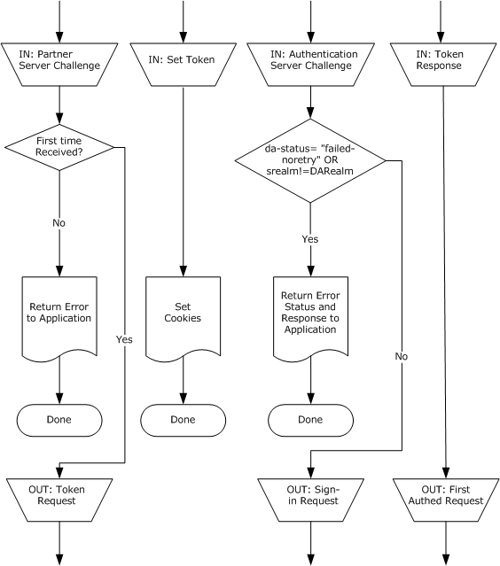
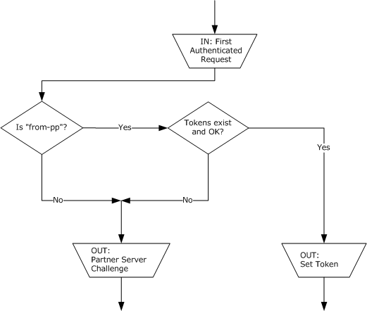
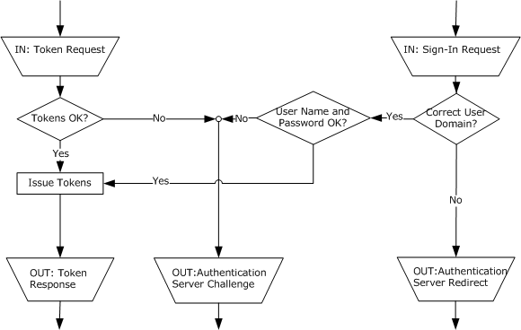
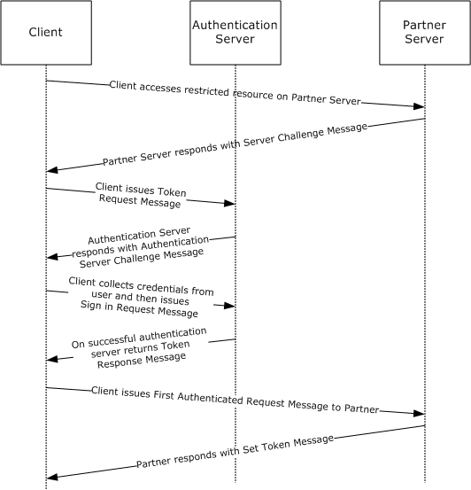

# [MS-PASS]: Passport Server Side Include (SSI) Version 1.4 Protocol

Table of Contents

1 Introduction

- [1 Introduction](#Section_1)
  - [1.1 Glossary](#Section_1.1)
  - [1.2 References](#Section_1.2)
    - [1.2.1 Normative References](#Section_1.2.1)
    - [1.2.2 Informative References](#Section_1.2.2)
  - [1.3 Overview](#Section_1.3)
  - [1.4 Relationship to Other Protocols](#Section_1.4)
  - [1.5 Prerequisites/Preconditions](#Section_1.5)
  - [1.6 Applicability Statement](#Section_1.6)
  - [1.7 Versioning and Capability Negotiation](#Section_1.7)
  - [1.8 Vendor-Extensible Fields](#Section_1.8)
  - [1.9 Standards Assignments](#Section_1.9)

2 Messages

- [2 Messages](#Section_2)
  - [2.1 Transport](#Section_2.1)
  - [2.2 Message Syntax](#Section_2.2)
    - [2.2.1 Common Definitions](#Section_2.2.1)
    - [2.2.2 Authentication Server Challenge Message](#Section_2.2.2)
    - [2.2.3 Authentication Server-Instructed Update Message](#Section_2.2.3)
    - [2.2.4 Authentication Server Logout Message](#Section_2.2.4)
    - [2.2.5 Authentication Server Redirect Message](#Section_2.2.5)
    - [2.2.6 First Authenticated Request Message](#Section_2.2.6)
    - [2.2.7 Sign-in Request Message](#Section_2.2.7)
    - [2.2.8 Partner Server Challenge Message](#Section_2.2.8)
    - [2.2.9 Set Token Message](#Section_2.2.9)
    - [2.2.10 Token Request Message](#Section_2.2.10)
    - [2.2.11 Token Response Message](#Section_2.2.11)
    - [2.2.12 Update Configuration Message](#Section_2.2.12)

3 Protocol Details

- [3 Protocol Details](#Section_3)
  - [3.1 Client Details](#Section_3.1)
    - [3.1.1 Abstract Data Model](#Section_3.1.1)
    - [3.1.2 Timers](#Section_3.1.2)
    - [3.1.3 Initialization](#Section_3.1.3)
    - [3.1.4 Higher-Layer Triggered Events](#Section_3.1.4)
      - [3.1.4.1 Opening a Passport Session](#Section_3.1.4.1)
      - [3.1.4.2 Closing a Passport Session](#Section_3.1.4.2)
    - [3.1.5 Processing Events and Sequencing Rules](#Section_3.1.5)
      - [3.1.5.1 Processing Partner Server Challenge Messages](#Section_3.1.5.1)
      - [3.1.5.2 Processing Authentication Server Challenge Messages](#Section_3.1.5.2)
      - [3.1.5.3 Processing Authentication Server-Instructed Update Messages](#Section_3.1.5.3)
      - [3.1.5.4 Updating Configuration Messages](#Section_3.1.5.4)
      - [3.1.5.5 Processing Authentication Server Logout Messages](#Section_3.1.5.5)
      - [3.1.5.6 Processing Authentication Server Redirect Messages](#Section_3.1.5.6)
      - [3.1.5.7 Processing Token Response Messages](#Section_3.1.5.7)
      - [3.1.5.8 Processing Set Token Messages](#Section_3.1.5.8)
    - [3.1.6 Timer Events](#Section_3.1.6)
    - [3.1.7 Other Local Events](#Section_3.1.7)
  - [3.2 Partner Server Details](#Section_3.2)
    - [3.2.1 Abstract Data Model](#Section_3.2.1)
    - [3.2.2 Timers](#Section_3.2.2)
    - [3.2.3 Initialization](#Section_3.2.3)
    - [3.2.4 Higher-Layer Triggered Events](#Section_3.2.4)
    - [3.2.5 Processing Events and Sequencing Rules](#Section_3.2.5)
      - [3.2.5.1 Processing First Authenticated Request Messages](#Section_3.2.5.1)
      - [3.2.5.2 Attempting to Access a Restricted Resource](#Section_3.2.5.2)
    - [3.2.6 Timer Events](#Section_3.2.6)
    - [3.2.7 Other Local Events](#Section_3.2.7)
  - [3.3 Authentication Server Details](#Section_3.3)
    - [3.3.1 Abstract Data Model](#Section_3.3.1)
    - [3.3.2 Timers](#Section_3.3.2)
    - [3.3.3 Initialization](#Section_3.3.3)
    - [3.3.4 Higher-Layer Triggered Events](#Section_3.3.4)
    - [3.3.5 Processing Events and Sequencing Rules](#Section_3.3.5)
      - [3.3.5.1 Processing Sign-in Request Messages](#Section_3.3.5.1)
      - [3.3.5.2 Processing Token Request Messages](#Section_3.3.5.2)
    - [3.3.6 Timer Events](#Section_3.3.6)
    - [3.3.7 Other Local Events](#Section_3.3.7)
  - [3.4 Configuration Server Details](#Section_3.4)
    - [3.4.1 Abstract Data Model](#Section_3.4.1)
    - [3.4.2 Timers](#Section_3.4.2)
    - [3.4.3 Initialization](#Section_3.4.3)
    - [3.4.4 Higher-Layer Triggered Events](#Section_3.4.4)
      - [3.4.4.1 Processing HTTP GET](#Section_3.4.4.1)
    - [3.4.5 Processing Events and Sequencing Rules](#Section_3.4.5)
    - [3.4.6 Timer Events](#Section_3.4.6)
    - [3.4.7 Other Local Events](#Section_3.4.7)

4 Protocol Examples

- [4 Protocol Examples](#Section_4)

5 Security

- [5 Security](#Section_5)
  - [5.1 Security Considerations for Implementers](#Section_5.1)
  - [5.2 Index of Security Parameters](#Section_5.2)

6 Appendix A: Product Behavior

- [6 Appendix A: Product Behavior](#Section_6)

7 Change Tracking

- [7 Change Tracking](#Section_7)

For the legal notice and IP terms, see [LEGAL.md](../LEGAL.md).
Last updated: 4/23/2024.
See [Revision History](#revision-history) for full version history.

# 1 Introduction

This document specifies the Passport Server Side Include (SSI) Version 1.4 Protocol (or the Passport SSI Version 1.4 Protocol), also known as the "Passport Tweener" protocol. The Passport SSI Version 1.4 Protocol is based on HTTP (as specified in [[RFC2616]](https://go.microsoft.com/fwlink/?LinkId=90372)) for [**authenticating**](#gt_authentication) a [**client**](#gt_client) to a server with the assistance of an [**authentication server**](#gt_authentication-server).

Sections 1.5, 1.8, 1.9, 2, and 3 of this specification are normative. All other sections and examples in this specification are informative.

## 1.1 Glossary

This document uses the following terms:

**authentication**: The act of proving an identity to a server while providing key material that binds the identity to subsequent communications.

**authentication server**: The entity that verifies that a person or thing is who or what it claims to be (typically using a cryptographic protocol) and issues a ticket or token attesting to the validity of the claim.

**Authentication Service (AS)**: A service that issues ticket granting tickets (TGTs), which are used for authenticating principals within the [**realm**](#gt_realm) or domain served by the [**Authentication Service**](#gt_authentication-service-as).

**client**: The software that is used by a [**user**](#gt_user) to access the service. It represents the [**user**](#gt_user) in [MS-PASS]. A synonym is [**client**](#gt_client) application.

**co-branding**: The inclusion of a party's logo, text, or other branding content in a second party's software or site.

**configuration server**: The service or server that serves configuration data (packaged in HTTP headers) describing the topography of the network. It includes information on the distribution of member accounts among the Authentication Services (AS) and the [**URLs**](#gt_uniform-resource-locator-url) of particular [**resources**](#gt_resource) in each [**AS**](#gt_authentication-service-as).

**configuration version**: Integer value indicating the version of the configuration data given out by the [**configuration server**](#gt_configuration-server).

**cookie**: An HTTP header that carries state information between participating origin servers and user agents. For more information, see [[RFC2109]](https://go.microsoft.com/fwlink/?LinkId=90315).

**credential**: Previously established, [**authentication**](#gt_authentication) data that is used by a security principal to establish its own identity. When used in reference to the Netlogon Protocol, it is the data that is stored in the NETLOGON_CREDENTIAL structure.

**partner**: In the context of [MS-PASS], an organization in a business relationship with the [**Authentication Service (AS)**](#gt_authentication-service-as). A [**partner**](#gt_partner) needs to be able to access the [**token**](#gt_token) issued by the [**AS**](#gt_authentication-service-as). Typically, a [**partner**](#gt_partner) site is the actual service or site a consumer visits and, in the process, is [**authenticated**](#gt_authentication) by the [**AS**](#gt_authentication-service-as). Examples of [**partners**](#gt_partner) are the MSN Money and MSN Messenger sites.

**partner server**: The server or service used by a [**partner**](#gt_partner) to represent it in the Passport SSI Version 1.4 Protocol.

**realm**: A collection of [**users**](#gt_user), [**partners**](#gt_partner), and [**authentication servers**](#gt_authentication-server) bound by a common [**authentication**](#gt_authentication) policy.

**resource**: An object that a [**client**](#gt_client) is requesting access to, typically referenced by a Uniform Resource Locator ([**URL**](#gt_uniform-resource-locator-url)) or Uniform Resource Identifier (URI), as specified in [[RFC3986]](https://go.microsoft.com/fwlink/?LinkId=90453).

**token**: A block of data that is issued to a [**user**](#gt_user) on successful [**authentication**](#gt_authentication) by the [**authentication server**](#gt_authentication-server). Such a [**token**](#gt_token) is presented to a service to prove one's identity and attributes to a service. The [**token**](#gt_token) is used in the process of determining the [**user's**](#gt_user) authorization and access privileges.

**Uniform Resource Locator (URL)**: A string of characters in a standardized format that identifies a document or resource on the World Wide Web. The format is as specified in [[RFC1738]](https://go.microsoft.com/fwlink/?LinkId=90287).

**user**: The real person who has a member account. The user is [**authenticated**](#gt_authentication) by being asked to prove knowledge of the secret password associated with the user name.

**UTF-8**: A byte-oriented standard for encoding Unicode characters, defined in the Unicode standard. Unless specified otherwise, this term refers to the UTF-8 encoding form specified in [[UNICODE5.0.0/2007]](https://go.microsoft.com/fwlink/?LinkId=154659) section 3.9.

**MAY, SHOULD, MUST, SHOULD NOT, MUST NOT:** These terms (in all caps) are used as defined in [[RFC2119]](https://go.microsoft.com/fwlink/?LinkId=90317). All statements of optional behavior use either MAY, SHOULD, or SHOULD NOT.

## 1.2 References

Links to a document in the Microsoft Open Specifications library point to the correct section in the most recently published version of the referenced document. However, because individual documents in the library are not updated at the same time, the section numbers in the documents may not match. You can confirm the correct section numbering by checking the [Errata](https://go.microsoft.com/fwlink/?linkid=850906).

### 1.2.1 Normative References

We conduct frequent surveys of the normative references to assure their continued availability. If you have any issue with finding a normative reference, please contact [dochelp@microsoft.com](mailto:dochelp@microsoft.com). We will assist you in finding the relevant information.

[RFC1738] Berners-Lee, T., Masinter, L., and McCahill, M., Eds., "Uniform Resource Locators (URL)", RFC 1738, December 1994, [https://www.rfc-editor.org/info/rfc1738](https://go.microsoft.com/fwlink/?LinkId=90287)

[RFC2109] Kristol, D., and Montulli, L., "HTTP State Management Mechanism", RFC 2109, February 1997, [https://www.rfc-editor.org/info/rfc2109](https://go.microsoft.com/fwlink/?LinkId=90315)

[RFC2119] Bradner, S., "Key words for use in RFCs to Indicate Requirement Levels", BCP 14, RFC 2119, March 1997, [https://www.rfc-editor.org/info/rfc2119](https://go.microsoft.com/fwlink/?LinkId=90317)

[RFC2396] Berners-Lee, T., Fielding, R., and Masinter, L., "Uniform Resource Identifiers (URI): Generic Syntax", RFC 2396, August 1998, [https://www.rfc-editor.org/info/rfc2396](https://go.microsoft.com/fwlink/?LinkId=90339)

[RFC2616] Fielding, R., Gettys, J., Mogul, J., et al., "Hypertext Transfer Protocol -- HTTP/1.1", RFC 2616, June 1999, [https://www.rfc-editor.org/info/rfc2616](https://go.microsoft.com/fwlink/?LinkId=90372)

[RFC2617] Franks, J., Hallam-Baker, P., Hostetler, J., et al., "HTTP Authentication: Basic and Digest Access Authentication", RFC 2617, June 1999, [https://www.rfc-editor.org/info/rfc2617](https://go.microsoft.com/fwlink/?LinkId=90373)

[RFC2818] Rescorla, E., "HTTP Over TLS", RFC 2818, May 2000, [https://www.rfc-editor.org/info/rfc2818](https://go.microsoft.com/fwlink/?LinkId=90383)

[RFC3629] Yergeau, F., "UTF-8, A Transformation Format of ISO 10646", STD 63, RFC 3629, November 2003, [https://www.rfc-editor.org/info/rfc3629](https://go.microsoft.com/fwlink/?LinkId=90439)

[RFC4234] Crocker, D., Ed., and Overell, P., "Augmented BNF for Syntax Specifications: ABNF", RFC 4234, October 2005, [https://www.rfc-editor.org/info/rfc4234](https://go.microsoft.com/fwlink/?LinkId=90462)

### 1.2.2 Informative References

None.

## 1.3 Overview

The Passport SSI Version 1.4 Protocol, also known as the "Passport Tweener" Protocol, is an HTTP-based protocol (as specified in [[RFC2616]](https://go.microsoft.com/fwlink/?LinkId=90372)) for [**authenticating**](#gt_authentication) a [**client**](#gt_client) to a [**partner server**](#gt_partner-server) with the assistance of an [**authentication server**](#gt_authentication-server). The authentication exchange between the client and the partner server in the Passport SSI Version 1.4 Protocol resembles the exchanges in other HTTP authentication mechanisms (as specified in [RFC2616] and [[RFC2617]](https://go.microsoft.com/fwlink/?LinkId=90373)).

When a client makes an HTTP request to the partner server, the partner server might respond with a Passport SSI Version 1.4 Protocol message (as specified in section [2.2.8](#Section_2.2.8)) indicating that the [**URL**](#gt_uniform-resource-locator-url) requires Passport SSI Version 1.4 Protocol authentication. The client then contacts the authentication server (as specified in section [2.2.10](#Section_2.2.10)) to obtain a [**partner**](#gt_partner) [**token**](#gt_token) that authenticates the [**user**](#gt_user) to the partner server, and then retries the HTTP request, this time attaching the partner token (as specified in section [2.2.6](#Section_2.2.6)).

If this authentication fails, the partner indicates failure and restates that Passport SSI Version 1.4 Protocol authentication is required. If authentication succeeds, the partner responds with the content that required authentication, along with the same partner token (as specified in section [2.2.9](#Section_2.2.9)) in HTTP [**cookie**](#gt_cookie) form, using the HTTP cookie mechanism (as specified in [[RFC2109]](https://go.microsoft.com/fwlink/?LinkId=90315)). The client thereby automatically resends the cookie-encoded token to the partner server every time it returns to the partner server.

When the client contacts the authentication server in response to a partner server's request for authentication, the client provides [**credentials**](#gt_credential) (that is, a user name and password; for more information, see section [2.2.7](#Section_2.2.7)). The authentication server verifies the credentials and, if they are valid, supplies the client with a partner token (opaque to the client) that can be used to authenticate to the partner server (as specified in section [2.2.11](#Section_2.2.11)). The authentication server also supplies the client with an authentication token in HTTP cookie form (as previously described) so that on subsequent visits to the authentication server to obtain partner tokens for other partner servers, the authentication server can automatically retrieve the user's authentication information based on the accompanying cookie, instead of requiring the client to resend the actual credentials every time.

The client can delete its tokens or cookies at any time. One point of departure from the traditional HTTP framework is that the authentication server can instruct the client to delete an authentication token it previously obtained (as specified in section [2.2.4](#Section_2.2.4)). In this case, the client deletes the authentication token.

The Passport SSI Version 1.4 Protocol allows for the implementation of distributed authentication servers by allowing an authentication server to redirect clients to an alternate authentication server using an HTTP redirect response (as specified in section [2.2.5](#Section_2.2.5)). The protocol also supports multiple independent [**realms**](#gt_realm) in which each realm consists of an authentication server (single or distributed) capable of helping a specific set of users authenticate to a specific set of partner servers. A user's credentials are stored at the authentication server for a specific realm, which in turn allows that user to authenticate to any of the set of partner servers associated with that realm.

Each realm also has a [**configuration server**](#gt_configuration-server), which provides the client with information on the authentication server for that realm, such as its URL. A client is initially configured with the URL of the configuration server for some realm. This can occur, for example, when the user enrolls in or joins a realm. If the client has no configuration data, or if its configuration data is out of date, the authentication server can provide an up-to-date [**configuration version**](#gt_configuration-version) number to the client any time the client authenticates (as specified in section [2.2.3](#Section_2.2.3)). The client issues a standard HTTP GET request to the configuration server's URL to obtain updated configuration information. For more information, see section [3.1.5.3](#Section_3.1.5.3).

## 1.4 Relationship to Other Protocols

The Passport SSI Version 1.4 Protocol is built on HTTP (as specified in [[RFC2617]](https://go.microsoft.com/fwlink/?LinkId=90373)) and HTTP over Transport Layer Security (TLS) (as specified in [[RFC2818]](https://go.microsoft.com/fwlink/?LinkId=90383)). No other higher-layer protocols explicitly depend on the Passport SSI Version 1.4 Protocol.

## 1.5 Prerequisites/Preconditions

The following prerequisites and preconditions are required by the Passport SSI Version 1.4 Protocol:

- The [**client**](#gt_client) is configured with the [**URL**](#gt_uniform-resource-locator-url) of the [**configuration server**](#gt_configuration-server) for its [**realm**](#gt_realm).<1>
- The client has the capability to obtain [**credentials**](#gt_credential) (that is, a [**user**](#gt_user) name and password) from the user. A Passport SSI Version 1.4 Protocol client can utilize local code to obtain the credentials locally, and to provide those cached credentials to the [**authentication server**](#gt_authentication-server). The cache might be shared by many such applications, and each application might be capable of obtaining the credentials from users and caching them, using the same local code.
- The authentication server for the client's realm might be able to validate the credentials (that is, a user name and password) of any user registered with that realm. The authentication server is configured with its realm name and any [**co-branding**](#gt_co-branding) information that is to be passed to the client (as specified in section [2.2.2](#Section_2.2.2)) as well as the current version number for the configuration server's configuration data (as specified in section [2.2.3](#Section_2.2.3)). If the authentication server is implemented in a distributed manner, it has a method for determining to what authentication server URL to redirect a given client within its realm (based on the client's presented credentials or [**authentication**](#gt_authentication) [**token**](#gt_token)), as specified in section [2.2.5](#Section_2.2.5).
- The [**partner server**](#gt_partner-server) and authentication server share a [**partner**](#gt_partner) token format along with a set of criteria for recognizing if a given partner token is valid. They also share a set of definitions for the information that will be transported from the partner server to the authentication server when a client attempts to authenticate to the partner server, as specified in section [2.2.8](#Section_2.2.8). This information is received in a protocol message by the client (as specified in section 2.2.8) and encoded in a format chosen by the realm. It is then sent to the authentication server by the client in a subsequent message, as specified in sections [2.2.7](#Section_2.2.7) and [2.2.10](#Section_2.2.10).
Finally, the partner server and authentication server agree on a URL to which the client is to be sent after it is successfully authenticated at the request of the partner server, as specified in section [2.2.11](#Section_2.2.11).

- The configuration server for the realm is provisioned with all the configuration data necessary to construct an update configuration message, as specified in section [2.2.12](#Section_2.2.12).

## 1.6 Applicability Statement

The Passport SSI Version 1.4 Protocol applies to environments in which one or more services require HTTP-based [**authentication**](#gt_authentication) (as specified in [[RFC2616]](https://go.microsoft.com/fwlink/?LinkId=90372) section 11) of members of a common base of [**users**](#gt_user). In such cases, they might prefer to use a shared [**Authentication Service (AS)**](#gt_authentication-service-as). For example, if multiple enterprises prefer to offer web-based services specifically to members of a particular organization enrolled in such a shared AS, then they can choose to form a [**realm**](#gt_realm). The enterprises would become [**partner**](#gt_partner) services associated with the realm, and members would be able to authenticate themselves to any of the [**partner servers**](#gt_partner-server) using the shared AS and the Passport SSI Version 1.4 Protocol.

## 1.7 Versioning and Capability Negotiation

Versioning and capability negotiation does not apply to the Passport SSI Version 1.4 Protocol.

## 1.8 Vendor-Extensible Fields

The *ExtraParams* parameter (as specified in section [2.2.1](#Section_2.2.1)) can be used to extend the Passport SSI Version 1.4 Protocol.

## 1.9 Standards Assignments

The only standards assignments for the Passport SSI Version 1.4 Protocol are those inherited from its transport protocols, as specified in [[RFC2616]](https://go.microsoft.com/fwlink/?LinkId=90372) and [[RFC2818]](https://go.microsoft.com/fwlink/?LinkId=90383).

# 2 Messages

The following sections specify how Passport SSI Version 1.4 Protocol messages are transported and message syntax.

## 2.1 Transport

The Passport SSI Version 1.4 Protocol MUST use HTTP (as specified in [[RFC2616]](https://go.microsoft.com/fwlink/?LinkId=90372)) or HTTP over TLS (as specified in [[RFC2818]](https://go.microsoft.com/fwlink/?LinkId=90383)) as the transport layer. The use of HTTP over TLS is triggered by the specification of an "https" [**URL**](#gt_uniform-resource-locator-url) rather than an "http" URL by one of the servers (the [**partner server**](#gt_partner-server), the [**configuration server**](#gt_configuration-server), or the [**authentication server**](#gt_authentication-server)) when redirecting or configuring the [**client**](#gt_client). Messages and data are sent via HTTP headers included in HTTP requests and responses. When a message is sent as a header in an HTTP response message, its receiver MUST process the message if the response's status code is one of those specified in the message definition, and MUST NOT do so otherwise.

The Passport SSI Version 1.4 Protocol also uses the HTTP [**cookie**](#gt_cookie) mechanism (as specified in [[RFC2109]](https://go.microsoft.com/fwlink/?LinkId=90315)) as a transport and state management mechanism. The HTTP cookie mechanism allows named data items to be sent from one party to another as part of an HTTP message stored by the receiving party and returned automatically to the original party as part of all subsequent HTTP messages to that party.

## 2.2 Message Syntax

### 2.2.1 Common Definitions

Except where noted, the headers in this document are specified using the Augmented Backus-Naur Form (ABNF) grammar, as specified in [[RFC4234]](https://go.microsoft.com/fwlink/?LinkId=90462) section 2.2. The following common constructions are used throughout this document.

These constructions are used solely for convenience in constructing other types and have no semantics in and of themselves.

httpURL = 1*(ALPHA / DIGIT / ":" / "." / "\" / "/" / "%" / "_" / "&" / "?")

The following constructions are used in protocol header definitions:

scheme = "Passport1.4"

ExtraParams = *("," ptoken) ptoken

challenge = ExtraParams

OrgVerb = "OrgVerb=" ptoken

OrgURL = "OrgUrl=" httpURL

tname = "tname=" ptoken

from-PP = "from-PP=" ptoken

ptoken = 1*<any CHAR except CTLs or ",">

ConfigVersion = "ConfigVersion=" 1*DIGIT

**scheme:** Identifier for the Passport SSI Version 1.4 Protocol [**authentication**](#gt_authentication) scheme.

**ExtraParams:** Additional parameters not interpreted by this protocol that MAY be used for vendor extensibility.

**challenge:** A comma-separated list of parameters returned by a server for use by a [**client**](#gt_client) in the process of proving its identity.

**OrgVerb:** A string containing the HTTP verb that triggered the original server challenge, for example, "GET".

**OrgURL:** The [**URL**](#gt_uniform-resource-locator-url) in an HTTP request that triggered a server challenge.

**tname:** An informational parameter that contains the name of a [**cookie**](#gt_cookie) specified on a response. A client SHOULD ignore this parameter.

**ptoken:** A string that can contain any alphanumeric characters and separators, except for a comma.

**from-PP:** A string that is opaque to the client. This value is received from a server and MUST be passed back unchanged on a subsequent request.<2>

### 2.2.2 Authentication Server Challenge Message

The Authentication Server Challenge message is sent by the [**authentication server**](#gt_authentication-server) to the [**client**](#gt_client) and indicates that the sign-in request or [**token**](#gt_token) request failed.

This message is processed only when returned with a 401 HTTP status code. The return value MUST be as follows.

Authentication-Server-Challenge-Message = "WWW-Authenticate:"

scheme 1*SP da-status "," srealm ["," customtoken] ["," prompt]

["," cburl] ["," cbtxt]

status-codes = "failed" / "failed-noretry"

da-status = "da-status=" status-codes

srealm = "srealm=" ptoken

cburl = "cburl=" httpURL

cbtxt = "cbtxt=" ptoken

prompt = "prompt"

customtoken = ptoken

**da-status:** Specifies if the receiving client MUST retry the request. The client's precise interpretation of the possible values of "da-status" is specified in section [3.1.5.2](#Section_3.1.5.2).

**srealm:** A string that MUST contain the [**realm**](#gt_realm) name of the authentication server.

**cburl:** Specifies a [**co-branding**](#gt_co-branding) [**URL**](#gt_uniform-resource-locator-url).

**Cbtxt:** Specifies optional co-branding text.

**prompt:** Specifies, by its presence, that the client MUST prompt the [**user**](#gt_user) for [**credentials**](#gt_credential).

**customtoken:** Custom parameter that an authentication server MAY add to the response. Not explicitly part of the protocol.

This token is interpreted by the authentication server only. The client MUST not interpret the value. The client MUST send the token unchanged to the authentication server in a subsequent [Sign-in Request](#Section_2.2.7) message.

Example:

WWW-Authenticate: Passport1.4 da-status=failed,

srealm=Passport.NET,ts=-2,prompt

### 2.2.3 Authentication Server-Instructed Update Message

The Authentication Server-Instructed Update message MAY be included by the [**authentication server**](#gt_authentication-server) in any of its response messages to the [**client**](#gt_client) to indicate the current [**configuration version**](#gt_configuration-version). <3>

Authentication-Server-Instructed-Update-Message = "PassportConfig:"

ConfigVersion

**ConfigVersion:** MUST specify the current authentication server version number.

Example:

PassportConfig: ConfigVersion=14

### 2.2.4 Authentication Server Logout Message

The Authentication Server Logout message MUST be sent by the [**authentication server**](#gt_authentication-server) to the [**client**](#gt_client) to indicate that the [**user**](#gt_user) has successfully logged out.

This message is processed when included in an HTTP response with any status code.

Authentication-Server-Logout-Message = "Authentication-Info:"

scheme 1*SP "da-status=logout"

Example:

Authentication-Info: Passport1.4 da-status=logout

### 2.2.5 Authentication Server Redirect Message

The Authentication Server Redirect message is used to indicate that the [**client**](#gt_client) SHOULD redirect its [Sign-in Request](#Section_2.2.7) message or its [Token Request](#Section_2.2.10) message to a different [**authentication server**](#gt_authentication-server). It is sent from the authentication server to the client. The HTTP response message to which this message is attached MUST be an HTTP 302 redirect (as specified in [[RFC2616]](https://go.microsoft.com/fwlink/?LinkId=90372) section 10.3.3) in which the HTTP Location header MUST contain the [**URL**](#gt_uniform-resource-locator-url) of the correct authentication server.

Authentication-Server-Redirect-Message = "Authentication-Info:"

scheme 1*SP "da-status=redir"

Example:

Authentication-Info: Passport1.4 da-status=redir

### 2.2.6 First Authenticated Request Message

The [**client**](#gt_client) MUST issue a First Authenticated Request message to the [**partner server**](#gt_partner-server) after receiving a [**partner**](#gt_partner) [**token**](#gt_token) from the [**authentication server**](#gt_authentication-server).

First-Authenticated-Request-Message = "Authorization:" scheme 1*SP from-PP

Example:

Authorization: Passport1.4 from-PP=1puV5BFuLD

### 2.2.7 Sign-in Request Message

This message contains the [**user's**](#gt_user) [**credentials**](#gt_credential) and is sent by the [**client**](#gt_client) to the [**authentication server**](#gt_authentication-server). It MUST contain the parameters in the [Authentication Server Challenge](#Section_2.2.2) message received from the [**partner server**](#gt_partner-server) that originally initiated [**authentication**](#gt_authentication).

Sign-in-Request-Message = "Authorization:" scheme 1*SP sign-in ","

pwd "," elapsed-time "," OrgVerb "," OrgURL ["," customtoken] "," challenge

sign-in = "sign-in=" signin-name

pwd = "pwd=" passphrase

elapsed-time = "elapsed-time=" 1*DIGIT

signin-name = signin-str "@" signin-str "." signin-str

signin-str = 1*(%d39 / %d45 / %d46 / %d48-57 / %d65-90 / %d95 / %d97-122)

passphrase = 1*(%d33-126)

**sign-in:** A string that MUST specify the user's sign-in name. It MUST be [**UTF-8**](#gt_utf-8)–encoded (as specified in [[RFC3629]](https://go.microsoft.com/fwlink/?LinkId=90439)) and unsafe character-escaped (as specified in [[RFC2396]](https://go.microsoft.com/fwlink/?LinkId=90339)). The name MUST be an email name and can contain alphanumeric characters, hyphens, and periods.

**pwd:** A string that MUST specify the user's password. It MUST be UTF-8–encoded (as specified in [RFC3629]) and unsafe character-escaped (as specified in [RFC2396]). Alphanumeric and special characters MAY be used. If a comma is used in the password, it MUST be escaped, as specified in [RFC2396].

**elapsed-time:** A non-negative integer that MUST specify the duration, in seconds, since the sign-in name and password were placed in the [**token**](#gt_token) cache by the client. A value of 0 specifies that the user was prompted for credentials and cached credentials are not being sent.

**customtoken:** Optional token received from the authentication server in an Authentication Server Challenge message.

Example:

Authorization: Passport1.4 sign-in=user1%40example.com,pwd=password,

elapsed-time=0, OrgVerb=GET,OrgUrl=https://partner.example.com/auth.asp,

param1,param2

**Note** The challenge is in whatever format the [**partners**](#gt_partner) in the [**realm**](#gt_realm) and the [**AS**](#gt_authentication-service-as) agree to use, and is not part of the protocol. It MUST be a comma-separated set of ptoken elements, as specified in the ABNF in section [2.2.1](#Section_2.2.1).

### 2.2.8 Partner Server Challenge Message

The Partner Server Challenge message, sent by the [**partner server**](#gt_partner-server) to the [**client**](#gt_client), indicates that the client's request failed and MUST describe the [**partner**](#gt_partner) [**token**](#gt_token) needed to gain access to the [**URL**](#gt_uniform-resource-locator-url).

This message can contain any number of comma-separated ptoken elements, specified in section [2.2.1](#Section_2.2.1), as the challenge. The client MUST treat the challenge as-is and pass it along to the [**authentication server**](#gt_authentication-server) in a [Token Request](#Section_2.2.10) message or a [Sign-in Request](#Section_2.2.7) message.

This message SHOULD be processed only when included in an HTTP response with a 302 or 401 status code.<4>

Partner-Server-Challenge-Message = "WWW-Authenticate:" scheme 1*SP challenge["," upgrade]

upgrade = "Negotiate2SupportedIf=" condition

condition = 1*(ALPHA / DIGIT)

Example:

WWW-Authenticate: Passport1.4 param1,param2,Negotiate2SupportedIf=LiveSSP

### 2.2.9 Set Token Message

The Set Token message MUST be sent by the [**partner server**](#gt_partner-server) to the [**client**](#gt_client) in response to successful processing of a [First Authenticated Request](#Section_2.2.6) message. Successful processing here means that the client was successfully [**authenticated**](#gt_authentication). The partner server uses this message to set its own [**tokens**](#gt_token) as [**cookies**](#gt_cookie).

This message SHOULD be processed for any HTTP status code.<5>

Set-Token-Message = "Authentication-Info:" scheme 1*SP [tname *("," tname)]

Example:

Authentication-Info: Passport1.4 tname=MSPAuth,tname=MSPProf

### 2.2.10 Token Request Message

The Token Request message is sent by the [**client**](#gt_client) to the [**authentication server**](#gt_authentication-server) to retrieve a new [**partner**](#gt_partner) [**token**](#gt_token). The request MUST contain the challenge from the [Partner Server Challenge](#Section_2.2.8) message the client just received. The challenge itself is opaque to the client and is outside the Passport SSI Version 1.4 Protocol. If the client already has an [**authentication**](#gt_authentication) token, it MUST be passed automatically to the authentication server in an HTTP [**cookie**](#gt_cookie).

Token-Request-Message = "Authorization:" scheme 1*SP "tname=,"

OrgVerb "," OrgUrl "," challenge

The parameters from the [Authentication Server Challenge](#Section_2.2.2) message MUST NOT have names from the preceding list.

Example:

Authorization: Passport1.4 tname=,OrgVerb=GET,OrgUrl=

https://partner.example.com/auth.asp,param1,param2

**Note** The challenge, as in the preceding example, can be any number of comma-separated elements, as specified in section [2.2.1](#Section_2.2.1).

### 2.2.11 Token Response Message

The [**authentication server**](#gt_authentication-server) sends a Token Response message to the [**client**](#gt_client) when it can issue a [**partner**](#gt_partner) [**token**](#gt_token) or tokens that are satisfactory to the [**partner server**](#gt_partner-server).

This message MUST be processed when included in an HTTP response with any status code.

Token-Response-Message = "Authentication-Info:" scheme 1*SP

"da-status=success" *("," tname) "," from-PP "," ru

ru = "ru=" httpURL

**ru:** Specifies a [**URL**](#gt_uniform-resource-locator-url) to which the client MUST issue its next [First Authenticated Request](#Section_2.2.6) message.

Example:

Authentication-Info: Passport1.4 da-status=success,

from-PP=1puV5BFuLD,

ru=http://partner.example.com/default.asp

### 2.2.12 Update Configuration Message

The Update Configuration message is sent from the [**configuration server**](#gt_configuration-server) to the [**client**](#gt_client) and contains configuration information.

This message MUST be processed when included in an HTTP response with any status code.

Update-Configuration-Message = "PassportURLs:" DARealm "," DALogin ","

DAReg "," Properties "," Privacy "," GeneralRedir "," Help "," ConfigVersion

DARealm = "DARealm=" token

DALogin = "DALogin=" httpURL

DAReg = "DAReg=" httpURL

Properties = "Properties=" httpURL

Privacy = "Privacy=" httpURL

GeneralRedir = "GeneralRedir=" httpURL

Help = "Help=" httpURL

**DARealm:** A string that MUST specify the name of an [**authentication server**](#gt_authentication-server) [**realm**](#gt_realm). The protocol does not impose restrictions on the DARealm string format.

**DALogin:** MUST specify the [**URL**](#gt_uniform-resource-locator-url) of the authentication server for the realm identified by DARealm. The URL MUST be valid in form, as specified in [[RFC1738]](https://go.microsoft.com/fwlink/?LinkId=90287).

**DAReg:** Specifies the URL (in the format specified in [RFC1738]) in which a [**user**](#gt_user) can register for an account in the realm identified by DARealm.

**Properties:** Specifies a URL that displays the properties of a user account in the realm identified by DARealm.

**Privacy:** Specifies the URL of the human-readable privacy policy for the realm identified by DARealm.

**GeneralRedir:** Specifies a general-purpose redirector URL.

**Help:** The URL in which the Help page SHOULD be located for the realm identified by DARealm.

**ConfigVersion:** An integer that specifies the version number of this collection of configuration information.

Example:

PassportURLs: DARealm=Passport.Net,DALogin=sign-in.live.com/login2.srf,

DAReg=https://accountservices.passport.net/UIXPWiz.srf,

Properties=https://accountservices.msn.com/editprof.srf,

Privacy=https://accountservices.passport.net/PPPrivacyStatement.srf,

GeneralRedir=http://nexusrdr.passport.com/redirect.asp,

Help=https://accountservices.passport.net,ConfigVersion=14

# 3 Protocol Details

The following sections specify details of the Passport SSI Version 1.4 Protocol, including abstract data models and message processing rules.

An implementation SHOULD implement the [**client**](#gt_client) role specified in section [3.1](#Section_3.1).

An implementation MAY implement the [**partner server**](#gt_partner-server) role specified in section [3.2](#Section_3.2).

An implementation MAY implement the [**authentication server**](#gt_authentication-server) role specified in section [3.3](#Section_3.3).

## 3.1 Client Details

### 3.1.1 Abstract Data Model

This section describes a conceptual model of possible data organization that an implementation maintains to participate in this protocol. The described organization is provided to facilitate the explanation of how the protocol behaves. This document does not mandate that implementations adhere to this model as long as their external behavior is consistent with what is described in this document.

In addition to the information with which [**clients**](#gt_client) MUST initially be configured, such as a [**configuration server**](#gt_configuration-server) [**URL**](#gt_uniform-resource-locator-url) (as specified in section [1.5](#Section_1.5)), clients MUST store the following states:

- **Passport Session Table**: A set of states for each passport session. Each entry in the passport session table is created and deleted as specified in sections [3.1.4.1](#Section_3.1.4.1) and [3.1.4.2](#Section_3.1.4.2), respectively, and has the following states:
- **Passport Configuration Data**: All of the name/value pairs sent in the [Update Configuration (section 2.2.12)](#Section_2.2.12) message.
- **Original HTTP Verb**: The HTTP verb for every HTTP request sent that has not yet received a response or whose response has included a [Partner Server Challenge Message (section 2.2.8)](#Section_2.2.8).
- **Original HTTP URL**: The HTTP URL for every HTTP request sent that has not yet received a response, or whose response has included a Partner Server Challenge Message.
- **Last Sign-in Request**: The most recently sent [Sign-in Request](#Section_2.2.7) message, in case it must be resent due to a redirect (as specified in section [3.1.5.6](#Section_3.1.5.6)).
- **Sent First Authenticated Request**: A flag that indicates whether the client has previously sent a [First Authenticated Request Message (section 2.2.6)](#Section_2.2.6).
- **Passport Cookies**: All HTTP [**cookies**](#gt_cookie) returned by [**authentication servers**](#gt_authentication-server) and [**partner servers**](#gt_partner-server).
- **Partner Challenge**: The challenge information provided in the Partner Server Challenge Message, as specified in section 2.2.8.
- **Cached User Credentials**: An optional [**user**](#gt_user) name and password pair with timestamp to the second at which the [**credentials**](#gt_credential) were stored.<6>

### 3.1.2 Timers

None.

### 3.1.3 Initialization

**Passport Session Table** is initialized to empty.

### 3.1.4 Higher-Layer Triggered Events

None.

#### 3.1.4.1 Opening a Passport Session

When a higher-layer application initiates an HTTP request that supports the Passport SSI Version 1.4 Protocol, it creates a new entry in the **Passport Session Table** to be used with the HTTP request. When a new entry is created, its state is initialized as follows:

- **Passport Configuration Data** is initialized to empty.
- **Original HTTP Verb** is initialized to empty.
- **Original HTTP URL** is initialized to empty.
- **Last Sign-in Request** is initialized to empty.
- **Sent First Authenticated Request** is initialized to FALSE.

#### 3.1.4.2 Closing a Passport Session

When a higher-layer application completes an HTTP request (including the Passport processing described in section [3.1.5](#Section_3.1.5)), its entry in the **Passport Session Table** is deleted.

### 3.1.5 Processing Events and Sequencing Rules

The following two diagrams illustrate message processing at the [**client**](#gt_client):

Figure 1: Message processing at the client part A

Figure 2: Message processing at the client part B (continued)

#### 3.1.5.1 Processing Partner Server Challenge Messages

After receiving a [Partner Server Challenge](#Section_2.2.8) message with **Sent First Authenticated Request** set to FALSE, the [**client**](#gt_client) MUST send the [**authentication server**](#gt_authentication-server) a [Token Request](#Section_2.2.10) message. The client MUST pass the parameters from the Partner Server Challenge message as-is to the authentication server in the Token Request message and store them in **Partner Challenge**. The values for the *OrgVerb* and *OrgUrl* parameters MUST be the **Original HTTP Verb** and **Original HTTP URL** stored (as specified in section [3.1.1](#Section_3.1.1)) for the HTTP request whose response included the received Partner Server Challenge message.

If the client receives a Partner Server Challenge message with **Sent First Authenticated Request** set to TRUE (that is, a second time from the same [**partner server**](#gt_partner-server) before receiving a [Set Token](#Section_2.2.9) message from that partner server), the client MUST pass an error up to the application.

If the client receives an upgrade [**token**](#gt_token) it MAY evaluate the condition. The client MAY then choose to ignore the Passport Tweener WWW-Authenticate header. <7>

#### 3.1.5.2 Processing Authentication Server Challenge Messages

If the received "da-status" value in the [Authentication Server Challenge](#Section_2.2.2) message is set to "fail-noretry", or if the received value of srealm does not equal the value of **DARealm** in the [**client's**](#gt_client) stored **Passport Configuration Data** (as specified in section [3.1.1](#Section_3.1.1)), the client MUST handle the error by passing to the application the HTTP 401 status along with any HTML content contained in the accompanying HTTP response. Otherwise, the client MUST respond with a [Sign-in Request](#Section_2.2.7) message to the [**authentication server**](#gt_authentication-server) and store this message as **Last Sign-in Request** for reuse in case of a redirect (as specified in section [3.1.5.6](#Section_3.1.5.6)).

If the received Authentication Server Challenge message includes a *prompt* predicate parameter, the [**user**](#gt_user) MUST be prompted for a user name and password, which MUST then be used to assign the values of sign-in and Pwd in the Sign-in Request message. Otherwise, the client MAY take the values of sign-in and Pwd from its stored [**credentials**](#gt_credential), **Cached User Credentials**, as specified in section 3.1.1. That is, a Passport SSI Version 1.4 Protocol client MAY utilize local code to obtain the credentials locally and provide those cached credentials to the authentication server.<8>

If **Cached User Credentials** are used, the elapsed-time value in the outgoing message MUST be set to the number of seconds between the current time and the "time entered" value stored with the **Cached User Credentials**, as specified in section 3.1.1. However, if the user is prompted to enter the credentials, the elapsed-time value MUST be set to zero. The values of *OrgVerb* and *OrgUrl* MUST then be set to the values in the client's stored state for **Original HTTP Verb** and **Original HTTP URL** (as specified in section 3.1.1). The value of *Challenge* is retrieved from **Partner Challenge**.

If present, the *cburl* and *cbtxt* parameters indicate [**co-branding**](#gt_co-branding) [**URL**](#gt_uniform-resource-locator-url) and text that the client SHOULD pass to the application to be displayed to the user.

#### 3.1.5.3 Processing Authentication Server-Instructed Update Messages

The [**client**](#gt_client) MUST compare the version number of its stored **Passport Configuration Data** (as specified in section [3.1.1](#Section_3.1.1)) to the version number supplied in this message. If the client's stored version number is lower than the version number supplied in the message, the client MUST issue an HTTP GET to the [**configuration server**](#gt_configuration-server) [**URL**](#gt_uniform-resource-locator-url) (as specified in section [1.5](#Section_1.5)). Handling of the response to this HTTP GET message is specified in section [3.1.5.4](#Section_3.1.5.4).

#### 3.1.5.4 Updating Configuration Messages

The [**client**](#gt_client) MUST update its **Passport Configuration Data** with the name/value pairs from this message if it does not have a value stored for "ConfigVersion", or if the stored value is less than that of the version returned by the [**configuration server**](#gt_configuration-server). The client MUST NOT update its **Passport Configuration Data** if its stored "ConfigVersion" value is equal to or greater than the "ConfigVersion" value returned by the configuration server.

#### 3.1.5.5 Processing Authentication Server Logout Messages

The [**client**](#gt_client) MUST delete the [**cookie**](#gt_cookie) containing the [**authentication**](#gt_authentication) [**token**](#gt_token) for the [**authentication server**](#gt_authentication-server) (identified by the domain in the [**URL**](#gt_uniform-resource-locator-url)) from its store of **Passport Cookies** (as specified in section [3.1.1](#Section_3.1.1)).

#### 3.1.5.6 Processing Authentication Server Redirect Messages

On receiving an [Authentication Server Redirect](#Section_2.2.5) message, the [**client**](#gt_client) MUST retry the sign-in request by sending an exact duplicate of the most recently sent [Sign-in Request](#Section_2.2.7) message stored in **Last Sign-in Request** to the indicated [**URL**](#gt_uniform-resource-locator-url). This duplicate MUST be retrieved from the client's stored state, as specified in section [3.1.1](#Section_3.1.1).

#### 3.1.5.7 Processing Token Response Messages

The [**client**](#gt_client) MUST respond by sending a [First Authenticated Request](#Section_2.2.6) message to the [**URL**](#gt_uniform-resource-locator-url) indicated by the *ru* parameter (typically the original [**partner server's**](#gt_partner-server) URL) and setting **Sent First Authenticated Request** to TRUE. Its *from-PP* value MUST be set to the value of the *from-PP* value in the just-received [Token Response](#Section_2.2.11) message. The *tname* parameter values, if present, are strictly informational and MAY be ignored. However, the **Passport Cookies**, set on the client by the [**authentication server**](#gt_authentication-server) as part of the accompanying HTTP response, MUST be passed to the authentication server (as specified in [[RFC2109]](https://go.microsoft.com/fwlink/?LinkId=90315)) every time an HTTP request is issued to that server until they are deleted, either by [**user**](#gt_user) action or in response to an [Authentication Server Logout](#Section_2.2.4) message (see section [3.1.5.5](#Section_3.1.5.5)).<9>

#### 3.1.5.8 Processing Set Token Messages

The *tname* parameter values, if present, are strictly informational and MAY be ignored. However, the **Passport Cookies** set on the [**client**](#gt_client) by the [**authentication server**](#gt_authentication-server) as part of the accompanying HTTP response MUST be passed to the [**partner server**](#gt_partner-server) (as specified in [[RFC2109]](https://go.microsoft.com/fwlink/?LinkId=90315)) every time an HTTP request is issued to that server until they are deleted by [**user**](#gt_user) action.<10>

### 3.1.6 Timer Events

None.

### 3.1.7 Other Local Events

None.

## 3.2 Partner Server Details

### 3.2.1 Abstract Data Model

[**Partner servers**](#gt_partner-server) are stateless and store no data that changes during the running of the protocol. They do, however, store some static, preconfigured information, as specified in section [1.5](#Section_1.5).

### 3.2.2 Timers

None.

### 3.2.3 Initialization

None.

### 3.2.4 Higher-Layer Triggered Events

None.

### 3.2.5 Processing Events and Sequencing Rules

The following diagram illustrates messages processing at the [**partner server**](#gt_partner-server).

Figure 3: Message processing at partner server

#### 3.2.5.1 Processing First Authenticated Request Messages

The [**partner server**](#gt_partner-server) MUST examine the *from-PP* parameter in the [First Authenticated Request](#Section_2.2.6) message and determine if it contains valid [**tokens**](#gt_token), according to the validity criteria previously agreed on with the [**authentication server**](#gt_authentication-server) (as specified in section [1.5](#Section_1.5)).

If the tokens are not valid, the partner server MUST respond with a [Partner Server Challenge](#Section_2.2.8) message. The text strings included in this message are, as in the case of an unauthenticated access attempt (as specified in section [3.2.5.2](#Section_3.2.5.2)), strictly a matter of prior agreement between the partner server and the authentication server (as specified in section 1.5).

If the tokens are valid, the partner server MUST respond with a [Set Token](#Section_2.2.9) message. As part of the HTTP response that contains the Set Token message, the partner server MUST set the values of one or more HTTP [**cookies**](#gt_cookie) on the [**client**](#gt_client) (as specified in [[RFC2109]](https://go.microsoft.com/fwlink/?LinkId=90315)) containing the value of the *from-PP* parameter in the received First Authenticated Request message. One or more corresponding *tname* parameter values MAY be included in the Set Token message. If included, they MUST contain the names of the HTTP cookies set on the client.

#### 3.2.5.2 Attempting to Access a Restricted Resource

On receiving an HTTP request for a [**URL**](#gt_uniform-resource-locator-url) designated by the [**partner server**](#gt_partner-server) as requiring Passport SSI Version 1.4 Protocol [**authentication**](#gt_authentication), the partner server MUST send the [**client**](#gt_client) a [Partner Server Challenge](#Section_2.2.8) message. The parameter names and values in this message are strictly a matter of prior agreement between the partner server and the [**authentication server**](#gt_authentication-server), as specified in section [1.5](#Section_1.5).

### 3.2.6 Timer Events

None.

### 3.2.7 Other Local Events

None.

## 3.3 Authentication Server Details

### 3.3.1 Abstract Data Model

[**Authentication servers**](#gt_authentication-server) are stateless and store no data that changes during the running of the protocol. They do, however, store some static, preconfigured information, as specified in section [1.5](#Section_1.5).

### 3.3.2 Timers

None.

### 3.3.3 Initialization

None.

### 3.3.4 Higher-Layer Triggered Events

None.

### 3.3.5 Processing Events and Sequencing Rules

The following diagram illustrates messages processing at the [**authentication server**](#gt_authentication-server).

Figure 4: Message processing at authentication server

#### 3.3.5.1 Processing Sign-in Request Messages

The [**authentication server**](#gt_authentication-server) MUST determine, based on the sign-in parameter in the message, if it is the correct authentication server to handle this [Sign-in Request](#Section_2.2.7) message based on its configuration (as specified in section [1.5](#Section_1.5)). If the authentication server is not the correct one to handle the Sign-in Request message for the [**user's**](#gt_user) domain, it MUST respond with an [Authentication Server Redirect](#Section_2.2.5) message attached to an HTTP 302 error response to the request that carried the Sign-in Request message. The HTTP response MUST include a Location header whose value is the [**URL**](#gt_uniform-resource-locator-url) of the correct authentication server.

If the authentication server is the correct one to handle the received Sign-in Request message, and the parameters relayed from the [**partner server**](#gt_partner-server) are valid, according to the predetermined criteria (as specified in section 1.5), but the authentication server's validation of the given [**credentials**](#gt_credential) (as specified in section 1.5) determines them to be invalid, the authentication server MUST respond with an [Authentication Server Challenge](#Section_2.2.2) message with da-status="failed". The authentication server MAY use the *elapsed-time* parameter to enforce a validity period for cached credentials.

If the authentication server is the correct one to handle the received Sign-in Request message, but the parameters relayed from the partner server are invalid, according to the predetermined criteria (as specified in section 1.5), the authentication server MUST respond with an Authentication Server Challenge message with da-status="failed-noretry".

In the two preceding cases, the values of *srealm*, *cburl*, and *cbtxt* MUST be taken from the authentication server's preconfigured [**realm**](#gt_realm) name, [**co-branding**](#gt_co-branding) URL, and co-branding text, respectively (as specified in section 1.5).

If the authentication server is the correct one to handle the received Sign-in Request message, the credentials are valid, and the parameters relayed from the partner server are valid, according to the predetermined criteria (as specified in section 1.5), the authentication server MUST respond with a [Token Response](#Section_2.2.11) message. The value of *from-PP* MUST be a valid [**token**](#gt_token) for the user, according to the criteria previously agreed to between the authentication server and partner server (as specified in section 1.5). Likewise, the value of *ru* MUST be the URL to which the [**client**](#gt_client) MUST send its HTTP request to access the partner server on successful [**authentication**](#gt_authentication), as previously agreed between the authentication server and partner server (as specified in section 1.5).

As part of the HTTP response that includes the Token Response message, the authentication server MUST set the values of one or more HTTP [**cookies**](#gt_cookie) on the client (as specified in [[RFC2109]](https://go.microsoft.com/fwlink/?LinkId=90315)), which, taken together, form a valid authentication token for the client. One or more corresponding *tname* parameter values MAY be included in the Token Response message. If included, they MUST contain the names of the HTTP cookies set on the client.<11>

An [Authentication Server-Instructed Update](#Section_2.2.3) message containing the current [**configuration version**](#gt_configuration-version), as configured on the authentication server (as specified in section 1.5), MAY be sent to the client along with the Token Response message.<12>

#### 3.3.5.2 Processing Token Request Messages

If the parameters relayed from the [**partner server**](#gt_partner-server) are valid, according to the predetermined criteria (as specified in section [1.5](#Section_1.5)), and the Token Request message is accompanied by an HTTP [**cookie**](#gt_cookie) or cookies that together contain a valid [**authentication**](#gt_authentication) [**token**](#gt_token), then the [**authentication server**](#gt_authentication-server) MUST respond with a [Token Response](#Section_2.2.11) message as follows:

- The value of *from-PP* MUST be set to a valid [**partner**](#gt_partner) token for the [**user**](#gt_user), according to the criteria previously agreed to between the authentication server and partner server (as specified in section 1.5). Likewise, the value of *ru* MUST be the [**URL**](#gt_uniform-resource-locator-url) to which the [**client**](#gt_client) MUST send its HTTP request to access the partner server on successful authentication, as previously agreed to between the authentication server and partner server (as specified in section 1.5).
- As part of the HTTP response that contains the Token Response message, the authentication server MAY set the values of one or more HTTP cookies on the client (as specified in [[RFC2109]](https://go.microsoft.com/fwlink/?LinkId=90315)), which, taken together, form a valid authentication token for the client. One or more corresponding *tname* parameter values MAY be included in the Token Response message. If included, they MUST contain the names of the HTTP cookies set on the client.<13>
- An [Authentication Server-Instructed Update](#Section_2.2.3) message containing the current [**configuration version**](#gt_configuration-version), as configured on the authentication server (as specified in section 1.5) MAY be sent to the client along with the Token Response message.<14>
If the parameters relayed from the partner server are valid, according to the predetermined criteria (as specified in section 1.5), but this message is not accompanied by an HTTP cookie or cookies containing an authentication token, or the authentication token contained in the cookie is not valid, the authentication server MUST respond with an [Authentication Server Challenge](#Section_2.2.2) message with da-status="failed".

If this message is not accompanied by an HTTP cookie or cookies, which together contain a valid authentication token, and the parameters relayed from the partner server are invalid, according to the predetermined criteria (as specified in section 1.5), the authentication server MUST respond with an Authentication Server Challenge message with da-status="failed-noretry".

In the two preceding cases, the values of *srealm*, *cburl*, and *cbtxt* MUST be set to the preconfigured values for the authentication server's [**realm**](#gt_realm) name, [**co-branding**](#gt_co-branding) URL, and co-branding text, respectively (as specified in section 1.5). The value of *ts* is for the private use of the authentication server and can be any value.

If the Token Request message is accompanied by an HTTP cookie or cookies, which together contain a valid authentication token, but the parameters relayed from the partner server are invalid, according to the predetermined criteria (as specified in section 1.5), the authentication server MUST respond with an Authentication Server Challenge message containing the da-status="failed-noretry" parameter.

If the value of either the *OrgVerb* parameter or the *OrgUrl* parameter is invalid, the processing of the Token Request message is implementation-specific.

### 3.3.6 Timer Events

None.

### 3.3.7 Other Local Events

None.

## 3.4 Configuration Server Details

### 3.4.1 Abstract Data Model

[**Configuration servers**](#gt_configuration-server) are stateless and store no data that changes during the running of the protocol. They do, however, store some static, preconfigured information, as specified in section [1.5](#Section_1.5).

### 3.4.2 Timers

None.

### 3.4.3 Initialization

None.

### 3.4.4 Higher-Layer Triggered Events

#### 3.4.4.1 Processing HTTP GET

On receiving an HTTP GET from a [**client**](#gt_client), the [**configuration server**](#gt_configuration-server) MUST send a response containing an [Update Configuration](#Section_2.2.12) message. The parameters of the message MUST be set to the configuration server's preprovisioned configuration data, as specified in section [1.5](#Section_1.5).

### 3.4.5 Processing Events and Sequencing Rules

None.

### 3.4.6 Timer Events

None.

### 3.4.7 Other Local Events

None.

# 4 Protocol Examples

This example illustrates how a [**user**](#gt_user) obtains access to a restricted [**resource**](#gt_resource) using the Passport SSI Version 1.4 Protocol.

Figure 5: How a user obtains access to a restricted resource

- The user attempts to navigate to a site that requires [**authentication**](#gt_authentication). The browser issues the following request:
GET http://www.msn.com/passport/passport_default.asp HTTP/1.1

- The [**partner**](#gt_partner) resource requires authentication and responds with the following [Partner Server Challenge](#Section_2.2.8) message:
HTTP/1.1 302 Redirect

Location : http://login.passport.com/login.srf?param1&param2

WWW-Authenticate : Passport1.4

param1,param2

- The Passport SSI Version 1.4 Protocol [**client**](#gt_client) recognizes this response as a Partner Server Challenge message and proceeds with the client/server exchange, first issuing a [Token Request](#Section_2.2.10) message with an empty [**token**](#gt_token):
GET /login2.srf HTTP/1.1

Host : login.passport.com

Authorization: Passport1.4

tname=,OrgVerb=GET,OrgUrl=http://www.msn.com/passport/passport_default.asp,

param1,param2

- The client has no authentication token. Therefore, the [**authentication server**](#gt_authentication-server) responds with an [Authentication Server Challenge](#Section_2.2.2) message:
HTTP/1.1 401 Unauthorized

WWW-Authenticate : Passport1.4

da-status=failed,srealm=Passport.NET, ts=0, param3

- The client recognizes that it has to collect [**credentials**](#gt_credential) from the user. It acknowledges this to the client application, which calls the appropriate dialog box. The user enters the sign-in name, "someone@example.com", and password, "goalkeeper", and then clicks OK.
The client sends these credentials in a [Sign-in Request](#Section_2.2.7) message over Secure Sockets Layer (SSL):

GET /login2.srf HTTP/1.1

Host : login.passport.com

Authorization: Passport1.4

sign-in=rusty%40hotmail.com,

pwd=goalkeeper,OrgVerb=GET,

OrgUrl=http://www.msn.com/passport/passport_default.asp,param1,param2

- The authentication server responds over SSL with the [Token Response](#Section_2.2.11) message:
HTTP/1.1 200 OK

Authentication-Info : Passport1.4

da-status=success,tname=PPAuth,from-PP=1puV5BFuLD,

ru=http://www.msn.com/passport/passport_default.asp

Set-Cookie : PPAuth = "da-auth blob in passport.com" ;

- The client recognizes the token contained in the *from-PP* parameter and stores it to be sent to the [**partner server**](#gt_partner-server). The client uses this to retry the request at the return [**URL**](#gt_uniform-resource-locator-url) in a [First Authenticated Request](#Section_2.2.6) message:
GET /passport/passport_default.asp HTTP/1.1

Host: www.msn.com

Authorization: Passport1.4

from-PP=1puV5BFuLD

- The server running at this URL recognizes the header in the request. Because this is the first authenticated request, it responds with a [Set Token](#Section_2.2.9) message:
HTTP/1.1 200 OK

Authentication-Info : Passport1.4

tname=MSPAuth,tname=MSPProf

Set-Cookie : MSPAuth = "auth blob in msn.com" ;

Set-Cookie : MSPProf = "prof blob in msn.com" ;

The client recognizes and stores the token. The user is now authenticated to the site.

# 5 Security

The following sections specify security considerations for implementers of the Passport SSI Version 1.4 Protocol.

## 5.1 Security Considerations for Implementers

Communications to the [**authentication server**](#gt_authentication-server) and [**configuration server**](#gt_configuration-server) should use HTTP over TLS, as specified in [[RFC2818]](https://go.microsoft.com/fwlink/?LinkId=90383).

## 5.2 Index of Security Parameters

None.

# 6 Appendix A: Product Behavior

The information in this specification is applicable to the following Microsoft products or supplemental software. References to product versions include updates to those products.

**Windows Releases**

- Windows Server 2003 operating system
- Windows XP operating system
- Windows Vista operating system
- Windows Server 2008 operating system
- Windows 7 operating system
- Windows Server 2008 R2 operating system
- Windows 8 operating system
- Windows Server 2012 operating system
- Windows 8.1 operating system
- Windows Server 2012 R2 operating system
- Windows 10 operating system
- Windows Server 2016 operating system
- Windows Server operating system
- Windows Server 2019 operating system
- Windows Server 2022 operating system
- Windows 11 operating system
- Windows Server 2025 operating system
Exceptions, if any, are noted in this section. If an update version, service pack or Knowledge Base (KB) number appears with a product name, the behavior changed in that update. The new behavior also applies to subsequent updates unless otherwise specified. If a product edition appears with the product version, behavior is different in that product edition.

Unless otherwise specified, any statement of optional behavior in this specification that is prescribed using the terms "SHOULD" or "SHOULD NOT" implies product behavior in accordance with the SHOULD or SHOULD NOT prescription. Unless otherwise specified, the term "MAY" implies that the product does not follow the prescription.

<1> Section 1.5: The [**configuration server**](#gt_configuration-server) [**URL**](#gt_uniform-resource-locator-url) is stored in registry key HKEY_LOCAL_MACHINE\SOFTWARE\Microsoft\Windows\CurrentVersion\Internet Settings\Passport and, by default, contains the value "http://nexus.passport.com/rdr/pprdr.asp".

<2> Section 2.2.1: On Windows, the [**client**](#gt_client) sends this value to the [**partner server**](#gt_partner-server) via an HTTP redirect after it receives it from the [**AS**](#gt_authentication-service-as).

<3> Section 2.2.3: On Windows, Passport [**authentication server**](#gt_authentication-server) implementations include an Authentication Server-Instructed Update message with every Token Response message.

<4> Section 2.2.8: On Windows, the client processes the [Partner Server Challenge](#Section_2.2.8) message only when returned with a 302 HTTP status code.

<5> Section 2.2.9: On Windows, the client processes the [**tokens**](#gt_token), which are set as [**cookies**](#gt_cookie), as part of the message. On Windows, the client does process the Authentication-Info header in the message. On Windows, the client also does normal processing of any HTTP status codes per the HTTP standard.

<6> Section 3.1.1: On Windows, the client does store this state.

<7> Section 3.1.5.1: On Windows, the client compares the condition to the list of installed security support providers (SSPs) on the box.

<8> Section 3.1.5.2: The client always takes the values of sign-in and **Pwd** from its **Cached User Credentials** if [**credentials**](#gt_credential) are stored there and if the *prompt* predicate parameter is absent from the [Authentication Server Challenge](#Section_2.2.2) message.

<9> Section 3.1.5.7: All *tname* parameter values sent to the client are ignored.

<10> Section 3.1.5.8: All *tname* parameter values sent to the client are ignored.

<11> Section 3.3.5.1: The Microsoft Passport authentication server implementation does not include any *tname* parameter values in its [Token Response](#Section_2.2.11) messages.

<12> Section 3.3.5.1: The Microsoft Passport authentication server includes an [Authentication Server-Instructed Update](#Section_2.2.3) message with every Token Response message.

<13> Section 3.3.5.2: The Microsoft Passport authentication server implementation does not include any *tname* parameter values in its Token Response messages.

The Microsoft Passport authentication server sets cookies only if cookies are not already set, or if cookies are set and the authentication server performed additional verification on the data contained in the cookies. Verification consists of verifying [**user**](#gt_user) account status and is Passport authentication server-specific.

<14> Section 3.3.5.2: The Microsoft Passport authentication server includes an Authentication Server-Instructed Update message with every Token Response message.

# 7 Change Tracking

This section identifies changes that were made to this document since the last release. Changes are classified as Major, Minor, or None.

The revision class **Major** means that the technical content in the document was significantly revised. Major changes affect protocol interoperability or implementation. Examples of major changes are:

- A document revision that incorporates changes to interoperability requirements.
- A document revision that captures changes to protocol functionality.
The revision class **Minor** means that the meaning of the technical content was clarified. Minor changes do not affect protocol interoperability or implementation. Examples of minor changes are updates to clarify ambiguity at the sentence, paragraph, or table level.

The revision class **None** means that no new technical changes were introduced. Minor editorial and formatting changes may have been made, but the relevant technical content is identical to the last released version.

The changes made to this document are listed in the following table. For more information, please contact [dochelp@microsoft.com](mailto:dochelp@microsoft.com).

| Section | Description | Revision class |
| --- | --- | --- |
| [6](#Section_6) Appendix A: Product Behavior | Added Windows Server 2025 to the list of applicable products. | Major |

## Revision History

| Date | Version | Revision Class | Comments |
| --- | --- | --- | --- |
| 3/2/2007 | 1.0 | New | Version 1.0 release |
| 4/3/2007 | 1.1 | Minor | Clarified the meaning of the technical content. |
| 5/11/2007 | 1.2 | Minor | Version 1.2 release |
| 6/1/2007 | 1.2.1 | Editorial | Changed language and formatting in the technical content. |
| 7/3/2007 | 1.3 | Minor | Clarified the meaning of the technical content. |
| 8/10/2007 | 1.3.1 | Editorial | Changed language and formatting in the technical content. |
| 9/28/2007 | 1.3.2 | Editorial | Changed language and formatting in the technical content. |
| 10/23/2007 | 2.0 | Major | Converted document to unified format and updated technical content. |
| 1/25/2008 | 2.0.1 | Editorial | Changed language and formatting in the technical content. |
| 3/14/2008 | 2.0.2 | Editorial | Changed language and formatting in the technical content. |
| 6/20/2008 | 2.0.3 | Editorial | Changed language and formatting in the technical content. |
| 7/25/2008 | 2.0.4 | Editorial | Changed language and formatting in the technical content. |
| 8/29/2008 | 2.1 | Minor | Clarified technical content. |
| 10/24/2008 | 3.0 | Major | Updated and revised the technical content. |
| 12/5/2008 | 4.0 | Major | Updated and revised the technical content. |
| 1/16/2009 | 5.0 | Major | Updated and revised the technical content. |
| 2/27/2009 | 5.0.1 | Editorial | Changed language and formatting in the technical content. |
| 4/10/2009 | 5.0.2 | Editorial | Changed language and formatting in the technical content. |
| 5/22/2009 | 5.0.3 | Editorial | Changed language and formatting in the technical content. |
| 7/2/2009 | 5.0.4 | Editorial | Changed language and formatting in the technical content. |
| 8/14/2009 | 5.0.5 | Editorial | Changed language and formatting in the technical content. |
| 9/25/2009 | 5.1 | Minor | Clarified the meaning of the technical content. |
| 11/6/2009 | 5.1.1 | Editorial | Changed language and formatting in the technical content. |
| 12/18/2009 | 5.1.2 | Editorial | Changed language and formatting in the technical content. |
| 1/29/2010 | 5.1.3 | Editorial | Changed language and formatting in the technical content. |
| 3/12/2010 | 5.1.4 | Editorial | Changed language and formatting in the technical content. |
| 4/23/2010 | 6.0 | Major | Updated and revised the technical content. |
| 6/4/2010 | 6.1 | Minor | Clarified the meaning of the technical content. |
| 7/16/2010 | 6.2 | Minor | Clarified the meaning of the technical content. |
| 8/27/2010 | 7.0 | Major | Updated and revised the technical content. |
| 10/8/2010 | 7.0 | None | No changes to the meaning, language, or formatting of the technical content. |
| 11/19/2010 | 8.0 | Major | Updated and revised the technical content. |
| 1/7/2011 | 9.0 | Major | Updated and revised the technical content. |
| 2/11/2011 | 9.0 | None | No changes to the meaning, language, or formatting of the technical content. |
| 3/25/2011 | 9.0 | None | No changes to the meaning, language, or formatting of the technical content. |
| 5/6/2011 | 9.0 | None | No changes to the meaning, language, or formatting of the technical content. |
| 6/17/2011 | 9.1 | Minor | Clarified the meaning of the technical content. |
| 9/23/2011 | 10.0 | Major | Updated and revised the technical content. |
| 12/16/2011 | 11.0 | Major | Updated and revised the technical content. |
| 3/30/2012 | 11.0 | None | No changes to the meaning, language, or formatting of the technical content. |
| 7/12/2012 | 11.0 | None | No changes to the meaning, language, or formatting of the technical content. |
| 10/25/2012 | 11.0 | None | No changes to the meaning, language, or formatting of the technical content. |
| 1/31/2013 | 11.0 | None | No changes to the meaning, language, or formatting of the technical content. |
| 8/8/2013 | 12.0 | Major | Updated and revised the technical content. |
| 11/14/2013 | 12.0 | None | No changes to the meaning, language, or formatting of the technical content. |
| 2/13/2014 | 12.0 | None | No changes to the meaning, language, or formatting of the technical content. |
| 5/15/2014 | 12.0 | None | No changes to the meaning, language, or formatting of the technical content. |
| 6/30/2015 | 13.0 | Major | Significantly changed the technical content. |
| 10/16/2015 | 13.0 | None | No changes to the meaning, language, or formatting of the technical content. |
| 7/14/2016 | 13.0 | None | No changes to the meaning, language, or formatting of the technical content. |
| 6/1/2017 | 13.0 | None | No changes to the meaning, language, or formatting of the technical content. |
| 9/15/2017 | 14.0 | Major | Significantly changed the technical content. |
| 9/12/2018 | 15.0 | Major | Significantly changed the technical content. |
| 4/7/2021 | 16.0 | Major | Significantly changed the technical content. |
| 6/25/2021 | 17.0 | Major | Significantly changed the technical content. |
| 4/23/2024 | 18.0 | Major | Significantly changed the technical content. |
