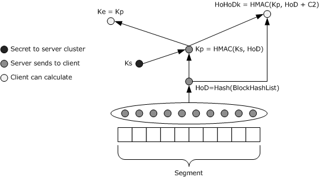
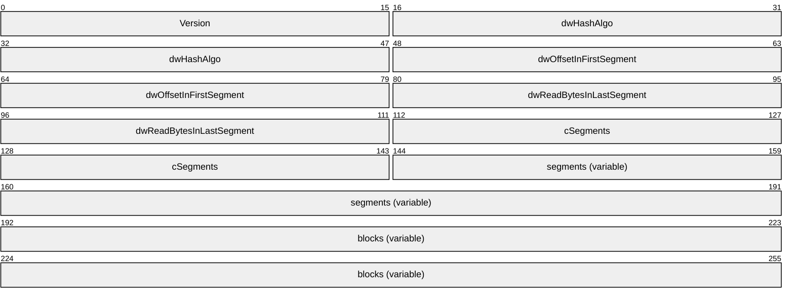
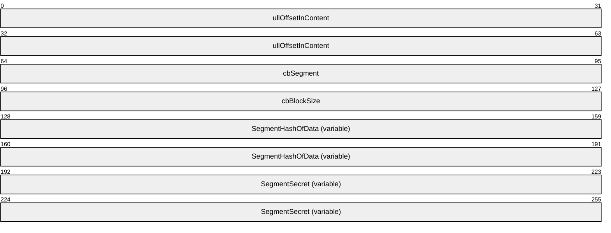
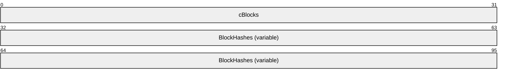
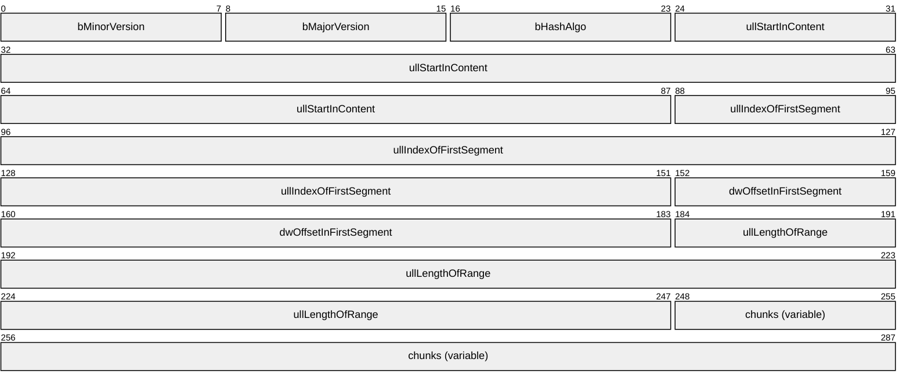
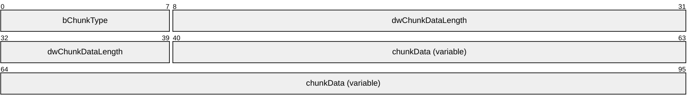
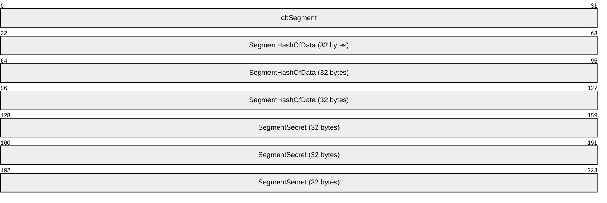

# [MS-PCCRC]: Peer Content Caching and Retrieval: Content Identification

Table of Contents

1 Introduction

- [1 Introduction](#Section_1)
  - [1.1 Glossary](#Section_1.1)
  - [1.2 References](#Section_1.2)
    - [1.2.1 Normative References](#Section_1.2.1)
    - [1.2.2 Informative References](#Section_1.2.2)
  - [1.3 Overview](#Section_1.3)
  - [1.4 Relationship to Protocols and Other Structures](#Section_1.4)
  - [1.5 Applicability Statement](#Section_1.5)
  - [1.6 Versioning and Localization](#Section_1.6)
  - [1.7 Vendor-Extensible Fields](#Section_1.7)

2 Structures

- [2 Structures](#Section_2)
  - [2.1 Content, Segments, and Blocks](#Section_2.1)
  - [2.2 Segment Identifiers (HoHoDk) and Keys](#Section_2.2)
  - [2.3 Content Information Data Structure Version 1.0](#Section_2.3)
    - [2.3.1 Fields](#Section_2.3.1)
      - [2.3.1.1 SegmentDescription](#Section_2.3.1.1)
      - [2.3.1.2 SegmentContentBlocks](#Section_2.3.1.2)
  - [2.4 Content Information Data Structure Version 2.0](#Section_2.4)
    - [2.4.1 Fields](#Section_2.4.1)
      - [2.4.1.1 ChunkDescription](#Section_2.4.1.1)
      - [2.4.1.2 SegmentDescription](#Section_2.4.1.2)
  - [2.5 Server Secret Key](#Section_2.5)

3 Structure Examples

- [3 Structure Examples](#Section_3)
  - [3.1 125 KB Content](#Section_3.1)
  - [3.2 Version 1.0 Content Information, 125 KB Content](#Section_3.2)
  - [3.3 Version 1.0 Content Information, 125 KB Content Range Request](#Section_3.3)
  - [3.4 Version 1.0 Content Information, 125 MB Content](#Section_3.4)
  - [3.5 Version 1.0 Content Information, 125 MB Content Range Request](#Section_3.5)
  - [3.6 Version 2.0 Content Information, 189 KB Content](#Section_3.6)
  - [3.7 Version 2.0 Content Information, 189 KB Content Range Request](#Section_3.7)

4 Security

- [4 Security](#Section_4)
  - [4.1 Security Considerations for Implementers](#Section_4.1)
    - [4.1.1 Download Confidentiality](#Section_4.1.1)
    - [4.1.2 Content Block Validation](#Section_4.1.2)
    - [4.1.3 Content Chunk Validation](#Section_4.1.3)
  - [4.2 Index of Security Fields](#Section_4.2)

5 Appendix A: Product Behavior

- [5 Appendix A: Product Behavior](#Section_5)

6 Change Tracking

- [6 Change Tracking](#Section_6)

For the legal notice and IP terms, see [LEGAL.md](../LEGAL.md).
Last updated: 4/23/2024.
See [Revision History](#revision-history) for full version history.

# 1 Introduction

The Peer Content Caching and Retrieval: Content Identification data structure specifies the Content Information Data Structure format used to uniquely identify content for discovery and retrieval purposes on a peer-to-peer network. This data structure is used within the Peer Content Caching and Retrieval service framework. The Content Information Data Structure is used in the discovery protocol specified in [MS-PCCRD] and the retrieval protocol described in [MS-PCCRR] to identify content for discovery, response, and retrieval requests.

The Peer Content Caching and Retrieval Framework is a content caching and retrieval framework based on a peer-to-peer discovery and distribution model. The framework is designed to reduce bandwidth consumption on branch-office wide-area-network (WAN) links by having clients retrieve content from distributed caches, when distributed caches are available, rather than from the content servers, which are often located remotely from branch offices over the WAN links. The peers themselves act as caches from which they serve other requesting peers. The main benefit is to reduce operation costs by reducing WAN link utilization, while providing faster downloads from the local area network (LAN) in the branch office. The framework also supports the mode of using pre-provisioned hosted caches in place of peer-based caching.

Sections 1.7 and 2 of this specification are normative. All other sections and examples in this specification are informative.

## 1.1 Glossary

This document uses the following terms:

**authorized client**: A client in possession of the segment secret for a particular segment, or, in the context of content, a client in possession of all the segment secrets for a particular piece of content.

**big-endian**: Multiple-byte values that are byte-ordered with the most significant byte stored in the memory location with the lowest address.

**block**: A subdivision of a segment. Each segment is divided into blocks of equal size (64 kilobytes (KB)) except for the last block in the last segment, which can be smaller if the content size is not a multiple of the standard segment sizes. In version 2.0 Content Information, segments are not divided into blocks.

**block hash**: A hash of a content block within a segment. Also known as a block ID.

**chunk**: A collection of one or more segment descriptions along with metadata, such as the chunk type and size.

**ciphertext**: The encrypted form of a message. Ciphertext is achieved by encrypting the plaintext form of a message, and can be transformed back to plaintext by decrypting it with the proper key. Without that transformation, a ciphertext contains no distinguishable information.

**client**: For the Peer Content Caching and Retrieval Framework, a client is a client-role peer; that is, a peer that is searching for content, either from the server or from other peers or hosted cashes. In the context of the Retrieval Protocol, a client is a peer that requests a block-range from a server_role_peer. It acts as a Web Services Dynamic Discovery (WS-Discovery) [[WS-Discovery]](https://go.microsoft.com/fwlink/?LinkId=90576) client.

**content**: Cached data that is identified by segment and downloaded in blocks.

**content information**: An opaque blob of data containing a set of hashes for a specific file that can be used by the application to retrieve the contents of the file using the branch cache. The details of content information are discussed in [MS-PCCRC](#Section_51cb03f8c0dd45659882aeb5ab0fa07e).

**content range**: The starting offset and length for the [**content**](#gt_content) desired. Multipart ranges (that is, non-contiguous) are not supported.

**content server**: The original server that a [**peer**](#gt_peer) contacts to obtain either the hashes of the [**content**](#gt_content) or the actual [**content**](#gt_content) when it is not available from the [**peers**](#gt_peer).

**dataBlock**: See [**block**](#gt_block).

**encryption**: In cryptography, the process of obscuring information to make it unreadable without special knowledge.

**hash**: A fixed-size result that is obtained by applying a one-way mathematical function, which is sometimes referred to as a hash algorithm, to an arbitrary amount of data. If the input data changes, the hash also changes. The hash can be used in many operations, including authentication and digital signing.

**HoHoDk**: A hash that represents the content-specific label or public identifier that is used to discover [**content**](#gt_content) from other [**peers**](#gt_peer) or from the [**hosted cache**](#gt_hosted-cache). This identifier is disclosed freely in broadcast messages. Knowledge of this identifier does not prove authorization to access the actual [**content**](#gt_content).

**hosted cache**: A centralized cache comprised of [**blocks**](#gt_block) added by [**peers**](#gt_peer).

**Keyed-Hashing for Message Authentication (HMAC)**: For more information, see [[RFC2104]](https://go.microsoft.com/fwlink/?LinkId=90314).

**little-endian**: Multiple-byte values that are byte-ordered with the least significant byte stored in the memory location with the lowest address.

**multicast**: Allows a host to send data to only those destinations that specifically request to receive the data. In this way, multicasting differs from sending broadcast data, because broadcast data is sent to all hosts. multicasting saves network bandwidth because [**multicast**](#gt_multicast) data is received only by those hosts that request the data, and the data travels over any link only once. multicasting saves server bandwidth because a server has to send only one [**multicast**](#gt_multicast) message per network instead of one unicast message per receiver.

**passphrase**: One or more words entered as a security setting to enable device or identity authentication.

**peer**: An instance of the Retrieval Protocol for the Peer Content Caching and Retrieval Framework running on a host. A peer can be both a client and a server in the Retrieval Protocol operations.

**probe**: The Web Services Dynamic Discovery (WS-Discovery) protocol message sent by a [**client**](#gt_client) to discover [**content**](#gt_content), as defined in [[WS-Discovery1.1]](https://go.microsoft.com/fwlink/?LinkId=148805).

**secret key**: A symmetric encryption key shared by two entities, such as between a user and the domain controller (DC), with a long lifetime. A password is a common example of a secret key. When used in a context that implies Kerberos only, a principal's secret key.

**segment**: A subdivision of content. In version 1.0 Content Information, each segment has a size of 32 megabytes, except the last segment which can be smaller if the content size is not a multiple of the standard segment sizes. In version 2.0 Content Information, segments can vary in size.

**segment hash of data**: See HoD.

**segment hash of data (HoD)**: In version 1.0 Content Information, the hash of the content block hashes of every block in the segment, regardless of how many of those blocks intersect the content range. The length of the hash depends on the value of dwHashAlgo at the start of the content information as follows: If the value of dwHashAlgo was 0x800C = SHA-256, the hash length is 32. If the value of dwHashAlgo was 0x800D = SHA-384, the hash length is 48. If the value of dwHashAlgo was 0x800E = SHA-512, the hash length is 64. In version 2.0 Content Information, segments are not divided into blocks, and the HoD is the hash of the content segment.

**segment ID (HoHoDk)**: A hash that represents the content-specific label or public identifier that is used to discover content from other peers or from the hosted cache. This identifier is disclosed freely in broadcast messages. Knowledge of this identifier does not prove authorization to access the actual content.

**segment secret**: The [**content**](#gt_content)-specific hash that is sent to authorized [**clients**](#gt_client) along with the rest of the [**content**](#gt_content) information. It is generated by hashing the concatenation of the segment hash of data (HoD) and the server-configured secret.

**server secret**: A hash of an arbitrary length binary string stored on the server. The server secret is generated using the same hash algorithm as the rest of the content information structure.

**UTF-16**: A standard for encoding Unicode characters, defined in the Unicode standard, in which the most commonly used characters are defined as double-byte characters. Unless specified otherwise, this term refers to the UTF-16 encoding form specified in [[UNICODE5.0.0/2007]](https://go.microsoft.com/fwlink/?LinkId=154659) section 3.9.

**MAY, SHOULD, MUST, SHOULD NOT, MUST NOT:** These terms (in all caps) are used as defined in [[RFC2119]](https://go.microsoft.com/fwlink/?LinkId=90317). All statements of optional behavior use either MAY, SHOULD, or SHOULD NOT.

## 1.2 References

Links to a document in the Microsoft Open Specifications library point to the correct section in the most recently published version of the referenced document. However, because individual documents in the library are not updated at the same time, the section numbers in the documents may not match. You can confirm the correct section numbering by checking the [Errata](https://go.microsoft.com/fwlink/?linkid=850906).

### 1.2.1 Normative References

We conduct frequent surveys of the normative references to assure their continued availability. If you have any issue with finding a normative reference, please contact [dochelp@microsoft.com](mailto:dochelp@microsoft.com). We will assist you in finding the relevant information.

[FIPS180-2] National Institute of Standards and Technology, "Secure Hash Standard", FIPS PUB 180-2, August 2002, [http://csrc.nist.gov/publications/fips/fips180-2/fips180-2.pdf](https://go.microsoft.com/fwlink/?LinkId=89868)

[FIPS197] FIPS PUBS, "Advanced Encryption Standard (AES)", FIPS PUB 197, November 2001, [https://nvlpubs.nist.gov/nistpubs/FIPS/NIST.FIPS.197.pdf](https://go.microsoft.com/fwlink/?LinkId=89870)

[MS-DTYP] Microsoft Corporation, "[Windows Data Types](../MS-DTYP/MS-DTYP.md)".

[MS-PCCRD] Microsoft Corporation, "[Peer Content Caching and Retrieval: Discovery Protocol](../MS-PCCRD/MS-PCCRD.md)".

[MS-PCCRR] Microsoft Corporation, "[Peer Content Caching and Retrieval: Retrieval Protocol](../MS-PCCRR/MS-PCCRR.md)".

[MS-PCCRTP] Microsoft Corporation, "[Peer Content Caching and Retrieval: Hypertext Transfer Protocol (HTTP) Extensions](../MS-PCCRTP/MS-PCCRTP.md)".

[MS-PCHC] Microsoft Corporation, "[Peer Content Caching and Retrieval: Hosted Cache Protocol](../MS-PCHC/MS-PCHC.md)".

[RFC2104] Krawczyk, H., Bellare, M., and Canetti, R., "HMAC: Keyed-Hashing for Message Authentication", RFC 2104, February 1997, [https://www.rfc-editor.org/info/rfc2104](https://go.microsoft.com/fwlink/?LinkId=90314)

[RFC2119] Bradner, S., "Key words for use in RFCs to Indicate Requirement Levels", BCP 14, RFC 2119, March 1997, [https://www.rfc-editor.org/info/rfc2119](https://go.microsoft.com/fwlink/?LinkId=90317)

### 1.2.2 Informative References

[MC-BUP] Microsoft Corporation, "[Background Intelligent Transfer Service (BITS) Upload Protocol](../MC-BUP/MC-BUP.md)".

[MSDN-BITS] Microsoft Corporation, "Background Intelligent Transfer Service", [http://msdn.microsoft.com/en-us/library/bb968799(VS.85).aspx](https://go.microsoft.com/fwlink/?LinkId=89959)

## 1.3 Overview

The [**Content Information**](#gt_content-information) Data Structure is generated by a [**content server**](#gt_content-server) and supplied to [**clients**](#gt_client) requesting the [**content**](#gt_content) to allow them to take advantage of other [**peer's**](#gt_peer) or a hosted cache's cached copies of content, see [MS-PCHC](../MS-PCHC/MS-PCHC.md). The content is divided into segments and subdivided into smaller [**blocks**](#gt_block). Cryptographic hashes of these blocks and segments are used to identify and verify them, so that they can be retrieved correctly from peers instead of from the content server.

The **Content Information** Data Structure contains all the necessary information to allow a peer to uniquely specify content for discovery, and for peer caches or [**hosted caches**](#gt_hosted-cache) to determine whether they have the specific content requested by the querying peer. Additionally, **Content Information** also ensures the confidentiality of content sent between peers and allows peers to verify the integrity of downloaded content [**segments**](#gt_segment). To satisfy these requirements, **Content Information** uses cryptographic [**hash**](#gt_hash) functions and [**encryption**](#gt_encryption) algorithms to encrypt and generate hashes of the content units, and it provides mechanisms to specify the starting point (offset) and length of the [**content range**](#gt_content-range).

To ensure that cache content retrieval communications are at least as secure as a normal client's communications with a content server, all content servers are configured with a binary secret value of arbitrary length. This secret is used as a key to derive secret keys to be used to secure communications between the peers or between peers and a hosted cache. If the secret value is not configured, it is automatically generated.

## 1.4 Relationship to Protocols and Other Structures

**Content Information** specifies a binary data structure that is used in the Peer Content Caching and Retrieval service framework. For the detailed protocol operations, see the following specifications:

- Peer Content Caching and Retrieval: Discovery Protocol [MS-PCCRD](../MS-PCCRD/MS-PCCRD.md)
- Peer Content Caching and Retrieval: Hosted Cache Protocol [MS-PCHC](../MS-PCHC/MS-PCHC.md)
- Peer Content Caching and Retrieval: HTTP Extensions [MS-PCCRTP](../MS-PCCRTP/MS-PCCRTP.md)
- Peer Content Caching and Retrieval: Retrieval Protocol [MS-PCCRR](../MS-PCCRR/MS-PCCRR.md)
**Content Information** contains all necessary information to allow [**peers**](#gt_peer) to discover other peers with requested [**content**](#gt_content), ensure the confidentiality of content sent between peers, and verify the integrity of downloaded content [**blocks**](#gt_block). This includes several hashes generated using a hash algorithm (that is, SHA-256, SHA-384, or SHA-512 as specified in [[FIPS180-2]](https://go.microsoft.com/fwlink/?LinkId=89868)). **Content Information** can be transmitted in any way an application developer wishes.

## 1.5 Applicability Statement

The **Content Information Data Structure** is applicable in a context where both [**content servers**](#gt_content-server) and [**peers**](#gt_peer) support the protocols in the Peer Content Caching and Retrieval Framework.<1>

This framework is intended primarily for settings where content servers are available only over a link that is low-bandwidth, high-latency, or both, while peers are available over higher-bandwidth, lower latency links. The data structure is provided by content servers that support it to clients that support using it to obtain their requested [**content**](#gt_content) from peers instead of the server.

A requesting peer contacts the content server to obtain the **Content Information** for the specific document it wishes to download. The peer then embeds identifiers from the **Content Information** in the Peer Content Caching and Retrieval: Discovery Protocol [**probe**](#gt_probe) message that it sends out to the peer caches, as specified in [MS-PCCRD](../MS-PCCRD/MS-PCCRD.md) section 2.2.2.1. A peer cache receiving the probe message takes these identifiers and replies to the requesting peer if they match the **Content Information** cached locally. The actual content retrieval thus uses primarily the higher-bandwidth, lower-latency links.

## 1.6 Versioning and Localization

This protocol covers versioning issues in the following areas:

- Structure Versions: The **Content Information Data Structure** supports two versions, 1.0 and 2.0. These versions are defined in section [2](#Section_2).

## 1.7 Vendor-Extensible Fields

There are no vendor-extensible fields in the **Content Information Data Structure**.

# 2 Structures

This section describes the **Content Information Data Structure**. Before defining the structure layout, the first two subsections describe the relationship between [**content**](#gt_content), [**segments**](#gt_segment), and [**blocks**](#gt_block), and also explain the procedures for generating various cryptographic [**hashes**](#gt_hash) used to identify segments and blocks.

## 2.1 Content, Segments, and Blocks

For the purposes of the Peer Content Caching and Retrieval Framework, [**content**](#gt_content) is divided into one or more [**segments**](#gt_segment). Each segment is a binary string of a standard size (32 megabytes), except the last segment, which might be smaller if the content size is not a multiple of the standard segment size. In version 2.0 **Content Information**, segments can vary in size. Each segment is identified on the network by its [**segment ID**](#gt_segment-id-hohodk), section [2.2](#Section_2.2), also known as HoHoDk. Different content items can share the same segment if they happen to contain an identical part that coincides with a complete segment.

In version 1.0 **Content Information**, each segment is divided in turn into [**blocks**](#gt_block). Each block is a binary string of a fixed size (64 kilobytes), except for the last block in the last segment, which again might be shorter. Unlike segments, blocks in different segments are treated as distinct objects, even if identical. Blocks within a segment are identified by their progressive index within the segment (Block 0 is the first block in the segment, Block 1 the second, and so on). Because of the fixed block size, a block's index can also be used to compute its actual byte offset in the segment. Given the standard block size of 64 kilobytes, Block 0 is located at offset 0 in the segment, Block 1 at offset 65536, Block 2 at offset 131072, etc.

Note that given the entire set of blocks for a segment, each identified by index, one can reconstruct the original segment simply by concatenating the blocks in order by index. Similarly, given the entire sequence of HoHoDk values for the successive segments in a content item, and a set of segments with matching associated HoHoDk values, one can reconstruct the original content simply by concatenating the segments in order based on HoHoDk values.

## 2.2 Segment Identifiers (HoHoDk) and Keys

Cryptographic hashes are used to identify [**segments**](#gt_segment) and [**blocks**](#gt_block). The following describes the procedures to generate a [**segment secret**](#gt_segment-secret), a [**segment hash of data**](#gt_segment-hash-of-data), and a [**segment identifier (HoHoDk)**](#gt_5cdb8c3b-3a16-4770-8918-db95bf212831). These computations use the following inputs:

- The [**content**](#gt_content).
- A hashing algorithm (configurable), used either directly or as part of the [**Keyed-Hashing for Message Authentication (HMAC)**](#gt_keyed-hashing-for-message-authentication-hmac) mechanism, see [[RFC2104]](https://go.microsoft.com/fwlink/?LinkId=90314). The hashing algorithm is assumed to take an arbitrary-length byte string as input, and to output a fixed-length binary string as output. The list of possible hashing algorithms can be found in section [2.3](#Section_2.3).
- A server-configured secret, in the form of a binary string.
The following diagram shows how the set of hashes is calculated:

Figure 1: Calculation of hashes

Notation:

- "+": concatenation
- [**hash**](#gt_hash): The input hash function, which MUST be one of the hash functions listed in section 2.3.
- HMAC: The HMAC function (defined in [RFC2104]), constructed using Hash as the hash function.
- Ks: The [**server secret**](#gt_server-secret).
- Kp (segment secret): A segment-specific hash that is sent to [**authorized clients**](#gt_authorized-client) along with the rest of the content information.
- [**HoD (segment hash of data)**](#gt_d9b1ad11-9a22-4b1f-a93e-818f7e83ed40): The hash of the content [**block hashes**](#gt_block-hash) of every block in the segment, as formulated later in this section.
- HoHoDk (segment ID): A hash that represents the content-specific "label", or public identifier, that is used to discover content from other [**peers**](#gt_peer) or from the [**hosted cache**](#gt_hosted-cache). HoHoDk is disclosed freely in [**Multicast**](#gt_multicast) messages, as specified in [MS-PCCRD](../MS-PCCRD/MS-PCCRD.md). Knowledge of the HoHoDk does not prove authorization to access the data.
- Ke: Ke = Kp. A sending peer will encrypt data (using the mechanism described in [[FIPS197]](https://go.microsoft.com/fwlink/?LinkId=89870)) with Ke, but Ke is never disclosed between peers. The receiving [**client**](#gt_client) MUST already have obtained Kp to compute the value of Ke from a server to decrypt the peer supplied data.
- ContentInfo: The segment-specific data that is sent to authorized clients as part of the Content Information Data Structure (section 2.3) for each segment of content they access. ContentInfo includes only the list of block hashes, the HoD, and Kp. Ke and HoHoDk are not included in ContentInfo. A peer receiving the ContentInfo derives them from the available values according to the formulae later in this section. Ks is never disclosed by the server.
- [**dataBlock**](#gt_datablock): dataBlock and block are used interchangeably.
Formulae:

- segment = dataBlock1 + dataBlock2 + … + dataBlockn (where the segment consists of n blocks; see section [2.1](#Section_2.1) for details.)
- BlockHashi = Hash (dataBlocki) 1<= I <=n
- BlockHashList = BlockHash1 + BlockHash2 + … + BlockHashN
- HoD = Hash (BlockHashList)
- Kp = HMAC (Ks, HoD)
- Ke = Kp
- HoHoDk = HMAC (Kp, HoD +C2) (where C2 is the null-terminated ASCII string constant "MS_P2P_CACHING"; string literals are all ASCII strings with NULL terminators unless otherwise noted.)
- ContentInfo = HoD + Kp + BlockHashList
Before making any received blocks in a segment available to the higher layer, any peers or the hosted cache, a peer MUST verify that:

- Each block hash matches the supplied HoD.
- The hash of each dataBlock matches the corresponding supplied block hash.
For **Content Information** version 2.0, Kp, Ke, and HoHoDk are calculated in the same way as in **Content Information** version 1.0. However, there are no blocks or block hashes in **Content Information** version 2.0. The segment HoD is calculated as the hash of the content segment.

## 2.3 Content Information Data Structure Version 1.0

**Content Information** is a variable-size data structure. **Content Information** size is proportional to the length of the content it represents.

**Content Information** starts with a single 2-byte WORD value representing the data structure version. Version 1.0 of the **Content Information** data structure is formatted as follows. All fields are in [**little-endian**](#gt_little-endian) byte order.

**Version (2 bytes): Content Information** version (0x0100 is version 1.0). The low byte is the minor version number and the high byte is the major version number. MUST be 0x0100.

**dwHashAlgo (4 bytes):** Hash algorithm to use.<2> MUST be one of the following values:

| Value | Meaning |
| --- | --- |
| 0x0000800C | Use the SHA-256 hash algorithm. |
| 0x0000800D | Use the SHA-384 hash algorithm. |
| 0x0000800E | Use the SHA-512 hash algorithm. |

**dwOffsetInFirstSegment (4 bytes):** Number of bytes into the first [**segment**](#gt_segment) within the **Content Information data structure** at which the [**content range**](#gt_content-range) begins.

**dwReadBytesInLastSegment (4 bytes):** Total number of bytes of the content range which lie within the final segment in the **Content Information** data structure.

The **dwOffsetInFirstSegment** and **dwReadBytesInLastSegment** fields are used to represent a content range which is specified by the content range start *S* and the content range length *L, inclusive*. *S* is relative to the start of the [**content**](#gt_content) and begins at 0. *L* cannot be less than 1 and *S* + *L* cannot exceed the length of the content range. *S* + *L* is the offset in the content range at which the content range ends. The values contained in the **dwOffsetInFirstSegment** and **dwReadBytesInLastSegment** fields are used to recalculate a given content range.

*FirstSeg* is the segment within which the content range start *S* lies. This segment is the first segment in the content range. *LastSeg* is the segment within which the content offset *S* + *L* lies. This segment is the final segment in the content range.

The value of the **dwOffsetInFirstSegment** field can range from 0 to Length(*FirstSeg*) - 1. The value of the content range start *S* is calculated by adding the content offset at which *FirstSeg* begins to the value of the **dwOffsetInFirstSegment** field.

The value of the **dwReadBytesInLastSegment** field can range from 0 to Length(*LastSeg*) - 1. When the value of the **dwReadBytesInLastSegment** field is 0, the content range contains the entire length of *LastSeg*. When the **dwReadBytesInLastSegment** field contains any other value, the content range includes the number of bytes of *LastSeg* equal to the specified value. The value of *S* + *L* (the content offset at which the content range ends) is calculated by adding the following to the content offset at which *FirstSeg* begins:

- The value of the **dwOffsetInFirstSegment** field, and
- The lengths of all the segments between *FirstSeg* and *LastSeg*, and
- If the value of the **dwReadBytesInLastSegment** field is equal to 0, the value of Length(*LastSeg*), or
If the value of the **dwReadBytesInLastSegment** field is greater than 0, the value of the **dwReadBytesInLastSegment** field.

**cSegments (4 bytes):** The number of segments which intersect the content range and hence are contained in the **Content Information data structure**.

**segments (variable):** Segment start offset, length, [**block**](#gt_block) size, **SegmentHashofData** and **SegmentSecret** for each segment. Each segment description is as specified in [2.3.1.1](#Section_2.3.1.1).

**blocks (variable):** Count of blocks and content [**block hashes**](#gt_block-hash) for each block intersecting the content range for each segment in the **Content Information** data structure. Each set of blocks for a segment is as specified in [2.3.1.2](#Section_2.3.1.2).

### 2.3.1 Fields

#### 2.3.1.1 SegmentDescription

The **segments** field is composed of a number **cSegments** of **SegmentDescription** fields. Each **SegmentDescription** field corresponds to a [**content**](#gt_content) segment in the order in which they appear in the original content. Every segment except for the last segment MUST be exactly 32 megabytes in size. The **Content Information Data Structure**, section [2.3](#Section_2.3), defines the [**content range**](#gt_content-range) as follows.

Content range = {Start offset, Length}

Start offset = **ullOffsetInContent** + **dwOffsetInFirstSegment**, where **ullOffsetInContent** is taken from the first SegmentDescription in the segments field.

Length = (Sum of **cbSegment** of all segments in segments field except for the first segment and last segment) + (**cbSegment** of first segment at which the content range begins – **dwOffsetInFirstSegment**) + **dwReadBytesInLastSegment**.

The content range extends to the end of all the segments whose SegmentDescriptions are included in the **Content Information** except for the last segment, for which the number of bytes is limited to **dwReadBytesInLastSegment** instead of the total number of bytes present in the segment.

If the content range consists of a single segment, the length is equal to the value of the **dwReadBytesInLastSegment** field described in section 2.3.

The **SegmentDescription** field and its associated subfields are formatted as follows:

**ullOffsetInContent (8 bytes):** Content offset in bytes at which the start of the segment begins.

**cbSegment (4 bytes):** Total number of bytes in the segment, regardless of how many of those bytes intersect the content range.

**cbBlockSize (4 bytes):** Length of a content block within this segment, in bytes. Every segment MUST use the block size of 65536 bytes.

**SegmentHashOfData (variable):** The hash of the content [**block hashes**](#gt_block-hash) of every block in the segment, regardless of how many of those blocks intersect the content range. The hash is of length 32 if **dwHashAlgo** at the start of the **Content Information** was 0x800C = SHA-256, 48 if **dwHashAlgo** = 0x800D = SHA-384, or 64 if **dwHashAlgo** = 0x800E = SHA-512.

**SegmentSecret (variable):** Kp (section [2.2](#Section_2.2)), computed as Hash (SegmentHashofData + ServerSecret) using the hash algorithm specified at the beginning of the **Content Information Data Structure**. The hash is of length 32 if **dwHashAlgo** at the start of the **Content Information** was 0x800C = SHA-256, 48 if **dwHashAlgo** = 0x800D = SHA-384 or 64 if **dwHashAlgo** = 0x800E = SHA-512.

#### 2.3.1.2 SegmentContentBlocks

The **blocks** field contains a number **cSegments** of **SegmentContentBlocks** fields. The Nth **SegmentContentBlocks** field corresponds to the Nth [SegmentDescription (section 2.3.1.1)](#Section_2.3.1.1) and hence the Nth [**content**](#gt_content) [**segment**](#gt_segment). The **SegmentContentBlocks** field is formatted as follows.

**cBlocks (4 bytes):** Number of content blocks in the segment which intersect the [**content range**](#gt_content-range) specified at the start of the [Content Information (section 2.3)](#Section_2.3).

**BlockHashes (variable):** SHA-256, SHA-384 or SHA-512 hash of each content block in the order in which the blocks appear in the segment. The size of this field is **cBlocks** * (32, 48 or 64, depending on which hash was used).

## 2.4 Content Information Data Structure Version 2.0

Version 2.0 of the **Content Information** data structure MUST be formatted as follows.<3> All fields are in [**big-endian**](#gt_big-endian) byte order.

The **Content Information** version 2.0 data structure is composed of two single-byte version fields, a **Content Information** header, and a variable number of **Content Information** [**chunks**](#gt_chunk).

**bMinorVersion (1 byte): Content Information** minor version. MUST be 0x00.

**bMajorVersion (1 byte): Content Information** major version. MUST be 0x02.

**bHashAlgo (1 byte):** Hash algorithm to use. **bHashAlgo** MUST be the following value:

| Value | Meaning |
| --- | --- |
| 0x04 | Use a truncated SHA-512 hash algorithm, in which the SHA-512 hash is computed, and the first 256 bits are used as the hash. |

**ullStartInContent (8 bytes):** The byte offset in the content at which the start of the first segments in the **Content Information** begins.

**ullIndexOfFirstSegment (8 bytes):** The zero-based index in the content of the first segments in the **Content Information**.

**dwOffsetInFirstSegment (4 bytes):** The byte offset within the first segments in the **Content Information** structure at which the content range begins.

**ullLengthOfRange (8 bytes):** The length of the content range or zero if the **Content Information** structure reflects the entire resource.

**chunks (variable):** Chunk type, chunk data length, and chunk data for each chunk of **Content Information**. Each **Content Information** chunk is as specified in [2.4.1.1](#Section_2.4.1.1).

### 2.4.1 Fields

#### 2.4.1.1 ChunkDescription

The **chunks** field is composed of the [**chunk**](#gt_chunk) type, the chunk data length and the chunk data that contains segment description.

**bChunkType (1 byte):** Identifies the type and format of chunk data. MUST be set to 0x00.

**dwChunkDataLength (4 bytes):** Length of the chunk data, in bytes.

**chunkData (variable):** One or more [**segment**](#gt_segment) descriptions. Each segment's description is as specified in [2.4.1.2](#Section_2.4.1.2).

#### 2.4.1.2 SegmentDescription

Each **SegmentDescription** describes a single [**segment**](#gt_segment). Each segment's description [**chunk**](#gt_chunk) MUST contain at least one segment description. A segment description chunk can contain multiple segment descriptions.

Segments MUST be listed in the **Content Information** in the same order as they appear in the [**content**](#gt_content).

**cbSegment (4 bytes):** Total number of bytes in the segment, regardless of how many of those bytes intersect the [**content range**](#gt_content-range). The value of this field MAY not be zero and MAY not exceed 128 kilobytes.

**SegmentHashOfData (32 bytes):** The [**hash**](#gt_hash) of the segment. The hash is of length 32 bytes if the value of **bHashAlgo** field (section [2.4](#Section_2.4)) at the start of the **Content Information** was 0x04 = truncated SHA-512. Truncated SHA-512 is the only supported hash algorithm.

**SegmentSecret (32 bytes):** Kp (section [2.2](#Section_2.2)), computed as Hash (**SegmentHashofData** + **ServerSecret**) using the hash algorithm specified at the beginning of the **Content Information Data Structure**. The hash is of length 32 bytes if the value of **bHashAlgo** field (section 2.4) at the start of the **Content Information** was 0x04 = truncated SHA-512. Truncated SHA-512 is the only supported hash algorithm.

## 2.5 Server Secret Key

The [**server secret**](#gt_server-secret) Ks is obtained by hashing an arbitrary binary string known as the server [**secret key**](#gt_secret-key). To obtain the secret key, it SHOULD be exported to a file.<4> A [**passphrase**](#gt_passphrase) MUST be provided while exporting the secret key to [**encrypt**](#gt_encryption) the contents of the file. The passphrase is handled as a [**UTF-16**](#gt_utf-16) string. The passphrase, excluding the null terminating character, is hashed using the SHA-256 hash algorithm to obtain an encryption key. The plaintext for the file consists of an SHA-256 hash of the secret key followed by the secret key. The plaintext is encrypted using the AES-256 encryption algorithm with Cipher Block Chaining (CBC) and PKCS7 block padding using the encryption key. The Initialization Vector (IV) is a 16-byte block of all zeros. The resulting cipher text is exported to the file.

# 3 Structure Examples

This protocol references commonly used data types as defined in [MS-DTYP](../MS-DTYP/MS-DTYP.md).

## 125 KB Content

Scenario: A server S requires its clients to use the Content Caching and Retrieval Framework to accelerate content distribution for a 125-kilobyte (KB) file. The server is configured to use SHA-256 as the hash algorithm and uses a secret value which is the ASCII string "no more secrets". A client requests the entirety of the 125-kilobyte content from the server. The server responds with [Content Information](#Section_125) of the following form.

| Bit Range | Field | Description |
| --- | --- | --- |
| Variable | 0 | 2 WORD Version 0x100 |
| Variable | 2 | 4 DWORD dwHashAlgo 0x800C |
| Variable | 6 | 4 DWORD dwOffsetInFirstSegment 0 |
| Variable | 10 | 4 DWORD dwReadBytesInLastSegment 128000 |
| Variable | 14 | 4 DWORD cSegments 1 |
| Variable | 18 | 8 ULONGLONG ullOffsetInContent 0 |
| Variable | 26 | 4 DWORD cbSegment 128000 |
| Variable | 30 | 4 DWORD cbBlockSize 0x10000 |
| BYTE[] | 34 | 32 SegmentHashofData SHA-256 hash of the two content block hashes. |
| BYTE[] | 66 | 32 SegmentSecret SHA-256 hash of [**segment hash of data**](#gt_segment-hash-of-data) and "no more secrets". |
| Variable | 98 | 4 DWORD cBlocks 2 |
| BYTE[] | 102 | 32 block hash SHA-256 hash of the first 64-kilobyte block of the content. |
| BYTE[] | 134 | 32 block hash SHA-256 hash of the last 62,464 bytes of the content. |

## 3.2 Version 1.0 Content Information, 125 KB Content

Scenario: A server S wants clients to use the Content Caching and Retrieval Framework to accelerate content distribution for a 125-kilobyte (KB) file. The server is configured to use SHA-256 as the hash algorithm and uses a secret value which is the ASCII string "no more secrets". A client requests the entirety of the 125-kilobyte content from the server. The server responds with [Content Information](#Section_125) of the following form.

| Bit Range | Field | Description |
| --- | --- | --- |
| Variable | 0 | 2 WORD Version 0x100 |
| Variable | 2 | 4 DWORD dwHashAlgo 0x800C |
| Variable | 6 | 4 DWORD dwOffsetInFirstSegment 0 |
| Variable | 10 | 4 DWORD dwReadBytesInLastSegment 0 |
| Variable | 14 | 4 DWORD cSegments 1 |
| Variable | 18 | 8 ULONGLONG ullOffsetInContent 0 |
| Variable | 26 | 4 DWORD cbSegment 128000 |
| Variable | 30 | 4 DWORD cbBlockSize 0x10000 |
| BYTE[] | 34 | 32 SegmentHashofData SHA-256 hash of the two content block hashes. |
| BYTE[] | 66 | 32 SegmentSecret SHA-256 hash of [**segment hash of data**](#gt_segment-hash-of-data) and "no more secrets". |
| Variable | 98 | 4 DWORD cBlocks 2 |
| BYTE[] | 102 | 32 block hash SHA-256 hash of the first 64-kilobyte block of the content. |
| BYTE[] | 134 | 32 block hash SHA-256 hash of the last 62,464 bytes of the content). |

## 3.3 Version 1.0 Content Information, 125 KB Content Range Request

Scenario: A server S wants clients to use the Content Caching and Retrieval Framework to accelerate content distribution for a 125-kilobyte (KB) file. The server is configured to use SHA-256 as the hash algorithm and uses a secret value, which is the ASCII string "no more secrets". A client requests a [**content range**](#gt_content-range) that starts at an offset that is 100 KB into the file and ends at an offset that is 125 KB into the file, for a total length of 25 KB. The server responds with [Content Information](#Section_125) of the following form.

| Bit Range | Field | Description |
| --- | --- | --- |
| Variable | 0 | 2 WORD Version 0x100 |
| Variable | 2 | 4 DWORD dwHashAlgo 0x800C |
| Variable | 6 | 4 DWORD dwOffsetInFirstSegment 102400 |
| Variable | 10 | 4 DWORD dwReadBytesInLastSegment 0 |
| Variable | 14 | 4 DWORD cSegments 1 |
| Variable | 18 | 8 ULONGLONG ullOffsetInContent 0 |
| Variable | 26 | 4 DWORD cbSegment 128000 |
| Variable | 30 | 4 DWORD cbBlockSize 0x10000 |
| BYTE[] | 34 | 32 SegmentHashofData SHA-256 hash of the two content block hashes. |
| BYTE[] | 66 | 32 SegmentSecret SHA-256 hash of [**segment hash of data**](#gt_segment-hash-of-data) and "no more secrets". |
| Variable | 98 | 4 DWORD cBlocks 2 |
| BYTE[] | 102 | 32 block hash SHA-256 hash of the first 64-kilobyte block of the content. |
| BYTE[] | 134 | 32 block hash SHA-256 hash of the last 62,464 bytes of the content. |

## 3.4 Version 1.0 Content Information, 125 MB Content

Scenario: The same server *S* now receives a client request for a 125-megabyte file. The server responds with [Content Information](#Section_125) of the following form.

| Bit Range | Field | Description |
| --- | --- | --- |
| Variable | 0 | 2 WORD Version 0x100 |
| Variable | 2 | 4 DWORD dwHashAlgo 0x800C |
| Variable | 6 | 4 DWORD dwOffsetInFirstSegment 0 |
| Variable | 10 | 4 DWORD dwReadBytesInLastSegment 0x1D00000 |
| Variable | 14 | 4 DWORD cSegments 4 |
| Variable | 18 | 8 ULONGLONG ullOffsetInContent 0 |
| Variable | 26 | 4 DWORD cbSegment 0x2000000 |
| Variable | 30 | 4 DWORD cbBlockSize 0x10000 |
| BYTE[] | 34 | 32 SegmentHashofData SHA-256 hash of the all 512 content block hashes for the first segment. |
| BYTE[] | 66 | 32 SegmentSecret SHA-256 hash of [**segment hash of data**](#gt_segment-hash-of-data) and "no more secrets". |
| Variable | 98 | 8 ULONGLONG ullOffsetInContent 0x2000000 |
| Variable | 106 | 4 DWORD cbSegment 0x2000000 |
| Variable | 110 | 4 DWORD cbBlockSize 0x10000 |
| BYTE[] | 114 | 32 SegmentHashofData SHA-256 hash of the all 512 content block hashes for the second segment. |
| BYTE[] | 146 | 32 SegmentSecret SHA-256 hash of segment hash of data and "no more secrets". |
| Variable | 178 | 8 ULONGLONG ullOffsetInContent 0x4000000 |
| Variable | 186 | 4 DWORD cbSegment 0x2000000 |
| Variable | 190 | 4 DWORD cbBlockSize 0x10000 |
| BYTE[] | 194 | 32 SegmentHashofData SHA-256 hash of the all 512 content block hashes for the third segment. |
| BYTE[] | 226 | 32 SegmentSecret SHA-256 hash of segment hash of data and "no more secrets". |
| Variable | 258 | 8 ULONGLONG ullOffsetInContent 0x6000000 |
| Variable | 266 | 4 DWORD cbSegment 0x1D00000 |
| Variable | 270 | 4 DWORD cbBlockSize 0x10000 |
| BYTE[] | 274 | 32 SegmentHashofData SHA-256 hash of the all 464 content block hashes for the fourth segment. |
| BYTE[] | 306 | 32 SegmentSecret SHA-256 hash of segment hash of data and "no more secrets". |
| Variable | 338 | 4 DWORD cBlocks 512 |
| BYTE[] | 342 | 32 block hash SHA-256 hash of the first 64 kilobyte block of the content. |
| Variable | … | - - - - |
| BYTE[] | 16694 | 32 block hash SHA-256 hash of bytes 0x1FF0000 through 0x2000000 of the content |
| Variable | 16726 | 4 DWORD cBlocks 512 |
| BYTE[] | 16730 | 32 block hash SHA-256 hash of bytes 0x2000000 through 0x2010000 of the content. |
| Variable | … | - - - - |
| BYTE[] | 33082 | 32 block hash SHA-256 hash of bytes 0x3FF0000 through 0x4000000 of the content. |
| Variable | 33114 | 4 DWORD cBlocks 512 |
| BYTE[] | 33118 | 32 block hash SHA-256 hash of bytes 0x4000000 through 0x4010000 of the content. |
| Variable | … | - - - - |
| BYTE[] | 49470 | 32 block hash SHA-256 hash of bytes 0x5FF0000 through 0x6000000 of the content. |
| Variable | 49502 | 4 DWORD cBlocks 464 |
| BYTE[] | 49506 | 32 block hash SHA-256 hash of bytes 0x6000000 through 0x6010000 of the content. |
| Variable | … | - - - - |
| BYTE[] | 64322 | 32 block hash SHA-256 hash of bytes 0x7CF0000 through 0x7D00000 of the content. |

## 3.5 Version 1.0 Content Information, 125 MB Content Range Request

Scenario: The same server *S* now receives a client request for a [**content range**](#gt_content-range) in a 125-megabyte (MB) file. The content range starts at an offset that is 100 KB into the file and ends at an offset that is 124 MB into the file, for a total length of 126,876 KB. The server responds with [Content Information](#Section_125) of the following form.

| Bit Range | Field | Description |
| --- | --- | --- |
| Variable | 0 | 2 WORD Version 0x100 |
| Variable | 2 | 4 DWORD dwHashAlgo 0x800C |
| Variable | 6 | 4 DWORD dwOffsetInFirstSegment 102400 |
| Variable | 10 | 4 DWORD dwReadBytesInLastSegment 0x1C00000 |
| Variable | 14 | 4 DWORD cSegments 4 |
| Variable | 18 | 8 ULONGLONG ullOffsetInContent 0 |
| Variable | 26 | 4 DWORD cbSegment 0x2000000 |
| Variable | 30 | 4 DWORD cbBlockSize 0x10000 |
| BYTE[] | 34 | 32 SegmentHashofData SHA-256 hash of all 512 content block hashes for the first segment. |
| BYTE[] | 66 | 32 SegmentSecret SHA-256 hash of [**segment hash of data**](#gt_segment-hash-of-data) and "no more secrets". |
| Variable | 98 | 8 ULONGLONG ullOffsetInContent 0x2000000 |
| Variable | 106 | 4 DWORD cbSegment 0x2000000 |
| Variable | 110 | 4 DWORD cbBlockSize 0x10000 |
| BYTE[] | 114 | 32 SegmentHashofData SHA-256 hash of all 512 content block hashes for the second segment. |
| BYTE[] | 146 | 32 SegmentSecret SHA-256 hash of segment hash of data and "no more secrets". |
| Variable | 178 | 8 ULONGLONG ullOffsetInContent 0x4000000 |
| Variable | 186 | 4 DWORD cbSegment 0x2000000 |
| Variable | 190 | 4 DWORD cbBlockSize 0x10000 |
| BYTE[] | 194 | 32 SegmentHashofData SHA-256 hash of all 512 content block hashes for the third segment. |
| BYTE[] | 226 | 32 SegmentSecret SHA-256 hash of segment hash of data and "no more secrets". |
| Variable | 258 | 8 ULONGLONG ullOffsetInContent 0x6000000 |
| Variable | 266 | 4 DWORD cbSegment 0x1D00000 |
| Variable | 270 | 4 DWORD cbBlockSize 0x10000 |
| BYTE[] | 274 | 32 SegmentHashofData SHA-256 hash of all 464 content block hashes for the fourth segment. |
| BYTE[] | 306 | 32 SegmentSecret SHA-256 hash of segment hash of data and "no more secrets". |
| Variable | 338 | 4 DWORD cBlocks 512 |
| BYTE[] | 342 | 32 block hash SHA-256 hash of the first 64 kilobyte block of the content. |
| Variable | … | - - - - |
| BYTE[] | 16694 | 32 block hash SHA-256 hash of bytes 0x1FF0000 through 0x2000000 of the content. |
| Variable | 16726 | 4 DWORD cBlocks 512 |
| BYTE[] | 16730 | 32 block hash SHA-256 hash of bytes 0x2000000 through 0x2010000 of the content. |
| Variable | … | - - - - |
| BYTE[] | 33082 | 32 block hash SHA-256 hash of bytes 0x3FF0000 through 0x4000000 of the content. |
| Variable | 33114 | 4 DWORD cBlocks 512 |
| BYTE[] | 33118 | 32 block hash SHA-256 hash of bytes 0x4000000 through 0x4010000 of the content. |
| Variable | … | - - - - |
| BYTE[] | 49470 | 32 block hash SHA-256 hash of bytes 0x5FF0000 through 0x6000000 of the content. |
| Variable | 49502 | 4 DWORD cBlocks 448 |
| BYTE[] | 49506 | 32 block hash SHA-256 hash of bytes 0x6000000 through 0x6010000 of the content. |
| Variable | … | - - - - |
| BYTE[] | 64322 | 32 block hash SHA-256 hash of bytes 0x7BF0000 through 0x7C00000 of the content. |

## 3.6 Version 2.0 Content Information, 189 KB Content

Scenario: A server S wants clients to use the Content Caching and Retrieval Framework to accelerate content distribution for a 189 kilobyte (KB) file. The server is configured to use SHA-256 as the hash algorithm and uses a secret value which is the ASCII string "no more secrets". The content is divided into segments of length 60 KB, 85 KB, and 44 KB respectively. A client requests the entirety of the 125-kilobyte content from the server. The server responds with [Content Information](#Section_125) of the following form.

| Bit Range | Field | Description |
| --- | --- | --- |
| BYTE | 0 | 1 bMinorVersion 0x00 |
| BYTE | 1 | 1 bMajorVersion 0x02 |
| BYTE | 2 | 1 bHashAlgo 0x04 |
| Variable | 3 | 8 ULONGLONG ullStartInContent 0x0000000000000000 |
| Variable | 11 | 8 ULONGLONG ullIndexOfFirstSegment 0x0000000000000000 |
| Variable | 19 | 4 DWORD dwOffsetInFirstSegment 0x0000000 |
| Variable | 23 | 8 ULONGLONG ullLengthOfRange 0x000000000002F400 |
| BYTE | 31 | 1 bChunkType 0x00 |
| Variable | 32 | 4 DWORD dwChunkDataLength 0xCC |
| Variable | 36 | 4 DWORD cbSegment 0x0000F000 |
| BYTE[] | 40 | 32 SegmentHashOfData Truncated SHA-512 hash of bytes 1 through 0xF000 of the content |
| BYTE[] | 72 | 32 SegmentSecret Truncated SHA-512 hash of segment hash of data and "no more secrets" |
| Variable | 104 | 4 DWORD cbSegment 0x00015400 |
| BYTE[] | 108 | 32 SegmentHashOfData Truncated SHA-512 hash of bytes 0xF001 through 0x24400 of the content |
| BYTE[] | 140 | 32 SegmentSecret Truncated SHA-512 hash of segment hash of data and "no more secrets" |
| Variable | 172 | 4 DWORD cbSegment 0x0000B000 |
| BYTE[] | 176 | 32 SegmentHashOfData Truncated SHA-512 hash of bytes 0x24401 through 0x2F400 of the content |
| BYTE[] | 208 | 32 SegmentSecret Truncated SHA-512 hash of segment hash of data and "no more secrets" |

## 3.7 Version 2.0 Content Information, 189 KB Content Range Request

Scenario: A server S wants clients to use the Content Caching and Retrieval Framework to accelerate content distribution for a 189 kilobyte (KB) file. The server is configured to use SHA-256 as the hash algorithm and uses a secret value, which is the ASCII string "no more secrets". The content is divided into segments of length 60 KB, 85 KB, and 44 KB respectively. A client requests a [**content range**](#gt_content-range) starting at an offset that is 100 KB into the file and ending at an offset that is 110 KB into the file. The server responds with [Content Information](#Section_125) of the following form.

| Bit Range | Field | Description |
| --- | --- | --- |
| BYTE | 0 | 1 bMinorVersion 0x00 |
| BYTE | 1 | 1 bMajorVersion 0x02 |
| BYTE | 2 | 1 bHashAlgo 0x01 |
| Variable | 3 | 8 ULONGLONG ullStartInContent 0x000000000000F000 |
| Variable | 11 | 8 ULONGLONG ullIndexOfFirstSegment 0x0000000000000001 |
| Variable | 19 | 4 DWORD dwOffsetInFirstSegment 0x000A000 |
| Variable | 23 | 8 ULONGLONG ullLengthOfRange 0x0000000000002800 |
| BYTE | 31 | 1 bChunkType 0x00 |
| Variable | 32 | 4 DWORD dwChunkDataLength 0x44 |
| Variable | 36 | 4 DWORD cbSegment 0x00015400 |
| BYTE[] | 40 | 32 SegmentHashOfData SHA-256 hash of bytes 0xF001 through 0x24400 of the content. |
| BYTE[] | 72 | 32 SegmentSecret SHA-256 hash of [**segment hash of data**](#gt_segment-hash-of-data) and "no more secrets". |

# 4 Security

## 4.1 Security Considerations for Implementers

### 4.1.1 Download Confidentiality

The protocol download transport is built upon HTTP, a stateless protocol. Therefore, to secure communications between peers or between peers and a hosted cache any content sent in messages is encrypted using the [**segment secret**](#gt_segment-secret) of the segment within which the content is contained. This ensures that it is intractable for an entity which is not in possession of the [**server secret**](#gt_server-secret) used to derive the segment secret to discover the actual data contained in such an encrypted message.

If the segment secret Kp is not treated with the same degree of security as the plaintext segment itself, then the security of the content is diminished. This relationship holds because knowledge of Kp for a given segment is sufficient to obtain the segment from peers using the Peer Content Caching and Retrieval Framework protocols, and then decrypt it. Knowledge of Ks does not immediately yield any specific plain text but can be used to glean certain types of data from the [**ciphertext**](#gt_ciphertext), and expose data to a brute-force guessing attack. Knowledge of Ks exposes all cipher text in **Content Information** generated by a specific server to a brute-force attack; therefore, Ks is just as sensitive, if not more so, than Kp.

### 4.1.2 Content Block Validation

Peers have to validate that content blocks downloaded from other peers or a hosted cache contain the same data as the original content that was available from the server which supplied the [Content Information (section 2.3)](#Section_2.3). Peers accomplish this by hashing received content blocks using the [**block hash**](#gt_block-hash) algorithm specified in the **Content Information** and comparing the hash with the content block hash specified for that specific content block in the **Content Information**. If the hashes match, then the peer can be confident that the data matches the content available from the server.

### 4.1.3 Content Chunk Validation

Peers have to validate that content [**chunks**](#gt_chunk) downloaded from other peers or a hosted cache contain the same data as the original content that was available from the server which supplied the [Content Information (section 2.4)](#Section_2.4). Peers accomplish this by hashing received content using the algorithm specified in the **Content Information** and comparing the hash with the hash specified for that specific content chunk or segment in the [**Content Information**](#Section_125). If the hashes match, then the peer can be confident that the data matches the content available from the server.

## 4.2 Index of Security Fields

None.

# 5 Appendix A: Product Behavior

The information in this specification is applicable to the following Microsoft products or supplemental software. References to product versions include updates to those products.

- Windows Vista operating system
- Windows Server 2008 operating system
- Windows 7 operating system
- Windows Server 2008 R2 operating system
- Windows 8 operating system
- Windows Server 2012 operating system
- Windows 8.1 operating system
- Windows Server 2012 R2 operating system
- Windows 10 operating system
- Windows Server 2016 operating system
- Windows Server operating system
- Windows Server 2019 operating system
- Windows Server 2022 operating system
- Windows 11 operating system
- Windows Server 2025 operating system
Exceptions, if any, are noted in this section. If an update version, service pack or Knowledge Base (KB) number appears with a product name, the behavior changed in that update. The new behavior also applies to subsequent updates unless otherwise specified. If a product edition appears with the product version, behavior is different in that product edition.

Unless otherwise specified, any statement of optional behavior in this specification that is prescribed using the terms "SHOULD" or "SHOULD NOT" implies product behavior in accordance with the SHOULD or SHOULD NOT prescription. Unless otherwise specified, the term "MAY" implies that the product does not follow the prescription.

<1> Section 1.5: In Windows Vista and Windows Server 2008, support for the client-side elements of this protocol is available only with the optional installation of the Background Intelligent Transfer Service (BITS), [MC-BUP](../MC-BUP/MC-BUP.md), via Windows Management Framework (WMF). Support for the server-side elements of this protocol is not available for Windows Vista or Windows Server 2008. For more information, see [[MSDN-BITS]](https://go.microsoft.com/fwlink/?LinkId=89959).

<2> Section 2.3: In Windows 7, the [MS-PCCRR](../MS-PCCRR/MS-PCCRR.md) protocol can only accept [**segment IDs**](#gt_5cdb8c3b-3a16-4770-8918-db95bf212831) generated using SHA-256, whereas the Windows Server 2008 R2 operating system hash generation part can generate **segment IDs** using one of three hashing algorithms: SHA-256, SHA-384, or SHA-512.

<3> Section 2.4: Content Information version 2.0 is not supported on Windows Vista, Windows Server 2008, Windows 7, and Windows Server 2008 R2.

<4> Section 2.5: The [**server secret**](#gt_server-secret) key is exported to a file using the **netsh branchcache exportkey** command. This command is not supported on Windows Vista and Windows Server 2008.

# 6 Change Tracking

This section identifies changes that were made to this document since the last release. Changes are classified as Major, Minor, or None.

The revision class **Major** means that the technical content in the document was significantly revised. Major changes affect protocol interoperability or implementation. Examples of major changes are:

- A document revision that incorporates changes to interoperability requirements.
- A document revision that captures changes to protocol functionality.
The revision class **Minor** means that the meaning of the technical content was clarified. Minor changes do not affect protocol interoperability or implementation. Examples of minor changes are updates to clarify ambiguity at the sentence, paragraph, or table level.

The revision class **None** means that no new technical changes were introduced. Minor editorial and formatting changes may have been made, but the relevant technical content is identical to the last released version.

The changes made to this document are listed in the following table. For more information, please contact [dochelp@microsoft.com](mailto:dochelp@microsoft.com).

| Section | Description | Revision class |
| --- | --- | --- |
| [5](#Section_5) Appendix A: Product Behavior | Added Windows Server 2025 to the list of applicable products. | Major |

## Revision History

| Date | Version | Revision Class | Comments |
| --- | --- | --- | --- |
| 12/5/2008 | 0.1 | Major | Initial Availability |
| 1/16/2009 | 0.1.1 | Editorial | Changed language and formatting in the technical content. |
| 2/27/2009 | 0.1.2 | Editorial | Changed language and formatting in the technical content. |
| 4/10/2009 | 0.2 | Minor | Clarified the meaning of the technical content. |
| 5/22/2009 | 1.0 | Major | Updated and revised the technical content. |
| 7/2/2009 | 1.1 | Minor | Clarified the meaning of the technical content. |
| 8/14/2009 | 1.2 | Minor | Clarified the meaning of the technical content. |
| 9/25/2009 | 1.3 | Minor | Clarified the meaning of the technical content. |
| 11/6/2009 | 1.4 | Minor | Clarified the meaning of the technical content. |
| 12/18/2009 | 1.5 | Minor | Clarified the meaning of the technical content. |
| 1/29/2010 | 1.6 | Minor | Clarified the meaning of the technical content. |
| 3/12/2010 | 1.6.1 | Editorial | Changed language and formatting in the technical content. |
| 4/23/2010 | 1.6.2 | Editorial | Changed language and formatting in the technical content. |
| 6/4/2010 | 1.6.3 | Editorial | Changed language and formatting in the technical content. |
| 7/16/2010 | 1.6.3 | None | No changes to the meaning, language, or formatting of the technical content. |
| 8/27/2010 | 1.6.3 | None | No changes to the meaning, language, or formatting of the technical content. |
| 10/8/2010 | 1.6.3 | None | No changes to the meaning, language, or formatting of the technical content. |
| 11/19/2010 | 1.6.3 | None | No changes to the meaning, language, or formatting of the technical content. |
| 1/7/2011 | 1.6.3 | None | No changes to the meaning, language, or formatting of the technical content. |
| 2/11/2011 | 1.6.3 | None | No changes to the meaning, language, or formatting of the technical content. |
| 3/25/2011 | 1.6.3 | None | No changes to the meaning, language, or formatting of the technical content. |
| 5/6/2011 | 1.6.3 | None | No changes to the meaning, language, or formatting of the technical content. |
| 6/17/2011 | 1.7 | Minor | Clarified the meaning of the technical content. |
| 9/23/2011 | 1.7 | None | No changes to the meaning, language, or formatting of the technical content. |
| 12/16/2011 | 2.0 | Major | Updated and revised the technical content. |
| 3/30/2012 | 2.0 | None | No changes to the meaning, language, or formatting of the technical content. |
| 7/12/2012 | 3.0 | Major | Updated and revised the technical content. |
| 10/25/2012 | 4.0 | Major | Updated and revised the technical content. |
| 1/31/2013 | 4.0 | None | No changes to the meaning, language, or formatting of the technical content. |
| 8/8/2013 | 5.0 | Major | Updated and revised the technical content. |
| 11/14/2013 | 5.0 | None | No changes to the meaning, language, or formatting of the technical content. |
| 2/13/2014 | 5.0 | None | No changes to the meaning, language, or formatting of the technical content. |
| 5/15/2014 | 5.0 | None | No changes to the meaning, language, or formatting of the technical content. |
| 6/30/2015 | 6.0 | Major | Significantly changed the technical content. |
| 10/16/2015 | 6.0 | None | No changes to the meaning, language, or formatting of the technical content. |
| 7/14/2016 | 6.0 | None | No changes to the meaning, language, or formatting of the technical content. |
| 6/1/2017 | 6.0 | None | No changes to the meaning, language, or formatting of the technical content. |
| 9/15/2017 | 7.0 | Major | Significantly changed the technical content. |
| 9/12/2018 | 8.0 | Major | Significantly changed the technical content. |
| 4/7/2021 | 9.0 | Major | Significantly changed the technical content. |
| 6/25/2021 | 10.0 | Major | Significantly changed the technical content. |
| 4/23/2024 | 11.0 | Major | Significantly changed the technical content. |
