# [MS-PCCRR]: Peer Content Caching and Retrieval: Retrieval Protocol

Table of Contents

1 Introduction

- [1 Introduction](#Section_1)
  - [1.1 Glossary](#Section_1.1)
  - [1.2 References](#Section_1.2)
    - [1.2.1 Normative References](#Section_1.2.1)
    - [1.2.2 Informative References](#Section_1.2.2)
  - [1.3 Overview](#Section_1.3)
  - [1.4 Relationship to Other Protocols](#Section_1.4)
  - [1.5 Prerequisites/Preconditions](#Section_1.5)
  - [1.6 Applicability Statement](#Section_1.6)
  - [1.7 Versioning and Capability Negotiation](#Section_1.7)
  - [1.8 Vendor-Extensible Fields](#Section_1.8)
  - [1.9 Standards Assignments](#Section_1.9)

2 Messages

- [2 Messages](#Section_2)
  - [2.1 Transport](#Section_2.1)
    - [2.1.1 Peer Download Transport](#Section_2.1.1)
    - [2.1.2 Transport Security](#Section_2.1.2)
  - [2.2 Message Syntax](#Section_2.2)
    - [2.2.1 Common Data Types](#Section_2.2.1)
      - [2.2.1.1 BLOCK_RANGE](#Section_2.2.1.1)
      - [2.2.1.2 SEGMENT_RANGE](#Section_2.2.1.2)
      - [2.2.1.3 BLOCK_RANGE_ARRAY](#Section_2.2.1.3)
      - [2.2.1.4 SEGMENT_RANGE_ARRAY](#Section_2.2.1.4)
      - [2.2.1.5 ENCODED_SEGMENT_AGE](#Section_2.2.1.5)
    - [2.2.2 TRANSPORT_RESPONSE_HEADER](#Section_2.2.2)
    - [2.2.3 MESSAGE_HEADER](#Section_2.2.3)
    - [2.2.4 Request Message](#Section_2.2.4)
      - [2.2.4.1 MSG_NEGO_REQ](#Section_2.2.4.1)
      - [2.2.4.2 MSG_GETBLKLIST](#Section_2.2.4.2)
      - [2.2.4.3 MSG_GETBLKS](#Section_2.2.4.3)
      - [2.2.4.4 MSG_GETSEGLIST](#Section_2.2.4.4)
    - [2.2.5 Response Message](#Section_2.2.5)
      - [2.2.5.1 MSG_NEGO_RESP](#Section_2.2.5.1)
      - [2.2.5.2 MSG_BLKLIST](#Section_2.2.5.2)
      - [2.2.5.3 MSG_BLK](#Section_2.2.5.3)
      - [2.2.5.4 MSG_SEGLIST](#Section_2.2.5.4)
    - [2.2.6 Extensible BLOB](#Section_2.2.6)
      - [2.2.6.1 Extensible Blob Version 1](#Section_2.2.6.1)
        - [2.2.6.1.1 Extensible Blob Version 1 Restrictions and Validation](#Section_2.2.6.1.1)

3 Protocol Details

- [3 Protocol Details](#Section_3)
  - [3.1 Client Details](#Section_3.1)
    - [3.1.1 Abstract Data Model](#Section_3.1.1)
    - [3.1.2 Timers](#Section_3.1.2)
    - [3.1.3 Initialization](#Section_3.1.3)
    - [3.1.4 Higher-Layer Triggered Events](#Section_3.1.4)
      - [3.1.4.1 MSG_NEGO_REQ Request](#Section_3.1.4.1)
      - [3.1.4.2 MSG_GETBLKLIST Initiation](#Section_3.1.4.2)
      - [3.1.4.3 MSG_GETBLKS Initiation](#Section_3.1.4.3)
      - [3.1.4.4 MSG_GETSEGLIST Initiation](#Section_3.1.4.4)
    - [3.1.5 Message Processing Events and Sequencing Rules](#Section_3.1.5)
      - [3.1.5.1 MSG_NEGO_RESP Received](#Section_3.1.5.1)
      - [3.1.5.2 MSG_BLKLIST Response Received](#Section_3.1.5.2)
      - [3.1.5.3 MSG_BLK Response Received](#Section_3.1.5.3)
      - [3.1.5.4 MSG_SEGLIST Response Received](#Section_3.1.5.4)
      - [3.1.5.5 Other Messages Received](#Section_3.1.5.5)
    - [3.1.6 Timer Events](#Section_3.1.6)
      - [3.1.6.1 Request Timer Expiration](#Section_3.1.6.1)
    - [3.1.7 Other Local Events](#Section_3.1.7)
  - [3.2 Server Details](#Section_3.2)
    - [3.2.1 Abstract Data Model](#Section_3.2.1)
    - [3.2.2 Timers](#Section_3.2.2)
    - [3.2.3 Initialization](#Section_3.2.3)
    - [3.2.4 Higher-Layer Triggered Events](#Section_3.2.4)
    - [3.2.5 Message Processing Events and Sequencing Rules](#Section_3.2.5)
      - [3.2.5.1 MSG_NEGO_REQ Received](#Section_3.2.5.1)
      - [3.2.5.2 MSG_GETBLKLIST Request Received](#Section_3.2.5.2)
      - [3.2.5.3 MSG_GETBLKS Request Received](#Section_3.2.5.3)
      - [3.2.5.4 MSG_GETSEGLIST Request Received](#Section_3.2.5.4)
      - [3.2.5.5 Other Messages Received](#Section_3.2.5.5)
    - [3.2.6 Timer Events](#Section_3.2.6)
      - [3.2.6.1 Upload Timer Expiration](#Section_3.2.6.1)
    - [3.2.7 Other Local Events](#Section_3.2.7)

4 Protocol Examples

- [4 Protocol Examples](#Section_4)
  - [4.1 Download with GetBlockList and GetBlocks Exchanges](#Section_4.1)
  - [4.2 Simple Download with GetBlocks Download Sub-Sessions only](#Section_4.2)

5 Security

- [5 Security](#Section_5)
  - [5.1 Security Considerations for Implementers](#Section_5.1)
  - [5.2 Index of Security Parameters](#Section_5.2)

6 Appendix A: Product Behavior

- [6 Appendix A: Product Behavior](#Section_6)

7 Change Tracking

- [7 Change Tracking](#Section_7)

For the legal notice and IP terms, see [LEGAL.md](../LEGAL.md).
Last updated: 4/23/2024.
See [Revision History](#revision-history) for full version history.

# 1 Introduction

The Peer Content Caching and Retrieval: Retrieval Protocol is used by peers to query and retrieve content of interest on a peer-to-peer network. This protocol is used within the Peer Content Caching and Retrieval service framework. The Retrieval Protocol is an HTTP-based protocol used to retrieve content specified using the Peer Content Caching & Retrieval Content: Identification data structure from given peers.

The Retrieval Protocol defines four protocol message exchanges: to query the protocol version of the server, to query the server for the availability of certain content (two message exchanges), and to retrieve content from the server. The framework incorporates both the Retrieval Protocol (PCCRR) and the Discovery Protocol [MS-PCCRD] together to enable a client to discover and retrieve content from multiple peers that have the content instead of the original content server.

The Peer Content Caching and Retrieval Framework is a content caching and retrieval framework based on a peer-to-peer discovery and distribution model. The framework is designed to reduce bandwidth consumption on branch-office wide-area-network (WAN) links by having clients retrieve content from distributed caches, when distributed caches are available, rather than from the content servers, which are often located remotely from branch offices over the WAN links. The peers themselves act as caches from which they serve other requesting peers. The main benefit is to reduce operation costs by reducing WAN link utilization, while providing faster downloads from the local area network (LAN) in the branch office. The framework also supports the mode of using pre-provisioned hosted caches in place of peer-based caching.

Sections 1.5, 1.8, 1.9, 2, and 3 of this specification are normative. All other sections and examples in this specification are informative.

## 1.1 Glossary

This document uses the following terms:

**block**: A chunk of [**content**](#gt_content) that composes a [**segment**](#gt_segment). Each [**segment**](#gt_segment) is divided into one or more [**blocks**](#gt_block). Every [**block**](#gt_block) belongs to a specific [**segment**](#gt_segment), and within a [**segment**](#gt_segment), [**blocks**](#gt_block) are identified by their progressive index. (Block 0 is the first [**block**](#gt_block) in the [**segment**](#gt_segment), block 1 is the second, and so on.) See [MS-PCCRC](../MS-PCCRC/MS-PCCRC.md) for more details.

**block hash**: A hash of a content block within a segment. Also known as a block ID.

**block range**: A set of consecutive [**blocks**](#gt_block) within a [**segment**](#gt_segment) described by a pair of integers, the first being the index of the first [**blocks**](#gt_block) in the range, and the second the number of consecutive [**blocks**](#gt_block) in the range.

**BranchCache**: A Windows Content Caching and Retrieval feature that enables [**content**](#gt_content) from file and web servers on a wide area network (WAN) to be cached on computers at a local branch office. This feature is available in two modes: [**hosted cache**](#gt_hosted-cache) and distributed cache.

**client**: For the Peer Content Caching and Retrieval Framework, a client is a client-role peer; that is, a peer that is searching for content, either from the server or from other peers or hosted cashes. In the context of the Retrieval Protocol, a client is a peer that requests a block-range from a server_role_peer. It acts as a Web Services Dynamic Discovery (WS-Discovery) [[WS-Discovery]](https://go.microsoft.com/fwlink/?LinkId=90576) client.

**client-role peer**: A [**peer**](#gt_peer) that is looking for [**content**](#gt_content), either from the server or from other [**peers**](#gt_peer) or [**hosted caches**](#gt_hosted-cache).

**content**: Cached data that is identified by segment and downloaded in blocks.

**content block**: A [**block**](#gt_block) of data in the [**content**](#gt_content) that can be retrieved from clients.

**content server**: The original source of the content that peers subsequently retrieve from each other.

**decryption**: In cryptography, the process of transforming encrypted information to its original clear text form.

**discovery**: The process used to discover other nodes in the mesh of interest.

**distributed mode**: A mode of operation for the [**client-role peer**](#gt_client-role-peer) in the [**Peer Content Caching and Retrieval Framework**](#gt_peer-content-caching-and-retrieval-framework-or-framework), in which it discovers and obtains content [**blocks**](#gt_block) from other [**peers**](#gt_peer), and shares content [**blocks**](#gt_block) it has with other [**peers**](#gt_peer) in the network.

**encryption**: In cryptography, the process of obscuring information to make it unreadable without special knowledge.

**encryption key**: One of the input parameters to an [**encryption**](#gt_encryption) algorithm. Generally speaking, an encryption algorithm takes as input a clear-text message and a key, and results in a cipher-text message. The corresponding [**decryption**](#gt_decryption) algorithm takes a cipher-text message, and the key, and results in the original clear-text message.

**higher-layer application**: An application that uses the Peer Content Caching and Retrieval: Retrieval Protocol, either by itself or as part of the Peer Content Caching and Retrieval Framework or other applications.

**HoHoDk**: A hash that represents the content-specific label or public identifier that is used to discover [**content**](#gt_content) from other [**peers**](#gt_peer) or from the [**hosted cache**](#gt_hosted-cache). This identifier is disclosed freely in broadcast messages. Knowledge of this identifier does not prove authorization to access the actual [**content**](#gt_content).

**hosted cache**: A centralized cache comprised of [**blocks**](#gt_block) added by [**peers**](#gt_peer).

**hosted cache mode**: A mode of operation for the client-role peer in the Peer Content Caching and Retrieval Framework, in which it obtains and shares content (only) with a single server whose location is preconfigured on the client-role peer.

**Hypertext Transfer Protocol (HTTP)**: An application-level protocol for distributed, collaborative, hypermedia information systems (text, graphic images, sound, video, and other multimedia files) on the World Wide Web.

**index**: The [**block**](#gt_block) number within a [**segment**](#gt_segment).

**initialization vector**: A data block that some modes of the AES cipher block operation require as an additional initial data input. For more information, see [[SP800-38A]](https://go.microsoft.com/fwlink/?LinkId=128809).

**network byte order**: The order in which the bytes of a multiple-byte number are transmitted on a network, most significant byte first (in big-endian storage). This may or may not match the order in which numbers are normally stored in memory for a particular processor.

**peer**: An instance of the Retrieval Protocol for the Peer Content Caching and Retrieval Framework running on a host. A peer can be both a client and a server in the Retrieval Protocol operations.

**Peer Content Caching and Retrieval Framework (or Framework)**: The framework that creates Peer Content Caching and Retrieval Discovery Protocol instances to discover client-role peers and download the content blocks from either client-role peers (distributed mode) or hosted cache (hosted-cache mode).

**Peer Content Caching and Retrieval: Retrieval Protocol (PCCRR)**: The Peer Content Caching and Retrieval: Retrieval Protocol [MS-PCCRR](#Section_6409c1688a3a473cb3336438f067ef56).

**peer-to-peer**: A server-less networking technology that allows several participating network devices to share resources and communicate directly with each other.

**peer-to-peer (P2P)**: An Internet-based networking option in which two or more computers connect directly to each other in order to communicate.

**segment**: A subdivision of content. In version 1.0 Content Information, each segment has a size of 32 megabytes, except the last segment which can be smaller if the content size is not a multiple of the standard segment sizes. In version 2.0 Content Information, segments can vary in size.

**segment ID (HoHoDk)**: A hash that represents the content-specific label or public identifier that is used to discover content from other peers or from the hosted cache. This identifier is disclosed freely in broadcast messages. Knowledge of this identifier does not prove authorization to access the actual content.

**segment retrieval session**: A session that defines a set of operations on a client-role peer that use the Discovery Protocol (in distributed mode) and the Retrieval Protocol to discover and retrieve ranges of blocks (partial or complete) of a segment.

**server**: For the Peer Content Caching and Retrieval Framework, a server is a server-role peer; that is, a peer that listens for incoming block-range requests from client-role peers and responds to the requests.

**server-role peer**: A [**peer**](#gt_peer) that listens for incoming [**block**](#gt_block)-range requests from [**client-role peers**](#gt_client) and responds to the requests.

**simple download**: A GetBlocks request/response that is carried out without an associated GetBlockList request/response.

**target segment**: The segment for which the client-role peer is requesting a particular block range in a segment retrieval session, identified by the segment ID.

**transport**: routable [**transport**](#gt_transport) that fits into the router architecture, for example, IPv4, IPv6, or IPX

**Version 2.0**: The protocol version that adds support for efficient discovery of multiple segments.

**MAY, SHOULD, MUST, SHOULD NOT, MUST NOT:** These terms (in all caps) are used as defined in [[RFC2119]](https://go.microsoft.com/fwlink/?LinkId=90317). All statements of optional behavior use either MAY, SHOULD, or SHOULD NOT.

## 1.2 References

Links to a document in the Microsoft Open Specifications library point to the correct section in the most recently published version of the referenced document. However, because individual documents in the library are not updated at the same time, the section numbers in the documents may not match. You can confirm the correct section numbering by checking the [Errata](https://go.microsoft.com/fwlink/?linkid=850906).

### 1.2.1 Normative References

We conduct frequent surveys of the normative references to assure their continued availability. If you have any issue with finding a normative reference, please contact [dochelp@microsoft.com](mailto:dochelp@microsoft.com). We will assist you in finding the relevant information.

[FIPS197] FIPS PUBS, "Advanced Encryption Standard (AES)", FIPS PUB 197, November 2001, [https://nvlpubs.nist.gov/nistpubs/FIPS/NIST.FIPS.197.pdf](https://go.microsoft.com/fwlink/?LinkId=89870)

[MS-DTYP] Microsoft Corporation, "[Windows Data Types](../MS-DTYP/MS-DTYP.md)".

[MS-PCCRC] Microsoft Corporation, "[Peer Content Caching and Retrieval: Content Identification](../MS-PCCRC/MS-PCCRC.md)".

[MS-PCCRD] Microsoft Corporation, "[Peer Content Caching and Retrieval: Discovery Protocol](../MS-PCCRD/MS-PCCRD.md)".

[RFC2119] Bradner, S., "Key words for use in RFCs to Indicate Requirement Levels", BCP 14, RFC 2119, March 1997, [https://www.rfc-editor.org/info/rfc2119](https://go.microsoft.com/fwlink/?LinkId=90317)

[RFC2616] Fielding, R., Gettys, J., Mogul, J., et al., "Hypertext Transfer Protocol -- HTTP/1.1", RFC 2616, June 1999, [https://www.rfc-editor.org/info/rfc2616](https://go.microsoft.com/fwlink/?LinkId=90372)

[SP800-38A] National Institute of Standards and Technology., "Special Publication 800-38A, Recommendation for Block Cipher Modes of Operation: Methods and Techniques", December 2001, [https://nvlpubs.nist.gov/nistpubs/Legacy/SP/nistspecialpublication800-38a.pdf](https://go.microsoft.com/fwlink/?LinkId=128809)

### 1.2.2 Informative References

[MC-BUP] Microsoft Corporation, "[Background Intelligent Transfer Service (BITS) Upload Protocol](../MC-BUP/MC-BUP.md)".

[MSDN-BITS] Microsoft Corporation, "Background Intelligent Transfer Service", [http://msdn.microsoft.com/en-us/library/bb968799(VS.85).aspx](https://go.microsoft.com/fwlink/?LinkId=89959)

## 1.3 Overview

The Peer Content Caching and Retrieval: Retrieval Protocol ([**PCCRR**](#gt_peer-content-caching-and-retrieval-retrieval-protocol-pccrr)) defines four request/response exchanges between a [**client**](#gt_client) and a [**server**](#gt_server) on top of an [**HTTP**](#gt_hypertext-transfer-protocol-http) [[RFC2616]](https://go.microsoft.com/fwlink/?LinkId=90372) [**transport**](#gt_transport): to query the supported version range of the server, to query the availability of specific content, and to retrieve specific content. The protocol assumes that the client identifies both the specific content it is looking for and the server it will contact. The [**discovery**](#gt_discovery) of the content information and the server address is outside the scope of the Retrieval Protocol. The request/response exchanges are:

- [**Content**](#gt_content) Availability Request: The client initiates a query to the [**content server**](#gt_content-server) for the availability of the specified content. The server responds with the ranges (subsets or all) of the requested content it has. There are two types of content availability requests:
- [**Segment**](#gt_segment) Availability Request: The client initiates a query to the server for the availability of a set of segments of content. The server responds with the ranges (subsets or all) of the requested segments of content available in the server's local cache.
- [**Block**](#gt_block) Availability Request: The client initiates a query to the server for the availability of a set of ranges of blocks within a single segment of content. The server responds with the ranges (subsets or all) of the requested block of content it has within the specified segment.
- Content Retrieval Request: The client initiates a request to the server for the specified content. The server either replies with the requested content or with content of zero length when the requested content is not available.
- Version Negotiation Request: The client initiates a request to the server to query the supported Retrieval Protocol version range. The server replies with its supported Retrieval Protocol version range.
The exchanges can be utilized in conjunction or independently, as described in the following examples:

- The client can query the server for the availability of the content, identify what content the server has, and then retrieve only the available content from the server; or
- The client can query the server for the availability of the content, identify what content the server has, and decide not to retrieve the content; or
- The client can retrieve the content directly from the server without querying for the availability of the content first.
- For all scenarios described earlier, the client can optionally query the server for its supported version range first before querying for content availability or retrieving blocks.
The Retrieval Protocol does not mandate the relationship between these exchanges, as shown in the examples. As a result, in the case where they are used in conjunction, the [**higher-layer applications**](#gt_higher-layer-application) invoking the Retrieval Protocol retain the availability list from the availability query, and use it to retrieve part or all of the available content in the subsequent retrieval request(s).

[**Peers**](#gt_peer) within the [**Peer Content Caching and Retrieval Framework (or Framework)**](#gt_peer-content-caching-and-retrieval-framework-or-framework) use the Retrieval Protocol in one of two ways, depending on whether they are in [**distributed mode**](#gt_distributed-mode), retrieving content from each other, or [**hosted cache mode**](#gt_hosted-cache-mode), retrieving it only from a single preconfigured server. In the distributed mode case, a peer uses the framework's Discovery Protocol (see [MS-PCCRD](../MS-PCCRD/MS-PCCRD.md)) to locate peers who have the desired content, and then initiates exchanges with the discovered peers to obtain the content. In hosted cache mode, a peer directly initiates exchanges with the hosted cache to obtain the desired content.

## 1.4 Relationship to Other Protocols

The Retrieval Protocol uses HTTP [[RFC2616]](https://go.microsoft.com/fwlink/?LinkId=90372) as a [**transport**](#gt_transport).

The [**Peer Content Caching and Retrieval Framework**](#gt_peer-content-caching-and-retrieval-framework-or-framework) uses the Retrieval Protocol [MS-PCCRR] and Discovery Protocol [MS-PCCRD](../MS-PCCRD/MS-PCCRD.md) to discover [**peers**](#gt_peer) when in [**distributed mode**](#gt_distributed-mode), and to query and download content from other peers. The framework also uses the Content Information data structure as specified in [MS-PCCRC](../MS-PCCRC/MS-PCCRC.md).

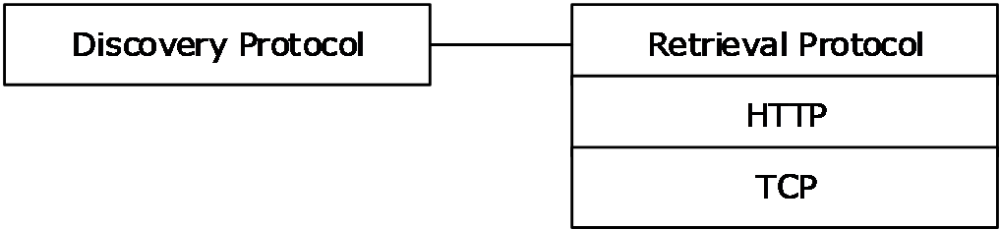

Figure 1: Protocol stack diagram

## 1.5 Prerequisites/Preconditions

- A [**higher-layer application**](#gt_higher-layer-application) using the protocol has to have the Content Information data structure (see [MS-PCCRC](../MS-PCCRC/MS-PCCRC.md) section 2.3) for the [**block ranges**](#gt_block-range) and [**segments**](#gt_segment) that it is retrieving from the server. The Content Information contains all the relevant information necessary for discovering and verifying the [**content blocks**](#gt_content-block).
- The client has to identify and use the encryption algorithm and key used by the server to encrypt the content.

## 1.6 Applicability Statement

The Retrieval Protocol is designed to handle the content availability query and content retrieval parts of the operation. It is also suitable for other types of content or object retrieval tasks because it does not assume any characteristics of the content.

The [**Peer Content Caching and Retrieval Framework**](#gt_peer-content-caching-and-retrieval-framework-or-framework), which uses the Retrieval Protocol, is best suited when there is a need to reduce load on a [**content server**](#gt_content-server) or reduce bandwidth usage on the link between the [**peers**](#gt_peer) and the content server. This is because the protocol enables downloading data from peers on the high-speed link instead of the content server, which might be behind a slow link or might be heavily loaded.

## 1.7 Versioning and Capability Negotiation

This protocol covers versioning issues in the following areas:

- **Supported Transports**: This protocol is implemented on top of [**HTTP**](#gt_hypertext-transfer-protocol-http) as discussed in section [2.1](#Section_2.1).
- **Protocol Versions**: The protocol is [**Version 2.0**](#gt_version-20). Supported versions are 1.0 and 2.0. Messages defined in version 1.0 are sent with version specification 1.0, and messages defined in version 2.0 are sent with version specification 2.0.
- **Security and Authentication Methods**: There is no authentication or authorization in the protocol. The blocks served by the [**server-role peer**](#gt_server-role-peer), however, are encrypted as specified in section [3.2.5.3](#Section_3.2.5.3).
- **Localization**: The protocol does not contain locale-dependent information.

## 1.8 Vendor-Extensible Fields

None.

## 1.9 Standards Assignments

None.

# 2 Messages

The Retrieval Protocol is made up of a limited number of fully defined messages sent on top of the [Peer Download Transport](#Section_2.1.1). <1>

## 2.1 Transport

### 2.1.1 Peer Download Transport

The **Peer Download Transport** is a [**peer-to-peer**](#gt_peer-to-peer) [**transport**](#gt_transport) built on top of [**HTTP**](#gt_hypertext-transfer-protocol-http) [[RFC2616]](https://go.microsoft.com/fwlink/?LinkId=90372). The client/server HTTP protocol is turned into a peer-to-peer transport by having each [**peer**](#gt_peer) implement both a [**client**](#gt_client) and a [**server**](#gt_server) role. In a given transport session between two peers P1 and P2, the initiator peer acts as client, and the other peer acts as server. If P1 is the initiator of the transport session, P1 sends an HTTP request, and P2 replies by sending an HTTP response. Both the Retrieval Protocol request and response message types are included in the body of the HTTP messages. The payload of each such HTTP request or response consists solely of a single Retrieval Protocol message, with the response message prefixed with an additional length field (as defined in section [2.2.2](#Section_2.2.2)) for reassembly purposes. A transport session between any two peers spans a single request-response sequence, and no context is kept within the transport across different transport sessions between those two peers.

Each peer implements the server role by reserving the URL under the root path of /116B50EB-ECE2-41ac-8429-9F9E963361B7/ and listening for POST requests on it.

The initiating/[**client-role peer**](#gt_client-role-peer) P1 at IP address A1 initiates the transport of a given request-type Peer Retrieval Protocol message to peer P2 at IP address A2, by sending an HTTP POST request to the root path of /116B50EB-ECE2-41ac-8429-9F9E963361B7/.

### 2.1.2 Transport Security

The [Peer Download Transport](#Section_2.1.1) does not implement any security. There is no peer authentication or authorization, and messages are sent in clear text. At the transport level, peers accept and process all messages coming from any other peer.

## 2.2 Message Syntax

Messages are formed by headers and a message body. Both headers and body are formed by a sequence of fields. Each field is aligned according to the current protocol version’s default alignment, currently 4 bytes.

All Retrieval Protocol messages are variable size messages. The valid range of the total message size MUST be from 16 bytes to 98,304 bytes (or 96 KB).

### 2.2.1 Common Data Types

The protocol supports four field types:

- Integer (**DWORD** fields as defined in [MS-DTYP](../MS-DTYP/MS-DTYP.md) section 2.2.9, transmitted in [**network byte order**](#gt_network-byte-order)).
- [BLOCK_RANGE_ARRAY](#Section_2.2.1.3) ((Integer [2])[count], a count-sized array of [BLOCK_RANGE](#Section_2.2.1.1) fields).
- [SEGMENT_RANGE_ARRAY](#Section_2.2.1.4) ((Integer [2])[count], a count-sized array of [SEGMENT_RANGE](#Section_2.2.1.2) fields).
- BYTE array (BYTE[count], a count-sized array of bytes).

#### 2.2.1.1 BLOCK_RANGE

A **BLOCK_RANGE** is an array of two integers that defines a consecutive array of blocks.

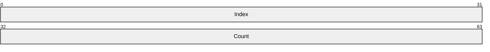

**Index (4 bytes):** The [**index**](#gt_index) of the first [**block**](#gt_block) in the range.

**Count (4 bytes):** Count of consecutive adjacent blocks in that range, including the block at the **Index** location. The value of this field MUST be greater than 0.

**Index** and **Count** are both integer fields in the range of 0x00000000 to 0xFFFFFFFF, but contain a value in the range from 0 to 511 inclusive for the **Index** field, and 1 to (512–Index) inclusive for the **Count** field. For example, a BLOCK_RANGE of [42, 7] represents all the blocks starting from block index 42 to block index 48, including the last one.

#### 2.2.1.2 SEGMENT_RANGE

A **SEGMENT_RANGE** is an array of two integers that defines a consecutive array of segments.

**Index (4 bytes):** The [**index**](#gt_index) of the first [**segment**](#gt_segment) in the range.

**Count (4 bytes):** Count of consecutive adjacent segments in that range, including the segment at the **Index** location. The value of this field MUST be greater than 0.

**Index** and **Count** are both integer fields in the range of 0x00000000 to 0xFFFFFFFF.

#### 2.2.1.3 BLOCK_RANGE_ARRAY

The **BLOCK_RANGE_ARRAY** is a variable-size array containing [BLOCK_RANGE](#Section_2.2.1.1) entries.

This type is declared as follows.

typedef BLOCK_RANGE BLOCK_RANGE_ARRAY[];

#### 2.2.1.4 SEGMENT_RANGE_ARRAY

The **SEGMENT_RANGE_ARRAY** is a variable-size array containing [SEGMENT_RANGE](#Section_2.2.1.2) entries.

This type is declared as follows.

typedef SEGMENT_RANGE SEGMENT_RANGE_ARRAY[];

#### 2.2.1.5 ENCODED_SEGMENT_AGE

An **ENCODED_SEGMENT_AGE** is an array of four bytes that describes the age of a [**segment**](#gt_segment) of data involved in a Peer Content Caching and Retrieval: Retrieval Protocol message exchange. The age refers to the amount of time that has elapsed since the specified segment was first created in the local [**BranchCache**](#gt_branchcache) cache.

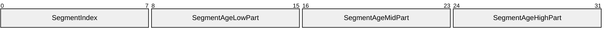

**SegmentIndex (1 byte):** Index of a segment among all of the segments involved in the current message exchange. The index is relative to the first segment addressed in the message containing the specific current **ENCODED_SEGMENT_AGE** structure.

**SegmentAgeLowPart (1 byte):** Low part of the age of the segment.

**SegmentAgeMidPart (1 byte):** Mid part of the age of the segment.

**SegmentAgeHighPart (1 byte):** High part of the age of the segment.

The actual age of the segment is calculated as: **SegmentAgeLowPart** + 256 * **SegmentAgeMidPart** + 256 * 256 * **SegmentAgeHighPart**.

The age of the segment is expressed according to the unit specified in the enclosing object/message. If no enclosing object/message is available, the age MUST be specified (and is assumed to be specified) in hundredths of milliseconds.

### 2.2.2 TRANSPORT_RESPONSE_HEADER

The following **TRANSPORT_RESPONSE_HEADER** is added by the transport in front of response-type protocol messages for reassembly purposes.

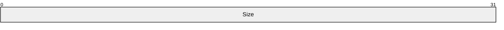

**Size (4 bytes):** Total message size, in bytes, excluding this field. The valid range of the total message size MUST be from 16 bytes to 98,304 bytes (or 96 KB).

### 2.2.3 MESSAGE_HEADER

The **MESSAGE_HEADER** is prefixed to all messages associated with this protocol. Messages can be one of two types: request-type or response-type as follows.

Request-type messages include [MSG_NEGO_REQ (section 2.2.4.1)](#Section_2.2.4.1), [MSG_GETBLKLIST (section 2.2.4.2)](#Section_2.2.4.2), [MSG_GETBLKS (section 2.2.4.3)](#Section_2.2.4.3), and [MSG_GETSEGLIST (section 2.2.4.4)](#Section_2.2.4.4). Request-type messages initiate a communication session between two peers. A request-type message can be delivered only as an HTTP request.

Response-type messages include [MSG_NEGO_RESP (section 2.2.5.1)](#Section_2.2.5.1), [MSG_BLKLIST (section 2.2.5.2)](#Section_2.2.5.2), [MSG_BLK (section 2.2.5.3)](#Section_2.2.5.3), and [MSG_SEGLIST (section 2.2.5.4)](#Section_2.2.5.4). Response-type messages are sent only in response to a Request-type message (see [Protocol Details (section 3)](#Section_3) for more details). A response-type message can be delivered only as an HTTP response to an incoming HTTP request.

The layout of the message header is as follows.

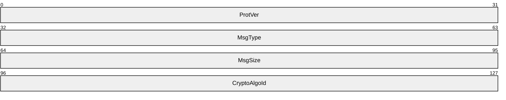

**ProtVer (4 bytes):** Protocol version number, formed by concatenating the protocol major version number and protocol minor version number, encoded as follows (where MSB is Most Significant Byte and LSB is Least Significant Byte).

| Bit Range | Field | Description |
| --- | --- | --- |
| Variable | Minor version MSB | Minor version LSB Major version MSB Major version LSB |

The major version number is encoded in the least significant word of the protocol version's **DWORD**.

The minor version number is encoded in the most significant word of the protocol version's **DWORD**.

Both the major and minor version number can express the version range of 0x0000 to 0xFFFF. The value of the **ProtVer** field is determined by the message type specified in the **MsgType** field, rather than the greatest version number supported by the client.

**MsgType (4 bytes):** The type of message in the message body, expressed as a binary integer. MUST be set to one of the following values.

| Value | Meaning |
| --- | --- |
| MSG_NEGO_REQ 0x00000000 | A protocol version negotiation request. The request declares the minimum and maximum version numbers supported by the requesting [**client-role peer**](#gt_client-role-peer).<2> To use the MSG_NEGO_REQ value, the value of the **ProtVer** field MUST be set to 1.0. |
| MSG_NEGO_RESP 0x00000001 | A protocol version negotiation response. It is sent in response to any protocol version negotiation request or to any other request with protocol version not supported by the [**server-role peer**](#gt_server-role-peer). The response declares the minimum and maximum version numbers supported by the responding server-role peer. To use the MSG_NEGO_RESP value, the value of the **ProtVer** field MUST be set to 1.0. |
| MSG_GETBLKLIST 0x00000002 | A request for a list of [**block hashes**](#gt_b95ac37d-49c5-42a8-be4f-c0fc5592db16) of blocks in the [**target segment**](#gt_target-segment) that are possessed by the destination server-role peer (list expressed as a [**block range**](#gt_block-range) array), and intersecting the list of block hashes specified in the request itself. To use the MSG_GETBLKLIST value, the value of the **ProtVer** field MUST be set to 1.0. |
| MSG_GETBLKS 0x00000003 | A request for an array of block hashes (specified by a block range array). Since only one block will be returned, a **MSG_GETBLKS** message SHOULD specify only a single range containing only a single block. To use the MSG_GETBLKS value, the value of the **ProtVer** field MUST be set to 1.0. |
| MSG_BLKLIST 0x00000004 | A response message containing a list of block hashes of blocks in the target segment that are possessed by the destination server-role peer (list expressed as a block range array), and intersecting the list of block hashes specified in the previous request from the client-role peer. To use the MSG_BLKLIST value, the value of the **ProtVer** field MUST be set to 1.0. |
| MSG_BLK 0x00000005 | A response message containing the (first) actual block requested by the client-role peer via a block range array in a **MSG_GETBLKLIST** message. To use the MSG_BLK value, the value of the **ProtVer** field MUST be set to 1.0. |
| MSG_GETSEGLIST 0x0000006 | A request for a list of segments IDs that are possessed by the destination server-role peer and intersecting the list of segments IDs specified in the request itself. To use the MSG_GETSEGLIST value, the value of the **ProtVer** field MUST be set to 2.0. |
| MSG_SEGLIST 0x0000007 | A response message containing a list of segments IDs possessed by the destination server-role peer and intersecting the list of segment IDs in the previous request from the client-role peer. To use the MSG_SEGLIST value, the value of the **ProtVer** field MUST be set to 2.0. |

**MsgSize (4 bytes):** Protocol message total size including the MESSAGE_HEADER, but not including the [TRANSPORT_RESPONSE_HEADER](#Section_2.2.2). The valid range of the total message size MUST be from 16 bytes to 98,304 bytes (or 96 KB) for request messages, or from 16 bytes to 393,216 bytes (or 384 KB) for response messages.

**CryptoAlgoId (4 bytes):** The encryption algorithm used by the server-role peer to encrypt data. In the request message to the server-role peer, the client-role peer SHOULD indicate AES_128 as the preferred encryption algorithm; however, the server-role peer can ignore this value. The **CryptoAlgoId** field MUST be set to one of the following values. Refer to [[FIPS197]](https://go.microsoft.com/fwlink/?LinkId=89870) for the AES standard and [[SP800-38A]](https://go.microsoft.com/fwlink/?LinkId=128809) for the supported block cipher modes listed in the following table.

| Value | Meaning |
| --- | --- |
| 0x00000000 | No encryption. |
| AES_128 0x00000001 | AES 128-bit, CBC-mode encryption. |
| AES_192 0x00000002 | AES 192-bit, CBC-mode encryption. |
| AES_256 0x00000003 | AES 256-bit, CBC-mode encryption. |

### 2.2.4 Request Message

The Retrieval Protocol specifies four **Request Message** types sent by the clients to the servers:

[MSG_NEGO_REQ (section 2.2.4.1)](#Section_2.2.4.1)

[MSG_GETBLKLIST (section 2.2.4.2)](#Section_2.2.4.2)

[MSG_GETBLKS (section 2.2.4.3)](#Section_2.2.4.3)

[MSG_GETSEGLIST (section 2.2.4.4)](#Section_2.2.4.4)

The complete layout of a request-type Peer Content Caching and Retrieval: Retrieval Protocol message is as follows.

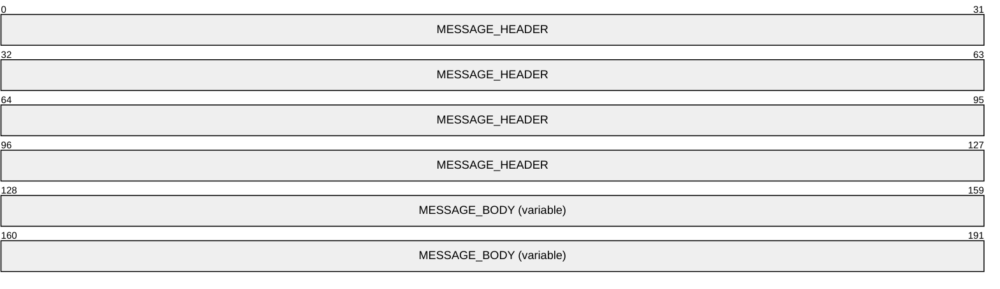

**MESSAGE_HEADER (16 bytes):** Message header.

**MESSAGE_BODY (variable):** Message body, which contains one of the following: Negotiation Request (**MSG_NEGO_REQ**), GetBlockList (**MSG_GETBLKLIST**), GetBlocks (**MSG_GETBLKS**), or GetSegmentList (**MSG_GETSEGLIST**) request message.

#### 2.2.4.1 MSG_NEGO_REQ

The **MSG_NEGO_REQ** (**Negotiation Request**) message is a request for the minimum and maximum protocol version supported by the target [**server-role peer**](#gt_server-role-peer). The message contains the minimum and maximum protocol version supported by the requesting [**client-role peer**](#gt_client-role-peer).

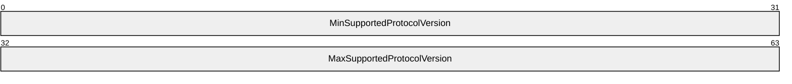

**MinSupportedProtocolVersion (4 bytes):** Minimum protocol version supported by the requesting peer. The protocol version is encoded identically to the **ProtVer** field defined in section [2.2.3](#Section_2.2.3).

**MaxSupportedProtocolVersion (4 bytes):** Maximum protocol version supported by the requesting peer. The protocol version is encoded identically to the **ProtVer** field defined in section 2.2.3.

#### 2.2.4.2 MSG_GETBLKLIST

The **MSG_GETBLKLIST** (**GetBlockList**) message contains a request for a download block list. It is used when retrieving a set of blocks defined by one or more [BLOCK_RANGE_ARRAY](#Section_2.2.1.3) items.

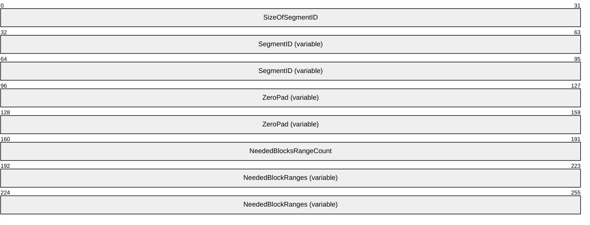

**SizeOfSegmentID (4 bytes):** Size, in bytes. of the subsequent **SegmentID** field. The syntactic range of this field is from 0x00000000 to 0xFFFFFFFF. The actual value of this field depends on the hashing algorithm used as defined in [MS-PCCRC](../MS-PCCRC/MS-PCCRC.md). Implementations SHOULD support all allowed **SegmentID** lengths and MUST support content with 32-byte **SegmentIDs**.<3>

**SegmentID (variable):** Public Segment Identifier for the [**target segment**](#gt_target-segment) of content (also known as [**HoHoDk**](#gt_segment-id-hohodk)). See [MS-PCCRC] for a description of contents, [**segments**](#gt_segment), [**blocks**](#gt_block), and identifiers.

**ZeroPad (variable):** Sequence of bytes added (as needed) to restore 4-byte alignment, relative to the beginning of this message. The value of each byte MUST be set to zero. This field is 0 to 3 bytes in length, as required.

**NeededBlocksRangeCount (4 bytes):** Number of items in the subsequent [**block range**](#gt_block-range) array. The syntactic range of this field is from 0x00000000 to 0xFFFFFFFF. The effective range of this field MUST be between 1 and 256 inclusive because there cannot be more than 256 non-overlapping and non-contiguous ranges in a maximum segment size of 512 blocks.

**NeededBlockRanges (variable):** Block range array listing the [**block hashes**](#gt_b95ac37d-49c5-42a8-be4f-c0fc5592db16) of the blocks within the target segment that the [**client-role peer**](#gt_client-role-peer) is interested in. The [**server-role peer**](#gt_server-role-peer) will reply with a block range array representing the intersection between the list of block hashes in the **NeededBlockRanges** array and the block range array set of blocks within the target segment currently available for sharing in the local cache of the server-role peer.<4>

#### 2.2.4.3 MSG_GETBLKS

The **MSG_GETBLKS** (**GetBlocks**) message contains a request for blocks of content. It is used to retrieve a set of blocks defined by a single [BLOCK_RANGE_ARRAY](#Section_2.2.1.3).

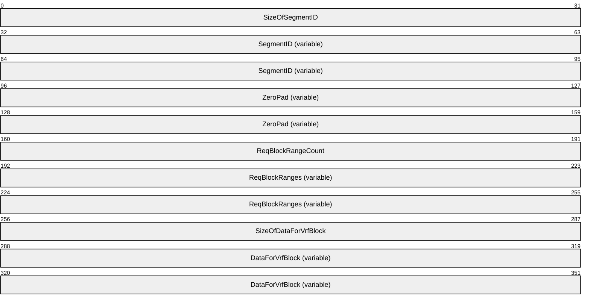

**SizeOfSegmentID (4 bytes):** Size in bytes of the subsequent **SegmentID** field. The syntactic range of this field is from 0x00000000 to 0xFFFFFFFF. The actual value of this field depends on the hashing algorithm used as defined in [MS-PCCRC](../MS-PCCRC/MS-PCCRC.md). Implementations SHOULD support all allowed **SegmentID** lengths and MUST support content with 32-byte **SegmentIDs**.<5>

**SegmentID (variable):** Public Segment Identifier for the [**target segment**](#gt_target-segment) of content (also known as [**HoHoDk**](#gt_segment-id-hohodk)). See [MS-PCCRC] for a description of contents, [**segment**](#gt_segment), [**blocks**](#gt_block), and identifiers.

**ZeroPad (variable):** Sequence of bytes added (as needed) to restore 4-byte alignment, relative to the beginning of this message. The value of each byte MUST be set to zero. This field is 0 to 3 bytes in length, as required.

**ReqBlockRangeCount (4 bytes):** Number of items in the subsequent [**block range**](#gt_block-range) array. The syntactic range of this field is from 0x00000000 to 0xFFFFFFFF. The effective range of this field MUST be between 1 and 256 inclusive because there cannot be more than 256 non-overlapping and non-contiguous ranges in a maximum segment size of 512 blocks.

**ReqBlockRanges (variable):** Block range array representing the blocks requested for the target segment. **RegBlockRanges** MUST specify a single block range containing only one block.

**SizeOfDataForVrfBlock (4 bytes):** Size in bytes of the subsequent **DataForVrfBlock** field. This field SHOULD be zero.

**DataForVrfBlock (variable):** Not used by the protocol. This field SHOULD be empty.

#### 2.2.4.4 MSG_GETSEGLIST

The **MSG_GETSEGLIST** (**GetSegmentList**) message contains a request for a download [**segment**](#gt_segment) list. It is used when retrieving a set of segments. This message MUST be formatted as follows.<6>

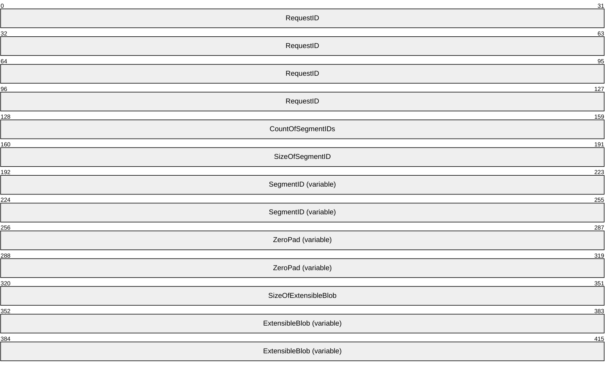

**RequestID (16 bytes):** Unique identifier among all outstanding GetSegmentList Requests from this peer.

**CountOfSegmentIDs (4 bytes):** Count of the Segment IDs in the current GetSegmentList Request.

The following three fields are repeated N times where N is equal to **CountOfSegmentIDs**.

**SizeOfSegmentID (4 bytes):** Size, in bytes of the first **SegmentID**, immediately subsequent to this field. Implementations MUST support all allowed **SegmentID** lengths and MUST support content with 32-byte **SegmentIDs**.

**SegmentID (variable):** Public Segment Identifier for the first [**target segment**](#gt_target-segment) of content (also known as [**HoHoDk**](#gt_segment-id-hohodk)). See [MS-PCCRC](../MS-PCCRC/MS-PCCRC.md) section 2.2 for a description of segment identifiers.

**ZeroPad (variable):** Sequence of bytes added (as needed) to restore 4-byte alignment, relative to the beginning of this message. The value of each byte MUST be set to zero. This field is 0 to 3 bytes in length, as required.

**SizeOfExtensibleBlob (4 bytes):** Size, in bytes, of the **ExtensibleBlob** field. Implementations MAY support extensible blobs in **MSG_GETSEGLIST** messages. Implementations that do not support extensible blobs in **MSG_GETSEGLIST** messages MUST set **SizeOfExtensibleBlob** to zero and omit the **ExtensibleBlob** field.

**ExtensibleBlob (variable):** An extensible binary large object (BLOB). See [Extensible BLOB (section 2.2.6)](#Section_2.2.6) for the definition of currently defined extensible BLOBs. Implementations MAY support extensible BLOBs in **MSG_GETSEGLIST** messages. Implementations that do not support extensible BLOBs in **MSG_GETSEGLIST** messages MUST set **SizeOfExtensibleBlob** to zero and omit the **ExtensibleBlob** field. Relative indexes contained in the extensible BLOB are relative to the first segment in the first **SegmentRange** carried by the current **MSG_GETSEGLIST** message.

### 2.2.5 Response Message

The Retrieval Protocol defines four **Response Message** types sent by the servers in response to client requests:

[MSG_NEGO_RESP (section 2.2.5.1)](#Section_2.2.5.1)

[MSG_BLKLIST (section 2.2.5.2)](#Section_2.2.5.2)

[MSG_BLK (section 2.2.5.3)](#Section_2.2.5.3)

[MSG_SEGLIST (section 2.2.4.4)](#Section_2.2.4.4)

The complete layout of a response-type Peer Content Caching and Retrieval: Retrieval Protocol message is as follows.

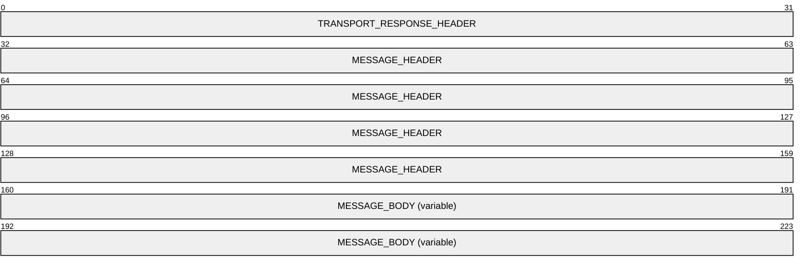

**TRANSPORT_RESPONSE_HEADER (4 bytes):** Transport response header.

**MESSAGE_HEADER (16 bytes):** Message header.

**MESSAGE_BODY (variable):** Message body, which can contain one of the following: **MSG_NEGO_RESP**, **MSG_BLKLIST**, **MSG_BLK**, or a **MSG_SEGLIST** message.

#### 2.2.5.1 MSG_NEGO_RESP

The **MSG_NEGO_RESP** (**Negotiation Response**) message is the response message containing the minimum and maximum protocol version supported by the responding [**server-role peer**](#gt_server-role-peer). The message is sent in response to a Negotiation Request message or to any other request message with a protocol version not supported by the server-role peer.

**MinSupportedProtocolVersion (4 bytes):** Minimum protocol version supported by the requesting peer. The protocol version is encoded identically to the **ProtVer** field defined in section [2.2.3](#Section_2.2.3).

**MaxSupportedProtocolVersion (4 bytes):** Maximum protocol version supported by the requesting peer. The protocol version is encoded identically to the **ProtVer** field defined in section 2.2.3.

#### 2.2.5.2 MSG_BLKLIST

The **MSG_BLKLIST** message is the response message containing the download block ranges available on the responding [**server-role peer**](#gt_server-role-peer). The message is sent by the server-role peer in response to a **MSG_GETBLKLIST** message from a requesting client-role peer.

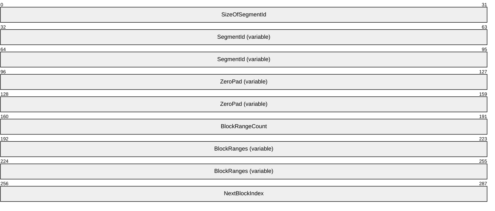

**SizeOfSegmentId (4 bytes):** The size, in bytes, of the subsequent **SegmentId** field.

**SegmentId (variable):** The Public Segment Identifier for the [**target segment**](#gt_target-segment) of content (also known as [**HoHoDk**](#gt_segment-id-hohodk)). See [MS-PCCRC](../MS-PCCRC/MS-PCCRC.md) for details.

**ZeroPad (variable):** A sequence of N bytes added (only as needed) to restore 4-byte alignment, where 0 <= N <= 3. Each byte's value MUST be set to zero.

**BlockRangeCount (4 bytes):** Number of items in the subsequent [**block range**](#gt_block-range) array. The server MUST set the **BlockRangeCount** field to 0 if it does not have any of the requested block ranges.

**BlockRanges (variable):** A block range array describing the blocks currently available for download from the current server-role peer for the target segment, within the boundaries of the list of block ranges of interest (**NeededBlockRanges**) specified by the [**client-role peer**](#gt_client-role-peer) in the previously received **GetBlockList** request message ([MSG_GETBLKLIST (section 2.2.4.2)](#Section_2.2.4.2)).<7>

**NextBlockIndex (4 bytes):** The [**index**](#gt_index) of the first block after the block sent in the current message, currently available for download from this server-role peer. If no such next block is available, this index MUST be zero.

#### 2.2.5.3 MSG_BLK

The **MSG_BLK** message is the response message containing a download block. This message is sent by the [**server-role peer**](#gt_server-role-peer) in response to a **MSG_GETBLKS** message from a requesting [**client-role peer**](#gt_client-role-peer).

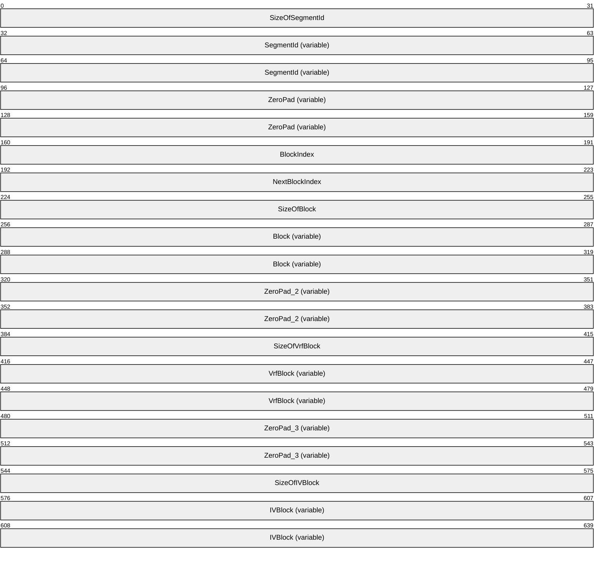

**SizeOfSegmentId (4 bytes):** The size, in bytes, of the subsequent **SegmentId** field.

**SegmentId (variable):** The Public Segment Identifier for the [**target segment**](#gt_target-segment) of content (also known as [**HoHoDk**](#gt_segment-id-hohodk)). See [MS-PCCRC](../MS-PCCRC/MS-PCCRC.md) for details.

**ZeroPad (variable):** A sequence of N bytes added (only as needed) to restore 4-byte alignment, where 0 <= N <= 3. Each byte's value MUST be set to zero.

**BlockIndex (4 bytes):** The [**index**](#gt_index) in the target segment of the block sent in the current message.

**NextBlockIndex (4 bytes):** The index of the first block after the block sent in the current message, currently available for download from this server-role peer. If no such next block is available, this index MUST be zero.

**SizeOfBlock (4 bytes):** The size, in bytes, of the subsequent **Block** field. The server MUST set the **SizeOfBlock** field to zero if it does not have the requested block.

**Block (variable):** The actual block of data, [**encrypted**](#gt_encryption) according to the cryptographic algorithm specified in the header of the message itself, not including the [**initialization vector**](#gt_initialization-vector).

**ZeroPad_2 (variable):** A sequence of N bytes added (only as needed) to restore 4-byte alignment, where 0 <= N <= 3. Each byte's value MUST be set to zero.

**SizeOfVrfBlock (4 bytes):** The size, in bytes, of the subsequent **VrfBlock** field, which SHOULD be zero.

**VrfBlock (variable):** Currently not used and SHOULD be empty.

**ZeroPad_3 (variable):** A sequence of N bytes added (only as needed) to restore 4-byte alignment, where 0 <= N <= 3. Each byte's value MUST be set to zero.

**SizeOfIVBlock (4 bytes):** The size, in bytes, of the subsequent **IVBlock** field.

**IVBlock (variable):** The initialization vector used by the server-role peer when encrypting the block of data (**Block** field) sent with this message.

#### 2.2.5.4 MSG_SEGLIST

The **MSG_SEGLIST** message is the response message containing the [**segment**](#gt_segment) range array describing the segments currently available for download. This message is sent by the [**server-role peer**](#gt_server-role-peer) in response to a [MSG_GETSEGLIST (section 2.2.4.4)](#Section_2.2.4.4) message from a requesting [**client-role peer**](#gt_client-role-peer). The **MSG_SEGLIST** MUST be formatted as follows.<8>

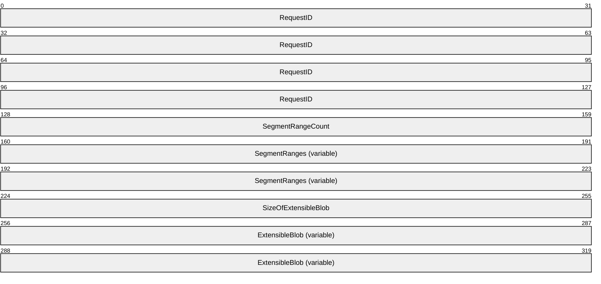

**RequestID (16 bytes):** Unique identifier matching the **RequestID** received in the associated GetSegmentList Request.

**SegmentRangeCount (4 bytes):** Number of items in the **SegmentRanges** field. The server MUST set the **SegmentRangeCount** field to 0 if it does not have any of the requested segments.

**SegmentRanges (variable):** A [SEGMENT_RANGE_ARRAY (section 2.2.1.4)](#Section_2.2.1.4) that describes the segments (full or partial) currently available for download from the current server-role peer. The indexes specified in each range in the response are the relative indexes of the segment in the original array of segment IDs specified in the associated **GetSegmentList** message.

**SizeOfExtensibleBlob (4 bytes):** The size in bytes of the **ExtensibleBlob** field.

**ExtensibleBlob (variable):** An extensible binary large object (BLOB). For the definitions of extensible BLOBs that are currently defined, see section [2.2.6](#Section_2.2.6). The relative indexes contained in the extensible BLOB are relative to the first segment in the first [SEGMENT_RANGE (section 2.2.1.2)](#Section_2.2.1.2) carried by the current **MSG_SEGLIST** message.

### 2.2.6 Extensible BLOB

Extensible binary large objects (BLOBs) are optional BLOBs that SHOULD be included in **MSG_SEGLIST** responses and can be included in **MSG_GETSEGLIST** requests.

Extensible BLOBs carry more information about the specific segments associated to the **MSG_GETSEGLIST**/**MSG_SEGLIST** exchange.

Extensible BLOBs are versioned, and for each version there is a well-known definition. Currently the only defined extensible BLOB version is extensible BLOB version 1. Future protocol versions can define new extensible BLOB versions.

The version of the extensible BLOB is encoded as a network-byte-order unsigned short integer in the first two bytes of the extensible BLOB itself.

Any extensible BLOB smaller than 2 bytes is invalid and MUST be discarded.

Implementations that do not support the specific extensible BLOB version encoded in the first two bytes of the BLOB itself MUST discard the BLOB.

Implementations that do support the specific extensible BLOB version encoded in the first two bytes of the BLOB itself MUST make sure that the size of the BLOB reported through **SizeOfExtensibleBlob** is compatible with the size restrictions for that specific BLOB version; if not, the BLOB MUST be discarded.

#### 2.2.6.1 Extensible Blob Version 1

The **Extensible Blob Version 1** structure MUST be formatted as follows.

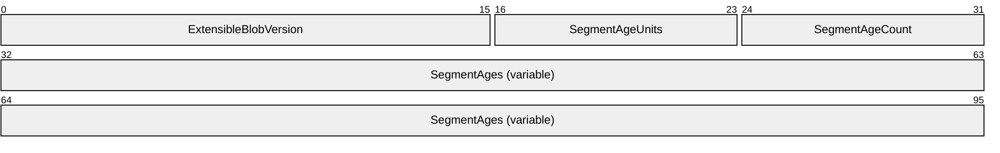

**ExtensibleBlobVersion (2 bytes):** [**Network Byte Order**](#gt_network-byte-order) unsigned short integer that contains the version of the extensible blob. It must be equal to 1.

**SegmentAgeUnits (1 byte):** Unit used to specify the age of the segments in the following **ENCODED_SEGMENT_AGE** structures. Valid values are in the following table.

| Value | Meaning |
| --- | --- |
| 1 | Seconds |
| 2 | Tenths of a second |
| 3 | Hundredths of a second |
| 4 | Milliseconds |

When sending a message containing an extensible blob version 1, implementations SHOULD use a value of 3 (hundredths of a second). When receiving a message containing a blob, implementations MUST be able to process any of the previous valid values.

**SegmentAgeCount (1 byte):** Count of **ENCODED_SEGMENT_AGE** structures encoded right after this field (acceptable range: 0 - 255).

**SegmentAges (variable): SegmentAgeCount ENCODED_SEGMENT_AGE** structures.

##### 2.2.6.1.1 Extensible Blob Version 1 Restrictions and Validation

Before parsing the data in the blob, implementations MUST verify its validity as follows:

- The blob size MUST be at least four bytes.
- The blob MUST have a **SegmentAgeUnits** value in the range of 1 to 4.
- The blob size specified by the enclosing message MUST be equal to or larger than the size needed to accommodate the number of **ENCODED_SEGMENT_AGE** structures specified by **SegmentAgeCount**, plus four bytes for the previously specified blob layout. That includes the following.
Specified_size >= 4 + SegmentAgeCount * sizeof(ENCODED_SEGMENT_AGE) = 4 + SegmentAgeCount * 4 = 4 * (SegmentAgeCount + 1)

The previous validations MUST be carried out in the specified order and MUST be aborted at the first failure. If validation fails, the blob MUST be discarded.

# 3 Protocol Details

The Retrieval Protocol consists of four types of exchanges: **Negotiation** request/response, **BlockList** request/response, **Block** request/response, and **SegmentList** request/response as follows (see section [2](#Section_2) for message formats and field definitions):

- **Protocol Version Negotiation:** A [**client-role peer**](#gt_client-role-peer) (referred to as [**client**](#gt_client)) initiates a protocol version negotiation with a [**server-role peer**](#gt_server-role-peer) (referred to as [**server**](#gt_server)) by sending a **Negotiation** request message ([MSG_NEGO_REQ (section 2.2.4.1)](#Section_2.2.4.1)), declaring the minimum and maximum protocol versions it supports. The server responds with a **Negotiation** response message ([MSG_NEGO_RESP (section 2.2.5.1)](#Section_2.2.5.1)), declaring the minimum and maximum protocol versions it supports. Implementation of the client side of the protocol version negotiation is optional. The server side of the protocol version negotiation MUST be implemented.
- **BlockList request/response:** A client initiates a **GetBlockList** request ([MSG_GETBLKLIST (section 2.2.4.2)](#Section_2.2.4.2)) to a server to query the list of [**content**](#gt_content) [**blocks**](#gt_block) available on the server for a given [**segment ID**](#gt_segment-id-hohodk), and a list of [**block ranges**](#gt_block-range) within the [**segment**](#gt_segment), by sending a **MSG_GETBLKLIST** request. The server responds with a **BlockList** response ([MSG_BLKLIST (section 2.2.5.2)](#Section_2.2.5.2)) containing the list of block ranges for the specific segment ID that are within the ranges of the request. If the server does not support the client's protocol version, it treats the request as a Negotiation Request and responds accordingly (see section [3.2.5.1](#Section_3.2.5.1)).
- **Blocks request/response:** A client initiates a **GetBlocks** request ([MSG_GETBLKS (section 2.2.4.3)](#Section_2.2.4.3)) to a server to retrieve a specific block of a given segment, which is identified by the segment ID and the [**index**](#gt_index) of the block in the segment. It does this by sending a **MSG_GETBLKS** request. The server responds with the requested content blocks in a **Block** response ([MSG_BLK (section 2.2.5.3)](#Section_2.2.5.3)). If the server does not support the client's protocol version, it treats the request as a **Negotiation** request, and responds accordingly (see section 3.2.5.1).
- **SegmentList request/response: SegmentList** exchanges are restricted to [**Hosted Cache**](#gt_hosted-cache) client/server interaction only. A **SegmentList** request MUST be sent only by a Hosted Cache Client and it MUST always be directed to a Hosted Cache Server. A client initiates a **SegmentList** request (**MSG_GETSEGLIST** (section [2.2.4.4](#Section_2.2.4.4))) to a server to query the availability on the server of an array of segments, each of them identified by its segment ID. The server responds with a **SegmentList** response (**MSG_SEGLIST** (section [2.2.5.4](#Section_2.2.5.4))) containing the list of segment ranges for the specific segment IDs that are within the requested array. The indexes specified in the ranges are the indexes of segments in an array of **Segment IDs** in the originating **MSG_GETSEGLIST** request. If the server does not support the client's protocol version, it treats the request as a **Negotiation** request and responds accordingly (see section 3.2.5.1).
The [**Peer Content Caching and Retrieval Framework**](#gt_peer-content-caching-and-retrieval-framework-or-framework) then uses the Retrieval Protocol to retrieve and assemble complete segments of content from a combination of sources, including either a set of server peers or a hosted cache, plus the original [**content server**](#gt_content-server) if the former does not have the complete content.

## 3.1 Client Details

### 3.1.1 Abstract Data Model

The Retrieval Protocol client maintains the following data.

**Outstanding Request List:** A list of request messages sent for which responses have not yet been received, along with the addresses of the peers to which they were sent.

### 3.1.2 Timers

The Retrieval Protocol client maintains the following timer.

**Request Timer**: A **per-request-message** timer set by the client whenever it sends a [MSG_NEGO_REQ (section 2.2.4.1)](#Section_2.2.4.1), [MSG_GETBLKLIST (section 2.2.4.2)](#Section_2.2.4.2), [MSG_GETBLKS (section 2.2.4.3)](#Section_2.2.4.3), or [MSG_GETSEGLIST (section 2.2.4.4)](#Section_2.2.4.4) request message. When the timer expires before the exchange is completed, the client MUST cancel the current exchange. The default timeout value MUST be set to 2 seconds.<9>

### 3.1.3 Initialization

The Retrieval Protocol client requires no explicit initialization.

### 3.1.4 Higher-Layer Triggered Events

#### 3.1.4.1 MSG_NEGO_REQ Request

An implementation of the Retrieval Protocol MAY support the sending of a Protocol Version **Negotiation Request** message ([MSG_NEGO_REQ (section 2.2.4.1)](#Section_2.2.4.1)), when triggered by a [**higher-layer application**](#gt_higher-layer-application). The following description only applies to the implementations that support this feature.

When initiating a Retrieval Protocol query for the supported protocol versions, the higher-layer applications MUST specify a server address. The Retrieval Protocol implementation MUST do the following:

- Construct an **MSG_NEGO_REQ** message (as specified in section 2.2.4.1).
- Fill in the minimum and maximum protocol versions it supports.
- Send the message to the server.
- Store the message in the **Outstanding Request List**.
- Start the **Request Timer**.

#### 3.1.4.2 MSG_GETBLKLIST Initiation

To initiate a Retrieval Protocol query for the list of [**block ranges**](#gt_block-range) on a server, the [**higher-layer applications**](#gt_higher-layer-application) MUST specify a server address, a [**segment ID**](#gt_segment-id-hohodk), and a set of block ranges within the [**segment**](#gt_segment) identified by the segment ID. The client instance of the Retrieval Protocol instantiation MUST construct and send a **GetBlockList** message ([MSG_GETBLKLIST (section 2.2.4.2)](#Section_2.2.4.2)) to the server, store it in the **Outstanding Request List** ([3.1.1](#Section_3.1.1)), and start the **Request Timer** ([3.1.2](#Section_3.1.2)). The **SegmentID** and **NeededBlocksRange** fields of the **GetBlockList** message correspond to the segment ID and the set of block ranges supplied by the higher-layer applications.

#### 3.1.4.3 MSG_GETBLKS Initiation

To initiate a Retrieval Protocol request for specific [**block ranges**](#gt_block-range), the [**higher-layer applications**](#gt_higher-layer-application) MUST specify a server address, a [**segment ID**](#gt_segment-id-hohodk), and a set of block ranges with the [**segment**](#gt_segment) identified by the segment ID. The client instance of the Retrieval Protocol MUST construct and send a **GetBlocks** message ([MSG_GETBLKS (section 2.2.4.3)](#Section_2.2.4.3)) to the server, store it in the **Outstanding Request List** ([3.1.1](#Section_3.1.1)), and start the **Request Timer** ([3.1.2](#Section_3.1.2)). The **SegmentID** and **ReqBlockRanges** fields correspond to the segment ID and the block ranges of the request.

The Retrieval Protocol MUST only request and retrieve one block per exchange of **MSG_GETBLKS** request and [MSG_BLK (section 2.2.5.3)](#Section_2.2.5.3) response messages. If the higher-layer applications need to retrieve more than one block, multiple **GetBlocks** messages MUST be sent with one block per request.

A peer SHOULD perform a [**simple download**](#gt_simple-download) if it involves a limited number of consecutive blocks in a single block range.<10> This implies that the blocks are consecutive in the segment.

#### 3.1.4.4 MSG_GETSEGLIST Initiation

To initiate a Retrieval Protocol request for an array of [**segment IDs**](#gt_5cdb8c3b-3a16-4770-8918-db95bf212831), the [**higher-layer application**](#gt_higher-layer-application) MUST generate a sequential or random non-repeating Request ID, and it MUST specify a server address and an array of segment IDs. The client instance of the Retrieval Protocol MUST construct and send a **GetSegmentList** message (**MSG_GETSEGLIST** (section [2.2.4.4](#Section_2.2.4.4))) to the server, store it in the Outstanding Request List ([3.1.1](#Section_3.1.1)), and start the Request Timer ([3.1.2](#Section_3.1.2)). The **RequestID** and **SegmentID** fields correspond to the ID of the current request and to the segment IDs contained in the request.

### 3.1.5 Message Processing Events and Sequencing Rules

#### 3.1.5.1 MSG_NEGO_RESP Received

On receiving a [MSG_NEGO_RESP (section 2.2.5.1)](#Section_2.2.5.1) response message from a server, the client MUST first determine if this is a response to a previously sent request by checking the **Outstanding Request List** for the address of the server. If it is a response to either a [MSG_GETBLKLIST (section 2.2.4.2)](#Section_2.2.4.2) or [MSG_GETBLKS (section 2.2.4.3)](#Section_2.2.4.3) message, the client MUST compare the ranges of protocol versions and select a protocol version based on the rules specified later in this section. It must then resend the original **MSG_GETBLKLIST** or **MSG_GETBLKS** message, using the selected version.

If it is a response to an [MSG_NEGO_REQ (section 2.2.4.1)](#Section_2.2.4.1), the client MUST return the highest protocol version supported by both the client and the server to the [**higher-layer applications**](#gt_higher-layer-application).

If the client and server are incompatible, then the client MUST silently discard the **MSG_NEGO_RESP** message and MUST abort any current exchange with the server, including exchanges for previously sent **MSG_GETBLKLIST**, **MSG_GETBLKS**, or **MSG_NEGO_REQ** messages.

The rules for determining compatibility and selecting a version are listed below:

- The client's and the server's major version ranges are calculated from the **MSG_NEGO_REQ** and **MSG_NEGO_RESP** messages, respectively. In both cases, they are defined as the inclusive range between the major version from the **MinSupportedProtocolVersion** field and the major version from the **MaxSupportedProtocolVersion** field. The highest common major version is the highest value that is included in both ranges. If these ranges do not contain any common values, then no highest common major version exists.
- The minor versions within the same major version do not affect protocol compatibility. For instance, a client sending a version 3.2 request message and a server replying with version 3.0 message are fully compatible. The client and the server MUST each select their own highest minor version supported within the highest common major version. For example, if the client supports protocol version range [3.2, 5.0] and the server supports protocol version range [2.0, 4.3], then the highest common major version is 4, and the client will be sending messages with version 4.8 (assuming the highest minor version number for major version 4 is 4.8), whereas the server will be replying with messages with version 4.3. Another example: a client with a supported version range of [1.0, 2.1] and a server with a supported range of [2.5, 2.9] will result in a highest common major version of 2, with the client using version 2.1 and the server using version 2.9.
- If no highest common major version exists, then the client and the server are incompatible.
If there is no existing request message previously sent to the server stored in the **Outstanding Request List**, the client MUST silently discard the received message.

#### 3.1.5.2 MSG_BLKLIST Response Received

On receiving a [MSG_BLKLIST (section 2.2.5.2)](#Section_2.2.5.2) response message from a server, the client MUST verify that it is well-formed and corresponds to a **GetBlockList** request message ([MSG_GETBLKLIST (section 2.2.4.2)](#Section_2.2.4.2)) in its **Outstanding Request List**. The client then performs the following checks:

- The client SHOULD verify if the [**segment ID**](#gt_segment-id-hohodk) matches any request in the **Outstanding Request List**. If the client performs the segment ID check, it MUST silently discard the **MSG_BLKLIST** message and abort the exchange if the segment ID does not match the segment ID of any request.<11>
- The client MUST check if the [**block ranges**](#gt_block-range) overlap with the ranges specified in any request with a matching segment ID in the **Outstanding Request List**. The client MUST silently discard the **MSG_BLKLIST** message and abort the exchange if the check fails.
If this verification is successful, then the peer MUST do the following:

- Delete the corresponding request message from the **Outstanding Request List**, and cancel its **Request Timer**.
- Return the segment ID and block range from the **MSG_BLKLIST** message, as well as the server address, to the [**higher-layer applications**](#gt_higher-layer-application).
Otherwise, the response message MUST be silently discarded.

#### 3.1.5.3 MSG_BLK Response Received

On receiving a [MSG_BLK (section 2.2.5.3)](#Section_2.2.5.3) response message from a discovered peer, the client MUST verify that it is well-formed and corresponds to a **GetBlocks** request message ([MSG_GETBLKS (section 2.2.4.3)](#Section_2.2.4.3)) in its **Outstanding Request List** (the [**segment ID**](#gt_segment-id-hohodk) and [**block**](#gt_block) [**index**](#gt_index) would match that of an outstanding GetBlocks request). The client MUST silently discard the message if this verification is unsuccessful. Otherwise, it MUST do the following:

- Delete the corresponding request message from the **Outstanding Request List**, and cancel its **Request Timer**.
- If an [**encryption**](#gt_encryption) algorithm is specified in the **MSG_BLK** message (the **CryptoAlgoId** field does not equal 0x00000000 as specified in section [2.2.3](#Section_2.2.3)), [**decrypt**](#gt_decryption) the block using the pre-provisioned key.
- Pass the segment ID, block index, and (decrypted) block up to the [**higher-layer applications**](#gt_higher-layer-application).
Otherwise, the response message MUST be silently discarded, and the exchange aborted.

#### 3.1.5.4 MSG_SEGLIST Response Received

On receiving a **MSG_SEGLIST** (section [2.2.5.4](#Section_2.2.5.4)) response message from a server, the client MUST verify that it is a well-formed **GetSegmentList** request message (per section [2.2.4.4](#Section_2.2.4.4)) in its **Outstanding Request List**. The client then performs the following checks:

- The client MUST verify that the **RequestID** matches any request in the **Outstanding Request List**. If a request with a matching **RequestID** is not found in the **Outstanding Request List**, the client MUST silently discard the **MSG_SEGLIST** message and abort the exchange.
- The client MUST make sure that the all [**index**](#gt_index) entries from the ranges reported in the **MSG_SEGLIST** received are contained within the array of [**segment IDs**](#gt_5cdb8c3b-3a16-4770-8918-db95bf212831) specified in the request matching the **RequestID** in the **Outstanding Request List**. The client MUST silently discard the **MSG_SEGLIST** message and abort the exchange if the check fails.
If this verification is successful, then the peer MUST do the following:

- Delete the corresponding request message from the **Outstanding Request List**, and cancel its **Request Timer**.
- Return the list of segment IDs identified by the ranges from the **MSG_SEGLIST** message, as well as the server address, to the [**higher-layer applications**](#gt_higher-layer-application).
Otherwise, the response message MUST be silently discarded.

#### 3.1.5.5 Other Messages Received

All malformed messages received by the client and messages of unknown type sent to the Retrieval Protocol URLs specified in section [2.1.1](#Section_2.1.1) MUST be silently discarded.

### 3.1.6 Timer Events

#### 3.1.6.1 Request Timer Expiration

When the **Request Timer** expires before the exchange (GetBlockList ([MSG_GETBLKLIST (section 2.2.4.2)](#Section_2.2.4.2)), GetBlocks ([MSG_GETBLKS (section 2.2.4.3)](#Section_2.2.4.3)), Negotiation Request ([MSG_NEGO_REQ (section 2.2.4.1)](#Section_2.2.4.1)), or GetSegmentList ([MSG_GETSEGLIST (section 2.2.4.4)](#Section_2.2.4.4))) is completed, the client MUST abort the current exchange.

### 3.1.7 Other Local Events

None.

## 3.2 Server Details

### 3.2.1 Abstract Data Model

The Retrieval Protocol server maintains the following data.

**Content Cache:** This is the local [**content**](#gt_content) cache on the server. It consists of a list of [**segment IDs**](#gt_5cdb8c3b-3a16-4770-8918-db95bf212831) and associated [**block ranges**](#gt_block-range), along with their Content Information (see [MS-PCCRC](../MS-PCCRC/MS-PCCRC.md) section 2.3) and corresponding [**content blocks**](#gt_content-block) that the client or server has previously obtained either from other peers or from the [**content server**](#gt_content-server). The server replies to client queries with the information and content blocks stored in its content cache; the client retrieves the content from the server using the Core Retrieval Protocol.

**Active Client Count:** This counter keeps the number of active clients the server is currently serving. The counter is incremented by 1 when the server receives a request (GetBlockList ([MSG_GETBLKLIST (section 2.2.4.2)](#Section_2.2.4.2)) or GetBlocks ([MSG_GETBLKS (section 2.2.4.3)](#Section_2.2.4.3))), and is decremented by 1 when the server sends back a response or discards the request. This counter is used to limit the number of concurrent clients for a server to a maximum value. The default maximum threshold SHOULD be set to 64<12><13>, and it MUST be configurable based on the processing capability of the server. If this counter reaches the threshold, the server will send back an empty response (empty block range in BlockList ([MSG_BLKLIST (section 2.2.5.2)](#Section_2.2.5.2)) or empty block in Block ([MSG_BLK (section 2.2.5.3)](#Section_2.2.5.3))) to the client.

### 3.2.2 Timers

The Retrieval Protocol server maintains the following timer.

**Upload Timer:** A per-instantiation timer set by a server when the protocol is instantiated. The server MUST abort the protocol instance when the timer expires before the request/response exchange is completed. The default timeout value MUST be set to 15 seconds.<14>

### 3.2.3 Initialization

The server is initialized by starting to listen for incoming HTTP requests on the URL specified in section [2.1.1](#Section_2.1.1). The server MUST set the **Active Client Count** to zero.

### 3.2.4 Higher-Layer Triggered Events

There are no explicit higher-layer triggered events for the server, other than waiting for the client messages as enabled by the initialization.

### 3.2.5 Message Processing Events and Sequencing Rules

#### 3.2.5.1 MSG_NEGO_REQ Received

On receiving a valid [MSG_NEGO_REQ (section 2.2.4.1)](#Section_2.2.4.1) message from a client, the server MUST construct a [MSG_NEGO_RESP (section 2.2.5.1)](#Section_2.2.5.1) message with the maximum and minimum protocol versions that it supports, set the **Upload Timer**, and send the response message back to the client.

#### 3.2.5.2 MSG_GETBLKLIST Request Received

On receiving a valid [MSG_GETBLKLIST (section 2.2.4.2)](#Section_2.2.4.2) request message from a client, the server MUST perform the following actions in the order specified:

- The server MUST first check if the protocol version is supported, based on the version range comparison rules specified in section [3.1.5.1](#Section_3.1.5.1). If the major protocol version is outside the range of the server implementation, the server MUST construct an [MSG_NEGO_RESP (section 2.2.5.1)](#Section_2.2.5.1) message, fill it in with the maximum and minimum protocol versions it supports, and send the **MSG_NEGO_RESP** message back to the client.
- If the major version is supported by the server, the server MUST select a compatible protocol version based on the same rules specified in section 3.1.5.1 for the following reply message.
- The server MUST check whether its **Active Client Count** is greater than or equal to the maximum number allowed. If the server is already serving more than or equal to the maximum number of clients, the server MUST reply to the client using a [MSG_BLKLIST (section 2.2.5.2)](#Section_2.2.5.2) message with an empty [**block range**](#gt_block-range).
- Otherwise, the server MUST increment the **Active Client Count** by 1, set the **Upload Timer**, and compute the intersection of the block ranges (for the [**segment**](#gt_segment) specified) in the **MSG_GETBLKLIST** request with the block ranges for the same segment in the server's **Content Cache**. The server MUST then send the client a **MSG_BLKLIST** response message containing the [**segment ID**](#gt_segment-id-hohodk) listed in the **MSG_GETBLKLIST** request message, and the computed intersection block ranges (possibly empty).
- Once the **MSG_BLKLIST** response message is sent, the server MUST decrement the **Active Client Count** by 1.

#### 3.2.5.3 MSG_GETBLKS Request Received

On receiving a valid [MSG_GETBLKS (section 2.2.4.3)](#Section_2.2.4.3) request message from a client, the server MUST perform the following actions in the order specified:

- The server MUST first check if the protocol version is supported, based on the version range comparison rules specified in section [3.1.5.1](#Section_3.1.5.1). If the major version is outside the range of the server implementation, the server MUST construct a [MSG_NEGO_RESP (section 2.2.5.1)](#Section_2.2.5.1) message, fill in the maximum and minimum protocol versions it supports, and send the **MSG_NEGO_RESP** message back to the client.
- If the major version is supported by the server, the server MUST select a compatible protocol version based on the same rules specified in section 3.1.5.1 for the following reply message.
- The server MUST check if its **Active Client Count** ([Abstract Data Model](#Section_3.1.1), section 3.2.1) is greater than or equal to the maximum number allowed. If the server is already serving more than or equal to the maximum number of clients, the server MUST reply to the client using a [MSG_BLK (section 2.2.5.3)](#Section_2.2.5.3) message with an empty [**block**](#gt_block).
- Otherwise, the server MUST increment the **Active Client Count** by 1, set the **Upload Timer** ([Timers](#Section_3.1.2), section 2.2.5.3), and construct and send the client a **MSG_BLK** response message containing a block that is selected based on the following rules:
- If the [**block ranges**](#gt_block-range) in the **MSG_GETBLKS** request message contain only one block, the server MUST select the requested block.
- If the block ranges contain more than one block, the server SHOULD select the first (smallest-index) block from the block ranges and the [**segment**](#gt_segment) that is specified in the request message.
The server then MUST check whether the selected block exists in the server's **Content Cache** (Abstract Data Model section 2.2.5.1). If it does, then the server MUST include this block in the **MSG_BLK** response message it sends. Otherwise, the response MUST contain an empty **MSG_BLK** response message. The **SegmentID** field in the response message MUST be set to the [**segment ID**](#gt_segment-id-hohodk) of the request, and the **BlockIndex** field MUST be set to the [**index**](#gt_index) of the block sent in this message. The server MUST also calculate the value of the **NextBlockIndex** field (section 2.2.5.3).

The server MUST apply the [**encryption**](#gt_encryption) algorithm chosen by the [**higher-layer application**](#gt_higher-layer-application) to the block in **MSG_BLK** response message. The list of permissible encryption algorithms is given by the **CryptoAlgoID** value table in section [2.2.3](#Section_2.2.3).

- Once the **MSG_BLK** message is sent, the server MUST decrement the **Active Client Count** by 1. If the resulting value is negative, the server MUST set the counter to zero.

#### 3.2.5.4 MSG_GETSEGLIST Request Received

On receiving a valid **MSG_GETSEGLIST** (section [3.1.5.4](#Section_3.1.5.4)) request message from a client, the server MUST perform the following actions in the order specified:

- The server MUST first check if the protocol version is supported, based on the version range comparison rules specified in section [3.1.5.1](#Section_3.1.5.1). If the major protocol version is outside the range of the server implementation, the server MUST construct an **MSG_NEGO_RESP** (section [2.2.5.1](#Section_2.2.5.1)) message, including the maximum and minimum protocol versions it supports, and send the **MSG_NEGO_RESP** message back to the client.
- If the major version is supported by the server, the server MUST select a compatible protocol version based on the same rules specified in section 3.1.5.1 for the following reply message.
- The server MUST check whether its **Active Client Count** is greater than or equal to the maximum number allowed. If the server [**peer-to-peer (P2P)**](#gt_peer-to-peer-p2p) is already serving the maximum number of clients or more, the server MUST reply to the client using a **MSG_SEGLIST** (section [2.2.5.4](#Section_2.2.5.4)) message with an empty [**segment**](#gt_segment) range.
- Otherwise, the server MUST increment the **Active Client Count** by 1, set the **Upload Timer**, and retrieve the availability in the server's Content Cache for each of the segments specified in the GetSegmentList request. Based on the availability of these segments, the server MUST build an array of ranges identifying the segments partially or fully available in the local cache, by identifying each segment with the [**index**](#gt_index) of its [**segment ID**](#gt_segment-id-hohodk) in the array of segment IDs contained in the originating GetSegmentList request. The server MUST then send the client a **MSG_SEGLIST** response message containing the array of segment ranges just calculated (possibly empty).
- Once the **MSG_SEGLIST** response message is sent, the server MUST decrement the **Active Client Count** by 1.

#### 3.2.5.5 Other Messages Received

All malformed messages received by the server and messages of unknown types sent to the Retrieval Protocol URLs specified in section [2.1.1](#Section_2.1.1) MUST be silently discarded.

### 3.2.6 Timer Events

#### 3.2.6.1 Upload Timer Expiration

When the **Upload Timer** expires, the server-role peer MUST abort the protocol instance.

### 3.2.7 Other Local Events

None.

# 4 Protocol Examples

## 4.1 Download with GetBlockList and GetBlocks Exchanges

Scenario: Peer P1 is trying to download blocks BN0 -:- BN1 and BN2 -:- BN3 of segment S1 from peer P2.

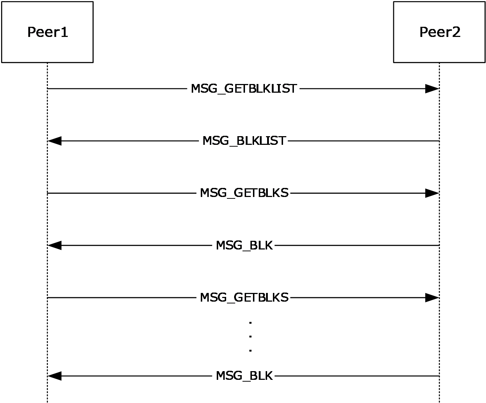

Figure 2: Download using GetBlockList and GetBlocks request/response pairs

Sequence of events:

- Peer P1 sends a **GetBlockList** message ([MSG_GETBLKLIST (section 2.2.4.2)](#Section_2.2.4.2)) to P2, specifying two [**block ranges**](#gt_block-range) of interest, one for BN0 -:- BN1 and one for BN2 -:- BN3.
- Upon receiving the **GetBlockList** message, P2 gathers the list of blocks it currently has for the [**target segment**](#gt_target-segment) S1, it intersects that with the list of needed blocks specified by P1 in the **GetBlockList** message, and it sends back to P1 a **BlockList** message ([MSG_BLKLIST (section 2.2.5.2)](#Section_2.2.5.2)) containing the set resulting from the previous intersection.
- Upon receiving the **BlockList** message from P2, P1 starts downloading blocks by sending a **GetBlocks** message ([MSG_GETBLKS (section 2.2.4.3)](#Section_2.2.4.3)) for one block at a time.
- Upon receiving the **GetBlocks** message for a given block, P2 replies with a **Block** message ([MSG_BLK (section 2.2.5.3)](#Section_2.2.5.3)) containing the actual block of data encrypted using the crypto algorithm selected locally on the server-role peer P2. The [**encryption key**](#gt_encryption-key) was previously provisioned on both P1 and P2. Refer to section [5.1](#Section_5) for the detailed requirements on encryption and [**initialization vector**](#gt_initialization-vector) generation.
The encrypted block and initialization vector are added to the **Block** message and sent back to the client-role peer. The requesting peer will be able to decrypt the data only if it knows the hash of data of the segment.

## 4.2 Simple Download with GetBlocks Download Sub-Sessions only

Scenario: Peer P1 is trying to download two consecutive blocks, BN and BN + 1, of segment S1 from peer P2.

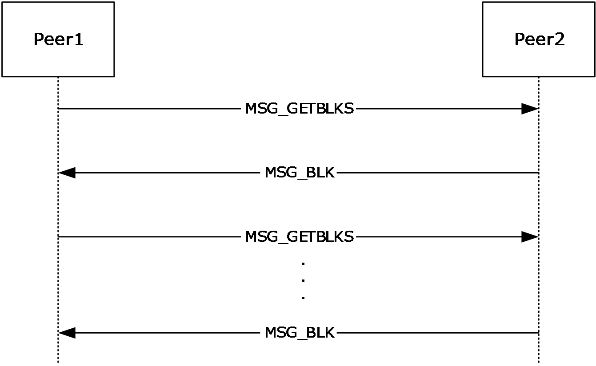

Figure 3: Simple Download using GetBlocks request/response

Sequence of events:

- Since the download involves only two blocks, P1 decides to skip the **GetBlockList** message ([MSG_GETBLKLIST (section 2.2.4.2)](#Section_2.2.4.2)). It sends a **GetBlocks** message ([MSG_GETBLKS (section 2.2.4.3)](#Section_2.2.4.3)) for BN, and later for BN+1.
- Upon receiving the **GetBlocks** message, P2 replies with a **Block** message ([MSG_BLK (section 2.2.5.3)](#Section_2.2.5.3)) containing the encrypted block of data and the [**initialization vector**](#gt_initialization-vector) used during the encryption.
- After receiving the **Block** message, P1 decrypts and stores it, then it asks for the second block by sending a new **GetBlocks** message.

# 5 Security

## 5.1 Security Considerations for Implementers

A [**higher-layer application**](#gt_higher-layer-application) provides the [**server-role peer**](#gt_server-role-peer) with the encryption algorithm, key size and the [**encryption key**](#gt_encryption-key). The choice of the encryption algorithm and key size is one of the **CryptoAlgoId** field values specified in section [2.2.3](#Section_2.2.3).

The server-role peer generates an [**initialization vector**](#gt_initialization-vector) suitable for the chosen encryption algorithm and uses the encryption key to encrypt the block using the chosen encryption algorithm. The server-role peer then records the chosen algorithm and the initialization vector in the message, as specified in section [2.2.5.3](#Section_2.2.5.3).

[**Server-role peers**](#gt_server) and [**client-role peers**](#gt_client) never exchange/share/send each other the encryption key.

The client-role peer has a priori knowledge of the encryption key. Using the encryption algorithm and initialization vector it received from the server-role peer, it decrypts the block.

There is no other explicit authentication or authorization built into the protocol, except for the Utility Index strategies specified previously that can result in denial of service to peers currently considered untrustworthy.

## 5.2 Index of Security Parameters

None.

# 6 Appendix A: Product Behavior

The information in this specification is applicable to the following Microsoft products or supplemental software. References to product versions include updates to those products.

- Windows Vista operating system
- Windows Server 2008 operating system
- Windows 7 operating system
- Windows Server 2008 R2 operating system
- Windows 8 operating system
- Windows Server 2012 operating system
- Windows 8.1 operating system
- Windows Server 2012 R2 operating system
- Windows 10 operating system
- Windows Server 2016 operating system
- Windows Server operating system
- Windows Server 2019 operating system
- Windows Server 2022 operating system
- Windows 11 operating system
- Windows Server 2025 operating system
Exceptions, if any, are noted in this section. If an update version, service pack or Knowledge Base (KB) number appears with a product name, the behavior changed in that update. The new behavior also applies to subsequent updates unless otherwise specified. If a product edition appears with the product version, behavior is different in that product edition.

Unless otherwise specified, any statement of optional behavior in this specification that is prescribed using the terms "SHOULD" or "SHOULD NOT" implies product behavior in accordance with the SHOULD or SHOULD NOT prescription. Unless otherwise specified, the term "MAY" implies that the product does not follow the prescription.

<1> Section 2: In Windows Vista and Windows Server 2008, support for the client-side elements of this protocol is available only with the optional installation of the Background Intelligent Transfer Service (BITS) (see [MC-BUP](../MC-BUP/MC-BUP.md)) via Windows Management Framework (WMF). Support for the server-side elements of this protocol is not available in Windows Vista or Windows Server 2008. For more information, see [[MSDN-BITS]](https://go.microsoft.com/fwlink/?LinkId=89959).

<2> Section 2.2.3: The MSG_NEGO_REQ message type is never sent by Windows, but it is handled by the code if received, by responding with an [MSG_NEGO_RESP (section 2.2.5.1)](#Section_2.2.5.1) message.

<3> Section 2.2.4.2: Windows by default uses SHA-256 as the hashing algorithm to generate the **SegmentID**, which corresponds to a **SegmentID** length of 32 bytes. Windows Server 2008 R2 operating system is capable of generating **SegmentIDs** using SHA-384 and SHA-512 in addition to SHA-256, but Windows that uses the Retrieval Protocol only supports **SegmentIDs** generated using SHA-256.

<4> Section 2.2.4.2: Windows normalizes the ranges in the array of block ranges in the [MSG_GETBLKLIST](#Section_2.2.4.2) and [MSG_BLKLIST](#Section_2.2.5.2) messages, using the following rules:

- Ranges in the array never overlap with each other.
- Overlapped or adjacent ranges in the array are always combined into a single range.
- Ranges in the array are always sorted by **Index**.
Windows always sends block ranges normalized with these rules but can accept non-normalized ranges in received messages.

<5> Section 2.2.4.3: Windows by default uses SHA-256 as the hashing algorithm to generate the **SegmentID**, which corresponds to a **SegmentID** length of 32 bytes. Windows Server 2008 R2 is capable of generating **SegmentIDs** using SHA-384 and SHA-512 in addition to SHA-256, but the Windows implementation of the Retrieval Protocol only supports **SegmentIDs** generated using SHA-256.

<6> Section 2.2.4.4: The **MSG_GETSEGLIST** message is not supported by Windows Vista, Windows Server 2008, Windows 7 and Windows Server 2008 R2.

<7> Section 2.2.5.2: Windows normalizes the ranges in the array of [**block ranges**](#gt_block-range) in the **MSG_GETBLKLIST** and **MSG_BLKLIST** messages, using the following rules:

- Ranges in the array never overlap with each other.
- Overlapped or adjacent ranges in the array are always combined into a single range.
- Ranges in the array are always sorted by **Index**.
Windows always sends block ranges normalized with these rules but can accept non-normalized ranges in received messages.

<8> Section 2.2.5.4: The **MSG_SEGLIST** message is not supported by Windows Vista, Windows Server 2008, Windows 7, and Windows Server 2008 R2.

<9> Section 3.1.2: Windows uses a 2 second timeout for each request message. The timeout is configurable between 1 millisecond and 1 minute.

<10> Section 3.1.4.3: Windows performs a [**simple download**](#gt_simple-download) when it involves less than 4 consecutive blocks in a single block range. When Internet Explorer is used for content retrieval, it reads into 64K buffers. Therefore, in general each read generates a [**segment retrieval session**](#gt_segment-retrieval-session) for a single block; in some cases, the read could span two blocks if it is not block aligned. This results in a simple download, and no **MSG_GETBLKLIST** is generated.

<11> Section 3.1.5.2: Windows does not perform the [**segment ID**](#gt_segment-id-hohodk) verification for any **MSG_BLKLIST** message received. Windows relies on the binding handle of the transport from which the **MSG_BLKLIST** is received to identify which request (and, implicitly, the corresponding segment ID) that the **MSG_BLKLIST** is for.

<12> Section 3.2.1: Windows [**server-role peer**](#gt_server-role-peer) by default serves up to 64 simultaneous Upload Sessions per [**serving-role peer**](#gt_server); this limit is configurable between 1 and 16,384.

<13> Section 3.2.1: Windows server-role peer by default serves up to 1,024 simultaneous Upload Sessions per [**hosted cache**](#gt_hosted-cache) server; this limit is configurable between 1 and 4,294,967,295.

<14> Section 3.2.2: Windows uses a 15 second timeout for each incoming request. The timeout value is configurable between 100 milliseconds and 1 hour.

# 7 Change Tracking

This section identifies changes that were made to this document since the last release. Changes are classified as Major, Minor, or None.

The revision class **Major** means that the technical content in the document was significantly revised. Major changes affect protocol interoperability or implementation. Examples of major changes are:

- A document revision that incorporates changes to interoperability requirements.
- A document revision that captures changes to protocol functionality.
The revision class **Minor** means that the meaning of the technical content was clarified. Minor changes do not affect protocol interoperability or implementation. Examples of minor changes are updates to clarify ambiguity at the sentence, paragraph, or table level.

The revision class **None** means that no new technical changes were introduced. Minor editorial and formatting changes may have been made, but the relevant technical content is identical to the last released version.

The changes made to this document are listed in the following table. For more information, please contact [dochelp@microsoft.com](mailto:dochelp@microsoft.com).

| Section | Description | Revision class |
| --- | --- | --- |
| [6](#Section_6) Appendix A: Product Behavior | Added Windows Server 2025 to the list of applicable products. | Major |

## Revision History

| Date | Version | Revision Class | Comments |
| --- | --- | --- | --- |
| 12/5/2008 | 0.1 | Major | Initial Availability |
| 1/16/2009 | 0.1.1 | Editorial | Changed language and formatting in the technical content. |
| 2/27/2009 | 0.1.2 | Editorial | Changed language and formatting in the technical content. |
| 4/10/2009 | 0.2 | Minor | Clarified the meaning of the technical content. |
| 5/22/2009 | 1.0 | Major | Updated and revised the technical content. |
| 7/2/2009 | 1.1 | Minor | Clarified the meaning of the technical content. |
| 8/14/2009 | 2.0 | Major | Updated and revised the technical content. |
| 9/25/2009 | 2.1 | Minor | Clarified the meaning of the technical content. |
| 11/6/2009 | 2.2 | Minor | Clarified the meaning of the technical content. |
| 12/18/2009 | 2.2.1 | Editorial | Changed language and formatting in the technical content. |
| 1/29/2010 | 2.3 | Minor | Clarified the meaning of the technical content. |
| 3/12/2010 | 2.3.1 | Editorial | Changed language and formatting in the technical content. |
| 4/23/2010 | 2.4 | Minor | Clarified the meaning of the technical content. |
| 6/4/2010 | 3.0 | Major | Updated and revised the technical content. |
| 7/16/2010 | 3.0 | None | No changes to the meaning, language, or formatting of the technical content. |
| 8/27/2010 | 3.0 | None | No changes to the meaning, language, or formatting of the technical content. |
| 10/8/2010 | 3.0 | None | No changes to the meaning, language, or formatting of the technical content. |
| 11/19/2010 | 3.0 | None | No changes to the meaning, language, or formatting of the technical content. |
| 1/7/2011 | 3.0 | None | No changes to the meaning, language, or formatting of the technical content. |
| 2/11/2011 | 3.0 | None | No changes to the meaning, language, or formatting of the technical content. |
| 3/25/2011 | 3.0 | None | No changes to the meaning, language, or formatting of the technical content. |
| 5/6/2011 | 3.0 | None | No changes to the meaning, language, or formatting of the technical content. |
| 6/17/2011 | 3.1 | Minor | Clarified the meaning of the technical content. |
| 9/23/2011 | 3.1 | None | No changes to the meaning, language, or formatting of the technical content. |
| 12/16/2011 | 4.0 | Major | Updated and revised the technical content. |
| 3/30/2012 | 5.0 | Major | Updated and revised the technical content. |
| 7/12/2012 | 6.0 | Major | Updated and revised the technical content. |
| 10/25/2012 | 7.0 | Major | Updated and revised the technical content. |
| 1/31/2013 | 7.0 | None | No changes to the meaning, language, or formatting of the technical content. |
| 8/8/2013 | 8.0 | Major | Updated and revised the technical content. |
| 11/14/2013 | 8.0 | None | No changes to the meaning, language, or formatting of the technical content. |
| 2/13/2014 | 9.0 | Major | Updated and revised the technical content. |
| 5/15/2014 | 9.0 | None | No changes to the meaning, language, or formatting of the technical content. |
| 6/30/2015 | 10.0 | Major | Significantly changed the technical content. |
| 10/16/2015 | 10.0 | None | No changes to the meaning, language, or formatting of the technical content. |
| 7/14/2016 | 10.0 | None | No changes to the meaning, language, or formatting of the technical content. |
| 6/1/2017 | 10.0 | None | No changes to the meaning, language, or formatting of the technical content. |
| 9/15/2017 | 11.0 | Major | Significantly changed the technical content. |
| 9/12/2018 | 12.0 | Major | Significantly changed the technical content. |
| 4/7/2021 | 13.0 | Major | Significantly changed the technical content. |
| 6/25/2021 | 14.0 | Major | Significantly changed the technical content. |
| 4/23/2024 | 15.0 | Major | Significantly changed the technical content. |
