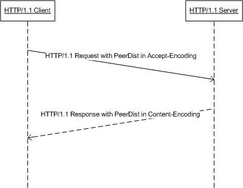

# [MS-PCCRTP]: Peer Content Caching and Retrieval: Hypertext Transfer Protocol (HTTP) Extensions

Table of Contents

1 Introduction

- [1 Introduction](#Section_1)
  - [1.1 Glossary](#Section_1.1)
  - [1.2 References](#Section_1.2)
    - [1.2.1 Normative References](#Section_1.2.1)
    - [1.2.2 Informative References](#Section_1.2.2)
  - [1.3 Overview](#Section_1.3)
  - [1.4 Relationship to Other Protocols](#Section_1.4)
  - [1.5 Prerequisites/Preconditions](#Section_1.5)
  - [1.6 Applicability Statement](#Section_1.6)
  - [1.7 Versioning and Capability Negotiation](#Section_1.7)
  - [1.8 Vendor-Extensible Fields](#Section_1.8)
  - [1.9 Standards Assignments](#Section_1.9)

2 Messages

- [2 Messages](#Section_2)
  - [2.1 Transport](#Section_2.1)
  - [2.2 Message Syntax](#Section_2.2)

3 Protocol Details

- [3 Protocol Details](#Section_3)
  - [3.1 HTTP/1.1 Client Details](#Section_3.1)
    - [3.1.1 Abstract Data Model](#Section_3.1.1)
    - [3.1.2 Timers](#Section_3.1.2)
    - [3.1.3 Initialization](#Section_3.1.3)
    - [3.1.4 Higher-Layer Triggered Events](#Section_3.1.4)
    - [3.1.5 Message Processing Events and Sequencing Rules](#Section_3.1.5)
      - [3.1.5.1 Receiving a Response of a PeerDist-Supporting Request](#Section_3.1.5.1)
    - [3.1.6 Timer Events](#Section_3.1.6)
    - [3.1.7 Other Local Events](#Section_3.1.7)
  - [3.2 HTTP/1.1 Server Details](#Section_3.2)
    - [3.2.1 Abstract Data Model](#Section_3.2.1)
    - [3.2.2 Timers](#Section_3.2.2)
    - [3.2.3 Initialization](#Section_3.2.3)
    - [3.2.4 Higher-Layer Triggered Events](#Section_3.2.4)
    - [3.2.5 Message Processing Events and Sequencing Rules](#Section_3.2.5)
      - [3.2.5.1 Receiving a PeerDist-Supporting Request](#Section_3.2.5.1)
    - [3.2.6 Timer Events](#Section_3.2.6)
    - [3.2.7 Other Local Events](#Section_3.2.7)

4 Protocol Examples

- [4 Protocol Examples](#Section_4)

5 Security

- [5 Security](#Section_5)
  - [5.1 Security Considerations for Implementers](#Section_5.1)
  - [5.2 Index of Security Parameters](#Section_5.2)

6 Appendix A: Product Behavior

- [6 Appendix A: Product Behavior](#Section_6)

7 Change Tracking

- [7 Change Tracking](#Section_7)

For the legal notice and IP terms, see [LEGAL.md](../LEGAL.md).
Last updated: 4/23/2024.
See [Revision History](#revision-history) for full version history.

# 1 Introduction

The Peer Content Caching and Retrieval: HTTP Extensions Protocol is a set of extensions to the Hypertext Transfer Protocol (HTTP) 1.1 that allows an HTTP/1.1 client and an HTTP/1.1 server to encode content using PeerDist Content Encoding. This encoding enables the client to participate in peer content caching and retrieval. PeerDist Content Encoding is utilized by the Peer Content Caching and Retrieval service framework to allow the client to discover and download content from peer content servers.

The Peer Content Caching and Retrieval Framework is a content caching and retrieval framework based on a peer-to-peer discovery and distribution model. The framework is designed to reduce bandwidth consumption on branch-office wide-area-network (WAN) links by having clients retrieve content from distributed caches, when distributed caches are available, rather than from the content servers, which are often located remotely from branch offices over the WAN links. The peers themselves act as caches from which they serve other requesting peers. The main benefit is to reduce operation costs by reducing WAN link utilization, while providing faster downloads from the local area network (LAN) in the branch office. The framework also supports the mode of using pre-provisioned hosted caches in place of peer-based caching.

Sections 1.5, 1.8, 1.9, 2, and 3 of this specification are normative. All other sections and examples in this specification are informative.

## 1.1 Glossary

This document uses the following terms:

**client**: For the Peer Content Caching and Retrieval Framework, a client is a client-role peer; that is, a peer that is searching for content, either from the server or from other peers or hosted cashes. In the context of the Retrieval Protocol, a client is a peer that requests a block-range from a server_role_peer. It acts as a Web Services Dynamic Discovery (WS-Discovery) [[WS-Discovery]](https://go.microsoft.com/fwlink/?LinkId=90576) client.

**client/server mode**: A mode that consists of one server with many client connections (one-to-many). From the perspective of each client, there is only one connection: the connection to the server.

**hash**: A hash, such as SHA-1, on the content or content block.

**HTTP client**: A program that establishes connections for the purpose of sending requests, as specified in [[RFC2616]](https://go.microsoft.com/fwlink/?LinkId=90372).

**Hypertext Transfer Protocol (HTTP)**: An application-level protocol for distributed, collaborative, hypermedia information systems (text, graphic images, sound, video, and other multimedia files) on the World Wide Web.

**Hypertext Transfer Protocol 1.1 (HTTP/1.1)**: Version 1.1 of the Hypertext Transfer Protocol (HTTP), as described in [[RFC2068]](https://go.microsoft.com/fwlink/?LinkId=90310).

**peer**: An instance of the Retrieval Protocol for the Peer Content Caching and Retrieval Framework running on a host. A peer can be both a client and a server in the Retrieval Protocol operations.

**PeerDist Content Encoding**: A way of presenting an [**HTTP**](#gt_hypertext-transfer-protocol-http) entity-body (defined in [RFC2616]) through its metadata, in the form of a Content Information Data Structure, as defined in [MS-PCCRC](../MS-PCCRC/MS-PCCRC.md) section 2.3, which is derived from the content using algorithms described in [MS-PCCRC] sections 2.1 and 2.2.

**server**: For the Peer Content Caching and Retrieval Framework, a server is a server-role peer; that is, a peer that listens for incoming block-range requests from client-role peers and responds to the requests.

**Transmission Control Protocol (TCP)**: A protocol used with the Internet Protocol (IP) to send data in the form of message units between computers over the Internet. TCP handles keeping track of the individual units of data (called packets) that a message is divided into for efficient routing through the Internet.

**MAY, SHOULD, MUST, SHOULD NOT, MUST NOT:** These terms (in all caps) are used as defined in [[RFC2119]](https://go.microsoft.com/fwlink/?LinkId=90317). All statements of optional behavior use either MAY, SHOULD, or SHOULD NOT.

## 1.2 References

Links to a document in the Microsoft Open Specifications library point to the correct section in the most recently published version of the referenced document. However, because individual documents in the library are not updated at the same time, the section numbers in the documents may not match. You can confirm the correct section numbering by checking the [Errata](https://go.microsoft.com/fwlink/?linkid=850906).

### 1.2.1 Normative References

We conduct frequent surveys of the normative references to assure their continued availability. If you have any issue with finding a normative reference, please contact [dochelp@microsoft.com](mailto:dochelp@microsoft.com). We will assist you in finding the relevant information.

[MS-PCCRC] Microsoft Corporation, "[Peer Content Caching and Retrieval: Content Identification](../MS-PCCRC/MS-PCCRC.md)".

[RFC2119] Bradner, S., "Key words for use in RFCs to Indicate Requirement Levels", BCP 14, RFC 2119, March 1997, [https://www.rfc-editor.org/info/rfc2119](https://go.microsoft.com/fwlink/?LinkId=90317)

[RFC2616] Fielding, R., Gettys, J., Mogul, J., et al., "Hypertext Transfer Protocol -- HTTP/1.1", RFC 2616, June 1999, [https://www.rfc-editor.org/info/rfc2616](https://go.microsoft.com/fwlink/?LinkId=90372)

[RFC793] Postel, J., Ed., "Transmission Control Protocol: DARPA Internet Program Protocol Specification", RFC 793, September 1981, [https://www.rfc-editor.org/info/rfc793](https://go.microsoft.com/fwlink/?LinkId=150872)

### 1.2.2 Informative References

[MC-BUP] Microsoft Corporation, "[Background Intelligent Transfer Service (BITS) Upload Protocol](../MC-BUP/MC-BUP.md)".

[MSDN-BITS] Microsoft Corporation, "Background Intelligent Transfer Service", [http://msdn.microsoft.com/en-us/library/bb968799(VS.85).aspx](https://go.microsoft.com/fwlink/?LinkId=89959)

## 1.3 Overview

Peer Content Caching and Retrieval: HTTP Extensions specify [**PeerDist Content Encoding**](#gt_peerdist-content-encoding) used in [**HTTP/1.1**](#gt_hypertext-transfer-protocol-11-http11), a [**client/server**](#gt_a907c749-671d-466b-b589-8c6dea31403f)-based protocol. The purpose of PeerDist content encoding is to enable [**peer**](#gt_peer) content caching and retrieval in HTTP/1.1, which allows an [**HTTP client**](#gt_http-client) to participate in the peer content caching and retrieval process.

Upon detecting PeerDist encoding support from a client, an HTTP/1.1 [**server**](#gt_server) that supports peer content caching can send a PeerDist-encoded response. The message body (that is, an encoded entity body) of such a response takes the form of the Content Information Data Structure as specified in [MS-PCCRC](../MS-PCCRC/MS-PCCRC.md) section 2.3, constructed for the requested content using the algorithms described in [MS-PCCRC] sections 2.1 and 2.2. To receive a PeerDist-encoded response allows an HTTP/1.1 client to use the information present in the response to discover and download content from peers.

A typical PeerDist-encoded response is orders of magnitude smaller than a response that is not PeerDist encoded; the actual content transfer occurs between peers. Thus, PeerDist content encoding can reduce the burden of distributing the content from the HTTP/1.1 server.

A sequence diagram describing the communication between an HTTP/1.1 client and the HTTP/1.1 server is shown following.

Figure 1: Sequence diagram describing the communication between the HTTP/1.1 client and the HTTP/1.1 server

## 1.4 Relationship to Other Protocols

The [**PeerDist Content Encoding**](#gt_peerdist-content-encoding) defined in this document is intended to be used for HTTP/1.1.

The PeerDist content encoding is used by [**clients**](#gt_client) and [**servers**](#gt_server) that are capable of participating in peer content caching and retrieval.

The PeerDist content encoding uses the **Content Information Data Structure** defined in [MS-PCCRC](../MS-PCCRC/MS-PCCRC.md) section 2.3.

## 1.5 Prerequisites/Preconditions

None.

## 1.6 Applicability Statement

Advertising [**PeerDist Content Encoding**](#gt_peerdist-content-encoding) capability is applicable for an HTTP/1.0 client or [**HTTP/1.1**](#gt_hypertext-transfer-protocol-11-http11) client (only) if it is able to participate in peer content caching and retrieval.<1>

Using PeerDist content encoding is applicable for an HTTP/1.1 server (only) when communicating to an HTTP/1.1 client that has advertised its capability to participate in peer content caching and retrieval.

## 1.7 Versioning and Capability Negotiation

The [**PeerDist Content Encoding**](#gt_peerdist-content-encoding) defined in this document uses a version parameter that the [**HTTP/1.1**](#gt_hypertext-transfer-protocol-11-http11) [**client**](#gt_client) sets to specify the maximum version of PeerDist content encoding that the client supports.<2>

The PeerDist content encoding defined in this document uses a version parameter that the HTTP/1.1 [**server**](#gt_server) sets to specify the version of PeerDist content encoding that is used for the HTTP response.<3>

## 1.8 Vendor-Extensible Fields

None.

## 1.9 Standards Assignments

None.

# 2 Messages

## 2.1 Transport

This document defines [**PeerDist**](#gt_peerdist-content-encoding), a new content encoding that can be used in HTTP/1.1. HTTP/1.1 is the transport for all messages used by the PeerDist Content Encoding.

## 2.2 Message Syntax

[**HTTP/1.1**](#gt_hypertext-transfer-protocol-11-http11) [[RFC2616]](https://go.microsoft.com/fwlink/?LinkId=90372) defines the syntax of HTTP/1.1 messages.

This document defines a new content encoding value, namely [**PeerDist**](#gt_peerdist-content-encoding). The PeerDist content encoding value can be specified in the **Accept-Encoding** and **Content-Encoding** header fields, as shown in the following examples.

Accept-Encoding: gzip, deflate, peerdist

Content-Encoding: peerdist

**Accept-Encoding**: The HTTP header that defines the type of content coding, as specified in [RFC2616] section 3.5, that the [**client**](#gt_client) will accept from the [**server**](#gt_server) as part of the HTTP response. See [RFC2616] section 14.3 for details.

**Content-Encoding**: The HTTP header that defines the types of content coding that have been applied to the HTTP **entity-body**, as specified in [RFC2616] section 1.3. See [RFC2616] section 14.11 for details.

In addition, this document also defines two new **extension-header** field values. The syntax of these header field values is described as follows.

extension-header = X-P2P-PeerDist

X-P2P-PeerDist = "X-P2P-PeerDist" ":" peerdist-params

X-P2P-PeerDistEx = "X-P2P-PeerDistEx" ":" peerdistex-params

The **X-P2P-PeerDist** and **X-P2P-PeerDistEx extension-header** fields can appear in both requests and responses. The purpose of these header fields is to carry additional parameters when the PeerDist content encoding is used.

peerdist-params = 1#( version | [content-len] | [missing-data-request] )

version = "Version" "=" major-version "." minor-version

major-version = 1*DIGIT

minor-version = 1*DIGIT

Note that there can be no spaces between major-version and "." as well as "." and minor-version. The major and minor versions MUST be considered as separate multidigit numbers. Thus, version 1.23 is higher than version 1.3.

The *Version* parameter is used by the HTTP/1.1 client to specify the maximum version of PeerDist content encoding that the client supports. The *Version* parameter is used by the HTTP/1.1 server to specify the version of PeerDist content encoding that was used for the response.

content-len = "ContentLength" "=" 1*DIGIT

The *content-len* parameter contains the length of the **entity-body**, defined in [RFC2616] section 1.3, in octets, before the PeerDist content encoding is applied to it.

The *missing-data-request* parameter is used by the HTTP/1.1 client and is set to true to indicate to the server that the client is sending the request because it was unable to retrieve data from its peers. This parameter MUST NOT be specified when the PeerDist content encoding is specified in the **Accept-Encoding** header field value.

missing-data-request = "MissingDataRequest" "=" ( "true" )

The *peerdistex-params* parameter is used by the HTTP/1.1 client to indicate to the server which versions of the PeerDist **Content Information** Data Structure, as specified in [MS-PCCRC](../MS-PCCRC/MS-PCCRC.md) section 2.3, the client supports. *MinContentInformation* is always equal to 1.0 and indicates support for version 1.0 of the PeerDist **Content Information Data Structure**. If *MaxContentInformation* is set to 1.0, then the client only supports version 1.0 of the PeerDist **Content Information Data Structure**, but if *MaxContentInformation* is set to 2.0, then the client also supports version 2.0 of the PeerDist **Content Information Data Structure**.

peerdistex-params = 1#( "MinContentInformation=1.0, MaxContentInformation=" ( "1.0" | "2.0" ) | [make-hash-request] | [hash-request] )

The *make-hash-request* parameter is used by the HTTP/1.1 server to indicate to the client to make a [**hash**](#gt_hash) request for the content that the client requested because the hashes were not available with the server at the time of the request.

make-hash-request = ", MakeHashRequest" "=" ( "true" )

The *hash-request* parameter is used by the HTTP/1.1 client to indicate to the server that this is a hash request for the content which the client previously requested. This parameter is used in a hash request to the server when the server sends a data response with the **MakeHashRequest** field set to true.

hash-request = ", HashRequest" "=" ( "true" )

# 3 Protocol Details

## 3.1 HTTP/1.1 Client Details

### 3.1.1 Abstract Data Model

None.

### 3.1.2 Timers

None.

### 3.1.3 Initialization

None.

### 3.1.4 Higher-Layer Triggered Events

An HTTP/1.0 or an HTTP/1.1 client MAY<4> include the [**PeerDist**](#gt_peerdist-content-encoding) content encoding in its **Accept-Encoding** header field value of its [**HTTP**](#gt_hypertext-transfer-protocol-http) request that it sends, as shown in the following example.

Accept-Encoding: gzip, deflate, peerdist

If the client chooses to use the PeerDist content encoding for an HTTP request, the client MUST also include the PeerDist parameters header field in the same HTTP request. As shown in the following example, the PeerDist parameters header field MUST contain the *Version* parameter containing the highest version of the PeerDist content encoding that the client supports.

X-P2P-PeerDist: Version=1.0

If the PeerDist parameters header field contains a *Version* parameter equal to 1.1, then the client MUST also include a PeerDistEx parameters header field which MUST include *MinContentInformation* and *MaxContentInformation* parameters indicating the minimum and maximum version of the PeerDist Content Information structure that the client supports.

X-P2P-PeerDistEx: MinContentInformation=1.0, MaxContentInformation=2.0

### 3.1.5 Message Processing Events and Sequencing Rules

#### 3.1.5.1 Receiving a Response of a PeerDist-Supporting Request

When an HTTP/1.1 client sends an HTTP request with the [**PeerDist**](#gt_peerdist-content-encoding) content encoding listed in its **Accept-Encoding** header, the HTTP/1.1 server MAY send an HTTP response with a **Connection** header field with a value of "close". When an HTTP/1.1 client receives such a response, it SHOULD close the underlying [**TCP**](#gt_transmission-control-protocol-tcp) connection gracefully by sending TCP header with the FIN control flag set instead of the RST control flag, as specified in in [[RFC793]](https://go.microsoft.com/fwlink/?LinkId=150872) section 3.1.

If the response from the server contains a **PeerDistEx** parameters header field with *MakeHashRequest* set to true, then the client SHOULD make a [**hash**](#gt_hash) request to the server and include the **PeerDistEx** parameters header field with *HashRequest* set to true.

X-P2P-PeerDistEx: MinContentInformation=1.0, MaxContentInformation=2.0, HashRequest=true

### 3.1.6 Timer Events

None.

### 3.1.7 Other Local Events

None.

## 3.2 HTTP/1.1 Server Details

When the [**HTTP/1.1**](#gt_hypertext-transfer-protocol-11-http11) request indicates that the client supports the [**PeerDist**](#gt_peerdist-content-encoding) content encoding, then if the response contains an **ETag** header field, a **Last-Modified** header field, or both header fields, the HTTP/1.1 server MAY<5> use the PeerDist content encoding. [[RFC2616]](https://go.microsoft.com/fwlink/?LinkId=90372) section 14.11 defines content encoding usage.

The HTTP/1.1 server MAY use the PeerDist content encoding in its response to an HTTP/1.0 request if the HTTP/1.0 request includes an **Accept-Encoding** header field containing PeerDist.

### 3.2.1 Abstract Data Model

None.

### 3.2.2 Timers

None.

### 3.2.3 Initialization

None.

### 3.2.4 Higher-Layer Triggered Events

None.

### 3.2.5 Message Processing Events and Sequencing Rules

The server constructs, for the requested content, a **Content Information Data Structure** defined in [MS-PCCRC](../MS-PCCRC/MS-PCCRC.md) section 2.3 using the algorithms described in [MS-PCCRC] sections 2.1 and 2.2 and places such a structure in the response message as an encoded entity body.

#### 3.2.5.1 Receiving a PeerDist-Supporting Request

If the HTTP/1.1 server uses the PeerDist content encoding for its response, then the server MUST construct for the requested content, a **Content Information Data Structure** as specified in [MS-PCCRC](../MS-PCCRC/MS-PCCRC.md) section 2.3, using the algorithms described in [MS-PCCRC] sections 2.1 and 2.2, and place such a structure in the response message as an encoded **entity-body**.

If the **X-P2P-PeerDistEx** header is present, the server MUST generate and respond with a **Content Information Data Structure** whose version falls within the range specified by the *MinContentInformation* and *MaxContentInformation* parameters. If the values of *MinContentInformation* and *MaxContentInformation* do not fall within the range specified in section [2.2](#Section_2.2), the server MUST not generate and respond with a **Content Information Data Structure**, and MUST respond with another client-supported encoding as defined in [[RFC2616]](https://go.microsoft.com/fwlink/?LinkId=90372). If no **X-P2P-PeerDistEx** extension header was present, then the server MUST respond with a version 1.0 **Content Information Data Structure**.

It MUST also include the PeerDist parameters header field in the response. The PeerDist parameters header field MUST contain the *Version* parameter containing the version of the PeerDist content encoding used in the response. As shown in the following example, the PeerDist parameters header field MUST also contain the *ContentLength* parameter specifying the content length of the response **entity-body** before the PeerDist content encoding has been applied to it.

Content-Encoding: PeerDist

X-P2P-PeerDist: Version=1.0, ContentLength=102400

If the HTTP/1.1 server sends a PeerDist-encoded response **entity-body**, it MUST encode the **entity-body** into segments and blocks as specified in [MS-PCCRC] section 2, and then use that encoding to construct a **Content Information Data Structure**, as specified in [MS-PCCRC] section 2.3. It MUST then use this latter data structure as the PeerDist-encoded response **entity-body**.

If the HTTP/1.1 server does not have the **Content Information Data Structure** available for the content requested by the client, for such reasons as this is the first request for the content, then the server SHOULD send a response containing the original content and add the **X-P2P-PeerDistEx** header with *MakeHashRequest* set to true. This indicates to the client to make an additional request for the content hashes.

The HTTP/1.1 server MAY<6> choose to use the algorithms and data structures defined in [MS-PCCRC] on the response **entity-body** before sending it to the HTTP/1.1 client. Furthermore, it MAY<7> send the **Connection** header field with a value of "close" to require the HTTP/1.1 client not to use the same connection for future HTTP requests. The HTTP/1.1 server SHOULD NOT<8> send the **Connection** header field in its response if the HTTP/1.1 client is known to be unable to handle the **Connection** header field gracefully, as specified in section [3.1.5.1](../MS-PCCRC/MS-PCCRC.md).

### 3.2.6 Timer Events

None.

### 3.2.7 Other Local Events

None.

# 4 Protocol Examples

When the [**HTTP**](#gt_hypertext-transfer-protocol-http) [**client**](#gt_client) uses the [**PeerDist Content Encoding**](#gt_peerdist-content-encoding), it specifies PeerDist in the **Accept-Encoding** header field, as shown in the following example.

GET /index.html HTTP/1.1

Host: www.hostname.com

Accept: */*

Accept-Language: en-US

Accept-Encoding: gzip, deflate, peerdist

X-P2P-PeerDist: Version=1.1

X-P2P-PeerDistEx: MinContentInformation=1.0, MaxContentInformation=1.0

User-Agent: Mozilla/4.0

In this example, the HTTP client announces that it is ready to accept the response **entity-body** that is encoded using the PeerDist content encoding. It also declares the version of the PeerDist content encoding for which it is configured, as well as the minimum and maximum **Content Information Data Structure** versions it supports.

If the server sends the HTTP response **entity-body** encoded with PeerDist content coding, then it will set the **Content-Encoding** header field value to peerdist as shown in the following example.

HTTP/1.1 200 OK

Content-Type: text/html

Content-Encoding: peerdist

Content-Length: 198

Last-Modified: Fri, 01 Aug 2008 01:02:03 GMT

Accept-Ranges: bytes

ETag: "8d2babfc81f3c81"

Server: Microsoft-IIS/7.0

X-P2P-PeerDist: Version=1.1, ContentLength=184946

Date: Fri, 01 Aug 2008 10:20:30 GMT

...198 bytes of PeerDist Content Information...

In this response, the server indicates that the content is encoded using the PeerDist content encoding. The server used version 1.0 of the PeerDist content encoding. The server could not generate version 2.0 of the PeerDist content encoding because the client specified a *MaxContentInformation* parameter equal to 1.0. Had the client specified a *MaxContentInformation* parameter equal to 2.0, then the server could have chosen to respond with version 2.0 of the PeerDist content encoding. The server also includes the content length of the **entity-body** when it is encoded using the identity content coding. In other words, the **Content-Length** header field would have had the value 184946 if the **Content-Encoding** header was either missing or specified "identity" as defined in [[RFC2616]](https://go.microsoft.com/fwlink/?LinkId=90372).

If the server does not have the **Content Information Data Structure** at the time of the request, the server responds with the original content and includes the **X-P2P-PeerDistEx** header with *MakeHashRequest* set to true as shown in the following example.

HTTP/1.1 200 OK

Content-Length: 184946

Content-Type: image/png

Last-Modified: Thu, 31 Mar 2011 20:17:35 GMT

Accept-Ranges: bytes

ETag: "c184b9ace0efcb1:0"

Server: Microsoft-IIS/8.0

X-P2P-PeerDist: Version=1.1

X-P2P-PeerDistEx: MakeHashRequest=true

In response to the previous message, the client sends a [**hash**](#gt_hash) request with the **X-P2P-PeerDistEx** header and *HashRequest* set to true as shown in the following example.

GET /welcome.png HTTP/1.1

Host: www.example.com

X-P2P-PeerDist: Version=1.1

X-P2P-PeerDistEx: MinContentInformation=1.0, MaxContentInformation=2.0, HashRequest=true

# 5 Security

## 5.1 Security Considerations for Implementers

None.

## 5.2 Index of Security Parameters

None.

# 6 Appendix A: Product Behavior

The information in this specification is applicable to the following Microsoft products or supplemental software. References to product versions include updates to those products.

- Windows Vista operating system
- Windows Server 2008 operating system
- Windows 7 operating system
- Windows Server 2008 R2 operating system
- Windows 8 operating system
- Windows Server 2012 operating system
- Windows 8.1 operating system
- Windows Server 2012 R2 operating system
- Windows 10 operating system
- Windows Server 2016 operating system
- Windows Server operating system
- Windows Server 2019 operating system
- Windows Server 2022 operating system
- Windows 11 operating system
- Windows Server 2025 operating system
Exceptions, if any, are noted in this section. If an update version, service pack or Knowledge Base (KB) number appears with a product name, the behavior changed in that update. The new behavior also applies to subsequent updates unless otherwise specified. If a product edition appears with the product version, behavior is different in that product edition.

Unless otherwise specified, any statement of optional behavior in this specification that is prescribed using the terms "SHOULD" or "SHOULD NOT" implies product behavior in accordance with the SHOULD or SHOULD NOT prescription. Unless otherwise specified, the term "MAY" implies that the product does not follow the prescription.

<1> Section 1.6: In Windows Vista and Windows Server 2008, support for the client-side elements of this protocol is available only with the optional installation of the Background Intelligent Transfer Service (BITS) (see [MC-BUP](../MC-BUP/MC-BUP.md)) via Windows Management Framework (WMF). Support for the server-side elements of this protocol is not available for Windows Vista or Windows Server 2008. For more information, see [[MSDN-BITS]](https://go.microsoft.com/fwlink/?LinkId=89959).

<2> Section 1.7: In Windows HTTP/1.1 clients set the PeerDist version parameter to 1.1 except for clients in Windows Vista, Windows Server 2008, Windows 7, and Windows Server 2008 R2 that set the PeerDist version parameter to 1.0.

<3> Section 1.7: In Windows Server 2008 R2 HTTP/1.1 servers set the PeerDist version parameter to 1.0. Otherwise, in applicable Windows Server releases HTTP/1.1 servers set the PeerDist version parameter to 1.1 when responding to a client that specified a PeerDist version parameter equal to 1.1 and set the PeerDist version parameter to 1.0 when replying to a client that specified a PeerDist version parameter equal to 1.0.

<4> Section 3.1.4: In Windows HTTP/1.0 and HTTP/1.1 clients use the PeerDist content encoding for GET requests only.

<5> Section 3.2: In applicable Windows Server releases, the HTTP/1.1 server sends a PeerDist-encoded response.

<6> Section 3.2.5.1: In Windows Server 2008 R2 the HTTP/1.1 server uses the algorithms and data structures defined in [MS-PCCRC](../MS-PCCRC/MS-PCCRC.md) protocol to generate the PeerDist **Content Information** only when it receives an HTTP/1.1 request. The server runs the algorithms asynchronously, and therefore it does not use the PeerDist encoding for the response to the request that triggered the execution of the algorithms. Similarly, the server does not use the PeerDist encoding for any HTTP/1.1 requests for the same content that are received during the execution of the algorithms on that content. However, after the algorithms have completed and the PeerDist Content Information has been generated for that content, the server will respond to requests for the same content with the PeerDist **Content Information** for that content.

<7> Section 3.2.5.1: In Windows Server 2008 R2 the HTTP/1.1 server sends the **Connection** header field with a value of "close" if the HTTP request is a range retrieval request, and the total length of the full **entity-body** is greater than 1 megabyte.

<8> Section 3.2.5.1: In Windows Server 2008 R2 the HTTP/1.1 server does not send the **Connection** header field with a value of "close" if the HTTP/1.1 client is "Microsoft BITS".

# 7 Change Tracking

This section identifies changes that were made to this document since the last release. Changes are classified as Major, Minor, or None.

The revision class **Major** means that the technical content in the document was significantly revised. Major changes affect protocol interoperability or implementation. Examples of major changes are:

- A document revision that incorporates changes to interoperability requirements.
- A document revision that captures changes to protocol functionality.
The revision class **Minor** means that the meaning of the technical content was clarified. Minor changes do not affect protocol interoperability or implementation. Examples of minor changes are updates to clarify ambiguity at the sentence, paragraph, or table level.

The revision class **None** means that no new technical changes were introduced. Minor editorial and formatting changes may have been made, but the relevant technical content is identical to the last released version.

The changes made to this document are listed in the following table. For more information, please contact [dochelp@microsoft.com](mailto:dochelp@microsoft.com).

| Section | Description | Revision class |
| --- | --- | --- |
| [6](#Section_6) Appendix A: Product Behavior | Added Windows Server 2025 to the list of applicable products. | Major |

## Revision History

| Date | Version | Revision Class | Comments |
| --- | --- | --- | --- |
| 12/5/2008 | 0.1 | Major | Initial Availability |
| 1/16/2009 | 0.1.1 | Editorial | Changed language and formatting in the technical content. |
| 2/27/2009 | 0.1.2 | Editorial | Changed language and formatting in the technical content. |
| 4/10/2009 | 0.1.3 | Editorial | Changed language and formatting in the technical content. |
| 5/22/2009 | 0.2 | Minor | Clarified the meaning of the technical content. |
| 7/2/2009 | 1.0 | Major | Updated and revised the technical content. |
| 8/14/2009 | 2.0 | Major | Updated and revised the technical content. |
| 9/25/2009 | 3.0 | Major | Updated and revised the technical content. |
| 11/6/2009 | 4.0 | Major | Updated and revised the technical content. |
| 12/18/2009 | 4.1 | Minor | Clarified the meaning of the technical content. |
| 1/29/2010 | 4.1.1 | Editorial | Changed language and formatting in the technical content. |
| 3/12/2010 | 4.1.2 | Editorial | Changed language and formatting in the technical content. |
| 4/23/2010 | 4.1.3 | Editorial | Changed language and formatting in the technical content. |
| 6/4/2010 | 4.1.4 | Editorial | Changed language and formatting in the technical content. |
| 7/16/2010 | 4.1.4 | None | No changes to the meaning, language, or formatting of the technical content. |
| 8/27/2010 | 4.1.4 | None | No changes to the meaning, language, or formatting of the technical content. |
| 10/8/2010 | 4.1.4 | None | No changes to the meaning, language, or formatting of the technical content. |
| 11/19/2010 | 4.1.4 | None | No changes to the meaning, language, or formatting of the technical content. |
| 1/7/2011 | 4.1.4 | None | No changes to the meaning, language, or formatting of the technical content. |
| 2/11/2011 | 4.1.4 | None | No changes to the meaning, language, or formatting of the technical content. |
| 3/25/2011 | 4.1.4 | None | No changes to the meaning, language, or formatting of the technical content. |
| 5/6/2011 | 4.1.4 | None | No changes to the meaning, language, or formatting of the technical content. |
| 6/17/2011 | 4.2 | Minor | Clarified the meaning of the technical content. |
| 9/23/2011 | 4.3 | Minor | Clarified the meaning of the technical content. |
| 12/16/2011 | 5.0 | Major | Updated and revised the technical content. |
| 3/30/2012 | 5.0 | None | No changes to the meaning, language, or formatting of the technical content. |
| 7/12/2012 | 5.0 | None | No changes to the meaning, language, or formatting of the technical content. |
| 10/25/2012 | 6.0 | Major | Updated and revised the technical content. |
| 1/31/2013 | 6.0 | None | No changes to the meaning, language, or formatting of the technical content. |
| 8/8/2013 | 7.0 | Major | Updated and revised the technical content. |
| 11/14/2013 | 7.0 | None | No changes to the meaning, language, or formatting of the technical content. |
| 2/13/2014 | 7.0 | None | No changes to the meaning, language, or formatting of the technical content. |
| 5/15/2014 | 7.0 | None | No changes to the meaning, language, or formatting of the technical content. |
| 6/30/2015 | 8.0 | Major | Significantly changed the technical content. |
| 10/16/2015 | 8.0 | None | No changes to the meaning, language, or formatting of the technical content. |
| 7/14/2016 | 8.0 | None | No changes to the meaning, language, or formatting of the technical content. |
| 6/1/2017 | 8.0 | None | No changes to the meaning, language, or formatting of the technical content. |
| 9/15/2017 | 9.0 | Major | Significantly changed the technical content. |
| 9/12/2018 | 10.0 | Major | Significantly changed the technical content. |
| 4/7/2021 | 11.0 | Major | Significantly changed the technical content. |
| 6/25/2021 | 12.0 | Major | Significantly changed the technical content. |
| 4/23/2024 | 13.0 | Major | Significantly changed the technical content. |
