# [MS-PCHC]: Peer Content Caching and Retrieval: Hosted Cache Protocol

Table of Contents

1 Introduction

- [1 Introduction](#Section_1)
  - [1.1 Glossary](#Section_1.1)
  - [1.2 References](#Section_1.2)
    - [1.2.1 Normative References](#Section_1.2.1)
    - [1.2.2 Informative References](#Section_1.2.2)
  - [1.3 Overview](#Section_1.3)
  - [1.4 Relationship to Other Protocols](#Section_1.4)
  - [1.5 Prerequisites/Preconditions](#Section_1.5)
  - [1.6 Applicability Statement](#Section_1.6)
  - [1.7 Versioning and Capability Negotiation](#Section_1.7)
  - [1.8 Vendor-Extensible Fields](#Section_1.8)
  - [1.9 Standards Assignments](#Section_1.9)

2 Messages

- [2 Messages](#Section_2)
  - [2.1 Transport](#Section_2.1)
  - [2.2 Message Syntax](#Section_2.2)
    - [2.2.1 Request Messages](#Section_2.2.1)
      - [2.2.1.1 MESSAGE_HEADER](#Section_2.2.1.1)
      - [2.2.1.2 CONNECTION_INFORMATION](#Section_2.2.1.2)
      - [2.2.1.3 INITIAL_OFFER_MESSAGE](#Section_2.2.1.3)
      - [2.2.1.4 SEGMENT_INFO_MESSAGE](#Section_2.2.1.4)
      - [2.2.1.5 BATCHED_OFFER_MESSAGE](#Section_2.2.1.5)
    - [2.2.2 Response Messages](#Section_2.2.2)
      - [2.2.2.1 Transport Header](#Section_2.2.2.1)
      - [2.2.2.2 Response Code](#Section_2.2.2.2)

3 Protocol Details

- [3 Protocol Details](#Section_3)
  - [3.1 Server Details](#Section_3.1)
    - [3.1.1 Abstract Data Model](#Section_3.1.1)
    - [3.1.2 Timers](#Section_3.1.2)
    - [3.1.3 Initialization](#Section_3.1.3)
    - [3.1.4 Higher-Layer Triggered Events](#Section_3.1.4)
    - [3.1.5 Message Processing Events and Sequencing Rules](#Section_3.1.5)
      - [3.1.5.1 INITIAL_OFFER_MESSAGE Request Received](#Section_3.1.5.1)
      - [3.1.5.2 SEGMENT_INFO_MESSAGE Request Received](#Section_3.1.5.2)
      - [3.1.5.3 BATCHED_OFFER_MESSAGE Request Received](#Section_3.1.5.3)
      - [3.1.5.4 Other Message Received](#Section_3.1.5.4)
    - [3.1.6 Timer Events](#Section_3.1.6)
    - [3.1.7 Other Local Events](#Section_3.1.7)
  - [3.2 Client Details](#Section_3.2)
    - [3.2.1 Abstract Data Model](#Section_3.2.1)
    - [3.2.2 Timers](#Section_3.2.2)
    - [3.2.3 Initialization](#Section_3.2.3)
    - [3.2.4 Higher-Layer Triggered Events](#Section_3.2.4)
    - [3.2.5 Message Processing Events and Sequencing Rules](#Section_3.2.5)
      - [3.2.5.1 INITIAL_OFFER_MESSAGE Response Received](#Section_3.2.5.1)
      - [3.2.5.2 SEGMENT_INFO_MESSAGE Response Received](#Section_3.2.5.2)
      - [3.2.5.3 HTTP Status Code 401 Response Received](#Section_3.2.5.3)
      - [3.2.5.4 BATCHED_OFFER_MESSAGE Response Received](#Section_3.2.5.4)
      - [3.2.5.5 Other Message Received](#Section_3.2.5.5)
    - [3.2.6 Timer Events](#Section_3.2.6)
    - [3.2.7 Other Local Events](#Section_3.2.7)

4 Protocol Examples

- [4 Protocol Examples](#Section_4)
  - [4.1 Hosted Cache with No Block Hashes](#Section_4.1)
  - [4.2 Hosted Cache with Block Hashes and No Data Blocks](#Section_4.2)
  - [4.3 Hosted Cache with Block Hashes and Data Blocks](#Section_4.3)
  - [4.4 Hosted Cache with No Data Blocks](#Section_4.4)
  - [4.5 Hosted Cache with Data Blocks](#Section_4.5)

5 Security

- [5 Security](#Section_5)
  - [5.1 Security Considerations for Implementers](#Section_5.1)
  - [5.2 Index of Security Parameters](#Section_5.2)

6 Appendix A: Product Behavior

- [6 Appendix A: Product Behavior](#Section_6)

7 Change Tracking

- [7 Change Tracking](#Section_7)

For the legal notice and IP terms, see [LEGAL.md](../LEGAL.md).
Last updated: 4/23/2024.
See [Revision History](#revision-history) for full version history.

# 1 Introduction

The Peer Content Caching and Retrieval: Hosted Cache Protocol is used by clients to offer metadata to a hosted cache server. The hosted cache server then may use the Peer Content Caching and Retrieval: Content Retrieval Protocol [MS-PCCRR] to get the associated data from the client. The Hosted Cache Protocol is used within the Peer Content Caching and Retrieval service framework.

The Peer Content Caching and Retrieval Framework is a content caching and retrieval framework based on a peer-to-peer discovery and distribution model. The framework is designed to reduce bandwidth consumption on branch-office wide-area-network (WAN) links by having clients retrieve content from distributed caches, when distributed caches are available, rather than from the content servers, which are often located remotely from branch offices over the WAN links. The peers themselves act as caches from which they serve other requesting peers. The main benefit is to reduce operation costs by reducing WAN link utilization, while providing faster downloads from the local area network (LAN) in the branch office. The framework also supports the mode of using pre-provisioned hosted caches in place of peer-based caching.

Sections 1.5, 1.8, 1.9, 2, and 3 of this specification are normative. All other sections and examples in this specification are informative.

## 1.1 Glossary

This document uses the following terms:

**block**: A chunk of [**content**](#gt_content) that composes a [**segment**](#gt_segment). Each [**segment**](#gt_segment) is divided into one or more [**blocks**](#gt_block). Every [**block**](#gt_block) belongs to a specific [**segment**](#gt_segment), and within a [**segment**](#gt_segment), [**blocks**](#gt_block) are identified by their progressive index. (Block 0 is the first [**block**](#gt_block) in the [**segment**](#gt_segment), block 1 is the second, and so on.) See [MS-PCCRC](../MS-PCCRC/MS-PCCRC.md) for more details.

**block hash**: A hash of a content block within a segment. Also known as a block ID.

**client**: For the Peer Content Caching and Retrieval Framework, a client is a client-role peer; that is, a peer that is searching for content, either from the server or from other peers or hosted cashes. In the context of the Retrieval Protocol, a client is a peer that requests a block-range from a server_role_peer. It acts as a Web Services Dynamic Discovery (WS-Discovery) [[WS-Discovery]](https://go.microsoft.com/fwlink/?LinkId=90576) client.

**client-role peer**: A [**peer**](#gt_peer) that is looking for [**content**](#gt_content), either from the server or from other [**peers**](#gt_peer) or [**hosted caches**](#gt_hosted-cache).

**content**: Items that correspond to a file that an application attempts to access. Examples of [**content**](#gt_content) include web pages and documents stored on either HTTP servers or SMB file servers. Each [**content**](#gt_content) item consists of an ordered collection of one or more [**segments**](#gt_segment).

**content server**: The original source of the content that peers subsequently retrieve from each other.

**Domain Name System (DNS)**: A hierarchical, distributed database that contains mappings of domain names to various types of data, such as IP addresses. DNS enables the location of computers and services by user-friendly names, and it also enables the discovery of other information stored in the database.

**Generic Security Services (GSS)**: An Internet standard, as described in [[RFC2743]](https://go.microsoft.com/fwlink/?LinkId=90378), for providing security services to applications. It consists of an application programming interface (GSS-API) set, as well as standards that describe the structure of the security data.

**HoD**: The hash of the [**content**](#gt_content) [**block hashes**](#gt_b95ac37d-49c5-42a8-be4f-c0fc5592db16) of every [**block**](#gt_block) in the [**segment**](#gt_segment).

**HoHoDk**: A hash that represents the content-specific label or public identifier that is used to discover [**content**](#gt_content) from other [**peers**](#gt_peer) or from the [**hosted cache**](#gt_hosted-cache). This identifier is disclosed freely in broadcast messages. Knowledge of this identifier does not prove authorization to access the actual [**content**](#gt_content).

**hosted cache**: A centralized cache comprised of [**blocks**](#gt_block) added by [**peers**](#gt_peer).

**Hypertext Transfer Protocol (HTTP)**: An application-level protocol for distributed, collaborative, hypermedia information systems (text, graphic images, sound, video, and other multimedia files) on the World Wide Web.

**Hypertext Transfer Protocol Secure (HTTPS)**: An extension of HTTP that securely encrypts and decrypts web page requests. In some older protocols, "Hypertext Transfer Protocol over Secure Sockets Layer" is still used (Secure Sockets Layer has been deprecated). For more information, see [[SSL3]](https://go.microsoft.com/fwlink/?LinkId=90534) and [[RFC5246]](https://go.microsoft.com/fwlink/?LinkId=129803).

**peer**: A node participating in the content caching and retrieval system. A peer is a node that both accesses the content and serves the content it caches for other peers.

**Peer Content Caching and Retrieval Framework (or Framework)**: The framework that creates Peer Content Caching and Retrieval Discovery Protocol instances to discover client-role peers and download the content blocks from either client-role peers (distributed mode) or hosted cache (hosted-cache mode).

**Peer Content Caching and Retrieval: Retrieval Protocol (PCCRR)**: The Peer Content Caching and Retrieval: Retrieval Protocol [MS-PCCRR](../MS-PCCRR/MS-PCCRR.md).

**segment**: A subdivision of content. In version 1.0 Content Information, each segment has a size of 32 megabytes, except the last segment which can be smaller if the content size is not a multiple of the standard segment sizes. In version 2.0 Content Information, segments can vary in size.

**segment hash of data**: See [**HoD**](#gt_hod).

**segment ID (HoHoDk)**: A hash that represents the content-specific label or public identifier that is used to discover content from other peers or from the hosted cache. This identifier is disclosed freely in broadcast messages. Knowledge of this identifier does not prove authorization to access the actual content.

**segment secret**: The [**content**](#gt_content)-specific hash that is sent to authorized [**clients**](#gt_client) along with the rest of the [**content**](#gt_content) information. It is generated by hashing the concatenation of the segment hash of data ([**HoD**](#gt_hod)) and the server-configured secret.

**server-role peer**: A [**peer**](#gt_peer) that listens for incoming [**block**](#gt_block)-range requests from [**client-role peers**](#gt_client) and responds to the requests.

**Simple and Protected GSS-API Negotiation Mechanism (SPNEGO)**: An authentication mechanism that allows [**Generic Security Services (GSS)**](#gt_generic-security-services-gss) peers to determine whether their credentials support a common set of GSS-API security mechanisms, to negotiate different options within a given security mechanism or different options from several security mechanisms, to select a service, and to establish a security context among themselves using that service. [**SPNEGO**](#gt_simple-and-protected-gss-api-negotiation-mechanism-spnego) is specified in [[RFC4178]](https://go.microsoft.com/fwlink/?LinkId=90461).

**Transmission Control Protocol (TCP)**: A protocol used with the Internet Protocol (IP) to send data in the form of message units between computers over the Internet. TCP handles keeping track of the individual units of data (called packets) that a message is divided into for efficient routing through the Internet.

**Uniform Resource Locator (URL)**: A string of characters in a standardized format that identifies a document or resource on the World Wide Web. The format is as specified in [[RFC1738]](https://go.microsoft.com/fwlink/?LinkId=90287).

**MAY, SHOULD, MUST, SHOULD NOT, MUST NOT:** These terms (in all caps) are used as defined in [[RFC2119]](https://go.microsoft.com/fwlink/?LinkId=90317). All statements of optional behavior use either MAY, SHOULD, or SHOULD NOT.

## 1.2 References

Links to a document in the Microsoft Open Specifications library point to the correct section in the most recently published version of the referenced document. However, because individual documents in the library are not updated at the same time, the section numbers in the documents may not match. You can confirm the correct section numbering by checking the [Errata](https://go.microsoft.com/fwlink/?linkid=850906).

### 1.2.1 Normative References

We conduct frequent surveys of the normative references to assure their continued availability. If you have any issue with finding a normative reference, please contact [dochelp@microsoft.com](mailto:dochelp@microsoft.com). We will assist you in finding the relevant information.

[MS-DTYP] Microsoft Corporation, "[Windows Data Types](../MS-DTYP/MS-DTYP.md)".

[MS-PCCRC] Microsoft Corporation, "[Peer Content Caching and Retrieval: Content Identification](../MS-PCCRC/MS-PCCRC.md)".

[MS-PCCRR] Microsoft Corporation, "[Peer Content Caching and Retrieval: Retrieval Protocol](../MS-PCCRR/MS-PCCRR.md)".

[MS-SPNG] Microsoft Corporation, "[Simple and Protected GSS-API Negotiation Mechanism (SPNEGO) Extension](../MS-SPNG/MS-SPNG.md)".

[RFC2119] Bradner, S., "Key words for use in RFCs to Indicate Requirement Levels", BCP 14, RFC 2119, March 1997, [https://www.rfc-editor.org/info/rfc2119](https://go.microsoft.com/fwlink/?LinkId=90317)

[RFC2616] Fielding, R., Gettys, J., Mogul, J., et al., "Hypertext Transfer Protocol -- HTTP/1.1", RFC 2616, June 1999, [https://www.rfc-editor.org/info/rfc2616](https://go.microsoft.com/fwlink/?LinkId=90372)

[RFC2743] Linn, J., "Generic Security Service Application Program Interface Version 2, Update 1", RFC 2743, January 2000, [https://www.rfc-editor.org/info/rfc2743](https://go.microsoft.com/fwlink/?LinkId=90378)

[RFC2818] Rescorla, E., "HTTP Over TLS", RFC 2818, May 2000, [https://www.rfc-editor.org/info/rfc2818](https://go.microsoft.com/fwlink/?LinkId=90383)

[RFC4559] Jaganathan, K., Zhu, L., and Brezak, J., "SPNEGO-based Kerberos and NTLM HTTP Authentication in Microsoft Windows", RFC 4559, June 2006, [https://www.rfc-editor.org/info/rfc4559](https://go.microsoft.com/fwlink/?LinkId=90483)

### 1.2.2 Informative References

[MC-BUP] Microsoft Corporation, "[Background Intelligent Transfer Service (BITS) Upload Protocol](../MC-BUP/MC-BUP.md)".

[MS-BPCR] Microsoft Corporation, "[Background Intelligent Transfer Service (BITS) Peer-Caching: Content Retrieval Protocol](../MS-BPCR/MS-BPCR.md)".

[MSDN-BITS] Microsoft Corporation, "Background Intelligent Transfer Service", [http://msdn.microsoft.com/en-us/library/bb968799(VS.85).aspx](https://go.microsoft.com/fwlink/?LinkId=89959)

[MSDOCS-WinINet] Microsoft Corporation, "Windows Internet", [https://learn.microsoft.com/en-us/windows/desktop/WinInet/wininet-reference](https://go.microsoft.com/fwlink/?LinkId=324863)

## 1.3 Overview

The Peer Content Caching and Retrieval: Hosted Cache Protocol provides a mechanism for [**clients**](#gt_client) to inform the [**hosted cache**](#gt_hosted-cache) about [**segment**](#gt_segment) availability. There are two primary roles:<1>

- **Client:** The client informs the hosted cache that it has segments it can offer.
- **Hosted cache:** The hosted cache gets the range of [**block hashes**](#gt_b95ac37d-49c5-42a8-be4f-c0fc5592db16) associated with the segment being offered, and then retrieves the [**blocks**](#gt_block) within the segment that it needs.

## 1.4 Relationship to Other Protocols

The client's connection to a [**hosted cache**](#gt_hosted-cache) uses the [**Hypertext Transfer Protocol over Secure Sockets Layer (HTTPS)**](#gt_hypertext-transfer-protocol-secure-https) ([[RFC2818]](https://go.microsoft.com/fwlink/?LinkId=90383)) or the [**Hypertext Transfer Protocol (HTTP)**](#gt_hypertext-transfer-protocol-http) ([[RFC2616]](https://go.microsoft.com/fwlink/?LinkId=90372)) as a transport. The [**content**](#gt_content) encoding used when the [**client**](#gt_client) offers the [**segment**](#gt_segment) and associated [**blocks**](#gt_block) to the hosted cache follows the format specified in the [**Peer Content Caching and Retrieval: Retrieval Protocol (PCCRR)**](#gt_peer-content-caching-and-retrieval-retrieval-protocol-pccrr) [MS-PCCRR](../MS-PCCRR/MS-PCCRR.md).

The hosted cache uses the PCCRR framework as a [**client-role peer**](#gt_client-role-peer) to retrieve the blocks from the [**peer**](#gt_peer) that is offering them.

## 1.5 Prerequisites/Preconditions

The following are prerequisites for using this protocol:

- The protocol [**client**](#gt_client) is required to have a set of [**blocks**](#gt_block) within a [**segment**](#gt_segment) that it can offer to the [**hosted cache**](#gt_hosted-cache). Typically, these blocks are retrieved by a higher layer from the [**content server**](#gt_content-server). The higher layer then provides these blocks to this protocol to offer to the hosted cache.
- If [**HTTPS**](#gt_hypertext-transfer-protocol-secure-https) ([[RFC2818]](https://go.microsoft.com/fwlink/?LinkId=90383)) is used as a transport, the hosted cache is required to be provisioned with a certificate and associated private key, and the client with the root certificate, such that both are compatible with HTTPS Server authentication (see [RFC2818]).
- The client is initialized by explicitly provisioning it with the fully qualified [**DNS**](#gt_domain-name-system-dns) name and the [**TCP**](#gt_transmission-control-protocol-tcp) port number of the hosted cache.
- The hosted cache is initialized by starting to listen for incoming [**HTTP**](#gt_hypertext-transfer-protocol-http) requests on the [**URL**](#gt_uniform-resource-locator-url) specified in section [2.1](#Section_2.1).
- If the hosted cache is configured to require client authentication, both the client and the hosted cache are required to support [**SPNEGO**](#gt_simple-and-protected-gss-api-negotiation-mechanism-spnego)-based HTTP authentication ([[RFC4559]](https://go.microsoft.com/fwlink/?LinkId=90483) and [MS-SPNG](../MS-SPNG/MS-SPNG.md)) within the HTTPS transport.
- The client is an actively listening [**server-role peer**](#gt_server-role-peer), as described in the [**Peer Content Caching and Retrieval: Retrieval Protocol (PCCRR)**](#gt_peer-content-caching-and-retrieval-retrieval-protocol-pccrr) framework [MS-PCCRR](../MS-PCCRR/MS-PCCRR.md). The port it is listening on is passed as part of the [CONNECTION_INFORMATION](#Section_2.2.1.2) field in the various request messages from the client to the hosted cache. This allows the hosted cache to use the PCCRR framework to connect to the client to retrieve data blocks in the segment.

## 1.6 Applicability Statement

Enterprise branch offices typically connect to headquarters over low-bandwidth/high-latency wide area network (WAN) links. As a result, WAN links are generally congested, and application responsiveness in the branch is poor as well. The [**Peer Content Caching and Retrieval Framework (or Framework)**](#gt_peer-content-caching-and-retrieval-framework-or-framework), which uses the Retrieval Protocol, is best suited when there is a need to reduce load on a content server or reduce bandwidth usage on the link between the peers and the content server. This is because the protocol enables downloading data from peers on the high-speed link instead of the content server, which might be behind a slow link or might be heavily loaded.

To increase responsiveness, the [**hosted cache**](#gt_hosted-cache) is placed in the branch. The hosted cache then caches [**content**](#gt_content) and serves that content to [**peers**](#gt_peer) in the branch that request it. Data gets added to the hosted cache by [**clients**](#gt_client) in the branch. Clients check to see if data is available in the hosted cache; if not, they retrieve data from the [**content server**](#gt_content-server) across the WAN link and subsequently add it to the hosted cache.

## 1.7 Versioning and Capability Negotiation

There is no version negotiation or capability negotiation behavior. The protocol versions use different transports; the version is implied by the transport used.

- **Protocol Versions:** The protocol versions are 1.0 and 2.0.<2>
- **Supported Transports:** Version 1.0 is implemented on top of [**HTTPS**](#gt_hypertext-transfer-protocol-secure-https). Version 2.0 is implemented on top of [**HTTP**](#gt_hypertext-transfer-protocol-http).
- **Security and Authentication Methods:** In version 1.0, a [**client**](#gt_client) authenticates the [**hosted cache**](#gt_hosted-cache) using HTTPS, which provides encryption and data integrity verification for data on the wire. In addition, the hosted cache can authenticate clients using the mechanisms described in [[RFC4559]](https://go.microsoft.com/fwlink/?LinkId=90483), which are based on [**GSS**](#gt_generic-security-services-gss)-API [[RFC2743]](https://go.microsoft.com/fwlink/?LinkId=90378). In version 2.0, authentication is not employed.
- **Localization:** Localization-dependent protocol behavior is specified in sections [2.2](#Section_2.2) and [3.1.5](#Section_3.1.5).

## 1.8 Vendor-Extensible Fields

There are no vendor-extensible fields.

## 1.9 Standards Assignments

| Parameter | Value | Reference |
| --- | --- | --- |
| Port | 443, 80 | - |
| URL | https://:443/C574AC30-5794-4AEE-B1BB-6651C5315029 http://:80/0131501b-d67f-491b-9a40-c4bf27bcb4d4 | [[RFC2818]](https://go.microsoft.com/fwlink/?LinkId=90383) |

# 2 Messages

## 2.1 Transport

The [**client**](#gt_client) sends a request message as the payload of an [**HTTP**](#gt_hypertext-transfer-protocol-http) POST request, and the server sends the response message as the payload of the HTTP response.

For version 1.0 of the protocol, the [**URL**](#gt_uniform-resource-locator-url) on which the server MUST listen is https://:<port number>/C574AC30-5794-4AEE-B1BB-6651C5315029 and the port number used SHOULD<3> be 443. For version 2.0, the URL on which the server MUST listen is http://:<port number>/0131501b-d67f-491b-9a40-c4bf27bcb4d4 and the port number used SHOULD be 80. However, a higher-layer action such as that taken by an administrator can specify a different legal port number. In that case, the higher-layer action MUST provide the client with the correct port number of the [**hosted cache**](#gt_hosted-cache).

**Note** The [**HTTPS**](#gt_hypertext-transfer-protocol-secure-https) URL does not support version 2.0 protocol messages, and the HTTP URL does not support version 1.0 protocol messages.

The client MUST be configured with the location, including machine name and port number, of the hosted cache that it will connect to when it has [**content**](#gt_content) to offer.

The hosted cache can be configured to require of the client [**SPNEGO**](#gt_simple-and-protected-gss-api-negotiation-mechanism-spnego)-based HTTP authentication [[RFC4559]](https://go.microsoft.com/fwlink/?LinkId=90483). If so configured, the hosted cache MUST respond to an HTTP request message lacking an acceptable authorization header with a response indicating an HTTP status code 401 (Unauthorized). In that case, the transport MUST pass that status code to the protocol layer.

## 2.2 Message Syntax

This protocol references commonly used data types as defined in [MS-DTYP](../MS-DTYP/MS-DTYP.md).

### 2.2.1 Request Messages

Request messages consist of a message header, connection information, and a message body.

The general request message structure is as follows.

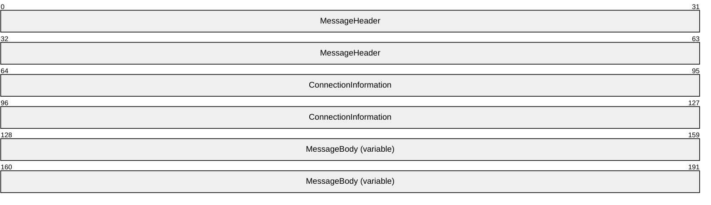

**MessageHeader (8 bytes):** A [MESSAGE_HEADER](#Section_2.2.1.1) structure (section 2.2.1.1).

**ConnectionInformation (8 bytes):** A [CONNECTION_INFORMATION](#Section_2.2.1.2) structure (section 2.2.1.2).

**MessageBody (variable):** The message payload, which is specific to the type of message identified in the **MessageHeader** field.

#### 2.2.1.1 MESSAGE_HEADER

Request messages use **MESSAGE_HEADER** as a common header, which consists of the following fields.

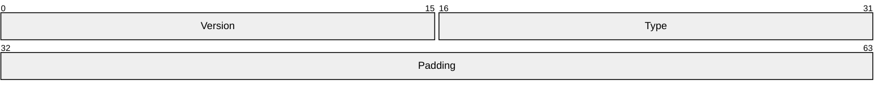

**Version (2 bytes):** The message **version**, expressed as major and minor values. The version MUST be 1.0 or 2.0.<4>

Note that the order of the subfields is reversed; the **MinorVersion** subfield occurs first.

**MinorVersion (1 byte):** The minor part of the version, which MUST be 0x00.

**MajorVersion (1 byte):** The major part of the version, which MUST be 0x01 or 0x02.<5>

**Type (2 bytes):** A 16-bit unsigned integer that specifies the message type.

| Value | Meaning |
| --- | --- |
| 0x0001 | The message is an [INITIAL_OFFER_MESSAGE](#Section_2.2.1.3) (section 2.2.1.3). |
| 0x0002 | The message is a [SEGMENT_INFO_MESSAGE](#Section_2.2.1.4) (section 2.2.1.4). |
| 0x0003 | The message is a [BATCHED_OFFER_MESSAGE](#Section_2.2.1.5) (section 2.2.1.5). |

**Padding (4 bytes):** The value of this field is indeterminate and MUST be ignored on processing.

#### 2.2.1.2 CONNECTION_INFORMATION

Request messages use the **CONNECTION_INFORMATION** structure as a common connection information structure, which describes the information needed by the [**hosted cache**](#gt_hosted-cache) to use the Peer Content Caching and Retrieval: Retrieval Protocol [MS-PCCRR](../MS-PCCRR/MS-PCCRR.md) as a [**client-role peer**](#gt_client-role-peer), to retrieve needed [**blocks**](#gt_block) from the client as a [**server-role peer**](#gt_server-role-peer).

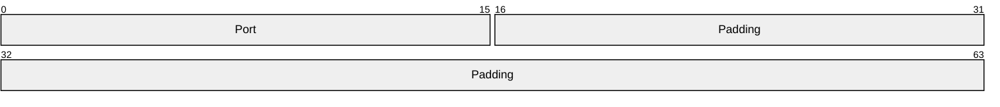

**Port (2 bytes):** A 16-bit unsigned integer that MUST be set by the client to the port on which it is listening as a server-role peer, for use with the retrieval protocol.

**Padding (6 bytes):** The value of this field is indeterminate and MUST be ignored on processing.

#### 2.2.1.3 INITIAL_OFFER_MESSAGE

The **INITIAL_OFFER_MESSAGE** is a request message that notifies the [**hosted cache**](#gt_hosted-cache) of new [**content**](#gt_content) available on the [**client**](#gt_client). This message consists of the following fields.

**Note** This message is only available for protocol version 1.0.

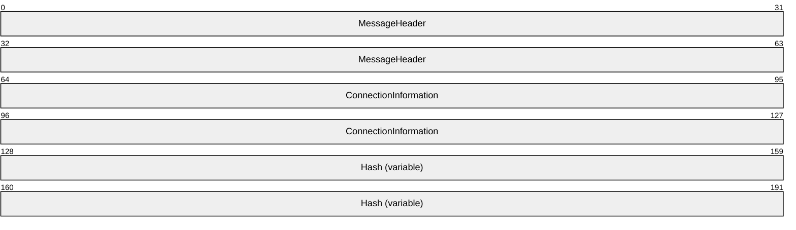

**MessageHeader (8 bytes):** A [MESSAGE_HEADER](#Section_2.2.1.1) structure (section 2.2.1.1), with the **Type** field set to 0x0001.

**ConnectionInformation (8 bytes):** A [CONNECTION_INFORMATION](#Section_2.2.1.2) structure (section 2.2.1.2).

**Hash (variable):** The **Hash** field is a binary byte array that contains the [**HoHoDk**](#gt_segment-id-hohodk) of the [**segment**](#gt_segment) that was partly or fully retrieved by the client. The size of this field is calculated as the total message size minus the sum of the field sizes that precede the **Hash** field.

#### 2.2.1.4 SEGMENT_INFO_MESSAGE

A **SEGMENT_INFO_MESSAGE** is a request message sent by the [**client**](#gt_client) to the [**hosted cache**](#gt_hosted-cache) containing the [**segment hash of data**](#gt_segment-hash-of-data) ([**HoD**](#gt_hod)) for the previously offered [**segment**](#gt_segment), as well as the range of [**block hashes**](#gt_b95ac37d-49c5-42a8-be4f-c0fc5592db16) in the segment. Whether a SEGMENT_INFO_MESSAGE is sent depends on the hosted cache's response to the previous [INITIAL_OFFER_MESSAGE](#Section_2.2.1.3) containing the same [**HoHoDk**](#gt_segment-id-hohodk). This message consists of the following fields.

**Note** This message is only available for protocol version 1.0.

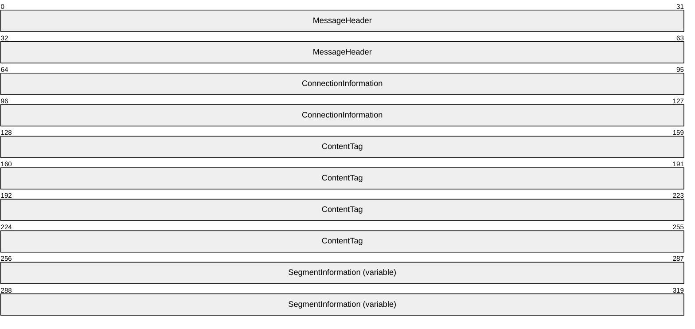

**MessageHeader (8 bytes):** A [MESSAGE_HEADER](#Section_2.2.1.1) structure (section 2.2.1.1), with the **Type** field set to 0x0002.

**ConnectionInformation (8 bytes):** A [CONNECTION_INFORMATION](#Section_2.2.1.2) structure (section 2.2.1.2).

**ContentTag (16 bytes):** A structure consisting of 16 bytes of opaque data.

This field contains a tag supplied by a higher-layer protocol on the client. The tag is added to the information being sent by the client to the hosted cache. The data is then passed to the higher-layer application on the hosted cache.

**SegmentInformation (variable):** A Content Information data structure ([MS-PCCRC](../MS-PCCRC/MS-PCCRC.md) section 2.3).

This field describes the single segment being offered, with information retrieved from the [**content server**](#gt_content-server). The **SegmentInformation** field also contains the subfields of the segment's Content Information data structure, SegmentDescription, and SegmentContentBlocks, as specified in [MS-PCCRC] sections 2.3.1.1 and 2.3.1.2, respectively:

- The **Version** and **dwHashAlgo** fields MUST be copied directly from the client's Content Information data structure for the [**content**](#gt_content) containing the segment being offered.
- The **dwOffsetInFirstSegment** field MUST be set to the offset in the segment being offered at which the content range begins.
- The **dwReadBytesInLastSegment** field MUST be set to the total number of bytes in the segment being offered.
- The **cSegments** field MUST be set to 1.
- The **segments** field MUST contain the single SegmentDescription ([MS-PCCRC] section 2.3.1.1) in the original Content Information data structure corresponding to the segment being offered.
- The **blocks** field MUST contain a single SegmentContentBlocks ([MS-PCCRC] section 2.3.1.2) corresponding to the segment being offered, copied from the **blocks** field in the original Content Information data structure.

#### 2.2.1.5 BATCHED_OFFER_MESSAGE

The **BATCHED_OFFER_MESSAGE** is a request message that notifies the [**hosted cache**](#gt_hosted-cache) of new content that is available on the [**client**](#gt_client). This message consists of the following fields.

**Note** This message is only available for protocol version 2.0.

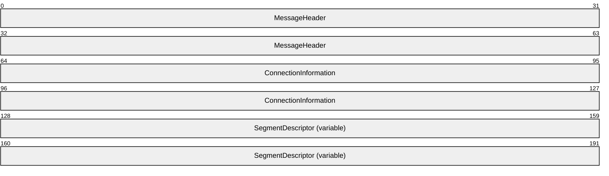

**MessageHeader (8 bytes):** A [MESSAGE_HEADER](#Section_2.2.1.1) structure (section 2.2.1.1), with the **Type** field set to 0x0003.

**ConnectionInformation (8 bytes):** A [CONNECTION_INFORMATION](#Section_2.2.1.2) structure (section 2.2.1.2).

**SegmentDescriptor (variable):** The **BATCHED_OFFER_MESSAGE** contains a sequence of these segment descriptors. The **BATCHED_OFFER_MESSAGE** MUST NOT contain more than 128 **SegmentDescriptors**.

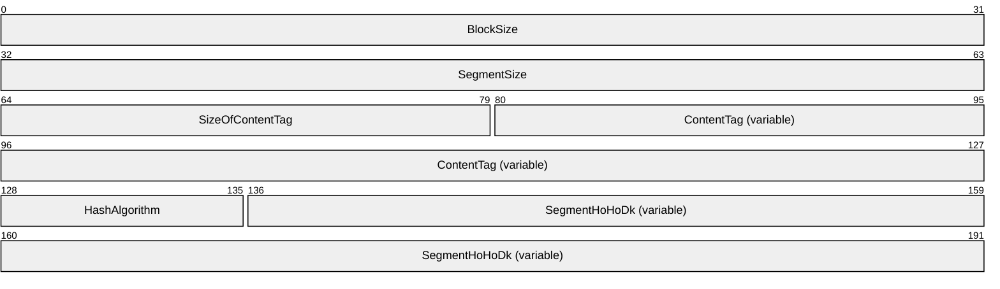

**BlockSize (4 bytes):** Size of each block in the segment.

**SegmentSize (4 bytes):** Size of data in the segment.

**SizeOfContentTag (2 bytes):** The size of the data contained in the **ContentTag** field. This field MUST be set to 16 bytes.

**ContentTag (variable):** Specifies the content tag. The size of this field is indicated by the value of the **SizeOfContentTag** field.

**HashAlgorithm (1 byte):** The hashing algorithm ID. MUST be one of the following values.

| Value | Meaning |
| --- | --- |
| 0x01 | SHA-256 |
| 0x04 | Truncated SHA-512 (first 256 bits of the SHA-512 hash) |

**SegmentHoHoDk (variable):** Segment identifier; the size of the [**HoHoDk**](#gt_segment-id-hohodk) is indicated by the hashing algorithm ID as shown in the following table.

| Bit Range | Field | Description |
| --- | --- | --- |
| Variable | 0x01 (SHA-256) | 32 bytes |
| Variable | 0x04 (Truncated SHA-512) | 32 bytes |

### 2.2.2 Response Messages

Response messages are sent in response to the following request messages:

- [INITIAL_OFFER_MESSAGE](#Section_2.2.1.3), section 2.2.1.3
- [SEGMENT_INFO_MESSAGE](#Section_2.2.1.4), section 2.2.1.4
- [BATCHED_OFFER_MESSAGE](#Section_2.2.1.5), section 2.2.1.5

#### 2.2.2.1 Transport Header

The transport adds the following **Transport Header** in front of any response protocol message.

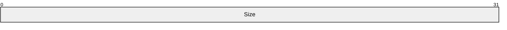

**Size (4 bytes):** Total message size in bytes, excluding this field.

#### 2.2.2.2 Response Code

Each response message contains the following **Response Code**.

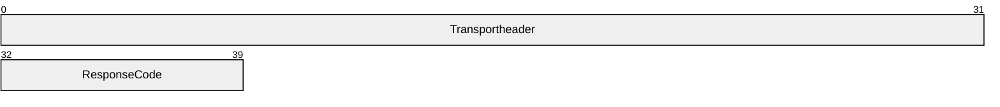

**Transportheader (4 bytes):** A transport header (section [2.2.2.1](#Section_2.1)).

**ResponseCode (1 byte):** A code that indicates the server response to the [**client**](#gt_client) request message.

| Value | Meaning |
| --- | --- |
| OK 0x00 | The server has sufficient information to retrieve [**content**](#gt_content) from the client. |
| INTERESTED 0x01 | The server needs the range of [**block hashes**](#gt_b95ac37d-49c5-42a8-be4f-c0fc5592db16) from the client before it can retrieve content from the client. |

In an [INITIAL_OFFER_MESSAGE (section 2.2.1.3)](#Section_2.2.1.3), the response code MUST be either OK or INTERESTED. In a [BATCHED_OFFER_MESSAGE (section 2.2.1.5)](#Section_2.2.1.5), the response code MUST be OK. In a [SEGMENT_INFO_MESSAGE (section 2.2.1.4)](#Section_2.2.1.4), the response code MUST be OK.

# 3 Protocol Details

There are two roles in the Peer Content Caching and Retrieval: Hosted Cache Protocol, the hosted cache and the client.

## 3.1 Server Details

The hosted cache is the server entity that is offered a content segment and then determines if it will get more information about the block hashes contained in that segment.<6>

### 3.1.1 Abstract Data Model

The following state is maintained for the operation of the hosted cache:

- **Content information for the offered segment**: This is comprised of the segment [**HoHoDk**](#gt_segment-id-hohodk), segment [**HoD**](#gt_hod), and a list of block hashes contained within the segment.
- **Block cache**: A cache of data blocks retrieved from clients, together with their corresponding HoHoDks, segment hashes, block hashes, and the [**segment secrets**](#gt_segment-secret). The data blocks are made available to other [**client-role peers**](#gt_client) that attempt to retrieve them using the [**Peer Content Caching and Retrieval: Retrieval Protocol (PCCRR)**](#gt_peer-content-caching-and-retrieval-retrieval-protocol-pccrr) framework [MS-PCCRR](../MS-PCCRR/MS-PCCRR.md).
**Note** The preceding conceptual data can be implemented using a variety of techniques.

### 3.1.2 Timers

None.

### 3.1.3 Initialization

The following initialization of the hosted cache MUST be performed:

- The hosted cache MUST be initialized by starting to listen for incoming HTTP requests on the URL or URLs specified in section [2.1](#Section_2.1).
- If HTTPS is used as a transport, the hosted cache MUST be provisioned with a certificate and associated private key such that it is compatible with HTTPS server authentication [[RFC2818]](https://go.microsoft.com/fwlink/?LinkId=90383).

### 3.1.4 Higher-Layer Triggered Events

None.

### 3.1.5 Message Processing Events and Sequencing Rules

#### 3.1.5.1 INITIAL_OFFER_MESSAGE Request Received

The hosted cache MUST respond with a correctly formatted response message if the request is sent via a registered URL, as specified in section [2.2.2](#Section_2.2.2).

- The hosted cache MUST specify a response code of zero if the hosted cache already has all the block hashes in the segment.
If the hosted cache does not have all the offered data blocks associated with the block hashes in the segment, it MUST initiate the Peer Content Caching and Retrieval: Retrieval Protocol (PCCRR) framework [MS-PCCRR](../MS-PCCRR/MS-PCCRR.md) as a [**client-role peer**](#gt_client-role-peer) to retrieve the missing blocks from the offering client.

The hosted cache, acting as a PCCRR client-role peer, MUST connect to the client's IP address using the port number specified in the **CONNECTION_INFORMATION** field from the [INITIAL_OFFER_MESSAGE](#Section_2.2.1.3) request, as specified in section 2.2.1.3. The [**HoHoDk**](#gt_segment-id-hohodk) in the INITIAL_OFFER_MESSAGE request MUST be used to retrieve the corresponding [**segment hash of data**](#gt_segment-hash-of-data) ([**HoD**](#gt_hod)), list of block hashes, and the [**segment secret**](#gt_segment-secret) from the hosted cache's block cache (section [3.1.1](#Section_3.1.1)). The segment HoD, list of block hashes, and the segment secret MUST be passed to the PCCRR client-role peer. The retrieved blocks MUST be added to the hosted cache's block cache.

- The hosted cache MUST specify a response code of 1 if its list of block hashes associated with the segment is incomplete.

#### 3.1.5.2 SEGMENT_INFO_MESSAGE Request Received

Regardless of whether an [INITIAL_OFFER_MESSAGE](#Section_2.2.1.3) has previously been received from this client, the hosted cache MUST respond with a message formatted as specified in section [2.2.2](#Section_2.2.2) and MUST perform the following actions:

- Send a response code of 0x00.
- Initiate the Peer Content Caching and Retrieval: Retrieval Protocol (PCCRR) framework [MS-PCCRR](../MS-PCCRR/MS-PCCRR.md) as a [**client-role peer**](#gt_client-role-peer) to retrieve the missing blocks from the offering client.
- The hosted cache, acting as a PCCRR client-role peer, MUST connect to the client's IP address using the port number specified in the **CONNECTION_INFORMATION** field from the [SEGMENT_INFO_MESSAGE](#Section_2.2.1.4) request, as specified in section 2.2.1.4. The [**segment hash of data**](#gt_segment-hash-of-data) ([**HoD**](#gt_hod)), list of block hashes, and the [**segment secret**](#gt_segment-secret) from the **SegmentInformation** field (section 2.2.1.4) MUST be passed to the PCCRR client-role peer. The retrieved blocks MUST be added to the hosted cache's block cache.
- The **ContentTag** MUST be passed to the higher layer. The **ContentTag** is described in the SEGMENT_INFO_MESSAGE request, section 2.2.1.4.

#### 3.1.5.3 BATCHED_OFFER_MESSAGE Request Received

The [**hosted cache**](#gt_hosted-cache) MUST respond with a correctly formatted response message if the request is sent via an HTTP URL, as specified in section [2.2.2](#Section_2.2.2).

The hosted cache MUST specify a response code of 0x00.

If the hosted cache does not have all the offered data blocks associated with the segments, it MUST initiate the Peer Content Caching and Retrieval: Retrieval Protocol (PCCRR) framework [MS-PCCRR](../MS-PCCRR/MS-PCCRR.md) as a [**client-role peer**](#gt_client-role-peer) to retrieve the missing blocks from the offering client.

The hosted cache, acting as a PCCRR client-role peer, MUST connect to the client's IP address by using the port number specified in the **ConnectionInformation** field from the [BATCHED_OFFER_MESSAGE](#Section_2.2.1.5) request, as specified in section 2.2.1.5. The [**HoHoDks**](#gt_segment-id-hohodk) in the BATCHED_OFFER_MESSAGE request MUST be used to retrieve the corresponding data blocks. The retrieved blocks MUST be added to the hosted cache's block cache.

The **Content tag** (see section [3.2.1](#Section_3.1.1)) originating from the higher-layer component on the client MUST be passed to the higher layer.

#### 3.1.5.4 Other Message Received

If anything other than a correctly formatted [INITIAL_OFFER_MESSAGE (section 2.2.1.3)](#Section_2.2.1.3), [SEGMENT_INFO_MESSAGE (section 2.2.1.4)](#Section_2.2.1.4) or [BATCHED_OFFER_MESSAGE (section 2.2.1.5)](#Section_2.2.1.5) is received, it MUST be dropped and the protocol sequence aborted.

### 3.1.6 Timer Events

None.

### 3.1.7 Other Local Events

None.

## 3.2 Client Details

The client initiates the use of this protocol once there are new blocks available to offer to the hosted cache.<7>

### 3.2.1 Abstract Data Model

The following state is maintained for the operation of the client:

- **Content information for the offered segment**: This is composed of the segment [**HoHoDk**](#gt_segment-id-hohodk), segment [**HoD**](#gt_hod), and a list of block hashes contained within the segment. The segment HoHoDk is used in an [INITIAL_OFFER_MESSAGE (section 2.2.1.3)](#Section_2.2.1.3) or [BATCHED_OFFER_MESSAGE (section 2.2.1.5)](#Section_2.2.1.5). The segment HoD and the list of block hashes are used in a [SEGMENT_INFO_MESSAGE (section 2.2.1.4)](#Section_2.2.1.4).
- **Outstanding request messages**: A set of pending request messages whose timer has not yet expired. For the INITIAL_OFFER_MESSAGE, the HoHoDk that is used is stored along with the request. For the BATCHED_OFFER_MESSAGE, the HoHoDk list that is used is stored along with the request. This allows the client to send the corresponding segment HoD and block hashes in a subsequent SEGMENT_INFO_MESSAGE.
- **Cache**: A cache of data blocks associated with the segment/blocks being offered. This cache includes a mapping between the block hashes/segment hashes and the actual data blocks themselves. These blocks can later be retrieved by the hosted cache using the Peer Content Caching and Retrieval: Retrieval Protocol (PCCRR) framework [MS-PCCRR](../MS-PCCRR/MS-PCCRR.md).
- **Content tag**: The content tag is provided by the higher layer when it initiates the sending of an INITIAL_OFFER_MESSAGE or a BATCHED OFFER_MESSAGE. It is sent in the BATCHED OFFER_MESSAGE and stored for use in the **ContentTag** field of a subsequent SEGMENT_INFO_MESSAGE in case that message is sent. The value of the content tag is determined by the implementation. Each higher-layer component SHOULD select a unique content tag and use it for all content offered.<8>
**Note** The preceding conceptual data can be implemented using a variety of techniques.

### 3.2.2 Timers

**Request Timer**: The client uses a request timer to track the expiration of a request message. When a new request message is sent to the hosted cache, the timer is started, or restarted if it was stopped. Once the timer is started, it increments a tick counter every 5 seconds. For each request message sent to the hosted cache, the expiry of that message is calculated as follows.

Request message expiry = Current tick counter value + 2

Each time the **Request Timer** increments the tick counter, the timer checks if the value of the current tick counter has exceeded the expiry of the request message, as shown in the calculation. If the request message is found to have expired, the client drops the expired message and does not process any response messages for the expired message that arrive after the message has been dropped. When there are no more pending outbound requests, the **Request Timer** is stopped.

### 3.2.3 Initialization

The client initialization MUST explicitly include the following information:

- The fully qualified DNS name and the TCP port of the hosted cache.
- The chain's root certificate such that it is compatible with HTTPS server authentication [[RFC2818]](https://go.microsoft.com/fwlink/?LinkId=90383).
- The client content information associated with the segment, as described in the section [3.2.1](#Section_3.1.1). This content is provided by a higher-layer protocol.

### 3.2.4 Higher-Layer Triggered Events

**New blocks available:** When the higher layer has new blocks in a segment to offer the hosted cache, it passes them to this protocol, along with the segment's associated content information and the content tag. The client SHOULD construct an [INITIAL_OFFER_MESSAGE](#Section_2.2.1.3) request message (section 2.2.1.3) or [BATCHED OFFER_MESSAGE](#Section_2.2.1.5) request message (section 2.2.1.5) that contains the segment [**HoHoDks**](#gt_segment-id-hohodk), send it to the hosted cache, store it along with the content tag in its set of outstanding request messages, and start the request timer.

The higher layer SHOULD initiate the use of this protocol only when a sufficient number of new blocks have been received from the content server. Doing otherwise, such as initiating the protocol for every new block that becomes available, could lead to poor network performance.<9>

### 3.2.5 Message Processing Events and Sequencing Rules

#### 3.2.5.1 INITIAL_OFFER_MESSAGE Response Received

If a message response matches one of its set of outstanding requests, the client MUST delete it from the set of outstanding requests and cancel the **Request Timer** for this request. If the response is INTERESTED, the client MUST respond with a [SEGMENT_INFO_MESSAGE](#Section_2.2.1.4) request (section 2.2.1.4) for the associated [**HoHoDk**](#gt_segment-id-hohodk), which MUST be stored in its set of outstanding request messages. A request timer must also be set for this message.

If there are no outstanding requests that match with the message response, the client MUST discard the message.

#### 3.2.5.2 SEGMENT_INFO_MESSAGE Response Received

The client MUST cancel the **Request Timer** for the corresponding request and remove it from the client's set of outstanding request messages.

#### 3.2.5.3 HTTP Status Code 401 Response Received

The client MUST resend the request, indicating to the transport to perform [**SPNEGO**](#gt_simple-and-protected-gss-api-negotiation-mechanism-spnego)-based HTTP authentication (section [2.1](#Section_2.1)). The **Request Timer** for the request MUST also be reset to its initial expiration time.

#### 3.2.5.4 BATCHED_OFFER_MESSAGE Response Received

The client MUST cancel the **Request Timer** for the corresponding request and remove it from the client's set of outstanding request messages.

#### 3.2.5.5 Other Message Received

If any message other than a correctly formatted [INITIAL_OFFER_MESSAGE (section 2.2.1.3)](#Section_2.2.1.3) request, [SEGMENT_INFO_MESSAGE (section 2.2.1.4)](#Section_2.2.1.4) request, or [BATCHED_OFFER_MESSAGE (section 2.2.1.5)](#Section_2.2.1.5) request response is received on the port which the client is currently using for this protocol, the message MUST be dropped and the protocol sequence aborted.

### 3.2.6 Timer Events

**Request Timer expires:** The related outstanding message request MUST be removed.

### 3.2.7 Other Local Events

None.

# 4 Protocol Examples

## 4.1 Hosted Cache with No Block Hashes

This section presents an example of a hosted cache that has none of the block hashes associated with the segment that is offered.

In this sequence, on availability of new blocks for a segment, the client uses the protocol to offer the associated segment to the hosted cache. The hosted cache determines that it has no block hashes, and therefore requests that the client send it complete information on the segment so that the hosted cache can then use the Peer Content Caching and Retrieval: Retrieval Protocol [MS-PCCRR](../MS-PCCRR/MS-PCCRR.md) to retrieve the blocks desired.

Figure 1: Hosted cache with no block hashes

## 4.2 Hosted Cache with Block Hashes and No Data Blocks

This section presents an example of a hosted cache that has the block hashes associated with the segment but no data blocks.

In this sequence, on availability of new blocks for a segment, the client uses the protocol to offer the associated segment to the hosted cache. The hosted cache determines that it has the block hashes for the segment, but does not have any of the data blocks, and thus responds with a code of zero. At the same time, the hosted cache uses the Peer Content Caching and Retrieval: Retrieval Protocol [MS-PCCRR](../MS-PCCRR/MS-PCCRR.md) to retrieve all blocks of the segment that are available from the offering client.

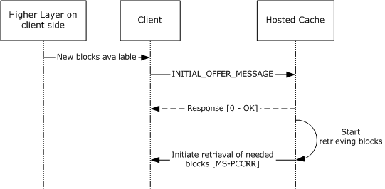

Figure 2: Hosted cache with block hashes and no data blocks

## 4.3 Hosted Cache with Block Hashes and Data Blocks

This section presents an example of a hosted cache that has all the block hashes associated with the segment and all the data blocks.

In this sequence, on availability of new blocks for a segment, the client uses the protocol to offer the associated segment to the hosted cache. The hosted cache determines that it already has all blocks for the segment and responds with a code of zero.

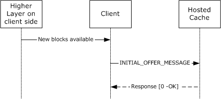

Figure 3: Hosted cache with block hashes and data blocks

## 4.4 Hosted Cache with No Data Blocks

This section presents an example of a version 2.0 hosted cache that has no data blocks and a version 2.0 client.

In this sequence, upon the availability of new segments, the client uses this protocol to offer the associated segments to the hosted cache. The hosted cache determines that it does not have any of the blocks and thus responds with a code of 0. At the same time, the hosted cache uses the Peer Content Caching and Retrieval: Retrieval Protocol (PCCRR) [MS-PCCRR](../MS-PCCRR/MS-PCCRR.md) to retrieve blocks of the segments that are available from the offering client.

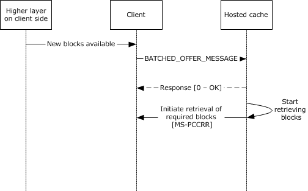

Figure 4: Hosted cache with block hashes and no data blocks

## 4.5 Hosted Cache with Data Blocks

This section presents an example of a version 2.0 hosted cache that has all the data blocks associated with all the segments in the list and a version 2.0 client.

In this sequence, upon the availability of new segments, the client uses this protocol to offer the associated segments to the hosted cache. The hosted cache determines that it already has all blocks for all the segments and responds with a code of 0.

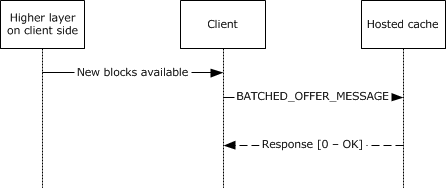

Figure 5: Hosted cache with block hashes and data blocks

# 5 Security

## 5.1 Security Considerations for Implementers

Peer Content Caching and Retrieval: Hosted Cache Protocol messages are secured using HTTPS.

An HTTPS connection is established by the client with the hosted cache, where the hosted cache can choose to authenticate clients and a higher layer or administrator action can configure it to stop authenticating clients. HTTP authentication is the mechanism used to complete these actions as specified in [[RFC4559]](https://go.microsoft.com/fwlink/?LinkId=90483).

## 5.2 Index of Security Parameters

| Security Parameter | Section |
| --- | --- |
| HTTPS | [2.1](#Section_2.1) |

# 6 Appendix A: Product Behavior

The information in this specification is applicable to the following Microsoft products or supplemental software. References to product versions include updates to those products.

- Windows Vista operating system
- Windows Server 2008 operating system
- Windows 7 operating system
- Windows Server 2008 R2 operating system
- Windows 8 operating system
- Windows Server 2012 operating system
- Windows 8.1 operating system
- Windows Server 2012 R2 operating system
- Windows 10 operating system
- Windows Server 2016 operating system
- Windows Server operating system
- Windows Server 2019 operating system
- Windows Server 2022 operating system
- Windows 11 operating system
- Windows Server 2025 operating system
Exceptions, if any, are noted in this section. If an update version, service pack or Knowledge Base (KB) number appears with a product name, the behavior changed in that update. The new behavior also applies to subsequent updates unless otherwise specified. If a product edition appears with the product version, behavior is different in that product edition.

Unless otherwise specified, any statement of optional behavior in this specification that is prescribed using the terms "SHOULD" or "SHOULD NOT" implies product behavior in accordance with the SHOULD or SHOULD NOT prescription. Unless otherwise specified, the term "MAY" implies that the product does not follow the prescription.

<1> Section 1.3: In Windows Vista and Windows Server 2008, support for the client-side elements of this protocol is available only with the installation of the Background Intelligent Transfer Service (BITS) (see [MC-BUP](../MC-BUP/MC-BUP.md)) via the Windows Management Framework (WMF). Support for the server-side elements of this protocol is not available. For more information, see [[MSDN-BITS]](https://go.microsoft.com/fwlink/?LinkId=89959).

<2> Section 1.7: Windows 7 supports version 1.0. Otherwise, Windows clients support version 2.0.

<3> Section 2.1: In Windows Server 2008 R2, the hosted cache listens on port 443 by default. Otherwise, in applicable Windows Server releases, the hosted cache listens on both port 80 and port 443 by default.

<4> Section 2.2.1.1: Windows 7 supports version 1.0. Otherwise, Windows clients support version 2.0.

<5> Section 2.2.1.1: In Windows 7, the value of **MajorVersion** is 0x01. Otherwise, in Windows clients the value of **MajorVersion** is 0x02.

<6> Section 3.1: In Windows Vista and Windows Server 2008, support for the server-side elements of this protocol is not available.

<7> Section 3.2: In Windows Vista and Windows Server 2008, support for the client-side elements of this protocol is available only with the installation of the Background Intelligent Transfer Service (BITS) in the Windows Management Framework. For more information, see [MSDN-BITS].

<8> Section 3.2.1: In applicable Windows Server releases, the values of the content tag can be the following:

- The ASCII string "WinINet" is used by clients of the WinInet APIs. For more information see [[MSDOCS-WinINet]](https://go.microsoft.com/fwlink/?LinkId=324863).
- The ASCII string "WebIO" is used by clients of the WebIO APIs (a WebIO server provides Internet to X10 power line control (PLC) gateway to control devices commonly used in home automation).
- The ASCII string "BITS-4.0" is used by the Background Intelligent Transfer Service. See [MSDN-BITS] and [MS-BPCR](../MS-BPCR/MS-BPCR.md).
- The binary byte array {0x35, 0xDB, 0x04, 0x5D, 0x14, 0x23, 0x45, 0x53, 0xA0, 0x51, 0x0D, 0xC2, 0xE1, 0x5E, 0x6C, 0x4C} is used by the SMB stack.
The higher-layer component on cache servers hosted by Windows tracks performance statistics for each of these values and categorizes all other values as "Other".

<9> Section 3.2.4: Windows invokes this protocol after 20% of new blocks of a segment have been received from the content server.

# 7 Change Tracking

This section identifies changes that were made to this document since the last release. Changes are classified as Major, Minor, or None.

The revision class **Major** means that the technical content in the document was significantly revised. Major changes affect protocol interoperability or implementation. Examples of major changes are:

- A document revision that incorporates changes to interoperability requirements.
- A document revision that captures changes to protocol functionality.
The revision class **Minor** means that the meaning of the technical content was clarified. Minor changes do not affect protocol interoperability or implementation. Examples of minor changes are updates to clarify ambiguity at the sentence, paragraph, or table level.

The revision class **None** means that no new technical changes were introduced. Minor editorial and formatting changes may have been made, but the relevant technical content is identical to the last released version.

The changes made to this document are listed in the following table. For more information, please contact [dochelp@microsoft.com](mailto:dochelp@microsoft.com).

| Section | Description | Revision class |
| --- | --- | --- |
| [6](#Section_6) Appendix A: Product Behavior | Added Windows Server 2025 to the list of applicable products. | Major |

## Revision History

| Date | Version | Revision Class | Comments |
| --- | --- | --- | --- |
| 12/5/2008 | 0.1 | Major | Initial Availability |
| 1/16/2009 | 0.2 | Minor | Clarified the meaning of the technical content. |
| 2/27/2009 | 0.2.1 | Editorial | Changed language and formatting in the technical content. |
| 4/10/2009 | 1.0 | Major | Updated and revised the technical content. |
| 5/22/2009 | 1.1 | Minor | Clarified the meaning of the technical content. |
| 7/2/2009 | 1.1.1 | Editorial | Changed language and formatting in the technical content. |
| 8/14/2009 | 1.2 | Minor | Clarified the meaning of the technical content. |
| 9/25/2009 | 1.3 | Minor | Clarified the meaning of the technical content. |
| 11/6/2009 | 1.4 | Minor | Clarified the meaning of the technical content. |
| 12/18/2009 | 1.5 | Minor | Clarified the meaning of the technical content. |
| 1/29/2010 | 1.6 | Minor | Clarified the meaning of the technical content. |
| 3/12/2010 | 1.6.1 | Editorial | Changed language and formatting in the technical content. |
| 4/23/2010 | 1.6.2 | Editorial | Changed language and formatting in the technical content. |
| 6/4/2010 | 1.6.3 | Editorial | Changed language and formatting in the technical content. |
| 7/16/2010 | 1.6.3 | None | No changes to the meaning, language, or formatting of the technical content. |
| 8/27/2010 | 1.6.3 | None | No changes to the meaning, language, or formatting of the technical content. |
| 10/8/2010 | 1.6.4 | Editorial | Changed language and formatting in the technical content. |
| 11/19/2010 | 1.6.4 | None | No changes to the meaning, language, or formatting of the technical content. |
| 1/7/2011 | 1.6.4 | None | No changes to the meaning, language, or formatting of the technical content. |
| 2/11/2011 | 1.6.4 | None | No changes to the meaning, language, or formatting of the technical content. |
| 3/25/2011 | 1.6.4 | None | No changes to the meaning, language, or formatting of the technical content. |
| 5/6/2011 | 1.6.4 | None | No changes to the meaning, language, or formatting of the technical content. |
| 6/17/2011 | 1.7 | Minor | Clarified the meaning of the technical content. |
| 9/23/2011 | 1.7 | None | No changes to the meaning, language, or formatting of the technical content. |
| 12/16/2011 | 2.0 | Major | Updated and revised the technical content. |
| 3/30/2012 | 2.0 | None | No changes to the meaning, language, or formatting of the technical content. |
| 7/12/2012 | 3.0 | Major | Updated and revised the technical content. |
| 10/25/2012 | 4.0 | Major | Updated and revised the technical content. |
| 1/31/2013 | 4.0 | None | No changes to the meaning, language, or formatting of the technical content. |
| 8/8/2013 | 5.0 | Major | Updated and revised the technical content. |
| 11/14/2013 | 5.0 | None | No changes to the meaning, language, or formatting of the technical content. |
| 2/13/2014 | 6.0 | Major | Updated and revised the technical content. |
| 5/15/2014 | 6.0 | None | No changes to the meaning, language, or formatting of the technical content. |
| 6/30/2015 | 7.0 | Major | Significantly changed the technical content. |
| 10/16/2015 | 7.0 | None | No changes to the meaning, language, or formatting of the technical content. |
| 7/14/2016 | 7.0 | None | No changes to the meaning, language, or formatting of the technical content. |
| 6/1/2017 | 7.0 | None | No changes to the meaning, language, or formatting of the technical content. |
| 9/15/2017 | 8.0 | Major | Significantly changed the technical content. |
| 9/12/2018 | 9.0 | Major | Significantly changed the technical content. |
| 4/7/2021 | 10.0 | Major | Significantly changed the technical content. |
| 6/25/2021 | 11.0 | Major | Significantly changed the technical content. |
| 4/23/2024 | 12.0 | Major | Significantly changed the technical content. |
