# [MS-PCQ]: Performance Counter Query Protocol

Table of Contents

1 Introduction

- [1 Introduction](#Section_1)
  - [1.1 Glossary](#Section_1.1)
  - [1.2 References](#Section_1.2)
    - [1.2.1 Normative References](#Section_1.2.1)
    - [1.2.2 Informative References](#Section_1.2.2)
  - [1.3 Overview](#Section_1.3)
  - [1.4 Relationship to Other Protocols](#Section_1.4)
  - [1.5 Prerequisites/Preconditions](#Section_1.5)
  - [1.6 Applicability Statement](#Section_1.6)
  - [1.7 Versioning and Capability Negotiation](#Section_1.7)
  - [1.8 Vendor-Extensible Fields](#Section_1.8)
  - [1.9 Standards Assignments](#Section_1.9)

2 Messages

- [2 Messages](#Section_2)
  - [2.1 Transport](#Section_2.1)
  - [2.2 Common Data Types](#Section_2.2)
    - [2.2.1 RPC_HQUERY](#Section_2.2.1)
    - [2.2.2 PRPC_HQUERY](#Section_2.2.2)
    - [2.2.3 error_status_t](#Section_2.2.3)
    - [2.2.4 Structures](#Section_2.2.4)
      - [2.2.4.1 _PERF_COUNTERSET_REG_INFO](#Section_2.2.4.1)
      - [2.2.4.2 _PERF_COUNTER_REG_INFO](#Section_2.2.4.2)
      - [2.2.4.3 _STRING_BUFFER_HEADER](#Section_2.2.4.3)
      - [2.2.4.4 _STRING_COUNTER_HEADER](#Section_2.2.4.4)
      - [2.2.4.5 _PERF_INSTANCE_HEADER](#Section_2.2.4.5)
      - [2.2.4.6 _PERF_COUNTER_IDENTIFIER](#Section_2.2.4.6)
      - [2.2.4.7 _PERF_DATA_HEADER](#Section_2.2.4.7)
      - [2.2.4.8 _PERF_COUNTER_HEADER](#Section_2.2.4.8)
      - [2.2.4.9 _PERF_COUNTER_DATA](#Section_2.2.4.9)
      - [2.2.4.10 _PERF_MULTI_INSTANCES](#Section_2.2.4.10)
      - [2.2.4.11 _PERF_MULTI_COUNTERS](#Section_2.2.4.11)

3 Protocol Details

- [3 Protocol Details](#Section_3)
  - [3.1 Server Details](#Section_3.1)
    - [3.1.1 Abstract Data Model](#Section_3.1.1)
      - [3.1.1.1 Countersets](#Section_3.1.1.1)
      - [3.1.1.2 Counterset Instances](#Section_3.1.1.2)
      - [3.1.1.3 Counters](#Section_3.1.1.3)
      - [3.1.1.4 Providers](#Section_3.1.1.4)
      - [3.1.1.5 Query Handles](#Section_3.1.1.5)
    - [3.1.2 Timers](#Section_3.1.2)
    - [3.1.3 Initialization](#Section_3.1.3)
    - [3.1.4 Message Processing Events and Sequencing Rules](#Section_3.1.4)
      - [3.1.4.1 PerflibV2 Interface](#Section_3.1.4.1)
        - [3.1.4.1.1 PerflibV2EnumerateCounterSet (Opnum 0)](#Section_3.1.4.1.1)
        - [3.1.4.1.2 PerflibV2QueryCounterSetRegistrationInfo (Opnum 1)](#Section_3.1.4.1.2)
        - [3.1.4.1.3 PerflibV2EnumerateCounterSetInstances (Opnum 2)](#Section_3.1.4.1.3)
        - [3.1.4.1.4 PerflibV2OpenQueryHandle (Opnum 3)](#Section_3.1.4.1.4)
        - [3.1.4.1.5 PerflibV2QueryCounterInfo (Opnum 5)](#Section_3.1.4.1.5)
        - [3.1.4.1.6 PerflibV2QueryCounterData (Opnum 6)](#Section_3.1.4.1.6)
        - [3.1.4.1.7 PerflibV2ValidateCounters (Opnum 7)](#Section_3.1.4.1.7)
        - [3.1.4.1.8 PerflibV2CloseQueryHandle (Opnum 4)](#Section_3.1.4.1.8)
    - [3.1.5 Timer Events](#Section_3.1.5)
    - [3.1.6 Other Local Events](#Section_3.1.6)
  - [3.2 Client Details](#Section_3.2)
    - [3.2.1 Abstract Data Model](#Section_3.2.1)
    - [3.2.2 Timers](#Section_3.2.2)
    - [3.2.3 Initialization](#Section_3.2.3)
    - [3.2.4 Message Processing Events and Sequencing Rules](#Section_3.2.4)
    - [3.2.5 Timer Events](#Section_3.2.5)
    - [3.2.6 Other Local Events](#Section_3.2.6)

4 Protocol Examples

- [4 Protocol Examples](#Section_4)
  - [4.1 Querying for Performance Counter Data](#Section_4.1)

5 Security

- [5 Security](#Section_5)
  - [5.1 Security Considerations for Implementers](#Section_5.1)
  - [5.2 Index of Security Parameters](#Section_5.2)

6 Appendix A: Full IDL

- [6 Appendix A: Full IDL](#Section_6)

7 Appendix B: Product Behavior

- [7 Appendix B: Product Behavior](#Section_7)

8 Change Tracking

- [8 Change Tracking](#Section_8)

For the legal notice and IP terms, see [LEGAL.md](../LEGAL.md).
Last updated: 4/23/2024.
See [Revision History](#revision-history) for full version history.

# 1 Introduction

The Performance Counter Query Protocol is a [**remote procedure call**](#gt_remote-procedure-call-rpc) (RPC)–based protocol that is used for browsing [**performance counters**](#gt_performance-counter) and retrieving performance counter values from a server.

Sections 1.5, 1.8, 1.9, 2, and 3 of this specification are normative. All other sections and examples in this specification are informative.

## 1.1 Glossary

This document uses the following terms:

**Authentication Service (AS)**: A service that issues ticket granting tickets (TGTs), which are used for authenticating principals within the realm or domain served by the [**Authentication Service**](#gt_authentication-service-as).

**counterset**: A logical entity consisting of a group of related [**performance counters**](#gt_performance-counter). For more information, see [[MSDN-COUNT]](https://go.microsoft.com/fwlink/?LinkId=89980).

**globally unique identifier (GUID)**: A term used interchangeably with [**universally unique identifier (UUID)**](#gt_universally-unique-identifier-uuid) in Microsoft protocol technical documents (TDs). Interchanging the usage of these terms does not imply or require a specific algorithm or mechanism to generate the value. Specifically, the use of this term does not imply or require that the algorithms described in [[RFC4122]](https://go.microsoft.com/fwlink/?LinkId=90460) or [[C706]](https://go.microsoft.com/fwlink/?LinkId=89824) must be used for generating the [**GUID**](#gt_globally-unique-identifier-guid). See also [**universally unique identifier (UUID)**](#gt_universally-unique-identifier-uuid).

**Interface Definition Language (IDL)**: The International Standards Organization (ISO) standard language for specifying the interface for remote procedure calls. For more information, see [C706] section 4.

**Network Data Representation (NDR)**: A specification that defines a mapping from [**Interface Definition Language (IDL)**](#gt_interface-definition-language-idl) data types onto octet streams. [**NDR**](#gt_network-data-representation-ndr) also refers to the runtime environment that implements the mapping facilities (for example, data provided to [**NDR**](#gt_network-data-representation-ndr)). For more information, see [MS-RPCE](../MS-RPCE/MS-RPCE.md) and [C706] section 14.

**performance counter**: A numeric measurement of the performance of one or more computing resources. Bandwidth, Throughputs, and Availability are examples of [**performance counters**](#gt_performance-counter).

**Performance Log Users Group**: A set of users that have permission granted by the system administrator to collect [**performance counter**](#gt_performance-counter) information.

**Performance Monitor Users Group**: A set of users that have permission granted by the system administrator to collect performance counter information.

**provider**: A logical entity that updates the [**performance counter**](#gt_performance-counter) values. For more information, see [MSDN-COUNT].

**remote procedure call (RPC)**: A communication protocol used primarily between client and server. The term has three definitions that are often used interchangeably: a runtime environment providing for communication facilities between computers (the RPC runtime); a set of request-and-response message exchanges between computers (the RPC exchange); and the single message from an RPC exchange (the RPC message). For more information, see [C706].

**RPC protocol sequence**: A character string that represents a valid combination of a [**remote procedure call (RPC)**](#gt_remote-procedure-call-rpc) protocol, a network layer protocol, and a transport layer protocol, as described in [C706] and [MS-RPCE].

**RPC transport**: The underlying network services used by the remote procedure call (RPC) runtime for communications between network nodes. For more information, see [C706] section 2.

**system performance time**: A timer that is updated at a hardware-dependent frequency. It has a higher-resolution (more accurate) than [**system time**](#gt_system-time).

**system time**: Coordinated universal time (UTC) with a resolution in milliseconds.

**Unicode**: A character encoding standard developed by the Unicode Consortium that represents almost all of the written languages of the world. The [**Unicode**](#gt_unicode) standard [[UNICODE5.0.0/2007]](https://go.microsoft.com/fwlink/?LinkId=154659) provides three forms (UTF-8, UTF-16, and UTF-32) and seven schemes (UTF-8, UTF-16, UTF-16 BE, UTF-16 LE, UTF-32, UTF-32 LE, and UTF-32 BE).

**Unicode string**: A [**Unicode**](#gt_unicode) 8-bit string is an ordered sequence of 8-bit units, a [**Unicode**](#gt_unicode) 16-bit string is an ordered sequence of 16-bit code units, and a [**Unicode**](#gt_unicode) 32-bit string is an ordered sequence of 32-bit code units. In some cases, it could be acceptable not to terminate with a terminating null character. Unless otherwise specified, all [**Unicode strings**](#gt_unicode-string) follow the UTF-16LE encoding scheme with no Byte Order Mark (BOM).

**universally unique identifier (UUID)**: A 128-bit value. UUIDs can be used for multiple purposes, from tagging objects with an extremely short lifetime, to reliably identifying very persistent objects in cross-process communication such as client and server interfaces, manager entry-point vectors, and [**RPC**](#gt_remote-procedure-call-rpc) objects. UUIDs are highly likely to be unique. UUIDs are also known as [**globally unique identifiers (GUIDs)**](#gt_globally-unique-identifier-guid) and these terms are used interchangeably in the Microsoft protocol technical documents (TDs). Interchanging the usage of these terms does not imply or require a specific algorithm or mechanism to generate the UUID. Specifically, the use of this term does not imply or require that the algorithms described in [RFC4122] or [C706] must be used for generating the UUID.

**well-known endpoint**: A preassigned, network-specific, stable address for a particular client/server instance. For more information, see [C706].

**MAY, SHOULD, MUST, SHOULD NOT, MUST NOT:** These terms (in all caps) are used as defined in [[RFC2119]](https://go.microsoft.com/fwlink/?LinkId=90317). All statements of optional behavior use either MAY, SHOULD, or SHOULD NOT.

## 1.2 References

Links to a document in the Microsoft Open Specifications library point to the correct section in the most recently published version of the referenced document. However, because individual documents in the library are not updated at the same time, the section numbers in the documents may not match. You can confirm the correct section numbering by checking the [Errata](https://go.microsoft.com/fwlink/?linkid=850906).

### 1.2.1 Normative References

We conduct frequent surveys of the normative references to assure their continued availability. If you have any issue with finding a normative reference, please contact [dochelp@microsoft.com](mailto:dochelp@microsoft.com). We will assist you in finding the relevant information.

[C706] The Open Group, "DCE 1.1: Remote Procedure Call", C706, August 1997, [https://publications.opengroup.org/c706](https://go.microsoft.com/fwlink/?LinkId=89824)

**Note** Registration is required to download the document.

[MS-DTYP] Microsoft Corporation, "[Windows Data Types](../MS-DTYP/MS-DTYP.md)".

[MS-ERREF] Microsoft Corporation, "[Windows Error Codes](../MS-ERREF/MS-ERREF.md)".

[MS-LCID] Microsoft Corporation, "[Windows Language Code Identifier (LCID) Reference](../MS-LCID/MS-LCID.md)".

[MS-RPCE] Microsoft Corporation, "[Remote Procedure Call Protocol Extensions](../MS-RPCE/MS-RPCE.md)".

[RFC2119] Bradner, S., "Key words for use in RFCs to Indicate Requirement Levels", BCP 14, RFC 2119, March 1997, [https://www.rfc-editor.org/info/rfc2119](https://go.microsoft.com/fwlink/?LinkId=90317)

### 1.2.2 Informative References

[MSDN-AUTHLEV] Microsoft Corporation, "RPC_C_AUTHN_LEVEL_xxx", [http://msdn.microsoft.com/en-us/library/ms678435.aspx](https://go.microsoft.com/fwlink/?LinkId=89956)

[MSDN-COUNT] Microsoft Corporation, "Performance Counters", [http://msdn.microsoft.com/en-us/library/aa373083.aspx](https://go.microsoft.com/fwlink/?LinkId=89980)

[MSDN-IMPLVL] Microsoft Corporation, "RPC_C_IMP_LEVEL_xxx", [http://msdn.microsoft.com/en-us/library/ms693790.aspx](https://go.microsoft.com/fwlink/?LinkId=90023)

[MSFT-COUNTERTYPES] Microsoft Corporation, "Counter Types", March 2003, [http://technet2.microsoft.com/WindowsServer/en/library/2c455a3c-6964-432b-9402-40f439b980881033.mspx](https://go.microsoft.com/fwlink/?LinkId=90180)

[PIPE] Microsoft Corporation, "Named Pipes", [http://msdn.microsoft.com/en-us/library/aa365590.aspx](https://go.microsoft.com/fwlink/?LinkId=90247)

## 1.3 Overview

To effectively manage systems, administrators need the capability to query for [**performance counter**](#gt_performance-counter) data on the health or state of a particular application or system. Software components that are designed with performance counters are therefore easier to manage and diagnose. The Performance Counter Query Protocol enables system administrators to query performance counters on a remote server.

The Performance Counter Query Protocol is used to retrieve performance counter information from a server. The protocol allows a client to enumerate the performance counters that are available on the server. The server can use the protocol to return performance counter information, such as localized counter names and description strings, performance counter types (for more information, see [[MSDN-COUNT]](https://go.microsoft.com/fwlink/?LinkId=89980)), and instance information if there are multiple instances of a performance counter. The client can also use the protocol to establish a query on the server and add or remove performance counters to it. The client can then repeatedly retrieve performance counter data that is associated with the query by using the protocol.

## 1.4 Relationship to Other Protocols

The Performance Counter Query Protocol relies on [**RPC**](#gt_remote-procedure-call-rpc) for its transport. The Performance Counter Query Protocol is not used by any other protocol.

## 1.5 Prerequisites/Preconditions

The Performance Counter Query Protocol is implemented over [**RPC**](#gt_remote-procedure-call-rpc), and therefore has those prerequisites that are specified in [MS-RPCE](../MS-RPCE/MS-RPCE.md) and that are common to RPC interfaces.

It is assumed that a client has obtained the name or IP address of the server that supports the Performance Counter Query Protocol before invoking the Performance Counter Query Protocol. The protocol also assumes that the client has sufficient security privileges to access files on the server.

## 1.6 Applicability Statement

The Performance Counter Query Protocol is appropriate for querying performance library 2.0–based counter [**providers**](#gt_provider) and their counter data on a server.

## 1.7 Versioning and Capability Negotiation

This document addresses versioning issues in security and authentication methods (as specified in section [2.1](#Section_2.1) and [MS-RPCE](../MS-RPCE/MS-RPCE.md)).

## 1.8 Vendor-Extensible Fields

The Performance Counter Query Protocol uses Win32 error codes. These values are taken from the Windows error number space that is specified in [MS-ERREF](../MS-ERREF/MS-ERREF.md) section 2.2. Vendors SHOULD reuse those values with their indicated meaning because choosing any other value risks a collision in the future.

## 1.9 Standards Assignments

| Parameter | Value | Reference |
| --- | --- | --- |
| [**RPC**](#gt_remote-procedure-call-rpc) interface [**UUID**](#gt_universally-unique-identifier-uuid) | da5a86c5-12c2-4943-ab30-7f74a813d853 | [[C706]](https://go.microsoft.com/fwlink/?LinkId=89824) |
| [**Well-known endpoint**](#gt_well-known-endpoint) | \PIPE\winreg | [[PIPE]](https://go.microsoft.com/fwlink/?LinkId=90247) |

# 2 Messages

This section specifies common data types and how Performance Counter Query Protocol messages are encapsulated on the wire.

## 2.1 Transport

The Performance Counter Query Protocol uses the ncacn_np [**RPC protocol sequence**](#gt_rpc-protocol-sequence).

The Performance Counter Query Protocol uses an [**RPC**](#gt_remote-procedure-call-rpc) [**well-known endpoint**](#gt_well-known-endpoint). The well-known endpoint is a pipe name (for more information, see [[PIPE]](https://go.microsoft.com/fwlink/?LinkId=90247)):

- \PIPE\winreg
The Performance Counter Query Protocol uses security information, as specified in [MS-RPCE](../MS-RPCE/MS-RPCE.md) section 2.2.1.1.7. The client MUST specify the RPC [**Authentication Service (AS)**](#gt_authentication-service-as) as SPNEGO or NTLM.

The client MUST use an AS that encrypts all data being transferred to or from the RPC and ensures that the data is from the expected server and has not been modified.

The server MUST perform operations specified by the Performance Counter Query Protocol only if the AS being used encrypts all data being transferred to and from the procedure call and allows the server to perform on the client's behalf.<1> For more information on how the AS encrypts data, see [[MSDN-AUTHLEV]](https://go.microsoft.com/fwlink/?LinkId=89956).

## 2.2 Common Data Types

The Performance Counter Query Protocol MUST indicate to the [**RPC**](#gt_remote-procedure-call-rpc) runtime that it is to support the [**Network Data Representation (NDR)**](#gt_network-data-representation-ndr) transfer syntax only, as specified in [[C706]](https://go.microsoft.com/fwlink/?LinkId=89824) part 4.

In addition to RPC base types and definitions, as specified in [C706] and [MS-RPCE](../MS-RPCE/MS-RPCE.md), additional data types are defined in the following sections, [2.2.1](#Section_2.2.1) through [2.2.3](#Section_2.2.3).

### 2.2.1 RPC_HQUERY

This type is declared as follows:

typedef [context_handle] HANDLE RPC_HQUERY;

RPC_HQUERY is a context handle used to maintain information about the [**performance counters**](#gt_performance-counter) that are being queried from the server by the client. The handle is returned by the server when the client initiates communication to query for performance counter data. The client then adds performance counters to a query list, maintained on the server, using the returned handle. When the client queries for the values of the performance counters, the server determines which performance counters to query based on the handle the client passes to the query method. The client closes the handle upon completion of the performance counter query, allowing the server to free the appropriate resources.

### 2.2.2 PRPC_HQUERY

This type is declared as follows:

typedef RPC_HQUERY* PRPC_HQUERY;

PRPC_HQUERY is a pointer to an [RPC_HQUERY](#Section_2.2.1) handle.

### 2.2.3 error_status_t

The type error_status_t is the return type from the interface methods; it is represented as an unsigned long. When the interface methods return successfully, the value is 0. Otherwise, it represents the failure that occurred, and its possible values are Win32 error codes, as specified in [MS-ERREF](../MS-ERREF/MS-ERREF.md).

### 2.2.4 Structures

The following structures, sections [2.2.4.1](#Section_2.2.4.1) through [2.2.4.11](#Section_2.2.4.11), are not defined in the [**Interface Definition Language (IDL)**](#gt_interface-definition-language-idl) file but are necessary to understand the information that is returned by the Performance Counter Query Protocol.

All multibyte data fields in the Performance Counter Query Protocol are little-endian. All the structures MUST begin on 8-byte boundaries, although the data that is contained within the structure need not be aligned to 8-byte boundaries.

#### 2.2.4.1 _PERF_COUNTERSET_REG_INFO

The _PERF_COUNTERSET_REG_INFO structure contains information about the [**counterset**](#gt_counterset) and is used when enumerating [**performance counter**](#gt_performance-counter) information about the server.

typedef struct _PERF_COUNTERSET_REG_INFO {

GUID CounterSetGuid;

unsigned long CounterSetType;

unsigned long DetailLevel;

unsigned long NumCounters;

unsigned long InstanceType;

} PERF_COUNTERSET_REG_INFO,

*PPERF_COUNTERSET_REG_INFO;

**CounterSetGuid:** A [**GUID**](#gt_globally-unique-identifier-guid) uniquely identifying the counterset.

**CounterSetType:** Unused. MUST be set to 0, and MUST be ignored on receipt.

**DetailLevel:** The detail level of the counterset that is used to indicate the intended target audience. The value MUST be one of the following.

| Value | Meaning |
| --- | --- |
| 0x00000064 | Novice level. Designed to be accessed by casual users who do not have detailed system knowledge. |
| 0x000000C8 | Advanced level. Designed to be accessed by information technology (IT) administrators who are monitoring multiple machines. |

**NumCounters:** The number of counters that are defined in the counterset.

**InstanceType:** There can be a single or multiple active instances of the counterset, and the client must handle these instances differently. A single active instance of a counterset corresponds to a single active instance of a performance counter within that counterset. This field indicates whether the counterset is single, aggregate, or multiple-instance. The value MUST be one of the following.

| Value | Meaning |
| --- | --- |
| 0x00000000 | Single instance. Only one instance of the counterset is active on the system at any time while the system is running. |
| 0x00000002 | Multiple instances. There can be several instances of the counterset active on the system at any time while the system is running. |
| 0x00000004 | Global aggregate. Performs an aggregation operation that is specified in the performance counter definition. The aggregation operation is performed on the client side for each counter in the counterset across all available and active instances of the counterset in the system. |
| 0x00000006 | Multiple-instance aggregate. Performs an aggregation operation that is specified in the performance counter definition. The aggregation operation is performed on the client side for each performance counter in the counterset across a client-specified set of instances of that counterset. For example, a client can average the value of counter "A" from counterset instances "1", "2", and "5". |
| 0x0000000C | Global aggregate history. Performs an aggregation operation that is specified in the counter definition. The aggregation operation is performed on the client side for each performance counter in the counterset across all available instances of the counterset. The result of the aggregation operation can then be cached by the consumer and referenced for later use. For example, if a counter is deleted by the server between client queries, the client can use the value of the counter that was obtained in the last query for the aggregation operation. |
| 0x00000016 | Instance aggregate. Not implemented. |

#### 2.2.4.2 _PERF_COUNTER_REG_INFO

The _PERF_COUNTER_REG_INFO structure contains information on the counter and is used when enumerating [**performance counter**](#gt_performance-counter) information on the server.

typedef struct _PERF_COUNTER_REG_INFO {

unsigned long CounterId;

unsigned long Type;

unsigned __int64 Attrib;

unsigned long DetailLevel;

long DefaultScale;

unsigned long BaseCounterId;

unsigned long PerfTimeId;

unsigned long PerfFreqId;

unsigned long MultiId;

unsigned long AggregateFunc;

unsigned long Reserved;

} PERF_COUNTER_REG_INFO,

*PPERF_COUNTER_REG_INFO;

**CounterId:** The numeric identifier of the counter. A performance counter's **CounterId** value MUST be unique within its counterset.

**Type:** The type of counter. The client MAY need to perform numeric operations on the value of the counter that is retrieved from the server to use it for analysis. Unless explicitly stated as an instantaneous value, the client MAY need to cache the value of the counter to compare it with the value from the next query. The value MUST be one of the following.

| Value | Meaning |
| --- | --- |
| PERF_COUNTER_COUNTER 0x10410400 | The counter data is a 32-bit value that indicates the rate of events being counted per second. To get the rate, the client takes the difference between counter values from two subsequent queries and divides it by the time difference between the two query time stamps. The unit of time is [**system time**](#gt_system-time). The value is displayed as a rate of counts per second. |
| PERF_COUNTER_TIMER 0x20410500 | The counter data is a 64-bit value that indicates the percentage of time that the server component updating the counter data was active over the sample interval. The client takes the difference in this value between subsequent queries and divides it by the sample interval; it displays this ratio as a percentage. |
| PERF_COUNTER_QUEUELEN_TYPE 0x00450400 | The counter data is a 32-bit value that indicates the average change in the length of a queue over the sample interval. The client takes the difference in this value between subsequent queries and divides it by the sample interval. |
| PERF_COUNTER_LARGE_QUEUELEN_TYPE 0x00450500 | This counter is similar to PERF_COUNTER_QUEUELEN_TYPE, except that the counter data is a 64-bit value. |
| PERF_COUNTER_100NS_QUEUELEN_TYPE 0x00550500 | This counter is similar to PERF_COUNTER_LARGE_QUEUELEN_TYPE, except that the client assumes its clock is updated at a frequency of 100 nanoseconds for this calculation. |
| PERF_COUNTER_OBJ_TIME_QUEUELEN_TYPE 0x00650500 | The counter data is a 32-bit value that indicates the average change in the length of a queue over the sample interval. The client takes the difference in this value between subsequent queries and divides it by the time difference that the server provides through the **PerfTimeId** counter, which contains the time stamp, and the PerfFreqId counter, which contains the frequency at which the server updates the time. |
| PERF_COUNTER_BULK_COUNT 0x10410500 | This counter is similar to PERF_COUNTER_COUNTER, except that the counter data is a 64-bit value. |
| PERF_COUNTER_TEXT 0X00000B00 | This counter is not a numeric counter, but rather Unicode text. The value is displayed as text. |
| PERF_COUNTER_RAWCOUNT 0x00010000 | The counter data is an instantaneous 32-bit value and is not divided by a sample interval to calculate the average. |
| PERF_COUNTER_LARGE_RAWCOUNT 0x00010100 | This counter is similar to PERF_COUNTER_RAWCOUNT, except that the counter data is a 64-bit value. |
| PERF_COUNTER_RAWCOUNT_HEX 0x00000000 | The counter data is an instantaneous 32-bit value and is not divided by a sample interval to calculate the average. The value is displayed as a hexadecimal number. |
| PERF_COUNTER_LARGE_RAWCOUNT_HEX 0x00000100 | This counter is similar to PERF_COUNTER_RAWCOUNT_HEX, except that the counter data is a 64-bit value. |
| PERF_SAMPLE_FRACTION 0x20C20400 | The counter data is a 32-bit value that is used with another counter to calculate a ratio that is displayed as a percentage. The client takes the difference between this counter data value and divides it by the difference between the data value queries of the BaseCounterId counter. |
| PERF_SAMPLE_COUNTER 0x00410400 | The 32-bit counter data is similar to the PERF_COUNTER_COUNTER, except that the [**system performance time**](#gt_system-performance-time) is used to calculate the sample interval instead of the system time. |
| PERF_COUNTER_TIMER_INV 0x21410500 | The 64-bit counter data is generally used to show inactive time. The client takes the difference in the counter data between two queries and then divides that by the sample interval, which is calculated by using the system performance time. This ratio is then subtracted from 1 and displayed as a percentage. |
| PERF_ELAPSED_TIME 0x30240500 | The 64-bit counter data contains a time value from which the value of the **PerfTimeId** counter is subtracted. This difference is then divided by the value of the PerfFreqId counter, which contains the frequency at which the server updates the time. |
| PERF_SAMPLE_BASE 0x40030401 | The 32-bit counter data is used as the BaseCounterId for calculations that involve PERF_SAMPLE_FRACTION and MUST be greater than 0. |
| PERF_AVERAGE_TIMER 0x30020400 | The 32-bit counter data is generally used to indicate the average time for an operation. The client takes the difference in the counter data between subsequent queries and divides that by the frequency of the system clock. It then divides this value by the value of the difference between subsequent queries of the BaseCounterId counter, which would contain the number of operations. |
| PERF_AVERAGE_BASE 0x40030402 | The 32-bit counter data is used as the BaseCounterId counter in calculations that involve PERF_AVERAGE_TIMER or PERF_AVERAGE_BULK. |
| PERF_AVERAGE_BULK 0x40020500 | The 64-bit counter data is generally used to show an average metric, such as bytes, for an operation. The client takes the difference in this value between subsequent queries and divides that value by the difference in the value of the BaseCounterId counter. |
| PERF_OBJ_TIME_TIMER 0x20610500 | The 64-bit counter data is used as a server-specific timer. The client takes the difference in the counter data between subsequent queries and then divides that by the difference in time. The time difference is calculated by taking the difference of the **PerfTimeId** counter between subsequent queries and dividing it by the value of the PerfFreqId counter. |
| PERF_PRECISION_100NS_TIMER 0x20570500 | The 64-bit counter data is used as a precise elapsed timer. The client takes the difference in the counter data between subsequent queries and then divides that by the value of the difference in the BaseCounterId counter; the BaseCounterId counter represents a clock time that is assumed to be updated at a frequency of 100 nanoseconds. |
| PERF_PRECISION_SYSTEM_TIMER 0x20470500 | The 64-bit counter data is used as an elapsed timer. The client takes the difference in the counter data from subsequent queries and divides it by the difference in the counter data of the BaseCounterId counter, which serves as a timestamp counter. The client assumes the frequency of the clock is the same as the system performance timer. |
| PERF_PRECISION_OBJECT_TIMER 0x20670500 | The 64-bit counter data is used as a precise elapsed timer. The client takes the difference in the counter data between subsequent queries and divides that by the value of the difference in time. This difference is calculated by taking the difference between subsequent queries of the **PerfTimeId** counter and dividing it by the frequency, which is the value of the PerfFreqId counter. |
| PERF_100NSEC_TIMER 0x20510500 | The 64-bit counter data is used to indicate the ratio of active time over elapsed time. The client takes the difference in the counter data between subsequent queries and then divides that by the sample interval; the frequency of the client clock is assumed to be 100 nanoseconds. The value is displayed as a percentage. |
| PERF_100NSEC_TIMER_INV 0x21510500 | The 64-bit counter data is the inverse of the PERF_100NSEC_TIMER; it shows the ratio of inactive time over elapsed time. The client takes the difference in this counter value between subsequent queries and then divides it by the sample interval; this result is subtracted from 1 and then displayed as a percentage. The frequency of the client clock in this calculation is assumed to be 100 nanoseconds. |
| PERF_COUNTER_MULTI_TIMER 0x22410500 | The 64-bit counter data is used to indicate the average ratio of active time over elapsed time; it is used when there are multiple instances, such as disks that are being monitored. The client takes the difference in the counter data between subsequent queries and divides it by the sample interval. The client uses the frequency of the system performance time to calculate elapsed time. This ratio is then divided by the value of the MultiId counter and is displayed as a percentage. |
| PERF_COUNTER_MULTI_TIMER_INV 0x23410500 | The 64-bit counter data is the inverse of the PERF_COUNTER_MULTI_TIMER. The client takes the difference in the counter data between subsequent queries and divides it by the sample interval. The client uses the frequency of the system performance time. This value is then subtracted from the value of the MultiId counter and is displayed as a percentage. |
| PERF_100NSEC_MULTI_TIMER 0x22510500 | The 64-bit counter data is used to indicate the average ratio of active time over elapsed time; it is used when there are multiple instances, such as disks that are being monitored. The client takes the difference in the counter data between subsequent queries and divides it by the sample interval. The client uses the frequency of 100 nanoseconds to calculate elapsed time. This ratio is then divided by the value of the MultiId counter and is displayed as a percentage. |
| PERF_100NSEC_MULTI_TIMER_INV 0x23510500 | The 64-bit counter data is the inverse of the PERF_100NSEC_MULTI_TIMER. The client takes the difference in the counter data between subsequent queries and then divides it by the sample interval; the client uses the frequency of 100 nanoseconds to calculate elapsed time. This value is then subtracted from the value of the MultiId counter; it is displayed as a percentage. |
| PERF_RAW_FRACTION 0x20020400 | The 32-bit counter data is used to show a ratio between two values. The client takes the counter data and divides it by the value of the BaseCounterId counter; it displays this ratio as a percentage. |
| PERF_RAW_BASE 0x40030403 | The 32-bit counter data is used by the client in calculations involving the PERF_RAW_FRACTION counter. The client SHOULD NOT display this counter. |
| PERF_LARGE_RAW_FRACTION 0x20020500 | The counter data is similar to PERF_RAW_FRACTION, except that it is a 64-bit value. |
| PERF_LARGE_RAW_BASE 0x40030500 | The 64-bit counter data is used by the client in calculations that involve PERF_LARGE_RAW_FRACTION, PERF_PRECISION_SYSTEM_TIMER, and PERF_PRECISION_100NS_TIMER counters. |

**Attrib:** The counter attributes describe certain properties that can be combined in certain cases. The value MUST be one or more of the following.

| Value | Meaning |
| --- | --- |
| 0x0000000000000001 | Reference. The query on the server MUST dereference the counter to obtain the value.<2> |
| 0x0000000000000002 | No display. Instructs the client consumer querying for performance counter data not to display the counter value. |
| 0x0000000000000004 | No group separator. Instructs the client consumer querying performance counter data to display the counter values as a single number without commas between digits. |
| 0x0000000000000008 | Display as real. Instructs the client consumer querying performance counter to display the counter value as a real number. |
| 0x0000000000000010 | Display as hexadecimal. Instructs the client consumer querying performance counter to display the counter value as a hexadecimal number. |

Note that only certain combinations of the preceding possible values are allowed.

- The "Reference" value (0x0000000000000001) can be specified with any other value.
- The "No display" value (0x0000000000000002) MUST NOT be specified with the "No group separator", "Display as real" or "Display as hex" values.
- The "No group separator" (0x0000000000000004) or the "Display as real" (0x0000000000000008) values MUST NOT be specified with the "Display as hex" value.
**DetailLevel:** The detail level of the counter. The value MUST be one of the following.

| Value | Meaning |
| --- | --- |
| 0x00000064 | Novice level. Designed to be accessed by casual users who do not have detailed system knowledge. |
| 0x000000C8 | Advanced level. Designed to be accessed by IT administrators who are monitoring multiple machines. |

**DefaultScale:** Indicates the amount by which the counter value is scaled. Valid values are from 0xFFFFFFF6 to 0x0000000A (-10 to 10 decimal). For example, if the value of the counter is 0x0000000A (10 decimal) and the default scale is 0x00000002 (2 decimal), the counter value that is calculated by the client MUST be 0x000003E8 (1000 decimal).

**BaseCounterId:** The **CounterId** of another counter in the [**counterset**](#gt_counterset) whose value is used by the client in calculating this counter's value. The type of calculation depends of the type of the performance counter.

For example, the difference in the value between queries of a counter are divided by the difference in the value between queries of the counter whose **CounterId** is BaseCounterId.

The following counter types require a **BaseCounterId**.

| Counter type | Base counter type |
| --- | --- |
| PERF_AVERAGE_TIMER | PERF_AVERAGE_BASE |
| PERF_AVERAGE_BULK | PERF_AVERAGE_BASE |
| PERF_LARGE_RAW_FRACTION | PERF_LARGE_RAW_BASE |
| PERF_PRECISION_SYSTEM_TIMER | PERF_LARGE_RAW_BASE |
| PERF_PRECISION_100NS_TIMER | PERF_LARGE_RAW_BASE |
| PERF_RAW_FRACTION | PERF_RAW_BASE |
| PERF_SAMPLE_FRACTION | PERF_SAMPLE_BASE |

**PerfTimeId:** The **CounterId** of another counter in the counterset whose time value is used to calculate the value of this counter.

In certain cases, such as when calculating rate, it is necessary to gather a time value and take the difference between subsequent queries of this time value to calculate elapsed time on the client. **PerfTimeId** specifies the **CounterId** of the counter, which MUST be of type PERF_COUNTER_LARGE_RAWCOUNT, in the counterset that will contain the time value that is used to calculate the rate of this counter. The following counter types require a **PerfTimeId** (for more information, see [[MSFT-COUNTERTYPES]](https://go.microsoft.com/fwlink/?LinkId=90180)):

- PERF_COUNTER_OBJ_TIME_QUEUELEN_TYPE
- PERF_ELAPSED_TIME
- PERF_OBJ_TIME_TIMER
- PERF_PRECISION_OBJECT_TIMER
**PerfFreqId:** The **CounterId** of another counter in the counterset whose frequency value is used to calculate the value of this counter.

In certain cases, such as when rate is calculated, it is necessary to gather a time value and take the difference between subsequent queries of this time value. The time value is then divided by the frequency at which time is updated to calculate the elapsed time, in seconds, on the client. **PerfFreqId** specifies the **CounterId** of the counter, which MUST be of type PERF_COUNTER_LARGE_RAWCOUNT, in the counterset whose value will contain the frequency at which time is updated to calculate the rate of this counter. The following counter types require a **PerfFreqId** (for more information, see [MSFT-COUNTERTYPES]):

- PERF_COUNTER_OBJ_TIME_QUEUELEN_TYPE
- PERF_ELAPSED_TIME
- PERF_OBJ_TIME_TIMER
- PERF_PRECISION_OBJECT_TIMER
**MultiId:** The **CounterId** of another counter within the current counterset that is used to calculate the value of this counter.

In certain cases, such as when rate counters are scaled, it is necessary to divide the difference in this counter value between queries by an additional value on the client. The **CounterId** of the counter is specified by **MultiId**. It MUST be of type PERF_COUNTER_RAWCOUNT in the counterset that is used as a divisor to this counter value. The following counter types require a **MultiId** (for more information, see [MSFT-COUNTERTYPES]):

- PERF_COUNTER_MULTI_TIMER
- PERF_100NSEC_MULTI_TIMER
- PERF_100NSEC_MULTI_TIMER_INV
- PERF_COUNTER_MULTI_TIMER_INV
**AggregateFunc:** The aggregation function to be performed by the client on the counter if the counterset to which the counter belongs is of type Global Aggregate, Multiple Instance Aggregate, or Global Aggregate History. The client specifies across which counter instances the aggregation are performed if the counterset type is Multiple Instance Aggregate; otherwise, the client MUST aggregate values across all instances of the counterset. One of the following values MUST be specified.

| Value | Meaning |
| --- | --- |
| 0x00000000 | Undefined. |
| 0x00000001 | Total. The sum of the values of the returned counter instances. |
| 0x00000002 | Average. The average of the values of the returned counter instances. |
| 0x00000003 | Minimum. The minimum value of the returned counter instance values. |
| 0x00000004 | Maximum. The maximum value of the returned counter instance values. |

**Reserved:** This is a reserved field. It MUST be set to 0, and MUST be ignored on receipt.

#### 2.2.4.3 _STRING_BUFFER_HEADER

The _STRING_BUFFER_HEADER structure is used at the beginning of a counter string header block that is returned when retrieving the names or description strings of [**performance counters**](#gt_performance-counter). For more information, see Figure 2 in section [3.1.4.1.2](#Section_3.1.4.1.2).

typedef struct _STRING_BUFFER_HEADER {

DWORD dwSize;

DWORD dwCounters;

} PERF_STRING_BUFFER_HEADER,

*PPERF_STRING_BUFFER_HEADER;

**dwSize:** The total size, in bytes, of the data that is returned.

**dwCounters:** The total number of counters in the [**counterset**](#gt_counterset).

#### 2.2.4.4 _STRING_COUNTER_HEADER

The _STRING_COUNTER_HEADER structure is used in a counter string header block.

typedef struct _STRING_COUNTER_HEADER {

DWORD dwCounterId;

DWORD dwOffset;

} PERF_STRING_COUNTER_HEADER,

*PPERF_STRING_COUNTER_HEADER;

**dwCounterId**: The CounterId of the [**performance counter**](#gt_performance-counter).

**dwOffset**: The offset from the end of the set of _STRING_COUNTER_HEADER structures to which this structure belongs to its corresponding name or description. For more information, see figure 2 in section [3.1.4.1.2](#Section_3.1.4.1.2).

#### 2.2.4.5 _PERF_INSTANCE_HEADER

The _PERF_INSTANCE_HEADER structure is used at the beginning of an instance block that is returned when enumerating [**counterset**](#gt_counterset) instances or when returning [**performance counter**](#gt_performance-counter) data from multiple instances.

typedef struct _PERF_INSTANCE_HEADER {

unsigned long Size;

unsigned long InstanceId;

} PERF_INSTANCE_HEADER,

*PPERF_INSTANCE_HEADER;

**Size:** The total size, in bytes, of the structure and the instance name.

**InstanceId:** The counterset instance identifier. Each active instance of a counterset can be identified by the combination of its instance name and instance identifier. Two active instances of a counterset SHOULD NOT have the same combination of instance name and instance identifier. <3>

#### 2.2.4.6 _PERF_COUNTER_IDENTIFIER

The _PERF_COUNTER_IDENTIFIER structure is used to identify [**performance counters**](#gt_performance-counter) when adding or removing counters from a query or when enumerating performance counter metadata on the server.

typedef struct _PERF_COUNTER_IDENTIFIER {

GUID CounterSetGuid;

unsigned long Status;

unsigned long Size;

unsigned long CounterId;

unsigned long InstanceId;

unsigned long Index;

unsigned long Reserved;

} PERF_COUNTER_IDENTIFIER,

*PPERF_COUNTER_IDENTIFIER;

**CounterSetGuid:** The [**GUID**](#gt_globally-unique-identifier-guid) of the [**counterset**](#gt_counterset).

**Status:** A Win32 error code that indicates whether the operation was successful. Win32 error codes are specified in [MS-ERREF](../MS-ERREF/MS-ERREF.md).

**Size:** The total size, in bytes, of the structure and the instance name. The structure is followed by the instance name, represented as a [**Unicode string**](#gt_unicode-string).

**CounterId:** The numeric identifier of the counter.

**InstanceId:** The instance identifier of the counterset.

**Index:** The position in which the corresponding counter data is returned from a [PerflibV2QueryCounterData (section 3.1.4.1.6)](#Section_3.1.4.1.6) method call. For more information, see PerflibV2QueryCounterInfo (section [3.1.4.1.5](#Section_3.1.4.1.5)).

**Reserved:** Clients MUST set this field to 0 and MUST ignore this field on receipt.

#### 2.2.4.7 _PERF_DATA_HEADER

The _PERF_DATA_HEADER structure is used at the beginning of a sequence of counter header blocks that are returned when the client queries the server for [**performance counter**](#gt_performance-counter) values.

typedef struct _PERF_DATA_HEADER {

unsigned long dwTotalSize;

unsigned long dwNumCounter;

unsigned __int64 PerfTimeStamp;

unsigned __int64 PerfTime100NSec;

unsigned __int64 PerfFreq;

SYSTEMTIME SystemTime;

} PERF_DATA_HEADER,

*PPERF_DATA_HEADER;

**dwTotalSize:** The total size, in bytes, of the data.

**dwNumCounter:** The number of counters whose value is retrieved.

**PerfTimeStamp:** A high-resolution clock.

**PerfTime100NSec:** The number of 100 nanosecond intervals since January 1, 1601, in Coordinated Universal Time (UTC).

**PerfFreq:** The frequency of a high-resolution clock.

**SystemTime:** The time at which data is collected on the [**provider**](#gt_provider) side. The format of this field is as specified in [MS-DTYP](../MS-DTYP/MS-DTYP.md).

#### 2.2.4.8 _PERF_COUNTER_HEADER

The _PERF_COUNTER_HEADER structure is used at the beginning of a counter header block.

typedef struct _PERF_COUNTER_HEADER {

unsigned long dwStatus;

unsigned long dwType;

unsigned long dwSize;

unsigned long Reserved;

} PERF_COUNTER_HEADER,

*PPERFCOUNTERHEADER;

**dwStatus:** A Win32 error code that indicates whether the operation was successful. Win32 error codes are specified in [MS-ERREF](../MS-ERREF/MS-ERREF.md).

**dwType:** The [**performance counter**](#gt_performance-counter) type. The value MUST be one of the following.

| Value | Meaning |
| --- | --- |
| PERF_ERROR_RETURN 0x00000000 | An error occurred when the performance counter value was queried. |
| PERF_SINGLE_COUNTER 0x00000001 | The query returned a single-instance performance counter value. |
| PERF_MULTI_COUNTERS 0x00000002 | The query returned multiple performance counter values. |
| PERF_MULTI_INSTANCES 0x00000004 | The query returned values from multiple instances of a performance counter. |
| PERF_COUNTERSET 0x00000006 | The query returned the values of all instances of all performance counters that belong to the [**counterset**](#gt_counterset). |

**dwSize:** The size, in bytes, of the structure and data.

**Reserved:** MUST be set to 0, and MUST be ignored on receipt.

#### 2.2.4.9 _PERF_COUNTER_DATA

The _PERF_COUNTER_DATA structure is used in the counter header block.

typedef struct _PERF_COUNTER_DATA {

unsigned long dwDataSize;

unsigned long dwSize;

} PERF_COUNTER_DATA,

*PPERF_COUNTER_DATA;

**dwDataSize:** The size, in bytes, of the [**performance counter**](#gt_performance-counter) data.

**dwSize:** The size, in bytes, of the structure and performance counter data.

#### 2.2.4.10 _PERF_MULTI_INSTANCES

The _PERF_MULTI_INSTANCES structure is used in the counter header block.

typedef struct _PERF_MULTI_INSTANCES {

unsigned long dwTotalSize;

unsigned long dwInstances;

} PERF_MULTI_INSTANCES,

*PPERF_MULTI_INSTANCES;

**dwTotalSize:** The size, in bytes, of the header and data.

**dwInstances:** The number of instances from which data is collected.

#### 2.2.4.11 _PERF_MULTI_COUNTERS

The _PERF_MULTI_COUNTERS structure is used in the counter header block.

typedef struct _PERF_MULTI_COUNTERS {

unsigned long dwSize;

unsigned long dwCounters;

} PERF_MULTI_COUNTERS,

*PPERF_MULTI_COUNTERS;

**dwSize:** The size, in bytes, of this structure and the array of Performance Counter IDs.

**dwCounters:** The number of counters.

# 3 Protocol Details

The client side of the Performance Counter Query Protocol is simply a pass-through. Therefore, no additional timers or other states are required on the client side of the Performance Counter Query Protocol. Calls made by the higher-layer protocol or application are passed directly to the transport, and the results that are returned by the transport are passed directly back to the higher-layer protocol or application.

## 3.1 Server Details

The server handles client requests for any of the methods, as specified in section [3.1.4](#Section_3.2.4), and operates on the performance counters on the server.

### 3.1.1 Abstract Data Model

This section describes a conceptual model of possible data organization that an implementation maintains to participate in the Performance Counter Query Protocol. The described organization is provided to facilitate the explanation of how the protocol behaves. This document does not mandate that implementations adhere to this model as long as their external behavior is consistent with what is described in this document.

#### 3.1.1.1 Countersets

[**Performance counters**](#gt_performance-counter) are organized into [**countersets**](#gt_counterset). Each counterset is a logical grouping of one or more performance counters. A counterset is identified by a [**GUID**](#gt_globally-unique-identifier-guid) and a name.

For example, a processor counterset can contain performance counters related to the system processor (CPU).

#### 3.1.1.2 Counterset Instances

Depending on the entity that is updating the [**performance counter**](#gt_performance-counter) value, multiple instances of a [**counterset**](#gt_counterset) can exist. For example, a single-processor machine has only one instance of a counterset that contains processor-related performance counters; however, a dual-processor machine has two instances.

Each instance of a counterset is identified by a numeric ID and name.

#### 3.1.1.3 Counters

Each [**performance counter**](#gt_performance-counter) in a [**counterset**](#gt_counterset) is identified by a numeric ID; a counter can be uniquely identified on the system by using the counterset [**GUID**](#gt_globally-unique-identifier-guid), counterset instance name or ID, and counter ID. Each performance counter can have a localized name and description, type, and detail level among other metadata fields. Depending on the type of performance counter, it can be necessary to use the value of other performance counters to calculate the value.

#### 3.1.1.4 Providers

[**Performance counter**](#gt_performance-counter) values are updated by logical entities called [**providers**](#gt_provider). The providers are registered within the system, and they create the [**counterset**](#gt_counterset) instances using implementation-specific mechanisms. For each created instance, the system maintains information about the provider that is updating that instance.

#### 3.1.1.5 Query Handles

Clients can perform two types of query operations on the server by using the Performance Counter Query Protocol: Browse the [**counterset**](#gt_counterset) and [**performance counter**](#gt_performance-counter) metadata on the server or query the performance counter values from the counterset instances. When a client requests browsing countersets or performance counter metadata (sections [3.1.4.1.1](#Section_3.1.4.1.1), [3.1.4.1.2](#Section_3.1.4.1.2), and [3.1.4.1.3](#Section_3.1.4.1.3)), the server does not associate any state with these requests, but simply sends to the client the available metadata on the system.

When a client wants to query the server for performance counter values from counterset instances, it uses the Performance Counter Query Protocol to create an RPC_HQUERY handle on the server. The server maintains a single table of query handles associating client connections to internal server states related to the connection. For each handle, the server keeps a list of performance counter identifiers (for more information about performance counter identifiers see section [2.2.4.6](#Section_2.2.4.6)). The client can add or remove performance counter identifiers from the list, as specified in section [3.1.4.1.7](#Section_3.1.4.1.7).

When the client makes the query operation (see section [3.1.4.1.6](#Section_3.1.4.1.6)), the server retrieves the performance counter values from the system by using system interfaces; the server passes to these interfaces the list of performance counter identifiers associated with the query handle. For each performance counter identifier, the system retrieves the performance counter value from its corresponding provider and returns it to the server. The server accumulates the values and sends the data to the client.

In addition, the client can enumerate the performance counter metadata about the performance counters it added to the query handle. In that case, the server returns the performance counter information that is associated with the RPC_HQUERY handle passed from the client (section [3.1.4.1.5](#Section_3.1.4.1.5)).

In certain cases, aggregation operations, such as addition or an average, can be performed by the client after it retrieves the performance counter values from the server. The counterset identifies whether an aggregation operation can be performed, and each performance counter in the counterset specifies a specific aggregation operation.

For example, a performance counter being queried by the client, associated with the RPC_HQUERY handle, can belong to a counterset of type Multiple Instance Aggregate. The AggregateFunc property of this performance counter, which is a member of the _PERF_COUNTER_REG_INFO structure, can be set to value 0x00000001. In this case, all instances that the client queries will be returned; the client component of the performance counter infrastructure will use these values to calculate the total sum of the instances of that performance counter, to pass back to the requesting application.

When the client no longer needs to query the server for performance counter values, it closes the RPC_HQUERY handle; afterward, the server can free any resources that are associated with the handle.

### 3.1.2 Timers

No protocol timers are required—other than the internal ones that are used in [**remote procedure calls**](#gt_remote-procedure-call-rpc) to implement resiliency to network outages, as specified in [MS-RPCE](../MS-RPCE/MS-RPCE.md).

### 3.1.3 Initialization

None.

### 3.1.4 Message Processing Events and Sequencing Rules

The Performance Counter Query Protocol MUST indicate to the [**RPC**](#gt_remote-procedure-call-rpc) runtime that it is to perform a strict [**NDR**](#gt_network-data-representation-ndr) data consistency check at target level 6.0, as specified in [MS-RPCE](../MS-RPCE/MS-RPCE.md) section 3.

The Performance Counter Query Protocol MUST indicate to the RPC runtime that it is to reject a NULL unique or full pointer with a nonzero conformant value, as specified in [MS-RPCE] section 3.

The Performance Counter Query Protocol MUST indicate to the RPC runtime through the **strict_context_handle** attribute that it is to reject use of context handles that are created by a method of a different RPC interface than this one, as specified in [MS-RPCE] section 3.

#### 3.1.4.1 PerflibV2 Interface

The PerflibV2 interface is a set of methods that the client can use to enumerate [**performance counter**](#gt_performance-counter) metadata and query performance counter values on a server. The client can view all the counters that are installed on the system. After the client has decided which performance counters are of interest, it can open a query on the server and add the necessary counters. The client then queries these counters, upon which the server returns the values of the counters that are specified by the client. The client closes the query on the server once it has queried the counters for the necessary duration.

Methods in RPC Opnum Order

| Method | Description |
| --- | --- |
| [PerflibV2EnumerateCounterSet](#Section_3.1.4.1.1) | Allows a client to enumerate the available countersets on a server. Opnum: 0 |
| [PerflibV2QueryCounterSetRegistrationInfo](#Section_3.1.4.1.2) | Allows a client to enumerate metadata about a [**counterset**](#gt_counterset) or performance counter on a server. Opnum: 1 |
| [PerflibV2EnumerateCounterSetInstances](#Section_3.1.4.1.3) | Retrieves all active instances of a counterset on a server. Opnum: 2 |
| [PerflibV2OpenQueryHandle](#Section_3.1.4.1.4) | Opens a handle that is used to add, remove, or collect performance counters from a server. Opnum: 3 |
| [PerflibV2CloseQueryHandle](#Section_3.1.4.1.8) | Closes the handle that is returned from the PerflibV2OpenQueryHandle method. Opnum: 4 |
| [PerflibV2QueryCounterInfo](#Section_3.1.4.1.5) | Returns information on the performance counters. Opnum: 5 |
| [PerflibV2QueryCounterData](#Section_3.1.4.1.6) | Retrieves performance counter data. Opnum: 6 |
| [PerflibV2ValidateCounters](#Section_3.1.4.1.7) | Adds or removes performance counters from the query. Opnum: 7 |

These methods MUST not throw exceptions except for those that are thrown by the underlying [**RPC**](#gt_remote-procedure-call-rpc) protocol, as specified in [MS-RPCE](../MS-RPCE/MS-RPCE.md).

Many of these methods return data in buffers whose format is not specified in the IDL file. All structures that are returned in the data buffer MUST begin on 8-byte boundaries, and all multibyte data fields are little-endian.

##### 3.1.4.1.1 PerflibV2EnumerateCounterSet (Opnum 0)

The PerflibV2EnumerateCounterSet method allows a client to enumerate the available [**countersets**](#gt_counterset) on a server.

error_status_t PerflibV2EnumerateCounterSet(

[in, string] wchar_t* szMachine,

[in, range(0, 256)] DWORD dwInSize,

[out] DWORD* pdwOutSize,

[out] DWORD* pdwRtnSize,

[out, size_is(dwInSize), length_is(* pdwOutSize)]

GUID* lpData

);

**szMachine:** A [**Unicode string**](#gt_unicode-string) specifying a server name, which is passed directly to the counter provider. Counter providers can ignore the server name provided by **szMachine**.

**dwInSize:** The size of the buffer, in number of [**GUIDs**](#gt_globally-unique-identifier-guid).

**pdwOutSize:** On output, the number of GUIDs that are returned in the array. The server MUST set this value to zero if the value of **dwInSize** is less than the total number of GUIDs on the server.

**pdwRtnSize:** On output, the total number of GUIDs on the server.

**lpData:** The buffer that returns an array of GUIDs.

**Return Values:** This method MUST return zero (ERROR_SUCCESS) for success; otherwise, it MUST return one of the standard Windows errors, as specified in [MS-ERREF](../MS-ERREF/MS-ERREF.md) section 2.2.

| Return value/code | Description |
| --- | --- |
| 0x00000000 ERROR_SUCCESS | The return value indicates success. |
| 0x00000005 ERROR_ACCESS_DENIED | The server returns this value to the client if the authentication level of the client is less than RPC_C_AUTHN_LEVEL_PKT_PRIVACY. |
| 0x00000008 ERROR_NOT_ENOUGH_MEMORY | This return value is used to indicate when the size of the client-provided buffer is not large enough to accommodate all of the GUID values that are being returned by the server. |
| 0x0000000E ERROR_OUTOFMEMORY | This return value is used to indicate that the server, while attempting to return all of the appropriate GUIDs to the client, could not allocate memory. |

##### 3.1.4.1.2 PerflibV2QueryCounterSetRegistrationInfo (Opnum 1)

The PerflibV2QueryCounterSetRegistrationInfo method allows a client to enumerate metadata about a [**counterset**](#gt_counterset) or [**performance counter**](#gt_performance-counter) on a server.

error_status_t PerflibV2QueryCounterSetRegistrationInfo(

[in, string] wchar_t* szMachine,

[in] GUID* CounterSetGuid,

[in] DWORD RequestCode,

[in] DWORD RequestLCID,

[in, range(0, 134217728)] DWORD dwInSize,

[out] DWORD* pdwOutSize,

[out] DWORD* pdwRtnSize,

[out, size_is(dwInSize), length_is(* pdwOutSize)]

unsigned char* lpData

);

**szMachine:** A [**Unicode string**](#gt_unicode-string) specifying a server name, which is passed directly to the counter providers. Counter providers can ignore the server name provided by **szMachine**.

**CounterSetGuid:** The [**GUID**](#gt_globally-unique-identifier-guid) of the counterset whose information needs to be retrieved; this can also be the GUID of the counterset to which the performance counters whose information is being queried belong.

**RequestCode:** The type of information on the counterset to retrieve. The value MUST be one of the following.

| Value | Meaning |
| --- | --- |
| 0x00000001 | Return information about the counterset. |
| 0x00000002 | Return information about a performance counter. |
| 0x00000003 | Return the name of the counterset. |
| 0x00000004 | Return the description of the counterset. |
| 0x00000005 | Return the names of the performance counters. |
| 0x00000006 | Return the descriptions of the performance counters. |
| 0x00000007 | Return the name of the provider. |
| 0x00000008 | Return the GUID of the provider. |
| 0x00000009 | Return the English-language name of the counterset. |
| 0x0000000A | Return the English-language names of the performance counters. |

**RequestLCID:** When the value of *RequestCode* is 0x00000003, 0x00000004, 0x00000005, or 0x00000006, RequestLCID specifies the locale ID (as specified in [MS-LCID](../MS-LCID/MS-LCID.md)), or is set to 0 to instruct the server to use its default language.

When the value of *RequestCode* is 0x00000002, RequestLCID specifies the counter ID.

When the value of *RequestCode* is 0x00000001, 0x00000007, 0x00000008, 0x00000009, or 0x0000000A, RequestLCID MUST be set to zero and ignored upon receipt.<4>

**dwInSize:** The size, in bytes, of the buffer.

**pdwOutSize:** The size, in bytes, of the data in the buffer pointed to by **lpData**.

**pdwRtnSize:** The necessary size, in bytes, to retrieve all the requested data.

**lpData:** The buffer that returns the requested data.

**Return Values:** This method MUST return zero (ERROR_SUCCESS) for success; otherwise, it MUST return one of the standard Windows errors, as specified in [MS-ERREF](../MS-ERREF/MS-ERREF.md) section 2.2.

| Return value/code | Description |
| --- | --- |
| 0x00000000 ERROR_SUCCESS | The return value indicates success. |
| 0x00000005 ERROR_ACCESS_DENIED | The server returns this value to the client if the authentication level of the client is less than RPC_C_AUTHN_LEVEL_PKT_PRIVACY. |
| 0x00000057 ERROR_INVALID_PARAMETER | This return value indicates that there was a problem with the parameter that was passed by the client to the server. The server MUST return this value when: *RequestCode* (the **RequestCode** is not between 0x00000001 and 0x0000000A inclusive). |
| 0x00001068 ERROR_WMI_GUID_NOT_FOUND | The server returns this value if it does not have a counterset with the same GUID as the one passed by the client through the **CounterSetGuid** parameter of the method. The server will also return this value if it cannot find the GUID of the provider to which the counterset belongs. |
| 0x00000008 ERROR_NOT_ENOUGH_MEMORY | The server will return this value to the client if the *RequestCode* parameter is valid, but the buffer pointed to by **lpData** is not of sufficient size. |
| 0x0000106A ERROR_WMI_ITEMID_NOT_FOUND | The server returns this error code when the value of *RequestCode* is 0x02 and a counterset with the GUID provided through the *CounterSetGuid* parameter exists, but the counter identifier is not found in the counterset. |

The data that this method returns depends on the type of information that is requested, as denoted by the *RequestCode* parameter.

- If the value of *RequestCode* is 0x00000003, 0x00000004, 0x00000005, or 0x00000006, and the language specified by **RequestLCID** is not installed on the server, an error MUST be returned.
- If *RequestCode* = 0x00000001, the server returns information about the counterset. The server MUST return a [_PERF_COUNTERSET_REG_INFO](#Section_2.2.4.1) structure that is followed by a set of [_PERF_COUNTER_REG_INFO](#Section_2.2.4.2) structures. The number of _PERF_COUNTER_REG_INFO structures MUST be equal to the **NumCounters** field of the PERF_COUNTERSET_REG_INFO structure.
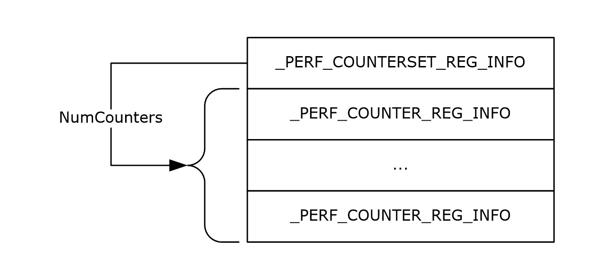

Figure 1: PerflibV2QueryCounterSetRegistrationInfo return if RequestCode = 0x00000001

The following diagram illustrates data size, alignment, and endianness.

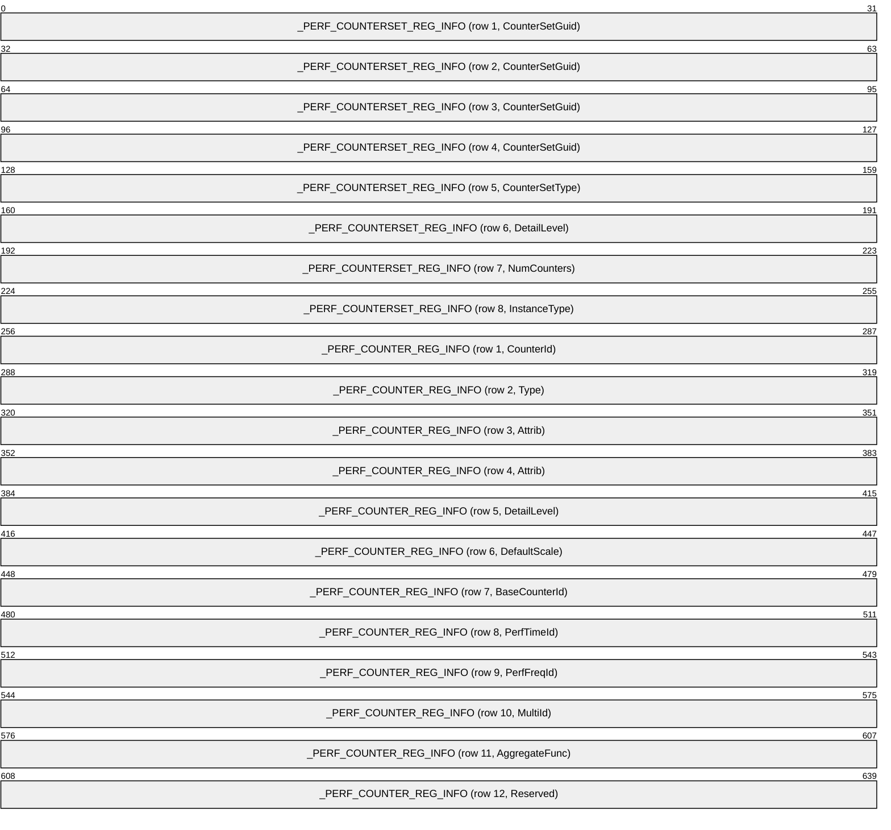
```mermaid
packet-beta
  0-31: "_PERF_COUNTERSET_REG_INFO (row 1, CounterSetGuid)"
  32-63: "_PERF_COUNTERSET_REG_INFO (row 2, CounterSetGuid)"
  64-95: "_PERF_COUNTERSET_REG_INFO (row 3, CounterSetGuid)"
  96-127: "_PERF_COUNTERSET_REG_INFO (row 4, CounterSetGuid)"
  128-159: "_PERF_COUNTERSET_REG_INFO (row 5, CounterSetType)"
  160-191: "_PERF_COUNTERSET_REG_INFO (row 6, DetailLevel)"
  192-223: "_PERF_COUNTERSET_REG_INFO (row 7, NumCounters)"
  224-255: "_PERF_COUNTERSET_REG_INFO (row 8, InstanceType)"
  256-287: "_PERF_COUNTER_REG_INFO (row 1, CounterId)"
  288-319: "_PERF_COUNTER_REG_INFO (row 2, Type)"
  320-351: "_PERF_COUNTER_REG_INFO (row 3, Attrib)"
  352-383: "_PERF_COUNTER_REG_INFO (row 4, Attrib)"
  384-415: "_PERF_COUNTER_REG_INFO (row 5, DetailLevel)"
  416-447: "_PERF_COUNTER_REG_INFO (row 6, DefaultScale)"
  448-479: "_PERF_COUNTER_REG_INFO (row 7, BaseCounterId)"
  480-511: "_PERF_COUNTER_REG_INFO (row 8, PerfTimeId)"
  512-543: "_PERF_COUNTER_REG_INFO (row 9, PerfFreqId)"
  544-575: "_PERF_COUNTER_REG_INFO (row 10, MultiId)"
  576-607: "_PERF_COUNTER_REG_INFO (row 11, AggregateFunc)"
  608-639: "_PERF_COUNTER_REG_INFO (row 12, Reserved)"
```

- If *RequestCode* = 0x00000002, the server returns information about a performance counter. The server MUST return a _PERF_COUNTER_REG_INFO structure.
The following diagram illustrates data size, alignment, and endianness.

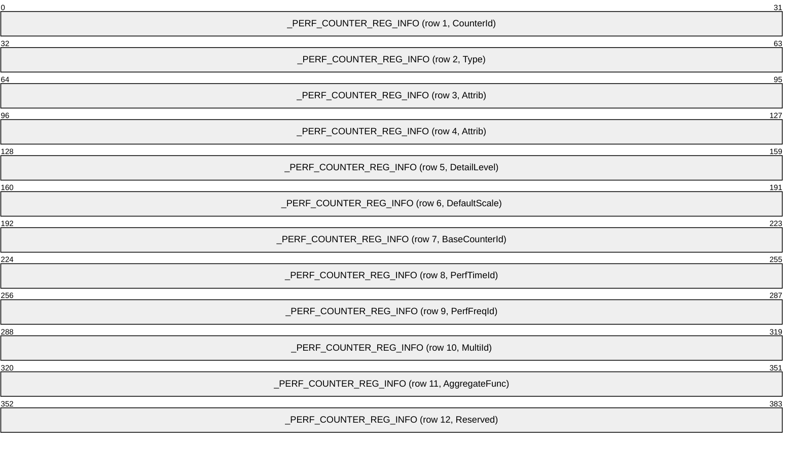
```mermaid
packet-beta
  0-31: "_PERF_COUNTER_REG_INFO (row 1, CounterId)"
  32-63: "_PERF_COUNTER_REG_INFO (row 2, Type)"
  64-95: "_PERF_COUNTER_REG_INFO (row 3, Attrib)"
  96-127: "_PERF_COUNTER_REG_INFO (row 4, Attrib)"
  128-159: "_PERF_COUNTER_REG_INFO (row 5, DetailLevel)"
  160-191: "_PERF_COUNTER_REG_INFO (row 6, DefaultScale)"
  192-223: "_PERF_COUNTER_REG_INFO (row 7, BaseCounterId)"
  224-255: "_PERF_COUNTER_REG_INFO (row 8, PerfTimeId)"
  256-287: "_PERF_COUNTER_REG_INFO (row 9, PerfFreqId)"
  288-319: "_PERF_COUNTER_REG_INFO (row 10, MultiId)"
  320-351: "_PERF_COUNTER_REG_INFO (row 11, AggregateFunc)"
  352-383: "_PERF_COUNTER_REG_INFO (row 12, Reserved)"
```

- If *RequestCode* = 0x00000003, 0x00000004, or 0x00000009, the server returns either the localized name (*RequestCode* = 0x00000003) or description (*RequestCode* = 0x00000004). The *RequestCode* 0x00000009 specifies returning the name as an English-language string. The server MUST return a null-terminated Unicode string.
- If *RequestCode* = 0x00000005, 0x00000006, or 0x0000000A, the server returns either the localized names (*RequestCode* = 0x00000005) or descriptions (*RequestCode* = 0x00000006). The *RequestCode* 0x0000000A specifies returning the names of the counters as English-language strings. The server MUST return a [_STRING_BUFFER_HEADER](#Section_2.2.4.3) structure that is followed by a set of [_STRING_COUNTER_HEADER](#Section_2.2.4.4) structures and then a set of null-terminated Unicode strings and MUST be 8-byte aligned. The number of _STRING_COUNTER_HEADER structures MUST be equal to the **dwCounters** field of the _STRING_BUFFER_HEADER structure. The offset to the beginning of a string is the size of the _STRING_BUFFER_HEADER plus the size of the _STRING_COUNTER_HEADER structures that are multiplied by the number of counters plus the **dwOffset** value of the _STRING_COUNTER_HEADER structure.
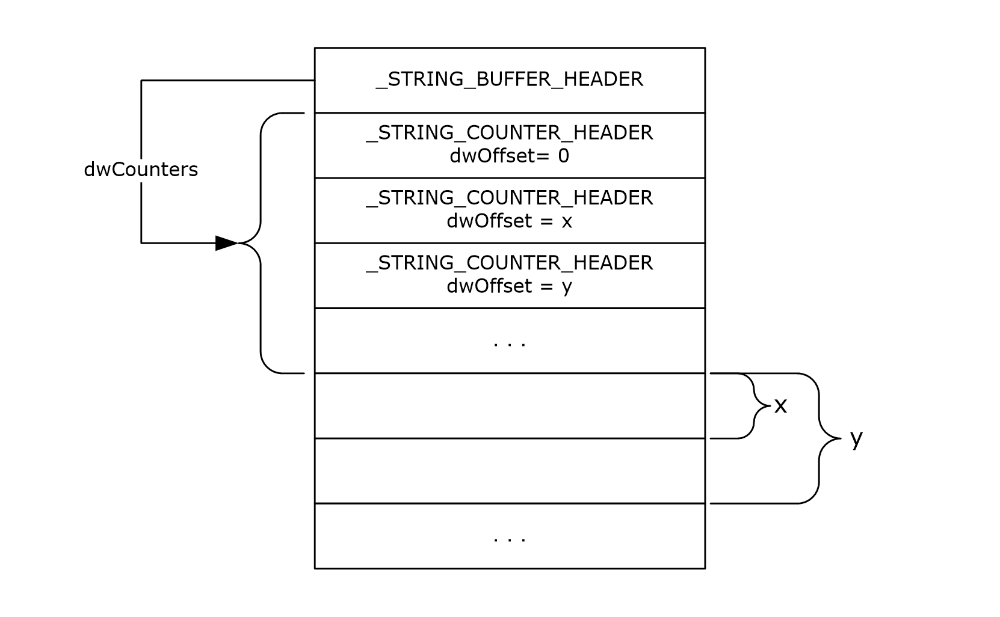

Figure 2: PerflibV2QueryCounterSetRegistrationInfo return if RequestCode = 0x00000005

The following diagram illustrates data size, alignment, and endianness. In this example, the names of two performance counters are returned (STRING_BUFFER_HEADER.dwCounters == 2). The name of the first counter is 6 bytes in length, while the name of the second counter is 8 bytes in length.

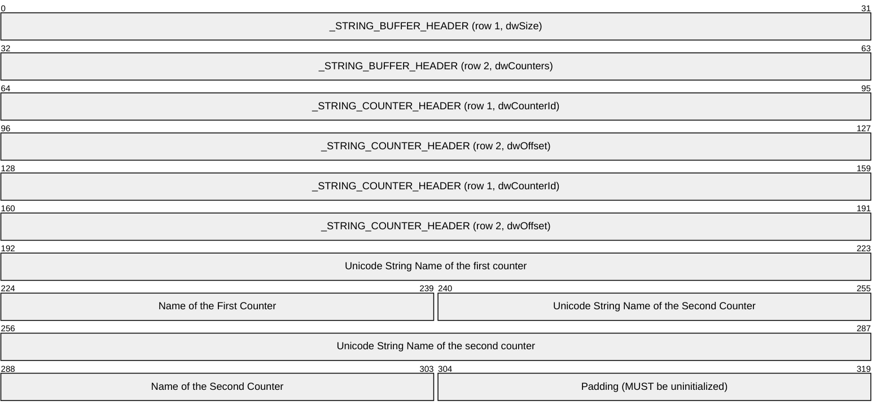
```mermaid
packet-beta
  0-31: "_STRING_BUFFER_HEADER (row 1, dwSize)"
  32-63: "_STRING_BUFFER_HEADER (row 2, dwCounters)"
  64-95: "_STRING_COUNTER_HEADER (row 1, dwCounterId)"
  96-127: "_STRING_COUNTER_HEADER (row 2, dwOffset)"
  128-159: "_STRING_COUNTER_HEADER (row 1, dwCounterId)"
  160-191: "_STRING_COUNTER_HEADER (row 2, dwOffset)"
  192-223: "Unicode String Name of the first counter"
  224-239: "Name of the First Counter"
  240-255: "Unicode String Name of the Second Counter"
  256-287: "Unicode String Name of the second counter"
  288-303: "Name of the Second Counter"
  304-319: "Padding (MUST be uninitialized)"
```

- If *RequestCode* = 0x00000007, the server returns the name of the performance counter provider. The server MUST return a null-terminated Unicode string.
- If *RequestCode* = 0x00000008, the server returns the GUID of the performance counter provider. The server MUST return a GUID.

##### 3.1.4.1.3 PerflibV2EnumerateCounterSetInstances (Opnum 2)

The PerflibV2EnumerateCounterSetInstances method retrieves all active instances of the client-specified [**counterset**](#gt_counterset) on the server.

error_status_t PerflibV2EnumerateCounterSetInstances(

[in, string] wchar_t* szMachine,

[in] GUID* CounterSetGuid,

[in, range(0, 67108864)] DWORD dwInSize,

[out] DWORD* pdwOutSize,

[out] DWORD* pdwRtnSize,

[out, size_is(dwInSize), length_is(* pdwOutSize)]

unsigned char* lpData

);

**szMachine:** A [**Unicode string**](#gt_unicode-string) specifying a server name, which is passed directly to the counter providers. Counter providers can ignore the server name provided by **szMachine**.

**CounterSetGuid:** The [**GUID**](#gt_globally-unique-identifier-guid) of the counterset whose instances are to be enumerated.

| Return value/code | Description |
| --- | --- |
| 0x00000000 ERROR_SUCCESS | The return value indicates success. |
| 0x00000005 ERROR_ACCESS_DENIED | The server returns this value to the client if the authentication level of the client is less than RPC_C_AUTHN_LEVEL_PKT_PRIVACY. |
| 0x00001068 ERROR_WMI_GUID_NOT_FOUND | The server returns this value when it cannot find a counterset with the GUID that was specified by the client in the **CounterSetGuid** parameter. |
| 0x00000008 ERROR_NOT_ENOUGH_MEMORY | The server returns this value to the client when the buffer the client has provided is not large enough to accommodate the instance information. |
| 0x00001069 ERROR_WMI_INSTANCE_NOT_FOUND | The server returns this value to the client when there are no active instances of the counterset whose information can be returned. |
| 0x00001073 ERROR_WMI_INVALID_REGINFO | The server returns this to the client if, for any reason when trying to enumerate counterset instances, the information that the server expected was different than what the applications exposing [**performance counters**](#gt_performance-counter) returned. For example, the server (through some standard repository), expected information about one instance of a counterset to be returned (because it was specified as a single-instance counterset), but the application actually maintaining the information returned instance information about multiple instances of the counterset. |
| 0x0000000E ERROR_OUTOFMEMORY | The server returns this value to the client if, for any reason as it tries to return the instance information of the specified counterset, it fails to allocate memory. |

**dwInSize:** The size, in bytes, of the buffer.

**pdwOutSize:** The total size, in bytes, of the data that is returned and written to the buffer.

**pdwRtnSize:** The necessary size, in bytes, to retrieve all the requested data.

**lpData:** The buffer that contains the instances information for the counterset.

**Return Values:** This method MUST return zero (ERROR_SUCCESS) for success; otherwise, it MUST return one of the standard Windows errors, as specified in [MS-ERREF](../MS-ERREF/MS-ERREF.md) section 2.2.

The server MUST return a data array in which each element is a [_PERF_INSTANCE_HEADER](#Section_2.2.4.5) structure that is followed by a null-terminated Unicode string instance name. The **size** field of the _PERF_INSTANCE_HEADER structure MUST be the size of the _PERF_INSTANCE_HEADER structure plus the space that is occupied by the instance name string; and MUST be an 8-byte multiple.

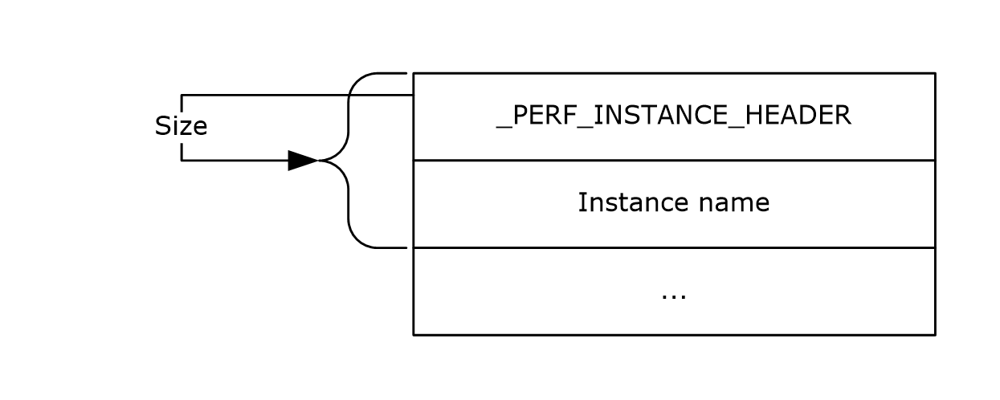

Figure 3: PerflibV2EnumerateCounterSetInstances return

The following diagram illustrates data size, alignment, and endianness. In this example, information about two instances of the counterset is returned by the server. The first instance name is 6 bytes in length, and the second instance name is 8 bytes in length. The two bytes in padding between the end of the first instance name string and the beginning of the next _PERF_INSTANCE_HEADER structure MUST be uninitialized and MUST be ignored by the client.

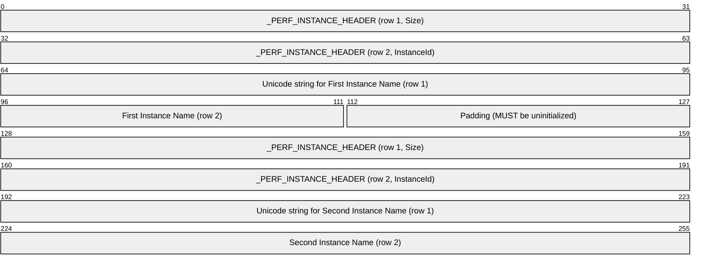
```mermaid
packet-beta
  0-31: "_PERF_INSTANCE_HEADER (row 1, Size)"
  32-63: "_PERF_INSTANCE_HEADER (row 2, InstanceId)"
  64-95: "Unicode string for First Instance Name (row 1)"
  96-111: "First Instance Name (row 2)"
  112-127: "Padding (MUST be uninitialized)"
  128-159: "_PERF_INSTANCE_HEADER (row 1, Size)"
  160-191: "_PERF_INSTANCE_HEADER (row 2, InstanceId)"
  192-223: "Unicode string for Second Instance Name (row 1)"
  224-255: "Second Instance Name (row 2)"
```

##### 3.1.4.1.4 PerflibV2OpenQueryHandle (Opnum 3)

The PerflibV2OpenQueryHandle method returns a handle to the client that the client then uses to add, remove, and collect [**performance counters**](#gt_performance-counter) from the server.

error_status_t PerflibV2OpenQueryHandle(

[in, string] wchar_t* szMachine,

[out] PRPC_HQUERY phQuery

);

**szMachine:** A [**Unicode string**](#gt_unicode-string) specifying a server name, which is passed directly to the counter providers. Counter providers can ignore the server name provided by **szMachine**.

**phQuery:** A handle used by other methods to add, remove, and collect performance counters.

**Return Values:** This method MUST return zero (ERROR_SUCCESS) for success; otherwise, it MUST return one of the standard Windows errors, as specified in [MS-ERREF](../MS-ERREF/MS-ERREF.md) section 2.2.

| Return value/code | Description |
| --- | --- |
| 0x00000000 ERROR_SUCCESS | The return value indicates success. |
| 0x00000005 ERROR_ACCESS_DENIED | The server returns this value to the client if the authentication level of the client is less than RPC_C_AUTHN_LEVEL_PKT_PRIVACY. |
| 0x0000000E ERROR_OUTOFMEMORY | The server returns this value to the client if for any reason memory allocation fails as it tries to allocate memory to begin storing state about the client request. |
| 0x000005AA ERROR_NO_SYSTEM_RESOURCES | The server returns this value if it cannot allocate other system resource to process the client request. This is not specifically memory about the client request or handle. |

##### 3.1.4.1.5 PerflibV2QueryCounterInfo (Opnum 5)

The PerflibV2QueryCounterInfo method returns information on the [**performance counters**](#gt_performance-counter) that belong to the performance counter query associated with the [RPC_HQUERY](#Section_2.2.1); these performance counters are associated with RPC_HQUERY by calling the [PerflibV2ValidateCounters](#Section_3.1.4.1.7) method. The server MUST return performance counter metadata information, stored in a [_PERF_COUNTER_IDENTIFIER](#Section_2.2.4.6) structure for each performance counter, for the performance counters that are associated with the RPC_HQUERY handle.

error_status_t PerflibV2QueryCounterInfo(

[in] RPC_HQUERY hQuery,

[in, range(0, 67108864)] DWORD dwInSize,

[out] DWORD* pdwOutSize,

[out] DWORD* pdwRtnSize,

[out, size_is(dwInSize), length_is(*pdwOutSize)]

unsigned char* lpData

);

**hQuery:** The handle returned by the [PerflibV2OpenQueryHandle](#Section_3.1.4.1.4) method; an exception is thrown or an error is returned by RPC if the handle did not originate from the PerflibV2OpenQueryHandle method.

**dwInSize:** The size, in bytes, of the buffer.

**pdwOutSize:** The size, in bytes, of the data that is written to the buffer.

**pdwRtnSize:** The necessary size, in bytes, to retrieve all the requested data.

**lpData:** The buffer that contains the requested counter information.

**Return Values:** This method MUST return zero (ERROR_SUCCESS) for success; otherwise, it MUST return one of the standard Windows errors, as specified in [MS-ERREF](../MS-ERREF/MS-ERREF.md) section 2.2.

| Return value/code | Description |
| --- | --- |
| 0x00000000 ERROR_SUCCESS | The return value indicates success. |
| 0x00000005 ERROR_ACCESS_DENIED | The server returns this value to the client if the authentication level of the client is less than RPC_C_AUTHN_LEVEL_PKT_PRIVACY. |
| 0x00000008 ERROR_NOT_ENOUGH_MEMORY | The server will return this value if the buffer pointed to by **lpData** is not of sufficient size to return the requested information back to the client. |

The server MUST return a data array in which each element is a _PERF_COUNTER_IDENTIFIER structure that is followed by a null-terminated [**Unicode string**](#gt_unicode-string) instance name. The **index** field of the _PERF_COUNTER_IDENTIFIER structure MUST indicate the position of the corresponding _PERF_COUNTER_HEADER block in the array of returned _PERF_COUNTER_HEADER blocks by subsequent PerflibV2QueryCounterData method calls associated with the RPC_HQUERY handle.

The **status** field of the _PERF_COUNTER_IDENTIFIER structure SHOULD be set to a Win32 error code by the server and MUST be ignored by the client. The size field of the _PERF_COUNTER_IDENTIFIER structure MUST be an 8-byte multiple.

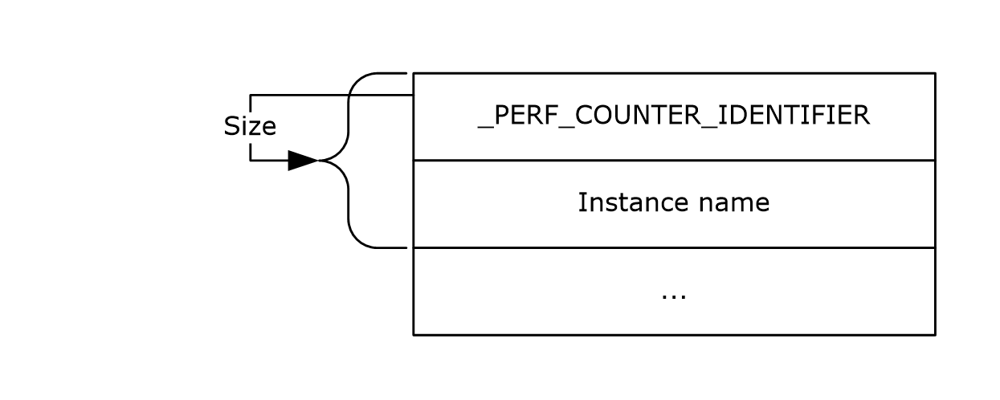

Figure 4: PerflibV2QueryCounterInfo return

The following diagram illustrates data size, alignment, and endianness. In this example, information about two counters is returned by the server. The first instance name is 6 bytes in length, and the second instance name is 8 bytes in length. The two bytes in padding between the end of the first instance name string and the beginning of the next _PERF_COUNTER_IDENTIFIER structure MUST be set to 0 by the server and MUST be ignored by the client.

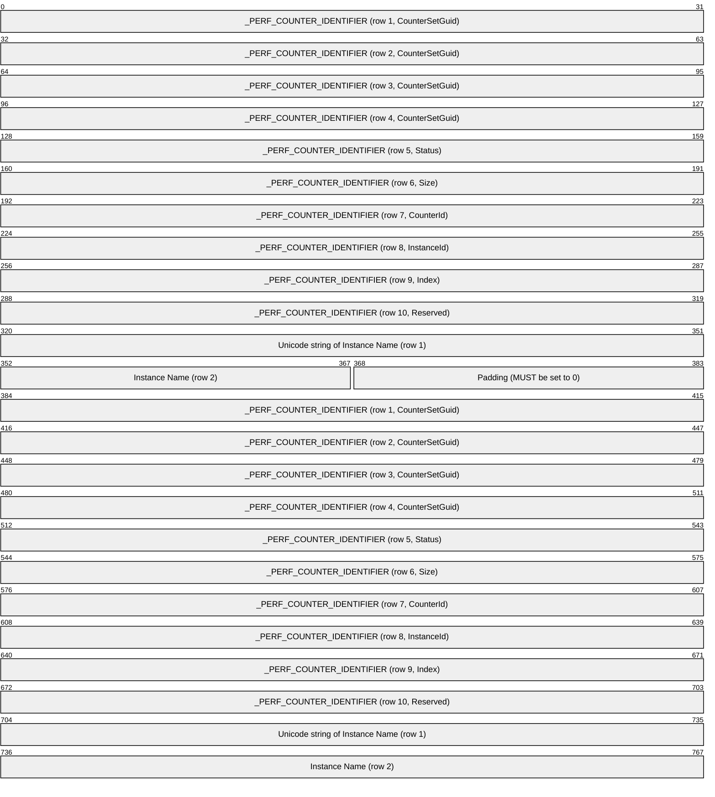
```mermaid
packet-beta
  0-31: "_PERF_COUNTER_IDENTIFIER (row 1, CounterSetGuid)"
  32-63: "_PERF_COUNTER_IDENTIFIER (row 2, CounterSetGuid)"
  64-95: "_PERF_COUNTER_IDENTIFIER (row 3, CounterSetGuid)"
  96-127: "_PERF_COUNTER_IDENTIFIER (row 4, CounterSetGuid)"
  128-159: "_PERF_COUNTER_IDENTIFIER (row 5, Status)"
  160-191: "_PERF_COUNTER_IDENTIFIER (row 6, Size)"
  192-223: "_PERF_COUNTER_IDENTIFIER (row 7, CounterId)"
  224-255: "_PERF_COUNTER_IDENTIFIER (row 8, InstanceId)"
  256-287: "_PERF_COUNTER_IDENTIFIER (row 9, Index)"
  288-319: "_PERF_COUNTER_IDENTIFIER (row 10, Reserved)"
  320-351: "Unicode string of Instance Name (row 1)"
  352-367: "Instance Name (row 2)"
  368-383: "Padding (MUST be set to 0)"
  384-415: "_PERF_COUNTER_IDENTIFIER (row 1, CounterSetGuid)"
  416-447: "_PERF_COUNTER_IDENTIFIER (row 2, CounterSetGuid)"
  448-479: "_PERF_COUNTER_IDENTIFIER (row 3, CounterSetGuid)"
  480-511: "_PERF_COUNTER_IDENTIFIER (row 4, CounterSetGuid)"
  512-543: "_PERF_COUNTER_IDENTIFIER (row 5, Status)"
  544-575: "_PERF_COUNTER_IDENTIFIER (row 6, Size)"
  576-607: "_PERF_COUNTER_IDENTIFIER (row 7, CounterId)"
  608-639: "_PERF_COUNTER_IDENTIFIER (row 8, InstanceId)"
  640-671: "_PERF_COUNTER_IDENTIFIER (row 9, Index)"
  672-703: "_PERF_COUNTER_IDENTIFIER (row 10, Reserved)"
  704-735: "Unicode string of Instance Name (row 1)"
  736-767: "Instance Name (row 2)"
```

##### 3.1.4.1.6 PerflibV2QueryCounterData (Opnum 6)

The PerflibV2QueryCounterData method retrieves data for the [**performance counters**](#gt_performance-counter) associated with the query. Performance counters can be added or removed from queries by calling [PerflibV2ValidateCounters](#Section_3.1.4.1.7).

error_status_t PerflibV2QueryCounterData(

[in] RPC_HQUERY hQuery,

[in, range(0, 1073741824)] DWORD dwInSize,

[out] DWORD* pdwOutSize,

[out] DWORD* pdwRtnSize,

[out, size_is(dwInSize), length_is(* pdwOutSize)]

unsigned char* lpData

);

**hQuery:** The handle returned by the [PerflibV2OpenQueryHandle](#Section_3.1.4.1.4) method; an exception is thrown or an error is returned by RPC if the handle did not originate from the PerflibV2OpenQueryHandle method.

**dwInSize:** The size, in bytes, of the buffer.

**pdwOutSize:** The size, in bytes, of the data that is returned and written to the buffer.

**pdwRtnSize:** The necessary size, in bytes, to retrieve all the requested data.

**lpData:** The buffer that contains the requested counter information.

**Return Values:** This method MUST return zero (ERROR_SUCCESS) for success; otherwise, it MUST return one of the standard Windows error codes, as specified in [MS-ERREF](../MS-ERREF/MS-ERREF.md) section 2.2.

| Return value/code | Description |
| --- | --- |
| 0x00000000 ERROR_SUCCESS | The return value indicates success. |
| 0x00000005 ERROR_ACCESS_DENIED | The server returns this value to the client if the authentication level of the client is less than RPC_C_AUTHN_LEVEL_PKT_PRIVACY. |
| 0x00000008 ERROR_NOT_ENOUGH_MEMORY | The server will return this value to the client if the size of the buffer pointed to by lpData is not of sufficient size to return the performance counter values to the client. |

The server MUST return a [_PERF_DATA_HEADER](#Section_2.2.4.7) structure that is followed by a set of [_PERF_COUNTER_HEADER](#Section_2.2.4.8) blocks. The format of the _PERF_COUNTER_HEADER block MUST be determined by the **dwType** field of the _PERF_COUNTER_HEADER structure.

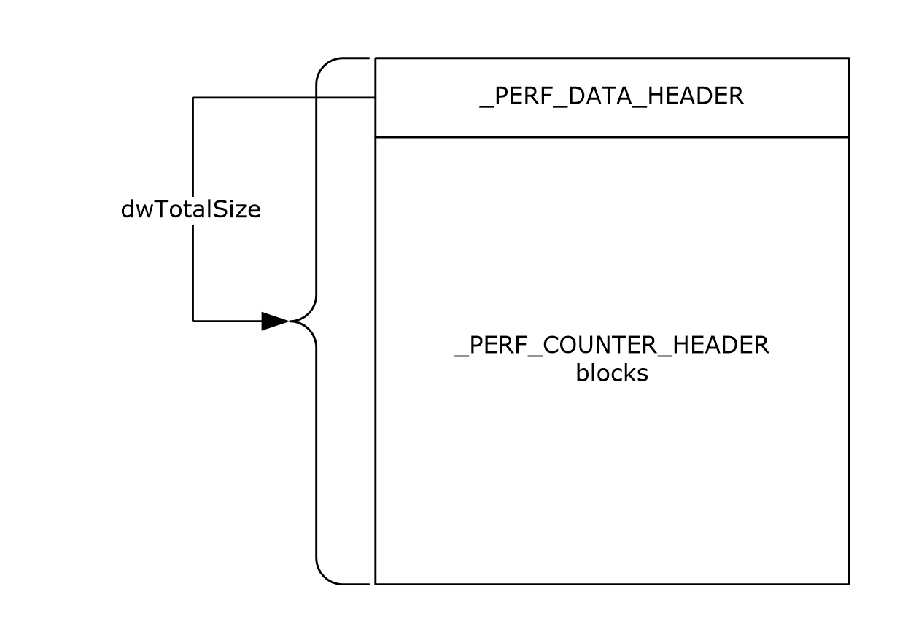

Figure 5: PerflibV2QueryCounterData return

The following diagram illustrates data size, alignment, and endianness.

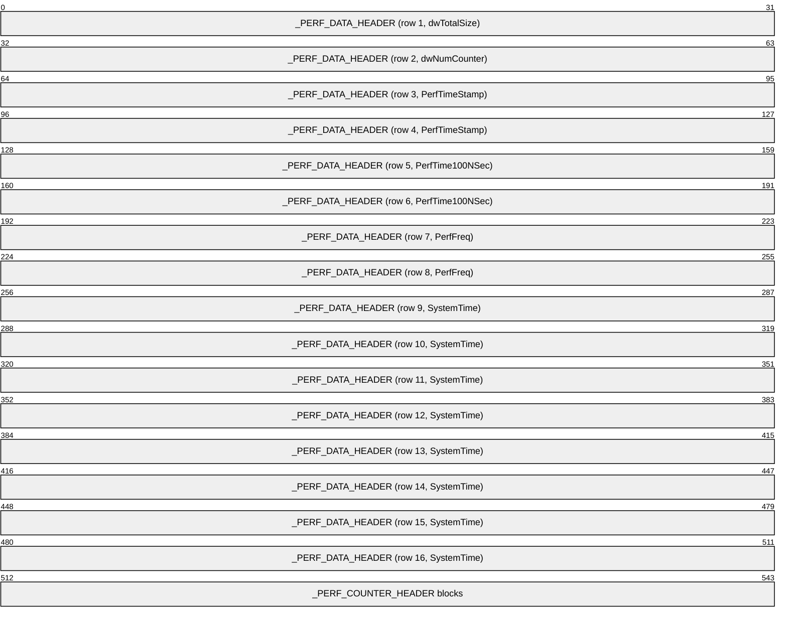
```mermaid
packet-beta
  0-31: "_PERF_DATA_HEADER (row 1, dwTotalSize)"
  32-63: "_PERF_DATA_HEADER (row 2, dwNumCounter)"
  64-95: "_PERF_DATA_HEADER (row 3, PerfTimeStamp)"
  96-127: "_PERF_DATA_HEADER (row 4, PerfTimeStamp)"
  128-159: "_PERF_DATA_HEADER (row 5, PerfTime100NSec)"
  160-191: "_PERF_DATA_HEADER (row 6, PerfTime100NSec)"
  192-223: "_PERF_DATA_HEADER (row 7, PerfFreq)"
  224-255: "_PERF_DATA_HEADER (row 8, PerfFreq)"
  256-287: "_PERF_DATA_HEADER (row 9, SystemTime)"
  288-319: "_PERF_DATA_HEADER (row 10, SystemTime)"
  320-351: "_PERF_DATA_HEADER (row 11, SystemTime)"
  352-383: "_PERF_DATA_HEADER (row 12, SystemTime)"
  384-415: "_PERF_DATA_HEADER (row 13, SystemTime)"
  416-447: "_PERF_DATA_HEADER (row 14, SystemTime)"
  448-479: "_PERF_DATA_HEADER (row 15, SystemTime)"
  480-511: "_PERF_DATA_HEADER (row 16, SystemTime)"
  512-543: "_PERF_COUNTER_HEADER blocks"
```

- If **dwType** = PERF_ERROR_RETURN (0x00000000), the _PERF_COUNTER_HEADER block MUST contain one _PERF_COUNTER_HEADER structure, and the **dwStatus** field of the structure indicates the error by using a Win32 error code. Win32 error codes are specified in [MS-ERREF].
- If **dwType** = PERF_SINGLE_COUNTER (0x00000001), the _PERF_COUNTER_HEADER block MUST contain a _PERF_COUNTER_HEADER structure that is followed by a [_PERF_COUNTER_DATA](#Section_2.2.4.9) structure and then followed by the counter value.
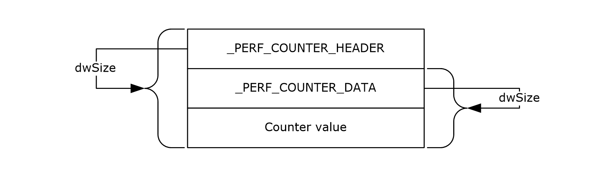

Figure 6: PerflibV2QueryCounterData return if dwType = PERF_SINGLE_COUNTER

The following diagram illustrates data size, alignment, and endianness.

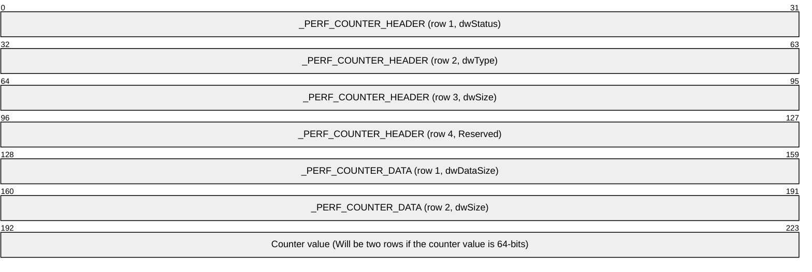
```mermaid
packet-beta
  0-31: "_PERF_COUNTER_HEADER (row 1, dwStatus)"
  32-63: "_PERF_COUNTER_HEADER (row 2, dwType)"
  64-95: "_PERF_COUNTER_HEADER (row 3, dwSize)"
  96-127: "_PERF_COUNTER_HEADER (row 4, Reserved)"
  128-159: "_PERF_COUNTER_DATA (row 1, dwDataSize)"
  160-191: "_PERF_COUNTER_DATA (row 2, dwSize)"
  192-223: "Counter value (Will be two rows if the counter value is 64-bits)"
```

- If **dwType** = [PERF_MULTI_COUNTERS](#Section_2.2.4.11) (0x00000002), the _PERF_COUNTER_HEADER block MUST contain a _PERF_COUNTER_HEADER structure that is followed by a _PERF_MULTI_COUNTERS structure, followed by an array of performance counter IDs, followed by a sequence of _PERF_COUNTER_DATA blocks. Each _PERF_COUNTER_DATA block MUST contain a _PERF_COUNTER_DATA structure that is followed by the performance counter value. The order of the elements in the array of counter IDs MUST be the same as the order of the corresponding performance counter values. The number of _PERF_COUNTER_DATA structures and the length of the performance counter ID array MUST be equal to the **dwCounters** field of the _PERF_MULTI_COUNTERS structure.
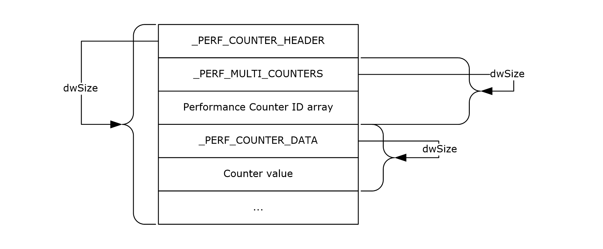

Figure 7: PerflibV2QueryCounterData return if dwType = _PERF_MULTI_COUNTERS

The following diagram illustrates data size, alignment, and endianness.

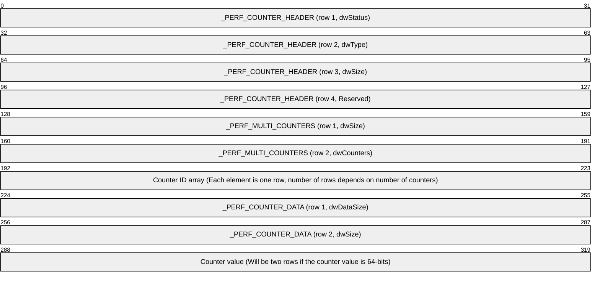
```mermaid
packet-beta
  0-31: "_PERF_COUNTER_HEADER (row 1, dwStatus)"
  32-63: "_PERF_COUNTER_HEADER (row 2, dwType)"
  64-95: "_PERF_COUNTER_HEADER (row 3, dwSize)"
  96-127: "_PERF_COUNTER_HEADER (row 4, Reserved)"
  128-159: "_PERF_MULTI_COUNTERS (row 1, dwSize)"
  160-191: "_PERF_MULTI_COUNTERS (row 2, dwCounters)"
  192-223: "Counter ID array (Each element is one row, number of rows depends on number of counters)"
  224-255: "_PERF_COUNTER_DATA (row 1, dwDataSize)"
  256-287: "_PERF_COUNTER_DATA (row 2, dwSize)"
  288-319: "Counter value (Will be two rows if the counter value is 64-bits)"
```

- If **dwType** = [_PERF_MULTI_INSTANCES](#Section_2.2.4.10) (0x00000004), the _PERF_COUNTER_HEADER block MUST contain a _PERF_COUNTER_HEADER structure that is followed by a _PERF_MULTI_INSTANCES structure and then followed by a sequence of [_PERF_INSTANCE_HEADER](#Section_2.2.4.5) blocks. Each _PERF_INSTANCE_HEADER block MUST contain a _PERF_INSTANCE_HEADER structure that is followed by a _PERF_COUNTER_DATA structure and then followed by the performance counter value. The number of _PERF_INSTANCE_HEADER blocks MUST be equal to the **dwInstances** field of the _PERF_MULTI_INSTANCES structure.
The following diagram illustrates data size, alignment, and endianness.

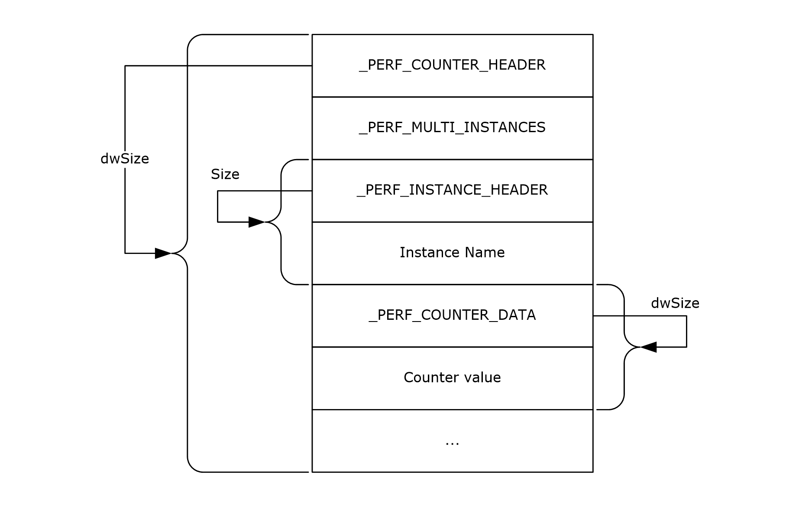

Figure 8: PerflibV2QueryCounterData return if dwType = _PERF_MULTI_INSTANCES

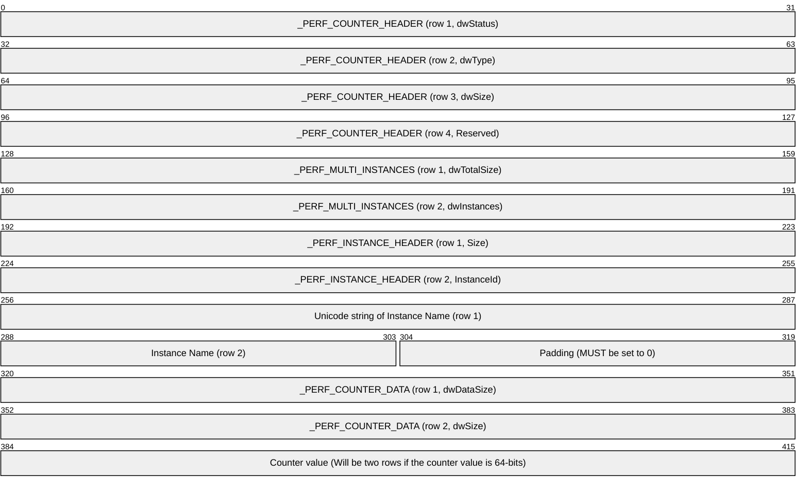
```mermaid
packet-beta
  0-31: "_PERF_COUNTER_HEADER (row 1, dwStatus)"
  32-63: "_PERF_COUNTER_HEADER (row 2, dwType)"
  64-95: "_PERF_COUNTER_HEADER (row 3, dwSize)"
  96-127: "_PERF_COUNTER_HEADER (row 4, Reserved)"
  128-159: "_PERF_MULTI_INSTANCES (row 1, dwTotalSize)"
  160-191: "_PERF_MULTI_INSTANCES (row 2, dwInstances)"
  192-223: "_PERF_INSTANCE_HEADER (row 1, Size)"
  224-255: "_PERF_INSTANCE_HEADER (row 2, InstanceId)"
  256-287: "Unicode string of Instance Name (row 1)"
  288-303: "Instance Name (row 2)"
  304-319: "Padding (MUST be set to 0)"
  320-351: "_PERF_COUNTER_DATA (row 1, dwDataSize)"
  352-383: "_PERF_COUNTER_DATA (row 2, dwSize)"
  384-415: "Counter value (Will be two rows if the counter value is 64-bits)"
```

- If **dwType** = PERF_COUNTERSET (0x00000006), the _PERF_COUNTER_HEADER block MUST contain the following, in order: a _PERF_COUNTER_HEADER structure, a _PERF_MULTI_COUNTERS structure, the performance counter ID array, a _PERF_MULTI_INSTANCES structure, and a set of _PERF_INSTANCE_HEADER blocks. Each _PERF_INSTANCE_HEADER block MUST contain a _PERF_INSTANCE_HEADER structure that is followed by a sequence of _PERF_COUNTER_DATA blocks, and each _PERF_COUNTER_DATA block MUST contain a _PERF_COUNTER_DATA structure that is followed by the performance counter value. The number of _PERF_COUNTER_DATA blocks MUST be equal to the **dwCounters** field of the _PERF_MULTI_COUNTERS structure and the length of the performance counter ID array. The order of the elements in the array of counter IDs MUST be the same as the order of the corresponding performance counter values. The number of _PERF_INSTANCE_HEADER blocks MUST be equal to the **dwInstances** field of the _PERF_MULTI_INSTANCES structure.
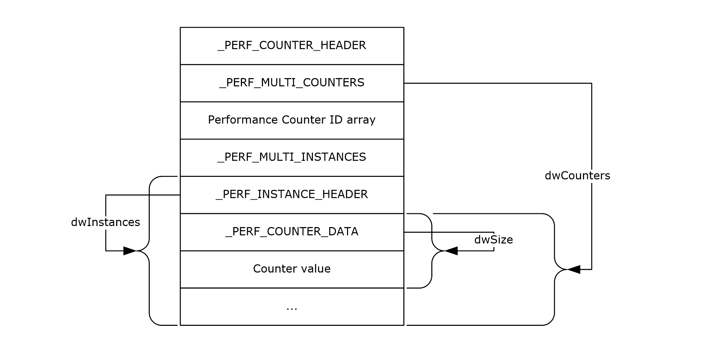

Figure 9: PerflibV2QueryCounterData return if dwType = PERF_COUNTERSET

The following diagram illustrates data size, alignment, and endianness.

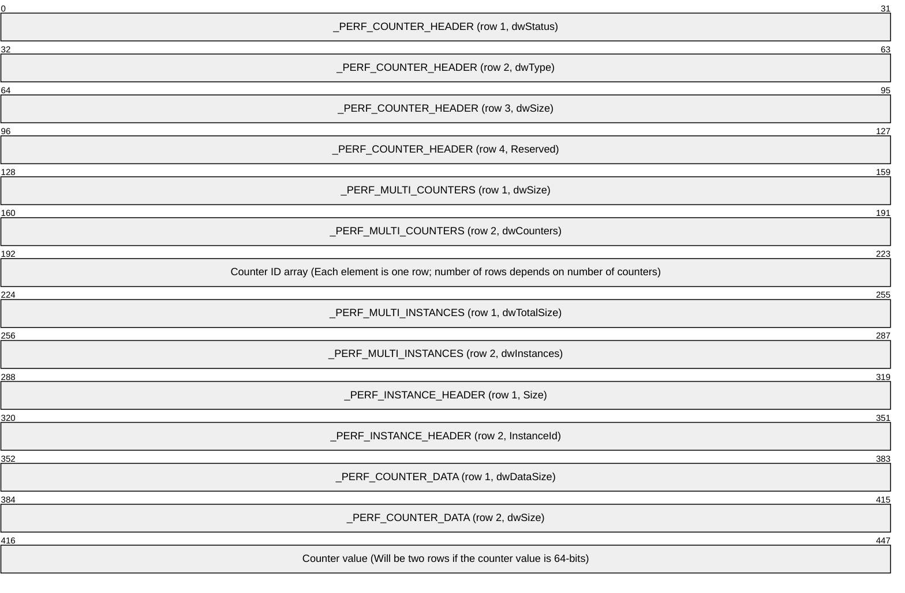
```mermaid
packet-beta
  0-31: "_PERF_COUNTER_HEADER (row 1, dwStatus)"
  32-63: "_PERF_COUNTER_HEADER (row 2, dwType)"
  64-95: "_PERF_COUNTER_HEADER (row 3, dwSize)"
  96-127: "_PERF_COUNTER_HEADER (row 4, Reserved)"
  128-159: "_PERF_MULTI_COUNTERS (row 1, dwSize)"
  160-191: "_PERF_MULTI_COUNTERS (row 2, dwCounters)"
  192-223: "Counter ID array (Each element is one row; number of rows depends on number of counters)"
  224-255: "_PERF_MULTI_INSTANCES (row 1, dwTotalSize)"
  256-287: "_PERF_MULTI_INSTANCES (row 2, dwInstances)"
  288-319: "_PERF_INSTANCE_HEADER (row 1, Size)"
  320-351: "_PERF_INSTANCE_HEADER (row 2, InstanceId)"
  352-383: "_PERF_COUNTER_DATA (row 1, dwDataSize)"
  384-415: "_PERF_COUNTER_DATA (row 2, dwSize)"
  416-447: "Counter value (Will be two rows if the counter value is 64-bits)"
```

##### 3.1.4.1.7 PerflibV2ValidateCounters (Opnum 7)

This PerflibV2ValidateCounters method either adds or removes [**performance counters**](#gt_performance-counter) from the query.

error_status_t PerflibV2ValidateCounters(

[in] RPC_HQUERY hQuery,

[in, range(0, 67108864)] DWORD dwInSize,

[in, out, size_is(dwInSize)] unsigned char* lpData,

[in] DWORD dwAdd

);

**hQuery:** The handle that is created by the [PerflibV2OpenQueryHandle](#Section_3.1.4.1.4) method; an exception is thrown or an error is returned by RPC if the handle did not originate from the PerflibV2OpenQueryHandle method.

**dwInSize:** The size, in bytes, of the buffer.

**lpData:** The buffer that contains the counter information to add to, or remove from, the query. The server will return this buffer after it has attempted to add or remove the specified counters; the **Status** field of each [_PERF_COUNTER_IDENTIFIER](#Section_2.2.4.6) structure will contain information about whether or not the server was successful.

**dwAdd:** A Boolean value that indicates if counters are being added to, or removed from, the query. If counters are being added, this MUST be set to TRUE; otherwise, it MUST be set to FALSE.

**Return Values:** This method MUST return zero (ERROR_SUCCESS) for success; otherwise, it MUST return one of the standard Windows error codes, as specified in [MS-ERREF](../MS-ERREF/MS-ERREF.md) section 2.2.

| Return value/code | Description |
| --- | --- |
| 0x00000000 ERROR_SUCCESS | The return value indicates success. |
| 0x00000005 ERROR_ACCESS_DENIED | The server returns this value to the client if the authentication level of the client is less than RPC_C_AUTHN_LEVEL_PKT_PRIVACY. |
| 0x00000057 ERROR_INVALID_PARAMETER | The server returns this value to the client for any of the following reasons: dwSize is less than the size of the _PERF_COUNTER_IDENTIFIER structure (this condition would prevent the server from returning information about one counter). The size of a single _PERF_COUNTER_IDENTIFIER structure that is passed into the buffer by the client is smaller than the expected size of a _PERF_COUNTER_IDENTIFIER structure. |
| 0x0000000E ERROR_OUTOFMEMORY | The server will return this value to the client if, in the process of completing the client's request of adding or removing performance counters from the query, a memory allocation fails. |

Errors are returned to the client by the server in one of two ways: the first is if the performance counter infrastructure on the server could not add or remove performance counters from the query; the second is if the [**provider**](#gt_provider) that is exposing the performance counter returns an error, in which case the performance counter infrastructure passes the error back to the client.

When the PerflibV2ValidateCounters method returns, the **Status** field of each _PERF_COUNTER_IDENTIFIER sent to the server will have the result of whether or not the server was able to successfully add or remove that particular performance counter from the query that is identified by the handle hQuery.

If the performance counter infrastructure is setting the Status field to an error value, then it MUST be one of the following values.

| Return value/code | Description |
| --- | --- |
| 0x00000000 ERROR_STATUS | The return value indicates success. The counter was either successfully added or removed from the query. |
| 0x00001068 ERROR_WMI_GUID_NOT_FOUND | The server cannot find the GUID that was passed by the client in the CounterSetGuid field of the _PERF_COUNTER_IDENTIFIER structure. |
| 0x0000106A ERROR_WMI_ITEMID_NOT_ FOUND | The server cannot find the counter whose numeric identifier is in the CounterId field of the _PERF_COUNTER_IDENTIFIER structure. |
| 0x00000003 ERROR_PATH_NOT_FOUND | The server cannot find an active instance with the name that was placed after the _PERF_COUNTER_IDENTIFIER structure. |
| 0x000000B7 ERROR_ALREADY_EXISTS | The client tried to add a performance counter that has already been added in a previous call to PerflibV2ValidateCounters. |
| ERROR_INVALID_PARAMETER 0x00000057 | The server will return this value in the Status field of the _PERF_COUNTER_IDENTIFIER either when the _PERF_COUNTER_IDENTIFIER is corrupt, or if the server cannot find the counter to delete from the query that is specified by the structure. |
| 0x0000000E ERROR_OUTOFMEMORY | The server will return this value to the client if, either in the process of adding or removing a counter from a query, a memory allocation failure occurred. |

When this method is called, the buffer MUST contain an array of _PERF_COUNTER_IDENTIFIER blocks that reference the performance counters to add to, or remove from, the query. Each _PERF_COUNTER_IDENTIFIER block MUST contain a _PERF_COUNTER_IDENTIFIER structure; a multiple-instance counter set _PERF_COUNTER_IDENTIFIER structure MUST be followed by a null-terminated [**Unicode**](#gt_unicode) string instance name, while a single-instance counter set _PERF_COUNTER_IDENTIFIER structure MUST be followed by a string instance name. Setting the **CounterId** field of the _PERF_COUNTER_IDENTIFIER structure to 0xFFFFFFFF indicates a wildcard character. Setting the instance name string to "*" indicates a wildcard character.

When the method returns, the **Status** field of each _PERF_COUNTER_IDENTIFIER structure in the array MUST specify if the operation succeeded for the counters that are referenced by that structure.

##### 3.1.4.1.8 PerflibV2CloseQueryHandle (Opnum 4)

The PerflibV2CloseQueryHandle method closes the handle that is returned from the [PerflibV2OpenQueryHandle](#Section_3.1.4.1.4) method.

error_status_t PerflibV2CloseQueryHandle(

[in, out] PRPC_HQUERY phQuery

);

**phQuery:** A handle that is created by the PerflibV2OpenQueryHandle method. An exception is thrown or an error is returned by [**RPC**](#gt_remote-procedure-call-rpc) if the handle did not originate from the PerflibV2OpenQueryHandle method. On method return, *phQuery* MUST be set to NULL.

**Return Values:** This method MUST return zero (ERROR_SUCCESS) for success; otherwise, it MUST return one of the standard Windows errors, as specified in [MS-ERREF](../MS-ERREF/MS-ERREF.md) section 2.2.

| Return value/code | Description |
| --- | --- |
| 0x00000000 ERROR_SUCCESS | The return value indicates success. |
| 0x00000005 ERROR_ACCESS_DENIED | The server returns this value to the client if the authentication level of the client is less than RPC_C_AUTHN_LEVEL_PKT_PRIVACY. The opened handle, *phQuery*, remains in that state until the client calls PerflibV2CloseQueryHandle with authentication level RPC_C_AUTHN_LEVEL_PKT_PRIVACY. |

### 3.1.5 Timer Events

No timer events are required except for the events that are maintained in the underlying [**RPC transport**](#gt_rpc-transport).

### 3.1.6 Other Local Events

There are no local events inherently associated with the Performance Counter Query Protocol.

## 3.2 Client Details

### 3.2.1 Abstract Data Model

The state information that is required for successful operation of the Performance Counter Query Protocol is primarily stored on the server; other than the handle that is obtained from the [PerflibV2OpenQueryHandle (section 3.1.4.1.4)](#Section_3.1.4.1.4) method, all information such as the list of [**performance counters**](#gt_performance-counter) being queried is stored on the server.

If the client simply wants to either enumerate the available [**countersets**](#gt_counterset) or counterset instances on the server, or retrieve information about the counterset or counters that belong to the counterset, it does not need to establish a handle with the server by calling the PerflibV2OpenQueryHandle method. The client can simply call the [PerflibV2EnumerateCounterSet (section 3.1.4.1.1)](#Section_3.1.4.1.1), [PerflibV2EnumerateCounterSetInstances (section 3.1.4.1.3)](#Section_3.1.4.1.3), or [PerflibV2QueryCounterSetRegistrationInfo (section 3.1.4.1.2)](#Section_3.1.4.1.2) methods to retrieve the necessary information from the server.

If the client wants to query for performance counter data, or performance counter metadata associated with a particular query, from the server, then it first creates a handle. The client creates a handle by calling the PerflibV2OpenQueryHandlemethod. The server, upon receiving this call, stores the client machine information it receives from the RPC layer. The server also uses this handle to associate back to the client the performance counter2 that the client adds to the query by calling [PerflibV2ValidateCounters (section 3.1.4.1.7)](#Section_3.1.4.1.7). The server then returns this handle back to the client. The purpose of the handle is for the server to be able to distinguish between different client performance counter queries; the information that is passed back to the client, in the form of an [RPC_HQUERY (section 2.2.1)](#Section_2.2.1) handle, only contains the information necessary for the server to distinguish between separate queries. The client does not have knowledge of the contents or structure of the handle. For example, a specific implementation of the Performance Counter Query Protocol MAY return back a 32-bit unsigned numeric identifier as an RPC_HQUERY handle to the client; the client will then use this RPC_HQUERY handle, without explicit knowledge that the representation is a 32-bit unsigned integer, in subsequent communication to the server to query for performance counter data.

When the client has completed its necessary communication with the server, it closes the handle it obtained from the server by calling PerflibV2CloseQueryHandle. This allows the server to free any information it retained with respect to the client's query (such as the list of performance counters that were being queried). The client can also free the memory that is associated with the RPC_HQUERY handle.

### 3.2.2 Timers

No protocol timers are required—other than those internal ones that are used in [**remote procedure calls**](#gt_remote-procedure-call-rpc) to implement resiliency to network outages, as specified in [MS-RPCE](../MS-RPCE/MS-RPCE.md).

### 3.2.3 Initialization

There is no client-side initialization.

### 3.2.4 Message Processing Events and Sequencing Rules

The Performance Counter Query Protocol MUST indicate to the [**RPC**](#gt_remote-procedure-call-rpc) runtime that it is to perform a strict [**NDR**](#gt_network-data-representation-ndr) data consistency check at target level 6.0, as specified in [MS-RPCE](../MS-RPCE/MS-RPCE.md) section 3.

The Performance Counter Query Protocol MUST indicate to the RPC runtime that it is to reject a NULL unique or full pointer with a nonzero conformant value, as specified in [MS-RPCE] section 3.

### 3.2.5 Timer Events

No timer events are required except for the events that are maintained in the underlying [**RPC transport**](#gt_rpc-transport).

### 3.2.6 Other Local Events

There are no client-specific local events.

# 4 Protocol Examples

The following example demonstrates the usage of the Performance Counter Query Protocol. The client queries the value of certain [**performance counters**](#gt_performance-counter) that are organized into one [**counterset**](#gt_counterset) that is found on the server.

## 4.1 Querying for Performance Counter Data

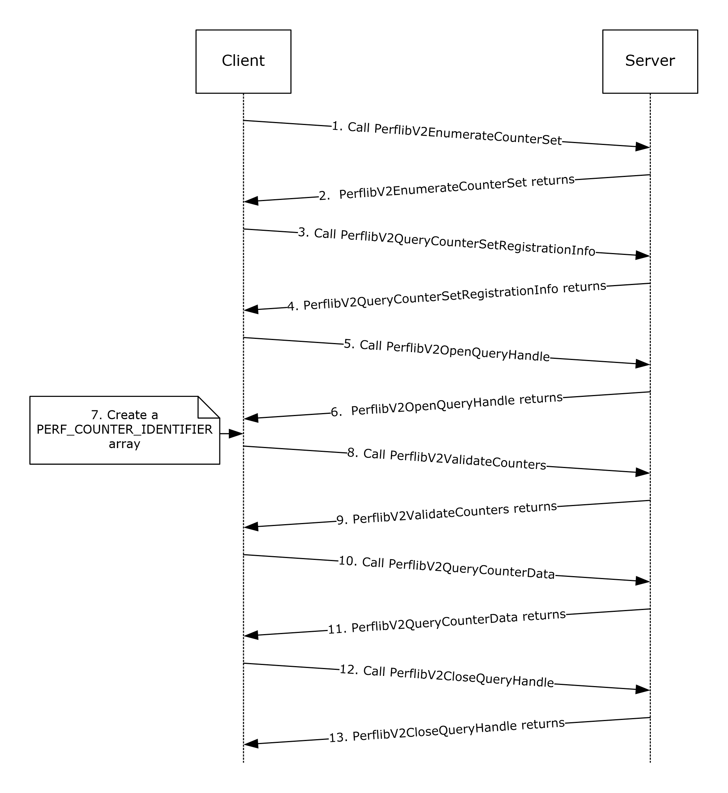

Figure 10: Querying for performance counter data

- The client calls [PerflibV2EnumerateCounterSet](#Section_3.1.4.1.1) on the server.
- The server returns all the available [**countersets**](#gt_counterset) to the client.
- The client selects a counterset based on [**GUID**](#gt_globally-unique-identifier-guid) and calls [PerflibV2QueryCounterSetRegistrationInfo](#Section_3.1.4.1.2) by using RequestCode = 0x00000001.
- The server returns the counterset information of the counterset that is specified by the GUID in PerflibV2QueryCounterSetRegistrationInfo, in addition to information about the [**performance counters**](#gt_performance-counter) that belong to the counterset.
- To query the performance counter data of certain counters, the client calls [PerflibV2OpenQueryHandle](#Section_3.1.4.1.4) to open a handle to a query on the server.
- The server returns a handle to a query; the client uses this handle to specify the performance counters whose values are to be queried.
- The client, using the information that was returned from PerflibV2QueryCounterSetRegistrationInfo, specifies the performance counters from the counterset that are to be queried.
- The client calls [PerflibV2ValidateCounters](#Section_3.1.4.1.7) with the *dwAdd* parameter set to TRUE to add the counters to the query that is specified by the handle that is returned in step 6.
- The server adds the performance counter information to the query that is specified by the handle and returns.
- The client calls [PerflibV2QueryCounterData](#Section_3.1.4.1.6) to retrieve the values of the performance counters that are stored in the query that is specified by the handle.
- The server returns the values of the performance counters in the query that is specified by the handle.
- The client calls PerflibV2CloseQueryHandle to close the handle that it obtained in step 6 because it is finished querying the server.
- The server releases all resources that are associated with the query that is specified by the handle and returns.

# 5 Security

The following sections specify security considerations for implementers of the Performance Counter Query Protocol.

## 5.1 Security Considerations for Implementers

The Performance Counter Query Protocol introduces no security considerations except for those that are applicable to [**RPC**](#gt_remote-procedure-call-rpc). Specifically, the client is required to use the RPC_C_AUTHN_LEVEL_PKT_PRIVACY authentication level.

## 5.2 Index of Security Parameters

| Security parameter | Section |
| --- | --- |
| None | N/A |

# 6 Appendix A: Full IDL

For ease of implementation, the full [**IDL**](#gt_interface-definition-language-idl) is provided below, where "ms-dtyp.idl" is the IDL found in [MS-DTYP](../MS-DTYP/MS-DTYP.md) Appendix A.

import "ms-dtyp.idl";

[

uuid(da5a86c5-12c2-4943-ab30-7f74a813d853),

pointer_default(unique),

version(1.0)

]

interface PerflibV2

{

typedef [context_handle] HANDLE RPC_HQUERY;

typedef RPC_HQUERY * PRPC_HQUERY;

error_status_t

PerflibV2EnumerateCounterSet(

[ in, string ] wchar_t * szMachine,

[ in, range(0, 256) ] DWORD dwInSize,

[ out ] DWORD * pdwOutSize,

[ out ] DWORD * pdwRtnSize,

[ out, size_is(dwInSize), length_is(* pdwOutSize) ]

GUID * lpData

);

error_status_t

PerflibV2QueryCounterSetRegistrationInfo(

[ in, string ] wchar_t * szMachine,

[ in ] GUID * CounterSetGuid,

[ in ] DWORD RequestCode,

[ in ] DWORD RequestLCID,

[ in, range(0, 134217728) ] DWORD dwInSize,

[ out ] DWORD * pdwOutSize,

[ out ] DWORD * pdwRtnSize,

[ out, size_is(dwInSize), length_is(* pdwOutSize) ] unsigned char *

lpData

);

error_status_t

PerflibV2EnumerateCounterSetInstances(

[ in, string ] wchar_t * szMachine,

[ in ] GUID * CounterSetGuid,

[ in, range(0, 67108864) ] DWORD dwInSize,

[ out ] DWORD * pdwOutSize,

[ out ] DWORD * pdwRtnSize,

[ out, size_is(dwInSize), length_is(* pdwOutSize) ] unsigned char *

lpData

);

error_status_t

PerflibV2OpenQueryHandle(

[ in, string ] wchar_t * szMachine,

[ out ] PRPC_HQUERY phQuery

);

error_status_t

PerflibV2CloseQueryHandle(

[ in, out ] PRPC_HQUERY phQuery

);

error_status_t

PerflibV2QueryCounterInfo(

[ in ] RPC_HQUERY hQuery,

[ in, range(0, 67108864) ] DWORD dwInSize,

[ out ] DWORD * pdwOutSize,

[ out ] DWORD * pdwRtnSize,

[ out, size_is(dwInSize), length_is(* pdwOutSize) ] unsigned char *

lpData

);

error_status_t

PerflibV2QueryCounterData(

[ in ] RPC_HQUERY hQuery,

[ in, range(0, 1073741824) ] DWORD dwInSize,

[ out ] DWORD * pdwOutSize,

[ out ] DWORD * pdwRtnSize,

[ out, size_is(dwInSize), length_is(* pdwOutSize) ] unsigned char *

lpData

);

error_status_t

PerflibV2ValidateCounters(

[ in ] RPC_HQUERY hQuery,

[ in, range(0, 67108864) ] DWORD dwInSize,

[ in, out, size_is(dwInSize) ] unsigned char * lpData,

[ in ] DWORD dwAdd

);

}

# 7 Appendix B: Product Behavior

The information in this specification is applicable to the following Microsoft products or supplemental software. References to product versions include updates to those products.

The terms "earlier" and "later", when used with a product version, refer to either all preceding versions or all subsequent versions, respectively. The term "through" refers to the inclusive range of versions. Applicable Microsoft products are listed chronologically in this section.

**Windows Client**

- Windows Vista operating system
- Windows 7 operating system
- Windows 8 operating system
- Windows 8.1 operating system
- Windows 10 operating system
- Windows 11 operating system
**Windows Server**

- Windows Server 2008 operating system
- Windows Server 2008 R2 operating system
- Windows Server 2012 operating system
- Windows Server 2012 R2 operating system
- Windows Server 2016 operating system
- Windows Server operating system
- Windows Server 2019 operating system
- Windows Server 2022 operating system
- Windows Server 2025 operating system
Exceptions, if any, are noted in this section. If an update version, service pack or Knowledge Base (KB) number appears with a product name, the behavior changed in that update. The new behavior also applies to subsequent updates unless otherwise specified. If a product edition appears with the product version, behavior is different in that product edition.

Unless otherwise specified, any statement of optional behavior in this specification that is prescribed using the terms "SHOULD" or "SHOULD NOT" implies product behavior in accordance with the SHOULD or SHOULD NOT prescription. Unless otherwise specified, the term "MAY" implies that the product does not follow the prescription.

<1> Section 2.1: Applicable Windows Server releases will impersonate the client; the minimum impersonation level is RPC_C_IMP_LEVEL_IMPERSONATE. Windows only allows system administrators, members of the [**Performance Log Users Group**](#gt_performance-log-users-group), and members of the [**Performance Monitor Users Group**](#gt_performance-monitor-users-group) to perform operations that are related to querying [**performance counter**](#gt_performance-counter) data or metadata. For more information on how an [**AS**](#gt_authentication-service-as) allows servers to act on the behalf of clients, see [[MSDN-IMPLVL]](https://go.microsoft.com/fwlink/?LinkId=90023).

<2> Section 2.2.4.2: Windows applications that use the performance counter infrastructure organize the performance counter into countersets. In order to update a performance counter, the application must first create an active instance of that counterset; this in turn will create an active instance of the performance counter that belongs to that counterset. The application can then update that instance of the performance counter with the appropriate values.

On Windows, when an application wants to create an active instance of a counterset, the performance counter infrastructure will allocate memory in the application's process space to store the values of the different performance counters belonging to that instance of the counterset. The application then makes a method call to update a particular performance counter; this function finds the appropriate place in the memory where the counter value for the performance counter being updated resides, and updates that memory with the new value. When a client queries the performance counter value, the performance counter infrastructure simply copies the contents of the memory corresponding to that performance counter instance.

Alternatively, an application can provide a pointer to the performance counter. Thus, when the application creates an instance of the performance counter, the memory space that would normally contain the performance counter value instead contains a pointer to the variable containing the performance counter value. This is done by calling a method that initializes the memory contents of that performance counter instance to be the address of a variable. Thus, when a client queries for the performance counter, the infrastructure can't simply copy the contents of the memory; it must use that memory as an address to find the actual performance counter value. In order to instruct the infrastructure that the contents of the memory corresponding to a performance counter instance is an address and not the actual performance counter value, the **Attrib** field of the _PERF_COUNTER_REG_INFO structure that defines the performance counter must be set to Reference (0x0000000000000001).

<3> Section 2.2.4.5: Windows does not enforce that the combination of instance name and instance be unique for a particular counterset.

<4> Section 3.1.4.1.2: Windows Vista and later and Windows Server 2008 and later incorrectly attempt to load the resources that correspond to *RequestCode* when *RequestCode* equals 0x00000001, 0x00000007, 0x00000008, 0x00000009, or 0x0000000A; if they are unable to do so, Windows returns an error code.

# 8 Change Tracking

This section identifies changes that were made to this document since the last release. Changes are classified as Major, Minor, or None.

The revision class **Major** means that the technical content in the document was significantly revised. Major changes affect protocol interoperability or implementation. Examples of major changes are:

- A document revision that incorporates changes to interoperability requirements.
- A document revision that captures changes to protocol functionality.
The revision class **Minor** means that the meaning of the technical content was clarified. Minor changes do not affect protocol interoperability or implementation. Examples of minor changes are updates to clarify ambiguity at the sentence, paragraph, or table level.

The revision class **None** means that no new technical changes were introduced. Minor editorial and formatting changes may have been made, but the relevant technical content is identical to the last released version.

The changes made to this document are listed in the following table. For more information, please contact [dochelp@microsoft.com](mailto:dochelp@microsoft.com).

| Section | Description | Revision class |
| --- | --- | --- |
| [7](#Section_7) Appendix B: Product Behavior | Added Windows Server 2025 to the list of applicable products. | Major |

## Revision History

| Date | Version | Revision Class | Comments |
| --- | --- | --- | --- |
| 2/22/2007 | 0.01 | New | Version 0.01 release |
| 6/1/2007 | 1.0 | Major | Updated and revised the technical content. |
| 7/3/2007 | 1.0.1 | Editorial | Changed language and formatting in the technical content. |
| 7/20/2007 | 1.0.2 | Editorial | Changed language and formatting in the technical content. |
| 8/10/2007 | 1.1 | Minor | Clarified the meaning of the technical content. |
| 9/28/2007 | 1.2 | Minor | Revised a figure. |
| 10/23/2007 | 1.3 | Minor | Added a Windows Behavior note. |
| 11/30/2007 | 1.3.1 | Editorial | Changed language and formatting in the technical content. |
| 1/25/2008 | 1.3.2 | Editorial | Changed language and formatting in the technical content. |
| 3/14/2008 | 1.3.3 | Editorial | Changed language and formatting in the technical content. |
| 5/16/2008 | 1.3.4 | Editorial | Changed language and formatting in the technical content. |
| 6/20/2008 | 1.3.5 | Editorial | Changed language and formatting in the technical content. |
| 7/25/2008 | 1.3.6 | Editorial | Changed language and formatting in the technical content. |
| 8/29/2008 | 1.4 | Minor | Corrected some error codes. |
| 10/24/2008 | 2.0 | Major | Updated and revised the technical content. |
| 12/5/2008 | 3.0 | Major | Updated and revised the technical content. |
| 1/16/2009 | 4.0 | Major | Updated and revised the technical content. |
| 2/27/2009 | 5.0 | Major | Updated and revised the technical content. |
| 4/10/2009 | 5.1 | Minor | Clarified the meaning of the technical content. |
| 5/22/2009 | 6.0 | Major | Updated and revised the technical content. |
| 7/2/2009 | 6.1 | Minor | Clarified the meaning of the technical content. |
| 8/14/2009 | 6.1.1 | Editorial | Changed language and formatting in the technical content. |
| 9/25/2009 | 6.2 | Minor | Clarified the meaning of the technical content. |
| 11/6/2009 | 6.2.1 | Editorial | Changed language and formatting in the technical content. |
| 12/18/2009 | 6.2.2 | Editorial | Changed language and formatting in the technical content. |
| 1/29/2010 | 6.2.3 | Editorial | Changed language and formatting in the technical content. |
| 3/12/2010 | 7.0 | Major | Updated and revised the technical content. |
| 4/23/2010 | 8.0 | Major | Updated and revised the technical content. |
| 6/4/2010 | 9.0 | Major | Updated and revised the technical content. |
| 7/16/2010 | 9.0.1 | Editorial | Changed language and formatting in the technical content. |
| 8/27/2010 | 9.0.1 | None | No changes to the meaning, language, or formatting of the technical content. |
| 10/8/2010 | 10.0 | Major | Updated and revised the technical content. |
| 11/19/2010 | 10.0 | None | No changes to the meaning, language, or formatting of the technical content. |
| 1/7/2011 | 10.0 | None | No changes to the meaning, language, or formatting of the technical content. |
| 2/11/2011 | 10.0 | None | No changes to the meaning, language, or formatting of the technical content. |
| 3/25/2011 | 10.0 | None | No changes to the meaning, language, or formatting of the technical content. |
| 5/6/2011 | 10.0 | None | No changes to the meaning, language, or formatting of the technical content. |
| 6/17/2011 | 10.1 | Minor | Clarified the meaning of the technical content. |
| 9/23/2011 | 10.1 | None | No changes to the meaning, language, or formatting of the technical content. |
| 12/16/2011 | 11.0 | Major | Updated and revised the technical content. |
| 3/30/2012 | 11.0 | None | No changes to the meaning, language, or formatting of the technical content. |
| 7/12/2012 | 11.0 | None | No changes to the meaning, language, or formatting of the technical content. |
| 10/25/2012 | 11.0 | None | No changes to the meaning, language, or formatting of the technical content. |
| 1/31/2013 | 11.0 | None | No changes to the meaning, language, or formatting of the technical content. |
| 8/8/2013 | 12.0 | Major | Updated and revised the technical content. |
| 11/14/2013 | 12.0 | None | No changes to the meaning, language, or formatting of the technical content. |
| 2/13/2014 | 12.0 | None | No changes to the meaning, language, or formatting of the technical content. |
| 5/15/2014 | 12.0 | None | No changes to the meaning, language, or formatting of the technical content. |
| 6/30/2015 | 13.0 | Major | Significantly changed the technical content. |
| 10/16/2015 | 13.0 | None | No changes to the meaning, language, or formatting of the technical content. |
| 7/14/2016 | 13.0 | None | No changes to the meaning, language, or formatting of the technical content. |
| 6/1/2017 | 13.0 | None | No changes to the meaning, language, or formatting of the technical content. |
| 9/15/2017 | 14.0 | Major | Significantly changed the technical content. |
| 9/12/2018 | 15.0 | Major | Significantly changed the technical content. |
| 4/7/2021 | 16.0 | Major | Significantly changed the technical content. |
| 6/25/2021 | 17.0 | Major | Significantly changed the technical content. |
| 4/23/2024 | 18.0 | Major | Significantly changed the technical content. |
