# [MS-PEAP]: Protected Extensible Authentication Protocol (PEAP)

Table of Contents

<details>
<summary>1 Introduction</summary>

- [1 Introduction](#Section_1)
  - [1.1 Glossary](#Section_1.1)
  - [1.2 References](#Section_1.2)
    - [1.2.1 Normative References](#Section_1.2.1)
    - [1.2.2 Informative References](#Section_1.2.2)
  - [1.3 Overview](#Section_1.3)
  - [1.4 Relationship to Other Protocols](#Section_1.4)
  - [1.5 Prerequisites/Preconditions](#Section_1.5)
  - [1.6 Applicability Statement](#Section_1.6)
  - [1.7 Versioning and Capability Negotiation](#Section_1.7)
  - [1.8 Vendor-Extensible Fields](#Section_1.8)
  - [1.9 Standards Assignments](#Section_1.9)
</details>

<details>
<summary>2 Messages</summary>

- [2 Messages](#Section_2)
  - [2.1 Transport](#Section_2.1)
  - [2.2 Message Syntax](#Section_2.2)
    - [2.2.1 EAP Packet](#Section_2.2.1)
    - [2.2.2 PEAP Packet](#Section_2.2.2)
    - [2.2.3 PEAP Fragment Acknowledgement Packet](#Section_2.2.3)
    - [2.2.4 TLV](#Section_2.2.4)
    - [2.2.5 Vendor-Specific TLV](#Section_2.2.5)
    - [2.2.6 Outer TLVs](#Section_2.2.6)
      - [2.2.6.1 Client Hello Packet With Outer TLVs](#Section_2.2.6.1)
      - [2.2.6.2 PEAP Start Packet With Outer TLVs](#Section_2.2.6.2)
    - [2.2.7 EAP Expanded Types](#Section_2.2.7)
    - [2.2.8 EAP Extensions Methods](#Section_2.2.8)
      - [2.2.8.1 EAP TLV Extensions Method](#Section_2.2.8.1)
        - [2.2.8.1.1 Cryptobinding TLV](#Section_2.2.8.1.1)
        - [2.2.8.1.2 Result TLV](#Section_2.2.8.1.2)
        - [2.2.8.1.3 SoH Response TLV](#Section_2.2.8.1.3)
      - [2.2.8.2 SoH EAP Extensions Method](#Section_2.2.8.2)
        - [2.2.8.2.1 SoH Request TLV](#Section_2.2.8.2.1)
        - [2.2.8.2.2 SoH TLV](#Section_2.2.8.2.2)
      - [2.2.8.3 Capabilities Negotiation Method](#Section_2.2.8.3)
        - [2.2.8.3.1 Capabilities Method Request](#Section_2.2.8.3.1)
        - [2.2.8.3.2 Capabilities Method Response](#Section_2.2.8.3.2)
</details>

<details>
<summary>3 Protocol Details</summary>

- [3 Protocol Details](#Section_3)
  - [3.1 Common Details](#Section_3.1)
    - [3.1.1 Abstract Data Model](#Section_3.1.1)
    - [3.1.2 Timers](#Section_3.1.2)
    - [3.1.3 Initialization](#Section_3.1.3)
    - [3.1.4 Higher-Layer Triggered Events](#Section_3.1.4)
    - [3.1.5 Message Processing Events and Sequencing Rules](#Section_3.1.5)
      - [3.1.5.1 Status and Error Handling](#Section_3.1.5.1)
      - [3.1.5.2 PEAP Packet Processing](#Section_3.1.5.2)
        - [3.1.5.2.1 Received PEAP Packet with L and M Bit Set](#Section_3.1.5.2.1)
        - [3.1.5.2.2 Sending PEAP Packet with packet size more than MaxSendPacketSize](#Section_3.1.5.2.2)
        - [3.1.5.2.3 Compress_Encrypt_Send Method](#Section_3.1.5.2.3)
      - [3.1.5.3 Version Negotiation](#Section_3.1.5.3)
      - [3.1.5.4 Phase 1 (TLS Tunnel Establishment)](#Section_3.1.5.4)
      - [3.1.5.5 Cryptobinding](#Section_3.1.5.5)
        - [3.1.5.5.1 Input Data Used in the Cryptobinding HMAC-SHA1-160 Operation](#Section_3.1.5.5.1)
        - [3.1.5.5.2 Key Used in the Cryptobinding HMAC-SHA1-160 Operation](#Section_3.1.5.5.2)
          - [3.1.5.5.2.1 PEAP Tunnel Key (TK)](#Section_3.1.5.5.2.1)
          - [3.1.5.5.2.2 Intermediate PEAP MAC Key (IPMK) and Compound MAC Key (CMK)](#Section_3.1.5.5.2.2)
      - [3.1.5.6 Phase 2 (EAP Encapsulation)](#Section_3.1.5.6)
      - [3.1.5.7 Key Management](#Section_3.1.5.7)
    - [3.1.6 Timer Events](#Section_3.1.6)
    - [3.1.7 Other Local Events](#Section_3.1.7)
      - [3.1.7.1 Interface with TLS](#Section_3.1.7.1)
      - [3.1.7.2 Interface with EAP](#Section_3.1.7.2)
  - [3.2 Peer Details](#Section_3.2)
    - [3.2.1 Abstract Data Model](#Section_3.2.1)
    - [3.2.2 Timers](#Section_3.2.2)
    - [3.2.3 Initialization](#Section_3.2.3)
    - [3.2.4 Higher-Layer Triggered Events](#Section_3.2.4)
    - [3.2.5 Message Processing Events and Sequencing Rules](#Section_3.2.5)
      - [3.2.5.1 Status and Error Handling](#Section_3.2.5.1)
      - [3.2.5.2 Phase 1 (TLS Tunnel Establishment)](#Section_3.2.5.2)
      - [3.2.5.3 PEAP Peer Cryptobinding Validation](#Section_3.2.5.3)
      - [3.2.5.4 Packet Processing](#Section_3.2.5.4)
        - [3.2.5.4.1 General Packet Validation](#Section_3.2.5.4.1)
        - [3.2.5.4.2 Received PEAP Request](#Section_3.2.5.4.2)
        - [3.2.5.4.3 Received PEAP Packet with S Bit Set](#Section_3.2.5.4.3)
        - [3.2.5.4.4 Received PEAP Packet With Inner EAP Type As Identity](#Section_3.2.5.4.4)
        - [3.2.5.4.5 Received SoH Request TLV](#Section_3.2.5.4.5)
        - [3.2.5.4.6 Received Capabilities Method Request](#Section_3.2.5.4.6)
        - [3.2.5.4.7 Received EAP TLV Extensions Method Packet](#Section_3.2.5.4.7)
        - [3.2.5.4.8 Received EAP Success](#Section_3.2.5.4.8)
        - [3.2.5.4.9 Received EAP Failure](#Section_3.2.5.4.9)
      - [3.2.5.5 Key Management](#Section_3.2.5.5)
    - [3.2.6 Timer Events](#Section_3.2.6)
    - [3.2.7 Other Local Events](#Section_3.2.7)
      - [3.2.7.1 TLS Session Established Successfully](#Section_3.2.7.1)
      - [3.2.7.2 TLS Session Failed to Establish](#Section_3.2.7.2)
      - [3.2.7.3 Interface with EAP](#Section_3.2.7.3)
  - [3.3 Server Details](#Section_3.3)
    - [3.3.1 Abstract Data Model](#Section_3.3.1)
    - [3.3.2 Timers](#Section_3.3.2)
    - [3.3.3 Initialization](#Section_3.3.3)
    - [3.3.4 Higher-Layer Triggered Events](#Section_3.3.4)
    - [3.3.5 Message Processing Events and Sequencing Rules](#Section_3.3.5)
      - [3.3.5.1 Status and Error Handling](#Section_3.3.5.1)
      - [3.3.5.2 Phase 1 (TLS Tunnel Establishment)](#Section_3.3.5.2)
      - [3.3.5.3 PEAP Server Cryptobinding Validation](#Section_3.3.5.3)
      - [3.3.5.4 Packet Processing](#Section_3.3.5.4)
        - [3.3.5.4.1 General Packet Validation](#Section_3.3.5.4.1)
        - [3.3.5.4.2 Received PEAP Response](#Section_3.3.5.4.2)
        - [3.3.5.4.3 Received PEAP Packet with Inner EAP Type As Identity (Identity Received)](#Section_3.3.5.4.3)
        - [3.3.5.4.4 Received Capabilities Method Response](#Section_3.3.5.4.4)
        - [3.3.5.4.5 Received EAP NAK](#Section_3.3.5.4.5)
        - [3.3.5.4.6 Received SoH](#Section_3.3.5.4.6)
        - [3.3.5.4.7 Received EAP TLV Extensions Method Packet](#Section_3.3.5.4.7)
      - [3.3.5.5 Key Management](#Section_3.3.5.5)
    - [3.3.6 Timer Events](#Section_3.3.6)
    - [3.3.7 Other Local Events](#Section_3.3.7)
      - [3.3.7.1 TLS Session Established Successfully](#Section_3.3.7.1)
      - [3.3.7.2 TLS Session Failed to Establish](#Section_3.3.7.2)
      - [3.3.7.3 EAP Inner Method Authentication Success](#Section_3.3.7.3)
      - [3.3.7.4 EAP Inner Method Authentication Failed](#Section_3.3.7.4)
</details>

<details>
<summary>4 Protocol Examples</summary>

- [4 Protocol Examples](#Section_4)
  - [4.1 Examples with No Support for Cryptobinding and SoH Processing](#Section_4.1)
    - [4.1.1 Successful PEAP Phase 1 and 2 Negotiation](#Section_4.1.1)
    - [4.1.2 Successful PEAP Phase 1 with Failed Phase 2 Negotiation](#Section_4.1.2)
    - [4.1.3 Successful PEAP Phase 1 with Fast Reconnect](#Section_4.1.3)
  - [4.2 Cryptobinding and SoH Processing Supported on PEAP Server Only](#Section_4.2)
    - [4.2.1 Successful PEAP Phase 1 and 2 Negotiation](#Section_4.2.1)
  - [4.3 Cryptobinding and SoH Processing on PEAP Server and PEAP Peer](#Section_4.3)
    - [4.3.1 Successful PEAP Phase 1 and 2 Negotiation](#Section_4.3.1)
    - [4.3.2 Successful PEAP Phase 1 with Fast Reconnect](#Section_4.3.2)
    - [4.3.3 Fallback to Full Authentication upon a Fast Reconnect Failure](#Section_4.3.3)
  - [4.4 Sample Cryptobinding TLV Data](#Section_4.4)
    - [4.4.1 Cryptobinding TLV Request from Server to Client](#Section_4.4.1)
      - [4.4.1.1 Header](#Section_4.4.1.1)
      - [4.4.1.2 Nonce](#Section_4.4.1.2)
      - [4.4.1.3 Compound MAC](#Section_4.4.1.3)
        - [4.4.1.3.1 Data for HMAC-SHA1-160 Operation](#Section_4.4.1.3.1)
        - [4.4.1.3.2 Key for HMAC-SHA1-160 Operation](#Section_4.4.1.3.2)
          - [4.4.1.3.2.1 Temp Key](#Section_4.4.1.3.2.1)
          - [4.4.1.3.2.2 IPMK Seed](#Section_4.4.1.3.2.2)
          - [4.4.1.3.2.3 IPMK and CMK](#Section_4.4.1.3.2.3)
    - [4.4.2 Cryptobinding TLV Response from Client to Server](#Section_4.4.2)
      - [4.4.2.1 Header](#Section_4.4.2.1)
      - [4.4.2.2 Nonce](#Section_4.4.2.2)
      - [4.4.2.3 Compound MAC](#Section_4.4.2.3)
        - [4.4.2.3.1 Data for HMAC-SHA1-160 Operation](#Section_4.4.2.3.1)
        - [4.4.2.3.2 Key for HMAC-SHA1-160 Operation](#Section_4.4.2.3.2)
          - [4.4.2.3.2.1 Temp Key](#Section_4.4.2.3.2.1)
          - [4.4.2.3.2.2 IPMK Seed](#Section_4.4.2.3.2.2)
          - [4.4.2.3.2.3 IPMK and CMK](#Section_4.4.2.3.2.3)
    - [4.4.3 MPPE Keys Generation](#Section_4.4.3)
</details>

<details>
<summary>5 Security</summary>

- [5 Security](#Section_5)
  - [5.1 Security Considerations for Implementers](#Section_5.1)
    - [5.1.1 Fast Reconnect](#Section_5.1.1)
    - [5.1.2 Identity Verification](#Section_5.1.2)
    - [5.1.3 Authentication Outcomes](#Section_5.1.3)
  - [5.2 Index of Security Parameters](#Section_5.2)
</details>

<details>
<summary>6 Appendix A: Product Behavior</summary>

- [6 Appendix A: Product Behavior](#Section_6)
</details>

<details>
<summary>7 Change Tracking</summary>

- [7 Change Tracking](#Section_7)
</details>

For the legal notice and IP terms, see [LEGAL.md](../LEGAL.md).
Last updated: 9/29/2025.
See [Revision History](#revision-history) for full version history.

<a id="Section_1"></a>
# 1 Introduction

The Protected Extensible Authentication Protocol (PEAP) is an extension to the [**Extensible Authentication Protocol (EAP)**](#gt_extensible-authentication-protocol-eap) [[RFC3748]](https://go.microsoft.com/fwlink/?LinkId=90444).

[**EAP**](#gt_extensible-authentication-protocol-eap) is an [**authentication**](#gt_authentication) framework that supports multiple authentication methods. PEAP adds security services to those [**EAP methods**](#gt_eap-method) that EAP provides.

Sections 1.5, 1.8, 1.9, 2, and 3 of this specification are normative. All other sections and examples in this specification are informative.

<a id="Section_1.1"></a>
## 1.1 Glossary

This document uses the following terms:

<a id="gt_access-point"></a>
**access point**: A [**network access server (NAS)**](#gt_network-access-server-nas) that is implementing [[IEEE802.11-2012]](https://go.microsoft.com/fwlink/?LinkID=306038), connecting wireless devices to form a wireless network.

<a id="gt_authentication"></a>
**authentication**: The ability of one entity to determine the identity of another entity by proving an identity to a server while providing key material that binds the identity to subsequent communications.

<a id="gt_binary-large-object-blob"></a>
**binary large object (BLOB)**: A discrete packet of data that is stored in a database and is treated as a sequence of uninterpreted bytes.

<a id="gt_certificate"></a>
**certificate**: A certificate is a collection of attributes and extensions that can be stored persistently. The set of attributes in a certificate can vary depending on the intended usage of the certificate. A certificate securely binds a public key to the entity that holds the corresponding private key. A certificate is commonly used for authentication and secure exchange of information on open networks, such as the Internet, extranets, and intranets. Certificates are digitally signed by the issuing certification authority (CA) and can be issued for a user, a computer, or a service. The most widely accepted format for certificates is defined by the ITU-T X.509 version 3 international standards. For more information about attributes and extensions, see [[RFC3280]](https://go.microsoft.com/fwlink/?LinkId=90414) and [[X509]](https://go.microsoft.com/fwlink/?LinkId=90590) sections 7 and 8.

<a id="gt_cipher-suite"></a>
**cipher suite**: A set of cryptographic algorithms used to encrypt and decrypt files and messages.

<a id="gt_cleartext"></a>
**cleartext**: In cryptography, [**cleartext**](#gt_cleartext) is the form of a message (or data) that is transferred or stored without cryptographic protection.

<a id="gt_context-handle"></a>
**context handle**: An opaque handle returned by a TLS implementation to the higher layer (PEAP layer) after a TLS session is established successfully. This is a handle to the TLS session's security parameter structure ([[RFC5246]](https://go.microsoft.com/fwlink/?LinkId=129803) section A.6) maintained by the TLS layer. As a TLS implementation can handle multiple sessions simultaneously, it relies on the context handle to identify the corresponding session when receiving calls to encrypt and decrypt message functions from the higher layer.

<a id="gt_decryption"></a>
**decryption**: In cryptography, the process of transforming encrypted information to its original clear text form.

<a id="gt_eap"></a>
**EAP**: See [**Extensible Authentication Protocol (EAP)**](#gt_extensible-authentication-protocol-eap).

<a id="gt_eap-identity"></a>
**EAP identity**: The identity of the [**Extensible Authentication Protocol (EAP)**](#gt_extensible-authentication-protocol-eap) peer as specified in [[RFC3748]](https://go.microsoft.com/fwlink/?LinkId=90444).

<a id="gt_eap-method"></a>
**EAP method**: An [**authentication**](#gt_authentication) mechanism that integrates with the [**Extensible Authentication Protocol (EAP)**](#gt_extensible-authentication-protocol-eap); for example, EAP-TLS, Protected EAP v0 (PEAPv0), EAP-MSCHAPv2, and so on.

<a id="gt_eap-peer"></a>
**EAP peer**: A network access client that is requesting access to a network using EAP as the authentication method

<a id="gt_eap-server"></a>
**EAP server**: The backend authentication server; typically a RADIUS (as specified in [[RFC2865]](https://go.microsoft.com/fwlink/?LinkId=90392)) server.

<a id="gt_encryption"></a>
**encryption**: In cryptography, the process of obscuring information to make it unreadable without special knowledge.

<a id="gt_extensible-authentication-protocol-eap"></a>
**Extensible Authentication Protocol (EAP)**: A framework for [**authentication**](#gt_authentication) that is used to provide a pluggable model for adding [**authentication**](#gt_authentication) protocols for use in network access [**authentication**](#gt_authentication), as specified in [RFC3748].

<a id="gt_fast-reconnect"></a>
**fast reconnect**: A shortcut negotiation that capitalizes on information exchanged in the initial [**authentication**](#gt_authentication) to expedite the reestablishment of a [**session**](#gt_session).

<a id="gt_group-policy"></a>
**Group Policy**: A mechanism that allows the implementer to specify managed configurations for users and computers in an Active Directory service environment.

<a id="gt_handshake"></a>
**handshake**: An initial negotiation between a [**peer**](#gt_peer) and an authenticator that establishes the parameters of their transactions.

<a id="gt_inner-eap-method"></a>
**inner EAP method**: An [**Extensible Authentication Protocol (EAP) method**](#gt_eap-method) that is tunneled within another [**EAP method**](#gt_eap-method).

<a id="gt_man-in-the-middle-mitm"></a>
**man in the middle (MITM)**: An attack that deceives a server or client into accepting an unauthorized upstream host as the actual legitimate host. Instead, the upstream host is an attacker's host that is manipulating the network so that the attacker's host appears to be the desired destination. This enables the attacker to decrypt and access all network traffic that would go to the legitimate host. The attacker is able to read, insert, and modify at-will messages between two hosts without either party knowing that the link between them is compromised.

<a id="gt_mppe-keys"></a>
**MPPE Keys**: Specifies the key material generated by the EAP methods which can be used to perform data encryption between [**peer**](#gt_peer) and [**NAS**](#gt_network-access-server-nas). There are two types [**MPPE Keys**](#gt_mppe-keys) based on the direction of data flow they are used with - MPPE Send Key and MPPE Receive key. Each EAP method has its own mechanism of generating these keys. For example, section 2.3 of [[RFC5216]](https://go.microsoft.com/fwlink/?LinkId=155108) specifies the mechanism to generate the [**MPPE Keys**](#gt_mppe-keys) (MS-MPPE-Send-Key and MS-MPPE-Recv-Key) for EAP-TLS authentication protocol.

<a id="gt_network-access-identifier-nai"></a>
**Network Access Identifier (NAI)**: The identity included within EAP–Response/Identity (section 5.1 of [RFC3748]). As defined in [[RFC4282]](https://go.microsoft.com/fwlink/?LinkId=199589), this includes an optional username portion as well as a realm portion.

<a id="gt_network-access-server-nas"></a>
**network access server (NAS)**: A computer server that provides an access service for a user who is trying to access a network. A [**NAS**](#gt_network-access-server-nas) operates as a client of RADIUS. The RADIUS client is responsible for passing user information to designated RADIUS servers and then acting on the response returned by the RADIUS server. Examples of a NAS include: a VPN server, Wireless Access Point, 802.1x-enabled switch, or Network Access Protection (NAP) server.

<a id="gt_network-byte-order"></a>
**network byte order**: The order in which the bytes of a multiple-byte number are transmitted on a network, most significant byte first (in big-endian storage). This does not always match the order in which numbers are normally stored in memory for a particular processor.

<a id="gt_padding"></a>
**padding**: Bytes that are inserted in a data stream to maintain alignment of the protocol requests on natural boundaries.

<a id="gt_peap-peer"></a>
**PEAP Peer**: An implementation of a PEAP method on a [**EAP peer**](#gt_eap-peer) that takes care of the PEAP method peer-side requirements.

<a id="gt_peap-server"></a>
**PEAP Server**: An implementation of a PEAP method on a [**EAP server**](#gt_eap-server) that takes care of the PEAP method server-side requirements.

<a id="gt_peer"></a>
**peer**: The entity being authenticated by the authenticator.

<a id="gt_phase"></a>
**phase**: A series of exchanges that provide a particular set of security services (for example, authentication or creation of security associations (SAs)).

<a id="gt_realm"></a>
**realm**: An administrative boundary that uses one set of authentication servers to manage and deploy a single set of unique identifiers. A realm is a unique logon space.

<a id="gt_session"></a>
**session**: In the Challenge-Handshake Authentication Protocol (CHAP), a session is a lasting connection between a peer and an authenticator.

<a id="gt_statement-of-health-soh"></a>
**statement of health (SoH)**: A collection of data generated by a system health entity, as specified in [[TNC-IF-TNCCSPBSoH]](https://go.microsoft.com/fwlink/?LinkId=240054), which defines the health state of a machine. The data is interpreted by a Health Policy Server, which determines whether the machine is healthy or unhealthy according to the policies defined by an administrator.

<a id="gt_transport-layer-security-tls"></a>
**Transport Layer Security (TLS)**: A security protocol that supports confidentiality and integrity of messages in client and server applications communicating over open networks. TLS supports server and, optionally, client authentication by using X.509 certificates (as specified in [X509]). TLS is standardized in the IETF TLS working group.

<a id="gt_trust-root"></a>
**trust root**: A collection of root CA keys trusted by the RP. A store within the computer of a relying party that is protected from tampering and in which the root keys of all root CAs are held. Those root keys are typically encoded within self-signed certificates, and the contents of a trust root are therefore sometimes called root certificates.

<a id="gt_tunnel"></a>
**tunnel**: The encapsulation of one network protocol within another.

<a id="gt_type-length-value-tlv"></a>
**type-length-value (TLV)**: Information element encoded within [MS-PEAP]. Type and length fields are a fixed size (that is, 1 to 4 bytes), and the value field is variable. "Type" indicates what kind of field is encoded; "Length" indicates the size of "Value"; "Value" defines the data portion of the [**TLV**](#gt_type-length-value-tlv) element.

<a id="gt_virtual-private-network-vpn"></a>
**virtual private network (VPN)**: A network that provides secure access to a private network over public infrastructure.

<a id="gt_x509"></a>
**X.509**: An ITU-T standard for public key infrastructure subsequently adapted by the IETF, as specified in [RFC3280].

**MAY, SHOULD, MUST, SHOULD NOT, MUST NOT:** These terms (in all caps) are used as defined in [[RFC2119]](https://go.microsoft.com/fwlink/?LinkId=90317). All statements of optional behavior use either MAY, SHOULD, or SHOULD NOT.

<a id="Section_1.2"></a>
## 1.2 References

Links to a document in the Microsoft Open Specifications library point to the correct section in the most recently published version of the referenced document. However, because individual documents in the library are not updated at the same time, the section numbers in the documents may not match. You can confirm the correct section numbering by checking the [Errata](https://go.microsoft.com/fwlink/?linkid=850906).

<a id="Section_1.2.1"></a>
### 1.2.1 Normative References

We conduct frequent surveys of the normative references to assure their continued availability. If you have any issue with finding a normative reference, please contact [dochelp@microsoft.com](mailto:dochelp@microsoft.com). We will assist you in finding the relevant information.

[IANA-EAP] IANA, "Extensible Authentication Protocol (EAP) Registry", October 2006, [http://www.iana.org/assignments/eap-numbers](https://go.microsoft.com/fwlink/?LinkId=89882)

[IANA-ENT] Internet Assigned Numbers Authority, "Private Enterprise Numbers", January 2007, [http://www.iana.org/assignments/enterprise-numbers](https://go.microsoft.com/fwlink/?LinkId=89883)

[MS-DTYP] Microsoft Corporation, "[Windows Data Types](../MS-DTYP/MS-DTYP.md)".

[RFC2104] Krawczyk, H., Bellare, M., and Canetti, R., "HMAC: Keyed-Hashing for Message Authentication", RFC 2104, February 1997, [https://www.rfc-editor.org/info/rfc2104](https://go.microsoft.com/fwlink/?LinkId=90314)

[RFC2119] Bradner, S., "Key words for use in RFCs to Indicate Requirement Levels", BCP 14, RFC 2119, March 1997, [https://www.rfc-editor.org/info/rfc2119](https://go.microsoft.com/fwlink/?LinkId=90317)

[RFC2246] Dierks, T., and Allen, C., "The TLS Protocol Version 1.0", RFC 2246, January 1999, [https://www.rfc-editor.org/info/rfc2246](https://go.microsoft.com/fwlink/?LinkId=90324)

[RFC2548] Zorn, G., "Microsoft Vendor-Specific RADIUS Attributes", RFC 2548, March 1999, [https://www.rfc-editor.org/info/rfc2548](https://go.microsoft.com/fwlink/?LinkId=90366)

[RFC2865] Rigney, C., Willens, S., Rubens, A., and Simpson, W., "Remote Authentication Dial In User Service (RADIUS)", RFC 2865, June 2000, [https://www.rfc-editor.org/info/rfc2865](https://go.microsoft.com/fwlink/?LinkId=90392)

[RFC3174] Eastlake III, D., and Jones, P., "US Secure Hash Algorithm 1 (SHA1)", RFC 3174, September 2001, [https://www.rfc-editor.org/info/rfc3174](https://go.microsoft.com/fwlink/?LinkId=90408)

[RFC3748] Aboba, B., Blunk, L., Vollbrecht, J., Carlson, J., and Levkowetz, H., "Extensible Authentication Protocol (EAP)", RFC 3748, June 2004, [https://www.rfc-editor.org/info/rfc3748](https://go.microsoft.com/fwlink/?LinkId=90444)

[RFC5216] Simon, D., Aboda, B., and Hurst, R., "The EAP-TLS Authentication Protocol", RFC 5216, March 2008, [https://www.rfc-editor.org/info/rfc5216](https://go.microsoft.com/fwlink/?LinkId=155108)

[RFC5280] Cooper, D., Santesson, S., Farrell, S., et al., "Internet X.509 Public Key Infrastructure Certificate and Certificate Revocation List (CRL) Profile", RFC 5280, May 2008, [https://www.rfc-editor.org/info/rfc5280](https://go.microsoft.com/fwlink/?LinkId=131034)

[RFC9427] Alan DeKok, "TLS-Based Extensible Authentication Protocol (EAP) Types for Use with TLS 1.3", RFC 9427, June 2023, [https://www.rfc-editor.org/info/rfc9427](https://go.microsoft.com/fwlink/?linkid=2336150)

[TNC-IF-TNCCSPBSoH] TCG, "TNC IF-TNCCS: Protocol Bindings for SoH", version 1.0, May 2007, [https://trustedcomputinggroup.org/tnc-if-tnccs-protocol-bindings-soh/](https://go.microsoft.com/fwlink/?LinkId=240054)

<a id="Section_1.2.2"></a>
### 1.2.2 Informative References

[IEEE802.1X] Institute of Electrical and Electronics Engineers, "IEEE Standard for Local and Metropolitan Area Networks - Port-Based Network Access Control", IEEE Std 802.1X-2004, [https://ieeexplore.ieee.org/document/1438730](https://go.microsoft.com/fwlink/?LinkId=89910)

**Note** Subscripton login or purchase to download the PDF

[MS-CHAP] Microsoft Corporation, "[Extensible Authentication Protocol Method for Microsoft Challenge Handshake Authentication Protocol (CHAP)](../MS-CHAP/MS-CHAP.md)".

[MS-GPWL] Microsoft Corporation, "[Group Policy: Wireless/Wired Protocol Extension](../MS-GPWL/MS-GPWL.md)".

[RFC1661] Simpson, W., Ed., "The Point-to-Point Protocol (PPP)", STD 51, RFC 1661, July 1994, [https://www.rfc-editor.org/info/rfc1661](https://go.microsoft.com/fwlink/?LinkId=90283)

[RFC1750] Eastlake III, D., Crocker, S., and Schiller, J., "Randomness Recommendations for Security", RFC 1750, December 1994, [http://www.ietf.org/rfc/rfc1750.txt](https://go.microsoft.com/fwlink/?LinkId=90288)

[RFC4017] Stanley, D., Walker, J., and Aboba, B., "Extensible Authentication Protocol (EAP) Method Requirements for Wireless LANs", RFC 4017, March 2005, [http://www.ietf.org/rfc/rfc4017.txt](https://go.microsoft.com/fwlink/?LinkId=90455)

[RFC4306] Kaufman, C., "Internet Key Exchange (IKEv2) Protocol", RFC 4306, December 2005, [https://www.rfc-editor.org/info/rfc4306](https://go.microsoft.com/fwlink/?LinkId=90469)

<a id="Section_1.3"></a>
## 1.3 Overview

Network administrators often require [**authentication**](#gt_authentication) and authorization of users or devices attaching to their networks. For example, a network administrator can require that only known users be allowed to connect. Likewise, the operator of a [**virtual private network (VPN)**](#gt_virtual-private-network-vpn) can require that remote network access only be granted to known and authorized users.

[**EAP**](#gt_extensible-authentication-protocol-eap) enables extensible authentication for network access. [**EAP methods**](#gt_eap-method) operate within the EAP framework to provide support for a variety of authentication techniques. For example, an administrator who requires certificate-based authentication can deploy the EAP [**Transport Layer Security (TLS)**](#gt_transport-layer-security-tls) method, as specified in [[RFC5216]](https://go.microsoft.com/fwlink/?LinkId=155108). If password-based authentication is required, the EAP Microsoft Challenge Handshake Authentication Protocol version 2 (EAP-MSCHAPv2 [MS-CHAP](../MS-CHAP/MS-CHAP.md)) method might be used.

Strong credentials, such as digital [**certificates**](#gt_certificate), offer many security benefits. However, in many environments, deploying such credentials to every client can be expensive and hard to manage due to the infrastructure they require. This, for example, is often the case for corporate wireless network deployments. As a result, there is a need for an EAP method that can provide the security benefits of authentication with strong credentials, without incurring the cost of an infrastructure required by a client public key infrastructure (PKI) deployment.

PEAP version 0 is an EAP method designed to meet this need. It does so by having the client establish a TLS [**session**](#gt_session) with a server by using the server's certificate. Then, the client is authenticated using its credential of choice within that TLS session.

The flow of a successful PEAP authentication is as follows:

- The Authenticator ([**network access server (NAS)**](#gt_network-access-server-nas)) sends an optional Identity Request packet to the [**EAP peer**](#gt_eap-peer) as described in [[RFC3748]](https://go.microsoft.com/fwlink/?LinkId=90444) section 2. The EAP peer then responds to the Authenticator with an Identity Response packet and the Authenticator forwards the same to the [**EAP server**](#gt_eap-server).
- The EAP server and EAP peer negotiate the EAP method to use. PEAP and version 0 are selected. The same server and [**peer**](#gt_peer) now play the roles of [**PEAP server**](#gt_peap-server) and [**PEAP peer**](#gt_peap-peer) as they exchange PEAP data with the EAP packets.
- PEAP enters [**phase**](#gt_phase) 1. The purpose of phase 1 is to authenticate the PEAP server and to establish a TLS session.
- The PEAP peer and the PEAP server exchange TLS messages by placing the TLS records into the payload of the PEAP messages.
- These PEAP messages are exchanged until the TLS session is successfully established between the PEAP peer and the PEAP server. This completes phase 1.
- PEAP then enters phase 2, where the PEAP peer and the PEAP server continue to exchange PEAP messages, with TLS records placed in the payload. The purpose of phase 2 is to allow the PEAP server to authenticate the PEAP peer inside the TLS session established in phase 1.
- A new EAP negotiation is initiated by the PEAP server to authenticate the PEAP peer. This new "inner method" EAP negotiation is carried inside the TLS records being exchanged between the PEAP peer and PEAP server.
- The PEAP server and the PEAP peer negotiate and agree on an inner method.
- The PEAP peer and the PEAP server exchange inner method messages until the PEAP peer is successfully authenticated. This completes phase 2.
- PEAP completes when phase 2 is completed.
The security provided by the TLS session established in phase 1 protects the PEAP peer authentication in phase 2 so that passwords or other dictionary-attackable tokens can be used confidentially.

PEAP is typically deployed in an environment such as the one depicted in the following figure. The EAP peer mutually authenticates with an EAP server using PEAP through a network access server (NAS) (that is, a wireless [**access point**](#gt_access-point) or VPN gateway). The actual PEAP messages are carried from the EAP peer to the NAS over lower-layer protocols such as the Point-to-Point Protocol (PPP) or [[IEEE802.1X]](https://go.microsoft.com/fwlink/?LinkId=89910), and from the NAS to the EAP server over a lower-layer protocol such as the Remote Authentication Dial-In User Service (RADIUS) [[RFC2865]](https://go.microsoft.com/fwlink/?LinkId=90392).

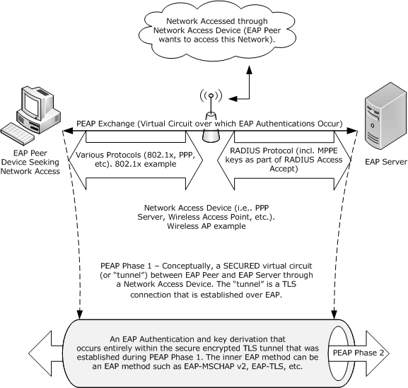

Figure 1: Typical PEAP deployment environment

To understand PEAP, it is necessary to understand both EAP and TLS. An overview of EAP is specified in [RFC3748] section 2, while an overview of TLS is specified in [[RFC2246]](https://go.microsoft.com/fwlink/?LinkId=90324) section 1. For more information on security requirements for EAP methods that are used with wireless local area networks (WLANs), see [[RFC4017]](https://go.microsoft.com/fwlink/?LinkId=90455).

<a id="Section_1.4"></a>
## 1.4 Relationship to Other Protocols

PEAP is an [**EAP method**](#gt_eap-method) that encapsulates another instance of [**EAP**](#gt_extensible-authentication-protocol-eap) (with slightly modified messages) within a [**TLS**](#gt_transport-layer-security-tls) [**tunnel**](#gt_tunnel). During phase 1 of PEAP, the PEAP client and [**PEAP server**](#gt_peap-server) exchange TLS messages encapsulated within EAP packets to establish a TLS tunnel on top of EAP between the [**PEAP peer**](#gt_peap-peer) and the PEAP server.

The following diagram shows protocol layering during phase 1 of PEAP:

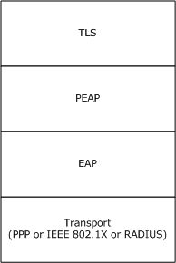

Figure 2: Protocol layering during phase 1 of PEAP

During phase 2 of PEAP, a new EAP method is negotiated and an EAP authentication exchange is performed between the PEAP peer and the PEAP server as described in [[RFC3748]](https://go.microsoft.com/fwlink/?LinkId=90444) section 2, encapsulated in the TLS tunnel established in phase 1.

The following diagram shows protocol layering during phase 2 of PEAP:

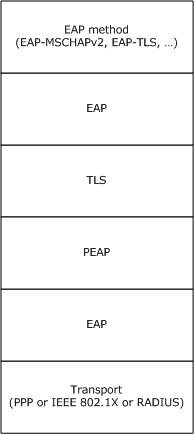

Figure 3: Protocol layering during phase 2 of PEAP

PEAP, like EAP, can run over any EAP transport that is compliant with [RFC3748], such as PPP (for more information, see [[RFC1661]](https://go.microsoft.com/fwlink/?LinkId=90283)).

There are a number of configurable settings for the protocol; for example, **isFastReconnectAllowed**, **isSoHEnable**, and so on, as specified in section [3.1.1](../MS-GPWL/MS-GPWL.md). The EAP peer which initializes this protocol is responsible for configuring these settings as well. The peer itself might be configured through the [**group policy**](#gt_group-policy). For example, the Group Policy: Wireless/Wired Protocol Extension [MS-GPWL](../MS-GPWL/MS-GPWL.md) specifies the group policy protocol to configure and deploy wireless local area network (WLAN). This configuration also carries the EAP method configuration as a part of it. The peer can use this configuration to initialize the PEAP method.

<a id="Section_1.5"></a>
## 1.5 Prerequisites/Preconditions

PEAP requires the inner EAP [**authentication**](#gt_authentication) method to be configured both on the [**PEAP peer**](#gt_peap-peer) and the server in an implementation-specific manner. [**EAP**](#gt_extensible-authentication-protocol-eap) and [**TLS**](#gt_transport-layer-security-tls) have their own prerequisites, as specified in [[RFC3748]](https://go.microsoft.com/fwlink/?LinkId=90444) section 3.1 and [[RFC2246]](https://go.microsoft.com/fwlink/?LinkId=90324) section D.2, respectively.

For example, TLS server authentication, which PEAP uses, requires that the server have a [**certificate**](#gt_certificate) and that the client be configured to trust the issuer of the certificate. EAP requires that both [**EAP server**](#gt_eap-server) and [**peer**](#gt_peer) be configured with the methods which they support, in this case PEAP.

<a id="Section_1.6"></a>
## 1.6 Applicability Statement

PEAP was designed for use in network access [**authentication**](#gt_authentication).

The use of PEAP is appropriate as the basis for any network authentication scenario.

For more information on PEAP security issues, see section [5](#Section_1.3).

<a id="Section_1.7"></a>
## 1.7 Versioning and Capability Negotiation

PEAP supports the concept of version negotiation. The PEAP server proposes the highest version that it supports within the initial PEAP packet, and the [**PEAP peer**](#gt_peap-peer) replies with a PEAP response indicating the version that it is configured to use. After this point, the **Ver** field in the PEAP packets reflects the version that was selected.

These semantics ensure that all implementations of PEAP can communicate and enable both [**peers**](#gt_peer) and servers to participate in version selection for the conversation. If version negotiation fails, the use of PEAP is not possible.

In addition to the capability to negotiate what version of PEAP to use, an implementation also needs to support the capability to negotiate the type of [**inner EAP method**](#gt_inner-eap-method), as specified in [[RFC3748]](https://go.microsoft.com/fwlink/?LinkId=90444) section 5.

For more information on PEAP versioning and capability negotiation, see section [3.1.5.3](#Section_3.1.5.3).

<a id="Section_1.8"></a>
## 1.8 Vendor-Extensible Fields

PEAP defines [Vendor-Specific TLV (section 2.2.5)](#Section_2.2.5) and [Outer TLVs (section 2.2.6)](#Section_2.2.6) that can be used by vendors to exchange their own TLVs.

<a id="Section_1.9"></a>
## 1.9 Standards Assignments

| Parameter | Value | Reference |
| --- | --- | --- |
| PEAP [**EAP method**](#gt_eap-method) type | 25 | [[IANA-EAP]](https://go.microsoft.com/fwlink/?LinkId=89882) |
| [**EAP**](#gt_extensible-authentication-protocol-eap) [**Type-Length-Value (TLV)**](#gt_type-length-value-tlv) extensions method type (also known as MS-Authentication-TLV) | 33 | [IANA-EAP] |
| Vendor-ID for Microsoft (SMI Private Enterprise Code) | 311 | [[IANA-ENT]](https://go.microsoft.com/fwlink/?LinkId=89883) |

<a id="Section_2"></a>
# 2 Messages

The following sections specify how PEAP messages are encapsulated on the wire and [**EAP**](#gt_extensible-authentication-protocol-eap) extensions methods.

<a id="Section_2.1"></a>
## 2.1 Transport

As an [**authentication**](#gt_authentication) method, PEAP MUST be transported by [**EAP**](#gt_extensible-authentication-protocol-eap). As a result, protocols that carry EAP (for example, PPP [[RFC1661]](https://go.microsoft.com/fwlink/?LinkId=90283), IEEE802.1x [[IEEE802.1X]](https://go.microsoft.com/fwlink/?LinkId=89910), and RADIUS [[RFC2865]](https://go.microsoft.com/fwlink/?LinkId=90392)) ultimately provide the transport of the associated messages, as specified in [[RFC3748]](https://go.microsoft.com/fwlink/?LinkId=90444) section 3.

As an [**EAP method**](#gt_eap-method), PEAP relies entirely on EAP for the reliable delivery of its messages.

<a id="Section_2.2"></a>
## 2.2 Message Syntax

<a id="Section_2.2.1"></a>
### 2.2.1 EAP Packet

The following shows an [**EAP**](#gt_extensible-authentication-protocol-eap) packet (**Code**, **Identifier**, and **Length**), as specified in [[RFC3748]](https://go.microsoft.com/fwlink/?LinkId=90444) section 4.1.

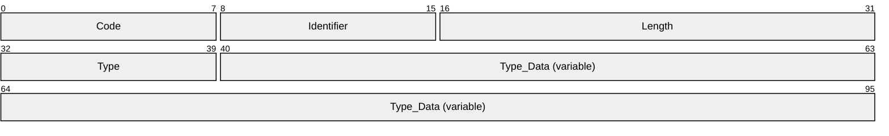

**Code (1 byte):** Indicates whether this packet is a Request or a Response, as specified in [RFC3748] section 4.1.

**Identifier (1 byte):** Identifier for this packet, as specified in [RFC3748] section 4.1.

**Length (2 bytes):** The length of this packet, as specified in [RFC3748] section 4.1.

**Type (1 byte):** The Type of Request or Response, as specified in [RFC3748] section 4.1.

**Type_Data (variable):** A field that varies with the Type of Request and the associated Response, as specified in [RFC3748] section 4.1.

<a id="Section_2.2.2"></a>
### 2.2.2 PEAP Packet

The outer EAP packet (section [2.2.1](#Section_2.2.1)) that contains a PEAP packet MUST have the **Type** field set to 25 (see section [1.9](#Section_1.9)).

The following diagram shows the format of the PEAP packet, which is placed in the **Type-Data** field of the EAP packet.

The fields of the header are transmitted as bytes from left to right.

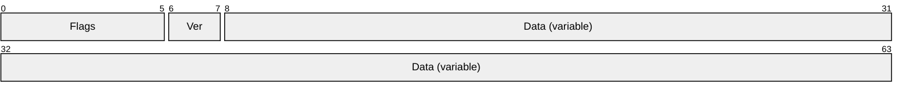

**Flags (6 bits):** A 6-bit field that is used to represent a set of flags. The value MUST be formatted as follows.

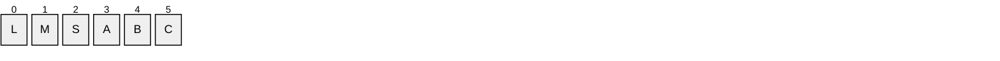

**L (1 bit):** The L bit is set to indicate the presence of the **TLS_Message_Length** field, as discussed later.

- The L bit MUST be set to zero in the PEAP fragment acknowledgement packet (section [2.2.3](#Section_2.2.3)).
- The L bit MUST be set to one in the first fragment of a fragmented message.
**M (1 bit):** If the [**TLS**](#gt_transport-layer-security-tls) message encapsulated in PEAP is fragmented, the M bit MUST be set on all but the last fragment. If the TLS message encapsulated in PEAP is not fragmented, the M bit MUST NOT be set.<1>

**S (1 bit):** The S bit is set in a PEAP start message. This differentiates the PEAP start message from a fragment acknowledgment. The S bit MUST be sent only by the [**PEAP server**](#gt_peap-server) and it MUST be set only in the first packet from the PEAP server to the [**peer**](#gt_peer). Note that the PEAP start message carries the initial [**handshake**](#gt_handshake) for the TLS [**session**](#gt_session), as specified in [[RFC2246]](https://go.microsoft.com/fwlink/?LinkId=90324) section 7.

**D - R1 (1 bit):** The R bits are reserved. They MUST be set to zero when sent and MUST be ignored on receipt.

**E - R2 (1 bit):** The R bits are reserved. They MUST be set to zero when sent and MUST be ignored on receipt.

**F - R3 (1 bit):** The R bits are reserved. They MUST be set to zero when sent and MUST be ignored on receipt.

**Ver (2 bits):** Two bits are used to communicate and negotiate the version of PEAP being used; it MUST be formatted as follows.

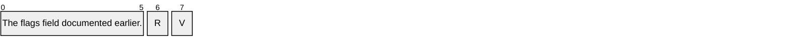

**R (1 bit):** The R bit is reserved. It MUST be set to zero when sent and MUST be ignored on receipt.

**V (1 bit):** Indicates the version of PEAP. It MUST be set to zero.

**Data (variable):** An array of bytes that MUST be formatted as follows.

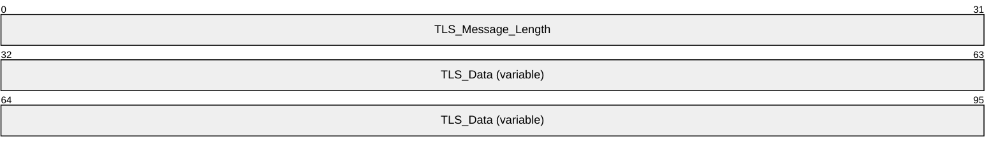

**TLS_Message_Length (4 bytes):** A 32-bit unsigned integer in [**network byte order**](#gt_network-byte-order) that indicates the length, in bytes, of the unfragmented **TLS Data**, and is present only if the **L** flag is set in the **Flags** field.

**TLS_Data (variable):** The encapsulated (complete or fragmented) TLS packet in TLS record format (as specified in [RFC2246] section 6).

<a id="Section_2.2.3"></a>
### 2.2.3 PEAP Fragment Acknowledgement Packet

The PEAP Fragment Acknowledgement packet is an "empty" [PEAP packet (section 2.2.2)](#Section_2.2.2) that is used during packet fragmentation.

The field values for the PEAP Fragment Acknowledgement packet are:

- The **L**, **M**, **S** bits are unset.
- The **Ver** field is as specified in section 2.2.2.
- The **Data** field is not present.
<a id="Section_2.2.4"></a>
### 2.2.4 TLV

The following diagram specifies the standard [**TLV**](#gt_type-length-value-tlv) structure that MUST be used by the [result TLV (section 2.2.8.1.2)](#Section_2.2.8.1.2).

The fields of the structure MUST be transmitted in [**network byte order**](#gt_network-byte-order) from left to right.

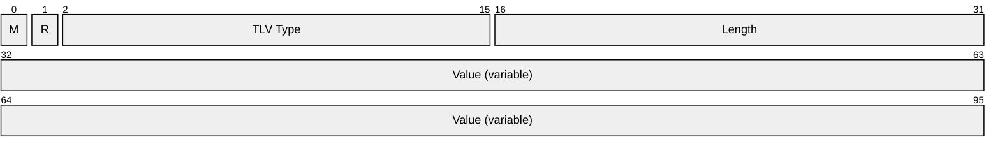

**M (1 bit):** The M bit has the following possible values and MUST be set:

| Value | Meaning |
| --- | --- |
| 0 | This TLV support is optional for the recipient. If the TLV is not supported, the recipient MUST ignore the TLV. |
| 1 | This TLV support is mandatory for the recipient. If the TLV is not supported, the recipient MUST discard the PEAP packet that contains the TLV. |

**R (1 bit):** The R bit is reserved and MUST be set to zero when sent and MUST be ignored on receipt.

**TLV Type (14 bits):** A 14-bit unsigned integer in network byte order that indicates the type of data in the **Value** field. Allocated types include the following:

| Value | Description |
| --- | --- |
| 1 | [SoH TLV](#Section_2.2.8.2.2) |
| 2 | [SoH Request TLV](#Section_2.2.8.2.1) |
| 3 | Result TLV or [SoH Response TLV](#Section_2.2.8.1.3) (when transmitted in a Vendor-Specific TLV) |
| 7 | [Vendor-Specific TLV](#Section_2.2.5) |
| 12 | [Cryptobinding TLV](#Section_2.2.8.1.1) |

**Length (2 bytes):** A 16-bit unsigned integer in network-byte order that indicates the length, in bytes, of the **Value** field.

**Value (variable):** The value MUST be formatted in accordance with the type specified in the **TLV Type** field.

<a id="Section_2.2.5"></a>
### 2.2.5 Vendor-Specific TLV

A vendor-specific TLV is used to carry a set of [**TLVs**](#gt_type-length-value-tlv) specific to a vendor (indicated by the **Vendor-Id** field). The TLV **Type** field MUST be set to 7 (see section [2.2.4](#Section_2.2.4)).

The following diagram shows the format of the vendor-specific TLV, which is placed in the **Value** field of the TLV. The fields of the header are transmitted as bytes from left to right.

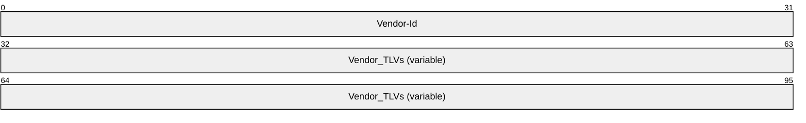

**Vendor-Id (4 bytes):** A 32-bit unsigned integer in network byte order, with the most significant 8 bits set to 0 and the remaining 24 bits set to the Structure and Identification of Management Information (SMI) code of the vendor, taken from [[IANA-ENT]](https://go.microsoft.com/fwlink/?LinkId=89883). Microsoft vendor-specific TLVs MUST have the **Vendor-Id** field set to 311 (0x00000137).

**Vendor_TLVs (variable):** One or more TLVs defined by the vendor, as indicated by the preceding **Vendor-Id** field.

<a id="Section_2.2.6"></a>
### 2.2.6 Outer TLVs

Outer [**TLVs**](#gt_type-length-value-tlv) contain optional data and are exchanged between the [**peer**](#gt_peer) and the server during PEAP [**phase**](#gt_phase) 1. Peers expect Outer TLVs in the [PEAP Start Packet](#Section_2.2.6.2) (sent from the server to the peer), and servers expect Outer TLVs in the [Client Hello Packet](#Section_2.2.6.1) (sent from the peer to the server).<2>

The exchanged Outer TLVs are used when generating the [Cryptobinding TLV](#Section_2.2.8.1.1), as specified in section [3.1.5.5.1](#Section_3.1.5.5.1).

<a id="Section_2.2.6.1"></a>
#### 2.2.6.1 Client Hello Packet With Outer TLVs

The format of a Client Hello packet containing Outer TLVs is as follows.

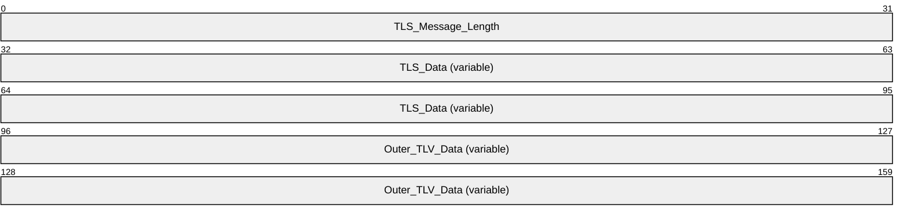

**TLS_Message_Length (4 bytes):** A 32-bit unsigned integer in [**network byte order**](#gt_network-byte-order) that indicates the length, in bytes, of the unfragmented [**TLS**](#gt_transport-layer-security-tls) Data.

**TLS_Data (variable):** The encapsulated (complete or fragmented) TLS packet in TLS record format (as specified in [[RFC2246]](https://go.microsoft.com/fwlink/?LinkId=90324) section 6).

**Outer_TLV_Data (variable):** The Outer TLVs. The length of **Outer_TLV_data** field is equal to the value of the **Length** field minus the value of the **TLS_Message_Length** field minus 10.

<a id="Section_2.2.6.2"></a>
#### 2.2.6.2 PEAP Start Packet With Outer TLVs

The Data present in the PEAP Start Packet is always treated as Outer [**TLV**](#gt_type-length-value-tlv) data. The **Type_Data** field of the [**EAP**](#gt_extensible-authentication-protocol-eap) packet MUST be formatted as follows.

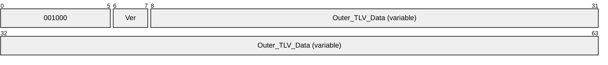

**001000 (6 bits):** MUST be set to 001000.

**Ver (2 bits):** MUST be set to 00.

**Outer_TLV_Data (variable):** The Outer TLVs. The length of **Outer_TLV_data** field is equal to the value of the **Length** field minus the value of the **TLS_Message_Length** field minus 6.

<a id="Section_2.2.7"></a>
### 2.2.7 EAP Expanded Types

The following diagram shows an EAP Expanded Type packet ([**EAP**](#gt_extensible-authentication-protocol-eap) Type, **Vendor-Id**, **Vendor-Type**, and **Vendor-Data**), as specified in [[RFC3748]](https://go.microsoft.com/fwlink/?LinkId=90444) section 5.7. The Type is 254 and the **Vendor-Id**, **Vendor-Type**, and **Vendor-Data** are part of the **Type_Data** field of an [EAP packet (section 2.2.1)](#Section_2.2.1).

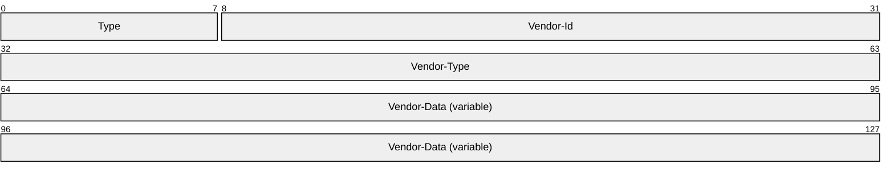

**Type (1 byte):** MUST be set to 254, as specified in [RFC3748] section 5.7.

**Vendor-Id (3 bytes):** The SMI Network Management Private Enterprise Code of the vendor, as specified in [RFC3748] section 5.7.

**Vendor-Type (4 bytes):** The vendor-specific method Type, as specified in [RFC3748] section 5.7.

**Vendor-Data (variable):** This field is defined by the vendor, as specified in [RFC3748] section 5.7.

<a id="Section_2.2.8"></a>
### 2.2.8 EAP Extensions Methods

PEAP introduces three new [**EAP methods**](#gt_eap-method): [EAP TLV Extensions Method (section 2.2.8.1)](#Section_2.2.8.1), [SoH EAP Extensions Method (section 2.2.8.2)](#Section_2.2.8.2), and [Capabilities Negotiation Method (section 2.2.8.3)](#Section_2.2.8.3). These methods, unlike traditional EAP methods, are not used to facilitate [**authentication**](#gt_authentication), but are instead used to facilitate the exchange of [**TLVs**](#gt_type-length-value-tlv) between a [**PEAP peer**](#gt_peap-peer) and a [**PEAP server**](#gt_peap-server).

Given this special use of the EAP Extensions Method, these methods MUST be used only as [**inner EAP methods**](#gt_inner-eap-method), so that the messages are protected by the secure [**tunnel**](#gt_tunnel) established by the outer EAP method.

<a id="Section_2.2.8.1"></a>
#### 2.2.8.1 EAP TLV Extensions Method

The [EAP packet (section 2.2.1)](#Section_2.2.1) for the [**inner EAP method**](#gt_inner-eap-method) MUST have the **Type** field set to 33, indicating that the EAP TLV Extensions Method is being used as the inner EAP method.

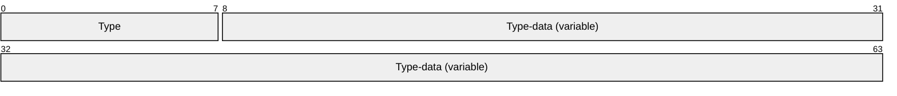

**Type (1 byte):** MUST be set to 33.

**Type-data (variable):** TLVs specific to the EAP TLV Extension Method. See TLV (section [2.2.4](#Section_2.2.4)) for the structure of the TLVs. PEAP implementations MUST transmit only the following TLVs: Cryptobinding TLV (section [2.2.8.1.1](#Section_2.2.8.1.1)), Result TLV (section [2.2.8.1.2](#Section_2.2.8.1.2)), and SoH Response TLV (section [2.2.8.1.3](#Section_2.2.8.1.3)).

Within an EAP TLV Extensions Method, the Result TLV, Cryptobinding TLV, and SoH Response TLV can be sent in any order. The receiver MUST NOT assume any order of the TLVs.

<a id="Section_2.2.8.1.1"></a>
##### 2.2.8.1.1 Cryptobinding TLV

The cryptobinding TLV is a [**TLV**](#gt_type-length-value-tlv), as specified in section [2.2.4](#Section_2.2.4). It is used to ensure that the [**EAP peer**](#gt_eap-peer) and the [**EAP server**](#gt_eap-server) participated in both the inner and the outer [**EAP**](#gt_extensible-authentication-protocol-eap) [**authentications**](#gt_authentication) of a PEAP authentication.

The cryptobinding TLV is carried in the **Type-data** field of the [EAP TLV Extensions Method (section 2.2.8.1)](#Section_2.2.8.1).

The fields of the cryptobinding TLV MUST be set as follows.

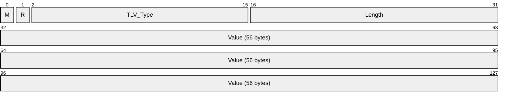

**M (1 bit):** The M bit MUST be set to 0.

**R (1 bit):** The R bit is reserved and MUST be set to zero when sent and MUST be ignored on receipt.

**TLV_Type (14 bits):** A 14-bit unsigned integer in [**network byte order**](#gt_network-byte-order) that indicates the type of data in the **Value** field. The **TLV_Type** MUST be set to 12 (0x0C) for the cryptobinding TLV.

**Length (2 bytes):** A 16-bit unsigned integer in network byte order that indicates the length, in bytes, of the **Value** field. The value of this field MUST be 56 (0x38).

**Value (56 bytes):** The **Value** field of the cryptobinding TLV MUST be formatted as follows.

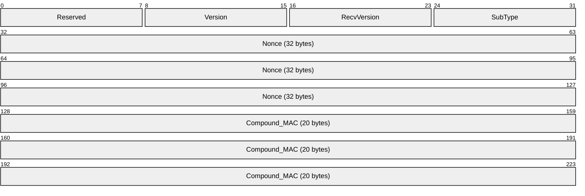

**Reserved (1 byte):** An 8-bit unsigned integer that is reserved and MUST be set to zero when sent and MUST be ignored on receipt.

**Version (1 byte):** An 8-bit unsigned integer that indicates the version of the cryptobinding TLV and MUST be set to 0.

**RecvVersion (1 byte):** An 8-bit unsigned integer field that MUST be set to 0.

**SubType (1 byte):** An 8-bit unsigned integer that indicates whether the cryptobinding TLV is a request or a response. Its value MUST be one of the following.

| Value | Meaning |
| --- | --- |
| 0 | This cryptobinding TLV represents a request. |
| 1 | This cryptobinding TLV represents a response. |

**Nonce (32 bytes):** A 256-bit unsigned integer containing a temporally unique (random) value. For more information, see [[RFC1750]](https://go.microsoft.com/fwlink/?LinkId=90288).

**Compound_MAC (20 bytes):** A 160-bit unsigned integer containing the value used to cryptographically associate the [**phase**](#gt_phase) 1 and phase 2 authentications of PEAP. For more information, see section [3.1.5.5](#Section_3.1.5.5).

<a id="Section_2.2.8.1.2"></a>
##### 2.2.8.1.2 Result TLV

The Result TLV is a [**TLV**](#gt_type-length-value-tlv), as specified in [2.2.4](#Section_2.2.4). It is used to represent the status (success or failure) of the [**inner EAP method**](#gt_inner-eap-method) negotiation or to indicate the sender's consent (ability or inability) to participate in a fast-reconnect.

The Result TLV is carried in the **Type-data** field (see [EAP Packet (section 2.2.1)](#Section_2.2.1)) of the [EAP TLV Extensions Methods](#Section_2.2.8.1).

The fields of the Result TLV MUST be set as follows.

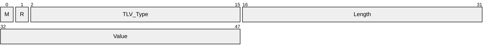

**M (1 bit):** The M bit MUST be set to 1, indicating that the recipient MUST support the result TLV.

**R (1 bit):** The R bit is reserved and MUST be set to zero when sent and MUST be ignored on receipt.

**TLV_Type (14 bits):** A 14-bit unsigned integer that MUST be set to 0x03.

**Length (2 bytes):** A 16-bit unsigned integer in [**network byte order**](#gt_network-byte-order) that indicates the length, in bytes, of the **Value** field. This MUST be set to 0x02.

**Value (2 bytes):** A 16-bit unsigned integer in network byte order. The value indicates the [**authentication**](#gt_authentication) result and MUST be formatted as follows.


**Result (2 bytes):** Possible values are listed in the table below.

| Value | Meaning |
| --- | --- |
| 0 | Reserved and MUST NOT be sent |
| 1 | Success |
| 2 | Failure |
| 3 — 65535 | Reserved and MUST NOT be sent |

<a id="Section_2.2.8.1.3"></a>
##### 2.2.8.1.3 SoH Response TLV

The SoH Response TLV is a vendor [**TLV**](#gt_type-length-value-tlv) sent within a Microsoft [vendor-specific TLV](#Section_2.2.5). Sent to the [**PEAP peer**](#gt_peap-peer) by the [**PEAP server**](#gt_peap-server), its ultimate recipient is the Statement of Health (SoH) entity, as specified in [[TNC-IF-TNCCSPBSoH]](https://go.microsoft.com/fwlink/?LinkId=240054), at the [**peer**](#gt_peer).

The SoH Response TLV is carried in the **Type-data** field of the EAP TLV Extensions Method (section [2.2.8.1](#Section_2.2.8.1)).


**M (1 bit):** The M bit MUST be set to 0.

**R (1 bit):** The R bit is reserved and MUST be set to zero when sent and MUST be ignored on receipt.

**TLV_Type (14 bits):** A 14-bit unsigned integer that MUST be set to 0x03.

**Length (2 bytes):** A 16-bit unsigned integer in [**network byte order**](#gt_network-byte-order) that indicates the length, in bytes, of the **Value** field.

**Value (variable):** This MUST contain a Statement of Health Response (SoHR) message, as defined in [TNC-IF-TNCCSPBSoH] section 3.6.

<a id="Section_2.2.8.2"></a>
#### 2.2.8.2 SoH EAP Extensions Method

This method is an Expanded [**EAP**](#gt_extensible-authentication-protocol-eap) Type (as specified in section [2.2.7](#Section_2.2.7)) with the following values for the fields.


**Type (1 byte):** MUST be set to 254, as specified in [[RFC3748]](https://go.microsoft.com/fwlink/?LinkId=90444) section 5.7.

**Vendor-Id (3 bytes):** A 3-byte unsigned integer that MUST be set to 0x000137.

**Vendor-Type (4 bytes):** A 4-byte unsigned integer that MUST be set to 0x21.

**Vendor-Data (variable):** This contains either an [SoH Request TLV](#Section_2.2.8.2.1) or an [SoH TLV (section 2.2.8.2.2)](#Section_2.2.8.2.2).

SoH Request TLV MUST be present only in an EAP request while SoH TLV MUST be present only in an EAP response message. The Cryptobinding TLV (section [2.2.8.1.1](#Section_2.2.8.1.1)), Result TLV (section [2.2.8.1.2](#Section_2.2.8.1.2)), and SoH Response TLV (section [2.2.8.1.3](#Section_2.2.8.1.3)) MUST be carried in the EAP TLV Extensions Method (section [2.2.8.1](#Section_2.2.8.1)).

<a id="Section_2.2.8.2.1"></a>
##### 2.2.8.2.1 SoH Request TLV

The SoH Request TLV is a vendor [**TLV**](#gt_type-length-value-tlv) sent within a Microsoft [vendor-specific TLV (section 2.2.5)](#Section_2.2.5) in a [SoH EAP Extensions Method (section 2.2.8.2)](#Section_2.2.8.2) request. Sent to the [**PEAP peer**](#gt_peap-peer) by the [**PEAP server**](#gt_peap-server), its purpose is to trigger transmission of an SoH message by the [**peer's**](#gt_peer) Statement of Health for Network Access Protection Protocol [[TNC-IF-TNCCSPBSoH]](https://go.microsoft.com/fwlink/?LinkId=240054) entity.

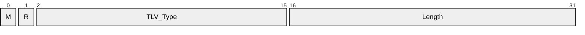

**M (1 bit):** The M bit MUST be set to 0.

**R (1 bit):** The R bit is reserved. It MUST be set to zero when sent and MUST be ignored on receipt.

**TLV_Type (14 bits):** A 14-bit unsigned integer that MUST be set to 0x02.

**Length (2 bytes):** A 16-bit unsigned integer in [**network byte order**](#gt_network-byte-order) that indicates the length, in bytes, of the **Value** field. This MUST be set to 0x00.

<a id="Section_2.2.8.2.2"></a>
##### 2.2.8.2.2 SoH TLV

The SoH TLV is a vendor [**TLV**](#gt_type-length-value-tlv) sent within a Microsoft [vendor-specific TLV](#Section_2.2.5) in an [SoH EAP Extensions Method](#Section_2.2.8.2) response. Sent to the [**PEAP server**](#gt_peap-server) by the [**PEAP peer**](#gt_peap-peer), its ultimate recipient is the SoH entity [[TNC-IF-TNCCSPBSoH]](https://go.microsoft.com/fwlink/?LinkId=240054) at the PEAP server.


**M (1 bit):** The M bit MUST be set to 0.

**R (1 bit):** The R bit is reserved. It MUST be set to zero when sent and MUST be ignored on receipt.

**TLV_Type (14 bits):** A 14-bit unsigned integer that MUST be set to 0x01.

**Length (2 bytes):** A 16-bit unsigned integer in [**network byte order**](#gt_network-byte-order) that indicates the length, in bytes, of the **Value** field.

**Value (variable):** This MUST contain an SoH message, as defined in [TNC-IF-TNCCSPBSoH] section 3.5.

<a id="Section_2.2.8.3"></a>
#### 2.2.8.3 Capabilities Negotiation Method

The Capabilities Negotiation Method is an Expanded EAP Type (as specified in section [2.2.7](#Section_2.2.7)) with the following values for the fields:

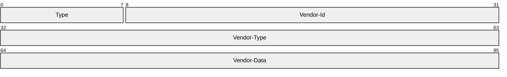

**Type (1 byte):** MUST be set to 254, as specified in [[RFC3748]](https://go.microsoft.com/fwlink/?LinkId=90444) section 5.7.

**Vendor-Id (3 bytes):** A 3-byte unsigned integer that MUST be set to 0x000137.

**Vendor-Type (4 bytes):** A 4-byte unsigned integer that MUST be set to 0x00000022.

**Vendor-Data (4 bytes):** This contains 32 bits, used to denote various capabilities of the sender. Bits 0-30 are reserved for future use, and MUST be set to zero when sent and MUST be ignored on receipt.

```mermaid
packet-beta
  0-0: "0"
  1-1: "0"
  2-2: "0"
  3-3: "0"
  4-4: "0"
  5-5: "0"
  6-6: "0"
  7-7: "0"
  8-8: "0"
  9-9: "0"
  10-10: "0"
  11-11: "0"
  12-12: "0"
  13-13: "0"
  14-14: "0"
  15-15: "0"
  16-16: "0"
  17-17: "0"
  18-18: "0"
  19-19: "0"
  20-20: "0"
  21-21: "0"
  22-22: "0"
  23-23: "0"
  24-24: "0"
  25-25: "0"
  26-26: "0"
  27-27: "0"
  28-28: "0"
  29-29: "0"
  30-30: "0"
  31-31: "F"
```

Where the bits are defined as:

| Value | Description |
| --- | --- |
| F | Fragmentation Capability |

<a id="Section_2.2.8.3.1"></a>
##### 2.2.8.3.1 Capabilities Method Request

The Capabilities Method Request packet is sent by the [**PEAP server**](#gt_peap-server) after receiving the identity response and before SOH/Inner EAP negotiation.

```mermaid
packet-beta
  0-31: "Vendor-Data"
```

**Vendor-Data (4 bytes):** This contains 32 bits, and is used to denote various capabilities of the Server. Bits 0-30 are reserved for future use.

```mermaid
packet-beta
  0-0: "0"
  1-1: "0"
  2-2: "0"
  3-3: "0"
  4-4: "0"
  5-5: "0"
  6-6: "0"
  7-7: "0"
  8-8: "0"
  9-9: "0"
  10-10: "0"
  11-11: "0"
  12-12: "0"
  13-13: "0"
  14-14: "0"
  15-15: "0"
  16-16: "0"
  17-17: "0"
  18-18: "0"
  19-19: "0"
  20-20: "0"
  21-21: "0"
  22-22: "0"
  23-23: "0"
  24-24: "0"
  25-25: "0"
  26-26: "0"
  27-27: "0"
  28-28: "0"
  29-29: "0"
  30-30: "0"
  31-31: "F"
```

Where the bits are defined as:

| Value | Description |
| --- | --- |
| F | PEAP Phase2 Fragmentation Capability. This flag is set to 1 if the PEAP server is PEAP Phase2 Fragmentation Capable, and set to 0 otherwise. |

<a id="Section_2.2.8.3.2"></a>
##### 2.2.8.3.2 Capabilities Method Response

The Capabilities Method Response packet is sent by the [**PEAP peer**](#gt_peap-peer) after receiving the capabilities method request packet.

```mermaid
packet-beta
  0-31: "Vendor-data"
```

**Vendor-data (4 bytes):** This contains 32 bits, and is used to denote various capabilities of the PEAP peer. Bits 0-30 are reserved for future use.

```mermaid
packet-beta
  0-0: "0"
  1-1: "0"
  2-2: "0"
  3-3: "0"
  4-4: "0"
  5-5: "0"
  6-6: "0"
  7-7: "0"
  8-8: "0"
  9-9: "0"
  10-10: "0"
  11-11: "0"
  12-12: "0"
  13-13: "0"
  14-14: "0"
  15-15: "0"
  16-16: "0"
  17-17: "0"
  18-18: "0"
  19-19: "0"
  20-20: "0"
  21-21: "0"
  22-22: "0"
  23-23: "0"
  24-24: "0"
  25-25: "0"
  26-26: "0"
  27-27: "0"
  28-28: "0"
  29-29: "0"
  30-30: "0"
  31-31: "F"
```

Where the bits are defined as:

| Value | Description |
| --- | --- |
| F | PEAP Phase2 Fragmentation Capability. This flag is set to 1 if the PEAP peer is PEAP Phase2 Fragmentation Capable, and set to 0 otherwise. |

<a id="Section_3"></a>
# 3 Protocol Details

The following sections specify details of PEAP, including abstract data models and message processing rules.

<a id="Section_3.1"></a>
## 3.1 Common Details

The following details are common between the [**PEAP peer**](#gt_peap-peer) and the server.

<a id="Section_3.1.1"></a>
### 3.1.1 Abstract Data Model

This section describes a conceptual model that an implementation can maintain to participate in this protocol. The described organization is provided to facilitate the explanation of how the protocol behaves. This document does not mandate that implementations adhere to this model as long as their external behavior is consistent with that described in this document.

The [**PEAP peer**](#gt_peap-peer) and server participating in this protocol maintain the following data.

**isFastReconnectAllowed:** A Boolean flag indicating whether [**fast reconnect**](#gt_fast-reconnect) is allowed (TRUE) for the session or not (FALSE).

**isSoHEnabled:** A Boolean flag indicating whether SoH is enabled (TRUE) or not (FALSE). This is a configurable field on both [**peer**](#gt_peer) and server.

**isCryptoSupported:** A Boolean flag indicating whether the implementation supports [Cryptobinding TLVs (section 2.2.8.1.1)](#Section_2.2.8.1.1) (TRUE) or not (FALSE). If the implementation does not support Cryptobinding TLV, then it neither validates (if any are received) nor sends a Cryptobinding TLV.<3>

**isCryptoRequired:** A Boolean flag indicating whether the implementation requires Cryptobinding TLVs to be exchanged for the final [**authentication**](#gt_authentication) to be successful (TRUE) or not (FALSE). This is a configurable field on both peer and server.

**InnerEapType:** A 4-byte unsigned integer that indicates the Extensible Authentication Protocol (EAP) type ([[RFC3748]](https://go.microsoft.com/fwlink/?LinkId=90444) section 5) of the PEAP inner [**EAP**](#gt_extensible-authentication-protocol-eap) method.

**BypassCapNegotiation:** A Boolean flag indicating whether the machine is configured to exchange [Capabilities Negotiation Method (section 2.2.8.3)](#Section_2.2.8.3) packets (TRUE) or not (FALSE).<4>

**AssumePhase2Frag:** A Boolean flag which indicates whether the counterpart (at the remote end) supports fragmentation and reassembly of the PEAP inner method packets (TRUE) or not (FALSE). This value is meaningful only when **BypassCapNegotiation** is set to TRUE.<5>

**isCapabilitiesSupported:** A Boolean flag indicating whether the implementation supports Capabilities Negotiation Method (section 2.2.8.3) packets for the session (TRUE) or not (FALSE).<6>

**isFragmentationAllowed:** A Boolean flag indicating whether fragmentation and reassembly of the PEAP inner method packets is supported for the session by both peer and server (TRUE) or not (FALSE).<7>

**MaxSendPacketSize:** An integer indicating the maximum EAP packet size. These values are obtained as specified in sections [3.2.3](#Section_3.2.3) and [3.3.3](#Section_3.3.3).

**TunnelKey:** The PEAP Tunnel Key (TK) is a 60-octet key generated as specified in section [3.1.5.5.2.1](#Section_3.1.5.5.2.1). This variable is used while generating Cryptobinding TLVs (section [3.1.5.5](#Section_3.1.5.5)) and, if using cryptobinding, the final [**MPPE keys**](#gt_mppe-keys) (section [3.1.5.7](#Section_3.1.5.7)).

**InnerMPPESendKey:** A variable-length string returned by the inner EAP method when the inner EAP authentication is successful. This variable is used while generating **InnerSessionKey (ISK)** as specified in section [3.1.5.5.2.2](#Section_3.1.5.5.2.2).

**InnerMPPESendKeyLength:** Specifies the length of **InnerMPPESendKey** in octets.

**InnerMPPERecvKey:** A variable-length string returned by inner method when the inner EAP authentication is successful. This variable is used while generating **ISK** as specified in section 3.1.5.5.2.2.

**InnerMPPERecvKeyLength:** Specifies the length of **InnerMPPERecvKey** in octets.

**InnerSessionKey (ISK):** ISK is a 32-octet string generated from keys provided by the inner method. This variable is used while generating Cryptobinding TLVs, as specified in section 3.1.5.5.

**CtxtHandle:** A 128-bit [**context handle**](#gt_context-handle) obtained, as specified in sections [3.2.7.1](#Section_3.2.7.1) and [3.3.7.1](#Section_3.2.7.1), when the phase 1 [**tunnel**](#gt_tunnel) is established. This handle is used in [**encryption**](#gt_encryption) and [**decryption**](#gt_decryption) of messages during phase 2 of PEAP.

**InnerIdentity:** An LPWSTR string (as specified in [MS-DTYP](../MS-DTYP/MS-DTYP.md) section 2.2.36) for storing the identity exchanged as part of inner EAP method authentication.

<a id="Section_3.1.2"></a>
### 3.1.2 Timers

PEAP relies on the [**EAP**](#gt_extensible-authentication-protocol-eap) timers, as specified in [[RFC3748]](https://go.microsoft.com/fwlink/?LinkId=90444) section 4.3. There are no PEAP fragmentation- or reassembly-specific timers.

<a id="Section_3.1.3"></a>
### 3.1.3 Initialization

Initialization is specified in sections [3.2.3](#Section_3.2.3) and [3.3.3](#Section_3.3.3).

<a id="Section_3.1.4"></a>
### 3.1.4 Higher-Layer Triggered Events

Higher-layer triggered events are specified in sections [3.2.4](#Section_3.1.4) and [3.3.4](#Section_3.1.4).

<a id="Section_3.1.5"></a>
### 3.1.5 Message Processing Events and Sequencing Rules

<a id="Section_3.1.5.1"></a>
#### 3.1.5.1 Status and Error Handling

If a PEAP implementation receives a packet that does not satisfy the MUST clauses of this specification, the packet MUST be silently discarded.

PEAP supports [**TLS**](#gt_transport-layer-security-tls) alert messages (as specified in [[RFC2246]](https://go.microsoft.com/fwlink/?LinkId=90324) section 7.2) from [**phase**](#gt_phase) 1 (see section [1.3](#Section_1.3)), but does not have its own error messaging capabilities.

PEAP implementations MUST support the [EAP Extensions Methods](#Section_2.2.8) for the communication of [**authentication**](#gt_authentication) status between the [**PEAP peer**](#gt_peap-peer) and the [**PEAP server**](#gt_peap-server).

In [**EAP**](#gt_extensible-authentication-protocol-eap), success or failure packets are sent as the last packet in a conversation. However, these packets are not protected, and they can be forged by an attacker. Also, success and failure packets are not retransmitted and, therefore, might be lost. As a result, PEAP provides its own protected and reliable success/failure indications via the EAP Extensions Methods. A PEAP peer implementation MUST consider authentication successful only if it receives both an EAP success packet and an EAP TLV extensions result TLV with the **Value** field set to 1 (which indicates success, as specified in section [2.2.8.1.2](#Section_2.2.8.1.2)). This behavior is also evident in the processing rules specified in sections [3.2.5.4.7](#Section_3.2.5.4.7), [3.2.5.4.8](#Section_3.2.5.4.8), and [3.2.5.4.9](#Section_3.2.5.4.9).

<a id="Section_3.1.5.2"></a>
#### 3.1.5.2 PEAP Packet Processing

This section describes the PEAP packet processing common to peer and server. In contrast, PEAP packet processing specific to peer and server is described in sections [3.2.5.4](#Section_3.3.5.4) and [3.3.5.4](#Section_3.3.5.4) respectively.

<a id="Section_3.1.5.2.1"></a>
##### 3.1.5.2.1 Received PEAP Packet with L and M Bit Set

If **isFragmentationAllowed** is TRUE and the PEAP phase 2 is in progress, then store the first fragment and send a [PEAP Fragment Acknowledgement packet (section 2.2.3)](#Section_2.2.3) request (server) or response (peer). For all the next fragments (M bit set and L bit not set), store the fragments and send a PEAP Fragment Acknowledgement packet request (server) or response (peer). After receiving the last fragment (L and M bits not set), reassemble all the fragments and do the packet processing as specified in sections [3.2.5.4](#Section_3.3.5.4) and [3.3.5.4](#Section_3.3.5.4).

If **isFragmentationAllowed** is FALSE and the PEAP phase 2 is in progress, then the packet is ignored.

<a id="Section_3.1.5.2.2"></a>
##### 3.1.5.2.2 Sending PEAP Packet with packet size more than MaxSendPacketSize

If **isFragmentationAllowed** is TRUE and the PEAP phase 2 is in progress, then fragment the packet and send the first fragment (L and M bit set). After receiving a [PEAP Fragment Acknowledgement packet (section 2.2.3)](#Section_2.2.3) response (server) or request (peer), send the next fragment (M bit set and L bit not set). Continue sending the fragments until the last fragment (L and M bits not set).

If **isFragmentationAllowed** is FALSE and the PEAP phase 2 is in progress, then the packet is ignored.

<a id="Section_3.1.5.2.3"></a>
##### 3.1.5.2.3 Compress_Encrypt_Send Method

This method takes the inner authentication method or the EAP expanded type packets as input and processes it as follows:

- Compress the input data as specified in section [3.1.5.6](#Section_3.1.5.6), then encrypt the compressed data by passing it to the TLS layer using the **EncryptMessage** method.
- Prepare a PEAP packet by saving the encrypted data returned by the **EncryptMessage** method as the **Data** field of the PEAP packet and return the prepared PEAP packet as the [Received PEAP Request (section 3.2.5.4.2)](#Section_3.2.5.4.2) or [Received PEAP Response (section 3.3.5.4.2)](#Section_3.3.5.4.2) higher-layer triggered event.
<a id="Section_3.1.5.3"></a>
#### 3.1.5.3 Version Negotiation

PEAP version negotiation MUST be done as follows:

- In the first [PEAP packet](#Section_2.2.2) (an EAP-Request) sent from the [**PEAP server**](#gt_peap-server), the **Version** field MUST be set to 0.
- The [**PEAP peer**](#gt_peap-peer) MUST respond with its preferred PEAP version.
- If the PEAP server does not support the PEAP version proposed by the [**peer**](#gt_peer), it MUST terminate the conversation by sending an EAP-Failure message (a PEAP server supporting a version of the PEAP protocol SHOULD support all earlier versions of the protocol).
- If the PEAP server supports the PEAP version proposed by the peer, it SHOULD set the **Version** field to the proposed version for all subsequent PEAP request packets.
PEAP servers MAY respond to a peer proposal for older versions of the protocol by terminating the [**EAP**](#gt_extensible-authentication-protocol-eap) conversation with an EAP-Failure message.

<a id="Section_3.1.5.4"></a>
#### 3.1.5.4 Phase 1 (TLS Tunnel Establishment)

[**Phase**](#gt_phase) 1 of PEAP is a slightly modified implementation of [**EAP**](#gt_extensible-authentication-protocol-eap)-[**TLS**](#gt_transport-layer-security-tls), as specified in [[RFC5216]](https://go.microsoft.com/fwlink/?LinkId=155108), the only differences being:

A [**PEAP peer**](#gt_peap-peer) MAY send a [**certificate**](#gt_certificate) when requested by a [**PEAP server**](#gt_peap-server).

- Implementations MUST set the **Type** field of the [EAP packets](#Section_2.2.1) to 25 (PEAP).
- To ensure interoperability, PEAP peers and PEAP servers MUST be able to negotiate the following TLS [**cipher suites**](#gt_cipher-suite) (as specified in [[RFC2246]](https://go.microsoft.com/fwlink/?LinkId=90324) section A.5):
- TLS_RSA_WITH_RC4_128_MD5
- TLS_RSA_WITH_RC4_128_SHA
TLS v1.3, specified in [[RFC9427]](https://go.microsoft.com/fwlink/?linkid=2336150), SHOULD<8> be used for TLS Tunnel establishment. If TLS v1.3 is not supported, TLS v1.2 or earlier SHOULD<9> be used.

For more information on the semantics associated with phase 1 of PEAP, see sections [3.2.5.2](#Section_3.2.5.2) and [3.3.5.2](#Section_3.3.5.2).

<a id="Section_3.1.5.5"></a>
#### 3.1.5.5 Cryptobinding

By deriving and exchanging values from the PEAP [**phase**](#gt_phase) 1 key material (**Tunnel Key**) and from the PEAP phase 2 [**inner EAP method**](#gt_inner-eap-method) key material (**Inner Session Key**), it is possible to prove that the two [**authentications**](#gt_authentication) terminate at the same two entities ([**PEAP peer**](#gt_peap-peer) and [**PEAP server**](#gt_peap-server)). This process, termed "cryptobinding", is used to protect the PEAP negotiation against "[**Man in the Middle**](#gt_man-in-the-middle-mitm)" attacks.

To facilitate this, a two-way [**handshake**](#gt_handshake) between the PEAP peer and the PEAP server is initiated with two messages: the cryptobinding request (sent from the PEAP server to PEAP peer) and the cryptobinding response (sent from the PEAP peer to PEAP server); both messages use the same format (see Cryptobinding TLV (section [2.2.8.1.1](#Section_2.2.8.1.1))).

Implementations MAY<10> choose to support the cryptobinding feature of PEAP.

The **Compound_MAC** field in the cryptobinding packet MUST be the output of an HMAC-SHA1-160 operation, as specified in [[RFC2104]](https://go.microsoft.com/fwlink/?LinkId=90314) and [[RFC3174]](https://go.microsoft.com/fwlink/?LinkId=90408). The HMAC-SHA1-160 operation requires the data and the key as inputs, both of which are derived from the PEAP phase 1 and the inner method. For more details on how an implementation generates the data used in the HMAC-SHA1-160 operation for the cryptobinding packet, see section [3.1.5.5.1](#Section_3.1.5.5.1). For more details on how an implementation generates the key used in the HMAC-SHA1-160 operation for the cryptobinding packet, see section [3.1.5.5.2](#Section_3.1.5.5.2.1).

<a id="Section_3.1.5.5.1"></a>
##### 3.1.5.5.1 Input Data Used in the Cryptobinding HMAC-SHA1-160 Operation

The data used as the input to the HMAC-SHA1-160 operation used in the creation of the Compound MAC MUST be constructed, through concatenation, as follows:

- 60 bytes containing the [cryptobinding TLV](#Section_2.2.8.1.1) with the **Compound_MAC** field zeroed out.
- 1 byte containing the [**EAP**](#gt_extensible-authentication-protocol-eap) type sent by the [**peer**](#gt_peer) in the first processed PEAP message. For PEAP, the value MUST be the IANA-assigned EAP type code (25) for PEAP (see [[IANA-EAP]](https://go.microsoft.com/fwlink/?LinkId=89882)).
- The **Outer_TLV_Data** field of a PEAP start packet (as specified in section [2.2.6.2](#Section_2.2.6.2) when the HMAC-SHA1-160 operation is performed on a Peer, or the **Outer_TLV_Data** field of a Client Hello Packet (as specified in section [2.2.6.1](#Section_2.2.6.1)) when the HMAC-SHA1-160 operation is performed on a Server.
<a id="Section_3.1.5.5.2"></a>
##### 3.1.5.5.2 Key Used in the Cryptobinding HMAC-SHA1-160 Operation

The key used by the HMAC-SHA1-160 operation to create the Compound MAC field is called the Compound MAC Key (CMK). The CMK MUST be constructed by following the steps specified later in this section. These steps produce the following intermediate values:

- Tunnel key (TK): A 60-octet key generated by [**phase**](#gt_phase) 1 of PEAP. For details, see section [3.1.5.5.2.1](#Section_3.1.5.5.2.1). The generated Tunnel Key is stored in the variable **TunnelKey**.
- Inner Session Key (ISK): A 32-octet string generated from keys provided by the inner method (or 32 zero octets if the inner method does not provide keys), if PEAP did not resume an authentication using fast-reconnect (as specified in [3.1.5.5.2.2](#Section_3.1.5.5.2.2)). An ISK is not generated in the case of fast-reconnect, because the Intermediate PEAP MAC Key (IPMK) is generated from TK (as specified in 3.1.5.5.2.2). The generated Inner Session Key is stored in the variable **InnerSessionKey**.
- Intermediate PEAP MAC Key (IPMK): The intermediate combined key used to derive the Compound MAC (as specified in section 3.1.5.5.2.2).
- IPMK Seed: The seed value used in the call to the PRF+ operation (for more information, see [[RFC4306]](https://go.microsoft.com/fwlink/?LinkId=90469) section 2.13). For details, see section 3.1.5.5.2.2.
<a id="Section_3.1.5.5.2.1"></a>
###### 3.1.5.5.2.1 PEAP Tunnel Key (TK)

The PEAP Tunnel Key (TK) is calculated using the first 60 octets of the (secret) key material generated, as described in the [**EAP**](#gt_extensible-authentication-protocol-eap)-[**TLS**](#gt_transport-layer-security-tls) algorithm (see [[RFC5216]](https://go.microsoft.com/fwlink/?LinkId=155108) section 2.3). More explicitly, the TK is the first 60 octets of the Key_Material, as specified in [RFC5216]: TLS-PRF-128 (master secret, "client EAP encryption", client.random || server.random).

<a id="Section_3.1.5.5.2.2"></a>
###### 3.1.5.5.2.2 Intermediate PEAP MAC Key (IPMK) and Compound MAC Key (CMK)

The Intermediate PEAP MAC key (IPMK) and Compound MAC Key (CMK) are constructed using the following steps:

- If the [**PEAP peer**](#gt_peap-peer) and the [**PEAP server**](#gt_peap-server) resumed an authentication using [**fast reconnect**](#gt_fast-reconnect), then IPMK and CMK are obtained from TK as shown in the following steps.
- If the PEAP peer and the PEAP server did not resume an authentication using fast reconnect, and an inner method was used for authenticating the PEAP peer, then the IPMK is generated using the following steps:
- Generate an ISK:
- If the [**inner EAP method**](#gt_inner-eap-method) generates keys, then an implementation MUST obtain the **InnerMPPESendKey**, **InnerMPPERecvKey** and their lengths from the inner method as specified in sections [3.2.5.4.7](#Section_3.2.5.4.7) and [3.3.7.3](#Section_3.3.7.3). The **InnerMPPESendKey** and **InnerMPPERecvKey** are the same as MS-MPPE-Send-Key and MS-MPPE-Recv-Key respectively as specified in [[RFC2548]](https://go.microsoft.com/fwlink/?LinkId=90366), sections 2.4.2 and 2.4.3.
Each inner method decides how to generate these keys. The Protected Extensible Authentication Protocol uses the keys returned by the inner method and calculates ISK as follows: (The following Microsoft Point-to-Point Encryption (MPPE) keys are not encrypted by RADIUS shared secret, and contain only the key itself and no length, salt, or type field.)

Peer ISK = InnerMPPESendKey | InnerMPPERecvKey

Server ISK = InnerMPPERecvKey | InnerMPPESendKey

If the concatenated string length (obtained from **InnerMPPESendKeyLength** and **InnerMPPERecvKeyLength**) is more than 32 octets, then the first 32 octets form the **ISK**. If the concatenated string length is less than 32 octets, then the string is appended with 0x00 at the end as [**padding**](#gt_padding) to obtain a total length of 32 octets.

- If the inner EAP method did not generate any keys, then the ISK MUST be 32 octets of 0x00.
- Generate the IPMK Seed as follows:
To obtain a seed value for the PRF+ function (see [[RFC4306]](https://go.microsoft.com/fwlink/?LinkId=90469), section 2.13) in order to generate an IPMK, an implementation MUST create a byte array containing the ASCII values for the string "Inner Methods Compound Keys" and MUST concatenate the ISK as follows (where "|" denotes concatenation of strings):

IPMK Seed = "Inner Methods Compound Keys" | ISK

- Generate the IPMK and CMK as follows:
To generate the IPMK, implementations MUST use the first 40 octets of TK (see section [3.1.5.5.2.1](#Section_3.1.5.5.2.1)), and MUST use the PRF+ seed value as the input to a PRF+ operation, and MUST generate 60 bytes. The first 40 bytes are the IPMK, while the last 20 bytes are the CMK.

TempKey = First 40 octets of TK

IPMK = First 40 octets of PRF+ (TempKey, IPMK Seed, 60);

This is the PRF+ algorithm (where "|" denotes concatenation).

K = Key, S = Seed, LEN = output length

In generating IPMK and CMK, 60 bytes are required. Therefore, LEN=60 in this case.

PRF+(K, S, LEN) = T1 | T2 | ... |Tn

Where:

T1 = HMAC-SHA1 (K, S | 0x01 | 0x00 | 0x00)

T2 = HMAC-SHA1 (K, T1 | S | 0x02 | 0x00 | 0x00)

...

Tn = HMAC-SHA1 (K, Tn-1 | S | n | 0x00 | 0x00)

As shown, PRF+ is computed in iterations. The number of iterations (n) depends on the output length (LEN). The computation stops when the concatenated length of T1, T2, ..., Tn is equal to or greater than the output length. When calculating IPMK and CMK, required output length is 60 bytes (LEN=60). Because each HMAC-SHA1 operation generates 20 bytes, n=3 iterations (that is, T1, T2 and T3) are required to compute IPMK and CMK.

The preceding PRF+ definition is valid only when LEN < 256 and n < 256.

<a id="Section_3.1.5.6"></a>
#### 3.1.5.6 Phase 2 (EAP Encapsulation)

Once [**phase**](#gt_phase) 1 successfully completes, all subsequent [**EAP**](#gt_extensible-authentication-protocol-eap) messages are exchanged inside the [**tunnel**](#gt_tunnel) established in phase 1. The exceptions are the EAP success or the EAP failure packets (as specified in [[RFC3748]](https://go.microsoft.com/fwlink/?LinkId=90444) section 4.2), which are never sent within the tunnel because result indications are handled by the PEAP implementation itself instead of the [**inner EAP method**](#gt_inner-eap-method) (via the [Result TLV (section 2.2.8.1.2)](#Section_2.2.8.1.2)).

PEAP can compress an inner EAP packet prior to encapsulating it within the **Data** field of a [PEAP packet](#Section_2.2.2) by removing its **Code**, **Identifier**, and **Length** fields. This compression scheme MUST be applied to all inner method types except for the [EAP TLV Extensions Method](#Section_2.2.8.1), the [Capabilities Negotiation Method](#Section_2.2.8.3), and the [SoH EAP Extensions Method](#Section_2.2.8.2); in these cases, the compression scheme MUST NOT be applied.

Likewise, PEAP can decompress an EAP packet before passing it to an inner EAP method for processing. It does this by setting the **Code** and **Identifier** fields of the inner EAP packet to the values stored in the **Code** and **Identifier** fields of the outer EAP packet, and by setting the **Length** field of the inner EAP packet to the length of the decrypted inner EAP message plus 4. This decompression scheme MUST be applied to all inner EAP method types except for the EAP TLV Extensions Method, the Capabilities Negotiation Method, and the SoH EAP Extensions Method; in these cases, the decompression scheme MUST NOT be used.

PEAP implementations MUST only support a single EAP [**authentication**](#gt_authentication) method per [**session**](#gt_session) with a type greater than or equal to 4, in addition to supporting EAP TLV Extensions Method (and optionally SoH EAP Extensions Method) in the same session.

<a id="Section_3.1.5.7"></a>
#### 3.1.5.7 Key Management

PEAP methods MUST generate [**MPPE keys**](#gt_mppe-keys) as follows.

- If a [**PEAP server**](#gt_peap-server) and [**PEAP peer**](#gt_peap-peer) have successfully exchanged [cryptobinding TLVs](#Section_2.2.8.1.1), then the keys are generated as follows:
- The Compound Session Key (CSK) is derived with the following equation.
CSK = PRF+ (IPMK, "Session Key Generating Function", 128)

The output length of the CSK MUST be 128 bytes. IPMK and PRF+ function is defined in section [3.1.5.5.2.2](#Section_3.1.5.5.2.2).

For the seed value for the PRF+ function for the CSK, an implementation MUST create a byte array containing the ASCII values for the string "Session Key Generating Function" appended with a NULL(0x00) byte.

- The first 64 bytes of the CSK are split into two MPPE keys, as follows.
| Bit Range | Field | Description |
| --- | --- | --- |
| Variable | PEAP peer | MS-MPPE-Send-Key MS-MPPE-Recv-Key |
| Variable | PEAP server | MS-MPPE-Recv-Key MS-MPPE-Send-Key |

- When an endpoint (either a PEAP server or PEAP peer) is incapable of sending cryptobinding TLVs, and the other endpoint is configured to accept such [**authentications**](#gt_authentication), then the keys are obtained from the first 64 octets of the Key_Material, as specified in [[RFC5216]](https://go.microsoft.com/fwlink/?LinkId=155108): TLS-PRF-128 (master secret, "clientEAP encryption", client.random || server.random).
| Bit Range | Field | Description |
| --- | --- | --- |
| Variable | PEAP peer | MS-MPPE-Send-Key MS-MPPE-Recv-Key |
| Variable | PEAP server | MS-MPPE-Recv-Key MS-MPPE-Send-Key |

<a id="Section_3.1.6"></a>
### 3.1.6 Timer Events

PEAP relies on the timer events in [**EAP**](#gt_extensible-authentication-protocol-eap), as specified in [[RFC3748]](https://go.microsoft.com/fwlink/?LinkId=90444) section 4.3.

<a id="Section_3.1.7"></a>
### 3.1.7 Other Local Events

This section describes local events common to peer and server.

PEAP relies on the [**TLS**](#gt_transport-layer-security-tls) Protocol, as specified in [[RFC2246]](https://go.microsoft.com/fwlink/?LinkId=90324), for [**session**](#gt_session) disconnects and other conditions that occur during the course of a TLS session.

<a id="Section_3.1.7.1"></a>
#### 3.1.7.1 Interface with TLS

The PEAP layer interfaces with the [**TLS**](#gt_transport-layer-security-tls) layer on both the client and server using the following abstract methods. If either of the abstract methods described below returns a failure error code, the connection is terminated, and the error is indicated to the transport layer.

**EncryptMessage**: The PEAP layer uses this method on both the client and server to [**encrypt**](#gt_encryption) the messages exchanged during phase 2 of PEAP. This method takes the following parameters: the **CtxtHandle**, the input buffer containing the message to be encrypted, the input buffer length, the output buffer that contains the encrypted message when the method returns, the output buffer length, and an error code.

**DecryptMessage**: The PEAP layer uses this method on both the client and server to [**decrypt**](#gt_decryption) the messages exchanged during phase 2 of PEAP. This method takes the following parameters: the **CtxtHandle**, the input buffer containing the encrypted message, the input buffer length, the output buffer that contains the decrypted message when the method returns, the output buffer length, and an error code.

Phase 1 of PEAP is a slightly modified implementation of [**EAP**](#gt_extensible-authentication-protocol-eap)-TLS, as defined in section [3.1.5.4](#Section_3.1.5.4). During this [**phase**](#gt_phase), PEAP interfaces with TLS through EAP-TLS as specified in [[RFC5216]](https://go.microsoft.com/fwlink/?LinkId=155108).

<a id="Section_3.1.7.2"></a>
#### 3.1.7.2 Interface with EAP

The PEAP layer interfaces with the EAP layer on both the client and server using the following abstract methods. If the abstract methods noted in the following descriptions return a failure error code, the connection is terminated, and the error is indicated to the transport layer.

**GetMaxSendPacketSize**: The PEAP layer uses this method on both client and server to get the maximum size of the EAP packet. The method takes the following parameter: an output integer that contains the maximum size of the EAP packet.

**isEAPAuthSuccess**: The PEAP layer uses this method on the client to determine whether the inner EAP method authentication is successful or not. This method also returns MPPE send and receive keys in case the authentication is successful. The method takes the following parameters: an output Boolean flag indicating authentication result, the output MPPE send and receive keys, and the lengths of the keys in case the authentication result flag indicates TRUE.

**EapInitialize**: The PEAP layer or the transport layer carrying EAP uses this method on both the client and server to initialize the EAP layer. This method takes the list of supported EAP methods as a parameter.

<a id="Section_3.2"></a>
## 3.2 Peer Details

<a id="Section_3.2.1"></a>
### 3.2.1 Abstract Data Model

This section describes a model of possible data organization that a client-side implementation maintains to participate in this protocol. The described organization is provided to facilitate the explanation of how the protocol behaves. This specification does not mandate that an implementation adhere to this model as long as the external behavior of the implementation is consistent with what is described in this specification.

The PEAP peer participating in this protocol maintains the following data.

**isFastReconnectConfigured:** A Boolean flag indicating whether **fast reconnect** is configured to be allowed (TRUE) or not allowed (FALSE) for the session.

**isIdPrivacyEnabled:** A Boolean flag indicating whether **Identity Privacy** feature is enabled (TRUE) or not (FALSE) for the session.<11>

**IdentityPrivacyString:** A NULL terminated Unicode string indicating the identity to be used in the outer EAP-Identity response packet.<12>

**isValidateServerCertEnabled:** A Boolean flag indicating whether a server certificate will be validated for the session. . A value of TRUE means the certificate will be validated. A value of FALSE means the certificate will not be validated.

**ServerNames:** An array of NULL terminated Unicode strings indicating the names of authenticating servers that the client configured to authenticate to.

**isValidateServerNameEnabled:** A Boolean flag indicating whether the subject name of the server certificate should (TRUE) or should not (FALSE) be validated against the configured **ServerNames** for the session.

**isPromptForValidationDisabled:** A Boolean flag indicating whether a user can (TRUE) or cannot (FALSE) be prompted to override the validation failures on the server certificate.

**TrustedCertHashInfoList:** An array of 20-byte SHA1 hash ([[RFC3174]](https://go.microsoft.com/fwlink/?LinkId=90408)) specifying the subset of certificates from a [**trust root**](#gt_trust-root) that needs to be used by the peer to validate the trust anchor (section 6 of [[RFC5280]](https://go.microsoft.com/fwlink/?LinkId=131034)) of the server certificate obtained during the Phase 1 TLS Tunnel establishment.

The [MS-GPWL](../MS-GPWL/MS-GPWL.md) specifies a mechanism to initialize the EAP methods with method-specific settings. It specifies the settings for PEAP in [**BLOB**](#gt_binary-large-object-blob) format (section 2.2.3.1) and in schema format (section 2.2.3.1.2). The following table specifies the elements in the BLOB and xml schema, and it specifies the corresponding abstract data model variable that gets initialized.

| Abstract Data Model (ADM) element | BLOB element from [MS-GPWL] | Schema element from [MS-GPWL] |
| --- | --- | --- |
| **isSoHEnabled** | PeapEnableQuarantine (2.2.3.1.2) | EnableQuarantineChecks (2.2.3.2.6) |
| **isCryptoRequired** | PeapEnforceCryptoBinding (2.2.3.1.2) | RequireCryptoBinding (2.2.3.2.6) |
| **isFastReconnectConfigured** | PeapFastRoaming (2.2.3.1.2) | FastReconnect (2.2.3.2.6) |
| **InnerEapType** | InnerEapType (2.2.3.1.2.2) | baseEap:Eap (2.2.3.2.4) |
| **isIdPrivacyEnabled** | PeapEnableIdentityPrivacy (2.2.3.1.2) | EnableIdentityPrivacy (2.2.3.2.6) |
| **IdentityPrivacyString** | IdentityPrivacyString (2.2.3.1.2) | AnonymousUserName (2.2.3.2.6) |
| **isValidateServerCertEnabled** | PeapTlsPhase1NoValidateServerCert (2.2.3.1.2.1) | PerformServerValidation (2.2.3.2.5) |
| **isValidateServerNameEnabled** | PeapTlsPhase1NoValidateName (2.2.3.1.2.1) | AcceptServerName (2.2.3.2.5) |
| **isPromptForValidationDisabled** | PeapTlsPhase1DisablePromptValidation (2.2.3.1.2.1) | DisableUserPromptForServerValidation (2.2.3.2.8) |
| **ServerNames** | ServerName (2.2.3.1.2.1) | ServerNames (2.2.3.2.8) |
| **TrustedCertHashInfoList** | **TrustedCertHashInfoList** (2.2.3.1.2.1)**NumberOfCAs** (2.2.3.1.2.1) field indicates the number of elements in the **TrustedCertHashInfoList** ADM element. | TrustedRootCA (2.2.3.2.8)Number of <TrustedRootCA> elements (2.2.3.2.8) indicates the number of elements in the **TrustedCertHashInfoList** ADM element. |

The client maintains the current state of the [**authentication**](#gt_authentication) in an integer variable called **currentState**. The **currentState** variable is initialized when the client starts the PEAP authentication and remains valid till the authentication is done. At any point in time, the **currentState** variable can have the following integer values, each one representing the current state of the client machine.

- PEAP_BEGIN
- PEAP_PHASE1_INPROGRESS
- TUNNEL ESTABLISHED
- PHASE2_EAP_INPROGRESS
- INNER_IDENTITY_SENT
- SUCCESS_TLV_SENT
- FAILURE_TLV_SENT
- PEAP_SUCCESS
- PEAP_FAILED
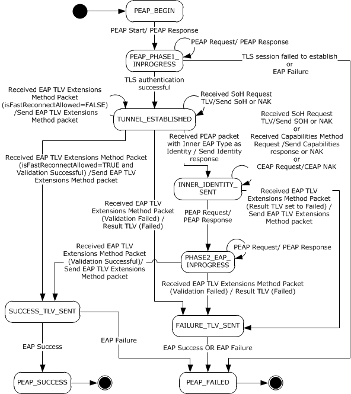

Figure 4: PEAP Peer State Machine

<a id="Section_3.2.2"></a>
### 3.2.2 Timers

See section [3.1.2](#Section_3.1.2).

<a id="Section_3.2.3"></a>
### 3.2.3 Initialization

PEAP MUST be initialized on the [**peer**](#gt_peer) when it is invoked by [**EAP**](#gt_extensible-authentication-protocol-eap) as an [**authentication**](#gt_authentication) method. This occurs when EAP-Request/Identity packet is received, as specified in [[RFC3748]](https://go.microsoft.com/fwlink/?LinkId=90444) section 5.1. The **currentState** variable MUST be initialized to PEAP_BEGIN and the **isFastReconnectAllowed** datum MUST be initialized to FALSE.

**BypassCapNegotiation** and **AssumePhase2Frag** are protocol configurations,<13> which can be initialized in an implementation-specific manner.<14>

If **isIdPrivacyEnabled** is set to TRUE, then call **EapSetIdentityPrivacyString** with **IdentityPrivacyString** as the parameter.

**isCapabilitiesSupported** MUST be initialized to TRUE, if the PEAP method implementation supports Capabilities Method Negotiation (section [2.2.8.3](#Section_2.2.8.3)) and **BypassCapNegotiation** is set to FALSE. Otherwise, it is initialized to FALSE.

**isFragmentationAllowed** MUST be initialized to TRUE, if the PEAP method implementation supports phase 2 fragmentation and **BypassCapNegotiation** and **AssumePhase2Frag** are set to TRUE. Otherwise initialize **isFragmentationAllowed** to FALSE.

A PEAP peer MUST be configured with one [**inner EAP method**](#gt_inner-eap-method) to use while authenticating with a PEAP server. The **EapInitialize** method is called to initialize the inner EAP instance with **InnerEAPType** as the parameter.

The PEAP peer obtains the maximum EAP packet size using the **GetMaxSendPacketSize** method, and assigns the size to the **MaxSendPacketSize** field.

<a id="Section_3.2.4"></a>
### 3.2.4 Higher-Layer Triggered Events

Use of [**EAP**](#gt_extensible-authentication-protocol-eap) is triggered by attempts to access the network. A transport (such as [[IEEE802.1X]](https://go.microsoft.com/fwlink/?LinkId=89910)) is typically invoked, which in turn invokes EAP, which ultimately results in an [**EAP server**](#gt_eap-server) proposing use of PEAP as part of the first message sent.

<a id="Section_3.2.5"></a>
### 3.2.5 Message Processing Events and Sequencing Rules

<a id="Section_3.2.5.1"></a>
#### 3.2.5.1 Status and Error Handling

Status and error handling are specified in section [3.1.5.1](#Section_3.1.5.1).

<a id="Section_3.2.5.2"></a>
#### 3.2.5.2 Phase 1 (TLS Tunnel Establishment)

The first [PEAP packet](#Section_2.2.2) received from the [**PEAP server**](#gt_peap-server) is the PEAP start packet. It specifies the version of the PEAP protocol and indicates that the PEAP server is prepared to begin the PEAP [**phase**](#gt_phase) 1 negotiation. Implementations MUST reset the [**TLS**](#gt_transport-layer-security-tls) [**session**](#gt_session) upon receiving a PEAP packet with the S flag on packets other than the first packet. Implementations MUST set the [**EAP**](#gt_extensible-authentication-protocol-eap) **Type** field of all PEAP packets to 25 (PEAP).

Once the PEAP version is negotiated, all subsequent PEAP request and response packets MUST include the negotiated version. The [**PEAP peer**](#gt_peap-peer) MUST set the PEAP version to 0 in PEAP responses, regardless of the version sent in the initial or subsequent PEAP requests. The PEAP server MUST set the PEAP version to 0 in PEAP requests. When a [**peer**](#gt_peer) negotiates a version other than zero, the PEAP server MUST fail the authentication by sending an EAP failure packet.

The PEAP peer response begins the negotiation of a TLS (as specified in [[RFC2246]](https://go.microsoft.com/fwlink/?LinkId=90324)) with the PEAP server. The TLS [**tunnel**](#gt_tunnel) can be established via a TLS session resume (as specified in [RFC2246] section F.1.4).

Note that PEAP relies on the TLS Protocol [RFC2246] to manage the TLS session (including the handling of any error or other conditions that occur within the TLS Protocol). The TLS packets are exchanged encapsulated in PEAP packets as explained in section [3.1.5.4](#Section_3.1.5.4).

<a id="Section_3.2.5.3"></a>
#### 3.2.5.3 PEAP Peer Cryptobinding Validation

Upon receipt of the cryptobinding request, the [**PEAP peer**](#gt_peap-peer) MUST validate the message using the following process.

The [cryptobinding TLV](#Section_2.2.8.1.1) MUST specify the appropriate subtype (for example, a request must specify a request and a response must specify a response); otherwise the validation is declared as failed.

The PEAP peer MUST then construct the cryptobinding structure (see cryptobinding TLV), populating its **Nonce** field with the nonce supplied in the corresponding cryptobinding request. The implementation then MUST compute the Compound MAC as specified in [3.1.5.5](#Section_3.1.5.5).

A PEAP peer implementation MUST then compare the Compound MAC contained in the cryptobinding request with the Compound MAC that the [**peer**](#gt_peer) itself computed. If the Compound MACs do not match, then the validation is declared as failed; otherwise, the validation is declared as success.

<a id="Section_3.2.5.4"></a>
#### 3.2.5.4 Packet Processing

If a packet is received with L and M bits set, then reassembly is done as specified in section [3.1.5.2.1](#Section_3.1.5.2.1). After reassembly, the packet is processed as specified in the following sections.

<a id="Section_3.2.5.4.1"></a>
##### 3.2.5.4.1 General Packet Validation

When receiving a packet, the [**PEAP peer**](#gt_peap-peer) MUST validate that the packet conforms to the syntax as specified in Message Syntax (section [2.2](#Section_2.2)) and its subsections. If an invalid packet is received, the error is handled as specified in section [3.2.5.1](#Section_3.2.5.1).

<a id="Section_3.2.5.4.2"></a>
##### 3.2.5.4.2 Received PEAP Request

If the **currentState** variable is set to PEAP_PHASE1_INPROGRESS, then:

- Change the **Type** field in the PEAP packet to [**EAP**](#gt_extensible-authentication-protocol-eap)-[**TLS**](#gt_transport-layer-security-tls) [[IANA-EAP]](https://go.microsoft.com/fwlink/?LinkId=89882), and process the packet as specified in [[RFC5216]](https://go.microsoft.com/fwlink/?LinkId=155108).
- Prepare the EAP Response packet as specified in [RFC5216].
- Change the **Type** field to PEAP, and then send the packet to the server.
If **currentState** is set to TUNNEL_ESTABLISHED, INNER_IDENTITY_SENT, or PHASE2_EAP_INPROGRESS, then:

- Pass the **Data** field in the PEAP packet to the TLS layer for [**decryption**](#gt_decryption) using the **DecryptMessage** method.
- If the decrypted data returned by **DecryptMessage** is compressed data, apply the decompression method as specified in section [3.1.5.6](#Section_3.1.5.6).
- If the **currentState** is set to TUNNEL_ESTABLISHED, then:
- If the decrypted data matches an [SoH Request TLV (section 2.2.8.2.1)](#Section_2.2.8.2.1), then process the data as specified in section [3.2.5.4.5](#Section_3.2.5.4.5).
- If the decrypted data matches the [EAP TLV Extensions Method (section 2.2.8.1)](#Section_2.2.8.1), then process the data as specified in section [3.2.5.4.7](#Section_3.2.5.4.7).
- If the decrypted data matches the Identity Request packet, then process the data as specified in section [3.2.5.4](#Section_3.3.5.4).
- Ignore the packet if the decrypted data does not match the earlier conditions.
- If **currentState** is set to INNER_IDENTITY_SENT, then:
- If the decrypted data matches the Capabilities Negotiation Request, then process the data as specified in section [3.2.5.4.6](#Section_3.2.5.4.6).
- If the decrypted data matches an SoH Request TLV, then process the data as specified in section 3.2.5.4.5.
- If the decrypted data matches the EAP TLV Extensions Method, then process the data as specified in section 3.2.5.4.7.
- If the decrypted data does not match the previous conditions, then check if the first byte matches **InnerEapType**. If it does not match, then prepare an EAP Nak packet ([[RFC3748]](https://go.microsoft.com/fwlink/?LinkId=90444) section 5.3.1) with the **Type-Data** field set to **InnerEapType**, and then call the **Compress_Encrypt_Send** method (section [3.1.5.2.3](#Section_3.1.5.2.3)). Otherwise, prepare an EAP packet with the fields set as follows:
- **Code**: PEAP packet Code
- **Identifier**: PEAP packet Identifier
- **Length**: Length of the decrypted data + 4
- **Type**: **InnerEapType**
- **Data**: Decrypted data
Pass the previously prepared EAP packet to the inner EAP method and when the inner EAP method returns an EAP Response packet, call the **Compress_Encrypt_Send** routine and then set **currentState** to PHASE2_EAP_INPROGRESS.

- If **currentState** is set to PHASE2_EAP_INPROGRESS, then:
- If the decrypted data matches the EAP TLV Extensions Method, then process the data as specified in section 3.2.5.4.7.
- If the first byte of the decrypted data does not match **InnerEapType**, then ignore the packet, otherwise prepare an EAP packet with the fields set as follows:
- **Code**: PEAP packet Code
- **Identifier**: PEAP packet Identifier
- **Length**: Length of the decrypted data + 4
- **Type**: **InnerEapType**
- **Data**: Decrypted data
Pass the EAP packet prepared earlier to the inner EAP method and when the inner EAP method returns an EAP Response packet, call **Compress_Encrypt_Send** (section 3.1.5.2.3).

If **currentState** is not set to PEAP_PHASE1_INPROGRESS, TUNNEL_ESTABLISHED, INNER_IDENTITY_SENT, or PHASE2_EAP_INPROGRESS, then the packet is ignored.

<a id="Section_3.2.5.4.3"></a>
##### 3.2.5.4.3 Received PEAP Packet with S Bit Set

If the **currentState** variable is set to PEAP_BEGIN, then:

- Change the **Type** field in the PEAP packet to EAP-TLS [[IANA-EAP]](https://go.microsoft.com/fwlink/?LinkId=89882), and process the packet as specified in [[RFC5216]](https://go.microsoft.com/fwlink/?LinkId=155108).
- Prepare the EAP Response packet as specified in [RFC5216].
- Change the **Type** field to PEAP, and then send the packet to the server.
- Change **currentState** to PEAP_PHASE1_IN_PROGRESS.
If **currentState** is not set to PEAP_BEGIN, then the packet is ignored.

<a id="Section_3.2.5.4.4"></a>
##### 3.2.5.4.4 Received PEAP Packet With Inner EAP Type As Identity

If the **currentState** variable is set to TUNNEL_ESTABLISHED, then:

- Get the Identity of the peer to be [**authenticated**](#gt_authentication) from the protocol to be tunneled. For an example, see [MS-CHAP](../MS-CHAP/MS-CHAP.md) section 3.2.4, which explains how to get the Identity for the Extensible Authentication Protocol Method for the Microsoft Challenge Handshake Authentication Protocol (CHAP).
- Prepare an [**EAP Identity**](#gt_eap-identity) response packet [[RFC3748]](https://go.microsoft.com/fwlink/?LinkId=90444) with the Identity obtained in step 1 as **Type_Data** value.
- Compress the [**EAP**](#gt_extensible-authentication-protocol-eap) packet obtained in step 2 as specified in section [3.1.5.6](#Section_3.1.5.6), and then [**encrypt**](#gt_encryption) the compressed data by passing it to the [**TLS**](#gt_transport-layer-security-tls) layer using the **EncryptMessage** method.
- Prepare a PEAP packet by keeping the encrypted data returned by the **EncryptMessage** method as the **Data** field of the PEAP packet. Then, send the PEAP packet to the server (see section [3.1.5.2.2](#Section_3.1.5.2.2)).
- Change **currentState** to INNER_IDENTITY_SENT.
If **currentState** is not set to TUNNEL_ESTABLISHED, then the packet is ignored.

<a id="Section_3.2.5.4.5"></a>
##### 3.2.5.4.5 Received SoH Request TLV

If the **currentState** variable is set to TUNNEL_ESTABLISHED or INNER_IDENTITY_SENT, then:

- If **isSoHEnabled** is set to FALSE:
- Prepare an [**EAP**](#gt_extensible-authentication-protocol-eap) NAK packet as per [[RFC3748]](https://go.microsoft.com/fwlink/?LinkId=90444).
- Compress the EAP packet obtained in step 1 (as specified in section [3.1.5.6](#Section_3.1.5.6)), and [**encrypt**](#gt_encryption) the compressed data by passing it to the [**TLS**](#gt_transport-layer-security-tls) layer using the **EncryptMessage** method.
- Prepare a PEAP packet by keeping the encrypted data returned by the **EncryptMessage** method as the **Data** field of the PEAP packet. Then, send the PEAP packet to the server (see section [3.1.5.2.2](#Section_3.1.5.2.2)).
- If **isSoHEnabled** is set to TRUE:
- Obtain the [**SoH**](#gt_statement-of-health-soh) message using an implementation-specific mechanism.
- Prepare a [SoH TLV (section 2.2.8.2.2)](#Section_2.2.8.2.2) with the SoH message obtained in step 1, and encrypt it by passing it to the TLS layer using the **EncryptMessage** method.
- Prepare a PEAP packet by keeping the encrypted data returned by the **EncryptMessage** method as the **Data** field of the PEAP packet. Then, send the PEAP packet to the server (see section 3.1.5.2.2).
If **currentState** is not set to TUNNEL_ESTABLISHED or INNER_IDENTITY_SENT, then the packet is ignored.

<a id="Section_3.2.5.4.6"></a>
##### 3.2.5.4.6 Received Capabilities Method Request

If the **currentState** variable is set to INNER_IDENTITY_SENT, then:

- If **isCapabilitiesSupported** is set to FALSE, prepare an [**EAP**](#gt_extensible-authentication-protocol-eap) NAK packet as per [[RFC3748]](https://go.microsoft.com/fwlink/?LinkId=90444) section 5.3.
- If **isCapabilitiesSupported** is set to TRUE, prepare a [Capabilities Method Response (section 2.2.8.3.2)](#Section_2.2.8.3.2) packet with the F flag set to one if PEAP peer supports phase 2 fragmentation, otherwise set F flag to zero.<15> If the F flag of the received packet is set to one and PEAP peer is phase 2 fragmentation capable, then set **isFragmentationAllowed** to TRUE, otherwise set **isFragmentationAllowed** to false.
- Compress the EAP packet (as specified in section [3.1.5.6](#Section_3.1.5.6)) obtained above and then [**encrypt**](#gt_encryption) the compressed data by passing it to the [**TLS**](#gt_transport-layer-security-tls) layer using the **EncryptMessage** method.
- Prepare a PEAP packet by keeping the encrypted data returned by the **EncryptMessage** method as the **Data** field of the PEAP packet. Then, send the PEAP packet to the server (see section [3.1.5.2.2](#Section_3.1.5.2.2)).
If **currentState** is not set to INNER_IDENTITY_SENT, then the packet is ignored.

<a id="Section_3.2.5.4.7"></a>
##### 3.2.5.4.7 Received EAP TLV Extensions Method Packet

If the **currentState** datum is set to TUNNEL_ESTABLISHED or PHASE2_EAP_INPROGRESS, then the following steps are applied in sequence:

- If a [Result TLV (section 2.2.8.1.2)](#Section_2.2.8.1.2) is received with the **value** field set to 2, then prepare an [EAP TLV Extensions Method (section 2.2.8.1)](#Section_2.2.8.1) packet with Result TLV (the **value** field set to 2). Change the **currentState** datum to FAILURE_TLV_SENT and proceed to step 11.
- If the **currentState** datum is set to PHASE2_EAP_INPROGRESS and the [**authentication**](#gt_authentication) result flag returned by **isEAPAuthSuccess** indicates FALSE, then prepare an EAP TLV Extensions Method packet with Result TLV (the **value** field set to 2). Change the **currentState** datum to FAILURE_TLV_SENT and proceed to step 11.
- If the **currentState** datum is set to PHASE2_EAP_INPROGRESS and the authentication result flag returned by **isEAPAuthSuccess** indicates TRUE, then store the **InnerMPPESendKey**, **InnerMPPESendKeyLength**, **InnerMPPERecvKey**, and **InnerMPPERecvKeyLength** as returned by **isEAPAuthSuccess**.
- If the **currentState** datum is set to TUNNEL_ESTABLISHED and **isFastReconnectAllowed** is set to FALSE, then prepare an EAP TLV Extensions Method packet with Result TLV (the **value** field set to 2) and keep the **currentState** datum set to the same value and proceed to step 11.
- If the **currentState** datum is set to TUNNEL_ESTABLISHED and **isFastReconnectAllowed** is set to TRUE, but the peer cannot start fast reconnect because of implementation defined reasons, then prepare an EAP TLV Extensions Method packet with Result TLV (the **value** field set to 2) and keep the **currentState** datum set to the same value. Set **isFastReconnectAllowed** to FALSE and proceed to step 11.
- If **isCryptoSupported** is set to TRUE and a [Cryptobinding TLV (section 2.2.8.1.1)](#Section_2.2.8.1.1) is received whose validation (described in section [3.2.5.3](#Section_3.2.5.3)) fails, then prepare an EAP TLV Extensions Method packet with Result TLV (the **value** field set to 2). Change the **currentState** datum to FAILURE_TLV_SENT and proceed to step 11.
- If **isCryptoSupported** is set to TRUE, **isCryptoRequired** is set to TRUE and the received packet has only a Result TLV (the **value** field set to 1), then prepare an EAP TLV Extensions Method packet with Result TLV (the **value** field set to 2). If the **currentState** datum is set to PHASE2_EAP_INPROGRESS then change it to **FAILURE_TLV_SENT** and proceed to step 11. If the **currentState** datum is set to TUNNEL_ESTABLISHED, then keep it the same and proceed to step 11.
- If the received EAP TLV Extensions Method packet contains both a Cryptobinding TLV and a Result TLV, and **isCryptoSupported** is set to TRUE, then prepare an EAP TLV Extensions Method packet with both Result TLV (the **value** field set to 1) and Cryptobinding TLV (the **value** field set to the computed value). Change the **currentState** datum to SUCCESS_TLV_SENT and proceed to step 11.
- If the received EAP TLV Extensions Method packet contains both a Cryptobinding TLV and a Result TLV, and **isCryptoSupported** is set to FALSE, then prepare an EAP TLV Extensions Method packet with Result TLV (the **value** field set to 1). Change the **currentState** datum to SUCCESS_TLV_SENT and proceed to step 11.
- If the received EAP TLV Extensions Method packet contains only a Result TLV and no Cryptobinding TLV, then prepare an EAP TLV Extensions Method packet with Result TLV (the **value** field set to 1). Change the **currentState** datum to SUCCESS_TLV_SENT and stop processing the packet.
- If the received packet does not meet any of the above conditions, then ignore the packet and keep the **currentState** datum set to the same value.
- [**Encrypt**](#gt_encryption) the EAP TLV Extensions Method packet obtained above by passing it to the [**TLS**](#gt_transport-layer-security-tls) layer using the **EncryptMessage** method.
- Prepare a PEAP packet by keeping the encrypted data returned by the **EncryptMessage** method as the **Data** field of the PEAP packet. Then, send the PEAP packet to the server (see section [3.1.5.2.2](#Section_3.1.5.2.2)).
If the **currentState** datum is set to INNER_IDENTITY_SENT, then:

- If a Result TLV is received with the **value** field set to 2, then prepare an EAP TLV Extensions Method packet with Result TLV (the **value** field set to 2). Change the **currentState** datum to FAILURE_TLV_SENT.
- If the received packet does not meet the above condition, then ignore the packet, keep the **currentState** datum set to the same value, and stop processing the packet.
- Encrypt the EAP TLV Extensions Method packet obtained above by passing it to the TLS layer using the **EncryptMessage** method.
- Prepare a PEAP packet, keeping the encrypted data returned by the **EncryptMessage** method as the **Data** field. Then, send the PEAP packet to the server (see section 3.1.5.2.2).
If the **currentState** datum is not set to TUNNEL_ESTABLISHED, PHASE2_EAP_INPROGRESS, or INNER_IDENTITY_SENT, then the packet is ignored.

<a id="Section_3.2.5.4.8"></a>
##### 3.2.5.4.8 Received EAP Success

If **currentState** is set to SUCCESS_TLV_SENT, then:

- Trigger the Transport Layer with authentication result as Success.
- Change **currentState** to PEAP_SUCCESS.
If **currentState** is set to FAILURE_TLV_SENT, then:

- Trigger the Transport Layer with authentication result as failed.
- Change **currentState** to PEAP_FAILED.
If **currentState** is not set to SUCCESS_TLV_SENT or FAILURE_TLV_SENT, then the packet is ignored.

<a id="Section_3.2.5.4.9"></a>
##### 3.2.5.4.9 Received EAP Failure

If **currentState** is set to SUCCESS_TLV_SENT, FAILURE_TLV_SENT, or PEAP_PHASE1_INPROGRESS, then:

- Trigger the Transport Layer with the authentication result as Failed.
- Change **currentState** to PEAP_FAILED.
If **currentState** is not set to SUCCESS_TLV_SENT, FAILURE_TLV_SENT, or PEAP_PHASE1_INPROGRESS, then the packet is ignored.

<a id="Section_3.2.5.5"></a>
#### 3.2.5.5 Key Management

See section [3.1.5.7](#Section_3.1.5.7).

<a id="Section_3.2.6"></a>
### 3.2.6 Timer Events

For details on timer events, see section [3.1.6](#Section_3.1.6).

<a id="Section_3.2.7"></a>
### 3.2.7 Other Local Events

Note that PEAP relies on the [**TLS**](#gt_transport-layer-security-tls) Protocol [[RFC2246]](https://go.microsoft.com/fwlink/?LinkId=90324) for [**session**](#gt_session) disconnects and other conditions that can occur during the course of a TLS session. The local events generated by EAP_TLS and consumed by the PEAP layer are described in the following sections.

<a id="Section_3.2.7.1"></a>
#### 3.2.7.1 TLS Session Established Successfully

If the [**TLS**](#gt_transport-layer-security-tls) session established successfully:

inputParameter: **TLS message**

outputParamter:

- **CtxtHandle** (a [**context handle**](#gt_context-handle) returned by TLS layer)
- **Server Certificate** (The certificate as received from the server by the TLS layer. The server certificate is a [**X.509**](#gt_x509) certificate as described in [[RFC5280]](https://go.microsoft.com/fwlink/?LinkId=131034). It is made available as part of the TLS handshake as specified in section 7.4.2 of [[RFC2246]](https://go.microsoft.com/fwlink/?LinkId=90324).)
- **isSessionResumed** (a Boolean flag indicating whether the underlying TLS session is resumed (as defined in sections 7.3 and F.1.4 of [RFC2246]); TRUE indicates that the TLS session is resumed.)
This event will be received from the TLS layer in response to a TLS message passed to it by the PEAP layer during phase 1. If the **currentState** variable is not set to **PEAP_PHASE1_INPROGRESS**, ignore this event. Otherwise, the PEAP layer MUST take the following actions:

- The following processing MUST be done if isValidateServerCertEnabled is TRUE:
- The trust anchor of the server certificate MUST be validated against the certificates in a [**trust root**](#gt_trust-root) <16>as specified in section 6.1 of [RFC5280]. If the validation fails, then prepare a TLS alert message with **AlertDescription** set to unknown_ca (section 7.2 of [RFC2246]) and go to Step 5.
- Validate that the SHA1 hash ([[RFC3174]](https://go.microsoft.com/fwlink/?LinkId=90408)) of the certificate which matched the trust anchor of the server certificate in the preceding step is present in **TrustedCertHashInfoList**.
- If the **isValidateServerNameEnabled** is set to TRUE, then verify that the subject name (section 4.1.2.6 of [RFC5280]) or subject alternative name (section 4.2.1.6 of [RFC5280]) of the server certificate exists in **ServerNames**.
- If any of the validations in either of the two preceding steps fails and **isPromptForValidationDisabled** is set to FALSE, the implementation could take user's consent on whether the authentication succeeded. If the user has chosen to fail the authentication, or if **isPromptForValidationDisabled** is set to TRUE and validations in either of the two preceding steps fail, prepare a TLS Alert message with **AlertDescription** set to access_denied (section 7.2 [RFC2246]). The **currentState** continues to be same. Go to Step 5.
- Store the **CtxtHandle** returned by the TLS layer.
- If **isSessionResumed** and **isFastReconnectConfigured** are set to TRUE, then set **isFastReconnectAllowed** to TRUE; otherwise set it to FALSE.
- Change **currentState** to TUNNEL_ESTABLISHED.
- Prepare an [**EAP**](#gt_extensible-authentication-protocol-eap) response packet as specified in [[RFC5216]](https://go.microsoft.com/fwlink/?LinkId=155108) section 3.2.
- Change the packet **Type** field to PEAP [[IANA-EAP]](https://go.microsoft.com/fwlink/?LinkId=89882), and then send the packet to the server.
<a id="Section_3.2.7.2"></a>
#### 3.2.7.2 TLS Session Failed to Establish

If the [**TLS**](#gt_transport-layer-security-tls) session failed to establish:

- This event will be received from the TLS layer when it is unsuccessful in establishing the TLS session. If **currentState** is not set to PEAP_PHASE1_INPROGRESS, ignore this event. Otherwise, the PEAP layer MUST take the following action:
- Change **currentState** to PEAP_FAILED.
<a id="Section_3.2.7.3"></a>
#### 3.2.7.3 Interface with EAP

**EapSetIdentityPrivacyString:** The PEAP layer on the client uses this method to set the username portion of [**NAI**](#gt_network-access-identifier-nai) to be sent in EAP-Response/Identity packet for the identity protection ([[RFC3748]](https://go.microsoft.com/fwlink/?LinkId=90444) section 7.3). This method takes Unicode string as a parameter.

<a id="Section_3.3"></a>
## 3.3 Server Details

<a id="Section_3.3.1"></a>
### 3.3.1 Abstract Data Model

This section describes a model of possible data organization that a server-side implementation maintains to participate in this protocol. The described organization is provided to facilitate the explanation of how the protocol behaves. This specification does not mandate that an implementation adhere to this model as long as the external behavior of the implementation is consistent with what is described in this specification.

The server maintains the following datum:

**innerEAPAuthenticationMethods:** An array of unsigned integers whose values correspond to the [**EAP**](#gt_extensible-authentication-protocol-eap) authentication method types ([[IANA-EAP]](https://go.microsoft.com/fwlink/?LinkId=89882)) supported as inner EAP methods by the PEAP server implementation.

**currentState:** The **currentState** datum is initialized when the server starts the PEAP authentication and remains valid until the authentication is done. At any point in time, the **currentState** datum can have the following integer values, each of which represents a possible state of the server machine.

- PEAP_PHASE1_INPROGRESS
- WAIT_FOR_SOH_RESPONSE
- WAIT_FOR_CAPABILITIES_RESPONSE
- INNER_IDENTITY_REQ_SENT
- PHASE2_EAP_INPROGRESS
- SUCCESS_TLV_SENT
- FAILURE_TLV_SENT
- PEAP_SUCCESS
- PEAP_FAILED
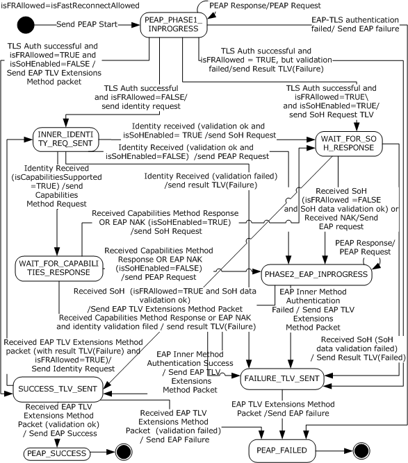

Figure 5: PEAP Server State Machine

<a id="Section_3.3.2"></a>
### 3.3.2 Timers

Timers are specified in section [3.1.2](#Section_3.1.2).

<a id="Section_3.3.3"></a>
### 3.3.3 Initialization

PEAP MUST be initialized on the [**EAP server**](#gt_eap-server) when it is invoked by [**EAP**](#gt_extensible-authentication-protocol-eap) as an [**authentication**](#gt_authentication) method. This occurs when an EAP-enabled protocol (such as RADIUS [[RFC2865]](https://go.microsoft.com/fwlink/?LinkId=90392)) invokes EAP, the EAP server proposes PEAP, and the [**peer**](#gt_peer) agrees to perform a PEAP negotiation.

A PEAP implementation MUST have an implementation-specific way of specifying what [**EAP methods**](#gt_eap-method) are supported for the inner EAP instance. The **EapInitialize** method SHOULD be called to initialize the inner EAP instance with the specified inner EAP methods as the parameter.

The [**PEAP server**](#gt_peap-server) obtains the maximum EAP packet size using the **GetMaxSendPacketSize** method, and assigns the size to the **MaxSendPacketSize** field. **isFastReconnectAllowed** datum MUST be initialized to FALSE.

**InnerEapType** MUST be initialized with the first integer of the **innerEAPAuthenticationMethods** array as specified in section [3.3.1](#Section_3.3.1).

**BypassCapNegotiation** and **AssumePhase2Frag** are protocol configurations<17>, which can be initialized in an implementation-specific manner.<18>

**isCapabilitiesSupported** MUST be initialized to TRUE, if the PEAP method implementation supports Capabilities Method Negotiation (section [2.2.8.3](#Section_2.2.8.3)) and **BypassCapNegotiation** is set to FALSE. Otherwise, it is initialized to FALSE.

**isFragmentationAllowed** MUST be initialized to TRUE, if the PEAP method implementation supports phase 2 fragmentation and **BypassCapNegotiation** and **AssumePhase2Frag** are set to TRUE. Otherwise initialize **isFragmentationAllowed** to FALSE.

<a id="Section_3.3.4"></a>
### 3.3.4 Higher-Layer Triggered Events

No higher-layer triggered events are used. PEAP relies on the [**TLS**](#gt_transport-layer-security-tls) Protocol [[RFC2246]](https://go.microsoft.com/fwlink/?LinkId=90324) for [**session**](#gt_session) disconnects and other conditions that occur during the course of a TLS session.

<a id="Section_3.3.5"></a>
### 3.3.5 Message Processing Events and Sequencing Rules

<a id="Section_3.3.5.1"></a>
#### 3.3.5.1 Status and Error Handling

Status and error handling is specified in section [3.1.5.1](#Section_3.1.5.1).

<a id="Section_3.3.5.2"></a>
#### 3.3.5.2 Phase 1 (TLS Tunnel Establishment)

When the [**EAP**](#gt_extensible-authentication-protocol-eap) implementation negotiates PEAP as the method on the [**EAP server**](#gt_eap-server), PEAP [**phase**](#gt_phase) 1 begins.

The first packet in a PEAP negotiation is referred to as a PEAP start packet. Version 0 implementations MUST set the **L** bit to 0, the M bit based on the description in the [PEAP packet](#Section_2.2.2), the **S** bit to 1, and all of the reserved bits to 0. These flag fields are specified in the PEAP packet.

After the PEAP start packet is sent to the [**peer**](#gt_peer), the [**PEAP server**](#gt_peap-server) expects a PEAP response from the peer that indicates the version of PEAP that the peer supports. At the EAP level (see section [2.1](#Section_2.1)), these interactions are specified in [[RFC3748]](https://go.microsoft.com/fwlink/?LinkId=90444) section 2.

The peer MUST then start to negotiate a [**TLS**](#gt_transport-layer-security-tls) [**session**](#gt_session).

When the TLS [**tunnel**](#gt_tunnel) is established successfully, implementations SHOULD skip phase 2 if the session is a resumption of a previous session (as specified in [[RFC2246]](https://go.microsoft.com/fwlink/?LinkId=90324) section F.1.4). This process is known as "[**fast reconnection**](#gt_fast-reconnect)".

<a id="Section_3.3.5.3"></a>
#### 3.3.5.3 PEAP Server Cryptobinding Validation

Upon receipt of the cryptobinding response, the [**PEAP server**](#gt_peap-server) MUST validate the message using the following process.

The server implementation MUST construct the [cryptobinding](#Section_3.1.5.5) structure, populating its **Nonce** field with the nonce supplied in the corresponding cryptobinding response. The implementation MUST then compute the Compound MAC, as specified in section 3.1.5.5.

A PEAP server implementation MUST then compare the Compound MAC contained in the cryptobinding response with the Compound MAC that it computed. If the computed Compound MAC and the Compound MAC reported within the cryptobinding response do not match, then the validation is declared as failed. Otherwise it is declared as success.

<a id="Section_3.3.5.4"></a>
#### 3.3.5.4 Packet Processing

If a packet is received with L and M bits set, then reassembly is done as specified in section [3.1.5.2.1](#Section_3.1.5.2.1). After reassembly, the packet is processed as specified in the following sections.

<a id="Section_3.3.5.4.1"></a>
##### 3.3.5.4.1 General Packet Validation

When receiving a packet, the [**PEAP server**](#gt_peap-server) MUST validate that the packet conforms to the syntax as specified in Message Syntax (section [3.3.5](#Section_3.3.5)) and its subsections. If an invalid packet is received, the error is handled as specified in section [3.3.5.1](#Section_3.3.5.1).

<a id="Section_3.3.5.4.2"></a>
##### 3.3.5.4.2 Received PEAP Response

If the **currentState** variable is set to PEAP_PHASE1_INPROGRESS, then:

- Change the **Type** field in the PEAP packet to [**EAP**](#gt_extensible-authentication-protocol-eap)-[**TLS**](#gt_transport-layer-security-tls) (as specified in [[IANA-EAP]](https://go.microsoft.com/fwlink/?LinkId=89882)), and process the packet as specified in [[RFC5216]](https://go.microsoft.com/fwlink/?LinkId=155108).
- Prepare the EAP Request packet as specified in [RFC5216].
- Change the **Type** field to PEAP, then send the packet to the client.
If **currentState** is set to INNER_IDENTITY_REQ_SENT, WAIT_FOR_SOH_RESPONSE, WAIT_FOR_CAPABILITIES_RESPONSE, PHASE2_EAP_INPROGRESS, SUCCESS_TLV_SENT, or FAILURE_TLV_SENT, then:

- Pass the **Data** field in the PEAP packet to the TLS layer for [**decryption**](#gt_decryption) using the **DecryptMessage** method.
- If the decrypted data returned by **DecryptMessage** is compressed data as specified in [3.1.5.6](#Section_3.1.5.6), then apply the decompression method as specified in 3.1.5.6.
- If **currentState** is set to INNER_IDENTITY_REQ_SENT, then:
- If the first byte of the decrypted data matches one (Identity type), then process the data as specified in section [3.3.5.4.3](#Section_3.3.5.4.3), otherwise, ignore the packet.
- If **currentState** is set to WAIT_FOR_SOH_RESPONSE, then:
- If the decrypted data matches [SoH TLV (section 2.2.8.2.2)](#Section_2.2.8.2.2) in the [SoH EAP Extensions Method (section 2.2.8.2)](#Section_2.2.8.2), then process the data as specified in section [3.3.5.4.6](#Section_3.3.5.4.6).
- If the decrypted data matches the EAP Nak packet, then process the data as specified in section [3.3.5.4.5](#Section_3.3.5.4.5).
- If the decrypted data does not match the earlier conditions, then ignore the packet.
- If **currentState** is set to WAIT_FOR_CAPABILITIES_RESPONSE, then:
- If the decrypted data matches the [Capabilities Method Response (section 2.2.8.3.2)](#Section_2.2.8.3.2), then process the data as specified in section [3.3.5.4.4](#Section_3.3.5.4.4).
- If the decrypted data matches the EAP Nak packet, then process the data as specified in section 3.3.5.4.5.
- If the decrypted data does not match the earlier conditions, then ignore the packet.
- If the decrypted data does not match the earlier conditions, then create a Capabilities Method Response with the F bit set to zero and process it as specified in section 3.3.5.4.4.
- If the **currentState** is set to PHASE2_EAP_INPROGRESS, then:
- If the decrypted data matches the EAP Nak packet, then process the data as specified in section 3.3.5.4.5.
- If the decrypted data does not match the earlier condition, then check if the first byte matches **InnerEapType**. If it does not match, then ignore the packet, otherwise, prepare an EAP packet with the fields set as follows:
- **Code**: PEAP packet Code
- **Identifier**: PEAP packet Identifier
- **Length**: Length of the decrypted data + 4
- **Type**: **InnerEapType**
- **Data**: Decrypted data
Pass the EAP packet prepared earlier to the inner EAP method and when the inner EAP method returns an EAP Request packet, call the **Compress_Encrypt_Send** method (section [3.1.5.2.3](#Section_3.1.5.2.3)).

- If **currentState** is set to SUCCESS_TLV_SENT or FAILURE_TLV_SENT, then:
- If the decrypted data does not match an [EAP TLV Extensions Method (section 2.2.8.1)](#Section_2.2.8.1), then ignore the packet, otherwise, process the data as specified in section [3.3.5.4.7](#Section_3.3.5.4.7).
If **currentState** is not set to PEAP_PHASE1_INPROGRESS, INNER_IDENTITY_REQ_SENT, WAIT_FOR_SOH_RESPONSE, WAIT_FOR_CAPABILITIES_RESPONSE, PHASE2_EAP_INPROGRESS, SUCCESS_TLV_SENT, or FAILURE_TLV_SENT, then the packet is ignored.

<a id="Section_3.3.5.4.3"></a>
##### 3.3.5.4.3 Received PEAP Packet with Inner EAP Type As Identity (Identity Received)

If the **currentState** variable is set to INNER_IDENTITY_REQ_SENT, then the following steps MUST be applied in sequence:

- Store the received identity in the **InnerIdentity** datum.
- If the **isCapabilitiesSupported** field is set to TRUE, then prepare a [Capabilities Method Request (section 2.2.8.3.1)](#Section_2.2.8.3.1) packet with the F flag set to one if the PEAP server supports phase 2 fragmentation, otherwise, set the F flag to zero.<19> Change the **currentState** datum to WAIT_FOR_CAPABILITIES_RESPONSE and proceed to step 6.
- Validate the received Identity in an implementation-specific manner. If the Identity validation fails, then prepare an [EAP TLV Extensions Method (section 2.2.8.1)](#Section_2.2.8.1) packet with [Result TLV (section 2.2.8.1.2)](#Section_2.2.8.1.2) (the **value** field set to 2). Change the **currentState** datum to FAILURE_TLV_SENT and proceed to step 6.
- If the **isSoHEnabled** field is set to TRUE, then prepare an [SoH EAP Extensions Method (section 2.2.8.2)](#Section_2.2.8.2) packet with an [SoH Request TLV (section 2.2.8.2.1)](#Section_2.2.8.2.1) within it. Change the **currentState** datum to WAIT_FOR_SOH_RESPONSE and proceed to step 6.
- If all of the earlier conditions fail, then prepare an EAP Request packet with the **Type** field set to **InnerEapType** to start the [**inner EAP method**](#gt_inner-eap-method) negotiation as described in [[RFC3748]](https://go.microsoft.com/fwlink/?LinkId=90444) section 2. Compress the EAP Request packet as specified in section [3.1.5.6](#Section_3.1.5.6). Change **currentState** to PHASE2_EAP_INPROGRESS.
- Send the packet prepared earlier to the [**TLS**](#gt_transport-layer-security-tls) layer for [**encryption**](#gt_encryption) using the **EncryptMessage** method.
- Prepare a PEAP packet by keeping the encrypted data returned by the **EncryptMessage** method as the **Data** field of the PEAP packet, and send it to the peer (see section [3.1.5.2.2](#Section_3.1.5.2.2)).
If **currentState** is not set to INNER_IDENTITY_REQ_SENT, then the packet is ignored.

<a id="Section_3.3.5.4.4"></a>
##### 3.3.5.4.4 Received Capabilities Method Response

If the **currentState** variable is set to WAIT_FOR_CAPABILITIES_RESPONSE, then:

- If the F flag of the received [Capabilities Method Response (section 2.2.8.3.2)](#Section_2.2.8.3.2) packet is set to one and the PEAP server is phase 2 fragmentation-capable, then set **isFragmentationAllowed** to TRUE, otherwise set **isFragmentationAllowed** to FALSE.
- Validate the Identity stored in the **InnerIdentity** datum in an implementation-specific manner. If the Identity validation fails, then prepare an EAP TLV Extensions Method packet (section [2.2.8.1](#Section_2.2.8.1)) with Result TLV (section [2.2.8.1.2](#Section_2.2.8.1.2)) (with the **value** field set to 2). Change the **currentState** datum to FAILURE_TLV_SENT and proceed to step 5.
- If **isSoHEnabled** is set to TRUE, then prepare an [SoH EAP Extensions Method (section 2.2.8.2)](#Section_2.2.8.2) packet with [SoH Request TLV (section 2.2.8.2.1)](#Section_2.2.8.2.1) within it. Change **currentState** to WAIT_FOR_SOH_RESPONSE and proceed to step 5.
- If **isSoHEnabled** is set to FALSE, then prepare an EAP Request packet with the **Type** field set to **InnerEapType** to start the [**inner EAP method**](#gt_inner-eap-method) negotiation as described in [[RFC3748]](https://go.microsoft.com/fwlink/?LinkId=90444). Compress the EAP Request packet as specified in section [3.1.5.6](#Section_3.1.5.6). Change **currentState** to PHASE2_EAP_INPROGRESS.
- Send the packet prepared earlierto the [**TLS**](#gt_transport-layer-security-tls) layer for [**encryption**](#gt_encryption) using the **EncryptMessage** method.
- Prepare a PEAP packet by keeping the encrypted data returned by the **EncryptMessage** method as the **Data** field of the PEAP packet. Then, send it to the peer (see section [3.1.5.2.2](#Section_3.1.5.2.2)).
If **currentState** is not set to WAIT_FOR_CAPABILITIES_RESPONSE, then the packet is ignored.

<a id="Section_3.3.5.4.5"></a>
##### 3.3.5.4.5 Received EAP NAK

If the **currentState** variable is set to WAIT_FOR_CAPABILITIES_RESPONSE, then:

- Assign the variable **isFragmentationAllowed** to FALSE.
- Validate the received Identity in an implementation-specific manner. If the Identity validation fails, then prepare an EAP TLV Extensions Method packet (section [2.2.8.1](#Section_2.2.8.1)) with Result TLV (section [2.2.8.1.2](#Section_2.2.8.1.2)) (with the **value** field set to 2). Change the **currentState** datum to FAILURE_TLV_SENT and proceed to step 5.
- If the **isSoHEnabled** variable is set to TRUE, then prepare an SoH EAP Extensions Method packet with SoH Request TLV within it. Change **currentState** to WAIT_FOR_SOH_RESPONSE and proceed to step 5.
- If **isSoHEnabled** is set to FALSE, then prepare an EAP Request packet with the **Type** field set to **InnerEapType** to start the inner EAP method negotiation as specified in [[RFC3748]](https://go.microsoft.com/fwlink/?LinkId=90444). Compress the EAP Request packet as specified in section [3.1.5.6](#Section_3.1.5.6). Change **currentState** to PHASE2_EAP_INPROGRESS.
- Send the packet prepared earlier to the TLS layer for encryption using the **EncryptMessage** method.
- Prepare a PEAP packet by keeping the encrypted data returned by the **EncryptMessage** method as the **Data** field of PEAP packet. Then send it to the peer (see section [3.1.5.2.2](#Section_3.1.5.2.2)).
If the **currentState** is set to WAIT_FOR_SOH_RESPONSE, then:

- Prepare an EAP Request packet with the **Type** field set to **InnerEapType** to start the inner EAP method negotiation as specified in [RFC3748]. Compress the EAP Request packet as specified in section 3.1.5.6. Change **currentState** to PHASE2_EAP_INPROGRESS.
- Encrypt the EAP TLV Extensions Method or EAP Request packet obtained in the preceding step by passing it to the TLS layer using the **EncryptMessage** method.
- Prepare a PEAP packet by keeping the encrypted data returned by the **EncryptMessage** method as the **Data** field of PEAP packet. Then send it to the peer (see section 3.1.5.2.2).
If the **currentState** is set to PHASE2_EAP_INPROGRESS, then:

- If the first byte of the Type-Data ([RFC3748] section 5.3.1) field of the EAP NAK packet is present in the **innerEAPAuthenticationMethods** array, then set that byte as **innerEAPType** and then obtain the first EAP packet to be sent from the inner EAP method as denoted by **innerEAPType**. Call the **Compress_Encrypt_Send** (section [3.1.5.2.3](#Section_3.1.5.2.3)) on the obtained packet.
- If the first byte of the Type-Data field of the EAP NAK packet is not present in the **innerEAPAuthenticationMethods** array, then prepare an EAP TLV Extensions Method packet with Result TLV with the value field set to 2. Change the **currentState** datum to FAILURE_TLV_SENT and then call the **Compress_Encrypt_Send** (section 3.1.5.2.3) on the prepared packet.
If **currentState** is not set to WAIT_FOR_CAPABILITIES_RESPONSE, PHASE2_EAP_INPROGRESS, or WAIT_FOR_SOH_RESPONSE, then the packet is ignored.

<a id="Section_3.3.5.4.6"></a>
##### 3.3.5.4.6 Received SoH

If the **currentState** variable is set to WAIT_FOR_SOH_RESPONSE, the following steps MUST be applied in sequence:

- If the [SoH TLV (section 2.2.8.2.2)](#Section_2.2.8.2.2) value is declared as invalid, by the NAP component, then prepare an [EAP TLV Extensions Method (section 2.2.8.1)](#Section_2.2.8.1) packet with [Result TLV (section 2.2.8.1.2)](#Section_2.2.8.1.2) (the **value** field set to 2). Change **currentState** to FAILURE_TLV_SENT and proceed to step 4.
- If **isFastReconnectAllowed** is set to FALSE, prepare an EAP Request packet to start the [**inner EAP method**](#gt_inner-eap-method) negotiation as described in [[RFC3748]](https://go.microsoft.com/fwlink/?LinkId=90444). Compress the EAP Request packet as specified in section [3.1.5.6](#Section_3.1.5.6). Change **currentState** to PHASE2_EAP_INPROGRESS and proceed to step 4.
- If **isFastReconnectAllowed** is set to TRUE, prepare an EAP TLV Extensions Method packet with Result TLV (the **value** field set to 1), [SoH Response TLV (section 2.2.8.1.3)](#Section_2.2.8.1.3) (the **value** field is set to the message received from NAP), and [Cryptobinding TLV (section 2.2.8.1.1)](#Section_2.2.8.1.1) (the **value** field set to the computed value) if **isCryptoSupported** is set to TRUE. Change **currentState** to SUCCESS_TLV_SENT and proceed to step 4.<20>
- [**Encrypt**](#gt_encryption) the EAP TLV Extensions Method or EAP Request packet obtained in the preceding steps by passing it to the [**TLS**](#gt_transport-layer-security-tls) layer using the **EncryptMessage** method.
- Prepare a PEAP packet by keeping the encrypted data returned by the **EncryptMessage** method as the **Data** field of the PEAP packet. Send the PEAP packet to the peer (see section [3.1.5.2.2](#Section_3.1.5.2.2)).
If **currentState** is not set to WAIT_FOR_SOH_RESPONSE, the packet is ignored.

<a id="Section_3.3.5.4.7"></a>
##### 3.3.5.4.7 Received EAP TLV Extensions Method Packet

If **currentState** is set to FAILURE_TLV_SENT, then:

- If a [Result TLV (section 2.2.8.1.2)](#Section_2.2.8.1.2) is received with the **value** field set to 2, then send an EAP Failure packet (as specified in [[RFC3748]](https://go.microsoft.com/fwlink/?LinkId=90444)) and change **currentState** to PEAP_FAILED.
If **currentState** is set to SUCCESS_TLV_SENT, then:

- If the received packet does not have a Result TLV, then ignore it and stop processing the packet.
- If a Result TLV is received with the **value** field set to 2 and **isFastReconnectAllowed** is set to TRUE, then prepare an EAP Request packet with the **Type** field as Identity (as specified in [RFC3748]).
- Set **isFastReconnectAllowed** to FALSE, and change **currentState** to INNER_IDENTITY_REQ_SENT.
- Compress the packet, and then encrypt it by passing it to the [**TLS**](#gt_transport-layer-security-tls) layer using the **EncryptMessage** method.
- Prepare a PEAP packet by keeping the [**encrypted**](#gt_encryption) data returned by the **EncryptMessage** method as the **Data** field of the PEAP packet.
- Send the PEAP packet to the peer (see section [3.1.5.2.2](#Section_3.1.5.2.2)).
This completes the processing of the packet.

- If Result TLV is received with the **value** field set to 2, then send an EAP Failure packet (as specified in [RFC3748]) to peer. Change **currentState** to PEAP_FAILED. This completes the processing of the packet.
- If **isCryptoSupported** is set to FALSE, then send an EAP Success packet (as specified in [RFC3748]) to peer. Change **currentState** to PEAP_SUCCESS. This completes the processing of the packet.
- If the received packet contains a [Cryptobinding TLV (section 2.2.8.1.1)](#Section_2.2.8.1.1) whose validation (described in section [3.3.5.3](#Section_3.3.5.3)) fails, then send a EAP Failure packet (as specified in [RFC3748]) to peer. Change **currentState** to PEAP_FAILED. This completes the processing of the packet.
- If the received packet does not contain a Cryptobinding TLV and **isCryptoRequired** is set to TRUE, then send an EAP Failure packet (as specified in [RFC3748]) to peer. Change **currentState** to PEAP_FAILED. This completes the processing of the packet.
- If the received packet does not satisfy any of the above conditions, then send an EAP Success packet (as specified in [RFC3748]) to peer. Change **currentState** to PEAP_SUCCESS.
If **currentState** is not set to FAILURE_TLV_SENT or SUCCESS_TLV_SENT, then the packet is ignored.

<a id="Section_3.3.5.5"></a>
#### 3.3.5.5 Key Management

See section [3.1.5.7](#Section_3.1.5.7).

<a id="Section_3.3.6"></a>
### 3.3.6 Timer Events

See section [3.1.6](#Section_3.1.6).

<a id="Section_3.3.7"></a>
### 3.3.7 Other Local Events

<a id="Section_3.3.7.1"></a>
#### 3.3.7.1 TLS Session Established Successfully

If the [**TLS**](#gt_transport-layer-security-tls) session established successfully:

inputParameter: **TLS message**

outputParameter:

- **CtxtHandle** (a [**context handle**](#gt_context-handle) returned by TLS layer)
- **isSessionResumed** (a Boolean flag indicating whether the underlying TLS session is resumed (as defined in sections 7.3 and F.1.4 of [[RFC2246]](https://go.microsoft.com/fwlink/?LinkId=90324)); TRUE indicates that the TLS session is resumed.)
This event will be received from the TLS layer in response to a TLS message passed to it by the PEAP layer during phase 1. If the **currentState** variable is not set to PEAP_PHASE1_INPROGRESS, ignore this event. Otherwise, the PEAP layer MUST do the following steps in sequence:

- Store the *isSessionResumed* to **isFastReconnectAllowed**.
- If **isFastReconnectAllowed** is set to TRUE, but the server is not able to start fast reconnect because of implementation-defined reasons, then prepare an EAP Identity request packet. Compress the packet as described in section [3.1.5.6](#Section_3.1.5.6). Set **isFastReconnectAllowed** to FALSE. Change **currentState** to INNER_IDENTITY_SENT. Go to Step 7.
- If **isFastReconnectAllowed** is set to TRUE, but the server cannot continue authentication because of implementation-defined reasons, then it MUST create an [EAP TLV Extensions Method (section 2.2.8.1)](#Section_2.2.8.1) packet with [Result TLV (section 2.2.8.1.2)](#Section_2.2.8.1.2) (the **value** field set to 2). Set **isFastReconnectAllowed** to FALSE. Change **currentState** to FAILURE_TLV_SENT. Got to Step 7.
- If **isFastReconnectAllowed** is set to FALSE, then prepare an [**EAP Identity**](#gt_eap-identity) Request packet. Compress the packet as described in section 3.1.5.6. Change **currentState** to INNER_IDENTITY_REQ_SENT. Go to Step 7.
- If **isFastReconnectAllowed** is set to TRUE and the **isSoHEnabled** field is set to TRUE, prepare a [SoH EAP Extensions Method (section 2.2.8.2)](#Section_2.2.8.2) packet with a [SoH Request TLV (section 2.2.8.2.1)](#Section_2.2.8.2.1) within it. Change **currentState** to WAIT_FOR_SOH_RESPONSE and proceed to step 7.
- If the above conditions are not satisfied, then prepare an EAP TLV Extensions Method packet with Result TLV (the **value** field set to 1) and if **isCryptoSupported** is set to TRUE, then add a [Cryptobinding TLV (section 2.2.8.1.1)](#Section_2.2.8.1.1) (with a value generated by server, as described in section [3.3.5.3](#Section_3.3.5.3)). Change **currentState** to SUCCESS_TLV_SENT. Go to Step 7.
- Store the **CtxtHandle** returned by the TLS layer. [**Encrypt**](#gt_encryption) the packet generated above by passing it to the TLS layer using the **EncryptMessage** method, and after receiving the encrypted data, prepare a PEAP packet with the encrypted data as the **Data** field, and send it to the [**peer**](#gt_peer) (see section [3.1.5.2.2](#Section_3.1.5.2.2)). Change **currentState** to SUCCESS_TLV_SENT.
<a id="Section_3.3.7.2"></a>
#### 3.3.7.2 TLS Session Failed to Establish

If the [**TLS**](#gt_transport-layer-security-tls) session failed to establish:

- This event will be received from the TLS layer when it is unsuccessful in establishing the TLS session. If **currentState** is not set to PEAP_PHASE1_INPROGRESS, ignore this event. Otherwise, the PEAP layer MUST do the following:
- Send an [**EAP**](#gt_extensible-authentication-protocol-eap) failure packet to the peer.
- Change the **currentState** to PEAP_FAILED.
<a id="Section_3.3.7.3"></a>
#### 3.3.7.3 EAP Inner Method Authentication Success

**Input**: EAP Packet

**Output**: MPPE send and receive keys, and their lengths.

If [**EAP inner method**](#gt_inner-eap-method) [**authentication**](#gt_authentication) is successful, then:

- This event will be received from the respective [**EAP method**](#gt_eap-method) layer in response to an [**EAP**](#gt_extensible-authentication-protocol-eap) packet passed to it. If **currentState** is not set to PHASE2_EAP_INPROGRESS, ignore this event. Otherwise, the PEAP layer MUST do the following:
- Store **InnerMPPESendKey**, **InnerMPPESendKeyLength**, **InnerMPPERecvKey** and **InnerMPPERecvKeyLength** as returned by the inner EAP method.
- Create an [EAP TLV Extensions Method (section 2.2.8.1)](#Section_2.2.8.1) packet with [Result TLV (section 2.2.8.1.2)](#Section_2.2.8.1.2) (the **value** field set to 1) and if **isCryptoSupported** is set to TRUE, add a [Cryptobinding TLV (section 2.2.8.1.1)](#Section_2.2.8.1.1) (with a value generated by the server, as described in section [3.3.5.3](#Section_3.3.5.3)) and if both peer and server have exchanged [SoH Request (section 2.2.8.2.1)](#Section_2.2.8.2.1) and [SoH (section 2.2.8.2.2)](#Section_2.2.8.2.2) TLVs, add a [SoH Response TLV](#Section_2.2.8.1.3) (section 2.2.8.1.3).
- [**Encrypt**](#gt_encryption) the packet generated in the preceding step by passing it to the [**TLS**](#gt_transport-layer-security-tls) layer using the **EncryptMessage** method, and after receiving the encrypted data, prepare a PEAP packet with encrypted data as the **Data** field and send it to the peer (see section [3.1.5.2.2](#Section_3.1.5.2.2)). Change **currentState** to SUCCESS_TLV_SENT.
<a id="Section_3.3.7.4"></a>
#### 3.3.7.4 EAP Inner Method Authentication Failed

If [**EAP inner method**](#gt_inner-eap-method) [**authentication**](#gt_authentication) failed, then:

- This event will be received from the respective [**EAP**](#gt_extensible-authentication-protocol-eap) method layer in response to an EAP packet passed to it. If **currentState** is not set to PHASE2_EAP_INPROGRESS, ignore this event. Otherwise, the PEAP layer SHOULD do the following:
- Create an [EAP TLV Extensions Method (section 2.2.8.1)](#Section_2.2.8.1) packet with result TLV (the **value** field set to 2).
- [**Encrypt**](#gt_encryption) the packet generated above by passing it to the [**TLS**](#gt_transport-layer-security-tls) layer using the **EncryptMessage** method, and after receiving the encrypted data prepare a PEAP packet with encrypted data as **Type_Data** and send it to the peer. Change **currentState** to FAILURE_TLV_SENT.
<a id="Section_4"></a>
# 4 Protocol Examples

The following sections provide common scenarios that illustrate the function of PEAP.

<a id="Section_4.1"></a>
## 4.1 Examples with No Support for Cryptobinding and SoH Processing

This section provides examples of PEAP interactions when cryptobinding and SoH processing are supported by neither [**PEAP peer**](#gt_peap-peer) implementation nor [**PEAP server**](#gt_peap-server) implementation.

<a id="Section_4.1.1"></a>
### 4.1.1 Successful PEAP Phase 1 and 2 Negotiation

The following diagram depicts a complete PEAP [**authentication**](#gt_authentication) in which both [**phase**](#gt_phase) 1 and phase 2 negotiations take place successfully.

As the authentication begins with a PEAP packet with the S bit set being sent to the [**peer**](#gt_peer), [**TLS**](#gt_transport-layer-security-tls) negotiation occurs until a TLS [**session**](#gt_session) has been established. Once the TLS session has been established (the end of PEAP phase 1), all traffic is subsequently [**encrypted**](#gt_encryption) between the [**PEAP peer**](#gt_peap-peer) and the server, and phase 2 has begun. phase 2 begins with PEAP capabilities negotiation. During phase 2, the [**inner EAP method**](#gt_inner-eap-method) is negotiated and authentication occurs in a series of exchanges that depend upon the specific inner EAP method that is used.

Phase 2 concludes with an exchange of the [EAP Extensions Method](#Section_2.2.8) with the [Result TLV](#Section_2.2.8.1.2) (with success in the following case) within the TLS session. Subsequently, and outside the TLS session, an [**EAP**](#gt_extensible-authentication-protocol-eap) success packet is sent to the peer by the [**EAP server**](#gt_eap-server).

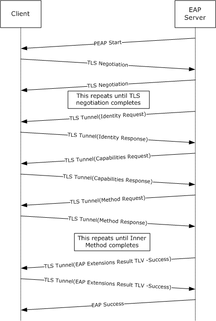

Figure 6: Successful PEAP phase 1 and 2 negotiation

<a id="Section_4.1.2"></a>
### 4.1.2 Successful PEAP Phase 1 with Failed Phase 2 Negotiation

The following diagram depicts a complete PEAP [**authentication**](#gt_authentication) in which [**phase**](#gt_phase) 1 completes successfully and phase 2 fails on the [**PEAP server**](#gt_peap-server) side, with both the PEAP server and the [**peer**](#gt_peer) not supporting cryptobinding and SoH [**TLVs**](#gt_type-length-value-tlv).

This example is similar to the one described in section [4.1.1](#Section_4.1.1); however, note that the [EAP Extensions Method](#Section_2.2.8) with the [Result TLV](#Section_2.2.8.1.2) is a failure rather than a success, and the [**EAP**](#gt_extensible-authentication-protocol-eap) failure packet is sent outside the [**TLS**](#gt_transport-layer-security-tls) [**session**](#gt_session).

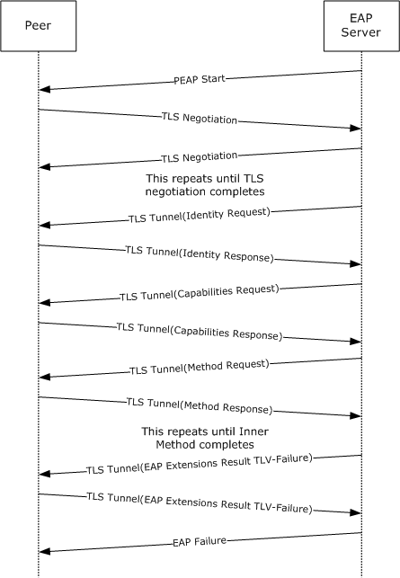

Figure 7: Successful PEAP phase 1 with failed phase 2 negotiation

<a id="Section_4.1.3"></a>
### 4.1.3 Successful PEAP Phase 1 with Fast Reconnect

The following diagram depicts a complete and successful PEAP [**authentication**](#gt_authentication) in which [**fast reconnect**](#gt_fast-reconnect) was used. Note that with fast reconnect, no inner [**EAP**](#gt_extensible-authentication-protocol-eap) authentication or capabilities negotiation takes place.

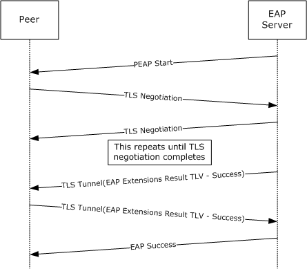

Figure 8: Successful PEAP phase 1 with fast reconnect

<a id="Section_4.2"></a>
## 4.2 Cryptobinding and SoH Processing Supported on PEAP Server Only

This section provides examples of PEAP interactions when cryptobinding and SoH processing [[TNC-IF-TNCCSPBSoH]](https://go.microsoft.com/fwlink/?LinkId=240054) are supported by a [**PEAP server**](#gt_peap-server) implementation.

<a id="Section_4.2.1"></a>
### 4.2.1 Successful PEAP Phase 1 and 2 Negotiation

This is similar to the example in section [4.1.1](#Section_4.1.1), except that, after [**phase**](#gt_phase) 1, a Capabilities request and a SoH request are sent by the PEAP server and the [**peer**](#gt_peer) responds with a NAK for both the requests. The peer also ignores the [cryptobinding TLV](#Section_2.2.8.1.1) from the PEAP server.

The following figure shows the PEAP server implementation not enforcing cryptobinding; if it did, the last message would be an EAP-Failure instead of EAP-Success.


Figure 9: Successful PEAP phase 1 and 2 negotiation

<a id="Section_4.3"></a>
## 4.3 Cryptobinding and SoH Processing on PEAP Server and PEAP Peer

This section provides examples of PEAP interactions when cryptobinding and SoH processing are supported by a [**PEAP peer**](#gt_peap-peer) implementation, as well as a [**PEAP server**](#gt_peap-server) implementation.

In the following example, cryptobinding and SoH processing is enforced on both the [**peer**](#gt_peer) and PEAP server implementations.

<a id="Section_4.3.1"></a>
### 4.3.1 Successful PEAP Phase 1 and 2 Negotiation

This is similar to the example in section [4.1.1](#Section_4.1.1), except that after [**phase**](#gt_phase) 1, an SoH request is sent by the PEAP server and is positively acknowledged by the [**peer**](#gt_peer), which sends an [SoH TLV (section 2.2.8.2.2)](#Section_2.2.8.2.2). The peer also responds to the server's [cryptobinding TLV](#Section_2.2.8.1.1) by sending its own cryptobinding TLV.

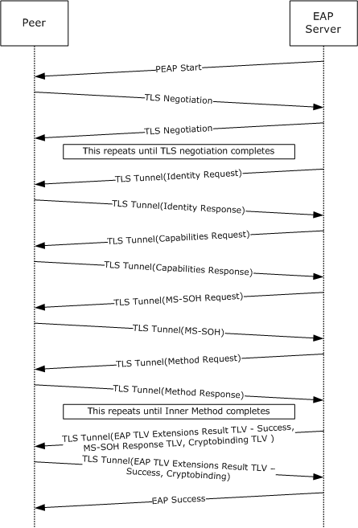

Figure 10: Successful PEAP phase 1 and 2 negotiation

<a id="Section_4.3.2"></a>
### 4.3.2 Successful PEAP Phase 1 with Fast Reconnect

The following diagram depicts a complete and successful PEAP [**authentication**](#gt_authentication) in which [**fast reconnect**](#gt_fast-reconnect) was used. Note that with fast reconnect, no inner [**EAP**](#gt_extensible-authentication-protocol-eap) authenticationor capabilities negotiation takes place.

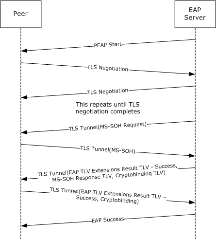

Figure 11: Successful PEAP phase 1 with fast reconnect

<a id="Section_4.3.3"></a>
### 4.3.3 Fallback to Full Authentication upon a Fast Reconnect Failure

The following diagram depicts a complete and successful PEAP [**authentication**](#gt_authentication) in which [**fast reconnect**](#gt_fast-reconnect) was attempted but failed (because, for example, fast reconnect was disabled on the [**peer**](#gt_peer)). After the initial exchange of SoH packets, the peer indicated a failure, forcing full authentication, as in section [4.3.1](#Section_4.1.1).


Figure 12: Fallback to full authentication upon a fast reconnect failure

<a id="Section_4.4"></a>
## 4.4 Sample Cryptobinding TLV Data

The format of the Cryptobinding TLV packet is shown in section [2.2.8.1.1](#Section_2.2.8.1.1).

<a id="Section_4.4.1"></a>
### 4.4.1 Cryptobinding TLV Request from Server to Client

<a id="Section_4.4.1.1"></a>
#### 4.4.1.1 Header

As per the description given in section [2.2.8.1.1](#Section_2.2.8.1.1), the first 8 octets of the cryptobinding TLV header appear as below:

00 0C 00 38 00 00 00 00

<a id="Section_4.4.1.2"></a>
#### 4.4.1.2 Nonce

The next field in the TLV is **nonce**, which is a 32 octet field generated by a random function. In our case let us assume that the following nonce is generated on server machine.

BD A7 A5 99 FA 81 65 21 AD 30 64 C2 BD DB D1 6E

AA 94 9E 7D 98 A8 D7 94 31 47 CF 42 5D 85 DA 7B

<a id="Section_4.4.1.3"></a>
#### 4.4.1.3 Compound MAC

The 20 octet Compound MAC is generated as described in section [3.1.5.5](#Section_3.1.5.5). This field is generated from an HMAC-SHA1-160 operation. This operation requires two fields: data and key.

<a id="Section_4.4.1.3.1"></a>
##### 4.4.1.3.1 Data for HMAC-SHA1-160 Operation

The data required for HMAC-SHA1-160 operation is generated as per section [3.1.5.5.1](#Section_3.1.5.5.1). The generated data is as below:

00 0C 00 38 00 00 00 00 BD A7 A5 99 FA 81 65 21

AD 30 64 C2 BD DB D1 6E AA 94 9E 7D 98 A8 D7 94

31 47 CF 42 5D 85 DA 7B 00 00 00 00 00 00 00 00

00 00 00 00 00 00 00 00 00 00 00 00 19

<a id="Section_4.4.1.3.2"></a>
##### 4.4.1.3.2 Key for HMAC-SHA1-160 Operation

The key required for HMAC-SHA1-160 operation is called the Compound MAC Key (CMK) and is generated by the formulae described in section [3.1.5.5.2](#Section_3.1.5.5.2.1). Inputs required for this operation are the TempKey(K) and IPMK Seed(S).

<a id="Section_4.4.1.3.2.1"></a>
###### 4.4.1.3.2.1 Temp Key

The most significant 40 octets of the Tunnel Key (TK) are considered as Temp Key (K). The TK is a 64-octet key generated in PEAP phase 1. Let us assume that the following TK is generated in the PEAP phase 1:

73 8B B5 F4 62 D5 8E 7E D8 44 E1 F0 0D 0E BE 50

C5 0A 20 50 DE 11 99 77 10 D6 5F 45 FB 5F BA B7

E3 18 1E 92 4F 42 97 38 DE 40 C8 46 CD F5 0B CB

F9 CE DB 1E 85 1D 22 52 45 3B DF 63

Only the most significant 40 octets of the above data are relevant here.

<a id="Section_4.4.1.3.2.2"></a>
###### 4.4.1.3.2.2 IPMK Seed

IPMK seed is defined as follows:

IPMK Seed = "Inner Methods Compound Keys" | ISK

The ASCII representation of the string "Inner Methods Compound Keys" is (in hex):

49 6E 6E 65 72 20 4D 65 74 68 6F 64 73 20 43 6F

6D 70 6F 75 6E 64 20 4B 65 79 73

ISK is the Inner Session Key which would be obtained from the Inner method [**MPPE keys**](#gt_mppe-keys) as described in section [3.1.5.5.2.2](#Section_3.1.5.5.2.2). Let us say that the generated ISK is as below:

67 3E 96 14 01 BE FB A5 60 71 7B 3B 5D DD 40 38

65 67 F9 F4 16 FD 3E 9D FC 71 16 3B DF F2 FA 95

<a id="Section_4.4.1.3.2.3"></a>
###### 4.4.1.3.2.3 IPMK and CMK

The PRF+ function generates 60 octet output out of which the most significant 40 octets denote the IPMK and the rest (20 octet) denote the CMK. With all the required information as described above for PRF+ function the computed T1, T2 and T3 appear as follows:

T1 = 3A 91 1C 25 54 73 E8 3E 9A 0C C3 33 AE 1F 8A 35 CD C7 41 63

T2 = E7 F6 0F 6C 65 EF 71 C2 64 42 AA AC A2 B6 F1 EB 4F 25 EC A3

T3 = 33 55 35 3B 69 20 D0 74 C7 82 E4 75 DF B0 99 9D 4D B4 67 EB

IPMK = T1 | T2

CMK = T3

The generated CMK and the HMAC data are passed through the HMAC-SHA1-160 operation to generate the Compound MAC. The Compound MAC obtained from HMAC-SHA1-160 operation is as follows:

0C BF 10 5E 91 75 57 48 22 4F BB 83 00 06 26 91 1C FB 1B 0F

After all the above computations the Cryptobinding TLV request from server appears as follows:

00 0C 00 38 00 00 00 00 BD A7 A5 99 FA 81 65 21

AD 30 64 C2 BD DB D1 6E AA 94 9E 7D 98 A8 D7 94

31 47 CF 42 5D 85 DA 7B 0C BF 10 5E 91 75 57 48

22 4F BB 83 00 06 26 91 1C FB 1B 0F

<a id="Section_4.4.2"></a>
### 4.4.2 Cryptobinding TLV Response from Client to Server

<a id="Section_4.4.2.1"></a>
#### 4.4.2.1 Header

As per the description given in section [2.2.8.1.1](#Section_2.2.8.1.1), the first 8 octets of the cryptobinding TLV header appear as below:

00 0C 00 38 00 00 00 01

<a id="Section_4.4.2.2"></a>
#### 4.4.2.2 Nonce

The next field in the TLV is **nonce**, which is a 32 octet field generated by a random function. In our case let us assume that the following nonce is generated on client machine.

6C 6B A3 87 84 23 74 57 CC C9 0B 1A 90 8C BD F4

71 1B 69 99 4D 0C FE 8D 3D B4 4E CB CD AD 37 E9

<a id="Section_4.4.2.3"></a>
#### 4.4.2.3 Compound MAC

The 20 octet Compound MAC is generated as described in section [3.1.5.5.1](#Section_3.1.5.5.1). This field is generated from an HMAC-SHA1-160 operation. This operation requires two fields: data and key.

<a id="Section_4.4.2.3.1"></a>
##### 4.4.2.3.1 Data for HMAC-SHA1-160 Operation

The data required for HMAC-SHA1-160 operation is generated as per section [3.1.5.5.1](#Section_3.1.5.5.1). The generated data is as below:

00 0C 00 38 00 00 00 01 6C 6B A3 87 84 23 74 57

CC C9 0B 1A 90 8C BD F4 71 1B 69 99 4D 0C FE 8D

3D B4 4E CB CD AD 37 E9 00 00 00 00 00 00 00 00

00 00 00 00 00 00 00 00 00 00 00 00 19

<a id="Section_4.4.2.3.2"></a>
##### 4.4.2.3.2 Key for HMAC-SHA1-160 Operation

The key required for HMAC-SHA1-160 operation is called the Compound MAC Key (CMK) and is generated by the formulae described in section [3.1.5.5.2](#Section_3.1.5.5.2.1). Inputs required for this operation are the TempKey(K) and IPMK Seed(S).

<a id="Section_4.4.2.3.2.1"></a>
###### 4.4.2.3.2.1 Temp Key

Because the Tunnel Key is same for both client and server, the TempKey remains the same as well.

<a id="Section_4.4.2.3.2.2"></a>
###### 4.4.2.3.2.2 IPMK Seed

Because the ISK for both client and server are same, the IPMK seed remains the same as well.

<a id="Section_4.4.2.3.2.3"></a>
###### 4.4.2.3.2.3 IPMK and CMK

Because all the inputs to PRF+ function are same, it generates the same IPMK and CMK as the server. The generated CMK and the HMAC data are passed through the HMAC-SHA1-160 operation to generate the Compound MAC.

The Compound MAC obtained from HMAC-SHA1-160 operation is as follows:

42 E0 86 07 1D 1C 8B 8C 8E 45 8F 70 21 F0 6A 6E AB 16 B6 46

After all the above computations the Cryptobinding TLV response from client appears as follows:

00 0C 00 38 00 00 00 01 6C 6B A3 87 84 23 74 57

CC C9 0B 1A 90 8C BD F4 71 1B 69 99 4D 0C FE 8D

3D B4 4E CB CD AD 37 E9 42 E0 86 07 1D 1C 8B 8C

8E 45 8F 70 21 F0 6A 6E AB 16 B6 46

<a id="Section_4.4.3"></a>
### 4.4.3 MPPE Keys Generation

The [**MPPE keys**](#gt_mppe-keys) generation is performed as per section [3.1.5.7](#Section_3.1.5.7). It requires both the IPMK and seed (S) as inputs. The IPMK generated by both client and server are as follows:

3A 91 1C 25 54 73 E8 3E 9A 0C C3 33 AE 1F 8A 35 CD C7 41 63 E7 F6 0F 6C 65 EF 71 C2 64 42 AA AC A2 B6 F1 EB 4F 25 EC A3

Seed is the ASCII encoding of the string "Session Key Generating Function" appended with byte 0x00:

Seed = 53 65 73 73 69 6F 6E 20 4B 65 79 20 47 65 6E 65 72 61 74 69 6E 67 20 46 75 6E 63 74 69 6F 6E 00

Because the length of the keys is 128 octets, it requires 7 iterations of PRF+ function to generate 128 octets of data. The data after each iteration is as follows:

T1 = 6A 02 D7 82 20 1B C7 13 8B F8 EF F7 33 B4 96 97 0D 7C AB 30

T2 = 0A C9 57 72 78 E1 DD D5 AE F7 66 97 17 52 D4 E5 84 A1 C8 95

T3 = 03 9B 4D 05 E3 BC 9A 84 84 DD C2 AA 6E 2C E1 62 76 5C 40 68

T4 = BF F6 5A 45 10 E3 05 74 85 DB 98 B7 99 D8 6E 66 76 3C 64 D4

T5 = 98 89 B4 DD 1B 27 3D C8 A2 CA 73 D6 0D 11 AF B2 2C 52 BA AD

T6 = D3 51 E0 CB 7B B2 E7 2C 7D 93 73 85 7E 03 C1 4A 32 C8 F7 E5

T7 = 95 9F 46 68 0E 86 E6 5C 89 F8 80 C8 A6 DA 00 56 3A FB 19 C0

Based on the above data, the keys on the server side are as follows:

RecvKey = 6A 02 D7 82 20 1B C7 13 8B F8 EF F7 33 B4 96 97 0D 7C AB 30 0A C9 57 72 78 E1 DD D5 AE F7 66 97

SendKey = 17 52 D4 E5 84 A1 C8 95 03 9B 4D 05 E3 BC 9A 84 84 DD C2 AA 6E 2C E1 62 76 5C 40 68 BF F6 5A 45

Client RecvKey = server SendKey

Client SendKey = server RecvKey

Only the most significant 64 octets are used though we generate 128 octets. The least significant 64 octets are reserved for future use.

<a id="Section_5"></a>
# 5 Security

The following sections specify security considerations for implementers of PEAP.

<a id="Section_5.1"></a>
## 5.1 Security Considerations for Implementers

<a id="Section_5.1.1"></a>
### 5.1.1 Fast Reconnect

PEAP [**fast reconnect**](#gt_fast-reconnect) is desirable in applications such as wireless roaming. This feature allows [**sessions**](#gt_session) to be resumed without completing a full [**authentication**](#gt_authentication).

However, some issues to consider to avoid introducing security vulnerabilities include:

- In cases where no identity is proved with an inner [**EAP method**](#gt_eap-method), implementers need to ensure that the appropriate authorization checks are still performed for the session.
- To protect against risks associated with incorrectly assigning identity on fast reconnection scenarios, implementations need to strongly tie identity information to the [**TLS**](#gt_transport-layer-security-tls) session. That is, the PEAP implementation needs to determine the user identity even with a session resume. If it cannot do so, then it will not authorize access. The reason is that because no inner [**EAP**](#gt_extensible-authentication-protocol-eap) authentication takes place during fast reconnect; proof of identity is based exclusively on the TLS session.
<a id="Section_5.1.2"></a>
### 5.1.2 Identity Verification

Because the [**TLS**](#gt_transport-layer-security-tls) [**session**](#gt_session) has not yet been negotiated, the initial identity request/response occurs in the clear, without integrity protection or [**authentication**](#gt_authentication). It is therefore vulnerable to snooping and packet modification.

If the initial [**EAP**](#gt_extensible-authentication-protocol-eap) [**cleartext**](#gt_cleartext) identity request/response has been tampered with, then, after the TLS session is established, it is conceivable that the [**PEAP server**](#gt_peap-server) will discover that it cannot verify the [**peer**](#gt_peer)'s claim of identity. For example, the peer's user ID might not be valid or might not be within a [**realm**](#gt_realm) handled by the PEAP server. In a case where the PEAP server is unable to validate the peer's identity claims, the PEAP server aborts the authentication.

Moreover, it cannot be assumed that the peer identities presented within multiple EAP-Response/Identity packets will be the same. For example, the initial EAP-Response/Identity might correspond to a machine identity, while subsequent identities might be those of the user. Thus, PEAP implementations do not need to abort the authentication just because the identities do not match. However, because the initial EAP-Response/Identity determines the [**EAP server**](#gt_eap-server) handling the authentication, if this or any other identity is inappropriate for use with the destination EAP server, there is no alternative but to terminate the PEAP conversation.

<a id="Section_5.1.3"></a>
### 5.1.3 Authentication Outcomes

Because the [**cleartext**](#gt_cleartext) [**EAP**](#gt_extensible-authentication-protocol-eap) success or failure messages can be tampered with, implementations need to rely only on the [EAP Extensions method](#Section_2.2.8) with [Result TLV's](#Section_2.2.8.1.2) status messages to determine the outcome of a [**session**](#gt_session).

<a id="Section_5.2"></a>
## 5.2 Index of Security Parameters

| Security parameter | Section |
| --- | --- |
| Allowable EAP inner EAP method configuration | Sections [3.2.3](#Section_3.2.3) and [3.3.3](#Section_3.3.3) |

<a id="Section_6"></a>
# 6 Appendix A: Product Behavior

The information in this specification is applicable to the following Microsoft products or supplemental software. References to product versions include updates to those products.

The terms "earlier" and "later", when used with a product version, refer to either all preceding versions or all subsequent versions, respectively. The term "through" refers to the inclusive range of versions. Applicable Microsoft products are listed chronologically in this section.

- Windows NT operating system
- Windows 2000 operating system
- Windows XP operating system
- Windows Server 2003 operating system
- Windows Vista operating system
- Windows Server 2008 operating system
- Windows 7 operating system
- Windows Server 2008 R2 operating system
- Windows 8 operating system
- Windows Server 2012 operating system
- Windows 8.1 operating system
- Windows Server 2012 R2 operating system
- Windows 10 operating system
- Windows Server 2016 operating system
- Windows Server operating system
- Windows Server 2019 operating system
- Windows Server 2022 operating system
- Windows 11 operating system
- Windows Server 2025 operating system
Exceptions, if any, are noted in this section. If an update version, service pack or Knowledge Base (KB) number appears with a product name, the behavior changed in that update. The new behavior also applies to subsequent updates unless otherwise specified. If a product edition appears with the product version, behavior is different in that product edition.

Unless otherwise specified, any statement of optional behavior in this specification that is prescribed using the terms "SHOULD" or "SHOULD NOT" implies product behavior in accordance with the SHOULD or SHOULD NOT prescription. Unless otherwise specified, the term "MAY" implies that the product does not follow the prescription.

<1> Section 2.2.2: The Windows NT, Windows 2000, Windows XP, Windows Server 2003, Windows Vista, and Windows Server 2008 PEAP implementations do not support PEAP Phase 2 packet fragmentation.

<2> Section 2.2.6: Microsoft PEAP clients never exchange outer [**TLVs**](#gt_type-length-value-tlv) during PEAP [**authentication**](#gt_authentication). However, if a PEAP server or client implementation sends outer TLVs during [**phase**](#gt_phase) 1, PEAP clients will utilize them in computing the compound MAC of the [Cryptobinding TLV](#Section_2.2.8.1.1). The Windows NT, Windows 2000, Windows XP, and Windows Server 2003 PEAP clients prior will ignore the outer TLVs.

<3> Section 3.1.1: The Windows NT, Windows 2000, Windows XP, and Windows Server 2003 PEAP implementations do not support Cryptobinding TLVs (section 2.2.8.1.1).

<4> Section 3.1.1: The ADM element is initialized with the value configured at the registry value HKEY_LOCAL_MACHINE\SYSTEM\CurrentControlSet\services\RasMan\PPP\EAP\25\BypassNegotiation. It is not supported on Windows NT, Windows 2000, Windows XP, Windows Server 2003, Windows Vista, and Windows Server 2008.

<5> Section 3.1.1: The ADM element is initialized with the value configured at the registry value HKEY_LOCAL_MACHINE\SYSTEM\CurrentControlSet\services\RasMan\PPP\EAP\25\AssumePhase2Fragmentation. It is not supported on Windows NT, Windows 2000, Windows XP, Windows Server 2003, Windows Vista, and Windows Server 2008.

<6> Section 3.1.1: Windows NT, Windows 2000, Windows XP, Windows Server 2003, Windows Vista, and Windows Server 2008 do not support Capabilities Negotiation Method (section [2.2.8.3](#Section_2.2.8.3)) packets; in these cases, the [**peer**](#gt_peer) responds with an [**EAP**](#gt_extensible-authentication-protocol-eap) NAK and the server never sends a Capabilities Negotiation Method packet.

<7> Section 3.1.1: The Windows NT, Windows 2000, Windows XP, Windows Server 2003, Windows Vista, and Windows Server 2008 PEAP implementations do not support PEAP Phase 2 packet fragmentation.

<8> Section 3.1.5.4: Windows 11, version 22H2 operating system and later use TLS v1.3 for TLS Tunnel establishment.

<9> Section 3.1.5.4: Windows 11 and earlier and Windows Server 2025 and earlier use TLS v1.2 or earlier for TLS Tunnel establishment.

<10> Section 3.1.5.5: Windows NT, Windows 2000, Windows XP, and Windows Server 2003 do not implement cryptobinding. Use of cryptobinding can be configured on both [**PEAP server**](#gt_peap-server) and [**PEAP peer**](#gt_peap-peer) implementations.

Windows PEAP server implementations always send cryptobinding TLVs. If a server implementation configured to enforce cryptobinding TLVs sends a cryptobinding TLV and does not receive one in response, it ends the conversation by sending an EAP-Failure. If the enforcement is not configured and the server does not receive a cryptobinding TLV, it is processed without cryptobinding support.

Windows PEAP peer implementations can be configured to enforce the exchange of a cryptobinding TLV. A peer receiving a cryptobinding TLV responds with a cryptobinding TLV irrespective of the configuration. If the peer is configured to expect a cryptobinding TLV and does not receive one, it ends the conversation by sending a Failure Result TLV (section [2.2.8.1.2](#Section_2.2.8.1.2)). If the peer does not receive a cryptobinding TLV and is not configured to expect a cryptobinding TLV, the peer processes the packet without cryptobinding support.

<11> Section 3.2.1: Not supported on Windows NT, Windows 2000, Windows XP, Windows Server 2003, Windows Vista, and Windows Server 2008 PEAP implementations.

<12> Section 3.2.1: Not supported on Windows NT, Windows 2000, Windows XP, Windows Server 2003, Windows Vista, and Windows Server 2008 PEAP implementations.

<13> Section 3.2.3: Not supported on Windows NT, Windows 2000, Windows XP, Windows Server 2003, Windows Vista, and Windows Server 2008 PEAP implementations.

<14> Section 3.2.3: **BypassCapNegotiation** is initialized from "HKEY_LOCAL_MACHINE\SYSTEM\CurrentControlSet\services\RasMan\PPP\EAP\25\BypassNegotiation". **AssumePhase2Frag** is initialized from "HKEY_LOCAL_MACHINE\SYSTEM\CurrentControlSet\services\RasMan\PPP\EAP\25\AssumePhase2Fragmentation".

<15> Section 3.2.5.4.6: The Windows PEAP peer implementations never send the [Capabilities Method Response (section 2.2.8.3.2)](#Section_2.2.8.3.2) packet with the F flag set to zero.

<16> Section 3.2.7.1: Windows uses the certificates in the "machine trusted root CA store" to validate the trust anchor of the server certificate.

<17> Section 3.3.3: Not supported on Windows NT, Windows 2000, Windows XP, Windows Server 2003, Windows Vista, and Windows Server 2008.

<18> Section 3.3.3: **BypassCapNegotiation** is initialized from "HKEY_LOCAL_MACHINE\SYSTEM\CurrentControlSet\services\RasMan\PPP\EAP\25\BypassNegotiation". **AssumePhase2Frag** is initialized from "HKEY_LOCAL_MACHINE\SYSTEM\CurrentControlSet\services\RasMan\PPP\EAP\25\AssumePhase2Fragmentation".

<19> Section 3.3.5.4.3: The Windows PEAP server implementations never send a [Capabilities Method Request (section 2.2.8.3.1)](#Section_2.2.8.3.1) packet with the F flag set to zero.

<20> Section 3.3.5.4.6: The Windows NT, Windows 2000, Windows XP, and Windows Server 2003 PEAP implementations do not support SoH [[TNC-IF-TNCCSPBSoH]](https://go.microsoft.com/fwlink/?LinkId=240054) TLV transmission and processing.

<a id="Section_7"></a>
# 7 Change Tracking

This section identifies changes that were made to this document since the last release. Changes are classified as Major, Minor, or None.

The revision class **Major** means that the technical content in the document was significantly revised. Major changes affect protocol interoperability or implementation. Examples of major changes are:

- A document revision that incorporates changes to interoperability requirements.
- A document revision that captures changes to protocol functionality.
The revision class **Minor** means that the meaning of the technical content was clarified. Minor changes do not affect protocol interoperability or implementation. Examples of minor changes are updates to clarify ambiguity at the sentence, paragraph, or table level.

The revision class **None** means that no new technical changes were introduced. Minor editorial and formatting changes may have been made, but the relevant technical content is identical to the last released version.

The changes made to this document are listed in the following table. For more information, please contact [dochelp@microsoft.com](mailto:dochelp@microsoft.com).

| Section | Description | Revision class |
| --- | --- | --- |
| [3.1.5.4](#Section_3.1.5.4) Phase 1 (TLS Tunnel Establishment) | Added normative reference [RFC 9427] and updated Windows OS TLS version support. | Major |
| [6](#Section_6) Appendix A: Product Behavior | Added Windows Server 2025 to the list of applicable products. | Major |

<a id="revision-history"></a>

## Revision History

| Date | Version | Revision Class | Comments |
| --- | --- | --- | --- |
| 10/22/2006 | 0.01 | New | Version 0.01 release |
| 1/19/2007 | 1.0 | Major | Version 1.0 release |
| 3/2/2007 | 1.1 | Minor | Version 1.1 release |
| 4/3/2007 | 1.2 | Minor | Version 1.2 release |
| 5/11/2007 | 1.3 | Minor | Version 1.3 release |
| 6/1/2007 | 1.3.1 | Editorial | Changed language and formatting in the technical content. |
| 7/3/2007 | 1.3.2 | Editorial | Changed language and formatting in the technical content. |
| 7/20/2007 | 1.3.3 | Editorial | Changed language and formatting in the technical content. |
| 8/10/2007 | 1.3.4 | Editorial | Changed language and formatting in the technical content. |
| 9/28/2007 | 2.0 | Major | Updated a reference. |
| 10/23/2007 | 2.0.1 | Editorial | Changed language and formatting in the technical content. |
| 11/30/2007 | 3.0 | Major | Clarified and expanded descriptions of how Compound Session Keys and MAC Compound Keys are created. |
| 1/25/2008 | 3.0.1 | Editorial | Changed language and formatting in the technical content. |
| 3/14/2008 | 3.1 | Minor | Clarified the meaning of the technical content. |
| 5/16/2008 | 3.1.1 | Editorial | Changed language and formatting in the technical content. |
| 6/20/2008 | 3.1.2 | Editorial | Changed language and formatting in the technical content. |
| 7/25/2008 | 3.1.3 | Editorial | Changed language and formatting in the technical content. |
| 8/29/2008 | 3.1.4 | Editorial | Changed language and formatting in the technical content. |
| 10/24/2008 | 3.1.5 | Editorial | Changed language and formatting in the technical content. |
| 12/5/2008 | 4.0 | Major | Updated and revised the technical content. |
| 1/16/2009 | 5.0 | Major | Updated and revised the technical content. |
| 2/27/2009 | 5.0.1 | Editorial | Changed language and formatting in the technical content. |
| 4/10/2009 | 6.0 | Major | Updated and revised the technical content. |
| 5/22/2009 | 7.0 | Major | Updated and revised the technical content. |
| 7/2/2009 | 8.0 | Major | Updated and revised the technical content. |
| 8/14/2009 | 9.0 | Major | Updated and revised the technical content. |
| 9/25/2009 | 10.0 | Major | Updated and revised the technical content. |
| 11/6/2009 | 11.0 | Major | Updated and revised the technical content. |
| 12/18/2009 | 12.0 | Major | Updated and revised the technical content. |
| 1/29/2010 | 13.0 | Major | Updated and revised the technical content. |
| 3/12/2010 | 14.0 | Major | Updated and revised the technical content. |
| 4/23/2010 | 14.0.1 | Editorial | Changed language and formatting in the technical content. |
| 6/4/2010 | 14.1 | Minor | Clarified the meaning of the technical content. |
| 7/16/2010 | 14.2 | Minor | Clarified the meaning of the technical content. |
| 8/27/2010 | 14.2 | None | No changes to the meaning, language, or formatting of the technical content. |
| 10/8/2010 | 15.0 | Major | Updated and revised the technical content. |
| 11/19/2010 | 15.0 | None | No changes to the meaning, language, or formatting of the technical content. |
| 1/7/2011 | 16.0 | Major | Updated and revised the technical content. |
| 2/11/2011 | 17.0 | Major | Updated and revised the technical content. |
| 3/25/2011 | 18.0 | Major | Updated and revised the technical content. |
| 5/6/2011 | 19.0 | Major | Updated and revised the technical content. |
| 6/17/2011 | 20.0 | Major | Updated and revised the technical content. |
| 9/23/2011 | 20.0 | None | No changes to the meaning, language, or formatting of the technical content. |
| 12/16/2011 | 21.0 | Major | Updated and revised the technical content. |
| 3/30/2012 | 21.1 | Minor | Clarified the meaning of the technical content. |
| 7/12/2012 | 21.2 | Minor | Clarified the meaning of the technical content. |
| 10/25/2012 | 22.0 | Major | Updated and revised the technical content. |
| 1/31/2013 | 22.0 | None | No changes to the meaning, language, or formatting of the technical content. |
| 8/8/2013 | 23.0 | Major | Updated and revised the technical content. |
| 11/14/2013 | 23.0 | None | No changes to the meaning, language, or formatting of the technical content. |
| 2/13/2014 | 23.0 | None | No changes to the meaning, language, or formatting of the technical content. |
| 5/15/2014 | 24.0 | Major | Updated and revised the technical content. |
| 6/30/2015 | 25.0 | Major | Significantly changed the technical content. |
| 10/16/2015 | 26.0 | Major | Significantly changed the technical content. |
| 7/14/2016 | 27.0 | Major | Significantly changed the technical content. |
| 6/1/2017 | 27.0 | None | No changes to the meaning, language, or formatting of the technical content. |
| 9/15/2017 | 28.0 | Major | Significantly changed the technical content. |
| 12/1/2017 | 28.0 | None | No changes to the meaning, language, or formatting of the technical content. |
| 9/12/2018 | 29.0 | Major | Significantly changed the technical content. |
| 4/7/2021 | 30.0 | Major | Significantly changed the technical content. |
| 6/25/2021 | 31.0 | Major | Significantly changed the technical content. |
| 9/29/2025 | 32.0 | Major | Significantly changed the technical content. |
