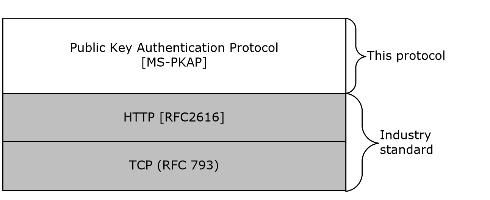

# [MS-PKAP]: Public Key Authentication Protocol

Table of Contents

1 Introduction

- [1 Introduction](#Section_1)
  - [1.1 Glossary](#Section_1.1)
  - [1.2 References](#Section_1.2)
    - [1.2.1 Normative References](#Section_1.2.1)
    - [1.2.2 Informative References](#Section_1.2.2)
  - [1.3 Overview](#Section_1.3)
  - [1.4 Relationship to Other Protocols](#Section_1.4)
  - [1.5 Prerequisites/Preconditions](#Section_1.5)
  - [1.6 Applicability Statement](#Section_1.6)
  - [1.7 Versioning and Capability Negotiation](#Section_1.7)
  - [1.8 Vendor-Extensible Fields](#Section_1.8)
  - [1.9 Standards Assignments](#Section_1.9)

2 Messages

- [2 Messages](#Section_2)
  - [2.1 Transport](#Section_2.1)
  - [2.2 Common Data Types](#Section_2.2)
    - [2.2.1 Complex Types](#Section_2.2.1)
      - [2.2.1.1 Client Token](#Section_2.2.1.1)
      - [2.2.1.2 Client Token JWS Headers](#Section_2.2.1.2)

3 Protocol Details

- [3 Protocol Details](#Section_3)
  - [3.1 Client Details](#Section_3.1)
    - [3.1.1 Abstract Data Model](#Section_3.1.1)
    - [3.1.2 Timers](#Section_3.1.2)
    - [3.1.3 Initialization](#Section_3.1.3)
    - [3.1.4 Higher-Layer Triggered Events](#Section_3.1.4)
    - [3.1.5 Message Processing Events and Sequencing Rules](#Section_3.1.5)
      - [3.1.5.1 Initial Request](#Section_3.1.5.1)
        - [3.1.5.1.1 Request](#Section_3.1.5.1.1)
        - [3.1.5.1.2 Response](#Section_3.1.5.1.2)
        - [3.1.5.1.3 Processing Details](#Section_3.1.5.1.3)
      - [3.1.5.2 Issuer based certificate challenge response](#Section_3.1.5.2)
        - [3.1.5.2.1 Request](#Section_3.1.5.2.1)
        - [3.1.5.2.2 Response](#Section_3.1.5.2.2)
        - [3.1.5.2.3 Processing Details](#Section_3.1.5.2.3)
      - [3.1.5.3 Thumbprint based certificate challenge response](#Section_3.1.5.3)
        - [3.1.5.3.1 Request](#Section_3.1.5.3.1)
        - [3.1.5.3.2 Response](#Section_3.1.5.3.2)
        - [3.1.5.3.3 Processing Details](#Section_3.1.5.3.3)
    - [3.1.6 Timer Events](#Section_3.1.6)
    - [3.1.7 Other Local Events](#Section_3.1.7)
  - [3.2 Server Details](#Section_3.2)
    - [3.2.1 Abstract Data Model](#Section_3.2.1)
    - [3.2.2 Timers](#Section_3.2.2)
    - [3.2.3 Initialization](#Section_3.2.3)
    - [3.2.4 Higher-Layer Triggered Events](#Section_3.2.4)
    - [3.2.5 Message Processing Events and Sequencing Rules](#Section_3.2.5)
      - [3.2.5.1 Issuer based certificate challenge](#Section_3.2.5.1)
        - [3.2.5.1.1 Request](#Section_3.2.5.1.1)
        - [3.2.5.1.2 Response](#Section_3.2.5.1.2)
        - [3.2.5.1.3 Processing Details](#Section_3.2.5.1.3)
      - [3.2.5.2 Thumbprint based certificate challenge](#Section_3.2.5.2)
        - [3.2.5.2.1 Request](#Section_3.2.5.2.1)
        - [3.2.5.2.2 Response](#Section_3.2.5.2.2)
        - [3.2.5.2.3 Processing Details](#Section_3.2.5.2.3)
      - [3.2.5.3 Challenge response processing](#Section_3.2.5.3)
        - [3.2.5.3.1 Request](#Section_3.2.5.3.1)
        - [3.2.5.3.2 Response](#Section_3.2.5.3.2)
        - [3.2.5.3.3 Processing Details](#Section_3.2.5.3.3)
    - [3.2.6 Timer Events](#Section_3.2.6)
    - [3.2.7 Other Local Events](#Section_3.2.7)

4 Protocol Examples

- [4 Protocol Examples](#Section_4)
  - [4.1 Interactive Request](#Section_4.1)
    - [4.1.1 Client Request](#Section_4.1.1)
    - [4.1.2 Server Challenge Response](#Section_4.1.2)
    - [4.1.3 Client Response](#Section_4.1.3)
  - [4.2 OAuth Token Request](#Section_4.2)
    - [4.2.1 Client Refresh Token Request](#Section_4.2.1)
    - [4.2.2 Server Challenge Response](#Section_4.2.2)
    - [4.2.3 Client Response](#Section_4.2.3)

5 Security

- [5 Security](#Section_5)
  - [5.1 Security Considerations for Implementers](#Section_5.1)
  - [5.2 Index of Security Parameters](#Section_5.2)

6 Appendix A: Product Behavior

- [6 Appendix A: Product Behavior](#Section_6)

7 Change Tracking

- [7 Change Tracking](#Section_7)

For the legal notice and IP terms, see [LEGAL.md](../LEGAL.md).
Last updated: 4/23/2024.
See [Revision History](#revision-history) for full version history.

# 1 Introduction

The Public Key Authentication Protocol (PKAP) provides a method for [**HTTP**](#gt_hypertext-transfer-protocol-http) clients to prove possession of a private key to a web server without having to rely on client [**Transport Layer Security (TLS)**](#gt_transport-layer-security-tls) support [[RFC4346]](https://go.microsoft.com/fwlink/?LinkId=90474) from the underlying platform.

Sections 1.5, 1.8, 1.9, 2, and 3 of this specification are normative. All other sections and examples in this specification are informative.

## 1.1 Glossary

This document uses the following terms:

**Active Directory Federation Services (AD FS)**: A Microsoft implementation of a federation services provider, which provides a security token service (STS) that can issue security tokens to a caller using various protocols such as WS-Trust, WS-Federation, and Security Assertion Markup Language (SAML) version 2.0.

**base64 encoding**: A binary-to-text encoding scheme whereby an arbitrary sequence of bytes is converted to a sequence of printable ASCII characters, as described in [[RFC4648]](https://go.microsoft.com/fwlink/?LinkId=90487).

**Hypertext Transfer Protocol (HTTP)**: An application-level protocol for distributed, collaborative, hypermedia information systems (text, graphic images, sound, video, and other multimedia files) on the World Wide Web.

**JSON web signature (JWS)**: A mechanism that uses JavaScript Object Notation (JSON) data structures to represent signed content.

**JSON Web Token (JWT)**: A string representing a set of claims as a JSON object that is encoded in a [**JWS**](#gt_json-web-signature-jws) or JWE, enabling the claims to be digitally signed or integrity protected with a Message Authentication Code (MAC) and/or encrypted. For more information, see [[RFC7519]](https://go.microsoft.com/fwlink/?LinkId=824833).

**nonce**: A number that is used only once. This is typically implemented as a random number large enough that the probability of number reuse is extremely small. A nonce is used in authentication protocols to prevent replay attacks. For more information, see [[RFC2617]](https://go.microsoft.com/fwlink/?LinkId=90373).

**Secure Sockets Layer (SSL)**: A security protocol that supports confidentiality and integrity of messages in client and server applications that communicate over open networks. SSL supports server and, optionally, client authentication using X.509 certificates [[X509]](https://go.microsoft.com/fwlink/?LinkId=90590) and [[RFC5280]](https://go.microsoft.com/fwlink/?LinkId=131034). SSL is superseded by [**Transport Layer Security (TLS)**](#gt_transport-layer-security-tls). TLS version 1.0 is based on SSL version 3.0 [[SSL3]](https://go.microsoft.com/fwlink/?LinkId=90534).

**Transport Layer Security (TLS)**: A security protocol that supports confidentiality and integrity of messages in client and server applications communicating over open networks. TLS supports server and, optionally, client authentication by using X.509 certificates (as specified in [X509]). TLS is standardized in the IETF TLS working group.

**MAY, SHOULD, MUST, SHOULD NOT, MUST NOT:** These terms (in all caps) are used as defined in [[RFC2119]](https://go.microsoft.com/fwlink/?LinkId=90317). All statements of optional behavior use either MAY, SHOULD, or SHOULD NOT.

## 1.2 References

Links to a document in the Microsoft Open Specifications library point to the correct section in the most recently published version of the referenced document. However, because individual documents in the library are not updated at the same time, the section numbers in the documents may not match. You can confirm the correct section numbering by checking the [Errata](https://go.microsoft.com/fwlink/?linkid=850906).

### 1.2.1 Normative References

We conduct frequent surveys of the normative references to assure their continued availability. If you have any issue with finding a normative reference, please contact [dochelp@microsoft.com](mailto:dochelp@microsoft.com). We will assist you in finding the relevant information.

[IETFDRAFT-JWA-36] Jones, M., "JSON Web Algorithms (JWA)", draft-ietf-jose-json-web-algorithms-36, October 2014, [https://tools.ietf.org/html/draft-ietf-jose-json-web-algorithms-36](https://go.microsoft.com/fwlink/?LinkId=523841)

[IETFDRAFT-JWS] Internet Engineering Task Force (IETF), "JSON Web Signature (JWS)", draft-ietf-jose-json-web-signature-10, April 2013, [http://tools.ietf.org/html/draft-ietf-jose-json-web-signature-10](https://go.microsoft.com/fwlink/?LinkId=306267)

[IETFDRAFT-JWT-LATEST] Bradley, J., Jones, M., and Sakimura, N., "JSON Web Token (JWT)", draft-ietf-oauth-json-web-token-32, December 2014, [https://datatracker.ietf.org/doc/html/draft-ietf-oauth-json-web-token-32](https://go.microsoft.com/fwlink/?linkid=2185211)

**Note** Links to all 32+ versions including RFC7519

[RFC2119] Bradner, S., "Key words for use in RFCs to Indicate Requirement Levels", BCP 14, RFC 2119, March 1997, [https://www.rfc-editor.org/info/rfc2119](https://go.microsoft.com/fwlink/?LinkId=90317)

[RFC2459] Housley, R., Ford, W., Polk, W., and Solo, D., "Internet X.509 Public Key Infrastructure Certificate and CRL Profile", RFC 2459, January 1999, [https://www.rfc-editor.org/info/rfc2459](https://go.microsoft.com/fwlink/?LinkId=90356)

[RFC2616] Fielding, R., Gettys, J., Mogul, J., et al., "Hypertext Transfer Protocol -- HTTP/1.1", RFC 2616, June 1999, [https://www.rfc-editor.org/info/rfc2616](https://go.microsoft.com/fwlink/?LinkId=90372)

[RFC2818] Rescorla, E., "HTTP Over TLS", RFC 2818, May 2000, [https://www.rfc-editor.org/info/rfc2818](https://go.microsoft.com/fwlink/?LinkId=90383)

[RFC4158] Cooper, M., Dzambasow, Y., Hesse, P., et la., "Internet X.509 Public Key Infrastructure: Certification Path Building", RFC 4158, September 2005, [https://www.rfc-editor.org/info/rfc4158](https://go.microsoft.com/fwlink/?LinkId=301986)

### 1.2.2 Informative References

[ISO8601] ISO, "Data elements and interchange formats - Information interchange - Representation of dates and times", ISO 8601:2004, December 2004, [http://www.iso.org/iso/iso_catalogue/catalogue_tc/catalogue_detail.htm?csnumber=40874](https://go.microsoft.com/fwlink/?LinkId=89920)

**Note** There is a charge to download the specification.

[RFC4346] Dierks, T., and Rescorla, E., "The Transport Layer Security (TLS) Protocol Version 1.1", RFC 4346, April 2006, [https://www.rfc-editor.org/info/rfc4346](https://go.microsoft.com/fwlink/?LinkId=90474)

[RFC6265] Barth, A., "HTTP State Management Mechanism", RFC 6265, April 2011, [https://tools.ietf.org/html/rfc6265](https://go.microsoft.com/fwlink/?LinkId=523842)

## 1.3 Overview

One of the most common practices to validate the proof of possession of a secret on the client in an [**HTTP**](#gt_hypertext-transfer-protocol-http) transaction is to use [**Secure Sockets Layer (SSL)**](#gt_secure-sockets-layer-ssl)/[**Transport Layer Security (TLS)**](#gt_transport-layer-security-tls) client authentication. Although this works in many cases, using this method has the following drawbacks.

- SSL/TLS client authentication is not supported on many HTTP client implementations. There is no simple way for a client application relying on the platform to prove possession of private keys for X509 certificates [[RFC4158]](https://go.microsoft.com/fwlink/?LinkId=301986).
- It is not convenient to use SSL/TLS client authentication when the service needs to validate proof of possession of multiple keys. With SSL/TLS client authentication, a dynamic renegotiation of client certificates is required after verifying proof of possession of each key. Some server implementations do not support this type of dynamic renegotiation of certificates because the challenge criteria are statically configured on the server.
This protocol provides a way for client applications written on any HTTP client stack to participate in a message-based protocol. A client application uses this protocol at the application layer to prove that its possession of private keys of X509 certificates fits the criteria configured on the server.

To participate in this protocol, the HTTP client application should enable HTTP cookie handling [[RFC6265]](https://go.microsoft.com/fwlink/?LinkId=523842). The server can use HTTP cookies (that the server can validate and use later) to save any state during the protocol interaction.

## 1.4 Relationship to Other Protocols

The Public Key Authentication Protocol depends on HTTP [[RFC2616]](https://go.microsoft.com/fwlink/?LinkId=90372).

Figure 1: Protocol dependency

## 1.5 Prerequisites/Preconditions

All exchanges in this protocol happen over an HTTPS channel [[RFC2818]](https://go.microsoft.com/fwlink/?LinkId=90383).

## 1.6 Applicability Statement

The Public Key Authentication Protocol was designed to provide an alternative means for clients to perform device authentication with [**Active Directory Federation Services (AD FS)**](#gt_active-directory-federation-services-ad-fs). Using this alternative means for device authentication is applicable when a client cannot rely on the client [**TLS**](#gt_transport-layer-security-tls) mechanism offered by its underlying operating system platform.

## 1.7 Versioning and Capability Negotiation

**Supported Transports**: The Public Key Authentication Protocol (PKAP) supports only HTTP.

## 1.8 Vendor-Extensible Fields

None.

## 1.9 Standards Assignments

None.

# 2 Messages

## 2.1 Transport

The HTTP protocol [[RFC2616]](https://go.microsoft.com/fwlink/?LinkId=90372) MUST be used as the transport.

## 2.2 Common Data Types

### 2.2.1 Complex Types

The following table summarizes the set of complex type definitions that are included in this specification.

| Complex type | Section | Description |
| --- | --- | --- |
| Client Token | [2.2.1.1](#Section_2.2.1.1) | The token that is presented to the server as part of the challenge response. |
| Client Token JWS Headers | [2.2.1.2](#Section_2.2.1.2) | Data that is included as part of the headers during signing. |

#### 2.2.1.1 Client Token

This type represents the token that needs to be presented to the server as part of the challenge response.

{

"aud" : "<server-endpoint>",

"iat" : "<creation-timestamp>",

"nonce" : "<server-challenge-nonce>"

}

**server-endpoint**: The service endpoint that this token is meant for. It is the full URL of the service endpoint that responded with the challenge to the initial request.

**creation-timestamp**: The timestamp at the client when the token was created. It is represented in Unix time [[ISO8601]](https://go.microsoft.com/fwlink/?LinkId=89920) as a 64-bit signed integer.

**server-challenge-nonce**: A [**nonce**](#gt_nonce) that is issued as part of the server challenge.

#### 2.2.1.2 Client Token JWS Headers

This type represents data that is included as part of the headers during [**JSON Web Signature (JWS)**](#gt_json-web-signature-jws) signing [[IETFDRAFT-JWS]](https://go.microsoft.com/fwlink/?LinkId=306267).

{

"alg" : "<signing-algorithm>",

"typ" : "<token-type>",

"x5c" : "<signing-cert>"

}

**signing-algorithm**: The algorithm that will be used for signing, as specified in the JWS specification ([IETFDRAFT-JWS] section 4.1.1). It is a hint to the server regarding how the signature was generated. The appropriate value defined in the algorithm table of the JSON Web Algorithms specification ([[IETFDRAFT-JWA-36]](https://go.microsoft.com/fwlink/?LinkId=523841) section 3.1) is used for this purpose.

**token-type**: Set to "jwt" in order to signify that the signed content is a [**JSON Web Token (JWT)**](#gt_json-web-token-jwt) [[IETFDRAFT-JWT-LATEST]](https://go.microsoft.com/fwlink/?linkid=2185211).

**signing-cert**: The X509 certificate [[RFC4158]](https://go.microsoft.com/fwlink/?LinkId=301986) used to sign the Client Token (without the private key), as a [**base64-encoded**](#gt_179b9392-9019-45a3-880b-26f6890522b7) string.

# 3 Protocol Details

## 3.1 Client Details

### 3.1.1 Abstract Data Model

None.

### 3.1.2 Timers

None.

### 3.1.3 Initialization

None.

### 3.1.4 Higher-Layer Triggered Events

A client that is capable of using the Public Key Authentication Protocol (PKAP) MUST always make requests to an [**HTTP**](#gt_hypertext-transfer-protocol-http) server that conform to the "Initial Request" (section [3.1.5.1](#Section_3.1.5.1)), regardless of proof of possession of keys that might be required by the server it is trying to access.

### 3.1.5 Message Processing Events and Sequencing Rules

The behavior of the client can be divided into its actions on the following processing events.

| Event | Description |
| --- | --- |
| Initial request | The initial request that the client makes to indicate to the server that it supports PKAP. The initial request can take one of two forms, depending on whether the client prefers to set [**HTTP**](#gt_hypertext-transfer-protocol-http) headers or user agent strings. |
| Response for issuer based certificate challenge | The client's response when the server challenges for proof of possession of the private key of any certificate issued by one of a given set of issuers. |
| Response for thumbprint based certificate challenge | The client's response when the server challenges for proof of possession of the private key of a specific certificate. |

#### 3.1.5.1 Initial Request

When the client makes a request to the service's endpoint that might require verification of proof of possession of an X509 certificate [[RFC4158]](https://go.microsoft.com/fwlink/?LinkId=301986), the request follows the rules defined in the following sections.

##### 3.1.5.1.1 Request

If the client is capable and prefers to add [**HTTP**](#gt_hypertext-transfer-protocol-http) headers, it MUST insert an HTTP header into the HTTP request that it is sending to the server. This header indicates that the server should use PKAP for client authentication instead of a traditional mechanism (such as [**SSL**](#gt_secure-sockets-layer-ssl)/[**TLS**](#gt_transport-layer-security-tls) client authentication).

This HTTP header is defined as follows.

| Header Name | Value |
| --- | --- |
| x-ms-PKeyAuth | 1.0 |

Alternatively, if the client is not capable or prefers not to add HTTP headers, the client can choose to pass the string "PKeyAuth/1.0" along with its User-Agent header [[RFC2616]](https://go.microsoft.com/fwlink/?LinkId=90372).

The requests with the x-ms-PKeyAuth header and the requests with the User-Agent header are semantically equivalent.

All other parts of the HTTP request (HTTP method, contents of the body, and so on) are specific to the client and the service application.

##### 3.1.5.1.2 Response

The server that supports PKAP responds to this message as specified in section [3.2.5.1](#Section_3.2.5.1) or section [3.2.5.2](#Section_3.2.5.2).

##### 3.1.5.1.3 Processing Details

Upon receiving a response as specified in section [3.2.5.1](#Section_3.2.5.1), the client MUST respond to the challenge as detailed in section [3.1.5.2](#Section_3.1.5.2).

Upon receiving a response as specified in section [3.2.5.2](#Section_3.2.5.2), the client MUST respond to the challenge as detailed in section [3.1.5.3](#Section_3.1.5.3).

#### 3.1.5.2 Issuer based certificate challenge response

The server's response is a challenge for proof of possession of a private key for a certificate that is acceptable to the server, as described in section [3.2.5.1](#Section_3.2.5.1). The server's challenge from section 3.2.5.1 is converted into an [Issuer based certificate challenge], and a signed [**JWT**](#gt_json-web-token-jwt) token is created on the client from the [Issuer based certificate challenge], as defined in the processing details (section [3.1.5.2.3](#Section_3.1.5.2.3)). The client then responds to the server with a challenge response as defined in section [3.1.5.2.1](#Section_3.1.5.2.1).

Note that an [Issuer based certificate challenge], which is used only locally for message processing, is a tuple with the following definition.

[Issuer based certificate challenge] =

[

SubmitUrl, string;

CertAuthorities, string;

ServerContext, string;

Nonce, string

]

##### 3.1.5.2.1 Request

In response to the server's challenge, which is specified in section [3.2.5.1](#Section_3.2.5.1), the client responds to the server by making an [**HTTP**](#gt_hypertext-transfer-protocol-http) request to the server as follows.

| HTTP Request parameter | Value |
| --- | --- |
| Method | GET |
| URL | [Issuer based certificate challenge].SubmitUrl |
| Header: "Authorization" | PKeyAuth AuthToken="<Signed-JWT>", Context="[Issuer based certificate challenge].ServerContext" |

**Signed-JWT**: A Client Token (section [2.2.1.1](#Section_2.2.1.1)) that was generated and signed using [**JWS**](#gt_json-web-signature-jws), as specified in the processing details (section [3.1.5.2.3](#Section_3.1.5.2.3)).

##### 3.1.5.2.2 Response

See section [3.2.5.3](#Section_3.2.5.3).

##### 3.1.5.2.3 Processing Details

The client processes the server's issuer based certificate challenge in the following manner.

- The client converts the server's challenge into an [Issuer based certificate challenge] as follows.
| [Issuer based certificate challenge] name | Value |
| --- | --- |
| SubmitUrl | <Submit-url> (section [3.2.5.1.2](#Section_3.2.5.1.2)) |
| CertAuthorities | <cert-authorities> (section 3.2.5.1.2) |
| ServerContext | <Server-state> (section 3.2.5.1.2) |
| Nonce | <Challenge-nonce> (section 3.2.5.1.2) |

- The client forms a Client Token (section [2.2.1.1](#Section_2.2.1.1)) with the following attributes.
| Client Token | Value |
| --- | --- |
| aud | The same URL as the service URL that responded with the challenge (from section [3.1.5.1.1](#Section_3.1.5.1.1)); that is, [Issuer based certificate challenge].SubmitUrl |
| iat | The current timestamp as described in section 2.2.1.1 |
| nonce | [Issuer based certificate challenge].Nonce |

- The Client Token that was generated in step 2 is signed using [**JWS**](#gt_json-web-signature-jws) with an X509 certificate. The Issuer ([[RFC2459]](https://go.microsoft.com/fwlink/?LinkId=90356) section 4.1.2.4) of the certificate MUST be one of the values in [Issuer based certificate challenge].CertAuthorities. If more than one certificate meets this criterion, the choice of which certificate to use is implementation-specific. During signing, JWS headers, as defined in Client Token JWS Headers (section [2.2.1.2](#Section_2.2.1.2)), MUST be used.
- The content that was obtained in step 3 is used as the <Signed-JWT> value in the request that is specified in section [3.1.5.2.1](#Section_3.1.5.2.1).
- If the client does not have possession of the private key of an X509 certificate that matches the conditions in step 3, the client MUST omit the AuthToken parameter from the request that is defined in section 3.1.5.2.1.

#### 3.1.5.3 Thumbprint based certificate challenge response

The server's response is a challenge for proof of possession of a private key for a certificate that is specified by the server, as described in section [3.2.5.2](#Section_3.2.5.2). The server's challenge from section 3.2.5.2 is converted into a [Thumbprint based certificate challenge], and a signed [**JWT**](#gt_json-web-token-jwt) token is created on the client from the [Thumbprint based certificate challenge], as described in the processing details (section [3.1.5.3.3](#Section_3.1.5.3.3)). The client then responds to the server with a challenge response as defined in section [3.1.5.3.1](#Section_3.1.5.3.1).

Note that a [Thumbprint based certificate challenge], which is used only locally for message processing, is a tuple with the following definition.

[Thumbprint based certificate challenge] =

[

CertThumbprint, string;

ServerContext, string;

Nonce, string

]

##### 3.1.5.3.1 Request

In response to the server's challenge, as specified in section [3.2.5.2](#Section_3.2.5.2), the client responds to the server by making an [**HTTP**](#gt_hypertext-transfer-protocol-http) request to the server as follows.

| HTTP Request parameter | Value |
| --- | --- |
| Method | The same method as the request that was made to the service URL that responded with the challenge (from section [3.1.5.1.1](#Section_3.1.5.1.1)) |
| URL | The same URL as the service URL that responded with the challenge (from section 3.1.5.1.1) |
| Header: "Authorization" | PKeyAuth AuthToken="<Signed-JWT>", Context="[Thumbprint based certificate challenge].ServerContext" |

**Signed-JWT**: A Client Token (section [2.2.1.1](#Section_2.2.1.1)) that was generated and signed using [**JWS**](#gt_json-web-signature-jws), as specified in the processing details (section [3.1.5.3.3](#Section_3.1.5.3.3)).

##### 3.1.5.3.2 Response

See section [3.2.5.3](#Section_3.2.5.3).

##### 3.1.5.3.3 Processing Details

The client processes the server's thumbprint based certificate challenge in the following manner.

- The client converts the server's challenge into a [Thumbprint based certificate challenge] as follows.
| [Thumbprint based certificate challenge] name | Value |
| --- | --- |
| CertThumbprint | <cert-thumbprint> (section [3.2.5.2.2](#Section_3.2.5.2.2)) |
| ServerContext | <Server-state> (section 3.2.5.2.2) |
| Nonce | <Challenge-nonce> (section 3.2.5.2.2) |

- The client forms a Client Token (section [2.2.1.1](#Section_2.2.1.1)) with the following attributes.
| Client Token | Value |
| --- | --- |
| aud | The same URL as the service URL that responded with the challenge (from section [3.1.5.1.1](#Section_3.1.5.1.1)) |
| iat | The current timestamp as described in section 2.2.1.1 |
| nonce | [Thumbprint based certificate challenge].Nonce |

- The Client Token that was generated in step 2 is signed using [**JWS**](#gt_json-web-signature-jws) with an X509 certificate. The certificate MUST have the same X509-certificate thumbprint as specified in [Thumbprint based certificate challenge].CertThumbprint. During signing, JWS headers, as defined in Client Token JWS Headers (section [2.2.1.2](#Section_2.2.1.2)), MUST be used.
- The content that was obtained in step 3 is used as the <Signed-JWT> value in the request that is defined in section [3.1.5.3.1](#Section_3.1.5.3.1).
- If the client does not have possession of the private key of an X509 certificate whose thumbprint matches [Thumbprint based certificate challenge].CertThumbprint, the client MUST omit the AuthToken parameter from the request that is specified in section 3.1.5.3.1.

### 3.1.6 Timer Events

None.

### 3.1.7 Other Local Events

None.

## 3.2 Server Details

### 3.2.1 Abstract Data Model

None.

### 3.2.2 Timers

None.

### 3.2.3 Initialization

None.

### 3.2.4 Higher-Layer Triggered Events

None.

### 3.2.5 Message Processing Events and Sequencing Rules

The following processing events and rules apply when the service needs to verify proof of possession of the private key of an X509 certificate on the client, and the client indicated its ability to participate in this protocol using the request semantics specified in section [3.1.5.1.1](#Section_3.1.5.1.1).

| Event | Description |
| --- | --- |
| Issuer based certificate challenge | A challenge for proof of possession of the private key of any certificate issued by one of a given set of issuers. |
| Thumbprint based certificate challenge | A challenge for proof of possession of the private key of a specific certificate. |
| Challenge response | Processing of the challenge response that was received from the client. |

Based on the context of the client or the resource being protected, the service will issue either an issuer based certificate challenge (section [3.2.5.1](#Section_3.2.5.1)) or a thumbprint based certificate challenge (section [3.2.5.2](#Section_3.2.5.2)). This determination is implementation-specific.

#### 3.2.5.1 Issuer based certificate challenge

The server issues this challenge if it must verify proof of the client's possession of the private key of any X509 certificate that was issued by a set of trusted issuers.

##### 3.2.5.1.1 Request

See section [3.1.5.1](#Section_3.1.5.1).

##### 3.2.5.1.2 Response

The server issues a challenge using an [**HTTP**](#gt_hypertext-transfer-protocol-http) response with the following characteristics.

| HTTP response | Value |
| --- | --- |
| Response code | 302 Found [[RFC2616]](https://go.microsoft.com/fwlink/?LinkId=90372) |
| Header: Location | urn:http-auth:PKeyAuth?Nonce=<Challenge-nonce> &CertAuthorities=<cert-authorities>&Version=1.0 &SubmitUrl=<Submit-url>&Context=<Server-state> |

**Challenge-nonce**: A short-lived nonce.

**cert-authorities**: A semicolon-delimited list of URL-encoded issuer names. The client must prove possession of the private key of a certificate that was issued by one of these issuers.

**Submit-url**: The URL to which the client MUST submit its response to the server's challenge. The server uses the same URL to which the client submitted its request (section [3.1.5.1.1](#Section_3.1.5.1.1)).

**Server-state**: Context information that the client will play back to the server to complete this protocol sequence. This information is in the form of opaque binary data that cannot be deciphered by the client.

##### 3.2.5.1.3 Processing Details

None.

See section [5.1](#Section_5) for security considerations.

#### 3.2.5.2 Thumbprint based certificate challenge

The service issues this challenge if it must verify proof of the client's possession of the private key of a specific X509 certificate.

##### 3.2.5.2.1 Request

See section [3.1.5.1](#Section_3.1.5.1).

##### 3.2.5.2.2 Response

The server issues a challenge using an [**HTTP**](#gt_hypertext-transfer-protocol-http) response with the following characteristics.

| HTTP response | Value |
| --- | --- |
| Response code | 401 Unauthorized [[RFC2616]](https://go.microsoft.com/fwlink/?LinkId=90372) |
| Header: WWW-Authenticate | PKeyAuth Nonce="<Challenge-nonce>", Version="1.0", CertThumbprint="<cert-thumbprint>", Context="<server-state>" |

**Challenge-nonce**: A short-lived nonce

**cert-thumbprint**: Thumbprint of the X509 certificate. The client needs to prove possession of private key of this certificate.

**Server-state**: Context information that the client will play back to the server to complete this protocol sequence. This information is in the form of opaque binary data that cannot be deciphered by the client.

##### 3.2.5.2.3 Processing Details

None.

See section [5.1](#Section_5) for security considerations.

#### 3.2.5.3 Challenge response processing

When the server receives a challenge response from the client, it processes the responses as described in the following sections.

##### 3.2.5.3.1 Request

The request is a challenge response from the client, as defined in section [3.1.5.2.2](#Section_3.1.5.2.2) and section [3.1.5.3.2](#Section_3.1.5.3.2).

##### 3.2.5.3.2 Response

After processing the challenge response, the server can determine whether the proof presented by the client meets its requirements. The response from the service, regardless of whether the challenge response met its criteria, is implementation-specific.

##### 3.2.5.3.3 Processing Details

When the server receives the challenge response, the server SHOULD perform the same checks that it performed to determine whether to issue an issuer based or thumbprint based certificate challenge (section [3.2.5](#Section_3.2.5.3)).

If the request contains an Authorization header that has an AuthToken parameter, the server uses all of the following criteria to verify the client's proof of possession of the appropriate private key.

- The Signed-JWT parameter that was generated in section [3.1.5.2.1](#Section_3.1.5.2.1) or section [3.1.5.3.1](#Section_3.1.5.3.1) has a valid signature according to the JWS specification.
- The Signed-JWT parameter contains the JWS headers specified in section [2.2.1.2](#Section_2.2.1.2).
- The x5c attribute of the JWS headers contains an X509 certificate that meets the proof of possession criteria for this server request.
- [Client Token].nonce (section [3.1.5.2.3](#Section_3.1.5.2.3) or section [3.1.5.3.3](#Section_3.1.5.3.3)) is the same as the nonce specified in the challenge (section [3.2.5.1.2](#Section_3.2.5.1.2) or section [3.2.5.2.2](#Section_3.2.5.2.2)).
- [Client Token].aud is the same as the URL that is being requested.
If the request contains an Authorization header, but no AuthToken parameter, the server can conclude that the client does not have an X509 certificate that meets the server's criteria.

If the request does not contain an Authorization header, the server MUST evaluate the client for a challenge as specified in section [3.2.5.1](#Section_3.2.5.1) or section [3.2.5.2](#Section_3.2.5.2).

### 3.2.6 Timer Events

None.

### 3.2.7 Other Local Events

None.

# 4 Protocol Examples

**Note** Throughout these examples, the fictitious names "client.contoso.com" and "server.contoso.com" are used.

## 4.1 Interactive Request

### 4.1.1 Client Request

The following shows an example of a GET request from the client browser of the Public Key Authentication Protocol (PKAP).

- GET /adfs/ls/?wa=wsignin1.0&wtrealm=https://client.contoso.com/&wreply= https://client.contoso.com/ HTTP/1.1

- User-Agent: Mozilla/5.0 (compatible; MSIE 8.0; Windows NT 6.1; Trident/4.0);PKeyAuth/1.0

### 4.1.2 Server Challenge Response

The following shows an example of a successful server response in PKAP.

- HTTP/1.1 302 Found

- Location: urn:http-auth:PKeyAuth?SubmitUrl= https%3A%2F%2Fserver.contoso.com%2F&nonce=z89m3ZKTa3cg8l9N3khitA&Version=1.0&Context=AAEAAEZ2vfj-laYaqWZKsOae3sJjkmyeLZOBeuDF76aU-vbUwWWqS_g77_WYWawrxSdaDxseYte_sNevuvsot1Y6V82XPwnmi5TaNefBbeoxDzpa6jf2KDSNIXP8wewsEJi19lcb2ETdqUih3GBnx2psQkGurZKZqeycOsV0V1A7JNCQGa5QUHcOMa9Q9vK7ZRlvXXUc7U9o9Npdlp_fAbsXNWd-4f7AeezaFgK3Nnyrlmgptxn45BWODrZg3RgnCogX3It9grL9tnNbYHQnZsy479qWpH40LoROY2bmXtJ1FNKVsdTnXiQQckFts5A_yHmBd5GjOfl4fX0WALtlPeVYOBDsKfeZ1EXLnAYsNM0s4wXSBZNALBfAJYlbiga4Y5hPKgABAACO4Rvln4Z-aBAE8_vOGta_Y4fg9CtM941tzjgVjC6clMLGHJyeeUxGaog6xo1h4SnGJiYzi5NF-OMMo77OiIdpmncJSHJE1savM1X5A7H5aVf0hrFaVoA7SKiz_aSR-YdxQ9VSC1JS-8PlDFgXiHlBG1QEx4FtWN8Nm9izF52--E6Sovge5M9aHvQdY3IVcyJJ3QzclkcLYLKZN_2UJunG7uI8DvCp5u5hxuwxdbpwQVcdP5gtMURGLE9wQ97S0vuP-MC-Flu7M-W4887fSNL5Hu65j09BQxxOqT7JB7pe0xYzcJg-534rOr-UyhWDXNh5dwv85AlFXq00YwUHE1ykYAAAAEqcS0CQUPUel5FWtQ2XzLn--k-0_55xfN3dRjvIYudu0kpM1MbjiBRXQsHerZwnkA3nuuJRDQVkSotQ9OPP_eRqSpEZr8cl7OVclORi8uX4qdZIxc6QA4pK5hrD2vyWwA&CertAuthorities= OU%253Df15cd533-92fa-4d96-8b69-aa2d0c2f17d7%252CCN%253DMS-Organization-Access%252CDC%253Dserver%252CDC%253Dcontoso%252CDC%253Dcom%2b

### 4.1.3 Client Response

The following shows an example of a successful client response to the server challenge in PKAP.

- GET /adfs/ls/?wa=wsignin1.0&wtrealm=https://client.contoso.com/&wreply= https://client.contoso.com/ HTTP/1.1

- Authorization: PkeyAuth AuthToken="eyJ0eXAiOiJKV1QiLCJhbGciOiJSUzI1NiIsIng1YyI6WyJNSUlFVURDQ0F6aWdBd0lCQWdJUVF4QXg1Ykloc0pOSVdjaDlmbWJIYmpBTkJna3Foa2lHOXcwQkFRc0ZBRENCcURHQnBUQVJCZ29Ka2lhSmsvSXNaQUVaRmdOamIyMHdGQVlLQ1pJbWlaUHlMR1FCR1JZR2JuUjBaWE4wTUJVR0NnbVNKb21UOGl4a0Fsa1dCMU5EVFMxRVF6RXdGd1lLQ1pJbWlaUHlMR1FCR1JZSmJXbGpjbTl6YjJaME1CMEdBMVVFQXhNV1RWTXRUM0puWVc1cGVtRjBhVzl1TFVGalkyVnpjekFyQmdOVkJBc1RKR1l4TldOa05UTXpMVGt5Wm1FdE5HUTVOaTA0WWpZNUxXRmhNbVF3WxpKbU1UZGtOekFlRncweE5UQXlNRGN3TURBeE1UrmFGdzB5TlRBeU1EUXdNREV4TVRGYU1DOHhMVEFyQmdOVkJBTVRKR1E1WkdNek5EZ3pMVGc0TURrdE5EZ3dNaTFoT0daakxXRmpOekJrT0RVNU1UZ3hNRENDQVNJd0RRWUpLb1pJaHZjTkFRRUJCUUFEZ2dFUEFEQ0NBUW9DZ2dFQkFKU0h4UExiRXBIa1BVbm9Rc2hFZVB1b3VLdjR6U2NKVXhsUWVoaFBDdWFPSVZ6aExwdExaeXFjc2ZccGE3SVE2SU1kbHFPMjNxWEJYZlVoODNXVXY3dlRCRTZmZURrckVrdkJRZFhhRFFjUHA4bGhmZjVGVmlqSFVpTlA4a3VMUEt4c1Z5dFZJVFM5c1pXczdwekhtdXdoaG9xcFIvN0dWdzdUb3crTUx0dEFBS1lQVDdsYXhuSUQwdnozUjVNd3A5ejg4a083R3dxc0RzcVNHRGtkdjUyTXZPQ0VQZTdlanZIY0UxRXp1TuhvUzY5b3lIeXErOWNxRklJUkZsME5maTlqVHkxWUxDamhqS2lGR3Nkdk50cVFRRVpIWE9nYStJMkxjbXF6b0NDZE1VTVFrMGtIWUVYZTdQS1VHWXFVODNsWEdXNENXQzNjcnR2L0RhQ2dObE1DQXdFQUFhT0I3VENCNmpBTUJnTlZIUk1CQWY4RUFqQUFNQllHQTFVZEpRRUIvd1FNTUFvR0NDc0dBUVVGQndNQ01CMEdBMVVkRGdRV0JCVGRtNHNWRHFSamJySG1Ja2NiR3dvL0RzdXFzREFpQmdzcWhraUc5eFFCQllJY0FRUVRCSUVReTlkRUExd05rMFc5R2F3NwdoeEpMakFpQmdzcWhraUc5eFFCQllJY0FnUVRCSUVRZ3pUYzJRbUlBa2lvL0t4dzJGa1lFREFpQmdzcWhraUc5eFFCQllJY0F3UVRCSUVRa0VLODltZVBFa1cyd01VSVRGOFZWakFpQmdzcWhraUc5eFFCQllJY0JBUVRCSUVRRlplZlZYcDVzME85ZDZFNWpqOWxzekFUQmdzcWhraUc5eFFCQllJY0J3UUVCSUVCTURBTkJna3Foa2lHOXcwQkFRc0ZBQU9DQVFFQVp5ZuxsT1VVZEhqR3UxMWduQTIzQXZKdU04eUZpT0hhZCs5MkNVZEhZSTN4VjFBSnlTUmtHVDh5ZTMwdjF5RmdNZkhSV0toeFdIWktiVW13L0lNWXM5UzNab0VwcDFMZFQweVkrSjJsTTNaTlFaa2JwQTFPRldtRmJUa0prbDRwOUhxWE8rWDMrSlp2cmQyUnJqZEszdVN2TWV6bmNpZzd3a0xQd3lZbytRaG5XY2pmSWp4ZepBV3owV3pPM0VheS96TS81UmVpQzJWWmxKT3JfbjUzRHpGR2RsQmxHSFZoSVNEVzdaM2QySXBwUlU3b1c4NE4rSHZWZms0dFJSdUJlYmZIOWV1NzVrZFBzM2FpRU5YU2xlRmJmR2w5c2c0TkR3Rk5kSzJ4VFdQb0U1RG5oUGxweTh6Vk5rNGFOY0ZlcURzaTc5Z3M2NFdLWjZibHVJTlJ5UT09Il19.eyJub25jZSI6Ino4OW0zWktUYTNjZzhsOU4za2hpdEEiLCJhdWQiOiJodHRwczovL2ZzLnNjbS1kYzEubnR0ZXN0Lm1pY3Jvc29mdC5jb206NDQzL2FkZnMvbHMvP3dhPXdzaWduaW4xLjBcdTAwMjZ3dHJlYWxtPWh0dHBzOi8vU0NNLVRFU1REQy5TQ00tREMxLm50dGVzdC5taWNyb3NvZnQuY29tL2ZlZHBhc3NpdmUvXHUwMDI2d3JlcGx5PWh0dHBzOi8vU0NNLVRFU1REQy5TQ00tREMxLm50dGVzdC5taWNyb3NvZnQuY29tL2ZlZHBhc3NpdmUvIiwiaWF0IjoxNDIzMjY3OdgyfQ.aNWyCNoh9lEAnebRci52h65H9EQSy-ymbzy6pS9V8l7eChrocnEIPVEu9-JhRu9jNSTY3ZmL6Zfq-XCQ1dLjy7wHmF6kEiF433Xiei_fI_CvMtOrwFjN1uk_eJPHkbkaFkHSDF0Hz8fbdKzvNfehSZz2a2sqPgYLngnQFpwbcHqYPsExC5b7LoiG7uaZtlE4d0-7o9NgVfDE5VP3Rjj1pEpuaKCeCItd7Ujcvavso7phTgST31wtjqk2oS_4i0crpkelFCMOGcwbGGEies7E_vOSOFvrIJ19RC0rvY39Tud_IdgDMxqfMs_EVQNUOUb4WUEKAyGpgU9dblAsCMHimg",Context="AAEAAEZ2vfj-laYaqWZKsOae3sJjkmyeLZOBeuDF76aU-vbUwWWqS_g77_WYWawrxSdaDxseYte_sNevuvsot1Y6V82Xpwnmi5TaNefBbeoxDzpa6jf2KDSNIXP8wewsEJi19lcb2EtdqUih3GBnx2psQkGurZKZqeycOsV0V1A7JNCQGa5QUHcOMa9Q9vK7ZRlvXXUc7U9o9Npdlp_fAbsXNWd-4f7AeezaFgK3Nnyrlmgptxn45BWODrZg3RgnCogX3It9grL9tnNbYHQnZsy479qWpH40LoROY2bmXtJ1FNKVsdTnXiQQckFts5A_yHmBd5GjOfl4fX0WALtlPeVYOBDsKfeZ1EXLnAYsNM0s4wXSBZNALBfAJYlbiga4Y5hPKgABAACO4Rvln4Z-aBAE8_vOGta_Y4fg9CtM941tzjgVjC6clMLGHJyeeUxGaog6xo1h4SnGJiYzi5NF-OMMo77OiIdpmncJSHJE1savM1X5A7H5aVf0hrFaVoA7Skiz_aSR-YdxQ9VSC1JS-8PlDFgXiHlBG1Qex4FtWN8Nm9izF52—E6Sovge5M9aHvQdY3IvcyJJ3QzclkcLYLKZN_2UjunG7uI8DvCp5u5hxuwxdbpwQVcdP5gtMURGLE9wQ97S0vuP-MC-Flu7M-W4887fSNL5Hu65j09BqxxOqT7JB7pe0xYzcJg-534rOr-UyhWDXNh5dwv85AlFXq00YwUHE1ykYAAAAEqcS0CQUPUel5FWtQ2XzLn—k-0_55xfN3dRjvIYudu0kpM1MbjiBRXQsHerZwnkA3nuuJRDQVkSotQ9OPP_eRqSpEZr8cl7OvclORi8uX4qdZIxc6QA4pK5hrD2vyWwA"

- User-Agent: Mozilla/5.0 (compatible; MSIE 8.0; Windows NT 6.1; Trident/4.0);PkeyAuth/1.0

## 4.2 OAuth Token Request

### 4.2.1 Client Refresh Token Request

The following shows an example of a POST request from the OAuth client of PKAP as it redeems a refresh token. The full refresh token has been removed to improve the readability of the example.

- POST /adfs/oauth2/token/ HTTP/1.1

- x-ms-PKeyAuth: 1.0

- User-Agent: Mozilla/5.0 (compatible; MSIE 8.0; Windows NT 6.1; Trident/4.0)

- grant_type=refresh_token&refresh_token=7Cn3mdR

### 4.2.2 Server Challenge Response

The following shows an example of the server response for an OAuth refresh-token redemption in PKAP.

- HTTP/1.1 401 Unauthorized

- Location: https://server.contoso.com:443/adfs/oauth2/token/

- Server: Microsoft-HTTPAPI/2.0

- WWW-Authenticate: PKeyAuth

- SubmitUrl="https://server.contoso.com:443/adfs/oauth2/token/",nonce="MgiWURGtrAgPPdYcHUOx7A",Version="1.0",Context="AAEAAE4MZ8ml2uEHyDIzkAvI1elMWF45YfXgWfcQzJzOH8hts9Ciqre_4f5xbnF75bLOkLRZiplNZht8PHq56m4CoJQwWOIluobHcezKcKU92_otNQ3NJDZHxKNvJhe4QTq9BuLfLOnVrenxHW2w6183adr6K9TDvknio3XnnL8fs7xH9ybpj7W5_ArWta3WOXMai4ryiMMDSP2OlnQ4yEK8XSVzPGZuzG3UInIqfc20wo9-BnuyquiQpYgdvxHhQbfiwue68VLcmlakURlqmYvq40s_H2W_7vDlhJQEnlqXwcc3wL3fCvo81LmqG2dKTrtMsqWXOHqZoOR3DGcxl0i29DfsKfeZ1EXLnAYsNM0s4wXSBZNALBfAJYlbiga4Y5hPKgABAACDgfgHpXUV_kX-dVzQHd-HmNFfvzatdjGytmRDo5NdkAH9khH6rqJOx5GyoXDJlQFYAE7ZDvuUzXOnx7acv3EUx6z-MSEyNYoCaHbq5B_1NBPusLjaMgvr9BvGCePosGJUfXi0uZmTRxJW_jhkmIR_qtRgeK33V6BsoN0IOoEL8Ve9sbpIFhlk-FjaARruVBuHZjpxwoKHG0NbK5--nY-v5mXeK8d-fVxVPwqEk9CkOzNaCIPN4Pn-Q_bGNNfnOBUl4j4z5YirH0uuzoNDR8xFonoNaTRJpQSErsK7lM6TVqyHxtzjD7adw_XnPG-ojpXEI39ccsbR2ndtf5VqHzzSYAAAAHZS327bGuepWQA8jSmgrWIGsAMdNKd1SAdt-Vb7gvQNmw9ETFeAWCjndeiAnAK328_aYg2Xn7f_XFBd1iu5vMZ-XYPOT2sgLbW_Ykks-wascZ7iRn9IXufu8c7Ymi00uw",CertThumbprint="A74F3CE065D87A12149FB2C0DC492D0C99580BD3"

### 4.2.3 Client Response

The following shows an example of a successful client response to the server challenge for an OAuth refresh-token redemption in PKAP.

- POST https://server.contoso.com/adfs/oauth2/token/ HTTP/1.1

- x-ms-PKeyAuth: 1.0

- Authorization: PKeyAuth AuthToken="eyJ0eXAiOiJKV1QiLCJhbGciOiJSUzI1NiIsIng1YyI6WyJNSUlFVURDQ0F6aWdBd0lCQWdJUU4zUi9sYk1oeDZaS3dLSTE0Z0h6aERBTkJna3Foa2lHOXcwQkFRc0ZBRENCcURHQnBUQVJCZ29Ka2lhSmsvSXNaQUVaRmdOamIyMHdGQVlLQ1pJbWlaUHlMR1FCR1JZR2JuUjBaWE4wTUJVR0NnbVNKb21UOGl4a0FSa1dCMU5EVFMxRVF6RXdGd1lLQ1pJbWlaUHlMR1FCR1JZSmJXbGpjbTl6YjJaME1CMEdBMVVFQXhNV1RWTXRUM0puWVc1cGVtRjBhVzl1TFVGalkyVnpjekFyQmdOVkJBc1RKR1l4TldOa05UTXpMVGt5Wm1FdE5HUTVOaTA0WWpZNUxXRmhNbVF3WXpKbU1UZGtOekFlRncweE5UQXlNRGN3TURNME5UZGFGdzB5TlRBeU1EUXdNRFEwTlRkYU1DOHhMVEFyQmdOVkJBTVRKREk1TVdZNU1UTTFMVFF4TXprdE5ERTRaaTFpTVdKaExXVmlOak13TWpnNU1qWmlaRENDQVNJd0RRWUpLb1pJaHZjTkFRRUJCUUFEZ2dFUEFEQ0NBUW9DZ2dFQkFLemlBTVk1OVpsaDBHZ0Q5QWg2UFZpb3hla21MWlhRQk9QWmUxd1dkKzVqOXVjb21ua1MzRFdSQXpoUFNQVTNSNWNaZkpNZkJHZHJ3N1JCS2tQTEFJRitEQnc5blF5L1YxSnk5bEtJRWlaYUwrbDhDSnFxRk9jZUluWGpXWnJPWC8yM3ppUTBYK01UbS9JcUIzRjg4U2FGN2Ezb04wQ1ZMa21PaU1lQkFXNW50L0Fuc1luWXNVWGN2YmZreXRPNWFGcVZpQjBqc2VpUUJicFJjMXR6SVdIS2kweWRKWWpIdDdLb3NSaHhaUG9YQmwyRmV4U2VMRnNpYjl5ZDdOd0Nab1Rad3orek0wTDQ2TmVVQWhKLzZRN1lHMEp5U1lqUUVzQ3l5aWpsN0hnVmR6dUk2UWZlam1SZThUN1QrZkRHZTI1eHJ6L3NFZXJ4VlltRmZ1aDJWcHNDQXdFQUFhT0I3VENCNmpBTUJnTlZIUk1CQWY4RUFqQUFNQllHQTFVZEpRRUIvd1FNTUFvR0NDc0dBUVVGQndNQ01CMEdBMVVkRGdRV0JCUzlrMHFKSUx0MXpwSlA4Kzk1RE4vcitJWVVoakFpQmdzcWhraUc5eFFCQllJY0FRUVRCSUVReTlkRUExd05rMFc5R2F3NWdoeEpMakFpQmdzcWhraUc5eFFCQllJY0FnUVRCSUVRTlpFZktUbEJqMEd4dXV0akFva212VEFpQmdzcWhraUc5eFFCQllJY0F3UVRCSUVRa09BaHpsbGhJRUduclo3RVJWci9tekFpQmdzcWhraUc5eFFCQllJY0JBUVRCSUVRRlplZlZYcDVzME85ZDZFNWpqOWxzekFUQmdzcWhraUc5eFFCQllJY0J3UUVCSUVCTURBTkJna3Foa2lHOXcwQkFRc0ZBQU9DQVFFQVUvTkpmTFloWDVGSkIrcDF0OG43YkJHRVRBdy9yQnRXN1lhRWRZSmhJaWZMTHJJOW5HYUVxTHI4VzdFeVBoMWExU3paQ3g1bGxxL1lEbEhoNVp0dUlnSXpnc1FBdXA2R3N5RmRHZ2lDblhNK2VxTmNLZ0o0YXA4aFEra1ZQRk5SZjUxNVF6VGsya0pLeGdRK0RXTkc1TWkzQ3B2ZnVKQWdYRUFLMHpHM1hqK2FpVmNLMm1ZSDFVUkFLcE5BUGpNS2h5Q2NGNUxRNkRRWlhHZERyWEM3Wml3REsyNzJqeEpycTFwY3RpSTB1WlVtQTBCam1mWFRlTE10NkcxbCtIRU1rbzJCZkZoV09RRHZnekxQcXZESG5McFZSKzZFWmplbFhnYUZZUjdBSlNEUHFBaE9YWk9JQnhRYWUwdENXL3A3bXFWSklxOWxFNmlhQ2tickpWSHlPUT09Il19.eyJub25jZSI6Ik1naVdVUkd0ckFnUFBkWWNIVU94N0EiLCJhdWQiOiJodHRwczovL2ZzLnNjbS1kYzEubnR0ZXN0Lm1pY3Jvc29mdC5jb206NDQzL2FkZnMvb2F1dGgyL3Rva2VuLyIsImlhdCI6MTQyMzI2OTkwOX0.OZubpegaCaVOTPjSL7j3BarR1dPsR7Iqe4nlw0HnASnO0X7ebPqwjfnVC0Clr1o4qxBnoDWG5mr6EA_09TyjPVqqwlyO7BAlS-y9v9Q4otkfXpWi_MfAORRzE3dgmHbxYFgOnY2oIzRalh8vmmDnRFwbMbH1CUWV7tEOVgePjMnamY68CUgUKPJj7-x99ghGQqOGvPyjbAWXocX3I4admlfiMY6qEfVm_BA07C55ruL7UYeGjec9w8fEAZYXE4NJdiolADH2Cu5jEIcB9y3rI54emEUMEpy6QfrKzncD9DKERNdqvVrQZ0G-sb8wjQtskNK5DoaGl2TFzYGACFR5wg",Context="AAEAAE4MZ8ml2uEHyDIzkAvI1elMWF45YfXgWfcQzJzOH8hts9Ciqre_4f5xbnF75bLOkLRZiplNZht8PHq56m4CoJQwWOIluobHcezKcKU92_otNQ3NJDZHxKNvJhe4QTq9BuLfLOnVrenxHW2w6183adr6K9TDvknio3XnnL8fs7xH9ybpj7W5_ArWta3WOXMai4ryiMMDSP2OlnQ4yEK8XSVzPGZuzG3UInIqfc20wo9-BnuyquiQpYgdvxHhQbfiwue68VLcmlakURlqmYvq40s_H2W_7vDlhJQEnlqXwcc3wL3fCvo81LmqG2dKTrtMsqWXOHqZoOR3DGcxl0i29DfsKfeZ1EXLnAYsNM0s4wXSBZNALBfAJYlbiga4Y5hPKgABAACDgfgHpXUV_kX-dVzQHd-HmNFfvzatdjGytmRDo5NdkAH9khH6rqJOx5GyoXDJlQFYAE7ZDvuUzXOnx7acv3EUx6z-MSEyNYoCaHbq5B_1NBPusLjaMgvr9BvGCePosGJUfXi0uZmTRxJW_jhkmIR_qtRgeK33V6BsoN0IOoEL8Ve9sbpIFhlk-FjaARruVBuHZjpxwoKHG0NbK5--nY-v5mXeK8d-fVxVPwqEk9CkOzNaCIPN4Pn-Q_bGNNfnOBUl4j4z5YirH0uuzoNDR8xFonoNaTRJpQSErsK7lM6TVqyHxtzjD7adw_XnPG-ojpXEI39ccsbR2ndtf5VqHzzSYAAAAHZS327bGuepWQA8jSmgrWIGsAMdNKd1SAdt-Vb7gvQNmw9ETFeAWCjndeiAnAK328_aYg2Xn7f_XFBd1iu5vMZ-XYPOT2sgLbW_Ykks-wascZ7iRn9IXufu8c7Ymi00uw"

- grant_type=refresh_token&refresh_token=7Cn3mdR

# 5 Security

## 5.1 Security Considerations for Implementers

The server should ensure that the nonce that it generates is short-lived, and cannot be used by any client after a short period of time.<1>

## 5.2 Index of Security Parameters

None.

# 6 Appendix A: Product Behavior

The information in this specification is applicable to the following Microsoft products or supplemental software. References to product versions include updates to those products.

The terms "earlier" and "later", when used with a product version, refer to either all preceding versions or all subsequent versions, respectively. The term "through" refers to the inclusive range of versions. Applicable Microsoft products are listed chronologically in this section.

The following table shows the relationships between Microsoft product versions or supplemental software and the roles they perform.

| Windows Server releases | Client role | Server role |
| --- | --- | --- |
| Windows Server 2016 operating system | No | Yes |
| Windows Server operating system | No | Yes |
| Windows Server 2019 operating system | No | Yes |
| Windows Server 2022 operating system | No | Yes |
| Windows Server 2025 operating system | No | Yes |

Exceptions, if any, are noted in this section. If an update version, service pack or Knowledge Base (KB) number appears with a product name, the behavior changed in that update. The new behavior also applies to subsequent updates unless otherwise specified. If a product edition appears with the product version, behavior is different in that product edition.

Unless otherwise specified, any statement of optional behavior in this specification that is prescribed using the terms "SHOULD" or "SHOULD NOT" implies product behavior in accordance with the SHOULD or SHOULD NOT prescription. Unless otherwise specified, the term "MAY" implies that the product does not follow the prescription.

<1> Section 5.1: Windows Server 2016 and later validate that the nonce provided by the client was issued at a time not more than seven minutes before the current system time of the server evaluating it.

# 7 Change Tracking

This section identifies changes that were made to this document since the last release. Changes are classified as Major, Minor, or None.

The revision class **Major** means that the technical content in the document was significantly revised. Major changes affect protocol interoperability or implementation. Examples of major changes are:

- A document revision that incorporates changes to interoperability requirements.
- A document revision that captures changes to protocol functionality.
The revision class **Minor** means that the meaning of the technical content was clarified. Minor changes do not affect protocol interoperability or implementation. Examples of minor changes are updates to clarify ambiguity at the sentence, paragraph, or table level.

The revision class **None** means that no new technical changes were introduced. Minor editorial and formatting changes may have been made, but the relevant technical content is identical to the last released version.

The changes made to this document are listed in the following table. For more information, please contact [dochelp@microsoft.com](mailto:dochelp@microsoft.com).

| Section | Description | Revision class |
| --- | --- | --- |
| [6](#Section_6) Appendix A: Product Behavior | Added Windows Server 2025 to the list of applicable products. | Major |

## Revision History

| Date | Version | Revision Class | Comments |
| --- | --- | --- | --- |
| 6/30/2015 | 1.0 | New | Released new document. |
| 10/16/2015 | 1.0 | None | No changes to the meaning, language, or formatting of the technical content. |
| 7/14/2016 | 1.0 | None | No changes to the meaning, language, or formatting of the technical content. |
| 6/1/2017 | 2.0 | Major | Significantly changed the technical content. |
| 9/15/2017 | 3.0 | Major | Significantly changed the technical content. |
| 12/1/2017 | 3.0 | None | No changes to the meaning, language, or formatting of the technical content. |
| 9/12/2018 | 4.0 | Major | Significantly changed the technical content. |
| 4/7/2021 | 5.0 | Major | Significantly changed the technical content. |
| 4/23/2024 | 6.0 | Major | Significantly changed the technical content. |
