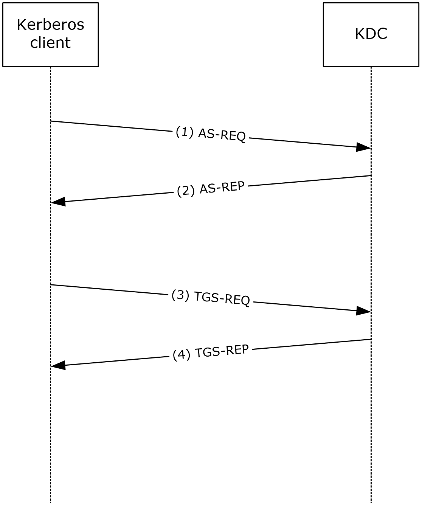
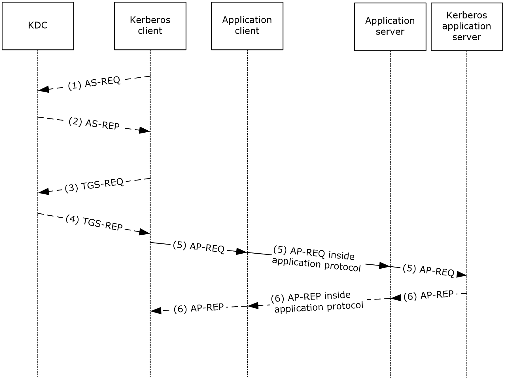

# [MS-PKCA]: Public Key Cryptography for Initial Authentication (PKINIT) in Kerberos Protocol

Table of Contents

1 Introduction

- [1 Introduction](#Section_1)
  - [1.1 Glossary](#Section_1.1)
  - [1.2 References](#Section_1.2)
    - [1.2.1 Normative References](#Section_1.2.1)
    - [1.2.2 Informative References](#Section_1.2.2)
  - [1.3 Overview](#Section_1.3)
  - [1.4 Relationship to Other Protocols](#Section_1.4)
  - [1.5 Prerequisites/Preconditions](#Section_1.5)
  - [1.6 Applicability Statement](#Section_1.6)
  - [1.7 Versioning and Capability Negotiation](#Section_1.7)
  - [1.8 Vendor-Extensible Fields](#Section_1.8)
  - [1.9 Standards Assignments](#Section_1.9)

2 Messages

- [2 Messages](#Section_2)
  - [2.1 Transport](#Section_2.1)
  - [2.2 Message Syntax](#Section_2.2)
    - [2.2.1 PA-PK-AS-REP_OLD 1](#Section_2.2.1)
    - [2.2.2 PA-PK-AS-REP_OLD 2](#Section_2.2.2)
    - [2.2.3 PA-PK-AS-REQ](#Section_2.2.3)
    - [2.2.4 PA-PK-AS-REP](#Section_2.2.4)

3 Protocol Details

- [3 Protocol Details](#Section_3)
  - [3.1 Common Details](#Section_3.1)
    - [3.1.1 Abstract Data Model](#Section_3.1.1)
    - [3.1.2 Timers](#Section_3.1.2)
    - [3.1.3 Initialization](#Section_3.1.3)
    - [3.1.4 Higher-Layer Triggered Events](#Section_3.1.4)
    - [3.1.5 Message Processing Events and Sequencing Rules](#Section_3.1.5)
      - [3.1.5.1 Client](#Section_3.1.5.1)
      - [3.1.5.2 KDC](#Section_3.1.5.2)
        - [3.1.5.2.1 Certificate Mapping](#Section_3.1.5.2.1)
          - [3.1.5.2.1.1 SAN DNSName field](#Section_3.1.5.2.1.1)
          - [3.1.5.2.1.2 SAN UPN field](#Section_3.1.5.2.1.2)
          - [3.1.5.2.1.3 Explicit Mapping](#Section_3.1.5.2.1.3)
          - [3.1.5.2.1.4 Key Trust](#Section_3.1.5.2.1.4)
          - [3.1.5.2.1.5 Mapping Strength](#Section_3.1.5.2.1.5)
          - [3.1.5.2.1.6 SID](#Section_3.1.5.2.1.6)
        - [3.1.5.2.2 Smart-card-only Account Password Reset](#Section_3.1.5.2.2)
    - [3.1.6 Timer Events](#Section_3.1.6)
    - [3.1.7 Other Local Events](#Section_3.1.7)

4 Protocol Examples

- [4 Protocol Examples](#Section_4)
  - [4.1 Interactive Logon Using Smart Cards](#Section_4.1)
  - [4.2 Network Logon Using Smart Cards](#Section_4.2)
  - [4.3 Non-RFC Kerberos Clients during AS-REQ](#Section_4.3)

5 Security

- [5 Security](#Section_5)
  - [5.1 Security Considerations for Implementers](#Section_5.1)
  - [5.2 Index of Security Parameters](#Section_5.2)

6 Appendix A: Product Behavior

- [6 Appendix A: Product Behavior](#Section_6)

7 Change Tracking

- [7 Change Tracking](#Section_7)

For the legal notice and IP terms, see [LEGAL.md](../LEGAL.md).
Last updated: 1/26/2026.
See [Revision History](#revision-history) for full version history.

# 1 Introduction

The Public Key Cryptography for Initial Authentication in Kerberos (PKINIT) protocol [[RFC4556]](https://go.microsoft.com/fwlink/?LinkId=90482) enables the use of public [**key**](#gt_key) cryptography in the initial authentication exchange (that is, in the [**Authentication Service (AS) exchange**](#gt_authentication-service-as-exchange)) of the Kerberos protocol [MS-KILE](../MS-KILE/MS-KILE.md). This specification describes the Public Key Cryptography for Initial Authentication in Kerberos (PKINIT): Microsoft Extensions protocol (PKCA) and how the protocol differs from what is specified in [RFC4556].

In an implementation of [[RFC4120]](https://go.microsoft.com/fwlink/?LinkId=90458) or KILE, the security of the AS exchange depends on the strength of the password used to protect it. This also affects the security of subsequent protocol requests.

By using public key cryptography to protect the initial authentication, the Kerberos protocol [MS-KILE] is substantially strengthened and can be used with already existing public key authentication mechanisms such as smart cards.

This document references the PKINIT methods and data formats [RFC4556] and [[RFC5349]](https://go.microsoft.com/fwlink/?LinkId=129652), that the client and the [**KDC**](#gt_key-distribution-center-kdc) can use both to mutually authenticate during the AS exchange with public and private key pairs and to negotiate the AS-REP key, which allows the KDC to encrypt the AS-REP key sent to the client.

Sections 1.5, 1.8, 1.9, 2, and 3 of this specification are normative. All other sections and examples in this specification are informative.

## 1.1 Glossary

This document uses the following terms:

**Active Directory**: The Windows implementation of a general-purpose directory service, which uses LDAP as its primary access protocol. Active Directory stores information about a variety of objects in the network such as user accounts, computer accounts, groups, and all related credential information used by Kerberos [MS-KILE](../MS-KILE/MS-KILE.md). Active Directory is either deployed as Active Directory Domain Services (AD DS) or Active Directory Lightweight Directory Services (AD LDS), which are both described in [MS-ADOD](../MS-ADOD/MS-ADOD.md): Active Directory Protocols Overview.

**Authentication Service (AS) exchange**: The Kerberos subprotocol in which the Authentication Service (AS) component of the [**key distribution center (KDC)**](#gt_key-distribution-center-kdc) accepts an initial logon or authentication request from a client and provides the client with a [**ticket-granting ticket (TGT)**](#gt_ticket-granting-ticket-tgt) and necessary cryptographic keys to make use of the [**ticket**](#gt_ticket). This is specified in [[RFC4120]](https://go.microsoft.com/fwlink/?LinkId=90458) section 3.1. The [**AS exchange**](#gt_authentication-service-as-exchange) is always initiated by the client, usually in response to the initial logon of a principal such as a user.

**authorization data**: An extensible field within a Kerberos [**ticket**](#gt_ticket), used to pass authorization data about the principal on whose behalf the [**ticket**](#gt_ticket) was issued to the application service.

**certification authority (CA)**: A third party that issues public key certificates. Certificates serve to bind public keys to a user identity. Each user and certification authority (CA) can decide whether to trust another user or CA for a specific purpose, and whether this trust is to be transitive. For more information, see [[RFC3280]](https://go.microsoft.com/fwlink/?LinkId=90414).

**elliptic curve cryptography (ECC)**: A public-key cryptosystem that is based on high-order elliptic curves over finite fields. For more information, see [[IEEE1363]](https://go.microsoft.com/fwlink/?LinkId=89899).

**key**: In cryptography, a generic term used to refer to cryptographic data that is used to initialize a cryptographic algorithm. [**Keys**](#gt_key) are also sometimes referred to as keying material.

**Key Distribution Center (KDC)**: The Kerberos service that implements the authentication and [**ticket**](#gt_ticket) granting services specified in the Kerberos protocol. The service runs on computers selected by the administrator of the [**realm**](#gt_realm) or domain; it is not present on every machine on the network. It has to have access to an account database for the realm that it serves. KDCs are integrated into the domain controller role. It is a network service that supplies tickets to clients for use in authenticating to services.

**object identifier (OID)**: In the context of a directory service, a number identifying an object class or attribute. Object identifiers are issued by the ITU and form a hierarchy. An OID is represented as a dotted decimal string (for example, "1.2.3.4"). For more information on OIDs, see [[X660]](https://go.microsoft.com/fwlink/?LinkId=90592) and [RFC3280] Appendix A. OIDs are used to uniquely identify certificate templates available to the [**certification authority (CA)**](#gt_certification-authority-ca). Within a certificate, OIDs are used to identify standard extensions, as described in [RFC3280] section 4.2.1.x, as well as non-standard extensions.

**one-way function (OWF)**: The calculation of a hash of the password using the Rivest-Shamir-Adleman (RSA) MD4 function. [**OWF**](#gt_one-way-function-owf) is used to refer to the resulting value of the hash operation.

**pre-authentication**: In Kerberos, a state in which a [**key distribution center (KDC)**](#gt_key-distribution-center-kdc) demands that the requestor in the [**Authentication Service (AS) exchange**](#gt_authentication-service-as-exchange) demonstrate knowledge of the key associated with the account. If the requestor cannot demonstrate this knowledge, the [**KDC**](#gt_key-distribution-center-kdc) will not issue a [**ticket-granting ticket (TGT)**](#gt_ticket-granting-ticket-tgt) ([RFC4120] sections 5.2.7 and 7.5.2).

**privilege attribute certificate (PAC)**: A Microsoft-specific authorization data present in the authorization data field of a ticket. The [**PAC**](#gt_privilege-attribute-certificate-pac) contains several logical components, including group membership data for authorization, alternate credentials for non-Kerberos authentication protocols, and policy control information for supporting interactive logon.

**public key infrastructure (PKI)**: The laws, policies, standards, and software that regulate or manipulate certificates and public and private keys. In practice, it is a system of digital certificates, [**certificate authorities (CAs)**](#gt_certification-authority-ca), and other registration authorities that verify and authenticate the validity of each party involved in an electronic transaction. For more information, see [[X509]](https://go.microsoft.com/fwlink/?LinkId=90590) section 6.

**realm**: A collection of key distribution centers (KDCs) with a common set of principals, as described in [RFC4120] section 1.2.

**security identifier (SID)**: An identifier for security principals that is used to identify an account or a group. Conceptually, the [**SID**](#gt_security-identifier-sid) is composed of an account authority portion (typically a domain) and a smaller integer representing an identity relative to the account authority, termed the relative identifier (RID). The [**SID**](#gt_security-identifier-sid) format is specified in [MS-DTYP](../MS-DTYP/MS-DTYP.md) section 2.4.2; a string representation of [**SIDs**](#gt_security-identifier-sid) is specified in [MS-DTYP] section 2.4.2 and [MS-AZOD](../MS-AZOD/MS-AZOD.md) section 1.1.1.2.

**service**: A process or agent that is available on the network, offering resources or services for clients. Examples of services include file servers, web servers, and so on.

**ticket**: A record generated by the [**key distribution center (KDC)**](#gt_key-distribution-center-kdc) that helps a client authenticate to a service. It contains the client's identity, a unique cryptographic key for use with this ticket (the session key), a time stamp, and other information, all sealed using the service's secret key. It only serves to authenticate a client when presented along with a valid authenticator.

**ticket-granting service (TGS)**: A service that issues [**tickets**](#gt_ticket) for admission to other services in its own domain or for admission to the ticket-granting service in another domain.

**ticket-granting ticket (TGT)**: A special type of [**ticket**](#gt_ticket) that can be used to obtain other [**tickets**](#gt_ticket). The TGT is obtained after the initial authentication in the [**Authentication Service (AS) exchange**](#gt_authentication-service-as-exchange); thereafter, users do not need to present their credentials, but can use the TGT to obtain subsequent tickets.

**MAY, SHOULD, MUST, SHOULD NOT, MUST NOT:** These terms (in all caps) are used as defined in [[RFC2119]](https://go.microsoft.com/fwlink/?LinkId=90317). All statements of optional behavior use either MAY, SHOULD, or SHOULD NOT.

## 1.2 References

Links to a document in the Microsoft Open Specifications library point to the correct section in the most recently published version of the referenced document. However, because individual documents in the library are not updated at the same time, the section numbers in the documents may not match. You can confirm the correct section numbering by checking the [Errata](https://go.microsoft.com/fwlink/?linkid=850906).

### 1.2.1 Normative References

We conduct frequent surveys of the normative references to assure their continued availability. If you have any issue with finding a normative reference, please contact [dochelp@microsoft.com](mailto:dochelp@microsoft.com). We will assist you in finding the relevant information.

[FIPS140] FIPS PUBS, "Security Requirements for Cryptographic Modules", FIPS PUB 140-2, May 2001, [https://csrc.nist.gov/csrc/media/publications/fips/140/2/final/documents/fips1402.pdf](https://go.microsoft.com/fwlink/?LinkId=89866)

[ITUX680] ITU-T, "Abstract Syntax Notation One (ASN.1): Specification of Basic Notation", Recommendation X.680, Approved 2021-02-13, [https://www.itu.int/rec/T-REC-X.680-202102-I/en](https://go.microsoft.com/fwlink/?LinkId=89923)

[MS-ADA1] Microsoft Corporation, "[Active Directory Schema Attributes A-L](../MS-ADA1/MS-ADA1.md)".

[MS-ADA2] Microsoft Corporation, "[Active Directory Schema Attributes M](../MS-ADA2/MS-ADA2.md)".

[MS-ADA3] Microsoft Corporation, "[Active Directory Schema Attributes N-Z](../MS-ADA3/MS-ADA3.md)".

[MS-ADTS] Microsoft Corporation, "[Active Directory Technical Specification](../MS-ADTS/MS-ADTS.md)".

[MS-KILE] Microsoft Corporation, "[Kerberos Protocol Extensions](../MS-KILE/MS-KILE.md)".

[MS-NLMP] Microsoft Corporation, "[NT LAN Manager (NTLM) Authentication Protocol](../MS-NLMP/MS-NLMP.md)".

[MS-PAC] Microsoft Corporation, "[Privilege Attribute Certificate Data Structure](../MS-PAC/MS-PAC.md)".

[MS-SAMR] Microsoft Corporation, "[Security Account Manager (SAM) Remote Protocol (Client-to-Server)](#Section_5)".

[MS-SAMS] Microsoft Corporation, "[Security Account Manager (SAM) Remote Protocol (Server-to-Server)](#Section_5)".

[MS-SPNG] Microsoft Corporation, "[Simple and Protected GSS-API Negotiation Mechanism (SPNEGO) Extension](../MS-SPNG/MS-SPNG.md)".

[MS-WCCE] Microsoft Corporation, "[Windows Client Certificate Enrollment Protocol](../MS-WCCE/MS-WCCE.md)".

[RFC1964] Linn, J., "The Kerberos Version 5 GSS-API Mechanism", RFC 1964, June 1996, [https://www.rfc-editor.org/info/rfc1964](https://go.microsoft.com/fwlink/?LinkId=90304)

[RFC2119] Bradner, S., "Key words for use in RFCs to Indicate Requirement Levels", BCP 14, RFC 2119, March 1997, [https://www.rfc-editor.org/info/rfc2119](https://go.microsoft.com/fwlink/?LinkId=90317)

[RFC2315] Kaliski, B., "PKCS #7: Cryptographic Message Syntax Version 1.5", RFC 2315, March 1998, [https://www.rfc-editor.org/info/rfc2315](https://go.microsoft.com/fwlink/?LinkId=90334)

[RFC2743] Linn, J., "Generic Security Service Application Program Interface Version 2, Update 1", RFC 2743, January 2000, [https://www.rfc-editor.org/info/rfc2743](https://go.microsoft.com/fwlink/?LinkId=90378)

[RFC3370] Housley, R., "Cryptographic Message Syntax (CMS) Algorithms", RFC 3370, August 2002, [https://www.rfc-editor.org/info/rfc3370](https://go.microsoft.com/fwlink/?LinkId=90419)

[RFC3852] Housley, R., "Cryptographic Message Syntax (CMS)", RFC 3852, July 2004, [https://www.rfc-editor.org/info/rfc3852](https://go.microsoft.com/fwlink/?LinkId=90445)

[RFC4120] Neuman, C., Yu, T., Hartman, S., and Raeburn, K., "The Kerberos Network Authentication Service (V5)", RFC 4120, July 2005, [https://www.rfc-editor.org/rfc/rfc4120](https://go.microsoft.com/fwlink/?LinkId=90458)

[RFC4556] Zhu, L., and Tung, B., "Public Key Cryptography for Initial Authentication in Kerberos", RFC 4556, June 2006, [https://www.rfc-editor.org/info/rfc4556](https://go.microsoft.com/fwlink/?LinkId=90482)

[RFC5280] Cooper, D., Santesson, S., Farrell, S., et al., "Internet X.509 Public Key Infrastructure Certificate and Certificate Revocation List (CRL) Profile", RFC 5280, May 2008, [https://www.rfc-editor.org/info/rfc5280](https://go.microsoft.com/fwlink/?LinkId=131034)

[RFC5349] Zhu, L., Jaganathan, K., and Lauter, K., "Elliptic Curve Cryptography (ECC) Support for Public Key Cryptography for Initial Authentication in Kerberos (PKINIT)", RFC 5349, September 2008, [https://www.rfc-editor.org/info/rfc5349](https://go.microsoft.com/fwlink/?LinkId=129652)

[RFC5754] Turner, S., "Using SHA2 Algorithms with Cryptographic Message Syntax", RFC 5754, January 2010, [https://www.rfc-editor.org/info/rfc5754](https://go.microsoft.com/fwlink/?linkid=851208)

[RFC8017] Moriarty, K., Ed., Kaliski, B., Jonsson, J., and Rusch, A., "PKCS #1: RSA Cryptography Specifications Version 2.2", November 2016, [https://www.rfc-editor.org/info/rfc8017](https://go.microsoft.com/fwlink/?linkid=2164409)

[RFC8070] Moore, S., Miller, P., and Short, M., Ed., "Public Key Cryptography for Initial Authentication in Kerberos (PKINIT)", [https://www.rfc-editor.org/info/rfc8070](https://go.microsoft.com/fwlink/?linkid=842519)

[X509] ITU-T, "Information Technology - Open Systems Interconnection - The Directory: Public-Key and Attribute Certificate Frameworks", Recommendation X.509, August 2005, [http://www.itu.int/rec/T-REC-X.509/en](https://go.microsoft.com/fwlink/?LinkId=90590)

### 1.2.2 Informative References

[MSFT-CVE-2021-33764] Microsoft Corporation, "Windows Key Distribution Center Information Disclosure Vulnerability", CVE-2021-33764 July 13, 2021, [https://msrc.microsoft.com/update-guide/vulnerability/CVE-2021-33764](https://go.microsoft.com/fwlink/?linkid=2170928)

[MSKB-5060525] Microsoft Corporation, "June 2025 - 5060525", June 2025, [https://www.catalog.update.microsoft.com/Search.aspx?q=5060525](https://go.microsoft.com/fwlink/?linkid=2321948)

[MSKB-5060841] Microsoft Corporation, "June 2025 - 5060841", June 2025, [https://www.catalog.update.microsoft.com/Search.aspx?q=5060841](https://go.microsoft.com/fwlink/?linkid=2321747)

[RFC8636] L. Hornquist Astrand, L., Zhu, L., Cullen, M., Hudson, G., "Public Key Cryptography for Initial Authentication in Kerberos (PKINIT)", RFC 8636, July 2019, [https://www.rfc-editor.org/rfc/rfc8636.html](https://go.microsoft.com/fwlink/?linkid=2243331)

## 1.3 Overview

The PKINIT protocol is a security protocol that authenticates entities on a network using public [**key**](#gt_key) cryptography. Kerberos is a security protocol that mutually authenticates entities on a network and can provide user credential delegation after authentication is complete. Kerberos is specified in [[RFC4120]](https://go.microsoft.com/fwlink/?LinkId=90458) and [MS-KILE](../MS-KILE/MS-KILE.md), and PKINIT is specified in [[RFC4556]](https://go.microsoft.com/fwlink/?LinkId=90482). [[RFC5349]](https://go.microsoft.com/fwlink/?LinkId=129652) specifies the use of [**elliptic curve cryptography (ECC)**](#gt_elliptic-curve-cryptography-ecc) within the framework of PKINIT. PKINIT is a [**pre-authentication**](#gt_pre-authentication) extension that extends the Kerberos Protocol to use public key cryptography and [**ticket-granting ticket (TGT)**](#gt_ticket-granting-ticket-tgt) data signing during the initial [**AS exchange**](#gt_authentication-service-as-exchange).

This specification describes the extensions to PKINIT that enable the use of public key cryptography in the initial authentication exchanges of the Kerberos protocol (Authentication Service (AS) exchange) [RFC4120].

## 1.4 Relationship to Other Protocols

PKCA is defined as a Kerberos [**pre-authentication**](#gt_pre-authentication) extension ([[RFC4120]](https://go.microsoft.com/fwlink/?LinkId=90458) section 3.1.1). This extension is used in the Kerberos [**AS exchange**](#gt_authentication-service-as-exchange) [[RFC4556]](https://go.microsoft.com/fwlink/?LinkId=90482), and therefore PKCA relies on a working Kerberos infrastructure and a [**certificate authority (CA)**](#gt_certification-authority-ca) for issuing [[X509]](https://go.microsoft.com/fwlink/?LinkId=90590) certificates. PKCA includes the use of [**elliptic curve cryptography (ECC)**](#gt_elliptic-curve-cryptography-ecc). ECC support [[RFC5349]](https://go.microsoft.com/fwlink/?LinkId=129652) relies upon a CA issuing ECC certificates. Applications already using Kerberos can use PKCA without modifications.

In order to support NTLM authentication [MS-NLMP](../MS-NLMP/MS-NLMP.md) for applications connecting to network [**services**](#gt_service) that do not support Kerberos authentication, when PKCA is used, the [**KDC**](#gt_key-distribution-center-kdc) returns the user's NTLM [**one-way function (OWF)**](#gt_one-way-function-owf) in the [**privilege attribute certificate (PAC)**](#gt_privilege-attribute-certificate-pac) PAC_CREDENTIAL_INFO buffer ([MS-PAC](../MS-PAC/MS-PAC.md) section 2.6.1).

## 1.5 Prerequisites/Preconditions

PKCA assumes the following, in addition to any assumptions specified in [MS-KILE](../MS-KILE/MS-KILE.md):

- The [**key distribution center (KDC)**](#gt_key-distribution-center-kdc) has an X.509 public [**key**](#gt_key) certificate [[X509]](https://go.microsoft.com/fwlink/?LinkId=90590), issued by a [**certificate authority (CA)**](#gt_certification-authority-ca) and trusted by the clients in the Kerberos [**realm**](#gt_realm). For [**ECC**](#gt_elliptic-curve-cryptography-ecc) support, the KDC has an ECC public key certificate issued by a CA and trusted by clients in the Kerberos realm. The issuing of these [X509] certificates is not addressed in this protocol specification.
- A cryptographic-strength random-number generator is available for generating keys and other cryptographically sensitive information.<1>
- Each user has an [X509] certificate suitable for use with PKINIT. Details about such a certificate are specified in [[RFC4556]](https://go.microsoft.com/fwlink/?LinkId=90482) Appendix C.
Details about general Kerberos assumptions are specified in [[RFC4120]](https://go.microsoft.com/fwlink/?LinkId=90458) section 1.6.

## 1.6 Applicability Statement

PKCA is used only in environments that use Kerberos, and it requires the deployment of a [**Public Key Infrastructure (PKI)**](#gt_public-key-infrastructure-pki) for issuing [[X509]](https://go.microsoft.com/fwlink/?LinkId=90590) certificates.

## 1.7 Versioning and Capability Negotiation

PKCA does not have explicit versioning; it is tied to the Kerberos protocol [MS-KILE](../MS-KILE/MS-KILE.md) versioning mechanisms, as specified in [[RFC4120]](https://go.microsoft.com/fwlink/?LinkId=90458) section 7.5.6. Capability negotiation is as specified in [[RFC4556]](https://go.microsoft.com/fwlink/?LinkId=90482) sections 3.3 and 3.4.

## 1.8 Vendor-Extensible Fields

None.

## 1.9 Standards Assignments

There are no standards assignments in PKCA beyond what is specified in [[RFC4556]](https://go.microsoft.com/fwlink/?LinkId=90482) and [[RFC5349]](https://go.microsoft.com/fwlink/?LinkId=129652).

# 2 Messages

## 2.1 Transport

Messages are carried in the Kerberos [**AS exchange**](#gt_authentication-service-as-exchange) as [**pre-authentication**](#gt_pre-authentication) data, as specified in [[RFC4120]](https://go.microsoft.com/fwlink/?LinkId=90458) section 5.2.7.

## 2.2 Message Syntax

The message syntax SHOULD<2> be as specified in [[RFC4556]](https://go.microsoft.com/fwlink/?LinkId=90482) section 3.2.

PKCA MAY<3> support these variations based on an earlier draft of [RFC4556] for interoperability.

An earlier draft of [RFC4556] supported a different [**pre-authentication**](#gt_pre-authentication) data identifier:

- PA-PK-AS-REP_OLD 15
The algorithm identifier in Cryptographic Message Syntax (CMS) messages, as specified in [[RFC2315]](https://go.microsoft.com/fwlink/?LinkId=90334) and [[RFC3852]](https://go.microsoft.com/fwlink/?LinkId=90445), is md5WithRSAEncryption instead of md5 ([[RFC3370]](https://go.microsoft.com/fwlink/?LinkId=90419) sections 3.2 and 2.2).<4> SHA-1WithRSAEncryption [RFC3370] SHOULD<5> be supported. ecdsa-with-Sha1, ecdsa-with-Sha256, ecdsa-with-Sha384, and ecdsa-with-Sha512 ([[RFC5349]](https://go.microsoft.com/fwlink/?LinkId=129652) section 3) SHOULD<6> be supported.

The following [**ECC**](#gt_elliptic-curve-cryptography-ecc) curves ([RFC5349] section 5) SHOULD<7> be supported:

- ECPRGF256Random | groupP-256 | secp256r1
- ECPRGF384Random | groupP-384 | secp384r1
- ECPRGF521Random | groupP-521 | secp521r1

### 2.2.1 PA-PK-AS-REP_OLD 1

The data for the PA-PK-AS-REP_OLD [**pre-authentication**](#gt_pre-authentication) data identifiers is based on an earlier draft of [[RFC4556]](https://go.microsoft.com/fwlink/?LinkId=90482); therefore, there are some differences in the message format. The ASN.1 [[ITUX680]](https://go.microsoft.com/fwlink/?LinkId=89923) description of the message that SHOULD<8> be used in place of the message format specified in [RFC4556] section 3.2.1 follows.

PKINIT DEFINITIONS EXPLICIT TAGS ::=

BEGIN

--EXPORTS ALL--

IMPORTS

KerberosTime, PrincipalName, Realm, EncryptionKey

FROM KerberosV5Spec2

{ iso(1) identified-organization(3) dod(6) internet(1) security(5)

kerberosV5(2) }

-- Different from [RFC4556] Appendix A

ContentInfo, EnvelopedData, SignedData, IssuerAndSerialNumber

FROM CryptographicMessageSyntax2004

{ iso(1) member-body(2) us(840) rsadsi(113549)

pkcs(1) pkcs-9(9) smime(16) modules(0) cms-

2004(24) }

-- Same as defined in [RFC3852]

AlgorithmIdentifier

FROM PKIX1Explicit88

{ iso(1) identified-organization(3) dod(6) internet(1) security(5)

mechanisms(5) pkix(7) id-mod(0) id-pkix1-explicit(18) };

-- From [RFC3280] (Same as defined in [RFC4556] Appendix A)

--

-- PKINT data types

--

PA-PK-AS-REQ ::= SEQUENCE {

-- PA TYPE 15

signedAuthPack [0] IMPLICIT OCTET STRING

}

AuthPack::= SEQUENCE {

pkAuthenticator [0] PKAuthenticator

}

--

-- PK-AUTHENTICATOR - Different from [RFC4556]

-- Appendix A, PKAuthenticator.

--

PKAuthenticator::= SEQUENCE {

kdc-name [0] PRINCIPAL-NAME,

kdc-realm [1] REALM,

-- name and realm of the KDC issuing the ticket

cusec [2] INTEGER,

ctime [3] KerberosTime,

nonce [4] INTEGER

}

END

PA-PK-AS-REQ field:

- signedAuthPack: Contains content identical to the content of the signedAuthPack field, as specified in [RFC4556] section 3.2.1.
AuthPack field:

- pkAuthenticator: Contains a PKAuthenticator structure, as defined in this document. This variation of the AuthPack structure is different from the one specified in [RFC4556].
PKAuthenticator fields:

- kdc-name: Contains the name portion of the [**ticket-granting service (TGS)**](#gt_ticket-granting-service-tgs) name of the [**KDC**](#gt_key-distribution-center-kdc) that will [**service**](#gt_service) the request, as specified in [[RFC4120]](https://go.microsoft.com/fwlink/?LinkId=90458) section 7.3.
- kdc-realm: Contains the [**realm**](#gt_realm) portion of the TGS name of the KDC that will service the request, as specified in [RFC4120] section 7.3.
- cusec: Contains the same content of the corresponding, identically named field in the type PKAuthenticator, as specified in [RFC4556] section 3.2.1.
- ctime: Contains the same content of the corresponding, identically named field in the type PKAuthenticator, as specified in [RFC4556] section 3.2.1.
- nonce: Contains the same content of the corresponding, identically named field in the type PKAuthenticator, as specified in [RFC4556] section 3.2.1.

### 2.2.2 PA-PK-AS-REP_OLD 2

The data for the PA-PK-AS-REP_OLD [**pre-authentication**](#gt_pre-authentication) data identifiers is based on an earlier draft of [[RFC4556]](https://go.microsoft.com/fwlink/?LinkId=90482); therefore, there are some differences in the message format. The ASN.1 [[ITUX680]](https://go.microsoft.com/fwlink/?LinkId=89923) description of the message that SHOULD<9> be used in place of the message format specified in [RFC4556] section 3.2.3 follows.

--

-- KERB-REPLY-KEY-PACKAGE - Different from [RFC4556]

-- Appendix A, ReplyKeyPack

--

KERB-REPLY-KEY-PACKAGE ::= SEQUENCE {

replyKey [0] EncryptionKey,

-- Contains the session key used to encrypt the enc-part

-- field in the AS-REP, for example, the AS reply key.

nonce [1] INTEGER,

-- binds response to the request; MUST be same as the nonce

-- passed in the PK-AUTHENTICATOR.

...

} --#public-

KERB-REPLY-KEY-PACKAGE fields:

- replyKey: Contains the same content of the identically named field in the type ReplyKeyPack, as specified in [RFC4556] section 3.2.3.2.
- nonce: Contains the nonce from the PKAuthenticator structure in the PA-PK-AS-REQ request.
However, if the AS-REQ message contains a padata of type KRB5-PADATA-AS-CHECKSUM(132) with no corresponding data field (padata-value is an empty OCTET STRING), then the PA-PK-AS-REP_OLD pre-authentication data contains the same data as specified in [RFC4556] section 3.2.3.2.

### 2.2.3 PA-PK-AS-REQ

The PA-PK-AS-REQ message format is specified in [[RFC4556]](https://go.microsoft.com/fwlink/?LinkId=90482) section 3.2.1.<10>

PKAuthenticator in [RFC4556] is extended to add the following PAChecksum2. If SHA-1 is disabled as a checksum algorithm PAChecksum2 SHOULD be present; if this field is present, it will always be validated even if it is SHA-1.<11>

PAChecksum2 ::= SEQUENCE { checksum [0] OCTET STRING, algorithmIdentifier [1] AlgorithmIdentifier }

PAChecksum2 follows the freshness token specified in [[RFC8070]](https://go.microsoft.com/fwlink/?linkid=842519) section 4 which is itself an extension of PKAuthenticator.

PAChecksum2 fields:

- checksum: An octet string that is the result of calculating the checksum using the algorithm identified by the algorithmIdentifier.
- algorithmIdentifier: See [[RFC5280]](https://go.microsoft.com/fwlink/?LinkId=131034), section 4.1.1.2, for the definition of algorithmIdentifier. The algorithmIdentifier is an [**OID**](#gt_object-identifier-oid). The supported OIDs are as follows.
| Name | OID |
| --- | --- |
| SHA-1 | "1.3.14.3.2.26" |
| SHA-256 | "2.16.840.1.101.3.4.2.1" |
| SHA-384 | "2.16.840.1.101.3.4.2.2" |
| SHA-512 | "2.16.840.1.101.3.4.2.3" |

SHA-2 family OIDs are defined in [[RFC5754]](https://go.microsoft.com/fwlink/?linkid=851208). The SHA-1 OID is defined in [[RFC3370]](https://go.microsoft.com/fwlink/?LinkId=90419).

### 2.2.4 PA-PK-AS-REP

The PA-PK-AS-REP message format is specified in [[RFC4556]](https://go.microsoft.com/fwlink/?LinkId=90482) section 3.2.3.<12> The returned [**ticket**](#gt_ticket) does not include the AD-INITIAL-VERIFIED-CAS type in the [**authorization data**](#gt_authorization-data). The content of the SignedData field in the content of EnvelopedData is encoded, as specified in [[RFC2315]](https://go.microsoft.com/fwlink/?LinkId=90334) section 7, not as specified in [[RFC3852]](https://go.microsoft.com/fwlink/?LinkId=90445). Therefore, the data is not wrapped in OCTET STRING; rather, it is wrapped in an ANY DEFINED BY content specific type, as specified in [RFC2315] section 7.

# 3 Protocol Details

## 3.1 Common Details

### 3.1.1 Abstract Data Model

This section describes a conceptual model of possible data organization that an implementation maintains to participate in this protocol. The described organization is provided to facilitate the explanation of how the protocol behaves. This document does not mandate that implementations adhere to this model as long as their external behavior is consistent with that described in this document.

The abstract data model follows what is specified in [[RFC4556]](https://go.microsoft.com/fwlink/?LinkId=90482).

### 3.1.2 Timers

None.

### 3.1.3 Initialization

During initialization, the [[FIPS140]](https://go.microsoft.com/fwlink/?LinkId=89866)-compliant random-number generator for [**keys**](#gt_key) and nonces is initialized.

### 3.1.4 Higher-Layer Triggered Events

None.

### 3.1.5 Message Processing Events and Sequencing Rules

In addition to the required ([[RFC4556]](https://go.microsoft.com/fwlink/?LinkId=90482) section 3.1.1) and recommended ([RFC4556] section 3.1.2) algorithms, an implementer MUST<13> specify des-ede3-cbc ([RFC4556] section 3.1.2) as the default algorithm.

PKCA does not implement the id-pkinit-san algorithm ([RFC4556] section 3.2.2).

PKCA SHOULD<14> support the PKINIT Freshness Extension [[RFC8070]](https://go.microsoft.com/fwlink/?linkid=842519).

#### 3.1.5.1 Client

The Kerberos client SHOULD<15> <16> send only a PA-PK-AS-REQ [**pre-authentication**](#gt_pre-authentication) data identifier.

Kerberos clients can process either the PA-PK-AS-REP_OLD or the PA-PK-AS-REP pre-authentication data identifier in the reply, but not both.<17>

For computer AS-REQ, PKCA clients SHOULD<18> fail unless all of the following conditions are met.

- The computer certificate contains:
- subjectAltName (SAN) DNSName field: <computer name>.<DNS domain name> where <computer name> matches the computer name and <DNS domain name> matches the computer's DNS domain name.
- Enhance Key Usage (EKU): id-pkinit-KPClientAuth (1.3.6.1.5.2.3.4) or TLS/SSL Client Authentication (1.3.6.1.5.5.7.3.2).
- The [**KDC**](#gt_key-distribution-center-kdc) certificate contains:
- SAN DNSName field: the DNS name of the domain
- EKU: id-pkinit-KPkdc (1.3.6.1.5.2.3.5)
See [[RFC4120]](https://go.microsoft.com/fwlink/?LinkId=90458) for descriptions of possible errors.

#### 3.1.5.2 KDC

If the [**KDC**](#gt_key-distribution-center-kdc) receives both a PA-PK-AS-REQ and PA-PK-AS-REQ_OLD, the KDC MUST return KRB_ERROR_GENERIC.

The KDC SHOULD<19> process the PA-PK-AS-REQ [**pre-authentication**](#gt_pre-authentication) data identifier. The KDC SHOULD<20> respond with PA-PK-AS-REP.

The KDC MUST return the user's unicodePwd attribute ([MS-ADA3](../MS-ADA3/MS-ADA3.md) section 2.332) in the NTLM_SUPPLEMENTAL_CREDENTIAL buffer ([MS-PAC](../MS-PAC/MS-PAC.md) section 2.6.4).

See [[RFC4120]](https://go.microsoft.com/fwlink/?LinkId=90458) for descriptions of possible errors.

##### 3.1.5.2.1 Certificate Mapping

The [**KDC**](#gt_key-distribution-center-kdc) SHOULD look up the account using the cname. If the account is not found and the cname name-type is NT-X500-PRINCIPAL, the KDC locates the account in the account database using the explicit mapping fields. Implementations of PKCA KDCs which use [**Active Directory**](#gt_active-directory) for the account database when the userAccountControl attribute ([MS-ADA3](../MS-ADA3/MS-ADA3.md) section 2.342) bit WT or ST ([MS-ADTS](../MS-ADTS/MS-ADTS.md) section 2.2.16) is:

- TRUE: validate certificate mapping using the SAN **DNSName** field.<21>
- Both FALSE: validate certificate mapping using the SAN **UPNName** field first, then try explicit mapping.
If the account is not found, the KDC returns KDC_ERR_C_PRINCIPAL_UNKNOWN.

###### 3.1.5.2.1.1 SAN DNSName field

The [**KDC**](#gt_key-distribution-center-kdc) MUST confirm that the name of the account found matches the computer name in the **DNSName** field of the certificate terminated with "$" and that the DNS domain name in the **DNSName** field of the certificate matches the DNS domain name of the [**realm**](#gt_realm). Implementations of PKCA KDCs which use [**Active Directory**](#gt_active-directory) for the account database MUST use the **sAMAccountName** attribute ([MS-ADA3](../MS-ADA3/MS-ADA3.md) section 2.222) for the computer name. If they do not match, the KDC SHOULD return KDC_ERR_CLIENT_NAME_MISMATCH.

###### 3.1.5.2.1.2 SAN UPN field

The [**KDC**](#gt_key-distribution-center-kdc) MUST confirm that the account found matches that the account found when using the UPN in the **UPN** field of the certificate. If they do not match, the KDC SHOULD return KDC_ERR_CLIENT_NAME_MISMATCH.

###### 3.1.5.2.1.3 Explicit Mapping

The [**KDC**](#gt_key-distribution-center-kdc) MUST confirm the explicit mapping of the account to a certificate. Implementations of PKCA KDCs which use [**Active Directory**](#gt_active-directory) for the account database MUST confirm that the **altSecurityIdentities** attribute ([MS-ADA1](../MS-ADA1/MS-ADA1.md) section 2.61) contains the string created by concatenating the following information from the certificate in the order shown:

- Subject and Issuer Name fields: "X509:<I>" + Issuer Name field with "\r" and "\n" replaced with "," + "<S>" + Subject field with "\r" and "\n" replaced with ",".
- Subject field: "X509:<S>" + Subject field with "\r" and "\n" replaced with ",".
- Issuer and Serial Number fields: "X509:<I>" + Issuer Name field with "\r" and "\n" replaced with "," + "<SR>" + Serial Number field.
- Subject Key Identifier field: "X509:<SKI>" + Subject Key Identifier field.
- SHA1 hash of public [**key**](#gt_key): "X509:<SHA1-PUKEY>" + SHA1 hash of public key.
- 822 field: "X509: <RFC822>" + 822 Name field.
- Issuer and SID fields: "X509:<I>" + Issuer Name field with "\r" and "\n" replaced with "," + "<SID>" + SID field.<22> More information about the SID field can be found in section [3.1.5.2.1.6](#Section_3.1.5.2.1.6).
If they do not match, the KDC SHOULD return KDC_ERR_CLIENT_NAME_MISMATCH.

###### 3.1.5.2.1.4 Key Trust

The KDC SHOULD<23> look the account up using the public key. If an account is found with the public key that is trusted for the account, then the KDC SHOULD:

- If the account was also found using the cname but the accounts do not match, return KDC_ERR_CLIENT_NAME_MISMATCH.
- Ignore any certificate chain validation errors.
Implementations of PKCA KDCs that use [**Active Directory**](#gt_active-directory) for the account database MUST confirm that the msDS-KeyCredentialLink attribute ([MS-ADA2](../MS-ADA2/MS-ADA2.md) section 2.358) contains the same public key. See [MS-ADTS](../MS-ADTS/MS-ADTS.md) section 2.2.20.5.1 for how the 2048-bit RSA [[RFC8017]](https://go.microsoft.com/fwlink/?linkid=2164409) public key is stored.

###### 3.1.5.2.1.5 Mapping Strength

The KDC SHOULD<24> map a certificate to a user using one of the following mappings. These methods of mapping a certificate to a user are classified as strong or weak based on whether they depend on a name as a secure identifier. The following mappings are considered weak:

- SAN UPNName
- SAN DNSName
- altSecurityIdentities Issuer Name and Subject Name
- altSecurityIdentities Subject Name
- altSecurityIdentities 822 field
If a KDC maps a certificate to a user using one of the above weak mappings, it SHOULD<25> continue to search for more mappings until it encounters a strong mapping. If it does not find such a mapping, it MAY fail the authentication request with KDC_ERR_CERTIFICATE_MISMATCH.

The following mappings are considered *strong*:

- SID (section [3.1.5.2.1.6](#Section_3.1.5.2.1.6))
- Key Trust (section [3.1.5.2.1.4](#Section_3.1.5.2.1.4))
- altSecurityIdentities Issuer and Serial Number
- altSecurityIdentities Subject Key Identifier
- altSecurityIdentities SHA1 Hash of Public Key
- altSecurityIdentities Issuer and SID<26>
If an Issuer-OID-MappingType triplet has been configured, the KDC SHOULD<27> consider certificates from the specified Issuer with any of the specified policy OIDs to have strong mappings if mapped via one of the specified mapping types. Supported MappingTypes are IssuerSubject (referring to the altSecurityIdentities Issuer Name and Subject Name above) and UPNSuffix=<domainname> (referring to the SAN UPNName above, scoped to UPNs ending in "@<domainname>").

###### 3.1.5.2.1.6 SID

If a [**Key Distribution Center (KDC)**](#gt_key-distribution-center-kdc) has exhausted all other mapping types for a certificate and found a weak mapping without finding a strong mapping, it SHOULD<28> check if the certificate contains a [**security identifier (SID)**](#gt_security-identifier-sid). If the certificate does contain a SID and the SID matches the user to which the certificate is weakly mapped, the certificate is to be considered strongly mapped. If the SID does not match, the authentication MUST fail with KDC_ERR_CERTIFICATE_MISMATCH. If the certificate does not contain a SID, the KDC MAY fail the authentication request as no strong mapping is available. For more details on the **objectSID** in an issued certificate see [MS-WCCE](../MS-WCCE/MS-WCCE.md) section 2.2.2.7.7.4.

If a KDC has further exhausted strong mapping per [MS-WCCE] section 2.2.2.7.7.4, it SHOULD<29> check if the certificate contains a SID using a Subject Alternate Name with type URL in the literal format of:

**tag:microsoft.com,2022-09-14:sid:<string-sid>**

If the certificate is weakly mapped to a user and the SID matches that user, the certificate is to be considered strongly mapped.

##### 3.1.5.2.2 Smart-card-only Account Password Reset

When processing an AS-REQ request (section [2.2.3](#Section_2.2.3)) the PKCA KDC MUST trigger a ResetSmartCardAccountPassword request ([MS-SAMS](#Section_5) section 3.2.4.7) when the following conditions are all TRUE:

- The PKCA KDC is using Active Directory for the account database
- The account’s **userAccountControl** attribute ([MS-ADTS](../MS-ADTS/MS-ADTS.md) section 2.2.16) SR flag is set to TRUE.
- The account’s **PasswordMustChange** attribute ([MS-SAMR](#Section_5) section 3.1.5.14.4) is set to zero, OR the account’s **PasswordLastSet** attribute ([MS-SAMR] section 2.2.6.1) is set to a value in the past.
Upon successful completion of the ResetSmartCardAccountPassword request, the PKCA KDC MUST restart processing of the original request.

### 3.1.6 Timer Events

None.

### 3.1.7 Other Local Events

There are no local events other than what is specified in [[RFC4556]](https://go.microsoft.com/fwlink/?LinkId=90482).

# 4 Protocol Examples

The following sections describe three common scenarios to illustrate the function of the KILE.

## 4.1 Interactive Logon Using Smart Cards

Figure 1: Interactive logon

Step 1: A user attempts to log on to a client. At the logon screen, the user selects the certificate and types the PIN. Using the PIN to unlock the smart card, the client generates an AS-REQ with PA-PK-AS-REQ [**pre-authentication**](#gt_pre-authentication) data ([[RFC4556]](https://go.microsoft.com/fwlink/?LinkId=90482) section 3.2.1) and sends the request to the [**KDC**](#gt_key-distribution-center-kdc).

Step 2: The KDC validates the AS-REQ ([[RFC4120]](https://go.microsoft.com/fwlink/?LinkId=90458) section 3.1.2), including verifying the user's signature and validating certificate ([RFC4556] section 3.2.2). If the AS-REQ is valid, the KDC generates an AS-REP ([RFC4556] section 3.2.3), with a [**PAC**](#gt_privilege-attribute-certificate-pac) ([MS-KILE] section 3.3.5.3.2) in the authorization_data field of the [**TGT**](#gt_ticket-granting-ticket-tgt), and sends the reply to the client.

Step 3: The client validates the AS-REP ([RFC4556] section 3.2.4). For interactive logons, the client runtime requests authentication to host/hostname.domain, where hostname is the actual name of the client machine, and domain is the domain or [**realm**](#gt_realm) of the client machine. If the AS-REP is valid, the client generates a TGS-REQ based on the TGT that is obtained in step 2 to obtain a [**service**](#gt_service) [**ticket**](#gt_ticket) for host/hostname.domain ([RFC4120] section 3.3.1) and sends the request to the KDC.

Step 4: The KDC validates the TGS-REQ ([RFC4120] section 3.3.2) ([MS-KILE](../MS-KILE/MS-KILE.md) section 3.3.5.7.1). If the TGS-REQ is valid, the KDC adds Domain Local Groups to the PAC ([MS-KILE] section 3.3.5.7.3), generates a TGS-REP ([RFC4120] section 3.3.3), and sends the reply to the client.

The client validates the TGS-REP ([MS-KILE] section 3.3.4). If the TGS-REP is valid, the service ticket is then interpreted by the Kerberos runtime within the local workstation.

The following fields from the KERB_VALIDATION_INFO field of the PAC ([MS-PAC](../MS-PAC/MS-PAC.md) Section 2.5) are required by the interactive logon client runtime to authorize the user for local interactive logon, and to establish the necessary management profile for the user:

- LogonTime
- LogoffTime
- KickOffTime
- PasswordLastSet
- PasswordCanChange
- EffectiveName
- FullName
- LogonScript
- ProfilePath
- HomeDirectory
- HomeDirectoryDrive
- LogonCount
- BadPasswordCount
- LogonServer
- LogonDomainName
- UserAccountControl

## 4.2 Network Logon Using Smart Cards

Figure 2: Network logon

When an application wants authentication, it calls GSS_Init_sec_context ([[RFC2743]](https://go.microsoft.com/fwlink/?LinkId=90378) section 2.2.1) to either invoke KILE [MS-KILE](../MS-KILE/MS-KILE.md) directly, or SPNEGO [MS-SPNG](../MS-SPNG/MS-SPNG.md) which can invoke Kerberos.

Step 0: The application client calls GSS_Init_sec_context ([RFC2743] section 2.2.1).

When the client does not have a [**TGT**](#gt_ticket-granting-ticket-tgt), steps 1 through 2, as described in section [4.1](#Section_4.1), are performed.

When the client does not have a [**service**](#gt_service) [**ticket**](#gt_ticket) for the application server, steps 3 and 4, as described in section 4.1, are performed.

Step 5: The Kerberos client generates a GSS-API initial token ([[RFC1964]](https://go.microsoft.com/fwlink/?LinkId=90304) section 1.1.1) containing an AP-REQ ([[RFC4120]](https://go.microsoft.com/fwlink/?LinkId=90458) section 3.2.2) and returns it to the application.

Step 6: The application server calls GSS_Accept_sec_context ([RFC2743] section 2.2.2). The Kerberos application server validates the AP-REQ ([RFC4120] section 3.2.3). If the AP-REQ is valid and the client requested mutual authentication, the Kerberos application server generates a GSS-API response token ([RFC1964] section 1.1.2) containing an AP-REP ([RFC4120] section 3.2.4) and returns it to the application server. The Kerberos application server provides the [**authorization data**](#gt_authorization-data) from the ticket to the operating system, which creates an object called an access token that provides authorization functions.

If mutual authentication was requested, the application client calls GSS_Init_sec_context ([RFC2743] section 2.2.1). The Kerberos client validates the AP-REP ([RFC4120] section 3.2.5). If the AP-REP is valid, the Kerberos client returns GSS_S_COMPLETE ([RFC2743] section 2.2.1).

## 4.3 Non-RFC Kerberos Clients during AS-REQ

PKCA clients developed prior to finalizing RFC 4556 support a PKInit [**pre-authentication**](#gt_pre-authentication) data based on an earlier draft of [[RFC4556]](https://go.microsoft.com/fwlink/?LinkId=90482).

Step 1: A user attempts to log on to a client. At the logon screen, the user selects the certificate and types the PIN. Using the PIN to unlock the smart card, the client generates an AS-REQ with PA-PK-AS-REP_OLD pre-authentication data (section [2.2.1](#Section_2.2.1)) and sends the request to the [**KDC**](#gt_key-distribution-center-kdc).

Step 2: The KDC validates the AS-REQ ([[RFC4120]](https://go.microsoft.com/fwlink/?LinkId=90458) section 3.1.2) including verifying the user's signature and validating certificate ([RFC4556] section 3.2.2). Since the PA-PK-AS-REP_OLD version of the pre-authentication data does not contain a paChecksum, the KDC does not return a KRB-ERROR with the code KDC_ERR_PA_CHECKSUM_MUST_BE_INCLUDED ([RFC4556] section 3.2.3). If the AS-REQ is valid, with the exception of the paChecksum checks, the KDC generates an AS-REP ([RFC4556] section 3.2.3) using the PA-PK-AS-REP_OLD, instead of the PA-PK-AS-REP with a [**PAC**](#gt_privilege-attribute-certificate-pac) ([MS-KILE](../MS-KILE/MS-KILE.md) section 3.3.5.6.4) in the authorization_data field of the [**TGT**](#gt_ticket-granting-ticket-tgt), and sends the reply to the client.

# 5 Security

## 5.1 Security Considerations for Implementers

PKCA security considerations are specified in [[RFC4556]](https://go.microsoft.com/fwlink/?LinkId=90482). PA-PK-AS-REP_OLD is the earlier version of PA-PK-AS-REQ and PA-PK-AS-REP, and has the same security considerations.

## 5.2 Index of Security Parameters

PKCA security parameters are specified in [[RFC4556]](https://go.microsoft.com/fwlink/?LinkId=90482).

| Security parameter | Section |
| --- | --- |
| PKAuthenticator | [2.2.1](#Section_2.2.1) |
| KERB-REPLY-KEY-PACKAGE | [2.2.2](#Section_2.2.2) |

# 6 Appendix A: Product Behavior

The information in this specification is applicable to the following Microsoft products or supplemental software. References to product versions include updates to those products.

The terms "earlier" and "later", when used with a product version, refer to either all preceding versions or all subsequent versions, respectively. The term "through" refers to the inclusive range of versions. Applicable Microsoft products are listed chronologically in this section.

**Windows Client**

- Windows 2000 operating system
- Windows XP operating system
- Windows Vista operating system
- Windows 7 operating system
- Windows 8 operating system
- Windows 8.1 operating system
- Windows 10 operating system
- Windows 11 operating system
**Windows Server**

- Windows Server 2003 operating system
- Windows Server 2008 operating system
- Windows Server 2008 R2 operating system
- Windows Server 2012 operating system
- Windows Server 2012 R2 operating system
- Windows Server 2016 operating system
- Windows Server operating system
- Windows Server 2019 operating system
- Windows Server 2022 operating system
- Windows Server 2025 operating system
Exceptions, if any, are noted in this section. If an update version, service pack or Knowledge Base (KB) number appears with a product name, the behavior changed in that update. The new behavior also applies to subsequent updates unless otherwise specified. If a product edition appears with the product version, behavior is different in that product edition.

Unless otherwise specified, any statement of optional behavior in this specification that is prescribed using the terms "SHOULD" or "SHOULD NOT" implies product behavior in accordance with the SHOULD or SHOULD NOT prescription. Unless otherwise specified, the term "MAY" implies that the product does not follow the prescription.

<1> Section 1.5: Windows contains a FIPS-140-validated random-number generator, as specified in [[FIPS140]](https://go.microsoft.com/fwlink/?LinkId=89866).

<2> Section 2.2: [RFC4556] message syntax is not supported in Windows 2000, Windows XP, and Windows Server 2003.

<3> Section 2.2: Windows 2000, Windows XP, and Windows Server 2003 sent PA-PK-AS-REP_OLD where [[RFC4120]](https://go.microsoft.com/fwlink/?LinkId=90458) would have them send PA-PK-AS-REQ or PA-PK-AS-REP.

<4> Section 2.2: Supported by Windows 2000, Windows XP operating system Service Pack 2 (SP2), and Windows Server 2003 operating system with Service Pack 1 (SP1). In Windows Vista, Windows Server 2008, Windows 7, and Windows Server 2008 R2, the [**object identifier (OID)**](#gt_object-identifier-oid) has been updated to match CMS algorithms, as specified in [[RFC3370]](https://go.microsoft.com/fwlink/?LinkId=90419) sections 3.2 and 2.2. Windows 2000, Windows XP, Windows XP operating system Service Pack 1 (SP1), and Windows Server 2003 do not accept the correct OID.

<5> Section 2.2: Not supported by Windows 2000, Windows XP, and Windows Server 2003.

<6> Section 2.2: **ECC** is not supported by Windows 2000, Windows XP, Windows Server 2003, Windows Vista, or Windows Server 2008.

<7> Section 2.2: ECC is not supported by Windows 2000, Windows XP, Windows Server 2003, Windows Vista, or Windows Server 2008.

<8> Section 2.2.1: In Windows 2000, Windows XP SP2, and Windows Server 2003 with SP1, SignedData is encoded as specified in [[RFC2315]](https://go.microsoft.com/fwlink/?LinkId=90334) section 9, not as specified in [[RFC3852]](https://go.microsoft.com/fwlink/?LinkId=90445) section 5. Therefore, the data is not wrapped in OCTET STRING; it is wrapped in an ANY, as specified in [RFC2315] section 7.

Except in Windows 2000, Windows XP, and Windows Server 2003, SignedData is encoded as specified in [RFC3852].

Only Windows XP prior to Windows XP SP2, and Windows Server 2003 prior to Windows Server 2003 with SP1, do not accept the SignedData, as specified in [RFC3852].

In Windows 2000, Windows XP SP2, and Windows Server 2003 with SP1, the DHRepInfo form is not implemented; the Public Key Encryption style is used, as specified in [[RFC4556]](https://go.microsoft.com/fwlink/?LinkId=90482) section 3.2.3.2.

The Diffie-Hellman [**key**](#gt_key) delivery method, as specified in [RFC4556] section 3.2.3.1, is not supported in Windows 2000, Windows XP, and Windows Server 2003.

In Windows 2000, Windows XP SP2, and Windows Server 2003 with SP1, the content-type field of the SignedData in PA-PK-AS-REQ is id-data, as specified in [RFC3852] section 4, instead of id-pkinit-authData.

Except in Windows 2000, Windows XP, and Windows Server 2003, the content-type field of the SignedData is id-pkinit-authData, as specified in [RFC4556] section 3.2.3.2.

Only Windows XP prior to Windows XP SP2, and Windows Server 2003 prior to Windows Server 2003 with SP1, do not accept id-data in the PA-PK-AS-REQ_OLD [**pre-authentication**](#gt_pre-authentication) data.

<9> Section 2.2.2: In Windows 2000, Windows XP SP2, and Windows Server 2003 with SP1, the content-type field of the SignedData type inside the EnvelopedData type in the PA-PK-AS-REP_OLD pre-authentication data is id-data, as defined in [RFC3852] section 4, instead of id-pkinit-rkeyData, as defined in [RFC4556]. In all other Windows releases, the content-type field is id-pkinit-rkeyData, as specified in [RFC4556].

Except in Windows XP prior to Windows XP SP2 and Windows Server 2003 prior to Windows Server 2003 with SP1, Windows accepts id-data in the **SignedData** contained in the PA-PK-AS-REP_OLD pre-authentication data.

Windows does not process id-pkinit-san in the client's [[X509]](https://go.microsoft.com/fwlink/?LinkId=90590) certificate, if present, as specified in [RFC4556] section 3.2.4.

<10> Section 2.2.3: The PA-PK-AS-REQ message format is not supported in Windows 2000, Windows XP, and Windows Server 2003.

<11> Section 2.2.3: The extension of PKAuthenticator in PA-PK-AS-REQ applies to Windows Server 2022, 23H2 operating system.and later versions. Windows Server 2022, 23H2 and later DCs will send back TD-CMS-DIGEST-ALGORITHMS-DATA as described in [[RFC8636]](https://go.microsoft.com/fwlink/?linkid=2243331) section 4, CMS Digest Algorithm Agility.

On supported versions of Windows, PAChecksum2 is validated if any one of the following conditions is true:

- The field is present
- If an EC algorithm is not allowed and the signedAuthPack algorithm is not SHA-1
- SHA-1 is disabled
<12> Section 2.2.4: The RFC version of PA-PK-AS-REP is not supported in Windows 2000, Windows XP, and Windows Server 2003.

<13> Section 3.1.5: In Windows with PKCA, the [**KDC**](#gt_key-distribution-center-kdc) supports and uses des-ede3-cbc. The RC2 algorithm rc2-cbc is no longer supported for encryption mode based key delivery with Kerberos PKINIT ([RFC4556]). See Windows Key Distribution Center Information Disclosure Vulnerability July 13, 2021[[MSFT-CVE-2021-33764]](https://go.microsoft.com/fwlink/?linkid=2170928). This update applies to Windows Servers with Domain Controllers, Windows Server 2008, and later.

<14> Section 3.1.5: [RFC8070] is not supported in Windows 2000, Windows XP, Windows Server 2003, Windows Vista, Windows Server 2008, Windows 7, Windows Server 2008 R2, Windows 8, Windows Server 2012, Windows 8.1, or Windows Server 2012 R2.

<15> Section 3.1.5.1: Except in Windows 2000, Windows XP, and Windows Server 2003, the PKINIT pre-authentication data identifiers have been updated to match what is specified in [RFC4556], with one addition (KRB5-PADATA-AS-CHECKSUM) as noted below. However, for backward-compatibility, if the client detects that the KDC is running Windows 2000, Windows XP, Windows Server 2003, or Windows Vista, it sends both.

Except in Windows 2000, Windows XP, and Windows Server 2003, the client sends additional padata (KRB5-PADATA-AS-CHECKSUM) besides what is specified in [RFC4556]. This padata contains no data.

#define KRB5_PADATA_AS_CHECKSUM 132 /* AS checksum */

Clients running Windows XP and Windows 2000 also send this additional padata type.

<16> Section 3.1.5.1: Windows 2000, Windows XP, and Windows Server 2003 clients send a PA-PK-AS-REP_OLD pre-authentication data identifier. Windows Vista, Windows Server 2008, Windows 7, and Windows Server 2008 R2 clients send a PA-PK-AS-REP_OLD pre-authentication data identifier when all of the following are true:

- The user certificate has a smart card logon EKU.
- The user certificate has a UPN in Subject Alternative Name.
<17> Section 3.1.5.1: Windows 2000 and Windows XP SP2 Kerberos clients only process PA-PK-AS-REP-WINDOWS-OLD.

<18> Section 3.1.5.1: Computer logon is not supported by Windows 2000, Windows XP, Windows Server 2003, Windows Vista, Windows Server 2008, Windows 7 and Windows Server 2008 R2.

Windows 10 through Windows 11, version 25H2 operating system and Windows Server 2016 through Windows Server 2025 clients fail when Credential Guard is enabled and the KDC does not set the optional nonce field.

<19> Section 3.1.5.2: Windows 2000 and Windows Server 2003 KDCs always discard the PA-PK-AS-REQ data identifier and process the PA-PK-AS-REP_OLD data identifier, if present.

<20> Section 3.1.5.2: Windows 2000 and Windows Server 2003 KDCs respond with PA-PK-AS-REP_OLD.

<21> Section 3.1.5.2.1: SAN **DNSName** field is not supported by Windows 2000, Windows Server 2003, Windows Server 2008 and Windows Server 2008 R2.

<22> Section 3.1.5.2.1.3: Available in Windows Server 2022 and Windows Server 2025 after installation of [[MSKB-5060525]](https://go.microsoft.com/fwlink/?linkid=2321948) or [[MSKB-5060841]](https://go.microsoft.com/fwlink/?linkid=2321747).

<23> Section 3.1.5.2.1.4: Public key lookup is not supported by Windows 2000, Windows Server 2003, Windows Server 2008, Windows Server 2008 R2, Windows Server 2012, or Windows Server 2012 R2 KDCs.

<24> Section 3.1.5.2.1.5: Certificate mapping strength is applicable to Windows Server 2008 R2 and later.

<25> Section 3.1.5.2.1.5: Certificate mapping strength is applicable to Windows Server 2008 R2 and later.

<26> Section 3.1.5.2.1.5: Available in Windows Server 2022 and Windows Server 2025 after installation of [MSKB-5060525] or [MSKB-5060841].

<27> Section 3.1.5.2.1.5: In Windows Server 2019 and later, policy update allows for certificates from issuer X with policy OID Y present inside the certificate for IssuerSubject altSecurityIdentitifier or SAN UPN with a specified suffix to be considered strong instead of weak.

<28> Section 3.1.5.2.1.6: Certificate SID mapping is applicable to Windows Server 2008 R2 and later.

<29> Section 3.1.5.2.1.6: Certificate SID mapping using a Subject Alternate Name is applicable to Windows Server 2019 and later.

# 7 Change Tracking

This section identifies changes that were made to this document since the last release. Changes are classified as Major, Minor, or None.

The revision class **Major** means that the technical content in the document was significantly revised. Major changes affect protocol interoperability or implementation. Examples of major changes are:

- A document revision that incorporates changes to interoperability requirements.
- A document revision that captures changes to protocol functionality.
The revision class **Minor** means that the meaning of the technical content was clarified. Minor changes do not affect protocol interoperability or implementation. Examples of minor changes are updates to clarify ambiguity at the sentence, paragraph, or table level.

The revision class **None** means that no new technical changes were introduced. Minor editorial and formatting changes may have been made, but the relevant technical content is identical to the last released version.

The changes made to this document are listed in the following table. For more information, please contact [dochelp@microsoft.com](mailto:dochelp@microsoft.com).

| Section | Description | Revision class |
| --- | --- | --- |
| [3.1.5.1](#Section_3.1.5.1) Client | 30552 : Added Windows client behavior when Credential Guard is enabled and the nonce field is not set. | Major |

## Revision History

| Date | Version | Revision Class | Comments |
| --- | --- | --- | --- |
| 3/2/2007 | 1.0 | New | Version 1.0 release |
| 4/3/2007 | 1.1 | Minor | Version 1.1 release |
| 5/11/2007 | 1.2 | Minor | Version 1.2 release |
| 6/1/2007 | 1.2.1 | Editorial | Changed language and formatting in the technical content. |
| 7/3/2007 | 1.2.2 | Editorial | Changed language and formatting in the technical content. |
| 8/10/2007 | 1.2.3 | Editorial | Changed language and formatting in the technical content. |
| 9/28/2007 | 1.2.4 | Editorial | Changed language and formatting in the technical content. |
| 10/23/2007 | 2.0 | Major | Converted document to unified format. |
| 1/25/2008 | 2.1 | Minor | Clarified the meaning of the technical content. |
| 3/14/2008 | 2.1.1 | Editorial | Changed language and formatting in the technical content. |
| 6/20/2008 | 2.1.2 | Editorial | Changed language and formatting in the technical content. |
| 7/25/2008 | 2.1.3 | Editorial | Changed language and formatting in the technical content. |
| 8/29/2008 | 2.1.4 | Editorial | Changed language and formatting in the technical content. |
| 10/24/2008 | 2.1.5 | Editorial | Changed language and formatting in the technical content. |
| 12/5/2008 | 2.2 | Minor | Clarified the meaning of the technical content. |
| 1/16/2009 | 2.2.1 | Editorial | Changed language and formatting in the technical content. |
| 2/27/2009 | 2.2.2 | Editorial | Changed language and formatting in the technical content. |
| 4/10/2009 | 2.2.3 | Editorial | Changed language and formatting in the technical content. |
| 5/22/2009 | 2.2.4 | Editorial | Changed language and formatting in the technical content. |
| 7/2/2009 | 2.3 | Minor | Clarified the meaning of the technical content. |
| 8/14/2009 | 2.4 | Minor | Clarified the meaning of the technical content. |
| 9/25/2009 | 2.5 | Minor | Clarified the meaning of the technical content. |
| 11/6/2009 | 3.0 | Major | Updated and revised the technical content. |
| 12/18/2009 | 3.1 | Minor | Clarified the meaning of the technical content. |
| 1/29/2010 | 3.2 | Minor | Clarified the meaning of the technical content. |
| 3/12/2010 | 3.3 | Minor | Clarified the meaning of the technical content. |
| 4/23/2010 | 4.0 | Major | Updated and revised the technical content. |
| 6/4/2010 | 5.0 | Major | Updated and revised the technical content. |
| 7/16/2010 | 5.1 | Minor | Clarified the meaning of the technical content. |
| 8/27/2010 | 6.0 | Major | Updated and revised the technical content. |
| 10/8/2010 | 6.0 | None | No changes to the meaning, language, or formatting of the technical content. |
| 11/19/2010 | 6.0 | None | No changes to the meaning, language, or formatting of the technical content. |
| 1/7/2011 | 6.0 | None | No changes to the meaning, language, or formatting of the technical content. |
| 2/11/2011 | 6.0 | None | No changes to the meaning, language, or formatting of the technical content. |
| 3/25/2011 | 6.0 | None | No changes to the meaning, language, or formatting of the technical content. |
| 5/6/2011 | 6.0 | None | No changes to the meaning, language, or formatting of the technical content. |
| 6/17/2011 | 6.1 | Minor | Clarified the meaning of the technical content. |
| 9/23/2011 | 6.1 | None | No changes to the meaning, language, or formatting of the technical content. |
| 12/16/2011 | 7.0 | Major | Updated and revised the technical content. |
| 3/30/2012 | 7.0 | None | No changes to the meaning, language, or formatting of the technical content. |
| 7/12/2012 | 7.1 | Minor | Clarified the meaning of the technical content. |
| 10/25/2012 | 7.1 | None | No changes to the meaning, language, or formatting of the technical content. |
| 1/31/2013 | 7.1 | None | No changes to the meaning, language, or formatting of the technical content. |
| 8/8/2013 | 8.0 | Major | Updated and revised the technical content. |
| 11/14/2013 | 8.0 | None | No changes to the meaning, language, or formatting of the technical content. |
| 2/13/2014 | 8.0 | None | No changes to the meaning, language, or formatting of the technical content. |
| 5/15/2014 | 8.0 | None | No changes to the meaning, language, or formatting of the technical content. |
| 6/30/2015 | 9.0 | Major | Significantly changed the technical content. |
| 10/16/2015 | 9.0 | None | No changes to the meaning, language, or formatting of the technical content. |
| 7/14/2016 | 9.0 | None | No changes to the meaning, language, or formatting of the technical content. |
| 6/1/2017 | 10.0 | Major | Significantly changed the technical content. |
| 9/15/2017 | 11.0 | Major | Significantly changed the technical content. |
| 9/12/2018 | 12.0 | Major | Significantly changed the technical content. |
| 4/7/2021 | 13.0 | Major | Significantly changed the technical content. |
| 6/25/2021 | 14.0 | Major | Significantly changed the technical content. |
| 10/6/2021 | 15.0 | Major | Significantly changed the technical content. |
| 9/20/2023 | 16.0 | Major | Significantly changed the technical content. |
| 9/25/2023 | 17.0 | Major | Significantly changed the technical content. |
| 4/23/2024 | 18.0 | Major | Significantly changed the technical content. |
| 7/29/2024 | 19.0 | Major | Significantly changed the technical content. |
| 8/26/2024 | 20.0 | Major | Significantly changed the technical content. |
| 9/16/2024 | 21.0 | Major | Significantly changed the technical content. |
| 6/3/2025 | 22.0 | Major | Significantly changed the technical content. |
| 11/21/2025 | 22.1 | Minor | Clarified the meaning of the technical content. |
| 1/26/2026 | 23.0 | Major | Significantly changed the technical content. |
