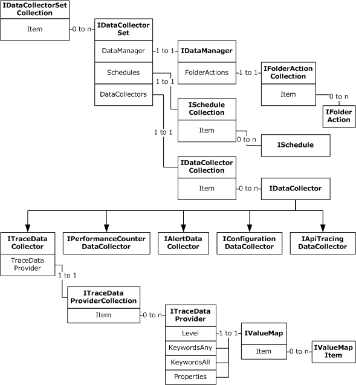
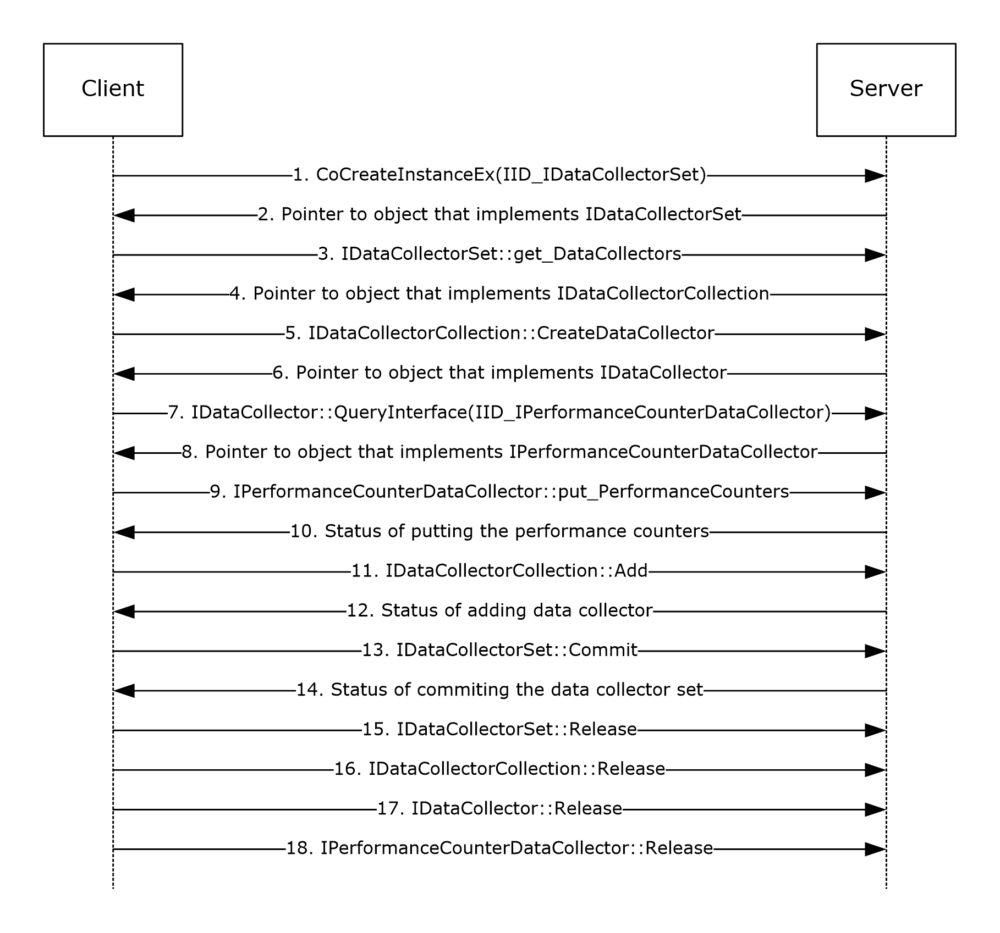
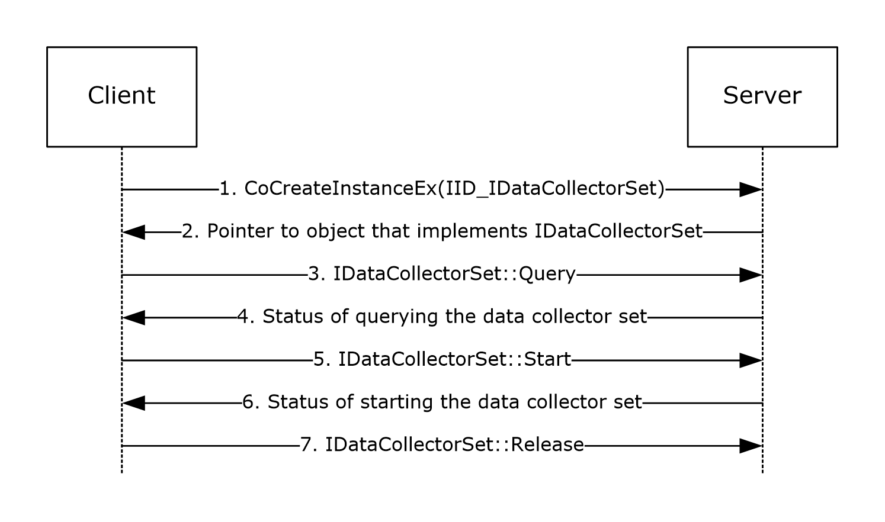
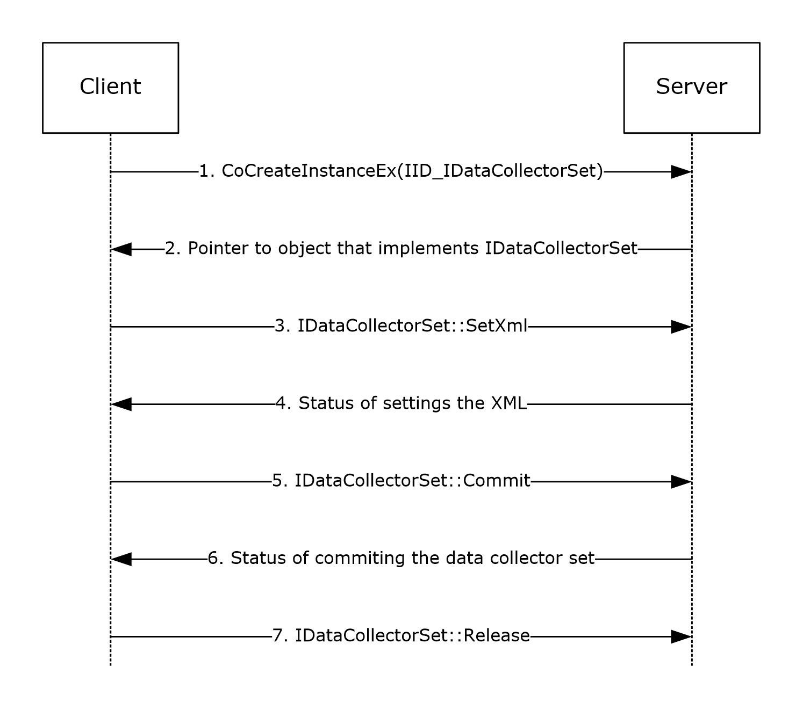

# [MS-PLA]: Performance Logs and Alerts Protocol

Table of Contents

1 Introduction

- [1 Introduction](#Section_1)
  - [1.1 Glossary](#Section_1.1)
  - [1.2 References](#Section_1.2)
    - [1.2.1 Normative References](#Section_1.2.1)
    - [1.2.2 Informative References](#Section_1.2.2)
  - [1.3 Overview](#Section_1.3)
  - [1.4 Relationship to Other Protocols](#Section_1.4)
  - [1.5 Prerequisites/Preconditions](#Section_1.5)
  - [1.6 Applicability Statement](#Section_1.6)
  - [1.7 Versioning and Capability Negotiation](#Section_1.7)
  - [1.8 Vendor-Extensible Fields](#Section_1.8)
  - [1.9 Standards Assignments](#Section_1.9)

2 Messages

- [2 Messages](#Section_2)
  - [2.1 Transport](#Section_2.1)
  - [2.2 Common Data Types](#Section_2.2)
    - [2.2.1 HRESULT Return Codes](#Section_2.2.1)
    - [2.2.2 Enumerations](#Section_2.2.2)
      - [2.2.2.1 AutoPathFormat](#Section_2.2.2.1)
      - [2.2.2.2 ClockType](#Section_2.2.2.2)
      - [2.2.2.3 CommitMode](#Section_2.2.2.3)
      - [2.2.2.4 DataCollectorSetStatus](#Section_2.2.2.4)
      - [2.2.2.5 DataCollectorType](#Section_2.2.2.5)
      - [2.2.2.6 DataManagerSteps](#Section_2.2.2.6)
      - [2.2.2.7 FileFormat](#Section_2.2.2.7)
      - [2.2.2.8 FolderActionSteps](#Section_2.2.2.8)
      - [2.2.2.9 ResourcePolicy](#Section_2.2.2.9)
      - [2.2.2.10 StreamMode](#Section_2.2.2.10)
      - [2.2.2.11 ValueMapType](#Section_2.2.2.11)
      - [2.2.2.12 WeekDays](#Section_2.2.2.12)
    - [2.2.3 Formatting Rules](#Section_2.2.3)
      - [2.2.3.1 File and Subdirectory Name Formatting](#Section_2.2.3.1)
      - [2.2.3.2 API Name Formatting](#Section_2.2.3.2)
      - [2.2.3.3 Report Schema Formatting](#Section_2.2.3.3)
      - [2.2.3.4 Rules Schema Formatting](#Section_2.2.3.4)
    - [2.2.4 Set Variable Action](#Section_2.2.4)
    - [2.2.5 Insert Node Action](#Section_2.2.5)
    - [2.2.6 Insert Attribute Action](#Section_2.2.6)
    - [2.2.7 Delete Action](#Section_2.2.7)
    - [2.2.8 Insert Warning Action](#Section_2.2.8)
    - [2.2.9 ExtendedModes](#Section_2.2.9)
    - [2.2.10 Performance Counter Path](#Section_2.2.10)
    - [2.2.11 Trace Provider using Filter Data](#Section_2.2.11)
      - [2.2.11.1 Filtering Support](#Section_2.2.11.1)
        - [2.2.11.1.1 Level](#Section_2.2.11.1.1)
        - [2.2.11.1.2 Keywords](#Section_2.2.11.1.2)
        - [2.2.11.1.3 Filter Data](#Section_2.2.11.1.3)
      - [2.2.11.2 Creating an ETW Provider](#Section_2.2.11.2)
        - [2.2.11.2.1 Creating an Instrumentation Manifest](#Section_2.2.11.2.1)
        - [2.2.11.2.2 Registering an Instrumentation Manifest](#Section_2.2.11.2.2)
        - [2.2.11.2.3 Creating an Enable Callback](#Section_2.2.11.2.3)
        - [2.2.11.2.4 Registering the Trace Provider](#Section_2.2.11.2.4)
    - [2.2.12 Controlling the trace provider](#Section_2.2.12)
      - [2.2.12.1 Configuring the Trace Provider with ITraceDataProvider](#Section_2.2.12.1)
    - [2.2.13 Performance Counter](#Section_2.2.13)
      - [2.2.13.1 Performance Counter Provider](#Section_2.2.13.1)
      - [2.2.13.2 Performance Counter Consumer](#Section_2.2.13.2)
      - [2.2.13.3 Querying for a Performance Counter with PLA](#Section_2.2.13.3)

3 Protocol Details

- [3 Protocol Details](#Section_3)
  - [3.1 Pla Client Details](#Section_3.1)
    - [3.1.1 Abstract Data Model](#Section_3.1.1)
    - [3.1.2 Timers](#Section_3.1.2)
    - [3.1.3 Initialization](#Section_3.1.3)
    - [3.1.4 Message Processing Events and Sequencing Rules](#Section_3.1.4)
      - [3.1.4.1 Processing Server Replies to Method Calls](#Section_3.1.4.1)
    - [3.1.5 Timer Events](#Section_3.1.5)
    - [3.1.6 Other Local Events](#Section_3.1.6)
  - [3.2 Pla Server Details](#Section_3.2)
    - [3.2.1 Abstract Data Model](#Section_3.2.1)
    - [3.2.2 Timers](#Section_3.2.2)
    - [3.2.3 Initialization](#Section_3.2.3)
    - [3.2.4 Message Processing Events and Sequencing Rules](#Section_3.2.4)
      - [3.2.4.1 IDataCollectorSet](#Section_3.2.4.1)
        - [3.2.4.1.1 DataCollectors (Get) (Opnum 7)](#Section_3.2.4.1.1)
        - [3.2.4.1.2 Duration (Get) (Opnum 8)](#Section_3.2.4.1.2)
        - [3.2.4.1.3 Duration (Put) (Opnum 9)](#Section_3.2.4.1.3)
        - [3.2.4.1.4 Description (Get) (Opnum 10)](#Section_3.2.4.1.4)
        - [3.2.4.1.5 Description (Put) (Opnum 11)](#Section_3.2.4.1.5)
        - [3.2.4.1.6 DescriptionUnresolved (Get) (Opnum 12)](#Section_3.2.4.1.6)
        - [3.2.4.1.7 DisplayName (Get) (Opnum 13)](#Section_3.2.4.1.7)
        - [3.2.4.1.8 DisplayName (Put) (Opnum 14)](#Section_3.2.4.1.8)
        - [3.2.4.1.9 DisplayNameUnresolved (Get) (Opnum 15)](#Section_3.2.4.1.9)
        - [3.2.4.1.10 Keywords (Get) (Opnum 16)](#Section_3.2.4.1.10)
        - [3.2.4.1.11 Keywords (Put) (Opnum 17)](#Section_3.2.4.1.11)
        - [3.2.4.1.12 LatestOutputLocation (Get) (Opnum 18)](#Section_3.2.4.1.12)
        - [3.2.4.1.13 LatestOutputLocation (Put) (Opnum 19)](#Section_3.2.4.1.13)
        - [3.2.4.1.14 Name (Get) (Opnum 20)](#Section_3.2.4.1.14)
        - [3.2.4.1.15 OutputLocation (Get) (Opnum 21)](#Section_3.2.4.1.15)
        - [3.2.4.1.16 RootPath (Get) (Opnum 22)](#Section_3.2.4.1.16)
        - [3.2.4.1.17 RootPath (Put) (Opnum 23)](#Section_3.2.4.1.17)
        - [3.2.4.1.18 Segment (Get) (Opnum 24)](#Section_3.2.4.1.18)
        - [3.2.4.1.19 Segment (Put) (Opnum 25)](#Section_3.2.4.1.19)
        - [3.2.4.1.20 SegmentMaxDuration (Get) (Opnum 26)](#Section_3.2.4.1.20)
        - [3.2.4.1.21 SegmentMaxDuration (Put) (Opnum 27)](#Section_3.2.4.1.21)
        - [3.2.4.1.22 SegmentMaxSize (Get) (Opnum 28)](#Section_3.2.4.1.22)
        - [3.2.4.1.23 SegmentMaxSize (Put) (Opnum 29)](#Section_3.2.4.1.23)
        - [3.2.4.1.24 SerialNumber (Get) (Opnum 30)](#Section_3.2.4.1.24)
        - [3.2.4.1.25 SerialNumber (Put) (Opnum 31)](#Section_3.2.4.1.25)
        - [3.2.4.1.26 Server (Get) (Opnum 32)](#Section_3.2.4.1.26)
        - [3.2.4.1.27 Status (Get) (Opnum 33)](#Section_3.2.4.1.27)
        - [3.2.4.1.28 Subdirectory (Get) (Opnum 34)](#Section_3.2.4.1.28)
        - [3.2.4.1.29 Subdirectory (Put) (Opnum 35)](#Section_3.2.4.1.29)
        - [3.2.4.1.30 SubdirectoryFormat (Get) (Opnum 36)](#Section_3.2.4.1.30)
        - [3.2.4.1.31 SubdirectoryFormat (Put) (Opnum 37)](#Section_3.2.4.1.31)
        - [3.2.4.1.32 SubdirectoryFormatPattern (Get) (Opnum 38)](#Section_3.2.4.1.32)
        - [3.2.4.1.33 SubdirectoryFormatPattern (Put) (Opnum 39)](#Section_3.2.4.1.33)
        - [3.2.4.1.34 Task (Get) (Opnum 40)](#Section_3.2.4.1.34)
        - [3.2.4.1.35 Task (Put) (Opnum 41)](#Section_3.2.4.1.35)
        - [3.2.4.1.36 TaskRunAsSelf (Get) (Opnum 42)](#Section_3.2.4.1.36)
        - [3.2.4.1.37 TaskRunAsSelf (Put) (Opnum 43)](#Section_3.2.4.1.37)
        - [3.2.4.1.38 TaskArguments (Get) (Opnum 44)](#Section_3.2.4.1.38)
        - [3.2.4.1.39 TaskArguments (Put) (Opnum 45)](#Section_3.2.4.1.39)
        - [3.2.4.1.40 TaskUserTextArguments (Get) (Opnum 46)](#Section_3.2.4.1.40)
        - [3.2.4.1.41 TaskUserTextArguments (Put) (Opnum 47)](#Section_3.2.4.1.41)
        - [3.2.4.1.42 Schedules (Get) (Opnum 48)](#Section_3.2.4.1.42)
        - [3.2.4.1.43 SchedulesEnabled (Get) (Opnum 49)](#Section_3.2.4.1.43)
        - [3.2.4.1.44 SchedulesEnabled (Put) (Opnum 50)](#Section_3.2.4.1.44)
        - [3.2.4.1.45 UserAccount (Get) (Opnum 51)](#Section_3.2.4.1.45)
        - [3.2.4.1.46 Xml (Get) (Opnum 52)](#Section_3.2.4.1.46)
        - [3.2.4.1.47 Security (Get) (Opnum 53)](#Section_3.2.4.1.47)
        - [3.2.4.1.48 Security (Put) (Opnum 54)](#Section_3.2.4.1.48)
        - [3.2.4.1.49 StopOnCompletion (Get) (Opnum 55)](#Section_3.2.4.1.49)
        - [3.2.4.1.50 StopOnCompletion (Put) (Opnum 56)](#Section_3.2.4.1.50)
        - [3.2.4.1.51 DataManager (Get) (Opnum 57)](#Section_3.2.4.1.51)
        - [3.2.4.1.52 SetCredentials (Opnum 58)](#Section_3.2.4.1.52)
        - [3.2.4.1.53 Query (Opnum 59)](#Section_3.2.4.1.53)
        - [3.2.4.1.54 Commit (Opnum 60)](#Section_3.2.4.1.54)
        - [3.2.4.1.55 Delete (Opnum 61)](#Section_3.2.4.1.55)
        - [3.2.4.1.56 Start (Opnum 62)](#Section_3.2.4.1.56)
        - [3.2.4.1.57 Stop (Opnum 63)](#Section_3.2.4.1.57)
        - [3.2.4.1.58 SetXml (Opnum 64)](#Section_3.2.4.1.58)
        - [3.2.4.1.59 SetValue (Opnum 65)](#Section_3.2.4.1.59)
        - [3.2.4.1.60 GetValue (Opnum 66)](#Section_3.2.4.1.60)
      - [3.2.4.2 IDataManager](#Section_3.2.4.2)
        - [3.2.4.2.1 Enabled (Get) (Opnum 7)](#Section_3.2.4.2.1)
        - [3.2.4.2.2 Enabled (Put) (Opnum 8)](#Section_3.2.4.2.2)
        - [3.2.4.2.3 CheckBeforeRunning (Get) (Opnum 9)](#Section_3.2.4.2.3)
        - [3.2.4.2.4 CheckBeforeRunning (Put) (Opnum 10)](#Section_3.2.4.2.4)
        - [3.2.4.2.5 MinFreeDisk (Get) (Opnum 11)](#Section_3.2.4.2.5)
        - [3.2.4.2.6 MinFreeDisk (Put) (Opnum 12)](#Section_3.2.4.2.6)
        - [3.2.4.2.7 MaxSize (Get) (Opnum 13)](#Section_3.2.4.2.7)
        - [3.2.4.2.8 MaxSize (Put) (Opnum 14)](#Section_3.2.4.2.8)
        - [3.2.4.2.9 MaxFolderCount (Get) (Opnum 15)](#Section_3.2.4.2.9)
        - [3.2.4.2.10 MaxFolderCount (Put) (Opnum 16)](#Section_3.2.4.2.10)
        - [3.2.4.2.11 ResourcePolicy (Get) (Opnum 17)](#Section_3.2.4.2.11)
        - [3.2.4.2.12 ResourcePolicy (Put) (Opnum 18)](#Section_3.2.4.2.12)
        - [3.2.4.2.13 FolderActions (Get) (Opnum 19)](#Section_3.2.4.2.13)
        - [3.2.4.2.14 ReportSchema (Get) (Opnum 20)](#Section_3.2.4.2.14)
        - [3.2.4.2.15 ReportSchema (Put) (Opnum 21)](#Section_3.2.4.2.15)
        - [3.2.4.2.16 ReportFileName (Get) (Opnum 22)](#Section_3.2.4.2.16)
        - [3.2.4.2.17 ReportFileName (Put) (Opnum 23)](#Section_3.2.4.2.17)
        - [3.2.4.2.18 RuleTargetFileName (Get) (Opnum 24)](#Section_3.2.4.2.18)
        - [3.2.4.2.19 RuleTargetFileName (Put) (Opnum 25)](#Section_3.2.4.2.19)
        - [3.2.4.2.20 EventsFileName (Get) (Opnum 26)](#Section_3.2.4.2.20)
        - [3.2.4.2.21 EventsFileName (Put) (Opnum 27)](#Section_3.2.4.2.21)
        - [3.2.4.2.22 Rules (Get) (Opnum 28)](#Section_3.2.4.2.22)
        - [3.2.4.2.23 Rules (Put) (Opnum 29)](#Section_3.2.4.2.23)
        - [3.2.4.2.24 Run (Opnum 30)](#Section_3.2.4.2.24)
        - [3.2.4.2.25 Extract (Opnum 31)](#Section_3.2.4.2.25)
      - [3.2.4.3 IFolderAction](#Section_3.2.4.3)
        - [3.2.4.3.1 Age (Get) (Opnum 7)](#Section_3.2.4.3.1)
        - [3.2.4.3.2 Age (Put) (Opnum 8)](#Section_3.2.4.3.2)
        - [3.2.4.3.3 Size (Get) (Opnum 9)](#Section_3.2.4.3.3)
        - [3.2.4.3.4 Size (Put) (Opnum 10)](#Section_3.2.4.3.4)
        - [3.2.4.3.5 Actions (Get) (Opnum 11)](#Section_3.2.4.3.5)
        - [3.2.4.3.6 Actions (Put) (Opnum 12)](#Section_3.2.4.3.6)
        - [3.2.4.3.7 SendCabTo (Get) (Opnum 13)](#Section_3.2.4.3.7)
        - [3.2.4.3.8 SendCabTo (Put) (Opnum 14)](#Section_3.2.4.3.8)
      - [3.2.4.4 IFolderActionCollection](#Section_3.2.4.4)
        - [3.2.4.4.1 Count (Get) (Opnum 7)](#Section_3.2.4.4.1)
        - [3.2.4.4.2 Item (Get) (Opnum 8)](#Section_3.2.4.4.2)
        - [3.2.4.4.3 _NewEnum (Get) (Opnum 9)](#Section_3.2.4.4.3)
        - [3.2.4.4.4 Add (Opnum 10)](#Section_3.2.4.4.4)
        - [3.2.4.4.5 Remove (Opnum 11)](#Section_3.2.4.4.5)
        - [3.2.4.4.6 Clear (Opnum 12)](#Section_3.2.4.4.6)
        - [3.2.4.4.7 AddRange (Opnum 13)](#Section_3.2.4.4.7)
        - [3.2.4.4.8 CreateFolderAction (Opnum 14)](#Section_3.2.4.4.8)
      - [3.2.4.5 IDataCollector](#Section_3.2.4.5)
        - [3.2.4.5.1 DataCollectorSet (Get) (Opnum 7)](#Section_3.2.4.5.1)
        - [3.2.4.5.2 DataCollectorType (Get) (Opnum 9)](#Section_3.2.4.5.2)
        - [3.2.4.5.3 FileName (Get) (Opnum 10)](#Section_3.2.4.5.3)
        - [3.2.4.5.4 FileName (Put) (Opnum 11)](#Section_3.2.4.5.4)
        - [3.2.4.5.5 FileNameFormat (Get) (Opnum 12)](#Section_3.2.4.5.5)
        - [3.2.4.5.6 FileNameFormat (Put) (Opnum 13)](#Section_3.2.4.5.6)
        - [3.2.4.5.7 FileNameFormatPattern (Get) (Opnum 14)](#Section_3.2.4.5.7)
        - [3.2.4.5.8 FileNameFormatPattern (Put) (Opnum 15)](#Section_3.2.4.5.8)
        - [3.2.4.5.9 LatestOutputLocation (Get) (Opnum 16)](#Section_3.2.4.5.9)
        - [3.2.4.5.10 LatestOutputLocation (Put) (Opnum 17)](#Section_3.2.4.5.10)
        - [3.2.4.5.11 LogAppend (Get) (Opnum 18)](#Section_3.2.4.5.11)
        - [3.2.4.5.12 LogAppend (Put) (Opnum 19)](#Section_3.2.4.5.12)
        - [3.2.4.5.13 LogCircular (Get) (Opnum 20)](#Section_3.2.4.5.13)
        - [3.2.4.5.14 LogCircular (Put) (Opnum 21)](#Section_3.2.4.5.14)
        - [3.2.4.5.15 LogOverwrite (Get) (Opnum 22)](#Section_3.2.4.5.15)
        - [3.2.4.5.16 LogOverwrite (Put) (Opnum 23)](#Section_3.2.4.5.16)
        - [3.2.4.5.17 Name (Get) (Opnum 24)](#Section_3.2.4.5.17)
        - [3.2.4.5.18 Name (Put) (Opnum 25)](#Section_3.2.4.5.18)
        - [3.2.4.5.19 OutputLocation (Get) (Opnum 26)](#Section_3.2.4.5.19)
        - [3.2.4.5.20 Index (Get) (Opnum 27)](#Section_3.2.4.5.20)
        - [3.2.4.5.21 Xml (Get) (Opnum 29)](#Section_3.2.4.5.21)
        - [3.2.4.5.22 SetXml (Opnum 30)](#Section_3.2.4.5.22)
      - [3.2.4.6 IPerformanceCounterDataCollector](#Section_3.2.4.6)
        - [3.2.4.6.1 DataSourceName (Get) (Opnum 32)](#Section_3.2.4.6.1)
        - [3.2.4.6.2 DataSourceName (Put) (Opnum 33)](#Section_3.2.4.6.2)
        - [3.2.4.6.3 PerformanceCounters (Get) (Opnum 34)](#Section_3.2.4.6.3)
        - [3.2.4.6.4 PerformanceCounters (Put) (Opnum 35)](#Section_3.2.4.6.4)
        - [3.2.4.6.5 LogFileFormat (Get) (Opnum 36)](#Section_3.2.4.6.5)
        - [3.2.4.6.6 LogFileFormat (Put) (Opnum 37)](#Section_3.2.4.6.6)
        - [3.2.4.6.7 SampleInterval (Get) (Opnum 38)](#Section_3.2.4.6.7)
        - [3.2.4.6.8 SampleInterval (Put) (Opnum 39)](#Section_3.2.4.6.8)
        - [3.2.4.6.9 SegmentMaxRecords (Get) (Opnum 40)](#Section_3.2.4.6.9)
        - [3.2.4.6.10 SegmentMaxRecords (Put) (Opnum 41)](#Section_3.2.4.6.10)
      - [3.2.4.7 IConfigurationDataCollector](#Section_3.2.4.7)
        - [3.2.4.7.1 FileMaxCount (Get) (Opnum 32)](#Section_3.2.4.7.1)
        - [3.2.4.7.2 FileMaxCount (Put) (Opnum 33)](#Section_3.2.4.7.2)
        - [3.2.4.7.3 FileMaxRecursiveDepth (Get) (Opnum 34)](#Section_3.2.4.7.3)
        - [3.2.4.7.4 FileMaxRecursiveDepth (Put) (Opnum 35)](#Section_3.2.4.7.4)
        - [3.2.4.7.5 FileMaxTotalSize (Get) (Opnum 36)](#Section_3.2.4.7.5)
        - [3.2.4.7.6 FileMaxTotalSize (Put) (Opnum 37)](#Section_3.2.4.7.6)
        - [3.2.4.7.7 Files (Get) (Opnum 38)](#Section_3.2.4.7.7)
        - [3.2.4.7.8 Files (Put) (Opnum 39)](#Section_3.2.4.7.8)
        - [3.2.4.7.9 ManagementQueries (Get) (Opnum 40)](#Section_3.2.4.7.9)
        - [3.2.4.7.10 ManagementQueries (Put) (Opnum 41)](#Section_3.2.4.7.10)
        - [3.2.4.7.11 QueryNetworkAdapters (Get) (Opnum 42)](#Section_3.2.4.7.11)
        - [3.2.4.7.12 QueryNetworkAdapters (Put) (Opnum 43)](#Section_3.2.4.7.12)
        - [3.2.4.7.13 RegistryKeys (Get) (Opnum 44)](#Section_3.2.4.7.13)
        - [3.2.4.7.14 RegistryKeys (Put) (Opnum 45)](#Section_3.2.4.7.14)
        - [3.2.4.7.15 RegistryMaxRecursiveDepth (Get) (Opnum 46)](#Section_3.2.4.7.15)
        - [3.2.4.7.16 RegistryMaxRecursiveDepth (Put) (Opnum 47)](#Section_3.2.4.7.16)
        - [3.2.4.7.17 SystemStateFile (Get) (Opnum 48)](#Section_3.2.4.7.17)
        - [3.2.4.7.18 SystemStateFile (Put) (Opnum 49)](#Section_3.2.4.7.18)
      - [3.2.4.8 IAlertDataCollector](#Section_3.2.4.8)
        - [3.2.4.8.1 AlertThresholds (Get) (Opnum 32)](#Section_3.2.4.8.1)
        - [3.2.4.8.2 AlertThresholds (Put) (Opnum 33)](#Section_3.2.4.8.2)
        - [3.2.4.8.3 EventLog (Get) (Opnum 34)](#Section_3.2.4.8.3)
        - [3.2.4.8.4 EventLog (Put) (Opnum 35)](#Section_3.2.4.8.4)
        - [3.2.4.8.5 SampleInterval (Get) (Opnum 36)](#Section_3.2.4.8.5)
        - [3.2.4.8.6 SampleInterval (Put) (Opnum 37)](#Section_3.2.4.8.6)
        - [3.2.4.8.7 Task (Get) (Opnum 38)](#Section_3.2.4.8.7)
        - [3.2.4.8.8 Task (Put) (Opnum 39)](#Section_3.2.4.8.8)
        - [3.2.4.8.9 TaskRunAsSelf (Get) (Opnum 40)](#Section_3.2.4.8.9)
        - [3.2.4.8.10 TaskRunAsSelf (Put) (Opnum 41)](#Section_3.2.4.8.10)
        - [3.2.4.8.11 TaskArguments (Get) (Opnum 42)](#Section_3.2.4.8.11)
        - [3.2.4.8.12 TaskArguments (Put) (Opnum 43)](#Section_3.2.4.8.12)
        - [3.2.4.8.13 TaskUserTextArguments (Get) (Opnum 44)](#Section_3.2.4.8.13)
        - [3.2.4.8.14 TaskUserTextArguments (Put) (Opnum 45)](#Section_3.2.4.8.14)
        - [3.2.4.8.15 TriggerDataCollectorSet (Get) (Opnum 46)](#Section_3.2.4.8.15)
        - [3.2.4.8.16 TriggerDataCollectorSet (Put)(Opnum 47)](#Section_3.2.4.8.16)
      - [3.2.4.9 ITraceDataCollector](#Section_3.2.4.9)
        - [3.2.4.9.1 BufferSize (Get) (Opnum 32)](#Section_3.2.4.9.1)
        - [3.2.4.9.2 BufferSize (Put) (Opnum 33)](#Section_3.2.4.9.2)
        - [3.2.4.9.3 BuffersLost (Get) (Opnum 34)](#Section_3.2.4.9.3)
        - [3.2.4.9.4 BuffersWritten (Get) (Opnum 36)](#Section_3.2.4.9.4)
        - [3.2.4.9.5 ClockType (Get) (Opnum 38)](#Section_3.2.4.9.5)
        - [3.2.4.9.6 ClockType (Put) (Opnum 39)](#Section_3.2.4.9.6)
        - [3.2.4.9.7 EventsLost (Get) (Opnum 40)](#Section_3.2.4.9.7)
        - [3.2.4.9.8 ExtendedModes (Get) (Opnum 42)](#Section_3.2.4.9.8)
        - [3.2.4.9.9 ExtendedModes (Put) (Opnum 43)](#Section_3.2.4.9.9)
        - [3.2.4.9.10 FlushTimer (Get) (Opnum 44)](#Section_3.2.4.9.10)
        - [3.2.4.9.11 FlushTimer (Put) (Opnum 45)](#Section_3.2.4.9.11)
        - [3.2.4.9.12 FreeBuffers (Get) (Opnum 46)](#Section_3.2.4.9.12)
        - [3.2.4.9.13 Guid (Get) (Opnum 48)](#Section_3.2.4.9.13)
        - [3.2.4.9.14 Guid (Put) (Opnum 49)](#Section_3.2.4.9.14)
        - [3.2.4.9.15 IsKernelTrace (Get) (Opnum 50)](#Section_3.2.4.9.15)
        - [3.2.4.9.16 MaximumBuffers (Get) (Opnum 51)](#Section_3.2.4.9.16)
        - [3.2.4.9.17 MaximumBuffers (Put) (Opnum 52)](#Section_3.2.4.9.17)
        - [3.2.4.9.18 MinimumBuffers (Get) (Opnum 53)](#Section_3.2.4.9.18)
        - [3.2.4.9.19 MinimumBuffers (Put) (Opnum 54)](#Section_3.2.4.9.19)
        - [3.2.4.9.20 NumberOfBuffers (Get) (Opnum 55)](#Section_3.2.4.9.20)
        - [3.2.4.9.21 NumberOfBuffers (Put) (Opnum 56)](#Section_3.2.4.9.21)
        - [3.2.4.9.22 PreallocateFile (Get) (Opnum 57)](#Section_3.2.4.9.22)
        - [3.2.4.9.23 PreallocateFile (Put) (Opnum 58)](#Section_3.2.4.9.23)
        - [3.2.4.9.24 ProcessMode (Get) (Opnum 59)](#Section_3.2.4.9.24)
        - [3.2.4.9.25 ProcessMode (Put) (Opnum 60)](#Section_3.2.4.9.25)
        - [3.2.4.9.26 RealTimeBuffersLost (Get) (Opnum 61)](#Section_3.2.4.9.26)
        - [3.2.4.9.27 SessionId (Get) (Opnum 63)](#Section_3.2.4.9.27)
        - [3.2.4.9.28 SessionName (Get) (Opnum 65)](#Section_3.2.4.9.28)
        - [3.2.4.9.29 SessionName (Put) (Opnum 66)](#Section_3.2.4.9.29)
        - [3.2.4.9.30 SessionThreadId (Get) (Opnum 67)](#Section_3.2.4.9.30)
        - [3.2.4.9.31 StreamMode (Get) (Opnum 69)](#Section_3.2.4.9.31)
        - [3.2.4.9.32 StreamMode (Put) (Opnum 70)](#Section_3.2.4.9.32)
        - [3.2.4.9.33 TraceDataProviders (Get) (Opnum 71)](#Section_3.2.4.9.33)
      - [3.2.4.10 IApiTracingDataCollector](#Section_3.2.4.10)
        - [3.2.4.10.1 LogApiNamesOnly (Get) (Opnum 32)](#Section_3.2.4.10.1)
        - [3.2.4.10.2 LogApiNamesOnly (Put) (Opnum 33)](#Section_3.2.4.10.2)
        - [3.2.4.10.3 LogApisRecursively (Get) (Opnum 34)](#Section_3.2.4.10.3)
        - [3.2.4.10.4 LogApisRecursively (Put) (Opnum 35)](#Section_3.2.4.10.4)
        - [3.2.4.10.5 ExePath (Get) (Opnum 36)](#Section_3.2.4.10.5)
        - [3.2.4.10.6 ExePath (Put) (Opnum 37)](#Section_3.2.4.10.6)
        - [3.2.4.10.7 LogFilePath (Get) (Opnum 38)](#Section_3.2.4.10.7)
        - [3.2.4.10.8 LogFilePath (Put) (Opnum 39)](#Section_3.2.4.10.8)
        - [3.2.4.10.9 IncludeModules (Get) (Opnum 40)](#Section_3.2.4.10.9)
        - [3.2.4.10.10 IncludeModules (Put) (Opnum 41)](#Section_3.2.4.10.10)
        - [3.2.4.10.11 IncludeApis (Get) (Opnum 42)](#Section_3.2.4.10.11)
        - [3.2.4.10.12 IncludeApis (Put) (Opnum 43)](#Section_3.2.4.10.12)
        - [3.2.4.10.13 ExcludeApis (Get) (Opnum 44)](#Section_3.2.4.10.13)
        - [3.2.4.10.14 ExcludeApis (Put) (Opnum 45)](#Section_3.2.4.10.14)
      - [3.2.4.11 ITraceDataProvider](#Section_3.2.4.11)
        - [3.2.4.11.1 DisplayName (Get) (Opnum 7)](#Section_3.2.4.11.1)
        - [3.2.4.11.2 DisplayName (Put) (Opnum 8)](#Section_3.2.4.11.2)
        - [3.2.4.11.3 Guid (Get) (Opnum 9)](#Section_3.2.4.11.3)
        - [3.2.4.11.4 Guid (Put) (Opnum 10)](#Section_3.2.4.11.4)
        - [3.2.4.11.5 Level (Get) (Opnum 11)](#Section_3.2.4.11.5)
        - [3.2.4.11.6 KeywordsAny (Get) (Opnum 12)](#Section_3.2.4.11.6)
        - [3.2.4.11.7 KeywordsAll (Get) (Opnum 13)](#Section_3.2.4.11.7)
        - [3.2.4.11.8 Properties (Get) (Opnum 14)](#Section_3.2.4.11.8)
        - [3.2.4.11.9 FilterEnabled (Get) (Opnum 15)](#Section_3.2.4.11.9)
        - [3.2.4.11.10 FilterEnabled (Put) (Opnum 16)](#Section_3.2.4.11.10)
        - [3.2.4.11.11 FilterType (Get) (Opnum 17)](#Section_3.2.4.11.11)
        - [3.2.4.11.12 FilterType (Put) (Opnum 18)](#Section_3.2.4.11.12)
        - [3.2.4.11.13 FilterData (Get) (Opnum 19)](#Section_3.2.4.11.13)
        - [3.2.4.11.14 FilterData (Put) (Opnum 20)](#Section_3.2.4.11.14)
        - [3.2.4.11.15 Query (Opnum 21)](#Section_3.2.4.11.15)
        - [3.2.4.11.16 Resolve (Opnum 22)](#Section_3.2.4.11.16)
        - [3.2.4.11.17 SetSecurity (Opnum 23)](#Section_3.2.4.11.17)
        - [3.2.4.11.18 GetSecurity (Opnum 24)](#Section_3.2.4.11.18)
        - [3.2.4.11.19 GetRegisteredProcesses (Opnum 25)](#Section_3.2.4.11.19)
      - [3.2.4.12 ISchedule](#Section_3.2.4.12)
        - [3.2.4.12.1 StartDate (Get) (Opnum 7)](#Section_3.2.4.12.1)
        - [3.2.4.12.2 StartDate (Put) (Opnum 8)](#Section_3.2.4.12.2)
        - [3.2.4.12.3 EndDate (Get) (Opnum 9)](#Section_3.2.4.12.3)
        - [3.2.4.12.4 EndDate (Put) (Opnum 10)](#Section_3.2.4.12.4)
        - [3.2.4.12.5 StartTime (Get) (Opnum 11)](#Section_3.2.4.12.5)
        - [3.2.4.12.6 StartTime (Put) (Opnum 12)](#Section_3.2.4.12.6)
        - [3.2.4.12.7 Days (Get) (Opnum 13)](#Section_3.2.4.12.7)
        - [3.2.4.12.8 Days (Put) (Opnum 14)](#Section_3.2.4.12.8)
      - [3.2.4.13 ITraceDataProviderCollection](#Section_3.2.4.13)
        - [3.2.4.13.1 Count (Get) (Opnum 7)](#Section_3.2.4.13.1)
        - [3.2.4.13.2 Item (Get) (Opnum 8)](#Section_3.2.4.13.2)
        - [3.2.4.13.3 _NewEnum (Get) (Opnum 9)](#Section_3.2.4.13.3)
        - [3.2.4.13.4 Add (Opnum 10)](#Section_3.2.4.13.4)
        - [3.2.4.13.5 Remove (Opnum 11)](#Section_3.2.4.13.5)
        - [3.2.4.13.6 Clear (Opnum 12)](#Section_3.2.4.13.6)
        - [3.2.4.13.7 AddRange (Opnum 13)](#Section_3.2.4.13.7)
        - [3.2.4.13.8 CreateTraceDataProvider (Opnum 14)](#Section_3.2.4.13.8)
        - [3.2.4.13.9 GetTraceDataProviders (Opnum 15)](#Section_3.2.4.13.9)
        - [3.2.4.13.10 GetTraceDataProvidersByProcess (Opnum 16)](#Section_3.2.4.13.10)
      - [3.2.4.14 IScheduleCollection](#Section_3.2.4.14)
        - [3.2.4.14.1 Count (Get) (Opnum 7)](#Section_3.2.4.14.1)
        - [3.2.4.14.2 Item (Get) (Opnum 8)](#Section_3.2.4.14.2)
        - [3.2.4.14.3 _NewEnum (Get) (Opnum 9)](#Section_3.2.4.14.3)
        - [3.2.4.14.4 Add (Opnum 10)](#Section_3.2.4.14.4)
        - [3.2.4.14.5 Remove (Opnum 11)](#Section_3.2.4.14.5)
        - [3.2.4.14.6 Clear (Opnum 12)](#Section_3.2.4.14.6)
        - [3.2.4.14.7 AddRange (Opnum 13)](#Section_3.2.4.14.7)
        - [3.2.4.14.8 CreateSchedule (Opnum 14)](#Section_3.2.4.14.8)
      - [3.2.4.15 IDataCollectorCollection](#Section_3.2.4.15)
        - [3.2.4.15.1 Count (Get) (Opnum 7)](#Section_3.2.4.15.1)
        - [3.2.4.15.2 Item (Get) (Opnum 8)](#Section_3.2.4.15.2)
        - [3.2.4.15.3 _NewEnum (Get) (Opnum 9)](#Section_3.2.4.15.3)
        - [3.2.4.15.4 Add (Opnum 10)](#Section_3.2.4.15.4)
        - [3.2.4.15.5 Remove (Opnum 11)](#Section_3.2.4.15.5)
        - [3.2.4.15.6 Clear (Opnum 12)](#Section_3.2.4.15.6)
        - [3.2.4.15.7 AddRange (Opnum 13)](#Section_3.2.4.15.7)
        - [3.2.4.15.8 CreateDataCollectorFromXml (Opnum 14)](#Section_3.2.4.15.8)
        - [3.2.4.15.9 CreateDataCollector (Opnum 15)](#Section_3.2.4.15.9)
      - [3.2.4.16 IDataCollectorSetCollection](#Section_3.2.4.16)
        - [3.2.4.16.1 Count (Get) (Opnum 7)](#Section_3.2.4.16.1)
        - [3.2.4.16.2 Item (Get) (Opnum 8)](#Section_3.2.4.16.2)
        - [3.2.4.16.3 _NewEnum (Get) (Opnum 9)](#Section_3.2.4.16.3)
        - [3.2.4.16.4 Add (Opnum 10)](#Section_3.2.4.16.4)
        - [3.2.4.16.5 Remove (Opnum 11)](#Section_3.2.4.16.5)
        - [3.2.4.16.6 Clear (Opnum 12)](#Section_3.2.4.16.6)
        - [3.2.4.16.7 AddRange (Opnum 13)](#Section_3.2.4.16.7)
        - [3.2.4.16.8 GetDataCollectorSets (Opnum 14)](#Section_3.2.4.16.8)
      - [3.2.4.17 IValueMapItem](#Section_3.2.4.17)
        - [3.2.4.17.1 Description (Get) (Opnum 7)](#Section_3.2.4.17.1)
        - [3.2.4.17.2 Description (Put) (Opnum 8)](#Section_3.2.4.17.2)
        - [3.2.4.17.3 Enabled (Get) (Opnum 9)](#Section_3.2.4.17.3)
        - [3.2.4.17.4 Enabled (Put) (Opnum 10)](#Section_3.2.4.17.4)
        - [3.2.4.17.5 Key (Get) (Opnum 11)](#Section_3.2.4.17.5)
        - [3.2.4.17.6 Key (Put) (Opnum 12)](#Section_3.2.4.17.6)
        - [3.2.4.17.7 Value (Get) (Opnum 13)](#Section_3.2.4.17.7)
        - [3.2.4.17.8 Value (Put) (Opnum 14)](#Section_3.2.4.17.8)
        - [3.2.4.17.9 ValueMapType (Get) (Opnum 15)](#Section_3.2.4.17.9)
        - [3.2.4.17.10 ValueMapType (Put) (Opnum 16)](#Section_3.2.4.17.10)
      - [3.2.4.18 IValueMap](#Section_3.2.4.18)
        - [3.2.4.18.1 Count (Get) (Opnum 7)](#Section_3.2.4.18.1)
        - [3.2.4.18.2 Item (Get) (Opnum 8)](#Section_3.2.4.18.2)
        - [3.2.4.18.3 _NewEnum (Get) (Opnum 9)](#Section_3.2.4.18.3)
        - [3.2.4.18.4 Description (Get) (Opnum 10)](#Section_3.2.4.18.4)
        - [3.2.4.18.5 Description (Put) (Opnum 11)](#Section_3.2.4.18.5)
        - [3.2.4.18.6 Value (Get) (Opnum 12)](#Section_3.2.4.18.6)
        - [3.2.4.18.7 Value (Put) (Opnum 13)](#Section_3.2.4.18.7)
        - [3.2.4.18.8 ValueMapType (Get) (Opnum 14)](#Section_3.2.4.18.8)
        - [3.2.4.18.9 ValueMapType (Put) (Opnum 15)](#Section_3.2.4.18.9)
        - [3.2.4.18.10 Add (Opnum 16)](#Section_3.2.4.18.10)
        - [3.2.4.18.11 Remove (Opnum 17)](#Section_3.2.4.18.11)
        - [3.2.4.18.12 Clear (Opnum 18)](#Section_3.2.4.18.12)
        - [3.2.4.18.13 AddRange (Opnum 19)](#Section_3.2.4.18.13)
        - [3.2.4.18.14 CreateValueMapItem (Opnum 20)](#Section_3.2.4.18.14)
      - [3.2.4.19 Schema](#Section_3.2.4.19)
    - [3.2.5 Timer Events](#Section_3.2.5)
    - [3.2.6 Other Local Events](#Section_3.2.6)

4 Protocol Examples

- [4 Protocol Examples](#Section_4)
  - [4.1 An Example Controlling a Provider](#Section_4.1)
  - [4.2 An Example of Querying Performance Counters](#Section_4.2)

5 Security

- [5 Security](#Section_5)
  - [5.1 Security Considerations for Implementers](#Section_5.1)
  - [5.2 Index of Security Parameters](#Section_5.2)

6 Appendix A: Full IDL

- [6 Appendix A: Full IDL](#Section_6)

7 Appendix B: Product Behavior

- [7 Appendix B: Product Behavior](#Section_7)

8 Change Tracking

- [8 Change Tracking](#Section_8)

For the legal notice and IP terms, see [LEGAL.md](../LEGAL.md).
Last updated: 4/23/2024.
See [Revision History](#revision-history) for full version history.

# 1 Introduction

The Performance Logs and Alerts (PLA) protocol is a set of Distributed Component Object Model (DCOM) interfaces (as specified in [MS-DCOM](../MS-DCOM/MS-DCOM.md)) for logging [**diagnosis data**](#gt_diagnosis-data) on a remote computer.

The PLA Protocol allows users to:

- Specify the diagnostic data to be collected and logged.
- Specify the data retention and reporting policies for the logged data.
- Specify alert conditions.
- Start, stop, or schedule the collection.
Sections 1.5, 1.8, 1.9, 2, and 3 of this specification are normative. All other sections and examples in this specification are informative.

## 1.1 Glossary

This document uses the following terms:

**data collector**: An [**object**](#gt_object) entity that defines data collection, including a list of performance and [**diagnosis data**](#gt_diagnosis-data) to be collected and a log file name.

**data collector set**: An [**object**](#gt_object) entity that represents a group of [**data collectors**](#gt_data-collector), including scheduling information, stop conditions, and a directory for log files.

**data management**: The ability to set a data retention policy against logged data and define post-actions of the collection (for example, delete largest log file, compress log file).

**diagnosis data**: Data that indicates the health status or performance of a system. The types of diagnosis data collected by this protocol include [**performance counter**](#gt_performance-counter) data, event tracing data, registry key data, Windows Management Instrumentation (WMI), network adapters data, and API tracing data and files.

**disk**: A persistent storage device that can include physical hard disks, removable disk units, optical drive units, and logical unit numbers (LUNs) unmasked to the system.

**dynamic endpoint**: A network-specific server address that is requested and assigned at run time. For more information, see [[C706]](https://go.microsoft.com/fwlink/?LinkId=89824).

**ETW**: Event Tracing for Windows. For more information, see [MSDN-ETW].

**folder**: A file system construct. File systems organize a volume's data by providing a hierarchy of objects, which are referred to as folders or directories, that contain files and can also contain other folders.

**fully qualified domain name (FQDN)**: An unambiguous domain name that gives an absolute location in the Domain Name System's (DNS) hierarchy tree, as defined in [[RFC1035]](https://go.microsoft.com/fwlink/?LinkId=90264) section 3.1 and [[RFC2181]](https://go.microsoft.com/fwlink/?LinkId=127732) section 11.

**globally unique identifier (GUID)**: A term used interchangeably with [**universally unique identifier (UUID)**](#gt_universally-unique-identifier-uuid) in Microsoft protocol technical documents (TDs). Interchanging the usage of these terms does not imply or require a specific algorithm or mechanism to generate the value. Specifically, the use of this term does not imply or require that the algorithms described in [[RFC4122]](https://go.microsoft.com/fwlink/?LinkId=90460) or [C706] must be used for generating the [**GUID**](#gt_globally-unique-identifier-guid). See also [**universally unique identifier (UUID)**](#gt_universally-unique-identifier-uuid).

**Interface Definition Language (IDL)**: The International Standards Organization (ISO) standard language for specifying the interface for remote procedure calls. For more information, see [C706] section 4.

**object**: In COM, an instance of an object class. Each object implements one or more interfaces that may be obtained from each other by using the IUnknown interface.

**opnum**: An operation number or numeric identifier that is used to identify a specific [**remote procedure call (RPC)**](#gt_remote-procedure-call-rpc) method or a method in an interface. For more information, see [C706] section 12.5.2.12 or [MS-RPCE](../MS-RPCE/MS-RPCE.md).

**path**: When referring to a file path on a file system, a hierarchical sequence of folders. When referring to a connection to a storage device, a connection through which a machine can communicate with the storage device.

**performance counter**: A numeric measurement of the performance of one or more computing resources. Bandwidth, Throughputs, and Availability are examples of [**performance counters**](#gt_performance-counter).

**Performance Logs and Alerts Unique Identifier (PLA-UID)**: A 128-bit unique identifier. Although the behavior of the PLA protocol does not depend on particular values of this PLA-UID, in order to avoid conflict between PLA-UIDs, the PLA-UID SHOULD be generated as specified in [RFC4122].

**remote procedure call (RPC)**: A communication protocol used primarily between client and server. The term has three definitions that are often used interchangeably: a runtime environment providing for communication facilities between computers (the RPC runtime); a set of request-and-response message exchanges between computers (the RPC exchange); and the single message from an RPC exchange (the RPC message). For more information, see [C706].

**segmentation**: A process of creating new log files or stopping a [**data collector set**](#gt_data-collector-set) based on conditions (for example, duration, file size).

**UncPath**: The location of a file in a network of computers, as specified in Universal Naming Convention (UNC) syntax.

**universally unique identifier (UUID)**: A 128-bit value. UUIDs can be used for multiple purposes, from tagging objects with an extremely short lifetime, to reliably identifying very persistent objects in cross-process communication such as client and server interfaces, manager entry-point vectors, and [**RPC**](#gt_remote-procedure-call-rpc) objects. UUIDs are highly likely to be unique. UUIDs are also known as [**globally unique identifiers (GUIDs)**](#gt_globally-unique-identifier-guid) and these terms are used interchangeably in the Microsoft protocol technical documents (TDs). Interchanging the usage of these terms does not imply or require a specific algorithm or mechanism to generate the UUID. Specifically, the use of this term does not imply or require that the algorithms described in [RFC4122] or [C706] must be used for generating the UUID.

**MAY, SHOULD, MUST, SHOULD NOT, MUST NOT:** These terms (in all caps) are used as defined in [[RFC2119]](https://go.microsoft.com/fwlink/?LinkId=90317). All statements of optional behavior use either MAY, SHOULD, or SHOULD NOT.

## 1.2 References

Links to a document in the Microsoft Open Specifications library point to the correct section in the most recently published version of the referenced document. However, because individual documents in the library are not updated at the same time, the section numbers in the documents may not match. You can confirm the correct section numbering by checking the [Errata](https://go.microsoft.com/fwlink/?linkid=850906).

### 1.2.1 Normative References

We conduct frequent surveys of the normative references to assure their continued availability. If you have any issue with finding a normative reference, please contact [dochelp@microsoft.com](mailto:dochelp@microsoft.com). We will assist you in finding the relevant information.

[C706] The Open Group, "DCE 1.1: Remote Procedure Call", C706, August 1997, [https://publications.opengroup.org/c706](https://go.microsoft.com/fwlink/?LinkId=89824)

**Note** Registration is required to download the document.

[MS-DCOM] Microsoft Corporation, "[Distributed Component Object Model (DCOM) Remote Protocol](../MS-DCOM/MS-DCOM.md)".

[MS-DTYP] Microsoft Corporation, "[Windows Data Types](../MS-DTYP/MS-DTYP.md)".

[MS-ERREF] Microsoft Corporation, "[Windows Error Codes](../MS-ERREF/MS-ERREF.md)".

[MS-OAUT] Microsoft Corporation, "[OLE Automation Protocol](../MS-OAUT/MS-OAUT.md)".

[MS-PCQ] Microsoft Corporation, "[Performance Counter Query Protocol](#Section_2.2.13)".

[MS-RPCE] Microsoft Corporation, "[Remote Procedure Call Protocol Extensions](../MS-RPCE/MS-RPCE.md)".

[MS-RRP] Microsoft Corporation, "[Windows Remote Registry Protocol](../MS-RRP/MS-RRP.md)".

[MS-TSCH] Microsoft Corporation, "[Task Scheduler Service Remoting Protocol](../MS-TSCH/MS-TSCH.md)".

[MS-WMI] Microsoft Corporation, "[Windows Management Instrumentation Remote Protocol](../MS-WMI/MS-WMI.md)".

[RFC2119] Bradner, S., "Key words for use in RFCs to Indicate Requirement Levels", BCP 14, RFC 2119, March 1997, [https://www.rfc-editor.org/info/rfc2119](https://go.microsoft.com/fwlink/?LinkId=90317)

[XPATH] Clark, J. and DeRose, S., "XML Path Language (XPath), Version 1.0", W3C Recommendation, November 1999, [http://www.w3.org/TR/1999/REC-xpath-19991116/](https://go.microsoft.com/fwlink/?LinkId=90611)

### 1.2.2 Informative References

[MSDN-AUTHLEV] Microsoft Corporation, "RPC_C_AUTHN_LEVEL_xxx", [http://msdn.microsoft.com/en-us/library/ms678435.aspx](https://go.microsoft.com/fwlink/?LinkId=89956)

[MSDN-COUNT] Microsoft Corporation, "Performance Counters", [http://msdn.microsoft.com/en-us/library/aa373083.aspx](https://go.microsoft.com/fwlink/?LinkId=89980)

[MSDN-EVENT_TRACE_PROPERTIES] Microsoft Corporation, "EVENT_TRACE_PROPERTIES structure", [http://msdn.microsoft.com/en-us/library/aa363784.aspx](https://go.microsoft.com/fwlink/?LinkId=89999)

[MSDN-IMPLVL] Microsoft Corporation, "RPC_C_IMP_LEVEL_xxx", [http://msdn.microsoft.com/en-us/library/ms693790.aspx](https://go.microsoft.com/fwlink/?LinkId=90023)

[MSDN-LMC] Microsoft Corporation, "Logging Mode Constants", [http://msdn.microsoft.com/en-us/library/aa364080.aspx](https://go.microsoft.com/fwlink/?LinkId=90035)

[MSDN-LUACCESS] Microsoft Corporation, "Limited User Access Support", [http://msdn.microsoft.com/en-us/library/aa372183.aspx](https://go.microsoft.com/fwlink/?LinkId=90037)

[MSDN-PC/W2K8] Microsoft Corporation, "Windows Server 2008 Performance Counters", 2008, [http://technet.microsoft.com/en-us/library/cc774901(v=WS.10).aspx](https://go.microsoft.com/fwlink/?LinkId=136565)

[MSDN-PLA-EnableCallBack] Microsoft Corporation, "EnableCallback Callback function", [http://msdn.microsoft.com/en-us/library/aa363707.aspx](https://go.microsoft.com/fwlink/?LinkId=109013)

[MSDN-PLA-EventReg] Microsoft Corporation, "EventRegister function", [http://msdn.microsoft.com/en-us/library/aa363744.aspx](https://go.microsoft.com/fwlink/?LinkId=109012)

[MSDN-PLA-Instru-Manifests] Microsoft Corporation, "Instrumentation Manifests for Event Publishers", [http://msdn.microsoft.com/en-us/library/aa385619.aspx](https://go.microsoft.com/fwlink/?LinkId=109014)

[MSDN-PLA-KeywordType] Microsoft Corporation, "KeywordType Complex Type", [http://msdn.microsoft.com/en-us/library/aa382786.aspx](https://go.microsoft.com/fwlink/?LinkId=109015)

[MSDN-PLA-LevelType] Microsoft Corporation, "LevelType Complex Type", [http://msdn.microsoft.com/en-us/library/aa382793.aspx](https://go.microsoft.com/fwlink/?LinkId=109016)

[MSDN-PLA-Lodctr] Microsoft Corporation, "Lodctr", [http://technet.microsoft.com/en-us/library/cc755887.aspx](https://go.microsoft.com/fwlink/?LinkId=125381)

[MSDN-PLA-PCIF] Microsoft Corporation, "PerfCreateInstance function", [http://msdn.microsoft.com/en-us/library/aa373072.aspx](https://go.microsoft.com/fwlink/?LinkId=125382)

[MSDN-PLA-PCS] Microsoft Corporation, "Performance Counters Schema", [http://msdn.microsoft.com/en-us/library/aa373092(VS.85).aspx](https://go.microsoft.com/fwlink/?LinkId=125383)

[MSDN-PLA-PSCRVF] Microsoft Corporation, "PerfSetCounterRefValue function", [http://msdn.microsoft.com/en-us/library/aa373115(VS.85).aspx](https://go.microsoft.com/fwlink/?LinkId=125384)

[MSDN-PLA-PSCSIF] Microsoft Corporation, "PerfSetCounterSetInfo function", [http://msdn.microsoft.com/en-us/library/aa373119.aspx](https://go.microsoft.com/fwlink/?LinkId=125385)

[MSDN-PLA-PSPF] Microsoft Corporation, "PerfStartProvider function", [http://msdn.microsoft.com/en-us/library/aa373138.aspx](https://go.microsoft.com/fwlink/?LinkId=125386)

[MSDN-PLA-PSTPF] Microsoft Corporation, "PerfStopProvider function", [http://msdn.microsoft.com/en-us/library/aa373140(VS.85).aspx](https://go.microsoft.com/fwlink/?LinkId=125387)

[MSDN-PLA-PSUCVF] Microsoft Corporation, "PerfSetULongCounterValue function", [http://msdn.microsoft.com/en-us/library/aa373125(VS.85).aspx](https://go.microsoft.com/fwlink/?LinkId=125388)

[MSDN-PLA-PSULCVF] Microsoft Corporation, "PerfSetULongLongCounterValue function", [http://msdn.microsoft.com/en-us/library/aa373131(VS.85).aspx](https://go.microsoft.com/fwlink/?LinkId=125389)

## 1.3 Overview

Software components can be designed to assist in serviceability, manageability, supportability, and diagnostic ability. For instance, [**performance counters**](#gt_performance-counter) are a simple way of exposing state information that can be sampled or polled. Event-based instrumentation typically generates a state change notification. Alerts are a simple way of turning a sampled counter into an event notification, based on a threshold value.

System administrators often want to collect [**diagnosis data**](#gt_diagnosis-data) on a remote system in a periodic or ongoing basis to better support and diagnose problems on the systems. Furthermore, the collected data can be processed by tools for in-depth problem analysis.

The Performance Logs and Alerts Protocol provides a set of DCOM interfaces to control data collection on a remote system. The control includes creating, starting, stopping, scheduling, and configuring [**data collector**](#gt_data-collector) [**objects**](#gt_object) and the creation of alerts.

The capabilities of the Performance Logs and Alerts Protocol are summarized as follows:

- Performance Counter Logging (section [3.2.4.6](#Section_3.2.4.6)): The Performance Logs and Alerts Protocol allows users to log performance counters' data of resources on a remote system. A resource can be hardware (for example, CPU, memory) or software (for example, application, process). The logged performance counter data is often useful for the analysis of performance trends and bottlenecks. The PLA Protocol also supports logging performance counter data in a SQL database format (section 3.2.4.6). This option defines the name of an existing SQL database and log set within the database where the performance counter data will be read or written. This file format is useful when collecting and analyzing performance counter data at an enterprise level rather than on a per-computer basis.
- Event Trace Logging (section [3.2.4.9](#Section_3.2.4.9)): The Performance Logs and Alerts Protocol allows users to log event tracing data of resources on a remote system. The event provider is software that can create event notifications and generate events when certain activities, such as a [**disk**](#gt_disk) I/O operation or a page fault, occur. The application that uses the Performance Logs and Alerts Protocol can enable or disable event providers and selectively log the events of interest into a file.
- API Trace Logging (section [3.2.4.10](#Section_3.2.4.10)): The Performance Logs and Alerts Protocol allows users to log the API call activity of an executable on a remote system. Observing API call activity is useful for the diagnosis of various executable issues (for example, detecting unnecessary API calls.)
- Configuration Data Logging (section [3.2.4.7](#Section_3.2.4.7)): The Performance Logs and Alerts Protocol allows users to log the computer configuration information on a remote system. Readjustment of an incorrect setting is one of the common diagnosis root causes.
- Alerts (section [3.2.4.8](#Section_3.2.4.8)): The Performance Logs and Alerts Protocol allows users to create alerts based on performance counter values on a remote system. An alert can trigger running a program, logging the alert as an event, or starting another data collection.
- Data Collector Set (section [3.2.4.1](#Section_3.2.4.1)): The Performance Logs and Alerts Protocol allows users to group multiple logging entities' data collectors and apply operations to them at once. The operations include start (section [3.2.4.1.56](#Section_3.2.4.1.56)), stop (section [3.2.4.1.57](#Section_3.2.4.1.57)), schedule (section [3.2.4.1.20](#Section_3.2.4.1.20)), and configure (section 3.2.4.1).
- Data Management (section [3.2.4.2](#Section_3.2.4.2)): The Performance Logs and Alerts Protocol allows users to set a data retention policy against logged data and define post-actions of the collection. The post-actions, such as delete largest log file and compress log file, can be defined with the Performance Logs and Alerts Protocol interfaces.

## 1.4 Relationship to Other Protocols

The Performance Logs and Alerts Protocol relies on [MS-DCOM](../MS-DCOM/MS-DCOM.md), which uses [**RPC**](#gt_remote-procedure-call-rpc) as its transport.

## 1.5 Prerequisites/Preconditions

This protocol is implemented over DCOM and [**RPC**](#gt_remote-procedure-call-rpc), and, as a result, has the prerequisites specified in [MS-DCOM](../MS-DCOM/MS-DCOM.md) and [MS-RPCE](../MS-RPCE/MS-RPCE.md) as being common to DCOM and RPC interfaces.

It is assumed that a client has obtained the [**fully qualified domain name (FQDN)**](#gt_fully-qualified-domain-name-fqdn) of a remote computer that supports the Performance Logs and Alerts Protocol before the protocol is invoked.

It is assumed that the server can delegate the rights of a user to a process when given the correct username and password of the user, both specified as BSTRs. This is required to support the [IDataCollectorSet::SetCredentials](#Section_3.2.4.1) method, which allows a user to save his or her credentials (a username/password pair) in a [**data collector**](#gt_data-collector) set and to have that data collector set run with his or her rights when it is started.

## 1.6 Applicability Statement

This protocol is appropriate for managing the collection and logging of [**diagnosis data**](#gt_diagnosis-data) on a local or remote computer, as well as managing and reporting on the collected data. This protocol is not appropriate for diagnosing or monitoring diagnosis data in real time.

## 1.7 Versioning and Capability Negotiation

This document covers versioning issues in the following areas:

- Security and Authentication methods: As specified in [MS-DCOM](../MS-DCOM/MS-DCOM.md) and [MS-RPCE](../MS-RPCE/MS-RPCE.md), and section [2.1](#Section_2.1).
- Capability Negotiation: This protocol does not enforce any version negotiation.

## 1.8 Vendor-Extensible Fields

This protocol uses HRESULT values, as specified in [MS-ERREF](../MS-ERREF/MS-ERREF.md) section 2.1. Vendors are free to choose their own values for this field, as long as the C bit (0x20000000) is set, indicating it is a customer code.

## 1.9 Standards Assignments

No standards assignments have been received for this protocol. All values used in these extensions are in private ranges. The following table contains the RPC Interface [**UUIDs**](#gt_universally-unique-identifier-uuid) for all the interfaces that are part of the Performance Logs and Alerts Protocol object model.

| Parameter | Value | Reference |
| --- | --- | --- |
| RPC Interface UUID for IDataCollectorSet | 03837520-098b-11d8-9414-505054503030 | As specified in [3.2.4.1](#Section_3.2.4.1) |
| RPC Interface UUID for IDataManager | 03837541-098b-11d8-9414-505054503030 | As specified in [3.2.4.2](#Section_3.2.4.2) |
| RPC Interface UUID for IFolderAction | 03837543-098b-11d8-9414-505054503030 | As specified in [3.2.4.3](#Section_3.2.4.3) |
| RPC Interface UUID for IFolderActionCollection | 03837544-098b-11d8-9414-505054503030 | As specified in [3.2.4.4](#Section_3.2.4.4) |
| RPC Interface UUID for IDataCollector | 038374ff-098b-11d8-9414-505054503030 | As specified in [3.2.4.5](#Section_3.2.4.5) |
| RPC Interface UUID for IPerformanceCounterDataCollector | 03837506-098b-11d8-9414-505054503030 | As specified in [3.2.4.6](#Section_3.2.4.6) |
| RPC Interface UUID for IConfigurationDataCollector | 03837514-098b-11d8-9414-505054503030 | As specified in [3.2.4.7](#Section_3.2.4.7) |
| RPC Interface UUID for IAlertDataCollector | 03837516-098b-11d8-9414-505054503030 | As specified in [3.2.4.8](#Section_3.2.4.8) |
| RPC Interface UUID for ITraceDataCollector | 0383750b-098b-11d8-9414-505054503030 | As specified in [3.2.4.9](#Section_3.2.4.9) |
| RPC Interface UUID for IApiTracingDataCollector | 0383751a-098b-11d8-9414-505054503030 | As specified in [3.2.4.10](#Section_3.2.4.10) |
| RPC Interface UUID for ITraceDataProvider | 03837512-098b-11d8-9414-505054503030 | As specified in [3.2.4.11](#Section_3.2.4.11) |
| RPC Interface UUID for ISchedule | 0383753a-098b-11d8-9414-505054503030 | As specified in [3.2.4.12](#Section_3.2.4.12) |
| RPC Interface UUID for ITraceDataProviderCollection | 03837510-098b-11d8-9414-505054503030 | As specified in [3.2.4.13](#Section_3.2.4.13) |
| RPC Interface UUID for IScheduleCollection | 0383753d-098b-11d8-9414-505054503030 | As specified in [3.2.4.14](#Section_3.2.4.14) |
| RPC Interface UUID for IDataCollectorCollection | 03837502-098b-11d8-9414-505054503030 | As specified in [3.2.4.15](#Section_3.2.4.15) |
| RPC Interface UUID for IDataCollectorSetCollection | 03837524-098b-11d8-9414-505054503030 | As specified in [3.2.4.16](#Section_3.2.4.16.2) |
| RPC Interface UUID for IValueMapItem | 03837533-098b-11d8-9414-505054503030 | As specified in [3.2.4.17](#Section_3.2.4.18.14) |
| RPC Interface UUID for IValueMap | 03837534-098b-11d8-9414-505054503030 | As specified in [3.2.4.18](#Section_3.2.4.18.8) |

# 2 Messages

The following sections specify how Performance Logs and Alerts Protocol messages are transported and common data types.

## 2.1 Transport

This protocol MUST use the DCOM Remote Protocol, as specified in [MS-DCOM](../MS-DCOM/MS-DCOM.md), as its transport. On its behalf, the DCOM Remote Protocol uses the following [**RPC**](#gt_remote-procedure-call-rpc) protocol sequence: RPC over TCP, as specified in [MS-RPCE](../MS-RPCE/MS-RPCE.md).

This protocol uses RPC [**dynamic endpoints**](#gt_dynamic-endpoint), as specified in [[C706]](https://go.microsoft.com/fwlink/?LinkId=89824) part 4.<1> The server SHOULD designate an RPC authentication level of RPC_C_AUTHN_LEVEL_PKT_PRIVACY, and the server MUST require an RPC authentication level that is not less than RPC_C_AUTHN_LEVEL_PKT_PRIVACY.

This protocol uses the flags RPC_C_IMP_LEVEL_IMPERSONATE and RPC_C_AUTHN_LEVEL_PKT_PRIVACY. For more information, see [[MSDN-IMPLVL]](https://go.microsoft.com/fwlink/?LinkId=90023) and [[MSDN-AUTHLEV]](https://go.microsoft.com/fwlink/?LinkId=89956).

## 2.2 Common Data Types

This section defines a number of fields containing flags that can be combined by using a logical OR operation. Except where otherwise specified, all undefined flags MUST be set to zero and ignored on receipt.

In addition to [**RPC**](#gt_remote-procedure-call-rpc) base types and definitions specified in [[C706]](https://go.microsoft.com/fwlink/?LinkId=89824) and [MS-DTYP](../MS-DTYP/MS-DTYP.md), data types are defined in the following sections.

For all methods that have an array as an output parameter, or any output argument of which type is not a primitive type, the memory for the array is allocated by the server and freed by the client. Details on DCOM memory allocation mechanisms are specified in [MS-DCOM](../MS-DCOM/MS-DCOM.md).

This protocol MUST indicate to the RPC runtime that it is to associate the size in bytes specified by the byte_count parameter with the memory indicated by the pointer, as specified in [MS-RPCE](../MS-RPCE/MS-RPCE.md) section 3.

### 2.2.1 HRESULT Return Codes

An HRESULT return code defined in [MS-ERREF](../MS-ERREF/MS-ERREF.md) MUST be returned by the server to indicate additional information about the result of a method call or the reason that a call failed. If the result is an error rather than simple status information, the most significant bit of the HRESULT is set, as specified by [MS-ERREF]. The following list contains HRESULTs specified in [MS-ERREF], and the methods from which the HRESULTs can be returned, that correspond to error conditions specific to the operation of the PLA Protocol.

Note that the preceding HRESULTs are necessarily returned from the specified PLA Protocol methods; other HRESULTs defined in [MS-ERREF] can be returned from the method in place of those listed in the preceding table.

| Return value/code | Description |
| --- | --- |
| 0x80300002 PLA_E_DCS_NOT_FOUND | The [**data collector set**](#gt_data-collector-set) was not found. This HRESULT can be returned from the following methods: [IDataCollectorSet::Commit](#Section_3.2.4.1): Name does not refer to an existing data collector set, and mode is set to plaModify. [IDataCollectorSet::Query](#Section_3.2.4.1): Name does not refer to an existing data collector set. [IDataCollector::DataCollectorSet(Get)](#Section_3.2.4.5): Data collector was never added to a data collector set. [IDataCollectorSet::LatestOutputLocation](#Section_3.2.4.5): Data collector was never added to a data collector set or it was removed from a data collector set. [IDataCollectorSet::Delete](#Section_3.2.4.1): IDataCollectorSet::Commit was not called on the data collector set. |
| 0x803000AA PLA_E_DCS_IN_USE | The data collector set or one of its dependencies is already in use. This HRESULT can be returned from the following method: [IDataCollectorSet::Start](#Section_3.2.4.1.56): Data collector set is already started. |
| 0x803000B7 PLA_E_DCS_ALREADY_EXISTS | The data collector set already exists. This HRESULT can be returned from the following method: IDataCollectorSet::Commit: The data collector set already exists, and mode is set to CreateNew. |
| 0x00300100 PLA_S_PROPERTY_IGNORED | The property value will be ignored. |
| 0x80300101 PLA_E_PROPERTY_CONFLICT | Property value conflict. See section [2.2.2.11](#Section_2.2.2.11) for more information. |
| 0x80300105 PLA_E_CONFLICT_INCL_EXCL_API | A conflict was detected in the list of include/exclude APIs. Do not specify the same API in both the include and exclude lists. This HRESULT can be returned from the following method: IDataCollectorSet::Commit: Elements in the IncludeApis and ExcludeApis arrays overlap. |
| 0x80300106 PLA_E_NETWORK_EXE_NOT_VALID | The specified executable path refers to a network share or [**UncPath**](#gt_uncpath). This HRESULT can be returned from the following method: IDataCollectorSet::Start: IApiTracingDataCollector::ExePath refers to a nonlocal location. |
| 0x80300107 PLA_E_EXE_ALREADY_CONFIGURED | The specified executable path is already configured for API tracing. This HRESULT can be returned from the following method: IDataCollectorSet::Start: IApiTracingDataCollector::ExePath refers to an executable that is already being traced. |
| 0x80300108 PLA_E_EXE_PATH_NOT_VALID | The specified executable path does not exist. Verify that the specified path is correct. This HRESULT can be returned from the following method: IDataCollectorSet::Start: IApiTracingDataCollector::ExePath does not point to a file. |
| 0x80300109 PLA_E_DC_ALREADY_EXISTS | The [**data collector**](#gt_data-collector) already exists. This HRESULT can be returned from the following method: [IDataCollectorCollection::Add](#Section_3.2.4.5): Data collector collection already contains a data collector with the same name. |
| 0x8030010A PLA_E_DCS_START_WAIT_TIMEOUT | The wait for the data collector set start notification has timed out. This HRESULT can be returned from the following method: IDataCollectorSet::Start: Synchronous start was requested but the request timed out. |
| 0x8030010D PLA_E_NO_DUPLICATES | Duplicate items are not allowed. This HRESULT can be returned from the following methods: [IConfigurationDataCollector::RegistryKeys(Put)](#Section_3.2.4.7): Duplicate registry keys are specified in the RegistryKeys property. [IPerformanceCounterDataCollector::PerformanceCounters(Put)](#Section_3.2.4.6): Duplicate performance counters are specified in the PerformanceCounters property. [ITraceDataProviderCollection::Add](#Section_3.2.4.13): Duplicate providers are specified in the collection. [IDataCollector::Xml(Get)](#Section_3.2.4.5.21): Duplicate providers are specified in the collection. [IDataCollector::SetXml](#Section_3.2.4.5.22): Duplicate providers are specified in the collection. |
| 0x8030010E PLA_E_EXE_FULL_PATH_REQUIRED | When specifying the executable file that needs to be traced, the caller MUST specify a full path to the executable file and not just a file name. This HRESULT can be returned from the following method: [IApiTracingDataCollector](#Section_3.2.4.10): IApiTracingDataCollector::ExePath: was not an absolute path. |

### 2.2.2 Enumerations

#### 2.2.2.1 AutoPathFormat

The AutoPathFormat enumeration defines the information to be appended to the file name or subdirectory name. Any combination of the bits is allowed; multiple bits specify strings to be appended to the file name. When a combination with than one of these bits is specified, the strings are appended in the following order: plaComputer, plaPattern, plaMonthDayHour, plaSerialNumber, plaYearDayOfYear, plaYearMonth, plaYearMonthDay, plaYearMonthDayHour, plaMonthDayHourMinute. Consequently, if all bits are set, the name is represented as follows: [plaComputer]base_name[plaPattern][plaMonthDayHour][plaSerialNumber][plaYearDayOfYear][plaYearMonth][plaYearMonthDay][plaYearMonthDayHour][plaMonthDayHourMinute].

typedef enum

{

plaNone = 0x0000,

plaPattern = 0x0001,

plaComputer = 0x0002,

plaMonthDayHour = 0x0100,

plaSerialNumber = 0x0200,

plaYearDayOfYear = 0x0400,

plaYearMonth = 0x0800,

plaYearMonthDay = 0x1000,

plaYearMonthDayHour = 0x2000,

plaMonthDayHourMinute = 0x4000

} AutoPathFormat;

**plaNone:** Does not append any information to the name.

**plaPattern:** Adds a pattern specified in IDataCollectorSet::SubdirectoryFormatPattern [3.2.4.1.32](#Section_3.2.4.1.32) or IDataCollector::FileNameFormatPattern [3.2.4.5.7](#Section_3.2.4.5.7) to the name.

**plaComputer:** Prefixes the name with the computer name.

**plaMonthDayHour:** Appends the month, day, and hour to the name in the form, MMddHH.

**plaSerialNumber:** Appends the serial number specified in IDataCollectorSet::SerialNumber to the subdirectory name in the form, NNNNNN.

**plaYearDayOfYear:** Appends the year and day of the year to the name in the form, yyyyDDD.

**plaYearMonth:** Appends the year and month to the name in the form, yyyyMM.

**plaYearMonthDay:** Appends the year, month, and day to the name in the form, yyyyMMdd.

**plaYearMonthDayHour:** Appends the year, month, day, and hour to the name in the form, yyyyMMddHH.

**plaMonthDayHourMinute:** Appends the month, day, hour, and minute to the name in the form, MMddHHmm.

#### 2.2.2.2 ClockType

The ClockType enumeration defines the clock resolution to use when tracing events.

typedef enum

{

plaTimeStamp = 0,

plaPerformance = 1,

plaSystem = 2,

plaCycle = 3

} ClockType;

**plaTimeStamp:** Use the raw (unconverted) time stamp.

**plaPerformance:** Query [**performance counter**](#gt_performance-counter) (QPC). Provides a high-resolution (100 nanoseconds) time stamp that is more expensive to retrieve.

**plaSystem:** System time. Provides a low-resolution (10 milliseconds) time stamp that is less expensive to retrieve.

**plaCycle:** CPU cycle counter. MAY provide the highest resolution time stamp and is the least expensive to retrieve. However, the CPU counter is unreliable and its use is not recommended.

#### 2.2.2.3 CommitMode

The CommitMode enumeration defines the type of actions to be performed when the changes are committed to the [**data collector set**](#gt_data-collector-set). Any combination of bits MUST be allowed.

typedef enum

{

plaCreateNew = 0x0001,

plaModify = 0x0002,

plaCreateOrModify = 0x0003,

plaUpdateRunningInstance = 0x0010,

plaFlushTrace = 0x0020,

plaValidateOnly = 0x1000

} CommitMode;

**plaCreateNew:** For a persistent data collector set, save it to storage. The set MUST not have existed previously on storage.

**plaModify:** Update a previously committed data collector set.

**plaCreateOrModify:** For a persistent data collector set, save it to storage. If the set already exists, the PLA Protocol will update it.

**plaUpdateRunningInstance:** If the data collector set is running, apply the updated property values to it.

**plaFlushTrace:** If multiple data collector sets are running, flush the event trace [**data collectors**](#gt_data-collector) memory buffers to storage or real-time consumers.

**plaValidateOnly:** Perform validation only on the data collector set.

#### 2.2.2.4 DataCollectorSetStatus

The DataCollectorSetStatus enumeration defines the running status of the [**data collector set**](#gt_data-collector-set).

typedef enum

{

plaStopped = 0,

plaRunning = 1,

plaCompiling = 2,

plaPending = 3,

plaUndefined = 4

} DataCollectorSetStatus;

**plaStopped:** The data collector set is stopped.

**plaRunning:** The data collector set is running.

**plaCompiling:** The data collector set is performing [**data management**](#gt_data-management) (see section [3.2.4.2](#Section_3.2.4.2)). A running data collector set transitions from running to compiling if the data manager is enabled.

**plaPending:** Not used.

**plaUndefined:** Cannot determine the status but no error has occurred. Typically, this status is set for boot trace sessions.

#### 2.2.2.5 DataCollectorType

The DataCollectorType enumeration defines the [**data collector**](#gt_data-collector) types.

typedef enum

{

plaPerformanceCounter = 0,

plaTrace = 1,

plaConfiguration = 2,

plaAlert = 3,

plaApiTrace = 4

} DataCollectorType;

**plaPerformanceCounter:** Collects [**performance counter**](#gt_performance-counter) data. The IPerformanceCounterDataCollector interface represents this data collector.

**plaTrace:** Collects events from an event trace session. The ITraceDataCollector interface represents this data collector.

**plaConfiguration:** Collects computer configuration information. The IConfigurationDataCollector interface represents this data collector.

**plaAlert:** Monitors performance counters and performs actions if the counter value crosses the given threshold. The IAlertDataCollector interface represents this data collector.

**plaApiTrace:** Logs API calls made by the process. The IApiTracingDataCollector interface represents this data collector.

#### 2.2.2.6 DataManagerSteps

The DataManagerSteps enumeration defines the actions that the data manager takes when it runs. Any combination of the bits are allowed.

typedef enum

{

plaCreateReport = 0x01,

plaRunRules = 0x02,

plaCreateHtml = 0x04,

plaFolderActions = 0x08,

plaResourceFreeing = 0x10

} DataManagerSteps;

**plaCreateReport:** Creates a report if data is available. The file name MUST be IDataManager::RuleTargetFileName, and IDataManager::ReportSchema can be used to customize the way the report is created. This value indicates the run of TraceRpt.exe by using as input all of the binary performance files (.blg) and event trace files (.etl) in the collection.

**plaRunRules:** If a report exists, the PLA Protocol MUST apply the rules specified in IDataManager::Rules to the report. The IDataManager::RuleTargetFileName(Get) returns the name of the file to which the rules are applied.

**plaCreateHtml:** Converts the XML file obtained by IDataManager::RuleTargetFileName(Get) to HTML format. The HTML format is written to the file specified in IDataManager::ReportFileName.

**plaFolderActions:** Apply the folder actions obtained by IDataManager::FolderActions(Get) to all [**folders**](#gt_folder) defined in the collection.

**plaResourceFreeing:** If IDataManager::MaxFolderCount, IDataManager::MaxSize, or MinFreeDisk exceeds its limit, the PLA Protocol MUST apply the resource policy specified in IDataManager::ResourcePolicy.

#### 2.2.2.7 FileFormat

The FileFormat enumeration defines the format of the data in the log file.

typedef enum

{

plaCommaSeparated = 0,

plaTabSeparated = 1,

plaSql = 2,

plaBinary = 3

} FileFormat;

**plaCommaSeparated:** Comma-separated log file. The first line in the text file contains column headers followed by comma-separated data in the remaining lines of the log file.

**plaTabSeparated:** Tab-separated log file. The first line in the text file contains column headers followed by tab-separated data in the remaining lines of the log file.

**plaSql:** The data is saved into a SQL database, instead of to a file. The SQL database contains three tables: CounterData, CounterDetails, and DisplayToId. All three tables are specified below.

The CounterData table contains a row for each counter that is collected at a particular time. There will be a large number of these rows. The GUID, CounterID, and RecordIndex fields make up the primary key for this table.

The CounterData table defines the following fields:

- GUID(uniqueidentifier, NOT NULL): GUID, as specified in [MS-DTYP](../MS-DTYP/MS-DTYP.md) section 2.3.4, for this data set. Use this key to join with the DisplayToID table.
- CounterID(int, NOT NULL): Identifies the counter. Use this key to join with the CounterDetails table.
- RecordIndex(int, NOT NULL): The sample index for a specific counter identifier and collection [**PLA-UID**](#gt_performance-logs-and-alerts-unique-identifier-pla-uid). The value increases for each successive sample in this log file.
- CounterDateTime(char(24), NOT NULL): The time the collection was started, in UTC time.
- CounterValue(float, NOT NULL): The formatted value of the counter. This value can be zero for the first record if the counter requires two samples to compute a displayable value.
- FirstValueA(int): Combine this 32-bit value with the value of FirstValueB to create the FirstValue member of PDH_RAW_COUNTER. FirstValueA contains the low-order bits.
- FirstValueB(int): Combine this 32-bit value with the value of FirstValueA to create the FirstValue member of PDH_RAW_COUNTER. FirstValueB contains the high-order bits.
- SecondValueA(int): Combine this 32-bit value with the value of SecondValueB to create the SecondValue member of PDH_RAW_COUNTER. SecondValueA contains the low-order bits.
- SecondValueB(int): Combine this 32-bit value with the value of SecondValueA to create the SecondValue member of PDH_RAW_COUNTER. SecondValueB contains the high order bits.
The CounterDetails table describes a specific counter on a particular computer. The CounterDetails table defines the following fields:

- CounterID(int, IDENTITY PRIMARY KEY): A unique identifier in the database that maps to a specific counter name text string. This field is the primary key of this table.
- MachineName(varchar(1024), NOT NULL): The name of the computer that logged this data set.
- ObjectName(varchar(1024), NOT NULL): The name of the performance [**object**](#gt_object).
- CounterName(varchar(1024), NOT NULL): The name of the counter.
- CounterType(int, NOT NULL): The counter type.
- DefaultScale(int, NOT NULL): The default scaling to be applied to the raw [**performance counter**](#gt_performance-counter) data.
- InstanceName(varchar(1024)): The name of the counter instance.
- InstanceIndex(int): The index number of the counter instance.
- ParentName(varchar(1024)): Some counters are logically associated with others, and are referred to as parents. For example, the parent of a thread is a process and the parent of a logical [**disk**](#gt_disk) driver is a physical drive. This field contains the name of the parent. Either the value in this field or the ParentObjectID field identifies a specific parent instance. If the value in this field is NULL, the value in the ParentObjectID field will be checked to identify the parent. If the values in both fields are NULL, the counter does not have a parent.
- ParentObjectID(int): The unique identifier of the parent. The value in either this field or the ParentName field identifies a specific parent instance. If the value in this field is NULL, the value in the ParentName field will be checked to identify the parent.
The DisplayToID table relates the user-friendly string displayed by the System Monitor to the PLA-UID stored in the other tables. The DisplayToID table defines the following fields:

- GUID(uniqueidentifier, NOT NULL PRIMARY KEY): A PLA-UID generated for a log. This field is the primary key of this table. Note that these do not correspond to the values in: HKEY_LOCAL_MACHINE \SYSTEM \CurrentControlSet \Services \SysmonLog \Log Queries\
- RunID(int): Reserved for internal use.
- DisplayString(varchar(1024), NOT NULL UNIQUE): Name of the log file as displayed in the System Monitor.
- LogStartTime(char(24)): Time the logging process started in yyyy-mm-dd hh:mm:ss:nnn format.
- LogStopTime(char(24)): Time the logging process stopped in yyyy-mm-dd hh:mm:ss:nnn format. Multiple log files with the same DisplayString value can be differentiated by using the value in this and the LogStartTime fields. The values in the LogStartTime and LogStopTime fields also allow the total collection time to be accessed quickly.
- NumberOfRecords(int): Number of samples stored in the table for each log collection.
- MinutesToUTC(int): Value used to convert the row data stored in UTC time to local time.
- TimeZoneName(char(32)): Name of the time zone where the data was collected. If collecting or analyzing relogged data from a file collected on systems in the user's time zone, this field will state the location.
**plaBinary:** Binary log file.

#### 2.2.2.8 FolderActionSteps

The FolderActionSteps enumeration defines the action that the data manager takes when both the age and size limits are met. Any combination of the bits MUST be allowed.

typedef enum

{

plaCreateCab = 0x01,

plaDeleteData = 0x02,

plaSendCab = 0x04,

plaDeleteCab = 0x08,

plaDeleteReport = 0x10

} FolderActionSteps;

**plaCreateCab:** Creates a cabinet file. The name of the cabinet file is <name of the subfolder>.cab. For example, if the name of the subfolder was "MyFolder", the cab file would be named "MyFolder.cab". The name of the subfolder is specified by the combination of the Subdirectory, SubdirectoryFormat, and SubdirectoryFormatPattern properties of the [IDataCollectorSet](#Section_3.2.4.1). The Subdirectory property provides the base name for the Subfolder, the SubdirectoryFormat property specifies the suffix and prefix that will be appended and prepended to the base name, and the SubdirectoryFormatPattern specifies the pattern that will be used in the suffix. The SubdirectoryFormat is specified in section [2.2.2.1](#Section_2.2.2.1). The SubdirectoryFormatPattern is specified in section [2.2.3.1](#Section_2.2.3.1).

**plaDeleteData:** Deletes all files in the folder, except the report and cabinet file.

**plaSendCab:** Sends the cabinet file to the location specified in the IFolderAction::SendCabTo property.

**plaDeleteCab:** Deletes the cabinet file.

**plaDeleteReport:** Deletes the report file.

#### 2.2.2.9 ResourcePolicy

The ResourcePolicy enumeration defines the order in which folders are deleted when one of the [**disk**](#gt_disk) resource limits is exceeded.

typedef enum

{

plaDeleteLargest = 0,

plaDeleteOldest = 1

} ResourcePolicy;

**plaDeleteLargest:** Deletes the largest folders first.

**plaDeleteOldest:** Deletes the oldest folders first.

#### 2.2.2.10 StreamMode

The StreamMode enumeration defines where the trace events are delivered.

typedef enum

{

plaFile = 0x0001,

plaRealTime = 0x0002,

plaBoth = 0x0003,

plaBuffering = 0x0004

} StreamMode;

**plaFile:** Writes the trace events to a log file.

**plaRealTime:** Delivers the trace events to a real time consumer.

**plaBoth:** Writes the trace events to a log file and delivers them to a real-time consumer.

**plaBuffering:** Keeps events in a circular buffer in memory only. For more information, see the EVENT_TRACE_BUFFERING_MODE logging mode in [[MSDN-LMC]](https://go.microsoft.com/fwlink/?LinkId=90035).

#### 2.2.2.11 ValueMapType

The ValueMapType enumeration defines a value map type. A value map defines a named-value pair. A value map can be used in different ways. A value map type defines which way the value map is to be used; each type has a different way of evaluating the "value" of the "value map" based on the "values" of each individual "value map item".

typedef enum

{

plaIndex = 1,

plaFlag = 2,

plaFlagArray = 3,

plaValidation = 4

} ValueMapType;

**plaIndex:** Only one item in the collection can be enabled. The enabled item is the value of IValueMap::Value. If more than one is enabled, the first enabled item MUST be used as the value.

**plaFlag:** One or more items in the collection can be enabled. The enabled items in the collection are combined together by using the bitwise OR operation to become the value of IValueMap::Value.

**plaFlagArray:** One or more items in the collection can be enabled. An item in the collection represents a 32-bit unsigned value (ULONG). The enabled items are not combined together as they are for the plaFlag type, but rather each item can be retrieved separately.<2>

**plaValidation:** The collection contains a list of HRESULT values that are returned in an IValueMap by the validation process. The validation process occurs when [IDataCollectorSet::Commit](#Section_3.2.4.1) is called. In the validation process, the PLA Protocol analyzes the values of all the properties in the IDataCollectorSet, including the values of the IDataCollectors contained in the IDataCollectorSet and inserts a [ValueMapItem](#Section_3.2.4.18.14) into the [ValueMap](#Section_3.2.4.18.8) for any property that is problematic. The ValueMapItem holds the name of the property and the HRESULT describing why it is problematic. The following codes can be set in a validation ValueMap:

| Name/value | Description |
| --- | --- |
| PLA_S_PROPERTY_IGNORED/(0x00300100) | This value can be returned anytime the value of a property is being ignored by this implementation of the protocol. The code is intended to inform the client when a property is not needed or supported by an implementation. The following is a list of properties for the different types of data collectors (that are encapsulated within a data collector set) that MUST be ignored by the server when the client calls the Commit method on the data collector set; the server MUST return the property name and PLA_S_PROPERTY_IGNORED in the IValueMapItem for each property that it ignored. Note that certain properties can pertain to the base DataCollector interface. If there is no task specified, the TaskArguments property of the DataCollectorSet MUST be ignored. If the SubdirectoryFormat property is not set to plaPattern, the SubdirectoryFormatPattern property is ignored. For the base DataCollector, if the SegmentMaxSize property is zero and LogCircular is false, LogCircular is ignored. If the LogOverwrite property is true or the LogCircular is true, and the LogAppend property is false, LogAppend is ignored. For the AlertDataCollector data collector, the following properties MUST be ignored: FileName, FileNameFormat, FileNameFormatPattern, LogAppend, LogCircular, and LogOverwrite. For the ApiTracingDataCollector data collector, the following properties MUST be ignored: FileNameFormat, FileNameFormatPattern, LogAppend, and LogOverwrite. For the ApiTracingDataCollector data collector, the following properties MUST be ignored: FileName and LogCircular. <3> For the ConfigurationDataCollector data collector, the following properties MUST be ignored: LogCircular and LogAppend. For the PerformanceCounterDataCollector data collector, the following properties MUST be ignored if the LogFileFormat property is set to plaSql: LogCircular, LogOverwrite, and LogAppend. LogAppend is also returned if the LogFileFormat property is set to plaTabSeparated or plaCommaSeparated. For the TraceDataCollector data collector, the following properties MUST be ignored if the StreamMode is not plaFile: FileName, LogAppend, LogCircular, LogOverwrite, FileNameFormat, and FileNameFormatPattern. For TraceSession, the following properties MUST be ignored: RootPath, Duration, Description, Keywords, Segment, SegmentMaxDuration, SerialNumber, Subdirectory, SubdirectoryFormat, SubdirectoryFormatPattern, Task, Schedules, TraceDataCollector[1]/FileNameFormat, TraceDataCollector[1]/FileNameFormatPattern, and TraceDataCollector[1]/LogOverwrite. If IDataCollectorSet::Commit() with the flag plaUpdateRunningInstance set is called on an IDataCollectorSet of type TraceSession, as specified in section [3.2.1](#Section_3.2.1), the following properties MUST be ignored: TraceDataCollector[1]/BufferSize, TraceDataCollector[1]/MinimumBuffers, TraceDataCollector[1]/NumberOfBuffers, TraceDataCollector[1]/ClockType, TraceDataCollector[1]/ProcessMode, TraceDataCollector[1]/PreallocateFile, and SegmentMaxSize. |
| PLA_E_PROPERTY_CONFLICT/(0x80300101) | This value can be returned anytime two properties are in conflict. This code can be returned for the following properties under the following conditions: IApiTracingDataCollector::ExePath: Returned when ExePath is equal to the empty string. IDataCollector::FileNameFormatPattern: Returned when IDataCollector::FileNameFormat is equal to plaPattern and FileNameFormatPattern is equal to the empty string. IDataCollector::LogCircular: Returned when IDataCollectorSet::SegmentMaxSize is equal to 0 and LogCircular is equal to true. IDataCollector::LogAppend: Returned when either IDataCollector::LogCircular is true or IDataCollector::LogOverwrite is true and LogAppend is true. IPerformanceCounterDataCollector::DataSourceName: Returned when DataSourceName is equal to the empty string and IPerformanceCounterDataCollector::LogFileFormat is set to plaSql. ITraceDataCollector::MaximumBuffers: Returned when MaximumBuffers is less than ITraceDataCollector::MinimumBuffers.<4> ITraceDataCollector::TraceDataProviders: Returned if ITraceDataProviderCollection::Count is greater than 1 and isKernelTrace is TRUE. ITraceDataCollector::Guid: Returned if isKernelTrace is true and the specific PLA-UID does not match the kernel PLA-UID.<5> |
| PLA_E_EXE_FULL_PATH_REQUIRED/0x8030010E) | This value can be returned anytime a relative path, with respect to the current working directory, to a file is provided when a full path is required. This code can be returned for the following properties under the following conditions: IApiTracingDataCollector::ExePath: Returned when the provided path is relative to the current working directory instead of absolute. |
| PLA_E_EXE_PATH_NOT_VALID/(0x80300108) | This value can be returned when the executable referenced by the ExePath property for an IApiTracingDataCollector does not exist. This code can be returned for the following properties under the following conditions: IApiTracingDataCollector::ExePath: Returned when the executable referenced by the ExePath property does not exist. |
| PLA_E_NETWORK_EXE_NOT_VALID/(0x80300106 | This value can be returned when the executable referenced by the ExePath is on a remote machine. This code can be returned for the following properties under the following conditions: IApiTracingDataCollector::ExePath: Returned when the executable referenced by the ExePath is on a remote machine. |

#### 2.2.2.12 WeekDays

The WeekDays enumeration defines the days of the week on which to run the [**data collector set**](#gt_data-collector-set). Any combination of the bits MUST be allowed.

typedef enum

{

plaRunOnce = 0x00,

plaSunday = 0x01,

plaMonday = 0x02,

plaTuesday = 0x04,

plaWednesday = 0x08,

plaThursday = 0x10,

plaFriday = 0x20,

plaSaturday = 0x40,

plaEveryday = 0x7F

} WeekDays;

**plaRunOnce:** Run only once on the given start date and time.

**plaSunday:** Run on Sunday.

**plaMonday:** Run on Monday.

**plaTuesday:** Run on Tuesday.

**plaWednesday:** Run on Wednesday.

**plaThursday:** Run on Thursday.

**plaFriday:** Run on Friday.

**plaSaturday:** Run on Saturday.

**plaEveryday:** Run every day of the week.

### 2.2.3 Formatting Rules

#### 2.2.3.1 File and Subdirectory Name Formatting

If the plaPattern bit is set in the [AutoPathFormat](#Section_2.2.2.1), the PLA Protocol MUST append a pattern to the file name or subdirectory name. The following table details the meaning of each pattern.

| Pattern | Description |
| --- | --- |
| D | Day of the year. |
| DDD | Day of the year with leading zeros, if applicable. |
| d | Day of the month. |
| dd | Day of the month with a leading zero, if applicable. |
| ddd | The abbreviated name of the weekday, for example, "Tue" for Tuesday. |
| dddd | Full name of the weekday. |
| M | Month. |
| MM | Month with leading zero, if applicable. |
| MMM | The abbreviated name of the month, for example, "Jan" for January. |
| MMMM | Full name of the month. |
| y | Year without the century. |
| yy | Year without the century but with a leading zero, if applicable. |
| yyyy | Year with the century. |
| h | Hour in a 12-hour clock. |
| hh | Hour in a 12-hour clock with a leading zero, if applicable. |
| H | Hour in a 24-hour clock. |
| HH | Hour in a 24-hour clock with a leading zero, if applicable. |
| m | Minute. |
| mm | Minute with a leading zero, if applicable. |
| s | Second. |
| ss | Second with a leading zero, if applicable. |
| t | The first character of the AM/PM designator. |
| tt | The AM/PM designator. |
| z | Time zone offset. |
| zz | Time zone offset with a leading zero, if applicable. |
| N | Serial number. The number of leading zeros is defined by the number of characters; for example, if the serial number is 32 and the pattern is NNN, the serial number used is 032. |
| \c | Escaped character where "c" is any character. Unrecognized characters that are not "escaped", excluding white space, will result in an error. |

For example, the pattern "MMMM d, yyyy \a\t h:mmTt" could yield "January 31, 2005 at 4:20AM". If the file name is MyFile, the decorated file name would be "MyFile January 31, 2005 at 4:20AM".<6>

#### 2.2.3.2 API Name Formatting

The format of an executable file and module names is as follows:

[Directory]\[Executable file/module name], for example, c:\windows\notepad.exe, c:\windows\system32\advapi32.dll

The format of API name is as follows:

[Module name]![API name], for example, advapi32!RegQueryValueExW

#### 2.2.3.3 Report Schema Formatting

This section contains the XSD for the IDataManager ReportSchema property.

<?xml version="1.0" encoding="utf-8"?>

<xs:schema targetNamespace="http://schemas.microsoft.com/diagnostics/2007/02/tracerpt" elementFormDefault="qualified" xmlns:man="http://schemas.microsoft.com/diagnostics/2007/02/tracerpt" xmlns:xs="http://www.w3.org/2001/XMLSchema">

<xs:simpleType name="GUIDType">

<xs:restriction base="xs:string">

<xs:pattern value="\{[0-9a-fA-F]{8}-[0-9a-fA-F]{4}-[0-9a-fA-F]{4}-[0-9a-fA-F]{4}-

[0-9a-fA-F]{12}\}" />

</xs:restriction>

</xs:simpleType>

<xs:element name="Report">

<xs:annotation>

<xs:documentation>Contains the specification of the report schema as well as

localization information.</xs:documentation>

</xs:annotation>

<xs:complexType>

<xs:sequence minOccurs="1" maxOccurs="1">

<xs:element ref="man:Import" minOccurs="0" maxOccurs="unbounded" />

<xs:element name="Sections" minOccurs="0" maxOccurs="1">

<xs:annotation>

<xs:documentation>Starting tag for <Section>, which is the logical

category for tables.Tables from different providers can be grouped

under one section. For example, a TCP/IP table belongs to

"Network" section and "UDP/IP" table also belongs

to "Network" section.There are one more <Section>

under <Sections>.</xs:documentation>

</xs:annotation>

<xs:complexType>

<xs:sequence minOccurs="1" maxOccurs="1">

<xs:element name="Section" minOccurs="1" maxOccurs="unbounded">

<xs:annotation>

<xs:documentation>Logical category for tables in

the report.</xs:documentation>

</xs:annotation>

<xs:complexType>

<xs:sequence minOccurs="1" maxOccurs="unbounded">

<xs:choice minOccurs="1" maxOccurs="1">

<xs:element ref="man:EventTable" />

<xs:element ref="man:CounterTable" />

</xs:choice>

</xs:sequence>

<xs:attribute name="name" type="xs:string" use="required">

<xs:annotation>

<xs:documentation>Section title (localizable).</xs:documentation>

</xs:annotation>

</xs:attribute>

<xs:attribute name="key" type="xs:nonNegativeInteger" use="required">

<xs:annotation>

<xs:documentation>Used to sort the sections.</xs:documentation>

</xs:annotation>

</xs:attribute>

<xs:attribute name="note" type="xs:string" use="optional">

<xs:annotation>

<xs:documentation>Note text (localizable).</xs:documentation>

</xs:annotation>

</xs:attribute>

</xs:complexType>

</xs:element>

</xs:sequence>

</xs:complexType>

</xs:element>

<xs:element name="StringTable" minOccurs="0" maxOccurs="1">

<xs:annotation>

<xs:documentation>

Defines the localized strings. This tag is optional under <Report>.

All localizable strings in the manifest serves as a string ID

corresponding to the string in the string table. If there is no matching

string in the string table, the localizable string won't be translated,

but shows the original content instead.

</xs:documentation>

</xs:annotation>

<xs:complexType>

<xs:sequence>

<xs:element minOccurs="1" maxOccurs="unbounded" name="String">

<xs:annotation>

<xs:documentation>

Defines each localized string. This tag is required

under <StringTable>.</xs:documentation>

</xs:annotation>

<xs:complexType>

<xs:simpleContent>

<xs:extension base="xs:string">

<xs:attribute name="ID" type="xs:string" use="required">

<xs:annotation>

<xs:documentation>The ID of the localized string.

Referenced by the name attribute of the Report, EventTable,

CounterTable and Column elements.

</xs:documentation>

</xs:annotation>

</xs:attribute>

<xs:attribute name="loc.comment" type="xs:string" use="optional">

<xs:annotation>

<xs:documentation>Comment used to inform the person

localizing this string as to how this string is

used.</xs:documentation>

</xs:annotation>

</xs:attribute>

</xs:extension>

</xs:simpleContent>

</xs:complexType>

</xs:element>

</xs:sequence>

</xs:complexType>

</xs:element>

</xs:sequence>

<xs:attribute name="version" type="xs:unsignedByte" use="required">

<xs:annotation>

<xs:documentation>Report version.</xs:documentation>

</xs:annotation>

</xs:attribute>

<xs:attribute name="name" type="xs:string" use="required">

<xs:annotation>

<xs:documentation>Report title (localizable).</xs:documentation>

</xs:annotation>

</xs:attribute>

<xs:attribute name="threshold" type="xs:nonNegativeInteger" use="optional">

<xs:annotation>

<xs:documentation>Number of rows to display. By default it is

25.</xs:documentation>

</xs:annotation>

</xs:attribute>

</xs:complexType>

</xs:element>

<xs:element name="Import">

<xs:annotation>

<xs:documentation>This is used to avoid repeating definitions if the report is

already defined in other files. There will be multiple <Report>

defining the report attributes with this feature; however, only the

<Report>attribute in the file will be used. Other <Report>

attributes written in other imported files will simply be

ignored.</xs:documentation>

</xs:annotation>

<xs:complexType>

<xs:attribute name="file" type="xs:string" use="required">

<xs:annotation>

<xs:documentation>File path (absolute or relative) to other report

file</xs:documentation>

</xs:annotation>

</xs:attribute>

</xs:complexType>

</xs:element>

<xs:element name="EqualJoin">

<xs:annotation>

<xs:documentation>

Specifies the relationship between two different data sources.

Event data source is identified by (providerID, payloadId, version).

The idea is similar to SQL table equal join.

Note that we only allow two providers in a join operation and thus fields under

<EqualJoin> need to come from two different data sources.</xs:documentation>

</xs:annotation>

<xs:complexType>

<xs:sequence minOccurs="2" maxOccurs="2">

<xs:element name="EventJoinField" minOccurs="1" maxOccurs="1">

<xs:annotation>

<xs:documentation>

Specifies the data source from an event provider for join operation.

It is a subset of <EventField>.

In addition, it cannot use a composite field</xs:documentation>

</xs:annotation>

<xs:complexType>

<xs:complexContent>

<xs:extension base="man:BaseEventField">

</xs:extension>

</xs:complexContent>

</xs:complexType>

</xs:element>

</xs:sequence>

</xs:complexType>

</xs:element>

<xs:element name="SubTable">

<xs:annotation>

<xs:documentation>

Defines the child table of a parent table.

A child table can be used to display more detailed information than its

parent table.

The report does not expand the child table, but shows a "+" sign.

Users can choose to read the child table by clicking the "+" sign.

This tag is optional under <table>

<Column> is required under <SubTable>.

<Column> fields need to come from the same provider(s) as <table> has.

The <Column> under <SubTable> is almost the same as <Column>

under <EventTable>, except groupby and aggregate cannot apply to subtable

columns.</xs:documentation>

</xs:annotation>

<xs:complexType>

<xs:sequence>

<xs:element ref="man:Column" minOccurs="1" maxOccurs="unbounded"/>

</xs:sequence>

</xs:complexType>

</xs:element>

<xs:element name="Column">

<xs:annotation>

<xs:documentation>Defines each column of the table. This tag is required under

<EventTable> and <SubTable>.</xs:documentation>

</xs:annotation>

<xs:complexType>

<xs:sequence minOccurs="1" maxOccurs="1">

<xs:element name="EventField" minOccurs="1" maxOccurs="1">

<xs:annotation>

<xs:documentation>Specifies the data source from an event

provider.</xs:documentation>

</xs:annotation>

<xs:complexType>

<xs:complexContent>

<xs:extension base="man:BaseEventField">

<xs:attribute name="aggregate" use="optional">

<xs:annotation>

<xs:documentation>

Count the column values and show the calculation in the bucket.

A field with aggregate attribute is defined as an aggregation

field.

This aggregate attribute also only applies to numeric fields.

Aggregate functions perform a calculation on a set of values

and return a single value.

Aggregation needs to be used with the groupby column, which is

defined with the groupby attribute value is true.

We put the following restrictions on the use of aggregation:

This groupby column cannot have an aggregation field.

A table with group by column(s) MUST has other columns with

aggregation fields.

Aggregation can only apply to numeric fields.

We define such a table as an aggregation table: groupby

column(s) and one or more aggregation columns.

Note that not all numeric fields can be aggregated in a

meaningful way, for example, aggregation on error code or disk

ID does not make sense in a report.

As described in <Column> section, aggregate attribute in

<EventField> cannot apply to <EventField> under

<SubTable>, either

</xs:documentation>

</xs:annotation>

<xs:simpleType>

<xs:restriction base="xs:token">

<xs:enumeration value="total">

<xs:annotation>

<xs:documentation>The sum of the column

values.</xs:documentation>

</xs:annotation>

</xs:enumeration>

<xs:enumeration value="average">

<xs:annotation>

<xs:documentation>The sum divided by the number of

events.</xs:documentation>

</xs:annotation>

</xs:enumeration>

<xs:enumeration value="rate">

<xs:annotation>

<xs:documentation>The sum divided by the trace duration.</xs:documentation>

</xs:annotation>

</xs:enumeration>

</xs:restriction>

</xs:simpleType>

</xs:attribute>

<xs:attribute name="note" type="xs:string" use="optional">

<xs:annotation>

<xs:documentation>Note text (localizable).</xs:documentation>

</xs:annotation>

</xs:attribute>

</xs:extension>

</xs:complexContent>

</xs:complexType>

</xs:element>

</xs:sequence>

<xs:attribute name="name" type="xs:string" use="required">

<xs:annotation>

<xs:documentation>The title of the column (localizable, unique in

the table)</xs:documentation>

</xs:annotation>

</xs:attribute>

<xs:attribute name="align" use="optional">

<xs:annotation>

<xs:documentation>Alignment of the column value. The default is

right.</xs:documentation>

</xs:annotation>

<xs:simpleType>

<xs:restriction base="xs:token">

<xs:enumeration value="left" />

<xs:enumeration value="right" />

</xs:restriction>

</xs:simpleType>

</xs:attribute>

<xs:attribute name="format" type="xs:string" use="optional">

<xs:annotation>

<xs:documentation>An XSLT number format mask.</xs:documentation>

</xs:annotation>

</xs:attribute>

<xs:attribute name="sort" use="optional">

<xs:annotation>

<xs:documentation>Primary or secondary sorting column.</xs:documentation>

</xs:annotation>

<xs:simpleType>

<xs:restriction base="xs:token">

<xs:enumeration value="primary" />

<xs:enumeration value="secondary" />

</xs:restriction>

</xs:simpleType>

</xs:attribute>

<xs:attribute name="order" use="optional">

<xs:annotation>

<xs:documentation>Defines the order of rows shown in the table.

The default is descending. There will be at most one primary sort column and

one secondary sort column.</xs:documentation>

</xs:annotation>

<xs:simpleType>

<xs:restriction base="xs:token">

<xs:enumeration value="ascending">

<xs:annotation>

<xs:documentation>Small to big A-Z or 0-9.</xs:documentation>

</xs:annotation>

</xs:enumeration>

<xs:enumeration value="descending">

<xs:annotation>

<xs:documentation>Big to small Z-A or 9-0</xs:documentation>

</xs:annotation>

</xs:enumeration>

</xs:restriction>

</xs:simpleType>

</xs:attribute>

<xs:attribute name="outType" type="xs:string" use="optional">

<xs:annotation>

<xs:documentation>An XSD type descriptor.</xs:documentation>

</xs:annotation>

</xs:attribute>

<xs:attribute name="visible" type="xs:boolean" use="optional">

<xs:annotation>

<xs:documentation>Describe whether this column is visible in the rendered

view of the table. Default is true.</xs:documentation>

</xs:annotation>

</xs:attribute>

<xs:attribute name="summary" use="optional">

<xs:annotation>

<xs:documentation>Put table footer for all the column values. The possible

value of summary attribute is total and average. Note that this attribute

only applies to the numeric fields.</xs:documentation>

</xs:annotation>

<xs:simpleType>

<xs:restriction base="xs:token">

<xs:enumeration value="total">

<xs:annotation>

<xs:documentation>Sum up the rows of the column.</xs:documentation>

</xs:annotation>

</xs:enumeration>

<xs:enumeration value="average">

<xs:annotation>

<xs:documentation>Calculate the average of the rows of the

column.</xs:documentation>

</xs:annotation>

</xs:enumeration>

</xs:restriction>

</xs:simpleType>

</xs:attribute>

<xs:attribute name="groupby" type="xs:boolean" use="optional">

<xs:annotation>

<xs:documentation>Related to aggregation function of the <EventField>

element.

It can only apply to <Column> under <EventTable>.

They are not applicable to <Column> under <SubTable>

</xs:documentation>

</xs:annotation>

</xs:attribute>

<xs:attribute name="note" type="xs:string" use="optional">

<xs:annotation>

<xs:documentation>Note text (localizable).</xs:documentation>

</xs:annotation>

</xs:attribute>

</xs:complexType>

</xs:element>

<xs:element name="CounterTable">

<xs:annotation>

<xs:documentation>

Defines the basic building block, the table, in a report for counter data source.

Every attribute is the same as <EventTable>, except an additional

attribute, object, is added.

Every counter table will have four or five columns: counter, instance, mean, min,

and max.

If the object has instances, instance column will be added to the table.

Otherwise, instance column is not shown.</xs:documentation>

</xs:annotation>

<xs:complexType>

<xs:sequence minOccurs="0" maxOccurs="unbounded">

<xs:choice minOccurs="1" maxOccurs="1">

<xs:element ref="man:Exclude" minOccurs="1" maxOccurs="1" />

<xs:element ref="man:Include" minOccurs="1" maxOccurs="1" />

</xs:choice>

</xs:sequence>

<xs:attribute name="name" type="xs:string" use="required">

<xs:annotation>

<xs:documentation>Table title (localizable).</xs:documentation>

</xs:annotation>

</xs:attribute>

<xs:attribute name="topic" type="xs:string" use="required">

<xs:annotation>

<xs:documentation>Topic title (localizable).</xs:documentation>

</xs:annotation>

</xs:attribute>

<xs:attribute name="object" type="xs:string" use="required">

<xs:annotation>

<xs:documentation>Counter object name.</xs:documentation>

</xs:annotation>

</xs:attribute>

<xs:attribute name="level" use="optional">

<xs:annotation>

<xs:documentation>

Range 1 to 5. Used to control whether this table will be generated or not.

If the level of the table is less than or equal to the tracerpt system level,

this table will be generated.

By setting system level in tracerpt by a command-line switch, only those

tables with proper level will be generated.

The table level and tracerpt system level are 1 by default.

</xs:documentation>

</xs:annotation>

<xs:simpleType>

<xs:restriction base="xs:integer">

<xs:minInclusive value="1"/>

<xs:maxInclusive value="5"/>

</xs:restriction>

</xs:simpleType>

</xs:attribute>

<xs:attribute name="key" type="xs:positiveInteger" use="optional">

<xs:annotation>

<xs:documentation>Used to sort the tables.</xs:documentation>

</xs:annotation>

</xs:attribute>

<xs:attribute name="note" type="xs:string" use="optional">

<xs:annotation>

<xs:documentation>Note text (localizable).</xs:documentation>

</xs:annotation>

</xs:attribute>

<xs:attribute name="threshold" type="xs:positiveInteger" use="optional">

<xs:annotation>

<xs:documentation>Number of rows in the table.</xs:documentation>

</xs:annotation>

</xs:attribute>

</xs:complexType>

</xs:element>

<xs:element name="Exclude">

<xs:annotation>

<xs:documentation>

Specifies the exclusive counter name pattern string.

The object counter table will not include these counters in the rows.

For example, <Exclude counter="i/avg*/"/< will exclude those

counter names with the pattern:

starting with string "avg" (case-insensitive comparison).

</xs:documentation>

</xs:annotation>

<xs:complexType>

<xs:attribute name="counter" type="xs:string" use="optional">

<xs:annotation>

<xs:documentation>The counter name pattern string.

Pattern Modifiers:

i - Case-insensitive.

Pattern Matches:

/ - Starting and ending sequence.

? - Any one character.

* - Zero or more characters.

\ - Escape character.

</xs:documentation>

</xs:annotation>

</xs:attribute>

<xs:attribute name="column" type="xs:string" use="optional">

<xs:annotation>

<xs:documentation>The name of the column to exclude. Options are:

machine, min, max, or mean.</xs:documentation>

</xs:annotation>

</xs:attribute>

</xs:complexType>

</xs:element>

<xs:element name="Include">

<xs:annotation>

<xs:documentation>

Specifies the inclusive instance name pattern string.

The object counter table will only include these counters in the rows.

For example, <Include instance="i/cmd*/"/> will only include

those counters with the instance pattern string:

starting with string "cmd" (case-insensitive comparison).

</xs:documentation>

</xs:annotation>

<xs:complexType>

<xs:attribute name="instance" type="xs:string" use="required">

<xs:annotation>

<xs:documentation>The instance name pattern string.

Pattern Modifiers:

i - Case-insensitive.

Pattern Matches:

/ - Starting and ending sequence.

? - Any one character.

* - Zero or more characters.

\ - Escape character.

</xs:documentation>

</xs:annotation>

</xs:attribute>

</xs:complexType>

</xs:element>

<xs:element name="EventTable">

<xs:annotation>

<xs:documentation>The basic building block in a report for an event data

source.</xs:documentation>

</xs:annotation>

<xs:complexType>

<xs:sequence>

<xs:element ref="man:Column" minOccurs="1" maxOccurs="unbounded" />

<xs:element ref="man:EqualJoin" minOccurs="0" maxOccurs="1"/>

<xs:element ref="man:SubTable" minOccurs="0" maxOccurs="1"/>

</xs:sequence>

<xs:attribute name="name" type="xs:string" use="required">

<xs:annotation>

<xs:documentation>Table title (localizable).</xs:documentation>

</xs:annotation>

</xs:attribute>

<xs:attribute name="topic" type="xs:string" use="optional">

<xs:annotation>

<xs:documentation>Topic title (localizable). A conceptual subsection under

section to group tables</xs:documentation>

</xs:annotation>

</xs:attribute>

<xs:attribute name="level" use="optional" >

<xs:annotation>

<xs:documentation>Range 1 to 5. Used to control if this table will be

generated or not.

If the level of the table is less than or equal to the tracerpt system level,

this table will be generated.

By setting system level in tracerpt by a command-line switch, only those

tables with proper level will be generated.

The table level and tracerpt system level are 1 by default.</xs:documentation>

</xs:annotation>

<xs:simpleType>

<xs:restriction base="xs:integer">

<xs:minInclusive value="1"/>

<xs:maxInclusive value="5"/>

</xs:restriction>

</xs:simpleType>

</xs:attribute>

<xs:attribute name="key" type="xs:string" use="optional">

<xs:annotation>

<xs:documentation>Used to sort the tables.</xs:documentation>

</xs:annotation>

</xs:attribute>

<xs:attribute name="note" type="xs:string" use="optional">

<xs:annotation>

<xs:documentation>Note text (localizable).</xs:documentation>

</xs:annotation>

</xs:attribute>

<xs:attribute name="threshold" type="xs:positiveInteger" use="optional">

<xs:annotation>

<xs:documentation>The number of rows shown in the table when the report XML

file is rendered in Internet Explorer.

However, the real number of rows could be greater than the threshold value.

</xs:documentation>

</xs:annotation>

</xs:attribute>

<xs:attribute name="rowcount" type="xs:positiveInteger" use="optional">

<xs:annotation>

<xs:documentation>

The number of rows in the report file and it can be used to control the report file size.

</xs:documentation>

</xs:annotation>

</xs:attribute>

<xs:attribute name="transaction" type="xs:boolean" use="optional">

<xs:annotation>

<xs:documentation>

Boolean attribute to indicate if this table is about transaction statistics.

A transaction is defined as an activity in the same provider between an event

with opcode START/DC_START/DEQUEUE, called start event, and an event with

opcode STOP/DC_STOP/CHECKPOINT, called end event, with the same thread ID.

There are a few restrictions on a transactional table:

There is no <EqualJoin> allowed for a transactional table.

Fields "sys:CPUPercent" and "sys:ResponseTime" are only

allowed in a transactional table.

Maximum number of event field sources is still two

(see <EventField> for definition of event field source).

</xs:documentation>

</xs:annotation>

</xs:attribute>

</xs:complexType>

</xs:element>

<xs:complexType name="BaseEventField">

<xs:attribute name="field" type="xs:string" use="required">

<xs:annotation>

<xs:documentation>

The name of the field. The name of the property in the event payload.

Note that not only event payload property can be counted and reported, but

also the event header fields.

To differentiate the normal event properties from the event header fields,

a prefix "sys:" is used for those event header fields.

In addition, there are several useful values to show in the table.

They are not in the event payload or in the event header.

They are calculated from the event header fields.

The fields include CPU Utilization, Response Time, and Request Rate.

A transaction is defined as an activity between an event with opcode start,

called start event, and an event with opcode end, called end event with the

same thread ID.

Response time is that the time difference between the time stamp of a start

event and the time stamp of an end event.

CPU utilization is that the CPU time consumed by the same thread in a

transaction divided by the response time.

Request rate is that the number of events divided by the event trace duration.

Note that users can specify task (optional attribute) for these three system

fields such that its calculations is on per-task per-provider basis. Otherwise,

the three system fields are calculated on per-provider basis.

System Fields:

sys:Opcode - The opcode (type) of the event.

sys:Task - The task of the event.

sys:ProviderName - The name of the event provider.

sys:TID -The Thread ID of the event.

sys:PID - The Process ID of the event.

sys:Timestamp - The time stamp of the event (in units of 100ns).

sys:KCPU - The kernel-mode CPU time (in units of ms).

sys:UCPU - The user-mode CPU time (in units of ms).

sys:CPUPercent - The CPU utilization in units of percentage.

sys:ResponseTime - The transaction response time (in unitd of ms).

sys:RequestRate - The event rate (in units of request per second).

sys:ActivityId - The event activity ID.

</xs:documentation>

</xs:annotation>

</xs:attribute>

<xs:attribute name="payloadGuid" type="man:GUIDType" use="required">

<xs:annotation>

<xs:documentation>A PLA-UID in the event header. The provider PLA-UID in XML event

manfiest and event PLA-UID in the WBEM MOF schema.</xs:documentation>

</xs:annotation>

</xs:attribute>

<xs:attribute name="payloadId" type="xs:string" use="required">

<xs:annotation>

<xs:documentation>Refers to payloadId in the XML event manifest and type in the

WBEM MOF schema.

PayloadId plus version can identify an event payload within an event provider.

</xs:documentation>

</xs:annotation>

</xs:attribute>

<xs:attribute name="version" type="xs:string" use="optional">

<xs:annotation>

<xs:documentation>Event version.</xs:documentation>

</xs:annotation>

</xs:attribute>

</xs:complexType>

</xs:schema>

The following tables refer to elements that are specified above in the XSD as well as the semantic meaning of the attributes that are associated with those elements.

The Report element is the outermost element in the report schema and defines certain properties about the report. The Report element contains within it an optional StringTable section which contains the localization information; the Report element can also have either one Sections element or multiple Import elements as child elements.

<Report>

<Import>...</Import>

<Sections>...</Sections>

<StringTable>...</StringTable>

</Report>

| Attributes | Required/Optional | Description |
| --- | --- | --- |
| name | Required | This is the name of the report that is being generated, and can be a localizable name. |
| version | Required | This is the version of the report that is being generated. |
| threshold | Optional | The number of rows to display in the table that is generated. If this value is not specified, then a default of 25 rows is used. |

The Import element can be used to link to reports that might be defined in other XML files; this will not make duplicate definitions necessary.

| Attributes | Required/Optional | Description |
| --- | --- | --- |
| file | Required | The path to the XML file that includes the report definition to be included. This path can be an absolute or relative path. |

The Sections element is used to indicate the beginning of a sequence of Section elements, where each Section refers to a logical entity or category that would be of interest in the report. There can be one or more Section elements within a Sections element:

<Sections>

<Section>...</Section>

</Sections>

There are no attributes for this element; it is only used to indicate that one or more Section elements will follow.

Each Section element describes a category, and within this category, there can be a grouping of either [**performance counters**](#gt_performance-counter) or events. For example, all performance counters and events related to TCP/IP can be under a "Networking" Section element. The performance counters and events that are organized into a Section are described using EventTable and CounterTable elements, respectively. There can be one or more EventTable and CounterTable elements within a Section. The following is the layout of the Section part of the XML:

<Section>

<EventTable>...</EventTable>

<CounterTable>...</CounterTable>

</Section>

| Attributes | Required/ Optional | Description |
| --- | --- | --- |
| name | Required | The title of the section; this string can be localized. |
| key | Required | This is a non-negative number that is used to indicate in what position in the report the section will be displayed; the sections are displayed in ascending order. |
| note | Optional | This is an optional description of the section; the string can be localized. |

Each Section can have one or more EventTable elements. Each EventTable element is used to define a table that will include event information, possibly from different event providers. The EventTable will consist of one or more columns, which will be used to display information about the event. In addition, it could be necessary to join two types of events from different event providers, much like a SQL join: this is done using the EqualJoin element. Finally, the EventTable can also have a SubTable, one that contains extra information that is not shown by default; the user can expand it to see more information.

The following is the XML definition of the EventTable:

<EventTable>

<Column>...</Column>

<EqualJoin>...</EqualJoin>

<SubTable>...</SubTable>

</EventTable>

There can be one or more columns in the EventTable, but there can only be one EqualJoin and one SubTable; the elements need to be in the order specified above.

| Attributes | Required/Optional | Description |
| --- | --- | --- |
| name | Required | The title of the event table; this string can be localized. |
| topic | Required | This is the category of the events that are described in the table. |
| level | Optional | Level at which to generate this table; this value MUST be between 1 and 5. If not specified, then each table MUST be assigned a default level of 1. Tools that generate the report ought to only generate those tables that have a level less than or equal to what is specified to the tools. |
| key | Optional | This key is a non-negative number used to indicate in what order the event tables will be generated within the Section; they are displayed in ascending order, followed by tables with no key. |
| note | Optional | This is a description about the event table; it can be localized. |
| threshold | Optional | This value indicates the number of rows to display in the table by default. Tools that display the report ought to allow the user to page through the table if there are more rows in the table and the threshold is set below the total number of rows. |
| rowcount | Optional | This value indicates the total number of rows that ought to be in the table. This value is used to restrain the table size; if not specified, then all possible rows will be included. |
| transaction | Optional | A Boolean value which indicates whether the events in the table correspond to a transaction. Events can only correspond to a transaction if there are events of type "start" and type "stop" to indicate the beginning and ending of a transaction, respectively. If this is TRUE, then there cannot be an EqualJoin element. |

The EventTable consists of one or more columns. Each column is used to display a property of the event; this can either be a part of the event header or the event payload that indicates the context in which the event was raised. There can be at most one field of an event that is displayed in a single column. The order that the columns are defined in the report is important because columns can be used to group by certain data fields when aggregation is performed on other data fields; this bucketizes the result of aggregation operations. For example, it is possible to group by process ID in one column, and then have a second following column which aggregates the event that is raised when a [**disk**](#gt_disk) write takes place, with the event payload containing the number of bytes being written; in this way, the process which has been writing the most number of bytes to the disk can be determined. In order for this to happen correctly, the process ID column needs to be defined before the column that issues the disk write event. All the events that are defined in a table need to be from one event provider; the EqualJoin element is used to combine events from two event providers in a single table.

Each column contains one field from an event. The XML definition is:

<Column>

<EventField>...</EventField>

</Column>

| Attributes | Required/Optional | Description |
| --- | --- | --- |
| name | Required | This is the name of the column; this can be localized and MUST be unique within the column. |
| align | Optional | This indicates how the values of the column will be aligned. The value of this attribute can either be "left" or "right". The default is "right". |
| format | Optional | This is an XSLT format number which indicates how numeric values will be displayed. |
| visible | Optional | This attribute indicates whether the tool displaying the report will show the column. The possible values are "true" or "false"; the default is "true". |
| summary | Optional | If this attribute is specified, the result either a "total" or "average" operation will be added to the footer of the table. The "total" operation sums the values of the rows in the column, while "average" will calculate the average of all the row values. This is only valid for columns that have numeric values. |
| groupby | Optional | This indicates that the values of the event field that is displayed in the row ought to be grouped by unique values. This is often specified when an aggregation is being performed in another column. Thus, there will be as many rows as there are unique values in the column. The possible values are "true" or "false"; when not specified, the default is "false". |
| sort | Optional | When multiple columns are specified, a column can serve as a primary sorter for the table or a secondary sorter. If it is designated as a primary sorter by setting the attribute to "primary", then when the table is created, the values in the column will be sorted in the manner specified in the "order" attribute. If it is designated as a secondary sorter by setting the attribute value to "secondary", then the primary column will be sorted first, and then this will be sorted in the manner specified in the "order" attribute, and within the constraints of the primary column; this is only valid when the column that is serving as the primary sorter has the groupby attribute specified. |
| order | Optional | When a column is being sorted, the values can either be sorted from smallest to largest or from largest to smallest. To sort in the format of the former, the attribute needs to be set to "ascending", and in the format of the latter, it needs to be set to "descending". |
| outtype | Optional | The format of the data values of the column when they are displayed to the user. See below for possible outTypes. |

When the data in a column is displayed to the user, the values in the column can be formatted to a particular type; this is specified using the "outtype" attribute of the column definition. The following outtypes can be specified:

- xs:string: XML string data type.
- xs:dateTime: XML date time data type.
- xs:byte: XML signed byte data type. (1 byte)
- xs:unsignedByte: XML unsigned byte data type. (1 byte)
- xs:short: XML signed short integer data type. (2 bytes)
- xs:unsignedShort: XML unsigned short integer data type. (2 bytes)
- xs:int: XML signed integer data type. (4 bytes)
- xs:unsignedInt: XML unsigned integer data type. (4 bytes)
- xs:long: XML signed long integer data type. (8 bytes)
- xs:unsignedLong: XML unsigned long integer data type. (8 bytes)
- xs:float: XML single-precision 32-bit floating point type.
- xs:double: XML double-precision 64-bit floating point type.
- xs:boolean: XML Boolean data type. (true, false, 1, 0)
- xs:GUID: A PLA-UID.
- xs:hexBinary: Contains a sequence of hexadecimal digits.
- win:HexInt8: A hexadecimal number preceded by "0x".
- win:HexInt16: A hexadecimal number preceded by "0x".
- win:HexInt32: A hexadecimal number preceded by "0x".
- win:HexInt64: A hexadecimal number preceded by "0x".
- win:PID: Same as xs:int, represents a process ID.
- win:TID: Same as xs:int, represents a thread ID.
- win:Port: Same as xs:int, represents an IP address port.
- win:IPv4: Dot separated IP address, valid for UInt32 or any string (in which case it is in the dotted string form).
- win:IPv6: IPv6 string format for 128-bit binary or any string (in which case it is in string form).
- win:SocketAddress: A 128-bit binary value that is displayed with the IP address followed by the port number; the port and IP address are separated by a dot.
- win:CIMDateTime: Valid for any string, represents CIM date/time.
- win:Xml: Valid for any string, represents any valid XML.
- win:ErrorCode: Valid for win:UInt32 and represents a standard Windows error code.
When a column is defined, the rows in the column need to contain some value; the value to pull from the event is specified by the EventField element. The EventField element can refer to either a header field in an [**ETW**](#gt_etw) event or a payload field. Moreover, an aggregation method can be performed on the data field, assuming that there is a column that has been defined before the column with the aggregate values that indicates how the aggregation ought to be grouped (specified using the "groupby" attribute of the column).

As mentioned above, the column row can either be a property from the header of an ETW event or a payload field. The ETW event header fields that can be used is specified in a table below; the field name needs to be prefixed with a "sys:".

The attributes of the EventField element are as follows:

| Attributes | Required/Optional | Description |
| --- | --- | --- |
| field | Required | The name of the field of the event. This field can either be a header field (see the table below), or the name of the payload field. |
| payloadGuid | Required | This is the [**PLA-UID**](#gt_performance-logs-and-alerts-unique-identifier-pla-uid) that was logged with the event. This can either refer to the event PLA-UID or the PLA-UID of the ETW provider that logged the event. This PLA-UID is used in conjunction with the payloadId to use the right event in the column, as well as find the right field name since different event definitions might have the same payload field name. |
| payloadId | Required | This is the id of the event whose field indicated by the attribute field will be used to populate the column; this is used in conjunction with the value of the payloadGuid attribute. |
| version | Optional | This is the version of the event, and can be used in conjunction with the payloadGuid and payloadId attributes to find the event whose field specified by the attribute field will be used to populate the column. If this is not specified, then it is set to a default value of 0. |
| aggregate | Optional | This attribute indicates whether any operations ought to be performed on the field pointed to by the field attribute; this is used when there is another column that indicates how the results of the aggregation ought to be grouped. This attribute can take three values: total, average and rate. |
| note | Optional | A description for the field that is used to populate the rows of the column; this string can be localized. |

Generally, the field attribute will point to a field in the payload of the event, which is uniquely defined by the values of the payloadGuid and payloadId attributes. However, a system field of that event can be used; only certain ETW event header fields can be used. They are as follows:

- "Sys:Opcode": This is the opcode, or type, of the event.
- "sys:ProviderName": This is the name of the ETW provider that logged the event.
- "sys:TID": This is the ID of the thread from which the event was logged.
- "sys:PID": This is the ID of the process from which the event was logged.
- "sys:Timestamp": This is the time at which the event was logged, in units of 100 nanoseconds.
- "sys:KCPU": This is the kernel CPU time of the thread, or the amount of time the process executed privileged instructions, at the time the event was logged, specified in units of milliseconds.
- "sys:UCPU": This is the user CPU time of the thread, or the amount of time the process executed unprivileged instructions, at the time the event was logged, specified in units of milliseconds.
- "sys:CPUPercent": This is not a standard ETW header field, but rather is valid only when the transaction attribute is set to TRUE for the EventTable. This is calculated by taking the sum of the KCPU and UCPU values of a thread and dividing that value by the difference between a "stop" event and "start" event type (denoting the ending and beginning of a transaction, respectively) on that same thread, and then normalizing to a percentage.
- "sys:ResponseTime": This is not a standard ETW header field, but rather is valid only when the transaction attribute is set to TRUE for the EventTable. This is the time difference between a "stop" type event and a "start" type event (denoting the ending and beginning of a transaction, respectively) on the same thread.
- "sys:RequestRate": This is not a standard ETW header field. This value is calculated by taking the total number of events and then dividing that value by the total duration of time when event collection was enabled.
- "sys:AggregateCount": The total number of rows in a sub-table after an aggregation is performed
As specified in the attribute table above, there are three possible aggregation operations that can be performed: "total", "average" and "rate". These aggregation operations can be specified only when a previous column has a "groupby" attribute set to TRUE. Then, for each unique row in the column that has "groupby" set to TRUE, the aggregation operation will be performed for all events that fall under the bucket (indicated by one row in column with the groupby set to TRUE). If there are multiple columns with the "groupby" set to TRUE, then the grouping is processed from the first column definition moving to the next column definition and so on. The column that has "groupby" set to TRUE MUST NOT have an EventField element that has an "aggregate" attribute specified. The aggregation operations that can be performed are:

- "Total": For each unique bucket that is defined by the columns where "groupby" is set to TRUE, the values of the field indicated by the "field" attribute are summed together. This is only valid for numeric fields.
- "Average": For each unique bucket that is defined by the columns where "groupby" is set to TRUE, the values of the field indicated by the "field" attribute are averaged; the values will be summed and then divided by the number of events that fit that bucket. This is only valid for numeric fields.
- "Rate": For each unique bucket that is defined by the columns where "groupby" is set to TRUE, the values of the field indicated by the "field" attribute are summed, and that result is then divided by the total duration of event collection. This is only valid for numeric fields.
In certain cases, it is necessary to combine the data from two event providers based on a common field, similar to the SQL Join operation. In such a case, the EqualJoin element needs to be specified under the EventTable element. The join can only take place on a single common field between two ETW event providers; a single provider is referenced by a EventJoinField element:

<EqualJoin>

<EventJoinField>...</EventJoinField>

<EventJoinField>...</EventJoinField>

</EqualJoin>

The EventJoinField element indicates what fields will be combined between the two event providers. For example, all values from the field "Field1" from event provider A can be matched to the values of the field "Field2" from event provider B. This, in turn, allows the EventTable table to contain information from two event providers instead of just one. The following describe the attributes of the EventJoinField element:

| Attributes | Required/Optional | Description |
| --- | --- | --- |
| field | Required | The name of the field on which the join operation will be performed. |
| payloadGuid | Required | The PLA-UID of the event provider which logs the event on which the join will be performed. This is used in conjunction with the value from the payloadId attribute to find the right event that defines the field indicated by the field attribute. |
| payloadId | Required | The Id of the event whose field indicated by the field attribute will be used in the join operation. This is used in addition to the payloadGuid attribute to find the event. |
| version | Optional | The version of the event whose field indicated by the field attribute will be used in the join operation. If this attribute is not specified, it is set to a default value of 0. |

When displaying information to the user, often it is necessary to hide details, and only display this additional information to the user when required. This is often accomplished through the "expand" operation on a field. This report schema allows for defining sub-tables, with multiple columns, that can contain detailed information that SHOULD NOT be displayed to the user automatically; the table will display only when the user asks for more detailed information.

A Subtable can contain one or more columns; this is similar to the parent EventTable element, which can contain one or more columns. However, unlike the parent EventTable element, grouping and aggregation operations cannot be performed on the columns which belong to a subtable. The subtable, of which there can only be one under a given EventTable, is defined as follows:

<SubTable>

<Column>...</Column>

</SubTable>

For each row that is defined in the parent EventTable, there will be an associated SubTable element. The user will "expand" the row to uncover the SubTable and its columns. The data in the SubTable will only correspond to the single row in the parent table that is being expanded.

Under the Section element, there can be either an EventTable element, which addresses events, or a CounterTable element, which address performance counter data. There can be one or more CounterTable elements under a Section element. The CounterTable defines which performance counters to include in the report, and which performance counters to exclude in the report. The following define the elements under the CounterTable element:

<CounterTable>

<Exclude>...</Exclude>

<Include>...</Include>

</CounterTable>

The following are the attributes for the CounterTable:

| Attributes | Required /Optional | Description |
| --- | --- | --- |
| name | Required | The title of the table; this string is localizable. |
| topic | Required | The category or topic of the table; this string is localizable. |
| object | Required | The name of the counter object which contains the counter. |
| level | Optional | Level at which to generate this table; acceptable values are from 1 to 5. If not specified, then each table is assigned a default level of 1. Tools that use this report ought to allow the user to specify a level (this is similar to "verbosity"). Only tables that have a level less than or equal to what the user specifies will be generated. If the user does not specify a level, then the default of 1 is used. |
| key | Optional | This is a non-negative value used to indicate in what order the event tables will be generated within the Section; they are displayed in ascending order, followed by tables with no keys. |
| note | Optional | An optional string which describes the table; this string is localizable. |
| threshold | Optional | This value indicates the number of rows to display in the table by default. Tools that display the report ought to allow the user to page through the table if there are more rows in the table and the threshold is set below the total number of rows. |

When the CounterTable is generated, not all counters need to be included. Hence, the elements Include and Exclude allow specifying which particular counters will be included or excluded from the table, respectively.

The Exclude element specifies which counters belonging to the counter object specified in the object attribute of the CounterTable will not be included when the table is generated, or which columns will be excluded if a column name is specified.

| Attributes | Required/Optional | Description |
| --- | --- | --- |
| counter | Optional | This is the name pattern string of the counter that will be excluded. If the attribute has the letter "i", then the counter name matching will be case-insensitive. Characters that indicate pattern matching are as follows: "/" followed by a sequence of characters means that counter names with either begin or end with that sequence of characters will be excluded. "*" represents zero or more characters. "\" represents an escape character, and is used to escape the above three characters. For example, setting this to "i/avg*/" will exclude all counters beginning with "avg" by using a case-insensitive comparison. |
| column | Optional | This attribute indicates if certain columns will not be generated in the column table. The possible values are: "counter", "instance", "machine", "mean", "min" and "max". |

The Include element specifies which counters belonging to the counter object specified in the object attribute of the CounterTable will be included when the table is generated.

| Attributes | Required /Optional | Description |
| --- | --- | --- |
| instance | Required | This is the name pattern string of the counter that will be included. If the attribute has the letter "i", then the counter name matching will be case-insensitive. Characters that indicate pattern matching are as follows: "/" followed by a sequence of characters means that counter names with either begin or end with that sequence of characters will be included. "*" represents zero or more characters. "\" represents an escape character, and is used to escape the above three characters. For example, setting this to "i/avg*/" will include counters beginning with "avg" by using a case-insensitive comparison. |

When the CounterTable is generated, the table will have predefined columns that have not been explicitly excluded using the Exclude element. This will include the counter name, machine name, instance name, mean value ("mean"), maximum value ("max") and minimum value ("min"). The instance column will only display if the counter object that is specified in the object attribute of the CounterTable element actually has multiple instances. If there is only a single instance of that counter object, then the column SHOULD NOT be displayed.

All localizable strings in the manifest need to be placed in a StringTable section of the report. All localizable strings, such as table names, will be identified with a string ID; the StringTable is what will match the StringId to the correct localized string. The StringTable element can contain one or more String elements, with each String element corresponding to a localized string:

<StringTable>

<String>...</String>

</StringTable>

The <String> element describes a single localized string; the localized string is matched by using the ID attribute:

| Attributes | Required/Optional | Description |
| --- | --- | --- |
| ID | Required | The ID of the localized string. This ID is specified for all fields that can contain a localized string, such as the table names. That ID is then matched with this ID in the string table, where the element value is the localized string to display. |

#### 2.2.3.4 Rules Schema Formatting

This section describes the XML format of the IDataManager Rules property. The PLA Protocol provides an XML language of rules for defining well-known patterns in data as well as a means for adding content to the final report, which alerts the user to the presence of these patterns. After the Data Manager runs during the Report phase, control is passed to the PLA Rules Manager. The PLA Rules Manager loads the document specified by the RuleTargetFileName property of the Data Manager, or, if absent, the file report.xml applies a set of rules that inspect the data collected for patterns. When these patterns are found, certain actions can be taken, including raising an [**ETW**](#gt_etw) event or injecting XML into the report that display as warnings when the XML is rendered as HTML. The set of rules applied by the PLA Rules Manager is specified by an XML document. This XML document is stored as a property of the Data Manager.

The Rules node denotes the beginning of the XML document that is passed to the PLA Rules Manager. The Logging element is used to enable PLA Rules Manager debug logging. By default, the logging level is 0, which provides no debug logging. The logging level is controlled by the level attribute of the Logging element. The file attribute of the Logging element sets the name of the file where the debug information is written. By default, the file name is rules.log.

By default, the output of the PLA Rules Manager is an HTML file called report.html. This name can be controlled by the ReportFileName property of the Data Manager. After the PLA Rules Manager executes, PLA applies an XSLT transformation on the XML output to convert it to HTML. The content of this rule target file is HTML regardless of the extension of the file specified by ReportFileName. Also, the .html extension will not be added to the file, if absent.

The root Rules node of the rules XML is a series of rule Group elements paired with StringTable elements. The StringTable element is defined in a similar manner as the StringTable element from the Report Schema, as specified in section [2.2.3.3](#Section_2.2.3.3). The following XML snippet focuses on the syntax of the Group element.

<Group name="$(GroupDisk)" enabled="true|false">

<Rule>...</Rule>

</Group>

The following table describes the Group attributes.

| Name | Required or Optional | Description |
| --- | --- | --- |
| name | Required | Group name as seen in debug logging. It is localized based on the matching StringTable entry if the $(*) syntax is used. If no matching entry is found, the Group and subsequent Groups will not run. |
| enabled | Optional | true\|false Denotes if the PLA Rules Manager will execute the rules in this group. By default, the Group is enabled. |

Each Group can define one or more Rule child elements. The following XML snippet illustrates the generic syntax of the Rule element.

<Rule name="$(RuleCheckQueueLength)" enabled="true|false">

<Step>...</Step>

</Rule>

The following table describes the name attribute of the Rule element.

| Name | Required or Optional | Description |
| --- | --- | --- |
| name | Required | Rule name as seen in the debug logging. It is localized based on the matching StringTable entry if the $(*) syntax is used. If no matching entry is found, the Rule is skipped by the PLA Rules Manager. |

Each Rule defines one or more Step child elements. The following XML snippet illustrates the generic syntax of the Step element.

<Step select="XPath expression" fatal="true|false" sortType="all|min|max" sortDataType="string|number" sortNode="XPath expression" enabled="true|false">

<Variable>...</Variable>

<Exists>

<When></When>

<Otherwise></Otherwise>

</Exists>

<Otherwise>...</Otherwise>

</Step>

The following table describes the Step attributes.

| Name | Required or Optional | Description |
| --- | --- | --- |
| select | Required | The XPath [[XPATH]](https://go.microsoft.com/fwlink/?LinkId=90611) expression used to create a context for evaluating When/Otherwise expressions and setting variables. |
| fatal | Optional | true\|false If set to true, and the Step fails, the entire rule execution stops, and the Rules Manager moves on to the next Rule or, if no more Rules exist in the current Group, to the next Group. If set to false, and the Step fails, then execution will move to the next Step in the Rule. If there are no more Steps, then execution moves to the next Rule. |
| sortType | Optional | all\|min\|max If set to all, all nodes matching the select XPath expression are used to set the context for XPath expressions used in sub elements. If set to max, the sortNode attribute is used to sort the nodes returned by the XPath expression, and the one with the maximum value according to the sortDataType attribute is used to set the context for XPath expressions used in sub elements. If set to min, the sortNode attribute is used to sort the nodes returned by the XPath expression, and the one with the minimum value according to the sortDataType attribute is used to set the context for XPath expressions used in sub elements. |
| sortDataType | Optional | string\|number If the sortType is min or max, this is used to determine how the sortNode is interpreted for sorting purposes. |
| sortNode | Optional | If the sortType is min or max, this XPath expression is evaluated on each XML node returned by the Select XPath expression. The result of this expression is used to sort the result set based on the sortDataType. |

The purpose of a Step is to set a context for evaluating expressions that look for patterns in the collected data. The context is specified by the select attribute that is an XPath expression. If the context the Step is selecting exists, the flow of control enters the Exists block. If the context does not exist, the flow of control enters the Otherwise block. Both the Exists and Otherwise elements are optional children of the Step element.

The context created by the Step element can either be a single XML node or a set of nodes. This depends on the use of the sortType attribute and the related sortDataType/sortNode attributes. The semantics of these attributes are described in the table above.

After selecting the context for the Step, and prior to executing the Exists or Otherwise block, one can use the Variable action to set a variable. See the definition of the Variable element.

If no XML block is evaluated after the Step context is created, the step is said to have failed. This includes failing to find an Otherwise block when all the When conditions evaluate to false. If a step declared as fatal fails, the execution of the whole rule is aborted at this point.

The primary child elements of the Step element consists of the Exists/Otherwise block. The following XML snippet illustrates the generic syntax of this set of elements.

<Exists>

<When expression="XPath expression" >

<!-- Action -->

</When>

<Otherwise>

<!-- Action -->

</Otherwise>

</Exists>

<Otherwise>

<!-- Action -->

</Otherwise>

The following table describes the attributes of the When element.

| Name | Required or Optional | Description |
| --- | --- | --- |
| expression | Required | XPath expression that is evaluated to determine if the content of this XML element will be evaluated. The XPath expression is expected to return a Boolean value. |

The When/Otherwise block within the Exists element acts like a giant case statement. Each When element defines a condition under which its child elements is evaluated. The child elements are considered to be Actions. The actions useful to most content developers are: Set Variable, Insert Node, Insert Attribute, Delete, and Insert Warning. Each is described in turn in the following sections.

### 2.2.4 Set Variable Action

The most common and useful action is to set a PLA Variable. This is because the value of this variable can be referenced in XPath expressions specified in When elements. It can be referenced in any XPath expression used after it is defined. It can also be used to populate XML that is inserted into the final report or to set other PLA Variables. The following XML snippet demonstrates two ways to set a variable.

<Variable name="variable name" expression="XPath expression" />

<Variable name="variable name">text or string table reference</Variable>

The following table describes the attributes of the Variable element.

| Name | Required or Optional | Description |
| --- | --- | --- |
| name | Required | The identifier by which this PLA variable will be referenced in the future. Surround the name with curly braces (that is, {variable name}) to reference this PLA variable. Variable names cannot have spaces and use lowercase letters and numbers. |
| expression | Optional | XPath expression that is evaluated when setting the PLA variable. If this attribute is not present, the contents of the XML element are used to set the variable. |

As mentioned previously, there are two ways to set a variable. One technique is to use the expression attribute, which represents an XPath expression. The XPath expression can select a node or evaluate a Boolean XPath expression, and can even reference other PLA variables using the {} syntax. The variable is set to the result of the XPath Expression. A second technique to set a variable is to omit the expression attribute and fill the contents of the Variable element with the value. This is typically done when setting the variable to a text string or a StringTable reference. To refer to an entry in the StringTable, surround the String ID with $(). Examples of these usage patterns can be found in [PLA Examples (section 4)](#Section_4).

### 2.2.5 Insert Node Action

Another action is to insert an XML node into the final report. This can be used to inject into the final report a formatted message about a pattern discovered in the data or data collected, which is stored in an XML file. Referencing a file as the source of the XML to inject is the way one inserts data collected by a ConfigurationDataCollector into the final report. The following XML snippet provides generic examples of the two ways to use the Insert Node syntax.

<Insert select="XPath expression">

<Node document="file name" axis="child|following-sibling|preceding-sibling" select="XPath Expression" />

</Insert>

<Insert select="XPath expression">

<Node axis="child|following-sibling|preceding-sibling">

<XmlNode>...</XmlNode>

</Node>

</Insert>

The select attribute of the Insert element defines an insertion point for the node using an XPath expression. This XPath is evaluated using the current context (that is, the node(s) returned by the Step element) and is assumed to be relative to this context. This can be circumvented by using an absolute XPath, that is, one that begins with "\". If it is not specified, then the current context is used. The following table describes the attributes of the Node element:

| Name | Required or Optional | Description |
| --- | --- | --- |
| axis | Required | child\|following-sibling\|preceding-sibling Defines the relationship between the XML node specified by the select attribute of the surrounding Insert element and the XML node to be inserted. |
| document | Optional | The file name of the document to use as the source for selecting the XML node to insert. |
| select | Optional | The XPath expression that is evaluated to determine if the contents of this XML element will be evaluated. The XPath expression is expected to return a Boolean value. |

When the document and select attributes of the Node element are omitted, the contents of the Node element are used as the source of the XML injected into the final report.

### 2.2.6 Insert Attribute Action

An action that is similar to inserting an XML node into the final report is inserting an attribute on a node in the final report. The following XML snippet provides a generic example of how to use the Insert element along with the Attribute element.

<Insert select="XPath expression">

<Attribute name="attribute name" value="attribute value" />

</Insert>

The select attribute of the Insert element defines an insertion point for the node using an XPath expression. This XPath is evaluated using the current context (that is, the nodes returned by the Step element) and is assumed to be relative to this context. This can be circumvented by using an absolute XPath, that is, one that begins with "\". If it is not specified then the current context is used.

The following table describes the attributes of the Attribute element.

| Name | Required or Optional | Description |
| --- | --- | --- |
| name | Required | The name of the attribute to insert on the Node selected by the XPath expression contained in the Insert element's select attribute. It is supposed to follow the XML attribute naming conventions. |
| value | Required | The value of the attribute to insert. This can reference a PLA variable using the {} syntax. |

Multiple attributes can be inserted at once by using multiple Attribute elements within one Insert element.

### 2.2.7 Delete Action

As a parallel to inserting XML into the final report, the Delete action can be used to remove XML from the final report. This can be useful as a way to remove irrelevant or sensitive information from the report. The following XML snippet provides a generic example of the Delete element.

<Delete select="XPath expression" />

The following table describes the <Delete> element's attribute:

| Name | Required or Optional | Description |
| --- | --- | --- |
| select | Required | The XPath expression used to select the nodes or attributes that will be deleted from the final report. |

### 2.2.8 Insert Warning Action

The Warning element is the last action. This is similar to the Insert element, except it is used to generate XML nodes in the final report, which highlight patterns found in the data. Not only does the Warning element specify the edit point and the XML to insert into the final report, but it also allows the user to call out a Data or Table node in the report that the Warning will reference. The following XML snippet provides a generic example of the Warning element.

<Warning select="XPath Expression" table="XPath Expression" tag="label">

<Item>

<Data name="symptom" img="warning" message="label"

link="label">text and/or variable</Data>

<Data name="cause"

message="label">text and/or variable</Data>

<Data name="details"

message="label">text and/or variable</Data>

<Data name="resolution"

message="label">text and/or variable</Data>

</Item>

</Warning>

The following table describes the Warning element's attributes:

| Name | Required or Optional | Description |
| --- | --- | --- |
| select | Required | The XPath expression used to select the Data or Table node in the report that contains more information about the Warning. |
| table | Required | The XPath expression used to select the Table node where this warning message will be inserted. It is expected that this Table exists prior to executing this Action. |
| tag | Required | The id/label used to connect the Warning with a Data or Table node in the report. |

The value of the tag attribute of the Warning element is important to call out. This value is repeated in the XML within the Warning element as the value of the link attribute of the "symptom" Data element. This creates an HTML anchor link in the final report from the text of the "symptom" Data element and the node selected by the XPath expression found in the select attribute of the Warning element. The tag attribute is also referenced by the message attribute found on all Data elements within the Warning element. This is used to create a tooltip-like message when one hovers over the element in the HTML report, which corresponds to the node selected by the XPath expression found in the select attribute of the Warning element.

### 2.2.9 ExtendedModes

ExtendedModes is a subset of the LogFileMode constants, for more information see [[MSDN-EVENT_TRACE_PROPERTIES]](https://go.microsoft.com/fwlink/?LinkId=89999). The following values are valid for ExtendedModes.

| Constant/value | Description |
| --- | --- |
| EVENT_TRACE_PRIVATE_LOGGER_MODE 0x00000800 | Uses a private trace session for logging events. A private event tracing session is a tracing session that runs in the same process as the event trace provider that is logging events to that session. The memory for buffers comes from the process memory. To create a unique log file name, ETW will append the process identifier to the log file name. For example, if the log file name is myprivatelog.etl, the log file that will be created is myprivatelog.etl_nnnn where nnnn is the process identifier. ETW imposes the following restrictions on private event tracing sessions: A private session can record events only for the threads of the process in which it is executing. ETW only supports a private session for user-mode event tracing providers. ETW does not support private session tracing for kernel-mode providers. There can be only one private session per process. Private sessions cannot be used when ITraceDataCollector::StreamMode is set to plaRealTime. Only the 'LocalSystem' account, the administrator, and users in the administrator group that run in an elevated process can create a private session. |
| EVENT_TRACE_USE_GLOBAL_SEQUENCE 0x00004000 | Uses sequence numbers that are unique across event tracing sessions. |
| EVENT_TRACE_USE_LOCAL_SEQUENCE 0x00008000 | Uses sequence numbers that are unique only for an individual event tracing session |
| EVENT_TRACE_USE_PAGED_MEMORY 0x01000000 | Uses paged memory. This setting is recommended so that events do not use up the nonpaged memory. Nonpaged buffers use expensive nonpaged memory for buffer space. Because nonpaged buffers are never paged out, a logging session performs well. Using pageable buffers is less costly. Tracing sessions that are to receive events from kernel mode components at an interrupt request level (IRQL) higher than passive level cannot use paged pool buffers. |

EVENT_TRACE_USE_GLOBAL_SEQUENCE and EVENT_TRACE_USE_LOCAL_SEQUENCE are mutually exclusive.

### 2.2.10 Performance Counter Path

The syntax of a counter path is:

\\Computer\PerfObject(ParentInstance/ObjectInstance#InstanceIndex)\Counter

The Computer element specifies the name or IP address of the computer from which to query performance data. The computer name is optional if the counter is located on the local computer.

The PerfObject element specifies the performance object to query. A performance object can be a physical component, such as processors, disks, and memory, or a system object, such as processes and threads. Each system object is related to a functional element within the computer and has a set of standard counters assigned to it. Each computer can have a different set of performance objects and counters installed on it because applications can install their own performance objects and counters.

The ParentInstance, ObjectInstance, and InstanceIndex are included in the path if multiple instances of the object can exist. For example, processes and threads are multiple instance objects because more than one process or thread can run at the same time. If an object can have more than one instance, the counter path needs to specify an object instance.

The format of the instance related elements depends on the object type. If the object has simple instances, then the format is only the instance name enclosed in parentheses. For example:

(Explorer) If the instance of this object also requires a parent instance name, the parent instance name needs to come before the object instance and be separated by a forward slash character. For example, threads belong to processes. If a thread object is queried, the process to which it belongs also needs to be specified, as shown in the following example:

(Explorer/0) If the object has multiple instances that have the same name string, they can be indexed sequentially by specifying the instance index prefixed by a pound sign. Instance indexes are 0-based. If you want to query the first instance, do not include #0—just specify the instance name. To specify the second instance, use #1; to specify the third instance, use #2; and so on. For example:

(Explorer/0#1) The Counter element specifies the [**performance counter**](#gt_performance-counter) to query for the given the performance object.

The Counter is specified by appending either a '>' or '<' sign along with a value.

The PLA protocol cannot be used to discover which performance counters are available either on the target remote or local machine; the PLA protocol can only be used to query for performance counter values on the target machine (please see section [2.2.13](../MS-RRP/MS-RRP.md) for an example of how this is done). Clients that are interested in discovering which performance counters are available can either use the [MS-RRP](../MS-RRP/MS-RRP.md) or [MS-PCQ](#Section_2.2.13) protocols. Once a client has determined the performance counters whose values it wishes to query for, the client can then use the PLA protocol to do so, specifying each performance counter using the syntax described in this section.

### 2.2.11 Trace Provider using Filter Data

Trace providers, once created, can be controlled using the methods provided by the [ITraceDataProvider](#Section_3.2.4.11) interface of the PLA protocol. A particular focus is given to modifying provider behavior through the use of keywords, levels, and filter data.

The tracing subsystem [**ETW**](#gt_etw) is used by applications and drivers to log state information for diagnostic or performance analysis. A trace provider is a logical entity which groups events that are raised by an application or the system; in effect, the provider serves as the owner of the event, and allows analysis tools to quickly ascertain which component raised the event. A trace provider is uniquely identified by a [**PLA-UID**](#gt_performance-logs-and-alerts-unique-identifier-pla-uid). An example using pseudo-code is available in section [4.1](#Section_4.1).

#### 2.2.11.1 Filtering Support

In order for an [**ETW**](#gt_etw) trace provider to log events, it needs to be enabled to an ETW session, which is constituted by a collection of buffers in the operating system memory. The controller is the entity which enables a particular trace provider to an ETW session. When a controller enables a provider, it can specify metadata that will control the type of events that are raised by a particular provider; this metadata is defined by the trace provider in an XML manifest.

The metadata that a controller can specify includes event filters such that it can minimize the flow of events from the provider to only those in which it is really interested, level which indicates the severity of events that will be logged by the trace provider, and keywords, which represent event subcategories or groups.

##### 2.2.11.1.1 Level

The Level of the event conveys to the user the importance of the event. There are 6 default severities, and explained in [[MSDN-PLA-LevelType]](https://go.microsoft.com/fwlink/?LinkId=109016). In addition, providers have the ability to define their own severities as well. [**ETW**](#gt_etw) allows for the definition of 255 different severities. The event tracing subsystem will automatically check the Level value of the event being logged by the trace provider against the Level that was specified when the controller enabled the provider to that session, and if the severity of the event is greater than or equal to that of the session, the event will be logged to the proper session. For example, a network trace provider might utilize two pre-defined levels, "Critical" and "Informational". The network provider logs "Critical" events when it encounters an error either sending or receiving a packet, while all other events which convey state information about the packet have an "Informational" severity.

##### 2.2.11.1.2 Keywords

The second piece of metadata a controller can provide when enabling a provider to a session are the keywords. The keyword is a bitmask that indicates to which subcategories an event belongs, and is represented by a 64-bit bitmask. A controller can specify which keywords to enable for a particular provider using the KeywordsAny and KeywordsAll fields that [**ETW**](#gt_etw) exposes. The KeywordsAny bitmask tells ETW that any event raised by the provider with any of the keywords specified in the mask will be logged, assuming that it also passes the KeywordsAll check. The KeywordsAll flag is a collection of keywords that the event needs to have in order to be logged to the session. The following table is an example of what events will be logged if the controller specifies KeywordsAny to be B and C, but KeywordsAll to be A.

Controller enables provider with KeywordsAny={B,C} and KeywordsAll={A}

| Keywords on Trace Provider Event | Event Logged |
| --- | --- |
| A and B and C | True |
| A and B | True |
| A and C | True |
| B and C | False |
| A | False |
| B | False |
| C | False |

There are 16 keywords that have been reserved (16 bits of the 64-bit keyword), so a provider can freely define 48 different keywords that it exposes to controllers. The ETW system simply checks the keyword of the event against that KeywordsAll and KeywordsAny values, and if that returns TRUE, logs the event to the appropriate session. <7> For example, a network trace provider defines two keywords, "Send" and "Receive". Events with the "Send" keyword are logged by the network provider as packets are being sent from the server, while those events with the "Receive" keyword are logged when packets are being received by the network provider.

##### 2.2.11.1.3 Filter Data

The controller can also optionally specify FilterData, in addition to the levels and keywords, to control which events are logged by the trace provider. FilterData is an additional level of filtering that a specific provider might support. The FilterData corresponds to additional specific filtering that a provider might support, such as filtering on the payload field value of an event, and a controller needs to be aware of what the provider expects if it is to pass back FilterData. For example, a networking trace provider could support filtering based on IP address; if a controller specifies an IP address through the Filter Data parameter when it enables the trace provider to a specific session, the networking trace provider will only log events that correspond to the IP address that the controller specified. Note that, unlike the levels and keywords described above, this filtering support is not enforced by [**ETW**](#gt_etw), and thus event consumers cannot rely on events only from that IP address being present. Neither ETW nor the PLA protocol retain knowledge about the filter data once it is delivered to the trace provider, and thus cannot enforce whether the provider is filtering its events correctly based on the value of the filter data. Neither ETW nor the PLA protocol has any knowledge of how the provider will use the FilterData, or even if it is used at all. For example, the network tracing provider supports filtering events based on IP address; when a controller passes an IP address, such as "12.84.150.40", through use of the FilterData back to the network provider, then the network trace provider will only log those events that correspond to packets being either sent to, or received, from that IP address.

#### 2.2.11.2 Creating an ETW Provider

Creating a new trace provider requires four steps. First, an XML instrumentation manifest needs to be written which describes the provider, its [**PLA-UID**](#gt_performance-logs-and-alerts-unique-identifier-pla-uid), and the events that the provider logs. After the executable which contains the provider has been built, the instrumentation manifest needs to be registered on the system; this will enable generic analysis tools to find the information needed to decode the events from the provider.

Third, an enablement callback needs to be implemented if the provider supports filtering with FilterData. The enablement callback is called by [**ETW**](#gt_etw) when the provider is enabled by a controller, upon which ETW will deliver the controller-defined FilterData, keywords, and levels, to the provider. Finally, the provider itself needs to first register with ETW using the PLA-UID that it specified in the manifest before it begins logging its events.

##### 2.2.11.2.1 Creating an Instrumentation Manifest

An instrumentation manifest is an XML document that defines the [**PLA-UID**](#gt_performance-logs-and-alerts-unique-identifier-pla-uid) that identifies the provider, metadata about the provider such as its name, and the events that the provider can raise. The schema for the instrumentation manifest, as well as sample manifests, is available at [[MSDN-PLA-Instru-Manifests]](https://go.microsoft.com/fwlink/?LinkId=109014). During compilation, the manifest will be compiled and attached as a resource to the provider binary. In this XML manifest, the provider declares which keywords and levels that it defines. For example, in the manifest the network trace provider will define its PLA-UID, {A68CA8B7-004F-D7B6-A698-07E2DE0F1F5D}, and the keywords "Send" and "Receive" (because the network trace provider is using pre-defined levels, it does not need to redefine them in the XML manifest). Controllers and other applications can now discover keywords and levels that are supported by the network trace provider. This can be done by reading the resource information into which the XML manifest is compiled. Unlike the levels and keywords, however, the Filter Data is not defined in the manifest, and thus is not discoverable by controllers or other tools.

##### 2.2.11.2.2 Registering an Instrumentation Manifest

When the binary to which the provider belongs is being installed on the server, the manifest needs to be registered on the system.<8>

##### 2.2.11.2.3 Creating an Enable Callback

When the provider registers with [**ETW**](#gt_etw), it might be necessary to define an enable callback function to handle any additional configuration information that can be requested by the trace controller when the trace provider is enabled. The trace provider accepts four types of configuration data: Level, KeywordsAny, KeywordsAll, and FilterData. <9> In the case of the network trace provider, because it supports filtering based on IP address, when it registers with ETW, the network provider will provide a callback method. When this callback method is invoked, the levels, keywords and filter data that are specified by the controller enabling the network trace provider will be passed as parameters into the callback method.

##### 2.2.11.2.4 Registering the Trace Provider

Before a provider raises an event to the sessions to which it is enabled, the provider will first register with [**ETW**](#gt_etw).<10> When the method returns, ETW returns a handle that is then used in subsequent calls to log events to ETW. When the enable callback is called, its parameters include the levels, keywords and filter data that was specified by the provider. If the provider does not register a callback, then ETW will not pass back the information that was given to it by the controller. However, the default filtering capabilities that are supported by ETW, through the use of the keywords and level, will still be enforced automatically. Because the FilterData parameter is unique to the provider, ETW has no way to understand or interpret the FilterData. Thus, the provider needs to specify a callback method when it registers such that ETW will deliver the filter information when the controller enables the provider to a session. In the case of the network trace provider, because it supports filtering based on IP address, it will pass in the callback method when it registers with ETW.

### 2.2.12 Controlling the trace provider

After a trace provider is registered with [**ETW**](#gt_etw), it can be controlled using the PLA protocol. The provider is configured using the [ITraceDataProvider](#Section_3.2.4.11) interface. The ITraceDataProvider is then added to the [ITraceDataProviderCollection](#Section_3.2.4.13) for an ITraceDataProvider by calling [ITraceDataProviderCollection::Add](#Section_3.2.4.13) on the ITraceDataProviderCollection returned from [ITraceDataCollector::get_TraceDataProviders](#Section_3.2.4.9).

Next, the ITraceDataCollector is added to the [IDataCollectorCollection](#Section_3.2.4.15) for an [IDataCollectorSet](#Section_3.2.4.1) by calling [IDataCollectorCollection::Add](#Section_3.2.4.5) on the IDataCollectorCollection returned from [IDataCollectorSet::get_DataCollectors](#Section_3.2.4.1).

Finally, the trace provider is enabled by calling [IDataCollectorSet::Start](#Section_3.2.4.1.56) and can then be disabled by calling [IDataCollectorSet::Stop](#Section_3.2.4.1.57).

#### 2.2.12.1 Configuring the Trace Provider with ITraceDataProvider

The [ITraceDataProvider](#Section_3.2.4.11) needs to be provided with the PLA-UID of the registered trace provider in order to enable that provider. To set the [**PLA-UID**](#gt_performance-logs-and-alerts-unique-identifier-pla-uid) of the ITraceDataProvider, [ITraceDataProvider::put_GUID()](#Section_3.2.4.11) needs to be called. The ITraceDataProvider can additionally be used to configure the KeywordsAny, KeywordsAll, Level, and FilterData for the provider. KeywordsAny, KeywordsAll, and Level can all be set by calling [IValueMap::put_Value](#Section_3.2.4.18) on the [IValueMap](#Section_3.2.4.18.8) returned from the appropriate function ([ITraceDataProvider::get_KeywordsAny](#Section_2.2.11.1.2), [ITraceDataProvider::get_KeywordsAll](#Section_2.2.11.1.2), and [ITraceDataProvider::get_Level](#Section_3.2.4.11)). The FilterData for the provider can be provided by calling [ITraceDataProvider::put_FilterEnabled](#Section_3.2.4.11) and calling ITraceDataProvider::put_FilterEnabled. Alternatively, all the properties of the ITraceDataProvider (including PLA-UID, level, keywords, and filter data) can be set by calling ITraceDataProvider::SetXml.

### 2.2.13 Performance Counter

It is important to note that the PLA protocol is used only to collect performance counter values, using the [IPerformanceCounterDataCollecter](#Section_3.2.4.6) interface, from a particular server. The protocol does not have special knowledge of the performance counters that are registered on a machine nor can it be used to register performance counters on a particular machine.

A performance counter provider refers to an application, driver, or operating system component that surfaces numerical data used for performance analysis. A performance counter consumer refers to an application that queries for performance data from performance counter providers in order to perform performance analysis. The performance counter subsystem acts as a broker between performance counter providers and performance counter consumers. The PLA protocol is used by clients such as a performance counter consumers as one mechanism to call into the performance counter subsystem and collect performance counters exposed by such a performance counter provider. An example using pseudo-code is available in section [4.2](#Section_2.2.13).

For more information on performance counters see [[MSDN-PC/W2K8]](https://go.microsoft.com/fwlink/?LinkId=136565).

#### 2.2.13.1 Performance Counter Provider

Each performance counter provider that exposes performance data with the Performance Counter subsystem defines a logical provider entity. This logical entity, which is identified by a [**PLA-UID**](#gt_performance-logs-and-alerts-unique-identifier-pla-uid), is registered with the Performance Counter subsystem and enables the subsystem to identify the data provider.

Performance counters that are exposed by a performance counter provider are grouped into logical entities called counter sets. A counter set is a collection of related performance counters and is uniquely identified by a PLA-UID; each performance counter is identified by an integer identifier that is unique within the counter set. There might be multiple instances of a single counter set. For example, the disk performance provider can choose to expose read performance metrics, such as the number of disk reads per second, of different physical disks with different instances of the physical disk counter set.<11>

#### 2.2.13.2 Performance Counter Consumer

A performance counter consumer collects the values of one or more performance counters that are exposed by one or more performance counter providers. When a performance counter consumer wishes to query for performance data, it will provide the path to the performance counter in the format specified in section [2.2.10](#Section_2.2.10). For reference, it is duplicated here: \\Computer\PerfObject(ParentInstance/ObjectInstance#InstanceIndex)\Counter. Computer can be omitted if the performance counter consumer is querying for local performance counters. The PerfObject refers to the counter set or counter object to which the performance counter belongs. If there are multiple instances of a counter set or object, then the specific instance is specified after the "#" character. Finally, the specific counter that the performance counter consumer is interested in is specified. Note that wildcard characters can also be used when a full reference to either the counter set, counter object, or counter is not available; it can also be used to specify more than one instance. For example, a performance counter consumer would specify "\Process(*)\% Processor Time" to query for the "% Processor Time" counter for each process on the local machine.

#### 2.2.13.3 Querying for a Performance Counter with PLA

Clients of the PLA protocol, such as performance counter consumers, can use the PLA protocol to query for the values of performance counters on a target machine. Clients cannot use the PLA Protocol to discover what performance counters are registered on the target machine (such as their XML manifest file was registered on the target machine). Clients can use the PLA Protocol to query for performance counter values once they have established which performance counters to query. Other protocols, such as those specified in [MS-RRP](../MS-RRP/MS-RRP.md) or [MS-PCQ](#Section_2.2.13), can be used to determine which performance counters are available on the target machine. Once a performance counter consumer has determined which performance counters on the target machine are available and of interest, it then specifies this (according to the format specified in section [2.2.10](#Section_2.2.10)) in the [IPerformanceCounterDataCollector::PerformanceCounters](#Section_3.2.4.6) property. The interval at which to query for performance counter values is specified in the [IPerformanceCounterDataCollector::SampleInterval](#Section_3.2.4.6) property. The maximum number of samples to collect is specified in the [IPerformanceCounterDataCollector::SegmentMaxRecords](#Section_3.2.4.6) property.

# 3 Protocol Details

The client side of the Performance Logs and Alerts Protocol is simply a pass-through. That is, there are no additional timers or other state required on the client side of this protocol. Calls made by the application are passed directly to the transport, and the results returned by the transport are passed directly back to the higher-layer protocol or application.

## 3.1 Pla Client Details

### 3.1.1 Abstract Data Model

The Performance Logs and Alerts Protocol is presented to the client as a set of interfaces that define an object model; communication between the client and the server MUST use [MS-DCOM](../MS-DCOM/MS-DCOM.md). The Performance Logs and Alerts protocol consists of several interfaces that enable a client to collect and manage information on the server for manageability and diagnostic purposes. The foundation of the protocol is the concept of a [**data collector set**](#gt_data-collector-set). A data collector set is an entity that is comprised of one or more [**data collectors**](#gt_data-collector). Both the data collector set, and its constitutent data collectors, are controlled by a set of interfaces, whose instance [**PLA-UIDs**](#gt_performance-logs-and-alerts-unique-identifier-pla-uid) are noted in section [1.9](#Section_1.9). The following diagram demonstrates the relationship between these different interfaces.

Figure 1: PLA Protocol object model

The previous figure illustrates the relationship between the different interfaces. Each box represents a different interface and lists the properties that return other interfaces, with lines connecting the property name and the respective interface; arrows indicate inheritance (for example, ITraceDataCollector inherits from IDataCollector).

### 3.1.2 Timers

No timer is required.

### 3.1.3 Initialization

No initialization is required.

### 3.1.4 Message Processing Events and Sequencing Rules

This protocol MUST indicate to the [**RPC**](#gt_remote-procedure-call-rpc) runtime that it is to perform a strict NDR data consistency check at target level 6.0, as specified in [MS-RPCE](../MS-RPCE/MS-RPCE.md) section 3.

This protocol MUST indicate to the RPC runtime that it is to reject a NULL unique or full pointer with a nonzero conformant value, as specified in [MS-RPCE] section 3.

A list of full interfaces is specified in section [3.2.4](#Section_3.1.4).

#### 3.1.4.1 Processing Server Replies to Method Calls

Upon receiving a reply from the server in response to a method call, the client MUST validate the return code. Return codes from all method calls are HRESULTs. If the HRESULT indicates success, the client can assume that any output parameters are present and valid.

### 3.1.5 Timer Events

No timer event requires special processing on the client.

### 3.1.6 Other Local Events

No other special events require special processing on the client.

## 3.2 Pla Server Details

### 3.2.1 Abstract Data Model

This section describes a conceptual model of possible data organization that an implementation maintains to participate in this protocol. The described organization is provided to facilitate the explanation of how the protocol behaves. This document does not mandate that implementations adhere to this model as long as their external behavior is consistent with that described in this document.

A [**data collector set**](#gt_data-collector-set) is the basic unit that describes all aspects of data collection, management and reporting. It includes the list of [**data collectors**](#gt_data-collector), scheduling data, [**data management**](#gt_data-management) policies, and reporting configuration. Section [3.2.4](#Section_3.1.4) specifies all the interfaces.

Data collector sets are categorized into four different categories; each category references a particular group of data collector sets. A client exercises the PLA protocol by specifying the category of the data collector set it wants to create or control on the server. From the server perspective, the category of the data collector set dictates how it ought to execute the data collector set. The categories are defined as follows:

- SystemDataCollectorSet: This is a specific category of data collector sets that MUST run either in the context that is specified through the [IDataCollectorSet::SetCredential](#Section_3.2.4.1) method or in the context of the client; if no user is specified by the IDataCollectorSet::SetCredential method which has been called, then this category of data collector sets will run at the highest permission level on the server. This category of data collector sets can include the TraceDataCollector, PerformanceCounterDatacollector, ConfigurationDataCollector, and ApiTracingDataCollector; the methods of the [IDataManager](#Section_3.2.4.2) can also be used to manage the data that is generated by these data collectors. These constituent data collectors can be started, stopped, and queried by a client. However, a client cannot modify any properties of these constituent data collectors; the [IDataCollectorSet::Commit](#Section_3.2.4.1) method MUST return E_NOTIMPL.
- ServerDataCollectorSet: This category of data collector sets supports all of the capabilities that are exposed by the [IDataCollectorSet](#Section_3.2.4.1) and its derived classes. Clients can use this category to create and delete data collector sets on the server that include the TraceDataCollector, PerformanceCounterDataCollector, ConfigurationDataCollector, and ApiTracingDataCollector. In addition, the methods of the IDataManager interface can be used to manage the data that is generated by the constituent data collectors.
- TraceSession: This category references the TraceSession data collector set that is used to control the collection of event traces on the server; the TraceSession data collector set MUST contain a trace data collector. A client can use the PLA protocol to create and control the TraceSession data collector set on the server. However, information about the data collector sets MUST NOT be persisted across server reboots. Moreover, the TraceSession data collector set MUST ignore the segmentation propreties of IDataCollectorSet as well as the [ISchedule](#Section_3.2.4.12) and IDataManager properties. Please see section [2.2.2.11](#Section_2.2.2.11) for specific properties that are ignored by the TraceSession data collector set. Note that although this functionality can be achieved by using the ServerDataCollectorSet class, the TraceSession class provides a "lightweight" mechanism to control the TraceSession data collector set.
- BootTraceSession: This category references a TraceSession data collector set that MUST be started by the server automatically during boot; the TraceSession data collector set MUST contain a trace data collector. A client can use the PLA protocol to create the data collector set; however, if a client attempts to start the data collector set, the server MUST return E_NOTIMPL because the data collector set can only be started upon reboot. Moreover, the server MUST return E_NOTIMPL if the client tries to stop the data collector set once it has started. The BootTraceSession data collector set MUST ignore the same properties that are ignored by the TraceSession data collector set; please see section 2.2.2.11 for these specific properties.
Each of the above categories is identified by two [**PLA-UIDs**](#gt_performance-logs-and-alerts-unique-identifier-pla-uid) that MUST be understood by the server; one PLA-UID is used by a client when it wants to discover all of the data collector sets on the server that belong to that category, while the second PLA-UID is used by the client to actually control a specific data collector set within that category on the server. The below table lists the PLA-UIDs for each category, with the word "collection" appended to the category name to denote a discovery PLA-UID (as opposed to the query PLA-UID).

| Parameter | Value |
| --- | --- |
| TraceSession | 0383751c-098b-11d8-9414-505054503030 |
| TraceSessionCollection | 03837530-098b-11d8-9414-505054503030 |
| ServerDataCollectorSet | 03837531-098b-11d8-9414-505054503030 |
| ServerDataCollectorSetCollection | 03837532-098b-11d8-9414-505054503030 |
| SystemDataCollectorSet | 03837546-098b-11d8-9414-505054503030 |
| SystemDataCollectorSetCollection | 03837547-098b-11d8-9414-505054503030 |
| BootTraceSession | 03837538-098b-11d8-9414-505054503030 |
| BootTraceSessionCollection | 03837539-098b-11d8-9414-505054503030 |

### 3.2.2 Timers

No timers are required.

### 3.2.3 Initialization

At startup, the server registers PLA DCOM classes.

### 3.2.4 Message Processing Events and Sequencing Rules

For all of the following methods, the server SHOULD obtain the identity and authorization information about the client from the underlying DCOM or [**RPC**](#gt_remote-procedure-call-rpc) runtime before processing the method.

This protocol MUST indicate to the RPC runtime that it is to perform a strict NDR data consistency check at target level 6.0, as specified in [MS-RPCE](../MS-RPCE/MS-RPCE.md) section 3.

This protocol MUST indicate to the RPC runtime that it is to reject a NULL unique or full pointer with nonzero conformant value, as specified in [MS-RPCE] section 3.

The following sections describe the PLA interfaces, methods, and properties. Note that each property can be set or retrieved by put and get functions, respectively. For instance, the ExcludeApis property of IApiTracingDataCollector interface can be set and retrieved by ExcludeApis(Get) and ExcludeApis(Put), respectively. All PLA interfaces inherit from IDispatch.

#### 3.2.4.1 IDataCollectorSet

The IDataCollectorSet interface is used to query, update, and control a [**data collector set**](#gt_data-collector-set).

Objects that implement this interface represent a data collector set. The following are the properties that MUST be implemented by objects that implement the IDataCollectorSet interface.

| Property | Read/write | Description |
| --- | --- | --- |
| DataCollectors | R | List of [**data collectors**](#gt_data-collector) in this set. |
| DataManager | R | Object that defines the policies for data retention and report generation. An example of data retention policies include when and if to compress data to a cabinet file or delete it. Example report generation policies include the steps to take to generate the report. The IDataManager interface, which the DataManager object implements, is specified in section [3.2.4.2](#Section_3.2.4.2). |
| Description | RW | The localizable description of the data collector set. |
| DescriptionUnresolved | R | The description of the data collector set in its raw form (prior to localization). |
| DisplayName | RW | The localizable display name of the data collector set. |
| DisplayNameUnresolved | R | The display name of the data collector set in its raw form (prior to localization). |
| Duration | RW | Determines the maximum amount of time that a data collector set MUST run. A value of 0 indicates that the data collector set MUST NOT not be stopped automatically. |
| Keywords | RW | List of keywords associated with the data collector sets. Keywords are metadata for describing a data collector set; they are not parsed by the data collector set. They are intended to help the end user understand the contents of the data collector set, and serve no functional purpose as to how the data collector set is executed on the server. There MUST be at most 256 keywords that are associated with a data collector set; each keyword MUST NOT be more than 1024 characters in length. The keyword string cannot be the empty string, nor can the keyword string contain the semicolon (";") character. |
| LatestOutputLocation | RW | The full path of the directory where data was stored the last time the data collector set ran. |
| Name | R | Name of the data collector set. |
| OutputLocation | R | The full path of the directory where data would be stored if the data collector set were to start now. |
| RootPath | RW | The full path of the directory under which the data collector set stores its files. When subdirectories are used, they are created under this root directory. |
| Schedules | R | List of schedules that determines when the data collector set runs automatically. Each schedule specifies a time when the data collector will be started, the first day it will be started at that time, the last day it will be started at that time, and the days of the week it will be started. Each schedule is specified by an object implementing the ISchedule interface, specified in section [3.2.4.12](#Section_3.2.4.12). |
| SchedulesEnabled | RW | Determines if the automatic start of the data collector set based on its schedules MUST be enabled or disabled. If enabled, the data collector set is automatically started when the conditions for one of the schedules (stored in the Schedules property) is met. If the data collector set is already running when a schedule condition is met, it is not restarted, and instead continues to run. If disabled, the data collector set can only be started manually. A data collector set is manually started by a call to Start, as specified in section [3.2.4.1.56](#Section_3.2.4.1.56). |
| Security | RW | The security descriptor of the data collector set that determines the access rights of groups or users. The security descriptor is expressed using the Security Descriptor Description Language (SDDL), as specified in [MS-DTYP](../MS-DTYP/MS-DTYP.md) section 2.5.1. Changing the security descriptor can impact the ability of both local and remote users to read, modify, run, and delete the data collector set. |
| Segment | RW | If this property is set to TRUE, the server MUST stop all data collectors when a segmentation condition occurs, increment the SerialNumber property, update LatestOutputLocation property, and restart all the data collectors, which begins logging to the new LatestOutputLocation. The FileNameFormat and SubdirectoryNameFormat properties are used to determine the new value of LatestOutputLocation. If both FileNameFormatPattern and SubdirectoryFormatPattern are set to plaNone, or both are set to plaPattern but no value is specified for FileNameFormatPattern and SubdirectoryFormatPattern, then the value of the LatestOutputLocation is not changed. In this case, the retention of the data that was obtained during the previous execution of the data collector depends on the respective properties of the data collector. For example, if LogAppend is specified for a data collector, then the events generated in the new segment are appended to the events that were added to the file during the previous segment execution. If this property is set to FALSE, the server MUST stop all the data collectors when a segmentation condition occurs. The segmentation condition is specified either by SegmentMaxDuration or SegmentMaxSize. PLA SHOULD NOT<12> stop the data collector set when the size of the active log file reaches SegmentMaxSize; rather, it creates a new file to enable the data collector set to continue logging information. |
| SegmentMaxDuration | RW | Determines for how long a data collector set MUST run, in seconds, before a new segment MUST be created. A value of 0 indicates that there is no segment time limit. The default value is zero. Any unsigned long is a valid value for this property. |
| SegmentMaxSize | RW | Determines the maximum size, in megabytes, of a log file. When the size is reached, a new log file MUST be created. A value of 0 indicates that there is no segment size limit. The segment size is unlimited. The default value is zero. Any unsigned long is a valid value for this property. |
| SerialNumber | RW | The serial number of the data collector set. Each time the data collector set runs it is assigned a serial number. The serial number for each data collector set starts at 1 and is incremented each time the data collector set runs. Each run of the data collector set has a serial number that is unique across all runs of the data collector set. Accordingly, each run of the data collector set has its own serial number and no two runs of the same data collector set have the same serial number. However, it is possible that two different runs of two different data collector sets will have the same serial number (the serial number is unique among all runs of one data collector set; it is not unique among all runs of all data collector sets). The serial number can optionally be used by an [AutoPathFormat](#Section_2.2.2.1), which will cause the serial number to be appended to the name of the directory or files pertaining to each run of the data collector set. Using the serial number as an AutoPathFormat prevents possible collisions in directory or file naming. This property serves as a serial number across all runs of a particular data collector set on a particular machine, not across all data collector sets or all machines. Any unsigned long is a valid value for this property. |
| Server | R | Name of the server this data collector set belongs to. |
| Status | R | Status of the data collector set. |
| StopOnCompletion | RW | Determines whether a data collector set MUST stop when all data collectors complete. A data collector completes when the first segment is collected. The definition of completion depends on the data collector type, and is not generally defined as the point at which the data collector has collected all possible data. For an [IConfigurationDataCollector](#Section_3.2.4.7), completion occurs when all data has been collected. For an [IAlertDataCollector](#Section_3.2.4.8) or [IApiTracingDataCollector](#Section_3.2.4.10), completion occurs immediately (that is, no data will be collected if this property is set to true). For an [IPerformanceCounterDataCollector](#Section_3.2.4.6) or [ITraceDataCollector](#Section_3.2.4.11), completion occurs immediately if no limit is set on the output file size or time spent writing to the output file. If there is a maximum file size per output file, or a maximum duration per output file, completion occurs when the data collector has finished writing to the current file. |
| Subdirectory | RW | Retrieves or sets a base subdirectory of the root path where the next instance of the data collector set will write its logs. |
| SubdirectoryFormat | RW | Determines what to include in the decoration the subdirectory name. |
| SubdirectoryFormatPattern | RW | If patterns are to be included in the decoration of subdirectory names, determines the pattern to use. |
| Task | RW | Name of the task that is executed when the data collector set stops or prior to switching to a new segment. The name of the task needs to correspond to the name of a job stored in the Task Scheduler. When a task is created, the creator of a task specifies its name as a BSTR. More information on the names of Task Scheduler jobs (referred to as paths in the Task Scheduler documentation) is specified in [MS-TSCH](../MS-TSCH/MS-TSCH.md) section 2.3.11. This documentation describes the semantics of the task name and explains the restrictions on task names. |
| TaskArguments | RW | If a task is to run, this specifies what arguments MUST be passed to it. |
| TaskRunAsSelf | RW | When a Task Scheduler job is executed by the DataCollectorSet, this property determines which user it will run as. If the property is set to true, the Task Scheduler job runs as the same user that the DataCollectorSet is running as. By default, this means the Task Scheduler job will run with System credentials. Consequently, it is not advisable to set this property to true when the task to be run is not fully trusted, unless the UserAccount property for the DataCollectorSet has been carefully configured. When the property is set to false, the Task Scheduler job will run with the credentials it was created with. The mechanism in use here is delegation. When the creator of a data collector set sets this property to true, this task is thereby granted the same rights that the data collector set has. When the RunAsSelf property is set to false, no delegation occurs. The task will run only with the permissions it was created with. The credentials that the task runs with are initially created with SchRpcRegisterTask specified in [MS-TSCH] section 3.2.5.4.2 and can be updated by SASetAccountInformation specified in [MS-TSCH] section 3.2.5.3.4. |
| TaskUserTextArguments | RW | If a task is to run and the arguments, as specified in section [3.2.4.1.38](#Section_3.2.4.1.38), include the {usertext} variable, this property determines the value of this variable. |
| UserAccount | R | Determines the user account under which the data collector set will run. |
| Xml | R | The XML representation of the data collector set. |

A data collector set can be represented as an XML file, which can be used to serialize (using IDataCollectorSet::Xml (Get)[3.2.4.1.46](#Section_3.2.4.1.46)) and deserialize (using IDataCollectorSet::SetXml [3.2.4.1.58](#Section_3.2.4.1.58)) it. The format of the XML that defines a data collector set is as follows. All the elements of the data collector set, as well as all child elements within the data collector set element, are specified in section [3.2.4.19](#Section_3.2.4.19):

<DataCollectorSet>

<Status></Status>

<Duration></Duration>

<Description></Description>

<DescriptionUnresolved></DescriptionUnresolved>

<DisplayName></DisplayName>

<DisplayNameUnresolved></DisplayNameUnresolved>

<SchedulesEnabled></SchedulesEnabled>

<Schedule>

<StartDate/>

<EndDate/>

<StartTime/>

<Days/>

</Schedule>

<LatestOutputLocation></LatestOutputLocation>

<Name></Name>

<OutputLocation></OutputLocation>

<RootPath></RootPath>

<Segment></Segment>

<SegmentMaxDuration></SegmentMaxDuration>

<SegmentMaxSize></SegmentMaxSize>

<SerialNumber></SerialNumber>

<Server></Server>

<Subdirectory></Subdirectory>

<SubdirectoryFormat></SubdirectoryFormat>

<SubdirectoryFormatPattern></SubdirectoryFormatPattern>

<Task></Task>

<TaskRunAsSelf></TaskRunAsSelf>

<TaskArguments></TaskArguments>

<TaskUserTextArguments></TaskUserTextArguments>

<UserAccount></UserAccount>

<Security></Security>

<StopOnCompletion></StopOnCompletion>

<!-- elements for different data collector types…please see respective sections -->

</DataCollectorSet:>

The nodes "Keyword", "Schedule", and "FolderAction" can have multiple copies—one for each keyword, schedule, or folder action, respectively. For each data collector, one node under the "DataCollectorSet" node is also added; the name of the node depends on the type of data collector, and is documented in the data collector section.

The Keywords property is a safearray, which is translated into XML as a series of Keyword nodes. For example, if Keywords is set to {"A", "B", "C"}, there are three Keyword nodes, one for each keyword.

Similarly, Schedules is a collection of Schedule objects, which means that if the Schedules property contains three schedules, three nodes called "Schedule" are created for each schedule.

DataCollectors is not in XML for the same reason as Schedules. However, because data collectors have types instead of having a number of "DataCollector" nodes, there are a number of typed data collector nodes. For example, "AlertDataCollector" or "PerformanceCounterDataCollector".

Methods in RPC Opnum order:

| Method | Description |
| --- | --- |
| [DataCollectors (Get)](#Section_3.2.4.1) | List of data collectors in this data collector set. Opnum: 7 |
| [Duration (Get)](#Section_3.2.4.1.2) | Retrieves the Duration property. Opnum: 8 |
| [Duration (Put)](#Section_3.2.4.1.3) | Sets the Duration property. Opnum: 9 |
| [Description (Get)](#Section_3.2.4.1.4) | Retrieves the Description property. Opnum: 10 |
| [Description (Put)](#Section_3.2.4.1.54) | Sets the Description property. Opnum: 11 |
| [DescriptionUnresolved (Get)](#Section_3.2.4.1.6) | Retrieves the DescriptionUnresolved property. Opnum: 12 |
| [DisplayName (Get)](#Section_3.2.4.1.7) | Retrieves the display name of the data collector set . Opnum: 13 |
| [DisplayName (Put)](#Section_3.2.4.1.8) | Sets the DisplayName property. Opnum: 14 |
| [DisplayNameUnresolved (Get)](#Section_3.2.4.1.9) | Receives the display name of the data collector set in its original form. Opnum: 15 |
| [Keywords (Get)](#Section_3.2.4.1.10) | Retrieves the Keywords property. Opnum: 16 |
| [Keywords (Put)](#Section_3.2.4.1.11) | Sets the Keywords property. Opnum: 17 |
| [LatestOutputLocation (Get)](#Section_3.2.4.1.12) | Retrieves the LatestOutputLocation property. Opnum: 18 |
| [LatestOutputLocation (Put)](#Section_3.2.4.1.13) | Sets the LatestOutputLocation property. Opnum: 19 |
| [Name (Get)](#Section_3.2.4.1.14) | Retrieves the Name property. Opnum: 20 |
| [OutputLocation (Get)](#Section_3.2.4.1.15) | Retrieves the OutputLocation property. Opnum: 21 |
| [RootPath (Get)](#Section_3.2.4.1.16) | Retrieves the RootPath property. Opnum: 22 |
| [RootPath (Put)](#Section_3.2.4.1.17) | Sets the RootPath property. Opnum: 23 |
| [Segment (Get)](#Section_3.2.4.1.18) | Retrieves the Segment property. Opnum: 24 |
| [Segment (Put)](#Section_3.2.4.1.19) | Sets the Segment property. Opnum: 25 |
| [SegmentMaxDuration (Get)](#Section_3.2.4.1.20) | Retrieves the SegmentMaxDuration property. Opnum: 26 |
| [SegmentMaxDuration (Put)](#Section_3.2.4.1.21) | Sets the SegmentMaxDuration property. Opnum: 27 |
| [SegmentMaxSize (Get)](#Section_3.2.4.1.22) | Retrieves the SegmentMaxSize property. Opnum: 28 |
| [SegmentMaxSize (Put)](#Section_3.2.4.1.23) | Sets the SegmentMaxSize property. Opnum: 29 |
| [SerialNumber (Get)](#Section_3.2.4.1.24) | Retrieves the SerialNumber property. Opnum: 30 |
| [SerialNumber (Put)](#Section_3.2.4.1.25) | Sets the SerialNumber property. Opnum: 31 |
| [Server (Get)](#Section_3.2.4.1.26) | Retrieves the Server property. Opnum: 32 |
| [Status (Get)](#Section_3.2.4.1) | Retrieves the Status property. Opnum: 33 |
| [Subdirectory (Get)](#Section_3.2.4.1.28) | Retrieves the Subdirectory property. Opnum: 34 |
| [Subdirectory (Put)](#Section_3.2.4.1.29) | Sets the Subdirectory property. Opnum: 35 |
| [SubdirectoryFormat (Get)](#Section_3.2.4.1.30) | Retrieves the SubdirectoryFormat property. Opnum: 36 |
| [SubdirectoryFormat (Put)](#Section_3.2.4.1.31) | Sets the SubdirectoryFormat property. Opnum: 37 |
| [SubdirectoryFormatPattern (Get)](#Section_3.2.4.1.32) | Retrieves the SubdirectoryFormatPattern property. Opnum: 38 |
| [SubdirectoryFormatPattern (Put)](#Section_3.2.4.1.33) | Sets the SubdirectoryFormatPattern property. Opnum: 39 |
| [Task (Get)](#Section_3.2.4.1.34) | Retrieves the Task property. Opnum: 40 |
| [Task (Put)](#Section_3.2.4.1.35) | Sets the Task property. Opnum: 41 |
| [TaskRunAsSelf (Get)](#Section_3.2.4.1.36) | Retrieves the TaskRunAsSelf property. Opnum: 42 |
| [TaskRunAsSelf (Put)](#Section_3.2.4.1.37) | Sets the TaskRunAsSelf property. Opnum: 43 |
| TaskArguments (Get) | Retrieves the TaskArguments property. Opnum: 44 |
| [TaskArguments (Put)](#Section_3.2.4.1.39) | Sets the TaskArguments property. Opnum: 45 |
| [TaskUserTextArguments (Get)](#Section_3.2.4.1.40) | Retrieves the TaskUserTextArguments property. Opnum: 46 |
| [TaskUserTextArguments (Put)](#Section_3.2.4.1.41) | Sets the TaskUserTextArguments property. Opnum: 47 |
| [Schedules (Get)](#Section_3.2.4.1.42) | Retrieves the Schedules property. Opnum: 48 |
| [SchedulesEnabled (Get)](#Section_3.2.4.1.43) | Retrieves the SchedulesEnabled property. Opnum: 49 |
| [SchedulesEnabled (Put)](#Section_3.2.4.1.44) | Sets the SchedulesEnabled property. Opnum: 50 |
| [UserAccount (Get)](#Section_3.2.4.1.45) | Retrieves the UserAccount property. Opnum: 51 |
| Xml (Get) | Retrieves the Xml property. Opnum: 52 |
| [Security (Get)](#Section_3.2.4.1.47) | Retrieves the Security property. Opnum: 53 |
| [Security (Put)](#Section_3.2.4.1.48) | Sets the Security property. Opnum: 54 |
| [StopOnCompletion (Get)](#Section_3.2.4.1.49) | Retrieves the StopOnCompletion property. Opnum: 55 |
| [StopOnCompletion (Put)](#Section_3.2.4.1.50) | Sets the StopOnCompletion property. Opnum: 56 |
| [DataManager (Get)](#Section_3.2.4.1.51) | Retrieves the DataManager property. Opnum: 57 |
| [SetCredentials](#Section_3.2.4.1) | Specifies the user account under which the data collector set runs. Opnum: 58 |
| [Query](#Section_3.2.4.1) | Loads the properties of a data collector set from storage to memory. Opnum: 59 |
| [Commit](#Section_3.2.4.1) | Updates, validates, or saves a data collector set or flushes the event trace data collectors of a data collector set. Opnum: 60 |
| [Delete](#Section_3.2.4.1) | Removes the data collector set from storage if it is not running. Opnum: 61 |
| Start | Manually starts the data collector set. Opnum: 62 |
| [Stop](#Section_3.2.4.1.57) | Manually stops the data collector set. Opnum: 63 |
| SetXml | Sets the property values of the data collector set based on an XML file. Opnum: 64 |
| [SetValue](#Section_3.2.4.1.59) | Sets a user-defined value. Opnum: 65 |
| [GetValue](#Section_3.2.4.1.60) | Retrieves a user-defined value. Opnum: 66 |

Opnums 0, 1, and 2 are reserved for the IUnknown interface. Opnums 3, 4, 5, and 6 are reserved for the IDispatch interface.

##### 3.2.4.1.1 DataCollectors (Get) (Opnum 7)

The DataCollectors (Get) method retrieves the DataCollectors property.

[propget] HRESULT DataCollectors(

[out, retval] IDataCollectorCollection** collectors

);

**collectors:** Receives the pointer to the [**data collector**](#gt_data-collector) collection object.

**Return Values:** This method MUST return an HRESULT with the severity bit clear on success as specified in [MS-ERREF](../MS-ERREF/MS-ERREF.md); otherwise, it MUST return one of the errors as defined in [2.2.1](../MS-ERREF/MS-ERREF.md) or one of the errors as defined in [MS-ERREF] section 2.1.

##### 3.2.4.1.2 Duration (Get) (Opnum 8)

The Duration (Get) method retrieves the Duration property.

[propget] HRESULT Duration(

[out, retval] unsigned long* seconds

);

**seconds:** Receives the maximum number of seconds for which the [**data collector set**](#gt_data-collector-set) MUST run.

**Return Values:** This method MUST return an HRESULT with the severity bit clear on success as specified in [MS-ERREF](../MS-ERREF/MS-ERREF.md); otherwise, it MUST return one of the errors as defined in [2.2.1](../MS-ERREF/MS-ERREF.md) or one of the errors as defined in [MS-ERREF] section 2.1.

##### 3.2.4.1.3 Duration (Put) (Opnum 9)

The Duration (Put) method sets the Duration property.

[propput] HRESULT Duration(

[in] unsigned long seconds

);

**seconds:** Supplies the maximum number of seconds for which the [**data collector set**](#gt_data-collector-set) MUST run. If zero, the data collector set MUST NOT be stopped automatically. The default is zero.

**Return Values:** This method MUST return an HRESULT with the severity bit clear on success as specified in [MS-ERREF](../MS-ERREF/MS-ERREF.md); otherwise, it MUST return one of the errors as defined in [2.2.1](../MS-ERREF/MS-ERREF.md) or one of the errors as defined in [MS-ERREF] section 2.1.

##### 3.2.4.1.4 Description (Get) (Opnum 10)

The Description (Get) method retrieves the Description property.

[propget] HRESULT Description(

[out, retval] BSTR* description

);

**description:** Receives the description of the [**data collector set**](#gt_data-collector-set).

**Return Values:** This method MUST return an HRESULT with the severity bit clear on success as specified in [MS-ERREF](../MS-ERREF/MS-ERREF.md); otherwise, it MUST return one of the errors as defined in [2.2.1](../MS-ERREF/MS-ERREF.md) or one of the errors as defined in [MS-ERREF] section 2.1.

##### 3.2.4.1.5 Description (Put) (Opnum 11)

The Description (Put) method sets the Description property.

[propput] HRESULT Description(

[in] BSTR description

);

**description:** Supplies the description of the [**data collector set**](#gt_data-collector-set).<13>

**Return Values:** This method MUST return an HRESULT with the severity bit clear on success as specified in [MS-ERREF](../MS-ERREF/MS-ERREF.md); otherwise, it MUST return one of the errors as defined in [2.2.1](../MS-ERREF/MS-ERREF.md) or one of the errors as defined in [MS-ERREF] section 2.1.

##### 3.2.4.1.6 DescriptionUnresolved (Get) (Opnum 12)

The DescriptionUnresolved (Get) method retrieves the DescriptionUnresolved property.

This method MUST return the description as originally set by the IDataCollectorSet::Description method, as specified in section [3.2.4.1.5](#Section_3.2.4.1.54).

[propget] HRESULT DescriptionUnresolved(

[out, retval] BSTR* Descr

);

**Descr:** Receives the description of the [**data collector set**](#gt_data-collector-set) in its raw form.

**Return Values:** This method MUST return an HRESULT with the severity bit clear on success as specified in [MS-ERREF](../MS-ERREF/MS-ERREF.md); otherwise, it MUST return one of the errors as defined in [2.2.1](../MS-ERREF/MS-ERREF.md) or one of the errors as defined in [MS-ERREF] section 2.1.

##### 3.2.4.1.7 DisplayName (Get) (Opnum 13)

The DisplayName (Get) method retrieves the display name property.

[propget] HRESULT DisplayName(

[out, retval] BSTR* DisplayName

);

**DisplayName:** Receives the display name of the [**data collector set**](#gt_data-collector-set).

**Return Values:** This method MUST return an HRESULT with the severity bit clear on success as specified in [MS-ERREF](../MS-ERREF/MS-ERREF.md); otherwise, it MUST return one of the errors as defined in [2.2.1](../MS-ERREF/MS-ERREF.md) or one of the errors as defined in [MS-ERREF] section 2.1.

##### 3.2.4.1.8 DisplayName (Put) (Opnum 14)

The DisplayName (Put) method sets the DisplayName property.

[propput] HRESULT DisplayName(

[in] BSTR DisplayName

);

**DisplayName:** Supplies the display name of the [**data collector set**](#gt_data-collector-set).<14>

**Return Values:** This method MUST return an HRESULT with the severity bit clear on success as specified in [MS-ERREF](../MS-ERREF/MS-ERREF.md); otherwise, it MUST return one of the errors as defined in [2.2.1](../MS-ERREF/MS-ERREF.md) or one of the errors as defined in [MS-ERREF] section 2.1.

##### 3.2.4.1.9 DisplayNameUnresolved (Get) (Opnum 15)

The DisplayNameUnresolved (Get) method retrieves the DisplayNameUnresolved property.

[propget] HRESULT DisplayNameUnresolved(

[out, retval] BSTR* name

);

**name:** Receives the display name of the [**data collector set**](#gt_data-collector-set) in its original form.

**Return Values:** This method MUST return an HRESULT with the severity bit clear on success as specified in [MS-ERREF](../MS-ERREF/MS-ERREF.md); otherwise, it MUST return one of the errors as defined in [2.2.1](../MS-ERREF/MS-ERREF.md) or one of the errors as defined in [MS-ERREF] section 2.1.

##### 3.2.4.1.10 Keywords (Get) (Opnum 16)

The Keywords (Get) method retrieves the Keywords property, as specified in the property table in section [3.2.4.1](#Section_3.2.4.1).

[propget] HRESULT Keywords(

[out, retval] SAFEARRAY(BSTR)* keywords

);

**keywords:** Receives an array of BSTRs that contains the keywords of the [**data collector set**](#gt_data-collector-set). There can be at most 256 separate strings in the array.

**Return Values:** This method MUST return an HRESULT with the severity bit clear on success as specified in [MS-ERREF](../MS-ERREF/MS-ERREF.md); otherwise, it MUST return one of the errors as defined in [2.2.1](../MS-ERREF/MS-ERREF.md) or one of the errors as defined in [MS-ERREF] section 2.1.

##### 3.2.4.1.11 Keywords (Put) (Opnum 17)

The Keywords (Put) method sets the Keywords property, as specified in the property table in section [3.2.4.1](#Section_3.2.4.1).

[propput] HRESULT Keywords(

[in] SAFEARRAY(BSTR) keywords

);

**Keywords:** Supplies an array of BSTRs that contains the keywords of the [**data collector set**](#gt_data-collector-set). There can be at most 256 separate strings in the array.

**Return Values:** This method MUST return an HRESULT with the severity bit clear on success as specified in [MS-ERREF](../MS-ERREF/MS-ERREF.md); otherwise, it MUST return one of the errors as defined in [2.2.1](../MS-ERREF/MS-ERREF.md) or one of the errors as defined in [MS-ERREF] section 2.1.

##### 3.2.4.1.12 LatestOutputLocation (Get) (Opnum 18)

The LatestOutputLocation (Get) method retrieves the LatestOutputLocation property.

[propget] HRESULT LatestOutputLocation(

[out, retval] BSTR* path

);

**path:** Receives the [**folder**](#gt_folder) name.

**Return Values:** This method MUST return an HRESULT with the severity bit clear on success as specified in [MS-ERREF](../MS-ERREF/MS-ERREF.md); otherwise, it MUST return one of the errors as defined in [2.2.1](../MS-ERREF/MS-ERREF.md) or one of the errors as defined in [MS-ERREF] section 2.1.

##### 3.2.4.1.13 LatestOutputLocation (Put) (Opnum 19)

The LatestOutputLocation (Put) method sets the LatestOutputLocation property.

[propput] HRESULT LatestOutputLocation(

[in] BSTR path

);

**path:** Supplies the folder name.

**Return Values:** This method MUST return an HRESULT with the severity bit clear on success as specified in [MS-ERREF](../MS-ERREF/MS-ERREF.md); otherwise, it MUST return one of the errors as defined in [2.2.1](../MS-ERREF/MS-ERREF.md) or one of the errors as defined in [MS-ERREF] section 2.1.

##### 3.2.4.1.14 Name (Get) (Opnum 20)

The Name (Get) method retrieves the Name property, as specified in the property table in section [3.2.4.1](#Section_3.2.4.1).

[id(DISPID_VALUE), propget] HRESULT Name(

[out, retval] BSTR* name

);

**name:** Receives the name.

**Return Values:** This method MUST return an HRESULT with the severity bit clear on success as specified in [MS-ERREF](../MS-ERREF/MS-ERREF.md); otherwise, it MUST return one of the errors as defined in [2.2.1](../MS-ERREF/MS-ERREF.md) or one of the errors as defined in [MS-ERREF] section 2.1.

##### 3.2.4.1.15 OutputLocation (Get) (Opnum 21)

The OutputLocation (Get) method retrieves the OutputLocation property.

[propget] HRESULT OutputLocation(

[out, retval] BSTR* path

);

**path:** Receives the name of folder.

**Return Values:** This method MUST return an HRESULT with the severity bit clear on success as specified in [MS-ERREF](../MS-ERREF/MS-ERREF.md); otherwise, it MUST return one of the errors as defined in [2.2.1](../MS-ERREF/MS-ERREF.md) or one of the errors as defined in [MS-ERREF] section 2.1.

##### 3.2.4.1.16 RootPath (Get) (Opnum 22)

The RootPath (Get) method retrieves the RootPath property, as specified in the property table in section [3.2.4.1](#Section_3.2.4.1).

[propget] HRESULT RootPath(

[out, retval] BSTR* folder

);

**folder:** Receives the root path.

**Return Values:** This method MUST return an HRESULT with the severity bit clear on success as specified in [MS-ERREF](../MS-ERREF/MS-ERREF.md); otherwise, it MUST return one of the errors as defined in [2.2.1](../MS-ERREF/MS-ERREF.md) or one of the errors as defined in [MS-ERREF] section 2.1.

##### 3.2.4.1.17 RootPath (Put) (Opnum 23)

The RootPath (Put) method sets the RootPath property, as specified in the property table in section [3.2.4.1](#Section_3.2.4.1).

[propput] HRESULT RootPath(

[in] BSTR folder

);

**folder:** Supplies the root path. The path can contain environment variables.

**Return Values:** This method MUST return an HRESULT with the severity bit clear on success as specified in [MS-ERREF](../MS-ERREF/MS-ERREF.md); otherwise, it MUST return one of the errors as defined in [2.2.1](../MS-ERREF/MS-ERREF.md) or one of the errors as defined in [MS-ERREF] section 2.1.

##### 3.2.4.1.18 Segment (Get) (Opnum 24)

The Segment (Get) method retrieves the Segment property, as specified in the property table in section [3.2.4.1](#Section_3.2.4.1).

[propget] HRESULT Segment(

[out, retval] VARIANT_BOOL* segment

);

**segment:** Receives a Boolean indicating whether [**segmentation**](#gt_segmentation) is enabled or disabled.

**Return Values:** This method MUST return an HRESULT with the severity bit clear on success as specified in [MS-ERREF](../MS-ERREF/MS-ERREF.md); otherwise, it MUST return one of the errors as defined in [2.2.1](../MS-ERREF/MS-ERREF.md) or one of the errors as defined in [MS-ERREF] section 2.1.

##### 3.2.4.1.19 Segment (Put) (Opnum 25)

The Segment (Put) method sets the Segment property, as specified in the property table in section [3.2.4.1](#Section_3.2.4.1).

[propput] HRESULT Segment(

[in] VARIANT_BOOL segment

);

**segment:** Supplies a Boolean indicating whether [**segmentation**](#gt_segmentation) is to be enabled or disabled.

**Return Values:** This method MUST return an HRESULT with the severity bit clear on success as specified in [MS-ERREF](../MS-ERREF/MS-ERREF.md); otherwise, it MUST return one of the errors as defined in [2.2.1](../MS-ERREF/MS-ERREF.md) or one of the errors as defined in [MS-ERREF] section 2.1.

##### 3.2.4.1.20 SegmentMaxDuration (Get) (Opnum 26)

The SegmentMaxDuration (Get) method retrieves the SegmentMaxDuration property, as specified in the property table in section [3.2.4.1](#Section_3.2.4.1).

[propget] HRESULT SegmentMaxDuration(

[out, retval] unsigned long* seconds

);

**seconds:** Receives the duration, in seconds, that the [**data collector set**](#gt_data-collector-set) can run before it triggers a [**segmentation**](#gt_segmentation).

**Return Values:** This method MUST return an HRESULT with the severity bit clear on success as specified in [MS-ERREF](../MS-ERREF/MS-ERREF.md); otherwise, it MUST return one of the errors as defined in [2.2.1](../MS-ERREF/MS-ERREF.md) or one of the errors as defined in [MS-ERREF] section 2.1.

##### 3.2.4.1.21 SegmentMaxDuration (Put) (Opnum 27)

The SegmentMaxDuration (Put) method sets the SegmentMaxDuration property, as specified in the property table in section [3.2.4.1](#Section_3.2.4.1).

[propput] HRESULT SegmentMaxDuration(

[in] unsigned long seconds

);

**seconds:** Supplies the duration, in seconds, that the [**data collector set**](#gt_data-collector-set) can run before it triggers a [**segmentation**](#gt_segmentation). If zero, there is no duration. The default MUST be zero.

**Return Values:** This method MUST return an HRESULT with the severity bit clear on success as specified in [MS-ERREF](../MS-ERREF/MS-ERREF.md); otherwise, it MUST return one of the errors as defined in [2.2.1](../MS-ERREF/MS-ERREF.md) or one of the errors as defined in [MS-ERREF] section 2.1.

##### 3.2.4.1.22 SegmentMaxSize (Get) (Opnum 28)

The SegmentMaxSize (Get) method retrieves the SegmentMaxSize property, as specified in the property table in section [3.2.4.1](#Section_3.2.4.1).

[propget] HRESULT SegmentMaxSize(

[out, retval] unsigned long* size

);

**size:** Receives the maximum specified log file size, in MB, for the [**data collector set**](#gt_data-collector-set). The valid range is from 0x00000000 to 0xFFFFFFFF inclusive.

**Return Values:** This method MUST return an HRESULT with the severity bit clear on success as specified in [MS-ERREF](../MS-ERREF/MS-ERREF.md); otherwise, it MUST return one of the errors as defined in [2.2.1](../MS-ERREF/MS-ERREF.md) or one of the errors as defined in [MS-ERREF] section 2.1.

##### 3.2.4.1.23 SegmentMaxSize (Put) (Opnum 29)

The SegmentMaxSize (Put) method sets the SegmentMaxSize property, as specified in the property table in section [3.2.4.1](#Section_3.2.4.1).

[propput] HRESULT SegmentMaxSize(

[in] unsigned long size

);

**size:** Supplies the maximum log file size, in MB, for the [**data collector set**](#gt_data-collector-set). The valid range is from 0x00000000 to 0xFFFFFFFF inclusive. The Performance Logs and Alerts Protocol SHOULD NOT<15> stop the data collector set when the size of the active log file reaches SegmentMaxSize; it creates a new file to enable the data collector set to continue logging information.

**Return Values:** This method MUST return an HRESULT with the severity bit clear on success as specified in [MS-ERREF](../MS-ERREF/MS-ERREF.md); otherwise, it MUST return one of the errors as defined in section [2.2.1](../MS-ERREF/MS-ERREF.md) or one of the errors as defined in [MS-ERREF] section 2.1.

##### 3.2.4.1.24 SerialNumber (Get) (Opnum 30)

The SerialNumber (Get) method retrieves the SerialNumber property, as specified in the property table in section [3.2.4.1](#Section_3.2.4.1).

[propget] HRESULT SerialNumber(

[out, retval] unsigned long* index

);

**index:** Receives the number of times that this [**data collector set**](#gt_data-collector-set) has been started, including segments. The valid range is from 0x00000000 to 0xFFFFFFFF inclusive.

**Return Values:** This method MUST return an HRESULT with the severity bit clear on success as specified in [MS-ERREF](../MS-ERREF/MS-ERREF.md); otherwise, it MUST return one of the errors as defined in [2.2.1](../MS-ERREF/MS-ERREF.md) or one of the errors as defined in [MS-ERREF] section 2.1.

##### 3.2.4.1.25 SerialNumber (Put) (Opnum 31)

The SerialNumber (Put) method sets the SerialNumber property, as specified in the property table in section [3.2.4.1](#Section_3.2.4.1).

[propput] HRESULT SerialNumber(

[in] unsigned long index

);

**index:** Supplies the number of times that this [**data collector set**](#gt_data-collector-set) has been started, including segments. The default is zero. The valid range is from 0x00000000 to 0xFFFFFFFF inclusive.

**Return Values:** This method MUST return an HRESULT with the severity bit clear on success as specified in [MS-ERREF](../MS-ERREF/MS-ERREF.md); otherwise, it MUST return one of the errors as defined in [2.2.1](../MS-ERREF/MS-ERREF.md) or one of the errors as defined in [MS-ERREF] section 2.1.

##### 3.2.4.1.26 Server (Get) (Opnum 32)

The Server (Get) method retrieves the Server property.

[propget] HRESULT Server(

[out, retval] BSTR* server

);

**server:** Receives the name of the server where the [**data collector set**](#gt_data-collector-set) runs.

**Return Values:** This method MUST return an HRESULT with the severity bit clear on success as specified in [MS-ERREF](../MS-ERREF/MS-ERREF.md); otherwise, it MUST return one of the errors as defined in [2.2.1](../MS-ERREF/MS-ERREF.md) or one of the errors as defined in [MS-ERREF] section 2.1.

##### 3.2.4.1.27 Status (Get) (Opnum 33)

The Status (Get) method retrieves the Status property.

[propget] HRESULT Status(

[out, retval] DataCollectorSetStatus* status

);

**status:** Receives the status of the [**data collector set**](#gt_data-collector-set). The status of the data collector set is defined by one of the [DataCollectorSetStatus](#Section_2.2.2.4) enumeration values.

**Return Values:** This method MUST return an HRESULT with the severity bit clear on success as specified in [MS-ERREF](../MS-ERREF/MS-ERREF.md); otherwise, it MUST return one of the errors as defined in [2.2.1](../MS-ERREF/MS-ERREF.md) or one of the errors as defined in [MS-ERREF] section 2.1.

##### 3.2.4.1.28 Subdirectory (Get) (Opnum 34)

The Subdirectory (Get) method retrieves the Subdirectory property.

[propget] HRESULT Subdirectory(

[out, retval] BSTR* folder

);

**folder:** Receives the base subdirectory of the root path where the next instance of the [**data collector set**](#gt_data-collector-set) will write its logs.

**Return Values:** This method MUST return an HRESULT with the severity bit clear on success as specified in [MS-ERREF](../MS-ERREF/MS-ERREF.md); otherwise, it MUST return one of the errors as defined in [2.2.1](../MS-ERREF/MS-ERREF.md) or one of the errors as defined in [MS-ERREF] section 2.1.

##### 3.2.4.1.29 Subdirectory (Put) (Opnum 35)

The Subdirectory (Put) method sets the Subdirectory property.

[propput] HRESULT Subdirectory(

[in] BSTR folder

);

**folder:** Supplies the base subdirectory of the root path where the next instance of the [**data collector set**](#gt_data-collector-set) will write its logs.

**Return Values:** This method MUST return an HRESULT with the severity bit clear on success as specified in [MS-ERREF](../MS-ERREF/MS-ERREF.md); otherwise, it MUST return one of the errors as defined in [2.2.1](../MS-ERREF/MS-ERREF.md) or one of the errors as defined in [MS-ERREF] section 2.1.

##### 3.2.4.1.30 SubdirectoryFormat (Get) (Opnum 36)

The SubdirectoryFormat (Get) method retrieves the SubdirectoryFormat property.

[propget] HRESULT SubdirectoryFormat(

[out, retval] AutoPathFormat* format

);

**format:** Receives the subdirectory format that is determined by the [AutoPathFormat](#Section_2.2.2.1) enumeration.

**Return Values:** This method MUST return an HRESULT with the severity bit clear on success as specified in [MS-ERREF](../MS-ERREF/MS-ERREF.md); otherwise, it MUST return one of the errors as defined in [2.2.1](../MS-ERREF/MS-ERREF.md) or one of the errors as defined in [MS-ERREF] section 2.1.

##### 3.2.4.1.31 SubdirectoryFormat (Put) (Opnum 37)

The SubdirectoryFormat (Put) method sets the SubdirectoryFormat property.

[propput] HRESULT SubdirectoryFormat(

[in] AutoPathFormat format

);

**format:** Supplies the subdirectory format which is determined by the [AutoPathFormat](#Section_2.2.2.1) enumeration.

**Return Values:** This method MUST return an HRESULT with the severity bit clear on success as specified in [MS-ERREF](../MS-ERREF/MS-ERREF.md); otherwise, it MUST return one of the errors as defined in [2.2.1](../MS-ERREF/MS-ERREF.md) or one of the errors as defined in [MS-ERREF] section 2.1.

##### 3.2.4.1.32 SubdirectoryFormatPattern (Get) (Opnum 38)

The section SubdirectoryFormatPattern method retrieves the SubdirectoryFormatPattern property.

[propget] HRESULT SubdirectoryFormatPattern(

[out, retval] BSTR* pattern

);

**pattern:** Receives the format pattern to use when appending the folder name. The format is specified in section [2.2.3.1](#Section_2.2.3.1).

**Return Values:** This method MUST return an HRESULT with the severity bit clear on success as specified in [MS-ERREF](../MS-ERREF/MS-ERREF.md); otherwise, it MUST return one of the errors as defined in [2.2.1](../MS-ERREF/MS-ERREF.md) or one of the errors as defined in [MS-ERREF] section 2.1.

##### 3.2.4.1.33 SubdirectoryFormatPattern (Put) (Opnum 39)

The SubdirectoryFormatPattern (Put) method sets the SubdirectoryFormatPattern property.

[propput] HRESULT SubdirectoryFormatPattern(

[in] BSTR pattern

);

**pattern:** Supplies the format pattern to use when appending the folder name. The format is specified in section [2.2.3.1](#Section_2.2.3.1).

**Return Values:** This method MUST return an HRESULT with the severity bit clear on success as specified in [MS-ERREF](../MS-ERREF/MS-ERREF.md); otherwise, it MUST return one of the errors as defined in [2.2.1](../MS-ERREF/MS-ERREF.md) or one of the errors as defined in [MS-ERREF] section 2.1.

##### 3.2.4.1.34 Task (Get) (Opnum 40)

The Task (Get) method retrieves the Task property, as specified in the property table in section [3.2.4.1](#Section_3.2.4.1).

[propget] HRESULT Task(

[out, retval] BSTR* task

);

**task:** Receives the name of a task to be executed when data collection stops.

**Return Values:** This method MUST return an HRESULT with the severity bit clear on success as specified in [MS-ERREF](../MS-ERREF/MS-ERREF.md); otherwise, it MUST return one of the errors as defined in [2.2.1](../MS-ERREF/MS-ERREF.md) or one of the errors as defined in [MS-ERREF] section 2.1.

##### 3.2.4.1.35 Task (Put) (Opnum 41)

The Task (Put) method sets the Task property, as specified in the property table in section [3.2.4.1](#Section_3.2.4.1).

[propput] HRESULT Task(

[in] BSTR task

);

**task:** Supplies the name of a task to be executed when data collection stops.

**Return Values:** This method MUST return an HRESULT with the severity bit clear on success as specified in [MS-ERREF](../MS-ERREF/MS-ERREF.md); otherwise, it MUST return one of the errors as defined in [2.2.1](../MS-ERREF/MS-ERREF.md) or one of the errors as defined in [MS-ERREF] section 2.1.

##### 3.2.4.1.36 TaskRunAsSelf (Get) (Opnum 42)

The TaskRunAsSelf (Get) method retrieves the TaskRunAsSelf property, as specified in the property table in section [3.2.4.1](#Section_3.2.4.1).

[propget] HRESULT TaskRunAsSelf(

[out, retval] VARIANT_BOOL* RunAsSelf

);

**RunAsSelf:** Receives a Boolean indicating whether the task MUST run as self. If a task is to run, this property determines whether it MUST run as the same user as the data collector set, or as the user it was created to run as.

**Return Values:** This method MUST return an HRESULT with the severity bit clear on success as specified in [MS-ERREF](../MS-ERREF/MS-ERREF.md); otherwise, it MUST return one of the errors as defined in [2.2.1](../MS-ERREF/MS-ERREF.md) or one of the errors as defined in [MS-ERREF] section 2.1.

##### 3.2.4.1.37 TaskRunAsSelf (Put) (Opnum 43)

The TaskRunAsSelf (Put) method sets the TaskRunAsSelf property, as specified in the property table in section [3.2.4.1](#Section_3.2.4.1).

[propput] HRESULT TaskRunAsSelf(

[in] VARIANT_BOOL RunAsSelf

);

**RunAsSelf:** Supplies a Boolean indicating whether the task MUST run as self.

**Return Values:** This method MUST return an HRESULT with the severity bit clear on success as specified in [MS-ERREF](../MS-ERREF/MS-ERREF.md); otherwise, it MUST return one of the errors as defined in [2.2.1](../MS-ERREF/MS-ERREF.md) or one of the errors as defined in [MS-ERREF] section 2.1.

##### 3.2.4.1.38 TaskArguments (Get) (Opnum 44)

The TaskArguments (Get) method retrieves the TaskArguments property.

[propget] HRESULT TaskArguments(

[out, retval] BSTR* task

);

**task:** Receives the command-line arguments to pass to the task. The arguments need to be formatted as command-line arguments. PLA MUST provide the following substitution variables that can be included in the arguments string. If there are one or more of these variables included in the task arguments, PLA performs the substitution for the variables when the task is triggered.

| Variable | Description |
| --- | --- |
| {name} | Name of the alert [**data collector**](#gt_data-collector). |
| {counter} | The [**path**](#gt_path) of the [**performance counter**](#gt_performance-counter) that crossed the threshold. |
| {date} | Time that the threshold was crossed. |
| {threshold} | Value of the threshold. |
| {value} | Value of the performance counter. |
| {usertext} | String from TaskUserTextArguments. |
| {logs} | Space-delimited list of full paths to the current data collector files. |
| {state} | Indicates if the set is running (1 for running, 0 for stopped). |
| {key} | Space-delimited list of key values that were specified using [IDataCollectorSet::SetValue](#Section_3.2.4.5) (to clarify, the SetValue function takes in a Key parameter and a Value parameter, and the list created here contains the Value parameters, not the Key parameters). Each individual value can be any non-empty string. The values themselves are user-provided and their use is to contain additional data that the user could want stored with the [**data collector set**](#gt_data-collector-set). The values are not interpreted by PLA and they are stored for the user's convenience. |

**Return Values:** This method MUST return an HRESULT with the severity bit clear on success as specified in [MS-ERREF](../MS-ERREF/MS-ERREF.md); otherwise, it MUST return one of the errors as defined in [2.2.1](../MS-ERREF/MS-ERREF.md) or one of the errors as defined in [MS-ERREF] section 2.1.

##### 3.2.4.1.39 TaskArguments (Put) (Opnum 45)

The TaskArguments (Put) method sets the TaskArguments property.

[propput] HRESULT TaskArguments(

[in] BSTR task

);

**task:** Supplies the command-line arguments to pass to the task. The arguments are intended to be formatted as command-line arguments. PLA MUST provide the following substitution variables that can be included in the arguments string. If one or more of these variables is included in the task arguments, PLA performs the substitution for the variables when the task is triggered.

| Variable | Description |
| --- | --- |
| {name} | Name of the [**data collector set**](#gt_data-collector-set). |
| {counter} | Path of the [**performance counter**](#gt_performance-counter) that crossed the threshold. |
| {date} | Time that the threshold was crossed. |
| {threshold} | Value of the threshold. |
| {value} | Value of the performance counter. |
| {usertext} | String from TaskUserTextArguments. |
| {logs} | Space-delimited list of full paths to the current [**data collector**](#gt_data-collector) files. |
| {state} | Indicates if the set is running (1 for running, 0 for stopped). |
| {key} | Space-delimited list of key values that were specified using [IDataCollectorSet::SetValue](#Section_3.2.4.5) (to clarify, the SetValue function takes in a Key parameter and a Value parameter, and the list created here contains the Value parameters, not the Key parameters). Each individual value can be any non-empty string. The values themselves are user-provided and their use is to contain additional data that the user could want stored with the data collector set. The values are not interpreted by PLA and they are stored for the user's convenience. |

**Return Values:** This method MUST return an HRESULT with the severity bit clear on success as specified in [MS-ERREF](../MS-ERREF/MS-ERREF.md); otherwise, it MUST return one of the errors as defined in [2.2.1](../MS-ERREF/MS-ERREF.md) or one of the errors as defined in [MS-ERREF] section 2.1.

##### 3.2.4.1.40 TaskUserTextArguments (Get) (Opnum 46)

The TaskUserTextArguments (Get) method retrieves the TaskUserTextArguments property, as specified in the property table in section [3.2.4.1](#Section_3.2.4.1).

[propget] HRESULT TaskUserTextArguments(

[out, retval] BSTR* UserText

);

**UserText:** Receives the value of the TaskUserTextArguments property.

**Return Values:** This method MUST return an HRESULT with the severity bit clear on success as specified in [MS-ERREF](../MS-ERREF/MS-ERREF.md); otherwise, it MUST return one of the errors as defined in [2.2.1](../MS-ERREF/MS-ERREF.md) or one of the errors as defined in [MS-ERREF] section 2.1.

##### 3.2.4.1.41 TaskUserTextArguments (Put) (Opnum 47)

The TaskUserTextArguments (Put) method sets the TaskUserTextArguments property, as specified in the property table in section [3.2.4.1](#Section_3.2.4.1).

[propput] HRESULT TaskUserTextArguments(

[in] BSTR UserText

);

**UserText:** Supplies the value of the TaskUserTextArguments property.

**Return Values:** This method MUST return an HRESULT with the severity bit clear on success as specified in [MS-ERREF](../MS-ERREF/MS-ERREF.md); otherwise, it MUST return one of the errors as defined in [2.2.1](../MS-ERREF/MS-ERREF.md) or one of the errors as defined in [MS-ERREF] section 2.1.

##### 3.2.4.1.42 Schedules (Get) (Opnum 48)

The Schedules (Get) method retrieves the Schedules property, as specified in the property table in section [3.2.4.1](#Section_3.2.4.1).

[propget] HRESULT Schedules(

[out, retval] IScheduleCollection** ppSchedules

);

**ppSchedules:** Receives a pointer to the schedule collection object. Schedules are created with the [CreateSchedule](#Section_3.2.4.14.8) method.

**Return Values:** This method MUST return an HRESULT with the severity bit clear on success as specified in [MS-ERREF](../MS-ERREF/MS-ERREF.md); otherwise, it MUST return one of the errors as defined in [2.2.1](../MS-ERREF/MS-ERREF.md) or one of the errors as defined in [MS-ERREF] section 2.1.

##### 3.2.4.1.43 SchedulesEnabled (Get) (Opnum 49)

The SchedulesEnabled (Get) method retrieves the SchedulesEnabled property, as specified in the property table in section [3.2.4.1](#Section_3.2.4.1).

[propget] HRESULT SchedulesEnabled(

[out, retval] VARIANT_BOOL* enabled

);

**enabled:** Receives a Boolean indicating whether schedules are enabled or disabled.

**Return Values:** This method MUST return an HRESULT with the severity bit clear on success as specified in [MS-ERREF](../MS-ERREF/MS-ERREF.md); otherwise, it MUST return one of the errors as defined in [2.2.1](../MS-ERREF/MS-ERREF.md) or one of the errors as defined in [MS-ERREF] section 2.1.

##### 3.2.4.1.44 SchedulesEnabled (Put) (Opnum 50)

The SchedulesEnabled (Put) method sets the SchedulesEnabled property, as specified in the property table in section [3.2.4.1](#Section_3.2.4.1).

[propput] HRESULT SchedulesEnabled(

[in] VARIANT_BOOL enabled

);

**enabled:** Supplies a Boolean indicating whether schedules are enabled or disabled.

**Return Values:** This method MUST return an HRESULT with the severity bit clear on success as specified in [MS-ERREF](../MS-ERREF/MS-ERREF.md); otherwise, it MUST return one of the errors as defined in [2.2.1](../MS-ERREF/MS-ERREF.md) or one of the errors as defined in [MS-ERREF] section 2.1.

##### 3.2.4.1.45 UserAccount (Get) (Opnum 51)

The UserAccount (Get) method retrieves the UserAccount property.

[propget] HRESULT UserAccount(

[out, retval] BSTR* user

);

**user:** Receives the user account under which the [**data collector set**](#gt_data-collector-set) will run. The value of the string that is returned will be that which was passed as a parameter to the [IDataCollectorSet::SetCredentials](#Section_3.2.4.1) method if that method was called after the last [IDataCollectorSet::Query](#Section_3.2.4.1) method was called. If the SetCredentials method was not called, then the string that is returned will be that of the user which the data collector set is registered to run as. In such a case, if the machine is joined to a domain and the user is a member of that domain, then the form of the returned string will be domain\user or user@domain.

**Return Values:** This method MUST return an HRESULT with the severity bit clear on success as specified in [MS-ERREF](../MS-ERREF/MS-ERREF.md); otherwise, it MUST return one of the errors as defined in [2.2.1](../MS-ERREF/MS-ERREF.md) or one of the errors as defined in [MS-ERREF] section 2.1.

##### 3.2.4.1.46 Xml (Get) (Opnum 52)

The Xml (Get) method retrieves the Xml property.

[propget] HRESULT Xml(

[out, retval] BSTR* xml

);

**xml:** Receives the XML representation of the [**data collector set**](#gt_data-collector-set).

**Return Values:** This method MUST return an HRESULT with the severity bit clear on success as specified in [MS-ERREF](../MS-ERREF/MS-ERREF.md); otherwise, it MUST return one of the errors as defined in [2.2.1](../MS-ERREF/MS-ERREF.md) or one of the errors as defined in [MS-ERREF] section 2.1.

##### 3.2.4.1.47 Security (Get) (Opnum 53)

The Security (Get) method retrieves the Security property, as specified in the property table in section [3.2.4.1](#Section_3.2.4.1).

[propget] HRESULT Security(

[out, retval] BSTR* pbstrSecurity

);

**pbstrSecurity:** Receives the security descriptor of the [**data collector set**](#gt_data-collector-set).

**Return Values:** This method MUST return an HRESULT with the severity bit clear on success as specified in [MS-ERREF](../MS-ERREF/MS-ERREF.md); otherwise, it MUST return one of the errors as defined in [2.2.1](../MS-ERREF/MS-ERREF.md) or one of the errors as defined in [MS-ERREF] section 2.1.

##### 3.2.4.1.48 Security (Put) (Opnum 54)

The Security (Put) method sets the Security property, as specified in the property table in section [3.2.4.1](#Section_3.2.4.1).

[propput] HRESULT Security(

[in] BSTR bstrSecurity

);

**bstrSecurity:** Supplies the security descriptor of the [**data collector set**](#gt_data-collector-set), using the Security Descriptor Description Language (SDDL), as specified in [MS-DTYP](../MS-DTYP/MS-DTYP.md) section 2.5.1.

**Return Values:** This method MUST return an HRESULT with the severity bit clear on success as specified in [MS-ERREF](../MS-ERREF/MS-ERREF.md); otherwise, it MUST return one of the errors as defined in [2.2.1](../MS-ERREF/MS-ERREF.md) or one of the errors as defined in [MS-ERREF] section 2.1.

##### 3.2.4.1.49 StopOnCompletion (Get) (Opnum 55)

The StopOnCompletion (Get) method retrieves the StopOnCompletion property, as specified in the property table in section [3.2.4.1](#Section_3.2.4.1).

[propget] HRESULT StopOnCompletion(

[out, retval] VARIANT_BOOL* Stop

);

**Stop:** Receives a Boolean indicating whether the [**data collector set**](#gt_data-collector-set) MUST stop when [**data collectors**](#gt_data-collector) complete.

**Return Values:** This method MUST return an HRESULT with the severity bit clear on success as specified in [MS-ERREF](../MS-ERREF/MS-ERREF.md); otherwise, it MUST return one of the errors as defined in [2.2.1](../MS-ERREF/MS-ERREF.md) or one of the errors as defined in [MS-ERREF] section 2.1.

##### 3.2.4.1.50 StopOnCompletion (Put) (Opnum 56)

The StopOnCompletion (Put) method sets the StopOnCompletion property, as specified in the property table in section [3.2.4.1](#Section_3.2.4.1).

[propput] HRESULT StopOnCompletion(

[in] VARIANT_BOOL Stop

);

**Stop:** Supplies a Boolean indicating whether the [**data collector set**](#gt_data-collector-set) MUST stop when [**data collectors**](#gt_data-collector) complete.

**Return Values:** This method MUST return an HRESULT with the severity bit clear on success as specified in [MS-ERREF](../MS-ERREF/MS-ERREF.md); otherwise, it MUST return one of the errors as defined in [2.2.1](../MS-ERREF/MS-ERREF.md) or one of the errors as defined in [MS-ERREF] section 2.1.

##### 3.2.4.1.51 DataManager (Get) (Opnum 57)

The DataManager (Get) method retrieves the DataManager property, as specified in the property table in section [3.2.4.1](#Section_3.2.4.1).

[propget] HRESULT DataManager(

[out, retval] IDataManager** DataManager

);

**DataManager:** Receives a pointer to the data manager object.

**Return Values:** This method MUST return an HRESULT with the severity bit clear on success as specified in [MS-ERREF](../MS-ERREF/MS-ERREF.md); otherwise, it MUST return one of the errors as defined in [2.2.1](../MS-ERREF/MS-ERREF.md) or one of the errors as defined in [MS-ERREF] section 2.1.

##### 3.2.4.1.52 SetCredentials (Opnum 58)

The SetCredentials method specifies the user account under which the [**data collector set**](#gt_data-collector-set) runs. If both parameters are set to NULL, the Performance Logs and Alerts Protocol MUST clear the existing cached credentials. If no credentials are cached, the data collector set runs with the credentials for the 'LocalSystem' account. Changing the credentials under which the data collector set runs will impact future runs of the data collector set, irrespective of whether they are started locally or remotely. <16>

HRESULT SetCredentials(

BSTR user,

BSTR password

);

**user:** Supplies the user account under which the data collector set runs. The user name can be specified in the following forms: domain\user or user@domain.

**password:** Supplies the password of the user account.

**Return Values:** This method MUST return an HRESULT with the severity bit clear on success as specified in [MS-ERREF](../MS-ERREF/MS-ERREF.md); otherwise, it MUST return one of the errors as defined in [2.2.1](../MS-ERREF/MS-ERREF.md) or one of the errors as defined in [MS-ERREF] section 2.1.

##### 3.2.4.1.53 Query (Opnum 59)

The Query method overwrites the properties of the [**data collector set**](#gt_data-collector-set) object with the properties of another data collector set specified by the parameter 'name'. The properties of the data collector set 'name' are loaded from a file on the [**disk**](#gt_disk). The parameter 'name' is the name of the data collector set, not the name or path to the file containing its properties.

HRESULT Query(

[in] BSTR name,

[in, unique] BSTR server

);

**name:** Supplies the name of the data collector set to retrieve. The name is not case sensitive.

**server:** Not used.

**Return Values:** This method MUST return an HRESULT with the severity bit clear on success as specified in [MS-ERREF](../MS-ERREF/MS-ERREF.md); otherwise, it MUST return one of the errors as defined in [2.2.1](../MS-ERREF/MS-ERREF.md) or one of the errors as defined in [MS-ERREF] section 2.1.

##### 3.2.4.1.54 Commit (Opnum 60)

The Commit method updates, validates, or saves a [**data collector set**](#gt_data-collector-set), or flushes the event trace [**data collectors**](#gt_data-collector) of a data collector set.

HRESULT Commit(

[in] BSTR name,

[in, unique] BSTR server,

CommitMode mode,

[out, retval] IValueMap** validation

);

**name:** Supplies a unique name used to identify a data collector set.

**server:** Supplies a name string that MUST be less than 1024 characters in length. PLA MUST return this name from the IDataCollectorSet::Server(Get) method defined in section [3.2.4.1.26](#Section_3.2.4.1.26); otherwise, this string is not used by PLA.

**mode:** Supplies the actions to perform. See section [2.2.2.3](#Section_2.2.2.3) for a description of possible actions.

**validation:** Receives a validation value map with a list of properties for this data collector set (and its encapsulated objects) that are invalid or ignored. For each property of the data collector set and its associated objects, passed in by the client, that could not be set, the server MUST return in an [IValueMap](#Section_3.2.4.18.8). Each [IValueMapItem](#Section_3.2.4.18.14) in the IValueMap represents a property of the data collector set and its encapsulated objects that could not be set by the server. The Names property of the IValueMapItem represents the property name, while the Values property of the IValueMap represents the HRESULT describing the specific property corresponding to that property. The ValueMapType property of the IValueMap is plaValidation; more information can be found in section [2.2.11](#Section_2.2.11). Note that the client MAY choose to ignore any warnings or errors that are returned by the server; however, if it does so, the data collector set might not be executed by the server as the client expects. The client MUST ignore the validation property if the Commit method fails. The validation property will be NULL, and an error code returned, in the case that the data collector set contains an IApiTracingDataCollectorSet and there are array elements that are part of both the IApiTracingDataCollectorSet::IncludeApis array and IApiTracingDataCollectorSet::ExcludeApis array (in other words, there is overlap between the two arrays).

**Return Values:** This method MUST return an HRESULT with the severity bit clear on success as specified in [MS-ERREF](../MS-ERREF/MS-ERREF.md); otherwise, it MUST return one of the errors as defined in [2.2.1](../MS-ERREF/MS-ERREF.md) or one of the errors as defined in [MS-ERREF] section 2.1.

##### 3.2.4.1.55 Delete (Opnum 61)

The Delete method removes the [**data collector set**](#gt_data-collector-set) from storage if it is not running.

HRESULT Delete();

This method has no parameters.

**Return Values:** This method MUST return an HRESULT with the severity bit clear on success as specified in [MS-ERREF](../MS-ERREF/MS-ERREF.md); otherwise, it MUST return one of the errors as defined in [2.2.1](../MS-ERREF/MS-ERREF.md) or one of the errors as defined in [MS-ERREF] section 2.1.

##### 3.2.4.1.56 Start (Opnum 62)

The Start method manually starts the [**data collector set**](#gt_data-collector-set).

HRESULT Start(

[in] VARIANT_BOOL Synchronous

);

**Synchronous:** Supplies a Boolean indicating whether the start operation MUST be synchronous or asynchronous. In asynchronous mode, the method returns after queuing or failing to queue the data collector set start. The HRESULT returned from the Start function only specifies whether the queuing operation failed or succeeded. If the queuing operation succeeded, (S_OK) is returned even if the data collector set did not start. The only method for detecting that the asynchronous start failed is to poll the Status property to check if the data collector set is still running. In synchronous mode, the method returns when the data collector set actually starts, and the HRESULT only returns (S_OK) if the data collector set started successfully.

**Return Values:** This method MUST return an HRESULT with the severity bit clear on success as specified in [MS-ERREF](../MS-ERREF/MS-ERREF.md); otherwise, it MUST return one of the errors as defined in [2.2.1](../MS-ERREF/MS-ERREF.md) or one of the errors as defined in [MS-ERREF] section 2.1.

##### 3.2.4.1.57 Stop (Opnum 63)

The Stop method manually stops the [**data collector set**](#gt_data-collector-set).

HRESULT Stop(

[in] VARIANT_BOOL Synchronous

);

**Synchronous:** Supplies a Boolean indicating whether the stop operation MUST be synchronous or asynchronous. In synchronous mode, the method returns when the data collector set actually stops. In asynchronous mode, the method returns after queuing or failing to queue the data collector set stop. The HRESULT returned from the Stop function only specifies whether the queuing operation failed or succeeded. If the queuing operation succeeded, (S_OK) is returned even if the data collector set did not stop. The only method for detecting that the asynchronous stop failed is to poll the Status property to check if the data collector set is still running. In synchronous mode, the method returns when the data collector set actually stops and the HRESULT only returns (S_OK) if the data collector set stopped successfully.

**Return Values:** This method MUST return an HRESULT with the severity bit clear on success as specified in [MS-ERREF](../MS-ERREF/MS-ERREF.md); otherwise, it MUST return one of the errors as defined in [2.2.1](../MS-ERREF/MS-ERREF.md) or one of the errors as defined in [MS-ERREF] section 2.1.

##### 3.2.4.1.58 SetXml (Opnum 64)

The SetXml method sets the property values of the [**data collector set**](#gt_data-collector-set) based on an XML file.

HRESULT SetXml(

[in] BSTR xml,

[out, retval] IValueMap** validation

);

**xml:** Supplies the XML that contains the properties to set. Each data collector set property has a corresponding XML tag that can be used in this string to set the value of that property. The format of the XML to supply is given in section [3.2.4.1](#Section_3.2.4.1).

**validation:** Receives a validation value map with a list of properties for this data collector set (and its encapsulated objects) that are invalid or ignored. For each property of the data collector set and its associated objects, passed in by the client, that could not be set, the server MUST return in an [IValueMap](#Section_3.2.4.18.8). Each [IValueMapItem](#Section_3.2.4.18.14) in the IValueMap represents a property of the data collector set and its encapsulated objects that could not be set by the server. The Names property of the IValueMapItem represents the property name, while the Values property of the IValueMap represents the HRESULT describing the specific property corresponding to that property. The ValueMapType property of the IValueMap is plaValidation; more information can be found in section [2.2.11](#Section_2.2.11). Note that the client MAY choose to ignore any warnings or errors that are returned by the server; however, if it does so, the data collector set might not be executed by the server as the client expects.

**Return Values:** This method MUST return an HRESULT with the severity bit clear on success as specified in [MS-ERREF](../MS-ERREF/MS-ERREF.md); otherwise, it MUST return one of the errors as defined in [2.2.1](../MS-ERREF/MS-ERREF.md) or one of the errors as defined in [MS-ERREF] section 2.1.

##### 3.2.4.1.59 SetValue (Opnum 65)

The SetValue method sets a user-defined value. The SetValue method takes a name and value pair as BSTRs. This pair can either be used as metadata for the [**data collector set**](#gt_data-collector-set), in which case it has no effect on the execution of the data collector set, or it can be used as arguments for task execution. For example, when a [**performance counter**](#gt_performance-counter) crosses a specified threshold, a scheduled task can run. In the event that there exists a key/value pair that matches a task argument, PLA will substitute the value as an argument to pass into the execution of that task. For more information about using the Value field as task argument, see section [3.2.4.1.39](#Section_3.2.4.1.39).

HRESULT SetValue(

BSTR key,

BSTR value

);

**key:** Supplies the name of the value. The key cannot be the empty BSTR, but any other BSTR is a valid value. This key is associated with, and can be used to retrieve, the value field.

**value:** Supplies the value associated with the key. This is any BSTR that is metadata that needs to be associated with the data collector set or be passed as an argument when a specified task executes.

**Return Values:** This method MUST return an HRESULT with the severity bit clear on success as specified in [MS-ERREF](../MS-ERREF/MS-ERREF.md); otherwise, it MUST return one of the errors as defined in [2.2.1](../MS-ERREF/MS-ERREF.md) or one of the errors as defined in [MS-ERREF] section 2.1.

##### 3.2.4.1.60 GetValue (Opnum 66)

The GetValue method retrieves a user-defined value. The GetValue method retrieves a name and value pair that was set using the SetValue method. This pair can either be used as metadata for the [**data collector set**](#gt_data-collector-set), in which case it has no effect on the execution of the data collector set, or it can be used as arguments for task execution. For example, when a [**performance counter**](#gt_performance-counter) crosses a specified threshold, a scheduled task can run. In the event that there exists a key/value pair that matches a task argument, PLA will substitute the value as an argument to pass into the execution of that task. For more information about using the Value field as task argument, see section [3.2.4.1.39](#Section_3.2.4.1.39).

HRESULT GetValue(

BSTR key,

[out, retval] BSTR* value

);

**key:** Supplies the key of the value to retrieve. The key cannot be null or the empty BSTR. Any other BSTR is a valid value.

**value:** Receives the value associated with the key. The value that is returned, associated with the key that was passed as a parameter into this method, was set by calling the SetValue method.

**Return Values:** This method MUST return an HRESULT with the severity bit clear on success as specified in [MS-ERREF](../MS-ERREF/MS-ERREF.md); otherwise, it MUST return one of the errors as defined in [2.2.1](../MS-ERREF/MS-ERREF.md) or one of the errors as defined in [MS-ERREF] section 2.1.

#### 3.2.4.2 IDataManager

The IDataManager interface is used to manage data generated by the [**data collectors**](#gt_data-collector), including report generation, data retention policy, and data transfer.

The following properties MUST be implemented by the objects that implement the IDataManager interface.

| Property | Read/write | Description |
| --- | --- | --- |
| CheckBeforeRunning | RW | Indicates whether maximum folder count and minimum free [**disk**](#gt_disk) space thresholds MUST be checked before running the [**data collector set**](#gt_data-collector-set). If set to VARIANT_TRUE and either one of the conditions is not met, the data collector set MUST fail the start. If set to VARIANT_FALSE, the thresholds will still be used after collection to determine if the resource policy will be invoked. The ResourcePolicy property is defined below. The MaxSize threshold is never checked before running an IDataManager, irrespective of the value of this property. |
| Enabled | RW | Determines whether [**data management**](#gt_data-management) is enabled. If set to VARIANT_FALSE, all other settings of this object are ignored and no data management operations (such as creating a report) execute; the data manager is not run. If set to VARIANT_TRUE, all other properties of this object are used and the data manager is run. The properties that are used when the data manager runs are as follows: CheckBeforeRunning EventsFileName FolderAction MaxFolderCount MaxSize MinFreeDisk ReportFileName ReportSchema ResourcePolicy Rules RulesTargetFileName |
| EventsFileName | RW | Specifies the name of the file that MUST be created by the Performance Logs and Alerts Protocol, during report generation. This file contains all the events that were collected, serialized to XML. This file differs from the report file because the events are not normalized, performance data is not included, and rules are not run against this file. |
| FolderActions | R | List of actions to be performed on the subfolders that match the criteria. The IFolderAction interface is specified in section [3.2.4.3](#Section_3.2.4.3). |
| MaxFolderCount | RW | Specifies the threshold for the maximum number of subfolders under the data collector sets root path. If this threshold is violated, the action specified by the ResourcePolicy property is invoked. If this property is set to zero, there is no maximum. The default value is zero. Any unsigned long is a valid value for this property. |
| MaxSize | RW | Specifies the maximum size, in megabytes, of all files under the data collector set root path. If this threshold is violated, the action specified by the ResourcePolicy property is invoked. If this property is set to zero, there is no maximum. The default value is zero. Any unsigned long is a valid value for this property. |
| MinFreeDisk | RW | Specifies the minimum free space, in MB, that MUST remain available in the data collector set root path volume. If this threshold is violated, the data collector set will not start collecting data. If this property is set to zero, there is no minimum. The default value is zero. Any unsigned long is a valid value for this property. |
| ReportFileName | RW | Specifies the name of the HTML file that results from converting the file in RuleTargetFileName from XML to HTML. |
| ReportSchema | RW | Specifies the XML used to customize the report generated from the data. The XSD that defines the format of the XML is specified in section [2.2.3.3](#Section_2.2.3.3) . |
| ResourcePolicy | RW | Specifies the action to be performed if one of the disk resource limits is violated. The limits are the maximum folder count, the maximum size and the minimum free disk space. The possible actions are described in the ResourcePolicy enumeration in section [2.2.2.9](#Section_2.2.2.9). |
| Rules | RW | The rules to be applied to the report file. The rules are specified in an XML format, which is specified in section [2.2.3.4](#Section_2.2.3.4). |
| RuleTargetFileName | RW | Specifies the name of the file where the report data is stored before rules are run against it and it is converted to HTML. |

Methods in RPC Opnum Order

| Method | Description |
| --- | --- |
| [Enabled (Get)](#Section_3.2.4.2.1) | Retrieves the Enabled property. Opnum: 7 |
| [Enabled (Put)](#Section_3.2.4.2.2) | Sets the Enabled property. Opnum: 8 |
| [CheckBeforeRunning (Get)](#Section_3.2.4.2.3) | Retrieves the CheckBeforeRunning property. Opnum: 9 |
| [CheckBeforeRunning (Put)](#Section_3.2.4.2.4) | Sets the CheckBeforeRunning property. Opnum: 10 |
| [MinFreeDisk (Get)](#Section_3.2.4.2.5) | Retrieves the MinFreeDisk property. Opnum: 11 |
| [MinFreeDisk (Put)](#Section_3.2.4.2.6) | Sets the MinFreeDisk property. Opnum: 12 |
| [MaxSize (Get)](#Section_3.2.4.2.7) | Retrieves the MaxSize property. Opnum: 13 |
| [MaxSize (Put)](#Section_3.2.4.2.8) | Sets the MaxSize property. Opnum: 14 |
| [MaxFolderCount (Get)](#Section_3.2.4.2.9) | Retrieves the MaxFolderCount property. Opnum: 15 |
| [MaxFolderCount (Put)](#Section_3.2.4.2.10) | Sets the MaxFolderCount property. Opnum: 16 |
| [ResourcePolicy (Get)](#Section_3.2.4.2.11) | Retrieves the ResourcePolicy property. Opnum: 17 |
| [ResourcePolicy (Put)](#Section_3.2.4.2.12) | Sets the ResourcePolicy property. Opnum: 18 |
| [FolderActions (Get)](#Section_3.2.4.2.13) | Retrieves the FolderAction property. Opnum: 19 |
| [ReportSchema (Get)](#Section_3.2.4.2.14) | Retrieves the ReportSchema property. Opnum: 20 |
| [ReportSchema (Put)](#Section_3.2.4.2.15) | Sets the ReportSchema property. Opnum: 21 |
| [ReportFileName (Get)](#Section_3.2.4.2.16) | Retrieves the ReportFileName property. Opnum: 22 |
| [ReportFileName (Put)](#Section_3.2.4.2.17) | Sets the ReportFileName property. Opnum: 23 |
| [RuleTargetFileName (Get)](#Section_3.2.4.2.18) | Retrieves the RuleTargetFileName property. Opnum: 24 |
| [RuleTargetFileName (Put)](#Section_3.2.4.2.19) | Sets the RuleTargetFileName property. Opnum: 25 |
| [EventsFileName (Get)](#Section_3.2.4.2.20) | Retrieves the EventsFileName property. Opnum: 26 |
| [EventsFileName (Put)](#Section_3.2.4.2.21) | Sets the EventsFileName property. Opnum: 27 |
| [Rules (Get)](#Section_3.2.4.2.22) | Retrieves the Rules property. Opnum: 28 |
| [Rules (Put)](#Section_3.2.4.2.23) | Sets the Rules property. Opnum: 29 |
| [Run](#Section_3.2.4.2.24) | Manually runs the data manager. Opnum: 30 |
| [Extract](#Section_3.2.4.2.25) | Extracts the specified CAB file. Opnum: 31 |

Opnums 0, 1, and 2 are reserved for the IUnknown interface. Opnums 3, 4, 5, and 6 are reserved for the IDispatch interface.

##### 3.2.4.2.1 Enabled (Get) (Opnum 7)

The Enabled (Get) method retrieves the Enabled property, as specified in the property table in section [3.2.4.2](#Section_3.2.4.2).

[propget] HRESULT Enabled(

[out, retval] VARIANT_BOOL* pfEnabled

);

**pfEnabled:** Receives a Boolean indicating whether the [**data management**](#gt_data-management) is enabled or disabled. All properties of the DataManager object are enabled when this property is set to VARIANT_TRUE.

**Return Values:** This method MUST return an HRESULT with the severity bit clear on success as specified in [MS-ERREF](../MS-ERREF/MS-ERREF.md); otherwise, it MUST return one of the errors as defined in [2.2.1](../MS-ERREF/MS-ERREF.md) or one of the errors as defined in [MS-ERREF] section 2.1.

##### 3.2.4.2.2 Enabled (Put) (Opnum 8)

The Enabled (Put) method sets the Enabled property, as specified in the property table in section [3.2.4.2](#Section_3.2.4.2).

[propput] HRESULT Enabled(

[in] VARIANT_BOOL fEnabled

);

**fEnabled:** Supplies a Boolean indicating whether the [**data management**](#gt_data-management) is enabled or disabled. All properties of the DataManager object are enabled when this property is set to VARIANT_TRUE.

**Return Values:** This method MUST return an HRESULT with the severity bit clear on success as specified in [MS-ERREF](../MS-ERREF/MS-ERREF.md); otherwise, it MUST return one of the errors as defined in [2.2.1](../MS-ERREF/MS-ERREF.md) or one of the errors as defined in [MS-ERREF] section 2.1.

##### 3.2.4.2.3 CheckBeforeRunning (Get) (Opnum 9)

The CheckBeforeRunning (Get) method retrieves the CheckBeforeRunning property, as specified in the property table in section [3.2.4.2](#Section_3.2.4.2).

[propget] HRESULT CheckBeforeRunning(

[out, retval] VARIANT_BOOL* pfCheck

);

**pfCheck:** Receives a Boolean indicating whether or not resource policy MUST be checked before starting a [**data collector set**](#gt_data-collector-set). The ResourcePolicy property is specified in the property table, rows CheckBeforeRunning and Enabled, in section 3.2.4.2.

**Return Values:** This method MUST return an HRESULT with the severity bit clear on success as specified in [MS-ERREF](../MS-ERREF/MS-ERREF.md); otherwise, it MUST return one of the errors as defined in [2.2.1](../MS-ERREF/MS-ERREF.md) or one of the errors as defined in [MS-ERREF] section 2.1.

##### 3.2.4.2.4 CheckBeforeRunning (Put) (Opnum 10)

The CheckBeforeRunning (Put) method sets the CheckBeforeRunning property, as specified in the property table in section [3.2.4.2](#Section_3.2.4.2).

[propput] HRESULT CheckBeforeRunning(

[in] VARIANT_BOOL fCheck

);

**fCheck:** Supplies a Boolean indicating whether or not resource policy MUST be checked before starting a [**data collector set**](#gt_data-collector-set). The ResourcePolicy property is specified in the property table, rows CheckBeforeRunning and Enabled, in section 3.2.4.2.

**Return Values:** This method MUST return an HRESULT with the severity bit clear on success as specified in [MS-ERREF](../MS-ERREF/MS-ERREF.md); otherwise, it MUST return one of the errors as defined in [2.2.1](../MS-ERREF/MS-ERREF.md) or one of the errors as defined in [MS-ERREF] section 2.1.

##### 3.2.4.2.5 MinFreeDisk (Get) (Opnum 11)

The MinFreeDisk (Get) method retrieves the MinFreeDisk property, as specified in the property table in section [3.2.4.2](#Section_3.2.4.2).

[propget] HRESULT MinFreeDisk(

[out, retval] ULONG* MinFreeDisk

);

**MinFreeDisk:** Receives the minimum free [**disk**](#gt_disk) space, in MB. The valid range is 0x00000000 through 0xFFFFFFFF.

**Return Values:** This method MUST return an HRESULT with the severity bit clear on success as specified in [MS-ERREF](../MS-ERREF/MS-ERREF.md); otherwise, it MUST return one of the errors as defined in [2.2.1](../MS-ERREF/MS-ERREF.md) or one of the errors as defined in [MS-ERREF] section 2.1.

##### 3.2.4.2.6 MinFreeDisk (Put) (Opnum 12)

The MinFreeDisk (Put) method sets the MinFreeDisk property, as specified in the property table in section [3.2.4.2](#Section_3.2.4.2).

[propput] HRESULT MinFreeDisk(

[in] ULONG MinFreeDisk

);

**MinFreeDisk:** Supplies the minimum free [**disk**](#gt_disk) space, in MB. The valid range is 0x00000000 through 0xFFFFFFFF.

**Return Values:** This method MUST return an HRESULT with the severity bit clear on success as specified in [MS-ERREF](../MS-ERREF/MS-ERREF.md); otherwise, it MUST return one of the errors as defined in [2.2.1](../MS-ERREF/MS-ERREF.md) or one of the errors as defined in [MS-ERREF] section 2.1.

##### 3.2.4.2.7 MaxSize (Get) (Opnum 13)

The MaxSize (Get) method retrieves the MaxSize property, as specified in the property table in section [3.2.4.2](#Section_3.2.4.2).

[propget] HRESULT MaxSize(

[out, retval] ULONG* pulMaxSize

);

**pulMaxSize:** Receives the maximum [**disk**](#gt_disk) space, in MB. The valid range is 0x00000000 through 0xFFFFFFFF.

**Return Values:** This method MUST return an HRESULT with the severity bit clear on success as specified in [MS-ERREF]; otherwise, it MUST return one of the errors as defined in [2.2.1](../MS-ERREF/MS-ERREF.md) or one of the errors as defined in [MS-ERREF](../MS-ERREF/MS-ERREF.md) section 2.1.

##### 3.2.4.2.8 MaxSize (Put) (Opnum 14)

The MaxSize (Put) method sets the MaxSize property, as specified in the property table in section [3.2.4.2](#Section_3.2.4.2).

[propput] HRESULT MaxSize(

[in] ULONG ulMaxSize

);

**ulMaxSize:** Supplies the maximum [**disk**](#gt_disk) space, in MB. The valid range is 0x00000000 through 0xFFFFFFFF.

**Return Values:** This method MUST return an HRESULT with the severity bit clear on success as specified in [MS-ERREF](../MS-ERREF/MS-ERREF.md); otherwise, it MUST return one of the errors as defined in [2.2.1](../MS-ERREF/MS-ERREF.md) or one of the errors as defined in [MS-ERREF] section 2.1.

##### 3.2.4.2.9 MaxFolderCount (Get) (Opnum 15)

The MaxFolderCount (Get) method retrieves the MaxFolderCount property, as specified in the property table in section [3.2.4.2](#Section_3.2.4.2).

[propget] HRESULT MaxFolderCount(

[out, retval] ULONG* pulMaxFolderCount

);

**pulMaxFolderCount:** Receives the maximum number of folders to be used by all [**data collectors**](#gt_data-collector) in the [**data collector set**](#gt_data-collector-set). The valid range is 0x00000000 through 0xFFFFFFFF.

**Return Values:** This method MUST return an HRESULT with the severity bit clear on success as specified in [MS-ERREF](../MS-ERREF/MS-ERREF.md); otherwise, it MUST return one of the errors as defined in [2.2.1](../MS-ERREF/MS-ERREF.md) or one of the errors as defined in [MS-ERREF] section 2.1.

##### 3.2.4.2.10 MaxFolderCount (Put) (Opnum 16)

The MaxFolderCount (Put) method sets the MaxFolderCount property, as specified in the property table in section [3.2.4.2](#Section_3.2.4.2).

[propput] HRESULT MaxFolderCount(

[in] ULONG ulMaxFolderCount

);

**ulMaxFolderCount:** Supplies the maximum number of folders to be used by all [**data collectors**](#gt_data-collector) in the [**data collector set**](#gt_data-collector-set). The valid range is 0x00000000 through 0xFFFFFFFF.

**Return Values:** This method MUST return an HRESULT with the severity bit clear on success as specified in [MS-ERREF](../MS-ERREF/MS-ERREF.md); otherwise, it MUST return one of the errors as defined in [2.2.1](../MS-ERREF/MS-ERREF.md) or one of the errors as defined in [MS-ERREF] section 2.1.

##### 3.2.4.2.11 ResourcePolicy (Get) (Opnum 17)

The ResourcePolicy (Get) method retrieves the ResourcePolicy property, as specified in the property table in section [3.2.4.2](#Section_3.2.4.2).

[propget] HRESULT ResourcePolicy(

[out, retval] ResourcePolicy* pPolicy

);

**pPolicy:** Receives the action to take when resource limits are exceeded.

**Return Values:** This method MUST return an HRESULT with the severity bit clear on success as specified in [MS-ERREF](../MS-ERREF/MS-ERREF.md); otherwise, it MUST return one of the errors as defined in [2.2.1](../MS-ERREF/MS-ERREF.md) or one of the errors as defined in [MS-ERREF] section 2.1.

##### 3.2.4.2.12 ResourcePolicy (Put) (Opnum 18)

The ResourcePolicy (Put) method sets the ResourcePolicy property, as specified in the property table in section [3.2.4.2](#Section_3.2.4.2).

[propput] HRESULT ResourcePolicy(

[in] ResourcePolicy Policy

);

**Policy:** Supplies the action to take when resource limits are exceeded.

**Return Values:** This method MUST return an HRESULT with the severity bit clear on success as specified in [MS-ERREF](../MS-ERREF/MS-ERREF.md); otherwise, it MUST return one of the errors as defined in [2.2.1](../MS-ERREF/MS-ERREF.md) or one of the errors as defined in [MS-ERREF] section 2.1.

##### 3.2.4.2.13 FolderActions (Get) (Opnum 19)

The FolderActions (Get) method retrieves the FolderAction property, as specified in the property table in section [3.2.4.2](#Section_3.2.4.2).

[propget] HRESULT FolderActions(

[out, retval] IFolderActionCollection** Actions

);

**Actions:** Receives a pointer to a folder action collection object.

**Return Values:** This method MUST return an HRESULT with the severity bit clear on success as specified in [MS-ERREF](../MS-ERREF/MS-ERREF.md); otherwise, it MUST return one of the errors as defined in [2.2.1](../MS-ERREF/MS-ERREF.md) or one of the errors as defined in [MS-ERREF] section 2.1.

##### 3.2.4.2.14 ReportSchema (Get) (Opnum 20)

The ReportSchema (Get) method retrieves the ReportSchema property, as specified in the property table in section [3.2.4.2](#Section_3.2.4.2).

[propget] HRESULT ReportSchema(

[out, retval] BSTR* ReportSchema

);

**ReportSchema:** Receives the XML that contains the schema used to customize the report.

**Return Values:** This method MUST return an HRESULT with the severity bit clear on success as specified in [MS-ERREF](../MS-ERREF/MS-ERREF.md); otherwise, it MUST return one of the errors as defined in [2.2.1](../MS-ERREF/MS-ERREF.md) or one of the errors as defined in [MS-ERREF] section 2.1.

##### 3.2.4.2.15 ReportSchema (Put) (Opnum 21)

The ReportSchema (Put) method sets the ReportSchema property, as specified in the property table in section [3.2.4.2](#Section_3.2.4.2).

[propput] HRESULT ReportSchema(

[in] BSTR ReportSchema

);

**ReportSchema:** Supplies the XML that contains the schema used to customize the report.

**Return Values:** This method MUST return an HRESULT with the severity bit clear on success as specified in [MS-ERREF](../MS-ERREF/MS-ERREF.md); otherwise, it MUST return one of the errors as defined in [2.2.1](../MS-ERREF/MS-ERREF.md) or one of the errors as defined in [MS-ERREF] section 2.1.

##### 3.2.4.2.16 ReportFileName (Get) (Opnum 22)

The ReportFileName (Get) method retrieves the ReportFileName property.

[propget] HRESULT ReportFileName(

[out, retval] BSTR* pbstrFilename

);

**pbstrFilename:** Receives the name of the report file.

**Return Values:** This method MUST return an HRESULT with the severity bit clear on success as specified in [MS-ERREF](../MS-ERREF/MS-ERREF.md); otherwise, it MUST return one of the errors as defined in [2.2.1](../MS-ERREF/MS-ERREF.md) or one of the errors as defined in [MS-ERREF] section 2.1.

##### 3.2.4.2.17 ReportFileName (Put) (Opnum 23)

The ReportFileName (Put) method sets the ReportFileName property.

[propput] HRESULT ReportFileName(

[in] BSTR pbstrFilename

);

**pbstrFilename:** Supplies the name of the report file.

**Return Values:** This method MUST return an HRESULT with the severity bit clear on success as specified in [MS-ERREF](../MS-ERREF/MS-ERREF.md); otherwise, it MUST return one of the errors as defined in [2.2.1](../MS-ERREF/MS-ERREF.md) or one of the errors as defined in [MS-ERREF] section 2.1.

##### 3.2.4.2.18 RuleTargetFileName (Get) (Opnum 24)

The RuleTargetFileName (Get) method retrieves the RuleTargetFileName property, as specified in the property table in section [3.2.4.2](#Section_3.2.4.2).

[propget] HRESULT RuleTargetFileName(

[out, retval] BSTR* Filename

);

**Filename:** Receives the name of the report file.

**Return Values:** This method MUST return an HRESULT with the severity bit clear on success as specified in [MS-ERREF](../MS-ERREF/MS-ERREF.md); otherwise, it MUST return one of the errors as defined in [2.2.1](../MS-ERREF/MS-ERREF.md) or one of the errors as defined in [MS-ERREF] section 2.1.

##### 3.2.4.2.19 RuleTargetFileName (Put) (Opnum 25)

The RuleTargetFileName (Put) method sets the RuleTargetFileName property, as specified in the property table in section [3.2.4.2](#Section_3.2.4.2).

[propput] HRESULT RuleTargetFileName(

[in] BSTR Filename

);

**Filename:** Supplies the name of the report file.

**Return Values:** This method MUST return an HRESULT with the severity bit clear on success as specified in [MS-ERREF](../MS-ERREF/MS-ERREF.md); otherwise, it MUST return one of the errors as defined in [2.2.1](../MS-ERREF/MS-ERREF.md) or one of the errors as defined in [MS-ERREF] section 2.1.

##### 3.2.4.2.20 EventsFileName (Get) (Opnum 26)

The EventsFileName (Get) method retrieves the EventsFileName property, as specified in the property table in section [3.2.4.2](#Section_3.2.4.2).

[propget] HRESULT EventsFileName(

[out, retval] BSTR* pbstrFilename

);

**pbstrFilename:** Receives the name of the events file.

**Return Values:** This method MUST return an HRESULT with the severity bit clear on success as specified in [MS-ERREF](../MS-ERREF/MS-ERREF.md); otherwise, it MUST return one of the errors as defined in [2.2.1](../MS-ERREF/MS-ERREF.md) or one of the errors as defined in [MS-ERREF] section 2.1.

##### 3.2.4.2.21 EventsFileName (Put) (Opnum 27)

The EventsFileName (Put) method sets the EventsFileName property, as specified in the property table in section [3.2.4.2](#Section_3.2.4.2).

[propput] HRESULT EventsFileName(

[in] BSTR pbstrFilename

);

**bstrFilename:** Supplies the name of the events file.

**Return Values:** This method MUST return an HRESULT with the severity bit clear on success as specified in [MS-ERREF](../MS-ERREF/MS-ERREF.md); otherwise, it MUST return one of the errors as defined in [2.2.1](../MS-ERREF/MS-ERREF.md) or one of the errors as defined in [MS-ERREF] section 2.1.

##### 3.2.4.2.22 Rules (Get) (Opnum 28)

The Rules (Get) method retrieves the Rules property, as specified in the property table in section [3.2.4.2](#Section_3.2.4.2).

[propget] HRESULT Rules(

[out, retval] BSTR* pbstrXml

);

**pbstrXml:** Receives the XML string that contains the rules to apply to the report.

**Return Values:** This method MUST return an HRESULT with the severity bit clear on success as specified in [MS-ERREF](../MS-ERREF/MS-ERREF.md); otherwise, it MUST return one of the errors as defined in [2.2.1](../MS-ERREF/MS-ERREF.md) or one of the errors as defined in [MS-ERREF] section 2.1.

##### 3.2.4.2.23 Rules (Put) (Opnum 29)

The Rules (Put) method sets the Rules property, as specified in the property table in section [3.2.4.2](#Section_3.2.4.2).

[propput] HRESULT Rules(

[in] BSTR bstrXml

);

**bstrXml:** Supplies the XML string that contains the rules to apply to the report.

**Return Values:** This method MUST return an HRESULT with the severity bit clear on success as specified in [MS-ERREF](../MS-ERREF/MS-ERREF.md); otherwise, it MUST return one of the errors as defined in [2.2.1](../MS-ERREF/MS-ERREF.md) or one of the errors as defined in [MS-ERREF] section 2.1.

##### 3.2.4.2.24 Run (Opnum 30)

The Run method is used to manually run the data manager. When the data manager is run, the actions specified in the Steps parameter are executed on the data stored in the folder specified by the *bstrFolder*. Actions taken can include creating an XML report from binary performance files (.blg) or event trace files (.etl), running XPath expressions against the report, transforming the report to HTML, cabbing the report and sending it to a remote server, and deleting files in the directory specified by *bstrFolder*.

HRESULT Run(

[in] DataManagerSteps Steps,

[in] BSTR bstrFolder,

[out, retval] IValueMap** Errors

);

**Steps:** Supplies the actions to be performed by the data manager. For more information, see section [2.2.2.6](#Section_2.2.2.6).

**bstrFolder:** Supplies the name of the subfolder where the report will be generated, rules applied, and/or HTML created.

**Errors:** Receives a validation value map, stored as an [IValueMap](#Section_3.2.4.18.8), containing a list of subfolders on which the data manager did not successfully run; each subfolder is represented as an [IValueMapItem](#Section_3.2.4.18.14). The Names property of the IValueMapItem represents the path to a subfolder, while the Values property of the IValueMapItem represents the HRESULT describing the specific problem with that subfolder. The ValueMapType of the IValueMap is plaValidation; more information can be found in section [2.2.11](#Section_2.2.11).

**Return Values:** This method MUST return an HRESULT with the severity bit clear on success as specified in [MS-ERREF](../MS-ERREF/MS-ERREF.md); otherwise, it MUST return one of the errors as defined in [2.2.1](../MS-ERREF/MS-ERREF.md) or one of the errors as defined in [MS-ERREF] section 2.1.

##### 3.2.4.2.25 Extract (Opnum 31)

The Extract method extracts the specified CAB file.

HRESULT Extract(

[in] BSTR CabFilename,

[in] BSTR DestinationPath

);

**CabFilename:** The name of the CAB file to extract.

**DestinationPath:** The destination path for where to place the CAB file.

**Return Values:** This method MUST return an HRESULT with the severity bit clear on success as specified in [MS-ERREF](../MS-ERREF/MS-ERREF.md); otherwise, it MUST return one of the errors as defined in [2.2.1](../MS-ERREF/MS-ERREF.md) or one of the errors as defined in [MS-ERREF] section 2.1.

#### 3.2.4.3 IFolderAction

The IFolderAction interface is used to specify the actions that the data manager is to take on each folder under the [**data collector set**](#gt_data-collector-set) root path if both age and size conditions are met.

The following properties MUST be implemented by the objects that implement the IFolderAction interface.

| Property | Read/write | Description |
| --- | --- | --- |
| Actions | RW | Specifies the actions that the data manager is to take if both conditions (age and size) are met. |
| Age | RW | The minimum age of a folder, in days, before it can be considered for these actions. The age of the folder is the number of days since the folder was created. If set to zero, no folders will be excluded because of age. The default value is zero. Any unsigned long is a valid value for this property. |
| SendCabTo | RW | Specifies the path for sending the CAB file, if the action includes sending the CAB file. The path needs to be formatted as a [**UncPath**](#gt_uncpath). If the cab cannot be sent (because the destination does not exist or the DataCollectorSet does not have write privileges to the destination), the DataManager does not fail and [**data management**](#gt_data-management) continues. |
| Size | RW | Specifies the minimum size, in megabytes (MB), of any folder against which the actions specified in the Actions property will be executed. If set to zero, no folders will be excluded because of size. The default value is zero. Any unsigned long is a valid value for this property. |

Methods in RPC Opnum Order

| Method | Description |
| --- | --- |
| [Age (Get)](#Section_3.2.4.3.1) | Retrieves the Age property. Opnum: 7 |
| [Age (Put)](#Section_3.2.4.3.2) | Sets the Age property. Opnum: 8 |
| [Size (Get)](#Section_3.2.4.3.3) | Retrieves the Size property. Opnum: 9 |
| [Size (Put)](#Section_3.2.4.3.4) | Sets the Size property. Opnum: 10 |
| [Actions (Get)](#Section_3.2.4.3.5) | Retrieves the Actions property. Opnum: 11 |
| [Actions (Put)](#Section_3.2.4.3.6) | Sets the Actions property. Opnum: 12 |
| [SendCabTo (Get)](#Section_3.2.4.3.7) | Retrieves the SendCabTo property. Opnum: 13 |
| [SendCabTo (Put)](#Section_3.2.4.3.8) | Sets the SendCabTo property. Opnum: 14 |

Opnums 0, 1, and 2 are reserved for the IUnknown interface. Opnums 3, 4, 5, and 6 are reserved for the IDispatch interface.

##### 3.2.4.3.1 Age (Get) (Opnum 7)

The Age (Get) method retrieves the Age property, as specified in the property table in section [3.2.4.3](#Section_3.2.4.3).

[propget] HRESULT Age(

[out, retval] ULONG* pulAge

);

**pulAge:** Receives the minimum age, in days, of a folder before this action will be applied to it. If a folder is younger than the minimum age (created less than pulAge days ago) then this action is not applied to it. The valid range is from 0x00000000 through 0xFFFFFFFF inclusive.

**Return Values:** This method MUST return an HRESULT with the severity bit clear on success as specified in [MS-ERREF](../MS-ERREF/MS-ERREF.md); otherwise, it MUST return one of the errors as defined in [2.2.1](../MS-ERREF/MS-ERREF.md) or one of the errors as defined in [MS-ERREF] section 2.1.

##### 3.2.4.3.2 Age (Put) (Opnum 8)

The Age (Put) method sets the Age property, as specified in the property table in section [3.2.4.3](#Section_3.2.4.3).

[propput] HRESULT Age(

[in] ULONG ulAge

);

**ulAge:** Supplies the minimum age, in days, of a folder before this action will be applied to it. If a folder is younger than the minimum age (created less than pulAge days ago) then this action is not applied to it. The valid range is from 0x00000000 through 0xFFFFFFFF inclusive.

**Return Values:** This method MUST return an HRESULT with the severity bit clear on success as specified in [MS-ERREF](../MS-ERREF/MS-ERREF.md); otherwise, it MUST return one of the errors as defined in [2.2.1](../MS-ERREF/MS-ERREF.md) or one of the errors as defined in [MS-ERREF] section 2.1.

##### 3.2.4.3.3 Size (Get) (Opnum 9)

The Size (Get) method retrieves the Size property, as specified in the property table in section [3.2.4.3](#Section_3.2.4.3).

[propget] HRESULT Size(

[out, retval] ULONG* pulAge

);

**pulAge:** Receives the size, in MB. The valid range is from: 0x00000000 through 0xFFFFFFFF inclusive.

**Return Values:** This method MUST return an HRESULT with the severity bit clear on success as specified in [MS-ERREF](../MS-ERREF/MS-ERREF.md); otherwise, it MUST return one of the errors as defined in [2.2.1](../MS-ERREF/MS-ERREF.md) or one of the errors as defined in [MS-ERREF] section 2.1.

##### 3.2.4.3.4 Size (Put) (Opnum 10)

The Size (Put) method sets the Size property, as specified in the property table in section [3.2.4.3](#Section_3.2.4.3).

[propput] HRESULT Size(

[in] ULONG ulAge

);

**ulAge:** Supplies the size, in MB. The valid range is from: 0x00000000 through 0xFFFFFFFF inclusive.

**Return Values:** This method MUST return an HRESULT with the severity bit clear on success as specified in [MS-ERREF](../MS-ERREF/MS-ERREF.md); otherwise, it MUST return one of the errors as defined in [2.2.1](../MS-ERREF/MS-ERREF.md) or one of the errors as defined in [MS-ERREF] section 2.1.

##### 3.2.4.3.5 Actions (Get) (Opnum 11)

The Actions (Get) method retrieves the Actions property.

[propget] HRESULT Actions(

[out, retval] FolderActionSteps* Steps

);

**Steps:** Receives the actions, as specified in section [2.2.2.8](#Section_2.2.2.8).

**Return Values:** This method MUST return an HRESULT with the severity bit clear on success as specified in [MS-ERREF](../MS-ERREF/MS-ERREF.md); otherwise, it MUST return one of the errors as defined in [2.2.1](../MS-ERREF/MS-ERREF.md) or one of the errors as defined in [MS-ERREF] section 2.1.

##### 3.2.4.3.6 Actions (Put) (Opnum 12)

The Actions (Put) method sets the Actions property.

[propput] HRESULT Actions(

[in] FolderActionSteps Steps

);

**Steps:** Supplies the actions, as specified in section [2.2.2.8](#Section_2.2.2.8).

**Return Values:** This method MUST return an HRESULT with the severity bit clear on success as specified in [MS-ERREF](../MS-ERREF/MS-ERREF.md); otherwise, it MUST return one of the errors as defined in [2.2.1](../MS-ERREF/MS-ERREF.md) or one of the errors as defined in [MS-ERREF] section 2.1.

##### 3.2.4.3.7 SendCabTo (Get) (Opnum 13)

The SendCabTo (Get) method retrieves the SendCabTo property, as specified in the property table in section [3.2.4.3](#Section_3.2.4.3).

[propget] HRESULT SendCabTo(

[out, retval] BSTR* pbstrDestination

);

**pbstrDestination:** Receives the destination path for the CAB file.

**Return Values:** This method MUST return an HRESULT with the severity bit clear on success as specified in [MS-ERREF](../MS-ERREF/MS-ERREF.md); otherwise, it MUST return one of the errors as defined in [2.2.1](../MS-ERREF/MS-ERREF.md) or one of the errors as defined in [MS-ERREF] section 2.1.

##### 3.2.4.3.8 SendCabTo (Put) (Opnum 14)

The SendCabTo (Put) method sets the SendCabTo property, as specified in the property table in section [3.2.4.3](#Section_3.2.4.3).

[propput] HRESULT SendCabTo(

[in] BSTR bstrDestination

);

**bstrDestination:** Supplies the destination path for the CAB file.

**Return Values:** This method MUST return an HRESULT with the severity bit clear on success as specified in [MS-ERREF](../MS-ERREF/MS-ERREF.md); otherwise, it MUST return one of the errors as defined in [2.2.1](../MS-ERREF/MS-ERREF.md) or one of the errors as defined in [MS-ERREF] section 2.1.

#### 3.2.4.4 IFolderActionCollection

The IFolderActionCollection interface is used to manage a collection of FolderAction objects.

The following properties MUST be implemented by the objects that implement the IFolderActionCollection interface.

| Property | Read/write | Description |
| --- | --- | --- |
| _NewEnum | R | An enumeration object of type IEnumVariant containing a snapshot of the [IFolderAction](#Section_3.2.4.3) in this collection. The enumeration object is specified in [MS-OAUT](../MS-OAUT/MS-OAUT.md) section 3.3 |
| Count | R | Number of folder actions in this collection. |
| Item | R | Retrieves the requested folder action from the collection. |

Methods in RPC Opnum Order

| Method | Description |
| --- | --- |
| [Count (Get)](#Section_3.2.4.4.1) | Retrieves the Count property. Opnum: 7 |
| [Item (Get)](#Section_3.2.4.4.2) | Retrieves the Item property. Opnum: 8 |
| [_NewEnum (Get)](#Section_3.2.4.4.3) | Retrieves the NewEnum property. Opnum: 9 |
| [Add](#Section_3.2.4.4.4) | Adds a folder action to the collection. Opnum: 10 |
| [Remove](#Section_3.2.4.4.5) | Removes a folder action from the collection. Opnum: 11 |
| [Clear](#Section_3.2.4.4.6) | Removes all folder actions from the collection. Opnum: 12 |
| [AddRange](#Section_3.2.4.4.7) | Adds one or more folder actions to the collection. Opnum: 13 |
| [CreateFolderAction](#Section_3.2.4.4.8) | Creates a folder action object. Opnum: 14 |

Opnums 0, 1, and 2 are reserved for the IUnknown interface. Opnums 3, 4, 5, and 6 are reserved for the IDispatch interface.

##### 3.2.4.4.1 Count (Get) (Opnum 7)

The Count (Get) method retrieves the Count property.

[propget, id(1)] HRESULT Count(

[out, retval] ULONG* Count

);

**Count:** Receives the number of folder actions in the collection.

**Return Values:** This method MUST return an HRESULT with the severity bit clear on success as specified in [MS-ERREF](../MS-ERREF/MS-ERREF.md); otherwise, it MUST return one of the errors as defined in [2.2.1](../MS-ERREF/MS-ERREF.md) or one of the errors as defined in [MS-ERREF] section 2.1.

##### 3.2.4.4.2 Item (Get) (Opnum 8)

The Item (Get) method retrieves the Item property.

[propget, id(DISPID_VALUE)] HRESULT Item(

[in] VARIANT Index,

[out, retval] IFolderAction** Action

);

**Index:** Supplies a zero-based index of the folder action to retrieve from the collection. Acceptable variant data types are VT_I4 and VT_UI4.

**Action:** Receives a pointer to the folder action requested.

**Return Values:** This method MUST return an HRESULT with the severity bit clear on success as specified in [MS-ERREF](../MS-ERREF/MS-ERREF.md); otherwise, it MUST return one of the errors as defined in [2.2.1](../MS-ERREF/MS-ERREF.md) or one of the errors as defined in [MS-ERREF] section 2.1.

##### 3.2.4.4.3 _NewEnum (Get) (Opnum 9)

The _NewEnum (Get) method retrieves the NewEnum property, as specified in the property table in section [3.2.4.4](#Section_3.2.4.4).

[propget, id(DISPID_NEWENUM)] HRESULT _NewEnum(

[out, retval] IUnknown** Enum

);

**Enum:** Receives a pointer to a variant enumeration object.

**Return Values:** This method MUST return an HRESULT with the severity bit clear on success as specified in [MS-ERREF](../MS-ERREF/MS-ERREF.md); otherwise, it MUST return one of the errors as defined in [2.2.1](../MS-ERREF/MS-ERREF.md) or one of the errors as defined in [MS-ERREF] section 2.1.

##### 3.2.4.4.4 Add (Opnum 10)

The Add method adds a folder action to the collection.

HRESULT Add(

IFolderAction* Action

);

**Action:** Supplies the folder action to be added.

**Return Values:** This method MUST return an HRESULT with the severity bit clear on success as specified in [MS-ERREF](../MS-ERREF/MS-ERREF.md); otherwise, it MUST return one of the errors as defined in [2.2.1](../MS-ERREF/MS-ERREF.md) or one of the errors as defined in [MS-ERREF] section 2.1.

##### 3.2.4.4.5 Remove (Opnum 11)

The Remove method removes a folder action from the collection.

HRESULT Remove(

VARIANT Index

);

**Index:** Supplies which folder action to remove. If the variant type is VT_I4 or VT_UI4, it is interpreted as the zero-based index of the folder action to remove. If the variant type is VT_DISPATCH, it is interpreted as a pointer to the folder action to remove.

**Return Values:** This method MUST return an HRESULT with the severity bit clear on success as specified in [MS-ERREF](../MS-ERREF/MS-ERREF.md); otherwise, it MUST return one of the errors as defined in [2.2.1](../MS-ERREF/MS-ERREF.md) or one of the errors as defined in [MS-ERREF] section 2.1.

##### 3.2.4.4.6 Clear (Opnum 12)

The Clear method removes all folder actions from the collection.

HRESULT Clear();

This method has no parameters.

**Return Values:** This method MUST return an HRESULT with the severity bit clear on success as specified in [MS-ERREF](../MS-ERREF/MS-ERREF.md); otherwise, it MUST return one of the errors as defined in [2.2.1](../MS-ERREF/MS-ERREF.md) or one of the errors as defined in [MS-ERREF] section 2.1.

##### 3.2.4.4.7 AddRange (Opnum 13)

The AddRange method adds one or more folder actions to the collection.

HRESULT AddRange(

IFolderActionCollection* Actions

);

**Actions:** Supplies a folder action collection object whose folder actions will be added to this folder action collection.

**Return Values:** This method MUST return an HRESULT with the severity bit clear on success as specified in [MS-ERREF](../MS-ERREF/MS-ERREF.md); otherwise, it MUST return one of the errors as defined in [2.2.1](../MS-ERREF/MS-ERREF.md) or one of the errors as defined in [MS-ERREF] section 2.1.

##### 3.2.4.4.8 CreateFolderAction (Opnum 14)

The CreateFolderAction method creates a folder action object.

HRESULT CreateFolderAction(

[out, retval] IFolderAction** FolderAction

);

**FolderAction:** Receives a pointer to a newly created folder action.

**Return Values:** This method MUST return an HRESULT with the severity bit clear on success as specified in [MS-ERREF](../MS-ERREF/MS-ERREF.md); otherwise, it MUST return one of the errors as defined in [2.2.1](../MS-ERREF/MS-ERREF.md) or one of the errors as defined in [MS-ERREF] section 2.1.

#### 3.2.4.5 IDataCollector

The following are the properties that MUST be implemented by the objects that implement the IDataCollector interface.

| Property | Read/write | Description |
| --- | --- | --- |
| DataCollectorSet | R | The [**data collector set**](#gt_data-collector-set) to which this [**data collector**](#gt_data-collector) belongs. |
| DataCollectorType | R | The type of data collector. |
| FileName | RW | The base name of the file containing the output of the data collector. |
| FileNameFormat | RW | Determines how the name of the file storing the output of the data collector will be formatted. The FileName property itself (described above) is always included. The filename can optionally be decorated with other information. These possible decorations are specified by the [AutoPathFormat](#Section_2.2.2.1) enumeration. This property stores an AutoPathFormat value. If the AutoPathFormat value specified by this property includes the 'plaPattern' bit, the FileNameFormatPattern (specified below) contains the pattern that will be appended to the filename. The format of the pattern is specified in section [2.2.3.1](#Section_2.2.3.1). |
| FileNameFormatPattern | RW | If patterns are to be included in the decoration of file names, determines the pattern to use. Patterns are included in the decoration if the value of the FileNameFormat property (specified above) includes the 'plaPattern' bit. The format of the pattern is specified in section 2.2.3.1. |
| Index | R | The index value of the data collector. |
| LatestOutputLocation | RW | Full path of the file where data was stored the last time the data collector ran. |
| LogAppend | RW | Specifies whether existing files MUST be appended. |
| LogCircular | RW | Specifies whether files MUST be circular. |
| LogOverwrite | RW | Specifies whether existing files MUST be overwritten. |
| Name | RW | Name of the data collector. |
| OutputLocation | R | Full path of the file where data would be stored if the data collector were to start now. |
| Xml | R | The XML representation of the data collector set. |

A data collector can be represented as an XML file, which can be used to serialize (using Xml (Get) [3.2.4.5.21](#Section_3.2.4.5.21)) and deserialize (using SetXml [3.2.4.5.22](#Section_3.2.4.5.22)) it. The full XML is specified in section [3.2.4.19](#Section_3.2.4.19). The format of the XML that defines a data collector, and is common to all types of data collectors, is as follows:

<DataCollectorType/>

<FileName/>

<FileNameFormat/>

<FileNameFormatPattern/>

<Index/>

<LatestOutputLocation/>

<LogAppend/>

<LogCircular/>

<LogOverwrite/>

<Name/>

<OutputLocation/>

[**Opnums**](#gt_opnum) 8, 28 and 31 are not used across the network. These opnums are reserved and MUST NOT be reused by non-Microsoft implementations.<17>

Methods in RPC Opnum Order

| Method | Description |
| --- | --- |
| [DataCollectorSet (Get)](#Section_3.2.4.5.1) | Retrieves the DataCollectorSet property. Opnum: 7 |
| Opnum8NotUsedOnWire | Reserved for local use. Opnum: 8 |
| [DataCollectorType (Get)](#Section_2.2.2.5) | Retrieves the DataCollectorType property. Opnum: 9 |
| [FileName (Get)](#Section_3.2.4.5.3) | Retrieves the FileName property. Opnum: 10 |
| [FileName (Put)](#Section_3.2.4.5.4) | Sets the FileName property. Opnum: 11 |
| [FileNameFormat (Get)](#Section_3.2.4.5.5) | Retrieves the FileNameFormat property. Opnum: 12 |
| [FileNameFormat (Put)](#Section_3.2.4.5.6) | Sets the FileNameFormat property. Opnum: 13 |
| [FileNameFormatPattern (Get)](#Section_3.2.4.5.7) | Retrieves the FileNameFormatPattern property. Opnum: 14 |
| [FileNameFormatPattern (Put)](#Section_3.2.4.5.8) | Sets the FileNameFormatPattern property. Opnum: 15 |
| [LatestOutputLocation (Get)](#Section_3.2.4.1.12) | Retrieves the LatestOutputLocation property. Opnum: 16 |
| [LatestOutputLocation (Put)](#Section_3.2.4.1.13) | Sets the LatestOutputLocation property. Opnum: 17 |
| [LogAppend (Get)](#Section_3.2.4.5.11) | Retrieves the LogAppend property. Opnum: 18 |
| [LogAppend (Put)](#Section_3.2.4.5.12) | Sets the LogAppend property. Opnum: 19 |
| [LogCircular (Get)](#Section_3.2.4.5.13) | Retrieves the LogCircular property Opnum: 20 |
| [LogCircular (Put)](#Section_3.2.4.5.14) | Sets the LogCircular property. Opnum: 21 |
| [LogOverwrite (Get)](#Section_3.2.4.5.15) | Retrieves the LogOverwrite property. Opnum: 22 |
| [LogOverwrite (Put)](#Section_3.2.4.5.16) | Sets the LogOverwrite property. Opnum: 23 |
| [Name (Get)](#Section_3.2.4.1.14) | Retrieves the Name property. Opnum: 24 |
| [Name (Put)](#Section_3.2.4.5.18) | Sets the Name property. Opnum: 25 |
| [OutputLocation (Get)](#Section_3.2.4.1.15) | Retrieves the OutputLocation property. Opnum: 26 |
| [Index (Get)](#Section_3.2.4.5.20) | Retrieves the Index property. Opnum: 27 |
| Opnum28NotUsedOnWire | Reserved for local use. Opnum: 28 |
| Xml (Get) | Retrieves the XML property. Opnum: 29 |
| SetXml | Sets the properties of the data collector using the values in the XML file. Opnum: 30 |
| Opnum31NotUsedOnWire | Reserved for local use. Opnum: 31 |

Opnums 0, 1, and 2 are reserved for the IUnknown interface. Opnums 3, 4, 5, and 6 are reserved for the IDispatch interface.

##### 3.2.4.5.1 DataCollectorSet (Get) (Opnum 7)

The DataCollectorSet (Get) method retrieves the DataCollectorSet property.

[propget] HRESULT DataCollectorSet(

[out, retval] IDataCollectorSet** group

);

**group:** Receives a pointer to the [**data collector set**](#gt_data-collector-set) to which this [**data collector**](#gt_data-collector) belongs.

**Return Values:** This method MUST return an HRESULT with the severity bit clear on success as specified in [MS-ERREF](../MS-ERREF/MS-ERREF.md); otherwise, it MUST return one of the errors as defined in [2.2.1](../MS-ERREF/MS-ERREF.md) or one of the errors as defined in [MS-ERREF] section 2.1.

##### 3.2.4.5.2 DataCollectorType (Get) (Opnum 9)

The DataCollectorType (Get) method retrieves the DataCollectorType property.

[propget] HRESULT DataCollectorType(

[out, retval] DataCollectorType* type

);

**type:** Receives the type of this [**data collector**](#gt_data-collector). For possible types, see the DataCollectorType enumeration (section [2.2.2.5](#Section_2.2.2.5)).

**Return Values:** This method MUST return an HRESULT with the severity bit clear on success as specified in [MS-ERREF](../MS-ERREF/MS-ERREF.md); otherwise, it MUST return one of the errors as defined in [2.2.1](../MS-ERREF/MS-ERREF.md) or one of the errors as defined in [MS-ERREF] section 2.1.

##### 3.2.4.5.3 FileName (Get) (Opnum 10)

The FileName (Get) method retrieves the FileName property.

[propget] HRESULT FileName(

[out, retval] BSTR* name

);

**name:** Receives the name of the file that will contain the [**data collector**](#gt_data-collector) data.

**Return Values:** This method MUST return an HRESULT with the severity bit clear on success as specified in [MS-ERREF](../MS-ERREF/MS-ERREF.md); otherwise, it MUST return one of the errors as defined in [2.2.1](../MS-ERREF/MS-ERREF.md) or one of the errors as defined in [MS-ERREF] section 2.1.

##### 3.2.4.5.4 FileName (Put) (Opnum 11)

The FileName (Put) method sets the FileName property.

[propput] HRESULT FileName(

[in] BSTR name

);

**name:** Supplies the name of the file that will contain the [**data collector**](#gt_data-collector) data.

**Return Values:** This method MUST return an HRESULT with the severity bit clear on success as specified in [MS-ERREF](../MS-ERREF/MS-ERREF.md); otherwise, it MUST return one of the errors as defined in [2.2.1](../MS-ERREF/MS-ERREF.md) or one of the errors as defined in [MS-ERREF] section 2.1.

##### 3.2.4.5.5 FileNameFormat (Get) (Opnum 12)

The FileNameFormat (Get) method retrieves the FileNameFormat property, as specified in the property table in section [3.2.4.5](#Section_3.2.4.5).

[propget] HRESULT FileNameFormat(

[out, retval] AutoPathFormat* format

);

**format:** Receives the file name format. If patterns are to be included in the decoration of file names, determines the pattern to use. Values are specified in [AutoPathFormat](#Section_2.2.2.1).

**Return Values:** This method MUST return an HRESULT with the severity bit clear on success as specified in [MS-ERREF](../MS-ERREF/MS-ERREF.md); otherwise, it MUST return one of the errors as defined in [2.2.1](../MS-ERREF/MS-ERREF.md) or one of the errors as defined in [MS-ERREF] section 2.1.

##### 3.2.4.5.6 FileNameFormat (Put) (Opnum 13)

The FileNameFormat (Put) method sets the FileNameFormat property, as specified in the property table in section [3.2.4.5](#Section_3.2.4.5).

[propput] HRESULT FileNameFormat(

[in] AutoPathFormat format

);

**format:** Supplies the file name format. If patterns are to be included in the decoration of file names, determines the pattern to use. Values are specified in [AutoPathFormat](#Section_2.2.2.1).

**Return Values:** This method MUST return an HRESULT with the severity bit clear on success as specified in [MS-ERREF](../MS-ERREF/MS-ERREF.md); otherwise, it MUST return one of the errors as defined in [2.2.1](../MS-ERREF/MS-ERREF.md) or one of the errors as defined in [MS-ERREF] section 2.1.

##### 3.2.4.5.7 FileNameFormatPattern (Get) (Opnum 14)

The FileNameFormatPattern (Get) method retrieves the FileNameFormatPattern property.

[propget] HRESULT FileNameFormatPattern(

[out, retval] BSTR* pattern

);

**pattern:** Receives the format pattern to use when appending the file name. The possible formats are defined in section [2.2.3.1](#Section_2.2.3.1). If patterns are to be included in the decoration of file names, determines the pattern to use.

**Return Values:** This method MUST return an HRESULT with the severity bit clear on success as specified in [MS-ERREF](../MS-ERREF/MS-ERREF.md); otherwise, it MUST return one of the errors as defined in [2.2.1](../MS-ERREF/MS-ERREF.md) or one of the errors as defined in [MS-ERREF] section 2.1.

##### 3.2.4.5.8 FileNameFormatPattern (Put) (Opnum 15)

The FileNameFormatPattern (Put) method sets the FileNameFormatPattern property.

[propput] HRESULT FileNameFormatPattern(

[in] BSTR pattern

);

**pattern:** Supplies the format pattern to use when appending the file name. The possible formats are defined in section [2.2.3.1](#Section_2.2.3.1). If patterns are to be included in the decoration of file names, determines the pattern to use.

**Return Values:** This method MUST return an HRESULT with the severity bit clear on success as specified in [MS-ERREF](../MS-ERREF/MS-ERREF.md); otherwise, it MUST return one of the errors as defined in [2.2.1](../MS-ERREF/MS-ERREF.md) or one of the errors as defined in [MS-ERREF] section 2.1.

##### 3.2.4.5.9 LatestOutputLocation (Get) (Opnum 16)

The LatestOutputLocation (Get) method retrieves the LatestOutputLocation property.

[propget] HRESULT LatestOutputLocation(

[out, retval] BSTR* path

);

**path:** Receives the file name that PLA used the last time it created the file.

**Return Values:** This method MUST return an HRESULT with the severity bit clear on success as specified in [MS-ERREF](../MS-ERREF/MS-ERREF.md); otherwise, it MUST return one of the errors as defined in [2.2.1](../MS-ERREF/MS-ERREF.md) or one of the errors as defined in [MS-ERREF] section 2.1.

##### 3.2.4.5.10 LatestOutputLocation (Put) (Opnum 17)

The LatestOutputLocation (Put) method sets the LatestOutputLocation property.

[propput] HRESULT LatestOutputLocation(

[in] BSTR Path

);

**Path:** Supplies the file name that the PLA Protocol used the last time it created the file.

**Return Values:** This method MUST return an HRESULT with the severity bit clear on success as specified in [MS-ERREF](../MS-ERREF/MS-ERREF.md); otherwise, it MUST return one of the errors as defined in [2.2.1](../MS-ERREF/MS-ERREF.md) or one of the errors as defined in [MS-ERREF] section 2.1.

##### 3.2.4.5.11 LogAppend (Get) (Opnum 18)

The LogAppend (Get) method retrieves the LogAppend property.

[propget] HRESULT LogAppend(

[out, retval] VARIANT_BOOL* append

);

**append:** Receives a Boolean indicating whether append is enabled or disabled.

**Return Values:** This method MUST return an HRESULT with the severity bit clear on success as specified in [MS-ERREF](../MS-ERREF/MS-ERREF.md); otherwise, it MUST return one of the errors as defined in [2.2.1](../MS-ERREF/MS-ERREF.md) or one of the errors as defined in [MS-ERREF] section 2.1.

##### 3.2.4.5.12 LogAppend (Put) (Opnum 19)

The LogAppend (Put) method sets the LogAppend property.

[propput] HRESULT LogAppend(

[in] VARIANT_BOOL append

);

**append:** Supplies a Boolean indicating whether or not append is enabled.

**Return Values:** This method MUST return an HRESULT with the severity bit clear on success as specified in [MS-ERREF](../MS-ERREF/MS-ERREF.md); otherwise, it MUST return one of the errors as defined in [2.2.1](../MS-ERREF/MS-ERREF.md) or one of the errors as defined in [MS-ERREF] section 2.1.

##### 3.2.4.5.13 LogCircular (Get) (Opnum 20)

The LogCircular (Get) method retrieves the LogCircular property.

[propget] HRESULT LogCircular(

[out, retval] VARIANT_BOOL* circular

);

**circular:** Receives a Boolean indicating whether or not circular logging is enabled.

**Return Values:** This method MUST return an HRESULT with the severity bit clear on success as specified in [MS-ERREF](../MS-ERREF/MS-ERREF.md); otherwise, it MUST return one of the errors as defined in [2.2.1](../MS-ERREF/MS-ERREF.md) or one of the errors as defined in [MS-ERREF] section 2.1.

##### 3.2.4.5.14 LogCircular (Put) (Opnum 21)

The LogCircular (Put) method sets the LogCircular property.

[propput] HRESULT LogCircular(

[in] VARIANT_BOOL circular

);

**circular:** Supplies a Boolean indicating whether or not circular logging is enabled.

**Return Values:** This method MUST return an HRESULT with the severity bit clear on success as specified in [MS-ERREF](../MS-ERREF/MS-ERREF.md); otherwise, it MUST return one of the errors as defined in [2.2.1](../MS-ERREF/MS-ERREF.md) or one of the errors as defined in [MS-ERREF] section 2.1.

##### 3.2.4.5.15 LogOverwrite (Get) (Opnum 22)

The LogOverwrite (Get) method retrieves the LogOverwrite property.

[propget] HRESULT LogOverwrite(

[out, retval] VARIANT_BOOL* overwrite

);

**overwrite:** Receives a Boolean indicating whether or not file overwriting is enabled.

**Return Values:** This method MUST return an HRESULT with the severity bit clear on success as specified in [MS-ERREF](../MS-ERREF/MS-ERREF.md); otherwise, it MUST return one of the errors as defined in [2.2.1](../MS-ERREF/MS-ERREF.md) or one of the errors as defined in [MS-ERREF] section 2.1.

##### 3.2.4.5.16 LogOverwrite (Put) (Opnum 23)

The LogOverwrite (Put) method sets the LogOverwrite property.

[propput] HRESULT LogOverwrite(

[in] VARIANT_BOOL overwrite

);

**overwrite:** Supplies a Boolean indicating whether or not file overwriting is enabled.

**Return Values:** This method MUST return an HRESULT with the severity bit clear on success as specified in [MS-ERREF](../MS-ERREF/MS-ERREF.md); otherwise, it MUST return one of the errors as defined in [2.2.1](../MS-ERREF/MS-ERREF.md) or one of the errors as defined in [MS-ERREF] section 2.1.

##### 3.2.4.5.17 Name (Get) (Opnum 24)

The Name (Get) method retrieves the Name property.

[propget] HRESULT Name(

[out, retval] BSTR* name

);

**name:** Receives the name of the [**data collector**](#gt_data-collector). The name is used to identify the data collector.

**Return Values:** This method MUST return an HRESULT with the severity bit clear on success as specified in [MS-ERREF](../MS-ERREF/MS-ERREF.md); otherwise, it MUST return one of the errors as defined in [2.2.1](../MS-ERREF/MS-ERREF.md) or one of the errors as defined in [MS-ERREF] section 2.1.

##### 3.2.4.5.18 Name (Put) (Opnum 25)

The Name (Put) method sets the Name property.

[propput] HRESULT Name(

[in] BSTR name

);

**name:** Supplies the name of the [**data collector**](#gt_data-collector). The name is used to identify the data collector.

**Return Values:** This method MUST return an HRESULT with the severity bit clear on success as specified in [MS-ERREF](../MS-ERREF/MS-ERREF.md); otherwise, it MUST return one of the errors as defined in [2.2.1](../MS-ERREF/MS-ERREF.md) or one of the errors as defined in [MS-ERREF] section 2.1.

##### 3.2.4.5.19 OutputLocation (Get) (Opnum 26)

The OutputLocation (Get) method retrieves the OutputLocation property.

[propget] HRESULT OutputLocation(

[out, retval] BSTR* path

);

**path:** Receives the path.

**Return Values:** This method MUST return an HRESULT with the severity bit clear on success as specified in [MS-ERREF](../MS-ERREF/MS-ERREF.md); otherwise, it MUST return one of the errors as defined in [2.2.1](../MS-ERREF/MS-ERREF.md) or one of the errors as defined in [MS-ERREF] section 2.1.

##### 3.2.4.5.20 Index (Get) (Opnum 27)

The Index (Get) method retrieves the Index property.

[propget] HRESULT Index(

[out, retval]long* index

);

**index:** Receives the zero-based index of the [**data collector**](#gt_data-collector) within the [**data collector set**](#gt_data-collector-set).

**Return Values:** This method MUST return an HRESULT with the severity bit clear on success as specified in [MS-ERREF](../MS-ERREF/MS-ERREF.md); otherwise, it MUST return one of the errors as defined in [2.2.1](../MS-ERREF/MS-ERREF.md) or one of the errors as defined in [MS-ERREF] section 2.1.

##### 3.2.4.5.21 Xml (Get) (Opnum 29)

The Xml (Get) method retrieves the XML property.

[propget] HRESULT Xml(

[out, retval] BSTR* Xml

);

**Xml:** Receives a BSTR that MUST contain an XML description of the [**data collector**](#gt_data-collector) that the client had specified. Each data collector can defined as a set of XML elements; the set of required elements are described in the section of each data collector type: PerformanceDataCollector (section [3.2.4.6](#Section_3.2.4.6)), ConfigurationDataCollector (section [3.2.4.7](#Section_3.2.4.7)), AlertDataCollector (section [3.2.4.8](#Section_3.2.4.8)), TraceDataCollector (section [3.2.4.9](#Section_3.2.4.9)) and ApiTracingDataCollector (section [3.2.4.10](#Section_3.2.4.10)). The XML elements are also specified in section [3.2.4.19](#Section_3.2.4.19), which contains the set of XML elements required to define all data collector types within a data collector set.

**Return Values:** This method MUST return an HRESULT with the severity bit clear on success as specified in [MS-ERREF](../MS-ERREF/MS-ERREF.md); otherwise, it MUST return one of the errors as defined in [2.2.1](../MS-ERREF/MS-ERREF.md) or one of the errors as defined in [MS-ERREF] section 2.1.

##### 3.2.4.5.22 SetXml (Opnum 30)

The SetXml method sets the properties of the [**data collector**](#gt_data-collector) by using the values in the supplied XML string.

HRESULT SetXml(

[in] BSTR Xml,

[out, retval] IValueMap** Validation

);

**Xml:** Supplies a BSTR that MUST contain an XML description of the data collector. Each data collector can defined as a set of XML elements; the set of required elements are described in the section of each data collector type: PerformanceDataCollector (section [3.2.4.6](#Section_3.2.4.6)), ConfigurationDataCollector (section [3.2.4.7](#Section_3.2.4.7)), AlertDataCollector (section [3.2.4.8](#Section_3.2.4.8)), TraceDataCollector (section [3.2.4.9](#Section_3.2.4.9)) and ApiTracingDataCollector (section [3.2.4.10](#Section_3.2.4.10)). The XML elements are also specified in section [3.2.4.19](#Section_3.2.4.19), which contains the set of XML elements required to define all data collector types within a data collector set.

**Validation:** Receives a validation value map with a list of properties for this [**data collector set**](#gt_data-collector-set) (and its encapsulated objects) that are invalid or ignored. For each property of the data collector set and its associated objects, passed in by the client, that could not be set, the server MUST return in an [IValueMap](#Section_3.2.4.18.8). Each [IValueMapItem](#Section_3.2.4.18.14) in the IValueMap represents a property of the data collector set and its encapsulated objects that could not be set by the server. The Names property of the IValueMapItem represents the property name, while the Values property of the IValueMap represents the HRESULT describing the specific property corresponding to that property. The ValueMapType property of the IValueMap is plaValidation; more information can be found in section [2.2.11](#Section_2.2.11). Note that the client MAY choose to ignore any warnings or errors that are returned by the server; however, if it does so, the data collector set might not be executed by the server as the client expects.

**Return Values:** This method MUST return an HRESULT with the severity bit clear on success as specified in [MS-ERREF](../MS-ERREF/MS-ERREF.md); otherwise, it MUST return one of the errors as defined in [2.2.1](../MS-ERREF/MS-ERREF.md) or one of the errors as defined in [MS-ERREF] section 2.1.

#### 3.2.4.6 IPerformanceCounterDataCollector

The IPerformanceCounterDataCollector interface is used to specify the [**performance counters**](#gt_performance-counter) to query and the log file to which the counter data is written.

The following properties MUST be implemented by the objects that implement the IPerformanceCounterDataCollector interface.

| Property | Read/write | Description |
| --- | --- | --- |
| DataSourceName | RW | The data source name if the log file is an SQL log file. |
| LogFileFormat | RW | The format in which data MUST be stored. The format is specified by the FileFormat enumeration. |
| PerformanceCounters | RW | List of performance counters to be collected. |
| SampleInterval | RW | The time, in seconds, between two consecutive samples. The default is 15 seconds. The minimum interval is 1 second. There is no maximum interval. |
| SegmentMaxRecords | RW | Maximum number of samples to log in a segment. If set to 0, there is no segment record limit. Any unsigned long is a valid value for this property. |

A [**data collector**](#gt_data-collector) can be represented as an XML file, which can be used to serialize (using Xml (Get) [3.2.4.5.21](#Section_3.2.4.5.21)) and deserialize (using SetXml [3.2.4.5.22](#Section_3.2.4.5.22)) it. The format of the XML that defines a performance counter data collector is as follows(the full XML specification of the data collector set XML is in section [3.2.4.19](#Section_3.2.4.19)):

<PerformanceCounterDataCollector>

<!-- elements for DataCollectorType -->

<DataSourceName/>

<SampleInterval/>

<SegmentMaxRecords/>

<LogFileFormat/>

<Counter/>

<CounterDisplayName/>

</PerformanceCounterDataCollector>

The XML given above does not show the property elements inherited from IDataCollector that also need to be specified.

Methods in RPC Opnum Order

| Method | Description |
| --- | --- |
| [DataSourceName (Get)](#Section_3.2.4.6.1) | Retrieves the DataSourceName property. Opnum: 32 |
| [DataSourceName (Put)](#Section_3.2.4.6.2) | Sets the DataSourceName property. Opnum: 33 |
| [PerformanceCounters (Get)](#Section_3.2.4.6.3) | Retrieves the PerformanceCounters property. Opnum: 34 |
| [PerformanceCounters (Put)](#Section_3.2.4.6) | Sets the PerformanceCounters property. Opnum: 35 |
| [LogFileFormat (Get)](#Section_3.2.4.6.5) | Retrieves the LogFileFormat property. Opnum: 36 |
| [LogFileFormat (Put)](#Section_3.2.4.6.6) | Sets the LogFileFormat property. Opnum: 37 |
| [SampleInterval (Get)](#Section_3.2.4.6.7) | Retrieves the SampleInterval property. Opnum: 38 |
| [SampleInterval (Put)](#Section_3.2.4.6) | Sets the SampleInterval property. Opnum: 39 |
| [SegmentMaxRecords (Get)](#Section_3.2.4.6.9) | Retrieves the SegmentMaxRecords property. Opnum: 40 |
| [SegmentMaxRecords (Put)](#Section_3.2.4.6) | Sets the SegmentMaxRecords property. Opnum: 41 |

Opnums 0, 1, and 2 are reserved for the IUnknown interface. Opnums 3, 4, 5, and 6 are reserved for the IDispatch interface. Opnums 7–31 are used by IDataCollector.

##### 3.2.4.6.1 DataSourceName (Get) (Opnum 32)

The DataSourceName (Get) method retrieves the DataSourceName property.

[propget] HRESULT DataSourceName(

[out, retval] BSTR* dsn

);

**dsn:** Receives the data source name if the log file is a SQL log file.

**Return Values:** This method MUST return an HRESULT with the severity bit clear on success as specified in [MS-ERREF](../MS-ERREF/MS-ERREF.md); otherwise, it MUST return one of the errors as defined in [2.2.1](../MS-ERREF/MS-ERREF.md) or one of the errors as defined in [MS-ERREF] section 2.1.

##### 3.2.4.6.2 DataSourceName (Put) (Opnum 33)

The DataSourceName (Put) method sets the DataSourceName property.

[propput] HRESULT DataSourceName(

[in] BSTR dsn

);

**dsn:** Supplies the data source name if the data is stored into a SQL database. The format MUST be SQL:DSN-Name!LogsetName, where DNS-Name is the ODBC data source name and LogsetName is the user caption (the friendly name of the log file).

**Return Values:** This method MUST return an HRESULT with the severity bit clear on success as specified in [MS-ERREF](../MS-ERREF/MS-ERREF.md); otherwise, it MUST return one of the errors as defined in [2.2.1](../MS-ERREF/MS-ERREF.md) or one of the errors as defined in [MS-ERREF] section 2.1.

##### 3.2.4.6.3 PerformanceCounters (Get) (Opnum 34)

The PerformanceCounters (Get) method retrieves the PerformanceCounters property.

[propget] HRESULT PerformanceCounters(

[out, retval] SAFEARRAY(BSTR)* counters

);

**counters:** Receives an array of [**performance counter**](#gt_performance-counter) names to query.

**Return Values:** This method MUST return an HRESULT with the severity bit clear on success as specified in [MS-ERREF](../MS-ERREF/MS-ERREF.md); otherwise, it MUST return one of the errors as defined in [2.2.1](../MS-ERREF/MS-ERREF.md) or one of the errors as defined in [MS-ERREF] section 2.1.

##### 3.2.4.6.4 PerformanceCounters (Put) (Opnum 35)

The PerformanceCounters (Put) method sets the PerformanceCounters property.

[propput] HRESULT PerformanceCounters(

[in] SAFEARRAY(BSTR) counters

);

**counters:** Supplies an array of [**performance counter**](#gt_performance-counter) names to query.

**Return Values:** This method MUST return an HRESULT with the severity bit clear on success as specified in [MS-ERREF](../MS-ERREF/MS-ERREF.md); otherwise, it MUST return one of the errors as defined in [2.2.1](../MS-ERREF/MS-ERREF.md) or one of the errors as defined in [MS-ERREF] section 2.1.

##### 3.2.4.6.5 LogFileFormat (Get) (Opnum 36)

The LogFileFormat (Get) method retrieves the LogFileFormat property.

[propget] HRESULT LogFileFormat(

[out, retval] FileFormat* format

);

**format:** Receives the format of the log file.

**Return Values:** This method MUST return an HRESULT with the severity bit clear on success as specified in [MS-ERREF](../MS-ERREF/MS-ERREF.md); otherwise, it MUST return one of the errors as defined in [2.2.1](../MS-ERREF/MS-ERREF.md) or one of the errors as defined in [MS-ERREF] section 2.1.

##### 3.2.4.6.6 LogFileFormat (Put) (Opnum 37)

The LogFileFormat (Put) method sets the LogFileFormat property.

[propput] HRESULT LogFileFormat(

[in] FileFormat format

);

**format:** Supplies the format of the log file.

**Return Values:** This method MUST return an HRESULT with the severity bit clear on success as specified in [MS-ERREF](../MS-ERREF/MS-ERREF.md); otherwise, it MUST return one of the errors as defined in [2.2.1](../MS-ERREF/MS-ERREF.md) or one of the errors as defined in [MS-ERREF] section 2.1.

##### 3.2.4.6.7 SampleInterval (Get) (Opnum 38)

The SampleInterval (Get) method retrieves the SampleInterval property, as specified in the property table in section [3.2.4.6](#Section_3.2.4.6).

[propget] HRESULT SampleInterval(

[out, retval] unsigned long* interval

);

**interval:** Receives the sample interval, in seconds. The valid range is from 0x00000001 through 0xFFFFFFFF inclusive.

**Return Values:** This method MUST return an HRESULT with the severity bit clear on success as specified in [MS-ERREF](../MS-ERREF/MS-ERREF.md); otherwise, it MUST return one of the errors as defined in [2.2.1](../MS-ERREF/MS-ERREF.md) or one of the errors as defined in [MS-ERREF] section 2.1.

##### 3.2.4.6.8 SampleInterval (Put) (Opnum 39)

The SampleInterval (Put) method sets the SampleInterval property, as specified in the property table in section [3.2.4.6](#Section_3.2.4.6).

[propput] HRESULT SampleInterval(

[in] unsigned long interval

);

**interval:** Supplies the sample interval, in seconds. The valid range is from 0x00000001 through 0xFFFFFFFF inclusive. If the interval parameter is set to zero, this function will return PLA_E_INVALID_ARG, as specified in section [2.2.1](#Section_2.2.1).

**Return Values:** This method MUST return an HRESULT with the severity bit clear on success as specified in [MS-ERREF](../MS-ERREF/MS-ERREF.md); otherwise, it MUST return one of the errors as defined in 2.2.1 or one of the errors as defined in [MS-ERREF] section 2.1.

##### 3.2.4.6.9 SegmentMaxRecords (Get) (Opnum 40)

The SegmentMaxRecords (Get) method retrieves the SegmentMaxRecords property, as specified in the property table in section [3.2.4.6](#Section_3.2.4.6).

[propget] HRESULT SegmentMaxRecords(

[out, retval] unsigned long* records

);

**records:** Receives the maximum number of samples to log. The valid range is 0x00000000 through 0xFFFFFFFF.

**Return Values:** This method MUST return an HRESULT with the severity bit clear on success as specified in [MS-ERREF](../MS-ERREF/MS-ERREF.md); otherwise, it MUST return one of the errors as defined in [2.2.1](../MS-ERREF/MS-ERREF.md) or one of the errors as defined in [MS-ERREF] section 2.1.

##### 3.2.4.6.10 SegmentMaxRecords (Put) (Opnum 41)

The SegmentMaxRecords (Put) method sets the SegmentMaxRecords property, as specified in the property table in section [3.2.4.6](#Section_3.2.4.6).

[propput] HRESULT SegmentMaxRecords(

[in] unsigned long records

);

**records:** Supplies the maximum number of samples to log. The valid range is 0x00000000 through 0xFFFFFFFF.

**Return Values:** This method MUST return an HRESULT with the severity bit clear on success as specified in [MS-ERREF](../MS-ERREF/MS-ERREF.md); otherwise, it MUST return one of the errors as defined in [2.2.1](../MS-ERREF/MS-ERREF.md) or one of the errors as defined in [MS-ERREF] section 2.1.

#### 3.2.4.7 IConfigurationDataCollector

The IConfigurationDataCollector is used to collect computer settings.

The following properties MUST be implemented by the objects that implement the IConfigurationDataCollector interface.

| Property | Read/write | Description |
| --- | --- | --- |
| FileMaxCount | RW | Specifies the maximum number of files to collect. If set to zero or not set, there is no maximum. Any unsigned long is a valid value for this property. |
| FileMaxRecursiveDepth | RW | Specifies the maximum depth in a file system hierarchy that a recursive file collection MUST attempt. If set to zero, the maximum depth is 30. Any unsigned long is a valid value for this property. |
| FileMaxTotalSize | RW | Specifies the maximum size, in megabytes, of all files to collect. If set to zero or not set, there is no maximum size. Any unsigned long is a valid value for this property. |
| Files | RW | List of paths to files which will be copied to the output directory. Any arbitrary files can be specified. Absolute, relative, and [**UncPaths**](#gt_uncpath) are supported. The '*' and '?' wildcards can be used, and collection can be made recursive by using two backslashes ("\\") for the last folder delimiter. If a specified file is not found, an error is added to the output file but collection continues. |
| ManagementQueries | RW | List of Windows Management Instrumentation (WMI) queries whose results MUST be collected. The syntax for specifying the queries is "namespace:WQL select statement". If a specified query cannot be executed, an error is added to the output file but collection continues. The format of ManagementQueries is specified in [MS-WMI](../MS-WMI/MS-WMI.md) section 2. |
| QueryNetworkAdapters | RW | Specifies whether network adapter information MUST be queried. If set to TRUE, the installed network adapters are enumerated along with their IP addresses and offload capabilities. When the client sets this property to VARIANT_TRUE, the server SHOULD retrieve the network adapter information and store it locally on the server. The PLA Protocol has no knowledge of what information is captured by the server and written to an XML file, and neither the contents of the XML file nor whether the server was successful in writing the XML file can be retrieved by the client using the PLA Protocol. Only the VARIANT_BOOL, which indicates whether the server MUST query for network adapter information, is transferred across the wire. If the client wants to read the network adapter information from the server, it needs to use other means or protocols. Whether the server queries for network adapter information, and what information it queries, has no impact on the behavior of the PLA Protocol. For more information about how VARIANT_BOOL types are transferred over the wire, please see [MS-OAUT](../MS-OAUT/MS-OAUT.md).<18> |
| RegistryKeys | RW | List of registry keys to be collected. If a specified registry key cannot be queried, an error is added to the output file and collection continues. The PLA Protocol allows users to log registry keys to understand the configured status of a remote system. Registry keys are used to refer to state information that is stored on the system about an application, driver, or the system. For example, what default settings the user has saved for an application might be associated with a particular registry key; to retrieve that information, the registry key is specified. The format used for the registry keys is specified in [MS-RRP](../MS-RRP/MS-RRP.md) section 3.1.1.1. |
| RegistryMaxRecursiveDepth | RW | Specifies the maximum depth in the registry hierarchy that a recursive registry key collection MUST attempt. The maximum depth is relative to the depth of the starting key, not absolute. If this value is set to 0, or is not set, then registry keys at any depth will be collected. Any unsigned long is a valid value for this property. |
| SystemStateFile | RW | Specifies the name of the file where the system state will be saved. The system state is a set of kernel events generated by taking a snapshot of the Circular Kernel Context Logger. The events of the Circular Kernel Context Logger include process events, thread events, disk operations, and other kernel information that provide an indication of what action the operating system was performing when the event was raised. Events for the Circular Kernel Context Logger remain in the operating system memory and are only written to file when a snapshot is taken of the Circular Kernel Context Logger. This property indicates the name of the file to which the contents of the Circular Kernel Context Logger will be written; the file will reside on the local system. The file name needs to be a file name only and cannot include the path to the file. |

A [**data collector**](#gt_data-collector) can be represented as an XML file, which can be used to serialize (using Xml (Get) [3.2.4.5.21](#Section_3.2.4.5.21)) and deserialize (using SetXml [3.2.4.5.22](#Section_3.2.4.5.22))it (the full XML specification is available in section [3.2.4.19](#Section_3.2.4.19)). The format of the XML that defines a configuration data collector is as follows:

<ConfigurationDataCollector>

<!-- elements for DataCollectorType -->

<Files/>

<FileMaxCount/>

<FileMaxRecursiveDepth/>

<FileMaxTotalSize/>

<Name/>

<ManagementQuery/>

<QueryNetworkAdapters/>

<RegistryKey/>

<SystemStateFile/>

</ConfigurationDataCollector>

Note that the example does not show the property elements inherited from IDataCollector that the caller also needs to specify.

Methods in RPC Opnum Order

| Method | Description |
| --- | --- |
| [FileMaxCount (Get)](#Section_3.2.4.7.1) | Retrieves the FileMaxCount property. Opnum: 32 |
| [FileMaxCount (Put)](#Section_3.2.4.7.2) | Sets the FileMaxCount property. Opnum: 33 |
| [FileMaxRecursiveDepth (Get)](#Section_3.2.4.7.3) | Retrieves the FileMaxRecursiveDepth property. Opnum: 34 |
| [FileMaxRecursiveDepth (Put)](#Section_3.2.4.7.4) | Sets the FileMaxRecursiveDepth property. Opnum: 35 |
| [FileMaxTotalSize (Get)](#Section_3.2.4.7.5) | Retrieves the FileMaxTotalSize property. Opnum: 36 |
| [FileMaxTotalSize (Put)](#Section_3.2.4.7.6) | Sets the FileMaxTotalSize property. Opnum: 37 |
| [Files (Get)](#Section_3.2.4.7.7) | Retrieves the Files property. Opnum: 38 |
| [Files (Put)](#Section_3.2.4.7.8) | Sets the Files property. Opnum: 39 |
| [ManagementQueries (Get)](#Section_3.2.4.7.9) | Sets the ManagementQueries property. Opnum: 40 |
| [ManagementQueries (Put)](#Section_3.2.4.7.10) | Retrieves the ManagementQueries property. Opnum: 41 |
| [QueryNetworkAdapters (Get)](#Section_3.2.4.7.11) | Retrieves the QueryNetworkAdapters property. Opnum: 42 |
| [QueryNetworkAdapters (Put)](#Section_3.2.4.7.12) | Sets the QueryNetworkAdapters property. Opnum: 43 |
| [RegistryKeys (Get)](#Section_3.2.4.7.13) | Retrieves the RegistryKeys property. Opnum: 44 |
| [RegistryKeys (Put)](#Section_3.2.4.7.14) | Sets the RegistryKeys property. Opnum: 45 |
| [RegistryMaxRecursiveDepth (Get)](#Section_3.2.4.7.15) | Retrieves the RegistryMaxRecursiveDepth property. Opnum: 46 |
| [RegistryMaxRecursiveDepth (Put)](#Section_3.2.4.7.16) | Sets the RegistryMaxRecursiveDepth property. Opnum: 47 |
| [SystemStateFile (Get)](#Section_3.2.4.7.17) | Retrieves the SystemStateFile property. Opnum: 48 |
| [SystemStateFile (Put)](#Section_3.2.4.7.18) | Sets the SystemStateFile property. Opnum: 49 |

Opnums 0, 1, and 2 are reserved for the IUnknown interface. Opnums 3, 4, 5, and 6 are reserved for the IDispatch interface. Opnums 7–31 are used by IDataCollector.

##### 3.2.4.7.1 FileMaxCount (Get) (Opnum 32)

The FileMaxCount (Get) method retrieves the FileMaxCount property.

[propget] HRESULT FileMaxCount(

[out, retval] unsigned long* count

);

**count:** Receives the maximum number of files to collect. The valid range for this property is 0x00000000 through 0xFFFFFFFF inclusive. If set to zero or not set, there is no maximum. Refer to the property table in section [3.2.4.7](#Section_3.2.4.7) for the semantics of the FileMaxCount property.

**Return Values:** This method MUST return an HRESULT with the severity bit clear on success as specified in [MS-ERREF](../MS-ERREF/MS-ERREF.md); otherwise, it MUST return one of the errors as defined in [2.2.1](../MS-ERREF/MS-ERREF.md) or one of the errors as defined in [MS-ERREF] section 2.1.

##### 3.2.4.7.2 FileMaxCount (Put) (Opnum 33)

The FileMaxCount (Put) method sets the FileMaxCount property.

[propput] HRESULT FileMaxCount(

[in] unsigned long count

);

**count:** Supplies the maximum number of files to collect. The valid range for this property is 0x00000000 through 0xFFFFFFFF inclusive. If set to zero or not set, there is no maximum. Refer to the property table in section [3.2.4.7](#Section_3.2.4.7) for the semantics of the FileMaxCount property.

**Return Values:** This method MUST return an HRESULT with the severity bit clear on success as specified in [MS-ERREF](../MS-ERREF/MS-ERREF.md); otherwise, it MUST return one of the errors as defined in [2.2.1](../MS-ERREF/MS-ERREF.md) or one of the errors as defined in [MS-ERREF] section 2.1.

##### 3.2.4.7.3 FileMaxRecursiveDepth (Get) (Opnum 34)

The FileMaxRecursiveDepth (Get) method retrieves the FileMaxRecursiveDepth property.

[propget] HRESULT FileMaxRecursiveDepth(

[out, retval] unsigned long* depth

);

**depth:** Receives the maximum recursive depth. The valid range for this property is 0x00000000 through 0xFFFFFFFF inclusive. Refer to the property table in section [3.2.4.7](#Section_3.2.4.7) for the semantics of the FixMaxRecursiveDepth property.

**Return Values:** This method MUST return an HRESULT with the severity bit clear on success as specified in [MS-ERREF](../MS-ERREF/MS-ERREF.md); otherwise, it MUST return one of the errors as defined in [2.2.1](../MS-ERREF/MS-ERREF.md) or one of the errors as defined in [MS-ERREF] section 2.1.

##### 3.2.4.7.4 FileMaxRecursiveDepth (Put) (Opnum 35)

The FileMaxRecursiveDepth (Put) method sets the FileMaxRecursiveDepth property.

[propput] HRESULT FileMaxRecursiveDepth(

[in] unsigned long depth

);

**depth:** Supplies the maximum recursive depth. The valid range for this property is 0x00000000 through 0xFFFFFFFF inclusive. Refer to the property table in section [3.2.4.7](#Section_3.2.4.7) for the semantics of the FixMaxRecursiveDepth property.

**Return Values:** This method MUST return an HRESULT with the severity bit clear on success as specified in [MS-ERREF](../MS-ERREF/MS-ERREF.md); otherwise, it MUST return one of the errors as defined in [2.2.1](../MS-ERREF/MS-ERREF.md) or one of the errors as defined in [MS-ERREF] section 2.1.

##### 3.2.4.7.5 FileMaxTotalSize (Get) (Opnum 36)

The FileMaxTotalSize (Get) method retrieves the FileMaxTotalSize property, as specified in the property table in section [3.2.4.7](#Section_3.2.4.7).

[propget] HRESULT FileMaxTotalSize(

[out, retval] unsigned long* size

);

**size:** Receives the maximum total file size, in megabytes. The valid range for this property is 0x00000000 through 0xFFFFFFFF inclusive.

**Return Values:** This method MUST return an HRESULT with the severity bit clear on success as specified in [MS-ERREF](../MS-ERREF/MS-ERREF.md); otherwise, it MUST return one of the errors as defined in [2.2.1](../MS-ERREF/MS-ERREF.md) or one of the errors as defined in [MS-ERREF] section 2.1.

##### 3.2.4.7.6 FileMaxTotalSize (Put) (Opnum 37)

The FileMaxTotalSize (Put) method sets the FileMaxTotalSize property, as specified in the property table in section [3.2.4.7](#Section_3.2.4.7).

[propput] HRESULT FileMaxTotalSize(

[in] unsigned long size

);

**sSize:** Supplies the maximum total file size, in megabytes. The valid range for this property is 0x00000000 through 0xFFFFFFFF inclusive.

**Return Values:** This method MUST return an HRESULT with the severity bit clear on success as specified in [MS-ERREF](../MS-ERREF/MS-ERREF.md); otherwise, it MUST return one of the errors as defined in [2.2.1](../MS-ERREF/MS-ERREF.md) or one of the errors as defined in [MS-ERREF] section 2.1.

##### 3.2.4.7.7 Files (Get) (Opnum 38)

The Files (Get) method retrieves the Files property, as specified in the property table in section [3.2.4.7](#Section_3.2.4.7).

[propget] HRESULT Files(

[out, retval] SAFEARRAY(BSTR)* Files

);

**pFiles:** Receives an array of BSTRs that contain the files to collect. Each element in this array can represent any arbitrary file name on the server; each file in this array represents files that are copied to the output directory. Only the file names are transferred between the client and the server; this method is used when the client wants to collect any arbitrary file that allows it to analyze the server state. For the semantics of the Files property, see the property table in section 3.2.4.7.

**Return Values:** This method MUST return an HRESULT with the severity bit clear on success as specified in [MS-ERREF](../MS-ERREF/MS-ERREF.md); otherwise, it MUST return one of the errors as defined in [2.2.1](../MS-ERREF/MS-ERREF.md) or one of the errors as defined in [MS-ERREF] section 2.1.

##### 3.2.4.7.8 Files (Put) (Opnum 39)

The Files (Put) method sets the Files property, as specified in the property table in section [3.2.4.7](#Section_3.2.4.7).

[propput] HRESULT Files(

[in] SAFEARRAY(BSTR) Files

);

**Files:** Supplies an array of BSTRs that contain the files to collect. The paths can be absolute, relative, or Universal Naming Convention (UNC). Each element in this array can represent any arbitrary file name on the server; each file in this array will be copied to the output directory. Only the file names are transferred between the client and the server; this method is used when the client wants to collect any arbitrary file that allows it to analyze the server state. For the semantics of the Files property, see the property table in section 3.2.4.7.

**Return Values:** This method MUST return an HRESULT with the severity bit clear on success as specified in [MS-ERREF](../MS-ERREF/MS-ERREF.md); otherwise, it MUST return one of the errors as defined in [2.2.1](../MS-ERREF/MS-ERREF.md) or one of the errors as defined in [MS-ERREF] section 2.1.

##### 3.2.4.7.9 ManagementQueries (Get) (Opnum 40)

The ManagementQueries (Get) method retrieves the ManagementQueries property, as specified in the property table in section [3.2.4.7](#Section_3.2.4.7).

[propget] HRESULT ManagementQueries(

[out, retval] SAFEARRAY(BSTR)* Queries

);

**Queries:** Receives an array of BSTRs that contain WMI queries to run. The format of ManagementQueries is specified in [MS-WMI](../MS-WMI/MS-WMI.md) section 2.

**Return Values:** This method MUST return an HRESULT with the severity bit clear on success as specified in [MS-ERREF](../MS-ERREF/MS-ERREF.md); otherwise, it MUST return one of the errors as defined in [2.2.1](../MS-ERREF/MS-ERREF.md) or one of the errors as defined in [MS-ERREF] section 2.1.

##### 3.2.4.7.10 ManagementQueries (Put) (Opnum 41)

The ManagementQueries (Put) method retrieves the ManagementQueries property, as specified in the property table in section [3.2.4.7](#Section_3.2.4.7).

[propput] HRESULT ManagementQueries(

[in] SAFEARRAY(BSTR) Queries

);

**Queries:** Supplies an array of BSTRs that contain WMI queries to run. The form is in a namespace:WQL select statement. The format of ManagementQueries is specified in [MS-WMI](../MS-WMI/MS-WMI.md) section 2.

**Return Values:** This method MUST return an HRESULT with the severity bit clear on success as specified in [MS-ERREF](../MS-ERREF/MS-ERREF.md); otherwise, it MUST return one of the errors as defined in [2.2.1](../MS-ERREF/MS-ERREF.md) or one of the errors as defined in [MS-ERREF] section 2.1.

##### 3.2.4.7.11 QueryNetworkAdapters (Get) (Opnum 42)

The QueryNetworkAdapters (Get) method retrieves the QueryNetworkAdapters property, as specified in the property table in section [3.2.4.7](#Section_3.2.4.7).

[propget] HRESULT QueryNetworkAdapters(

[out, retval] VARIANT_BOOL* network

);

**network:** Receives a Boolean indicating whether or not network adapters are queried. Information about the network adapters installed on the server includes the IP address and the offload capabilities.

**Return Values:** This method MUST return an HRESULT with the severity bit clear on success as specified in [MS-ERREF](../MS-ERREF/MS-ERREF.md); otherwise, it MUST return one of the errors as defined in [2.2.1](../MS-ERREF/MS-ERREF.md) or one of the errors as defined in [MS-ERREF] section 2.1.

##### 3.2.4.7.12 QueryNetworkAdapters (Put) (Opnum 43)

The QueryNetworkAdapters (Put) method sets the QueryNetworkAdapters property, as specified in the property table in section [3.2.4.7](#Section_3.2.4.7).

[propput] HRESULT QueryNetworkAdapters(

[in] VARIANT_BOOL network

);

**network:** Supplies a Boolean indicating whether or not network adapters will be queried. Information about the network adapters installed on the server includes the IP address and the offload capabilities.

**Return Values:** This method MUST return an HRESULT with the severity bit clear on success as specified in [MS-ERREF](../MS-ERREF/MS-ERREF.md); otherwise, it MUST return one of the errors as defined in [2.2.1](../MS-ERREF/MS-ERREF.md) or one of the errors as defined in [MS-ERREF] section 2.1.

##### 3.2.4.7.13 RegistryKeys (Get) (Opnum 44)

The RegistryKeys (Get) method retrieves the RegistryKeys property, as specified in the property table in section [3.2.4.7](#Section_3.2.4.7).

[propget] HRESULT RegistryKeys(

[out, retval] SAFEARRAY(BSTR)* query

);

**query:** Receives an array of BSTRs that contain the registry keys to collect. Each BSTR element of the array is a registry key on the server that is being collected. Please see the RegistryKeys property in section 3.2.4.7 for more information.

**Return Values:** This method MUST return an HRESULT with the severity bit clear on success as specified in [MS-ERREF](../MS-ERREF/MS-ERREF.md); otherwise, it MUST return one of the errors as defined in [2.2.1](../MS-ERREF/MS-ERREF.md) or one of the errors as defined in [MS-ERREF] section 2.1.

##### 3.2.4.7.14 RegistryKeys (Put) (Opnum 45)

The RegistryKeys (Put) method sets the RegistryKeys property, as specified in the property table in section [3.2.4.7](#Section_3.2.4.7).

[propput] HRESULT RegistryKeys(

[in] SAFEARRAY(BSTR) query

);

**query:** Supplies an array of BSTRs that contain the registry keys to collect. Each BSTR element of the array is a registry key on the server that will be collected. For more information, see the RegistryKeys property in section 3.2.4.7.<19>

**Return Values:** This method MUST return an HRESULT with the severity bit clear on success as specified in [MS-ERREF](../MS-ERREF/MS-ERREF.md); otherwise, it MUST return one of the errors as defined in [2.2.1](../MS-ERREF/MS-ERREF.md) or one of the errors as defined in [MS-ERREF] section 2.1.

##### 3.2.4.7.15 RegistryMaxRecursiveDepth (Get) (Opnum 46)

The RegistryMaxRecursiveDepth (Get) method retrieves the RegistryMaxRecursiveDepth property, as specified in the property table in section [3.2.4.7](#Section_3.2.4.7).

[propget] HRESULT RegistryMaxRecursiveDepth(

[out, retval] unsigned long* depth

);

**depth:** Receives the maximum recursive depth when collecting registry keys. The valid range for this property is 0x00000000 through 0xFFFFFFFF inclusive. If the depth is specified as 0x00000000, then registry keys at any depth will be collected.

**Return Values:** This method MUST return an HRESULT with the severity bit clear on success as specified in [MS-ERREF](../MS-ERREF/MS-ERREF.md); otherwise, it MUST return one of the errors as defined in [2.2.1](../MS-ERREF/MS-ERREF.md) or one of the errors as defined in [MS-ERREF] section 2.1.

##### 3.2.4.7.16 RegistryMaxRecursiveDepth (Put) (Opnum 47)

The RegistryMaxRecursiveDepth (Put) method sets the RegistryMaxRecursiveDepth property, as specified in the property table in section [3.2.4.7](#Section_3.2.4.7).

[propput] HRESULT RegistryMaxRecursiveDepth(

[in] unsigned long depth

);

**depth:** Supplies the maximum recursive depth when collecting registry keys. The valid range for this property is 0x00000000 through 0xFFFFFFFF inclusive. If the depth is specified as 0x00000000, then registry keys at any depth will be collected.

**Return Values:** This method MUST return an HRESULT with the severity bit clear on success as specified in [MS-ERREF](../MS-ERREF/MS-ERREF.md); otherwise, it MUST return one of the errors as defined in [2.2.1](../MS-ERREF/MS-ERREF.md) or one of the errors as defined in [MS-ERREF] section 2.1.

##### 3.2.4.7.17 SystemStateFile (Get) (Opnum 48)

The SystemStateFile (Get) method retrieves the SystemStateFile property, as specified in the property table in section [3.2.4.7](#Section_3.2.4.7).

[propget] HRESULT SystemStateFile(

[out, retval] BSTR* FileName

);

**FileName:** Receives the name of the file to use when saving the system state.

**Return Values:** This method MUST return an HRESULT with the severity bit clear on success as specified in [MS-ERREF](../MS-ERREF/MS-ERREF.md); otherwise, it MUST return one of the errors as defined in [2.2.1](../MS-ERREF/MS-ERREF.md) or one of the errors as defined in [MS-ERREF] section 2.1.

##### 3.2.4.7.18 SystemStateFile (Put) (Opnum 49)

The SystemStateFile (Put) method sets the SystemStateFile property, as specified in the property table in section [3.2.4.7](#Section_3.2.4.7).

[propput] HRESULT SystemStateFile(

[in] BSTR FileName

);

**FileName:** Supplies the name of the file use to when saving the system state.

**Return Values:** This method MUST return an HRESULT with the severity bit clear on success as specified in [MS-ERREF](../MS-ERREF/MS-ERREF.md); otherwise, it MUST return one of the errors as defined in [2.2.1](../MS-ERREF/MS-ERREF.md) or one of the errors as defined in [MS-ERREF] section 2.1.

#### 3.2.4.8 IAlertDataCollector

The IAlertDataCollector is used to monitor [**performance counters**](#gt_performance-counter) and to perform actions each time a counter value crosses the given threshold.

The following properties MUST be implemented by the objects that implement the IAlertDataCollector interface.

| Property | Read/write | Description |
| --- | --- | --- |
| AlertThresholds | RW | List of Performance Counters to monitor, along with the threshold values which are used to generate alerts. The threshold is specified by appending either a '>' or '<' sign along with a value to the [Performance Counter path](#Section_2.2.10). This defines the threshold to be either greater than or less than the provided value, respectively. |
| EventLog | RW | Specifies whether or not an event MUST be written to the Eventlog each time the value of any counter specified in the AlertThresholds property. If set to true and the threshold is crossed, then the event will be logged; otherwise, if set to false, and even if the threshold is crossed, the event is not logged. <20> |
| SampleInterval | RW | The time, in seconds, between two consecutive samples. The default value is 15 seconds. The minimum sample interval is 1 second, and there is no maximum sample interval. However, if the sample interval is set to 0xFFFFFFFF, only one sample will ever be collected. |
| Task | RW | Name of the Task Scheduler job to be executed each time a Performance Counter value crosses the specified threshold. |
| TaskArguments | RW | If a task is to run, this specifies the arguments that are passed to it. The arguments need to be formatted as command-line arguments. See section [3.2.4.8.11](#Section_3.2.4.8.11) for a table of the command line arguments. |
| TaskRunAsSelf | RW | When a Task Scheduler job is executed by this AlertDataCollector, this property determines which user it runs as. If the property is set to true, the Task Scheduler job runs with the same user credentials as the DataCollectorSet. By default, this means the Task Scheduler job runs with System credentials. Consequently, it is inadvisable to set this property to true when the task to be run is not fully trusted unless the UserAccount property for the DataCollectorSet has been carefully configured. When the property is set to false, the Task Scheduler job runs with the credentials it was created with. The mechanism in use here is delegation. When the creator of a [**data collector set**](#gt_data-collector-set) sets this property to true, he or she is granting this task the same rights that the data collector set is running with. When the RunAsSelf property is set to false, no delegation occurs. The task will run only with the permissions it was created with. The credentials that the task runs with are initially created with SchRpcRegisterTask specified in [MS-TSCH](../MS-TSCH/MS-TSCH.md) section 3.2.5.4.2 and can be updated by SASetAccountInformation specified in [MS-TSCH] section 3.2.5.3.4. |
| TaskUserTextArguments | RW | If a task is to run and the arguments include the {usertext} variable, this property determines the value of this variable. Any BSTR is potentially a valid value for this property. For example a random string such as "ch&(26D@!k" is a valid value, as are the strings which would normally reference other task arguments, such as "{name}". In no case will only substring contained in the TaskUserTextArguments be expanded (so if the string includes {name}, the string will be passed to the Task with the {name}, not with the value of {name}. The put method for this property will never fail. The actual semantic validity of any particular BSTR depends on the task specified by the Task property. |
| TriggerDataCollectorSet | RW | Name of the data collector set to be started each time a counter value crosses the threshold. |

A [**data collector**](#gt_data-collector) can be represented as an XML file, which can be used to serialize (using Xml (Get) [3.2.4.5.21](#Section_3.2.4.5.21)) and deserialize (using SetXml [3.2.4.5.22](#Section_3.2.4.5.22)) it. The format of the XML that defines an alert data collector is as follows (the full XML specification of the data collector set is in section [3.2.4.19](#Section_3.2.4.19)):

<AlertDataCollector>

<!-- elements for DataCollectorType -->

<Alert/>

<AlertDisplayName/>

<EventLog/>

<SampleInterval/>

<Task />

<TaskRunAsSelf/>

<TaskArguments />

<TaskUserTextArguments />

<TriggerDataCollectorSet />

</AlertDataCollector>

The format of <Alert> is [performance counter] [<|>] [number]. For example: \Processor(_Total)\% Processor Time>1. See [[MSDN-COUNT]](https://go.microsoft.com/fwlink/?LinkId=89980) for the performance counter path representation.

The example does not show the property elements inherited from IDataCollector that also need to be specified.

Methods in RPC Opnum Order

| Method | Description |
| --- | --- |
| [AlertThresholds (Get)](#Section_3.2.4.8.1) | Retrieves the AlertThresholds property. Opnum: 32 |
| [AlertThresholds (Put)](#Section_3.2.4.8.2) | Sets the AlertThresholds property. Opnum: 33 |
| [EventLog (Get)](#Section_3.2.4.8.3) | Retrieves the EventLog property. Opnum: 34 |
| [EventLog (Put)](#Section_3.2.4.8.4) | Sets the EventLog property. Opnum: 35 |
| [SampleInterval (Get)](#Section_3.2.4.6.7) | Retrieves the SampleInterval property. Opnum: 36 |
| [SampleInterval (Put)](#Section_3.2.4.6.8) | Sets the SampleInterval property. Opnum: 37 |
| [Task (Get)](#Section_3.2.4.1.34) | Retrieves the Task property. Opnum: 38 |
| [Task (Put)](#Section_3.2.4.1.35) | Sets the Task property. Opnum: 39 |
| [TaskRunAsSelf (Get)](#Section_3.2.4.1.36) | Retrieves the TaskRunAsSelf property. Opnum: 40 |
| [TaskRunAsSelf (Put)](#Section_3.2.4.1.37) | Sets the TaskRunAsSelf property. Opnum: 41 |
| TaskArguments (Get) | Retrieves the TaskArguments property. Opnum: 42 |
| [TaskArguments (Put)](#Section_3.2.4.1.39) | Sets the TaskArguments property. Opnum: 43 |
| [TaskUserTextArguments (Get)](#Section_3.2.4.1.40) | Retrieves the TaskUserTextArguments property. Opnum: 44 |
| [TaskUserTextArguments (Put)](#Section_3.2.4.1.41) | Retrieves the TaskUserTextArguments property. Opnum: 45 |
| [TriggerDataCollectorSet (Get)](#Section_3.2.4.8.15) | Retrieves the TriggerDataCollectorSet property. Opnum: 46 |
| [TriggerDataCollectorSet (Put)](#Section_3.2.4.8.16) | Sets the TriggerDataCollectorSet property. Opnum: 47 |

Opnums 0, 1, and 2 are reserved for the IUnknown interface. Opnums 3, 4, 5, and 6 are reserved for the IDispatch interface. Opnums 7–31 are used by IDataCollector.

##### 3.2.4.8.1 AlertThresholds (Get) (Opnum 32)

The AlertThresholds (Get) method retrieves the AlertThresholds property, as specified in the property table in section [3.2.4.8](#Section_3.2.4.8).

[propget] HRESULT AlertThresholds(

[out, retval] SAFEARRAY(BSTR)* alerts

);

**alerts:** Receives an array of BSTRs that contain [Performance Counter Paths](#Section_2.2.10) and thresholds.

**Return Values:** This method MUST return an HRESULT with the severity bit clear on success as specified in [MS-ERREF](../MS-ERREF/MS-ERREF.md); otherwise, it MUST return one of the errors as defined in [2.2.1](../MS-ERREF/MS-ERREF.md) or one of the errors as defined in [MS-ERREF] section 2.1.

##### 3.2.4.8.2 AlertThresholds (Put) (Opnum 33)

The AlertThresholds (Put) method sets the AlertThresholds property, as specified in the property table in section [3.2.4.8](#Section_3.2.4.8).

[propput] HRESULT AlertThresholds(

[in] SAFEARRAY(BSTR) alerts

);

**alerts:** Supplies an array of BSTRs that contain [Performance Counter Paths](#Section_2.2.10) and thresholds.

**Return Values:** This method MUST return an HRESULT with the severity bit clear on success as specified in [MS-ERREF](../MS-ERREF/MS-ERREF.md); otherwise, it MUST return one of the errors as defined in [2.2.1](../MS-ERREF/MS-ERREF.md) or one of the errors as defined in [MS-ERREF] section 2.1.

##### 3.2.4.8.3 EventLog (Get) (Opnum 34)

The EventLog (Get) method retrieves the EventLog property, as specified in the property table in section [3.2.4.8](#Section_3.2.4.8).

[propget] HRESULT EventLog(

[out, retval] VARIANT_BOOL* log

);

**log:** Receives a Boolean indicating whether or not events are being written into the Eventlog when [**performance counter**](#gt_performance-counter) thresholds are crossed.

**Return Values:** This method MUST return an HRESULT with the severity bit clear on success as specified in [MS-ERREF](../MS-ERREF/MS-ERREF.md); otherwise, it MUST return one of the errors as defined in [2.2.1](../MS-ERREF/MS-ERREF.md) or one of the errors as defined in [MS-ERREF] section 2.1.

##### 3.2.4.8.4 EventLog (Put) (Opnum 35)

The EventLog (Put) method sets the EventLog property, as specified in the property table in section [3.2.4.8](#Section_3.2.4.8).

[propput] HRESULT EventLog(

[in] VARIANT_BOOL log

);

**log:** Supplies a Boolean indicating whether or not events are being written into the Eventlog when [**performance counter**](#gt_performance-counter) thresholds are crossed. <21>

**Return Values:** This method MUST return an HRESULT with the severity bit clear on success as specified in [MS-ERREF](../MS-ERREF/MS-ERREF.md); otherwise, it MUST return one of the errors as defined in [2.2.1](../MS-ERREF/MS-ERREF.md) or one of the errors as defined in [MS-ERREF] section 2.1.

##### 3.2.4.8.5 SampleInterval (Get) (Opnum 36)

The SampleInterval (Get) method retrieves the SampleInterval property, as specified in the property table in section [3.2.4.8](#Section_3.2.4.8).

[propget] HRESULT SampleInterval(

[out, retval] unsigned long* interval

);

**interval:** Receives the sample interval, in seconds. The valid range for this property is 0x00000001 through 0xFFFFFFFF inclusive.

**Return Values:** This method MUST return an HRESULT with the severity bit clear on success as specified in [MS-ERREF](../MS-ERREF/MS-ERREF.md); otherwise, it MUST return one of the errors as defined in [2.2.1](../MS-ERREF/MS-ERREF.md) or one of the errors as defined in [MS-ERREF] section 2.1.

##### 3.2.4.8.6 SampleInterval (Put) (Opnum 37)

The SampleInterval (Put) method sets the SampleInterval property, as specified in the property table in section [3.2.4.8](#Section_3.2.4.8).

[propput] HRESULT SampleInterval(

[in] unsigned long interval

);

**interval:** Supplies the sample interval, in seconds. The valid range for this property is 0x00000001 through 0xFFFFFFFF inclusive. If the interval parameter is set to zero, this function will return PLA_E_INVALID_ARG as specified in section [2.2.1](#Section_2.2.1).

**Return Values:** This method MUST return an HRESULT with the severity bit clear on success as specified in [MS-ERREF](../MS-ERREF/MS-ERREF.md); otherwise, it MUST return one of the errors as defined in 2.2.1 or one of the errors as defined in [MS-ERREF] section 2.1.

##### 3.2.4.8.7 Task (Get) (Opnum 38)

The Task (Get) method retrieves the Task property, as specified in the property table in section [3.2.4.8](#Section_3.2.4.8).

[propget] HRESULT Task(

[out, retval] BSTR* task

);

**task:** Receives the name of the task.

**Return Values:** This method MUST return an HRESULT with the severity bit clear on success as specified in [MS-ERREF](../MS-ERREF/MS-ERREF.md); otherwise, it MUST return one of the errors as defined in [2.2.1](../MS-ERREF/MS-ERREF.md) or one of the errors as defined in [MS-ERREF] section 2.1.

##### 3.2.4.8.8 Task (Put) (Opnum 39)

The Task (Put) method sets the Task property, as specified in the property table in section [3.2.4.8](#Section_3.2.4.8).

[propput] HRESULT Task(

[in] BSTR task

);

**task:** The name of the task.

**Return Values:** This method MUST return an HRESULT with the severity bit clear on success as specified in [MS-ERREF](../MS-ERREF/MS-ERREF.md); otherwise, it MUST return one of the errors as defined in [2.2.1](../MS-ERREF/MS-ERREF.md) or one of the errors as defined in [MS-ERREF] section 2.1.

##### 3.2.4.8.9 TaskRunAsSelf (Get) (Opnum 40)

The TaskRunAsSelf (Get) method retrieves the TaskRunAsSelf property, as specified in the property table in section [3.2.4.8](#Section_3.2.4.8).

[propget] HRESULT TaskRunAsSelf(

[out, retval] VARIANT_BOOL* RunAsSelf

);

**RunAsSelf:** Receives a Boolean indicating whether or not TaskRunAsSelf is enabled.

**Return Values:** This method MUST return an HRESULT with the severity bit clear on success as specified in [MS-ERREF](../MS-ERREF/MS-ERREF.md); otherwise, it MUST return one of the errors as defined in [2.2.1](../MS-ERREF/MS-ERREF.md) or one of the errors as defined in [MS-ERREF] section 2.1.

##### 3.2.4.8.10 TaskRunAsSelf (Put) (Opnum 41)

The TaskRunAsSelf (Put) method sets the TaskRunAsSelf property, as specified in the property table in section [3.2.4.8](#Section_3.2.4.8).

[propput] HRESULT TaskRunAsSelf(

[in] VARIANT_BOOL RunAsSelf

);

**RunAsSelf:** Supplies a Boolean indicating whether or not TaskRunAsSelf is enabled.

**Return Values:** This method MUST return an HRESULT with the severity bit clear on success as specified in [MS-ERREF](../MS-ERREF/MS-ERREF.md); otherwise, it MUST return one of the errors as defined in [2.2.1](../MS-ERREF/MS-ERREF.md) or one of the errors as defined in [MS-ERREF] section 2.1.

##### 3.2.4.8.11 TaskArguments (Get) (Opnum 42)

The TaskArguments (Get) method retrieves the TaskArguments property.

[propget] HRESULT TaskArguments(

[out, retval] BSTR* task

);

**task:** Receives the command-line arguments to pass to the task. The arguments need to be formatted as command-line arguments. PLA MUST provide the following substitution variables that can be included in the arguments string. If one or more of these variables is included in the task arguments, PLA performs the substitution for the variables when the task is triggered.

| Variable | Description |
| --- | --- |
| {name} | Name of the alert [**data collector**](#gt_data-collector). |
| {counter} | Path of the [**performance counter**](#gt_performance-counter) that crossed the threshold. |
| {date} | Time that the threshold was crossed. |
| {threshold} | Value of the threshold. |
| {value} | Value of the performance counter. |
| {usertext} | String from TaskUserTextArguments. |

**Return Values:** This method MUST return an HRESULT with the severity bit clear on success as specified in [MS-ERREF](../MS-ERREF/MS-ERREF.md); otherwise, it MUST return one of the errors as defined in [2.2.1](../MS-ERREF/MS-ERREF.md) or one of the errors as defined in [MS-ERREF] section 2.1.

##### 3.2.4.8.12 TaskArguments (Put) (Opnum 43)

The TaskArguments (Put) method sets the TaskArguments property.

[propput] HRESULT TaskArguments(

[in] BSTR task

);

**task:** Supplies the command-line arguments to pass to the task. The arguments need to be formatted as command-line arguments. PLA MUST provide the following substitution variables that can be included in the arguments string. If one or more of these variables is included in the task arguments, PLA performs the substitution for the variables when the task is triggered.

| Variable | Description |
| --- | --- |
| {name} | Name of the alert [**data collector**](#gt_data-collector). |
| {counter} | Path of the [**performance counter**](#gt_performance-counter) that crossed the threshold. |
| {date} | Time that the threshold was crossed. |
| {threshold} | Value of the threshold. |
| {value} | Value of the performance counter. |
| {usertext} | String from TaskUserTextArguments. |

**Return Values:** This method MUST return an HRESULT with the severity bit clear on success as specified in [MS-ERREF](../MS-ERREF/MS-ERREF.md); otherwise, it MUST return one of the errors as defined in [2.2.1](../MS-ERREF/MS-ERREF.md) or one of the errors as defined in [MS-ERREF] section 2.1.

##### 3.2.4.8.13 TaskUserTextArguments (Get) (Opnum 44)

The TaskUserTextArguments (Get) methods retrieves the TaskUserTextArguments property.

[propget] HRESULT TaskUserTextArguments(

[out, retval] BSTR* task

);

**task:** Receives the value of the TaskUserTextArguments property. See the property table in section [3.2.4.8](#Section_3.2.4.8) for the semantics of the TaskUserTextArguments property.

**Return Values:** This method MUST return an HRESULT with the severity bit clear on success as specified in [MS-ERREF](../MS-ERREF/MS-ERREF.md); otherwise, it MUST return one of the errors as defined in [2.2.1](../MS-ERREF/MS-ERREF.md) or one of the errors as defined in [MS-ERREF] section 2.1.

##### 3.2.4.8.14 TaskUserTextArguments (Put) (Opnum 45)

The TaskUserTextArguments (Put) methods retrieves the TaskUserTextArguments property.

[propput] HRESULT TaskUserTextArguments(

[in] BSTR task

);

**task:** Supplies the value of the TaskUserTextArguments property. Refer to the property table in section [3.2.4.8](#Section_3.2.4.8) for the semantics of the TaskUserTextArguments property.

**Return Values:** This method MUST return an HRESULT with the severity bit clear on success as specified in [MS-ERREF](../MS-ERREF/MS-ERREF.md); otherwise, it MUST return one of the errors as defined in [2.2.1](../MS-ERREF/MS-ERREF.md) or one of the errors as defined in [MS-ERREF] section 2.1.

##### 3.2.4.8.15 TriggerDataCollectorSet (Get) (Opnum 46)

The TriggerDataCollectorSet (Get) method retrieves the TriggerDataCollectorSet property.

[propget] HRESULT TriggerDataCollectorSet(

[out, retval] BSTR* name

);

**name:** Receives the name of a [**data collector set**](#gt_data-collector-set) name. The name of a data collector set to start each time the counter value crosses the threshold.

**Return Values:** This method MUST return an HRESULT with the severity bit clear on success as specified in [MS-ERREF](../MS-ERREF/MS-ERREF.md); otherwise, it MUST return one of the errors as defined in [2.2.1](../MS-ERREF/MS-ERREF.md) or one of the errors as defined in [MS-ERREF] section 2.1.

##### 3.2.4.8.16 TriggerDataCollectorSet (Put)(Opnum 47)

The TriggerDataCollectorSet (Put) method sets the TriggerDataCollectorSet property.

[propput] HRESULT TriggerDataCollectorSet(

[in] BSTR name

);

**name:** Supplies the [**data collector set**](#gt_data-collector-set) name to start each time the counter value crosses the threshold.

**Return Values:** This method MUST return an HRESULT with the severity bit clear on success as specified in [MS-ERREF](../MS-ERREF/MS-ERREF.md); otherwise, it MUST return one of the errors as defined in [2.2.1](../MS-ERREF/MS-ERREF.md) or one of the errors as defined in [MS-ERREF] section 2.1.

#### 3.2.4.9 ITraceDataCollector

The ITraceDataCollector interface is used to collect trace events from trace data providers.

The following properties MUST be implemented by the objects that implement the ITraceDataCollector interface.

| Property | Read/write | Description |
| --- | --- | --- |
| BufferSize | RW | Specifies the suggested buffer size, in kilobytes (KB), for each event tracing session buffer. The minimum value of the BufferSize property is 1 kilobyte. The maximum value is 1,024 KB. The default value is 8 KB. |
| BuffersLost | R | Specifies the number of buffers that could not be written to the log file. Any unsigned long is a valid value for this property. This property is only updated when the [IDataCollectorSet::Start](#Section_3.2.4.1.56) or [IDataCollectorSet::Query](#Section_3.2.4.1) methods are called.<22> |
| BuffersWritten | R | If running, specifies the number of buffers written to the log file. Any unsigned long is a valid value for this property. |
| ClockType | RW | Retrieves or sets the clock resolution to use when logging the time stamp for each event. |
| EventsLost | R | If running, specifies the number of events that were lost due to the lack of buffers to write to. Any unsigned long is a valid value for this property. This property is only updated when the IDataCollectorSet::Start or IDataCollectorSet::Query methods are called.<23> |
| ExtendedModes | RW | Retrieves or sets the log file modes that are not already set by this or other objects. The valid values for ExtendedModes are specified in section [2.2.9](#Section_2.2.9). |
| FlushTimer | RW | Specifies the time, in seconds, to wait before flushing buffers either to a log file or by delivering the buffers to an event consuming the application in real-time. If zero, the buffers are flushed as soon as they are filled. If nonzero, all buffers containing at least one event are flushed every time the number of seconds specified in this property elapse. Any unsigned long is a valid value for this property. |
| FreeBuffers | R | If running, specifies the number of buffers that are allocated but unused in the event tracing session's buffer pool. Any unsigned long is a valid value for the FreeBuffers property. This property is only updated when the IDataCollectorSet::Start or IDataCollectorSet::Query methods are called.<24> |
| Guid | RW | Specifies the [**PLA-UID**](#gt_performance-logs-and-alerts-unique-identifier-pla-uid) of the session. If the supplied PLA-UID maps to a Security Descriptor, the session will run using that Security Descriptor. If no PLA-UID is supplied, a PLA-UID is generated. The PLA-UID is used for internal state tracking and does not correspond to any of the DCOM GUID subtypes. The valid range for this property is from 0000-0000-0000-0000-0000-0000-0000-0001 to FFFF-FFFF-FFFF-FFFF-FFFF-FFFF-FFFF-FFFF. Any PLA-UID other than 0000-0000-0000-0000-0000-0000-0000-0000 is a valid value for this property. The Guid in this context refers to the COM interface property which is used as a PLA-UID and does not comply with the semantics of [**GUID**](#gt_globally-unique-identifier-guid) specified in [[C706]](https://go.microsoft.com/fwlink/?LinkId=89824). |
| IsKernelTrace | R | Specifies whether this trace [**data collector**](#gt_data-collector) includes kernel event trace data providers. |
| MaximumBuffers | RW | Specifies the suggested maximum number of buffers to allocate for the event tracing session's buffer pool. The value of the MaximumBuffers property has to be greater than or equal to the value of the MinimumBuffers property. Any unsigned long is a valid number of maximum buffers to suggest, but there is no guarantee that the suggestion will be followed. If the MaximumBuffers property is set to zero, it implies that the user is requesting that no more than zero buffers be used. As with any other possible value for the MaximumBuffers property, the suggestion might or might not be followed depending on whether the protocol implementation supports the requested value. No error will occur if the suggestion is not followed, unless MaximumBuffers was set to a lower value than MinimumBuffers, and it is not possible to detect if the suggestion is followed. The protocol does not provide any mechanism to discover the actual number of buffers being used. |
| MinimumBuffers | RW | Specifies the suggested minimum number of buffers to allocate for the event tracing session's buffer pool. The value of the MinimumBuffers property has to be less than or equal to the value of the MaximumBuffers property. Any unsigned long is a valid number of minimum buffers to suggest, but there is no guarantee that the suggestion will be followed. If the MinimumBuffers property is set to zero, it implies that the user is requesting that as few as zero buffers be used. As with any other possible value for the MinimumBuffers property, the suggestion might or might not be followed depending on whether the protocol implementation supports the requested value. No error will occur if the suggestion is not followed and it is not possible to detect if the suggestion is followed. The protocol does not provide any mechanism to discover the actual number of buffers being used. |
| NumberOfBuffers | RW | Specifies the suggested number of buffers to use for logging. Any unsigned long is a valid number of buffers to suggest, though there is no guarantee that the suggestion will be followed. If the NumberOfBuffers property is set to zero, it implies that the user is requesting that zero buffers be used. As with any other possible value for the NumberOfBuffers property, the suggestion might or might not be followed depending on whether the protocol implementation supports the requested value. No error will occur if the suggestion is not followed and it is not possible to detect if the suggestion is followed. The protocol does not provide any mechanism to discover the actual number of buffers being used. |
| PreallocateFile | RW | Specifies whether or not PLA MUST allocate the [IDataCollectorSet::SegmentMaxSize](#Section_3.2.4.5) on disk prior to the start of the trace data collector. However, if IDataCollectorSet::SegmentMaxSize is set to zero, then this property is ignored. |
| ProcessMode | RW | Specifies whether or not a process-private logger MUST be used when the ITraceDataCollector is executing on the server. When events are logged using ETW, they are temporarily directed to buffers before they are written to a file or delivered to a real-time monitoring application. If this property is set to TRUE, then when the ITraceDataCollector begins executing on the server, the buffers will not be allocated from kernel memory, but from process memory. If this property is set to FALSE, then the buffers will be allocated from kernel memory. If this property is set to TRUE, and the ITraceDataProviderCollection is empty or if any one of the specified trace providers is a kernel-mode provider, then the IDataCollectorSet::Start method will fail and an error code will be returned. The ITraceDataCollector specifies which providers to enable to this process-private logger. The buffers will be allocated in the process-space when the ITraceDataCollector begins executing. However, nothing will be written to these buffers unless the provider, which is also specified in the ITraceDataCollector, registers with [**ETW**](#gt_etw) on the server and begins using the ETW API to log events. If this property is set to TRUE, and the provider registers multiple times with ETW from different processes, then there will be different trace files that are generated, one for each process. The file name is specified in the ITraceDataCollector, and to this file name is appended the extension, etl, and the process ID. If the process-private logger were running in a process with a process ID of 4, and the file name specified in the ITraceDataCollector is MyFile, then the file name that the events would be written to would be MyFile.etl_4. This is not the case if this property is set to FALSE, since the different provider instances from the different processes will all log to the buffers that are allocated in kernel memory, and these buffers are associated with a single trace file. As a result, no process ID is appended after the file extension etl. If a process-private logger is used, the process in which the buffers are allocated has the ability to modify the contents of the buffers. However, because the buffers are in the process, they are only visible to that process. While a process hosting a private session can edit the contents of a buffer after an event is written to it, only that process can view those buffers and consequently see those edits. If a process-private logger is not used, the buffers are allocated in the kernel. In this case, all processes can potentially view the contents of buffers, but no process has the ability to edit them. |
| RealTimeBuffersLost | R | If running, specifies the number of buffers that could not be delivered in real time to the consumer. RealTimeBuffers are lost when the backup file for storing events cannot be read or written to by the Event Tracing for infrastructure. In these situations, the buffers are not recoverable. It is not the case that the buffers are arriving late; instead, they are not arriving at all. Any unsigned long is a valid value for RealTimeBuffersLost. This property is only updated when the IDataCollectorSet::Start or IDataCollectorSet::Query methods are called.<25> |
| SessionId | R | This property refers to the session identifier of the ETW trace session. When an ITraceDataCollector executes, it starts an ETW trace session; this session is marked with a numeric identifier. There can be up to 64 different sessions. Each of these sessions is marked by a different numeric SessionId, which is specified in this property. Therefore, this property can have the value of 0x0000000000000000 to 0x000000000000003F. The lower 2 bytes have the session IDs that are possible (0x0000 to 0x003F) while the upper 6 bytes MUST be ignored. This property is only updated when the IDataCollectorSet::Start or IDataCollectorSet::Query methods are called.<26> |
| SessionName | RW | Specifies the name of the session to be created to collect event trace data. |
| SessionThreadId | R | If running, specifies the ID of the thread performing the logging of the session. This property is only updated when the IDataCollectorSet::Start or IDataCollectorSet::Query methods are called.<27> |
| StreamMode | RW | Specifies the logging mode of the trace session. |
| TraceDataProviders | R (returned object is writable) | List of providers to be enabled for this trace session. |

A data collector can be represented as an XML file, which can be used to serialize (using Xml (Get) [3.2.4.5.21](#Section_3.2.4.5.21)) and deserialize (using SetXml [3.2.4.5.22](#Section_3.2.4.5.22)) it. The format of the XML that defines a trace data collector is as follows (note that the full specification of the data collector set XML is in section [3.2.4.19](#Section_3.2.4.19)):

<TraceDataCollector>

<!-- elements for DataCollectorType -->

<BufferSize/>

<BuffersLost/>

<BuffersWritten/>

<ClockType/>

<EventsLost/>

<ExtendedMode/>

<FlushTimer/>

<FreeBuffers/>

<Guid/>

<IsKernelTrace/>

<MaximumBuffers/>

<MinimumBuffers/>

<PreallocateFile/>

<ProcessMode/>

<RealTimeBuffersLost/>

<SessionId/>

<SessionName/>

<SessionThreadId/>

<StreamMode/>

<TraceDataProvider> <!-- Specify for each provider -->

<AllKeywords/>

<AnyKeywords/>

<DisplayName/>

<FilterData/>

<FilterType/>

<Guid/>

<Level/>

<Properties/>

</TraceDataProvider>

</TraceDataCollector>

The XML given above does not show the property elements inherited from IDataCollector that also need to be specified.

[**Opnums**](#gt_opnum) 35, 37, 41, 47, 62, 64, and 68 are not used across the network. These opnums are reserved and MUST NOT be reused by non-Microsoft implementations.

Methods in RPC Opnum Order

| Method | Description |
| --- | --- |
| [BufferSize (Get)](#Section_3.2.4.9.1) | Retrieves the BufferSize property. Opnum: 32 |
| [BufferSize (Put)](#Section_3.2.4.9.2) | Sets the BufferSize property. Opnum: 33 |
| [BuffersLost (Get)](#Section_3.2.4.9.3) | Retrieves the BufferLost property. Opnum: 34 |
| Opnum35NotUsedOnWire | Reserved for local use. Opnum: 35 |
| [BuffersWritten (Get)](#Section_3.2.4.9.4) | Retrieves the BuffersWritten property. Opnum: 36 |
| Opnum37NotUsedOnWire | Reserved for local use. Opnum: 37 |
| [ClockType (Get)](#Section_3.2.4.9.5) | Retrieves the ClockType property. Opnum: 38 |
| [ClockType (Put)](#Section_3.2.4.9.6) | Sets the ClockType property. Opnum: 39 |
| [EventsLost (Get)](#Section_3.2.4.9.7) | Retrieves the EventsLost property. Opnum: 40 |
| Opnum41NotUsedOnWire | Reserved for local use. Opnum: 41 |
| [ExtendedModes (Get)](#Section_2.2.9) | Retrieves the ExtendedModes property. Opnum: 42 |
| [ExtendedModes (Put)](#Section_2.2.9) | Sets the ExtendedModes property. Opnum: 43 |
| [FlushTimer (Get)](#Section_3.2.4.9.10) | Retrieves the FlushTimer property. Opnum: 44 |
| [FlushTimer (Put)](#Section_3.2.4.9.11) | Sets the FlushTimer property. Opnum: 45 |
| [FreeBuffers (Get)](#Section_3.2.4.9.12) | Retrieves the FreeBuffers property. Opnum: 46 |
| Opnum47NotUsedOnWire | Reserved for local use. Opnum: 47 |
| [Guid (Get)](#Section_3.2.4.9.13) | Retrieves the Guid property. Opnum: 48 |
| [Guid (Put)](#Section_3.2.4.9.14) | Sets the Guid property. Opnum: 49 |
| [IsKernelTrace (Get)](#Section_3.2.4.9.15) | Retrieves the IsKernelTrace property. Opnum: 50 |
| [MaximumBuffers (Get)](#Section_3.2.4.9.16) | Retrieves the MaximumBuffers property. Opnum: 51 |
| [MaximumBuffers (Put)](#Section_3.2.4.9.17) | Sets the MaximumBuffers property. Opnum: 52 |
| [MinimumBuffers (Get)](#Section_3.2.4.9.18) | Retrieves the MinimumBuffers property. Opnum: 53 |
| [MinimumBuffers (Put)](#Section_3.2.4.9.19) | Sets the MinimumBuffers property. Opnum: 54 |
| [NumberOfBuffers (Get)](#Section_3.2.4.9.20) | Retrieves the NumberOfBuffers property. Opnum: 55 |
| [NumberOfBuffers (Put)](#Section_3.2.4.9.21) | Sets the NumberOfBuffers property. Opnum: 56 |
| [PreallocateFile (Get)](#Section_3.2.4.9.22) | Retrieves the PreallocateFile property. Opnum: 57 |
| [PreallocateFile (Put)](#Section_3.2.4.9.23) | Sets the PreallocateFile property. Opnum: 58 |
| [ProcessMode (Get)](#Section_3.2.4.9.24) | Retrieves the ProcessMode property. Opnum: 59 |
| [ProcessMode (Put)](#Section_3.2.4.9.25) | Sets the ProcessMode property. Opnum: 60 |
| [RealTimeBuffersLost (Get)](#Section_3.2.4.9.26) | Retrieves the RealTimeBuffersLost property. Opnum: 61 |
| Opnum62NotUsedOnWire | Reserved for local use. Opnum: 62 |
| [SessionId (Get)](#Section_3.2.4.9.27) | Retrieves the SessionId property. Opnum: 63 |
| Opnum64NotUsedOnWire | Reserved for local use. Opnum: 64 |
| [SessionName (Get)](#Section_3.2.4.9.28) | Retrieves the SessionName. Opnum: 65 |
| [SessionName (Put)](#Section_3.2.4.9.29) | Sets the SessionName Opnum: 66 |
| [SessionThreadId (Get)](#Section_3.2.4.9.30) | Retrieves the SessionThreadId property. Opnum: 67 |
| Opnum68NotUsedOnWire | Reserved for local use. Opnum: 68 |
| [StreamMode (Get)](#Section_3.2.4.9.31) | Retrieves the StreamMode property. Opnum: 69 |
| [StreamMode (Put)](#Section_3.2.4.9.32) | Retrieves the StreamMode property. Opnum: 70 |
| [TraceDataProviders (Get)](#Section_3.2.4.9.33) | Retrieves the TraceDataProviders property. Opnum: 71 |

Opnums 0, 1, and 2 are reserved for the IUnknown interface. Opnums 3, 4, 5, and 6 are reserved for the IDispatch interface. Opnums 7–31 are used by IDataCollector.

##### 3.2.4.9.1 BufferSize (Get) (Opnum 32)

The BufferSize (Get) method retrieves the BufferSize property, as specified in the property table in section [3.2.4.9](#Section_3.2.4.9).

[propget] HRESULT BufferSize(

[out, retval] unsigned long* size

);

**size:** Receives the amount of memory allocated for each event tracing session buffer. The amount of memory allocated is specified in kilobytes. For example, if the size parameter is set to 1, then 1 kilobyte is allocated for each event tracing session buffer. The minimum value of the BufferSize property is 1 kilobyte. The maximum value is 1024 kilobytes. For more information, see the BufferSize member in [[MSDN-EVENT_TRACE_PROPERTIES]](https://go.microsoft.com/fwlink/?LinkId=89999).

**Return Values:** This method MUST return an HRESULT with the severity bit clear on success as specified in [MS-ERREF](../MS-ERREF/MS-ERREF.md); otherwise, it MUST return one of the errors as defined in [2.2.1](../MS-ERREF/MS-ERREF.md) or one of the errors as defined in [MS-ERREF] section 2.1.

##### 3.2.4.9.2 BufferSize (Put) (Opnum 33)

The BufferSize (Put) method sets the BufferSize property, as specified in the property table in section [3.2.4.9](#Section_3.2.4.9).

[propput] HRESULT BufferSize(

[in] unsigned long size

);

**size:** Supplies the amount of memory allocated for each event tracing session buffer. The amount of memory allocated is specified in kilobytes. For example, if the size parameter is set to 1, then 1 kilobyte is allocated for each event tracing session buffer. The minimum value of the BufferSize property is 1 kilobyte. The maximum value is 1024 kilobytes. For more information, see the BufferSize member in [[MSDN-EVENT_TRACE_PROPERTIES]](https://go.microsoft.com/fwlink/?LinkId=89999).

**Return Values:** This method MUST return an HRESULT with the severity bit clear on success as specified in [MS-ERREF](../MS-ERREF/MS-ERREF.md); otherwise, it MUST return one of the errors as defined in [2.2.1](../MS-ERREF/MS-ERREF.md) or one of the errors as defined in [MS-ERREF] section 2.1.

##### 3.2.4.9.3 BuffersLost (Get) (Opnum 34)

The BuffersLost (Get) method retrieves the BufferLost property, as specified in the property table in section [3.2.4.9](#Section_3.2.4.9).

[propget] HRESULT BuffersLost(

[out, retval] unsigned long* buffers

);

**buffers:** Receives the number of buffers that had to be discarded. Specifies the number of buffers that could not be written to the log file. The valid range is from 0x00000000 through 0xFFFFFFFF inclusive.

**Return Values:** This method MUST return an HRESULT with the severity bit clear on success as specified in [MS-ERREF](../MS-ERREF/MS-ERREF.md); otherwise, it MUST return one of the errors as defined in [2.2.1](../MS-ERREF/MS-ERREF.md) or one of the errors as defined in [MS-ERREF] section 2.1.

##### 3.2.4.9.4 BuffersWritten (Get) (Opnum 36)

The BuffersWritten (Get) method retrieves the BuffersWritten property, as specified in the property table in section [3.2.4.9](#Section_3.2.4.9).

[propget] HRESULT BuffersWritten(

[out, retval] unsigned long* buffers

);

**buffers:** Receives the number of buffers accepted. The valid range is from 0x00000000 through 0xFFFFFFFF inclusive.

**Return Values:** This method MUST return an HRESULT with the severity bit clear on success as specified in [MS-ERREF](../MS-ERREF/MS-ERREF.md); otherwise, it MUST return one of the errors as defined in [2.2.1](../MS-ERREF/MS-ERREF.md) or one of the errors as defined in [MS-ERREF] section 2.1.

##### 3.2.4.9.5 ClockType (Get) (Opnum 38)

The ClockType (Get) method retrieves the ClockType property.

[propget] HRESULT ClockType(

[out, retval] ClockType* clock

);

**clock:** Receives the clock resolution to use when logging the time stamp for each event. For valid values, see the ClockType enumeration specified in section [2.2.2.2](#Section_2.2.2.2).

**Return Values:** This method MUST return an HRESULT with the severity bit clear on success as specified in [MS-ERREF](../MS-ERREF/MS-ERREF.md); otherwise, it MUST return one of the errors as defined in [2.2.1](../MS-ERREF/MS-ERREF.md) or one of the errors as defined in [MS-ERREF] section 2.1.

##### 3.2.4.9.6 ClockType (Put) (Opnum 39)

The ClockType (Put) method sets the ClockType property.

[propput] HRESULT ClockType(

[in] ClockType clock

);

**clock:** Supplies the clock resolution to use when logging the time stamp for each event. For valid values, see the ClockType enumeration specified in section [2.2.2.2](#Section_2.2.2.2).

**Return Values:** This method MUST return an HRESULT with the severity bit clear on success as specified in [MS-ERREF](../MS-ERREF/MS-ERREF.md); otherwise, it MUST return one of the errors as defined in [2.2.1](../MS-ERREF/MS-ERREF.md) or one of the errors as defined in [MS-ERREF] section 2.1.

##### 3.2.4.9.7 EventsLost (Get) (Opnum 40)

The EventsLost (Get) method retrieves the EventsLost property, as specified in the property table in section [3.2.4.9](#Section_3.2.4.9).

[propget] HRESULT EventsLost(

[out, retval] unsigned long* events

);

**events:** Receives the number of events that were not written to the buffer. Specifies the number of events that were lost due to the lack of buffers to write to. The valid range is from 0x00000000 through 0xFFFFFFFF inclusive.

**Return Values:** This method MUST return an HRESULT with the severity bit clear on success as specified in [MS-ERREF](../MS-ERREF/MS-ERREF.md); otherwise, it MUST return one of the errors as defined in [2.2.1](../MS-ERREF/MS-ERREF.md) or one of the errors as defined in [MS-ERREF] section 2.1.

##### 3.2.4.9.8 ExtendedModes (Get) (Opnum 42)

The ExtendedModes (Get) method retrieves the ExtendedModes property, as specified in the property table in section [3.2.4.9](#Section_3.2.4.9).

[propget] HRESULT ExtendedModes(

[out, retval] unsigned long* mode

);

**mode:** Receives the log file mode not already set by this object using the other properties. The valid values for ExtendedModes are specified in section [2.2.9](#Section_2.2.9).

**Return Values:** This method MUST return an HRESULT with the severity bit clear on success as specified in [MS-ERREF](../MS-ERREF/MS-ERREF.md); otherwise, it MUST return one of the errors as defined in [2.2.1](../MS-ERREF/MS-ERREF.md) or one of the errors as defined in [MS-ERREF] section 2.1.

##### 3.2.4.9.9 ExtendedModes (Put) (Opnum 43)

The ExtendedModes (Put) method sets the ExtendedModes property, as specified in the property table in section [3.2.4.9](#Section_3.2.4.9).

[propput] HRESULT ExtendedModes(

[in] unsigned long mode

);

**mode:** Supplies the log file modes not already set by other methods. The valid values for ExtendedModes are specified in section [2.2.9](#Section_2.2.9).

**Return Values:** This method MUST return an HRESULT with the severity bit clear on success as specified in [MS-ERREF](../MS-ERREF/MS-ERREF.md); otherwise, it MUST return one of the errors as defined in [2.2.1](../MS-ERREF/MS-ERREF.md) or one of the errors as defined in [MS-ERREF] section 2.1.

##### 3.2.4.9.10 FlushTimer (Get) (Opnum 44)

The FlushTimer (Get) method retrieves the FlushTimer property, as specified in the property table in section [3.2.4.9](#Section_3.2.4.9).

[propget] HRESULT FlushTimer(

[out, retval] unsigned long* seconds

);

**seconds:** Receives the time, in seconds, to wait before flushing buffers. The valid range is from 0x00000000 through 0xFFFFFFFF inclusive. For more information, see the FlushTimer member in [[MSDN-EVENT_TRACE_PROPERTIES]](https://go.microsoft.com/fwlink/?LinkId=89999).

**Return Values:** This method MUST return an HRESULT with the severity bit clear on success as specified in [MS-ERREF](../MS-ERREF/MS-ERREF.md); otherwise, it MUST return one of the errors as defined in [2.2.1](../MS-ERREF/MS-ERREF.md) or one of the errors as defined in [MS-ERREF] section 2.1.

##### 3.2.4.9.11 FlushTimer (Put) (Opnum 45)

The FlushTimer (Put) method sets the FlushTimer property, as specified in the property table in section [3.2.4.9](#Section_3.2.4.9).

[propput] HRESULT FlushTimer(

[in] unsigned long seconds

);

**seconds:** Supplies the time, in seconds, to wait before flushing buffers. The valid range is from 0x00000000 through 0xFFFFFFFF inclusive. For more information, see the FlushTimer member in [[MSDN-EVENT_TRACE_PROPERTIES]](https://go.microsoft.com/fwlink/?LinkId=89999).

**Return Values:** This method MUST return an HRESULT with the severity bit clear on success as specified in [MS-ERREF](../MS-ERREF/MS-ERREF.md); otherwise, it MUST return one of the errors as defined in [2.2.1](../MS-ERREF/MS-ERREF.md) or one of the errors as defined in [MS-ERREF] section 2.1.

##### 3.2.4.9.12 FreeBuffers (Get) (Opnum 46)

The FreeBuffers (Get) method retrieves the FreeBuffers property, as specified in the property table in section [3.2.4.9](#Section_3.2.4.9).

[propget] HRESULT FreeBuffers(

[out, retval] unsigned long* buffers

);

**buffers:** Receives the number of buffers that are allocated but unused in the event tracing session's buffer pool. The valid range is from 0x00000000 through 0xFFFFFFFF inclusive.

**Return Values:** This method MUST return an HRESULT with the severity bit clear on success as specified in [MS-ERREF](../MS-ERREF/MS-ERREF.md); otherwise, it MUST return one of the errors as defined in [2.2.1](../MS-ERREF/MS-ERREF.md) or one of the errors as defined in [MS-ERREF] section 2.1.

##### 3.2.4.9.13 Guid (Get) (Opnum 48)

The Guid (Get) method retrieves the Guid property, as specified in the property table in section [3.2.4.9](#Section_3.2.4.9). The Guid in this context refers to the COM interface property, which is used as a [**PLA-UID**](#gt_performance-logs-and-alerts-unique-identifier-pla-uid) and does not comply with the semantics of [**GUID**](#gt_globally-unique-identifier-guid) specified in [[C706]](https://go.microsoft.com/fwlink/?LinkId=89824).

[propget] HRESULT Guid(

[out, retval] GUID* guid

);

**guid:** Receives the session PLA-UID. Any PLA-UID other than the 0000-0000-0000-0000-0000-0000-0000-0000 is a valid value for this property.

**Return Values:** This method MUST return an HRESULT with the severity bit clear on success as specified in [MS-ERREF](../MS-ERREF/MS-ERREF.md); otherwise, it MUST return one of the errors as defined in [2.2.1](../MS-ERREF/MS-ERREF.md) or one of the errors as defined in [MS-ERREF] section 2.1.

##### 3.2.4.9.14 Guid (Put) (Opnum 49)

The Guid (Put) method sets the Guid property, as specified in the property table in section [3.2.4.9](#Section_3.2.4.9). The Guid in this context refers to the COM interface property, which is used as a [**PLA-UID**](#gt_performance-logs-and-alerts-unique-identifier-pla-uid) and does not comply with the semantics of [**GUID**](#gt_globally-unique-identifier-guid) specified in [[C706]](https://go.microsoft.com/fwlink/?LinkId=89824).

[propput] HRESULT Guid(

[in] GUID guid

);

**guid:** Supplies the session PLA-UID. Any PLA-UID other than the 0000-0000-0000-0000-0000-0000-0000-0000 is a valid value for this property.

**Return Values:** This method MUST return an HRESULT with the severity bit clear on success as specified in [MS-ERREF](../MS-ERREF/MS-ERREF.md); otherwise, it MUST return one of the errors as defined in [2.2.1](../MS-ERREF/MS-ERREF.md) or one of the errors as defined in [MS-ERREF] section 2.1.

##### 3.2.4.9.15 IsKernelTrace (Get) (Opnum 50)

The IsKernelTrace (Get) method retrieves the IsKernelTrace property.

[propget] HRESULT IsKernelTrace(

[out, retval] VARIANT_BOOL* kernel

);

**kernel:** Receives VARIANT_TRUE if the trace contains kernel providers.

**Return Values:** This method MUST return an HRESULT with the severity bit clear on success as specified in [MS-ERREF](../MS-ERREF/MS-ERREF.md); otherwise, it MUST return one of the errors as defined in [2.2.1](../MS-ERREF/MS-ERREF.md) or one of the errors as defined in [MS-ERREF] section 2.1.

##### 3.2.4.9.16 MaximumBuffers (Get) (Opnum 51)

The MaximumBuffers (Get) method retrieves the MaximumBuffers property, as specified in the property table in section [3.2.4.9](#Section_3.2.4.9).

[propget] HRESULT MaximumBuffers(

[out, retval] unsigned long* buffers

);

**buffers:** Receives the maximum number of buffers allocated for the event tracing session's buffer pool. The valid range is from 0x00000000 through 0xFFFFFFFF inclusive.<28>

**Return Values:** This method MUST return an HRESULT with the severity bit clear on success as specified in [MS-ERREF](../MS-ERREF/MS-ERREF.md); otherwise, it MUST return one of the errors as defined in section [2.2.1](../MS-ERREF/MS-ERREF.md) or one of the errors as defined in [MS-ERREF] section 2.1.

##### 3.2.4.9.17 MaximumBuffers (Put) (Opnum 52)

The MaximumBuffers (Put) method sets the MaximumBuffers property, as specified in the property table in section [3.2.4.9](#Section_3.2.4.9).

[propput] HRESULT MaximumBuffers(

[in] unsigned long buffers

);

**buffers:** Supplies the maximum number of buffers allocated for the event tracing session's buffer pool. The valid range is from 0x00000000 through 0xFFFFFFFF inclusive. For more information, see the MaximumBuffers member in [[MSDN-EVENT_TRACE_PROPERTIES]](https://go.microsoft.com/fwlink/?LinkId=89999).<29>

**Return Values:** This method MUST return an HRESULT with the severity bit clear on success as specified in [MS-ERREF](../MS-ERREF/MS-ERREF.md); otherwise, it MUST return one of the errors as defined in section [2.2.1](../MS-ERREF/MS-ERREF.md) or one of the errors as defined in [MS-ERREF] section 2.1.

##### 3.2.4.9.18 MinimumBuffers (Get) (Opnum 53)

The MinimumBuffers (Get) method retrieves the MinimumBuffers property, as specified in the property table in section [3.2.4.9](#Section_3.2.4.9).

[propget] HRESULT MinimumBuffers(

[out, retval] unsigned long* buffers

);

**buffers:** Receives the minimum number of buffers allocated for the event tracing session's buffer pool. The valid range is from 0x00000000 through 0xFFFFFFFF inclusive.<30>

**Return Values:** This method MUST return an HRESULT with the severity bit clear on success as specified in [MS-ERREF](../MS-ERREF/MS-ERREF.md); otherwise, it MUST return one of the errors as defined in section [2.2.1](../MS-ERREF/MS-ERREF.md) or one of the errors as defined in [MS-ERREF] section 2.1.

##### 3.2.4.9.19 MinimumBuffers (Put) (Opnum 54)

The MinimumBuffers (Put) method sets the MinimumBuffers property, as specified in the property table in section [3.2.4.9](#Section_3.2.4.9).

[propput] HRESULT MinimumBuffers(

[in] unsigned long buffers

);

**buffers:** Supplies the minimum number of buffers allocated for the event tracing session's buffer pool. The valid range is from 0x00000000 through 0xFFFFFFFF inclusive. For more information, see the MinimumBuffers member in [[MSDN-EVENT_TRACE_PROPERTIES]](https://go.microsoft.com/fwlink/?LinkId=89999).<31>

**Return Values:** This method MUST return an HRESULT with the severity bit clear on success as specified in [MS-ERREF](../MS-ERREF/MS-ERREF.md); otherwise, it MUST return one of the errors as defined in section [2.2.1](../MS-ERREF/MS-ERREF.md) or one of the errors as defined in [MS-ERREF] section 2.1.

##### 3.2.4.9.20 NumberOfBuffers (Get) (Opnum 55)

The NumberOfBuffers (Get) method retrieves the NumberOfBuffers property, as specified in the property table in section [3.2.4.9](#Section_3.2.4.9).

[propget] HRESULT NumberOfBuffers(

[out, retval] unsigned long* buffers

);

**buffers:** Receives the number of buffers to use for logging. The valid range is from 0x00000000 through 0xFFFFFFFF inclusive.<32>

**Return Values:** This method MUST return an HRESULT with the severity bit clear on success as specified in [MS-ERREF](../MS-ERREF/MS-ERREF.md); otherwise, it MUST return one of the errors as defined in section [2.2.1](../MS-ERREF/MS-ERREF.md) or one of the errors as defined in [MS-ERREF] section 2.1.

##### 3.2.4.9.21 NumberOfBuffers (Put) (Opnum 56)

The NumberOfBuffers (Put) method sets the NumberOfBuffers property, as specified in the property table in section [3.2.4.9](#Section_3.2.4.9).

[propput] HRESULT NumberOfBuffers(

[in] unsigned long buffers

);

**buffers:** Supplies the number of buffers to use for logging. The valid range is from 0x00000000 through 0xFFFFFFFF inclusive.<33>

**Return Values:** This method MUST return an HRESULT with the severity bit clear on success as specified in [MS-ERREF](../MS-ERREF/MS-ERREF.md); otherwise, it MUST return one of the errors as defined in section [2.2.1](../MS-ERREF/MS-ERREF.md) or one of the errors as defined in [MS-ERREF] section 2.1.

##### 3.2.4.9.22 PreallocateFile (Get) (Opnum 57)

The PreallocateFile (Get) method retrieves the PreallocateFile property.

[propget] HRESULT PreallocateFile(

[out, retval] VARIANT_BOOL* allocate

);

**allocate:** Receives VARIANT_TRUE if the entire log file size is allocated before logging.

**Return Values:** This method MUST return an HRESULT with the severity bit clear on success as specified in [MS-ERREF](../MS-ERREF/MS-ERREF.md); otherwise, it MUST return one of the errors as defined in [2.2.1](../MS-ERREF/MS-ERREF.md) or one of the errors as defined in [MS-ERREF] section 2.1.

##### 3.2.4.9.23 PreallocateFile (Put) (Opnum 58)

The PreallocateFile (Put) method sets the PreallocateFile property.

[propput] HRESULT PreallocateFile(

[in] VARIANT_BOOL allocate

);

**allocate:** Supplies VARIANT_TRUE if the entire log file size is allocated before logging.

**Return Values:** This method MUST return an HRESULT with the severity bit clear on success as specified in [MS-ERREF](../MS-ERREF/MS-ERREF.md); otherwise, it MUST return one of the errors as defined in [2.2.1](../MS-ERREF/MS-ERREF.md) or one of the errors as defined in [MS-ERREF] section 2.1.

##### 3.2.4.9.24 ProcessMode (Get) (Opnum 59)

The ProcessMode (Get) method retrieves the ProcessMode property, as specified in the property table in section [3.2.4.9](#Section_3.2.4.9).

[propget] HRESULT ProcessMode(

[out, retval] VARIANT_BOOL* process

);

**process:** Receives VARIANT_TRUE if the session is a private session. This VARIANT_BOOL type indicates whether the ITraceDataCollector that is running on the server is using the [**ETW**](#gt_etw) process-private logger setting. For more information, see the ProcessMode property in section 3.2.4.9. No other information about the ETW process-private logger setting is transferred between the client and the server in this method call.

**Return Values:** This method MUST return an HRESULT with the severity bit clear on success as specified in [MS-ERREF](../MS-ERREF/MS-ERREF.md); otherwise, it MUST return one of the errors as defined in [2.2.1](../MS-ERREF/MS-ERREF.md) or one of the errors as defined in [MS-ERREF] section 2.1.

##### 3.2.4.9.25 ProcessMode (Put) (Opnum 60)

The ProcessMode (Put) method sets the ProcessMode property, as specified in the property table in section [3.2.4.9](#Section_3.2.4.9).

[propput] HRESULT ProcessMode(

[in] VARIANT_BOOL process

);

**process:** Supplies VARIANT_TRUE if the session is a private session. This VARIANT_BOOL type specifies whether the ITraceDataCollector that will run on the server will use the ETW process-private logger setting. For more information, see the ProcessMode property in section 3.2.4.9. No other information about the [**ETW**](#gt_etw) process-private logger setting is transferred between the client and the server in this method call.

**Return Values:** This method MUST return an HRESULT with the severity bit clear on success as specified in [MS-ERREF](../MS-ERREF/MS-ERREF.md); otherwise, it MUST return one of the errors as defined in [2.2.1](../MS-ERREF/MS-ERREF.md) or one of the errors as defined in [MS-ERREF] section 2.1.

##### 3.2.4.9.26 RealTimeBuffersLost (Get) (Opnum 61)

The RealTimeBuffersLost (Get) method retrieves the RealTimeBuffersLost property, as specified in the property table in section [3.2.4.9](#Section_3.2.4.9).

[propget] HRESULT RealTimeBuffersLost(

[out, retval] unsigned long* buffers

);

**buffers:** The number of buffers that could not be delivered in real-time. The valid range is from 0x00000000 through 0xFFFFFFFF inclusive.

**Return Values:** This method MUST return an HRESULT with the severity bit clear on success as specified in [MS-ERREF](../MS-ERREF/MS-ERREF.md); otherwise, it MUST return one of the errors as defined in [2.2.1](../MS-ERREF/MS-ERREF.md) or one of the errors as defined in [MS-ERREF] section 2.1.

##### 3.2.4.9.27 SessionId (Get) (Opnum 63)

The SessionId (Get) method retrieves the SessionId property, as specified in the property table in section [3.2.4.9](#Section_3.2.4.9).

[propget] HRESULT SessionId(

[out, retval] ULONG64* id

);

**id:** Receives the session identifier. Only the lower 2 bytes of the id value are specified; therefore, the valid range of these lower 2 bytes is from 0x0000 to 0x003F. The upper 6 bytes of the id MUST be ignored.

**Return Values:** This method MUST return an HRESULT with the severity bit clear on success as specified in [MS-ERREF](../MS-ERREF/MS-ERREF.md); otherwise, it MUST return one of the errors as defined in [2.2.1](../MS-ERREF/MS-ERREF.md) or one of the errors as defined in [MS-ERREF] section 2.1.

##### 3.2.4.9.28 SessionName (Get) (Opnum 65)

The SessionName (Get) method retrieves the SessionName.

[propget] HRESULT SessionName(

[out, retval] BSTR* name

);

**name:** Receives the name of the event tracing session.

**Return Values:** This method MUST return an HRESULT with the severity bit clear on success as specified in [MS-ERREF](../MS-ERREF/MS-ERREF.md); otherwise, it MUST return one of the errors as defined in [2.2.1](../MS-ERREF/MS-ERREF.md) or one of the errors as defined in [MS-ERREF] section 2.1.

##### 3.2.4.9.29 SessionName (Put) (Opnum 66)

The SessionName (Put) method sets the SessionName.

[propput] HRESULT SessionName(

[in] BSTR name

);

**name:** Supplies the name of the event tracing session.

**Return Values:** This method MUST return an HRESULT with the severity bit clear on success as specified in [MS-ERREF](../MS-ERREF/MS-ERREF.md); otherwise, it MUST return one of the errors as defined in [2.2.1](../MS-ERREF/MS-ERREF.md) or one of the errors as defined in [MS-ERREF] section 2.1.

##### 3.2.4.9.30 SessionThreadId (Get) (Opnum 67)

The SessionThreadId (Get) method retrieves the SessionThreadId property.

[propget] HRESULT SessionThreadId(

[out, retval] unsigned long* tid

);

**tid:** Receives the current thread of the log session, if running.

**Return Values:** This method MUST return an HRESULT with the severity bit clear on success as specified in [MS-ERREF](../MS-ERREF/MS-ERREF.md); otherwise, it MUST return one of the errors as defined in [2.2.1](../MS-ERREF/MS-ERREF.md) or one of the errors as defined in [MS-ERREF] section 2.1.

##### 3.2.4.9.31 StreamMode (Get) (Opnum 69)

The StreamMode (Get) method retrieves the StreamMode property.

[propget] HRESULT StreamMode(

[out, retval] StreamMode* mode

);

**mode:** Receives the logging mode of the trace session.

**Return Values:** This method MUST return an HRESULT with the severity bit clear on success as specified in [MS-ERREF](../MS-ERREF/MS-ERREF.md); otherwise, it MUST return one of the errors as defined in [2.2.1](../MS-ERREF/MS-ERREF.md) or one of the errors as defined in [MS-ERREF] section 2.1.

##### 3.2.4.9.32 StreamMode (Put) (Opnum 70)

The StreamMode (Put) method retrieves the StreamMode property.

[propput] HRESULT StreamMode(

[in] StreamMode mode

);

**mode:** Supplies the logging mode of the trace session. Valid values are specified in the StreamMode enumeration (section [2.2.2.10](#Section_2.2.2.10)).

**Return Values:** This method MUST return an HRESULT with the severity bit clear on success as specified in [MS-ERREF](../MS-ERREF/MS-ERREF.md); otherwise, it MUST return one of the errors as defined in [2.2.1](../MS-ERREF/MS-ERREF.md) or one of the errors as defined in [MS-ERREF] section 2.1.

##### 3.2.4.9.33 TraceDataProviders (Get) (Opnum 71)

The TraceDataProviders (Get) method retrieves the TraceDataProviders property.

[propget] HRESULT TraceDataProviders(

[out, retval] ITraceDataProviderCollection** providers

);

**providers:** Receives a pointer to the trace data provider collection object.

**Return Values:** This method MUST return an HRESULT with the severity bit clear on success as specified in [MS-ERREF](../MS-ERREF/MS-ERREF.md); otherwise, it MUST return one of the errors as defined in [2.2.1](../MS-ERREF/MS-ERREF.md) or one of the errors as defined in [MS-ERREF] section 2.1.

#### 3.2.4.10 IApiTracingDataCollector

The IApiTraceDataCollector interface is used to specify the executables whose API calls are to be logged.

The following properties MUST be implemented by the objects that implement the IApiTracing DataCollector interface.

| Property | Read/write | Description |
| --- | --- | --- |
| ExcludeApis | RW | List of APIs to exclude from the log. |
| ExePath | RW | Specifies the full path to the executable whose API calls are to be logged. |
| IncludeApis | RW | List of APIs to include in the trace. All calls to these APIs that are made in the specified executable are logged, even if the modules in which the APIs are defined are not included. |
| IncludeModules | RW | List of modules to include in the trace. All calls to functions defined in these modules that are made in the specified executable are logged. |
| LogApiNamesOnly | RW | Specifies whether PLA MUST log only the API name or the arguments and return a value as well. |
| LogApisRecursively | RW | Specifies whether PLA MUST log only calls that are imported directly by the application or all calls to the specified APIs. |
| LogFilePath | RW | Specifies the name of the file where data MUST be logged to. |

A [**data collector**](#gt_data-collector) can be represented as an XML file, which can be used to serialize (using Xml (Get) [3.2.4.5.21](#Section_3.2.4.5.21)) and deserialize (using SetXml [3.2.4.5.22](#Section_3.2.4.5.22)) it. The format of the XML that defines a data collector is as follows (note that the full XML specification of the data collector set is in section [3.2.4.19](#Section_3.2.4.19)):

<ApiTracingDataCollector>

<!-- elements for DataCollectorType -->

<LogApiNamesOnly/>

<ExePath/>

<LogFilePath/>

<IncludeModule/>

<IncludeApis/>

<ExcludeApis/>

</ApiTracingDataCollector>

This does not show the property elements inherited from IDataCollector that also need to be specified.

Methods in RPC Opnum Order

| Method | Description |
| --- | --- |
| [LogApiNamesOnly (Get)](#Section_3.2.4.10.1) | Retrieves the LogApiNamesOnly property. Opnum: 32 |
| [LogApiNamesOnly (Put)](#Section_3.2.4.10.2) | Sets the LogApiNamesOnly property. Opnum: 33 |
| [LogApisRecursively (Get)](#Section_3.2.4.10.3) | Retrieves the LogApisRecursively property. Opnum: 34 |
| [LogApisRecursively (Put)](#Section_3.2.4.10.4) | Sets the LogApisRecursively property. Opnum: 35 |
| [ExePath (Get)](#Section_3.2.4.10.5) | Retrieves the ExePath property. Opnum: 36 |
| [ExePath (Put)](#Section_3.2.4.10.6) | Sets the ExePath property. Opnum: 37 |
| [LogFilePath (Get)](#Section_3.2.4.10.7) | Retrieves the LogFilePath property. Opnum: 38 |
| [LogFilePath (Put)](#Section_3.2.4.10.8) | Sets the LogFilePath property. Opnum: 39 |
| [IncludeModules (Get)](#Section_3.2.4.10.9) | Retrieves the IncludeModules property. Opnum: 40 |
| [IncludeModules (Put)](#Section_3.2.4.10.10) | Sets the IncludeModules property. Opnum: 41 |
| [IncludeApis (Get)](#Section_3.2.4.10.11) | Retrieves the IncludeApis property. Opnum: 42 |
| [IncludeApis (Put)](#Section_3.2.4.10.12) | Sets the IncludeApis property. Opnum: 43 |
| [ExcludeApis (Get)](#Section_3.2.4.10.13) | Retrieves the ExcludeApis property. Opnum: 44 |
| [ExcludeApis (Put)](#Section_3.2.4.10.14) | Sets the ExcludeApis property. Opnum: 45 |

Opnums 0, 1, and 2 are reserved for the IUnknown interface. Opnums 3, 4, 5, and 6 are reserved for the IDispatch interface. Opnums 7–31 are used by IDataCollector.

##### 3.2.4.10.1 LogApiNamesOnly (Get) (Opnum 32)

The LogApiNamesOnly (Get) method retrieves the LogApiNamesOnly property.

[propget] HRESULT LogApiNamesOnly(

[out, retval] VARIANT_BOOL* logapinames

);

**logapinames:** Receives the value of the LogApiNamesOnly property.

**Return Values:** This method MUST return an HRESULT with the severity bit clear on success as specified in [MS-ERREF](../MS-ERREF/MS-ERREF.md); otherwise, it MUST return one of the errors as defined in [2.2.1](../MS-ERREF/MS-ERREF.md) or one of the errors as defined in [MS-ERREF] section 2.1.

##### 3.2.4.10.2 LogApiNamesOnly (Put) (Opnum 33)

The LogApiNamesOnly (Put) method sets the LogApiNamesOnly property.

[propput] HRESULT LogApiNamesOnly(

[in] VARIANT_BOOL logapinames

);

**logapinames:** Supplies the value of the LogApiNamesOnly property.

**Return Values:** This method MUST return an HRESULT with the severity bit clear on success as specified in [MS-ERREF](../MS-ERREF/MS-ERREF.md); otherwise, it MUST return one of the errors as defined in [2.2.1](../MS-ERREF/MS-ERREF.md) or one of the errors as defined in [MS-ERREF] section 2.1.

##### 3.2.4.10.3 LogApisRecursively (Get) (Opnum 34)

The LogApisRecursively (Get) method retrieves the LogApisRecursively property.

[propget] HRESULT LogApisRecursively(

[out, retval] VARIANT_BOOL* logrecursively

);

**logrecursively:** Receives the value of the LogApisRecursively property.

**Return Values:** This method MUST return an HRESULT with the severity bit clear on success as specified in [MS-ERREF](../MS-ERREF/MS-ERREF.md); otherwise, it MUST return one of the errors as defined in [2.2.1](../MS-ERREF/MS-ERREF.md) or one of the errors as defined in [MS-ERREF] section 2.1.

##### 3.2.4.10.4 LogApisRecursively (Put) (Opnum 35)

The LogApisRecursively (Put) method sets the LogApisRecursively property.

[propput] HRESULT LogApisRecursively(

[in] VARIANT_BOOL logrecursively

);

**logrecursively:** Supplies the value of the LogApisRecursively property.

**Return Values:** This method MUST return an HRESULT with the severity bit clear on success as specified in [MS-ERREF](../MS-ERREF/MS-ERREF.md); otherwise, it MUST return one of the errors as defined in [2.2.1](../MS-ERREF/MS-ERREF.md) or one of the errors as defined in [MS-ERREF] section 2.1.

##### 3.2.4.10.5 ExePath (Get) (Opnum 36)

The ExePath (Get) method retrieves the ExePath property.

[propget] HRESULT ExePath(

[out, retval] BSTR* exepath

);

**exepath:** Receives the value of the ExePath property.

**Return Values:** This method MUST return an HRESULT with the severity bit clear on success as specified in [MS-ERREF](../MS-ERREF/MS-ERREF.md); otherwise, it MUST return one of the errors as defined in [2.2.1](../MS-ERREF/MS-ERREF.md) or one of the errors as defined in [MS-ERREF] section 2.1.

##### 3.2.4.10.6 ExePath (Put) (Opnum 37)

The ExePath (Put) method sets the ExePath property. For more information on formatting, see section [2.2.3.2](#Section_2.2.3.2).

[propput] HRESULT ExePath(

[in] BSTR exepath

);

**exepath:** Supplies the value of the ExePath property.

**Return Values:** This method MUST return an HRESULT with the severity bit clear on success as specified in [MS-ERREF](../MS-ERREF/MS-ERREF.md); otherwise, it MUST return one of the errors as defined in [2.2.1](../MS-ERREF/MS-ERREF.md) or one of the errors as defined in [MS-ERREF] section 2.1.

##### 3.2.4.10.7 LogFilePath (Get) (Opnum 38)

The LogFilePath (Get) method retrieves the LogFilePath property.

[propget] HRESULT LogFilePath(

[out, retval] BSTR* logfilepath

);

**logfilepath:** Receives the value of the LogFilePath property.

**Return Values:** This method MUST return an HRESULT with the severity bit clear on success as specified in [MS-ERREF](../MS-ERREF/MS-ERREF.md); otherwise, it MUST return one of the errors as defined in [2.2.1](../MS-ERREF/MS-ERREF.md) or one of the errors as defined in [MS-ERREF] section 2.1.

##### 3.2.4.10.8 LogFilePath (Put) (Opnum 39)

The LogFilePath (Put) method sets the LogFilePath property.

[propput] HRESULT LogFilePath(

[in] BSTR logfilepath

);

**logfilepath:** Supplies the value of the LogFilePath property.

**Return Values:** This method MUST return an HRESULT with the severity bit clear on success as specified in [MS-ERREF](../MS-ERREF/MS-ERREF.md); otherwise, it MUST return one of the errors as defined in [2.2.1](../MS-ERREF/MS-ERREF.md) or one of the errors as defined in [MS-ERREF] section 2.1.

##### 3.2.4.10.9 IncludeModules (Get) (Opnum 40)

The IncludeModules (Get) method retrieves the IncludeModules property, as specified in the property table in section [3.2.4.10](#Section_3.2.4.10).

[propget] HRESULT IncludeModules(

[out, retval] SAFEARRAY(BSTR)* includemodules

);

**includemodules:** Receives an array of BSTRs that contains the full paths to the modules to include in the trace.

**Return Values:** This method MUST return an HRESULT with the severity bit clear on success as specified in [MS-ERREF](../MS-ERREF/MS-ERREF.md); otherwise, it MUST return one of the errors as defined in [2.2.1](../MS-ERREF/MS-ERREF.md) or one of the errors as defined in [MS-ERREF] section 2.1.

##### 3.2.4.10.10 IncludeModules (Put) (Opnum 41)

The IncludeModules (Put) method sets the IncludeModules property, as specified in the property table in section [3.2.4.10](#Section_3.2.4.10).

[propput] HRESULT IncludeModules(

[in] SAFEARRAY(BSTR) includemodules

);

**includemodules:** Supplies an array of BSTRs that contains the full paths to the modules to include in the trace. For formatting, see section [2.2.3.2](#Section_2.2.3.2).

**Return Values:** This method MUST return an HRESULT with the severity bit clear on success as specified in [MS-ERREF](../MS-ERREF/MS-ERREF.md); otherwise, it MUST return one of the errors as defined in [2.2.1](../MS-ERREF/MS-ERREF.md) or one of the errors as defined in [MS-ERREF] section 2.1.

##### 3.2.4.10.11 IncludeApis (Get) (Opnum 42)

The IncludeApis (Get) method retrieves the IncludeApis property, as specified in the property table in section [3.2.4.10](#Section_3.2.4.10).

[propget] HRESULT IncludeApis(

[out, retval] SAFEARRAY(BSTR)* includeapis

);

**includeapis:** Receives an array of BSTRs that contains the functions to include in the trace. The name is specified as module name, and then function name.

**Return Values:** This method MUST return an HRESULT with the severity bit clear on success as specified in [MS-ERREF](../MS-ERREF/MS-ERREF.md); otherwise, it MUST return one of the errors as defined in [2.2.1](../MS-ERREF/MS-ERREF.md) or one of the errors as defined in [MS-ERREF] section 2.1.

##### 3.2.4.10.12 IncludeApis (Put) (Opnum 43)

The IncludeApis (Put) method sets the IncludeApis property, as specified in the property table in section [3.2.4.10](#Section_3.2.4.10).

[propput] HRESULT IncludeApis(

[in] SAFEARRAY(BSTR) includeapis

);

**includeapis:** Supplies an array of BSTRs that contains the functions to include in the trace. Specify the name as module name, and then function name. For formatting, see section [2.2.3.2](#Section_2.2.3.2).

**Return Values:** This method MUST return an HRESULT with the severity bit clear on success as specified in [MS-ERREF](../MS-ERREF/MS-ERREF.md); otherwise, it MUST return one of the errors as defined in [2.2.1](../MS-ERREF/MS-ERREF.md) or one of the errors as defined in [MS-ERREF] section 2.1.

##### 3.2.4.10.13 ExcludeApis (Get) (Opnum 44)

The ExcludeApis (Get) method retrieves the ExcludeApis property.

[propget] HRESULT ExcludeApis(

[out, retval] SAFEARRAY(BSTR)* excludeapis

);

**excludeapis:** Receives an array of BSTRs that contain the functions to exclude from the trace. The name is specified as module name and then function name. For more information on formatting, see section [2.2.3.2](#Section_2.2.3.2).

**Return Values:** This method MUST return an HRESULT with the severity bit clear on success as specified in [MS-ERREF](../MS-ERREF/MS-ERREF.md); otherwise, it MUST return one of the errors as defined in [2.2.1](../MS-ERREF/MS-ERREF.md) or one of the errors as defined in [MS-ERREF] section 2.1.

##### 3.2.4.10.14 ExcludeApis (Put) (Opnum 45)

The ExcludeApis (Put) method sets the ExcludeApis property.

[propput] HRESULT ExcludeApis(

[in] SAFEARRAY(BSTR) excludeapis

);

**excludeapis:** Supplies an array of BSTRs that contain the functions to exclude from the trace. The name is specified as module name and then function name. For more information on formatting, see section [2.2.3.2](#Section_2.2.3.2).

**Return Values:** This method MUST return an HRESULT with the severity bit clear on success as specified in [MS-ERREF](../MS-ERREF/MS-ERREF.md); otherwise, it MUST return one of the errors as defined in [2.2.1](../MS-ERREF/MS-ERREF.md) or one of the errors as defined in [MS-ERREF] section 2.1.

#### 3.2.4.11 ITraceDataProvider

The ITraceDataProvider interface is used to specify the details on each provider that is to be enabled to an event trace session.

The following properties MUST be implemented by objects that implement the ITraceDataProvider interface.

| Property name | Read/write | Description |
| --- | --- | --- |
| DisplayName | RW | The name of the provider. The name is provided by the user and can be read by the user but is otherwise ignored by the PLA protocol. The field exists so that the user can attach a semantically meaningful name to the ITraceDataProvider if he or she so chooses rather than having to differentiate providers based on the Guid property, defined below. The Guid in this context refers to the COM interface property, which is used as a [**PLA-UID**](#gt_performance-logs-and-alerts-unique-identifier-pla-uid) and does not comply with the semantics of [**GUID**](#gt_globally-unique-identifier-guid) specified in [[C706]](https://go.microsoft.com/fwlink/?LinkId=89824). |
| Guid | RW | The PLA-UID of the provider. On collection, this PLA-UID uniquely identifies the provider to be enabled. The value 0000-0000-0000-0000-0000-0000-0000-0000 is never a valid provider PLA-UID, and therefore the Guid property is set to 0000-0000-0000-0000-0000-0000-0000-0000 when no provider is specified. The Guid in this context refers to the COM interface property, which is used as a PLA-UID and does not comply with the semantics of GUID specified in [C706]. The valid range for this property is from 0000-0000-0000-0000-0000-0000-0000-0001 to FFFF-FFFF-FFFF-FFFF-FFFF-FFFF-FFFF-FFFF. |
| Level | R | The list of levels for the provider. On collection, events from this provider are collected only if their levels are less than or equal to the value of the enabled level; this property is used in conjunction with the KeywordsAny and KeywordsAll properties to control which events are collected from a provider. The enabled level is stored in the Value property of the Level property. The level denotes the severity of event (as defined by the event provider). There are predefined trace levels that can be used to control tracing; there can be more trace levels that are defined in addition to these predefined levels. The maximum value of a level is 0x000000FF. The possible pre-defined levels are: Log Always Critical Error Warning Informational If the enabled level has the value of 3, all events with level 3, 2, or 1 will be collected. These levels semantically represent Warning, Error, and Critical events. If the enabled level has the value of 0, then events with any level will be collected. Setting the enabled level to 0 is equivalent to setting the enabled level to 0x000000FF. |
| KeywordsAny | R | The list of keywords of the provider. The keywords determine the category of events for the provider to write; this property is used in conjunction with the Level and KeywordsAll properties. On collection, events from this provider are collected only if their keywords include at least one of the keywords in KeywordsAny and all of the keywords in KeywordsAll. If KeywordsAny is zero, then the provider will successfully write all events assuming that the event's keywords pass the KeywordsAll check. The Value property of the KeywordsAny property stores the bitwise-or of the keywords in the KeywordsAny property. |
| KeywordsAll | R | The list of keywords of the provider. The keywords determine the category of events for the provider to write; this is used in conjunction with the KeywordsAny and Level properties. On collection, events from this provider are collected only if their keywords include all of the keywords in KeywordsAll. The Value property of the KeywordsAll property stores the bitwise-or of the keywords in the KeywordsAll property. If KeywordsAll is zero, then the provider will successfully write all events assuming that the event's keywords pass the KeywordsAny check. |
| Properties | R | The list of extra information that can be collected when events from this provider are collected. The possible properties are the user's security identifier, as specified in [MS-DTYP](../MS-DTYP/MS-DTYP.md) section 2.4.2.3, (value 1), or the session identifier that is assigned by either the Remote Desktop Session Host server, Remote Desktop Virtualization Host server, or virtual machine (value 2). |
| FilterEnabled | RW | Determines whether provider-side filtering MUST be enabled. If the FilterEnabled property is set to VARIANT_TRUE, the filter stored in the FilterData property (as specified in section [3.2.4.11.10](#Section_3.2.4.11)) will be used to filter the provider. Otherwise, the FilterData property will be ignored. |
| FilterType | RW | Not used. Because the value is currently not used, any ULONG is a valid value, so validation will always succeed for the property. |
| FilterData | RW | When the client enables tracing for a provider on the server, it has the option of passing back data to that provider. This data is provider-specific, and the client MUST know how the provider expects the FilterData to be formatted. The FilterData property can contain any arbitrary type that is understood by the trace provider but MUST NOT exceed 1 KB in total size. The PLA protocol has no knowledge of how this FilterData is constructed and what are its possible values. This data is opaque to the protocol. It serves as the transport for this data between the client and the server, and the PLA protocol only restriction on this property is that this data MUST NOT exceed 1 KB in size. The FilterData that is specified by the client will be sent back to the server trace provider being enabled if the FilterEnabled property is set to VARIANT_TRUE. Upon receiving this FilterData, the provider MUST use it to control which events are logged; this property serves as a filter on the events that are logged by the provider. The PLA protocol has no knowledge of whether or not the provider did use the FilterData to control which events it logs. For example, the client can specify an IP address as the value of the FilterData. When the trace provider receives this FilterData, it can only log events that have a matching IP address. |

Methods in RPC Opnum Order

| Method | Description |
| --- | --- |
| [DisplayName (Get)](#Section_3.2.4.1.7) | Retrieves the DisplayName property. Opnum: 7 |
| [DisplayName (Put)](#Section_3.2.4.1.8) | Sets the DisplayName property. Opnum: 8 |
| [Guid (Get)](#Section_3.2.4.9.13) | Retrieves the Guid property. Opnum: 9 |
| [Guid (Put)](#Section_3.2.4.11) | Sets the Guid property. Opnum: 10 |
| [Level (Get)](#Section_3.2.4.11) | Retrieves the Level property. Opnum: 11 |
| [KeywordsAny (Get)](#Section_2.2.11.1.2) | Retrieves the KeywordsAny property. Opnum: 12 |
| [KeywordsAll (Get)](#Section_2.2.11.1.2) | Retrieves the KeywordsAll property. Opnum: 13 |
| [Properties (Get)](#Section_3.2.4.11.8) | Retrieves the Properties property. Opnum: 14 |
| [FilterEnabled (Get)](#Section_3.2.4.11.9) | Retrieves the FilterEnabled property. Opnum: 15 |
| FilterEnabled (Put) | Sets the FilterEnabled property. Opnum: 16 |
| [FilterType (Get)](#Section_3.2.4.11.11) | Retrieves the FilterType property. Opnum: 17 |
| [FilterType (Put)](#Section_3.2.4.11.12) | Sets the FilterType property. Opnum: 18 |
| [FilterData (Get)](#Section_3.2.4.11.13) | Retrieves the FilterData property. Opnum: 19 |
| [FilterData (Put)](#Section_3.2.4.11.14) | Sets the FilterData property. Opnum: 20 |
| [Query](#Section_3.2.4.1.53) | Populates the other properties based on the local repository of providers. Opnum: 21 |
| [Resolve](#Section_3.2.4.11.16) | Used to resolve the properties. Opnum: 22 |
| [SetSecurity](#Section_5) | Updates the system-wide security descriptor of the provider. Opnum: 23 |
| [GetSecurity](#Section_5) | Retrieves the system-wide security descriptor of the provider. Opnum: 24 |
| [GetRegisteredProcesses](#Section_3.2.4.11.19) | Retrieves a list of processes that have registered as an event trace data provider. Opnum: 25 |

Opnums 0, 1, and 2 are reserved for the IUnknown interface. Opnums 3, 4, 5, and 6 are reserved for the IDispatch interface.

##### 3.2.4.11.1 DisplayName (Get) (Opnum 7)

The DisplayName (Get) method retrieves the DisplayName property, as specified in the property table in section [3.2.4.11](#Section_3.2.4.11).

[propget] HRESULT DisplayName(

[out, retval] BSTR* name

);

**name:** Receives the display name.

**Return Values:** This method MUST return an HRESULT with the severity bit clear on success as specified in [MS-ERREF](../MS-ERREF/MS-ERREF.md); otherwise, it MUST return one of the errors as defined in [2.2.1](../MS-ERREF/MS-ERREF.md) or one of the errors as defined in [MS-ERREF] section 2.1.

##### 3.2.4.11.2 DisplayName (Put) (Opnum 8)

The DisplayName (Put) method sets the DisplayName property, as specified in the property table in section [3.2.4.11](#Section_3.2.4.11).

[propput] HRESULT DisplayName(

[in] BSTR name

);

**name:** Supplies the display name.

**Return Values:** This method MUST return an HRESULT with the severity bit clear on success as specified in [MS-ERREF](../MS-ERREF/MS-ERREF.md); otherwise, it MUST return one of the errors as defined in [2.2.1](../MS-ERREF/MS-ERREF.md) or one of the errors as defined in [MS-ERREF] section 2.1.

##### 3.2.4.11.3 Guid (Get) (Opnum 9)

The Guid (Get) method retrieves the Guid property, as specified in the property table in section [3.2.4.11](#Section_3.2.4.11). The Guid in this context refers to the COM interface property which is used as a [**PLA-UID**](#gt_performance-logs-and-alerts-unique-identifier-pla-uid) and does not comply with the semantics of [**GUID**](#gt_globally-unique-identifier-guid) specified in [[C706]](https://go.microsoft.com/fwlink/?LinkId=89824).

[propget] HRESULT Guid(

[out, retval] GUID* guid

);

**guid:** Receives the PLA-UID. Any PLA-UID other than the value 0000-0000-0000-0000-0000-0000-0000-0000 is potentially a valid PLA-UID for a provider. Consequently, any value other than 0000-0000-0000-0000-0000-0000-0000-0000 will be considered valid for this property.

**Return Values:** This method MUST return an HRESULT with the severity bit clear on success as specified in [MS-ERREF](../MS-ERREF/MS-ERREF.md); otherwise, it MUST return one of the errors as defined in [2.2.1](../MS-ERREF/MS-ERREF.md) or one of the errors as defined in [MS-ERREF] section 2.1.

##### 3.2.4.11.4 Guid (Put) (Opnum 10)

The Guid (Put) method sets the Guid property, as specified in the property table in section [3.2.4.11](#Section_3.2.4.11). The Guid in this context refers to the COM interface property, which is used as a [**PLA-UID**](#gt_performance-logs-and-alerts-unique-identifier-pla-uid) and does not comply with the semantics of [**GUID**](#gt_globally-unique-identifier-guid) specified in [[C706]](https://go.microsoft.com/fwlink/?LinkId=89824).

[propput] HRESULT Guid(

[in] GUID guid

);

**guid:** Supplies the PLA-UID. Any PLA-UID other than value 0000-0000-0000-0000-0000-0000-0000-0000 is potentially a valid PLA-UID for a provider. Consequently, any value other than 0000-0000-0000-0000-0000-0000-0000-0000 will be considered valid for this property.

**Return Values:** This method MUST return an HRESULT with the severity bit clear on success as specified in [MS-ERREF](../MS-ERREF/MS-ERREF.md); otherwise, it MUST return one of the errors as defined in [2.2.1](../MS-ERREF/MS-ERREF.md) or one of the errors as defined in [MS-ERREF] section 2.1.

##### 3.2.4.11.5 Level (Get) (Opnum 11)

The Level (Get) method retrieves the Level property, as specified in the property table in section [3.2.4.11](#Section_3.2.4.11).

[propget] HRESULT Level(

[out, retval] IValueMap** ppLevel

);

**ppLevel:** Receives the level. The level is stored as an [IValueMap](#Section_3.2.4.18.8). The value of the level is stored in the Value property of the IValueMap; this refers to the level at which the trace provider is enabled. Each [IValueMapItem](#Section_3.2.4.18.14) in the IValueMap refers to the levels that are supported by the trace provider. The Names property of the IValueMapItem refers to the level name, while the Values field of the IValueMapItem contains the numerical value of the level. The type of the IValueMap, specified in the ValueMapType property, is plaIndex; more information can be found in section [2.2.11](#Section_2.2.11).

**Return Values:** This method MUST return an HRESULT with the severity bit clear on success as specified in [MS-ERREF](../MS-ERREF/MS-ERREF.md); otherwise, it MUST return one of the errors as defined in [2.2.1](../MS-ERREF/MS-ERREF.md) or one of the errors as defined in [MS-ERREF] section 2.1.

##### 3.2.4.11.6 KeywordsAny (Get) (Opnum 12)

The KeywordsAny (Get) method retrieves the KeywordsAny property, as specified in the property table in section [3.2.4.11](#Section_3.2.4.11).

[propget] HRESULT KeywordsAny(

[out, retval] IValueMap** ppKeywords

);

**ppKeywords:** Receives the keywords. The keyword is stored as an [IValueMap](#Section_3.2.4.18.8). The value of the level is stored in the Value property of the IValueMap; this refers to the level at which the trace provider is enabled. Each [IValueMapItem](#Section_3.2.4.18.14) in the IValueMap refers to the levels that are supported by the trace provider. The Names property of the IValueMapItem refers to the level name, while the Values field of the IValueMapItem contains the numerical value of the level. The type of the IValueMap, specified in the ValueMapType property, is plaIndex; more information can be found in section [2.2.11](#Section_2.2.11).

**Return Values:** This method MUST return an HRESULT with the severity bit clear on success as specified in [MS-ERREF](../MS-ERREF/MS-ERREF.md); otherwise, it MUST return one of the errors as defined in [2.2.1](../MS-ERREF/MS-ERREF.md) or one of the errors as defined in [MS-ERREF] section 2.1.

##### 3.2.4.11.7 KeywordsAll (Get) (Opnum 13)

The KeywordsAll (Get) method retrieves the KeywordsAll property, as specified in the property table in section [3.2.4.11](#Section_3.2.4.11).

[propget] HRESULT KeywordsAll(

[out, retval] IValueMap** ppKeywords

);

**ppKeywords:** Receives the keywords. The keyword is stored as an [IValueMap](#Section_3.2.4.18.8). The value of the level is stored in the Value property of the IValueMap; this refers to the level at which the trace provider is enabled. Each [IValueMapItem](#Section_3.2.4.18.14) in the IValueMap refers to the levels that are supported by the trace provider. The Names property of the IValueMapItem refers to the level name, while the Values field of the IValueMapItem contains the numerical value of the level. The type of the IValueMap, specified in the ValueMapType property, is plaIndex; more information can be found in section [2.2.11](#Section_2.2.11).

**Return Values:** This method MUST return an HRESULT with the severity bit clear on success as specified in [MS-ERREF](../MS-ERREF/MS-ERREF.md); otherwise, it MUST return one of the errors as defined in [2.2.1](../MS-ERREF/MS-ERREF.md) or one of the errors as defined in [MS-ERREF] section 2.1.

##### 3.2.4.11.8 Properties (Get) (Opnum 14)

The Properties (Get) method retrieves the Properties property, as specified in the property table in section [3.2.4.11](#Section_3.2.4.11).

[propget] HRESULT Properties(

[out, retval] IValueMap** ppProperties

);

**ppProperties:** Receives the properties. The properties are stored as an [IValueMap](#Section_3.2.4.18.8). The properties are stored as an IValueMap. The value of the property is stored in the Value property of the IValueMap. Each [IValueMapItem](#Section_3.2.4.18.14) in the IValueMap refers to an individual property. The Names property of the IValueMapItem refers to the property name, while the Values field of the IValueMapItem contains the numerical value of the property. The type of the IValueMap, specified in the [ValueMapType](#Section_2.2.2.11) property, is plaFlag; more information can be found in section [2.2.11](#Section_2.2.11).

**Return Values:** This method MUST return an HRESULT with the severity bit clear on success as specified in [MS-ERREF](../MS-ERREF/MS-ERREF.md); otherwise, it MUST return one of the errors as defined in [2.2.1](../MS-ERREF/MS-ERREF.md) or one of the errors as defined in [MS-ERREF] section 2.1.

##### 3.2.4.11.9 FilterEnabled (Get) (Opnum 15)

The FilterEnabled (Get) method retrieves the FilterEnabled property, as specified in the property table in section [3.2.4.11](#Section_3.2.4.11).

[propget] HRESULT FilterEnabled(

[out, retval] VARIANT_BOOL* FilterEnabled

);

**FilterEnabled:** Receives the filter enabled flag.

**Return Values:** This method MUST return an HRESULT with the severity bit clear on success as specified in [MS-ERREF](../MS-ERREF/MS-ERREF.md); otherwise, it MUST return one of the errors as defined in [2.2.1](../MS-ERREF/MS-ERREF.md) or one of the errors as defined in [MS-ERREF] section 2.1.

##### 3.2.4.11.10 FilterEnabled (Put) (Opnum 16)

The FilterEnabled (Put) method sets the FilterEnabled property, as specified in the property table in section [3.2.4.11](#Section_3.2.4.11).

[propput] HRESULT FilterEnabled(

[in] VARIANT_BOOL FilterEnabled

);

**FilterEnabled:** Supplies the filter enabled flag.

**Return Values:** This method MUST return an HRESULT with the severity bit clear on success as specified in [MS-ERREF](../MS-ERREF/MS-ERREF.md); otherwise, it MUST return one of the errors as defined in [2.2.1](../MS-ERREF/MS-ERREF.md) or one of the errors as defined in [MS-ERREF] section 2.1.

##### 3.2.4.11.11 FilterType (Get) (Opnum 17)

The FilterType (Get) method retrieves the FilterType property, as specified in the property table in section [3.2.4.11](#Section_3.2.4.11). The FilterType property is currently not used.

[propget] HRESULT FilterType(

[out, retval] ULONG* pulType

);

**pulType:** Receives the filter type. The valid range is from 0x00000000 through 0xFFFFFFFF inclusive.

**Return Values:** This method MUST return an HRESULT with the severity bit clear on success as specified in [MS-ERREF](../MS-ERREF/MS-ERREF.md); otherwise, it MUST return one of the errors as defined in [2.2.1](../MS-ERREF/MS-ERREF.md) or one of the errors as defined in [MS-ERREF] section 2.1.

##### 3.2.4.11.12 FilterType (Put) (Opnum 18)

The FilterType (Put) method sets the FilterType property, as specified in the property table in section [3.2.4.11](#Section_3.2.4.11). The FilterType property is currently not used.

[propput] HRESULT FilterType(

[in] ULONG ulType

);

**ulType:** Supplies the filter type. The valid range is from 0x00000000 through 0xFFFFFFFF inclusive.

**Return Values:** This method MUST return an HRESULT with the severity bit clear on success as specified in [MS-ERREF](../MS-ERREF/MS-ERREF.md); otherwise, it MUST return one of the errors as defined in [2.2.1](../MS-ERREF/MS-ERREF.md) or one of the errors as defined in [MS-ERREF] section 2.1.

##### 3.2.4.11.13 FilterData (Get) (Opnum 19)

The FilterData (Get) method retrieves the FilterData property, as specified in the property table in section [3.2.4.11](#Section_3.2.4.11).

[propget] HRESULT FilterData(

[out, retval] SAFEARRAY(BYTE)* ppData

);

**ppData:** Receives the filter data. The FilterData is any arbitrary data, of total size that MUST NOT be greater than 1 KB, that MAY be used by the trace provider to filter which events are logged.

**Return Values:** This method MUST return an HRESULT with the severity bit clear on success as specified in [MS-ERREF](../MS-ERREF/MS-ERREF.md); otherwise, it MUST return one of the errors as defined in [2.2.1](../MS-ERREF/MS-ERREF.md) or one of the errors as defined in [MS-ERREF] section 2.1.

##### 3.2.4.11.14 FilterData (Put) (Opnum 20)

The FilterData (Put) method sets the FilterData property, as specified in the property table in section [3.2.4.11](#Section_3.2.4.11).

[propput] HRESULT FilterData(

[in] SAFEARRAY(BYTE) pData

);

**pData:** Supplies the filter data. The FilterData is any arbitrary data, of total size that MUST NOT be greater than 1 KB, that MAY be used by the trace provider to filter events which are logged.

**Return Values:** This method MUST return an HRESULT with the severity bit clear on success as specified in [MS-ERREF](../MS-ERREF/MS-ERREF.md); otherwise, it MUST return one of the errors as defined in [2.2.1](../MS-ERREF/MS-ERREF.md) or one of the errors as defined in [MS-ERREF] section 2.1.

##### 3.2.4.11.15 Query (Opnum 21)

The Query method, takes the name (or [**PLA-UID**](#gt_performance-logs-and-alerts-unique-identifier-pla-uid)) of an event trace data provider installed on the system and populates the state of the ITraceDataProvider with the stored settings for that event trace provider. Each event trace provider installed on the machine has to have a unique PLA-UID and name which identify it so it is not possible for the name (or PLA-UID) to correspond to more than one of the event trace providers installed on the system.

The DisplayName, Guid, Level, KeywordsAny, KeywordsAll, and Properties properties of the ITraceDataProvider will be set by this method. The Guid in this context refers to the COM interface property which is used as a PLA-UID and does not comply with the semantics of [**GUID**](#gt_globally-unique-identifier-guid) specified in [[C706]](https://go.microsoft.com/fwlink/?LinkId=89824).See section [3.2.4.11](#Section_3.2.4.11). When these properties are set, any previous values will be lost.

HRESULT Query(

[in] BSTR bstrName,

[in, unique] BSTR bstrServer

);

**bstrName:** Supplies the name of the registered provider or the PLA-UID of the registered provider formatted as a string.

**bstrServer:** Not used.

**Return Values:** This method MUST return an HRESULT with the severity bit clear on success as specified in [MS-ERREF](../MS-ERREF/MS-ERREF.md); otherwise, it MUST return one of the errors as defined in [2.2.1](../MS-ERREF/MS-ERREF.md) or one of the errors as defined in [MS-ERREF] section 2.1.

##### 3.2.4.11.16 Resolve (Opnum 22)

The Resolve method, given another event trace data provider or a collection of event trace data providers, updates the properties of the original provider with information from one of the passed-in provider(s). If only one provider is passed-in, information from that provider is used. If multiple providers are passed-in, information is used from the first provider in the collection that has the same value for the ITraceDataProvider::Guid property as the original ITraceDataProvider. The Guid in this context refers to the COM interface property which is used as a [**PLA-UID**](#gt_performance-logs-and-alerts-unique-identifier-pla-uid) and does not comply with the semantics of [**GUID**](#gt_globally-unique-identifier-guid) specified in [[C706]](https://go.microsoft.com/fwlink/?LinkId=89824).

If no provider from the passed-in collection has the same PLA-UID, the original provider is not updated. If the original provider is updated, the DisplayName property of the original provider is overwritten by the DisplayName of the passed-in provider, and the ValueMapItems in the Level, KeywordsAny, and KeywordsAll properties of the passed-in provider replace the ValueMapItems for the existing Level, KeywordsAny, and KeywordsAll properties of the original provider. However, actual value of the Level, KeywordsAny, and KeywordsAll properties are not overwritten. Consequently, the existing settings are not lost; that is, if the level is 5, the symbolic names of all the levels (which are stored as ValueMapItems) are added, but the value of the level remains as 5. For ValueMaps, see section [3.2.4.18](#Section_3.2.4.18.8).

Because only one provider is used to update the original provider, there is no possibility for conflicting or duplicate properties.

HRESULT Resolve(

[in] IDispatch* pFrom

);

**pFrom:** Supplies a pointer to a provider or provider collection object that is used to resolve the properties.

**Return Values:** This method MUST return an HRESULT with the severity bit clear on success as specified in [MS-ERREF](../MS-ERREF/MS-ERREF.md); otherwise, it MUST return one of the errors as defined in [2.2.1](../MS-ERREF/MS-ERREF.md) or one of the errors as defined in [MS-ERREF] section 2.1.

##### 3.2.4.11.17 SetSecurity (Opnum 23)

The SetSecurity method updates the system-wide security descriptor of the provider. Because the security descriptor is system-wide, the update will impact the ability of all users (local or remote) to view, modify, enable, or delete the provider.

HRESULT SetSecurity(

[in] BSTR Sddl

);

**Sddl:** Supplies a string that describes the security descriptor for the object, using the Security Descriptor Description Language (SDDL), as specified in [MS-DTYP](../MS-DTYP/MS-DTYP.md) section 2.5.1.

**Return Values:** This method MUST return an HRESULT with the severity bit clear on success as specified in [MS-ERREF](../MS-ERREF/MS-ERREF.md); otherwise, it MUST return one of the errors as defined in [2.2.1](../MS-ERREF/MS-ERREF.md) or one of the errors as defined in [MS-ERREF] section 2.1.

##### 3.2.4.11.18 GetSecurity (Opnum 24)

The GetSecurity method retrieves the system-wide security descriptor of the provider.

HRESULT GetSecurity(

[in] ULONG SecurityInfo,

[out, retval] BSTR* Sddl

);

**SecurityInfo:** Identifies the object related security information, using the Security Descriptor Description Language (SDDL), as specified in [MS-DTYP](../MS-DTYP/MS-DTYP.md) section 2.5.1.

**Sddl:** String that describes the security descriptor for the object, as specified in [MS-DTYP].

**Return Values:** This method MUST return an HRESULT with the severity bit clear on success as specified in [MS-ERREF](../MS-ERREF/MS-ERREF.md); otherwise, it MUST return one of the errors as defined in [2.2.1](../MS-ERREF/MS-ERREF.md) or one of the errors as defined in [MS-ERREF] section 2.1.

##### 3.2.4.11.19 GetRegisteredProcesses (Opnum 25)

The GetRegisteredProcesses method retrieves a list of processes that have registered as an event trace data provider.

HRESULT GetRegisteredProcesses(

[out] IValueMap** Processes

);

**Processes:** Receives a value map object that contains the list of processes that have registered as event trace data providers. The Key property MUST contain the name of the binary and value MUST contain the process identifier (PID).

**Return Values:** This method MUST return an HRESULT with the severity bit clear on success as specified in [MS-ERREF](../MS-ERREF/MS-ERREF.md); otherwise, it MUST return one of the errors as defined in [2.2.1](../MS-ERREF/MS-ERREF.md) or one of the errors as defined in [MS-ERREF] section 2.1.

#### 3.2.4.12 ISchedule

The ISchedule interface is used to specify when the [**data collector set**](#gt_data-collector-set) runs.

The following properties MUST be implemented by the objects that implement the ISchedule interface.

| Property | Read/write | Description |
| --- | --- | --- |
| Days | RW | Specifies the days of the week on which the data collector set runs. |
| EndDate | RW | Specifies the ending date for when the schedule is valid. The value is stored in a VARIANT. Any VARIANT of type Date is a legal value for this type. The format and over-the-wire transmission of a VARIANT is specified in [MS-OAUT](../MS-OAUT/MS-OAUT.md) section 2.2.29. The time portion of the VARIANT is ignored; only the date portion is used. |
| StartDate | RW | Specifies the date that the schedule becomes valid. The value is stored in a VARIANT. Any VARIANT of type Date is a legal value for this type. The format and over-the-wire transmission of a VARIANT is specified in [MS-OAUT] section 2.2.29. The time portion of the VARIANT is ignored; only the date portion is used. |
| StartTime | RW | Specifies the time of day when the data collector set starts. The value is stored in a VARIANT. Any VARIANT of type Date is a legal value for this type. The format and over-the-wire transmission of a VARIANT is specified in [MS-OAUT] section 2.2.29. The date portion of the VARIANT is ignored; only the time portion is used. |

Methods in RPC Opnum Order

| Method | Description |
| --- | --- |
| [StartDate (Get)](#Section_3.2.4.12.1) | Retrieves the StartDate property. Opnum: 7 |
| [StartDate (Put)](#Section_3.2.4.12.2) | Sets the StartDate property. Opnum: 8 |
| [EndDate (Get)](#Section_3.2.4.12.3) | Retrieves the EndDate property. Opnum: 9 |
| [EndDate (Put)](#Section_3.2.4.12.4) | Sets the EndDate property. Opnum: 10 |
| [StartTime (Get)](#Section_3.2.4.12.5) | Retrieves the StartTime property Opnum: 11 |
| [StartTime (Put)](#Section_3.2.4.12.6) | Sets the StartTime property Opnum: 12 |
| [Days (Get)](#Section_3.2.4.12.7) | Retrieves the Days property. Opnum: 13 |
| [Days (Put)](#Section_3.2.4.12.8) | Sets the Days property. Opnum: 14 |

Opnums 0, 1, and 2 are reserved for the IUnknown interface. Opnums 3, 4, 5, and 6 are reserved for the IDispatch interface.

##### 3.2.4.12.1 StartDate (Get) (Opnum 7)

The StartDate (Get) method retrieves the StartDate property, as specified in the property table in section [3.2.4.12](#Section_3.2.4.12).

[propget] HRESULT StartDate(

[out, retval] VARIANT* start

);

**start:** Receives the date when the schedule becomes valid.

**Return Values:** This method MUST return an HRESULT with the severity bit clear on success as specified in [MS-ERREF](../MS-ERREF/MS-ERREF.md); otherwise, it MUST return one of the errors as defined in [2.2.1](../MS-ERREF/MS-ERREF.md) or one of the errors as defined in [MS-ERREF] section 2.1.

##### 3.2.4.12.2 StartDate (Put) (Opnum 8)

The StartDate (Put) method sets the StartDate property, as specified in the property table in section [3.2.4.12](#Section_3.2.4.12).

[propput] HRESULT StartDate(

[in] VARIANT start

);

**start:** Supplies the date when the schedule becomes valid. The variant data type MUST be VT_DATE or VT_EMPTY to unset the date.

**Return Values:** This method MUST return an HRESULT with the severity bit clear on success as specified in [MS-ERREF](../MS-ERREF/MS-ERREF.md); otherwise, it MUST return one of the errors as defined in [2.2.1](../MS-ERREF/MS-ERREF.md) or one of the errors as defined in [MS-ERREF] section 2.1.

##### 3.2.4.12.3 EndDate (Get) (Opnum 9)

The EndDate (Get) method retrieves the EndDate property, as specified in the property table in section [3.2.4.12](#Section_3.2.4.12).

[propget] HRESULT EndDate(

[out, retval] VARIANT* end

);

**end:** Receives the end date that the schedule is valid.

**Return Values:** This method MUST return an HRESULT with the severity bit clear on success as specified in [MS-ERREF](../MS-ERREF/MS-ERREF.md); otherwise, it MUST return one of the errors as defined in [2.2.1](../MS-ERREF/MS-ERREF.md) or one of the errors as defined in [MS-ERREF] section 2.1.

##### 3.2.4.12.4 EndDate (Put) (Opnum 10)

The EndDate (Put) method sets the EndDate property, as specified in the property table in section [3.2.4.12](#Section_3.2.4.12).

[propput] HRESULT EndDate(

[in] VARIANT end

);

**end:** Supplies the end date that the schedule is valid. The variant data type MUST be VT_DATE or VT_EMPTY to unset the date.

**Return Values:** This method MUST return an HRESULT with the severity bit clear on success as specified in [MS-ERREF](../MS-ERREF/MS-ERREF.md); otherwise, it MUST return one of the errors as defined in [2.2.1](../MS-ERREF/MS-ERREF.md) or one of the errors as defined in [MS-ERREF] section 2.1.

##### 3.2.4.12.5 StartTime (Get) (Opnum 11)

The StartTime (Get) method retrieves the StartTime property, as specified in the property table in section [3.2.4.12](#Section_3.2.4.12).

[propget] HRESULT StartTime(

[out, retval] VARIANT* start

);

**start:** Receives the time of day when the [**data collector set**](#gt_data-collector-set) runs.

**Return Values:** This method MUST return an HRESULT with the severity bit clear on success as specified in [MS-ERREF](../MS-ERREF/MS-ERREF.md); otherwise, it MUST return one of the errors as defined in [2.2.1](../MS-ERREF/MS-ERREF.md) or one of the errors as defined in [MS-ERREF] section 2.1.

##### 3.2.4.12.6 StartTime (Put) (Opnum 12)

The StartTime (Put) method sets the StartTime property, as specified in the property table in section [3.2.4.12](#Section_3.2.4.12).

[propput] HRESULT StartTime(

[in] VARIANT start

);

**start:** Supplies the time of day when the [**data collector set**](#gt_data-collector-set) runs. The variant data type MUST be VT_DATE or VT_EMPTY to unset the date.

**Return Values:** This method MUST return an HRESULT with the severity bit clear on success as specified in [MS-ERREF](../MS-ERREF/MS-ERREF.md); otherwise, it MUST return one of the errors as defined in [2.2.1](../MS-ERREF/MS-ERREF.md) or one of the errors as defined in [MS-ERREF] section 2.1.

##### 3.2.4.12.7 Days (Get) (Opnum 13)

The Days (Get) method retrieves the Days property.

[propget] HRESULT Days(

[out, retval] WeekDays* days

);

**days:** Receives the days on which to run the [**data collector set**](#gt_data-collector-set). For values, see the WeekDays enumeration specified in section [2.2.2.12](#Section_2.2.2.12).

**Return Values:** This method MUST return an HRESULT with the severity bit clear on success as specified in [MS-ERREF](../MS-ERREF/MS-ERREF.md); otherwise, it MUST return one of the errors as defined in [2.2.1](../MS-ERREF/MS-ERREF.md) or one of the errors as defined in [MS-ERREF] section 2.1.

##### 3.2.4.12.8 Days (Put) (Opnum 14)

The Days (Put) method sets the Days property.

[propput] HRESULT Days(

[in] WeekDays days

);

**days:** Supplies the days on which to run the [**data collector set**](#gt_data-collector-set). For values, see the WeekDays enumeration specified in section [2.2.2.12](#Section_2.2.2.12).

**Return Values:** This method MUST return an HRESULT with the severity bit clear on success as specified in [MS-ERREF](../MS-ERREF/MS-ERREF.md); otherwise, it MUST return one of the errors as defined in [2.2.1](../MS-ERREF/MS-ERREF.md) or one of the errors as defined in [MS-ERREF] section 2.1.

#### 3.2.4.13 ITraceDataProviderCollection

The ITraceDataProviderCollection interface is used to manage a collection of TraceDataProvider objects.

The following properties MUST be implemented by the objects that implement the ITraceDataProviderCollection interface.

| Property | Read/write | Description |
| --- | --- | --- |
| _NewEnum | R | An enumeration object of type IEnumVariant containing a snapshot of the [ITraceDataProvider](#Section_3.2.4.11) objects in this collection. The enumeration object is specified in [MS-OAUT](../MS-OAUT/MS-OAUT.md) section 3.3. |
| Count | R | Number of trace data providers in this collection. |
| Item | R | Retrieves the requested trace data provider from the collection. |

Methods in RPC Opnum Order

| Method | Description |
| --- | --- |
| [Count (Get)](#Section_3.2.4.4.1) | Retrieves the Count property. Opnum: 7 |
| [Item (Get)](#Section_3.2.4.4.2) | Retrieves the Item property. Opnum: 8 |
| [_NewEnum (Get)](#Section_3.2.4.4.3) | Retrieves the NewEnum property. Opnum: 9 |
| [Add](#Section_3.2.4.13) | Adds a trace provider to the collection. Opnum: 10 |
| [Remove](#Section_3.2.4.4.5) | Removes a trace provider from the collection. Opnum: 11 |
| [Clear](#Section_3.2.4.4.6) | Removes all trace providers from the collection. Opnum: 12 |
| [AddRange](#Section_3.2.4.4.7) | Adds one or more trace providers to the collection. Opnum: 13 |
| [CreateTraceDataProvider](#Section_3.2.4.13.8) | Creates a trace data provider object. Opnum: 14 |
| [GetTraceDataProviders](#Section_3.2.4.9) | Populates the collection with the registered trace providers. Opnum: 15 |
| [GetTraceDataProvidersByProcess](#Section_3.2.4.13.10) | Populates the collection with the list of providers that were registered by the given process. Opnum: 16 |

Opnums 0, 1, and 2 are reserved for the IUnknown interface. Opnums 3, 4, 5, and 6 are reserved for the IDispatch interface.

##### 3.2.4.13.1 Count (Get) (Opnum 7)

The Count (Get) method retrieves the Count property.

[propget, id(1)] HRESULT Count(

[out, retval] long* retVal

);

**retVal:** Receives the number of trace providers in the collection.

**Return Values:** This method MUST return an HRESULT with the severity bit clear on success as specified in [MS-ERREF](../MS-ERREF/MS-ERREF.md); otherwise, it MUST return one of the errors as defined in [2.2.1](../MS-ERREF/MS-ERREF.md) or one of the errors as defined in [MS-ERREF] section 2.1.

##### 3.2.4.13.2 Item (Get) (Opnum 8)

The Item (Get) method retrieves the Item property.

[propget, id(DISPID_VALUE)] HRESULT Item(

[in] VARIANT index,

[out, retval] ITraceDataProvider** ppProvider

);

**index:** Supplies a zero-based index of the trace provider to retrieve from the collection. Acceptable variant data types are VT_I4 and VT_UI4.

**ppProvider:** Receives a pointer to the event trace data provider requested.

**Return Values:** This method MUST return an HRESULT with the severity bit clear on success as specified in [MS-ERREF](../MS-ERREF/MS-ERREF.md); otherwise, it MUST return one of the errors as defined in [2.2.1](../MS-ERREF/MS-ERREF.md) or one of the errors as defined in [MS-ERREF] section 2.1.

##### 3.2.4.13.3 _NewEnum (Get) (Opnum 9)

The _NewEnum (Get) method retrieves the NewEnum property, as specified in the property table in section [3.2.4.13](#Section_3.2.4.13).

[propget, id(DISPID_NEWENUM)] HRESULT _NewEnum(

[out, retval] IUnknown** retVal

);

**retVal:** Receives a pointer to a variant enumeration object.

**Return Values:** This method MUST return an HRESULT with the severity bit clear on success as specified in [MS-ERREF](../MS-ERREF/MS-ERREF.md); otherwise, it MUST return one of the errors as defined in [2.2.1](../MS-ERREF/MS-ERREF.md) or one of the errors as defined in [MS-ERREF] section 2.1.

##### 3.2.4.13.4 Add (Opnum 10)

The Add method adds a trace provider to the collection.

HRESULT Add(

ITraceDataProvider* pProvider

);

**pProvider:** Supplies the event trace data provider to be added.

**Return Values:** This method MUST return an HRESULT with the severity bit clear on success as specified in [MS-ERREF](../MS-ERREF/MS-ERREF.md); otherwise, it MUST return one of the errors as defined in [2.2.1](../MS-ERREF/MS-ERREF.md) or one of the errors as defined in [MS-ERREF] section 2.1.

##### 3.2.4.13.5 Remove (Opnum 11)

The Remove method removes a trace provider from the collection.

HRESULT Remove(

VARIANT vProvider

);

**vProvider:** Supplies which provider to remove. If the variant type is VT_I4 or VT_UI4, it is interpreted as the zero-based index of the provider to remove. If the variant type is VT_DISPATCH, it is interpreted as a pointer to the provider to remove. VARIANT is a standard COM type and it is defined in [MS-OAUT](../MS-OAUT/MS-OAUT.md) section 2.2.29.2.

**Return Values:** This method MUST return an HRESULT with the severity bit clear on success as specified in [MS-ERREF](../MS-ERREF/MS-ERREF.md); otherwise, it MUST return one of the errors as defined in [2.2.1](../MS-ERREF/MS-ERREF.md) or one of the errors as defined in [MS-ERREF] section 2.1.

##### 3.2.4.13.6 Clear (Opnum 12)

The Clear method removes all trace providers from the collection.

HRESULT Clear();

This method has no parameters.

**Return Values:** This method MUST return an HRESULT with the severity bit clear on success as specified in [MS-ERREF](../MS-ERREF/MS-ERREF.md); otherwise, it MUST return one of the errors as defined in [2.2.1](../MS-ERREF/MS-ERREF.md) or one of the errors as defined in [MS-ERREF] section 2.1.

##### 3.2.4.13.7 AddRange (Opnum 13)

The AddRange method adds one or more trace providers to the collection.

HRESULT AddRange(

ITraceDataProviderCollection* providers

);

**providers:** Supplies an event trace data provider collection object whose event trace data providers will be added to the event trace data provider collection.

**Return Values:** This method MUST return an HRESULT with the severity bit clear on success as specified in [MS-ERREF](../MS-ERREF/MS-ERREF.md); otherwise, it MUST return one of the errors as defined in [2.2.1](../MS-ERREF/MS-ERREF.md) or one of the errors as defined in [MS-ERREF] section 2.1.

##### 3.2.4.13.8 CreateTraceDataProvider (Opnum 14)

The CreateTraceDataProvider method creates a trace data provider object.

HRESULT CreateTraceDataProvider(

[out, retval] ITraceDataProvider** Provider

);

**Provider:** Receives a pointer to a newly create event trace data provider object.

**Return Values:** This method MUST return an HRESULT with the severity bit clear on success as specified in [MS-ERREF](../MS-ERREF/MS-ERREF.md); otherwise, it MUST return one of the errors as defined in [2.2.1](../MS-ERREF/MS-ERREF.md) or one of the errors as defined in [MS-ERREF] section 2.1.

##### 3.2.4.13.9 GetTraceDataProviders (Opnum 15)

The GetTraceDataProviders method populates the collection with the registered trace providers.

HRESULT GetTraceDataProviders(

[in, unique] BSTR server

);

**server:** Not used.

**Return Values:** This method MUST return an HRESULT with the severity bit clear on success as specified in [MS-ERREF](../MS-ERREF/MS-ERREF.md); otherwise, it MUST return one of the errors as defined in [2.2.1](../MS-ERREF/MS-ERREF.md) or one of the errors as defined in [MS-ERREF] section 2.1.

##### 3.2.4.13.10 GetTraceDataProvidersByProcess (Opnum 16)

The GetTraceDataProvidersByProcess method populates the collection with the list of providers that were registered by the given process.

HRESULT GetTraceDataProvidersByProcess(

[in, unique] BSTR Server,

[in] ULONG Pid

);

**Server:** Not used.

**Pid:** The Process identifier of the process that registered the providers.

**Return Values:** This method MUST return an HRESULT with the severity bit clear on success as specified in [MS-ERREF](../MS-ERREF/MS-ERREF.md); otherwise, it MUST return one of the errors as defined in [2.2.1](../MS-ERREF/MS-ERREF.md) or one of the errors as defined in [MS-ERREF] section 2.1.

#### 3.2.4.14 IScheduleCollection

The IScheduleCollection interface is used to manage a collection of Schedule objects

The following properties MUST be implemented by the objects that implement the IScheduleCollection interface.

| Property | Read/write | Description |
| --- | --- | --- |
| _NewEnum | R | An enumeration object of type IEnumVariant containing a snapshot of the [ISchedule](#Section_3.2.4.12) objects in this collection. The enumeration object is specified in [MS-OAUT](../MS-OAUT/MS-OAUT.md) section 3.3. |
| Count | R | Number of schedules in this collection. |
| Item | R | Retrieves the requested schedule from the collection. |

Methods in RPC Opnum Order

| Method | Description |
| --- | --- |
| [Count (Get)](#Section_3.2.4.4.1) | Retrieves the Count property. Opnum: 7 |
| [Item (Get)](#Section_3.2.4.4.2) | Retrieves the Item property. Opnum: 8 |
| [_NewEnum (Get)](#Section_3.2.4.4.3) | Retrieves the NewEnum property. Opnum: 9 |
| [Add](#Section_3.2.4.4.4) | Adds a schedule to the collection. Opnum: 10 |
| [Remove](#Section_3.2.4.4.5) | Removes a schedule from the collection. Opnum: 11 |
| [Clear](#Section_3.2.4.4.6) | Removes all schedules from the collection. Opnum: 12 |
| [AddRange](#Section_3.2.4.4.7) | Adds one or more schedules to the collection. Opnum: 13 |
| [CreateSchedule](#Section_3.2.4.14.8) | Creates a schedule object. Opnum: 14 |

Opnums 0, 1, and 2 are reserved for the IUnknown interface. Opnums 3, 4, 5, and 6 are reserved for the IDispatch interface.

##### 3.2.4.14.1 Count (Get) (Opnum 7)

The Count (Get) method retrieves the Count property.

[propget, id(1)] HRESULT Count(

[out, retval] LONG* retVal

);

**retVal:** Receives the number of schedules in the collection.

**Return Values:** This method MUST return an HRESULT with the severity bit clear on success as specified in [MS-ERREF](../MS-ERREF/MS-ERREF.md); otherwise, it MUST return one of the errors as defined in [2.2.1](../MS-ERREF/MS-ERREF.md) or one of the errors as defined in [MS-ERREF] section 2.1.

##### 3.2.4.14.2 Item (Get) (Opnum 8)

The Item (Get) method retrieves the Item property.

[propget, id(DISPID_VALUE)] HRESULT Item(

[in] VARIANT index,

[out, retval] ISchedule** ppSchedule

);

**index:** Supplies a zero-based index of the schedule to retrieve from the collection. Acceptable variant data types are VT_I4 and VT_UI4.

**ppSchedule:** Receives a pointer to the schedule requested.

**Return Values:** This method MUST return an HRESULT with the severity bit clear on success as specified in [MS-ERREF](../MS-ERREF/MS-ERREF.md); otherwise, it MUST return one of the errors as defined in [2.2.1](../MS-ERREF/MS-ERREF.md) or one of the errors as defined in [MS-ERREF] section 2.1.

##### 3.2.4.14.3 _NewEnum (Get) (Opnum 9)

The _NewEnum (Get) method retrieves the NewEnum property, as specified in the property table in section [3.2.4.16](#Section_3.2.4.16.2).

[propget, id(DISPID_NEWENUM)] HRESULT _NewEnum(

[out, retval] IUnknown** retVal

);

**retVal:** Receives a pointer to a variant enumeration object.

**Return Values:** This method MUST return an HRESULT with the severity bit clear on success as specified in [MS-ERREF](../MS-ERREF/MS-ERREF.md); otherwise, it MUST return one of the errors as defined in [2.2.1](../MS-ERREF/MS-ERREF.md) or one of the errors as defined in [MS-ERREF] section 2.1.

##### 3.2.4.14.4 Add (Opnum 10)

The Add method adds a schedule to the collection.

HRESULT Add(

ISchedule* pSchedule

);

**pSchedule:** Supplies the schedule to be added to the collection.

**Return Values:** This method MUST return an HRESULT with the severity bit clear on success as specified in [MS-ERREF](../MS-ERREF/MS-ERREF.md); otherwise, it MUST return one of the errors as defined in [2.2.1](../MS-ERREF/MS-ERREF.md) or one of the errors as defined in [MS-ERREF] section 2.1.

##### 3.2.4.14.5 Remove (Opnum 11)

The Remove method removes a schedule from the collection.

HRESULT Remove(

VARIANT vSchedule

);

**vSchedule:** Supplies which schedule to remove. If the variant type is VT_I4 or VT_UI4, it is interpreted as the zero-based index of the schedule to remove. If the variant type is VT_DISPATCH, it's interpreted as a pointer to the schedule to remove.

**Return Values:** This method MUST return an HRESULT with the severity bit clear on success as specified in [MS-ERREF](../MS-ERREF/MS-ERREF.md); otherwise, it MUST return one of the errors as defined in [2.2.1](../MS-ERREF/MS-ERREF.md) or one of the errors as defined in [MS-ERREF] section 2.1.

##### 3.2.4.14.6 Clear (Opnum 12)

The Clear method removes all schedules from the collection.

HRESULT Clear();

This method has no parameters.

**Return Values:** This method MUST return an HRESULT with the severity bit clear on success as specified in [MS-ERREF](../MS-ERREF/MS-ERREF.md); otherwise, it MUST return one of the errors as defined in [2.2.1](../MS-ERREF/MS-ERREF.md) or one of the errors as defined in [MS-ERREF] section 2.1.

##### 3.2.4.14.7 AddRange (Opnum 13)

The AddRange method adds one or more schedules to the collection.

HRESULT AddRange(

IScheduleCollection* pSchedules

);

**pSchedules:** Supplies a schedule collection object whose schedules will be added to this schedule collection.

**Return Values:** This method MUST return an HRESULT with the severity bit clear on success as specified in [MS-ERREF](../MS-ERREF/MS-ERREF.md); otherwise, it MUST return one of the errors as defined in [2.2.1](../MS-ERREF/MS-ERREF.md) or one of the errors as defined in [MS-ERREF] section 2.1.

##### 3.2.4.14.8 CreateSchedule (Opnum 14)

The CreateSchedule method creates a schedule object.

HRESULT CreateSchedule(

[out, retval] ISchedule** Schedule

);

**Schedule:** Receives a pointer to a newly created schedule.

**Return Values:** This method MUST return an HRESULT with the severity bit clear on success as specified in [MS-ERREF](../MS-ERREF/MS-ERREF.md); otherwise, it MUST return one of the errors as defined in [2.2.1](../MS-ERREF/MS-ERREF.md) or one of the errors as defined in [MS-ERREF] section 2.1.

#### 3.2.4.15 IDataCollectorCollection

The IDataCollectorCollection interface is used to manage a collection of DataCollector objects.

The following properties MUST be implemented by the objects that implement the IDataCollectorCollection interface.

| Property | Read/write | Description |
| --- | --- | --- |
| _NewEnum | R | An enumeration object of type IEnumVariant containing a snapshot of the [IDataCollector](#Section_3.2.4.5) objects in this collection. The enumeration object is specified in [MS-OAUT](../MS-OAUT/MS-OAUT.md) section 3.3. |
| Count | R | Number of [**data collectors**](#gt_data-collector) in this collection. |
| Item | R | Retrieves the requested data collector from the collection. |

Methods in RPC Opnum Order

| Method | Description |
| --- | --- |
| [Count (Get)](#Section_3.2.4.4.1) | Retrieves the Count property. Opnum: 7 |
| [Item (Get)](#Section_3.2.4.4.2) | Retrieves the Item property. Opnum: 8 |
| [_NewEnum (Get)](#Section_3.2.4.4.3) | Retrieves the NewEnum property. Opnum: 9 |
| [Add](#Section_3.2.4.5) | Adds a data collector to the collection. Opnum: 10 |
| [Remove](#Section_3.2.4.4.5) | Removes a data collector from the collection. Opnum: 11 |
| [Clear](#Section_3.2.4.4.6) | Removes all data collectors from the collection. Opnum: 12 |
| [AddRange](#Section_3.2.4.4.7) | Adds one or more data collectors to the collection. Opnum: 13 |
| [CreateDataCollectorFromXml](#Section_3.2.4.15.8) | Creates a data collector using XML. Opnum: 14 |
| [CreateDataCollector](#Section_3.2.4.15.9) | Creates a data collector of the specified type. Opnum: 15 |

Opnums 0, 1, and 2 are reserved for the IUnknown interface. Opnums 3, 4, 5, and 6 are reserved for the IDispatch interface.

##### 3.2.4.15.1 Count (Get) (Opnum 7)

The Count (Get) method retrieves the Count property.

[proppget, id(1)] HRESULT Count(

[out, retval] LONG* retVal

);

**retVal:** Receives the number of schedules in the collection.

**Return Values:** This method MUST return an HRESULT with the severity bit clear on success as specified in [MS-ERREF](../MS-ERREF/MS-ERREF.md); otherwise, it MUST return one of the errors as defined in [2.2.1](../MS-ERREF/MS-ERREF.md) or one of the errors as defined in [MS-ERREF] section 2.1.

##### 3.2.4.15.2 Item (Get) (Opnum 8)

The Item (Get) method retrieves the Item property.

[propget, id(DISPID_VALUE)] HRESULT Item(

[in] VARIANT index,

[out, retval] IDataCollector** collector

);

**index:** Supplies a zero-based index of the [**data collector**](#gt_data-collector) to retrieve from the collection. Acceptable variant data types are VT_I4 and VT_UI4.

**collector:** Receives a pointer to the data collector requested.

**Return Values:** This method MUST return an HRESULT with the severity bit clear on success as specified in [MS-ERREF](../MS-ERREF/MS-ERREF.md); otherwise, it MUST return one of the errors as defined in [2.2.1](../MS-ERREF/MS-ERREF.md) or one of the errors as defined in [MS-ERREF] section 2.1.

##### 3.2.4.15.3 _NewEnum (Get) (Opnum 9)

The _NewEnum (Get) method retrieves the NewEnum property, as specified in the property table in section [3.2.4.15](#Section_3.2.4.15).

[propget, id(DISPID_NEWENUM)] HRESULT _NewEnum(

[out, retval] IUnknown** retVal

);

**retVal:** Receives a pointer to a variant enumeration object.

**Return Values:** This method MUST return an HRESULT with the severity bit clear on success as specified in [MS-ERREF](../MS-ERREF/MS-ERREF.md); otherwise, it MUST return one of the errors as defined in [2.2.1](../MS-ERREF/MS-ERREF.md) or one of the errors as defined in [MS-ERREF] section 2.1.

##### 3.2.4.15.4 Add (Opnum 10)

The Add method adds a [**data collector**](#gt_data-collector) to the collection.

HRESULT Add(

IDataCollector* collector

);

**collector:** Supplies the data collector to add to this collection.

**Return Values:** This method MUST return an HRESULT with the severity bit clear on success as specified in [MS-ERREF](../MS-ERREF/MS-ERREF.md); otherwise, it MUST return one of the errors as defined in [2.2.1](../MS-ERREF/MS-ERREF.md) or one of the errors as defined in [MS-ERREF] section 2.1.

##### 3.2.4.15.5 Remove (Opnum 11)

The Remove method removes a [**data collector**](#gt_data-collector) from the collection.

HRESULT Remove(

VARIANT collector

);

**collector:** Supplies which data collector to remove. If the variant type is VT_I4 or VT_UI4, it is interpreted as the zero-based index of the data collector to remove. If the variant type is VT_DISPATCH, it's interpreted as a pointer to the data collector to remove.

**Return Values:** This method MUST return an HRESULT with the severity bit clear on success as specified in [MS-ERREF](../MS-ERREF/MS-ERREF.md); otherwise, it MUST return one of the errors as defined in [2.2.1](../MS-ERREF/MS-ERREF.md) or one of the errors as defined in [MS-ERREF] section 2.1.

##### 3.2.4.15.6 Clear (Opnum 12)

The Clear method removes all [**data collectors**](#gt_data-collector) from the collection.

HRESULT Clear();

This method has no parameters.

**Return Values:** This method MUST return an HRESULT with the severity bit clear on success as specified in [MS-ERREF](../MS-ERREF/MS-ERREF.md); otherwise, it MUST return one of the errors as defined in [2.2.1](../MS-ERREF/MS-ERREF.md) or one of the errors as defined in [MS-ERREF] section 2.1.

##### 3.2.4.15.7 AddRange (Opnum 13)

The AddRange method adds one or more [**data collectors**](#gt_data-collector) to the collection.

HRESULT AddRange(

IDataCollectorCollection* collectors

);

**collectors:** Supplies a data collectors collection object whose data collectors will be added to this data collectors collection.<34>

**Return Values:** This method MUST return an HRESULT with the severity bit clear on success as specified in [MS-ERREF](../MS-ERREF/MS-ERREF.md); otherwise, it MUST return one of the errors as defined in section [2.2.1](../MS-ERREF/MS-ERREF.md) or one of the errors as defined in [MS-ERREF] section 2.1.

##### 3.2.4.15.8 CreateDataCollectorFromXml (Opnum 14)

The CreateDataCollectorFromXml method creates a [**data collector**](#gt_data-collector) using XML.

HRESULT CreateDataCollectorFromXml(

[in] BSTR bstrXml,

[out] IValueMap** pValidation,

[out, retval] IDataCollector** pCollector

);

**bstrXml:** Supplies a string that contains the XML specifying the data collector to create. The possible data collector definitions can be as follows: IPerformanceCounterDataCollector (section [3.2.4.6](#Section_3.2.4.6)), IConfigurationDataCollector (section [3.2.4.7](#Section_3.2.4.7)), IAlertDataCollector (section [3.2.4.8](#Section_3.2.4.8)), ITraceDataCollector (section [3.2.4.9](#Section_3.2.4.9)), and IApiTracingDataCollector (section [3.2.4.10](#Section_3.2.4.10)). The XML for each of those respective data collector types is in their corresponding sections; the overall XML of the data collector set, which includes the XML for each type of data collector, specified in section [3.2.4.19](#Section_3.2.4.19). The bStrXml parameter value is the set of XML elements corresponding to a single type of data collector.

**pValidation:** Receives a validation value map with a list of properties from the input bstrXml for this [**data collector set**](#gt_data-collector-set) (and its encapsulated objects) that are invalid or ignored. For each property of the data collector set and its associated objects, passed in by the client, that could not be set, the server MUST return in an [IValueMap](#Section_3.2.4.18.8). Each [IValueMapItem](#Section_3.2.4.18.14) in the IValueMap represents a property of the data collector set and its encapsulated objects that could not be set by the server. The Names property of the IValueMapItem represents the property name, while the Values property of the IValueMap represents the HRESULT describing the specific property corresponding to that property. The ValueMapType property of the IValueMap is plaValidation; more information can be found in section [2.2.11](#Section_2.2.11). Note that the client MAY choose to ignore any warnings or errors that are returned by the server; however, if it does so, the data collector set might not be executed by the server as the client expects.

**pCollector:** Receives the newly created data collector.

**Return Values:** This method MUST return an HRESULT with the severity bit clear on success as specified in [MS-ERREF](../MS-ERREF/MS-ERREF.md); otherwise, it MUST return one of the errors as defined in [2.2.1](../MS-ERREF/MS-ERREF.md) or one of the errors as defined in [MS-ERREF] section 2.1.

##### 3.2.4.15.9 CreateDataCollector (Opnum 15)

The CreateDataCollector method creates a [**data collector**](#gt_data-collector) of the specified type.

HRESULT CreateDataCollector(

[in] DataCollectorType Type,

[out, retval] IDataCollector** Collector

);

**Type:** Supplies the type of data collector to create. For possible data collector types, see the DataCollectorType enumeration in section [2.2.2.5](#Section_2.2.2.5).

**Collector:** Receives the newly created data collector.

**Return Values:** This method MUST return an HRESULT with the severity bit clear on success as specified in [MS-ERREF](../MS-ERREF/MS-ERREF.md); otherwise, it MUST return one of the errors as defined in [2.2.1](../MS-ERREF/MS-ERREF.md) or one of the errors as defined in [MS-ERREF] section 2.1.

#### 3.2.4.16 IDataCollectorSetCollection

The IDataCollectorSetCollection interface is used to manage a collection of DataCollectorSet objects.

The following properties MUST be implemented by the objects that implement the IDataCollectorSetCollection interface.

| Property | Read/write | Description |
| --- | --- | --- |
| _NewEnum | R | An enumeration object of type IEnumVariant containing a snapshot of the [IDataCollectorSet](#Section_3.2.4.1) objects in this collection. The enumeration object is specified in [MS-OAUT](../MS-OAUT/MS-OAUT.md) section 3.3. |
| Count | R | Number of [**data collector sets**](#gt_data-collector-set) in this collection. |
| Item | R | Retrieves the requested data collector set from the collection. |

Methods in RPC Opnum Order

| Method | Description |
| --- | --- |
| [Count (Get)](#Section_3.2.4.4.1) | Retrieves the Count property. Opnum: 7 |
| [Item (Get)](#Section_3.2.4.4.2) | Retrieves the Item property. Opnum: 8 |
| [_NewEnum (Get)](#Section_3.2.4.4.3) | Retrieves the NewEnum property. Opnum: 9 |
| [Add](#Section_3.2.4.4.4) | Adds a data collector set to the collection. Opnum: 10 |
| [Remove](#Section_3.2.4.4.5) | Removes a data collector set from the collection. Opnum: 11 |
| [Clear](#Section_3.2.4.4.6) | Removes all data collector sets from the collection. Opnum: 12 |
| [AddRange](#Section_3.2.4.4.7) | Adds one or more data collector set to the collection. Opnum: 13 |
| [GetDataCollectorSets](#Section_3.2.4.16.8) | Populates data collector set collection with the persisted data collector sets. Opnum: 14 |

Opnums 0, 1, and 2 are reserved for the IUnknown interface. Opnums 3, 4, 5, and 6 are reserved for the IDispatch interface.

##### 3.2.4.16.1 Count (Get) (Opnum 7)

The Count (Get) method retrieves the Count property.

[propget, id(1)] HRESULT Count(

[out, retval] LONG* retVal

);

**retVal:** Receives the number of [**data collector sets**](#gt_data-collector-set) in the collection.

**Return Values:** This method MUST return an HRESULT with the severity bit clear on success as specified in [MS-ERREF](../MS-ERREF/MS-ERREF.md); otherwise, it MUST return one of the errors as defined in [2.2.1](../MS-ERREF/MS-ERREF.md) or one of the errors as defined in [MS-ERREF] section 2.1.

##### 3.2.4.16.2 Item (Get) (Opnum 8)

The Item (Get) method retrieves the Item property.

[propget, id(DISPID_VALUE)] HRESULT Item(

[in] VARIANT index,

[out, retval] IDataCollectorSet** set

);

**index:** Supplies a zero-based index of the [**data collector set**](#gt_data-collector-set) to retrieve from the collection. Acceptable variant data types are VT_I4 and VT_UI4.

**set:** Receives a pointer to the data collector set requested.

**Return Values:** This method MUST return an HRESULT with the severity bit clear on success as specified in [MS-ERREF](../MS-ERREF/MS-ERREF.md); otherwise, it MUST return one of the errors as defined in [2.2.1](../MS-ERREF/MS-ERREF.md) or one of the errors as defined in [MS-ERREF] section 2.1.

##### 3.2.4.16.3 _NewEnum (Get) (Opnum 9)

The _NewEnum (Get) method retrieves the NewEnum property, as specified in the property table in section [3.2.4.16](#Section_3.2.4.16.2).

[proppget, id(DISPID_NEWENUM)] HRESULT _NewEnum(

[out, retval] IUnknown** retVal

);

**retVal:** Receives a pointer to a variant enumeration object.

**Return Values:** This method MUST return an HRESULT with the severity bit clear on success as specified in [MS-ERREF](../MS-ERREF/MS-ERREF.md); otherwise, it MUST return one of the errors as defined in [2.2.1](../MS-ERREF/MS-ERREF.md) or one of the errors as defined in [MS-ERREF] section 2.1.

##### 3.2.4.16.4 Add (Opnum 10)

The Add method adds a [**data collector set**](#gt_data-collector-set) to the collection.

HRESULT Add(

IDataCollectorSet* set

);

**set:** Supplies the data collector set to be added.

**Return Values:** This method MUST return an HRESULT with the severity bit clear on success as specified in [MS-ERREF](../MS-ERREF/MS-ERREF.md); otherwise, it MUST return one of the errors as defined in [2.2.1](../MS-ERREF/MS-ERREF.md) or one of the errors as defined in [MS-ERREF] section 2.1.

##### 3.2.4.16.5 Remove (Opnum 11)

The Remove method removes a [**data collector set**](#gt_data-collector-set) from the collection.

HRESULT Remove(

VARIANT set

);

**set:** Supplies which data collector set to remove. If the variant type is VT_I4 or VT_UI4, it is interpreted as the zero-based index of the data collector set to remove. If the variant type is VT_DISPATCH, it's interpreted as a pointer to the data collector set to remove.

**Return Values:** This method MUST return an HRESULT with the severity bit clear on success as specified in [MS-ERREF](../MS-ERREF/MS-ERREF.md); otherwise, it MUST return one of the errors as defined in [2.2.1](../MS-ERREF/MS-ERREF.md) or one of the errors as defined in [MS-ERREF] section 2.1.

##### 3.2.4.16.6 Clear (Opnum 12)

The Clear method removes all [**data collector sets**](#gt_data-collector-set) from the collection.

HRESULT Clear();

This method has no parameters.

**Return Values:** This method MUST return an HRESULT with the severity bit clear on success as specified in [MS-ERREF](../MS-ERREF/MS-ERREF.md); otherwise, it MUST return one of the errors as defined in [2.2.1](../MS-ERREF/MS-ERREF.md) or one of the errors as defined in [MS-ERREF] section 2.1.

##### 3.2.4.16.7 AddRange (Opnum 13)

The AddRange method adds one or more [**data collector sets**](#gt_data-collector-set) to the collection.

HRESULT AddRange(

IDataCollectorSetCollection* sets

);

**sets:** Supplies a data collector set collection object whose data collector sets will be added to this data collector set collection.

**Return Values:** This method MUST return an HRESULT with the severity bit clear on success as specified in [MS-ERREF](../MS-ERREF/MS-ERREF.md); otherwise, it MUST return one of the errors as defined in [2.2.1](../MS-ERREF/MS-ERREF.md) or one of the errors as defined in [MS-ERREF] section 2.1.

##### 3.2.4.16.8 GetDataCollectorSets (Opnum 14)

The GetDataCollectorSets method populates [**data collector set**](#gt_data-collector-set) collection with the persisted data collector sets. A data collector set is considered to be persisted if either of the following conditions is met:

- The data collector set is in a running state. A data collector set is considered to be in a running state if a call to [IDataCollectorSet::getState](#Section_3.2.4.1) returns plaRunning. A data collector set enters a running state by calling [IDataCollectorSet::Start](#Section_3.2.4.1.56). A data collector set can be removed from a running state by calling [IDataCollectorSet::Stop](#Section_3.2.4.1.57).
- The data collector set is committed. A data collector set is committed after a successful call to [IDataCollectorSet::Commit](#Section_3.2.4.1) where the CommitMode has any value other than plaValidateOnly. A data collector set can be removed from a committed state by calling [IDataCollectorSet::Delete](#Section_3.2.4.1).
Semantically, a data collector set is persisted if it has been committed to a permanent store, such as the filesystem.<35>

HRESULT GetDataCollectorSets(

[in, unique] BSTR server,

[in, unique] BSTR filter

);

**server:** Not used.

**filter:** Not used.

**Return Values:** This method MUST return an HRESULT with the severity bit clear on success as specified in [MS-ERREF](../MS-ERREF/MS-ERREF.md); otherwise, it MUST return one of the errors as defined in [2.2.1](../MS-ERREF/MS-ERREF.md) or one of the errors as defined in [MS-ERREF] section 2.1.

#### 3.2.4.17 IValueMapItem

The IValueMapItem interface is used to define a named-value pair.

The following properties MUST be implemented by the objects that implement the IValueMapItem interface.

The following is an XML representation of a ValueMapItem.

<Key> </Key>

<Description></Description>

<Enabled></Enabled>

<Value></Value>

| Property | Read/write | Description |
| --- | --- | --- |
| Description | RW | Specifies the description of the item. |
| Enabled | RW | Specifies whether or not the item is enabled. If an item is not enabled, its Value property will be ignored. In typical usage, a ValueMap will contain a ValueMapItem for each of the multiple possible settings of the property that the ValueMap is passed to (such as an entry for every Keyword or every Level that can be used by an [ITraceDataProvider](#Section_3.2.4.11)). This Enabled property indicates whether or not the ValueMapItem will be used. Essentially, the ValueMap contains a ValueMapItem for each of the multiple possible options, and the Enabled property indicates which options are actually selected. |
| Key | RW | Specifies the name of the item. The name of the item can be any non-empty BSTR. The semantics of the key depend on the ValueMapType property, specified in section [3.2.4.18](#Section_3.2.4.18.8), of the IValueMap to which this IValueMapItem belongs. The over-the-wire transmission of a BSTR is specified in [MS-OAUT](../MS-OAUT/MS-OAUT.md) section 2.2.23. The Performance Logs and Alerts Protocol does not have any predefined Key values or semantic definitions. The only condition Performance Logs and Alerts Protocol places on the Key is that it cannot be an empty BSTR.<36> |
| Value | RW | Specifies the value of the item. The value is stored in a VARIANT. The format and over the wire transmission of a VARIANT is specified in [MS-OAUT] section 2.2.29. Any VARIANT is a legal value for this property. The ValueMapItem is a generic container and the semantics of the Value property depend on what it is being used to contain. The ValueMapType property contains information regarding how the Value property will be interpreted. <37> |
| ValueMapType | RW | Specifies the type of ValueMap in which the ValueMapItem will be inserted. Information on the different types of ValueMaps are specified in section [2.2.2.11](#Section_2.2.2.11). |

The following is an XML representation of a ValueMapItem; please see section [3.2.4.19](#Section_3.2.4.19) the XML layout of entire data collector set element.

<Key> </Key>

<Description></Description>

<Enabled></Enabled>

<Value></Value>

Methods in RPC Opnum Order

| Method | Description |
| --- | --- |
| [Description (Get)](#Section_3.2.4.1.4) | Retrieves the Description property. Opnum: 7 |
| [Description (Put)](#Section_3.2.4.1.5) | Sets the Description property. Opnum: 8 |
| [Enabled (Get)](#Section_3.2.4.2.1) | Retrieves the Enabled property. Opnum: 9 |
| [Enabled (Put)](#Section_3.2.4.2.2) | Sets the Enabled property. Opnum: 10 |
| [Key (Get)](#Section_3.2.4.17.5) | Retrieves the Key property. Opnum: 11 |
| [Key (Put)](#Section_3.2.4.17.6) | Sets the Key property. Opnum: 12 |
| [Value (Get)](#Section_3.2.4.17.7) | Retrieves the Value property. Opnum: 13 |
| [Value (Put)](#Section_3.2.4.17.8) | Sets the Value property. Opnum: 14 |
| [ValueMapType (Get)](#Section_3.2.4.17.9) | Retrieves the ValueMapType property. Opnum: 15 |
| [ValueMapType (Put)](#Section_3.2.4.17.10) | Sets the ValueMapType property. Opnum: 16 |

Opnums 0, 1, and 2 are reserved for the IUnknown interface. Opnums 3, 4, 5, and 6 are reserved for the IDispatch interface.

##### 3.2.4.17.1 Description (Get) (Opnum 7)

The Description (Get) method retrieves the Description property.

[propget] HRESULT Description(

[out, retval] BSTR* description

);

**description:** Receives the description of the item.

**Return Values:** This method MUST return an HRESULT with the severity bit clear on success as specified in [MS-ERREF](../MS-ERREF/MS-ERREF.md); otherwise, it MUST return one of the errors as defined in [2.2.1](../MS-ERREF/MS-ERREF.md) or one of the errors as defined in [MS-ERREF] section 2.1.

##### 3.2.4.17.2 Description (Put) (Opnum 8)

The Description (Put) method sets the Description property.

[propput] HRESULT Description(

[in] BSTR description

);

**description:** Supplies the description of the named-value pair item.

**Return Values:** This method MUST return an HRESULT with the severity bit clear on success as specified in [MS-ERREF](../MS-ERREF/MS-ERREF.md); otherwise, it MUST return one of the errors as defined in [2.2.1](../MS-ERREF/MS-ERREF.md) or one of the errors as defined in [MS-ERREF] section 2.1.

##### 3.2.4.17.3 Enabled (Get) (Opnum 9)

The Enabled (Get) method retrieves the Enabled property, as specified in the property table in section [3.2.4.17](#Section_3.2.4.18.14).

[propget] HRESULT Enabled(

[out, retval] VARIANT_BOOL* enabled

);

**enabled:** Receives a Boolean indicating whether the item is enabled.

**Return Values:** This method MUST return an HRESULT with the severity bit clear on success as specified in [MS-ERREF](../MS-ERREF/MS-ERREF.md); otherwise, it MUST return one of the errors as defined in [2.2.1](../MS-ERREF/MS-ERREF.md) or one of the errors as defined in [MS-ERREF] section 2.1.

##### 3.2.4.17.4 Enabled (Put) (Opnum 10)

The Enabled (Put) method sets the Enabled property, as specified in the property table in section [3.2.4.17](#Section_3.2.4.18.14).

[propput] HRESULT Enabled(

[in] VARIANT_BOOL enabled

);

**enabled:** Supplies a Boolean indicating whether the item is enabled.

**Return Values:** This method MUST return an HRESULT with the severity bit clear on success as specified in [MS-ERREF](../MS-ERREF/MS-ERREF.md); otherwise, it MUST return one of the errors as defined in [2.2.1](../MS-ERREF/MS-ERREF.md) or one of the errors as defined in [MS-ERREF] section 2.1.

##### 3.2.4.17.5 Key (Get) (Opnum 11)

The Key (Get) method retrieves the Key property that is set in the IValueMapItem, as specified in the property table in section [3.2.4.17](#Section_3.2.4.18.14). The semantics of what the key is used for depends on the ValueMapType property of the IValueMap to which the IValueMapItem belongs. For example, if the ValueMapType property (whose possible values are specified in section [2.2.2.11](#Section_2.2.2.11)) is set to plaIndex, the IValueMapItems in that IValueMap can be a collection of Levels (specified as a property of the ITraceDataProvider in section [3.2.4.11](#Section_3.2.4.11)) since only one level can be set on an ITraceDataProvider at a time. In this example, the Key will be a string that refers to the name of the level. The key can be any BSTR other than the empty BSTR. The Performance Logs and Alerts Protocol does not have any predetermined values or semantics for this key.

[propget] HRESULT Key(

[out, retval] BSTR* key

);

**key:** Receives the BSTR that contains the value of the key. The semantics of the key depend on the ValueMapType property of the IValueMap to which the IValueMapItem belongs.

**Return Values:** This method MUST return an HRESULT with the severity bit clear on success as specified in [MS-ERREF](../MS-ERREF/MS-ERREF.md); otherwise, it MUST return one of the errors as defined in [2.2.1](../MS-ERREF/MS-ERREF.md) or one of the errors as defined in [MS-ERREF] section 2.1.

##### 3.2.4.17.6 Key (Put) (Opnum 12)

The Key (Put) method sets the Key property in the IValueMapItem, as specified in the property table in section [3.2.4.17](#Section_3.2.4.18.14). The semantics of what the key is used for depends on the ValueMapType property of the IValueMap to which the IValueMapItem belongs. For example, if the ValueMapType property (whose possible values are specified in section [2.2.2.11](#Section_2.2.2.11)) is set to plaIndex, the IValueMapItems in that IValueMap can be a collection of Levels (specified as a property of the ITraceDataProvider in section [3.2.4.11](#Section_3.2.4.11)) since only one level can be set on an ITraceDataProvider at a time. In this example, the Key will be a string that refers to the name of the level. The key can be any BSTR other than the empty BSTR. The Performance Logs and Alerts Protocol does not have any predetermined values or semantics for this key.

[propput] HRESULT Key(

[in] BSTR key

);

**key:** Supplies the key value, specified as a BSTR, to set in the IValueMapItem.

**Return Values:** This method MUST return an HRESULT with the severity bit clear on success as specified in [MS-ERREF](../MS-ERREF/MS-ERREF.md); otherwise, it MUST return one of the errors as defined in [2.2.1](../MS-ERREF/MS-ERREF.md) or one of the errors as defined in [MS-ERREF] section 2.1.

##### 3.2.4.17.7 Value (Get) (Opnum 13)

The Value (Get) method retrieves the Value property, as specified in the property table in section [3.2.4.17](#Section_3.2.4.18.14).

[propget] HRESULT Value(

[out, retval] VARIANT* Value

);

**Value:** Receives a value of the item.

**Return Values:** This method MUST return an HRESULT with the severity bit clear on success as specified in [MS-ERREF](../MS-ERREF/MS-ERREF.md); otherwise, it MUST return one of the errors as defined in [2.2.1](../MS-ERREF/MS-ERREF.md) or one of the errors as defined in [MS-ERREF] section 2.1.

##### 3.2.4.17.8 Value (Put) (Opnum 14)

The Value (Put) method retrieves the Value property, as specified in the property table in section [3.2.4.17](#Section_3.2.4.18.14).

[propput] HRESULT Value(

[in] VARIANT Value

);

**Value:** Supplies a value of the item.

**Return Values:** This method MUST return an HRESULT with the severity bit clear on success as specified in [MS-ERREF](../MS-ERREF/MS-ERREF.md); otherwise, it MUST return one of the errors as defined in [2.2.1](../MS-ERREF/MS-ERREF.md) or one of the errors as defined in [MS-ERREF] section 2.1.

##### 3.2.4.17.9 ValueMapType (Get) (Opnum 15)

The ValueMapType (Get) method retrieves the ValueMapType property, as specified in the property table in section [3.2.4.17](#Section_3.2.4.18.14).

[propget] HRESULT ValueMapType(

[out, retval] ValueMapType* type

);

**type:** Receives the type of item, as specified in section [2.2.2.11](#Section_2.2.2.11).

**Return Values:** This method MUST return an HRESULT with the severity bit clear on success as specified in [MS-ERREF](../MS-ERREF/MS-ERREF.md); otherwise, it MUST return one of the errors as defined in [2.2.1](../MS-ERREF/MS-ERREF.md) or one of the errors as defined in [MS-ERREF] section 2.1.

##### 3.2.4.17.10 ValueMapType (Put) (Opnum 16)

The ValueMapType (Put) method sets the ValueMapType property, as specified in the property table in section [3.2.4.17](#Section_3.2.4.18.14).

[propput] HRESULT ValueMapType(

[in] ValueMapType type

);

**type:** Supplies the type of item. For valid values, see the ValueMapType enumeration specified in section [2.2.2.11](#Section_2.2.2.11).

**Return Values:** This method MUST return an HRESULT with the severity bit clear on success as specified in [MS-ERREF](../MS-ERREF/MS-ERREF.md); otherwise, it MUST return one of the errors as defined in [2.2.1](../MS-ERREF/MS-ERREF.md) or one of the errors as defined in [MS-ERREF] section 2.1.

#### 3.2.4.18 IValueMap

The IValueMap interface is used to manage a collection of named-value pairs.

Objects that implement this interface represent value maps. The following properties MUST be implemented by the objects that implement the IValueMap interface.

| Property | Read/write | Description |
| --- | --- | --- |
| _NewEnum | R | An enumeration object of type IEnumVariant containing a snapshot of the [IValueMapItem](#Section_3.2.4.18.14) objects in this collection. The enumeration object is specified in [MS-OAUT](../MS-OAUT/MS-OAUT.md) section 3.3. |
| Count | R | The number of value map items in the value map. |
| Description | RW | Specifies the description of the value map. |
| Item | R | Retrieves the requested value map item from the value map. |
| Value | RW | Specifies the value of the value map. The value is stored in a VARIANT. Any VARIANT is a legal value for this type. The Value property can be used for several purposes. Most commonly, the APIs described in this document use the Value property to indicate which ValueMapItem is considered to be currently selected. In these cases, the ValueMapItems each represent a possible value for a ValueMap, and the Value property stores the key to the ValueMapItem that is currently selected. |
| ValueMapType | RW | Specifies the type of the value map. The possible types of the value map are specified in section [2.2.2.11](#Section_2.2.2.11). |

Methods in RPC Opnum Order

| Method | Description |
| --- | --- |
| [Count (Get)](#Section_3.2.4.4.1) | Retrieves the Count property. Opnum: 7 |
| [Item (Get)](#Section_3.2.4.4.2) | Retrieves the Item property. Opnum: 8 |
| [_NewEnum (Get)](#Section_3.2.4.4.3) | Retrieves the NewEnum property. Opnum: 9 |
| [Description (Get)](#Section_3.2.4.1.4) | Retrieves the Description property. Opnum: 10 |
| [Description (Put)](#Section_3.2.4.1.5) | Sets the Description property. Opnum: 11 |
| [Value (Get)](#Section_3.2.4.17.7) | Retrieves the Value property. Opnum: 12 |
| [Value (Put)](#Section_3.2.4.18) | Sets the Value property. Opnum: 13 |
| [ValueMapType (Get)](#Section_3.2.4.17.9) | Retrieves the ValueMapType property. Opnum: 14 |
| [ValueMapType (Put)](#Section_3.2.4.17.10) | Sets the ValueMapType property. Opnum: 15 |
| [Add](#Section_3.2.4.18) | Adds an item to the collection. Opnum: 16 |
| [Remove](#Section_3.2.4.4.5) | Removes an item from the collection. Opnum: 17 |
| [Clear](#Section_3.2.4.4.6) | Removes all items from the collection Opnum: 18 |
| [AddRange](#Section_3.2.4.4.7) | Adds one or more items to the collection. Opnum: 19 |
| [CreateValueMapItem](#Section_3.2.4.18.14) | Creates a value map item object. Opnum: 20 |

Opnums 0, 1, and 2 are reserved for the IUnknown interface. Opnums 3, 4, 5, and 6 are reserved for the IDispatch interface.

The IValueMap is used by the Performance Logs and Alerts Protocol for primarily two purposes. The first use of the IValueMap is to return properties of the [**data collector set**](#gt_data-collector-set) (or its encapsulated objects) that could not be set by the server. Sections [3.2.4.1.54](#Section_3.2.4.1), [3.2.4.1.58](#Section_3.2.4.1.58), [3.2.4.2.24](#Section_3.2.4.2.24), [3.2.4.5.22](#Section_3.2.4.5.22), and [3.2.4.15.8](#Section_3.2.4.15.8) provide more information on how the IValueMap is used for this purpose. The second primary use of IValueMap in the Performance Logs and Alerts Protocol is to return information about a trace provider in the ITraceDataProvider interface. Sections [3.2.4.11.5](#Section_3.2.4.11), [3.2.4.11.6](#Section_2.2.11.1.2), and [3.2.4.11.7](#Section_2.2.11.1.2) detail how information about the trace provider is returned using the IValueMap.

##### 3.2.4.18.1 Count (Get) (Opnum 7)

The Count (Get) method retrieves the Count property.

[propget, id(1)] HRESULT Count(

[out, retval] LONG* retVal

);

**retVal:** Receives the number of items in the collection.

**Return Values:** This method MUST return an HRESULT with the severity bit clear on success as specified in [MS-ERREF](../MS-ERREF/MS-ERREF.md); otherwise, it MUST return one of the errors as defined in [2.2.1](../MS-ERREF/MS-ERREF.md) or one of the errors as defined in [MS-ERREF] section 2.1.

##### 3.2.4.18.2 Item (Get) (Opnum 8)

The Item (Get) method retrieves the Item property.

[propget, id(DISPID_VALUE)] HRESULT Item(

[in] VARIANT index,

[out, retval] IValueMapItem** value

);

**index:** Supplies a zero-based index of the value map item to retrieve from the value map. Acceptable variant data types are VT_I4 and VT_UI4.

**value:** An IValueMapItem interface of the retrieved item.

**Return Values:** This method MUST return an HRESULT with the severity bit clear on success as specified in [MS-ERREF](../MS-ERREF/MS-ERREF.md); otherwise, it MUST return one of the errors as defined in [2.2.1](../MS-ERREF/MS-ERREF.md) or one of the errors as defined in [MS-ERREF] section 2.1.

##### 3.2.4.18.3 _NewEnum (Get) (Opnum 9)

The _NewEnum (Get) method retrieves the NewEnum property, as specified in the property table in section [3.2.4.18](#Section_3.2.4.18.8).

[propget, id(DISPID_NEWENUM)] HRESULT _NewEnum(

[out, retval] IUnknown** retVal

);

**retVal:** Receives a pointer to a variant enumeration object.

**Return Values:** This method MUST return an HRESULT with the severity bit clear on success as specified in [MS-ERREF](../MS-ERREF/MS-ERREF.md); otherwise, it MUST return one of the errors as defined in [2.2.1](../MS-ERREF/MS-ERREF.md) or one of the errors as defined in [MS-ERREF] section 2.1.

##### 3.2.4.18.4 Description (Get) (Opnum 10)

The Description (Get) method retrieves the Description property.

[propget] HRESULT Description(

[out, retval] BSTR* description

);

**description:** Receives the description of the collection.

**Return Values:** This method MUST return an HRESULT with the severity bit clear on success as specified in [MS-ERREF](../MS-ERREF/MS-ERREF.md); otherwise, it MUST return one of the errors as defined in [2.2.1](../MS-ERREF/MS-ERREF.md) or one of the errors as defined in [MS-ERREF] section 2.1.

##### 3.2.4.18.5 Description (Put) (Opnum 11)

The Description (Put) method sets the Description property.

[propput] HRESULT Description(

[in] BSTR description

);

**description:** Supplies the description of the collection.

**Return Values:** This method MUST return an HRESULT with the severity bit clear on success as specified in [MS-ERREF](../MS-ERREF/MS-ERREF.md); otherwise, it MUST return one of the errors as defined in [2.2.1](../MS-ERREF/MS-ERREF.md) or one of the errors as defined in [MS-ERREF] section 2.1.

##### 3.2.4.18.6 Value (Get) (Opnum 12)

The Value (Get) method retrieves the Value property, as specified in the property table in section [3.2.4.18](#Section_3.2.4.18.8).

[propget] HRESULT Value(

[out, retval] VARIANT* Value

);

**Value:** Receives the value of the collection. Value can be a VARIANT type specified in [MS-OAUT](../MS-OAUT/MS-OAUT.md) section 2.2.29.2.

**Return Values:** This method MUST return an HRESULT with the severity bit clear on success as specified in [MS-ERREF](../MS-ERREF/MS-ERREF.md); otherwise, it MUST return one of the errors as defined in [2.2.1](../MS-ERREF/MS-ERREF.md) or one of the errors as defined in [MS-ERREF] section 2.1.

##### 3.2.4.18.7 Value (Put) (Opnum 13)

The Value (Put) method sets the Value property, as specified in the property table in section [3.2.4.18](#Section_3.2.4.18.8).

[propput] HRESULT Value(

[in] VARIANT Value

);

**Value:** Receives the value of the collection. Value can be a VARIANT type specified in [MS-OAUT](../MS-OAUT/MS-OAUT.md) section 2.2.29.2.

**Return Values:** This method MUST return an HRESULT with the severity bit clear on success as specified in [MS-ERREF](../MS-ERREF/MS-ERREF.md); otherwise, it MUST return one of the errors as defined in [2.2.1](../MS-ERREF/MS-ERREF.md) or one of the errors as defined in [MS-ERREF] section 2.1.

##### 3.2.4.18.8 ValueMapType (Get) (Opnum 14)

The ValueMapType (Get) method retrieves the ValueMapType property, as specified in the property table in section [3.2.4.18](#Section_3.2.4.18.8).

[propget] HRESULT ValueMapType(

[out, retval] ValueMapType* type

);

**type:** Receives the type of items in the collection, as specified in the ValueMapType enumeration in section [2.2.2.11](#Section_2.2.2.11).

**Return Values:** This method MUST return an HRESULT with the severity bit clear on success as specified in [MS-ERREF](../MS-ERREF/MS-ERREF.md); otherwise, it MUST return one of the errors as defined in [2.2.1](../MS-ERREF/MS-ERREF.md) or one of the errors as defined in [MS-ERREF] section 2.1.

##### 3.2.4.18.9 ValueMapType (Put) (Opnum 15)

The ValueMapType (Put) method sets the ValueMapType property, as specified in the property table in section [3.2.4.18](#Section_3.2.4.18.8).

[propput] HRESULT ValueMapType(

[in] ValueMapType type

);

**type:** Supplies the type of items in the collection, as specified in the ValueMapType enumeration in section [2.2.2.11](#Section_2.2.2.11).

**Return Values:** This method MUST return an HRESULT with the severity bit clear on success as specified in [MS-ERREF](../MS-ERREF/MS-ERREF.md); otherwise, it MUST return one of the errors as defined in [2.2.1](../MS-ERREF/MS-ERREF.md) or one of the errors as defined in [MS-ERREF] section 2.1.

##### 3.2.4.18.10 Add (Opnum 16)

The Add method adds an item to the collection.

HRESULT Add(

VARIANT value

);

**value:** Supplies the items to be added. If the variant type is VT_DISPATCH, then it is interpreted as a value map item to be added. If the value is an integer (the variant type is VT_I4, VT_UI4, VT_I8, or VT_UI8), then a value map item is created and added to the value map. If the value is a string (the variant type is VT_BSTR), PLA MUST attempt to convert the string to an integer. The string is a BSTR where the first character in the string can be a negative sign, and that can be followed by "0x" for a hexadecimal value; each subsequent character is then the characters A-F or digits 0-9. Because the value represented by the string can be negative, the integer is of type LONGLONG. If successful, the PLA Protocol MUST add an item with the given integer value. If PLA cannot convert the string, the PLA Protocol MUST search the collection for a key that matches the string. If found, the PLA Protocol MUST enable the item; otherwise, the add fails.

**Return Values:** This method MUST return an HRESULT with the severity bit clear on success as specified in [MS-ERREF](../MS-ERREF/MS-ERREF.md); otherwise, it MUST return one of the errors as defined in [2.2.1](../MS-ERREF/MS-ERREF.md) or one of the errors as defined in [MS-ERREF] section 2.1.

##### 3.2.4.18.11 Remove (Opnum 17)

The Remove method removes an item from the collection.

HRESULT Remove(

VARIANT value

);

**value:** Supplies which value map item to remove. If the variant type is VT_I4 or VT_UI4, it is interpreted as the zero-based index of the value map item to remove. If the variant type is VT_DISPATCH, it is interpreted as a pointer to the value map item to remove.

**Return Values:** This method MUST return an HRESULT with the severity bit clear on success as specified in [MS-ERREF](../MS-ERREF/MS-ERREF.md); otherwise, it MUST return one of the errors as defined in [2.2.1](../MS-ERREF/MS-ERREF.md) or one of the errors as defined in [MS-ERREF] section 2.1.

##### 3.2.4.18.12 Clear (Opnum 18)

The Clear method removes all items from the collection.

HRESULT Clear();

This method has no parameters.

**Return Values:** This method MUST return an HRESULT with the severity bit clear on success as specified in [MS-ERREF](../MS-ERREF/MS-ERREF.md); otherwise, it MUST return one of the errors as defined in [2.2.1](../MS-ERREF/MS-ERREF.md) or one of the errors as defined in [MS-ERREF] section 2.1.

##### 3.2.4.18.13 AddRange (Opnum 19)

The AddRange method adds one or more items to the collection.

HRESULT AddRange(

IValueMap* map

);

**map:** Supplies a value map object whose value map items will be added to this value map.

**Return Values:** This method MUST return an HRESULT with the severity bit clear on success as specified in [MS-ERREF](../MS-ERREF/MS-ERREF.md); otherwise, it MUST return one of the errors as defined in [2.2.1](../MS-ERREF/MS-ERREF.md) or one of the errors as defined in [MS-ERREF] section 2.1.

##### 3.2.4.18.14 CreateValueMapItem (Opnum 20)

The CreateValueMapItem method creates an object implementing the [IValueMapItem](#Section_3.2.4.18.14) interface. This object can be configured and then passed to [IValueMap::Add](#Section_3.2.4.18). This method exists to provide a means for populating ValueMaps.

HRESULT CreateValueMapItem(

[out, retval] IValueMapItem** Item

);

**Item:** Receives the newly created value map item.

**Return Values:** This method MUST return an HRESULT with the severity bit clear on success as specified in [MS-ERREF](../MS-ERREF/MS-ERREF.md); otherwise, it MUST return one of the errors as defined in [2.2.1](../MS-ERREF/MS-ERREF.md) or one of the errors as defined in [MS-ERREF] section 2.1.

#### 3.2.4.19 Schema

The following XML elements are supported by the PLA Protocol. <38>

<DataCollectorSet>

<Status></Status>

<Keyword></Keyword>

<Duration></Duration>

<Description></Description>

<DescriptionUnresolved></DescriptionUnresolved>

<DisplayName></DisplayName>

<DisplayNameUnresolved></DisplayNameUnresolved>

<SchedulesEnabled></SchedulesEnabled>

<Schedule>

<StartDate/>

<EndDate/>

<StartTime/>

<Days/>

</Schedule>

<LatestOutputLocation></LatestOutputLocation>

<Name></Name>

<OutputLocation></OutputLocation>

<RootPath></RootPath>

<Segment></Segment>

<SegmentMaxDuration></SegmentMaxDuration>

<SegmentMaxSize></SegmentMaxSize>

<SerialNumber></SerialNumber>

<Server></Server>

<Subdirectory></Subdirectory>

<SubdirectoryFormat></SubdirectoryFormat>

<SubdirectoryFormatPattern></SubdirectoryFormatPattern>

<Task></Task>

<TaskRunAsSelf></TaskRunAsSelf>

<TaskArguments></TaskArguments>

<TaskUserTextArguments></TaskUserTextArguments>

<UserAccount></UserAccount>

<Security></Security>

<StopOnCompletion></StopOnCompletion>

<PerformanceCounterDataCollector>

<DataCollectorType></DataCollectorType>

<Name></Name>

<FileName></FileName>

<FileNameFormat></FileNameFormat>

<FileNameFormatPattern></FileNameFormatPattern>

<LogAppend></LogAppend>

<LogCircular></LogCircular>

<LogOverwrite></LogOverwrite>

<LatestOutputLocation></LatestOutputLocation>

<DataSourceName></DataSourceName>

<SampleInterval></SampleInterval>

<SegmentMaxRecords></SegmentMaxRecords>

<LogFileFormat></LogFileFormat>

<Counter></Counter>

<CounterDisplayName></CounterDisplayName>

</PerformanceCounterDataCollector>

<TraceDataCollector>

<DataCollectorType></DataCollectorType>

<Name></Name>

<FileName></FileName>

<FileNameFormat></FileNameFormat>

<FileNameFormatPattern></FileNameFormatPattern>

<LogAppend></LogAppend>

<LogCircular></LogCircular>

<LogOverwrite></LogOverwrite>

<LatestOutputLocation></LatestOutputLocation>

<Guid></Guid>

<BufferSize></BufferSize>

<BuffersLost></BuffersLost>

<BuffersWritten></BuffersWritten>

<ClockType></ClockType>

<EventsLost></EventsLost>

<ExtendedModes></ExtendedModes>

<FlushTimer></FlushTimer>

<FreeBuffers></FreeBuffers>

<MaximumBuffers></MaximumBuffers>

<MinimumBuffers></MinimumBuffers>

<NumberOfBuffers></NumberOfBuffers>

<PreallocateFile></PreallocateFile>

<ProcessMode></ProcessMode>

<RealTimeBuffersLost></RealTimeBuffersLost>

<SessionName></SessionName>

<SessionThreadId></SessionThreadId>

<StreamMode></StreamMode>

<TraceDataProvider>

<DisplayName></DisplayName>

<FilterEnabled></FilterEnabled>

<FilterType></FilterType>

<Level>

<Description></Description>

<ValueMapType></ValueMapType>

<Value></Value>

<ValueMapItem>

<Key></Key>

<Description></Description>

<Enabled></Enabled>

<Value></Value>

</ValueMapItem>

</Level>

<KeywordsAny>

<Description></Description>

<ValueMapType></ValueMapType>

<Value></Value>

<ValueMapItem>

<Key></Key>

<Description></Description>

<Enabled></Enabled>

<Value></Value>

</ValueMapItem>

</KeywordsAny>

<KeywordsAll>

<Description></Description>

<ValueMapType></ValueMapType>

<Value></Value>

<ValueMapItem>

<Key></Key>

<Description></Description>

<Enabled></Enabled>

<Value></Value>

</ValueMapItem>

</KeywordsAll>

<Properties>

<Description></Description>

<ValueMapType></ValueMapType>

<Value></Value>

<ValueMapItem>

<Key></Key>

<Description></Description>

<Enabled></Enabled>

<Value>0x1</Value>

</ValueMapItem>

</Properties>

<Guid></Guid>

<FilterData></FilterData>

</TraceDataProvider>

</TraceDataCollector>

<ConfigurationDataCollector>

<DataCollectorType></DataCollectorType>

<Name></Name>

<FileName></FileName>

<FileNameFormat></FileNameFormat>

<FileNameFormatPattern></FileNameFormatPattern>

<LogAppend></LogAppend>

<LogCircular></LogCircular>

<LogOverwrite></LogOverwrite>

<LatestOutputLocation></LatestOutputLocation>

<QueryNetworkAdapters></QueryNetworkAdapters>

<RegistryKey></RegistryKey>

<File></File>

<ManagementQuery></ManagementQuery>

<FileMaxCount></FileMaxCount>

<FileMaxTotalSize></FileMaxTotalSize>

<FileMaxRecursiveDepth></FileMaxRecursiveDepth>

<RegistryMaxRecursiveDepth></RegistryMaxRecursiveDepth>

<SystemStateFile></SystemStateFile>

</ConfigurationDataCollector>

<AlertDataCollector>

<DataCollectorType></DataCollectorType>

<Name></Name>

<Alert></Alert>

<AlertDisplayName></AlertDisplayName>

<EventLog></EventLog>

<SampleInterval></SampleInterval>

<Task></Task>

<TaskRunAsSelf></TaskRunAsSelf>

<TaskArguments></TaskArguments>

<TaskUserTextArguments></TaskUserTextArguments>

<TriggerDataCollectorSet></TriggerDataCollectorSet>

</AlertDataCollector>

<ApiTracingDataCollector>

<LogApiNamesOnly/>

<ExePath/>

<LogFilePath/>

<IncludeModule/>

<IncludeApis/>

<ExcludeApis/>

</ApiTracingDataCollector>

<DataManager>

<Enabled></Enabled>

<CheckBeforeRunning></CheckBeforeRunning>

<MinFreeDisk></MinFreeDisk>

<MaxSize></MaxSize>

<MaxFolderCount></MaxFolderCount>

<ResourcePolicy></ResourcePolicy>

<ReportFileName></ReportFileName>

<RuleTargetFileName></RuleTargetFileName>

<EventsFileName></EventsFileName>

<Rules></Rules>

<FolderAction>

<Size></Size>

<Age></Age>

<Actions></Actions>

<SendCabTo></SendCabTo>

</FolderAction>

</DataManager>

</DataCollectorSet>

The following table lists the relevant sections for each of the key elements in the XML that is noted above:

| Element | Section |
| --- | --- |
| DataCollectorSet | [3.2.4.1](#Section_3.2.4.1) |
| PerformanceCounterDatacollector | [3.2.4.6](#Section_3.2.4.6) |
| TraceDataCollector | [3.2.4.9](#Section_3.2.4.9) |
| TraceDataProvider | [3.2.4.11](#Section_3.2.4.11) |
| ConfigurationDataCollector | [3.2.4.7](#Section_3.2.4.7) |
| AlertDataCollector | [3.2.4.8](#Section_3.2.4.8) |
| ApiTracingDataCollector | [3.2.4.10](#Section_3.2.4.10) |
| DataManager | [3.2.4.2](#Section_3.2.4.2) |
| Rules | [3.2.4.4](#Section_3.2.4.4) |
| FolderAction | [3.2.4.3](#Section_3.2.4.3) |
| ValueMapItem | [3.2.4.17](#Section_3.2.4.18.14) |

There can be more than one of the same type of data collector type within a data collector set. There can also be many ValueMapItems within the Level, KeywordsAny, KeywordsAll and Properties elements.

### 3.2.5 Timer Events

No timers are used.

### 3.2.6 Other Local Events

None.

# 4 Protocol Examples

To manually create a [**data collector set**](#gt_data-collector-set) with a [**performance counter**](#gt_performance-counter) [**data collector**](#gt_data-collector):

Figure 2: Manually creating a data collector set with a performance counter data collector

- The client creates a data collector set object on the server by using CoCreateInstanceEx.
- The server returns a pointer to the newly created object.
- The client requests the data collector set's collection of data collector.
- The server returns a pointer to the collection of data collectors belonging to the data collector set.
- The client requests the creation of a Performance Counter Data Collectors.
- The server creates a new Performance Counter Data Collector and retuns a pointer to its IDataCollector interface.
- The client requests the IPerformanceCounterDataCollector interface of the returned data collector.
- The server returns a pointer to the IPerformanceCounterDataCollector interface of the data collector.
- The client requests that the server updates the list of performance counters to be collected.
- The server stores that list in the Data Collector object and returns the status of the operation.
- The client requests that the server adds the performance counter data collector to the data collector set collection.
- The server adds the data collector to the collection and replies indicating whether the operation was successful.
- The client requests that the server commits the data collector set to storage.
- The server commits the data collector set and replies indicating whether the operation was successful.
- The client releases a pointer to the data collector set object.
- The client releases a pointer to the Data Collector Collection object.
- The client releases a pointer to the data collector.
- The client releases a pointer to the IPerformanceCounterDataCollector interface of the data collector.
To start a data collector set:

Figure 3: Starting a data collector set

- The client creates a data collector set object on the server using CoCreateInstanceEx
- The server returns a pointer to the newly created object.
- The client requests that the settings of a previously committed data collector set be loaded into the returned data collector set object.
- The server loads the requested data collector set from storage into memory and replies indicating whether the operation was successful.
- The client requests that the data collector set start.
- The server starts collecting the data described by the data collector set, and replies indicating whether the operation was successful.
- The client releases pointer to the data collector set object.
To create a data collector set from an XML file:

Figure 4: Creating a data collector set from an XML file

- The client creates a data collector set object on the server using CoCreateInstanceEx.
- The server returns a pointer to the newly created object.
- The client requests that the settings specified in the XML be loaded into the returned data collector set object.
- The server parses the XML, extracts the valid properties, applies valid properties to the data collector set server, and replies indicating whether the operation was successful.
- The client requests that the server commit the data collector set to storage.
- The server commits the data collector set and replies indicating whether operation was successful.
- The client releases a pointer to the data collector set object.

## 4.1 An Example Controlling a Provider

The following example demonstrates how to utilize the PLA interfaces to enable the network provider on the server. It explains how to capture all informational events related to sending packets to a specific IP address, 12.84.150.40, from the network trace provider. The attributes of the provider that are being enabled: Network Provider [**PLA-UID**](#gt_performance-logs-and-alerts-unique-identifier-pla-uid): {A68CA8B7-004F-D7B6-A698-07E2DE0F1F5D} Level: 0x5 (the Windows pre-defined value for an Informational Level) KeywordsAny: 0x1 (the network provider defines this keyword value for the "Send" keyword) KeywordsAll: 0x1 Filter Data: 12.84.150.40. The following pseudocode demonstrates the PLA code to control this provider:

HRESULT ControlTraceProvider (Machine, ProviderGuid, ProviderLevel,

ProviderKeywordsAny, ProviderKeywordsAll,

ProviderFilterData)

{

MULTI_QI mqi

CoCreateInstance (Machine, NULL, Machine, COSERVERINFO, 1, mqi)

DataSet = (IDataCollectorSet*)mqi.pItf

Dataset->get_DataCollectors (DataCollectorCollection)

DataCollectorCollection->CreateDataCollector (plaTrace, DataCollector)

DataCollector->QueryInterface (TraceDataCollectorID, TraceCollector)

TraceCollector->get_TraceDataProviders (TraceProviderCollection)

TraceProviderCollection->CreateTraceDataProvider (TraceProvider)

// Add the provider PLA-UID to the ITraceDataProvider

TraceProvider->put_Guid (ProviderGuid)

// Add the KeywordsAll to filter events from the provider

TraceProvider->get_KeywordsAll (ValueMap)

ValueMap->put_Value (ProviderKeywordsAll)

// Add the KeywordsAny to filter events from the provider

TraceProvider->get_KeywordsAny (ValueMap)

ValueMap->put_Value (ProviderKeywordsAll);

// Add the level to filter events from the provider

TraceProvider->get_Level (ValueMap)

ValueMap->put_Value (ProviderLevel)

// Add the filter data to filter events from the provider

TraceProvider->put_FilterEnabled (VARIANT_TRUE)

TraceProvider->put_FilterData (ProviderFilterData)

// Commit the data collector and start it

DataSet->Commit (Name, NULL, plaCreateOrModify, NULL)

DataSet->Start (VARIANT_TRUE)

}

Int main (char** argv, int argc)

{

//Setup the provider PLA-UID

GuidFromString ("{A68CA8B7-004F-D7B6-A698-07E2DE0F1F5D}", Guid)

//Setup the level

Level.value = 5;

//Setup the keywords

KeywordsAny.Value = 1;

KeywordsAll.Value = 1;

//Setup the filter data

FilterData = "12.84.150.40"

FilterDataType = 1

ControlTraceProvider (Guid, Level, KeywordsAny, KeywordsAll, FilterData, FilterDataType)

}

## 4.2 An Example of Querying Performance Counters

The following example demonstrates how a PLA client, such as a performance counter consumer, uses the Performance Logs and Alerts Protocol to query for performance counter values.

HRESULT CollectPerformanceCounter (Machine, DCSName, CounterName, SampleInterval, MaxSamples)

{

// Create the DataCollectorSet and the IPerformanceCounterDataCollector

MULTI_QI mqi

CoCreateInstance (Machine, NULL, Machine, COSERVERINFO, 1, mqi)

DataSet = (IDataCollectorSet*)mqi.pItf

Dataset->get_DataCollectors (DataCollectorCollection)

DataCollectorCollection->CreateDataCollector (plaPerformanceCounter, DataCollector)

DataCollector->QueryInterface (PerformanceCounterDataCollectorID, PerformanceCounterCollector)

// Set the properties of the IPerformanceCounterDataCollector

PerformanceCounterCollector->SampleInterval = SampleInterval

PerformanceCounterCollector->SegmentMaxRecords = MaxSamples

PerformanceCounterArray = SafeArrayCreateVector(VT_BSTR, 0, 1)

SafeArrayPutElement(PerformanceCounterArray, 0, CounterName)

PerformanceCounterCollector->PerformanceCounters (PerformanceCounterArray)

// Commit the data collector and start it

DataSet->Commit (DCSName, NULL, plaCreateOrModify, NULL)

DataSet->Start (VARIANT_TRUE)

}

int main (char** argv, int argc)

{

// Network name of the PLA server

Machine = target-machine

// Name of the Data Collector Set to create

DCSName = CounterSample

// Counter to collect

CounterName = \Process(*)\% Processor Time

// Collect a sample every second

SampleInterval = 1

// Collect no more than 1000 samples

MaxSamples = 1000

CollectPerformanceCounter(Machine, DCSName, CounterName, SampleInterval, MaxSamples)

}

# 5 Security

The following sections specify security considerations for implementers of the Performance Logs and Alerts Protocol.

## 5.1 Security Considerations for Implementers

This protocol introduces no additional security considerations for transmissions over the wire beyond those applicable to DCOM interfaces, as specified in [MS-DCOM](../MS-DCOM/MS-DCOM.md) section 5. However, certain methods in the protocol can introduce additional security considerations locally on the server, such as permanently changing the security descriptor of a file on the filesystem. Those considerations are discussed locally to the methods with such impacts. Those methods are listed in section [5.2](#Section_5.2).

## 5.2 Index of Security Parameters

| Security Parameter | Section |
| --- | --- |
| ITraceDataProvider::SetSecurity | [3.2.4.11.17](#Section_5) |
| ITraceDataProvider::GetSecurity | [3.2.4.11.18](#Section_5) |
| ITraceDataCollector::ProcessMode | [3.2.4.9](#Section_3.2.4.9) Property table the row labeled ProcessMode. |
| IDataCollectorSet::SetCredentials | [3.2.4.1.52](#Section_3.2.4.1) |
| IDataCollectorSet::Security | [3.2.4.1](#Section_3.2.4.1) Property table the row labeled Security. |

# 6 Appendix A: Full IDL

For ease of implementation, the full [**IDL**](#gt_interface-definition-language-idl) is provided below.

This IDL imports the IDL from OLE Automation Protocol Specification (see [MS-OAUT](../MS-OAUT/MS-OAUT.md), Appendix A), to provide support for the VARIANT and SAFEARRAY type definitions.

import "ms-dtyp.idl";

import "ms-oaut.idl";

#define SAFEARRAY(item) SAFEARRAY

typedef byte BYTE;

interface IDataCollectorSet;

interface IDataManager;

interface IFolderAction;

interface IFolderActionCollection;

interface IDataCollector;

interface IPerformanceCounterDataCollector;

interface ITraceDataCollector;

interface IConfigurationDataCollector;

interface IAlertDataCollector;

interface IApiTracingDataCollector;

interface IDataCollectorCollection;

interface IDataCollectorSetCollection;

interface ITraceDataProvider;

interface ITraceDataProviderCollection;

interface ISchedule;

interface IScheduleCollection;

interface IValueMapItem;

interface IValueMap;

typedef enum{

plaPerformanceCounter = 0,

plaTrace = 1,

plaConfiguration = 2,

plaAlert = 3,

plaApiTrace = 4

} DataCollectorType;

typedef enum {

plaCommaSeparated = 0,

plaTabSeparated = 1,

plaSql = 2,

plaBinary = 3

} FileFormat;

typedef enum {

plaNone = 0x0000,

plaPattern = 0x0001,

plaComputer = 0x0002,

plaMonthDayHour = 0x0100,

plaSerialNumber = 0x0200,

plaYearDayOfYear = 0x0400,

plaYearMonth = 0x0800,

plaYearMonthDay = 0x1000,

plaYearMonthDayHour = 0x2000,

plaMonthDayHourMinute = 0x4000

} AutoPathFormat;

typedef enum {

plaStopped = 0,

plaRunning = 1,

plaCompiling = 2,

plaPending = 3,

plaUndefined = 4

} DataCollectorSetStatus;

typedef enum {

plaTimeStamp = 0,

plaPerformance = 1,

plaSystem = 2,

plaCycle = 3

} ClockType;

typedef enum {

plaFile = 0x0001,

plaRealTime = 0x0002,

plaBoth = 0x0003,

plaBuffering = 0x0004

} StreamMode;

typedef enum {

plaCreateNew = 0x0001,

plaModify = 0x0002,

plaCreateOrModify = 0x0003,

plaUpdateRunningInstance = 0x0010,

plaFlushTrace = 0x0020,

plaValidateOnly = 0x1000

} CommitMode;

typedef enum {

plaIndex = 1,

plaFlag = 2,

plaFlagArray = 3,

plaValidation = 4

} ValueMapType;

typedef enum {

plaRunOnce = 0x00,

plaSunday = 0x01,

plaMonday = 0x02,

plaTuesday = 0x04,

plaWednesday = 0x08,

plaThursday = 0x10,

plaFriday = 0x20,

plaSaturday = 0x40,

plaEveryday = 0x7F

} WeekDays;

typedef enum {

plaDeleteLargest = 0,

plaDeleteOldest = 1

} ResourcePolicy;

typedef enum {

plaCreateReport = 0x01,

plaRunRules = 0x02,

plaCreateHtml = 0x04,

plaFolderActions = 0x08,

plaResourceFreeing = 0x10

} DataManagerSteps;

typedef enum {

plaCreateCab = 0x01,

plaDeleteData = 0x02,

plaSendCab = 0x04,

plaDeleteCab = 0x08,

plaDeleteReport = 0x10

} FolderActionSteps;

[

object,

uuid(03837520-098b-11d8-9414-505054503030),

dual,

oleautomation,

]

interface IDataCollectorSet : IDispatch

{

[propget] HRESULT DataCollectors([out, retval]IDataCollectorCollection** collectors);

[propget] HRESULT Duration([out, retval]unsigned long* seconds);

[propput] HRESULT Duration([in]unsigned long seconds);

[propget] HRESULT Description([out, retval]BSTR* description);

[propput] HRESULT Description([in]BSTR description);

[propget] HRESULT DescriptionUnresolved([out, retval] BSTR *Descr);

[propget] HRESULT DisplayName([out, retval]BSTR *DisplayName);

[propput] HRESULT DisplayName([in]BSTR DisplayName);

[propget] HRESULT DisplayNameUnresolved([out, retval] BSTR *name);

[propget] HRESULT Keywords([out, retval] SAFEARRAY(BSTR) * keywords);

[propput] HRESULT Keywords([in]SAFEARRAY(BSTR) keywords);

[propget] HRESULT LatestOutputLocation([out, retval]BSTR* path);

[propput] HRESULT LatestOutputLocation([in]BSTR path);

[id(DISPID_VALUE), propget] HRESULT Name([out, retval]BSTR* name);

[propget] HRESULT OutputLocation([out, retval]BSTR* path);

[propget] HRESULT RootPath([out, retval]BSTR* folder);

[propput] HRESULT RootPath([in]BSTR folder);

[propget] HRESULT Segment([out, retval]VARIANT_BOOL* segment);

[propput] HRESULT Segment([in]VARIANT_BOOL segment);

[propget] HRESULT SegmentMaxDuration([out, retval]unsigned long* seconds);

[propput] HRESULT SegmentMaxDuration([in]unsigned long seconds);

[propget] HRESULT SegmentMaxSize([out, retval]unsigned long* size);

[propput] HRESULT SegmentMaxSize([in]unsigned long size);

[propget] HRESULT SerialNumber([out, retval]unsigned long* index);

[propput] HRESULT SerialNumber([in]unsigned long index);

[propget] HRESULT Server([out, retval]BSTR* server);

[propget] HRESULT Status([out, retval]DataCollectorSetStatus* status);

[propget] HRESULT Subdirectory([out, retval]BSTR* folder);

[propput] HRESULT Subdirectory([in]BSTR folder);

[propget] HRESULT SubdirectoryFormat([out, retval]AutoPathFormat* format);

[propput] HRESULT SubdirectoryFormat([in]AutoPathFormat format);

[propget] HRESULT SubdirectoryFormatPattern([out, retval]BSTR* pattern);

[propput] HRESULT SubdirectoryFormatPattern([in]BSTR pattern);

[propget] HRESULT Task([out, retval]BSTR* task);

[propput] HRESULT Task([in]BSTR task);

[propget] HRESULT TaskRunAsSelf([out, retval]VARIANT_BOOL *RunAsSelf);

[propput] HRESULT TaskRunAsSelf([in] VARIANT_BOOL RunAsSelf);

[propget] HRESULT TaskArguments([out, retval]BSTR* task);

[propput] HRESULT TaskArguments([in]BSTR task);

[propget] HRESULT TaskUserTextArguments([out, retval]BSTR *UserText);

[propput] HRESULT TaskUserTextArguments([in]BSTR UserText);

[propget] HRESULT Schedules([out, retval]IScheduleCollection** ppSchedules);

[propget] HRESULT SchedulesEnabled([out, retval]VARIANT_BOOL* enabled);

[propput] HRESULT SchedulesEnabled([in]VARIANT_BOOL enabled);

[propget] HRESULT UserAccount([out, retval]BSTR* user);

[propget] HRESULT Xml([out, retval]BSTR* xml);

[propget] HRESULT Security([out, retval]BSTR *pbstrSecurity);

[propput] HRESULT Security([in]BSTR bstrSecurity);

[propget] HRESULT StopOnCompletion([out, retval]VARIANT_BOOL *Stop);

[propput] HRESULT StopOnCompletion([in]VARIANT_BOOL Stop);

[propget] HRESULT DataManager([out, retval] IDataManager **DataManager);

HRESULT SetCredentials(BSTR user, BSTR password);

HRESULT Query([in] BSTR name, [in, unique] BSTR server);

HRESULT Commit([in] BSTR name, [in, unique] BSTR server, CommitMode mode, [out, retval]IValueMap** validation);

HRESULT Delete();

HRESULT Start([in] VARIANT_BOOL Synchronous);

HRESULT Stop([in] VARIANT_BOOL Synchronous);

HRESULT SetXml([in]BSTR xml, [out, retval]IValueMap** validation);

HRESULT SetValue(BSTR key, BSTR value);

HRESULT GetValue(BSTR key, [out, retval] BSTR* value);

}

[

object,

uuid(03837541-098b-11d8-9414-505054503030),

dual,

oleautomation,

]

interface IDataManager : IDispatch

{

[propget] HRESULT Enabled([out, retval] VARIANT_BOOL *pfEnabled);

[propput] HRESULT Enabled([in] VARIANT_BOOL fEnabled);

[propget] HRESULT CheckBeforeRunning([out, retval] VARIANT_BOOL *pfCheck);

[propput] HRESULT CheckBeforeRunning([in] VARIANT_BOOL fCheck);

[propget] HRESULT MinFreeDisk([out, retval] ULONG *MinFreeDisk);

[propput] HRESULT MinFreeDisk([in] ULONG MinFreeDisk);

[propget] HRESULT MaxSize([out, retval] ULONG *pulMaxSize);

[propput] HRESULT MaxSize([in] ULONG ulMaxSize);

[propget] HRESULT MaxFolderCount([out, retval] ULONG *pulMaxFolderCount);

[propput] HRESULT MaxFolderCount([in] ULONG ulMaxFolderCount);

[propget] HRESULT ResourcePolicy([out, retval] ResourcePolicy *pPolicy);

[propput] HRESULT ResourcePolicy ([in] ResourcePolicy Policy);

[propget] HRESULT FolderActions([out, retval] IFolderActionCollection **Actions);

[propget] HRESULT ReportSchema([out, retval] BSTR *ReportSchema);

[propput] HRESULT ReportSchema([in] BSTR ReportSchema);

[propget] HRESULT ReportFileName([out, retval] BSTR *pbstrFilename);

[propput] HRESULT ReportFileName([in] BSTR pbstrFilename);

[propget] HRESULT RuleTargetFileName([out, retval] BSTR *Filename);

[propput] HRESULT RuleTargetFileName([in] BSTR Filename);

[propget] HRESULT EventsFileName([out, retval] BSTR *pbstrFilename);

[propput] HRESULT EventsFileName([in] BSTR pbstrFilename);

[propget] HRESULT Rules([out, retval] BSTR *pbstrXml);

[propput] HRESULT Rules([in] BSTR bstrXml);

HRESULT Run([in] DataManagerSteps Steps, [in] BSTR bstrFolder, [out, retval] IValueMap **Errors);

HRESULT Extract([in] BSTR CabFilename, [in] BSTR DestinationPath);

}

[

object,

uuid(03837543-098b-11d8-9414-505054503030),

dual,

oleautomation,

]

interface IFolderAction : IDispatch

{

[propget] HRESULT Age([out, retval] ULONG *pulAge);

[propput] HRESULT Age([in] ULONG ulAge);

[propget] HRESULT Size([out, retval] ULONG *pulAge);

[propput] HRESULT Size([in] ULONG ulAge);

[propget] HRESULT Actions([out, retval] FolderActionSteps *Steps);

[propput] HRESULT Actions([in] FolderActionSteps Steps);

[propget] HRESULT SendCabTo([out, retval] BSTR *pbstrDestination);

[propput] HRESULT SendCabTo([in] BSTR bstrDestination);

}

[

object,

uuid(03837544-098b-11d8-9414-505054503030),

dual,

oleautomation,

nonextensible

]

interface IFolderActionCollection : IDispatch

{

[propget, id(1)] HRESULT Count([out, retval] ULONG *Count);

[propget, id(DISPID_VALUE)] HRESULT Item([in] VARIANT Index, [out, retval] IFolderAction **Action);

[propget, id(DISPID_NEWENUM)] HRESULT _NewEnum([out, retval] IUnknown **Enum);

HRESULT Add(IFolderAction *Action);

HRESULT Remove(VARIANT Index);

HRESULT Clear();

HRESULT AddRange(IFolderActionCollection *Actions);

HRESULT CreateFolderAction([out, retval] IFolderAction **FolderAction);

}

[

object,

uuid(038374ff-098b-11d8-9414-505054503030),

dual

]

interface IDataCollector : IDispatch

{

[propget] HRESULT DataCollectorSet([out, retval]IDataCollectorSet** group);

HRESULT Opnum8NotUsedOnWire(void);

[propget] HRESULT DataCollectorType([out, retval]DataCollectorType* type);

[propget] HRESULT FileName([out, retval]BSTR* name);

[propput] HRESULT FileName([in]BSTR name);

[propget] HRESULT FileNameFormat([out, retval]AutoPathFormat* format);

[propput] HRESULT FileNameFormat([in]AutoPathFormat format);

[propget] HRESULT FileNameFormatPattern([out, retval]BSTR* pattern);

[propput] HRESULT FileNameFormatPattern([in]BSTR pattern);

[propget] HRESULT LatestOutputLocation([out, retval]BSTR* path);

[propput] HRESULT LatestOutputLocation([in]BSTR path);

[propget] HRESULT LogAppend([out, retval]VARIANT_BOOL* append);

[propput] HRESULT LogAppend([in]VARIANT_BOOL append);

[propget] HRESULT LogCircular([out, retval]VARIANT_BOOL* circular);

[propput] HRESULT LogCircular([in]VARIANT_BOOL circular);

[propget] HRESULT LogOverwrite([out, retval]VARIANT_BOOL* overwrite);

[propput] HRESULT LogOverwrite([in]VARIANT_BOOL overwrite);

[propget] HRESULT Name([out, retval]BSTR* name);

[propput] HRESULT Name([in]BSTR name);

[propget] HRESULT OutputLocation([out, retval]BSTR* path);

[propget] HRESULT Index([out, retval]long* index);

HRESULT Opnum28NotUsedOnWire(void);

[propget] HRESULT Xml([out, retval]BSTR *Xml);

HRESULT SetXml([in]BSTR Xml, [out, retval]IValueMap** Validation);

HRESULT Opnum31NotUsedOnWire(void);

};

[

object,

uuid(03837506-098b-11d8-9414-505054503030),

dual

]

interface IPerformanceCounterDataCollector : IDataCollector

{

[propget] HRESULT DataSourceName([out, retval]BSTR* dsn);

[propput] HRESULT DataSourceName([in]BSTR dsn);

[propget] HRESULT PerformanceCounters([out, retval]SAFEARRAY(BSTR)* counters);

[propput] HRESULT PerformanceCounters([in]SAFEARRAY(BSTR) counters);

[propget] HRESULT LogFileFormat([out, retval]FileFormat* format);

[propput] HRESULT LogFileFormat([in]FileFormat format);

[propget] HRESULT SampleInterval([out, retval]unsigned long* interval);

[propput] HRESULT SampleInterval([in]unsigned long interval);

[propget] HRESULT SegmentMaxRecords([out, retval]unsigned long* records);

[propput] HRESULT SegmentMaxRecords([in]unsigned long records);

};

[

object,

uuid(03837514-098b-11d8-9414-505054503030),

dual

]

interface IConfigurationDataCollector : IDataCollector

{

[propget] HRESULT FileMaxCount([out, retval] unsigned long* count);

[propput] HRESULT FileMaxCount([in] unsigned long count);

[propget] HRESULT FileMaxRecursiveDepth([out, retval] unsigned long* depth);

[propput] HRESULT FileMaxRecursiveDepth([in] unsigned long depth);

[propget] HRESULT FileMaxTotalSize([out, retval] unsigned long* size);

[propput] HRESULT FileMaxTotalSize([in] unsigned long size);

[propget] HRESULT Files([out, retval] SAFEARRAY(BSTR) *Files);

[propput] HRESULT Files([in] SAFEARRAY(BSTR) Files);

[propget] HRESULT ManagementQueries([out, retval] SAFEARRAY(BSTR) *Queries);

[propput] HRESULT ManagementQueries([in] SAFEARRAY(BSTR) Queries);

[propget] HRESULT QueryNetworkAdapters([out, retval] VARIANT_BOOL *network);

[propput] HRESULT QueryNetworkAdapters([in] VARIANT_BOOL network);

[propget] HRESULT RegistryKeys([out, retval] SAFEARRAY(BSTR) *query);

[propput] HRESULT RegistryKeys([in] SAFEARRAY(BSTR) query);

[propget] HRESULT RegistryMaxRecursiveDepth([out, retval] unsigned long* depth);

[propput] HRESULT RegistryMaxRecursiveDepth([in] unsigned long depth);

[propget] HRESULT SystemStateFile([out, retval] BSTR *FileName);

[propput] HRESULT SystemStateFile([in] BSTR FileName);

};

[

object,

uuid(03837516-098b-11d8-9414-505054503030),

dual

]

interface IAlertDataCollector : IDataCollector

{

[propget] HRESULT AlertThresholds([out, retval]SAFEARRAY(BSTR)* alerts);

[propput] HRESULT AlertThresholds([in]SAFEARRAY(BSTR) alerts);

[propget] HRESULT EventLog([out, retval]VARIANT_BOOL* log);

[propput] HRESULT EventLog([in]VARIANT_BOOL log);

[propget] HRESULT SampleInterval([out, retval]unsigned long* interval);

[propput] HRESULT SampleInterval([in]unsigned long interval);

[propget] HRESULT Task([out, retval]BSTR* task);

[propput] HRESULT Task([in]BSTR task);

[propget] HRESULT TaskRunAsSelf([out, retval]VARIANT_BOOL *RunAsSelf);

[propput] HRESULT TaskRunAsSelf([in] VARIANT_BOOL RunAsSelf);

[propget] HRESULT TaskArguments([out, retval]BSTR* task);

[propput] HRESULT TaskArguments([in]BSTR task);

[propget] HRESULT TaskUserTextArguments([out, retval]BSTR* task);

[propput] HRESULT TaskUserTextArguments([in]BSTR task);

[propget] HRESULT TriggerDataCollectorSet([out, retval]BSTR* name);

[propput] HRESULT TriggerDataCollectorSet([in]BSTR name);

};

[

object,

uuid(0383750b-098b-11d8-9414-505054503030),

dual

]

interface ITraceDataCollector : IDataCollector

{

[propget] HRESULT BufferSize([out, retval]unsigned long* size);

[propput] HRESULT BufferSize([in]unsigned long size);

[propget] HRESULT BuffersLost([out, retval]unsigned long* buffers);

HRESULT Opnum35NotUsedOnWire(void);

[propget] HRESULT BuffersWritten([out, retval]unsigned long* buffers);

HRESULT Opnum37NotUsedOnWire(void);

[propget] HRESULT ClockType([out, retval]ClockType* clock);

[propput] HRESULT ClockType([in]ClockType clock);

[propget] HRESULT EventsLost([out, retval]unsigned long* events);

HRESULT Opnum41NotUsedOnWire(void);

[propget] HRESULT ExtendedModes([out, retval]unsigned long* mode);

[propput] HRESULT ExtendedModes([in]unsigned long mode);

[propget] HRESULT FlushTimer([out, retval]unsigned long* seconds);

[propput] HRESULT FlushTimer([in]unsigned long seconds);

[propget] HRESULT FreeBuffers([out, retval]unsigned long* buffers);

HRESULT Opnum47NotUsedOnWire(void);

[propget] HRESULT Guid([out, retval]GUID* guid);

[propput] HRESULT Guid([in]GUID guid);

[propget] HRESULT IsKernelTrace([out, retval]VARIANT_BOOL* kernel);

[propget] HRESULT MaximumBuffers([out, retval]unsigned long* buffers);

[propput] HRESULT MaximumBuffers([in]unsigned long buffers);

[propget] HRESULT MinimumBuffers([out, retval]unsigned long* buffers);

[propput] HRESULT MinimumBuffers([in]unsigned long buffers);

[propget] HRESULT NumberOfBuffers([out, retval]unsigned long* buffers);

[propput] HRESULT NumberOfBuffers([in]unsigned long buffers);

[propget] HRESULT PreallocateFile([out, retval]VARIANT_BOOL* allocate);

[propput] HRESULT PreallocateFile([in]VARIANT_BOOL allocate);

[propget] HRESULT ProcessMode([out, retval]VARIANT_BOOL* process);

[propput] HRESULT ProcessMode([in]VARIANT_BOOL process);

[propget] HRESULT RealTimeBuffersLost([out, retval]unsigned long* buffers);

HRESULT Opnum62NotUsedOnWire(void);

[propget] HRESULT SessionId([out, retval]ULONG64* id);

HRESULT Opnum64NotUsedOnWire(void);

[propget] HRESULT SessionName([out, retval]BSTR* name);

[propput] HRESULT SessionName([in]BSTR name);

[propget] HRESULT SessionThreadId([out, retval]unsigned long* tid);

HRESULT Opnum68NotUsedOnWire(void);

[propget] HRESULT StreamMode([out, retval]StreamMode* mode);

[propput] HRESULT StreamMode([in]StreamMode mode);

[propget] HRESULT TraceDataProviders([out, retval]ITraceDataProviderCollection** providers);

};

[

object,

uuid(0383751a-098b-11d8-9414-505054503030),

dual

]

interface IApiTracingDataCollector : IDataCollector

{

[propget] HRESULT LogApiNamesOnly([out, retval]VARIANT_BOOL* logapinames);

[propput] HRESULT LogApiNamesOnly([in]VARIANT_BOOL logapinames);

[propget] HRESULT LogApisRecursively([out, retval]VARIANT_BOOL* logrecursively);

[propput] HRESULT LogApisRecursively([in]VARIANT_BOOL logrecursively);

[propget] HRESULT ExePath([out, retval]BSTR* exepath);

[propput] HRESULT ExePath([in]BSTR exepath);

[propget] HRESULT LogFilePath([out, retval]BSTR* logfilepath);

[propput] HRESULT LogFilePath([in]BSTR logfilepath);

[propget] HRESULT IncludeModules([out, retval]SAFEARRAY(BSTR)* includemodules);

[propput] HRESULT IncludeModules([in]SAFEARRAY(BSTR) includemodules);

[propget] HRESULT IncludeApis([out, retval]SAFEARRAY(BSTR)* includeapis);

[propput] HRESULT IncludeApis([in]SAFEARRAY(BSTR) includeapis);

[propget] HRESULT ExcludeApis([out, retval]SAFEARRAY(BSTR)* excludeapis);

[propput] HRESULT ExcludeApis([in]SAFEARRAY(BSTR) excludeapis);

};

[

object,

uuid(03837512-098b-11d8-9414-505054503030),

dual

]

interface ITraceDataProvider : IDispatch

{

[propget] HRESULT DisplayName([out, retval]BSTR* name);

[propput] HRESULT DisplayName([in]BSTR name);

[propget] HRESULT Guid([out, retval]GUID* guid);

[propput] HRESULT Guid([in]GUID guid);

[propget] HRESULT Level([out, retval] IValueMap **ppLevel);

[propget] HRESULT KeywordsAny([out, retval] IValueMap **ppKeywords);

[propget] HRESULT KeywordsAll([out, retval] IValueMap **ppKeywords);

[propget] HRESULT Properties([out, retval] IValueMap **ppProperties);

[propget] HRESULT FilterEnabled([out, retval] VARIANT_BOOL *FilterEnabled);

[propput] HRESULT FilterEnabled([in] VARIANT_BOOL FilterEnabled);

[propget] HRESULT FilterType([out, retval] ULONG *pulType);

[propput] HRESULT FilterType([in] ULONG ulType);

[propget] HRESULT FilterData([out, retval] SAFEARRAY(BYTE)*ppData);

[propput] HRESULT FilterData([in] SAFEARRAY(BYTE) pData);

HRESULT Query([in] BSTR bstrName, [in, unique] BSTR bstrServer);

HRESULT Resolve([in] IDispatch* pFrom);

HRESULT SetSecurity([in] BSTR Sddl);

HRESULT GetSecurity([in] ULONG SecurityInfo, [out, retval] BSTR *Sddl);

HRESULT GetRegisteredProcesses([out] IValueMap **Processes);

};

[

object,

uuid(0383753a-098b-11d8-9414-505054503030),

dual

]

interface ISchedule : IDispatch

{

[propget] HRESULT StartDate([out, retval]VARIANT* start);

[propput] HRESULT StartDate([in]VARIANT start);

[propget] HRESULT EndDate([out, retval]VARIANT* end);

[propput] HRESULT EndDate([in]VARIANT end);

[propget] HRESULT StartTime([out, retval]VARIANT* start);

[propput] HRESULT StartTime([in]VARIANT start);

[propget] HRESULT Days([out, retval]WeekDays* days);

[propput] HRESULT Days([in]WeekDays days );

};

[

object,

uuid(03837510-098b-11d8-9414-505054503030),

dual,

oleautomation,

nonextensible

]

interface ITraceDataProviderCollection : IDispatch

{

[propget, id(1)] HRESULT Count([out, retval] long* retVal);

[propget, id(DISPID_VALUE)] HRESULT Item([in] VARIANT index, [out, retval] ITraceDataProvider** ppProvider);

[propget, id(DISPID_NEWENUM)] HRESULT _NewEnum([out, retval] IUnknown** retVal);

HRESULT Add(ITraceDataProvider* pProvider);

HRESULT Remove(VARIANT vProvider);

HRESULT Clear();

HRESULT AddRange(ITraceDataProviderCollection* providers);

HRESULT CreateTraceDataProvider([out, retval] ITraceDataProvider **Provider);

HRESULT GetTraceDataProviders([in, unique] BSTR server);

HRESULT GetTraceDataProvidersByProcess([in, unique] BSTR Server, [in] ULONG Pid);

}

[

object,

uuid(0383753d-098b-11d8-9414-505054503030),

dual,

oleautomation,

nonextensible

]

interface IScheduleCollection : IDispatch

{

[propget, id(1)] HRESULT Count([out, retval] long* retVal);

[propget, id(DISPID_VALUE)] HRESULT Item([in] VARIANT index, [out, retval] ISchedule** ppSchedule);

[propget, id(DISPID_NEWENUM)] HRESULT _NewEnum([out, retval] IUnknown** retVal);

HRESULT Add(ISchedule* pSchedule);

HRESULT Remove(VARIANT vSchedule);

HRESULT Clear();

HRESULT AddRange(IScheduleCollection* pSchedules);

HRESULT CreateSchedule([out, retval] ISchedule **Schedule);

}

[

object,

uuid(03837502-098b-11d8-9414-505054503030),

dual,

oleautomation,

nonextensible

]

interface IDataCollectorCollection : IDispatch

{

[propget, id(1)] HRESULT Count([out, retval] long* retVal);

[propget, id(DISPID_VALUE)] HRESULT Item([in] VARIANT index, [out, retval] IDataCollector** collector);

[propget, id(DISPID_NEWENUM)] HRESULT _NewEnum([out, retval] IUnknown** retVal);

HRESULT Add(IDataCollector* collector);

HRESULT Remove(VARIANT collector);

HRESULT Clear();

HRESULT AddRange(IDataCollectorCollection* collectors);

HRESULT CreateDataCollectorFromXml([in] BSTR bstrXml, [out] IValueMap** pValidation, [out, retval] IDataCollector **pCollector);

HRESULT CreateDataCollector([in] DataCollectorType Type, [out,retval] IDataCollector **Collector);

}

[

object,

uuid(03837524-098b-11d8-9414-505054503030),

dual,

oleautomation,

nonextensible

]

interface IDataCollectorSetCollection : IDispatch

{

[propget, id(1)] HRESULT Count([out, retval] long* retVal);

[propget, id(DISPID_VALUE)] HRESULT Item([in] VARIANT index, [out, retval] IDataCollectorSet** set);

[propget, id(DISPID_NEWENUM)] HRESULT _NewEnum([out, retval] IUnknown** retVal);

HRESULT Add(IDataCollectorSet* set);

HRESULT Remove(VARIANT set);

HRESULT Clear();

HRESULT AddRange(IDataCollectorSetCollection* sets);

HRESULT GetDataCollectorSets([in, unique] BSTR server, [in, unique] BSTR filter);

}

[

object,

uuid(03837533-098b-11d8-9414-505054503030),

dual,

oleautomation,

nonextensible

]

interface IValueMapItem : IDispatch

{

[propget] HRESULT Description([out, retval]BSTR* description);

[propput] HRESULT Description([in]BSTR description);

[propget] HRESULT Enabled([out, retval]VARIANT_BOOL* enabled);

[propput] HRESULT Enabled([in]VARIANT_BOOL enabled);

[propget] HRESULT Key([out, retval]BSTR* key);

[propput] HRESULT Key([in]BSTR key);

[propget] HRESULT Value([out, retval] VARIANT *Value);

[propput] HRESULT Value([in] VARIANT Value);

[propget] HRESULT ValueMapType([out, retval]ValueMapType* type);

[propput] HRESULT ValueMapType([in]ValueMapType type);

}

[

object,

uuid(03837534-098b-11d8-9414-505054503030),

dual,

oleautomation,

nonextensible

]

interface IValueMap : IDispatch

{

[propget, id(1)] HRESULT Count([out, retval] long* retVal);

[propget, id(DISPID_VALUE)] HRESULT Item([in] VARIANT index, [out, retval] IValueMapItem** value);

[propget, id(DISPID_NEWENUM)] HRESULT _NewEnum([out, retval] IUnknown** retVal);

[propget] HRESULT Description([out, retval]BSTR* description);

[propput] HRESULT Description([in]BSTR description);

[propget] HRESULT Value([out, retval] VARIANT *Value);

[propput] HRESULT Value([in] VARIANT Value);

[propget] HRESULT ValueMapType([out, retval]ValueMapType* type);

[propput] HRESULT ValueMapType([in]ValueMapType type);

HRESULT Add(VARIANT value);

HRESULT Remove(VARIANT value);

HRESULT Clear();

HRESULT AddRange(IValueMap* map);

HRESULT CreateValueMapItem([out, retval] IValueMapItem **Item);

}

# 7 Appendix B: Product Behavior

The information in this specification is applicable to the following Microsoft products or supplemental software. References to product versions include updates to those products.

- Windows Vista operating system
- Windows Server 2008 operating system
- Windows 7 operating system
- Windows Server 2008 R2 operating system
- Windows 8 operating system
- Windows Server 2012 operating system
- Windows 8.1 operating system
- Windows Server 2012 R2 operating system
- Windows 10 operating system
- Windows Server 2016 operating system
- Windows Server operating system
- Windows Server 2019 operating system
- Windows Server 2022 operating system
- Windows 11 operating system
- Windows Server 2025 operating system
Exceptions, if any, are noted in this section. If an update version, service pack or Knowledge Base (KB) number appears with a product name, the behavior changed in that update. The new behavior also applies to subsequent updates unless otherwise specified. If a product edition appears with the product version, behavior is different in that product edition.

Unless otherwise specified, any statement of optional behavior in this specification that is prescribed using the terms "SHOULD" or "SHOULD NOT" implies product behavior in accordance with the SHOULD or SHOULD NOT prescription. Unless otherwise specified, the term "MAY" implies that the product does not follow the prescription.

<1> Section 2.1: The authorization constraints in Windows are as follows: All performance logging abilities are limited to members of the Administrators or Performance Logs User Group. For more information, see [[MSDN-LUACCESS]](https://go.microsoft.com/fwlink/?LinkId=90037).

<2> Section 2.2.2.11: The Performance Logs and Alerts Protocol uses the plaFlagArray type of the IValueMapItem to set and retrieve kernel control flags that are used by [**ETW**](#gt_etw) from the server. ETW publicly documents 21 different categories of kernel flags (exposed through the EnableFlags property of the EVENT_TRACE_PROPERTIES structure described in [[MSDN-EVENT_TRACE_PROPERTIES]](https://go.microsoft.com/fwlink/?LinkId=89999)) that enable specific kernel events to be logged to ETW; however, the Windows kernel internally has defined 13 more categories of kernel flags that are used for internal purposes and are not exposed publicly. Together, both the publicly documented kernel event flags and Windows-internal kernel event flags are represented via eight separate ULONG values that are attached at the end of the EVENT_TRACE_PROPERTIES structure. Since these values are not meant to be OR'd together when they are returned to the client, the plaFlagArray is used. The following table indicates the values of the flags that enable Windows kernel ETW events:

| Flag Name | Flag Value |
| --- | --- |
| Registry Events | 0x00020000 |
| Hard Page Fault Events | 0x000f02000 |
| Process and Thread Events | 0x00000003 |
| Process Events | 0x00000001 |
| Thread Events | 0x00000002 |
| Disk I/O Events | 0x00000100 |
| Disk I/O Events (Version 2) | 0x00000400 |
| Image Load/Unload Events | 0x00000004 |
| Page Fault Events | 0x00001000 |
| File Events | 0x00000200 |
| TCP/IP Network Events | 0x00010000 |
| ALPC Events | 0x00100000 |
| Split I/O Events | 0x00200000 |
| Process Counter Events | 0x00000008 |
| File I/O Events | 0x02000000 |
| File I/O Initialization Events | 0x04000000 |
| Print Kernel Debug Statements | 0x00040000 |
| Heap Range and Virtual Allocation Events | 0x20000001 |
| Sampling Profiler | 0x20000002 |
| Thread Context Switch Events | 0x20000004 |
| Enables Working Set Flush Markers | 0x20000008 |
| Driver Function Logging | 0x20000010 |
| Deferred Procedure Call Events | 0x20000080 |
| Context Switch Events: Compact Format | 0x20000100 |
| Thread Dispatching and Readying | 0x20000200 |
| Thread Priority Adjustment Events | 0x20002000 |
| Interrupt Service Routine Events | 0x20004000 |
| Virtual Memory Allocation Events | 0x20008000 |
| Kernel Spinlock Events (not in Vista) | 0x20010000 |
| Kernel Queue Events (not in Vista) | 0x20020000 |
| Periodic Memory List Information | 0x20080000 |
| Contiguous Page Allocation Events | 0x20100000 |
| System Call Entry/Exit Events | 0x40000040 |
| System Power Management Events | 0x80008000 |

<3> Section 2.2.2.11: On Windows, PLA_S_PROPERTY_IGNORED is not added to the ValueMap for IApiTracingDataCollector::FileName.

<4> Section 2.2.2.11: On Windows, PLA_E_PROPERTY_CONFLICT is not added to the ValueMap for ITraceDataCollector::MaximumBuffers when MaximumBuffers is less than MinimumBuffers.

<5> Section 2.2.2.11: On Windows, PLA_E_PROPERTY_CONFLICT is not added to the ValueMap for ITraceDataCollector::Guid when isKernelTrace is true and the specified [**PLA-UID**](#gt_performance-logs-and-alerts-unique-identifier-pla-uid) does not match the kernel PLA-UID.

<6> Section 2.2.3.1: On Windows, if the "z" or "zz" pattern is specified for the file or subdirectory name, and the time zone offset is a positive value, then the value of the offset will be preceded by two negative signs. For example, if the time zone offset is "+8", then the value that will be used for the file or subdirectory name will be "--8" (two negative signs followed by the offset value).

<7> Section 2.2.11.1.2: Out of the 16 keywords reserved by Windows, 8 are currently in use and they are explained in ([[MSDN-PLA-KeywordType]](https://go.microsoft.com/fwlink/?LinkId=109015)).

<8> Section 2.2.11.2.2: On Windows this is done by using the wevtutil utility, which ships as part of Windows Vista. To register the manifest, run the following command: "wevtutil.exe im <ManifestFileName>".

<9> Section 2.2.11.2.3: The full signature of the callback function is described at [[MSDN-PLA-EnableCallBack]](https://go.microsoft.com/fwlink/?LinkId=109013).

<10> Section 2.2.11.2.4: It does so by calling the EventRegister method [[MSDN-PLA-EventReg]](https://go.microsoft.com/fwlink/?LinkId=109012) in user-mode, and EtwRegister ([[MSDN-PLA-LevelType]](https://go.microsoft.com/fwlink/?LinkId=109016)) in kernel-mode, passing in its PLA-UID and the enable callback as parameters.

<11> Section 2.2.13.1: The following describes how performance counters can be exposed on Windows. Performance counter providers define the counter sets and performance counters in an XML manifest file. The XML manifest needs to comply with the performance counter schema [[MSDN-PLA-PCS]](https://go.microsoft.com/fwlink/?LinkId=125383). Before the performance counters that are defined in the XML file are discoverable, the XML manifest file needs to be installed on the machine; Windows stores much of this information, including the PLA-UIDs of the performance counter providers and counter sets, in the registry. This also includes a link to the resource file that contains the localized name and description strings for the performance counters. The XML manifest is installed on the machine by using the following command: "lodctr.exe /M: <XML Manifest File>" [[MSDN-PLA-Lodctr]](https://go.microsoft.com/fwlink/?LinkId=125381).

At runtime, the performance counter provider needs to register itself with the subsystem, and then register the counter sets and their corresponding performance counters that it defined in the XML manifest file. The provider registration, done by calling the PerfStartProvider method [[MSDN-PLA-PSPF]](https://go.microsoft.com/fwlink/?LinkId=125386), enables the performance subsystem to identify the performance counter provider, while the second registration call, accomplished using the PerfSetCounterSetInfo method [[MSDN-PLA-PSCSIF]](https://go.microsoft.com/fwlink/?LinkId=125385), enables the subsystem to associate the performance counters to the data provider.

Once the provider has registered the different counter sets and their corresponding performance counters through the PerfSetCounterSetInfo method, the data provider can then create instances of the counter sets by calling the PerfCreateInstance method [[MSDN-PLA-PCIF]](https://go.microsoft.com/fwlink/?LinkId=125382). The subsystem is made aware of each newly created counter set instance in order to expose this information to interested performance counter consumers. Once this has been completed, the performance counter provider can now update the performance counter values using the following methods that are exposed by the subsystem (note that which method is used depends on the type of the performance counter): PerfSetULongCounterValue [[MSDN-PLA-PSUCVF]](https://go.microsoft.com/fwlink/?LinkId=125388), PerfSetULongLongCounterValue[[MSDN-PLA-PSULCVF]](https://go.microsoft.com/fwlink/?LinkId=125389), or PerfSetCouterRefValue [[MSDN-PLA-PSCRVF]](https://go.microsoft.com/fwlink/?LinkId=125384). A performance counter provider can update the value of any instance of a performance counter using these methods at any arbitrary interval. At the end, the performance counter provider unregisters with the subsystem using the PerfStopProvider method [[MSDN-PLA-PSTPF]](https://go.microsoft.com/fwlink/?LinkId=125387); at this point, performance counter consumers cannot query for those performance counter values that were unregistered.

<12> Section 3.2.4.1: In Windows Vista, if the Segment property is enabled (through the IDataCollectorSet::[Segment](#Section_3.2.4.1.18) method) and the SegmentMaxSize is set to a value greater than zero, PLA will stop the [**data collector set**](#gt_data-collector-set) when the log file size reaches the SegmentMaxSize value.

<13> Section 3.2.4.1.5: Localized strings can be specified in the form @binary,#id, where binary is the EXE or DLL that contains the localized resource string, and id is the string resource identifier.

If the description is set to the @binary,#id form, when retrieving the description the callers will receive the localized string. To retrieve the original description string, the client can use the IDataCollectorSet::DescriptionUnresolved method.

<14> Section 3.2.4.1.8: Localized strings can be specified in the form @binary,#id, where binary is the EXE or DLL that contains the localized resource string and id is the string resource identifier. If the display name is set to the @binary,#id form, it is returned as the localized string. The original display name string can be retrieved by calling the IDataCollectorSet::DisplayNameUnresolved method, as specified in section [3.2.4.1.9](#Section_3.2.4.1.9).

<15> Section 3.2.4.1.23: In Windows Vista, if the Segment property has been enabled (through the IDataCollectorSet::[Segment](#Section_3.2.4.1.18) method) and the SegmentMaxSize is set to a value greater than zero, the Performance Logs and Alerts Protocol stops the data collector set when the log file size reaches the SegmentMaxSize value.

<16> Section 3.2.4.1.52: If credentials are not specified, the Performance Logs and Alerts Protocol tries to run the set as LocalSystem if the current user is a member of the administrator group.

<17> Section 3.2.4.5: Gaps in the [**opnum**](#gt_opnum) numbering sequence apply to Windows as follows.

| Opnum | Description |
| --- | --- |
| 8 | Only used locally by Windows, never remotely. |
| 28 | Only used locally by Windows, never remotely. |
| 31 | Only used locally by Windows, never remotely. |

<18> Section 3.2.4.7: If QueryNetworkAdapters is specified, and a report is also being generated, then the network adapter information is written into a table; the name of the table is "networkInformation".

<19> Section 3.2.4.7.14: The Performance Logs and Alerts Protocol collects registry data from the following registry hives:

- HKEY_CLASSES_ROOT
- HKEY_CURRENT_CONFIG
- HKEY_CURRENT_USER
- HKEY_LOCAL_MACHINE
- HKEY_USERS
To collect a registry value, specify the full path to the value name, for example, \HKEY_LOCAL_MACHINE\MyKey\MyValue.

To collect all of the values under a registry key, specify the full path to the registry key, for example, \HKEY_LOCAL_MACHINE\MyKey\.

To collect all of the values under a registry key and its subkeys, use two backslashes for the last path delimiter, for example, \\computername\HKEY_LOCAL_MACHINE\MyKey\\. PLA recursively collects the registry data down to the level specified in IConfigurationDataCollector::RegistryMaxRecursiveDepth.

To collect registry information from a remote computer, include the computer name at the beginning of the registry path, for example, \\computername\HKEY_LOCAL_MACHINE\MyKey\MyValue.

<20> Section 3.2.4.8: In Windows, these events are logged to the Microsoft-Windows-Diagnosis-PLA/Operational event log channel with Event ID 2031. This channel logs operational data for the Performance, Logs, and Alerts service.

<21> Section 3.2.4.8.4: The event identifier of the event is 2031 and the channel used is Microsoft-Windows-Diagnosis-Pla/Operational.

<22> Section 3.2.4.9: On Windows, the following properties of the ITraceDataCollector are only updated when the [IDataCollectorSet::Query](#Section_3.2.4.1) method is called and only if the data collector set is of type TraceSession or BootTraceSession: BuffersLost, BuffersWritten, EventsLost, FreeBuffers, RealTimeBuffersLost, SessionThreadId. The values of these properties are not updated when the [IDataCollectorSet::Start](#Section_3.2.4.1.56) method is called. The values of the above properties are not updated by calling the IDataCollectorSet::Query or IDataCollectorSet::Start methods if the data collector set type is SystemDataCollectorSet or ServerDataCollectorSet.

<23> Section 3.2.4.9: On Windows, the following properties of the ITraceDataCollector are only updated when the IDataCollectorSet::Query method is called and only if the data collector set is of type TraceSession or BootTraceSession: BuffersLost, BuffersWritten, EventsLost, FreeBuffers, RealTimeBuffersLost, SessionThreadId. The values of these properties are not updated when the IDataCollectorSet::Start method is called. The values of the above properties are not updated by calling the IDataCollectorSet::Query or IDataCollectorSet::Start methods if the data collector set type is SystemDataCollectorSet or ServerDataCollectorSet.

<24> Section 3.2.4.9: On Windows, the following properties of the ITraceDataCollector are only updated when the IDataCollectorSet::Query method is called and only if the data collector set is of type TraceSession or BootTraceSession: BuffersLost, BuffersWritten, EventsLost, FreeBuffers, RealTimeBuffersLost, SessionThreadId. The values of these properties are not updated when the IDataCollectorSet::Start method is called. The values of the above properties are not updated by calling the IDataCollectorSet::Query or IDataCollectorSet::Start methods if the data collector set type is SystemDataCollectorSet or ServerDataCollectorSet.

<25> Section 3.2.4.9: On Windows, the following properties of the ITraceDataCollector are only updated when the IDataCollectorSet::Query method is called and only if the data collector set is of type TraceSession or BootTraceSession: BuffersLost, BuffersWritten, EventsLost, FreeBuffers, RealTimeBuffersLost, SessionThreadId. The values of these properties are not updated when the IDataCollectorSet::Start method is called. The values of the above properties are not updated by calling the IDataCollectorSet::Query or IDataCollectorSet::Start methods if the data collector set type is SystemDataCollectorSet or ServerDataCollectorSet.

<26> Section 3.2.4.9: On Windows, the SessionId property is updated upon calling IDataCollectorSet::Query or IDataCollectorSet::Start methods only if the type of the data collector set is TraceSession or BootTraceSession. It is not updated by calling the IDataCollectorSet::Query or IDataCollectorSet::Start methods if the data collector set is SystemDataCollectorSet or ServerDataCollectorSet.

<27> Section 3.2.4.9: On Windows, the following properties of the ITraceDataCollector are only updated when the IDataCollectorSet::Query method is called and only if the data collector set is of type TraceSession or BootTraceSession: BuffersLost, BuffersWritten, EventsLost, FreeBuffers, RealTimeBuffersLost, SessionThreadId. The values of these properties are not updated when the IDataCollectorSet::Start method is called. The values of the above properties are not updated by calling the IDataCollectorSet::Query or IDataCollectorSet::Start methods if the data collector set type is SystemDataCollectorSet or ServerDataCollectorSet.

<28> Section 3.2.4.9.16: The Performance Logs and Alerts Protocol provides the client defined value of MaximumBuffers; however, this cannot be the maximum allowed buffers on the server. Upon receiving the user-defined MaximumBuffers supplied by this protocol, ETW on Windows checks to see whether this value is greater than the system-defined number of minimum buffers; this value is set to the number of processors on the system plus two (0x00000002). If it is NOT greater, then ETW assigns MaximumBuffers the value of the system-defined minimum number of buffers and moves to the next check. If it is greater, ETW leaves the value of MaximumBuffers that was passed in by the user and moves to the next check. In this second check, ETW checks that the MaximumBuffers value is less than the system-defined maximum allowed buffers. This system-defined value is calculated by taking the total available memory (either paged or nonpaged depending on how the ETW session was specified by the client calling the Performance Logs and Alerts Protocol), dividing it by 10 (the percent of total memory at most that will be dedicated to ETW) and then dividing that intermediate result by the specified buffer size. If this system-defined value is smaller than the value of MaximumBuffers, then MaximumBuffers is assigned this system-defined value; otherwise, the MaximumBuffers value remains the same.

<29> Section 3.2.4.9.17: The Performance Logs and Alerts Protocol provides the client defined value of MaximumBuffers; however, this cannot be the maximum allowed buffers on the server. Upon receiving the user-defined MaximumBuffers supplied by the protocol, ETW in Windows, checks to see whether this value is greater than the system-defined number of minimum buffers; this value is set to the number of processors on the system plus two (0x00000002). If it is not greater, ETW assigns MaximumBuffers the value of the system-defined minimum number of buffers and moves to the next check. If it is greater, ETW leaves the value of MaximumBuffers that was passed in by the user and moves to the next check. In this second check, ETW ensures that the MaximumBuffers value is less than the system-defined maximum allowed buffers. This system-defined value is calculated by taking the total available memory (either paged or nonpaged depending on how the ETW session was specified by the client calling the protocol), dividing it by 10 (the percentage of total memory at most that will be dedicated to ETW), and dividing the intermediate result by the specified buffer size. If this system-defined value is smaller than the value of MaximumBuffers, then MaximumBuffers is assigned this system-defined value; otherwise, the MaximumBuffers value remains the same.

<30> Section 3.2.4.9.18: The client uses the Performance Logs and Alerts Protocol to specify the value of MinimumBuffers; however, this cannot be the minimum number of buffers allocated on applicable Windows Server releases. Upon receiving the user-defined MinimumBuffers supplied by the protocol, ETW on Windows will first check to see whether this value is greater than the system-defined number of minimum buffers; this value is set to the number of processors on the system plus two (0x00000002). If it is NOT greater, then ETW will assign MinimumBuffers the value of the system-defined minimum number of buffers and move to the next check. If it is greater, then ETW will leave the value of MinimumBuffers that was passed in by the user and move to the next check. In this second check, ETW will make sure that the MinimumBuffers value is less than the system-defined maximum allowed buffers. This system-defined value is calculated by taking the total available memory (either paged or non-paged depending on how the ETW session was specified by the client calling the Performance Logs and Alerts Protocol), dividing it by 10 (the percentage of total memory at most that will be dedicated to ETW) and then dividing that intermediate result by the specified buffer size. If this system-defined value is smaller than the value of MinimumBuffers, then MinimumBuffers is assigned this system-defined value; otherwise, the MinimumBuffers value remains the same.

<31> Section 3.2.4.9.19: The client uses the Performance Logs and Alerts Protocol to specify the value of MinimumBuffers; however, this cannot be the minimum number of buffers allocated on applicable Windows Server releases. Upon receiving the user-defined MinimumBuffers supplied by the Performance Logs and Alerts Protocol, ETW on Windows, will first check to see whether this value is greater than the system-defined number of minimum buffers; this value is set to the number of processors on the system plus two (0x00000002). If it is NOT greater, then ETW will assign MinimumBuffers the value of the system-defined minimum number of buffers and move to the next check. If it is greater, then ETW will leave the value of MinimumBuffers that was passed in by the user and move to the next check. In this second check, ETW will make sure that the MinimumBuffers value is less than the system-defined maximum allowed buffers. This system-defined value is calculated by taking the total available memory (either paged or non-paged depending on how the ETW session was specified by the client calling the Performance Logs and Alerts Protocol), dividing it by 10 (the percentage of total memory at most that will be dedicated to ETW) and then dividing that intermediate result by the specified buffer size. If this system-defined value is smaller than the value of MinimumBuffers, then MinimumBuffers is assigned this system-defined value; otherwise, the MinimumBuffers value remains the same.

<32> Section 3.2.4.9.20: In Windows, NumberOfBuffers is an indication of how many buffers the ETW system is using for a particular trace session. When the client sets this property, the only change that will take place is that the NumberOfBuffers property of the ITraceDataCollector will be set to the client value. If the client were then to retrieve this, it would get the same value that it had set. However, if the Query method is executed on the IDataCollectorSet, and the IDataCollectorSet contains ITraceDataCollectors, then the NumberOfBuffers will be updated to reflect the number of buffers that ETW is using for its tracing session. In this case, the value of the NumberOfBuffers can be different than what the client originally had specified, but will be greater than or equal to the value of the MinimumBuffers property, and less than or equal to the value of the MaximumBuffers property.

<33> Section 3.2.4.9.21: In Windows, NumberOfBuffers is an indication of how many buffers the ETW system is using for a particular trace session. When the client sets this property, the only change that will take place is that the NumberOfBuffers property of the ITraceDataCollector will be set to the client value. If the client were then to retrieve this, it would get the same value that it had set. However, if the Query method is executed on the IDataCollectorSet, and the IDataCollectorSet contains ITraceDataCollectors, then the NumberOfBuffers will be updated to reflect the number of buffers that ETW is using for its tracing session. In this case, the value of the NumberOfBuffers can be different than what the client originally had specified, but will be greater than or equal to the value of the MinimumBuffers property, and less than or equal to the value of the MaximumBuffers property.

<34> Section 3.2.4.15.7: On Windows, the IDataCollectorCollection::AddRange method will return an error that is defined in section [2.2.1](../MS-ERREF/MS-ERREF.md) or [MS-ERREF](../MS-ERREF/MS-ERREF.md) section 2.1.

<35> Section 3.2.4.16.8: The Windows implementation of the Performance Logs and Alerts Protocol uses either the file system or the task schedule as a persistent store.

<36> Section 3.2.4.17: Although this protocol does not specify any values for key, the Windows implementation does have certain reserved values for key. For the Level value map, the reserved key values are listed below. They are given with respect to the property on an event, and how an ETW controller would use it:

| Value | Usage |
| --- | --- |
| win:LogAlways | Event: Events with this level are always be written to ETW. Controller: Specifies this level when interested in events of all possible levels. |
| win:Critical | Event: Indicates a state change that requires immediate attention. Controller: Specifies this level when only interested in events of this level. |
| win:Error | Event: Indicates a transition to an errors state. Controller: Specifies this level when interested in events which have the following level: win:Error and win:Critical. |
| win:Warning | Event: Indicates a condition which could require attention. Controller: Specifies this level when interested in events which have the following levels: win:Warning, win:Error, and win:Critical. |
| win:Informational | Event: Conveys information which could be of interest. Controller: Specifies this level when interested in events which have the following levels: win:Informational, win:Warning, win:Error, and win:Critical. |
| win:Verbose | Event: Conveys very detailed state information. Controller: Specifies this level when interested in events which have the following levels: win:Verbose, win:Informational, win:Warning, win:Error, and win:Critical. |
| win:ReservedLevel6 | This level is reserved for use on future Windows versions. |
| win:ReservedLevel7 | This level is reserved for use on future Windows versions. |
| win:ReservedLevel8 | This level is reserved for use on future Windows versions. |
| win:ReservedLevel9 | This level is reserved for use on future Windows versions. |
| win:ReservedLevel10 | This level is reserved for use on future Windows versions. |
| win:ReservedLevel11 | This level is reserved for use on future Windows versions. |
| win:ReservedLevel12 | This level is reserved for use on future Windows versions. |
| win:ReservedLevel13 | This level is reserved for use on future Windows versions. |
| win:ReservedLevel14 | This level is reserved for use on future Windows versions. |
| win:ReservedLevel15 | This level is reserved for use on future Windows versions. |

The following table lists the values used for KeywordsAll and KeywordsAny, along with their semantic meaning:

| Value | Description |
| --- | --- |
| win:AnyKeyword | This keyword is used when no other keyword is specified, either on an event or by the controller. |
| win:Reserved | This keyword is reserved for use on future Windows versions. |
| win:WDIContext | This keyword refers to context events which are raised by the Windows Diagnostic Infrastructure. |
| win:WDIDiag | This keyword refers to diagnostic events which are raised by the Windows Diagnostic Infrastructure. |
| win:SQM | This keyword refers to events which are directed to the Windows Software Quality Metric infrastructure. |
| win:AuditFailure | This keyword refers to failed security audit events. |
| win:AuditSuccess | This keyword refers to successful security audit events. |
| win:CorrelationHint | This keyword is used to correlate several events together. |
| win:EventlogClassic | This keyword refers to events which are directed to the Eventlog mechanism which existed prior to Windows Vista. |
| win:ReservedKeyword56 | This level is reserved for use on future Windows versions. |
| win:ReservedKeyword57 | This level is reserved for use on future Windows versions. |
| win:ReservedKeyword58 | This level is reserved for use on future Windows versions. |
| win:ReservedKeyword59 | This level is reserved for use on future Windows versions. |
| win:ReservedKeyword60 | This level is reserved for use on future Windows versions. |
| win:ReservedKeyword61 | This level is reserved for use on future Windows versions. |
| win:ReservedKeyword62 | This level is reserved for use on future Windows versions. |
| win:ReservedKeyword63 | This level is reserved for use on future Windows versions. |

<37> Section 3.2.4.17: The following table shows the range of valid values for this property, depending on what the ValueMapItem represents:

| Type | Range of Values |
| --- | --- |
| Level | 0x00 - 0xFF |
| KeywordsAny | 0x00000000 - 0XFFFFFFFF |
| KeywordsAll | 0x00000000 - 0xFFFFFFFF |

The Microsoft implementation of the Performance Logs and Alerts Protocol has reserved values for Level, KeywordsAny and KeywordsAll. The following tables list the values of the reserved fields for the levels and keywords (both KeywordsAny and KeywordsAll):

| Level Name | Value |
| --- | --- |
| win:LogAlways | 0x00000000 |
| win:Critical | 0x00000001 |
| win:Error | 0x00000002 |
| win:Warning | 0x00000003 |
| win:Informational | 0x00000004 |
| win:Verbose | 0x00000005 |
| win:ReservedLevel6 | 0x00000006 |
| win:ReservedLevel7 | 0x00000007 |
| win:ReservedLevel8 | 0x00000008 |
| win:ReservedLevel9 | 0x00000009 |
| win:ReservedLevel10 | 0x0000000A |
| win:ReservedLevel11 | 0x0000000B |
| win:ReservedLevel12 | 0x0000000C |
| win:ReservedLevel13 | 0x0000000D |
| win:ReservedLevel14 | 0x0000000E |
| win:ReservedLevel15 | 0x0000000F |

| Keyword Name | Value |
| --- | --- |
| win:AnyKeyword | 0x0000000000000000 |
| win:Reserved | 0x0001000000000000 |
| win:WDIContext | 0x0002000000000000 |
| win:WDIDiag | 0x0004000000000000 |
| win:SQM | 0x0008000000000000 |
| win:AuditFailure | 0x0010000000000000 |
| win:AuditSuccess | 0x0020000000000000 |
| win:CorrelationHint | 0x0040000000000000 |
| win:EventlogClassic | 0x0080000000000000 |
| win:ReservedKeyword56 | 0x0100000000000000 |
| win:ReservedKeyword57 | 0x0200000000000000 |
| win:ReservedKeyword58 | 0x0400000000000000 |
| win:ReservedKeyword59 | 0x0800000000000000 |
| win:ReservedKeyword60 | 0x1000000000000000 |
| win:ReservedKeyword61 | 0x2000000000000000 |
| win:ReservedKeyword62 | 0x4000000000000000 |
| win:ReservedKeyword63 | 0x8000000000000000 |

<38> Section 3.2.4.19: The Microsoft implementation of the Performance Logs and Alerts Protocol does not require that element placement follow a strict XSD. The Microsoft implementation of the protocol, when looking for a specific element, is not concerned with where that element is specified in the overall XML document. For example, when looking for the element TraceDataProvider, the Microsoft implementation is not concerned with what elements could be before it or after it; it also ensures that the TraceDataProvider element is within the scope of its parent, which is the TraceDataCollector element. Therefore, several elements can be before and/or after the TraceDataProvider element, all within the scope of the TraceDataCollector element, that would not pass the strict validation of an XSD but is acceptable to the Microsoft implementation of the Performance Logs and Alerts Protocol.

# 8 Change Tracking

This section identifies changes that were made to this document since the last release. Changes are classified as Major, Minor, or None.

The revision class **Major** means that the technical content in the document was significantly revised. Major changes affect protocol interoperability or implementation. Examples of major changes are:

- A document revision that incorporates changes to interoperability requirements.
- A document revision that captures changes to protocol functionality.
The revision class **Minor** means that the meaning of the technical content was clarified. Minor changes do not affect protocol interoperability or implementation. Examples of minor changes are updates to clarify ambiguity at the sentence, paragraph, or table level.

The revision class **None** means that no new technical changes were introduced. Minor editorial and formatting changes may have been made, but the relevant technical content is identical to the last released version.

The changes made to this document are listed in the following table. For more information, please contact [dochelp@microsoft.com](mailto:dochelp@microsoft.com).

| Section | Description | Revision class |
| --- | --- | --- |
| [7](#Section_7) Appendix B: Product Behavior | Added Windows Server 2025 to the list of applicable products. | Major |

## Revision History

| Date | Version | Revision Class | Comments |
| --- | --- | --- | --- |
| 4/3/2007 | 0.01 | New | Version 0.01 release |
| 7/3/2007 | 1.0 | Major | MLonghorn+90 |
| 7/20/2007 | 2.0 | Major | Updated and revised the technical content. |
| 8/10/2007 | 3.0 | Major | Updated and revised the technical content. |
| 9/28/2007 | 4.0 | Major | Updated and revised the technical content. |
| 10/23/2007 | 5.0 | Major | Updated and revised the technical content. |
| 11/30/2007 | 6.0 | Major | Updated and revised the technical content. |
| 1/25/2008 | 7.0 | Major | Updated and revised the technical content. |
| 3/14/2008 | 8.0 | Major | Updated and revised the technical content. |
| 5/16/2008 | 9.0 | Major | Updated and revised the technical content. |
| 6/20/2008 | 10.0 | Major | Updated and revised the technical content. |
| 7/25/2008 | 10.0.1 | Editorial | Changed language and formatting in the technical content. |
| 8/29/2008 | 11.0 | Major | Updated and revised the technical content. |
| 10/24/2008 | 12.0 | Major | Updated and revised the technical content. |
| 12/5/2008 | 13.0 | Major | Updated and revised the technical content. |
| 1/16/2009 | 14.0 | Major | Updated and revised the technical content. |
| 2/27/2009 | 15.0 | Major | Updated and revised the technical content. |
| 4/10/2009 | 15.0.1 | Editorial | Changed language and formatting in the technical content. |
| 5/22/2009 | 16.0 | Major | Updated and revised the technical content. |
| 7/2/2009 | 16.0.1 | Editorial | Changed language and formatting in the technical content. |
| 8/14/2009 | 16.0.2 | Editorial | Changed language and formatting in the technical content. |
| 9/25/2009 | 16.1 | Minor | Clarified the meaning of the technical content. |
| 11/6/2009 | 16.1.1 | Editorial | Changed language and formatting in the technical content. |
| 12/18/2009 | 16.1.2 | Editorial | Changed language and formatting in the technical content. |
| 1/29/2010 | 17.0 | Major | Updated and revised the technical content. |
| 3/12/2010 | 18.0 | Major | Updated and revised the technical content. |
| 4/23/2010 | 18.1 | Minor | Clarified the meaning of the technical content. |
| 6/4/2010 | 18.2 | Minor | Clarified the meaning of the technical content. |
| 7/16/2010 | 18.2 | None | No changes to the meaning, language, or formatting of the technical content. |
| 8/27/2010 | 18.2 | None | No changes to the meaning, language, or formatting of the technical content. |
| 10/8/2010 | 18.2 | None | No changes to the meaning, language, or formatting of the technical content. |
| 11/19/2010 | 18.2 | None | No changes to the meaning, language, or formatting of the technical content. |
| 1/7/2011 | 18.2 | None | No changes to the meaning, language, or formatting of the technical content. |
| 2/11/2011 | 18.2 | None | No changes to the meaning, language, or formatting of the technical content. |
| 3/25/2011 | 18.2 | None | No changes to the meaning, language, or formatting of the technical content. |
| 5/6/2011 | 18.2 | None | No changes to the meaning, language, or formatting of the technical content. |
| 6/17/2011 | 18.3 | Minor | Clarified the meaning of the technical content. |
| 9/23/2011 | 18.4 | Minor | Clarified the meaning of the technical content. |
| 12/16/2011 | 19.0 | Major | Updated and revised the technical content. |
| 3/30/2012 | 19.0 | None | No changes to the meaning, language, or formatting of the technical content. |
| 7/12/2012 | 19.0 | None | No changes to the meaning, language, or formatting of the technical content. |
| 10/25/2012 | 19.0 | None | No changes to the meaning, language, or formatting of the technical content. |
| 1/31/2013 | 19.0 | None | No changes to the meaning, language, or formatting of the technical content. |
| 8/8/2013 | 20.0 | Major | Updated and revised the technical content. |
| 11/14/2013 | 20.0 | None | No changes to the meaning, language, or formatting of the technical content. |
| 2/13/2014 | 20.0 | None | No changes to the meaning, language, or formatting of the technical content. |
| 5/15/2014 | 20.0 | None | No changes to the meaning, language, or formatting of the technical content. |
| 6/30/2015 | 21.0 | Major | Significantly changed the technical content. |
| 10/16/2015 | 21.0 | None | No changes to the meaning, language, or formatting of the technical content. |
| 7/14/2016 | 21.0 | None | No changes to the meaning, language, or formatting of the technical content. |
| 6/1/2017 | 21.0 | None | No changes to the meaning, language, or formatting of the technical content. |
| 9/15/2017 | 22.0 | Major | Significantly changed the technical content. |
| 9/12/2018 | 23.0 | Major | Significantly changed the technical content. |
| 4/7/2021 | 24.0 | Major | Significantly changed the technical content. |
| 6/25/2021 | 25.0 | Major | Significantly changed the technical content. |
| 4/23/2024 | 26.0 | Major | Significantly changed the technical content. |
