# [MS-PNRP]: Peer Name Resolution Protocol (PNRP) Version 4.0

Table of Contents

1 Introduction

- [1 Introduction](#Section_1)
  - [1.1 Glossary](#Section_1.1)
  - [1.2 References](#Section_1.2)
    - [1.2.1 Normative References](#Section_1.2.1)
    - [1.2.2 Informative References](#Section_1.2.2)
  - [1.3 Overview](#Section_1.3)
    - [1.3.1 Identifiers](#Section_1.3.1)
      - [1.3.1.1 Peer Names](#Section_1.3.1.1)
      - [1.3.1.2 PNRP IDs](#Section_1.3.1.2)
      - [1.3.1.3 Certified Peer Addresses](#Section_1.3.1.3)
    - [1.3.2 Delegation](#Section_1.3.2)
    - [1.3.3 Clouds](#Section_1.3.3)
      - [1.3.3.1 Discovering a Cloud](#Section_1.3.3.1)
      - [1.3.3.2 Joining a Cloud](#Section_1.3.3.2)
      - [1.3.3.3 Active Participation in the Cloud](#Section_1.3.3.3)
      - [1.3.3.4 Leaving a Cloud](#Section_1.3.3.4)
  - [1.4 Relationship to Other Protocols](#Section_1.4)
  - [1.5 Prerequisites/Preconditions](#Section_1.5)
  - [1.6 Applicability Statement](#Section_1.6)
  - [1.7 Versioning and Capability Negotiation](#Section_1.7)
  - [1.8 Vendor-Extensible Fields](#Section_1.8)
  - [1.9 Standards Assignments](#Section_1.9)

2 Messages

- [2 Messages](#Section_2)
  - [2.1 Transport](#Section_2.1)
  - [2.2 Message Syntax](#Section_2.2)
    - [2.2.1 PNRP Header](#Section_2.2.1)
    - [2.2.2 PNRP Messages](#Section_2.2.2)
      - [2.2.2.1 SOLICIT](#Section_2.2.2.1)
      - [2.2.2.2 ADVERTISE](#Section_2.2.2.2)
      - [2.2.2.3 REQUEST](#Section_2.2.2.3)
      - [2.2.2.4 FLOOD](#Section_2.2.2.4)
      - [2.2.2.5 INQUIRE](#Section_2.2.2.5)
      - [2.2.2.6 AUTHORITY](#Section_2.2.2.6)
        - [2.2.2.6.1 AUTHORITY_BUFFER](#Section_2.2.2.6.1)
      - [2.2.2.7 ACK](#Section_2.2.2.7)
      - [2.2.2.8 LOOKUP](#Section_2.2.2.8)
    - [2.2.3 Data Structures](#Section_2.2.3)
      - [2.2.3.1 Encoded CPA](#Section_2.2.3.1)
        - [2.2.3.1.1 Service Address List](#Section_2.2.3.1.1)
        - [2.2.3.1.2 PAYLOAD](#Section_2.2.3.1.2)
        - [2.2.3.1.3 IPV6_APP_ENDPOINT](#Section_2.2.3.1.3)
        - [2.2.3.1.4 CPA Public Key](#Section_2.2.3.1.4)
      - [2.2.3.2 SIGNATURE](#Section_2.2.3.2)
      - [2.2.3.3 EXTENDED_PAYLOAD](#Section_2.2.3.3)
      - [2.2.3.4 ROUTE_ENTRY](#Section_2.2.3.4)
      - [2.2.3.5 Certificate Chain](#Section_2.2.3.5)
        - [2.2.3.5.1 Certificate Extensions](#Section_2.2.3.5.1)
          - [2.2.3.5.1.1 PnrpCertificateType](#Section_2.2.3.5.1.1)
          - [2.2.3.5.1.2 PnrpCertificateVersion](#Section_2.2.3.5.1.2)
          - [2.2.3.5.1.3 PnrpPeerName](#Section_2.2.3.5.1.3)
          - [2.2.3.5.1.4 PnrpRole](#Section_2.2.3.5.1.4)
          - [2.2.3.5.1.5 PnrpClassifiersList](#Section_2.2.3.5.1.5)
            - [2.2.3.5.1.5.1 Classifier Delegation](#Section_2.2.3.5.1.5.1)
      - [2.2.3.6 IPV6_ENDPOINT](#Section_2.2.3.6)
    - [2.2.4 Peer Names](#Section_2.2.4)

3 Protocol Details

- [3 Protocol Details](#Section_3)
  - [3.1 Resolver Details](#Section_3.1)
    - [3.1.1 Abstract Data Model](#Section_3.1.1)
    - [3.1.2 Timers](#Section_3.1.2)
    - [3.1.3 Initialization](#Section_3.1.3)
    - [3.1.4 Higher-Layer Triggered Events](#Section_3.1.4)
      - [3.1.4.1 Opening a Cloud](#Section_3.1.4.1)
      - [3.1.4.2 Discovering Other Nodes in a Cloud](#Section_3.1.4.2)
        - [3.1.4.2.1 Using Seed Servers](#Section_3.1.4.2.1)
        - [3.1.4.2.2 Multicast Cloud Discovery](#Section_3.1.4.2.2)
      - [3.1.4.3 Initiating a PNRP Synchronization Conversation](#Section_3.1.4.3)
      - [3.1.4.4 Resolving a Peer Name](#Section_3.1.4.4)
        - [3.1.4.4.1 Constructing a PNRP ID](#Section_3.1.4.4.1)
        - [3.1.4.4.2 Resolving a PNRP ID](#Section_3.1.4.4.2)
      - [3.1.4.5 Closing a Cloud](#Section_3.1.4.5)
    - [3.1.5 Message Processing Events and Sequencing Rules](#Section_3.1.5)
      - [3.1.5.1 Receiving an SSDP Response](#Section_3.1.5.1)
      - [3.1.5.2 Receiving a PNRP Message](#Section_3.1.5.2)
      - [3.1.5.3 Receiving an ADVERTISE Message](#Section_3.1.5.3)
      - [3.1.5.4 Receiving an ACK Message](#Section_3.1.5.4)
      - [3.1.5.5 Receiving a FLOOD Message](#Section_3.1.5.5)
      - [3.1.5.6 Receiving an AUTHORITY Message](#Section_3.1.5.6)
        - [3.1.5.6.1 Receiving an AUTHORITY_BUFFER](#Section_3.1.5.6.1)
          - [3.1.5.6.1.1 Receiving a Response to an INQUIRE Message](#Section_3.1.5.6.1.1)
          - [3.1.5.6.1.2 Completing a Route Entry Cache Addition](#Section_3.1.5.6.1.2)
      - [3.1.5.7 Validating a CPA](#Section_3.1.5.7)
      - [3.1.5.8 Validating an Extended Payload](#Section_3.1.5.8)
      - [3.1.5.9 Validating a SIGNATURE Structure](#Section_3.1.5.9)
      - [3.1.5.10 Validating a Certificate Chain](#Section_3.1.5.10)
      - [3.1.5.11 Receiving a New ROUTE_ENTRY Message](#Section_3.1.5.11)
    - [3.1.6 Timer Events](#Section_3.1.6)
      - [3.1.6.1 Cloud Cleanup Timer Expiry](#Section_3.1.6.1)
      - [3.1.6.2 Maintenance Timer Expiry](#Section_3.1.6.2)
      - [3.1.6.3 Message Retransmission Timer Expiry](#Section_3.1.6.3)
    - [3.1.7 Other Local Events](#Section_3.1.7)
      - [3.1.7.1 Processing Address Change Notifications](#Section_3.1.7.1)
  - [3.2 Publisher Details](#Section_3.2)
    - [3.2.1 Abstract Data Model](#Section_3.2.1)
      - [3.2.1.1 Cache](#Section_3.2.1.1)
    - [3.2.2 Timers](#Section_3.2.2)
    - [3.2.3 Initialization](#Section_3.2.3)
    - [3.2.4 Higher-Layer Triggered Events](#Section_3.2.4)
      - [3.2.4.1 Registering a Peer Name](#Section_3.2.4.1)
      - [3.2.4.2 Unregistering a Peer Name](#Section_3.2.4.2)
    - [3.2.5 Message Processing Events and Sequencing Rules](#Section_3.2.5)
      - [3.2.5.1 Receiving a New ROUTE_ENTRY](#Section_3.2.5.1)
      - [3.2.5.2 Receiving a LOOKUP Message](#Section_3.2.5.2)
      - [3.2.5.3 Receiving a SOLICIT Message](#Section_3.2.5.3)
      - [3.2.5.4 Receiving a REQUEST Message](#Section_3.2.5.4)
      - [3.2.5.5 Receiving a FLOOD Message](#Section_3.2.5.5)
      - [3.2.5.6 Receiving an INQUIRE Message](#Section_3.2.5.6)
      - [3.2.5.7 Constructing a CPA](#Section_3.2.5.7)
      - [3.2.5.8 Constructing an Extended Payload](#Section_3.2.5.8)
      - [3.2.5.9 Generating a Signature](#Section_3.2.5.9)
      - [3.2.5.10 Sending an AUTHORITY_BUFFER](#Section_3.2.5.10)
      - [3.2.5.11 Receiving an AUTHORITY Message](#Section_3.2.5.11)
        - [3.2.5.11.1 Receiving an AUTHORITY_BUFFER](#Section_3.2.5.11.1)
    - [3.2.6 Timer Events](#Section_3.2.6)
      - [3.2.6.1 Conversation Timer Expiry](#Section_3.2.6.1)
      - [3.2.6.2 Maintenance Timer Expiry](#Section_3.2.6.2)
        - [3.2.6.2.1 Detection of Cloud Splits](#Section_3.2.6.2.1)
          - [3.2.6.2.1.1 Cloud Size Estimation](#Section_3.2.6.2.1.1)
      - [3.2.6.3 Message Retransmission Timer Expiry](#Section_3.2.6.3)
    - [3.2.7 Other Local Events](#Section_3.2.7)
      - [3.2.7.1 Resolving a PNRP ID](#Section_3.2.7.1)
      - [3.2.7.2 Processing Address Change Notifications](#Section_3.2.7.2)

4 Protocol Examples

- [4 Protocol Examples](#Section_4)
  - [4.1 Resolving a Peer Name](#Section_4.1)
    - [4.1.1 Opening a Cloud](#Section_4.1.1)
    - [4.1.2 Cache Synchronization](#Section_4.1.2)
    - [4.1.3 Peer Name Resolution](#Section_4.1.3)
  - [4.2 Registering a Name](#Section_4.2)
  - [4.3 Unregistering a Name](#Section_4.3)
  - [4.4 Flooding a New Leaf Set Member](#Section_4.4)

5 Security

- [5 Security](#Section_5)
  - [5.1 Security Considerations for Implementers](#Section_5.1)
  - [5.2 Index of Security Parameters](#Section_5.2)

6 Appendix A: Product Behavior

- [6 Appendix A: Product Behavior](#Section_6)

7 Change Tracking

- [7 Change Tracking](#Section_7)

For the legal notice and IP terms, see [LEGAL.md](../LEGAL.md).
Last updated: 6/25/2021.
See [Revision History](#revision-history) for full version history.

# 1 Introduction

The Peer Name Resolution Protocol (PNRP) Version 4 is a protocol that is used for resolving a name to a set of information, such as IP addresses. This protocol is used to maintain a network of [**nodes**](#gt_node) (referred to as a [**cloud**](#gt_cloud)) and to resolve names to their [**endpoint**](#gt_endpoint) information when requested by a node within the cloud.

Sections 1.5, 1.8, 1.9, 2, and 3 of this specification are normative. All other sections and examples in this specification are informative.

## 1.1 Glossary

This document uses the following terms:

**authority**: The first portion of a peer name. For secure peer names, this is a hash of a public key represented as 40 hexadecimal characters in printable form. For unsecured peer names, this is "0".

**certified peer address (CPA)**: A secured mapping of a key, such as a [**Peer Name**](#gt_peer-name), to a set of network [**endpoints**](#gt_endpoint) and an optional [**extended payload**](#gt_extended-payload). For [**Secure Peer Names**](#gt_secure-peer-name), this also contains the public key and a signed certificate.

**classifier**: A Unicode string used in conjunction with an authority to form a Peer Name.

**cloud**: A group of Peer Name Resolution Protocol (PNRP) [**nodes**](#gt_node) that communicate with each other to resolve names into addresses.

**Domain Name System (DNS)**: A hierarchical, distributed database that contains mappings of domain names to various types of data, such as IP addresses. DNS enables the location of computers and services by user-friendly names, and it also enables the discovery of other information stored in the database.

**endpoint**: A tuple (composed of an IP address, port, and protocol number) that uniquely identifies a communication [**endpoint**](#gt_endpoint).

**extended payload**: An arbitrary BLOB of data associated with a [**Peer Name**](#gt_peer-name) and published by an application.

**leaf set**: A set of [**PNRP IDs**](#gt_pnrp-id) numerically close to a [**node's**](#gt_node) own [**PNRP ID**](#gt_pnrp-id), consisting of the five numerically closest [**PNRP IDs**](#gt_pnrp-id) that are less than the [**node's**](#gt_node) own [**PNRP ID**](#gt_pnrp-id) and the five numerically closest [**PNRP IDs**](#gt_pnrp-id) that are greater than the [**node's**](#gt_node) own [**PNRP ID**](#gt_pnrp-id).

**little-endian**: Multiple-byte values that are byte-ordered with the least significant byte stored in the memory location with the lowest address.

**LocalOOB (Local Out of Band)**: An implementation-specific means of retrieving the addresses necessary to bootstrap a [**cloud**](#gt_cloud). Implementers may fetch addresses from any source that they wish.

**network endpoint**: A tuple (composed of an Ipv6 address and port) that uniquely identifies a protocol communication [**endpoint**](#gt_endpoint).

**node**: An instance of PNRP running on a machine.

**nonce**: A number that is used only once. This is typically implemented as a random number large enough that the probability of number reuse is extremely small. A nonce is used in authentication protocols to prevent replay attacks. For more information, see [[RFC2617]](https://go.microsoft.com/fwlink/?LinkId=90373).

**object identifier (OID)**: In the context of Abstract Syntax Notation One (ASN.1), an object identifier, as specified in [[ITUX680]](https://go.microsoft.com/fwlink/?LinkId=89923).

**peer identity**: A public/private key pair used by the Peer Name Resolution Protocol (PNRP).

**peer name**: A string composed of an [**authority**](#gt_authority) and a [**classifier**](#gt_classifier). This is the string used by applications to resolve to a list of [**endpoints**](#gt_endpoint) and/or an [**extended payload**](#gt_extended-payload). A [**peer name**](#gt_peer-name) is not required to be unique. For example, several [**nodes**](#gt_node) that provide the same service can register the same [**Peer Name**](#gt_peer-name).

**Peer-To-Peer ID (P2P ID)**: A 128-bit binary representation of a [**Peer Name**](#gt_peer-name).

**PNRP ID**: A 256-bit unsigned integer used internally by PNRP to identify a resource. A [**PNRP ID**](#gt_pnrp-id) is derived from a [**Peer Name**](#gt_peer-name) and an IP [**endpoint**](#gt_endpoint) used by PNRP on the [**node**](#gt_node) publishing the [**Peer Name**](#gt_peer-name).

**secure peer name**: A [**peer name**](#gt_peer-name) that has a nonzero [**authority**](#gt_authority) and is tied to a [**Peer Identity**](#gt_peer-identity).

**Unicode**: A character encoding standard developed by the Unicode Consortium that represents almost all of the written languages of the world. The [**Unicode**](#gt_unicode) standard [[UNICODE5.0.0/2007]](https://go.microsoft.com/fwlink/?LinkId=154659) provides three forms (UTF-8, UTF-16, and UTF-32) and seven schemes (UTF-8, UTF-16, UTF-16 BE, UTF-16 LE, UTF-32, UTF-32 LE, and UTF-32 BE).

**unsecured peer name**: A [**Peer Name**](#gt_peer-name) that has a "0" [**authority**](#gt_authority) and is therefore not tied to a [**Peer Identity**](#gt_peer-identity). Any [**node**](#gt_node) can claim ownership of any [**Unsecured Peer Name**](#gt_unsecured-peer-name).

**MAY, SHOULD, MUST, SHOULD NOT, MUST NOT:** These terms (in all caps) are used as defined in [[RFC2119]](https://go.microsoft.com/fwlink/?LinkId=90317). All statements of optional behavior use either MAY, SHOULD, or SHOULD NOT.

## 1.2 References

Links to a document in the Microsoft Open Specifications library point to the correct section in the most recently published version of the referenced document. However, because individual documents in the library are not updated at the same time, the section numbers in the documents may not match. You can confirm the correct section numbering by checking the [Errata](https://go.microsoft.com/fwlink/?linkid=850906).

### 1.2.1 Normative References

We conduct frequent surveys of the normative references to assure their continued availability. If you have any issue with finding a normative reference, please contact [dochelp@microsoft.com](mailto:dochelp@microsoft.com). We will assist you in finding the relevant information.

[IANA-PROTO-NUM] IANA, "Protocol Numbers", February 2007, [http://www.iana.org/assignments/protocol-numbers](https://go.microsoft.com/fwlink/?LinkId=89889)

[IANAPORT] IANA, "Service Name and Transport Protocol Port Number Registry", [http://www.iana.org/assignments/service-names-port-numbers/service-names-port-numbers.xhtml](https://go.microsoft.com/fwlink/?LinkId=89888)

[RFC1035] Mockapetris, P., "Domain Names - Implementation and Specification", STD 13, RFC 1035, November 1987, [http://www.ietf.org/rfc/rfc1035.txt](https://go.microsoft.com/fwlink/?LinkId=90264)

[RFC2119] Bradner, S., "Key words for use in RFCs to Indicate Requirement Levels", BCP 14, RFC 2119, March 1997, [http://www.rfc-editor.org/rfc/rfc2119.txt](https://go.microsoft.com/fwlink/?LinkId=90317)

[RFC2279] Yergeau, F., "UTF-8, a transformation format of ISO 10646", RFC 2279, January 1998, [http://www.rfc-editor.org/rfc/rfc2279.txt](https://go.microsoft.com/fwlink/?LinkId=90331)

[RFC2315] Kaliski, B., "PKCS #7: Cryptographic Message Syntax Version 1.5", RFC 2315, March 1998, [http://www.ietf.org/rfc/rfc2315.txt](https://go.microsoft.com/fwlink/?LinkId=90334)

[RFC2459] Housley, R., Ford, W., Polk, W., and Solo, D., "Internet X.509 Public Key Infrastructure Certificate and CRL Profile", RFC 2459, January 1999, [http://www.rfc-editor.org/rfc/rfc2459.txt](https://go.microsoft.com/fwlink/?LinkId=90356)

[RFC2732] Hinden, R., Carpenter, B., and Masinter, L., "Format for Literal IPv6 Addresses in URL's", RFC 2732, December 1999, [http://www.ietf.org/rfc/rfc2732.txt](https://go.microsoft.com/fwlink/?LinkId=90375)

[RFC3174] Eastlake III, D., and Jones, P., "US Secure Hash Algorithm 1 (SHA1)", RFC 3174, September 2001, [http://www.ietf.org/rfc/rfc3174.txt](https://go.microsoft.com/fwlink/?LinkId=90408)

[RFC3484] Draves, R., "Default Address Selection for Internet Protocol version 6 (IPv6)", RFC 3484, February 2003, [http://www.ietf.org/rfc/rfc3484.txt](https://go.microsoft.com/fwlink/?LinkId=90424)

[RFC4007] Deering, S., Haberman, B., Jinmei, T., et al., "IPv6 Scoped Address Architecture", RFC 4007, March 2005, [http://www.ietf.org/rfc/rfc4007.txt](https://go.microsoft.com/fwlink/?LinkId=90454)

[RFC5234] Crocker, D., Ed., and Overell, P., "Augmented BNF for Syntax Specifications: ABNF", STD 68, RFC 5234, January 2008, [http://www.rfc-editor.org/rfc/rfc5234.txt](https://go.microsoft.com/fwlink/?LinkId=123096)

[RFC768] Postel, J., "User Datagram Protocol", STD 6, RFC 768, August 1980, [http://www.rfc-editor.org/rfc/rfc768.txt](https://go.microsoft.com/fwlink/?LinkId=90490)

[RFC8017] Moriarty, K., Ed., Kaliski, B., Jonsson, J., and Rusch, A., "PKCS #1: RSA Cryptography Specifications Version 2.2", November 2016, [https://www.rfc-editor.org/rfc/rfc8017.txt](https://go.microsoft.com/fwlink/?linkid=2164409)

[UPNPARCH1] UPnP Forum, "UPnP Device Architecture 1.0", October 2008, [http://www.upnp.org/specs/arch/UPnP-arch-DeviceArchitecture-v1.0.pdf](https://go.microsoft.com/fwlink/?LinkId=90554)

[X509] ITU-T, "Information Technology - Open Systems Interconnection - The Directory: Public-Key and Attribute Certificate Frameworks", Recommendation X.509, August 2005, [http://www.itu.int/rec/T-REC-X.509/en](https://go.microsoft.com/fwlink/?LinkId=90590)

### 1.2.2 Informative References

[PAST] Castro, M., Druschel, P., Hu, Y.C., and Rowstron, A., "Proximity Neighbor Selection in Tree-based Structured Peer-to-Peer Overlays", 2003, [http://research.microsoft.com/~antr/PAST/location-msrtr-2003-52.pdf](https://go.microsoft.com/fwlink/?LinkId=90243)

[RFC4795] Aboba, B., Thaler, D., and Esibov, L., "Link-Local Multicast Name Resolution (LLMNR)", RFC 4795, January 2007, [http://www.ietf.org/rfc/rfc4795.txt](https://go.microsoft.com/fwlink/?LinkId=90489)

[RFC5280] Cooper, D., Santesson, S., Farrell, S., et al., "Internet X.509 Public Key Infrastructure Certificate and Certificate Revocation List (CRL) Profile", RFC 5280, May 2008, [http://www.ietf.org/rfc/rfc5280.txt](https://go.microsoft.com/fwlink/?LinkId=131034)

## 1.3 Overview

The Peer Name Resolution Protocol (PNRP) Version 4.0 uses messages to maintain a [**cloud**](#gt_cloud) of peer [**nodes**](#gt_node), to maintain a distributed cache of [**network endpoint**](#gt_network-endpoint) information, and to transfer requests for [Peer Name](#Section_4.1.3) resolutions between nodes. Together these messages allow applications to use registered Peer Names to obtain corresponding [**endpoint**](#gt_endpoint) information such as IP addresses and ports.

PNRP does not provide any mechanism for finding or browsing Peer Names; they are distributed by other means.

There are two primary roles in PNRP:

- **Resolver**: A node seeking to obtain endpoint information for a given Peer Name by sending (and, when appropriate, resending) resolution requests to other nodes within a cloud
- **Publisher:** A node that provides endpoint information to a Resolver
In addition, PNRP defines the concept of a "seed server", which is a Publisher known by a PNRP node prior to the node joining the cloud.

The PNRP registration and resolution mechanism does not rely on the existence of servers, except during initialization. When a PNRP node is initialized, a discovery process locates addresses of other nodes with which to exchange data. If no other way is available, a seed server is used to obtain a list of addresses of other nodes.

### 1.3.1 Identifiers

PNRP uses [Peer Names](#Section_4.1.3) and [**PNRP IDs**](#gt_pnrp-id) to refer to resources within a [**cloud**](#gt_cloud), as illustrated in the following diagram.

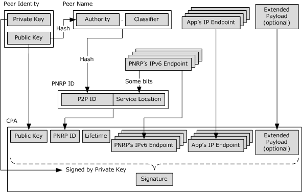

Figure 1: PNRP resource dependencies

#### 1.3.1.1 Peer Names

A Peer Name is composed of an [**authority**](#gt_authority) and [**classifier**](#gt_classifier), in the form "*authority*.*classifier*", and it is created by an application before publishing a name using the PNRP. After it is registered, the Peer Name can be used by other applications to obtain the IP endpoints and [**extended payload**](#gt_extended-payload) for the name.

There are two types of Peer Names: secure and unsecured. A [**Secure Peer Name**](#gt_secure-peer-name) has an associated [**Peer Identity**](#gt_peer-identity) that is used to prove ownership of the name. The authority element of a Secure Peer Name is algorithmically derived from the associated public key, described as follows:

- The public key of the Peer Identity is first represented according to the format of the **SubjectPublicKeyInfo** field specified in [[RFC5280]](https://go.microsoft.com/fwlink/?LinkId=131034) section 4.1.2.7.
- A SHA-1 [[RFC3174]](https://go.microsoft.com/fwlink/?LinkId=90408) hash [h] AuthorityHash is generated from the public key of the Peer Identity.
- Each byte in [h] is represented as its two-digit hexadecimal representation.
- Each hexadecimal digit is then converted into a Unicode character in the ranges ("0"-"9") and ("a"-"f"). (For example, the hex value 0x64 becomes the sequence of Unicode characters "6", "4", and the hex value 0x0c becomes the sequence "0", "c").
- All the characters generated in the previous step are then concatenated in order to form the Authority string.
An [**Unsecured Peer Name**](#gt_unsecured-peer-name) does not have a relationship to a Peer Identity (therefore any [**node**](#gt_node) can claim ownership of it), and its Authority string is always set to "0". For example, in the Peer Name "0.MyApplication", the Authority is "0", and the Classifier is "MyApplication".

The Classifier element for a Peer Name is specified by the application registering the resource, and can be any [**Unicode**](#gt_unicode) string up to 150 characters long (counting the terminating null character).

#### 1.3.1.2 PNRP IDs

PNRP defines a numerical namespace for [**PNRP IDs**](#gt_pnrp-id). Each [Peer Name](#Section_4.1.3) is converted to a number, and the numbers are compared to determine proximity within the namespace.

Peer Names are first converted to 128-bit numbers called [**Peer-To-Peer IDs (P2P IDs)**](#gt_peer-to-peer-id-p2p-id) by means of the following hashing function:

P2P ID = first 128 bits of SHA-1(SHA-1(Classifier) | AuthorityHash | SHA-1(Classifier) | Goo)

Where:

- Classifier is the Classifier element of the Peer Name.
- AuthorityHash is the hash calculated in step 2 of section 1.3.1.1 for Secure Peer Names, or 160 zero bits if the originating Peer Name is an Unsecured Peer Name.
- Goo is a 32-bit number with value: 0x504e5250 (ASCII encoding of "PNRP").
A specific instance of a Peer Name registration also has a 128-bit number called a Service Location, which makes the specific instance of the Peer Name registration unique in the network.

PNRP uses a service location suffix to ensure that each registered instance has a unique PNRP ID. A service location is a 128-bit number that is derived from an IP [**endpoint**](#gt_endpoint) of the PNRP [**node**](#gt_node). When two service locations are compared, the length of the common prefix for each can be used as a (very) rough measure of network proximity.

Service Location = (SL Upper << 64) | (SL Lower)

Where:

- SL Upper = Upper 64 bits of the IPv6 address used by the service, OR a 64-bit hint provided by the application.
- SL Lower = First 64 bits of SHA-1(Public Key of the CPA | list of application service addresses contained in the CPA | 8-bit random number)
Together, the numbers make up a 256-bit number called the PNRP ID:

PNRP ID = (P2P ID << 128) | (Service Location)

#### 1.3.1.3 Certified Peer Addresses

For a [**Secure Peer Name**](#gt_secure-peer-name), the [**certified peer address (CPA)**](#gt_certified-peer-address-cpa) is a self-signed certificate that provides authentication protection for a [**PNRP ID**](#gt_pnrp-id) and contains application [**endpoint**](#gt_endpoint) information such as addresses, protocol numbers, and port numbers. An [**Unsecured Peer Name**](#gt_unsecured-peer-name) also includes a CPA, as well as both a public key and a signature, but no protection is provided.

The information in a CPA includes:

- AuthorityHash
- SHA-1 Hash of the Classifier string
- Service Location part of PNRP ID
- Comment (40-character text field filled by application)
- Validity Interval for CPA
- Public Key of Identity registering the Peer Name
- Endpoints for reaching the application service
- Endpoints for reaching the PNRP service
- Signature of CPA based on Public/Private key pair

### 1.3.2 Delegation

PNRP also allows one [**Peer Identity**](#gt_peer-identity) to delegate to another Peer Identity permission to advertise its [Peer Names](#Section_4.1.3). The following figure shows the resulting relationship between concepts in this case.

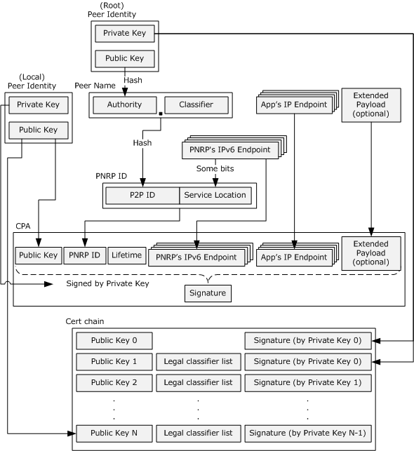

Figure 2: PNRP delegation process

As illustrated, the [CPA](#Section_1.3.1.3) contains a public key other than the one from which the Peer Name was derived; for example, the public key of the Peer Identity, which has been delegated permission to advertise the Peer Name. Delegating permission to advertise a name allows a service to be distributed among multiple [**nodes**](#gt_node) without distributing the private key (which would be needed to do the same without delegation).

Subdelegation is allowed. A delegate receives a certificate chain that can be used to prove its [**authority**](#gt_authority). The certificate chain also indicates whether there is a restriction on what [**classifier**](#gt_classifier) can be used to construct delegated Peer Names, as well as (not shown) whether the delegate is granted permission to subdelegate.

### 1.3.3 Clouds

A PNRP [**node**](#gt_node) can participate in one or more [**clouds**](#gt_cloud). A cloud is a group of nodes that can communicate with each other to resolve names into addresses. Each node maintains a cache of PNRP ID-to-endpoint mappings (called route entries). A node is required to cache its Leaf Set (the five [**PNRP IDs**](#gt_pnrp-id) on each side that are numerically closest to each of the node's own PNRP IDs), plus any others it knows of. Messages are exchanged between nodes to distribute information about PNRP IDs. For purposes of determining numerical closeness, the PNRP ID numbering space is considered to be circular (for example, 2^256-1 is adjacent to 0 in a numbering space of size 2^256).

A cloud has a scope property that can be Global, Site Local, or Link Local, as illustrated by the following diagram. A node can be connected to the Global cloud, multiple Site Local cloud, and multiple Link Local clouds. Communication between nodes never crosses from one cloud to another.

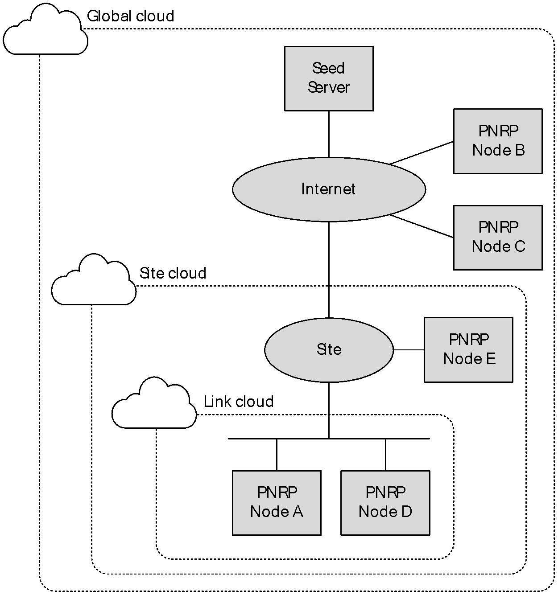

Figure 3: Node scoping (Link Local, Site Local, Global)

Participation in clouds involves a number of distinct tasks:

- Cloud discovery
- Joining the cloud
- Active participation in the cloud
- Leaving a cloud

#### 1.3.3.1 Discovering a Cloud

Cloud discovery is the process by which a [**node**](#gt_node) outside the [**cloud**](#gt_cloud) finds an existing node within the cloud.

To discover nodes on the same link, a node uses the Simple Service Discovery Protocol (SSDP) (as specified in [[UPNPARCH1]](https://go.microsoft.com/fwlink/?LinkId=90554), section 1) to discover other nearby nodes that are already in the cloud. If there are no other nodes in the cloud of interest that exist on the node's link, then the discovering node uses a seed server to find some. To discover some nodes in the Global PNRP cloud, the discovering node contacts one of two well-known seed servers whose addresses are resolved via a [**Domain Name System (DNS)**](#gt_domain-name-system-dns) lookup. To discover some nodes in a Site cloud, the discovering node obtains the name or address of a seed server via some other method (for example, manual configuration, or supplied by an application).

#### 1.3.3.2 Joining a Cloud

The joining [**node**](#gt_node) then engages in a "synchronization conversation" with the existing node to obtain an initial set of PNRP cache entries. The existing node provides the joining node with a selection of entries from its cache. On completing the synchronization, the joining node can access the [**cloud**](#gt_cloud); the joining node now has enough information to perform resolves of [**PNRP IDs**](#gt_pnrp-id).

#### 1.3.3.3 Active Participation in the Cloud

After a PNRP [**node**](#gt_node) is fully initialized, it has the ability to initiate [**PNRP ID**](#gt_pnrp-id) resolution for remote nodes. An application can ask to resolve a [**Peer Name**](#gt_peer-name) to an address in a given [**cloud**](#gt_cloud). A P2P ID is first derived from the Peer Name, and a service location of the local PNRP node is then appended to form a target PNRP ID. Messages are sent toward that PNRP ID to locate a node that has the P2P ID registered.

The Resolver picks the node in its cache with the PNRP ID numerically closest to the target PNRP ID, and then asks that node for an entry numerically closer to the target PNRP ID, excluding any that it consulted previously. As it learns of nodes numerically closer, it will add them to its own cache and then ask those nodes for even closer nodes.

The resolution continues until it reaches a node with a PNRP ID containing a matching P2P ID (or, if the resolving application wishes, until the numerically closest P2P ID is found). The Resolver can continue resolution until it finds the closest PNRP ID that includes the service location bits, thereby finding the topologically "closest" (generally speaking) publisher of the Peer Name.

After a publisher is reached, its [CPA](#Section_1.3.1.3) (and certificate chain, if the Peer Name was delegated as specified in section [1.3.2](#Section_1.3.2)), is returned to the original Resolver. The CPA signature and certificate chain are then validated.

In addition, the PNRP node can optionally participate in the following set of activities. Nodes that do not participate in these activities are known as "Resolve-only" nodes.

- Register and un-register [Peer Names](#Section_4.1.3). When a Peer Name is registered, the PNRP node creates a PNRP ID and CPA. These are entered into a table of locally registered PNRP IDs, and a PNRP resolution is initiated for [PNRP ID + 1] to find the closest match. This request is processed by a number of nodes with PNRP IDs that are very similar to the registered ID. Each recipient that finds that the new PNRP ID falls within its own [**Leaf Set**](#gt_leaf-set) adds the entry for the new PNRP ID to its cache. When the resolve completes, the registering node will learn about an existing node that is numerically close to the registered PNRP ID. From the existing node, it can get the entries for the five numerically closest PNRP IDs on either side of the new PNRP ID (for example, the Leaf Set for that PNRP ID).
When a PNRP ID is unregistered, a "Revoke CPA" is sent to two entries from the Leaf Set of the PNRP ID being unregistered. One entry is the numerically closest PNRP ID greater than the local PNRP ID, and the other one is the numerically closest ID less than the local ID. Each recipient checks its cache to determine whether an entry exists for the PNRP ID. If one is found, the recipient removes the entry from its cache. If the entry was in a Leaf Set of a locally registered PNRP ID, the node sends the revoke CPA on to two other members of its Leaf Set.

- Participate in PNRP ID resolutions by other nodes. A node will, upon request, compare a target PNRP ID with entries in its cache to find the entry that is numerically closer to the desired PNRP ID than any that the Resolver has previously used. The node then sends a response to the requester with the associated addresses.
- Honor cache synchronization requests. Each node responds to requests for cache entries by new nodes joining the cloud, as specified in section [1.3.3.2](#Section_1.3.3.2).
- Test for cloud splits. Each node occasionally tests for splits in the cloud to ensure that it has not become isolated from the cloud.

#### 1.3.3.4 Leaving a Cloud

To leave the [**cloud**](#gt_cloud), the PNRP [**node**](#gt_node) unregisters all registered [**PNRP IDs**](#gt_pnrp-id) and then terminates.

## 1.4 Relationship to Other Protocols

PNRP is used instead of the [**Domain Name System (DNS)**](#gt_domain-name-system-dns), as specified in [[RFC1035]](https://go.microsoft.com/fwlink/?LinkId=90264), or the Link-Local Multicast Name Resolution [[RFC4795]](https://go.microsoft.com/fwlink/?LinkId=90489).

PNRP uses UDP [[RFC768]](https://go.microsoft.com/fwlink/?LinkId=90490) as a transport, and it uses the SSDP (as specified in [[UPNPARCH1]](https://go.microsoft.com/fwlink/?LinkId=90554), section 1) and DNS [RFC1035] to initially locate some members of a [**cloud**](#gt_cloud).

## 1.5 Prerequisites/Preconditions

It is assumed that a PNRP [**node**](#gt_node) that wants to participate in a given Site Local [**cloud**](#gt_cloud) already knows the name or addresses of a seed server for that [cloud](#Section_37959c9f37b34e449c0240504a91e445).

## 1.6 Applicability Statement

The PNRP is suitable only for publishing a limited amount of information about a resource, and only when the information to be published is independent of which [**node**](#gt_node) requests the information.

## 1.7 Versioning and Capability Negotiation

PNRP has no version-negotiation or capability-negotiation behavior, although it carries a protocol version number in its messages.

## 1.8 Vendor-Extensible Fields

PNRP defines a syntax for [Peer Names](#Section_4.1.3) that can be used by vendors to construct their own names. The legal syntax for a [**Peer Name**](#gt_peer-name) is specified in section [2.2.4](#Section_1.3.1.1).

## 1.9 Standards Assignments

PNRP uses the assignments shown in the following table.

| Parameter | Value | Reference |
| --- | --- | --- |
| Port number | 3540 | [[IANAPORT]](https://go.microsoft.com/fwlink/?LinkId=89888) |

# 2 Messages

## 2.1 Transport

PNRP messages MUST be transported over the User Datagram Protocol (UDP), as specified in [[RFC768]](https://go.microsoft.com/fwlink/?LinkId=90490). A [**node**](#gt_node) MUST use a UDP port of 1024 or greater, and SHOULD use port 3540. There is no requirement that two PNRP nodes use the same port number because the port number is discovered dynamically.

## 2.2 Message Syntax

PNRP messages were designed for future extensibility such that each "message element" (for example, field or set of fields) of each message is self-describing. As a result, the messages defined in this section have a number of FieldID/Length pairs that occur throughout the messages. Although each field is specified in the individual messages, it is helpful to explain the convention used.

The pattern used looks similar to the following.

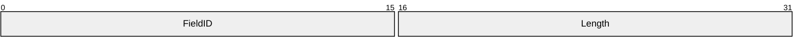
```mermaid
packet-beta
  0-15: "FieldID"
  16-31: "Length"
```

**FieldID (2 bytes):** The type of message element. **FieldIDs** used in this document are defined in a common numbering space as follows.

| Value | Meaning |
| --- | --- |
| PNRP_HEADER 0x0010 | Part of a [PNRP Header](#Section_2.2.1). |
| PNRP_HEADER_ACKED 0x0018 | An Acked Message ID follows. |
| PNRP_ID 0x0030 | A [**PNRP ID**](#gt_pnrp-id) follows. |
| TARGET_PNRP_ID 0x0038 | A target PNRP ID follows. |
| VALIDATE_PNRP_ID 0x0039 | A Validate PNRP ID follows. |
| FLAGS_FIELD 0x0040 | A **flags** field follows. The meaning of the individual flags is message-specific. |
| FLOOD_CONTROLS 0x0043 | Flood criteria follows. |
| SOLICIT_CONTROLS 0x0044 | Solicit criteria follows. |
| LOOKUP_CONTROLS 0x0045 | Lookup criteria follows. |
| EXTENDED_PAYLOAD 0x005A | [**Extended payload**](#gt_extended-payload) follows. |
| PNRP_ID_ARRAY 0x0060 | An array of PNRP IDs follows. |
| CERT_CHAIN 0x0080 | A [Certificate Chain](#Section_2.2.3.5) follows. |
| WCHAR 0x0084 | A [**Unicode**](#gt_unicode) character follows. |
| CLASSIFIER 0x0085 | A [**classifier**](#gt_classifier) string follows. |
| HASHED_NONCE 0x0092 | A hashed [**nonce**](#gt_nonce) follows. |
| NONCE 0x0093 | A nonce follows. |
| SPLIT_CONTROLS 0x0098 | Buffer fragmentation information follows. |
| ROUTING_ENTRY 0x009A | A [ROUTE_ENTRY](#Section_2.2.3.4) follows. |
| VALIDATE_CPA 0x009B | An [Encoded CPA](#Section_2.2.3.1) structure follows, containing a [CPA](#Section_1.3.1.3) to validate. |
| REVOKE_CPA 0x009C | An Encoded CPA structure follows, containing a CPA to revoke. |
| IPV6_ENDPOINT 0x009D | An [IPV6_ENDPOINT](#Section_2.2.3.6) structure follows. |
| IPV6_ENDPOINT_ARRAY 0x009E | An array of IPV6_ENDPOINT structures follows. |

**Length (2 bytes):** The length of the message element in bytes, including the **FieldID** and **Length** fields.

Furthermore, the **FieldID** fields in each message defined by PNRP always start on a 4-byte boundary from the beginning of the PNRP message. Padding fields will be included in a message to ensure this.

Finally, unless specified otherwise, all 2-byte and 4-byte integer fields are defined in network byte order.

### 2.2.1 PNRP Header

All [PNRP Messages](#Section_2.2.2) use the common header as follows.

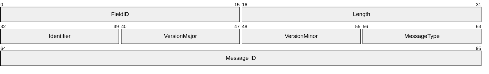
```mermaid
packet-beta
  0-15: "FieldID"
  16-31: "Length"
  32-39: "Identifier"
  40-47: "VersionMajor"
  48-55: "VersionMinor"
  56-63: "MessageType"
  64-95: "Message ID"
```

**FieldID (2 bytes):** The type of message. MUST be set to 0x0010 (PNRP_HEADER).

**Length (2 bytes):** The length, in bytes, of the PNRP Header. MUST be set to 0x000C.

**Identifier (1 byte):** MUST be set to 0x51.

**VersionMajor (1 byte):** Major version of protocol. MUST be set to 0x04.

**VersionMinor (1 byte):** Minor version of protocol. MUST be set to 0x00.

**MessageType (1 byte):** The type of message following the PNRP Header. MUST be one of the following.

| Value | Meaning |
| --- | --- |
| 0x01 | [SOLICIT](#Section_2.2.2.1) |
| 0x02 | [ADVERTISE](#Section_2.2.2.2) |
| 0x03 | [REQUEST](#Section_2.2.2.3) |
| 0x04 | [FLOOD](#Section_2.2.2.4) |
| 0x07 | [INQUIRE](#Section_2.2.2.5) |
| 0x08 | [AUTHORITY](#Section_2.2.2.6) |
| 0x09 | [ACK](#Section_2.2.2.7) |
| 0x0B | [LOOKUP](#Section_2.2.2.8) |

**Message ID (4 bytes):** An arbitrary 32-bit value used for acknowledgment tracking. This value is generated by the protocol; the algorithm used to generate the Message ID value MUST minimize the probability of generating duplicate Message ID values within a window of time at least as large as the round-trip latency of a protocol message.

### 2.2.2 PNRP Messages

#### 2.2.2.1 SOLICIT

The SOLICIT message is sent by a Resolver to a Publisher to request a list of [**PNRP IDs**](#gt_pnrp-id) in a [**cloud**](#gt_cloud).

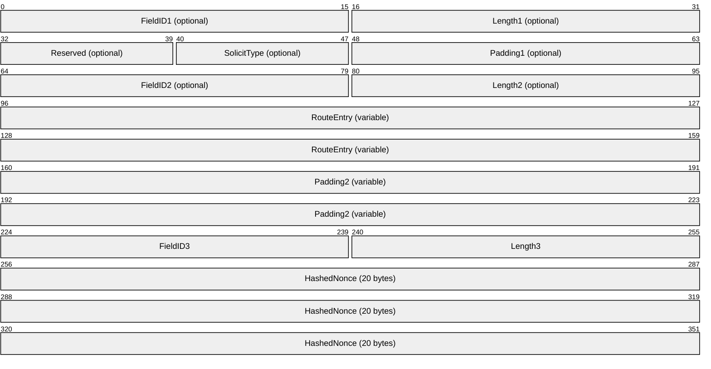
```mermaid
packet-beta
  0-15: "FieldID1 (optional)"
  16-31: "Length1 (optional)"
  32-39: "Reserved (optional)"
  40-47: "SolicitType (optional)"
  48-63: "Padding1 (optional)"
  64-79: "FieldID2 (optional)"
  80-95: "Length2 (optional)"
  96-159: "RouteEntry (variable)"
  160-223: "Padding2 (variable)"
  224-239: "FieldID3"
  240-255: "Length3"
  256-351: "HashedNonce (20 bytes)"
```

**FieldID1 (2 bytes):** If present, MUST be set to 0x0044 (SOLICIT_CONTROLS). Note that a receiver can determine whether this field is present or absent based on the value at this location.

**Length1 (2 bytes):** MUST be present if and only if **FieldID1** is present. If present, it MUST be set to 0x0006.

**Reserved (1 byte):** MUST be present if and only if **FieldID1** is present. If present, it MUST be set to zero when sent and MUST be ignored on receipt.

**SolicitType (1 byte):** MUST be present if and only if **FieldID1** is present. If present, it MUST be one of the following.

| Value | Meaning |
| --- | --- |
| SOLICIT_TYPE_ANY 0x00 | The sender wants any route entries available, both local and cached remote ones. |
| SOLICIT_TYPE_LOCAL 0x01 | The sender only wants route entries for locally registered IDs. |

**Padding1 (2 bytes):** MUST be present if and only if **FieldID1** is present. If present, it MUST be set to zero when sent and MUST be ignored on receipt.

**FieldID2 (2 bytes):** If present, MUST be set to 0x009A (ROUTING_ENTRY). Note that a receiver can determine whether this field is present or absent based on the presence of this value either at bytes 0 and 1, if **FieldID1** is not present, or at bytes 8 and 9 if **FieldID1** is present. MUST NOT be present if the [**node**](#gt_node) has no locally registered PNRP IDs.

**Length2 (2 bytes):** MUST be present if and only if **FieldID2** is present. If present, it MUST be set to the size in bytes of the **RouteEntry** field, plus 4.

**RouteEntry (variable):** Route entry for a locally registered PNRP ID on the node sending the SOLICIT message. MUST be present if and only if **FieldID2** is present.

**Padding2 (variable):** A number of bytes from 0 through 3, such that the offset from the start of the message to the end of this field is a multiple of 4. MUST be present if and only if **FieldID2** is present. MUST be set to zero when sent and MUST be ignored on receipt.

**FieldID3 (2 bytes):** MUST be set to 0x0092 (HASHED_NONCE).

**Length3 (2 bytes):** MUST be set to 0x0018.

**HashedNonce (20 bytes):** A 20-byte hash of the [**nonce**](#gt_nonce) value for the conversation.

#### 2.2.2.2 ADVERTISE

The ADVERTISE message is sent by a Publisher to a Resolver in response to a [SOLICIT](#Section_2.2.2.1) message, in order to provide a list of [**PNRP IDs**](#gt_pnrp-id) in the [**cloud**](#gt_cloud).

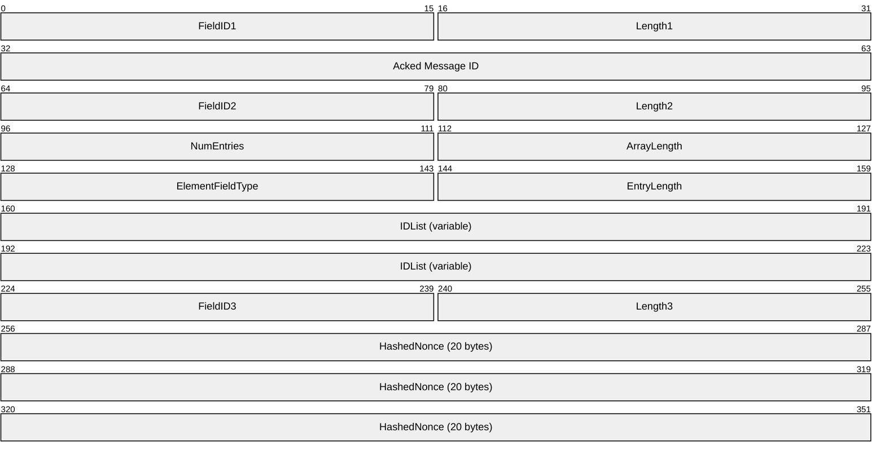
```mermaid
packet-beta
  0-15: "FieldID1"
  16-31: "Length1"
  32-63: "Acked Message ID"
  64-79: "FieldID2"
  80-95: "Length2"
  96-111: "NumEntries"
  112-127: "ArrayLength"
  128-143: "ElementFieldType"
  144-159: "EntryLength"
  160-223: "IDList (variable)"
  224-239: "FieldID3"
  240-255: "Length3"
  256-351: "HashedNonce (20 bytes)"
```

**FieldID1 (2 bytes):** MUST be set to 0x0018 (PNRP_HEADER_ACKED).

**Length1 (2 bytes):** MUST be set to 0x0008.

**Acked Message ID (4 bytes):** The value of the **Message ID** field in the [PNRP Header](#Section_2.2.1) of the SOLICIT message to which this is a response.

**FieldID2 (2 bytes):** MUST be set to 0x0060 (PNRP_ID_ARRAY).

**Length2 (2 bytes):** MUST be set to 12+(**NumEntries*****EntryLength**).

**NumEntries (2 bytes):** The number of PNRP IDs in the **IDList** field. MUST be in the range 0x0000 to 0x7FFF.

**ArrayLength (2 bytes):** The length of the entries in the array. MUST be set to 8+(**NumEntries*****EntryLength**).

**ElementFieldType (2 bytes):** The type of entries in the array. This field MUST be set to 0x0030 (PNRP_ID).

**EntryLength (2 bytes):** The length, in bytes, of each array element. MUST be set to 0x20 (32 bytes).

**IDList (variable):** A set of 32-byte PNRP IDs.

**FieldID3 (2 bytes):** MUST be set to 0x0092 (HASHED_NONCE).

**Length3 (2 bytes):** MUST be set to 0x0018.

**HashedNonce (20 bytes):** The value of the **HashedNonce** field in the SOLICIT message to which this is a response.

#### 2.2.2.3 REQUEST

The REQUEST message is sent by a Resolver to a Publisher to request a route entry for a given [**PNRP ID**](#gt_pnrp-id) in the Publisher's cache, as seen in an [ADVERTISE](#Section_2.2.2.2) message.

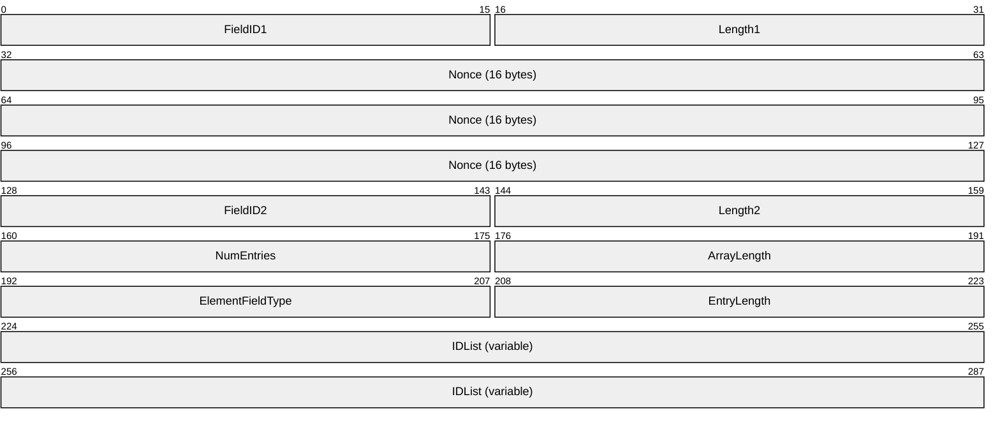
```mermaid
packet-beta
  0-15: "FieldID1"
  16-31: "Length1"
  32-127: "Nonce (16 bytes)"
  128-143: "FieldID2"
  144-159: "Length2"
  160-175: "NumEntries"
  176-191: "ArrayLength"
  192-207: "ElementFieldType"
  208-223: "EntryLength"
  224-287: "IDList (variable)"
```

**FieldID1 (2 bytes):** MUST be set to 0x0093 (NONCE).

**Length1 (2 bytes):** MUST be set to 0x0014 (20 bytes).

**Nonce (16 bytes):** The [**nonce**](#gt_nonce) for the conversation.

**FieldID2 (2 bytes):** MUST be set to 0x0060 (PNRP_ID_ARRAY).

**Length2 (2 bytes):** MUST be set to 12+(**NumEntries*****EntryLength**).

**NumEntries (2 bytes):** The number of PNRP IDs in the **IDList** field. MUST be in the range 0x0000 to 0x7FFF.

**ArrayLength (2 bytes):** The length of the array of entries. MUST be set to 8+(**NumEntries*****EntryLength**).

**ElementFieldType (2 bytes):** The type of entries in the array. This field MUST be set to 0x0030 (PNRP_ID).

**EntryLength (2 bytes):** The length, in bytes, of each array element. MUST be set to 0x20 (32 bytes).

**IDList (variable):** A set of 32-byte PNRP IDs.

#### 2.2.2.4 FLOOD

The FLOOD message is sent by a Publisher to a Resolver in response to a [REQUEST](#Section_2.2.2.3) message, in order to provide a route entry or to revoke a [CPA](#Section_1.3.1.3).

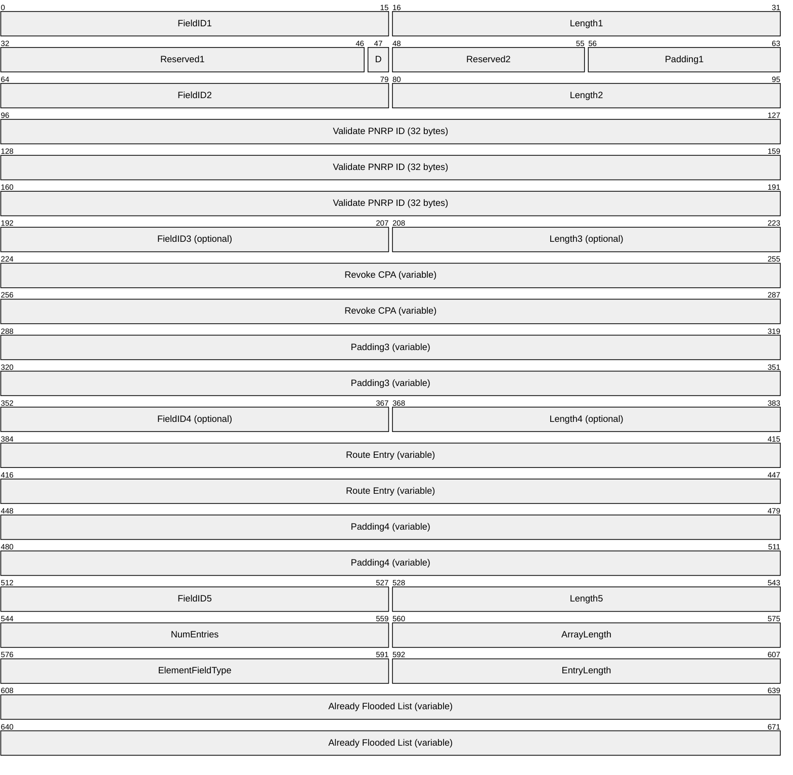
```mermaid
packet-beta
  0-15: "FieldID1"
  16-31: "Length1"
  32-46: "Reserved1"
  47-47: "D"
  48-55: "Reserved2"
  56-63: "Padding1"
  64-79: "FieldID2"
  80-95: "Length2"
  96-191: "Validate PNRP ID (32 bytes)"
  192-207: "FieldID3 (optional)"
  208-223: "Length3 (optional)"
  224-287: "Revoke CPA (variable)"
  288-351: "Padding3 (variable)"
  352-367: "FieldID4 (optional)"
  368-383: "Length4 (optional)"
  384-447: "Route Entry (variable)"
  448-511: "Padding4 (variable)"
  512-527: "FieldID5"
  528-543: "Length5"
  544-559: "NumEntries"
  560-575: "ArrayLength"
  576-591: "ElementFieldType"
  592-607: "EntryLength"
  608-671: "Already Flooded List (variable)"
```

**FieldID1 (2 bytes):** MUST be set to 0x0043 (FLOOD_CONTROLS).

**Length1 (2 bytes):** MUST be set to 0x0007.

**Reserved1 (15 bits):** MUST be set to zero when sent and MUST be ignored on receipt.

**D (1 bit):** If set, indicates that the sender does not want the receiver to send an [ACK](#Section_2.2.2.7) message.

**Reserved2 (1 byte):** Can be sent to any arbitrary value when sent and MUST be ignored on receipt.

**Padding1 (1 byte):** MUST be set to zero when sent and MUST be ignored on receipt.

**FieldID2 (2 bytes):** MUST be set to 0x0039 (**Validate PNRP ID**).

**Length2 (2 bytes):** MUST be set to 0x0024.

**Validate PNRP ID (32 bytes):** If the FLOOD message is being sent to provide a route entry or revoke a CPA, this field MUST specify the [**PNRP ID**](#gt_pnrp-id) of the destination [**node**](#gt_node); otherwise this field MUST be set to zero when sent and MUST be ignored on receipt.

**FieldID3 (2 bytes):** If present, MUST be set to 0x009C (**Revoke CPA**).

**Length3 (2 bytes):** If present, MUST be set to 4 plus the length in bytes of the **Revoke CPA** field.

**Revoke CPA (variable):** If present, an [Encoded CPA](#Section_2.2.3.1) structure that contains the CPA to revoke.

**Padding3 (variable):** A number of bytes between 0 and 3, such that the offset from the start of the message to the end of this field is a multiple of 4. MUST be present if and only if **FieldID3** is present. MUST be set to zero when sent and MUST be ignored on receipt.

**FieldID4 (2 bytes):** If present, MUST be set to 0x009A (ROUTING_ENTRY). This field MUST be present if the node is flooding a route entry to its neighbors. Note that a receiver can tell whether this field is present or absent based on the value at this location.

**Length4 (2 bytes):** MUST be present if and only if **FieldID4** is present. If present, it MUST be set to 4 plus the length in bytes of the **Route Entry** field.

**Route Entry (variable):** A [ROUTE_ENTRY](#Section_2.2.3.4) structure that contains an entry that the source node wants to send to the destination node. This field MUST be present if and only if **FieldID4** is present.

**Padding4 (variable):** A number of bytes between 0 and 3, such that the offset from the start of the message to the end of this field is a multiple of 4. MUST be present if and only if **FieldID4** is present. MUST be set to zero when sent and MUST be ignored on receipt.

**FieldID5 (2 bytes):** MUST be set to 0x009E.

**Length5 (2 bytes):** MUST be set to 12+(**NumEntries*****EntryLength**).

**NumEntries (2 bytes):** The number of entries in the **Already Flooded List**. MUST be in the range 0 to 22.

**ArrayLength (2 bytes):** MUST be set to 8+(**NumEntries*****EntryLength**).

**ElementFieldType (2 bytes):** MUST be set to 0x009D ([IPV6_ENDPOINT](#Section_2.2.3.6)).

**EntryLength (2 bytes):** MUST be set to 0x12 (18 bytes).

**Already Flooded List (variable):** A list of IPV6_ENDPOINT structures for PNRP nodes that have seen this FLOOD message so far.

#### 2.2.2.5 INQUIRE

The INQUIRE message is sent by a Resolver to a Publisher to obtain a [CPA](#Section_1.3.1.3), or sent from one Publisher to another to verify that the latter is still in the [**cloud**](#gt_cloud).

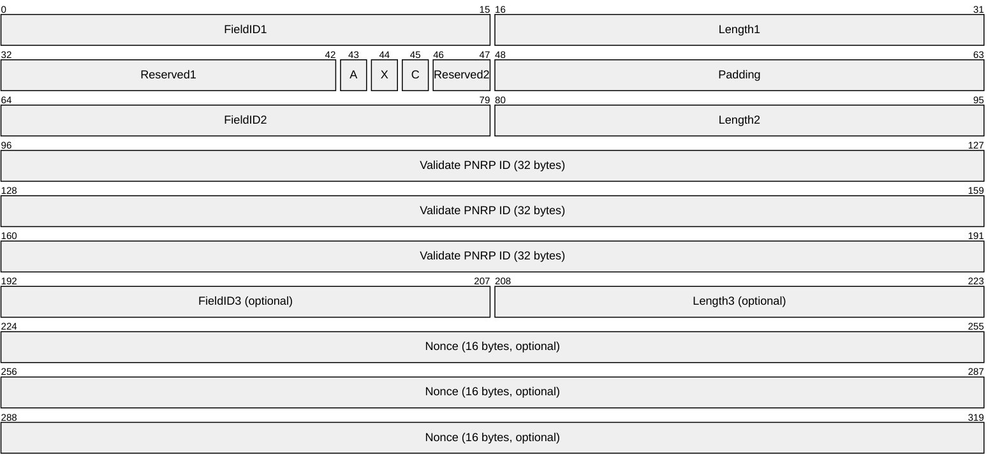
```mermaid
packet-beta
  0-15: "FieldID1"
  16-31: "Length1"
  32-42: "Reserved1"
  43-43: "A"
  44-44: "X"
  45-45: "C"
  46-47: "Reserved2"
  48-63: "Padding"
  64-79: "FieldID2"
  80-95: "Length2"
  96-191: "Validate PNRP ID (32 bytes)"
  192-207: "FieldID3 (optional)"
  208-223: "Length3 (optional)"
  224-319: "Nonce (16 bytes, optional)"
```

**FieldID1 (2 bytes):** MUST be set to 0x0040 (FLAGS_FIELD).

**Length1 (2 bytes):** MUST be set to 0x0006.

**Reserved1 (11 bits):** MUST be set to zero when sent and MUST be ignored on receipt.

**A (1 bit):** If set, the sender is requesting that a CPA appear in the [AUTHORITY](#Section_2.2.2.6) message response.

**X (1 bit):** If set, the sender is requesting that an [EXTENDED_PAYLOAD](#Section_2.2.3.3) message (if any exists) appear in the AUTHORITY message response.

**C (1 bit):** If set, the sender is requesting that a [Certificate Chain](#Section_2.2.3.5) (if any exists) appear in the AUTHORITY message response.

**Reserved2 (2 bits):** MUST be set to zero when sent and MUST be ignored on receipt.

**Padding (2 bytes):** MUST be set to zero when sent and MUST be ignored on receipt.

**FieldID2 (2 bytes):** MUST be set to 0x0039 (**Validate PNRP ID**).

**Length2 (2 bytes):** MUST be set to 0x0024.

**Validate PNRP ID (32 bytes):** The [**PNRP ID**](#gt_pnrp-id) to validate.

**FieldID3 (2 bytes):** If present, MUST be set to 0x0093 (NONCE).

**Length3 (2 bytes):** This field MUST be present if and only if **FieldID3** is present. If present, this field MUST be set to 0x0014 (20 bytes).

**Nonce (16 bytes):** A [**nonce**](#gt_nonce) value that the sender wants to be copied into a CPA before it is signed, in order to prevent replay attacks. This field MUST be present if and only if **FieldID3** is present.

#### 2.2.2.6 AUTHORITY

The AUTHORITY message is sent by a Publisher to a Resolver in response to an [INQUIRE](#Section_2.2.2.5) or [LOOKUP](#Section_2.2.2.8) message.

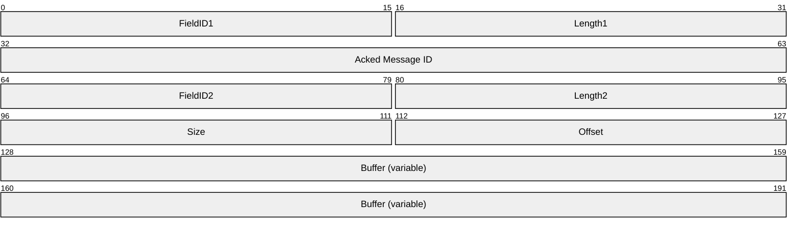
```mermaid
packet-beta
  0-15: "FieldID1"
  16-31: "Length1"
  32-63: "Acked Message ID"
  64-79: "FieldID2"
  80-95: "Length2"
  96-111: "Size"
  112-127: "Offset"
  128-191: "Buffer (variable)"
```

**FieldID1 (2 bytes):** MUST be set to 0x0018 (PNRP_HEADER_ACKED).

**Length1 (2 bytes):** MUST be set to 0x0008.

**Acked Message ID (4 bytes):** The value of the **Message ID** field in the [PNRP Header](#Section_2.2.1) of the message to which this is a response.

**FieldID2 (2 bytes):** MUST be set to 0x0098 (SPLIT_CONTROLS).

**Length2 (2 bytes):** MUST be set to 0x0008.

**Size (2 bytes):** Size, in bytes, of the original [AUTHORITY_BUFFER](#Section_2.2.2.6.1). MUST NOT be greater than 0x91E4 (37348), which is large enough to hold a [Certificate Chain](#Section_2.2.3.5) and a maximum-sized [**extended payload**](#gt_extended-payload).

**Offset (2 bytes):** Byte offset, in network byte order, of the message fragment in the original message. It MUST be a multiple of 1,188.

**Buffer (variable):** The portion of AUTHORITY_BUFFER starting at a byte offset specified in Offset.

##### 2.2.2.6.1 AUTHORITY_BUFFER

The AUTHORITY_BUFFER structure is contained within a logical message containing the [CPA](#Section_1.3.1.3) and [**extended payload**](#gt_extended-payload) information associated with a [**Peer Name**](#gt_peer-name). Parts of this logical message appear in [AUTHORITY](#Section_2.2.2.6) messages.

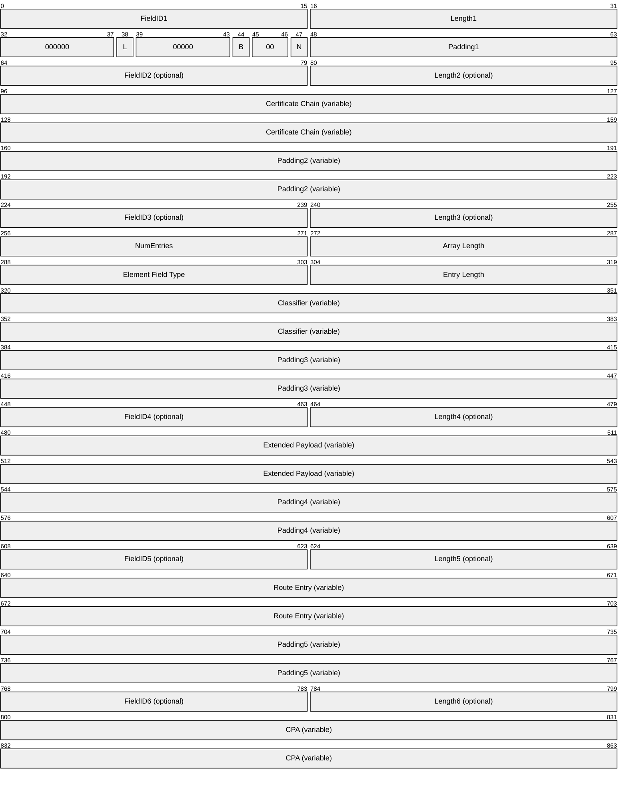
```mermaid
packet-beta
  0-15: "FieldID1"
  16-31: "Length1"
  32-37: "000000"
  38-38: "L"
  39-43: "00000"
  44-44: "B"
  45-46: "00"
  47-47: "N"
  48-63: "Padding1"
  64-79: "FieldID2 (optional)"
  80-95: "Length2 (optional)"
  96-159: "Certificate Chain (variable)"
  160-223: "Padding2 (variable)"
  224-239: "FieldID3 (optional)"
  240-255: "Length3 (optional)"
  256-271: "NumEntries"
  272-287: "Array Length"
  288-303: "Element Field Type"
  304-319: "Entry Length"
  320-383: "Classifier (variable)"
  384-447: "Padding3 (variable)"
  448-463: "FieldID4 (optional)"
  464-479: "Length4 (optional)"
  480-543: "Extended Payload (variable)"
  544-607: "Padding4 (variable)"
  608-623: "FieldID5 (optional)"
  624-639: "Length5 (optional)"
  640-703: "Route Entry (variable)"
  704-767: "Padding5 (variable)"
  768-783: "FieldID6 (optional)"
  784-799: "Length6 (optional)"
  800-863: "CPA (variable)"
```

**FieldID1 (2 bytes):** MUST be set to 0x0040 (FLAGS_FIELD).

**Length1 (2 bytes):** MUST be set to 0x0006.

**000000 (6 bits):** These bits are all reserved. MUST be set to zero when sent and MUST be ignored on receipt.

**L (1 bit):** [**Leaf Set**](#gt_leaf-set). If set, this flag indicates that the target [**PNRP ID**](#gt_pnrp-id) is unknown to the sender, but would be in the sender's Leaf Set were it known.

**00000 (5 bits):** These bits are all reserved. MUST be set to zero when sent and MUST be ignored on receipt.

**B (1 bit):** Busy. If set, indicates that the sender is too busy to handle a [LOOKUP](#Section_2.2.2.8) message request.

**00 (2 bits):** These bits are all reserved. MUST be set to zero when sent and MUST be ignored on receipt.

**N (1 bit):** Not Found. If set, indicates that the requested Validate PNRP ID in the LOOKUP or [INQUIRE](#Section_2.2.2.5) message is not known to the sender.

**Padding1 (2 bytes):** MUST be set to zero when sent and MUST be ignored on receipt.

**FieldID2 (2 bytes):** If present, MUST be set to 0x0080 (CERT_CHAIN). Note that a receiver can tell whether this field is present or absent based on the value at this location.

**Length2 (2 bytes):** MUST be present if and only if **FieldID2** is present. If present, it MUST be set to 4 plus the length in bytes of the **Certificate Chain** field.

**Certificate Chain (variable):** A [Certificate Chain](#Section_2.2.3.5), containing the public key used to sign the CPA and its Certificate Chain. MUST be present if and only if **FieldID2** is present.

**Padding2 (variable):** A number of bytes between 0 and 3, such that the offset from the start of the message to the end of this field is a multiple of 4. MUST be present if and only if **FieldID2** is present. MUST be set to zero when sent and MUST be ignored on receipt.

**FieldID3 (2 bytes):** If present, MUST be set to 0x0085 (CLASSIFIER).

**Length3 (2 bytes):** If present, MUST be set to 12 plus the length in bytes of the Classifier field.

**NumEntries (2 bytes):** Number of [**Unicode**](#gt_unicode) characters in the Classifier string. MUST be in the range 0x000 to 0x7FFF.

**Array Length (2 bytes):** MUST be 8+(**NumEntries*****EntryLength**).

**Element Field Type (2 bytes):** MUST be set to 0x0084 (WCHAR).

**Entry Length (2 bytes):** MUST be set to 0x0002.

**Classifier (variable):** If present, a non-NULL-terminated Unicode string containing the [**classifier**](#gt_classifier) part of the Peer Name used to create the PNRP ID.

**Padding3 (variable):** A number of bytes between 0 and 3, such that the offset from the start of the message to the end of this field is a multiple of 4. MUST be present if and only if **FieldID3** is present. MUST be set to zero when sent and MUST be ignored on receipt.

**FieldID4 (2 bytes):** If present, MUST be set to 0x005A (EXTENDED PAYLOAD). Note that a receiver can tell whether this field is present or absent based on the value at this location.

**Length4 (2 bytes):** MUST be present if and only if **FieldID4** is present. If present, it MUST be set to 4, plus the length, in bytes, of the Extended Payload field.

**Extended Payload (variable):** An [EXTENDED_PAYLOAD](#Section_2.2.3.3) structure. MUST be present if and only if **FieldID4** is present.

**Padding4 (variable):** A number of bytes between 0 and 3, such that the offset from the start of the message to the end of this field is a multiple of 4. MUST be present if and only if **FieldID4** is present. MUST be set to zero when sent and MUST be ignored on receipt.

**FieldID5 (2 bytes):** If present, MUST be set to 0x009A (ROUTING_ENTRY). Note that a receiver can tell whether this field is present or absent based on the value at this location.

**Length5 (2 bytes):** MUST be present if and only if **FieldID5** is present. If present, it MUST be set to 4 plus the length in bytes of the **Route Entry** field.

**Route Entry (variable):** A [ROUTE_ENTRY](#Section_2.2.3.4) structure. MUST be present if and only if **FieldID5** is present. For a response to a LOOKUP message, this MUST be the route entry that is the closest to the target PNRP ID in the LOOKUP message, as seen by the remote node.

**Padding5 (variable):** A number of bytes between 0 and 3, such that the offset from the start of the message to the end of this field is a multiple of 4. MUST be present if and only if **FieldID5** is present. MUST be set to zero when sent and MUST be ignored on receipt.

**FieldID6 (2 bytes):** If present, MUST be set to 0x009B (VALIDATE_CPA). Note that a receiver can tell whether this field is present or absent based on the value at this location.

**Length6 (2 bytes):** MUST be present if and only if **FieldID6** is present. If present, it MUST be set to 4 plus the length in bytes of the **CPA** field.

**CPA (variable):** An [Encoded CPA](#Section_2.2.3.1) structure.

#### 2.2.2.7 ACK

The ACK message is sent from one [**node**](#gt_node) to another to acknowledge receipt of a [REQUEST](#Section_2.2.2.3) or [FLOOD](#Section_2.2.2.4) message.

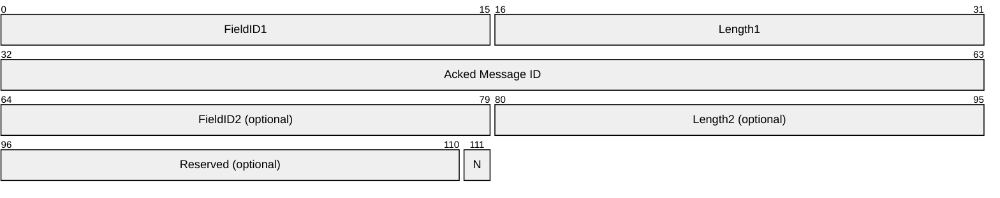
```mermaid
packet-beta
  0-15: "FieldID1"
  16-31: "Length1"
  32-63: "Acked Message ID"
  64-79: "FieldID2 (optional)"
  80-95: "Length2 (optional)"
  96-110: "Reserved (optional)"
  111-111: "N"
```

**FieldID1 (2 bytes):** MUST be set to 0x0018 (PNRP_HEADER_ACKED).

**Length1 (2 bytes):** MUST be set to 0x0008.

**Acked Message ID (4 bytes):** The value of the **Message ID** field in the [PNRP Header](#Section_2.2.1) of the message to which this is a response.

**FieldID2 (2 bytes):** If present, MUST be set to 0x0040 (FLAGS_FIELD).

**Length2 (2 bytes):** If present, MUST be set to 0x0006.

**Reserved (15 bits):** If present, MUST be set to zero when sent and MUST be ignored on receipt.

**N (1 bit):** Not Found. If present, indicates that there is no [**PNRP ID**](#gt_pnrp-id) registered on the sender that corresponds to the **Validate PNRP ID** field in the FLOOD message to which this ACK is a response.

#### 2.2.2.8 LOOKUP

The LOOKUP message is sent by a Resolver to a Publisher to resolve a [**PNRP ID**](#gt_pnrp-id).

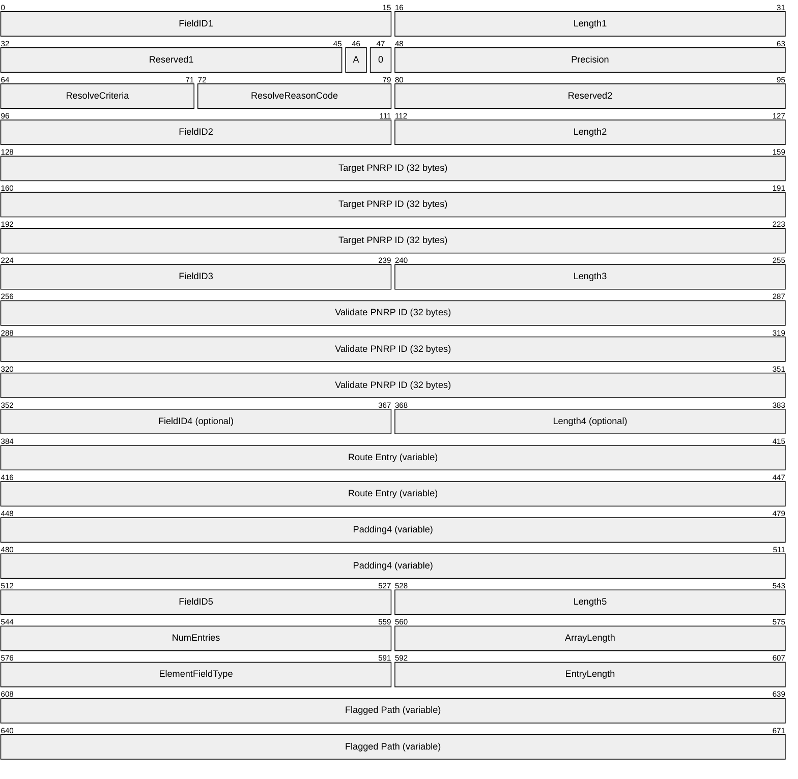
```mermaid
packet-beta
  0-15: "FieldID1"
  16-31: "Length1"
  32-45: "Reserved1"
  46-46: "A"
  47-47: "0"
  48-63: "Precision"
  64-71: "ResolveCriteria"
  72-79: "ResolveReasonCode"
  80-95: "Reserved2"
  96-111: "FieldID2"
  112-127: "Length2"
  128-223: "Target PNRP ID (32 bytes)"
  224-239: "FieldID3"
  240-255: "Length3"
  256-351: "Validate PNRP ID (32 bytes)"
  352-367: "FieldID4 (optional)"
  368-383: "Length4 (optional)"
  384-447: "Route Entry (variable)"
  448-511: "Padding4 (variable)"
  512-527: "FieldID5"
  528-543: "Length5"
  544-559: "NumEntries"
  560-575: "ArrayLength"
  576-591: "ElementFieldType"
  592-607: "EntryLength"
  608-671: "Flagged Path (variable)"
```

**FieldID1 (2 bytes):** MUST be set to 0x0045 (LOOKUP_CONTROLS).

**Length1 (2 bytes):** MUST be set to 0x000C.

**Reserved1 (14 bits):** Reserved. MUST be set to zero when sent and MUST be ignored on receipt.

**A (1 bit):** If set, indicates that the sender is willing to accept returned [**nodes**](#gt_node) that are not closer to the target ID than the **Validate PNRP ID**.

**0 (1 bit):** Reserved. MUST be set to zero when sent and MUST be ignored on receipt.

**Precision (2 bytes):** Number of significant bits to match. When **ResolveCriteria** is not set to SEARCH_OPCODE_UPPER_BITS, the **Precision** field MAY be set to any arbitrary value and MUST be ignored upon receipt.

**ResolveCriteria (1 byte):** The type of PNRP ID matching that the sender is requesting, which is chosen based on higher-layer requirements. MUST be one of the following (for example, although the values are powers of two, they are not bits that can be combined).

| Value | Meaning |
| --- | --- |
| SEARCH_OPCODE_NONE 0x00 | Compare all 256 bits of the PNRP ID. |
| SEARCH_OPCODE_ANY_PEERNAME 0x01 | Compare only the first 128 bits of the PNRP ID. |
| SEARCH_OPCODE_NEAREST_PEERNAME 0x02 | Compare all 256 bits of the PNRP ID and return the closest possible match. |
| SEARCH_OPCODE_NEAREST64_PEERNAME 0x04 | Compare only the first 192 bits of the PNRP ID and return the closest possible match. |
| SEARCH_OPCODE_UPPER_BITS 0x08 | Compare a number of bits equal to the value in the **Precision** field. |

**ResolveReasonCode (1 byte):** The reason for the LOOKUP request. This value is ignored by the recipient. MUST be one of the following.

| Value | Meaning |
| --- | --- |
| REASON_APP_REQUEST 0x00 | The LOOKUP was sent in response to an application request. |
| REASON_REGISTRATION 0x01 | The LOOKUP was sent in response to a completed registration that is being announced. |
| REASON_CACHE_MAINTENANCE 0x02 | The LOOKUP was sent because the node is performing cache maintenance. |
| REASON_SPLIT_DETECTION 0x03 | The LOOKUP was sent because the node is testing for a split cloud. |

**Reserved2 (2 bytes):** MUST be set to zero when sent and MUST be ignored on receipt.

**FieldID2 (2 bytes):** MUST be set to 0x0038 (**Target PNRP ID**).

**Length2 (2 bytes):** MUST be set to 0x0024 (36 bytes).

**Target PNRP ID (32 bytes):** The PNRP ID to look up.

**FieldID3 (2 bytes):** MUST be set to 0x0039 (**Validate PNRP ID**).

**Length3 (2 bytes):** MUST be set to 0x0024 (36 bytes).

**Validate PNRP ID (32 bytes):** A PNRP ID of the destination machine.

**FieldID4 (2 bytes):** If present, MUST be set to 0x009A (ROUTING_ENTRY).

**Length4 (2 bytes):** If present, MUST be set to 4 plus the size in bytes of the **Route Entry** field.

**Route Entry (variable):** If present, a [ROUTE_ENTRY](#Section_2.2.3.4) structure for the best match so far.

**Padding4 (variable):** A number of bytes between 0 and 3, such that the offset from the start of the message to the end of this field is a multiple of 4. MUST be present if and only if **FieldID4** is present. MUST be set to zero when sent and MUST be ignored on receipt.

**FieldID5 (2 bytes):** MUST be set to 0x009E (IPV6_ENDPOINT_ARRAY).

**Length5 (2 bytes):** MUST be set to 12+(**NumEntries*****EntryLength**).

**NumEntries (2 bytes):** Number of entries in the **Flagged Path** field. MUST be in the range 1 to 22.

**ArrayLength (2 bytes):** MUST be set to 8+(**NumEntries*****EntryLength**).

**ElementFieldType (2 bytes):** MUST be set to 0x009D ([IPV6_ENDPOINT](#Section_2.2.3.6)).

**EntryLength (2 bytes):** MUST be set to 0x0012 (18 bytes).

**Flagged Path (variable):** A list of IPV6_ENDPOINT structures for PNRP node that have seen this LOOKUP request so far.

### 2.2.3 Data Structures

#### 2.2.3.1 Encoded CPA

The Encoded CPA structure contains information about an [**endpoint**](#gt_endpoint).

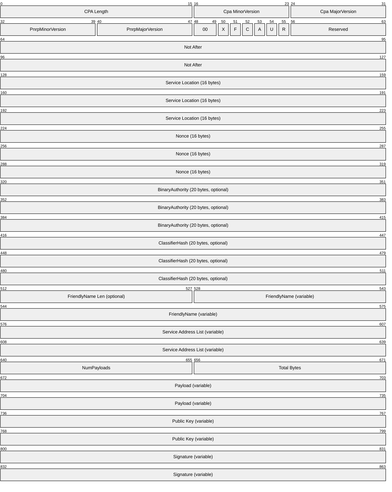
```mermaid
packet-beta
  0-15: "CPA Length"
  16-23: "Cpa MinorVersion"
  24-31: "Cpa MajorVersion"
  32-39: "PnrpMinorVersion"
  40-47: "PnrpMajorVersion"
  48-49: "00"
  50-50: "X"
  51-51: "F"
  52-52: "C"
  53-53: "A"
  54-54: "U"
  55-55: "R"
  56-63: "Reserved"
  64-127: "Not After"
  128-223: "Service Location (16 bytes)"
  224-319: "Nonce (16 bytes)"
  320-415: "BinaryAuthority (20 bytes, optional)"
  416-511: "ClassifierHash (20 bytes, optional)"
  512-527: "FriendlyName Len (optional)"
  528-575: "FriendlyName (variable)"
  576-639: "Service Address List (variable)"
  640-655: "NumPayloads"
  656-671: "Total Bytes"
  672-735: "Payload (variable)"
  736-799: "Public Key (variable)"
  800-863: "Signature (variable)"
```

**CPA Length (2 bytes):** The total number, in [**little-endian**](#gt_little-endian) byte order, of bytes in the Encoded CPA structure.

**Cpa MinorVersion (1 byte):** The minor version of the Encoded CPA structure. MUST be set to 0x00.

**Cpa MajorVersion (1 byte):** The major version of the Encoded CPA structure. MUST be set to 0x02.

**PnrpMinorVersion (1 byte):** The minor version of PNRP that constructed the [CPA](#Section_1.3.1.3). MUST be set to 0x00.

**PnrpMajorVersion (1 byte):** The major version of PNRP that constructed the CPA. MUST be set to 0x04.

**00 (2 bits):** MUST be set to zero when sent and MUST be ignored on receipt

**X (1 bit):** If set, indicates the CPA has an associated [Extended Payload](#Section_2.2.3.3).

**F (1 bit):** If set, indicates the CPA contains the **FriendlyNameLen** and **FriendlyName** fields.

**C (1 bit):** If set, indicates the CPA contains a **ClassifierHash** field. Either the A bit or the C bit (or both) MUST be set.

**A (1 bit):** If set, indicates the CPA contains a **BinaryAuthority** field.

**U (1 bit):** If set, indicates the **FriendlyName** field is encoded as UTF-8 [[RFC2279]](https://go.microsoft.com/fwlink/?LinkId=90331) instead of [**Unicode**](#gt_unicode). This bit MUST be set to 0 if F is 0.

**R (1 bit):** If set, indicates that this is a **Revoke CPA**. That is, it indicates an ID registered at a node is being unregistered.

**Reserved (1 byte):** MUST be set to zero when sent and MUST be ignored on receipt

**Not After (8 bytes):** The number, in little-endian byte order, of 100-nanosecond intervals since January 1, 1601 (UTC), after which the CPA expires. The value SHOULD be from 12 hours in the future up to one week in the future.

**Service Location (16 bytes):** A service location, with the least significant byte first.

**Nonce (16 bytes):** If the **R** flag is set, this MUST be zero. If the **R** flag is clear, this MUST be the value of the **Nonce** field from the [INQUIRE](#Section_2.2.2.5) message that caused this Encoded CPA structure to be constructed.

**BinaryAuthority (20 bytes):** If present, a 160-bit binary representation of the [**authority**](#gt_authority), with the least significant byte first. For [**Secure Peer Names**](#gt_secure-peer-name), the **BinaryAuthority** MUST be a 160-bit SHA-1 [[RFC3174]](https://go.microsoft.com/fwlink/?LinkId=90408) hash of the **PublicKey Data** field of the [CPA Public Key](#Section_2.2.3.1.4) structure in the **Public Key** field. For [**Unsecured Peer Names**](#gt_unsecured-peer-name), the **BinaryAuthority** field MUST NOT be present. Its presence is specified by the **A** flag.

**ClassifierHash (20 bytes):** If a [**classifier**](#gt_classifier) is present, this field MUST contain a 160-bit SHA-1 hash of the classifier text. Its presence is specified by the **C** flag.

**FriendlyName Len (2 bytes):** If present, the count, in little-endian byte order, of bytes in the **FriendlyName** field. Its presence is specified by the **F** flag. If present, it MUST be in the range 1 to 78.

**FriendlyName (variable):** A human-readable label identifying the [**PNRP ID**](#gt_pnrp-id). The **FriendlyName** field's presence is specified by the **F** flag. If present, this MUST be a non-NULL-terminated string, either Unicode or UTF-8 [RFC2279], depending on the value of the **U** flag.

**Service Address List (variable):** A [Service Address List](#Section_2.2.3.1.1) structure.

**NumPayloads (2 bytes):** The number, in little-endian byte order, of payloads that follow this field. MUST be in the range 0 to 1, inclusive. A **Revoke CPA** (for example, a CPA with the R flag set) SHOULD have 0 payloads.

**Total Bytes (2 bytes):** The number, in little-endian byte order, of bytes in the **NumPayloads**, **TotalBytes**, and **Payload** fields. MUST be in the range 4 to 210, inclusive.

**Payload (variable):** A [PAYLOAD](#Section_2.2.3.1.2) structure containing application-supplied data. The length of PAYLOAD MUST NOT exceed 206 bytes.

**Public Key (variable):** A CPA Public Key (section 2.2.3.1.4) structure.

**Signature (variable):** A [SIGNATURE](#Section_2.2.3.2) structure.

##### 2.2.3.1.1 Service Address List

The Service Address List is an encoding of the **IPv6 Addresses** and ports that are used by PNRP on a [**node**](#gt_node) publishing a [**PNRP ID**](#gt_pnrp-id).

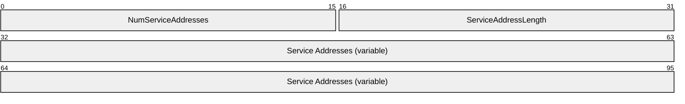
```mermaid
packet-beta
  0-15: "NumServiceAddresses"
  16-31: "ServiceAddressLength"
  32-95: "Service Addresses (variable)"
```

**NumServiceAddresses (2 bytes):** The number of service addresses, in [**little-endian**](#gt_little-endian) byte order, in the **Service Addresses** field. MUST be in the range 0 to 4. A [CPA](#Section_1.3.1.3) with the **R** flag clear (for example, not a **Revoke CPA**) MUST have at least one address.

**ServiceAddressLength (2 bytes):** Number of bytes, in little-endian byte order, per address entry. MUST be set to 0x0012 (18 bytes).

**Service Addresses (variable):** An array of [IPV6_ENDPOINT (section 2.2.3.6)](#Section_2.2.3.6) structures.

##### 2.2.3.1.2 PAYLOAD

The PAYLOAD structure has the following format.

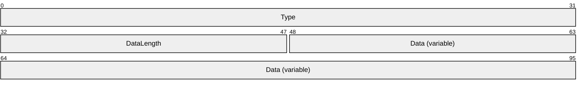
```mermaid
packet-beta
  0-31: "Type"
  32-47: "DataLength"
  48-95: "Data (variable)"
```

**Type (4 bytes):** Type of PAYLOAD, in [**little-endian**](#gt_little-endian) byte order. The only defined type is an array of IPv6 [**endpoints**](#gt_endpoint). This type is defined as 0x00000001.

**DataLength (2 bytes):** Number, in little-endian byte order, of bytes of the **Data** field. MUST be a multiple of 20, and MUST be from 20 through 200.

**Data (variable):** PAYLOAD data. This MUST be an array of [IPV6_APP_ENDPOINT (section 2.2.3.1.3)](#Section_2.2.3.1.3) structures.

##### 2.2.3.1.3 IPV6_APP_ENDPOINT

The IPV6_APP_ENDPOINT structure holds application-supplied IPv6 [**endpoint**](#gt_endpoint) information.

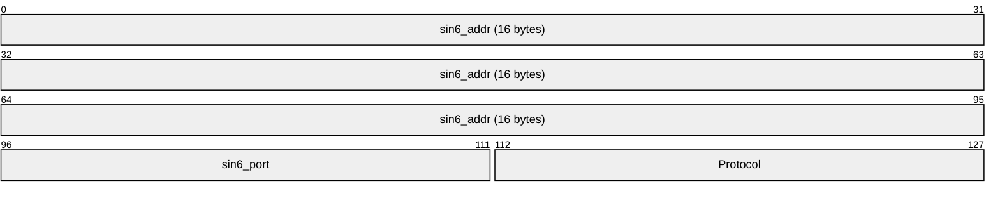
```mermaid
packet-beta
  0-95: "sin6_addr (16 bytes)"
  96-111: "sin6_port"
  112-127: "Protocol"
```

**sin6_addr (16 bytes):** The **IPv6 Address** supplied by an application.

**sin6_port (2 bytes):** The port number supplied by an application.

**Protocol (2 bytes):** The Protocol Number [[IANA-PROTO-NUM]](https://go.microsoft.com/fwlink/?LinkId=89889), in [**little-endian**](#gt_little-endian) byte order, supplied by an application.

##### 2.2.3.1.4 CPA Public Key

The CPA Public Key structure contains an encoding of the public key used to sign the [certified peer address (CPA)](#Section_1.3.1.3).

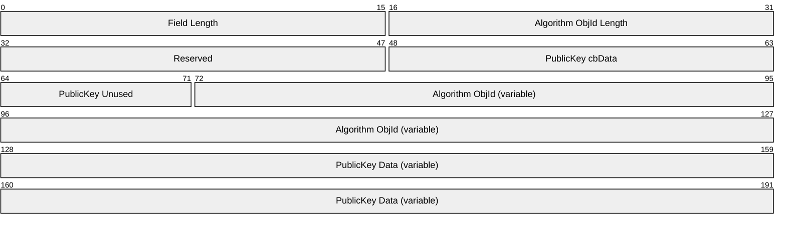
```mermaid
packet-beta
  0-15: "Field Length"
  16-31: "Algorithm ObjId Length"
  32-47: "Reserved"
  48-63: "PublicKey cbData"
  64-71: "PublicKey Unused"
  72-127: "Algorithm ObjId (variable)"
  128-191: "PublicKey Data (variable)"
```

**Field Length (2 bytes):** The size, in [**little-endian**](#gt_little-endian) byte order, of the structure in bytes.

**Algorithm ObjId Length (2 bytes):** The size, in little-endian byte order, of the **Algorithm ObjId** string in bytes. MUST be set to 0x0014 (20 bytes).

**Reserved (2 bytes):** MUST be set to zero when sent and MUST be ignored on receipt.

**PublicKey cbData (2 bytes):** The size, in little-endian byte order, of the **PublicKey Data** field, in bytes. MUST be 0x008C.

**PublicKey Unused (1 byte):** MUST be set to zero when sent and MUST be ignored on receipt.

**Algorithm ObjId (variable):** An ASCII ASN.1-encoded [**object identifier (OID)**](#gt_object-identifier-oid) indicating the public key format, MUST be the same as the rsaEncryption, as specified in [[RFC8017]](https://go.microsoft.com/fwlink/?linkid=2164409) section A.1.

**PublicKey Data (variable):** An ASN.1-encoded 1024-bit RSA public key, as specified in [RFC8017] section A.1.1.

#### 2.2.3.2 SIGNATURE

The SIGNATURE structure carries the encoding of a signature for a [CPA](#Section_1.3.1.3) or an [EXTENDED_PAYLOAD](#Section_2.2.3.3) structure.

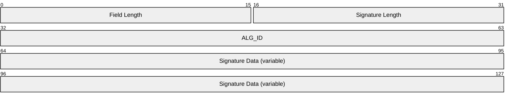
```mermaid
packet-beta
  0-15: "Field Length"
  16-31: "Signature Length"
  32-63: "ALG_ID"
  64-127: "Signature Data (variable)"
```

**Field Length (2 bytes):** Number of bytes, in [**little-endian**](#gt_little-endian) byte order, in the CPA structure. MUST be set to 0x0088.

**Signature Length (2 bytes):** Number of bytes, in little-endian byte order, in the **Signature Data** field. MUST be set to 0x0080.

**ALG_ID (4 bytes):** Hash algorithm identifier, in little-endian byte order. MUST be set to 0x00008004, indicating the RSASSA-PKCS1-v1_5 ([[RFC8017]](https://go.microsoft.com/fwlink/?linkid=2164409) section 8.2) algorithm.

**Signature Data (variable):** Signature created when signing the CPA.

#### 2.2.3.3 EXTENDED_PAYLOAD

The EXTENDED_PAYLOAD structure holds arbitrary data supplied by the application for a [**Peer Name**](#gt_peer-name).

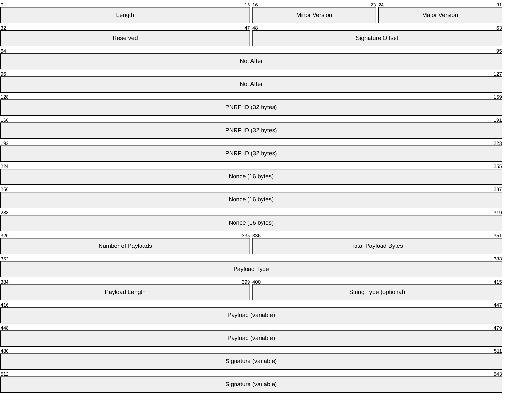
```mermaid
packet-beta
  0-15: "Length"
  16-23: "Minor Version"
  24-31: "Major Version"
  32-47: "Reserved"
  48-63: "Signature Offset"
  64-127: "Not After"
  128-223: "PNRP ID (32 bytes)"
  224-319: "Nonce (16 bytes)"
  320-335: "Number of Payloads"
  336-351: "Total Payload Bytes"
  352-383: "Payload Type"
  384-399: "Payload Length"
  400-415: "String Type (optional)"
  416-479: "Payload (variable)"
  480-543: "Signature (variable)"
```

**Length (2 bytes):** Length, in [**little-endian**](#gt_little-endian) byte order, of the entire EXTENDED_PAYLOAD structure.

**Minor Version (1 byte):** The minor version of the EXTENDED_PAYLOAD structure. MUST be set to 0x00.

**Major Version (1 byte):** The major version of the EXTENDED_PAYLOAD structure. MUST be set to 0x02.

**Reserved (2 bytes):** MUST be set to zero when sent and MUST be ignored on receipt.

**Signature Offset (2 bytes):** Byte offset, in little-endian byte order, from the beginning of the EXTENDED_PAYLOAD structure to the **Signature** field.

**Not After (8 bytes):** The number, in little-endian byte order, of 100-nanosecond intervals, since January 1, 1601 (UTC) until the [CPA](#Section_1.3.1.3) expires.

**PNRP ID (32 bytes):** The [**PNRP ID**](#gt_pnrp-id) with which this EXTENDED PAYLOAD message is associated, transmitted in reverse byte order (that is, the least significant byte is transmitted first).

**Nonce (16 bytes):** The value of the **Nonce** field from the [INQUIRE](#Section_2.2.2.5) message of the node requesting this extended CPA.

**Number of Payloads (2 bytes):** Number, in little-endian byte order, of Payloads to follow. MUST be set to 0x0001.

**Total Payload Bytes (2 bytes):** Total number, in little-endian byte order, of bytes between the end of the **Nonce** field and the beginning of the **Signature** field. This field MUST be 10 plus the value of the **Payload Length** field.

**Payload Type (4 bytes):** The type of Payload, in little-endian byte order. MUST be one of the following.

| Value | Meaning |
| --- | --- |
| 0x80000002 | **Payload** field contains a NULL-terminated string. |
| 0x80000003 | **Payload** field contains binary data. |

**Payload Length (2 bytes):** Number, in little-endian byte order, of bytes in the **String Type** and **Payload** fields. For a binary payload, the value MUST be from 1 through 4096. For a string payload, the value MUST be from 6 through 4098.

**String Type (2 bytes):** The encoding format of the string, in little-endian byte order. This field MUST be present if and only if **PayloadType** is 0x80000002. If present, the value MUST be one of the following.

| Value | Meaning |
| --- | --- |
| 0x0000 | [**Unicode**](#gt_unicode) |
| 0x0001 | UTF-8 |

**Payload (variable):** A NULL-terminated string (if **PayloadType** is 0x80000002) or binary data (if **PayloadType** is 0x80000003) supplied by the application or higher-layer protocol.

**Signature (variable):** A [SIGNATURE](#Section_2.2.3.2) structure.

#### 2.2.3.4 ROUTE_ENTRY

The ROUTE_ENTRY represents the basic critical information about a [**node**](#gt_node) to the other members of the [**cloud**](#gt_cloud). The key elements are a 32-byte [**PNRP ID**](#gt_pnrp-id) and an array of **IPv6 Addresses** on which PNRP on the node is listening.

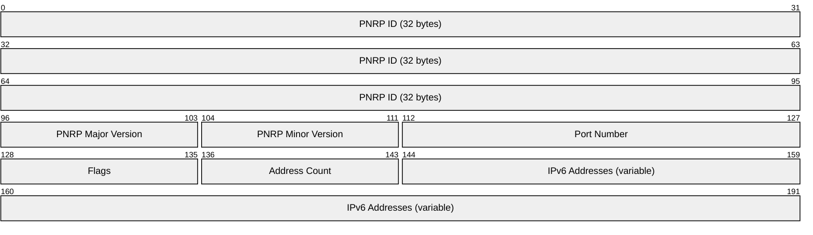
```mermaid
packet-beta
  0-95: "PNRP ID (32 bytes)"
  96-103: "PNRP Major Version"
  104-111: "PNRP Minor Version"
  112-127: "Port Number"
  128-135: "Flags"
  136-143: "Address Count"
  144-191: "IPv6 Addresses (variable)"
```

**PNRP ID (32 bytes):** A 32 byte PNRP ID.

**PNRP Major Version (1 byte):** MUST be set to 0x04.

**PNRP Minor Version (1 byte):** MUST be set to 0x00.

**Port Number (2 bytes):** The UDP port number on which the PNRP node represented by this route entry is listening. MUST be greater than 1024.

**Flags (1 byte):** Reserved. MUST be set to zero when sent and MUST be ignored on receipt.

**Address Count (1 byte):** Number of **IPv6 Addresses** that follow. MUST be in the range 1 to 20.

**IPv6 Addresses (variable):** An array of **IPv6 Addresses** on which the PNRP node represented by this route entry is listening.

#### 2.2.3.5 Certificate Chain

A Certificate Chain is a PKCS 7 Version 1.5 message of type SignedData as specified in [[RFC2315]](https://go.microsoft.com/fwlink/?LinkId=90334) section 9.1. It consists of a list of [[X509]](https://go.microsoft.com/fwlink/?LinkId=90590) version 3 certificates with delegation information stored in extension properties.

The total number of certificates in a Certificate Chain MUST NOT be more than 25.

Each certificate in the chain MUST be an [X509] version 3 [[RFC2459]](https://go.microsoft.com/fwlink/?LinkId=90356) format certificate, with the following constraints on the fields defined in [RFC2459]:

- The **version** ([RFC2459] section 4.1.2.1) MUST be set to 2 (version 3).
- The **signatureAlgorithm** ([RFC2459] section 4.1.1.2) MUST be set to the OID 1.2.840.113549.1.1.5.
- The **serialNumber** ([RFC2459] section 4.1.2.2) MUST be present and MUST be exactly 16 bytes long.
- The **subjectUniqueID** and issuerUniqueID ([RFC2459] section 4.1.2.8) MUST be empty with a length of 0 bytes.
- The **subjectPublicKeyInfo** ([RFC2459] section 4.1.2.7) MUST conform to the syntax as specified in section [2.2.3.1.4](#Section_2.2.3.1.4).
- The **subject** ([RFC2459] section 4.1.2.6) MUST be a null-terminated [**Unicode**](#gt_unicode) string that MUST NOT be longer than 255 characters.
- The **issuer** ([RFC2459] section 4.1.2.4) MUST be a null-terminated Unicode string that MUST NOT be longer than 255 characters.

##### 2.2.3.5.1 Certificate Extensions

As specified in [[RFC2459]](https://go.microsoft.com/fwlink/?LinkId=90356) section 4.2, there is a mechanism for creating Certificate Extensions, where each extension includes an object identifier (OID) and an ASN.1 structure. As specified in [RFC2459], there are several standard extensions for which PNRP uses additional constraints as follows.

The **SubjectAltName** ([RFC2459] section 4.2.1.7) and **IssuerAltName** ([RFC2459] section 4.2.1.8) MUST be [**Unicode**](#gt_unicode) strings and MUST NOT be longer than 255 characters.

For use in certificate extensions, PNRP defines the following OID values.

id-microsoft OBJECT IDENTIFIER ::=

{ iso (1) identified-organization(3) dod (6) internet(1)

private(4) enterprise (1) microsoft(311) }

id-microsoftp2p OBJECT IDENTIFIER ::= { id-microsoft 44 }

id-microsoftp2pgeneral OBJECT IDENTIFIER ::= { id-microsoftp2p 0 }

id-microsoftp2ppnrp OBJECT IDENTIFIER ::= { id-microsoftp2p 3 }

PNRP specifies the following additional certificate extensions. All of the following properties are "critical" (as specified in [RFC2459] section 4.2), which means that if the receiver does not understand a critical property, it MUST reject that certificate.

###### 2.2.3.5.1.1 PnrpCertificateType

pnrpCertificateType EXTENSION ::= {

SYNTAX PnrpCertificateType

IDENTIFIED BY id-microsoftp2pgeneral-pnrpCertificateType }

id-microsoftp2pgeneral-pnrpCertificateType OBJECT IDENTIFIER ::=

{ id-microsoftp2pgeneral 1}

PnrpCertificateType ::= OCTET STRING (SIZE(4))

PnrpCertificateType: The PNRP Certificate type. Every certificate in the chain MUST have this extension and MUST be a 4-byte integer in [**little-endian**](#gt_little-endian) byte order. For the first certificate, the PnrpCertificateType MUST be certTypeRoot (0x00000002), and for all other certificates, the PnrpCertificateType MUST be certTypeMember (0x00000001).

| Value | Meaning |
| --- | --- |
| certTypeMember 0x00000001 | The certificate is one that has been delegated permissions from the previous certificate in the chain. |
| certTypeRoot 0x00000002 | The certificate is the first certificate of a chain. |

###### 2.2.3.5.1.2 PnrpCertificateVersion

pnrpCertificateVersion EXTENSION ::= {

SYNTAX PnrpCertificateVersion

IDENTIFIED BY id-microsoftp2pgeneral-pnrpCertificateVersion }

id-microsoftp2pgeneral-pnrpCertificateVersion OBJECT IDENTIFIER ::=

{ id-microsoftp2pgeneral 4 }

PnrpCertificateVersion ::= OCTET STRING (SIZE(4))

PnrpCertificateVersion: The PNRP Certificate version number. MUST be set to 0x01000200 (in network byte order), meaning version 1.2. Every certificate in the [Certificate Chain](#Section_2.2.3.5) MUST have this extension.

###### 2.2.3.5.1.3 PnrpPeerName

pnrpPeerName EXTENSION ::= {

SYNTAX PnrpPeerName

IDENTIFIED BY id-microsoftp2pgeneral-pnrpPeerName }

id-microsoftp2pgrouping-pnrpPeerName OBJECT IDENTIFIER ::=

{ id-microsoftp2ppnrp 1 }

PnrpPeerName ::= SEQUENCE SIZE (1) OF GeneralName

PnrpPeerName: A [**Peer Name**](#gt_peer-name), encoded as a **GeneralName**, as specified in [[RFC2459]](https://go.microsoft.com/fwlink/?LinkId=90356) section 4.2.1.7, which allows a choice of types. The type choice MUST be otherName(0), indicating a subtype of AnotherName ([RFC2459] section A.2). The type-id of **AnotherName** MUST be set to id-microsoftp2pgeneral-PeerName, and the value MUST be a PnrpPeerNameString as shown in the following formal language specification. The last certificate in the chain MUST have this extension.

id-microsoftp2pgeneral-PeerName OBJECT_IDENTIFIER ::=

{ id-microsoftp2pgeneral 2 }

PnrpPeerNameString ::= UniversalString (SIZE (1..192))

**PnrpPeerNameString**: An arbitrary Peer Name string. This string is not used by PNRP, except to verify that it exists in the last certificate in the chain and that the value is the same in the first and last certificates in the chain. The **PnrpPeerNameString** value MUST conform to the syntax of a Peer Name, as specified in section [2.2.4](#Section_1.3.1.1).

###### 2.2.3.5.1.4 PnrpRole

pnrpRole EXTENSION ::= {

SYNTAX PnrpRole

IDENTIFIED BY id-microsoftp2pgrouping-pnrpRole }

id-microsoftp2pgrouping-pnrpRole OBJECT IDENTIFIER ::=

{ id-microsoftp2ppnrp 3 }

RoleUuid ::= OCTET STRING

{ roleAdmin (04387127aa56450a8ce54f565c6790f4),

roleMember (f12dc4c708574ca093fcb1bb19a3d8c2),

roleInvitingMember (dd15f41ffc4e4922b0354c06a754d01d) }

PnrpRole ::= SEQUENCE SIZE (1..MAX) OF RoleUuid

PnrpRole: This property MUST exist in all certificates except the first certificate in the chain. Each **RoleUuid** MUST be one of the following.

| Value | Meaning |
| --- | --- |
| roleAdmin | All [**classifiers**](#gt_classifier) in the [PnrpClassifiersList](#Section_2.2.3.5.1.5) extension have some classifier in the previous certificate's classifiers list (if any) as a prefix. |
| roleMember | All classifiers in the PnrpClassifiersList extension are equal to some classifier in the previous certificate's classifiers list (if any). |
| roleInvitingMember | Same as roleAdmin. An application or higher-layer protocol decides this, and can use either value. |

###### 2.2.3.5.1.5 PnrpClassifiersList

pnrpClassifiersList EXTENSION ::= {

SYNTAX PnrpClassifiersList

IDENTIFIED BY id-microsoftp2pgeneral-PeerClassifiers }

id-microsoftp2pgrouping-pnrpClassifersList OBJECT IDENTIFIER ::=

{ id-microsoftp2ppnrp 5 }

PnrpClassifiersList ::= GeneralNames

PnrpClassifiersList: A set of 0 or more [**classifiers**](#gt_classifier), each encoded as a **GeneralName** (as specified in [[RFC2459]](https://go.microsoft.com/fwlink/?LinkId=90356) section 4.2.1.7), which allows a choice of types. The type choice for each name MUST be otherName(0), indicating a subtype of AnotherName, as specified in [RFC2459] section A.2. The type-id of AnotherName MUST be id-microsoftp2pgeneral-PeerClassifiers, and the value MUST be a PnrpClassifier as shown in the following formal language specification. This property MUST exist in all certificates except the first certificate in the chain. A list of 0 classifiers (that is, an empty list) means that all classifiers are legal. The list MUST NOT be empty unless the [PnrpRole](#Section_2.2.3.5.1.4) extension (as specified in section 2.2.3.5.1.4) has a value of either roleAdmin or roleInvitingMember and the previous certificate's classifier list contains an empty classifier ("").

id-microsoftp2pgeneral-PeerClassifiers OBJECT_IDENTIFIER ::=

{ id-microsoftp2pgeneral 3 }

PnrpClassifier ::= UniversalString (SIZE (1..150))

**PnrpClassifier:** A classifier string for which permission is delegated to the next certificate in the chain. For every certificate in the chain other than the first certificate, each classifier MUST be one that is a legal delegate (as specified in section [2.2.3.5.1.5.1](#Section_1.3.2)) based on the same certificate's role, and the previous certificate's classifier list.

Classifier Delegation

The following rules MUST be used to determine whether a given [**classifier**](#gt_classifier) and role are legal based on a delegator's classifier list:

- If the delegator's classifier list is empty, then any given classifier and role are legal.
- Otherwise, if the specified role is either roleAdmin or roleInvitingMember, the given classifier MUST either match a classifier in the delegator's classifier list or begin with a classifier in the delegator's classifier list.
- Otherwise, the given classifier MUST match a classifier in the delegator's classifier list exactly.
The following table shows some examples.

| Delegator's classifier list | Specified role is either roleAdmin or roleInvitingMember? | Valid classifiers | Invalid classifiers |
| --- | --- | --- | --- |
| <empty> | Either Yes or No | All classifiers (including <empty list>) | None |
| "", "fish" | Yes | All classifiers (including <empty list>) | None |
| "", "fish" | No | "", "fish" | <empty list>, "fish food" |
| "fish", "cheese" | Yes | "fish", "fish food", "cheese", "cheese-like" | <empty list>, "cheese", "ham" |
| "fish", "cheese" | No | "fish", "cheese" | <empty list>, "fish food", "cheese-like" |

#### 2.2.3.6 IPV6_ENDPOINT

The IPV6_ENDPOINT structure contains information about an IPV6_ENDPOINT of a PNRP [**node**](#gt_node).

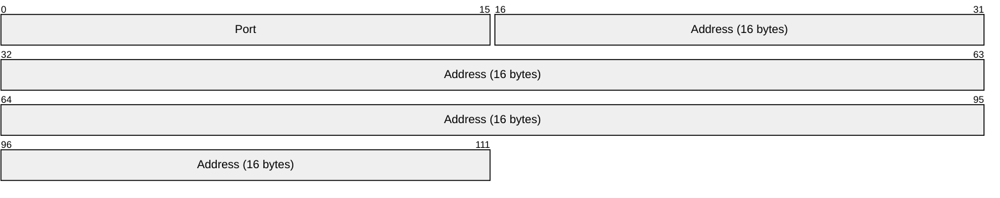
```mermaid
packet-beta
  0-15: "Port"
  16-111: "Address (16 bytes)"
```

**Port (2 bytes):** IPv6 port. MUST be greater than 1024.

**Address (16 bytes):** IPv6 address.

### 2.2.4 Peer Names

Protocols and higher-layer applications use Peer Names for publishing [**endpoint**](#gt_endpoint) information and to resolve them to endpoint information. A [**Peer Name**](#gt_peer-name) MUST be a [**Unicode**](#gt_unicode) string conforming to the following syntax (specified here using Augmented Backus-Naur Form (ABNF) [[RFC5234]](https://go.microsoft.com/fwlink/?LinkId=123096)).

peername = authority "." classifier

authority = "0" / secureauthority

secureauthority = 40auchar

auchar = DIGIT / %d97-102

classifier = 0*149clchar

clchar = %x0001-FFFF ; any non-NULL Unicode character

# 3 Protocol Details

PNRP nodes use eight specific message types. These messages can be split into two distinctive classes: request messages ([SOLICIT](#Section_2.2.2.1), [REQUEST](#Section_2.2.2.3), [FLOOD](#Section_2.2.2.4), [LOOKUP](#Section_2.2.2.8), and [INQUIRE](#Section_2.2.2.5)) and acknowledge messages ([ADVERTISE](#Section_2.2.2.2), [ACK](#Section_2.2.2.7), and [AUTHORITY_BUFFER](#Section_2.2.2.6.1)). Request messages are initiated by one [**node**](#gt_node) and sent to another. Acknowledge messages are sent in reply to received request messages.

Specific relationships of messages sent by a Resolver are shown in the following table.

| Message sent by Resolver | Acknowledgment sent by Publisher |
| --- | --- |
| SOLICIT | ADVERTISE |
| REQUEST | ACK |
| LOOKUP | AUTHORITY_BUFFER (contained in an [AUTHORITY](#Section_2.2.2.6)) |
| INQUIRE | AUTHORITY_BUFFER (contained in an AUTHORITY) |

Specific relationships of messages sent to a Resolver are shown in the following table.

| Message sent by Publisher | Acknowledgment sent by Resolver |
| --- | --- |
| FLOOD with **D** flag clear | ACK |

## 3.1 Resolver Details

### 3.1.1 Abstract Data Model

This section describes a conceptual model of a possible data organization that an implementation maintains to participate in this protocol. The described organization is provided to facilitate the explanation of how the protocol behaves. This document does not mandate that implementations adhere to this model as long as their external behavior is consistent with that described in this document.

- **Cloud Table:** A set of state for each [**cloud**](#gt_cloud) in which the [**node**](#gt_node) can perform resolutions. Each entry in the cloud table has the following state:
- **Open Count:** The number of times an application or higher-layer protocol has opened this cloud.
- **Conversation Table:** A table of state for synchronization conversations in progress, if any. Each entry has the following state:
- **Nonce:** The [**nonce**](#gt_nonce) being used in the current synchronization conversation in progress, if any.
- **SolicitMessageId:** Message ID of the [SOLICIT](#Section_2.2.2.1) message sent.
- **Local Endpoint List:** The list of [**network endpoints**](#gt_network-endpoint) on which this PNRP node is listening for messages for this cloud.
- **Outstanding Resolves Table:** A table of state for resolutions in progress. Each entry has the following state:
- **Target PNRP ID:** The [**PNRP ID**](#gt_pnrp-id) being resolved.
- **ResolveReasonCode:** The resolve reason code (as specified in section [2.2.2.8](#Section_2.2.2.8)) for this resolve.
- **ResolvePath:** A list of network endpoints of PNRP nodes that have already been asked about this request.
- **NextHopStack:** A last-in, first-out stack of entries for nodes that can be consulted to find closer matches. Each entry contains the following:
- **RouteEntry:** Route entry for the PNRP node.
- **UseCount:** A count of the number of times a LOOKUP message has been sent to this node.
- **BestMatchStack:** A last-in, first-out stack of the route entries closest to the target. This maintains a history of route entries that were previously stored at CurrentBestMatch.
- **CurrentBestMatch:** The route entry that is the Best Match so far.
- **CurrentNextHop:** The entry of the same type as used in NextHopStack that contains the route entry for the node to which the current LOOKUP message has been sent.
- **NewNextHop:** Temporary storage for a route entry received during [AUTHORITY](#Section_2.2.2.6) message processing.
- **SuspiciousCount:** A count of hops that returned an [AUTHORITY_BUFFER](#Section_2.2.2.6.1) message with the **L** flag set.
- **TotalUsefulHops:** Total number of nodes that were sent LOOKUP messages (both to and from) and from which an AUTHORITY_BUFFER message was received in reply.
- **LastSentMessageId:** The Message ID of the last sent LOOKUP or [INQUIRE](#Section_2.2.2.5) message sent. Used to match up received AUTHORITY messages.
- **Pending List:** A set of messages that have been sent and are awaiting acknowledgment or retransmission. Each entry in the queue has the message, a Retry Count, and a Message Retransmission Timer, as specified in section [3.1.2](#Section_3.1.2).
- **Pending Route Entry Add List:** A list of route entries in the process of being added to the Route Entry Cache. Each entry has the following state:
- **RouteEntry:** The route entry being pended.
- **NeedCpa:** Flag indicating whether a [CPA](#Section_1.3.1.3) was requested.
- **InquireMessageId:** Message ID of the INQUIRE message sent to validate this route entry.
- **AlreadyFloodedAddressList:** If the route entry is being added because it was received via a [FLOOD (section 2.2.2.4)](#Section_2.2.2.4) message, then this list is a copy of the **AlreadyFloodedList** contained in the message.
- **Reassembly List:** A list of AUTHORITY_BUFFER messages currently in the process of being reassembled. Each entry has the following state:
- **Message ID:** The Message ID value in the [PNRP Header](#Section_2.2.1) for the AUTHORITY messages being reassembled.
- **Source IP address and port:** The IP address and port of the peer from which AUTHORITY_BUFFER message fragments were received.
- **Size:** Expected size of the final buffer.
- **Buffer:** A buffer into which fragments are placed.
- **Route Entry Cache:** A cache of route entries. Each route entry in the cache contains a PNRP ID and a list of network endpoints.
- **CurrentSeedServerAddressIndex:** Index into a list of addresses for seed server nodes.
- **CloudDiscoveryMode:** Current discovery method being used. The modes are defined as SeedServer, Simple Service Discovery Protocol (as specified in [[UPNPARCH1]](https://go.microsoft.com/fwlink/?LinkId=90554), section 1), and [**LocalOOB**](#gt_localoob-local-out-of-band).
- **CloudDiscoverySSDPTargetCount:** The number of SSDP nodes to which the node has sent a SOLICIT message. SSDP is specified in [UPNPARCH1], section 1.
- **SSDPResponseRequestIdentifier:** A unique URI used to match SSDP responses to requests. SSDP is specified in [UPNPARCH1], section 1.
**Note** The preceding conceptual data can be implemented by using a variety of techniques. An implementer is at liberty to implement such data in any manner as required.

### 3.1.2 Timers

Each entry in the Cloud Table has the following timers:

- **Cloud Cleanup Timer:** This one-shot timer is used to remove state for a [**cloud**](#gt_cloud) after the state is no longer needed. The duration SHOULD be 15 minutes.
- **Maintenance Timer:** A periodic timer used to perform periodic cache maintenance. The period SHOULD<1> be 15 seconds to keep the cache functional.
- **Message Retransmission Timer:** This conceptual timer exists for each entry in the Pending List, and is used for retransmission. The period SHOULD be one second.

### 3.1.3 Initialization

None.

### 3.1.4 Higher-Layer Triggered Events

A Resolver MUST provide to higher-layer applications and protocols three logical operations that can be invoked: [Opening a Cloud](#Section_3.1.4.1), [Resolving a Peer Name](#Section_3.1.4.4), and [Closing a Cloud](#Section_3.1.4.5).

#### 3.1.4.1 Opening a Cloud

When a higher-layer application or protocol asks PNRP to open a given [**cloud**](#gt_cloud) (optionally specifying one or more seed servers for the cloud), the [**node**](#gt_node) MUST first check whether the cloud already exists in the Cloud Table. If the cloud exists, the node MUST increment the Open Count. Otherwise, the node MUST attempt to create a new entry in the Cloud Table, and if it cannot, it MUST return a failure to the application or higher-layer protocol.

If a new entry is created, the node MUST carry out the following procedures when initializing.

- Choose a port and a set of four **IPv6 Addresses**, or as many as the local system has, not exceeding four, which the node will use for PNRP communication. The addresses MUST all be of the same scope and scope zone (as specified in [[RFC4007]](https://go.microsoft.com/fwlink/?LinkId=90454) section 5). The same port number MUST be used for all addresses. Each address/port combination MUST NOT be in the Local Endpoint List of any other entry in the Cloud Table. If no addresses are available, the open attempt MUST report a failure. Otherwise, store the chosen addresses in the Local Endpoint List.
- Begin listening for incoming messages on the UDP port and **IPv6 Addresses** chosen.
- Set CurrentSeedServerAddressIndex to 0, set CloudDiscoveryMode to [**LocalOOB**](#gt_localoob-local-out-of-band) and initiate the cloud discovery process as specified in section [3.1.4.2](#Section_3.1.4.2).
- Start the Maintenance Timer for the cloud.

#### 3.1.4.2 Discovering Other Nodes in a Cloud

If CloudDiscoveryMode is [**LocalOOB**](#gt_localoob-local-out-of-band), the [**node**](#gt_node) MAY<2> initiate the synchronization conversation against a list of [**endpoints**](#gt_endpoint) provided via an implementation-specific means. If any such addresses are available, the node MUST initiate a synchronization conversation to each one (as specified in section [3.1.4.3](#Section_3.1.4.3)), set CloudDiscoveryMode to SSDP, and then SHOULD end processing (the node MAY instead continue below, for example, after an implementation-specific period of time waiting for responses from the chosen addresses). Otherwise, set CloudDiscoveryMode to SSDP, and continue processing as follows.

If CloudDiscoveryMode is SSDP, the PNRP node MUST initiate the multicast discovery (as specified in section [3.1.4.2.2](#Section_3.1.4.2.2)) and change the CloudDiscoveryMode to SeedServer. The node SHOULD then end processing for this mode (it MAY instead continue below, for example, after an implementation-specific period of time waiting for Simple Service Discovery Protocol responses, as specified in [[UPNPARCH1]](https://go.microsoft.com/fwlink/?LinkId=90554), section 1).

If CloudDiscoveryMode is SeedServer, the node MUST carry out the process as specified in section [3.1.4.2.1](#Section_3.1.4.2.1) to obtain a list of nodes acting as seed servers.

##### 3.1.4.2.1 Using Seed Servers

If the application or higher-layer protocol specified one or more seed server, then the PNRP node SHOULD use those seed servers. Otherwise, the PNRP node SHOULD use any seed servers it is configured with for the [**cloud**](#gt_cloud), and if none exist, it MUST set CloudDiscoveryMode to [**LocalOOB**](#gt_localoob-local-out-of-band).

Microsoft provides machines with the [**DNS**](#gt_domain-name-system-dns) names PNRPV2.IPV6.MICROSOFT.COM and PNRPV21.IPV6.MICROSOFT.COM, which act as seed servers to the Microsoft Global PNRP Cloud. The **IPv6 Addresses** of these machines MUST be determined via DNS lookups. A PNRP node SHOULD first perform a DNS lookup of PNRPV2.IPV6.MICROSOFT.COM and PNRPV21.IPV6.MICROSOFT.COM. The node SHOULD<3> then combine the results from the two queries, and sort the resulting address list by using the algorithm as specified in [[RFC3484]](https://go.microsoft.com/fwlink/?LinkId=90424) section 6.

If CurrentSeedServerAddressIndex is greater than the number of addresses in the list, CurrentSeedServerAddressIndex MUST be set to zero. The node MUST select the address in the list at the index equal to CurrentSeedServerAddressIndex, increment CurrentSeedServerAddressIndex, initiate a synchronization conversation (as specified in section [3.1.4.3](#Section_3.1.4.3)) to the address selected by using UDP port 3540, and finally set CloudDiscoveryMode to LocalOOB.

##### 3.1.4.2.2 Multicast Cloud Discovery

To initiate multicast [**cloud**](#gt_cloud) discovery, PNRP MUST do the following:

- Set CloudDiscoverySSDPTargetCount to zero.
- If the Simple Service Discovery Protocol (SSDP) (as specified in [[UPNPARCH1]](https://go.microsoft.com/fwlink/?LinkId=90554), section 1) is available, issue an SSDP **M-SEARCH** ([UPNPARCH1], section 1.2.2) for PNRP in the preferred cloud by using the following search target string in the search message.
"urn:Microsoft Windows Peer Name Resolution Protocol: V4:IPV6:<Scope>"

<Scope> MUST be replaced by either "Global", "SiteLocal", or "LinkLocal" (without the quotation marks).

- Set SSDPResponseRequestIdentifier to the search target string used in the **M-SEARCH**.

#### 3.1.4.3 Initiating a PNRP Synchronization Conversation

A synchronization conversation allows a [**node**](#gt_node) to exchange resource information in the form of [ROUTE_ENTRY](#Section_2.2.3.4) structures with another given node in a given [**cloud**](#gt_cloud).

The PNRP node MUST generate a random 16-byte [**nonce**](#gt_nonce) value, save it in its local Conversation nonce state, and then send to the given node a [SOLICIT](#Section_2.2.2.1) message that includes an SHA-1 [[RFC3174]](https://go.microsoft.com/fwlink/?LinkId=90408) hash of the Conversation nonce in the **Hashed Nonce** field.

The node MUST save the Message ID of the SOLICIT message in the entry in the conversation table.

The node MUST also put the SOLICIT message in the Pending List, set its Retry Count to 2, and start its Message Retransmission Timer.

#### 3.1.4.4 Resolving a Peer Name

In a resolution operation, five inputs are provided by the application or higher layer protocol:

- A [**Peer Name**](#gt_peer-name);
- A ServiceLocationPrefix which is a 64-bit integer used to form the top 64 bits of the service location;
- A ResolveCriteria corresponding to the OpCode values as specified in section [2.2.2.8](#Section_2.2.2.8), which is used by the higher-layer protocol to resolve specific service records for a given authority and classifier as defined by the higher-layer protocol semantics;
- A flag indicating whether to consider locally-registered [**PNRP IDs**](#gt_pnrp-id); and
- An indication in which [**cloud**](#gt_cloud) the resolution is to be done.
If the cloud has not been opened (for example, no state in the Cloud Table exists), the node MUST fail the request. Otherwise, the Resolver MUST validate that the Peer Name conforms to the syntax as specified in section [2.2.4](#Section_1.3.1.1), and fail the request if it does not conform.

If there are no addresses in the Local Endpoint List, the node MUST fail the request.

The Resolver MUST then construct a PNRP ID (as specified in section [3.1.4.4.1](#Section_3.1.4.4.1)) from the Peer Name and ServiceLocationPrefix provided by the application or higher-layer protocol, and from the 64-bit Service Location Suffix (in network byte order) 0x8000000000000000.

The Resolver MUST then attempt to resolve the PNRP ID (as specified in section [3.1.4.4.2](#Section_3.1.4.4.2)) with ResolveReasonCode set to REASON_APP_REQUEST, InitialBestMatchRouteEntry and InitialNextHopRouteEntry set to empty, and PickBestMatchFromLocalIds set to true if the calling code requests locally registered IDs to be considered.

##### 3.1.4.4.1 Constructing a PNRP ID

The Resolver MUST first separate the [**Peer Name**](#gt_peer-name) into its [**authority**](#gt_authority) and [**classifier**](#gt_classifier) parts. The authority MUST then be converted to the 160-bit binary number (which is called the BinaryAuthority) that corresponds to the 40 hexadecimal digits in the Authority string.

A ServiceLocation MUST then be constructed by concatenating the 64-bit ServiceLocationPrefix, and then the 64-bit ServiceLocationSuffix value.

Finally, the BinaryAuthority, Classifier, and ServiceLocation MUST then be converted to a [**PNRP ID**](#gt_pnrp-id) by using the following formulas

ClassifierHash = SHA-1(Classifier)

P2PID = First 16 bytes(SHA-1(ClassifierHash, BinaryAuthority, ClassifierHash, "PNRP"))

PNRP ID = (P2PID << 128) | ServiceLocation

where SHA-1() indicates an SHA-1 hash as specified in [[RFC3174]](https://go.microsoft.com/fwlink/?LinkId=90408), and "PNRP" is a 4-byte ASCII string. (Note that SHA-1 provides a 20-byte value, from which the P2PID formula drops the final 4 bytes to produce a result which is 128 bits in length.)

##### 3.1.4.4.2 Resolving a PNRP ID

All nodes taking part in PNRP will carry out the resolve process from time to time. Resolve-only nodes use the resolve process to handle requests from higher-layer applications to resolve a [**Peer Name**](#gt_peer-name). The process is also used in cache maintenance operations. Publishers use the resolve operation to advertise published IDs to the rest of the cloud. Publishers also use the resolve operation to attempt to detect splits in the cloud.

The following parameters MUST be supplied to the resolving logic:

- *Target PNRP ID*, which is mapped to the PNRP_ID obtained in section [3.1.4.4.1](#Section_3.1.4.4.1).
- *ResolveCriteria*, which maps to *ResolveCriteria* provided by the application or higher-layer protocol as defined in section [3.1.4.4](#Section_3.1.4.4).
- *PickBestMatchFromLocalIds*, which maps to *PickBestMatchFromLocalIds* provided by the application or higher-layer protocol as defined in 3.1.4.4.
- *ResolveReasonCode*, which maps to *ResolveReasonCode* provided by the application or higher-level protocol.
And optionally:

- *InitialBestMatchRouteEntry*, which is a ROUTE_ENTRY structure used by the protocol during PeerName registration. See section [3.2.4.1](#Section_3.2.4.1) for details.
- *InitialNextHopRouteEntry*, which is a ROUTE_ENTRY structure used by the protocol during maintenance. See section [3.2.6.2.1](#Section_3.2.6.2.1.1) for details.
A Resolver MUST then perform the following steps:

- Attempt to create a new entry in the Outstanding Resolves Table, and fail the request if one cannot be created. If one was created, initialize the fields as follows.
- Initialize SuspiciousCount and TotalUsefulHops to 0.
- The resolve entry's ResolvePath MUST be initialized to contain any one of the endpoints in the Local Endpoint List.
- Save the supplied Target [**PNRP ID**](#gt_pnrp-id) and ResolveReasonCode in the corresponding fields of the resolve entry.
- If InitialNextHopRouteEntry was supplied, push it onto NextHopStack. Otherwise, select the route entry from the cache for the PNRP ID numerically closest to the Target PNRP ID and push this route entry onto the resolve entry's NextHopStack. In both cases the UseCount for the entry on the stack MUST be set to zero.
- If an InitialBestMatchRouteEntry was supplied, push it onto the resolve entry's BestMatchStack.
- If the resolve entry's CurrentBestMatch is not empty and the PNRP ID of the most recently pushed entry in BestMatchStack is sufficiently close (per the ResolveCriteria) to the Target PNRP ID, then:
Create an [INQUIRE](#Section_2.2.2.5) message with the **Validate PNRP ID** field set to the PNRP ID of CurrentBestMatch, and the **Request CPA**, **Certificate Chain**, **Classifier**, and **Extended Payload** flags set. Set LastSentMessageID to the message ID of the INQUIRE message. Then choose an address from the CurrentBestMatch route entry's address list by using the algorithm as specified in [[RFC3484]](https://go.microsoft.com/fwlink/?LinkId=90424) section 6, and send the INQUIRE message to that address. Finally, put the INQUIRE message in the Pending List, set the message Retry Count to 2, and start its Message Retransmission Timer. If the timer expires and the message Retry Count is reduced to 0, reattempt the process starting from step 7 (i.e., If the resolve entry's CurrentBestMatch is not empty…).

Otherwise (for example, if the resolve entry's CurrentBestMatch is empty or the most recently pushed entry in BestMatchStack is not sufficiently close to the Target PNRP ID), continue processing as follows.

- Attempt to pop a route entry off NextHopStack and store this route entry in the resolve entry's CurrentNextHop. If CurrentNextHop is empty, SuspiciousCount is greater than 6, or TotalUsefulHops is greater than 22, the Resolver MUST do the following:
If the resolve entry's CurrentBestMatch is not empty, check to see whether the CurrentBestMatch is sufficiently close (per the ResolveCriteria) to the Target PNRP ID. If it is not, or the CurrentBestMatch is empty, return no results to caller because no adequate match was found; the Resolve operation is now complete. Otherwise, send an INQUIRE message as in the previous step.

If NextHopStack is not empty, SuspiciousCount is less than or equal to 6, and TotalUsefulHops is less than or equal to 22, then continue processing as follows.

- Prepare a [LOOKUP](#Section_2.2.2.8) message with the **Validate PNRP ID** field set to the PNRP ID from the route entry in the CurrentNextHop, and the **Flagged Path** field filled with the entries from the ResolvePath. If the number of entries in the cache is less than 8, the Resolver SHOULD set the **A** flag in the LOOKUP message.
- Choose an address from the list of addresses in the route entry in CurrentNextHop state, using the algorithm as specified in [RFC3484] section 6, send the LOOKUP message to it, and then increment the UseCount in the CurrentNextHop state. Set LastSentMessageID to the message ID of the LOOKUP message. Put the LOOKUP message in the Pending List, set the message Retry Count to 2, and start its Message Retransmission Timer.

#### 3.1.4.5 Closing a Cloud

When an application or higher-layer protocol closes a [**cloud**](#gt_cloud), the PNRP [**node**](#gt_node) MUST verify that it has the cloud state for the cloud with a nonzero Open Count, and fail the request if not. Otherwise, the PNRP node MUST decrement the Open Count. If the Open Count is then zero, the PNRP node MUST start the Cloud Cleanup Timer.

### 3.1.5 Message Processing Events and Sequencing Rules

#### 3.1.5.1 Receiving an SSDP Response

When an SSDP response (as specified in [[UPNPARCH1]](https://go.microsoft.com/fwlink/?LinkId=90554), section 1) is received, the PNRP [**node**](#gt_node) MUST handle it as follows:

First, it finds the entry in the Cloud Table corresponding to the request (for example, based on the SSDPResponseRequestIdentifier URI in the [**cloud**](#gt_cloud) entry to the ST field of the response). If no match is found, the node MUST drop the SSDP response.

The format of the text in the **AL** field MUST be in the form of an **IPv6 Addresses** and port in the format as specified in [[RFC2732]](https://go.microsoft.com/fwlink/?LinkId=90375) (for example, the format of the host name of a URL). If it is not correctly formatted, the response MUST be discarded.

If CloudDiscoverySSDPTargetCount is less than 5, initiate the synchronization as specified in section [3.1.4.3](#Section_3.1.4.3) to the address and port indicated in the AL Element of the SSDP response. CloudDiscoverySSDPTargetCount MUST then be incremented.

Otherwise, it discards the SSDP response.

#### 3.1.5.2 Receiving a PNRP Message

When a [**node**](#gt_node) receives a [PNRP Message](#Section_2.2.2), it MUST first check whether the message starts with a [PNRP Header](#Section_2.2.1) that conforms to the syntax as specified in section 2.2.1, and silently drop the message if not. If the UDP source port of the message is less than or equal to 1024, it MUST silently drop the message.

The node MUST then determine the cloud to which the message applies (based on the local address and port to which the message was sent).

The node MUST then check the **Message Type** field, and handle additional type-specific processing in accordance with its message type. Messages with types other than those specified in this document MUST be dropped.

#### 3.1.5.3 Receiving an ADVERTISE Message

When a Resolver receives an [ADVERTISE](#Section_2.2.2.2) message, it MUST perform the following steps:

- Match **Acked Message ID** in the ADVERTISE message against any [SOLICIT](#Section_2.2.2.1) messages in the Pending List. If no match is found, the Resolver MUST silently discard the ADVERTISE message. Otherwise the Resolver MUST remove the SOLICIT message from the Pending List and continue processing as follows.
- Use the hashed nonce in the message to verify that a corresponding SOLICIT message was sent.
- Check the array of [**PNRP IDs**](#gt_pnrp-id) in the ADVERTISE message. If the array is empty (for example, NumEntries is 0x0000), silently discard the message.
- Select a set of PNRP IDs in the array to request. The node SHOULD select all PNRP IDs in the array.
- Prepare a [REQUEST](#Section_2.2.2.3) message with the desired PNRP IDs and send it to the remote node. The node MUST also add the REQUEST message to the Pending List, set its Retry Count to 2, and start its Message Retransmission Timer.

#### 3.1.5.4 Receiving an ACK Message

When an [ACK](#Section_2.2.2.7) message is received, the receiving node MUST attempt to match the **Acked Message ID** field with the Message ID of an entry in the **Pending List**. If a match is not found, the message MUST be silently discarded with no further action.

Alternatively, if a match is found, the entry in the **Pending List** MUST be removed. If the matching message is a [FLOOD](#Section_2.2.2.4) (section 2.2.2.4) message and the ACK (section 2.2.2.7) message has the **N** bit set, the receiver MUST also remove the PNRP ID contained in the FLOOD message **Validate PNRP ID** field from the Route Entry Cache because the PNRP ID is no longer registered in the network.

#### 3.1.5.5 Receiving a FLOOD Message

Upon receiving a [FLOOD](#Section_2.2.2.4) message, a PNRP [**node**](#gt_node) MUST perform the following steps:

- Check whether the FLOOD message conforms to the syntax as specified in section 2.2.2.4, and drop the message if not. Otherwise, continue processing as follows.
- If the **D** flag is clear, reply with an [ACK](#Section_2.2.2.7) message to the sending node.
- If a [ROUTE_ENTRY](#Section_2.2.3.4) is supplied in the FLOOD message, begin validating the ROUTE_ENTRY as specified in [Receiving a New ROUTE_ENTRY (section 3.1.5.11)](#Section_3.2.5.1).
- If a **Revoke CPA** is supplied in the FLOOD message, validate the [CPA](#Section_1.3.1.3) (as specified in section [3.1.5.7](#Section_3.1.5.7)) as a **Revoke CPA** and, if not valid, discard.
- Extract the **ClassifierHash**, **BinaryAuthority**, and **ServiceLocation** values from the CPA and use them to calculate the [**PNRP ID**](#gt_pnrp-id) for the CPA by using the formulas for P2PID and PNRP ID in section [3.1.4.4.1](#Section_3.1.4.4.1).
- Remove the ROUTE_ENTRY (if any) for the PNRP ID of the **Revoke CPA** from the cache.

#### 3.1.5.6 Receiving an AUTHORITY Message

On receipt of an [AUTHORITY](#Section_2.2.2.6) message, the PNRP [**node**](#gt_node) MUST first check whether the AUTHORITY message conforms to the syntax as specified in section 2.2.2.6, and drop the message if not. Otherwise, look in the Pending List for a [LOOKUP](#Section_2.2.2.8) message or [INQUIRE](#Section_2.2.2.5) message whose **Message ID** matches the **Acked Message ID** in the AUTHORITY message. If none is found, drop the message.

The PNRP node MUST then check whether the [AUTHORITY_BUFFER](#Section_2.2.2.6.1) message is fragmented by comparing the **Size** field in the AUTHORITY message and the received message size. If the AUTHORITY_BUFFER message is not fragmented, it MUST be processed as specified in section [3.1.5.6.1](#Section_3.1.5.6.1.1). Otherwise, the PNRP node MUST start the reassembly process as follows:

To reassemble fragmented packets into the original AUTHORITY message, a PNRP node MUST use the **Message ID** from the [PNRP Header](#Section_2.2.1) and the **source IP address** and **Port** to look for an existing entry in the Reassembly List. If no entry exists, the node MUST attempt to create one and drop the message if it cannot create one. Otherwise, continue processing as follows.

Check whether the length of the **Buffer** field (as computed from the UDP message size) plus the **Offset** value is greater than the **Size** value, and if so, drop the message and delete the existing reassembly state.

Check if the **Size** in the AUTHORITY message received matches the **Size** in the reassembly entry, and if not, drop the message and delete the existing reassembly state. Otherwise, continue processing as follows:

For all fragments, a PNRP node MUST copy the AUTHORITY_BUFFER message at the offset as specified in the AUTHORITY message.

If the AUTHORITY_BUFFER message is still not completely reassembled, no further processing is necessary. After the last fragment is received, processing MUST be done on the reassembled AUTHORITY_BUFFER message.

##### 3.1.5.6.1 Receiving an AUTHORITY_BUFFER

When a PNRP node has a fully-formed [AUTHORITY_BUFFER](#Section_2.2.2.6.1) message, the PNRP node MUST first check whether the AUTHORITY_BUFFER message conforms to the syntax as specified in section 2.2.2.6.1, and ignore the buffer if not.

Otherwise, the PNRP node MUST remove the entry (as specified in section [3.1.5.6](#Section_3.1.5.6)) from the Pending List.

The Outstanding Resolves Table MUST then be checked to find an entry that sent a [LOOKUP](#Section_2.2.2.8) message during a resolution. The ACKed **Packet ID** of the [AUTHORITY](#Section_2.2.2.6) message is compared against LastSentMessageID in the resolved entries to find a match. If no entry is found, the node MUST follow the steps as specified in section [3.1.5.6.1.1](#Section_3.1.5.6.1.1). Otherwise, continue processing as follows:

- Add the address used when sending the previous LOOKUP message to the resolve entry's ResolvePath.
- Increment the entry's TotalUsefulHops.
- If the **L** flag in the AUTHORITY_BUFFER message is set, increment the resolve entry's SuspiciousCount.
- If the **N** flag in the AUTHORITY_BUFFER message is clear, begin validating the route entry in the resolve entry's CurrentNextHop, as specified in section [3.1.5.11](#Section_3.2.5.1). Otherwise clear CurrentNextHop because the [**PNRP ID**](#gt_pnrp-id) is no longer registered at that node and remove this node from the cache. In either case, continue processing as follows.
- If CurrentNextHop is not empty and if the PNRP ID of the route entry in the resolve entry's CurrentNextHop is numerically closer to the Target PNRP ID than the PNRP ID of the resolve entry's CurrentBestMatch, push CurrentBestMatch onto BestMatchStack, create a copy of the resolve entry's CurrentNextHop, and then save the copy in the resolve entry's CurrentBestMatch.
- If the resolve entry's CurrentNextHop is not empty and the UseCount of the entry is 3, then clear the resolve entry's CurrentNextHop.
- If the **Route Entry** field is present in the AUTHORITY_BUFFER message then create a route entry and store it in the resolve entry's NewNextHop.
- If the resolve entry's CurrentNextHop is not empty, push it back onto NextHopStack and clear the resolve entry's CurrentNextHop.
- If the resolve entry's NewNextHop is not empty, check the addresses in the route entry to ensure that none of them appear in the resolve entry's ResolvePath except for the last entry in the path. If the address appears, clear the resolve entry's NewNextHop.
- If the resolve entry's NewNextHop is not empty, check to see if the resolve entry's NewNextHop is numerically closer to the Target PNRP ID than the node from which the NewNextHop was obtained. If the resolve entry's NewNextHop is closer, push it onto the resolve entry's NextHopStack. If it is not closer, but the cache contains fewer than eight entries, push it onto the resolve entry's NextHopStack. If the cache has more than eight entries, pop the Previous hop off of the resolve entry's NextHopStack if it was pushed on in step 8. Clear the resolve entry's NewNextHop.
- Resume at step 7 in section [3.1.4.4.2](#Section_3.1.4.4.2).

###### 3.1.5.6.1.1 Receiving a Response to an INQUIRE Message

The Outstanding Resolve table MUST be checked to find an entry that sent an [INQUIRE](#Section_2.2.2.5) message during a resolution. If one is not found, proceed to section [3.1.5.6.1.2](#Section_3.1.5.6.1.2). Otherwise, continue processing as follows.

If the [AUTHORITY](#Section_2.2.2.6) message contains a [CPA](#Section_1.3.1.3), then the [**node**](#gt_node) MUST attempt to validate the CPA, as specified in section [3.1.5.7](#Section_3.1.5.7).

If validation fails, then the node MUST discard the AUTHORITY message, attempt to pop a new entry from BestMatchStack, and place this entry (if any) in the node's CurrentBestMatch variable. If there is no new CurrentBestMatch, the node MUST return a failure to the higher-layer application or protocol; otherwise, the node MUST repeat the [LOOKUP](#Section_2.2.2.8) message procedure starting at step 7 of section [3.1.4.4.2](#Section_3.1.4.4.2).

If the resolve entry's **ResolveReasonCode** is equal to REASON_APP_REQUEST, the node MUST then return the [**endpoint**](#gt_endpoint) information to the higher-layer application or protocol.

###### 3.1.5.6.1.2 Completing a Route Entry Cache Addition

The following processing MUST be done when the [AUTHORITY_BUFFER](#Section_2.2.2.6.1) message is acknowledging an [INQUIRE](#Section_2.2.2.5) message sent while adding a route entry to the cache:

- Check the Pending Route Entry Add List. If an entry is not found that has an InquireMessageId corresponding to the Acked **Message ID** of the [AUTHORITY](#Section_2.2.2.6) message, ignore the AUTHORITY message. Otherwise, continue processing as follows.
- If the AUTHORITY_BUFFER message has the **N** flag set (indicating that the [**PNRP ID**](#gt_pnrp-id) in the route entry is not currently registered on that [**node**](#gt_node)), then the Route Entry MUST be removed from the Pending Route Entry Add List.
- If the entry's **NeedCpa** flag is not set, the check for whether the entry is reachable is now complete and the entry SHOULD be stored in the cache. The processing of the [Route Entry](#Section_2.2.3.4) is complete. Otherwise, continue processing as follows.
- If a [CPA](#Section_1.3.1.3) was requested but one was not included in the AUTHORITY_BUFFER message, the Route Entry MUST be silently discarded.
- The node MUST validate the CPA as specified in section [3.1.5.7](#Section_3.1.5.7). If validation fails, or if a required [Certificate Chain](#Section_2.2.3.5) was not received, the Route Entry MUST be silently discarded.
- The PNRP ID in the Route Entry MUST be compared against the PNRP ID of the CPA, and the addresses in the Route Entry MUST be compared against the service addresses in the CPA. If they do not match, the Route Entry MUST be silently discarded.
- Add the Route Entry to the Route Entry Cache.

#### 3.1.5.7 Validating a CPA

To validate a [CPA](#Section_1.3.1.3), a PNRP [**node**](#gt_node) MUST perform the following checks. If any assertion in the following is not true, the CPA MUST be rejected as invalid.

Verify that the CPA conforms to the syntax as specified in section [2.2.3.1](#Section_2.2.3.1).

If a nonzero **BinaryAuthority** is present in the CPA, then verify that either a [Certificate Chain](#Section_2.2.3.5) is present in the CPA or the **BinaryAuthority** is a SHA-1 hash of the public key included in the CPA. If a Certificate Chain exists, then validate the Certificate Chain as specified in section [3.1.5.10](#Section_3.1.5.10).

If the **X** flag bit in CPA is set, then validate the **Extended Payload** field as specified in section [3.1.5.8](#Section_3.1.5.8).

Retrieve the current UTC time for the local PNRP node. Verify that it is not greater than the value in the **Not After** field.

Verify that the value of the **Nonce** field in the CPA matches the value of the **Nonce** field in the original [INQUIRE](#Section_2.2.2.5) message.

Using the **BinaryAuthority**, **ClassifierHash**, and **ServiceLocation** in the CPA, construct the [**PNRP ID**](#gt_pnrp-id) as specified in section [3.1.4.4.1](#Section_3.1.4.4.1). Verify that the computed PNRP ID matches the PNRP ID in the [ROUTE_ENTRY](#Section_2.2.3.4) message in the [AUTHORITY_BUFFER](#Section_2.2.2.6.1) message.

Verify (using the rules in section [3.1.5.9](#Section_3.1.5.9)) that the [SIGNATURE](#Section_2.2.3.2) structure contains the correct signature of the Encoded CPA structure (minus the **Signature** field).

#### 3.1.5.8 Validating an Extended Payload

To validate an [EXTENDED_PAYLOAD](#Section_2.2.3.3) message, a PNRP node MUST perform the following checks. If any of the assertions that follow is not true, the EXTENDED_PAYLOAD message MUST be rejected as invalid.

Verify that the EXTENDED_PAYLOAD message conforms to the syntax as specified in section 2.2.3.3.

Retrieve the current UTC time for the local PNRP node. Verify that the current UTC time is not after the **Not After** field in the EXTENDED_PAYLOAD message.

Verify that the value of the **PNRP ID** field in the EXTENDED_PAYLOAD message matches the [**PNRP ID**](#gt_pnrp-id) in the **Route Entry** field in the [AUTHORITY_BUFFER](#Section_2.2.2.6.1) message.

Verify that the value of the **Nonce** field in the EXTENDED_PAYLOAD message matches the value of the **Nonce** field in the original [INQUIRE](#Section_2.2.2.5) message.

Verify (using the rules as specified in section [3.1.5.9](#Section_3.1.5.9)) that the [SIGNATURE](#Section_2.2.3.2) structure contains the correct signature of the EXTENDED_PAYLOAD structure (minus the **Signature** field).

#### 3.1.5.9 Validating a SIGNATURE Structure

To validate that a [SIGNATURE](#Section_2.2.3.2) structure contains the correct signature of a given buffer, a PNRP [**node**](#gt_node) MUST perform the following checks. If any assertion is not true, the SIGNATURE structure MUST be rejected as invalid.

Verify that the SIGNATURE structure conforms to the syntax as specified in section 2.2.3.2.

A PNRP node MUST read the **ALG_ID** field from the SIGNATURE structure, and then hash the buffer by using the algorithm as specified in **ALG_ID**. The node MUST decrypt the **Signature Data** field by using the public key received as a part of the [CPA](#Section_1.3.1.3). Finally, verify that the decrypted signature matches the previously mentioned hash.

#### 3.1.5.10 Validating a Certificate Chain

To validate a [Certificate Chain](#Section_2.2.3.5), a node MUST perform the following checks. If any of the following assertions is not true, the Certificate Chain MUST be rejected as invalid.

- Verify that the Certificate Chain conforms to the syntax as specified in section 2.2.3.5.
- Construct the Publisher's **BinaryAuthority**, which is the 160-bit SHA-1 [[RFC3174]](https://go.microsoft.com/fwlink/?LinkId=90408) hash of the public key that is received within the [CPA](#Section_1.3.1.3).
- For all x in {1, n–1} (where n is the number of certificates in the chain), verify that the SubjectAltName in certificate x is the same as the IssuerAltName extension of certificate x+1.
- For each certificate in the chain, verify that the current time is within the certificate's validity time (for more information, see [[RFC2459]](https://go.microsoft.com/fwlink/?LinkId=90356) section 4.1.2.5).
- For each certificate in the chain with a nonzero number of [**classifiers**](#gt_classifier) in the [PnrpClassifiersList](#Section_2.2.3.5.1.5), verify that all classifiers conform to the classifier syntax as specified in section [2.2.4](#Section_1.3.1.1).
- For all x in {1, n–1}, verify that the list of classifiers specified in the PnrpClassifiersList for certificate x+1 is delegated from the list of classifiers specified in the PnrpClassifiersList extension of certificate x, as specified in section 2.2.3.5.1.5. (There is no restriction on the list of classifiers as specified in the PnrpClassifiersList extension of certificate x=1.)
- Verify that the first certificate in the chain is a self-signed certificate (for more information, see [RFC2459] section 6.1).
- Verify that the first certificate in the chain has a [PnrpCertificateType](#Section_2.2.3.5.1.1) extension with a value of certTypeRoot (0x00000002).
- Verify that, for the first certificate in the chain, the 160-bit SHA-1 [RFC3174] hash of its public key matches the **BinaryAuthority** field from the received CPA.
- Verify that for the last certificate in the chain, the 160-bit SHA-1 [RFC3174] hash of its public key matches the **BinaryAuthority** calculated in step 2 above.
- Verify that the last certificate in the chain has the [PnrpPeerName](#Section_2.2.3.5.1.3) extension with the same value of the PnrpPeerName extension of the first certificate in the chain.
- Verify that the **Classifier** in the [AUTHORITY_BUFFER](#Section_2.2.2.6.1) message is delegated from the list of classifiers specified in the PnrpClassifiersList extension of the last certificate in the chain, as specified in section 2.2.3.5.1.5.

#### 3.1.5.11 Receiving a New ROUTE_ENTRY Message

After a [ROUTE_ENTRY](#Section_2.2.3.4) message has been extracted from a received message, the receiving node MUST follow these steps to submit it to the cache for inclusion. If the **PortNumber** field of the ROUTE_ENTRY message is less than 1024, the entry MUST be ignored.

Otherwise, the node MUST attempt to add the ROUTE_ENTRY message to the Pending Route Entry Add List, with the **NeedCpa** field set to false. If it cannot be added, the ROUTE_ENTRY message MUST be ignored.

The ROUTE_ENTRY message MUST then be tested for return routability by composing an [INQUIRE](#Section_2.2.2.5) message with the **Validate PNRP ID** field set to the [**PNRP ID**](#gt_pnrp-id) in the ROUTE_ENTRY message. The node MUST then select one of the addresses included in the ROUTE_ENTRY message, using the algorithm in [[RFC3484]](https://go.microsoft.com/fwlink/?LinkId=90424) section 6, and send the INQUIRE message to the selected address, using the port indicated in the ROUTE_ENTRY message.

The node MUST then set InquireMessageId to the Message ID of the INQUIRE message sent, in the entry added to the Pending Route Entry Add List.

### 3.1.6 Timer Events

#### 3.1.6.1 Cloud Cleanup Timer Expiry

When the Cloud Cleanup Timer expires for a given [**cloud**](#gt_cloud), the PNRP [**node**](#gt_node) MUST delete all state for the cloud.

#### 3.1.6.2 Maintenance Timer Expiry

The node MUST check to see if it knows of any other members of the cloud. If it does not, it MUST invoke the process as specified in section [3.1.4.2](#Section_3.1.4.2) to attempt to discover the cloud.

In addition, the PNRP node MAY<4> resolve any [**PNRP IDs**](#gt_pnrp-id) that it wants to learn additional route entries (for example, to ensure that the Route Cache contains entries roughly evenly distributed across the PNRP ID numbering space in order to reduce the time it takes to do a resolve on behalf of an application or higher-layer protocol). If it does so, then the **ResolveReasonCode** MUST be set to REASON_CACHE_MAINTENANCE.

#### 3.1.6.3 Message Retransmission Timer Expiry

When the Message Retransmission Timer expires for an entry in the Pending List, the PNRP node MUST decrement the entry's Retry Count. If the Retry Count is nonzero, the message MUST be resent and the timer restarted. If the Retry Count is zero, a failure result MUST be reported to the higher-layer application or protocol and the entry MUST be removed from the Pending List.

Additional actions are required for specific message types, as specified later in this document.

If the Retry Count is zero and the message was stored as a [LOOKUP](#Section_2.2.2.8) message or an [INQUIRE](#Section_2.2.2.5) message, the PNRP node MUST cleanup any outstanding reassembly context that matches the Message ID, source IP address, and port by removing the corresponding entry from the Reassembly List.

### 3.1.7 Other Local Events

#### 3.1.7.1 Processing Address Change Notifications

The PNRP [**node**](#gt_node) MUST monitor changes in **IPv6 Addresses** field available on the host machine. If a change in the set of addresses is detected, then the node MUST construct a new list of addresses following the restrictions as specified in step 1 of section [3.1.4.1](#Section_3.1.4.1). If this is different from the current list in the Local Endpoint List, then the node MUST replace the old list with the new one. If the new list is empty, the node indicates a failure to the application or higher-layer protocol.

## 3.2 Publisher Details

All Publishers MUST follow the rules for Resolvers as well. This section specifies additional rules beyond those in section [3.1](#Section_3.1).

### 3.2.1 Abstract Data Model

This section describes a conceptual model of possible data organization that an implementation maintains to participate in this protocol. The described organization is provided to facilitate the explanation of how the protocol behaves. This document does not mandate that implementations adhere to this model as long as their external behavior is consistent with that described in this document.

Each entry in the Cloud Table (as specified in section [3.1.1](#Section_3.1)) is extended to have the following additional information:

- **Conversation Table:** A table of active synchronization conversations from new nodes in the process of joining the cloud. Each entry has the following state:
- **Peer's IP Address and Port:** The IP address and port number of the peer.
- **Hashed Nonce:** The **Hashed Nonce** value received in a [SOLICIT](#Section_2.2.2.1) message from the node.
- **Locally Registered PNRP ID List:** A list of all [**PNRP IDs**](#gt_pnrp-id) registered by the PNRP node itself or on behalf of protocols or higher-layer applications publishing [Peer Names](#Section_1.3.1.1). Each entry in the list has the following fields:
- **PNRP ID:** The locally registered PNRP ID.
- **Leaf Set:** A list of the route entries for the five numerically closest PNRP IDs that are less than the locally registered PNRP ID and the five numerically closest PNRP IDs that are greater than the locally registered PNRP ID.
**Note** The previously conceptual data can be implemented by using a variety of techniques. An implementer is at liberty to implement such data in any way that it pleases.

#### 3.2.1.1 Cache

To respond to [LOOKUP](#Section_2.2.2.8) messages when a neighbor is searching for a particular [**PNRP ID**](#gt_pnrp-id), a PNRP [**node**](#gt_node) is required to maintain a Route Entry Cache. A PNRP cloud has no scale limitation, and could consist of millions of registrations; because it would be prohibitively expensive, both in bandwidth and memory, for every node to cache every single registration in a cloud of this size, the selection of neighbors to cache is of critical importance to ensure a reasonable trade-off among search time, bandwidth, and memory consumption.

The specific cache organization is an implementation detail<5> but the following are requirements that MUST be met by a cache implementation:

- It MUST be such that a search for a single registration in the cloud can be implemented on the order of Log10(n) LOOKUP message operations, where n is the total number of registrations in the cloud. (For example, the cache structure specified in [[PAST]](https://go.microsoft.com/fwlink/?LinkId=90243) has this property.)
- The cache MUST logically include all entries in each of the node's [**Leaf Sets**](#gt_leaf-set).
This constraint on the cache ensures that there is always a discoverable path to a registered PNRP ID. PNRP nodes, which are also Publishers, also use this constraint to detect and repair partitions in the cloud, as specified in section [3.2.6.2.1](#Section_3.2.6.2.1.1).

- A PNRP node MUST maintain a cache of at least 10 route entries (or all route entries in the cloud if there are fewer than 10), of the PNRP IDs of which are evenly distributed around the number space.
This constraint ensures that when a neighbor is performing a bootstrap operation and solicits entries (using [SOLICIT](#Section_2.2.2.1) messages) for this node's cache, it is possible to advertise (using [ADVERTISE](#Section_2.2.2.2) messages) an even distribution of candidates.

### 3.2.2 Timers

**Conversation Timer:** A one-shot timer per Conversation Table entry, which is used to expire the conversation entry. The time-out value SHOULD be 15 seconds.

### 3.2.3 Initialization

The Publisher performs no initialization beyond that specified in section [3.1.3](#Section_3.1).

### 3.2.4 Higher-Layer Triggered Events

#### 3.2.4.1 Registering a Peer Name

To register a [**Peer Name**](#gt_peer-name), the application or higher-layer protocol MUST provide:

- An indication of which [**cloud**](#gt_cloud) that the name is to be registered in.
- The elements to form a Peer Name:
- For an [**Unsecured Peer Name**](#gt_unsecured-peer-name), a [**classifier**](#gt_classifier) and optionally, a [**Peer Identity**](#gt_peer-identity).
- For a [**Secure Peer Name**](#gt_secure-peer-name), a Peer Identity and an optional classifier.
- For a delegated Peer Name, a Peer Identity, [Certificate Chain](#Section_2.2.3.5), and an optional classifier.
- Optionally, a **ServiceLocationPrefix** value
- Optionally, a **FriendlyName** string
- Optionally, an **Extended Payload**
- An Endpoint list. Optional if an **Extended Payload** is supplied.
If there are no addresses currently available in the Local Endpoint List, a failure MUST be returned to the application or higher-layer protocol.

To register a Peer Name in a given cloud, a node MUST perform the following steps:

- Verify that an entry for the cloud exists in the Cloud Table. If not, return a failure.
- Verify that the Peer Name conforms to the syntax as specified in section [2.2.4](#Section_1.3.1.1).
- If the application or higher-layer protocol did not specify a **ServiceLocationPrefix** value, select any one of the addresses in the Local Endpoint List, and select the first 64 bits as the ServiceLocationPrefix.
- Create a [**PNRP ID**](#gt_pnrp-id) from the Peer Name provided by the application or higher-layer protocol and the Service Location Prefix, using the process specified in section [3.1.4.4.1](#Section_3.1.4.4.1), where the 64-bit ServiceLocationSuffix MUST be set to a random value.
- The node MUST add the PNRP ID to its Locally Registered PNRP ID List.
The node MUST then initiate the procedure as specified in section [3.1.4.4.2](#Section_3.1.4.4.2) to resolve the PNRP ID equal to the new PNRP ID + 1. **ResolveCritera** MUST be set to SEARCH_OPCODE_NONE, **ResolveReasonCode** MUST be set to REASON_REGISTRATION, **PickBestMatchFromLocalIds** MUST be set to FALSE, and **InitialBestMatchRouteEntry** MUST be a [ROUTE_ENTRY](#Section_2.2.3.4) structure holding the PNRP ID and the endpoints in the Local Endpoint List.

(Note that because the previously mentioned route entry is in each [LOOKUP](#Section_2.2.2.8) message sent, the nodes receiving the LOOKUP will have the opportunity to learn of the existence of the new node.)

- If this is the first locally registered PNRP ID, publish an address used by the node to SSDP (as specified in [[UPNPARCH1]](https://go.microsoft.com/fwlink/?LinkId=90554), section 1). The format of the text in the **AL** field MUST be in the form of an **IPv6 Addresses** and port in the format as specified in [[RFC2732]](https://go.microsoft.com/fwlink/?LinkId=90375) (for example, the format of the hostname portion of a URL).

#### 3.2.4.2 Unregistering a Peer Name

To unregister a [**Peer Name**](#gt_peer-name), a [**node**](#gt_node) MUST carry out the following steps:

- Create a **Revoke CPA** for the Peer Name. This [CPA](#Section_1.3.1.3) MUST have the **R** field set to indicate that this is a revoke CPA.
- The **Revoke CPA** MUST be sent via a [FLOOD](#Section_2.2.2.4) message with the **D** flag clear to the two nodes in the [**Leaf Set**](#gt_leaf-set) with [**PNRP IDs**](#gt_pnrp-id) that are closest to the locally registered PNRP ID. That is, the numerically closest PNRP ID that is greater than the local PNRP ID and the numerically closest PNRP ID that is less than the PNRP ID MUST be used.
- The node MUST select the node that has the PNRP ID immediately greater than the Local PNRP ID. The node MUST send the PNRP ID via a FLOOD message (with the **D** flag clear) to the node with a PNRP ID that is the fifth closest and smaller than the local PNRP ID. The process is also reversed. The node MUST select the PNRP ID that is immediately less than the local PNRP ID. This entry will be sent via a FLOOD message (with the **D** flag clear) to the fifth closest and larger PNRP ID that the node knows about.
- In this manner, the Leaf Sets of the nodes at the edge of this node's Leaf Set will know fully about the existing neighbors.
- If there are no longer any locally registered PNRP IDs, stop publishing the address used by the node in SSDP (as specified in [[UPNPARCH1]](https://go.microsoft.com/fwlink/?LinkId=90554), section 1).
Whenever a FLOOD message with the **D** flag clear is sent, the node MUST also put the FLOOD message in the Pending List, set its Retry Count to 2, and start its Message Retransmission Timer.

### 3.2.5 Message Processing Events and Sequencing Rules

#### 3.2.5.1 Receiving a New ROUTE_ENTRY

[SOLICIT](#Section_2.2.2.1), [LOOKUP](#Section_2.2.2.8), [FLOOD](#Section_2.2.2.4) and [AUTHORITY](#Section_2.2.2.6) messages contain route entries. The processing required when receiving a new [ROUTE_ENTRY](#Section_2.2.3.4) structure is specified in section [3.1.5.11](#Section_3.2.5.1). Publishers MUST follow the same rules, with the following additions:

If the [**PNRP ID**](#gt_pnrp-id) of the ROUTE_ENTRY message falls within one of the node's PNRP ID [**Leaf Sets**](#gt_leaf-set), it MUST set the **A** and **C** flags in the [INQUIRE](#Section_2.2.2.5) message to request a [CPA](#Section_1.3.1.3) and [Certificate Chain](#Section_2.2.3.5), and **NeedCpa** MUST be set to true for the entry added to the Pending Route Entry Add List.

#### 3.2.5.2 Receiving a LOOKUP Message

When a [LOOKUP](#Section_2.2.2.8) message is received, a [**node**](#gt_node) MUST take the following steps:

- The receiving node MUST parse the received message to ensure that it is properly structured, that all required fields are present, and that all fields are in the correct order. Individual fields MUST also be parsed for correctness. If the message fails validation, it MUST be silently discarded. The **ResolveReasonCode** field is required, but MUST be ignored by the receiving node.
- If the LOOKUP message contains a [ROUTE_ENTRY](#Section_2.2.3.4) message, the ROUTE_ENTRY message SHOULD be submitted to the cache (as specified in section [3.2.5.1](#Section_3.2.5.1)) for consideration for inclusion.
- If the **Validate PNRP ID** field contains a nonzero value, the protocol MUST check the Locally Registered [**PNRP ID**](#gt_pnrp-id) List to see if this PNRP ID is registered or not. If the ID is not currently registered, the protocol MUST set a flag to indicate that the **Validate PNRP ID** field is not present on this node. This flag will be referred to as ValidateNotLocal.
- The node MUST compare the addresses in the Flagged Path field against the addresses being used by this node. If none of these node addresses appear in the list, the node MUST search its Locally Registered PNRP ID List and select the one numerically closest to the Target PNRP ID (a tie can be broken in any implementation-specific manner). This will be referred to as ClosestLocalMatch. If the ValidateNotLocal flag is not set, the returned PNRP ID MUST be closer to the Target PNRP ID than the **Validate PNRP ID** field.
- The node MUST search its cache of remote nodes looking for the closest match to the Target PNRP ID. The Search MUST not return any nodes having addresses that appear in the **Flagged Path** field. If the **A** flag in the LOOKUP message (as specified in section 2.2.2.8) is not set, any remote node found MUST also be numerically closer to Target PNRP ID than the **Validate PNRP ID** field. If multiple nodes are located, the node MUST make a random choice between the nodes, giving more weight to the nodes that are closest to Target PNRP ID. The result, if any, will be referred to as ClosestRemoteMatch.
- If no ClosestRemoteMatch was found and the Target PNRP ID would have fallen within one the [**Leaf Set**](#gt_leaf-set) of one of the locally registered IDs, the node SHOULD note this is a flag to be referred to as TargetSuspicious.
- If both ClosestLocalMatch and ClosestRemoteMatch were found, the node MUST now prepare an [AUTHORITY_BUFFER](#Section_2.2.2.6.1) message to send back to the sender of the LOOKUP message. If both a ClosestLocalMatch and a ClosestRemoteMatch were found, the one closest to the Target PNRP ID MUST be placed in the ROUTE_ENTRY message in the [AUTHORITY](#Section_2.2.2.6) message. Otherwise, the match that was found MUST be used.
- If ValidateNotLocal is set, the **N** flag in the AUTHORITY_BUFFER message MUST be set.
- If TargetSuspicious is set, the **L** flag in the AUTHORITY_BUFFER message MUST be set.
- The AUTHORITY_BUFFER message MUST now be sent back to the sender of the LOOKUP message, as specified in section [3.2.5.10](#Section_3.2.5.10).

#### 3.2.5.3 Receiving a SOLICIT Message

Upon receiving a [SOLICIT](#Section_2.2.2.1) message for a given [**cloud**](#gt_cloud), a PNRP node MUST take the following steps:

- Check whether the SOLICIT message conforms to the syntax as specified in section 2.2.2.1, and drop the message if not. Otherwise, continue processing as follows.
- Look for an entry in the cloud's Conversation Table with the same source address and port and Hashed Nonce. If an entry is found in the table, its Conversation Timer MUST be restarted. Otherwise, attempt to create a new entry and start its Conversation Timer. If a new entry cannot be created (or the node deems itself too busy for any other reason), it MUST respond with an [ADVERTISE](#Section_2.2.2.2) message whose **IDList** contains no [**PNRP IDs**](#gt_pnrp-id); otherwise, continue processing as follows.
- The node SHOULD select a set of five PNRP IDs from its Route Entry Cache, which is roughly evenly spread around the number space. The PNRP IDs MAY be selected by random selection. If the cache does not contain at least five entries, the node MUST include its own locally registered PNRP IDs as well.
- Construct an ADVERTISE message with the selected PNRP IDs in the **IDList**, and send it to back to the source of the SOLICIT message.
- The node SHOULD also begin validating the [ROUTE_ENTRY](#Section_2.2.3.4) from the SOLICIT message as specified in section [3.2.5.1](#Section_3.2.5.1).

#### 3.2.5.4 Receiving a REQUEST Message

When the [REQUEST](#Section_2.2.2.3) message is received for a given [**cloud**](#gt_cloud), the receiving [**node**](#gt_node) MUST perform the following steps:

- Check whether the REQUEST message conforms to the syntax as specified in section 2.2.2.3, and drop the message if not. Otherwise, continue processing as follows.
- Look for an entry in the cloud's Conversation Table corresponding to the sender's IP address and port. If none is found, ignore the REQUEST message. Otherwise, continue processing as follows.
- Attempt to verify that the value of the **Nonce** field in the REQUEST message is valid. This MUST be done by performing an SHA-1 [[RFC3174]](https://go.microsoft.com/fwlink/?LinkId=90408) hash on the **Nonce** and comparing it with the **Hashed Nonce** stored in the conversation entry. If they do not match, further processing MUST be stopped and the message MUST be silently dropped. Otherwise, continue processing as follows.
- Reply with an [ACK](#Section_2.2.2.7) message to the sender of the REQUEST message to indicate receipt and to avoid retransmission of the REQUEST message.
- The node MUST then send a [FLOOD](#Section_2.2.2.4) message, with the **D** flag set, for each [**PNRP ID**](#gt_pnrp-id) that was listed in the REQUEST message, and delete the entry from the Conversation Table.

#### 3.2.5.5 Receiving a FLOOD Message

Section [3.1.5.5](#Section_3.1.5.5) specifies the rules for handling received [FLOOD](#Section_2.2.2.4) messages. In addition to those rules, when sending an [ACK](#Section_2.2.2.7) message in response to a FLOOD message with a nonzero **Validate PNRP ID** field, a Publisher MUST check its Locally Registered [**PNRP ID**](#gt_pnrp-id) List. If the **Validate PNRP ID** is not in the list, the Publisher MUST set the **N** flag in the ACK message.

#### 3.2.5.6 Receiving an INQUIRE Message

When a PNRP [**node**](#gt_node) receives an [INQUIRE](#Section_2.2.2.5) message, it MUST perform the following steps:

- Check whether the INQUIRE message conforms to the syntax as specified in section 2.2.2.5, and drop the message if not. Otherwise, continue processing as follows.
- Check the Locally Registered PNRP ID List for the presence of the [**PNRP ID**](#gt_pnrp-id) in the **Validate PNRP ID** field. If the PNRP ID is not found, the node MUST construct an [AUTHORITY_BUFFER](#Section_2.2.2.6.1) message with the **N** flag set, return it to the sender, and take no further action. Otherwise, continue processing as follows.
- If the PNRP ID is in the Locally Registered PNRP ID List, the node MUST construct an AUTHORITY_BUFFER message.
- If the **A** flag in the INQUIRE message is set, construct a [CPA](#Section_1.3.1.3) (as specified in section [3.2.5.7](#Section_3.2.5.7)) for the locally registered PNRP ID, including the INQUIRE message. **Nonce** if supplied or assume the NONCE to be all zeros.
- If the **C** flag in the INQUIRE message is set, retrieve the [Certificate Chain](#Section_2.2.3.5), if any, for the [**CPA**](#gt_certified-peer-address-cpa) message, and insert it into the AUTHORITY_BUFFER message.
- If the **X** flag in the INQUIRE message is set, retrieve the **Extended Payload**, if any, for the ID and insert it into the AUTHORITY_BUFFER message.
- Send the AUTHORITY_BUFFER message to the source of the INQUIRE message, as specified in section [3.2.5.10](#Section_3.2.5.10).

#### 3.2.5.7 Constructing a CPA

To construct a [CPA](#Section_1.3.1.3), a PNRP node MUST compose an [Encoded CPA](#Section_2.2.3.1) structure as specified in section 2.2.3.1, with the **NONCE** copied from the [INQUIRE](#Section_2.2.2.5) message received. The [Service Address List](#Section_2.2.3.1.1) structure MUST be filled with the endpoints in the Local Endpoint List. Finally, the PNRP node MUST fill in the Signature as specified in section [3.2.5.9](#Section_3.2.5.9).

#### 3.2.5.8 Constructing an Extended Payload

To construct an [EXTENDED PAYLOAD](#Section_2.2.3.3) message, a PNRP [**node**](#gt_node) MUST compose an EXTENDED_PAYLOAD structure as specified in section 2.2.3.3, and fill in the Signature as specified in section [3.2.5.9](#Section_3.2.5.9).

#### 3.2.5.9 Generating a Signature

To generate a signature over an [Encoded CPA](#Section_2.2.3.1) or [EXTENDED_PAYLOAD](#Section_2.2.3.3) structure (minus the **Signature** field), the PNRP [**node**](#gt_node) MUST first generate an SHA-1 hash of the structure (minus the **Signature** field). The PNRP node MUST then generate a signature over the SHA-1 hash by using the RSASSA-PKCS1-V1_5 algorithm as specified in [[RFC8017]](https://go.microsoft.com/fwlink/?linkid=2164409) section 8.2, and fill in the [SIGNATURE](#Section_2.2.3.2) structure, putting the computed signature in the **Signature Data** field.

#### 3.2.5.10 Sending an AUTHORITY_BUFFER

To send an [AUTHORITY_BUFFER](#Section_2.2.2.6.1) message to a given node, a PNRP node MUST construct [AUTHORITY](#Section_2.2.2.6) messages as follows:

If the AUTHORITY_BUFFER message is less than or equal to 1188 bytes long, the PNRP node MUST construct a single AUTHORITY message with the **Offset** field set to 0.

If the AUTHORITY_BUFFER message is more than 1188 bytes long, the PNRP node MUST fragment the original AUTHORITY_BUFFER message into multiple fragments where every fragment except that last fragment MUST be 1,188 bytes long, and the last fragment MUST be less than or equal to 1,188 bytes long. Each fragment MUST then be placed into its own AUTHORITY message, where every AUTHORITY message MUST contain the same [PNRP Header](#Section_2.2.1) values.

The PNRP node MUST then send the AUTHORITY message(s) to the specified node.

#### 3.2.5.11 Receiving an AUTHORITY Message

Section [3.1.5.6.1](#Section_3.1.5.6.1.1) specifies the rules for handling received [AUTHORITY](#Section_2.2.2.6) messages. In addition to those rules, when a [Route Entry](#Section_2.2.3.4) completes validation and is added to the Route Entry Cache (as specified in [3.1.5.6.1.2](#Section_3.1.5.6.1.2)), the Publisher MUST also check, for each locally registered [**PNRP ID**](#gt_pnrp-id), whether the PNRP ID in the Route Entry would fall within the Publisher's [**Leaf Set**](#gt_leaf-set). If so, it MUST do the following:

- Add the Route Entry to the Leaf Set (removing the farthest entry on the same side of the locally registered PNRP ID, if there were already five entries in the Leaf Set on that side).
- Build a list of Leaf Set neighbors to which to forward the new Route Entry. It MUST pick the nearest cached PNRP ID greater than the route entry's PNRP ID and the nearest cached PNRP ID less than the route entry's PNRP ID. If the Route Entry is being added because of a [FLOOD](#Section_2.2.2.4) message, any nodes with endpoints in the Already Flooded List of the FLOOD message MUST be excluded when looking for the nearest PNRP ID.
- Construct a FLOOD message with the **D** flag clear containing the new Route Entry. The Already Flooded List MUST contain one of the endpoints from each of the two nodes chosen earlier (the choice of which [**endpoint**](#gt_endpoint) can be arbitrary). If the route entry was received in a FLOOD message, then the Already Flooded List MUST also contain any addresses in the Already Flooded List of the original FLOOD message.
- Send the FLOOD message to the two nodes previously chosen.
- If the Route Entry was received from a FLOOD and the source address of the FLOOD message is not in the received Route Entry, the local node MUST send a FLOOD message with the **D** flag clear back to the sender, containing a Route Entry for the local PNRP ID to whose Leaf Set the Route Entry was added.
Whenever a FLOOD message with the **D** flag clear is sent, the node MUST also put the FLOOD message in the Pending List, set its Retry Count to 2, and start its Message Retransmission Timer.

##### 3.2.5.11.1 Receiving an AUTHORITY_BUFFER

The rules of the processing of an [AUTHORITY_BUFFER](#Section_2.2.2.6.1) message are as specified in section [3.1.5.6.1.1](#Section_3.1.5.6.1.1), with the following addition at the end. If the **ResolveReasonCode** value is REASON_SPLIT_DETECTION, and this AUTHORITY_BUFFER message was received in response to an [INQUIRE](#Section_2.2.2.5) message, then the PNRP node MUST do the following processing to determine whether or not the cloud is split.

In the following list, the "best match PNRP ID" refers to the [**PNRP ID**](#gt_pnrp-id) in the [Route Entry](#Section_2.2.3.4) of the AUTHORITY_BUFFER message, and "Target PNRP ID" is the Target PNRP ID in the resolve entry.

The following are the three possibilities:

- The best match PNRP ID exists in the local cache of this node and there are no cache entries with PNRP ID between the best match PNRP ID and the Target PNRP ID. This means there is no evidence of a cloud split.
- The best match PNRP ID exists in the local cache of this node and there is at least one Route Entry with a PNRP ID between the best match PNRP ID and the Target PNRP ID. This tends to suggest that the cloud is split with the local node being part of the bigger cloud.
- The best match PNRP ID is not part of the local cache of this node. This indicates that the cloud is likely split, because the best match PNRP ID is the locally published PNRP_ID. If the best match PNRP ID is closer to the Target PNRP ID than any other entry in the local cache, this suggests that the local node is part of the smaller cloud piece. Otherwise, if the local node has a cache entry that is closer to the Target PNRP ID than the best match PNRP ID, this indicates that the local node is part of the bigger cloud piece.
If the indication is that the local node is part of a small cloud, a PNRP node SHOULD repeat the split detection process, as specified in section [3.2.6.2.1](#Section_3.2.6.2.1.1), for each locally published PNRP ID except the Target PNRP ID (which it just completed). This will help to get as many parts of the number space merged as possible.

### 3.2.6 Timer Events

#### 3.2.6.1 Conversation Timer Expiry

When a Conversation Timer expires for a given Conversation Table entry, the PNRP node MUST delete the entry.

#### 3.2.6.2 Maintenance Timer Expiry

When the Maintenance Timer expires, the PNRP node MUST attempt to detect cloud splits (as specified in section [3.2.6.2.1](#Section_3.2.6.2.1.1)).

If a node finds that it has no entries in its cache, it SHOULD also try to resynchronize with the nodes it knows in order to obtain more entries. Synchronization is initiated when the node sends a [SOLICIT](#Section_2.2.2.1) message, as specified in section [3.1.4.3](#Section_3.1.4.3).

The PNRP node MAY<6> also resolve any [**PNRP IDs**](#gt_pnrp-id) that it wants in order to ensure that the cache requirements, as specified in section [3.2.1.1](#Section_3.2.1.1), continue to be met. If it does resolve, then the **ResolveReasonCode** MUST be set to REASON_CACHE_MAINTENANCE.

##### 3.2.6.2.1 Detection of Cloud Splits

PNRP nodes MUST periodically test to determine whether they have become isolated or split off from the main cloud. For performance reasons, the frequency of split detections SHOULD be roughly constant over the entire cloud. This prevents tests from occurring too frequently. It means that for a single node, the test frequency is inversely proportional to the cloud's estimated size as specified in section [3.2.6.2.1.1](#Section_3.2.6.2.1.1). If, therefore, a node estimates that the cloud is large, the probability of that node initiating the split detection decreases.

To initiate split detection, a PNRP node MUST initiate a PNRP ID resolve process as specified in section [3.1.4.4.2](#Section_3.1.4.4.2), with following parameters:

- **Target PNRP ID**: A node MUST randomly select a locally registered PNRP ID and then add 1 to get a Target PNRP ID.
- **ResolveCriteria**: SEARCH_OPCODE_NONE.
- **PickBestMatchFromLocalIds**: False.
- **ResolveReasonCode**: REASON_SPLIT_DETECTION.
- **InitialBestMatchRouteEntry**: NULL.
- **InitialNextHopRouteEntry**: A [Route Entry](#Section_2.2.3.4) with [**PNRP ID**](#gt_pnrp-id) set to zero and the first address set to the address of a seed server that was selected as specified in section [3.1.4.2.1](#Section_3.1.4.2.1).

###### 3.2.6.2.1.1 Cloud Size Estimation

To calculate the estimated [**cloud**](#gt_cloud) size, a PNRP [**node**](#gt_node) SHOULD repeat the following process for every locally registered [**PNRP ID**](#gt_pnrp-id).

Select the numerically closest Leaf Set entry on each side (call their PNRP IDs A and B). If no such entries exist, skip this locally registered PNRP ID. Otherwise, compute a cloud size estimate as 2*(2256)/(B-A). If the cloud size estimate is greater than or equal to 232 (which can happen if the same [**Peer Name**](#gt_peer-name) is registered multiple times), the node MUST ignore those values.

At the completion of the preceding process for all locally registered names, a PNRP node MUST take the average of all the cloud size estimates that were not ignored. This will be the estimated cloud size in terms of the number of PNRP IDs in the cloud. To find the estimated cloud size in terms of the number of PNRP nodes, a PNRP node SHOULD divide the preceding estimated cloud size by the number of locally registered PNRP IDs.

#### 3.2.6.3 Message Retransmission Timer Expiry

When the Message Retransmission Timer expires, the PNRP [**node**](#gt_node) MUST follow the rules as specified in section [3.1.6.3](#Section_3.1.6.3). In addition to those rules, a Publisher MUST also take additional actions for specific message types, which are specified as follows.

If the message stored was an [INQUIRE](#Section_2.2.2.5) message and the Retry Count is decremented to 0, the [Route Entry](#Section_2.2.3.4) MUST be found in the Pending Route Entry Add List based on the **Message ID** of the timed-out INQUIRE message and MUST be silently discarded.

If the message stored was a [SOLICIT](#Section_2.2.2.1) message and the Retry Count is decremented to 0, the conversation MUST be located in the Conversation table by using the **SolicitMessageId** field. If found, the conversation state MUST be released.

If the message stored was a [FLOOD](#Section_2.2.2.4) message, the Retry Count is decremented to 0, and the Route Entry for the [**PNRP ID**](#gt_pnrp-id) in the **Validate PNRP ID** field of the FLOOD message is in the route cache, the route MUST be removed to prevent future attempts to send messages to the unresponsive node.

### 3.2.7 Other Local Events

#### 3.2.7.1 Resolving a PNRP ID

The rules for resolving a [**PNRP ID**](#gt_pnrp-id) are specified in section [3.1.4.4.2](#Section_3.1.4.4.2). In addition, whenever a Publisher resolves a PNRP ID and its Locally Registered PNRP ID List is not empty, it MUST do the following.

If no InitialBestMatchRouteEntry was supplied and PickBestMatchFromLocalIds is set to true, the Resolver MUST generate a [Route Entry](#Section_2.2.3.4) for the nearest locally registered PNRP ID and store it as the CurrentBestMatch when initializing the resolve entry.

The first entry in the ResolvePath MUST be (any) one of the [**network endpoints**](#gt_network-endpoint) in the Publisher's Local Endpoint List. This prevents other nodes from referring this node back to itself.

#### 3.2.7.2 Processing Address Change Notifications

A Publisher MUST follow the same procedure as specified in section [3.1.7.1](#Section_3.1.7.1) for processing address changes. In addition, for every entry in its Locally Registered [**PNRP ID**](#gt_pnrp-id) List, a Publisher MUST advertise a [Route Entry](#Section_2.2.3.4) with the new address list via the procedure as specified in step 5 of section [3.2.4.1](#Section_3.2.4.1).

# 4 Protocol Examples

## 4.1 Resolving a Peer Name

An application asks a PNRP node (hereafter, the Resolver) to resolve a [**Peer Name**](#gt_peer-name). The Resolver, in turn, takes the steps discussed in the following topics.

### 4.1.1 Opening a Cloud

The Resolver, not yet a member of any [**clouds**](#gt_cloud), first joins one by performing the following steps:

- The Resolver checks to see if the cloud already exists in its Cloud Table. When it does not, the Resolver creates a new entry. It does this by selecting a port and a set of four **IPv6 Addresses**, or as many as the local system has, not exceeding four, to use for PNRP communication, ensuring that none of the address/port combinations are to be found in the Local Endpoint List of any other Cloud Table entry.
- The Resolver begins listening for incoming UDP messages on the chosen port, looking for messages sent to the chosen **IPv6 Addresses**.
- The Resolver sets CurrentSeedServerAddressIndex to 0, and sets CloudDiscoveryMode to [**LocalOOB**](#gt_localoob-local-out-of-band).
- The Resolver initiates cloud discovery by using the address supplied by the application. CloudDiscoveryMode is set to "LocalOOB", and it now initiates a synchronization conversation.

### 4.1.2 Cache Synchronization

Having successfully opened a [**cloud**](#gt_cloud), the PNRP [**node**](#gt_node) first synchronizes its cache before initiating [**Peer Name**](#gt_peer-name) resolution.

The Resolver sends a [SOLICIT](#Section_2.2.2.1) message to another node within the cloud (the "Discovered Node"). The two nodes then use PNRP IDs to negotiate which route entries to exchange. The Discovered Node returns a [Route Entry](#Section_2.2.3.4) for each node that the Resolver is interested in.

A synchronization conversation includes SOLICIT, [ADVERTISE](#Section_2.2.2.2), [REQUEST](#Section_2.2.2.3), [ACK](#Section_2.2.2.7), and [FLOOD](#Section_2.2.2.4) messages. The following figure shows the sequence of messages sent between the Resolver and the Discovered Node.

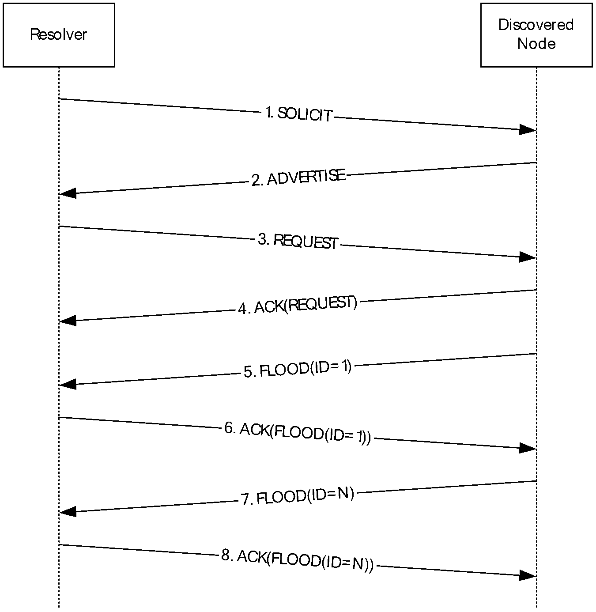

Figure 4: Node communication with Discovered Node

**Note** The FLOOD messages in this conversation are not synchronous; the Discovered Node can send a second or third FLOOD message before it has received an ACK message for a previous FLOOD message.

The following is an example of what happens during a sample synchronization conversation:

- The Resolver sends a SOLICIT message to the Discovered Node to initiate the conversation. The SOLICIT message contains the following data:
- Hashed [**nonce**](#gt_nonce) used to identify the conversation.
- Route Entry for a locally registered [**PNRP ID**](#gt_pnrp-id), if any.
- The Discovered Node responds with an ADVERTISE message that contains an array of node PNRP IDs that it selected from its own cache.
The Discovered Node keeps track of the hashed nonce that identifies the conversation.

The Discovered Node also adds the Route Entry from the SOLICIT message to its own cache.

- When the Resolver receives the ADVERTISE message, it uses the **Acked Message ID** and the hashed nonce in the message to verify that it sent a corresponding SOLICIT message.
The Resolver then goes through the array of PNRP IDs in the ADVERTISE message and selects the ones that it wants to include in its own cache. Say it selects all of them. Thus, it returns a REQUEST message to specify which PNRP IDs it would like to obtain.

After the REQUEST message is sent, any state or context information held for the conversation is released.

- When the REQUEST message is received, the Discovered Node immediately returns an ACK message to indicate receipt and to avoid retransmission of the REQUEST message by the Resolver.
- The Discovered Node attempts to verify that the nonce in the REQUEST message is valid. This is done by hashing the nonce and comparing it with the state information saved from the SOLICIT message (see step 2). Because they match, the nonce is valid and the receiving node sends a FLOOD message for each PNRP ID that was listed in the REQUEST message.
- The Resolver inspects each FLOOD message as it is received. If the **D** bit is clear (as specified in section 2.2.2.4), the Resolver returns an ACK message to indicate that it has received the FLOOD message. The Resolver then adds to its cache the Route Entry in the message.

### 4.1.3 Peer Name Resolution

The Resolver now attempts [**Peer Name**](#gt_peer-name) resolution via the following steps.

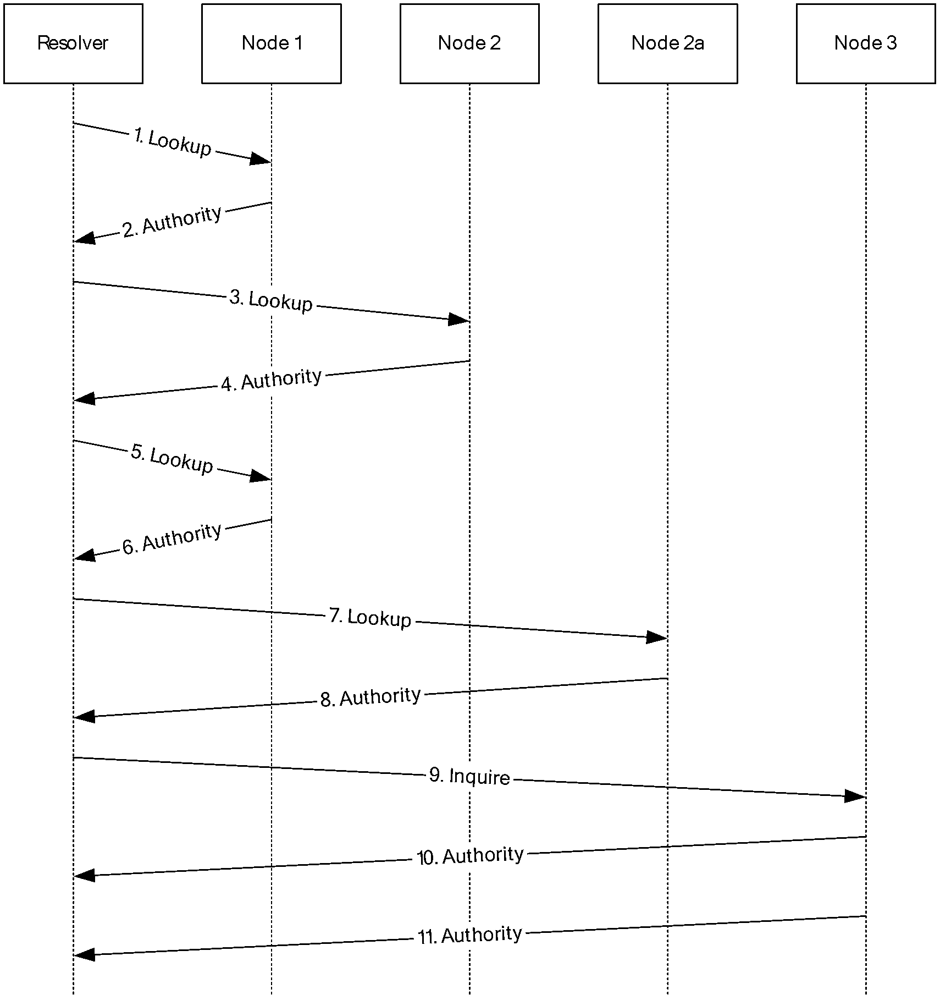

Figure 5: Peer Name resolution

- The Resolver, seeking [**endpoint**](#gt_endpoint) information for a Peer Name registered by Node 3, creates a [LOOKUP](#Section_2.2.2.8) message. To do so, the Resolver first computes a corresponding [**PNRP ID**](#gt_pnrp-id) (which is called 3 in this example), specifies 3 as the Target PNRP ID, and sets itself as the first entry in the path. It then sets the **Validate PNRP ID** field to be the (numerically) closest PNRP ID it has in its cache to the Target PNRP ID, and sends the packet to the corresponding node (in this case, Node 1).
- Upon receiving the LOOKUP message, Node 1 first looks in its cache to see if it contains the PNRP ID found in the **Validate PNRP ID** field. It does not, so Node 1 instead finds three route entries that are closer to the Target PNRP ID than the Validate PNRP ID. It creates an [AUTHORITY](#Section_2.2.2.6) message and randomly selects one of the three route entries to put in the **Route Entry** field of the AUTHORITY_BUFFER. It then returns the AUTHORITY message to the Resolver.
- The Resolver extracts the PNRP ID (node 2) from the **Route Entry** field in the returned AUTHORITY message, and creates a new LOOKUP message, adding Node 1 to the path. The Resolver sets the **Validate PNRP ID** field to the PNRP found in the **Route Entry** field of the AUTHORITY message, and sends it to the corresponding node (Node 2).
- Upon receiving the LOOKUP message, Node 2 first looks in its cache and to see if it contains the PNRP ID found in the **Validate PNRP ID** field. It does not, and also has no PNRP IDs in its cache that are closer to the Target PNRP ID than the **Validate PNRP ID**. It returns an AUTHORITY message with the **Route Entry** field set to NULL.
- Finding the **Route Entry** field in the returned AUTHORITY message empty, the Resolver backtracks by creating a new LOOKUP message, adding Node 2 to the path, and sending it to the previous node in the path (Node 1).
- Upon receiving the LOOKUP message, Node 1 responds exactly as it did in step 2, making certain not to return any PNRP IDs that were already in the path (for example, Node 2 will not be returned). In this case, it returns Node 2a.
- The Resolver extracts the PNRP ID from the **Route Entry** field in the returned AUTHORITY message. Because Node 2 was already added to the path in step 7, it is not added to the path a second time. The Resolver creates a LOOKUP message, setting the **Validate PNRP ID** field to the PNRP ID found in the **Route Entry** field of the AUTHORITY message, and sends it to the corresponding node (Node 2a).
- Upon receiving the LOOKUP message, Node 2a first looks in its cache and to see if it contains the PNRP ID found in the **Validate PNRP ID** field. It does, and it creates an AUTHORITY message with the **Route Entry** field set to the target node (Node 3). Node 2a then returns the AUTHORITY message to the Resolver.
- The Resolver, finding the PNRP ID in the **Route Entry** field of the returned AUTHORITY message equal to the Target PNRP ID, initiates validation by sending an [INQUIRE](#Section_2.2.2.5) message to Node 3.
Node 3 checks its Locally Registered PNRP ID List for the presence of the Target PNRP ID. Finding it, Node 3 constructs an [AUTHORITY_BUFFER](#Section_2.2.2.6.1) message containing a [CPA](#Section_1.3.1.3) for the Target PNRP ID. The [**classifier**](#gt_classifier) portion of the Peer Name is added to the AUTHORITY_BUFFER message.

Because the AUTHORITY_BUFFER message is 2,000 bytes long (exceeding the 1,188-byte limit), the buffer is split into two fragments: the first is 1,188 bytes long; and the second is 812 bytes long. Each fragment is sent in a separate AUTHORITY message.

- The Resolver, determining that the value of the **Size** field (2,000) exceeds 1,188, knows that the AUTHORITY_BUFFER message will arrive in multiple AUTHORITY messages. After receiving all the AUTHORITY messages, reassembling the AUTHORITY_BUFFER message, and validating that the CPA corresponds to the Peer Name of interest, the Resolver reports the endpoint information back to the application.

## 4.2 Registering a Name

To register a [**Peer Name**](#gt_peer-name), a [**node**](#gt_node) performs the resolve operation as specified in section [4.1.3](#Section_4.1.3), with the Target ID set to the [**PNRP ID**](#gt_pnrp-id) to be registered + 1. For example, if PNRP ID 6 were being registered, it would perform a resolve operation seeking PNRP ID 7.

As other nodes receive [LOOKUP](#Section_2.2.2.8) messages from the registering node, they add the registering node's PNRP ID to their [**Leaf Sets**](#gt_leaf-set) when appropriate. Likewise, the registering node will populate its own Leaf Set with the PNRP IDs that it finds in the received [AUTHORITY](#Section_2.2.2.6) messages.

## 4.3 Unregistering a Name

When a [**PNRP ID**](#gt_pnrp-id) is unregistered, a **Revoke CPA** is sent to two entries from the Leaf Set of the ID being unregistered. One entry is the numerically closest ID greater than the local ID and the other entry is the numerically closest ID less than the local ID. Each recipient checks its cache to see if an entry exists for the PNRP ID. If one is found, the recipient removes it from its cache. If the entry was in a Leaf Set of a locally registered ID, the node [FLOODs](#Section_2.2.2.4) the **Revoke CPA** on to other members of its Leaf Set.

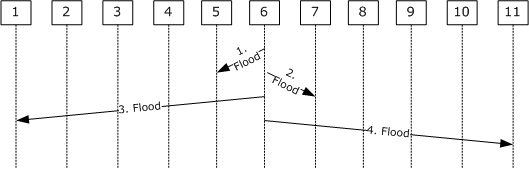

Figure 6: PNRP name revocation process

- The unregistering node (Node 6) creates a **Revoke CPA** for the [**Peer Name**](#gt_peer-name). The **R** field of the [CPA](#Section_1.3.1.3) is set to indicate that this is a **Revoke CPA**. It puts the **Revoke CPA** in a FLOOD message and sends it to the node in its Leaf Set with the numerically closest registered PNRP ID lower than its own (for example, Node 5). Upon receiving the FLOOD message, Node 5 removes the PNRP ID of the unregistering node from its local cache. If Node 5 has the PNRP ID of the unregistering node in its Leaf Set, it forwards the **Revoke CPA** to the node in its Leaf Set with the closest registered PNRP ID lower than its own (for example, Node 4), where it is processed exactly as described here. This continues until the **Revoke CPA** reaches a node that does not have the PNRP ID of the unregistering node in either its cache or its Leaf Set, at which point possessing (and forwarding) of the **Revoke CPA** ceases.
- Node 6 sends an identical FLOOD message to the node in its Leaf Set with the closest registered PNRP ID greater than its own (for example, Node 7). Node 7 processes the **Revoke CPA** exactly as described in step 1, except that all **Revoke CPA** forwards will be made to nodes with numerically greater PNRP IDs.
- The unregistration of Node 6 produces gaps in the [**Leaf Sets**](#gt_leaf-set) of its nearby nodes. Node 6 therefore sends a FLOOD message to the node in its Leaf Set with the smallest PNRP ID (for example, Node 1). The FLOOD message informs the recipient of the node with the next greater PNRP ID than the unregistering node (for example, Node 7). Node 1 will place the Node 7 PNRP ID in its Leaf Set where the Node 6 PNRP ID used to reside.
- Node 6 repeats step 3, notifying the node in its Leaf Set with the greatest PNRP ID (for example, Node 11) of the node with the next lower PNRP ID than the unregistering node (for example, Node 5), allowing Node 11 to repair its Leaf Set as well.

## 4.4 Flooding a New Leaf Set Member

Assume that there is a registered node with a Local ID of Y and that its Leaf Set consists of {B, C, D, E, F} on one side and {G, H, I ,J, K} on the other. Assume that Node Y learns about a new [Route Entry](#Section_2.2.3.4) with the ID of X, which is closer than G currently is.

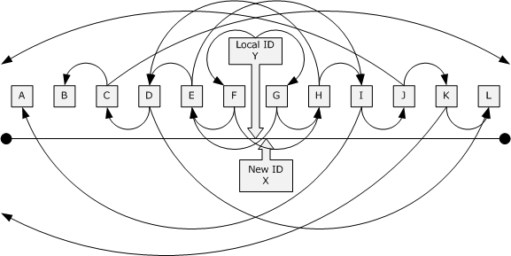

Figure 7: Leaf Set node arrangement example

The following will now take place.

**Note** This sequence illustrates the cascading flood activity when a new ID is learned. Prior to any node propagating a [FLOOD](#Section_2.2.2.4) message, the node will send an [INQUIRE](#Section_2.2.2.5) message to the new node that it has just learned about. The node will propagate the FLOOD message only when an [AUTHORITY](#Section_2.2.2.6) message has been received back from the new node.

- X displaces K in Y's Leaf Set. This is the first wave of flooding.
- Y selects the two nearest route entries in its cache with one being less than Y and one being greater than Y. In this case, nodes F and G are chosen.
- Y builds a FLOOD message with an Already Flooded List containing an address that Y is using and one of the addresses of both F and G. The FLOOD message will now be sent to F and G.
- When F receives the FLOOD message from Y of node X, Y checks to see whether it already knows about X. If Y does, it drops the FLOOD message with no further action. It does not, so it adds X to its Leaf Set.
- F selects the two nearest route entries to its local ID, which do not have addresses in the Already Flooded List, with one being less than F and one being greater than F. E and H will be chosen.
- F builds a FLOOD message with the Already Flooded List having an address of E and H appended to it. The list will now contain {Y, F, G, E, H}.
- F now sends the FLOOD message of X to E and H.
- When G receives the FLOOD message from Y of Node X, Y checks to see if it already knows about X. If it did, it would drop the FLOOD message with no further action. It does not, so it adds X to its Leaf Set.
- G selects the two nearest route entries to its local [**PNRP ID**](#gt_pnrp-id), which do not have addresses in the Already Flooded List with one being less than F and one being greater than F. E and H will be chosen.
- G builds a FLOOD message with the Already Flooded List having an address of E and H appended to it. The list now contains {Y, F, G, E, H}.
- G now sends the FLOOD message of X to E and H.
- The second wave of flooding for Node X begins.
- Both Node E and Node H receive two copies of the FLOOD message of X, one forwarded from F and one forwarded from G. When processing the second instance of the flood, E and H ignore the second one because X will be either in their Leaf Set or in a list of route entries being checked.
- E and H repeat the process, Flooding to D and I. The Already Flooded List will contain {Y, F, G, E, H, D, I}.
- The third wave of flooding for Node X begins.
- Nodes D and I receive the FLOOD message of X. Both D and I forward the FLOOD message to two neighbors, but because the Already Flooded List will already contain all the nodes in half or each node's Leaf Set, one of the flood targets will likely not be the next nearest neighbor in that direction.
- D forwards to C, which is in its Leaf Set, but does not necessarily flood to J because J is outside its Leaf Set. In this example, it forwards to L because it does not know about J or K. The Already Flooded List contains {Y, F, G, H, D, I, C, L}.
- I forwards to J, which is in its Leaf Set, but does not necessarily forward to C because C is outside its Leaf Set. In this example, it forwards to A because it does not know about B and C. The Already Flooded List contains {Y, F, G, H, D, I, A, J }.
- The fourth wave of flooding for Node X begins.
- Nodes A, C, J, and L receive the FLOOD message of X. A and L do not forward the FLOOD message because X falls outside their Leaf Sets.
- Nodes C and J forward the FLOOD message because X is still in their Leaf Sets.
- C sends a FLOOD message to B and to some other node falling outside the Leaf Set.
- J sends a FLOOD message to K and some other node falling outside the Leaf Set.
- The fifth wave of flooding of X begins.
- B does not forward the FLOOD message because X does not fall in its [**Leaf Set**](#gt_leaf-set).
- K ends forwarding of the FLOOD message because X still falls within its Leaf Set. K sends a FLOOD to L and some other node that is outside its Leaf Set.
- The sixth wave of flooding begins.
- L does not forward the FLOOD message because X does not fall within its Leaf Set. Any of the other more remote nodes will also not forward the FLOOD message.
- Additionally, all of the nodes that added X to their Leaf Set will send FLOOD messages to with their own route entry back to X. In this way, X learns of all the nodes that consider X to be in their Leaf Set. These transactions are not included in the figure to reduce the clutter.

# 5 Security

## 5.1 Security Considerations for Implementers

Public/private key pairs are assumed to be generated in a way that can be trusted, and to be stored in a reliable way.

No security whatsoever is provided for [**Unsecured Peer Names**](#gt_unsecured-peer-name). Therefore, there is no guarantee that resolving an Unsecured Peer Name will succeed or resolve to a non-malicious node. Any use requiring such assurance does not use Unsecured Peer Names.

Denial-of-service (DoS) attacks from on-link nodes are less important, because many other DoS mechanisms exist (for example, duplicate address detection or switch port map poisoning) beyond PNRP. This class of attacks is dealt with at layer 2, or dealt with administratively (socially).

PNRP provides less confidentiality about who is resolving one's published name than [**DNS**](#gt_domain-name-system-dns) does (where only the DNS servers and those on the path to the DNS servers can observe this). Therefore, applications that are extremely concerned about such information are advised to not publish their name in PNRP.

Section [3.2.5.3](#Section_3.2.5.3) includes mitigation against DoS attacks where an attacker sends [SOLICIT](#Section_2.2.2.1) messages to cause a PNRP node to create state.

Another potential threat is pollution of a node's Route Entry Cache with bad entries. PNRP mitigates this by doing a return routability check to ensure that the PNRP node with the address it will use in the [Route Entry](#Section_2.2.3.4) actually claims to be publishing the [**PNRP ID**](#gt_pnrp-id) in each new Route Entry, before adding it to the cache.

## 5.2 Index of Security Parameters

| Security parameter | Section |
| --- | --- |
| Public key type identifier | [Service Address List](#Section_2.2.3.1.1) |
| Hash algorithm identifier | [SIGNATURE](#Section_2.2.3.2) |

# 6 Appendix A: Product Behavior

The information in this specification is applicable to the following Microsoft products or supplemental software. References to product versions include updates to those products.

- Windows XP operating system Service Pack 3 (SP3)
- Windows Vista operating system
- Windows Server 2008 operating system
- Windows 7 operating system
- Windows Server 2008 R2 operating system
- Windows 8 operating system
- Windows Server 2012 operating system
- Windows 8.1 operating system
- Windows Server 2012 R2 operating system
- Windows 10 operating system
- Windows Server 2016 operating system
- Windows Server operating system
- Windows Server 2019 operating system
- Windows Server 2022 operating system
- Windows 11 operating system
Exceptions, if any, are noted in this section. If an update version, service pack or Knowledge Base (KB) number appears with a product name, the behavior changed in that update. The new behavior also applies to subsequent updates unless otherwise specified. If a product edition appears with the product version, behavior is different in that product edition.

Unless otherwise specified, any statement of optional behavior in this specification that is prescribed using the terms "SHOULD" or "SHOULD NOT" implies product behavior in accordance with the SHOULD or SHOULD NOT prescription. Unless otherwise specified, the term "MAY" implies that the product does not follow the prescription.

<1> Section 3.1.2: Windows performs periodic cache maintenance every 15 seconds when the number of cache entries is more than two; otherwise, it performs periodic cache maintenance every 10 seconds.

<2> Section 3.1.4.2: Windows picks the 10 (or as many as exist if fewer than 10) most recently used nodes that were previously in the cache.

<3> Section 3.1.4.2.1: Windows sorts each list individually and then concatenates the result.

<4> Section 3.1.6.2: Windows attempts to maintain a cache of at least 10 route entries (or all route entries in the [**cloud**](#gt_cloud) if there are fewer than 10), whose [**PNRP IDs**](#gt_pnrp-id) are evenly distributed around the number space.

<5> Section 3.2.1.1: Windows achieves Requirement 1 by implementing a multi-level cache where each cache level contains a fixed number of route entries that covers a progressively smaller fragment of the total key space. The lowest level of the cache (which is the [**Leaf Set**](#gt_leaf-set)) is the densest and it is centered on a PNRP ID published by the local node.

<6> Section 3.2.6.2: Windows attempts to "balance" its cache. Balancing the cache involves checking each cache level to determine that no large gaps exist between entries. The allowable gap size depends on the cache level; it is expected to be smaller for each level down. If a large gap is found, an attempt is made to fill it by sending a [LOOKUP](#Section_2.2.2.8) message for a PNRP ID in the middle of the gap. The precision level of the LOOKUP message match is set to be just sufficient to fill the gap.

# 7 Change Tracking

This section identifies changes that were made to this document since the last release. Changes are classified as Major, Minor, or None.

The revision class **Major** means that the technical content in the document was significantly revised. Major changes affect protocol interoperability or implementation. Examples of major changes are:

- A document revision that incorporates changes to interoperability requirements.
- A document revision that captures changes to protocol functionality.
The revision class **Minor** means that the meaning of the technical content was clarified. Minor changes do not affect protocol interoperability or implementation. Examples of minor changes are updates to clarify ambiguity at the sentence, paragraph, or table level.

The revision class **None** means that no new technical changes were introduced. Minor editorial and formatting changes may have been made, but the relevant technical content is identical to the last released version.

The changes made to this document are listed in the following table. For more information, please contact [dochelp@microsoft.com](mailto:dochelp@microsoft.com).

| Section | Description | Revision class |
| --- | --- | --- |
| [2.2.3.1.4](#Section_2.2.3.1.4) CPA Public Key | Updated the reference for RSA. | Major |
| [2.2.3.2](#Section_2.2.3.2) SIGNATURE | Updated the reference for RSA. | Major |
| [3.2.5.9](#Section_3.2.5.9) Generating a Signature | Updated the reference for RSA. | Major |
| [6](#Section_6) Appendix A: Product Behavior | Updated for this version of Windows Client. | Major |

## Revision History

| Date | Version | Revision Class | Comments |
| --- | --- | --- | --- |
| 12/18/2006 | 0.1 | New | Version 0.1 release |
| 3/2/2007 | 1.0 | Major | Version 1.0 release |
| 4/3/2007 | 1.1 | Minor | Version 1.1 release |
| 5/11/2007 | 1.2 | Minor | Version 1.2 release |
| 6/1/2007 | 1.2.1 | Editorial | Changed language and formatting in the technical content. |
| 7/3/2007 | 2.0 | Major | MLonghorn+90 |
| 7/20/2007 | 2.0.1 | Editorial | Changed language and formatting in the technical content. |
| 8/10/2007 | 2.0.2 | Editorial | Changed language and formatting in the technical content. |
| 9/28/2007 | 2.0.3 | Editorial | Changed language and formatting in the technical content. |
| 10/23/2007 | 2.0.4 | Editorial | Changed language and formatting in the technical content. |
| 11/30/2007 | 2.0.5 | Editorial | Changed language and formatting in the technical content. |
| 1/25/2008 | 2.0.6 | Editorial | Changed language and formatting in the technical content. |
| 3/14/2008 | 3.0 | Major | Updated and revised the technical content. |
| 5/16/2008 | 3.0.1 | Editorial | Changed language and formatting in the technical content. |
| 6/20/2008 | 4.0 | Major | Updated and revised the technical content. |
| 7/25/2008 | 4.0.1 | Editorial | Changed language and formatting in the technical content. |
| 8/29/2008 | 4.0.2 | Editorial | Changed language and formatting in the technical content. |
| 10/24/2008 | 4.0.3 | Editorial | Changed language and formatting in the technical content. |
| 12/5/2008 | 5.0 | Major | Updated and revised the technical content. |
| 1/16/2009 | 5.0.1 | Editorial | Changed language and formatting in the technical content. |
| 2/27/2009 | 5.1 | Minor | Clarified the meaning of the technical content. |
| 4/10/2009 | 5.1.1 | Editorial | Changed language and formatting in the technical content. |
| 5/22/2009 | 6.0 | Major | Updated and revised the technical content. |
| 7/2/2009 | 6.0.1 | Editorial | Changed language and formatting in the technical content. |
| 8/14/2009 | 6.0.2 | Editorial | Changed language and formatting in the technical content. |
| 9/25/2009 | 6.1 | Minor | Clarified the meaning of the technical content. |
| 11/6/2009 | 6.1.1 | Editorial | Changed language and formatting in the technical content. |
| 12/18/2009 | 6.1.2 | Editorial | Changed language and formatting in the technical content. |
| 1/29/2010 | 7.0 | Major | Updated and revised the technical content. |
| 3/12/2010 | 8.0 | Major | Updated and revised the technical content. |
| 4/23/2010 | 8.1 | Minor | Clarified the meaning of the technical content. |
| 6/4/2010 | 8.1.1 | Editorial | Changed language and formatting in the technical content. |
| 7/16/2010 | 8.1.1 | None | No changes to the meaning, language, or formatting of the technical content. |
| 8/27/2010 | 8.2 | Minor | Clarified the meaning of the technical content. |
| 10/8/2010 | 8.2 | None | No changes to the meaning, language, or formatting of the technical content. |
| 11/19/2010 | 8.3 | Minor | Clarified the meaning of the technical content. |
| 1/7/2011 | 8.4 | Minor | Clarified the meaning of the technical content. |
| 2/11/2011 | 9.0 | Major | Updated and revised the technical content. |
| 3/25/2011 | 10.0 | Major | Updated and revised the technical content. |
| 5/6/2011 | 10.0 | None | No changes to the meaning, language, or formatting of the technical content. |
| 6/17/2011 | 10.1 | Minor | Clarified the meaning of the technical content. |
| 9/23/2011 | 10.1 | None | No changes to the meaning, language, or formatting of the technical content. |
| 12/16/2011 | 11.0 | Major | Updated and revised the technical content. |
| 3/30/2012 | 11.0 | None | No changes to the meaning, language, or formatting of the technical content. |
| 7/12/2012 | 12.0 | Major | Updated and revised the technical content. |
| 10/25/2012 | 12.0 | None | No changes to the meaning, language, or formatting of the technical content. |
| 1/31/2013 | 13.0 | Major | Updated and revised the technical content. |
| 8/8/2013 | 14.0 | Major | Updated and revised the technical content. |
| 11/14/2013 | 14.0 | None | No changes to the meaning, language, or formatting of the technical content. |
| 2/13/2014 | 15.0 | Major | Updated and revised the technical content. |
| 5/15/2014 | 15.0 | None | No changes to the meaning, language, or formatting of the technical content. |
| 6/30/2015 | 16.0 | Major | Significantly changed the technical content. |
| 10/16/2015 | 16.0 | None | No changes to the meaning, language, or formatting of the technical content. |
| 7/14/2016 | 16.0 | None | No changes to the meaning, language, or formatting of the technical content. |
| 6/1/2017 | 16.0 | None | No changes to the meaning, language, or formatting of the technical content. |
| 9/15/2017 | 17.0 | Major | Significantly changed the technical content. |
| 9/12/2018 | 18.0 | Major | Significantly changed the technical content. |
| 4/7/2021 | 19.0 | Major | Significantly changed the technical content. |
| 6/25/2021 | 20.0 | Major | Significantly changed the technical content. |
