# [MS-PPGRH]: Peer-to-Peer Graphing Protocol

Table of Contents

1 Introduction

- [1 Introduction](#Section_1)
  - [1.1 Glossary](#Section_1.1)
  - [1.2 References](#Section_1.2)
    - [1.2.1 Normative References](#Section_1.2.1)
    - [1.2.2 Informative References](#Section_1.2.2)
  - [1.3 Overview](#Section_1.3)
    - [1.3.1 Graph Topology](#Section_1.3.1)
    - [1.3.2 Connecting and Disconnecting](#Section_1.3.2)
      - [1.3.2.1 Signature](#Section_1.3.2.1)
      - [1.3.2.2 Contacts](#Section_1.3.2.2)
      - [1.3.2.3 Partition Detection](#Section_1.3.2.3)
      - [1.3.2.4 Short Term Partition Repair](#Section_1.3.2.4)
      - [1.3.2.5 Long Term Partition Repair](#Section_1.3.2.5)
    - [1.3.3 Direct Connection](#Section_1.3.3)
    - [1.3.4 Security Extension Points](#Section_1.3.4)
      - [1.3.4.1 Connection Security](#Section_1.3.4.1)
      - [1.3.4.2 Record Security](#Section_1.3.4.2)
    - [1.3.5 Shared Database](#Section_1.3.5)
      - [1.3.5.1 Records](#Section_1.3.5.1)
      - [1.3.5.2 Record Lifetime](#Section_1.3.5.2)
      - [1.3.5.3 Record Flooding](#Section_1.3.5.3)
      - [1.3.5.4 Record Synchronization](#Section_1.3.5.4)
      - [1.3.5.5 Record Types](#Section_1.3.5.5)
        - [1.3.5.5.1 Graph Info](#Section_1.3.5.5.1)
        - [1.3.5.5.2 Signature](#Section_1.3.5.5.2)
        - [1.3.5.5.3 Contact](#Section_1.3.5.5.3)
        - [1.3.5.5.4 Presence](#Section_1.3.5.5.4)
    - [1.3.6 Time Synchronization](#Section_1.3.6)
  - [1.4 Relationship to Other Protocols](#Section_1.4)
  - [1.5 Prerequisites/Preconditions](#Section_1.5)
  - [1.6 Applicability Statement](#Section_1.6)
  - [1.7 Versioning and Capability Negotiation](#Section_1.7)
  - [1.8 Vendor-Extensible Fields](#Section_1.8)
  - [1.9 Standards Assignments](#Section_1.9)

2 Messages

- [2 Messages](#Section_2)
  - [2.1 Transport](#Section_2.1)
  - [2.2 Message Syntax](#Section_2.2)
    - [2.2.1 Message Components](#Section_2.2.1)
      - [2.2.1.1 Message Framing](#Section_2.2.1.1)
      - [2.2.1.2 PEER_MESSAGE](#Section_2.2.1.2)
      - [2.2.1.3 PEER_IN6_ADDRESS](#Section_2.2.1.3)
      - [2.2.1.4 PEER_IN6_ADDRESS_EX](#Section_2.2.1.4)
      - [2.2.1.5 PEER_ADDRESS](#Section_2.2.1.5)
      - [2.2.1.6 RECORD_ABSTRACT](#Section_2.2.1.6)
      - [2.2.1.7 HASH_INFO_ENTRY](#Section_2.2.1.7)
      - [2.2.1.8 HASH_ENTRY_BOUNDARY](#Section_2.2.1.8)
      - [2.2.1.9 PEER_RECORD](#Section_2.2.1.9)
    - [2.2.2 Messages](#Section_2.2.2)
      - [2.2.2.1 AUTH_INFO](#Section_2.2.2.1)
      - [2.2.2.2 CONNECT](#Section_2.2.2.2)
      - [2.2.2.3 WELCOME](#Section_2.2.2.3)
      - [2.2.2.4 REFUSE](#Section_2.2.2.4)
      - [2.2.2.5 DISCONNECT](#Section_2.2.2.5)
      - [2.2.2.6 SOLICIT_NEW](#Section_2.2.2.6)
      - [2.2.2.7 SOLICIT_TIME](#Section_2.2.2.7)
      - [2.2.2.8 SOLICIT_HASH](#Section_2.2.2.8)
      - [2.2.2.9 ADVERTISE](#Section_2.2.2.9)
      - [2.2.2.10 REQUEST](#Section_2.2.2.10)
      - [2.2.2.11 FLOOD](#Section_2.2.2.11)
      - [2.2.2.12 SYNC_END](#Section_2.2.2.12)
      - [2.2.2.13 PT2PT](#Section_2.2.2.13)
      - [2.2.2.14 ACK](#Section_2.2.2.14)
    - [2.2.3 Internal Record types](#Section_2.2.3)
      - [2.2.3.1 Graph Info Record](#Section_2.2.3.1)
      - [2.2.3.2 Signature Record](#Section_2.2.3.2)
      - [2.2.3.3 Contact Record](#Section_2.2.3.3)
      - [2.2.3.4 Presence Record](#Section_2.2.3.4)
      - [2.2.3.5 Record Attributes](#Section_2.2.3.5)
    - [2.2.4 Internal Messages](#Section_2.2.4)
      - [2.2.4.1 Ping](#Section_2.2.4.1)

3 Protocol Details

- [3 Protocol Details](#Section_3)
  - [3.1 Client Details](#Section_3.1)
    - [3.1.1 Abstract Data Model](#Section_3.1.1)
    - [3.1.2 Timers](#Section_3.1.2)
    - [3.1.3 Initialization](#Section_3.1.3)
    - [3.1.4 Higher-Layer Triggered Events](#Section_3.1.4)
      - [3.1.4.1 Creating a New Graph](#Section_3.1.4.1)
      - [3.1.4.2 Opening an Existing Graph](#Section_3.1.4.2)
      - [3.1.4.3 Application Adds a Record](#Section_3.1.4.3)
      - [3.1.4.4 Application Updates a Record](#Section_3.1.4.4)
      - [3.1.4.5 Application Deletes a Record](#Section_3.1.4.5)
      - [3.1.4.6 Application Publishes Presence](#Section_3.1.4.6)
      - [3.1.4.7 Application Allows Direct Connections](#Section_3.1.4.7)
      - [3.1.4.8 Application Initiates Listening](#Section_3.1.4.8)
      - [3.1.4.9 Application Requests to Connect to the Graph](#Section_3.1.4.9)
      - [3.1.4.10 Application Requests that Deferred Records be Revalidated](#Section_3.1.4.10)
      - [3.1.4.11 Application Requests To Be Notified About a Specific Record Type](#Section_3.1.4.11)
      - [3.1.4.12 Application Closes the Graph](#Section_3.1.4.12)
    - [3.1.5 Processing Events and Sequencing Rules](#Section_3.1.5)
      - [3.1.5.1 Pre-Authentication Messages](#Section_3.1.5.1)
        - [3.1.5.1.1 Receive AUTH_INFO](#Section_3.1.5.1.1)
        - [3.1.5.1.2 Receive Other Messages During Authentication](#Section_3.1.5.1.2)
      - [3.1.5.2 Post-Authentication Messages](#Section_3.1.5.2)
        - [3.1.5.2.1 Receive CONNECT](#Section_3.1.5.2.1)
        - [3.1.5.2.2 Receive WELCOME](#Section_3.1.5.2.2)
        - [3.1.5.2.3 Receive REFUSE](#Section_3.1.5.2.3)
        - [3.1.5.2.4 Receive DISCONNECT](#Section_3.1.5.2.4)
        - [3.1.5.2.5 Receive SOLICIT_NEW](#Section_3.1.5.2.5)
        - [3.1.5.2.6 Receive SOLICIT_TIME](#Section_3.1.5.2.6)
        - [3.1.5.2.7 Receive SOLICIT_HASH](#Section_3.1.5.2.7)
        - [3.1.5.2.8 Receive ADVERTISE](#Section_3.1.5.2.8)
        - [3.1.5.2.9 Receive REQUEST](#Section_3.1.5.2.9)
        - [3.1.5.2.10 Receive FLOOD](#Section_3.1.5.2.10)
        - [3.1.5.2.11 Receive SYNC_END](#Section_3.1.5.2.11)
        - [3.1.5.2.12 Receive ACK](#Section_3.1.5.2.12)
        - [3.1.5.2.13 Receive PT2PT](#Section_3.1.5.2.13)
    - [3.1.6 Timer Events](#Section_3.1.6)
      - [3.1.6.1 Authentication Timer](#Section_3.1.6.1)
      - [3.1.6.2 Connect Timer](#Section_3.1.6.2)
      - [3.1.6.3 Contact Timer](#Section_3.1.6.3)
      - [3.1.6.4 Signature Timer](#Section_3.1.6.4)
      - [3.1.6.5 Partition Detection Timer](#Section_3.1.6.5)
      - [3.1.6.6 Graph Maintenance Timer](#Section_3.1.6.6)
      - [3.1.6.7 Record Expiration Timer](#Section_3.1.6.7)
      - [3.1.6.8 Autorefresh Timer](#Section_3.1.6.8)
      - [3.1.6.9 Presence Timer](#Section_3.1.6.9)
    - [3.1.7 Other Local Events](#Section_3.1.7)
      - [3.1.7.1 Sending a Message](#Section_3.1.7.1)
      - [3.1.7.2 Creating a Record](#Section_3.1.7.2)
      - [3.1.7.3 Publishing a Record](#Section_3.1.7.3)
      - [3.1.7.4 Publishing a Presence Record](#Section_3.1.7.4)
      - [3.1.7.5 Publishing a Contact Record](#Section_3.1.7.5)
      - [3.1.7.6 Publishing a Signature Record](#Section_3.1.7.6)
      - [3.1.7.7 Publishing a Graph Info Record](#Section_3.1.7.7)
      - [3.1.7.8 Updating a Record](#Section_3.1.7.8)
      - [3.1.7.9 Deleting a Record](#Section_3.1.7.9)
      - [3.1.7.10 Receiving a Record](#Section_3.1.7.10)
        - [3.1.7.10.1 Receive an Application Record](#Section_3.1.7.10.1)
        - [3.1.7.10.2 Receive a Graph Info Record](#Section_3.1.7.10.2)
        - [3.1.7.10.3 Receive a Signature Record](#Section_3.1.7.10.3)
        - [3.1.7.10.4 Receive a Contact Record](#Section_3.1.7.10.4)
        - [3.1.7.10.5 Receive a Presence Record](#Section_3.1.7.10.5)
      - [3.1.7.11 Signature Calculation](#Section_3.1.7.11)
      - [3.1.7.12 Contact Maintenance](#Section_3.1.7.12)
      - [3.1.7.13 Partition Detection](#Section_3.1.7.13)
      - [3.1.7.14 Connection Maintenance](#Section_3.1.7.14)
      - [3.1.7.15 Long-Term Partition Repair](#Section_3.1.7.15)
      - [3.1.7.16 Graph Maintenance](#Section_3.1.7.16)
      - [3.1.7.17 Presence Maintenance](#Section_3.1.7.17)
      - [3.1.7.18 Expiring Application Record](#Section_3.1.7.18)
      - [3.1.7.19 Expired Signature Record Found](#Section_3.1.7.19)
      - [3.1.7.20 Expired Presence Record Found](#Section_3.1.7.20)
      - [3.1.7.21 Expired Contact Record Found](#Section_3.1.7.21)
      - [3.1.7.22 Autorefreshing Records](#Section_3.1.7.22)
      - [3.1.7.23 Local IP Addresses Change](#Section_3.1.7.23)
      - [3.1.7.24 Establishing a New Connection](#Section_3.1.7.24)
      - [3.1.7.25 Disconnecting a Connection](#Section_3.1.7.25)
      - [3.1.7.26 An Incoming Connection Is Established](#Section_3.1.7.26)
      - [3.1.7.27 Validating a Received Record](#Section_3.1.7.27)
      - [3.1.7.28 Securing a Record](#Section_3.1.7.28)
      - [3.1.7.29 Performing a Sync All](#Section_3.1.7.29)
      - [3.1.7.30 Performing a Time-Based Sync](#Section_3.1.7.30)
      - [3.1.7.31 Performing a Hash-Based Sync](#Section_3.1.7.31)
      - [3.1.7.32 Record Conflict Resolution](#Section_3.1.7.32)
      - [3.1.7.33 Updating Connection Utility](#Section_3.1.7.33)

4 Protocol Examples

- [4 Protocol Examples](#Section_4)
  - [4.1 Establishing a Connection](#Section_4.1)
  - [4.2 Sync All](#Section_4.2)
  - [4.3 Hash-Based Sync](#Section_4.3)
  - [4.4 Record Flooding](#Section_4.4)

5 Security

- [5 Security](#Section_5)
  - [5.1 Security Considerations for Implementers](#Section_5.1)
  - [5.2 Index of Security Parameters](#Section_5.2)

6 Appendix A: Product Behavior

- [6 Appendix A: Product Behavior](#Section_6)

7 Change Tracking

- [7 Change Tracking](#Section_7)

For the legal notice and IP terms, see [LEGAL.md](../LEGAL.md).
Last updated: 6/25/2021.
See [Revision History](#revision-history) for full version history.

# 1 Introduction

The Peer-to-Peer Graphing Protocol is a peer-to-peer protocol for establishing and maintaining a connected set of [**nodes**](#gt_node) (referred to as a [**graph**](#gt_graph)) and for replicating data among the nodes.

Sections 1.5, 1.8, 1.9, 2, and 3 of this specification are normative. All other sections and examples in this specification are informative.

## 1.1 Glossary

This document uses the following terms:

**big-endian**: Multiple-byte values that are byte-ordered with the most significant byte stored in the memory location with the lowest address.

**connection utility**: The usefulness of a connection. This number is adjusted each time a [**node**](#gt_node) receives a [**record**](#gt_record), such that a connection that delivers new information has a higher [**connection utility**](#gt_connection-utility) than one that delivers duplicate information.

**contact**: A [**node**](#gt_node) that publishes a [**contact record**](#gt_contact-record). [**Contacts**](#gt_contact) are used by [**graph maintenance**](#gt_graph-maintenance) to detect partitions.

**contact record**: A [**record**](#gt_record) published by a [**contact**](#gt_contact) that includes the [**contact's**](#gt_contact) address and the [**graph**](#gt_graph) [**signature**](#gt_signature) at the time of publication.

**Coordinated Universal Time (UTC)**: A high-precision atomic time standard that approximately tracks Universal Time (UT). It is the basis for legal, civil time all over the Earth. Time zones around the world are expressed as positive and negative offsets from UTC. In this role, it is also referred to as Zulu time (Z) and Greenwich Mean Time (GMT). In these specifications, all references to UTC refer to the time at UTC-0 (or GMT).

**database**: The set of all non-expired [**records**](#gt_record) published in a [**graph**](#gt_graph).

**direct connection**: A connection between two [**nodes**](#gt_node) that is used only for sending application messages.

**globally unique identifier (GUID)**: A term used interchangeably with universally unique identifier (UUID) in Microsoft protocol technical documents (TDs). Interchanging the usage of these terms does not imply or require a specific algorithm or mechanism to generate the value. Specifically, the use of this term does not imply or require that the algorithms described in [[RFC4122]](https://go.microsoft.com/fwlink/?LinkId=90460) or [[C706]](https://go.microsoft.com/fwlink/?LinkId=89824) must be used for generating the [**GUID**](#gt_globally-unique-identifier-guid). See also universally unique identifier (UUID).

**graph**: A set of connected nodes.

**graph ID**: A unique string identifier for the [**graph**](#gt_graph) instance. A [**graph ID**](#gt_graph-id) is limited to 256 characters, including the string terminator.

**graph info record**: A [**record**](#gt_record) used to publish [**graph**](#gt_graph) configuration.

**graph maintenance**: The process by which each [**node**](#gt_node) attempts to improve its connectivity within the [**graph**](#gt_graph).

**graph security provider**: A pluggable extension that provides [**record**](#gt_record) security and connection security.

**MD5 hash**: A hashing algorithm, as described in [[RFC1321]](https://go.microsoft.com/fwlink/?LinkId=90275), that was developed by RSA Data Security, Inc. An MD5 hash is used by the File Replication Service (FRS) to verify that a file on each replica member is identical.

**neighbor**: A node that is connected to another node via a [**neighbor connection**](#gt_neighbor-connection).

**neighbor connection**: A connection between two [**nodes**](#gt_node) that is used for Record flooding and synchronization.

**node**: An instance of the Peer-to-Peer Graphing Protocol.

**node ID**: A statistically unique 64-bit identifier for a [**node**](#gt_node) in a [**graph**](#gt_graph). A [**node ID**](#gt_node-id) must be unique within a [**graph**](#gt_graph).

**peer time**: A view of time shared by all [**nodes**](#gt_node) in a [**graph**](#gt_graph). [**Peer time**](#gt_peer-time) is an approximation of the Coordinated Universal Time ([**UTC**](#gt_coordinated-universal-time-utc)), but can diverge as the [**nodes**](#gt_node) in a [**graph**](#gt_graph) continue to recalculate [**peer time**](#gt_peer-time) based on the [**peer time**](#gt_peer-time) reported by other [**nodes**](#gt_node).

**presence record**: A [**record**](#gt_record) used to publish information about a [**node**](#gt_node).

**record**: A piece of data that is published by a [**node**](#gt_node) to the [**graph**](#gt_graph). [**Records**](#gt_record) are the primary mechanism of communication in a [**graph**](#gt_graph).

**record ID**: The identifier of a [**record**](#gt_record). A [**record ID**](#gt_record-id) must be unique within a [**graph**](#gt_graph).

**signature**: The lowest [**node ID**](#gt_node-id) in the [**graph**](#gt_graph).

**signature node**: The [**node**](#gt_node) that has the lowest [**node ID**](#gt_node-id).

**signature record**: The [**record**](#gt_record) that is used to publish the [**graph's**](#gt_graph) [**signature**](#gt_signature). There is only one [**signature record**](#gt_signature-record) for a [**graph**](#gt_graph).

**Unicode**: A character encoding standard developed by the Unicode Consortium that represents almost all of the written languages of the world. The [**Unicode**](#gt_unicode) standard [[UNICODE5.0.0/2007]](https://go.microsoft.com/fwlink/?LinkId=154659) provides three forms (UTF-8, UTF-16, and UTF-32) and seven schemes (UTF-8, UTF-16, UTF-16 BE, UTF-16 LE, UTF-32, UTF-32 LE, and UTF-32 BE).

**UTF-8**: A byte-oriented standard for encoding Unicode characters, defined in the Unicode standard. Unless specified otherwise, this term refers to the UTF-8 encoding form specified in [UNICODE5.0.0/2007] section 3.9.

**MAY, SHOULD, MUST, SHOULD NOT, MUST NOT:** These terms (in all caps) are used as defined in [[RFC2119]](https://go.microsoft.com/fwlink/?LinkId=90317). All statements of optional behavior use either MAY, SHOULD, or SHOULD NOT.

## 1.2 References

Links to a document in the Microsoft Open Specifications library point to the correct section in the most recently published version of the referenced document. However, because individual documents in the library are not updated at the same time, the section numbers in the documents may not match. You can confirm the correct section numbering by checking the [Errata](https://go.microsoft.com/fwlink/?linkid=850906).

### 1.2.1 Normative References

We conduct frequent surveys of the normative references to assure their continued availability. If you have any issue with finding a normative reference, please contact [dochelp@microsoft.com](mailto:dochelp@microsoft.com). We will assist you in finding the relevant information.

[ISO-8601] International Organization for Standardization, "Data Elements and Interchange Formats - Information Interchange - Representation of Dates and Times", ISO/IEC 8601:2004, December 2004, [http://www.iso.org/iso/en/CatalogueDetailPage.CatalogueDetail?CSNUMBER=40874&ICS1=1&ICS2=140&ICS3=30](https://go.microsoft.com/fwlink/?LinkId=89920)

**Note** There is a charge to download the specification.

[MS-DTYP] Microsoft Corporation, "[Windows Data Types](../MS-DTYP/MS-DTYP.md)".

[MS-RPCE] Microsoft Corporation, "[Remote Procedure Call Protocol Extensions](../MS-RPCE/MS-RPCE.md)".

[RFC1321] Rivest, R., "The MD5 Message-Digest Algorithm", RFC 1321, April 1992, [http://www.ietf.org/rfc/rfc1321.txt](https://go.microsoft.com/fwlink/?LinkId=90275)

[RFC2119] Bradner, S., "Key words for use in RFCs to Indicate Requirement Levels", BCP 14, RFC 2119, March 1997, [http://www.rfc-editor.org/rfc/rfc2119.txt](https://go.microsoft.com/fwlink/?LinkId=90317)

[RFC2460] Deering, S., and Hinden, R., "Internet Protocol, Version 6 (IPv6) Specification", RFC 2460, December 1998, [http://www.rfc-editor.org/rfc/rfc2460.txt](https://go.microsoft.com/fwlink/?LinkId=90357)

[RFC4291] Hinden, R. and Deering, S., "IP Version 6 Addressing Architecture", RFC 4291, February 2006, [http://www.ietf.org/rfc/rfc4291.txt](https://go.microsoft.com/fwlink/?LinkId=90464)

[RFC793] Postel, J., Ed., "Transmission Control Protocol: DARPA Internet Program Protocol Specification", RFC 793, September 1981, [http://www.rfc-editor.org/rfc/rfc793.txt](https://go.microsoft.com/fwlink/?LinkId=150872)

### 1.2.2 Informative References

[MS-PNRP] Microsoft Corporation, "[Peer Name Resolution Protocol (PNRP) Version 4.0](../MS-PNRP/MS-PNRP.md)".

[MS-PPSEC] Microsoft Corporation, "[Peer-to-Peer Grouping Security Protocol](#Section_5)".

## 1.3 Overview

The Peer-to-Peer Graphing Protocol enables applications to publish data into a [**database**](#gt_database) shared among a number of [**nodes**](#gt_node) organized into a [**graph**](#gt_graph), and have the database synchronized over all the nodes in the graph. The Peer-to-Peer Graphing Protocol builds a network topology that allows the graph to scale to large numbers of nodes, provides reliable synchronization of the database, and evolves the graph topology so as to minimize latency as conditions change.

### 1.3.1 Graph Topology

A [**graph**](#gt_graph) strives to maintain a good topology by balancing the following goals:

- Minimizing the average latency between any two [**nodes**](#gt_node).
- Minimizing the latency between publishing nodes and all other nodes.
- Being well connected in order to survive the failure of large numbers of nodes and Graph partitions.
- Minimizing the amount of internode traffic.
Note that these properties conflict with each other and the graph constantly attempts to reach a compromise among these goals via periodic tuning. For more information, see section [3.1.6.6](#Section_3.1.6.6).

A small graph can look something like this.

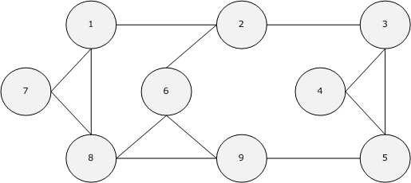

Figure 1: Example of a graph

### 1.3.2 Connecting and Disconnecting

When establishing the first connection to a [**graph**](#gt_graph), it is necessary for an application to supply the Peer-to-Peer Graphing Protocol with the address and port of an active [**node**](#gt_node). The Peer-to-Peer Graphing Protocol does not define any discovery mechanism for discovering nodes for the initial connection.

When the address and port of an existing node are found, the node first authenticates with the existing node. After successful authentication, the existing node will either allow the connection or refuse it. In either case, the existing node will provide the connecting node with a list of its [**neighbors**](#gt_neighbor). If the existing node refused the connection (usually because it already has the maximum number of neighbors), the connecting node will attempt to connect to one of the existing node's neighbors.

To participate in a graph, a node begins listening for connection requests from other nodes.

- If the node is the creator of the graph, it begins listening immediately.
- If another node is found and a connection is established, the local node begins listening after synchronization.
- If a connection cannot be established and the node has previously synchronized its [**database**](#gt_database), it begins listening.
- If a connection cannot be established and the node has never synchronized its database, it does not listen - it cannot be part of the graph until it first finds another node.
After the node has synchronized and started listening, it attempts to connect to more nodes in the graph. There are several ways to find other nodes:

- Through available [**presence records**](#gt_presence-record) in the graph.
- Through available [**contact records**](#gt_contact-record) in the graph.
- Through node information passed back from neighbors in the graph.
After a node is found, the same mechanism is used to create additional connections. For more information, see section [3.1.7.24](#Section_3.1.7.24).

When a node disconnects from a neighbor, either because it is leaving the graph or because it has pruned the connection as part of [**graph maintenance**](#gt_graph-maintenance), it first sends a message to the neighbor. The message contains the reason for disconnecting and provides a list of the disconnecting node's neighbors. For more information, see section [3.1.7.25](#Section_3.1.7.25).

#### 1.3.2.1 Signature

The [**signature**](#gt_signature) is defined to be the lowest [**node ID**](#gt_node-id) in the [**graph**](#gt_graph). The [**node**](#gt_node) with the lowest node ID is called the [**signature node**](#gt_signature-node). The signature node publishes the [**signature record**](#gt_signature-record) and refreshes it periodically.

If a node receives a signature record containing a node ID that is higher than that of the local node ID, it will update the signature record to contain the local node ID.

When a signature node leaves the graph, it deletes the signature record. Each node sees this deletion and does a random back-off with a waiting period proportional to its node ID. This causes the nodes with the lowest node IDs to publish the signature record sooner, minimizing the number of times that an incorrect signature record is republished.

The process of publishing the signature record, and updating the [**record**](#gt_record) when it is found to be incorrect, is called signature record. For more information, see section [3.1.7.11](#Section_3.1.7.11).

The signature record is different from all other record types in that it has a fixed [**record ID**](#gt_record-id).

#### 1.3.2.2 Contacts

Each [**graph**](#gt_graph) contains a number of [**contacts**](#gt_contact), the number of which scales with the size of the graph. The contacts are self-selected in such a way that the total number of contacts remains at or near the ideal number. The ideal number of contacts is calculated based on the estimated size of the graph. A contact publishes its addresses and its locally cached [**signature**](#gt_signature) in a [**contact record**](#gt_contact-record). The contact record is periodically refreshed and updated any time the contact sees a change in the signature. For more information, see section [3.1.7.12](#Section_3.1.7.12).

#### 1.3.2.3 Partition Detection

Each [**node**](#gt_node) monitors the [**signature record**](#gt_signature-record) and the [**signature**](#gt_signature) contained in [**contact records**](#gt_contact-record). If the signature in any contact record is different from the locally cached signature, a partition is detected.

#### 1.3.2.4 Short Term Partition Repair

When a partition is detected, the [**nodes**](#gt_node) that detect the partition will wait a short period of time for the [**contact record**](#gt_contact-record) and [**signature record**](#gt_signature-record) to match again (via receiving a new signature record or contact record). If this does not happen, the node will attempt to connect to the [**contact**](#gt_contact) whose [**record**](#gt_record) does not match. For more information, see section [3.1.7.13](#Section_3.1.7.13).

#### 1.3.2.5 Long Term Partition Repair

It is not possible to detect all partitions. To help repair partitions that cannot be detected, each [**contact**](#gt_contact) [**node**](#gt_node) will periodically attempt to form a connection to a new node. Because a node in a different partition of the [**graph**](#gt_graph) (if a partition exists at all) would not have any data in the graph that could be used to locate it (such as [**presence records**](#gt_presence-record) or [**contact records**](#gt_contact-record)), the new node is determined by requesting the application built on top of the Peer-to-Peer Graphing Protocol to find a node. Not all applications will be capable of finding new nodes. For more information, see section [3.1.7.15](#Section_3.1.7.15).

### 1.3.3 Direct Connection

In addition to [**neighbor connections**](#gt_neighbor-connection), a [**node**](#gt_node) can also have [**direct connections**](#gt_direct-connection). A direct connection is one over which no [**record**](#gt_record) flooding or synchronization occurs. A direct connection is only used for application messages. direct connections do not take part in [**graph maintenance**](#gt_graph-maintenance). For more information, see section [3.1.7.24](#Section_3.1.7.24).

### 1.3.4 Security Extension Points

The Peer-to-Peer Graphing Protocol exposes a security extension point, allowing an application to specify a [**graph security provider**](#gt_graph-security-provider). A graph security provider extends the capabilities of the protocol to provide connection security and data security.

#### 1.3.4.1 Connection Security

If specified, the Peer-to-Peer Graphing Protocol will call into the [**graph security provider**](#gt_graph-security-provider) for authentication whenever a new connection is established. The graph security provider can supply and receive messages during the authentication phase to implement the desired authentication model. After authentication is complete, the graph security provider will be called to perform encryption/decryption on all messages sent/received over the connection. For more information, see section [3.1.7.28](#Section_3.1.7.28).

#### 1.3.4.2 Record Security

If specified, the Peer-to-Peer Graphing Protocol will call into the [**graph security provider**](#gt_graph-security-provider) whenever a [**record**](#gt_record) is sent or received, allowing it to provide authorization and record integrity.

To support the graph security provider, each record contains a field for security data, which the graph security provider can use for storage of additional data about the record. For example, the security data field can contain a cryptographic signature of the record data. For more information, see section [3.1.7.28](#Section_3.1.7.28).

### 1.3.5 Shared Database

The primary way in which [**nodes**](#gt_node) in a [**graph**](#gt_graph) communicate with each other is through [**records**](#gt_record) in a shared [**database**](#gt_database). The graph database is the set of all records that have been published in the graph that have not yet expired. Nodes can publish new records into the database, modify existing records, or remove records from the database. The updates will be flooded from the originating nodes to all other nodes in the graph. A node that is newly joined or reconnected to the graph will synchronize its copy of the database with other active members in the graph. Section [3](#Section_1.3) describes the details of these operations.

#### 1.3.5.1 Records

A [**record**](#gt_record) is the basic unit of information in the [**database**](#gt_database), and therefore in the [**graph**](#gt_graph). Each record has a unique [**record ID**](#gt_record-id) (that is formed by generating a [**GUID**](#gt_globally-unique-identifier-guid) and combining it with a hash of the record's Creator ID. Each record also has a type, defined by a GUID. The Peer-to-Peer Graphing Protocol defines a range of reserved types that applications cannot use, but otherwise the record type is application-defined.

#### 1.3.5.2 Record Lifetime

Each [**record**](#gt_record) has a specific lifetime between the time it is created and the time it is scheduled to expire. The creation, last modification, and expiration times are all transmitted in the record and are expressed in [**peer time**](#gt_peer-time).

A record remains in the [**database**](#gt_database) until it expires. Expired records are purged periodically from the database (see sections [3.1.7.18](#Section_3.1.7.18) through[3.1.7.21](#Section_3.1.7.21)), and are never sent over a network connection. When modifying a record, the expiration time can be increased, but never decreased. A record that is no longer wanted is marked as "deleted"; the record still exists in the database and will be purged after it has expired.

#### 1.3.5.3 Record Flooding

Whenever a [**record**](#gt_record) is added, updated, or deleted, the record is flooded throughout the [**graph**](#gt_graph), ensuring that all connected nodes get the updated information. When a node receives a record from a [**neighbor**](#gt_neighbor) that was useful (the record was one that the node did not have, or was newer than the version that the node had), the [**connection utility**](#gt_connection-utility) for that connection is incremented. Otherwise, the connection utility is decremented.

#### 1.3.5.4 Record Synchronization

Whenever a new [**neighbor connection**](#gt_neighbor-connection) is formed, the initiating [**node**](#gt_node) begins [**record**](#gt_record) synchronization. Record synchronization ensures that both nodes in the connection have identical [**databases**](#gt_database). There are three types of synchronization: Sync All, Time-based Sync, and Hash-based Sync.

Sync All (section [3.1.7.29](#Section_3.1.7.29)) is used when a node first connects to the [**graph**](#gt_graph). Sync All sends all the records in the database from the existing node to the connecting node.

Time-based Sync (section [3.1.7.30](#Section_3.1.7.30)) is used when a node re-connects to a graph, but already has an older copy of the database. Time-based Sync will send all records in the database that were created or modified after the time ([**peer time**](#gt_peer-time)) at which the connecting node previously left the graph. A Time-based Sync is always followed by a Hash-based Sync.

Hash-based Sync (section [3.1.7.31](#Section_3.1.7.31)) is used when a node is making an additional connection to the graph. In this case, it is expected that both nodes will have identical or nearly identical databases. A Hash-based Sync compares the databases using record hashes, and sends only those records that are found to be different or missing.

#### 1.3.5.5 Record Types

There are four internal [**record**](#gt_record) types defined by the Peer-to-Peer Graphing Protocol: Signature, Contact, Presence, and Graph Info, which are used to implement [**graph maintenance**](#gt_graph-maintenance), [**node**](#gt_node) presence, and publication of [**graph**](#gt_graph) information.

##### 1.3.5.5.1 Graph Info

The Graph Info Record (section [2.2.3.1](#Section_1.3.5.5.1)) contains basic information about the [**graph**](#gt_graph) and its configuration. This [**record**](#gt_record) is published when the graph is created and updated as its configuration is changed. When a Graph Info Record is received, its information is cached by the local [**node**](#gt_node).

##### 1.3.5.5.2 Signature

The [**signature record**](#gt_signature-record) (section [2.2.3.2](#Section_2.2.3.2)) is used to compute and publish the [**graph**](#gt_graph) [**signature**](#gt_signature). For more information, see section [1.3.2.1](#Section_1.3.2.1).

##### 1.3.5.5.3 Contact

The [**contact record**](#gt_contact-record) (section [2.2.3.3](#Section_2.2.3.3)) is used to publish the addresses of [**contacts**](#gt_contact) and the [**signature**](#gt_signature) of the [**graph**](#gt_graph). This information is used for partition detection and repair. For more information, see section [1.3.2.2](#Section_1.3.2.2).

##### 1.3.5.5.4 Presence

The [**presence record**](#gt_presence-record) (section [3.1.4.4](#Section_3.1.4.4)) is used to publish information about a [**node**](#gt_node). The information contains the addresses on which the node is listening, the [**node ID**](#gt_node-id), and an application-defined attribute string. The lifetime of a presence record is controlled by the Presence Lifetime field of the Graph Info Record.

The existence of a presence record is meant to imply that the node is active in the [**graph**](#gt_graph). To make this assumption useful, the following rules are applied to the presence record:

- A node that leaves the graph deletes its presence record before leaving.
- The lifetime of the presence record is short enough that a node that ungracefully leaves the graph without deleting its presence record will only appear active for a short time.
The publication of presence records also allows the Peer-to-Peer Graphing Protocol to know about more nodes in the graph than just its neighbors. This additional knowledge allows for more options when performing [**graph maintenance**](#gt_graph-maintenance), and enables application scenarios that require knowledge about other nodes in the graph.

### 1.3.6 Time Synchronization

In order to enforce the expiration of [**records**](#gt_record), each [**node**](#gt_node) in the [**graph**](#gt_graph) has a synchronized view of time. To accomplish this, the Peer-to-Peer Graphing Protocol implements the concept of [**peer time**](#gt_peer-time). Peer time is initialized to [**UTC**](#gt_coordinated-universal-time-utc) when a graph is created, and moves at approximately the same rate. For more information, see section [3.1.5.2.2](#Section_3.1.5.2.2).

When the graph is created, the peer time is set to UTC as seen by the creator of the graph. When a node first connects to the graph, it sets its peer time to be the peer time as seen by the remote node (that is, the node to which it is connected). When an active node makes a connection to an additional node, it sets its peer time to a weighted average of its current peer time and the peer time received from its new [**neighbor**](#gt_neighbor). In this way, the peer time of all nodes is consistently averaged together, keeping them close in value.

Note that this averaging does allow peer time to move backward by small amounts on occasion.

peer time is measured as the number of 100s of nanosecond intervals since Jan. 1, 1601 and expressed in UTC format.

## 1.4 Relationship to Other Protocols

The Peer-to-Peer Graphing Protocol exposes a set of APIs to access its functionalities and an interface to allow applications to plug in a [**graph security provider**](#gt_graph-security-provider) to implement network and data security. The P2P Grouping protocol [MS-PPSEC](#Section_5) uses the Peer-to-Peer Graphing Protocol and implements a graph security provider component to implement a secure distributed database protocol.

The Peer-to-Peer Graphing Protocol uses the TCP protocol [[RFC793]](https://go.microsoft.com/fwlink/?LinkId=150872) as a transport and IPv6 [[RFC2460]](https://go.microsoft.com/fwlink/?LinkId=90357) as the network-layer protocol.

The following diagram shows how the Peer-to-Peer Graphing Protocol interacts with other protocols.

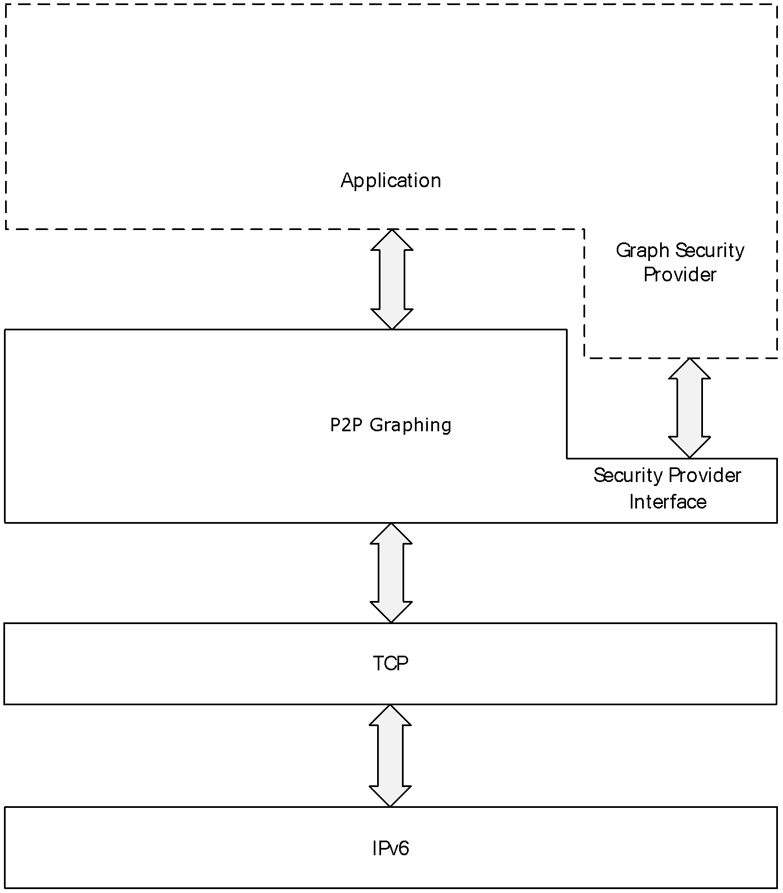

Figure 2: P2P Graphing relationship to other protocols

## 1.5 Prerequisites/Preconditions

In order to connect to a [**graph**](#gt_graph), a [**node**](#gt_node) already knows the address and port of another node. These are obtained via external mechanisms or protocols by the applications that use the Peer-to-Peer Graphing Protocol, such as the Peer Name Resolution Protocol (PNRP) [MS-PNRP](../MS-PNRP/MS-PNRP.md).

Because the Peer-to-Peer Graphing Protocol provides no way to discover the security configuration of a graph, a node is configured in advance with a choice of [**graph security provider**](#gt_graph-security-provider). The graph security provider is an optional component, and if none is specified, then the Peer-to-Peer Graphing Protocol simply does not implement any security. However, if a graph security provider is used, each node in a given graph is configured to use the same one.

## 1.6 Applicability Statement

The protocol is intended for a setting in which all [**nodes**](#gt_node) in a [**graph**](#gt_graph) have symmetric connectivity--any node can successfully form a TCP connection to any other node. To the extent that this is not true, the reliability and efficiency characteristics of a graph degrade.

Because there is redundancy inherent in the [**record**](#gt_record) flooding protocol, the Peer-to-Peer Graphing Protocol is better suited to smaller chunks of data. For example, using a graph for distribution of file metadata is more appropriate than using a graph for file distribution.

The Peer-to-Peer Graphing Protocol is equally suited to scenarios where one node is a broadcaster and all others are receivers and scenarios where all nodes are equally publishing.

## 1.7 Versioning and Capability Negotiation

This document covers versioning issues in the following areas:

- **Supported Transports:** This protocol is implemented on top of TCP over IPv6, as described in section [2.1](#Section_2.1).
- **Protocol Versions:** The protocol version is 1.0.
- **Security and Authentication Methods:** The protocol delegates to the higher layer applications the implementation of the security and authentication methods. The Peer-to-Peer Graphing Protocol will call up into an application-provided component to secure and authenticate new connections and to secure and validate any [**record**](#gt_record) that is flooded in the [**graph**](#gt_graph).
- **Localization:** The protocol does not contain locale-dependent information.
- **Capability Negotiation:** This protocol does not contain any version or capability negotiation mechanism.
The Peer-to-Peer Graphing Protocol messages each contain a version number. The message syntax allows for future data to be added to the message payload without breaking backward compatibility. However, there is no version or capability negotiation implemented.

## 1.8 Vendor-Extensible Fields

Applications that use the Peer-to-Peer Graphing Protocol are able to define their own [**Record**](#gt_record) types. Each record in a [**graph**](#gt_graph) has a Record Type, which is expressed as a [**GUID**](#gt_globally-unique-identifier-guid). A vendor MAY use any GUID except those in the reserved range (see section [2.2.3](#Section_2.2.3)).

## 1.9 Standards Assignments

None.

# 2 Messages

This protocol references commonly used data types as defined in [MS-DTYP](../MS-DTYP/MS-DTYP.md).

Unless otherwise qualified, instances of **GUID** in sections 2 and [3](#Section_1.3) refer to [MS-DTYP] section 2.3.4.

## 2.1 Transport

The Peer-to-Peer Graphing Protocol uses TCP [[RFC793]](https://go.microsoft.com/fwlink/?LinkId=150872) over IPv6 [[RFC2460]](https://go.microsoft.com/fwlink/?LinkId=90357) as its transport. The specific port used is determined by each client independently and can be either provided by the application or randomly selected by the protocol. The Peer-to-Peer Graphing Protocol also allows applications to specify a [**graph security provider**](#gt_graph-security-provider), which can inject messages into the authentication exchange and can encrypt (or even augment or modify) each message before it is sent over the TCP connection.

## 2.2 Message Syntax

The message syntax specified following does not require any particular field alignment for fields that follow a variable-length field.

Unless otherwise noted, all fields are represented in big-endian byte order.

The Peer-to-Peer Graphing Protocol sends messages specified in section [2.2.2](#Section_2.2.2). Messages of larger sizes are broken up into frames, as specified in section [2.2.1.1](#Section_2.2.1.1). Also, each message type uses some common message components specified in sections [2.2.1.2](#Section_2.2.1.2) through [2.2.1.9](#Section_2.2.1.9). The default frame size used by the protocol is 16,379 bytes. Any message received by the protocol with a size larger than the frame size MUST be dropped, and the connection MUST be aborted.

### 2.2.1 Message Components

#### 2.2.1.1 Message Framing

The Peer-to-Peer Graphing Protocol uses TCP, which is a stream-based communication mechanism. However, the protocol is message-oriented. Additionally, the size of a message can be quite large. Thus, the Peer-to-Peer Graphing Protocol defines a framing mechanism to break up messages and to find the boundaries between frames.

Each message is broken into one or more frames. Each frame is described by a frame size and followed by the frame body.

Each message defined by the Peer-to-Peer Graphing Protocol contains the message size within the message, allowing the Peer-to-Peer Graphing Protocol to detect when a complete message has been received.

The framing mechanism can be depicted by the following framing structure.

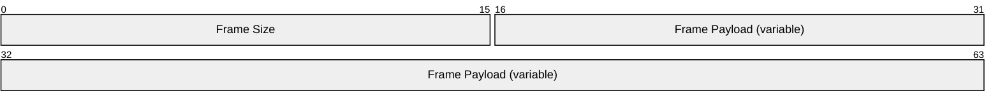
```mermaid
packet-beta
  0-15: "Frame Size"
  16-63: "Frame Payload (variable)"
```

**Frame Size (2 bytes):** The total number of bytes in the current frame. This value MUST be at least 1 and the maximum MUST be less than or equal to the size specified in the Max Frame Size element described in section [3.1.1](#Section_3.1.1).

**Frame Payload (variable):** The frame payload.

#### 2.2.1.2 PEER_MESSAGE

Each message that is exchanged between [**nodes**](#gt_node) MUST be prefixed by the following structure.

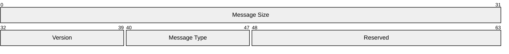
```mermaid
packet-beta
  0-31: "Message Size"
  32-39: "Version"
  40-47: "Message Type"
  48-63: "Reserved"
```

**Message Size (4 bytes):** The total number of bytes in the message.

**Version (1 byte):** The Peer-to-Peer Graphing Protocol version number. This MUST be set to 0x10 to signify version 1.0.

**Message Type (1 byte):** MUST be one of the following values.

| Value | Meaning |
| --- | --- |
| 0x01 | AUTH_INFO |
| 0x02 | CONNECT |
| 0x03 | WELCOME |
| 0x04 | REFUSE |
| 0x05 | DISCONNECT |
| 0x06 | SOLICIT_NEW |
| 0x07 | SOLICIT_TIME |
| 0x08 | SOLICIT_HASH |
| 0x09 | ADVERTISE |
| 0x0A | REQUEST |
| 0x0B | FLOOD |
| 0x0C | SYNC_END |
| 0x0D | PT2PT |
| 0x0E | ACK |

**Reserved (2 bytes):** MUST be set to zero and ignored on receipt.

#### 2.2.1.3 PEER_IN6_ADDRESS

This structure represents a single IPv6 address.

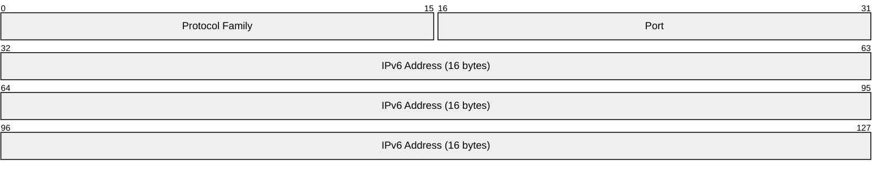
```mermaid
packet-beta
  0-15: "Protocol Family"
  16-31: "Port"
  32-127: "IPv6 Address (16 bytes)"
```

**Protocol Family (2 bytes):** MUST be set to 0x0017 for IPv6.

**Port (2 bytes):** The TCP port on which the [**Node**](#gt_node) is listening.

**IPv6 Address (16 bytes):** The numerical value of an IPv6 Address [[RFC4291]](https://go.microsoft.com/fwlink/?LinkId=90464).

#### 2.2.1.4 PEER_IN6_ADDRESS_EX

This structure represents a single IPv6 address and a Peer ID.

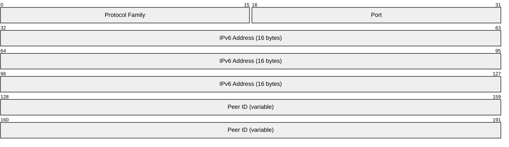
```mermaid
packet-beta
  0-15: "Protocol Family"
  16-31: "Port"
  32-127: "IPv6 Address (16 bytes)"
  128-191: "Peer ID (variable)"
```

**Protocol Family (2 bytes):** MUST be set to 0x0017 for IPv6.

**Port (2 bytes):** The TCP port on which the [**node**](#gt_node) is listening.

**IPv6 Address (16 bytes):** The numerical value of an IPv6 Address [[RFC4291]](https://go.microsoft.com/fwlink/?LinkId=90464).

**Peer ID (variable):** The null-terminated [**UTF-8**](#gt_utf-8) string representing the Peer ID.

#### 2.2.1.5 PEER_ADDRESS

This structure represents a single IPv6 address and appears in the message syntax for [**records**](#gt_record).

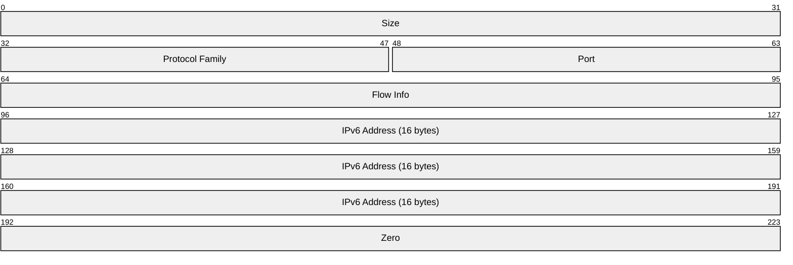
```mermaid
packet-beta
  0-31: "Size"
  32-47: "Protocol Family"
  48-63: "Port"
  64-95: "Flow Info"
  96-191: "IPv6 Address (16 bytes)"
  192-223: "Zero"
```

**Size (4 bytes):** MUST be set to 0x20.

**Protocol Family (2 bytes):** MUST be set to 0x0017 for IPv6.

**Port (2 bytes):** The TCP port on which the [**node**](#gt_node) is listening.

**Flow Info (4 bytes):** The IPv6 flow information [RFC3697].

**IPv6 Address (16 bytes):** The numeric value of the IPv6 Address [[RFC4291]](https://go.microsoft.com/fwlink/?LinkId=90464).

**Zero (4 bytes):** MUST be set to 0x00000000.

#### 2.2.1.6 RECORD_ABSTRACT

Used in the [ADVERTISE (section 2.2.2.9)](#Section_2.2.2.9) message, a RECORD_ABSTRACT represents the [**record ID**](#gt_record-id) and version of a given [**record**](#gt_record).

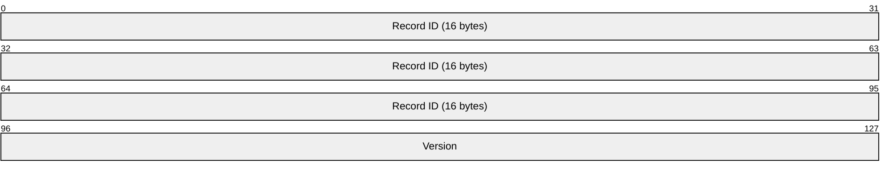
```mermaid
packet-beta
  0-95: "Record ID (16 bytes)"
  96-127: "Version"
```

**Record ID (16 bytes):** The record ID, expressed as a [**GUID**](#gt_globally-unique-identifier-guid).

**Version (4 bytes):** The version number of this record.

#### 2.2.1.7 HASH_INFO_ENTRY

Used in the [SOLICIT_HASH (section 2.2.2.8)](#Section_2.2.2.8) message, a HASH_INFO_ENTRY represents the hash of Record Abstracts for the given [**record**](#gt_record) range.

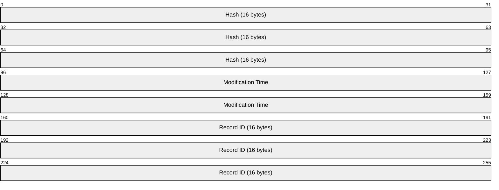
```mermaid
packet-beta
  0-95: "Hash (16 bytes)"
  96-159: "Modification Time"
  160-255: "Record ID (16 bytes)"
```

**Hash (16 bytes):** An [**MD5 hash**](#gt_md5-hash) of [RECORD_ABSTRACT (section 2.2.1.6)](#Section_2.2.1.6) structures.

**Modification Time (8 bytes):** The [**peer time**](#gt_peer-time) value of the last modifier of the last record in the range, at the time when the record was modified.

**Record ID (16 bytes):** The record ID at the upper boundary of the record range, expressed as a [**GUID**](#gt_globally-unique-identifier-guid).

#### 2.2.1.8 HASH_ENTRY_BOUNDARY

Used in the [ADVERTISE (section 2.2.2.9)](#Section_2.2.2.9) message, a HASH_ENTRY_BOUNDARY represents a range of [**record IDs**](#gt_record-id) and modification times.

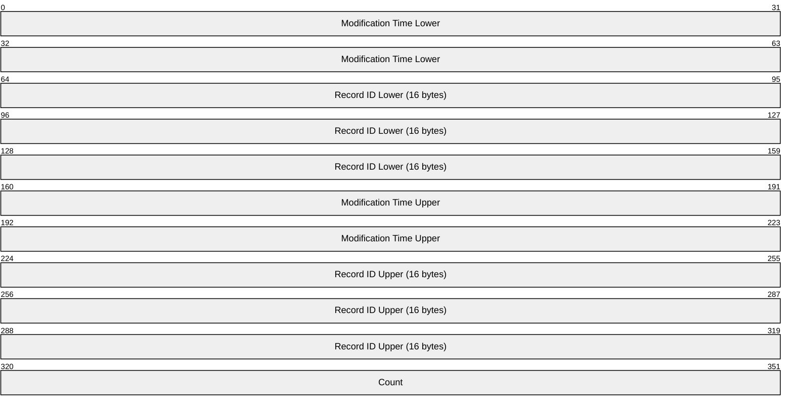
```mermaid
packet-beta
  0-63: "Modification Time Lower"
  64-159: "Record ID Lower (16 bytes)"
  160-223: "Modification Time Upper"
  224-319: "Record ID Upper (16 bytes)"
  320-351: "Count"
```

**Modification Time Lower (8 bytes):** The lowest value of the last modification time for the range of records.

**Record ID Lower (16 bytes):** The lowest value of record ID for the range of records, expressed as a [**GUID**](#gt_globally-unique-identifier-guid).

**Modification Time Upper (8 bytes):** The highest value of the last modification time for the range of records.

**Record ID Upper (16 bytes):** The highest value of record ID for the range of records, expressed as a GUID.

**Count (4 bytes):** The number of records present in this range.

#### 2.2.1.9 PEER_RECORD

This represents a [**record**](#gt_record) that is part of the [**graph**](#gt_graph) [**database**](#gt_database). Each record is identified by a record type that defines the format of the payload data. The Peer-to-Peer Graphing Protocol defines four internal record types to represent data that is internally used by the protocol. For more details, see section [2.2.3](#Section_2.2.3).

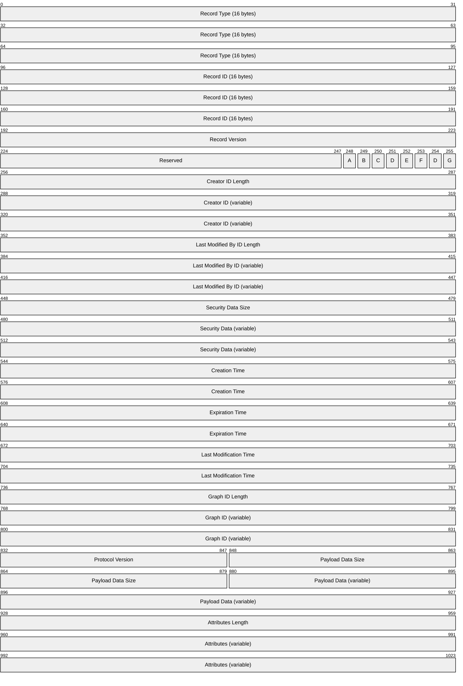
```mermaid
packet-beta
  0-95: "Record Type (16 bytes)"
  96-191: "Record ID (16 bytes)"
  192-223: "Record Version"
  224-247: "Reserved"
  248-248: "A"
  249-249: "B"
  250-250: "C"
  251-251: "D"
  252-252: "E"
  253-253: "F"
  254-254: "D"
  255-255: "G"
  256-287: "Creator ID Length"
  288-351: "Creator ID (variable)"
  352-383: "Last Modified By ID Length"
  384-447: "Last Modified By ID (variable)"
  448-479: "Security Data Size"
  480-543: "Security Data (variable)"
  544-607: "Creation Time"
  608-671: "Expiration Time"
  672-735: "Last Modification Time"
  736-767: "Graph ID Length"
  768-831: "Graph ID (variable)"
  832-847: "Protocol Version"
  848-879: "Payload Data Size"
  880-927: "Payload Data (variable)"
  928-959: "Attributes Length"
  960-1023: "Attributes (variable)"
```

**Record Type (16 bytes):** The type of this record, expressed as a [**GUID**](#gt_globally-unique-identifier-guid). The Peer-to-Peer Graphing Protocol reserves the following record types for internal use only.

| Name | Value |
| --- | --- |
| RECORD_TYPE_GRAPH_INFO | { 00000100-0000-0000-0000-000000000000 } |
| RECORD_TYPE_SIGNATURE | { 00000200-0000-0000-0000-000000000000 } |
| RECORD_TYPE_CONTACT | { 00000300-0000-0000-0000-000000000000 } |
| RECORD_TYPE_PRESENCE | { 00000400-0000-0000-0000-000000000000 } |

**Record ID (16 bytes):** The unique ID of this record in the graph, expressed as a GUID.

**Record Version (4 bytes):** The current version of this record. This version is initialized to 1 on record creation and incremented each time the record is updated.

**Reserved (3 bytes):** MUST be set to 0x000000 and ignored on receipt.

**A - Z1 (1 bit):** MUST be set to 0.

**B - Z2 (1 bit):** MUST be set to 0.

**C - Z3 (1 bit):** MUST be set to 0.

**D - Z4 (1 bit):** MUST be set to 0.

**E - Z5 (1 bit):** MUST be set to 0.

**F - Z6 (1 bit):** MUST be set to 0.

**D (1 bit):** (Deleted): Indicates that the record has been deleted. If set to 1, the **Payload Data** field of this record MUST be empty.

**H - Z8 (1 bit):** MUST be set to 0.

**Creator ID Length (4 bytes):** The length, in characters, of the string that follows, including the terminating null character. This field MUST be in the range 2 to 256.

**Creator ID (variable):** A null-terminated Unicode string representing the Peer ID of the record creator.

**Last Modified By ID Length (4 bytes):** The length, in characters, of the **Last Modified By ID** string, including the terminating null character. This field MUST be in the range 0 to 256.

**Last Modified By ID (variable):** A null-terminated Unicode string representing the Peer ID of the [**node**](#gt_node) that last modified this record. This field MUST NOT be present if the **Last Modified By ID Length** value is 0x00000000.

**Security Data Size (4 bytes):** The size of **Security Data**, in bytes.

**Security Data (variable):** The security data supplied by the [**graph security provider**](#gt_graph-security-provider). If **Security Data Size** is 0x00000000, this field MUST NOT be present.

**Creation Time (8 bytes):** The [**peer time**](#gt_peer-time) value of the record creator at the time that this record was created.

**Expiration Time (8 bytes):** The peer time at the local node at which this record will expire.

**Last Modification Time (8 bytes):** The peer time value of the last modifier at the time that the record was last modified. For a record that has never been modified, this field MUST have the same value as the **Creation Time**.

**Graph ID Length (4 bytes):** The length, in characters, of the string that follows, including the terminating null character. This field MUST be in the range 2 to 256.

**Graph ID (variable):** A null-terminated Unicode string representing the [**graph ID**](#gt_graph-id) of the graph to which this record belongs.

**Protocol Version (2 bytes):** The Peer-to-Peer Graphing Protocol version number. This MUST be set to 0x0100 to signify version 1.0.

**Payload Data Size (4 bytes):** The size of the **Payload Data**, in bytes.

**Payload Data (variable):** The payload data.

**Attributes Length (4 bytes):** The length, in characters, of the **Attributes** string, including the terminating null character.

**Attributes (variable):** A null-terminated Unicode XML string that contains the set of attribute name and value pairs that are associated with this record. This field MUST NOT be present if the **Attributes Length** value is 0x00000000. See section [2.2.3.5](#Section_2.2.3.5) for the specification of the syntax of **Attributes**.

### 2.2.2 Messages

#### 2.2.2.1 AUTH_INFO

AUTH_INFO is the first message sent by the connection initiator when establishing a connection. Because this message is sent before the [**graph security provider**](#gt_graph-security-provider) negotiation, it is always sent in the clear.

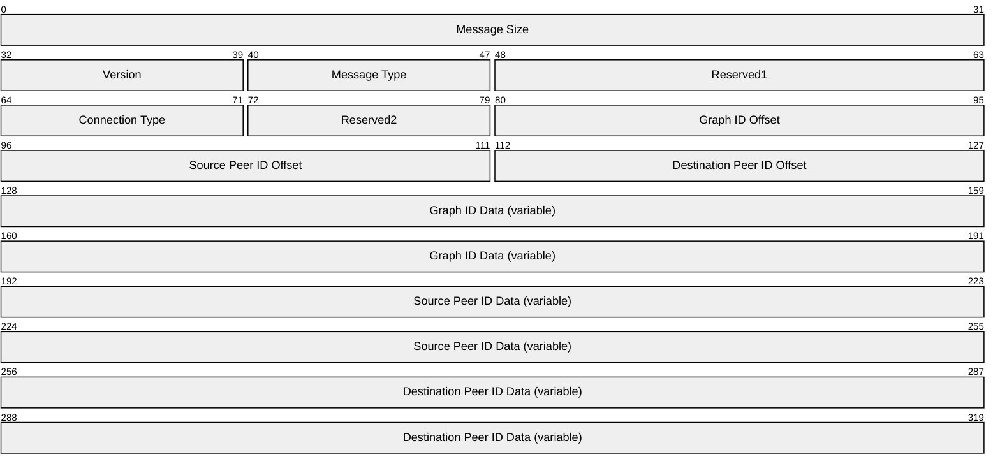
```mermaid
packet-beta
  0-31: "Message Size"
  32-39: "Version"
  40-47: "Message Type"
  48-63: "Reserved1"
  64-71: "Connection Type"
  72-79: "Reserved2"
  80-95: "Graph ID Offset"
  96-111: "Source Peer ID Offset"
  112-127: "Destination Peer ID Offset"
  128-191: "Graph ID Data (variable)"
  192-255: "Source Peer ID Data (variable)"
  256-319: "Destination Peer ID Data (variable)"
```

**Message Size (4 bytes):** The total number of bytes in the message.

**Version (1 byte):** The Peer-to-Peer Graphing Protocol version number. This MUST be set to 0x10 to signify version 1.0.

**Message Type (1 byte):** MUST be set to 0x01.

**Reserved1 (2 bytes):** MUST be set to zero and ignored on receipt.

**Connection Type (1 byte):** MUST be one of the following values.

| Value | Meaning |
| --- | --- |
| CONNECTION_TYPE_NEIGHBOR 0x01 | This is for a [**neighbor connection**](#gt_neighbor-connection). |
| CONNECTION_TYPE_DIRECT 0x02 | This is a [**direct connection**](#gt_direct-connection). |

**Reserved2 (1 byte):** MUST be set to zero and MUST be ignored on receipt.

**Graph ID Offset (2 bytes):** The offset, in bytes, from the beginning of the message to the [**graph ID**](#gt_graph-id).

**Source Peer ID Offset (2 bytes):** The offset, in bytes, from the beginning of the message to the source Peer ID.

**Destination Peer ID Offset (2 bytes):** The offset, in bytes, from the beginning of the message to the destination Peer ID.

**Graph ID Data (variable):** A null-terminated [**UTF-8**](#gt_utf-8) string representing the graph ID.

**Source Peer ID Data (variable):** A null-terminated UTF-8 string representing the Peer ID of the [**node**](#gt_node) that is initiating the connection.

**Destination Peer ID Data (variable):** A null-terminated UTF-8 string representing the Peer ID of the node that the connection is intended for. If the **Destination Peer ID Offset** is equal to **Message Size**, this field MUST NOT be present.

#### 2.2.2.2 CONNECT

The CONNECT message is used by a [**node**](#gt_node) to establish a [**direct connection**](#gt_direct-connection) or [**neighbor connection**](#gt_neighbor-connection) with another node. This message provides the destination node with the listening addresses of the source node.

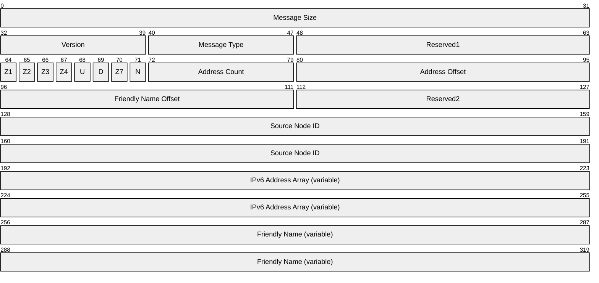
```mermaid
packet-beta
  0-31: "Message Size"
  32-39: "Version"
  40-47: "Message Type"
  48-63: "Reserved1"
  64-64: "Z1"
  65-65: "Z2"
  66-66: "Z3"
  67-67: "Z4"
  68-68: "U"
  69-69: "D"
  70-70: "Z7"
  71-71: "N"
  72-79: "Address Count"
  80-95: "Address Offset"
  96-111: "Friendly Name Offset"
  112-127: "Reserved2"
  128-191: "Source Node ID"
  192-255: "IPv6 Address Array (variable)"
  256-319: "Friendly Name (variable)"
```

**Message Size (4 bytes):** The total number of bytes in the message.

**Version (1 byte):** The Peer-to-Peer Graphing Protocol version number. This MUST be set to 0x10 to signify version 1.0.

**Message Type (1 byte):** MUST be set to 0x02.

**Reserved1 (2 bytes):** MUST be set to zero and MUST be ignored on receipt.

**Z1 (1 bit):** MUST be set to 0 and MUST be ignored on receipt.

**Z2 (1 bit):** MUST be set to 0 and MUST be ignored on receipt.

**Z3 (1 bit):** MUST be set to 0 and MUST be ignored on receipt.

**Z4 (1 bit):** MUST be set to 0 and MUST be ignored on receipt.

**U (1 bit):** (Update): When set, indicates that the source node has begun listening and now has a valid set of addresses.

**D (1 bit):** (Direct): When set, indicates that this connection is being established as a direct connection.

**Z7 (1 bit):** MUST be set to 0 and MUST be ignored on receipt.

**N (1 bit):** (Neighbor List): When set, this flag indicates that the source node wants the list of [**neighbors**](#gt_neighbor) of the target node.

**Address Count (1 byte):** The total number of address entries included in the message. If the Update bit is set, this field MUST NOT be zero.

**Address Offset (2 bytes):** The offset, in bytes, from the beginning of the message to the first address in the address list.

**Friendly Name Offset (2 bytes):** The offset, in bytes, from the beginning of the message to the **Friendly Name**.

**Reserved2 (2 bytes):** MUST be set to zero and MUST be ignored on receipt.

**Source Node ID (8 bytes):** The [**node ID**](#gt_node-id) of the sender.

**IPv6 Address Array (variable):** An array of **Address Count** IPv6 addresses in [PEER_IN6_ADDRESS (section 2.2.1.3)](#Section_2.2.1.3) form. This field MUST NOT be present if the **Address Count** is 0.

**Friendly Name (variable):** A null-terminated [**UTF-8**](#gt_utf-8) string representing the friendly name of the sender. If the **Friendly Name Offset** is equal to the **Message Size**, this field MUST NOT be present.

#### 2.2.2.3 WELCOME

The WELCOME message is sent in response to a [CONNECT](#Section_2.2.2.2) message if the connection is accepted.

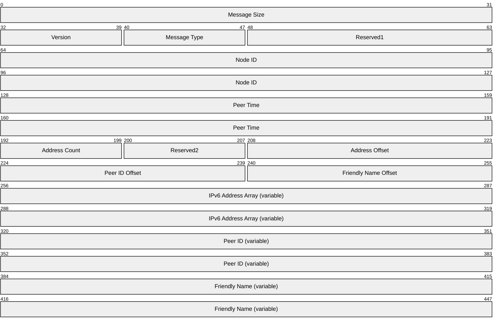
```mermaid
packet-beta
  0-31: "Message Size"
  32-39: "Version"
  40-47: "Message Type"
  48-63: "Reserved1"
  64-127: "Node ID"
  128-191: "Peer Time"
  192-199: "Address Count"
  200-207: "Reserved2"
  208-223: "Address Offset"
  224-239: "Peer ID Offset"
  240-255: "Friendly Name Offset"
  256-319: "IPv6 Address Array (variable)"
  320-383: "Peer ID (variable)"
  384-447: "Friendly Name (variable)"
```

**Message Size (4 bytes):** The total number of bytes in the message.

**Version (1 byte):** The Peer-to-Peer Graphing Protocol version number. This MUST be set to 0x10 to signify version 1.0.

**Message Type (1 byte):** MUST be set to 0x03.

**Reserved1 (2 bytes):** MUST be set to zero and MUST be ignored on receipt.

**Node ID (8 bytes):** The [**node ID**](#gt_node-id) of the [**node**](#gt_node) sending the WELCOME message.

**Peer Time (8 bytes):** The current [**peer time**](#gt_peer-time). This field is used for peer time calculation.

**Address Count (1 byte):** The total number of address entries included in the message.

**Reserved2 (1 byte):** MUST be set to zero and MUST be ignored on receipt.

**Address Offset (2 bytes):** The offset, in bytes, from the beginning of the message to the first address in the address list.

**Peer ID Offset (2 bytes):** The offset, in bytes, from the beginning of the message to **Peer ID**.

**Friendly Name Offset (2 bytes):** The offset, in bytes, from the beginning of the message to **Friendly Name**.

**IPv6 Address Array (variable):** An array of **Address Count** IPv6 addresses in REF _Ref161734214 \w \h \* MERGEFORMAT [PEER_IN6_ADDRESS (section 2.2.1.3)](#Section_2.2.1.3) form. This field MUST NOT be present if the **Address Count** is 0x00.

**Peer ID (variable):** A null-terminated [**UTF-8**](#gt_utf-8) string representing the Peer ID of the sender.

**Friendly Name (variable):** A null-terminated UTF-8 string representing the friendly name of the sender. If **Friendly Name Offset** is equal to **Message Size**, this field MUST NOT be present.

#### 2.2.2.4 REFUSE

The REFUSE message is sent in response to the [CONNECT (section 2.2.2.2)](#Section_2.2.2.2) message when the connection is not accepted.

```mermaid
packet-beta
  0-31: "Message Size"
  32-39: "Version"
  40-47: "Message Type"
  48-63: "Reserved"
  64-71: "Error Code"
  72-79: "Address Count"
  80-95: "Address Offset"
  96-159: "IPv6 Address Array (variable)"
```

**Message Size (4 bytes):** The total number of bytes in the message.

**Version (1 byte):** The Peer-to-Peer Graphing Protocol version number. This MUST be set to 0x10 to signify version 1.0.

**Message Type (1 byte):** MUST be set to 0x04.

**Reserved (2 bytes):** MUST be set to zero and MUST be ignored on receipt.

**Error Code (1 byte):** One of the following values.

| Value | Meaning |
| --- | --- |
| REFUSE_CODE_BUSY 0x01 | The sending [**node**](#gt_node) already has the maximum number of [**neighbor connections**](#gt_neighbor-connection). This code is never sent for a [**direct connection**](#gt_direct-connection). |
| REFUSE_CODE_ALREADY_CONNECTED 0x02 | The connection on which this message was received is already in the CONNECTED state and the CONNECT message did not have the Update bit set. |
| REFUSE_CODE_DUPLICATE_CONNECTION 0x03 | The sending node is already connected to the receiving node on another connection. |
| REFUSE_CODE_DIRECT_CONNECTION_DISALLOWED 0x04 | The receiving node is not accepting direct connections. This code MUST be returned when the application is not expecting direct connections. |

**Address Count (1 byte):** The total number of address entries included in the message.

**Address Offset (2 bytes):** The offset, in bytes, from the beginning of the message to the first address in the address list.

**IPv6 Address Array (variable):** An array of **Address Count** IPv6 addresses in [PEER_IN6_ADDRESS (section 2.2.1.3)](#Section_2.2.1.3) form. This field MUST NOT be present if the **Address Count** is 0x00.

#### 2.2.2.5 DISCONNECT

The DISCONNECT message is sent by a [**node**](#gt_node) before terminating an existing connection. After receiving this message, the remote node MUST terminate the connection.

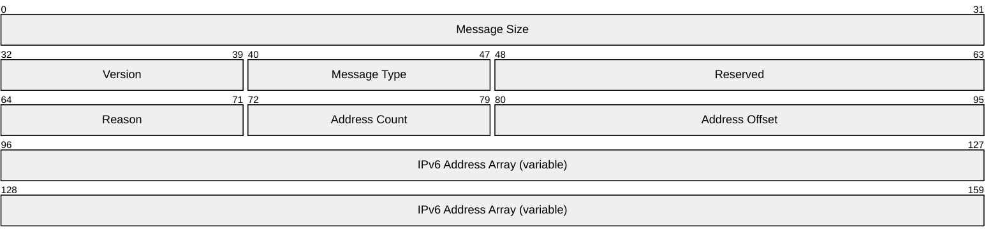
```mermaid
packet-beta
  0-31: "Message Size"
  32-39: "Version"
  40-47: "Message Type"
  48-63: "Reserved"
  64-71: "Reason"
  72-79: "Address Count"
  80-95: "Address Offset"
  96-159: "IPv6 Address Array (variable)"
```

**Message Size (4 bytes):** The total number of bytes in the message.

**Version (1 byte):** The Peer-to-Peer Graphing Protocol version number. This MUST be set to 0x10 to signify version 1.0.

**Message Type (1 byte):** MUST be set to 0x05.

**Reserved (2 bytes):** MUST be set to zero and MUST be ignored on receipt.

**Reason (1 byte):** MUST be one of the following values.

| Name | Meaning |
| --- | --- |
| DISCONNECT_REASON_LEAVING 0x01 | The sender is leaving the [**graph**](#gt_graph). |
| DISCONNECT_REASON_LEAST_USEFUL 0x02 | The sender is performing [**graph maintenance**](#gt_graph-maintenance), and this is the least useful connection. |
| DISCONNECT_REASON_APP_DISCONNECT 0x03 | The application requested that the connection be disconnected. |

**Address Count (1 byte):** The total number of address entries included in the message.

**Address Offset (2 bytes):** The offset, in bytes, from the beginning of the message to the first address in the address list.

**IPv6 Address Array (variable):** An array of IPv6 addresses in [PEER_IN6_ADDRESS (section 2.2.1.3)](#Section_2.2.1.3) form. This field MUST NOT be present if the **Address Count** is 0x00.

#### 2.2.2.6 SOLICIT_NEW

The SOLICIT_NEW message is sent by a [**node**](#gt_node) that connected to the [**graph**](#gt_graph) for the first time (and has never synchronized before). This message initiates a sync of the entire [**database**](#gt_database).

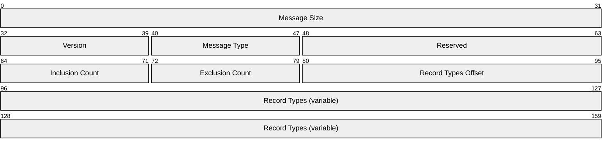
```mermaid
packet-beta
  0-31: "Message Size"
  32-39: "Version"
  40-47: "Message Type"
  48-63: "Reserved"
  64-71: "Inclusion Count"
  72-79: "Exclusion Count"
  80-95: "Record Types Offset"
  96-159: "Record Types (variable)"
```

**Message Size (4 bytes):** The total number of bytes in the message.

**Version (1 byte):** The Peer-to-Peer Graphing Protocol version number. This MUST be set to 0x10 to signify version 1.0.

**Message Type (1 byte):** MUST be set to 0x06.

**Reserved (2 bytes):** MUST be set to zero and MUST be ignored on receipt.

**Inclusion Count (1 byte):** The count of [**record**](#gt_record) types to be included in the sync. This field MUST be set to 0x00 if **Exclusion Count** is nonzero.

**Exclusion Count (1 byte):** The count of record types that are to be excluded from the sync. This field MUST be set to 0x00 if **Inclusion Count** is nonzero.

**Record Types Offset (2 bytes):** The offset, in bytes, from the beginning of the message of the **Record Type**array.

**Record Types (variable):** The array of record types that are included or excluded, expressed as an array of [**GUIDs**](#gt_globally-unique-identifier-guid) in [**big-endian**](#gt_big-endian) byte order. The record types that are synchronized are controlled by the inclusion/exclusion list:

- When no record types are specified, all record types MUST be synchronized.
- When **Inclusion Count** is nonzero, the sync MUST include only the record types in the **Record Types** array.
- When **Exclusion Count** is nonzero, the sync MUST include all record types except those in the **Record Types** array.

#### 2.2.2.7 SOLICIT_TIME

The SOLICIT_TIME message is used to initiate Time-based Sync.

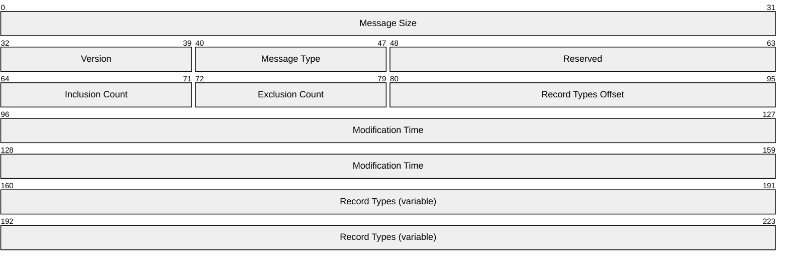
```mermaid
packet-beta
  0-31: "Message Size"
  32-39: "Version"
  40-47: "Message Type"
  48-63: "Reserved"
  64-71: "Inclusion Count"
  72-79: "Exclusion Count"
  80-95: "Record Types Offset"
  96-159: "Modification Time"
  160-223: "Record Types (variable)"
```

**Message Size (4 bytes):** The total number of bytes in the message.

**Version (1 byte):** The Peer-to-Peer Graphing Protocol version number. This MUST be set to 0x10 to signify version 1.0.

**Message Type (1 byte):** MUST be set to 0x07.

**Reserved (2 bytes):** MUST be set to zero and MUST be ignored on receipt.

**Inclusion Count (1 byte):** The count of [**record**](#gt_record) types to be included in the sync. This field MUST be 0x00 if **Exclusion Count** is nonzero.

**Exclusion Count (1 byte):** The count of record types that are to be excluded from the sync. This field MUST be 0x00 if **Inclusion Count** is nonzero.

**Record Types Offset (2 bytes):** The offset, in bytes, from the beginning of the message to the **Record Types** array.

**Modification Time (8 bytes):** The [**node's**](#gt_node) [**peer time**](#gt_peer-time) value when it left the [**graph**](#gt_graph). This value is the minimum **Modification Time** of the records that the responder will flood in response to the message.

**Record Types (variable):** The array of record types that are included or excluded, expressed as an array of [**GUIDs**](#gt_globally-unique-identifier-guid) in [**big-endian**](#gt_big-endian) byte order. This array is interpreted the same as in [SOLICIT_NEW (section 2.2.2.6)](#Section_2.2.2.6).

#### 2.2.2.8 SOLICIT_HASH

The SOLICIT_HASH message is used to initiate a Hash-based Sync.

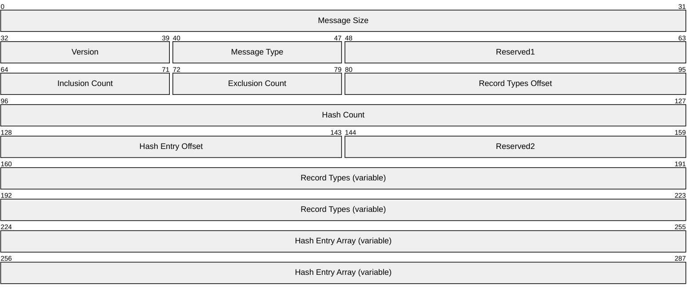
```mermaid
packet-beta
  0-31: "Message Size"
  32-39: "Version"
  40-47: "Message Type"
  48-63: "Reserved1"
  64-71: "Inclusion Count"
  72-79: "Exclusion Count"
  80-95: "Record Types Offset"
  96-127: "Hash Count"
  128-143: "Hash Entry Offset"
  144-159: "Reserved2"
  160-223: "Record Types (variable)"
  224-287: "Hash Entry Array (variable)"
```

**Message Size (4 bytes):** The total number of bytes in the message.

**Version (1 byte):** The Peer-to-Peer Graphing Protocol version number. This MUST be set to 0x10 to signify version 1.0.

**Message Type (1 byte):** MUST be set to 0x08.

**Reserved1 (2 bytes):** MUST be set to zero and ignored on receipt.

**Inclusion Count (1 byte):** The count of [**record**](#gt_record) types to be included in the sync. This field MUST be 0x00 if **Exclusion Count** is nonzero.

**Exclusion Count (1 byte):** The count of record types that are to be excluded from the sync. This field MUST be set to 0x00 if **Inclusion Count** is nonzero.

**Record Types Offset (2 bytes):** The offset, in bytes, from the beginning of the message to the **Record Type** array.

**Hash Count (4 bytes):** The number of [HASH_INFO_ENTRY (section 2.2.1.7)](#Section_2.2.1.7) structures included in the message.

**Hash Entry Offset (2 bytes):** The offset, in bytes, from the beginning of the message to the **Hash Entry Array**.

**Reserved2 (2 bytes):** MUST be set to zero and MUST be ignored on receipt.

**Record Types (variable):** The array of record types that are included or excluded, expressed as an array of [**GUIDs**](#gt_globally-unique-identifier-guid) in [**big-endian**](#gt_big-endian) byte order. This array is interpreted the same as in [SOLICIT_NEW (section 2.2.2.6)](#Section_2.2.2.6).

**Hash Entry Array (variable):** The array of HASH_INFO_ENTRY structures that describe the Records in the Database.

#### 2.2.2.9 ADVERTISE

The ADVERTISE message is sent in response to a [SOLICIT_HASH (section 2.2.2.8)](#Section_2.2.2.8) message. This message describes the boundaries and [**record**](#gt_record) lists for each record range in the SOLICIT_HASH message for which the locally computed hashes do not match the remotely calculated hashes.

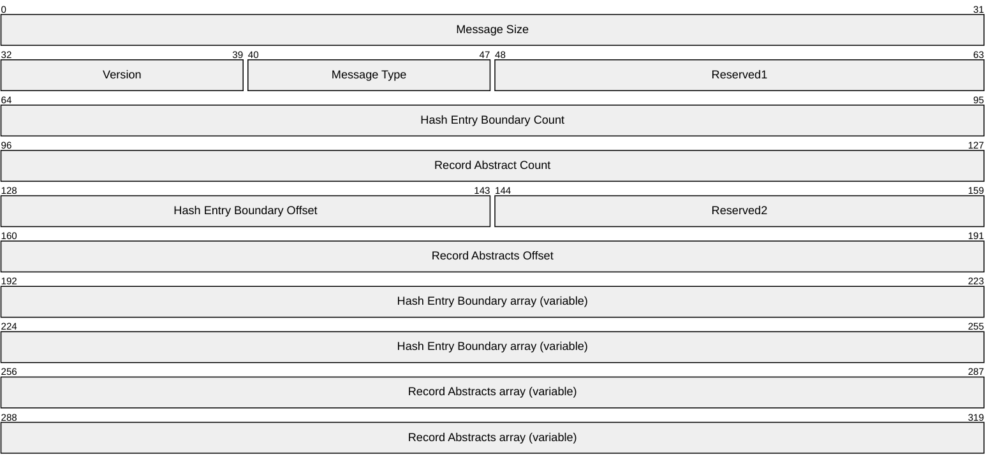
```mermaid
packet-beta
  0-31: "Message Size"
  32-39: "Version"
  40-47: "Message Type"
  48-63: "Reserved1"
  64-95: "Hash Entry Boundary Count"
  96-127: "Record Abstract Count"
  128-143: "Hash Entry Boundary Offset"
  144-159: "Reserved2"
  160-191: "Record Abstracts Offset"
  192-255: "Hash Entry Boundary array (variable)"
  256-319: "Record Abstracts array (variable)"
```

**Message Size (4 bytes):** The total number of bytes in the message.

**Version (1 byte):** The Peer-to-Peer Graphing Protocol version number. This MUST be set to 0x10 to signify version 1.0.

**Message Type (1 byte):** MUST be set to 0x09.

**Reserved1 (2 bytes):** MUST be set to zero and ignored on receipt.

**Hash Entry Boundary Count (4 bytes):** The count of [HASH_ENTRY_BOUNDARY (section 2.2.1.8)](#Section_2.2.1.8) structures in this message.

**Record Abstract Count (4 bytes):** The count of [RECORD_ABSTRACT (section 2.2.1.6)](#Section_2.2.1.6) structures in this message.

**Hash Entry Boundary Offset (2 bytes):** The offset, in bytes, from the beginning of the message to the HASH_ENTRY_BOUNDARY array.

**Reserved2 (2 bytes):** MUST be set to zero and ignored on receipt.

**Record Abstracts Offset (4 bytes):** The offset, in bytes, from the beginning of the message to the RECORD_ABSTRACT array.

**Hash Entry Boundary array (variable):** The array of HASH_ENTRY_BOUNDARY structures.

**Record Abstracts array (variable):** The array of RECORD_ABSTRACT structures.

#### 2.2.2.10 REQUEST

The REQUEST message is sent in response to an [ADVERTISE (section 2.2.2.9)](#Section_2.2.2.9) message. The receiver responds by sending [FLOOD (section 2.2.2.11)](#Section_2.2.2.11) messages for each [**record**](#gt_record) that is requested.

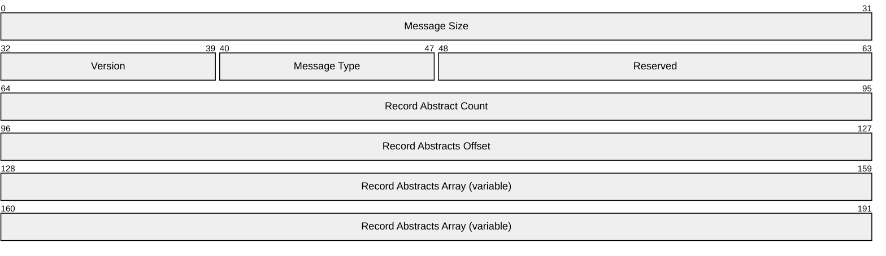
```mermaid
packet-beta
  0-31: "Message Size"
  32-39: "Version"
  40-47: "Message Type"
  48-63: "Reserved"
  64-95: "Record Abstract Count"
  96-127: "Record Abstracts Offset"
  128-191: "Record Abstracts Array (variable)"
```

**Message Size (4 bytes):** The total number of bytes in the message.

**Version (1 byte):** The Peer-to-Peer Graphing Protocol version number. This MUST be set to 0x10 to signify version 1.0.

**Message Type (1 byte):** MUST be set to 0x0A.

**Reserved (2 bytes):** MUST be set to zero and ignored on receipt.

**Record Abstract Count (4 bytes):** The count of [RECORD_ABSTRACT (section 2.2.1.6)](#Section_2.2.1.6) structures in this message.

**Record Abstracts Offset (4 bytes):** The offset of the **Record Abstracts Array**.

**Record Abstracts Array (variable):** The array of RECORD_ABSTRACT structures.

#### 2.2.2.11 FLOOD

The FLOOD message is used to send a [**record**](#gt_record) from one [**node**](#gt_node) to another.

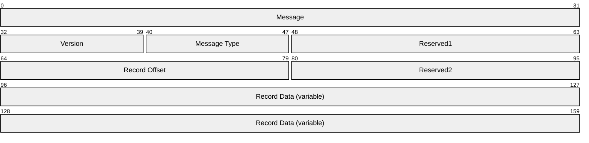
```mermaid
packet-beta
  0-31: "Message"
  32-39: "Version"
  40-47: "Message Type"
  48-63: "Reserved1"
  64-79: "Record Offset"
  80-95: "Reserved2"
  96-159: "Record Data (variable)"
```

**Message (4 bytes):** The total number of bytes in the message.

**Version (1 byte):** The Peer-to-Peer Graphing Protocol version number. This MUST be set to 0x10 to signify version 1.0.

**Message Type (1 byte):** MUST be set to 0x0B.

**Reserved1 (2 bytes):** MUST be set to zero and ignored on receipt.

**Record Offset (2 bytes):** The offset, in bytes, from the beginning of the message to the **Record Data**.

**Reserved2 (2 bytes):** MUST be set to zero and MUST be ignored on receipt.

**Record Data (variable):** The record data, in [PEER_RECORD (section 2.2.1.9)](#Section_2.2.1.9) format.

#### 2.2.2.12 SYNC_END

The SYNC_END message is sent to mark the end of a synchronization phase.

```mermaid
packet-beta
  0-31: "Message Size"
  32-39: "Version"
  40-47: "Message Type"
  48-63: "Reserved1"
  64-64: "Z1"
  65-65: "Z2"
  66-66: "Z3"
  67-67: "Z4"
  68-68: "Z5"
  69-69: "Z6"
  70-70: "Z7"
  71-71: "F"
  72-79: "Reserved2"
  80-95: "Reserved3"
```

**Message Size (4 bytes):** The total number of bytes in the message.

**Version (1 byte):** The Peer-to-Peer Graphing Protocol version number. This MUST be set to 0x10 to signify version 1.0.

**Message Type (1 byte):** MUST be set to 0x0C.

**Reserved1 (2 bytes):** MUST be set to zero and ignored on receipt.

**Z1 (1 bit):** MUST be set to 0 and MUST be ignored on receipt.

**Z2 (1 bit):** MUST be set to 0 and MUST be ignored on receipt.

**Z3 (1 bit):** MUST be set to 0 and MUST be ignored on receipt.

**Z4 (1 bit):** MUST be set to 0 and MUST be ignored on receipt.

**Z5 (1 bit):** MUST be set to 0 and MUST be ignored on receipt.

**Z6 (1 bit):** MUST be set to 0 and MUST be ignored on receipt.

**Z7 (1 bit):** MUST be set to 0 and MUST be ignored on receipt.

**F (1 bit):** (Final): This bit MUST always be set. This bit indicates that this is the final SYNC_END message and that the synchronization phase is complete.

**Reserved2 (1 byte):** MUST be set to zero and MUST be ignored on receipt.

**Reserved3 (2 bytes):** MUST be set to zero and MUST be ignored on receipt.

#### 2.2.2.13 PT2PT

The PT2PT message is used by the application to send data from one [**Node**](#gt_node) to another. The PT2PT message can be sent on either a [**Direct**](#gt_direct-connection) or a [**Neighbor connection**](#gt_neighbor-connection).

```mermaid
packet-beta
  0-31: "Message Size"
  32-39: "Version"
  40-47: "Message Type"
  48-63: "Reserved1"
  64-79: "Data Offset"
  80-95: "Reserved2"
  96-191: "Data Type (16 bytes)"
  192-255: "Payload Data (variable)"
```

**Message Size (4 bytes):** The total number of bytes in the message.

**Version (1 byte):** The Peer-to-Peer Graphing Protocol version number. This MUST be set to 0x10 to signify version 1.0.

**Message Type (1 byte):** MUST be set to 0x0D.

**Reserved1 (2 bytes):** MUST be set to zero and ignored on receipt.

**Data Offset (2 bytes):** The offset, in bytes, from the beginning of the message to the **Payload Data**.

**Reserved2 (2 bytes):** MUST be set to zero and ignored on receipt.

**Data Type (16 bytes):** The application-supplied data type, expressed as a GUID. GUID {0ccbb0d2-be41-4bd6-914b058ec5dcce64} is reserved by the protocol and MUST NOT be used by the application. For more details, see section [2.2.4.1](#Section_2.2.4.1).

**Payload Data (variable):** The application-supplied data.

#### 2.2.2.14 ACK

The ACK message is sent to acknowledge one or more [FLOOD (section 2.2.2.11)](#Section_2.2.2.11) messages, and to report whether each [**Record**](#gt_record) sent in the FLOOD message or messages was useful.

```mermaid
packet-beta
  0-31: "Message Size"
  32-39: "Version"
  40-47: "Message Type"
  48-63: "Reserved"
  64-79: "ACKs Count"
  80-95: "ACKs Offset"
  96-159: "Record ACK (variable)"
```

**Message Size (4 bytes):** The total number of bytes in the message.

**Version (1 byte):** The Peer-to-Peer Graphing Protocol version number. This MUST be set to 0x10 to signify version 1.0.

**Message Type (1 byte):** MUST be set to 0x0E.

**Reserved (2 bytes):** MUST be set to zero and ignored on receipt.

**ACKs Count (2 bytes):** The number of Record ACKs in this message.

**ACKs Offset (2 bytes):** The offset, in bytes, from the beginning of the message to the start of the **Record ACK Array**.

**Record ACK (variable):** An array of [**Record ID**](#gt_record-id)/Flag pairs, with each pair in the array formatted as follows.

```mermaid
packet-beta
  0-95: "Record ID (16 bytes)"
  96-126: "Reserved"
  127-127: "U"
```

**Record ID (16 bytes):** The Record ID, expressed as a [**GUID**](#gt_globally-unique-identifier-guid).

**Reserved (31 bits):** MUST be set to zero and MUST be ignored on receipt.

**U (1 bit):** When set, indicates that the acknowledged FLOOD for this Record ID was useful. When not set, the FLOOD was not useful.

### 2.2.3 Internal Record types

This section defines a set of internal record types used by the Peer-to-Peer Graphing Protocol, and defines the structure of the **Payload Data** field of the [PEER_RECORD (section 2.2.1.9)](#Section_2.2.1.9) structure for those types.

- [Graph Info Record (section 2.2.3.1)](#Section_1.3.5.5.1)
- [Signature Record (section 2.2.3.2)](#Section_2.2.3.2)
- [Contact Record (section 2.2.3.3)](#Section_2.2.3.3)
- [Presence Record (section 2.2.3.4)](#Section_1.3.5.5.4)

#### 2.2.3.1 Graph Info Record

The Graph Info Record is used to publish the [**graph**](#gt_graph) configuration to every member of the graph. It is represented as a [PEER_RECORD (section 2.2.1.9)](#Section_2.2.1.9) with the following fields set:

**Record Type** MUST be set to the [**GUID**](#gt_globally-unique-identifier-guid) value {00000100-0000-0000-0000-000000000000}

**Record Id:** MUST be set to the GUID value {6c796768-7732-406b-bc6e-5e9c0d864580}

**Payload Data** MUST be set to the following data BLOB.

```mermaid
packet-beta
  0-31: "Size"
  32-61: "Reserved"
  62-62: "D"
  63-63: "I"
  64-95: "Scope"
  96-127: "Graph ID Length"
  128-191: "Graph ID (variable)"
  192-223: "Creator ID Length"
  224-287: "Creator ID (variable)"
  288-319: "Friendly Name Length"
  320-383: "Friendly Name (variable)"
  384-415: "Comment Length"
  416-479: "Comment (variable)"
  480-511: "Presence Lifetime"
  512-543: "Max Presence Records"
  544-575: "Max Record Size"
```

**Size (4 bytes):** The total number of bytes in this structure.

**Reserved (30 bits):** MUST be set to zero and MUST be ignored on receipt.

**D (1 bit):** (Deferred Expiration): When set, indicates that [**record**](#gt_record) expiration occurs only when the [**node**](#gt_node) is connected to at least one other node.

**I (1 bit):** (Ignored): The value of this bit MUST be set to zero and MUST be ignored.

**Scope (4 bytes):** Specifies the scope in which the graph operates.

| Name | Meaning |
| --- | --- |
| PEER_GRAPH_SCOPE_GLOBAL 0x00000001 | Scope includes the Internet. |
| PEER_GRAPH_SCOPE_SITELOCAL 0x00000002 | Scope is restricted to a site, for example, a corporation intranet. |
| PEER_GRAPH_SCOPE_LINKLOCAL 0x00000003 | Scope is restricted to a local subnet. |

**Graph ID Length (4 bytes):** The length, in characters, of the **Graph ID** string, including the terminating null character. This field MUST be in the range 2 to 256.

**Graph ID (variable):** The [**graph ID**](#gt_graph-id) as a null-terminated Unicode string. This field MUST NOT be changed after the graph is created.

**Creator ID Length (4 bytes):** The length, in characters, of the **Creator ID** string, including the terminating null character. This field MUST be in the range 2 to 256.

**Creator ID (variable):** The Peer ID of the Graph Creator as a null-terminated Unicode string. This field MUST NOT be changed after the graph is created.

**Friendly Name Length (4 bytes):** The length, in characters, of the **Friendly Name** string, including the terminating null character. This field MUST be in the range 0 to 256.

**Friendly Name (variable):** The friendly name of the Graph as a null-terminated Unicode string. If the **Friendly Name Length** is 0x00000000, this field MUST NOT be present.

**Comment Length (4 bytes):** The length, in characters, of the **Comment** string, including the terminating null character. This field MUST be in the range 0 to 512.

**Comment (variable):** The comment associated with the Graph as a null-terminated Unicode string. If the **Comment Length** is 0x00000000, this field MUST NOT be present.

**Presence Lifetime (4 bytes):** Specifies the lifetime, in seconds, of a [**presence record**](#gt_presence-record). The value MUST be either 0x00000000 or greater than or equal to 300. If the value is 0x00000000, the lifetime of a presence record MUST be the default value of 300 seconds (5 minutes).

**Max Presence Records (4 bytes):** Specifies the maximum number of presence records that SHOULD be published in the graph at one time. The value is interpreted as follows.

| Value | Meaning |
| --- | --- |
| 0xFFFFFFFF | presence records MUST be automatically published for all users. |
| 0 | presence records MUST NOT be published unless requested by the Application. |
| 0x00000001 — 0xFFFFFFFE | The maximum number of presence records that SHOULD be published at one time. Each node MUST determine whether to publish or unpublish its presence, as specified in section [3.1.7.17](#Section_3.1.7.17). |

**Max Record Size (4 bytes):** Specifies the value that indicates the size, in bytes, of the largest record that can be added to a graph. This value MUST be either 0x00000000 or between 1,024 (indicating a size of 1 KB) and 62,914,560 (indicating a size of 60 MB). A value of 0x00000000 is interpreted as the maximum size, 60 MB. This value constrains only the combined size of the record payload and **Attributes**.

#### 2.2.3.2 Signature Record

The Signature Record is used to publish the [**signature**](#gt_signature) of the [**graph**](#gt_graph). It is represented as a [PEER_RECORD (section 2.2.1.9)](#Section_2.2.1.9) with the following fields set:

**Record Type**: MUST be set to the [**GUID**](#gt_globally-unique-identifier-guid) value {00000200-0000-0000-0000-000000000000}

**Record ID**: MUST be set to the GUID value {4c515c94-4252-494f-8440-34cc79769c81}

**Payload Data** MUST have the following format.

```mermaid
packet-beta
  0-63: "Signature"
```

**Signature (8 bytes):** The signature of the graph expressed as the [**node ID**](#gt_node-id) of the publishing node.

#### 2.2.3.3 Contact Record

The Contact Record is used to publish the address information for a [**contact**](#gt_contact) [**node**](#gt_node), along with the [**signature**](#gt_signature) of the [**graph**](#gt_graph) at the time the Record was published.

It is represented as a [PEER_RECORD (section 2.2.1.9)](#Section_2.2.1.9) with the following fields set:

**Record Type** MUST be set to the [**GUID**](#gt_globally-unique-identifier-guid) value {00000300-0000-0000-0000-000000000000}

**Payload Data** MUST have the following data format.

```mermaid
packet-beta
  0-63: "Signature"
  64-127: "Node ID"
  128-159: "Number of Addresses"
  160-223: "Addresses (variable)"
```

**Signature (8 bytes):** The signature of the graph at the time the record was published.

**Node ID (8 bytes):** The [**node ID**](#gt_node-id) of the publisher.

**Number of Addresses (4 bytes):** The number of **Addresses**.

**Addresses (variable):** The array of addresses for the gen node. The address is expressed in [PEER_ADDRESS (section 2.2.1.5)](#Section_2.2.1.5) format.

#### 2.2.3.4 Presence Record

The Presence Record is used to publish information about a [**node**](#gt_node).

It is represented as a [PEER_RECORD (section 2.2.1.9)](#Section_2.2.1.9) with the following fields set:

**Record Type** MUST be set to the [**GUID**](#gt_globally-unique-identifier-guid) value {00000400-0000-0000-0000-000000000000}

**Payload Data** MUST have the following data format.

```mermaid
packet-beta
  0-63: "Node ID"
  64-95: "Attributes Length"
  96-159: "Attributes (variable)"
  160-191: "Number of Addresses"
  192-255: "Addresses (variable)"
```

**Node ID (8 bytes):** The [**node ID**](#gt_node-id) of the publisher.

**Attributes Length (4 bytes):** The length, in characters, of the **Attributes** string, including the terminating null character.

**Attributes (variable):** The node attributes as a null-terminated Unicode string. If the **Attributes Length** value is 0x00000000, this field MUST NOT be present.

**Number of Addresses (4 bytes):** The number of **Addresses**.

**Addresses (variable):** The array of addresses for the given node. Each address is expressed in [PEER_ADDRESS (section 2.2.1.5)](#Section_2.2.1.5) format.

#### 2.2.3.5 Record Attributes

Each [**record**](#gt_record) can contain a set of attributes, which are name/value pairs encoded in XML. These attributes allow record searching at the application level.

The XML schema for the attributes is as follows.

<?xml version="1.0" encoding="utf-8"?>

<xs:schema attributeFormDefault="unqualified" elementFormDefault="qualified" xmlns:xs="http://www.w3.org/2001/XMLSchema">

<xs:element name="attributes">

<xs:complexType>

<xs:sequence>

<xs:element maxOccurs="unbounded" name="attribute">

<xs:complexType>

<xs:simpleContent>

<xs:extension base="xs:string">

<xs:attribute name="name" type="xs:string" use="required"/>

<xs:attribute name="type" use="required">

<xs:simpleType>

<xs:restriction base="xs:string">

<xs:enumeration value="string"/>

<xs:enumeration value="int"/>

<xs:enumeration value="date"/>

</xs:restriction>

</xs:simpleType>

</xs:attribute>

</xs:extension>

</xs:simpleContent>

</xs:complexType>

</xs:element>

</xs:sequence>

</xs:complexType>

</xs:element>

</xs:schema>

**attribute/name:** The name of the name/value pair. This is a sequence of no more than 40 alphanumeric characters defined as the set of the numbers 0 to 9, the letters a to z and the letters A to Z; no other characters are allowed.

The following list identifies the specific attribute names that are reserved by the Peer Infrastructure. These attributes MUST NOT be present in any application-defined record:

- peerlastmodifiedby
- peercreatorid
- peerlastmodificationtime
- peerrecordid
- peerrecordtype
- peercreationtime
- peerlastmodificationtime
The name of an attribute need not be unique inside a record. For example, there can be multiple name/value pairs with the name "keyword" in the same record.

**attribute/type:** The type of the name/value pair. The only allowed values are the strings "int", "string", and "date". If this value is "int", the attribute value MUST be all digits. If this is "string", the value can be any string. If this is "date", the value MUST be a valid date string formatted as specified in [[ISO-8601]](https://go.microsoft.com/fwlink/?LinkId=89920).

**attribute:** The body of the attribute tag contains the value of the name/value pair.

An example of the expected format of the attributes string is as follows.

<attributes>

<attribute name="Owner" type="string">Scott</attribute>

<attribute name="Birthday" type="date">1972-04-04</attribute>

<attribute name="Priority" type="int">1</attribute>

</attributes>

### 2.2.4 Internal Messages

#### 2.2.4.1 Ping

A Ping message is sent by the local [**Node**](#gt_node) over a [**Neighbor connection**](#gt_neighbor-connection) to test connectivity with the remote [**Neighbor**](#gt_neighbor). The message MUST be a [PT2PT (section 2.2.2.13)](#Section_2.2.2.13) message with the following values:

**Message Size (4 byte unsigned integer value)**: The total number of bytes in the message.

**Version (1 byte unsigned integer value):** The Peer-to-Peer Graphing Protocol version number. This MUST be set to 0x10 to signify version 1.0.

**Message Type (1 byte unsigned integer value):** MUST be set to 0x0D.

**Reserved1 (2 byte unsigned integer value):** MUST be set to zero and MUST be ignored on receipt.

**Data Offset (2 byte unsigned integer value):** The offset, in bytes, from the beginning of the message to the **Payload Data**.

**Reserved2 (2 byte unsigned integer value):** MUST be set to zero and MUST be ignored on receipt.

**Data Type (16 byte GUID):** MUST be set to [**GUID**](#gt_globally-unique-identifier-guid) {0ccbb0d2-be41-4bd6-914b058ec5dcce64}

**Payload Data (variable-length binary value):** MUST NOT be present.

# 3 Protocol Details

The Peer-to-Peer Graphing Protocol only has one protocol role, often referred as "peer", following the peer-to-peer networking convention. This single role handles both the client- and server-style functionality defined in the protocol. In this document, the role is referred to as "client"; there is no "server" role defined in this document.

## 3.1 Client Details

### 3.1.1 Abstract Data Model

This section describes a conceptual model of possible data organization that an instance of an implementation maintains to participate in this protocol. The described organization is provided to facilitate the explanation of how the protocol behaves. This document does not mandate that implementations adhere to this model as long as their external behavior is consistent with that described in this document.

Note that multiple instances of the implementation can reside on a single host, corresponding to multiple [**graphs**](#gt_graph). Each instance, however, is associated with a single graph.

**Presence Lifetime**: (unsigned integer value) **:** The lifetime, in seconds, for which [**presence records**](#gt_presence-record) MUST be published. This value is specified by the application when creating the graph and published in the [**graph info record**](#gt_graph-info-record). Each Node in the graph will read this value from the graph info record.

**Max Presence Records**: An integer value specifying the maximum number of presence records to be published in the graph. This value is specified by the application when creating the graph and received by other [**nodes**](#gt_node) in the graph info record.

**Force Publish Presence**: A flag indicating whether the application has requested the local node to publish its presence record. For more details, see section [3.1.4.6](#Section_1.3.5.5.4).

**Max Record Size**: An integer value specifying the maximum size of a [**record**](#gt_record). This value is specified by the application when creating the graph, and received by other nodes in the graph info record.

**Peer ID**: A string identifying the local node's user. This string is used inside the protocol to identify a user in the graph.

**Node ID**: (64 bit unsigned integer): An instance of a node.

**Graph ID**: A string identifying a graph.

**Friendly Name**: A null-terminated Unicode string containing a friendly name for the graph.

**Comment**: A null-terminated [**Unicode**](#gt_unicode) string containing a comment used to describe the graph.

**Database**: A set of all the records that have been published in the graph that have not yet expired.

**GraphSecurityProvider**: A pointer to a configured [**graph security provider**](#gt_graph-security-provider) to be used to provide security for this Graph.

**Max Frame Size**: The largest message size supported by the graph security provider, in bytes. This value cannot exceed 32,768 bytes.

**Defer Expiration**: A Boolean flag indicating whether the graph SHOULD expire records when not connected.

**Scope**: An integer value indicating the IPv6 scope of the graph as defined in [[RFC2460]](https://go.microsoft.com/fwlink/?LinkId=90357). MUST be one of the following values:

| Value | Meaning |
| --- | --- |
| PEER_GRAPH_SCOPE_GLOBAL (0x01) | The IP addresses for the peer graph's network scope can be from any unblocked address range. |
| PEER_GRAPH_SCOPE_SITELOCAL (0x02) | The IP addresses for the peer graph's network scope MUST be within the IP range defined for the site. |
| PEER_GRAPH_SCOPE_LINKLOCAL (0x03) | The IP addresses for the peer graph's network scope MUST be within the IP range defined for the local area network. |

**Deferred Record List**: A list of records that have been received, but that the graph security provider could not validate immediately. At some point in the future, the graph security provider will ask for these records to be re-validated.

**Signature**: The [**signature**](#gt_signature) of the graph, as viewed by the local node.

**Contact List**: A list of the current graph [**contacts**](#gt_contact), including, for each, its IP address, port, view of the graph signature, Peer ID, and Contact Record Id.

**ContactMin**: The minimum number of contacts permitted to be present in the graph at any given time. This value is calculated as described in section [3.1.7.12](#Section_3.1.7.12).

**ContactMax**: The maximum number of contacts permitted to be present in the graph at any given time. This value is calculated as described in section 3.1.7.12.

**Presence List**: A list of all the nodes in the graph that are publishing presence records, including, for each, its [**node ID**](#gt_node-id), IP addresses, ports, Peer ID, and Presence Record Id.

**Peer Time Delta**: The delta that, when applied to the [**UTC**](#gt_coordinated-universal-time-utc) time as seen by the local node, will result in Peer Time. For more details, see section [3.1.5.2.2](#Section_3.1.5.2.2).

**Peer Time**: The time value calculated by applying the Peer Time Delta to the UTC time of the local node: *PT = localUTCtime - PeerTimeDelta*

**TConnect**: A FILETIME, A 64-bit value that represents a time, as specified in [MS-RPCE](../MS-RPCE/MS-RPCE.md) section 6, value storing the sender's Peer Time when a [CONNECT](#Section_2.2.2.2) message is sent.

**Referral Entry**: A data structure containing a node ID, an IP address, a port, an integer sequence number indicating order of receipt, and a flag indicating whether a Connection attempt has been made to the node.

**Referral List**: A list of Referral Entries for referrals that have been received in [WELCOME](#Section_2.2.2.3) and [REFUSE](#Section_2.2.2.4) messages. The maximum size for this list MUST be 100 entries. This is used to store referrals received from [**neighbor**](#gt_neighbor) nodes.

**Neighbor List**: A list of the local node's neighbors, including, for each, the remote node's Peer ID, Node ID, IP addresses, port, and current [**connection utility**](#gt_connection-utility), and an integer sequence number indicating order of inclusion in the list.

**Minimum Neighbors**: The minimum number of neighbors that a node is configured to require. The default value is 2.

**Ideal Neighbors**: The ideal number of neighbors that a node is configured to converge on. The default value is 3.

**Maximum Neighbors**: The maximum number of neighbors that a node will allow. The default value is 7.

**IsListening**: A Boolean value indicating whether the node is currently listening for incoming connections.

**Listening addresses**: The list of addresses the node is listening on. This list is kept updated by the local node.

**fNeverConnected**: A Boolean flag that indicates whether the node's [**database**](#gt_database) has been previously synchronized.

**Record Notify List**: A list of record types for which the application has requested a notification.

**fAcceptDirectConnection**: A Boolean flag that indicates whether the node MUST accept incoming [**direct connections**](#gt_direct-connection). For more details, see section [3.1.5.2.1](#Section_3.1.5.2.11).

**SYNC_TYPE**: A variable indicating the current synchronization operation (if any) for each connection. Values are in the following set: {NONE_SYNC_ALL, SYNC_HASH, SYNC_TIME}.

**Sync Record Types**: An array containing a list of record types to be synchronized during a synchronize operation on a particular connection. Each element of the array contains a [**GUID**](#gt_globally-unique-identifier-guid) storing the value of the Record Type and a Boolean flag indicating whether the Record Type has been synchronized.

**Current Sync Record Type**: For each connection, a pointer to the element of Sync Record Types corresponding to the record type (if any) currently being synchronized on that connection.

**All Record Types Synched**: For each connection, a flag indicating whether all record types have been synchronized during a synchronization operation.

**Prioritized Record Types**: An application-provided array containing a list of record types that will have high priority during synchronization operations.

**Records To Send**: A list of records to be flooded to the responder node during a SYNC_HASH operation.

**Direct Connection**: A flag associated with a Connection to indicate the connection type (direct connection or [**neighbor connection**](#gt_neighbor-connection)).

**Connection**: An object associated with a socket connection, either outgoing or incoming.

The following states are defined to keep track of the state of each connection; a connection MUST always be in exactly one of the following states:

- Incoming Connections (see section [3.1.7.26](#Section_3.1.7.26))
- IN_CONN_STATE_ALLOC: A connection object to handle the incoming connection has been allocated.
- IN_CONN_STATE_ACCEPTED: The socket connection has succeeded.
- IN_CONN_STATE_GOT_AUTHINFO: An AUTH_INFO message has been received on the connection.
- IN_CONN_STATE_AUTHENTICATED: The connection has been successfully authenticated.
- IN_CONN_STATE_DISCONNECTED: The socket associated with this connection has been disconnected.
- Outgoing Connections (see section [3.1.7.24](#Section_3.1.7.24))
- OUT_CONN_STATE_ALLOC: A connection object to handle the outgoing connection has been allocated.
- OUT_CONN_STATE_SOCKET: The outgoing socket has been successfully set up.
- OUT_CONN_STATE_SOCK_CONNECTED: The outgoing socket is connected.
- OUT_CONN_STATE_SENT_AUTHINFO: An [AUTH_INFO](#Section_2.2.2.1) message has been sent on the connection.
- OUT_CONN_STATE_AUTHENTICATED: The connection is authenticated.
- OUT_CONN_STATE_DISCONNECTED: The socket associated with this connection has been disconnected.
**Link**: An object representing a connection to a neighbor.

The following set of states is used to keep track of the state of a link: a link MUST always be in exactly one of the followed states (see sections 3.1.7.24 and 3.1.7.26).

- LINK_STATE_START: The link has been created, but no network connection has been made.
- LINK_STATE_AUTHENTICATED: The network connection has been established.
- LINK_STATE_CONNECT_WAIT: A CONNECT message has been sent, and the link is waiting for a response.
- LINK_STATE_CONNECTED: The neighbor relationship has been established.
- LINK_STATE_DISCONNECTING: The link is disconnecting.
- LINK_STATE_DISCONNECTED: The link is no longer connected.
- LINK_STATE_CONNECT_FAILED: The connection supporting this link failed.
Note that the above conceptual data can be implemented using a variety of techniques. An implementation is at liberty to implement such data in any way it pleases.

### 3.1.2 Timers

**Authentication Timer:** The timer that is used to terminate a connection that has not authenticated quickly enough. The timer is based on the [**Node's**](#gt_node) local time and MUST be initialized for each connection when authentication begins and MUST be set to a value between 20 seconds and 300 seconds, depending on the number of connections that the node currently has. The exact value in seconds to which the timer is set MUST be:

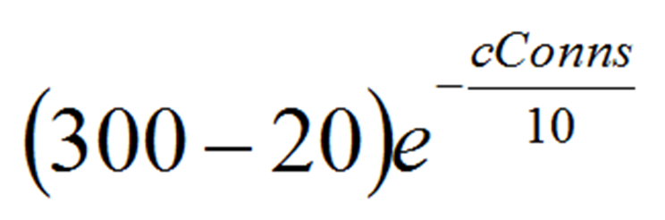

Where *cConns* is the current number of connections that are or have passed state IN_CONN_STATE_ALLOC or OUT_CONN_STATE_ALLOC. For more details, see section [3.1.6.1](#Section_3.1.6.1).

**Connect Timer:** The timer that is used to terminate a connection that has not responded to a CONNECT message in a timely manner. This timer is based on the node's local time and MUST be set to 60 seconds. For more details, see section [3.1.6.2](#Section_3.1.6.2).

**Contact Timer:** The timer that is used to wait after detecting imbalance in the number of [**contacts**](#gt_contact) before the local node will promote or demote itself from being a contact. This timer is based on the node's local time and MUST be initialized after detecting the imbalance, and MUST be set to an integer value uniformly distributed between 10 seconds and 180 seconds. For more details, see section [3.1.6.3](#Section_3.1.6.3).

**Signature Timer:** The timer that is used to wait after detecting that a [**signature**](#gt_signature) is either unpublished or incorrect. This time is based on the node's local time. For more details, see section [3.1.6.4](#Section_3.1.6.4).

**Partition Detection Timer:** The timer that is used to wait after detecting that a contact is out of sync with the signature. This timer is based on the node's local time and MUST be initialized after detecting the out-of-sync contact to a random integer value uniformly distributed between 5 seconds and 30 seconds. For more details, see section [3.1.7.13](#Section_3.1.7.13).

**Graph Maintenance Timer:** The timer that causes periodic [**graph maintenance**](#gt_graph-maintenance) to occur. The value of this timer is based on the node's local time and MUST be 300 seconds when the local node has [**neighbors**](#gt_neighbor), and 30 seconds otherwise. For more details, see section [3.1.7.16](#Section_3.1.7.16).

**Presence Timer:** The timer that is used to wait after detecting that the number of [**presence records**](#gt_presence-record) is outside the desired range before publishing or unpublishing the local node's Presence. This timer is based on the node's local time and MUST be initialized after detecting the imbalance, and MUST be set to be an integer value uniformly distributed between 30 and 180 seconds. For more details, see section [3.1.7.17](#Section_3.1.7.17).

**Record Expiration Timer:** The timer that is used to scan the [**graph**](#gt_graph) [**database**](#gt_database) for expired records to be deleted. This timer is based on the node's local time. For more details, see section [3.1.7.18](#Section_3.1.7.18).

**Record Autorefresh Timer**: The timer that is used to scan the graph database to automatically update the expiration time on specially flagged internal records. This timer is based on the node's local time. For more details, see section [3.1.7.22](#Section_3.1.7.22).

### 3.1.3 Initialization

None.

### 3.1.4 Higher-Layer Triggered Events

#### 3.1.4.1 Creating a New Graph

Creating a new [**graph**](#gt_graph) is an application-initiated operation. The application MUST supply the following information:

- A [**graph ID**](#gt_graph-id) to uniquely identify the graph; see Graph ID in section [3.1.1](#Section_3.1.1).
- The Peer ID of the peer creating the graph; see Peer ID in section 3.1.1.
- The maximum Record size that can be published in the graph. See Max Record Size in section 3.1.1.
- The maximum number of [**presence records**](#gt_presence-record) to be published in the graph. See Max Presence Records in section 3.1.1.
- The lifetime of a presence record. See Presence Lifetime in section 3.1.1.
- A flag indicating whether the graph SHOULD expire records when offline.
- The IPv6 scope for the graph as defined in [[RFC2460]](https://go.microsoft.com/fwlink/?LinkId=90357).
The application MAY also provide the following information:

- An optional null-terminated Unicode string not longer than 256 characters containing the Friendly Name of the graph.
- An optional null-terminated Unicode string not longer than 512 characters containing a Comment to be used to describe of the graph.
- An optional [**graph security provider**](#gt_graph-security-provider).
When creating a new graph, the local [**node**](#gt_node) MUST do the following:

- Store the above application-supplied values as Graph ID, Peer ID, Max Record Size, Max Presence Records, Presence Lifetime, Defer Expiration, Friendly Name, Comment, and GraphSecurityProvider, respectively. (The last three MUST be given null values if the application provided no value for them.)
- Create a local [**node ID**](#gt_node-id) as a random 64-bit number.
- Create the (empty) [**database**](#gt_database).
- Set the Peer Time Delta to 0.
- Publish a Graph Info Record containing the application-specified Graph configuration parameters. For more details, see section [3.1.7.7](#Section_1.3.5.5.1).
- Set the NeverConnected flag to TRUE.
- The Defer Expiration flag MUST be set to true if the application requested to not expire records while offline; otherwise it MUST be set to false.
- The Record Autorefresh time MUST be set to expire in 4 seconds.
- If Defer Expiration flag is set to false, the Record Expiration Timer MUST be set to expire in 0 seconds.
A graph is uniquely identified by the Graph ID. A graph MUST NOT have more than one creator node (that is, it MUST have only one Graph Info Record). A security provider layer such as [MS-PPSEC](#Section_5) SHOULD be used to prevent graph merger by requiring authentication.

#### 3.1.4.2 Opening an Existing Graph

When opening an existing [**graph**](#gt_graph), the application MUST supply the following information:

- A [**graph ID**](#gt_graph-id) to uniquely identify the graph to be opened. See Graph ID in section [3.1.1](#Section_3.1.1).
- The Peer ID of the peer opening the graph. See Peer ID in section 3.1.1.
- If the graph has been created with a [**graph security provider**](#gt_graph-security-provider), the same graph security provider MUST be provided.
The application MAY also provide the following information:

- An optional array of prioritized [**record**](#gt_record) types that will have precedence during synchronization.
The local [**node**](#gt_node) MUST do the following:

- Assign the above values to Graph ID, Peer ID, GraphSecurityProvider, and Prioritized Record Types, respectively. (The latter MUST be assigned a null value if the application did not provide one.)
- Create a local Node ID as a random 64-bit number.
- Create the (empty) [**database**](#gt_database). If the local node has a persisted database (see section [3.1.4.12](#Section_3.1.4.12)), this persisted database SHOULD be loaded into the empty database. Each record in the persisted database MUST first be validated before inclusion in the database. For more details, see section [3.1.7.27](#Section_3.1.7.27). When loading a persisted database, the Presence, Signature, and Contact Records MUST NOT be included.
- If a persistent database is loaded, the NeverConnected flag MUST be initialized to FALSE.
- If a persistent database is not loaded, the NeverConnected flag MUST be initialized to TRUE.
- If the local node has a persisted database (see section 3.1.4.12) accompanied by a persisted Peer Time Delta, the local node MUST use the persisted Peer Time Delta. Otherwise, it MUST set the Peer Time Delta to 0.
- The Autorefresh Timer MUST be set to expire in 4 seconds.
- If Defer Expiration is false, the Record Expiration Timer MUST be set to expire in 0 seconds.

#### 3.1.4.3 Application Adds a Record

When the application requests that a [**record**](#gt_record) be added to the [**database**](#gt_database), the following PEER_RECORD (section [2.2.1.9](#Section_2.2.1.9)) field values MUST be provided to the Peer-to-Peer Graphing Protocol:

- **Record Type**
- **Expiration Time**
The Peer-to-Peer Graphing Protocol MUST then construct a new record using those field values. In addition, values for the following fields MAY be provided by the application; if they are not provided, those fields MUST NOT be present in the PEER_RECORD:

- **Payload Data**
- **Attributes**
- **Record Version**
Values for the following fields MAY be provided by the application; if not, the specified default values MUST be used:

- **Creator Id**. The default value is the Peer ID.
- **Last Modified By ID**. The default value is the Peer ID.
Any other field provided by the application MUST be ignored by the protocol.

The record MUST then be validated with the following steps:

- The **Record Type** MUST NOT be in the reserved range. For more details, see section 2.2.1.9.
- The Autorefresh flag MUST NOT be set.
- The record size MUST be less than the **Max Record Size**. For more details, see section [3.1.1](#Section_3.1.1).
- If **Attributes** are provided, they MUST conform to the attribute syntax (see section [2.2.3.5](#Section_2.2.3.5)).
- **Expiration Time** MUST be later than the current **Peer Time**.
If the above record validation fails for any reason, then the record MUST NOT be processed further and an error MUST be returned to the application.

The fields of the records MUST be initialized as described in section 2.2.1.9.

If a Security Provider is configured it MUST be called to secure the record. For more details, see section [3.1.7.28](#Section_3.1.7.28). The record MUST then be published. For more details, see section [3.1.7.3](#Section_3.1.7.4).

#### 3.1.4.4 Application Updates a Record

When the application requests that a [**record**](#gt_record) be updated, it MUST provide the following information:

- **Record ID**: the [**record ID**](#gt_record-id) for an existing record to be modified.
The Peer-to-Peer Graphing Protocol MUST construct a new record using that field value. In addition, the application MAY provide values to replace the existing values in any or all of the following record fields. Otherwise, the existing field values MUST be preserved.

- **Attributes**
- **Record Data**
- **Expiration Time**
New values for the following fields MAY be provided by the application. If not provided, default values MUST be used as specified below:

- **Last Modified By ID**. The default value is the Peer ID.
Any other field provided by the application MUST be ignored by the protocol.

Record construction MUST then be completed as follows:

- The value of the **Record Version** of the existing record MUST be incremented by 1.
- If the application has provided new attributes, the value of the **Attribute** field of the existing record MUST be replaced with the data provided.
- If the application has provided **Record Data**, the value of the **Record Data** field of the existing record MUST be replaced with the data provided.
- If the application has provided an **Expiration Time**, the value of the **Expiration Time** field of the existing record MUST be replaced with the data provided.
- The value of the field **Modified By** of the existing record MUST be replaced with the data provided.
The record MUST then be validated according to the following steps:

- The provided **Record ID** MUST match an existing record in the [**database**](#gt_database).
- The existing record MUST NOT be marked as Deleted.
- The size of the record MUST be less than the **Max Record Size**. For more details, see section [3.1.1](#Section_3.1.1).
- The updated **Expiration Time** MUST NOT be before the original **Expiration Time**.
- The **Record Type** MUST NOT be in the reserved range (see section [2.2.1.9](#Section_2.2.1.9)).
- The Autorefresh Flag MUST NOT be set.
- The **Attributes** MUST conform to the syntax specified in section[2.2.3.5](#Section_2.2.3.5).
If the record validation fails for any reason, then the record MUST NOT be processed further and an error MUST be returned to the application.

If a Security Provider is specified for the Group, it MUST be called to secure the record. For more details, see section [3.1.7.28](#Section_3.1.7.28).

The record MUST then be written in the database, as specified in section [3.1.7.8](#Section_3.1.7.33).

#### 3.1.4.5 Application Deletes a Record

When the application requests that a [**record**](#gt_record) be deleted, the application MUST provide the following information:

- The **Record ID** for an existing record.
The record MUST first be validated as follows:

- The provided **Record ID** MUST correspond to an existing Record in the [**database**](#gt_database).
- The existing record MUST NOT be marked as Deleted.
- The existing **Record Type** MUST NOT be in the reserved range. For more details, see section [2.2.1.9](#Section_2.2.1.9).
If this record validation fails for any reason, then the record MUST NOT be processed further and an error MUST be returned to the application.

If the record passes the validation, it MUST then be deleted. For more details, see section [3.1.7.9](#Section_3.1.7.9).

#### 3.1.4.6 Application Publishes Presence

When the application requests that the [**node**](#gt_node)'s presence be published, the local [**presence record**](#gt_presence-record) MUST be published, as specified in section [3.1.7.4](#Section_3.1.7.4). The node's Force Publish Presence flag MUST then be set and presence maintenance MUST then be performed as specified in section [3.1.7.17](#Section_3.1.7.17).

#### 3.1.4.7 Application Allows Direct Connections

When the application requests that the [**node**](#gt_node) accept incoming [**direct connections**](#gt_direct-connection), the fAcceptDirectConnection flag MUST be set.

#### 3.1.4.8 Application Initiates Listening

When the application requests that the local [**node**](#gt_node) begin listening, it MUST specify the following information:

- An unsigned integer value specifying the IPv6 Scope to listen on. See [[RFC2460]](https://go.microsoft.com/fwlink/?LinkId=90357).
- An unsigned integer value specifying the IPv6 Scope identifier. See [RFC2460].
- An unsigned integer value specifying a TCP port to listen on. See [[RFC793]](https://go.microsoft.com/fwlink/?LinkId=150872).
The local node MUST initiate the following actions, starting with the first, and continuing asynchronously:

- Begin listening for incoming connections on the addresses corresponding to the specified scope and scope ID.
- Record the list of addresses in Listening Addresses.
- Bind to the port specified by the application.
- Perform Graph Maintenance, as specified in section [3.1.7.16](#Section_3.1.7.16).
- Perform Presence Maintenance, as specified in section [3.1.7.17](#Section_3.1.7.17).
- Perform Signature Calculation, as specified in section [3.1.7.11](#Section_3.1.7.11).
- Initialize the Graph Maintenance Timer as specified in section [3.1.2](#Section_3.1.2).
If the local node has one or more [**neighbor connections**](#gt_neighbor-connection) in the CONNECTED state, it MUST send a CONNECT message to each with the following information:

- The **Update** bit MUST be set. The Neighbor List bit and Direct bit MUST be clear.
- The **Source Node ID** MUST be the [**node ID**](#gt_node-id) of the local node.
- The **Address Array** MUST contain the list of addresses that the node is listening on.

#### 3.1.4.9 Application Requests to Connect to the Graph

When the application requests that the [**node**](#gt_node) initiate a connection, it MUST specify the following information:

- The IPv6 address and TCP port of an existing node to connect to.
- A flag indicating whether the connection request is for a [**neighbor connection**](#gt_neighbor-connection) or a [**direct connection**](#gt_direct-connection).
If the IPv6 address and TCP port supplied by the application match with one of the node's Listening Addresses, an error MUST be returned to the application and the request MUST NOT be processed further.

If the application is requesting a neighbor connection and the local node's Neighbor List is NOT empty, an error MUST be returned to the application and the request MUST NOT be processed further.

Otherwise a new connection MUST be attempted and the Direct Connect flag MUST be set according to the application request. For more details, see section [3.1.7.24](#Section_3.1.7.24).

#### 3.1.4.10 Application Requests that Deferred Records be Revalidated

When the application requests that deferred [**records**](#gt_record) be revalidated, each record in the Deferred Record List is removed from the list and re-processed as if it had just been received in a FLOOD message. For more details, see section [3.1.5.2.10](#Section_3.1.5.2.10).

#### 3.1.4.11 Application Requests To Be Notified About a Specific Record Type

When an application requests to be notified when a change in the local [**database**](#gt_database) occurs for a specified list of record types, the local [**node**](#gt_node) MUST store the list of Record types in the Record Notify List.

#### 3.1.4.12 Application Closes the Graph

When the application requests that the local [**node**](#gt_node) close, the following actions MUST be performed:

- If the local node has published a Contact record, it MUST delete it, as specified in section [3.1.7.9](#Section_3.1.7.9).
- If the local node has published a Presence record, it MUST delete it, as specified in section 3.1.7.9.
- If the local node has published the Signature record, it MUST delete it, as specified in section 3.1.7.9.
- The local node MUST send a DISCONNECT message and terminate each connection currently in state LINK_STATE_CONNECTED.
- The local node MUST terminate any connection in any state.
- If the application requests to persist the database, the [**graph**](#gt_graph) [**database**](#gt_database) MUST be persisted on disk along with the node's current Peer Time Delta.

### 3.1.5 Processing Events and Sequencing Rules

#### 3.1.5.1 Pre-Authentication Messages

##### 3.1.5.1.1 Receive AUTH_INFO

The AUTH_INFO message (section [2.2.2.1](#Section_2.2.2.1)) MUST be the first message sent on a connection, and MUST be sent only by the connection's initiator.

If the AUTH_INFO message is received in any state other than IN_CONN_STATE_ACCEPTED or from the connection's responder, the connection MUST be terminated.

The following steps MUST be taken to validate the AUTH_INFO message:

- The **Message Size** MUST be verified to be at least 0x10.
- The **Connection Type** MUST be verified to be either 0x01 or 0x02.
- The offsets MUST be verified to satisfy the following conditions:
- **Graph ID Offset** is less than **Source Peer ID Offset**.
- **Source Peer ID Offset** is less than **Destination Peer ID Offset**.
- **Destination Peer ID Offset** is no greater than **Message Size**.
- The content of the **Source Peer ID** string MUST NOT be empty.
- The content of the **Graph ID Data** field MUST NOT be empty,
- If the value of the **Destination Peer ID Offset** field is less than the **Message Size**, the content of the **Destination Peer ID** field MUST NOT be empty.
- The content of the **Graph ID** field MUST match the [**Graph ID**](#gt_graph-id) of the local [**Node**](#gt_node).
- If the content of the **Destination Peer ID** field is not empty it MUST match the Peer ID of the local Node.
If any of the above conditions are not verified or a local Node instance cannot be located, the connection MUST be terminated.

Otherwise, the message MUST be forwarded to the local Node. If a [**Graph Security Provider**](#gt_graph-security-provider) is not configured on the local Node instance, the Authentication Timer MUST be canceled and the Connection state MUST be set to IN_CONN_STATE_AUTHENTICATED.

If a Graph Security Provider is configured on the local Node instance:

- Connection state MUST be set to IN_CONN_STATE_GOT_AUTHINFO.
- The Graph Security Provider MUST be queried for the message to send in response.
- If the Graph Security Provider returns an error, the connection MUST be terminated. Otherwise, if the Graph Security Provider supplies a message to send in response, the message MUST be sent.
- If the Graph Security Provider indicates that the security negotiation is completed, then the Connection state MUST be set to IN_CONN_STATE_AUTHENTICATED and the Authentication Timer MUST be canceled.
- If the Graph Security Provider indicates that the security negotiation is not completed, the state of the Connection MUST NOT be changed and any message received MUST be forwarded to the Graph Security Provider.

##### 3.1.5.1.2 Receive Other Messages During Authentication

If the local [**node**](#gt_node) is the connection initiator for a connection in the OUT_CONN_STATE_SENT_AUTHINFO state or a connection responder for a connection in the IN_CONN_STATE_GOT_AUTHINFO state, and a message is received before the connection reaches the IN_CON_STATE_AUTHENTICATED or OUT_CON_STATE_AUTHENTICATED state, the message MUST be passed to the configured [**graph security provider**](#gt_graph-security-provider). If the graph security provider returns an error, the connection MUST be terminated. If the graph security provider returns a message to send, the message MUST be sent to the remote node.

If the graph security provider returns a code that states that authentication is complete, the connection MUST move to the IN_CONN_STATE_AUTHENTICATED state (in the case of the responder) or OUT_CONN_STATE_AUTHENTICATED state (in the case of the initiator), and the Authentication Timer MUST be canceled.

If any error occurs during connection establishment, the connection MUST be aborted and any further messages received on the connection MUST NOT be processed.

For a connection initiator, when the connection moves to the AUTHENTICATED state, a CONNECT message MUST be sent:

- The **Direct** bit MUST be set if the Direct Connection flag is set.
- The **Update** bit MUST NOT be set.
- The Neighbor List bit SHOULD be set if the Direct Connection flag is set.
- The **Source Node ID** MUST be the [**node ID**](#gt_node-id) of the local node.
- The **Address Array** MUST be empty if the local node is not currently listening (as indicated by the IsListening flag). Otherwise, the Address Array MUST contain the listening addresses listed in Listening Addresses.
- The **Friendly Name** field MAY contain a string, though this field has no impact on the protocol.
- A Connect Timer MUST be set for the connection as specified in section [3.1.6.2](#Section_3.1.6.2).
- TConnect MUST be set to the local node's Peer Time when the CONNECT message is sent.

#### 3.1.5.2 Post-Authentication Messages

If a [**graph security provider**](#gt_graph-security-provider) is configured on the local [**node**](#gt_node), every message that is received on a connection in state IN_CON_AUTHENTICATED or OUT_CON_AUTHENTICATED MUST be forwarded to the graph security provider to be decrypted before it can be processed by the node as a received Message. If the graph security provider returns an error, the message MUST be discarded.

Each decrypted message (or unencrypted received message, if no graph security provider is Configured) MUST begin with the same message header (see PEER_MESSAGE (section [2.2.1.2](#Section_2.2.1.2))), which contains the type of the message. If an unknown message type (outside the range 0x00 through 0x0E) is received, or if a known message is received, but cannot be parsed properly (with a **Message Size** less than 0x00000008, or a version field value other than 0x10, or any other field invalid), the connection MUST be terminated, and the invalid message otherwise ignored.

##### 3.1.5.2.1 Receive CONNECT

This message is sent by the connection initiator after authentication completes. It is also sent when the initiator begins listening, if the initiator was not listening at the time that it first sends the CONNECT message.

If the message fails to conform to any of the following conditions, then the message MUST be discarded unprocessed and the connection MUST be terminated.

- The **Message Size** MUST be at least 0x18.
- **Address Count** * 20 + **Address Offset** MUST be at most **Message Size**.
- **Friendly Name Offset** MUST be at least **Address Count** * 20 + **Address Offset**.
- **Friendly Name Offset** MUST be at most **Message Size**.
If the CONNECT message's Update bit is set, and this message was received from a Link that is not yet in the LINK_STATE_CONNECTED state, the **Update** bit MUST be ignored. Otherwise, the addresses in the message MUST be used to update this connection's entry in the Neighbor List, and then processing of the message MUST be halted.

If the CONNECT message's **Direct** bit is set, this message is intended to establish a [**direct connection**](#gt_direct-connection). If the application has not caused the Direct Connection flag to be set (see section [3.1.4.7](#Section_1.3.3)), the [**node**](#gt_node) MUST send (see section [3.1.7.1](#Section_3.1.7.1)) a REFUSE message containing the following data:

- **Error Code** MUST be set to the value REFUSE_CODE_DIRECT_CONNECTION_DISALLOWED.
- **Address Count** MUST be set to 0.
- **Address Offset** MUST be set to 0.
- The **Ipv6 Address Array** field MUST NOT be present.
The node MUST then halt processing the message and terminate the connection.

Otherwise, the node MUST send (see section 3.1.7.1) a WELCOME message with the following data:

- **Node ID** MUST be set to the value of the local [**node ID**](#gt_node-id).
- **Peer Time** MUST be set to the local [**peer time**](#gt_peer-time).
- **Address Count** MUST be set to 0.
- **Address Offset** MUST be set to 0.
- Ipv6 Address Array MUST NOT be present.
The node MUST then set the connection state to LINK_STATE_CONNECTED.

If there is another existing [**neighbor connection**](#gt_neighbor-connection) for the node that sent the CONNECT message (that is, if the node ID in the message is identical to the node ID of one of the entries in the Neighbor List), the node MUST send (see section 3.1.7.1) a REFUSE message with the following information:

- **Error Code** MUST be set to REFUSE_CODE_DUPLICATE_CONNECTION.
- **Address Count** MUST be set to 0.
- **Address Offset** MUST be set to 0.
- **IPv6 Address Array** MUST NOT be present.
The node MUST then halt processing of the message and terminate the connection.

If the local node already has a count of Neighbors greater than or equal to Maximum [**neighbors**](#gt_neighbor), the node MUST respond by sending (see section 3.1.7.1) a REFUSE message, and then halt processing of the message and terminate the connection. The REFUSE message MUST contain the following information:

- **Error Code** MUST be set to REFUSE_CODE_BUSY.
- **Address Count** MUST be set to the number of neighbor referrals returned (default is 10).
- **Address Offset** MUST specify the starting point of the **Ipv6 Address Array** inside the message.
- **Ipv6 Address Array** MUST contain a list of **Address Count** PEER_IN6_ADDRESS objects.
If the CONNECT message was sent on a Link that was already in the CONNECTED state, a REFUSE message MUST be sent (see section 3.1.7.1) containing the following information:

- **Error Code** MUST be set to REFUSE_CODE_ALREADY_CONNECTED.
- **Address Count** MUST be set to 0.
- **Address Offset** MUST be set to 0.
- **IPv6 Address Array** MUST NOT be present.
The node MUST then halt processing of the message and terminate the connection.

If none of the above cases hold, the remote node information from the CONNECT message MUST be stored in the Neighbor List and a WELCOME message MUST be sent (see section 3.1.7.1) with the following information:

- **Node ID** MUST be set to the local node ID.
- **Peer Time** MUST be set to the local node's peer time.
- **Address Count** MUST be set to the number of returned referrals (the default value is 10) if the Neighbor List bit in the Connect message is set; otherwise it MUST be set to 0.
- **Address Offset** MUST be set to the starting point of the **Ipv6 Address Array** if the **Address Count** is greater than 0.
- **Ipv6 Address Array** MUST contain a list of **Address Count** PEER_IN6_ADDRESS objects if **Address Count** is greater than 0; it MUST NOT be present if **Address Count** is 0.
The connection state MUST then be set to LINK_STATE_AUTHENTICATED.

If the Defer Expiration flag is set to true, the Record Expiration Timer MUST be set to expire in 0 seconds.

##### 3.1.5.2.2 Receive WELCOME

This message is sent by the connection responder in response to a CONNECT message. If the message fails to conform to any of the following conditions, then the message MUST be discarded unprocessed and the connection MUST be terminated.

- The **Message Size** MUST be at least 0x20.
- **Address Count** * 20 + **Address Offset** MUST be less than **Message Size**.
- **Peer ID Offset** MUST be at least **Address Count** * 20 + **Address Offset**.
- **Friendly Name Offset** MUST be greater than **Peer ID Offset**.
- **Friendly Name Offset** MUST be no greater than **Message Size**.
If this message is received, but the link is not in the LINK_STATE_CONNECT_WAIT state, then the message MUST be discarded and the connection MUST be terminated.

Otherwise, the remote [**node**](#gt_node) information from the WELCOME message MUST be added to the Neighbor List, and the connection moved into the LINK_STATE_CONNECTED state.

If this is the first connection for the node (that is, the Neighbor List has only this one entry), the local node MUST:

- Perform [**graph maintenance**](#gt_graph-maintenance). For more details, see section [3.1.7.16](#Section_3.1.7.16).
- If the Defer Expiration flag is set, the Record Expiration Time MUST be set to expire in 0 seconds.
Also, a PING message MUST be sent (see section [3.1.7.1](#Section_3.1.7.1)) on each connection in the LINK_STATE_CONNECTED state, to help detect dead TCP connections. The message MUST conform to the syntax specified in section [2.2.4.1](#Section_2.2.4.1). The addresses in the message's IPv6 address array, if any, MUST be added to the Referral List. The oldest entries from the Referral List MUST be removed if the Referral List has reached its maximum size (see section [3.1.1](#Section_3.1.1)).

The Local node's [**peer time**](#gt_peer-time) MUST be updated according to the steps below:

- The *PTWELCOME* time MUST be computed as follows:
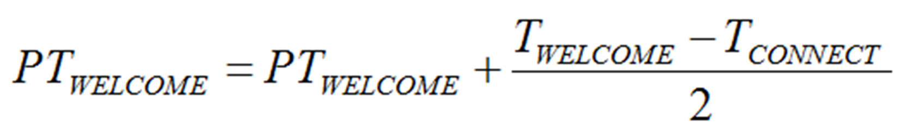

where:

- 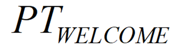initially is the Peer Time included in the WELCOME message.
- *TCONNECT* is the Peer Time when the CONNECT message was sent.
- *TWelcome* is the Peer Time when the WELCOME message is received.
- If *PTWELCOME* is more than 20 minutes different from the local peer time, the received peer time MUST be ignored, and MUST NOT be included in the Peer Time averaging below.
- Otherwise, the local node's Peer Time Delta *PTDlocal* MUST be calculated as follows:

- If the neighbor list has only this one entry, the local peer time MUST be set to the adjusted remote node peer time as follows:
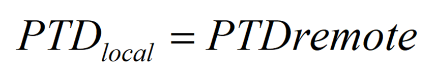

- Otherwise the local node's peer time MUST be adjusted using the remote node's peer time as follows:
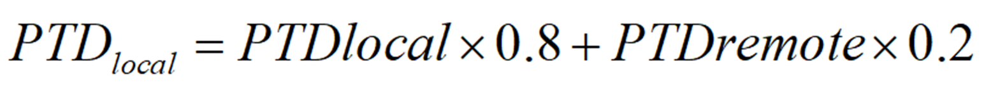

Finally, the local node MUST begin synchronizing the local database with the remote node. If the NeverConnected flag is set to true, it MUST begin a Sync All (see section [3.1.7.29](#Section_3.1.7.29)). Otherwise, it MUST begin a Time-based Sync (see section [3.1.7.30](#Section_3.1.7.30)).

##### 3.1.5.2.3 Receive REFUSE

This message is sent by the connection responder in response to a CONNECT message. If the message fails to conform to any of the following conditions, then the message MUST be discarded unprocessed and the connection MUST be terminated.

- The **Message Size** MUST be at least 0x0C.
- **Address Count** * 20 + **Address Offset** MUST be at most **Message Size**.
- **Error Code** MUST be a value between 0x01 and 0x04, inclusive.
If this message is received, but the Link is not in LINK_STATE_CONNECT_WAIT state the message MUST be ignored and the connection MUST be terminated.

Otherwise, the addresses in the message's address array, if any, MUST be added to the Referral List. If during the insertion of the new addresses, the Referral List reaches its maximum size, the least recently added entries MUST be removed in order to keep the list within its maximum size.

Upon receiving this message, the local [**node**](#gt_node) MUST terminate the connection unless **Error Code** is REFUSE_CODE_ALREADY_CONNECTED.

The Node MUST try to connect to another node selected from the Referral List as described below:

- A Node MUST be selected at random within the Referral List
- If a connection attempt has already been made to the selected node, the next node in the list MUST be selected. Step 2 MUST be repeated until a node is identified or all nodes in the list have been scanned.
- If a node is selected after executing the previous two steps, the local node MUST try to connect to the selected node. The selected node's Referral Entries MUST be flagged to indicate that a connection attempt has been made.

##### 3.1.5.2.4 Receive DISCONNECT

This message is sent over a Neighbor or [**direct connection**](#gt_direct-connection) to inform the receiving [**node**](#gt_node) that this connection MUST be terminated.

If the message fails to conform to any of the following conditions, then the message MUST be discarded unprocessed and the connection MUST be terminated.

- The **Message Size** MUST be at least 0x0C.
- **Address Count** * 20 + **Address Offset** MUST be at most **Message Size**.
- Reason MUST be a value between 0x01 and 0x03, inclusive.
Otherwise, the addresses in the message's address array, if any, MUST be added to the Referral List. If during the insertion of the new addresses, the Referral List reaches its maximum size, the least recently added entries (based on sequence number) MUST be removed in order to keep the list within its maximum size.

If this connection was a [**neighbor connection**](#gt_neighbor-connection) (that is, if the Direct Connection flag value is false for this connection), the local node MUST perform [**graph maintenance**](#gt_graph-maintenance), specified in section [3.1.7.16](#Section_3.1.7.16).

##### 3.1.5.2.5 Receive SOLICIT_NEW

This message is sent by the connection initiator after it reaches the LINK_STATE_CONNECTED state, if the connection initiator has never synchronized with a [**node**](#gt_node) in the [**graph**](#gt_graph) as indicated by the flag NeverConnected.

If the message fails to conform to any of the following conditions, then the message MUST be discarded unprocessed and the connection MUST be terminated.

- The **Message Size** MUST be at least 0x0C.
- The **Inclusion Count** MUST be either 0x00 or 0x01.
- Either the **Inclusion Count** or the **Exclusion Count** MUST be 0.
- (**Inclusion Count** + **Exclusion Count**) * 16 + **Record Types Offset** MUST be at most **Message Size**.
- When both **Inclusion Count** and **Exclusion Count** are 0, all records MUST be synchronized.
If the message is received when the Link is not in the LINK_STATE_CONNECTED state, the message MUST be ignored, and the connection MUST be terminated.

Otherwise, in response to this message, the local node MUST perform the following actions:

- If Inclusion Count is 0x01, the local node MUST start sending (see section [3.1.7.1](#Section_3.1.7.1)) one FLOOD message (see section 3.1.7.1) for each record in the database whose Record Type matches the value in the **Record Types** field. Each FLOOD message MUST be constructed as specified in section [2.2.2.11](#Section_2.2.2.11). After all the FLOOD messages have been sent, a SYNC_END message MUST be sent (see section 3.1.7.1) with the Final flag set.
- If **Exclusion Count** is nonzero, the local Node MUST, for each Record type not listed in **Record Types**:
- Start sending (see section 3.1.7.1) one FLOOD message for each record of that Record Type. Each FLOOD message MUST be constructed as specified in section 2.2.2.11.
- Send (see section 3.1.7.1) a SYNC_END message with the Final flag set if this is the last value not listed in **Record Types**, and with the Final flag not set otherwise.
- When the local node sends a SYNC_END message with the Final flag set, it MUST set the SyncType flag on the connection to NONE.

##### 3.1.5.2.6 Receive SOLICIT_TIME

This message is sent by the connection initiator after it reaches the LINK_STATE_CONNECTED state, if the connection initiator has previously synchronized with a [**node**](#gt_node) in the [**graph**](#gt_graph), but is reconnecting to the graph after being inactive.

If the message fails to conform to any of the following conditions, then the message MUST be discarded unprocessed and the connection MUST be terminated.

- The **Message Size** MUST be at least 20.
- **Inclusion Count** MUST be 0x00 or **Exclusion Count** MUST be 0x00.
- **Inclusion Count** MUST be either 0x00 or 0x01.
- (**Inclusion Count** + **Exclusion Count**) * 16 + **Record Types Offset** MUST be at most Message Size.
If the message is received when the Link is not in the LINK_STATE_CONNECTED state, the message MUST be ignored and the connection MUST be terminated.

Otherwise, in response to this message, the local node MUST perform the following actions:

- If **Inclusion Count** is 0x01, the local node MUST start sending (see section [3.1.7.1](#Section_3.1.7.1)) one FLOOD message (see section 3.1.7.1) for each record in the [**database**](#gt_database) whose Record Type matches the value in the **Record Types** field, and whose **Last Modification Time** is no less than the value of the **Modification Time** field in the received SOLICIT_TIME message. Each FLOOD message MUST be constructed as specified in section [2.2.2.11](#Section_2.2.2.11). After all the FLOOD messages have been sent, a SYNC_END message MUST be sent (see section 3.1.7.1) with the Final flag set.
- If **Exclusion Count** is nonzero, the local node MUST, for each **Record type** not listed in Record Types:
- Send (see section 3.1.7.1) one FLOOD message for each record of that **Record Type** whose Last **Modification Time** is no less than the value of the **Modification Time** field in the received SOLICIT_TIME message. Each FLOOD message MUST be constructed as specified in section 2.2.2.11.
- Send (see section 3.1.7.1) a SYNC_END message with the Final flag set if this is the last value not listed in Record Types, and with the Final flag unset otherwise.

##### 3.1.5.2.7 Receive SOLICIT_HASH

This message is sent by the connection initiator after it reaches the LINK_STATE_CONNECTED state, if the connection initiator has already synchronized with another [**node**](#gt_node) in the [**graph**](#gt_graph).

If the message fails to conform to any of the following conditions, then the message MUST be discarded unprocessed and the connection MUST be terminated.

- The **Message Size** MUST be at least 0x14.
- **Inclusion Count** MUST be 0x00 or **Exclusion Count** MUST be 0x00.
- (**Inclusion Count** + **Exclusion Count**) * 0x10 + **Record Types Offset** MUST be <= **Hash Entry Offset**.
- **Hash Entry Offset** * 0x28 + **Hash Entry Offset** MUST be <= **Message Size**.
If the message is received when the Link is not in the LINK_STATE_CONNECTED state, the message MUST be ignored and the connection MUST be terminated.

Otherwise the local node MUST:

- Set the Connection Sync Type state to SYNC_HASH and
- Send (see section [3.1.7.1](#Section_3.1.7.1)) an ADVERTISE message containing a list of record ranges for which the hash in the HASH_INFO_ENTRY did not match the hash generated by the responder, as follows:
- The local node MUST generate an [**MD5 hash**](#gt_md5-hash), as specified in section [3.1.7.31](#Section_3.1.7.31), of records in the local Node's Database for each Record Range included in the SOLICIT_HASH message.
- For each range of Records where the hash included in the HASH_INFO_ENTRY does not match the local node's generated hash, the local node MUST:
- Include a HASH_ENTRY_BOUNDARY containing the upper and lower bounds of the range and the number of Records within that range.
- Include a RECORD_ABSTRACT for each [**record**](#gt_record) within that range.
- The Hash Entry Boundary Count MUST be equal to the number of record ranges that did not match.
- The **Record Abstract Count** MUST be equal to the total number of records in all the ranges that did not match.

##### 3.1.5.2.8 Receive ADVERTISE

This message is sent by the connection responder in response to a SOLICIT_HASH message.

If the message fails to conform to any of the following conditions, then the message MUST be discarded unprocessed and the connection MUST be terminated.

- The **Message Size** MUST be at least 0x18.
- **Hash Entry Boundary Offset** MUST be at most **Record Abstracts Offset**.
- **Record Abstracts Offset** MUST be at most **Message Size**.
- (**Hash Entry Boundary Count**) * 52 + **Hash Entry Boundary Offset** MUST be at most Record Abstracts Offset.
- (**Record Abstract Count**) * 20 + **Record Abstracts Offset** MUST be at most **Message Size**.
If the message is received when the Link is not in LINK_STATE_CONNECTED state, or the message is received and the SyncType state is not SYNC_HASH, the message MUST be ignored and the connection MUST be terminated.

Otherwise the local [**node**](#gt_node) MUST generate two lists, Records To Request and Records To Send:

- Records To Request
- For each Record Abstract included in the ADVERTISE message that is either not in the local [**database**](#gt_database) or that has a lower [**record**](#gt_record) Version in the local database, that record MUST be added to the Records To Request list.
- Records To Send
- For each Record range included in the ADVERTISE message, if either a record exists in the local database but does not appear in the Record Abstracts or the record exists in the local database with a higher Record Version than in the Record Abstracts, that record MUST be added to the Records To Send list.
After generating these lists, the local node MUST send (see section [3.1.7.1](#Section_3.1.7.1)) a REQUEST message:

- The **Record Abstract Count** MUST be equal to the number of Records in the Records To Request list.
- The **Record Abstracts Array** MUST contain an entry for each Record in the Records To Request list.
- The Record **Version** in each RECORD_ABSTRACT MUST be the Record **Version** being requested.

##### 3.1.5.2.9 Receive REQUEST

This message is sent by the connection initiator in response to an ADVERTISE message.

If the message fails to conform to any of the following conditions, then the message MUST be discarded unprocessed and the connection MUST be terminated.

- The **Message Size** MUST be at least 0x14.
- **Record Abstracts Offset** MUST be at most **Message Size**.
- (**Record Abstract Count**) * 20 + **Record Abstracts Offset** MUST be at most **Message Size**.
If the message is received when the connection is not in the LINK_STATE_CONNECTED state, or the message is received and the connection's Sync Type state is not set to SYNC_HASH, the message MUST be ignored and the connection MUST be terminated.

In response to this message, the local [**node**](#gt_node) MUST send (see section [3.1.7.1](#Section_3.1.7.1)) a FLOOD message for each [**record**](#gt_record) requested in the Record Abstracts. The FLOOD messages MAY be sent in any order. After the last FLOOD message (see section [2.2.2.11](#Section_2.2.2.11)), a SYNC_END message with the Final bit set MUST be sent (see section 3.1.7.1), and the connection's Sync State MUST be set to NONE.

##### 3.1.5.2.10 Receive FLOOD

This message is sent any time a remote [**node**](#gt_node) updates a [**record**](#gt_record) or receives an updated record. The message is also sent as part of synchronization.

If the message fails to conform to any of the following conditions, then the message MUST be discarded unprocessed and the connection MUST be terminated.

- The **Message Size** MUST be at least 0x10.
- **Record Offset** MUST be at most **Message Size**.
- **Reserved2** MUST be zero.
If the message is received when the connection is not in the LINK_STATE_CONNECTED state, the message MUST be discarded and the connection MUST be terminated.

Otherwise, the record contained in the **Record Data** field in the FLOOD message MUST be validated, as specified in section [3.1.7.27](#Section_3.1.7.27). If the record is not found to be valid, the FLOOD message MUST NOT be processed further.

Otherwise, the local node MUST determine if the record is "new", "already present" or "old" using the following algorithm:

- If no record identified by the same [**record ID**](#gt_record-id) is found in the local [**database**](#gt_database), the record MUST be classified as "new".
- Otherwise, the Record Conflict Resolution algorithm, specified in section [3.1.7.32](#Section_3.1.7.32), MUST be used to classify the record.
If the received record is classified as "new", the record MUST be added to the local database, and if a record already exists in the local database with the same record ID, it MUST be deleted. A new FLOOD message containing this record MUST also be sent (see section [3.1.7.1](#Section_3.1.7.1)) to each Neighbor other than the one that sent this FLOOD message.

If the received record is "old", the local node MUST respond with a FLOOD message (see section 3.1.7.1) containing the record with the same Record ID from the local database.

For all three classifications, the local node MUST send (see section 3.1.7.1) an ACK message to the FLOOD message's sender, containing the record ID for this record, with the "Useful" flag set to 1 if the received record was classified as "new", and set to 0 otherwise. The local node MUST also update the [**connection utility**](#gt_connection-utility) associated with this connection, as specified in section [3.1.7.33](#Section_3.1.7.33).

Further processing MUST be performed on the received record according to its Record Type. For more details, see sections [3.1.7.10](#Section_3.1.7.10.5) through [3.1.7.10.5](#Section_3.1.7.10.5).

##### 3.1.5.2.11 Receive SYNC_END

The SYNC_END message is sent by the connection responder when it has completed the requested synchronization process.

If the message fails to conform to any of the following conditions, then the message MUST be discarded unprocessed and the connection MUST be terminated.

- The **Message Size** MUST be at least 0x0C.
If the message is received when the connection is not in the LINK_STATE_CONNECTED state, or the connection Sync State is set to NONE, the message MUST be ignored.

If a SYNC_END message is received with Final flag set and the connection SYNC_TYPE is SYNC_HASH, the receiving [**node**](#gt_node) MUST perform the following steps:

- The local node MUST send (see section [3.1.7.1](#Section_3.1.7.1)) a FLOOD message for each [**record**](#gt_record) in the list of Records To Send (see section [3.1.7.31](#Section_3.1.7.31)). Each FLOOD message MUST be constructed as specified in section [2.2.2.11](#Section_2.2.2.11).
- If the Defer Expiration flag is set to true, the local node MUST initialize the Record Expiration Timer to expire in 0 seconds.
If a SYNC_END message is received with the Final bit set and the connection's SYNC_TYPE is SYNC_TIME or SYNC_NEW, the receiving node MUST perform the following steps:

- Set the Connection Sync Type state to NONE.
- If for this connection, Current Sync Record Type has a non-null value and All Record Types Synched is set to FALSE, the receiving node MUST:
- Select the **Record Type** from the Sync Record Types array pointed to by this connection's Current Sync Record Type pointer (see section [3.1.7.29](#Section_3.1.7.29) for initialization of this array and pointer).
- Send (see section 3.1.7.1) a SOLICIT_TIME or SOLICIT_NEW message (to match the connection's SYNC_TYPE) for the selected **Record Type** in the array:
- In the case of a SOLICIT_TIME message, the **Modification Time** MUST be set to the [**peer time**](#gt_peer-time) at which the node left the [**graph**](#gt_graph) (based on the persisted Peer Time Delta; see section [3.1.4.2](#Section_3.1.4.2)).
- **Inclusion Count** MUST be 1.
- **Exclusion Count** MUST be 0.
- **Record Types Array** MUST contain one entry containing the [**GUID**](#gt_globally-unique-identifier-guid) of the selected **Record Type**.
- Update Current Sync **Record Type** for this connection, to point to the next Record Type in the **Record Types** array (or to have a null value if there are no more Record Types in the array).
- If for this connection, Current Sync Record Type has a null value, and All Record Types Synched is set to FALSE, the local Node MUST:
- Set All Record Types Synched to TRUE for this connection.
- Send (see section 3.1.7.1) a SOLICIT_TIME or SOLICIT_NEW message (to match the current value of SYNC_TYPE) for all remaining records:
- In the case of a SOLICIT_TIME message, **Modification Time** MUST be set to the peer time at which the node left the graph.
- **Inclusion count** MUST be 0.
- **Exclusion count** MUST be 2 + the number of elements in the Prioritized Record Types array.
- **Record Types Array** MUST contain one entry for the Graph Info Record type, one entry for the Presence Record type, and one entry for each element of the Prioritized Record Type array.
- If All Record Types Synched is set to TRUE for this connection, the local node MUST set SYNC_TYPE for this connection to NONE, and in addition, if the Defer Expiration flag is set to TRUE, initialize the Record Expiration Timer to expire in 0 seconds.
If the SYNC_END is received and the Final flag is not set, the message MUST be ignored.

##### 3.1.5.2.12 Receive ACK

This message is sent in response to a FLOOD message to inform the receiver whether or not the FLOOD was useful.

If the message fails to conform to any of the following conditions, then the message MUST be discarded unprocessed and the connection MUST be terminated.

- The **Message Size** MUST be at least 0x0C.
- **ACKs Offset** MUST be at most **Message Size**.
- (**ACKs Count** * 20) + **ACKs Offset** MUST be at most **Message Size**.
If the message is received when the connection is not in the LINK_STATE_CONNECTED state, the connection MUST be terminated.

Otherwise, the local [**node**](#gt_node) MUST update the [**connection utility**](#gt_connection-utility) associated with this connection, as specified in section [3.1.7.33](#Section_3.1.7.33).

##### 3.1.5.2.13 Receive PT2PT

The PT2PT message is sent when requested by the application.

If the message fails to conform to any of the following conditions, then the message MUST be discarded unprocessed and the connection MUST be terminated.

- The **Message Size** MUST be at least 0x10.
- **Data Offset** MUST be at most **Message Size**.
If the message is received when the LINK is not in LINK_STATE_CONNECTED state, the connection MUST be terminated.

If the Data Type is { 0ccbb0d2-be41-4bd6-914b058ec5dcce64 }, the message is an internal Ping (see section [2.2.4.1](#Section_2.2.4.1)) and MUST NOT be processed further. Otherwise, the local [**node**](#gt_node) MUST pass the payload of this message to the higher-layer application.

### 3.1.6 Timer Events

#### 3.1.6.1 Authentication Timer

When this timer fires, it means that the connection associated with the timer has not completed authentication. The connection MUST be terminated.

#### 3.1.6.2 Connect Timer

When this timer fires, it means that the local [**node**](#gt_node) sent a CONNECT message over the associated connection, but no WELCOME or REFUSE was received. The connection MUST be terminated.

#### 3.1.6.3 Contact Timer

When this timer fires, it means that contact maintenance found that the number of [**contacts**](#gt_contact) in the [**graph**](#gt_graph) was either too high or too low.

If a [**contact record**](#gt_contact-record) corresponding to the local [**node**](#gt_node) is currently in the graph [**database**](#gt_database) with its Deleted flag unset, and the number of contacts is still higher than the maximum value calculated as specified in section [3.1.7.12](#Section_3.1.7.12):

- The local node MUST delete the contact record with its own [**node ID**](#gt_node-id) from the database. For more details, see section [3.1.7.9](#Section_3.1.7.9).
If no contact record corresponding to the local node is currently in the graph database or if all contact records corresponding to the local node in the graph database have the Deleted flag set, and the number of contacts is still lower than the minimum value calculated as specified in section 3.1.7.12:

- The local node MUST publish a contact record in the graph database. For more details, see section [3.1.7.5](#Section_3.1.7.4).

#### 3.1.6.4 Signature Timer

When this timer fires, it MUST be reset to fire in 24 hours. Also, if no Signature Record is present in the [**graph**](#gt_graph) [**database**](#gt_database) or the Signature Record in the graph database has the Deleted flag set or the Signature value in the **Signature** Record is greater than the local [**node ID**](#gt_node-id), a new Signature record MUST be created with the **signature** value set to the local [**node’s**](#gt_node) node ID. This Signature record MUST then be published, as specified in section [3.1.7.6](#Section_3.1.7.4).

#### 3.1.6.5 Partition Detection Timer

If this timer fires, it means that partition detection (see section [3.1.7.13](#Section_3.1.7.13)) found a [**contact record**](#gt_contact-record) in the [**graph**](#gt_graph) [**database**](#gt_database) with its Deleted flag unset, whose **Signature** field value did not match the [**signature record**](#gt_signature-record). When the timer fires, the [**node**](#gt_node) MUST check all the contact records in the database with their Deleted flags unset, and if a contact record is found whose **Signature** field value does not match the signature record, a new connection MUST be established with the contact whose record has the nonmatching Signature, using the address information in the contact record. For more details, see section [3.1.7.24](#Section_3.1.7.24).

#### 3.1.6.6 Graph Maintenance Timer

This is a periodic timer, initially set when the [**node**](#gt_node) begins listening, as specified in section [3.1.4.8](#Section_3.1.4.8). When the timer fires, [**graph maintenance**](#gt_graph-maintenance) MUST be performed as specified in section [3.1.7.16](#Section_3.1.7.16) and the timer MUST be reset to fire in 300 seconds if the node has at least one Link in the LINK_STATE_CONNECTED state, or in 30 seconds if the node has no Links in the LINK_STATE_CONNECTED state.

#### 3.1.6.7 Record Expiration Timer

When this timer fires, the [**database**](#gt_database) MUST be scanned for expired [**records**](#gt_record) (records for which the PEER_RECORD expiration value is larger than the current [**peer time**](#gt_peer-time)). When an Application record is found to be expired and its [**record ID**](#gt_record-id) is in the Record Notify List, the higher-layer application MUST be notified. If an expired Signature, Presence, or Contact record is found, the expired record MUST be handled as specified in sections [3.1.7.19](#Section_3.1.7.19), [3.1.7.20](#Section_3.1.7.20), [3.1.7.21](#Section_3.1.7.21), respectively.

The Record Expiration Timer MUST also be reset every time it fires, with a duration calculated as the value *timerdelay* as specified below:

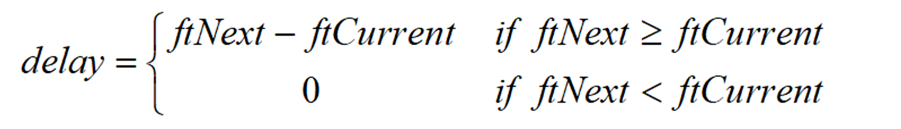 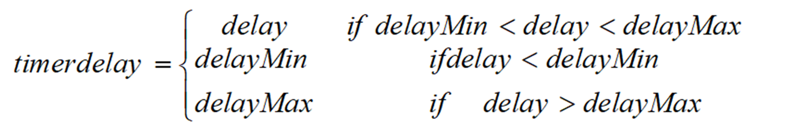

where:

. *ftNext* = Expiration time value of the next record in the database to expire.

. *ftCurrent* = Current peer time

. *delayMin* = 15 seconds

. *delayMax* = 24 hours

#### 3.1.6.8 Autorefresh Timer

When this timer fires, a [**graph**](#gt_graph) [**database**](#gt_database) autorefresh MUST be performed as specified in section [3.1.7.22](#Section_3.1.7.22).

#### 3.1.6.9 Presence Timer

When this timer fires, it means that presence maintenance detected an incorrect number of [**presence records**](#gt_presence-record) (with their Deleted flags unset) currently published in the [**graph**](#gt_graph).

If there is currently a presence record in the graph [**database**](#gt_database) with its Deleted flag unset and with the local [**node's**](#gt_node) [**node ID**](#gt_node-id), and the number of presence records in the database is still higher than Max Presence Records + 10:

- The local node MUST delete the presence record for its node ID, as specified in section [3.1.7.9](#Section_3.1.7.9).
If there is currently no presence record in the graph database with the local node's node ID and with its Deleted flag unset, and the number of presence records is still lower than Max Presence Records:

- The local node MUST publish a presence record containing its node ID, as specified in section [3.1.7.4](#Section_3.1.7.4).

### 3.1.7 Other Local Events

#### 3.1.7.1 Sending a Message

If a [**graph security provider**](#gt_graph-security-provider) is configured on the local Node, every message that is sent on a connection in state IN_CONN_AUTHENTICATED or OUT_CONN_AUTENTICATED MUST be forwarded to the graph security provider to be encrypted before it is sent on the network.

If the graph security provider returns an error, the message MUST be dropped.

#### 3.1.7.2 Creating a Record

When creating a [**record**](#gt_record), a PEER_RECORD MUST be created, and the following fields MUST be initialized as follows:

- The Record ID MUST be generated as follows:
- If the record type is Graph Info Record, the Record ID MUST be set according to section [2.2.3.1](#Section_1.3.5.5.1).
- If the record type is Signature Record, the Record ID MUST be set according to section [2.2.3.2](#Section_2.2.3.2).
- Otherwise the Record ID MUST be calculated as follows:
- A 128-bit GUID value, *guid*, MUST be randomly generated.
- A 64-bit value, *lowPart*, MUST be generated XORing the low 64 bits of the *guid* value with the high 64 bits of the *guid*value.
- A 128-bit value, *hash*, MUST be generated as the MD5 hash of the Creator ID.
- A 64-bit value, *highPart*, MUST be generating XORing the high 64 bits of *hash* with the low 64 bits of *hash*.
- The Record ID MUST be generated as a 128-bit value where the low 64 bits are set to the value of *lowPart* and high 64 bits are set to the value of *highPart*. The Creation Time and Modification Time MUST be set to the current [**peer time**](#gt_peer-time).
- The Creator ID MUST be set to the local Peer ID.
- The Last Modified By ID field MUST be empty.

#### 3.1.7.3 Publishing a Record

The steps of publishing a [**record**](#gt_record) are as follows:

If a [**graph security provider**](#gt_graph-security-provider) is configured, the record MUST be passed to it, and the secured record returned from it, as specified in section [3.1.7.28](#Section_3.1.7.28). If the graph security provider returns an error, the record MUST NOT be processed further.

The record MUST be added to the local [**database**](#gt_database).

If the value of the Expiration Time in the new record + 15 seconds is less than the time the Record Expiration Timer is scheduled to fire, then the Record Expiration Timer's duration MUST be updated to fire at the new record's Expiration Time value.

If the new record's Autorefresh flag is set and the value of the Expiration Time in the new record + 60 seconds is less than the time the Autorefresh Timer is scheduled to fire, then the Autorefresh Timer's duration MUST be updated to fire at the new Record's Expiration Time value.

If the new record's Autorefresh flag is set and the Autorefresh Timer is not set, it MUST be set to fire at the new record's Expiration Time value.

If the record's Autorefresh Timer expiration time is less than 4 seconds, it MUST be set to 4 seconds.

A FLOOD message (see section [3.1.7.1](#Section_3.1.7.1)) containing the Record (in PEER_RECORD format) in its Record Data field MUST be sent to all [**neighbors**](#gt_neighbor).

#### 3.1.7.4 Publishing a Presence Record

To publish a [**presence record**](#gt_presence-record), a new [**record**](#gt_record) MUST first be created, as specified in section [3.1.7.2](#Section_3.1.7.2). If the local [**node**](#gt_node) has already published a presence record for the local node's [**node ID**](#gt_node-id) in the [**graph**](#gt_graph) [**database**](#gt_database), the values from the previous presence record MUST replace those already assigned in the new record.

Regardless, the **Record** fields MUST be set as follows:

- The **Modification Time** MUST be set to the current [**peer time**](#gt_peer-time).
- The **Expiration Time** MUST be set to the current peer time + Presence Lifetime.
- The **Record Type** MUST be set to the [**GUID**](#gt_globally-unique-identifier-guid) {00000400-0000-0000-0000-000000000000}.
- The **Node ID** MUST be set to the local node ID.
- The **Attributes** MUST be set to the application-specified string.
- The **Addresses** field MUST include the list of addresses at which the local node ID is listening, stored in Listening addresses (see section [3.1.1](#Section_3.1.1)).
- The Autorefresh flag MUST NOT be set if the record is published because of a higher-layer application-triggered event, as specified in section [3.1.4.6](#Section_1.3.5.5.4). Otherwise the flag MUST be set.
If there is already a presence record in the graph database with its Deleted flag unset and with the local node's node ID, the record MUST be updated using the newly created record, as specified in section [3.1.7.8](#Section_3.1.7.33). Otherwise, the new record MUST be published, as specified in section [3.1.7.3](#Section_3.1.7.4).

#### 3.1.7.5 Publishing a Contact Record

To publish a [**contact record**](#gt_contact-record), a new [**record**](#gt_record) MUST be created as specified in section [3.1.7.2](#Section_3.1.7.2). If there is already a contact record in the [**graph**](#gt_graph) [**database**](#gt_database) with its Deleted flag unset and with the local [**node's**](#gt_node) [**node ID**](#gt_node-id), the values from the previous contact record MUST replace those already assigned in the new record. In addition, the record fields MUST be set as follows:

- The **Modification Time** MUST be set to the current [**peer time**](#gt_peer-time).
- The **Expiration Time** MUST be set to the current peer time + 900 seconds.
- The **Record Type** MUST be set to the [**GUID**](#gt_globally-unique-identifier-guid) {00000300-0000-0000-0000-000000000000}.
- The Signature MUST be set to the graph [**signature**](#gt_signature) stored in the Signature Record in the local node's database. The **Node ID** MUST be set to the local node ID.
- The **Addresses** field MUST include the list of addresses at which the local node is listening, stored in Listening addresses (see section [3.1.1](#Section_3.1.1)).
- The Autorefresh flag MUST be set.
If there already exists a contact record in the graph database with its Deleted flag unset and with the local node's node ID, the record MUST be updated using the newly created record, as specified in section [3.1.7.8](#Section_3.1.7.33). Otherwise, the new record MUST be published; see section [3.1.7.3](#Section_3.1.7.4).

#### 3.1.7.6 Publishing a Signature Record

To publish a [**signature record**](#gt_signature-record), a new [**record**](#gt_record) MUST be created as specified in section [3.1.7.2](#Section_3.1.7.2). If a signature record is already present in the [**graph**](#gt_graph) [**database**](#gt_database) with its Deleted flag unset, the values from the previous signature record MUST replace those already assigned in the new record.

Moreover, the record fields MUST be set as follows:

- The **Modification Time** MUST be set to the current [**peer time**](#gt_peer-time).
- The **Expiration Time** MUST be set to the current peer time + 300 seconds.
- The **Record Type** MUST be set to the [**GUID**](#gt_globally-unique-identifier-guid) {00000200-0000-0000-0000-000000000000}.
- The **Record ID** MUST be set to the GUID {4c515c94-4252-494f-8440-34cc79769c81}.
The signature record fields MUST be set as follows:

- The **Signature** MUST be set to the local [**node ID**](#gt_node-id).
- The Autorefresh flag MUST be set.
If a signature record already exists in the database with its Deleted flag unset, the record MUST be updated using the newly created record, as specified in section [3.1.7.8](#Section_3.1.7.33). Otherwise, the new record MUST be published, as specified in section [3.1.7.3](#Section_3.1.7.4).

#### 3.1.7.7 Publishing a Graph Info Record

To publish a [**graph info record**](#gt_graph-info-record), a new [**record**](#gt_record) MUST be created as specified in section [3.1.7.2](#Section_3.1.7.2). If the graph info record already exists in the [**database**](#gt_database) with its Deleted flag unset, the values from the previous graph info record MUST replace those already assigned in the new record. In addition, the following record fields MUST be set as follows:

- The **Modification Time** MUST be set to the current [**peer time**](#gt_peer-time).
- The **Expiration Time** MUST be set to the current peer time + 300 seconds.
- The **Record Type** MUST be set to the [**GUID**](#gt_globally-unique-identifier-guid) {00000100-0000-0000-0000-000000000000}.
- The **Record ID** MUST be set to GUID {6c796768-7732-406b-bc6e-5e9c0d864580}
- The **Creator ID** MUST be the local Peer ID.
- All other fields MUST meet the requirements specified in section [2.2.3.1](#Section_1.3.5.5.1).
If the graph info record already exists in the database with its Deleted flag unset, the record MUST be updated, using the newly created record, as specified in section [3.1.7.8](#Section_3.1.7.33). Otherwise, the new record MUST be published, as specified in section [3.1.7.3](#Section_3.1.7.4).

When updating a graph info record, the fields that MUST NOT be changed, as specified in section 2.2.3.1, MUST be left unchanged by the update.

#### 3.1.7.8 Updating a Record

When a [**record**](#gt_record) is updated, a new record MUST be supplied that meets the following conditions, in addition to those listed in section [3.1.4.4](#Section_3.1.4.4).

- The **Record ID** MUST be the same as the record that is being updated.
- The Deleted flag on the corresponding record in the [**graph**](#gt_graph) [**database**](#gt_database) MUST NOT be set.
- The **Record Type** MUST be the same as the record that is being updated.
- The **Creation Time** MUST be the same as the record that is being updated.
- The **Modification Time** MUST be later than the Creation Time of the record that is being updated.
- The **Expiration Time** MUST be no earlier than the Expiration Time of the record that is being updated.
- The **Expiration Time** MUST be later than the Last Modification Time.
- The Record **Version** MUST be greater than the Version of the record that is being updated.
- The **Creator ID** MUST be the same as the record that is being updated.
If any of the above conditions are not met, the record MUST NOT be updated.

Otherwise, the existing record MUST be deleted from the database, as specified in section [3.1.7.9](#Section_3.1.7.9), and the new one MUST be published, as specified in section [3.1.7.3](#Section_3.1.7.4).

#### 3.1.7.9 Deleting a Record

When a [**record**](#gt_record) is deleted, an update MUST be performed, as specified in section [3.1.6.8](#Section_3.1.6.8), but with the following differences:

- The record Deleted bit MUST be set.
- The record**Payload Data Size** MUST be 0.
- The record**Payload Data** MUST be empty.
- The record attribute length MUST be 0.
- The record attribute MUST be empty.
- All the other fields of the PEER_RECORD structure MUST otherwise be identical to those in the record being deleted.

#### 3.1.7.10 Receiving a Record

If a received [**record**](#gt_record) is classified as "new" and added to the database, the Record Expiration Timer and Autorefresh Timer MUST be updated as follows:

- If the value of the **Expiration Time** in the new record + 15 seconds is less than the time the Record Expiration Timer is scheduled to fire, then the Record Expiration Timer's duration MUST be updated to fire at the new record's **Expiration Time** value.
- If the new record's Autorefresh flag is set and the value of the **Expiration Time** in the new record + 60 seconds is less than the time the Autorefresh Timer is scheduled to fire, then the Autorefresh Timer's duration MUST be updated to fire at the new record's **Expiration Time** value.
- If the new record's Autorefresh flag is set and the Autorefresh Timer is not set, it MUST be set to fire at the new record's **Expiration Time** value.
- If the record's Autorefresh Timer expiration time is less than 4 seconds, it MUST be set to 4 seconds.

##### 3.1.7.10.1 Receive an Application Record

If the [**record**](#gt_record) contained in the FLOOD message is not an internal record (see section [2.2.3](#Section_2.2.3)), the application MUST be notified of the new incoming record if the record type is listed in the Record Notify List.

##### 3.1.7.10.2 Receive a Graph Info Record

If the [**record**](#gt_record) contained in the FLOOD message is a [**graph info record**](#gt_graph-info-record) and its Deleted flag is unset, the **Presence Lifetime**, **Max Presence Records**, and **Max Record Size** MUST be read from the graph info record and stored in the corresponding data items specified in section [3.1.1](#Section_3.1.1).

##### 3.1.7.10.3 Receive a Signature Record

If the [**record**](#gt_record) contained in the FLOOD message is a [**signature record**](#gt_signature-record) and its Deleted flag is unset, signature calculation MUST be performed as specified in section [3.1.7.11](#Section_3.1.7.11).

##### 3.1.7.10.4 Receive a Contact Record

If the [**record**](#gt_record) contained in the FLOOD message is a [**contact record**](#gt_contact-record) with its Deleted flag set and an entry with the same [**record ID**](#gt_record-id) is present in the Contact List, it MUST be removed from the Contact List.

If it is a contact record that does not have the Deleted flag set and an entry with the same record ID is not in the Contact List, the following data from the record MUST be placed in a new entry in the Contact List:

- **Record ID**
- **Signature**
- Peer ID
- **Node ID**
- List of **Addresses**
If it is a contact record that does not have its Deleted flag set and an entry with the same record ID is in the Contact List, then the data from the record MUST be used to replace the corresponding data in the Contact List. For more details, see section [3.1.1](#Section_3.1.1).

After receiving a contact record, the local [**node**](#gt_node) MUST perform contact maintenance, as specified in section [3.1.7.12](#Section_3.1.7.12).

##### 3.1.7.10.5 Receive a Presence Record

If the [**record**](#gt_record) contained in the FLOOD message is a Presence Record that has its Deleted flag set and an entry with the same [**record ID**](#gt_record-id) is present in the Presence List, it MUST be removed from the Presence List.

If it is a Presence Record that does not have its Deleted flag set and an entry with the same record ID is not present in the Presence List, the following data from the record MUST be added to the Presence List:

- **Record ID**
- Peer ID
- **Node ID**
- List of **Addresses**
If it is a Presence Record that does not have its Deleted flag set and an entry with the same record ID is present in the Presence List, the data from the record MUST be used to replace the corresponding data in the Presence List.

#### 3.1.7.11 Signature Calculation

The [**signature**](#gt_signature) of a [**graph**](#gt_graph) is defined as the lowest [**node ID**](#gt_node-id) in the graph.

When signature calculation is triggered, the following algorithm MUST be executed:

- If the [**signature record**](#gt_signature-record) is currently present in the graph [**database**](#gt_database) with its Deleted flag unset, and the Signature in the [**record**](#gt_record) is less than or equal to the local node ID, then the algorithm is completed and signature calculation MUST terminate without further action.
- If the signature record is not present in the graph database, or is present but with its Deleted flag set, a delay exponentially proportional to the node ID MUST calculated as follows:
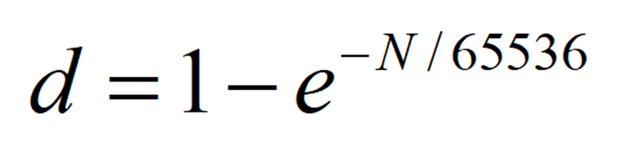

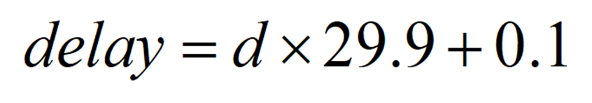

where N is the unsigned integer signified by the top 8 bits of the local node ID and delay is expressed in seconds.

- If the signature record is currently present in the graph database with its Deleted flag unset, and the Signature in the record is greater than the local node's node ID, delay MUST be assigned the value of 0.1 seconds.
After the delay value has been calculated, the signature timer MUST be set to fire after delay seconds. For more details, see section [3.1.6.4](#Section_3.1.6.4).

#### 3.1.7.12 Contact Maintenance

Contact Maintenance involves calculating the desired range of Contact Records, and then checking that the current Contact count falls within that range. If there is no contact record in the local [**database**](#gt_database) with its Deleted flag unset and with the local [**node's**](#gt_node) [**node ID**](#gt_node-id), and the number of Contact Records with their Deleted flags unset in the database is below the minimum (Cmin) calculated as specified below, or if there is a contact record with its Deleted flag unset in the local database with the local node's node ID, and the number of Contact Records with their Deleted flags unset in the database is above the maximum (Cmax) calculated as specified below, then the Contact Timer MUST be set for a random delay between 10 seconds and 180 seconds. For more details, see section [3.1.6.3](#Section_3.1.6.3).

Cmin MUST be calculated as follows:

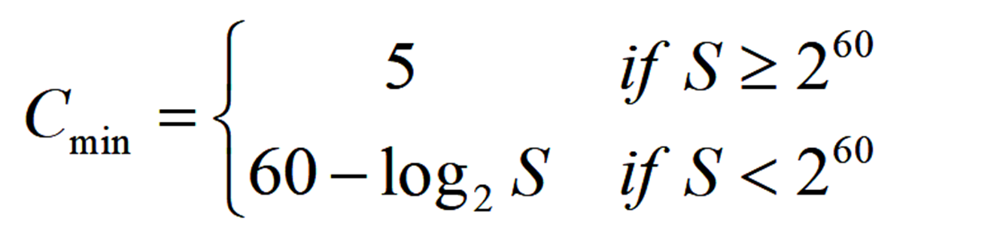

Where S is the current Graph Signature, treated as an unsigned integer. The maximum number of Contacts Cmax MUST be calculated as the minimum number of Contacts plus 5:

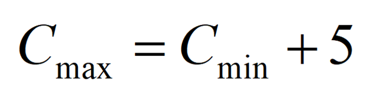

#### 3.1.7.13 Partition Detection

Partition detection is the process that looks for mismatches between the [**graph**](#gt_graph) [**signature**](#gt_signature) and the signature reported by [**contacts**](#gt_contact). When partition detection is performed, the [**database**](#gt_database) MUST be scanned for contact records with their Deleted flags unset and with a different signature from the signature value in the database's [**signature record**](#gt_signature-record). If any of these are found, the partition detection timer MUST be set with a random delay between 5 and 30 seconds. For more details, see section [3.1.6.5](#Section_3.1.6.5).

#### 3.1.7.14 Connection Maintenance

Connection Maintenance is the process that attempts to maintain an ideal number of connections to other Graph Nodes, and chooses which connections to keep based on the usefulness of the connections. When Connection Maintenance is performed, the following actions MUST be taken:

- If the number of [**neighbor connections**](#gt_neighbor-connection) is greater than the value of Ideal Neighbors, and this Connection Maintenance is being performed as a result of Graph Maintenance Timer expiration (see section [3.1.6.6](#Section_3.1.6.6)):
- The neighbor connection with the lowest [**connection utility**](#gt_connection-utility) MUST be disconnected, as specified in section [3.1.7.25](#Section_3.1.7.25).
- If the number of neighbor connections is zero, a new connection MUST be attempted.
- If the number of neighbor connections is less than the value of Minimum Neighbors and the fNeverConnected flag is unset, a new connection MUST be attempted.
- If the number of neighbor connections is less than the Ideal Neighbor Count and the Connection Maintenance is being performed as a result of Graph Maintenance Timer expiration, a new connection MUST be attempted.
- In order to attempt a new connection, a [**node**](#gt_node) MUST first be randomly selected from among the Presence List, Contact List, and Referral List satisfying the following conditions:
- The [**node ID**](#gt_node-id) of the selected node MUST NOT be equal to the node ID of the local node.
- The Local node MUST NOT have a connection with the selected node.
- After a node is selected, a connection to it MUST be attempted, as specified in section[3.1.7.24](#Section_3.1.7.24).

#### 3.1.7.15 Long-Term Partition Repair

When performing long-term partition repair, if there is a Contact Record with its Deleted flag unset in the [**database**](#gt_database) and with the local node's [**node**](#gt_node) ID, the higher-layer application MUST be requested to form another connection.

#### 3.1.7.16 Graph Maintenance

[**Graph maintenance**](#gt_graph-maintenance) is performed periodically, and as a result of several events. When graph maintenance is performed, the following steps MUST be taken in the following order:

- Signature Calculation, as specified in section [3.1.7.11](#Section_3.1.7.11).
- Contact Maintenance, as specified in section [3.1.7.12](#Section_3.1.7.12).
- Partition Detection, as specified in section [3.1.7.13](#Section_3.1.7.13).
- Connection Maintenance, as specified in section [3.1.7.14](#Section_3.1.7.14).
- Long-term partition repair, as specified in section [3.1.7.15](#Section_3.1.7.15).
After every step in graph maintenance has completed, the Graph Maintenance Timer MUST be reset as specified in section [3.1.6.6](#Section_3.1.6.6).

#### 3.1.7.17 Presence Maintenance

The presence maintenance process ensures that the local [**node**](#gt_node) publishes its [**presence record**](#gt_presence-record) when valid, and strives to maintain the configured number of presence records in the [**graph**](#gt_graph).

A node performing presence maintenance MUST do the following:

- If the local node currently has a presence record for its [**node ID**](#gt_node-id) in the graph [**database**](#gt_database) with its Deleted flag unset, but is no longer listening (as indicated by the *IsListening* flag), the node MUST delete the presence record for its node ID from the database, as specified in section [3.1.7.9](#Section_3.1.7.9).
- If the local node currently does not have a presence record for its node ID in the graph database, or the [**record**](#gt_record) is expired, or the record has its Deleted flag set, but it is listening (as indicated by the IsListening flag) and either Max Presence Records is -1 or the application has forced publication (as indicated by the Force Publish Presence flag), the node MUST publish its presence record, as specified in section [3.1.7.4](#Section_3.1.7.4).
- If Max Presence Records is not 0 or -1 and the Force Publish Presence flag is unset:
- If the local node currently has a presence record in the graph database with the local node's node ID and with its Deleted flag unset, and the number of presence records in the graph database is greater than Max Presence Records + 10, the Presence Timer MUST be set to fire at a random delay between 30 seconds and 180 seconds. For more details, see section [3.1.6.9](#Section_3.1.6.9).
- If the local node currently does not have a presence record containing its node ID in the graph database, or all such records have their Deleted flags set, and the number of presence records in the database is less than Max Presence Records, the Presence Timer MUST be set to fire at a random delay between 30 seconds and 180 seconds.

#### 3.1.7.18 Expiring Application Record

For each expired Application record the following actions MUST be taken by the local node:

- The local [**node**](#gt_node) MUST remove the expired [**record**](#gt_record) from the [**database**](#gt_database).
- If the record's Record type is in the Record Notify list, the local node MUST notify the higher-layer application.

#### 3.1.7.19 Expired Signature Record Found

If an expired Signature Record is found, Signature Calculation MUST begin immediately, as specified in section [3.1.7.11](#Section_3.1.7.11).

Also, the expired [**record**](#gt_record) MUST be removed from the [**database**](#gt_database).

#### 3.1.7.20 Expired Presence Record Found

When an expired Presence Record is found:

If the [**node**](#gt_node) whose [**node ID**](#gt_node-id) is on the Presence Record is in the Presence List, it MUST be removed from the Presence List and the higher-layer Application MUST be notified of the expired Presence Record. The expired [**record**](#gt_record) MUST be removed from the [**database**](#gt_database).

#### 3.1.7.21 Expired Contact Record Found

When an expired Contact Record is found, Contact Maintenance MUST be performed immediately, as specified in section [3.1.7.12](#Section_3.1.7.12). The expired [**record**](#gt_record) MUST be removed from the database.

#### 3.1.7.22 Autorefreshing Records

The following actions MUST be taken by the local [**node**](#gt_node), in order, when autorefreshing records:

The [**graph**](#gt_graph) [**database**](#gt_database) MUST be scanned for the set of records that have their Autorefresh flags set, their Deleted flags unset and an expiration time value less than or equal to the local Node Peer Time + 20 seconds.

For each record in this set, the [**record**](#gt_record) MUST be updated using an otherwise identical Record with the following record fields changed:

- If the existing record's **Expiration Time** value is later than the record's **Last Modification Time**, the new Expiration Time field's value MUST be set to:
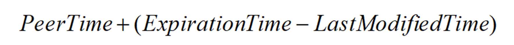

where:

- PeerTime is the Peer Time on the Local Node.
- LastModifiedTime is the **Last Modification Time** field in the Record.
- ExpirationTime is the **Expiration Time** field in the record.
- If the existing record's Expir**ation Time** value is not later than the Record's **Last Modification Time**, the new **Expiration Time** field's value MUST be set to 300 seconds.
- The new record's L**ast Modification Time** field value MUST be set to the current value of the local node's [**peer time**](#gt_peer-time).

#### 3.1.7.23 Local IP Addresses Change

The local [**node**](#gt_node) MUST perform the following actions in sequence when a local IP address changes:

If the local node has a [**presence record**](#gt_presence-record) in the Graph database with the local Node's Node ID and with its Deleted flag unset, the presence record MUST be updated, as specified in section [3.1.7.8](#Section_3.1.7.33), using an otherwise identical Presence Record that contains the new address information in its Addresses field.

If the local node has a Contact Record in the Graph database with the local Node's Node ID and with its Deleted flag unset, the Contact Record MUST be updated, as specified in section 3.1.7.8, using an otherwise identical Contact Record that contains the new address information in its Addresses field.

The list of Listening addresses MUST be updated to reflect the change.

The local node MUST perform [**graph maintenance**](#gt_graph-maintenance), as specified in section [3.1.7.16](#Section_3.1.7.16).

#### 3.1.7.24 Establishing a New Connection

The following state machine demonstrates the state transitions to set up and shut down a Link from the initiator side.

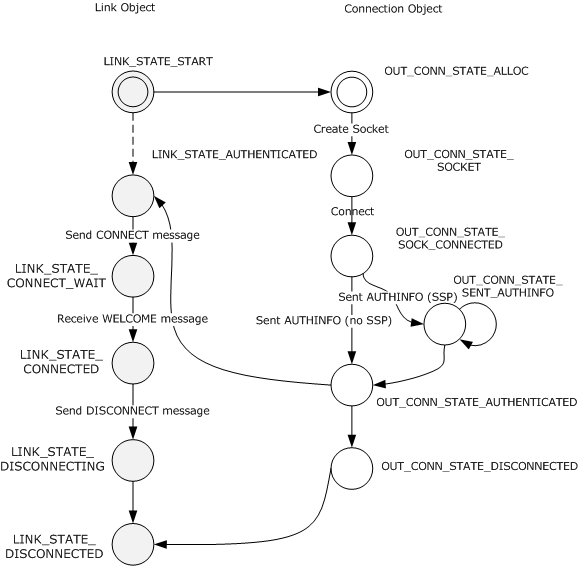

Figure 3: State transitions when setting up a connection

To establish a connection to a remote [**node**](#gt_node), the local node MUST take the following steps:

- The local node MUST start the Authentication Timer, as specified in section [3.1.6.1](#Section_3.1.6.1).
- The local node MUST open a TCP connection to the desired IP address.
- After the TCP connection is established, the connection MUST be set to the OUT_CONN_STATE_SOCK_CONNECTED state.
- The connection's [**connection utility**](#gt_connection-utility) MUST be initialized to 0.
The local node MUST send (see section [3.1.7.1](#Section_3.1.7.1)) an AUTH_INFO message:

- The **Graph ID Data** MUST be set to the [**graph ID**](#gt_graph-id) being used.
- The **Source Peer ID Data** MUST be set to the local Peer ID.
- The **Destination Peer ID Data** MUST be set to the Peer ID of the destination node if that Peer ID is known. Otherwise it MUST be empty.
- The Direct Connection flag MUST be set according to the application request. For more details, see section [3.1.4.7](#Section_1.3.3).
- If no [**graph security provider**](#gt_graph-security-provider) is configured for the node, the connection state MUST be set to OUT_CONN_STATE_AUTHENTICATED.
- If a graph security provider is configured on the node, the Connection state MUST be set to OUT_CONN_SENT_AUTHINFO and any further incoming message MUST be passed to the graph security provider to complete the connection security negotiation.
If any error occurs during connection establishment, the connection MUST be aborted and any further messages received on the connection MUST NOT be processed.

#### 3.1.7.25 Disconnecting a Connection

When disconnecting a [**neighbor connection**](#gt_neighbor-connection), the local [**node**](#gt_node) MUST send (See section [3.1.7.1](#Section_3.1.7.1)) a DISCONNECT message on the [**neighbor**](#gt_neighbor) link. If the local node's **Neighbor List** is not empty, the DISCONNECT message MUST be built as follows:

- **Address Count**: MUST be set to the number of addresses returned, up to a maximum of 10.
- **Address Offset**: MUST be set as specified in section [2.2.2.5](#Section_2.2.2.5).
- **Address Array**: MUST contain a list of [Address Count] least recently added addresses, based on their sequence numbers in Neighbor List.
If the local node's Neighbor List is empty, the DISCONNECT message MUST be built as follows:

- **Address Count**: MUST be 0
- **Address Offset**: MUST be the size of the DISCONNECT message in bytes
- **Address Array**: MUST NOT be present.
After disconnecting a connection, the local node MUST perform [**graph maintenance**](#gt_graph-maintenance), as specified in section [3.1.7.16](#Section_3.1.7.16).

#### 3.1.7.26 An Incoming Connection Is Established

The diagram below shows the finite state machine associated with accepting an incoming connection and disconnect.

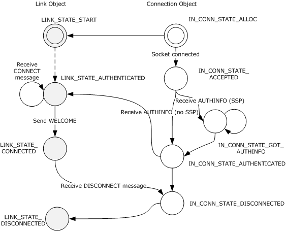

Figure 4: State transitions when accepting an incoming message

When a connection is established to the local [**node**](#gt_node), the following steps MUST be taken by the node in order to accept the connection:

- The local node MUST start the Authentication Timer.
- The local node MUST accept the TCP connection.
- The Connection state MUST be set to IN_CONN_STATE_ACCEPTED.
- The connection's [**connection utility**](#gt_connection-utility) MUST be set to 0.

#### 3.1.7.27 Validating a Received Record

The **Record Data** field in a received FLOOD message MUST conform to the format of a PEER_RECORD. In addition, it MUST meet the following conditions:

- The FLOOD data size MUST be at least 90.
- **Creator ID Length** MUST be at least 2 and at most 256.
- The **Record ID** MUST be validated according to the following steps:
- A 128 bit value, hash, MUST be generated as the [**MD5 hash**](#gt_md5-hash) of the value of the **Creator ID** field.
- A 64 bit value, highVal, MUST be generated by XORing the high-order 64 bits of hash with the low-order 64 bits of hash.
- The value of highVal MUST match the high-order 64 bits of the **Record ID**.
- **Last Modified By ID Length** MUST be either zero or between 2 and 256, inclusive.
- **Expiration Time** MUST be greater than Last Modification Time.
- **Last Modification Time** MUST be at least Creation Time.
- **Graph ID Length** MUST be between 2 and 256, inclusive.
- **Graph ID** MUST match the [**graph ID**](#gt_graph-id) of the local [**graph**](#gt_graph).
- **Protocol Version** MUST be 0x0100.
- If the Record Deleted bit is set, **Payload Data Size** MUST be zero.
- **Payload Data Size** + (**Attributes Length** * 2) MUST be no greater than Max Record Size.
- If **Last Modification Time** and **Creation Time** are identical, then **Last Modified By ID Length** MUST be 0.
- If present, the attributes data MUST conform with the attribute syntax specified in section [2.2.3.5](#Section_2.2.3.5).
If any of the above conditions are not met by the PEER_RECORD, the local [**node**](#gt_node) MUST discard it without further processing.

After the PEER_RECORD is validated, the [**record**](#gt_record) MUST be passed to the [**graph security provider**](#gt_graph-security-provider) for further validation. The graph security provider MUST return one of the following three responses:

- Valid - The record is valid, and MUST be processed further.
- Invalid - The record is invalid for some reason. The record MUST NOT be processed further.
- Defer Validation - The record could not be validated yet, but the graph security provider expects to be able to attempt validation in the future. The record MUST be placed in the Deferred record List. The Record MUST NOT be processed further at this time.
- Any response other than the above MUST be discarded without any action being taken in response.

#### 3.1.7.28 Securing a Record

When the local application creates, modifies, or deletes a [**record**](#gt_record) (see sections [3.1.4.3](#Section_3.1.4.3),[3.1.4.4](#Section_3.1.4.4), and [3.1.4.5](#Section_3.1.4.5)), the record MUST first be passed to the [**graph security provider**](#gt_graph-security-provider), if one is configured on the local [**node**](#gt_node). If the graph security provider returns a block of data, the data MUST be placed in the record's Security Data field, and the Security Data Size field updated with the length of the field.

The graph security provider MAY return an error while securing a record. This MUST cause the record operation (creation, update, or deletion) to be aborted, and the record MUST NOT be processed further.

#### 3.1.7.29 Performing a Sync All

A [**node**](#gt_node) performing a Sync All over a particular connection MUST first initialize the Sync Record Types array for the connection with the following Record Type [**GUIDs**](#gt_globally-unique-identifier-guid), in order:

- Graph Info Record
- Presence Records
- The Record types in Prioritized Record Types (see section [3.1.4.2](#Section_3.1.4.2)), in order.
The node MUST then initialize Current Sync Record Type for the connection to point to the first entry in the Sync Record Types array, initialize SYNC_TYPE for the connection to the value SYNC_NEW, and initialize the All Record Types Synched flag to FALSE.

Finally, the node MUST send (see section [3.1.7.1](#Section_3.1.7.1)) a SOLICIT_NEW message over the connection with the following properties:

- The **Inclusion Count** MUST be set to 0x01.
- The **Exclusion Count** MUST be set to 0x00.
- The **Record Types** array MUST include one entry for the Graph Info Record Type.

#### 3.1.7.30 Performing a Time-Based Sync

When a [**node**](#gt_node) reconnects to a [**graph**](#gt_graph) and already has a copy of the [**database**](#gt_database), it MUST perform a Time-based Sync to synchronize all [**records**](#gt_record) changed while it was offline. To do so, it MUST first initialize the Sync Record Types array for the connection with the following Record Type [**GUIDs**](#gt_globally-unique-identifier-guid), in order:

- Graph Info Record
- Presence Record
- The Record types listed in Prioritized Record Types, in order (see section [3.1.4.2](#Section_3.1.4.2)).
The node MUST then initialize Current Sync Record Type for the connection to point to the first entry in the Sync Record Types array, initialize SYNC_TYPE for the connection to the value SYNC_TIME, and initialize the All Record Types Synched flag to FALSE.

Finally, the node MUST send (see section [3.1.7.1](#Section_3.1.7.1)) a SOLICIT_TIME message over the connection with the following properties:

- The Modification Time MUST be the [**peer time**](#gt_peer-time) at which the node left the graph.
- The **Inclusion Count** MUST be set to 0x01.
- The **Exclusion Count** MUST be set to 0x00.
- The **Record Types** array MUST include one entry for the Graph Info Record Type.

#### 3.1.7.31 Performing a Hash-Based Sync

A Hash-based Sync is performed after a Time-based Sync and any time that a connection is made after the first one (the first connection uses either Sync All or Time-based Sync).

The initiator of a Hash-based Sync MUST first sort its [**database**](#gt_database) and divide it into fixed-size Record Ranges. The primary sort MUST be by the [**record's**](#gt_record) Last Modification Time, and the secondary sort MUST be by the [**record ID**](#gt_record-id). The size of each Record Range MUST be 10 Records. Each resulting Record Range can therefore be described by:

(ModificationTimeMIN, RecordIDMIN, ModificationTimeMAX, RecordIDMAX)

Any record satisfying the following conditions is in the given Record Range:

- ModificationTime >= ModificationTimeMIN
- ModificationTime <= ModificationTimeMIN
- RecordID >= RecordIDMIN
- RecordID <= RecordIDMAX
*(ModificationTimeMIN, RecordIDMIN)*is the lower boundary of the Record Range.

*(ModificationTimeMAX, RecordIDMAX)*is the upper boundary of the Record Range.

After the Record Ranges are determined, an [**MD5 hash**](#gt_md5-hash) MUST be generated for each Record Range. The data hashed for each Record Range are the Record IDs and Record Versions:

hash = MD5(RecordID1, RecordVersion1, RecordID2, RecordVersion2, ...)

After the hashes are generated, the initiator [**node**](#gt_node) MUST send (see section [3.1.7.1](#Section_3.1.7.1)) a SOLICIT_HASH message:

- The **Inclusion Count** MUST be 0x00.
- The **Exclusion Count** MUST be 0x00.
- The **Hash Count** MUST be nonzero.
- The **Hash Entry Array** MUST contain a HASH_INFO_ENTRY for each Record Range.
- Each HASH_INFO_ENTRY MUST contain the MD5 hash [[RFC1321]](https://go.microsoft.com/fwlink/?LinkId=90275) for its Record Range as described above.
- Each HASH_INFO_ENTRY MUST contain the upper boundary for its range as described above.

#### 3.1.7.32 Record Conflict Resolution

When a [**record**](#gt_record) is received in a FLOOD message and the local [**node**](#gt_node) already has a record with that [**record ID**](#gt_record-id) in its [**database**](#gt_database), the local node MUST determine whether the received record is "newer" (will replace the existing record), "already present" (the Records are the same), or "older". The decision MUST be made as follows:

- If the Record Versions are different, the record with the higher Version is "newer", and the other is "older".
- Otherwise, if one record has been updated (**Last Modified By ID** is not empty), but the other has not, the record that was updated is "newer", and the other is "older".
- Otherwise, if the **Last Modified By ID** fields are different, the Record that has the lexigraphically higher value is "newer", and the other is "older".
- Otherwise, if the **Last Modification Time** is different, the Record with the higher value is "newer", and the other is "older".
- Otherwise, if the record **Security Data Size** is different, the record with the larger value is "newer", and the other is "older".
- Otherwise, if the record **Security Data** is different, the Record with the higher value is "newer", and the other is "older".
- Otherwise, the record is "already present".

#### 3.1.7.33 Updating Connection Utility

The [**connection utility**](#gt_connection-utility) is a measure of the usefulness of a connection. When a FLOOD message is sent over the connection, both [**nodes**](#gt_node) on either end of the connection MUST update the connection utility, LU, associated with the connection. The new connection utility, LU1, MUST be computed as follows:

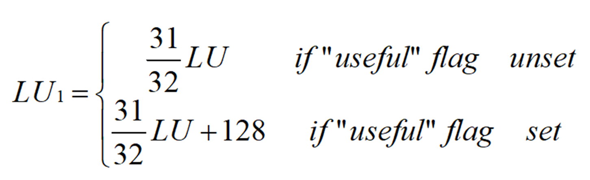

# 4 Protocol Examples

## 4.1 Establishing a Connection

[**Node**](#gt_node) 2 wants to connect to a [**graph**](#gt_graph) previously created by Node 1. Node 1 is already listening for incoming connections, and its address and port are known by Node 2. Node 2 has never connected to the graph before.

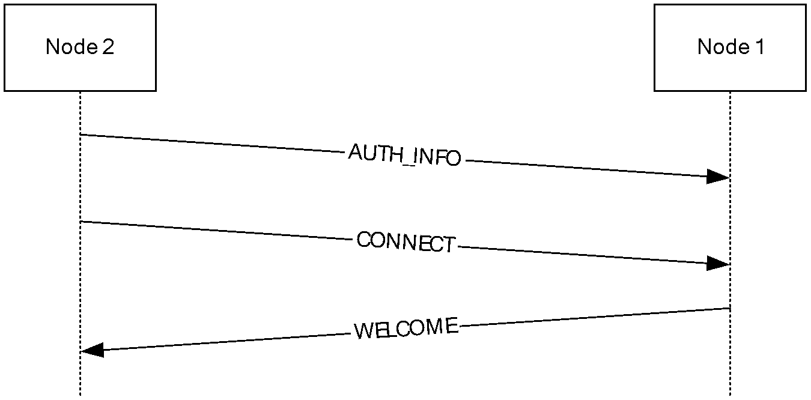

Figure 5: Example of a message exchange when connecting to a graph

To establish the connection, the following steps occur:

- Node 2 establishes a TCP connection to Node 1.
- Node 2 sends an AUTH_INFO message to Node 1. Because this graph is not using a [**graph security provider**](#gt_graph-security-provider), authentication is complete without any additional messages.
- Node 2 sends a CONNECT message to Node 1. Node 2 is not yet listening, so no addresses are contained in the CONNECT message.
- Node 1 has no other connections (and, thus, has not reached its maximum [**neighbor**](#gt_neighbor) count), so it accepts the new [**neighbor connection**](#gt_neighbor-connection). In response, Node 1 sends a WELCOME message to Node 2.

## 4.2 Sync All

After establishing the connection, [**Node**](#gt_node) 2 synchronizes the [**graph**](#gt_graph) [**database**](#gt_database). Because Node 2 has never synchronized with this graph before, it performs a Sync All.

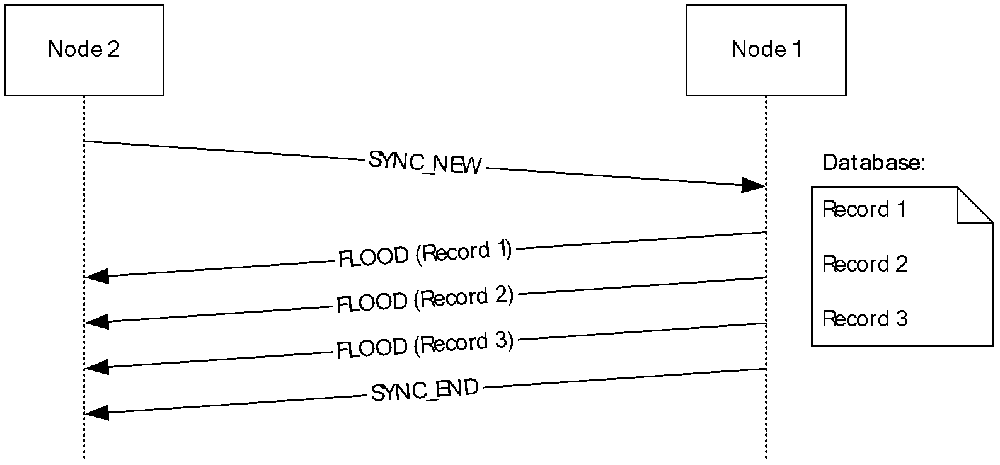

Figure 6: Example of a Sync All message exchange

Performing a Sync All includes the following steps:

- Node 2 sends a SOLICIT_NEW message to Node 1.
- Node 1 responds by sending a FLOOD message for each [**record**](#gt_record) in the database. In this example, there are three records with IDs 1, 2, and 3 (using integers instead of [**GUIDs**](#gt_globally-unique-identifier-guid) for [**record IDs**](#gt_record-id) for simplicity), and therefore three FLOOD messages.
- After sending the last FLOOD, Node 1 sends a SYNC_END to inform Node 2 that all records have been sent.
- After synchronization has completed, Node 2 will open a listening socket on an application specified port so that it can accept new [**neighbor**](#gt_neighbor) connections. Now that Node 2 is listening, it will send a CONNECT message to Node 1 with the **Update** bit set and its listening addresses in the message. Node 1does not send a response to this CONNECT message because the **Update** bit is set.

## 4.3 Hash-Based Sync

Node 3 is a [**node**](#gt_node) that has previously been connected to this [**graph**](#gt_graph), and the graph [**database**](#gt_database) at the time it was last connected to the graph was persisted to disk. Prior to connecting to the graph, Node 3 loads its persisted database.

Node 3 knows the address and port of Node 2, and establishes a connection just like Node 2 connected to Node 1 above.

Because Node 3 has an older copy of the graph database, it performs a Time-based Sync rather than a Sync All. Time-based Sync looks very similar to Sync All above, so this exchange is not shown. Following the Time-based Sync, Node 3 performs a Hash-based Sync.

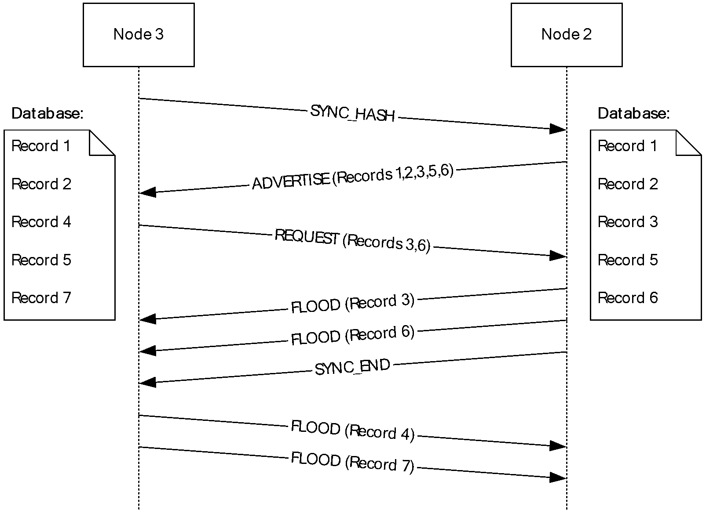

Figure 7: Example of a Hash-based Sync message exchange

Performing a Hash-based Sync includes the following steps:

- Node 3 divides its database into ranges of 10 [**records**](#gt_record) each. In this database, there are only five records, so it has a single range.
- Node 3 calculates an [**MD5 hash**](#gt_md5-hash) of the [**record IDs**](#gt_record-id) and Record Versions in the range.
- Node 3 sends Node 2 a SOLICIT_HASH message containing the range and hash calculated above.
- Node 2 calculates an MD5 hash of the record IDs and Record Versions of all the records in its database for each range specified by Node 3.
- Node 2 notices that the hashes it generated in step 4 differ from the hashes sent in the SOLICIT_HASH message, and sends an ADVERTISE message containing all the record IDs and Record Versions in the ranges that differ.
- Node 3 sees that the ADVERTISE message contains information about two records that it does not have (3 and 6), and sends a REQUEST message for those two records. Node 3 also sees that the ADVERTISE message does not contain information about Records 4 and 7, and remembers this for use below.
- Node 2 responds to the REQUEST message by sending FLOOD messages for Records 3 and 6.
- Node 2 sends a SYNC_END after flooding all the requested records.
- Having noticed in step 6 that Node 2 was missing Records 4 and 7, Node 3 now sends FLOOD messages for Records 4 and 7.
- After synchronizing, Node 3 now begins listening just as Node 2 did above. Upon listening, Node 3 performs [**Graph Maintenance**](#gt_graph-maintenance). Because there are now three nodes in the graph, Node 3 is able to find a Node that it is not already connected to. Node 3 establishes a connection to Node 1, as above. At this point, all three nodes are interconnected.

## 4.4 Record Flooding

[**Node**](#gt_node) 1 publishes a [**record**](#gt_record) in the [**graph**](#gt_graph).

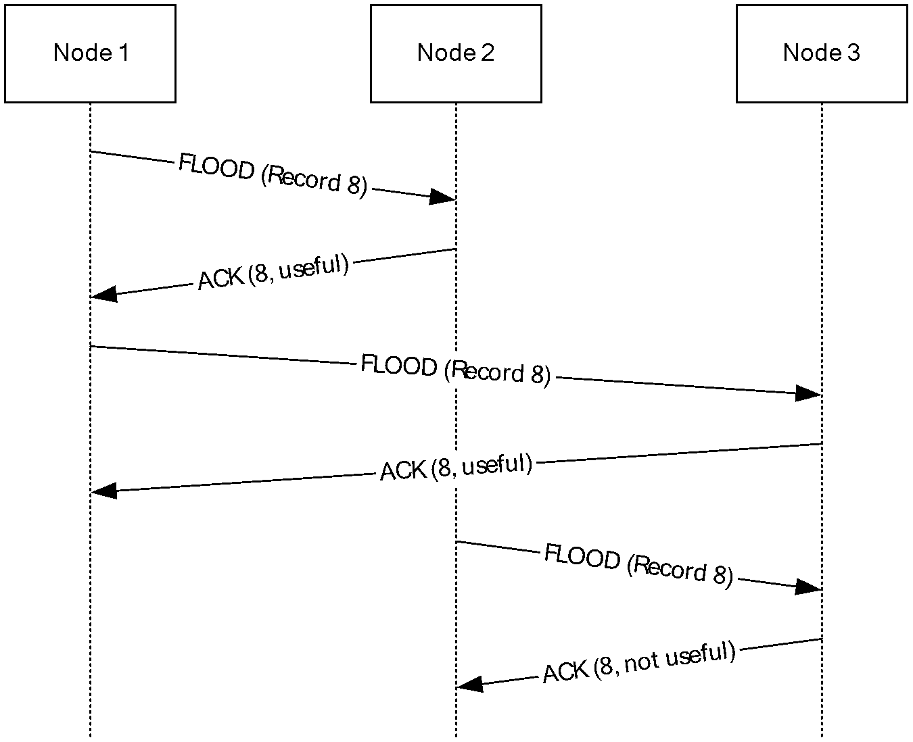

Figure 8: Example of a Record Flooding message exchange

The following steps flood the Record to all Nodes:

- Node 1 creates a new record, and sends a FLOOD message containing the record to Node 2.
- Node 2 had not seen this record, so it sends an ACK message back to Node 1 stating that the FLOOD was useful.
- Node 1 sends a FLOOD message to its other [**neighbor**](#gt_neighbor), Node 3. Note that sending the FLOOD messages is done asynchronously, and does not wait for the ACK in step 2.
- Node 3 had not seen this record, so it sends an ACK message back to Node 1 stating that the FLOOD was useful.
- Having received a useful FLOOD message in step 2, Node 2 sends a FLOOD message containing the same record to its other neighbor, Node 3.
- Node 3 already has Record 8, and thus considers the FLOOD message from step 5 to not be useful. Node 3 sends an ACK message back to Node 2 stating that the FLOOD was not useful.

# 5 Security

## 5.1 Security Considerations for Implementers

No security whatsoever is provided by default by the Peer-to-Peer Graphing Protocol. Therefore there is no guarantee that a [**neighbor**](#gt_neighbor) providing new or updated [**records**](#gt_record) for inclusion in the [**graph**](#gt_graph) [**database**](#gt_database) is a legitimate, authorized member of the graph, nor that the data received on any connection has not been inspected or tampered with en route.

The Peer-to-Peer Graphing Protocol allows a [**graph security provider**](#gt_graph-security-provider) to be layered on top of it to handle:

- Negotiating secure (encrypted, integrity-protected) connections with peers.
- Authenticating peers as Group members.
- Checking authorization for received record additions, updates, and deletions.
A well-designed graph security provider, such as P2P Grouping [MS-PPSEC](#Section_5), can protect against unauthorized record injection, modification, or on-the-wire inspection.

## 5.2 Index of Security Parameters

None.

# 6 Appendix A: Product Behavior

The information in this specification is applicable to the following Microsoft products or supplemental software. References to product versions include updates to those products.

- Windows XP operating system Service Pack 2 (SP2)
- Windows Vista operating system
- Windows 7 operating system
- Windows Home Server 2011 server software
- Windows 8 operating system
- Windows 8.1 operating system
- Windows 10 operating system
- Windows 11 operating system
Exceptions, if any, are noted in this section. If an update version, service pack or Knowledge Base (KB) number appears with a product name, the behavior changed in that update. The new behavior also applies to subsequent updates unless otherwise specified. If a product edition appears with the product version, behavior is different in that product edition.

Unless otherwise specified, any statement of optional behavior in this specification that is prescribed using the terms "SHOULD" or "SHOULD NOT" implies product behavior in accordance with the SHOULD or SHOULD NOT prescription. Unless otherwise specified, the term "MAY" implies that the product does not follow the prescription.

# 7 Change Tracking

This section identifies changes that were made to this document since the last release. Changes are classified as Major, Minor, or None.

The revision class **Major** means that the technical content in the document was significantly revised. Major changes affect protocol interoperability or implementation. Examples of major changes are:

- A document revision that incorporates changes to interoperability requirements.
- A document revision that captures changes to protocol functionality.
The revision class **Minor** means that the meaning of the technical content was clarified. Minor changes do not affect protocol interoperability or implementation. Examples of minor changes are updates to clarify ambiguity at the sentence, paragraph, or table level.

The revision class **None** means that no new technical changes were introduced. Minor editorial and formatting changes may have been made, but the relevant technical content is identical to the last released version.

The changes made to this document are listed in the following table. For more information, please contact [dochelp@microsoft.com](mailto:dochelp@microsoft.com).

| Section | Description | Revision class |
| --- | --- | --- |
| [6](#Section_6) Appendix A: Product Behavior | Updated for this version of Windows Client. | Major |

## Revision History

| Date | Version | Revision Class | Comments |
| --- | --- | --- | --- |
| 3/12/2010 | 1.0 | Major | First Release. |
| 4/23/2010 | 1.1 | Minor | Clarified the meaning of the technical content. |
| 6/4/2010 | 1.2 | Minor | Clarified the meaning of the technical content. |
| 7/16/2010 | 1.3 | Minor | Clarified the meaning of the technical content. |
| 8/27/2010 | 1.3 | None | No changes to the meaning, language, or formatting of the technical content. |
| 10/8/2010 | 1.3 | None | No changes to the meaning, language, or formatting of the technical content. |
| 11/19/2010 | 1.3 | None | No changes to the meaning, language, or formatting of the technical content. |
| 1/7/2011 | 1.4 | Minor | Clarified the meaning of the technical content. |
| 2/11/2011 | 1.4 | None | No changes to the meaning, language, or formatting of the technical content. |
| 3/25/2011 | 1.4 | None | No changes to the meaning, language, or formatting of the technical content. |
| 5/6/2011 | 1.4 | None | No changes to the meaning, language, or formatting of the technical content. |
| 6/17/2011 | 1.5 | Minor | Clarified the meaning of the technical content. |
| 9/23/2011 | 1.5 | None | No changes to the meaning, language, or formatting of the technical content. |
| 12/16/2011 | 2.0 | Major | Updated and revised the technical content. |
| 3/30/2012 | 2.0 | None | No changes to the meaning, language, or formatting of the technical content. |
| 7/12/2012 | 2.1 | Minor | Clarified the meaning of the technical content. |
| 10/25/2012 | 2.1 | None | No changes to the meaning, language, or formatting of the technical content. |
| 1/31/2013 | 2.1 | None | No changes to the meaning, language, or formatting of the technical content. |
| 8/8/2013 | 3.0 | Major | Updated and revised the technical content. |
| 11/14/2013 | 3.0 | None | No changes to the meaning, language, or formatting of the technical content. |
| 2/13/2014 | 3.0 | None | No changes to the meaning, language, or formatting of the technical content. |
| 5/15/2014 | 3.0 | None | No changes to the meaning, language, or formatting of the technical content. |
| 6/30/2015 | 4.0 | Major | Significantly changed the technical content. |
| 10/16/2015 | 4.0 | None | No changes to the meaning, language, or formatting of the technical content. |
| 7/14/2016 | 4.0 | None | No changes to the meaning, language, or formatting of the technical content. |
| 6/1/2017 | 4.0 | None | No changes to the meaning, language, or formatting of the technical content. |
| 6/25/2021 | 5.0 | Major | Significantly changed the technical content. |
