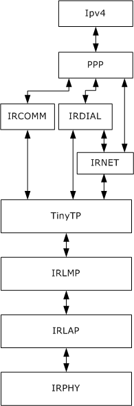
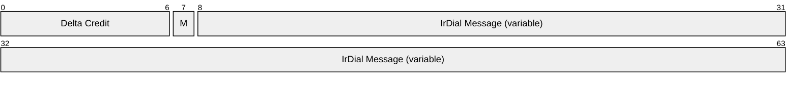
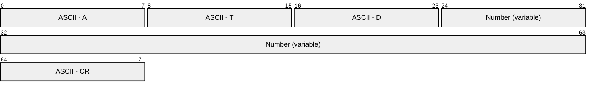
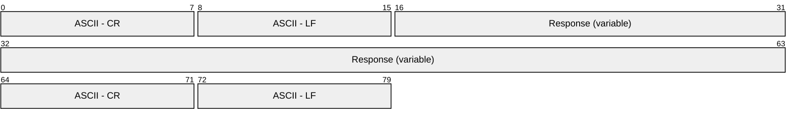
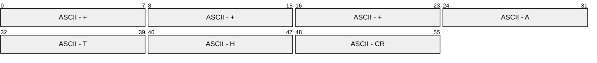
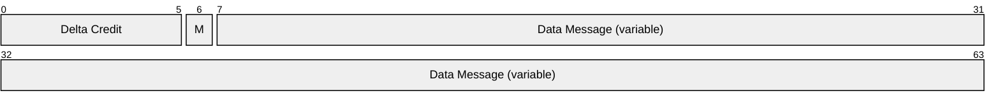
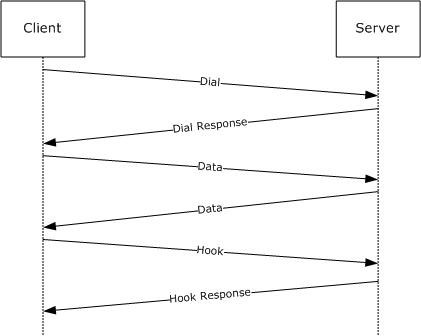

# [MS-PPPI]: PPP Over IrDA Dialup Protocol

Table of Contents

1 Introduction

- [1 Introduction](#Section_1)
  - [1.1 Glossary](#Section_1.1)
  - [1.2 References](#Section_1.2)
    - [1.2.1 Normative References](#Section_1.2.1)
    - [1.2.2 Informative References](#Section_1.2.2)
  - [1.3 Overview](#Section_1.3)
  - [1.4 Relationship to Other Protocols](#Section_1.4)
  - [1.5 Prerequisites/Preconditions](#Section_1.5)
  - [1.6 Applicability Statement](#Section_1.6)
  - [1.7 Versioning and Capability Negotiation](#Section_1.7)
  - [1.8 Vendor-Extensible Fields](#Section_1.8)
  - [1.9 Standards Assignments](#Section_1.9)

2 Messages

- [2 Messages](#Section_2)
  - [2.1 Transport](#Section_2.1)
  - [2.2 Message Syntax](#Section_2.2)
    - [2.2.1 IrDial Message Formats](#Section_2.2.1)
      - [2.2.1.1 General Formatting Rules](#Section_2.2.1.1)
      - [2.2.1.2 Dial Message](#Section_2.2.1.2)
      - [2.2.1.3 Dial Response Message](#Section_2.2.1.3)
      - [2.2.1.4 Hook Message](#Section_2.2.1.4)
      - [2.2.1.5 Hook Response Message](#Section_2.2.1.5)
    - [2.2.2 Data Message](#Section_2.2.2)

3 Protocol Details

- [3 Protocol Details](#Section_3)
  - [3.1 Common Details](#Section_3.1)
    - [3.1.1 Abstract Data Model](#Section_3.1.1)
    - [3.1.2 Timers](#Section_3.1.2)
    - [3.1.3 Initialization](#Section_3.1.3)
    - [3.1.4 Higher-Layer Triggered Events](#Section_3.1.4)
    - [3.1.5 Processing Events and Sequencing Rules](#Section_3.1.5)
    - [3.1.6 Timer Events](#Section_3.1.6)
    - [3.1.7 Other Local Events](#Section_3.1.7)
  - [3.2 Server-Specific Details](#Section_3.2)
    - [3.2.1 Abstract Data Model](#Section_3.2.1)
    - [3.2.2 Timers](#Section_3.2.2)
    - [3.2.3 Initialization](#Section_3.2.3)
    - [3.2.4 Higher-Layer Triggered Events](#Section_3.2.4)
    - [3.2.5 Processing Events and Sequencing Rules](#Section_3.2.5)
      - [3.2.5.1 Receiving a Dial Message](#Section_3.2.5.1)
      - [3.2.5.2 Receiving a Hook Message](#Section_3.2.5.2)
      - [3.2.5.3 Receiving a Data Message](#Section_3.2.5.3)
    - [3.2.6 Timer Events](#Section_3.2.6)
    - [3.2.7 Other Local Events](#Section_3.2.7)
  - [3.3 Client-Specific Details](#Section_3.3)
    - [3.3.1 Abstract Data Model](#Section_3.3.1)
    - [3.3.2 Timers](#Section_3.3.2)
    - [3.3.3 Initialization](#Section_3.3.3)
    - [3.3.4 Higher-Layer Triggered Events](#Section_3.3.4)
    - [3.3.5 Processing Events and Sequencing Rules](#Section_3.3.5)
      - [3.3.5.1 Sending a Dial Message](#Section_3.3.5.1)
      - [3.3.5.2 Receiving a Dial Response Message](#Section_3.3.5.2)
      - [3.3.5.3 Sending a Hook Message](#Section_3.3.5.3)
      - [3.3.5.4 Receiving a Hook Response Message](#Section_3.3.5.4)
      - [3.3.5.5 Receiving an Echo Message](#Section_3.3.5.5)
      - [3.3.5.6 Sending a Data Message](#Section_3.3.5.6)
      - [3.3.5.7 Receiving a Data Message](#Section_3.3.5.7)
    - [3.3.6 Timer Events](#Section_3.3.6)
    - [3.3.7 Other Local Events](#Section_3.3.7)

4 Protocol Examples

- [4 Protocol Examples](#Section_4)
  - [4.1 Connection Setup and Data Exchange](#Section_4.1)

5 Security

- [5 Security](#Section_5)
  - [5.1 Security Considerations for Implementers](#Section_5.1)
  - [5.2 Index of Security Parameters](#Section_5.2)

6 Appendix A: Product Behavior

- [6 Appendix A: Product Behavior](#Section_6)

7 Change Tracking

- [7 Change Tracking](#Section_7)

For the legal notice and IP terms, see [LEGAL.md](../LEGAL.md).
Last updated: 6/25/2021.
See [Revision History](#revision-history) for full version history.

# 1 Introduction

The Point to Point Protocol (PPP) over Infrared Data Association (IrDA) Dialup (IrDial) Protocol (PPP Over IrDA Dialup Protocol) is a deprecated protocol that specifies how to initialize and use a modem over an infrared link. It includes contributions from Microsoft, Ericsson, and Nokia. This protocol enables the scenario in which a computer with infrared capabilities has network access by using a modem via an infrared link. To exchange data with the modem, this protocol uses the point-to-point protocol (PPP) in HDLC-like framing, to encapsulate the higher-layer network data so the frames (a bit stream) can be successfully reassembled on the receiving end's IrDial layer.

Sections 1.5, 1.8, 1.9, 2, and 3 of this specification are normative. All other sections and examples in this specification are informative.

## 1.1 Glossary

This document uses the following terms:

**AT command set**: The Attention Code (AT) command set is used to issue one or more commands to a modem device. The AT prefix signals the modem that one or more commands are to follow, as specified in [[V25TER]](https://go.microsoft.com/fwlink/?LinkId=90559).

**Data-Carrying TinyTP PDU**: The [**TinyTP**](#gt_tinytp) Protocol distinguishes between PDUs that carry data and PDUs that are used during [**TinyTP**](#gt_tinytp) connection establishment. The "Data-Carrying" prefix denotes that the PDU being discussed is used for data exchange and not [**TinyTP**](#gt_tinytp) connection establishment.

**escape sequence**: A series of three consecutive characters (+++) sent to the infrared modem that causes it to exit online data mode and enter online command mode.

**Information Access Service (IAS)**: Each device that implements the set of infrared protocols, specifically [[IRLMP]](https://go.microsoft.com/fwlink/?LinkId=90686), maintains an information base so that one IrDA device can discover what services another IrDA-compliant device offers, as well as gain information about the device itself. This information is held in a number of objects in the information base and is accessed by communicating with the IAS.

**IrDA**: The Infrared Data Association, often referred to as [**IrDA**](#gt_irda), is a nonprofit organization whose goal is to develop globally adopted specifications for infrared wireless communication.

**IrDial**: A component of the PPP Over IrDA Dialup Protocol that implements modem commands.

**IrNet**: A component of the PPP Over IrDA Dialup Protocol that implements a data path pass-through between the PPP over HDLC-like framing and [**TinyTP**](#gt_tinytp).

**Link Service Access Point Selector (LSAP-SEL)**: A selector that distinguishes between LSAPs within a station. Legal values for an LSAP-SEL lie in the range 0x00–0x7F. With the exception of the special LSAP-SEL values 0x00 (LM-IAS), 0x70 (Connectionless Data service), 0x71-0x7E (reserved), and 0x7F (reserved for broadcast and currently not implemented), the assignment of LSAP-SEL values is arbitrary. See [IRLMP] section 3.1.2 for more details.

**PPP**: Point-to-Point Protocol (PPP), as defined in [[RFC1661]](https://go.microsoft.com/fwlink/?LinkId=90283).

**SDU**: A [**TinyTP**](#gt_tinytp) Client Service Data Unit as specified in [[IRTTP]](https://go.microsoft.com/fwlink/?LinkId=90688) section 2.2.3. The [**SDU**](#gt_sdu) defines the maximum size of a data block that can be exchanged between two [**TinyTP**](#gt_tinytp) clients. For example, the IrDial Protocol, which is implemented as [**TinyTP**](#gt_tinytp) client, may negotiate an [**SDU**](#gt_sdu) size of 10 KB. The [**TinyTP**](#gt_tinytp) Protocol segments and reassembles this [**SDU**](#gt_sdu) in multiple PDUs that are transmitted over the infrared link.

**service access point (SAP)**: An identifying label for network endpoints that are used in Open Systems Interconnection (OSI) networking. The [**SAP**](#gt_service-access-point-sap) is a conceptual location at which one OSI layer can request the services of another OSI layer.

**TinyTP**: Infrared Data Association Tiny Transport Protocol, as specified in [IRTTP].

**TinyTP PDU**: A [**TinyTP**](#gt_tinytp) Protocol Data Unit as specified in [IRTTP] section 2.3.1. The maximum size of the PDU must be in the range of 64–2048 bytes. See [[IRLAP]](https://go.microsoft.com/fwlink/?LinkId=90685) section 6.6.5 and [IRTTP] section 2.3.1 for more details.

**MAY, SHOULD, MUST, SHOULD NOT, MUST NOT:** These terms (in all caps) are used as defined in [[RFC2119]](https://go.microsoft.com/fwlink/?LinkId=90317). All statements of optional behavior use either MAY, SHOULD, or SHOULD NOT.

## 1.2 References

Links to a document in the Microsoft Open Specifications library point to the correct section in the most recently published version of the referenced document. However, because individual documents in the library are not updated at the same time, the section numbers in the documents may not match. You can confirm the correct section numbering by checking the [Errata](https://go.microsoft.com/fwlink/?linkid=850906).

### 1.2.1 Normative References

We conduct frequent surveys of the normative references to assure their continued availability. If you have any issue with finding a normative reference, please contact [dochelp@microsoft.com](mailto:dochelp@microsoft.com). We will assist you in finding the relevant information.

[IRLAP] Infrared Data Association, "IrDA Link Access Protocol v.1.1", June 1996, [http://irdajp.info/specifications.html](https://go.microsoft.com/fwlink/?LinkId=90685)

**Note** There is a charge to download the specification.

[IRLMP] Infrared Data Association, "IrDA Link Management Protocol v1.1", January 1996, [http://irdajp.info/specifications.html](https://go.microsoft.com/fwlink/?LinkId=90686)

**Note** There is a charge to download the specification.

[IRTTP] Infrared Data Association, "IrDA Tiny TP v1.1", October 1996, [http://irdajp.info/specifications.html](https://go.microsoft.com/fwlink/?LinkId=90688)

**Note** There is a charge to download the specification.

[RFC1345] Simonsen, K., "Character Mnemonics and Character Sets", RFC 1345, June 1992, [http://www.ietf.org/rfc/rfc1345.txt](https://go.microsoft.com/fwlink/?LinkId=90714)

[RFC1661] Simpson, W., Ed., "The Point-to-Point Protocol (PPP)", STD 51, RFC 1661, July 1994, [http://www.ietf.org/rfc/rfc1661.txt](https://go.microsoft.com/fwlink/?LinkId=90283)

[RFC1662] Simpson, W., Ed., "PPP in HDLC-like Framing", STD 51, RFC 1662, July 1994, [http://www.ietf.org/rfc/rfc1662.txt](https://go.microsoft.com/fwlink/?LinkId=90284)

[RFC2119] Bradner, S., "Key words for use in RFCs to Indicate Requirement Levels", BCP 14, RFC 2119, March 1997, [http://www.rfc-editor.org/rfc/rfc2119.txt](https://go.microsoft.com/fwlink/?LinkId=90317)

[V25TER] ITU-T, "Serial Asynchronous Automatic Dialling and Control", Recommendation V.25ter, July 1997, [http://www.itu.int/rec/T-REC-V.25ter-199707-S/en](https://go.microsoft.com/fwlink/?LinkId=90559)

**Note** There is a charge to download the specification.

### 1.2.2 Informative References

[IRCOM] Infrared Data Association, "'IrCOMM': Serial and Parallel Port Emulation over IR (Wire Replacement) v.1.0", November 1995, [http://irdajp.info/specifications.html](https://go.microsoft.com/fwlink/?LinkId=90684)

**Note** There is a charge to download the specification.

[IRPLS] Infrared Data Association, "IrDA Physical Layer Specification v.1.4", May 2001, [http://irdajp.info/specifications.html](https://go.microsoft.com/fwlink/?LinkId=90687)

**Note** There is a charge to download the specification.

[MSDN-IRNET] Microsoft Corporation, "Infrared Network (IrNET)", [http://msdn.microsoft.com/en-us/library/ms817914.aspx](https://go.microsoft.com/fwlink/?LinkId=90694)

## 1.3 Overview

The Point-to-Point Protocol ([**PPP**](#gt_ppp)) over Infrared Data Association [**IrDA**](#gt_irda) Dialup ([**IrDial**](#gt_irdial)) Protocol enables two key scenarios, a "direct connect" scenario which was a point-to-point IP connection between two devices that implemented the IrDial protocol and a "dial connect" scenario which was a point-to-point connection to a "network access point" via modem. In this context a "network access point" is a device that is connected to the Internet on one end and connected to the local device via a modem on top of Infrared.

The PPP Over IrDA Dialup Protocol specifies how to initialize and exchange data with a modem over an infrared link. To exchange data this protocol enables generic IP traffic PPP encapsulation of frames over the following Infrared protocol stack:

- IrDA Tiny TP Protocol v1.1, specified in [[IRTTP]](https://go.microsoft.com/fwlink/?LinkId=90688)
- IrDA Link Management Protocol v1.1, specified in [[IRLMP]](https://go.microsoft.com/fwlink/?LinkId=90686)
- IrDA Link Access Protocol v.1.1, specified in [[IRLAP]](https://go.microsoft.com/fwlink/?LinkId=90685)
- IrDA Physical Layer Specification, specified in [[IRPLS]](https://go.microsoft.com/fwlink/?LinkId=90687)
The PPP Over IrDA Dialup Protocol has a client role and a server role:

- The server is the modem that has an infrared device and implements the PPP Over IrDA Dialup Protocol. In addition, the server implements the family of IrDA protocols, specifically the Infrared protocol stack previously stated.
- The client is the computer that has an infrared device and implements the PPP Over IrDA Dialup Protocol. In addition, the client also implements the family of IrDA protocols—again, the previous Infrared protocol stack.
To initialize the modem, the PPP Over IrDA Dialup Protocol uses IrDial messages as specified in section [2.2](#Section_2.2). Briefly, the IrDial messages are AT dial commands as specified in [[V25TER]](https://go.microsoft.com/fwlink/?LinkId=90559), which are exchanged between the computer and the modem via the infrared link.

Each IrDial message is echoed back to the client by the server. Note that the echoing of messages back to the client is applicable only while the PPP Over IrDA Dialup Protocol is initializing the modem. When the modem is used for data exchange, there are no message echoes.

After initializing the modem, the PPP Over IrDA Dialup Protocol can exchange data with it. To exchange data with the modem, this protocol uses the point-to-point protocol (PPP) in HDLC-like framing, as specified in [[RFC1662]](https://go.microsoft.com/fwlink/?LinkId=90284), to encapsulate the higher-layer network data. The PPP in HDLC-like framing frames are segmented (if necessary) and framed in [**TinyTP**](#gt_tinytp) Service Data Units ([**SDUs**](#gt_sdu)) as specified in [IRTTP]. The frames (a bit stream) can be successfully reassembled on the receiving end's IrDial layer.

## 1.4 Relationship to Other Protocols

A preferred alternative to the PPP Over IrDA Dialup Protocol is the [**IrDA**](#gt_irda) Infrared Communications Protocol [[IRCOM]](https://go.microsoft.com/fwlink/?LinkId=90684), which provides emulation of serial and parallel ports over the IrDA TinyTP v1.1 Protocol [[IRTTP]](https://go.microsoft.com/fwlink/?LinkId=90688), IrDA LinkManagement Protocol v1.1 [[IRLMP]](https://go.microsoft.com/fwlink/?LinkId=90686), and IrDA LinkAccess Protocol v1.1 [[IRLAP]](https://go.microsoft.com/fwlink/?LinkId=90685) protocol stack. Because the IrDA Infrared Communications Protocol provides serial emulation, the computer can initialize and use the modem over an infrared link by simply reading and writing to a serial port.

The PPP Over IrDA Dialup Protocol depends on the Infrared Network ([**IrNet**](#gt_irnet)) Protocol [[MSDN-IRNET]](https://go.microsoft.com/fwlink/?LinkId=90694) for the data path pass-through of PPP in HDLC-like framing frames to the [**TinyTP**](#gt_tinytp) layer. The following figure depicts the PPP Over IrDA Dialup Protocol and its relationship to the other higher-layer and lower-layer protocols mentioned in this specification.

In the following figure, the term IRPHY (IRDA Physical Layer) refers to the physical infrared hardware device and not to a software protocol.

Figure 1: Protocol stack diagram showing the PPP Over IrDA Dialup Protocol

The PPP Over IrDA Dialup Protocol consists of the [**IrDial**](#gt_irdial) and IrNet components and their relationship to other protocols. Both IrDial and IrNet use TinyTP as their transport protocol.

**Note** The PPP component includes both [[RFC1661]](https://go.microsoft.com/fwlink/?LinkId=90283) and [[RFC1662]](https://go.microsoft.com/fwlink/?LinkId=90284) encapsulations.

## 1.5 Prerequisites/Preconditions

Prior to using the PPP Over IrDA Dialup Protocol, the client and the server need to establish a [**TinyTP**](#gt_tinytp) connection. See sections [3.2.3](#Section_3.2.3) and [3.3.3](#Section_3.3.3) for further details.

## 1.6 Applicability Statement

The [**PPP**](#gt_ppp) Over [**IrDA**](#gt_irda) Dialup Protocol is deprecated and therefore its use is discouraged. Instead, the IrDA Infrared Communications Protocol (IrCOMM), as defined in [[IRCOM]](https://go.microsoft.com/fwlink/?LinkId=90684), can be used for modem initialization and data transfer over an infrared link.

## 1.7 Versioning and Capability Negotiation

None.

## 1.8 Vendor-Extensible Fields

None.

## 1.9 Standards Assignments

None.

# 2 Messages

## 2.1 Transport

The PPP Over IrDA Dialup Protocol uses [**IrDA**](#gt_irda) [**TinyTP**](#gt_tinytp), as specified in [[IRTTP]](https://go.microsoft.com/fwlink/?LinkId=90688), as a transport protocol for initialization and data exchange with the modem. Note that for data exchange with the modem, [[RFC1662]](https://go.microsoft.com/fwlink/?LinkId=90284) frames are transported directly via IrDA TinyTP, as specified in [IRTTP].

## 2.2 Message Syntax

### 2.2.1 IrDial Message Formats

As specified in [[IRTTP]](https://go.microsoft.com/fwlink/?LinkId=90688) section 2.2.1, the maximum size of a single [**Data-Carrying TinyTP PDUs**](#gt_data-carrying-tinytp-pdu) packet for a given connection is negotiated by the IrDA Link Access Protocol, as specified in [[IRLAP]](https://go.microsoft.com/fwlink/?LinkId=90685).

**Delta Credit (7 bits):** The **Delta Credit** field MUST specify the number (0-127) of additional Data-Carrying **TinyTP PDUs** that can be sent in the reverse direction, as specified in [IRTTP] section 2.3.1.

**M (1 bit):** The **M** field MUST be set to zero, as specified in [IRTTP] section 2.3.1, to denote that this is a single [**TinyTP PDU**](#gt_tinytp-pdu).

**IrDial Message (variable):** Each [**IrDial**](#gt_irdial) message is a sequence of ASCII characters and MUST conform to the definitions in section 2.2.1. Messages of this form are often referred to as [**AT Command Sets**](#gt_at-command-set). The IrDial message MUST NOT exceed the maximum size of a **TinyTP PDU**, which is negotiated by the IrDA Link Access Protocol, as specified in [IRLAP]. For further details, see [IRTTP] section 2.2.1.

#### 2.2.1.1 General Formatting Rules

Message formatting rules are as follows:

- Each [**IrDial**](#gt_irdial) message MUST end with <CR>.
- Each IrDial message that is a response to a previous IrDial message MUST be in the format <CR> <LF>Response<CR> <LF>.
- <CR>: ASCII character "Enter" (decimal symbol # 13), as specified in [[RFC1345]](https://go.microsoft.com/fwlink/?LinkId=90714).
- <LF>: ASCII character "Line feed" (decimal symbol # 10), as specified in [RFC1345].

#### 2.2.1.2 Dial Message

The **Dial Message** is sent by the client as a request to begin initialization to the server that echoes it back as an acknowledgment. This message has 4 ASCII fields that are specified in [[RFC1345]](https://go.microsoft.com/fwlink/?LinkId=90714).

**ASCII - A (1 byte):** The ASCII encoding for the "A" character, 0x41.

**ASCII - T (1 byte):** The ASCII encoding for the "T" character, 0x54.

**ASCII - D (1 byte):** The ASCII encoding for the "D" character, 0x44.

**Number (variable):** A sequence of ASCII encoded numbers. This number denotes the phone number that the modem will dial.

**ASCII - CR (1 byte):** The ASCII encoding for the carriage return character, 0x0D.

#### 2.2.1.3 Dial Response Message

The **Dial Response Message** is sent by the server to send connection information to the client. This message has 4 ASCII fields specified in [[RFC1345]](https://go.microsoft.com/fwlink/?LinkId=90714).

**ASCII - CR (1 byte):** The ASCII encoding for the carriage return character, 0x0D.

**ASCII - LF (1 byte):** The ASCII encoding for the line feed character, 0x0A.

**Response (variable):** The **Response** field MUST be an ASCII encoded string. The **Response** field MUST have one of the following values.

| Value | Meaning |
| --- | --- |
| "CONNECT <speed>" | Data connection established at the rate given in <speed>. |
| "NO CARRIER" | Unable to establish a connection, or the connection attempt was aborted. |
| "ERROR" | An unexpected error occurred while trying to establish the connection. |
| "NO DIALTONE" | The server or modem device (for instance, a mobile phone) is being used for a voice call or has no access to (is not within coverage of) the network. |
| "BUSY" | The phone number called is engaged. |

**ASCII - CR (1 byte):** The ASCII encoding for the carriage return character, 0x0D.

**ASCII - LF (1 byte):** The ASCII encoding for the line feed character, 0x0A.

#### 2.2.1.4 Hook Message

The **Hook Message** is sent by the client to signal ending the connection. It is echoed back by the server as an acknowledgment. This message has 7 ASCII fields specified in [[RFC1345]](https://go.microsoft.com/fwlink/?LinkId=90714).

**ASCII - + (1 byte):** The first three fields specify three occurrences of the ASCII encoding for the '+' (plus sign) character, 0x2B. This string of '+' (plus sign) characters is often referred to as an [**escape sequence**](#gt_escape-sequence).

**ASCII - A (1 byte):** The ASCII encoding for the 'A' character, 0x41.

**ASCII - T (1 byte):** The ASCII encoding for the 'T' character, 0x54.

**ASCII - H (1 byte):** The ASCII encoding for the 'H' character, 0x48.

**ASCII - CR (1 byte):** The ASCII encoding for the carriage return character, 0x0D.

#### 2.2.1.5 Hook Response Message

The **Hook Response Message** is sent by the server to signal closing the connection. This message has 4 ASCII fields specified in [[RFC1345]](https://go.microsoft.com/fwlink/?LinkId=90714).

**ASCII - CR (1 byte):** The ASCII encoding for the carriage return character, 0x0D.

**ASCII - LF (1 byte):** The ASCII encoding for the line feed character, 0x0A.

**Response (variable):** The **Response** field MUST be an ASCII-encoded string. The **Response** field MUST have one of the following values.

| Value | Meaning |
| --- | --- |
| "OK" | Modem is already in "Offline Command Mode" state. |
| "NO CARRIER" | Connection terminated. |
| "ERROR" | Unexpected error. |

**ASCII - CR (1 byte):** The ASCII encoding for the carriage return character, 0x0D.

**ASCII - LF (1 byte):** The ASCII encoding for the line feed character, 0x0A.

### 2.2.2 Data Message

The **Data Message** is exchanged between client and server to send segments of data. The PPP Over IrDA Dialup Protocol relies on the Infrared Network ([**IrNET**](#gt_irnet)) Protocol [[MSDN-IRNET]](https://go.microsoft.com/fwlink/?LinkId=90694) for the pass-through of data messages between the PPP over HDLC-like framing [[RFC1662]](https://go.microsoft.com/fwlink/?LinkId=90284) and TinyTP [[IRTTP]](https://go.microsoft.com/fwlink/?LinkId=90688), for the client and the server.

As specified in [IRTTP] section 2.2.1, the maximum size of a single [**Data-Carrying TinyTP PDUs**](#gt_data-carrying-tinytp-pdu) packet for a given connection is negotiated by the IrDA Link Access Protocol, as specified in [[IRLAP]](https://go.microsoft.com/fwlink/?LinkId=90685).

**Delta Credit (6 bits):** The **Delta Credit** field MUST specify the number (0-63) of additional Data-Carrying **TinyTP PDUs** that can be sent in the reverse direction, as specified in [IRTTP] section 2.3.1.

**M (1 bit):** The **M** field MUST be set to zero, as specified in [IRTTP] section 2.3.1, if this is a single [**TinyTP PDU**](#gt_tinytp-pdu). The **M** field MUST be set to 1 if it is part of, but not the last part of a multi-part **TinyTP PDU**. That is, if the **M** bit is set to 1, there are more parts of this **PDU** to follow.

**Data Message (variable):** The **Data** field MUST be ASCII-encoded. The [**IrDial**](#gt_irdial) message MUST NOT exceed the maximum size of a **TinyTP PDU**, which is negotiated by the IrDA Link Access Protocol, as specified in [IRLAP]. For further details, see [IRTTP] section 2.2.1.

If the length of the **Data** field exceeds the maximum size of a single Data-Carrying **TinyTP PDU** packet, the TinyTP Protocol performs segmentation and reassembly (SAR) of the **Data** field.

# 3 Protocol Details

## 3.1 Common Details

### 3.1.1 Abstract Data Model

This section describes a conceptual model of possible data organization that an implementation maintains to participate in this protocol. The described organization is provided to facilitate the explanation of how the protocol behaves. This specification does not mandate that implementations adhere to this model as long as their external behavior is consistent with that described in this specification.

The following data model and states are common for the client role and the server role of the protocol:

**Modem state**: A data element that describes the current state of the modem device. The modem device can be in one of two states: offline command mode or online data mode.

**Offline command mode state**: In this state, there is no call-up and the modem is accepting [**AT Commands**](#gt_3e7860be-4ed3-4e20-891d-7f9f9e60b2c5) via [**IrDial**](#gt_irdial) messages. This is the state in which all sessions are started.

**Online data mode state**: There is a call-up and the modem can receive and transmit data.

**IrDial-TTP connection state**: A data element that describes the current state of the [**TinyTP**](#gt_tinytp) connection that is used for PPP Over IrDA Dialup Protocol communication. The server and the client can be either in an IrDial-TTP connection established state or in an IrDial-TTP connection not-established state.

### 3.1.2 Timers

This protocol includes the following timer:

**IdleTimer**: 12-second expiration timer.

Besides the **IdleTimer**, the [**IrDA**](#gt_irda) [**TinyTP**](#gt_tinytp) Protocol [[IRTTP]](https://go.microsoft.com/fwlink/?LinkId=90688) by which PPP Over IrDA Dialup Protocol messages are conveyed MAY have timers associated with it to achieve guaranteed and in-order delivery.

### 3.1.3 Initialization

The initially assumed values for the data elements defined in section [3.1.1](#Section_3.1.1) are as follows:

- Modem state: Offline command mode.
- [**IrDial**](#gt_irdial)-TTP connection state: IrDial-TTP connection not-established.
For more information, see sections [3.2.3](#Section_3.2.3) and [3.3.3](#Section_3.3.3).

### 3.1.4 Higher-Layer Triggered Events

For more information, see sections [3.2.4](#Section_3.2.4) and [3.3.4](#Section_3.3.4).

### 3.1.5 Processing Events and Sequencing Rules

For more information, see sections [3.2.5](#Section_3.2.5) and [3.3.5](#Section_3.3.5).

### 3.1.6 Timer Events

After the PPP Over IrDA Dialup Protocol is initialized as specified in sections [3.2.3](#Section_3.2.3) and [3.3.3](#Section_3.3.3), both the client and the server set the **IdleTimer**. The timer MUST be reset by the client and the server any time they send or receive a message.

When the timer fires, the PPP Over IrDA Dialup Protocol MUST be moved to the uninitialized state.

### 3.1.7 Other Local Events

None.

## 3.2 Server-Specific Details

The modem that implements the PPP Over IrDA Dialup Protocol on an infrared device MAY assume the server role.

### 3.2.1 Abstract Data Model

There is no additional server-specific data model. The data model in section [3.1.1](#Section_3.1.1) is assumed.

### 3.2.2 Timers

No timers, beyond that defined in section [3.1.2](#Section_3.1.2), are defined for the server role.

### 3.2.3 Initialization

The initialization of the server is a two-step sequence:

- The server MUST register a [**service access point (SAP)**](#gt_service-access-point-sap) with the [**Information Access Service (IAS)**](#gt_information-access-service-ias), as specified in [[IRLMP]](https://go.microsoft.com/fwlink/?LinkId=90686) section 3.1.2, and wait for any client to connect to it. The **service access point** object contained in the IAS MUST have the class name **IrModem** as defined in [IRLMP] section 4.2.4. This allows other PPP Over IrDA Dialup Protocol clients to discover the PPP Over IrDA Dialup Protocol service on the server.
- The modem device on the server is put in the offline command mode state.

### 3.2.4 Higher-Layer Triggered Events

A user can configure the device to become a PPP Over IrDA Dialup Protocol server. In the case of this event, the sequence described in section [3.2.3](#Section_3.2.3) is initiated.

### 3.2.5 Processing Events and Sequencing Rules

#### 3.2.5.1 Receiving a Dial Message

When a [Dial Message](#Section_2.2.1.2) arrives, the server can be in one of two modes: offline command mode or online data mode.

If the server is in offline command mode when a dial message is received, the server responds by sending the same **Dial Message**. This response is called "echoing the message." Upon echoing the message, the server executes the **AT Dial** command sequence and sends a [Dial Response Message](#Section_2.2.1.3) with the **Response** field string. If the dial response message **Response** field string value is "CONNECT <speed>", the server moves to the online command mode state; otherwise it remains in the offline command mode state.

If the server is in online data mode when a **Dial Message** is received, the server treats it as a regular [Data Message](#Section_2.2.2). That is, it does not execute the **AT Dial** command sequence and therefore takes no action.

#### 3.2.5.2 Receiving a Hook Message

When a [Hook Message](#Section_2.2.1.4) arrives, the server can be in one of two modes: offline command mode or online data mode.

If a server is in offline command mode when a **Hook Message** is received, it responds by echoing the **Hook Message** followed by a [Hook Response Message](#Section_2.2.1.5) with the **Response** field set to "OK". The server remains in the offline command mode state.

If a server is in online data mode when a **Hook Message** is received, it echoes the message and sends a **Hook Response Message** with the **Response** field set to "NO CARRIER". As a result of this message being sent, the server moves from the online data mode state to offline command mode state.

#### 3.2.5.3 Receiving a Data Message

When a [Data Message](#Section_2.2.2) arrives from the client, the server transmits the data toward the network as specified in [[RFC1662]](https://go.microsoft.com/fwlink/?LinkId=90284) and section 2.2.2. When data arrives from the network, the server transmits a Data Message to the client as specified in [[IRTTP]](https://go.microsoft.com/fwlink/?LinkId=90688) and section 2.2.2.

### 3.2.6 Timer Events

There are no timer-triggered events beyond those described in section [3.1.6](#Section_3.1.6).

### 3.2.7 Other Local Events

None.

## 3.3 Client-Specific Details

### 3.3.1 Abstract Data Model

In addition to the data model specified in section [3.1.1](#Section_3.1.1), the client has the following data element:

**Phone number for modem to dial**: A data element that contains the phone number that a client sends in the **Dial Message**, section [2.2.1.2](#Section_2.2.1.2).

### 3.3.2 Timers

No timers are defined for the client role, beyond the definitions provided in section [3.1.2](#Section_3.1.2).

### 3.3.3 Initialization

A client that wants to establish a [**TinyTP**](#gt_tinytp) connection to be used by the PPP Over IrDA Dialup Protocol MUST perform an [**IAS**](#gt_information-access-service-ias) **GetValueByClass** on the class name **IrModem**, attribute **IrDA:TinyTP:LsapSel**, as specified in [[IRLMP]](https://go.microsoft.com/fwlink/?LinkId=90686) section 4.2.4. The client MUST initiate the TinyTP connection to the [**link service access point selector (LSAP-SEL)**](#gt_link-service-access-point-selector-lsap-sel) value returned by the server, as specified in [[IRTTP]](https://go.microsoft.com/fwlink/?LinkId=90688) section 2.2.1.

### 3.3.4 Higher-Layer Triggered Events

The user initializes the PPP Over IrDA Dialup Protocol as specified in section [3.3.3](#Section_3.3.3).

The user initiates a dialing sequence by passing the phone number for the modem to dial to the PPP Over IrDA Dialup Protocol.

### 3.3.5 Processing Events and Sequencing Rules

#### 3.3.5.1 Sending a Dial Message

The **Dial Message** is sent to the server as specified in section [2.2.1.2](#Section_2.2.1.2).

#### 3.3.5.2 Receiving a Dial Response Message

If the client is in online data mode when the [Dial Response Message](#Section_2.2.1.3) arrives, the client treats it as a regular [Data Message](#Section_2.2.2) (that is, it does not parse the dial response message **Response** field and does not take any action).

If the client is in offline command mode when the dial response message arrives, the client extracts the value contained in the **Response** field and takes action based on the **Response** field.

If the **Response** field contains "CONNECT <speed>", the client changes its modem state from offline command mode to online data mode. The protocol passes the **Response** field to the higher-layer protocol, which results in the client starting to send data messages to the server, as specified in [[RFC1661]](https://go.microsoft.com/fwlink/?LinkId=90283), to establish the PPP link layer.

If the **Response** field is "NO CARRIER", "ERROR", "NO DIALTONE", or "BUSY", the client modem state remains in offline command mode and it passes the **Response** field to the higher-layer protocol.

#### 3.3.5.3 Sending a Hook Message

The client **Hook Message** is sent to the server as specified in section [2.2.1.4](#Section_2.2.1.4).

#### 3.3.5.4 Receiving a Hook Response Message

When the [Hook Response Message](#Section_2.2.1.5) arrives, the client extracts the **Response** field and passes it to a higher-layer protocol.

#### 3.3.5.5 Receiving an Echo Message

When the client receives the echo of its own message from the server, the client discards it and waits for the response message. For example, when the client sends a [Dial Message](#Section_2.2.1.2), it receives an echo of the **Dial Message**, which it discards, and continues to wait for the arrival of a [Dial Response Message](#Section_2.2.1.3).

#### 3.3.5.6 Sending a Data Message

A client sends a data message, as specified in [[RFC1662]](https://go.microsoft.com/fwlink/?LinkId=90284) section 4, encapsulated in one or more [**TinyTP**](#gt_tinytp) [[IRTTP]](https://go.microsoft.com/fwlink/?LinkId=90688) [**SDUs**](#gt_sdu).

#### 3.3.5.7 Receiving a Data Message

When a client receives a **Data Message**, it is processed as specified in [[RFC1662]](https://go.microsoft.com/fwlink/?LinkId=90284) section 4.

### 3.3.6 Timer Events

There are no timer-triggered events beyond those discussed in section [3.1.6](#Section_3.1.6).

### 3.3.7 Other Local Events

Upon a successful [Dial](#Section_2.2.1.2)/[Dial Response Message](#Section_2.2.1.3) exchange from the [**TinyTP**](#gt_tinytp) [[IRTTP]](https://go.microsoft.com/fwlink/?LinkId=90688) layer and a **dial Response message** that has a "Connect" response, the PPP Over IrDA Dialup Protocol indicates that the PPP Over IrDA Dialup Protocol link is ready for [Data Message](#Section_2.2.2) exchange by passing the "Connect" response to the PPP layer.

# 4 Protocol Examples

## 4.1 Connection Setup and Data Exchange

In the example illustrated in the following figure, the user initiates the PPP Over IrDA Dialup Protocol connection by initializing the client-side protocol as specified in section [3.3.3](#Section_3.3.3). The user then passes the phone number to the client-side PPP Over IrDA Dialup Protocol, as specified in section [3.3.4](#Section_3.3.4). It is assumed that server-side initialization, as specified in section [3.2.3](#Section_3.2.3), has already taken place:

- The client sends a **Dial Message**, as specified in section [2.2.1.2](#Section_2.2.1.2), with the **Number** field containing "8001231234".
- The server echoes the **Dial Message** back to the client as specified in section [3.2.5.1](#Section_3.2.5.1) (not shown in the following figure).
- The server sends the [Dial Response Message](#Section_2.2.1.3) containing the connection speed at which it can operate, in the form <CR><LF>CONNECT 9600<CR><LF>, where 9600 indicates the negotiated speed between the two modems (one modem being the PPP Over IrDA Dialup Protocol server and the other modem being the device at number 800-123-1234 from step 1).
- Once the connection is established and the client side of the PPP Over IrDA Dialup Protocol indicates to the PPP layer to send data, the client sends a **Data Message** to the server, as specified in section [2.2.2](#Section_2.2.2).
- The server sends a **Data Message** to the client, which is delivered to the PPP Protocol as specified in [[RFC1662]](https://go.microsoft.com/fwlink/?LinkId=90284).
- The client sends a [Hook Message](#Section_2.2.1.4) to the server.
- The server echoes the hook message back to the client as specified in section [3.2.5.2](#Section_3.2.5.2) (not shown in the following figure).
- The server sends the [Hook Response Message](#Section_2.2.1.5) with the **Response** client field set to "NO CARRIER".

Figure 2: Example of PPP Over IrDA Dialup Protocol connection setup, data exchange, and connection teardown

# 5 Security

## 5.1 Security Considerations for Implementers

None.

## 5.2 Index of Security Parameters

None.

# 6 Appendix A: Product Behavior

The information in this specification is applicable to the following Microsoft products or supplemental software. References to product versions include updates to those products.

- Windows Server 2003 operating system
- Windows Vista operating system
- Windows 7 operating system
- Windows 8 operating system
- Windows 8.1 operating system
- Windows 10 operating system
- Windows 11 operating system
Exceptions, if any, are noted in this section. If an update version, service pack or Knowledge Base (KB) number appears with a product name, the behavior changed in that update. The new behavior also applies to subsequent updates unless otherwise specified. If a product edition appears with the product version, behavior is different in that product edition.

Unless otherwise specified, any statement of optional behavior in this specification that is prescribed using the terms "SHOULD" or "SHOULD NOT" implies product behavior in accordance with the SHOULD or SHOULD NOT prescription. Unless otherwise specified, the term "MAY" implies that the product does not follow the prescription.

# 7 Change Tracking

This section identifies changes that were made to this document since the last release. Changes are classified as Major, Minor, or None.

The revision class **Major** means that the technical content in the document was significantly revised. Major changes affect protocol interoperability or implementation. Examples of major changes are:

- A document revision that incorporates changes to interoperability requirements.
- A document revision that captures changes to protocol functionality.
The revision class **Minor** means that the meaning of the technical content was clarified. Minor changes do not affect protocol interoperability or implementation. Examples of minor changes are updates to clarify ambiguity at the sentence, paragraph, or table level.

The revision class **None** means that no new technical changes were introduced. Minor editorial and formatting changes may have been made, but the relevant technical content is identical to the last released version.

The changes made to this document are listed in the following table. For more information, please contact [dochelp@microsoft.com](mailto:dochelp@microsoft.com).

| Section | Description | Revision class |
| --- | --- | --- |
| [6](#Section_6) Appendix A: Product Behavior | Updated for this version of Windows Client. | Major |

## Revision History

| Date | Version | Revision Class | Comments |
| --- | --- | --- | --- |
| 5/11/2007 | 0.1 | New | Version 0.1 release |
| 8/10/2007 | 1.0 | Major | Updated and revised the technical content. |
| 9/28/2007 | 1.0.1 | Editorial | Changed language and formatting in the technical content. |
| 10/23/2007 | 1.0.2 | Editorial | Changed language and formatting in the technical content. |
| 11/30/2007 | 1.0.3 | Editorial | Changed language and formatting in the technical content. |
| 1/25/2008 | 1.0.4 | Editorial | Changed language and formatting in the technical content. |
| 3/14/2008 | 1.0.5 | Editorial | Changed language and formatting in the technical content. |
| 5/16/2008 | 1.0.6 | Editorial | Changed language and formatting in the technical content. |
| 6/20/2008 | 1.0.7 | Editorial | Changed language and formatting in the technical content. |
| 7/25/2008 | 1.0.8 | Editorial | Changed language and formatting in the technical content. |
| 8/29/2008 | 2.0 | Major | Updated and revised the technical content. |
| 10/24/2008 | 3.0 | Major | Updated and revised the technical content. |
| 12/5/2008 | 4.0 | Major | Updated and revised the technical content. |
| 1/16/2009 | 4.0.1 | Editorial | Changed language and formatting in the technical content. |
| 2/27/2009 | 4.0.2 | Editorial | Changed language and formatting in the technical content. |
| 4/10/2009 | 4.0.3 | Editorial | Changed language and formatting in the technical content. |
| 5/22/2009 | 4.0.4 | Editorial | Changed language and formatting in the technical content. |
| 7/2/2009 | 4.0.5 | Editorial | Changed language and formatting in the technical content. |
| 8/14/2009 | 4.0.6 | Editorial | Changed language and formatting in the technical content. |
| 9/25/2009 | 4.1 | Minor | Clarified the meaning of the technical content. |
| 11/6/2009 | 4.1.1 | Editorial | Changed language and formatting in the technical content. |
| 12/18/2009 | 4.1.2 | Editorial | Changed language and formatting in the technical content. |
| 1/29/2010 | 4.1.3 | Editorial | Changed language and formatting in the technical content. |
| 3/12/2010 | 4.1.4 | Editorial | Changed language and formatting in the technical content. |
| 4/23/2010 | 4.1.5 | Editorial | Changed language and formatting in the technical content. |
| 6/4/2010 | 4.1.6 | Editorial | Changed language and formatting in the technical content. |
| 7/16/2010 | 4.1.6 | None | No changes to the meaning, language, or formatting of the technical content. |
| 8/27/2010 | 4.1.6 | None | No changes to the meaning, language, or formatting of the technical content. |
| 10/8/2010 | 4.1.6 | None | No changes to the meaning, language, or formatting of the technical content. |
| 11/19/2010 | 4.1.6 | None | No changes to the meaning, language, or formatting of the technical content. |
| 1/7/2011 | 5.0 | Major | Updated and revised the technical content. |
| 2/11/2011 | 5.0 | None | No changes to the meaning, language, or formatting of the technical content. |
| 3/25/2011 | 5.0 | None | No changes to the meaning, language, or formatting of the technical content. |
| 5/6/2011 | 5.0 | None | No changes to the meaning, language, or formatting of the technical content. |
| 6/17/2011 | 5.1 | Minor | Clarified the meaning of the technical content. |
| 9/23/2011 | 5.1 | None | No changes to the meaning, language, or formatting of the technical content. |
| 12/16/2011 | 6.0 | Major | Updated and revised the technical content. |
| 3/30/2012 | 6.0 | None | No changes to the meaning, language, or formatting of the technical content. |
| 7/12/2012 | 6.0 | None | No changes to the meaning, language, or formatting of the technical content. |
| 10/25/2012 | 6.0 | None | No changes to the meaning, language, or formatting of the technical content. |
| 1/31/2013 | 6.0 | None | No changes to the meaning, language, or formatting of the technical content. |
| 8/8/2013 | 7.0 | Major | Updated and revised the technical content. |
| 11/14/2013 | 7.0 | None | No changes to the meaning, language, or formatting of the technical content. |
| 2/13/2014 | 7.0 | None | No changes to the meaning, language, or formatting of the technical content. |
| 5/15/2014 | 7.0 | None | No changes to the meaning, language, or formatting of the technical content. |
| 6/30/2015 | 8.0 | Major | Significantly changed the technical content. |
| 10/16/2015 | 8.0 | None | No changes to the meaning, language, or formatting of the technical content. |
| 7/14/2016 | 8.0 | None | No changes to the meaning, language, or formatting of the technical content. |
| 6/1/2017 | 8.0 | None | No changes to the meaning, language, or formatting of the technical content. |
| 6/25/2021 | 9.0 | Major | Significantly changed the technical content. |
