# [MS-PPSEC]: Peer-to-Peer Grouping Security Protocol

Table of Contents

1 Introduction

- [1 Introduction](#Section_1)
  - [1.1 Glossary](#Section_1.1)
  - [1.2 References](#Section_1.2)
    - [1.2.1 Normative References](#Section_1.2.1)
    - [1.2.2 Informative References](#Section_1.2.2)
  - [1.3 Overview](#Section_1.3)
    - [1.3.1 P2P Graphing Constraints](#Section_1.3.1)
    - [1.3.2 Group Security](#Section_1.3.2)
      - [1.3.2.1 Peer Names](#Section_1.3.2.1)
      - [1.3.2.2 Certificates](#Section_1.3.2.2)
      - [1.3.2.3 Roles](#Section_1.3.2.3)
      - [1.3.2.4 PNRP Publication](#Section_1.3.2.4)
      - [1.3.2.5 Joining a Group](#Section_1.3.2.5)
    - [1.3.3 Group Connect Subprotocol](#Section_1.3.3)
    - [1.3.4 Record Subprotocol](#Section_1.3.4)
      - [1.3.4.1 Receiving a Record](#Section_1.3.4.1)
      - [1.3.4.2 Publishing a Record](#Section_1.3.4.2)
      - [1.3.4.3 Security Records](#Section_1.3.4.3)
    - [1.3.5 OOB XML](#Section_1.3.5)
  - [1.4 Relationship to Other Protocols](#Section_1.4)
  - [1.5 Prerequisites/Preconditions](#Section_1.5)
  - [1.6 Applicability Statement](#Section_1.6)
  - [1.7 Versioning and Capability Negotiation](#Section_1.7)
  - [1.8 Vendor-Extensible Fields](#Section_1.8)
  - [1.9 Standards Assignments](#Section_1.9)

2 Messages

- [2 Messages](#Section_2)
  - [2.1 Transport](#Section_2.1)
  - [2.2 Message Syntax](#Section_2.2)
    - [2.2.1 Common Syntax](#Section_2.2.1)
      - [2.2.1.1 PNRP Cloud Name](#Section_2.2.1.1)
        - [2.2.1.1.1 Global Cloud](#Section_2.2.1.1.1)
        - [2.2.1.1.2 Non-global Public Cloud](#Section_2.2.1.1.2)
        - [2.2.1.1.3 Private Cloud](#Section_2.2.1.1.3)
      - [2.2.1.2 Password Hash String](#Section_2.2.1.2)
    - [2.2.2 Group Connect](#Section_2.2.2)
      - [2.2.2.1 Hello](#Section_2.2.2.1)
      - [2.2.2.2 MyGMC](#Section_2.2.2.2)
      - [2.2.2.3 YourGMC](#Section_2.2.2.3)
      - [2.2.2.4 Password](#Section_2.2.2.4)
    - [2.2.3 Records](#Section_2.2.3)
      - [2.2.3.1 Security Properties](#Section_2.2.3.1)
        - [2.2.3.1.1 Password](#Section_2.2.3.1.1)
      - [2.2.3.2 Membership](#Section_2.2.3.2)
    - [2.2.4 Record Security Data](#Section_2.2.4)
      - [2.2.4.1 Signature Hash](#Section_2.2.4.1)
    - [2.2.5 X.509 Usage](#Section_2.2.5)
      - [2.2.5.1 Enhanced Key Usage](#Section_2.2.5.1)
      - [2.2.5.2 Certificate and Certificate Chain Validation](#Section_2.2.5.2)
        - [2.2.5.2.1 Certificate Signature and Signature validation.](#Section_2.2.5.2.1)
        - [2.2.5.2.2 Certificate Validity](#Section_2.2.5.2.2)
        - [2.2.5.2.3 Certificate Chain Validity](#Section_2.2.5.2.3)
      - [2.2.5.3 Roles](#Section_2.2.5.3)
    - [2.2.6 Out-of-band XML](#Section_2.2.6)
      - [2.2.6.1 Invitation](#Section_2.2.6.1)
      - [2.2.6.2 Identity](#Section_2.2.6.2)

3 Protocol Details

- [3 Protocol Details](#Section_3)
  - [3.1 Peer Details](#Section_3.1)
    - [3.1.1 Abstract Data Model](#Section_3.1.1)
    - [3.1.2 Timers](#Section_3.1.2)
    - [3.1.3 Initialization](#Section_3.1.3)
    - [3.1.4 Higher-Layer Triggered Events](#Section_3.1.4)
      - [3.1.4.1 Group Creation](#Section_3.1.4.1)
      - [3.1.4.2 Opening the PNRP Cloud](#Section_3.1.4.2)
      - [3.1.4.3 Connecting to a Group](#Section_3.1.4.3)
      - [3.1.4.4 Begin Listening](#Section_3.1.4.4)
      - [3.1.4.5 Publish New Credentials](#Section_3.1.4.5)
      - [3.1.4.6 Modify Security Properties](#Section_3.1.4.6)
      - [3.1.4.7 Record Publication](#Section_3.1.4.7)
    - [3.1.5 Processing Events and Sequencing Rules](#Section_3.1.5)
    - [3.1.6 Timer Events](#Section_3.1.6)
    - [3.1.7 Other Local Events](#Section_3.1.7)
      - [3.1.7.1 Record Publication](#Section_3.1.7.1)
      - [3.1.7.2 Record Received](#Section_3.1.7.2)
      - [3.1.7.3 Database Synchronized](#Section_3.1.7.3)
      - [3.1.7.4 Long Term Partition Repair](#Section_3.1.7.4)
      - [3.1.7.5 GMC Chain Creation](#Section_3.1.7.5)
  - [3.2 Group Connect Requestor Details](#Section_3.2)
    - [3.2.1 Abstract Data Model](#Section_3.2.1)
    - [3.2.2 Timers](#Section_3.2.2)
    - [3.2.3 Initialization](#Section_3.2.3)
    - [3.2.4 Higher-Layer Triggered Events](#Section_3.2.4)
      - [3.2.4.1 Connecting to a Group](#Section_3.2.4.1)
    - [3.2.5 Message Processing Events and Sequencing Rules](#Section_3.2.5)
      - [3.2.5.1 Receiving a Message During TLS Negotiation](#Section_3.2.5.1)
      - [3.2.5.2 Messages Received After TLS Negotiation Completion](#Section_3.2.5.2)
        - [3.2.5.2.1 Receiving Data](#Section_3.2.5.2.1)
        - [3.2.5.2.2 Receiving a Hello Message](#Section_3.2.5.2.2)
        - [3.2.5.2.3 Receiving a Hello + MyGMC Message](#Section_3.2.5.2.3)
        - [3.2.5.2.4 Receiving YourGMC Message](#Section_3.2.5.2.4)
    - [3.2.6 Timer Events](#Section_3.2.6)
    - [3.2.7 Other Local Events](#Section_3.2.7)
      - [3.2.7.1 TLS Negotiation Complete](#Section_3.2.7.1)
      - [3.2.7.2 Encrypting a Message](#Section_3.2.7.2)
      - [3.2.7.3 Decrypting a Message](#Section_3.2.7.3)
  - [3.3 Group Connect Authenticator Details](#Section_3.3)
    - [3.3.1 Abstract Data Model](#Section_3.3.1)
    - [3.3.2 Timers](#Section_3.3.2)
    - [3.3.3 Initialization](#Section_3.3.3)
    - [3.3.4 Higher-Layer Triggered Events](#Section_3.3.4)
      - [3.3.4.1 Group Listening for Incoming Connect](#Section_3.3.4.1)
    - [3.3.5 Message Processing Events and Sequencing Rules](#Section_3.3.5)
      - [3.3.5.1 Receiving a Message During TLS Negotiation](#Section_3.3.5.1)
      - [3.3.5.2 Receiving a Message After TLS Negotiation Has Completed](#Section_3.3.5.2)
        - [3.3.5.2.1 Receiving Data](#Section_3.3.5.2.1)
        - [3.3.5.2.2 Receiving a Hello Message](#Section_3.3.5.2.2)
        - [3.3.5.2.3 Receive Hello + MyGMC Message](#Section_3.3.5.2.3)
        - [3.3.5.2.4 Receive Hello + Password Message](#Section_3.3.5.2.4)
        - [3.3.5.2.5 Receive Password Message](#Section_3.3.5.2.5)
    - [3.3.6 Timer Events](#Section_3.3.6)
    - [3.3.7 Other Local Events](#Section_3.3.7)
      - [3.3.7.1 Completing TLS Negotiation](#Section_3.3.7.1)
      - [3.3.7.2 Encrypting a Message](#Section_3.3.7.2)
      - [3.3.7.3 Decrypting a Message](#Section_3.3.7.3)

4 Protocol Examples

- [4 Protocol Examples](#Section_4)
  - [4.1 Establishing a Connection Using GMC Authentication](#Section_4.1)
  - [4.2 Establishing a Connection Using Password Authentication](#Section_4.2)

5 Security

- [5 Security](#Section_5)
  - [5.1 Security Considerations for Implementers](#Section_5.1)
  - [5.2 Index of Security Parameters](#Section_5.2)

6 Appendix A: Product Behavior

- [6 Appendix A: Product Behavior](#Section_6)

7 Change Tracking

- [7 Change Tracking](#Section_7)

For the legal notice and IP terms, see [LEGAL.md](../LEGAL.md).
Last updated: 6/25/2021.
See [Revision History](#revision-history) for full version history.

# 1 Introduction

This document specifies the Peer-to-Peer Grouping protocol ([**P2P Grouping**](#gt_p2p-grouping)), which layers on top of the Peer-to-Peer Graphing Protocol [MS-PPGRH](../MS-PPGRH/MS-PPGRH.md) and adds security and discovery services. Security is provided by way of record signing, group authentication, authorization, and connection encryption. Discovery is provided by the Peer Name Resolution Protocol [MS-PNRP](../MS-PNRP/MS-PNRP.md).

Sections 1.5, 1.8, 1.9, 2, and 3 of this specification are normative. All other sections and examples in this specification are informative.

## 1.1 Glossary

This document uses the following terms:

**authority**: The first portion of a peer name. For secure peer names, this is a hash of a public key represented as 40 hexadecimal characters in printable form. For unsecured peer names, this is "0".

**big-endian**: Multiple-byte values that are byte-ordered with the most significant byte stored in the memory location with the lowest address.

**classifier**: A Unicode string used in conjunction with an authority to form a Peer Name.

**cloud**: A group of Peer Name Resolution Protocol (PNRP) nodes that communicate with each other to resolve names into addresses.

**Coordinated Universal Time (UTC)**: A high-precision atomic time standard that approximately tracks Universal Time (UT). It is the basis for legal, civil time all over the Earth. Time zones around the world are expressed as positive and negative offsets from UTC. In this role, it is also referred to as Zulu time (Z) and Greenwich Mean Time (GMT). In these specifications, all references to UTC refer to the time at UTC-0 (or GMT).

**encryption key**: One of the input parameters to an encryption algorithm. Generally speaking, an encryption algorithm takes as input a clear-text message and a key, and results in a cipher-text message. The corresponding decryption algorithm takes a cipher-text message, and the key, and results in the original clear-text message.

**enhanced key usage (EKU)**: An extension that is a collection of object identifiers (OIDs) that indicate the applications that use the key.

**globally unique identifier (GUID)**: A term used interchangeably with [**universally unique identifier (UUID)**](#gt_universally-unique-identifier-uuid) in Microsoft protocol technical documents (TDs). Interchanging the usage of these terms does not imply or require a specific algorithm or mechanism to generate the value. Specifically, the use of this term does not imply or require that the algorithms described in [[RFC4122]](https://go.microsoft.com/fwlink/?LinkId=90460) or [[C706]](https://go.microsoft.com/fwlink/?LinkId=89824) must be used for generating the [**GUID**](#gt_globally-unique-identifier-guid). See also [**universally unique identifier (UUID)**](#gt_universally-unique-identifier-uuid).

**Group Membership Certificate (GMC)**: A certificate for a given identity within the group.

**Group Membership Certificate (GMC) Chain**: A chain of GMCs leading to the Group's GRC.

**Group Root Certificate (GRC)**: A self-signed certificate created by the group creator, which is the root of all GMC chains.

**Identity Certificate (IDC)**: A self-signed certificate containing the public key for a given peer identity. An identity certificate is used for identity exchange, and does not appear in a GMC chain.

**initialization vector**: A data block that some modes of the AES cipher block operation require as an additional initial data input. For more information, see [[SP800-38A]](https://go.microsoft.com/fwlink/?LinkId=128809).

**little-endian**: Multiple-byte values that are byte-ordered with the least significant byte stored in the memory location with the lowest address.

**P2P Graphing**: An implementation of the Peer to Peer Graphing Protocol.

**P2P Grouping**: An implementation of the Peer to Peer Grouping Security Protocol.

**peer identity**: A public/private key pair used by the Peer Name Resolution Protocol (PNRP).

**peer name**: A string composed of an [**authority**](#gt_authority) and a [**classifier**](#gt_classifier). This is the string used by applications to resolve to a list of endpoints and/or an extended payload. A [**peer name**](#gt_peer-name) is not required to be unique. For example, several nodes that provide the same service can register the same [**Peer Name**](#gt_peer-name).

**Peer Name Resolution Protocol (PNRP)**: The protocol that is specified in [MS-PNRP](../MS-PNRP/MS-PNRP.md) and is used for registering and resolving a name to a set of information, such as IP addresses.

**PNRP Cloud Name**: A string that represents a PNRP cloud.

**secure peer name**: A [**peer name**](#gt_peer-name) that has a nonzero [**authority**](#gt_authority) and is tied to a [**Peer Identity**](#gt_peer-identity).

**Unicode**: A character encoding standard developed by the Unicode Consortium that represents almost all of the written languages of the world. The [**Unicode**](#gt_unicode) standard [[UNICODE5.0.0/2007]](https://go.microsoft.com/fwlink/?LinkId=154659) provides three forms (UTF-8, UTF-16, and UTF-32) and seven schemes (UTF-8, UTF-16, UTF-16 BE, UTF-16 LE, UTF-32, UTF-32 LE, and UTF-32 BE).

**universally unique identifier (UUID)**: A 128-bit value. UUIDs can be used for multiple purposes, from tagging objects with an extremely short lifetime, to reliably identifying very persistent objects in cross-process communication such as client and server interfaces, manager entry-point vectors, and RPC objects. UUIDs are highly likely to be unique. UUIDs are also known as [**globally unique identifiers (GUIDs)**](#gt_globally-unique-identifier-guid) and these terms are used interchangeably in the Microsoft protocol technical documents (TDs). Interchanging the usage of these terms does not imply or require a specific algorithm or mechanism to generate the UUID. Specifically, the use of this term does not imply or require that the algorithms described in [RFC4122] or [C706] must be used for generating the UUID.

**MAY, SHOULD, MUST, SHOULD NOT, MUST NOT:** These terms (in all caps) are used as defined in [[RFC2119]](https://go.microsoft.com/fwlink/?LinkId=90317). All statements of optional behavior use either MAY, SHOULD, or SHOULD NOT.

## 1.2 References

Links to a document in the Microsoft Open Specifications library point to the correct section in the most recently published version of the referenced document. However, because individual documents in the library are not updated at the same time, the section numbers in the documents may not match. You can confirm the correct section numbering by checking the [Errata](https://go.microsoft.com/fwlink/?linkid=850906).

### 1.2.1 Normative References

We conduct frequent surveys of the normative references to assure their continued availability. If you have any issue with finding a normative reference, please contact [dochelp@microsoft.com](mailto:dochelp@microsoft.com). We will assist you in finding the relevant information.

[FIPS197] FIPS PUBS, "Advanced Encryption Standard (AES)", FIPS PUB 197, November 2001, [https://nvlpubs.nist.gov/nistpubs/FIPS/NIST.FIPS.197.pdf](https://go.microsoft.com/fwlink/?LinkId=89870)

[IANAPORT] IANA, "Service Name and Transport Protocol Port Number Registry", [http://www.iana.org/assignments/service-names-port-numbers/service-names-port-numbers.xhtml](https://go.microsoft.com/fwlink/?LinkId=89888)

[MS-PNRP] Microsoft Corporation, "[Peer Name Resolution Protocol (PNRP) Version 4.0](../MS-PNRP/MS-PNRP.md)".

[MS-PPGRH] Microsoft Corporation, "[Peer-to-Peer Graphing Protocol](../MS-PPGRH/MS-PPGRH.md)".

[MS-RPCE] Microsoft Corporation, "[Remote Procedure Call Protocol Extensions](../MS-RPCE/MS-RPCE.md)".

[RFC1321] Rivest, R., "The MD5 Message-Digest Algorithm", RFC 1321, April 1992, [http://www.ietf.org/rfc/rfc1321.txt](https://go.microsoft.com/fwlink/?LinkId=90275)

[RFC2119] Bradner, S., "Key words for use in RFCs to Indicate Requirement Levels", BCP 14, RFC 2119, March 1997, [http://www.rfc-editor.org/rfc/rfc2119.txt](https://go.microsoft.com/fwlink/?LinkId=90317)

[RFC2315] Kaliski, B., "PKCS #7: Cryptographic Message Syntax Version 1.5", RFC 2315, March 1998, [http://www.ietf.org/rfc/rfc2315.txt](https://go.microsoft.com/fwlink/?LinkId=90334)

[RFC2459] Housley, R., Ford, W., Polk, W., and Solo, D., "Internet X.509 Public Key Infrastructure Certificate and CRL Profile", RFC 2459, January 1999, [http://www.rfc-editor.org/rfc/rfc2459.txt](https://go.microsoft.com/fwlink/?LinkId=90356)

[RFC3174] Eastlake III, D., and Jones, P., "US Secure Hash Algorithm 1 (SHA1)", RFC 3174, September 2001, [http://www.ietf.org/rfc/rfc3174.txt](https://go.microsoft.com/fwlink/?LinkId=90408)

[RFC3513] Hinden, R. and Deering, S., "Internet Protocol Version 6 (IPv6) Addressing Architecture", RFC 3513, April 2003, [http://www.ietf.org/rfc/rfc3513.txt](https://go.microsoft.com/fwlink/?LinkId=90427)

[RFC4007] Deering, S., Haberman, B., Jinmei, T., et al., "IPv6 Scoped Address Architecture", RFC 4007, March 2005, [http://www.ietf.org/rfc/rfc4007.txt](https://go.microsoft.com/fwlink/?LinkId=90454)

[RFC4346] Dierks, T., and Rescorla, E., "The Transport Layer Security (TLS) Protocol Version 1.1", RFC 4346, April 2006, [http://www.ietf.org/rfc/rfc4346.txt](https://go.microsoft.com/fwlink/?LinkId=90474)

[RFC4648] Josefsson, S., "The Base16, Base32, and Base64 Data Encodings", RFC 4648, October 2006, [http://www.rfc-editor.org/rfc/rfc4648.txt](https://go.microsoft.com/fwlink/?LinkId=90487)

[RFC8017] Moriarty, K., Ed., Kaliski, B., Jonsson, J., and Rusch, A., "PKCS #1: RSA Cryptography Specifications Version 2.2", November 2016, [https://www.rfc-editor.org/rfc/rfc8017.txt](https://go.microsoft.com/fwlink/?linkid=2164409)

[SP800-38A] National Institute of Standards and Technology., "Special Publication 800-38A, Recommendation for Block Cipher Modes of Operation: Methods and Techniques", December 2001, [https://nvlpubs.nist.gov/nistpubs/Legacy/SP/nistspecialpublication800-38a.pdf](https://go.microsoft.com/fwlink/?LinkId=128809)

### 1.2.2 Informative References

None.

## 1.3 Overview

[**P2P Grouping**](#gt_p2p-grouping) implements Group Security, which is a Graph Security Provider [MS-PPGRH](../MS-PPGRH/MS-PPGRH.md). Group Security provides two classes of security features: connection security and record security.

Connection security is implemented by the Group Connect subprotocol (see section [1.3.3](#Section_2.2.2)), which provides authentication and message encryption within a connection secured by TLS [[RFC4346]](https://go.microsoft.com/fwlink/?LinkId=90474).

Record security provides authorization and record integrity, by implementing record validation and record signing.

P2P Grouping adds publication and discovery of nodes by way of Peer Name Resolution Protocol (PNRP, as specified in [MS-PNRP](../MS-PNRP/MS-PNRP.md)). When attempting to connect to a group, P2P Grouping uses [**Peer Name Resolution Protocol (PNRP)**](#gt_peer-name-resolution-protocol-pnrp) to find an existing group member. When a node begins listening for connections from other group members, it publishes itself using PNRP. PNRP is also queried periodically when [**P2P Graphing**](#gt_p2p-graphing) notifies P2P Grouping that a new connection is to be formed to repair undetected long-term partitions.

### 1.3.1 P2P Graphing Constraints

To support the security model, [**P2P Grouping**](#gt_p2p-grouping) adds the following constraints to [**P2P Graphing**](#gt_p2p-graphing) data.

- Identifiers used in P2P Grouping are required to be [**Peer Names**](#gt_peer-name). In P2P Graphing, they are merely length-constrained [**Unicode**](#gt_unicode) strings.
- Certain record types are reserved for use by the P2P Grouping infrastructure, and cannot be used by applications building on top of P2P Grouping.

### 1.3.2 Group Security

Group security is based on public/private keys, certificates, and certificate chains.

#### 1.3.2.1 Peer Names

The identifier of a group, as well as the identifier of individual members of a group, is based on a public/private key pair. Each group and group member is identified using a string called a [**Peer Name**](#gt_peer-name), which is derived from the public key of that group or group member. Because the Peer Name is derived from a public key, ownership of the Peer Name can be proven by cryptographic challenge. If a challenge is encrypted with the public key from which the Peer Name was derived, only the holder of the private key can give a valid response.

#### 1.3.2.2 Certificates

Group authentication is implemented using P2P Certificates (as specified in [MS-PNRP](../MS-PNRP/MS-PNRP.md) section 2.2.3.5.1) and certificate chains. Each group has a public/private key pair, which is used to create the [**Group Root Certificate (GRC)**](#gt_group-root-certificate-grc). A GRC is a self-signed certificate, and serves as the root [**authority**](#gt_authority) for membership into the group.

Each Identity has a public/private key pair, which is used to create the [**Identity Certificate (IDC)**](#gt_identity-certificate-idc). The IDC is a self-signed certificate that identifies a given Identity. The IDC is used in the invitation process to generate a [**Group Membership Certificate (GMC) chain**](#gt_group-membership-certificate-gmc-chain).

Membership in a group is proven with a GMC chain. A GMC chain is rooted at the GRC with the Identity's IDC public key in the leaf [**GMC**](#gt_group-membership-certificate-gmc).

#### 1.3.2.3 Roles

Each member of a group has one or more roles. [**P2P Grouping**](#gt_p2p-grouping) defines three roles: Member, Inviting Member, and Administrator.

- A Member can publish records, and modify/delete records that the Member published.
- An Inviting Member can do everything a Member can do, and can also issue [**GMCs**](#gt_group-membership-certificate-gmc) to new members.
- An Administrator can do everything an Inviting Member can do, and can also modify/delete records that were published by any member.

#### 1.3.2.4 PNRP Publication

Publication and discovery of nodes uses [**PNRP**](#gt_peer-name-resolution-protocol-pnrp). Specifically, a Grouping node publishes itself in PNRP when it starts listening for connections. Each node publishes the same [**Secure Peer Name**](#gt_secure-peer-name), which is the Group Peer Name with the "participant" [**classifier**](#gt_classifier). Because each node in a given group publishes the same [**Peer Name**](#gt_peer-name), any node within the group is discoverable using the Group Peer Name.

#### 1.3.2.5 Joining a Group

Joining is a multistep process that requires one or two out-of-band exchanges, depending on the type of authentication used. These out-of-band exchanges use an XML format specified in section [2.2.6](#Section_2.2.6).

[**GMC-based**](#gt_group-membership-certificate-gmc) authentication requires two out-of-band exchanges. First, the invitee sends its [**IDC**](#gt_identity-certificate-idc) to the inviter. The inviter then creates a [**GMC chain**](#gt_group-membership-certificate-gmc-chain) for the invitee and sends it as an invitation to the invitee. Finally, the invitee connects using [**P2P Grouping**](#gt_p2p-grouping) to any group member and authenticates.

Password-based authentication requires only one out-of-band exchange. First, the inviter sends a password-based invitation to the invitee. Next, the invitee connects using P2P Grouping to any group member that can issue GMCs, and authenticates using the password. Upon successful authentication, the node to which the invitee connected creates a GMC chain for the invitee and sends it over the authentication channel.

### 1.3.3 Group Connect Subprotocol

The Group Connect subprotocol is the protocol used for authenticating connections between nodes in a group. The Group Connect subprotocol sets up a TLS session and then exchanges messages to prove group membership. There are two types of exchanges, one for [**GMC**](#gt_group-membership-certificate-gmc) authentication, and one for password authentication. See Sections [4.1](#Section_4.1) and [4.2](#Section_4.2) for an example of each.

### 1.3.4 Record Subprotocol

The record subprotocol specifies what [**P2P Grouping**](#gt_p2p-grouping) does when a record is published or received. [**P2P Graphing**](#gt_p2p-graphing) [MS-PPGRH](../MS-PPGRH/MS-PPGRH.md) specifies how a Graph Security Provider such as P2P Grouping is used during record publication or receipt.

#### 1.3.4.1 Receiving a Record

When a record is received, [**P2P Grouping**](#gt_p2p-grouping) validates it from a security perspective:

- The Identity which created the record is validated. The Identity is required to have a valid [**GMC chain**](#gt_group-membership-certificate-gmc-chain) in the member list, and is required to have the rights to publish the record.
- If the Identity that last modified the record is different from the original publisher, this Identity is the one that is validated. The Identity that last modified the record is required to have a valid GMC chain in the member list, and is required to have the rights to modify/delete the record.
- If either the Identity that created the record or the Identity that last modified the record does not have a GMC chain in the member list, the record is set aside. If a Membership record with the required GMC chain is received, record validation is attempted again.
- The signature encoded in the record's security payload is validated.

#### 1.3.4.2 Publishing a Record

When a record is published locally, [**P2P Grouping**](#gt_p2p-grouping) is required to secure the record by signing it using the local Identity private key. The local Identity is first checked to ensure it has the right to publish the record. If the local Identity's Membership record has not been published, it is published to the group before the record being secured.

#### 1.3.4.3 Security Records

[**P2P Grouping**](#gt_p2p-grouping) specifies two types of security records, a Security Properties record, and a Membership record. When a node receives a security record, the record's data is cached locally.

### 1.3.5 OOB XML

Inviting an Identity to a group requires the use of out-of-band XML files. There are two files used by [**P2P Grouping**](#gt_p2p-grouping): identity files, and invitation files.

- Identity files contain the [**IDC**](#gt_identity-certificate-idc) of an Identity that is requesting to join the group.
- GMC-based invitation files contain the newly created [**GMC chain**](#gt_group-membership-certificate-gmc-chain) for the new member, along with information for discovering existing nodes in the group. Password-based invitation files contain only information for discovering existing nodes in the group.

## 1.4 Relationship to Other Protocols

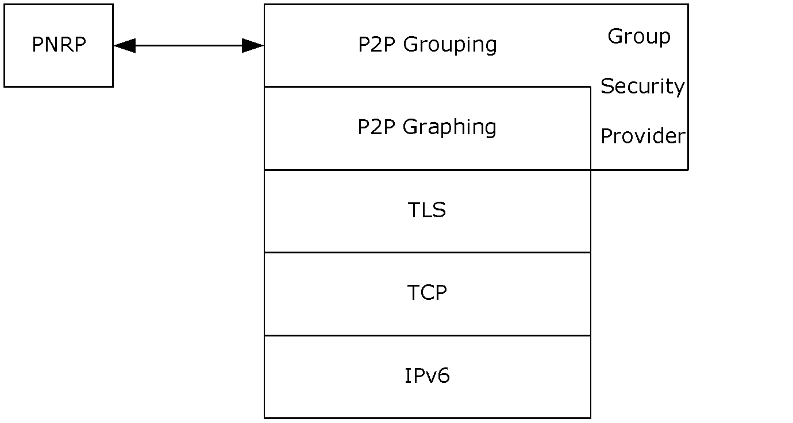

Figure 1: Protocol Relationship Diagram

[**P2P Grouping**](#gt_p2p-grouping) is a security layer on top of [**P2P Graphing**](#gt_p2p-graphing), using the P2P Graphing AUTH_INFO message (see [MS-PPGRH](../MS-PPGRH/MS-PPGRH.md) section 2.2.2.1) as a transport. The Group Connect subprotocol relies on TLS to create secure connections, using each node's [**IDC**](#gt_identity-certificate-idc) as its credential. The Group Connect subprotocol also adds messages following the end of a TLS negotiation.

P2P Grouping also uses [**PNRP**](#gt_peer-name-resolution-protocol-pnrp) for publication and discovery of nodes.

## 1.5 Prerequisites/Preconditions

The [**P2P Grouping**](#gt_p2p-grouping) protocol depends on the [**P2P Graphing**](#gt_p2p-graphing) and [**PNRP**](#gt_peer-name-resolution-protocol-pnrp) protocols. P2P Graphing also requires the TLS protocol. All these protocol implementations are required to be present on the system to support P2P Grouping.

P2P Grouping defines 3 certificate types ([**IDC**](#gt_identity-certificate-idc), [**GRC**](#gt_group-root-certificate-grc), and [**GMC**](#gt_group-membership-certificate-gmc)), which are X.509 [[RFC2459]](https://go.microsoft.com/fwlink/?LinkId=90356) certificates with P2P-defined custom properties. A node can connect to another node in a P2P Group if it has a [**Peer Identity**](#gt_peer-identity) (a public/private key pair) and an IDC derived from the Peer Identity, and it is already a member of the P2P Group, as proven by possession of either a GMC or the group password, depending on the type of authentication required by the group. The GMC can either be obtained out-of-band, or through an XML GMC invitation, as specified in section [2.2.6.1](#Section_2.2.6.1).

If a node is creating a new group rather than connecting to an existing group, it has a Peer Identity (a public/private key pair) specifically for the group.

## 1.6 Applicability Statement

[**P2P Grouping**](#gt_p2p-grouping) is useful in cases where shared and replicated storage is required amongst nodes, and a P2P security model applies. The storage required is relatively small (for example, sharing file metadata rather than file contents), and each node is required to have symmetric connectivity. A Group exists only in a single [**PNRP**](#gt_peer-name-resolution-protocol-pnrp) Cloud, in which all nodes are required to participate. <1>

## 1.7 Versioning and Capability Negotiation

This document covers versioning issues in the following areas:

**P2P Grouping Version:** There are two versions of [**P2P Grouping**](#gt_p2p-grouping), 1.0 and 1.1. Version 1.1 is a superset of 1.0 that adds support for password-based authentication. This document covers the specification of both versions.

**Group Security Version:** Each Group has a security version associated with it, which is published in the Security Properties record, Membership record, and invitation XML. A Group with Group Security version 1.0 can be used by nodes which implement P2P Grouping versions 1.0 and 1.1. A Group with Group Security version 1.1 can only be used by nodes which implement P2P Grouping version 1.1.

The Group Security version for a given Group is determined when it is created. To aid in backward compatibility, a Group can only use Group Security version 1.1 if it requires password-based security.

Nodes that implement only P2P Grouping version 1.0 fail when attempting to parse a Security Properties record, Membership record, or invitation that is marked for version 1.1.

**Group Connect Subprotocol Version:** The only version defined for the Group Connect sub-protocol is 1.0.

## 1.8 Vendor-Extensible Fields

Because [**P2P Grouping**](#gt_p2p-grouping) layers on top of [**P2P Graphing**](#gt_p2p-graphing), applications which utilize P2P Grouping can define their own Record Types. Each Record in a Group has a Record Type, which is expressed as a [**UUID**](#gt_universally-unique-identifier-uuid). A vendor can use any UUID except those in the P2P Graphing reserved range (see [MS-PPGRH](../MS-PPGRH/MS-PPGRH.md) section 2.2.1.9), or those reserved by P2P Grouping (see section [2.2.3](#Section_2.2.3)).

## 1.9 Standards Assignments

| Parameter | Value | Reference |
| --- | --- | --- |
| Port | 3587 | [[IANAPORT]](https://go.microsoft.com/fwlink/?LinkId=89888) |

# 2 Messages

## 2.1 Transport

[**P2P Grouping**](#gt_p2p-grouping) relies upon [**P2P Graphing**](#gt_p2p-graphing) to send all messages over sockets that the latter creates. P2P Grouping assumes P2P Graphing to be listening on port 3587. Before sending a message, P2P Graphing MUST pass the message to P2P Grouping to secure it.

P2P Grouping also utilizes [**PNRP**](#gt_peer-name-resolution-protocol-pnrp) as a transport to publish and discover Group Nodes.

## 2.2 Message Syntax

The message syntax defined in the following section does not assume any particular field alignment for fields which follow a variable-length field.

### 2.2.1 Common Syntax

#### 2.2.1.1 PNRP Cloud Name

A [**PNRP Cloud Name**](#gt_pnrp-cloud-name) is a string which identifies a PNRP Cloud. A PNRP Cloud Name can be in one of three formats as described in the following sections.

##### 2.2.1.1.1 Global Cloud

The global Cloud MUST be identified by the string "Global_".

##### 2.2.1.1.2 Non-global Public Cloud

A non-global public Cloud is a Cloud which exists on an interface that also has a global IPv6 address. In this case, the name of the Cloud MUST be identified by a string that is structured as follows.

scopename "_" ipv6globalprefix

scopename = "LinkLocal" / "SiteLocal"

where ipv6globalprefix is the prefix of a global IPv6 address, as specified in [[RFC3513]](https://go.microsoft.com/fwlink/?LinkId=90427) section 2.3.

##### 2.2.1.1.3 Private Cloud

A private Cloud is a Cloud which exists on an interface that does not also have a global IPv6 address. In this case, the name of the Cloud MUST be a string that is structured as follows.

For a link local Cloud:

"LinkLocal_"adapter-guid

adapter-guid = UINT32 UINT16 UINT16 8OCTET

The adapter-guid identifies the network interface on which the Cloud operates. The elements of this rule MUST match the structure defined for a [**GUID**](#gt_globally-unique-identifier-guid) in other specifications and formats. The first three elements MUST be stored in [**little-endian**](#gt_little-endian) octet order.

When values for a GUID are expressed, the first three elements are expressed as a sequence of hexadecimal digits in normal network ordering ([**big-endian**](#gt_big-endian) or most significant digit first) while the eight-octet element is broken up into two groups, the first having four hexadecimal digits, and the second having twelve digits, all expressed in network ordering. For example, if the octets in a GUID are:

%12 %34 %56 %78 %9A %BC %DE %F0

%0F %ED %CB %A9 %87 %65 %43 %21

Then the GUID has these values:

(UINT32) %x78563412

(UINT16) %xBC9A

(UINT16) %xF0DE

(8OCTET) %x0F.ED.CB.A9.87.65.43.21

And the whole GUID is expressed as:

{78563412-BC9A-F0DE-0FED-CBA987654321}

For a site local Cloud:

"SiteLocal_%"zone-index

Zone index is defined in [[RFC4007]](https://go.microsoft.com/fwlink/?LinkId=90454) section 6.

#### 2.2.1.2 Password Hash String

The password used for authentication into a group is not transmitted as plaintext. Rather it MUST be transmitted as a string-encoded hash of the original group password, in the format specified below.

The password hash of a [**Unicode**](#gt_unicode) string is defined as the SHA1 hash [[RFC3174]](https://go.microsoft.com/fwlink/?LinkId=90408) of the Unicode string (including the null-terminator) followed by the Unicode string "MS P2P Grouping" (including NULL-terminator). For example, if the group password is "password", the following data (as Unicode characters) is used as input into the hash function:

| p | a | s | s | w | o | r | d | \0 | M | S |  | P | 2 | P |  | G | r | o | u | p | i | n | g | \0 |
| --- | --- | --- | --- | --- | --- | --- | --- | --- | --- | --- | --- | --- | --- | --- | --- | --- | --- | --- | --- | --- | --- | --- | --- | --- |

Once generated, the hash output MUST be encoded as a null-terminated Unicode string with each character representing a nibble in the hash. The character used for each nibble MUST be the Unicode character 'a' plus the value of the nibble. For example, if the hash value is 0x01234567, the encoded string is "abcdefgh".

### 2.2.2 Group Connect

The Group Connect messages are sent following TLS negotiation, and are sent encapsulated with the TLS header and trailer. The messages can be combined into one packet, for instance by sending Hello and MyGMC together. In this case, the entire packet contains in order: the TLS header, Hello, MyGMC, and TLS trailer.

#### 2.2.2.1 Hello

The Hello message is the first message sent by the Requestor after TLS negotiation is complete. It is either sent alone, or with the MyGMC or Password message following it.

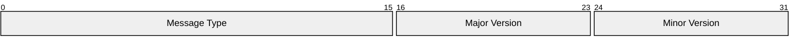

**Message Type (2 bytes):** The type of message being sent, in [**big-endian**](#gt_big-endian) byte order. The type MUST be set to 0x0000.

**Major Version (1 byte):** The Group Connect subprotocol major version. The only defined version is 1.0, for which the Major Version field MUST be set to 0x01. Note that not all nodes support password-based authentication (Password message), even though the versioning does not allow this to be discovered.

**Minor Version (1 byte):** The Group Connect subprotocol minor version. The only defined version is 1.0, for which the Minor **Version** field MUST be set to 0x00.

#### 2.2.2.2 MyGMC

The MyGMC message MUST be sent following a Hello message, in the same packet.

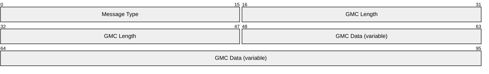

**Message Type (2 bytes):** The type of message being sent, in [**big-endian**](#gt_big-endian) byte order. The type MUST be 0x0001.

**GMC Length (4 bytes):** An unsigned binary integer specifying the length of the **GMC Data** field which follows, in [**little-endian**](#gt_little-endian) byte order.

**GMC Data (variable):** The PKCS7 ASN-encoded [**GMC chain**](#gt_group-membership-certificate-gmc-chain), as specified in [[RFC2315]](https://go.microsoft.com/fwlink/?LinkId=90334).

#### 2.2.2.3 YourGMC

The YourGMC message is sent at the end of password-based authentication to deliver the generated [**GMC**](#gt_group-membership-certificate-gmc) to the new group member.

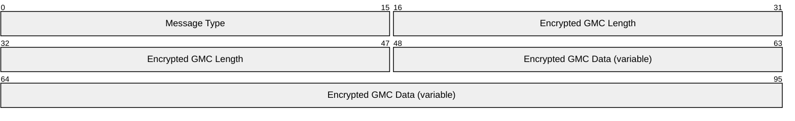

**Message Type (2 bytes):** The type of message being sent, in [**big-endian**](#gt_big-endian) byte order. For a YourGMC message, the type MUST be 0x0002.

**Encrypted GMC Length (4 bytes):** An unsigned binary integer containing the length of the **Encrypted GMC Data** field which follows, in big-endian byte order.

**Encrypted GMC Data (variable):** The Encrypted PKCS7 ASN encoded [**GMC chain**](#gt_group-membership-certificate-gmc-chain) [[RFC2315]](https://go.microsoft.com/fwlink/?LinkId=90334). The GMC data MUST be encrypted with the following steps:

- A Hash of the Group password MUST be generated using the SHA1 algorithm specified in [[RFC3174]](https://go.microsoft.com/fwlink/?LinkId=90408).
- A Session key MUST be generated from the hash of the Group password according to the following steps:
Let n=32 bytes and k=20 bytes

a) Form a 64-byte buffer by repeating the constant 0x36 64 times. Set the first **k** bytes of the buffer to the result of an **XOR** operation of the first **k** bytes of the hash of the Group password generated at **step 1**

b) Form a 64-byte buffer by repeating the constant 0x5C 64 times. Set the first **k** bytes of the buffer to the result of an **XOR** operation of the first **k** bytes of the hash of the Group password generated at **step 1**.

c) Hash the result of **step a** by using the SHA1 algorithm.

d) Hash the result of **step b** by using the SHA1 algorithm.

e) Concatenate the result of **step c** with the result of **step d**.

f) Use the first **n** bytes of the result of **step e** as the derived key.

- The GMC data MUST be encrypted using the generated [**encryption key**](#gt_encryption-key) and AES 256 with CBC and empty [**initialization vector**](#gt_initialization-vector). Refer to [[FIPS197]](https://go.microsoft.com/fwlink/?LinkId=89870) for the AES standard and [[SP800-38A]](https://go.microsoft.com/fwlink/?LinkId=128809) for the supported block cipher mode.

#### 2.2.2.4 Password

The Password message is sent twice when a Requestor is attempting to authenticate by way of a password. It is first sent in the initial packet following the Hello message. In this case, the password field is empty (Password Data Length is 0), and is used as an indication that the authentication will require a password, and the GMC MUST be generated. It is used a second time after the Authenticator sends its GMC. In this case, the message contains the Password Data as proof of password knowledge.

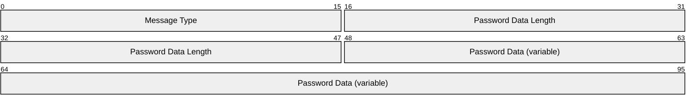

**Message Type (2 bytes):** The type of message being sent, in [**big-endian**](#gt_big-endian) byte order. For a Password message, the type MUST be 0x0005.

**Password Data Length (4 bytes):** An unsigned binary integer containing the length of the Password Data which follows, in big-endian byte order. If the **Password Data** field is absent, then the value of the field MUST be 0x0000.

**Password Data (variable):** The SHA-1 hash of the Password Hash String defined in section [2.2.1.2](#Section_2.2.1.2) (including NULL-terminator) concatenated with the Requestor's [**Peer Name**](#gt_peer-name) [**Unicode**](#gt_unicode) string (including NULL-terminator) in that order. This field MUST NOT be present if the Password Data Length is 0.

### 2.2.3 Records

[**P2P Grouping**](#gt_p2p-grouping) defines two record types (see [MS-PPGRH](../MS-PPGRH/MS-PPGRH.md) section 2.2.1.9). The syntax below defines the format of the Record payload data in the PEER_RECORD data structure used for Records in [MS-PPGRH]. The following Record Types are reserved for use by P2P Grouping, and cannot be used by an application built on top of P2P Grouping:

| Name | Value |
| --- | --- |
| Security Properties | { 02000000-0000-0000-0000-000000000000 } |
| Membership | { 01000000-0000-0000-0000-000000000000 } |

#### 2.2.3.1 Security Properties

The Security Properties record describes the security configuration of the group. This record is published by the Group's creator, and can only be modified by the Group's creator. The [**Peer Name**](#gt_peer-name) used for this Record's creator and 'last modified by' is the Group Peer Name. The Record is signed by the [**GRC's**](#gt_group-root-certificate-grc) private key. Some fields cannot be changed once the group is created, as noted below.

The record type for a Security Properties record is {02000000-0000-0000-0000-000000000000}.

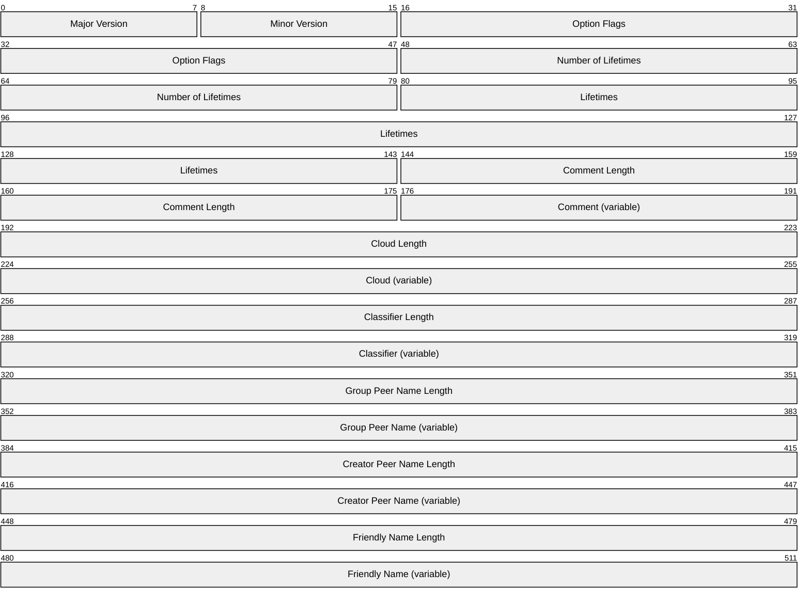

**Major Version (1 byte):** The Group Security major version number. MUST be set to 0x01.

**Minor Version (1 byte):** The Group Security minor version number. MUST be set to 0x00 or 0x01. When the minor version is 0x01, additional fields relating to authentication schemes MUST be included, as specified in section [2.2.3.1.1](#Section_2.2.3.1.1).

**Option Flags (4 bytes):** A bit field specifying various options.

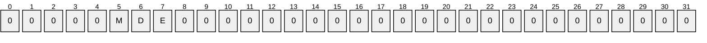

| Value | Description |
| --- | --- |
| M | If set, indicates a member is not required to publish his Membership record unless it is also publishing other data. If not set, a member is required to publish his Membership record as soon as it connects to another peer. |
| D | If set, indicates that P2P Graphing MUST be configured to not publish presence records automatically. If not set, P2P Graphing MUST be configured to always publish the presence records. |
| E | If set, record expiration MUST NOT be processed while a node is not connected to other members. If not set, record expiration MUST be processed even when a node is off-line. This flag is used to set the corresponding flag in P2P Graphing. |

**Number of Lifetimes (4 bytes):** The number of lifetimes contained in the **Lifetimes** field that follows, in [**little-endian**](#gt_little-endian) byte order. MUST be set to 0x00000002.

**Lifetimes (8 bytes):** An array of unsigned binary integers containing record lifetimes, specified in seconds, in little-endian byte order. The meaning of each lifetime is based on its position in the array. [**P2P Grouping**](#gt_p2p-grouping) currently defines only two lifetimes. The first element specifies the lifetime for which a Membership record is published. Specifically, when a Membership record is published, its expiration time is set based on the current time plus the specified lifetime. If a Membership record is still required after this period, it MUST be republished prior to the expiration time. Similarly, the second element specifies the lifetime for the [**P2P Graphing**](#gt_p2p-graphing) presence record. This value MUST be merely passed to P2P Graphing, as P2P Grouping does not directly implement the presence record publication.

This field is fixed at group creation time and MUST NOT be modified.

**Comment Length (4 bytes):** An unsigned binary integer containing the length of the **Comment** Field, in bytes, including NULL-terminator, in little-endian byte order. The value MUST be in the range 0 to 1024, inclusive, and MUST be even.

**Comment (variable):** A null-terminated [**Unicode**](#gt_unicode) string representing the "comment" associated with group. This is a user-displayable string that has no other effect on the protocol. This field MUST NOT be present if the **Comment Length** field is zero.

**Cloud Length (4 bytes):** An unsigned binary integer containing the length of the **Cloud** field, in bytes, including NULL-terminator, in little-endian byte order. MUST be in the range 0 to 254, and MUST NOT be odd.

**Cloud (variable):** A null-terminated Unicode string representing the name of the [**PNRP**](#gt_peer-name-resolution-protocol-pnrp) Cloud which is used for group publication and discovery. This field is fixed at group creation time and MUST NOT be modified.

**Classifier Length (4 bytes):** An unsigned binary integer containing the length of the **Classifier** field, in bytes, including NULL-terminator, in little-endian byte order. MUST be in the range 0 to 300, and MUST NOT be odd.

**Classifier (variable):** A null-terminated Unicode string representing the group [**classifier**](#gt_classifier). This field is fixed at group creation time and MUST NOT be modified. This field MUST match the classifier present in the Group Peer Name.

**Group Peer Name Length (4 bytes):** An unsigned binary integer containing the length of the **Group Peer Name** field, in bytes, including NULL-terminator, in little-endian byte order. MUST be in the range 0 to 360, and MUST NOT be odd.

**Group Peer Name (variable):** A null-terminated Unicode string representing the Peer Name of the Group. This field is fixed at group creation time and MUST NOT be modified.

**Creator Peer Name Length (4 bytes):** An unsigned binary integer containing the length of the **Creator Peer Name** field, in bytes, including NULL-terminator, in little-endian byte order. MUST be in the range is 0 to 382, and MUST NOT be odd.

**Creator Peer Name (variable):** A null-terminated Unicode string representing the Peer Name of the creator of the Group. This field is fixed at group creation time and MUST NOT be modified.

**Friendly Name Length (4 bytes):** An unsigned binary integer containing the length of the **Friendly Name** field, in bytes, including NULL-terminator, in little-endian byte order. MUST be in the range 0 to 254, and MUST NOT be odd.

**Friendly Name (variable):** A null-terminated Unicode string representing the friendly name of the group. This is a user-displayable string that has no other effect on the protocol.

##### 2.2.3.1.1 Password

If the version of the Security Properties packet (section [2.2.3.1](#Section_5)) is 1.1 the following MUST be appended to the end of the Security Properties record:

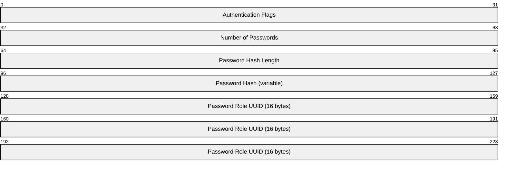

**Authentication Flags (4 bytes):** A set of flags indicating which authentication schemes are supported in this group. These fields are fixed at group creation time and MUST NOT be modified.

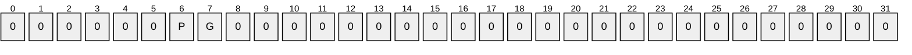

| Value | Description |
| --- | --- |
| G | GMCs can be used for authenticating members into the Group. |
| P | Passwords can be used for authenticating members into the Group. |

**Number of Passwords (4 bytes):** An unsigned binary integer containing the number of passwords that are active in the group, in [**little-endian**](#gt_little-endian) byte order. This value MUST be 0x00000001.

**Password Hash Length (4 bytes):** An unsigned binary integer containing the length of the following string, in bytes, including the NULL-terminator, in little-endian byte order.

**Password Hash (variable):** The SHA-1 hash of the password, encoded as a string. See section [2.2.1.2](#Section_2.2.1.2) for details.

**Password Role UUID (16 bytes):** The role that a new member receives when joining the group using this password, encoded as a little-endian [**UUID**](#gt_universally-unique-identifier-uuid). The UUID MUST be one of the legal UUIDs listed in section [2.2.5.3](#Section_1.3.2.3).

#### 2.2.3.2 Membership

The Membership record is published to allow each node to have access to the [**GMC**](#gt_group-membership-certificate-gmc) of the given member. A node MUST have a member's GMC in order to authorize records that the member publishes.

The record type for a Membership record MUST be {01000000-0000-0000-0000-000000000000}.

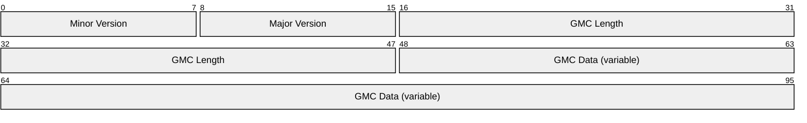

**Minor Version (1 byte):** The Group Security minor version. The only defined versions are 1.0 and 1.1, hence Minor Version MUST be either 0x00 or 0x01. This field MUST match the **Minor Version** field in the Security Properties record (section [2.2.3.1](#Section_5)).

**Major Version (1 byte):** The Group Security major version. The only defined versions are 1.0 and 1.1, hence the Major Version MUST be 0x01. This field MUST match the **Major Version** field in the Security Properties record (section 2.2.3.1).

**GMC Length (4 bytes):** The length of the **GMC Data** field which follows, in [**little-endian**](#gt_little-endian) byte order.

**GMC Data (variable):** The PKCS7 ASN encoded [**GMC chain**](#gt_group-membership-certificate-gmc-chain), as specified in [[RFC2315]](https://go.microsoft.com/fwlink/?LinkId=90334).

### 2.2.4 Record Security Data

The data that [**P2P Grouping**](#gt_p2p-grouping) stores in the **Security Data** field of each [**P2P Graphing**](#gt_p2p-graphing) record (specified in [MS-PPGRH](../MS-PPGRH/MS-PPGRH.md) section 2.2.1.9) is as follows.

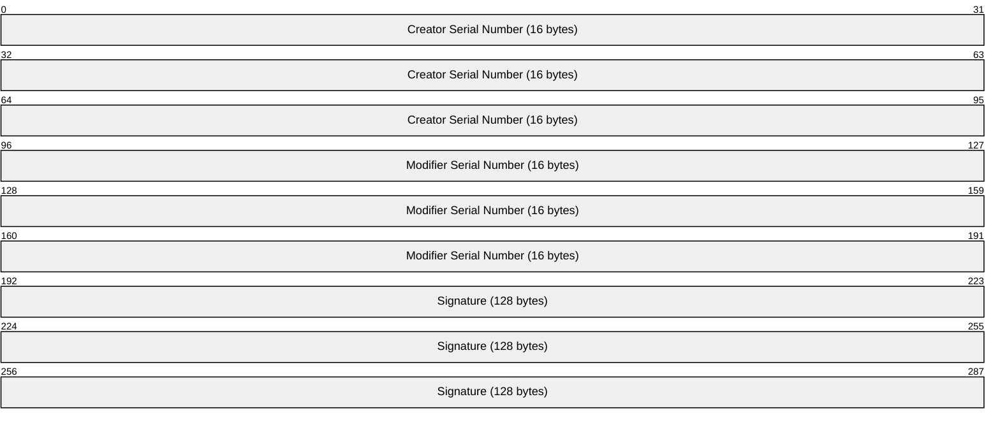

**Creator Serial Number (16 bytes):** X.509 certificate serial number (as specified in [[RFC2459]](https://go.microsoft.com/fwlink/?LinkId=90356)) of the [**GMC**](#gt_group-membership-certificate-gmc) of the record creator.

**Modifier Serial Number (16 bytes):** The X.509 certificate serial number (as specified in [RFC2459]) of the GMC of the record modifier. For a record that has never been modified (that is, added but never updated), this number MUST be the same as the Creator Serial Number.

**Signature (128 bytes):** An RSA PKCS #1 signature with no hash algorithm OID [[RFC8017]](https://go.microsoft.com/fwlink/?linkid=2164409) of the hash of the record data and properties using the asymmetric RSA key in the modifier's GMC. The syntax for the signature Hash is specified in section [2.2.4.1](#Section_2.2.4.1).

#### 2.2.4.1 Signature Hash

The hash that is used for the signature MUST be either an MD5 hash (for [**P2P Grouping**](#gt_p2p-grouping) v1.0 , as specified in [[RFC1321]](https://go.microsoft.com/fwlink/?LinkId=90275)) or SHA1 (for P2P Grouping v1.1, as specified in [[RFC3174]](https://go.microsoft.com/fwlink/?LinkId=90408)). The hash MUST be generated from the following data, all of which MUST be processed in [**big-endian**](#gt_big-endian) byte order. (Note that the following data format is for computing the hash only. It is not part of any packet format to be sent on the wire.)

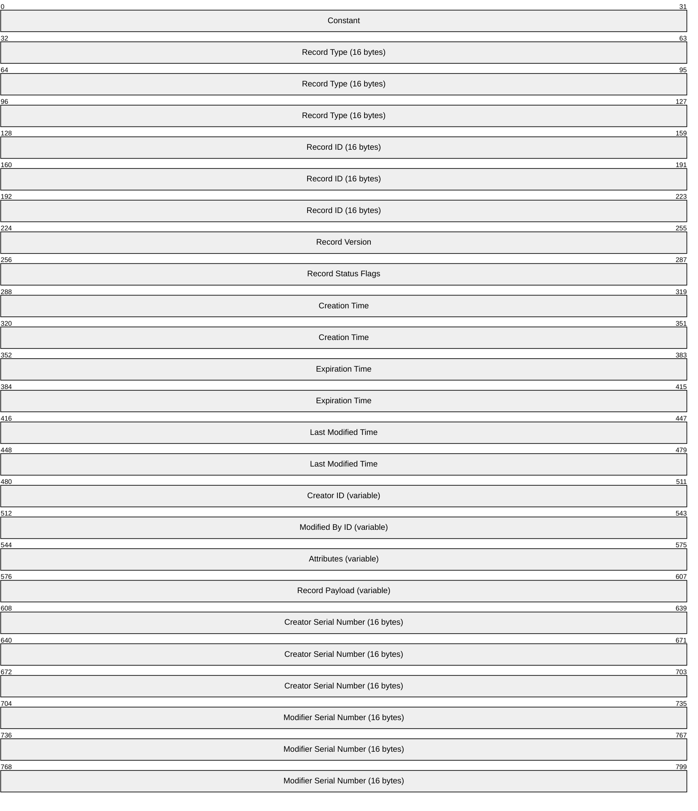

**Constant (4 bytes):** MUST be set to 0x00000060.

**Record Type (16 bytes):** Record Type, expressed as a [**GUID**](#gt_globally-unique-identifier-guid).

**Record ID (16 bytes):** Record ID, expressed as a GUID.

**Record Version (4 bytes):** Record Version, expressed as a DWORD.

**Record Status Flags (4 bytes):** A set of flags that indicate record status.

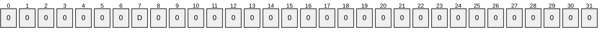

| Value | Description |
| --- | --- |
| D | When set to 1, indicates that this Record has been deleted. |

**Creation Time (8 bytes):** Record Creation Peer Time, (see [MS-PPGRH](../MS-PPGRH/MS-PPGRH.md) section 3.1.1 for specification of Peer Time calculation).

**Expiration Time (8 bytes):** Peer time of Record Expiration.

**Last Modified Time (8 bytes):** Peer time of Record Last Modification Time.

**Creator ID (variable):** A null-terminated [**Unicode**](#gt_unicode) string representing the [**Peer Name**](#gt_peer-name) of the Record creator.

**Modified By ID (variable):** A null-terminated Unicode string representing the Peer Name of the last modifier of the Record. If the Record has not been modified, this field MUST NOT be present.

**Attributes (variable):** A null-terminated Unicode string representing the Record Attributes. If the Record has no Attributes, this field MUST NOT be present.

**Record Payload (variable):** A Record Payload as an array of bytes including Payload Data Size and Payload Data as defined in [MS-PPGRH] section 2.2.1.9. If the Record has no Payload, this field MUST NOT be present.

**Creator Serial Number (16 bytes):** The X.509 certificate serial number [[RFC2459]](https://go.microsoft.com/fwlink/?LinkId=90356) of the [**GMC**](#gt_group-membership-certificate-gmc) of the record creator.

**Modifier Serial Number (16 bytes):** The X.509 certificate serial number [RFC2459] of the GMC of the record modifier.

### 2.2.5 X.509 Usage

[**PNRP**](#gt_peer-name-resolution-protocol-pnrp) defines several X.509 certificate extensions (see [MS-PNRP](../MS-PNRP/MS-PNRP.md) section 2.2.3.5), and also defines certificate chain validation rules (see [MS-PNRP] section 2.2.3.5). All certificates and certificate chains used in P2P Grouping MUST follow the PNRP rules, with some additional constraints described below.

The following figure shows the required fields for each certificate type.

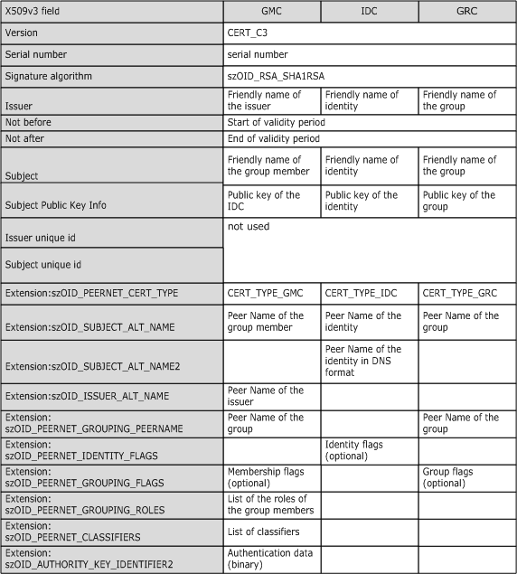

Figure 2: Required fields for each certificate type

**szOID_PEERNET_CERT_TYPE:** [**P2P Grouping**](#gt_p2p-grouping) certificate types map to PnrpCertificateTypes ([MS-PNRP] section 2.2.3.5.1.1) as follows.

| Value | Meaning |
| --- | --- |
| certTypeMember (0x00000001) | This value MUST be used for a [**Group Membership Certificate (GMC)**](#gt_group-membership-certificate-gmc). |
| certTypeRoot (0x00000002) | This value MUST be used for a [**Group Root Certificate (GRC)**](#gt_group-root-certificate-grc). |
| certTypeIdentity (0x00000003) | This value MUST be used for an [**IDC**](#gt_identity-certificate-idc). |

**szOID_SUBJECT_ALT_NAME:** As defined in [MS-PNRP] section 2.2.3.5.1.

**szOID_ISSUER_ALT_NAME:** As defined in [MS-PNRP] section: 2.2.3.5.1

**szOID_PEERNET_GROUPING_PEERNAME:**

| Sz_OID_PEERNET_GROUPING_PEERNAME | Usage | Description |
| --- | --- | --- |
| 1.3.6.1.4.1.311.44.3.1 | The [**PeerName**](#gt_peer-name) of the Group | The PnrpPeerName extension ([MS-PNRP] section 2.2.3.5.1.3) is used to store the Peer Name of the Group to which the certificate belongs. This extension is used to validate the certificate and the certificate chain for a Group, as specified in sections [2.2.5.2](../MS-PNRP/MS-PNRP.md) and 2.2.5.2. |

**szOID_PEERNET_IDENTITY_FLAGS:**

| Sz_OID_PEERNET_IDENTITY_FLAGS | Usage | Description |
| --- | --- | --- |
| 1.3.6.1.4.1.311.44.2.2 | Flags associated with the Group | A DWORD value representing the Flags associated with the IDC. This value MUST be 0. |

**szOID_PEERNET_GROUPING_FLAGS:**

| Sz_OID_PEERNET_GROUPING_FLAGS | Usage | Description |
| --- | --- | --- |
| 1.3.6.1.4.1.311.44.3.2 | Flags associated with the Group | A DWORD value representing the Flags associated with a GRC or a GMC. This value MUST be 0. |

**szOID_PEERNET_GROUPING_ROLES:**

| Sz_OID_PEERNET_GROUPING_ROLES | Usage | Description |
| --- | --- | --- |
| 1.3.6.1.4.1.311.44.3.3 | List of roles associated with Group Peer name | A list of roles, as specified in [MS-PNRP] (section 2.2.3.5.1.4). |

**szOID_PEERNET_GROUPING_CLASSIFIERS:**

| Sz_OID_PEERNET_GROUPING_CLASSIFIERS | Usage | Description |
| --- | --- | --- |
| 1.3.6.1.4.1.311.44.3.5 | List of allowed [**classifiers**](#gt_classifier) for the Group Peer name | A list of allowed classifiers, as specified in ([MS-PNRP] section 2.2.3.5.1.5). |

#### 2.2.5.1 Enhanced Key Usage

The [**enhanced key usage (EKU)**](#gt_enhanced-key-usage-eku) extension MUST be used and MUST contain the following OIDs: PKI Peer Auth (defined below) and PKI Server Auth (1.3.6.1.5.5.7.3.1) [[RFC2459]](https://go.microsoft.com/fwlink/?LinkId=90356).

| Enhanced key usage OID | Usage | Description |
| --- | --- | --- |
| 1.3.6.1.4.1.311.44.3.4 | PKI Peer Auth | The OID to specify that a certificate can be used for P2P authentication. An [**IDC**](#gt_identity-certificate-idc) MUST contain usage specifiers for both Peer Auth and PKI Server Auth (1.3.6.1.5.5.7.3.1) [RFC2459]. |

#### 2.2.5.2 Certificate and Certificate Chain Validation

##### 2.2.5.2.1 Certificate Signature and Signature validation.

Certificates of type [**GRC**](#gt_group-root-certificate-grc) and [**IDC**](#gt_identity-certificate-idc) MUST be self-signed with the subject's private key. Validation of the signature MUST be performed by using the subject public key in the certificate itself.

A [**GMC**](#gt_group-membership-certificate-gmc) MUST be signed with issuer's private key (the parent certificate in the [**GMC chain**](#gt_group-membership-certificate-gmc-chain) or the GRC private key for the Group owner's GMC). Validation of a GMC signature MUST follow these steps.

- The root of the chain MUST be extracted and validated:
- It MUST be a GRC type certificate.
- The signature validation MUST succeed.
- Each other certificate in the chain MUST be extracted and validated:
- It MUST be a GMC type certificate.
- The signature validation using the subject public key in the parent's certificate MUST succeed.

##### 2.2.5.2.2 Certificate Validity

To be valid, a certificate MUST meet all constraints imposed by [**PNRP**](#gt_peer-name-resolution-protocol-pnrp), see [MS-PNRP](../MS-PNRP/MS-PNRP.md) section 2.2.3.5. It MUST also meet the following constraint:

- For certificates of type [**GMC**](#gt_group-membership-certificate-gmc) and [**GRC**](#gt_group-root-certificate-grc), the **PnrpPeerName** field MUST be the Group Peer Name.

##### 2.2.5.2.3 Certificate Chain Validity

To be valid, a certificate chain MUST meet all constraints imposed by [**PNRP**](#gt_peer-name-resolution-protocol-pnrp), see [MS-PNRP](../MS-PNRP/MS-PNRP.md) section 2.2.3.5. It MUST also meet the following constraints:

- The root of the chain MUST be a [**GRC**](#gt_group-root-certificate-grc) certificate. The Authority part of the Group Peer Name in the GRC MUST match when checked against the public key of the GRC represented as a [**Unicode**](#gt_unicode) string according to the following procedure:
- Convert the public key to a null-terminated Unicode string with the same procedure as specified in section [2.2.1.2](#Section_2.2.1.2) for converting a hash output into a null-terminated Unicode string.
- The generated string MUST match with the Authority part of the Group Peer Name.
- All intermediary and leaf certificates MUST be [**GMCs**](#gt_group-membership-certificate-gmc).
- The PnrpPeerName for all certificates MUST be the same.
- For a GMC parent and GMC child, the Roles specified in the child certificate MUST be issuable by one or more Roles specified in the parent certificate. See section [2.2.5.3](#Section_1.3.2.3) below.
- For a GRC parent and GMC child, any Role is valid.

#### 2.2.5.3 Roles

The following Roles and their meanings are defined: test1

| Role Name | Admin | Inviting Member | Member |
| --- | --- | --- | --- |
| **Notes** | Full capabilities | Same as Member, but can also issue certificates. Only supported in Group Security version 1.1. | - |
| **Role ID (UUID)** | {04387127-aa56-450a-8ce5-4f565c6790f4} | {4370fd89-dc18-4cfb-8dbf-9853a8a9f905} | {f12dc4c7-0857-4ca0-93fc-b1bb19a3d8c2} |
| **Can issue certs for the following roles:** | Admin, Inviting Member, Member | Inviting Member, Member | None (cannot issue certificates) |
| **Certs for this role are issued with the following classifiers:** | <empty list> | "participant" | "participant" |
| **Authorized to publish records** | Yes | Yes | Yes |
| **Authorized to modify member's own records*** | Yes | Yes | Yes |
| **Authorized to modify other members' records** | Yes | No | No |
| **Authorized to delete member's own records*** | Yes | Yes | Yes |
| **Authorized to delete other members' records** | Yes | No | No |

* A member's own records are records that a given member had originally published; in other words, the **Creator ID** field of the record, as specified in [MS-PPGRH](../MS-PPGRH/MS-PPGRH.md) section 2.2.1.9, matches the [**Secure Peer Name**](#gt_secure-peer-name) of the node.

### 2.2.6 Out-of-band XML

An application MUST have a means of transferring identity and invitation information between nodes. This information is sent out-of-band of the [**P2P Grouping**](#gt_p2p-grouping) protocols.

#### 2.2.6.1 Invitation

An invitation is a block of XML as described below. There are two invitation formats, one for inviting by way of a password, another for inviting by way of [**GMC**](#gt_group-membership-certificate-gmc).

The XML schema for a password-based invitation is:

<?xml version="1.0" encoding="utf-8"?>

<xs:schema xmlns:dt="urn:schemas-microsoft-com:datatypes" attributeFormDefault="unqualified" elementFormDefault="qualified" xmlns:xs="http://www.w3.org/2001/XMLSchema">

<xs:import namespace="urn:schemas-microsoft-com:datatypes" />

<xs:element name="PEERINVITATION">

<xs:complexType>

<xs:sequence>

<xs:element name="CLOUDNAME" type="xs:string" />

<xs:element name="SCOPE" type="xs:string" />

<xs:element name="CLOUDFLAGS" type="xs:unsignedByte" />

</xs:element name="GROUPPEERNAME" type="xs:string" />

</xs:element name="GROUPPEERNAME" type="xs:string" />

</xs:sequence>

<xs:attribute name="VERSION" type="xs:string" use="required" />

</xs:complexType>

</xs:element>

</xs:schema>

**PEERINVITATION/VERSION:** The version of the invitation. For a password-based invitation this value MUST be "1.1".

**CLOUDNAME:** The name of the [**PNRP**](#gt_peer-name-resolution-protocol-pnrp) Cloud in which the Group operates.

**SCOPE:** The scope zone of the PNRP Cloud in which the Group operates. This value MUST be "GLOBAL" (global), "SITELOCAL" (site local), or "LINKLOCAL" (link local).

**CLOUDFLAGS:** The PNRP Cloud flags. This value MUST be 0 or 1. If the value is 0, it indicates that the Cloud name is public. If the value is 1, it indicates that the Cloud name is private.

**GROUPPEERNAME:** The [**Secure Peer Name**](#gt_secure-peer-name) of the Group, as defined in [MS-PNRP](../MS-PNRP/MS-PNRP.md) section 1.3.1.1.

**GROUPFRIENDLYNAME:** The friendly name of the Group.

The XML schema for a GMC-based invitation is:

<?xml version="1.0" encoding="utf-8"?>

<xs:schema xmlns:dt="urn:schemas-microsoft-com:datatypes" attributeFormDefault="unqualified" elementFormDefault="qualified" xmlns:xs="http://www.w3.org/2001/XMLSchema">

<xs:import namespace="urn:schemas-microsoft-com:datatypes" />

<xs:element name="PEERINVITATION">

<xs:complexType>

<xs:sequence>

<xs:element name="CLOUDNAME" type="xs:string" />

<xs:element name="SCOPE" type="xs:string" />

<xs:element name="CLOUDFLAGS" type="xs:unsignedByte" />

<xs:element name="GMC">

<xs:complexType>

<xs:simpleContent>

<xs:extension base="xs:string">

<xs:attribute ref="dt:dt" use="required" />

</xs:extension>

</xs:simpleContent>

</xs:complexType>

</xs:element>

</xs:sequence>

<xs:attribute name="VERSION" type="xs:string" use="required" />

</xs:complexType>

</xs:element>

</xs:schema>

**PEERINVITATION/VERSION:** The version of the Group issuing the invitation. This value MUST be "1.0" or "1.1".

**CLOUDNAME:** The name of the PNRP Cloud in which the Group operates.

**SCOPE:** The scope zone of the PNRP Cloud in which the Group operates.

This value MUST be "GLOBAL" (global), "SITELOCAL" (site local), or "LINKLOCAL" (link local).

**CLOUDFLAGS:** The PNRP Cloud flags. This value MUST be 0 or 1. If the value is 0, it indicates that the Cloud name is public. If the value is 1, it indicates that the Cloud name is private.

**GMC:** A Base-64 ([[RFC4648]](https://go.microsoft.com/fwlink/?LinkId=90487)) encoded string representing the PKCS7 ASN-encoded [**GMC chain**](#gt_group-membership-certificate-gmc-chain) of the invitee ([[RFC2315]](https://go.microsoft.com/fwlink/?LinkId=90334)).

#### 2.2.6.2 Identity

A serialized identity suited for invitation creation is a block of XML as described below.

<?xml version="1.0" encoding="utf-8"?>

<xs:schema xmlns:dt="urn:schemas-microsoft-com:datatypes" attributeFormDefault="unqualified" elementFormDefault="qualified" xmlns:xs="http://www.w3.org/2001/XMLSchema">

<xs:import namespace="urn:schemas-microsoft-com:datatypes" />

<xs:element name="PEERIDENTITYINFO">

<xs:complexType>

<xs:sequence>

<xs:element name="IDC">

<xs:complexType>

<xs:simpleContent>

<xs:extension base="xs:string">

<xs:attribute ref="dt:dt" use="required" />

</xs:extension>

</xs:simpleContent>

</xs:complexType>

</xs:element>

</xs:sequence>

<xs:attribute name="VERSION" type="xs:string" use="required" />

</xs:complexType>

</xs:element>

</xs:schema>

**PEERIDENTITYINFO/VERSION:** This value MUST be "1.0".

**IDC:** A Base-64 encoded string [[RFC4648]](https://go.microsoft.com/fwlink/?LinkId=90487) representing the PKCS7 ASN-encoded [**IDC**](#gt_identity-certificate-idc) [[RFC2315]](https://go.microsoft.com/fwlink/?LinkId=90334).

# 3 Protocol Details

In a peer-to-peer network, all nodes are equal. None are specifically servers and none are specifically clients. The following sections divide the protocol details into "Peer", "Requestor", and "Authenticator" functionality. However, each node MUST implement all three categories of functionality simultaneously for a given Group.

## 3.1 Peer Details

This section discusses the protocol details related to participation in a group after authentication.

### 3.1.1 Abstract Data Model

This section describes a conceptual model of possible data organization that an implementation maintains to participate in this protocol. The described organization is provided to facilitate the explanation of how the protocol behaves. This document does not mandate that implementations adhere to this model as long as their external behavior is consistent with that described in this document. The list of conceptual data below is for a single group. A node can participate in more than one group, and the same set of conceptual data is maintained for each group.

**Member List:** A cache of [**GMC chains**](#gt_group-membership-certificate-gmc-chain) for all members of the group. This cache is updated as Membership records are received. If the implementation supports a persistent store of records, the list is initialized with the persisted records.

**Local IDC:** An X509 certificate data structure containing the [**IDC**](#gt_identity-certificate-idc) for the local Identity.

**GRC:** The [**Group Root Certificate**](#gt_group-root-certificate-grc), if the node is creating a new group.

**Group Password:** A password received out-of-band of the protocols described here. This can be used only when the group supports password authentication (Group Security version is 1.1). This cannot be used when a [**GMC**](#gt_group-membership-certificate-gmc) has already been issued.

**Group Peer Name:** The [**Peer Name**](#gt_peer-name) for the Group.

**Group Participant Peer Name:** The Peer Name that Group Nodes will publish in PNRP. This Peer Name is the **Group Peer Name** with the [**classifier**](#gt_classifier) replaced by "participant".

**Group Security version:** The version of Group Security being used. The group creator MUST store this value, passed by the higher-layer application at Group creation time. The version value is 1.1 if password authentication is required and can be 1.0 or 1.1 if only GMC authentication is required.

**Local Peer Name:** The Peer Name for the local Identity.

**Local GMC Chain:** A list of X509 certificate structures containing the GMC chain for the local Identity.

**Cloud Name:** The name of the Cloud in which the group is operating. Since private Cloud names are not meaningful except on the node that generates them, the Cloud Name can be different than that specified in the Security Properties. If it is different, both names will be private Cloud names, and both will be in the same scope.

**Graphing Database:** The database provided by [**P2P Graphing**](#gt_p2p-graphing). See [MS-PPGRH](../MS-PPGRH/MS-PPGRH.md).

**Unvalidated Record List:** A list of record IDs of records which could not be validated when received because the GMCs necessary to validate them had not yet been received. The list contains both the records and, for each one, indices or identifiers (for example, the Peer Names) for its corresponding GMC. This list is limited in size, such that Records that have been on the list longest are removed.

**MemberDataOptional:** A flag which, when set, indicates that the node does not publish a Membership Record until the Node publishes a Record or issues a GMC.

**PresenceDisabled:** A flag which, when set, specifies that Graphing Presence is disabled.

**DeferRecordExpiration:** A flag which, when set, specifies that Graphing will defer record expiration.

**MembershipLifetime:** An integer value specifying the lifetime, in seconds, of the Membership Record.

**PresenceLifetime:** An integer value specifying the lifetime, in seconds, of the Presence information published by a Node.

**AuthenticationSchema:** An integer specifying the authentication schemas to be used by the local Node.

**RoleForPassword:** A [**GUID**](#gt_globally-unique-identifier-guid) specifying the Grouping role that a joining Node needs to have when joining a Group by way of Password.

**Group Friendly Name:** A friendly name for the Group.

**Comment:** A comment to be provided along with the Group.

Note that the above conceptual data can be implemented using a variety of techniques. An implementation is at liberty to implement such data in any way it pleases.

### 3.1.2 Timers

**UnvalidatedRecordList:** A timer that fires after 30 seconds, triggering a scan of the Unvalidated Record List to remove expired records.

### 3.1.3 Initialization

If a node is connecting to an existing group, it MUST:

- Have a self-signed [[RFC2459]](https://go.microsoft.com/fwlink/?LinkId=90356) [**IDC**](#gt_identity-certificate-idc) using the public/private key pair of the [**Peer Identity**](#gt_peer-identity) (as described in section [1.5](#Section_1.5)). This is the **Local IDC**.
- Generate a [**Peer Name**](#gt_peer-name) from the **Local IDC** (as specified in [MS-PNRP](../MS-PNRP/MS-PNRP.md) section 2.2.4), using an application-provided [**classifier**](#gt_classifier).
If a node is creating a new group, in addition to the initialization in the preceding paragraph, it MUST:

- Create a self-signed [RFC2459] [**GRC**](#gt_group-root-certificate-grc) using the public/private key pair of the Group Peer Identity (as described in section 1.5, Prerequisites). This is the GRC of the new group.
- Generate a Peer Name from the GRC (as specified in [MS-PNRP] section 2.2.4), using an application-provided classifier. This will be the **Group Peer Name**.
- Create a [**GMC chain**](#gt_group-membership-certificate-gmc-chain) from the GRC and the **Local IDC**, as defined in section [3.1.7.5](#Section_3.1.7.5).

### 3.1.4 Higher-Layer Triggered Events

#### 3.1.4.1 Group Creation

This is triggered by a request from the higher layer application to create a new group. The following information MUST be provided by the application and stored by local Node:

- **MemberDataOptional**: A Flag indicating whether publishing of membership MUST be delayed until the Node publishes a Record or generates a [**GMC**](#gt_group-membership-certificate-gmc) for another Node.
- **PresenceDisabled**: A Flag indicating whether presence information MUST be automatically published by each node.
- **DeferExpiration**: A Flag indicating whether records MUST NOT be expired when the Node is not connected to the Group.
- **CloudName**: The [**PNRP Cloud Name**](#gt_pnrp-cloud-name) where the Graph will register and discover. See [MS-PNRP](../MS-PNRP/MS-PNRP.md)
- **Group Peer Name**: A [**Peer Name**](#gt_peer-name) for the Group.
- **Local Peer Name**: The Peer Name of the Identity creating the Group.
- **FriendlyName**: An Optional friendly name identifying the Group. The string length, including the null terminator, MUST NOT be larger than 255 characters.
- **Comment**: An Optional string with a comment to be associated with the Group. The string length, including the null terminator, MUST NOT be larger than 255 characters
- **MembershipLifetime**: The lifetime, in seconds, of the Membership information published by a Node. This value MUST be in the range [2280, 31536000]. If this value is outside the valid range, a default value of 2419200 seconds MUST be used.
- **PresenceLifetime**: The lifetime, in seconds, of the Presence information. This value MUST larger than or equal to 300 seconds. If this value is less than 300 seconds, a default value of 300 seconds MUST be used.
- **AuthenticationSchema**: An integer indicating whether Password-based authentication, GMC- based Authentication or both MUST be used to authenticate a new Node into the Graph.
- **RoleForPassword**: A value indicating what Group role MUST be given to any new Node joining the Group with Password-based authentication. This value MUST be ignored if the Password-based authentication is not specified in the AuthenticationSchema datum, otherwise it MUST have one of the following values:
- GUID {04387127-aa56-450a-8ce5-4f565c6790f4}: Indicates that each Node joining the group MUST be given Admin role.
- GUID {f12dc4c7-0857-4ca0-93fc-b1bb19a3d8c2}: Indicates that each Node joining the Group MUST be given Inviting Member role.
- Any value other than the above MUST cause the operation to abort and it is recommended that an error be returned to the application.
The Grouping Security Protocol implementation MUST perform the following steps:

- Build the Security Properties record as specified in section [2.2.3.1](#Section_5). All non-constant fields defined in section 2.2.3.1 MUST be filled based on the higher-layer application request. In particular:
- Group Security Major/Minor Version: The Group Security version MUST be specified as part of the request, so that the appropriate version numbers can be published in the Security Properties record and creator Membership record. The version MUST be 1.0 if the application has specified that the Group supports only GMC-based authentication. The version MUST be 1.1 if the application has specified that the Group supports password-based authentication.
- Cloud: The PNRP Cloud Name supplied by the higher-layer application MUST be stored as the Cloud Name.
- Build a Membership record containing the Local [**GMC chain**](#gt_group-membership-certificate-gmc-chain) as specified in section [3.1.7.5](#Section_3.1.7.5).
- Trigger [**P2P Graphing**](#gt_p2p-graphing) to create a new Graph as specified in [MS-PPGRH](../MS-PPGRH/MS-PPGRH.md) section 3.1.4.1 with the following parameters:
- The **Graph ID** MUST be set to the Group PeerName.
- The **Creator ID** MUST be set to the Creator PeerName.
- The **Friendly Name** MUST be set to the Group Friendly Name.
- **Max Record Size** MUST be set to 0.
- **Max Frame Size** MUST be set to 16,348 bytes.
- **Max Presence Records** MUST be set as follows.
- If PresenceDisabled is set, this value MUST be set to -1.
- Otherwise, this value MUST be set to 0.
- **Presence Lifetime** MUST be set to PresenceLifetime.
- The **Defer Expiration** flag MUST be set to the value of the Defer Expiration flag passed by the application.
- The **Scope** MUST be set according to the Cloud Name provided by the application.
- The **Security Provider Module** MUST be set to indicate that Graphing MUST use the local Node as Security Provider.
- Open the [**PNRP**](#gt_peer-name-resolution-protocol-pnrp) Cloud, as specified in section [3.1.4.2](#Section_3.1.4.2).
- Start listening, as specified in section [3.1.4.4](#Section_3.1.4.4).
If any one of the preceding steps fails, the group creation MUST be terminated, and it is recommended that the Grouping Security Protocol notifies the higher-layer application of the failure.

#### 3.1.4.2 Opening the PNRP Cloud

The operations to search and open a [**PNRP**](#gt_peer-name-resolution-protocol-pnrp) Cloud are defined in [MS-PNRP](../MS-PNRP/MS-PNRP.md) section 3.1.4.1. The [**cloud**](#gt_cloud) MUST be determined based on the Cloud Scope and Cloud Name provided by the higher-layer application, as specified in [2.2.1.1](#Section_2.2.1.1):

- If the Cloud Name specified by the higher-layer application is available on the local host, the Cloud of the Cloud Name MUST be opened.
- Otherwise, if the Cloud Name is a private Cloud name, and if there is another private Cloud already existing on the local machine, the local private Cloud MUST be opened. The Cloud Name MUST be set to the Cloud name of the local private Cloud opened.
- Otherwise, the operation MUST be terminated and it is recommended that the Grouping Security Protocol notify the higher-layer application of the failure.

#### 3.1.4.3 Connecting to a Group

This section specifies the operations of connecting to an existing group. The following information MUST be provided by the higher-layer application in order to connect to an existing group:

- Local [**GMC**](#gt_group-membership-certificate-gmc) or password: If a local GMC for the group is provided, the GMC MUST be used for the connection rather than the password.
- **Group Peer Name**
- Cloud Name
- Local Peer Name
The Grouping Protocol implementation MUST trigger [**P2P Graphing**](#gt_p2p-graphing) to open the Graph corresponding to the group, as specified in [MS-PPGRH](../MS-PPGRH/MS-PPGRH.md) section 3.1.4.2, providing the following parameters:

- Graph ID MUST be set to Group Peer Name.
- Peer ID MUST be set to the Local Peer Name.
- Graph Security Provider MUST be set to the local Node.
Next, the node MUST find another active group member using [**PNRP**](#gt_peer-name-resolution-protocol-pnrp) as described below:

- The node MUST open the PNRP Cloud as specified in section [3.1.4.2](#Section_3.1.4.2).
- The node MUST then search for the **Group Participant Peer Name** in the opened Cloud, as specified in [MS-PNRP](../MS-PNRP/MS-PNRP.md) section 3.1.4.4.
Once PNRP is queried, the node MUST connect to each address returned (one at a time) until one is successful. See [MS-PPGRH] section 3.1.7.24.

If no nodes are found, or connections to all the nodes that PNRP returned fail, the node MUST perform the following actions:

- If a persisted database was loaded during initialization which contains the Security Properties record, the node MUST begin listening, as specified in section [3.1.4.4](#Section_3.1.4.4).
- Otherwise, the node MUST NOT begin listening. The instance of [**P2P Grouping**](#gt_p2p-grouping) Security Protocol MUST be terminated.

#### 3.1.4.4 Begin Listening

When the higher-layer application requests the node to start listening for incoming connections, the [**P2P Grouping**](#gt_p2p-grouping) Security Protocol MUST perform the following steps:

- Trigger the [**P2P Graphing**](#gt_p2p-graphing) Protocol to start listening, as specified in [MS-PPGRH](../MS-PPGRH/MS-PPGRH.md) section 3.1.4.8.
- Publish the node information in the [**PNRP**](#gt_peer-name-resolution-protocol-pnrp) Cloud identified by the Cloud Name opened earlier as specified in section [3.1.4.2](../MS-PNRP/MS-PNRP.md), using the following input: (See [MS-PNRP](../MS-PNRP/MS-PNRP.md) section 3.2.4.1 for detailed specification of publishing a [**Peer Name**](#gt_peer-name) in PRNP.)
- The elements to form a Peer Name are the following:
- The **local IDC** MUST be used as the [**Peer Identity**](#gt_peer-identity).
- The local [**GMC chain**](#gt_group-membership-certificate-gmc-chain) MUST be used as the Certificate Chain.
- "participant" MUST be specified as the optional [**classifier**](#gt_classifier).
- A Service Location Prefix MUST NOT be specified.
- The Friendly Name string MUST contain the Classifier portion of the **Group Peer Name**. (See section [3.1.1](#Section_3.1.1).)
- An Extended Payload MUST NOT be specified.
- An Endpoint List MUST be specified using at most 4 of the addresses, randomly selected, on which P2P Graphing is listening.
After the node information is published in PNRP, the node MUST publish its Membership record as specified in section [3.1.7.1](#Section_1.3.2.4) if:

- It has not already been published.
and

- The Securities Properties record does not contain the PEER_MEMBER_DATA_OPTIONAL flag.
If any of the preceding steps fails, the listening operation MUST be terminated and the Grouping protocol MUST notify the higher-layer application of the failure.

#### 3.1.4.5 Publish New Credentials

An application MUST publish new credentials for a [**Peer Identity**](#gt_peer-identity) when inviting the Peer Identity to Join the Group or when a new [**GMC**](#gt_group-membership-certificate-gmc) MUST be issued for a Peer Identity because the existing one's expiration time MUST be updated or because the Peer Identity's roles in the Group has changed.

The following information MUST be provided by the application when requesting the issuing of new credentials:

- The Group ID of the group to which the new credentials are to apply.
- The Peer Identity of the peer to which the GMC is issued.
If the local Node already has a GMC for the Peer Identity in its Membership List, any of the following data MAY be omitted by the application. The values from the cached GMC MUST be used when the data is not provided by the application.

- FriendlyName: A null-terminated [**Unicode**](#gt_unicode) string containing a friendly name for the GMC.
- PublicKey: The public key of the Peer Identity.
- Validity Start: The [**UTC**](#gt_coordinated-universal-time-utc) time in FILETIME format, A 64-bit value that represents a time, as specified in [MS-RPCE](../MS-RPCE/MS-RPCE.md) section 6 , of the start of the new GMC's validity period.
- Validity End: The expiration UTC time in FILETIME format for the new GMC.
- Roles: An array of szOID_PEERNET_GROUPING_ROLES (see section [2.2.5](#Section_2.2.5)).
- Publish GMC: A flag indicating whether the newly created GMC MUST be published in the database or simply returned to the application as an invitation.
The following validations MUST be performed on the application-provided data. If any of the validation fails, the operation MUST be aborted and it is recommended that the Grouping protocol notifies the application:

- The Group ID MUST match the Group ID of the local Node.
- The Peer Identity MUST NOT be empty.
- The FriendlyName MUST NOT be longer than 255 characters.
- The Public Key MUST be at least 128 bytes. If an existing GMC is cached from the Peer Identity, the Public Key MUST match the Public Key in the existing GMC.
- The Roles array MUST be verified as specified in [MS-PNRP](../MS-PNRP/MS-PNRP.md).
- Validity Start MUST be greater than the ValidityStart value in the GMC of the local Node.
- Validity End MUST be greater than ValidityEnd value in the GMC of the local Node.
When the higher-layer application triggers publication of new credentials for an existing node, a new [**GMC chain**](#gt_group-membership-certificate-gmc-chain) MUST be created (based on section [2.2.5.3](#Section_1.3.2.3)) for the Peer Identity specified. This GMC chain MUST then be PKCS#7-encoded as specified in section [2.2.3.2](#Section_2.2.3.2), and published in a Membership record, as specified in section [3.1.7.1](#Section_1.3.2.4), if the application so specifies. The GMC chain MUST then be returned to the application.

#### 3.1.4.6 Modify Security Properties

To modify the group's security properties, the higher-layer application on the group creator node MUST trigger the update and publishing of an updated Security Properties record. Certain properties MUST NOT be changed as a result of the update. See section [3.1.4.7](#Section_3.1.7.1) for details.

#### 3.1.4.7 Record Publication

When a higher-layer application requests a record be published by [**P2P Grouping**](#gt_p2p-grouping), the local node MUST follow the steps specified in section [3.1.7.1](#Section_1.3.2.4).

### 3.1.5 Processing Events and Sequencing Rules

None. Because [**P2P Graphing**](#gt_p2p-graphing) handles all messages, the record protocol is handled as a set of local events (notifications from P2P Graphing).

### 3.1.6 Timer Events

**UnvalidatedRecordList**: This timer has a duration of 30 seconds. When it fires, it MUST immediately be reset, the list of Unvalidated Records MUST be scanned, and each Record in the list whose Expiration time is smaller than the current system time MUST be deleted from the list.

### 3.1.7 Other Local Events

#### 3.1.7.1 Record Publication

When the local node attempts to publish a record, either at one requested by a higher-layer application or one of the reserved record types (Security Properties record and Membership record) generated by the Grouping Security protocol implementation itself, [**P2P Graphing**](#gt_p2p-graphing) validates the record's conformance to the PEER_RECORD data structure format, as specified in [MS-PPGRH](../MS-PPGRH/MS-PPGRH.md) section 3.1.7.27, and then passes it to [**P2P Grouping**](#gt_p2p-grouping) to do further validation and signing. If any part of the validation fails, a nonzero value MUST be returned to P2P Graphing to indicate the error.

For records that are not Security Properties records, P2P Grouping MUST validate the following prior to record publication:

- The record creator MUST be a valid [**Secure Peer Name**](#gt_secure-peer-name) as defined in [MS-PNRP](../MS-PNRP/MS-PNRP.md) section 1.3.1.1.
- The record modifier (if present) MUST be a valid Secure Peer Name as defined in [MS-PNRP] section 1.3.1.1.
- If the record modifier is present, it MUST match the local [**Peer Name**](#gt_peer-name). If there is no record modifier present, the record creator MUST match the local Peer Name. If the record creator is different from the record modifier, the local [**GMC**](#gt_group-membership-certificate-gmc) MUST contain the Admin role.
- The record lifetime MUST be within the range of the local GMC's lifetime. Specifically, the record's Last Modified Time MUST be no earlier than the time specified by the local GMC's **NotBefore** field, and the record's Expiration Time MUST be no later than the time specified in the local GMC's **NotAfter** field.
If the record being published is a Security Properties record, steps 3-4 of the validation are slightly different since the record is published using the **Group Peer Name**:

- The record creator MUST be the same as the **Group Peer Name**. If present, the record modifier MUST be the same as the **Group Peer Name**.
- The record lifetime MUST be within the range of the [**GRC's**](#gt_group-root-certificate-grc) lifetime. Specifically, the record's Last Modified Time MUST be no earlier than the time specified by the GRC's **NotBefore** field, and the record's Expiration Time MUST be no later than the time specified by the local GRC's **NotAfter** field.
- The local node MUST have the GRC's private key (meaning that the local node MUST be the group creator).
If the record is a Membership record or Security Properties record, it MUST undergo further validation as specified in section [3.1.7.3](#Section_3.1.7.3).

Once validated, the record MUST be signed (as specified in section [2.2.4](#Section_2.2.4)) and the signature added to the record's security payload. Then:

- If the record is a Membership record, the local node MUST publish the record through P2P Graphing, as specified in [MS-PPGRH] section 3.1.4.3.
- Otherwise, if the local GMC has not been published in the group:
- The local node MUST publish a Membership record as described in this section.
- Publish the record just validated and signed through P2P Graphing as specified in [MS-PPGRH] section 3.1.4.3.
- Otherwise, the record just validated and signed MUST be published through P2P Graphing as specified in [MS-PPGRH] section 3.1.4.3.

#### 3.1.7.2 Record Received

When a record is received by [**P2P Graphing**](#gt_p2p-graphing), it passes the record in PEER_RECORD format (see [MS-PPGRH](../MS-PPGRH/MS-PPGRH.md) section 2.2.1.9) to [**P2P Grouping**](#gt_p2p-grouping) implementation to be validated. To validate the security of a record, P2P Grouping MUST validate the following:

- The record creator MUST be a valid [**Secure Peer Name**](#gt_secure-peer-name) as defined in [MS-PNRP](../MS-PNRP/MS-PNRP.md) section 1.3.1.1.
- The record modifier (if present) MUST be a valid Secure Peer Name as defined in [MS-PNRP] section 1.3.1.1.
- The [**GMC**](#gt_group-membership-certificate-gmc) for the record creator MUST be retrieved from the Membership List. If the record creator's GMC is not present in the Membership List, the record MUST be added to the Unvalidated Record List, P2P Graphing MUST be notified that the record MUST be put on the Deferred Validation List, and processing of this record MUST then terminate.
- If the record's record modifier field is non-empty, the GMC for the record modifier MUST be retrieved from the Membership List. If the GMC is not found in the Membership List, the record MUST be added to the Unvalidated Record List, P2P Graphing MUST be notified that the record is to be put on the Deferred Validation List, and processing of this record MUST then terminate.
- The record's "last toucher" is defined as the record modifier if the record modifier field is non-empty, and the record creator otherwise.
- The record lifetime MUST be within the range of the last toucher's GMC lifetime. Specifically, the record's Last Modified Time MUST be no earlier than the last toucher's GMC's NotBefore time, and the record's Expiration Time MUST be no later than the last toucher's GMC's NotAfter time.
- If the record modifier field is non-empty, and is different from the record creator, the record modifier's GMC MUST contain the Administrator role.
- The signature contained in the record's security payload MUST be validated by verifying that the serial numbers and signature are consistent with being constructed as specified in section [2.2.4](#Section_2.2.4).
If the record is one of the two P2P Grouping defined record types, it MUST pass further validation. For a Membership record, the following MUST be validated:

- The record MUST NOT have the deleted flag set. The size of the record payload MUST be large enough to hold the data it claims to contain.
- The version MUST match the Group Security version defined in the Security Properties record, section [2.2.3.1](#Section_5).
- The GMC MUST be validated as specified in sections [2.2.5.2](#Section_2.2.5.2).
If the Membership record is valid, the P2P Grouping protocol implementation MUST:

- The record MUST conform to the syntax specified in [2.2.3.2](#Section_2.2.3.2).
- Add the GMC from the Membership record to the Membership List.
- If the Membership record is valid, and records exist in the Unvalidated Record List that are waiting on this GMC, notify P2P Graphing to re-attempt validation of those records.
For a Security Properties record, the following MUST be validated:

- The record MUST NOT have the deleted flag set.
- The size of the record payload MUST be large enough to hold the data it claims to contain. The version MUST NOT be larger than the one supported by the local protocol instance.
- The record MUST conform to the syntax specified in 2.2.3.1.
- The **Group Peer Name** MUST be a valid Secure Peer Name as defined in [MS-PNRP] section 1.3.1.1, and MUST match the **Group Peer Name** previously stored for that Group.
- The Creator Peer Name MUST be a valid Secure Peer Name as defined in [MS-PNRP] section 1.3.1.1.
- The Group Classifier MUST match the [**classifier**](#gt_classifier) in the **Group Peer Name** previously stored for this group.
- If the record version is 1.1, the following additional fields MUST be validated:
- The **Authentication Schemes** flags MUST be 0x00000003.
- The **Number of Passwords** field MUST be 0x00000001.
- For each password:
- The **Password Hash Length** field MUST be less than 128 characters.
- The **Password Role** field MUST match one of the predefined roles.
- The record's creator/modifier MUST match the **Group Peer Name** previously stored for this Group.
- If the Security Properties record already exists in the graphing database, the record id MUST match the id of the existing Security Properties record. Also, the data contained in the new record MUST match the cached values for those fields that cannot be changed after group creation (see section 2.2.3.1).
If a record is found to be invalid in any way, this MUST be reported to the P2P Graphing implementation. Otherwise, P2P Graphing MUST be notified that the record is valid.

#### 3.1.7.3 Database Synchronized

After [**P2P Graphing**](#gt_p2p-graphing) notifies [**P2P Grouping**](#gt_p2p-grouping) that the database has been synchronized, the node MUST begin listening, as specified in section [3.1.4.4](#Section_3.1.4.4).

#### 3.1.7.4 Long Term Partition Repair

When [**P2P Graphing**](#gt_p2p-graphing) requests that [**P2P Grouping**](#gt_p2p-grouping) form a new connection, P2P Grouping MUST use [**PNRP**](#gt_peer-name-resolution-protocol-pnrp) to discover another node and attempt a connection, as specified in section [3.1.4.3](#Section_3.2.4.1). This happens as part of the P2P Graphing Long Term Partition Repair, as specified in [MS-PPGRH](../MS-PPGRH/MS-PPGRH.md) section 1.3.2.5.

#### 3.1.7.5 GMC Chain Creation

This section specifies the procedure of generating a [**GMC chain**](#gt_group-membership-certificate-gmc-chain).

If a node is the creator of the group (hence possessing a [**GRC**](#gt_group-root-certificate-grc) for the group, as well as an [**IDC**](#gt_identity-certificate-idc)), it MUST:

- Extract the public key from the IDC [[RFC2459]](https://go.microsoft.com/fwlink/?LinkId=90356).
- Create a [**GMC**](#gt_group-membership-certificate-gmc) from the public key based on the format specified in section [2.2.5](#Section_2.2.5).
- Sign the GMC with the private key associated with the GRC [RFC2459].
The GMC chain now consists of the GRC and the GMC.

If the node generating the GMC (the signing node) is a member but not the creator of the group, and the GMC it generates is for another node joining the group (joining node), then the procedure is similar to the preceding steps, except that the signing node's GMC is already part of the original GMC chain. The signing node MUST:

- Extract the public key from the IDC of the joining node [RFC2459].
- Create a GMC from the public key of the joining node's IDC, based on the format specified in section 2.2.5.
- Sign the joining node's GMC with the private key associated with the signing node's own GMC [RFC2459].
The GMC chain consists of the original GMC chain of the singing node plus the newly signed GMC for the joining node.

## 3.2 Group Connect Requestor Details

This section covers details of the Group Connect subprotocol for a node that initiated a connection to a group member. The Requestor can, but does not have to be a group member when initiating the connection.

### 3.2.1 Abstract Data Model

This section describes a conceptual model of possible data organization that an implementation maintains to participate in this protocol, in addition to those listed in section [3.1.1](#Section_3.1.1). The described organization is provided to facilitate the explanation of how the protocol behaves. This document does not mandate that implementations adhere to this model as long as their external behavior is consistent with that described in this document.

**Remote IDC:** An X509 certificate data structure containing the [**IDC**](#gt_identity-certificate-idc) for the remote Identity.

**Remote GMC Chain:** A list of X509 certificates containing the [**GMC chain**](#gt_group-membership-certificate-gmc-chain) for the remote Identity.

**TLS Negotiation Complete:** A flag which, when set, indicates that TLS negotiation has already completed.

**Group Connect State:** The state of current Group Connect sub-protocol, with the following possible states: Initial, TLS Connected, Hello Sent, Hello Received, Password Sent, Authentication Complete.

Note that the above conceptual data can be implemented using a variety of techniques. An implementation is at liberty to implement such data in any way it pleases. The list of conceptual data model is for a single instance of the Group Connect sub-protocol. A node can instantiate more than one Group Connect sub-protocol instance and the same set of conceptual data can be maintained for each instance.

### 3.2.2 Timers

None.

### 3.2.3 Initialization

In addition to the initialization specified in section [3.1.3](#Section_3.2.3), the TLS implementation MUST be initialized to use the **Local IDC** as the client certificate to establish the secure connection. The **Group Connect State** datum MUST be set to the "Initial" state.

### 3.2.4 Higher-Layer Triggered Events

#### 3.2.4.1 Connecting to a Group

This event is triggered by a higher-layer application request to connect to an existing group, as specified in section [3.1.4.3](#Section_3.2.4.1). [**P2P Grouping**](#gt_p2p-grouping) implementation MUST have already discovered one or more Group participants, and selected one peer to connect to, as specified in section 3.1.4.3. The Group Connect sub-protocol implementation MUST initiate the TLS negotiation [[RFC4346]](https://go.microsoft.com/fwlink/?LinkId=90474) with the chosen peer. If the TLS negotiation fails, this instance of the Group Connect subprotocol MUST be terminated. The Grouping protocol implementation MUST terminate the TLS connection and notify the higher-layer application of the failure.

### 3.2.5 Message Processing Events and Sequencing Rules

#### 3.2.5.1 Receiving a Message During TLS Negotiation

When a message is received from the [**P2P Graphing**](#gt_p2p-graphing) implementation before **TLS Negotiation Complete** is true, in other words, during the "Initial" state, the message MUST be passed to the TLS implementation for processing. If the TLS layer returns a message, it MUST be passed back to P2P Graphing. If the TLS layer indicates that authentication has successfully completed, the actions specified in section [3.2.7.1](#Section_3.2.7.1) MUST be performed. If an error is returned by the TLS layer, P2P Graphing MUST be notified with a nonzero return value and requested to close the connection.

#### 3.2.5.2 Messages Received After TLS Negotiation Completion

##### 3.2.5.2.1 Receiving Data

When data is received from [**P2P Graphing**](#gt_p2p-graphing) while the **Group Connect State** datum is in a state other than "Initial" or "Authentication Complete", the data MUST be passed to the TLS layer for processing, as specified in section [3.2.7.3](#Section_3.2.7.3). The data returned by the TLS layer MUST be reassembled into protocol messages and processed as specified in the sections below. If the TLS implementation returns an error when processing an incoming message, the message MUST be silently discarded. If an incoming Group Connect subprotocol message cannot be properly parsed according to the defined message syntax, the connection MUST be terminated.

##### 3.2.5.2.2 Receiving a Hello Message

- If the Requestor is in the "TLS Connected" state, the processing of the Hello message MUST follow the rules specified in section [3.3.5.2.2](#Section_3.3.5.2.2).
- Otherwise, if the Requestor is not in the "Hello Sent" state, the Hello message MUST be silently discarded and the connection MUST be terminated.
- Otherwise (if the Requestor is in the "Hello Sent" state), if there is a MyGMC message accompanying the Hello message, the two MUST be processed as specified in section [3.2.5.2.3](#Section_3.2.5.2.3).
- Otherwise, the local node MUST:
- Check the **Member List** to find a non-expired [**GMC**](#gt_group-membership-certificate-gmc) for the peer, based on the Remote IDC that was received as part of the TLS negotiation.
- If a non-expired GMC is not found, the connection MUST be terminated.
- Otherwise, [**P2P Graphing**](#gt_p2p-graphing) MUST be notified that the local node is now connected to the group by way of the peer.

##### 3.2.5.2.3 Receiving a Hello + MyGMC Message

- If the Requestor is in the "TLS Connected" state, the processing of the Hello message MUST follow the rules specified in section [3.3.5.2.2](#Section_3.3.5.2.2).
- Otherwise, if the Requestor is not in the "Hello Sent" state, the Hello message MUST be silently discarded and the connection MUST be terminated.
- Otherwise, if the Requestor is in the "Hello Sent" state, the Requestor MUST:
- Validate the received [**GMC**](#gt_group-membership-certificate-gmc) by:
- Validating the received GMC from the MyGMC part of the message. See section [2.2.5](#Section_2.2.5) for validity requirements.
- Verifying that the received GMC's public key matches the public key in the remote [**IDC**](#gt_identity-certificate-idc) used in TLS negotiation.
- Validating the received [**GMC chain**](#gt_group-membership-certificate-gmc-chain). See section [2.2.5.2](#Section_2.2.5.2) for validity requirements.
- If at any point the GMC is found to be invalid, the connection MUST be terminated.
- Otherwise, if a local GMC is available, [**P2P Graphing**](#gt_p2p-graphing) MUST be notified that the local node is now connected to the group by way of the peer.
- Otherwise, if the P2P Grouping Version is 1.1:
- The Password message MUST be generated, using the **Group Password** and the local [**Peer Name**](#gt_peer-name) to compute the password hash string as specified in [2.2.1.2](#Section_2.2.1.2), for placement in the password data field.
- The Password message MUST then be sent passed to the TLS layer for processing.
- The processed message returned by the TLS layer MUST then be passed to P2P Graphing to be sent.
- The **Group Connect State** datum MUST be set to "Password Sent".
- Otherwise the Hello message MUST be silently discarded and the connection MUST be terminated.

##### 3.2.5.2.4 Receiving YourGMC Message

If the Requestor is not in the "Password Sent" state, this message MUST be silently discarded and the connection MUST be terminated. Otherwise, the Requestor MUST:

- Validate the received [**GMC**](#gt_group-membership-certificate-gmc) from the message. See section [2.2.5](#Section_2.2.5) for validity requirements.
- Verify that the received GMC's public key matches the public key of the **Local IDC**.
- Validate the received [**GMC chain**](#gt_group-membership-certificate-gmc-chain). See section [2.2.5.2](#Section_2.2.5.2) for validity requirements.
If at any point the received GMC chain is found to be invalid, the connection MUST be terminated. Otherwise, the received GMC MUST henceforth be used as the Local GMC, **Group Connect State** datum MUST be set to "Authentication Complete", and [**P2P Graphing**](#gt_p2p-graphing) MUST be notified that the local node is now connected to the group by way of the Authenticator.

### 3.2.6 Timer Events

None.

### 3.2.7 Other Local Events

#### 3.2.7.1 TLS Negotiation Complete

After the TLS implementation reports that negotiation has completed, the **TLS Negotiation Complete** MUST be set to true. The Requestor MUST do the following:

- Set the **Group Connect State** datum to "TLS Connected".
- If the local node does not have a GMC and the P2P Grouping Version is 1.0, it MUST abort the connection.
- If the local node does not have a [**GMC**](#gt_group-membership-certificate-gmc) and the P2P Grouping Version is 1.1, and hence is using password-based authentication, it MUST:
- Build and send a message containing the Hello message and empty Password message (Password Length = 0x0)
- Otherwise, if the local GMC is expired (the GMC's NotAfter time is earlier than [**UTC**](#gt_coordinated-universal-time-utc)), it MUST build a Hello message and do the following:
- Pass it to the TLS layer for processing.
- Pass the message returned by the TLS layer to [**P2P Graphing**](#gt_p2p-graphing) to be sent.
- Otherwise, it MUST do the following:
- Build a message containing the Hello message and MyGMC message containing the local [**GMC chain**](#gt_group-membership-certificate-gmc-chain).
- Pass the compound message to the TLS layer for processing.
- Pass the processed message returned by the TLS layer to P2P Graphing to be sent.
- Set the **Group Connect State** datum to "Hello Sent" once the Hello message (Hello, Hello + MyGMC, or Hello + Password) is sent.
The compound message format is defined in section [2.2.2](#Section_2.2.2).

#### 3.2.7.2 Encrypting a Message

When [**P2P Graphing**](#gt_p2p-graphing) requests that a message be encrypted, the message MUST be passed to the TLS implementation for encryption. If the encryption is successful, the encrypted message MUST be returned to P2P Graphing; otherwise, the message MUST be silently discarded and P2P Graphing MUST be notified of the failure with a nonzero return value.

#### 3.2.7.3 Decrypting a Message

When [**P2P Graphing**](#gt_p2p-graphing) requests that a message be decrypted, the message MUST be passed to the TLS implementation for decryption. The TLS implementation MUST use only the message size specified in the TLS header and MUST ignore any excess bytes that might be implied by the payload size received from P2P Graphing. If the decryption is successful, the decrypted message MUST be returned to P2P Graphing; otherwise, the message MUST be silently discarded and P2P Graphing MUST be notified of the failure with a nonzero return value.

## 3.3 Group Connect Authenticator Details

This section covers details of the Group Connect subprotocol for a node that is already participating in a group, and has accepted a connection from another node.

### 3.3.1 Abstract Data Model

This section describes a conceptual model of possible data organization that an implementation maintains to participate in this protocol, in addition to those listed in section [3.1.1](#Section_3.1.1). The described organization is provided to facilitate the explanation of how the protocol behaves. This document does not mandate that implementations adhere to this model as long as their external behavior is consistent with that described in this document.

**Group Password:** The group password received out-of-band of the protocols described here. This can be used only when the group supports password authentication (Group Security version is 1.1). This cannot be used when a [**GMC**](#gt_group-membership-certificate-gmc) has already been issued to the local node.

**Group Password Hash:** A binary value containing the password hash received as part of the Security Properties record. This value is only present when the group supports password authentication (Group Security version is 1.1).

**Remote GMC Chain:** A list of X509 certificate structures containing the [**GMC chain**](#gt_group-membership-certificate-gmc-chain) for the remote Identity.

**Group Authenticate State:** The state of current Group Connect sub-protocol with the following states: Initial, TLS Connected, Hello Sent, Hello Received, Password Received, Authentication Complete.

Note that the above conceptual data can be implemented using a variety of techniques. An implementation is at liberty to implement such data in any way it pleases. The list of conceptual data model is for a single instance of the Group Connect subprotocol. A node can instantiate more than one Group Connect subprotocol instance and the same set of conceptual data MUST be maintained for each instance.

### 3.3.2 Timers

None.

### 3.3.3 Initialization

In addition to the initialization specified in section [3.1.3](#Section_3.2.3), the TLS implementation MUST be initialized to use the **Local IDC** as the server certificate to establish the secure connection. The **Group Authenticate State** datum MUST be set to "Initial" state.

### 3.3.4 Higher-Layer Triggered Events

#### 3.3.4.1 Group Listening for Incoming Connect

When a higher-layer application requests that the Grouping Security Protocol start listening for and accepting incoming Group Connect requests, as specified in section [3.1.7.1](#Section_1.3.2.4), the local node MUST already be part of the group, with a local [**GMC**](#gt_group-membership-certificate-gmc) and [**GMC chain**](#gt_group-membership-certificate-gmc-chain). The Group Connect subprotocol implementation MUST use the **Local IDC** as the server certificate and listen for incoming TLS connection requests [[RFC4346]](https://go.microsoft.com/fwlink/?LinkId=90474). If the binding of the **Local IDC** fails, this instance of the Group Connect subprotocol MUST be terminated.

### 3.3.5 Message Processing Events and Sequencing Rules

#### 3.3.5.1 Receiving a Message During TLS Negotiation

When a message is received from the [**P2P Graphing**](#gt_p2p-graphing) implementation before **TLS Negotiation Complete** is true, in other words, during the "Initial" state, the message MUST be passed to the TLS implementation for processing. If the TLS layer returns a message, it MUST be passed back to P2P Graphing. If the TLS layer indicates that authentication has successfully completed, the actions specified in Section [3.3.7.1](#Section_3.3.7.1) MUST be performed. If an error is returned by the TLS layer, P2P Graphing MUST be notified with a nonzero return value and requested to close the connection.

#### 3.3.5.2 Receiving a Message After TLS Negotiation Has Completed

##### 3.3.5.2.1 Receiving Data

When data is received from [**P2P Graphing**](#gt_p2p-graphing) while the **Group Connect State** datum is in a state other than "Initial" or "Authentication Complete", the data MUST be passed to the TLS layer for processing. The data returned by the TLS layer MUST be reassembled into protocol messages and processed as specified in the sections below. If an incoming message cannot be properly parsed according to the defined message syntax, the connection MUST be terminated.

##### 3.3.5.2.2 Receiving a Hello Message

If the Hello message is received when the Authenticator is not in the "TLS Connected" state, the message MUST be silently discarded and the connection MUST be terminated.

If the Hello message is received when the Authenticator is in the "TLS Connected" state, the local node MUST:

- Check the **Member List** to find a non-expired [**GMC**](#gt_group-membership-certificate-gmc) for the remote node, based on the Remote IDC that was received as part of the TLS negotiation. If a non-expired GMC is not found, the connection MUST be terminated.
- Otherwise, the local node MUST do the following:
- If the local GMC is expired (the GMC's NotAfter value is earlier than [**UTC**](#gt_coordinated-universal-time-utc)), the local node MUST:
- Build and send just a Hello message.
- Pass it to the TLS layer for processing.
- Pass the message returned by the TLS layer to [**P2P Graphing**](#gt_p2p-graphing) to be sent.
- Set the **Group Connect State** datum to "Hello Sent".
- Otherwise, it MUST:
- Build a message containing the Hello message and MyGMC message containing the local [**GMC chain**](#gt_group-membership-certificate-gmc-chain).
- Pass it to the TLS layer for processing.
- Pass the message returned by the TLS layer to P2P Graphing to be sent.
- After the Hello or Hello + MyGMC message is sent, Group Connected State MUST be set to "Authentication Complete ", and P2P Graphing MUST be notified that the Requestor is now connected to the group.

##### 3.3.5.2.3 Receive Hello + MyGMC Message

If the Hello + MyGMC message is received when the Authenticator is not in the "TLS Connected" state, the message MUST be silently discarded and the connection MUST be terminated.

If the Hello + MyGMC message is received when the Authenticator is in the "TLS Connected" state, the local node MUST:

- Validate the remote [**GMC**](#gt_group-membership-certificate-gmc) from the MyGMC part of the message. See section [2.2.5](#Section_2.2.5) for validity requirements.
- Verify that the remote GMC's public key matches the public key in the remote [**IDC**](#gt_identity-certificate-idc) used in TLS negotiation.
- Verify that the GMC's **Group Peer Name** matches the **Group Peer Name** to which this node is expecting to connect.
If at any point these verifications fail, the connection MUST be terminated.

Otherwise, the local node MUST do the following:

- If the local GMC is expired:
- Build a Hello message.
- Pass it to the TLS layer for processing.
- Pass the message returned by the TLS layer to [**P2P Graphing**](#gt_p2p-graphing) to be sent.
- Set the **Group Connect State** datum to "Hello Sent".
- Otherwise, the local node MUST:
- Build a message containing the Hello message and MyGMC message containing the local [**GMC chain**](#gt_group-membership-certificate-gmc-chain).
- Pass it to the TLS layer for processing.
- Pass the message returned by the TLS layer to P2P Graphing to be sent.
- Signal P2P Graphing that the Requestor is now connected to the group.
- Set the **Group Connect State** datum to "Authentication Complete".

##### 3.3.5.2.4 Receive Hello + Password Message

If the Hello + Password message is received when the Authenticator is not in the "TLS Connected" state, the message MUST be silently discarded and the connection MUST be terminated.

If the Hello + Password message is received when the Authenticator is in the "TLS Connected" state, it MUST be processed with the following steps:

- The local node MUST validate that the Password message has Password Length 0x0. If not, the connection MUST be terminated.
- Otherwise, if the local [**GMC**](#gt_group-membership-certificate-gmc) is still valid, the local node MUST:
- Build a Hello message and a MyGMC message containing the local [**GMC chain**](#gt_group-membership-certificate-gmc-chain).
- Pass it to the TLS layer for processing.
- Pass the message returned by the TLS layer to [**P2P Graphing**](#gt_p2p-graphing) to be sent.
- Set the state to "Hello Sent".
- Otherwise, if the local GMC is expired, the connection MUST be terminated.

##### 3.3.5.2.5 Receive Password Message

If the Password message is received when the local node is not in the "Hello Sent" state, the message MUST be silently discarded and the connection MUST be terminated.

If the Password message is received when the Authenticator is in the "Hello Sent" state, the local node MUST determine if it has the authority to issue a [**GMC chain**](#gt_group-membership-certificate-gmc-chain):

- If the local [**GMC**](#gt_group-membership-certificate-gmc) does not contain the "Administrator" or "Inviting Member" role, the local node is not authorized to issue a GMC, and the connection MUST be terminated.
- If the **Authentication Flags** field of the Security Properties record in the graphing database does not contain a PEER_GROUP_PASSWORD_AUTHENTICATION flag value of 1, the connection MUST be terminated.
If neither of the above conditions are true, then the password MUST be validated as follows.

- The Password Data MUST be locally generated based on the **Group Password Hash** datum and the remote [**Peer Name**](#gt_peer-name).
- The Password Data is the SHA-1 hash of the null-terminated Password Hash String, as specified in section [2.2.1.2](#Section_2.2.1.2), concatenated with the null-terminated Remote Peer Name [**Unicode**](#gt_unicode) string, as specified in [2.2.2.4](#Section_3.3.5.2.5).
- If the locally generated Password Data does not match the received Password Data, the connection MUST be terminated.
If the password data values match, the remote GMC MUST be issued. A new GMC chain MUST be created for the Remote IDC and the following actions occur:

- The Remote IDC MUST be validated to conform to the [**P2P Grouping**](#gt_p2p-grouping) X.509 usage, as specified in [2.2.5](#Section_2.2.5). If the validation fails, the connection MUST be terminated.
- If it conforms, a new GMC MUST be created for the Remote IDC:
- The role in the GMC MUST be set to the Password Role [**UUID**](#gt_universally-unique-identifier-uuid) specified in the Security Properties. See section [2.2.3.1](#Section_5).
- The [**classifier**](#gt_classifier) list MUST be set to "participant".
- The **NotBefore** field MUST be set to the current system time. The NotAfter field MUST be set to the **NotAfter** time of the local GMC.
- All other fields MUST be copied from the Remote IDC.
- The remote GMC chain MUST be created using the local GMC chain and the newly created GMC.
- A YourGMC message MUST be built and sent:
- The AES-256 key used to encrypt the GMC MUST be derived from the SHA-1 hash of the Password Hash String (including NULL-terminator). The details of the key generation are specified in section [2.2.2.3](#Section_3.2.5.2.4).
- After being built, the message MUST be passed to the TLS layer for processing.
- The message returned by the TLS layer MUST then be passed to [**P2P Graphing**](#gt_p2p-graphing) to be sent.
- The local node MUST signal to P2P Graphing that the Requestor is now connected to the group.
- The **Group Connect State** datum MUST be set to "Authentication Complete".

### 3.3.6 Timer Events

None.

### 3.3.7 Other Local Events

#### 3.3.7.1 Completing TLS Negotiation

After the TLS implementation reports that an incoming TLS handshake has completed, the Authenticator MUST set the **Group Authenticate State** datum to TLS Connected.

#### 3.3.7.2 Encrypting a Message

When [**P2P Graphing**](#gt_p2p-graphing) requests that a message be encrypted, the message MUST be passed to the TLS implementation for encryption. If the encryption is successful, the encrypted message MUST be returned to P2P Graphing; otherwise, the message MUST be silently discarded and P2P Graphing MUST be notified of the failure with a nonzero return value.

#### 3.3.7.3 Decrypting a Message

When [**P2P Graphing**](#gt_p2p-graphing) requests that a message be decrypted, the message MUST be passed to the TLS implementation for decryption. If the decryption is successful, the decrypted message MUST be returned to P2P Graphing; otherwise, the message MUST be silently discarded and P2P Graphing MUST be notified of the failure with a nonzero return value.

# 4 Protocol Examples

## 4.1 Establishing a Connection Using GMC Authentication

Node 2 requests to connect to a Group created by Node 1. Node 1 is already listening for incoming connections. Node 2 already has a [**GMC**](#gt_group-membership-certificate-gmc).

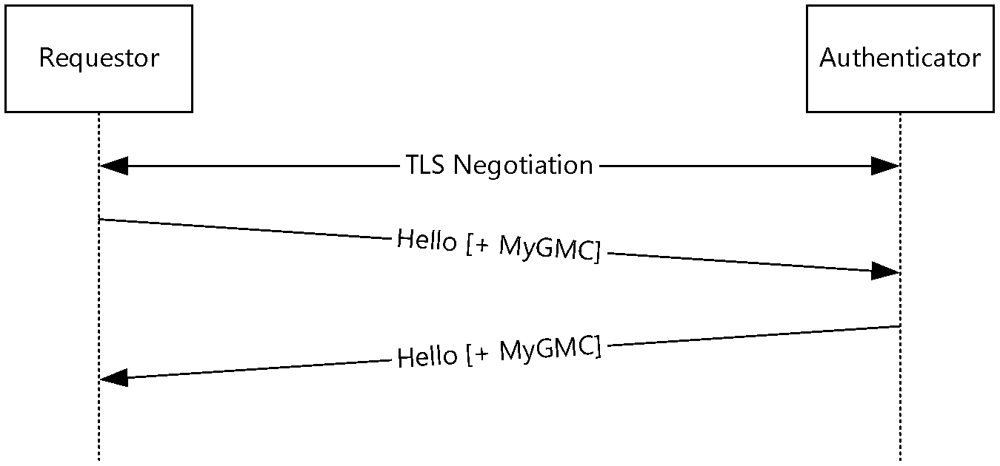

Figure 3: Establishing a connection using GMC authentication

To establish the connection, the following steps occur:

- Node 2 (the Requestor) queries [**PNRP**](#gt_peer-name-resolution-protocol-pnrp) for a Group Node. For example, if the **Group Peer Name** is "abc123", Node 2 queries for "abc123.participant".
- PNRP responds with the address and port of Node 1 (the Authenticator).
- Node 2 establishes a [**P2P Graphing**](#gt_p2p-graphing) connection to Node 1. Because P2P Graphing has been configured to use [**P2P Grouping**](#gt_p2p-grouping) as the Graph Security Provider, P2P Grouping is asked to authenticate the connection.
- Node 2 and Node 1 establish a secure connection using TLS.
- Node 2 sends a message containing the Hello message and the MyGMC message. The MyGMC message contains Node 2's [**GMC chain**](#gt_group-membership-certificate-gmc-chain).
- Node 1 validates that the GMC received is valid, and replies with a message containing the Hello message and the MyGMC message.
- The connection is now authenticated, and the P2P Graphing protocol begins using the connection.

## 4.2 Establishing a Connection Using Password Authentication

Node 2 requests to connect to a Group created by Node 1. Node 1 is already listening for incoming connections. Node 2 does not have a [**GMC**](#gt_group-membership-certificate-gmc).

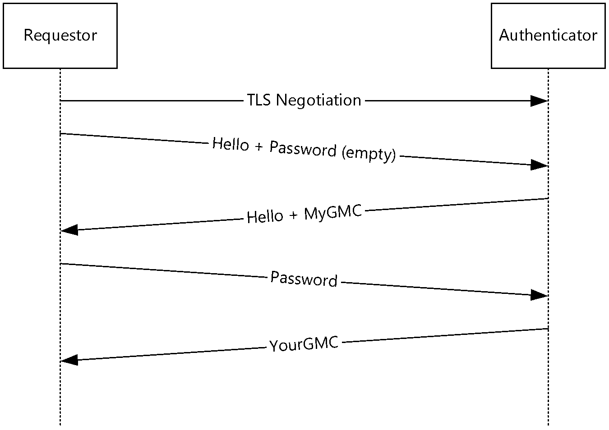

Figure 4: Establishing a connection using password authentication

To establish the connection, the following steps occur:

- Node 2 (the Requestor) queries [**PNRP**](#gt_peer-name-resolution-protocol-pnrp) for a Group Node. For example, if the **Group Peer Name** is "abc123", Node 2 queries for "abc123.participant".
- PNRP responds with the address and port of Node 1 (the Authenticator).
- Node 2 establishes a [**P2P Graphing**](#gt_p2p-graphing) connection to Node 1. Because P2P Graphing has been configured to use [**P2P Grouping**](#gt_p2p-grouping) as the Graph Security Provider, P2P Grouping is asked to authenticate the connection.
- Node 2 and Node 1 establish a secure connection using TLS.
- Node 2 sends a message containing the Hello message and an empty Password message.
- Node 1 validates that the Group is configured to allow password authentication, and responds with a message containing the Hello message and the MyGMC message.
- Node 2 validates that the GMC received in the MyGMC message is for the Group to which it is intending to connect.
- Node 2 generates a Password message containing the proof of password.
- Node 1 validates that the Password message contains the correct data, thus ensuring that Node 2 knew the correct password.
- Node 1 generates a [**GMC chain**](#gt_group-membership-certificate-gmc-chain) for Node 2.
- Node 1 responds with a YourGMC message, containing the GMC it created in step 10.
- The connection is now authenticated, and the P2P Graphing protocol begins using the connection.

# 5 Security

## 5.1 Security Considerations for Implementers

SHA-1 hashing is not deprecated due to the backward compatibility consideration.

Any form of password authentication can be vulnerable to dictionary or brute-force password-guessing attacks. Proper throttling is to be considered by the implementers of the Peer-to-Peer Grouping Security Protocol.

## 5.2 Index of Security Parameters

None.

# 6 Appendix A: Product Behavior

The information in this specification is applicable to the following Microsoft products or supplemental software. References to product versions include updates to those products.

- Windows XP operating system Service Pack 2 (SP2)
- Windows Vista operating system
- Windows 7 operating system
- Windows Home Server 2011 server software
- Windows 8 operating system
- Windows Server 2012 operating system
- Windows 8.1 operating system
- Windows Server 2012 R2 operating system
- Windows 10 operating system
- Windows 11 operating system
Exceptions, if any, are noted in this section. If an update version, service pack or Knowledge Base (KB) number appears with a product name, the behavior changed in that update. The new behavior also applies to subsequent updates unless otherwise specified. If a product edition appears with the product version, behavior is different in that product edition.

Unless otherwise specified, any statement of optional behavior in this specification that is prescribed using the terms "SHOULD" or "SHOULD NOT" implies product behavior in accordance with the SHOULD or SHOULD NOT prescription. Unless otherwise specified, the term "MAY" implies that the product does not follow the prescription.

<1> Section 1.6: Windows XP operating system only implements Group Security 1.0. A Windows XP node that receives the Password message or YourGMC message will terminate the connection.

# 7 Change Tracking

This section identifies changes that were made to this document since the last release. Changes are classified as Major, Minor, or None.

The revision class **Major** means that the technical content in the document was significantly revised. Major changes affect protocol interoperability or implementation. Examples of major changes are:

- A document revision that incorporates changes to interoperability requirements.
- A document revision that captures changes to protocol functionality.
The revision class **Minor** means that the meaning of the technical content was clarified. Minor changes do not affect protocol interoperability or implementation. Examples of minor changes are updates to clarify ambiguity at the sentence, paragraph, or table level.

The revision class **None** means that no new technical changes were introduced. Minor editorial and formatting changes may have been made, but the relevant technical content is identical to the last released version.

The changes made to this document are listed in the following table. For more information, please contact [dochelp@microsoft.com](mailto:dochelp@microsoft.com).

| Section | Description | Revision class |
| --- | --- | --- |
| [2.2.4](#Section_2.2.4) Record Security Data | Updated the reference for RSA. | Major |
| [6](#Section_6) Appendix A: Product Behavior | Updated for this version of Windows Client. | Major |

## Revision History

| Date | Version | Revision Class | Comments |
| --- | --- | --- | --- |
| 1/29/2010 | 0.1 | Major | First Release. |
| 3/12/2010 | 1.0 | Major | Updated and revised the technical content. |
| 4/23/2010 | 1.0.1 | Editorial | Changed language and formatting in the technical content. |
| 6/4/2010 | 1.0.2 | Editorial | Changed language and formatting in the technical content. |
| 7/16/2010 | 1.1 | Minor | Clarified the meaning of the technical content. |
| 8/27/2010 | 1.2 | Minor | Clarified the meaning of the technical content. |
| 10/8/2010 | 1.2 | None | No changes to the meaning, language, or formatting of the technical content. |
| 11/19/2010 | 2.0 | Major | Updated and revised the technical content. |
| 1/7/2011 | 2.0 | None | No changes to the meaning, language, or formatting of the technical content. |
| 2/11/2011 | 3.0 | Major | Updated and revised the technical content. |
| 3/25/2011 | 3.0 | None | No changes to the meaning, language, or formatting of the technical content. |
| 5/6/2011 | 3.0 | None | No changes to the meaning, language, or formatting of the technical content. |
| 6/17/2011 | 3.1 | Minor | Clarified the meaning of the technical content. |
| 9/23/2011 | 4.0 | Major | Updated and revised the technical content. |
| 12/16/2011 | 5.0 | Major | Updated and revised the technical content. |
| 3/30/2012 | 5.0 | None | No changes to the meaning, language, or formatting of the technical content. |
| 7/12/2012 | 5.0 | None | No changes to the meaning, language, or formatting of the technical content. |
| 10/25/2012 | 5.0 | None | No changes to the meaning, language, or formatting of the technical content. |
| 1/31/2013 | 5.0 | None | No changes to the meaning, language, or formatting of the technical content. |
| 8/8/2013 | 6.0 | Major | Updated and revised the technical content. |
| 11/14/2013 | 6.0 | None | No changes to the meaning, language, or formatting of the technical content. |
| 2/13/2014 | 6.0 | None | No changes to the meaning, language, or formatting of the technical content. |
| 5/15/2014 | 6.0 | None | No changes to the meaning, language, or formatting of the technical content. |
| 6/30/2015 | 7.0 | Major | Significantly changed the technical content. |
| 10/16/2015 | 8.0 | Major | Significantly changed the technical content. |
| 7/14/2016 | 9.0 | Major | Significantly changed the technical content. |
| 6/1/2017 | 10.0 | Major | Significantly changed the technical content. |
| 6/25/2021 | 11.0 | Major | Significantly changed the technical content. |
