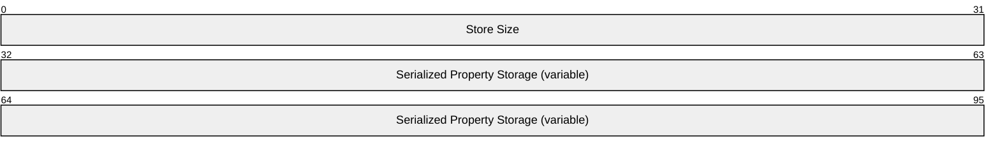
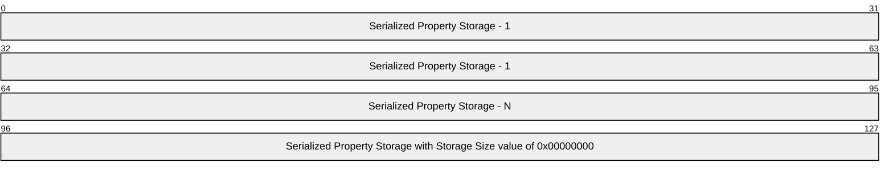
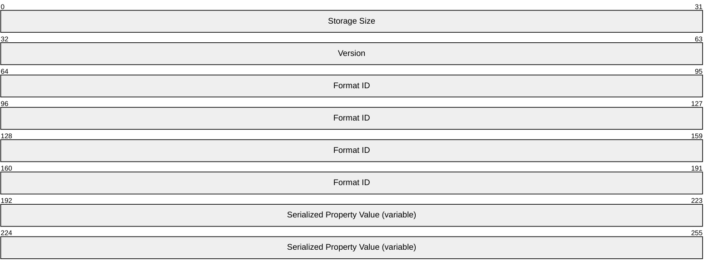
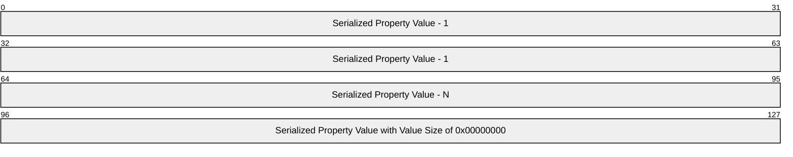
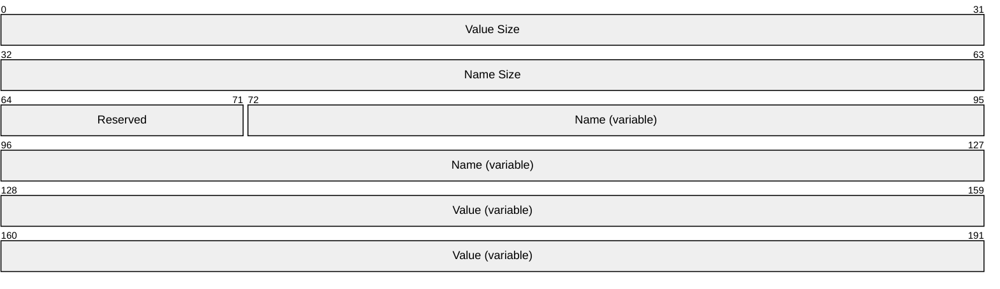
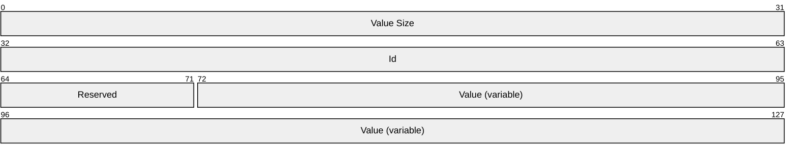

# [MS-PROPSTORE]: Property Store Binary File Format

Table of Contents

1 Introduction

- [1 Introduction](#Section_1)
  - [1.1 Glossary](#Section_1.1)
  - [1.2 References](#Section_1.2)
    - [1.2.1 Normative References](#Section_1.2.1)
    - [1.2.2 Informative References](#Section_1.2.2)
  - [1.3 Overview](#Section_1.3)
  - [1.4 Relationship to Protocols and Other Structures](#Section_1.4)
  - [1.5 Applicability Statement](#Section_1.5)
  - [1.6 Versioning and Localization](#Section_1.6)
  - [1.7 Vendor-Extensible Fields](#Section_1.7)

2 Structures

- [2 Structures](#Section_2)
  - [2.1 Serialized Property Store](#Section_2.1)
  - [2.2 Serialized Property Storage](#Section_2.2)
  - [2.3 Serialized Property Value](#Section_2.3)
    - [2.3.1 Serialized Property Value (String Name)](#Section_2.3.1)
    - [2.3.2 Serialized Property Value (Integer Name)](#Section_2.3.2)

3 Structure Examples

- [3 Structure Examples](#Section_3)

4 Security Considerations

- [4 Security Considerations](#Section_4)

5 Appendix A: Product Behavior

- [5 Appendix A: Product Behavior](#Section_5)

6 Change Tracking

- [6 Change Tracking](#Section_6)

For the legal notice and IP terms, see [LEGAL.md](../LEGAL.md).
Last updated: 4/23/2024.
See [Revision History](#revision-history) for full version history.

# 1 Introduction

This document specifies the Microsoft Property Store Binary File Format. This file format is a persistence format for a set of properties. Implementers can use this file format to store a set of properties in a file or within another structure.

Sections 1.7 and 2 of this specification are normative. All other sections and examples in this specification are informative.

## 1.1 Glossary

This document uses the following terms:

**globally unique identifier (GUID)**: A term used interchangeably with universally unique identifier (UUID) in Microsoft protocol technical documents (TDs). Interchanging the usage of these terms does not imply or require a specific algorithm or mechanism to generate the value. Specifically, the use of this term does not imply or require that the algorithms described in [[RFC4122]](https://go.microsoft.com/fwlink/?LinkId=90460) or [[C706]](https://go.microsoft.com/fwlink/?LinkId=89824) must be used for generating the [**GUID**](#gt_globally-unique-identifier-guid). See also universally unique identifier (UUID).

**little-endian**: Multiple-byte values that are byte-ordered with the least significant byte stored in the memory location with the lowest address.

**Unicode**: A character encoding standard developed by the Unicode Consortium that represents almost all of the written languages of the world. The [**Unicode**](#gt_unicode) standard [[UNICODE5.0.0/2007]](https://go.microsoft.com/fwlink/?LinkId=154659) provides three forms (UTF-8, UTF-16, and UTF-32) and seven schemes (UTF-8, UTF-16, UTF-16 BE, UTF-16 LE, UTF-32, UTF-32 LE, and UTF-32 BE).

**MAY, SHOULD, MUST, SHOULD NOT, MUST NOT:** These terms (in all caps) are used as defined in [[RFC2119]](https://go.microsoft.com/fwlink/?LinkId=90317). All statements of optional behavior use either MAY, SHOULD, or SHOULD NOT.

## 1.2 References

Links to a document in the Microsoft Open Specifications library point to the correct section in the most recently published version of the referenced document. However, because individual documents in the library are not updated at the same time, the section numbers in the documents may not match. You can confirm the correct section numbering by checking the [Errata](https://go.microsoft.com/fwlink/?linkid=850906).

### 1.2.1 Normative References

We conduct frequent surveys of the normative references to assure their continued availability. If you have any issue with finding a normative reference, please contact [dochelp@microsoft.com](mailto:dochelp@microsoft.com). We will assist you in finding the relevant information.

[MS-DTYP] Microsoft Corporation, "[Windows Data Types](../MS-DTYP/MS-DTYP.md)".

[MS-OLEPS] Microsoft Corporation, "[Object Linking and Embedding (OLE) Property Set Data Structures](#Section_2)".

[MS-SHLLINK] Microsoft Corporation, "[Shell Link (.LNK) Binary File Format](../MS-SHLLINK/MS-SHLLINK.md)".

[RFC2119] Bradner, S., "Key words for use in RFCs to Indicate Requirement Levels", BCP 14, RFC 2119, March 1997, [https://www.rfc-editor.org/info/rfc2119](https://go.microsoft.com/fwlink/?LinkId=90317)

### 1.2.2 Informative References

None.

## 1.3 Overview

This structure provides a compact way to serialize one or more property sets. Each property set consists of a property set identifier and one or more property values. Each property value consists of a unique property name and an associated value. Each property name can be either an unsigned integer or, in the case of a special property set identifier, a [**Unicode**](#gt_unicode) string.

This structure does not specify the semantics of properties or the assignment of property set identifiers or property names.

Data in this file format is stored in [**little-endian**](#gt_little-endian) format.

## 1.4 Relationship to Protocols and Other Structures

This structure is used by the Shell Link (.LNK) Binary File Format, as specified in [MS-SHLLINK](../MS-SHLLINK/MS-SHLLINK.md).

## 1.5 Applicability Statement

This document specifies a persistence format for one or more sets of property identifiers and associated property values. This persistence format is applicable when each property set can be identified by a [**globally unique identifier (GUID)**](#gt_globally-unique-identifier-guid), and when each property within a property set can be identified by an unsigned integer or a [**Unicode**](#gt_unicode) string name and can be persisted as a TypedPropertyValue structure, as specified in [MS-OLEPS](#Section_2) section 2.15.

## 1.6 Versioning and Localization

None.

## 1.7 Vendor-Extensible Fields

Implementers are free to define new **Format ID**s within the [Serialized Property Storage](#Section_2.2) structure, as defined in section 2.2, and to define new property identifiers within a [Serialized Property Value](#Section_2.3) structure, as defined in section 2.3.

# 2 Structures

This document references commonly used data types as defined in [MS-DTYP](../MS-DTYP/MS-DTYP.md).

Unless otherwise qualified, instances of **GUID** in this section refer to [MS-DTYP] section 2.3.4.

## 2.1 Serialized Property Store

The Property Store Binary File Format is a sequence of [Serialized Property Storage](#Section_2.2) structures. The sequence MUST be terminated by a Serialized Property Storage structure that specifies 0x00000000 for the **Storage Size** field.

**Store Size (4 bytes):** An unsigned integer that specifies the total size, in bytes, of this structure, excluding the size of this field.

**Serialized Property Storage (variable):** A sequence of one or more Serialized Property Storage structures, as specified in section 2.2.

## 2.2 Serialized Property Storage

The Serialized Property Storage structure is a sequence of [Serialized Property Value](#Section_2.3) structures. The sequence MUST be terminated by a Serialized Property Value structure that specifies 0x00000000 for the **Value Size** field.

**Storage Size (4 bytes):** An unsigned integer that specifies the total size, in bytes, of this structure. It MUST be 0x00000000 if this is the last Serialized Property Storage in the enclosing [Serialized Property Store](#Section_2.1).

**Version (4 bytes):** Has to be equal to 0x53505331.

**Format ID (16 bytes):** A [**GUID**](#gt_globally-unique-identifier-guid) that specifies the semantics and expected usage of the properties contained in this Serialized Property Storage structure. It MUST be unique in the set of serialized property storage structures.

**Serialized Property Value (variable):** A sequence of one or more property values. If the **Format ID** field is equal to the GUID {D5CDD505-2E9C-101B-9397-08002B2CF9AE}, then all values in the sequence MUST be [Serialized Property Value (String Name)](#Section_2.3.1) structures, as specified in section 2.3.1; otherwise, all values MUST be [Serialized Property Value (Integer Name)](#Section_2.3.2) structures, as specified in section 2.3.2. The last Serialized Property Value in the sequence MUST specify 0x00000 for the **Value Size**.

## 2.3 Serialized Property Value

There are two types of Serialized Property Value structures: [Serialized Property Value (String Name)](#Section_2.3.1) structures and [Serialized Property Value (Integer Name)](#Section_2.3.2) structures.

### 2.3.1 Serialized Property Value (String Name)

The Serialized Property Value (String Name) structure specifies a single property within a [Serialized Property Storage](#Section_2.2) structure, where the property is identified by a unique [**Unicode**](#gt_unicode) string.

**Value Size (4 bytes):** An unsigned integer that specifies the total size, in bytes, of this structure. It MUST be 0x00000000 if this is the last The Serialized Property Value in the enclosing Serialized Property Storage structure.

**Name Size (4 bytes):** An unsigned integer that specifies the size, in bytes, of the **Name** field, including the null-terminating character.

**Reserved (1 byte):** Has to be 0x00.

**Name (variable):** A null-terminated Unicode string that specifies the identity of the property. It has to be unique within the enclosing Serialized Property Storage structure.

**Value (variable):** A TypedPropertyValue structure, as specified in [MS-OLEPS](#Section_2) section 2.15.

### 2.3.2 Serialized Property Value (Integer Name)

The Serialized Property Value (Integer Name) structure specifies a single property within a [Serialized Property Storage](#Section_2.2) structure, where the property is identified by a unique unsigned integer.

**Value Size (4 bytes):** An unsigned integer that specifies the total size, in bytes, of this structure. It MUST be 0x00000000 if this is the last Serialized Property Value in the enclosing Serialized Property Storage structure.

**Id (4 bytes):** An unsigned integer that specifies the identity of the property. It MUST be unique within the enclosing Serialized Property Storage structure.

**Reserved (1 byte):** MUST be 0x00.

**Value (variable):** A TypedPropertyValue structure, as specified in [MS-OLEPS](#Section_2) section 2.15.

# 3 Structure Examples

None.

# 4 Security Considerations

None.

# 5 Appendix A: Product Behavior

The information in this specification is applicable to the following Microsoft products or supplemental software. References to product versions include updates to those products.

- Windows Vista operating system
- Windows Server 2008 operating system
- Windows 7 operating system
- Windows Server 2008 R2 operating system
- Windows 8 operating system
- Windows Server 2012 operating system
- Windows 8.1 operating system
- Windows Server 2012 R2 operating system
- Windows 10 operating system
- Windows Server 2016 operating system
- Windows Server operating system
- Windows Server 2019 operating system
- Windows Server 2022 operating system
- Windows 11 operating system
- Windows Server 2025 operating system
Exceptions, if any, are noted in this section. If an update version, service pack or Knowledge Base (KB) number appears with a product name, the behavior changed in that update. The new behavior also applies to subsequent updates unless otherwise specified. If a product edition appears with the product version, behavior is different in that product edition.

Unless otherwise specified, any statement of optional behavior in this specification that is prescribed using the terms "SHOULD" or "SHOULD NOT" implies product behavior in accordance with the SHOULD or SHOULD NOT prescription. Unless otherwise specified, the term "MAY" implies that the product does not follow the prescription.

# 6 Change Tracking

This section identifies changes that were made to this document since the last release. Changes are classified as Major, Minor, or None.

The revision class **Major** means that the technical content in the document was significantly revised. Major changes affect protocol interoperability or implementation. Examples of major changes are:

- A document revision that incorporates changes to interoperability requirements.
- A document revision that captures changes to protocol functionality.
The revision class **Minor** means that the meaning of the technical content was clarified. Minor changes do not affect protocol interoperability or implementation. Examples of minor changes are updates to clarify ambiguity at the sentence, paragraph, or table level.

The revision class **None** means that no new technical changes were introduced. Minor editorial and formatting changes may have been made, but the relevant technical content is identical to the last released version.

The changes made to this document are listed in the following table. For more information, please contact [dochelp@microsoft.com](mailto:dochelp@microsoft.com).

| Section | Description | Revision class |
| --- | --- | --- |
| [5](#Section_5) Appendix A: Product Behavior | Added Windows Server 2025 to the list of applicable products. | Major |

## Revision History

| Date | Version | Revision Class | Comments |
| --- | --- | --- | --- |
| 7/16/2010 | 1.0 | New | First Release. |
| 8/27/2010 | 1.0 | None | No changes to the meaning, language, or formatting of the technical content. |
| 10/8/2010 | 1.0 | None | No changes to the meaning, language, or formatting of the technical content. |
| 11/19/2010 | 1.0 | None | No changes to the meaning, language, or formatting of the technical content. |
| 1/7/2011 | 1.0 | None | No changes to the meaning, language, or formatting of the technical content. |
| 2/11/2011 | 1.0 | None | No changes to the meaning, language, or formatting of the technical content. |
| 3/25/2011 | 1.0 | None | No changes to the meaning, language, or formatting of the technical content. |
| 5/6/2011 | 1.0 | None | No changes to the meaning, language, or formatting of the technical content. |
| 6/17/2011 | 1.1 | Minor | Clarified the meaning of the technical content. |
| 9/23/2011 | 1.1 | None | No changes to the meaning, language, or formatting of the technical content. |
| 12/16/2011 | 1.1 | None | No changes to the meaning, language, or formatting of the technical content. |
| 3/30/2012 | 1.1 | None | No changes to the meaning, language, or formatting of the technical content. |
| 7/12/2012 | 1.2 | Minor | Clarified the meaning of the technical content. |
| 10/25/2012 | 1.2 | None | No changes to the meaning, language, or formatting of the technical content. |
| 1/31/2013 | 1.2 | None | No changes to the meaning, language, or formatting of the technical content. |
| 8/8/2013 | 2.0 | Major | Updated and revised the technical content. |
| 11/14/2013 | 2.0 | None | No changes to the meaning, language, or formatting of the technical content. |
| 2/13/2014 | 2.0 | None | No changes to the meaning, language, or formatting of the technical content. |
| 5/15/2014 | 2.0 | None | No changes to the meaning, language, or formatting of the technical content. |
| 6/30/2015 | 3.0 | Major | Significantly changed the technical content. |
| 10/16/2015 | 3.0 | None | No changes to the meaning, language, or formatting of the technical content. |
| 7/14/2016 | 3.0 | None | No changes to the meaning, language, or formatting of the technical content. |
| 6/1/2017 | 3.0 | None | No changes to the meaning, language, or formatting of the technical content. |
| 9/15/2017 | 4.0 | Major | Significantly changed the technical content. |
| 9/12/2018 | 5.0 | Major | Significantly changed the technical content. |
| 4/7/2021 | 6.0 | Major | Significantly changed the technical content. |
| 6/25/2021 | 7.0 | Major | Significantly changed the technical content. |
| 4/23/2024 | 8.0 | Major | Significantly changed the technical content. |
