# [MS-PRSOD]: Print Services Protocols Overview

Table of Contents

1 Introduction

- [1 Introduction](#Section_1)
  - [1.1 Glossary](#Section_1.1)
  - [1.2 References](#Section_1.2)
  - [1.3 Overview](#Section_1.3)
    - [1.3.1 Print Spoolers](#Section_1.3.1)
    - [1.3.2 Print Spooler Service](#Section_1.3.2)
    - [1.3.3 Print Queues](#Section_1.3.3)
    - [1.3.4 Printers and Print Data Formats](#Section_1.3.4)
    - [1.3.5 Printer Drivers and Print Processors](#Section_1.3.5)

2 Functional Architecture

- [2 Functional Architecture](#Section_2)
  - [2.1 Overview](#Section_2.1)
    - [2.1.1 System Purpose](#Section_2.1.1)
    - [2.1.2 Functional Overview](#Section_2.1.2)
      - [2.1.2.1 Print Services System Components](#Section_2.1.2.1)
      - [2.1.2.2 Relationship of the Components within Print and Administrative Clients and Print Server](#Section_2.1.2.2)
        - [2.1.2.2.1 Print and Administrative Clients](#Section_2.1.2.2.1)
        - [2.1.2.2.2 Print Server](#Section_2.1.2.2.2)
      - [2.1.2.3 Member Protocol Functional Relationships](#Section_2.1.2.3)
      - [2.1.2.4 System Internal Architecture](#Section_2.1.2.4)
      - [2.1.2.5 Windows Printing Architecture](#Section_2.1.2.5)
        - [2.1.2.5.1 Print Client Communication with Print Server](#Section_2.1.2.5.1)
        - [2.1.2.5.2 Protocols Supporting Different Print Clients](#Section_2.1.2.5.2)
        - [2.1.2.5.3 Protocol Redirectors on Print Servers](#Section_2.1.2.5.3)
        - [2.1.2.5.4 Enabling Print Queues to Be Discoverable](#Section_2.1.2.5.4)
      - [2.1.2.6 Translating Application Content to a Print Data Format](#Section_2.1.2.6)
      - [2.1.2.7 Supporting Client-Side Rendering and Server-Side Rendering](#Section_2.1.2.7)
      - [2.1.2.8 Sending Print Data to a Printer via a Port Monitor](#Section_2.1.2.8)
      - [2.1.2.9 Branch Office Print Mode](#Section_2.1.2.9)
    - [2.1.3 Applicability](#Section_2.1.3)
    - [2.1.4 Relevant Standards](#Section_2.1.4)
  - [2.2 Protocol Summary](#Section_2.2)
  - [2.3 Environment](#Section_2.3)
    - [2.3.1 Dependencies on This System](#Section_2.3.1)
    - [2.3.2 Dependencies on Other Systems/Components](#Section_2.3.2)
  - [2.4 Assumptions and Preconditions](#Section_2.4)
  - [2.5 Use Cases](#Section_2.5)
    - [2.5.1 Actors](#Section_2.5.1)
    - [2.5.2 Use Case Summary Diagrams](#Section_2.5.2)
    - [2.5.3 Use Case Descriptions](#Section_2.5.3)
      - [2.5.3.1 Provision a Print Queue -- Administrative Client](#Section_2.5.3.1)
      - [2.5.3.2 Delete a Print Queue -- Administrative Client](#Section_2.5.3.2)
      - [2.5.3.3 Locate and Establish a Connection to a Print Queue in a Domain Environment -- Print Client](#Section_2.5.3.3)
      - [2.5.3.4 Locate and Establish a Connection to a Print Queue in a Workgroup Environment -- Print Client](#Section_2.5.3.4)
      - [2.5.3.5 Locating and Connecting to a Shared Print Queue from an Internet Client -- Print Client](#Section_2.5.3.5)
      - [2.5.3.6 Setting Permissions for a Print Queue -- Administrative Client](#Section_2.5.3.6)
      - [2.5.3.7 Submitting a Print Job -- Print Client](#Section_2.5.3.7)

For the legal notice and IP terms, see [LEGAL.md](../LEGAL.md).
Last updated: 7/29/2024.
See [Revision History](#revision-history) for full version history.

[2.5.3.7.1 Submitting a Print Job Using the Protocols Defined in [MS-RPRN] (or [MS-PAR]) 49](#_Toc172725890)

[2.5.3.7.2 Submitting a Print Job by Using the IPP Internet Printing Protocol](#Section_2.5.3.7.2)
[2.5.3.7.3 Submitting a Print Job Using the SMB Protocol Family](#Section_2.5.3.7.3)
[2.5.3.7.4 Submitting a Print Job Using Branch Office Print Mode](#Section_2.5.3.7.4)
[2.5.3.8 Managing Print Jobs — Print Client](#Section_2.5.3.8)
[2.5.3.8.1 Managing Print Jobs Submitted by Self Using the Protocols Described in MS-RPRN or MS-PAR](#Section_2.5.3.8.1)
[2.5.3.8.2 Managing Print Jobs Submitted by All Users Using the Protocols Described in MS-RPRN or MS-PAR](#Section_2.5.3.8.2)
[2.5.3.8.3 Managing Print Jobs from a Command Line Using the Protocol Described in MS-RAP](#Section_2.5.3.8.3)
[2.6 Versioning, Capability Negotiation, and Extensibility](#Section_2.6)
[2.7 Error Handling](#Section_2.7)
[2.7.1 Failure Scenarios](#Section_2.7.1)
[2.7.1.1 Abnormal Termination of the Print Spooler Service](#Section_2.7.1.1)
[2.7.1.2 Loss of Network Connectivity](#Section_2.7.1.2)
[2.7.1.3 Loss of System Disk Storage](#Section_2.7.1.3)
[2.7.1.4 Print Spooler Service Out of System Resources](#Section_2.7.1.4)
[2.7.1.5 Authentication Issues](#Section_2.7.1.5)
[2.7.1.6 Expected Failures](#Section_2.7.1.6)
[2.8 Coherency Requirements](#Section_2.8)
[2.8.1 Timers](#Section_2.8.1)
[2.8.2 Non-Timer Events](#Section_2.8.2)
[2.8.3 Initialization and Reinitialization Procedures](#Section_2.8.3)
[2.9 Security](#Section_2.9)
[2.9.1 Security and Authentication Methods](#Section_2.9.1)
[2.9.2 Securable Objects](#Section_2.9.2)
[2.9.3 Internal Security](#Section_2.9.3)
[2.9.4 External Security](#Section_2.9.4)
[2.10 Additional Considerations](#Section_2.10)
[3 Examples](#Section_3)
[3.1 Example 1: Discovering and Utilizing a Print Queue in a Domain](#Section_3.1)
[3.2 Example 2: Discovering and Utilizing a Print Queue in a Workgroup](#Section_3.2)
[3.3 Example 3: Receiving Unidirectional IHV-Defined Notifications](#Section_3.3)
[3.4 Example 4: Enumerating Print Jobs from All Users, Then Canceling Several Print Jobs](#Section_3.4)
[3.5 Example 5: Provisioning a Print Queue By Using the Protocol Defined in [MS-RPRN] 85](#_Toc172725922)

[3.6 Example 6: Sending a Print Job to an SMB Share](#Section_3.6)
[4 Microsoft Implementations](#Section_4)
[4.1 Product Behavior](#Section_4.1)
[5 Change Tracking](#Section_5)

# 1 Introduction

This document describes the Print Services system (PSS), which supports the use and management of a distributed print infrastructure. It describes how the Print Services system can be used in [**workgroups**](#gt_workgroup) and [**domain**](#gt_domain)-based networks, and how print servers and print clients can use the member protocols of the system to share one or more printers between one or more print clients.

The Print Services system can serve workgroups, where printers are shared among individual clients, and domain-based networks, where there can be multiple print servers that are deployed in a cluster configuration, with the print client configuration managed through the [**Active Directory**](#gt_active-directory) system. The differences between these scenarios are described in the protocols in this document.

## 1.1 Glossary

This document uses the following terms:

**access control list (ACL)**: A list of access control entries (ACEs) that collectively describe the security rules for authorizing access to some resource; for example, an object or set of objects.

**Active Directory**: The Windows implementation of a general-purpose directory service, which uses [**LDAP**](#gt_lightweight-directory-access-protocol-ldap) as its primary access protocol. Active Directory stores information about a variety of objects in the network such as user accounts, computer accounts, groups, and all related credential information used by Kerberos [MS-KILE](../MS-KILE/MS-KILE.md). Active Directory is either deployed as Active Directory Domain Services (AD DS) or Active Directory Lightweight Directory Services (AD LDS), which are both described in [MS-ADOD](#Section_2.1): Active Directory Protocols Overview.

**authenticated user identity**: The principal that is provided by the underlying protocol. See retrieval of client identity in [MS-RPCE](../MS-RPCE/MS-RPCE.md) sections 3.2.3.4.2 and 3.3.3.4.3 for details.

**authentication**: The ability of one entity to determine the identity of another entity.

**branch office print mode**: An operating mode in which a [**print client**](#gt_print-client) is able to perform branch office printing. Every shared printer on a [**print server**](#gt_print-server) can be configured to operate in branch office print mode.

**branch office print remote logging**: An operating mode in which a [**print client**](#gt_print-client) logs printing-related Windows Events on the [**print server**](#gt_print-server). Branch office print remote logging occurs only when the [**print client**](#gt_print-client) is in [**branch office print mode**](#gt_branch-office-print-mode).

**cabinet file**: A file that has the suffix .cab and that acts as a container for other files. It serves as a compressed archive for a group of files. For more information, including the format of CAB files, see [[MSDN-CAB]](https://go.microsoft.com/fwlink/?LinkId=226293).

**Common Internet File System (CIFS)**: The "NT LM 0.12" / NT LAN Manager dialect of the [**Server Message Block (SMB)**](#gt_server-message-block-smb) Protocol, as implemented in Windows NT. The CIFS name originated in the 1990's as part of an attempt to create an Internet standard for [**SMB**](#gt_server-message-block-smb), based upon the then-current Windows NT implementation.

**deployed printer connection**: A computer connection or user connection as described in [MS-GPDPC](../MS-GPDPC/MS-GPDPC.md).

**device**: Any peripheral or part of a computer system that can send or receive data.

**domain**: A set of users and computers sharing a common namespace and management infrastructure. At least one computer member of the set has to act as a domain controller (DC) and host a member list that identifies all members of the domain, as well as optionally hosting the [**Active Directory**](#gt_active-directory) service. The domain controller provides authentication of members, creating a unit of trust for its members. Each domain has an identifier that is shared among its members. For more information, see [MS-AUTHSOD](#Section_2.1) section 1.1.1.5 and [MS-ADTS](../MS-ADTS/MS-ADTS.md).

**Domain Name System (DNS)**: A hierarchical, distributed database that contains mappings of domain names to various types of data, such as IP addresses. DNS enables the location of computers and services by user-friendly names, and it also enables the discovery of other information stored in the database.

**driver package**: A collection of the files needed to successfully load a driver. This includes the device information (.inf) file, the catalog file, and all of the binaries that are copied by the .inf file. Multiple drivers packaged together for deployment purposes.

**driver store**: A secure location on the local hard disk where the entire driver package is copied.

**endpoint**: A network-specific address of a remote procedure call (RPC) server process for remote procedure calls. The actual name and type of the endpoint depends on the [**RPC**](#gt_remote-procedure-call-rpc) protocol sequence that is being used. For example, for RPC over TCP (RPC Protocol Sequence ncacn_ip_tcp), an endpoint might be TCP port 1025. For RPC over Server Message Block (RPC Protocol Sequence ncacn_np), an endpoint might be the name of a named pipe. For more information, see [[C706]](https://go.microsoft.com/fwlink/?LinkId=89824).

**enhanced metafile format (EMF)**: A file format that supports the device-independent definitions of images.

**enhanced metafile spool format (EMFSPOOL)**: A format that specifies a structure of [**enhanced metafile format (EMF)**](#gt_enhanced-metafile-format-emf) records used for defining application and device-independent printer spool files.

**Graphics Device Interface (GDI)**: An API supported on 16-bit and 32-bit versions of the operating system which supports graphics operations and image manipulation on logical graphics objects.

**Graphics Device Interface, Extended (GDI+)**: A Windows API, supported on 32-bit and 64-bit versions of the operating system, that extends [**GDI**](#gt_graphics-device-interface-gdi) to include support for Bezier curves, gradient brushes, image effects, and EMF+ metafiles.

**Group Policy**: A mechanism that allows the implementer to specify managed configurations for users and computers in an [**Active Directory**](#gt_active-directory) service environment.

**Hypertext Markup Language (HTML)**: An application of the Standard Generalized Markup Language (SGML) that uses tags to mark elements in a document, as described in [[HTML]](https://go.microsoft.com/fwlink/?LinkId=89880).

**Hypertext Transfer Protocol (HTTP)**: An application-level protocol for distributed, collaborative, hypermedia information systems (text, graphic images, sound, video, and other multimedia files) on the World Wide Web.

**Hypertext Transfer Protocol Secure (HTTPS)**: An extension of HTTP that securely encrypts and decrypts web page requests. In some older protocols, "Hypertext Transfer Protocol over Secure Sockets Layer" is still used (Secure Sockets Layer has been deprecated). For more information, see [[SSL3]](https://go.microsoft.com/fwlink/?LinkId=90534) and [[RFC5246]](https://go.microsoft.com/fwlink/?LinkId=129803).

**Independent Hardware Vendor (IHV)**: In the context of this document, an [**IHV**](#gt_independent-hardware-vendor-ihv) is a printer manufacturer, such as Canon or Hewlett-Packard.

**Internet Information Services (IIS)**: The services provided in Windows implementation that support web server functionality. [**IIS**](#gt_internet-information-services-iis) consists of a collection of standard Internet protocol servers such as HTTP and FTP in addition to common infrastructures that are used by other Microsoft Internet protocol servers such as SMTP, NNTP, and so on. [**IIS**](#gt_internet-information-services-iis) has been part of the Windows operating system in some versions and a separate install package in others. [**IIS**](#gt_internet-information-services-iis) version 5.0 shipped as part of Windows 2000 operating system, [**IIS**](#gt_internet-information-services-iis) version 5.1 as part of Windows XP operating system, [**IIS**](#gt_internet-information-services-iis) version 6.0 as part of Windows Server 2003 operating system, and [**IIS**](#gt_internet-information-services-iis) version 7.0 as part of Windows Vista operating system and Windows Server 2008 operating system.

**Internet Printing Protocol (IPP)**: A standard protocol for printing and for the management of print jobs and printer settings over the Internet. It is built on the [**Hypertext Transfer Protocol (HTTP)**](#gt_hypertext-transfer-protocol-http).

**Internet Protocol security (IPsec)**: A framework of open standards for ensuring private, secure communications over Internet Protocol (IP) networks through the use of cryptographic security services. IPsec supports network-level peer authentication, data origin authentication, data integrity, data confidentiality (encryption), and replay protection.

**language monitor**: An executable object that provides a communications path between a [**print queue**](#gt_print-queue) and a printer's [**port monitor**](#gt_port-monitor). [**Language monitors**](#gt_language-monitor) add control information to the data stream, such as commands defined by a [**Page Description Language (PDL)**](#gt_page-description-language-pdl). They are optional, and are only associated with a particular type of printer if specified in the printer's INF file.

**Lightweight Directory Access Protocol (LDAP)**: The primary access protocol for [**Active Directory**](#gt_active-directory). Lightweight Directory Access Protocol (LDAP) is an industry-standard protocol, established by the Internet Engineering Task Force (IETF), which allows users to query and update information in a directory service (DS), as described in [MS-ADTS]. The Lightweight Directory Access Protocol can be either version 2 [[RFC1777]](https://go.microsoft.com/fwlink/?LinkId=90290) or version 3 [[RFC3377]](https://go.microsoft.com/fwlink/?LinkID=91337).

**metafile**: A sequence of record structures that store an image in an application-independent format. Metafile records contain drawing commands, object definitions, and configuration settings. When a metafile is processed, the stored image can be rendered on a display, output to a printer or plotter, stored in memory, or saved to a file or stream.

**monitor module**: An executable object that provides a communication path between the print system and the printers on a server.

**NetBEUI**: NetBIOS Enhanced User Interface. [**NetBEUI**](#gt_netbeui) is an enhanced NetBIOS protocol for network operating systems, originated by IBM for the LAN Manager server and now used with many other networks.

**page description language (PDL)**: The language for describing the layout and contents of a printed page. Common examples are PostScript and [**Printer Control Language (PCL)**](#gt_printer-control-language-pcl).

**port monitor**: A plug-in that communicates with a [**device**](#gt_device) that is connected to a port. A [**port monitor**](#gt_port-monitor) can interact with the [**device**](#gt_device) locally, remotely over a network, or through some other communication channel. The data that passes through a [**port monitor**](#gt_port-monitor) is in a form that can be understood by the destination [**device**](#gt_device), such as [**page description language (PDL)**](#gt_page-description-language-pdl).

**Portable Document Format (PDF)**: An Adobe Systems specification for electronic documents that use the Adobe Acrobat family of servers and readers. PDF-format files have a .pdf file name extension.

**PostScript**: A [**page description language**](#gt_page-description-language-pdl) developed by Adobe Systems that is primarily used for printing documents on laser printers. It is the standard for desktop publishing.

**print client**: The application or user that is trying to apply an operation on the print system either by printing a job or by managing the data structures or devices maintained by the print system.

**print job**: The rendered [**page description language (PDL)**](#gt_page-description-language-pdl) output data sent to a print device for a particular application or user request.

**print processor**: A plug-in that runs on the [**print server**](#gt_print-server) and processes [**print job**](#gt_print-job) data before it is sent to a print [**device**](#gt_device).

**print queue**: The logical entity to which jobs can be submitted for a particular print device. Associated with a print queue is a print driver, a user's print configuration in the form of a DEVMODE structure, and a system print configuration stored in the system registry.

**print server**: A machine that hosts the print system and all its different components.

**print spooler**: The component is a service that implements the Print Services system on Windows-based print clients and print servers. The spooler buffers and orders [**print jobs**](#gt_print-job) and converts [**print job**](#gt_print-job) data to printer-specific formats.

**Printer Control Language (PCL)**: A [**page description language (PDL)**](#gt_page-description-language-pdl) developed by Hewlett Packard for its laser and ink-jet printers.

**printer driver**: The interface component between the operating system and the printer device. It is responsible for processing the application data into a [**page description language (PDL)**](#gt_page-description-language-pdl) that can be interpreted by the printer device.

**printer port**: Hardware port that transfers drawing commands to the printer hardware.

**registry**: A local system-defined database in which applications and system components store and retrieve configuration data. It is a hierarchical data store with lightly typed elements that are logically stored in tree format. Applications use the registry API to retrieve, modify, or delete registry data. The data stored in the registry varies according to the version of the operating system.

**Remote Administration Protocol (RAP)**: A synchronous request/response protocol, used prior to the development of the remote procedure call (RPC) protocol, for marshaling and unmarshaling procedure call input and output arguments into messages and for reliably transporting messages to and from clients and servers.

**remote procedure call (RPC)**: A communication protocol used primarily between client and server. The term has three definitions that are often used interchangeably: a runtime environment providing for communication facilities between computers (the RPC runtime); a set of request-and-response message exchanges between computers (the RPC exchange); and the single message from an RPC exchange (the RPC message). For more information, see [C706].

**RPC endpoint**: A network-specific address of a server process for remote procedure calls (RPCs). The actual name of the RPC endpoint depends on the RPC protocol sequence being used. For example, for the NCACN_IP_TCP RPC protocol sequence an RPC endpoint might be TCP port 1025. For more information, see [C706].

**security descriptor**: A data structure containing the security information associated with a securable object. A [**security descriptor**](#gt_security-descriptor) identifies an object's owner by its security identifier (SID). If access control is configured for the object, its [**security descriptor**](#gt_security-descriptor) contains a discretionary access control list (DACL) with SIDs for the security principals who are allowed or denied access. Applications use this structure to set and query an object's security status. The [**security descriptor**](#gt_security-descriptor) is used to guard access to an object as well as to control which type of auditing takes place when the object is accessed. The [**security descriptor**](#gt_security-descriptor) format is specified in [MS-DTYP](../MS-DTYP/MS-DTYP.md) section 2.4.6; a string representation of [**security descriptors**](#gt_security-descriptor), called SDDL, is specified in [MS-DTYP] section 2.5.1.

**security provider**: A pluggable security module that is specified by the protocol layer above the [**remote procedure call (RPC)**](#gt_remote-procedure-call-rpc) layer, and will cause the [**RPC**](#gt_remote-procedure-call-rpc) layer to use this module to secure messages in a communication session with the server. The security provider is sometimes referred to as an [**authentication**](#gt_authentication) service. For more information, see [C706] and [MS-RPCE].

**Server Message Block (SMB)**: A protocol that is used to request file and print services from server systems over a network. The SMB protocol extends the CIFS protocol with additional security, file, and disk management support. For more information, see [[CIFS]](https://go.microsoft.com/fwlink/?linkid=2109334) and [MS-SMB](../MS-SMB/MS-SMB.md).

**Server Service**: The CIFS file sharing service. The [**Server Service**](#gt_server-service) registers a NetBIOS name with a suffix byte value of 0x20 and responds to SMB commands.

**Simple and Protected GSS-API Negotiation Mechanism (SPNEGO)**: An [**authentication**](#gt_authentication) mechanism that allows Generic Security Services (GSS) peers to determine whether their credentials support a common set of GSS-API security mechanisms, to negotiate different options within a given security mechanism or different options from several security mechanisms, to select a service, and to establish a security context among themselves using that service. [**SPNEGO**](#gt_simple-and-protected-gss-api-negotiation-mechanism-spnego) is specified in [[RFC4178]](https://go.microsoft.com/fwlink/?LinkId=90461).

**TCP/IP**: A set of networking protocols that is widely used on the Internet and provides communications across interconnected networks of computers with diverse hardware architectures and various operating systems. It includes standards for how computers communicate and conventions for connecting networks and routing traffic.

**Uniform Resource Locator (URL)**: A string of characters in a standardized format that identifies a document or resource on the World Wide Web. The format is as specified in [[RFC1738]](https://go.microsoft.com/fwlink/?LinkId=90287).

**universal serial bus (USB)**: An external bus that supports Plug and Play installation. It allows devices to be connected and disconnected without shutting down or restarting the computer.

**UNIX**: A multiuser, multitasking operating system developed at Bell Laboratories in the 1970s. In this document, the term "[**UNIX**](#gt_unix)" is used to refer to any derivatives of this operating system.

**Web Services on Devices (WSD)**: A function-discovery protocol used to discover and communicate certain data structures in a HomeGroup network environment. Implementation details are specified in [[DPWS]](https://go.microsoft.com/fwlink/?LinkId=127841).

**workgroup**: A collection of computers that share a name. In the absence of a [**domain**](#gt_domain), a workgroup allows a convenient means for browser clients to limit the scope of a search.

**XML Paper Specification (XPS)**: An XML-based document format. [**XML Paper Specification (XPS)**](#gt_xml-paper-specification-xps) specifies the set of conventions for the use of XML and other widely available technologies to describe the content and appearance of paginated documents. For more information, see [[MSFT-XMLPAPER]](https://go.microsoft.com/fwlink/?LinkId=90214).

## 1.2 References

Links to a document in the Microsoft Open Specifications library point to the correct section in the most recently published version of the referenced document. However, because individual documents in the library are not updated at the same time, the section numbers in the documents may not match. You can confirm the correct section numbering by checking the [Errata](https://go.microsoft.com/fwlink/?linkid=850906).

[C706] The Open Group, "DCE 1.1: Remote Procedure Call", C706, August 1997, [https://publications.opengroup.org/c706](https://go.microsoft.com/fwlink/?LinkId=89824)

**Note** Registration is required to download the document.

[ISO-32000-1] ISO, "Document management -- Portable document format -- Part 1: PDF 1.7", ISO 32000-1:2800, July 2008, [http://www.iso.org/iso/catalogue_detail.htm?csnumber=51502](https://go.microsoft.com/fwlink/?LinkId=205438)

**Note** There is a charge to download the specification.

[MS-ADLS] Microsoft Corporation, "[Active Directory Lightweight Directory Services Schema](../MS-ADLS/MS-ADLS.md)".

[MS-ADOD] Microsoft Corporation, "[Active Directory Protocols Overview](#Section_2.1)".

[MS-ADSC] Microsoft Corporation, "[Active Directory Schema Classes](../MS-ADSC/MS-ADSC.md)".

[MS-AUTHSOD] Microsoft Corporation, "[Authentication Services Protocols Overview](#Section_2.1)".

[MS-BRWS] Microsoft Corporation, "[Common Internet File System (CIFS) Browser Protocol](../MS-BRWS/MS-BRWS.md)".

[MS-CIFS] Microsoft Corporation, "[Common Internet File System (CIFS) Protocol](../MS-CIFS/MS-CIFS.md)".

[MS-DRSR] Microsoft Corporation, "[Directory Replication Service (DRS) Remote Protocol](../MS-DRSR/MS-DRSR.md)".

[MS-EMFSPOOL] Microsoft Corporation, "[Enhanced Metafile Spool Format](../MS-EMFSPOOL/MS-EMFSPOOL.md)".

[MS-FASOD] Microsoft Corporation, "[File Access Services Protocols Overview](#Section_2.1)".

[MS-FSCC] Microsoft Corporation, "[File System Control Codes](../MS-FSCC/MS-FSCC.md)".

[MS-GPDPC] Microsoft Corporation, "[Group Policy: Deployed Printer Connections Extension](../MS-GPDPC/MS-GPDPC.md)".

[MS-GPOD] Microsoft Corporation, "[Group Policy Protocols Overview](#Section_2.1)".

[MS-GPOL] Microsoft Corporation, "[Group Policy: Core Protocol](../MS-GPOL/MS-GPOL.md)".

[MS-NRPC] Microsoft Corporation, "[Netlogon Remote Protocol](../MS-NRPC/MS-NRPC.md)".

[MS-PAN] Microsoft Corporation, "[Print System Asynchronous Notification Protocol](../MS-PAN/MS-PAN.md)".

[MS-PAR] Microsoft Corporation, "[Print System Asynchronous Remote Protocol](../MS-PAR/MS-PAR.md)".

[MS-RAP] Microsoft Corporation, "[Remote Administration Protocol](../MS-RAP/MS-RAP.md)".

[MS-RPCE] Microsoft Corporation, "[Remote Procedure Call Protocol Extensions](../MS-RPCE/MS-RPCE.md)".

[MS-RPRN] Microsoft Corporation, "[Print System Remote Protocol](../MS-RPRN/MS-RPRN.md)".

[MS-SMB2] Microsoft Corporation, "[Server Message Block (SMB) Protocol Versions 2 and 3](../MS-SMB2/MS-SMB2.md)".

[MS-SMB] Microsoft Corporation, "[Server Message Block (SMB) Protocol](../MS-SMB/MS-SMB.md)".

[MS-SPNG] Microsoft Corporation, "[Simple and Protected GSS-API Negotiation Mechanism (SPNEGO) Extension](../MS-SPNG/MS-SPNG.md)".

[MS-WPRN] Microsoft Corporation, "[Web Point-and-Print Protocol](../MS-WPRN/MS-WPRN.md)".

[MS-WUSP] Microsoft Corporation, "[Windows Update Services: Client-Server Protocol](../MS-WUSP/MS-WUSP.md)".

[MSDN-GDI+] Microsoft Corporation, "GDI+", [https://learn.microsoft.com/en-us/windows/desktop/gdiplus/-gdiplus-gdi-start](https://go.microsoft.com/fwlink/?LinkId=90013)

[MSDN-WindowsGDI] Microsoft Corporation, "Windows GDI", [http://msdn.microsoft.com/en-us/library/dd145203.aspxx](https://go.microsoft.com/fwlink/?LinkId=94735)

[MSFT-NETPRINT] Microsoft Corporation, "Net print command", [https://technet.microsoft.com/en-us/library/ee681716(v=ws.10).aspx](https://go.microsoft.com/fwlink/?linkid=863947)

[MSFT-XMLPAPER] Microsoft Corporation, "XML Paper Specification", [https://learn.microsoft.com/en-us/previous-versions/windows/hardware/design/dn641615(v=vs.85)](https://go.microsoft.com/fwlink/?LinkId=90214)

[NETBEUI] IBM Corporation, "LAN Technical Reference: 802.2 and NetBIOS APIs", 1986, [https://www.ardent-tool.com/docs/boo/bk8p7001.boo](https://go.microsoft.com/fwlink/?LinkId=90224)

**Note** Requires IBM Softcopy Reader for Windows V4.0 to read the file.

[PS-PPD4.3] Adobe Systems Incorporated, "PostScript Printer Description File Format Specification", version 4.3, February 1996, [https://forums.adobe.com/api/core/v3/attachments/126313/data](https://go.microsoft.com/fwlink/?LinkId=221049)

[RFC1179] McLaughlin III, L., "Line Printer Daemon Protocol", RFC 1179, August 1990, [https://www.rfc-editor.org/info/rfc1179](https://go.microsoft.com/fwlink/?LinkId=90269)

[RFC1831] Srinivasan, R., "RPC: Remote Procedure Call Protocol Specification Version 2", RFC 1831, August 1995, [https://www.rfc-editor.org/info/rfc1831](https://go.microsoft.com/fwlink/?LinkId=90295)

[RFC2818] Rescorla, E., "HTTP Over TLS", RFC 2818, May 2000, [https://www.rfc-editor.org/info/rfc2818](https://go.microsoft.com/fwlink/?LinkId=90383)

[RFC4301] Kent, S. and Seo, K., "Security Architecture for the Internet Protocol", RFC 4301, December 2005, [https://www.rfc-editor.org/info/rfc4301](https://go.microsoft.com/fwlink/?LinkId=90465)

[RFC4511] Sermersheim, J., "Lightweight Directory Access Protocol (LDAP): The Protocol", RFC 4511, June 2006, [https://www.rfc-editor.org/info/rfc4511](https://go.microsoft.com/fwlink/?LinkId=157505)

[RFC7231] Fielding, R., and Reschke, J., Eds., "Hypertext Transfer Protocol -- HTTP/1.1: Semantics and Content", RFC7231, June 2014, [https://www.rfc-editor.org/info/rfc7231](https://go.microsoft.com/fwlink/?LinkId=402095)

[RFC8010] Sweet, M. and McDonald, I., "Internet Printing Protocol/1.1: Encoding and Transport", RFC 8010, January 2017, [https://www.rfc-editor.org/info/rfc8010](https://go.microsoft.com/fwlink/?linkid=2157950)

[RFC8011] Sweet, M. and McDonald, I., "Internet Printing Protocol/1.1: Model and Semantics", RFC 8011, January 2017, [https://www.rfc-editor.org/info/rfc8011](https://go.microsoft.com/fwlink/?linkid=2157750)

## 1.3 Overview

This section provides an overview of the concepts needed for understanding this technology:

- [**Print spoolers**](#gt_print-spooler)
- Print spooler services
- [**Print queues**](#gt_print-queue)
- Printers and print data formats
- [**Printer drivers**](#gt_printer-driver) and [**print processors**](#gt_print-processor)
Familiarity with the Windows [**Graphics Device Interface (GDI)**](#gt_graphics-device-interface-gdi) [[MSDN-WindowsGDI]](https://go.microsoft.com/fwlink/?LinkId=94735) and [**GDI Extended (GDI+)**](#gt_aad222f8-e733-44f2-a97c-1f903af82448) [[MSDN-GDI+]](https://go.microsoft.com/fwlink/?LinkId=90013) is also an advantage for understanding this technology.

### 1.3.1 Print Spoolers

A [**print spooler**](#gt_print-spooler) that is running on a [**print client**](#gt_print-client) exposes local printing APIs to applications, receives the print output of an application, and sends it to a shared [**print queue**](#gt_print-queue) on a [**print server**](#gt_print-server). The print output is either a printer-specific data stream or a generic [**metafile**](#gt_metafile) that can be converted into a printer-specific format.

A print spooler that is running on a print server shares print queues to expose them to print clients. The print server is responsible for the conversion of a print client output data stream before the print spooler buffers the data stream and sends it to a target printer.

On both a print server and a print client, the print spooler manages [**printer driver**](#gt_printer-driver) components and other components that help create the application print output and translate metafiles, and enable applications to obtain metrics and status information about printers.

The Windows implementations of the print client and print server roles are provided by the print spooler component. Every Windows operating system that can run a print spooler can act as both print client and print server.<1>

### 1.3.2 Print Spooler Service

The [**print spooler**](#gt_print-spooler) service is a service that is running on each computer that participates in the Print Services system. The print spooler service implements the [**print client**](#gt_print-client) and [**print server**](#gt_print-server) roles, by enabling each participating system to act as a print client, administrative client, or print server for the Print Services system.

Implementation of the print client role can include implementation of the print server role in the print spooler service due to the dual client/server implementation of the Print System Remote Protocol [MS-RPRN](../MS-RPRN/MS-RPRN.md) on most Windows Client operating system versions.<2> If an implementation acts as print client only, it supports all Print System Remote Protocol methods and can optionally support the Print System Asynchronous Remote Protocol [MS-PAR](../MS-PAR/MS-PAR.md).

For the print server role, the print spooler service registers the [**RPC endpoints**](#gt_rpc-endpoint) for the print protocols [MS-PAR] [MS-RPRN] [MS-PAN](../MS-PAN/MS-PAN.md). The print spooler service also exposes local interfaces that extend [**Internet Information Services (IIS)**](#gt_internet-information-services-iis) to support the [**Internet Printing Protocol (IPP)**](#gt_internet-printing-protocol-ipp) [[RFC8010]](https://go.microsoft.com/fwlink/?linkid=2157950) [[RFC8011]](https://go.microsoft.com/fwlink/?linkid=2157750) and the Web Point-and-Print Protocol [MS-WPRN](../MS-WPRN/MS-WPRN.md) if they are configured to support IPP.

For the print client role, the print spooler service can use polling to collect changes that are related to printers or to [**print jobs**](#gt_print-job) on the server, or the print spooler service can call the Print System Remote Protocol notification callback functions that are exposed in that protocol's RPC endpoint. Firewall settings or Windows [**Group Policy**](#gt_group-policy) settings can prevent the client from receiving printing notifications. The Windows behavior is to use polling in such scenarios. Additionally, the print spooler service exposes local interfaces that are used by client applications to print, obtain [**print queue**](#gt_print-queue) status, administer print queues, or perform other print-specific actions.

### 1.3.3 Print Queues

A [**print queue**](#gt_print-queue) is an abstract component residing on a print server to which [**print jobs**](#gt_print-job) are submitted. In some component protocol documents, the phrase "print queue" is used interchangeably with the word "printer". However, in this system overview, "print queue" always refers to the abstract component, and "printer" refers to the printers.

### 1.3.4 Printers and Print Data Formats

A printer is a physical [**device**](#gt_device) that is provided by an [**Independent Hardware Vendor (IHV)**](#gt_independent-hardware-vendor-ihv). It prints content on a variety of mediums and includes both traditional 2D printers and 3D printers, cutters, and CNC milling devices that collectively are referred to as 3D manufacturing devices and print physical 3D objects. A printer consumes a data stream that represents a description of a document to be printed or a model to be printed, in the case of a 3D manufacturing device. The data format of that data stream is defined or selected by the IHV that designed the printer or the 3D manufacturing device.

There are several actual standards for these vendor-defined [**page description languages (PDLs)**](#gt_page-description-language-pdl), which include [**PostScript**](#gt_postscript) [[PS-PPD4.3]](https://go.microsoft.com/fwlink/?LinkId=221049), [**Portable Document Format (PDF)**](#gt_portable-document-format-pdf) [[ISO-32000-1]](https://go.microsoft.com/fwlink/?LinkId=205438), Hewlett-Packard [**Printer Control Language (PCL)**](#gt_printer-control-language-pcl), and the [**XML Paper Specification (XPS)**](#gt_xml-paper-specification-xps) [[MSFT-XMLPAPER]](https://go.microsoft.com/fwlink/?LinkId=90214). Other vendor-specific print data formats are also in use.

For applications to use different printer or 3D manufacturing technologies in a uniform manner, the Windows graphical subsystem abstracts the details of the print data formats. Windows relies on the services that are provided by [**printer drivers**](#gt_printer-driver) and [**print processors**](#gt_print-processor) to abstract details of data formats. Data formats can be native PDLs that are sent directly to the device; or the XPS and [**metafile**](#gt_metafile) formats such as [**EMF**](#gt_enhanced-metafile-format-emf) [MS-EMFSPOOL](../MS-EMFSPOOL/MS-EMFSPOOL.md), which are be re-rendered to a PDL before they are sent to a printer.

Regardless of the data format, all print data streams that are sent from a print client to a print server are collectively referred to as payloads. Print payloads are sent from a print client to a print server by using one of the member protocols of the Print Services system.

### 1.3.5 Printer Drivers and Print Processors

[**Printer drivers**](#gt_printer-driver) and [**print processors**](#gt_print-processor) are printer-specific and implement a set of functions that Windows calls to perform the following tasks:

- Convert application document or 3D model creation and drawing commands, including drawing of text or of 3D objects, into one of the data formats that can be processed by the respective printer.
- Provide Windows with information about metrics and capabilities of the printer, such as physical paper or output area dimensions, color capabilities, quality options, paper path options and duplexing options.
- Provide user interface functionality that enables users to configure settings and default behavior for a printer.

# 2 Functional Architecture

## 2.1 Overview

In addition to protocols supporting communication between [**print clients**](#gt_print-client) and [**print servers**](#gt_print-server), the Print Services system also supports externally defined system protocols for the [**Group Policy**](#gt_group-policy) and [**Active Directory**](#gt_active-directory) systems. The Print Services system uses the local file system services of the print server to store [**print jobs**](#gt_print-job) and [**printer drivers**](#gt_printer-driver). The Print Services system also uses the local [**registry**](#gt_registry) on the print server to persist the abstract data model (ADM) of the print server. The Print Services system has minimal interaction with other components of Windows.

Printers on a managed network are reflected in the Print Services system as [**print queues**](#gt_print-queue) on a print server. Each print queue has an associated printer driver that is used by the Print Services system and applications to learn about printer capabilities, such as paper formats, color capabilities, and print quality. The associated printer driver is also responsible for conversion of application commands into a vendor-defined [**page description language (PDL)**](#gt_page-description-language-pdl) that is used to print a print job on a printer.

Print clients submit print jobs to the print queues. The print queues are managed by a [**print spooler**](#gt_print-spooler) component running on the print server that buffers and orders print jobs arriving from many print clients simultaneously, or jobs arriving at a higher speed than the printers are capable of handling.

### 2.1.1 System Purpose

Printers are often acquired and deployed in an organization over time, resulting in a mixed infrastructure that is comprised of many different printers with varying capabilities, such as color capabilities, paper sizes, resolutions, features, capacities, and 2D or 3D output. Some printers are intended for heavy use by large groups of users, while others are intended for lighter use by smaller groups.

The Print Services system standardizes access and maintenance of multiple printers in a network, [**workgroup**](#gt_workgroup), or home environment so administrators can more easily deploy and maintain printers, and so users can choose the best printer for a given job from among a pool of shared printers.

### 2.1.2 Functional Overview

#### 2.1.2.1 Print Services System Components

The following diagram shows the components of the Print Services system.

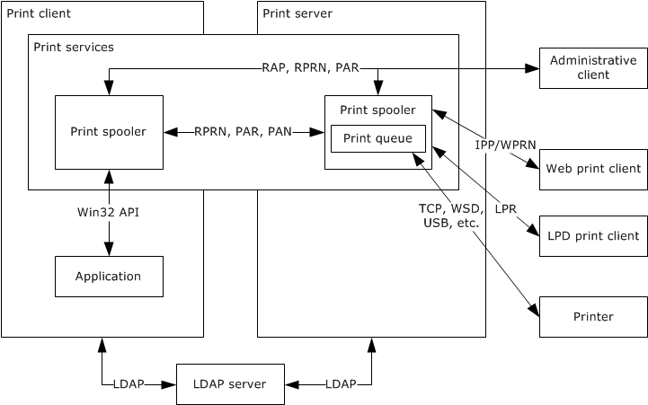

Figure 1: Components of printing services

#### 2.1.2.2 Relationship of the Components within Print and Administrative Clients and Print Server

The diagrams in this section show the relationship of the components within print or administrative clients, and the relationship of the components within print servers in the Print Services system. Additional details are available in System Internal Architecture (section [2.1.2.4](#Section_2.1.2.4)).

##### 2.1.2.2.1 Print and Administrative Clients

The following diagram shows the components in print and administrative clients.

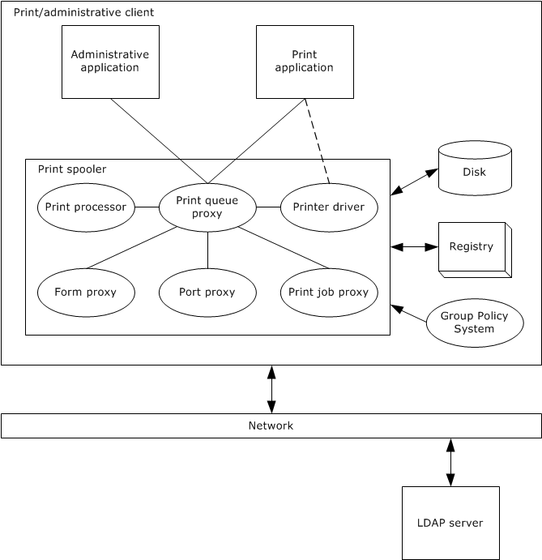

Figure 2: Components in print and administrative clients

##### 2.1.2.2.2 Print Server

The following diagram shows the components within the print server. The [**Server Service**](#gt_server-service) implements [**Server Message Block (SMB)**](#gt_server-message-block-smb) [MS-SMB](../MS-SMB/MS-SMB.md) and [**Remote Administration Protocol (RAP)**](#gt_remote-administration-protocol-rap) [MS-RAP](../MS-RAP/MS-RAP.md) endpoints.<3>

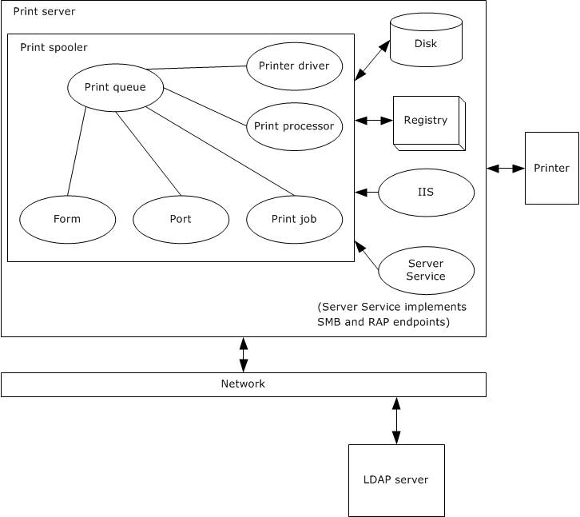

Figure 3: Components within the print server

#### 2.1.2.3 Member Protocol Functional Relationships

The following diagrams show the protocol relationships in the Print Services system.

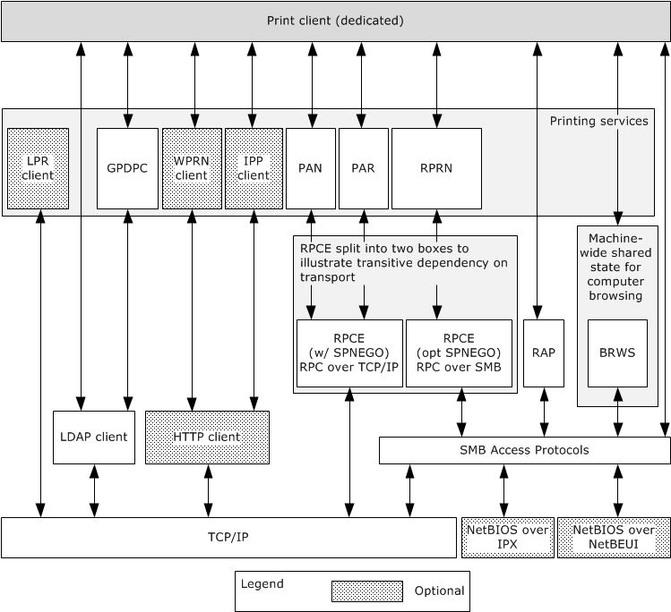

Figure 4: Full protocol layering for a print client showing all protocols, including optional protocols

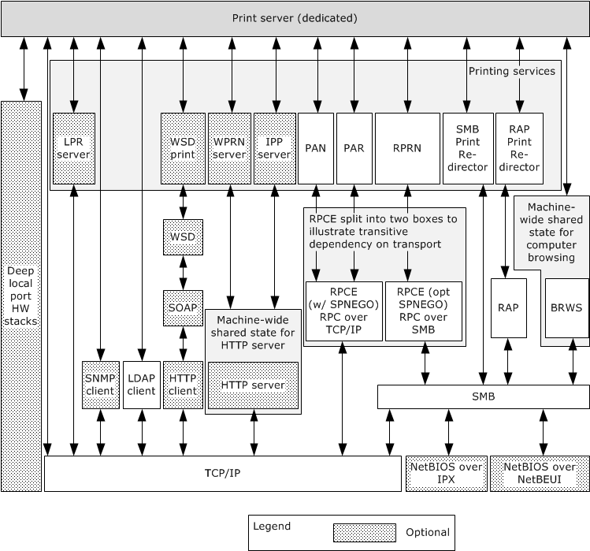

Figure 5: Full protocol layering for a print server showing all protocols, including optional protocols

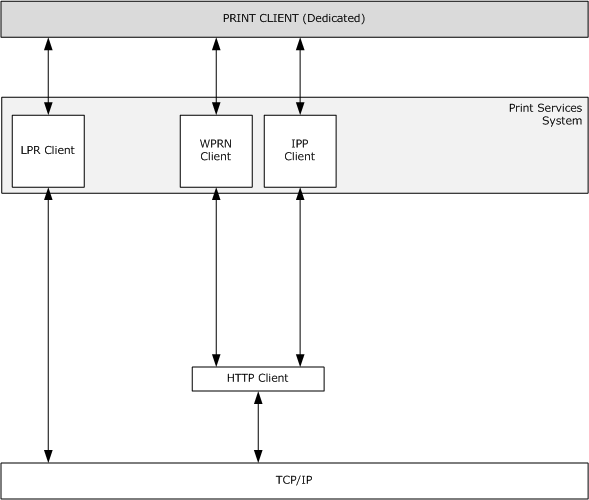

Figure 6: Optional protocol extensions for a print client

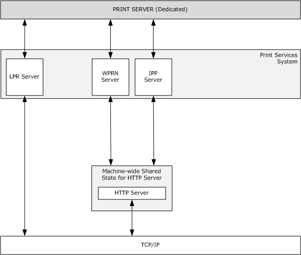

Figure 7: Optional protocol extensions for a print server to enable a print server to support Internet and LPD print clients

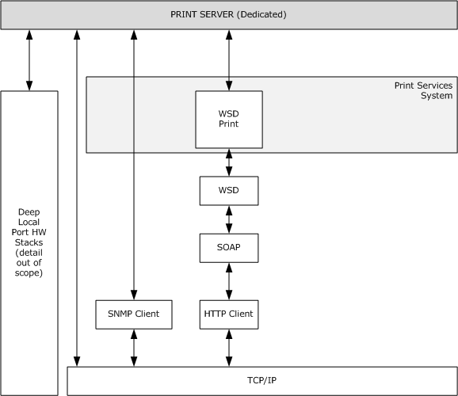

Figure 8: Protocol extensions used by a print server to communicate with printers

#### 2.1.2.4 System Internal Architecture

The following diagram shows the internal system architecture of the Print Services system.

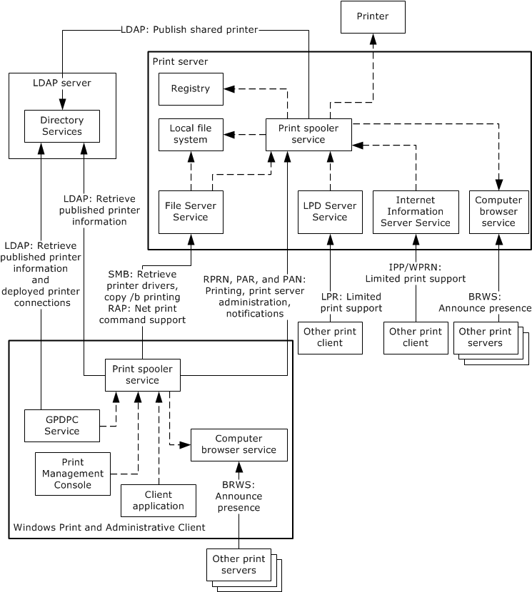

Figure 9: Print Services system internal system architecture

The Windows print client and Windows administrative client are shown in the preceding diagram as a single client object, contained by a bolded rectangle. Although they are often separate entities, these clients can share many of the same components and are differentiated by whether a client application or the Print Management Console, an administrative application under a user account belonging to the Administrators group, is running.

Within the print client, the Group Policy Service component (GPDPC Service) retrieves Group Policy settings that restrict print client connections to specified print servers. The GPDPC Service also creates print queue connections per computer and per user.

To locate a print queue in a workgroup environment, the [**print spooler**](#gt_print-spooler) of the print client uses the local computer browser service component, which continually listens for print server announcement messages. In a [**domain**](#gt_domain) environment, the print spooler of the print client can locate a print queue by various means; it can, for example, access an [**LDAP**](#gt_lightweight-directory-access-protocol-ldap) server of the [**Active Directory**](#gt_active-directory) system. The print spooler then sends a [**print job**](#gt_print-job) to the print spooler that is installed on the print server.

The core protocols of the Print Services system are the Print System Remote Protocol [MS-RPRN](../MS-RPRN/MS-RPRN.md), Print System Asynchronous Remote Protocol [MS-PAR](../MS-PAR/MS-PAR.md), and Print System Asynchronous Notification Protocol [MS-PAN](../MS-PAN/MS-PAN.md). The print server contains a print spooler that receives communications from the print client's print spooler by using these protocols.

For print clients that do not use the core protocols, the following three [**Server Service**](#gt_server-service) components provide print server support:

- The file server service, using [**SMB**](#gt_server-message-block-smb)/[**RAP**](#gt_remote-administration-protocol-rap) [MS-SMB](../MS-SMB/MS-SMB.md) [MS-RAP](../MS-RAP/MS-RAP.md), provides support for the Windows 95 operating system, Windows 98 operating system, and Windows Millennium Edition operating system print clients and for users who are running deprecated print commands.
- The LPD server service, using the Line Printer Daemon Protocol [[RFC1179]](https://go.microsoft.com/fwlink/?LinkId=90269), provides support for [**UNIX**](#gt_unix)-based print clients.
- The Internet Information Server Service, using [**IPP**](#gt_internet-printing-protocol-ipp) [[RFC8010]](https://go.microsoft.com/fwlink/?linkid=2157950) [[RFC8011]](https://go.microsoft.com/fwlink/?linkid=2157750) and the Web Point-and-Print Protocol [MS-WPRN](../MS-WPRN/MS-WPRN.md), provides support for print clients when the print server is behind a firewall that prevents communications through the core protocols.
In a domain environment, the print server's print spooler publishes shared print queues, which correspond to shared printers, to an LDAP server of the Active Directory system. In a workgroup environment, the print server's print spooler finds other print servers by using the local computer browser service. The print spooler uses the core protocols to announce shared print queues to each print server's local computer browser service.

The print server's print spooler persists system data in a [**registry**](#gt_registry) component. The print spooler loads print driver, [**port monitor**](#gt_port-monitor), [**print processor**](#gt_print-processor), and [**language monitor**](#gt_language-monitor) modules by using the local file system. The print spooler also uses the local file system of the print server to buffer print jobs.

#### 2.1.2.5 Windows Printing Architecture

Applications that are built by using Windows interfaces can use device-independent functions for creating [**print jobs**](#gt_print-job) and sending them to many types of printers. This [**device**](#gt_device) independence is based on the Windows architecture that is provided by the Windows graphics subsystems and the [**print spoolers**](#gt_print-spooler) and [**printer drivers**](#gt_printer-driver). Print spoolers and printer drivers are replaceable and can be written to target-specific client and printer hardware, while enabling applications to continue to use stable interfaces.

##### 2.1.2.5.1 Print Client Communication with Print Server

Applications that are written by using the Windows Print API that are running on print clients access the local [**print spooler**](#gt_print-spooler), which then redirects the application requests to the print services that are provided by the print server. This redirection establishes a level of indirection that isolates applications from protocol and capabilities negotiation and other complexities of the protocol, and keeps application code portable across multiple versions of the Print Services system.

The print spooler that resides on the print server implements print queues. These print queues are associated with [**printer drivers**](#gt_printer-driver), printer ports, and the printers to which they route print data. The following diagram shows print clients that request print servers to perform a variety of functions.

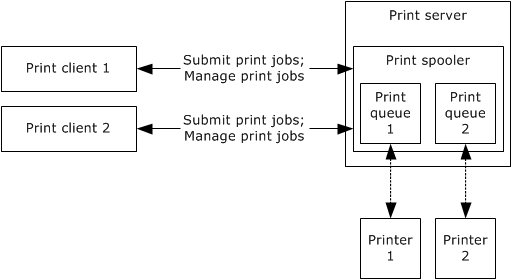

Figure 10: Print clients communicating with print server

##### 2.1.2.5.2 Protocols Supporting Different Print Clients

Different Print Services system protocols and other protocols are used to enable a variety of print clients to communicate with a print server. For more information about the versions, capabilities, and protocol support are described in section [2.6](#Section_2.6).

The following diagram shows the various protocols that print clients use to communicate with a print server.

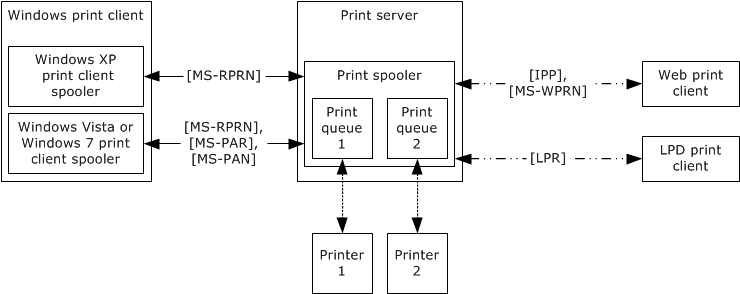

Figure 11: Protocols used by different print clients

##### 2.1.2.5.3 Protocol Redirectors on Print Servers

Simultaneous server-side support for printing services and file access services by way of the SMB Access Protocols [MS-SMB](../MS-SMB/MS-SMB.md) [MS-SMB2](../MS-SMB2/MS-SMB2.md) and [**RAP**](#gt_remote-administration-protocol-rap) [MS-RAP](../MS-RAP/MS-RAP.md) require that redirector components be implemented on the server because each of these protocols exhibits print-specific and file access-specific functionality on a single protocol [**endpoint**](#gt_endpoint). In addition, there is no ADM common to all the print services and file access services.

These redirector components transparently route file access-specific requests to local calls to the file access services, and they translate print-specific requests to local calls to the [**print spooler**](#gt_print-spooler) component that is implementing the print server role. The redirector components then translate the results of these local calls back to the appropriate protocol response.

The following diagram shows redirectors routing data from a print client to a print spooler.

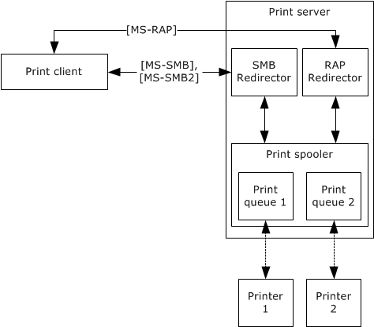

Figure 12: Redirectors routing data from a print client to the print spooler

##### 2.1.2.5.4 Enabling Print Queues to Be Discoverable

To enable [**print queues**](#gt_print-queue) to be discoverable by [**print clients**](#gt_print-client), the Print Services system uses the [**Active Directory**](#gt_active-directory) system [MS-ADOD](#Section_2.1) to store and provide information about shared queues. Although a print client can contact a [**print server**](#gt_print-server) directly to discover the print queues on the print server, using the Active Directory system that is implemented on the [**LDAP**](#gt_lightweight-directory-access-protocol-ldap) server enables a print client to enumerate print queues on multiple print servers. Additionally, the Active Directory system isolates print clients from the requirement to locate print servers in the [**domain**](#gt_domain).

Print clients can request that print servers publish print queues to the Active Directory system through the Print System Remote Protocol [MS-RPRN](../MS-RPRN/MS-RPRN.md) and the Print System Asynchronous Remote Protocol [MS-PAR](../MS-PAR/MS-PAR.md). Print clients can then search for print queues in the Active Directory system by using LDAP. The details of the interactions between the Print Services system and the Active Directory system are described in [MS-RPRN] section 2.3. Print clients search the Active Directory system by using the mechanism described in [MS-RPRN] section 2.3.3.3.

The following diagram shows the LDAP server obtaining information about print queues.

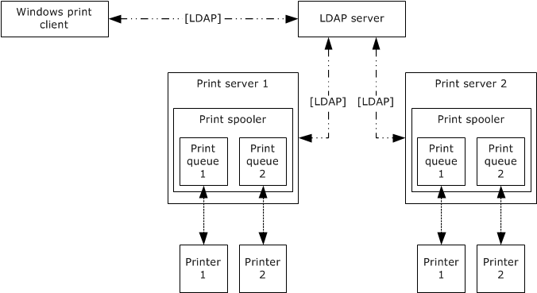

Figure 13: Obtaining information about print queues from an LDAP server

#### 2.1.2.6 Translating Application Content to a Print Data Format

Windows works with the [**print spooler**](#gt_print-spooler) to manage the translation of application content to printer-specific data formats by using two configurations, as shown in the following sections. The print spooler determines the data format for the [**print job**](#gt_print-job) by using the mechanism described in [MS-RPRN](../MS-RPRN/MS-RPRN.md) section 3.1.4.9.1.

In one configuration, Windows loads the [**printer driver**](#gt_printer-driver) directly into the application process. When the application prints, the produced data stream is already converted to the printer-specific data format in the application process, and is then passed to the print spooler service for buffering and further processing. This configuration is independent of the actual produced data format, and is referred to as producing a raw data format.

In another configuration, Windows does not load the printer driver into the application process, which isolates the application from the actual translation work. Instead, Windows records document creation and drawing commands in a [**metafile**](#gt_metafile), which is then passed to the print spooler service for buffering and conversion to a printer-specific data format. The metafile can have various data formats, such as [**EMF**](#gt_enhanced-metafile-format-emf) [MS-EMFSPOOL](../MS-EMFSPOOL/MS-EMFSPOOL.md) or [**XPS**](#gt_xml-paper-specification-xps) [[MSFT-XMLPAPER]](https://go.microsoft.com/fwlink/?LinkId=90214). The print spooler service uses a [**print processor**](#gt_print-processor), which is usually part of the printer driver, to assist in the translation of the metafile to the printer-specific data stream. A print processor loads the metafile and replays the contained commands to the printer driver, which then performs the actual translation process to the printer-specific data stream.

#### 2.1.2.7 Supporting Client-Side Rendering and Server-Side Rendering

Client-side rendering is one configuration of a client-server printing model. In this configuration, the [**print spooler**](#gt_print-spooler) service on the print client translates the metafile to the printer-specific raw format before sending it as a data-stream payload to the print spooler service on the print server.

In a server-side rendering configuration, the print spooler service on the print client sends an unmodified metafile payload to the print spooler service on the print server, where the metafile is subsequently converted to the printer-specific raw data format.

In order to support both client-side rendering and server-side rendering, it is a requirement that [**print processors**](#gt_print-processor) and [**printer drivers**](#gt_printer-driver) are available to print servers and print clients. Windows addresses this requirement by using a mechanism called Point-and-Print, which allows a print client to download a printer driver directly from a print server, and a Package Point-and-Print mechanism that allows a print client to download a printer support package that includes the print processor [MS-WPRN](../MS-WPRN/MS-WPRN.md).

#### 2.1.2.8 Sending Print Data to a Printer via a Port Monitor

In order to send print data to a printer, a print server uses a [**port monitor**](#gt_port-monitor) module. Port monitors implement an abstraction API that allows the [**print spooler**](#gt_print-spooler) service to send and receive data through a [**printer port**](#gt_printer-port), such as [**USB**](#gt_universal-serial-bus-usb) or parallel ports on the computer acting as the print server and connected to a printer, or through a network connection to a printer, such as [**TCP/IP**](#gt_tcpip).

#### 2.1.2.9 Branch Office Print Mode

An operating mode in which a print client is able to print directly to a print device instead of a print queue on a print server. It can reduce network costs in environments with centralized print servers. This mode is enabled by an administrator and is transparent to the user. Only print queues connected via the TCPMON [**monitor module**](#gt_monitor-module) ([MS-RPRN](../MS-RPRN/MS-RPRN.md) section 3.1.4.11.3), the WSDMON monitor module ([MS-RPRN] section 3.1.4.11.4), or the APMON monitor module ([MS-RPRN] section 3.1.4.11.5) are eligible to operate in [**branch office print mode**](#gt_branch-office-print-mode).

### 2.1.3 Applicability

The Print Services system supports the use and management of a distributed print infrastructure. By using print servers and print clients that implement the member protocols that are described in this overview, one or more printers can be shared between one or more print clients.

The Print Services system scales from workgroup use, in which printers are shared between computers, to [**domain**](#gt_domain)-based networks, in which multiple print servers are employed in a cluster configuration, and the print client configuration is managed by the [**Active Directory**](#gt_active-directory) system. The Print Services system also provides a subset of functionality for managing a single printer that is connected to a single computer.

In addition to protocols supporting communication between print clients and print servers, the Print Services system also supports externally defined system protocols for the Group Policy system and the Active Directory system. The Print Services system uses the local file system services of the print server to store [**print jobs**](#gt_print-job) and [**printer drivers**](#gt_printer-driver). The Print Services system also uses the local [**registry**](#gt_registry) on the print server to persist the ADM of the print server. The Print Services system has minimal interaction with other components of Windows.

Managed printers are reflected in the Print Services system as print queues on a print server. Each print queue has an associated printer driver that is used by the Print Services system and applications to learn about printer capabilities, such as paper formats, color capabilities, and print quality. The associated printer driver is also responsible for conversion of application commands into the vendor-defined [**page description language (PDL)**](#gt_page-description-language-pdl) that is used to print a job on a printer.

### 2.1.4 Relevant Standards

The Print Services system uses the following standards:

**HTTP over TLS: Hypertext Transfer Protocol** [[RFC2818]](https://go.microsoft.com/fwlink/?LinkId=90383). Used in the Print Services system as the transport protocol for [**IPP**](#gt_internet-printing-protocol-ipp) and the Web Point-and-Print Protocol [MS-WPRN](../MS-WPRN/MS-WPRN.md).

**Internet Printing Protocol (IPP)** [[RFC8010]](https://go.microsoft.com/fwlink/?linkid=2157950) [[RFC8011]](https://go.microsoft.com/fwlink/?linkid=2157750). Used in the Print Services system for printing from Windows and non-Windows clients, or in cases where network security requirements prescribe firewall settings that preclude use of the Print System Remote Protocol [MS-RPRN](../MS-RPRN/MS-RPRN.md) and the Print System Asynchronous Remote Protocol [MS-PAR](../MS-PAR/MS-PAR.md).

**LDAP: Lightweight Directory Access Protocol** [[RFC4511]](https://go.microsoft.com/fwlink/?LinkId=157505). Used by the print server role to publish shared printer information to the directory. Used by the print client role to discover available shared printers in the [**domain**](#gt_domain).

**Line Printer Daemon Protocol** [[RFC1179]](https://go.microsoft.com/fwlink/?LinkId=90269). Used in the Print Services system for printing from non-Windows clients, such as on [**UNIX**](#gt_unix)-based systems.

**RPC: Remote Procedure Call Protocol** [[RFC1831]](https://go.microsoft.com/fwlink/?LinkId=90295) [[C706]](https://go.microsoft.com/fwlink/?LinkId=89824) [MS-RPCE](../MS-RPCE/MS-RPCE.md). Used as a transport for the Print System Remote Protocol using [**RPC**](#gt_remote-procedure-call-rpc) over [**SMB**](#gt_server-message-block-smb), in the Print System Asynchronous Remote Protocol using RPC over [**TCP/IP**](#gt_tcpip), and in the Print System Asynchronous Notification Protocol [MS-PAN](../MS-PAN/MS-PAN.md) using RPC over TCP/IP.

## 2.2 Protocol Summary

The member protocols of the Print Services system include the protocols that are described in this section, [**IPP**](#gt_internet-printing-protocol-ipp) [[RFC8011]](https://go.microsoft.com/fwlink/?linkid=2157750) [[RFC8010]](https://go.microsoft.com/fwlink/?linkid=2157950), and the Line Printer Daemon Protocol [[RFC1179]](https://go.microsoft.com/fwlink/?LinkId=90269). The Print Services system uses the print data formats of [**XPS**](#gt_xml-paper-specification-xps) [[MSFT-XMLPAPER]](https://go.microsoft.com/fwlink/?LinkId=90214) and [**EMFSPOOL**](#gt_enhanced-metafile-spool-format-emfspool) [MS-EMFSPOOL](../MS-EMFSPOOL/MS-EMFSPOOL.md).

The following table provides a comprehensive list of the member protocols of the Print Services system.

| Protocol name | Description | Specification short name |
| --- | --- | --- |
| **Print System Remote Protocol** | This protocol supports synchronous printing and spooling operations between a client and server, including [**print job**](#gt_print-job) control and Print Services system management. This protocol also provides status notifications, which are defined by the Print Services system, to the print client. An enhanced replacement for this protocol is the Print System Asynchronous Remote Protocol [MS-PAR](../MS-PAR/MS-PAR.md). | [MS-RPRN](../MS-RPRN/MS-RPRN.md) |
| **Print System Asynchronous Remote Protocol** | This protocol supports printing and spooling operations between a client and server, including print job control and Print Services system management. This protocol also provides status notifications, which are defined by the Print Services system, to the print client. This protocol is designed to be used asynchronously by print clients whose implementations enable them to continue execution without waiting for a [**remote procedure call (RPC)**](#gt_remote-procedure-call-rpc) method call to return. This protocol is an enhanced replacement for the Print System Remote Protocol [MS-RPRN]. | [MS-PAR] |
| **Print System Asynchronous Notification Protocol Specification** | This protocol is used by print clients asynchronously to receive print status notifications from a print server and to send back responses to those notifications. A set of notifications and responses are defined together as a notification type. In contrast to the status notification capabilities that are included in the Print System Remote Protocol and the Print System Asynchronous Remote Protocol, the RPC interfaces and methods that are defined by this protocol provide a transport mechanism for arbitrary, [**IHV**](#gt_independent-hardware-vendor-ihv)-extensible notification types. This protocol is used by IHV-provided components that are running on the print server to trigger the display of a user interface on the print client. | [MS-PAN](../MS-PAN/MS-PAN.md) |
| **Web Point-and-Print Protocol** | This protocol is used in conjunction with IPP and enables a client to download [**printer driver**](#gt_printer-driver) software from a print server in the client network, from a website, or directly from a printer. This protocol is based on [**HTTP**](#gt_hypertext-transfer-protocol-http). | [MS-WPRN](../MS-WPRN/MS-WPRN.md) |
| **Enhanced Metafile (EMF) Spool Format** | EMFSPOOL defines a [**metafile**](#gt_metafile) format that can store a print job in portable form. The stored print job contains information for printing a document outside the control of the original application, either on the same computer or on another computer. An EMFSPOOL metafile is played back when its records are parsed and processed, and the print job is sent to its destination. | [MS-EMFSPOOL] |
| **SMB access protocols** | These protocols are used in the Print Services system for communication with legacy Windows print clients and print servers to submit print job information. "Legacy" is collectively used for those print clients and print servers that do not support the Print System Asynchronous Remote Protocol. This group of protocols is used by command-line-based copy to printer share operations. | [MS-CIFS](../MS-CIFS/MS-CIFS.md), [MS-SMB](../MS-SMB/MS-SMB.md), [MS-SMB2](../MS-SMB2/MS-SMB2.md), and [MS-FSCC](../MS-FSCC/MS-FSCC.md) |
| **Remote Administration Protocol (RAP)** | This protocol performs remote administrative functions, including share maintenance and printer maintenance on LAN Manager servers. It is used in the Print Services system for communication with legacy Windows print clients or print servers to manage print queues. "Legacy" is collectively used for those print clients and print servers that do not support the Print System Asynchronous Remote Protocol. | [MS-RAP](../MS-RAP/MS-RAP.md) |
| **Group Policy: Deployed Printer Connection Extension** | This protocol supports managing connections to printers that are hosted by print servers and shared by multiple users. The print server component of this protocol enables an administrator to configure printer connections. The print client component of this protocol enables a user to discover the printer connections that have been configured. | [MS-GPDPC](../MS-GPDPC/MS-GPDPC.md) |

The protocols that are used by the Print Services system perform roles as follows:

**Printing**: The Print System protocols and the SMB access protocols are used for this role.

**Managing print jobs**: The Print System protocols are used for this role. [**RAP**](#gt_remote-administration-protocol-rap) is used for this role for print clients and print servers that do not support the Print System protocols.

**Managing the Print Services System**: The Print System protocols are used for this role. RAP is used for this role for print clients and print servers that do not support the Print System protocols.

**Receive notifications about general printing status**: The Print System protocols are used for this role.

**Receive notifications about specific printing status from IHV-defined components**: The Print System Asynchronous Notification Protocol is used for this role.

**Respond to notifications about specific printing status to IHV-defined components**: The Print System Asynchronous Remote Protocol is used for this role.

**Download printer drivers to a client**: The SMB access protocols and Web Point-and-Print Protocol, based on HTTP, are used to download printer drivers from a website, a printer, or a print server in the same network as the print client.

**Store print jobs**: The EMFSPOOL protocol and XPS are used as payloads for print jobs.

**Configure print clients**: The Group Policy: Deployed Printer Connections Extension [MS-GPDPC] is used for this role.

The following tables show the member protocols of the Print Services system. They are grouped according to their primary purpose.

Protocols in this table enable print queue connection and printing from Internet clients.

| Protocol name | Description | Specification short name |
| --- | --- | --- |
| **Internet Printing Protocol** | Used in the Print Services system for printing from non-Windows clients, or in cases where network security requirements mandate firewall settings that preclude use of the Print System Remote and Print System Asynchronous Remote Protocol Protocols. | [RFC8011] [RFC8010] |
| **Web Point-and-Print Protocol** | This protocol is used in conjunction with IPP and enables a client to download printer driver software from a print server in the client network, from a website, or directly from a printer. This protocol is based on HTTP. | [MS-WPRN] |

Protocols in this table enable printing and IHV plug-in-defined communication.

| Protocol name | Description | Specification short name |
| --- | --- | --- |
| **Print System Asynchronous Remote Protocol** | This protocol supports printing and spooling operations between a client and server, which include print job control and Print Services system management. This protocol also provides status notifications that are defined by the Print Services system to the print client. This protocol is designed to be used asynchronously by print clients whose implementations enable them to continue execution without waiting for a remote procedure call (RPC) method call to return. This protocol is an enhanced replacement for the Print System Remote Protocol. | [MS-PAR] |
| **Print System Remote Protocol** | This protocol supports synchronous printing and spooling operations between a client and server, which includes print job control and Print Services system management. This protocol also provides status notifications, which are defined by the Print Services system, to the print client. An enhanced replacement for this protocol is the Print System Asynchronous Remote Protocol. | [MS-RPRN] |
| **Print Asynchronous Notification Protocol** | This protocol is used by print clients asynchronously to receive print status notifications from a print server and to send back responses to those notifications. A set of notifications and responses are defined together as a notification type. In contrast to the status notification capabilities that are included in the Print System Remote Protocol and the Print System Asynchronous Remote Protocol, the RPC interfaces and methods that are defined by this protocol provide a transport mechanism for arbitrary, IHV-extensible notification types. This protocol is used by IHV-provided components that are running on the print server to trigger the display of a user interface on the print client. | [MS-PAN] |

Protocols in this table enable printing from clients that are only capable of Print Services system (PSS) version 1.0 support. For more information about PSS versioning, see section [2.6](#Section_2.6).

| Protocol name | Description | Specification short name |
| --- | --- | --- |
| **Remote Administration Protocol (RAP)** | This protocol performs remote administrative functions, including share maintenance and printer maintenance on LAN Manager servers. It is used in the Print Services system for communication with legacy Windows print clients or print servers to manage print queues. "Legacy" is collectively used for those print clients and print servers that do not support the Print System protocols. | [MS-RAP] |
| **SMB access protocols** | These protocols are used in the Print Services system for communication with legacy Windows print clients and print servers to submit print job information. "Legacy" is collectively used for those print clients and print servers that do not support the Print System protocols. This group of protocols is used by command-line copy to printer share operations. | [MS-CIFS], [MS-SMB], [MS-SMB2], and [MS-FSCC] |

## 2.3 Environment

The following sections identify the context in which the system exists. This includes the systems that use the interfaces provided by this system of protocols, other systems that depend on this system, and, as appropriate, how components of the system communicate.

### 2.3.1 Dependencies on This System

None.

### 2.3.2 Dependencies on Other Systems/Components

The Print Services system member protocols require the following protocols:

[**SMB**](#gt_server-message-block-smb) access protocols:

- Used as transport for the Print System Remote Protocol [MS-RPRN](../MS-RPRN/MS-RPRN.md). It uses [**RPC**](#gt_remote-procedure-call-rpc) over named SMB pipes.
- Used for driver download from a print server by using the copy file functionality of the SMB access protocols.
[**RAP**](#gt_remote-administration-protocol-rap) [MS-RAP](../MS-RAP/MS-RAP.md), used to browse for printers.

[**CIFS**](#gt_common-internet-file-system-cifs) [MS-CIFS](../MS-CIFS/MS-CIFS.md), used to copy drivers from the server and to submit [**print jobs**](#gt_print-job) over redirected ports.

SMB Version 1.0 [MS-SMB](../MS-SMB/MS-SMB.md) and RAP. SMB Protocol Versions 2 and 3 [MS-SMB2](../MS-SMB2/MS-SMB2.md), however, are not compatible with RAP:

- Used for managing SMB print scenarios by using RAP.
- Used for managing SMB file copy functionality of the print server by using RAP.
[**HTTP**](#gt_hypertext-transfer-protocol-http)/[**HTTPS**](#gt_hypertext-transfer-protocol-secure-https):

- Used as transport for the Web Point-and-Print Protocol [MS-WPRN](../MS-WPRN/MS-WPRN.md).
- Used as transport for [**IPP**](#gt_internet-printing-protocol-ipp) [[RFC8010]](https://go.microsoft.com/fwlink/?linkid=2157950) [[RFC8011]](https://go.microsoft.com/fwlink/?linkid=2157750).
RPC over TCP/IP:

- Used as transport for the Print System Asynchronous Remote Protocol [MS-PAR](../MS-PAR/MS-PAR.md).
- Used as transport for the Print System Asynchronous Notification Protocol [MS-PAN](../MS-PAN/MS-PAN.md).
[**Group Policy**](#gt_group-policy): Core Protocol [MS-GPOL](../MS-GPOL/MS-GPOL.md) [MS-NRPC](../MS-NRPC/MS-NRPC.md) [MS-DRSR](../MS-DRSR/MS-DRSR.md).

- Used for the Group Policy: Deployed Printer Connections Extension [MS-GPDPC](../MS-GPDPC/MS-GPDPC.md).
[**LDAP**](#gt_lightweight-directory-access-protocol-ldap)

- Used for publishing and query of shared print queues.
- Used by the Group Policy: Deployed Printer Connections Extension.
[**TCP/IP**](#gt_tcpip):

- Used as transport by LDAP [[RFC4511]](https://go.microsoft.com/fwlink/?LinkId=157505).
- Used as transport by the Line Printer Daemon Protocol [[RFC1179]](https://go.microsoft.com/fwlink/?LinkId=90269).
- Used as transport by HTTP.
- Used as transport by HTTPS.
- Used as transport by RPC over TCP/IP.
- Used as transport by the SMB protocol family unless on an IPX or [**NetBEUI**](#gt_netbeui) network [[NETBEUI]](https://go.microsoft.com/fwlink/?LinkId=90224).
Common Internet File System (CIFS) Browser Protocol [MS-BRWS](../MS-BRWS/MS-BRWS.md).

- Used for workgroup preconditions.
The Print Services system member protocols [MS-RPRN], [MS-PAR], and [MS-PAN] are RPC-based and require RPC bindings between print servers and print clients to registered RPC endpoints. If a print client or print server is unable to register an RPC [**endpoint**](#gt_endpoint) or create RPC bindings, then Print Services, which are provided by the local print spooler, only enable the management and use of locally connected printers. Firewalls that are implemented on print clients or print servers are configured so that all ports that are required by member protocols are open for RPC-based communication, or at least open for SMB-based communication to support the Internet printing scenario by using IPP and the Web Point-and-Print Protocol.

The Print Services system can run in a [**domain**](#gt_domain)-based network and a workgroup environment. Print Services require that File Share services be installed and enabled for Point-and Print-driver download and for SMB and Remote Administration Protocol support. On creation of a printer queue connection to a print server, the print client tries to copy the driver from the print server. For more information, see the use cases in sections [2.5.3.3](#Section_2.3) and [2.5.3.4](#Section_2.3). If copying the print driver fails, the print client tries, in turn, to locate:

- Any available implementation-specific driver sources or repositories.<4>
- The print client prompts the user to supply an appropriate [**printer driver**](#gt_printer-driver) from a disk, an Internet location, or other media.
If the print client cannot obtain a suitable printer driver from any of these sources, the print queue connection cannot be created.

The Print Services system requires the CIFS Browser Protocol for workgroups. Availability of this protocol and the [**Active Directory**](#gt_active-directory) system is not determined at startup, but only on request. If neither the CIFS Browser Protocol nor the Active Directory system are available, a print client does not list any available shared print queues in the network; as a result, only local functionality of the [**print spooler**](#gt_print-spooler) is available unless the user of the print client knows the name of the print server and enters it manually.

The Print Services system uses the Windows Update Services: Client Server Protocol [MS-WUSP](../MS-WUSP/MS-WUSP.md), if available, to find the most up-to-date or best matching printer drivers for a print queue connection. If Windows Update Services are unavailable, the Print Services system use other methods to find an appropriate printer driver. For more information, see the use cases in sections [2.5.3.2](#Section_2.1) and 2.5.3.3.

All member protocols can be used between print clients and print servers, depending on circumstances.

The Print Services system uses the Active Directory system in domain-based networks. The LDAP protocol is used between the print server and the Active Directory system and between the print client and the Active Directory system. In workgroup environments, the CIFS Browser Protocol [MS-BRWS] is used for communication between print clients and print servers, and between print servers.

The file system access that is used by clients to download printer drivers only assumes a directory-structured file system. The print server generally restricts access by using [**access control lists (ACLs)**](#gt_access-control-list-acl), so that print clients have only read access to the printer driver files. The file system supports file date/time stamps for comparing driver versions.

Any number of print servers and print clients can be operated in a domain-based network. The number of shared print queues of which clients retain knowledge in a Windows workgroup is limited to an implementation-defined maximum,<5> which limits the useful number of shared printers in a Windows workgroup network. From the system perspective, the entirety of print clients and print servers in a given network represents a single instance of the system.

The Print Services system also depends on the following components and infrastructure:

- The Windows Authentication Services system [MS-AUTHSOD](#Section_2.1).
- The Active Directory system in a domain environment: If the Print Services system is deployed within a domain, print servers can publish shared printers to the Active Directory system by using LDAP. Print clients that are joined to domains also require access to the Active Directory system to discover published printers.
- The networking system to connect print server, print clients, and the Active Directory system.
- Printers.
- Application software that provides printing functionality, such as Microsoft Office Word.
The Print Services system is influenced by the following:

- The Active Directory system can propagate policy settings that control local spooler behavior to print clients and print servers.<6> by using the Group Policy: Core Protocol [MS-GPOL].
- These policies control aspects of print spooler implementation, for example, which print servers are considered trusted for printer driver download in Point-and-Print scenarios.
- The Group Policy: Deployed Printer Connection Extension [MS-GPDPC] influences the Print Services system in regard to [**deployed printer connections**](#gt_deployed-printer-connection).

## 2.4 Assumptions and Preconditions

The following assumptions and preconditions are necessary for the Print Services system to operate successfully:

- A network is available to provide a viable transport for the communication between the server and its clients.
- The transport protocol for that network is available and configured. For example, the TCP transport is configured with a valid IP address.
- [**Security providers**](#gt_security-provider) are available to the system to provide message authentication and security.
- The durable storage [**devices**](#gt_device) that are used to store the system's state are on all participating computers.
- The [**print spooler**](#gt_print-spooler) service is in the running state on the server and each of the clients participating in the interaction.
- The print spooler is installed on all the participating computers.
- The local print client connecting to a remote print server supports impersonation if the remote spooler requires authentication.
- The remote print spooler is not required to use impersonation, nor does it require that local clients support impersonation, except when using the Print Asynchronous Notification Protocol [MS-PAN](../MS-PAN/MS-PAN.md).
- The file SMB Protocol Family support server service is in the running state on the server.
- The print client and print server support the Print System Remote Protocol [MS-RPRN](../MS-RPRN/MS-RPRN.md).
- The system is configured so that participants can access its services locally or remotely.
- It is assumed that each participant is trusted by the system.
- If member protocols that are supported by the system, as listed in section [2.2](#Section_2.1.2.5.2), have additional assumptions and preconditions for when that protocol is in use, see the relevant member protocol specification for details.
- Print servers have a durable store to place the following objects in:
- [**Printer drivers**](#gt_printer-driver)
- [**Print jobs**](#gt_print-job)
- Print clients have a durable store to place the following objects in:
- Printer drivers
- Print clients and print servers have access to local storage to persist ADM and state information; in the Windows, this local storage is in the [**registry**](#gt_registry).
- In a [**domain**](#gt_domain) configuration, print clients and print servers have access to the [**Active Directory**](#gt_active-directory) system that is provided by the domain.
- [**Authentication**](#gt_authentication) services supporting [**Simple and Protected GSS-API Negotiation Mechanism (SPNEGO)**](#gt_simple-and-protected-gss-api-negotiation-mechanism-spnego) [MS-SPNG](../MS-SPNG/MS-SPNG.md) are available to the print servers and clients.
- The Print System Remote Protocol is a [**RPC**](#gt_remote-procedure-call-rpc) interface and therefore has the prerequisites common to RPC interfaces ([MS-RPCE](../MS-RPCE/MS-RPCE.md) section 1.5).
- The Print System Asynchronous Remote Protocol [MS-PAR](../MS-PAR/MS-PAR.md) is an RPC interface and therefore has the prerequisites common to RPC interfaces.
- The Print Asynchronous Notification Protocol is an RPC interface and therefore has the prerequisites common to RPC interfaces.
- The print client has obtained the name of the print server that supports the Print Services system. Various protocols can be used, including the Active Directory Lightweight Directory Services Schema [MS-ADLS](../MS-ADLS/MS-ADLS.md), Active Directory Schema Classes [MS-ADSC](../MS-ADSC/MS-ADSC.md), and the CIFS Browser Protocol [MS-BRWS](../MS-BRWS/MS-BRWS.md).

## 2.5 Use Cases

The Print Services system is designed to support scenarios that allow users shared access to printers that are connected to print servers or to computers that are used by other users. When a user wants to print to a shared printer, the system facilitates this action by providing the following:

- Lists of shared printers
- Connecting the user to the [**print queue**](#gt_print-queue) that is associated with the requested printer and enabling the user to install the appropriate [**printer driver**](#gt_printer-driver)
- Transporting the print data from the print client to the print queue
- Processing multiple [**print jobs**](#gt_print-job) in the order of their arrival or priorities
- Keeping the user apprised of the status of the print job
The Print Services system also facilitates the management of a large number of shared printers across multiple print servers by enabling an administrator to remotely install and configure shared print queues on print servers, to manage the use of shared print queues on print servers, and to view and manage print jobs that have been submitted by all users to shared print queues on print servers.

Although there is a distinction between the roles and capabilities of administrator and user when participating in the Print Services system, both roles can be conducted on the same computer. And although there is a distinction between a print client and a print server as actors in scenarios that are using the Print Services system, a print client can assume the role of a print server if it enables other print clients to discover and use a print queue that is installed on the print client computer or administers administrative clients.

This section provides the use cases that describe the functionality of the Print Services system in terms of actors that participate in this system and their goals. The use case participants most often include a print client and a print server. They are triggered by a user performing print operations, or an administrator performing administrative operations.

Section [2.5.2](#Section_2.5.2) provides a table that summarizes the use cases that are described in section [2.5.3](#Section_2.5.3).

### 2.5.1 Actors

**Print client**: The print client connects to a print queue on a print server, sends print data to the print queue, displays notifications about the printer or [**print job**](#gt_print-job), and disconnects from the print queue. The print client can take the form of an application that the user is printing from or take the form of a component of an operating system.

**Administrative client**: The administrative client connects to print servers to establish, configure, and manage print queues that are hosted on the print servers. The administrative client can also be used to manage print jobs that are sent to the print queues. The administrative client takes the form of an administrative tool application.

**Print server**: The print server hosts print queues, each print queue corresponding to a shared printer. The print server stores and uses [**printer drivers**](#gt_printer-driver) that are necessary for processing print data before it is sent to printers. Depending on the configuration of the print server and print client, the print server can supply printer drivers to print clients, so print clients can perform print data processing locally. The print server processes requests from print clients and the administrative clients. Among these are requests to connect, disconnect, upload a driver, download a driver, and route print data. The print server manages access from users and administrators to the print queues, sends notifications about print queues and print jobs to users and administrators, and routes print data to the appropriate print queues.

**Internet browser**: An Internet browser can be used to discover shared print queues on a print server. The internet server component on the print server uses local [**print spooler**](#gt_print-spooler) APIs to obtain a list of print queues and presents the list to the client as an [**HTML**](#gt_hypertext-markup-language-html) page. An Internet browser can be used for this purpose if a firewall or other network restrictions do not allow the core Print Services system protocols to be used. When a user knows the name of the print queue, the user can enter the address in the print client user interface to connect to the printer.

**User**: The individual who uses a print client to choose a print queue from a list of available shared print queues, sends a print job to the print queue, and monitors the progress of the print job.

**Administrator**: The individual who is responsible for installing and configuring printers within a deployed Print Services system, and for monitoring, managing, and troubleshooting printing functions. The administrator uses an administrative client.

**Active Directory system**: The [**Active Directory**](#gt_active-directory) system is used to store a list of shared print queues in a [**domain**](#gt_domain) environment. The Print Services system uses version 3 of LDAP [[RFC4511]](https://go.microsoft.com/fwlink/?LinkId=157505) to publish information about shared print queues to the Active Directory system. Print clients can then discover shared print queues that are published by the Active Directory system, which enables a user to choose a print queue to which to send a print job.

**Group Policy system**: The Print Services system makes use of the Group Policy system [MS-GPOD](#Section_2.1) to restrict print clients from accessing specified print servers and to remotely push preconfigured print queue connections to print clients. The Print Services system uses a Group Policy Services Extension [MS-GPDPC](../MS-GPDPC/MS-GPDPC.md) to distribute these preconfigured print queue connections to print clients.

### 2.5.2 Use Case Summary Diagrams

The following table provides an overview of use cases which span the functionality of the Print Services System. Use case extensions are noted within each use case. Detailed descriptions for these use cases are provided in section [2.5.3](#Section_2.5.3).

| Use case group | Use cases |
| --- | --- |
| Provision or Delete a print queue | Provision a [**print queue**](#gt_print-queue) using the Print System Remote Protocol [MS-RPRN](../MS-RPRN/MS-RPRN.md) - Administrative Client. Install [**print processor**](#gt_print-processor) on print server. Provision a print queue using the Print System Asynchronous Remote Protocol [MS-PAR](../MS-PAR/MS-PAR.md) - Administrative Client. Install print processor on print server. Delete a print queue using the Print System Remote Protocol - Administrative Client. Delete objects on print server that the implementation determines are no longer needed. Delete a print queue using the Print System Asynchronous Remote Protocol - Administrative Client. Delete objects no longer referenced on print server. |
| Locate and Establish a Connection to a print queue | Locate and establish a connection to a print queue in a domain environment using the Print System Remote Protocol - Print Client. Print client downloads [**printer driver**](#gt_printer-driver). Print client connections are restricted by Group Policy settings. Print client registers for notifications of print queue status. Locate and establish a connection to a print queue in a domain environment using the Print System Asynchronous Remote Protocol - Print Client. Print client downloads printer driver. Print client connections are restricted by Group Policy settings. Print client registers for notifications of print queue status. Locate and establish a connection to a print queue in a workgroup environment using the Print System Remote Protocol - Print Client. Print client downloads printer driver. Print client registers for notifications of print queue status. Locate and establish a connection to a print queue in a workgroup environment using the Print System Asynchronous Remote Protocol - Print Client. Print client downloads printer driver. Print client registers for notifications of print queue status. Locate and establish a connection to a print queue from an internet client using [**IPP**](#gt_internet-printing-protocol-ipp) [[RFC8011]](https://go.microsoft.com/fwlink/?linkid=2157750) [[RFC8010]](https://go.microsoft.com/fwlink/?linkid=2157950); download a printer driver using the Web Point-and-Print Protocol - Print Client. |
| Manage a print queue | Set Permissions on a print queue using the Print System Remote Protocol - Administrative Client. Set Permissions on a print queue using the Print System Asynchronous Remote Protocol - Administrative Client. |
| Submit a Print Job | Submit a print job using the Print System Remote Protocol - Print Client. Print client obtains notifications about [**print job**](#gt_print-job) status. Print client obtains notifications for [**IHV**](#gt_independent-hardware-vendor-ihv)-defined components on print server. Submit a print job using the Print System Asynchronous Remote Protocol - Print Client. Print client obtains notifications about print job status. Print client obtains notifications for IHV-defined components on print server. Submit a print job using IPP - Print Client. Submit a print job using SMB Protocol Family - Print Client. |
| Manage a Print Job | Manage print jobs submitted by self, using the Print System Remote Protocol - Print Client. Manage Print jobs submitted by self, using Print System Asynchronous Remote Protocol - Print Client. Manage print jobs submitted by all users, using the Print System Asynchronous Remote Protocol - Administrative Client. Manage print jobs submitted by all users using the Print System Asynchronous Remote Protocol - Administrative Client. Manage a print job submitted from command line using [**RAP**](#gt_remote-administration-protocol-rap) [MS-RAP](../MS-RAP/MS-RAP.md) - Print Client. |

The following use case diagrams illustrate the use cases described in this section, dividing them between those initiated by an administrative client and those initiated by a print client.

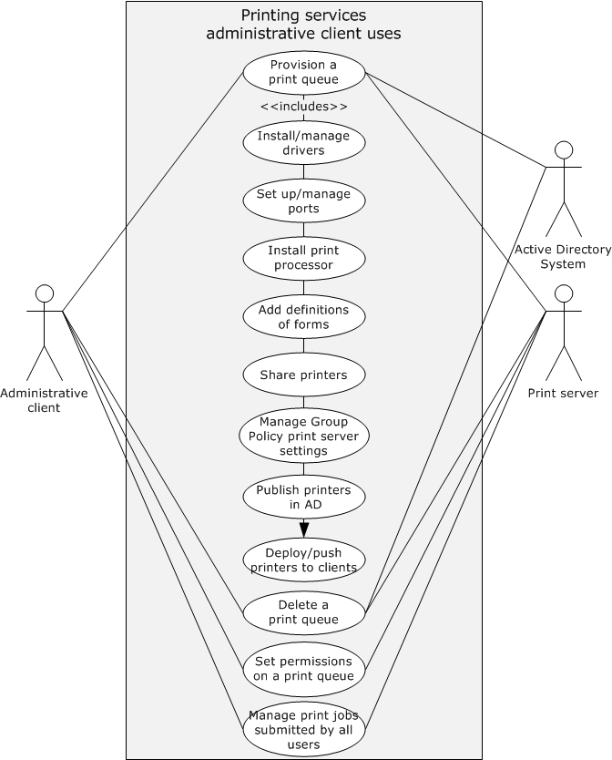

Figure 14: Printing services use cases initiated by an administrative client

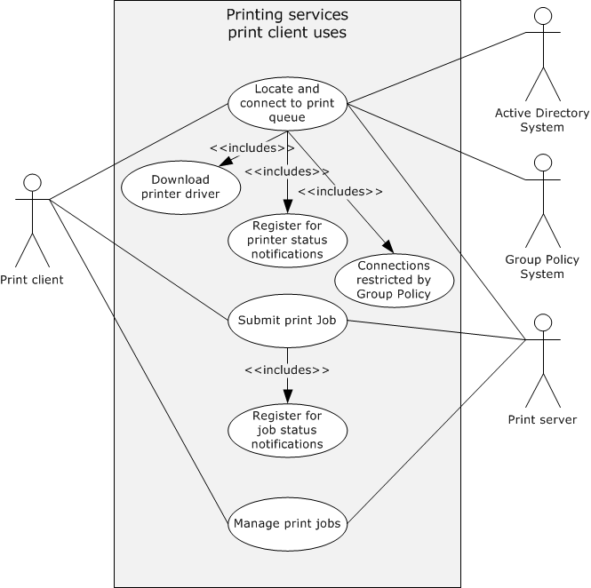

Figure 15: Printing services use cases initiated by a print client

### 2.5.3 Use Case Descriptions

#### 2.5.3.1 Provision a Print Queue -- Administrative Client

**Goal**: To make a print queue available on a print server, subsequently allowing a user to select the print queue, establishing all attributes and components necessary to make the print queue discoverable and accessible to a print client.

**Context of Use**: Prior to a user being able to select a shared print queue to which to send a [**print job**](#gt_print-job), an administrator is required to use an administrative tool to create and share a print queue on a print server. In Windows, this tool is the Print Management console. This shared print queue corresponds to a printer. In addition to creating the print queue, attributes and components of the print queue are defined, such as the port, to which the printer is connected, and the [**printer driver**](#gt_printer-driver) and [**print processor**](#gt_print-processor) components that convert the print job data to drawing commands that the printer uses. After an administrator provisions the print queue with the necessary information, a user by using a print client, can send a print job to the printer via an application or the operating system.

**Direct Actor**: The direct actor is the administrative client.

**Primary Actor**: The primary actor is an administrator.

**Supporting Actors**: The supporting actors are the print server and the [**Active Directory**](#gt_active-directory) system.

**Stakeholders and Interests**:

- Administrative client: The administrative client is used by an administrator to participate in this use case to add the necessary information to a print server for allowing a printer to be shared by multiple print clients.
- Administrator: An administrator participates in this use case by using an administrative client to configure a print server to share a printer among multiple users.
- Print server: A print server is configured by this use case so that a printer connected to the print server can be shared among multiple users via a queue located on the print server.
- Active Directory system: The Active Directory system is updated by this use case so that a listing of the print queue is available via a print client when a user attempts to locate a print queue to which to send a print job.
**Preconditions**: The print server and the administrative client are connected by using a network connection, and both are members of the [**domain**](#gt_domain). The [**print spooler**](#gt_print-spooler) service is operational on the print server and the administrative client. The Active Directory system is available and operational.

**Minimal Guarantee**: The administrative client is denied access, and no provisioning operations occur.

**Success Guarantee**: A print queue corresponding to a printer is established on a print server, and the Active Directory system is updated so that multiple print clients can locate and share the printer.

**Trigger**: An administrator initiates the process of provisioning a print queue by using an administrative tool to add a new print queue to a print server.

**Main Success Scenario**:

- By using the SMB protocol family, the administrative client copies the files for the printer driver to a directory on the print server that is accessible via an SMB share.
- The administrative client uses the Print System Remote Protocol [MS-RPRN](../MS-RPRN/MS-RPRN.md) to install the printer driver on the print server. The driver is associated with a print queue in a later step of this use case. In a network of print clients having different architectures, different versions of the same driver are uploaded and installed by the administrative client, allowing the print server to provide printer drivers to print clients whose architecture differs from the print server's architecture.
- The administrative client ensures that an executable module for a [**port monitor**](#gt_port-monitor) is present on the print server (copying it there by using the SMB protocol family, if necessary), and then installs the port monitor on the print server by using the Print System Remote Protocol. A port monitor implements and exports the methods that the print server calls locally to interface with a port to which a printer is connected. Ports for the port type that is implemented by the port monitor can only be added to the print server after the port monitor is added.
- The administrator provides information about the port that connects the printer to the administrative client, which then uses the Print System Remote Protocol to direct the print server to add a specified printer port. A port is either a physical hardware port such as a parallel or USB port, or a network port such as a [**WSD**](#gt_web-services-on-devices-wsd) or [**TCP/IP**](#gt_tcpip) port. The port is assigned to the [**print queue**](#gt_print-queue) in a following step.
- If the printer supports custom paper formats, called "forms", the administrative client can use the Print System Remote Protocol to add definitions for those custom forms to the print server. When added, such forms can be made available for use with the print queue.
- The administrative client uses the Print System Remote Protocol to create a print queue on the print server. The administrator uses the administrative client to assign a printer driver, a printer port, and a print processor to the print queue during this step, and also sets access permissions, metadata, including name of printer, physical location, and comments, time of availability, name under which the printer is shared, separator page settings, and processing priority.
- The administrative client uses the Print System Remote Protocol to direct the print server to publish the print queue to the Active Directory system, which the print server satisfies by using [**LDAP**](#gt_lightweight-directory-access-protocol-ldap) [[RFC4511]](https://go.microsoft.com/fwlink/?LinkId=157505) to create a directory object for the print queue, supplying the UNC name (server name plus share name) of the print queue. [**Print clients**](#gt_print-client) can then use LDAP to discover the print queue.
**Extension (a) - Install a print processor on the print server**: Between steps 4 and 5 previously described, if the installed printer driver does not contain a print processor, the administrative client can use the Print System Remote Protocol to install a print processor on the print server.

**Extension (b) – Enable Branch Office Print Mode**: Between steps 6 and 7 previously described, the administrative client can use the Print System Remote Protocol to set properties on the print queue that control the [**Branch Office Print mode**](#gt_branch-office-print-mode).

**Variation (a) - Performing the use case using the protocol described in [MS-PAR]**: All details are identical to the use case described in this section except that the Print System Asynchronous Remote Protocol [MS-PAR](../MS-PAR/MS-PAR.md) is used to locate and establish the connection to the print queue.

#### 2.5.3.2 Delete a Print Queue -- Administrative Client

**Goal**: To delete a previously provisioned print queue that is available on a print server, which subsequently no longer enables a user to select the print queue, removing all attributes and components that are necessary to make the print queue discoverable and accessible to a print client.

**Context of Use**: When a print queue is no longer required, an administrator uses an administrative tool to delete a print queue from a print server. In Windows, this tool is the Print Management Console. After an administrator deletes the print queue, a user by using a print client via an application or the operating system can no longer send a [**print job**](#gt_print-job) to the printer.

**Direct Actor**: The direct actor is the administrative client.

**Primary Actor**: The primary actor is an administrator.

**Supporting Actors**: The supporting actors are the print server and the [**Active Directory**](#gt_active-directory) system.

**Stakeholders and Interests**:

- Administrative client: The administrative client is used by an administrator to participate in this use case to delete a previously provisioned print queue.
- Administrator: An administrator participates in this use case by using an administrative client to configure a print server to delete a previously provisioned print queue.
- Print server: A print server is configured by this use case so that a printer that is connected to the print server can no longer be shared among multiple users via a queue that is located on the print server.
- Active Directory system: The Active Directory system is updated by this use case so that the listing of the print queue is no longer reported to a print client when a user attempts to locate a print queue to which to send a print job.
**Preconditions**: The print server and the administrative client are connected by using a network connection, and both are members of the [**domain**](#gt_domain). The [**print spooler**](#gt_print-spooler) service is operational on the print server and administrative client. The Active Directory system is available and operational. The print queue exists.

**Minimal Guarantee**: The administrative client is denied access, and no delete operations occur.

**Success Guarantee**: A print queue is deleted from a print server, and the Active Directory system is updated to no longer return the print queue in directory queries.

**Trigger**: An administrator initiates the process of deleting a print queue by using an administrative tool to delete a print queue on a print server.

**Main Success Scenario**:

The administrative client uses the Print System Remote Protocol [MS-RPRN](../MS-RPRN/MS-RPRN.md) to direct the print server to unpublish the print queue from the Active Directory system. The print server uses [**LDAP**](#gt_lightweight-directory-access-protocol-ldap) [[RFC4511]](https://go.microsoft.com/fwlink/?LinkId=157505) to delete the directory object for the print queue.

The administrative client uses the Print System Remote Protocol to delete the print queue on the print server.

**Extension (a) - Deleting objects that are no longer referenced on the print server**: After deleting the print queue, the administrative client can use the Print System Remote Protocol to determine if the port, the [**print processor**](#gt_print-processor), and the [**printer driver**](#gt_printer-driver) that were previously used by the deleted print queue are still in use by other print queues; and if that is not the case, the administrative client can use the Print System Remote Protocol to delete those objects from the server.

**Variation (a) - Performing the use case by using the protocol described in [MS-PAR]**: All details are identical to the use case that is described in this section except that the Print System Asynchronous Remote Protocol [MS-PAR](../MS-PAR/MS-PAR.md) is used to delete the print queue.

#### 2.5.3.3 Locate and Establish a Connection to a Print Queue in a Domain Environment -- Print Client

**Goal**: To make a connection to a shared print queue in a [**domain**](#gt_domain) environment so that documents can be printed by the user.

**Context of Use**: The user wants to print a document and does not have a printer attached to the local computer, but the user is member of a domain and knows that there are shared print queues in the enterprise that are available for use. The user decides to use one of the share print queues in the enterprise and initiates this use case.

**Direct Actor**: The direct actor is the print client.

**Primary Actor**: The primary actor is a user.

**Supporting Actors**: The supporting actors are the print server, the [**Active Directory**](#gt_active-directory) system, and the Group Policy system in Extension (b).

**Stakeholders and Interests**:

- Print client: The print client displays a list of shared print queues from which a user selects a print queue, and then the print client establishes a connection to the selected print queue.
- Print server: The print server provides information about the shared print queue to the print client, makes the [**printer driver**](#gt_printer-driver) available to the print client for download if necessary, and enables the print client to connect to the print queue.
- Active Directory system: The Active Directory system stores and provides a list of shared print queues that the user views in the print client user interface.
- Group Policy system: The Group Policy Deployed Printer Connections Extension [MS-GPDPC](../MS-GPDPC/MS-GPDPC.md) is a supporting actor in Extension (b). The [**Group Policy**](#gt_group-policy) system is used to push a list of shared print queues to the print client so that the print client has pre-established connections to specified print queues. Additionally, Group Policy settings are inspected by the print client to restrict access to certain print servers.
- User: The user wants to view a list of available shared print queues and selects a print queue to which to send a [**print job**](#gt_print-job).
**Preconditions**: The [**print spooler**](#gt_print-spooler) services are operational on the print client and print server. Both are members of the domain and are connected through a network. The network is operational. The Active Directory system is available and operational.

**Minimal Guarantee**: The print queue is located but the user is informed via the print client user interface that a connection cannot be established due to insufficient permissions.

**Success Guarantee**: A connection to a shared print queue has been established by the print client, and the connection can be used to submit print jobs to the print server.

**Main Success Scenario**:

- **Trigger**: A user initiates this use case by clicking the Add a printer command in the print client's user interface.
- The print client queries the Active Directory system for a list of shared print queues in the domain.
- The Active Directory system replies with a list of shared print queues.
- The user of the print client selects a print queue from the query results.
- The print client opens a handle to the selected print queue by using the Print System Remote Protocol [MS-RPRN](../MS-RPRN/MS-RPRN.md).
- The print client queries the print server for information about the print queue, such as which printer driver (and version) is being used, and the hardware ID of the printer represented by the print queue.
- If the print client already has a copy of the printer driver installed, the print client creates a local print queue proxy object. The proxy object represents the connection to the print queue on the print server. See Extension (a) for a description of the case where the print client does not already have a copy of the printer driver installed.
**Extension (a) – The print client downloads a printer driver:**

Step 6: If the print client does not have a copy of the printer driver installed, the print client obtains the printer driver from one of the following sources, identifying the printer driver using the hardware ID of the print queue obtained earlier:

- From an administrative share on the print server
- From Windows Update
- From the user, for example, from a CD
The print client then locally installs the printer driver.

**Extension (b) - Print client makes connections only to print queues specified by Group Policy [MS-GPDPC] deployed printer connections:**

Replace previous steps 1 through 3 with the following steps:

- An administrator defines one or more [**deployed printer connection**](#gt_deployed-printer-connection) Group Policy settings for one or more domain users or user groups. Each Group Policy setting includes details of one or more print queues that are shared by the print server.
- By using the Group Policy Deployed Printer Connections Extension, the print client retrieves the deployed printer connections for the logged-on user and the current computer and proceeds to automatically make connections to all print queues that are specified in the Group Policy settings, without user interaction in steps 4 through 6 for each print queue connection.
**Extension (c) – The print client registers for notifications of print queue status:**

Step 6 is followed by:

- When the print queue proxy representing the connection has been created, the print client opens a handle to the selected print queue by using the Print System Remote Protocol. The print client registers with the print server for some or all supported notifications on that handle, which then are sent to the print client when they become available. The print client reflects state changes of the server print queue in the local print queue proxy object. (such state changes can be, among others:error state, online/offline state, printer paused, list of queued jobs, associated printer driver - fetching and installing a different or updated printer driver if necessary, and so on.)
**Extension (d) – The print client creates a Branch Office Printing version of the print queue:**

Step 6 is followed by:

Step 7. When the print queue proxy representing the connection has been created, the print client opens a handle to the selected print queue by using the Print System Remote Protocol. The print client then requests the Branch Office Print configuration data from the print server for the print queue. If the [**Branch Office Print Mode**](#gt_branch-office-print-mode) is enabled for this print queue, the print client configures the print queue proxy object to communicate directly with the device for print operations instead of with the print server.

**Variation (a) - Performing the use case by using the protocol as described in [MS-PAR]**: All details are identical to the use case that is described in this section, except that the Print System Asynchronous Remote Protocol [MS-PAR](../MS-PAR/MS-PAR.md) is used instead of the Print System Remote Protocol.

#### 2.5.3.4 Locate and Establish a Connection to a Print Queue in a Workgroup Environment -- Print Client

**Goal**: To make a connection to a shared print queue in a workgroup environment so that documents can be printed by the user.

**Context of Use**: The user wants to print a document and does not have a printer attached to the local computer, but the user is member of a workgroup and knows that there are shared print queues in the workgroup that are available for use. The user decides to use one of the shared print queues in the workgroup and initiates this use case.

**Direct Actor**: The direct actor is the print client.

**Primary Actor**: The primary actor is a user.

**Supporting Actors**: The supporting actors are print clients performing a print server role.

**Stakeholders and Interests**:

- Print client: The print client displays a list of shared print queues from which a user selects a print queue, and then the print client establishes a connection to the selected print queue.
- Print clients that perform a print server role: In this use case, the print server role is performed by print clients that have shared print queues. After a user shares a print queue on the computer, the computer performs print server functions, including providing [**printer drivers**](#gt_printer-driver) to print clients, and accepting and printing [**print jobs**](#gt_print-job) from print clients. These print servers announce themselves to all other computers acting as print servers in the workgroup, as well as storing a list of all the other computers performing the print server role.
- User: The user wants to view a list of available shared print queues and selects a print queue to which to send a print job.
**Preconditions**: The print server has used the CIFS Browser Protocol [MS-BRWS](../MS-BRWS/MS-BRWS.md) to find other computers that act as print servers and print clients in the workgroup, and then used the Print System Remote Protocol [MS-RPRN](../MS-RPRN/MS-RPRN.md) to push the list of shared print queues to all print servers in the workgroup. The print server has also notified all other computers in the workgroup that it is a print server itself by using the CIFS Browser Protocol. The [**print spooler**](#gt_print-spooler) service is operational on the print server and the print client. Both are connected through a network connection.

**Minimal Guarantee**: The print queue is located but the user is informed via the print client user interface that a connection cannot be established due to insufficient permissions.

**Success Guarantee**: A connection to a shared print queue has been established by the print client and the connection can be used to submit print jobs to the print server.

**Main Success Scenario**:

- Trigger: A user initiates this use case by clicking the Add a printer command in the print client user interface.
- The print client queries print servers in the workgroup for lists of shared print queues.
- The user of the print client selects a print queue from a displayed list of shared print queues in the workgroup.
- The print client opens a handle to the selected print queue by using the Print System Remote Protocol.
- The print client queries the print server for information about the print queue, such as which printer driver (and version) is being used, and the hardware ID of the printer that is represented by the print queue.
- If the print client already has a copy of the printer driver installed, the print client creates a local print queue proxy object representing the connection to the print queue on the print server. See Extension (a) for a description of the case of where the print client does not already have a copy of the printer driver installed.
**Extension (a) – The print client downloads a printer driver**:

Step 4: After opening a handle to the selected print queue, if the print client does not have a copy of the printer driver installed, the print client downloads the printer driver from either (a) Windows Update, by using the hardware ID of the print queue that was obtained earlier, or (b) from an administrative printer share of the print server or other print client in the workgroup. The print client then locally installs the printer driver before proceeding with the rest of the use case.

**Extension (b) – The print client registers for notifications of the print queue status**:

Step 4. When the print queue representing the connection has been created, the print client opens a handle to the selected print queue by using the Print System Asynchronous Remote Protocol. The print client then registers with the print server or another print client for some or all supported notifications on that handle, which are sent when they become available.

The print client updates the local print queue object with changes to the server print queue, including error state, online/offline state, and the list of queued jobs; changes in an associated printer driver when a different or updated driver is retrieved and installed; and changes in printer state, such as when a printer paused. The print client unregisters for notifications when it no longer has to issue notifications; for example, because the user closes the user interface that shows status changes.

**Variation (a) - Performing the use case by using the protocol as described in [MS-PAR]**: All details are identical to the use case that is described in this section except that the Print System Asynchronous Remote Protocol [MS-PAR](../MS-PAR/MS-PAR.md), is used instead of the Print System Remote Protocol.

#### 2.5.3.5 Locating and Connecting to a Shared Print Queue from an Internet Client -- Print Client

**Goal**: To make a connection to a shared print queue from an Internet client so that documents can be printed by the user.

**Context of Use**: The user wants to print a document and does not have a printer attached to the local computer. The environment blocks connections, for example, via a firewall, by using the Print System Remote Protocol and Print System Asynchronous Remote Protocol [MS-PAR](../MS-PAR/MS-PAR.md). As an alternative, [**IPP**](#gt_internet-printing-protocol-ipp) [[RFC8011]](https://go.microsoft.com/fwlink/?linkid=2157750) [[RFC8010]](https://go.microsoft.com/fwlink/?linkid=2157950) and the Web Point-and-Print Protocol [MS-WPRN](../MS-WPRN/MS-WPRN.md) are available because they use HTTP/HTTPS and are allowed by most firewall administrators. By using these protocols, the [**print client**](#gt_print-client) enables the user to select a shared printer via the Internet.

**Direct Actor**: The direct actor is the print client.

**Primary Actor**: The primary actor is the user.

**Supporting Actors**: The supporting actors are the [**print server**](#gt_print-server) and the Internet browser.

**Stakeholders and Interests**:

- Print client: The print client can make a connection to a print queue when the user enters the name of the print queue, and then download a [**printer driver**](#gt_printer-driver) by using the Web Point-and-Print Protocol. The print client sends a [**print job**](#gt_print-job) to the print queue by using IPP.
- Print server: The print server receives an HTTP GET request [[RFC7231]](https://go.microsoft.com/fwlink/?LinkId=402095) from an Internet browser, generates a list of shared printers in [**HTML**](#gt_hypertext-markup-language-html) format, and responds to the HTTP GET request with the list to the print client. The print server also provides a printer driver to the print client.
- Internet browser: The Internet browser is used to connect to a print server and to view shared print queues on the print server. It can also be used to connect the print client to a selected print queue by executing script code that calls local APIs of the [**print spooler**](#gt_print-spooler). Alternately, the user can use the Internet browser only for finding out the name of the print queue, and can then enter that name in the print client user interface to connect to the print queue.
- User: The user wants to send a print job to a print queue but cannot use the print client to discover the shared print queues due to network restrictions.
**Preconditions**: The optional Internet Printing server role component has been installed on the print server. The print spooler service is operational on the print server and on the print client. An HTTP/HTTPS connection can be established between the print client and the print server. The user knows the [**URL**](#gt_uniform-resource-locator-url) of the print server.

**Minimal Guarantee**: A connection cannot be made.

**Success Guarantee**: A connection can be made.

**Trigger**: A user initiates this use case by starting the Add a printer command in the print client user interface.

**Main Success Scenario**:

- The user of an Internet browser browses to the "http://<HOST>/printers" URL of the print server that has the address <HOST>.
- The print server returns an HTML page that shows the available print queues and their status.
- The user selects a print queue to which to connect.
- The print client uses the Web Point-and-Print Protocol to download the printer driver for the print queue from the print server.
- The print client installs the downloaded printer driver.
- The print client creates a local print queue proxy object that represents the IPP connection to the print queue on the print server.
**Extensions**: None.

#### 2.5.3.6 Setting Permissions for a Print Queue -- Administrative Client

**Goal**: To set permissions for a print queue, such as the priority of the print queue and the times that it is available for shared use, and who can access it.

**Context of Use**: The administrator wants to restrict use of a shared print queue to a selected group of users or individual users. Additionally, the administrator wants to restrict the times of day when the shared print queue is available for use.

**Direct Actor**: The direct actor is the administrative client.

**Primary Actor**: The primary actor is the administrator.

**Supporting Actors**: The supporting actors are the print server and the [**Active Directory**](#gt_active-directory) system.

**Stakeholders and Interests**:

- Administrative client: The administrative client connects to the print server to send information regarding restrictions on the use of shared print queues.
- Print server: The print server restricts the use of shared print queues as specified by the administrative client.
- Administrator: The administrator wants to restrict the use of a shared print queue to a selected group of users.
**Preconditions**: The print server and administrative client are connected by using a network connection, and both are members of the [**domain**](#gt_domain). The [**print spooler**](#gt_print-spooler) service is operational on the print server and on the administrative client.

**Minimal Guarantee**: The administrative client denies the administrator the privilege to set permissions based on the administrator's authorization.

**Success Guarantee**: The permissions and time restrictions are set as requested.

**Trigger**: An administrator initiates the process of setting the permissions for a print queue by selecting a print queue by using an administrative client.

**Main Success Scenario**:

- The administrative client uses the Print System Remote Protocol [MS-RPRN](../MS-RPRN/MS-RPRN.md) to enumerate the print queues on the print server.
- The administrator selects one of the enumerated print queues.
- The administrative client uses the Print System Remote Protocol to open a handle to an existing print queue on the print server.
- The administrative client uses [**LDAP**](#gt_lightweight-directory-access-protocol-ldap) [[RFC4511]](https://go.microsoft.com/fwlink/?LinkId=157505) to obtain a list of domain users and groups from the Active Directory system.
- The administrator selects users and groups from the list that is obtained in step 4 and assigns access permissions to form an [**access control list (ACL)**](#gt_access-control-list-acl) and a [**security descriptor**](#gt_security-descriptor).
- The administrative client uses the Print System Remote Protocol to set the requested security descriptor on the print queue.
- The administrator further chooses a time interval in which the print queue accepts [**print jobs**](#gt_print-job) from print clients.
- The administrative client uses the Print System Asynchronous Remote Protocol [MS-PAR](../MS-PAR/MS-PAR.md) to set the requested availability time interval on the print queue.
- The administrative client closes the printer handle.
**Extensions**: None.

**Variation (a) - Performing the use case by using the protocol as described in [MS-PAR]**: All details are identical to the use case as described in this section except that the Print System Asynchronous Remote Protocol is used instead of the Print System Remote Protocol.

#### 2.5.3.7 Submitting a Print Job -- Print Client

##### Submitting a Print Job Using the Protocols Defined in [MS-RPRN] (or [MS-PAR])

**Goal**: To print a document.

**Context of Use**: The user using an application capable of printing a document wants to print. A connection to a shared print queue has been previously established. The user initiates the Print command from the application.

**Direct Actor**: The direct actor is the print client.

**Primary Actor**: The primary actor is the user.

**Supporting Actors**: The supporting actor is the print server.

**Stakeholders and Interests**:

- Print client: The print client sends the [**print job**](#gt_print-job) data to the print queue on the print server.
- Print server: The print server buffers the print job data that is sent to the print queue to which the print client is connected, optionally processes the print job data further, and sends it to the printer that is associated with the print queue.
- User: The user wants a printed copy of content on the computer and chooses the Print function from the print client user interface.
**Preconditions**: The [**print spooler**](#gt_print-spooler) services are operational on the print client and on the print server. Both are members of the [**domain**](#gt_domain) and are connected with a network. The network is operational. The [**Active Directory**](#gt_active-directory) system is available and operational.

**Minimal Guarantee**: The print job was submitted to the print server, but no job status feedback could be initiated; therefore, the print job might print, but the print client cannot show feedback.

**Success Guarantee**: The job is submitted, and job progress status was received and displayed to the user.

**Trigger**: A user initiates this use case by selecting the command from a printing capable application.

**Main Success Scenario**:

- The print client opens a printer handle using the Print System Remote Protocol [MS-RPRN](../MS-RPRN/MS-RPRN.md).
- The print client starts a new print job to the print server by using the Print System Remote Protocol.
- The print client indicates the start of a new logical page to the print server, repeatedly sends data for the page, and signals the end of a logical page to the print server by using the Print System Remote Protocol. The print client repeats this step for all pages in the document.
- After sending all the pages of the print job to the print server, the print client ends the print job by using the Print System Remote Protocol.
- The print client closes the printer handle by using the Print System Remote Protocol.
**Extension (a) – The print client obtains notifications about the print job status**:

Following the previous step 1 and before step 2: The print client registers for change notifications by using the Print System Remote Protocol.

In parallel with the remaining steps, the print server sends change notifications during the processing of the print job. The print client provides feedback to the user.

**Extension (b) – The print client obtains notifications for IHV-defined components on the print server and displays the user interface to the user**:

Prior to the previous step 1, the print client uses the Print System Remote Protocol to register for change notifications from the print server.

In parallel with the other steps of the use case, when the print client receives change notifications that signal the arrival of a new print job, the print client attempts to listen to the print queue for connection requests from the print server by using the Print System Asynchronous Notification Protocol [MS-PAN](../MS-PAN/MS-PAN.md). An [**IHV**](#gt_independent-hardware-vendor-ihv)-defined [**printer driver**](#gt_printer-driver) or other IHV-defined component that is running on the print server can act as a notification source by using the Print System Asynchronous Notification Protocol and send unidirectional or bidirectional notification messages to the print client. One important notification message type for IHV-defined components is used to request that the print client displays a user interface to the user.

After step 4, if a connection has been established between the print client and the IHV-defined components using the Print System Asynchronous Notification Protocol, then the print client continues to listen for print server change notifications signaling the end of the print job for the monitored print queue. The print client closes the asynchronous notification connection when all the jobs have been processed.

**Variation (a) - Performing the use case by using the protocol as described in [MS-PAR]**: All details are identical to the use case described in this section except that the Print System Asynchronous Remote Protocol [MS-PAR](../MS-PAR/MS-PAR.md) is used instead of the Print System Remote Protocol.

##### 2.5.3.7.2 Submitting a Print Job by Using the IPP Internet Printing Protocol

**Goal**: To print a document.

**Context of Use**: The user using an application capable of printing a document wants to print. A connection to a shared print queue has been previously established. The user initiates the Print command from the application.

**Direct Actor**: The direct actor is the print client.

**Primary Actor**: The primary actor is the user.

**Supporting Actors**: The supporting actors are the print server and a browser.

**Stakeholders and Interests**:

- Print client: The print client sends the [**print job**](#gt_print-job) data to the print queue on the print server.
- Print server: The print server buffers the print job data that is sent to the print queue to which the print client is connected, optionally processes the print job data further, and sends it to the printer that is associated with the print queue.
- User: The user wants to print a copy of content on the computer and chooses the Print function from the print client user interface.
**Preconditions**: The [**print spooler**](#gt_print-spooler) services are operational on the print client and the print server. Both are members of the [**domain**](#gt_domain) and are connected to a network. The network is operational. The [**Active Directory**](#gt_active-directory) system is available and operational.

**Minimal Guarantee**: The print job was submitted to the print server, but no job status feedback could be initiated. The print job might print, but the print client cannot show feedback.

**Success Guarantee**: The job is submitted, and job progress status was received and displayed to the user.

**Trigger**: A user initiates this use case by selecting the Print command from a printing capable application.

**Main Success Scenario**:

- The user initiates a print job from a Windows application to a print queue that is a connected to an [**IPP**](#gt_internet-printing-protocol-ipp) [[RFC8011]](https://go.microsoft.com/fwlink/?linkid=2157750) [[RFC8010]](https://go.microsoft.com/fwlink/?linkid=2157950) print queue on the print server.
- The print client uses IPP to submit the print job to that print queue.
- The print client indicates the start of a new logical page to the print server, repeatedly sends data for the page, and signals the end of a logical page to the print server by using the Print System Remote Protocol [MS-RPRN](../MS-RPRN/MS-RPRN.md). The print client repeats this step for all pages in the document.
- After sending all the pages of the print job to the print server, the print client ends the print job by using the Print System Remote Protocol.
- The print client closes the printer handle by using the Print System Remote Protocol.
**Extensions**: None.

##### 2.5.3.7.3 Submitting a Print Job Using the SMB Protocol Family

**Goal**: To print a document.

**Context of Use**: The user wants to print a document by using an application capable of printing. A connection to a shared print queue has been previously established. The user initiates the Print command from the application.

**Direct Actor**: The direct actor is the print client.

**Primary Actor**: The primary actor is the user.

**Supporting Actors**: The supporting actor is the print server.

**Stakeholders and Interests**:

- Print client: The print client sends the [**print job**](#gt_print-job) data to the print queue on the print server.
- Print server: The print server buffers the print job data that is sent to the print queue to which the print client is connected, optionally processes the print job data further, and sends it to the printer that is associated with the print queue.
- User: The user wants to print a copy of content on the computer and chooses the Print function from the print client user interface.
**Preconditions**: The [**print spooler**](#gt_print-spooler) services are operational on the print client and the print server. Both are members of the [**domain**](#gt_domain) and are connected to a network. The network is operational. The [**Active Directory**](#gt_active-directory) system is available and operational.

**Minimal Guarantee**: The print job was submitted to the print server, but no job status feedback could be initiated. The print job might print, but the print client cannot show feedback.

**Success Guarantee**: The job is submitted, and the job progress status was received and displayed to the user.

**Trigger**: A user initiates this use case by selecting the Print command from an application that can print.

**Main Success Scenario**:

- The user initiates a print job at a command prompt by executing a **copy /b FILE \\SERVER\PRINTQ** command where FILE is a local file containing print job data, SERVER is the name of the server, and PRINTQ is the name of a shared print queue.
- The print client uses the SMB protocol family to submit the file containing the print job data to a printer share on the print server.
- The print client indicates the start of a new logical page to the print server, repeatedly sends data for the page, and signals the end of a logical page to the print server by using the Print System Remote Protocol [MS-RPRN](../MS-RPRN/MS-RPRN.md). The print client repeats this step for all pages in the document.
- After sending all the pages of the print job to the print server, the print client ends the print job by using the Print System Remote Protocol.
- The print client closes the printer handle by using the Print System Remote Protocol.

##### 2.5.3.7.4 Submitting a Print Job Using Branch Office Print Mode

**Goal**: To print a document.

**Context of Use**: The user who uses an application that can print a document wants to print. A connection to a shared [**print queue**](#gt_print-queue) has been previously established. The shared print queue is in [**branch office print mode**](#gt_branch-office-print-mode). The user initiates printing from the application.

The [**print client**](#gt_print-client) uses the functionality in the Print System Remote Protocol [MS-RPRN](../MS-RPRN/MS-RPRN.md) in this use case unless noted otherwise.

**Direct Actor**: The direct actor is the print client.

**Primary Actor**: The primary actor is the user.

**Supporting Actors**: The supporting actor is the [**print server**](#gt_print-server).

**Stakeholders and Interests**:

- Print client: The print client sends the [**print job**](#gt_print-job) data directly to the print device.
- Print server: The print server receives [**branch office print remote logging**](#gt_branch-office-print-remote-logging) entries corresponding to the print job status from the print client.
- User: The user wants to print a copy of content on the computer.
**Preconditions**: The [**print spooler**](#gt_print-spooler) service is operational on the print client. The print client is a member of a domain and is connected to a network. The network is operational. The Active Directory system is available and operational.

**Minimal Guarantee**: The print job is submitted directly to the print device.

**Success Guarantee**: The job is submitted, and the job progress status is received and displayed to the user.

**Trigger**: A user initiates this use case by using a printing command from a printing-capable application.

**Main Success Scenario**:

- The print client renders the metafile to the printer-specific raw format before sending it as a data-stream payload directly to the print device.
- The print client starts a new print job to the print device using either the TCPMON port monitor module ([MS-RPRN] section 3.1.4.11.3), WSDMON ([MS-RPRN] section 3.1.4.11.4), or APMON ([MS-RPRN] section 3.1.4.11.5).
- After sending all the pages of the print job to the print device, the print client ends the print job.
**Extension (a) – The print client sends branch office print remote logging entries to the print server**:

Following the preceding step 3:

4. The print client checks the branch office print configuration data if branch office print remote logging is enabled.

5. If it is enabled, the print client opens a printer handle.

6. The print client creates and sends applicable branch office print remote logging entries to the print server for processing.

7. The print client checks the branch office print offline archive, and if populated, sends the contained branch office print remote logging entries to the print server for processing.

8. The print client closes the printer handle.

**Extension (b) - The print client archives branch office print remote logging entries for an offline print server**:

Following the preceding step 3:

4. The print client checks branch office print configuration data if branch office print remote logging is enabled.

5. If it is enabled, the print client attempts to open a printer handle.

6. If the print server is not available, the print client creates the branch office print remote logging entries in the branch office print offline archive.

**Variation (a) - Performing the use case by using an asynchronous printing**: All details are identical to the use case described in this section, except that the Print System Asynchronous Remote Protocol [MS-PAR](../MS-PAR/MS-PAR.md) is used instead of the Print System Remote Protocol.

#### 2.5.3.8 Managing Print Jobs — Print Client

##### 2.5.3.8.1 Managing Print Jobs Submitted by Self Using the Protocols Described in MS-RPRN or MS-PAR

**Goal**: For a user to manage his or her own submitted [**print jobs**](#gt_print-job), including pausing them, resuming them, canceling them, changing their priority, changing their order in the queue, or restarting them.

**Context of Use**: After submitting a print job, a user might want to manage the job for a variety of reasons. For example, a user might want to pause a job in order to print another job of higher priority, or a user might cancel a job when it becomes apparent that the content is flawed and printing would only waste paper.

**Direct Actor**: The direct actor is the print client.

**Primary Actor**: The primary actor is the user.

**Supporting Actors**: The supporting actor is the print server.

**Stakeholders and Interests**:

- Print client: The print client is used to display the print jobs that the user submitted, to enable the user to select a print job to manage and to select management functions.
- Print server: The print server receives and executes job management functions that are requested from a print client or an administrative client.
- User: A user wants to manage the printing of a print job, pausing, canceling, or changing the priority of the print job, for example.
**Preconditions**: The [**print spooler**](#gt_print-spooler) services are operational on the print client and the print server. Both are members of the [**domain**](#gt_domain) and are connected to a network. The network is operational.

**Minimal Guarantee**: The user or administrator attempting to perform management functions on a print job will be denied permission via the user interface on the print client or the administrative client.

**Success Guarantee**: The user or administrator who attempts to perform management functions on a print job can successfully pause a job, resume a job, cancel a job, or perform other functions.

**Trigger**: The user opens the print queue user interface and reviews queued jobs before modifying them with functions such as cancel, reorder, pause, and resume.

**Main Success Scenario**:

In the following scenario, the print client performs actions by using the Print System Remote Protocol [MS-RPRN](../MS-RPRN/MS-RPRN.md).

- The print client opens a printer handle.
- The print client enumerates jobs that are scheduled for printing on the printer.
- The print client opens a handle to a specific job. The print server denies this request for any job that is not submitted by the user of the print client.
- The print client modifies job settings or job priority.
- The print client closes the printer handle.
**Variation (a) - Performing the use case by using the protocol described in [MS-PAR]**: All details identical to the use case described in this section except that the Print System Asynchronous Remote Protocol [MS-PAR](../MS-PAR/MS-PAR.md) is used instead of the Print System Remote Protocol.

##### 2.5.3.8.2 Managing Print Jobs Submitted by All Users Using the Protocols Described in MS-RPRN or MS-PAR

**Goal**: For an administrator to manage [**print jobs**](#gt_print-job) that are submitted by all users, which include pausing, resuming, canceling, changing their priority, changing their order in the queue, or restarting.

**Context of Use**: An administrator might have to override or reconfigure print jobs that various users have submitted to multiple print queues to effectively manage or maintain printing resources. An administrator can use an administrative client or a print client to manage print jobs that are submitted by all users.

**Direct Actor**: The direct actor is the administrative client or the print client.

**Primary Actor**: The primary actor is the administrator.

**Supporting Actors**: The supporting actor is the print server.

**Preconditions**: An administrator has administrative permissions for the print queue, enabling the print server to grant the request to open a job handle of any job, regardless of who submitted the job.

**Stakeholders and Interests**:

- Print client: The print client is used to display the print jobs that are submitted by the user, to enable the user to select a print job to manage, and to select management functions.
- Administrative client: The administrative client is used to display the print jobs that are submitted by all users, to enable the administrator to select print jobs to manage, and to select management functions.
- Print server: The print server receives and executes job management functions that are requested from a print client or an administrative client.
- User: A user wants to manage the printing of a print job, pausing, canceling, or changing the priority of the print job, for example.
- Administrator: An administrator wants to manage all the print jobs that have been submitted to a print queue to service the printer, free up the printer for alternate uses, or to intervene when discovering that a very large print job has been sent to a printer not capable of handling such volume.
**Preconditions**: An administrator has administrative permissions for the print queue by enabling the print server to grant the request to open a job handle of any job, regardless of who submitted the job. The [**print spooler**](#gt_print-spooler) services are operational on the print client and the print server. Both are members of the [**domain**](#gt_domain) and are connected to a network. The network is operational.

**Minimal Guarantee**: The user or administrator attempting to perform management functions on a print job will be denied permission via the user interface on the print client or the administrative client.

**Success Guarantee**: The user or administrator attempting to perform management functions on a print job will successfully be able to pause a job, resume a job, cancel a job, or perform other functions.

**Trigger**: The user opens the print queue user interface and reviews queued jobs before modifying them with functions such as cancel, reorder, pause, and resume.

**Main Success Scenario**:

In the following scenario, the print client performs actions by using the Print System Remote Protocol [MS-RPRN](../MS-RPRN/MS-RPRN.md).

- The print client opens a printer handle.
- The print client enumerates jobs that are scheduled for printing on the printer.
- The print client opens a handle to a specific job. The print server denies this request for any job that is not submitted by the user of the print client.
- The print client modifies job settings or job priority.
- The print client closes the printer handle.
**Variation (a) - Performing the use case by using the protocol as described in [MS-PAR]**: All details are identical to the use case described in this section except that the Print System Asynchronous Remote Protocol [MS-PAR](../MS-PAR/MS-PAR.md) is used instead of the Print System Remote Protocol.

##### 2.5.3.8.3 Managing Print Jobs from a Command Line Using the Protocol Described in MS-RAP

**Goal**: For a user to manage his or her own submitted [**print jobs**](#gt_print-job), including pausing, resuming, canceling, changing their priority, changing their order in the queue, or restarting.

**Context of Use**: After submitting a print job, a user might have to manage the job for a variety of reasons. For example, a user might want to pause a job in order to print another job of higher priority; or a user might cancel a job when it becomes apparent that the content is flawed and printing would only waste paper.

**Direct Actor**: The direct actor is the print client.

**Primary Actor**: The primary actor is the user.

**Supporting Actors**: The supporting actor is the print server.

**Stakeholders and Interests**:

- Print client: The print client is used to display the print jobs that are submitted by the user, to enable the user to select a print job to manage, and to select management functions.
- Print server: The print server receives and executes job management functions that are requested from a print client or an administrative client.
- User: A user wants to manage the printing of a print job, pausing, canceling, or changing the priority of the print job, for example.
**Preconditions**: The [**print spooler**](#gt_print-spooler) services are operational on the print client and the print server. Both are members of the [**domain**](#gt_domain) and are connected to a network. The network is operational.

**Minimal Guarantee**: The user or administrator attempting to perform management functions on a print job is denied permission via the user interface on the print client or the administrative client.

**Success Guarantee**: The user or administrator attempting to perform management functions on a print job can successfully pause a job, resume a job, cancel a job, or perform other functions.

**Trigger**: The user opens the print queue user interface and reviews queued jobs before modifying them (cancel, reorder, pause, and resume).

**Main Success Scenario**:

- The user uses the **net print** command [[MSFT-NETPRINT]](https://go.microsoft.com/fwlink/?linkid=863947) to enumerate print jobs on the print queue.<7>
- The print client uses [**RAP**](#gt_remote-administration-protocol-rap) [MS-RAP](../MS-RAP/MS-RAP.md) to enumerate print jobs on the print queue of the print server.
- The user uses the net print command to pause, resume, or cancel print jobs on the print queue.
- The print client uses RAP to pause, resume, or cancel a print job.

## 2.6 Versioning, Capability Negotiation, and Extensibility

The Print Services system (PSS) evolved over multiple releases of Windows client and server products (Microsoft Implementations section [4](#Section_4)). Each version of the Print Services system provides additional functionality, while maintaining interoperability with previous versions.<8>

The functionality in these versions is incremental. A third-party print server that interoperates with a Windows print client supports all the functionality for a given version and the versions that preceded it.

For example, if PSS 3.0 included a protocol that defines opnum operation numbers or numeric identifiers 1 through 10, and PSS 4.0 included a new protocol and an extension to the PSS 3.0 protocol that defines a new opnum 11, then Windows print clients require that the print server supports the new PSS 4.0 protocol and the opnum 11 extension to the PSS 3.0 protocol.

Support for some protocols is optional, as shown in the functional relationships of member protocols (section [2.1.2.3](#Section_2.1)) and later in this section. An implementation can be fully functional in a typical Windows network without implementing the optional protocols.

The print client or the administrative client determines the print server's PSS version support by calling Print System Remote Protocol methods [MS-RPRN](../MS-RPRN/MS-RPRN.md):

- The print client calls the **RpcOpenPrinter** method on the print server by using the print server's name to obtain a handle.
- The print client calls the **RpcGetPrinterData** method on the print server by using the OSVersion key to obtain the print server's operating system version and maps the OSVersion of the print server to the supported PSS version.
- The print client calls the **RpcClosePrinter** method on the print server to close the print server handle.
In addition to following the process that was previously described to determine the capabilities of the print server, print clients also follow the processes that are described by the protocols of the Print Services system for negotiating capability support.

The following tables describe how the protocols in the Print Services system are supported by the different versions of the system. The Windows product releases that correspond to each version of the Print Services system are listed in the [Product Behavior Appendix](#Section_4.1).<9>

Microsoft-defined protocols, standard protocols, and print payloads are described in the following tables.

**PSS 1.0**

| Protocols supported by the print server | Print payloads supported by the print server | Protocols used by the print client | Print payloads used by the print client | Protocol notes |
| --- | --- | --- | --- | --- |
| RAP, SMB, Line Printer Daemon Protocol, and CIFS | Raw | SMB and Line Printer Daemon Protocol | Raw | Line Printer Daemon Protocol (support optional): Print servers provide support for this protocol for interoperability with UNIX clients. Print clients use this protocol only if specifically configured to do so when SMB is blocked by a firewall. |

**PSS 2.0**

| Protocols supported by the print server | Print payloads supported by the print server | Protocols used by the print client | Print payloads used by the print client | Protocol notes |
| --- | --- | --- | --- | --- |
| PSS 1.0 (RAP, SMB, Line Printer Daemon Protocol, and CIFS) plus Print System Remote Protocol | PSS 1.0 (Raw) plus [**EMFSPOOL**](#gt_enhanced-metafile-spool-format-emfspool) | PSS 1.0 (SMB and Line Printer Daemon Protocol) plus Print System Remote Protocol | PSS 1.0 (Raw) plus EMFSPOOL | Line Printer Daemon Protocol (support optional): Print servers provide support for this protocol for interoperability with UNIX clients. Print clients support this protocol only if specifically configured to do so when the SMB protocol and the Print System Remote Protocol are blocked by a firewall. SMB: Print clients use this protocol for printer driver file download operations or if Print System Remote Protocol is not available on a print server. EMFSPOOL (support optional): Print clients can use this payload format only if the print server advertises support through the **RPRN::RpcEnumPrintProcessorDatatypes** method. Print System Remote Protocol: This protocol is supported in different versions of Windows as indicated in Product Behavior Appendix. |

**PSS 3.0**

| Protocols supported by the print server | Print Payloads supported by the print server | Protocols used by the print client | Print payloads used by the print client | Protocol notes |
| --- | --- | --- | --- | --- |
| PSS 2.0 (RAP, SMB, Line Printer Daemon Protocol, and Print System Remote Protocol) plus Web Point-and-Print Protocol, Internet Printing Protocol, Group Policy: Deployed Printer Connections Protocol Extension, LDAP (v3) and Group Policy: Core Protocol | PSS 2.0 (Raw and EMFSPOOL) | PSS 2.0 (SMB, Line Printer Daemon Protocol, and Print System Remote Protocol) plus Web Point-and-Print Protocol, Internet Printing Protocol, Group Policy: Deployed Printer Connections Protocol Extension, LDAP, and Group Policy: Core Protocol | PSS 2.0 (Raw, EMFSPOOL) | Line Printer Daemon Protocol (support optional): Print servers provide support for this protocol for interoperability with UNIX clients. Print clients support this protocol only if specifically configured to do so when the SMB protocol and the Print System Remote Protocol are blocked by a firewall. Web Point-and-Print Protocol (support optional): Print servers support is this protocol to provide [**printer drivers**](#gt_printer-driver) for print clients connecting through Internet Printing Protocol. Print clients use this protocol to download printer drivers from a print server when using the Internet Printing Protocol to connect. Internet Printing Protocol (support optional): Print servers provide support for this protocol to enable printing from print clients on the extranet via HTTP. Print clients use this protocol only if specifically requested to connect by using an HTTP printer connection, which is used when a firewall blocks the other printing protocols. Group Policy: Deployed Printer Connections Protocol Extension (support optional): Support for this protocol by print servers and print clients was provided in PSS 3.0 by a downloadable utility. SMB: Print clients use this protocol for printer driver file download operations or if the Print System Remote Protocol is not available on a server. EMFSPOOL (support optional): Print clients can use this payload format only if the print server advertises support through the **RPRN::RpcEnumPrintProcessorDatatypes** method. |

**PSS 4.0**

| Protocols supported by the print server | Print payloads Supported by the print server | Protocols used by the print client | Print payloads used by the print client | Protocol notes |
| --- | --- | --- | --- | --- |
| PSS 3.0 (RAP, SMB Version 1.0, SMB Versions 2 and 3, Line Printer Daemon Protocol, Print System Remote Protocol, Web Point-and-Print Protocol, Internet Printing Protocol, Group Policy: Deployed Printer Connections Protocol Extension) and Print System Asynchronous Notification Protocol, Print System Asynchronous Remote Protocol, LDAP (v3), Group Policy: Core Protocol | PSS 3.0 (Raw, EMFSPOOL), XML Paper Specification | PSS 3.0 (SMB, Line Printer Daemon Protocol, Print System Remote Protocol, Web Point-and-Print Protocol, Internet Printing Protocol, Group Policy: Deployed Printer Connections Protocol Extension, LDAP, Group Policy: Core Protocol) and Print System Asynchronous Notification Protocol, Print System Asynchronous Remote Protocol | PSS 3.0 (Raw, EMFSPOOL), XML Paper Specification | Line Printer Daemon Protocol (support optional): Print servers provide support for this protocol for interoperability with UNIX clients. Print clients use this protocol only if specifically configured to do so when the SMB protocol and the Print System Remote Protocol are blocked by a firewall. Web Point-and-Print Protocol (support optional): Print servers support this protocol to provide printer drivers for clients connecting through the Internet Printing Protocol. Print clients use this protocol to download printer drivers from a print server when using the Internet Printing Protocol to connect. Internet Printing Protocol (support optional): Print servers provide support for this protocol to enable printing from print clients on the extranet via HTTP. Print clients use this protocol only if specifically requested to connect through an HTTP printer connection, which is used when a firewall blocks the other printing protocols. XML Paper Specification (support optional): Print servers support this payload format only with third-party components installed or with Terminal Server Easy Print installed. SMB: Print clients use this protocol for driver file download operations, or if neither the Print System Remote Protocol nor the Print System Asynchronous Remote Protocol is available on a print server. Print System Remote Protocol: Windows print clients use this protocol to find out whether the Print System Asynchronous Remote Protocol is available on the print server.<10> Clients check the server's OS build number, retrieved by using Print System Remote Protocol methods, and to confirm a printer's presence with a single **RpcOpenPrinter**/**RpcClosePrinter** sequence. The client subsequently uses Print System Asynchronous Remote Protocol methods. Windows print clients also use the Print System Remote Protocol if the Print System Asynchronous Remote Protocol is unavailable on the print server. EMFSPOOL: Print clients can use this payload format only if the print server advertises support with the **RPRN::RpcEnumPrintProcessorDatatypes** or **PAR::RpcAsyncEnumPrintProcessorDatatypes** method. |

Vendor-specific extensions are supported as noted in section 1.8 of the member protocol specification Technical Documents (TDs).

## 2.7 Error Handling

Status and error returns are defined by member protocols of the Print Services system. The Print Services system does not define status codes or error codes in addition to those described in the technical documents relating to the member protocols.

### 2.7.1 Failure Scenarios

The following failure scenarios are discussed in this section:

- Abnormal termination of the [**print spooler**](#gt_print-spooler) service
- Loss of network connectivity
- Loss of system disk storage
- Print spooler service out-of-system resources
- [**Authentication**](#gt_authentication) issues
- Expected failures

#### 2.7.1.1 Abnormal Termination of the Print Spooler Service

This problem is typically caused by a malfunctioning plug-in module, such as an [**IHV**](#gt_independent-hardware-vendor-ihv)-supplied [**printer driver**](#gt_printer-driver). Other causes include internal malfunction of the [**print spooler**](#gt_print-spooler) service and sudden loss of system power. The print spooler service terminates immediately without an orderly shutdown. The system attempts to restart the print spooler service multiple times before giving up, at which point administrative intervention locally on the system experiencing the failure is required to diagnose the problem and take corrective action.

All [**print jobs**](#gt_print-job) that are completely submitted at the time of failure remain queued, and their processing is restarted from the beginning on print spooler restart.

Print clients are not informed of an abnormal termination event, and experience failures on currently executing calls and all subsequent calls that are made through member protocols. Print clients implement appropriate [**RPC**](#gt_remote-procedure-call-rpc) rundown handlers to free RPC resources that are associated with handles and are in use at the time of failure. Print clients retry those failed calls until the print server is available again.

In a system configuration in which printer drivers are run by the print spooler in the print spooler's address space, an abnormal termination or memory corruption in a printer driver can abnormally terminate the print spooler process.

In a system configuration in which printer drivers are run in isolation processes, commonly called a sandbox,<11> a malfunctioning printer driver causes only the isolation process to terminate. Print clients are not informed of such a failure. All current completely submitted print jobs for all printer drivers sharing the terminated isolation process remain queued, and their processing is restarted from the beginning on restart of the isolation process. The print spooler attempts to restart the isolation process for a malfunctioning printer driver two times before giving up. In this case, locally on the system that experiences the failure, administrative intervention is required to diagnose the problem and to take corrective action.

#### 2.7.1.2 Loss of Network Connectivity

In case of connectivity loss, the protocol handler for each member protocol tries independently to reconnect. There is no system-wide detection of connectivity loss.

#### 2.7.1.3 Loss of System Disk Storage

Loss of system disk storage is a fatal, non-recoverable event. The behavior of the system in this case is undefined and unpredictable. The [**print spooler**](#gt_print-spooler) service of the affected system is restarted manually when system storage comes back online.

#### 2.7.1.4 Print Spooler Service Out of System Resources

Method calls to member protocols return a nonzero error code if the server cannot process the request due to lack of system resources (such as memory, handles, or disk space). There is no system-wide mechanism for dealing with a server that is out of system resources.

#### 2.7.1.5 Authentication Issues

[**Authentication**](#gt_authentication) is handled independently for each component protocol. Credential storage on Windows makes a distinction between session-based transports, such as [**RPC**](#gt_remote-procedure-call-rpc) over SMB, and non-session-based transports, such as RPC over TCP/IP. If secondary credentials have been added by the user or another subsystem has been added to Credential Manager, these credentials are only used for protocol requests by using session-based transport. They are unavailable for non-session based transports.

Specifically, that means that requests over the Print System Asynchronous protocols [MS-PAR](../MS-PAR/MS-PAR.md) [MS-PAN](../MS-PAN/MS-PAN.md) can fail due to failed authentication, even if requests over the Print System Remote Protocol [MS-RPRN](../MS-RPRN/MS-RPRN.md) operate correctly. Print client architecture is designed to handle these failures gracefully and to fall back to using the Print System Remote Protocol if the Print System Asynchronous protocols fail due to authentication issues. Therefore, functionality that is specific to the Print System Asynchronous protocols can be unavailable in such a fallback scenario.

#### 2.7.1.6 Expected Failures

A group of failures that are caused by malfunctioning printers are considered expected failures. The member protocols contain facilities to report the type of failure to the print client. The print client responds to failures typically in an implementation-specific manner, such as by retrying, for example, in a printer offline scenario, and by offering visual feedback to the user. The user can then make a choice of further action, such as canceling the job and reprinting to a different print queue, or walking up to the printer and fixing a paper jam.

Another kind of expected failure is that a buffer proves too small to receive data that is returned by an [**RPC**](#gt_remote-procedure-call-rpc) call.

## 2.8 Coherency Requirements

### 2.8.1 Timers

If the print server is configured and Active Directory is available, the print server performs the following operations:

- Periodically enumerate through the **List of Printers** and update the Active Directory ([MS-RPRN](../MS-RPRN/MS-RPRN.md) section 2.3.3.4).
- Periodically search for the print queues in Active Directory ([MS-RPRN] section 2.3.3.3) and delete all print queues that are not present in the current **List of Printers** ([MS-RPRN] (section 2.3.3.2).

### 2.8.2 Non-Timer Events

When a system shutdown event occurs:

- The Print Services system closes all open handles to remote objects.
- The Print Services system unregisters endpoints.
When a local Plug and Play event occurs:

- When new printer hardware is detected on a local port of a computer that acts as print server, the Print Services system automatically locates a matching driver for the detected printer and installs a print queue. The created print queue can optionally be set up as a shared print queue depending on policy setting.

### 2.8.3 Initialization and Reinitialization Procedures

Initialization occurs at system startup, which starts the [**print spooler**](#gt_print-spooler) service.

The print spooler service listens on endpoints for protocols in the following order:

- At any time: Starts listening to the Line Printer Daemon Protocol [[RFC1179]](https://go.microsoft.com/fwlink/?LinkId=90269), which occurs in a separate Windows service, LPDSVC. In Windows, Internet Information Services (IIS) performs this process.
- At any time: Starts listening to Web Point-and-Print Protocol [MS-WPRN](../MS-WPRN/MS-WPRN.md) and the Internet Printing Protocol [[RFC8011]](https://go.microsoft.com/fwlink/?linkid=2157750) [[RFC8010]](https://go.microsoft.com/fwlink/?linkid=2157950) simultaneously, or in the listed order. In Windows, IIS performs this process.
- At any time: Starts listening to Print System Asynchronous Notification Protocol [MS-PAN](../MS-PAN/MS-PAN.md), Print System Asynchronous Remote Protocol [MS-PAR](../MS-PAR/MS-PAR.md), and Print System Remote Protocol [MS-PAR] simultaneously, or in the listed order.
Reinitialization occurs up to two times only on abnormal termination of the print spooler service.

The Print Services system starts up automatically when the server that hosts the Print Services system starts. The Print Services system stays in the running state until the print server shuts down, or it is manually stopped by an administrator.

The Print Services system persists elements of the ADM in the system [**registry**](#gt_registry).

On initialization, print services instantiate in-memory objects according to persisted information. This instantiation does not occur until after conditions are met that show the machine to be fully ready to use, such as after a user logs on or after a significant time has elapsed after startup.<12>

## 2.9 Security

This section documents system-wide security issues that are not otherwise described in the Technical Documents (TDs) for the member protocols. It does not duplicate what is already in the member protocol TDs unless there is some unique aspect that applies to the system as a whole.

Windows Print Services allow installation of [**printer drivers**](#gt_printer-driver) on a print client from local storage media or to copy the printer drivers from the print server for the shared printer. Windows printer drivers contain executable modules that are loaded and executed in the local system account by the [**print spooler**](#gt_print-spooler).

As another mitigating tactic, a system administrator can restrict printer driver installation by the application of Group Policy settings that are accepted by the print client.

Print Services secures access to print queues and ports that are shared by a print server by using [**access control lists (ACLs)**](#gt_access-control-list-acl). However, printers on a network that is connected via the TCPMON [**monitor module**](#gt_monitor-module) ([MS-RPRN](../MS-RPRN/MS-RPRN.md) section 3.1.4.11.3), WSDMON monitor module ([MS-RPRN] section 3.1.4.11.4), or APMON ([MS-RPRN] section 3.1.4.11.5) do not offer a mechanism for access protection. Therefore, print clients can bypass the print server's protection mechanism by creating a direct TCPMON, WSDMON, or APMON connection to a printer. The address of the printer can be determined by scanning the local network for ports that are used by TCPMON, WSDMON, or APMON connections. Often, it is also possible to find printers by examining [**Domain Name System (DNS)**](#gt_domain-name-system-dns) entries for the local network, or by printing a printer status sheet on the printer itself. The status sheet typically shows the DNS name or the TCP/IP address of the printer.

Because of these limitations, in a Print Services installation with heightened access security requirements for printers, we recommend to connect the printers to a private network that is only accessible by the print server. In such a configuration, the print server always acts as an intermediary between the print client and the printer, and therefore can effectively enforce access security.

An additional security concern is the actual security and accessibility of the physically printed pages that result from a [**print job**](#gt_print-job). The Print Services system does not offer any solution for this problem; however, multiple [**Independent Hardware Vendor (IHV)**](#gt_independent-hardware-vendor-ihv)-specific solutions exist, in which the IHV-provided printer driver that is running on the print client embeds a PIN that is only known to the user into the IHV-specific command stream that is sent to the printer. The printer only prints or releases the physical print job after the user is identified with the PIN at the printer.

Another security concern is that the member protocols of the Print Services system do not require the use of heightened transport security, as indicated by use of the RPC_C_AUTHN_LEVEL_PKT_INTEGRITY or RPC_C_AUTHN_LEVEL_PKT_PRIVACY authentication-level constants. Consequently print job data and other data that are transmitted by using member protocols cannot be relied upon to be secure. Such data can potentially be intercepted or tampered with. A secure print environment is achieved by employing the underlying transport security mechanisms, such as [**Internet Protocol security (IPsec)**](#gt_internet-protocol-security-ipsec) [[RFC4301]](https://go.microsoft.com/fwlink/?LinkId=90465).

### 2.9.1 Security and Authentication Methods

Versioning of security is handled by the underlying [**RPC**](#gt_remote-procedure-call-rpc) transport ([MS-RPCE](../MS-RPCE/MS-RPCE.md) section 3.3.3.3).

Policy settings controlling local [**print spooler**](#gt_print-spooler) behavior can be pushed by using the Group Policy: Core Protocol [MS-GPOL](../MS-GPOL/MS-GPOL.md) from the directory server to print clients and print servers.<13> This functionality enables the following settings:

- Driver installation security settings
- Sandbox grouping settings

### 2.9.2 Securable Objects

The securable objects in the Print Services system are the [**print job**](#gt_print-job) object, the print queue object, and the print server object. Security for these objects is discussed in [MS-RPRN](../MS-RPRN/MS-RPRN.md), [MS-PAR](../MS-PAR/MS-PAR.md), and [MS-PAN](../MS-PAN/MS-PAN.md).

Print services apply [**ACLs**](#gt_access-control-list-acl) to elements of the ADM for the member protocols. In a typical managed network, default ACLs allow users the Use access right for all elements accessible through the member protocols, and allow administrators unrestricted access for all elements accessible through the member protocols.

### 2.9.3 Internal Security

The Print Services system applies [**ACLs**](#gt_access-control-list-acl) to elements in its ADM. When processing calls, the system impersonates the calling user and verifies access to a secured element through the [**authenticated user identity**](#gt_authenticated-user-identity) ([MS-PAN](../MS-PAN/MS-PAN.md) section 3.1.1.6.5).

### 2.9.4 External Security

The Print Services system impersonates the user when it processes calls. The permissions in the user's token determine the type of access this system has to external resources while it processes calls.

Print clients and print servers for Print Services enforce extra security measures when [**printer drivers**](#gt_printer-driver) or other plug-ins are referenced on a remote system or are copied from a remote system. Printer drivers or other plug-ins can contain executable code. Therefore, they are constrained to execute only in the context of the local caller if they are trusted.

The Windows [**print spooler**](#gt_print-spooler) calls printer drivers or other plug-ins as local system calls and impersonates the calling user. Therefore, the print spooler takes appropriate precautions to protect the system from harm by untrusted printer drivers.

The Windows implementation can perform one or more of the following actions:

- Restrict non-administrative users from installing printer drivers.
- Check the digital signatures of printer drivers.
- Prompt the user for consent before downloading such components or before executing the component for the first time.

## 2.10 Additional Considerations

None.

# 3 Examples

The following examples illustrate the protocols that are used by the Print Services system to perform the following:

- Discover and use a print queue in a [**domain**](#gt_domain).
- Discover and use a print queue in a workgroup.
- Locate a print queue in a domain and establish a connection, then submit a [**print job**](#gt_print-job) to a manual duplex printer by using the Print System Asynchronous Notification Protocol [MS-PAN](../MS-PAN/MS-PAN.md) and enable bidirectional [**IHV**](#gt_independent-hardware-vendor-ihv)-defined communication between the print client and the print server.
- Enumerate print jobs from all users, and then cancel several print jobs.
- Provision a print queue by using the Print System Remote Protocol [MS-RPRN](../MS-RPRN/MS-RPRN.md), from an administrative client, and then delete the same print queue by using the Print System Asynchronous Remote Protocol [MS-PAR](../MS-PAR/MS-PAR.md) from a different administrative client.
- Send a print job to an SMB share.
In all examples in this section, the print client opens, closes, and reopens the handle to the print queue multiple times. This is because the Windows API implementation for the [**print spooler**](#gt_print-spooler) enables and uses different processes for the print client user interface, print client applications, and internal features of the print spooler. Each of these processes can have multiple threads. For example, an application can have one thread printing in the background and another thread computing layout in the foreground. Other queries to the print server, for example, about print jobs could occur in parallel from different threads, which cause additional exchanges that are unrelated to a specific scenario on the network.

In all examples in this section, the print client retrieves information from the print server in arbitrary order, and often retrieves the same information redundantly. Methods that could be called in arbitrary order and be called redundantly are marked with an asterisk (*) in the examples.

Because handles are not generally portable between threads, and are never portable between processes, the print client could also use different handles to the same print queue for different functions, such as listening for notifications and submitting a print job.

## 3.1 Example 1: Discovering and Utilizing a Print Queue in a Domain

This example demonstrates the use cases described in section [2.5.3.3](#Section_2.3) with extensions (a) and (c), and section [2.5.3.7.1](#Section_2.5.3.7.1) with extension (a).

Prior to the beginning of this example, an administrator has installed a printer on a print server and provisioned a print queue corresponding to the printer. The print server has published the name of the print queue to the directory service by using LDAP [[RFC4511]](https://go.microsoft.com/fwlink/?LinkId=157505). In this scenario, PSS uses LDAP to discover the available shared print queues, after which it uses the Print System Remote Protocol [MS-RPRN](../MS-RPRN/MS-RPRN.md) and the SMB access protocols for subsequent operations.

**Prerequisites**

The example described in this section and subsections has the following prerequisites:

- The print client communicates with the print server by using the Print System Remote Protocol, which includes support for the **RpcGetPrinterDriverPackagePath** method.<14>
- The print queue has been provisioned and is located on a print server in a [**domain**](#gt_domain).
- The print server has published a list of the shared print queues to the [**Active Directory**](#gt_active-directory) system.
- The print client is configured not to use Windows Update to obtain the printer driver. This precondition is only present to illustrate downloading a printer driver from the print server.
- The printer driver is available from the printer server, and the print driver is enabled as package aware.<15>
- Either the print client or the print server supports the Print System Remote Protocol but not the Print System Asynchronous Remote Protocol [MS-PAR](../MS-PAR/MS-PAR.md).<16> This precondition was chosen to illustrate the fallback use of the Print System Remote Protocol.<17>
**Initial System State**

The example described in this section and subsections applies in the following initial system state:

- The user of the print client does not know the name of the print server, and the print client does not yet have a list of the available print servers or print queues.
- The print client does not have the [**printer driver**](#gt_printer-driver) for the print queue.
- The print client does not have the printer [**driver package**](#gt_driver-package) for the printer driver in its local [**driver store**](#gt_driver-store). This state is presented to illustrate a printer driver download from the print server.
**Final System State**

- The print client obtains the list of available printers and print servers.
- The print client has downloaded a printer driver for the print queue.
**Tasks**

This example is divided into four tasks:

- Locating print queue in a domain
- Establishing a connection, downloading a driver, and registering for notifications
- Submitting a print job and receiving notifications
- Unregistering from notifications
**Task 1: Locating a print queue in a domain**

The following diagram shows the first part of this example in which the print client locates a print queue in a domain by using LDAP.

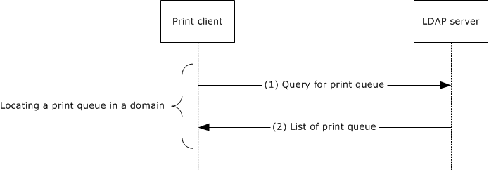

Figure 16: Print client locating a print queue in a domain by using LDAP

The message group labeled "Locating a print queue in a domain" in the preceding diagram represents the search for a print queue in Active Directory by using the LDAP search option ([RFC4511] section 4.5 and [MS-RPRN] section 2.3.3.3).

The following steps describe task 1 of this example.

- The print client uses LDAP to query the LDAP server for print queues, optionally specifying criteria, such as functionality, that the print queues are required to satisfy. The print client obtains criteria from the user interface and makes several queries to obtain criteria, such as the physical location of the print client.
- The LDAP server returns a list of print queues by using LDAP. The print client user interface then presents the list to the user who selects a print queue.
**Task 2: Establishing a connection, downloading a driver, and registering for notifications**

The following diagram shows a print client that connects to a print queue, downloads a driver, and registers for notifications. The sequence is described in the steps that follow the diagram.

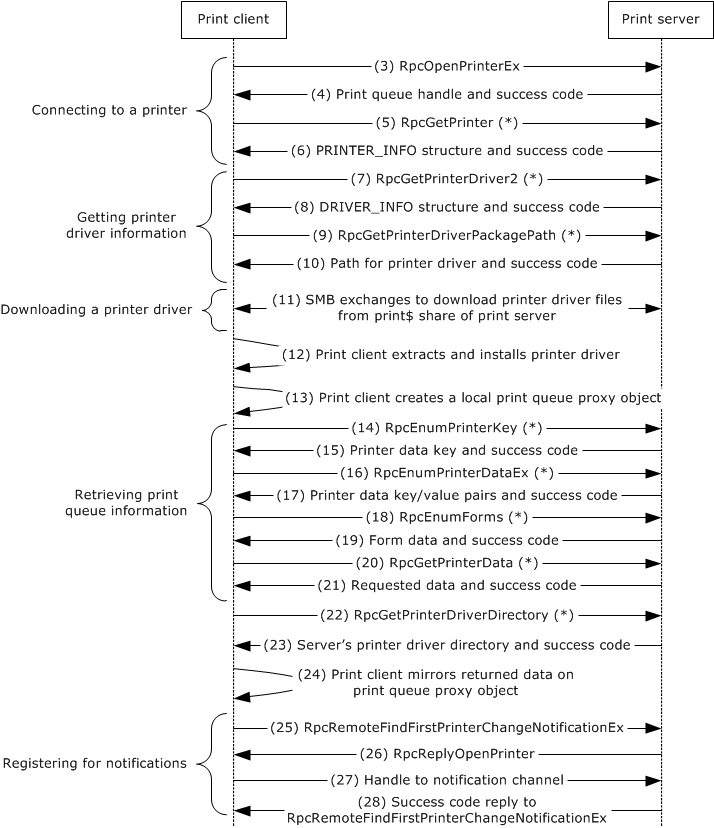

Figure 17: Print client connecting to a print queue, downloading a driver, and registering for notifications

The following table shows the message groups from the preceding diagram and their purpose.

| Message group | Description | References |
| --- | --- | --- |
| Connecting to a printer | Obtains the print server handle and information about the specified printer. | [MS-RPRN] section 3.1.4.2 |
| Getting printer driver information | Obtains the driver information and package path of the specified printer driver. | [MS-RPRN] section 3.1.4.4 |
| Downloading a printer driver | Downloads a printer driver by using the SMB Version 1.0 Protocol [MS-SMB](../MS-SMB/MS-SMB.md). | [MS-SMB] section 2.2 and [MS-FASOD](#Section_2.1) section 3.5 |
| Retrieving print queue information | Obtains configuration data and form information for a print queue. | [MS-RPRN] section 3.1.4.2 and [MS-RPRN] section 3.1.4.5 |
| Registering for notifications | Creates a remote change notification object that monitors changes to printer objects and sends change notifications to the client. | [MS-RPRN] (section 3.1.4.10 |

The following steps describe task 2 of this example:

- The print client calls the **RpcOpenPrinterEx** method on the print server for the designated print queue.
- The print server returns a handle to the print queue and a success code.
- The print client calls the **RpcGetPrinter** (*) method on the print server for the print queue handle.
- The print server returns the **PRINTER_INFO** structure with details about the print queue and a success code.
- The print client calls the **RpcGetPrinterDriver2** (*) method on the print server for the print queue handle.
- The print server returns the requested **DRIVER_INFO** structure, which contains details about the print queue's printer driver, such as driver file name and driver version, and a success code.
- The print client calls the **RpcGetPrinterDriverPackagePath** (*) method on the print server for the print queue handle.
- The print server returns the path for the printer driver package CAB file and a success code.
- The print client downloads the printer driver by using the SMB protocol family, which uses the following operations.
- Open File SMB ([MS-FASOD] section 3.5.1).
- Perform File Operation SMB Query FS Information ([MS-FASOD] section 3.5.2).
- Perform File Operation SMB Read ([MS-FASOD] section 3.5.3)
- Perform File Operation SMB Close ([MS-FASOD] section 3.5.4).
- The print client extracts the printer driver files that are contained in the downloaded data file and installs the printer driver.
- The print client creates a connection to the print queue by creating a local print queue proxy object.
- The print client calls the **RpcEnumPrinterKey** (*) method on the print server for the designated print queue handle.
- The print server returns the requested printer data key and a success code.
- The print client calls the **RpcEnumPrinterDataEx** (*) method on the print server for the designated print queue handle.
- The print server returns the requested printer data key/value pairs and a success code.
- The print client calls the **RpcEnumForms** (*) method on the print server for the designated print queue handle.
- The print server returns the requested form data and a success code.
- The print client calls the **RpcGetPrinterData** (*) method on the print server for the designated print queue handle to obtain values of specific keys.
- The print server returns the requested data and a success code.
- The print client calls the print server's **RpcGetPrinterDriverDirectory** method.<18>
- The print server responds with the name of its printer driver directory and a success code.
- The print client mirrors the returned data on the local print queue proxy object.
- The print client calls the **RpcRemoteFindFirstPrinterChangeNotificationEx** method on the print server with a print queue handle to begin the process for registering to receive print status notifications.
- The print server calls the **RpcReplyOpenPrinter** method on the print client to establish a notification channel.
- The print client returns the **RpcReplyOpenPrinter** method call with a handle to the notification channel.
- The print server returns the **RpcRemoteFindFirstPrinterChangeNotificationEx** method call with a success code.<19>
**Task 3: Submitting a print job and receiving notifications**

The following diagram shows the print client that submits a print job to the print queue and receives notifications.

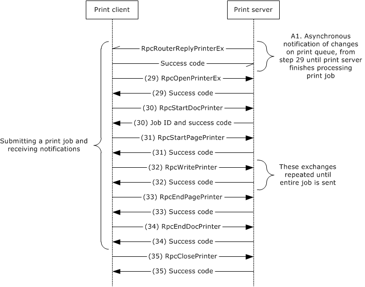

Figure 18: Print client submitting a print job to the print queue

The message group labeled "Submitting a print job and receiving notifications" in the preceding diagram shows how the client receives asynchronous notification of changes on the print queue and how the client submits a print job ([MS-RPRN] sections 3.1.4.9.1, 3.1.4.9.2, 3.1.4.9.3, 3.1.4.9.4, and 3.1.4.9.7).

The following steps describe task 3 of this example:

Asynchronously on a separate thread, during each of the steps of task 3 and until the print server has finished processing the [**print job**](#gt_print-job), the print server calls the **RpcRouterReplyPrinterEx** method to notify the print client of changes on the print queue, such as job processing progress, status changes, or other changes. The print client responds to each notification with a success code.

- The print client calls the **RpcOpenPrinterEx** method on the print server to open a handle to the print queue for submitting a print job, and the print server returns a success code.
- The print client calls the **RpcStartDocPrinter** method on the print server, and the print server returns a job ID and a success code.
- The print client calls the **RpcStartPagePrinter** method on the print server, and the print server responds with a success code.
- The print client repeatedly calls the **RpcWritePrinter** method on the print server, by sending successive portions of the print job. The print server responds to each call with a success code. This step is repeated until all the print data has been sent.
- The print client calls the **RpcEndPagePrinter** method on the print server, and the print server responds with a success code.
- When all print data has been sent, the print client calls the **RpcEndDocPrinter** method on the print server, and the print server responds with a success code.
- The print client calls the **RpcClosePrinter** method on the print server, and the print server returns a success code. This step only occurs if the print client does not proceed to the next portion of this example.
**Task 4: Unregistering from notifications**

The following diagram shows the print client unregistering from notifications.

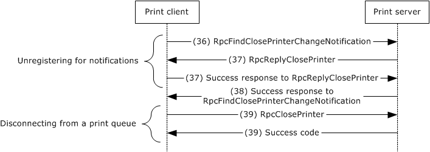

Figure 19: Print client unregistering from notifications

| Message group | Description | References |
| --- | --- | --- |
| Unregistering from notifications | The print client unregisters from notifications of changes to the print queue. | [MS-RPRN] section 3.1.4.10.2 |
| Disconnecting from a print queue | The print client closes the handle to the printer object. | [MS-RPRN] section 3.1.4.2.9 |

The following steps describe task 4 of this example:

- When a print client has no further use for notifications, for example, when the user closes the print queue dialog user interface, the print client calls the **RpcFindClosePrinterChangeNotification** method on the print server.
- The print server calls the **RpcReplyClosePrinter** method on the print client, and the print client returns a success code.
- The print server responds to the **RpcFindClosePrinterChangeNotification** method with a success code.
- The print client calls the **RpcClosePrinter** method on the print server by using the handle to the print queue that was specified during registration, and the print server returns a success code.
It is common for clients to listen for notifications from more than one thread. Therefore, the sequence of steps for registration for notifications, from task 2, and unregistration, from task 3, can be observed on the network multiple times.

## 3.2 Example 2: Discovering and Utilizing a Print Queue in a Workgroup

This example demonstrates the use cases described in section [2.5.3.4](#Section_2.3) and section [2.5.3.7.1](#Section_2.5.3.7.1).

In this example, a computer in a [**workgroup**](#gt_workgroup) locates a shared print queue on another computer in the workgroup and sends a [**print job**](#gt_print-job) to the shared print queue.

In this example, there is no dedicated print server, no [**domain**](#gt_domain) has been established, and no directory system is available. The clients in the workgroup are distinguished by their roles, already established, as follows:

- Print server: One client in the workgroup is established as a print server and has already announced the shared print queues that it hosts to all other print servers in the workgroup, if there are any, by using the CIFS Browser Protocol [MS-BRWS](../MS-BRWS/MS-BRWS.md). The printers are shared by using the Print System Remote Protocol [MS-RPRN](../MS-RPRN/MS-RPRN.md).<20>
- Print client: One client is distinguished as a print client in the workgroup when it is directed by the user to send a print job to a print server. This print client can behave in other roles, such as print server or print browser server, but for this example the client acts in the role of a print client only.
- Print browser server: One client in the workgroup is established as the print browser server, which enumerates available print servers and print queues to print clients. The print browser server has already announced this role to all the clients in the workgroup by using the CIFS Browser Protocol. Print clients locate the print browser server by using the CIFS and RAP protocols through a **NetServerEnum** method call in which the **Level** field is set to 101 and the **Flags** field to SV_TYPE_PRINTQ_SERVER. In order to act in the role of the print browser server, the print client also plays the role of a print server with at least one available shared print queue.
Only one print server in the workgroup behaves as the active print browser server at any given time. Other print servers, if there are any, behave as backup print browser servers. One of them becomes the new active print browser server if the current active print browser server becomes unavailable. The print browser server and the backup print browser servers exchange information about shared print queues in the workgroup by calling the **RpcAddPrinter** method ([MS-RPRN] section 3.1.4.2.3) and using the **PRINTER_INFO_*** structures ().

Typically, the first workgroup client that takes on the role of a print server that shares a print queue also becomes the print browser server for the workgroup.

**Prerequisites**

This example has the following prerequisites:

- The general requirements as listed in [Assumptions and Preconditions](#Section_2.4), section 2.4, are met.
- Participating clients are configured to be members of the same workgroup.
- The \pipe\spoolss endpoint can be accessed anonymously.
- All participating clients support the CIFS Browser Protocol.
- One of the clients has at least one shared print queue, so that at least one client is of type **SV_TYPE_PRINTQ_SERVER**, which is a requirement for this example.
- Either the print client or print server supports the Print System Remote Protocol but not the Print System Asynchronous Remote Protocol [MS-PAR](../MS-PAR/MS-PAR.md).<21> This precondition was chosen to illustrate the use of Print System Remote Protocol.<22>
- The print client is configured to not use Windows Update to obtain the [**printer driver**](#gt_printer-driver). This precondition is presented to illustrate the printer driver download from the print server.
- The printer driver is available from the print server's print$ share.
**Initial System State**

This example applies in the following initial system state.

- The print client does not have the printer driver for the print queue.
- The print client does not have the printer [**driver package**](#gt_driver-package) for the printer driver in its local [**driver store**](#gt_driver-store). This state is presented to illustrate printer driver download from the print server.
**Final System State**

- The print client obtains the list of available print servers and print queues.
- The print client has downloaded a printer driver for the print queue.
**Tasks**

This example is divided into four tasks.

- Locating a print queue in a workgroup
- Establishing a connection and registering for notifications
- Submitting a print job and receiving notifications
- Unregistering for notifications
**Task 1: Locating a print queue in a workgroup**

The following diagram shows the first part of this example, in which a print client locates a print queue in a workgroup and establishes a connection to the print queue. The sequence is described in the steps that follow the diagram.

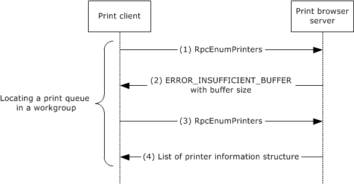

Figure 20: Print client locating a print queue in a workgroup

The message group that is labeled "Locating a print queue in a workgroup" shows how the client enumerates the printers in the workgroup ([MS-RPRN] section 3.1.4.2.1).

The following steps describe task 1 of this example.

- The print client calls the **RpcEnumPrinters** method on the print browser server by using the Print System Asynchronous Remote Protocol. It requests whatever level of printer information structure the client requires ([MS-RPRN] section 3.1.4.2.1).
- The server returns ERROR_INSUFFICIENT_BUFFER and sets the *countBytesNeeded* parameter to the size that is required to store the requested printer information structures for all shared print queues.
- The client allocates an amount of memory equal to *countBytesNeeded*. The client calls **RpcEnumPrinters** and passes the allocated memory as a parameter.
- The server stores a printer information structure for each shared print queue in the output buffer, stores the number of print information structures in the *printersFound* parameter, and returns ERROR_SUCCESS.
If the number of shared print queues on the server has increased between the first and second call to **RpcEnumPrinters**, the server also returns ERROR_INSUFFICIENT_BUFFER from the second call. In that case, the server updates the *countBytesNeeded* parameter so that the client can reallocate the buffer and repeat the call to **RpcEnumPrinters**.

**Task 2: Establishing a connection and registering for notifications**

The following diagram shows the second part of this example, in which a print client establishes a connection to a print queue and registers for notifications.

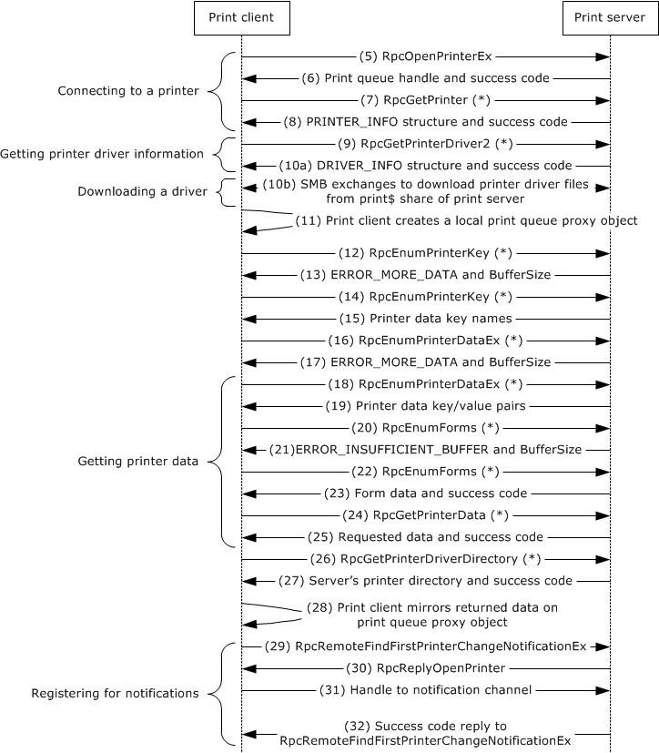

Figure 21: Print client establishing a connection and registering for notifications

| Message group | Description | References |
| --- | --- | --- |
| Connecting to a printer | The client obtains the print server handle and information about the specified printer. | [MS-RPRN] section 3.1.4.2 |
| Getting printer driver information | The client obtains information about the device driver for the specified printer. | [MS-RPRN] section 3.1.4.4 |
| Downloading a driver | The client downloads a printer driver by using the SMB protocol. | [MS-SMB](../MS-SMB/MS-SMB.md) section 2.2 and [MS-FASOD](#Section_2.1) section 3.5 |
| Getting printer data | The client obtains configuration data and form information for a print queue. | [MS-RPRN] sections 3.1.4.2 and 3.1.4.5 |
| Registering for notifications | The client creates a remote change notification object that monitors changes to printer objects and sends notifications of those changes to the client by using the **RpcRouterReplyPrinter** method. | [MS-RPRN] section 3.1.4.10 |

The following steps describe task 2 of this example:

It is common for clients to listen for notifications from more than one thread. Therefore, the following sequence of steps for registration for notifications can be observed on the network multiple times.

- The print client calls the **RpcOpenPrinterEx** method on the print server for the designated print queue.
- The print server returns a handle to the print queue and a success code.
- The print client calls the **RpcGetPrinter** (*) method on the print server for the print queue handle.
- The print server returns the **PRINTER_INFO** structure with details about the print queue and a success code.
- The print client calls the **RpcGetPrinterDriver2** (*) method on the print server for the print queue handle.
- This step consists of the following two parts:
- The print server returns the requested **DRIVER_INFO** structure, which contains details about the print queue's printer driver, such as the driver's file name and version, and a success code.
- The print client downloads the printer driver files from the print$ share of the print server by using the SMB protocol family. The print client has no control over whether the SMB Version 1.0 or SMB Version 2.0 protocol is used.
- The print client creates a connection to the print queue by creating a local print queue proxy object.
- The print client calls the **RpcEnumPrinterKey** (*) method on the print server for the designated print queue handle.
- The print server returns ERROR_MORE_DATA and sets the buffer size that is required for the subkey.
- The client allocates a buffer with the size as returned by the server. The client calls **RpcEnumPrinterKey** by passing the buffer as a parameter.
- The print server returns the requested printer data subkey of the specified key and a success code.
- The print client calls the **RpcEnumPrinterDataEx** (*) method on the print server for the designated print queue handle.
- The print server returns ERROR_MORE_DATA and sets the buffer size that is required for enumerating all value names and data for the specified printer and key.
- The client allocates a buffer with the size as returned by the server. The client calls **RpcEnumPrinterDataEx** and passes the allocated memory as a parameter.
- The print server returns the requested printer data key/value pairs and a success code.
- The print client calls the **RpcEnumForms** (*) method on the print server for the designated print queue handle.
- The print server returns ERROR_INSUFFICIENT_BUFFER and sets the buffer size that is required for the forms that the printer supports.
- The client allocates a buffer with the size as returned by the server. The client calls **RpcEnumForms** and passes the allocated memory as a parameter.
- The print server returns the requested form data and a success code.
- The print client calls the **RpcGetPrinterData** (*) method on the print server for the designated print queue handle to obtain values of specific keys.
- The print server returns the requested data and a success code.
- The print client calls the print server's **RpcGetPrinterDriverDirectory** method.<23>
- The print server responds with the name of its printer driver directory and a success code.
- The print client mirrors the returned data on the local print queue proxy object.
- The print client calls the **RpcRemoteFindFirstPrinterChangeNotificationEx** method on the print server with a print queue handle to begin the process for registering to receive print status notifications.
- The print server calls the **RpcReplyOpenPrinter** method on the print client to establish a notification channel.
- The print client returns the **RpcReplyOpenPrinter** method call with a handle to the notification channel.
- The print server returns the **RpcRemoteFindFirstPrinterChangeNotificationEx** method call with a success code.<24>
**Task 3: Submitting a print job and receiving notifications**

The following diagram shows the print client submitting a print job to the print queue.

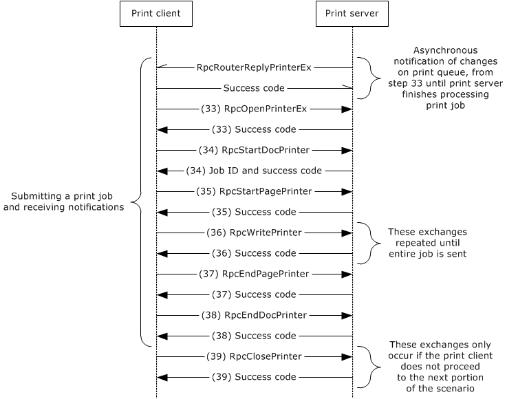

Figure 22: Print client submitting a print job to the print queue

The message group labeled "Submitting a print job and receiving notifications" in the preceding figure shows how the client receives asynchronous notification of changes on a print queue and how it submits a print job ([MS-RPRN] sections 3.1.4.9.1, 3.1.4.9.2, 3.1.4.9.3, 3.1.4.9.4, and 3.1.4.9.7).

The following steps describe task 3 of this example:

Asynchronously, and until the print server has finished processing the print job, the print server calls the **RpcRouterReplyPrinterEx** method on the print client to notify the client of changes on the print queue, such as job processing progress, status changes, or other changes.

- The print client calls the **RpcOpenPrinterEx** method on the print server to open a handle to the print queue for submitting a print job, and the print server returns a success code.
- The print client calls the **RpcStartDocPrinter** method on the print server, and the print server returns a job ID and a success code.
- The print client calls the **RpcStartPagePrinter** method on the print server, and the print server responds with a success code.
- The print client repeatedly calls the **RpcWritePrinter** method on the print server by sending successive portions of the print job. The print server responds to each call with a success code. This step is repeated until all the print data has been sent.
- The print client calls the **RpcEndPagePrinter** method on the print server, and the print server responds with a success code.
- When all print data has been sent, the print client calls the **RpcEndDocPrinter** method on the print server, and the print server responds with a success code.
- The print client calls the **RpcClosePrinter** method on the print server, and the print server returns a success code. This step occurs only if the print client does not proceed to the next portion of this example.
**Task 4: Unregistering for notifications**

The following diagram shows the print client unregistering for notifications.

Figure 23: Print client unregistering for notifications

| Message group | Description | References |
| --- | --- | --- |
| Unregistering for notifications | The client unregisters for notification of changes on the print queue. | [MS-RPRN] (section 3.1.4.10.2) |
| Disconnecting from a print queue | The client closes its handle to the printer object. | [MS-RPRN] (section 3.1.4.2.9) |

The following steps describe task 4 of this example:

It is common for clients to listen for notifications from more than one thread. Therefore, the sequence of steps for unregistration for notifications can be observed on the network multiple times.

- When a print client is no longer consuming notifications, for example, when the user closes the print queue dialog user interface, the print client calls the **RpcFindClosePrinterChangeNotification** method on the print server.
- The print server calls the **RpcReplyClosePrinter** method on the print client, and the print client returns a success code.
- The print server responds to the **RpcFindClosePrinterChangeNotification** method with a success code.
- The print client calls the **RpcClosePrinter** method on the print server by using the handle to the print queue that was specified during registration, and the print server returns a success code.

## 3.3 Example 3: Receiving Unidirectional IHV-Defined Notifications

This example demonstrates the use cases described in section [2.5.3.7.1](../MS-PAN/MS-PAN.md) Extension (b). In these cases, the print client receives [**IHV**](#gt_independent-hardware-vendor-ihv)-defined notifications from a manual duplex printer by using the Print System Asynchronous Notification Protocol [MS-PAN](../MS-PAN/MS-PAN.md). These notifications are received after a print queue has been located in a [**domain**](#gt_domain), a connection has been established, a [**print job**](#gt_print-job) has been submitted by the Print System Remote Protocol [MS-RPRN](../MS-RPRN/MS-RPRN.md) and the Print System Asynchronous Remote Protocol [MS-PAR](../MS-PAR/MS-PAR.md), and unidirectional IHV-defined communication has been established between the print client and print server by using the Print System Asynchronous Notification Protocol.

**Prerequisites**

This example has the following prerequisites:<25>

- The print client and print server support the Print System protocols.
- An IHV-defined [**print processor**](#gt_print-processor) that is installed on the print server serves as the Print System Asynchronous Notification Protocol as notification source and implements a Manual Duplex operation. The operation prompts the user to walk up to the printer and reinsert printed pages.
- The print queue has been provisioned and is located on a print server in a domain.
- The print server has published a list of the shared print queues to the Directory system.
- The print client has located the print queue in the domain by using [**LDAP**](#gt_lightweight-directory-access-protocol-ldap) [[RFC4511]](https://go.microsoft.com/fwlink/?LinkId=157505).
- The [**printer driver**](#gt_printer-driver) is available from the print server.
- The print client has established a connection, downloaded a driver, registered for notifications, and submitted a print job, except that the asynchronous calls that are provided by the Print System Asynchronous Remote Protocol have been used instead of the corresponding the Print System Remote Protocol calls that were used in Example 1.
**Initial System State**

There are no specific initial system state requirements for this example other than those implied by the prerequisites.

**Final System State**

The final system state is identical to the initial system state. This sequence of events leaves the system state unmodified.

**Sequence**

Asynchronous communication: When the print client's notification listener thread receives a notification that announces a new print job, the print client starts another listener thread to register and listen for notifications. The following diagram shows the notification process that is based on the Print System Asynchronous Notification Protocol.

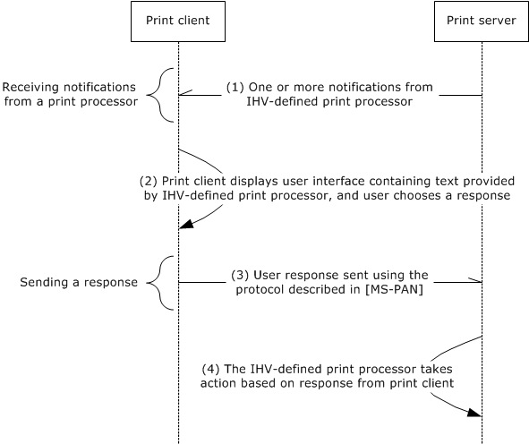

Figure 24: Print client receiving notifications

The particular messages within the message groups that are shown in the preceding diagram are described in [MS-PAN] section 4.2.

- During processing of the print job on the print server, the IHV-defined print processor sends one or more notifications to the print client by using the Print System Asynchronous Remote Protocol. The IHV-defined print processor can send these notifications at arbitrary times.
- When receiving the notification from the print server, the print client shows the user interface to the user by displaying custom text provided by the IHV-defined print processor. The user takes appropriate action and confirms the user interface.
- The print client sends a response by using the Print System Asynchronous Remote Protocol.
- The IHV-defined print processor takes appropriate actions that are based on the response that was received from the print client.
It is common for print clients to listen for notifications from more than one thread. Therefore, the steps for registration for notifications and unregistration can be observed on the network multiple times.

## 3.4 Example 4: Enumerating Print Jobs from All Users, Then Canceling Several Print Jobs

This example demonstrates the use case in section [2.5.3.8.2](#Section_2.5.3.8.2).

An administrator with appropriate privileges can view and override [**print jobs**](#gt_print-job) that are submitted by other users. This example illustrates this administrative procedure, by using only the Print System Remote Protocol [MS-RPRN](../MS-RPRN/MS-RPRN.md).

**Prerequisites**

This example has the following prerequisites:

- The administrative client is used by an administrator who has privileges for overriding the print operations of other users.
- Either the print client or the print server supports the Print System Remote Protocol but not the Print System Asynchronous Remote Protocol [MS-PAR](../MS-PAR/MS-PAR.md). This precondition was chosen to illustrate the use of the Print System Remote Protocol.<26>
**Initial System State**

This example has the following initial system state:

- Multiple users have submitted print jobs to the same print queue.
**Sequence**

The following diagram shows the administrative client connecting to a print queue, enumerating print jobs, and deleting a print job.

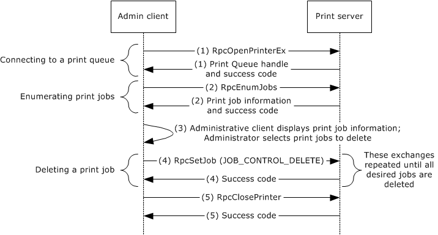

Figure 25: Administrative client enumerating and canceling print jobs on a print queue

The following table shows the message groups from the preceding diagram and their purpose.

| Message group | Description | References |
| --- | --- | --- |
| Connecting to a print queue | The client obtains a handle to the print server. | [MS-RPRN] section 3.1.4.2.14 |
| Enumerating print jobs | The client obtains a list of print jobs on the print server. | [MS-RPRN] section 3.1.4.3.3 |
| Deleting a print job | The client deletes a print job from the print server. | [MS-RPRN] section 3.1.4.3.1 |

The following steps describe this sequence:

- The administrative client calls the **RpcOpenPrinterEx** method on the print server to obtain the handle for the print queue. The print server returns the print queue handle and a success code.
- The administrative client calls the **RpcEnumJobs** method on the print server by using the print queue handle. The print server enumerates all the print jobs that are assigned to that print queue, and provides information about the print jobs, such as the names of the jobs, the IDs of the jobs, and the names of the users who submitted the jobs, and returns a success code.
- The administrative client displays the information about the print jobs. The administrator selects the print jobs to cancel.
- The administrative client repeatedly calls the **RpcSetJob** method by running the **JOB_CONTROL_DELETE** command on the print server that uses the print queue handle and then by canceling one job at a time. The print server terminates each designated print job, deleting it from the print queue and responding to each method call with a success code.
- The administrative client calls the **RpcClosePrinter** method on the print queue handle, and the print server responds with a success code.
**Final State**

The print queue in this example contains only print jobs that were not deleted by the administrator.

## Example 5: Provisioning a Print Queue By Using the Protocol Defined in [MS-RPRN]

This example demonstrates the use case described in section [2.5.3.1](#Section_2.1) and section [2.5.3.2](#Section_2.1) under variation (a) with extension (a), where a [**print queue**](#gt_print-queue) is provisioned from an administrative client by using the Print System Remote Protocol [MS-RPRN](../MS-RPRN/MS-RPRN.md), and then the same print queue is deleted from a different administrative client by using the Print System Asynchronous Remote Protocol [MS-PAR](../MS-PAR/MS-PAR.md).

In this example, two different administrative clients are involved in managing print queues: the first client provisions a print queue, and the second client subsequently deletes the same print queue. The first client uses the Print System Remote Protocol, and the second client uses the Print System Asynchronous Remote Protocol. Although both management functions can be accomplished by either protocol, this example demonstrates how the parallel functionality can be accomplished by using different implementations or different versions of administrative clients.

The Windows-based administrative clients that are using the Print System Asynchronous Remote Protocol to manage print queues first use the Print System Remote Protocol to ensure that the Print System Asynchronous Remote Protocol is supported by the print server and that the print server is available.

**Prerequisites**

This example has the following prerequisites:

- Administrative clients and print servers are located within a [**domain**](#gt_domain) configuration.
- Administrative clients and print servers have access to the [**Active Directory**](#gt_active-directory) system that is provided by the domain.
- The administrator of section A has physically connected a printer to a print server or known network location.
- The administrator of section A knows the location from which to obtain a [**printer driver**](#gt_printer-driver) for the newly attached printer.
- The administrative client that is used to provision the print queue supports the Print System Remote Protocol but not the Print System Asynchronous Remote Protocol.<27>
- The administrative client is used to delete the print queue. The print server supports the Print System Remote Protocol and the Print System Asynchronous Remote Protocol.
**Initial System State**

This example has the following initial system state:

- The print queue is not added to the print server.
- The print queue is not published to the LDAP server.
**Final System State**

- The final system state is identical to the initial system state.
**Tasks**

This example is divided into two tasks:

- Provisioning a print queue through the Print System Remote Protocol
- Deleting that print queue through the Print System Asynchronous Remote Protocol
**Task 1: Provisioning a print queue through the Print System Remote Protocol**

The following diagram shows the first task of this example.

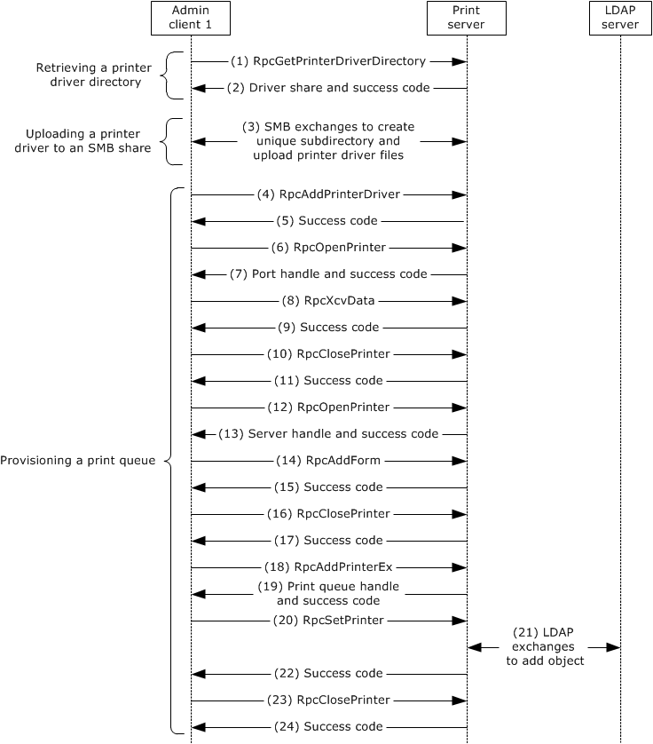

Figure 26: Administrative client provisioning a print queue by using the Print System Remote Protocol

The following table shows the message groups from the preceding diagram and their purpose.

| Message group | Description | Reference |
| --- | --- | --- |
| Retrieving a printer driver directory | The administrative client retrieves the directory where printer drivers are stored. | [MS-RPRN] section 3.1.4.4.4 |
| Uploading a printer driver to an SMB share | The administrative client uses the SMB protocol to upload a printer driver to the printer driver directory. | [MS-SMB](../MS-SMB/MS-SMB.md) section 2.2 and [MS-FASOD](#Section_2.1) section 3.5 |
| Provisioning a print queue | The administrative client provisions the print queue, which involves adding a printer, adding a form, and setting the print queue's printer property. | [MS-RPRN] section 3.1.4 |

The following steps describe task 1 of this example:

- Administrative client 1 uses the Print System Remote Protocol to call the **RpcGetPrinterDriverDirectory** method on the print server to retrieve the printer driver share ([MS-RPRN] section 3.1.4.4.4).
- The print server returns the requested path for the driver share and a success code.
- Administrative client 1 uses the [**SMB**](#gt_server-message-block-smb) protocol family [MS-SMB] to create a unique subdirectory in the print share of the print server and uploads the files containing the printer driver to that location.
- Administrative client 1 calls the **RpcAddPrinterDriver** method on the print server by specifying the unique directory that was created in step 3.
- The print server returns a success code.
- The administrative client 1 calls the **RpcOpenPrinter** method on the print server to open a port handle for the [**port monitor**](#gt_port-monitor).
- The print server returns a port handle and a success code.
- The administrative user initiates an **Add Port** action in the administrative tool and selects to add a TCP/IP port to the server. In response, the administrative client 1 calls the **RpcXcvData** method on the print server, by specifying an **Add Port** action.
- The print server adds a port and returns a success code.
- The administrative client 1 calls the **RpcClosePrinter** method on the print server to close the port handle.
- The print server returns a success code.
- The administrative client 1 calls the **RpcOpenPrinter** method on the print server to open a server handle to the print server.
- The print server returns a server handle and a success code.
- The administrative user initiates an **Add Form** action in the administrative tool and adds a form. In response, the administrative client 1 calls the **RpcAddForm** method on the print server to add a form.
- The print server adds the form and returns a success code.
- The administrative client 1 calls the **RpcClosePrinter** method on the print server to close the server handle.
- The print server returns a success code.
- The administrative client 1 calls the **RpcAddPrinterEx** method on the print server by using the **PRINTER_INFO_2** structure, the **DEVMODE_CONTAINER** structure, and the **SECURITY_CONTAINER** structure.
- The print server returns a handle to the new print queue and a success code.
- The administrative client 1 calls the **RpcSetPrinter** method on the print server by using the **DEVMODE_CONTAINER** structure, the **SECURITY_CONTAINER** structure, and the **PRINTER_INFO_7** structure and by specifying that the print queue be published in the Active Directory system.
- The print server uses [**LDAP**](#gt_lightweight-directory-access-protocol-ldap) [[RFC4511]](https://go.microsoft.com/fwlink/?LinkId=157505), to add the print queue as a new object in the Active Directory system that indicates the location of the print queue.
- The print server returns a success code to the print client.
- The administrative client 1 calls the **RpcClosePrinter** method on the print server.
- The print server returns a success code to the administrative client.
**Task 2: Deleting that print queue through the Print System Asynchronous Remote Protocol**

The following diagram shows the second task of this example.

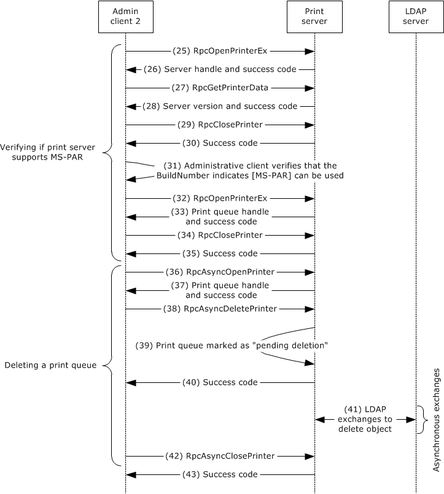

Figure 27: Administrative client deleting a print queue by using the Print System Asynchronous Remote Protocol

The following table shows the message groups from the preceding diagram and their purpose.

| Message group | Description | References |
| --- | --- | --- |
| Verifying a print server | The administrative client uses the Print System Remote Protocol to verify that the print server supports the Print System Asynchronous Remote Protocol and that it is available. | [MS-RPRN] section 2.2 |
| Deleting a print queue | The administrative client uses the Print System Asynchronous Remote Protocol to delete the print queue. | [MS-PAR] section 3.1.4.1 |

The following steps describe task 2 of this example:

- The administrative client 2 uses the Print System Remote Protocol to call the **RpcOpenPrinterEx** method on the print server to obtain a print server handle.
- The print server returns the server handle and success code.
- The administrative client 2 uses the Print System Remote Protocol to call the **RpcGetPrinterData** method on the print server, which specifies the server handle and the OSVersion key.
- The print server returns the server version, which contains the BuildNumber, and a success code.
- The administrative client 2 uses the Print System Remote Protocol to call the **RpcClosePrinter** method on the print server for the server handle.
- The print server returns a success code.
- The administrative client 2 verifies that the BuildNumber (OSVersion value) is 3791 or greater, which indicates that the Print System Asynchronous Remote Protocol can be used for managing print queues.
- The administrative client 2 uses the Print System Remote Protocol to call the **RpcOpenPrinterEx** method on the print server for the print queue to obtain the print queue handle. This step and the next two steps are used to verify that the print server is still available.
- The print server returns the print queue handle and a success code.
- The administrative client 2 uses the Print System Remote Protocol to call the **RpcClosePrinter** method on the print server for the print queue handle that is used for verification that the print server is still available.
- The print server returns a success code.
- The administrative client 2 uses the Print System Asynchronous Remote Protocol to call the **RpcAsyncOpenPrinter** method on the print server for the specified print queue.
- The print server returns the print queue handle and a success code.
- The administrative client 2 uses the Print System Asynchronous Remote Protocol to call the **RpcAsyncDeletePrinter** method on the print server for the print queue handle.
- The print server marks the specified print queue as "pending deletion".
- The print server returns a success code.
- Following the previous step, on a separate thread of execution, the print server does the following:
- Uses LDAP to remove the published print queue from the LDAP server.
- Waits until the print queue marked "pending deletion" is no longer in use by any other print client or active [**print job**](#gt_print-job), and then deletes the print queue from the print server.
- The administrative client 2 uses the Print System Asynchronous Remote Protocol to call the **RpcAsyncClosePrinter** method on the print server for the print queue handle.
- The print server returns a success code.

## 3.6 Example 6: Sending a Print Job to an SMB Share

This example demonstrates the use cases described in sections [2.5.3.7.3](#Section_2.5.3.7.3) and [2.5.3.8.3](#Section_2.5.3.8.3).

This example involves the [**SMB**](#gt_server-message-block-smb) protocol family [MS-SMB](../MS-SMB/MS-SMB.md) and [**RAP**](#gt_remote-administration-protocol-rap) [MS-RAP](../MS-RAP/MS-RAP.md), supporting interoperability with non-Windows platforms.<28> This example also applies to the rare case when a Windows print client installs a local print queue with a local port specifying the UNC path of a shared print queue on a print server.

In this example, when a user performs commands from a command prompt, the user is interacting with the SMB Server Service installed on the print server. A user sends a [**print job**](#gt_print-job) to an SMB share by entering the command **copy /b file \\server\printer** at a command prompt.<29> The print client subsequently uses the SMB protocol family to copy the file to the specified SMB print share of the print server. The SMB/RAP Print Redirector module (part of the SMB protocol family Server Service) on the print server translates SMB calls from the print client to local calls to the print subsystem of the print server.

After sending a print job to the SMB share of the print server, the user can obtain a list of the active jobs on the specified print queue by entering **net print \\server\printer** at the command prompt. The print client uses RAP to obtain the list of active jobs. The SMB/RAP Print Redirector module on the print server translates the RAP calls from the print client to local calls to the print subsystem of the print server.

**Prerequisites**

This example has the following initial system state and prerequisites.

- The requirements in the Assumptions and Preconditions (section [2.4](#Section_2.4)) are met.
- The SMB Server Service is installed and active on the print server.
**Initial System State**

This example has the following initial system state.

- The print job is ready to be sent to the specified SMB print share.
**Sequence**

The following diagram illustrates this example.

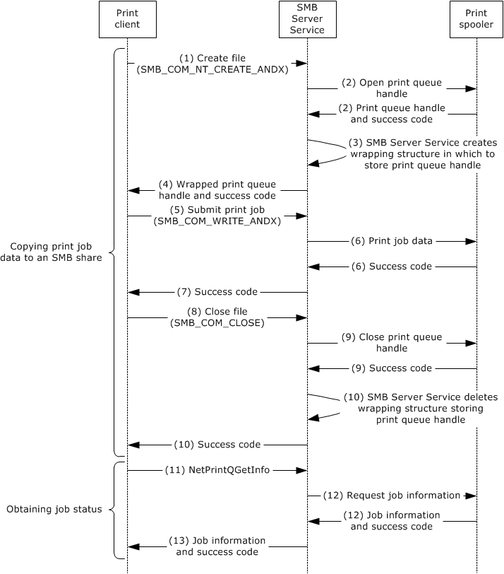

Figure 28: Print client sending a print job to an SMB share

| Message groups | Description | References |
| --- | --- | --- |
| Copying print job data to an SMB share | Using the SMB protocol, the print client copies print job data to an SMB share for redirection to the print queue. | [MS-SMB] section 2.2 |
| Obtaining job status | Using the RAP protocol, the print client obtains the status of the print job. | [MS-RAP] section 3.2.5.5 |

The following steps describe this sequence.

- The print client calls the Create File method (**SMB_COM_NT_CREATE_ANDX**) on the print server for the UNC name of the print queue.
- The SMB Server Service on the print server redirects the call to a local API of the [**print spooler**](#gt_print-spooler) to open a handle to the print queue, and the local print spooler API returns the print queue handle and a success code to the SMB Server Service.
- The SMB Server Service on the print server creates a wrapping structure in which to store the print queue handle and starts the print job by invoking a local print spooler API.
- The SMB Server Service returns the handle of the wrapping structure and a success code to the print client as though it were a file handle.
- The print client calls the method (**SMB_COM_WRITE_ANDX**) on the print server to submit the print job data to the file handle.
- The SMB Server Service redirects the print job data to a local print spooler API using the print queue handle stored in the wrapping structure, and the local print spooler API returns a success code to the SMB Server Service.
- The SMB Server Service returns a success code to the print client.
- The print client ends the print job by calling the Close File method (**SMB_COM_CLOSE**) on the SMB Server Service.
- The SMB Server Service calls a local print spooler API to close the print queue handle designated in the wrapping structure, and the local print spooler API returns a success code to the SMB Server Service.
- The SMB Server Service frees the wrapping structure and then returns a success code to the print client.
To then obtain information from the SMB Server Service about print job status, the user can enter the **net print** command [[MSFT-NETPRINT]](https://go.microsoft.com/fwlink/?linkid=863947) at a command prompt, to which the print client responds as follows.

- The print client sends the **NetPrintQGetInfo** command defined by RAP to send the share name of the print queue on the print server.
- The SMB Server Service on the print server redirects the call to a local API of the print spooler to obtain information about the jobs queued for the specified print queue, and the local print spooler API returns job information and a success code.
- The SMB Server Service responds to the **NetPrintQGetInfo** request with print job information and a success code.
**Final State**

A new print job has been added to the print queue on the print server and is being sent to the associated port.

# 4 Microsoft Implementations

The information in this overview is applicable to the following versions of Windows:

- Windows NT Server 3.1 operating system
- Windows NT Server 3.5 operating system
- Windows NT Server 3.51 operating system
- Windows 95 operating system
- Windows NT 4.0 operating system
- Windows 98 operating system
- Windows 2000 operating system
- Windows Millennium Edition operating system
- Windows XP operating system
- Windows Server 2003 operating system
- Windows Vista operating system
- Windows Server 2008 operating system
- Windows 7 operating system
- Windows Server 2008 R2 operating system
- Windows 8 operating system
- Windows Server 2012 operating system
- Windows 8.1 operating system
- Windows Server 2012 R2 operating system
- Windows 10 operating system
- Windows Server 2016 operating system
- Windows Server operating system
- Windows Server 2019 operating system
- Windows Server 2022 operating system
- Windows 11 operating system
Exceptions, if any, are noted in this section. If an update version, service pack or Knowledge Base (KB) number appears with a product name, the behavior changed in that update. The new behavior also applies to subsequent updates unless otherwise specified. If a product edition appears with the product version, behavior is different in that product edition.

## 4.1 Product Behavior

<1> Section 1.3.1: Print server implementation is not supported in Windows 95, Windows 98, and Windows Millennium Edition.

<2> Section 1.3.2: Print server implementation is not supported in Windows 95, Windows 98, and Windows Millennium Edition.

<3> Section 2.1.2.2.2: **RAP** is supported on Windows NT operating system, Windows 2000, Windows XP, Windows Server 2003, Windows Vista, and Windows Server 2008.

<4> Section 2.3.2: Windows implementations attempt to locate a driver from the following sources, in this order, when a driver cannot be obtained from the print server:

- The Print Store, which is the [**driver store**](#gt_driver-store); or the local driver [**cabinet file**](#gt_cabinet-file) in Windows NT, Windows 2000, Windows XP, and Windows Server 2003.
- Windows Update.
<5> Section 2.3.2: The maximally allowed number of shared print queues in a Windows workgroup is 256,

<6> Section 2.3.2: Group Policy settings can be applied to print clients and print servers, except those that are running Windows NT, Windows 95, Windows 98, and Windows Millennium Edition.

<7> Section 2.5.3.8.3: Windows NT, Windows 95, Windows 98, Windows 2000, Windows Millennium Edition, Windows XP, Windows Server 2003, Windows Vista, and Windows Server 2008 print clients and servers support the **net print** command.

<8> Section 2.6: Print Services system functionality is grouped by version:

- PSS 1.0 (Windows NT, Windows 95, Windows 98, and Windows Millennium Edition)
- PSS 2.0 (Windows NT)
- PSS 3.0 (Windows 2000, Windows Server 2003, Windows XP, and Windows Server 2008)
- PSS 4.0 (Windows Vista, Windows Server 2008 R2, Windows 7, Windows 8, Windows Server 2012, Windows 8.1, Windows Server 2012 R2, Windows 10, Windows Server 2016, Windows Server operating system, Windows Server 2019, Windows Server 2022, and Windows 11)
<9> Section 2.6: The Print Services system versions described in section [2.6](#Section_2.6) are supported in Windows releases as noted in the following table.

| Print Services system version | Print server release | Print client release | Method used by client to determine support level |
| --- | --- | --- | --- |
| PSS 1.0 | Windows NT 3.1 operating system Windows NT 3.5 operating system Windows NT 3.51 operating system Windows NT 4.0 Windows 2000 Windows XP Windows Server 2003 Windows Server 2003 R2 operating system Windows Server 2008 Windows Server 2008 R2 Windows Vista Windows 7 Windows 8 Windows Server 2012 Windows 8.1 Windows Server 2012 R2 Windows 10 Windows Server 2016 Windows Server operating system Windows Server 2019 | Windows 95 Windows 98 Windows Millennium Edition Windows NT 3.1 Windows NT 3.5 Windows NT 3.51 Windows NT 4.0 Windows 2000 Windows XP Windows Server 2003 Windows Server 2003 R2 Windows Server 2008 Windows Server 2008 R2 Windows Vista Windows 7 Windows 8 Windows Server 2012 Windows 8.1 Windows Server 2012 R2 Windows 10 Windows Server 2016 Windows Server operating system Windows Server 2019 | The protocol described in [MS-RPRN](../MS-RPRN/MS-RPRN.md) is not supported. The client detects this if the [**RPC**](#gt_remote-procedure-call-rpc) binding to the [**endpoint**](#gt_endpoint) for the protocol described in [MS-RPRN] fails. |
| PSS 2.0 | Windows NT 3.1 Windows NT 3.5 Windows NT 3.51 Windows NT 4.0 Windows 2000 Windows XP Windows Server 2003 Windows Server 2003 R2 Windows Server 2008 Windows Server 2008 R2 Windows Vista Windows 7 Windows 8 Windows Server 2012 Windows 8.1 Windows Server 2012 R2 Windows 10 Windows Server 2016 Windows Server operating system Windows Server 2019 | Windows NT 3.1 Windows NT 3.5 Windows NT 3.51 Windows NT 4.0 Windows 2000 Windows XP Windows Server 2003 Windows Server 2003 R2 Windows Server 2008 Windows Server 2008 R2 Windows Vista Windows 7 Windows 8 Windows Server 2012 Windows 8.1 Windows Server 2012 R2 Windows 10 Windows Server 2016 Windows Server operating system Windows Server 2019 | The protocol described in [MS-RPRN] is supported except for the **RpcOpenPrinterEx** method. |
| PSS 2.0 Additional capabilities described in [MS-RPRN] | Windows NT 4.0 Windows 2000 Windows XP Windows Server 2003 Windows Server 2003 R2 Windows Server 2008 Windows Server 2008 R2 Windows Vista Windows 7 Windows 8 Windows Server 2012 Windows 8.1 Windows Server 2012 R2 Windows 10 Windows Server 2016 Windows Server operating system Windows Server 2019 | Windows NT 4.0 Windows 2000 Windows XP Windows Server 2003 Windows Server 2003 R2 Windows Server 2008 Windows Server 2008 R2 Windows Vista Windows 7 Windows 8 Windows Server 2012 Windows 8.1 Windows Server 2012 R2 Windows 10 Windows Server 2016 Windows Server operating system Windows Server 2019 | The protocol described in [MS-RPRN] is supported including the **RpcOpenPrinterEx** method, and the OSVERSIONINFO.BuildNumber is less than or equal to 1381. |
| PSS 3.0 | Windows 2000 Windows XP Windows Server 2003 Windows Server 2003 R2 Windows Server 2008 Windows Server 2008 R2 Windows Vista Windows 7 Windows 8 Windows Server 2012 Windows 8.1 Windows Server 2012 R2 Windows 10 Windows Server 2016 Windows Server operating system Windows Server 2019 | Windows 2000 Windows XP Windows Server 2003 Windows Server 2003 R2 Windows Server 2008 Windows Server 2008 R2 Windows Vista Windows 7 Windows 8 Windows Server 2012 Windows 8.1 Windows Server 2012 R2 Windows 10 Windows Server 2016 Windows Server operating system Windows Server 2019 | OSVERSIONINFO.BuildNumber is greater than 1381 but less than or equal to 3790. |
| PSS 4.0 | Windows Server 2008 Windows Server 2008 R2 Windows Server 2012 Windows Server 2012 R2 Windows Server 2016 Windows Server operating system Windows Server 2019 Windows Server 2022 | Windows Vista Windows 7 Windows 8 Windows 8.1 Windows 10 Windows 11 | OSVERSIONINFO.BuildNumber is greater than 3790. |

<10> Section 2.6: This, behavior occurs in [**print clients**](#gt_print-client) implemented in Windows Client operating system versions, except Windows 95, Windows 98, Windows 2000 Professional operating system, Windows Millennium Edition, and Windows XP.

<11> Section 2.7.1.1: Windows NT, Windows 95, Windows 98, Windows Millennium Edition, Windows 2000, Windows XP, Windows Server 2003, Windows Vista, and Windows Server 2008 do not support this configuration.

<12> Section 2.8.3: Windows NT, Windows 95, Windows 98, Windows 2000, Windows Millennium Edition, Windows XP, Windows Server 2003, Windows Vista, Windows Server 2008, Windows 7, and Windows Server 2008 R2 implementations do not show this behavior.

<13> Section 2.9.1: This functionality is not supported on Windows NT, Windows 95, Windows 98, and Windows Millennium Edition.

<14> Section 3.1: In Windows, print client implementations can satisfy this precondition by disabling the PAR server endpoint on the print server, thus forcing the print server to use the Print System Remote Protocol for communication with the print client. The PAR server endpoint on the print server can be disabled through a [**registry**](#gt_registry) setting on the print server. Windows NT, Windows 95, Windows 98, Windows 2000, Windows Millennium Edition, Windows XP, and Windows Vista implementations do not show this behavior.

<15> Section 3.1: In Windows, the package aware flag can be set on the printer driver using the registry key "HKLM\System\CurrentControlSet\Control\Print\Environments\<Environment name>\Drivers\Version-3\<print driver name>\PrintDriverAttributes". This key can take the following values:

| Value | Description |
| --- | --- |
| 0x00000001 PRINTER_DRIVER_PACKAGE_AWARE | The printer driver is part of a driver package. |
| 0x00000005 PRINTER_DRIVER_SANDBOX_ENABLED | The printer driver supports print driver isolation. |

Windows uses the Environment name strings "Windows NT x86", "Windows IA64", "Windows x64", and "Windows 4.0".

<16> Section 3.1: Print server support for the Print System Asynchronous Remote Protocol [MS-PAR](../MS-PAR/MS-PAR.md) can be disabled by using a local Windows registry setting.

<17> Section 3.1: This precondition does not apply if the print client is implemented in Windows 95, Windows 98, or Windows Millennium Edition.

<18> Section 3.1: The [**printer driver**](#gt_printer-driver) directory is not required by the Windows print client to complete this scenario; the print client merely preemptively queries this piece of print server configuration data.

<19> Section 3.1: After registering for print status notifications, Windows print clients call the **RpcRouterRefreshPrinterChangeNotification** method on the print server with the *dwColor* parameter value 1. The print server then returns the **RpcRouterRefreshPrinterChangeNotification** method call with a success code.

Until a print client calls the **RpcRouterRefreshPrinterChangeNotification** method again with a different *dwColor* parameter value, the Windows print server uses 1 as the *dwColor* parameter value when calling the **RpcReplyOpenPrinterEx** method on the print client, as described in task 3 of this example. Windows print clients and print servers use this mechanism to avoid order reversal of print status notifications due to network latency.

<20> Section 3.2: The maximum number of shared print queues allowed in a Windows workgroup is 256.

<21> Section 3.2: Print server support for the Print System Asynchronous Remote Protocol [MS-PAR] can be disabled by using a local Windows registry setting.

<22> Section 3.2: This precondition does not apply if the print client is implemented in Windows 95, Windows 98, or Windows Millennium Edition.

<23> Section 3.2: The printer driver directory is not required by Windows print clients to complete this scenario. Print clients merely preemptively queries this piece of print server configuration data.

<24> Section 3.2: After registering for print status notifications, a Windows print client also calls the **RpcRouterRefreshPrinterChangeNotification** method on the print server with the *dwColor* parameter value 1. The print server then returns the **RpcRouterRefreshPrinterChangeNotification** method call with a success code.

Until a Windows print client calls the **RpcRouterRefreshPrinterChangeNotification** method again with a different *dwColor* parameter value, a Windows print server uses 1 as the *dwColor* parameter value when calling the **RpcReplyOpenPrinterEx** method on the print client as described in task 3 of this example. As described in [MS-RPRN], Windows print clients and print servers use this mechanism to avoid order reversal of print status notifications due to network latency.

<25> Section 3.3: The example described in this section does not apply to print clients implemented on Windows NT Workstation operating system, Windows 95, Windows 98, Windows 2000 Professional, Windows Millennium Edition, and Windows XP, or to print servers implemented on Windows NT, Windows 2000 Server operating system, and Windows Server 2003.

<26> Section 3.4: This precondition does not apply if the print client is implemented in Windows 95, Windows 98, or Windows Millennium Edition. A registry setting is used to disable the Print System Asynchronous Remote Protocol [MS-PAR].

<27> Section 3.5: This precondition does not apply if the administrative client is implemented in Windows 95, Windows 98, or Windows Millennium Edition. A registry setting is used to disable the Print System Asynchronous Remote Protocol.

<28> Section 3.6: The example also applies to print clients running on Windows 95, Windows 98, and Windows Millennium Edition, and when a user sends a [**print job**](#gt_print-job) to a print queue by using the command to copy a file to a printer share.

<29> Section 3.6: Windows NT, Windows 95, Windows 98, Windows 2000, Windows Millennium Edition, Windows XP, Windows Server 2003, Windows Vista, and Windows Server 2008 print clients and servers support the **copy /b** and **net print** command [[MSFT-NETPRINT]](https://go.microsoft.com/fwlink/?linkid=863947) functionality.

# 5 Change Tracking

This section identifies changes that were made to this document since the last release. Changes are classified as Major, Minor, or None.

The revision class **Major** means that the technical content in the document was significantly revised. Major changes affect protocol interoperability or implementation. Examples of major changes are:

- A document revision that incorporates changes to interoperability requirements.
- A document revision that captures changes to protocol functionality.
The revision class **Minor** means that the meaning of the technical content was clarified. Minor changes do not affect protocol interoperability or implementation. Examples of minor changes are updates to clarify ambiguity at the sentence, paragraph, or table level.

The revision class **None** means that no new technical changes were introduced. Minor editorial and formatting changes may have been made, but the relevant technical content is identical to the last released version.

The changes made to this document are listed in the following table. For more information, please contact [dochelp@microsoft.com](mailto:dochelp@microsoft.com).

| Section | Description | Revision class |
| --- | --- | --- |
| [2.3.2](#Section_2.3.2) Dependencies on Other Systems/Components | 11751 : Reinstated [NETBEUI] as reference with download link | Major |

## Revision History

| Date | Version | Revision Class | Comments |
| --- | --- | --- | --- |
| 9/23/2011 | 1.0 | New | Released new document. |
| 12/16/2011 | 1.0 | None | No changes to the meaning, language, or formatting of the technical content. |
| 3/30/2012 | 2.0 | Major | Updated and revised the technical content. |
| 7/12/2012 | 3.0 | Major | Updated and revised the technical content. |
| 10/25/2012 | 3.0 | None | No changes to the meaning, language, or formatting of the technical content. |
| 1/31/2013 | 3.0 | None | No changes to the meaning, language, or formatting of the technical content. |
| 8/8/2013 | 4.0 | Major | Updated and revised the technical content. |
| 11/14/2013 | 4.0 | None | No changes to the meaning, language, or formatting of the technical content. |
| 2/13/2014 | 4.0 | None | No changes to the meaning, language, or formatting of the technical content. |
| 5/15/2014 | 4.0 | None | No changes to the meaning, language, or formatting of the technical content. |
| 6/30/2015 | 5.0 | Major | Significantly changed the technical content. |
| 9/24/2015 | 6.0 | Major | Significantly changed the technical content. |
| 10/16/2015 | 6.0 | None | No changes to the meaning, language, or formatting of the technical content. |
| 9/26/2016 | 7.0 | Major | Significantly changed the technical content. |
| 6/1/2017 | 7.0 | None | No changes to the meaning, language, or formatting of the technical content. |
| 12/15/2017 | 8.0 | Major | Significantly changed the technical content. |
| 6/29/2018 | 8.1 | Minor | Clarified the meaning of the technical content. |
| 11/5/2018 | 9.0 | Major | Significantly changed the technical content. |
| 6/3/2021 | 10.0 | Major | Significantly changed the technical content. |
| 10/26/2021 | 11.0 | Major | Significantly changed the technical content. |
| 7/8/2024 | 12.0 | Major | Significantly changed the technical content. |
| 7/29/2024 | 13.0 | Major | Significantly changed the technical content. |
