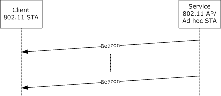
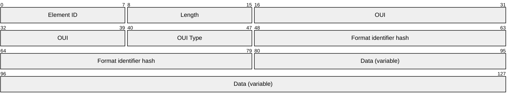
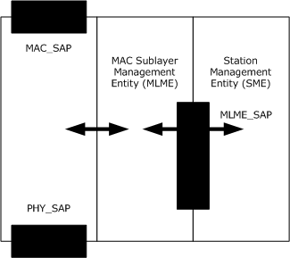
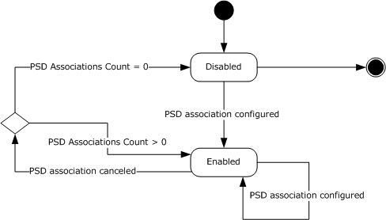
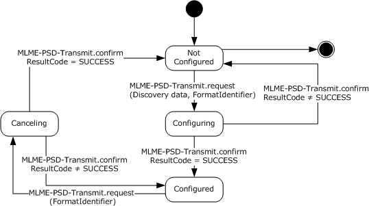
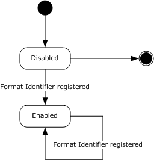
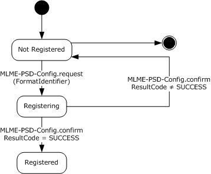
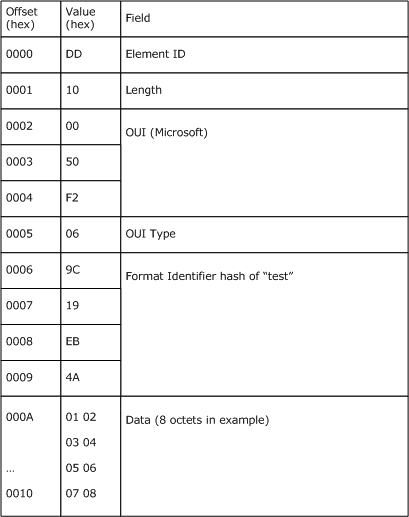

# [MS-PSDP]: Proximity Service Discovery Protocol

Table of Contents

1 Introduction

- [1 Introduction](#Section_1)
  - [1.1 Glossary](#Section_1.1)
  - [1.2 References](#Section_1.2)
    - [1.2.1 Normative References](#Section_1.2.1)
    - [1.2.2 Informative References](#Section_1.2.2)
  - [1.3 Overview](#Section_1.3)
  - [1.4 Relationship to Other Protocols](#Section_1.4)
  - [1.5 Prerequisites/Preconditions](#Section_1.5)
  - [1.6 Applicability Statement](#Section_1.6)
  - [1.7 Versioning and Capability Negotiation](#Section_1.7)
  - [1.8 Vendor-Extensible Fields](#Section_1.8)
  - [1.9 Standards Assignments](#Section_1.9)

2 Messages

- [2 Messages](#Section_2)
  - [2.1 Transport](#Section_2.1)
  - [2.2 Message Syntax](#Section_2.2)
    - [2.2.1 Structure of the Discovery Information Element](#Section_2.2.1)
    - [2.2.2 Calculation of the Format Identifier Hash](#Section_2.2.2)

3 Protocol Details

- [3 Protocol Details](#Section_3)
  - [3.1 Server Details](#Section_3.1)
    - [3.1.1 Abstract Data Model](#Section_3.1.1)
    - [3.1.2 Timers](#Section_3.1.2)
    - [3.1.3 Initialization](#Section_3.1.3)
    - [3.1.4 Higher Layer-Triggered Events](#Section_3.1.4)
    - [3.1.5 Message Processing Events and Sequencing Rules](#Section_3.1.5)
      - [3.1.5.1 Configuration of a PSD Information Element](#Section_3.1.5.1)
      - [3.1.5.2 Cancellation of a PSD Information Element](#Section_3.1.5.2)
    - [3.1.6 Timer Events](#Section_3.1.6)
    - [3.1.7 Other Local Events](#Section_3.1.7)
  - [3.2 Client Details](#Section_3.2)
    - [3.2.1 Abstract Data Model](#Section_3.2.1)
    - [3.2.2 Timers](#Section_3.2.2)
    - [3.2.3 Initialization](#Section_3.2.3)
    - [3.2.4 Higher-Layer Triggered Events](#Section_3.2.4)
    - [3.2.5 Message Processing Events and Sequencing Rules](#Section_3.2.5)
    - [3.2.6 Timer Events](#Section_3.2.6)
    - [3.2.7 Other Local Events](#Section_3.2.7)

4 Protocol Examples

- [4 Protocol Examples](#Section_4)

5 Security

- [5 Security](#Section_5)
  - [5.1 Security Considerations for Implementers](#Section_5.1)
  - [5.2 Index of Security Parameters](#Section_5.2)

6 Appendix A: Product Behavior

- [6 Appendix A: Product Behavior](#Section_6)

7 Change Tracking

- [7 Change Tracking](#Section_7)

For the legal notice and IP terms, see [LEGAL.md](../LEGAL.md).
Last updated: 4/23/2024.
See [Revision History](#revision-history) for full version history.

# 1 Introduction

This specification defines a protocol that is referred to as the Proximity Service Discovery Protocol. The Proximity Service Discovery Protocol allows a client to discover services in its physical proximity, which is defined by the radio range.

Sections 1.5, 1.8, 1.9, 2, and 3 of this specification are normative. All other sections and examples in this specification are informative.

## 1.1 Glossary

This document uses the following terms:

**access point**: A network access server (NAS) that is implementing [[IEEE802.11-2012]](https://go.microsoft.com/fwlink/?LinkID=306038), connecting wireless devices to form a wireless network.

**ad hoc network**: A self-configuring wireless network of mobile routers (and associated hosts) that are connected by wireless links, the union of which form an arbitrary topology. See [[IEEE802.11-2007]](https://go.microsoft.com/fwlink/?LinkID=89905).

**Authentication Protocol (AP) exchange**: The Kerberos subprotocol called the "authentication protocol", sometimes referred to as the "Client/Server Authentication Exchange", in which the client presents a service ticket and an authenticator to a service to establish an authenticated communication session with the service (see [[RFC4120]](https://go.microsoft.com/fwlink/?LinkId=90458) section 3.2).

**basic service set (BSS)**: A collection of devices controlled by a single coordination function that joined a common IEEE 802.11 wireless network, as defined in [IEEE802.11-2007] section 3.7.

**hash**: A term that refers to either a hash function, the value computed by such a function, or the act of computing such a value.

**Hash-based Message Authentication Code (HMAC)**: A mechanism for message authentication using cryptographic hash functions. HMAC can be used with any iterative cryptographic hash function (for example, MD5 and SHA-1) in combination with a secret shared key. The cryptographic strength of HMAC depends on the properties of the underlying hash function.

**independent basic service set (IBSS)**: A [**basic service set (BSS)**](#gt_basic-service-set-bss) that is an autonomous network, as defined in [IEEE802.11-2007]. An [**IBSS**](#gt_independent-basic-service-set-ibss) does not provide access to a distribution system.

**information element (IE)**: A unit of information transmitted as part of the management frames in the IEEE 802.11 [IEEE802.11-2012] protocol. Wireless devices, such as [**access points**](#gt_access-point), communicate descriptive information about themselves in the form of one or more IEs in their management frames.

**keyed-hash Message Authentication Code**: A symmetric keyed hashing algorithm used to verify the integrity of data to help ensure it has not been modified while in storage or transit.

**Medium Access Control (MAC) protocol data unit (MPDU)**: The unit of data exchanged between two peer [**MAC**](#gt_message-authentication-code-mac) entities using the services of the physical layer.

**Message Authentication Code (MAC)**: A message authenticator computed through the use of a symmetric key. A [**MAC**](#gt_message-authentication-code-mac) algorithm accepts a secret key and a data buffer, and outputs a [**MAC**](#gt_message-authentication-code-mac). The data and [**MAC**](#gt_message-authentication-code-mac) can then be sent to another party, which can verify the integrity and authenticity of the data by using the same secret key and the same [**MAC**](#gt_message-authentication-code-mac) algorithm.

**Message Authentication Code sublayer management entity (MLME)**: An entity that provides the layer management service interfaces through which layer management functions can be invoked.

**namespace**: An abstract container that provides context for the items (names, technical terms, or words) that it holds and allows disambiguation of items that have the same name (residing in different [**namespaces**](#gt_namespace)).

**octet**: A group of 8 bits often referred to as a byte.

**organizationally unique identifier (OUI)**: A unique 24-bit string that uniquely identifies a vendor, manufacturer, or organization on a worldwide l basis, as specified in [IEEE-OUI]. The OUI is used to help distinguish both physical devices and software, such as a network protocol, that belong to one entity from those that belong to another.

**service access point (SAP)**: An identifying label for network endpoints that are used in Open Systems Interconnection (OSI) networking. The [**SAP**](#gt_service-access-point-sap) is a conceptual location at which one OSI layer can request the services of another OSI layer.

**station**: Any device that implements LLTD.

**station (STA)**: Any device that contains an IEEE 802.11 conformant medium access control and physical layer (PHY) interface to the wireless medium (WM).

**station management entity (SME)**: In general, a [**station management entity (SME)**](#gt_station-management-entity-sme) is regarded as responsible for functions such as the gathering of layer-dependent status from the various layer management entities and setting the value of layer-specific parameters. An [**SME**](#gt_station-management-entity-sme) would typically perform such functions on behalf of general system management entities and would implement standard management protocols.

**Unicode**: A character encoding standard developed by the Unicode Consortium that represents almost all of the written languages of the world. The [**Unicode**](#gt_unicode) standard [[UNICODE5.0.0/2007]](https://go.microsoft.com/fwlink/?LinkId=154659) provides three forms (UTF-8, UTF-16, and UTF-32) and seven schemes (UTF-8, UTF-16, UTF-16 BE, UTF-16 LE, UTF-32, UTF-32 LE, and UTF-32 BE).

**Uniform Resource Identifier (URI)**: A string that identifies a resource. The URI is an addressing mechanism defined in Internet Engineering Task Force (IETF) Uniform Resource Identifier (URI): Generic Syntax [[RFC3986]](https://go.microsoft.com/fwlink/?LinkId=90453).

**MAY, SHOULD, MUST, SHOULD NOT, MUST NOT:** These terms (in all caps) are used as defined in [[RFC2119]](https://go.microsoft.com/fwlink/?LinkId=90317). All statements of optional behavior use either MAY, SHOULD, or SHOULD NOT.

## 1.2 References

Links to a document in the Microsoft Open Specifications library point to the correct section in the most recently published version of the referenced document. However, because individual documents in the library are not updated at the same time, the section numbers in the documents may not match. You can confirm the correct section numbering by checking the [Errata](https://go.microsoft.com/fwlink/?linkid=850906).

### 1.2.1 Normative References

We conduct frequent surveys of the normative references to assure their continued availability. If you have any issue with finding a normative reference, please contact [dochelp@microsoft.com](mailto:dochelp@microsoft.com). We will assist you in finding the relevant information.

[IEEE-OUI] IEEE Standards Association, "IEEE MAC Address Block Large (MA-L) Field Registration Authority Public Listing", [http://standards-oui.ieee.org/oui/oui.txt](https://go.microsoft.com/fwlink/?LinkId=89895)

[IEEE802.11-2007] Institute of Electrical and Electronics Engineers, "Telecommunications and Information Exchange Between Systems - Local and Metropolitan Area Networks - Specific Requirements - Part 11: Wireless LAN Medium Access Control (MAC) and Physical Layer (PHY) Specifications", IEEE 802.11-2007, [https://standards.ieee.org/ieee/802.11/3605/](https://go.microsoft.com/fwlink/?LinkID=89905)

**Note** Subcription Login or purchase to download this document.

[RFC2119] Bradner, S., "Key words for use in RFCs to Indicate Requirement Levels", BCP 14, RFC 2119, March 1997, [https://www.rfc-editor.org/info/rfc2119](https://go.microsoft.com/fwlink/?LinkId=90317)

[RFC3986] Berners-Lee, T., Fielding, R., and Masinter, L., "Uniform Resource Identifier (URI): Generic Syntax", STD 66, RFC 3986, January 2005, [https://www.rfc-editor.org/info/rfc3986](https://go.microsoft.com/fwlink/?LinkId=90453)

[RFC4634] Eastlake III, D. and Hansen, T., "US Secure Hash Algorithms (SHA and HMAC-SHA)", RFC 4634, July 2006, [https://www.rfc-editor.org/info/rfc4634](https://go.microsoft.com/fwlink/?LinkId=90486)

[SHA256] National Institute of Standards and Technology, "FIPS 180-2, Secure Hash Standard (SHS)", August 2002, [http://csrc.nist.gov/publications/fips/fips180-2/fips180-2withchangenotice.pdf](https://go.microsoft.com/fwlink/?LinkId=90514)

### 1.2.2 Informative References

[UPNPARCH1] UPnP Forum, "UPnP Device Architecture 1.0", October 2008, [http://www.upnp.org/specs/arch/UPnP-arch-DeviceArchitecture-v1.0.pdf](https://go.microsoft.com/fwlink/?LinkId=90554)

[WS-Discovery] Beatty, J., Kakivaya, G., Kemp D., et al., "Web Services Dynamic Discovery (WS-Discovery)", April 2005, [http://specs.xmlsoap.org/ws/2005/04/discovery/ws-discovery.pdf](https://go.microsoft.com/fwlink/?LinkId=90576)

## 1.3 Overview

The purpose of the Proximity Service Discovery Protocol is to convey service discovery information, such as service advertisements, as part of Beacon frames, as specified in [[IEEE802.11-2007]](https://go.microsoft.com/fwlink/?LinkID=89905). Beacon frames are periodically broadcast by [**access points**](#gt_access-point) and [**stations (STAs)**](#gt_station-sta), as specified in [IEEE802.11-2007], that operate in [**ad hoc network**](#gt_ad-hoc-network) mode. According to the IEEE802.11 protocol, [**stations**](#gt_station) in radio range, that is, in proximity, receive and process Beacon frames during a normal channel scan operation.

The Beacon frame can contain single or multiple proprietary [**information elements (IEs)**](#gt_information-element-ie) that carry discovery information pertaining to the services that the device offers. Proprietary information elements are identified by their Element IDs and are further distinguished by an IEEE-administered [**Organizationally Unique Identifier (OUI)**](#gt_organizationally-unique-identifier-oui) and a predefined OUI Type value.

A format identifier describes the format of the information carried in the information element. To ensure uniqueness while circumventing the need for central administration of format identifiers, a string in the form of a [**URI**](#gt_uniform-resource-identifier-uri), as specified in [[RFC3986]](https://go.microsoft.com/fwlink/?LinkId=90453), could be used to distinguish the format. However, because the transmission must be efficient and space in the information element is limited, the string is not actually transmitted; instead, its [**hash**](#gt_hash) is transmitted. On the client, which is the receiving side of the beacon, the hash is matched against a known set of format identifiers.

Figure 1: PSDP client/server communication

The preceding diagram illustrates the relationship between a service-bearing device, which is an [**AP**](#gt_d3abbc87-7e0b-4ac9-b556-503b0f87a724) or ad hoc network station, as specified in [IEEE802.11-2007], and the client that acts as a station, as specified in [IEEE802.11-2007], in ad hoc network or infrastructure mode.

A client that is in discovery mode (that is, searching for a service in its physical proximity) picks up the beacon during its regular scan intervals. It processes the beacon for known discovery information elements based on the OUI and OUI Type,<1> and it notifies the application if the format identifier that is represented by the hash matches any known format identifiers. Data carried in the information element is opaque to the protocol.<2> It is the responsibility of the application to resolve possible hash collisions. The application can do so by examining the data carried in the information element or by re-issuing a discovery request at a higher layer by using the full format identifier string after a connection has been established.

The inclusion of service discovery information in broadcast messages enables the discovery of services before connecting to the service-hosting device.<3>

## 1.4 Relationship to Other Protocols

The Proximity Service Discovery Protocol extends the IEEE802.11 standard, whose conventions are applied as specified in [[IEEE802.11-2007]](https://go.microsoft.com/fwlink/?LinkID=89905). The Proximity Service Discovery Protocol introduces a specific use for one of that protocol's reserved [**information element**](#gt_information-element-ie) types, and it defines additional [**MAC**](#gt_message-authentication-code-mac) layer abstract service primitives for managing the configuration, transmission, and receipt of these new information elements.

## 1.5 Prerequisites/Preconditions

In the Proximity Service Discovery Protocol, the service-hosting device acts as an [**AP**](#gt_d3abbc87-7e0b-4ac9-b556-503b0f87a724) or [**ad hoc network**](#gt_ad-hoc-network) [**station**](#gt_station) and includes an additional [**information element**](#gt_information-element-ie) (discovery information element) in its periodically transmitted beacon. The client acts as a station in infrastructure or ad hoc network mode and is able to extract the discovery information element, as specified in section [2.2](#Section_2.2), from the received beacon.

## 1.6 Applicability Statement

The Proximity Service Discovery Protocol works with higher-layer discovery protocols, such as the Simple Service Discovery Protocol, as specified in [[UPNPARCH1]](https://go.microsoft.com/fwlink/?LinkId=90554) and Web Services Dynamic Discovery (WS-Discovery), as specified in [[WS-Discovery]](https://go.microsoft.com/fwlink/?LinkId=90576). The Proximity Service Discovery Protocol facilitates discovery before connecting on a wireless medium.

The discovery advertisements of these related protocols can be mapped into discovery [**information elements**](#gt_information-element-ie) that are conveyed in IEEE802.11 beacons. A unique format identifier can be defined for each higher-layer protocol based on the [**URI**](#gt_uniform-resource-identifier-uri) [**namespace**](#gt_namespace) of the respective higher-layer discovery protocol.

## 1.7 Versioning and Capability Negotiation

None.

## 1.8 Vendor-Extensible Fields

Vendors can use any combination of data for the content of the discovery [**information element**](#gt_information-element-ie). However, vendors SHOULD define a valid [**URI**](#gt_uniform-resource-identifier-uri) to identify a proprietary format. Vendors SHOULD NOT use URIs that represent well-known [**namespaces**](#gt_namespace) when they devise proprietary formats.

## 1.9 Standards Assignments

| Parameter | Value | Reference |
| --- | --- | --- |
| Vendor-specific Element ID | 221 | As specified in [[IEEE802.11-2007]](https://go.microsoft.com/fwlink/?LinkID=89905) |
| OUI | 00-50-f2 | As specified in [[IEEE-OUI]](https://go.microsoft.com/fwlink/?LinkId=89895) |

# 2 Messages

The following sections specify how Proximity Service Discovery Protocol messages are transported and also specify Proximity Service Discovery Protocol message syntax.

## 2.1 Transport

Single or multiple discovery [**information elements**](#gt_information-element-ie) are transmitted as part of IEEE802.11 Beacon frames or Probe Response frames.<4> There are no requirements for the order of the information elements. However, the size of individual information elements MUST NOT exceed 255 [**octets**](#gt_octet), including the Element ID, the length field, the [**Organizationally Unique Identifier (OUI)**](#gt_organizationally-unique-identifier-oui), the OUI Type, the format identifier [**hash**](#gt_hash), and the discovery data.

The format of information elements is specified in [[IEEE802.11-2007]](https://go.microsoft.com/fwlink/?LinkID=89905) section 7.3.2. The format and processing of Beacon and Probe Response frames are also specified in [IEEE802.11-2007].

To improve transmission behavior and to reduce processing and hardware requirements, it is best if the total size of the discovery information element is kept small.

If multiple information elements are included in the Beacon or Probe Response frame, the maximum size of the Beacon frame, as specified in [IEEE802.11-2007], MUST NOT be exceeded.

## 2.2 Message Syntax

The following sections specify Proximity Service Discovery Protocol message syntax.

### 2.2.1 Structure of the Discovery Information Element

The structure of the discovery [**information element**](#gt_information-element-ie) is shown in the following packet.

**Element ID (1 byte):** Contains the ID of the element as specified in [[IEEE802.11-2007]](https://go.microsoft.com/fwlink/?LinkID=89905) section 7.3.2. It MUST contain a value of 221, identifying a vendor-specific element (as specified in [IEEE802.11-2007] table 26) in which the vendor is identified by an IEEE-issued [**OUI**](#gt_organizationally-unique-identifier-oui) in a subsequent field.

**Length (1 byte):** Contains the length of the **Data** field in [**octets**](#gt_octet) plus 8.

**OUI (3 bytes):** The IEEE-assigned OUI for Microsoft. The **OUI** field MUST contain a value of (00:50:f2) as specified in [[IEEE-OUI]](https://go.microsoft.com/fwlink/?LinkId=89895).

**OUI Type (1 byte):** A packet subtype within the universe specific to a particular OUI value. For the Proximity Service Discovery Protocol, the OUI Type MUST contain a value of 6.

**Format identifier hash (4 bytes):** A value that identifies the format of the data, as specified in section [2.2.2](#Section_2.2.2).

**Data (variable):** Contains user-defined data for discovery.

The transmission order follows the conventions for transmission of [**MAC protocol data units (MPDUs)**](#gt_3c63f0e2-b808-48d4-9765-0f8cbb597821), as specified in [IEEE802.11-2007] section 7.

The message format of the Beacon frame is as specified in [IEEE802.11-2007] section 7.2.3.1. The message format of the Probe Response frame is as specified in [IEEE802.11-2007] section 7.2.3.9.

### 2.2.2 Calculation of the Format Identifier Hash

The **format identifier hash** is represented by the bits 0…31 of [**keyed-hash message authentication code (HMAC)**](#gt_33063589-5f08-4869-adf4-30d73541128a) (as specified in [[RFC4634]](https://go.microsoft.com/fwlink/?LinkId=90486)) based on the SHA-256 algorithm, as specified in [[SHA256]](https://go.microsoft.com/fwlink/?LinkId=90514), over the format identifier string, as specified in [RFC4634].

**Note** Sample code for the calculation of the [**HMAC**](#gt_hash-based-message-authentication-code-hmac) is as specified in [RFC4634].

The key used is the "NULL" key (NULL pointer to the authentication key, and zero length authentication key per the source code in [RFC4634]).

The characters and spaces of the format identifier string are encoded as [**Unicode**](#gt_unicode) UTF-16 using little-endian representation.

The [**hash**](#gt_hash) of the format identifier is transmitted beginning with the first [**octet**](#gt_octet) of the octet array.

For sample format identifier strings and their corresponding hashes, see section [4](#Section_1.3).

# 3 Protocol Details

The following sections specify details of the Proximity Service Discovery Protocol, including semantics of the conceptual service primitives for the client and server.

On both the client and the server, protocol primitives are exchanged as layer management primitives by the [**station management entity (SME)**](#gt_station-management-entity-sme) and the [**Message Authentication Code sublayer management entity (MLME)**](#gt_message-authentication-code-sublayer-management-entity-mlme) through the MLME [**SAP**](#gt_service-access-point-sap). These exchanges enable the server and client to configure and receive discovery information elements.

This layer management model is intended to facilitate the specification of the protocol. This document does not mandate that implementations adhere to this model as long as their external behavior is consistent with that described in this document. The layer management model is identical to the model that is specified in [[IEEE802.11-2007]](https://go.microsoft.com/fwlink/?LinkID=89905) section 10.1. Definitions of primitives and terms are as specified in [IEEE802.11-2007] section 10. The following figure illustrates the layer model and represents a subset of Figure 10-1, as specified in [IEEE802.11-2007].

Figure 2: Proximity Service Discovery Protocol (PSDP) dependencies

The [Server Details (section 3.1)](#Section_3.1) and [Client Details (section 3.2)](#Section_3.2) sections of this document describe the conceptual MLME primitives that are exchanged with the station management entity (SME) in order for the server and client to configure and receive discovery [**information elements**](#gt_information-element-ie).

## 3.1 Server Details

The server function MUST be hosted by either an IEEE802.11 [**AP**](#gt_d3abbc87-7e0b-4ac9-b556-503b0f87a724) or an [**ad hoc network**](#gt_ad-hoc-network) [**station**](#gt_station).<5>

To compensate for an unreliable transmission over the wireless medium, the [**information elements**](#gt_information-element-ie) SHOULD be contained in multiple successive Beacon frames.

The following figure is a top-level state diagram for the server. In the **Enabled** state, the server is configured with discovery data for one or more format identifiers.

Figure 3: High-level diagram of the server states

Two conceptual primitives configure the discovery data at the server: MLME-PSD-Transmit.request and MLME-PSD-Transmit.confirm. The following figure shows a state diagram for the configuration of discovery data for a particular format identifier.

Figure 4: State diagram for the configuration of a PSD information element at the server

### 3.1.1 Abstract Data Model

This section describes a conceptual model of possible data organization that an implementation maintains to participate in this protocol. The described organization is provided to facilitate the explanation of how the protocol behaves. This document does not mandate that implementations adhere to this model as long as their external behavior is consistent with that described in this document.

**High-level server states:**

**Disabled:** In this state, no PSD [**information elements**](#gt_information-element-ie) are configured.

**Enabled:** In this state, the server is configured with one or more PSD information elements in order to advertise in Beacons and Probe Responses.

**PSD IEs Table:** A table of configured PSD information elements. Each information element includes discovery data and the [**hash**](#gt_hash) of a format identifier.

**PSD IEs Count:** The number of PSD information elements in the **PSD IEs Table**.

**Process states for the configuration of a PSD IE (for a given format identifier):**

**Not Configured:** In this state, the server is not configured with a PSD IE for the format identifier.

**Configuring:** In this state, the server attempts to configure a given PSD IE. If successful, it adds an entry into the **PSD IEs Table** for the given PSD IE, increments **PSD IEs Count** and transitions to **Configured**. If not successful, the state goes back to **Not Configured**.

**Configured:** In this state, the server includes all the PSD IEs within the **PSD IEs Table** in 802.11 Beacon frames and 802.11 Probe Responses.

### 3.1.2 Timers

None.

### 3.1.3 Initialization

None.

### 3.1.4 Higher Layer-Triggered Events

The MLME-PSD-Transmit.request primitive is generated by the [**SME**](#gt_station-management-entity-sme) as a result of a higher layer event in order to start transmitting the discovery [**information element**](#gt_information-element-ie) as part of any Beacon and Probe Responses that are subsequently transmitted. A request that does not contain any discovery data cancels the transmission of a previously registered discovery information element for the same format identifier.

The contents of a discovery information element and its format identifier are passed to the [**MLME**](#gt_message-authentication-code-sublayer-management-entity-mlme) [**SAP**](#gt_service-access-point-sap) by using the MLME-PSD-Transmit.request primitive.

MLME-PSD-Transmit.request

(Discovery data,

FormatIdentifier)

### 3.1.5 Message Processing Events and Sequencing Rules

#### 3.1.5.1 Configuration of a PSD Information Element

Upon receipt of the MLME-PSD-Transmit.request primitive including discovery data, the configuration process enters the **Configuring** state. If the primitive is successful, a proximity service discovery (PSD) information element is created, as specified in section [2.2](#Section_2.2), and added to the **PSD IEs Table**. The hash of the format identifier, in addition to the discovery data, is included in the [**information element**](#gt_information-element-ie). The [**MLME**](#gt_message-authentication-code-sublayer-management-entity-mlme) issues an MLME-PSD-Transmit.confirm that reflects the result of the MLME-PSD.Transmit.request. If the result is not equal to success, the configuration process returns to the **Not Configured** state. If the result is equal to success, the configuration process enters the **Configured** state. Upon entering this state of the configuration process, the server enters the **Enabled** state (if it is not already in the **Enabled** state) and the information element MUST be transmitted in all IEEE802.11 Beacon frames following the request. It SHOULD also be included in IEEE802.11 Probe Responses. The rules for sending a Probe response are unchanged from the rules specified in [[IEEE802.11-2007]](https://go.microsoft.com/fwlink/?LinkID=89905) section 11.1.3.2.1.

A request that does not contain any discovery data cancels the transmission of a previously registered discovery information element for the same format identifier.

Note that in the Proximity Service Discovery Protocol, it is the responsibility of the application to protect itself against hash collisions.

The MLME-PSD-Transmit.confirm primitive is generated by the MLME to indicate the commencement of the Beacon and Probe Response transmission containing the information element. It is not generated until the information element configuration is attempted.

The primitive parameters are as follows:

MLME-PSD-Transmit.confirm

(ResultCode)

The ResultCode indicates the success of the MLME-PSD-Transmit.request and is an enumeration of the following:

- SUCCESS
- Invalid Parameters
- No resources
If the ResultCode is equal to success, the effect of primitive is to notify the [**SME**](#gt_station-management-entity-sme) that the discovery information element will be included in subsequent Beacon and Probe Response transmissions. Otherwise, the effect of the primitive is to notify the SME that the PSD IE was not configured correctly and will not be included in subsequent Beacon and Probe Response transmissions.

#### 3.1.5.2 Cancellation of a PSD Information Element

Upon receipt of the MLME-PSD-Transmit.request primitive specifying a format identifier present in the **PSD IEs Table**, but with no discovery data, the configuration process enters the **Canceling** state where the PSD [**information element**](#gt_information-element-ie) is removed from the table. As a result, the server no longer includes the information element in the 802.11 Beacons and Probe Responses. An MLME-PSD-Transmit.confirm is generated to indicate the result of the MLME-PSD.Transmit.request. Regardless of the result, the configuration process enters the **Not Configured** state. If no PSD information elements remain in the **PSD IEs Table**, the server enters the **Disabled** state.

### 3.1.6 Timer Events

None.

### 3.1.7 Other Local Events

None.

## 3.2 Client Details

The client SHOULD<6> regularly scan its radio spectrum for beacons. When a beacon is received, the client SHOULD examine it for the presence of discovery [**information elements**](#gt_information-element-ie), and if any are present, compare their format identifier [**hashes**](#gt_hash) with the known hashes of format identifiers that were previously registered (via MLME-PSD-Config.request). If the client finds a match, it SHOULD notify the client discovery application. The following figure shows a top-level state diagram for the client. Format identifiers are registered via MLME-PSD-Config.request.

Figure 5: High-level diagram of client states

The following figure shows a state diagram for the registration of a format identifier at the client.

Figure 6: State diagram for the registration of a format identifier at the client

### 3.2.1 Abstract Data Model

**Format Identifiers Table**: A table of format identifiers.

**High-Level Client states:**

**Enabled:** In this state, the client has one or more registered format identifiers.

**Disabled:** In this state, the client has no registered format identifiers.

**Process states for the registration a format identifier:**

**Not Registered:** In this state, the format identifier is not registered at the client.

**Registering:** In this state, the client attempts to add the format identifier to the Format Identifier Table.

**Registered:** In this state, the client SHOULD examine received 802.11 Beacons or Probe Responses for the presence of the discovery [**information elements**](#gt_information-element-ie) with a format identifier [**hash**](#gt_hash) that matches the registered identifier. Matches found are then delivered to the client discovery application.

### 3.2.2 Timers

None.

### 3.2.3 Initialization

The Format Identifiers Table is initially empty.

### 3.2.4 Higher-Layer Triggered Events

The MLME-PSD-Config.request primitive is generated by the SME, to register the format identifier of a discovery [**information element**](#gt_information-element-ie) to whose discovery will be communicated to the SME by means of an MLME-PSD-Receive.indication. Multiple MLME-PSD-Config.requests can be sent to register multiple format identifiers.

The format identifier is passed to the [**MLME**](#gt_message-authentication-code-sublayer-management-entity-mlme) [**SAP**](#gt_service-access-point-sap) by using the following primitive:

MLME-PSD-Config.request

(FormatIdentifier)

### 3.2.5 Message Processing Events and Sequencing Rules

Upon receipt of the MLME-PSD-Config.request primitive, the registration process enters the **Registering** state. In this state, if the result of the MLME-PSD-Config.request is successful, the format identifier specified in MLME-PSD-Config.request primitive is added to Format Identifiers Table. In addition, MLME-PSD-Config.confirm is generated and sent to the [**SME**](#gt_station-management-entity-sme) to indicate the result of the in MLME-PSD-Config.request. If the result is equal to success, the registration process enters the **Registered** state. If at least one format identifier is registered, the client enters the **Enabled** state. Subsequently received Beacon and Probe Response frames are examined for discovery [**information elements**](#gt_information-element-ie) and matched against the registered format identifiers that have been registered. Discovery information elements are passed to the SME by means of the MLME-PSD-Receive.indication. Duplicate information elements MAY be discarded by the receiver.

If a service is advertised by a station that operates under the rules of the [**IBSS**](#gt_independent-basic-service-set-ibss), other stations that are members of the same IBSS MUST NOT replicate the discovery information elements when they transmit their beacons. This differs from the rules set forth in [[IEEE802.11-2007]](https://go.microsoft.com/fwlink/?LinkID=89905) section 11.1.4, whereby the receiving [**STA**](#gt_station-sta) would adopt PSD information elements received from other STAs in the same IBSS. There is no such requirement in a [**BSS**](#gt_basic-service-set-bss) (infrastructure mode).

The MLME-PSD-Config.confirm primitive is generated by the [**MLME**](#gt_message-authentication-code-sublayer-management-entity-mlme) upon completion of an MLME-PSD-Config.request operation to indicate to the SME the success or failure of format identifier registration. It is not generated until the operation completes.

The primitive parameters are as follows:

MLME-PSD-Config.confirm

(ResultCode)

The ResultCode indicates the success of the MLME-PSD-Config.request and is an enumeration of the following:

- SUCCESS
- Invalid Parameters
- NOT Supported
- No resources
The MLME-PSD-Receive.indication primitive is generated by the MLME upon receipt of a Beacon or Probe Response. The primitive indicates to the SME that a discovery information element was contained in the Beacon or Probe Response that matches a format identifier that was previously registered by using the MLME-PSD.Config.request primitive. If the Beacon or Probe Response contains more than one such information element, multiple MLME-PSD-Receive.indication primitives will be generated.

The contents of the received discovery information element and its format identifier are passed to the SME through the MLME [**SAP**](#gt_service-access-point-sap) by using the following primitive:

MLME-PSD-Receive.indication

(Discovery data,

Format Identifier)

### 3.2.6 Timer Events

None.

### 3.2.7 Other Local Events

None.

# 4 Protocol Examples

This section describes example operations that are used in common scenarios to illustrate the function of the Proximity Service Discovery Protocol.

Examples showing computation of format identifiers from [**namespace**](#gt_namespace) [**URIs**](#gt_uniform-resource-identifier-uri):

String: "http://schemas.xmlsoaps.org/ws/2004/10/discovery"

First (leftmost) 4 [**octets**](#gt_octet) of HMAC–SHA256 (format id) of the previous string: 0xF8 0xCB 0x35 0x15.

String: "http://schemas.microsoft.com/networking/discoveryformat/v2"

First (leftmost) 4 octets of HMAC–SHA256 (format id) of the previous string: 0xCF 0xF1 0x64 0x17.

**Note** The transmission order is: The first (leftmost) octet is transmitted first.

If the "shatest" program as specified in [[RFC4634]](https://go.microsoft.com/fwlink/?LinkId=90486) is used to produce the format identifier from a string, the procedure is as follows:

- Create a testfile containing the string in UTF-16 little endian format.
- Call shatest: shatest -h 2 -f testfile -k ""
The following is an example of the vendor extension [**IE**](#gt_information-element-ie) conveyed in a Beacon or Probe Response frame for the format identifier string "test" (without quotes) and 8 octets data in the payload.

Figure 7: Example of the vendor extension IE

# 5 Security

The following sections specify security considerations for implementers of the Proximity Service Discovery Protocol.

## 5.1 Security Considerations for Implementers

None.

## 5.2 Index of Security Parameters

None.

# 6 Appendix A: Product Behavior

The information in this specification is applicable to the following Microsoft products or supplemental software. References to product versions include updates to those products.

- Windows Vista operating system
- Windows Server 2008 operating system
- Windows 7 operating system
- Windows Server 2008 R2 operating system
- Windows 8 operating system
- Windows Server 2012 operating system
- Windows 8.1 operating system
- Windows Server 2012 R2 operating system
- Windows 10 operating system
- Windows Server 2016 operating system
- Windows Server 2019 operating system
- Windows Server 2022 operating system
- Windows 11 operating system
- Windows Server 2025 operating system
Exceptions, if any, are noted in this section. If an update version, service pack or Knowledge Base (KB) number appears with a product name, the behavior changed in that update. The new behavior also applies to subsequent updates unless otherwise specified. If a product edition appears with the product version, behavior is different in that product edition.

Unless otherwise specified, any statement of optional behavior in this specification that is prescribed using the terms "SHOULD" or "SHOULD NOT" implies product behavior in accordance with the SHOULD or SHOULD NOT prescription. Unless otherwise specified, the term "MAY" implies that the product does not follow the prescription.

<1> Section 1.3: The [**OUI**](#gt_organizationally-unique-identifier-oui) Type that Microsoft has defined for this protocol is 6.

<2> Section 1.3: Microsoft does not define any data for Windows nor uses any of the capabilities of this protocol for its own purposes.

<3> Section 1.3: Windows does not use this protocol for service discovery.

<4> Section 2.1: Windows limits the number of discovery [**information elements**](#gt_information-element-ie) to 5.

<5> Section 3.1: Windows Vista and Windows Server 2008 only support operation in [**ad hoc network**](#gt_ad-hoc-network) mode.

<6> Section 3.2: Windows Vista and Windows Server 2008 only support operation in ad hoc network mode.

# 7 Change Tracking

This section identifies changes that were made to this document since the last release. Changes are classified as Major, Minor, or None.

The revision class **Major** means that the technical content in the document was significantly revised. Major changes affect protocol interoperability or implementation. Examples of major changes are:

- A document revision that incorporates changes to interoperability requirements.
- A document revision that captures changes to protocol functionality.
The revision class **Minor** means that the meaning of the technical content was clarified. Minor changes do not affect protocol interoperability or implementation. Examples of minor changes are updates to clarify ambiguity at the sentence, paragraph, or table level.

The revision class **None** means that no new technical changes were introduced. Minor editorial and formatting changes may have been made, but the relevant technical content is identical to the last released version.

The changes made to this document are listed in the following table. For more information, please contact [dochelp@microsoft.com](mailto:dochelp@microsoft.com).

| Section | Description | Revision class |
| --- | --- | --- |
| [6](#Section_6) Appendix A: Product Behavior | Added Windows Server 2025 to the list of applicable products. | Major |

## Revision History

| Date | Version | Revision Class | Comments |
| --- | --- | --- | --- |
| 2/22/2007 | 0.01 | New | Version 0.01 release |
| 6/1/2007 | 1.0 | Major | Updated and revised the technical content. |
| 7/3/2007 | 1.0.1 | Editorial | Changed language and formatting in the technical content. |
| 7/20/2007 | 1.0.2 | Editorial | Changed language and formatting in the technical content. |
| 8/10/2007 | 1.0.3 | Editorial | Changed language and formatting in the technical content. |
| 9/28/2007 | 1.0.4 | Editorial | Changed language and formatting in the technical content. |
| 10/23/2007 | 1.0.5 | Editorial | Changed language and formatting in the technical content. |
| 11/30/2007 | 1.0.6 | Editorial | Changed language and formatting in the technical content. |
| 1/25/2008 | 1.0.7 | Editorial | Changed language and formatting in the technical content. |
| 3/14/2008 | 1.0.8 | Editorial | Changed language and formatting in the technical content. |
| 5/16/2008 | 1.0.9 | Editorial | Changed language and formatting in the technical content. |
| 6/20/2008 | 1.1 | Minor | Clarified the meaning of the technical content. |
| 7/25/2008 | 1.2 | Minor | Clarified the meaning of the technical content. |
| 8/29/2008 | 1.2.1 | Editorial | Changed language and formatting in the technical content. |
| 10/24/2008 | 1.3 | Minor | Clarified the meaning of the technical content. |
| 12/5/2008 | 1.3.1 | Editorial | Changed language and formatting in the technical content. |
| 1/16/2009 | 1.3.2 | Editorial | Changed language and formatting in the technical content. |
| 2/27/2009 | 1.3.3 | Editorial | Changed language and formatting in the technical content. |
| 4/10/2009 | 1.3.4 | Editorial | Changed language and formatting in the technical content. |
| 5/22/2009 | 1.4 | Minor | Clarified the meaning of the technical content. |
| 7/2/2009 | 1.4.1 | Editorial | Changed language and formatting in the technical content. |
| 8/14/2009 | 1.4.2 | Editorial | Changed language and formatting in the technical content. |
| 9/25/2009 | 1.5 | Minor | Clarified the meaning of the technical content. |
| 11/6/2009 | 1.6 | Minor | Clarified the meaning of the technical content. |
| 12/18/2009 | 1.6.1 | Editorial | Changed language and formatting in the technical content. |
| 1/29/2010 | 1.7 | Minor | Clarified the meaning of the technical content. |
| 3/12/2010 | 1.8 | Minor | Clarified the meaning of the technical content. |
| 4/23/2010 | 1.8.1 | Editorial | Changed language and formatting in the technical content. |
| 6/4/2010 | 2.0 | Major | Updated and revised the technical content. |
| 7/16/2010 | 2.0 | None | No changes to the meaning, language, or formatting of the technical content. |
| 8/27/2010 | 2.0 | None | No changes to the meaning, language, or formatting of the technical content. |
| 10/8/2010 | 2.0 | None | No changes to the meaning, language, or formatting of the technical content. |
| 11/19/2010 | 2.0 | None | No changes to the meaning, language, or formatting of the technical content. |
| 1/7/2011 | 2.0 | None | No changes to the meaning, language, or formatting of the technical content. |
| 2/11/2011 | 2.0 | None | No changes to the meaning, language, or formatting of the technical content. |
| 3/25/2011 | 2.0 | None | No changes to the meaning, language, or formatting of the technical content. |
| 5/6/2011 | 2.0 | None | No changes to the meaning, language, or formatting of the technical content. |
| 6/17/2011 | 2.1 | Minor | Clarified the meaning of the technical content. |
| 9/23/2011 | 2.1 | None | No changes to the meaning, language, or formatting of the technical content. |
| 12/16/2011 | 3.0 | Major | Updated and revised the technical content. |
| 3/30/2012 | 3.0 | None | No changes to the meaning, language, or formatting of the technical content. |
| 7/12/2012 | 3.0 | None | No changes to the meaning, language, or formatting of the technical content. |
| 10/25/2012 | 3.0 | None | No changes to the meaning, language, or formatting of the technical content. |
| 1/31/2013 | 3.0 | None | No changes to the meaning, language, or formatting of the technical content. |
| 8/8/2013 | 4.0 | Major | Updated and revised the technical content. |
| 11/14/2013 | 4.0 | None | No changes to the meaning, language, or formatting of the technical content. |
| 2/13/2014 | 4.0 | None | No changes to the meaning, language, or formatting of the technical content. |
| 5/15/2014 | 4.0 | None | No changes to the meaning, language, or formatting of the technical content. |
| 6/30/2015 | 5.0 | Major | Significantly changed the technical content. |
| 10/16/2015 | 5.0 | None | No changes to the meaning, language, or formatting of the technical content. |
| 7/14/2016 | 5.0 | None | No changes to the meaning, language, or formatting of the technical content. |
| 6/1/2017 | 5.0 | None | No changes to the meaning, language, or formatting of the technical content. |
| 9/15/2017 | 6.0 | Major | Significantly changed the technical content. |
| 9/12/2018 | 7.0 | Major | Significantly changed the technical content. |
| 4/7/2021 | 8.0 | Major | Significantly changed the technical content. |
| 6/25/2021 | 9.0 | Major | Significantly changed the technical content. |
| 4/23/2024 | 10.0 | Major | Significantly changed the technical content. |
