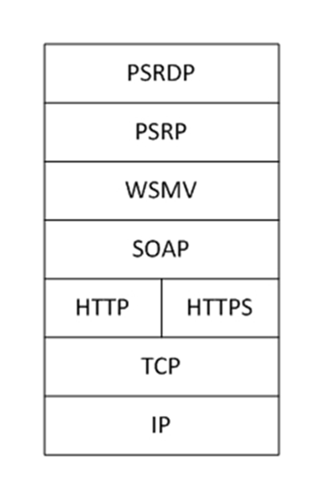
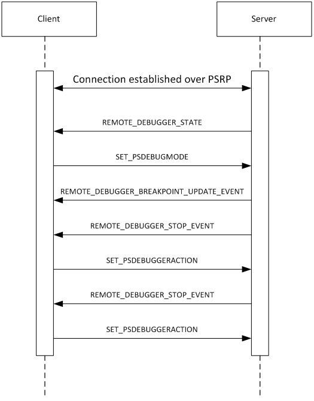

# [MS-PSRDP]: PowerShell Remote Debugging Protocol

Table of Contents

1 Introduction

- [1 Introduction](#Section_1)
  - [1.1 Glossary](#Section_1.1)
  - [1.2 References](#Section_1.2)
    - [1.2.1 Normative References](#Section_1.2.1)
    - [1.2.2 Informative References](#Section_1.2.2)
  - [1.3 Overview](#Section_1.3)
  - [1.4 Relationship to Other Protocols](#Section_1.4)
  - [1.5 Prerequisites/Preconditions](#Section_1.5)
  - [1.6 Applicability Statement](#Section_1.6)
  - [1.7 Versioning and Capability Negotiation](#Section_1.7)
  - [1.8 Vendor-Extensible Fields](#Section_1.8)
  - [1.9 Standards Assignments](#Section_1.9)

2 Messages

- [2 Messages](#Section_2)
  - [2.1 Transport](#Section_2.1)
    - [2.1.1 Transport of Client Messages](#Section_2.1.1)
    - [2.1.2 Transport of REMOTE_DEBUGGER_STATE Message](#Section_2.1.2)
    - [2.1.3 Transport of REMOTE_DEBUGGER_BREAKPOINT_UPDATED_EVENT Message](#Section_2.1.3)
    - [2.1.4 Transport of REMOTE_DEBUGGER_STOP_EVENT Message](#Section_2.1.4)
  - [2.2 Message Syntax](#Section_2.2)
    - [2.2.1 Namespaces](#Section_2.2.1)
    - [2.2.2 SET_PSDEBUGMODE Message](#Section_2.2.2)
    - [2.2.3 SET_PSDEBUGGERACTION Message](#Section_2.2.3)
    - [2.2.4 GET_PSDEBUGGERSTOPARGS Message](#Section_2.2.4)
    - [2.2.5 SET_PSDEBUGGERSTEPMODE Message](#Section_2.2.5)
    - [2.2.6 SET_PSUNHANDLEDBREAKPOINTMODE Message](#Section_2.2.6)
    - [2.2.7 REMOTE_DEBUGGER_STATE Message](#Section_2.2.7)
    - [2.2.8 REMOTE_DEBUGGER_BREAKPOINT_UPDATED_EVENT Message](#Section_2.2.8)
    - [2.2.9 REMOTE_DEBUGGER_STOP_EVENT Message](#Section_2.2.9)

3 Protocol Details

- [3 Protocol Details](#Section_3)
  - [3.1 Client Details](#Section_3.1)
    - [3.1.1 Abstract Data Model](#Section_3.1.1)
    - [3.1.2 Initialization](#Section_3.1.2)
    - [3.1.3 Higher-Layer Triggered Events](#Section_3.1.3)
    - [3.1.4 Message Processing Events and Sequencing Rules](#Section_3.1.4)
      - [3.1.4.1 SET_PSDEBUGMODE Message](#Section_3.1.4.1)
      - [3.1.4.2 SET_PSDEBUGGERACTION Message](#Section_3.1.4.2)
      - [3.1.4.3 GET_PSDEBUGGERSTOPARGS Message](#Section_3.1.4.3)
      - [3.1.4.4 SET_PSDEBUGGERSTEPMODE Message](#Section_3.1.4.4)
      - [3.1.4.5 SET_PSUNHANDLEDBREAKPOINTMODE Message](#Section_3.1.4.5)
    - [3.1.5 Other Local Events](#Section_3.1.5)
  - [3.2 Server Details](#Section_3.2)
    - [3.2.1 Abstract Data Model](#Section_3.2.1)
    - [3.2.2 Initialization](#Section_3.2.2)
    - [3.2.3 Higher-Layer Triggered Events](#Section_3.2.3)
    - [3.2.4 Message Processing Events and Sequencing Rules](#Section_3.2.4)
      - [3.2.4.1 SET_PSDEBUGMODE Message](#Section_3.2.4.1)
      - [3.2.4.2 SET_PSDEBUGGERACTION Message](#Section_3.2.4.2)
      - [3.2.4.3 GET_PSDEBUGGERSTOPARGS Message](#Section_3.2.4.3)
      - [3.2.4.4 SET_PSDEBUGGERSTEPMODE Message](#Section_3.2.4.4)
      - [3.2.4.5 SET_PSUNHANDLEDBREAKPOINTMODE Message](#Section_3.2.4.5)
      - [3.2.4.6 REMOTE_DEBUGGER_STATE Message](#Section_3.2.4.6)
      - [3.2.4.7 REMOTE_DEBUGGER_BREAKPOINT_UPDATED_EVENT Message](#Section_3.2.4.7)
      - [3.2.4.8 REMOTE_DEBUGGER_STOP_EVENT Message](#Section_3.2.4.8)
    - [3.2.5 Other Local Events](#Section_3.2.5)

4 Protocol Examples

- [4 Protocol Examples](#Section_4)

5 Security

- [5 Security](#Section_5)
  - [5.1 Security Considerations for Implementers](#Section_5.1)
  - [5.2 Index of Security Parameters](#Section_5.2)

6 Appendix A: Product Behavior

- [6 Appendix A: Product Behavior](#Section_6)

7 Change Tracking

- [7 Change Tracking](#Section_7)

For the legal notice and IP terms, see [LEGAL.md](../LEGAL.md).
Last updated: 4/23/2024.
See [Revision History](#revision-history) for full version history.

# 1 Introduction

The PowerShell Remote Debugging Protocol (PSRDP) extends the existing PowerShell Remoting Protocol (PSRP) specified in [MS-PSRP](../MS-PSRP/MS-PSRP.md) to support debugging over a remote session.

Sections 1.5, 1.8, 1.9, 2, and 3 of this specification are normative. All other sections and examples in this specification are informative.

## 1.1 Glossary

This document uses the following terms:

**breakpoint**: A temporary stopping place in executing code.

**debugger**: An application or function that is used to perform debugging actions.

**debugging**: The process of stopping and stepping through running code to analyze the behavior of the code.

**remote debugging**: Debugging that operates over a remote session.

**remote session**: A session established from a client to a server via PSRP.

**MAY, SHOULD, MUST, SHOULD NOT, MUST NOT:** These terms (in all caps) are used as defined in [[RFC2119]](https://go.microsoft.com/fwlink/?LinkId=90317). All statements of optional behavior use either MAY, SHOULD, or SHOULD NOT.

## 1.2 References

Links to a document in the Microsoft Open Specifications library point to the correct section in the most recently published version of the referenced document. However, because individual documents in the library are not updated at the same time, the section numbers in the documents may not match. You can confirm the correct section numbering by checking the [Errata](https://go.microsoft.com/fwlink/?linkid=850906).

### 1.2.1 Normative References

We conduct frequent surveys of the normative references to assure their continued availability. If you have any issue with finding a normative reference, please contact [dochelp@microsoft.com](mailto:dochelp@microsoft.com). We will assist you in finding the relevant information.

[MS-PSRP] Microsoft Corporation, "[PowerShell Remoting Protocol](../MS-PSRP/MS-PSRP.md)".

[RFC2119] Bradner, S., "Key words for use in RFCs to Indicate Requirement Levels", BCP 14, RFC 2119, March 1997, [https://www.rfc-editor.org/info/rfc2119](https://go.microsoft.com/fwlink/?LinkId=90317)

### 1.2.2 Informative References

None.

## 1.3 Overview

This protocol extends the existing PowerShell Remoting Protocol (PSRP) specified in [MS-PSRP](../MS-PSRP/MS-PSRP.md) to support [**debugging**](#gt_debugging) over a [**remote session**](#gt_remote-session).

## 1.4 Relationship to Other Protocols

This protocol depends on PSRP specified in [MS-PSRP](../MS-PSRP/MS-PSRP.md) for transport of messages between client and server.

Figure 1: Relationship of the PowerShell Remote Debugging Protocol to other protocols

## 1.5 Prerequisites/Preconditions

Because this protocol is a higher layer than PSRP, a [**remote session**](#gt_remote-session) established over PSRP is required before this protocol can operate. The client must be aware of the **Debugger_State**, **Resume_Action**, **Debugger_Mode**, **Debugger_Breakpoint_Collection**, **Debugger_Stop_Context, Debugger_Step_Mode**, and **Debugger_UnhandledBreakpoint_Mode**<1> abstract data model elements, specified in section [3.2.1](#Section_3.1.1), on the server.

## 1.6 Applicability Statement

This protocol can be used only in conjunction with PSRP that has been initialized with a single runspace in its runspace pool as specified in [MS-PSRP](../MS-PSRP/MS-PSRP.md) section 2.2.2.2 INIT_RUNSPACEPOOL Message.

## 1.7 Versioning and Capability Negotiation

This document covers versioning issues in the following areas:

**Capability Negotiation:** The client determines that the server supports [**remote debugging**](#gt_remote-debugging) by looking for **Debugger_State** data returned in the PSRP APPLICATION_PRIVATE_DATA message specified in section [2.2.7](#Section_2.2.7), after session creation. If this data exists, the client determines that the server capability includes remote debugging support.

## 1.8 Vendor-Extensible Fields

None.

## 1.9 Standards Assignments

None.

# 2 Messages

## 2.1 Transport

Messages are transported using PSRP.

### 2.1.1 Transport of Client Messages

Client to server messages MUST be sent as PSRP pipeline commands as specified in [MS-PSRP](../MS-PSRP/MS-PSRP.md) section 2.2.2.10 and section 2.2.3.11.

### 2.1.2 Transport of REMOTE_DEBUGGER_STATE Message

The server MUST send the REMOTE_DEBUGGER_STATE message to the client as a PSRP APPLICATION_PRIVATE_DATA message as specified in [MS-PSRP](../MS-PSRP/MS-PSRP.md) section 2.2.2.13.

### 2.1.3 Transport of REMOTE_DEBUGGER_BREAKPOINT_UPDATED_EVENT Message

The server MUST send the REMOTE_DEBUGGER_BREAKPOINT_UPDATED_EVENT message to the client as a PSRP USER_EVENT message as specified in [MS-PSRP](../MS-PSRP/MS-PSRP.md) section 2.2.2.12.

### 2.1.4 Transport of REMOTE_DEBUGGER_STOP_EVENT Message

The server MUST send the REMOTE_DEBUGGER_STOP_EVENT message to the client as a PSRP USER_EVENT message as specified in [MS-PSRP](../MS-PSRP/MS-PSRP.md) section 2.2.2.12.

## 2.2 Message Syntax

All message data is passed using PSRP mechanisms and therefore MUST use the PSRP message syntax as specified in [MS-PSRP](../MS-PSRP/MS-PSRP.md) section 2.2.

### 2.2.1 Namespaces

All message data is passed using PSRP mechanisms and therefore MUST use namespaces as specified in [MS-PSRP](../MS-PSRP/MS-PSRP.md) section 2.2.5.

### 2.2.2 SET_PSDEBUGMODE Message

This message is a PSRP pipeline command sent from the client to the server.

This message MUST be sent as a PSRP pipeline command as specified in [MS-PSRP](../MS-PSRP/MS-PSRP.md) section 2.2.2.10 and section 2.2.3.12.

The PSRP pipeline command name MUST be Set-PSDebugMode.

The PSRP pipeline command MUST take a single 32-bit argument (**Debugger_Mode**).

### 2.2.3 SET_PSDEBUGGERACTION Message

This message is a PSRP pipeline command message sent from the client to the server.

This message MUST be sent as a PSRP pipeline command as specified in [MS-PSRP](../MS-PSRP/MS-PSRP.md) section 2.2.2.10 and section 2.2.3.12.

The PSRP pipeline command name MUST be Set-PSDebuggerAction.

The PSRP pipeline command MUST take a single 32-bit argument (**Resume_Action**).

### 2.2.4 GET_PSDEBUGGERSTOPARGS Message

This message is a PSRP pipeline command sent from the client to the server.

This message MUST be sent as a PSRP pipeline command as specified in [MS-PSRP](../MS-PSRP/MS-PSRP.md) section 2.2.2.10 and section 2.2.3.12.

The PSRP pipeline command name MUST be Get-PSDebuggerStopArgs.

The PSRP pipeline command MUST NOT take arguments.

The PSRP pipeline command MUST return a data structure containing the server [**debugger**](#gt_debugger) stop state (**Debugger_Stop_Context**).

### 2.2.5 SET_PSDEBUGGERSTEPMODE Message

The SET_PSDEBUGGERSTEPMODE message<2> is a PSRP pipeline command sent from the client to the server. It MUST be sent as a PSRP pipeline command as specified in [MS-PSRP](../MS-PSRP/MS-PSRP.md) section 2.2.2.10 and [MS-PSRP] section 2.2.3.12.

The PSRP pipeline command name MUST be Set-PSDebuggerStepMode and take a single 32 bit argument (**Debugger_Step_Mode**).

### 2.2.6 SET_PSUNHANDLEDBREAKPOINTMODE Message

The SET_PSUNHANDLEDBREAKPOINTMODE message<3> is a PSRP pipeline command sent from the client to the server. It MUST be sent as a PSRP pipeline command as specified in [MS-PSRP](../MS-PSRP/MS-PSRP.md) section 2.2.2.10 and [MS-PSRP] section 2.2.3.12.

The PSRP pipeline command name MUST be Set-PSUnhandledBreakpointMode and take a single 32 bit argument (**Debugger_UnhandledBreakpoint_Mode**).

### 2.2.7 REMOTE_DEBUGGER_STATE Message

This message is sent from the server to the client.

This message MUST be sent as the PSRP APPLICATION_PRIVATE_DATA message as specified in [MS-PSRP](../MS-PSRP/MS-PSRP.md) section 2.2.2.13.

This message MUST contain a **Debugger_State** data structure.

The PSRP APPLICATION_PRIVATE_DATA message allows for a collection of multiple data structures to be sent from the server to the client after a successful connection is established via PSRP. This message is the same as the PSRP APPLICATION_PRIVATE_DATA message but includes the **Debugger_State** data structure as defined by a higher layer.

### 2.2.8 REMOTE_DEBUGGER_BREAKPOINT_UPDATED_EVENT Message

This message is sent from the server to the client.

This message MUST be sent using the PSRP USER_EVENT event mechanism specified in [MS-PSRP](../MS-PSRP/MS-PSRP.md) section 2.2.2.12.

The PSRP USER_EVENT source identifier string MUST be PSInternalRemoteDebuggerBreakpointUpdatedEvent.

This event message MUST contain a server **Debugger_Breakpoint_Collection** data structure.

### 2.2.9 REMOTE_DEBUGGER_STOP_EVENT Message

This message is sent from the server to the client.

This message MUST be sent using the PSRP USER_EVENT event mechanism specified in [MS-PSRP](../MS-PSRP/MS-PSRP.md) section 2.2.2.12.

The PSRP USER_EVENT source identifier string MUST be PSInternalRemoteDebuggerStopEvent.

This event message MUST contain a server **Debugger_Stop_Context** data structure.

# 3 Protocol Details

## 3.1 Client Details

The client can send three messages to the server.

- SET_PSDEBUGMODE (section [2.2.2](#Section_2.2.2)). This message is sent to the server to set the **Debugger_Mode** state on the server.
- SET_PSDEBUGGERACTION (section [2.2.3](#Section_2.2.3)). This message is sent to the server in response to a server REMOTE_DEBUGGER_STOP_EVENT message. It sets the **Resume_Action** state on the server.
- GET_PSDEBUGGERSTOPARGS (section [2.2.4](#Section_2.2.4)). This message queries the server for the **Debugger_Stop_Context** information.

### 3.1.1 Abstract Data Model

None.

### 3.1.2 Initialization

This protocol is initialized when a [**remote session**](#gt_remote-session) is established over PSRP. After this, the client higher layer MAY<4> initialize the remote session for [**remote debugging**](#gt_remote-debugging) by sending the SET_PSDEBUGMODE message, as specified in section [2.2.2](#Section_2.2.2), to the server.

### 3.1.3 Higher-Layer Triggered Events

- When the client sends a SET_PSDEBUGMODE message (section [2.2.2](#Section_2.2.2)) to the server, the server uses the message argument value **Debugger_Mode** to update its state.
- When the client sends a SET_PSDEBUGGERACTION message (section [2.2.3](#Section_2.2.3)) to the server, the server uses the message argument value **Resume_Action** to update its state.
- When the client sends a GET_PSDEBUGGERSTOPARGS message (section [2.2.4](#Section_2.2.4)) to the server, the server returns the current **Debugger_Stop_Context** data to the client via the PSRP pipeline command infrastructure specified in [MS-PSRP](../MS-PSRP/MS-PSRP.md) section 2.2.2.10 and section 2.2.3.12.
- When the client sends a SET_PSDEBUGGERSTEPMODE message (section [2.2.5](#Section_3.1.4.4)) to the server, the server uses the message argument value **Debugger_Step_Mode** to update its state.
- When the client sends a SET_PSUNHANDLEDBREAKPOINTMODE message (section [2.2.6](#Section_3.1.4.5)) to the server, the server uses the message argument value **Debugger_UnhandledBreakpoint_Mode** to update its state.

### 3.1.4 Message Processing Events and Sequencing Rules

#### 3.1.4.1 SET_PSDEBUGMODE Message

This message is sent at the discretion of the client to set the server-side **Debugger_Mode** state.

#### 3.1.4.2 SET_PSDEBUGGERACTION Message

This message is sent by the client in response to a server REMOTE_DEBUGGER_STOP_EVENT message as specified in section [2.2.9](#Section_2.2.9). The client sends this message to set the server-side **Resume_Action** state.

#### 3.1.4.3 GET_PSDEBUGGERSTOPARGS Message

This message is sent at the discretion of the client to retrieve the **Debugger_Stop_Context** information from the server.

#### 3.1.4.4 SET_PSDEBUGGERSTEPMODE Message

This message is sent at the discretion of the client to set the server-side Debugger_StepMode state.

#### 3.1.4.5 SET_PSUNHANDLEDBREAKPOINTMODE Message

This message is sent at the discretion of the client to set the server-side Debugger_UnhandledBreakpoint_Mode state.

### 3.1.5 Other Local Events

None.

## 3.2 Server Details

The server supports [**remote debugging**](#gt_remote-debugging) by handling client messages and sending server state and event data to the client.

### 3.2.1 Abstract Data Model

This section describes a conceptual model of possible data organization that an implementation maintains to participate in this protocol. The described organization is provided to facilitate the explanation of how the protocol behaves. This document does not mandate that implementations adhere to this model as long as their external behavior is consistent with that described in this document.

**Debugger_Mode:** This is a 32-bit field representing the server-side [**debugger**](#gt_debugger) mode. The interpretation of this field is defined at a higher layer.

**Resume_Action:** This is a 32-bit field representing the action the server-side debugger takes when resuming code execution. The interpretation of this field is defined at a higher layer.

**Debugger_State:** This is a data structure representing the current state of the server debugger. The specific form of this data structure is defined at a higher layer.

**Debugger_Breakpoint_Collection:** This is a collection of data structures representing breakpoints on the server. The specific form of this data structure is defined at a higher layer.

**Debugger_Stop_Context:** This is a data structure that represents the server debugger stop state. The specific form of this data structure is defined at a higher layer.

**Debugger_Step_Mode:** This is a 32-bit field representing the server-side debugger stepping mode state. The interpretation of this field is defined at a higher layer.

**Debugger_UnhandledBreakpoint_Mode:** This is a 32-bit field representing the server-side state regarding the processing of unhandled breakpoints. The interpretation of this field is defined at a higher layer.

### 3.2.2 Initialization

This protocol is initialized when a [**remote session**](#gt_remote-session) is established over PSRP.

### 3.2.3 Higher-Layer Triggered Events

- When the [**remote session**](#gt_remote-session) is first established, the server MUST send a REMOTE_DEBUGGER_STATE message (section [2.2.7](#Section_2.2.7)) to the client.
- When the server receives the SET_PSDEBUGMODE message (section [2.2.2](#Section_2.2.2)) from the client, it MUST set the server **Debugger_Mode** state.
- When server [**breakpoint**](#gt_breakpoint) state changes in the remote session, the server MUST send a REMOTE_DEBUGGER_BREAKPOINT_UPDATED_EVENT message (section [2.2.8](#Section_3.2.4.7)) to the client.
- When code execution is halted through [**debugger**](#gt_debugger) action in the remote session, the server MUST send a REMOTE_DEBUGGER_STOP_EVENT message (section [2.2.9](#Section_2.2.9)) to the client.
- When the server receives the SET_PSDEBUGGERACTION message (section [2.2.3](#Section_2.2.3)) from the client, it MUST set the server **Resume_Action** state.
- When the server receives the GET_PSDEBUGGERSTOPARGS message (section [2.2.4](#Section_2.2.4)) from the client, it MUST return the server **Debugger_Stop_Context** information.
- When the server receives the SET_PSDEBUGGERSTEPMODE message (section [2.2.5](#Section_3.1.4.4)) from the client, it MUST set the **Debugger_Step_Mode** state.
- When the server receives the SET_PSUNHANDLEDBREAKPOINTMODE message (section [2.2.6](#Section_3.1.4.5)) from the client, it MUST set the **Debugger_UnhandledBreakpoint_Mode** state.

### 3.2.4 Message Processing Events and Sequencing Rules

#### 3.2.4.1 SET_PSDEBUGMODE Message

When the server receives this message, it MUST update its **Debugger_Mode** state as provided by the message argument specified in section [2.2.2](#Section_2.2.2).

#### 3.2.4.2 SET_PSDEBUGGERACTION Message

When the server receives this message, it MUST update its **Resume_Action** state as provided by the message argument specified in section [2.2.3](#Section_2.2.3).

#### 3.2.4.3 GET_PSDEBUGGERSTOPARGS Message

When the server receives this message, it MUST return a **Debugger_Stop_Context** data structure corresponding to its current state.

#### 3.2.4.4 SET_PSDEBUGGERSTEPMODE Message

When the server receives this message, it MUST update its **Debugger_Step_Mode** state as provided by the message argument specified in section [2.2.5](#Section_3.1.4.4).

#### 3.2.4.5 SET_PSUNHANDLEDBREAKPOINTMODE Message

When the server receives this message, it MUST update its **Debugger_UnhandledBreakpoint_Mode** state as provided by the message argument specified in section [2.2.6](#Section_3.1.4.5).

#### 3.2.4.6 REMOTE_DEBUGGER_STATE Message

The server MUST send this message after a [**remote session**](#gt_remote-session) is successfully established over PSRP as specified in section [2.2.7](#Section_2.2.7).

#### 3.2.4.7 REMOTE_DEBUGGER_BREAKPOINT_UPDATED_EVENT Message

The server MUST send this message whenever its [**breakpoint**](#gt_breakpoint) state changes as specified in section [2.2.8](#Section_3.2.4.7).

#### 3.2.4.8 REMOTE_DEBUGGER_STOP_EVENT Message

The server MUST send this message whenever running code is halted on the server for [**debugging**](#gt_debugging) purposes as specified in section [2.2.9](#Section_2.2.9).

### 3.2.5 Other Local Events

None.

# 4 Protocol Examples

A common [**remote debugging**](#gt_remote-debugging) sequence is as follows:

Figure 2: Common PowerShell Remote Debugging Protocol sequence

# 5 Security

## 5.1 Security Considerations for Implementers

None.

## 5.2 Index of Security Parameters

None.

# 6 Appendix A: Product Behavior

The information in this specification is applicable to the following Microsoft products or supplemental software. References to product versions include updates to those products.

- Windows 7 operating system
- Windows Server 2008 R2 operating system
- Windows Server 2012 operating system
- Windows 8.1 operating system
- Windows Server 2012 R2 operating system
- Windows 10 operating system
- Windows Server 2016 operating system
- Windows Server operating system
- Windows Server 2019 operating system
- Windows Server 2022 operating system
- Windows 11 operating system
- Windows Server 2025 operating system
Exceptions, if any, are noted in this section. If an update version, service pack or Knowledge Base (KB) number appears with a product name, the behavior changed in that update. The new behavior also applies to subsequent updates unless otherwise specified. If a product edition appears with the product version, behavior is different in that product edition.

Unless otherwise specified, any statement of optional behavior in this specification that is prescribed using the terms "SHOULD" or "SHOULD NOT" implies product behavior in accordance with the SHOULD or SHOULD NOT prescription. Unless otherwise specified, the term "MAY" implies that the product does not follow the prescription.

<1> Section 1.5: Debugger_Step_Mode and Debugger_UnhandledBreakpoint_Mode are not available in Windows 7, Windows Server 2008 R2, Windows Server 2012, Windows 8.1, and Windows Server 2012 R2.

<2> Section 2.2.5: SET_PSDEBUGGERSTEPMODE is not available in Windows 7, Windows Server 2008 R2, Windows Server 2012, Windows 8.1, and Windows Server 2012 R2.

<3> Section 2.2.6: SET_PSUNHANDLEDBREAKPOINTMODE is not available in Windows 7, Windows Server 2008 R2, Windows Server 2012, Windows 8.1, and Windows Server 2012 R2.

<4> Section 3.1.2: In Windows PowerShell, remote script [**debugging**](#gt_debugging) is opt in, therefore the server-side script [**debugger**](#gt_debugger) is created with [**remote debugging**](#gt_remote-debugging) initially disabled. The Windows PowerShell client enables [**remote session**](#gt_remote-session) debugging by sending the SET_PSDEBUGMODE message to the server.

# 7 Change Tracking

This section identifies changes that were made to this document since the last release. Changes are classified as Major, Minor, or None.

The revision class **Major** means that the technical content in the document was significantly revised. Major changes affect protocol interoperability or implementation. Examples of major changes are:

- A document revision that incorporates changes to interoperability requirements.
- A document revision that captures changes to protocol functionality.
The revision class **Minor** means that the meaning of the technical content was clarified. Minor changes do not affect protocol interoperability or implementation. Examples of minor changes are updates to clarify ambiguity at the sentence, paragraph, or table level.

The revision class **None** means that no new technical changes were introduced. Minor editorial and formatting changes may have been made, but the relevant technical content is identical to the last released version.

The changes made to this document are listed in the following table. For more information, please contact [dochelp@microsoft.com](mailto:dochelp@microsoft.com).

| Section | Description | Revision class |
| --- | --- | --- |
| [6](#Section_6) Appendix A: Product Behavior | Added Windows Server 2025 to the list of applicable products. | Major |

## Revision History

| Date | Version | Revision Class | Comments |
| --- | --- | --- | --- |
| 5/15/2014 | 1.0 | New | Released new document. |
| 6/30/2015 | 2.0 | Major | Significantly changed the technical content. |
| 10/16/2015 | 2.0 | None | No changes to the meaning, language, or formatting of the technical content. |
| 7/14/2016 | 2.0 | None | No changes to the meaning, language, or formatting of the technical content. |
| 6/1/2017 | 2.0 | None | No changes to the meaning, language, or formatting of the technical content. |
| 9/15/2017 | 3.0 | Major | Significantly changed the technical content. |
| 12/1/2017 | 3.0 | None | No changes to the meaning, language, or formatting of the technical content. |
| 9/12/2018 | 4.0 | Major | Significantly changed the technical content. |
| 4/7/2021 | 5.0 | Major | Significantly changed the technical content. |
| 6/25/2021 | 6.0 | Major | Significantly changed the technical content. |
| 4/23/2024 | 7.0 | Major | Significantly changed the technical content. |
