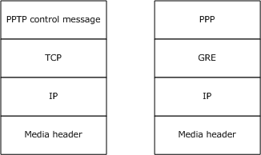

# [MS-PTPT]: Point-to-Point Tunneling Protocol (PPTP) Profile

Table of Contents

1 Introduction

- [1 Introduction](#Section_1)
  - [1.1 Glossary](#Section_1.1)
  - [1.2 References](#Section_1.2)
    - [1.2.1 Normative References](#Section_1.2.1)
    - [1.2.2 Informative References](#Section_1.2.2)
  - [1.3 Overview](#Section_1.3)
  - [1.4 Relationship to Other Protocols](#Section_1.4)
  - [1.5 Prerequisites/Preconditions](#Section_1.5)
  - [1.6 Applicability Statement](#Section_1.6)
  - [1.7 Versioning and Capability Negotiation](#Section_1.7)
  - [1.8 Vendor-Extensible Fields](#Section_1.8)
  - [1.9 Standards Assignments](#Section_1.9)

2 Messages

- [2 Messages](#Section_2)
  - [2.1 Transport](#Section_2.1)
  - [2.2 Message Syntax](#Section_2.2)

3 Protocol Details

- [3 Protocol Details](#Section_3)
  - [3.1 Common (PAC/PNS) Details](#Section_3.1)
    - [3.1.1 Abstract Data Model](#Section_3.1.1)
    - [3.1.2 Timers](#Section_3.1.2)
    - [3.1.3 Initialization](#Section_3.1.3)
    - [3.1.4 Higher-Layer Triggered Events](#Section_3.1.4)
    - [3.1.5 Processing Events and Sequencing Rules](#Section_3.1.5)
      - [3.1.5.1 Start-Control-Connection-Request Message](#Section_3.1.5.1)
        - [3.1.5.1.1 Start-Control-Connection-Request Collision Handling](#Section_3.1.5.1.1)
      - [3.1.5.2 Start-Control-Connection-Reply Message](#Section_3.1.5.2)
      - [3.1.5.3 Stop-Control-Connection-Request Message](#Section_3.1.5.3)
      - [3.1.5.4 Stop-Control-Connection-Reply Message](#Section_3.1.5.4)
      - [3.1.5.5 Echo-Request Message](#Section_3.1.5.5)
      - [3.1.5.6 Echo-Reply Message](#Section_3.1.5.6)
      - [3.1.5.7 Sliding Window Protocol](#Section_3.1.5.7)
      - [3.1.5.8 Handling Out-of-Sequence Packets](#Section_3.1.5.8)
      - [3.1.5.9 Acknowledgment Time-Outs](#Section_3.1.5.9)
    - [3.1.6 Timer Events](#Section_3.1.6)
    - [3.1.7 Other Local Events](#Section_3.1.7)
      - [3.1.7.1 TCP Disconnect](#Section_3.1.7.1)
  - [3.2 PAC/Server Details](#Section_3.2)
    - [3.2.1 Abstract Data Model](#Section_3.2.1)
    - [3.2.2 Timers](#Section_3.2.2)
    - [3.2.3 Initialization](#Section_3.2.3)
    - [3.2.4 Higher-Layer Triggered Events](#Section_3.2.4)
    - [3.2.5 Processing Events and Sequencing Rules](#Section_3.2.5)
      - [3.2.5.1 Call ID Values](#Section_3.2.5.1)
      - [3.2.5.2 Outgoing-Call-Reply Message](#Section_3.2.5.2)
      - [3.2.5.3 Incoming-Call-Request Message](#Section_3.2.5.3)
      - [3.2.5.4 Incoming-Call-Connected Message](#Section_3.2.5.4)
      - [3.2.5.5 Call-Disconnect–Notify Message](#Section_3.2.5.5)
      - [3.2.5.6 WAN-Error–Notify Message](#Section_3.2.5.6)
    - [3.2.6 Timer Events](#Section_3.2.6)
    - [3.2.7 Other Local Events](#Section_3.2.7)
  - [3.3 PNS/Client Details](#Section_3.3)
    - [3.3.1 Abstract Data Model](#Section_3.3.1)
    - [3.3.2 Timers](#Section_3.3.2)
    - [3.3.3 Initialization](#Section_3.3.3)
    - [3.3.4 Higher-Layer Triggered Events](#Section_3.3.4)
      - [3.3.4.1 Establish PPTP Call Session](#Section_3.3.4.1)
      - [3.3.4.2 Disconnect PPTP Call Session](#Section_3.3.4.2)
    - [3.3.5 Processing Events and Sequencing Rules](#Section_3.3.5)
      - [3.3.5.1 Call ID Values](#Section_3.3.5.1)
      - [3.3.5.2 Outgoing-Call-Request Message](#Section_3.3.5.2)
      - [3.3.5.3 Incoming-Call-Reply Message](#Section_3.3.5.3)
      - [3.3.5.4 Call-Clear-Request Message](#Section_3.3.5.4)
      - [3.3.5.5 Set-Link-Info Message](#Section_3.3.5.5)
    - [3.3.6 Timer Events](#Section_3.3.6)
    - [3.3.7 Other Local Events](#Section_3.3.7)

4 Protocol Examples

- [4 Protocol Examples](#Section_4)

5 Security

- [5 Security](#Section_5)
  - [5.1 Security Considerations for Implementers](#Section_5.1)
  - [5.2 Index of Security Parameters](#Section_5.2)

6 Appendix A: Product Behavior

- [6 Appendix A: Product Behavior](#Section_6)

7 Change Tracking

- [7 Change Tracking](#Section_7)

For the legal notice and IP terms, see [LEGAL.md](../LEGAL.md).
Last updated: 4/23/2024.
See [Revision History](#revision-history) for full version history.

# 1 Introduction

The Point-to-Point Tunneling Protocol (PPTP) is an Internet Engineering Task Force (IETF) standard protocol that allows the Point-to-Point Protocol (PPP) [[RFC1661]](https://go.microsoft.com/fwlink/?LinkId=90283) to be tunneled through an IP network. PPTP does not specify any changes to the PPP protocol, but instead describes a new vehicle for carrying PPP. PPTP uses an enhanced GRE (Generic Routing Encapsulation) [[RFC1701]](https://go.microsoft.com/fwlink/?LinkId=143693) and [[RFC1702]](https://go.microsoft.com/fwlink/?LinkId=143694) mechanism to provide a flow-and-congestion-controlled encapsulated datagram service for carrying PPP packets. For an introduction to PPTP, see [[RFC2637]](https://go.microsoft.com/fwlink/?LinkId=92846) section 1.

The Point-to-Point Tunneling Protocol (PPTP) Profile [MS-PTPT] specifies the profile of PPTP [RFC2637]. In this document, the terms [**PPTP Access Concentrator (PAC)**](#gt_pptp-access-concentrator-pac) and server, and the terms [**PPTP Network Server (PNS)**](#gt_pptp-network-server-pns) and client are used interchangeably. This document specifies the use of voluntary tunneling where the PPTP tunnel endpoints and the PPP endpoints reside on [**PAC**](#gt_privilege-attribute-certificate-pac) (as the server) and PNS (as the remote client).

Sections 1.5, 1.8, 1.9, 2, and 3 of this specification are normative. All other sections and examples in this specification are informative.

## 1.1 Glossary

This document uses the following terms:

**peer**: When used in context with [MS-PTPT], [**peer**](#gt_peer) refers to either the [**PAC**](#gt_privilege-attribute-certificate-pac) or [**PNS**](#gt_pptp-network-server-pns). A [**PAC's**](#gt_privilege-attribute-certificate-pac) [**peer**](#gt_peer) is a [**PNS**](#gt_pptp-network-server-pns) and vice versa.

**PPTP Access Concentrator (PAC)**: A node that acts as one side of a PPTP tunnel endpoint and is a [**peer**](#gt_peer) to the [**PPTP Network Server (PNS)**](#gt_pptp-network-server-pns). [**PAC**](#gt_privilege-attribute-certificate-pac) refers to the server that terminates the PPTP tunnel and provides VPN connectivity to a remote client.

**PPTP Network Server (PNS)**: A node that acts as one side of a PPTP tunnel endpoint and is a [**peer**](#gt_peer) to the [**PPTP Access Concentrator (PAC)**](#gt_pptp-access-concentrator-pac). [**PNS**](#gt_pptp-network-server-pns) refers to the remote client that requests to establish a VPN connectivity using PPTP tunnel.

**privilege attribute certificate (PAC)**: A Microsoft-specific authorization data present in the authorization data field of a ticket. The [**PAC**](#gt_privilege-attribute-certificate-pac) contains several logical components, including group membership data for authorization, alternate credentials for non-Kerberos authentication protocols, and policy control information for supporting interactive logon.

**MAY, SHOULD, MUST, SHOULD NOT, MUST NOT:** These terms (in all caps) are used as defined in [[RFC2119]](https://go.microsoft.com/fwlink/?LinkId=90317). All statements of optional behavior use either MAY, SHOULD, or SHOULD NOT.

## 1.2 References

Links to a document in the Microsoft Open Specifications library point to the correct section in the most recently published version of the referenced document. However, because individual documents in the library are not updated at the same time, the section numbers in the documents may not match. You can confirm the correct section numbering by checking the [Errata](https://go.microsoft.com/fwlink/?linkid=850906).

### 1.2.1 Normative References

We conduct frequent surveys of the normative references to assure their continued availability. If you have any issue with finding a normative reference, please contact [dochelp@microsoft.com](mailto:dochelp@microsoft.com). We will assist you in finding the relevant information.

[RFC1702] Hanks, S., Li, T., Farinacci, D., and Traina, P., "Generic Routing Encapsulation over IPv4 networks", RFC 1702, October 1994, [https://www.rfc-editor.org/info/rfc1702](https://go.microsoft.com/fwlink/?LinkId=143694)

[RFC2119] Bradner, S., "Key words for use in RFCs to Indicate Requirement Levels", BCP 14, RFC 2119, March 1997, [https://www.rfc-editor.org/info/rfc2119](https://go.microsoft.com/fwlink/?LinkId=90317)

[RFC2637] Hamzeh, K., Pall, G., Verthein, W., et al., "Point-to-Point Tunneling Protocol (PPTP)", RFC 2637, July 1999, [https://www.rfc-editor.org/info/rfc2637](https://go.microsoft.com/fwlink/?LinkId=92846)

[RFC793] Postel, J., Ed., "Transmission Control Protocol: DARPA Internet Program Protocol Specification", RFC 793, September 1981, [https://www.rfc-editor.org/info/rfc793](https://go.microsoft.com/fwlink/?LinkId=150872)

### 1.2.2 Informative References

[RFC1661] Simpson, W., Ed., "The Point-to-Point Protocol (PPP)", STD 51, RFC 1661, July 1994, [https://www.rfc-editor.org/info/rfc1661](https://go.microsoft.com/fwlink/?LinkId=90283)

[RFC1701] Hanks, S., Li, T., Farinacci, D., and Traina, P., "Generic Routing Encapsulation (GRE)", RFC 1701, October 1994, [https://www.rfc-editor.org/info/rfc1701](https://go.microsoft.com/fwlink/?LinkId=143693)

## 1.3 Overview

The profile described in this document differs from the PPTP protocol defined in [[RFC2637]](https://go.microsoft.com/fwlink/?LinkId=92846) as follows:

- This profile only allows a remote system acting as a [**PNS**](#gt_pptp-network-server-pns) to connect to [**PAC**](#gt_privilege-attribute-certificate-pac) using PPTP. The profile does not allow a remote system to connect to the PAC over a PPP link, such as a dial-up link. For more information, see section [3.2.5.3](#Section_3.2.5.3).
- The profile does not support [Start Control Connection Initiation Request Collision](#Section_3.1.5.1.1) avoidance, as described in [RFC2637] section 3.1.3. For more information, see section 3.1.5.1.1.
- The profile provides limited flow-control and congestion-control behavior. The profile does not allow adaptive adjustment of time-outs as specified in [RFC2637] section 4.4. For more information, see section [3.1.2](#Section_3.1.2).
- The profile handles out-of-sequence packets as described in section [3.1.5.8](#Section_3.1.5.8), which is different from the definition for this process as specified in [RFC2637] section 4.3. For more information, see section 3.1.5.8.
- The profile does not implement the sliding window protocol described in [RFC2637] section 4.2. For more information, see section [3.1.5.7](#Section_3.1.5.7). Because the sliding window protocol is not supported, the profile ignores the values of the **Packet Recv. Window Size** field from the [**peer**](#gt_peer).
- The profile specifies a different timeout value as described in section 3.1.2, within which the control connection has to be in the established state as specified in [RFC2637] section 3.1.4.
- The profile does not support any of the **Result Code** field values for the [Call-Disconnect–Notify message](#Section_3.2.5.5) as specified in [RFC2637] section 2.13. For the same reason, this profile does not support specifying the value "General Error" for the Result Code and passing the general error information in the **Error Code** field. This profile defines a new Result Code value of "0" as specified in section 3.2.5.5.

## 1.4 Relationship to Other Protocols

PPTP has two parallel components, as specified in [[RFC2637]](https://go.microsoft.com/fwlink/?LinkId=92846) section 1.3:

- A control connection between each [**PAC**](#gt_privilege-attribute-certificate-pac)/[**PNS**](#gt_pptp-network-server-pns) pair operating over TCP.
- An IP tunnel operating between the same PAC/PNS pair, which is used to transport GRE encapsulated PPP packets for user sessions between the pair.
The following diagram demonstrates the relationship of these parallel components to PPTP.

Figure 1: Relationship of parallel components to PPTP

## 1.5 Prerequisites/Preconditions

None.

## 1.6 Applicability Statement

This protocol is applicable when the implementation uses PPTP [[RFC2637]](https://go.microsoft.com/fwlink/?LinkId=92846).

## 1.7 Versioning and Capability Negotiation

PPTP is based on version 1, revision 0 of the Point-to-Point Tunneling Protocol (PPTP), as specified in [[RFC2637]](https://go.microsoft.com/fwlink/?LinkId=92846) section 1.4.

## 1.8 Vendor-Extensible Fields

None.

## 1.9 Standards Assignments

None.

# 2 Messages

## 2.1 Transport

PPTP control packets are transported over a TCP connection, as described in [[RFC2637]](https://go.microsoft.com/fwlink/?LinkId=92846) section 1.4. PPP data frames are transported over the GRE tunnel, as described in [RFC2637] section 4.<1>

## 2.2 Message Syntax

PPTP uses the message format specified in [[RFC2637]](https://go.microsoft.com/fwlink/?LinkId=92846). The PPTP control message formats are specified in [RFC2637] section 2. The GRE message format that is used to carry PPP frames is specified in [RFC2637] section 4.

All optional fields and values described in this document are sent in network-byte order unless otherwise indicated. All reserved bits MUST be set to 0 when sending messages and MUST be ignored for incoming messages.

# 3 Protocol Details

## 3.1 Common (PAC/PNS) Details

### 3.1.1 Abstract Data Model

The PTPT state machine conforms to the state machine specified in [[RFC2637]](https://go.microsoft.com/fwlink/?LinkId=92846) section 3.

### 3.1.2 Timers

The following timers are used by the [**PAC**](#gt_privilege-attribute-certificate-pac)/[**PNS**](#gt_pptp-network-server-pns).

**Echo Timer:** The "keep alive" timer used by the PAC/PNS for sending the [Echo-Request message (section 3.1.5.5)](#Section_3.1.5.5) to the [**peer**](#gt_peer) as specified in [[RFC2637]](https://go.microsoft.com/fwlink/?LinkId=92846) section 3.1.4. The value of this timer is 60 seconds.<2>

**Packet Acknowledgment Timer:** This timer is used to determine whether an acknowledgment for a GRE packet has to be sent if there are no outstanding GRE packets to be sent, when a packet is received by a PAC/PNS. The value of this timer is 100 milliseconds.

**Control Connection Idle Timer:** The timer used by the PAC/PNS to close a control connection when the connection is not in the established state within the time period specified by this timer. The value of this timer is 30 seconds, rather than 60 seconds as specified in [RFC2637] section 3.1.4. For more information, see section [3.1.5.1](#Section_3.1.5.1).

### 3.1.3 Initialization

The [**PAC**](#gt_privilege-attribute-certificate-pac)/[**PNS**](#gt_pptp-network-server-pns) SHOULD initialize and listen on the PPTP port as specified in [[RFC2637]](https://go.microsoft.com/fwlink/?LinkId=92846) section 3.1.2.<3>

The PAC/PNS SHOULD initialize the echo timeout value specified in [RFC2637] section 3.1.4.<4><5>

### 3.1.4 Higher-Layer Triggered Events

None.

### 3.1.5 Processing Events and Sequencing Rules

Except as noted in this section, the message processing and sequencing rules are unchanged from PPTP as specified in [[RFC2637]](https://go.microsoft.com/fwlink/?LinkId=92846). As a first step in establishing a PPTP call session, a control connection MUST be established between the [**PAC**](#gt_privilege-attribute-certificate-pac)/[**PNS**](#gt_pptp-network-server-pns), which is a TCP session to port 1723 as specified in [RFC2637] section 1.4. Over this TCP connection, the control channel MUST first be established followed by the call session through the exchange of control messages. The ordering and retransmission of control messages is provided by the underlying TCP protocol [[RFC793]](https://go.microsoft.com/fwlink/?LinkId=150872).

PAC and PNS MAY validate GRE packets received so that the source IP address is the same as the [**peer's**](#gt_peer) IP address used in PPTP control channel establishment and for when packets do not validate and are then subsequently dropped.<6>

#### 3.1.5.1 Start-Control-Connection-Request Message

The Start-Control-Connection-Request message specified in [[RFC2637]](https://go.microsoft.com/fwlink/?LinkId=92846) section 2.1 is used to initialize the tunnel. The originator SHOULD start the [Control Connection Idle Timer (section 3.1.2)](#Section_3.1.2) and enter the wait_ctl_reply state after sending the Start-Control-Connection-Request message as specified in [RFC2637] section 3.1.1. The originator SHOULD exit the wait_ctl_reply state either after receiving the [Start-Control-Connection-Reply message](#Section_3.1.5.2) from the peer or after the Control Connection Idle Timer expires.

When the [**PAC**](#gt_privilege-attribute-certificate-pac)/[**PNS**](#gt_pptp-network-server-pns) receives an incoming connection on the PPTP TCP port (default 1723), it SHOULD start the Control Connection Idle Timer and wait for the Start-Control-Connection-Request message. If the PAC/PNS does not receive the Start-Control-Connection-Request message from the client of the TCP connection before the Control Connection Idle Timer expires, it SHOULD discard the attempted connection.

##### 3.1.5.1.1 Start-Control-Connection-Request Collision Handling

The Point-to-Point Tunneling Protocol (PPTP) Profile does not implement handling of the **Start Control Connection Initiation Request Collision** message as specified in [[RFC2637]](https://go.microsoft.com/fwlink/?LinkId=92846) section 3.1.3.

The [**PAC**](#gt_privilege-attribute-certificate-pac)/[**PNS**](#gt_pptp-network-server-pns) SHOULD be capable of having multiple control connections between them where each control connection is independent of all other control connections.

#### 3.1.5.2 Start-Control-Connection-Reply Message

Start-Control-Connection-Reply is the control message sent in response to the [Start-Control-Connection-Request message](#Section_3.1.5.1). The format of this message is specified in [[RFC2637]](https://go.microsoft.com/fwlink/?LinkId=92846) section 2.2.

#### 3.1.5.3 Stop-Control-Connection-Request Message

The Stop-Control-Connection-Request message is the control message sent by any [**peer**](#gt_peer) to notify a peer to close the control connection. The format of this message is specified in [[RFC2637]](https://go.microsoft.com/fwlink/?LinkId=92846) section 2.3.

#### 3.1.5.4 Stop-Control-Connection-Reply Message

This control message is sent in response to the receipt of [Stop-Control-Connection-Request](#Section_3.1.5.3). The format of this message is specified in [[RFC2637]](https://go.microsoft.com/fwlink/?LinkId=92846) section 2.4.

#### 3.1.5.5 Echo-Request Message

This control message is sent by either [**peer**](#gt_peer) of a [**PAC**](#gt_privilege-attribute-certificate-pac)/[**PNS**](#gt_pptp-network-server-pns) control connection to inform the other peer that this peer is alive as specified in [[RFC2637]](https://go.microsoft.com/fwlink/?LinkId=92846) section 3.1.4. The PAC/PNS SHOULD send this message whenever the [Echo Timer (section 3.1.2)](#Section_3.1.2) expires. The format of this message is specified in [RFC2637] section 2.5.

#### 3.1.5.6 Echo-Reply Message

This control message is sent in response to the receipt of a [Echo-Request message](#Section_3.1.5.5). The format of this message is specified in [[RFC2637]](https://go.microsoft.com/fwlink/?LinkId=92846) section 2.6.

#### 3.1.5.7 Sliding Window Protocol

The sliding window protocol for flow control is described in [[RFC2637]](https://go.microsoft.com/fwlink/?LinkId=92846) section 4.2. The Point-to-Point Tunneling Protocol (PPTP) Profile does not implement the sliding window protocol for flow control of data packets. The [**PAC**](#gt_privilege-attribute-certificate-pac)/[**PNS**](#gt_pptp-network-server-pns) SHOULD ignore the received "Packet Recv. Window Size" value from the [**peer**](#gt_peer).

#### 3.1.5.8 Handling Out-of-Sequence Packets

The process for handling out-of-sequence packets is described in [[RFC2637]](https://go.microsoft.com/fwlink/?LinkId=92846) section 4.3. The [**PAC**](#gt_privilege-attribute-certificate-pac)/[**PNS**](#gt_pptp-network-server-pns) SHOULD attempt to reorder packets before sending them to the higher layer.<7> However, when reordering is not possible, the packets SHOULD continue to be sent to the higher layer even though the packets might be sent out of order.

Packets with duplicate sequence numbers SHOULD never occur, as specified in [RFC2637] section 4.3. However, the PAC/PNS SHOULD continue to send packets to the higher layer even though packets with duplicate sequence numbers might exist.

**Note** Sending out-of-sequence packets to the higher layer is in direct contravention of [RFC2637] section 4.3, which states that such behavior could cause problems because proper PPP protocol operation is premised upon receiving packets in sequence.

#### 3.1.5.9 Acknowledgment Time-Outs

The PPTP profile does not implement acknowledgment-related time-outs as specified in [[RFC2637]](https://go.microsoft.com/fwlink/?LinkId=92846) section 4.4. The [**PAC**](#gt_privilege-attribute-certificate-pac)/[**PNS**](#gt_pptp-network-server-pns) SHOULD start the [Packet Acknowledgment Timer (section 3.1.2)](#Section_3.1.2) when it receives a GRE data packet and there are no outstanding GRE packets to be sent. When the timer expires and there are no outstanding GRE data packets to send, the PAC/PNS SHOULD send the acknowledgment GRE packet to the [**peer**](#gt_peer); otherwise, the sent GRE data packets will also carry the acknowledgment and the Packet Acknowledgment Timer SHOULD be stopped.

### 3.1.6 Timer Events

None.

### 3.1.7 Other Local Events

None.

#### 3.1.7.1 TCP Disconnect

When the underlying control channel (TCP connection) gets closed at any time, the call sessions associated with the control channel SHOULD be closed automatically.

## 3.2 PAC/Server Details

### 3.2.1 Abstract Data Model

The PPTP state machine conforms to the state machine specified in [[RFC2637]](https://go.microsoft.com/fwlink/?LinkId=92846) section 3.2.

### 3.2.2 Timers

No timers are defined beyond those described in section [3.1.2](#Section_3.1.2).

### 3.2.3 Initialization

None.

### 3.2.4 Higher-Layer Triggered Events

Events can be triggered from the higher-layer to disconnect a PPTP call session. When the [**PAC**](#gt_privilege-attribute-certificate-pac) receives a request to disconnect the PPTP call session from the higher-layer, the PAC MUST send a **Call-Disconnect–Notify** message ([[RFC2637]](https://go.microsoft.com/fwlink/?LinkId=92846) section 2.13) to the [**PNS**](#gt_pptp-network-server-pns), as specified in [RFC2637] section 3.2.4.1. If no more call sessions exist with the PNS, the PAC SHOULD close the control connection with the PNS by sending the **Stop-Control-Connection-Request** message ([RFC2637] section 2.3) to the PNS, as specified in [RFC2637] section 3.1.1.

### 3.2.5 Processing Events and Sequencing Rules

None.

#### 3.2.5.1 Call ID Values

[**PAC**](#gt_privilege-attribute-certificate-pac) assigns a Call ID value to each user session it requests or accepts, as specified in [[RFC2637]](https://go.microsoft.com/fwlink/?LinkId=92846) section 3.2.2.

#### 3.2.5.2 Outgoing-Call-Reply Message

The Outgoing-Call-Reply message is a PPTP control message sent by the [**PAC**](#gt_privilege-attribute-certificate-pac) to the [**PNS**](#gt_pptp-network-server-pns) in response to a received [Outgoing-Call-Request message (section 3.3.5.2)](#Section_3.3.5.2). The format of this message is specified in [[RFC2637]](https://go.microsoft.com/fwlink/?LinkId=92846) section 2.8.<8>

In the Outgoing-Call-Reply message, the PAC SHOULD set the value of the **Packet Recv. Window Size** field to 0 and the PNS MUST ignore the value of this field.<9>

#### 3.2.5.3 Incoming-Call-Request Message

Since the Point-to-Point Tunneling Protocol (PPTP) Profile does not allow a remote system to connect to the PAC over a PPP link, such as a dial-up link, the PAC MUST NOT send an Incoming-Call-Request message to the PNS. However, the PNS SHOULD handle this message, as specified in [[RFC2637]](https://go.microsoft.com/fwlink/?LinkId=92846) section 2.9.

#### 3.2.5.4 Incoming-Call-Connected Message

The Incoming-Call-Connected message is a PPTP control message sent by the [**PAC**](#gt_privilege-attribute-certificate-pac) to the [**PNS**](#gt_pptp-network-server-pns) in response to a received [Incoming-Call-Reply message (section 3.3.5.3)](#Section_3.3.5.3). The format of this message is specified in [[RFC2637]](https://go.microsoft.com/fwlink/?LinkId=92846) section 2.11.

#### 3.2.5.5 Call-Disconnect–Notify Message

The Call-Disconnect–Notify message is a PPTP control message sent by the [**PAC**](#gt_privilege-attribute-certificate-pac) to the [**PNS**](#gt_pptp-network-server-pns). It is issued whenever a call is disconnected due to the receipt by the PAC of a [Call-Clear-Request message](#Section_3.3.5.4) or for any other reason. The format of this message is specified in [[RFC2637]](https://go.microsoft.com/fwlink/?LinkId=92846) section 2.13. The PAC MUST set the value of the **Result Code** field in this message to 0 irrespective of the reason for the disconnection, including general error conditions, as specified in [RFC2637] section 2.13. The PNS MUST ignore the value of the **Result Code** field in this message.

#### 3.2.5.6 WAN-Error–Notify Message

[**PAC**](#gt_privilege-attribute-certificate-pac) MUST NOT send this message to [**PNS**](#gt_pptp-network-server-pns). If PNS receives this message, it MUST ignore the message.

### 3.2.6 Timer Events

None.

### 3.2.7 Other Local Events

None.

## 3.3 PNS/Client Details

### 3.3.1 Abstract Data Model

The PPTP state machine conforms to the state machine specified in [[RFC2637]](https://go.microsoft.com/fwlink/?LinkId=92846) section 3.2.

### 3.3.2 Timers

In addition to the timers specified in section [3.1.2](#Section_3.1.2), the [**PNS**](#gt_pptp-network-server-pns) uses the following timer:

**Dial out Timer:** This timer specifies the period of time within which the control connection of the PNS has to be in the established state as specified in [[RFC2637]](https://go.microsoft.com/fwlink/?LinkId=92846) section 3.1.1. The value of this timer is 60 seconds.

### 3.3.3 Initialization

None.

### 3.3.4 Higher-Layer Triggered Events

The primary higher-layer trigger events include:

- To establish a PPTP call session with the [**PAC**](#gt_privilege-attribute-certificate-pac).
- To disconnect an established PPTP call session with the PAC.

#### 3.3.4.1 Establish PPTP Call Session

To establish a PPTP call session, the [**PNS**](#gt_pptp-network-server-pns) MUST establish a control connection with the [**PAC**](#gt_privilege-attribute-certificate-pac), as specified in [[RFC2637]](https://go.microsoft.com/fwlink/?LinkId=92846) section 1.3.1, if a control connection is not already established. On the newly created or existing control connection, the PNS MUST send the **Outgoing-Call-Request** message ([RFC2637] section 2.7) to the PAC to establish the PPTP call session with the PAC, as specified in [RFC2637] section 3.2.4.2.

Before attempting to establish the connection, the PNS SHOULD start the [Dial out Timer (section 3.3.2)](#Section_3.2.2) and the timer SHOULD be stopped only when the control connection is in the established state. When the timer expires, the control connection MUST be closed.

#### 3.3.4.2 Disconnect PPTP Call Session

To disconnect a PPTP call session, the [**PNS**](#gt_pptp-network-server-pns) MUST send a **Call-Clear-Request** message ([[RFC2637]](https://go.microsoft.com/fwlink/?LinkId=92846) section 2.12) to the [**PAC**](#gt_privilege-attribute-certificate-pac), as specified in [RFC2637] section 3.2.4.2. If no more call sessions exist with the PAC, the PNS SHOULD close the control connection with the PAC by sending the **Stop-Control-Connection-Request** message ([RFC2637] section 2.3) as specified in [RFC2637] section 3.1.1.

### 3.3.5 Processing Events and Sequencing Rules

None.

#### 3.3.5.1 Call ID Values

[**PNS**](#gt_pptp-network-server-pns) assigns a Call ID value to each user session it requests or accepts, as specified in [[RFC2637]](https://go.microsoft.com/fwlink/?LinkId=92846) section 3.2.2.

#### 3.3.5.2 Outgoing-Call-Request Message

This control message is sent by the [**PNS**](#gt_pptp-network-server-pns) to the [**PAC**](#gt_privilege-attribute-certificate-pac) to initiate a call. The format of this message is specified in [[RFC2637]](https://go.microsoft.com/fwlink/?LinkId=92846) section 2.7.<10>

The PNS SHOULD set the value of the **Packet Recv. Window Size** field in the Outgoing-Call-Request message to 0 and the PAC MUST ignore the value of the **Packet Recv. Window Size** field in the message.<11>

#### 3.3.5.3 Incoming-Call-Reply Message

The [**PNS**](#gt_pptp-network-server-pns) sends this message to the [**PAC**](#gt_privilege-attribute-certificate-pac) in response to the [Incoming-Call-Request message (section 3.2.5.3)](#Section_3.2.5.3). The format of this message is specified in [[RFC2637]](https://go.microsoft.com/fwlink/?LinkId=92846) section 2.10.<12><13>

The PNS SHOULD set the value of the **Packet Recv. Window Size** field in the Incoming-Call-Reply message to 0 and the PAC MUST ignore the value of the **Packet Recv. Window Size** field in the message.<14>

#### 3.3.5.4 Call-Clear-Request Message

[**PNS**](#gt_pptp-network-server-pns) sends this message to [**PAC**](#gt_privilege-attribute-certificate-pac) to close a particular call. The format of this message is specified in [[RFC2637]](https://go.microsoft.com/fwlink/?LinkId=92846) section 2.12.

#### 3.3.5.5 Set-Link-Info Message

The Set-Link-Info message is a PPTP control message sent by the [**PNS**](#gt_pptp-network-server-pns) to the [**PAC**](#gt_privilege-attribute-certificate-pac) to set PPP negotiated options. The format of this message is specified in [[RFC2637]](https://go.microsoft.com/fwlink/?LinkId=92846) section 2.15.

### 3.3.6 Timer Events

None.

### 3.3.7 Other Local Events

None.

# 4 Protocol Examples

The following example shows the sequence of messages exchanged when a machine running Windows Vista operating system with Service Pack 1 (SP1) (name: "testclient.contoso.com") with IP address 1.1.1.1 (client 100 megabits per second connection) establishes a PPTP tunnel with a machine running Windows Server 2008 operating system (name: "testserver.contoso.com") with IP address 2.2.2.2 (server, 100 megabits per second connection).

In this example, the machine "testclient.contoso.com" is [**PAC**](#gt_privilege-attribute-certificate-pac) and the machine "testserver.contoso.com" is [**PNS**](#gt_pptp-network-server-pns).

In this example, PAC initiates the tunnel establishment process. A TCP connection with source IP address 1.1.1.1 and dynamically chosen (ephemeral) source port to destination IP address 2.2.2.2 and destination port 1723 (by default) is established to begin the tunnel establishment process.

Start-Control-Connection-Request

The Start-Control-Connection-Request is a PPTP control message used to establish the control connection between a PNS and a PAC. Each PNS-PAC pair requires a dedicated control connection to be established. The establishment of the control connection can be initiated by either the PNS or PAC.

The details of the PPTP packet are as follows.

Packet Fields:

Length: set to 156 (0x9C).

PPTP Message Type: Set to 1 (Control Message)

Magic Cookie: Set to 0x1A2B3C4D

Control Message Type: Set to 1 (Start-Control-Connection-Request)

Reserved0: Set to 0

Protocol Version: Set to 0x0100 (version 1, revision 0)

Reserved1: Set to 0

Framing Capabilities: Set to 1 (Asynchronous Framing)

Bearer Capabilities: Set to 1 (Analog access)

Maximum Channels: Set to 0

Firmware Revision: Set to 0

Host Name: This field (64 bytes) is filled with octets of value 0

Vendor Name: The first nine octets are set as

0x4D 0x69 0x63 0x72 0x6F 0x73 0x6F 0x66 0x74 (Microsoft)

The remaining 55 octets are filled with value 0.

Start-Control-Connection-Reply

The Start-Control-Connection-Reply is a PPTP control message sent in reply to a received Start-Control-Connection-Request message.

The details of the PPTP packet are as follows.

Packet Fields:

Length: set to 156 (0x9C).

PPTP Message Type: Set to 1 (Control Message)

Magic Cookie: Set to 0x1A2B3C4D

Control Message Type: Set to 2 (Start-Control-Connection-Reply)

Reserved0: Set to 0

Protocol Version: Set to 0x0100 (version 1, revision 0)

Result Code: Set to 1 (Successful)

Error Code: Set to 0 (None)

Framing Capabilities: Set to 1 (Asynchronous Framing)

Bearer Capabilities: Set to 1 (Analog access)

Maximum Channels: Set to 0

Firmware Revision: Set to 0

Host Name: This field (64 bytes) is filled with octets of value 0

Vendor Name: The first nine octets are set as

0x4D 0x69 0x63 0x72 0x6F 0x73 0x6F 0x66 0x74 (Microsoft)

The remaining 55 octets are filled with value 0.

Outgoing-Call-Request

The Outgoing-Call-Request is a PPTP control message sent by the PNS to the PAC to indicate that an outbound call from the PAC is to be established.

Packet Fields:

Length: set to 168 (0xA8).

PPTP Message Type: Set to 1 (Control Message)

Magic Cookie: Set to 0x1A2B3C4D

Control Message Type: Set to 7 (Outgoing-Call-Request)

Reserved0: Set to 0

Call ID: 64234 (0xFAEA)

Call Serial Number: 1

Minimum BPS: 300 (0x12C)

Maximum BPS: 100000000 (0x5F5E100)

Bearer Type: 3(Any type of channel)

Framing Type: 3(Any type of framing)

Packet Recv. Window Size: 64 (0x40)

Packet Processing Delay: 0

Phone Number Length: 0

Reserved1: 0

Phone Number: The field is filled with octets of value 0

Subaddress: (All hex values)

E3 57 2A 57 E0 A2 BD 41 B8 26 F1 45 41 06 F2 61 00 00 00 00 00 00 00 00 00 00 00 00 00 00 00 00 00 00 00 00 00 00 00 00 00 00 00 00 00 00 00 00 00 00 00 00 00 00 00 00 00 00 00 00 00 00 00 00

The first 16 octets of this field are filled with a GUID (Correlation ID). The remainder of this field is filled with octets of value 0.

Outgoing-Call-reply

The Outgoing-Call-Reply is a PPTP control message sent by the PAC to the PNS in response to a received Outgoing-Call-Request message. The reply indicates the result of the outgoing call attempt.

Packet Fields:

Length: set to 32 (0x20).

PPTP Message Type: Set to 1 (Control Message)

Magic Cookie: Set to 0x1A2B3C4D

Control Message Type: Set to 8 (Outgoing-Call-Reply)

Reserved0: Set to 0

Call ID: 58378 (0xE40A)

Peer's Call ID: 64234 (0xFAEA)

Result Code: 1(Connected)

Error Code: 0 (None)

Cause Code: 0

Connect Speed: 5317890 (0x512502)

Packet Recv. Window Size: 16384 (0x4000)

Packet Processing Delay: 0

Physical Channel ID: 0

GRE-Packet

GRE packets are used to carry the PPP session (control and data).

IP Header:

Versions: 4 (IPv4)

Header Length = 20 (5)

Differentiated Services Field: DSCP: 0, ECN: 0

Total Length: 48 (0x30)

Identification: 9665 (0x25C1)

Fragment Flags: 0 (0x0)

Reserved: (0...............)

DF: (.0..............) May Fragment

MF: (..0.............) Last fragment

Fragment Offset:(...0000000000000) First fragment

Time To Live: 126 (0x7E)

Next Protocol: 47(0x2f, GRE, General Routing Encapsulation)

Checksum: 22225 (0x56D1)

Source Address: 1.1.1.1

Destination Address: 2.2.2.2

GRE Enhanced Header:

flags: 0x3081

C: (0...............) Checksum Absent

R: (.0..............) Offset Absent

K: (..1.............) Key Present

S: (...1............) Sequence Number Present

ssr: (....0...........) Strict Source Route Absent

Recur: (.....000........) Recursion Control

A: (........1.......) Acknowledgment sequence number Present

Reserved Flags: (.........0000...)

Version: (.............001) 1

Next Protocol: PPP (0x880B)

Payload Length: 12 (0xC)

Call ID: 64234 (0xFAEA)

Sequence Number: 15 (0xF)

Acknowledgment Number: 15 (0xF)

Call-Clear-Request

The Call-Clear-Request is a PPTP control message sent by the PNS to the PAC indicating that a particular call is to be disconnected.

Packet Fields:

Length: set to 32 (0x20).

PPTP Message Type: Set to 1 (Control Message)

Magic Cookie: Set to 0x1A2B3C4D

Control Message Type: Set to 12 (Call-Clear-Request)

Reserved0: Set to 0

Call ID: 64234 (0xFAEA)

Reserved1: 0

Call-Disconnect-Notify

The Call-Disconnect-Notify message is a PPTP control message sent by the PAC to the PNS. It is issued whenever a call is disconnected, due to the receipt by the PAC of a Call-Clear-Request or for any other reason.

Packet Fields:

Length: set to 148 (0x94).

PPTP Message Type: Set to 1 (Control Message)

Magic Cookie: Set to 0x1A2B3C4D

Control Message Type: Set to 13 (Call-Disconnect-Notify)

Reserved0: Set to 0

Call ID: 58378 (0xE40A)

Result Code: 0 (Undefined)

Error Code: 0

Cause Code: 0

Call Statistics: This field is filled with 128 octets of value 0.

Stop-Control-Connection-Request

The Stop-Control-Connection-Request is a PPTP control message sent by one peer of a PAC-PNS control connection to inform the other peer that the control connection should be closed.

Packet Fields:

Length: set to 16 (10).

PPTP Message Type: Set to 1 (Control Message)

Magic Cookie: Set to 0x1A2B3C4D

Control Message Type: Set to 3 (Stop-Control-Connection-Request)

Reserved0: Set to 0

Reason: 1 (None)

Reserved1: 0

Reserved2: 0

Stop-Control-Connection-Reply

The Stop-Control-Connection-Reply is a PPTP control message sent by one peer of a PAC-PNS control connection upon receipt of a Stop-Control-Connection-Request from the other peer.

Packet Fields:

Length: set to 16 (10).

PPTP Message Type: Set to 1 (Control Message)

Magic Cookie: Set to 0x1A2B3C4D

Control Message Type: Set to 4 (Stop-Control-Connection-Reply)

Reserved0: Set to 0

Result Code: 1 (OK)

Error Code: 0

Reserved1: 0

# 5 Security

## 5.1 Security Considerations for Implementers

All security considerations applicable to PPTP [[RFC2637]](https://go.microsoft.com/fwlink/?LinkId=92846) also apply to the extensions defined in this document, the Point-to-Point Tunneling Protocol (PPTP) Profile.

## 5.2 Index of Security Parameters

None.

# 6 Appendix A: Product Behavior

The information in this specification is applicable to the following Microsoft products or supplemental software. References to product versions include updates to those products.

- Windows 2000 operating system
- Windows XP operating system
- Windows Server 2003 operating system
- Windows Vista operating system
- Windows Server 2008 operating system
- Windows 7 operating system
- Windows Server 2008 R2 operating system
- Windows 8 operating system
- Windows Server 2012 operating system
- Windows 8.1 operating system
- Windows Server 2012 R2 operating system
- Windows 10 operating system
- Windows Server 2016 operating system
- Windows Server operating system
- Windows Server 2019 operating system
- Windows Server 2022 operating system
- Windows 11 operating system
- Windows Server 2025 operating system
Exceptions, if any, are noted in this section. If an update version, service pack or Knowledge Base (KB) number appears with a product name, the behavior changed in that update. The new behavior also applies to subsequent updates unless otherwise specified. If a product edition appears with the product version, behavior is different in that product edition.

Unless otherwise specified, any statement of optional behavior in this specification that is prescribed using the terms "SHOULD" or "SHOULD NOT" implies product behavior in accordance with the SHOULD or SHOULD NOT prescription. Unless otherwise specified, the term "MAY" implies that the product does not follow the prescription.

<1> Section 2.1: **PAC** listens on a specified port number for the TCP connections. By default, Windows uses port number 1723. However, the port number can be modified by changing the value in the registry at <PPTP-Registry-Location>\TcpPortNumber.

<2> Section 3.1.2: The default timer value of 60 seconds can be changed by using the registry value "<PPTP-Registry-Location>\InactivityIdleSeconds".

<3> Section 3.1.3: The Windows implementation obtains the PPTP port by reading the registry value "<PPTP-Registry-Location>\TcpPortNumber". If this registry value is not present, the PAC/[**PNS**](#gt_pptp-network-server-pns) uses the default PPTP port 1723.

<4> Section 3.1.3: The Windows implementation reads the registry value "<PPTP-Registry-Location>\InactivityIdleSeconds" to obtain the echo timeout value. If this registry value is not present, the PAC/PNS uses an echo timeout value of 60 seconds.

<5> Section 3.1.3: As part of the initialization process, the Windows implementation reads the registry value "<PPTP-Registry-Location>\ValidateAddress" to initialize the flag that determines whether the PAC/PNS validates the received GRE packets, as specified in section [3.1.5](#Section_1.3).

<6> Section 3.1.5: The source IP address validation for received packets can be enabled for Windows using the registry key using registry value "<PPTP-Registry-Location>\ValidateAddress". If this registry value is not present or is set to 0, IP validation is not performed.

**Note** The <PPTP-Registry-Location> registry entry is located in the HKEY_LOCAL_MACHINE\SYSTEM\CurrentControlSet\Control\Class\{4D36E972-E325-11CE-BFC1-08002bE10318}\<number> registry subkey, where <number> is a placeholder for a number between 0001 and 0020, inclusive. The subkey that contains the PPTP registry entry is the subkey that contains the DriverDesc REG_SZ entry with a populated WAN Miniport (PPTP) data value. To locate the DriverDesc REG_SZ entry, click each <number> subkey and then look for "WAN Miniport (PPTP)" (without quotes) in the Data column.

<7> Section 3.1.5.8: The Windows implementation maintains an ordered queue of packets based on the sequence number. Any received packet is inserted into this ordered queue. A worker thread, which gets triggered based on the presence of packets in the queue, performs the task of removing the packets from the ordered queue and indicating them to the higher layer.

<8> Section 3.2.5.2: The PAC sends an Outgoing-Call-Reply message to PNS in response to the receipt of an [Outgoing-Call-Request message](#Section_3.3.5.2).

The PAC sends the following attributes in this message:

Result Code = 1 (Connected)

Packet Recv. Window Size = 16384

Packet Processing Delay = 0

Physical Channel ID = 0

<9> Section 3.2.5.2: In the Windows implementation of this profile, the PAC sets the value of the **Packet Recv. Window Size** field to 16384 and the **Packet Recv. Window Size** field is ignored by the PNS.

<10> Section 3.3.5.2: In the Windows implementation, the PNS sends the following attributes with the Outgoing-Call-Request message.

Call Serial Number = An integer value starting at 1 and incremented for every Outgoing-Call-Request message sent. The PAC overrides the Call Serial Number that was sent by the PNS in the Outgoing-Call-Request message.

Minimum bits per second = 300

Maximum bits per second = 100000000

Bearer type = 3 (Call can be placed on any type of channel)

Framing Type = 3 (Call can use either type of framing)

Packet Recv. Window Size = 64

Packet Processing Delay = 0

SubAddress = SubAddress has the Correlation ID (a GUID). The Correlation ID is randomly generated once per session. It is a 16-byte long value. The remaining 48 bytes are filled by zeros. The [**peer**](#gt_peer) simply logs the Correlation ID specified in this field and does not use it with any packet exchange for that session.

<11> Section 3.3.5.2: In the Windows implementation of this profile, the PNS sets the value of the **Packet Recv. Window Size** field to 64 and the field is ignored by the PAC.

<12> Section 3.3.5.3: An Incoming-Call-Reply message sent by the Windows PNS in response to a [Incoming-Call-Request message](#Section_3.2.5.3) received from the PAC contains the following attributes:

Packet Recv. Window Size = 16384

Packet transmit delay = 0

If the PNS does not have the resources to handle the new incoming connection request, it replies with Result Code = 2 (General Error - The Incoming Call should not be established due to the reason indicated in Error Code.) and Error Code = 4. For all other internal error conditions, the PNS does not send the Incoming-Call-Reply message to the PAC and the PAC/PNS remains in the idle state.

<13> Section 3.3.5.3: The Windows PAC silently discards the Incoming-Call-Reply message received from a PNS, since it never sends the Incoming-Call-Request message to the PNS as specified in section 3.2.5.3. The silent discard operation is not normal protocol behavior; rather, it is exception handling for the specific case when a reply message is received for a request message that is not implemented by this protocol profile.

<14> Section 3.3.5.3: In the Windows implementation of this profile, the PNS sets the value of the **Packet Recv. Window Size** field to 16384.

# 7 Change Tracking

This section identifies changes that were made to this document since the last release. Changes are classified as Major, Minor, or None.

The revision class **Major** means that the technical content in the document was significantly revised. Major changes affect protocol interoperability or implementation. Examples of major changes are:

- A document revision that incorporates changes to interoperability requirements.
- A document revision that captures changes to protocol functionality.
The revision class **Minor** means that the meaning of the technical content was clarified. Minor changes do not affect protocol interoperability or implementation. Examples of minor changes are updates to clarify ambiguity at the sentence, paragraph, or table level.

The revision class **None** means that no new technical changes were introduced. Minor editorial and formatting changes may have been made, but the relevant technical content is identical to the last released version.

The changes made to this document are listed in the following table. For more information, please contact [dochelp@microsoft.com](mailto:dochelp@microsoft.com).

| Section | Description | Revision class |
| --- | --- | --- |
| [6](#Section_6) Appendix A: Product Behavior | Added Windows Server 2025 to the list of applicable products. | Major |

## Revision History

| Date | Version | Revision Class | Comments |
| --- | --- | --- | --- |
| 4/10/2009 | 0.1 | Major | First Release. |
| 5/22/2009 | 0.1.1 | Editorial | Changed language and formatting in the technical content. |
| 7/2/2009 | 1.0 | Major | Updated and revised the technical content. |
| 8/14/2009 | 2.0 | Major | Updated and revised the technical content. |
| 9/25/2009 | 2.1 | Minor | Clarified the meaning of the technical content. |
| 11/6/2009 | 3.0 | Major | Updated and revised the technical content. |
| 12/18/2009 | 4.0 | Major | Updated and revised the technical content. |
| 1/29/2010 | 4.0.1 | Editorial | Changed language and formatting in the technical content. |
| 3/12/2010 | 5.0 | Major | Updated and revised the technical content. |
| 4/23/2010 | 6.0 | Major | Updated and revised the technical content. |
| 6/4/2010 | 7.0 | Major | Updated and revised the technical content. |
| 7/16/2010 | 8.0 | Major | Updated and revised the technical content. |
| 8/27/2010 | 9.0 | Major | Updated and revised the technical content. |
| 10/8/2010 | 10.0 | Major | Updated and revised the technical content. |
| 11/19/2010 | 10.0 | None | No changes to the meaning, language, or formatting of the technical content. |
| 1/7/2011 | 10.0 | None | No changes to the meaning, language, or formatting of the technical content. |
| 2/11/2011 | 10.0 | None | No changes to the meaning, language, or formatting of the technical content. |
| 3/25/2011 | 10.0 | None | No changes to the meaning, language, or formatting of the technical content. |
| 5/6/2011 | 10.0 | None | No changes to the meaning, language, or formatting of the technical content. |
| 6/17/2011 | 10.1 | Minor | Clarified the meaning of the technical content. |
| 9/23/2011 | 10.1 | None | No changes to the meaning, language, or formatting of the technical content. |
| 12/16/2011 | 11.0 | Major | Updated and revised the technical content. |
| 3/30/2012 | 11.0 | None | No changes to the meaning, language, or formatting of the technical content. |
| 7/12/2012 | 11.0 | None | No changes to the meaning, language, or formatting of the technical content. |
| 10/25/2012 | 11.0 | None | No changes to the meaning, language, or formatting of the technical content. |
| 1/31/2013 | 11.0 | None | No changes to the meaning, language, or formatting of the technical content. |
| 8/8/2013 | 12.0 | Major | Updated and revised the technical content. |
| 11/14/2013 | 12.0 | None | No changes to the meaning, language, or formatting of the technical content. |
| 2/13/2014 | 12.0 | None | No changes to the meaning, language, or formatting of the technical content. |
| 5/15/2014 | 12.0 | None | No changes to the meaning, language, or formatting of the technical content. |
| 6/30/2015 | 13.0 | Major | Significantly changed the technical content. |
| 10/16/2015 | 13.0 | None | No changes to the meaning, language, or formatting of the technical content. |
| 7/14/2016 | 13.0 | None | No changes to the meaning, language, or formatting of the technical content. |
| 6/1/2017 | 13.0 | None | No changes to the meaning, language, or formatting of the technical content. |
| 9/15/2017 | 14.0 | Major | Significantly changed the technical content. |
| 9/12/2018 | 15.0 | Major | Significantly changed the technical content. |
| 4/7/2021 | 16.0 | Major | Significantly changed the technical content. |
| 6/25/2021 | 17.0 | Major | Significantly changed the technical content. |
| 4/23/2024 | 18.0 | Major | Significantly changed the technical content. |
