# [MS-QDP]: Quality Windows Audio/Video Experience (qWave): Wireless Diagnostics Protocol

Table of Contents

1 Introduction

- [1 Introduction](#Section_1)
  - [1.1 Glossary](#Section_1.1)
  - [1.2 References](#Section_1.2)
    - [1.2.1 Normative References](#Section_1.2.1)
    - [1.2.2 Informative References](#Section_1.2.2)
  - [1.3 Overview](#Section_1.3)
  - [1.4 Relationship to Other Protocols](#Section_1.4)
  - [1.5 Prerequisites/Preconditions](#Section_1.5)
  - [1.6 Applicability Statement](#Section_1.6)
  - [1.7 Versioning and Capability Negotiation](#Section_1.7)
  - [1.8 Vendor-Extensible Fields](#Section_1.8)
  - [1.9 Standards Assignments](#Section_1.9)

2 Messages

- [2 Messages](#Section_2)
  - [2.1 Transport](#Section_2.1)
  - [2.2 Message Syntax](#Section_2.2)
    - [2.2.1 Message Header Syntax](#Section_2.2.1)
      - [2.2.1.1 Handshake Header](#Section_2.2.1.1)
      - [2.2.1.2 Common Message Header](#Section_2.2.1.2)
    - [2.2.2 Message-Specific Syntax](#Section_2.2.2)
      - [2.2.2.1 Connect Message](#Section_2.2.2.1)
      - [2.2.2.2 Connect Response Message](#Section_2.2.2.2)
      - [2.2.2.3 Collect Data Message](#Section_2.2.2.3)
      - [2.2.2.4 Collect Data Response Message](#Section_2.2.2.4)
        - [2.2.2.4.1 RssiSampleDesc Item](#Section_2.2.2.4.1)
        - [2.2.2.4.2 LinkSpeedSampleDesc Item](#Section_2.2.2.4.2)
        - [2.2.2.4.3 RetrySampleDesc Item](#Section_2.2.2.4.3)
        - [2.2.2.4.4 XmittedFragSampleDesc Item](#Section_2.2.2.4.4)
        - [2.2.2.4.5 FcsErrorSampleDesc Item](#Section_2.2.2.4.5)
        - [2.2.2.4.6 RecvdFragSampleDesc Item](#Section_2.2.2.4.6)
      - [2.2.2.5 Force BSS List Scan Message](#Section_2.2.2.5)
      - [2.2.2.6 Force BSS List Scan Response Message](#Section_2.2.2.6)
      - [2.2.2.7 Get BSS List Message](#Section_2.2.2.7)
      - [2.2.2.8 Get BSS List Response Message](#Section_2.2.2.8)
        - [2.2.2.8.1 BssDesc Item](#Section_2.2.2.8.1)

3 Protocol Details

- [3 Protocol Details](#Section_3)
  - [3.1 Initiator Details](#Section_3.1)
    - [3.1.1 Abstract Data Model](#Section_3.1.1)
    - [3.1.2 Timers](#Section_3.1.2)
    - [3.1.3 Initialization](#Section_3.1.3)
    - [3.1.4 Higher-Layer Triggered Events](#Section_3.1.4)
      - [3.1.4.1 Requesting Diagnostics Data](#Section_3.1.4.1)
    - [3.1.5 Message Processing Events and Sequencing Rules](#Section_3.1.5)
      - [3.1.5.1 Receiving a Handshake Header](#Section_3.1.5.1)
      - [3.1.5.2 Receiving a Connect Response Message](#Section_3.1.5.2)
      - [3.1.5.3 Receiving a Collect Data Response Message](#Section_3.1.5.3)
      - [3.1.5.4 Receiving a Force BSS List Scan Response Message](#Section_3.1.5.4)
      - [3.1.5.5 Receiving a Get BSS List Response Message](#Section_3.1.5.5)
    - [3.1.6 Timer Events](#Section_3.1.6)
      - [3.1.6.1 Per-Session Response Timer Expiry](#Section_3.1.6.1)
    - [3.1.7 Other Local Events](#Section_3.1.7)
  - [3.2 Sink Details](#Section_3.2)
    - [3.2.1 Abstract Data Model](#Section_3.2.1)
    - [3.2.2 Timers](#Section_3.2.2)
    - [3.2.3 Initialization](#Section_3.2.3)
    - [3.2.4 Higher-Layer Triggered Events](#Section_3.2.4)
      - [3.2.4.1 Startup Trigger](#Section_3.2.4.1)
      - [3.2.4.2 Incoming TCP Connection Accepted](#Section_3.2.4.2)
    - [3.2.5 Message Processing Events and Sequencing Rules](#Section_3.2.5)
      - [3.2.5.1 Receiving a Handshake Header](#Section_3.2.5.1)
      - [3.2.5.2 Receiving a Connect Message](#Section_3.2.5.2)
      - [3.2.5.3 Receiving a Collect Data Message](#Section_3.2.5.3)
      - [3.2.5.4 Receiving a Force BSS List Scan Message](#Section_3.2.5.4)
      - [3.2.5.5 Receiving a Get BSS List Message](#Section_3.2.5.5)
    - [3.2.6 Timer Events](#Section_3.2.6)
      - [3.2.6.1 Per-Network Interface Object Wireless Statistics Monitor Timer Expiry](#Section_3.2.6.1)
    - [3.2.7 Other Local Events](#Section_3.2.7)

4 Protocol Examples

- [4 Protocol Examples](#Section_4)
  - [4.1 Example 1: Querying a Wireless Sink Supporting Runtime Diagnostics](#Section_4.1)
  - [4.2 Example 2: Querying a Wired Sink](#Section_4.2)

5 Security

- [5 Security](#Section_5)
  - [5.1 Security Considerations for Implementers](#Section_5.1)
  - [5.2 Index of Security Parameters](#Section_5.2)

6 Appendix A: Product Behavior

- [6 Appendix A: Product Behavior](#Section_6)

7 Change Tracking

- [7 Change Tracking](#Section_7)

For the legal notice and IP terms, see [LEGAL.md](../LEGAL.md).
Last updated: 6/25/2021.
See [Revision History](#revision-history) for full version history.

# 1 Introduction

This is a specification of the Quality Windows Audio/Video Experience (qWave): Wireless Diagnostics Protocol.

This protocol can be used by an application or higher-layer protocol to facilitate diagnosis of wireless network issues. It can be used to obtain information about the wireless characteristics of a host or device, including the channel it is on and whether it registers interference.

Sections 1.5, 1.8, 1.9, 2, and 3 of this specification are normative. All other sections and examples in this specification are informative.

## 1.1 Glossary

This document uses the following terms:

**access point**: A network access server (NAS) that is implementing [[IEEE802.11-2012]](https://go.microsoft.com/fwlink/?LinkID=306038), connecting wireless devices to form a wireless network.

**basic service set (BSS)**: A collection of devices controlled by a single coordination function that joined a common IEEE 802.11 wireless network, as defined in [[IEEE802.11-2007]](https://go.microsoft.com/fwlink/?LinkID=89905) section 3.7.

**basic service set identifier (BSSID)**: A 48-bit structure that is used to identify an entity such as the [**access point**](#gt_access-point) in a wireless network. This is typically a MAC address.

**frame check sequence (FCS)**: The extra sequence of numbers added to a frame in a communication protocol for the purpose of error detection and correction.

**information element (IE)**: A unit of information transmitted as part of the management frames in the IEEE 802.11 [IEEE802.11-2012] protocol. Wireless devices, such as [**access points**](#gt_access-point), communicate descriptive information about themselves in the form of one or more IEs in their management frames.

**initiator**: A device that initiates a [**qWave-WD**](#gt_qwave-wd) or qWave [**session**](#gt_session).

**Internet Protocol version 4 (IPv4)**: An Internet protocol that has 32-bit source and destination addresses. IPv4 is the predecessor of IPv6.

**Internet Protocol version 6 (IPv6)**: A revised version of the Internet Protocol (IP) designed to address growth on the Internet. Improvements include a 128-bit IP address size, expanded routing capabilities, and support for authentication and privacy.

**Inter-Process Communication (IPC)**: A set of techniques used to exchange data among two or more threads in one or more processes. These processes can also run on one or more computers connected by a network.

**ISO/OSI reference model**: The [**International Organization for Standardization Open Systems Interconnection (ISO/OSI) reference model**](#gt_isoosi-reference-model) is a layered architecture (plan) that standardizes levels of service and types of interaction for computers that are exchanging information through a communications network. Also called the OSI reference model.

**MAC Management Protocol Data Unit (MMPDU)**: A term used in the context of the Institute of Electrical and Electronics Engineers, Inc. (IEEE) 802.11 [IEEE802.11-2007] technologies to identify a unit of data used for management purposes that is received from the LLC sub-layer.

**MAC Protocol Data Unit (MPDU)**: A term used in the context of IEEE 802.11 [IEEE802.11-2007] technologies to identify each fragment of an [**MSDU**](#gt_mac-service-data-unit-msdu) or [**MMPDU**](#gt_mac-management-protocol-data-unit-mmpdu). [**MSDUs**](#gt_mac-service-data-unit-msdu) and [**MMPDUs**](#gt_mac-management-protocol-data-unit-mmpdu) are fragmented to increase the probability of successful transmission.

**MAC Service Data Unit (MSDU)**: A term used in the context of IEEE 802.11 [IEEE802.11-2007] technologies to identify a unit of data that is received from the LLC sub-layer.

**network byte order**: The order in which the bytes of a multiple-byte number are transmitted on a network, most significant byte first (in big-endian storage). This may or may not match the order in which numbers are normally stored in memory for a particular processor.

**network socket**: An endpoint of a bidirectional process-to-process communication flow across an IP based network, such as the Internet. A socket is an interface between an application process or thread and the [**TCP**](#gt_transmission-control-protocol-tcp)/IP protocol stack provided by the operating system.

**Quality of Service (QoS)**: A set of technologies that do network traffic manipulation, such as packet marking and reshaping.

**qWave-WD**: The Quality Windows Audio/Video Experience (qWave): Wireless Diagnostics Protocol.

**received signal strength indication (RSSI)**: A measurement of the power present in a received signal in a wireless network environment. The range of values in a particular network environment depends on the hardware being used.

**service set identifier (SSID)**: A structure that contains a unique identifier that is used to differentiate one wireless network from another.

**session**: A context for managing communication over [**qWave-WD**](#gt_qwave-wd) among devices. This is equivalent to a [**TCP**](#gt_transmission-control-protocol-tcp) connection.

**session layer**: The fifth layer in the Open Systems Interconnect (OSI) architectural model as defined by the International Organization for Standardization (ISO). The [**session layer**](#gt_session-layer) is used for establishing a communication [**session**](#gt_session), implementing security, and performing authentication. The [**session layer**](#gt_session-layer) responds to service requests from the presentation layer and issues service requests to the transport layer.

**sink**: A device that is the target of a qWave-WDsession.

**Transmission Control Protocol (TCP)**: A protocol used with the Internet Protocol (IP) to send data in the form of message units between computers over the Internet. TCP handles keeping track of the individual units of data (called packets) that a message is divided into for efficient routing through the Internet.

**wireless band**: An IEEE 802.11 [IEEE802.11-2007] protocol family. For example, 802.11a is a wireless band.

**wireless channel**: Each discrete division in a [**wireless band**](#gt_wireless-band) spectrum.

**wireless diagnostics (WD)**: Information that enables applications to diagnose the state of a wireless network, including various wireless network-related statistical counters as well as standard wireless connection parameters.

**wireless radio**: The method for transmitting and receiving data over the air.

**MAY, SHOULD, MUST, SHOULD NOT, MUST NOT:** These terms (in all caps) are used as defined in [[RFC2119]](https://go.microsoft.com/fwlink/?LinkId=90317). All statements of optional behavior use either MAY, SHOULD, or SHOULD NOT.

## 1.2 References

Links to a document in the Microsoft Open Specifications library point to the correct section in the most recently published version of the referenced document. However, because individual documents in the library are not updated at the same time, the section numbers in the documents may not match. You can confirm the correct section numbering by checking the [Errata](https://go.microsoft.com/fwlink/?linkid=850906).

### 1.2.1 Normative References

We conduct frequent surveys of the normative references to assure their continued availability. If you have any issue with finding a normative reference, please contact [dochelp@microsoft.com](mailto:dochelp@microsoft.com). We will assist you in finding the relevant information.

[IANAPORT] IANA, "Service Name and Transport Protocol Port Number Registry", [http://www.iana.org/assignments/service-names-port-numbers/service-names-port-numbers.xhtml](https://go.microsoft.com/fwlink/?LinkId=89888)

[IEEE802.11-2007] Institute of Electrical and Electronics Engineers, "Standard for Information Technology - Telecommunications and Information Exchange Between Systems - Local and Metropolitan Area Networks - Specific Requirements - Part 11: Wireless LAN Medium Access Control (MAC) and Physical Layer (PHY) Specifications", ANSI/IEEE Std 802.11-2007, [http://standards.ieee.org/findstds/standard/802.11-2007.html](https://go.microsoft.com/fwlink/?LinkID=89905)

**Note** There is a charge to download this document.

[RFC2119] Bradner, S., "Key words for use in RFCs to Indicate Requirement Levels", BCP 14, RFC 2119, March 1997, [http://www.rfc-editor.org/rfc/rfc2119.txt](https://go.microsoft.com/fwlink/?LinkId=90317)

[RFC2460] Deering, S., and Hinden, R., "Internet Protocol, Version 6 (IPv6) Specification", RFC 2460, December 1998, [http://www.rfc-editor.org/rfc/rfc2460.txt](https://go.microsoft.com/fwlink/?LinkId=90357)

[RFC791] Postel, J., Ed., "Internet Protocol: DARPA Internet Program Protocol Specification", RFC 791, September 1981, [http://www.rfc-editor.org/rfc/rfc791.txt](https://go.microsoft.com/fwlink/?LinkId=392659)

[RFC793] Postel, J., Ed., "Transmission Control Protocol: DARPA Internet Program Protocol Specification", RFC 793, September 1981, [http://www.rfc-editor.org/rfc/rfc793.txt](https://go.microsoft.com/fwlink/?LinkId=150872)

### 1.2.2 Informative References

[MSDN-QWAVE] Microsoft Corporation, "Quality Windows Audio/Video Experience (qWAVE)", [http://msdn.microsoft.com/en-us/library/aa374110(VS.85).aspx](https://go.microsoft.com/fwlink/?LinkId=128612)

## 1.3 Overview

This document specifies the Quality Windows Audio/Video Experience (qWave): Wireless Diagnostics Protocol ([**qWave-WD**](#gt_qwave-wd)), which operates above the [**TCP**](#gt_transmission-control-protocol-tcp)/IP protocol. As the name suggests, the core functions of the qWave-WD protocol enable applications to diagnose the state of a wireless network by means of analyzing various wireless network related statistical counters as well as standard wireless connection parameters.

The application that invokes the [**initiator**](#gt_initiator) role enlists qWave-WD to obtain relevant data from a remote device that implements the [**sink**](#gt_sink) role to allow it to make decisions and recommendations that maximize the quality of the connection between the two devices. For example, by discovering the characteristics of nearby wireless networks, an application can recommend changing the [**wireless channel**](#gt_wireless-channel) used to connect an [**access point**](#gt_access-point), either relative to the initiator device or the sink device, because it conflicts with that used by nearby wireless networks.

**Note** The qWave-WD protocol does not attempt to define the mechanism that enables retrieval of data from the initiator device itself; this is left up to the application. For example, an application can implement the equivalent of the sink role on the initiator device and utilize a standard [**Inter-Process Communication (IPC)**](#gt_inter-process-communication-ipc) mechanism to retrieve that data.

The qWave-WD protocol offers two classes of [**wireless diagnostics (WD)**](#gt_wireless-diagnostics-wd) information:

- **Static diagnostics**: This involves taking a snapshot of connection parameters and then running a series of algorithms on that data alone to derive interpretations. The term "static" implies that the protocol expects that the parameters exposed are not likely to change during the lifetime of a wireless network connection.
- **Runtime diagnostics**: This involves the collection of statistical data over a period of time, usually over the lifetime of a network connection, and problems are identified as they happen. Sink devices that support runtime diagnostics are required to maintain a rolling history of statistical counters over the lifetime of its wireless network connection. Due to the potential resource cost of implementing this, support for runtime diagnostics is optional.

## 1.4 Relationship to Other Protocols

The [**qWave-WD**](#gt_qwave-wd) protocol operates directly over the [**TCP**](#gt_transmission-control-protocol-tcp)/IP protocol, and is a stand-alone protocol. It is designed to complement services like [**Quality of Service (QoS)**](#gt_quality-of-service-qos), revolving around the streaming of multimedia and real-time content over variable bandwidth networks. For additional information see [[MSDN-QWAVE]](https://go.microsoft.com/fwlink/?LinkId=128612).

## 1.5 Prerequisites/Preconditions

None.

## 1.6 Applicability Statement

The [**qWave-WD**](#gt_qwave-wd) protocol operates in the [**session layer**](#gt_session-layer) of the [**ISO/OSI reference model**](#gt_isoosi-reference-model). This protocol is relevant only if it is operated between devices connected through the 802.11 [[IEEE802.11-2007]](https://go.microsoft.com/fwlink/?LinkID=89905) media.

The actual process of discovering eligible participants is not specified by this protocol.

## 1.7 Versioning and Capability Negotiation

This specification covers versioning issues in the following areas:

- **Supported Transports**: The [**qWave-WD**](#gt_qwave-wd) protocol is implemented on top of [**TCP**](#gt_transmission-control-protocol-tcp) ([2.1](#Section_2.1)).
- **Protocol Versions**: Messages specified by this protocol include a version number for extensibility. The current version is 3.
- **Security and Authentication Methods**: This protocol requires no authentication.
- **Localization**: This protocol has no locale-specific definitions or dependencies.
- **Capability Negotiation**: This protocol does not support capability negotiation.

## 1.8 Vendor-Extensible Fields

None.

## 1.9 Standards Assignments

The following standards are applied to the [**qWave-WD**](#gt_qwave-wd) protocol.

| Parameter | Value | Reference |
| --- | --- | --- |
| [**TCP**](#gt_transmission-control-protocol-tcp) port | 2177 | [[IANAPORT]](https://go.microsoft.com/fwlink/?LinkId=89888) |

# 2 Messages

## 2.1 Transport

[**qWave-WD**](#gt_qwave-wd) messages MUST be transported over [**TCP**](#gt_transmission-control-protocol-tcp) [[RFC793]](https://go.microsoft.com/fwlink/?LinkId=150872) port 2177 over either [**IPv4**](#gt_internet-protocol-version-4-ipv4) [[RFC791]](https://go.microsoft.com/fwlink/?LinkId=392659) or [**IPv6**](#gt_internet-protocol-version-6-ipv6) [[RFC2460]](https://go.microsoft.com/fwlink/?LinkId=90357).

## 2.2 Message Syntax

Unless otherwise specified, all multi-byte integer fields are in [**network byte order**](#gt_network-byte-order).

### 2.2.1 Message Header Syntax

All messages of the [**qWave-WD**](#gt_qwave-wd) protocol MUST use and accept one of the following **message header** formats:

- [Handshake Header (section 2.2.1.1)](#Section_2.2.1.1)
- [Message Header (section 2.2.1.2)](#Section_2.2.1.2)

#### 2.2.1.1 Handshake Header

**Handshake headers** MUST be exchanged between the [**initiator**](#gt_initiator) and [**sink**](#gt_sink) devices as part of establishing a [**qWave-WD**](#gt_qwave-wd) [**session**](#gt_session).

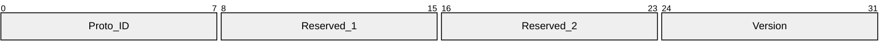

**Proto_ID (1 byte):** An 8-bit unsigned integer that identifies the protocol. It MUST be 0x96.

**Reserved_1 (1 byte):** A value that MUST be zero and MUST be ignored on receipt.

**Reserved_2 (1 byte):** A value that MUST be zero and MUST be ignored on receipt.

**Version (1 byte):** An 8-bit unsigned integer that identifies the protocol version. It MUST be 0x03.

#### 2.2.1.2 Common Message Header

A **common message header** MUST be present in every message after a [**qWave-WD**](#gt_qwave-wd) [**session**](#gt_session) has been established. Each message header contains a common header optionally followed by a **message-specific header**.

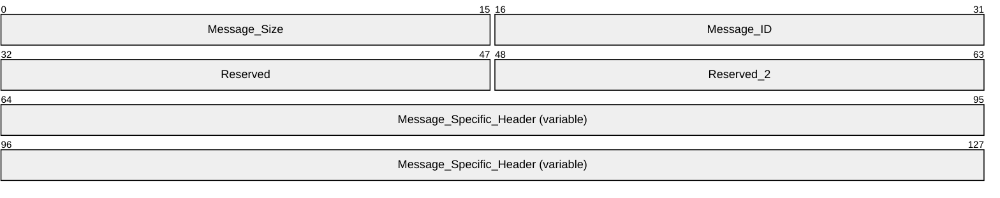

**Message_Size (2 bytes):** A 16-bit unsigned integer that specifies the size of the message. This value includes the size of this header and the payload that follows.

**Message_ID (2 bytes):** A 16-bit unsigned integer that specifies the type of message, which defines the form of the payload that follows. The value of this field MUST be one of the following.

| Value | Meaning |
| --- | --- |
| 0x0009 | [Connect Message (section 2.2.2.1)](#Section_2.2.2.1) |
| 0x000A | [Connect Response Message (section 2.2.2.2)](#Section_2.2.2.2) |
| 0x000B | [Collect Data Message (section 2.2.2.3)](#Section_2.2.2.3) |
| 0x000C | [Collect Data Response Message (section 2.2.2.4)](#Section_2.2.2.4) |
| 0x000D | [Force BSS List Scan Message (section 2.2.2.5)](#Section_2.2.2.5) |
| 0x000E | [Force BSS List Scan Response Message (section 2.2.2.6)](#Section_2.2.2.6) |
| 0x000F | [Get BSS List Message (section 2.2.2.7)](#Section_2.2.2.7) |
| 0x0010 | [Get BSS List Response Message (section 2.2.2.8)](#Section_2.2.2.8) |

**Reserved (2 bytes):** A value that MUST be zero and ignored on receipt.

**Reserved_2 (2 bytes):** A value that MUST be zero and ignored on receipt.

**Message_Specific_Header (variable):** An optional message-specific header that corresponds to the message type identified in the **Message_ID** field. The formats for message-specific headers for all message types are defined in [Message-Specific Syntax (section 2.2.2)](#Section_2.2.2).

### 2.2.2 Message-Specific Syntax

All messages of the [**qWave-WD**](#gt_qwave-wd) protocol MUST conform to the following **message-specific** formats:

- [Connect Message (section 2.2.2.1)](#Section_2.2.2.1)
- [Connect Response Message (section 2.2.2.2)](#Section_2.2.2.2)
- [Collect Data Message (section 2.2.2.3)](#Section_2.2.2.3)
- [Collect Data Response Message (section 2.2.2.4)](#Section_2.2.2.4)
- [Force BSS List Scan Message (section 2.2.2.5)](#Section_2.2.2.5)
- [Force BSS List Scan Response Message (section 2.2.2.6)](#Section_2.2.2.6)
- [Get BSS List Message (section 2.2.2.7)](#Section_2.2.2.7)
- [Get BSS List Response Message (section 2.2.2.8)](#Section_2.2.2.8)

#### 2.2.2.1 Connect Message

An [**initiator**](#gt_initiator) device MUST send a **connect message** to request the profile of a target [**sink**](#gt_sink) device. This message MUST follow a successful [**session**](#gt_session) handshake.

The connect message has no message-specific header following the [Common Message Header (section 2.2.1.2)](#Section_2.2.1.2).

#### 2.2.2.2 Connect Response Message

A [**sink**](#gt_sink) device MUST send a **connect response message** in reply to a [Connect Message (section 2.2.2.1)](#Section_2.2.2.1).

The **Connect Response** message MUST contain the following message-specific header following the [Common Message Header (section 2.2.1.2)](#Section_2.2.1.2).

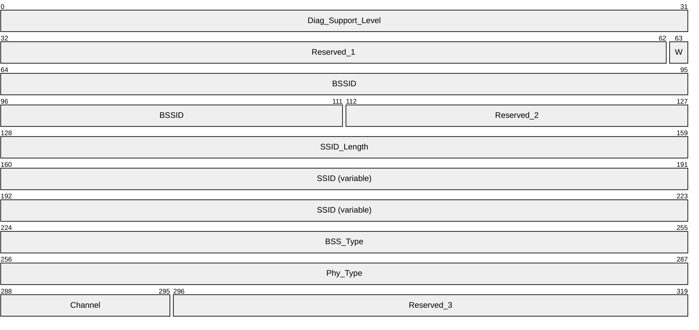

**Diag_Support_Level (4 bytes):** A 32-bit unsigned integer that specifies the level of diagnostics support that the sink device offers. This value MUST be one of the following.

| Value | Meaning |
| --- | --- |
| 0x00000000 | No diagnostics support. |
| 0x00000001 | The sink device supports static diagnostics (section [1.3](#Section_1.3)). |
| 0x00000002 | The sink device supports both static and runtime diagnostics (section 1.3). |

**Reserved_1 (31 bits):** A value that MUST be zero and MUST be ignored on receipt.

**W (1 bit):** A flag that indicates whether the sink device is connected to a wireless network.

**BSSID (6 bytes):** The [**basic service set identifier (BSSID)**](#gt_basic-service-set-identifier-bssid) of the wireless network to which the sink is joined. If the device is not connected wirelessly, this structure MUST be zero.

**Reserved_2 (2 bytes):** A value that MUST be zero and MUST be ignored on receipt.

**SSID_Length (4 bytes):** A 32-bit unsigned integer that specifies the length in octets of the **SSID** field. If the device is not connected wirelessly, this value MUST be zero. Otherwise, this value MUST be greater than zero and less than or equal to 0x00000020.

**SSID (variable):** The [**SSID**](#gt_service-set-identifier-ssid) of the [**basic service set (BSS)**](#gt_basic-service-set-bss) with which the wireless network interface of the sink device is currently associated. The maximum length of this field is 32 octets.

**BSS_Type (4 bytes):** A 32-bit unsigned integer that specifies the method by which a sink device's wireless network interface connects to the network. This value MUST be one of the following.

| Value | Meaning |
| --- | --- |
| 0x00000000 | Unknown mode or device not connected wirelessly. |
| 0x00000001 | 802.11 infrastructure mode [[IEEE802.11-2007]](https://go.microsoft.com/fwlink/?LinkID=89905). |
| 0x00000002 | 802.11 IBSS or ad-hoc mode [IEEE802.11-2007]. |

**Phy_Type (4 bytes):** A 32-bit unsigned integer that specifies the [**wireless band**](#gt_wireless-band) that the wireless network interface of a sink device is using to connect to the network. This value MUST be one of the following.

| Value | Meaning |
| --- | --- |
| 0x00000000 | Unknown wireless band or device not connected wirelessly. |
| 0x00000001 | 802.11b [IEEE802.11-2007] |
| 0x00000002 | 802.11g [IEEE802.11-2007] |
| 0x00000003 | 802.11a [IEEE802.11-2007] |

**Channel (1 byte):** The [**wireless channel**](#gt_wireless-channel) used by a sink device's wireless network interface when connected to the [**access point**](#gt_access-point). If the device is not connected wirelessly, this value MUST be zero.

**Reserved_3 (3 bytes):** A value that MUST be zero and MUST be ignored on receipt.

#### 2.2.2.3 Collect Data Message

An [**initiator**](#gt_initiator) device sends a **collect data** message to request diagnostic data pertaining to the wireless network to which the [**sink**](#gt_sink) device is connected. The initiator device MAY<1> send this message even if the sink does not report support for runtime diagnostics as indicated by the **Diag_Support_Level** field in section [2.2.2.2](#Section_2.2.2.2).

The **collect data** message has no message-specific header following the [Common Message Header (section 2.2.1.2)](#Section_2.2.1.2).

#### 2.2.2.4 Collect Data Response Message

A [**sink**](#gt_sink) device sends a **collect data response** message in reply to a [Collect Data Message (section 2.2.2.3)](#Section_2.2.2.3). The sink device SHOULD send the response even if it is not connected to a wireless network.

The **collect data response** message MUST contain the following message-specific header following the [Common Message Header (section 2.2.1.2)](#Section_2.2.1.2).

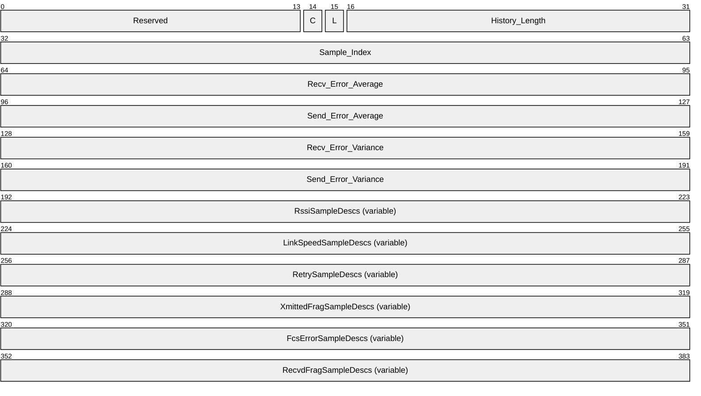

**Reserved (14 bits):** A field that MUST be zero and ignored on receipt.

**C (1 bit):** A flag that indicates whether network congestion was detected.

If set, network congestion was detected at the time the information sent in this message was collected. How network congestion is detected is implementation-specific. A sink device MAY choose to not implement network congestion detection, in which case it MUST clear this bit.

The protocol does not distinguish between a sink that has not detected network congestion and one that does not implement network congestion detection.

Network congestion in this case is defined as the state where a link or node is servicing more data than it was designed to handle, thereby reducing the quality of its service. This reduction will persist for as long as the data rate remains higher than supported.

**L (1 bit):** If set, the network interface on the sink device is capable of reporting link speed changes.

**History_Length (2 bytes):** A 16-bit unsigned integer that specifies the count of sample entries in each **RssiSampleDescs**, **LinkSpeedSampleDescs**, **RetrySampleDescs**, **XmittedFragSampleDescs**, **FcsErrorSampleDescs**, or **RecvdFragSampleDescs** field that is included as part of the message. This count MUST NOT exceed 120 entries. This field MUST be zero if the sink does not support runtime diagnostics.

**Sample_Index (4 bytes):** A 32-bit unsigned integer that specifies the total count of sample entries that have been collected by the sink device to date.

**Recv_Error_Average (4 bytes):** A 32-bit unsigned integer that identifies the average of the most recent 100 samples of **Retry_Delta_Value** (section [2.2.2.4.3](#Section_2.2.2.4.3)) / **Xmitted_Frag_Delta_Value** (section [2.2.2.4.4](#Section_2.2.2.4.4)), expressed as 0.000001 units. More information is available in section [3.2](#Section_1.3).

**Send_Error_Average (4 bytes):** A 32-bit unsigned integer that identifies the average of the most recent 100 samples of **Fcs_Error_Delta_Value** (section [2.2.2.4.5](#Section_2.2.2.4.5)) / **Recvd_Frag_Delta_Value** (section [2.2.2.4.6](#Section_2.2.2.4.6)), expressed as 0.000001 units. More information is available in section 3.2.

**Recv_Error_Variance (4 bytes):** A 32-bit unsigned integer that identifies the variance in the most recent 100 samples of **Retry_Delta_Value** (section 2.2.2.4.3) / **Xmitted_Frag_Delta_Value** (section 2.2.2.4.4), expressed as 0.000001 units. More information is available in section 3.2.

**Send_Error_Variance (4 bytes):** A 32-bit unsigned integer that identifies the variance in the most recent 100 samples of **Fcs_Error_Delta_Value** (section 2.2.2.4.5) / **Recvd_Frag_Delta_Value** (section 2.2.2.4.6), expressed as 0.000001 units. More information is available in section 3.2.

**RssiSampleDescs (variable):** A list of [RssiSampleDesc items (section 2.2.2.4.1)](#Section_2.2.2.4.1). The ordering of RssiSampleDesc items in this message MUST represent the actual recording time order, going from oldest to latest. The count of RssiSampleDesc items is equal to the value of **History_Length**.

**LinkSpeedSampleDescs (variable):** A list of [LinkSpeedSampleDesc items (section 2.2.2.4.2)](#Section_2.2.2.4.2). The ordering of LinkSpeedSampleDesc items in this message MUST represent the actual recording time order, going from oldest to latest. The count of LinkSpeedSampleDesc items is equal to the value of **History_Length**.

**RetrySampleDescs (variable):** A list of RetrySampleDesc items (section 2.2.2.4.3). The ordering of RetrySampleDesc items in this message MUST represent the actual recording time order, going from oldest to latest. The count of RetrySampleDesc items is equal to the value of **History_Length**.

**XmittedFragSampleDescs (variable):** A list of XmittedFragSampleDesc items (section 2.2.2.4.4). The ordering of XmittedFragSampleDesc items in this message MUST represent the actual recording time order, going from oldest to latest. The count of XmittedFragSampleDesc items is equal to the value of **History_Length**.

**FcsErrorSampleDescs (variable):** A list of FcsErrorSampleDesc items (section 2.2.2.4.5). The ordering of FcsErrorSampleDesc items in this message MUST represent the actual recording time order, going from oldest to latest. The count of FcsErrorSampleDesc items is equal to the value of **History_Length**.

**RecvdFragSampleDescs (variable):** A list of RecvdFragSampleDesc items (section 2.2.2.4.6). The ordering of RecvdFragSampleDesc items in this message MUST represent the actual recording time order, going from oldest to latest. The count of RecvdFragSampleDesc items is equal to the value of **History_Length**.

##### 2.2.2.4.1 RssiSampleDesc Item

Each **RssiSampleDesc** item MUST have the following 4-octet structure.

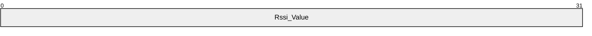

**Rssi_Value (4 bytes):** A 32-bit signed integer that identifies the recorded [**received signal strength indication (RSSI)**](#gt_received-signal-strength-indication-rssi) of the IEEE 802.11 [[IEEE802.11-2007]](https://go.microsoft.com/fwlink/?LinkID=89905) network interface at a specific point in time, in dBm. The normal range for an RSSI value is -10 dBm through -200 dBm.

##### 2.2.2.4.2 LinkSpeedSampleDesc Item

Each **LinkSpeedSampleDesc** item MUST have the following 4-octet structure.

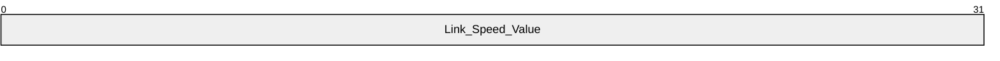

**Link_Speed_Value (4 bytes):** A 32-bit unsigned integer that identifies the recorded link speed of the network interface at a specific point in time. This is measured in bits per second.

##### 2.2.2.4.3 RetrySampleDesc Item

Each **RetrySampleDesc** item MUST have the following 4-octet structure.

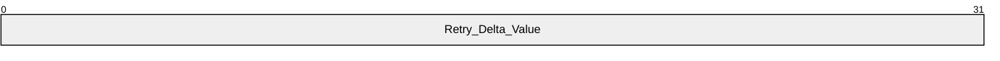

**Retry_Delta_Value (4 bytes):** A 32-bit unsigned integer that identifies the recorded change between two successive samples in the number of [**MSDU**](#gt_mac-service-data-unit-msdu)/[**MMPDUs**](#gt_mac-management-protocol-data-unit-mmpdu) successfully transmitted after one or more retransmissions for the IEEE 802.11 [[IEEE802.11-2007]](https://go.microsoft.com/fwlink/?LinkID=89905) network interface at a specific point in time.

##### 2.2.2.4.4 XmittedFragSampleDesc Item

Each **XmittedFragSampleDesc** item MUST have the following 4-octet structure.

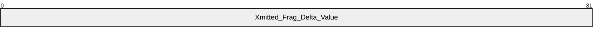

**Xmitted_Frag_Delta_Value (4 bytes):** A 32-bit unsigned integer that identifies the recorded change (between two successive samples) in the "number of [**MPDUs**](#gt_mac-protocol-data-unit-mpdu) with an individual address in the address 1 field and MPDUs that have a multicast address with types Data or Management" for the IEEE 802.11 [[IEEE802.11-2007]](https://go.microsoft.com/fwlink/?LinkID=89905) network interface at a specific point in time.

##### 2.2.2.4.5 FcsErrorSampleDesc Item

Each **FcsErrorSampleDesc** item MUST have the following 4-octet structure.

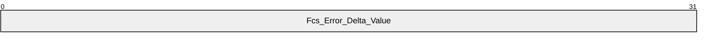

**Fcs_Error_Delta_Value (4 bytes):** A 32-bit unsigned integer that identifies the recorded change (between two successive samples) in the "number of times a [**frame check sequence (FCS)**](#gt_frame-check-sequence-fcs) error has been detected in a received [**MPDU**](#gt_mac-protocol-data-unit-mpdu)" for the IEEE 802.11 [[IEEE802.11-2007]](https://go.microsoft.com/fwlink/?LinkID=89905) network interface at a specific point in time.

##### 2.2.2.4.6 RecvdFragSampleDesc Item

Each **RecvdFragSampleDesc** item MUST have the following 4-octet structure.

**Recvd_Frag_Delta_Value (4 bytes):** A 32-bit unsigned integer that identifies the recorded change (between two successive samples) in the "number of successfully received Data or Management [**MPDUs**](#gt_mac-protocol-data-unit-mpdu)" for the IEEE 802.11 [[IEEE802.11-2007]](https://go.microsoft.com/fwlink/?LinkID=89905) network interface at a specific point in time.

#### 2.2.2.5 Force BSS List Scan Message

An [**initiator**](#gt_initiator) device MUST send a **force BSS list scan** message to request that the [**sink**](#gt_sink) update its list of [**BSS**](#gt_basic-service-set-bss) entries.

The **force BSS list scan message** has no message-specific header following the [Common Message Header (section 2.2.1.2)](#Section_2.2.1.2).

#### 2.2.2.6 Force BSS List Scan Response Message

A [**sink**](#gt_sink) device sends a **force BSS list scan response** message in reply to a [Force BSS List Scan Message (section 2.2.2.5)](#Section_2.2.2.5). The sink device SHOULD send the response even if it is not connected to a wireless network.

The **Force BSS List Scan** message has no message-specific header following the [Common Message Header (section 2.2.1.2)](#Section_2.2.1.2).

#### 2.2.2.7 Get BSS List Message

An [**initiator**](#gt_initiator) device MUST send a **get BSS list** message to request a list of [**BSS**](#gt_basic-service-set-bss) information from a [**sink**](#gt_sink) device. The sink device SHOULD send the response even if it is not connected to a wireless network.

The **Get BSS List** message has no message-specific header following the [Common Message Header (section 2.2.1.2)](#Section_2.2.1.2).

#### 2.2.2.8 Get BSS List Response Message

A [**sink**](#gt_sink) device sends a **get BSS list response** message in reply to a [Get BSS List Message (section 2.2.2.7)](#Section_2.2.2.7).

The **get BSS list response** message MUST contain the following message-specific header following the [Common Message Header (section 2.2.1.2)](#Section_2.2.1.2).

**BssDescs (variable):** A list of [BssDesc (section 2.2.2.8.1)](#Section_2.2.2.8.1) items. Each BssDesc item describes the characteristics of a [**BSS**](#gt_basic-service-set-bss) that are visible at the sink device. Note that any two BssDesc items do not have to be of the same size.

##### 2.2.2.8.1 BssDesc Item

Each BssDesc item has the following packet format.

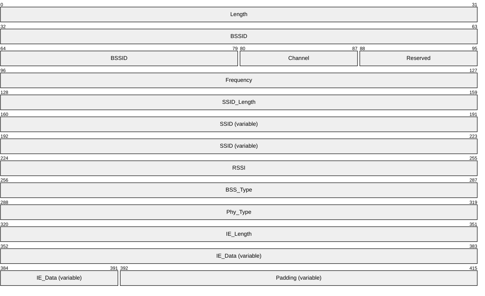

**Length (4 bytes):** A 32-bit unsigned integer that specifies the size of this **BssDesc** item. This value MUST be a multiple of 4.

**BSSID (6 bytes):** The [**BSSID**](#gt_basic-service-set-identifier-bssid) of the wireless network to which this **BssDesc** item refers.

**Channel (1 byte):** The channel used by the wireless network.

**Reserved (1 byte):** A value that MUST be zero and MUST be ignored on receipt.

**Frequency (4 bytes):** The frequency of the center channel for the wireless network, in kilohertz (kHz) units.

**SSID_Length (4 bytes):** A 32-bit unsigned integer that specifies the length in octets of the **SSID** field. This value MUST be greater than zero and less than or equal to0x00000020.

**SSID (variable):** The [**SSID**](#gt_service-set-identifier-ssid) of the [**BSS**](#gt_basic-service-set-bss) of the wireless network. The maximum length of this field is 32 octets.

**RSSI (4 bytes):** A 32-bit signed integer that identifies the [**RSSI**](#gt_received-signal-strength-indication-rssi) of the IEEE 802.11 network [[IEEE802.11-2007]](https://go.microsoft.com/fwlink/?LinkID=89905), in dBm. The normal range for an RSSI value is -10 dBm through -200 dBm.

**BSS_Type (4 bytes):** A 32-bit unsigned integer that specifies the wireless network connection method.

| Value | Meaning |
| --- | --- |
| 0x00000000 | Unknown mode. |
| 0x00000001 | 802.11 infrastructure mode [IEEE802.11-2007]. |
| 0x00000002 | 802.11 IBSS or ad-hoc mode [IEEE802.11-2007]. |

**Phy_Type (4 bytes):** A 32-bit unsigned integer that specifies the wireless band used by the wireless network. Possible values are shown in the following table:

| Value | Meaning |
| --- | --- |
| 0x00000000 | Unknown wireless band. |
| 0x00000001 | 802.11b [IEEE802.11-2007] |
| 0x00000002 | 802.11g [IEEE802.11-2007] |
| 0x00000003 | 802.11a [IEEE802.11-2007] |

**IE_Length (4 bytes):** A 32-bit unsigned integer that identifies the size in octets of the **IE_Data** field.

**IE_Data (variable):** The 802.11 [**Information Elements**](#gt_1e551fa1-b581-403c-acac-374de84b8cbd) data blob associated with the wireless network [IEEE802.11-2007].

**Padding (variable):** An optional field that, if exists, MUST be zero and MUST be ignored on receipt. The size of the field can be anywhere from 0 through 3 bytes. It exists to satisfy the requirement of the **Length** field.

# 3 Protocol Details

In qWave-WD, a device MAY<2> take on the role of the [**initiator**](#gt_initiator) or the [**sink**](#gt_sink). An application that is interested in enlisting the services of the qWave-WD Protocol invokes the role of the initiator. The initiator needs to know the target device (the sink) that it needs to query. The actual process of discovering the appropriate sink device is beyond the scope of the protocol and is left up to the application.

## 3.1 Initiator Details

The following figure represents the state machine for the [**initiator**](#gt_initiator) role.

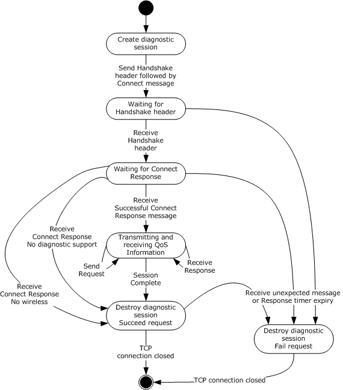

Figure 1: State machine for initiator role

Applicable message request/response pairs for this role are defined as follows:

| Sent by initiator | Sent by sink |
| --- | --- |
| [Handshake Header (section 2.2.1.1)](#Section_2.2.1.1) | Handshake Header (section 2.2.1.1) |
| [Connect Message (section 2.2.2.1)](#Section_2.2.2.1) | [Connect Response Message (section 2.2.2.2)](#Section_2.2.2.2) |
| [Collect Data Message (section 2.2.2.3)](#Section_2.2.2.3) | [Collect Data Response Message (section 2.2.2.4)](#Section_2.2.2.4) |
| [Force BSS List Scan Message (section 2.2.2.5)](#Section_2.2.2.5) | [Force BSS List Scan Response Message (section 2.2.2.6)](#Section_2.2.2.6) |
| [Get BSS List Message (section 2.2.2.7)](#Section_2.2.2.7) | [Get BSS List Response Message (section 2.2.2.8)](#Section_2.2.2.8) |

If the Connect Response, Force BSS List Scan Response, or Get BSS List Response messages are directed at a [**sink**](#gt_sink) that is not connected to a wireless network, the sink SHOULD still send a response.

### 3.1.1 Abstract Data Model

This section describes a conceptual model of possible data organization that an implementation maintains to participate in this protocol. The described organization is provided to facilitate the explanation of how the protocol behaves. This document does not mandate that implementations adhere to this model as long as their external behavior is consistent with that described in this document.

The data elements required in typical sink implementations are:

- **Diagnostic Session**: Each **Diagnostic Session** stores the qWave-WD related states that are relevant to a specific [**TCP**](#gt_transmission-control-protocol-tcp) connection that is accepted from an [**initiator**](#gt_initiator) device and MUST have the following fields:
- **Handshaking**: This Boolean field identifies that the initiator is still handshaking with the [**sink**](#gt_sink) and thus is not prepared to accept certain messages.
- **Pended Request**: A request for which a corresponding response is expected. A pended request is uniquely identified by its message type (the **Message_Id** field) in the [Common Message Header (section 2.2.1.2)](#Section_2.2.1.2). The value in this field is only valid if the **Diagnostic Session's State** field is set to Pending.
- **Socket**: Identifies the [**network socket**](#gt_network-socket) object used to connect to the sink device. Every message received from the network is correlated back to a **Diagnostic Session** using this object.
- **Connect Response Cache**: Caches all the information contained in a [Connect Response Message (section 2.2.2.2)](#Section_2.2.2.2).
- **Collect Data Response Cache**: Caches all the information contained in a [Collect Data Response Message (section 2.2.2.4)](#Section_2.2.2.4)
- **BSS List Response Cache**: Caches all the **BssDescs** information contained in a [Get BSS List Response Message (section 2.2.2.8)](#Section_2.2.2.8).
**Note** The previous conceptual data can be implemented by using a variety of techniques. An implementation is at liberty to implement such data in any way.

### 3.1.2 Timers

The [**initiator**](#gt_initiator) role has one timer:

**Per-Session Response timer**: This one-shot timer, per **Diagnostic Session** entry, is used to ensure timely response to a [Handshake Header (section 2.2.1.1)](#Section_2.2.1.1), [Connect Message (section 2.2.2.1)](#Section_2.2.2.1), [Collect Data Message (section 2.2.2.3)](#Section_2.2.2.3), [Force BSS List Scan Message (section 2.2.2.5)](#Section_2.2.2.5), or [Get BSS List Message (section 2.2.2.7)](#Section_2.2.2.7). This process works because only one such request can be pended per session.

### 3.1.3 Initialization

None.

### 3.1.4 Higher-Layer Triggered Events

#### 3.1.4.1 Requesting Diagnostics Data

When a higher-layer application or protocol requests diagnostics information from a [**sink**](#gt_sink) identified by name or IP address, the initiator MUST use the following procedure:

- The [**initiator**](#gt_initiator) MUST attempt to instantiate a **Diagnostic Session**. If the session cannot be instantiated, the initiator MUST fail the request.
- The per-session **Handshaking** field MUST be set.
- A socket MUST be instantiated and an attempt MUST be made to connect to the sink device indicated by the higher-layer application or protocol, on [**TCP**](#gt_transmission-control-protocol-tcp) port 2177. If this connection fails, then the initiator MUST tear down the [**session**](#gt_session) and return failure of the request to the calling layer.
Once a TCP connection is established to the sink, the initiator MUST send a Handshake Header (section [2.2.1.1](#Section_2.2.1.1)). It MAY<3> also send a Connect Message (section [2.2.2.1](#Section_2.2.2.1)) immediately following this. The Per-Session Response timer MUST be enabled and set to expire after 5 seconds.

The initiator now waits for a message to arrive in order to continue processing the request. The request can only be completed when processing a message that has arrived or when the Response timer has timed out.

**Note** When this request is completed successfully, the contents of the **Connect Response Cache**, **Collect Data Response Cache**, and **BSS List Response Cache** fields are also returned to the caller.

### 3.1.5 Message Processing Events and Sequencing Rules

#### 3.1.5.1 Receiving a Handshake Header

- When a [Handshake Header (section 2.2.1.1)](#Section_2.2.1.1) arrives through a per-session **Socket**, the [**initiator**](#gt_initiator) checks the **Handshaking** field. If it is not set, the initiator MUST tear down the **Diagnostic Session** and return failure of the request to the calling layer.
Otherwise, the initiator checks that the fields of the Handshake Header are valid. If not, the initiator MUST tear down the **Diagnostic Session** and return failure of the request to the calling layer.

- The per-session **Handshaking** field MUST be cleared and the **Pended Request** MUST be set to Connect (value 0x0009). The Per-Session Response timer MUST not be reset. The initiator now waits for the [Connect Response Message (section 2.2.2.2)](#Section_2.2.2.2) to arrive before it can continue processing.

#### 3.1.5.2 Receiving a Connect Response Message

- When a [Connect Response Message (section 2.2.2.2)](#Section_2.2.2.2) arrives through a per-session **Socket**, the [**initiator**](#gt_initiator) checks if the [Common Message Header (section 2.2.1.2)](#Section_2.2.1.2) is valid. If not, the initiator MUST tear down the **Diagnostic Session** and return failure of the request to the calling layer.
- Next, the initiator checks the state of the per-session **Handshaking** field. If it is set, the initiator MUST tear down the **Diagnostic Session** and return failure of the request to the calling layer.
- Next, the initiator checks that the **Pended Request** is set to Connect. If not, the initiator MUST tear down the **Diagnostic Session** and return failure of the request to the calling layer.
- The Per-Session Response timer MUST then be reset. The information returned in the Connect Response Message-specific header MUST be copied into the per-session **Connect Response Cache** field.
- If the **W** bit in the Connect Response Message-specific header is cleared, then the initiator MUST tear down the **Diagnostic Session** and return success of the request to the calling layer.
- If the **Diag_Support_Level** field in the Connect Response Message-specific header is neither 0x00000001 nor 0x00000002, then the initiator MUST tear down the **Diagnostic Session** and return success of the request to the calling layer. Otherwise, the **Pended Request** MUST be set to Collect Data (value 0x000B). The initiator MUST send a [Collect Data Message (section 2.2.2.3)](#Section_2.2.2.3) to the sink. The Per-Session Response timer MUST be enabled and set to expire after 5 seconds.
- The initiator then waits for a message to arrive in order to continue processing.

#### 3.1.5.3 Receiving a Collect Data Response Message

- When a Collect Data Response Message (section [2.2.2.4](#Section_2.2.2.4)) arrives through a per-session **Socket**, the [**initiator**](#gt_initiator) checks if the Common Message Header (section [2.2.1.2](#Section_2.2.1.2)) is valid. If not, the initiator MUST tear down the **Diagnostic Session** and return failure of the request to the calling layer.
- The initiator checks the state of the **Handshaking** field. If it is set, the initiator MUST tear down the **Diagnostic Session** and return failure of the request to the calling layer.
- The initiator checks that the **Pended Request** is set to Collect Data (value 0x000C). If not, the initiator MUST tear down the **Diagnostic session** and return failure of the request to the calling layer.
- The Per-Session Response timer MUST now be reset. The information returned in the Collect Data Response Message-specific header MUST be copied into the per-session **Collect Data Response Cache** field.
- The **Pended Request** MUST be set to Force BSS List Scan (value 0x000D). The initiator MUST send a [Force BSS List Scan Message (section 2.2.2.5)](#Section_2.2.2.5) to the [**sink**](#gt_sink). It MAY<4> also send a [Get BSS List Message (section 2.2.2.7)](#Section_2.2.2.7) immediately following this to the same sink. The Per-Session Response timer MUST be enabled and set to expire after 5 seconds.
- The initiator now waits for a message to arrive in order to continue processing.

#### 3.1.5.4 Receiving a Force BSS List Scan Response Message

- When a [Force BSS List Scan Response Message (section 2.2.2.6)](#Section_2.2.2.6) arrives through a per-session **Socket**, the [**initiator**](#gt_initiator) checks if the [Common Message Header (section 2.2.1.2)](#Section_2.2.1.2) is valid. If not, initiator MUST tear down the **Diagnostic Session** and return failure of the request to the calling layer.
- The initiator checks the state of the **Handshaking** field. If it is set, the initiator MUST tear down the **Diagnostic Session** and return failure of the request to the calling layer.
- The initiator checks that the **Pended Request** is set to Force BSS List Scan (value 0x000E). If not, the initiator MUST tear down the **Diagnostic Session** and return failure of the request to the calling layer.
- The **Pended Request** MUST be set to Get BSS List (value 0x000F). The Per-Session Response timer MUST not be reset. The initiator now waits for the [Get BSS List Response Message (section 2.2.2.8)](#Section_2.2.2.8) to arrive before it can continue processing.

#### 3.1.5.5 Receiving a Get BSS List Response Message

- When a [Get BSS List Response Message (section 2.2.2.8)](#Section_2.2.2.8) arrives through a per-session **Socket**, the [**initiator**](#gt_initiator) checks whether the [Common Message Header (section 2.2.1.2)](#Section_2.2.1.2) is valid. If not, the initiator MUST tear down the **Diagnostic Session** and return failure of the request to the calling layer.
- The initiator checks the state of the **Handshaking** field. If it is set, the initiator MUST tear down the **Diagnostic Session** and return failure of the request to the calling layer.
- The initiator checks that the **Pended Request** is set to Get BSS List (value 0x000F). If there is no match, the initiator MUST tear down the **Diagnostic session** and return failure of the request to the calling layer.
- The Per-Session Response timer MUST then be reset. The **BssDescs** ([2.2.2.8.1](#Section_2.2.2.8.1)) information returned in the Get BSS List Response Message-specific header MUST be copied into the per-session **BSS List Response Cache**. The initiator MUST tear down the **Diagnostic Session** and return success of the request to the calling layer.

### 3.1.6 Timer Events

#### 3.1.6.1 Per-Session Response Timer Expiry

When this timer starts, the [**initiator**](#gt_initiator) MUST tear down the **Diagnostic Session** and return failure of the request to the calling layer.

### 3.1.7 Other Local Events

None.

## 3.2 Sink Details

The following figure represents the state machine for the [**sink**](#gt_sink) role.

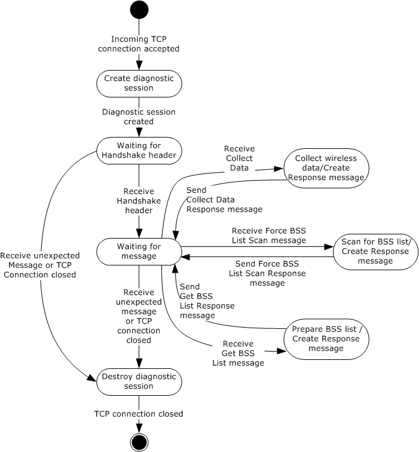

Figure 2: State machine for sink role

Applicable message request/response pairs for this role are defined as follows.

| Sent by initiator | Sent by sink |
| --- | --- |
| [Handshake Header (section 2.2.1.1)](#Section_2.2.1.1) | Handshake Header (section 2.2.1.1) |
| [Connect Message (section 2.2.2.1)](#Section_2.2.2.1) | [Connect Response Message (section 2.2.2.2)](#Section_2.2.2.2) |
| [Collect Data Message (section 2.2.2.3)](#Section_2.2.2.3) | [Collect Data Response Message (section 2.2.2.4)](#Section_2.2.2.4) |
| [Force BSS List Scan Message (section 2.2.2.5)](#Section_2.2.2.5) | [Force BSS List Scan Response_Message (section 2.2.2.6)](#Section_2.2.2.6) |
| [Get BSS List Message (section 2.2.2.7)](#Section_2.2.2.7) | [Get BSS List Response Message (section 2.2.2.8)](#Section_2.2.2.8) |

If the Connect Response, Force BSS List Scan Response, or Get BSS List Response messages are directed at a sink that is not connected to a wireless network, the sink SHOULD still send a response.

### 3.2.1 Abstract Data Model

This section describes a conceptual model of possible data organization that an implementation maintains to participate in this protocol. The described organization is provided to facilitate the explanation of how the protocol behaves. This document does not mandate that implementations adhere to this model as long as their external behavior is consistent with that described in this document.

The data elements required in typical sink implementations are:

- **Support Level**: The level of diagnostics support as returned in the **Diag_Support_Level** field in a [Connect Message](#Section_2.2.2.1)-specific header. The value of this field controls the [**sink's**](#gt_sink) response to the [Collect Data Message (section 2.2.2.3)](#Section_2.2.2.3).
- **Network Interface Object**: Each **network interface object** uniquely represents a specific network interface and stores the state and statistics related to that interface.
- **Wireless Connected**: A Boolean value indicating that the sink device is connected to a wireless access point on the associated network interface. The value of this field controls the sink's response to the Connect Message (section 2.2.2.1) and the [Get BSS List Message (section 2.2.2.7)](#Section_2.2.2.7).
- **Wireless Statistics History**: This data element specifies a collection of statistical counters for the wireless network interface on the sink device. This history buffer is normally implemented as a circular-buffer.
All statistical values MUST be sampled at 250-millisecond intervals. Devices MUST maintain at least 30 seconds worth of history, which equates to 120 rows.

Each row in the collection MUST contain the following counters:

- **RSSI**: This is the RSSI level of the wireless network interface, in dBm. The normal range for an RSSI value is -10 dBm through -200 dBm.
- **Link Speed**: This is the link speed of the wireless network interface in bits per second (bps) units.
- **Retry Delta**: This counter represents the change in "number of MSDU/MMPDUs successfully transmitted after one or more retransmissions" for the IEEE 802.11 [[IEEE802.11-2007]](https://go.microsoft.com/fwlink/?LinkID=89905) network interface, relative to that from the previous interval.
- **Transmitted Delta**: This counter represents the change in "number of MPDUs with an individual address in the address 1 field and MPDUs that have a multicast address with types Data or Management" for the IEEE 802.11 [IEEE802.11-2007] network interface, relative to that from the previous interval.
- **FCS Error Delta**: This counter represents the change in "number of times an [**FCS**](#gt_frame-check-sequence-fcs) error has been detected in a received MPDU" for the IEEE 802.11 [IEEE802.11-2007] network interface, relative to that from the previous interval.
- **Received Delta** : This counter represents the change in "number of successfully received Data or Management MPDUs" for the IEEE 802.11 [IEEE802.11-2007] network interface, relative to that from the previous interval.
- **Sample Index**: This field counts the total number of samples that have, to date, been recorded into the Wireless Statistics History.
- **Normal Send Model History**: This data element specifies a collection of scores, each calculated by the formula (**Retry Delta** / **Transmitted Delta**) from a row in the **Wireless Statistics History**. These scores are then used to maintain the average and variance of what could be considered the "normal" wireless condition. This history buffer is normally implemented as a circular-buffer.
Devices MUST maintain at least 8 seconds worth of history, which equates to 32 rows.

- **Normal Receive Model History**: This data element specifies a collection of scores, each calculated by the formula (**FCS Error Delta** / **Received Delta**) from a row in the **Wireless Statistics History**. These scores are then used to maintain the average and variance of what could be considered the "normal" wireless condition. This history buffer is normally implemented as a circular-buffer.
Devices MUST maintain at least 8 seconds worth of history, which equates to 32 rows.

- **Send Model Average**: This field is recomputed each time **Normal Send Model History** is updated. It is the average for all the scores.
- **Send Model Variance**: This field is recomputed each time **Normal Send Model History** is updated. It is the variance for all the scores.
- **Receive Model Average**: This field is recomputed each time **Normal Receive Model History** is updated. It is the average for all the scores.
- **Receive Model Variance**: This field is recomputed each time **Normal Receive Model History** is updated. It is the variance for all the scores.
- **BSS List**: This data element specifies a collection of entries, each of which identifies the properties of an IEEE 802.11 [IEEE802.11-2007] [**BSS**](#gt_basic-service-set-bss) or wireless network as seen by scanning the [**wireless radio**](#gt_wireless-radio) on the sink device. Each entry is the same as the [BssDesc (section 2.2.2.8.1)](#Section_2.2.2.8.1) information returned in the Get BSS List Message-specific header.
- **BSS List Updated**: This Boolean field is used to indicate if an attempt was ever made to update the BSS List.
- **Last BSS Scan Time**: This field specifies the last time at which the BSS List was updated. This value prevents excessive query for the IEEE 802.11 [IEEE802.11-2007] BSS List which can severely impact the power footprint profile on the sink device.
Devices MUST be prepared to update the BSS List at least once every 60 seconds.

- **Diagnostic Session**: Each **Diagnostic Session** stores the [**qWave-WD**](#gt_qwave-wd) related states that are relevant to a specific [**TCP**](#gt_transmission-control-protocol-tcp) connection accepted from the [**initiator**](#gt_initiator) device. Each **Diagnostic Session** MUST have the following fields:
- **Handshaking**: A Boolean value indicating that the sink is still handshaking with the initiator and is thus not prepared to accept certain messages.
- **Socket**: This field identifies the [**network socket**](#gt_network-socket) object used to communicate with the initiator device. Every message received from the network is correlated back to a **Diagnostic Session** using this object.
**Note** The previous conceptual data can be implemented by using a variety of techniques. An implementation can implement such data in any way.

### 3.2.2 Timers

The [**sink**](#gt_sink) role has one timer:

**Per-Network Interface Object Wireless Statistics Monitor timer**: This recurring timer is used to collect runtime statistics on a specific wireless network interface.

### 3.2.3 Initialization

During initialization, the following condition MUST be met:

- The **Support Level** field is set to one of the values supported in the **Diag_Support_Level** field in a [Connect Response Message (section 2.2.2.2)](#Section_2.2.2.2)-specific header. Typical implementations MAY<5> set this field with the value 0x00000002 to indicate support for runtime as well as static diagnostics (section [1.3](#Section_1.3)).

### 3.2.4 Higher-Layer Triggered Events

#### 3.2.4.1 Startup Trigger

Once the device is ready to perform the [**sink**](#gt_sink) role, it MUST begin accepting [**TCP**](#gt_transmission-control-protocol-tcp) connections on port 2177.

#### 3.2.4.2 Incoming TCP Connection Accepted

When a new [**TCP**](#gt_transmission-control-protocol-tcp) connection is accepted, the [**sink**](#gt_sink) MUST instantiate a **Diagnostic Session**. The per-session **Handshaking** field is set. The per-session **Socket** field is the typical [**network socket**](#gt_network-socket) that is returned on an accepted TCP connection. The sink then waits for a message to arrive for this new session. This wait is usually done asynchronously.

### 3.2.5 Message Processing Events and Sequencing Rules

#### 3.2.5.1 Receiving a Handshake Header

- When a [Handshake Header (section 2.2.1.1)](#Section_2.2.1.1) arrives through a per-session **Socket**, the sink checks the **Handshaking** field. If it is not set, the [**sink**](#gt_sink) MUST destroy the corresponding **Diagnostic Session** and ignore the header.
Otherwise, the sink checks that the fields of the handshake header are valid. If not, the sink MUST destroy the corresponding **Diagnostic Session** and ignore the header.

- The sink MUST clear per-session **Handshaking** field. The sink MUST then send a handshake header back to the [**initiator**](#gt_initiator).
- The sink then waits for a message to arrive in order to continue processing.

#### 3.2.5.2 Receiving a Connect Message

- When a [Connect Message (section 2.2.2.1)](#Section_2.2.2.1) arrives through a per-session **Socket**, the [**sink**](#gt_sink) checks if the [Common Message Header (section 2.2.1.2)](#Section_2.2.1.2) is valid. If not, the sink MUST destroy the corresponding **Diagnostic Session** and ignore the message.
- The sink checks the per-session **Handshaking** field. If it is set, the sink MUST destroy the corresponding **Diagnostic Session** and ignore the message.
- If a **Network Interface Object** already exists for the network interface on which the message is received, then this step is skipped. Otherwise, one MUST be instantiated. If an object cannot be created, the sink MUST destroy the corresponding **Diagnostic Session** and ignore the message. The per-network interface object **Wireless Connected** field is set if the network interface is a wireless network interface. Otherwise, it is cleared. **Sample Index** MUST be set to zero. **BSS List Updated** MUST be cleared.
- The sink MUST then reply to the [**initiator**](#gt_initiator) with a [Connect Response Message (section 2.2.2.2)](#Section_2.2.2.2). The **Diag_Support_Level** field in the Connect Response Message-specific header MUST be populated with the value of the **Support Level**. If the per-network interface object **Wireless Connected** field is set, the **W** bit MUST be set in the Connect Response Message-specific header and the sink queries its wireless network interface and populates the remaining **BSSID**, **SSID_Length**, **SSID**, **BSS_Type**, **Phy_Type**, and **Channel** fields appropriately. Otherwise, if the per-network interface object **Wireless Connected** field is not set, these fields are set to zero.
- If the per-network interface object **Wireless Connected** field is set, it MUST start the **Per-Network Interface Object Wireless Statistics Monitor** recurring timer and set it to expire every 250 milliseconds, if it has not already been started.
- The sink then waits for the next message to arrive in order to continue processing.

#### 3.2.5.3 Receiving a Collect Data Message

- When a [Collect Data Message (section 2.2.2.3)](#Section_2.2.2.3) arrives through a per-session **Socket**, the [**sink**](#gt_sink) checks if the [Common Message Header (section 2.2.1.2)](#Section_2.2.1.2) is valid. If not, the sink MUST destroy the corresponding **Diagnostic Session** and ignore the message.
- The sink checks the per-session **Handshaking** field. If it is set, the sink MUST destroy the corresponding **Diagnostic Session** and ignore the message.
- The sink MUST then reply to the [**initiator**](#gt_initiator) with a [Collect Data Response Message (section 2.2.2.4)](#Section_2.2.2.4). The **Recv_Error_Average**, **Send_Error_Average**, **Recv_Error_Variance**, and **Send_Error_Variance** fields in the Collect Data Response Message-specific header are populated from the per-network interface object **Receive Model Average**, **Send Model Average**, **Receive Model Variance**, and **Send Model Variance** data items for the network interface on which the message is received, respectively.
- The **RssiSampleDescs** field in the Collect Data Response Message is a snapshot of all the **RSSI** counters in per-network interface object **Wireless Statistics History**. Likewise, the **LinkSpeedSampleDescs** field is a snapshot of all the **Link Speed** counters, the **RetrySampleDescs** field is a snapshot of **Retry Delta** counters, the **XmittedFragSampleDescs** field is a snapshot of **Transmitted Delta** counters, the **FcsErrorSampleDescs** field is a snapshot of **FCS Error Delta** counters, and the **RecvdFragSampleDescs** field is a snapshot of **Received Delta** counters.
- The **Sample_Index** field in Collect Data Response Message is taken directly from the per-network interface object **Sample Index** data item.
- If **Support Level** is not set to 0x00000002 (for example, the sink device does not support runtime diagnostics) or if per-network interface object **Wireless Connected** is cleared, the sink MUST make sure that the **History_Length** field in the Collect Data Response Message-specific header is set to zero.
- Upon sending the Collect Data Response Message, the sink waits for the next message to arrive in order to continue processing.

#### 3.2.5.4 Receiving a Force BSS List Scan Message

- When a [Force BSS List Scan Message (section 2.2.2.5)](#Section_2.2.2.5) arrives through a per-session **Socket**, the [**sink**](#gt_sink) checks if the [Common Message Header (section 2.2.1.2)](#Section_2.2.1.2) is valid. If not, the sink MUST destroy the corresponding **Diagnostic Session** and ignore the message.
- The sink checks the per-session **Handshaking** field. If it is set, the sink MUST destroy the corresponding **Diagnostic Session** and ignore the message.
- If the per-network interface object **BSS List Updated** value for the network interface on which the message is received is cleared, or if the current time minus the value of per-network interface object **Last BSS Scan Time** is greater than or equal to 60 seconds, then the sink MUST call its wireless API to scan the [**wireless radio**](#gt_wireless-radio) and update the **BSS List** with the results. The sink MUST then ensure that the **BSS List Updated** is set and also set the **Last BSS Scan Time** to the current time.
- The sink MUST send a [Force BSS List Scan Response Message (section 2.2.2.6)](#Section_2.2.2.6) to the [**initiator**](#gt_initiator).
- Upon sending the Force BSS List Scan Response Message, the sink waits for the next message to arrive in order to continue processing.

#### 3.2.5.5 Receiving a Get BSS List Message

- When a [Get BSS List Message (section 2.2.2.7)](#Section_2.2.2.7) arrives through a per-session **Socket**, the [**sink**](#gt_sink) checks if the [Common Message Header (section 2.2.1.2)](#Section_2.2.1.2) is valid. If not, the sink MUST destroy the corresponding **Diagnostic Session** and ignore the message.
- The sink checks the per-session **Handshaking** field. If it is set, the sink MUST destroy the corresponding **Diagnostic Session** and ignore the message.
- The sink MUST send a [Get BSS List Response Message (section 2.2.2.8)](#Section_2.2.2.8) to the initiator. Each [BssDesc (section 2.2.2.8.1)](#Section_2.2.2.8.1) item in the Get BSS List Response Message-specific header is equivalent to a row in the per-network interface object **BSS List** for the network interface on which the message is received. If the **BSS List** has not been initialized (the per-network interface object **BSS List Updated** is cleared) or if it is empty, the Get BSS List Response Message-specific header will be empty.
- Upon sending the Get BSS List Response Message, the sink waits for the next message to arrive in order to continue processing.

### 3.2.6 Timer Events

#### 3.2.6.1 Per-Network Interface Object Wireless Statistics Monitor Timer Expiry

When this timer starts, the [**sink**](#gt_sink) MUST take a snapshot of the counters returned by the wireless network interface associated with a Network Interface Object and it MUST add a new row to the **Wireless Statistics History**. If the history reaches its maximum size, the oldest row MUST be removed to make room for the new row of snapshot. Although the **Retry Delta**, **Transmitted Delta**, **FCS Error Delta**, and **Received Delta** counters are tracked relative to those from the previous timer expiry interval, if this is the first time the history is written to, the original absolute counter value MUST be written to the history instead.

Next, the **Normal Send Model History** SHOULD be updated using the same snapshot data if the **Transmitted Delta** is greater or equal to 100. In that case, the **Send Model Average** and **Send Model Variance** MUST also be recomputed. The average is computed by adding up all scores from **Normal Send Model History** divided by the number of history entries. The variance is computed by adding up the square of each score from the history divided by the number of history entries.

The **Normal Receive Model History** SHOULD be updated using the same snapshot data if the **Received Delta** is greater or equal to 100. In that case, the **Receive Model Average** and **Receive Model Variance** MUST also be recomputed. The average is computed by adding up all scores from the **Normal Receive Model History** divided by the number of history entries. The variance is computed by adding up the square of each score from the history divided by the number of history entries.

The sink MUST increment the **Sample Index** by one.

### 3.2.7 Other Local Events

None.

# 4 Protocol Examples

The following sections describe several operations used in common scenarios to illustrate the functioning of the [**qWave-WD**](#gt_qwave-wd) protocol.

## 4.1 Example 1: Querying a Wireless Sink Supporting Runtime Diagnostics

The following figure shows the layout of an example network that interconnects a media server and a TV with an integrated media player.

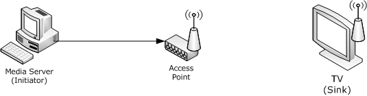

Figure 3: Example media server and TV (integrated media player network)

The media server is used to stream media content to the TV. The [**qWave-WD**](#gt_qwave-wd) protocol can be used by the media server to diagnose and optimize wireless connectivity between the access point and the TV.

The following figure shows the protocol exchange between the media server and the TV. The TV also supports runtime diagnostics by returning additional counters. These counters can be used by an advanced media server to diagnose wireless interference issues, such as microwave interference.

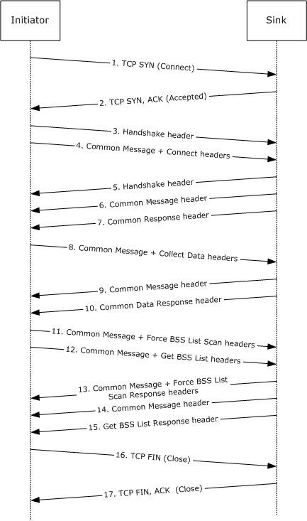

Figure 4: Protocol exchange between the initiator and the wireless sink device

The following list describes each step in the protocol exchange:

- The [**initiator**](#gt_initiator) initiates a [**TCP**](#gt_transmission-control-protocol-tcp) connection with the [**sink**](#gt_sink) device at destination port 2177.
- The sink device accepts the TCP connection.
- The initiator constructs a [Handshake Header (section 2.2.1.1)](#Section_2.2.1.1) and sends it to the sink device.
- The initiator constructs a [Common Message Header (section 2.2.1.2)](#Section_2.2.1.2) with the **Message_ID** field set to 0x0009 (Connect) followed by the [Connect Message (section 2.2.2.1)](#Section_2.2.2.1)-specific header and sends it to the sink device.
- The sink acknowledges the Handshake Header from step 3 and constructs its own Handshake Header and sends it to the initiator.
- The sink acknowledges the Connect Message from step 4 and constructs a Common Message Header with the **Message_ID** field set to 0x000A (Connect Response) and sends it to the initiator.
- The sink follows up immediately with the rest of the [Connect Response Message (section 2.2.2.2)](#Section_2.2.2.2) by sending the Connect Response Message-specific header.
- The initiator sees that the **W** bit is set in the Connect Response Message-specific header and then constructs a Common Message Header with the **Message_ID** field set to 0x000B (Collect Data) followed by the [Collect Data Message (section 2.2.2.3)](#Section_2.2.2.3)-specific header and sends it to the sink device.
- The sink acknowledges the Collect Data Message from step 8 and constructs a Common Message Header with the **Message_ID** field set to 0x000C (Collect Data Response) and sends it to the initiator.
- The sink follows up immediately with the rest of the Collect Data Response Message (section 2.2.2.3) by sending the Collect Data Response Message-specific header.
- The initiator constructs a Common Message Header with the **Message_ID** field set to 0x000D (Force BSS List Scan) followed by the [Force BSS List Scan Message (section 2.2.2.5)](#Section_2.2.2.5)-specific header and sends it to the sink device.
- The initiator immediately follows up by constructing a Common Message Header with the **Message_ID** field set to 0x000F (Get BSS List) followed by the [Get BSS List Message (section 2.2.2.7)](#Section_2.2.2.7)-specific header and sends it to the sink device.
- The sink acknowledges the Get BSS List Message from step 11 and constructs a Common Message Header with the **Message_ID** field set to 0x000E (Force BSS List Scan Response) and sends it to the initiator.
- The sink acknowledges the Get BSS List Message from Step 12 and constructs a Common Message Header with the **Message_ID** field set to 0x000F (Get BSS List Response) and sends it to the initiator.
- The sink follows up immediately with the rest of the Get BSS List Response Message (section 2.2.2.7) by sending the Get BSS List Response Message-specific header.
- The initiator has received all the information it requires, so it closes the TCP connection with the sink.
- The sink acknowledges the TCP connection close.

## 4.2 Example 2: Querying a Wired Sink

The following figure shows the layout of an example network that interconnects a media server and a TV with an integrated media player.

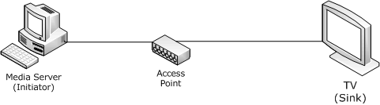

Figure 5: Example media server and TV (integrated media player network)

The media server is used to stream media content to the TV.

The following figure shows the protocol exchange between the media server and the TV.

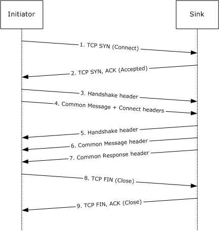

Figure 6: Protocol exchange between the initiator and the wired sink device

The following list describes each step in the protocol exchange:

- The [**initiator**](#gt_initiator) initiates a [**TCP**](#gt_transmission-control-protocol-tcp) connection with the [**sink**](#gt_sink) device at destination port 2177.
- The sink device accepts the TCP connection.
- The initiator constructs a [Handshake Header (section 2.2.1.1)](#Section_2.2.1.1) and sends it to the sink device.
- The initiator constructs a [Common Message Header (section 2.2.1.2)](#Section_2.2.1.2) with the **Message_ID** field set to 0x0009 (Connect) followed by the [Connect Message (section 2.2.2.1)](#Section_2.2.2.1)-specific header and sends it to the sink device.
- The sink acknowledges the Handshake Header from step 3 and constructs its own Handshake Header and sends it to the initiator.
- The sink acknowledges the Connect Message from step 4 and constructs a Common Message Header with the **Message_ID** field set to 0x000A (Connect Response) and sends it to the initiator.
- The sink follows up immediately with the rest of the [Connect Response Message (section 2.2.2.2)](#Section_2.2.2.2) by sending the Connect Response Message-specific header.
- The initiator sees that the **W** bit is cleared in the Connect Response Message-specific header and closes the TCP connection with the sink.
- The sink acknowledges the TCP connection close.

# 5 Security

## 5.1 Security Considerations for Implementers

None.

## 5.2 Index of Security Parameters

None.

# 6 Appendix A: Product Behavior

The information in this specification is applicable to the following Microsoft products or supplemental software. References to product versions include updates to those products.

- Windows Vista operating system
- Windows 7 operating system
- Windows 8 operating system
- Windows 8.1 operating system
- Windows 10 operating system
- Windows 11 operating system
Exceptions, if any, are noted in this section. If an update version, service pack or Knowledge Base (KB) number appears with a product name, the behavior changed in that update. The new behavior also applies to subsequent updates unless otherwise specified. If a product edition appears with the product version, behavior is different in that product edition.

Unless otherwise specified, any statement of optional behavior in this specification that is prescribed using the terms "SHOULD" or "SHOULD NOT" implies product behavior in accordance with the SHOULD or SHOULD NOT prescription. Unless otherwise specified, the term "MAY" implies that the product does not follow the prescription.

<1> Section 2.2.2.3: Windows [**initiator**](#gt_initiator) implementations always send the Collect Data Message (section [2.2.2.3](#Section_2.2.2.3)) even if the [**sink**](#gt_sink) does not support runtime diagnostics.

<2> Section 3: Windows Vista supports both the initiator and sink roles. Windows 7, Windows 8, Windows 8.1, and Windows 10 support only the initiator role.

<3> Section 3.1.4.1: Windows initiator implementations always send a Connect Message (section [2.2.2.1](#Section_2.2.2.1)) immediately following a Handshake Header (section [2.2.1.1](#Section_2.2.1.1)), even before the sink has responded to the header.

<4> Section 3.1.5.3: Windows initiator implementations always send back-to-back Force BSS List Scan Message (section [2.2.2.5](#Section_2.2.2.5)) and Get BSS List Message (section [2.2.2.7](#Section_2.2.2.7)).

<5> Section 3.2.3: Windows sink implementations set the **Support Level** field to 0x00000001. In other words, they do not support runtime diagnostics.

# 7 Change Tracking

This section identifies changes that were made to this document since the last release. Changes are classified as Major, Minor, or None.

The revision class **Major** means that the technical content in the document was significantly revised. Major changes affect protocol interoperability or implementation. Examples of major changes are:

- A document revision that incorporates changes to interoperability requirements.
- A document revision that captures changes to protocol functionality.
The revision class **Minor** means that the meaning of the technical content was clarified. Minor changes do not affect protocol interoperability or implementation. Examples of minor changes are updates to clarify ambiguity at the sentence, paragraph, or table level.

The revision class **None** means that no new technical changes were introduced. Minor editorial and formatting changes may have been made, but the relevant technical content is identical to the last released version.

The changes made to this document are listed in the following table. For more information, please contact [dochelp@microsoft.com](mailto:dochelp@microsoft.com).

| Section | Description | Revision class |
| --- | --- | --- |
| [6](#Section_6) Appendix A: Product Behavior | Updated for this version of Windows Client. | Major |

## Revision History

| Date | Version | Revision Class | Comments |
| --- | --- | --- | --- |
| 6/4/2010 | 0.1 | Major | First Release. |
| 7/16/2010 | 0.1 | None | No changes to the meaning, language, or formatting of the technical content. |
| 8/27/2010 | 1.0 | Major | Updated and revised the technical content. |
| 10/8/2010 | 2.0 | Major | Updated and revised the technical content. |
| 11/19/2010 | 3.0 | Major | Updated and revised the technical content. |
| 1/7/2011 | 3.0 | None | No changes to the meaning, language, or formatting of the technical content. |
| 2/11/2011 | 3.0 | None | No changes to the meaning, language, or formatting of the technical content. |
| 3/25/2011 | 3.0 | None | No changes to the meaning, language, or formatting of the technical content. |
| 5/6/2011 | 3.0 | None | No changes to the meaning, language, or formatting of the technical content. |
| 6/17/2011 | 3.1 | Minor | Clarified the meaning of the technical content. |
| 9/23/2011 | 3.1 | None | No changes to the meaning, language, or formatting of the technical content. |
| 12/16/2011 | 4.0 | Major | Updated and revised the technical content. |
| 3/30/2012 | 4.0 | None | No changes to the meaning, language, or formatting of the technical content. |
| 7/12/2012 | 4.1 | Minor | Clarified the meaning of the technical content. |
| 10/25/2012 | 4.1 | None | No changes to the meaning, language, or formatting of the technical content. |
| 1/31/2013 | 4.1 | None | No changes to the meaning, language, or formatting of the technical content. |
| 8/8/2013 | 5.0 | Major | Updated and revised the technical content. |
| 11/14/2013 | 5.0 | None | No changes to the meaning, language, or formatting of the technical content. |
| 2/13/2014 | 5.0 | None | No changes to the meaning, language, or formatting of the technical content. |
| 5/15/2014 | 5.0 | None | No changes to the meaning, language, or formatting of the technical content. |
| 6/30/2015 | 6.0 | Major | Significantly changed the technical content. |
| 10/16/2015 | 6.0 | None | No changes to the meaning, language, or formatting of the technical content. |
| 7/14/2016 | 6.0 | None | No changes to the meaning, language, or formatting of the technical content. |
| 6/1/2017 | 6.0 | None | No changes to the meaning, language, or formatting of the technical content. |
| 6/25/2021 | 7.0 | Major | Significantly changed the technical content. |
