# [MS-QLPB]: Quality Windows Audio/Video Experience (qWave): Layer 3 Probing Protocol

Table of Contents

1 Introduction

- [1 Introduction](#Section_1)
  - [1.1 Glossary](#Section_1.1)
  - [1.2 References](#Section_1.2)
    - [1.2.1 Normative References](#Section_1.2.1)
    - [1.2.2 Informative References](#Section_1.2.2)
  - [1.3 Overview](#Section_1.3)
  - [1.4 Relationship to Other Protocols](#Section_1.4)
  - [1.5 Prerequisites/Preconditions](#Section_1.5)
  - [1.6 Applicability Statement](#Section_1.6)
  - [1.7 Versioning and Capability Negotiation](#Section_1.7)
  - [1.8 Vendor-Extensible Fields](#Section_1.8)
  - [1.9 Standards Assignments](#Section_1.9)

2 Messages

- [2 Messages](#Section_2)
  - [2.1 Transport](#Section_2.1)
  - [2.2 Message Syntax](#Section_2.2)
    - [2.2.1 Base Specification](#Section_2.2.1)
      - [2.2.1.1 Handshake Header Format](#Section_2.2.1.1)
    - [2.2.2 Messages](#Section_2.2.2)
      - [2.2.2.1 Discard Message](#Section_2.2.2.1)
      - [2.2.2.2 Packet Pair Connection Handshake Message](#Section_2.2.2.2)
      - [2.2.2.3 Packet Pair Probe Message](#Section_2.2.2.3)
      - [2.2.2.4 Route Check Connection Handshake Message](#Section_2.2.2.4)
      - [2.2.2.5 Route Check Probe Message](#Section_2.2.2.5)
      - [2.2.2.6 Probegap Probe Message](#Section_2.2.2.6)
      - [2.2.2.7 Packet Pair Summary Message](#Section_2.2.2.7)
      - [2.2.2.8 Route Check Summary Message](#Section_2.2.2.8)
      - [2.2.2.9 Connection Handshake Success Message](#Section_2.2.2.9)

3 Protocol Details

- [3 Protocol Details](#Section_3)
  - [3.1 Initiator Details](#Section_3.1)
    - [3.1.1 Abstract Data Model](#Section_3.1.1)
    - [3.1.2 Timers](#Section_3.1.2)
      - [3.1.2.1 Route Check Session](#Section_3.1.2.1)
      - [3.1.2.2 Packet Pair Session](#Section_3.1.2.2)
      - [3.1.2.3 Probegap Session](#Section_3.1.2.3)
    - [3.1.3 Initialization](#Section_3.1.3)
    - [3.1.4 Higher-Layer Triggered Events](#Section_3.1.4)
      - [3.1.4.1 Requesting Route Check Experiment](#Section_3.1.4.1)
      - [3.1.4.2 Requesting Packet Pair Experiment](#Section_3.1.4.2)
      - [3.1.4.3 Requesting Probegap Experiment](#Section_3.1.4.3)
      - [3.1.4.4 Requesting Flood Session](#Section_3.1.4.4)
    - [3.1.5 Message Processing Events and Sequencing Rules](#Section_3.1.5)
      - [3.1.5.1 Receiving a Connection Handshake Success message](#Section_3.1.5.1)
        - [3.1.5.1.1 Route Check Session](#Section_3.1.5.1.1)
        - [3.1.5.1.2 Packet Pair Session](#Section_3.1.5.1.2)
      - [3.1.5.2 Receiving a Route Check Summary message](#Section_3.1.5.2)
      - [3.1.5.3 Receiving a Packet Pair Summary message](#Section_3.1.5.3)
      - [3.1.5.4 Receiving a Probegap Probe message from sink device](#Section_3.1.5.4)
    - [3.1.6 Timer Events](#Section_3.1.6)
      - [3.1.6.1 Per-Route Check Session Handshake Response Timer Expiry](#Section_3.1.6.1)
      - [3.1.6.2 Per-Route Check Session Resend Timer Expiry](#Section_3.1.6.2)
      - [3.1.6.3 Per-Packet Pair Session Handshake Response Timer Expiry](#Section_3.1.6.3)
      - [3.1.6.4 Per-Packet Pair Session Resend Timer Expiry](#Section_3.1.6.4)
      - [3.1.6.5 Per-Probegap Send Timer Expiry](#Section_3.1.6.5)
    - [3.1.7 Other Local Events](#Section_3.1.7)
  - [3.2 Sink Details](#Section_3.2)
    - [3.2.1 Abstract Data Model](#Section_3.2.1)
    - [3.2.2 Timers](#Section_3.2.2)
    - [3.2.3 Initialization](#Section_3.2.3)
    - [3.2.4 Higher-Layer Triggered Events](#Section_3.2.4)
      - [3.2.4.1 Startup Trigger](#Section_3.2.4.1)
      - [3.2.4.2 Incoming TCP Connection Accepted](#Section_3.2.4.2)
    - [3.2.5 Message Processing Events and Sequencing Rules](#Section_3.2.5)
      - [3.2.5.1 Receiving a Discard message](#Section_3.2.5.1)
      - [3.2.5.2 Receiving a Route Check Connection Handshake message](#Section_3.2.5.2)
      - [3.2.5.3 Receiving a Packet Pair Connection Handshake message](#Section_3.2.5.3)
      - [3.2.5.4 Receiving a Route Check Probe message](#Section_3.2.5.4)
      - [3.2.5.5 Receiving a Packet Pair Probe message](#Section_3.2.5.5)
      - [3.2.5.6 Receiving a Probegap Probe message](#Section_3.2.5.6)
    - [3.2.6 Timer Events](#Section_3.2.6)
    - [3.2.7 Other Local Events](#Section_3.2.7)

4 Protocol Examples

- [4 Protocol Examples](#Section_4)
  - [4.1 Typical qWave Usage Scenario in a Home Network](#Section_4.1)

5 Security

- [5 Security](#Section_5)
  - [5.1 Security Considerations for Implementers](#Section_5.1)
  - [5.2 Index of Security Parameters](#Section_5.2)

6 Appendix A: Product Behavior

- [6 Appendix A: Product Behavior](#Section_6)

7 Change Tracking

- [7 Change Tracking](#Section_7)

For the legal notice and IP terms, see [LEGAL.md](../LEGAL.md).
Last updated: 6/25/2021.
See [Revision History](#revision-history) for full version history.

# 1 Introduction

This document specifies the Quality Windows Audio/Video Experience (qWave): Layer 3 Probing Protocol, which an application or higher-layer protocol can use to evaluate the link bandwidth and quality.

Sections 1.5, 1.8, 1.9, 2, and 3 of this specification are normative. All other sections and examples in this specification are informative.

## 1.1 Glossary

This document uses the following terms:

**802.1p**: A 3-bit field within the IEEE 802.1Q frame format (see [[IEEE802.1Q]](https://go.microsoft.com/fwlink/?LinkId=89909)) that can be used to specify user priority on IEEE 802.1D networks.

**available bandwidth**: A term used to describe the maximum throughput that a flow between two hosts can achieve in the presence of cross-traffic.

**bottleneck bandwidth**: A term used to describe the maximum throughput that a flow between two hosts can achieve in the absence of cross-traffic.

**Digital Living Network Alliance (DLNA)**: A cross-industry organization of leading consumer electronics, computing industry, and mobile device companies, which are focused on delivering interoperability guidelines to allow entertainment devices in the home to operate with each other. DLNA has embraced [**WMM**](#gt_wi-fi-multimedia-wmm) for its QoS strategy.

**initiator**: A device that initiates a qWave-WD or qWave session.

**ISO/OSI reference model**: The [**International Organization for Standardization Open Systems Interconnection (ISO/OSI) reference model**](#gt_f01e53e1-dc80-454f-a82d-347abcb7b608) is a layered architecture (plan) that standardizes levels of service and types of interaction for computers that are exchanging information through a communications network. Also called the OSI reference model.

**network byte order**: The order in which the bytes of a multiple-byte number are transmitted on a network, most significant byte first (in big-endian storage). This may or may not match the order in which numbers are normally stored in memory for a particular processor.

**network socket**: An endpoint of a bidirectional process-to-process communication flow across an IP based network, such as the Internet. A socket is an interface between an application process or thread and the TCP/IP protocol stack provided by the operating system.

**one-way delay (OWD)**: One-way delay is the measure of time it takes for a network packet to reach its destination.

**Quality of Service (QoS)**: A set of technologies that do network traffic manipulation, such as packet marking and reshaping.

**sink**: A device that is the target of a qWave-WDsession.

**TCP data stream**: A logically contiguous data buffer provided by an application to TCP.

**Wi-Fi Multimedia (WMM®)**: WMM enables Wi-Fi access points to prioritize traffic and optimizes the way shared network resources are allocated among different applications. For more details, see [[WF-WMM1.2]](https://go.microsoft.com/fwlink/?LinkId=390207).

**MAY, SHOULD, MUST, SHOULD NOT, MUST NOT:** These terms (in all caps) are used as defined in [[RFC2119]](https://go.microsoft.com/fwlink/?LinkId=90317). All statements of optional behavior use either MAY, SHOULD, or SHOULD NOT.

## 1.2 References

Links to a document in the Microsoft Open Specifications library point to the correct section in the most recently published version of the referenced document. However, because individual documents in the library are not updated at the same time, the section numbers in the documents may not match. You can confirm the correct section numbering by checking the [Errata](https://go.microsoft.com/fwlink/?linkid=850906).

### 1.2.1 Normative References

We conduct frequent surveys of the normative references to assure their continued availability. If you have any issue with finding a normative reference, please contact [dochelp@microsoft.com](mailto:dochelp@microsoft.com). We will assist you in finding the relevant information.

[MS-QDP] Microsoft Corporation, "[Quality Windows Audio/Video Experience (qWave): Wireless Diagnostics Protocol](../MS-QDP/MS-QDP.md)".

[RFC2119] Bradner, S., "Key words for use in RFCs to Indicate Requirement Levels", BCP 14, RFC 2119, March 1997, [http://www.rfc-editor.org/rfc/rfc2119.txt](https://go.microsoft.com/fwlink/?LinkId=90317)

[USPATENT7397801] Zuberi, K., and Jourdain, M., "Method and apparatus to determine whether a network is quality of service enabled", July 2008, [http://patft.uspto.gov/netacgi/nph-Parser?Sect1=PTO1&Sect2=HITOFF&d=PALL&p=1&u=%2Fnetahtml%2FPTO%2Fsrchnum.htm&r=1&f=G&l=50&s1=7397801.PN.&OS=PN/7397801&RS=PN/7397801](https://go.microsoft.com/fwlink/?LinkId=158835)

### 1.2.2 Informative References

[IANAPORT] IANA, "Service Name and Transport Protocol Port Number Registry", [http://www.iana.org/assignments/service-names-port-numbers/service-names-port-numbers.xhtml](https://go.microsoft.com/fwlink/?LinkId=89888)

[MSDN-QWAVE] Microsoft Corporation, "Quality Windows Audio/Video Experience (qWAVE)", [http://msdn.microsoft.com/en-us/library/aa374110(VS.85).aspx](https://go.microsoft.com/fwlink/?LinkId=128612)

[PacketPair] Hu, N., and Steenkiste, P., "Estimating Available Bandwidth Using Packet Pair Probing", September 2002, [http://www.cs.cmu.edu/~hnn/papers/igi-tr.pdf](https://go.microsoft.com/fwlink/?LinkId=158841)

[ProbeGap] Lakshminarayanan, K., Padmanabhan, V., and Padhye, J., "Bandwidth Estimation in Broadband Access Networks", May 2004, [http://research.microsoft.com/apps/pubs/default.aspx?id=70060](https://go.microsoft.com/fwlink/?LinkId=158845)

## 1.3 Overview

This document specifies the Quality Windows Audio/Video Experience (qWave): Layer 3 Probing Protocol, which operates over the TCP/IP and UDP/IP protocols. qWave enables applications to evaluate the link bandwidth and quality by analyzing timestamps of probe packets transmitted between two devices.

In qWave, a device can take on the role of the [**initiator**](#gt_initiator) or the [**sink**](#gt_sink).<1> An application that is interested in enlisting the services of the qWave Protocol invokes the role of the initiator. The initiator needs to know the target device (the sink) that it wishes to probe against. The actual process of analyzing and interpreting the timestamp data obtained via probing is beyond the scope of the protocol and is left up to the application.

qWave supports three types of network probing experiments:

- Packet pair
- Probegap
- Route check
Packet pair is a probing experiment that involves sending two or more consecutive probe packets of highly entropic data from the initiator to the sink. The probe packets are sent over UDP/IP but the sink will respond with the probe timestamp results via TCP/IP. This technique is used to estimate [**bottleneck bandwidth**](#gt_bottleneck-bandwidth) of the network path between the initiator and sink devices. For an example of how packet pair can be used by an application, see [[PacketPair]](https://go.microsoft.com/fwlink/?LinkId=158841).

Probegap is a probing experiment that involves sending one or more probe packets from the initiator to the sink and then back to the initiator. The intention is to gather a series of [**one-way delay (OWD)**](#gt_one-way-delay-owd) samples. The probe packets are sent over UDP/IP. This technique is used to estimate [**available bandwidth**](#gt_available-bandwidth) of the network path between the initiator and sink devices. Probegap is synergistic to packet pair in the sense that the available bandwidth calculation is computed relative to the bottleneck bandwidth; the former cannot be done without knowing the latter. For an example of how probegap can be used by an application, see [[ProbeGap]](https://go.microsoft.com/fwlink/?LinkId=158845).

Route check is a probing experiment that involves sending a series of probe packets of varying sizes from the initiator to the sink. The probe packets are sent over UDP/IP. This technique is used to detect the presence of IEEE [**802.1p**](#gt_8021p) prioritization support on the path between the initiator and sink devices. For more information about this technique, see [[USPATENT7397801]](https://go.microsoft.com/fwlink/?LinkId=158835).

## 1.4 Relationship to Other Protocols

The qWave Protocol is one in a suite of protocols specific to the Quality Windows Audio/Video Experience feature in Windows Vista operating system and Windows 7 operating system qWave provides services (such as [**QoS**](#gt_quality-of-service-qos)) revolving around the streaming of multimedia and real-time content over variable bandwidth networks. For an example of such a service, see [[MSDN-QWAVE]](https://go.microsoft.com/fwlink/?LinkId=128612).

qWave is [**DLNA**](#gt_digital-living-network-alliance-dlna)-compliant in that it uses [**Wi-Fi Multimedia (WMM®)**](#gt_wi-fi-multimedia-wmm) rules to prioritize packets over 802.11 and 802.3 media.

The qWave Protocol operates directly over the TCP/IP and UDP/IP protocols. It is a stand-alone protocol.

qWave Protocol shares the same Handshake Header message format as the qWave-WD Protocol (see [MS-QDP](../MS-QDP/MS-QDP.md)). A device that implements the qWave Protocol can also implement the qWave-WD Protocol, both of which will listen on the same TCP/IP port. In that case, the **Proto_and_Msg_ID** field in the **Handshake Header** has to be used to disambiguate the purpose of all TCP/IP connections accepted on the common port.

## 1.5 Prerequisites/Preconditions

None.

## 1.6 Applicability Statement

This protocol operates at Layer 5 (the Session layer) in the [**OSI reference model**](#gt_f01e53e1-dc80-454f-a82d-347abcb7b608).

The actual process of discovering eligible participants is beyond the scope of this protocol.

## 1.7 Versioning and Capability Negotiation

This protocol has no capability negotiation or versioning aspects, except that messages include a version number for future extensibility.

## 1.8 Vendor-Extensible Fields

This protocol does not define vendor-extensible fields.

## 1.9 Standards Assignments

| Parameter | Value | Reference |
| --- | --- | --- |
| TCP port | 2177 | [[IANAPORT]](https://go.microsoft.com/fwlink/?LinkId=89888) |
| UDP port | 2177 | [IANAPORT] |

# 2 Messages

The following sections specify how qWave messages are encapsulated on the wire.

## 2.1 Transport

All qWave messages, except for probe messages, are sent over TCP/IP.

Probe messages are sent over UDP/IP. These messages carry time-sensitive information.

Status messages are sent by the sink device to the initiator device in response to one or more probe messages sent by the initiator device. Each status message MUST be represented using only one [**TCP data stream**](#gt_tcp-data-stream).

A device implementing the qWave initiator role MUST listen to UDP port number 2177. A device implementing the qWave sink role MUST listen to TCP port number 2177, as well as UDP port number 2177.

## 2.2 Message Syntax

All qWave Protocol messages carry a common handshake header followed by an optional message-specific header. The syntax is as follows:

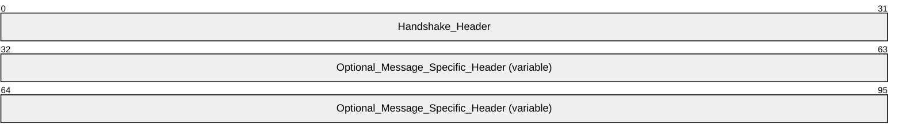

**Handshake_Header (4 bytes):** Handshake header, as specified in section [2.2.1.1](#Section_2.2.1.1).

**Optional_Message_Specific_Header (variable):** Message-specific header corresponding to **Proto_and_Msg_ID** field in **Handshake_Header**, as specified in section 2.2.1.1. Some messages contain a message-specific header while others do not.

### 2.2.1 Base Specification

All qWave Protocol implementations MUST use and accept the following base specification format as part of a message.

#### 2.2.1.1 Handshake Header Format

Both the initiator and sink devices transmit this header as part of all of its messages. The Handshake header format is defined as follows.

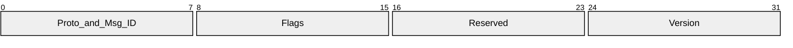

**Proto_and_Msg_ID (1 byte):** This field distinguishes the qWave Protocol from other qWave protocols (see [MS-QDP](../MS-QDP/MS-QDP.md)). It also identifies the type of message transmitted, and thus, the form of the message-specific header that immediately follows the Handshake header. This field MUST<2> be one of the following.

| Value | Meaning | Sender Role | Uses TCP or UDP |
| --- | --- | --- | --- |
| 0x00 | Discard | Initiator | TCP |
| 0x01 | Packet Pair Connection Handshake | Initiator | TCP |
| - | Packet Pair Probe | - | UDP |
| 0x02 | Route Check Connection Handshake | Initiator | TCP |
| - | Route Check Probe | - | UDP |
| 0x05 | Probegap Probe | Initiator | UDP |
| 0x06 | - | Sink | - |
| 0x0A | Packet Pair Summary | Sink | TCP |
| 0x14 | Route Check Summary | Sink | TCP |
| 0x1E | Connection Handshake Success | Sink | TCP |

**Flags (1 byte):** This field has message-specific meaning. In other words, depending on the value of **Proto_and_Msg_ID**, this field can be interpreted as follows:

If this is a Packet Pair Probe message (that is, **Proto_and_Msg_ID** is 0x01, UDP protocol is used and UDP source port is not 2177), this field takes the form of:

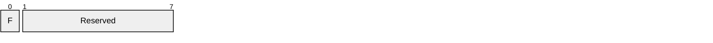

**F (1 bit):** This field MUST be set to 1 to indicate that a Packet Pair Probe message is the first message in a train. Otherwise, this field MUST be set to 0.

**Reserved (7 bits):** This field MUST be set to 0 and ignored on receipt.

If this is a Route Check Probe message (that is, **Proto_and_Msg_ID** is 0x02, UDP protocol is used and UDP source port is not 2177), this field takes the form of:

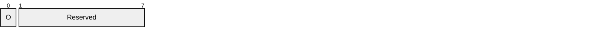

**O (1 bit):** This field MUST be set to 1 to indicate that a Route Check Probe message is oversized. Otherwise, this field MUST be set to 0. For more information about oversized packets, please see section [3.1](#Section_3.1).

**Reserved (7 bits):** This field MUST be set to 0 and ignored on receipt.

If this is a Route Check Summary message (that is, Proto_and_Msg_ID is 0x14, TCP protocol is used and TCP source port is 2177), this field takes the form of:

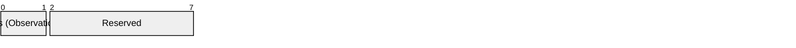

**Obs (Observation) (2 bits):** This field MUST contain one of the following values:

| Value | Meaning |
| --- | --- |
| 0x0 | No issue detected |
| 0x1 | Packet inversion detected; that is, a packet did not arrive in the order it was sent |
| 0x2 | Packet loss detected |
| 0x3 | Reserved |

For more information about how these values are used, please refer to section 3.1.

**Reserved (6 bits):** This field MUST be set to 0 and ignored on receipt.

For all other cases, the field takes the following form:

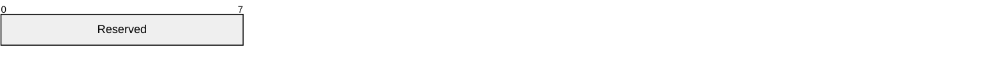

**Reserved (1 byte):** This field MUST be set to 0 and ignored on receipt.

**Reserved (1 byte):** This field MUST be set to 0 and ignored on receipt.

**Version (1 byte):** This field identifies the protocol version. If **Proto_and_Msg_ID** has the value 0x05 or 0x06, this field MUST be set to 0x02. Otherwise, this field MUST be set to 0x01.

### 2.2.2 Messages

#### 2.2.2.1 Discard Message

An initiator device sends this message to a sink device after it establishes a TCP/IP connection. When the sink receives this message, it MUST discard the message and prepare to receive subsequent messages on that connection. All these subsequent messages MUST be discarded immediately after the message is received, with no validation whatsoever.

This mechanism exists to give the initiator a very coarse mechanism to estimate the available bandwidth between itself and the sink through the inherent properties of TCP/IP acknowledgement. In other words, an initiator can very roughly estimate the available bandwidth if it measures the rate that it can send TCP/IP messages.

#### 2.2.2.2 Packet Pair Connection Handshake Message

An initiator device sends this handshake message to a sink device after it establishes a TCP/IP connection. This TCP/IP connection is used by the initiator device to receive the Packet Pair Summary message from the sink device as part of the packet pair probing experiment described in section [1.3](#Section_1.3). The sink device sends a Connection Handshake Success message in return if it accepts the handshake. If the sink device does not accept the handshake, it can close the TCP connection or simply ignore this message.

The Packet Pair Connection Handshake message has no message-specific header following the Handshake header.

#### 2.2.2.3 Packet Pair Probe Message

An initiator device sends Packet Pair Probe messages to a sink device to perform the packet pair probing experiment. The sink device sends the Packet Pair Summary message to the initiator when the last Packet Pair Probe message is received.

The initiator MUST set the F flag in the Handshake header for the first Packet Pair Probe message in a train.

The Packet Pair Probe message MUST contain the following message-specific header following the Handshake header.

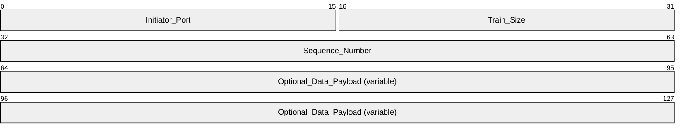

**Initiator_Port (2 bytes):** An unsigned 16-bit integer that specifies the initiator's TCP/IP port number used to transmit the Packet Pair Connection Handshake message that preceded this Packet Pair Probe message. The value in this field is formatted using [**network byte order**](#gt_network-byte-order).

**Train_Size (2 bytes):** An unsigned 16-bit integer that specifies the number of Packet Pair Probe messages that are part of a train, in network byte order. All messages sent in the same train MUST have the same **Train_Size** value. Valid values are 0x0000 and 0x0002-0xFFFF. The sink MUST ignore all Packet Pair Probe messages for which this field is set to 0x0000 or 0x0001. While it is a valid value, when this field is set to 0x0000, the initiator is intentionally putting the Packet Pair Probe on the wire for the purpose of affecting the transmission characteristics (for example, increased latency) of other Packet Pair Probe messages but the sink does not have any use for the message otherwise. The value 0x0001 is considered invalid because it does not make sense in the context of packet pair experiments to have a train of 1 packet.

**Sequence_Number (4 bytes):** An unsigned 32-bit integer that uniquely (in the context of a packet pair experiment) identifies the specific instance of a message, in network byte order.

**Optional_Data_Payload (variable):** This optional field specifies an array of random byte values, generated using any pseudo-random number generator, to pad the probe message to an arbitrary size. The size of this payload plus the size of all relevant qWave, TCP, IP, and Ethernet headers MUST NOT exceed 1510 bytes so a 4-byte IEEE 802.1Q header can be accommodated without breaking some networks that cannot handle Ethernet packets larger than 1514 bytes. The actual size of the payload is carefully chosen by the initiator (see [[PacketPair]](https://go.microsoft.com/fwlink/?LinkId=158841)), taking into account factors, such as that the size of a packet directly impacts the latency of the transmission, which in turn affects the calculations of the packet pair experiment. The payload consists of random byte values only for the purpose of minimizing the effect of networks that employ packet compression; the sink does not validate the content of the payload itself.

#### 2.2.2.4 Route Check Connection Handshake Message

An initiator device sends this handshake message to a sink device immediately after it establishes a TCP/IP connection. This TCP/IP connection is used by the initiator device to receive the Route Check Summary message from the sink device as part of the route check probing experiment described in section [1.3](#Section_1.3). The sink device sends a Connection Handshake Success message in return if it accepts the handshake. If the sink device does not accept the handshake, it can close the TCP connection or simply ignore this message.

The Route Check Connection Handshake message has no message-specific header following the Handshake header.

#### 2.2.2.5 Route Check Probe Message

An initiator device sends Route Check Probe messages to a sink device to perform the route check probing experiment. The sink device sends the Route Check Summary message to the initiator when the last Route Check Probe message is received or when the sink detects a condition that deserves the initiator's attention.

The initiator MAY set the O flag in the Handshake header if it intentionally sends an oversized Route Check Probe message that is larger than the standard 1514-byte Ethernet frame size restriction. For example, a full 1514-byte Ethernet frame would tack on 4 extra bytes when 802.1p prioritization is requested. As a result, an incompatible switch or router might drop such an oversized packet. If the O flag is set and such a message reaches the sink, then the initiator can assume that the network is at least compatible with 802.1p.

The Route Check Probe message MUST contain the following message-specific header following the Handshake header.

**Initiator_Port (2 bytes):** An unsigned 16-bit integer that specifies the initiator's TCP/IP port number used to transmit the Route Check Connection Handshake message that preceded this Route Check Probe message. The value in this field is formatted using network byte order.

**Train_Size (2 bytes):** An unsigned 16-bit integer that specifies the number of Route Check Probe messages that are part of a train, in network byte order. All messages sent in the same train MUST have the same **Train_Size** value. Valid values are 0x0000 and 0x0002-0xFFFF. The sink MUST ignore all Route Check Probe messages for which this field is set to 0x0000 or 0x0001. While it is a valid value, when this field is set to 0x0000, the initiator is intentionally putting the Route Check Probe on the wire for the purpose of affecting the transmission characteristics (for example, increased latency) of other Route Check Probe messages but the sink does not have any use for the message otherwise. The value 0x0001 is considered invalid because it does not make sense in the context of route check experiments to have a train of 1 packet.

**Sequence_Number (4 bytes):** An unsigned 32-bit integer that uniquely (in the context of a route check experiment) identifies the specific instance of a message, in network byte order.

**Optional_Data_Payload (variable):** This optional field specifies an array of random byte values, generated using any pseudo-random number generator, to pad the probe message to an arbitrary size. The size of this payload plus the size of all relevant qWave, TCP, IP, and Ethernet headers must not exceed 1514 bytes, prior to accommodating a 4-byte IEEE 802.1Q header. The actual size of the payload is carefully chosen by the initiator (see [[USPATENT7397801]](https://go.microsoft.com/fwlink/?LinkId=158835)). The payload consists of random byte values only for the purpose of minimizing the effect of networks that employs packet compression; the sink does not validate the content of the payload itself.

#### 2.2.2.6 Probegap Probe Message

An initiator device sends a train of Probegap Probe messages to a sink device if it wishes to perform the probegap probing experiment. For every Probegap Probe message that a sink device receives from the initiator, it sends a copy of that message back to the initiator.

The Probegap Probe message MUST contain the following message-specific header following the Handshake header.

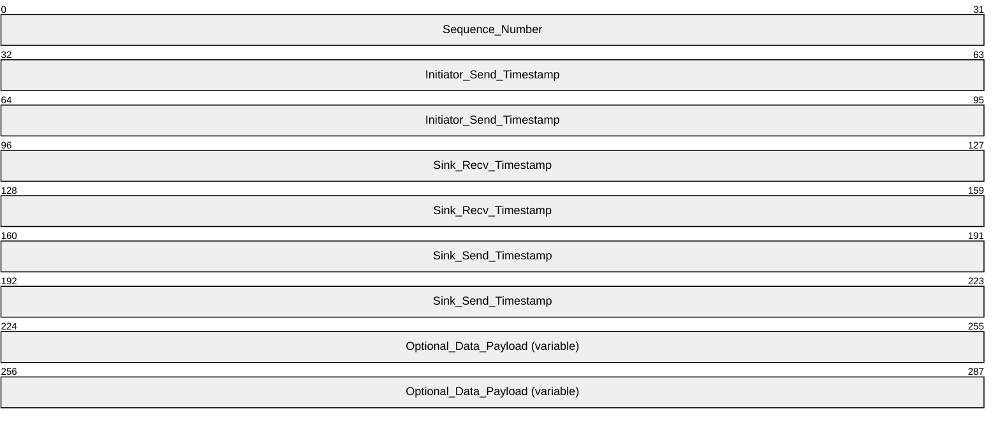

**Sequence_Number (4 bytes):** An unsigned 32-bit integer that uniquely (in the context of a probegap experiment) identifies the specific instance of a message, in network byte order. A sink device MUST NOT change this field.

**Initiator_Send_Timestamp (8 bytes):** An unsigned 64-bit integer that specifies the timestamp of the initiator just before the message is sent, in network byte order. The unit of measurement MUST be in 100 nanosecond units. A sink device MUST NOT change this field.

**Sink_Recv_Timestamp (8 bytes):** An unsigned 64-bit integer that specifies the timestamp of the sink device immediately when it receives the message from the initiator device, in network byte order. The unit of measurement MUST be in 100 nanosecond units. The initiator device SHOULD set this field to 0.

**Sink_Send_Timestamp (8 bytes):** An unsigned 64-bit integer that specifies the timestamp of the sink device just before it sends a copy of the message back to the initiator device, in network byte order. The unit of measurement MUST be in 100 nanosecond units. The initiator device SHOULD set this field to 0.

**Optional_Data_Payload (variable):** This optional field specifies an array of random byte values, generated using any pseudo-random number generator, to pad the probe message to an arbitrary size. The size of this payload plus the size of all relevant qWave, TCP, IP, and Ethernet headers must not exceed 1510 bytes so a 4-byte IEEE 802.1Q header can be accommodated without breaking some networks that cannot handle Ethernet packets larger than 1514 bytes. The actual size of the payload is carefully chosen by the initiator (see [[ProbeGap]](https://go.microsoft.com/fwlink/?LinkId=158845)), taking into account factors such as the size of a packet directly impacts the latency of the transmission, which in turn affects the calculations of the probegap experiment. The payload consists of random byte values only for the purpose of minimizing the effect of networks that employs packet compression; the sink does not validate the content of the payload itself. On the other hand, the sink MUST send this exact payload back to the initiator.

#### 2.2.2.7 Packet Pair Summary Message

A sink device automatically sends this message to the initiator device for the last Packet Pair Probe message in a train that it receives from the initiator. The Packet Pair Summary message summarizes all the changes in the sink device's timestamp obtained as each Packet Pair Probe message belonging to the same train is received.

The Packet Pair Summary message MUST contain the following message-specific header following the Handshake header.

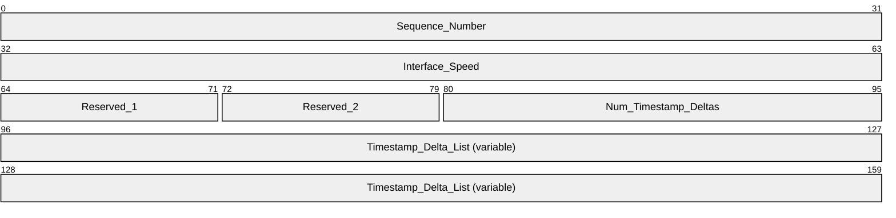

**Sequence_Number (4 bytes):** An unsigned 32-bit integer in network byte order. The value of this field MUST be the value of the **Sequence_Number** field from the first Packet Pair Probe message in the train that triggered this message. In other words, it is taken from the Packet Pair Probe message wherein the F flag in the Handshake header is set.

**Interface_Speed (4 bytes):** An unsigned 32-bit integer that identifies the speed of the network interface on the sink device, expressed as bits per second. The value in this field is formatted using network byte order.

**Reserved_1 (1 byte):** This field MUST be set to 0 and ignored on receipt.

**Reserved_2 (1 byte):** This field MUST be set to 0 and ignored on receipt.

**Num_Timestamp_Deltas (2 bytes):** This field is an unsigned 16-bit integer that specifies the count of entries in the **Timestamp_Delta_List** field, in network byte order. The value in this field MUST be equal to the value of the **Train_Size** field, minus 1, of the Packet Pair Probe message that triggered this Packet Pair Summary message.

**Timestamp_Delta_List (variable):** This field specifies a list of **Timestamp_Delta** items, each describing the change in the sink's receive timestamp between two successive Packet Pair Probe messages in the same train. The change value is calculated by subtracting the older sink receive timestamp from the newer sink receive timestamp. The ordering of **Timestamp_Delta** items MUST represent the actual receive order of the corresponding Packet Pair Probe messages, going from oldest to latest. Each **Timestamp_Delta** item MUST have the following 8-byte structure.

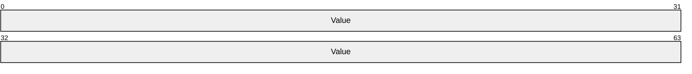

**Value (8 bytes):** This field specifies an unsigned integer representing a timestamp value in network byte order. The unit of measurement MUST be in 100 nanosecond units.

#### 2.2.2.8 Route Check Summary Message

A sink device automatically sends this message to the initiator device as it receives a Route Check Probe message from the initiator. The Route Check Summary message uses the **Obs** field in the Handshake header to describe the sink device's observation of the last Route Check Probe train.

The Route Check Summary message has no message-specific header following the Handshake header.

#### 2.2.2.9 Connection Handshake Success Message

A sink device sends this message in response to Packet Pair Connection Handshake and Route Check Connection Handshake messages sent by an initiator device. The sink only sends this message if it agrees to the handshake request.

The Connection Handshake Success message has no message-specific header following the Handshake header.

# 3 Protocol Details

## 3.1 Initiator Details

The following figures represent the state machines for the initiator role.

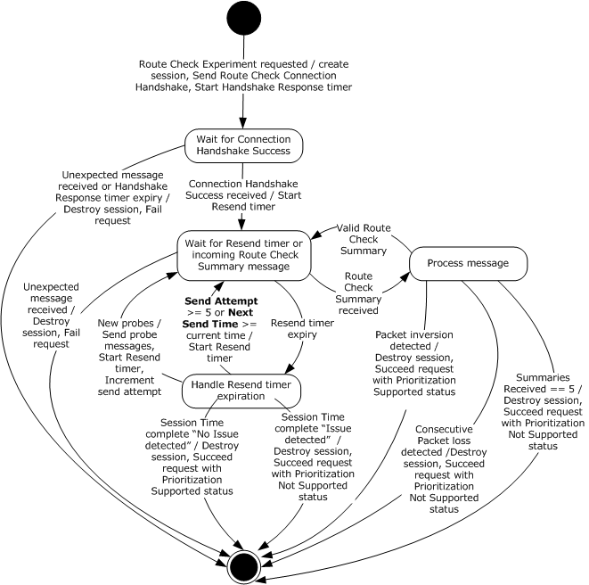

Figure 1: State machine for initiator role when performing Route Check experiment

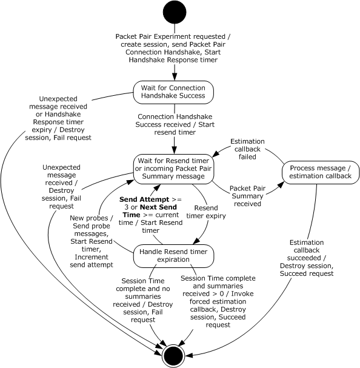

Figure 2: State machine for initiator role when performing Packet Pair experiment

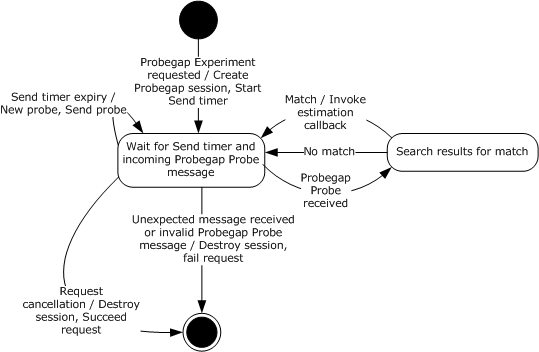

Figure 3: State machine for initiator role when performing Probegap experiment

Applicable message request/response pairs for this role are defined as follows.

| Sent by initiator | Sent by sink |
| --- | --- |
| Packet Pair Connection Handshake message | Connection Handshake Success message |
| Packet Pair Probe message | Packet Pair Summary message |
| Route Check Connection Handshake message | Connection Handshake Success message |
| Route Check Probe message | Route Check Summary message |
| Probegap Probe message | Probegap Probe message |
| Discard message | N/A |

The remainder of this section will discuss the state machine in depth.

### 3.1.1 Abstract Data Model

This section describes a conceptual model of possible data organization that an implementation maintains to participate in this protocol. The described organization is provided to facilitate the explanation of how the protocol behaves. This document does not mandate that implementations adhere to this model as long as their external behavior is consistent with that described in this document.

The data elements required in typical initiator implementations are:

- **Route Check Session**: Each Route Check Session stores the route check experiment states that are relevant between a unique pair of initiator and sink devices. Each session MUST have the following fields:
- **Expected Message**: This field identifies an 8-bit integer value that matches any of the legal values defined by the **Proto_and_Msg_ID** field in the Handshake header defined in section [2.2.1.1](#Section_2.2.1.1). It tells the initiator which incoming message to expect next. A special value of 0x00 is used to indicate that no message is currently expected.
- **TCP Socket**: This field identifies the [**network socket**](#gt_network-socket) object used to connect to the sink device via the TCP/IP protocol. The destination port number of the socket MUST be set to 2177. Every message received through this object can be correlated back to a Route Check Session.
- **Best-Effort UDP Socket**: This field identifies the network socket object used to connect to the sink device via the UDP/IP protocol. No packets will be read from this socket. The source port number of the socket MUST be set to a number other than 2177. The socket MUST NOT fragment outbound UDP/IP packets. The socket SHOULD NOT apply a checksum to outbound packets because the route check experiment relies on sending back-to-back packets that can sometimes be delayed by the additional pre-processing time. The socket SHOULD set the time-to-live field for outgoing packets to 1 as a security precaution because probe packets are not supposed to cross router boundaries. Packets sent through this socket are conceptually of best-effort priority.
- **Priority UDP Socket**: This field identifies the network socket object used to connect to the sink device via the UDP/IP protocol. No packets will be read from this socket. The source port number of the socket MUST be set to a number other than 2177. The socket MUST NOT fragment outbound UDP/IP packets. The socket SHOULD NOT apply a checksum to outbound packets because the route check experiment relies on sending back-to-back packets that can sometimes be delayed by the additional pre-processing time. The socket SHOULD set the time-to-live field for outgoing packets to 1 as a security precaution because probe packets are not supposed to cross router boundaries. Packets sent through this socket are conceptually of high priority and they SHOULD be configured to be marked with DSCP value 0x28 and 802.1p value 5, but only if the socket supports such functionality.
- **Probe Array:** This data element specifies a collection of Route Check Probe messages that will be sent to the sink device. This array allows probe messages to be pre-constructed so when it comes time to send them at Next Send Time, they can all be sent in a back-to-back fashion without delay.
- **Sequence Number:** This field identifies a 32-bit integer value that is incremented by one each time it's used.
- **Send Attempt:** This field identifies a 32-bit integer value that counts the number of attempts made to solicit a Route Check Summary message from the sink.
- **End Time:** This field identifies the system time at which the Route Check Session will end.
- **Next Send Time:** This field identifies the system time at which the set of messages in Probe Array will be sent next.
- **Previous Observation:** This field identifies a value that matches the **Obs** flag in the Handshake header for Route Check Summary messages. The value 0x03 (Reserved) is used by the initiator to represent an unknown state.
- **Summaries Received:** This field identifies a 32-bit integer value that counts the number of times a Route Check Summary message was received from the sink.
- **Packet Pair Session**: Each Packet Pair Session stores the packet pair experiment states that are relevant between a unique pair of initiator and sink devices. Each session MUST have the following fields:
- **Expected Message**: This field identifies an 8-bit integer value that matches one of the legal values defined by the **Proto_and_Msg_ID** field in the Handshake header defined in section 2.2.1.1. It tells the initiator which incoming message to expect next. A special value of 0x00 is used to indicate that no message is currently expected.
- **TCP Socket**: This field identifies the network socket object used to connect to the sink device via the TCP/IP protocol. The destination port number of the socket MUST be set to 2177. Every message received through this object can be correlated back to a Packet Pair Session.
- **UDP Socket**: This field identifies the network socket object used to connect to the sink device via the UDP/IP protocol. No packets will be read from this socket. The source port number of the socket MUST be set to a number other than 2177. The socket SHOULD NOT apply checksum to outbound packets because in some cases the accuracy of the packet pair calculation can be negatively impacted by the additional pre-processing time. The socket SHOULD set the time-to-live field for outgoing packets to 1 as a security precaution because probe packets are not supposed to cross router boundaries.
- **Probe Array:** This data element specifies a collection of Train Size count of Packet Pair Probe messages that will be sent to the sink device. This array allows probe messages to be pre-constructed so when it comes time to send them at Next Send Time, they can all be sent in a back-to-back fashion without delay. The contents of this collection are provided by the higher-layer application or protocol that requested a Packet Pair Experiment. As suggested by [[PacketPair]](https://go.microsoft.com/fwlink/?LinkId=158841) the messages in this collection are usually of varying size. The **Sequence_Number** and **Initiator_Port** fields in each message-specific header are not required to be initialized by the application. The initiator will update these fields as needed.
- **Sequence Number:** This field identifies a 32-bit integer value that is incremented by 1 each time it's used. At each Next Send Time, when the Packet Pair Probe messages inside the Probe Array are scheduled to be sent to the sink, their **Sequence_Number** field in the messages-specific header are set to the value of this field.
- **Send Attempt:** This field identifies a 32-bit integer value that counts the number of attempts made to solicit a Packet Pair Summary message from the sink.
- **End Time:** This field identifies the system time at which the Packet Pair Session will end.
- **Next Send Time:** This field identifies the system time at which the set of messages in Probe Array will be sent next.
- **Summaries Received:** This field identifies a 32-bit integer value that counts the number of times a Packet Pair Summary message was received from the sink.
- **Interface Speed:** This field identifies an unsigned 32-bit integer that specifies the speed of the initiator's network interface, expressed as bits per second. This field is provided to the callback routines identified by Estimation Callback and Forced Estimation Callback.
- **Estimation Callback:** This field identifies a callback routine that is provided by the higher-layer application or protocol that requested a Packet Pair Experiment. This routine is responsible for making a bottleneck bandwidth estimation given the contents of a Packet Pair Summary message header. The routine returns success or failure; failure implies there is insufficient information to make an estimation and the initiator might need to send more probe packets.
- **Forced Estimation Callback:** This field identifies a callback routine that is provided by the higher-layer application or protocol that requested a Packet Pair Experiment. This routine is responsible for making a last-ditch bottleneck bandwidth estimation. This callback routine is called if Estimation Callback has failed to make an estimation after repeated attempts.
- **Probegap Session**: Each Probegap Session stores the probegap experiment states that are relevant between a unique pair of initiator and sink devices. Each session MUST have the following fields:
- **UDP Socket**: This field identifies the network socket object used to connect to the sink device via the UDP/IP protocol. The source port number of the socket MUST be set to 2177. The socket SHOULD NOT apply checksum to outbound packets because in some cases the accuracy of the probegap calculation might be negatively impacted by the additional pre-processing time. The socket SHOULD set the time-to-live field for outgoing packets to 1 as a security precaution because probe packets are not supposed to cross router boundaries.
- **Sequence Number:** This field identifies a 32-bit integer value that is incremented by 1 each time it's used.
- **Next Send Timestamp:** This field identifies an unsigned 64-bit integer value that specifies the timestamp of the initiator device at which the Per-Probegap Session Send timer is schedule to wake up next.
- **Results:** This data element specifies a circular array of Probe Description entries each containing the statistics of a pair of Probegap Probe packets sent once from the initiator to the sink and then once more back to the initiator. Each Probe Description contains the following fields:
- **Sequence Number:** This field identifies the value of the **Sequence_Number** field from the Probegap Probe message header of the pair of probes that are described by the Probe Description entry.
- **Expected Send Timestamp:** This field identifies an unsigned 64-bit integer value that specifies the expected timestamp of the initiator device at the time the probe packet is scheduled to be sent to the sink, expressed in 100 nanosecond units.
- **Source Send Timestamp:** This field identifies an unsigned 64-bit integer value that specifies the actual timestamp of the initiator device just before the probe packet is sent to the sink, expressed in 100 nanosecond units.
- **Destination Receive Timestamp:** This field identifies an unsigned 64-bit integer value that specifies the timestamp of the sink device immediately after the probe packet is received from the initiator, expressed in 100 nanosecond units. This value is only available after the initiator has successfully received the probe packet sent back from the sink.
- **Destination Send Timestamp:** This field identifies an unsigned 64-bit integer value that specifies the timestamp of the sink device just before the probe packet is sent back to the initiator, expressed in 100 nanosecond units. This value is only available after the initiator has successfully received the probe packet sent back from the sink.
- **Source Receive Timestamp:** This field identifies an unsigned 64-bit integer value that specifies the timestamp of the initiator device immediately after the probe packet is received from the sink, expressed in 100 nanosecond units. This value is only available after the initiator has successfully received the probe packet sent back from the sink. If the value of this field is 0, then it is assumed that the source has not received the probe packet.
- **Next Result Index:** This field identifies a zero-based index into the Results circular array for the next Probe Description entry to be confirmed by a Probegap Probe message from the sink. In other words, this value minus 1 yields the index of the last Probe Description entry to process by Estimation Callback.
- **Next Send Index:** This field identifies a zero-based index into the Results circular array for the next Probe Description entry to be used to record a Probegap Probe originating from the initiator.
- **Estimation Callback:** This field identifies a callback routine that is provided by the higher-layer application or protocol that requested a Probegap Experiment. This routine is responsible for making an available bandwidth estimation given the contents of the Results, and Next Result Index fields. Note that the fields defined in a Probe Description are generally regarded to be sufficient to make an available bandwidth estimation (see [[ProbeGap]](https://go.microsoft.com/fwlink/?LinkId=158845)).
- **Flood Session**: Each session MUST have the following fields:
- **TCP Socket**: This field identifies the network socket object used to connect to the sink device via the TCP/IP protocol. The initiator SHOULD NOT attempt to read from this object. The destination port number of the socket MUST be set to 2177.
**Note** The previous conceptual data can be implemented by using a variety of techniques as needed.

### 3.1.2 Timers

#### 3.1.2.1 Route Check Session

Each Route Check Session has two timers:

- Handshake Response timer: This one-shot timer, per **Route Check Session** entry, is used to ensure timely response to a Route Check Connection Handshake message.
- Resend timer: This one-shot timer, per **Route Check Session** entry is used to control the sending of Route Check Probe messages to the sink.

#### 3.1.2.2 Packet Pair Session

Each Packet Pair Session has two timers:

- Handshake Response timer: This one-shot timer, per **Packet Pair Session** entry is used to send Packet Pair Connection Handshake message.
- Resend timer: This one-shot timer, per **Packet Pair Session** entry is used to control the sending of Packet Pair Probe messages to the sink.

#### 3.1.2.3 Probegap Session

Each Probegap Session has one timer:

- Send timer: This recurring timer, per **Probegap Session** entry is used to send Probegap Probe messages to the sink. The initiator device SHOULD try to schedule this timer with 1 millisecond resolution.

### 3.1.3 Initialization

None.

### 3.1.4 Higher-Layer Triggered Events

#### 3.1.4.1 Requesting Route Check Experiment

A higher-layer application or protocol requests a route check experiment through the initiator. If the request succeeds, one of the following two results MUST be provided to the caller: Prioritization Supported or Prioritization Not Supported.

The initiator MUST instantiate a **Route Check Session**.

- The **Expected Message** field MUST be set to 0x1E (Connection Handshake Success).
- The **Previous Observation** field MUST be set to 0x03 (Reserved).
- The **Sequence Number** field MUST be set to 1.
- The **Send Attempt** field MUST be set to 0.
- The **Summaries Received** field MUST be set to 0.
- **Best-Effort UDP Socket, Priority UDP Socket** and **TCP Socket** are instantiated. If any of these objects fail to instantiate, then the initiator MUST fail the request and the associated session object is deleted
When a TCP connection is established to the sink, the initiator MUST send a Route Check Connection Handshake message using **TCP Socket**. The Per-Route Check Session Handshake Response timer MUST be enabled and set to expire after 250 milliseconds.

The initiator now waits for a message to arrive in order to continue processing the request. The request can only be completed when processing a message that has arrived.

#### 3.1.4.2 Requesting Packet Pair Experiment

A higher-layer application or protocol requests a packet pair experiment through the initiator.

The initiator MUST instantiate a **Packet Pair Session**.

- The **Expected Message** field MUST be set to 0x1E (Connection Handshake Success).
- The **Estimation Callback** and **Forced Estimation Callback** fields MUST be set to the callback routines provided by the application or protocol, given as part of the Packet Pair Experiment request.
- The contents of the **Probe Array** field MUST be provided by the application or protocol, also given as part of the Packet Pair Experiment request.
- The **Sequence Number** field MUST be set to 1.
- The **Send Attempt** field MUST be set to 0.
- The **Summaries Received** field MUST be set to 0.
- **UDP Socket** and **TCP Socket** are instantiated. If any of these objects fail to instantiate, then the initiator MUST fail the request and the associated session object is deleted.
- The **Interface Speed** field MUST be set to the speed of the initiator's network interface used to connect to the sink device.
When a TCP connection is established to the sink, the initiator MUST send a Packet Pair Connection Handshake message using **TCP Socket**. The Per-Packet Pair Session Handshake Response timer MUST be enabled and set to expire after 250 milliseconds.

The initiator now waits for a message to arrive in order to continue processing the request. The request can only be completed when processing a message that has arrived.

#### 3.1.4.3 Requesting Probegap Experiment

A higher-layer application or protocol requests a probegap experiment through the initiator. Unlike route check or packet pair experiments, a probegap experiment request does not complete until an error condition is encountered or until the application cancels the request. While the probegap experiment request is in effect, timestamp statistics obtained from Probegap Probe packets are constantly fed back to the application for analysis. Only after the bottleneck bandwidth estimation has been made via a packet pair experiment can data be used from a probegap experiment to estimate the instantaneous available bandwidth (see [[ProbeGap]](https://go.microsoft.com/fwlink/?LinkId=158845)).

The initiator MUST instantiate a **Probegap Session**.

- The per-session **Expected Message** field MUST be set to 0x06 (Probegap Probe originating from sink).
- The **Estimation Callback** field MUST be set to the callback routine provided by the application, given as part of the Probegap Experiment request.
- The **Next Send Index** field MUST be set to 0.
- **UDP Socket** is instantiated and if this fails, the initiator MUST fail the Probegap Experiment request and the associated session object is deleted.
- The **Next Send Timestamp** field MUST be set to the current timestamp of the initiator.
The Per-Probegap Session Send timer MUST be enabled and set to fire every 1 millisecond, starting immediately.

The initiator now either waits for messages to arrive or for the timer to fire to continue processing the request. The request can only be completed when the application explicitly completes it.

#### 3.1.4.4 Requesting Flood Session

A higher-layer application or protocol requests a flood session through the initiator to send arbitrary TCP/IP messages to the sink for the primary purpose of estimating the available bandwidth between itself and the sink. An application can estimate the bandwidth by measuring the rate at which TCP/IP sends these messages. The messages are not required to be in any particular format.

The initiator MUST instantiate a **Flood Session**. Next, the per-session **TCP Socket** is instantiated and if it fails to instantiate, the initiator MUST fail the request and the associated session object is deleted.

Finally, the initiator MUST create a Discard message and send it to the sink via **TCP Socket**. When the message is sent, the **TCP Socket** object is made available directly to the application. At this point, the initiator SHOULD NOT read nor write to the object.

The request is only completed, that is the session destroyed and the TCP connection closed, when the application explicitly requests it.

### 3.1.5 Message Processing Events and Sequencing Rules

#### 3.1.5.1 Receiving a Connection Handshake Success message

When a Connection Handshake Success message arrives through a **TCP Socket**, it is correlated back to one of Route Check Session or Packet Pair Session object.

If the per-session **Expected Message** field is not equal to 0x1E (Connection Handshake Success), the initiator MUST fail the experiment request that instantiated the session, and the session object is deleted.

Otherwise, the per-session **Expected Message** field MUST be set to 0x00 to indicate that the initiator is not expecting an incoming message. The initiator validates the fields in the Handshake header as per section [2.2.1.1](#Section_2.2.1.1). If the header contains an invalid value, the initiator MUST fail the experiment request that instantiated the session and the associated session object is deleted.

The next step of processing depends on the type of the session object:

##### 3.1.5.1.1 Route Check Session

At this point, the message received has been correlated back to a Route Check Session object.

- The Per-Route Check Session Handshake Response timer MUST be reset.
- The End Time field MUST be set to the current system time plus 400 milliseconds after which the route check experiment is expected to end.
- The Next Send Time field MUST be set to 0.
Finally, the Per-Route Check Session Resend timer MUST be enabled and set to fire immediately.

##### 3.1.5.1.2 Packet Pair Session

At this point, the message received has been correlated back to a Packet Pair Session object.

- The Per-Packet Pair Handshake Response timer MUST be reset.
- The End Time field MUST be set to the current system time plus 1500 milliseconds.
- The Next Send Time field MUST be set to 0.
Finally, the Per-Packet Pair Session Resend timer MUST be enabled and set to fire immediately.

#### 3.1.5.2 Receiving a Route Check Summary message

When a Route Check Summary message arrives through a **TCP Socket**, it is correlated back to a Route Check Session object.

**Unexpected Message -** If the per-session **Expected Message** field is not equal to 0x14, the initiator MUST fail the Route Check Experiment request that instantiated the session and the associated session object is deleted.

Otherwise, the **Expected Message** field is set to 0x00 to indicate that the initiator is not expecting an incoming message. The initiator validates the fields in the Handshake header inside the message as per section [2.2.1.1](#Section_2.2.1.1) and section [2.2.2.8](#Section_2.2.2.8). If the header contains an invalid value, the initiator MUST fail the Route Check Experiment request that instantiated the session and the associated session object is deleted.

**Packet Inversion Detected**- If the Obs flag in the Handshake header of the Route Check Summary message (see section 2.2.2.8) is set to 0x01 (Packet inversion detected), the initiator MUST succeed the Route Check Experiment request that instantiated the session with a Prioritization Supported status and the associated session object is deleted.

**Consecutive Packet loss Detected -**If the Obs flag in the Handshake header of the Route Check Summary message is set to 0x02 (Packet loss detected) and the per-session **Previous Observation** field is also set to 0x02, the initiator MUST succeed the Route Check Experiment request that instantiated the session with a Prioritization Not Supported status and the associated session object is deleted.

Next, the **Previous Observation** field MUST be set to the value of the Obs flag in the Handshake header of the Route Check Summary message. The per-session **Summaries Received** field MUST be incremented by 1.

If the **Summaries Received** field is equal to 5, the initiator MUST succeed the Route Check Experiment request that instantiated the session with a Prioritization Not Supported status and the associated session object is deleted.

#### 3.1.5.3 Receiving a Packet Pair Summary message

When a Packet Pair Summary message arrives through a **TCP Socket**, it is correlated back to a Packet Pair Session object.

If the per-session **Expected Message** field is not equal to 0x0A (Packet Pair Summary), the initiator MUST fail the Packet Pair Experiment request that instantiated the session and the associated session object is deleted.

Otherwise, the **Expected Message** field is set to 0x00 to indicate that the initiator is not expecting an incoming message. The initiator validates the fields in the Handshake header inside the message as per section [2.2.1.1](#Section_2.2.1.1) and section [2.2.2.7](#Section_2.2.2.7). If the header contains an invalid value, the initiator MUST fail the Packet Pair Experiment request that instantiated the session and the associated session object is deleted.

The initiator then invokes the routine identified by the per-session **Estimation Callback** field with the Packet Pair Summary header. If the routine returns with a success error code, the initiator MUST succeed the Packet Pair Experiment request that instantiated the session and the associated session object is deleted.

#### 3.1.5.4 Receiving a Probegap Probe message from sink device

When a Probegap Probe message arrives through a **UDP Socket**, it is correlated back to a Probegap Session object.

The initiator validates the fields in the message header as per section [2.2.1.1](#Section_2.2.1.1) and section [2.2.2.3](#Section_2.2.2.3). Note that the Proto_and_Msg_ID field in the Handshake header of the message MUST be set to 0x06 (Probegap Probe originating from sink). If any of the headers contain an invalid value, the initiator MUST fail the Probegap Experiment request that instantiated the session and the associated session object is deleted.

Next, the initiator MUST search the per-session Results array, starting at the index specified by the per-session **Next Result Index** and ending immediately at per-session **Next Send Index**, matching the value of the **Sequence_Number** field in the Probegap Probe message header against the **Sequence_Number** field in each Probe Description entry. If a match is not found, the message is ignored and event processing is complete.

**Match**- If a match is found, the matching Probe Description's **Destination Receive Timestamp** field MUST be set to the value of the **Sink_Recv_Timestamp** field in the message header. The Probe Description's **Destination Send Timestamp** field MUST be set to the value of the **Sink_Send_Timestamp** field in the message header. The Probe Description's **Source Receive Timestamp** MUST be set to the current timestamp of the initiator device. The per-session **Next Result Index** MUST be incremented by 1. The initiator then invokes the routine identified by the per-session **Estimation Callback** field.

### 3.1.6 Timer Events

#### 3.1.6.1 Per-Route Check Session Handshake Response Timer Expiry

When this timer fires, the initiator MUST fail the Route Check Experiment request that instantiated the session and the associated session object is deleted.

#### 3.1.6.2 Per-Route Check Session Resend Timer Expiry

***Session Time Complete*** *-* If the current system time is greater than the per-session **End Time** field value, then the initiator MUST succeed the request that instantiated the session with a Prioritization Supported status if the per-session **Previous Observation** field is set to 0x00 (No issue detected), or succeed with a Prioritization Not Supported status if the **Previous Observation** field is not set to 0x00 *(issue detected)*, and in both cases the session object is deleted.

Otherwise, if the per-session **Send Attempt** field is greater than or equal to 5 or the **Next Send Time** field is greater than or equal to the current time, the initiator MUST set the per-session **Expected Message** field to 0x14 (Route Check Summary). Next, it MUST enable the Per-Route Check Session Resend timer and set to expire at the earliest of **Next Send Time** or **End Time** if **Send Attempt** is less than 5, otherwise it expires at **End Time**. If the expiry time for the Per-Route Check Session Resend timer is less than the current system time, it MUST be adjusted to expire at the current system time. At this point, the timer expiry event is complete.

Otherwise, a new probe is sent.

The per-session **Probe Array** is initialized as follows:

- The first Route Check Probe message MUST carry a data payload of 1500 bytes, minus the size of the UDP, IP, and Route Check Probe headers. The payload content SHOULD be constructed using any pseudo-random number generator. The **O** flag in the Handshake header MUST be set to 1 to indicate an oversized message. The **Initiator_Port** field in the Route Check Probe header MUST be set to the local port number of **TCP Socket**. The **Train_Size** field MUST be set to 0. The per-session **Sequence_Number** value MUST be incremented. The **Sequence_Number** field in the Route Check Probe header MUST be set to the pre-incremented value of **Sequence_Number**.
- The second Check Probe message MUST carry a data payload of 1496 bytes, minus the size of the UDP, IP, and Route Check Probe headers. The payload content SHOULD be constructed using any pseudo-random number generator. The **O** flag in the Handshake header MUST be set to 0. The **Initiator_Port** field in the Route Check Probe header MUST be set to the local port number of **TCP Socket**. The **Train_Size** field MUST be set to 0. The per-session **Sequence_Number** value MUST be incremented. The **Sequence_Number** field in the Route Check Probe header MUST be set to the pre-incremented value of **Sequence_Number**.
- The third Check Probe message MUST carry a data payload of 1496 bytes, minus the size of the UDP, IP, and Route Check Probe headers. The payload content SHOULD be constructed using any pseudo-random number generator. The **O** flag in the Handshake header MUST be set to 0. The **Initiator_Port** field in the Route Check Probe header MUST be set to the local port number of **TCP Socket**. The **Train_Size** field MUST be set to 0. The per-session **Sequence_Number** value MUST be incremented. The **Sequence_Number** field in the Route Check Probe header MUST be set to the pre-incremented value of **Sequence_Number**.
- The fourth Route Check Probe message MUST NOT carry any data payload. The **O** flag in the Handshake header MUST be set to 0. The **Initiator_Port** field in the Route Check Probe header MUST be set to the local port number of **TCP Socket**. The **Train_Size** field MUST be set to 0. The per-session **Sequence_Number** value MUST be incremented. The **Sequence_Number** field in the Route Check Probe header MUST be set to the pre-incremented value of **Sequence_Number**.
- The fifth Route Check Probe message MUST NOT carry any data payload. The **O** flag in the Handshake header MUST be set to 0. The **Initiator_Port** field in the Route Check Probe header MUST be set to the local port number of **TCP Socket**. The **Train_Size** field MUST be set to 5. The per-session **Sequence Number** value MUST be incremented. The **Sequence_Number** field in the Route Check Probe header MUST be set to the pre-incremented value of **Sequence Number**.
The initiator MUST send the first Route Check Probe message in the per-session **Probe Array** using **Priority UDP Socket**. Note that this send operation might fail because the resultant Ethernet packet sent might be larger than 1514 bytes. If the send operation fails, the initiator MUST succeed the Route Check Experiment request that instantiated the session with a Prioritization Not Supported status and the session object is deleted.

If the send operation succeeds, the initiator MUST send the second, third, and fourth Route Check Probe messages in the per-session **Probe Array** using **Best-Effort UDP Socket**, one after the other as quickly as possible. If the send operation fails, the initiator MUST fail the Route Check Experiment request that instantiated the session and the associated session object is deleted.

If the send operation succeeds, the initiator MUST send the fifth Route Check Probe message in the per-session **Probe Array** using **Priority UDP Socket**. Otherwise, if the send operation fails, the initiator MUST fail the Route Check Experiment request that instantiated the session and the associated session object is deleted.

If the send operation succeeds, the per-session **Send Attempt** field is incremented by 1. The **Next Send Time** field MUST be set to the current system time plus 20 milliseconds. Otherwise, if the send operation fails, the initiator MUST fail the Route Check Experiment request that instantiated the session and the associated session object is deleted.

The initiator MUST set the per-session **Expected Message** field to 0x14. Next, it MUST enable the Per-Route Check Session Resend timer and set to expire at the earliest of **Next Send Time** or **End Time** if **Send Attempt** is less than 5, otherwise it expires at **End Time**. If the expiry time for the Per-Route Check Session Resend timer is less than the current system time, it MUST be adjusted to expire at the current system time.

#### 3.1.6.3 Per-Packet Pair Session Handshake Response Timer Expiry

When this timer fires, the initiator MUST fail the Packet Pair Experiment request that instantiated the session and the associated session object is deleted.

#### 3.1.6.4 Per-Packet Pair Session Resend Timer Expiry

If the current system time is greater than the per-session **End Time** field value, then the initiator MUST fail the request that instantiated the session if the per-session **Summaries Received** field is set to 0, or invoke the per-session **Forced Estimation Callback** and then succeed the request if the **Summaries Received** field is not set to 0 and in both cases the session object is deleted.

Otherwise, if the per-session **Send Attempt** field is greater than or equal to 3 or the **Next Send Time** field is greater than or equal to the current time, the initiator MUST set the per-session **Expected Message** field to 0x0A (Packet Pair Summary). The initiator MUST enable the Per-Packet Pair Session Resend timer and set to expire at the earliest of **Next Send Time** or **End Time** if **Send Attempt** is less than 3, otherwise it expires at **End Time**. If the expiry time for the Per-Packet Pair Session Resend timer is less than the current system time, it MUST be adjusted to expire at the current system time. At this point, the timer expiry event is complete.

Otherwise, each Packet Pair Probe message inside **Probe Array** is updated as follows:

- The **Sequence_Number** field in the message-specific header MUST be set to the value of the per-session **Sequence Number** field.
- The **Initiator_Port** field in the message-specific header MUST be set to the local port number of the per-session **TCP Socket**.
- The **Optional_Data_Payload** field in the message-specific header SHOULD be initialized with random byte values, generated using any pseudo-random number generator, to pad the probe message to an arbitrary size. For suggestions on the size of this field, please see [[PacketPair]](https://go.microsoft.com/fwlink/?LinkId=158841).
The per-session **Sequence Number** field MUST then be incremented by 1. The initiator MUST send all messages in the per-session **Probe Array**, starting from the first element in the array, using **UDP Socket**. If the send operation fails, the initiator MUST fail the Packet Pair Experiment request and the session object is deleted.

If the send operation succeeds, the per-session **Send Attempt** field MUST be incremented by 1.

The **Next Send Time** field MUST be set to the current system time plus 20 milliseconds.

The initiator MUST set the per-session **Expected Message** field to 0x0A (Packet Pair Summary). The initiator MUST enable the Per-Packet Pair Session Resend timer and set to expire at the earliest of **Next Send Time** or **End Time** if **Send Attempt** is less than 3, otherwise it expires at **End Time**. If the expiry time for the Per-Packet Pair Session Resend timer is less than the current system time, it MUST be adjusted to expire at the current system time.

#### 3.1.6.5 Per-Probegap Send Timer Expiry

A Probe Description entry is selected from the per-session **Results** data element using the index **Next Send Index**. All fields in this entry MUST be zeroed. The **Sequence Number** field is set to the value of the per-session **Sequence Number** field. The **Expected Send Timestamp** field is set to the value of the per-session **Next Send Timestamp** field. The **Source Send Timestamp** field is set to the current timestamp of the initiator device.

The per-session **Sequence Number** field MUST be incremented by 1. The per-session **Next Send Index** field MUST be incremented by 1.

Finally a Probegap Probe message is initialized as follows:

- **Sequence_Number** field in message header MUST be set to value of currently selected Probe Description's **Sequence Number** field.
- **Initiator_Send_Timestamp** field in message header MUST be set to value of currently selected Probe Description's **Expected Send Timestamp** field.
- **Sink_Recv_Timestamp** field in message header MUST be set to 0.
- **Sink_Send_Timestamp** field in message header MUST be set to 0.
- No optional data payload is sent.
The initiator MUST send the initialized Probegap Probe message to the sink using the per-session **UDP Socket**. If the send operation fails, the initiator MUST fail the Probegap Experiment request and the session object is deleted.

The Send timer expiry event is now complete.

### 3.1.7 Other Local Events

None.

## 3.2 Sink Details

The following figures represent the state machines for the sink role.

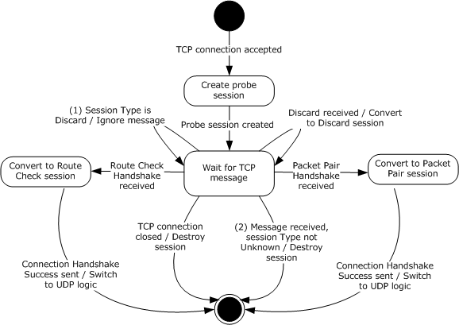

Figure 4: State machine for sink role from TCP perspective

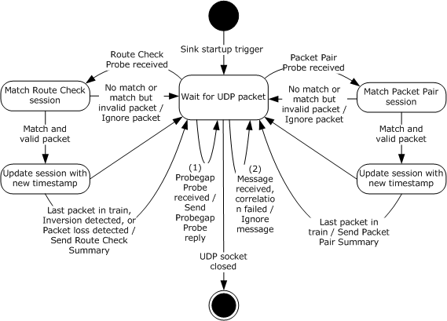

Figure 5: State machine for sink role from UDP perspective

Applicable message request/response pairs for this role are defined as follows.

| Sent by initiator | Sent by sink |
| --- | --- |
| Packet Pair Connection Handshake message | Connection Handshake Success message |
| Packet Pair Probe message | Packet Pair Summary message |
| Route Check Connection Handshake message | Connection Handshake Success message |
| Route Check Probe message | Route Check Summary message |
| Probegap Probe message | Probegap Probe message |
| Discard message | N/A |

The remainder of this section will discuss the state machine in depth.

### 3.2.1 Abstract Data Model

This section describes a conceptual model of possible data organization that an implementation maintains to participate in this protocol. The described organization is provided to facilitate the explanation of how the protocol behaves. This document does not mandate that implementations adhere to this model as long as their external behavior is consistent with that described in this document.

The data elements required in typical sink implementations are:

- **UDP Socket:**This field identifies the network socket object used to communicate with the initiator device via the UDP/IP protocol. The socket SHOULD NOT apply checksum to outbound packets. The socket SHOULD set the time-to-live field for outgoing packets to 1.
- **Probe Session**: Each session object stores the Discard (see section [2.2.2.1](#Section_2.2.2.1)), Route Check Experiment or Packet Pair Experiment states that are relevant between a unique pair of sink and initiator devices. Each session MUST have the following fields:
- **Handshaking:** This Boolean field identifies that the sink is still handshaking with the initiator and thus is not prepared to accept certain messages.
- **TCP Socket**: This field identifies the **network socket** object used to communicate with the initiator device via the TCP/IP protocol. Every message received through this object is correlated back to the appropriate **Probe Session**.
- **Type:** This field identifies an enumeration value that can be one of Unknown, Route Check, Packet Pair or Discard.
- **Initiator Address:** This field identifies the IP address of the initiator device.
- **Initiator Port:** This field identifies the initiator's TCP/IP port number with respect to **TCP Socket**.
- Route Check data elements: The following data elements are only relevant if Type is Route Check.
- **Sequence Number:** This field identifies the latest sequence number received from the initiator.
- **Consecutive Receives:** This field identifies the number of packets with consecutive sequence numbers that were received from the initiator.
- **Latest High Priority Sequence Number:** This field identifies the sequence number of the last high-priority packet received.
- **Latest High Priority Train Size:** This field identifies the number of packets in a train that follow the last high-priority packet with the sequence number indicated by **Latest High Priority Sequence Number**.
- **Oversized Packet:** This field identifies the sequence number of the last Route Check Probe message that is oversized.
- Packet Pair data elements: The following data elements are only relevant if **Type** is Packet Pair.
- **Initial Sequence Number:** This field identifies the sequence number of the first Packet Pair Probe message that is part of the train that is currently being processed.
- **Latest Sequence Number:** This field identifies the sequence number of the most recent Packet Pair Probe message that is part of the train that is currently being processed.
- **Current Train Packet Size:** This field identifies the size of each Packet Pair Probe message in the train that is currently being processed.
- **Current Train Length:** This field identifies the number of Packet Pair Probe messages that belong to the train that is currently being processed.
- **Timestamps:** This field identifies a collection of unsigned 64-bit integer values representing the timestamp of the sink at the point the corresponding Packet Pair Probe was received. The number of values in this collection is dictated by the value of **Current Train Length**.
- **Probe Session List**: This data element specifies a collection of **Probe Session** entries.
**Note** The previous conceptual data can be implemented by using a variety of techniques as needed.

### 3.2.2 Timers

None.

### 3.2.3 Initialization

During initialization, the following conditions MUST be met:

- **Probe Session List** is cleared.

### 3.2.4 Higher-Layer Triggered Events

#### 3.2.4.1 Startup Trigger

Once the device is ready to perform the sink role, it MUST begin accepting TCP connections on port 2177. It MUST listen for UDP packets on port 2177 using the **UDP Socket** object.

#### 3.2.4.2 Incoming TCP Connection Accepted

When a new TCP connection is accepted, the sink MUST instantiate a **Probe Session**. The per-session **Type** field MUST be set to Unknown. The per-session **Handshaking** field MUST be set. The per-session **TCP Socket** field is the typical network socket that is returned on an accepted TCP connection. The per-session **Initiator Address** and **Initiator Port** fields MUST be set to reflect the initiator's IP address and port number respectively.

The sink now waits for a message to arrive for this new session. This wait is usually done asynchronously.

### 3.2.5 Message Processing Events and Sequencing Rules

#### 3.2.5.1 Receiving a Discard message

When a Discard message arrives through a per-session **TCP Socket** and if the per-session **Type** field is not set to Discard nor Unknown, the sink MUST destroy the corresponding session and ignore the message.

Otherwise, the sink MUST set the per-session **Type** field to Discard.

#### 3.2.5.2 Receiving a Route Check Connection Handshake message

When a Route Check Connection Handshake message arrives through a per-session **TCP Socket** and if the per-session **Type** field is not set to Unknown or the **Handshaking** field is not set, the sink MUST destroy the corresponding session and ignore the message.

Otherwise, the sink validates the fields in the Handshake header as per section [2.2.1.1](#Section_2.2.1.1). If the header contains an invalid value, the sink MUST destroy the corresponding **Probe Session** and ignore the message.

Next, the sink MUST clear the per-session **Handshaking** field. The **Type** field MUST be set to Route **Check.** The session MUST be added to **Probe Session List**. The **Sequence Number** field, the **Consecutive Receives** field, the **Latest High Priority Train Size** field, the **Latest High Priority Sequence Number** field, and the **Oversized Packet** field MUST be set to 0.

The sink MUST then send a Connection Handshake Success message back to the initiator. The sink now waits for a message to arrive in order to continue processing. At this point, the **TCP Socket** object is only used by the sink to send messages to the initiator.

#### 3.2.5.3 Receiving a Packet Pair Connection Handshake message

When a Packet Pair Connection Handshake message arrives through a per-session **TCP Socket** and if the per-session **Type** field is not set to Unknown or the **Handshaking** field is not set, the sink MUST destroy the corresponding session and ignore the message.

Otherwise, the sink validates the fields in the Handshake header as per section [2.2.1.1](#Section_2.2.1.1). If the header contains an invalid value, the sink MUST destroy the corresponding **Probe Session** and ignore the message.

Next, the sink MUST clear the per-session **Handshaking** field. The **Type** field MUST be set to Packet Pair. The session MUST be added to **Probe Session List**. The **Initial Sequence Number** field, the **Latest Sequence Number** field, the **Current Train Packet Size** field, and the **Current Train Length** field MUST be set to 0.

The sink MUST then send a Connection Handshake Success message back to the initiator. The sink now waits for a message to arrive in order to continue processing. At this point, the **TCP Socket** object is only used by the sink to send messages to the initiator.

#### 3.2.5.4 Receiving a Route Check Probe message

When a Route Check Probe message arrives through **UDP Socket**, the sink validates the fields as per sections [2.2.1.1](#Section_2.2.1.1) and [2.2.2.5](#Section_2.2.2.5). If the header contains an invalid value, the sink MUST ignore the message.

Otherwise, the sink MUST locate the relevant **Probe Session** by searching **Probe Session List** for an entry where the per-session **Initiator Address** matches the source IP address of the received message and the per-session **Initiator Port** matches the **Initiator_Port** field in the Route Check Probe message-specific header. If an entry cannot be located, the sink MUST ignore the message.

When found, if the per-session **Type** field is not set to Route Check, the sink MUST ignore the message.

If the per-session **Sequence_Number** field, plus 1, is not equal to the **Sequence_Number** field in the message-specific header, the per-session **Consecutive Receives** field MUST be set to 1. Otherwise, the **Consecutive Receives** field is incremented by 1.

The per-session **Sequence_Number** field MUST be set to the value of the **Sequence_Number** field in the message-specific header.

If the **Train_Size** field in the message-specific header is set to 0, then the sink MUST perform one of the following actions:

- **Packet Inversion Detected**- If the **Sequence Number** field in the message-specific header is less than the per-session **Latest High Priority Sequence Number** field and the **Sequence_Number** field is greater than or equal to **Latest High Priority Sequence Number** minus **Latest High Priority Train Size** plus 1, then this message is the missing message in the train and the sink needs to send feedback to the initiator. The sink sets the per-session **Latest High Priority Train Size** field, the **Latest High Priority Sequence Number** field, the **Consecutive Receives** field, and the **Oversized Packet** field to 0. It then sends a Route Check Summary message to the initiator using the per-session **TCP Socket** . The Obs flag in the Handshake header of the Route Check Summary message is set to 0x01 (Packet inversion detected). Message processing is complete.
- Otherwise, if the O flag in the Handshake header in the Route Check Probe message is set (indicating an oversized packet), and the **Sequence_Number** field in the message-specific header is greater than the per-session **Latest High Priority Sequence Number** field, then the per-session **Oversized Packet** field is set to the value of **Sequence_Number**. Message processing is now complete.
- If neither of the above applies, message processing is complete.
If the **Train_Size** field in the message-specific header is set to a non-zero value, then the sink MUST perform one of the following actions:

- **Last Packet in Train**- If the per-session **Consecutive Receives** field is greater than or equal to the **Train_Size** field in the message-specific header, then all packets were received in the correct order and the sink needs to send feedback to the initiator. The sink sets the per-session **Latest High Priority Train Size** field, the **Latest High Priority Sequence Number** field, the **Consecutive Receives** field, and the **Oversized Packet** field to 0. It then sends a Route Check Summary message to the initiator using the per-session **TCP Socket**. The Obs flag in the Handshake header of the Route Check Summary message is set to 0x00 (No issue detected). Message processing is complete.
- **Packet Loss Detected**- Otherwise, if the per-session **Oversized Packet** field is set to 0, or the **Oversized Packet** field plus the **Train_Size** field in the message-specific header is less than or equal to the **Sequence_Number** field in the message-specific header, then packet loss is assumed. The sink sets the per-session **Latest High Priority Train Size** field, the **Latest High Priority Sequence Number** field, and the **Consecutive Receives** field to 0. It then sends a Route Check Summary message to the initiator using the per-session **TCP Socket**. The Obs flag in the Handshake header of the Route Check Summary message is set to 0x02 (Packet loss detected). Message processing is complete.
- If neither of the above applies, the sink sets the per-session **Latest High Priority Sequence Number** field to the value of the **Sequence_Number** field in the message-specific header, and the per-session **Latest High Priority Train Size** field to the value of the **Train_Size** field in the message-specific header. Message processing is complete.

#### 3.2.5.5 Receiving a Packet Pair Probe message

When a Packet Pair Probe message arrives through **UDP Socket**, the sink validates the fields as per sections [2.2.1.1](#Section_2.2.1.1) and [2.2.2.3](#Section_2.2.2.3). If the header contains an invalid value, the sink MUST ignore the message.

Otherwise, the sink MUST locate the relevant **Probe Session** by searching **Probe Session List** for an entry where the per-session **Initiator Address** matches the source IP address of the received message and the per-session **Initiator Port** matches the **Initiator_Port** field in the Route Check Probe message-specific header. If an entry cannot be located, the sink MUST ignore the message.

When found, if the per-session **Type** field is not set to Packet Pair, the sink MUST ignore the message.

If the F flag in the Handshake header is set, then this is the first Packet Pair Probe message in a train and the sink MUST set the first entry in the per-session **Timestamps** collection to the current timestamp of the sink device. Next, the sink MUST set the per-session **Initial Sequence Number** field and the per-session **Latest Sequence Number** field to the value of the **Sequence_Number** field in the message-specific header. The sink MUST set the per-session **Current Train Length** field to the value of the **Train_Size** field in the message-specific header. The per-session **Current Train Packet Size** field MUST be set to the size of the entire Packet Pair Probe message. Message processing is now complete.

If the value of the **Sequence_Number** field in the message-specific header is not equal to the per-session **Latest Sequence Number** field plus 1 or it is greater than or equal to the per-session **Initial Sequence Number** field plus the value of the **Train_Size** field in the message-specific header, or the value of the **Train_Size** field in message-specific header is not equal to the value of the per-session **Current Train Length** field, or the size of the entire Packet Pair Probe message is not equal to the per-session **Current Train Packet Size** field, then the message MUST be ignored.

At this point, the Packet Pair Probe packet is an expected packet in the train. The per-session **Latest Sequence Number** field MUST be increment by 1. The n-th element, computed by subtracting the per-session **Initial Sequence Number** from the per-session **Latest Sequence Number**, in the per-session **Timestamps** collection MUST be set to the current timestamp of the sink device.

If the per-session **Latest Sequence Number** minus the per-session **Initial Sequence Number** plus 1 is not equal to the per-session **Current Train Length**, then message processing ends.

**Last Packet in Train**- At this point, the entire train has been received and it is time to send feedback to the initiator device. A Packet Pair Summary message is created and initialized as follows:

- **Sequence_Number** field in message-specific header MUST be set to value of per-session **Initial Sequence Number** field.
- **Interface_Speed** field in message-specific header MUST be set to speed of the network interface used to receive the Packet Pair Probe message, in bits per second. If this is a wireless interface, the actual speed value recorded SHOULD be 60% of the reported link speed.
- **Num_Timestamp_Deltas** field in message-specific header MUST be set to value of per-session **Current Train Length** field minus 1.
- **Timestamp_Delta_List** field in message-specific header MUST be filled with timestamp data from the per-session **Timestamps** field, as per section [2.2.2.7](#Section_2.2.2.7).
The sink MUST send the Packet Pair Summary message to the initiator using the per-session **TCP Socket** object. The sink MUST destroy the corresponding **Probe Session** and message processing is complete.

#### 3.2.5.6 Receiving a Probegap Probe message

When a Packet Pair Probe message arrives through **UDP Socket**, the sink validates the fields as per sections [2.2.1.1](#Section_2.2.1.1) and [2.2.2.6](#Section_2.2.2.6). If the header contains an invalid value, the sink MUST ignore the message.

Otherwise, the sink creates a new Probegap Probe message and initializes it as follows:

- **Sink_Recv_Timestamp** field in message-specific header MUST be set to the timestamp of the sink device at the time the Probegap Probe message was received.
- **Sequence_Number**, **Initiator_Send_Timestamp**, and **Optional_Data_Payload** fields in the message-specific header MUST be set to the values of the corresponding fields in the received Probegap Probe message.
- **Sink_Send_Timestamp** field in message-specific header MUST be set to the timestamp of the sink device after all the fields above have been initialized.
The sink MUST send the new Probegap Probe message to the initiator using the **UDP Socket** object.

### 3.2.6 Timer Events

None.

### 3.2.7 Other Local Events

None.

# 4 Protocol Examples

The following sections describe several operations as used in common scenarios to illustrate the function of the Quality Windows Audio/Video Experience (qWave): Layer 3 Probing Protocol.

## 4.1 Typical qWave Usage Scenario in a Home Network

The following figure shows the layout of an example network that interconnects a media server and a TV with an integrated media player.

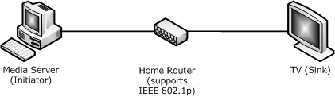

Figure 6: Example media server and TV, integrated media player network

The media server is used to stream media content to the TV. The home router that interconnects both devices supports IEEE 802.1p prioritization.

The qWave Protocol can be used by the media server to estimate the available bandwidth of the path between the media server and the TV. It can also be used to discover that the home router does indeed support 802.1p prioritization, which then allows the media server to mark the packets in its stream as high priority.

The following figure shows the protocol exchange between the media server and the TV.

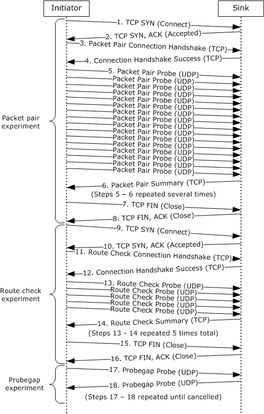

Figure 7: Protocol exchange between initiator and sink device

The following list describes each step in the protocol exchange:

- The [**initiator**](#gt_initiator) initiates a TCP connection with the [**sink**](#gt_sink) device at destination port 2177. A higher-layer application has requested a Packet Pair experiment.
- The sink device accepts the TCP connection.
- The initiator constructs a Packet Pair Connection Handshake message and sends it to the sink device over the TCP connection.
- The sink acknowledges the handshake message from step 3 and constructs its own Connection Handshake Success message and sends it to the initiator over the TCP connection.
- The initiator begins sending a series of 16 Packet Pair Probe messages to the sink over UDP. The exact characteristics of these messages are detailed in section [3.1.6.4](#Section_3.1.6.4).
- The sink acknowledges the 16 Packet Pair Probe messages sent by the initiator by sending back a Packet Pair Summary message describing what it saw. Steps 5 and 6 are repeated until the conditions specified in section 3.1.6.4 are satisfied.
- The initiator has obtained enough timestamp data from the Packet Pair Summary messages, so it closes the TCP connection with the sink. The higher-layer application that requested the Packet Pair experiment now knows the bottleneck bandwidth of the path between the initiator and sink.
- The sink acknowledges the TCP connection close. The Packet Pair experiment is complete.
- The initiator initiates a TCP connection with the sink device at destination port 2177. A higher-layer application has requested a Route Check experiment.
- The sink device accepts the TCP connection.
- The initiator constructs a Route Check Connection Handshake message and sends it to the sink device over the TCP connection.
- The sink acknowledges the handshake message from step 11 and constructs its own Connection Handshake Success message and sends it to the initiator over the TCP connection.
- The initiator begins sending a series of five Route Check Probe messages to the sink over UDP. The exact characteristics of these messages are detailed in section [3.1.6.2](#Section_3.1.6.2).
- The sink acknowledges the five Route Check Probe messages sent by the initiator by sending back a Route Check Summary message describing what it saw. Steps 13 and 14 are then repeated an additional 4 times. In this case, since the home router in this case supports IEEE 802.1p prioritization, the Obs flag in the Handshake header of the Route Check Summary message is set to 0x00 (No issue detected).
- The initiator has obtained all the information it needs to make a decision about whether the path between the initiator and the sink supports IEEE 802.1p (that is, that the path does support 802.1p). The initiator proceeds to close the TCP connection with the sink.
- The sink acknowledges the TCP connection close. The Route Check experiment is complete with the status Prioritization Supported.
- A higher-layer application requests a Probegap experiment with the sink. At this point, the application is interested in knowing the available bandwidth of the path between the initiator and the sink. Note that the Probegap experiment continues until the application explicitly requests cancellation. The initiator sends a Probegap Probe message to the sink over UDP.
- The sink acknowledges a Probegap Probe message sent by the initiator and sends a copy back to the initiator over UDP. Note that steps 17 and 18 do not necessarily execute in this exact order. The order is highly dependent on the latency of the link and the processing prowess of the initiator and sink devices. In other words, the initiator could send more than one Probegap Probe messages before receiving the first reply from the sink.

# 5 Security

## 5.1 Security Considerations for Implementers

None.

## 5.2 Index of Security Parameters

None.

# 6 Appendix A: Product Behavior

The information in this specification is applicable to the following Microsoft products or supplemental software. References to product versions include updates to those products.

- Windows Vista operating system
- Windows 7 operating system
- Windows 8 operating system
- Windows 8.1 operating system
- Windows 10 operating system
- Windows 11 operating system
Exceptions, if any, are noted in this section. If an update version, service pack or Knowledge Base (KB) number appears with a product name, the behavior changed in that update. The new behavior also applies to subsequent updates unless otherwise specified. If a product edition appears with the product version, behavior is different in that product edition.

Unless otherwise specified, any statement of optional behavior in this specification that is prescribed using the terms "SHOULD" or "SHOULD NOT" implies product behavior in accordance with the SHOULD or SHOULD NOT prescription. Unless otherwise specified, the term "MAY" implies that the product does not follow the prescription.

<1> Section 1.3: Windows Vista supports both the initiator and sink roles. Windows 7, Windows 8, Windows 8.1, and Windows 10 support only the [**initiator**](#gt_initiator) role.

<2> Section 2.2.1.1: Windows Vista also treats all illegal **Proto_and_Msg_ID** values as equivalent to 0x00 (Discard message) while operating in the sink role.

# 7 Change Tracking

This section identifies changes that were made to this document since the last release. Changes are classified as Major, Minor, or None.

The revision class **Major** means that the technical content in the document was significantly revised. Major changes affect protocol interoperability or implementation. Examples of major changes are:

- A document revision that incorporates changes to interoperability requirements.
- A document revision that captures changes to protocol functionality.
The revision class **Minor** means that the meaning of the technical content was clarified. Minor changes do not affect protocol interoperability or implementation. Examples of minor changes are updates to clarify ambiguity at the sentence, paragraph, or table level.

The revision class **None** means that no new technical changes were introduced. Minor editorial and formatting changes may have been made, but the relevant technical content is identical to the last released version.

The changes made to this document are listed in the following table. For more information, please contact [dochelp@microsoft.com](mailto:dochelp@microsoft.com).

| Section | Description | Revision class |
| --- | --- | --- |
| [6](#Section_6) Appendix A: Product Behavior | Updated for this version of Windows Client. | Major |

## Revision History

| Date | Version | Revision Class | Comments |
| --- | --- | --- | --- |
| 9/25/2009 | 0.1 | Major | First Release. |
| 11/6/2009 | 0.1.1 | Editorial | Changed language and formatting in the technical content. |
| 12/18/2009 | 0.1.2 | Editorial | Changed language and formatting in the technical content. |
| 1/29/2010 | 0.1.3 | Editorial | Changed language and formatting in the technical content. |
| 3/12/2010 | 0.1.4 | Editorial | Changed language and formatting in the technical content. |
| 4/23/2010 | 0.2 | Minor | Clarified the meaning of the technical content. |
| 6/4/2010 | 0.2.1 | Editorial | Changed language and formatting in the technical content. |
| 7/16/2010 | 0.2.1 | None | No changes to the meaning, language, or formatting of the technical content. |
| 8/27/2010 | 0.2.1 | None | No changes to the meaning, language, or formatting of the technical content. |
| 10/8/2010 | 0.2.1 | None | No changes to the meaning, language, or formatting of the technical content. |
| 11/19/2010 | 0.2.1 | None | No changes to the meaning, language, or formatting of the technical content. |
| 1/7/2011 | 0.2.1 | None | No changes to the meaning, language, or formatting of the technical content. |
| 2/11/2011 | 0.2.1 | None | No changes to the meaning, language, or formatting of the technical content. |
| 3/25/2011 | 0.2.1 | None | No changes to the meaning, language, or formatting of the technical content. |
| 5/6/2011 | 0.2.1 | None | No changes to the meaning, language, or formatting of the technical content. |
| 6/17/2011 | 0.3 | Minor | Clarified the meaning of the technical content. |
| 9/23/2011 | 0.3 | None | No changes to the meaning, language, or formatting of the technical content. |
| 12/16/2011 | 1.0 | Major | Updated and revised the technical content. |
| 3/30/2012 | 1.0 | None | No changes to the meaning, language, or formatting of the technical content. |
| 7/12/2012 | 1.0 | None | No changes to the meaning, language, or formatting of the technical content. |
| 10/25/2012 | 1.0 | None | No changes to the meaning, language, or formatting of the technical content. |
| 1/31/2013 | 1.0 | None | No changes to the meaning, language, or formatting of the technical content. |
| 8/8/2013 | 2.0 | Major | Updated and revised the technical content. |
| 11/14/2013 | 3.0 | Major | Updated and revised the technical content. |
| 2/13/2014 | 4.0 | Major | Updated and revised the technical content. |
| 5/15/2014 | 4.0 | None | No changes to the meaning, language, or formatting of the technical content. |
| 6/30/2015 | 5.0 | Major | Significantly changed the technical content. |
| 10/16/2015 | 5.0 | None | No changes to the meaning, language, or formatting of the technical content. |
| 7/14/2016 | 5.0 | None | No changes to the meaning, language, or formatting of the technical content. |
| 6/1/2017 | 5.0 | None | No changes to the meaning, language, or formatting of the technical content. |
| 6/25/2021 | 6.0 | Major | Significantly changed the technical content. |
