# [MS-RA]: Remote Assistance Protocol

Table of Contents

1 Introduction

- [1 Introduction](#Section_1)
  - [1.1 Glossary](#Section_1.1)
  - [1.2 References](#Section_1.2)
    - [1.2.1 Normative References](#Section_1.2.1)
    - [1.2.2 Informative References](#Section_1.2.2)
  - [1.3 Overview](#Section_1.3)
    - [1.3.1 Session Initialization](#Section_1.3.1)
    - [1.3.2 File Transfer](#Section_1.3.2)
    - [1.3.3 Share Control](#Section_1.3.3)
    - [1.3.4 Chat](#Section_1.3.4)
    - [1.3.5 VoIP Control](#Section_1.3.5)
  - [1.4 Relationship to Other Protocols](#Section_1.4)
  - [1.5 Prerequisites/Preconditions](#Section_1.5)
  - [1.6 Applicability Statement](#Section_1.6)
  - [1.7 Versioning and Capability Negotiation](#Section_1.7)
  - [1.8 Vendor-Extensible Fields](#Section_1.8)
  - [1.9 Standards Assignments](#Section_1.9)

2 Messages

- [2 Messages](#Section_2)
  - [2.1 Transport](#Section_2.1)
  - [2.2 Message Syntax](#Section_2.2)
    - [2.2.1 Session Initialization Messages](#Section_2.2.1)
      - [2.2.1.1 REMOTEDESKTOP_CHANNELBUFHEADER](#Section_2.2.1.1)
      - [2.2.1.2 REMOTEDESKTOP_CTL_PACKETHEADER](#Section_2.2.1.2)
      - [2.2.1.3 REMOTEDESKTOP_CTL_BUFHEADER](#Section_2.2.1.3)
      - [2.2.1.4 REMOTEDESKTOP_CTL_AUTHENTICATE_PACKET](#Section_2.2.1.4)
      - [2.2.1.5 REMOTEDESKTOP_CTL_DISCONNECT_PACKET](#Section_2.2.1.5)
      - [2.2.1.6 REMOTEDESKTOP_CTL_ISCONNECTED_PACKET](#Section_2.2.1.6)
      - [2.2.1.7 REMOTEDESKTOP_CTL_SERVER_ANNOUNCE](#Section_2.2.1.7)
      - [2.2.1.8 REMOTEDESKTOP_CTL_VERSIONINFO_PACKET](#Section_2.2.1.8)
      - [2.2.1.9 REMOTEDESKTOP_CTL_REMOTE_CONTROL_DESKTOP_PACKET](#Section_2.2.1.9)
      - [2.2.1.10 REMOTEDESKTOP_CTL_RESULT_PACKET](#Section_2.2.1.10)
      - [2.2.1.11 REMOTEDESKTOP_CTL_VERIFY_PASSWORD_PACKET](#Section_2.2.1.11)
      - [2.2.1.12 REMOTEDESKTOP_EXPERT_ON_VISTA](#Section_2.2.1.12)
      - [2.2.1.13 REMOTEDESKTOP_CTL_RANOVICE_NAME](#Section_2.2.1.13)
      - [2.2.1.14 REMOTEDESKTOP_CTL_RAEXPERT_NAME](#Section_2.2.1.14)
      - [2.2.1.15 REMOTEDESKTOP_CTL_TOKEN_PACKET](#Section_2.2.1.15)
    - [2.2.2 Session Control (RCCOMMAND)](#Section_2.2.2)
    - [2.2.3 File Transfer Commands](#Section_2.2.3)
    - [2.2.4 Session Authorization Token](#Section_2.2.4)
    - [2.2.5 Remote Assistance Contact Information](#Section_2.2.5)
    - [2.2.6 Remote Assistance Error Codes](#Section_2.2.6)
    - [2.2.7 Extensions to the Remote Desktop Protocol](#Section_2.2.7)
      - [2.2.7.1 Fast-Path Update Wrapper (MSRA_FP_UPDATE_WRAPPER)](#Section_2.2.7.1)
      - [2.2.7.2 Client Info PDU](#Section_2.2.7.2)

3 Protocol Details

- [3 Protocol Details](#Section_3)
  - [3.1 Establishing a Remote Assistance Connection - Expert Details](#Section_3.1)
    - [3.1.1 Abstract Data Model](#Section_3.1.1)
    - [3.1.2 Timers](#Section_3.1.2)
    - [3.1.3 Initialization](#Section_3.1.3)
    - [3.1.4 Higher-Layer Triggered Events](#Section_3.1.4)
    - [3.1.5 Message Processing Events and Sequencing Rules](#Section_3.1.5)
    - [3.1.6 Timer Events](#Section_3.1.6)
    - [3.1.7 Other Local Events](#Section_3.1.7)
  - [3.2 Establishing a Remote Assistance Connection - Novice Details](#Section_3.2)
    - [3.2.1 Abstract Data Model](#Section_3.2.1)
    - [3.2.2 Timers](#Section_3.2.2)
    - [3.2.3 Initialization](#Section_3.2.3)
    - [3.2.4 Higher-Layer Triggered Events](#Section_3.2.4)
    - [3.2.5 Message Processing Events and Sequencing Rules](#Section_3.2.5)
    - [3.2.6 Timer Events](#Section_3.2.6)
    - [3.2.7 Other Local Events](#Section_3.2.7)
  - [3.3 Session Initialization Using the Expert (Client) Implementing Only Version 1 Details](#Section_3.3)
    - [3.3.1 Abstract Data Model](#Section_3.3.1)
    - [3.3.2 Timers](#Section_3.3.2)
    - [3.3.3 Initialization](#Section_3.3.3)
    - [3.3.4 Higher-Layer Triggered Events](#Section_3.3.4)
    - [3.3.5 Message Processing Events and Sequencing Rules](#Section_3.3.5)
    - [3.3.6 Timer Events](#Section_3.3.6)
    - [3.3.7 Other Local Events](#Section_3.3.7)
  - [3.4 Session Initialization Using the Novice (Server) Implementing Only Version 1 Details](#Section_3.4)
    - [3.4.1 Abstract Data Model](#Section_3.4.1)
    - [3.4.2 Timers](#Section_3.4.2)
    - [3.4.3 Initialization](#Section_3.4.3)
    - [3.4.4 Higher-Layer Triggered Events](#Section_3.4.4)
    - [3.4.5 Message Processing Events and Sequencing Rules](#Section_3.4.5)
    - [3.4.6 Timer Events](#Section_3.4.6)
    - [3.4.7 Other Local Events](#Section_3.4.7)
  - [3.5 Session Initialization Using the Expert (Client) Implementing Version 1 and Version 2 Details](#Section_3.5)
    - [3.5.1 Abstract Data Model](#Section_3.5.1)
    - [3.5.2 Timers](#Section_3.5.2)
    - [3.5.3 Initialization](#Section_3.5.3)
    - [3.5.4 Higher-Layer Triggered Events](#Section_3.5.4)
    - [3.5.5 Message Processing Events and Sequencing Rules](#Section_3.5.5)
    - [3.5.6 Timer Events](#Section_3.5.6)
    - [3.5.7 Other Local Events](#Section_3.5.7)
  - [3.6 Session Initialization Using the Novice (Server) Implementing Version 1 and Version 2 Details](#Section_3.6)
    - [3.6.1 Abstract Data Model](#Section_3.6.1)
    - [3.6.2 Timers](#Section_3.6.2)
    - [3.6.3 Initialization](#Section_3.6.3)
    - [3.6.4 Higher-Layer Triggered Events](#Section_3.6.4)
    - [3.6.5 Message Processing Events and Sequencing Rules](#Section_3.6.5)
    - [3.6.6 Timer Events](#Section_3.6.6)
    - [3.6.7 Other Local Events](#Section_3.6.7)
  - [3.7 Session Initialization Using the Expert (Client) Implementing Version 1, Version 2, and Version 3 Details](#Section_3.7)
    - [3.7.1 Abstract Data Model](#Section_3.7.1)
    - [3.7.2 Timers](#Section_3.7.2)
    - [3.7.3 Initialization](#Section_3.7.3)
    - [3.7.4 Higher-Layer Triggered Events](#Section_3.7.4)
    - [3.7.5 Message Processing Events and Sequencing Rules](#Section_3.7.5)
    - [3.7.6 Timer Events](#Section_3.7.6)
    - [3.7.7 Other Local Events](#Section_3.7.7)
  - [3.8 Session Initialization Using the Novice (Server) Implementing Version 1, Version 2, and Version 3 Details](#Section_3.8)
    - [3.8.1 Abstract Data Model](#Section_3.8.1)
    - [3.8.2 Timers](#Section_3.8.2)
    - [3.8.3 Initialization](#Section_3.8.3)
    - [3.8.4 Higher-Layer Triggered Events](#Section_3.8.4)
    - [3.8.5 Message Processing Events and Sequencing Rules](#Section_3.8.5)
    - [3.8.6 Timer Events](#Section_3.8.6)
    - [3.8.7 Other Local Events](#Section_3.8.7)
  - [3.9 File Transfer Sender Details](#Section_3.9)
    - [3.9.1 Abstract Data Model](#Section_3.9.1)
    - [3.9.2 Timers](#Section_3.9.2)
    - [3.9.3 Initialization](#Section_3.9.3)
    - [3.9.4 Higher-Layer Triggered Events](#Section_3.9.4)
    - [3.9.5 Message Processing Events and Sequencing Rules](#Section_3.9.5)
    - [3.9.6 Timer Events](#Section_3.9.6)
    - [3.9.7 Other Local Events](#Section_3.9.7)
  - [3.10 File Transfer Receiver Details](#Section_3.10)
    - [3.10.1 Abstract Data Model](#Section_3.10.1)
    - [3.10.2 Timers](#Section_3.10.2)
    - [3.10.3 Initialization](#Section_3.10.3)
    - [3.10.4 Higher-Layer Triggered Events](#Section_3.10.4)
    - [3.10.5 Message Processing Events and Sequencing Rules](#Section_3.10.5)
    - [3.10.6 Timer Events](#Section_3.10.6)
    - [3.10.7 Other Local Events](#Section_3.10.7)
  - [3.11 Chat (Text) Sender Details](#Section_3.11)
    - [3.11.1 Abstract Data Model](#Section_3.11.1)
    - [3.11.2 Timers](#Section_3.11.2)
    - [3.11.3 Initialization](#Section_3.11.3)
    - [3.11.4 Higher-Layer Triggered Events](#Section_3.11.4)
    - [3.11.5 Message Processing Events and Sequencing Rules](#Section_3.11.5)
    - [3.11.6 Timer Events](#Section_3.11.6)
    - [3.11.7 Other Local Events](#Section_3.11.7)
  - [3.12 Chat (Text) Receiver Details](#Section_3.12)
    - [3.12.1 Abstract Data Model](#Section_3.12.1)
    - [3.12.2 Timers](#Section_3.12.2)
    - [3.12.3 Initialization](#Section_3.12.3)
    - [3.12.4 Higher-Layer Triggered Events](#Section_3.12.4)
    - [3.12.5 Message Processing Events and Sequencing Rules](#Section_3.12.5)
    - [3.12.6 Timer Events](#Section_3.12.6)
    - [3.12.7 Other Local Events](#Section_3.12.7)
  - [3.13 Setting Announcement Sender Details](#Section_3.13)
    - [3.13.1 Abstract Data Model](#Section_3.13.1)
    - [3.13.2 Timers](#Section_3.13.2)
    - [3.13.3 Initialization](#Section_3.13.3)
    - [3.13.4 Higher-Layer Triggered Events](#Section_3.13.4)
    - [3.13.5 Message Processing Events and Sequencing Rules](#Section_3.13.5)
    - [3.13.6 Timer Events](#Section_3.13.6)
    - [3.13.7 Other Local Events](#Section_3.13.7)
  - [3.14 Setting Announcement Receiver Details](#Section_3.14)
    - [3.14.1 Abstract Data Model](#Section_3.14.1)
    - [3.14.2 Timers](#Section_3.14.2)
    - [3.14.3 Initialization](#Section_3.14.3)
    - [3.14.4 Higher-Layer Triggered Events](#Section_3.14.4)
    - [3.14.5 Message Processing Events and Sequencing Rules](#Section_3.14.5)
    - [3.14.6 Timer Events](#Section_3.14.6)
    - [3.14.7 Other Local Events](#Section_3.14.7)
  - [3.15 Share Control Remote Assistance Expert (Client) Details](#Section_3.15)
    - [3.15.1 Abstract Data Model](#Section_3.15.1)
    - [3.15.2 Timers](#Section_3.15.2)
    - [3.15.3 Initialization](#Section_3.15.3)
    - [3.15.4 Higher-Layer Triggered Events](#Section_3.15.4)
    - [3.15.5 Message Processing Events and Sequencing Rules](#Section_3.15.5)
    - [3.15.6 Timer Events](#Section_3.15.6)
    - [3.15.7 Other Local Events](#Section_3.15.7)
  - [3.16 Share Control Remote Assistance Novice (Server) Details](#Section_3.16)
    - [3.16.1 Abstract Data Model](#Section_3.16.1)
    - [3.16.2 Timers](#Section_3.16.2)
    - [3.16.3 Initialization](#Section_3.16.3)
    - [3.16.4 Higher-Layer Triggered Events](#Section_3.16.4)
    - [3.16.5 Message Processing Events and Sequencing Rules](#Section_3.16.5)
    - [3.16.6 Timer Events](#Section_3.16.6)
    - [3.16.7 Other Local Events](#Section_3.16.7)
  - [3.17 Voice Expert (Client) Details](#Section_3.17)
    - [3.17.1 Abstract Data Model](#Section_3.17.1)
    - [3.17.2 Timers](#Section_3.17.2)
    - [3.17.3 Initialization](#Section_3.17.3)
    - [3.17.4 Higher-Layer Triggered Events](#Section_3.17.4)
    - [3.17.5 Message Processing Events and Sequencing Rules](#Section_3.17.5)
    - [3.17.6 Timer Events](#Section_3.17.6)
    - [3.17.7 Other Local Events](#Section_3.17.7)
  - [3.18 Voice Novice (Server) Details](#Section_3.18)
    - [3.18.1 Abstract Data Model](#Section_3.18.1)
    - [3.18.2 Timers](#Section_3.18.2)
    - [3.18.3 Initialization](#Section_3.18.3)
    - [3.18.4 Higher-Layer Triggered Events](#Section_3.18.4)
    - [3.18.5 Message Processing Events and Sequencing Rules](#Section_3.18.5)
    - [3.18.6 Timer Events](#Section_3.18.6)
    - [3.18.7 Other Local Events](#Section_3.18.7)

4 Protocol Examples

- [4 Protocol Examples](#Section_4)
  - [4.1 Example of a VOIPGO Message](#Section_4.1)
  - [4.2 Example of a FILEXFER Message](#Section_4.2)

5 Security

- [5 Security](#Section_5)
  - [5.1 Security Considerations for Implementers](#Section_5.1)
  - [5.2 Index of Security Parameters](#Section_5.2)

6 Appendix A: Product Behavior

- [6 Appendix A: Product Behavior](#Section_6)

7 Change Tracking

- [7 Change Tracking](#Section_7)

For the legal notice and IP terms, see [LEGAL.md](../LEGAL.md).
Last updated: 1/13/2026.
See [Revision History](#revision-history) for full version history.

# 1 Introduction

This document describes the Remote Assistance Protocol. This protocol is used after a [**Remote Assistance connection**](#gt_remote-assistance-connection) is established between two computers. The protocol used to establish the Remote Assistance connection is specified in [MS-RAI](../MS-RAI/MS-RAI.md). After the Remote Assistance connection is established, this protocol is used to support communications and control between the two computers. The functions supported by the Remote Assistance Protocol are session initialization, file transfer, chat (text message exchange), share control, and Voice-over-IP ([**VoIP**](#gt_voice-over-ip-voip)) control.

Sections 1.5, 1.8, 1.9, 2, and 3 of this specification are normative. All other sections and examples in this specification are informative.

## 1.1 Glossary

This document uses the following terms:

**expert**: The side of a [**Remote Assistance connection**](#gt_remote-assistance-connection) that is able to view the remote screen of the other computer in order to provide help.

**novice**: The side of a [**Remote Assistance connection**](#gt_remote-assistance-connection) that shares its screen with the other computer in order to receive help.

**peer identity**: A public/private key pair used by the Peer Name Resolution Protocol (PNRP).

**peer name**: A string composed of an authority and a classifier. This is the string used by applications to resolve to a list of endpoints and/or an extended payload. A [**peer name**](#gt_peer-name) is not required to be unique. For example, several nodes that provide the same service can register the same [**Peer Name**](#gt_peer-name).

**Remote Assistance (RA)**: A feature of the operating system that allows screen, keyboard, and mouse sharing so that a computer user can be assisted by a remote helper.

**Remote Assistance connection**: A communication framework that is established between two computers that facilitates [**Remote Assistance**](#gt_remote-assistance-ra).

**Remote Assistance session**: A [**Remote Assistance connection**](#gt_remote-assistance-connection) that has been accepted by the [**novice**](#gt_novice). The [**expert**](#gt_expert) is able to view the [**novice's**](#gt_novice) screen once the [**Remote Assistance**](#gt_remote-assistance-ra) session is started.

**Remote Desktop Protocol (RDP)**: A multi-channel protocol that allows a user to connect to a computer running Microsoft Terminal Services (TS). RDP enables the exchange of client and server settings and also enables negotiation of common settings to use for the duration of the connection, so that input, graphics, and other data can be exchanged and processed between client and server.

**SHA-1 hash**: A hashing algorithm as specified in [[FIPS180-2]](https://go.microsoft.com/fwlink/?LinkId=89868) that was developed by the National Institute of Standards and Technology (NIST) and the National Security Agency (NSA).

**Transmission Control Protocol (TCP)**: A protocol used with the Internet Protocol (IP) to send data in the form of message units between computers over the Internet. TCP handles keeping track of the individual units of data (called packets) that a message is divided into for efficient routing through the Internet.

**Unicode**: A character encoding standard developed by the Unicode Consortium that represents almost all of the written languages of the world. The [**Unicode**](#gt_unicode) standard [[UNICODE5.0.0/2007]](https://go.microsoft.com/fwlink/?LinkId=154659) provides three forms (UTF-8, UTF-16, and UTF-32) and seven schemes (UTF-8, UTF-16, UTF-16 BE, UTF-16 LE, UTF-32, UTF-32 LE, and UTF-32 BE).

**Unicode string**: A [**Unicode**](#gt_unicode) 8-bit string is an ordered sequence of 8-bit units, a [**Unicode**](#gt_unicode) 16-bit string is an ordered sequence of 16-bit code units, and a [**Unicode**](#gt_unicode) 32-bit string is an ordered sequence of 32-bit code units. In some cases, it could be acceptable not to terminate with a terminating null character. Unless otherwise specified, all [**Unicode strings**](#gt_unicode-string) follow the UTF-16LE encoding scheme with no Byte Order Mark (BOM).

**virtual channel**: A transport used for communication between a client and a server component over a main data connection, in 1600-byte chunks, as specified in Static Virtual Channels in [MS-RDPBCGR](../MS-RDPBCGR/MS-RDPBCGR.md).

**Voice over IP (VoIP)**: The use of the Internet Protocol (IP) for transmitting voice communications. VoIP delivers digitized audio in packet form and can be used to transmit over intranets, extranets, and the Internet.

**MAY, SHOULD, MUST, SHOULD NOT, MUST NOT:** These terms (in all caps) are used as defined in [[RFC2119]](https://go.microsoft.com/fwlink/?LinkId=90317). All statements of optional behavior use either MAY, SHOULD, or SHOULD NOT.

## 1.2 References

Links to a document in the Microsoft Open Specifications library point to the correct section in the most recently published version of the referenced document. However, because individual documents in the library are not updated at the same time, the section numbers in the documents may not match. You can confirm the correct section numbering by checking the [Errata](https://go.microsoft.com/fwlink/?linkid=850906).

### 1.2.1 Normative References

We conduct frequent surveys of the normative references to assure their continued availability. If you have any issue with finding a normative reference, please contact [dochelp@microsoft.com](mailto:dochelp@microsoft.com). We will assist you in finding the relevant information.

[MS-DTYP] Microsoft Corporation, "[Windows Data Types](../MS-DTYP/MS-DTYP.md)".

[MS-PNRP] Microsoft Corporation, "[Peer Name Resolution Protocol (PNRP) Version 4.0](../MS-PNRP/MS-PNRP.md)".

[MS-RAIOP] Microsoft Corporation, "[Remote Assistance Initiation over PNRP Protocol](../MS-RAIOP/MS-RAIOP.md)".

[MS-RAI] Microsoft Corporation, "[Remote Assistance Initiation Protocol](../MS-RAI/MS-RAI.md)".

[MS-RDPBCGR] Microsoft Corporation, "[Remote Desktop Protocol: Basic Connectivity and Graphics Remoting](../MS-RDPBCGR/MS-RDPBCGR.md)".

[MS-RDPEGDI] Microsoft Corporation, "[Remote Desktop Protocol: Graphics Device Interface (GDI) Acceleration Extensions](../MS-RDPEGDI/MS-RDPEGDI.md)".

[MS-RDPEMC] Microsoft Corporation, "[Remote Desktop Protocol: Multiparty Virtual Channel Extension](../MS-RDPEMC/MS-RDPEMC.md)".

[RFC2119] Bradner, S., "Key words for use in RFCs to Indicate Requirement Levels", BCP 14, RFC 2119, March 1997, [https://www.rfc-editor.org/info/rfc2119](https://go.microsoft.com/fwlink/?LinkId=90317)

[RFC793] Postel, J., Ed., "Transmission Control Protocol: DARPA Internet Program Protocol Specification", RFC 793, September 1981, [https://www.rfc-editor.org/info/rfc793](https://go.microsoft.com/fwlink/?LinkId=150872)

[RFC8017] Moriarty, K., Ed., Kaliski, B., Jonsson, J., and Rusch, A., "PKCS #1: RSA Cryptography Specifications Version 2.2", November 2016, [https://www.rfc-editor.org/info/rfc8017](https://go.microsoft.com/fwlink/?linkid=2164409)

### 1.2.2 Informative References

[MSDN-RTC] Microsoft Corporation, "RTC Overview", [http://msdn.microsoft.com/en-us/library/ms775938.aspx](https://go.microsoft.com/fwlink/?LinkId=90115)

[MSKB-5073379] Microsoft Corporation, "January 2026 - 5073379", January 2026, [https://www.catalog.update.microsoft.com/Search.aspx?q=5073379](https://go.microsoft.com/fwlink/?linkid=2346014)

[MSKB-5073450] Microsoft Corporation, "January 2026 - 5073450", January 2026, [https://www.catalog.update.microsoft.com/Search.aspx?q=5073450](https://go.microsoft.com/fwlink/?linkid=2345535)

[MSKB-5073455] Microsoft Corporation, "January 2026 - 5073455", January 2026, [https://www.catalog.update.microsoft.com/Search.aspx?q=5073455](https://go.microsoft.com/fwlink/?linkid=2345424)

[MSKB-5073457] Microsoft Corporation, "January 2026 - 5073457", January 2026, [https://www.catalog.update.microsoft.com/Search.aspx?q=5073457](https://go.microsoft.com/fwlink/?linkid=2345536)

[MSKB-5073695] Microsoft Corporation, "January 2026 - 5073695", January 2026, [https://www.catalog.update.microsoft.com/Search.aspx?q=5073695](https://go.microsoft.com/fwlink/?linkid=2345539)

[MSKB-5073696] Microsoft Corporation, "January 2026 - 5073696", January 2026, [https://www.catalog.update.microsoft.com/Search.aspx?q=5073696](https://go.microsoft.com/fwlink/?linkid=2345426)

[MSKB-5073698] Microsoft Corporation, "January 2026 - 5073698", January 2026, [https://www.catalog.update.microsoft.com/Search.aspx?q=5073698](https://go.microsoft.com/fwlink/?linkid=2345538)

[MSKB-5073722] Microsoft Corporation, "January 2026 - 5073722", January 2026, [https://www.catalog.update.microsoft.com/Search.aspx?q=5073722](https://go.microsoft.com/fwlink/?linkid=2346017)

[MSKB-5073723] Microsoft Corporation, "January 2026 - 5073723", January 2026, [https://www.catalog.update.microsoft.com/Search.aspx?q=5073723](https://go.microsoft.com/fwlink/?linkid=2346015)

[MSKB-5073724] Microsoft Corporation, "January 2026 - 5073724", January 2026, [https://www.catalog.update.microsoft.com/Search.aspx?q=5073724](https://go.microsoft.com/fwlink/?linkid=2345537)

[MSKB-5074109] Microsoft Corporation, "January 2026 - 5074109", January 2026, [https://www.catalog.update.microsoft.com/Search.aspx?q=5074109](https://go.microsoft.com/fwlink/?linkid=2346013)

## 1.3 Overview

The Remote Assistance Protocol is used after a [**Remote Assistance connection**](#gt_remote-assistance-connection) is established to facilitate different capabilities used during the connection. This protocol supports six capabilities: basic connection, session initialization, file transfer, chat, share control, and [**VoIP**](#gt_voice-over-ip-voip) control.

After a basic Remote Assistance connection is made as specified in sections [3.1](#Section_3.1) and [3.2](#Section_3.2), the Remote Assistance Protocol uses [**virtual channels**](#gt_virtual-channel) as its underlying transport to accomplish these capabilities. There are four virtual channels used by the Remote Assistance Protocol:

- As specified in sections [3.3](#Section_3.3), [3.4](#Section_3.4), [3.5](#Section_1.3), [3.6](#Section_3.6), [3.7](#Section_3.7), and [3.8](#Section_3.8), the session initialization virtual channel is created after the Remote Assistance connection is made, and it persists through the duration of the Remote Assistance connection. This channel is used to do initial setup and configuration of the Remote Assistance connection and establish a [**Remote Assistance session**](#gt_remote-assistance-session).
- The file transfer virtual channel is created on demand to transfer file data.
- The chat virtual channel is created when the Remote Assistance connection is first established, and it persists through the duration of the Remote Assistance connection.
- The last virtual channel is used for share control and to initialize VoIP and file transfer.

### 1.3.1 Session Initialization

The session initialization capability supported by the Remote Assistance Protocol allows control messages to be exchanged between the [**novice**](#gt_novice) and the [**expert**](#gt_expert). This exchange has to be completed successfully for the [**Remote Assistance session**](#gt_remote-assistance-session) to be established.

Once the Remote Assistance session is established, the expert can view the novice's screen, and other [**Remote Assistance (RA)**](#gt_remote-assistance-ra) capabilities can be initiated.

### 1.3.2 File Transfer

The file transfer capability supported by the Remote Assistance Protocol enables files to be copied from one computer to another. Both computers have to be in a [**Remote Assistance session**](#gt_remote-assistance-session) to transfer files. The Remote Assistance Protocol supports the transfer of one file at a time. File transfers can occur in either direction (from [**expert**](#gt_expert) to [**novice**](#gt_novice) or from novice to expert). File transfers are originated by the sender (expert or novice) side and the receiver accepts the file to complete the file transfer.

A file transfer [**virtual channel**](#gt_virtual-channel) is created dynamically to transfer the file. Once the virtual channel is established, control messages and data messages are sent through the virtual channel to complete the transfer. The data messages contain the data that is in the file, and the control messages synchronize the file transfer between the two computers and confirm successful transfer.

### 1.3.3 Share Control

The share control capability supported by the Remote Assistance Protocol is used to control and synchronize the state of the [**Remote Assistance session**](#gt_remote-assistance-session) between two computers. When a Remote Assistance session is first established, it is in a view-only state, and the [**expert**](#gt_expert) can view the screen of the [**novice's**](#gt_novice) computer. To change state to the share-control state, the expert requests control, and control sharing is granted by the novice. The share control capability is used to enable state change and synchronize the Remote Assistance session state between the two computers.

A session control virtual channel is created when the [**Remote Assistance connection**](#gt_remote-assistance-connection) is established, and it is used to exchange share control messages between the two computers. The session control virtual channel persists for the duration of the Remote Assistance connection. Only control messages are sent through the session control virtual channel.

### 1.3.4 Chat

The chat capability supported by the Remote Assistance Protocol allows the exchange of text messages between two computers that are in a [**Remote Assistance session**](#gt_remote-assistance-session). A chat virtual channel is created when the [**Remote Assistance connection**](#gt_remote-assistance-connection) is established and persists through the duration of the Remote Assistance connection.

Once the chat virtual channel is created, text messages can be transported in a duplex manner between the two computers. All the messages that are sent through a chat virtual channel are text messages. The chat virtual channel does not have any control messages.

### 1.3.5 VoIP Control

The [**VoIP**](#gt_voice-over-ip-voip) (Voice over Internet Protocol) capability is used to control the audio communications between two computers in a [**Remote Assistance session**](#gt_remote-assistance-session). The VoIP control virtual channel is created dynamically if VoIP is attempted during a Remote Assistance session. The virtual channel is used to negotiate and control the VoIP connection. Voice data flow is an independent peer-to-peer communication and does not use the established virtual channel.

## 1.4 Relationship to Other Protocols

The Remote Assistance Protocol assumes that a Remote Assistance connection string between two computers has been transferred using the Remote Assistance Initiation [MS-RAI](../MS-RAI/MS-RAI.md) or Remote Assistance Initiation over PNRP [MS-RAIOP](../MS-RAIOP/MS-RAIOP.md) protocols. The Remote Assistance Protocol also assumes that underlying protocols, specifically the Remote Desktop Protocol: Basic Connectivity and Graphics Remoting [MS-RDPBCGR](../MS-RDPBCGR/MS-RDPBCGR.md) and the Remote Desktop Protocol: Graphics Devices Interfaces (GDI) Acceleration Extension [MS-RDPEGDI](../MS-RDPEGDI/MS-RDPEGDI.md), will be available to transport the protocol messages after the basic [**Remote Assistance connection**](#gt_remote-assistance-connection) is made by the Remote Assistance protocol, using the [**Transmission Control Protocol (TCP)**](#gt_transmission-control-protocol-tcp) ([[RFC793]](https://go.microsoft.com/fwlink/?LinkId=150872)).

No other protocol is dependent on the Remote Assistance Protocol.

## 1.5 Prerequisites/Preconditions

See section [1.7](#Section_1.7) for the definitions of versions 1, 2, and 3 of the protocol.

Both the [**novice**](#gt_novice) and the [**expert**](#gt_expert) use the version 3 protocol, if the Remote Assistance Initiation over PNRP Protocol [MS-RAIOP](../MS-RAIOP/MS-RAIOP.md) is used to transfer the Remote Assistance Connection String.

The expert uses version 2 of the Remote Assistance Protocol if the Remote Assistance Connection String 2, as specified in [MS-RAI](../MS-RAI/MS-RAI.md) section 2.2.2 is obtained either by using the Remote Assistance Invitation File of the second type [MS-RAI] section 6 or when using the IRASrv interface [MS-RAI] section 3.4. The expert uses version 1 of the protocol if the Remote Assistance Connection String 1, as specified in [MS-RAI] section 2.2.1 is obtained either by using Remote Assistance Invitation File of the first type [MS-RAI] section 6 or when using the IPCHService interface [MS-RAI] section 3.4.

The novice uses either version 1 or 2 of the protocol when the Remote Assistance Initiation Protocol [MS-RAI] is used to transfer the Remote Assistance Connection String to the expert machine. Unless specified, any reference to the Remote Assistance Connection String refers to both the Remote Assistance Connection String 1 and the Remote Assistance Connection String 2.

## 1.6 Applicability Statement

This protocol is used to establish the basic [**Remote Assistance connection**](#gt_remote-assistance-connection), initialize the [**Remote Assistance (RA) session**](#gt_remote-assistance-session) and accomplish file transfer, share control, chat, and [**VoIP**](#gt_voice-over-ip-voip) control.

## 1.7 Versioning and Capability Negotiation

There are three versions of the Remote Assistance protocol.

Version 1: The first version of the Remote Assistance protocol consists of basic session initiation, chat, file transfer, and VoIP capabilities.

Version 2: The second version of the Remote Assistance protocol was introduced to improve compatibility across future versions.

Version 3: The third version of the Remote Assistance protocol was introduced to include the capability to initiate the Remote Assistance connection using the Remote Assistance Initiation over PNRP protocol.

Implementations support either version 1, version 1 and version 2, or version 1, version 2, and version 3. The negotiation of the protocol between the expert and the novice is described in section [3](#Section_1.3) of this document.

## 1.8 Vendor-Extensible Fields

There are no vendor-extensible fields in the Remote Assistance Protocol.

## 1.9 Standards Assignments

The Remote Assistance Protocol does not use any standards assignments.

# 2 Messages

## 2.1 Transport

When the [**Remote Assistance connection**](#gt_remote-assistance-connection) is started, it MUST create three [**virtual channels**](#gt_virtual-channel):

- The session initialization virtual channel is used to initialize the Remote Assistance session. If setup as a dynamic virtual channel it MUST be named "RC_CTL". If using a static virtual channel, it MUST be named "remdesk".
- A second virtual channel named "70" MUST be created, and is used to exchange chat messages.
- A third virtual channel named "71" MUST be created, and is used for share control and for the initialization of file transfer and [**VoIP**](#gt_voice-over-ip-voip) control.
These three virtual channels MUST persist for the duration of the [**Remote Assistance session**](#gt_remote-assistance-session).

A separate virtual channel for file transfer MUST be created dynamically when needed.

## 2.2 Message Syntax

In addition to the data types in the following sections, this protocol references commonly used data types as defined in [MS-DTYP](../MS-DTYP/MS-DTYP.md).

### 2.2.1 Session Initialization Messages

All of these messages MUST be sent and received over the session initialization ([RC_CTL](#Section_1.3.1)) [**virtual channel**](#gt_virtual-channel).

#### 2.2.1.1 REMOTEDESKTOP_CHANNELBUFHEADER

The REMOTEDESKTOP_CHANNELBUFHEADER data structure provides information about the size of the channel name and message data in a [**Remote Assistance (RA)**](#gt_remote-assistance-ra) virtual channel packet. This data structure is at the top of all RA channel packets. Channel name and message data immediately follow.

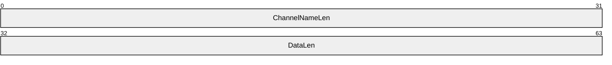
```mermaid
packet-beta
  0-31: "ChannelNameLen"
  32-63: "DataLen"
```

**ChannelNameLen (4 bytes):** Length of the virtual channel name in bytes. This is a DWORD.

**DataLen (4 bytes):** Length in bytes of the packet data. This is a DWORD.

#### 2.2.1.2 REMOTEDESKTOP_CTL_PACKETHEADER

The REMOTEDESKTOP_CTL_PACKETHEADER is the <[control message packet](#Section_2.2.2)> header.

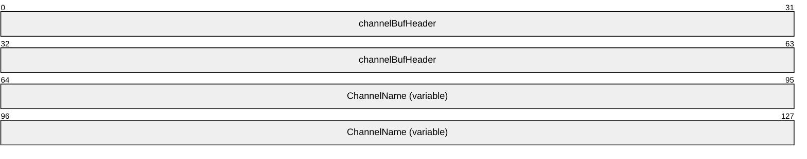
```mermaid
packet-beta
  0-63: "channelBufHeader"
  64-127: "ChannelName (variable)"
```

**channelBufHeader (8 bytes):** This is of type [REMOTEDESKTOP_CHANNELBUFHEADER](#Section_2.2.1.1).

**ChannelName (variable):** Null-terminated variable-length [**Unicode**](#gt_unicode) name of the virtual channel for which the packet is intended. The virtual channel name can vary, with the maximum length being 64 bytes.

| Value | Meaning |
| --- | --- |
| "RC_CTL" | Specifies the session initialization dynamic virtual channel. |
| "remdesk" | Specifies the session initialization static virtual channel if not using the dynamic channel RC_CTL. |
| "70" | Specifies the virtual channel used to exchange chat messages. |
| "71" | Specifies the virtual channel used for share control and for the initialization of file transfer and VoIP control. |
| "." | Specifies a file transfer. The valid string consists of the IP address of the novice initiating the transfer, the character '.', followed by the number of seconds since January 1, 1970, creating a unique value not verified by the receiver. An example of this would be "172.31.251.165.612009461". This is the case where the novice started the file transfer under version 1. |
| "1000." | Specifies a file transfer. The name consists of the characters "1000." followed by the number of seconds since January 1, 1970. This is the case where the expert started the file transfer under version 1. |
| "RA_FX" | Specifies a file transfer. This is used by either novice or expert under version 2 or version 3. |

Data immediately follows the **ChannelName** field and is transferred as a [**Unicode string**](#gt_unicode-string).

#### 2.2.1.3 REMOTEDESKTOP_CTL_BUFHEADER

The REMOTEDESKTOP_CTL_BUFHEADER describes the type of a [**Remote Assistance**](#gt_remote-assistance-ra) channel message.

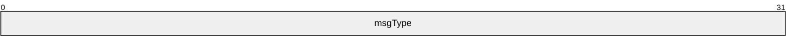
```mermaid
packet-beta
  0-31: "msgType"
```

**msgType (4 bytes):** A DWORD, in which the value is one of the following.

| Name | Value |
| --- | --- |
| REMOTEDESKTOP_CTL_REMOTE_CONTROL_DESKTOP | 1 |
| REMOTEDESKTOP_CTL_RESULT | 2 |
| REMOTEDESKTOP_CTL_AUTHENTICATE | 3 |
| REMOTEDESKTOP_CTL_SERVER_ANNOUNCE | 4 |
| REMOTEDESKTOP_CTL_DISCONNECT | 5 |
| REMOTEDESKTOP_CTL_VERSIONINFO | 6 |
| REMOTEDESKTOP_CTL_ISCONNECTED | 7 |
| REMOTEDESKTOP_CTL_VERIFY_PASSWORD | 8 |
| REMOTEDESKTOP_EXPERT_ON_VISTA | 9 |
| REMOTEDESKTOP_CTL_RANOVICE_NAME | 10 |
| REMOTEDESKTOP_CTL_RAEXPERT_NAME | 11 |
| REMOTEDESKTOP_CTL_TOKEN (This attribute is only supported by version 3.) | 12 |

#### 2.2.1.4 REMOTEDESKTOP_CTL_AUTHENTICATE_PACKET

The REMOTEDESKTOP_CTL_AUTHENTICATE_PACKET is the [**expert**](#gt_expert) authentication response packet. The expert sends this packet that includes the [**Remote Assistance connection**](#gt_remote-assistance-connection) string to the [**novice**](#gt_novice) requesting authentication. The REMOTEDESKTOP_CTL_AUTHENTICATE_PACKET is used only when the novice or expert is using version 1.

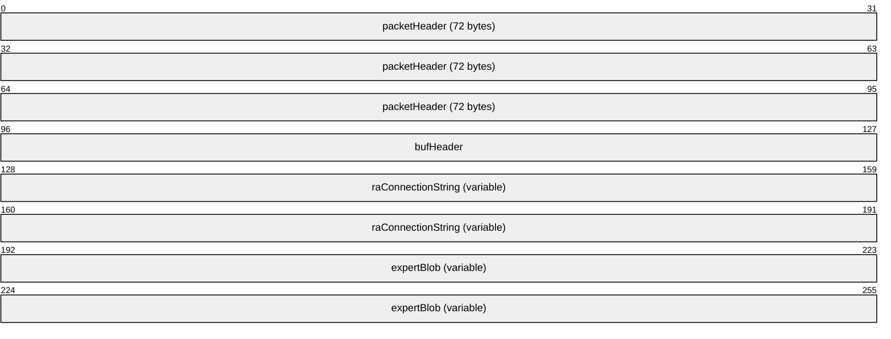
```mermaid
packet-beta
  0-95: "packetHeader (72 bytes)"
  96-127: "bufHeader"
  128-191: "raConnectionString (variable)"
  192-255: "expertBlob (variable)"
```

**packetHeader (72 bytes):** The [REMOTEDESKTOP_CTL_PACKETHEADER](#Section_2.2.1.2) part of the packet. The virtual channel name MUST be set to "RC_CTL".

**bufHeader (4 bytes):** The [REMOTEDESKTOP_CTL_BUFHEADER](#Section_2.2.1.3) part of the packet. The packet type MUST be set to REMOTEDESKTOP_CTL_AUTHENTICATE.

**raConnectionString (variable):** A NULL-terminated, variable-length [**Unicode string**](#gt_unicode-string) containing the Remote Assistance connection string, as specified in [MS-RAI](../MS-RAI/MS-RAI.md) sections 2.2.1 and 2.2.2.

**expertBlob (variable):** A NULL-terminated, variable-length, semicolon-delimited, [**Unicode**](#gt_unicode)-based set of PropertyName, PropertyValue pairs. Each pair is also prefixed with the length of the characters in the pair, including the equal (=) sign. For example, if PropertyName is "NAME", and PropertyValue is "John", the value of **expertBlob** is "9;NAME=John". This is a mechanism to provide more information about the expert that is connecting to the novice. "NAME" and "PASS" are the only two properties used in expertBlob. The PASS property is used when the Remote Assistance Invitation File is protected by a password in version 1, or when a version 1 expert is making a connection with a Remote Assistance Invitation File. The PASS property value is a string that contains the result of encrypting the PassStub in the Remote Assistance Invitation File with the password. For more details, see [MS-RAI] section 6.

#### 2.2.1.5 REMOTEDESKTOP_CTL_DISCONNECT_PACKET

The REMOTEDESKTOP_CTL_DISCONNECT_PACKET indicates that the sender has disconnected.

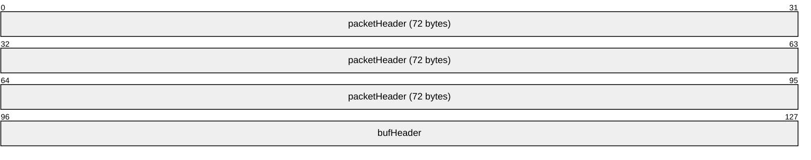
```mermaid
packet-beta
  0-95: "packetHeader (72 bytes)"
  96-127: "bufHeader"
```

**packetHeader (72 bytes):** The [REMOTEDESKTOP_CTL_PACKETHEADER](#Section_2.2.1.2) part of the packet. The virtual channel name MUST be set to "RC_CTL".

**bufHeader (4 bytes):** The [REMOTEDESKTOP_CTL_BUFHEADER](#Section_2.2.1.3) part of the packet. The packet type MUST be set to REMOTEDESKTOP_CTL_DISCONNECT.

It is possible that a disconnected client or server will not send this packet. The [REMOTEDESKTOP_CTL_ISCONNECTED_PACKET](#Section_2.2.1.6) packet can be used to track the connection state. There is no other additional data.

#### 2.2.1.6 REMOTEDESKTOP_CTL_ISCONNECTED_PACKET

The REMOTEDESKTOP_CTL_ISCONNECTED_PACKET indicates that the sender is present and is used in version 1 only.

```mermaid
packet-beta
  0-95: "packetHeader (72 bytes)"
  96-127: "bufHeader"
```

**packetHeader (72 bytes):** The [REMOTEDESKTOP_CTL_PACKETHEADER](#Section_2.2.1.2) part of the packet. The virtual channel name MUST be set to "RC_CTL".

**bufHeader (4 bytes):** The [REMOTEDESKTOP_CTL_BUFHEADER](#Section_2.2.1.3) part of the packet. The packet type MUST be set to REMOTEDESKTOP_CTL_ISCONNECTED.

There is no additional data beyond this.

#### 2.2.1.7 REMOTEDESKTOP_CTL_SERVER_ANNOUNCE

The REMOTEDESKTOP_CTL_SERVER_ANNOUNCE packet is sent from the server to the client to begin the [**Remote Assistance session**](#gt_remote-assistance-session) connection sequence.

```mermaid
packet-beta
  0-95: "packetHeader (72 bytes)"
  96-127: "bufHeader"
```

**packetHeader (72 bytes):** The [REMOTEDESKTOP_CTL_PACKETHEADER](#Section_2.2.1.2) part of the packet. The virtual channel name MUST be set to "RC_CTL".

**bufHeader (4 bytes):** The [REMOTEDESKTOP_CTL_BUFHEADER](#Section_2.2.1.3) part of the packet. The packet type MUST be set to REMOTEDESKTOP_CTL_SERVER_ANNOUNCE.

#### 2.2.1.8 REMOTEDESKTOP_CTL_VERSIONINFO_PACKET

The REMOTEDESKTOP_CTL_VERSIONINFO_PACKET indicates the version of the [**Remote Desktop Protocol**](#gt_remote-desktop-protocol-rdp) to be used by the [**novice**](#gt_novice) and the [**expert**](#gt_expert). It includes a major and a minor version. This packet is sent either from the novice to the expert or vice versa.

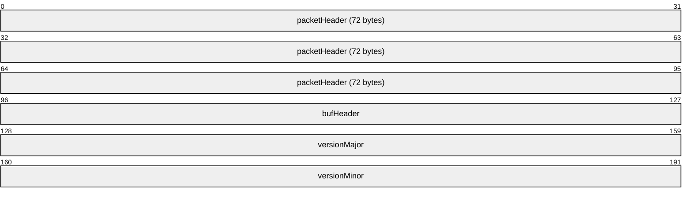
```mermaid
packet-beta
  0-95: "packetHeader (72 bytes)"
  96-127: "bufHeader"
  128-159: "versionMajor"
  160-191: "versionMinor"
```

**packetHeader (72 bytes):** The [REMOTEDESKTOP_CTL_PACKETHEADER](#Section_2.2.1.2) part of the packet. The virtual channel name MUST be set to "RC_CTL".

**bufHeader (4 bytes):** The [REMOTEDESKTOP_CTL_BUFHEADER](#Section_2.2.1.3) part of the packet. The packet type MUST be set to REMOTEDESKTOP_CTL_VERSIONINFO.

**versionMajor (4 bytes):** Major version number of the Remote Desktop Protocol implemented by the sender as a DWORD.

**versionMinor (4 bytes):** Minor version number of the Remote Desktop Protocol implemented by the sender as a DWORD.

The versionMajor and versionMinor fields are used in version 1 only and MUST be set to 1 and 2, respectively. If this is not the case, the version 1 novice and version 1 expert both disconnect. To keep compatibility with version 1 and version 2, clients send this message but do not take any action upon receiving the message. In version 3, this message is not sent and is ignored when it is received.

#### 2.2.1.9 REMOTEDESKTOP_CTL_REMOTE_CONTROL_DESKTOP_PACKET

The REMOTEDESKTOP_CTL_REMOTE_CONTROL_DESKTOP_PACKET is sent by the [**expert**](#gt_expert) to the [**novice**](#gt_novice) to request a view of the novice screen. This packet is sent only in version 1.

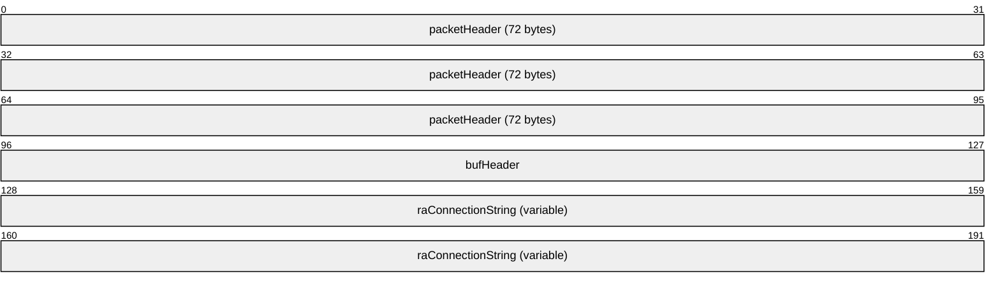
```mermaid
packet-beta
  0-95: "packetHeader (72 bytes)"
  96-127: "bufHeader"
  128-191: "raConnectionString (variable)"
```

**packetHeader (72 bytes):** The [REMOTEDESKTOP_CTL_PACKETHEADER](#Section_2.2.1.2) part of the packet. The virtual channel name MUST be set to "RC_CTL".

**bufHeader (4 bytes):** The [REMOTEDESKTOP_CTL_BUFHEADER](#Section_2.2.1.3) part of the packet. The packet type MUST be set to REMOTEDESKTOP_CTL_REMOTE_CONTROL_DESKTOP.

**raConnectionString (variable):** A variable-length string containing a Remote Assistance Connection String, as defined in [MS-RAI](../MS-RAI/MS-RAI.md) sections 2.2.1 and 2.2.2.

#### 2.2.1.10 REMOTEDESKTOP_CTL_RESULT_PACKET

The REMOTEDESKTOP_CTL_RESULT_PACKET indicates the result of a client request.

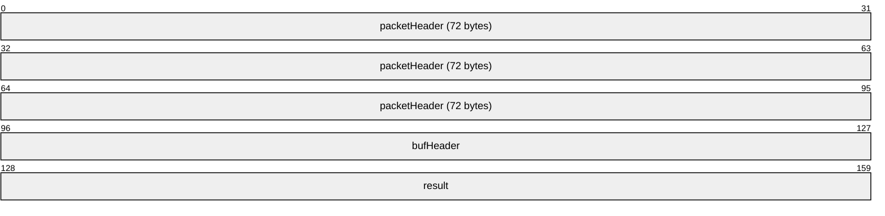
```mermaid
packet-beta
  0-95: "packetHeader (72 bytes)"
  96-127: "bufHeader"
  128-159: "result"
```

**packetHeader (72 bytes):** The [REMOTEDESKTOP_CTL_PACKETHEADER](#Section_2.2.1.2) part of the packet. The virtual channel name MUST be set to "RC_CTL".

**bufHeader (4 bytes):** The [REMOTEDESKTOP_CTL_BUFHEADER](#Section_2.2.1.3) part of the packet. The packet type MUST be set to REMOTEDESKTOP_CTL_RESULT.

**result (4 bytes):** One of the values from the [Remote Assistance Error Codes](#Section_2.2.6), as a DWORD.

#### 2.2.1.11 REMOTEDESKTOP_CTL_VERIFY_PASSWORD_PACKET

The REMOTEDESKTOP_CTL_VERIFY_PASSWORD_PACKET contains the encrypted password. This packet is sent by the [**expert**](#gt_expert) to the [**novice**](#gt_novice). This packet is applicable only for version 2.

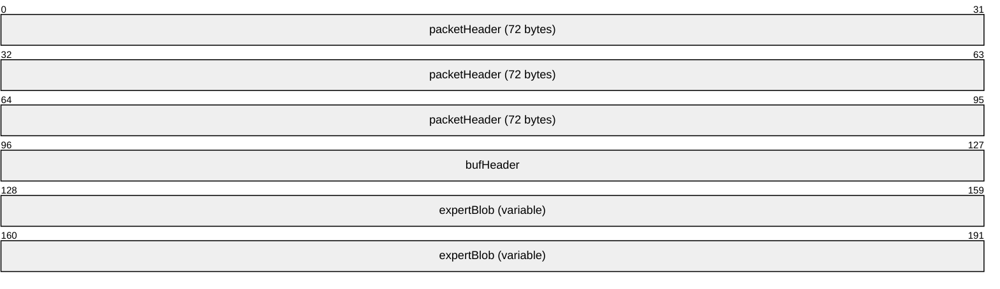
```mermaid
packet-beta
  0-95: "packetHeader (72 bytes)"
  96-127: "bufHeader"
  128-191: "expertBlob (variable)"
```

**packetHeader (72 bytes):** The [REMOTEDESKTOP_CTL_PACKETHEADER](#Section_2.2.1.2) part of the packet. The virtual channel name MUST be set to "RC_CTL".

**bufHeader (4 bytes):** The [REMOTEDESKTOP_CTL_BUFHEADER](#Section_2.2.1.3) part of the packet. The packet type MUST be set to REMOTEDESKTOP_CTL_VERIFY_PASSWORD.

**expertBlob (variable):** A variable-length, semicolon-delimited, [**Unicode**](#gt_unicode)-based set of PropertyName, PropertyValue pairs. Each pair is also prefixed with the length of the characters in the pair, including the equal (=) sign. For example, if PropertyName is "NAME", and PropertyValue is "John", the value of **expertBlob** is "9;NAME=John". This is a mechanism to provide more information about the expert that is connecting to the novice. "NAME" and "PASS" are the only two properties used in expertBlob. The PASS property is used in version 1. The PASS property value is a string that contains the result of encrypting the PassStub in the Remote Assistance Invitation File with the password. For more details, see [MS-RAI](../MS-RAI/MS-RAI.md) section 6.

An example of an expertBlob with the PASS property is as follows.

9;NAME=John69;PASS=

D4B4277E9E9D06CFC19BB23FD869B5E0C99B0908280407A6E2EEC43F98035F7D

#### 2.2.1.12 REMOTEDESKTOP_EXPERT_ON_VISTA

The REMOTEDESKTOP_EXPERT_ON_VISTA is an announcement that [**expert**](#gt_expert) is running Windows Vista operating system.

This packet is sent from expert to [**novice**](#gt_novice). The REMOTEDESKTOP_EXPERT_ON_VISTA message is applicable only to version 2.

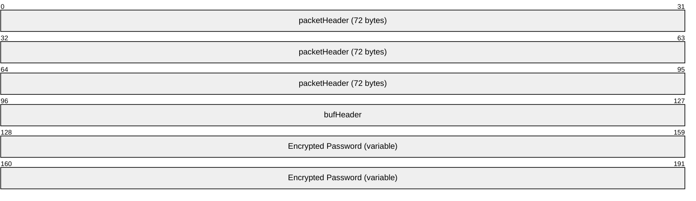
```mermaid
packet-beta
  0-95: "packetHeader (72 bytes)"
  96-127: "bufHeader"
  128-191: "Encrypted Password (variable)"
```

**packetHeader (72 bytes):** The [REMOTEDESKTOP_CTL_PACKETHEADER](#Section_2.2.1.2) part of the packet. The virtual channel name MUST be set to "RC_CTL".

**bufHeader (4 bytes):** The [REMOTEDESKTOP_CTL_BUFHEADER](#Section_2.2.1.3) part of the packet. The packet type MUST be set to REMOTEDESKTOP_EXPERT_ON_VISTA.

**Encrypted Password (variable):** Encrypted Password string included in the message as a BSTR, as defined in [MS-DTYP](../MS-DTYP/MS-DTYP.md) section 2.2.5. For the password encryption flow diagram, refer to [MS-RAI](../MS-RAI/MS-RAI.md) section 6.

#### 2.2.1.13 REMOTEDESKTOP_CTL_RANOVICE_NAME

The REMOTEDESKTOP_CTL_RANOVICE_NAME packet is an optional packet that contains the novice name. This message is sent by the novice and is applicable to version 2 only.

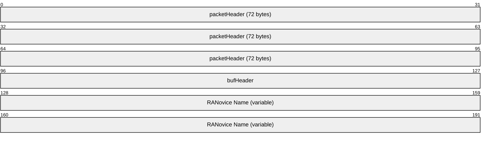
```mermaid
packet-beta
  0-95: "packetHeader (72 bytes)"
  96-127: "bufHeader"
  128-191: "RANovice Name (variable)"
```

**packetHeader (72 bytes):** The [REMOTEDESKTOP_CTL_PACKETHEADER](#Section_2.2.1.2) part of the packet. The virtual channel name MUST be set to "RC_CTL".

**bufHeader (4 bytes):** The [REMOTEDESKTOP_CTL_BUFHEADER](#Section_2.2.1.3) part of the packet. The packet type MUST be set to REMOTEDESKTOP_CTL_RANOVICE_NAME.

**RANovice Name (variable):** [**Novice**](#gt_novice) name string that is sent either from the [**expert**](#gt_expert) to the novice or vice versa, as a BSTR.

#### 2.2.1.14 REMOTEDESKTOP_CTL_RAEXPERT_NAME

The REMOTEDESKTOP_CTL_RAEXPERT_NAME packet is an optional packet that contains the expert name. This message is sent by the expert and is applicable to version 2 only.

```mermaid
packet-beta
  0-95: "packetHeader (72 bytes)"
  96-127: "bufHeader"
  128-191: "RAEXPERT NAME (variable)"
```

**packetHeader (72 bytes):** The [REMOTEDESKTOP_CTL_PACKETHEADER](#Section_2.2.1.2) part of the packet. The virtual channel name MUST be set to "RC_CTL".

**bufHeader (4 bytes):** The [REMOTEDESKTOP_CTL_BUFHEADER](#Section_2.2.1.3) part of the data. The packet type MUST be set to REMOTEDESKTOP_CTL_RAEXPERT_NAME.

**RAEXPERT NAME (variable):** The [**expert**](#gt_expert) name string is sent either from the expert to the [**novice**](#gt_novice) or vice versa, as a BSTR.

#### 2.2.1.15 REMOTEDESKTOP_CTL_TOKEN_PACKET

The REMOTEDESKTOP_CTL_TOKEN_PACKET is used to send a token to the remote machine for mutual identification. This packet is sent from the [**expert**](#gt_expert) to the [**novice**](#gt_novice) or vice versa. Depending on the method of connecting and the receiver's role, after verifying the token the receiver sends a REMOTEDESKTOP_CTL_TOKEN_PACKET to verify the receiver's identity.

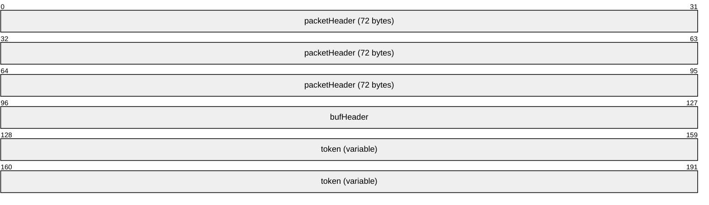
```mermaid
packet-beta
  0-95: "packetHeader (72 bytes)"
  96-127: "bufHeader"
  128-191: "token (variable)"
```

**packetHeader (72 bytes):** The [REMOTEDESKTOP_CTL_PACKETHEADER](#Section_2.2.1.2) part of the packet. The virtual channel name MUST be set to "RC_CTL".

**bufHeader (4 bytes):** The [REMOTEDESKTOP_CTL_BUFHEADER](#Section_2.2.1.3) part of the data. The packet type MUST be set to REMOTEDESKTOP_CTL_TOKEN.

**token (variable):** The authorization token that is used to verify the sender's knowledge of the password, of type BSTR.

### 2.2.2 Session Control (RCCOMMAND)

Session Control (<RCCOMMAND>) messages are XML formatted messages that are used for share control, file transfer initialization, and [**VoIP**](#gt_voice-over-ip-voip) control. They MUST be sent and received over virtual channel 71.

The format of the <RCCOMMAND> message is as follows.

Usage

<RCCOMMAND

NAME = "CDATA"

FILENAME = "CDATA"

FILESIZE = "CDATA"

CHANNELID = "CDATA"

INTERNALDATA = "CDATA"

VOIPVER = "CDATA"

VOIPGOKEY = "CDATA"

VOIPIPLIST = "CDATA"

EXPERTIPDATA = "CDATA"

PROPERTY = "CDATA"

VALUE = "CDATA"

/>

Attributes

| Attribute | Type | Required | Description |
| --- | --- | --- | --- |
| NAME | CDATA | Yes | The **NAME** attribute of <RCCOMMAND> specifies the type of activity requested. The following **NAME** value specifies file transfer commands. The following **NAME** values specify session control messages. The following **NAME** values specify synchronization parameters. The following **NAME** values specify voice-enabling commands. |
| FILENAME | CDATA | No | The **FILENAME** attribute specifies the name of the file to be transferred. This attribute is used only for [FILEXFER](#Section_4.2) packets. |
| FILESIZE | CDATA | No | Specifies the file size for transfer. This attribute is used only for FILEXFER packets. |
| CHANNELID | CDATA | No | Specifies the virtual channel on which the file data and FILEXFERACK, FILEXFERREJECT, and FILEXFEREND packets will be transferred. This attribute MUST be used only for FILEXFER packets. The format of the virtual channel name is version dependent. For version 1, in the case where the novice started the file transfer, the name will be the IP address of the sender followed by the character ".", followed by the number of seconds since January 1, 1970. In the case where the expert started the file transfer, the name will be the characters "1000." followed by the number of seconds since January 1, 1970. For version 2 or version 3, regardless of which role started the transfer, the name will be "RA_FX". |
| INTERNALDATA | CDATA | No | Specifies if the file transfer request is considered as an internal data transfer. This attribute is supported only by version 3. If this attribute is missing or set to "0", the file transfer request is not considered as an internal data transfer. Any other value is interpreted as bit flags. |
| VOIPVER | CDATA | No | This attribute is used only for **VOIPGO** packets. |
| VOIPGOKEY | CDATA | No | Specifies that a key will be generated by the server and used by the client to create an RTC connection. This attribute is used only for **VOIPGO** packets. |
| VOIPIPLIST | CDATA | No | This attribute specifies a comma-delimited list of IP addresses on which the server will accept an RTC connection. This attribute is used only for **VOIPGO** packets. |
| EXPERTIPDATA | CDATA | No | This attribute specifies the IP address of the connecting expert. It is used only for EXPERTIP packets. This message is generated only in version 1. |
| PROPERTY | CDATA | No | Specifies the name of the setting that is being announced. This attribute is used only for SETTINGANNOUNCE packets. This attribute is generated only in version 3. |
| VALUE | CDATA | No | Specifies the value of the setting that is being announced. This attribute is used only for SETTINGANNOUNCE packets. This attribute is generated only in version 3. |

Child Elements

None.

Parent Elements

None.

Element Information

| Can be empty | Yes |
| --- | --- |

### 2.2.3 File Transfer Commands

The following values specify file transfer commands. They are sent across as a [**Unicode string**](#gt_unicode-string) on the virtual channel on which the file data is sent.

| Value | Meaning |
| --- | --- |
| FILEXFERACK | Indicates that the file transfer was accepted by the receiver of the file. |
| FILEXFEREND | Indicates that all packets in the file have been sent. This value is sent by the sender of the file after all packets have been sent. |
| FILEXFERREJECT | Indicates that either the file transfer was canceled or an error occurred and the transmission was terminated. This value can be sent by the sender or receiver of the file. |

### 2.2.4 Session Authorization Token

The session authorization token is used only in version 3 and is used to prove that the creator of the token has the full connection string and password when the connection is established. To create an authorization token, the [**expert**](#gt_expert) or [**novice**](#gt_novice) MUST follow these steps:

- Form the base [**Unicode string**](#gt_unicode-string) by concatenating the password with the string "NOVICE" or "EXPERT". If a token for the novice is being created, use the string "NOVICE". If the token is for the expert, use the string "EXPERT". In this concatenation, the string "EXPERT" or "NOVICE" is appended to the password. Only the last 6 bytes of the Remote Assistance password are used to create the token.
- Append the connection string to the string formed in step 1 to form a hash input. For the first round of hashing, 20 bytes of 0 are appended to the end of hash input.
- Use the [**Secure Hashing Algorithm 1 (SHA-1)**](#gt_168fbe0c-fc02-4722-979e-b0261766ac9c) to convert the hash input to a binary value (160 bits).
- Append this value to the string formed in step 2 to form a new hash input.
- Repeat steps 3 and 4 100,000 times.
This algorithm's main intent is to make it computationally expensive to create an exhaustive list of all possible tokens and their matching passwords or valid connection strings.

The following is an example of a token string before being hashed repeatedly.

ABCDEFNOVICE<E>

<A KH="YiKwWUY8Ioq5NB3wAQHSbs5kwrM=" ID="8rYm30RBW8/4dAWoUsWbFCF5jno/7jr5t

NpHQc2goLbw4uuBBJvLsU02YYLlBMg5" />

<C>

<T ID="1" SID="1440550163">

<L P="49749" N="2001:4898:1a:5:79e2:3356:9b22:3470"/>

<L P="49751" N="172.31.250.64"/>

</T>

</C>

</E>

Here ABCDEF is the password, and the token is being created to validate the novice.

### 2.2.5 Remote Assistance Contact Information

Remote Assistance Contact Information is used only in version 3. After the [**Remote Assistance session**](#gt_remote-assistance-session) is established, the [**expert**](#gt_expert) and the [**novice**](#gt_novice) can exchange information with each other to allow for a secure connection to be established in the future without the user having to provide a password. This information is sent as an internal data file (as specified in File Transfer sections [3.9](#Section_1.3.2) and [3.10](#Section_1.3)). This information is transmitted as an XML file when being sent as a data file.

The following is an example of a contact file. (The attribute AVATAR has been truncated for brevity.)

<?xml version="1.0"?>

<RAINVITATIONCOLL><RAINVITATIONITEM NAME="Dave Heberer" COMPUTERNAME="DHERB-X86-1"

AVATAR="Qk1QgAAAAAAAAFAAAAAoAAAAgAAAAIAAAAABABAAAwAAAACAAAAAAAAAAAAAAAAA

Y/MB+0P8wvSC+4Hywvqh88L7QfsC+0HzAvzB+0L74fKi+kHyQvIh8kL6IfoC+qHx &Truncated&

4fLC+mHywvIi82L7IfMC+w==

" PUBLICKEY="BgIAAACkAABSU0ExAAQAAAEAAQBBL7Q3BkUSr9CkMhgagHnKEcE5FDz1aBVN0Xcj

mlKOnWyrAFhGOok0TgDShX4/lsYbRbSoNjIuf/EAikEASiwawd+L8fdQEgrijaab

KQcsq3eKwWkBkNPHcDy6f2QfKsnXWq6IWXDWsxWsQw0KKspWN9KU+SfpXDoQ8xg+

bjqsoA==

" ADDRESS="38827fecd1245882413e9a42c23d81f1aae08c4d.RAContact" TYPE="1"

TIME="20080625161611.761000"/></RAINVITATIONCOLL>

The file contains the following pieces of information.

| Value | Meaning |
| --- | --- |
| RAINVITATIONCOLL | Contains the individual contact information. There MUST be only one child node of this node. |
| RAINVITATION | The RAINVITATION node contains the following information: **NAME**: The name of the contact. **COMPUTERNAME**: The computer name of the contact. **AVATAR**: A string representation of a picture used to represent this contact. **PUBLICKEY**: A string representation of the contact's public key from a public/private key pair. **ADDRESS**: The PNRP address where this contact will post connection information. **TYPE**: Currently not used; always set to 1. **TIME**: The date and time that this contact information was created or modified. |

### 2.2.6 Remote Assistance Error Codes

The following Remote Assistance error codes MUST be returned as part of [REMOTEDESKTOP_CTL_RESULT](#Section_2.2.1.10).

| Return value/code | Description |
| --- | --- |
| 0 SAFERROR_NOERROR | No errors occurred. |
| 1 SAFERROR_NOINFO | An error occurred in a dependent component, and no detailed information is available. |
| 3 SAFERROR_LOCALNOTERROR | Connection disconnected by local user. |
| 4 SAFERROR_REMOTEBYUSER | Connection disconnected by remote user. |
| 5 SAFERROR_BYSERVER | Connection dropped by remote computer. |
| 6 SAFERROR_DNSLOOKUPFAILED | DNS resolution failed. |
| 7 SAFERROR_OUTOFMEMORY | A memory allocation error occurred. |
| 8 SAFERROR_CONNECTIONTIMEDOUT | A connection could not be established within the time-out period. |
| 9 SAFERROR_SOCKETCONNECTFAILED | Connection to the remote computer failed. |
| 11 SAFERROR_HOSTNOTFOUND | The remote computer is unreachable. |
| 12 SAFERROR_WINSOCKSENDFAILED | A socket write failed. |
| 14 SAFERROR_INVALIDIPADDR | The IP address given is not valid. |
| 15 SAFERROR_SOCKETRECVFAILED | A socket read failed. |
| 18 SAFERROR_INVALIDENCRYPTION | An encryption error occurred. |
| 20 SAFERROR_GETHOSTBYNAMEFAILED | Winsock name resolution failed. |
| 21 SAFERROR_LICENSINGFAILED | Remote Desktop Protocol: Basic Connectivity and Graphics Remoting [MS-RDPBCGR](../MS-RDPBCGR/MS-RDPBCGR.md) licensing for the connection failed. |
| 22 SAFERROR_ENCRYPTIONERROR | Remote Desktop Protocol: Basic Connectivity and Graphics Remoting [MS-RDPBCGR] encryption error occurred. |
| 23 SAFERROR_DECRYPTIONERROR | A Remote Desktop Protocol decryption error occurred. |
| 24 SAFERROR_INVALIDPARAMETERSTRING | An invalid Remote Assistance Connection String, as specified in [MS-RAI](../MS-RAI/MS-RAI.md) section 2.2, was used. |
| 25 SAFERROR_HELPSESSIONNOTFOUND | A Remote Assistance Connection String, as specified in [MS-RAI], section 2.2, was not found. |
| 26 SAFERROR_INVALIDPASSWORD | An invalid password was used. This message is only used in version 1. |
| 27 SAFERROR_HELPSESSIONEXPIRED | The Remote Assistance Connection String, as specified in [MS-RAI] section 2.2, has expired. |
| 28 SAFERROR_CANTOPENRESOLVER | The remote computer could not resolve the session. |
| 29 SAFERROR_UNKNOWNSESSMGRERROR | An unknown error occurred in the remote session manager. |
| 30 SAFERROR_CANTFORMLINKTOUSERSESSION | The remote computer could not establish a connection to the specified user session. |
| 32 SAFERROR_RCPROTOCOLERROR | A remote control protocol error occurred. |
| 33 SAFERROR_RCUNKNOWNERROR | An unknown remote control error occurred. |
| 34 SAFERROR_INTERNALERROR | An internal error occurred. |
| 35 SAFERROR_HELPEERESPONSEPENDING | This code is not used. |
| 36 SAFERROR_HELPEESAIDYES | This code is not used. |
| 37 SAFERROR_HELPEEALREADYBEINGHELPED | The user is already under remote control. |
| 38 SAFERROR_HELPEECONSIDERINGHELP | This code is not used. |
| 40 SAFERROR_HELPEENEVERRESPONDED | The remote user did not accept the remote control request during the time-out period. |
| 41 SAFERROR_HELPEESAIDNO | The remote user denied the remote control request. |
| 42 SAFERROR_HELPSESSIONACCESSDENIED | The remote user does not have access to the specified connection string, as specified in [MS-RAI], section 2.2. |
| 43 SAFERROR_USERNOTFOUND | The specified remote user was not found. |
| 44 SAFERROR_SESSMGRERRORNOTINIT | A remote error occurred with the session manager. |
| 45 SAFERROR_SELFHELPNOTSUPPORTED | Attempting to control your own session remotely is not supported. |
| 47 SAFERROR_INCOMPATIBLEVERSION | An incompatible version was given. This message is only used in version 1. |
| 48 SAFERROR_SESSIONNOTCONNECTED | This code is not used. |
| 50 SAFERROR_SYSTEMSHUTDOWN | The remote system is shutting down. |
| 51 SAFERROR_STOPLISTENBYUSER | The remote system has stopped listening for an incoming connection. |
| 52 SAFERROR_WINSOCK_FAILED | A Winsock call has failed. |
| 53 SAFERROR_MISMATCHPARMS | A parameter mismatch has occurred. |
| 61 PASSWORDS_DONT_MATCH | An invalid password was used. This message is only used in version 2. |
| 300 SAFERROR_SHADOWEND_BASE | Remote control of the user session has been terminated. |
| 301 SAFERROR_SHADOWEND_CONFIGCHANGE | Remote control of the user session terminated due to a color depth or resolution change. |
| 302 SAFERROR_SHADOWEND_UNKNOWN | Remote control of the user session has ended. |

### 2.2.7 Extensions to the Remote Desktop Protocol

As discussed in section [1.4](#Section_1.4), the Remote Assistance Protocol leverages the Remote Desktop Protocol (as specified in [MS-RDPBCGR](../MS-RDPBCGR/MS-RDPBCGR.md) and [MS-RDPEGDI](../MS-RDPEGDI/MS-RDPEGDI.md)). This section describes extensions to [MS-RDPBCGR] that are used in the context of a Remote Assistance connection.

#### 2.2.7.1 Fast-Path Update Wrapper (MSRA_FP_UPDATE_WRAPPER)

The MSRA_FP_UPDATE_WRAPPER structure is used to wrap all Fast-Path Update structures specified in [MS-RDPBCGR](../MS-RDPBCGR/MS-RDPBCGR.md) sections 2.2.9.1.2.1.1 to 2.2.9.1.2.1.9 and [MS-RDPEGDI](../MS-RDPEGDI/MS-RDPEGDI.md) section 2.2.2.2.

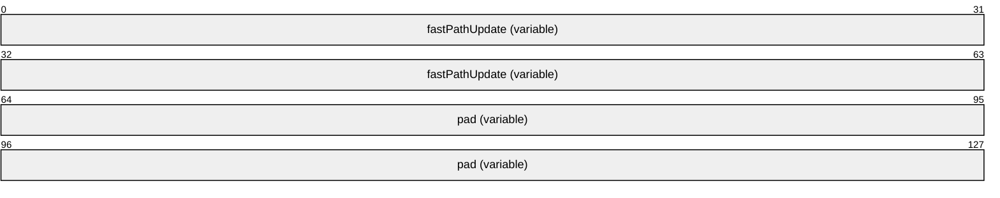
```mermaid
packet-beta
  0-63: "fastPathUpdate (variable)"
  64-127: "pad (variable)"
```

**fastPathUpdate (variable):** A variable-length field that encapsulates a single fast-path update structure.

**pad (variable):** A variable-length array of bytes. Padding. The size, in bytes, of this array is included in the size specified in the **size** field of the fast-path update embedded in the **fastPathUpdate** field. Values in this padding field MUST be ignored.

#### 2.2.7.2 Client Info PDU

When used in context of the Remote Assistance protocol, the following variables in the **infoPacket** field of Client Info PDU, as specified in [MS-RDPBCGR](../MS-RDPBCGR/MS-RDPBCGR.md) section 2.2.1.11.1, need to be replaced. The format and maximum length of the following fields is specified in [MS-RDPBCGR] section 2.2.1.11.1.1:

- **WorkingDir (Variable)**: Variable length ID string from the **Auth String Node** (the length in bytes is given by the **cbWorkingfDir** field). **Auth String Node** is present in the **Remote Assistance Connection String** as specified in the [MS-RAI](../MS-RAI/MS-RAI.md) section 2.2.
- **AlternateShell (Variable)**: If the Remote Assistance invitation file is protected by a password, then the **AlternateShell** field MUST be initialized with the password string. If the invitation is not password protected, then this field MUST be initialized with "*". The length in bytes is given by the **cbAlternateShell** field.
- **UserName (Variable)**: Variable length user name provided by the [**expert**](#gt_expert) for connecting to the [**novice**](#gt_novice) computer. The length in bytes is given by the **cbUserName** field.
- **Password (Variable)**: This field MUST be filled with "*". The length in bytes is given by the **cbPassword** field.

# 3 Protocol Details

The following sections specify details of the Remote Assistance Protocol, including basic [**Remote Assistance connection**](#gt_remote-assistance-connection) establishment, session initialization, file transfer, chat, share control, and voice abstract data models and message processing rules.

There are three versions of the Remote Assistance protocol as described in section [1.7](#Section_1.7).

- Version 1<1>
- Version 2<2>
- Version 3<3>
Implementations SHOULD support all protocol versions.<4>

The following table shows the protocol version negotiated based on the highest version supported by the expert and novice. The highest version that is supported by both the expert and novice is chosen.

| Implementations | Expert—version 1 only | Expert—versions 1 and 2 | Expert—versions 1, 2, and 3 |
| --- | --- | --- | --- |
| **Novice–version 1 only** | Protocol is version 1. | Expert uses version 1 based on Remote Assistance Connection String 1.Novice always uses version 1. | Expert uses version 1 based on Remote Assistance Connection String 1.Novice always uses version 1. |
| **Novice—versions 1 and 2** | Expert always uses version 1. Novice uses version 1 after receiving REMOTEDESKTOP_CTL_VERSIONINFO from the expert. | Expert uses version 2 based on Remote Assistance Connection String 2.Novice uses version 2 after receiving the REMOTEDESKTOP_EXPERT_ON_VISTA packet from the expert. | Expert uses version 2 based on Remote Assistance Connection String 2. Novice uses version 2 after receiving the REMOTEDESKTOP_EXPERT_ON_VISTA packet from the expert. |
| **Novice—version 1, version 2, and version 3** | Expert always uses version 1.Novice uses version 1 after receiving REMOTEDESKTOP_CTL_VERSIONINFO from the expert. | Expert uses version 2 based on Remote Assistance Connection String 2.Novice uses version 2 after receiving the REMOTEDESKTOP_EXPERT_ON_VISTA packet from the expert. | Expert uses version 2 based on Remote Assistance Connection String 2. Novice uses version 2 after receiving the REMOTEDESKTOP_EXPERT_ON_VISTA packet from the expert. When the novice initiates using Remote Assistance Initiation over PNRP protocol, the expert and novice always use version 3. |

The novice and expert implementations determine the version of the protocol that will be used based on the version(s) supported, the initiation method, and the version message as follows.

**Novice determination of the protocol version:**

A novice implementing version 1 only MUST use version 1 of the protocol.

A novice implementing version 1 and 2 MUST determine the version of protocol to use based on the Remote Assistance initiation method used and the version message it receives from expert after the Remote Assistance Connection is established:

- Version 2 of the protocol is used if the novice receives REMOTEDESKTOP_EXPERT_ON_VISTA packet from the expert during session initialization.
- Version 1 of the protocol is used if the novice receives REMOTEDESKTOP_CTL_VERSIONINFO from the expert during session initialization.
A novice implementing version 1, 2, and 3 MUST determine the version of the protocol to use based on the Remote Assistance initiation method used and the version message it receives from the expert:

- Version 3 of the protocol MUST be used, if the novice initiated the Remote Assistance using the Remote Assistance Initiation over PNRP protocol.
- Version 2 of the protocol is used if the novice receives REMOTEDESKTOP_EXPERT_ON_VISTA packet from the expert during session initialization.
- Version 1 of the protocol is used if the novice receives REMOTEDESKTOP_CTL_VERSIONINFO from the expert during session initialization.
**Expert determination of protocol version:**

An expert implementing version 1 only MUST use version 1 of the protocol.

An expert implementing version 1 and 2 MUST determine the version of protocol to use based on how it obtained the Remote Assistance Connection String:

- Version 1 of the protocol MUST be used, if any of the following conditions apply:
- Expert obtains the Remote Assistance Connection string 1 during the Remote Assistance initiation using the IPCHService (see [MS-RAI](../MS-RAI/MS-RAI.md) section 3.2).
- Expert obtains the Remote Assistance Connection String 1 using the Remote Assistance Invitation File Format of the first type (see [MS-RAI] section 6).
- Version 2 of the protocol MUST be used, if any of the following conditions apply:
- Expert obtains the Remote Assistance Connection String 2 during the Remote Assistance initiation using IRASrv (see [MS-RAI] section 3.4).
- Expert obtains the Remote Assistance Connection String 2 using the Remote Assistance Invitation File Format of the second type (see [MS-RAI] section 6).
An expert implementing version 1, 2, and 3 MUST determine the version of protocol to use based on how it obtained the Remote Assistance Connection String.

- Version 3 MUST be used, if the Remote Assistance connection was initiated using the Remote Assistance Initiation over PNRP protocol.
- Version 1 of the protocol MUST be used, if any of the following conditions apply:
- Expert obtains the Remote Assistance Connection String 1 during Remote Assistance initiation using IPCHService (see [MS-RAI] section 3.2).
- Expert obtains the Remote Assistance Connection String 1 using Remote Assistance Invitation File Format of the first type (see [MS-RAI] section 6).
- Version 2 of the protocol MUST be used, if any of the following conditions apply:
- Expert obtains the Remote Assistance Connection String 2 during the Remote Assistance initiation using IRASrv (see [MS-RAI] section 3.4).
- Expert obtains the Remote Assistance Connection String 2 using the Remote Assistance Invitation File Format of the second type (see [MS-RAI] section 6).
Once the novice and expert determine the version of the protocol to use, it cannot be changed for the rest of the Remote Assistance Connection. Also, when a novice or an expert receives a message from a version it does not implement, the message MUST be dropped without returning any error code.

## 3.1 Establishing a Remote Assistance Connection - Expert Details

### 3.1.1 Abstract Data Model

No data model is associated with this portion of the Remote Assistance Protocol.

### 3.1.2 Timers

No timers are used in this portion of the Remote Assistance Protocol.

### 3.1.3 Initialization

This section of the protocol assumes relevant TCP initializations are done.

### 3.1.4 Higher-Layer Triggered Events

This portion of the Remote Assistance Protocol does not utilize any external higher-layer events.

### 3.1.5 Message Processing Events and Sequencing Rules

The [**expert**](#gt_expert) MUST extract Port and IP Address information from the **Remote Assistance Connection String** (Section 2.2 of [MS-RAI](../MS-RAI/MS-RAI.md)) to establish a TCP Connection. When more than one pair of Port and IP address exists, the expert MUST attempt connecting to all Port and IP Address pairs present in the **Remote Assistance Connection String**. The first successful TCP connection MUST be used for all further communication.

After a TCP connection is established, a Remote Desktop connection (described in Sections 3.2 of [MS-RDPBCGR](../MS-RDPBCGR/MS-RDPBCGR.md)) MUST be initiated using Extensions to the Remote Desktop Protocol as defined in section [2.2.7](#Section_2.2.7).

Upon completion of the Remote Desktop Connection, depending on the negotiated Remote Assistance protocol version, the Remote Assistance session MUST be established as described in sections [3.3](#Section_3.3), [3.5](#Section_1.3), and [3.7](#Section_3.7).

### 3.1.6 Timer Events

This section of the Remote Assistance Protocol has no timer events.

### 3.1.7 Other Local Events

The Remote Assistance Protocol has no interaction with other local events.

## 3.2 Establishing a Remote Assistance Connection - Novice Details

### 3.2.1 Abstract Data Model

No data model is associated with this portion of the Remote Assistance Protocol.

### 3.2.2 Timers

No timers are used in this portion of the Remote Assistance Protocol.

### 3.2.3 Initialization

This section of the protocol assumes relevant TCP initializations are done.

### 3.2.4 Higher-Layer Triggered Events

This portion of the Remote Assistance Protocol does not utilize any external higher-layer events.

### 3.2.5 Message Processing Events and Sequencing Rules

The [**novice**](#gt_novice) starts listening on all IP Address and port pairs for an incoming TCP connection from the [**expert**](#gt_expert) machine and generates a **Remote Assistance Connection String** (section 2.2 of [MS-RAI](../MS-RAI/MS-RAI.md)).

After a TCP Connection is established, a Remote Desktop connection (described in section 3.3 of [MS-RDPBCGR](../MS-RDPBCGR/MS-RDPBCGR.md)) MUST be initiated using [Extensions to the Remote Desktop Protocol](#Section_2.2.7) described in section 2.2.7.

Upon completion of Remote Desktop Connection, depending on the negotiated Remote Assistance protocol version, a Remote Assistance Session MUST be established as described in sections [3.4](#Section_3.4), [3.6](#Section_3.6) and [3.8](#Section_3.8).

### 3.2.6 Timer Events

This section of the Remote Assistance Protocol has no timer events.

### 3.2.7 Other Local Events

The Remote Assistance Protocol has no interaction with other local events.

## 3.3 Session Initialization Using the Expert (Client) Implementing Only Version 1 Details

After a [**Remote Assistance Connection**](#gt_remote-assistance-connection) String 1 is obtained by the [**expert**](#gt_expert), either using the IPCHService interface (specified in [MS-RAI](../MS-RAI/MS-RAI.md) section 3.2) or from the RCTICKET attribute in the Remote Assistance invitation file (specified in [MS-RAI] section 6), a basic Remote Assistance connection is established from the expert to the [**novice**](#gt_novice) using the Remote Desktop Protocol: Basic Connectivity and Graphics Remoting protocol, as specified in [MS-RDPBCGR](../MS-RDPBCGR/MS-RDPBCGR.md). This basic connection does not allow the expert to view the novice screen. Before the expert can view the novice screen, control messages MUST be exchanged between the novice and the expert. When this exchange is completed successfully, the expert can view the novice screen, and the [**Remote Assistance session**](#gt_remote-assistance-session) initialization is completed.

Sections 3.3 and [3.4](#Section_3.4) specify message exchange between the novice and the expert to establish a Remote Assistance session.

**Note** To successfully establish a Remote Assistance session, **extraFlags** in TS_GENERAL_CAPABILITYSET MUST be set to FASTPATH_OUTPUT_SUPPORTED, as specified in [MS-RDPBCGR] section 2.2.7.1.1.

The Remote Assistance Protocol sends control message packets on the RC_CTL [**virtual channel**](#gt_virtual-channel). The RC_CTL virtual channel persists throughout the duration of the Remote Assistance connection.

The following state diagram shows the session initialization sequence between the novice and expert using protocol version 1.

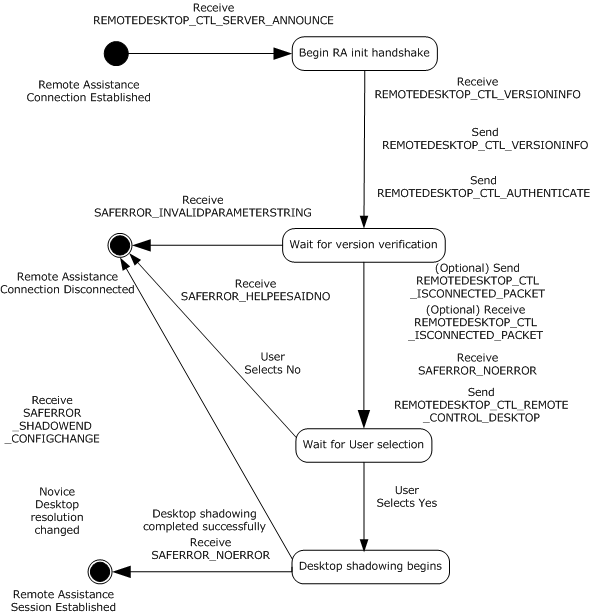

Figure 1: Remote Assistance session initialization state diagram (from the expert/client perspective)

### 3.3.1 Abstract Data Model

The message signaling that takes place in the session initialization protocol is to complete the [**Remote Assistance session**](#gt_remote-assistance-session); that is, to change the state from the basic [**Remote Assistance connection**](#gt_remote-assistance-connection) state in which the [**expert**](#gt_expert) does not have the view of the [**novice**](#gt_novice) screen to the state in which the expert has the view of the novice screen.

When the control message arrives to the expert indicating that a Remote Assistance connection has completed successfully or that there was an error during connection, the expert is responsible for keeping track of this state change.

### 3.3.2 Timers

Upon initialization of a [**Remote Assistance session**](#gt_remote-assistance-session), the Connection Heartbeat timer MAY be started to send the [REMOTEDESKTOP_CTL_ISCONNECTED](#Section_2.2.1.6) packet every 30 seconds to indicate a connected state.

### 3.3.3 Initialization

The Remote Assistance Protocol sends the [session initialization](#Section_1.3.1) messages on the RC_CTL [**virtual channel**](#gt_virtual-channel). A virtual channel named "RC_CTL" MUST be opened before any session initialization messages can be sent or received.

### 3.3.4 Higher-Layer Triggered Events

The messages and events described here have no other dependent events or messages from a higher layer.

### 3.3.5 Message Processing Events and Sequencing Rules

This section describes the sequence of the [session initialization](#Section_1.3.1) messages that the [**expert**](#gt_expert) receives as well as the session initialization messages with which the expert responds.

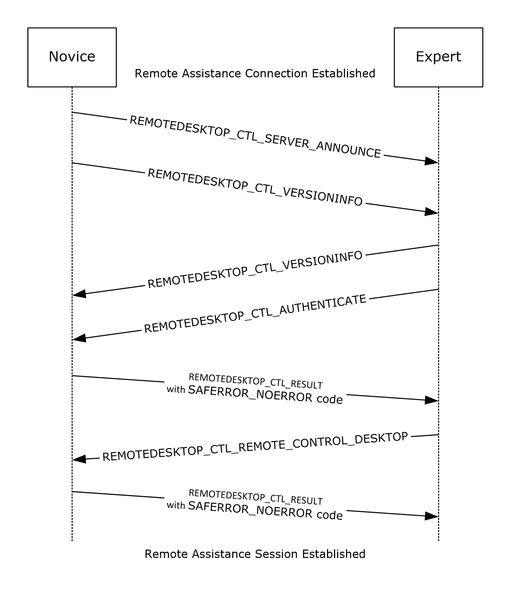

Figure 2: Remote Assistance session initialization sequence diagram for version 1

When the expert receives the [REMOTEDESKTOP_CTL_SERVER_ANNOUNCE (section 2.2.1.7)](#Section_2.2.1.7) session initialization messages, it MUST respond with a [REMOTEDESKTOP_CTL_VERSIONINFO (section 2.2.1.8)](#Section_2.2.1.8) packet with the following values.

REMOTEDESKTOP MAJOR VERSION = 1

REMOTEDESKTOP MINOR VERSION = 2

The expert MUST also send the [REMOTEDESKTOP_CTL_AUTHENTICATE (section 2.2.1.4)](#Section_2.2.1.4) packet. The expert name can be included in the packet's **expertBlob** so that the [**novice**](#gt_novice) can be informed.

When the expert receives the REMOTEDESKTOP_CTL_VERSIONINFO (section 2.2.1.8) packet, the expert MUST extract the major and minor version numbers from the packet. The major version number MUST be equal to 1, and the minor version number MUST be equal to 2; otherwise, a SAFERROR_INCOMPATIBLEVERSION error MUST be returned in the [REMOTEDESKTOP_CTL_RESULT (section 2.2.1.10)](#Section_2.2.1.10) packet to the novice.<5> If the version numbers are correct, the expert MUST remain silent, returning no messages to the novice, and MUST wait for the novice to return SAFERROR_NOERROR, as described in the following step.

The novice MUST verify the [**Remote Assistance Connection**](#gt_remote-assistance-connection) String, as specified in [MS-RAI](../MS-RAI/MS-RAI.md) Appendix A, and return the success code SAFERROR_NOERROR in the REMOTEDESKTOP_CTL_RESULT (section 2.2.1.10) packet to the expert indicating that the Remote Assistance Connection String is valid.

If the Remote Assistance Connection String is not valid, the novice MUST return SAFERROR_INVALIDPASSWORD and disconnect the Remote Assistance session.

After receiving SAFERROR_NOERROR, the expert MUST send the [REMOTEDESKTOP_CTL_REMOTE_CONTROL_DESKTOP (section 2.2.1.9)](#Section_2.2.1.9) packet to the novice. While this packet contains the Remote Assistance Connection String, it is ignored on receipt, and the novice starts the desktop shadowing so the expert can view the novice screen. The novice finally sends the success code SAFERROR_NOERROR in the REMOTEDESKTOP_CTL_RESULT (section 2.2.1.10) packet, and the Remote Assistance session is considered established.

The REMOTEDESKTOP_CTL_RESULT packet can be received with the following error codes.

| Value | Meaning |
| --- | --- |
| SAFERROR_NOERROR | No error occurred. |
| SAFERROR_HELPEESAIDNO | Sent from the novice to the expert when the novice rejects the Remote Assistance connection. This error is returned when the novice rejects Remote Assistance by clicking No in the Remote Assistance Acceptance UI dialog box; otherwise, when the novice clicks Yes in this UI dialog box, the novice desktop shadowing completes, and the expert can view the novice screen. |
| SAFERROR_INCOMPATIBLEVERSION | The version number in the packet was for an incompatible version. |
| SAFERROR_INVALIDPASSWORD | MUST be returned by the novice when the password used produces an invalid Remote Assistance Connection String. |

When either the novice or expert ends a Remote Assistance session, it sends a [REMOTEDESKTOP_CTL_DISCONNECT (section 2.2.1.5)](#Section_2.2.1.5) packet to the other.

The expert MAY also send the [REMOTEDESKTOP_CTL_ISCONNECTED (section 2.2.1.6)](#Section_2.2.1.6) packet every 30 seconds over an idle connection.

The expert MAY send the expert's IP address to the novice in a <[Session Control](#Section_2.2.2)> message (section 2.2.2) with the <NAME> containing the EXPERTIP value. This IP address could be used by the novice for logging purposes.

### 3.3.6 Timer Events

The [REMOTEDESKTOP_CTL_ISCONNECTED](#Section_2.2.1.6) packet MAY be used to track the state of a [**Remote Assistance connection**](#gt_remote-assistance-connection). When used, both the [**expert**](#gt_expert) and the [**novice**](#gt_novice) MAY send this packet once every 30 seconds to indicate a connected state. No action is taken by either the expert or the novice on either receipt or nonreceipt of this packet.

### 3.3.7 Other Local Events

The Remote Assistance Protocol does not have external event dependencies.

## 3.4 Session Initialization Using the Novice (Server) Implementing Only Version 1 Details

After a [**Remote Assistance Connection**](#gt_remote-assistance-connection) String 1 is obtained by the [**expert**](#gt_expert) (as specified in [MS-RAI](../MS-RAI/MS-RAI.md) sections 3.2 and 6), a basic Remote Assistance connection is established from the expert to the [**novice**](#gt_novice) using the Remote Desktop Protocol: Basic Connectivity and Graphics Remoting, as specified in [MS-RDPBCGR](../MS-RDPBCGR/MS-RDPBCGR.md). This basic connection does not have the Expert View capability; that is, the expert cannot view the novice screen. Before the expert can view the novice screen, there is a [session initialization](#Section_1.3.1) message exchange between the novice and the expert. When this exchange is completed successfully, the expert is granted a view of the novice screen, and the [**Remote Assistance session**](#gt_remote-assistance-session) is considered established.

The Remote Assistance session initialization protocol sends session initialization messages on the RC_CTL virtual channel. The RC_CTL virtual channel persists throughout the duration of the Remote Assistance connection.

If any errors occur during signaling, [**Remote Assistance**](#gt_remote-assistance-ra) error codes are returned in the [REMOTEDESKTOP_CTL_RESULT](#Section_2.2.1.10) over the RC_CTL channel.

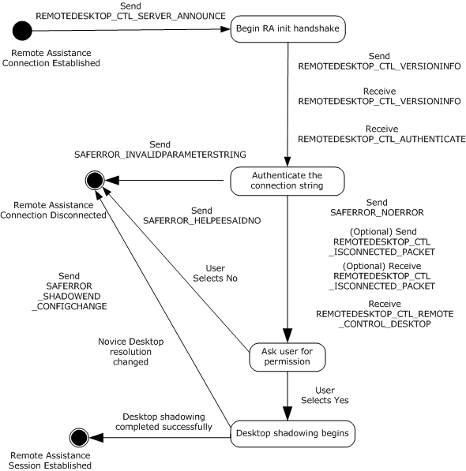

Figure 3: Remote Assistance session initialization state diagram (from the novice /server perspective)

### 3.4.1 Abstract Data Model

The message signaling that takes place in the session initialization protocol is to establish the Remote Assistance session; that is, to change the state from the basic [**Remote Assistance connection**](#gt_remote-assistance-connection) state in which the [**expert**](#gt_expert) does not have the view of the [**novice**](#gt_novice) screen to the state in which the expert has the view of the novice screen.

When the Remote Assistance connection has completed successfully, or if there was an error during connection, the novice is responsible for keeping track of this state change.

### 3.4.2 Timers

Upon initialization of a [**Remote Assistance session**](#gt_remote-assistance-session), the Connection Heartbeat timer MAY be started to send the [REMOTEDESKTOP_CTL_ISCONNECTED](#Section_2.2.1.6) packet every 30 seconds to indicate a connected state.

### 3.4.3 Initialization

The Remote Assistance Protocol sends the [session initialization](#Section_1.3.1) messages on the RC_CTL virtual channel. Therefore, a virtual channel with the name RC_CTL MUST be created before any session initialization messages can be sent or received.

### 3.4.4 Higher-Layer Triggered Events

The messages and events described in this specification have no other dependent events or messages from a higher layer.

### 3.4.5 Message Processing Events and Sequencing Rules

This section describes the [session initialization](#Section_1.3.1) messages that the [**novice**](#gt_novice) receives and the session initialization messages that the novice responds with.

When the novice sends the [REMOTEDESKTOP_CTL_SERVER_ANNOUNCE (section 2.2.1.7)](#Section_2.2.1.7) packet, it expects the following two packets to be sent by the [**expert**](#gt_expert):

- [REMOTEDESKTOP_CTL_VERSIONINFO (section 2.2.1.8)](#Section_2.2.1.8)
- [REMOTEDESKTOP_CTL_AUTHENTICATE (section 2.2.1.4)](#Section_2.2.1.4)
The novice MUST also send the REMOTEDESKTOP_CTL_VERSIONINFO (section 2.2.1.8) packet with the following values:

- REMOTEDESKTOP MAJOR VERSION = 1
- REMOTEDESKTOP MINOR VERSION = 2
When the novice receives the REMOTEDESKTOP_CTL_VERSIONINFO (section 2.2.1.8) packet, it MUST extract the major and minor version numbers from the packet. The major version number MUST be equal to 1, and the minor version number MUST be equal to 2; otherwise, the SAFERROR_INCOMPATIBLEVERSION error MUST be returned in the [REMOTEDESKTOP_CTL_RESULT (section 2.2.1.10)](#Section_2.2.1.10) packet to the expert.<6>

When the novice receives the REMOTEDESKTOP_CTL_AUTHENTICATE (section 2.2.1.4) packet, it MUST extract the [**Remote Assistance Connection**](#gt_remote-assistance-connection)String. The novice MUST authenticate whether or not the expert is connecting with the correct Remote Assistance Connection String, as specified in [MS-RAI](../MS-RAI/MS-RAI.md) Appendix A. If the Remote Assistance Connection String is not valid, SAFERROR_INVALIDPASSWORD MUST be returned to the expert. If the Remote Assistance ConnectionString is valid, the **expertBlob** MUST be extracted. Also, the success code SAFERROR_NOERROR MUST be returned in the REMOTEDESKTOP_CTL_RESULT (section 2.2.1.10) packet.

The REMOTEDESKTOP_CTL_RESULT (section 2.2.1.10) packet can be sent with the following error codes.

| Value | Meaning |
| --- | --- |
| SAFERROR_NOERROR | No error occurred. |
| SAFERROR_HELPEESAIDNO | Sent from the novice to the expert when the novice rejects the Remote Assistance connection. This error is returned when the novice rejects Remote Assistance by clicking No in the Remote Assistance Acceptance UI dialog box; otherwise, when the novice clicks Yes in this UI dialog box, the novice desktop shadowing completes, and the expert can view the novice screen. |
| SAFERROR_INCOMPATIBLEVERSION | The version number in the packet was for an incompatible version. |
| SAFERROR_INVALIDPASSWORD | MUST be returned by the novice when the password used produces an invalid Remote Assistance Connection String. |

When the novice receives the REMOTEDESKTOP_CTL_REMOTE_CONTROL_DESKTOP packet, the novice MUST start desktop shadowing after getting the user's consent.

After receiving REMOTEDESKTOP_CTL_RESULT (section 2.2.1.10) with SAFEERROR_NOERROR, the Remote Assistance session is considered established. When either the novice or expert ends a Remote Assistance session, it sends a [REMOTEDESKTOP_CTL_DISCONNECT (section 2.2.1.5)](#Section_2.2.1.5) packet to the other.

The novice MAY also send the [REMOTEDESKTOP_CTL_ISCONNECTED (section 2.2.1.6)](#Section_2.2.1.6) packet every 30 seconds over an idle connection.

The novice MAY receive the expert's IP address from the expert in a <[Session Control](#Section_2.2.2)> message (section 2.2.2) with the <NAME> containing the EXPERTIP value. This IP address could be used for maintaining a log of connecting experts.

### 3.4.6 Timer Events

The [REMOTEDESKTOP_CTL_ISCONNECTED](#Section_2.2.1.6) packet MAY be used to track the state of a [**Remote Assistance connection**](#gt_remote-assistance-connection). When used, both the [**expert**](#gt_expert) and the [**novice**](#gt_novice) MAY send this packet once every 30 seconds to indicate a connected state. No action is taken by either the expert or the novice on either receipt or nonreceipt of this packet.

### 3.4.7 Other Local Events

This protocol does not have external event dependencies.

## 3.5 Session Initialization Using the Expert (Client) Implementing Version 1 and Version 2 Details

After a **Remote Assistance Connection String** is obtained by the [**expert**](#gt_expert) (as specified in [MS-RAI](../MS-RAI/MS-RAI.md) sections 3.2, 3.4, and 6) a basic [**Remote Assistance connection**](#gt_remote-assistance-connection) is established from the expert to the [**novice**](#gt_novice) using the Remote Desktop Protocol: Basic Connectivity and Graphics Remoting, as specified in [MS-RDPBCGR](../MS-RDPBCGR/MS-RDPBCGR.md). This basic connection does not allow the expert to view the novice screen. Before the expert can view the novice screen, control messages MUST be exchanged between the novice and expert. When this exchange is completed successfully, the expert can view the novice screen, and the [**Remote Assistance session**](#gt_remote-assistance-session) initialization is completed.

The Remote Assistance session initialization protocol sends control message packets on the RC_CTL virtual channel. The RC_CTL virtual channel persists throughout the duration of the Remote Assistance connection. The following diagram shows the session initialization states between the novice and expert using protocol version 2.

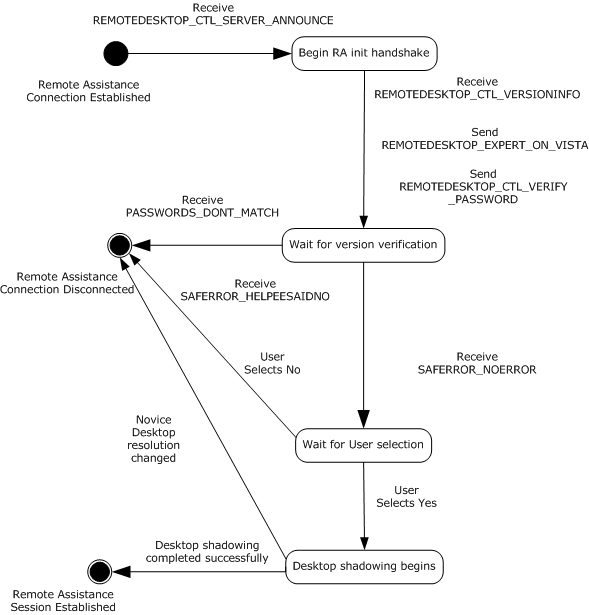

Figure 4: Remote Assistance session initialization version 2 state diagram (from the expert/client perspective)

### 3.5.1 Abstract Data Model

The message signaling that takes place in the session initialization protocol is to complete the [**Remote Assistance connection**](#gt_remote-assistance-connection); that is, to change the state from the basic Remote Assistance connection state in which the [**expert**](#gt_expert) does not have the view of the [**novice**](#gt_novice) screen, to the state in which the expert has the view of the novice screen.

When the control message arrives to the expert indicating that a Remote Assistance connection has completed successfully or that there was an error during connection, the expert is responsible for keeping track of this state change.

### 3.5.2 Timers

There are no timers associated with this section of the protocol.

### 3.5.3 Initialization

The Remote Assistance Protocol sends control message packets on the RC_CTL virtual channel. A virtual channel named "RC_CTL" MUST be opened before any control messages can be sent or received.

### 3.5.4 Higher-Layer Triggered Events

The messages and events described here have no other dependent events or messages from a higher layer.

### 3.5.5 Message Processing Events and Sequencing Rules

This section describes the sequence of the control packets that the [**expert**](#gt_expert) receives, as well as the control message packets with which the expert responds.

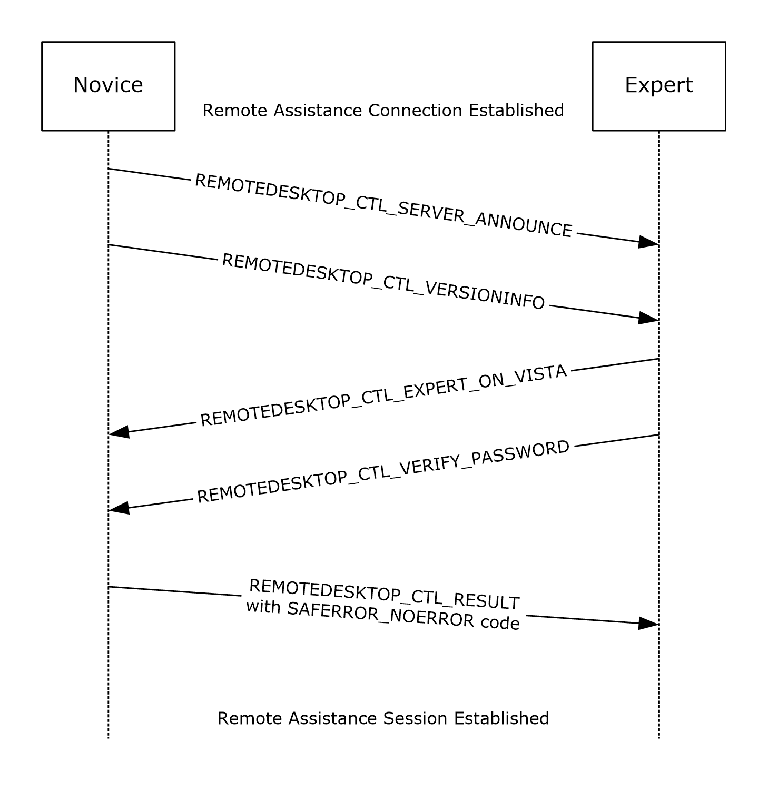

Figure 5: Remote Assistance session initialization sequence diagram for version 2

After the [**novice**](#gt_novice) initiates Remote Assistance, the expert can obtain the [**Remote Assistance Connection**](#gt_remote-assistance-connection) String in any of the following methods:

- Obtains the Remote Assistance Connection String 1 using the IPCHService ([MS-RAI](../MS-RAI/MS-RAI.md) section 3.2).
- Obtains the Remote Assistance Connection String 2 using IRASrv ([MS-RAI] section 3.4).
- Obtains the Remote Assistance Connection String 1 using the RCTICKET attribute of the Remote Assistance Invitation File of first type ([MS-RAI] section 6).
- Obtains the Remote Assistance Connection String 2 using the LHTICKET attribute of the Remote Assistance Invitation File of second type ([MS-RAI] section 6).
If the expert obtains the Remote Assistance Connection String 2, it MUST use the version 2 protocol. Otherwise, version 1 MUST be used (as specified in section [3.3](#Section_3.3)).

If the expert obtains the Remote Assistance Connection String 2 during the connection sequence, and encryption is selected for the RDP session; that is. a nonzero encryptionMethod in TS_UD_SC_SEC1 (see [MS-RDPBCGR](../MS-RDPBCGR/MS-RDPBCGR.md) section 2.2.1.4.3), the client validates the public key of the server certificate contained in the Server Security Data (TS_UD_SC_SEC1).

On receiving the TS_UD_SC_SEC1 from the server, the client calculates the hash of the public key, and compares its base64-encoded string against the value of the key hash parameter of the Auth String Node <A>. The hashing algorithm is determined by the key hash parameter in the Auth String Node <A> as specified in [MS-RAI] section 2.2.2. The validation is successful if they are an exact match. Otherwise, if the validation fails, the server certificate is considered invalid and the client disconnects the session.

As soon as the basic Remote Assistance Connection is established, the expert receives the [REMOTEDESKTOP_CTL_SERVER_ANNOUNCE (section 2.2.1.7)](#Section_2.2.1.7) and [REMOTEDESKTOP_CTL_VERSIONINFO (section 2.2.1.8)](#Section_2.2.1.8) packets. The expert drops the REMOTEDESKTOP_CTL_VERSIONINFO packet and announces to the novice to use the version 2 protocol by sending the [REMOTEDESKTOP_EXPERT_ON_VISTA (section 2.2.1.12)](#Section_2.2.1.12) packet. The expert also responds to the REMOTEDESKTOP_CTL_SERVER_ANNOUNCE (section 2.2.1.7) packet by sending the [REMOTEDESKTOP_CTL_VERIFY_PASSWORD (section 2.2.1.11)](#Section_2.2.1.11) packet.

The novice MUST respond to the REMOTEDESKTOP_CTL_VERIFY_PASSWORD (section 2.2.1.11) packet by verifying the Remote Assistance Connection String, as specified in [MS-RAI] Appendix A, and return SAFERROR_NOERROR to the expert indicating that the Remote Assistance Connection String is valid. If the Remote Assistance Connection String is not valid, the novice MUST return PASSWORDS_DONT_MATCH.

The [REMOTEDESKTOP_CTL_RESULT (section 2.2.1.10)](#Section_2.2.1.10) packet can be received with the following error codes.

| Value | Meaning |
| --- | --- |
| SAFERROR_NOERROR | No error occurred. |
| SAFERROR_HELPEESAIDNO | Sent from the novice to the expert when the novice rejects the Remote Assistance Connection. This error is returned when the novice rejects Remote Assistance by clicking "No" in the Remote Assistance Acceptance UI dialog box; otherwise, when the novice clicks "Yes" in this UI dialog box, the novice desktop shadowing completes, and the expert can view the novice screen. |
| PASSWORDS_DONT_MATCH | MUST be returned by the novice when the password used produces an invalid Remote Assistance Connection String. |

After the novice receives a REMOTEDESKTOP_CTL_RESULT (section 2.2.1.10) packet with SAFERROR_NOERROR, the novice starts desktop shadowing. The expert and novice MAY exchange [REMOTEDESKTOP_CTL_RANOVICE_NAME (section 2.2.1.13)](#Section_2.2.1.13) and [REMOTEDESKTOP_CTL_RAEXPERT_NAME (section 2.2.1.14)](#Section_2.2.1.14) packets with each other to update their respective user interfaces.

### 3.5.6 Timer Events

There are no timer events associated with this section of the protocol.

### 3.5.7 Other Local Events

The Remote Assistance Protocol does not have external event dependencies.

## 3.6 Session Initialization Using the Novice (Server) Implementing Version 1 and Version 2 Details

After a **Remote Assistance Connection String** is obtained by the [**expert**](#gt_expert) (as specified in [MS-RAI](../MS-RAI/MS-RAI.md) sections 3.2, 3.4, and 6), a basic [**Remote Assistance connection**](#gt_remote-assistance-connection) is established from the expert to the [**novice**](#gt_novice) using the Remote Desktop Protocol: Basic Connectivity and Graphics Remoting, as specified in [MS-RDPBCGR](../MS-RDPBCGR/MS-RDPBCGR.md). This basic connection does not have the Expert View capability; that is, the expert cannot view the novice screen. Before the expert can view the novice screen, there is a control message exchange between the novice and the expert. When this exchange is completed successfully, the expert is granted a view of the novice screen, and the [**Remote Assistance session**](#gt_remote-assistance-session) is considered established.

The Remote Assistance session initialization protocol sends control message packets on the RC_CTL virtual channel. The RC_CTL virtual channel persists throughout the duration of the Remote Assistance connection.

If any errors occur during signaling, Remote Assistance error codes are returned in the REMOTEDESKTOP_CTL_RESULT over the RC_CTL channel.

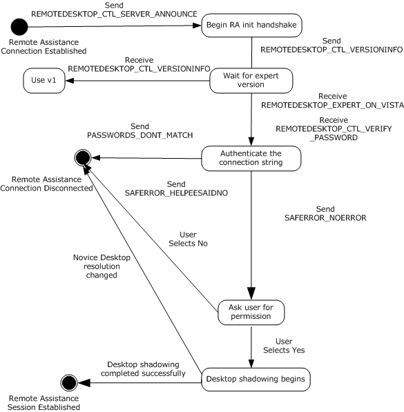

Figure 6: Remote Assistance session initialization state diagram (from the novice/server perspective)

### 3.6.1 Abstract Data Model

The message signaling that takes place in the session initialization protocol is to complete the [**Remote Assistance connection**](#gt_remote-assistance-connection); that is, to change the state from the basic Remote Assistance connection state in which the [**expert**](#gt_expert) does not have the view of the [**novice**](#gt_novice) screen to the state in which the expert has the view of the novice screen.

When the Remote Assistance connection has completed successfully, or if there was an error during connection, the novice is responsible for keeping track of this state change.

### 3.6.2 Timers

There are no timers associated with this section of the protocol.

### 3.6.3 Initialization

The Remote Assistance Protocol sends [session initialization](#Section_1.3.1) messages on the RC_CTL virtual channel. Therefore, a virtual channel with the name RC_CTL MUST be created before any session initialization messages can be sent or received.

### 3.6.4 Higher-Layer Triggered Events

The messages and events described in this specification have no other dependent events or messages from a higher layer.

### 3.6.5 Message Processing Events and Sequencing Rules

This section describes the control message packets that the novice receives and the control message packets responses from the novice.

As soon as basic Remote Assistance connection is established, the novice sends the REMOTEDESKTOP_CTL_SERVER_ANNOUNCE and REMOTE_DESKTOP_CTL_VERSIONINFO packets to the expert. The novice either receives the REMOTEDESKTOP_CTL_VERSIONINFO packet or REMOTEDESKTOP_EXPERT_ON_VISTA packet from the expert. If the REMOTEDESKTOP_CTL_VERSIONINFO packet is received, the novice MUST use version 1 (as specified in section [3.3](#Section_3.3)) for further communication.

The expert then responds to the REMOTEDESKTOP_CTL_SERVER_ANNOUNCE packet by sending the REMOTEDESKTOP_CTL_VERIFY_PASSWORD packet.

When the novice receives the REMOTEDESKTOP_CTL_VERIFY_PASSWORD packet, it MUST extract the Remote Assistance Connection String. The novice MUST authenticate whether or not the expert is connecting with the correct Remote Assistance Connection String, as specified in [MS-RAI](../MS-RAI/MS-RAI.md) Appendix A. If the Remote Assistance Connection String is not valid, PASSWORDS_DONT_MATCH MUST be returned to the expert. Also, the success code SAFERROR_NOERROR MUST be returned in the REMOTEDESKTOP_CTL_RESULT packet.

The REMOTEDESKTOP_CTL_RESULT packet can be received with the following error codes.

| Value | Meaning |
| --- | --- |
| SAFERROR_NOERROR | No error occurred. |
| SAFERROR_HELPEESAIDNO | Sent from the novice to the expert when the novice rejects the Remote Assistance connection. This error is returned when the novice rejects Remote Assistance by clicking "No" in the Remote Assistance Acceptance UI dialog box; otherwise, when the novice clicks "Yes" in this UI dialog box, the novice desktop shadowing completes, and the expert can view the novice screen. |
| PASSWORDS_DONT_MATCH | MUST be returned by the [**novice**](#gt_novice) when the password used produces an invalid [**Remote Assistance Connection**](#gt_remote-assistance-connection) String. |

After the novice receives a [REMOTEDESKTOP_CTL_RESULT (section 2.2.1.10)](#Section_2.2.1.10) packet with SAFERROR_NOERROR, the novice starts desktop shadowing. The [**expert**](#gt_expert) and novice MAY exchange [REMOTEDESKTOP_CTL_RANOVICE_NAME (section 2.2.1.13)](#Section_2.2.1.13) and [REMOTEDESKTOP_CTL_RAEXPERT_NAME (section 2.2.1.14)](#Section_2.2.1.14) packets with each other to update their respective user interfaces.

### 3.6.6 Timer Events

There are no timer events associated with this section of the protocol.

### 3.6.7 Other Local Events

This protocol does not have external event dependencies.

## 3.7 Session Initialization Using the Expert (Client) Implementing Version 1, Version 2, and Version 3 Details

After a Remote Assistance Connection String is obtained by the expert (as specified in [MS-RAI](../MS-RAI/MS-RAI.md) sections 3.2, 3.4, and 6, [MS-RAIOP](../MS-RAIOP/MS-RAIOP.md) sections 3.2 and 3.4), a basic Remote Assistance connection can be established from the expert to the novice using the Remote Desktop Protocol: Basic Connectivity and Graphics Remoting, as specified in [MS-RDPBCGR](../MS-RDPBCGR/MS-RDPBCGR.md). This basic connection does not have the expert View capability; that is, the expert cannot view the novice screen. Before the expert can view the novice screen, there is a control message exchange between the novice and the expert. When this exchange is completed successfully, the expert is granted a view of the novice screen, and the Remote Assistance session is considered established.

When the Remote Assistance Initiation over PNRP Protocol is used for transferring the Remote Assistance Connection String, a type of authorization system replacing the system described in sections [3.3](#Section_3.3) to [3.6](#Section_3.6) was created to verify that the user making the connection has both the connection string used to make the connection and the password needed to verify identity. This method of session initialization MUST be used only when the Remote Assistance Initiation over PNRP Protocol has been used to establish the Remote Assistance Connection. This system involves mutual authentication using a token derived from both the password and the connection string.

### 3.7.1 Abstract Data Model

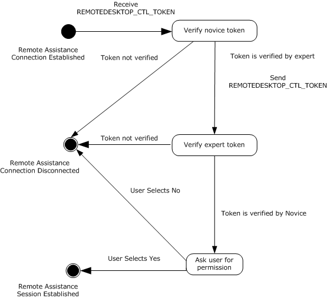

Figure 7: Token authorization

The message signaling that takes place in the Remote Assistance session initialization protocol is to establish a Remote Assistance session; that is, to change the state from the basic Remote Assistance connection state in which the [**expert**](#gt_expert) does not have the view of the [**novice**](#gt_novice) screen, to the state in which the expert has the view of the novice screen.

When the Remote Assistance connection has completed successfully, or if there was an error during connection, the novice is responsible for keeping track of this state change.

### 3.7.2 Timers

No timers are associated with token-based session initialization on the expert.

### 3.7.3 Initialization

The Remote Assistance Protocol sends control message packets on the RC_CTL virtual channel. Therefore, a virtual channel with the name RC_CTL MUST be created before any control messages can be sent or received.

### 3.7.4 Higher-Layer Triggered Events

The messages and events described in this specification have no other dependent events or messages from a higher layer.

### 3.7.5 Message Processing Events and Sequencing Rules

This section describes the sequence of the control packets that the expert receives as well as the control message packets with which the expert responds.

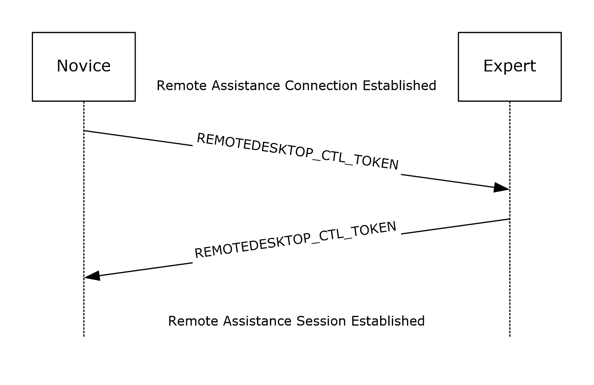

Figure 8: Remote Assistance session initialization sequence diagram for version 3

If the Remote Assistance Initiation Protocol is used to transfer Remote Assistance Connection String, the expert MUST use either the version 1 or 2 protocol (as specified in section [3.5](#Section_1.3)). If the Remote Assistance Initiation over PNRP Protocol was used to transfer Remote Assistance Connection String, the expert MUST use the version 3 protocol (as specified below) for session initialization.

After the Remote Assistance connection is established, the expert MUST receive a REMOTEDESKTOP_CTL_TOKEN_PACKET containing a novice session authorization token as specified in section [2.2.4](#Section_2.2.4).

The expert MUST create a novice token and compare it with the token that was received from the novice to verify that the two tokens match. After this check is made, the expert MUST send the novice a REMOTEDESKTOP_CTL_TOKEN_PACKET containing an expert session authorization token as specified in section 2.2.4.

The expert then obtains view after the novice verifies the expert session authorization token and after receiving permission from the user to allow the connection.

If either side cannot confirm that the two tokens match, or if the user does not grant permission to view the desktop, the Remote Assistance connection MUST be terminated.

### 3.7.6 Timer Events

No timer events are associated with token-based session initialization in this protocol.

### 3.7.7 Other Local Events

There are no local events that are associated with this portion of the Remote Assistance Protocol.

## 3.8 Session Initialization Using the Novice (Server) Implementing Version 1, Version 2, and Version 3 Details

After a **Remote Assistance Connection String** is obtained by the expert (as specified in [MS-RAI](../MS-RAI/MS-RAI.md) section 3.2, 3.4, and 6, and [MS-RAIOP](../MS-RAIOP/MS-RAIOP.md) section 3.2 and 3.4), a basic Remote Assistance connection can be established from the expert to the novice using the Remote Desktop Protocol: Basic Connectivity and Graphics Remoting, as specified in [MS-RDPBCGR](../MS-RDPBCGR/MS-RDPBCGR.md). This basic connection does not have the expert view capability; that is, the expert cannot view the novice screen. Before the expert can view the novice screen, there is a control message exchange between the novice and the expert. When this exchange is completed successfully, the expert is granted a view of the novice screen, and the Remote Assistance session is considered established.

When the Remote Assistance Initiation over PNRP Protocol is used for transferring the Remote Assistance Connection String, a type of authorization system replacing the system described in sections [3.3](#Section_3.3) to [3.6](#Section_3.6) is used to verify that the user making the connection has both the connection string used to make the connection and the password needed to verify identity. This system involves mutual authentication using a token derived from both the password and the connection string.

This type of session initialization allows for both the novice and the expert to verify their identity by using the connection string and password as a base input for a one-way hash.

### 3.8.1 Abstract Data Model

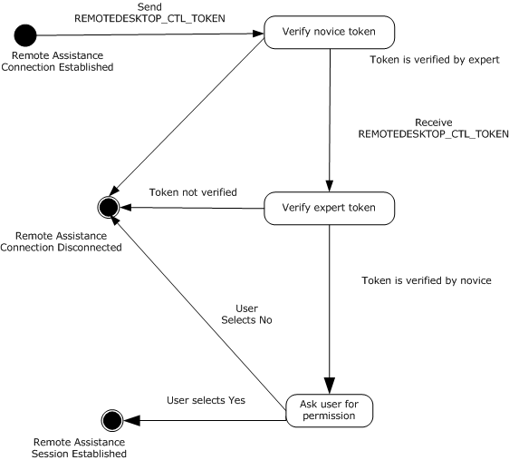

Figure 9: Token authorization

The message signaling that takes place in the session initialization protocol is needed to complete the Remote Assistance session; that is, to change the state from the basic Remote Assistance connection state in which the expert does not have the view of the novice screen, to the state in which the expert has the view of the novice screen.

When the Remote Assistance connection has completed successfully, or if there was an error during connection, the novice is responsible for keeping track of this state change.

### 3.8.2 Timers

No timers are associated with token-based session initialization on the expert.

### 3.8.3 Initialization

The Remote Assistance Protocol sends control message packets on the RC_CTL virtual channel. Therefore, a virtual channel with the name RC_CTL MUST be created before any control messages can be sent or received.

### 3.8.4 Higher-Layer Triggered Events

The messages and events described in this specification have no other dependent events or messages from a higher layer.

### 3.8.5 Message Processing Events and Sequencing Rules

If the Remote Assistance Initiation protocol is used to transfer the Remote Assistance Connection String, the novice MUST use either the version 1 or 2 protocol (as specified in section [3.6](#Section_3.6)). If the Remote Assistance Initiation over PNRP Protocol was used to transfer Remote Assistance Connection String, the novice MUST use the version 3 protocol (specified below) for session initialization after the Remote Assistance connection is established.

After the RC_CTL virtual channel has been established between the novice and the expert, the novice MUST send the expert a REMOTEDESKTOP_CTL_TOKEN_PACKET containing a novice session authorization token as specified in section [2.2.4](#Section_2.2.4).

After the expert verifies the novice token, the novice MUST receive a REMOTEDESKTOP_CTL_TOKEN_PACKET containing an expert session authorization token as specified in section 2.2.4.

The novice MUST create an expert token and compare it with the token received from the expert to verify that the two tokens match. After this is verified, the novice MUST receive permission from the user to allow the connection before granting a view of the desktop.

If either side cannot confirm that the two tokens match, or if the user does not grant permission to view the desktop, the Remote Assistance connection MUST be terminated.

### 3.8.6 Timer Events

No timer events are associated with token-based session initialization in this protocol.

### 3.8.7 Other Local Events

No local events are associated with this portion of the Remote Assistance Protocol.

## 3.9 File Transfer Sender Details

File transfer in a [**Remote Assistance session**](#gt_remote-assistance-session) is initiated by the sender of the file; there is no mechanism for the receiver of a file to request the transfer to begin.<7> This section will focus only on the file transfer messages and the sequence expected from the file sender's side and is applicable to all three versions of the protocol unless it's explicitly called out. A high-level state machine depicting message exchanges from the sender's point of view is shown here. File transfer supports only one file being transferred at a time.

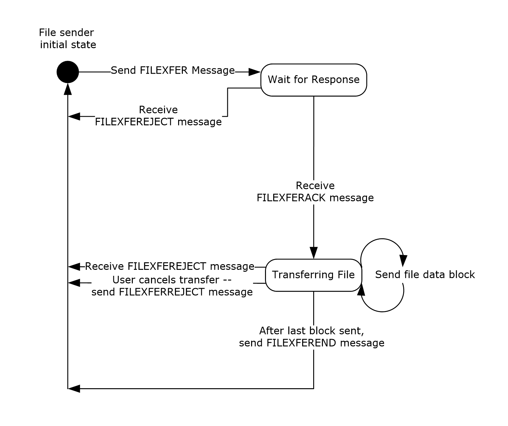

Figure 10: Session-state diagram from the file sender perspective

### 3.9.1 Abstract Data Model

No data model is needed to maintain internal state.

### 3.9.2 Timers

No timers or time-out periods are associated with file transfer.

### 3.9.3 Initialization

The virtual channel used to receive the signal for file transfer (RCCOMMAND NAME="FILEXFER") is initialized when the [**Remote Assistance connection**](#gt_remote-assistance-connection) is first established. The virtual channel that is used to transfer the file data MUST be opened by the sender before sending the FILEXFER message. The name of this virtual channel is specified by the sender as an attribute in the [FILEXFER](#Section_4.2) message.

### 3.9.4 Higher-Layer Triggered Events

The messages and events described in this specification have no other dependent events or messages from a higher layer.

### 3.9.5 Message Processing Events and Sequencing Rules

Two virtual channels are involved during file transfer. The virtual channel 71 is used to initiate file transfer through an <[RCCOMMAND](#Section_2.2.2)> message, and a second dynamically created virtual channel is used to transfer the file data, called the file transfer channel.

The file sender first signals the need to copy a file from its computer to the receiver's computer. This is accomplished by sending an <RCCOMMAND> message on virtual channel 71 with the **NAME** attribute set to FILEXFER. The message MUST also include the attributes **FILENAME**, **FILESIZE**, and **CHANNELID**. The **FILENAME** attribute MUST be set to the original name of the file, as seen by the sender. The **FILESIZE** attribute MUST be set to the size, in bytes, of the file to be sent. The **CHANNELID** MUST be set to the name of the virtual channel that the file data will be sent on. Also, the **CHANNELID** will be the channel through which the sender expects to get any response from the receiver. In version 3, if the sender intends this file to be considered as internal data, it MUST be marked by setting the **INTERNALDATA** attribute corresponding to the type of internal data sent.

After sending the <RCCOMMAND> message, the sender waits for a response to the file transfer request on the file transfer channel specified in the message just sent. The sender continues to wait until either a response is received or the Remote Assistance Connection is terminated. If the sender receives the [FILEXFERREJECT](#Section_4.2) message, no additional messages on the channel are to be expected and no file data is to be sent on the channel to the receiver. On receipt of the FILEXFERACK message, the sender proceeds with sending the actual file data to the receiver on the file transfer channel.

Sending a file requires the sender to break the file into blocks and send them serially to the receiver. Version 1 uses a block size of 409,600 bytes, whereas version 2 and version 3 use a block size of 1,024 bytes. The last block will be of a shorter length if the file data is not exactly divisible by the block size chosen. The sender MUST indicate file transfer completion by sending FILEXFEREND on the file transfer channel. In all cases, the data sent MUST be sent serially because there is no header information to allow for out of order reassembly on the receiving side. Because there is no acknowledgment of the receipt of the block from the receiving side provided for in this protocol, an attempt to terminate the Remote Assistance session before the receiver processes the file transfer data SHOULD result in cancellation of file transfer.

If, while the file is being sent, the sending user wants to cancel the transfer, this user sends the FILEXFERREJECT message to the receiver on the file transfer channel. If the receiver wants to cancel the file transfer, it sends the FILEXFERREJECT message to the sender on the file transfer channel. In either case, the sender stops sending data blocks. No other messages are expected or sent on the file transfer channel after sending or receiving the FILEXFERREJECT message.

For the file sender, several messages can arrive during the entire process. (See section 2.2.3.) When a message arrives, a string comparison to detect the type of message arriving is all that is needed. The state machine shown in section [3.9](#Section_1.3.2) illustrates the expected sequence of messages; any message that arrives out of sequence SHOULD cause the receiver to generate a FILEXFERREJECT message to signal the error in processing messages. If errors in the sequence are ignored, it is possible that file corruption can occur on the file receiving side.

A sample follows of the messages exchanged over time between the file sender and receiver.

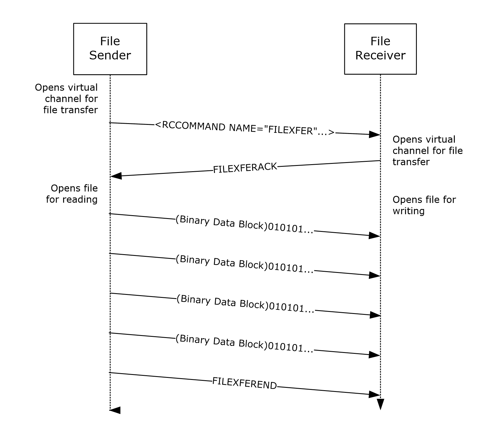

Figure 11: File transfer packet sequencing

### 3.9.6 Timer Events

No timer events are associated with file transfer in this protocol.

### 3.9.7 Other Local Events

The Remote Assistance Protocol does not have external event dependencies.

## 3.10 File Transfer Receiver Details

File transfer in a Remote Assistance session is initiated by the sender of the file; there is no mechanism for the receiver of a file to request the transfer to begin. The method employed to transfer the file from one computer to the other is very basic and is applicable to all three versions of the protocol unless it's explicitly called out. When considering the file transfer exchange that happens, other messages for things such as share control and [**VoIP**](#gt_voice-over-ip-voip) are not considered, although they can be sent and received at any point during the sequence described in the following diagram. This section focuses only on the file transfer messages and the sequence expected from the file receiver's side. A high-level state machine depicting message exchanges from the receiver's point of view follows.

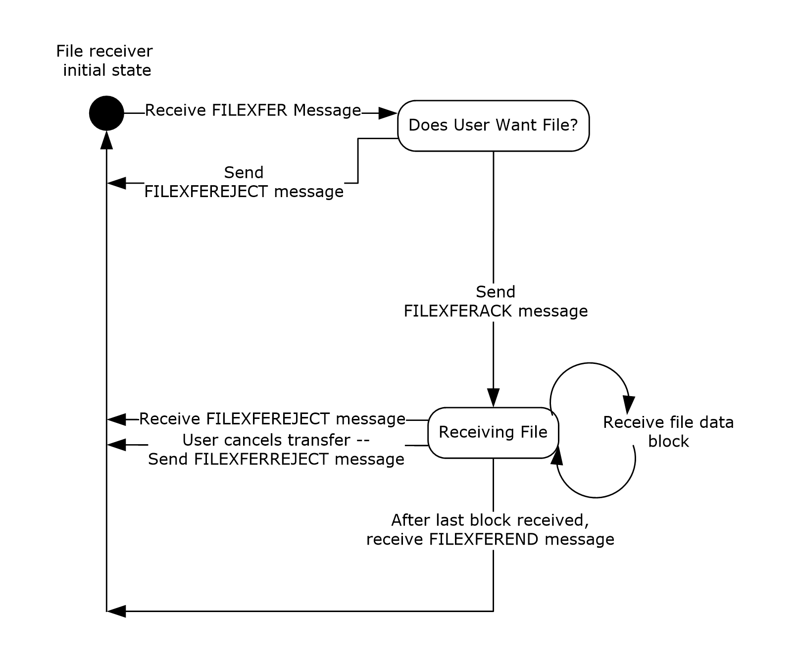

Figure 12: Session-state diagram (file receiver perspective)

### 3.10.1 Abstract Data Model

There is no internal state that needs to be maintained that requires abstract data models.

### 3.10.2 Timers

No timers are associated with file transfer.

### 3.10.3 Initialization

The virtual channel used to receive the signal for file transfer (RCCOMAND NAME="FILEXFER") is initialized when the [**Remote Assistance connection**](#gt_remote-assistance-connection) is first established. The [FILEXFERACK](#Section_4.2) message or the FILEXFERREJECT message is sent on the newly opened file transfer channel. The name of this virtual channel is specified by the sender as an attribute in the FILEXFER message. The format of the virtual channel name is version-dependent. For version 1, in the case where the novice started the file transfer, the name will be the IP address of the sender, followed by the character ".", followed by the number of seconds since January 1, 1970. In the case where the expert started the file transfer, the name will be the characters "1000.", followed by the number of seconds since January 1, 1970. For version 2 or version 3, regardless of which role started the transfer, the name will be "RA_FX".

### 3.10.4 Higher-Layer Triggered Events

No higher-layer triggered events are addressed by this portion of the Remote Assistance Protocol.

### 3.10.5 Message Processing Events and Sequencing Rules

For the file receiver, several messages can arrive during the entire process. (See section [2.2.3](#Section_4.2).) When a message arrives, a string comparison can be used to determine the type of message that has arrived. The state machine shown in section [3.10](#Section_1.3) shows the expected sequence of messages; any messages that arrive out of sequence MUST cause the receiver of the message to generate a FILEXFERREJECT message to signal the error in processing the messages. If errors in the sequence are ignored, it is possible that file corruption can occur on the file receiving side.

The first message that is received is an <[RCCOMMAND](#Section_2.2.2)> message on the virtual channel 71 with the **NAME** attribute set to FILEXFER. The message MUST also include the attributes **FILENAME**, **FILESIZE**, and **CHANNELID**. The **FILENAME** attribute MUST be set to the original name of the file, as seen by the sender of the file. The **FILESIZE** attribute MUST be set to the size in bytes of the file about to be sent. The **CHANNELID** MUST be set to the name of the virtual channel that the file data will be sent on. Also, the **CHANNELID** will be the channel through which the file sender expects to get a response from the file receiver. In version 3, if the sender intended this file to be considered as internal data, it MUST be marked by setting the **INTERNALDATA** attribute corresponding to the type of internal data sent.

After receiving this message, the file receiver MUST send a response to the file transfer request on the channel specified in the message just received. If the file transfer is wanted, the file receiver MUST send the FILEXFERACK message to the file sender on the file transfer channel. After sending the FILEXFERACK message, the file receiver MUST prepare for file data to arrive on the same channel. If the file transfer is not wanted, the file receiver MUST send the FILEXFERREJECT message on the file transfer channel. If the FILEXFERREJECT message is sent, no additional messages or file data are to be expected by the file receiver, and no more messages are sent on the virtual channel.

When receiving file data, the file is received in discrete blocks. Version 1 of the protocol uses a block size of 409,600 bytes, while versions 2 and 3 use a block size of 1,024 bytes. The last block is a shorter length if the file data is not exactly divisible by the block size chosen. File transfer is complete when the receiver receives the FILEXFEREND message on the file transfer channel.

In all cases, the data MUST be sent serially because there is no header information to allow for odd order reassembly on the receiving side. Also, this protocol does not acknowledge receipt of the block from the receiving side.

If, while the file is being sent, the receiving user wants to cancel the transfer, the user SHOULD send the FILEXFERREJECT message to the file sender on the file transfer channel. To cancel the file transfer, the sender sends the FILEXFERREJECT message to the receiver on the file transfer channel. In either case, the sender SHOULD stop sending data blocks. No other messages are expected or sent on the file transfer channel after the sending or receiving of the FILEXFERREJECT message.

A sample follows of the messages exchanged over time between the file sender and receiver.

Figure 13: File transfer process during a Remote Assistance session

### 3.10.6 Timer Events

No timer events are associated with file transfer in this protocol.

### 3.10.7 Other Local Events

No local events have an impact on this portion of the Remote Assistance Protocol.

## 3.11 Chat (Text) Sender Details

After the [**Remote Assistance connection**](#gt_remote-assistance-connection) is established, the application SHOULD open the virtual channel 70 to send and receive chat messages. Because there are only two computers involved in the connection, it is assumed that any data received on the chat virtual channel 70 is a [**Unicode string**](#gt_unicode-string) to be shown to the user as a message from the other person they are connected to. There is no header information, and each block of data received on the channel is conceptually thought of as a distinct message from the other user. To send a chat message, the message formatted as a NULL-terminated Unicode string can be sent on virtual channel 70.

### 3.11.1 Abstract Data Model

No data model is used in this portion of the Remote Assistance Protocol.

### 3.11.2 Timers

No timers are associated with this portion of the Remote Assistance Protocol.

### 3.11.3 Initialization

The virtual channel that allows chat messages to be exchanged is initialized immediately after the [**Remote Assistance connection**](#gt_remote-assistance-connection) is established. The virtual channel name is 70, and it is used solely to transfer [**Unicode strings**](#gt_unicode-string) as chat messages between the two connected computers.

### 3.11.4 Higher-Layer Triggered Events

No higher-layer triggered events affect this portion of the Remote Assistance Protocol.

### 3.11.5 Message Processing Events and Sequencing Rules

A chat message MUST be sent on virtual channel 70 as a NULL-terminated [**Unicode string**](#gt_unicode-string). The sent string MUST NOT exceed 1,024 bytes in size (including NULL termination) for versions 2 and 3 of the protocol. Version 1 can send messages longer than 1,024 bytes. Chat messages greater than 1,024 bytes are not sent by versions 2 or 3, but they can receive messages longer than 1,024 bytes from version 1 clients. There is no expected response from the receiving side.

### 3.11.6 Timer Events

No timer events are associated with sending chat messages.

### 3.11.7 Other Local Events

None.

## 3.12 Chat (Text) Receiver Details

After the [**Remote Assistance connection**](#gt_remote-assistance-connection) is established, the application SHOULD open virtual channel 70 to send and receive chat messages. Because there are only two computers involved in the connection, it is assumed that any data received on the chat virtual channel 70 is a [**Unicode string**](#gt_unicode-string) to be shown to the user as a message from the other user to whom they are connected. There is no header information, and each block of data received on the channel is conceptually thought of as a distinct message from the other user. To send a chat message, the message formatted as a NULL-terminated Unicode string can be sent on virtual channel 70.

### 3.12.1 Abstract Data Model

No data model is associated with this portion of the Remote Assistance Protocol.

### 3.12.2 Timers

No timers are required for the chat portion of the Remote Assistance Protocol.

### 3.12.3 Initialization

The virtual channel that allows chat messages to be exchanged is initialized immediately after the [**Remote Assistance connection**](#gt_remote-assistance-connection) is established. The virtual channel name is 70 and is used solely to transfer [**Unicode strings**](#gt_unicode-string) as chat messages between the two connected computers.

### 3.12.4 Higher-Layer Triggered Events

No events are used in this section of the Remote Assistance Protocol.

### 3.12.5 Message Processing Events and Sequencing Rules

When a message arrives on the virtual channel reserved for chat, it is always assumed to be a NULL-terminated [**Unicode string**](#gt_unicode-string). Because there can be only one possible sender, the message has no header and no packet information. Therefore, each packet MUST be considered a discrete message that SHOULD be displayed in its entirety to the receiving user. There are no error codes or responses expected or sent in response to receiving a chat message. Chat messages of a length greater than 1,024 bytes MUST NOT be sent by versions 2 or 3; version 1 allows messages longer than 1,024 bytes. Chat messages of a length greater than 1,024 bytes are not sent by versions 2 or 3, but they can receive messages longer than 1,024 bytes from version 1 clients.

### 3.12.6 Timer Events

No timers are associated with this portion of the Remote Assistance Protocol.

### 3.12.7 Other Local Events

No events are associated with this portion of the Remote Assistance Protocol.

## 3.13 Setting Announcement Sender Details

After the [**Remote Assistance session**](#gt_remote-assistance-session) has begun, settings concerning the Remote Assistance session can be exchanged with the remote computer. The [**expert**](#gt_expert) SHOULD initiate an exchange of settings by sending out the local value for a setting that is considered relevant to the Remote Assistance session that has begun. In version 3(only), the [**novice**](#gt_novice) sends the local value of a setting in response to receiving a setting announcement.

### 3.13.1 Abstract Data Model

No data model is associated with this portion of the Remote Assistance Protocol.

### 3.13.2 Timers

No timers are required for this portion of the Remote Assistance Protocol.

### 3.13.3 Initialization

The virtual channel that allows setting announcement messages to be exchanged is initialized immediately after the [**Remote Assistance connection**](#gt_remote-assistance-connection) is established. The virtual channel name is "71", used to send session initialization and control messages.

### 3.13.4 Higher-Layer Triggered Events

None.

### 3.13.5 Message Processing Events and Sequencing Rules

To send a Setting Announce message, the sender MUST use the session control message <[RCCOMMAND](#Section_2.2.2)> and SHOULD use the following attributes exclusively. The **NAME** attribute MUST be set to SETTINGANNOUNCE, the **PROPERTY** attribute SHOULD provide a unique name for a setting that is relevant to the Remote Assistance Session, and the **VALUE** attribute MUST be set to represent the local setting.

An example of a valid Setting Announce message would be:

<RCCOMMAND NAME="SETTINGANNOUNCE" PROPERTY="CONTACTEXCHANGE" VALUE="1"/>

In version 3 (only), this message can be sent by the expert to initiate a setting exchange, and by the novice in response to receiving the expert's setting announcement.

### 3.13.6 Timer Events

None.

### 3.13.7 Other Local Events

None.

## 3.14 Setting Announcement Receiver Details

After the [**Remote Assistance session**](#gt_remote-assistance-session) has begun, settings concerning the Remote Assistance session can be exchanged with the remote computer. The [**expert**](#gt_expert) SHOULD initiate an exchange of settings by sending out the local value for a setting that is considered relevant to the Remote Assistance session that has begun. The [**novice**](#gt_novice) SHOULD send the local value of a setting in response to receiving a setting announcement.

Based on the setting that was changed, the expert and the novice MAY send additional messages or update their internal state. If a session was initiated using PNRP (as specified in [MS-RAIOP](../MS-RAIOP/MS-RAIOP.md) sections 3.1, 3.2, 3.3, and 3.4), in version 3, the expert MUST announce their Contact Exchange setting. After the expert receives the novice's Contact Exchange setting, the expert MUST compare the local and remote values for this setting. If they are both set to "1", the expert MUST initiate an internal data transfer (see [file transfer (section 3.9)](#Section_1.3.2)) of their contact information (as specified in section [2.2.5](#Section_2.2.5)). After the novice has received the expert's contact information, the novice MUST send their contact information to the expert as an internal data transfer.

When generating contact information, version 3 creates a [**peer identity**](#gt_peer-identity), a public/private key pair, as specified in [[RFC8017]](https://go.microsoft.com/fwlink/?linkid=2164409). Then, the peer identity is converted into a [**peer name**](#gt_peer-name) as specified in [MS-PNRP](../MS-PNRP/MS-PNRP.md) section 1.3.1.1. "RAContact" is used as the classifier. The peer name is used to populate the ADDRESS attribute of the RAINVITATIONITEM node. The image used for the contact and the public key from peer identity are converted from binary into base64 strings and used to populate **AVATAR** and **PUBLICKEY** respectively.

### 3.14.1 Abstract Data Model

No data model is associated with this portion of the Remote Assistance Protocol.

### 3.14.2 Timers

No timers are required for this portion of the Remote Assistance Protocol.

### 3.14.3 Initialization

The virtual channel that allows setting announcement messages to be exchanged is initialized immediately after the [**Remote Assistance connection**](#gt_remote-assistance-connection) is established. The virtual channel name is "71", used to send session initialization and control messages.

### 3.14.4 Higher-Layer Triggered Events

None.

### 3.14.5 Message Processing Events and Sequencing Rules

After receiving a Setting Announce message, a [**novice**](#gt_novice) SHOULD respond with the matching local setting. Either the [**expert**](#gt_expert) or the novice MAY modify the [**Remote Assistance session**](#gt_remote-assistance-session) or send additional messages in reaction to receiving this message.

### 3.14.6 Timer Events

None.

### 3.14.7 Other Local Events

None.

## 3.15 Share Control Remote Assistance Expert (Client) Details

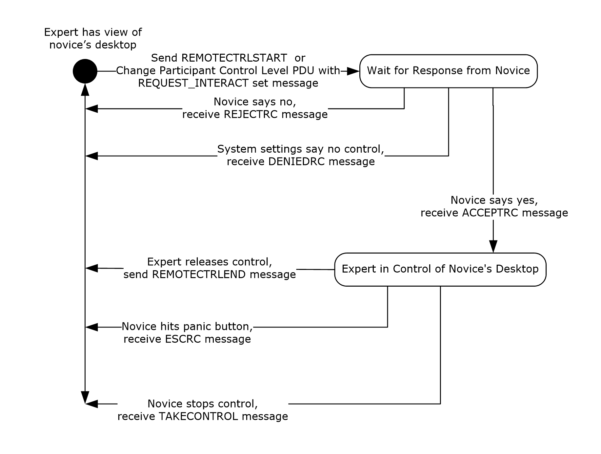

Figure 14: Desktop sharing session life cycle (expert/client perspective)

Normally during the [**Remote Assistance connection**](#gt_remote-assistance-connection), the [**expert**](#gt_expert) can observe only what the [**novice**](#gt_novice) is seeing on their screen. If the expert wants to control the mouse and keyboard on the novice computer, the expert can request control from the novice. This portion of the Remote Assistance Protocol concerns the messages that are exchanged as permission for the expert is sought, granted, denied, and/or finally revoked or given up. The state machine shown in the preceding figure describes the messages involved in the exchange between expert and novice. Details provided in this section describe what is expected from the point-of-view of the expert.

### 3.15.1 Abstract Data Model

The message exchanging that occurs in this section of the Remote Assistance Protocol is used to synchronize the state of the desktop sharing. In response to a share control request from the [**expert**](#gt_expert), the [**novice**](#gt_novice) SHOULD first enable the sharing of the screen, and then send a response to the expert that share control has been granted. When share control is stopped by the novice, the novice MUST send a message indicating that desktop sharing has been stopped. When share control is released by the expert, the expert MUST send a message indicating this action. When the novice receives this message, the novice MUST disable share control of the screen.

### 3.15.2 Timers

No timers are associated with this portion of the Remote Assistance Protocol.

### 3.15.3 Initialization

The virtual channel used to send messages described in this section of the protocol (<[RCCOMMAND](#Section_2.2.2)>) is initialized when the [**Remote Assistance connection**](#gt_remote-assistance-connection) is first established. All <RCCOMMAND> messages are sent on the virtual channel named 71.

### 3.15.4 Higher-Layer Triggered Events

This section of the Remote Assistance Protocol does not depend on higher-layer triggered events.

### 3.15.5 Message Processing Events and Sequencing Rules

For the [**expert**](#gt_expert), there are several messages that are sent or that can arrive during the entire process of requesting control (see section [2.2.2](#Section_2.2.2)). When a message arrives, a string comparison can be used to determine the type of message that has arrived. The state machine shown in section [3.15](#Section_1.3) illustrates the expected sequence of messages; any messages that arrive out of sequence SHOULD be ignored by the receiving side. All messages sent and received in this portion of the Remote Assistance Protocol are sent on the virtual channel named 71.

To assume control of the [**novice's**](#gt_novice) mouse and keyboard, the expert does the following:

- Send the message <RCCOMMAND NAME="REMOTECTRLSTART"/> for version 1 of [**Remote Assistance**](#gt_remote-assistance-ra).
- Send the Change Participant Control Level PDU (as specified in [MS-RDPEMC](../MS-RDPEMC/MS-RDPEMC.md) section 2.2.4.3) with REQUEST_INTERACT set in the **Flags** field for version 2 and version 3 of Remote Assistance.
When the novice receives this message, the Remote Assistance Protocol provides for three different responses:

- If the novice wants to allow the expert to have control of the screen, the response <RCCOMMAND NAME="ACCEPTRC"/> MUST be sent.
- If the novice does not want to allow the expert to control the screen, the novice MUST send the response <RCCOMMAND NAME="REJECTRC"/>.
- Optionally, if system settings on the novice do not permit share control, the novice MUST send the response <RCCOMMAND NAME="DENIEDRC "/>.
After share control has been established, the novice can stop share control at any time. If share control is stopped by the novice, the novice MUST send <RCCOMMAND NAME="TAKECONTROL"/>.

If the expert wants to end the control, the expert can send the message <RCCOMMAND NAME="REMOTECTRLEND"/> to the novice to signal that it no longer wants to control the novice screen. The novice MUST disable share control in response to the <RCCOMMAND NAME="REMOTECTRLEND"/> message.

If the novice has terminated share control, the expert receives the message <RCCOMMAND NAME="ESCRC"/>.

Following is an example of the expert requesting to share control, and the novice allowing it. After some indefinite time, the novice stops allowing control and signals this to the expert.

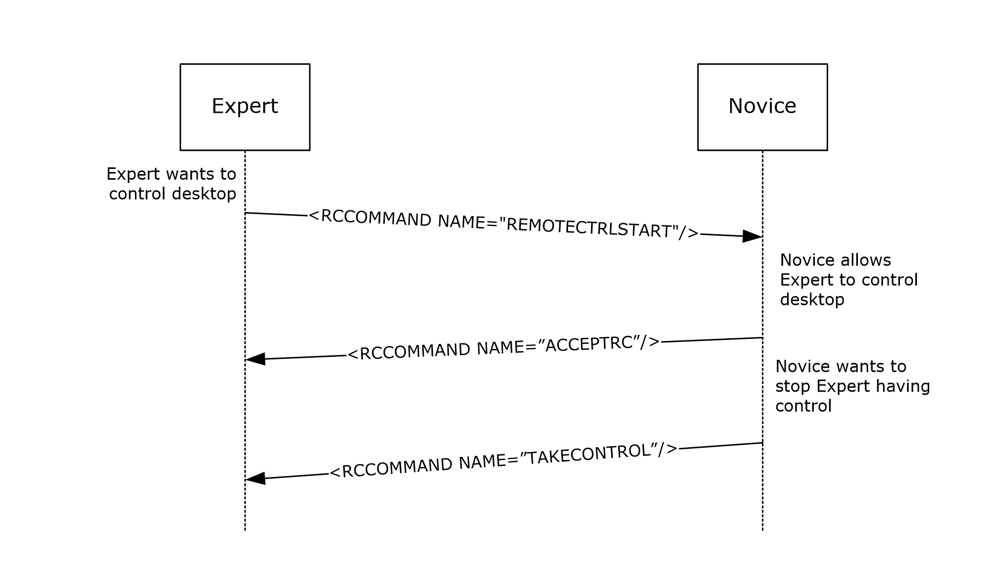

Figure 15: Remote control packet sequencing

### 3.15.6 Timer Events

None.

### 3.15.7 Other Local Events

None.

## 3.16 Share Control Remote Assistance Novice (Server) Details

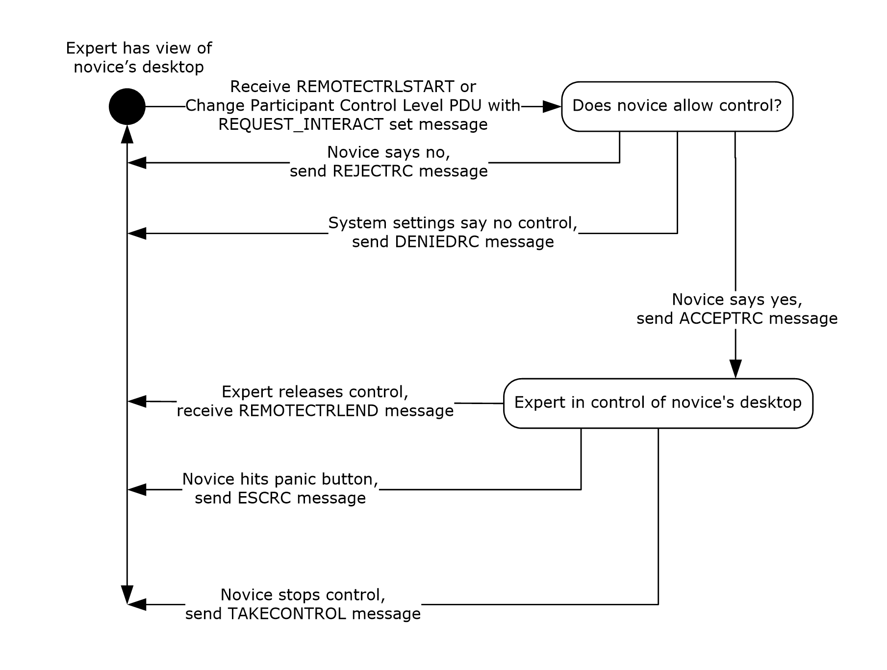

Figure 16: Desktop sharing session (novice/server perspective)

Normally, during the [**Remote Assistance connection**](#gt_remote-assistance-connection), the [**expert**](#gt_expert) can only observe what the [**novice**](#gt_novice) is seeing on his or her desktop. If the expert wants to control the mouse and keyboard on the novice computer, the expert can request control from the novice. This portion of the Remote Assistance Protocol concerns the messages that are exchanged as permission for the expert is sought, granted, denied, and/or finally revoked or given up. The state machine shown in the preceding figure describes the messages involved in the exchange between expert and novice. Details provided in this section describe what is expected from the novice's point of view.

### 3.16.1 Abstract Data Model

The application that implements this portion of the Remote Assistance Protocol SHOULD track the current permissions granted to the [**expert**](#gt_expert) to be able to process the received messages. Messages that fall outside the state diagram previously shown SHOULD be ignored.

### 3.16.2 Timers

None.

### 3.16.3 Initialization

The [**virtual channel**](#gt_virtual-channel) used to send messages described in this section of the Remote Assistance Protocol (<[RCCOMMAND](#Section_2.2.2)>) is initialized when the [**Remote Assistance connection**](#gt_remote-assistance-connection) is first established. All <RCCOMMAND> messages are sent on the virtual channel named 71.

### 3.16.4 Higher-Layer Triggered Events

This portion of the Remote Assistance Protocol is not associated with any higher-layer triggered events.

### 3.16.5 Message Processing Events and Sequencing Rules

For the [**novice**](#gt_novice), there are several messages that are sent or can arrive during the entire process of requesting control (see section [2.2.2](#Section_2.2.2)). When a message arrives, a string comparison can be used to determine the type of message that has arrived. The following sequence diagram shows the expected sequence of messages; any messages that arrive out of sequence SHOULD be ignored by the receiving side. All messages sent and received in this portion of the Remote Assistance Protocol are sent on the virtual channel named 71.

If the [**expert**](#gt_expert) requests to assume control of the novice's mouse and keyboard, it does the following:

- Sends the message <RCCOMMAND **NAME**="REMOTECTRLSTART"/> for version 1 of [**Remote Assistance**](#gt_remote-assistance-ra).
- Sends the Change Participant Control Level PDU (as specified in [MS-RDPEMC](../MS-RDPEMC/MS-RDPEMC.md) section 2.2.4.3) with REQUEST_INTERACT set in the **Flags** field for version 2 and version 3 of Remote Assistance.
When the novice receives this message, this protocol provides for three different responses. If there is a local system setting that states that experts MUST NOT control the novice screen, the novice MUST send the response <RCCOMMAND NAME="DENIEDRC "/>. If the novice does not allow the expert to control the screen, the novice MUST send the response <RCCOMMAND NAME="REJECTRC"/>. The messages are exclusive with the DENIEDRC message superseding the REJECTRC message. If the novice does not allow the expert to control the screen, and the system does not allow for control to be taken, the DENIEDRC message MUST be sent, and the REJECTRC message MUST NOT be sent. If the novice allows the expert to have control of the screen, and the system settings do not deny the expert's request, the response <RCCOMMAND NAME="ACCEPTRC"/> MUST be sent. The novice is considered to be allowing the expert control of the screen at this point.

After receiving the ACCEPTRC message from the novice, the expert can expect two different messages from the novice, both of which signal that control has been ended by the novice. If the novice ended control by pressing the ESC key (Remote Assistance has the concept of a Panic Key, which is a key listened to system-wide that, when pressed, immediately revokes control. This key is implemented as the ESC key although any key can be chosen by the implementing application), the message <RCCOMMAND NAME="ESCRC"/> is received by the expert. If the novice wants to signal the end of control through any other means, the message <RCCOMMAND NAME="TAKECONTROL"/> is received by the expert. In either case, the expert is now considered to be only viewing the novice screen.

If the expert wants to end the control before receiving either of these messages, it sends the message <RCCOMMAND NAME="REMOTECTRLEND"/> to the novice to signal that it no longer wants to control the screen. After sending this message, the expert is only viewing the novice screen.

An example follows of the expert requesting to share control and the novice allowing it. After some indefinite time, the expert wants to stop controlling the novice screen and signals this to the novice.

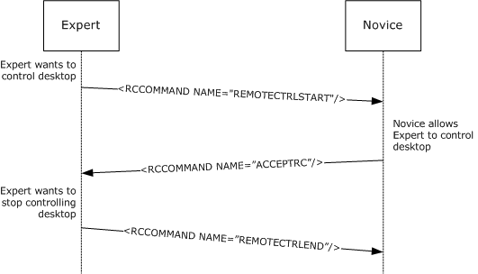

Figure 17: Expert-requested desktop control (in Remote Assistance session)

### 3.16.6 Timer Events

None.

### 3.16.7 Other Local Events

None.

## 3.17 Voice Expert (Client) Details

Voice communication while in a [**Remote Assistance connection**](#gt_remote-assistance-connection) is implemented using real-time communications (RTC) (for more information, see [[MSDN-RTC]](https://go.microsoft.com/fwlink/?LinkId=90115)) to transmit and receive audio signals from the remote computer. The Remote Assistance Protocol has messages provided to initialize [**VoIP**](#gt_voice-over-ip-voip) communication, to signal that VoIP is no longer wanted, and to coordinate voice quality or voice capability of the remote computer. The [**novice**](#gt_novice) MUST act as the RTC server, and the message exchange is different depending on which side initially requested the VoIP communication because of this. A diagram follows detailing the message sequencing for initialization and teardown of the VoIP communication (showing both possibilities).<8>

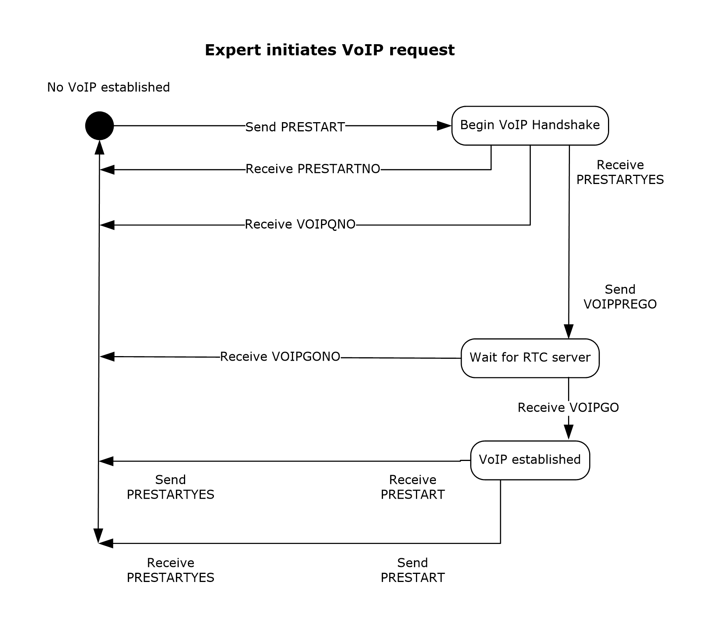

Figure 18: Remote Assistance request (expert)

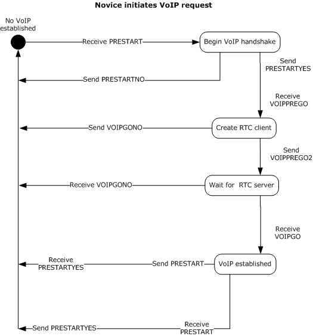

Figure 19: Remote Assistance request (novice)

### 3.17.1 Abstract Data Model

An implementation of this portion of the Remote Assistance Protocol SHOULD maintain the [**VoIP**](#gt_voice-over-ip-voip) connection status as it transitions from inactive to active, and then back to inactive again. The states can be represented by an enumeration and follow the states shown in the diagrams in section [3.17](#Section_1.3).

### 3.17.2 Timers

None.

### 3.17.3 Initialization

Initialization of the virtual channel for [**VoIP**](#gt_voice-over-ip-voip) messages occurs when the [**Remote Assistance connection**](#gt_remote-assistance-connection) begins. All messages described in this section are sent on the virtual channel named 71 and follow the format shown in the section concerning <[RCCOMMAND](#Section_2.2.2)>.

### 3.17.4 Higher-Layer Triggered Events

The protocol does not make use of any higher-layer triggered events.

### 3.17.5 Message Processing Events and Sequencing Rules

The first category of messages deals with the quality of the voice transmission or the capability of the remote computer that has the hardware configured to make and receive audio signals. Real-time communications (RTC) allows for the bandwidth usage to be of a set sampling rate by calling the method put_MaxBitRate on the IRTCClient interface. RTC also has a method that can be called to check if the local computer has the capability to do [**VoIP**](#gt_voice-over-ip-voip) communications, InvokeTuningWizard also on the IRTCClient interface.

The Remote Assistance Protocol allows for an application to signal a request to lower or raise the bandwidth used with the messages BANDWTOLOW and BANDWTOHIGH, respectively. When the message is received, the implementing application MUST set the MaxBitRate to 6,400 (when BANDWTOLOW is received) and MUST set the MaxBitRate to 64,000 (when BANDWTOHIGH is received). These messages can be sent if a lower or higher bandwidth usage is needed.

The Remote Assistance Protocol allows for an application to signal that the RTC wizard failed or succeeded when it checked for the hardware and drivers needed to do VoIP communications on the local computer. If the WIZARDBAD message is received, the receiving side SHOULD NOT attempt to initiate VoIP communication with the remote computer. If the WIZARDGOOD message is received, the receiver MAY attempt to initiate VoIP communications.

The second category of messages deals with the initialization of VoIP using real-time communications (RTC) (for more information, see [[MSDN-RTC]](https://go.microsoft.com/fwlink/?LinkId=90115)). The [**novice**](#gt_novice) MUST act as the RTC server. The messages exchanged validate that the request for voice communication is wanted by the other user, can be utilized by the remote system, and can provide the encryption key and IP address of the RTC server to the client. This message exchange is detailed in the diagrams shown in section [3.17](#Section_1.3).

The first message sent (if the [**expert**](#gt_expert) initiated the request for VoIP) or received (if the novice initiated the request) is the PRESTART message. This message signals the expectation for voice communications. If VoIP is not wanted, the response to this message is VOIPQNO, and the exchange is considered complete. If VoIP is wanted by the receiver, the message PRESTARTYES is sent.

After receiving the PRESTARTYES message, the initiator of the VoIP request signals the capability and readiness to start VoIP communications by sending the VOIPPREGO message. If sent by the expert, it signals that the application is ready to use RTC to start VoIP communications. The expert SHOULD have access to the IRTCClient interface and have checked if the hardware has been tuned for VoIP use with a call to the IsTuned method on the IRTCClient interface before sending this message. If sent by the novice, it is a query to determine if the expert can use RTC for VoIP. If the expert receives the message VOIPPREGO, it SHOULD obtain a pointer to the IRTCClient interface and determine if the hardware has been tuned for VoIP use with a call to the IsTuned method. If the expert fails to do these things, the expert MUST send the message **VOIPGONO** to the novice. If the expert succeeds, it MUST send the message VOIPPREGO2.

At this stage, the expert is waiting for the creation of the RTC server on the novice side and is waiting for a message from the novice. If the expert receives **VOIPGONO**, it signals that the creation of the RTC server failed. If the expert receives **VOIPGO**, it signals that the RTC server has been successfully created, and the expert can now connect. The **VOIPGO** message has two attributes that are used to make the connection, the key used to encrypt the data being sent between the two computers, and the IP list that the novice is listening on (see the **VOIPGOKEY** and **VOIPIPLIST** attributes in section [2.2.2](#Section_2.2.2)). Using the PC-to-PC call model provided by RTC, the expert connects to the novice through RTC and can now send and receive audio data.

When either side wants to end the VoIP communications, the message PRESTART MUST be sent. When this message is received, and VoIP is already established, the receiver SHOULD clean up the RTC objects it has referenced and SHOULD send the PRESTARTYES message when finished.

The following diagram show the messages exchanged while setting up and cleaning up after a VoIP session.

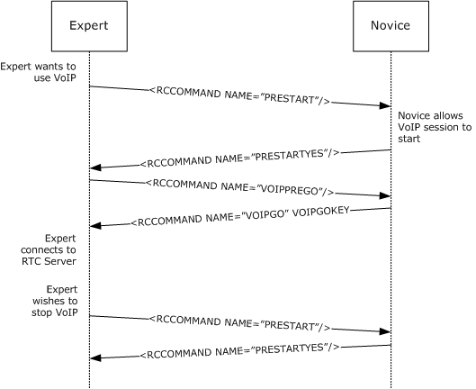

Figure 20: Remote Assistance VoIP session message exchange

### 3.17.6 Timer Events

None.

### 3.17.7 Other Local Events

None.

## 3.18 Voice Novice (Server) Details

Voice communication while in a [**Remote Assistance connection**](#gt_remote-assistance-connection) is implemented using RTC to transmit and receive audio signals from the remote computer. The Remote Assistance Protocol has messages provided to initialize [**VoIP**](#gt_voice-over-ip-voip) communication, to signal that VoIP is no longer wanted, and to coordinate the voice quality or voice capability of the remote computer. The [**novice**](#gt_novice) MUST act as the RTC server, and the message exchange is different depending on which side initially requested the VoIP communication. The following diagram details the message sequencing for initialization and teardown of the VoIP communication showing both possibilities from the novice's point of view.

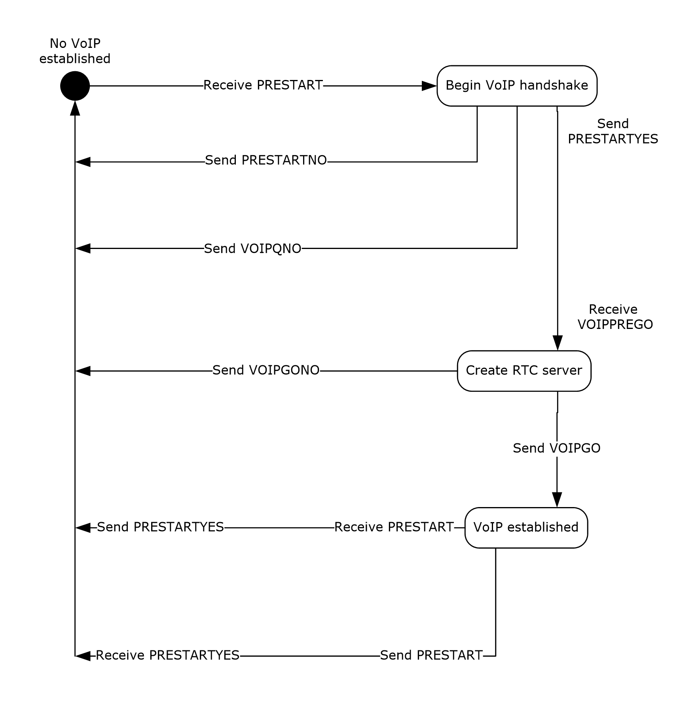

Figure 21: Remote Assistance session diagram (initiated by expert/client)

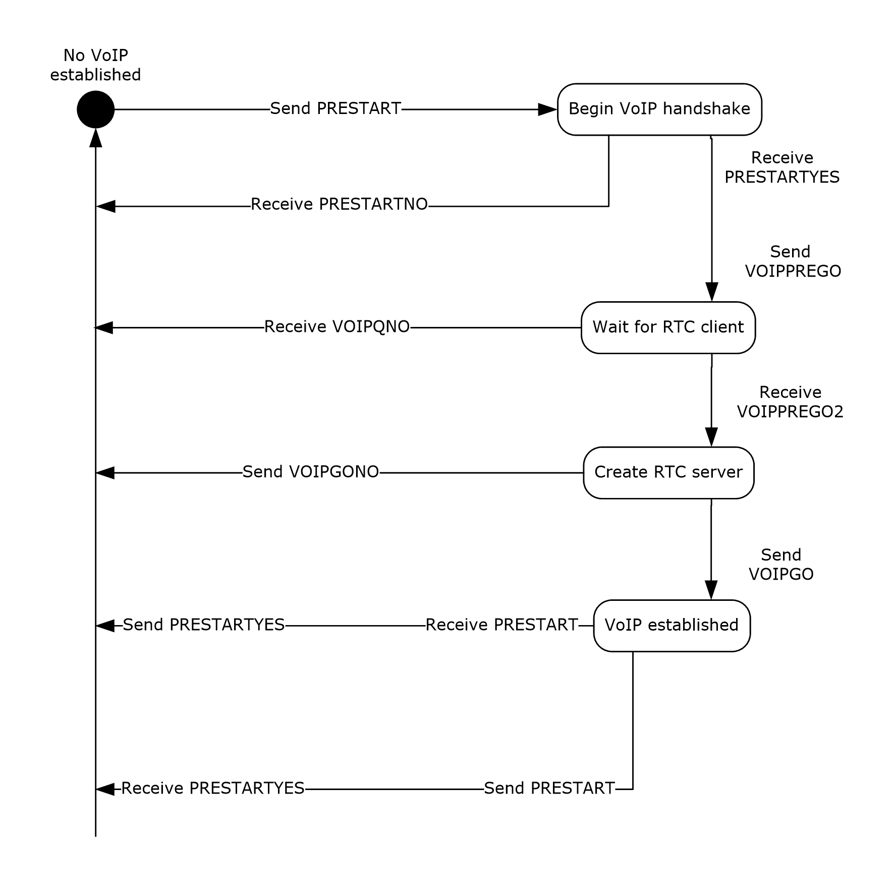

Figure 22: Remote Assistance session diagram (initiated by novice/server)

### 3.18.1 Abstract Data Model

An implementation of this portion of the Remote Assistance Protocol SHOULD maintain the [**VoIP**](#gt_voice-over-ip-voip) connection status as it transitions from inactive to active, and then back to inactive again. The states can be represented by an enumeration and follow the states shown in the diagram in section [3.18](#Section_1.3).

### 3.18.2 Timers

None.

### 3.18.3 Initialization

Initialization of the virtual channel for [**VoIP**](#gt_voice-over-ip-voip) messages occurs when the [**Remote Assistance connection**](#gt_remote-assistance-connection) begins. All messages described in this section are sent on the virtual channel named 71 and follow the format shown in the section concerning <[RCCOMMAND](#Section_2.2.2)>.

### 3.18.4 Higher-Layer Triggered Events

None.

### 3.18.5 Message Processing Events and Sequencing Rules

The first category of messages deals with the quality of the voice transmission or the capability of the remote computer that has the hardware configured to make and receive audio signals. RTC allows for the bandwidth usage to be of a set sampling rate by calling the method put_MaxBitRate on the IRTCClient interface. RTC also has a method that can be called to check if the local computer has the capability to do [**VoIP**](#gt_voice-over-ip-voip) communications, InvokeTuningWizard on the IRTCClient interface.

The Remote Assistance Protocol allows for an application to signal a request to lower or raise the bandwidth used with the messages BANDWTOLOW and BANDWTOHIGH, respectively. When the message is received, the implementing application MUST set the MaxBitRate to 6,400 (when BANDWTOLOW is received) and MUST set the MaxBitRate to 64,000 (when BANDWTOHIGH is received). These messages can be sent if a lower or higher bandwidth usage is needed.

The Remote Assistance Protocol allows for an application to signal that the RTC wizard failed or succeeded when it checked for the hardware and drivers needed to do VoIP communications on the local computer. If the WIZARDBAD message is received, the receiving side SHOULD NOT attempt to initiate VoIP communication with the remote computer. If the WIZARDGOOD message is received, the receiver MAY attempt to initiate VoIP communications.

The second category of messages deals with the initialization of VoIP using RTC. The [**novice**](#gt_novice) MUST act as the RTC server. The messages exchanged validate that the request for voice communication is wanted by the other user, can be utilized by the remote system, and can provide the encryption key and IP address of the RTC server to the client. This message exchange is detailed in the diagrams shown in section [3.18](#Section_1.3).

The first message sent (if the [**expert**](#gt_expert) initiated the request for VoIP) or received (if the novice initiated the request) is the PRESTART message. This message signals the expectation for voice communications. If VoIP is not wanted, the response to this message is VOIPQNO, and the exchange is considered complete. If VoIP is wanted by the receiver, the message PRESTARTYES is sent.

After receiving the PRESTARTYES message, the initiator of the VoIP request signals the capability and readiness to start VoIP communications by sending the VOIPPREGO message. If sent by the expert, it signals that the application is ready to use RTC to start VoIP communications. The expert SHOULD have access to the IRTCClient interface and have checked to see if the hardware has been tuned for VoIP use with a call to the IsTuned method on the IRTCClient interface before sending this message. If sent by the novice, it is a query to determine if the expert can use RTC for VoIP. If the expert receives the message VOIPPREGO, it SHOULD obtain a pointer to the IRTCClient interface and determine if the hardware has been tuned for VoIP use with a call to the IsTuned method. If the expert fails to do these things, the expert MUST send the message **VOIPGONO** to the novice. If the expert succeeds, it MUST send the message VOIPPREGO2.

At this stage, the expert is waiting for the creation of the RTC server on the novice side and is waiting for a message from the novice. If the expert receives **VOIPGONO**, it signals that the creation of the RTC server failed. If the expert receives **VOIPGO**, it signals that the RTC server has been successfully created, and the expert can now connect. The **VOIPGO** message has two attributes used to make the connection, the key used to encrypt the data being sent between the two machines and the IP list that the novice is monitoring on (see the **VOIPGOKEY** and **VOIPIPLIST** attributes in section [2.2.2](#Section_2.2.2)). Using the PC to PC call model provided by RTC, the expert connects to the novice through RTC and can now send and receive audio data.

When either side wants to end the VoIP communications, the message PRESTART MUST be sent, as shown in the following figure. When this message is received, and VoIP is already established, the receiver SHOULD clean up the RTC objects it has reference to and MUST send the PRESTARTYES message when finished.

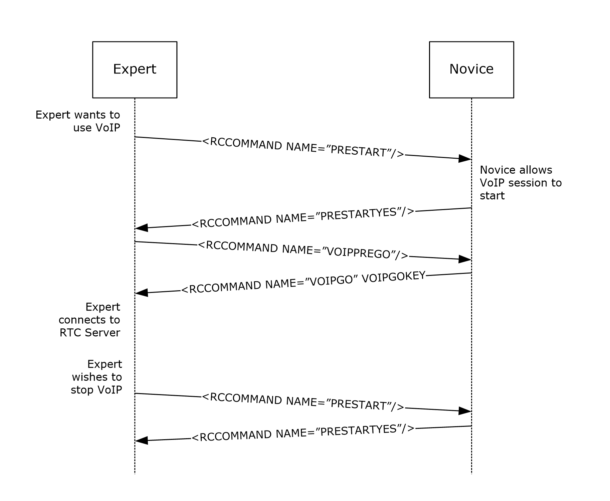

Figure 23: Remote Assistance VoIP session initialization sequence

### 3.18.6 Timer Events

None.

### 3.18.7 Other Local Events

None.

# 4 Protocol Examples

The following sections provide examples of how the Remote Assistance Protocol operates in common scenarios.

The <[RCCOMMAND](#Section_2.2.2)> message is used in [**VoIP**](#gt_voice-over-ip-voip) initialization, share control synchronization, and file transfer initialization. For the full extent of messages that can be sent in the <RCCOMMAND> format, see section 2.2.2. Sample messages are shown with scenarios of where the message would be sent or received.

## 4.1 Example of a VOIPGO Message

The last message that the [**novice**](#gt_novice) (acting as the RTC server) sends to the [**expert**](#gt_expert) (acting as the client) is the IP and encryption key to use when making the RTC connection. The message is a NULL-terminated [**Unicode string**](#gt_unicode-string). The following is an example of a valid **VOIPGO** message.

<RCCOMMAND NAME="VOIPGO" VOIPVER="VOIPVER2"

VOIPGOKEY="NzaogjS5hQMun/saZ1YCBMT9GwrdJwOomrldiOmXTrE="

VOIPIPLIST="172.31.242.5:11334"/>

The <[RCCOMMAND](#Section_2.2.2)> message is formed as an XML element and has several attributes. The **NAME** attribute specifies what kind of message this is. The **VOIPVER** attribute SHOULD always be set to **VOIPVER**. The **VOIPGOKEY** attribute is set by the server (novice) for use as an encryption key. The **VOIPIPLIST** shows one IP address and port that the client (expert) can try to connect on.

## 4.2 Example of a FILEXFER Message

The first message the file sender sends is the [FILEXFER](#Section_4.2) message. This message contains information on the file to be sent such as original filename (so it can be suggested on the receiving side as the filename to save as) and byte size (so the remaining data to be transferred can be displayed to the user). The message is a NULL-terminated Unicode string. The following is an example of a valid FILEXFER message for version 2 or version 3.

<RCCOMMAND NAME="FILEXFER" FILENAME="20070130182140.xml"

FILESIZE="436" CHANNELID="RA_FX"/>

This message is formed as an XML element and has several attributes. The **NAME** attribute specifies what kind of message this is. The **FILENAME** attribute is set to the recommended filename for the recipient, the original name of the file being copied. The **FILESIZE** attribute is set to the size in bytes of the file being copied. The **CHANNELID** attribute is set to the name of the virtual channel that the rest of the exchange for this file transfer takes place on.

# 5 Security

## 5.1 Security Considerations for Implementers

There are no security considerations for implementers of the Remote Assistance Protocol because all static [**virtual channel**](#gt_virtual-channel) traffic is secured by the underlying core Remote Desktop Protocol. For versions 2 and 3, all Remote Assistance network traffic is compressed and encrypted. An overview of the implemented security-related mechanisms is as specified in [MS-RDPBCGR](../MS-RDPBCGR/MS-RDPBCGR.md) section 5.

## 5.2 Index of Security Parameters

There are no security parameters for the Remote Assistance Protocol.

# 6 Appendix A: Product Behavior

The information in this specification is applicable to the following Microsoft products or supplemental software. References to product versions include updates to those products.

The terms "earlier" and "later", when used with a product version, refer to either all preceding versions or all subsequent versions, respectively. The term "through" refers to the inclusive range of versions. Applicable Microsoft products are listed chronologically in this section.

**Windows Client**

- Windows XP operating system
- Windows Vista operating system
- Windows 7 operating system
- Windows 8 operating system
- Windows 8.1 operating system
- Windows 10 operating system
- Windows 11 operating system
**Windows Server**

- Windows Server 2003 operating system
- Windows Server 2008 operating system
- Windows Server 2008 R2 operating system
- Windows Server 2012 operating system
- Windows Server 2012 R2 operating system
- Windows Server 2016 operating system
- Windows Server 2019 operating system
- Windows Server 2022 operating system
- Windows Server 2025 operating system
Exceptions, if any, are noted in this section. If an update version, service pack or Knowledge Base (KB) number appears with a product name, the behavior changed in that update. The new behavior also applies to subsequent updates unless otherwise specified. If a product edition appears with the product version, behavior is different in that product edition.

Unless otherwise specified, any statement of optional behavior in this specification that is prescribed using the terms "SHOULD" or "SHOULD NOT" implies product behavior in accordance with the SHOULD or SHOULD NOT prescription. Unless otherwise specified, the term "MAY" implies that the product does not follow the prescription.

<1> Section 3: Version 1 is deprecated in Windows 7 and later and Windows Server 2008 R2 and later with the following software updates.

| Windows Version | Update |
| --- | --- |
| Windows 11, version 24H2 operating system Windows 11, version 25H2 operating system | [[MSKB-5074109]](https://go.microsoft.com/fwlink/?linkid=2346013) |
| Windows Server 2025 | [[MSKB-5073379]](https://go.microsoft.com/fwlink/?linkid=2346014) |
| Windows 11, version 22H2 operating system Windows 11, version 23H2 operating system | [[MSKB-5073455]](https://go.microsoft.com/fwlink/?linkid=2345424) |
| Windows Server 2022, 23H2 operating system | [[MSKB-5073450]](https://go.microsoft.com/fwlink/?linkid=2345535) |
| Windows Server 2022 | [[MSKB-5073457]](https://go.microsoft.com/fwlink/?linkid=2345536) |
| Windows 10, version 22H2 operating system | [[MSKB-5073724]](https://go.microsoft.com/fwlink/?linkid=2345537) |
| Windows 10 v1809 operating system through Windows 10 v1909 operating system Windows Server 2019 | [[MSKB-5073723]](https://go.microsoft.com/fwlink/?linkid=2346015) |
| Windows 10 v1607 operating system through Windows 10 v1803 operating system Windows Server 2016 | [[MSKB-5073722]](https://go.microsoft.com/fwlink/?linkid=2346017) |
| Windows 8.1 Windows Server 2012 R2 operating system | [[MSKB-5073696]](https://go.microsoft.com/fwlink/?linkid=2345426) |
| Windows 8 Windows Server 2012 | [[MSKB-5073698]](https://go.microsoft.com/fwlink/?linkid=2345538) |
| Windows 7 Windows Server 2008 R2 operating system | [[MSKB-5073695]](https://go.microsoft.com/fwlink/?linkid=2345539) |

<2> Section 3: Version 2 is not supported in Windows XP and Windows Server 2003.

<3> Section 3: Version 3 is not supported in Windows XP, Windows Server 2003, Windows Vista, and Windows Server 2008.

<4> Section 3: Version 1 is supported only on Windows XP and Windows Server 2003, Version 2 is supported on Windows Vista and later and Windows Server 2008 and later, and Version 3 is supported on Windows 7 and later and Windows Server 2008 R2 and later.

<5> Section 3.3.5: Windows XP and Windows Server 2003 implementations of version 1 only return a SAFERROR_INCOMPATIBLEVERSION error. Version 1 implementations on Windows Vista and later, and Windows Server 2008 and later always return a E_FAIL error even when the sent major and minor version numbers are incorrect.

<6> Section 3.4.5: Windows XP and Windows Server 2003 implementations of version 1 only return a SAFERROR_INCOMPATIBLEVERSION error. Version 1 implementations on Windows Vista and later, and Windows Server 2008 and later always return a E_FAIL error even when the sent major and minor version numbers are incorrect.

<7> Section 3.9: Windows 7 and later and Windows Server 2008 R2 and later implementations do not provide a user interface to initiate a file transfer. However, they still support file transfer initiation messages for sending Remote Assistance Contact information.

<8> Section 3.17: Only [**Remote Assistance**](#gt_remote-assistance-ra) version 1 in Windows XP and Windows Server 2003 (x86 only) offers the feature of using a speaker and microphone for voice communication while in a [**Remote Assistance connection**](#gt_remote-assistance-connection). The 64-bit implementations of Windows XP and Windows Server 2003 respond to the initial message for voice communications as if the hardware configuration does not allow for voice communications (RCCOMMAND NAME="DISABLEVOICE"). Windows Vista and later and Windows Server 2008 and later do not respond to the voice request at all.

# 7 Change Tracking

This section identifies changes that were made to this document since the last release. Changes are classified as Major, Minor, or None.

The revision class **Major** means that the technical content in the document was significantly revised. Major changes affect protocol interoperability or implementation. Examples of major changes are:

- A document revision that incorporates changes to interoperability requirements.
- A document revision that captures changes to protocol functionality.
The revision class **Minor** means that the meaning of the technical content was clarified. Minor changes do not affect protocol interoperability or implementation. Examples of minor changes are updates to clarify ambiguity at the sentence, paragraph, or table level.

The revision class **None** means that no new technical changes were introduced. Minor editorial and formatting changes may have been made, but the relevant technical content is identical to the last released version.

The changes made to this document are listed in the following table. For more information, please contact [dochelp@microsoft.com](mailto:dochelp@microsoft.com).

| Section | Description | Revision class |
| --- | --- | --- |
| [3](#Section_1.3) Protocol Details | Added a Product Behavior Note for protocol version 1 deprecation and updated Behavior Notes 2, 3, and 4. | Major |
| [3.3.5](#Section_3.3.5) Message Processing Events and Sequencing Rules | Updated Product Behavior Note 5 to specify the E_FAIL error behavior for Version 1. | Major |
| [3.4.5](#Section_3.4.5) Message Processing Events and Sequencing Rules | Updated Product Behavior Note 6 to specify the E_FAIL error behavior for Version 1. | Major |

## Revision History

| Date | Version | Revision Class | Comments |
| --- | --- | --- | --- |
| 2/22/2007 | 0.01 | New | Version 0.01 release |
| 6/1/2007 | 1.0 | Major | Updated and revised the technical content. |
| 7/3/2007 | 1.0.1 | Editorial | Changed language and formatting in the technical content. |
| 7/20/2007 | 1.1 | Minor | Clarified the meaning of the technical content. |
| 8/10/2007 | 1.2 | Minor | Clarified the meaning of the technical content. |
| 9/28/2007 | 1.3 | Minor | Clarified the meaning of the technical content. |
| 10/23/2007 | 1.3.1 | Editorial | Changed language and formatting in the technical content. |
| 11/30/2007 | 1.4 | Minor | Clarified the meaning of the technical content. |
| 1/25/2008 | 1.4.1 | Editorial | Changed language and formatting in the technical content. |
| 3/14/2008 | 1.4.2 | Editorial | Changed language and formatting in the technical content. |
| 5/16/2008 | 1.4.3 | Editorial | Changed language and formatting in the technical content. |
| 6/20/2008 | 2.0 | Major | Updated and revised the technical content. |
| 7/25/2008 | 2.0.1 | Editorial | Changed language and formatting in the technical content. |
| 8/29/2008 | 2.0.2 | Editorial | Changed language and formatting in the technical content. |
| 10/24/2008 | 2.0.3 | Editorial | Changed language and formatting in the technical content. |
| 12/5/2008 | 3.0 | Major | Updated and revised the technical content. |
| 1/16/2009 | 3.0.1 | Editorial | Changed language and formatting in the technical content. |
| 2/27/2009 | 3.0.2 | Editorial | Changed language and formatting in the technical content. |
| 4/10/2009 | 3.0.3 | Editorial | Changed language and formatting in the technical content. |
| 5/22/2009 | 4.0 | Major | Updated and revised the technical content. |
| 7/2/2009 | 5.0 | Major | Updated and revised the technical content. |
| 8/14/2009 | 5.1 | Minor | Clarified the meaning of the technical content. |
| 9/25/2009 | 5.2 | Minor | Clarified the meaning of the technical content. |
| 11/6/2009 | 6.0 | Major | Updated and revised the technical content. |
| 12/18/2009 | 7.0 | Major | Updated and revised the technical content. |
| 1/29/2010 | 8.0 | Major | Updated and revised the technical content. |
| 3/12/2010 | 8.0.1 | Editorial | Changed language and formatting in the technical content. |
| 4/23/2010 | 9.0 | Major | Updated and revised the technical content. |
| 6/4/2010 | 9.0.1 | Editorial | Changed language and formatting in the technical content. |
| 7/16/2010 | 9.0.1 | None | No changes to the meaning, language, or formatting of the technical content. |
| 8/27/2010 | 9.0.1 | None | No changes to the meaning, language, or formatting of the technical content. |
| 10/8/2010 | 9.0.1 | None | No changes to the meaning, language, or formatting of the technical content. |
| 11/19/2010 | 9.0.1 | None | No changes to the meaning, language, or formatting of the technical content. |
| 1/7/2011 | 9.0.1 | None | No changes to the meaning, language, or formatting of the technical content. |
| 2/11/2011 | 9.0.1 | None | No changes to the meaning, language, or formatting of the technical content. |
| 3/25/2011 | 9.0.1 | None | No changes to the meaning, language, or formatting of the technical content. |
| 5/6/2011 | 9.0.1 | None | No changes to the meaning, language, or formatting of the technical content. |
| 6/17/2011 | 9.1 | Minor | Clarified the meaning of the technical content. |
| 9/23/2011 | 9.1 | None | No changes to the meaning, language, or formatting of the technical content. |
| 12/16/2011 | 10.0 | Major | Updated and revised the technical content. |
| 3/30/2012 | 10.1 | Minor | Clarified the meaning of the technical content. |
| 7/12/2012 | 10.2 | Minor | Clarified the meaning of the technical content. |
| 10/25/2012 | 10.2 | None | No changes to the meaning, language, or formatting of the technical content. |
| 1/31/2013 | 10.2 | None | No changes to the meaning, language, or formatting of the technical content. |
| 8/8/2013 | 11.0 | Major | Updated and revised the technical content. |
| 11/14/2013 | 11.0 | None | No changes to the meaning, language, or formatting of the technical content. |
| 2/13/2014 | 11.0 | None | No changes to the meaning, language, or formatting of the technical content. |
| 5/15/2014 | 11.0 | None | No changes to the meaning, language, or formatting of the technical content. |
| 6/30/2015 | 12.0 | Major | Significantly changed the technical content. |
| 10/16/2015 | 12.0 | None | No changes to the meaning, language, or formatting of the technical content. |
| 7/14/2016 | 12.0 | None | No changes to the meaning, language, or formatting of the technical content. |
| 6/1/2017 | 12.0 | None | No changes to the meaning, language, or formatting of the technical content. |
| 9/15/2017 | 13.0 | Major | Significantly changed the technical content. |
| 12/1/2017 | 13.0 | None | No changes to the meaning, language, or formatting of the technical content. |
| 9/12/2018 | 14.0 | Major | Significantly changed the technical content. |
| 4/7/2021 | 15.0 | Major | Significantly changed the technical content. |
| 6/25/2021 | 16.0 | Major | Significantly changed the technical content. |
| 4/23/2024 | 17.0 | Major | Significantly changed the technical content. |
| 1/13/2026 | 18.0 | Major | Significantly changed the technical content. |
