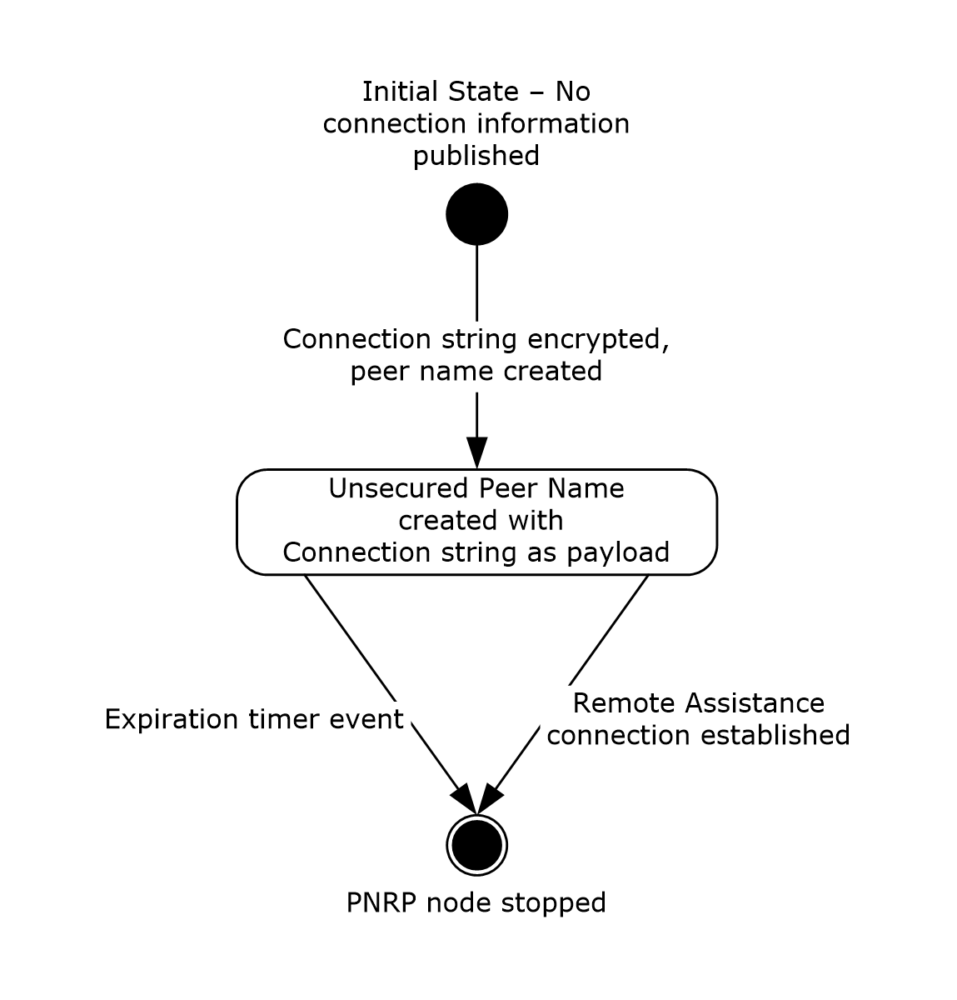
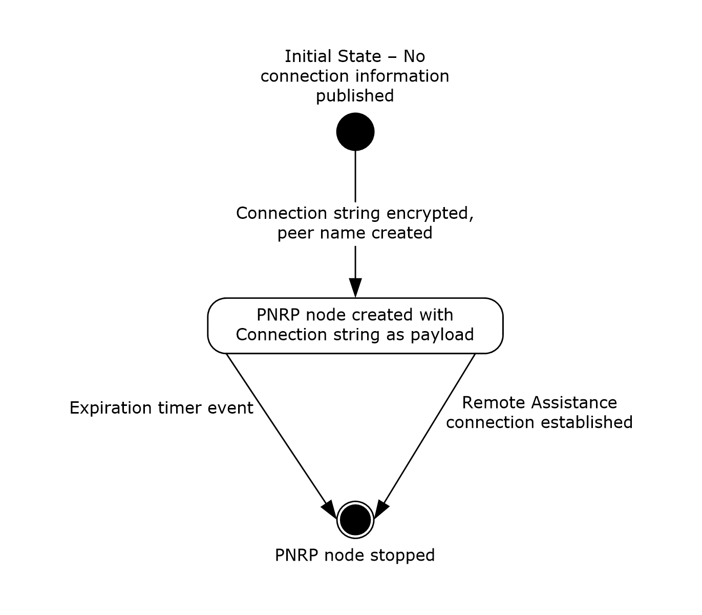

# [MS-RAIOP]: Remote Assistance Initiation over PNRP Protocol

Table of Contents

1 Introduction

- [1 Introduction](#Section_1)
  - [1.1 Glossary](#Section_1.1)
  - [1.2 References](#Section_1.2)
    - [1.2.1 Normative References](#Section_1.2.1)
    - [1.2.2 Informative References](#Section_1.2.2)
  - [1.3 Overview](#Section_1.3)
  - [1.4 Relationship to Other Protocols](#Section_1.4)
  - [1.5 Prerequisites/Preconditions](#Section_1.5)
  - [1.6 Applicability Statement](#Section_1.6)
  - [1.7 Versioning and Capability Negotiation](#Section_1.7)
  - [1.8 Vendor-Extensible Fields](#Section_1.8)
  - [1.9 Standards Assignments](#Section_1.9)

2 Messages

- [2 Messages](#Section_2)
  - [2.1 Transport](#Section_2.1)
  - [2.2 Message Syntax](#Section_2.2)
    - [2.2.1 Remote Assistance Connection String](#Section_2.2.1)
    - [2.2.2 Peer Name](#Section_2.2.2)
    - [2.2.3 Payload](#Section_2.2.3)
    - [2.2.4 FriendlyName](#Section_2.2.4)

3 Protocol Details

- [3 Protocol Details](#Section_3)
  - [3.1 Unsecured Peer Name - Publisher Details](#Section_3.1)
    - [3.1.1 Abstract Data Model](#Section_3.1.1)
    - [3.1.2 Timers](#Section_3.1.2)
      - [3.1.2.1 Expiration Timer](#Section_3.1.2.1)
    - [3.1.3 Initialization](#Section_3.1.3)
    - [3.1.4 Higher-Layer Triggered Events](#Section_3.1.4)
    - [3.1.5 Message Processing Events and Sequencing Rules](#Section_3.1.5)
      - [3.1.5.1 Deriving a Password](#Section_3.1.5.1)
      - [3.1.5.2 Encrypting the Connection String](#Section_3.1.5.2)
      - [3.1.5.3 Creating the PNRP Node](#Section_3.1.5.3)
    - [3.1.6 Timer Events](#Section_3.1.6)
      - [3.1.6.1 Expiration Timer event](#Section_3.1.6.1)
    - [3.1.7 Other Local Events](#Section_3.1.7)
  - [3.2 Unsecured Peer Name Initiation - Consumer Details](#Section_3.2)
    - [3.2.1 Abstract Data Model](#Section_3.2.1)
    - [3.2.2 Timers](#Section_3.2.2)
    - [3.2.3 Initialization](#Section_3.2.3)
    - [3.2.4 Higher-Layer Triggered Events](#Section_3.2.4)
    - [3.2.5 Message Processing Events and Sequencing Rules](#Section_3.2.5)
      - [3.2.5.1 Deriving an Unsecured Peer Name from a Password](#Section_3.2.5.1)
      - [3.2.5.2 Resolving the Unsecure Peer Name](#Section_3.2.5.2)
      - [3.2.5.3 Decrypting the Payload](#Section_3.2.5.3)
    - [3.2.6 Timer Events](#Section_3.2.6)
    - [3.2.7 Other Local Events](#Section_3.2.7)
  - [3.3 Secure Peer Name Initiation - Publisher Details](#Section_3.3)
    - [3.3.1 Abstract Data Model](#Section_3.3.1)
    - [3.3.2 Timers](#Section_3.3.2)
      - [3.3.2.1 Expiration Timer](#Section_3.3.2.1)
    - [3.3.3 Initialization](#Section_3.3.3)
    - [3.3.4 Higher-Layer Triggered Events](#Section_3.3.4)
    - [3.3.5 Message Processing Events and Sequencing Rules](#Section_3.3.5)
      - [3.3.5.1 Generating the Required PNRP Data](#Section_3.3.5.1)
      - [3.3.5.2 Registering a Secure Peer Name](#Section_3.3.5.2)
    - [3.3.6 Timer Events](#Section_3.3.6)
      - [3.3.6.1 Expiration Timer Event](#Section_3.3.6.1)
    - [3.3.7 Other Local Events](#Section_3.3.7)
  - [3.4 Secure Peer Name Initiation - Consumer Details](#Section_3.4)
    - [3.4.1 Abstract Data Model](#Section_3.4.1)
    - [3.4.2 Timers](#Section_3.4.2)
    - [3.4.3 Initialization](#Section_3.4.3)
    - [3.4.4 Higher-Layer Triggered Events](#Section_3.4.4)
    - [3.4.5 Message Processing Events and Sequencing Rules](#Section_3.4.5)
      - [3.4.5.1 Resolving a Secure Peer Name](#Section_3.4.5.1)
      - [3.4.5.2 Decrypting the Connection String](#Section_3.4.5.2)
    - [3.4.6 Timer Events](#Section_3.4.6)
    - [3.4.7 Other Local Events](#Section_3.4.7)

4 Protocol Examples

- [4 Protocol Examples](#Section_4)
  - [4.1 Deriving a Password and Encrypting a Connection String for Unsecured Peer Name Initiation](#Section_4.1)
  - [4.2 Creating an Unsecured Peer Name from a Password](#Section_4.2)

5 Security

- [5 Security](#Section_5)
  - [5.1 Security Considerations for Implementers](#Section_5.1)
  - [5.2 Index of Security Parameters](#Section_5.2)

6 Appendix A: Product Behavior

- [6 Appendix A: Product Behavior](#Section_6)

7 Change Tracking

- [7 Change Tracking](#Section_7)

For the legal notice and IP terms, see [LEGAL.md](../LEGAL.md).
Last updated: 4/23/2024.
See [Revision History](#revision-history) for full version history.

# 1 Introduction

This document describes the Remote Assistance Initiation over PNRP Protocol, which is used to establish a [**Remote Assistance connection**](#gt_remote-assistance-connection) between two computers. This protocol uses the [**Peer Name Resolution Protocol (PNRP)**](#gt_peer-name-resolution-protocol-pnrp), as specified in [MS-PNRP](#Section_2.2.2), to transfer the [Remote Assistance connection string (section 2.2.1)](#Section_2.2.1) securely between two computers. After the Remote Assistance connection string is transferred, a [**Remote Assistance session**](#gt_remote-assistance-session) can be established between the two computers.

Sections 1.5, 1.8, 1.9, 2, and 3 of this specification are normative. All other sections and examples in this specification are informative.

## 1.1 Glossary

This document uses the following terms:

**base64 encoding**: A binary-to-text encoding scheme whereby an arbitrary sequence of bytes is converted to a sequence of printable ASCII characters, as described in [[RFC4648]](https://go.microsoft.com/fwlink/?LinkId=90487).

**consume**: To resolve a [**Peer Name**](#gt_peer-name) and decrypt the associated payload.

**consumer**: The side of a [**Remote Assistance connection**](#gt_remote-assistance-connection) that resolves a [**Peer Name**](#gt_peer-name). It is the same as the [**expert**](#gt_expert) role.

**Coordinated Universal Time (UTC)**: A high-precision atomic time standard that approximately tracks Universal Time (UT). It is the basis for legal, civil time all over the Earth. Time zones around the world are expressed as positive and negative offsets from UTC. In this role, it is also referred to as Zulu time (Z) and Greenwich Mean Time (GMT). In these specifications, all references to UTC refer to the time at UTC-0 (or GMT).

**expert**: The side of a [**Remote Assistance connection**](#gt_remote-assistance-connection) that is able to view the remote screen of the other computer in order to provide help.

**extended payload**: An arbitrary BLOB of data associated with a [**Peer Name**](#gt_peer-name) and published by an application.

**Global PNRP cloud**: A PNRP cloud as specified in [MS-PNRP](#Section_2.2.2) with a name "Global".

**HexConvertedUnicodeString**: A [**Unicode string**](#gt_unicode-string) created from a binary, byte-granular value. The string is created by converting each byte, starting with the most significant byte and ending with the least significant byte, into two Unicode characters. The characters are the hexadecimal representation of each nibble of the byte, starting with the high-order nibble.

**novice**: The side of a [**Remote Assistance connection**](#gt_remote-assistance-connection) that shares its screen with the other computer in order to receive help.

**peer name**: A string composed of an authority and a classifier. This is the string used by applications to resolve to a list of endpoints and/or an [**extended payload**](#gt_extended-payload). A [**peer name**](#gt_peer-name) is not required to be unique. For example, several nodes that provide the same service can register the same [**Peer Name**](#gt_peer-name).

**Peer Name Resolution Protocol (PNRP)**: The protocol that is specified in [MS-PNRP] and is used for registering and resolving a name to a set of information, such as IP addresses.

**public key**: One of a pair of keys used in public-key cryptography. The public key is distributed freely and published as part of a digital certificate. For an introduction to this concept, see [[CRYPTO]](https://go.microsoft.com/fwlink/?LinkId=89841) section 1.8 and [[IEEE1363]](https://go.microsoft.com/fwlink/?LinkId=89899) section 3.1.

**publisher**: The side of a [**Remote Assistance connection**](#gt_remote-assistance-connection) that registers a [**Peer Name**](#gt_peer-name). It is the same as the [**novice**](#gt_novice) role.

**RAIOP**: The protocol documented in this specification, Remote Assistance Initiation over PNRP Protocol (RAIOP).

**Remote Assistance connection**: A communication framework that is established between two computers that facilitates Remote Assistance.

**Remote Assistance contact**: After a [**Remote Assistance session**](#gt_remote-assistance-session) is established, the [**expert**](#gt_expert) and [**novice**](#gt_novice) may exchange contact information as specified in [MS-RA](../MS-RA/MS-RA.md). A [**Remote Assistance contact**](#gt_remote-assistance-contact) is then created on the [**expert**](#gt_expert) and [**novice**](#gt_novice) computers. This allows [**Secure Peer Names**](#gt_secure-peer-name) to be used in subsequent sessions.

**Remote Assistance session**: A [**Remote Assistance connection**](#gt_remote-assistance-connection) that has been accepted by the [**novice**](#gt_novice). The [**expert**](#gt_expert) is able to view the [**novice's**](#gt_novice) screen once the Remote Assistance session is started.

**Rivest-Shamir-Adleman (RSA)**: A system for public key cryptography. [**RSA**](#gt_rivest-shamir-adleman-rsa) is specified in [[RFC8017]](https://go.microsoft.com/fwlink/?linkid=2164409).

**secure peer name**: A [**peer name**](#gt_peer-name) that has a nonzero authority and is tied to a Peer Identity.

**SHA-1 hash**: A hashing algorithm as specified in [[FIPS180-2]](https://go.microsoft.com/fwlink/?LinkId=89868) that was developed by the National Institute of Standards and Technology (NIST) and the National Security Agency (NSA).

**Unicode string**: A Unicode 8-bit string is an ordered sequence of 8-bit units, a Unicode 16-bit string is an ordered sequence of 16-bit code units, and a Unicode 32-bit string is an ordered sequence of 32-bit code units. In some cases, it could be acceptable not to terminate with a terminating null character. Unless otherwise specified, all [**Unicode strings**](#gt_unicode-string) follow the UTF-16LE encoding scheme with no Byte Order Mark (BOM).

**unsecured peer name**: A [**Peer Name**](#gt_peer-name) that has a "0" authority and is therefore not tied to a Peer Identity. Any node can claim ownership of any [**Unsecured Peer Name**](#gt_unsecured-peer-name).

**MAY, SHOULD, MUST, SHOULD NOT, MUST NOT:** These terms (in all caps) are used as defined in [[RFC2119]](https://go.microsoft.com/fwlink/?LinkId=90317). All statements of optional behavior use either MAY, SHOULD, or SHOULD NOT.

## 1.2 References

Links to a document in the Microsoft Open Specifications library point to the correct section in the most recently published version of the referenced document. However, because individual documents in the library are not updated at the same time, the section numbers in the documents may not match. You can confirm the correct section numbering by checking the [Errata](https://go.microsoft.com/fwlink/?linkid=850906).

### 1.2.1 Normative References

We conduct frequent surveys of the normative references to assure their continued availability. If you have any issue with finding a normative reference, please contact [dochelp@microsoft.com](mailto:dochelp@microsoft.com). We will assist you in finding the relevant information.

[FIPS180-2] National Institute of Standards and Technology, "Secure Hash Standard", FIPS PUB 180-2, August 2002, [http://csrc.nist.gov/publications/fips/fips180-2/fips180-2.pdf](https://go.microsoft.com/fwlink/?LinkId=89868)

[FIPS197] FIPS PUBS, "Advanced Encryption Standard (AES)", FIPS PUB 197, November 2001, [https://nvlpubs.nist.gov/nistpubs/FIPS/NIST.FIPS.197.pdf](https://go.microsoft.com/fwlink/?LinkId=89870)

[MS-PNRP] Microsoft Corporation, "[Peer Name Resolution Protocol (PNRP) Version 4.0](#Section_2.2.2)".

[MS-RAI] Microsoft Corporation, "[Remote Assistance Initiation Protocol](../MS-RAI/MS-RAI.md)".

[MS-RA] Microsoft Corporation, "[Remote Assistance Protocol](../MS-RA/MS-RA.md)".

[RFC2119] Bradner, S., "Key words for use in RFCs to Indicate Requirement Levels", BCP 14, RFC 2119, March 1997, [https://www.rfc-editor.org/info/rfc2119](https://go.microsoft.com/fwlink/?LinkId=90317)

[RFC4648] Josefsson, S., "The Base16, Base32, and Base64 Data Encodings", RFC 4648, October 2006, [https://www.rfc-editor.org/info/rfc4648](https://go.microsoft.com/fwlink/?LinkId=90487)

### 1.2.2 Informative References

None.

## 1.3 Overview

This protocol is used to transfer the [Remote Assistance Connection String (section 2.2.1)](#Section_2.2.1) from the [**novice**](#gt_novice) to the [**expert**](#gt_expert). After the connection string, as defined in [MS-RAI](../MS-RAI/MS-RAI.md) section 2.2.1, is transferred, a [**Remote Assistance session**](#gt_remote-assistance-session) can be established as specified in [MS-RA](../MS-RA/MS-RA.md).

The protocol describes two methods based on [**PNRP**](#gt_peer-name-resolution-protocol-pnrp) to exchange the Remote Assistance Connection String:

**Using an Unsecured Peer Name**: This method uses [**Unsecured Peer Names**](#gt_unsecured-peer-name) (as specified in [MS-PNRP](#Section_2.2.2)) to transfer the Remote Assistance Connection String. The connection string is encrypted and posted as an [**extended payload**](#gt_extended-payload) associated with the Unsecured Peer Name. When this method is used, the novice relays a password to the expert. Using the password provided by the novice, the expert locates the Unsecured Peer Name, downloads the payload, and decrypts the Remote Assistance Connection String. Using the connection string, the expert can make a [**Remote Assistance connection**](#gt_remote-assistance-connection) to the novice.

**Using a Secure Peer Name**: This method uses [**Secure Peer Names**](#gt_secure-peer-name) (as specified in [MS-PNRP]) to transfer the Remote Assistance Connection String between the novice and the expert. The novice and the expert can have [**Remote Assistance contacts**](#gt_remote-assistance-contact) for each other. This method does not require a password. Using the Secure Peer Name, the expert can download the extended payload that contains the Remote Assistance Connection String. Using the connection string, the expert can make a Remote Assistance connection to the novice.

## 1.4 Relationship to Other Protocols

[**RAIOP**](#gt_raiop) assumes that the Peer Name Resolution Protocol [MS-PNRP](#Section_2.2.2) is available to transport the [Remote Assistance Connection String](#Section_2.2.1). After the Remote Assistance Connection String is transferred, the [**expert**](#gt_expert) can connect to the [**novice**](#gt_novice) and initiate a [**Remote Assistance session**](#gt_remote-assistance-session) as specified in [MS-RA](../MS-RA/MS-RA.md). This protocol also uses [**Remote Assistance contacts**](#gt_remote-assistance-contact) as specified in [MS-RA].

## 1.5 Prerequisites/Preconditions

This protocol assumes that both computers do not have a [**UTC**](#gt_coordinated-universal-time-utc) time offset that is greater than 1 hour.

## 1.6 Applicability Statement

This protocol can only be used between two computers if the [**Global PNRP cloud**](#gt_global-pnrp-cloud) is visible to both the [**novice**](#gt_novice) and [**expert**](#gt_expert).

## 1.7 Versioning and Capability Negotiation

This protocol does not provide for version or capability negotiation.

## 1.8 Vendor-Extensible Fields

There are no vendor-extensible fields in the Remote Assistance Initiation over PNRP Protocol.

## 1.9 Standards Assignments

The Remote Assistance Initiation over PNRP Protocol does not use any standards assignments.

# 2 Messages

## 2.1 Transport

This protocol uses the Peer Name Resolution Protocol, as specified in [MS-PNRP](#Section_2.2.2), for message transport.

## 2.2 Message Syntax

### 2.2.1 Remote Assistance Connection String

The Remote Assistance Connection String referenced in this document is defined in [MS-RAI](../MS-RAI/MS-RAI.md) as Remote Assistance Connection String 2.

### 2.2.2 Peer Name

The [**Peer Name**](#gt_peer-name) that is referenced in this document is defined in [MS-PNRP](#Section_2.2.2) as a Peer Name. [**Unsecured Peer Names**](#gt_unsecured-peer-name) are Peer Names with an authority of "0".

### 2.2.3 Payload

The payload that is associated with a [**Peer Name**](#gt_peer-name) and referenced in this document is defined in [MS-PNRP](#Section_2.2.2) section 2.2.3.3 as an EXTENDED_PAYLOAD message.

### 2.2.4 FriendlyName

The FriendlyName that is associated with a [**Peer Name**](#gt_peer-name) and referenced in this document is defined in [MS-PNRP](#Section_2.2.2) section 2.2.3.1 as a FriendlyName string.

# 3 Protocol Details

## 3.1 Unsecured Peer Name - Publisher Details

The purpose of the [**Unsecured Peer Name**](#gt_unsecured-peer-name) Initiation is to allow a [Remote Assistance Connection String](#Section_2.2.1) (defined in [MS-RA](../MS-RA/MS-RA.md)) to be passed from the [**publisher**](#gt_publisher) of the string to the [**consumer**](#gt_consumer). After the string is passed, the consumer uses the string to initialize a [**Remote Assistance connection**](#gt_remote-assistance-connection) and to view and share the publisher’s screen. After the [**Remote Assistance session**](#gt_remote-assistance-session) is started, the [**Peer Name**](#gt_peer-name) SHOULD be unregistered by the publisher because it has no further purpose.

After the connection string is generated, the [**Global PNRP cloud**](#gt_global-pnrp-cloud) MUST be joined as specified in [MS-PNRP](#Section_2.2.2) section 1.3.3. After the cloud is discovered and joined, the publisher MUST register an Unsecured Peer Name and associate the encrypted connection string as a payload to the Peer Name.

The task of initiating a Remote Assistance connection is shown in the following diagram.

Figure 1: Publishing connection information

**Initial state**: The initial state where the publisher has the string that will enable a Remote Assistance connection to be established and wants to let the consumer know the contents of the string.

**Unsecured Peer Name registered**: An Unsecured Peer Name was registered with the encrypted connection string associated as a payload.

**Unsecured Peer Name unregistered**: A Remote Assistance session was initialized or the expiration timer event occurred and the payload in the Unsecured Peer Name is no longer useful. The Peer Name SHOULD be unregistered.

### 3.1.1 Abstract Data Model

This section describes a conceptual model of possible data organization that an implementation maintains to participate in this protocol. The described organization is provided to facilitate the explanation of how the protocol behaves. This document does not mandate that implementations adhere to this model as long as their external behavior is consistent with the behavior described in this document.

The [**publisher**](#gt_publisher) generates a password that is used to encrypt the payload containing a [Remote Assistance Connection String](#Section_2.2.1) and to create an [**Unsecured Peer Name**](#gt_unsecured-peer-name). The publisher registers the Unsecured Peer Name, associating the encrypted payload, which will be resolved later by the [**consumer**](#gt_consumer). The publisher conveys the password to the consumer through some external means.

### 3.1.2 Timers

#### 3.1.2.1 Expiration Timer

A 30-minute timer SHOULD be started after registration of the [**Unsecured Peer Name**](#gt_unsecured-peer-name), as specified in section [3.1.5.3](#Section_3.1.5.3).

### 3.1.3 Initialization

To initialize this protocol, the following MUST be done:

- The [**Global PNRP cloud**](#gt_global-pnrp-cloud) MUST be discovered and joined as defined in [MS-PNRP](#Section_2.2.2) section 1.3.3.
- A connection string as defined in [MS-RAI](../MS-RAI/MS-RAI.md) section 2.2 MUST be created.

### 3.1.4 Higher-Layer Triggered Events

None.

### 3.1.5 Message Processing Events and Sequencing Rules

After initialization, a password MUST be derived as defined in section [3.1.5.1](#Section_3.1.5.1) and the connection string MUST be encrypted as defined in section [3.1.5.2](#Section_3.1.5.2). Next, an [**Unsecured Peer Name**](#gt_unsecured-peer-name) MUST be registered with the encrypted connection string as the payload as defined in section [3.1.5.3](#Section_3.1.5.3).

After the [**Remote Assistance session**](#gt_remote-assistance-session) is established, the Unsecured Peer Name SHOULD be unregistered, as defined in [MS-PNRP](#Section_2.2.2) section 3.2.4.2.

#### 3.1.5.1 Deriving a Password

When a password is derived from the connection string, only certain characters from the English alphabet and digits are used. The string "BCDFGHJKLMNPQRSTVWXYZ23456789", which is referred to as the Allowed Characters string, is used to define the only usable characters for deriving a password. The derived password MUST be 6 characters in length.

The password that is used, both to encrypt the connection string and as the basis for generating a [**Peer Name**](#gt_peer-name), MUST be created by using the following algorithm:

- Copy the Unicode connection string, not including any terminating NULL character, into a byte buffer that is referred to as hash input. If the connection string is longer than 8,000 bytes, copy only the first 8,000 bytes into the buffer. The hash input size is always the buffer size of the Unicode connection string (or 8,000 bytes, whichever is smaller), plus 20 additional bytes that are used for the hash result in the following steps. For the initial hash input, the 20 bytes that are used in subsequent steps for the hash result MUST be set to zero.
- Use the [**SHA-1 hash**](#gt_sha-1-hash) algorithm, as specified in [[FIPS180-2]](https://go.microsoft.com/fwlink/?LinkId=89868), to derive a value that is referred to as a hash result from the hash input.
- Concatenate the hash result to the original connection string and copy the result into the hash input.
- Repeat steps 2 and 3 for 99,999 times, for a total of 100,000 hash operations.
- For each of the first 6 bytes derived from the hash result that is obtained from the 100,000th iteration, convert the byte value into an index into the Allowed Characters string by using the following formula:
Index=FLOOR((Derived Byte/256.0)*Character Length of Allowed Characters)

The **FLOOR** function returns the largest integer that is less than or equal to the resultant floating-point value of the previous expression. The values for *Index*, *Derived Byte*, and *Character Length of Allowed Characters* MUST be integers.

- For each of these calculated indexes, convert the index into a letter or number by indexing into the Allowed Characters string.
- The password is a concatenation of these 6 letters.

#### 3.1.5.2 Encrypting the Connection String

To encrypt the connection string, a password MUST be derived as defined in section [3.1.5.1](#Section_3.1.5.1). To encrypt the connection string, the following algorithm MUST be followed:

- Get the number of hours that have elapsed since January 1, 1970 [**UTC**](#gt_coordinated-universal-time-utc) and convert the decimal value into a Unicode-formatted string. For example, 338,540 hours is represented by the [**Unicode string**](#gt_unicode-string) in the form "338540".
- Concatenate the derived password and the number of hours string. The resultant string MUST be a Unicode-formatted string, which is referred to as the original concatenated Unicode string in the following steps.
- Copy the original concatenated Unicode string into a byte buffer that is referred to as hash input. The hash input includes the byte buffer of the Unicode string that is obtained in step 2, plus 20 additional bytes of the hash result that is obtained in step 4 of the previous hash operation, if any. For the initial hash input, the last 20 bytes used for the hash result MUST be set to zero.
- Use the [**SHA-1 hash**](#gt_sha-1-hash) algorithm, as specified in [[FIPS180-2]](https://go.microsoft.com/fwlink/?LinkId=89868), to derive a value that is referred to as a hash result from the hash input.
- Concatenate the hash result to the original concatenated Unicode string, and copy the result into a byte buffer that is referred to as the hash input.
- Repeat steps 4 and 5 for 99,999 times, for a total of 100,000 hash operations.
- Transform the first 16 bytes of the hash result into a [**HexConvertedUnicodeString**](#gt_hexconvertedunicodestring). This transformation uses each sequence of 4 bits as a zero-based index into the Unicode lookup string "0123456789ABCDEF" to obtain a matching Unicode character. The order of the data is not changed (that is, the most significant first 4 bits are used to obtain the first value, and least significant last 4 bits are used to obtain the second value). The transformation produces a 32-character Unicode string that is referred to as the key string. For example, the hash result {0x9A, 0xC1, 0x32, ..., 0xAB} would yield the HexConvertedUnicodeString "9AC132…AB" with the in-memory representation of {0x39, 0x00, 0x41, 0x00, 0x43, 0x00, 0x31, 0x00, 0x33, 0x00, 0x32, 0x00, … 0x41, 0x00, 0x42, 0x00}.
- Using the SHA-1 hash algorithm, hash the key string.
- Using the resultant hash, use the AES_128 algorithm, as specified in [[FIPS197]](https://go.microsoft.com/fwlink/?LinkId=89870), to derive a cipher key for encryption.
- Encrypt the Unicode connection string by using the cipher key from step 9 and the AES_128 algorithm.

#### 3.1.5.3 Creating the PNRP Node

To register an [**Unsecured Peer Name**](#gt_unsecured-peer-name), a password MUST be derived as defined in section [3.1.5.1](#Section_3.1.5.1). Also, the connection string MUST be encrypted as defined in section [3.1.5.2](#Section_3.1.5.2). To register an Unsecured Peer Name, the following algorithm MUST be followed:

- Get the number of hours that have elapsed since January 1, 1970 [**UTC**](#gt_coordinated-universal-time-utc) and convert the decimal value into a Unicode-formatted string. For example, 338,540 hours is represented by the [**Unicode string**](#gt_unicode-string) in the form "338540".
- Concatenate the derived password and the number of hours string. The resultant string MUST be a Unicode-formatted string, which is referred to as the original concatenated Unicode string in the following steps.
- Copy the original concatenated Unicode string into a byte buffer that is referred to as hash input. The hash input includes the byte buffer of the Unicode string that is obtained in step 2, plus 20 additional bytes of the hash result that is obtained in step 4 of the previous hash operation, if any. For the initial hash input, the last 20 bytes used for the hash result MUST be set to zero.
- Use the [**SHA-1 hash**](#gt_sha-1-hash) algorithm, as specified in [[FIPS180-2]](https://go.microsoft.com/fwlink/?LinkId=89868), to derive a value that is referred to as a hash result from the hash input.
- Concatenate the hash result to the original concatenated Unicode string, and copy the result into a byte buffer that is referred to as the hash input.
- Repeat steps 4 and 5 for 99,999 times, for a total of 100,000 hash operations.
- Transform the first 16 bytes of the hash result into a [**HexConvertedUnicodeString**](#gt_hexconvertedunicodestring). This transformation uses each sequence of 4 bits as a zero-based index into the Unicode lookup string "0123456789ABCDEF" to obtain a matching Unicode character. The order of the data is not changed (that is, the most significant first 4 bits are used to obtain the first value, and least significant last 4 bits are used to obtain the second value). The transformation produces a 32-character Unicode string that is referred to as the key string. For example, the hash result {0x9A, 0xC1, 0x32, ..., 0xAB} would yield the HexConvertedUnicodeString "9AC132…AB" with the in-memory representation of {0x39, 0x00, 0x41, 0x00, 0x43, 0x00, 0x31, 0x00, 0x33, 0x00, 0x32, 0x00, … 0x41, 0x00, 0x42, 0x00}.
- Use the HexConvertedUnicodeString generated in step 7 to register an Unsecured Peer Name by using the HexConvertedUnicodeString as the classifier and an authority of "0". The encrypted connection string MUST be set as the payload. (See [MS-PNRP](#Section_2.2.2) for registering an Unsecured Peer Name.)

### 3.1.6 Timer Events

#### 3.1.6.1 Expiration Timer event

When the expiration timer elapses, the registered [**Unsecured Peer Name**](#gt_unsecured-peer-name) SHOULD be unregistered for security reasons. The timer MUST NOT be restarted.

### 3.1.7 Other Local Events

When a [**Remote Assistance session**](#gt_remote-assistance-session) is established, the registered [**Unsecured Peer Name**](#gt_unsecured-peer-name) SHOULD be unregistered.

## 3.2 Unsecured Peer Name Initiation - Consumer Details

The purpose of the [**Unsecured Peer Name**](#gt_unsecured-peer-name) initiation is to allow a [Remote Assistance Connection String](#Section_2.2.1) to pass from the [**publisher**](#gt_publisher) of the string to the [**consumer**](#gt_consumer). After the string passes, the consumer can use the string to initialize a [**Remote Assistance connection**](#gt_remote-assistance-connection) and view and share the publisher’s screen.

### 3.2.1 Abstract Data Model

To retrieve the connection string from a remote machine, a password is conveyed from the publisher to the consumer by external means. This password is converted into an [**Unsecured Peer Name**](#gt_unsecured-peer-name) that was registered by the publisher, as well as the key that is used to decrypt the payload that is associated with this [**Peer Name**](#gt_peer-name).

### 3.2.2 Timers

There are no timers associated with this section.

### 3.2.3 Initialization

The following steps initialize this protocol:

- The [**Global PNRP cloud**](#gt_global-pnrp-cloud) MUST be discovered and joined as defined in [MS-PNRP](#Section_2.2.2) section 1.3.3.
- The password that is generated by the publisher when the connection information is published MUST be available to the application that is consuming the [**Unsecured Peer Name**](#gt_unsecured-peer-name) initiation.
**Note** The protocol does not provide for the password to be transmitted from the publisher to the consumer.

### 3.2.4 Higher-Layer Triggered Events

None.

### 3.2.5 Message Processing Events and Sequencing Rules

To [**consume**](#gt_consume) the [**Unsecured Peer Name**](#gt_unsecured-peer-name) initiation, the application MUST derive the Unsecured Peer Name from the password that is provided by the publisher, as defined in section [3.2.5.1](#Section_3.2.5.1). After a [**Peer Name**](#gt_peer-name) is derived, the application MUST then resolve the Peer Name and obtain the payload that is associated with it, as defined in section [3.2.5.2](#Section_3.2.5.2). When the payload is retrieved, it MUST be decrypted as defined in section [3.2.5.3](#Section_3.2.5.3).

#### 3.2.5.1 Deriving an Unsecured Peer Name from a Password

To derive an [**Unsecured Peer Name**](#gt_unsecured-peer-name) from a password:

- Get the number of hours that have elapsed since January 1, 1970 [**UTC**](#gt_coordinated-universal-time-utc) and convert the decimal value into a Unicode-formatted string. For example, 338,540 hours is represented by the [**Unicode string**](#gt_unicode-string) in the form "338540".
- Concatenate the password and the number of hours string. The resultant string MUST be a Unicode-formatted string, which is referred to as the original concatenated Unicode string in the following steps.
- Copy the original concatenated Unicode string into a byte buffer that is referred to as hash input. The hash input includes the byte buffer of the Unicode string that is obtained in step 2, plus 20 additional bytes of the hash result that is obtained in step 4 of the previous hash operation, if any. For the initial hash input, the last 20 bytes used for the hash result MUST be set to zero.
- Use the [**SHA-1 hash**](#gt_sha-1-hash) algorithm, as specified in [[FIPS180-2]](https://go.microsoft.com/fwlink/?LinkId=89868), to derive a value that is referred to as a hash result from the hash input.
- Concatenate the hash result to the original concatenated Unicode string, and copy the result into a byte buffer that is referred to as the hash input.
- Repeat steps 4 and 5 for 99,999 times, for a total of 100,000 hash operations.
- Transform the first 16 bytes of the hash result into a [**HexConvertedUnicodeString**](#gt_hexconvertedunicodestring). This transformation uses each sequence of 4 bits as a zero-based index into the Unicode lookup string "0123456789ABCDEF" to obtain a matching Unicode character. The order of the data is not changed (that is, the most significant first 4 bits are used to obtain the first value, and least significant last 4 bits are used to obtain the second value). The transformation produces a 32-character Unicode string that is referred to as the key string. For example, the hash result {0x9A, 0xC1, 0x32, ..., 0xAB} would yield the HexConvertedUnicodeString "9AC132…AB" with the in-memory representation of {0x39, 0x00, 0x41, 0x00, 0x43, 0x00, 0x31, 0x00, 0x33, 0x00, 0x32, 0x00, … 0x41, 0x00, 0x42, 0x00}.
- Use the HexConvertedUnicodeString generated in step 7 as a classifier and an authority value of "0", an Unsecured Peer Name.

#### 3.2.5.2 Resolving the Unsecure Peer Name

The derived [**Unsecured Peer Name**](#gt_unsecured-peer-name) (as defined in section [3.2.5.1](../MS-PNRP/MS-PNRP.md)) MUST be resolved as specified in [MS-PNRP](#Section_2.2.2) section 3.1.4.4. If the consumer fails to resolve the address, the consumer repeats the resolution up to two additional times until address resolution, each with a different initial value for the Unsecured Peer Name derivation as specified in section 3.2.5.1. For the first repetition, this value MUST be the number of hours elapsed since January 1, 1970, minus 1 hour. For the second repetition, this value MUST be the number of hours elapsed since January 1st, 1970, plus 1 hour. The payload associated with the Unsecured Peer Name is provided by the underlying Peer Name Resolution Protocol.

#### 3.2.5.3 Decrypting the Payload

To decrypt the payload, the following steps MUST be taken:

- Using the [**SHA-1 hash**](#gt_sha-1-hash) algorithm, as specified in [[FIPS180-2]](https://go.microsoft.com/fwlink/?LinkId=89868), hash the [**HexConvertedUnicodeString**](#gt_hexconvertedunicodestring) (as generated in step 7 of section [3.2.5.1](#Section_3.2.5.1)) to obtain a byte buffer.
- Using the resulting hash, use the AES_128 algorithm, as specified in [[FIPS197]](https://go.microsoft.com/fwlink/?LinkId=89870), to derive a cipher key for decryption.
- Decrypt the payload (obtained in section [3.2.5.2](#Section_3.2.5.2)) by using the cipher key from step 2 and the AES_128 algorithm to obtain the Unicode [Remote Assistance Connection String](#Section_2.2.1).

### 3.2.6 Timer Events

There are no timer events associated with this section.

### 3.2.7 Other Local Events

There are no local events that are necessary to process in this section.

## 3.3 Secure Peer Name Initiation - Publisher Details

The purpose of the [**Secure Peer Name**](#gt_secure-peer-name) initiation is to allow a [Remote Assistance Connection String](#Section_2.2.1), as defined in [MS-RA](../MS-RA/MS-RA.md), to pass from the [**publisher**](#gt_publisher) of the string to the [**consumer**](#gt_consumer). After the string is passed, the consumer can use the string to initialize a [**Remote Assistance connection**](#gt_remote-assistance-connection), and to view and share the publisher's screen.

The task of initiating a Remote Assistance connection is shown in the following diagram.

Figure 2: Publishing connection information

**Initial state**: This state is the initial state where the publisher has the string that will enable a Remote Assistance connection to be established and wants to let the consumer know the contents of the string.

**Secure Peer Name registered**: A Secure Peer Name has been registered with the encrypted connection string associated as a payload.

**Secure Peer Name unregistered**: After a [**Remote Assistance session**](#gt_remote-assistance-session) has been initialized or the expiration time event occurred, the payload in the Secure Peer Name is no longer useful. The Secure Peer Name SHOULD be unregistered.

### 3.3.1 Abstract Data Model

To use this method of publication, the consumer MUST have provided the publisher with the consumer's [**public key**](#gt_public-key). In addition, the publisher MUST have provided the consumer with a public key to allow for secure name registration (as defined in [MS-PNRP](#Section_2.2.2)).

The publisher MUST register a [**Secure Peer Name**](#gt_secure-peer-name) with a payload containing an encrypted [Remote Assistance Connection String](#Section_2.2.1). The payload MUST contain [**Remote Assistance connection**](#gt_remote-assistance-connection) information, which the consumer MUST use to establish a Remote Assistance connection.

### 3.3.2 Timers

#### 3.3.2.1 Expiration Timer

A 30-minute timer SHOULD be started after the registration of the [**Secure Peer Name**](#gt_secure-peer-name), as specified in section [3.3.5.2](#Section_3.3.5.2).

### 3.3.3 Initialization

To initialize this [**Secure Peer Name**](#gt_secure-peer-name) initiation, the [**Global PNRP cloud**](#gt_global-pnrp-cloud), MUST be discovered and joined as defined in [MS-PNRP](#Section_2.2.2) section 1.3.3. A Secure Peer Name MUST be created as specified in [MS-PNRP] and this secure name MUST be related to the [**public key**](#gt_public-key) that the consumer associated with the publisher. The publisher MUST have a public key that matches a private key that the consumer possesses.

### 3.3.4 Higher-Layer Triggered Events

None.

### 3.3.5 Message Processing Events and Sequencing Rules

To publish the connection string by using [**Secure Peer Name**](#gt_secure-peer-name) initiation, the connection string MUST first be encrypted as defined in section [3.3.5.1](#Section_3.3.5.1). Next, a Secure Peer Name MUST be created as specified in section [3.3.5.2](#Section_3.3.5.2).

The [MS-RA](../MS-RA/MS-RA.md) protocol defines a Remote Assistance Contact Information message that is used after a Remote Assistance connection is made using an Unsecured Peer Name. The Remote Assistance Contact Information message allows the publisher and consumer to exchange [**public keys**](#gt_public-key) and Secure Peer Names that match these public keys.

#### 3.3.5.1 Generating the Required PNRP Data

To generate the encrypted connection string payload, the following algorithm MUST be followed:

- Generate a pseudo-random 256-bit cipher key to use with the AES_256 encryption algorithm, as specified in [[FIPS197]](https://go.microsoft.com/fwlink/?LinkId=89870).
- Encrypt the Unicode connection string by using the AES_256 encryption algorithm, as specified in [FIPS197], and the cipher key that was generated in step 1, to produce the encrypted Connection Data.
- The publisher MUST obtain a [**public key**](#gt_public-key) that matches a private key that the consumer will use. Encrypt the cipher key that was generated in step 1 using the public key of the consumer and the [**Rivest-Shamir-Adleman (RSA)**](#gt_rivest-shamir-adleman-rsa) algorithm.
- Transform the encrypted cipher key generated in step 3 to a [**base64**](#gt_179b9392-9019-45a3-880b-26f6890522b7)-encoded Unicode string as specified in [[RFC4648]](https://go.microsoft.com/fwlink/?LinkId=90487), and call it the exported AES key. The byte length of the exported AES key MUST be used when the peer name is registered as specified in section [3.3.5.2](#Section_3.3.5.2).
- The encrypted connection string payload is obtained by appending the encrypted Connection Data from step 2 to the end of the exported AES key from step 4.

#### 3.3.5.2 Registering a Secure Peer Name

To register a [**Secure Peer Name**](#gt_secure-peer-name), a [**public key**](#gt_public-key) from the public-private key pair that is known to the consumer MUST be used as an authority and the [**Unicode string**](#gt_unicode-string) "RAContact" MUST be used as a Peer identity to create a Secure Peer Name. The encrypted connection string payload that is generated in section [3.3.5.1](../MS-PNRP/MS-PNRP.md) MUST be used as the extended payload when this [**Peer Name**](#gt_peer-name) is registered. [**PNRP**](#gt_peer-name-resolution-protocol-pnrp) covers registering a Peer Name and designating a payload to associate with the Peer Name. The **FriendlyName** (as specified in [MS-PNRP](#Section_2.2.2), section 3.2.4.1) string of the Peer Name MUST be set to the byte length of the portion of the payload that is the exported AES key defined in section 3.3.5.1. The byte length is expressed as a Unicode string containing the decimal equivalent of the value of the byte length. For example, if the value of the byte length is 324, the comment section would contain the Unicode string "324".

### 3.3.6 Timer Events

#### 3.3.6.1 Expiration Timer Event

When the expiration timer elapses, the registered [**Secure Peer Name**](#gt_secure-peer-name) SHOULD be unregistered for security reasons. The timer MUST NOT be restarted.

### 3.3.7 Other Local Events

When a [**Remote Assistance session**](#gt_remote-assistance-session) is established, the registered [**Secure Peer Name**](#gt_secure-peer-name) SHOULD be unregistered.

## 3.4 Secure Peer Name Initiation - Consumer Details

The purpose of the [**Secure Peer Name**](#gt_secure-peer-name) initiation is to allow a [Remote Assistance Connection String](#Section_2.2.1) (defined in [MS-RA](../MS-RA/MS-RA.md)) to be passed from the publisher of the string to the consumer. After the string is passed, the consumer can use the string to initialize a [**Remote Assistance connection**](#gt_remote-assistance-connection) and view and share the publisher's screen.

### 3.4.1 Abstract Data Model

To use this method of initiation, the consumer MUST have provided the publisher with the [**public key**](#gt_public-key) of the consumer. In addition, the publisher MUST have provided the consumer with a public key to allow for secure name resolution, as defined in [MS-PNRP](#Section_2.2.2). The consumer MUST resolve the [**Secure Peer Name**](#gt_secure-peer-name) of the publisher and retrieve the payload that is associated with the name. Finally, the consumer MUST decrypt the connection information by using the associated private key.

### 3.4.2 Timers

There are no timers associated with this section.

### 3.4.3 Initialization

To initialize [**Secure Peer Name**](#gt_secure-peer-name) initiation, the [**Global PNRP cloud**](#gt_global-pnrp-cloud) MUST be discovered and joined as defined in [MS-PNRP](#Section_2.2.2) section 1.3.3. The publisher MUST have a [**public key**](#gt_public-key) that matches a private key that the consumer possesses.

### 3.4.4 Higher-Layer Triggered Events

None.

### 3.4.5 Message Processing Events and Sequencing Rules

To [**consume**](#gt_consume) the connection string using [**Secure Peer Name**](#gt_secure-peer-name) initiation, the published Secure Peer Name MUST first be resolved as specified in section [3.4.5.1](#Section_2.2.2). Next, the connection string MUST be decrypted as defined in section [3.4.5.2](#Section_3.4.5.2).

The [MS-RA](../MS-RA/MS-RA.md) protocol defines a Remote Assistance Contact Information message that is used in a previous time to allow the publisher and consumer to exchange [**public keys**](#gt_public-key) and Secure Peer Names that match these public keys.

#### 3.4.5.1 Resolving a Secure Peer Name

A [**Secure Peer Name**](#gt_secure-peer-name) MUST be generated using the public key of the public-private key pair as an authority and the Unicode string "RAContact" as a Peer identity. The public key is obtained as part of the Remote Assistance Contact information as specified in [MS-RA](../MS-RA/MS-RA.md) section 2.2.5. Resolving the Secure Peer Name is defined in [MS-PNRP](#Section_2.2.2) section 3.1.4.4.

#### 3.4.5.2 Decrypting the Connection String

To decrypt the connection string, the consumer MUST use a private key that matches a [**public key**](#gt_public-key) that the publisher has. The following algorithm MUST be followed to decrypt the string:

- Separate the exported key and the encrypted connection string. This information MUST be retrieved from the payload after the [**Peer Name**](#gt_peer-name) has been resolved. The byte length of the exported key MUST be retrieved from the **FriendlyName** (as specified in [MS-PNRP](#Section_2.2.2), section 3.2.4.1) string that is associated with the Peer Name.
- Decrypt the exported symmetric key by using the matching private key and the [**RSA**](#gt_rivest-shamir-adleman-rsa) algorithm.
- Decrypt the connection string by using the symmetric key that was obtained in step 2.

### 3.4.6 Timer Events

There are no timer events associated with this section.

### 3.4.7 Other Local Events

There are no local events that are necessary to process in this section.

# 4 Protocol Examples

## 4.1 Deriving a Password and Encrypting a Connection String for Unsecured Peer Name Initiation

This example follows the steps that appear in sections [3.1.5.1](#Section_3.1.5.1) and [3.1.5.2](#Section_3.1.5.2), which show how to derive a password and encrypt a sample string:

- Assume for the connection string "SAMPLE", when encryption is done, 1218745079 seconds have elapsed since January 1, 1970 [**UTC**](#gt_coordinated-universal-time-utc).
- The first hash input is the following, expressed in hexadecimal values.
53 00 41 00 4d 00 50 00 4c 00 45 00 00 00 00 00 00 00 00 00

00 00 00 00 00 00 00 00 00 00 00 00

- After the first hash iteration, the hash result is the following, expressed in hexadecimal values.
00 df 01 a1 9d 25 89 60 e6 a4 4a a9 8b e9 c2 6f 00 29 22 39

- When the hash result is added back to the original input, a new hash input results, which is expressed here in hexadecimal values.
53 00 41 00 4d 00 50 00 4c 00 45 00 00 df 01 a1 9d 25 89 60

e6 a4 4a a9 8b e9 c2 6f 00 29 22 39

- After the 100,000 iterations, the first sequence of 6 bytes of the hash result is the following, expressed in hexadecimal values.
1d f6 35 43 74 92

- Each byte is divided by 256 and then multiplied by 29 (the number of characters in the string). The resulting fractions are discarded to obtain an index for each byte. The resulting index for each byte is looked up in the password character string "BCDFGHJKLMNPQRSTVWXYZ23456789" to obtain the corresponding character for that byte.
First value: 0x1d is 29, (29/256) * 29 =3.29 -> 3

Indexes: 3 27 6 7 13 16

Resultant characters: F 8 J K R V

- When the number of seconds since Jan 1, 1970 is divided by 3600, the resulting figure is the number of hours that have elapsed since Jan 1, 1970 UTC. This number is concatenated to the derived characters to get the string "F8JKRV338540".
- The first hash input is the previous string copied into a byte buffer that is expressed in hexadecimal values.
46 00 38 00 4a 00 4b 00 52 00 56 00 33 00 33 00 38 00 35 00

34 00 30 00 00 00 00 00 00 00 00 00 00 00 00 00 00 00 00 00

00 00 00 00

- The first hash result is the following value, expressed in hexadecimal.
5f 3d 53 db 86 9a f1 ac 24 63 21 f4 c1 78 90 6d 91 a7 1a d5

- The hash result is then copied into the byte buffer and expressed in the following hexadecimal values.
46 00 38 00 4a 00 4b 00 52 00 56 00 33 00 33 00 38 00 35 00

34 00 30 00 5f 3d 53 db 86 9a f1 ac 24 63 21 f4 c1 78 90 6d

91 a7 1a d5

- The first 16 bytes of the final hash value, which occurs after 100,000 iterations, is expressed as the following hexadecimal values.
30 e3 db fb 31 4b 40 9a 70 bc ce 74 4c ad e6 5f

- The previous value is then converted into a [**Unicode string**](#gt_unicode-string) and results in "30E3DBFB314B409A70BCCE744CADE65F".
- Using the [**SHA-1 hash**](#gt_sha-1-hash) algorithm, hash the key string from step 12 to obtain the following hexadecimal values.
bb 50 02 ab ff f3 f8 23 6d 84 7d 50 ee a9 9a ba 2b 2c 1e 45

- XOR each byte from the result of step 13 with the constant 0x36 into a new buffer.
- Hash the resulting buffer using the SHA-1 algorithm.
- Use the first 16 bytes of the hash value as the derived cypher key for encryption using the AES 128 algorithm, as described in [[FIPS197]](https://go.microsoft.com/fwlink/?LinkId=89870).
- Encrypting the original connection string "SAMPLE" with the cipher key results in the following encrypted value.
7f d6 54 48 2f e0 92 73 d7 69 85 b0 1d 4b 7a 4b

## 4.2 Creating an Unsecured Peer Name from a Password

This example follows the steps that appear in sections [3.1.5.1](#Section_3.1.5.1), [3.1.5.2](#Section_3.1.5.2), and [3.1.5.3](#Section_3.1.5.3), which show how to derive a password from an [**Unsecured Peer Name**](#gt_unsecured-peer-name), encrypt the connection string, and then register the Unsecured Peer Name.

- Assume a password of "XVY3PH" is used. Also assume that when conversion is performed, 1218665203 seconds have elapsed since January 1, 1970 [**UTC**](#gt_coordinated-universal-time-utc).
- Divide the seconds count by 3600 (the number of seconds in an hour), and for the figure 338518, drop any fraction.
- Concatenate to form the base [**Peer Name**](#gt_peer-name), which is the Unicode-formatted string "XVY3PH338518".
- Copy this string into a byte array that is large enough to hold both the base Peer Name and the hash output. The first hash input looks like the following example (20 bytes per line, expressed in hexadecimal values).
58 00 56 00 59 00 33 00 50 00 48 00 33 00 33 00 38 00 35 00

31 00 38 00 00 00 00 00 00 00 00 00 00 00 00 00 00 00 00 00

00 00 00 00

- Use the [**SHA-1 hash**](#gt_sha-1-hash) algorithm to convert this value, expressed in hexadecimal values.
3c 51 c6 24 a0 02 95 33 28 44 cc e9 7b 3e 18 9f 08 1e 96 2a

- Concatenate this hash result to the end of the base string to form a new hash input, expressed in hexadecimal values.
58 00 56 00 59 00 33 00 50 00 48 00 33 00 33 00 38 00 35 00

31 00 38 00 3c 51 c6 24 a0 02 95 33 28 44 cc e9 7b 3e 18 9f

08 1e 96 2a

- After repeating these steps 100,000 times, the last hash result is expressed in the following hexadecimal values.
41 05 04 d4 1b 2c d6 3c 31 d0 c1 53 9a d9 33 1c

- Converting the hash result to a [**Unicode string**](#gt_unicode-string) yields the following value.
410504D41B2CD63C31D0C1539AD9331C

- The resulting Unsecured Peer Name has no authority and is represented by "0." followed by a classifier. The final Peer Name is "0.410504D41B2CD63C31D0C1539AD9331C".

# 5 Security

## 5.1 Security Considerations for Implementers

This protocol uses [**SHA-1 hashing**](#gt_sha-1-hash), which is less secure than other hashing methods.

## 5.2 Index of Security Parameters

None.

# 6 Appendix A: Product Behavior

The information in this specification is applicable to the following Microsoft products or supplemental software. References to product versions include updates to those products.

- Windows 7 operating system
- Windows Server 2008 R2 operating system
- Windows 8 operating system
- Windows Server 2012 operating system
- Windows 8.1 operating system
- Windows Server 2012 R2 operating system
- Windows 10 operating system
- Windows Server 2016 operating system
- Windows Server 2019 operating system
- Windows Server 2022 operating system
- Windows 11 operating system
- Windows Server 2025 operating system
Exceptions, if any, are noted in this section. If an update version, service pack or Knowledge Base (KB) number appears with a product name, the behavior changed in that update. The new behavior also applies to subsequent updates unless otherwise specified. If a product edition appears with the product version, behavior is different in that product edition.

Unless otherwise specified, any statement of optional behavior in this specification that is prescribed using the terms "SHOULD" or "SHOULD NOT" implies product behavior in accordance with the SHOULD or SHOULD NOT prescription. Unless otherwise specified, the term "MAY" implies that the product does not follow the prescription.

# 7 Change Tracking

This section identifies changes that were made to this document since the last release. Changes are classified as Major, Minor, or None.

The revision class **Major** means that the technical content in the document was significantly revised. Major changes affect protocol interoperability or implementation. Examples of major changes are:

- A document revision that incorporates changes to interoperability requirements.
- A document revision that captures changes to protocol functionality.
The revision class **Minor** means that the meaning of the technical content was clarified. Minor changes do not affect protocol interoperability or implementation. Examples of minor changes are updates to clarify ambiguity at the sentence, paragraph, or table level.

The revision class **None** means that no new technical changes were introduced. Minor editorial and formatting changes may have been made, but the relevant technical content is identical to the last released version.

The changes made to this document are listed in the following table. For more information, please contact [dochelp@microsoft.com](mailto:dochelp@microsoft.com).

| Section | Description | Revision class |
| --- | --- | --- |
| [6](#Section_6) Appendix A: Product Behavior | Added Windows Server 2025 to the list of applicable products. | Major |

## Revision History

| Date | Version | Revision Class | Comments |
| --- | --- | --- | --- |
| 12/5/2008 | 0.1 | Major | Initial Availability |
| 1/16/2009 | 1.0 | Major | Updated and revised the technical content. |
| 2/27/2009 | 1.0.1 | Editorial | Changed language and formatting in the technical content. |
| 4/10/2009 | 2.0 | Major | Updated and revised the technical content. |
| 5/22/2009 | 3.0 | Major | Updated and revised the technical content. |
| 7/2/2009 | 4.0 | Major | Updated and revised the technical content. |
| 8/14/2009 | 5.0 | Major | Updated and revised the technical content. |
| 9/25/2009 | 5.1 | Minor | Clarified the meaning of the technical content. |
| 11/6/2009 | 6.0 | Major | Updated and revised the technical content. |
| 12/18/2009 | 6.0.1 | Editorial | Changed language and formatting in the technical content. |
| 1/29/2010 | 6.1 | Minor | Clarified the meaning of the technical content. |
| 3/12/2010 | 6.1.1 | Editorial | Changed language and formatting in the technical content. |
| 4/23/2010 | 6.1.2 | Editorial | Changed language and formatting in the technical content. |
| 6/4/2010 | 7.0 | Major | Updated and revised the technical content. |
| 7/16/2010 | 7.0 | None | No changes to the meaning, language, or formatting of the technical content. |
| 8/27/2010 | 7.0 | None | No changes to the meaning, language, or formatting of the technical content. |
| 10/8/2010 | 7.0 | None | No changes to the meaning, language, or formatting of the technical content. |
| 11/19/2010 | 7.0 | None | No changes to the meaning, language, or formatting of the technical content. |
| 1/7/2011 | 7.0 | None | No changes to the meaning, language, or formatting of the technical content. |
| 2/11/2011 | 7.0 | None | No changes to the meaning, language, or formatting of the technical content. |
| 3/25/2011 | 7.0 | None | No changes to the meaning, language, or formatting of the technical content. |
| 5/6/2011 | 7.1 | Minor | Clarified the meaning of the technical content. |
| 6/17/2011 | 7.2 | Minor | Clarified the meaning of the technical content. |
| 9/23/2011 | 7.2 | None | No changes to the meaning, language, or formatting of the technical content. |
| 12/16/2011 | 8.0 | Major | Updated and revised the technical content. |
| 3/30/2012 | 8.0 | None | No changes to the meaning, language, or formatting of the technical content. |
| 7/12/2012 | 8.0 | None | No changes to the meaning, language, or formatting of the technical content. |
| 10/25/2012 | 8.0 | None | No changes to the meaning, language, or formatting of the technical content. |
| 1/31/2013 | 8.0 | None | No changes to the meaning, language, or formatting of the technical content. |
| 8/8/2013 | 9.0 | Major | Updated and revised the technical content. |
| 11/14/2013 | 9.0 | None | No changes to the meaning, language, or formatting of the technical content. |
| 2/13/2014 | 9.0 | None | No changes to the meaning, language, or formatting of the technical content. |
| 5/15/2014 | 9.0 | None | No changes to the meaning, language, or formatting of the technical content. |
| 6/30/2015 | 10.0 | Major | Significantly changed the technical content. |
| 10/16/2015 | 10.0 | None | No changes to the meaning, language, or formatting of the technical content. |
| 7/14/2016 | 11.0 | Major | Significantly changed the technical content. |
| 6/1/2017 | 11.0 | None | No changes to the meaning, language, or formatting of the technical content. |
| 9/15/2017 | 12.0 | Major | Significantly changed the technical content. |
| 9/12/2018 | 13.0 | Major | Significantly changed the technical content. |
| 4/7/2021 | 14.0 | Major | Significantly changed the technical content. |
| 6/25/2021 | 15.0 | Major | Significantly changed the technical content. |
| 4/23/2024 | 16.0 | Major | Significantly changed the technical content. |
