# [MS-RAP]: Remote Administration Protocol

Table of Contents

<details>
<summary>1 Introduction</summary>

- [1 Introduction](#Section_1)
  - [1.1 Glossary](#Section_1.1)
  - [1.2 References](#Section_1.2)
    - [1.2.1 Normative References](#Section_1.2.1)
    - [1.2.2 Informative References](#Section_1.2.2)
  - [1.3 Overview](#Section_1.3)
  - [1.4 Relationship to Other Protocols](#Section_1.4)
  - [1.5 Prerequisites/Preconditions](#Section_1.5)
  - [1.6 Applicability Statement](#Section_1.6)
  - [1.7 Versioning and Capability Negotiation](#Section_1.7)
  - [1.8 Vendor-Extensible Fields](#Section_1.8)
  - [1.9 Standards Assignments](#Section_1.9)
</details>

<details>
<summary>2 Messages</summary>

- [2 Messages](#Section_2)
  - [2.1 Transport](#Section_2.1)
  - [2.2 Message Syntax](#Section_2.2)
  - [2.3 Information Levels](#Section_2.3)
  - [2.4 String Field Length Limits](#Section_2.4)
  - [2.5 Message Definitions](#Section_2.5)
    - [2.5.1 RAP Request Message](#Section_2.5.1)
    - [2.5.2 RAP Response Message](#Section_2.5.2)
    - [2.5.3 RAP Request/Response Summary Table](#Section_2.5.3)
    - [2.5.4 RAP Opcodes](#Section_2.5.4)
    - [2.5.5 RAP Server Commands](#Section_2.5.5)
      - [2.5.5.1 NetServerGetInfo Command](#Section_2.5.5.1)
        - [2.5.5.1.1 RAP NetServerGetInfoRequest](#Section_2.5.5.1.1)
        - [2.5.5.1.2 RAP NetServerGetInfoResponse](#Section_2.5.5.1.2)
      - [2.5.5.2 NetServerEnum2](#Section_2.5.5.2)
        - [2.5.5.2.1 RAP NetServerEnum2Request](#Section_2.5.5.2.1)
        - [2.5.5.2.2 RAP NetServerEnum2Response](#Section_2.5.5.2.2)
      - [2.5.5.3 NetServerEnum3 Command](#Section_2.5.5.3)
        - [2.5.5.3.1 RAP NetServerEnum3Request](#Section_2.5.5.3.1)
        - [2.5.5.3.2 RAP NetServerEnum3Response](#Section_2.5.5.3.2)
      - [2.5.5.4 RAP Server Response Structures](#Section_2.5.5.4)
        - [2.5.5.4.1 NetServerInfo0 Data Structure](#Section_2.5.5.4.1)
        - [2.5.5.4.2 NetServerInfo1 Data Structure](#Section_2.5.5.4.2)
    - [2.5.6 RAP Share Commands](#Section_2.5.6)
      - [2.5.6.1 NetShareEnum Command](#Section_2.5.6.1)
        - [2.5.6.1.1 RAP NetShareEnumRequest](#Section_2.5.6.1.1)
        - [2.5.6.1.2 RAP NetShareEnumResponse](#Section_2.5.6.1.2)
      - [2.5.6.2 NetShareGetInfo Command](#Section_2.5.6.2)
        - [2.5.6.2.1 NetShareGetInfoRequest](#Section_2.5.6.2.1)
        - [2.5.6.2.2 NetShareGetInfoResponse](#Section_2.5.6.2.2)
      - [2.5.6.3 RAP Share Response Structures](#Section_2.5.6.3)
        - [2.5.6.3.1 NetShareInfo0 Data Structure](#Section_2.5.6.3.1)
        - [2.5.6.3.2 NetShareInfo1 Data Structure](#Section_2.5.6.3.2)
        - [2.5.6.3.3 NetShareInfo2 Data Structure](#Section_2.5.6.3.3)
    - [2.5.7 RAP Print Commands](#Section_2.5.7)
      - [2.5.7.1 NetPrintQEnum Command](#Section_2.5.7.1)
        - [2.5.7.1.1 RAP NetPrintQEnumRequest](#Section_2.5.7.1.1)
        - [2.5.7.1.2 RAP NetPrintQEnumResponse](#Section_2.5.7.1.2)
      - [2.5.7.2 NetPrintQGetInfo Command](#Section_2.5.7.2)
        - [2.5.7.2.1 RAP NetPrintQGetInfoRequest](#Section_2.5.7.2.1)
        - [2.5.7.2.2 RAP NetPrintQGetInfoResponse](#Section_2.5.7.2.2)
      - [2.5.7.3 NetPrintJobSetInfo Command](#Section_2.5.7.3)
        - [2.5.7.3.1 RAP NetPrintJobSetInfoRequest](#Section_2.5.7.3.1)
        - [2.5.7.3.2 RAP NetPrintJobSetInfoResponse](#Section_2.5.7.3.2)
      - [2.5.7.4 NetPrintJobGetInfo Command](#Section_2.5.7.4)
        - [2.5.7.4.1 RAP NetPrintJobGetInfoRequest](#Section_2.5.7.4.1)
        - [2.5.7.4.2 RAP NetPrintJobGetInfoResponse](#Section_2.5.7.4.2)
      - [2.5.7.5 NetPrintJobPause Command](#Section_2.5.7.5)
        - [2.5.7.5.1 RAP NetPrintJobPauseRequest](#Section_2.5.7.5.1)
        - [2.5.7.5.2 RAP NetPrintJobPauseResponse](#Section_2.5.7.5.2)
      - [2.5.7.6 NetPrintJobContinue Command](#Section_2.5.7.6)
        - [2.5.7.6.1 RAP NetPrintJobContinueRequest](#Section_2.5.7.6.1)
        - [2.5.7.6.2 RAP NetPrintJobContinueResponse](#Section_2.5.7.6.2)
      - [2.5.7.7 NetPrintJobDelete Command](#Section_2.5.7.7)
        - [2.5.7.7.1 RAP NetPrintJobDeleteRequest](#Section_2.5.7.7.1)
        - [2.5.7.7.2 RAP NetPrintJobDeleteResponse](#Section_2.5.7.7.2)
      - [2.5.7.8 RAP Print Response Structures](#Section_2.5.7.8)
        - [2.5.7.8.1 PrintQueue0 Data Structure](#Section_2.5.7.8.1)
        - [2.5.7.8.2 PrintQueue1 Data Structure](#Section_2.5.7.8.2)
        - [2.5.7.8.3 PrintQueue3 Data Structure](#Section_2.5.7.8.3)
        - [2.5.7.8.4 PrintQueue5 Data Structure](#Section_2.5.7.8.4)
        - [2.5.7.8.5 PrintJobInfo0 Data Structure](#Section_2.5.7.8.5)
        - [2.5.7.8.6 PrintJobInfo1 Data Structure](#Section_2.5.7.8.6)
        - [2.5.7.8.7 PrintJobInfo2 Data Structure](#Section_2.5.7.8.7)
        - [2.5.7.8.8 PrintJobInfo3 Data Structure](#Section_2.5.7.8.8)
    - [2.5.8 RAP User Commands](#Section_2.5.8)
      - [2.5.8.1 NetUserPasswordSet2 Command](#Section_2.5.8.1)
        - [2.5.8.1.1 RAP NetUserPasswordSet2Request](#Section_2.5.8.1.1)
        - [2.5.8.1.2 RAP NetUserPasswordSet2Response](#Section_2.5.8.1.2)
      - [2.5.8.2 NetUserGetInfo Commands](#Section_2.5.8.2)
        - [2.5.8.2.1 NetUserGetInfoRequest](#Section_2.5.8.2.1)
        - [2.5.8.2.2 NetUserGetInfoResponse](#Section_2.5.8.2.2)
      - [2.5.8.3 RAP User Structures](#Section_2.5.8.3)
        - [2.5.8.3.1 NetUserInfo0 Data Structure](#Section_2.5.8.3.1)
        - [2.5.8.3.2 NetUserInfo1 Data Structure](#Section_2.5.8.3.2)
        - [2.5.8.3.3 NetUserInfo2 Data Structure](#Section_2.5.8.3.3)
        - [2.5.8.3.4 NetUserInfo10 Data Structure](#Section_2.5.8.3.4)
        - [2.5.8.3.5 NetUserInfo11 Data Structure](#Section_2.5.8.3.5)
    - [2.5.9 RAP Time Commands](#Section_2.5.9)
      - [2.5.9.1 NetRemoteTOD Command](#Section_2.5.9.1)
        - [2.5.9.1.1 RAP NetRemoteTODRequest](#Section_2.5.9.1.1)
        - [2.5.9.1.2 RAP NetRemoteTODResponse](#Section_2.5.9.1.2)
      - [2.5.9.2 RAP Time Structures](#Section_2.5.9.2)
        - [2.5.9.2.1 RAP TimeOfDayInfo Data Structure](#Section_2.5.9.2.1)
    - [2.5.10 RAP Workstation Commands](#Section_2.5.10)
      - [2.5.10.1 NetWkstaGetInfo Command](#Section_2.5.10.1)
        - [2.5.10.1.1 NetWkstaGetInfoRequest](#Section_2.5.10.1.1)
        - [2.5.10.1.2 NetWkstaGetInfoResponse](#Section_2.5.10.1.2)
      - [2.5.10.2 NetWkstaUserLogon Command](#Section_2.5.10.2)
        - [2.5.10.2.1 NetWkstaUserLogonRequest](#Section_2.5.10.2.1)
        - [2.5.10.2.2 RAP NetWkstaUserLogonResponse](#Section_2.5.10.2.2)
      - [2.5.10.3 NetWkstaUserLogoff Command](#Section_2.5.10.3)
        - [2.5.10.3.1 NetWkstaUserLogoffRequest](#Section_2.5.10.3.1)
        - [2.5.10.3.2 RAP NetWkstaUserLogoffResponse](#Section_2.5.10.3.2)
      - [2.5.10.4 RAP Workstation Structures](#Section_2.5.10.4)
        - [2.5.10.4.1 NetWkstaInfo10 Data Structure](#Section_2.5.10.4.1)
        - [2.5.10.4.2 NetWkstaUserLogonRequestData Data Structure](#Section_2.5.10.4.2)
        - [2.5.10.4.3 NetWkstaUserLogonResponseData Data Structure](#Section_2.5.10.4.3)
        - [2.5.10.4.4 NetWkstaUserLogoffRequestData Data Structure](#Section_2.5.10.4.4)
        - [2.5.10.4.5 NetWkstaUserLogoffResponseData Data Structure](#Section_2.5.10.4.5)
    - [2.5.11 RAP Response Data Marshaling](#Section_2.5.11)
</details>

<details>
<summary>3 Protocol Details</summary>

- [3 Protocol Details](#Section_3)
  - [3.1 RAP Client Details](#Section_3.1)
    - [3.1.1 Abstract Data Model](#Section_3.1.1)
    - [3.1.2 Timers](#Section_3.1.2)
    - [3.1.3 Initialization](#Section_3.1.3)
    - [3.1.4 Higher-Layer Triggered Events](#Section_3.1.4)
      - [3.1.4.1 NetShareEnum Command](#Section_3.1.4.1)
      - [3.1.4.2 NetShareGetInfo Command](#Section_3.1.4.2)
      - [3.1.4.3 NetServerGetInfo Command](#Section_3.1.4.3)
      - [3.1.4.4 NetPrintQEnum Command](#Section_3.1.4.4)
      - [3.1.4.5 NetPrintQGetInfo Command](#Section_3.1.4.5)
      - [3.1.4.6 NetPrintJobSetInfo Command](#Section_3.1.4.6)
      - [3.1.4.7 NetPrintJobGetInfo Command](#Section_3.1.4.7)
      - [3.1.4.8 NetPrintJobDelete Command](#Section_3.1.4.8)
      - [3.1.4.9 NetPrintJobPause Command](#Section_3.1.4.9)
      - [3.1.4.10 NetPrintJobContinue Command](#Section_3.1.4.10)
      - [3.1.4.11 NetRemoteTOD Command](#Section_3.1.4.11)
      - [3.1.4.12 NetServerEnum2 Command](#Section_3.1.4.12)
      - [3.1.4.13 NetUserGetInfo Command](#Section_3.1.4.13)
      - [3.1.4.14 NetUserPasswordSet2 Command](#Section_3.1.4.14)
      - [3.1.4.15 NetServerEnum3 Command](#Section_3.1.4.15)
      - [3.1.4.16 NetWkstaGetInfo Command](#Section_3.1.4.16)
      - [3.1.4.17 NetWkstaUserLogon Command](#Section_3.1.4.17)
      - [3.1.4.18 NetWkstaUserLogoff Command](#Section_3.1.4.18)
    - [3.1.5 Processing Events and Sequencing Rules](#Section_3.1.5)
    - [3.1.6 Timer Events](#Section_3.1.6)
    - [3.1.7 Other Local Events](#Section_3.1.7)
  - [3.2 RAP Server Details](#Section_3.2)
    - [3.2.1 Abstract Data Model](#Section_3.2.1)
      - [3.2.1.1 Global](#Section_3.2.1.1)
    - [3.2.2 Timers](#Section_3.2.2)
    - [3.2.3 Initialization](#Section_3.2.3)
    - [3.2.4 Higher-Layer Triggered Events](#Section_3.2.4)
    - [3.2.5 Processing Events and Sequencing Rules](#Section_3.2.5)
      - [3.2.5.1 NetShareEnum Command](#Section_3.2.5.1)
      - [3.2.5.2 NetShareGetInfo Command](#Section_3.2.5.2)
      - [3.2.5.3 NetServerGetInfo Command](#Section_3.2.5.3)
      - [3.2.5.4 NetPrintQEnum Command](#Section_3.2.5.4)
        - [3.2.5.4.1 Mapping PRINTER_INFO_2 Status Values to PrintQueue3 Status Values](#Section_3.2.5.4.1)
      - [3.2.5.5 NetPrintQGetInfo Command](#Section_3.2.5.5)
      - [3.2.5.6 NetPrintJobSetInfo Command](#Section_3.2.5.6)
      - [3.2.5.7 NetPrintJobGetInfo Command](#Section_3.2.5.7)
        - [3.2.5.7.1 Mapping JOB_INFO_2 Status Values to PrintJobInfo2 Status Values](#Section_3.2.5.7.1)
      - [3.2.5.8 NetPrintJobDelete Command](#Section_3.2.5.8)
      - [3.2.5.9 NetPrintJobPause Command](#Section_3.2.5.9)
      - [3.2.5.10 NetPrintJobContinue Command](#Section_3.2.5.10)
      - [3.2.5.11 NetRemoteTOD Command](#Section_3.2.5.11)
      - [3.2.5.12 NetServerEnum2 Command](#Section_3.2.5.12)
      - [3.2.5.13 NetUserGetInfo Command](#Section_3.2.5.13)
      - [3.2.5.14 NetUserPasswordSet2 Command](#Section_3.2.5.14)
      - [3.2.5.15 NetServerEnum3 Command](#Section_3.2.5.15)
      - [3.2.5.16 NetWkstaGetInfo Command](#Section_3.2.5.16)
      - [3.2.5.17 NetWkstaUserLogon Command](#Section_3.2.5.17)
      - [3.2.5.18 NetWkstaUserLogoff Command](#Section_3.2.5.18)
    - [3.2.6 Timer Events](#Section_3.2.6)
    - [3.2.7 Other Local Events](#Section_3.2.7)
</details>

<details>
<summary>4 Protocol Examples</summary>

- [4 Protocol Examples](#Section_4)
  - [4.1 NetShareEnum](#Section_4.1)
  - [4.2 NetServerEnum2](#Section_4.2)
  - [4.3 NetPrintJobDel](#Section_4.3)
</details>

<details>
<summary>5 Security</summary>

- [5 Security](#Section_5)
  - [5.1 Security Considerations for Implementers](#Section_5.1)
  - [5.2 Index of Security Parameters](#Section_5.2)
</details>

<details>
<summary>6 Appendix A: Product Behavior</summary>

- [6 Appendix A: Product Behavior](#Section_6)
</details>

<details>
<summary>7 Change Tracking</summary>

- [7 Change Tracking](#Section_7)
</details>

For the legal notice and IP terms, see [LEGAL.md](../LEGAL.md).
Last updated: 9/16/2024.
See [Revision History](#revision-history) for full version history.

<a id="Section_1"></a>
# 1 Introduction

The Remote Administration Protocol (RAP) is included in the Windows operating system for compatibility reasons to perform remote administrative functions such as [**share**](#gt_share) maintenance and printer maintenance on LAN Manager servers. In addition, the Common Internet File System (CIFS) Browser Protocol uses the Remote Administration Protocol to enumerate the servers on the network.

Sections 1.5, 1.8, 1.9, 2, and 3 of this specification are normative. All other sections and examples in this specification are informative.

<a id="Section_1.1"></a>
## 1.1 Glossary

This document uses the following terms:

<a id="gt_code-page"></a>
**code page**: An ordered set of characters of a specific script in which a numerical index (code-point value) is associated with each character. Code pages are a means of providing support for character sets and keyboard layouts used in different countries. Devices such as the display and keyboard can be configured to use a specific code page and to switch from one code page (such as the United States) to another (such as Portugal) at the user's request.

<a id="gt_job-id"></a>
**job ID**: A 16-bit identifier used to identify a [**print job**](#gt_print-job) within a [**print queue**](#gt_print-queue).

<a id="gt_little-endian"></a>
**little-endian**: Multiple-byte values that are byte-ordered with the least significant byte stored in the memory location with the lowest address.

<a id="gt_nt-lan-manager-ntlm-authentication-protocol"></a>
**NT LAN Manager (NTLM) Authentication Protocol**: A protocol using a challenge-response mechanism for authentication in which clients are able to verify their identities without sending a password to the server. It consists of three messages, commonly referred to as Type 1 (negotiation), Type 2 (challenge) and Type 3 (authentication).

<a id="gt_print-destinations"></a>
**print destinations**: The list of drivers to which a [**print queue**](#gt_print-queue) can print.

<a id="gt_print-job"></a>
**print job**: The rendered page description language (PDL) output data sent to a print device for a particular application or user request.

<a id="gt_print-queue"></a>
**print queue**: The logical entity to which jobs can be submitted for a particular print device. Associated with a print queue is a print driver, a user's print configuration in the form of a DEVMODE structure, and a system print configuration stored in the system registry.

<a id="gt_printer-separator-page"></a>
**printer separator page**: A page printed between separate [**print jobs**](#gt_print-job).

<a id="gt_share"></a>
**share**: A resource offered by a Common Internet File System (CIFS) server for access by CIFS clients over the network. A share typically represents a directory tree and its included files (referred to commonly as a "disk share" or "file share") or a printer (a "print share"). If the information about the share is saved in persistent store (for example, Windows registry) and reloaded when a file server is restarted, then the share is referred to as a "sticky share". Some share names are reserved for specific functions and are referred to as special shares: IPC$, reserved for interprocess communication, ADMIN$, reserved for remote administration, and A$, B$, C$ (and other local disk names followed by a dollar sign), assigned to local disk devices.

**MAY, SHOULD, MUST, SHOULD NOT, MUST NOT:** These terms (in all caps) are used as defined in [[RFC2119]](https://go.microsoft.com/fwlink/?LinkId=90317). All statements of optional behavior use either MAY, SHOULD, or SHOULD NOT.

<a id="Section_1.2"></a>
## 1.2 References

Links to a document in the Microsoft Open Specifications library point to the correct section in the most recently published version of the referenced document. However, because individual documents in the library are not updated at the same time, the section numbers in the documents may not match. You can confirm the correct section numbering by checking the [Errata](https://go.microsoft.com/fwlink/?linkid=850906).

<a id="Section_1.2.1"></a>
### 1.2.1 Normative References

We conduct frequent surveys of the normative references to assure their continued availability. If you have any issue with finding a normative reference, please contact [dochelp@microsoft.com](mailto:dochelp@microsoft.com). We will assist you in finding the relevant information.

[MS-BRWS] Microsoft Corporation, "[Common Internet File System (CIFS) Browser Protocol](../MS-BRWS/MS-BRWS.md)".

[MS-CIFS] Microsoft Corporation, "[Common Internet File System (CIFS) Protocol](../MS-CIFS/MS-CIFS.md)".

[MS-ERREF] Microsoft Corporation, "[Windows Error Codes](../MS-ERREF/MS-ERREF.md)".

[MS-RPRN] Microsoft Corporation, "[Print System Remote Protocol](../MS-RPRN/MS-RPRN.md)".

[MS-SAMR] Microsoft Corporation, "[Security Account Manager (SAM) Remote Protocol (Client-to-Server)](#Section_5)".

[MS-SMB] Microsoft Corporation, "[Server Message Block (SMB) Protocol](../MS-SMB/MS-SMB.md)".

[MS-SRVS] Microsoft Corporation, "[Server Service Remote Protocol](../MS-SRVS/MS-SRVS.md)".

[RFC1001] Network Working Group, "Protocol Standard for a NetBIOS Service on a TCP/UDP Transport: Concepts and Methods", RFC 1001, March 1987, [https://www.rfc-editor.org/info/rfc1001](https://go.microsoft.com/fwlink/?LinkId=90260)

[RFC2119] Bradner, S., "Key words for use in RFCs to Indicate Requirement Levels", BCP 14, RFC 2119, March 1997, [https://www.rfc-editor.org/info/rfc2119](https://go.microsoft.com/fwlink/?LinkId=90317)

<a id="Section_1.2.2"></a>
### 1.2.2 Informative References

[CIFSPRINT] Leach, P., and Naik, D., "CIFS Printing Specification Preliminary Draft", January 1997, [http://tools.ietf.org/id/draft-leach-cifs-print-spec-00.txt](https://go.microsoft.com/fwlink/?LinkId=89837)

[MS-NLMP] Microsoft Corporation, "[NT LAN Manager (NTLM) Authentication Protocol](../MS-NLMP/MS-NLMP.md)".

[NTLM] Microsoft Corporation, "Microsoft NTLM", [http://msdn.microsoft.com/en-us/library/aa378749.aspx](https://go.microsoft.com/fwlink/?LinkId=90235)

[RAP] Leach, P. and Naik, D., "CIFS Remote Administration Protocol - Preliminary Draft", February 1997, [https://winprotocoldoc.blob.core.windows.net/productionwindowsarchives/references/cifsrap2.txt](https://go.microsoft.com/fwlink/?LinkId=90255)

[RYAN] Ryan, R., and Ryan, B., "LAN Manager: A Programmer's Guide, Version 2", Microsoft Press, July 1990, ISBN: 1556151667.

<a id="Section_1.3"></a>
## 1.3 Overview

The Remote Administration Protocol provides a simple remote procedure call (RPC)-like mechanism that enables clients to perform administrative functions on servers that implement the protocol. For a general description of such a mechanism, see [[RAP]](https://go.microsoft.com/fwlink/?LinkId=90255). The Remote Administration Protocol allows the following:

- A client to retrieve an enumeration of the servers on the network.
- A server to provide an enumeration of the file [**shares**](#gt_share) that are available on the server.
- A server to return limited configuration information about the file and print services on the server.
As specified in [MS-CIFS](../MS-CIFS/MS-CIFS.md) section 2.2.4.67, a file written to a printer share results in a print job being added to the printer queue. As specified in [MS-CIFS] section 2.2.4.5, a file is spooled to the printer when the file handle to a print file is closed.

<a id="Section_1.4"></a>
## 1.4 Relationship to Other Protocols

The Remote Administration Protocol is implemented using the Server Message Block (SMB) Protocol. The data flow for the Remote Administration Protocol is identical to the data flow for the SMB Protocol, as specified in [MS-SMB](../MS-SMB/MS-SMB.md).

A subset of the Remote Administration Protocol is used by the Common Internet File System (CIFS) Browser Protocol Specification [MS-BRWS](../MS-BRWS/MS-BRWS.md).

A subset of the Remote Administration Protocol has been superseded by the Server Service Remote Protocol [MS-SRVS](../MS-SRVS/MS-SRVS.md).

Enumeration of printer configuration information can also be done using the Print System Remote Protocol [MS-RPRN](../MS-RPRN/MS-RPRN.md). The Print System Remote Protocol provides richer semantics than the Remote Administration Protocol, and is the preferred access protocol for printer configuration. The Remote Administration Protocol will not be supported over Server Message Block Version 2.0 (SMB2) protocol. The Print System Remote Protocol will be supported over the SMB2 protocol.

The following figure shows the relationships among the Remote Administration Protocol and other protocols.

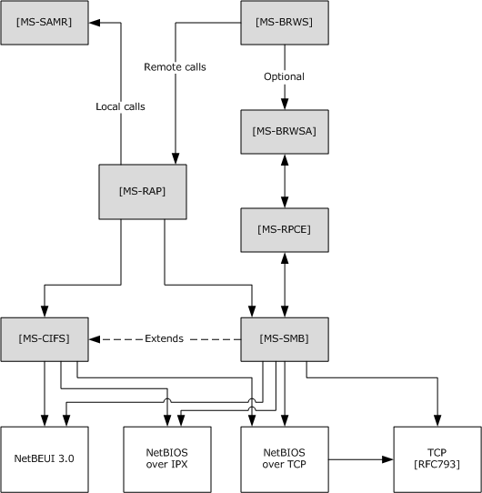

Figure 1: Relationships to other protocols

<a id="Section_1.5"></a>
## 1.5 Prerequisites/Preconditions

The Remote Administration Protocol has the following preconditions:

- The SMB dialect negotiated between a Remote Administration Protocol client and a server has to be for Microsoft LAN Manager version 1.0 or later, as specified in [MS-SMB](../MS-SMB/MS-SMB.md) section 3.2.4.2.2.
- The Remote Administration Protocol also relies on a client establishing a connection to an SMB server. Before a client can issue Remote Administration Protocol commands, it has to establish a connection to the server and successfully perform a TreeConnect SMB to the "IPC$" [**share**](#gt_share) on the server. For more details about TreeConnect SMB and IPC$ shares, see [MS-SMB] section 2.2.4.7.1, and [MS-CIFS](../MS-CIFS/MS-CIFS.md) section 3.2.4.42.
<a id="Section_1.6"></a>
## 1.6 Applicability Statement

The Remote Administration Protocol is used when a client, which is designed to interoperate with Microsoft LAN Manager 1.0, needs to retrieve information on a server. If a server requires interoperability with such clients, it implements this protocol.<1>

The Remote Administration Protocol is designed for 16-bit operating systems and is incapable of transmitting more than 64 KB of data in any protocol exchange.

<a id="Section_1.7"></a>
## 1.7 Versioning and Capability Negotiation

This specification covers versioning in the following areas:

- Protocol Versions: The Remote Administration Protocol is supported in the following explicit dialects: LAN Manager 1.0, [**NT LAN Manager (NTLM) Protocol**](#gt_fff710f9-e3d1-4991-99a2-009768d57585) 0.12 (for more information, see [MS-NLMP](../MS-NLMP/MS-NLMP.md)), and [MS-SMB](../MS-SMB/MS-SMB.md). These dialects are specified in [MS-SMB] section 2.2, and the negotiation of such is specified in [MS-SMB] section 1.7. For more information on the NTLM Protocol, see [[NTLM]](https://go.microsoft.com/fwlink/?LinkId=90235).
- Security and Authentication Methods: The Remote Administration Protocol uses the security and authentication methods already present in the SMB Protocol. The SMB Protocol supports the following authentication methods: LANMAN, NTLMv1, NTLMv2, and Kerberos.<2> These authentication methods are specified in [MS-SMB].
- Localization: The Remote Administration Protocol does not support localization or internationalization. Text strings are encoded in ASCII and are always transmitted as octets. If the octets are outside the ASCII range, 0x20-0x7F, the characters are interpreted in the [**code page**](#gt_code-page) of the processing system.
- Capability Negotiation: The Remote Administration Protocol has multiple modes that are implicitly detected by the Remote Administration Protocol at the command and protocol levels through mechanisms specified in [MS-SMB] section 2.2.
<a id="Section_1.8"></a>
## 1.8 Vendor-Extensible Fields

There are no vendor-extensible fields in the Remote Administration Protocol. The commands that the Remote Administration Protocol processes can include vendor-extensible fields such as version information and descriptive text.

This protocol uses Win32 error codes as defined in [MS-ERREF](../MS-ERREF/MS-ERREF.md) section 2.2. Implementations SHOULD<3> reuse those values with their indicated meanings. Choosing any other value runs the risk of a collision in the future.

<a id="Section_1.9"></a>
## 1.9 Standards Assignments

The Remote Administration Protocol utilizes a single parameter assignment: the *Name* parameter is assigned the case sensitive string "\PIPE\LANMAN". For more information, see section [3](#Section_3).

<a id="Section_2"></a>
# 2 Messages

<a id="Section_2.1"></a>
## 2.1 Transport

The Remote Administration Protocol is implemented using the SMB_COM_TRANSACTION functionality in the SMB Protocol. A client of the Remote Administration Protocol MUST first connect to the SMB server and exchange the SMB_COM_NEGOTIATE, SMB_COM_SESSION_SETUP_ANDX, and SMB_COM_TREE_CONNECT_ANDX commands to establish the connection, as specified in [MS-SMB](../MS-SMB/MS-SMB.md) section 3.2.4.2.

<a id="Section_2.2"></a>
## 2.2 Message Syntax

The Remote Administration Protocol is a request/response protocol. A Remote Administration Protocol request is carried in a single SMB_COM_TRANSACTION request, and the Remote Administration Protocol response is carried in the SMB_COM_TRANSACTION response that corresponds to the request, as specified in [MS-CIFS](../MS-CIFS/MS-CIFS.md) section 2.2.4.33.

All multiple-byte elements in the Remote Administration Protocol MUST be treated as [**little-endian**](#gt_little-endian), unless otherwise specified.

<a id="Section_2.3"></a>
## 2.3 Information Levels

The Remote Administration Protocol supports the concept of an information level (or level of detail) required for a particular response. An information level is an unsigned 16-bit integer. A Remote Administration Protocol client requests a particular information level in a request, and the server responds with a structure in the **Data** field of the response corresponding to that information level. Numerically higher information levels provide more detailed information than lower information levels for a particular request/response pair. The following table specifies the requests, the supported information level for each request, and the response structures returned for this protocol.

| Command | Information level | Response structure |
| --- | --- | --- |
| [NetServerGetInfo](#Section_2.5.5.1.1) | 0x0000 | [NetServerInfo0](#Section_2.5.5.4.1) |
| - | 0x0001 | [NetServerInfo1](#Section_2.5.5.4.2) |
| [NetServerEnum2](#Section_4.2) | 0x0000 | NetServerInfo0 |
| - | 0x0001 | NetServerInfo1 |
| [NetServerEnum3](#Section_2.5.5.3.1) | 0x0000 | NetServerInfo0 |
| - | 0x0001 | NetServerInfo1 |
| [NetShareEnum](#Section_4.1) | 0x0000 | [NetShareInfo0](#Section_2.5.6.3.1) |
| - | 0x0001 | [NetShareInfo1](#Section_2.5.6.3.2) |
| - | 0x0002 | [NetShareInfo2](#Section_2.5.6.3.3) |
| [NetShareGetInfo](#Section_2.5.6.2.1) | 0x0000 | NetShareInfo0 |
| - | 0x0001 | NetShareInfo1 |
| - | 0x0002 | NetShareInfo2 |
| [NetPrintQEnum](#Section_3.1.4.4) | 0x0000 | [PrintQueue0](#Section_2.5.7.8.1) |
| - | 0x0001 | [PrintQueue1](#Section_2.5.7.8.2) |
| - | 0x0002 | PrintQueue1, [PrintJobInfo1](#Section_2.5.7.8.6) |
| - | 0x0003 | [PrintQueue3](#Section_2.5.7.8.3) |
| - | 0x0004 | PrintQueue3, [PrintJobInfo2](#Section_2.5.7.8.7) |
| - | 0x0005 | [PrintQueue5](#Section_2.5.7.8.4) |
| [NetPrintQGetInfo](#Section_2.5.7.2.1) | 0x0000 | PrintQueue0 |
| - | 0x0001 | PrintQueue1 |
| - | 0x0002 | PrintQueue1, PrintJobInfo1 |
| - | 0x0003 | PrintQueue3 |
| - | 0x0004 | PrintQueue3, PrintJobInfo2 |
| - | 0x0005 | PrintQueue5 |
| [NetPrintJobSetInfo](#Section_3.2.5.6) | 0x0001, 0x0003 | - |
| [NetPrintJobGetInfo](#Section_2.5.7.4.1) | 0x0000 | [PrintJobInfo0](#Section_2.5.7.8.5) |
| - | 0x0001 | PrintJobInfo1 |
| - | 0x0002 | PrintJobInfo2 |
| - | 0x0003 | [PrintJobInfo3](#Section_2.5.7.8.8) |
| [NetUserGetInfo](#Section_3.1.4.13) | 0x0000 | [NetUserInfo0](#Section_2.5.8.3.1) |
| - | 0x0001 | [NetUserInfo1](#Section_2.5.8.3.2) |
| - | 0x0002 | [NetUserInfo2](#Section_2.5.8.3.3) |
| - | 0x000A | [NetUserInfo10](#Section_2.5.8.3.4) |
| - | 0x000B | [NetUserInfo11](#Section_2.5.8.3.5) |
| [NetWkstaGetInfo](#Section_2.5.10.1.2) | 0x000A | [NetWkstaInfo10](#Section_2.5.10.4.1) |
| [NetWkstaUserLogon](#Section_2.5.10.2.1) | 0x0001 | [NetWkstaUserLogonResponseData](#Section_2.5.10.4.3) |
| [NetWkstaUserLogoff](#Section_2.5.10.4.5) | 0x0001 | [NetWkstaUserLogoffResponseData](#Section_2.5.10.4.5) |

<a id="Section_2.4"></a>
## 2.4 String Field Length Limits

Many of the string elements specified in the Remote Administration Protocol have maximum length constraints associated with them. A client MUST NOT transmit strings that exceed the maximum length, as specified in the following tables. A server MUST fail a request if it receives a string that exceeds the maximum length by returning the associated Remote Administration Protocol response message with the Win32 error code set to ERROR_INVALID_PARAMETER (0x0057).

All text strings are encoded in ASCII and are received and transmitted as sequences of octets. The following tables specify the maximum character length, in bytes, for the string elements (not including a null-terminator) in various Remote Administration Protocol commands and structures, if any lengths are required for a particular string.

The following table lists the length limits for RAP commands.

| Bit Range | Field | Description |
| --- | --- | --- |
| Variable | [NetServerEnum2Request](#Section_2.5.5.2.1), [NetServerEnum3Request](#Section_2.5.5.3.1) | Domain 15 |
| Variable | NetServerEnum3Request | FirstNameToReturn 15 |
| Variable | [NetPrintQGetInfoRequest](#Section_2.5.7.2.1) | PrintQueueName 12 |
| Variable | [NetUserPasswordSet2Request](#Section_2.5.8.1.1) | UserName 20 |
| Variable | NetUserPasswordSet2Request | OldPassword 15 |
| Variable | NetUserPasswordSet2Request | NewPassword 15 |

The following table lists the length limits for RAP structures.

| Bit Range | Field | Description |
| --- | --- | --- |
| Variable | [PrintQueue1](#Section_2.5.7.8.2), [PrintQueue3](#Section_2.5.7.8.3) | PrintQName 12 |
| Variable | PrintQueue1, PrintQueue3 | SeparatorPageFilename 48 |
| Variable | PrintQueue1, PrintQueue3 | PrintProcessorDllName 48 |
| Variable | PrintQueue1, PrintQueue3 | CommentString 48 |
| Variable | PrintQueue1 | PrinterDestinationsName 48 |
| Variable | [PrintJobInfo3](#Section_2.5.7.8.8) | UserName 20 |
| Variable | PrintJobInfo3 | NotifyName 15 |
| Variable | PrintJobInfo3 | DataType 9 |
| Variable | PrintJobInfo3 | ParametersString 48 |
| Variable | PrintJobInfo3 | JobStatusString 48 |
| Variable | [PrintJobInfo1](#Section_2.5.7.8.6) | JobComment 48 |
| Variable | [NetServerInfo0](#Section_2.5.5.4.1), [NetServerInfo1](#Section_2.5.5.4.2) | ServerName 16 |
| Variable | NetServerInfo1 | ServerComment 48 |
| Variable | [NetShareInfo0](#Section_2.5.6.3.1), [NetShareInfo1](#Section_2.5.6.3.2) | NetworkName 13 |
| Variable | [NetUserInfo11](#Section_2.5.8.3.5) | Name 21 |
| Variable | [NetWkstaUserLogonRequestData](#Section_2.5.10.2.1) | UserName 21 |
| Variable | NetWkstaUserLogonRequestData | Password 15 |
| Variable | NetWkstaUserLogonRequestData | WorkstationName 16 |
| Variable | [NetWkstaUserLogonResponseData](#Section_2.5.10.4.3) | EffName 21 |
| Variable | [NetWkstaUserLogoffRequestData](#Section_2.5.10.4.4) | Name 21 |
| Variable | NetWkstaUserLogoffRequestData | Workstation 16 |

<a id="Section_2.5"></a>
## 2.5 Message Definitions

<a id="Section_2.5.1"></a>
### 2.5.1 RAP Request Message

Each Remote Administration Protocol request message MUST be transmitted in the parameters section of an SMB_COM_TRANSACTION protocol exchange (as specified in [MS-CIFS](../MS-CIFS/MS-CIFS.md) section 2.2.4.33). The Remote Administration Protocol request message MUST have the following format.

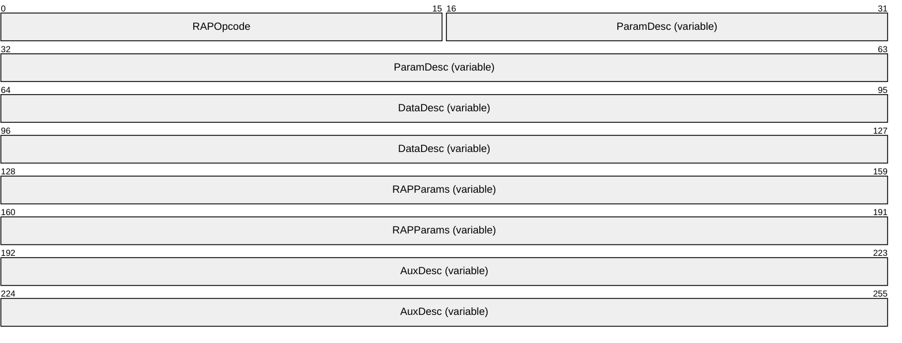

**RAPOpcode (2 bytes):** The operation code for the particular operation. For more information on valid operation codes, see [2.5.4](#Section_2.5.4).

**ParamDesc (variable):** This value MUST be a null-terminated ASCII descriptor string. The server SHOULD<4> validate that the **ParamDesc** value passed by the client matches what is specified by the **RAPOpcode**. The following table specifies the descriptor character and the notation for each data type.

| Descriptor | Data type | Format |
| --- | --- | --- |
| b | BYTE | Indicates bytes (octets). Can be followed by an ASCII number indicating number of bytes. |
| D | unsigned long | Indicates parameter type of 32-bit integer (dword). |
| e | ENTCOUNT | Indicates a word is to be received which shows the number of entries returned. |
| F | PAD | Indicates Pad bytes (octets). Can be followed by an ASCII number indicating the number of bytes. |
| g | BYTE * | Indicates a byte is to be received. Can be followed by an ASCII number indicating the number of bytes to receive. |
| h | unsigned short * | Indicates a word is to be received. |
| i | unsigned long * | Indicates a dword is to be received. |
| L | RCVBUFLEN | 16-bit integer containing length of receive data buffer in (16 bit) words. |
| O | NULL | Indicates a NULL pointer. |
| P | PARAMNUM | Indicates number of parameters. A (16 bit) word. |
| r | RCVBUF | Pointer to receive data buffer in response parameter section. |
| s | SNDBUF | Pointer to send data buffer in request parameter section. |
| T | SNDBUFLEN | 16-bit integer containing length of send data buffer in (16 bit) words. |
| W | unsigned short | Indicates parameter type of 16 bit integer (word). |
| z | char | Indicates a null-terminated ASCII string present in the parameter area. |

**DataDesc (variable):** (Optional) If this value is specified, it MUST be a null-terminated ASCII descriptor string that describes the contents of the data returned to the client.<5> Certain **RAPOpcodes** specify a **DataDesc** field; for a list of Remote Administration Protocol commands that specify a **DataDesc** field, see section [2.5.5](#Section_2.5.5).

If no **DataDesc** field is specified for the Remote Administration Protocol command, this field MUST be set to null. The following table specifies the descriptor character and the notation for each data type.

| Descriptor | Data type | Format |
| --- | --- | --- |
| B | BYTE | Indicates item of data type 8-bit byte (octet). The indicated number of bytes is present in the data. Descriptor char can be followed by an ASCII number indicating the number of 8-bit bytes present. |
| D | unsigned long | Indicates data type of 32-bit integer (dword). Descriptor char can be followed by an ASCII number indicating the number of 32-bit words present. |
| N | AUXCOUNT | Indicates number of auxiliary data structures. The transaction response data section contains an unsigned 16-bit number corresponding to this data item. |
| O | NULL | Indicates a NULL pointer. |
| W | unsigned short | Indicates data type of 16-bit integer (word). Descriptor char can be followed by an ASCII number indicating the number of 16-bit words present. |
| z | char * | Indicates a 32-bit pointer to a null-terminated ASCII string is present in the response parameter area. The actual string is in the response data area and the pointer in the parameter area points to the string in the data area. The high word of the pointer MUST be ignored. The converter word present in the response parameter section MUST be subtracted from the low 16-bit value to obtain an offset into the data area indicating where the data area resides. |

**RAPParams (variable):** Remote Administration Protocol command-specific parameters, as specified in sections 2.5.5, [2.5.6](#Section_2.5.6), [2.5.7](#Section_2.5.7), [2.5.8](#Section_2.5.8), and [2.5.9](#Section_2.5.9).

**AuxDesc (variable):** (Optional) If this value is specified, it MUST be a null-terminated ASCII descriptor string that describes auxiliary data returned to the client.<6> If no **AuxDesc** field is specified for the Remote Administration Protocol command, this field MUST NOT be present. For the origin of the descriptor string values, see section [4.2](#Section_4.2).

In addition, if the command specifies that it also uses the **Data** field of the SMB_COM_TRANSACTION, the format of the **Data** field MUST be the following.

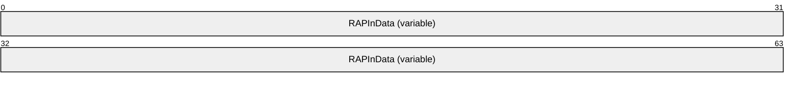

**RAPInData (variable):** Additional data for the Remote Administration Protocol request. This field MUST be present in the [NetPrintJobSetInfoRequest](#Section_2.5.7.3.1) command. This field cannot be present in any other command.

<a id="Section_2.5.2"></a>
### 2.5.2 RAP Response Message

The response to a Remote Administration Protocol command consists of two parts. The first is transmitted in the **Parameters** field of the SMB_COM_TRANSACTION response; the second is transmitted in the **Data** field of the same SMB_COM_TRANSACTION response (as specified in [MS-CIFS](../MS-CIFS/MS-CIFS.md) section 2.2.4.33).

The following MUST be the layout of the data in the SMB_COM_TRANSACTION response **Parameters** field.

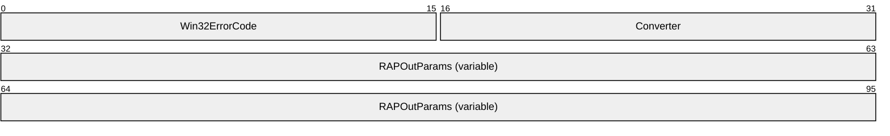

**Win32ErrorCode (2 bytes):** This MUST be a 16-bit unsigned integer. It contains a Win32 error code representing the result of the Remote Administration Protocol command. The following table lists error codes that have particular meaning to the Remote Administration Protocol, as indicated in this specification.

| Code/Value | Meaning |
| --- | --- |
| ERROR_SUCCESS 0x0000 | No errors encountered. |
| ERROR_MORE_DATA 0x00EA | Additional data is available. |
| NERR_BufTooSmall 0x084B | The API return buffer is too small. |
| ERROR_INVALID_LEVEL 0x007C | The specified information level is not supported. |
| ERROR_INVALID_PARAMETER 0x0057 | Data from the client is invalid. |

A Remote Administration Protocol server implementation can return Win32 error codes other than those listed in the preceding table. Any such error code SHOULD be drawn from the set of error codes specified in [MS-ERREF](../MS-ERREF/MS-ERREF.md), and the client MUST treat any error code not explicitly listed in the preceding table as a failure.

**Converter (2 bytes):** This field MUST contain a 16-bit signed integer, which a client MUST subtract from the string offset contained in the low 16 bits of a variable-length field in the Remote Administration Protocol response buffer. This is to derive the actual byte offset from the start of the response buffer for that field.

**RAPOutParams (variable):** (Optional) If present, this structure MUST contain the response information for the Remote Administration Protocol command in the corresponding Remote Administration Protocol request message. Certain **RAPOpcodes** require a RAPOutParams structure; for Remote Administration Protocol commands that require a RAPOutParams structure, see sections [2.5.5](#Section_2.5.5), [2.5.6](#Section_2.5.6), [2.5.7](#Section_2.5.7), [2.5.8](#Section_2.5.8), and [2.5.9](#Section_2.5.9).

If the **Win32ErrorCode** in the **Parameters** field is either ERROR_SUCCESS (0x0000) or ERROR_MORE_DATA (0x00EA), the **Data** field of the SMB_COM_TRANSACTION MUST contain the following:


**RAPOutData (variable):** This is the response data for the Remote Administration Protocol operation. The content of the RAPOutData structure varies according to the Remote Administration Protocol command and the parameters of each Remote Administration Protocol command. See Remote Administration Protocol responses for each Remote Administration Protocol command in sections 2.5.5, 2.5.6, 2.5.7, 2.5.8, and 2.5.9.

<a id="Section_2.5.3"></a>
### 2.5.3 RAP Request/Response Summary Table

Some Remote Administration Protocol commands require the RAPOutParams structure, as specified in section [2.5.2](#Section_2.5.11). The following table specifies the message request and response for a specific Remote Administration Protocol command as well as the data structure for the response.

| Bit Range | Field | Description |
| --- | --- | --- |
| Variable | [NetServerGetInfo](#Section_2.5.5.1.1) | [NetServerGetInfoRequest](#Section_2.5.5.1.1) [NetServerGetInfoResponse](#Section_2.5.5.1.2) [NetServerInfo0](#Section_2.5.5.4.1), [NetServerInfo1](#Section_2.5.5.4.2) |
| Variable | [NetServerEnum2](#Section_4.2) | [NetServerEnum2Request](#Section_2.5.5.2.1) [NetServerEnum2Response](#Section_2.5.5.2.2) NetServerInfo0, NetServerInfo1 |
| Variable | [NetServerEnum3](#Section_3.2.5.15) | [NetServerEnum3Request](#Section_2.5.5.3.1) [NetServerEnum3Response](#Section_2.5.5.3.2) NetServerInfo0, NetServerInfo1 |
| Variable | [NetShareEnum](#Section_4.1) | [NetShareEnumRequest](#Section_4.1) [NetShareEnumResponse](#Section_4.1) [NetShareInfo0](#Section_2.5.6.3.1), [NetShareInfo1](#Section_2.5.6.3.2), [NetShareInfo2](#Section_2.5.6.3.3) |
| Variable | [NetShareGetInfo](#Section_2.5.6.2.1) | [NetShareGetInfoRequest](#Section_2.5.6.2.1) [NetShareGetInfoResponse](#Section_2.5.6.2.2) NetShareInfo0, NetShareInfo1, NetShareInfo2 |
| Variable | [NetPrintQEnum](#Section_3.1.4.4) | [NetPrintQEnumRequest](#Section_2.5.7.1.1) [NetPrintQEnumResponse](#Section_74ae8d422f2e4c448eeaa5349da537a3) [PrintQueue0](#Section_2.5.7.8.1), [PrintQueue1](#Section_2.5.7.8.2), [PrintQueue3](#Section_2.5.7.8.3), [PrintQueue5](#Section_2.5.7.8.4), [PrintJobInfo1](#Section_2.5.7.8.6), [PrintJobInfo2](#Section_2.5.7.8.7) |
| Variable | [NetPrintQGetInfo](#Section_3.2.5.5) | [NetPrintQGetInfoRequest](#Section_2.5.7.2.1) [NetPrintQGetInfoResponse](#Section_2.5.7.2.2) PrintQueue0, PrintQueue1, PrintQueue3, PrintQueue5, PrintJobInfo1, PrintJobInfo2 |
| Variable | [NetPrintJobGetInfo](#Section_3.1.4.7) | [NetPrintJobGetInfoRequest](#Section_2.5.7.4.1) [NetPrintJobGetInfoResponse](#Section_2020d57b9941458795730b842ed80992) [PrintJobInfo0](#Section_2.5.7.8.5), PrintJobInfo1, PrintJobInfo2, [PrintJobInfo3](#Section_2.5.7.8.8) |
| Variable | [NetPrintJobSetInfo](#Section_3.2.5.6) | [NetPrintJobSetInfoRequest](#Section_2.5.7.3.1) [NetPrintJobSetInfoResponse](#Section_6ddf7960a3bc409a83e00264623a900b) - |
| Variable | [NetPrintJobPause](#Section_2.5.7.5) | [NetPrintJobPauseRequest](#Section_2.5.7.5.1) [NetPrintJobPauseResponse](#Section_6775465a56604c80bef4d58c43816416) - |
| Variable | [NetPrintJobContinue](#Section_3.2.5.10) | [NetPrintJobContinueRequest](#Section_2.5.7.6.1) [NetPrintJobContinueResponse](#Section_abe11e19c90d417b9639b256c8979650) - |
| Variable | [NetPrintJobDelete](#Section_4.3) | [NetPrintJobDeleteRequest](#Section_2.5.7.7.1) [NetPrintJobDeleteResponse](#Section_4.3) - |
| Variable | [NetUserPasswordSet2](#Section_3.1.4.14) | [NetUserPasswordSet2Request](#Section_2.5.8.1.1) [NetUserPasswordSet2Response](#Section_a53d43a085974c408a168243b8ca8146) - |
| Variable | [NetUserGetInfo](#Section_3.1.4.13) | [NetUserGetInfoRequest](#Section_2.5.8.2.1) [NetUserGetInfoResponse](#Section_2.5.8.2.2) [NetUserInfo0](#Section_2.5.8.3.1), [NetUserInfo1](#Section_2.5.8.3.2), [NetUserInfo2](#Section_2.5.8.3.3), [NetUserInfo10](#Section_2.5.8.3.4), [NetUserInfo11](#Section_2.5.8.3.5) |
| Variable | [NetRemoteTOD](#Section_3.2.5.11) | [NetRemoteTODRequest](#Section_2.5.9.1.1) [NetRemoteTODResponse](#Section_7175c361e49842e3bf1b4bc46166f339) [TimeOfDayInfo](#Section_2.5.9.2.1) |
| Variable | [NetWkstaGetInfo](#Section_2.5.10.1.2) | [NetWkstaGetInfoRequest](#Section_2.5.10.1.1) [NetWkstaGetInfoResponse](#Section_2.5.10.1.2) [NetWkstaInfo10](#Section_2.5.10.4.1) |
| Variable | [NetWkstaUserLogon](#Section_2.5.10.2.1) | [NetWkstaUserLogonRequest](#Section_2.5.10.2.1) [NetWkstaUserLogonResponse](#Section_2.5.10.4.3) [NetWkstaUserLogonResponseData](#Section_2.5.10.4.3) |
| Variable | [NetWkstaUserLogoff](#Section_2.5.10.4.5) | [NetWkstaUserLogoffRequest](#Section_2.5.10.3.1) [NetWkstaUserLogoffResponse](#Section_2.5.10.4.5) [NetWkstaUserLogoffResponseData](#Section_2.5.10.4.5) |

<a id="Section_2.5.4"></a>
### 2.5.4 RAP Opcodes

The following tables summarize Remote Administration Protocol command operation codes.

Server Commands

| Command | Opcode |
| --- | --- |
| [NetServerGetInfo](#Section_2.5.5.1.1) | 0x000D |
| [NetServerEnum2](#Section_4.2) | 0x0068 |
| [NetServerEnum3](#Section_3.2.5.15) | 0x00D7 |

Share Commands

| Command | Opcode |
| --- | --- |
| [NetShareEnum](#Section_4.1) | 0x0000 |
| [NetShareGetInfo](#Section_2.5.6.2.1) | 0x0001 |

Print Commands

| Command | Opcode |
| --- | --- |
| [NetPrintQEnum](#Section_3.1.4.4) | 0x0045 |
| [NetPrintQGetInfo](#Section_3.2.5.5) | 0x0046 |
| [NetPrintJobSetInfo](#Section_3.2.5.6) | 0x0093 |
| [NetPrintJobGetInfo](#Section_3.1.4.7) | 0x004D |
| [NetPrintJobPause](#Section_2.5.7.5) | 0x0052 |
| [NetPrintJobContinue](#Section_3.2.5.10) | 0x0053 |
| [NetPrintJobDelete](#Section_4.3) | 0x0051 |

User Commands

| Command | Opcode |
| --- | --- |
| [NetUserPasswordSet2](#Section_3.1.4.14) | 0x0073 |
| [NetUserGetInfo](#Section_3.1.4.13) | 0x0038 |

Time Commands

The [NetRemoteTOD](#Section_3.2.5.11) command has an opcode of 0x005B.

Workstation Commands

| Command | Opcode |
| --- | --- |
| [NetWkstaGetinfo](#Section_2.5.10.1.2) | 0x003F |
| [NetWkstaUserLogon](#Section_2.5.10.2.1) | 0x0084 |
| [NetWkstaUserLogoff](#Section_2.5.10.4.5) | 0x0085 |

<a id="Section_2.5.5"></a>
### 2.5.5 RAP Server Commands

The following Remote Administration Protocol commands are for operations involving servers.

<a id="Section_2.5.5.1"></a>
#### 2.5.5.1 NetServerGetInfo Command

The [NetServerGetInfo](#Section_2.5.5.1.1) command returns information on the server.

<a id="Section_2.5.5.1.1"></a>
##### 2.5.5.1.1 RAP NetServerGetInfoRequest

The fields in the NetServerGetInfoRequest message MUST have the following format.<7>

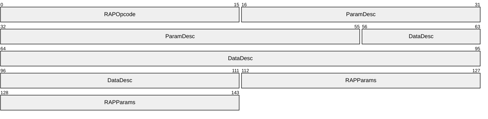

**RAPOpcode (2 bytes):** MUST be set to 0x000D. For more information, see section [2.5.1](#Section_2.5.1).

**ParamDesc (5 bytes):** MUST be set to "WrLh". For more information, see section 2.5.1.

**DataDesc (7 bytes):** MUST be set to "B16BBDz". For more information, see section 2.5.1.

**RAPParams (4 bytes):** The **RAPParams** structure MUST have the following format.

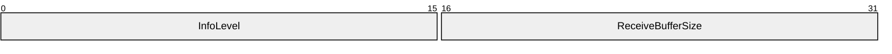

**InfoLevel (2 bytes):** A 16-bit unsigned integer that specifies the information level for the NetServerGetInfoRequest.

**ReceiveBufferSize (2 bytes):** A 16-bit unsigned integer that represents the maximum number of bytes of data that can be returned in the **Data** field of the SMB_COM_TRANSACTION response to the command.

<a id="Section_2.5.5.1.2"></a>
##### 2.5.5.1.2 RAP NetServerGetInfoResponse

The **RAPOutParams** RAP response to the [NetServerGetInfo](#Section_2.5.5.1.1) command is as follows.<8>


**TotalBytesAvailable (2 bytes):** A 16-bit unsigned integer that represents the number of bytes required to hold the server information requested.

If the **InfoLevel** specified in the NetServerGetInfo is 0, and the response is not an error, the RAPOutData field of the SMB_COM_TRANSACTION response MUST be filled with a [NetServerInfo0](#Section_2.5.5.4.1) structure.

If the **InfoLevel** specified in the NetServerGetInfo is 1, and the response is not an error, the RAPOutData field of the SMB_COM_TRANSACTION response MUST be filled with a [NetServerInfo1](#Section_2.5.5.4.2) structure.

<a id="Section_2.5.5.2"></a>
#### 2.5.5.2 NetServerEnum2

The [NetServerEnum2](#Section_4.2) command specifies that the server is to return its list of servers to the client.<9>

<a id="Section_2.5.5.2.1"></a>
##### 2.5.5.2.1 RAP NetServerEnum2Request

The fields in the NetServerEnum2Request message MUST be set as follows.

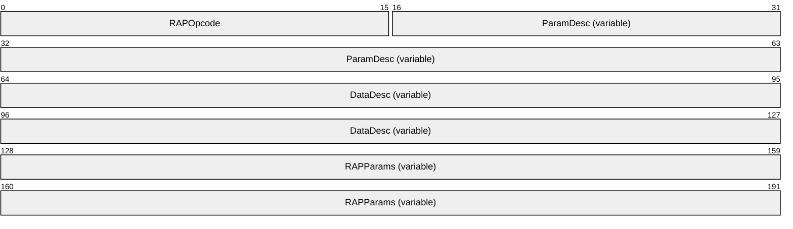

**RAPOpcode (2 bytes):** MUST be set to 0x0068. For more information, see section [2.5.1](#Section_2.5.1).

**ParamDesc (variable):** MUST be set to "WrLehDO" if the *Domain* parameter is not specified, or set to "WrLehDz". For more information, see section 2.5.1.

**DataDesc (variable):** If **InfoLevel** shown in the following packet diagram is set to 0x0000, this MUST be set to "B16"; if **InfoLevel** is set to 0x0001, this MUST be set to "B16BBDz". For more information, see section 2.5.1.

**RAPParams (variable):** The **RAPParams** structure MUST be as follows:

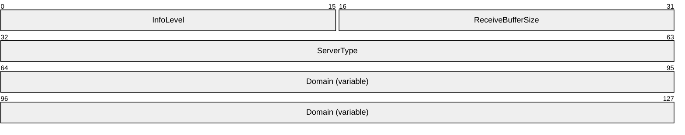

**InfoLevel (2 bytes):** A 16-bit unsigned integer that specifies the information level for the NetServerEnum2Request.

**ReceiveBufferSize (2 bytes):** A 16-bit unsigned integer that represents the maximum number of bytes of data that can be returned in the **Data** field of the SMB_COM_TRANSACTION response to the command.

**ServerType (4 bytes):** A 32-bit set of flags used to filter servers in the response to the [NetServerEnum2](#Section_4.2) command. The **ServerType** field MUST be a bitmask composed of the possible values in the following table.

All unused bits SHOULD be set to zero when sent and MUST be ignored on receipt. If SV_TYPE_ALL (0xffffffff) is requested, the server MUST return all types of servers and MUST ignore unused bits.

| Value | Meaning |
| --- | --- |
| SV_TYPE_WORKSTATION 0x00000001 | A server running the WorkStation Service |
| SV_TYPE_SERVER 0x00000002 | A server running the Server Service |
| SV_TYPE_SQLSERVER 0x00000004 | Any server running with SQL Server |
| SV_TYPE_DOMAIN_CTRL 0x00000008 | Primary domain controller |
| SV_TYPE_DOMAIN_BAKCTRL 0x00000010 | Backup domain controller |
| SV_TYPE_TIME_SOURCE 0x00000020 | Server is available as a time source for network time synchronization |
| SV_TYPE_AFP 0x00000040 | Apple File Protocol server |
| SV_TYPE_NOVELL 0x00000080 | Novell server |
| SV_TYPE_DOMAIN_MEMBER 0x00000100 | LAN Manager 2.x domain member |
| SV_TYPE_PRINTQ_SERVER 0x00000200 | Server sharing [**print queue**](#gt_print-queue) |
| SV_TYPE_DIALIN_SERVER 0x00000400 | Server running dial-in service |
| SV_TYPE_SERVER_UNIX, SV_TYPE_XENIX_SERVER 0x00000800 | Unix or Xenix server |
| SV_TYPE_NT 0x00001000 | Windows NT operating system, Windows 2000 operating system, Windows XP operating system, Windows Server 2003 operating system, Windows Vista operating system, Windows 7 operating system, Windows 8 operating system, Windows Server 2008 operating system, Windows Server 2008 R2 operating system, or Windows Server 2012 operating system |
| SV_TYPE_WFW 0x00002000 | Server running Windows for Workgroups |
| SV_TYPE_SERVER_MFPN 0x00004000 | Microsoft File and Print for NetWare |
| SV_TYPE_SERVER_NT 0x00008000 | Windows 2000 Server operating system, Windows Server 2003, or a server that is not a domain controller |
| SV_TYPE_POTENTIAL_BROWSER 0x00010000 | Server that can run the browser service |
| SV_TYPE_BACKUP_BROWSER 0x00020000 | Server running a browser service as backup |
| SV_TYPE_MASTER_BROWSER 0x00040000 | Server running the master browser service |
| SV_TYPE_DOMAIN_MASTER 0x00080000 | Server running the domain master browser |
| SV_TYPE_WINDOWS 0x00400000 | Windows 95 operating system, Windows 98 operating system, or Windows Millennium Edition operating system |
| SV_TYPE_DFS 0x00800000 | Root of a DFS tree |
| SV_TYPE_CLUSTER_NT 0x01000000 | Server clusters available in the domain |
| SV_TYPE_TERMINALSERVER 0x02000000 | Terminal server |
| SV_TYPE_CLUSTER_VS_NT 0x04000000 | Cluster virtual servers available in the domain |
| SV_TYPE_DCE 0x10000000 | IBM DSS (Directory and Security Services) or equivalent |
| SV_TYPE_ALTERNATE_XPORT 0x20000000 | Return list for alternate transport<10> |
| SV_TYPE_LOCAL_LIST_ONLY 0x40000000 | Servers maintained by the browser |
| SV_TYPE_DOMAIN_ENUM 0x80000000 | Primary domain |
| SV_TYPE_ALL 0xFFFFFFFF | Return all of the servers mentioned previously |

**Domain (variable):** If the **ParamDesc** is "WrLehDz", this field MUST contain a null-terminated ASCII string that represents the name of the workgroup or domain for which to enumerate computers. If the ParamDesc is "WrLehD0", then this field MUST NOT be present. If this string is not present or is empty (a single null byte), the server MUST return the list of servers for the server's current domain or workgroup.

<a id="Section_2.5.5.2.2"></a>
##### 2.5.5.2.2 RAP NetServerEnum2Response

The **RAPOutParams** structure for the [NetServerEnum2 Command](#Section_4.2) MUST be as follows.

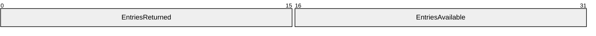

**EntriesReturned (2 bytes):** A 16-bit unsigned integer that represents the number of fixed-size [NetServerInfo0](#Section_2.5.5.4.1) or [NetServerInfo1](#Section_2.5.5.4.2) data structures returned in the **Data** field of the SMB_COM_TRANSACTION response to the [NetServerEnum2Request](#Section_2.5.5.2.1).

**EntriesAvailable (2 bytes):** A 16-bit unsigned integer that represents the total number of servers available on the server.

For error conditions and error responses, see section 3.2.5.12.

If the **InfoLevel** specified in the NetServerEnum2Request is 0x0000, the **RAPOutData** field of the SMB_COM_TRANSACTION response MUST be filled with an array of EntriesReturned NetServerInfo0 structures.

If the **InfoLevel** specified in the NetServerEnum2Request is 0x0001, the **RAPOutData** field of the SMB_COM_TRANSACTION response MUST be filled with an array of EntriesReturned NetServerInfo1 structures.

<a id="Section_2.5.5.3"></a>
#### 2.5.5.3 NetServerEnum3 Command

The [NetServerEnum3](#Section_3.2.5.15) command specifies that the server MUST return to the client a list of servers that exist on the network.<11>

<a id="Section_2.5.5.3.1"></a>
##### 2.5.5.3.1 RAP NetServerEnum3Request

The fields in the NetServerEnum3Request message MUST be set as follows.

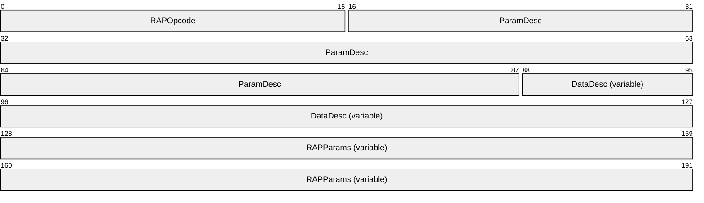

**RAPOpcode (2 bytes):** MUST be set to 0x00D7. For more information see section [2.5.1](#Section_2.5.1).

**ParamDesc (9 bytes):** MUST be set to "WrLehDzz". For more information see section 2.5.1.

**DataDesc (variable):** If the **InfoLevel** in the following packet diagram is set to 0x0000, this MUST be set to "B16"; if the **InfoLevel** is set to 0x0001, this MUST be set to "B16BBDz". For more information see section 2.5.1.

**RAPParams (variable):** The **RAPParams** structure MUST be as follows.

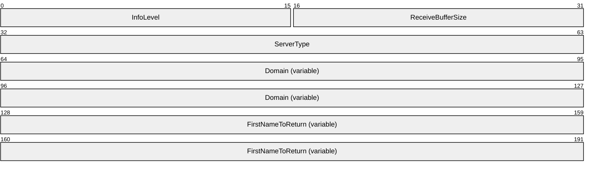

**InfoLevel (2 bytes):** A 16-bit unsigned integer that specifies the information level for the NetServerEnum3Request.

**ReceiveBufferSize (2 bytes):** A 16-bit unsigned integer that represents the maximum bytes of data that can be returned in the **Data** field of the SMB_COM_TRANSACTION response to the command.

**ServerType (4 bytes):** A 32-bit set of flags used to filter servers in the response to the [NetServerEnum3](#Section_3.2.5.15) command. The **ServerType** field MUST be a bitmask composed of the following possible values.

| Value | Meaning |
| --- | --- |
| SV_TYPE_WORKSTATION 0x00000001 | A server running the WorkStation Service |
| SV_TYPE_SERVER 0x00000002 | A server running the Server Service |
| SV_TYPE_SQLSERVER 0x00000004 | Any server running with SQL Server |
| SV_TYPE_DOMAIN_CTRL 0x00000008 | Primary domain controller |
| SV_TYPE_DOMAIN_BAKCTRL 0x00000010 | Backup domain controller |
| SV_TYPE_TIME_SOURCE 0x00000020 | Server is available as a time source for network time synchronization |
| SV_TYPE_AFP 0x00000040 | Apple File Protocol server |
| SV_TYPE_NOVELL 0x00000080 | Novell server |
| SV_TYPE_DOMAIN_MEMBER 0x00000100 | LAN Manager 2.x domain member |
| SV_TYPE_PRINTQ_SERVER 0x00000200 | Server sharing [**print queue**](#gt_print-queue) |
| SV_TYPE_DIALIN_SERVER 0x00000400 | Server running dial-in service |
| SV_TYPE_SERVER_UNIX, SV_TYPE_XENIX_SERVER 0x00000800 | Unix or Xenix server |
| SV_TYPE_NT 0x00001000 | Windows NT, Windows 2000, Windows XP, Windows Server 2003, Windows Vista, Windows 7, Windows Server 2008, Windows Server 2008 R2, Windows 8, or Windows Server 2012 |
| SV_TYPE_WFW 0x00002000 | Server running Windows for Workgroups |
| SV_TYPE_SERVER_MFPN 0x00004000 | Microsoft File and Print for NetWare |
| SV_TYPE_SERVER_NT 0x00008000 | Windows 2000 Server, Windows Server 2003, or a server that is not a domain controller |
| SV_TYPE_POTENTIAL_BROWSER 0x00010000 | Server that can run the browser service |
| SV_TYPE_BACKUP_BROWSER 0x00020000 | Server running a browser service as backup |
| SV_TYPE_MASTER_BROWSER 0x00040000 | Server running the master browser service |
| SV_TYPE_DOMAIN_MASTER 0x00080000 | Server running the domain master browser |
| SV_TYPE_WINDOWS 0x00400000 | Windows 95, Windows 98, or Windows Millennium Edition |
| SV_TYPE_DFS 0x00800000 | Root of a DFS tree |
| SV_TYPE_CLUSTER_NT 0x01000000 | Server clusters available in the domain |
| SV_TYPE_TERMINALSERVER 0x02000000 | Terminal server |
| SV_TYPE_CLUSTER_VS_NT 0x04000000 | Cluster virtual servers available in the domain |
| SV_TYPE_DCE 0x10000000 | IBM DSS (Directory and Security Services) or equivalent |
| SV_TYPE_ALTERNATE_XPORT 0x20000000 | Return list for alternate transport |
| SV_TYPE_LOCAL_LIST_ONLY 0x40000000 | Servers maintained by the browser |
| SV_TYPE_DOMAIN_ENUM 0x80000000 | Primary domain |
| SV_TYPE_ALL 0xFFFFFFFF | All servers |

**Domain (variable):** A null-terminated ASCII string that represents the name of the workgroup or domain for which to enumerate computers.

**FirstNameToReturn (variable):** This field MUST contain a null-terminated ASCII string with a maximum length of 16 bytes, including the null-terminator. This string MUST specify the name of the first server that the RAP server MUST return in its enumeration. If this parameter is empty (a single null byte), the server MUST return entries starting with the first server in the list. See section [3.2.5.15](#Section_3.2.5.15).

<a id="Section_2.5.5.3.2"></a>
##### 2.5.5.3.2 RAP NetServerEnum3Response

The RAPOutParams structure for the [NetServerEnum3 Command](#Section_3.2.5.15) MUST be as follows.


**EntriesReturned (2 bytes):** A 16-bit unsigned integer that represents the number of fixed-size [NetServerInfo0](#Section_2.5.5.4.1) or [NetServerInfo1](#Section_2.5.5.4.2) data structures returned in the **Data** field of the SMB_COM_TRANSACTION response to the [NetServerEnum3Request](#Section_2.5.5.3.1).

**EntriesAvailable (2 bytes):** A 16-bit unsigned integer that represents the total number of servers available for enumeration on this network.

For error conditions and error responses, see section 3.2.5.15.

If the **InfoLevel** specified in the NetServerEnum3Request is 0x0000, the **RAPOutData** field of the SMB_COM_TRANSACTION response MUST be filled with an array of **EntriesReturned** NetServerInfo0 structures.

If the **InfoLevel** specified in the NetServerEnum3Request is 0x0001, the **RAPOutData** field of the SMB_COM_TRANSACTION response MUST be filled with an array of **EntriesReturned** NetServerInfo1 structures.

<a id="Section_2.5.5.4"></a>
#### 2.5.5.4 RAP Server Response Structures

<a id="Section_2.5.5.4.1"></a>
##### 2.5.5.4.1 NetServerInfo0 Data Structure

The NetServerInfo0 structure MUST be returned by the server in the **Data** field of the SMB_COM_TRANSACTION response that corresponds to a [NetServerEnum2](#Section_4.2) command, a [NetServerEnum3](#Section_3.2.5.15) command, or a [NetServerGetInfoRequest](#Section_2.5.5.1.1) command when the *InfoLevel* parameter to the command is 0x0000.

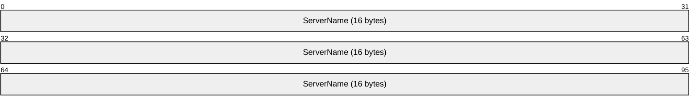

**ServerName (16 bytes):** A 16-character null-terminated ASCII string that contains the NetBIOS name (as specified in [[RFC1001]](https://go.microsoft.com/fwlink/?LinkId=90260) section 5.2) of the server. The **ServerName** field MUST be padded to 16 bytes with null characters.

<a id="Section_2.5.5.4.2"></a>
##### 2.5.5.4.2 NetServerInfo1 Data Structure

The NetServerInfo1 structure is returned by the server in the **Data** field of the SMB_COM_TRANSACTION response that corresponds to a [NetServerEnum2](#Section_4.2) command, a [NetServerEnum3](#Section_3.2.5.15) command, or a [NetServerGetInfo Command](#Section_2.5.5.1.1) when the *InfoLevel* parameter to the command is 0x0001.

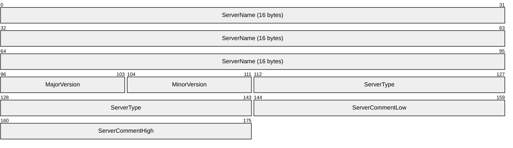

**ServerName (16 bytes):** A 16-character null-terminated ASCII string that MUST contain the NetBIOS name of the server (as specified in [[RFC1001]](https://go.microsoft.com/fwlink/?LinkId=90260) section 5.2). The **ServerName** field MUST be padded to 16 bytes with null characters.

**MajorVersion (1 byte):** An 8-bit unsigned integer that represents the major version of the specified server.<12>

**MinorVersion (1 byte):** An 8-bit unsigned integer that represents the minor version of the specified server.<13>

**ServerType (4 bytes):** A 32-bit unsigned integer that specifies the type of software the computer is running. This field has the same syntax and semantics as the **ServerType** specified in section [2.5.5.2.1](#Section_2.5.5.2.1).

**ServerCommentLow (2 bytes):** A 16-bit unsigned integer that represents the offset, in bytes, from the start of the response to a null-terminated ASCII string allocated in the response block (see section [2.5.11](#Section_2.5.11)) that MUST specify the purpose of the server.

Before using this value, the Remote Administration Protocol client MUST subtract the **Converter** field specified in section [2.5.2](#Section_2.5.11) from the **ServerCommentLow** value and then use that result as the offset within the response.

**ServerCommentHigh (2 bytes):** Unused. Can be set to any arbitrary value when sent, and MUST be ignored on receipt.

<a id="Section_2.5.6"></a>
### 2.5.6 RAP Share Commands

<a id="Section_2.5.6.1"></a>
#### 2.5.6.1 NetShareEnum Command

The [NetShareEnum](#Section_4.1) command MUST return to the client information on each list of shared resources.

<a id="Section_2.5.6.1.1"></a>
##### 2.5.6.1.1 RAP NetShareEnumRequest

The fields in the NetShareEnumRequest message MUST be set as follows.<14>

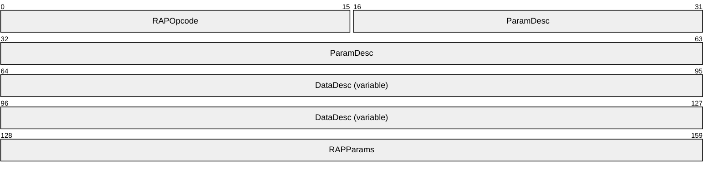

**RAPOpcode (2 bytes):** MUST be set to 0x0000. For more information see section [2.5.1](#Section_2.5.1).

**ParamDesc (6 bytes):** MUST be set to "WrLeh". For more information see section 2.5.1.

**DataDesc (variable):** For more information, see section 2.5.1.

This field takes the following values.

| Value | Meaning |
| --- | --- |
| "B13" | MUST be set to this value if *InfoLevel* is 0x0000. |
| "B13BWz" | MUST be set to this value if *InfoLevel* is 0x0001. |
| "B13BWzWWWzB9B" | MUST be set to this value if *InfoLevel* is 0x0002. |

**RAPParams (4 bytes):** The **RAPParams** structure MUST be as follows.


**InfoLevel (2 bytes):** A 16-bit unsigned integer that specifies the information level for NetShareEnumRequest.

**ReceiveBufferSize (2 bytes):** A 16-bit unsigned integer that represents the maximum number of bytes of data that can be returned in the **Data** field of the SMB_COM_TRANSACTION response to the command.

<a id="Section_2.5.6.1.2"></a>
##### 2.5.6.1.2 RAP NetShareEnumResponse

The RAPOutParams structure for the [NetShareEnum](#Section_4.1) command MUST be as follows.<15>


**EntriesReturned (2 bytes):** A 16-bit unsigned integer that represents the number of fixed size [NetShareInfo0](#Section_2.5.6.3.1), [NetShareInfo1](#Section_2.5.6.3.2), or [NetShareInfo2](#Section_2.5.6.3.3) data structures returned in the **Data** field of the SMB_COM_TRANSACTION response to the Remote Administration Protocol [NetShareEnumRequest](#Section_4.1).

**EntriesAvailable (2 bytes):** A 16-bit unsigned integer that represents the number of [**shares**](#gt_share) on the server.

For error conditions and error responses, see section 3.2.5.1.

If the **InfoLevel** specified in the NetShareEnumRequest is 0, the **RAPOutData** field of the SMB_COM_TRANSACTION response MUST be filled with an array of **EntriesReturned** NetShareInfo0 structures.

If the **InfoLevel** specified in the NetShareEnumRequest is 1, the **RAPOutData** field of the SMB_COM_TRANSACTION response MUST be filled with an array of **EntriesReturned** NetShareInfo1 structures.

If the **InfoLevel** specified in the NetShareEnumRequest is 2, the **RAPOutData** field of the SMB_COM_TRANSACTION response MUST be filled with an array of **EntriesReturned** NetShareInfo2 structures.

<a id="Section_2.5.6.2"></a>
#### 2.5.6.2 NetShareGetInfo Command

The NetShareGetInfo command returns information about shared resources.

<a id="Section_2.5.6.2.1"></a>
##### 2.5.6.2.1 NetShareGetInfoRequest

The NetShareGetInfoRequest packet has the following fields.<16>

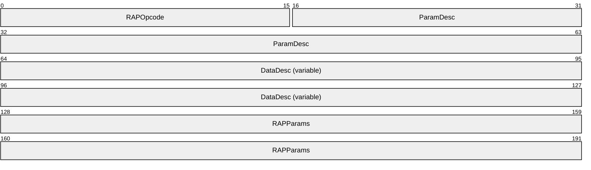

**RAPOpcode (2 bytes):** MUST be set to 0x0001. For more information, see section [2.5.1](#Section_2.5.1).

**ParamDesc (6 bytes):** MUST be set to "zWrLh". For more information, see section 2.5.1.

**DataDesc (variable):** If **InfoLevel** in the following packet diagram is set to 0x0000, this MUST be set to "B13"; if **InfoLevel** is set to 0x0001, this MUST be set to "B13BWz"; if **InfoLevel** is set to 0x0002, this MUST be set to "B13BWzWWWzB9B". For more information, see section 2.5.1.

**RAPParams (8 bytes):** The **RAPParams** structure MUST be as follows.

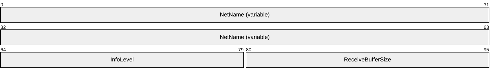

**NetName (variable):** A null-terminated ASCII string that contains the name of the share about which to retrieve information.

**InfoLevel (2 bytes):** A 16-bit unsigned integer that specifies the information level for the request. This MUST be set to 0, 1, or 2.

| Value | Meaning |
| --- | --- |
| 0 | Information level 0 |
| 1 | Information level 1 |
| 2 | Information level 2 |

**ReceiveBufferSize (2 bytes):** A 16-bit unsigned integer that represents the maximum number of bytes of data that can be returned in the Data field of the SMB_COM_TRANSACTION response to the command.

<a id="Section_2.5.6.2.2"></a>
##### 2.5.6.2.2 NetShareGetInfoResponse

The **RAPOutParams** structure for the [NetShareGetInfo Command](#Section_2.5.6.2) has the following fields.<17>

```mermaid
packet-beta
  0-15: "TotalBytesAvailable"
```

**TotalBytesAvailable (2 bytes):** A 16-bit unsigned integer that represents the number of bytes required to hold the server information requested.

If the **InfoLevel** specified in the NetShareGetInfo is 0, and the response is not an error, the RAPOutData field of the SMB_COM_TRANSACTION response MUST be filled with a [NetShareInfo0](#Section_2.5.6.3.1) structure.

If the **InfoLevel** specified in the NetShareGetInfo is 1, and the response is not an error, the RAPOutData field of the SMB_COM_TRANSACTION response MUST be filled with a [NetShareInfo1](#Section_2.5.6.3.2) structure.

If the **InfoLevel** specified in the NetShareGetInfo is 2, and the response is not an error, the RAPOutData field of the SMB_COM_TRANSACTION response MUST be filled with a [NetShareInfo2](#Section_2.5.6.3.3) structure.

<a id="Section_2.5.6.3"></a>
#### 2.5.6.3 RAP Share Response Structures

<a id="Section_2.5.6.3.1"></a>
##### 2.5.6.3.1 NetShareInfo0 Data Structure

The NetShareInfo0 data structure has the following fields.

```mermaid
packet-beta
  0-103: "NetworkName (13 bytes)"
```

**NetworkName (13 bytes):** A 13-character null-terminated ASCII string that specifies the name of the share. If the name is shorter than 13 bytes, the NetworkName field MUST be filled with null characters up to 13 bytes in length. If the name of the share is longer than 13 bytes, it MUST NOT be included in the enumeration.

<a id="Section_2.5.6.3.2"></a>
##### 2.5.6.3.2 NetShareInfo1 Data Structure

The NetShareInfo1 data structure has the following fields.

```mermaid
packet-beta
  0-103: "NetworkName (13 bytes)"
  104-111: "Pad"
  112-127: "Type"
  128-143: "RemarkOffsetLow"
  144-159: "RemarkOffsetHigh"
```

**NetworkName (13 bytes):** A 13-character, null-terminated ASCII string that specifies the name of the [**share**](#gt_share). If the name is shorter than 13 bytes, the **NetworkName** field MUST be filled with null characters up to 13 bytes in length. If the name of the share is longer than 13 bytes, it MUST NOT be included in the enumeration.

**Pad (1 byte):** Can be set to any arbitrary value when sent, and MUST be ignored on receipt.

**Type (2 bytes):** A 16-bit unsigned integer that specifies the type of the share. The **Type** field has the following possible values.

| Value | Meaning |
| --- | --- |
| 0x0000 | Disk directory tree |
| 0x0001 | Printer queue |
| 0x0002 | Communications device |
| 0x0003 | Interprocess communication (IPC) |

**RemarkOffsetLow (2 bytes):** A 16-bit unsigned integer that represents the offset, in bytes, from the start of the response to a null-terminated ASCII string allocated in the response block (see section [2.5.11](#Section_2.5.11)). The string is an optional comment about the share.

Before using this value, the Remote Administration Protocol client MUST subtract the **Converter** field, as specified in section [2.5.2](#Section_2.5.11) from the **RemarkOffsetLow** value, and then use that result as the offset within the response.

**RemarkOffsetHigh (2 bytes):** Unused. Can be set to any arbitrary value when sent, and MUST be ignored on receipt.

<a id="Section_2.5.6.3.3"></a>
##### 2.5.6.3.3 NetShareInfo2 Data Structure

The NetShareInfo2 data structure has the following fields.

```mermaid
packet-beta
  0-103: "NetworkName (13 bytes)"
  104-111: "Pad"
  112-127: "Type"
  128-143: "RemarkOffsetLow"
  144-159: "RemarkOffsetHigh"
  160-175: "Permissions"
  176-191: "MaxUses"
  192-207: "CurrentUses"
  208-223: "PathOffsetLow"
  224-239: "PathOffsetHigh"
  240-311: "Password"
  312-319: "Pad2"
```

**NetworkName (13 bytes):** A 13-character null-terminated ASCII string that specifies the name of the share. If the name is shorter than 13 bytes, the NetworkName field MUST be filled with null characters up to 13 bytes in length. If the name of the share is longer than 13 bytes, it MUST NOT be included in the enumeration.

**Pad (1 byte):** SHOULD be set to zero when sent, and MUST be ignored on receipt.

**Type (2 bytes):** A 16-bit unsigned integer that specifies the type of the share. The possible values for Type are as follows.

| Value | Meaning |
| --- | --- |
| STYPE_DISKTREE 0x0000 | Disk directory tree |
| STYPE_PRINTQ 0x0001 | Printer queue |
| STYPE_DEVICE 0x0002 | Communications device |
| STYPE_IPC 0x0003 | Interprocess communication (IPC) |

**RemarkOffsetLow (2 bytes):** A 16-bit unsigned integer that represents the offset, in bytes, from the start of the response to a null-terminated ASCII string allocated in the response block (see section [2.5.11](#Section_2.5.11)). The string is an optional comment about the share. Before using this value, the RAP client MUST subtract the Converter field specified in section [2.5.2](#Section_2.5.11) from the RemarkOffsetLow value, and then use that result as the offset within the response.

**RemarkOffsetHigh (2 bytes):** Unused. Can be set to any arbitrary value when sent, and MUST be ignored on receipt.

**Permissions (2 bytes):** Obsolete value representing the access allowed in share-level security scenarios. SHOULD be set to zero when sent, and MUST be ignored on receipt.

**MaxUses (2 bytes):** The maximum number of users that are allowed to concurrently access this share.

**CurrentUses (2 bytes):** The current number of users accessing this share.

**PathOffsetLow (2 bytes):** A 16-bit unsigned integer that represents the offset, in bytes, from the start of the response to a null-terminated ASCII string allocated in the response block (see section 2.5.11) that specifies the local path of the share on the server. Before using this value, the RAP client MUST subtract the Converter field specified in section 2.5.2 from the PathOffsetLow value, and then use that result as the offset within the response.

**PathOffsetHigh (2 bytes):** Unused. Can be set to any arbitrary value when sent, and MUST be ignored on receipt.

**Password (9 bytes):** A null-terminated ASCII string containing the password for password-protected shares. This value is only used for legacy share-level security, and SHOULD be set to an empty string.

**Pad2 (1 byte):** SHOULD be set to zero when sent, and MUST be ignored on receipt.

<a id="Section_2.5.7"></a>
### 2.5.7 RAP Print Commands

<a id="Section_2.5.7.1"></a>
#### 2.5.7.1 NetPrintQEnum Command

The [NetPrintQEnum](#Section_3.1.4.4) command enables the server to return information that is an enumeration of the [**print queues**](#gt_print-queue) on the server.

<a id="Section_2.5.7.1.1"></a>
##### 2.5.7.1.1 RAP NetPrintQEnumRequest

The fields in the NetPrintQEnumRequest message MUST be set as follows.<18>

```mermaid
packet-beta
  0-31: "RAPOpcode"
  32-79: "ParamDesc"
  80-159: "DataDesc (14 bytes)"
  160-191: "RAPParams"
  192-303: "AuxDesc (18 bytes)"
```

**RAPOpcode (4 bytes):** MUST be set to 0x0045. For more information see section [2.5.1](#Section_2.5.1).

**ParamDesc (6 bytes):** MUST be set to "WrLeh". For more information see section 2.5.1.

**DataDesc (14 bytes):** The value of **DataDesc** MUST be set according to the value of **InfoLevel**.<19>

| DataDesc Value | InfoLevel Value |
| --- | --- |
| "B13" | 0x0000 |
| "B13BWWWzzzzzWW" | 0x0001 |
| "B13BWWWzzzzzWN" | 0x0002 |
| "zWWWWzzzzWWzzl" | 0x0003 |
| "zWWWWzzzzWNzzl" | 0x0004 |
| "z" | 0x0005 |

For more information, see section 2.5.1.

**RAPParams (4 bytes):** The **RAPParams** structure MUST be as follows.

```mermaid
packet-beta
  0-15: "InfoLevel"
  16-31: "ReceiveBufferSize"
```

**InfoLevel (2 bytes):** A 16-bit unsigned integer that specifies the information level for NetPrintQEnumRequest.

**ReceiveBufferSize (2 bytes):** A 16-bit unsigned integer that represents the maximum number of bytes of data that can be returned in the **Data** field of the SMB_COM_TRANSACTION response to the command.

**AuxDesc (18 bytes):** MUST be set to "WB21BB16B10zWWzDDz".

<a id="Section_2.5.7.1.2"></a>
##### 2.5.7.1.2 RAP NetPrintQEnumResponse

The RAPOutParams structure for the NetPrintQEnumResponse is as follows.<20>

```mermaid
packet-beta
  0-15: "EntriesReturned"
  16-31: "EntriesAvailable"
```

**EntriesReturned (2 bytes):** A 16-bit unsigned integer that represents the number of fixed-size **PrintQueue** data structures (such as [PrintQueue1](#Section_2.5.7.8.2) or [PrintQueue5](#Section_2.5.7.8.4)) returned in the **Data** field of the SMB_COM_TRANSACTION response to [NetPrintQEnumRequest](#Section_2.5.7.1.1).

**EntriesAvailable (2 bytes):** A 16-bit unsigned integer that represents the number of [**print queues**](#gt_print-queue) that are available on the server.

For error conditions and error responses, see section [3.2.5.4](#Section_3.1.4.4).

If the **InfoLevel** specified in the NetPrintQEnumRequest is 0, and the response is not an error, the **RAPOutData** field of the SMB_COM_TRANSACTION response MUST be filled with an array of [PrintQueue0](#Section_2.5.7.8.1) structures of length **EntriesReturned**. For rules on how to initialize the data structures, see section 3.2.5.4.

If the **InfoLevel** specified in NetPrintQEnumRequest is 1, and the response is not an error, the **RAPOutData** field of the SMB_COM_TRANSACTION response SHOULD be filled with an array of **EntriesReturned** PrintQueue1 data structures. For rules on how to initialize the data structures, see section 3.2.5.4.<21>

If the **InfoLevel** specified in NetPrintQEnumRequest is 2, and the response is not an error, the NetPrintQEnumRequest field of the SMB_COM_TRANSACTION response MUST be filled with an array of **EntriesReturned** PrintQueue1 data structures. Following each PrintQueue1 structure, the **RAPOutData** field MUST contain as many [PrintJobInfo1](#Section_2.5.7.8.6) structures as are represented in the **PrintJobCount** field in the PrintQueue1 structure. For rules on how to initialize the data structures, see section 3.2.5.4.<22>

If the **InfoLevel** specified in NetPrintQEnumRequest is 3, and the response is not an error, the **RAPOutData** field of the SMB_COM_TRANSACTION response MUST be filled with an array of **EntriesReturned** [PrintQueue3](#Section_2.5.7.8.3) data structures.

If the **InfoLevel** specified in NetPrintQEnumRequest is 4, and the response is not an error, the **RAPOutData** field of the SMB_COM_TRANSACTION response MUST be filled with an array of **EntriesReturned** PrintQueue3 data structures. Following each PrintQueue3 structure, the **RAPOutData** field MUST contain as many [PrintJobInfo2](#Section_2.5.7.8.7) structures as are represented in the **PrintJobCount** field in the PrintQueue3 structure. For rules on how to initialize the data structures, see section 3.2.5.4.

If the **InfoLevel** specified in the NetPrintQEnumRequest is 5, and the response is not an error, the **RAPOutData** field of the SMB_COM_TRANSACTION response MUST be filled with an array of **EntriesReturned** PrintQueue5 data structures. For rules on how to initialize the data structures, see section 3.2.5.4.

<a id="Section_2.5.7.2"></a>
#### 2.5.7.2 NetPrintQGetInfo Command

The [NetPrintQGetInfo](#Section_3.2.5.5) command specifies that the server is to return information on the named [**print queue**](#gt_print-queue) on the server.

<a id="Section_2.5.7.2.1"></a>
##### 2.5.7.2.1 RAP NetPrintQGetInfoRequest

The fields in the NetPrintQGetInfoRequest message MUST be set as follows.<23>

```mermaid
packet-beta
  0-15: "RAPOpcode"
  16-63: "ParamDesc"
  64-127: "DataDesc (variable)"
  128-191: "RAPParams (variable)"
```

**RAPOpcode (2 bytes):** MUST be set to 0x0046. For more information see section [2.5.1](#Section_2.5.1).

**ParamDesc (6 bytes):** MUST be set to "zWrLh". For more information see section 2.5.1.

**DataDesc (variable):** The value of **DataDesc** MUST be set according to the value of **InfoLevel**.<24>

| DataDesc Value | InfoLevel Value |
| --- | --- |
| "B13" | 0x0000 |
| "B13BWWWzzzzzWW" | 0x0001 |
| "B13BWWWzzzzzWN" | 0x0002 |
| "zWWWWzzzzWWzzl" | 0x0003 |
| "zWWWWzzzzWNzzl" | 0x0004 |
| "z" | 0x0005 |

For more information see section 2.5.1.

**RAPParams (variable):** The **RAPParams** structure MUST be as follows.

```mermaid
packet-beta
  0-63: "PrintQueueName (variable)"
  64-79: "InfoLevel"
  80-95: "ReceiveBufferSize"
  96-159: "AuxDesc (variable)"
```

**PrintQueueName (variable):** A null-terminated ASCII string that specifies the name of the [**print queue**](#gt_print-queue) to retrieve.

**InfoLevel (2 bytes):** A 16-bit unsigned integer that specifies the information level for NetPrintQGetInfoRequest.

**ReceiveBufferSize (2 bytes):** A 16-bit unsigned integer that represents the maximum number of bytes of data that can be returned in the **Data** field of the SMB_COM_TRANSACTION response to the command.

**AuxDesc (variable):** If **InfoLevel** is set to 0x0002, this MUST be set to "WB21BB16B10zWWzDDz". If **InfoLevel** is set to 0x0000 or 0x0003, this field MUST NOT be present.

<a id="Section_2.5.7.2.2"></a>
##### 2.5.7.2.2 RAP NetPrintQGetInfoResponse

The RAPOutParams structure responds to the [NetPrintQGetInfo](#Section_3.2.5.5) command as follows.<25>

```mermaid
packet-beta
  0-15: "TotalBytesAvailable"
```

**TotalBytesAvailable (2 bytes):** A 16-bit unsigned integer that represents the number of bytes required to hold the information request for the named [**print queue**](#gt_print-queue).

If the **InfoLevel** specified in the [NetPrintQGetInfoRequest](#Section_2.5.7.2.1) is 0, and the response is not an error, the **RAPOutData** field of the SMB_COM_TRANSACTION response MUST be filled with a [PrintQueue0](#Section_2.5.7.8.1) structure. For rules on how to initialize the data structures, see section 3.2.5.5.

If the **InfoLevel** specified in NetPrintQGetInfoRequest is 1, and the response is not an error, the **RAPOutData** field of the SMB_COM_TRANSACTION response MUST be filled with a [PrintQueue1](#Section_2.5.7.8.2) structure. For rules on how to initialize the data structures, see section 3.2.5.5.

If the **InfoLevel** specified in NetPrintQGetInfoRequest is 2, and the response is not an error, the **RAPOutData** field of the SMB_COM_TRANSACTION response MUST be filled with a PrintQueue1 structure. Following the PrintQueue1 structure, the **RAPOutData** field MUST contain as many [PrintJobInfo1](#Section_2.5.7.8.6) structures as are represented in the **PrintJobCount** field in the PrintQueue1 structure. For rules on how to initialize the data structures, see section 3.2.5.5.<26>

If the **InfoLevel** specified in NetPrintQGetInfoRequest is 3, and the response is not an error, the **RAPOutData** field of the SMB_COM_TRANSACTION response MUST be filled with a [PrintQueue3](#Section_2.5.7.8.3) structure.

If the **InfoLevel** specified in NetPrintQGetInfoRequest is 4, and the response is not an error, the **RAPOutData** field of the SMB_COM_TRANSACTION response MUST be filled with a PrintQueue3 structure. Following the PrintQueue3 structure, the **RAPOutData** field MUST contain as many [PrintJobInfo2](#Section_2.5.7.8.7) structures as are represented in the **PrintJobCount** field in the PrintQueue3 structure. For rules on how to initialize the data structures, see section 3.2.5.5.

If the **InfoLevel** specified in the NetPrintQGetInfoRequest is 5, and the response is not an error, the **RAPOutData** field of the SMB_COM_TRANSACTION response MUST be filled with a [PrintQueue5](#Section_2.5.7.8.4) structure. For rules on how to initialize the data structures, see section 3.2.5.5.

<a id="Section_2.5.7.3"></a>
#### 2.5.7.3 NetPrintJobSetInfo Command

The [NetPrintJobSetInfo](#Section_3.2.5.6) command specifies that the server MUST modify information on the specified [**print job**](#gt_print-job).

<a id="Section_2.5.7.3.1"></a>
##### 2.5.7.3.1 RAP NetPrintJobSetInfoRequest

The fields in the NetPrintJobSetInfoRequest message MUST be set as follows.<27>

```mermaid
packet-beta
  0-15: "RAPOpcode"
  16-63: "ParamDesc"
  64-175: "DataDesc (18 bytes)"
  176-223: "RAPParams (variable)"
```

**RAPOpcode (2 bytes):** MUST be set to 0x0093. For more information see section [2.5.1](#Section_2.5.1).

**ParamDesc (6 bytes):** MUST be set to "WWsTP". For more information see section 2.5.1.

**DataDesc (18 bytes):** MUST be set to "WB21BB16B10zWWzDDz". For more information see section 2.5.1.

**RAPParams (variable):** The **RAPParams** structure MUST be as follows.

```mermaid
packet-beta
  0-15: "JobID"
  16-31: "InfoLevel"
  32-47: "BufferSize"
  48-63: "ParamNum"
```

**JobID (2 bytes):** A 16-bit unsigned integer that contains the [**job ID**](#gt_job-id) of the job to modify.

**InfoLevel (2 bytes):** A 16-bit unsigned integer that specifies the information level for the NetPrintJobSetInfoRequest. This MUST be set to 0x0001 or 0x0003.<28>

**BufferSize (2 bytes):** A 16-bit unsigned integer that represents the size of the **RAPInData** structure.

**ParamNum (2 bytes):** A 16-bit unsigned integer from the following table that specifies what aspect of the print job is being modified.

| Value | Meaning |
| --- | --- |
| JobNum 0x0001 | A 16-bit integer. |
| UserName 0x0002 | A null-terminated ASCII string. |
| NotifyName 0x0003 | A null-terminated ASCII string. |
| DataType 0x0004 | A null-terminated ASCII string. |
| ParametersString 0x0005 | A null-terminated ASCII string. |
| JobPosition 0x0006 | A 16-bit integer. |
| JobStatus 0x0007 | A 16-bit integer. |
| JobStatusStr 0x0008 | A null-terminated ASCII string. |
| TimeSubmitted 0x0009 | A 32-bit integer. |
| JobSize 0x000A | A 32-bit integer. |
| JobComment 0x000B | A null-terminated ASCII string. |

**RAPInData**

Note that the Data field of the SMB_COM_TRANSACTION request, **RAPInData**, is a variable-length field that MUST be present and set according to section 2.5.1.

This field MUST be based on the **ParamNum** value in the incoming application request.

For example, if the incoming application request sets the **ParamNum** value to 0x000B, the **RAPInData** field MUST be set to a null-terminated ASCII string that represents the new value for the **JobComment** field in the print job specified by the incoming job ID parameter.

<a id="Section_2.5.7.3.2"></a>
##### 2.5.7.3.2 RAP NetPrintJobSetInfoResponse

The **RAPOutParams** field and the **RAPOutData** field of the Remote Administration Protocol response to the [NetPrintJobSetInfo](#Section_3.2.5.6) command MUST be empty.<29>

<a id="Section_2.5.7.4"></a>
#### 2.5.7.4 NetPrintJobGetInfo Command

The [NetPrintJobGetInfo](#Section_2.5.7.4) command specifies that the server MUST return information on the specified [**print job**](#gt_print-job).

<a id="Section_2.5.7.4.1"></a>
##### 2.5.7.4.1 RAP NetPrintJobGetInfoRequest

The fields in the NetPrintJobGetInfoRequest message MUST be set as follows.<30>

```mermaid
packet-beta
  0-15: "RAPOpcode"
  16-63: "ParamDesc"
  64-183: "DataDesc (19 bytes)"
  184-231: "RAPParams"
```

**RAPOpcode (2 bytes):** MUST be set to 0x004D. For more information see section [2.5.1](#Section_2.5.1).

**ParamDesc (6 bytes):** MUST be set to "WWrLh". For more information see section 2.5.1.

**DataDesc (19 bytes):** MUST be set to "WWzWWDDzzzzzzzzzzlz". For more information see section 2.5.1.

**RAPParams (6 bytes):** The **RAPParams** structure MUST be as follows.

```mermaid
packet-beta
  0-15: "JobID"
  16-31: "InfoLevel"
  32-47: "ReceiveBufferSize"
```

**JobID (2 bytes):** A 16-bit unsigned integer that contains the [**job ID**](#gt_job-id) of the job whose information is to be returned.

**InfoLevel (2 bytes):** A 16-bit unsigned integer that specifies the information level for the NetPrintJobGetInfoRequest. This MUST be set to 0x0000, 0x0001, 0x0002, or 0x0003.

**ReceiveBufferSize (2 bytes):** A 16-bit unsigned integer that represents the maximum number of bytes of data that can be returned in the **Data** field of the SMB_COM_TRANSACTION response to the command.

<a id="Section_2.5.7.4.2"></a>
##### 2.5.7.4.2 RAP NetPrintJobGetInfoResponse

The **RAPOutParams** response to the [NetPrintJobGetInfo](#Section_2.5.7.4) command is as follows.<31>

```mermaid
packet-beta
  0-15: "TotalBytesAvailable"
```

**TotalBytesAvailable (2 bytes):** A 16-bit unsigned integer that represents the number of bytes required to hold the requested [**print job**](#gt_print-job) information.

If the **InfoLevel** of the [NetPrintJobGetInfoRequest](#Section_2.5.7.4.1) is 0x0000, the **RAPOutData** of the Remote Administration Protocol response MUST be set to the [PrintJobInfo0](#Section_2.5.7.8.5) structure for the specified [**job ID**](#gt_job-id).

If the **InfoLevel** of the NetPrintJobGetInfoRequest is 0x0001, the **RAPOutData** of the Remote Administration Protocol response MUST be set to the [PrintJobInfo1](#Section_2.5.7.8.6) structure for the specified job ID.

If the **InfoLevel** of the NetPrintJobGetInfoRequest is 0x0002, the **RAPOutData** of the Remote Administration Protocol response MUST be set to the [PrintJobInfo2](#Section_2.5.7.8.7) structure for the specified job ID.

If the **InfoLevel** of the NetPrintJobGetInfoRequest is 0x0003, the **RAPOutData** of the Remote Administration Protocol response MUST be set to the [PrintJobInfo3](#Section_2.5.7.8.8) structure for the specified job ID.

<a id="Section_2.5.7.5"></a>
#### 2.5.7.5 NetPrintJobPause Command

The [NetPrintJobPause](#Section_2.5.7.5) command specifies that the server MUST pause the specified [**print job**](#gt_print-job).

<a id="Section_2.5.7.5.1"></a>
##### 2.5.7.5.1 RAP NetPrintJobPauseRequest

The fields in the NetPrintJobPauseRequest message MUST be set as follows.<32>

```mermaid
packet-beta
  0-15: "RAPOpcode"
  16-31: "ParamDesc"
  32-39: "DataDesc"
  40-55: "RAPParams"
```

**RAPOpcode (2 bytes):** MUST be set to 0x0052. For more information see section [2.5.1](#Section_2.5.1).

**ParamDesc (2 bytes):** MUST be set to "W". For more information see section 2.5.1.

**DataDesc (1 byte):** MUST be set to null. For more information, see section 2.5.1.

**RAPParams (2 bytes):** The **RAPParams** structure MUST be as follows.

```mermaid
packet-beta
  0-15: "JobID"
```

**JobID (2 bytes):** A 16-bit unsigned integer that represents the [**job ID**](#gt_job-id) of the [**print job**](#gt_print-job) to be paused.

<a id="Section_2.5.7.5.2"></a>
##### 2.5.7.5.2 RAP NetPrintJobPauseResponse

The **RAPOutParams** field and the **RAPOutData** field of the SMB_COM_TRANSACTION response to the [NetPrintJobPause](#Section_2.5.7.5) command MUST be empty.<33>

<a id="Section_2.5.7.6"></a>
#### 2.5.7.6 NetPrintJobContinue Command

The [NetPrintJobContinue](#Section_2.5.7.6.1) command specifies that the server MUST continue the specified [**print job**](#gt_print-job).

<a id="Section_2.5.7.6.1"></a>
##### 2.5.7.6.1 RAP NetPrintJobContinueRequest

The fields in the NetPrintJobContinueRequest message MUST be set as follows.<34>

```mermaid
packet-beta
  0-15: "RAPOpcode"
  16-31: "ParamDesc"
  32-39: "DataDesc"
  40-55: "RAPParams"
```

**RAPOpcode (2 bytes):** MUST be set to 0x0053. For more information see section [2.5.1](#Section_2.5.1).

**ParamDesc (2 bytes):** MUST be set to "W". For more information see section 2.5.1.

**DataDesc (1 byte):** MUST be set to null. For more information, see section 2.5.1.

**RAPParams (2 bytes):** This structure MUST be set as follows:

```mermaid
packet-beta
  0-15: "JobID"
```

**JobID (2 bytes):** A 16-bit unsigned integer that represents the [**job ID**](#gt_job-id) of the [**print job**](#gt_print-job) to be continued.

<a id="Section_2.5.7.6.2"></a>
##### 2.5.7.6.2 RAP NetPrintJobContinueResponse

The **RAPOutParams** field and the **RAPOutData** field of the SMB_COM_TRANSACTION response to the [NetPrintJobContinue](#Section_2.5.7.6.1) command MUST be empty.<35>

<a id="Section_2.5.7.7"></a>
#### 2.5.7.7 NetPrintJobDelete Command

The [NetPrintJobDelete](#Section_2.5.7.7.1) command specifies that the server is to delete the specified [**print job**](#gt_print-job).

<a id="Section_2.5.7.7.1"></a>
##### 2.5.7.7.1 RAP NetPrintJobDeleteRequest

The fields in the NetPrintJobDeleteRequest message MUST be set as follows.<36>

```mermaid
packet-beta
  0-15: "RAPOpcode"
  16-31: "ParamDesc"
  32-39: "DataDesc"
  40-55: "RAPParams"
```

**RAPOpcode (2 bytes):** MUST be set to 0x0051. For more information see section [2.5.1](#Section_2.5.1).

**ParamDesc (2 bytes):** MUST be set to "W". For more information see section 2.5.1.

**DataDesc (1 byte):** MUST be set to null. For more information, see section 2.5.1.

**RAPParams (2 bytes):** This structure MUST be set as follows.

```mermaid
packet-beta
  0-15: "JobID"
```

**JobID (2 bytes):** A 16-bit unsigned integer that represents the [**job ID**](#gt_job-id) of the [**print job**](#gt_print-job) to be deleted.

<a id="Section_2.5.7.7.2"></a>
##### 2.5.7.7.2 RAP NetPrintJobDeleteResponse

The **RAPOutParams** field and the **RAPOutData** field of the SMB_COM_TRANSACTION response to the [NetPrintJobDelete](#Section_2.5.7.7.1) command MUST be empty.<37>

<a id="Section_2.5.7.8"></a>
#### 2.5.7.8 RAP Print Response Structures

The data field (section [2.5.2](#Section_2.5.11)) in the response to a NetPrintQGetInfo and NetPrintQEnum commands MUST consist of the following structure.

```mermaid
packet-beta
  0-103: "PrintQName (13 bytes)"
```

**PrintQName (13 bytes):** A 13-character null-terminated ASCII string that specifies the name of the PrintQueue. If the name is shorter than 13 bytes, the PrintQName field MUST be filled with null characters up to 13 bytes in length. If the name of the PrintQueue is longer than 13 bytes, it MUST NOT be included in the enumeration.

<a id="Section_2.5.7.8.1"></a>
##### 2.5.7.8.1 PrintQueue0 Data Structure

The data field (see section [2.5.2](#Section_2.5.11)) in the response to [NetPrintQGetInfo](#Section_3.2.5.5) and [NetPrintQEnum](#Section_3.1.4.4) commands MUST consist of the following structure.

```mermaid
packet-beta
  0-103: "PrintQName (13 bytes)"
```

**PrintQName (13 bytes):** A 13-character null-terminated ASCII string that specifies the name of the [**print queue**](#gt_print-queue). If the name is shorter than 13 bytes, the **PrintQName** field MUST be filled with null characters up to 13 bytes in length. If the name of the share is longer than 13 bytes, it SHOULD be truncated to a 13-character null-terminated ASCII string. <38>

<a id="Section_2.5.7.8.2"></a>
##### 2.5.7.8.2 PrintQueue1 Data Structure

The data field (see section [2.5.2](#Section_2.5.2)) in the response to NetPrintQGetInfo and NetPrintQEnum commands MUST consist of the following structure.

```mermaid
packet-beta
  0-103: "PrintQName (13 bytes)"
  104-111: "Pad1"
  112-127: "Priority"
  128-143: "StartTime"
  144-159: "UntilTime"
  160-175: "SeparatorPageFilenameLow"
  176-191: "SeparatorPageFilenameHigh"
  192-207: "PrintProcessorDllNameLow"
  208-223: "PrintProcessorDllNameHigh"
  224-239: "PrintDestinationsNameLow"
  240-255: "PrintDestinationsNameHigh"
  256-271: "PrintParameterStringLow"
  272-287: "PrintParameterStringHigh"
  288-303: "CommentStringLow"
  304-319: "CommentStringHigh"
  320-335: "PrintQStatus"
  336-351: "PrintJobCount"
```

**PrintQName (13 bytes):** This field MUST contain an ASCII null-terminated name of the [**print queue**](#gt_print-queue) that MUST be padded to 13 bytes with ASCII null characters (0x00).

**Pad1 (1 byte):** A pad byte. Can be set to any arbitrary value when sent and MUST be ignored on receipt.

**Priority (2 bytes):** A 16-bit unsigned integer that specifies the priority of the print queue. Valid values are 0x0001 (highest) to 0x0009 (lowest). When two printer queues print to the same printer, the print jobs from the queue with the higher priority print first.

**StartTime (2 bytes):** A 16-bit unsigned integer that represents the print queue start time (in minutes since midnight) in the universal time of the server. A print queue accepts jobs, but only prints the jobs after the StartTime has elapsed. The StartTime field MUST be less than 1,440 minutes.

**UntilTime (2 bytes):** A 16-bit unsigned integer that represents the print queue stop time. After this time, jobs are accepted but are not printed. This value is expressed (in minutes since midnight) in the universal time of the server. The UntilTime field MUST be less than 1,440 minutes.

**SeparatorPageFilenameLow (2 bytes):** A 16-bit unsigned integer that represents the offset, in bytes, from the start of the response to a null-terminated ASCII string that is allocated in the response block (as specified in section [2.5.11](#Section_2.5.11)) and that specifies the local file name that contains the [**printer separator page**](#gt_printer-separator-page). If no printer separator page is configured, this value MUST be an empty string.

Before using this value, a Remote Administration Protocol, the client MUST subtract the **Converter** field, as specified in section 2.5.2, from the **SeparatorPageFilenameLow** value and then use that result as the offset within the response.

This file name is for informational purposes only; clients MUST NOT take any action other than to display or log it.

**SeparatorPageFilenameHigh (2 bytes):** Unused. Can be set to any arbitrary value when sent and MUST be ignored on receipt.

**PrintProcessorDllNameLow (2 bytes):** A 16-bit unsigned integer that represents the offset, in bytes, from the start of the response to a null-terminated ASCII string that is allocated in the response block (as specified in section 2.5.11) and that specifies the file name of the DLL that contains the print processor for this print queue.

Before using this value, the Remote Administration Protocol client MUST subtract the **Converter** field, as specified in section 2.5.2, from the **PrintProcessorDllNameLow** value and then use that result as the offset within the response. This file name is for informational purposes only; a client MUST NOT take any action other than to display or log it.

**PrintProcessorDllNameHigh (2 bytes):** Unused. Can be set to any arbitrary value when sent and MUST be ignored on receipt.

**PrintDestinationsNameLow (2 bytes):** A 16-bit unsigned integer that represents the offset, in bytes, from the start of the response to a null-terminated ASCII string that is allocated in the response block (as specified in section 2.5.11) and that lists the [**print destinations**](#gt_print-destinations) for this print queue. Each print destination is separated by an ASCII space character (0x20).

The Remote Administration Protocol client MUST subtract the **Converter** field, as specified in section 2.5.2, from the **PrintDestinationsNameLow** value and then use that result as the offset within the response.

This field is for informational purposes only; a client MUST NOT take any action other than to display or log it.

**PrintDestinationsNameHigh (2 bytes):** Unused. Can be set to any arbitrary value when sent and MUST be ignored on receipt.

**PrintParameterStringLow (2 bytes):** A 16-bit unsigned integer that represents the offset, in bytes, from the start of the response to a null-terminated ASCII string that is allocated in the response block (as specified in section 2.5.11) and that specifies parameters for this print queue.

Before using this value, the Remote Administration Protocol client MUST subtract the **Converter** field, as specified in section 2.5.2, from the **PrintParameterStringLow** value and then use that result as the offset within the response.

This field is for informational purposes only; a client MUST NOT take any action other than to display or log it.

**PrintParameterStringHigh (2 bytes):** Unused. Can be set to any arbitrary value when sent and MUST be ignored on receipt.

**CommentStringLow (2 bytes):** A 16-bit unsigned integer that represents the offset, in bytes, from the start of the response to a null-terminated ASCII string that is allocated in the response block (as specified in section 2.5.11) and that describes this print queue.

Before using this value, the Remote Administration Protocol client MUST subtract the **Converter** field, as specified in section 2.5.2, from the **CommentStringLow** value and then use that result as the offset within the response.

**CommentStringHigh (2 bytes):** Unused. Can be set to any arbitrary value when sent and MUST be ignored on receipt.

**PrintQStatus (2 bytes):** An enumeration that specifies the status of the print queue. The following values MUST be used for the **PrintQStatus** field.

| Value | Meaning |
| --- | --- |
| PRQ_ACTIVE 0x0000 | The queue is accepting [**print jobs**](#gt_print-job). |
| PRQ_PAUSE 0x0001 | The queue is paused. |
| PRQ_ERROR 0x0002 | The queue is in an error state. |
| PRQ_PENDING 0x0003 | The queue is marked for deletion. |

**PrintJobCount (2 bytes):** A 16-bit unsigned integer that represents the number of [PrintJobInfo1](#Section_2.5.7.8.6) structures that follow the PrintQueue1 structure.

<a id="Section_2.5.7.8.3"></a>
##### 2.5.7.8.3 PrintQueue3 Data Structure

The data field in the response to a [NetPrintQGetInfo](#Section_3.2.5.5) command MUST consist of the following structure.

```mermaid
packet-beta
  0-15: "PrintQueueNameLow"
  16-31: "PrintQueueNameHigh"
  32-47: "Priority"
  48-63: "StartTime"
  64-79: "UntilTime"
  80-95: "Pad"
  96-111: "SeparatorPageFilenameLow"
  112-127: "SeparatorPageFilenameHigh"
  128-143: "PrintProcessorDllNameLow"
  144-159: "PrintProcessorDllNameHigh"
  160-175: "PrintParameterStringLow"
  176-191: "PrintParameterStringHigh"
  192-207: "CommentStringLow"
  208-223: "CommentStringHigh"
  224-239: "PrintQStatus"
  240-255: "PrintJobCount"
  256-271: "PrintersLow"
  272-287: "PrintersHigh"
  288-303: "DriverNameLow"
  304-319: "DriverNameHigh"
  320-335: "PrintDriverDataLow"
  336-351: "PrintDriverDataHigh"
```

**PrintQueueNameLow (2 bytes):** A 16-bit unsigned integer that represents the offset, in bytes, from the start of the response to a null-terminated ASCII string that is allocated in the response block (as specified in section [2.5.11](#Section_2.5.11)) and that contains the name of the [**print queue**](#gt_print-queue).

The Remote Administration Protocol client MUST subtract the **Converter** field, as specified in section [2.5.2](#Section_2.5.11), from the **PrintQueueNameLow** value and then use that result as the offset within the response.

This field is for informational purposes only; a client MUST NOT take any action other than to display or log it.

**PrintQueueNameHigh (2 bytes):** Unused. Can be set to any arbitrary value when sent and MUST be ignored on receipt.

**Priority (2 bytes):** A 16-bit unsigned integer that specifies the priority of the print queue. Valid values are 0x0001 (highest) to 0x0009 (lowest). When two printer queues print to the same printer, the [**print jobs**](#gt_print-job) from the queue with the higher priority print first.

**StartTime (2 bytes):** A 16-bit unsigned integer that represents the print queue start time (in minutes since midnight) in the universal time of the server. A print queue accepts jobs but only prints the jobs after the **StartTime** value has elapsed. The **StartTime** field MUST be less than 1,440 minutes.

**UntilTime (2 bytes):** A 16-bit unsigned integer that represents the print queue stop time. After this time, jobs are accepted but are not printed. This value is expressed (in minutes since midnight) in the universal time of the server. The **UntilTime** field MUST be less than 1,440 minutes.

**Pad (2 bytes):** Pad bytes. Can be set to any arbitrary value when sent and MUST be ignored on receipt.

**SeparatorPageFilenameLow (2 bytes):** A 16-bit unsigned integer that represents the offset, in bytes, from the start of the response to a null-terminated ASCII string that is allocated in the response block (as specified in section 2.5.11) and that contains the file name that contains the [**printer separator page**](#gt_printer-separator-page) for the [**share**](#gt_share).

Before using this value, the Remote Administration Protocol client MUST subtract the **Converter** field, as specified in section 2.5.2, from the **SeparatorPageFilenameLow** value and then use that result as the offset within the response. This field is for informational purposes only; a client MUST NOT take any action other than to display or log it.

**SeparatorPageFilenameHigh (2 bytes):** Unused. Can be set to any arbitrary value when sent and MUST be ignored on receipt.

**PrintProcessorDllNameLow (2 bytes):** A 16-bit unsigned integer that represents the offset, in bytes, from the start of the response to a null-terminated ASCII string that is allocated in the response block (as specified in section 2.5.11) and that contains the file name of the DLL that contains the print processor for this print queue.

Before using this value, the Remote Administration Protocol client MUST subtract the **Converter** field, as specified in section 2.5.2, from the **PrintProcessorDllNameLow** value and then use that result as the offset within the response.

This field is for informational purposes only; a client MUST NOT take any action other than to display or log it.

**PrintProcessorDllNameHigh (2 bytes):** Unused. Can be set to any arbitrary value when sent and MUST be ignored on receipt.

**PrintParameterStringLow (2 bytes):** A 16-bit unsigned integer that represents the offset, in bytes, from the start of the response to a null-terminated ASCII string that is allocated in the response block (as specified in section 2.5.11) and that specifies parameters for this print queue.

Before using this value, the Remote Administration Protocol client MUST subtract the **Converter** field, as specified in section 2.5.2, from the **PrintParameterStringLow** value and then use that result as the offset within the response.

This field is for informational purposes only; a client MUST NOT take any action other than to display or log it.

**PrintParameterStringHigh (2 bytes):** Unused. Can be set to any arbitrary value when sent and MUST be ignored on receipt.

**CommentStringLow (2 bytes):** A 16-bit unsigned integer that represents the offset, in bytes, from the start of the response to a null-terminated ASCII string that is allocated in the response block (as specified in section 2.5.11) and that describes this print queue.

Before using this value, the Remote Administration Protocol client MUST subtract the **Converter** field, as specified in section 2.5.2, from the **CommentStringLow** value.

**CommentStringHigh (2 bytes):** Unused. Can be set to any arbitrary value when sent and MUST be ignored on receipt.

**PrintQStatus (2 bytes):** An enumeration that specifies the status of the print queue. Valid values are the as follows.

| Value | Meaning |
| --- | --- |
| PRQ_ACTIVE 0x0000 | The queue is accepting print jobs. |
| PRQ_PAUSE 0x0001 | The queue is paused. |
| PRQ_ERROR 0x0002 | The queue is in an error state. |
| PRQ_PENDING 0x0003 | The queue is marked for deletion. |

**PrintJobCount (2 bytes):** A 16-bit unsigned integer that represents the number of [PrintJobInfo2](#Section_2.5.7.8.7) structures that follow the PrintQueue3 structure.

**PrintersLow (2 bytes):** A 16-bit unsigned integer that represents the offset, in bytes, from the start of the response to a null-terminated ASCII string. The string is allocated in the response block (as specified in section 2.5.11) and specifies the port name to which the printer is connected. Before using this value, the Remote Administration Protocol client MUST subtract the **Converter** field, as specified in section 2.5.2, from the **PrintersLow** value and then use that result as the offset within the response. This field is for informational purposes only; a client MUST NOT take any action other than to display or log it.

**PrintersHigh (2 bytes):** Unused. Can be set to any arbitrary value when sent and MUST be ignored on receipt.

**DriverNameLow (2 bytes):** A 16-bit unsigned integer that represents the offset, in bytes, from the start of the response to a null-terminated ASCII string that is allocated in the response block (as specified in section 2.5.11) that specifies the default device driver for this queue.<39>

Before using this value, the Remote Administration Protocol client MUST subtract the **Converter** field, as specified in section 2.5.2, from the **DriverNameLow** value and then use that result as the offset within the response.

This field is for informational purposes only; a client MUST NOT take any action other than to display or log it. If the **DriverNameLow** field and the **DriverNameHigh** field are both 0x0000, the **DriverName** field is not present.

**DriverNameHigh (2 bytes):** Unused. MUST be set to 0x0000 when sent and MUST be ignored on receipt. The **DriverNameHigh** portion is not used because the total offset cannot be more than the maximum value of **DriverNameLow** due to packet length limitations.

**PrintDriverDataLow (2 bytes):** A 16-bit unsigned integer that represents the offset, in bytes, from the start of the response to a null-terminated ASCII string that is allocated in the response block (as specified in section 2.5.11) and that contains driver-specific binary data.

Before using this value, the Remote Administration Protocol client MUST subtract the **Converter** field, as specified in section 2.5.2, from the **PrintDriverDataLow** value and then use that result as the offset within the response. The first 2 bytes of this buffer contain a 16-bit integer that represents the length of the buffer.

This field is for informational purposes only; a client MUST NOT take any action other than display or log it. If the **PrintDriverDataLow** field and the **PrintDriverDataHigh** field are both 0x0000, the **PrintDriverData** field is not present.

**PrintDriverDataHigh (2 bytes):** Unused. MUST be set to 0x0000 when sent and MUST be ignored on receipt. The **PrintDriverDataHigh** portion is not used because the total offset cannot be more than the maximum value of **PrintDriverDataLow** due to packet length limitations.

This field is present if, and only if, the **PrinterDriverDataLow** field is also present.

For more information on the PrintQueue3 structure, see [[CIFSPRINT]](https://go.microsoft.com/fwlink/?LinkId=89837) section 6.1.1 and [RYAN] page 409.

<a id="Section_2.5.7.8.4"></a>
##### 2.5.7.8.4 PrintQueue5 Data Structure

The data field (see section [2.5.2](#Section_2.5.11)) in the response to a [NetPrintQGetInfo Command](#Section_3.2.5.5) and [NetPrintQEnum Command](#Section_3.1.4.4) commands MUST consist of the following structure.

```mermaid
packet-beta
  0-15: "PrintQueueNameLow"
  16-31: "PrintQueueNameHigh"
```

**PrintQueueNameLow (2 bytes):** A 16-bit unsigned integer that represents the offset, in bytes, from the start of the response to a null-terminated ASCII string that is allocated in the response block (as specified in section [2.5.11](#Section_2.5.11)) and that contains the name of the [**print queue**](#gt_print-queue).

The Remote Administration Protocol client MUST subtract the **Converter** field, as specified in section 2.5.2, from the **PrintQueueNameLow** value, and then use that result as the offset within the response.

This field is for informational purposes only; a client MUST NOT take any action other than to display or log it

**PrintQueueNameHigh (2 bytes):** Unused. Can be set to any arbitrary value when sent and MUST be ignored on receipt.

<a id="Section_2.5.7.8.5"></a>
##### 2.5.7.8.5 PrintJobInfo0 Data Structure

The PrintJobInfo0 structure is returned by the [NetPrintJobGetInfo](#Section_2.5.7.4) command.

```mermaid
packet-beta
  0-15: "JobID"
```

**JobID (2 bytes):** A 16-bit unsigned integer that represents the [**job ID**](#gt_job-id) of the [**print job**](#gt_print-job).

<a id="Section_2.5.7.8.6"></a>
##### 2.5.7.8.6 PrintJobInfo1 Data Structure

The PrintJobInfo1 packet is used by the [NetPrintJobGetInfo Command](#Section_3.1.4.7).

```mermaid
packet-beta
  0-15: "JobID"
  16-119: "UserName (21 bytes)"
  120-127: "Pad"
  128-223: "NotifyName (16 bytes)"
  224-303: "DataType"
  304-319: "PrintParameterStringLow"
  320-335: "PrintParameterStringHigh"
  336-351: "JobPosition"
  352-367: "JobStatus"
  368-383: "JobStatusStringLow"
  384-399: "JobStatusStringHigh"
  400-431: "TimeSubmitted"
  432-463: "JobSize"
  464-479: "JobCommentStringLow"
  480-495: "JobCommentStringHigh"
```

**JobID (2 bytes):** A 16-bit unsigned integer that represents the job ID of the print job.

**UserName (21 bytes):** Null-terminated ASCII text that contains the name of the user that submitted the job. This field MUST be padded with null characters to 21 bytes in length.

**Pad (1 byte):** A byte. Can be set to any arbitrary value when sent and MUST be ignored on receipt.

**NotifyName (16 bytes):** A null-terminated ASCII string that contains the UserName that must be notified when this print job completes. This field MUST be padded with null characters to 16 bytes in length.

**DataType (10 bytes):** A null-terminated ASCII string that contains the name of a data type. It MUST uniquely identify a format for print data that is supported by a print processor. This field MUST be padded with null characters to 10 bytes in length.

**PrintParameterStringLow (2 bytes):** A 16-bit unsigned integer that represents the offset, in bytes, from the start of the response to a null-terminated ASCII string that is allocated in the response block (as specified in section [2.5.11](#Section_2.5.11)) and that specifies the parameters for this print job. Before using this value, the Remote Administration Protocol client MUST subtract the **Converter** field, as specified in section [2.5.2](#Section_2.5.11), from the **PrintParametersStringLow** value and then use that result as the offset within the response.

**PrintParameterStringHigh (2 bytes):** Unused. Can be set to any arbitrary value when sent and MUST be ignored on receipt.

**JobPosition (2 bytes):** A 16-bit unsigned integer that specifies the position of this job in the queue. A value of 0x0001 indicates that this job is the next job to print.

**JobStatus (2 bytes):** A 16-bit unsigned integer that specifies the status of this job in the [**print queue**](#gt_print-queue). **JobStatus** MUST be one of the values in the following table.

| Value | Meaning |
| --- | --- |
| PRJ_QS_QUEUED 0x0000 | Job is in the queue. |
| PRJ_QS_PAUSED 0x0001 | Job is in the queue but paused. |
| PRJ_QS_SPOOLING 0x0002 | Job is being written to the spooler queue. |
| PRJ_QS_PRINTING 0x0003 | Job is being printed. |
| PRJ_QS_ERROR 0x0010 | Job is in the error state. It MUST be used with one of the following status bits: PRJ_QS_QUEUED, PRJ_QS_PAUSED, PRJ_QS_SPOOLING, or PRJ_QS_PRINTING. |

**JobStatusStringLow (2 bytes):** A 16-bit unsigned integer that represents the offset, in bytes, from the start of the response to a null-terminated ASCII string that is allocated in the response block (as specified in section 2.5.11) and that describes the status of this print job. Before using this value, the Remote Administration Protocol client MUST subtract the **Converter** field, as specified in section 2.5.2, from the **JobStatusStringLow** value and then use that result as the offset within the response.

**JobStatusStringHigh (2 bytes):** Unused. Can be set to any arbitrary value when sent and MUST be ignored on receipt.

**TimeSubmitted (4 bytes):** A 32-bit unsigned integer that specifies the time that the print job was submitted (in seconds since midnight January 1, 1970) in the local time zone of the server.

**JobSize (4 bytes):** A 32-bit unsigned integer that specifies the size of the print job, in bytes.

**JobCommentStringLow (2 bytes):** A 16-bit unsigned integer that represents the offset, in bytes, from the start of the response to a null-terminated ASCII string that is allocated in the response block (as specified in section 2.5.11) and that describes this print job. Before using this value, the Remote Administration Protocol client MUST subtract the **Converter** field, as specified in section 2.5.2, from the **JobCommentStringLow** value and then use that result as the offset within the response.

**JobCommentStringHigh (2 bytes):** Unused. Can be set to any arbitrary value when sent and MUST be ignored on receipt.

<a id="Section_2.5.7.8.7"></a>
##### 2.5.7.8.7 PrintJobInfo2 Data Structure

The PrintJobInfo2 packet is used by the [NetPrintJobGetInfo Command](#Section_3.1.4.7).

```mermaid
packet-beta
  0-15: "JobID"
  16-31: "Priority"
  32-47: "UserNameLow"
  48-63: "UserNameHigh"
  64-79: "JobPosition"
  80-95: "JobStatus"
  96-127: "TimeSubmitted"
  128-159: "JobSize"
  160-175: "CommentStringLow"
  176-191: "CommentStringHigh"
  192-207: "DocumentNameLow"
  208-223: "DocumentNameHigh"
```

**JobID (2 bytes):** A 16-bit unsigned integer that represents the job ID of the print job.

**Priority (2 bytes):** A 16-bit unsigned integer that represents the priority of the print job. If the value is 0x0000, the priority of the [**print queue**](#gt_print-queue) determines the job priority. Other valid values are between 0x0001 and 0x0063, inclusive. When two printer queues print to the same printer, the print jobs from the queue with the higher priority print first.

**UserNameLow (2 bytes):** A 16-bit unsigned integer that represents the offset, in bytes, from the start of the response to a null-terminated ASCII string that is allocated in the response block (as specified in section [2.5.11](#Section_2.5.11)) and that specifies the user name that submitted this print job.

Before using this value, the Remote Administration Protocol client MUST subtract the **Converter** field, as specified in section [2.5.2](#Section_2.5.11), from the **UserNameLow** value and then use that result as the offset within the response.

**UserNameHigh (2 bytes):** Unused. Can be set to any arbitrary value when sent, and MUST be ignored on receipt.

**JobPosition (2 bytes):** A 16-bit unsigned integer that specifies the position of this job in the queue. A value of 0x0001 indicates that this job is the next job to print.

**JobStatus (2 bytes):** An enumeration that specifies the status of this job in the print queue. Its value MUST be as specified in section [2.5.7.8.6](#Section_2.5.7.8.6).

**TimeSubmitted (4 bytes):** A 32-bit unsigned integer that specifies the time that the print job was submitted (in seconds since midnight January 1, 1970) in the local time zone of the server.

**JobSize (4 bytes):** A 32-bit unsigned integer that specifies the size, in bytes, of the print job.

**CommentStringLow (2 bytes):** A 16-bit unsigned integer that represents the offset, in bytes, from the start of the response to a null-terminated ASCII string that is allocated in the response block (as specified in section 2.5.11) and that specifies a string that describes the print job.

Before using this value, the Remote Administration Protocol client MUST subtract the **Converter** field, as specified in section 2.5.2, from the **CommentStringLow** value and then use that result as the offset within the response.

**CommentStringHigh (2 bytes):** Unused. Can be set to any arbitrary value when sent, and MUST be ignored on receipt.

**DocumentNameLow (2 bytes):** A 16-bit unsigned integer that represents the offset, in bytes, from the start of the response to a null-terminated ASCII string that is allocated in the response block (as specified in section 2.5.11) and that specifies the name of the document.

Before using this value, the Remote Administration Protocol client MUST subtract the **Converter** field, as specified in section 2.5.2, from the **DocumentNameLow** value and then use that result as the offset within the response.

**DocumentNameHigh (2 bytes):** Unused. Can be set to any arbitrary value when sent, and MUST be ignored on receipt.

<a id="Section_2.5.7.8.8"></a>
##### 2.5.7.8.8 PrintJobInfo3 Data Structure

The PrintJobInfo3 structure is returned by the [NetPrintJobGetInfo](#Section_2.5.7.4) command and has the following fields.

```mermaid
packet-beta
  0-15: "JobID"
  16-31: "Priority"
  32-47: "UserNameLow"
  48-63: "UserNameHigh"
  64-79: "JobPosition"
  80-95: "JobStatus"
  96-127: "TimeSubmitted"
  128-159: "JobSize"
  160-175: "CommentStringLow"
  176-191: "CommentStringHigh"
  192-207: "DocumentNameLow"
  208-223: "DocumentNameHigh"
  224-239: "NotifyNameLow"
  240-255: "NotifyNameHigh"
  256-271: "DataTypeLow"
  272-287: "DataTypeHigh"
  288-303: "PrintParameterStringLow"
  304-319: "PrintParameterStringHigh"
  320-335: "StatusStringLow"
  336-351: "StatusStringHigh"
  352-367: "QueueNameLow"
  368-383: "QueueNameHigh"
  384-399: "PrintProcessorNameLow"
  400-415: "PrintProcessorNameHigh"
  416-431: "PrintProcessorParamsLow"
  432-447: "PrintProcessorParamsHigh"
  448-463: "DriverNameLow"
  464-479: "DriverNameHigh"
  480-495: "DriverDataOffsetLow"
  496-511: "DriverDataOffsetHigh"
  512-527: "PrinterNameOffsetLow"
  528-543: "PrinterNameOffsetHigh"
```

**JobID (2 bytes):** A 16-bit unsigned integer that represents the [**job ID**](#gt_job-id) of the [**print job**](#gt_print-job).

**Priority (2 bytes):** A 16-bit unsigned integer that represents the priority of the print job. If the value is 0x0000, the priority of the [**print queue**](#gt_print-queue) determines the job priority. Other valid values are between 0x0001 and 0x0063, inclusive. When two printer queues print to the same printer, the print jobs from the higher priority queue print first.

**UserNameLow (2 bytes):** A 16-bit unsigned integer that represents the offset, in bytes, from the start of the response to a null-terminated ASCII string that is allocated in the response block (as specified in section [2.5.11](#Section_2.5.11)) and that specifies the user name that submitted this print job.

Before using this value, the Remote Administration Protocol client MUST subtract the **Converter** field, as specified in section [2.5.2](#Section_2.5.11), from the **UserNameLow** value, and then use that result as the offset within the response.

**UserNameHigh (2 bytes):** Unused. Can be set to any arbitrary value on send, and MUST be ignored on receipt.

**JobPosition (2 bytes):** A 16-bit unsigned integer that specifies the position of this job in the queue. A value of 0x0001 indicates that this job is the next job to print.

**JobStatus (2 bytes):** An enumeration that specifies the status of this job in the print queue. Its value MUST be as specified in section [2.5.7.8.5](#Section_2.5.7.8.5).

**TimeSubmitted (4 bytes):** A 32-bit unsigned integer that specifies the time that the print job was submitted (in seconds since midnight January 1, 1970) in the local time zone of the server.

**JobSize (4 bytes):** A 32-bit unsigned integer that specifies the size, in bytes, of the print job.

**CommentStringLow (2 bytes):** A 16-bit unsigned integer that represents the offset, in bytes, from the start of the response to a null-terminated ASCII string that is allocated in the response block (as specified in section 2.5.11) and that MUST specify a string that describes the print job.

Before using this value, the Remote Administration Protocol client MUST subtract the **Converter** field, as specified in section 2.5.2, from the **CommentStringLow** value, and then use that result as the offset within the response.

**CommentStringHigh (2 bytes):** Unused. Can be set to any arbitrary value when sent, and MUST be ignored on receipt.

**DocumentNameLow (2 bytes):** A 16-bit unsigned integer that represents the offset, in bytes, from the start of the response to a null-terminated ASCII string that is allocated in the response block (as specified in section 2.5.11) and that specifies the name of the document.

Before using this value, the Remote Administration Protocol client MUST subtract the **Converter** field, as specified in section 2.5.2, from the **DocumentNameLow** value, and then use that result as the offset within the response.

**DocumentNameHigh (2 bytes):** Unused. Can be set to any arbitrary value when sent, and MUST be ignored on receipt.

**NotifyNameLow (2 bytes):** A 16-bit unsigned integer that represents the offset, in bytes, from the start of the response to a null-terminated ASCII string that is allocated in the response block (as specified in section 2.5.11) and that MUST specify a UserName that is notified when the status of this print job changes.

Before using this value, the Remote Administration Protocol client MUST subtract the **Converter** field, as specified in section 2.5.2, from the **NotifyNameLow** value, and then use that result as the offset within the response.

**NotifyNameHigh (2 bytes):** Unused. Can be set to any arbitrary value when sent, and MUST be ignored on receipt.

**DataTypeLow (2 bytes):** A 16-bit unsigned integer that represents the offset, in bytes, from the start of the response to a null-terminated ASCII string that is allocated in the response block (as specified in section 2.5.11). It uniquely identifies a format for print data that is supported by a print processor.

Before using this value, the Remote Administration Protocol client MUST subtract the **Converter** field, as specified in section 2.5.2, from the **DataTypeLow** value, and then use that result as the offset within the response. For more information on the **DataType** field, see [RYAN] page 421.

**DataTypeHigh (2 bytes):** Unused. Can be set to any arbitrary value when sent, and MUST be ignored on receipt.

**PrintParameterStringLow (2 bytes):** A 16-bit integer representing the offset, in bytes, from the start of the response to a null-terminated ASCII string that is allocated in the response block (as specified in section 2.5.11) and that specifies the implementation-specific parameters for this print job.

Before using this value, the Remote Administration Protocol client MUST subtract the **Converter** field, as specified in section 2.5.2, from the **PrintParameterStringLow** value, and then use that result as the offset within the response.

**PrintParameterStringHigh (2 bytes):** Unused. Can be set to any arbitrary value when sent, and MUST be ignored on receipt.

**StatusStringLow (2 bytes):** A 16-bit integer representing the offset, in bytes, from the start of the response to a null-terminated ASCII string that is allocated in the response block (as specified in section 2.5.11) and that specifies the status of this print job.

Before using this value, the Remote Administration Protocol client MUST subtract the **Converter** field, as specified in section 2.5.2, from the **StatusStringLow** value, and then use that result as the offset within the response.

**StatusStringHigh (2 bytes):** Unused. Can be set to any arbitrary value when sent, and MUST be ignored on receipt.

**QueueNameLow (2 bytes):** A 16-bit integer representing the offset, in bytes, from the start of the response to a null-terminated ASCII string that is allocated in the response block (as specified in section 2.5.11) and that specifies the name of the printer that contains this print job.

Before using this value, the Remote Administration Protocol client MUST subtract the **Converter** field, as specified in section 2.5.2, from the **QueueNameLow** value, and then use that result as the offset within the response.

**QueueNameHigh (2 bytes):** Unused. Can be set to any arbitrary value when sent, and MUST be ignored on receipt.

**PrintProcessorNameLow (2 bytes):** A 16-bit unsigned integer that represents the offset, in bytes, from the start of the response to a null-terminated ASCII string allocated in the response block (see section 2.5.11) that specifies the print processor for this print job.

Before using this value, the Remote Administration Protocol client MUST subtract the **Converter** field, as specified in section 2.5.2, from the **PrintProcessorNameLow** value, and then use that result as the offset within the response.

**PrintProcessorNameHigh (2 bytes):** Unused. Can be set to any arbitrary value when sent, and MUST be ignored on receipt.

**PrintProcessorParamsLow (2 bytes):** 16-bit unsigned integer that represents the offset, in bytes, from the start of the response to a null-terminated ASCII string that is allocated in the response block (as specified in section 2.5.11) and that specifies the printer processor parameters.

Before using this value, the Remote Administration Protocol client MUST subtract the **Converter** field, as specified in section 2.5.2, from the **PrintProcessorParamsLow** value, and then use that result as the offset within the response.

**PrintProcessorParamsHigh (2 bytes):** Unused. Can be set to any arbitrary value when sent, and MUST be ignored on receipt.

**DriverNameLow (2 bytes):** A 16-bit unsigned integer that represents the offset, in bytes, from the start of the response to a null-terminated ASCII string that is allocated in the response block (as specified in section 2.5.11) and that specifies the implementation-specific name of the driver for this print job.

Before using this value, the Remote Administration Protocol client MUST subtract the **Converter** field, as specified in section 2.5.2, from the **DriverNameLow** value, and then use that result as the offset within the response.

**DriverNameHigh (2 bytes):** Unused. Can be set to any arbitrary value when sent, and MUST be ignored on receipt.

**DriverDataOffsetLow (2 bytes):** An optional 16-bit unsigned integer that represents the offset, in bytes, from the start of the response to a null-terminated ASCII string that is allocated in the response block (as specified in section 2.5.11) and that contains driver-specific binary data.

Before using this value, the Remote Administration Protocol client MUST subtract the **Converter** field, as specified in section 2.5.2, from the **DriverDataOffsetLow** value, and then use that result as the offset within the response. The first two bytes of this buffer contain a 16-bit, unsigned integer that represents the length of the buffer.

This field is for informational purposes only; a client MUST NOT take any action other than to display or log it. If the **DriverDataOffsetLow** field and the **DriverDataOffsetHigh** field are both set to 0x0000, the **DriverData** field is not present.

**DriverDataOffsetHigh (2 bytes):** Unused. MUST be set to 0x0000 when sent, and MUST be ignored on receipt. The **DriverDataOffsetHigh** portion is not used because the total offset cannot be more than the maximum value of **DriverDataOffsetLow** due to packet length limitations.

**PrinterNameOffsetLow (2 bytes):** A 16-bit unsigned integer that represents the offset, in bytes, from the start of the response to a null-terminated ASCII string that is allocated in the response block (as specified in section 2.5.11) and that specifies the name of the printer associated with this print job.

Before using this value, the Remote Administration Protocol client MUST subtract the **Converter** field, as specified in section 2.5.2, from the **PrinterNameOffsetLow** value, and then use that result as the offset within the response.

**PrinterNameOffsetHigh (2 bytes):** Unused. Can be set to any arbitrary value when sent, and MUST be ignored on receipt.

<a id="Section_2.5.8"></a>
### 2.5.8 RAP User Commands

<a id="Section_2.5.8.1"></a>
#### 2.5.8.1 NetUserPasswordSet2 Command

The [NetUserPasswordSet2](#Section_2.5.8.1.2) command specifies that the server is to change the password of the indicated user.

<a id="Section_2.5.8.1.1"></a>
##### 2.5.8.1.1 RAP NetUserPasswordSet2Request

The fields in the NetUserPasswordSet2Request message MUST be set as follows.<40>

```mermaid
packet-beta
  0-15: "RAPOpcode"
  16-95: "ParamDesc"
  96-103: "DataDesc"
  104-159: "RAPParams (variable)"
```

**RAPOpcode (2 bytes):** MUST be set to 0x0073. For more information see section [2.5.1](#Section_2.5.1).

**ParamDesc (10 bytes):** MUST be set to "zb16b16WW". For more information see section 2.5.1.

**DataDesc (1 byte):** MUST be set to null. For more information, see section 2.5.1.

**RAPParams (variable):** The **RAPParams** structure MUST be as follows:

```mermaid
packet-beta
  0-63: "UserName (variable)"
  64-159: "OldPassword (16 bytes)"
  160-255: "NewPassword (16 bytes)"
  256-271: "EncryptedPassword"
  272-287: "RealPasswordLength"
```

**UserName (variable):** A null-terminated ASCII string that specifies the name of the user whose password is being changed.

**OldPassword (16 bytes):** A 16-byte null-terminated ASCII string padded with zeros that contains the user's current password.

**NewPassword (16 bytes):** A 16-byte null-terminated ASCII string padded with zeros that contains the user's new password.

**EncryptedPassword (2 bytes):** A 16-bit unsigned integer that specifies whether the **OldPassword** and **NewPassword** fields are encrypted. If set to 0x0000, the fields are not encrypted; if not 0, the fields are encrypted.

**RealPasswordLength (2 bytes):** A 16-bit unsigned integer that specifies the actual length of the **NewPassword** field.<41>

<a id="Section_2.5.8.1.2"></a>
##### 2.5.8.1.2 RAP NetUserPasswordSet2Response

The **RAPOutParams** field and the **RAPOutData** field of the SMB_COM_TRANSACTION response to the [NetUserPasswordSet2](#Section_2.5.8.1.2) command MUST be empty. <42><43>

<a id="Section_2.5.8.2"></a>
#### 2.5.8.2 NetUserGetInfo Commands

The NetUserGetInfo command returns information about a user.

<a id="Section_2.5.8.2.1"></a>
##### 2.5.8.2.1 NetUserGetInfoRequest

The fields in the NetUserGetInfoRequest message MUST have the following format.<44>

```mermaid
packet-beta
  0-15: "RAPOpcode"
  16-63: "ParamDesc"
  64-71: "DataDesc"
  72-103: "RAPParams"
```

**RAPOpcode (2 bytes):** MUST be set to 0x0038. For more information, see section [2.5.1](#Section_2.5.1).

**ParamDesc (6 bytes):** MUST be set to "zWrLh". For more information, see section 2.5.1.

**DataDesc (1 byte):** MUST be set to null. For more information, see section 2.5.1.

**RAPParams (4 bytes):** The **RAPParams** structure MUST be as follows.

```mermaid
packet-beta
  0-63: "UserName (variable)"
  64-79: "InfoLevel"
  80-95: "ReceiveBufferSize"
```

**UserName (variable):** A null-terminated ASCII string specifying the user logged on to the workstation.

**InfoLevel (2 bytes):** A 16-bit unsigned integer that specifies the information level for the NetUserGetInfoRequest.

**ReceiveBufferSize (2 bytes):** A 16-bit unsigned integer that represents the maximum number of bytes of data that can be returned in the **Data** field of the SMB_COM_TRANSACTION response to the command.

<a id="Section_2.5.8.2.2"></a>
##### 2.5.8.2.2 NetUserGetInfoResponse

The **RAPOutParams** structure for the NetUserGetInfoResponse command has the following fields.<45>

```mermaid
packet-beta
  0-15: "TotalBytesAvailable"
```

**TotalBytesAvailable (2 bytes):** A 16-bit unsigned integer that represents the number of bytes required to hold the server information requested.

If the **InfoLevel** specified in the [NetUserGetInfo](#Section_3.1.4.13) is 0, and the response is not an error, the **RAPOutData** field of the SMB_COM_TRANSACTION response MUST be filled with a [NetUserInfo0](#Section_2.5.8.3.1) structure.

If the **InfoLevel** specified in the NetUserGetInfo is 1, and the response is not an error, the **RAPOutData** field of the SMB_COM_TRANSACTION response MUST be filled with a [NetUserInfo1](#Section_2.5.8.3.2) structure.

If the **InfoLevel** specified in the NetUserGetInfo is 2, and the response is not an error, the **RAPOutData** field of the SMB_COM_TRANSACTION response MUST be filled with a [NetUserInfo2](#Section_2.5.8.3.3) structure.

If the **InfoLevel** specified in the NetUserGetInfo is 10, and the response is not an error, the **RAPOutData** field of the SMB_COM_TRANSACTION response MUST be filled with a [NetUserInfo10](#Section_2.5.8.3.4) structure.

If the **InfoLevel** specified in the NetUserGetInfo is 11, and the response is not an error, the **RAPOutData** field of the SMB_COM_TRANSACTION response MUST be filled with a [NetUserInfo11](#Section_2.5.8.3.5) structure.

<a id="Section_2.5.8.3"></a>
#### 2.5.8.3 RAP User Structures

<a id="Section_2.5.8.3.1"></a>
##### 2.5.8.3.1 NetUserInfo0 Data Structure

The NetUserInfo0 packet contains the following fields.

```mermaid
packet-beta
  0-103: "Name (21 bytes)"
```

**Name (21 bytes):** A null-terminated ASCII string that specifies the user name for which information is retrieved.

<a id="Section_2.5.8.3.2"></a>
##### 2.5.8.3.2 NetUserInfo1 Data Structure

The NetUserInfo1 packet contains the following fields.

```mermaid
packet-beta
  0-103: "Name (21 bytes)"
  104-111: "Pad"
  112-207: "Password (16 bytes)"
  208-239: "PasswordAge"
  240-255: "Priv"
  256-271: "HomeDirLow"
  272-287: "HomeDirHigh"
  288-303: "CommentLow"
  304-319: "CommentHigh"
  320-335: "Flags"
  336-351: "ScriptPathLow"
  352-367: "ScriptPathHigh"
```

**Name (21 bytes):** A null-terminated ASCII string that specifies the user name for which information is retrieved.

**Pad (1 byte):** A pad byte. Can be set to any arbitrary value when sent, and MUST be ignored on receipt.

**Password (16 bytes):** A 16-byte field filled with zeros.

**PasswordAge (4 bytes):** A 32-bit integer that specifies the time in seconds since the user last changed his or her password.

**Priv (2 bytes):** A 16-bit, unsigned integer that specifies the user's privilege level. The possible values are as follows.

| Value | Meaning |
| --- | --- |
| USER_PRIV_GUEST 0 | Guest privilege |
| USER_PRIV_USER 1 | User privilege |
| USER_PRV_ADMIN 2 | Administrator privilege |

**HomeDirLow (2 bytes):** A pointer to a null-terminated ASCII string that contains the path name of the user's home directory. Before using this value, the Remote Administration Protocol client MUST subtract the Converter field specified in section [2.5.2](#Section_2.5.11) from the HomeDirLow value, and then use that result as the offset within the response.

**HomeDirHigh (2 bytes):** Unused. Can be set to any arbitrary value when sent, and MUST be ignored on receipt.

**CommentLow (2 bytes):** MUST be a pointer to a null-terminated ASCII string that specifies the comment. Before using this value, the Remote Administration Protocol client MUST subtract the Converter field specified in section 2.5.2 from the CommentLow value, and then use that result as the offset within the response.

**CommentHigh (2 bytes):** Unused. Can be set to any arbitrary value when sent, and MUST be ignored on receipt.

**Flags (2 bytes):** The possible bits for user account types are as follows.

| Value | Meaning |
| --- | --- |
| UF_TEMP_DUPLICATE_ACCOUNT 0x0100 | This is an account for users whose primary account is in another domain. This account provides user access to this domain, but not to any domain that trusts this domain. Also known as a local user account. |
| UF_NORMAL_ACCOUNT 0x0200 | This is a default account type that represents a typical user. |
| UF_INTERDOMAIN_TRUST_ACCOUNT 0x0800 | This is a permit to trust account for a system domain that trusts other domains. |
| UF_WORKSTATION_TRUST_ACCOUNT 0x1000 | This is a computer account for a computer that is a member of this domain. |
| UF_SERVER_TRUST_ACCOUNT 0x2000 | This is a computer account for a system backup domain controller that is a member of this domain. |
| UF_MACHINE_ACCOUNT_MASK 0x3800 | Machine account mask. |
| UF_ACCOUNT_TYPE_MASK 0x380A | Account type mask. |

**ScriptPathLow (2 bytes):** A pointer to a null-terminated ASCII string that specifies the path for user's logon script.

**ScriptPathHigh (2 bytes):** Unused. Can be set to any arbitrary value when sent, and MUST be ignored on receipt.

<a id="Section_2.5.8.3.3"></a>
##### 2.5.8.3.3 NetUserInfo2 Data Structure

The NetUserInfo2 packet contains the following fields.

```mermaid
packet-beta
  0-103: "Name (21 bytes)"
  104-111: "Pad"
  112-207: "Password (16 bytes)"
  208-239: "PasswordAge"
  240-255: "Priv"
  256-271: "HomeDirLow"
  272-287: "HomeDirHigh"
  288-303: "CommentLow"
  304-319: "CommentHigh"
  320-335: "Flags"
  336-351: "ScriptPathLow"
  352-367: "ScriptPathHigh"
  368-399: "AuthFlags"
  400-415: "FullNameLow"
  416-431: "FullNameHigh"
  432-447: "UsrCommentLow"
  448-463: "UsrCommentHigh"
  464-479: "pParmsLow"
  480-495: "pParmsHigh"
  496-511: "WorkStationsLow"
  512-527: "WorkStationsHigh"
  528-559: "LastLogon"
  560-591: "LastLogOff"
  592-623: "AcctExpires"
  624-655: "MaxStorage"
  656-671: "UnitsPerWeek"
  672-687: "LogonHoursLow"
  688-703: "LogonHoursHigh"
  704-719: "BadPwCount"
  720-735: "NumLogons"
  736-751: "LogonServerLow"
  752-767: "LogonServerHigh"
  768-783: "CountryCode"
  784-799: "CodePage"
```

**Name (21 bytes):** A null-terminated ASCII string that specifies the user name for which information is retrieved.

**Pad (1 byte):** A pad byte. Can be set to any arbitrary value when sent, and MUST be ignored on receipt.

**Password (16 bytes):** A 16-byte field filled with zeros.

**PasswordAge (4 bytes):** A 32-bit integer that specifies the time in seconds since the user last changed his or her password.

**Priv (2 bytes):** A 16-bit, unsigned integer that specifies the user's privilege level. The possible values are as follows.

| Value | Meaning |
| --- | --- |
| USER_PRIV_GUEST 0 | Guest privilege. |
| USER_PRIV_USER 1 | User privilege. |
| USER_PRV_ADMIN 2 | Administrator privilege. |

**HomeDirLow (2 bytes):** A pointer to a null-terminated ASCII string that contains the path name of the user's home directory. Before using this value, the Remote Administration Protocol client MUST subtract the **Converter** field specified in section [2.5.2](#Section_2.5.11) from the **HomeDirLow** value, and then use that result as the offset within the response.

**HomeDirHigh (2 bytes):** Unused. Can be set to any arbitrary value when sent, and MUST be ignored on receipt.

**CommentLow (2 bytes):** MUST be a pointer to a null-terminated ASCII string that specifies the comment. Before using this value, the Remote Administration Protocol client MUST subtract the **Converter** field specified in section 2.5.2 from the **CommentLow** value, and then use that result as the offset within the response.

**CommentHigh (2 bytes):** Unused. Can be set to any arbitrary value when sent, and MUST be ignored on receipt.

**Flags (2 bytes):** Possible values for user account types are as follows.

| Value | Meaning |
| --- | --- |
| UF_TEMP_DUPLICATE_ACCOUNT 0x0100 | This is an account for users whose primary account is in another domain. This account provides user access to this domain, but not to any domain that trusts this domain. Also known as a local user account. |
| UF_NORMAL_ACCOUNT 0x0200 | This is a default account type that represents a typical user. |
| UF_INTERDOMAIN_TRUST_ACCOUNT 0x0800 | This is a permit to trust account for a system domain that trusts other domains. |
| UF_WORKSTATION_TRUST_ACCOUNT 0x1000 | This is a computer account for a computer that is a member of this domain. |
| UF_SERVER_TRUST_ACCOUNT 0x2000 | This is a computer account for a system backup domain controller that is a member of this domain. |
| UF_MACHINE_ACCOUNT_MASK 0x3800 | Machine account mask |
| UF_ACCOUNT_TYPE_MASK 0x380A | Account type mask |

**ScriptPathLow (2 bytes):** A pointer to a null-terminated ASCII string that specifies the path for user's logon script.

**ScriptPathHigh (2 bytes):** Unused. Can be set to any arbitrary value when sent, and MUST be ignored on receipt.

**AuthFlags (4 bytes):** A 32-bit, unsigned integer that specifies the account operator privileges. The possible values are as follows.<46>

| Value | Meaning |
| --- | --- |
| AF_OP_PRINT 0 | Print operator. |
| AF_OP_COMM 1 | Communications operator. |
| AF_OP_SERVER 2 | Server operator. |
| AF_OP_ACCOUNTS 3 | Accounts operator. |

**FullNameLow (2 bytes):** MUST be a pointer to a null-terminated ASCII string that specifies the full name of the user. Before using this value, the Remote Administration Protocol client MUST subtract the **Converter** field specified in section 2.5.2 from the **FullNameLow** value, and then use that result as the offset within the response.

**FullNameHigh (2 bytes):** Unused. Can be set to any arbitrary value when sent, and MUST be ignored on receipt.

**UsrCommentLow (2 bytes):** Before using this value, the Remote Administration Protocol client MUST subtract the **Converter** field specified in section 2.5.2 from the **UserCommentLow** value, and then use that result as the offset within the response.

**UsrCommentHigh (2 bytes):** Unused. Can be set to any arbitrary value when sent, and MUST be ignored on receipt.

**pParmsLow (2 bytes):** A pointer to a null-terminated ASCII string that is set aside for use by applications. Before using this value, the Remote Administration Protocol client MUST subtract the **Converter** field specified in section 2.5.2 from the **ParmsLow** value, and then use that result as the offset within the response.

**pParmsHigh (2 bytes):** Unused. Can be set to any arbitrary value when sent, and MUST be ignored on receipt.

**WorkStationsLow (2 bytes):** A pointer to a null-terminated ASCII string that contains the names of workstations the user can log on from. There can be up to eight workstations, with the names separated by commas. A null string indicates there are no restrictions.

**WorkStationsHigh (2 bytes):** Unused. Can be set to any arbitrary value when sent, and MUST be ignored on receipt.

**LastLogon (4 bytes):** A 32-bit unsigned integer that specifies the time when the user last logged on. This value is stored as the number of seconds since midnight January 1, 1970, Coordinated Universal Time (UTC).

**LastLogOff (4 bytes):** A 32-bit unsigned integer that specifies the time when the user last logged off. This value is stored as the number of seconds since midnight January 1, 1970, Coordinated Universal Time (UTC). A value of 0 means the last logoff time is unknown.

**AcctExpires (4 bytes):** A 32-bit unsigned integer that specifies the time when the user account expires. This value is stored as the number of seconds since midnight January 1, 1970, Coordinated Universal Time (UTC). A value of 0xFFFFFFFF indicates that the user account never expires.

**MaxStorage (4 bytes):** A 32-bit unsigned integer that specifies the maximum amount of disk space the user can occupy. A value of 0xffffffff indicates there are no restrictions.

**UnitsPerWeek (2 bytes):** A 16-bit unsigned integer that specifies the equal number of time units into which a week is divided. This value MUST be set to 168.

**LogonHoursLow (2 bytes):** A pointer to a 21-byte array where each bit specifies the time during which the user can log on. Each bit represents one unique hour in a week. The first bit (bit 0, word 0) is Sunday, 0:00 to 0:59; the second bit (bit 1, word 0) is Sunday, 1:00 to 1:59; and so on. All bits set to 0 indicate there are no restrictions.

Before using this value, the Remote Administration Protocol client MUST subtract the **Converter** field specified in section 2.5.2 from the **LogonHours** value, and then use that result as the offset within the response.

**LogonHoursHigh (2 bytes):** Unused. Can be set to any arbitrary value when sent, and MUST be ignored on receipt.

**BadPwCount (2 bytes):** A 16-bit unsigned integer that specifies the number of incorrect passwords entered since the last successful logon.

**NumLogons (2 bytes):** A 16-bit signed integer that specifies the number of times this user has logged on. A value of -1 means the number of logons is unknown.

**LogonServerLow (2 bytes):** A pointer to a null-terminated ASCII string that contains the name of the server to which logon requests are sent. A null string that indicates logon requests MUST be sent to the domain controller. Before using this value, the Remote Administration Protocol client MUST subtract the **Converter** field specified in section 2.5.2 from the **LogonServer** value, and then use that result as the offset within the response.

**LogonServerHigh (2 bytes):** Unused. Can be set to any arbitrary value when sent, and MUST be ignored on receipt.

**CountryCode (2 bytes):** A 16-bit unsigned integer that specifies the country code for the user's language of choice.

**CodePage (2 bytes):** A 16-bit unsigned integer that specifies the [**code page**](#gt_code-page) for the user's language of choice.

<a id="Section_2.5.8.3.4"></a>
##### 2.5.8.3.4 NetUserInfo10 Data Structure

The NetUserInfo10 packet contains the following fields.

```mermaid
packet-beta
  0-103: "Name (21 bytes)"
  104-111: "Pad"
  112-127: "CommentLow"
  128-143: "CommentHigh"
  144-159: "UsrCommentLow"
  160-175: "UsrCommentHigh"
  176-191: "FullNameLow"
  192-207: "FullNameHigh"
```

**Name (21 bytes):** A null-terminated ASCII string that specifies the user name for which information is retrieved.

**Pad (1 byte):** A pad byte. Can be set to any arbitrary value when sent and MUST be ignored on receipt.

**CommentLow (2 bytes):** A pointer to a null-terminated ASCII string that specifies the comment. Before using this value, the Remote Administration Protocol client MUST subtract the **Converter** field specified in section [2.5.2](#Section_2.5.11) from the **CommentLow** value, and then use that result as the offset within the response.

**CommentHigh (2 bytes):** Unused. Can be set to any arbitrary value when sent and MUST be ignored on receipt.

**UsrCommentLow (2 bytes):** Before using this value, the Remote Administration Protocol client MUST subtract the **Converter** field specified in section 2.5.2 from the **UserCommentLow** value, and then use that result as the offset within the response.

**UsrCommentHigh (2 bytes):** Unused. Can be set to any arbitrary value when sent and MUST be ignored on receipt.

**FullNameLow (2 bytes):** A pointer to a null-terminated ASCII string that specifies the full name of the user. Before using this value, the Remote Administration Protocol client MUST subtract the **Converter** field specified in section 2.5.2 from the **FullNameLow** value, and then use that result as the offset within the response.

**FullNameHigh (2 bytes):** Unused. Can be set to any arbitrary value when sent and MUST be ignored on receipt.

<a id="Section_2.5.8.3.5"></a>
##### 2.5.8.3.5 NetUserInfo11 Data Structure

The NetUserInfo11 packet contains the following fields.

```mermaid
packet-beta
  0-103: "Name (21 bytes)"
  104-111: "Pad"
  112-127: "CommentLow"
  128-143: "CommentHigh"
  144-159: "UserCommentLow"
  160-175: "UserCommentHigh"
  176-191: "FullNameLow"
  192-207: "FullNameHigh"
  208-223: "Priv"
  224-255: "AuthFlags"
  256-287: "PasswordAge"
  288-303: "HomeDirLow"
  304-319: "HomeDirHigh"
  320-335: "ParmsLow"
  336-351: "ParmsHigh"
  352-383: "LastLogon"
  384-415: "LastLogoff"
  416-431: "BadPWCount"
  432-447: "NumLogons"
  448-463: "LogonServerLow"
  464-479: "LogonServerHigh"
  480-495: "CountryCode"
  496-511: "WorkstationsLow"
  512-527: "WorkstationsHigh"
  528-559: "MaxStorage"
  560-575: "UnitsPerWeek"
  576-591: "LogonHoursLow"
  592-607: "LogonHoursHigh"
  608-623: "CodePage"
```

**Name (21 bytes):** A null-terminated ASCII string that specifies the user name for which information is retrieved.

**Pad (1 byte):** Aligns the next data structure element to a word boundary. SHOULD be set to zero when sent and MUST be ignored on receipt.

**CommentLow (2 bytes):** MUST be a pointer to a null-terminated ASCII string that specifies the comment. Before using this value, the Remote Administration Protocol client MUST subtract the **Converter** field specified in section [2.5.2](#Section_2.5.11) from the **CommentLow** value, and then use that result as the offset within the response.

**CommentHigh (2 bytes):** Unused. Can be set to any arbitrary value when sent and MUST be ignored on receipt.

**UserCommentLow (2 bytes):** Before using this value, the Remote Administration Protocol client MUST subtract the **Converter** field specified in section 2.5.2 from the **UserCommentLow** value, and then use that result as the offset within the response.

**UserCommentHigh (2 bytes):** Unused. Can be set to any arbitrary value when sent and MUST be ignored on receipt.

**FullNameLow (2 bytes):** MUST be a pointer to a null-terminated ASCII string that specifies the full name of the user. Before using this value, the Remote Administration Protocol client MUST subtract the **Converter** field specified in section 2.5.2 from the **FullNameLow** value, and then use that result as the offset within the response.

**FullNameHigh (2 bytes):** Unused. Can be set to any arbitrary value when sent and MUST be ignored on receipt.

**Priv (2 bytes):** A 16-bit, unsigned integer that specifies the user's privilege level. The possible values are as follows.

| Value | Meaning |
| --- | --- |
| USER_PRIV_GUEST 0 | Guest privilege |
| USER_PRIV_USER 1 | User privilege |
| USER_PRV_ADMIN 2 | Administrator privilege |

**AuthFlags (4 bytes):** A 32-bit, unsigned integer that specifies the account operator privileges. The possible values are as follows. <47>

| Value | Meaning |
| --- | --- |
| AF_OP_PRINT 0 | Print operator |
| AF_OP_COMM 1 | Communications operator |
| AF_OP_SERVER 2 | Server operator |
| AF_OP_ACCOUNTS 3 | Accounts operator |

**PasswordAge (4 bytes):** A 32-bit integer that specifies the time, in seconds, since the user last changed his or her password.

**HomeDirLow (2 bytes):** A pointer to a null-terminated ASCII string that contains the path name of the user's home directory. Before using this value, the Remote Administration Protocol client MUST subtract the **Converter** field specified in section 2.5.2 from the **HomeDirLow** value, and then use that result as the offset within the response.

**HomeDirHigh (2 bytes):** Unused. Can be set to any arbitrary value when sent and MUST be ignored on receipt.

**ParmsLow (2 bytes):** A pointer to a null-terminated ASCII string that is set aside for use by applications. Before using this value, the Remote Administration Protocol client MUST subtract the **Converter** field specified in section 2.5.2 from the **ParmsLow** value, and then use that result as the offset within the response.

**ParmsHigh (2 bytes):** Unused. Can be set to any arbitrary value when sent and MUST be ignored on receipt.

**LastLogon (4 bytes):** A 32-bit unsigned integer that specifies the time when the user last logged on. This value is stored as the number of seconds since midnight January 1, 1970, Coordinated Universal Time (UTC).

**LastLogoff (4 bytes):** A 32-bit unsigned integer that specifies the time when the user last logged off. This value is stored as the number of seconds since midnight January 1, 1970, Coordinated Universal Time (UTC). A value of 0 means the last logoff time is unknown.

**BadPWCount (2 bytes):** A 16-bit unsigned integer that specifies the number of incorrect passwords entered since the last successful logon.

**NumLogons (2 bytes):** A 16-bit signed integer that specifies the number of times the user has logged on. A value of -1 means the number of logons is unknown.

**LogonServerLow (2 bytes):** A pointer to a null-terminated ASCII string that contains the name of the server to which logon requests are sent. A null string indicates that logon requests MUST be sent to the domain controller. Before using this value, the Remote Administration Protocol client MUST subtract the **Converter** field specified in section 2.5.2 from the **LogonServer** value, and then use that result as the offset within the response.

**LogonServerHigh (2 bytes):** Unused. Can be set to any arbitrary value when sent and MUST be ignored on receipt.

**CountryCode (2 bytes):** A 16-bit unsigned integer that specifies the country code for the user's language of choice.

**WorkstationsLow (2 bytes):** A pointer to a null-terminated ASCII string that contains the names of workstations the user can log on from. There can be up to eight workstations, with the names separated by commas. A null string indicates there are no restrictions. Before using this value, the Remote Administration Protocol client MUST subtract the **Converter** field specified in section 2.5.2 from the **WorkstationsLow** value, and then use that result as the offset within the response.

**WorkstationsHigh (2 bytes):** Unused. Can be set to any arbitrary value when sent and MUST be ignored on receipt.

**MaxStorage (4 bytes):** A 32-bit unsigned integer that specifies the maximum amount of disk space the user can occupy. A value of 0xffffffff indicates there are no restrictions.

**UnitsPerWeek (2 bytes):** A 16-bit unsigned integer that specifies the equal number of time units into which a week is divided. This value MUST be set to 168.

**LogonHoursLow (2 bytes):** A pointer to a 21-byte array where each bit specifies the time during which the user can log on. Each bit represents one unique hour in a week. The first bit (bit 0, word 0) is Sunday, 0:00 to 0:59; the second bit (bit 1, word 0) is Sunday, 1:00 to 1:59; and so on. All bits set to 0 indicate there are no restrictions.

Before using this value, the Remote Administration Protocol client MUST subtract the **Converter** field specified in section 2.5.2 from the **LogonHours** value, and then use that result as the offset within the response.

**LogonHoursHigh (2 bytes):** Unused. Can be set to any arbitrary value when sent and MUST be ignored on receipt.

**CodePage (2 bytes):** A 16-bit unsigned integer that specifies the [**code page**](#gt_code-page) for the user's language of choice.

<a id="Section_2.5.9"></a>
### 2.5.9 RAP Time Commands

<a id="Section_2.5.9.1"></a>
#### 2.5.9.1 NetRemoteTOD Command

The [NetRemoteTOD](#Section_3.2.5.11) command specifies that the server is to return its current time information.

<a id="Section_2.5.9.1.1"></a>
##### 2.5.9.1.1 RAP NetRemoteTODRequest

The fields in the NetRemoteTODRequest message MUST be set as follows.<48>

```mermaid
packet-beta
  0-15: "RAPOpcode"
  16-39: "ParamDesc"
  40-135: "DataDesc"
  136-151: "RAPParams"
```

**RAPOpcode (2 bytes):** MUST be set to 0x005B. For more information, see section [2.5.1](#Section_2.5.1).

**ParamDesc (3 bytes):** MUST be set to "rL". For more information, see section 2.5.1.

**DataDesc (12 bytes):** MUST be set to "DDBBBBWWBBWB". For more information, see section 2.5.1.

**RAPParams (2 bytes):** The **RAPParams** structure MUST be as follows.

```mermaid
packet-beta
  0-15: "ReceiveBufferSize"
```

**ReceiveBufferSize (2 bytes):** A 16-bit unsigned integer that represents the maximum number of bytes of data returned in the **Data** field of the SMB_COM_TRANSACTION response to the command.

<a id="Section_2.5.9.1.2"></a>
##### 2.5.9.1.2 RAP NetRemoteTODResponse

If the **Win32ErrorCode** specified in the response to the [NetRemoteTODRequest](#Section_2.5.9.1.1) is ERROR_SUCCESS (0x0000), the **RAPOutData** field of the SMB_COM_TRANSACTION response MUST be filled with a [TimeOfDayInfo](#Section_2.5.9.2.1) structure.<49> If the **Win32ErrorCode** is any other value, the SMB_COM_TRANSACTION response MUST be empty.

<a id="Section_2.5.9.2"></a>
#### 2.5.9.2 RAP Time Structures

<a id="Section_2.5.9.2.1"></a>
##### 2.5.9.2.1 RAP TimeOfDayInfo Data Structure

The data section of the response to a [NetRemoteTOD](#Section_3.2.5.11) command MUST be as follows.

```mermaid
packet-beta
  0-31: "TimeSinceJan11970"
  32-63: "TimeSinceBoot"
  64-71: "Hours"
  72-79: "Minutes"
  80-87: "Seconds"
  88-95: "Hundreds"
  96-111: "TimeZone"
  112-127: "ClockFrequency"
  128-135: "Day"
  136-143: "Month"
  144-159: "Year"
  160-167: "Weekday"
```

**TimeSinceJan11970 (4 bytes):** A 32-bit unsigned integer that MUST be the number of seconds since midnight January 1, 1970, Coordinated Universal Time (UTC).

**TimeSinceBoot (4 bytes):** A 32-bit unsigned integer that specifies the time, in milliseconds, since computer system reset.

**Hours (1 byte):** An 8-bit unsigned integer that specifies the current hour of the day in the server's local time zone. Valid values are from 0x00 to 0x17, inclusive.

**Minutes (1 byte):** An 8-bit unsigned integer that specifies the current minute in the server's local time zone. Valid values are from 0x00 to 0x3B, inclusive.

**Seconds (1 byte):** An 8-bit unsigned integer that specifies the current second in the server's local time zone. Valid values are from 0x00 to 0x3B, inclusive.

**Hundreds (1 byte):** An 8-bit unsigned integer that specifies the hundredth of a second in the server's local time zone. Valid values are from 0x00 to 0x63, inclusive.

**TimeZone (2 bytes):** A 16-bit integer that specifies the time zone of the server. This value is represented in minutes from UTC. For time zones west of UTC, the value is positive; for time zones east of UTC, the value is negative.

**ClockFrequency (2 bytes):** A 16-bit unsigned integer that specifies the resolution of the clock in 1/10,000 of a second (0.0001 second).<50>

**Day (1 byte):** An 8-bit unsigned integer that specifies the day of the month. Valid values are from 0x01 to 0x1F, inclusive.

**Month (1 byte):** An 8-bit unsigned integer that specifies the month of the year. Valid values are from 0x01 to 0x0C, inclusive.

**Year (2 bytes):** A 16-bit unsigned integer that specifies the current year in the server's local time zone.

**Weekday (1 byte):** An 8-bit unsigned integer that specifies the day of the week. Valid values are from 0x00 to 0x06, inclusive, in which 0x00 is Sunday, 0x01 is Monday, and so on.

<a id="Section_2.5.10"></a>
### 2.5.10 RAP Workstation Commands

<a id="Section_2.5.10.1"></a>
#### 2.5.10.1 NetWkstaGetInfo Command

The NetWkstaGetInfo command returns information about the workstation.

<a id="Section_2.5.10.1.1"></a>
##### 2.5.10.1.1 NetWkstaGetInfoRequest

The fields in the NetWkstaGetInfoRequest message MUST have the following format.<51>

```mermaid
packet-beta
  0-15: "RAPOpcode"
  16-55: "ParamDesc"
  56-95: "DataDesc (variable)"
  96-127: "RAPParams"
```

**RAPOpcode (2 bytes):** MUST be set to 0x003F. For more information, see section [2.5.1](#Section_2.5.1).

**ParamDesc (5 bytes):** MUST be set to "WrLh". For more information, see section 2.5.1.

**DataDesc (variable):** If **InfoLevel** is set to 0x000A, this MUST be set to "zzzBBzz". For more information, see section 2.5.1.

**RAPParams (4 bytes):** The **RAPParams** structure MUST have the following format.

```mermaid
packet-beta
  0-15: "InfoLevel"
  16-31: "ReceiveBufferSize"
```

**InfoLevel (2 bytes):** A 16-bit unsigned integer that specifies the information level for the NetWkstaGetInfoRequest.

**ReceiveBufferSize (2 bytes):** A 16-bit unsigned integer that represents the maximum number of bytes of data that can be returned in the **Data** field of the SMB_COM_TRANSACTION response to the command.

<a id="Section_2.5.10.1.2"></a>
##### 2.5.10.1.2 NetWkstaGetInfoResponse

The **RAPOutParams** structure for the [NetWkstaGetInfo Command](#Section_2.5.10.1) is as follows.<52>

```mermaid
packet-beta
  0-15: "TotalBytesAvailable"
```

**TotalBytesAvailable (2 bytes):** A 16-bit unsigned integer that represents the number of bytes required to hold the server information requested.

If the **InfoLevel** specified in the [NetWkstaGetInfoRequest](#Section_2.5.10.1.1) is 10, and the response is not an error, the **RAPOutData** field of the SMB_COM_TRANSACTION response MUST be filled with a [NetWkstaInfo10](#Section_2.5.10.4.1) structure.

<a id="Section_2.5.10.2"></a>
#### 2.5.10.2 NetWkstaUserLogon Command

The NetWkstaUserLogon represents a user request to log on.

<a id="Section_2.5.10.2.1"></a>
##### 2.5.10.2.1 NetWkstaUserLogonRequest

The fields in the NetWkstaUserLogonRequest message MUST be set as follows.<53>

```mermaid
packet-beta
  0-15: "RAPOpcode"
  16-103: "ParamDesc"
  104-159: "DataDesc (variable)"
  160-271: "RAPParams (58 bytes)"
```

**RAPOpcode (2 bytes):** MUST be set to 0x0084. For more information, see section [2.5.1](#Section_2.5.1).

**ParamDesc (11 bytes):** MUST be set to "zzWb54WrLh". For more information, see section 2.5.1.

**DataDesc (variable):** If the **InfoLevel** (below) is set to 0x0001, this MUST be set to "WB21BWDWWDDDDDDDzzzD". For more information, see section 2.5.1.

**RAPParams (58 bytes):** The **RAPParams** structure MUST be as follows.

```mermaid
packet-beta
  0-15: "Reserved"
  16-31: "InfoLevel"
  32-143: "WkstaUserLogonBuffer (54 bytes)"
```

**Reserved (2 bytes):** An unused, null-terminated ASCII string. SHOULD be set to zero when sent and MUST be ignored on receipt.

**InfoLevel (2 bytes):** A 16-bit unsigned integer that specifies the information level for the NetWkstaUserLogonRequest.

**WkstaUserLogonBuffer (54 bytes):** This buffer contains a [NetWkstaUserLogonRequestData](#Section_2.5.10.2.1) structure.

<a id="Section_2.5.10.2.2"></a>
##### 2.5.10.2.2 RAP NetWkstaUserLogonResponse

The **RAPOutParams** structure for the [NetWkstaUserLogon Command](#Section_3.2.5.17) is as follows.<54><55>

```mermaid
packet-beta
  0-15: "TotalBytesAvailable"
```

**TotalBytesAvailable (2 bytes):** A 16-bit unsigned integer that represents the number of bytes required to hold the server information requested.

If the **InfoLevel** specified in the NetWkstaUserLogon is 1, and the response is not an error, the RAPOutData field of the SMB_COM_TRANSACTION response MUST be filled with a [NetWkstaUserLogonResponseData](#Section_2.5.10.4.3).

<a id="Section_2.5.10.3"></a>
#### 2.5.10.3 NetWkstaUserLogoff Command

The NetWkstaUserLogoff represents a user request to log off.

<a id="Section_2.5.10.3.1"></a>
##### 2.5.10.3.1 NetWkstaUserLogoffRequest

The fields in the NetWkstaUserLogoffRequest message MUST be set as follows.<56>

```mermaid
packet-beta
  0-15: "RAPOpcode"
  16-103: "ParamDesc"
  104-127: "DataDesc"
  128-239: "RAPParams (42 bytes)"
```

**RAPOpcode (2 bytes):** MUST be set to 0x0085. For more information, see section [2.5.1](#Section_2.5.1).

**ParamDesc (11 bytes):** MUST be set to "zzWb38WrLh". For more information, see section 2.5.1.

**DataDesc (3 bytes):** If the **InfoLevel** (below) is set to 0x0001, this MUST be set to "WDW". For more information, see section 2.5.1.

**RAPParams (42 bytes):** The **RAPParams** structure MUST have the following format.

```mermaid
packet-beta
  0-15: "Reserved"
  16-31: "InfoLevel"
  32-143: "WkstaUserLogoffBuffer (38 bytes)"
```

**Reserved (2 bytes):** An unused, null-terminated ASCII string. SHOULD be set to zero when sent and MUST be ignored on receipt.

**InfoLevel (2 bytes):** A 16-bit unsigned integer that specifies the information level for the NetWkstaUserLogoffRequest.

**WkstaUserLogoffBuffer (38 bytes):** The buffer contains a [NetWkstaUserLogoffRequestData](#Section_2.5.10.4.4).

<a id="Section_2.5.10.3.2"></a>
##### 2.5.10.3.2 RAP NetWkstaUserLogoffResponse

The **RAPOutParams** structure for the [NetWkstaUserLogoff Command](#Section_3.2.5.18) is as follows.<57><58>

```mermaid
packet-beta
  0-15: "TotalBytesAvailable"
```

**TotalBytesAvailable (2 bytes):** A 16-bit unsigned integer that represents the number of bytes required to hold the server information requested.

If the **InfoLevel** field value specified in the [NetWkstaUserLogoff](#Section_2.5.10.4.5) message is 1, and the response is not an error, the **RAPOutData** field of the SMB_COM_TRANSACTION response MUST be filled with a [NetWkstaUserLogoffResponseData](#Section_2.5.10.4.5) structure.

<a id="Section_2.5.10.4"></a>
#### 2.5.10.4 RAP Workstation Structures

<a id="Section_2.5.10.4.1"></a>
##### 2.5.10.4.1 NetWkstaInfo10 Data Structure

The NetWkstaInfo10 packet is used in the RAPOutData field of the SMB_COM_TRANSACTION response.

```mermaid
packet-beta
  0-31: "ComputerName"
  32-63: "UserName"
  64-95: "LanGroup"
  96-103: "VerMajor"
  104-111: "VerMinor"
  112-143: "LogonDomain"
  144-175: "OtherDomain"
```

**ComputerName (4 bytes):** MUST be a pointer to a null-terminated ASCII string specifying the name of the workstation.

**UserName (4 bytes):** SHOULD be a pointer to a null-terminated ASCII string specifying the user logged on to the workstation.<59>

**LanGroup (4 bytes):** MUST be a pointer to a null-terminated ASCII string specifying the domain to which the workstation belongs.

**VerMajor (1 byte):** MUST specify the major version number of the networking software<60> the workstation is running.

**VerMinor (1 byte):** MUST specify the minor version number of the networking software<61> the workstation is running.

**LogonDomain (4 bytes):** SHOULD be a pointer to a null-terminated ASCII string that specifies the domain the user is logged on to.<62>

**OtherDomain (4 bytes):** SHOULD be a pointer to a null-terminated ASCII string that specifies all domains in which the computer is enlisted.<63>

<a id="Section_2.5.10.4.2"></a>
##### 2.5.10.4.2 NetWkstaUserLogonRequestData Data Structure

The NetWkstaUserLogonRequestData packet is used in a [NetWkstaUserLogonRequest](#Section_2.5.10.2.1).

```mermaid
packet-beta
  0-103: "UserName (21 bytes)"
  104-111: "Pad1"
  112-199: "Password (15 bytes)"
  200-207: "Pad2"
  208-303: "WorkstationName (16 bytes)"
```

**UserName (21 bytes):** A null-terminated ASCII string that specifies the name of the user who raised the logon request.

**Pad1 (1 byte):** Aligns the next data structure element to a word boundary. SHOULD be set to zero when sent and MUST be ignored on receipt.

**Password (15 bytes):** MUST be set to NULL and ignored on receipt.

**Pad2 (1 byte):** Aligns the next data structure element to a word boundary. SHOULD be zero when sent and MUST be ignored on receipt.

**WorkstationName (16 bytes):** MUST be a null-terminated ASCII string specifying the name of the workstation.

<a id="Section_2.5.10.4.3"></a>
##### 2.5.10.4.3 NetWkstaUserLogonResponseData Data Structure

The NetWkstaUserLogonResponseData packet is used in the RAPOutData field of the SMB_COM_TRANSACTION response.

```mermaid
packet-beta
  0-15: "Code"
  16-119: "EffName (21 bytes)"
  120-127: "Pad1"
  128-143: "Priv"
  144-175: "AuthFlags"
  176-191: "NumLogons"
  192-207: "BadPWCount"
  208-239: "LastLogon"
  240-271: "LastLogoff"
  272-303: "LogoffTime"
  304-335: "KickoffTime"
  336-367: "PasswordAge"
  368-399: "PWCanChange"
  400-431: "PWMustChange"
  432-463: "Computer"
  464-495: "Domain"
  496-527: "ScriptPath"
  528-559: "Reserved1"
```

**Code (2 bytes):** Code specifies the result and can have the following values.

| Value | Meaning |
| --- | --- |
| NERR_Success 0 | No errors encountered. |
| ERROR_ACCESS_DENIED 5 | User has insufficient privilege. |
| NERR_LogonScriptError 2212 | An error occurred while loading or running the logon script. |
| NERR_StandaloneLogon 2214 | The logon was not validated by any server. |
| NERR_NonValidatedLogon 2217 | The logon server is running an older software version and cannot validate the logon. |
| NERR_InvalidWorkstation 2240 | The user is not allowed to log on from this computer. |
| NERR_InvalidLogonHours 2241 | The user is not allowed to log on at this time. |
| NERR_PasswordExpired 2242 | Administrator privilege. |

**EffName (21 bytes):** MUST be a null-terminated ASCII string that specifies the account to which the user was logged on.

**Pad1 (1 byte):** Aligns the next data structure element to a word boundary. SHOULD be set to zero when sent and MUST be ignored on receipt.

**Priv (2 bytes):** A 16-bit, unsigned integer that specifies the user's privilege level. The possible values are as follows.

| Value | Meaning |
| --- | --- |
| USER_PRIV_GUEST 0 | Guest privilege |
| USER_PRIV_USER 1 | User privilege |
| USER_PRV_ADMIN 2 | Administrator privilege |

**AuthFlags (4 bytes):** A 32-bit unsigned integer that specifies the account operator privileges. The possible values are as follows. <64>

| Value | Meaning |
| --- | --- |
| AF_OP_PRINT 0 | Print operator |
| AF_OP_COMM 1 | Communications operator |
| AF_OP_SERVER 2 | Server operator |
| AF_OP_ACCOUNTS 3 | Accounts operator |

**NumLogons (2 bytes):** A 16-bit, unsigned integer that specifies the number of times this user has logged on. A value of 0xffff means the number of logons is unknown.

**BadPWCount (2 bytes):** A 16-bit, unsigned integer that specifies the number of incorrect passwords entered since the last successful logon.

**LastLogon (4 bytes):** A 32-bit unsigned integer that specifies the time when the user last logged on. This value is stored as the number of seconds since midnight January 1, 1970, Coordinated Universal Time (UTC).

**LastLogoff (4 bytes):** A 32-bit unsigned integer that specifies the time when the user last logged off. This value is stored as the number of seconds since midnight January 1, 1970, Coordinated Universal Time (UTC). A value of 0 means the last logoff time is unknown.

**LogoffTime (4 bytes):** A 32-bit unsigned integer that specifies the time when the user is to log off. This value is stored as the number of seconds since midnight January 1, 1970, Coordinated Universal Time (UTC). A value of -1 means the user never has to log off.

**KickoffTime (4 bytes):** A 32-bit unsigned integer that specifies the time when the user will be logged off by the system. This value is stored as the number of seconds since midnight January 1, 1970, Coordinated Universal Time (UTC). A value of -1 means the system will never log off the user.

**PasswordAge (4 bytes):** A 32-bit integer that specifies the time in seconds since the user last changed his or her password.

**PWCanChange (4 bytes):** A 32-bit unsigned integer that specifies the time when the user can change the password. This value is stored as the number of seconds since midnight January 1, 1970, Coordinated Universal Time (UTC). A value of -1 means the user can never change the password.

**PWMustChange (4 bytes):** A 32-bit unsigned integer that specifies the time when the user must change the password. This value is stored as the number of seconds since midnight January 1, 1970, Coordinated Universal Time (UTC).

**Computer (4 bytes):** MUST be a pointer to a null-terminated ASCII string that specifies the computer where the user is logged on.

**Domain (4 bytes):** MUST be a pointer to a null-terminated ASCII string that specifies the domain at which the user is logged on.

**ScriptPath (4 bytes):** MUST be a pointer to a null-terminated ASCII string that specifies the relative path to the user logon script.

**Reserved1 (4 bytes):** An unused value. SHOULD be set to zero when sent and MUST be ignored on receipt.

<a id="Section_2.5.10.4.4"></a>
##### 2.5.10.4.4 NetWkstaUserLogoffRequestData Data Structure

The NetWkstaUserLogoffRequestData is used in the [NetWkstaUserLogoffRequest](#Section_2.5.10.2.1).

```mermaid
packet-beta
  0-103: "Name (21 bytes)"
  104-111: "Pad1"
  112-207: "Workstation (16 bytes)"
```

**Name (21 bytes):** A null-terminated ASCII string that specifies the name of the user who raised the logon request.

**Pad1 (1 byte):** A pad byte. Can be set to any arbitrary value when sent and MUST be ignored on receipt.

**Workstation (16 bytes):** MUST be a null-terminated ASCII string that specifies the name of the workstation.

<a id="Section_2.5.10.4.5"></a>
##### 2.5.10.4.5 NetWkstaUserLogoffResponseData Data Structure

The NetWkstaUserLogoffResponseData structure is used in the RAPOutData field of the SMB_COM_TRANSACTION.

```mermaid
packet-beta
  0-15: "Code"
  16-47: "Duration"
  48-63: "NumLogons"
```

**Code (2 bytes):** A code specifying the result and that can have the following values.

| Value | Meaning |
| --- | --- |
| NERR_Success 0 | No errors encountered. |
| ERROR_ACCESS_DENIED 5 | User has insufficient privilege. |
| NERR_InvalidWorkstation 2240 | The user is not allowed to log on from this computer. |

**Duration (4 bytes):** A 32-bit unsigned integer that specifies the time, in seconds, for which the user was logged on.

**NumLogons (2 bytes):** A 16-bit signed integer that specifies the number of times this user has logged on. A value of 0xffff indicates the number is unknown.

<a id="Section_2.5.11"></a>
### 2.5.11 RAP Response Data Marshaling

Depending on the command, the response for a Remote Administration Protocol command can contain one or more fixed-size items, each of which can contain offsets to variable-length data (typically strings). These fixed-size items MUST be returned in the **RAPOutData** field of the SMB_COM_TRANSACTION response that corresponds to the SMB_COM_TRANSACTION request that contained the Remote Administration Protocol request.

The server MUST NOT return more information in the **Data** field of the SMB_COM_TRANSACTION response than is specified in the *ReceiveBufferSize* of the Remote Administration Protocol request. This section uses the term "response buffer" to represent a buffer, whose size is *ReceiveBufferSize*, that will be sent in the **RAPOutData** field of the response.

When a server implementing the Remote Administration Protocol copies the fixed-size items into the response buffer, it copies them beginning at the buffer's first byte. Variable-length data is copied into the response buffer after the fixed-size items.<65>

When a Remote Administration Protocol server copies a fixed-size item to the response buffer, the Remote Administration Protocol server MUST copy the entire structure into the response buffer. If the Remote Administration Protocol server cannot fit the entire data structure into the response buffer, it MUST set the **Win32ErrorCode** in the Remote Administration Protocol response message to ERROR_MORE_DATA, and continue processing items.

If the server cannot fit any of the fixed-size data structures into the response buffer, the Remote Administration Protocol server MUST set the **Win32ErrorCode** in the Remote Administration Protocol response message to NERR_BufTooSmall (0x084B).

When marshaling more than one data structure, the Remote Administration Protocol server MUST pack each response data structure after the previous response data structure.

When marshaling a variable-length string that is pointed to by an offset in the fixed-size section, if the string data does not fit into the response buffer, the corresponding field in the fixed-size section MUST be set to 0. All strings are encoded in ASCII data and are terminated with a single null character. If the source string is null, then it MUST be marshaled as an empty string consisting of a single null character.

For certain Remote Administration Protocol commands, such as [NetPrintQEnum](#Section_3.1.4.4) and [NetPrintQGetInfo](#Section_3.2.5.5), the fixed-size portion of the response packet also contains auxiliary data structures. For more information on these commands, see [RYAN] page 410. If the Remote Administration Protocol server cannot fit all of the auxiliary structures into the response buffer, it MUST NOT copy any of the data in the fixed-size structure OR the auxiliary data structures to the response buffer.

As an example of this marshaling format, consider the case of a server marshaling a fixed-size data structure that has one or more auxiliary data structures associated with it. In this example, the fixed-size data structure consists of two 16-bit unsigned integers, an unsigned AUXCOUNT value, and an additional 16-bit unsigned integer, while the auxiliary data structure consists of two 32-bit unsigned integers. If the server marshals two instances of the data structure (called Data 1 and Data 2, for example), both of which have three auxiliary data structures associated with it, the server MUST marshal the following values into the response buffer.

```mermaid
packet-beta
  0-15: "Data 1 W 1 value"
  16-31: "Data 1 W 2 value"
  32-47: "Data 1 AUXCOUNT=3"
  48-63: "Data 1 W 3 value"
  64-95: "Data 1 AUX 1 D 1 value"
  96-127: "Data 1 AUX 1 D 2 value"
  128-159: "Data 1 AUX 2 D 1 value"
  160-191: "Data 1 AUX 2 D 2 value"
  192-223: "Data 1 AUX 3 D 1 value"
  224-255: "Data 1 AUX 3 D 2 value"
  256-271: "Data 2 W 1 value"
  272-287: "Data 2 W 2 value"
  288-303: "Data 2 AUXCOUNT=3"
  304-319: "Data 2 W 3 value"
  320-351: "Data 2 AUX 1 D 1 value"
  352-383: "Data 2 AUX 1 D 2 value"
  384-415: "Data 2 AUX 2 D 1 value"
  416-447: "Data 2 AUX 2 D 2 value"
  448-479: "Data 2 AUX 3 D 1 value"
  480-511: "Data 2 AUX 3 D 2 value"
```

<a id="Section_3"></a>
# 3 Protocol Details

<a id="Section_3.1"></a>
## 3.1 RAP Client Details

<a id="Section_3.1.1"></a>
### 3.1.1 Abstract Data Model

None.

<a id="Section_3.1.2"></a>
### 3.1.2 Timers

None.

<a id="Section_3.1.3"></a>
### 3.1.3 Initialization

The Remote Administration Protocol client MUST establish a connection to the server by using the pipe name \PIPE\LANMAN, as specified in section [2.1](#Section_2.1). No initializations are required.

<a id="Section_3.1.4"></a>
### 3.1.4 Higher-Layer Triggered Events

There is a one-to-one correspondence between higher-layer triggered events and commands specified in section [2.3](#Section_2.3). When a higher layer requests a particular action, the associated command MUST be passed to the Remote Administration Protocol with all of the values specified by the higher layer. Details of the parameters supplied by the higher layer are specified in the request structure for the command in section [2.5.1](#Section_2.5.1). The client MUST propagate the values provided by the calling application, and it MUST fail the call if the parameters required are not provided or if an illegal **InfoLevel** is provided.

The client MUST create a Remote Administration Protocol request message, as specified in section 2.5.1, for the command corresponding to the requested operation. If a value is not specified for **ParamDesc**, **DataDesc**, or **AuxDesc** in the corresponding section, the field MUST NOT be transmitted with the request.

The client MUST then submit an SMB_COM_TRANSACTION request (which contains the Remote Administration Protocol request) to the server.

If the client receives ERROR_MORE_DATA or NERR_BufTooSmall (0x084B) for the following commands, and it is enumerating the remaining available data from the server, then the client MUST reissue the command with the buffer size set to the value of the **TotalBytesAvailable** field from the failed response, or set to the value obtained by multiplying the **EntriesAvailable** count of the response by the defined structure size.

- **NetShareEnum**
- **NetServerGetInfo**
- **NetPrintQEnum**
- **NetPrintQGetInfo**
- **NetUserGetInfo**
- **NetPrintJobGetInfo**
- **NetServerEnum2**
- **NetServerEnum3**
- **NetWkstaGetInfo**
- **NetShareGetInfo**
<a id="Section_3.1.4.1"></a>
#### 3.1.4.1 NetShareEnum Command

The client MUST create a [NetShareEnumRequest](#Section_4.1).

<a id="Section_3.1.4.2"></a>
#### 3.1.4.2 NetShareGetInfo Command

The client MUST create a [NetShareGetInfoRequest](#Section_2.5.6.2.1).

<a id="Section_3.1.4.3"></a>
#### 3.1.4.3 NetServerGetInfo Command

The client MUST create a [NetServerGetInfoRequest](#Section_2.5.5.1.1).

<a id="Section_3.1.4.4"></a>
#### 3.1.4.4 NetPrintQEnum Command

The client MUST create a [NetPrintQEnumRequest](#Section_2.5.7.1.1).

<a id="Section_3.1.4.5"></a>
#### 3.1.4.5 NetPrintQGetInfo Command

The client MUST create a [NetPrintQGetInfoRequest](#Section_2.5.7.2.1).

<a id="Section_3.1.4.6"></a>
#### 3.1.4.6 NetPrintJobSetInfo Command

The client MUST create a [NetPrintJobSetInfoRequest](#Section_2.5.7.3.1).

<a id="Section_3.1.4.7"></a>
#### 3.1.4.7 NetPrintJobGetInfo Command

The client MUST create a [NetPrintJobGetInfoRequest](#Section_2.5.7.4.1).

<a id="Section_3.1.4.8"></a>
#### 3.1.4.8 NetPrintJobDelete Command

The client MUST create a [NetPrintJobDeleteRequest](#Section_2.5.7.7.1).

<a id="Section_3.1.4.9"></a>
#### 3.1.4.9 NetPrintJobPause Command

The client MUST create a [NetPrintJobPauseRequest](#Section_2.5.7.5.1).

<a id="Section_3.1.4.10"></a>
#### 3.1.4.10 NetPrintJobContinue Command

The client MUST create a [NetPrintJobContinueRequest](#Section_2.5.7.6.1).

<a id="Section_3.1.4.11"></a>
#### 3.1.4.11 NetRemoteTOD Command

The client MUST create a [NetRemoteTODRequest](#Section_2.5.9.1.1).

<a id="Section_3.1.4.12"></a>
#### 3.1.4.12 NetServerEnum2 Command

The client MUST create a [NetServerEnum2Request](#Section_2.5.5.2.1).

<a id="Section_3.1.4.13"></a>
#### 3.1.4.13 NetUserGetInfo Command

The client MUST create a [NetUserGetInfoRequest](#Section_2.5.8.2.1).

<a id="Section_3.1.4.14"></a>
#### 3.1.4.14 NetUserPasswordSet2 Command

The client MUST create a [NetUserPasswordSet2Request](#Section_2.5.8.1.1).

<a id="Section_3.1.4.15"></a>
#### 3.1.4.15 NetServerEnum3 Command

The client MUST create a [NetServerEnum3Request](#Section_2.5.5.3.1).

<a id="Section_3.1.4.16"></a>
#### 3.1.4.16 NetWkstaGetInfo Command

The client MUST create a [NetWkstaGetInfoRequest](#Section_2.5.10.1.1).

<a id="Section_3.1.4.17"></a>
#### 3.1.4.17 NetWkstaUserLogon Command

The client MUST create a [NetWkstaUserLogon](#Section_2.5.10.2.1).

<a id="Section_3.1.4.18"></a>
#### 3.1.4.18 NetWkstaUserLogoff Command

The client MUST create a [NetWkstaUserLogoff](#Section_2.5.10.4.5).

<a id="Section_3.1.5"></a>
### 3.1.5 Processing Events and Sequencing Rules

If the underlying SMB protocol indicates that a response has been successfully received from the server, the values returned in the **Win32ErrorCode** field of the Remote Administration Protocol response (as well as any response parameters or data) MUST be returned to the calling higher layer.

If the underlying SMB protocol indicates that an error has occurred or that the connection has been disconnected, the error code MUST be returned to the calling higher layer with no response data.

<a id="Section_3.1.6"></a>
### 3.1.6 Timer Events

None.

<a id="Section_3.1.7"></a>
### 3.1.7 Other Local Events

None.

<a id="Section_3.2"></a>
## 3.2 RAP Server Details

<a id="Section_3.2.1"></a>
### 3.2.1 Abstract Data Model

This section describes a conceptual model of possible data organization that an implementation maintains to participate in this protocol. The described organization is provided to explain how the protocol behaves. This specification does not mandate the internal data structures used by a server to implement the conceptual model, as long as their external behavior conforms to the described normative behavior.

<a id="Section_3.2.1.1"></a>
#### 3.2.1.1 Global

A Remote Administration Protocol implementation maintains the following data. These data descriptions are provided to explain the protocol's behavior. This specification does not mandate the internal data structures a server uses, as long as their external behavior conforms to the described normative behavior.

**ServerList:** A list of server machines that exist on a network. The list SHOULD be managed by an outside service and MUST be maintained in alphabetical order.<66>

**LogonList:** A list of workstation names and names of users who have logged on the server. The list MUST be uniquely indexed by workstation and user name.

<a id="Section_3.2.2"></a>
### 3.2.2 Timers

None.

<a id="Section_3.2.3"></a>
### 3.2.3 Initialization

The Remote Administration Protocol server MUST register pipe name \PIPE\LANMAN with the local SMB service so that the client behavior, as specified in section [2.1](#Section_2.1), can enable the client to connect to the Remote Administration Protocol server.

<a id="Section_3.2.4"></a>
### 3.2.4 Higher-Layer Triggered Events

None.

<a id="Section_3.2.5"></a>
### 3.2.5 Processing Events and Sequencing Rules

The server receives the Remote Administration Protocol request from the underlying SMB transport. The server MUST process the request based on the **RAPOpcode** received. The following sections specify the actions the server takes based on the command, as specified by **RAPOpcode**. Once the response is generated, it MUST be sent back to the client.

<a id="Section_3.2.5.1"></a>
#### 3.2.5.1 NetShareEnum Command

The Remote Administration Protocol server MUST process [NetShareEnumRequest](#Section_4.1) as follows:

- The server MUST validate that the incoming **ParamDesc** field of the Remote Administration Protocol request contains the ASCII string "WrLeh"; if it does not, the server SHOULD format a Remote Administration Protocol response with the **Win32ErrorCode** set to ERROR_INVALID_PARAMETER (0x0057), and then return the response to the client.<67>
- If the information level is any value other than 0, 1, or 2, the server implementing NetShareEnum MUST set the **Win32ErrorCode** value in the Remote Administration Protocol response message to ERROR_INVALID_LEVEL (0x007C).
- The Remote Administration Protocol server MUST create a Remote Administration Protocol response message with the **RAPOutParams** set to the contents of a [NetShareEnumResponse](#Section_4.1) message. The Remote Administration Protocol server MUST enumerate the shares on the local machine as specified in [MS-SRVS](../MS-SRVS/MS-SRVS.md) section 3.1.4.8, passing the following parameters:
| Parameter | Value |
| --- | --- |
| ServerName | The local machine name |
| InfoStruct.Level | NetShareEnumRequest.InfoLevel |
| PreferredMaximumLength | 0xFFFFFFFF |
| ResumeHandle | 0 |

If the enumeration call succeeds, the server MUST use the resulting TotalEntries and InfoStruct information to generate the response as follows:

- If the **InfoLevel** of the NetShareEnumRequest structure is 0x0000, the Remote Administration Protocol server MUST fill in the **RAPOutData** field of the Remote Administration Protocol response with as many [NetShareInfo0](#Section_2.5.6.3.1) structures as can fit within the value specified by the Remote Administration Protocol client's *ReceiveBufferSize* input parameter (see packing rules specified in section [2.5.11](#Section_2.5.11)). The server MUST map between the fields of the SHARE_INFO_0 structures returned from NetrShareEnum and the NetShareInfo0 structure as follows:
| NetShareInfo0 | SHARE_INFO_0 |
| --- | --- |
| NetworkName | shi0_netname, truncated to 12 characters if necessary |

The server MUST set the **EntriesReturned** field in NetShareEnumResponse to the number of NetShareInfo0 structures filled in the **RAPOutData** field of the response, and MUST set **EntriesAvailable** to the TotalEntries value received from the NetrShareEnum call.

- If the **InfoLevel** of the NetShareEnumRequest structure is 0x0001, the Remote Administration Protocol server MUST fill in the **RAPOutData** field of the Remote Administration Protocol response with as many [NetShareInfo1](#Section_2.5.6.3.2) structures as can fit within the value specified by the Remote Administration Protocol client's *ReceiveBufferSize* input parameter (see packing rules specified in section 2.5.11). The server MUST map between the fields of the SHARE_INFO_1 structures returned from NetrShareEnum and the NetShareInfo1 structure as follows:
| NetShareInfo1 | SHARE_INFO_1 |
| --- | --- |
| NetworkName | shi1_netname, truncated to 12 characters if necessary |
| Type | shi1_type |
| RemarkOffset and RemarkLength | shi1_remark |

The server MUST set the **EntriesReturned** field in NetShareEnumResponse to the number of NetShareInfo1 structures filled in the **RAPOutData** field of the response, and MUST set **EntriesAvailable** to the TotalEntries value received from the NetrShareEnum call.

- If the **InfoLevel** of the NetShareEnumRequest structure is 0x0002, the Remote Administration Protocol server MUST walk the shares in **ShareList** and fill in the **RAPOutData** field of the Remote Administration Protocol response with as many [NetShareInfo2](#Section_2.5.6.3.3) structures as can fit within the value specified by the Remote Administration Protocol client's *ReceiveBufferSize* input parameter (see packing rules specified in section 2.5.11). The server MUST map between the SHARE_INFO_2 structures returned from NetrShareEnum and the NetShareInfo2 structure as follows:
| NetShareInfo2 | SHARE_INFO_2 |
| --- | --- |
| NetworkName | shi2_netname, truncated to 12 characters if necessary |
| Type | shi2_type |
| RemarkOffset and RemarkLength | shi2_remark |
| Permissions | shi2_permissions |
| MaxUses | shi2_max_uses |
| CurrentUses | shi2_current_uses |
| PathOffsetLow and PathOffsetHigh | shi2_path |
| Password | shi2_password |

The server MUST set the **EntriesReturned** field in NetShareEnumResponse to the number of NetShareInfo2 structures filled in the **RAPOutData** field of the response, and MUST set **EntriesAvailable** to the TotalEntries value received from the NetrShareEnum call.

- If the response **EntriesReturned** field is less than the response **EntriesAvailable** field, the NetShareEnum server SHOULD set the **Win32ErrorCode** value in the Remote Administration Protocol response message to ERROR_MORE_DATA (0x00EA).<68>
- If any other errors occur during the response processing, the Remote Administration Protocol server MUST fill the **Win32ErrorCode** value in the Remote Administration Protocol response message with the Win32 error code corresponding to the error. Otherwise, the Remote Administration Protocol server MUST set **Win32ErrorCode** to ERROR_SUCCESS (0X0000).
<a id="Section_3.2.5.2"></a>
#### 3.2.5.2 NetShareGetInfo Command

The Remote Administration Protocol server MUST process [NetShareGetInfoRequest](#Section_2.5.6.2.1) as follows:

- The server MUST validate that the incoming **ParamDesc** field of the Remote Administration Protocol request contains the ASCII string "zWrLh"; if it does not, the server SHOULD format a Remote Administration Protocol response with the **Win32ErrorCode** set to ERROR_INVALID_PARAMETER (0x0057), and then return the response to the client.<69>
- If the information level is any value other than 0, 1, and 2, the server implementing [NetShareGetInfo](#Section_2.5.6.2.1) MUST set the **Win32ErrorCode** value in the Remote Administration Protocol response message to ERROR_INVALID_LEVEL (0x007C).
- If the **NetName** is equal to NULL, the server implementing NetShareGetInfo MUST set the **Win32ErrorCode** value in the Remote Administration Protocol response message to ERROR_INVALID_PARAMETER (0x0057).
- If the request in the **ReceiveBuffersSize** field is less than the response in the **TotalBytesAvailable** field, the Remote Administration Protocol server MUST set the **Win32ErrorCode** value in the Remote Administration Protocol response message to ERROR_MORE_DATA (0x00EA).
- The Remote Administration Protocol server MUST query information for the share on the local machine as specified in [MS-SRVS](../MS-SRVS/MS-SRVS.md) NetrShareGetInfo (section 3.1.4.10), passing in the following parameters:
| Parameter | Value |
| --- | --- |
| ServerName | The local machine name |
| NetName | NetShareGetInfoRequest.NetName |
| Level | NetShareGetInfoRequest.InfoLevel |

If the call succeeds, the server MUST use the resulting SHARE_INFO structure to generate the response as specified in [3.2.5.1](#Section_4.1). The Remote Administration Protocol server MUST create a Remote Administration Protocol response message with the **RAPOutParams** set to the contents of a [NetShareGetInfoResponse](#Section_2.5.6.2.2) message.

- If any other errors occur during the response processing, the Remote Administration Protocol server MUST fill the **Win32ErrorCode** value in the Remote Administration Protocol response message with the **Win32ErrorCode** corresponding to the error, as specified in [MS-ERREF](../MS-ERREF/MS-ERREF.md). Otherwise, the Remote Administration Protocol server MUST set **Win32ErrorCode** to ERROR_SUCCESS (0X0000).
<a id="Section_3.2.5.3"></a>
#### 3.2.5.3 NetServerGetInfo Command

The Remote Administration Protocol server MUST process the [NetServerGetInfoRequest](#Section_2.5.5.1.1) as follows:

- The server MUST validate that the incoming **ParamDesc** field of the Remote Administration Protocol request contains the ASCII string "WrLh"; if it does not, the server SHOULD format a Remote Administration Protocol response with the **Win32ErrorCode** set to ERROR_INVALID_PARAMETER (0x0057), and then return the response to the client.<70>
- If the request in the **ReceiveBuffersSize** field is less than the response in the **TotalBytesAvailable** field, the Remote Administration Protocol server MUST set the **Win32ErrorCode** value in the Remote Administration Protocol response message to ERROR_MORE_DATA (0x00EA).
- If the information level is any value other than 0 or 1, the server implementing RAP NetServerGetInfo MUST set the **Win32ErrorCode** value in the RAP response message to ERROR_INVALID_LEVEL (0x007C).
- The Remote Administration Protocol server MUST query the local machine for server information as specified in [MS-SRVS](../MS-SRVS/MS-SRVS.md) 3.1.4.17, passing in the following parameters:
| Parameter | Value |
| --- | --- |
| ServerName | The local machine name |
| Level | 101 |

If the call succeeds, the server MUST use the resulting SERVER_INFO_101 structure to generate the response. The mapping between fields in the SERVER_INFO_101 structure returned from NetrServerGetInfo and the RAP NetServerInfo0 and NetServerInfo1 structures is as follows:

| Bit Range | Field | Description |
| --- | --- | --- |
| Variable | NetServerInfo0.ServerName | sv101_name |
| Variable | NetServerInfo1.ServerName | sv101_name |
| Variable | NetServerInfo1.MajorVersion | sv101_version_major |
| Variable | NetServerInfo1.MinorVersion | sv101_version_minor |
| Variable | NetServerInfo1.ServerType | sv101_type |
| Variable | NetServerInfo1.ServerComment | sv101_comment |

The Remote Administration Protocol server MUST create a Remote Administration Protocol response message with the **RapOutParams** set to the contents of a [NetServerGetInfoResponse](#Section_2.5.5.1.2) message.

- If any other errors occur during the response processing, the Remote Administration Protocol server MUST fill the **Win32ErrorCode** value in the Remote Administration Protocol response message with the **Win32ErrorCode** corresponding to the error, as specified in [MS-ERREF](../MS-ERREF/MS-ERREF.md). Otherwise, the Remote Administration Protocol server MUST set **Win32ErrorCode** to ERROR_SUCCESS (0X0000).
<a id="Section_3.2.5.4"></a>
#### 3.2.5.4 NetPrintQEnum Command

The Remote Administration Protocol server MUST process the [NetPrintQEnumRequest](#Section_2.5.7.1.1) as follows:

- The server MUST validate that the incoming **ParamDesc** field of the Remote Administration Protocol request contains the ASCII string "WrLeh"; if it does not, the server SHOULD format a Remote Administration Protocol response with the **Win32ErrorCode** set to ERROR_INVALID_PARAMETER (0x0057), and then return the response to the client.<71>
- If the information level is any value other than 0x0000, 0x0001, 0x0002, 0x0003, 0x0004, or 0x0005, the server implementing [NetPrintQEnum](#Section_3.1.4.4) MUST set the Win32ErrorCode value in the Remote Administration Protocol response message to ERROR_INVALID_LEVEL (0x007C).
- The server MUST call RpcOpenPrinter as specified in [MS-RPRN](../MS-RPRN/MS-RPRN.md) 3.1.4.2.2, with the following parameters:
| Parameter | Value |
| --- | --- |
| pPrinterName | The local machine name |
| pDatatype | "RAW" |
| pDevModeContainer | NULL |
| AccessRequired | PRINTER_ACCESS_USE |

If the call succeeds, the server MUST call RpcEnumPrinters as specified in [MS-RPRN], with the following parameters:

| Parameter | Value |
| --- | --- |
| Flags | PRINTER_ENUM_SHARED \| PRINTER_ENUM_NAME |
| Name | The local machine name |
| Level | 2 |
| pPrinterEnum | NULL |
| cbBuf | 0 |

The server MUST then allocate a buffer of the size, in bytes, specified in pcbNeeded returned from RpcEnumPrinters, and it MUST call RpcEnumPrinters again, using the following parameters:

| Parameter | Value |
| --- | --- |
| Flags | PRINTER_ENUM_SHARED \| PRINTER_ENUM_NAME |
| Name | The local machine name |
| Level | 2 |
| pPrinterEnum | A pointer to a buffer of size pcbNeeded |
| cbBuf | The value of pcbNeeded |

If the call succeeds, the server MUST fill the **RAPDataOut** field of the response based on the value of **NetPrintQEnumRequest.InfoLevel** as follows. The server MUST set **EntriesReturned** to the number of PrintQueue structures returned in the response, and **EntriesAvailable** to the total number of entries returned from RpcEnumPrinters.

**InfoLevel0:** The server MUST fill in an array of [PrintQueue0](#Section_2.5.7.8.1) structures using the following mapping:

| PrintQueue0 | PRINTER_INFO_2 |
| --- | --- |
| PrintQName | If pPrinterName contains a backslash, QueueName is set to the remaining portion of pPrinterName after the backslash character. |

**InfoLevel1:** The server MUST fill in an array of [PrintQueue1](#Section_2.5.7.8.2) structures using the following mapping:

| PrintQueue1 | PRINTER_INFO_2 |
| --- | --- |
| PrintQName | If pPrinterName contains a backslash, QueueName is set to the remaining portion of pPrinterName after the backslash character. If pPrinterName does not contain a backslash, QueueName is set to pPrinterName. |
| Priority | Priority |
| StartTime | StartTime |
| UntilTime | UntilTime |
| SeparatorPageFilenameLow / SeparatorPageFilenameHigh | pSepFile |
| PrintProcessorDllNameLow / PrintProcessorDllNameHigh | pPrintProcessor |
| PrintDestinationsNameLow / PrintDestinationsNameHigh | pPortName |
| PrintParametersStringLow / PrintParametersStringHigh | pParameters |
| CommentStringLow / CommentStringHigh | pComment |
| PrintQStatus | A status value as specified in section [3.2.5.4.1](#Section_3.2.5.4.1). |
| PrintJobCount | cJobs |

**InfoLevel2:** The server MUST fill an array of PrintQueue1 structures as specified for InfoLevel1, with the following changes. For each PrintQueue1 structure, the server MUST enumerate the jobs pending for the print queue by calling RpcEnumJobs as specified in [MS-RPRN] 3.1.4.3.3, providing the following parameters:

| Parameter | Value |
| --- | --- |
| hPrinter | The handle returned from the RpcOpenPrinter call. |
| FirstJob | 0 |
| NoJobs | PrintQueue1.PrintJobCount |
| Level | 2 |
| pJob | NULL |
| cbBuf | 0 |

The server MUST then allocate a buffer of the size, in bytes, specified in pcbNeeded returned from RpcEnumJobs, and MUST call RpcEnumJobs again, using the following parameters:

| Parameter | Value |
| --- | --- |
| hPrinter | The handle returned from the RpcOpenPrinter call. |
| FirstJob | 0 |
| NoJobs | PrintQueue1.PrintJobCount |
| Level | 2 |
| pJob | A pointer to a buffer of size pcbNeeded. |
| cbBuf | pcbNeeded |

If the call succeeds, the server MUST append the returned information to the PrintQueue1 structure. The mapping between JOB_INFO_2 and [PrintJobInfo1](#Section_2.5.7.8.6) structures is specified in [NetPrintJobGetInfo Command](#Section_2.5.7.4). If all the print jobs returned will not fit into the response, the server MUST NOT return any print jobs.

**InfoLevel3:** The server MUST fill an array of [PrintQueue3](#Section_2.5.7.8.3) structures by using the following mapping. The server MUST set **EntriesReturned** to the number of PrintQueue3 structures returned in the response, and set **EntriesAvailable** to the total number of entries returned from RpcEnumPrinters.

| PrintQueue3 | PRINTER_INFO_2 |
| --- | --- |
| PrintQName | If pPrinterName contains a backslash, QueueName is set to the remaining portion of pPrinterName after the backslash character. If pPrinterName does not contain a backslash, QueueName is set to pPrinterName. |
| Priority | Priority |
| StartTime | StartTime |
| UntilTime | UntilTime |
| SeparatorPageFilenameLow / SeparatorPageFilenameHigh | pSepFile |
| PrintProcessorDllNameLow / PrintProcessorDllNameHigh | pPrintProcessor |
| PrintParametersStringLow / PrintParametersStringHigh | pParameters |
| CommentStringLow / CommentStringHigh | pComment |
| PrintQStatus | A status value as specified in 3.2.5.4.1 |
| PrintJobCount | cJobs |
| PrintersLow / PrintersHigh | pPortName |
| DriverNameLow / DriverNameHigh | pDriverName |
| PrintDriverDataLow / PrintDriverDataHigh | NULL |

**InfoLevel4:** The server MUST fill an array of PrintQueue3 structures as specified for InfoLevel3, with the following changes. For each PrintQueue3 structure, the server MUST enumerate the jobs pending for the print queue by calling RpcEnumJobs as specified in [MS-RPRN] 3.1.4.3.3 and providing the following parameters:

| Parameter | Value |
| --- | --- |
| hPrinter | The handle returned from the RpcOpenPrinter call. |
| FirstJob | 0 |
| NoJobs | PrintQueue1.PrintJobCount |
| Level | 2 |
| pJob | NULL |
| cbBuf | 0 |

The server MUST then allocate a buffer of the size in bytes specified in pcbNeeded returned from RpcEnumJobs, and MUST call RpcEnumJobs again, with the following parameters:

| Parameter | Value |
| --- | --- |
| hPrinter | The handle returned from the RpcOpenPrinter call. |
| FirstJob | 0 |
| NoJobs | PrintQueue1.PrintJobCount |
| Level | 2 |
| pJob | A pointer to a buffer of size pcbNeeded |
| cbBuf | The value of pcbNeeded |

If the call succeeds, the server MUST append the returned [PrintJobInfo2](#Section_2.5.7.8.7) structures to the PrintQueue3 structure. The mapping between the JOB_INFO_2 and PrintJobInfo2 structures is specified in 3.2.5.7. If all the print jobs returned will not fit into the response, the server MUST NOT return any print jobs.

- If the response **EntriesReturned** field is less than the response **EntriesAvailable** field, the Remote Administration Protocol NetPrintQEnum server MUST set the **Win32ErrorCode** value in the Remote Administration Protocol response message to ERROR_MORE_DATA (0x00EA).
- If any other errors occur during the response processing, the Remote Administration Protocol server MUST fill in the **Win32ErrorCode** value in the Remote Administration Protocol response message with the Win32 error code corresponding to the error. Otherwise, the Remote Administration Protocol server MUST set **Win32ErrorCode** to ERROR_SUCCESS (0X0000).
<a id="Section_3.2.5.4.1"></a>
##### 3.2.5.4.1 Mapping PRINTER_INFO_2 Status Values to PrintQueue3 Status Values

Status values for the **PrintQueue3** structure are specified in [2.5.7.8.3](#Section_2.5.7.8.3). Status values for the [MS-RPRN](../MS-RPRN/MS-RPRN.md) **PRINTER_INFO_2** structure are specified in [MS-RPRN] 2.2.3.12. The mapping between these two sets of status values is as follows:

| PRINTER_INFO_2 | PrintQueue3 |
| --- | --- |
| PRINTER_STATUS_PAUSED | PRQ_PAUSED |
| PRINTER_STATUS_ERROR | PRQ_ERROR |
| PRINTER_STATUS_PENDING_DELETION | PRQ_PENDING |

All **PRINTER_INFO_2** status values not in this table MUST be mapped to the value PRQ_ACTIVE defined in 2.5.7.8.3.

<a id="Section_3.2.5.5"></a>
#### 3.2.5.5 NetPrintQGetInfo Command

The Remote Administration Protocol server MUST process the [NetPrintQGetInfoRequest](#Section_2.5.7.2.1) as follows:

- The server MUST validate that the incoming **ParamDesc** field of the Remote Administration Protocol request contains the ASCII string "zWrLh"; if it does not, the server SHOULD format a Remote Administration Protocol response with the **Win32ErrorCode** set to ERROR_INVALID_PARAMETER (0x0057), and then return the response to the client.<72>
- The Remote Administration Protocol server MUST respond to NetPrintQGetInfoRequest with a Remote Administration Protocol response message with the **RAPOutParams** set to the contents of [NetPrintQGetInfoResponse](#Section_2.5.7.2.2).
- The server MUST enumerate available printers as described in [3.2.5.4](#Section_3.1.4.4), providing **NetPrintQGetInfoRequest.InfoLevel** as the information level. The server MUST search for a returned PrintInfo structure where PrintQName is equal to **NetPrintQGetInfoRequest.PrintQueueName**. If no matching structure is found, the server MUST return the Win32ErrorCode NERR_QNotFound. If a matching structure is found, the server MUST construct a NetPrintQGetInfoResponse using that entry.
- If any other errors occur during the response processing, the Remote Administration Protocol server MUST fill in the **Win32ErrorCode** value in the Remote Administration Protocol response message with the Win32 error code corresponding to the error.
- If the input information level is 0x0000, the **RAPOutData** data field of the Remote Administration Protocol response MUST be filled with a [PrintQueue0](#Section_2.5.7.8.1) structure that represents the named [**print queue**](#gt_print-queue), by using the attributes of the print queue.
If the input information level is either 0x0001 or 0x0002, the **RAPOutData** data field of the Remote Administration Protocol response MUST be filled with a [PrintQueue1](#Section_2.5.7.8.2) structure that represents the named print queue, by using the attributes of the print queue. For information level 2, following the PrintQueue1 structure, the server MUST walk **PrintQueue.PrintJobList** and fill in as many [PrintJobInfo1](#Section_2.5.7.8.6) structures as are represented in the **PrintJobCount** field in the corresponding PrintQueue1 structure.

If the input information level is either 0x0003 or 0x0004, the **RAPOutData** field of the Remote Administration Protocol response MUST be filled with a [PrintQueue3](#Section_2.5.7.8.3) structure, using the attributes of the print queue. For information level 4, following the PrintQueue3 structure, the server MUST walk **PrintQueue.PrintJobList** and fill in as many [PrintJobInfo2](#Section_2.5.7.8.7) structures as are represented in the **PrintJobCount** field in the corresponding PrintQueue3 structure.

- If the input information level is 0x0005, the **RAPOutData** field of the Remote Administration Protocol response MUST be filled with a [PrintQueue5](#Section_2.5.7.8.4) structure, using the attributes of the print queue.
- If the information level is any value other than 0x0000, 0x0001, 0x0002, 0x0003, 0x0004, or 0x0005, the server implementing [NetPrintQGetInfo](#Section_3.2.5.5) MUST set the **Win32ErrorCode** value in the Remote Administration Protocol response message to ERROR_INVALID_LEVEL (0x007C). See sections [2.5.5.2](#Section_4.2) and [2.5.5.3](#Section_3.2.5.15).
If any other errors occur during the response processing, the Remote Administration Protocol server MUST fill the Win32ErrorCode value in the Remote Administration Protocol response message with the Win32 error code corresponding to the error, as specified in [MS-ERREF](../MS-ERREF/MS-ERREF.md). Otherwise, the Remote Administration Protocol server MUST set **Win32ErrorCode** to ERROR_SUCCESS (0X0000).

- If the request **ReceiveBuffersSize** field is less than the response **TotalBytesAvailable** field, the Remote Administration Protocol server MUST set the **Win32ErrorCode** value in the Remote Administration Protocol response message to NERR_BufTooSmall (0x084B).
<a id="Section_3.2.5.6"></a>
#### 3.2.5.6 NetPrintJobSetInfo Command

The Remote Administration Protocol server MUST process the [NetPrintJobSetInfoRequest](#Section_2.5.7.3.1) as follows:

- The server MUST validate that the incoming **ParamDesc** field of the Remote Administration Protocol request contains the ASCII string "WWsTP"; if it does not, the server SHOULD format a Remote Administration Protocol response with the **Win32ErrorCode** set to ERROR_INVALID_PARAMETER (0x0057), and then return the response to the client.<73>
- If the information level is any value other than 0x0001 or 0x0003, the server implementing Remote Administration Protocol NetPrintJobSetInfo MUST set the **Win32ErrorCode** value in the Remote Administration Protocol response message to ERROR_INVALID_LEVEL (0x007C).<74>
- If the information level is not 0x0001, or if **NetPrintJobSetInfoRequest.ParamNum** is not equal to JobComment, the server implementing this command SHOULD set the **Win32ErrorCode** value in the Remote Administration Protocol response message to ERROR_NOT_SUPPORTED.
- The server MUST call RpcOpenPrinter (section 3.1.4.2.2)) with the following parameters.
| Parameter | Value |
| --- | --- |
| pPrinterName | The local machine name |
| pDatatype | "RAW" |
| pDevModeContainer | NULL |
| AccessRequired | PRINTER_ACCESS_USE |

If the call succeeds, the server MUST call RpcGetJob, as specified in [MS-RPRN](../MS-RPRN/MS-RPRN.md) section 3.1.4.3.2, with the following parameters.

| Parameter | Value |
| --- | --- |
| hPrinter | The handle to the printer returned from RpcOpenPrinter |
| JobId | The value of **NetPrintJobSetInfoRequest.JobId** |
| Level | 1 |
| pJob | NULL |
| cbBuf | 0 |

The server MUST allocate a buffer of the size specified in the value pcbNeeded returned from the RpcGetJob call. The server MUST then call RpcGetJob again with the following parameters.

| Parameter | Value |
| --- | --- |
| hPrinter | The handle to the printer returned from RpcOpenPrinter |
| JobId | The value of **NetPrintJobSetInfoRequest.JobId** |
| Level | 1 |
| pJob | A pointer to a buffer of size pcbNeeded |
| cbBuf | pcbNeeded |

If the call succeeds, the server MUST set the **pDocument** field in the returned JOB_INFO_1 structure as specified in [MS-RPRN] section 2.2.1.7.1 to the string received in the **RapInData** field. The server MUST then call RpcSetJob with the following parameters based on the input level.

| Parameter | Value |
| --- | --- |
| hPrinter | The handle to the printer returned from RpcOpenPrinter |
| JobId | The value of **NetPrintJobSetInfoRequest.JobId** |
| pJobContainer | A JOB_CONTAINER structure with the **Level** field set to 1, and **Level1** pointer set to the address of the JOB_INFO_1 structure containing the document name string from the **RAPInData** field. |
| Command | 0 |

- If any other errors occur during the response processing, the Remote Administration Protocol server MUST fill in the **Win32ErrorCode** value in the Remote Administration Protocol response message with the Win32 error code corresponding to the error. Otherwise, the Remote Administration Protocol server MUST set **Win32ErrorCode** to ERROR_SUCCESS (0X0000).
<a id="Section_3.2.5.7"></a>
#### 3.2.5.7 NetPrintJobGetInfo Command

The Remote Administration Protocol server MUST process the [NetPrintJobGetInfoRequest](#Section_2.5.7.4.1) as follows:

- The server MUST validate that the incoming **ParamDesc** field of the Remote Administration Protocol request contains the ASCII string "WWrLh"; if it does not, the server SHOULD format a Remote Administration Protocol response with the **Win32ErrorCode** set to ERROR_INVALID_PARAMETER (0x0057), and then return the response to the client.<75>
- If the information level of the NetPrintJobGetInfoRequest is any value other than 0x0000, 0x0001, 0x0002, or 0x0003 as specified in section [2.3](#Section_2.3), the server implementing Remote Administration Protocol NetPrintJobGetInfo MUST set the **Win32ErrorCode** value in the Remote Administration Protocol response message to ERROR_INVALID_LEVEL (0x007C).
- The server MUST call RpcOpenPrinter with the following parameters:
| Parameter | Value |
| --- | --- |
| pPrinterName | The local machine name |
| pDatatype | "RAW" |
| pDevModeContainer | NULL |
| AccessRequired | PRINTER_ACCESS_USE |

If this call succeeds, the server MUST call RpcGetJob with the following parameters:

| Parameter | Value |
| --- | --- |
| hPrinter | The handle to the printer returned from RpcOpenPrinter |
| JobId | The value of **NetPrintJobGetInfoRequest.JobID** |
| Level | 4 |
| pJob | NULL |
| cbBuf | 0 |

The server MUST then allocate a buffer of the size specified in pcbNeeded returned by RpcGetJob, and call RpcGetJob again with the following parameters:

| Parameter | Value |
| --- | --- |
| hPrinter | The handle to the printer returned from RpcOpenPrinter |
| JobId | The value of **NetPrintJobGetInfoRequest.JobID** |
| Level | 2 |
| pJob | A pointer to a buffer of size pcbNeeded |
| cbBuf | pcbNeeded |

If the call succeeds, the server MUST construct a response based on the **InfoLevel** value as specified in the following steps.

- If the **InfoLevel** is 0x0000, the **RAPOutData** structure MUST be filled with a [PrintJobInfo0](#Section_2.5.7.8.5) structure, packed as specified in the marshaling rules in section [2.5.11](#Section_2.5.11). The PrintJobInfo0 structure MUST be constructed using the response from the RpcGetJob call, with the **PrintJobInfo0.JobID** field set to the value contained in **JOB_INFO_2.JobId** as specified in [MS-RPRN](../MS-RPRN/MS-RPRN.md) section 2.2.1.7.2.
- If the **InfoLevel** is 0x0001, the **RAPOutData** structure MUST be filled with a [PrintJobInfo1](#Section_2.5.7.8.6) structure, packed as specified in the marshaling rules in section 2.5.11. The PrintJobInfo1 structure MUST be constructed using the response from the RpcGetJob call with the following mapping:
| Bit Range | Field | Description |
| --- | --- | --- |
| Variable | JobID | JobId |
| Variable | UserName | pUserName |
| Variable | NotifyName | pNotifyName |
| Variable | DataType | pDataType |
| Variable | PrintParameterStringLow / PrintParameterStringHigh | pParameters |
| Variable | JobPosition | Position |
| Variable | JobStatus | Status, mapped as specified in [3.2.5.7.1](#Section_3.2.5.7.1) |
| Variable | JobStatusStringLow / JobStatusStringHigh | pStatus |
| Variable | TimeSubmitted | Submitted |
| Variable | JobSize | Size |
| Variable | JobCommentStringLow / JobCommentStatusStringHigh | pDocument<76> |

- If the **InfoLevel** is 0x0002, the **RAPOutData** structure MUST be filled with a [PrintJobInfo2](#Section_2.5.7.8.7) structure, packed as specified in the marshaling rules in section 2.5.11. The PrintJobInfo2 structure MUST be constructed using the response from the RpcGetJob call with the following mapping:
| PrintJobInfo2 | JOB_INFO_2 |
| --- | --- |
| JobID | JobId |
| Priority | Priority |
| UserNameLow / UserNameHigh | pUserName |
| JobPosition | Position |
| JobStatus | Status, mapped as specified in 3.2.5.7.1 |
| TimeSubmitted | Submitted |
| JobSize | Size |
| CommentStringHigh / CommentStringLow | pDocument<77> |
| DocumentNameLow / DocumentNameHigh | pDocument |

- If the **InfoLevel** is 0x0003, the **RAPOutData** structure MUST be filled with a PrintJobInfo3 structure, packed as specified in the marshaling rules in section 2.5.11. The PrintJobInfo3 structure MUST be constructed using the response from the RpcGetJob call with the following mapping:
| PrintJobInfo3 | JOB_INFO_2 |
| --- | --- |
| JobID | JobId |
| Priority | Priority |
| UserNameLow / UserNameHigh | pUserName |
| JobPosition | Position |
| JobStatus | Status, mapped as specified in 3.2.5.7.1 |
| TimeSubmitted | Submitted |
| JobSize | Size |
| CommentStringHigh / CommentStringLow | pDocument<78> |
| DocumentNameLow / DocumentNameHigh | pDocument |
| NotifyNameLow / NotifyNameHigh | pNotifyName |
| DataTypeLow / DataTypeHigh | pDataType |
| PrintParameterStringLow / PrintParameterStringHigh | pParameters |
| StatusStringLow / StatusStringHigh | pStatus |
| QueueNameLow / QueueNameHigh | If pPrinterName contains a backslash, QueueName is set to the remaining portion of pPrinterName following the backslash. Otherwise, QueueName is set to pPrinterName. |
| PrintProcessorNameLow / PrintProcessorNameHigh | pPrintProcessor |
| PrintProcessorParamsLow / PrintProcessorParamsHigh | pParameters |
| DriverNameLow / DriverNameHigh | pDriverName |
| DriverDataOffsetLow / DriverDataOffsetHigh | NULL |
| PrinterNameOffsetLow / PrinterNameOffsetHigh | pPrinterName |

- If the request **ReceiveBuffersSize** field is less than the response **TotalBytesAvailable** field, the Remote Administration Protocol server MUST set the **Win32ErrorCode** value in the Remote Administration Protocol response message to ERROR_MORE_DATA (0x00EA).
- If any other errors occur during the response processing, the Remote Administration Protocol server MUST fill in the **Win32ErrorCode** value in the Remote Administration Protocol response message with the Win32 error code corresponding to the error. Otherwise, the Remote Administration Protocol server MUST set **Win32ErrorCode** to ERROR_SUCCESS (0X0000).
<a id="Section_3.2.5.7.1"></a>
##### 3.2.5.7.1 Mapping JOB_INFO_2 Status Values to PrintJobInfo2 Status Values

JOB_INFO_2 status values are defined in [MS-RPRN](../MS-RPRN/MS-RPRN.md) 2.2.3.12. PrintJobInfo2 status values are defined in [2.5.7.8.7](#Section_2.5.7.8.7). The mapping between these two sets of status values is as follows:

| JOB_INFO_2 | PrintJobInfo2 |
| --- | --- |
| JOB_STATUS_SPOOLING | PRJ_QS_SPOOLING |
| JOB_STATUS_PAUSED | PRJ_QS_PAUSED |
| JOB_STATUS_PRINTING | PRJ_QS_PRINTING |
| JOB_STATUS_ERROR | PRJ_QS_ERROR |

All JOB_INFO_2 status values not in this table MUST be ignored.

<a id="Section_3.2.5.8"></a>
#### 3.2.5.8 NetPrintJobDelete Command

The Remote Administration Protocol server MUST process the [NetPrintJobDeleteRequest](#Section_2.5.7.7.1) as follows:

- The server MUST validate that the incoming **ParamDesc** field of the Remote Administration Protocol request contains the ASCII string "W"; if it does not, the server SHOULD format a Remote Administration Protocol response with the **Win32ErrorCode** set to ERROR_INVALID_PARAMETER (0x0057), and then return the response to the client.<79>
- The server MUST call RpcOpenPrinter with the following parameters:
| Parameter | Value |
| --- | --- |
| pPrinterName | The local machine name |
| pDatatype | "RAW" |
| pDevModeContainer | NULL |
| AccessRequired | JOB_ACCESS_ADMINISTER (section 2.2.3.1) |

If this call succeeds, the server MUST call RpcSetJob with the following parameters:

| Parameter | Value |
| --- | --- |
| hPrinter | A handle to the printer returned from RpcOpenPrinter |
| JobId | The value of **NetPrintJobDeleteRequest.JobID** |
| pJobContainer | NULL |
| Command | JOB_CONTROL_DELETE |

- If an error occurs during the response processing, the Remote Administration Protocol server MUST fill in the **Win32ErrorCode** value in the Remote Administration Protocol response message with the Win32 error code corresponding to the error. Otherwise, the Remote Administration Protocol server MUST fill in the **Win32ErrorCode** value in the Remote Administration Protocol response message with ERROR_SUCCESS (0x0000).
<a id="Section_3.2.5.9"></a>
#### 3.2.5.9 NetPrintJobPause Command

The Remote Administration Protocol server MUST process the [NetPrintJobPauseRequest](#Section_2.5.7.5.1) as follows:

- The server MUST validate that the incoming **ParamDesc** field of the Remote Administration Protocol request contains the ASCII string "W"; if it does not, the server SHOULD format a Remote Administration Protocol response with the **Win32ErrorCode** set to ERROR_INVALID_PARAMETER (0x0057), and then return the response to the client.<80>
- The server MUST call RpcOpenPrinter with the following parameters:
| Parameter | Value |
| --- | --- |
| pPrinterName | The local machine name |
| pDatatype | "RAW" |
| pDevModeContainer | NULL |
| AccessRequired | JOB_ACCESS_ADMINISTER (section 2.2.3.1) |

If this call succeeds, the server MUST call RpcSetJob with the following parameters:

| Parameter | Value |
| --- | --- |
| hPrinter | A handle to the printer returned from RpcOpenPrinter |
| JobId | The value of **NetPrintJobDeleteRequest.JobID** |
| pJobContainer | NULL |
| Command | JOB_CONTROL_PAUSE |

- If an error occurs during the response processing, the Remote Administration Protocol server MUST fill in the **Win32ErrorCode** value in the Remote Administration Protocol response message with the Win32 error code corresponding to the error. Otherwise, the Remote Administration Protocol server MUST fill in the **Win32ErrorCode** value in the Remote Administration Protocol response message with ERROR_SUCCESS (0X0000).
<a id="Section_3.2.5.10"></a>
#### 3.2.5.10 NetPrintJobContinue Command

The Remote Administration Protocol server MUST process the [NetPrintJobContinueRequest](#Section_2.5.7.6.1) as follows:

- The server MUST validate that the incoming **ParamDesc** field of the Remote Administration Protocol request contains the ASCII string "W"; if it does not, the server SHOULD format a Remote Administration Protocol response with the **Win32ErrorCode** set to ERROR_INVALID_PARAMETER (0x0057), and then return the response to the client.<81>
- The server MUST call RpcOpenPrinter with the following parameters:
| Parameter | Value |
| --- | --- |
| pPrinterName | The local machine name |
| pDatatype | "RAW" |
| pDevModeContainer | NULL |
| AccessRequired | JOB_ACCESS_ADMINISTER (section 2.2.3.1) |

If this call succeeds, the server MUST call RpcSetJob with the following parameters:

| Parameter | Value |
| --- | --- |
| hPrinter | A handle to the printer returned from RpcOpenPrinter |
| JobId | The value of **NetPrintJobDeleteRequest.JobID** |
| pJobContainer | NULL |
| Command | JOB_CONTROL_RESUME |

- If an error occurs during the response processing, the Remote Administration Protocol server MUST fill in the **Win32ErrorCode** value in the Remote Administration Protocol response message with the Win32 error code corresponding to the error. Otherwise, the Remote Administration Protocol server MUST fill in the **Win32ErrorCode** value in the Remote Administration Protocol response message with ERROR_SUCCESS (0X0000).
<a id="Section_3.2.5.11"></a>
#### 3.2.5.11 NetRemoteTOD Command

The Remote Administration Protocol server MUST process the [NetRemoteTODRequest](#Section_2.5.9.1.1) as follows:

- The server MUST validate that the incoming **ParamDesc** field of the Remote Administration Protocol request contains the ASCII string "rL"; if it does not, the server SHOULD format a Remote Administration Protocol response with the **Win32ErrorCode** set to ERROR_INVALID_PARAMETER (0x0057), and then return the response to the client.<82>
- The server MUST fill in the **RAPOutData** with a [TimeOfDayInfo](#Section_2.5.9.2.1) structure, using the marshaling rules (as specified in section [2.5.11](#Section_2.5.11)) and the current time.
- If any other errors occur during the response processing, the Remote Administration Protocol server MUST fill in the **Win32ErrorCode** value in the Remote Administration Protocol response message with the Win32 error code corresponding to the error. Otherwise, the Remote Administration Protocol server MUST set **Win32ErrorCode** to ERROR_SUCCESS (0X0000).
<a id="Section_3.2.5.12"></a>
#### 3.2.5.12 NetServerEnum2 Command

The Remote Administration Protocol server MUST process the [NetServerEnum2Request](#Section_2.5.5.2.1) as follows:

- The server MUST validate that the incoming **ParamDesc** field of the Remote Administration Protocol request contains the ASCII string "WrLehDz" or "WrLehDO"; if it does not, the server SHOULD format a Remote Administration Protocol response with the **Win32ErrorCode** set to ERROR_INVALID_PARAMETER (0x0057), and then return the response to the client.<83>
- If the information level is any value other than 0 or 1, the server implementing Remote Administration Protocol [NetServerEnum2](#Section_4.2) MUST set the **Win32ErrorCode** value in the Remote Administration Protocol Response Message to ERROR_INVALID_LEVEL (0x007C).
- If the **ServerType** field in the incoming NetServerEnum2Request contains the SV_TYPE_LOCAL_LIST_ONLY bit, the server MUST return only those servers (or domains) that exist on the same subnet as the server, as specified in [MS-BRWS](../MS-BRWS/MS-BRWS.md) section 3.3.4.2. If the server cannot determine the list of servers on the current subnet, or its list of servers (or domains) on the current subnet is empty, it MUST return an empty set of servers (or domains), and set the Win32ErrorCode value in the Remote Administration Protocol Response Message to ERROR_NO_BROWSER_SERVERS_FOUND (0x17E6).
If the **ServerType** field in the incoming NetServerEnum2Request contains the SV_TYPE_DOMAIN_ENUM bit, the server MUST return its list of domains, not its list of servers.

For any other valid value of the **ServerType** field in the NetServerEnum2Request, the server MUST return the corresponding list of servers as given in the table in section 2.5.5.2.1. If the server cannot determine the list of servers, or if the list of servers is empty, then it MUST return an empty server list, and set the Win32ErrorCode value in the Remote Administration Protocol Response Message to ERROR_NO_BROWSER_SERVERS_FOUND (0x17E6).

- The server MUST process the incoming **domain** field of the Remote Administration Protocol request as specified in [MS-BRWS] section 3.3.5.6.
- The Remote Administration Protocol server MUST respond to the NetServerEnum2Request with a Remote Administration Protocol Response Message with the **RAPOutParams** set to the contents of a [NetServerEnum2Response](#Section_2.5.5.2.2).
- If the **InfoLevel** of the NetServerEnum2Request structure is 0x0000, the Remote Administration Protocol server MUST walk the ServerList and fill in the **RAPOutData** field of the Remote Administration Protocol response with as many [NetServerInfo0](#Section_2.5.5.4.1) structures, based on as many servers in the list, as can fit within the value specified by the Remote Administration Protocol client's *ReceiveBufferSize* input parameter (see the packing rules, as specified in section [2.5.11](#Section_2.5.11)). The server MUST set the **EntriesReturned** field in the NetServerEnum2Response to the number of NetServerInfo0 structures in the **RAPOutData** field of the response.
If the **InfoLevel** of the NetServerEnum2Request structure is 1, the Remote Administration Protocol server MUST fill in the **RAPOutData** field of the Remote Administration Protocol response with as many [NetServerInfo1](#Section_2.5.5.4.2) structures as can fit within the value specified by the Remote Administration Protocol client's *ReceiveBufferSize* input parameter (see the packing rules, as specified in section 2.5.11). The server MUST set the **EntriesReturned** field in the NetServerEnum2Response to the number of NetServerInfo1 structures in the **RAPOutData** field of the response.

- If the response **EntriesReturned** field is less than the response **EntriesAvailable** field, the Remote Administration Protocol server MUST set the **Win32ErrorCode** value in the Remote Administration Protocol response message to ERROR_MORE_DATA (0x00EA).
- If any other errors occur during the response processing, the Remote Administration Protocol server MUST fill in the **Win32ErrorCode** value in the Remote Administration Protocol response message with the Win32 error code corresponding to the error. Otherwise, the Remote Administration Protocol server MUST set **Win32ErrorCode** to ERROR_SUCCESS (0X0000).
<a id="Section_3.2.5.13"></a>
#### 3.2.5.13 NetUserGetInfo Command

The Remote Administration Protocol server MUST process [NetUserGetInfoRequest](#Section_2.5.8.2.1) as follows:

- The server MUST validate that the incoming **ParamDesc** field of the Remote Administration Protocol request contains the ASCII string "zWrLh"; if it does not, the server SHOULD format a Remote Administration Protocol response with the **Win32ErrorCode** set to ERROR_INVALID_PARAMETER (0x0057), and then return the response to the client.<84>
- If the information level is 0, then the server implementing [NetUserGetInfo](#Section_3.1.4.13) MUST fill the **RAPOutData** field of SMB_TRANSACTION response with [NetUserInfo0](#Section_2.5.8.3.1) structure.
- If the information level is 1, then the server implementing NetUserGetInfo MUST fill the **RAPOutData** field of SMB_TRANSACTION response with the [NetUserInfo1](#Section_2.5.8.3.2) structure.
- If the information level is 2, then the server implementing NetUserGetInfo MUST fill the **RAPOutData** field of SMB_TRANSACTION response with the [NetUserInfo2](#Section_2.5.8.3.3) structure.
- If the information level is 10, then the server implementing NetUserGetInfo MUST fill the **RAPOutData** field of SMB_TRANSACTION response with the [NetUserInfo10](#Section_2.5.8.3.4) structure.
- If the information level is 11, then the server implementing NetUserGetInfo MUST fill the **RAPOutData** field of SMB_TRANSACTION response with the [NetUserInfo11](#Section_2.5.8.3.5) structure.
- If the information level is any value other than 0, 1, 2, 10 and 11, the server implementing NetUserGetInfo MUST set the Win32ErrorCode value in the Remote Administration Protocol response message to ERROR_INVALID_LEVEL (0x007C).
- The Remote Administration Protocol server MUST create a Remote Administration Protocol response message with the **RAPOutParams** set to the contents of a [NetUserGetInfoResponse](#Section_2.5.8.2.2) message. The Remote Administration Protocol server MUST return information about user configuration (as specified in section 2.5.8.3.5). This information SHOULD be obtained using the Security Account Manager (SAM) Remote Protocol [MS-SAMR](#Section_5) as follows:
- The server MUST issue a SamrConnect request as specified in [MS-SAMR] section 3.1.5.1.4, with the following parameters:
| Parameter | Value |
| --- | --- |
| ServerName | The name of the local machine |
| DesiredAccess | 0x31 |

- If this call succeeds, the server MUST issue a SamrLookupDomainInSamServer request as specified in [MS-SAMR] section 3.1.5.11.1, with the following parameters:
| Parameter | Value |
| --- | --- |
| ServerHandle | The serverHandle value returned from the SamrConnect request |
| Name | The name of the local machine |

- If this call succeeds, the server MUST issue a SamrOpenDomain request as specified in [MS-SAMR] section 3.1.5.1.5, with the following parameters:
| Parameter | Value |
| --- | --- |
| ServerHandle | The serverHandle value returned from the SamrConnect request |
| DesiredAccess | 0x200 |
| DomainId | The DomainId value returned from the SamrLookupDomainInSamServer request |

- If this call succeeds, the server MUST issue a SamrLookupNamesInDomain request as specified in [MS-SAMR] section 3.1.5.11.2, with the following parameters:
| Parameter | Value |
| --- | --- |
| DomainHandle | The domainHandle value returned from the SamrOpenDomain request |
| Count | 1 |
| Names | NetUserGetInfoRequest.Name |

- If this call succeeds, the server MUST issue a SamrOpenUser request as specified in [MS-SAMR] section 3.1.5.1.9, with the following parameters:
| Parameter | Value |
| --- | --- |
| DomainHandle | The domainHandle value returned from the SamrOpenDomain request |
| DesiredAccess | 0x2031A |
| UserId | The RID value returned from the SamrLookupNamesInDomain request |

- If this call succeeds, the server MUST issue a SamrQueryInformationUser2 request as specified in [MS-SAMR] section 3.1.5.5.5, with the following parameters:
| Parameter | Value |
| --- | --- |
| UserHandle | The userHandle value returned from the SamrOpenUser request |
| UserInformationClass | UserAllInformation |

If any of the SAM requests fail, the error code MUST be returned to the caller. If the query succeeds, the server MUST construct a NetUserGetInfoResponse message from the information in the SAMPR_USER_ALL_INFORMATION structure according to the following mapping:

| Bit Range | Field | Description |
| --- | --- | --- |
| Variable | Name | UserName |
| Variable | CommentLow and CommentHigh | AdminComment |
| Variable | UserCommentLow and UserCommentHigh | UserComment |
| Variable | FullNameLow and FullNameHigh | FullName |
| Variable | Priv | UserAccountControl |
| Variable | AuthFlags | UserAccountControl |
| Variable | PasswordAge | PasswordLastSet |
| Variable | HomeDirLow and HomeDirHigh | HomeDirectory |
| Variable | ParmsLow and ParmsHigh | Parameters |
| Variable | LastLogon | LastLogon |
| Variable | LastLogoff | LastLogoff |
| Variable | BadPWCount | BadPasswordCount |
| Variable | NumLogons | LogonCount |
| Variable | LogonServerLow and LogonServerHigh | "\\*" |
| Variable | CountryCode | CountryCode |
| Variable | WorkstationsLow and WorkstationsHigh | WorkStations |
| Variable | MaxStorage | 0xFFFFFFFF |
| Variable | UnitsPerWeek | _SAMPR_LOGON_HOURS.UnitsPerWeek |
| Variable | LogonHoursLow and LogonHoursHigh | _SAMPR_LOGON_HOURS.LogonHours |
| Variable | CodePage | CodePage |

- If the request **ReceiveBuffersSize** field is less than the response **TotalBytesAvailable** field, the Remote Administration Protocol server MUST set the **Win32ErrorCode** value in the Remote Administration Protocol response message to ERROR_MORE_DATA (0x00EA).
- If any other errors occur during the response processing, the Remote Administration Protocol server MUST fill the **Win32ErrorCode** value in the Remote Administration Protocol response message with the **Win32ErrorCode** corresponding to the error, as specified in [MS-ERREF](../MS-ERREF/MS-ERREF.md). Otherwise, the Remote Administration Protocol server MUST set **Win32ErrorCode** to ERROR_SUCCESS (0X0000).
<a id="Section_3.2.5.14"></a>
#### 3.2.5.14 NetUserPasswordSet2 Command

The Remote Administration Protocol server MUST process the [NetUserPasswordSet2Request](#Section_2.5.8.1.1) as follows:

- The server MUST validate that the incoming **ParamDesc** field of the Remote Administration Protocol request contains the ASCII string "zb16b16WW"; if it does not, the server SHOULD format a Remote Administration Protocol response with the **Win32ErrorCode** set to ERROR_INVALID_PARAMETER (0x0057), and then return the response to the client.<85>
- If the input *EncryptedPassword* parameter is not 0x0000, the Remote Administration Protocol server SHOULD set the **Win32ErrorCode** value in the Remote Administration Protocol response message to ERROR_INVALID_PARAMETER (0x0057).<86>
- The server MUST verify that the old password matches User.Password. If it does not, the server MUST fail the request by creating a Remote Administration Protocol response message with the **Win32ErrorCode** set to ERROR_ACCESS_DENIED.
- The server MUST attempt to change the password for the specified user. This operation SHOULD be executed using the Security Account Manager (SAM) Remote Protocol [MS-SAMR](#Section_5) as follows:
- The server MUST issue a **SamrConnect** request as specified in [MS-SAMR] section 3.1.5.1.4, with the following parameters:
| Parameter | Value |
| --- | --- |
| *ServerName* | The name of the local machine |
| *DesiredAccess* | 0x31 |

- If this call succeeds, the server MUST issue a **SamrLookupDomainInSamServer** request as specified in [MS-SAMR] section 3.1.5.11.1, with the following parameters:
| Parameter | Value |
| --- | --- |
| *ServerHandle* | *ServerHandle* returned from **SamrConnect** request |
| *Name* | The name of the local machine |

- If this call succeeds, the server MUST issue a **SamrOpenDomain** request as specified in [MS-SAMR] section 3.1.5.1.5, with the following parameters:
| Parameter | Value |
| --- | --- |
| *ServerHandle* | *ServerHandle* returned from **SamrConnect** request |
| *DesiredAccess* | 0x200 |
| *DomainId* | *DomainId* returned from **SamrLookupDomainInSamServer** request |

- If this call succeeds, the server MUST issue a **SamrLookupNamesInDomain** as specified in [MS-SAMR] section 3.1.5.11.2, with the following parameters:
| Parameter | Value |
| --- | --- |
| *DomainHandle* | *DomainHandle* returned from **SamrOpenDomain** request |
| *Count* | 1 |
| *Names* | NetUserGetInfoRequest.UserName |

- If this call succeeds, the server MUST issue a **SamrOpenUser** request as specified in [MS-SAMR] section 3.1.5.1.9, with the following parameters:
| Parameter | Value |
| --- | --- |
| *DomainHandle* | *DomainHandle* returned from **SamrOpenDomain** request |
| *DesiredAccess* | 0x0040 |
| *UserId* | RID returned from **SamrLookupNamesInDomain** request |

- If this call succeeds, the server MUST issue a SamrChangePasswordUser request as specified in [MS-SAMR] section 3.1.5.10.1, with the following parameters:
| Parameter | Value |
| --- | --- |
| *UserHandle* | *UserHandle* returned from **SamrOpenUser** |
| *LmPresent* | TRUE |
| *OldLmEncryptedWithNewLm* | ENCRYPTED_LM_OWF_PASSWORD as specified in [MS-SAMR] section 2.2.7.3, calculated by taking a hash of *OldPassword* received in the **NetUserPasswordSet2Request** request, using the hashing algorithm specified in [MS-SAMR] section 2.2.11.1.1 using *OldPassword* as a 16-byte key |
| *NewLmEncryptedWithOldLm* | ENCRYPTED_LM_OWF_PASSWORD as specified in [MS-SAMR] section 2.2.7.3, calculated by taking a hash of *NewPassword* received in the **NetUserPasswordSet2Request** request, using the hashing algorithm specified in [MS-SAMR] section 2.2.11.1.1 using *NewPassword* as a 16-byte key |
| *NtPresent* | FALSE |
| *OldNtEncryptedWithNewNt* | NULL |
| *NewNtEncryptedWithOldNt* | NULL |
| *NtCrossEncryptionPresent* | FALSE |
| *NewNtEncryptedWithNewLm* | NULL |
| *LmCrossEncryptionPresent* | FALSE |
| *NewLmEncryptedWithNewNt* | NULL |

- If any other errors occur during the response processing, the Remote Administration Protocol server MUST fill in the **Win32ErrorCode** value in the Remote Administration Protocol response message with the Win32 error code corresponding to the error. Otherwise, the Remote Administration Protocol server MUST set **Win32ErrorCode** to ERROR_SUCCESS (0X0000).
<a id="Section_3.2.5.15"></a>
#### 3.2.5.15 NetServerEnum3 Command

The Remote Administration Protocol server MUST process the [NetServerEnum3Request](#Section_2.5.5.3.1) as follows:

- The server MUST validate that the incoming **ParamDesc** field of the Remote Administration Protocol request contains the ASCII string "WrLehDzz"; if it does not, the server SHOULD format a Remote Administration Protocol response with the **Win32ErrorCode** set to ERROR_INVALID_PARAMETER (0x0057), and then return the response to the client.<87>
- If the information level is any value other than 0x0000 or 0x0001, the server implementing [NetServerEnum3](#Section_3.2.5.15) MUST set the **Win32ErrorCode** value in the Remote Administration Protocol response message to ERROR_INVALID_LEVEL (0x007C).
- If the **ServerType** field in the incoming NetServerEnum3Request contains the SV_TYPE_LOCAL_LIST_ONLY bit, the server MUST return only those servers (or domains) that exist on the same subnet as the server, as specified in [MS-BRWS](../MS-BRWS/MS-BRWS.md) section 3.3.4.2. If the server cannot determine the list of servers on the current subnet, or if its list of servers (or domains) on the current subnet is empty, it MUST return an empty set of servers (or domains) and set the Win32ErrorCode value in the Remote Administration Protocol Response Message to ERROR_NO_BROWSER_SERVERS_FOUND (0x17E6).
If the **ServerType** field in the incoming NetServerEnum3Request contains the SV_TYPE_DOMAIN_ENUM bit, the server MUST return its list of domains, not its list of servers.

For any other valid value of the **ServerType** field in the NetServerEnum3Request, the server MUST return the corresponding list of servers as given in the table in section 2.5.5.3.1. If the server cannot determine the list of servers, or if the list of servers is empty, it MUST return an empty server list and set the Win32ErrorCode value in the Remote Administration Protocol Response Message to ERROR_NO_BROWSER_SERVERS_FOUND (0x17E6).

- The server MUST process the incoming **domain** field of the Remote Administration Protocol request as specified in [MS-BRWS] section 3.3.5.6.
- When determining the set of servers (or domains) to return, the Remote Administration Protocol NetServerEnum3 command processor MUST scan through ServerList and return entries in its list of servers starting with the entry named in the *FirstNameToReturn* parameter. If the *FirstNameToReturn* string is empty (a single null character), the browser server SHOULD return entries starting with the first server. If the server's list of servers does not contain the *FirstNameToReturn* entry, it SHOULD return an empty list of servers.<88>
- The Remote Administration Protocol server MUST respond to the NetServerEnum3Request with a Remote Administration Protocol response message with the RAPOutParams set to the contents of a [NetServerEnum3Response](#Section_2.5.5.3.2).
- If the **InfoLevel** of the NetServerEnum3Request structure is 0x0000, the Remote Administration Protocol server MUST walk the entries in ServerList, starting with the first entry to return, as previously specified, and fill in the **RAPOutData** field of the Remote Administration Protocol response with as many [NetServerInfo0](#Section_2.5.5.4.1) structures as can fit within the value specified by the Remote Administration Protocol client's *ReceiveBufferSize* input parameter (see the packing rules, as specified in section [2.5.11](#Section_2.5.11)). The server MUST set the **EntriesReturned** field in the NetServerEnum3Response to the number of NetServerInfo0 structures in the **RAPOutData** field of the response.
If the **InfoLevel** of the NetServerEnum3Request structure is 0x0001, the Remote Administration Protocol server MUST walk the entries in ServerList, starting with the first entry to return, as previously specified, and fill in the **RAPOutData** field of the Remote Administration Protocol response with as many [NetServerInfo1](#Section_2.5.5.4.2) structures as can fit within the value specified by the Remote Administration Protocol client's *ReceiveBufferSize* input parameter (see the packing rules, as specified in section 2.5.11). The server MUST set the **EntriesReturned** field in the NetServerEnum3Response to the number of NetServerInfo1 structures in the **RAPOutData** field of the response.

- If the response in the **EntriesReturned** field is less than the response in the **EntriesAvailable** field, the Remote Administration Protocol NetServerEnum3 server MUST set the **Win32ErrorCode** value in the Remote Administration Protocol response message to ERROR_MORE_DATA (0x00EA).
- If any other errors occur during the response processing, the Remote Administration Protocol server MUST fill in the **Win32ErrorCode** value in the Remote Administration Protocol response message with the Win32 error code corresponding to the error. Otherwise, the Remote Administration Protocol server MUST set **Win32ErrorCode** to ERROR_SUCCESS (0X0000).
<a id="Section_3.2.5.16"></a>
#### 3.2.5.16 NetWkstaGetInfo Command

The Remote Administration Protocol server MUST process [NetWkstaGetInfoRequest](#Section_2.5.10.1.1) as follows:

- The server MUST validate that the incoming **ParamDesc** field of the Remote Administration Protocol request contains the ASCII string "WrLh"; if it does not, the server SHOULD format a Remote Administration Protocol response with the **Win32ErrorCode** set to ERROR_INVALID_PARAMETER (0x0057), and then return the response to the client.<89>
- If the information level is any value other than 10, the server implementing [NetWkstaGetInfo](#Section_2.5.10.1.2) MUST set the **Win32ErrorCode** value in the Remote Administration Protocol response message to ERROR_INVALID_LEVEL (0x007C).
- The Remote Administration Protocol server MUST create a Remote Administration Protocol response message with the **RAPOutParams** set to the contents of a [NetWkstaGetInfoResponse](#Section_2.5.10.1.2) message. The Remote Administration Protocol server MUST return information about the configuration of the workstation (as specified in section [2.5.10.4.1](#Section_2.5.10.4.1)).
- If the request **ReceiveBuffersSize** field is less than the response **TotalBytesAvailable** field, the Remote Administration Protocol server MUST set the **Win32ErrorCode** value in the Remote Administration Protocol response message to ERROR_MORE_DATA (0x00EA).
- If any other errors occur during the response processing, the Remote Administration Protocol server MUST fill the **Win32ErrorCode** value in the Remote Administration Protocol response message with the **Win32ErrorCode** corresponding to the error, as specified in [MS-ERREF](../MS-ERREF/MS-ERREF.md). Otherwise, the Remote Administration Protocol server MUST set **Win32ErrorCode** to ERROR_SUCCESS (0X0000).
<a id="Section_3.2.5.17"></a>
#### 3.2.5.17 NetWkstaUserLogon Command

The Remote Administration Protocol server MUST process a [NetWkstaUserLogonRequest](#Section_2.5.10.2.1) as follows:

- The server MUST validate that the incoming **ParamDesc** field of the Remote Administration Protocol request contains the ASCII string "zzWb54WrLh"; if it does not, the server SHOULD format a Remote Administration Protocol response with the **Win32ErrorCode** set to ERROR_INVALID_PARAMETER (0x0057), and then return the response to the client.<90>
- If the information level is any value other than 1, the server implementing [NetWkstaUserLogon](#Section_2.5.10.2.1) MUST set the **Win32ErrorCode** value in the Remote Administration Protocol response message to ERROR_INVALID_LEVEL (0x007C).
- If the workstation name in the logon request does not match the name of the workstation from which the request came, the server MUST fail the request by creating a Remote Administration Protocol response message with the **Win32ErrorCode** set to ERROR_ACCESS_DENIED. If it does match, the server MUST insert the username and workstation name into the LogonList by using the workstation and username fields in NetWkstaUserLogonRequest and logon.
- The Remote Administration Protocol server MUST create a Remote Administration Protocol response message with the **RAPOutParams** set to the contents of a [NetWkstaUserLogonResponse](#Section_2.5.10.4.3) message. The Remote Administration Protocol server MUST return logon information about the user (as specified in section [2.5.10.4.3](#Section_2.5.10.4.3)).
- If any other errors occur during the response processing, the Remote Administration Protocol server MUST fill the **Win32ErrorCode** value in the Remote Administration Protocol response message with the **Win32ErrorCode** corresponding to the error, as specified in [MS-ERREF](../MS-ERREF/MS-ERREF.md). Otherwise, the Remote Administration Protocol server MUST set **Win32ErrorCode** to ERROR_SUCCESS (0X0000).
<a id="Section_3.2.5.18"></a>
#### 3.2.5.18 NetWkstaUserLogoff Command

The Remote Administration Protocol server MUST process [NetWkstaUserLogoffRequest](#Section_2.5.10.3.1) as follows:

- The server MUST validate that the incoming **ParamDesc** field of the Remote Administration Protocol request contains the ASCII string "zzWb38WrLh"; if it does not, the server SHOULD format a Remote Administration Protocol response with the **Win32ErrorCode** set to ERROR_INVALID_PARAMETER (0x0057), and then return the response to the client.<91>
- If the information level is any value other than 1, the server implementing [NetWkstaUserLogoff](#Section_2.5.10.4.5) MUST set the **Win32ErrorCode** value in the Remote Administration Protocol response message to ERROR_INVALID_LEVEL (0x007C).
- If the workstation name in the logoff request does not match the name of the workstation from which the request came, the server MUST fail the request by creating a Remote Administration Protocol response message with the **Win32ErrorCode** set to ERROR_ACCESS_DENIED. If it does match, the server MUST remove the username and workstation name from the LogonList by using the workstation and username fields in NetWkstaUserLogoffRequest and the log off.
- The Remote Administration Protocol server MUST create a Remote Administration Protocol response message with the **RAPOutParams** set to the contents of a [NetWkstaUserLogoffResponse](#Section_2.5.10.4.5) message. The Remote Administration Protocol server MUST return logoff information about the user, including the duration and number of logons (as specified in section [2.5.10.4.5](#Section_2.5.10.4.5)).
- If any other errors occur during the response processing, the Remote Administration Protocol server MUST fill the **Win32ErrorCode** value in the Remote Administration Protocol response message with the **Win32ErrorCode** corresponding to the error, as specified in [MS-ERREF](../MS-ERREF/MS-ERREF.md). Otherwise, the Remote Administration Protocol server MUST set **Win32ErrorCode** to ERROR_SUCCESS (0X0000).
<a id="Section_3.2.6"></a>
### 3.2.6 Timer Events

None.

<a id="Section_3.2.7"></a>
### 3.2.7 Other Local Events

None.

<a id="Section_4"></a>
# 4 Protocol Examples

<a id="Section_4.1"></a>
## 4.1 NetShareEnum

The following diagram demonstrates the steps taken to enumerate the [**shares**](#gt_share) on a remote server by using the Remote Administration Protocol. Assume that this sequence is executed over an existing SMB connection established between the client and the server. The underlying SMB transaction request and response are included for clarity.

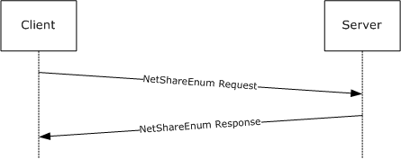

Figure 2: Enumeration of shares

- The client sends a Remote Administration Protocol request for the NetShareEnum command to the server in an SMB transaction request.
Smb: C; Transact, FileName = \PIPE\LANMAN

Protocol: SMB

Command: Transact 37(0x25)

DOSError: No Error

ErrorClass: No Error

Reserved: 0 (0x0)

Error: No Error

SMBHeader: Command, TID: 0x0800, PID: 0x74B2, UID: 0x0800,

MID: 0x4681

Flags: 0 (0x0)

Flags2: 32768 (0x8000)

PIDHigh: 0 (0x0)

SecuritySignature: 0x0

Reserved: 0 (0x0)

TreeID: 2048 (0x800)

ProcessID: 29874 (0x74B2)

UserID: 2048 (0x800)

MultiplexID: 18049 (0x4681)

CTransaction:

WordCount: 14 (0xE)

TotalParameterCount: 19 (0x13)

TotalDataCount: 0 (0x0)

MaxParameterCount: 8 (0x8)

MaxDataCount: 4096 (0x1000)

MaxSetupCount: 0 (0x0)

Reserved1: 0 (0x0)

Flags: Do not disconnect TID

BIT0: ...............0 Do not disconnect TID

Timeout: 5000 sec(s)

Reserved2: 0 (0x0)

ParameterCount: 19 (0x13)

ParameterOffset: 90 (0x5A)

DataCount: 0 (0x0)

DataOffset: 0 (0x0)

SetupCount: 0 (0x0)

Reserved3: 0 (0x0)

ByteCount: 46 (0x2E)

Pad: 210 (0xD2)

UnicodeFileName: \PIPE\LANMAN

Parameters: RAPParams and NetShareEnum request (19 Bytes)

00 00 57 72 4C 65 68 00 42 31 33 42 57 7A 00 01 (..WrLeh.B13BWz..)

00 00 10 (...)

- The server responds with the list of shares for this server. In this situation, the server has four shares: C$ with a Remark of "Default share", IPC$ with a Remark of "Remote IPC", ADMIN$ with a Remark of "Remote Admin", and D$ with a Remark of "Default share".
Smb: R; Transact

Protocol: SMB

Command: Transact 37(0x25)

DOSError: No Error

ErrorClass: No Error

Reserved: 0 (0x0)

Error: No Error

SMBHeader: Response, TID: 0x0800, PID: 0x74B2, UID: 0x0800,

MID: 0x4681

Flags: 128 (0x80)

Flags2: 32768 (0x8000)

PIDHigh: 0 (0x0)

SecuritySignature: 0x0

Reserved: 0 (0x0)

TreeID: 2048 (0x800)

ProcessID: 29874 (0x74B2)

UserID: 2048 (0x800)

MultiplexID: 18049 (0x4681)

RTransaction:

WordCount: 10 (0xA)

TotalParameterCount: 8 (0x8)

TotalDataCount: 132 (0x84)

Reserved: 0 (0x0)

ParameterCount: 8 (0x8)

ParameterOffset: 56 (0x38)

ParamDisplacement: 0 (0x0)

DataCount: 132 (0x84)

DataOffset: 64 (0x40)

DataDisplacement: 0 (0x0)

SetupCount: 0 (0x0)

Reserved1: 0 (0x0)

ByteCount: 141 (0x8D)

Pad1: Binary Large Object (1 Bytes)

Parameters: ErrorCode, Converter, and RAPOutParams for

NetShareEnum (8 Bytes)

00 00 7C 0F 04 00 04 00 (..|.....)

Data: RAP NetShareInfo1 Array (132 Bytes)

43 24 00 00 00 00 00 00 00 00 00 00 00 00 00 00 (C$..............)

F2 0F 00 00 49 50 43 24 00 00 00 00 00 00 00 00 (ò...IPC$........)

00 00 03 00 E7 0F 00 00 41 44 4D 49 4E 24 00 00 (....ç...ADMIN$..)

00 00 00 00 00 00 00 00 DA 0F 00 00 44 24 00 00 (........Ú...D$..)

00 00 00 00 00 00 00 00 00 00 00 00 CC 0F 00 00 (............Ì...)

44 65 66 61 75 6C 74 20 73 68 61 72 65 00 52 65 (Default share.Re)

6D 6F 74 65 20 41 64 6D 69 6E 00 52 65 6D 6F 74 (mote Admin.Remot)

65 20 49 50 43 00 44 65 66 61 75 6C 74 20 73 68 (e IPC.Default sh)

61 72 65 00 (are.)

<a id="Section_4.2"></a>
## 4.2 NetServerEnum2

The following diagram demonstrates the steps taken to retrieve an enumeration of servers on the network from a remote server by using the Remote Administration Protocol. Assume that this sequence is executed over an existing SMB connection established between the client and the server. The underlying SMB transaction request and response are included for clarity.

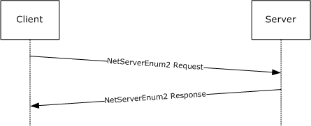

Figure 3: Enumeration of servers

- The client sends a Remote Administration Protocol request for the NetServerEnum2 command to the server in an SMB transaction request.
Smb: C; Transact, FileName = \PIPE\LANMAN

Protocol: SMB

Command: Transact 37(0x25)

DOSError: No Error

ErrorClass: No Error

Reserved: 0 (0x0)

Error: No Error

SMBHeader: Command, TID: 0x0801, PID: 0x74B2, UID: 0x0802,

MID: 0x1B02

Flags: 0 (0x0)

Flags2: 32768 (0x8000)

PIDHigh: 0 (0x0)

SecuritySignature: 0x0

Reserved: 0 (0x0)

TreeID: 2049 (0x801)

ProcessID: 29874 (0x74B2)

UserID: 2050 (0x802)

MultiplexID: 6914 (0x1B02)

CTransaction:

WordCount: 14 (0xE)

TotalParameterCount: 26 (0x1A)

TotalDataCount: 0 (0x0)

MaxParameterCount: 8 (0x8)

MaxDataCount: 6144 (0x1800)

MaxSetupCount: 0 (0x0)

Reserved1: 0 (0x0)

Flags: Do not disconnect TID

BIT0: ...............0 Do not disconnect TID

Timeout: 5000 sec(s)

Reserved2: 0 (0x0)

ParameterCount: 26 (0x1A)

ParameterOffset: 90 (0x5A)

DataCount: 0 (0x0)

DataOffset: 0 (0x0)

SetupCount: 0 (0x0)

Reserved3: 0 (0x0)

ByteCount: 53 (0x35)

Pad: 113 (0x71)

UnicodeFileName: \PIPE\LANMAN

Parameters: RAPParams and NetServerEnum2 Request (26 Bytes)

68 00 57 72 4C 65 68 44 4F 00 42 31 36 42 42 44 (h.WrLehDO.B16BBD)

7A 00 01 00 00 18 FF FF FF FF (z.....ÿÿÿÿ)

- The server responds with the list of servers on the network. In this case, there are 12 servers to be returned, and all 12 are returned in this response.
Smb: R; Transact

Protocol: SMB

Command: Transact 37(0x25)

DOSError: No Error

ErrorClass: No Error

Reserved: 0 (0x0)

Error: No Error

SMBHeader: Response, TID: 0x0801, PID: 0x74B2, UID: 0x0802,

MID: 0x1B02

Flags: 128 (0x80)

Flags2: 32768 (0x8000)

PIDHigh: 0 (0x0)

SecuritySignature: 0x0

Reserved: 0 (0x0)

TreeID: 2049 (0x801)

ProcessID: 29874 (0x74B2)

UserID: 2050 (0x802)

MultiplexID: 6914 (0x1B02)

RTransaction:

WordCount: 10 (0xA)

TotalParameterCount: 8 (0x8)

TotalDataCount: 379 (0x17B)

Reserved: 0 (0x0)

ParameterCount: 8 (0x8)

ParameterOffset: 56 (0x38)

ParamDisplacement: 0 (0x0)

DataCount: 379 (0x17B)

DataOffset: 64 (0x40)

DataDisplacement: 0 (0x0)

SetupCount: 0 (0x0)

Reserved1: 0 (0x0)

ByteCount: 388 (0x184)

Pad1: Binary Large Object (1 Bytes)

Parameters: ErrorCode, Converter, and RAPOutParams for

NetServerEnum2 Response (8 Bytes)

00 00 85 16 0B 00 0B 00 (..........)

Data: RAP NetServerInfo1 Array (379 Bytes)

42 52 55 43 43 4F 2D 4F 46 46 33 00 00 00 00 00 (BRUCCO-OFF3.....)

05 02 03 92 82 00 FF 17 00 00 53 4D 42 4E 54 34 (...??.ÿ...SMBNT4)

53 52 56 00 00 00 00 00 00 00 04 00 03 90 01 00 (SRV..........□..)

FE 17 00 00 53 4D 42 57 46 57 33 31 31 00 00 00 (þ...SMBWFW311...)

00 00 00 00 01 33 03 20 01 00 CD 17 00 00 53 4D (.....3. ..Í...SM)

42 57 49 4E 32 30 30 30 00 00 00 00 00 00 05 00 (BWIN2000........)

03 90 02 02 CC 17 00 00 53 4D 42 57 49 4E 32 30 (.□..Ì...SMBWIN20)

30 33 00 00 00 00 00 00 05 02 03 90 82 00 CB 17 (03.........□?.Ë.)

00 00 53 4D 42 57 49 4E 32 30 30 33 49 41 36 34 (..SMBWIN2003IA64)

00 00 05 02 03 90 82 00 CA 17 00 00 53 4D 42 57 (.....□?.Ê...SMBW)

49 4E 39 38 53 45 00 00 00 00 00 00 04 00 03 20 (IN98SE......... )

41 00 B8 17 00 00 53 4D 42 57 49 4E 39 38 53 45 (A.¸...SMBWIN98SE)

2D 55 4D 00 00 00 04 00 03 20 41 00 A6 17 00 00 (-UM...... A.¦...)

53 4D 42 57 49 4E 58 50 00 00 00 00 00 00 00 00 (SMBWINXP........)

05 01 03 10 00 00 A5 17 00 00 53 50 53 4D 42 44 (......¥...SPSMBD)

43 31 00 00 00 00 00 00 00 00 05 00 03 90 82 02 (C1...........□?.)

A4 17 00 00 53 50 53 4D 42 44 43 32 00 00 00 00 (¤...SPSMBDC2....)

00 00 00 00 05 02 2B 10 84 00 A3 17 00 00 00 00 (......+.?.£.....)

00 57 49 4E 53 45 20 46 49 4C 45 20 53 59 53 54 (.WINSE FILE SYST)

45 4D 00 57 49 4E 53 45 20 46 49 4C 45 20 53 59 (EM.WINSE FILE SY)

53 54 45 4D 00 00 00 00 31 32 33 34 35 36 37 38 (STEM....12345678)

39 30 31 32 33 34 35 36 37 38 39 30 31 32 33 34 (9012345678901234)

35 36 37 38 39 30 31 32 33 34 35 36 37 38 39 30 (5678901234567890)

31 32 33 34 35 36 37 38 00 00 00 (12345678...)

<a id="Section_4.3"></a>
## 4.3 NetPrintJobDel

The following diagram demonstrates the steps taken to enumerate the deletion of a [**print job**](#gt_print-job) on a remote server by using the Remote Administration Protocol. Assume that this sequence is executed over an existing SMB connection established between the client and the server, and that the identifier of the job being deleted is 3. The underlying SMB transaction request and response are included for clarity.


Figure 4: Deletion of a print job

- The client sends a Remote Administration Protocol request for the NetPrintJobDel command to the server in an SMB transaction request.
Smb: C; Transact, FileName = \PIPE\LANMAN

Protocol: SMB

Command: Transact 37(0x25)

DOSError: No Error

ErrorClass: No Error

Reserved: 0 (0x0)

Error: No Error

SMBHeader: Command, TID: 0x0802, PID: 0x74B2, UID: 0x0801,

MID: 0x6D81

Flags: 0 (0x0)

Flags2: 32768 (0x8000)

PIDHigh: 0 (0x0)

SecuritySignature: 0x0

Reserved: 0 (0x0)

TreeID: 2050 (0x802)

ProcessID: 29874 (0x74B2)

UserID: 2049 (0x801)

MultiplexID: 28033 (0x6D81)

CTransaction:

WordCount: 14 (0xE)

TotalParameterCount: 7 (0x7)

TotalDataCount: 0 (0x0)

MaxParameterCount: 4 (0x4)

MaxDataCount: 0 (0x0)

MaxSetupCount: 0 (0x0)

Reserved1: 0 (0x0)

Flags: Do not disconnect TID

BIT0: ...............0 Do not disconnect TID

Timeout: 5000 sec(s)

Reserved2: 0 (0x0)

ParameterCount: 7 (0x7)

ParameterOffset: 90 (0x5A)

DataCount: 0 (0x0)

DataOffset: 0 (0x0)

SetupCount: 0 (0x0)

Reserved3: 0 (0x0)

ByteCount: 34 (0x22)

Pad: 83 (0x53)

UnicodeFileName: \PIPE\LANMAN

Parameters: RAPParams and NetPrintJobDel Request (7 Bytes)

51 00 57 00 00 03 00 (Q.W....)

- The server deletes the print job and returns success.
Smb: R; Transact

Protocol: SMB

Command: Transact 37(0x25)

DOSError: No Error

ErrorClass: No Error

Reserved: 0 (0x0)

Error: No Error

SMBHeader: Response, TID: 0x0802, PID: 0x74B2, UID: 0x0801,

MID: 0x6D81

Flags: 128 (0x80)

Flags2: 32768 (0x8000)

PIDHigh: 0 (0x0)

SecuritySignature: 0x0

Reserved: 0 (0x0)

TreeID: 2050 (0x802)

ProcessID: 29874 (0x74B2)

UserID: 2049 (0x801)

MultiplexID: 28033 (0x6D81)

RTransaction:

WordCount: 10 (0xA)

TotalParameterCount: 4 (0x4)

TotalDataCount: 0 (0x0)

Reserved: 0 (0x0)

ParameterCount: 4 (0x4)

ParameterOffset: 56 (0x38)

ParamDisplacement: 0 (0x0)

DataCount: 0 (0x0)

DataOffset: 60 (0x3C)

DataDisplacement: 0 (0x0)

SetupCount: 0 (0x0)

Reserved1: 0 (0x0)

ByteCount: 5 (0x5)

Pad1: Binary Large Object (1 Bytes)

Parameters: RAPOutParams (4 Bytes)

00 00 00 00 (....)

<a id="Section_5"></a>
# 5 Security

<a id="Section_5.1"></a>
## 5.1 Security Considerations for Implementers

The Remote Administration Protocol uses descriptor strings to define the data being passed between the client and the server. As such, an implementer might implement a generic parsing engine that can parse the data from the Remote Administration Protocol client (using the data provided by the Remote Administration Protocol client) without validation.

If a server implements such an engine, it opens the possibility for buffer overruns and other attacks caused by a client that passes parameter descriptors and data descriptors that do not match the expected values. When implementing the Remote Administration Protocol, ensure that Remote Administration Protocol servers do not trust the values of the request data passed by the client, and that Remote Administration Protocol clients do not trust the values of the responses from the server.

In addition, several of the Remote Administration Protocol request and response structures contain **Pad** fields, which are normally ignored. A server or client that does not set the contents of the **Pad** fields to a known value (such as null) runs the risk of enabling an information disclosure attack against the server or client.

Password operations specified for the Remote Administration Protocol send the password in plain text over the network, and thus are not secure; consider this before using them to change passwords.

<a id="Section_5.2"></a>
## 5.2 Index of Security Parameters

None.

<a id="Section_6"></a>
# 6 Appendix A: Product Behavior

The information in this specification is applicable to the following Microsoft products or supplemental software. References to product versions include updates to those products.

The terms "earlier" and "later", when used with a product version, refer to either all preceding versions or all subsequent versions, respectively. The term "through" refers to the inclusive range of versions. Applicable Microsoft products are listed chronologically in this section.

- Windows NT operating system
- Windows 2000 operating system
- Windows 2000 Server operating system
- Windows XP operating system
- Windows Server 2003 operating system
- Windows Vista operating system
- Windows Server 2008 operating system
- Windows 7 operating system
- Windows Server 2008 R2 operating system
- Windows 8 operating system
- Windows Server 2012 operating system
- Windows 8.1 operating system
- Windows Server 2012 R2 operating system
- Windows 10 operating system
- Windows Server 2016 operating system
- Windows Server 2019 operating system
- Windows Server 2022 operating system
- Windows 11 operating system
- Windows Server 2025 operating system
Exceptions, if any, are noted in this section. If an update version, service pack or Knowledge Base (KB) number appears with a product name, the behavior changed in that update. The new behavior also applies to subsequent updates unless otherwise specified. If a product edition appears with the product version, behavior is different in that product edition.

Unless otherwise specified, any statement of optional behavior in this specification that is prescribed using the terms "SHOULD" or "SHOULD NOT" implies product behavior in accordance with the SHOULD or SHOULD NOT prescription. Unless otherwise specified, the term "MAY" implies that the product does not follow the prescription.

<1> Section 1.6: This protocol is supported on the Windows operating system, including Windows 2000 Server operating system and later and Windows XP operating system and later for purposes of compatibility with pre-Windows NT clients. With the exception of the [NetServerEnum2](#Section_4.2) command and the [NetServerEnum3](#Section_3.2.5.15) command, the only client that uses this protocol is Windows 98 operating system. The Remote Administration Protocol is obsolete and is used primarily for communications with Windows 98 clients. The Windows 98 operating system uses the Remote Administration Protocol for the following operations:

- File Share enumeration (NET VIEW \\SERVER)
- Printer management
- Time retrieval
- Server list retrieval
In addition, the CIFS Browser Protocol uses the Remote Administration Protocol to retrieve lists of servers.

<2> Section 1.7: As shipped, Windows 98 clients use only the NTLM Authentication Protocol. If the Active Directory Client Extension is installed on the Windows 98 machine, the Windows 98 machine uses the NTLM v2 Authentication Protocol.

<3> Section 1.8: Windows uses only the values specified in [MS-ERREF](../MS-ERREF/MS-ERREF.md) section 2.2.

<4> Section 2.5.1: The Windows SMB server validates that the **ParamDesc** matches what is specified by the **RAPOpcode**; if they do not match, the server returns ERROR_INVALID_PARAMETER (0x57), as specified in section [2.5.2](#Section_2.5.11).

<5> Section 2.5.1: The current Windows (versions after Windows 2000) implementation of the Remote Administration Protocol ignores the **DataDesc** field.

<6> Section 2.5.1: Windows 95 operating system and Windows 98 used the supplied **DataDesc**, **ParamDesc**, and **AuxDesc** structures to convert the RAPParams and the response structures to and from "C" style structures. Current versions of Windows simply validate that the **ParamDesc** supplied by the client is the value required by the **RAPOpcode**.

<7> Section 2.5.5.1.1: This command is only supported on Windows 2000, Windows XP, and Windows Vista.

<8> Section 2.5.5.1.2: This command is only supported on Windows 2000 Server, Windows Server 2003, and Windows Server 2008.

<9> Section 2.5.5.2: Windows-based servers only enumerate machines on IPv4 networks, and will return ERROR_FILE_NOT_FOUND (0x00000002) as specified in [MS-ERREF] section 2.2 if only IPv6 is enabled.

<10> Section 2.5.5.2.1: Windows-based servers fail the request with ERROR_INVALID_PARAMETER when SV_TYPE_ALTERNATE_XPORT is set, but will return all server types when SV_TYPE_ALL is set.

<11> Section 2.5.5.3: Windows-based servers only enumerate machines on IPv4 networks, and will return ERROR_FILE_NOT_FOUND (0x00000002) as specified in [MS-ERREF] section 2.2 if only IPv6 is enabled.

<12> Section 2.5.5.4.2: The following table shows the unsigned 8-bit major operating system version number that Windows clients and servers use.

| Value | Meaning |
| --- | --- |
| 0x04 | Operating system is Windows 95, Windows 98, Windows Millennium Edition operating system, or Windows NT 4.0 operating system. |
| 0x05 | Operating system is Windows 2000 Server, Windows XP, Windows Server 2003, or Windows Server 2003 R2 operating system. |
| 0x06 | Operating system is Windows Server 2008 operating system, Windows Vista, Windows Server 2008 R2 operating system, Windows 7, Windows Server 2012, Windows 8, Windows 8.1, or Windows Server 2012 R2. |
| 0x0A | Operating system is Windows 10 and later or Windows Server 2016 operating system and later. |

<13> Section 2.5.5.4.2: The following table shows the unsigned 8-bit minor operating system version number that Windows clients and servers use.

| Value | Meaning |
| --- | --- |
| 0x00 | Operating system is Windows 95, Windows NT 4.0, Windows 2000 Server, Windows Server 2008, Windows Vista, Windows 10 and later or Windows Server 2016 operating system and later. |
| 0x01 | Operating system is Windows XP, Windows Server 2008 R2, or Windows 7. |
| 0x02 | Operating system is Windows XP Professional x64 Edition operating system, Windows Server 2003, Windows Server 2003 R2, Windows 8, or Windows Server 2012. |
| 0x03 | Operating system is Windows 8.1 or Windows Server 2012 R2. |
| 0x0A | Operating system is Windows 98. |
| 0x5A | Operating system is Windows Millennium Edition. |

<14> Section 2.5.6.1.1: This command is only supported on Windows 2000, Windows XP, and Windows Vista.

<15> Section 2.5.6.1.2: This command is only supported on Windows 2000 Server, Windows Server 2003, or Windows Server 2008.

<16> Section 2.5.6.2.1: This command is only supported on Windows 2000, Windows XP, and Windows Vista.

<17> Section 2.5.6.2.2: This command is only supported on Windows 2000 Server, Windows Server 2003, or Windows Server 2008.

<18> Section 2.5.7.1.1: This command is only supported on Windows 2000, Windows XP, and Windows Vista.

<19> Section 2.5.7.1.1: Windows-based servers ignore the input descriptor provided by the client, and validates the input data by using the expected parameter descriptor based on the level provided.

<20> Section 2.5.7.1.2: This command is only supported on Windows 2000 Server, Windows Server 2003, or Windows Server 2008.

<21> Section 2.5.7.1.2: The 64-bit version of Windows Server 2008 will set the Win32ErrorCode value in the Remote Administration Protocol response message to ERROR_UNEXP_NET_ERR (0x0000003B) as specified in [MS-ERREF] section 2.2.

<22> Section 2.5.7.1.2: The 64-bit version of Windows Server 2008 will set the Win32ErrorCode value in the Remote Administration Protocol response message to ERROR_UNEXP_NET_ERR (0x0000003B) as specified in [MS-ERREF] section 2.2.

<23> Section 2.5.7.2.1: This command is only supported on Windows 2000, Windows XP, and Windows Vista.

<24> Section 2.5.7.2.1: Windows-based servers ignore the input descriptor provided by the client, and validates the input data using the expected parameter descriptor based on the level provided.

<25> Section 2.5.7.2.2: This command is only supported on Windows 2000 Server, Windows Server 2003, or Windows Server 2008.

<26> Section 2.5.7.2.2: Windows Server 2008 64-bit version will set the Win32ErrorCode value in the Remote Administration Protocol response message to ERROR_UNEXP_NET_ERR (0x0000003B) as specified in [MS-ERREF], section 2.2.

<27> Section 2.5.7.3.1: This command is only supported on Windows 2000, Windows XP, and Windows Vista.

<28> Section 2.5.7.3.1: For Information level 0x0003, the server will fail the request and return ERROR_NOT_SUPPORTED.

<29> Section 2.5.7.3.2: This command is only supported on Windows 2000 Server, Windows Server 2003, or Windows Server 2008.

<30> Section 2.5.7.4.1: This command is only supported on Windows 2000, Windows XP, and Windows Vista.

<31> Section 2.5.7.4.2: This command is only supported on Windows 2000 Server, Windows Server 2003, or Windows Server 2008.

<32> Section 2.5.7.5.1: This command is only supported on Windows 2000, Windows XP, and Windows Vista.

<33> Section 2.5.7.5.2: This command is only supported on Windows 2000 Server, Windows Server 2003, or Windows Server 2008.

<34> Section 2.5.7.6.1: This command is only supported on Windows 2000, Windows XP, and Windows Vista.

<35> Section 2.5.7.6.2: This command is only supported on Windows 2000 Server, Windows Server 2003, or Windows Server 2008.

<36> Section 2.5.7.7.1: This command is only supported on Windows 2000, Windows XP, and Windows Vista.

<37> Section 2.5.7.7.2: This command is only supported on Windows 2000 Server, Windows Server 2003, or Windows Server 2008.

<38> Section 2.5.7.8.1: For Windows Server 2008, Server will return only 6 bytes of data; the remaining bytes are filled with zeros.

<39> Section 2.5.7.8.3: An IHV driver on the server can provide a Windows 95 compatible driver name in a [PrintQueue3](#Section_2.5.7.8.3) response instead of the actual driver name. The [RAP PrintJobInfo3](#Section_2.5.7.8.8) response always contains the actual driver name.

<40> Section 2.5.8.1.1: This command is only supported on Windows 2000, Windows XP, and Windows Vista.

<41> Section 2.5.8.1.1: Windows makes the following use of this field:

- The **RealPasswordLength** is used only for password length restriction checks.
- The password fields are not encrypted, and the **EncryptedPassword** field is always set to 0.
- The contents of the **OldPassword** and **NewPassword** fields (past the end of the **OldPassword** and **NewPassword** fields) are not initialized and are ignored.
<42> Section 2.5.8.1.2: Windows-based servers will set the Win32ErrorCode value in the Remote Administration Protocol response message to ERROR_UNEXP_NET_ERR (0x0000003B) as specified in [MS-ERREF], section 2.2.

<43> Section 2.5.8.1.2: This command is only supported on Windows 2000 Server, Windows Server 2003, or Windows Server 2008.

<44> Section 2.5.8.2.1: This command is only supported on Windows 2000, Windows XP, and Windows Vista.

<45> Section 2.5.8.2.2: This command is only supported on Windows 2000 Server, Windows Server 2003, or Windows Server 2008.

<46> Section 2.5.8.3.3: A Windows Server 2003 machine needs to be a Domain Controller in order to have accounts operator, server operator, and communication operator groups. If the server is a Domain Controller, the username can be added to one of these groups and will return the relevant flag value. Note that AF_OP_COMM is never set. A Windows Server 2008 Domain Controller will always set the AF_OP_PRINT flag.

<47> Section 2.5.8.3.5: A Windows Server 2003 machine needs to be a Domain Controller in order to have accounts operator, server operator, and communication operator groups. If the server is a Domain Controller, the username can be added to one of these groups and will return the relevant flag value. Note that AF_OP_COMM is never set. A Windows Server 2008 Domain Controller will always set the AF_OP_PRINT flag.

<48> Section 2.5.9.1.1: This command is only supported on Windows 2000, Windows XP, and Windows Vista.

<49> Section 2.5.9.1.2: This command is only supported on Windows 2000 Server, Windows Server 2003, or Windows Server 2008.

<50> Section 2.5.9.2.1: The default **ClockFrequency** value of a Windows-based server is 31 milliseconds.

<51> Section 2.5.10.1.1: This command is only supported on Windows 2000, Windows XP, and Windows Vista.

<52> Section 2.5.10.1.2: This command is only supported on Windows 2000 Server, Windows Server 2003, or Windows Server 2008.

<53> Section 2.5.10.2.1: This command is only supported on Windows 2000, Windows XP, and Windows Vista.

<54> Section 2.5.10.2.2: Windows-based servers return ERROR_ACCESS_DENIED if **WorkstationName** is used as the client NetBIOS name. If **WorkstationName** is used as the client IP address, the request fails with ERROR_UNEXP_NET_ERR.

<55> Section 2.5.10.2.2: This command is only supported on Windows 2000 Server, Windows Server 2003, or Windows Server 2008.

<56> Section 2.5.10.3.1: This command is only supported on Windows 2000, Windows XP, and Windows Vista.

<57> Section 2.5.10.3.2: Windows-based servers return ERROR_ACCESS_DENIED if **WorkstationName** is used as the client NetBIOS name. If **WorkstationName** is used as the client IP address, the request fails with ERROR_UNEXP_NET_ERR.

<58> Section 2.5.10.3.2: This command is only supported on Windows 2000 Server, Windows Server 2003, or Windows Server 2008.

<59> Section 2.5.10.4.1: Windows-based servers will set the field to NULL.

<60> Section 2.5.10.4.1: The following table shows the unsigned 8-bit major version number of the networking software (operating system software) the workstation is running:

| Value | Meaning |
| --- | --- |
| 0x05 | Windows 2000, Windows XP, Windows Server 2003, or Windows Server 2003 R2. |
| 0x06 | Windows Vista, Windows Server 2008, Windows 7, Windows Server 2008 R2, Windows 8, Windows Server 2012, Windows 8.1, or Windows Server 2012 R2. |
| 0x0A | Windows 10 and later, Windows Server 2016 operating system and later. |

<61> Section 2.5.10.4.1: The following table shows the unsigned 8-bit minor version number of the networking software (operating system software) the workstation is running:

| Value | Meaning |
| --- | --- |
| 0x00 | Windows 2000, Windows Vista, Windows Server 2008, Windows 10 and later, Windows Server 2016 operating system and later. |
| 0x01 | Windows XP, Windows 7, or Windows Server 2008 R2 |
| 0x02 | Windows XP Professional x64 Edition, Windows Server 2003, Windows Server 2003 R2, Windows 8, or Windows Server 2012 |
| 0x03 | Windows 8.1 and Windows Server 2012 R2 |

<62> Section 2.5.10.4.1: Windows-based servers will set the field to NULL.

<63> Section 2.5.10.4.1: Windows-based servers will set the field to NULL.

<64> Section 2.5.10.4.3: A Windows Server 2003 machine needs to be a Domain Controller in order to have accounts operator, server operator, and communication operator groups. If the server is a Domain Controller, the username can be added to one of these groups and will return the relevant flag value. Note that AF_OP_COMM is never set. A Windows Server 2008 Domain Controller will always set the AF_OP_PRINT flag.

<65> Section 2.5.11: Windows Server 2008 64-bit version will not return variable-length data. For example, in the [NetShareInfo1 (section 2.5.6.3.2)](#Section_2.5.6.3.2) structure, the optional comment string about the share associated with the **remarkoffsetlow** field will not be returned.

<66> Section 3.2.1.1: Windows-based servers use a browser service to manage this list; for more information, see [MS-BRWS](../MS-BRWS/MS-BRWS.md).

<67> Section 3.2.5.1: Windows-based servers will fail the underlying **SMB_COM_TRANSACT** request with STATUS_INVALID_PARAMETER, as specified in [MS-ERREF] section 2.3.1, instead of sending back an error in the RAP response.

<68> Section 3.2.5.1: If a Windows-based server includes shares with names larger than 12 characters, the server will skip those shares in the response but include their presence in **EntriesAvailable**. If **EntriesReturned** + (skipped shares) is equal to **EntriesAvailable**, the server returns ERROR_SUCCESS instead of ERROR_MORE_DATA.

<69> Section 3.2.5.2: Windows-based servers will fail the underlying **SMB_COM_TRANSACT** request with STATUS_INVALID_PARAMETER, as specified in [MS-ERREF] section 2.3.1, instead of sending back an error in the RAP response.

<70> Section 3.2.5.3: Windows-based servers will fail the underlying **SMB_COM_TRANSACT** request with STATUS_INVALID_PARAMETER, as specified in [MS-ERREF] section 2.3.1 instead of sending back an error in the RAP response.

<71> Section 3.2.5.4: Windows-based servers will fail the underlying **SMB_COM_TRANSACT** request with STATUS_INVALID_PARAMETER, as specified in [MS-ERREF] section 2.3.1, instead of sending back an error in the RAP response.

<72> Section 3.2.5.5: Windows-based servers will fail the underlying **SMB_COM_TRANSACT** request with STATUS_INVALID_PARAMETER, as specified in [MS-ERREF] section 2.3.1, instead of sending back an error in the RAP response.

<73> Section 3.2.5.6: Windows-based servers will fail the underlying **SMB_COM_TRANSACT** request with STATUS_INVALID_PARAMETER, as specified in [MS-ERREF] section 2.3.1, instead of sending back an error in the RAP response.

<74> Section 3.2.5.6: For Information level 0x0003, the server will fail the request and return ERROR_NOT_SUPPORTED

<75> Section 3.2.5.7: Windows-based servers will fail the underlying **SMB_COM_TRANSACT** request with STATUS_INVALID_PARAMETER, as specified in [MS-ERREF] section 2.3.1, instead of sending back an error in the RAP response.

<76> Section 3.2.5.7: Windows-based servers provide the document name as the comment.

<77> Section 3.2.5.7: Windows-based servers provide the document name as the comment.

<78> Section 3.2.5.7: Windows-based servers provide the document name as the comment.

<79> Section 3.2.5.8: Windows-based servers will fail the underlying **SMB_COM_TRANSACT** request with STATUS_INVALID_PARAMETER, as specified in [MS-ERREF] section 2.3.1, instead of sending back an error in the RAP response.

<80> Section 3.2.5.9: Windows-based servers will fail the underlying **SMB_COM_TRANSACT** request with STATUS_INVALID_PARAMETER, as specified in [MS-ERREF] section 2.3.1, instead of sending back an error in the RAP response.

<81> Section 3.2.5.10: Windows-based servers will fail the underlying **SMB_COM_TRANSACT** request with STATUS_INVALID_PARAMETER, as specified in [MS-ERREF] section 2.3.1, instead of sending back an error in the RAP response.

<82> Section 3.2.5.11: Windows-based servers will fail the underlying **SMB_COM_TRANSACT** request with STATUS_INVALID_PARAMETER, as specified in [MS-ERREF] section 2.3.1, instead of sending back an error in the RAP response.

<83> Section 3.2.5.12: Windows-based servers will fail the underlying **SMB_COM_TRANSACT** request with STATUS_INVALID_PARAMETER, as specified in [MS-ERREF] section 2.3.1, instead of sending back an error in the RAP response.

<84> Section 3.2.5.13: Windows-based servers will fail the underlying **SMB_COM_TRANSACT** request with STATUS_INVALID_PARAMETER, as specified in [MS-ERREF] section 2.3.1, instead of sending back an error in the RAP response.

<85> Section 3.2.5.14: Windows-based servers will fail the underlying **SMB_COM_TRANSACT** request with STATUS_INVALID_PARAMETER, as specified in [MS-ERREF] section 2.3.1, instead of sending back an error in the RAP response.

<86> Section 3.2.5.14: Windows-based servers accept values other than 0x0000 and perform the processing specified in section 3.1.5.10.1, **SamrChangePasswordUser**, [MS-SAMR](#Section_5).

<87> Section 3.2.5.15: Windows-based servers will fail the underlying **SMB_COM_TRANSACT** request with STATUS_INVALID_PARAMETER, as specified in [MS-ERREF] section 2.3.1, instead of sending back an error in the RAP response.

<88> Section 3.2.5.15: In Windows, *FirstNameToReturn* need not be an exact match: the server will return a list of servers that exist on the network greater than or equal to the *FirstNameToReturn* value.

<89> Section 3.2.5.16: Windows-based servers will fail the underlying **SMB_COM_TRANSACT** request with STATUS_INVALID_PARAMETER, as specified in [MS-ERREF] section 2.3.1, instead of sending back an error in the RAP response.

<90> Section 3.2.5.17: Windows-based servers will fail the underlying **SMB_COM_TRANSACT** request with STATUS_INVALID_PARAMETER, as specified in [MS-ERREF] section 2.3.1, instead of sending back an error in the RAP response.

<91> Section 3.2.5.18: Windows-based servers will fail the underlying **SMB_COM_TRANSACT** request with STATUS_INVALID_PARAMETER, as specified in [MS-ERREF] section 2.3.1, instead of sending back an error in the RAP response.

<a id="Section_7"></a>
# 7 Change Tracking

No table of changes is available. The document is either new or has had no changes since its last release.

<a id="revision-history"></a>

## Revision History

| Date | Version | Revision Class | Comments |
| --- | --- | --- | --- |
| 3/2/2007 | 1.0 | New | Version 1.0 release |
| 4/3/2007 | 1.1 | Minor | Version 1.1 release |
| 5/11/2007 | 1.2 | Minor | Version 1.2 release |
| 6/1/2007 | 1.2.1 | Editorial | Changed language and formatting in the technical content. |
| 7/3/2007 | 2.0 | Major | Updated and revised the technical content. |
| 8/10/2007 | 2.0.1 | Editorial | Changed language and formatting in the technical content. |
| 9/28/2007 | 2.0.2 | Editorial | Changed language and formatting in the technical content. |
| 10/23/2007 | 3.0 | Major | Converted document to unified format. |
| 1/25/2008 | 4.0 | Major | Updated and revised the technical content. |
| 3/14/2008 | 5.0 | Major | Updated and revised the technical content. |
| 6/20/2008 | 6.0 | Major | Updated and revised the technical content. |
| 7/25/2008 | 7.0 | Major | Updated and revised the technical content. |
| 8/29/2008 | 8.0 | Major | Technical clarifications. |
| 10/24/2008 | 8.0.1 | Editorial | Changed language and formatting in the technical content. |
| 12/5/2008 | 9.0 | Major | Updated and revised the technical content. |
| 1/16/2009 | 10.0 | Major | Updated and revised the technical content. |
| 2/27/2009 | 11.0 | Major | Updated and revised the technical content. |
| 4/10/2009 | 12.0 | Major | Updated and revised the technical content. |
| 5/22/2009 | 12.0.1 | Editorial | Changed language and formatting in the technical content. |
| 7/2/2009 | 12.0.2 | Editorial | Changed language and formatting in the technical content. |
| 8/14/2009 | 13.0 | Major | Updated and revised the technical content. |
| 9/25/2009 | 14.0 | Major | Updated and revised the technical content. |
| 11/6/2009 | 15.0 | Major | Updated and revised the technical content. |
| 12/18/2009 | 16.0 | Major | Updated and revised the technical content. |
| 1/29/2010 | 17.0 | Major | Updated and revised the technical content. |
| 3/12/2010 | 18.0 | Major | Updated and revised the technical content. |
| 4/23/2010 | 19.0 | Major | Updated and revised the technical content. |
| 6/4/2010 | 20.0 | Major | Updated and revised the technical content. |
| 7/16/2010 | 21.0 | Major | Updated and revised the technical content. |
| 8/27/2010 | 21.1 | Minor | Clarified the meaning of the technical content. |
| 10/8/2010 | 21.1 | None | No changes to the meaning, language, or formatting of the technical content. |
| 11/19/2010 | 21.1 | None | No changes to the meaning, language, or formatting of the technical content. |
| 1/7/2011 | 21.1 | None | No changes to the meaning, language, or formatting of the technical content. |
| 2/11/2011 | 21.1 | None | No changes to the meaning, language, or formatting of the technical content. |
| 3/25/2011 | 21.1 | None | No changes to the meaning, language, or formatting of the technical content. |
| 5/6/2011 | 21.1 | None | No changes to the meaning, language, or formatting of the technical content. |
| 6/17/2011 | 21.2 | Minor | Clarified the meaning of the technical content. |
| 9/23/2011 | 21.2 | None | No changes to the meaning, language, or formatting of the technical content. |
| 12/16/2011 | 22.0 | Major | Updated and revised the technical content. |
| 3/30/2012 | 23.0 | Major | Updated and revised the technical content. |
| 7/12/2012 | 24.0 | Major | Updated and revised the technical content. |
| 10/25/2012 | 25.0 | Major | Updated and revised the technical content. |
| 1/31/2013 | 26.0 | Major | Updated and revised the technical content. |
| 8/8/2013 | 27.0 | Major | Updated and revised the technical content. |
| 11/14/2013 | 27.0 | None | No changes to the meaning, language, or formatting of the technical content. |
| 2/13/2014 | 27.0 | None | No changes to the meaning, language, or formatting of the technical content. |
| 5/15/2014 | 27.0 | None | No changes to the meaning, language, or formatting of the technical content. |
| 6/30/2015 | 28.0 | Major | Significantly changed the technical content. |
| 10/16/2015 | 28.0 | None | No changes to the meaning, language, or formatting of the technical content. |
| 7/14/2016 | 28.0 | None | No changes to the meaning, language, or formatting of the technical content. |
| 6/1/2017 | 28.0 | None | No changes to the meaning, language, or formatting of the technical content. |
| 9/15/2017 | 29.0 | Major | Significantly changed the technical content. |
| 9/12/2018 | 30.0 | Major | Significantly changed the technical content. |
| 4/7/2021 | 31.0 | Major | Significantly changed the technical content. |
| 6/25/2021 | 32.0 | Major | Significantly changed the technical content. |
| 4/23/2024 | 33.0 | Major | Significantly changed the technical content. |
| 9/16/2024 | 33.0 | None | No changes to the meaning, language, or formatting of the technical content. |
