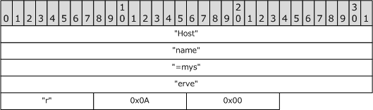
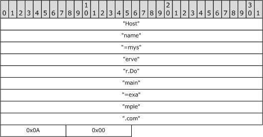
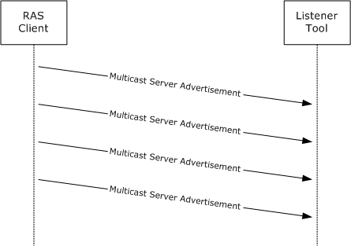

# [MS-RASA]: Remote Access Server Advertisement (RASADV) Protocol

Table of Contents

1 Introduction

- [1 Introduction](#Section_1)
  - [1.1 Glossary](#Section_1.1)
  - [1.2 References](#Section_1.2)
    - [1.2.1 Normative References](#Section_1.2.1)
    - [1.2.2 Informative References](#Section_1.2.2)
  - [1.3 Overview](#Section_1.3)
  - [1.4 Relationship to Other Protocols](#Section_1.4)
  - [1.5 Prerequisites/Preconditions](#Section_1.5)
  - [1.6 Applicability Statement](#Section_1.6)
  - [1.7 Versioning and Capability Negotiation](#Section_1.7)
  - [1.8 Vendor-Extensible Fields](#Section_1.8)
  - [1.9 Standards Assignments](#Section_1.9)

2 Messages

- [2 Messages](#Section_2)
  - [2.1 Transport](#Section_2.1)
  - [2.2 Message Syntax](#Section_2.2)
    - [2.2.1 Server Advertisement](#Section_2.2.1)

3 Protocol Details

- [3 Protocol Details](#Section_3)
  - [3.1 RAS Server Details](#Section_3.1)
    - [3.1.1 Abstract Data Model](#Section_3.1.1)
    - [3.1.2 Timers](#Section_3.1.2)
    - [3.1.3 Initialization](#Section_3.1.3)
    - [3.1.4 Higher-Layer Triggered Events](#Section_3.1.4)
    - [3.1.5 Message Processing Events and Sequencing Rules](#Section_3.1.5)
    - [3.1.6 Timer Events](#Section_3.1.6)
    - [3.1.7 Other Local Events](#Section_3.1.7)
  - [3.2 Listener Details](#Section_3.2)
    - [3.2.1 Abstract Data Model](#Section_3.2.1)
    - [3.2.2 Timers](#Section_3.2.2)
    - [3.2.3 Initialization](#Section_3.2.3)
    - [3.2.4 Higher-Layer Triggered Events](#Section_3.2.4)
    - [3.2.5 Message Processing Events and Sequencing Rules](#Section_3.2.5)
    - [3.2.6 Timer Events](#Section_3.2.6)
    - [3.2.7 Other Local Events](#Section_3.2.7)

4 Protocol Examples

- [4 Protocol Examples](#Section_4)
  - [4.1 Example 1](#Section_4.1)
  - [4.2 Example 2](#Section_4.2)
  - [4.3 Examples Sequence Diagram](#Section_4.3)

5 Security

- [5 Security](#Section_5)
  - [5.1 Security Considerations for Implementers](#Section_5.1)
  - [5.2 Index of Security Parameters](#Section_5.2)

6 Appendix A: Product Behavior

- [6 Appendix A: Product Behavior](#Section_6)

7 Change Tracking

- [7 Change Tracking](#Section_7)

For the legal notice and IP terms, see [LEGAL.md](../LEGAL.md).
Last updated: 4/23/2024.
See [Revision History](#revision-history) for full version history.

# 1 Introduction

This document specifies the Remote Access Server Advertisement (RASADV) Protocol, by which [**Remote Access Service (RAS) servers**](#gt_remote-access-service-ras-server) advertise their presence within a local network, which allows network administrators to detect nonmalicious configuration and deployment of gateways providing external access to their network.

Sections 1.5, 1.8, 1.9, 2, and 3 of this specification are normative. All other sections and examples in this specification are informative.

## 1.1 Glossary

This document uses the following terms:

**ASCII**: The American Standard Code for Information Interchange (ASCII) is an 8-bit character-encoding scheme based on the English alphabet. ASCII codes represent text in computers, communications equipment, and other devices that work with text. ASCII refers to a single 8-bit ASCII character or an array of 8-bit ASCII characters with the high bit of each character set to zero.

**domain**: A set of users and computers sharing a common namespace and management infrastructure. At least one computer member of the set has to act as a domain controller (DC) and host a member list that identifies all members of the domain, as well as optionally hosting the Active Directory service. The domain controller provides authentication of members, creating a unit of trust for its members. Each domain has an identifier that is shared among its members. For more information, see [MS-AUTHSOD](../MS-AUTHSOD/MS-AUTHSOD.md) section 1.1.1.5 and [MS-ADTS](../MS-ADTS/MS-ADTS.md).

**domain name**: The name given by an administrator to a collection of networked computers that share a common directory. Part of the domain naming service naming structure, domain names consist of a sequence of name labels separated by periods.

**Remote Access Service (RAS) server**: A type of network access server (NAS) that provides modem dial-up or virtual private network (VPN) access to a network.

**User Datagram Protocol (UDP)**: The connectionless protocol within TCP/IP that corresponds to the transport layer in the ISO/OSI reference model.

**MAY, SHOULD, MUST, SHOULD NOT, MUST NOT:** These terms (in all caps) are used as defined in [[RFC2119]](https://go.microsoft.com/fwlink/?LinkId=90317). All statements of optional behavior use either MAY, SHOULD, or SHOULD NOT.

## 1.2 References

Links to a document in the Microsoft Open Specifications library point to the correct section in the most recently published version of the referenced document. However, because individual documents in the library are not updated at the same time, the section numbers in the documents may not match. You can confirm the correct section numbering by checking the [Errata](https://go.microsoft.com/fwlink/?linkid=850906).

### 1.2.1 Normative References

We conduct frequent surveys of the normative references to assure their continued availability. If you have any issue with finding a normative reference, please contact [dochelp@microsoft.com](mailto:dochelp@microsoft.com). We will assist you in finding the relevant information.

[IANAIMA] IANA, "Internet Multicast Addresses", March 2007, [http://www.iana.org/assignments/multicast-addresses](https://go.microsoft.com/fwlink/?LinkId=90683)

[IANAPORT] IANA, "Service Name and Transport Protocol Port Number Registry", [https://www.iana.org/assignments/service-names-port-numbers/service-names-port-numbers.xhtml](https://go.microsoft.com/fwlink/?LinkId=89888)

[RFC2119] Bradner, S., "Key words for use in RFCs to Indicate Requirement Levels", BCP 14, RFC 2119, March 1997, [https://www.rfc-editor.org/info/rfc2119](https://go.microsoft.com/fwlink/?LinkId=90317)

[RFC768] Postel, J., "User Datagram Protocol", STD 6, RFC 768, August 1980, [https://www.rfc-editor.org/info/rfc768](https://go.microsoft.com/fwlink/?LinkId=90490)

[RFC791] Postel, J., Ed., "Internet Protocol: DARPA Internet Program Protocol Specification", RFC 791, September 1981, [https://www.rfc-editor.org/info/rfc791](https://go.microsoft.com/fwlink/?LinkId=392659)

### 1.2.2 Informative References

None.

## 1.3 Overview

The RASADV Protocol is a simple, unidirectional, multicast protocol. The sender is a [**RAS server**](#gt_f8c23490-c220-4d75-a9bd-db04e8fc1c48), which puts its machine name in a message and periodically multicasts it on its local network.<1> The receiver listens for periodic messages and passes the message content (the sender's machine name) and the source address to an application.<2> A typical application using the listener side of this protocol displays the information to the user.

## 1.4 Relationship to Other Protocols

The RASADV Protocol depends on the [**User Datagram Protocol (UDP)**](#gt_user-datagram-protocol-udp), as specified in [[RFC768]](https://go.microsoft.com/fwlink/?LinkId=90490), as a transport. No other protocols depend on the RASADV Protocol.

## 1.5 Prerequisites/Preconditions

## 1.6 Applicability Statement

The RASADV Protocol applies only to detecting intentional or accidental configuration and deployment of servers over time. It does not apply to detecting malicious configuration and deployment. It also does not apply if an administrator requires the ability to quickly detect such servers on demand, because it relies on a periodic broadcast mechanism.

## 1.7 Versioning and Capability Negotiation

The RASADV Protocol has no versioning or capability negotiation capabilities.

## 1.8 Vendor-Extensible Fields

This protocol has no vendor-extensible fields.

## 1.9 Standards Assignments

The RASADV Protocol uses the following standards assignments.

| Parameter | Value | Reference |
| --- | --- | --- |
| [**UDP**](#gt_user-datagram-protocol-udp) port number | 9753 | [[IANAPORT]](https://go.microsoft.com/fwlink/?LinkId=89888) |
| Internet Protocol version 4 (IPv4) multicast address | 239.255.2.2 | [[IANAIMA]](https://go.microsoft.com/fwlink/?LinkId=90683) |

# 2 Messages

The following sections specify how RASADV Protocol messages are transported and common RASADV Protocol data types.

## 2.1 Transport

All messages MUST be sent over [**UDP**](#gt_user-datagram-protocol-udp), as specified in [[RFC768]](https://go.microsoft.com/fwlink/?LinkId=90490), with the UDP destination port set to 9753 and the IP destination address set to 239.255.2.2. The IP Time to Live (TTL), as specified in [[RFC791]](https://go.microsoft.com/fwlink/?LinkId=392659) section 3.1, SHOULD be set to 15.

## 2.2 Message Syntax

The RASADV Protocol has a single message type.

### 2.2.1 Server Advertisement

The [**UDP**](#gt_user-datagram-protocol-udp) message MUST be one of the following:

- The [**ASCII**](#gt_ascii) string "Hostname=<hostname>", where *<hostname>* is replaced with the host name of the sender, followed by a line feed (0x0A) and a null character (0x00). This syntax MUST be used if the sender is not a member of a [**domain**](#gt_domain).
- The ASCII string "Hostname=<hostname>\nDomain=<domainname>", where *<hostname>* is replaced with the host name of the sender, followed by a line feed (0x0A), and *<domainname>* is replaced with the [**domain name**](#gt_domain-name) of the domain of which the machine is a member, followed by a line feed (0x0A) and a null character (0x00). This syntax MUST be used if the sender is a member of a domain.

# 3 Protocol Details

The following sections specify details of the RASADV Protocol, including abstract data models and message processing rules.

## 3.1 RAS Server Details

### 3.1.1 Abstract Data Model

This section describes a conceptual model of possible data organization that an implementation maintains to participate in this protocol. The described organization is provided to facilitate the explanation of how the protocol behaves. This document does not mandate that implementations adhere to this model as long as their external behavior is consistent with that described in this document.

Host Name: The host name of the [**RAS server**](#gt_f8c23490-c220-4d75-a9bd-db04e8fc1c48).

### 3.1.2 Timers

**Advertisement Timer:** A periodic timer used to multicast a server advertisement. It SHOULD have a period of 1 hour.

### 3.1.3 Initialization

When a [**RAS server**](#gt_f8c23490-c220-4d75-a9bd-db04e8fc1c48) starts, it MUST immediately send a server advertisement, as specified in section [2.2.1](#Section_2.2.1), and start its [Advertisement Timer](#Section_3.1.2).

### 3.1.4 Higher-Layer Triggered Events

This protocol has no higher-layer triggered events.

### 3.1.5 Message Processing Events and Sequencing Rules

The [**RAS server**](#gt_f8c23490-c220-4d75-a9bd-db04e8fc1c48) role has no message processing events or sequencing rules.

### 3.1.6 Timer Events

When the [Advertisement Timer](#Section_3.1.2) expires, the [**RAS server**](#gt_f8c23490-c220-4d75-a9bd-db04e8fc1c48) MUST send a server advertisement, as specified in section [2.2.1](#Section_2.2.1), and restart its Advertisement Timer.

### 3.1.7 Other Local Events

This protocol has no other local events.

## 3.2 Listener Details

### 3.2.1 Abstract Data Model

The listener role has no abstract data model.

### 3.2.2 Timers

The listener role has no timers.

### 3.2.3 Initialization

When a listener starts, it MUST start listening for [**UDP**](#gt_user-datagram-protocol-udp) messages on port 9753 and join the IPv4 multicast group 239.255.2.2.

### 3.2.4 Higher-Layer Triggered Events

This protocol has no higher-layer triggered events.

### 3.2.5 Message Processing Events and Sequencing Rules

When a message arrives, the listener MUST deliver the message text and the source IP address to the application.

### 3.2.6 Timer Events

The listener role has no timer events.

### 3.2.7 Other Local Events

This protocol has no other local events.

# 4 Protocol Examples

Following are two examples where a [**RAS server**](#gt_f8c23490-c220-4d75-a9bd-db04e8fc1c48) broadcasts its advertisement on the local network.

## 4.1 Example 1

The network administrator starts a listener tool. The tool begins listening on the RASADV port and the multicast address. Later, the user configures a [**RAS server**](#gt_f8c23490-c220-4d75-a9bd-db04e8fc1c48) on the local network, on a computer named "myserver", which is not a member of a [**domain**](#gt_domain). When the RAS server starts, and every hour thereafter, it sends a [Server Advertisement](#Section_2.2.1) message containing the string "Hostname=myserver" followed by a line feed (0x0A) and a null character (0x00).

## 4.2 Example 2

The network administrator starts a listener tool. The tool begins listening on the RASADV port and the multicast address. Later, the user configures a [**RAS server**](#gt_f8c23490-c220-4d75-a9bd-db04e8fc1c48) on the local network, on a computer named "myserver", which is a member of the [**domain**](#gt_domain) named "example.com". When the RAS server starts, and every hour thereafter, it sends a [Server Advertisement](#Section_2.2.1) message containing the string "Hostname=myserver.Domain=example.com" followed by a line feed (0x0A) and a null character (0x00).

## 4.3 Examples Sequence Diagram

The following sequence diagram illustrates the [**UDP**](#gt_user-datagram-protocol-udp) messages corresponding to the examples mentioned previously.

Figure 1: RAS server successfully multicasting its advertisement RAS client

# 5 Security

The following sections specify security considerations for implementers of the RASADV Protocol.

## 5.1 Security Considerations for Implementers

RASADV assumes that servers advertise themselves in order to be detected, and therefore does not provide any security or the ability to detect malicious servers.

## 5.2 Index of Security Parameters

This protocol has no security parameters.

# 6 Appendix A: Product Behavior

The information in this specification is applicable to the following Microsoft products or supplemental software. References to product versions include updates to those products.

- Windows 2000 operating system
- Windows XP operating system
- Windows Server 2003 operating system
- Windows Vista operating system
- Windows Server 2008 operating system
- Windows 7 operating system
- Windows Server 2008 R2 operating system
- Windows 8 operating system
- Windows Server 2012 operating system
- Windows 8.1 operating system
- Windows Server 2012 R2 operating system
- Windows 10 operating system
- Windows Server 2016 operating system
- Windows Server operating system
- Windows Server 2019 operating system
- Windows Server 2022 operating system
- Windows 11 operating system
- Windows Server 2025 operating system
Exceptions, if any, are noted in this section. If an update version, service pack or Knowledge Base (KB) number appears with a product name, the behavior changed in that update. The new behavior also applies to subsequent updates unless otherwise specified. If a product edition appears with the product version, behavior is different in that product edition.

Unless otherwise specified, any statement of optional behavior in this specification that is prescribed using the terms "SHOULD" or "SHOULD NOT" implies product behavior in accordance with the SHOULD or SHOULD NOT prescription. Unless otherwise specified, the term "MAY" implies that the product does not follow the prescription.

<1> Section 1.3: Windows 2000 Server operating system, Windows Server 2003, Windows Server 2008, Windows Server 2008 R2 operating system, Windows Server 2012, Windows Server 2012 R2, Windows Server 2016, Windows Server operating system, and Windows Server 2019 support the sender role in Routing and Remote Access, which is an add-on that combines remote access support with network routing functionality.

<2> Section 1.3: The listener is implemented in Windows by the command "netsh ras show activeservers", which displays the messages as they arrive.

# 7 Change Tracking

This section identifies changes that were made to this document since the last release. Changes are classified as Major, Minor, or None.

The revision class **Major** means that the technical content in the document was significantly revised. Major changes affect protocol interoperability or implementation. Examples of major changes are:

- A document revision that incorporates changes to interoperability requirements.
- A document revision that captures changes to protocol functionality.
The revision class **Minor** means that the meaning of the technical content was clarified. Minor changes do not affect protocol interoperability or implementation. Examples of minor changes are updates to clarify ambiguity at the sentence, paragraph, or table level.

The revision class **None** means that no new technical changes were introduced. Minor editorial and formatting changes may have been made, but the relevant technical content is identical to the last released version.

The changes made to this document are listed in the following table. For more information, please contact [dochelp@microsoft.com](mailto:dochelp@microsoft.com).

| Section | Description | Revision class |
| --- | --- | --- |
| [6](#Section_6) Appendix A: Product Behavior | Added Windows Server 2025 to the list of applicable products. | Major |

## Revision History

| Date | Version | Revision Class | Comments |
| --- | --- | --- | --- |
| 7/20/2007 | 0.1 | Major | MCPP Milestone 5 Initial Availability |
| 9/28/2007 | 0.1.1 | Editorial | Changed language and formatting in the technical content. |
| 10/23/2007 | 0.1.2 | Editorial | Changed language and formatting in the technical content. |
| 11/30/2007 | 0.1.3 | Editorial | Changed language and formatting in the technical content. |
| 1/25/2008 | 0.1.4 | Editorial | Changed language and formatting in the technical content. |
| 3/14/2008 | 0.1.5 | Editorial | Changed language and formatting in the technical content. |
| 5/16/2008 | 0.1.6 | Editorial | Changed language and formatting in the technical content. |
| 6/20/2008 | 1.0 | Major | Updated and revised the technical content. |
| 7/25/2008 | 1.0.1 | Editorial | Changed language and formatting in the technical content. |
| 8/29/2008 | 2.0 | Major | Added examples. |
| 10/24/2008 | 3.0 | Major | Updated and revised the technical content. |
| 12/5/2008 | 3.1 | Minor | Clarified the meaning of the technical content. |
| 1/16/2009 | 3.1.1 | Editorial | Changed language and formatting in the technical content. |
| 2/27/2009 | 3.1.2 | Editorial | Changed language and formatting in the technical content. |
| 4/10/2009 | 3.1.3 | Editorial | Changed language and formatting in the technical content. |
| 5/22/2009 | 3.1.4 | Editorial | Changed language and formatting in the technical content. |
| 7/2/2009 | 3.2 | Minor | Clarified the meaning of the technical content. |
| 8/14/2009 | 3.2.1 | Editorial | Changed language and formatting in the technical content. |
| 9/25/2009 | 3.3 | Minor | Clarified the meaning of the technical content. |
| 11/6/2009 | 3.3.1 | Editorial | Changed language and formatting in the technical content. |
| 12/18/2009 | 3.3.2 | Editorial | Changed language and formatting in the technical content. |
| 1/29/2010 | 3.3.3 | Editorial | Changed language and formatting in the technical content. |
| 3/12/2010 | 3.3.4 | Editorial | Changed language and formatting in the technical content. |
| 4/23/2010 | 3.3.5 | Editorial | Changed language and formatting in the technical content. |
| 6/4/2010 | 3.3.6 | Editorial | Changed language and formatting in the technical content. |
| 7/16/2010 | 3.3.6 | None | No changes to the meaning, language, or formatting of the technical content. |
| 8/27/2010 | 3.3.6 | None | No changes to the meaning, language, or formatting of the technical content. |
| 10/8/2010 | 3.3.6 | None | No changes to the meaning, language, or formatting of the technical content. |
| 11/19/2010 | 3.3.6 | None | No changes to the meaning, language, or formatting of the technical content. |
| 1/7/2011 | 3.3.6 | None | No changes to the meaning, language, or formatting of the technical content. |
| 2/11/2011 | 3.3.6 | None | No changes to the meaning, language, or formatting of the technical content. |
| 3/25/2011 | 3.3.6 | None | No changes to the meaning, language, or formatting of the technical content. |
| 5/6/2011 | 3.3.6 | None | No changes to the meaning, language, or formatting of the technical content. |
| 6/17/2011 | 3.4 | Minor | Clarified the meaning of the technical content. |
| 9/23/2011 | 3.4 | None | No changes to the meaning, language, or formatting of the technical content. |
| 12/16/2011 | 4.0 | Major | Updated and revised the technical content. |
| 3/30/2012 | 4.0 | None | No changes to the meaning, language, or formatting of the technical content. |
| 7/12/2012 | 4.0 | None | No changes to the meaning, language, or formatting of the technical content. |
| 10/25/2012 | 4.0 | None | No changes to the meaning, language, or formatting of the technical content. |
| 1/31/2013 | 4.0 | None | No changes to the meaning, language, or formatting of the technical content. |
| 8/8/2013 | 5.0 | Major | Updated and revised the technical content. |
| 11/14/2013 | 5.0 | None | No changes to the meaning, language, or formatting of the technical content. |
| 2/13/2014 | 5.0 | None | No changes to the meaning, language, or formatting of the technical content. |
| 5/15/2014 | 5.0 | None | No changes to the meaning, language, or formatting of the technical content. |
| 6/30/2015 | 6.0 | Major | Significantly changed the technical content. |
| 10/16/2015 | 6.0 | None | No changes to the meaning, language, or formatting of the technical content. |
| 7/14/2016 | 6.0 | None | No changes to the meaning, language, or formatting of the technical content. |
| 6/1/2017 | 6.0 | None | No changes to the meaning, language, or formatting of the technical content. |
| 9/15/2017 | 7.0 | Major | Significantly changed the technical content. |
| 9/12/2018 | 8.0 | Major | Significantly changed the technical content. |
| 4/7/2021 | 9.0 | Major | Significantly changed the technical content. |
| 6/25/2021 | 10.0 | Major | Significantly changed the technical content. |
| 4/23/2024 | 11.0 | Major | Significantly changed the technical content. |
