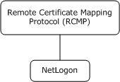
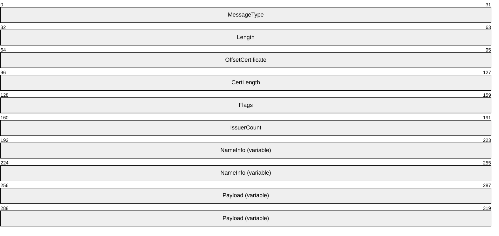
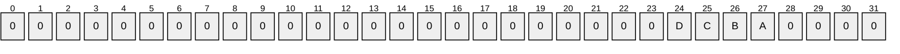
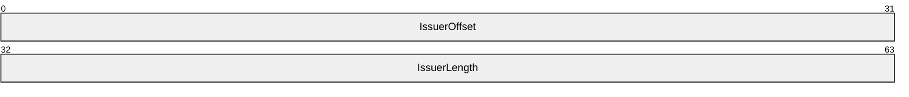
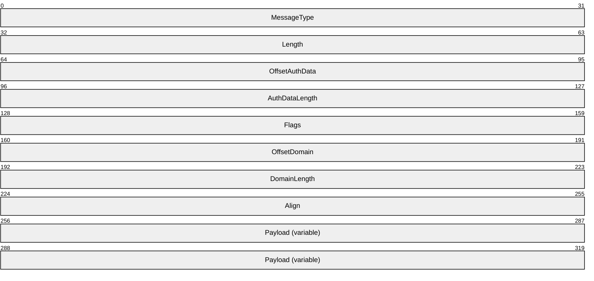
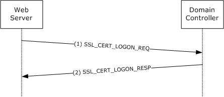

# [MS-RCMP]: Remote Certificate Mapping Protocol

Table of Contents

1 Introduction

- [1 Introduction](#Section_1)
  - [1.1 Glossary](#Section_1.1)
  - [1.2 References](#Section_1.2)
    - [1.2.1 Normative References](#Section_1.2.1)
    - [1.2.2 Informative References](#Section_1.2.2)
  - [1.3 Overview](#Section_1.3)
  - [1.4 Relationship to Other Protocols](#Section_1.4)
  - [1.5 Prerequisites/Preconditions](#Section_1.5)
  - [1.6 Applicability Statement](#Section_1.6)
  - [1.7 Versioning and Capability Negotiation](#Section_1.7)
  - [1.8 Vendor-Extensible Fields](#Section_1.8)
  - [1.9 Standards Assignments](#Section_1.9)

2 Messages

- [2 Messages](#Section_2)
  - [2.1 Transport](#Section_2.1)
  - [2.2 Message Syntax](#Section_2.2)
    - [2.2.1 SSL_CERT_LOGON_REQ Message](#Section_2.2.1)
    - [2.2.2 SSL_CERT_LOGON_RESP Message](#Section_2.2.2)
  - [2.3 Constants](#Section_2.3)
  - [2.4 Directory Service Schema Elements](#Section_2.4)

3 Protocol Details

- [3 Protocol Details](#Section_3)
  - [3.1 Abstract Data Model](#Section_3.1)
  - [3.2 Timers](#Section_3.2)
  - [3.3 Initialization](#Section_3.3)
  - [3.4 Higher-Layer Triggered Events](#Section_3.4)
  - [3.5 Processing Events and Sequencing Rules](#Section_3.5)
    - [3.5.1 Client Generation of SSL_CERT_LOGON_REQ Message](#Section_3.5.1)
    - [3.5.2 Server Processing of SSL_CERT_LOGON_REQ Message](#Section_3.5.2)
    - [3.5.3 Server Generation of the SSL_CERT_LOGON_RESP Message](#Section_3.5.3)
  - [3.6 Timer Events](#Section_3.6)
  - [3.7 Other Local Events](#Section_3.7)

4 Protocol Examples

- [4 Protocol Examples](#Section_4)

5 Security

- [5 Security](#Section_5)
  - [5.1 Security Considerations for Implementers](#Section_5.1)
  - [5.2 Index of Security Parameters](#Section_5.2)

6 Appendix A: Product Behavior

- [6 Appendix A: Product Behavior](#Section_6)

7 Change Tracking

- [7 Change Tracking](#Section_7)

For the legal notice and IP terms, see [LEGAL.md](../LEGAL.md).
Last updated: 4/23/2024.
See [Revision History](#revision-history) for full version history.

# 1 Introduction

This document specifies the Remote Certificate Mapping Protocol. The Remote Certificate Mapping Protocol is used by servers that authenticate users via X.509 certificates, as specified in [[X509]](https://go.microsoft.com/fwlink/?LinkId=90590). This protocol allows the server to use a directory, database, or other technology to map the user's X.509 certificate to a [**security principal**](#gt_security-principal). This protocol returns the authorization information associated with the security principal in the form of a [**privilege attribute certificate (PAC)**](#gt_privilege-attribute-certificate-pac), as specified in [MS-PAC](../MS-PAC/MS-PAC.md), that represents the user's identity and group memberships. Throughout this document, [**little-endian**](#gt_little-endian) format applies unless otherwise stated.

Sections 1.5, 1.8, 1.9, 2, and 3 of this specification are normative. All other sections and examples in this specification are informative.

## 1.1 Glossary

This document uses the following terms:

**Active Directory**: The Windows implementation of a general-purpose directory service, which uses LDAP as its primary access protocol. [**Active Directory**](#gt_active-directory) stores information about a variety of [**objects**](#gt_object) in the network such as user accounts, computer accounts, groups, and all related credential information used by Kerberos [MS-KILE](../MS-KILE/MS-KILE.md). [**Active Directory**](#gt_active-directory) is either deployed as Active Directory Domain Services (AD DS) or Active Directory Lightweight Directory Services (AD LDS), which are both described in [MS-ADOD](../MS-ADOD/MS-ADOD.md): Active Directory Protocols Overview.

**distinguished name (DN)**: A name that uniquely identifies an object by using the relative distinguished name (RDN) for the object, and the names of container objects and domains that contain the object. The distinguished name (DN) identifies the object and its location in a tree.

**domain**: A set of users and computers sharing a common namespace and management infrastructure. At least one computer member of the set has to act as a [**domain controller (DC)**](#gt_domain-controller-dc) and host a member list that identifies all members of the domain, as well as optionally hosting the [**Active Directory**](#gt_active-directory) service. The domain controller provides authentication of members, creating a unit of trust for its members. Each domain has an identifier that is shared among its members. For more information, see [MS-AUTHSOD](../MS-AUTHSOD/MS-AUTHSOD.md) section 1.1.1.5 and [MS-ADTS](../MS-ADTS/MS-ADTS.md).

**domain controller (DC)**: The service, running on a server, that implements [**Active Directory**](#gt_active-directory), or the server hosting this service. The service hosts the data store for [**objects**](#gt_object) and interoperates with other [**DCs**](#gt_domain-controller-dc) to ensure that a local change to an [**object**](#gt_object) replicates correctly across all [**DCs**](#gt_domain-controller-dc). When [**Active Directory**](#gt_active-directory) is operating as Active Directory Domain Services (AD DS), the [**DC**](#gt_domain-controller-dc) contains full NC replicas of the configuration naming context (config NC), schema naming context (schema NC), and one of the domain NCs in its forest. If the AD DS [**DC**](#gt_domain-controller-dc) is a global catalog server (GC server), it contains partial NC replicas of the remaining domain NCs in its forest. For more information, see [MS-AUTHSOD] section 1.1.1.5.2 and [MS-ADTS]. When [**Active Directory**](#gt_active-directory) is operating as Active Directory Lightweight Directory Services (AD LDS), several AD LDS [**DCs**](#gt_domain-controller-dc) can run on one server. When [**Active Directory**](#gt_active-directory) is operating as AD DS, only one AD DS [**DC**](#gt_domain-controller-dc) can run on one server. However, several AD LDS [**DCs**](#gt_domain-controller-dc) can coexist with one AD DS [**DC**](#gt_domain-controller-dc) on one server. The AD LDS [**DC**](#gt_domain-controller-dc) contains full NC replicas of the config NC and the schema NC in its forest. The domain controller is the server side of Authentication Protocol Domain Support [MS-APDS](../MS-APDS/MS-APDS.md).

**issuer name**: The name of the certificate authority (CA) that signed and issued a certificate. The name is an X.509 format name, as specified in [[X509]](https://go.microsoft.com/fwlink/?LinkId=90590).

**little-endian**: Multiple-byte values that are byte-ordered with the least significant byte stored in the memory location with the lowest address.

**object**: In [**Active Directory**](#gt_active-directory), an entity consisting of a set of attributes, each attribute with a set of associated values. For more information, see [MS-ADTS]. See also directory object.

**privilege attribute certificate (PAC)**: A Microsoft-specific authorization data present in the authorization data field of a ticket. The [**PAC**](#gt_privilege-attribute-certificate-pac) contains several logical components, including group membership data for authorization, alternate credentials for non-Kerberos authentication protocols, and policy control information for supporting interactive logon.

**remote procedure call (RPC)**: A communication protocol used primarily between client and server. The term has three definitions that are often used interchangeably: a runtime environment providing for communication facilities between computers (the RPC runtime); a set of request-and-response message exchanges between computers (the RPC exchange); and the single message from an RPC exchange (the RPC message). For more information, see [[C706]](https://go.microsoft.com/fwlink/?LinkId=89824).

**RPC transport**: The underlying network services used by the remote procedure call (RPC) runtime for communications between network nodes. For more information, see [C706] section 2.

**security principal**: A unique entity that is identifiable through cryptographic means by at least one key. It frequently corresponds to a human user, but also can be a service that offers a resource to other security principals. Also referred to as principal.

**service principal name (SPN)**: The name a client uses to identify a service for mutual authentication. (For more information, see [[RFC1964]](https://go.microsoft.com/fwlink/?LinkId=90304) section 2.1.1.) An [**SPN**](#gt_service-principal-name-spn) consists of either two parts or three parts, each separated by a forward slash ('/'). The first part is the service class, the second part is the host name, and the third part (if present) is the service name. For example, "ldap/dc-01.fabrikam.com/fabrikam.com" is a three-part [**SPN**](#gt_service-principal-name-spn) where "ldap" is the service class name, "dc-01.fabrikam.com" is the host name, and "fabrikam.com" is the service name. See [[SPNNAMES]](https://go.microsoft.com/fwlink/?LinkId=90532) for more information about [**SPN**](#gt_service-principal-name-spn) format and composing a unique [**SPN**](#gt_service-principal-name-spn).

**Unicode**: A character encoding standard developed by the Unicode Consortium that represents almost all of the written languages of the world. The [**Unicode**](#gt_unicode) standard [[UNICODE5.0.0/2007]](https://go.microsoft.com/fwlink/?LinkId=154659) provides three forms (UTF-8, UTF-16, and UTF-32) and seven schemes (UTF-8, UTF-16, UTF-16 BE, UTF-16 LE, UTF-32, UTF-32 LE, and UTF-32 BE).

**user principal name (UPN)**: A user account name (sometimes referred to as the user logon name) and a domain name that identifies the domain in which the user account is located. This is the standard usage for logging on to a Windows domain. The format is: someone@example.com (in the form of an email address). In [**Active Directory**](#gt_active-directory), the userPrincipalName attribute of the account object, as described in [MS-ADTS].

**MAY, SHOULD, MUST, SHOULD NOT, MUST NOT:** These terms (in all caps) are used as defined in [[RFC2119]](https://go.microsoft.com/fwlink/?LinkId=90317). All statements of optional behavior use either MAY, SHOULD, or SHOULD NOT.

## 1.2 References

Links to a document in the Microsoft Open Specifications library point to the correct section in the most recently published version of the referenced document. However, because individual documents in the library are not updated at the same time, the section numbers in the documents may not match. You can confirm the correct section numbering by checking the [Errata](https://go.microsoft.com/fwlink/?linkid=850906).

### 1.2.1 Normative References

We conduct frequent surveys of the normative references to assure their continued availability. If you have any issue with finding a normative reference, please contact [dochelp@microsoft.com](mailto:dochelp@microsoft.com). We will assist you in finding the relevant information.

[MS-ADA1] Microsoft Corporation, "[Active Directory Schema Attributes A-L](../MS-ADA1/MS-ADA1.md)".

[MS-ADA3] Microsoft Corporation, "[Active Directory Schema Attributes N-Z](../MS-ADA3/MS-ADA3.md)".

[MS-ADTS] Microsoft Corporation, "[Active Directory Technical Specification](../MS-ADTS/MS-ADTS.md)".

[MS-DTYP] Microsoft Corporation, "[Windows Data Types](../MS-DTYP/MS-DTYP.md)".

[MS-ERREF] Microsoft Corporation, "[Windows Error Codes](../MS-ERREF/MS-ERREF.md)".

[MS-KILE] Microsoft Corporation, "[Kerberos Protocol Extensions](../MS-KILE/MS-KILE.md)".

[MS-NRPC] Microsoft Corporation, "[Netlogon Remote Protocol](../MS-NRPC/MS-NRPC.md)".

[MS-PAC] Microsoft Corporation, "[Privilege Attribute Certificate Data Structure](../MS-PAC/MS-PAC.md)".

[MS-UCODEREF] Microsoft Corporation, "[Windows Protocols Unicode Reference](../MS-UCODEREF/MS-UCODEREF.md)".

[RFC2119] Bradner, S., "Key words for use in RFCs to Indicate Requirement Levels", BCP 14, RFC 2119, March 1997, [https://www.rfc-editor.org/info/rfc2119](https://go.microsoft.com/fwlink/?LinkId=90317)

[RFC4556] Zhu, L., and Tung, B., "Public Key Cryptography for Initial Authentication in Kerberos", RFC 4556, June 2006, [https://www.rfc-editor.org/info/rfc4556](https://go.microsoft.com/fwlink/?LinkId=90482)

[RFC5280] Cooper, D., Santesson, S., Farrell, S., et al., "Internet X.509 Public Key Infrastructure Certificate and Certificate Revocation List (CRL) Profile", RFC 5280, May 2008, [https://www.rfc-editor.org/info/rfc5280](https://go.microsoft.com/fwlink/?LinkId=131034)

[X509] ITU-T, "Information Technology - Open Systems Interconnection - The Directory: Public-Key and Attribute Certificate Frameworks", Recommendation X.509, August 2005, [http://www.itu.int/rec/T-REC-X.509/en](https://go.microsoft.com/fwlink/?LinkId=90590)

[X690] ITU-T, "Information Technology - ASN.1 Encoding Rules: Specification of Basic Encoding Rules (BER), Canonical Encoding Rules (CER) and Distinguished Encoding Rules (DER)", Recommendation X.690, July 2002, [http://www.itu.int/rec/T-REC-X.690/en](https://go.microsoft.com/fwlink/?LinkId=90593)

### 1.2.2 Informative References

[GUTMANN] Gutmann, P., "X.509 Style Guide", October 2000, [http://www.cs.auckland.ac.nz/~pgut001/pubs/x509guide.txt](https://go.microsoft.com/fwlink/?LinkId=89877)

[MS-RPCE] Microsoft Corporation, "[Remote Procedure Call Protocol Extensions](../MS-RPCE/MS-RPCE.md)".

[RFC2246] Dierks, T., and Allen, C., "The TLS Protocol Version 1.0", RFC 2246, January 1999, [https://www.rfc-editor.org/info/rfc2246](https://go.microsoft.com/fwlink/?LinkId=90324)

[RFC2716] Aboba, B. and Simon, D., "PPP EAP TLS Authentication Protocol", RFC 2716, October 1999, [https://www.rfc-editor.org/info/rfc2716](https://go.microsoft.com/fwlink/?LinkId=90374)

## 1.3 Overview

The Remote Certificate Mapping Protocol is used in deployments where users rely on [[X509]](https://go.microsoft.com/fwlink/?LinkId=90590) certificates to gain access to resources. After a client authenticates itself to a server using an X.509 certificate, the server uses the Remote Certificate Mapping Protocol to contact a directory to determine the authorization information to use, such as group memberships. The Remote Certificate Mapping Protocol returns a [**privilege attribute certificate (PAC)**](#gt_privilege-attribute-certificate-pac), as specified in [MS-PAC](../MS-PAC/MS-PAC.md), that represents the user's identity and group memberships, suitable for making authorization decisions.

There are three methods by which a certificate can be associated with an account for the purposes of authorization.

- First, the **subjectAltName** field of the X.509 certificate can be treated as a [**user principal name (UPN)**](#gt_user-principal-name-upn) and used as the key, in the database sense, to locate the account record and corresponding authorization information.
- Second, the issuer and subject names can be taken together as a key, again in the database sense, to locate the account record.
- Third, the [**issuer name**](#gt_issuer-name) alone can be used as the lookup key when locating the account record.
The Remote Certificate Mapping Protocol itself consists of a single request/response message pair: [SSL_CERT_LOGON_REQ (section 2.2.1)](#Section_3.5.2) and [SSL_CERT_LOGON_RESP (section 2.2.2)](#Section_3.5.3). This request/response pair is transferred by using the generic pass-through capability of the Netlogon Remote Protocol, as specified in [MS-NRPC](../MS-NRPC/MS-NRPC.md) section 3.2.4.1. The client creates an SSL_CERT_LOGON_REQ message that contains the X.509 certificate for which the client wants to obtain the corresponding authorization information and specifies which (or all) of the methods described in the preceding paragraph should be applied. The Remote Certificate Mapping Protocol server uses attributes of this X.509 certificate and the indicated methods by the client to determine the authorization information. Assuming an account is found, the Remote Certificate Mapping Protocol server then creates and returns a PAC, as specified in [MS-PAC], that contains the authorization information in the SSL_CERT_LOGON_RESP message to the Remote Certificate Mapping Protocol client.

The Remote Certificate Mapping Protocol specification uses common fields from X.509, as specified in [X509], including **subjectName**, **subjectAltName**, and **issuerName**. An implementer of the Remote Certificate Mapping Protocol has to be familiar with X.509 certificates, in particular the verification and parsing of the certificate to extract the fields listed earlier. For more information about X.509, see [[GUTMANN]](https://go.microsoft.com/fwlink/?LinkId=89877).

## 1.4 Relationship to Other Protocols

Any protocol that authenticates clients based on public key certificates can make use of the Remote Certificate Mapping Protocol to obtain authorization information about the client. The protocol described in [MS-NRPC](../MS-NRPC/MS-NRPC.md) serves as the transport for Remote Certificate Mapping Protocol messages.

The Remote Certificate Mapping Protocol can be used to implement the Secure Sockets Layer/Transport Layer Security (SSL/TLS) protocol, as specified in [[RFC2246]](https://go.microsoft.com/fwlink/?LinkId=90324), and Extensible Authentication (EAP) TLS protocol, as specified in [[RFC2716]](https://go.microsoft.com/fwlink/?LinkId=90374), when client authentication by means of an X.509 certificate is selected as part of the TLS handshake. In the SSL/TLS, authentication of client is optional and is only done when requested by the SSL/TLS server. If the client authentication option is chosen, the SSL/TLS client authenticates itself to the SSL/TLS server using an X.509 certificate.

Figure 1: Protocol relationship diagram.

## 1.5 Prerequisites/Preconditions

The Remote Certificate Mapping Protocol requires that users have X.509 certificates available to them for authentication. The Remote Certificate Mapping Protocol also requires that a means exists to associate a certificate with a set of authorization data, commonly some form of an account database.<1>

## 1.6 Applicability Statement

The Remote Certificate Mapping Protocol is applicable in deployments where users have been issued X.509 certificates, as specified in [[X509]](https://go.microsoft.com/fwlink/?LinkId=90590), and a common database for user and machine authorization information. In this type of environment, the Remote Certificate Mapping Protocol is used between the authentication step and authorization step. It enables the server that uses an authentication protocol using X.509 certificates to obtain a [**PAC**](#gt_privilege-attribute-certificate-pac), as specified in [MS-PAC](../MS-PAC/MS-PAC.md), that represents the user's identity and group memberships, suitable for making authorization decisions.

## 1.7 Versioning and Capability Negotiation

None.

## 1.8 Vendor-Extensible Fields

The Remote Certificate Mapping Protocol does not have any vendor-extensible fields.

## 1.9 Standards Assignments

There are no standards assignments in the Remote Certificate Mapping Protocol beyond the standards assignments as specified in [MS-NRPC](../MS-NRPC/MS-NRPC.md).

# 2 Messages

## 2.1 Transport

The Remote Certificate Mapping Protocol messages are embedded in Netlogon Remote Protocol messages in the logon interface. As a result, the Remote Certificate Mapping Protocol uses the Netlogon [**RPC transport**](#gt_rpc-transport), as specified in [MS-NRPC](../MS-NRPC/MS-NRPC.md) section 2.1.

## 2.2 Message Syntax

Remote Certificate Mapping Protocol messages are encoded as opaque Binary Large Objects (BLOB) and transported by the generic pass-through capability of the Netlogon Remote Protocol, as specified in [MS-NRPC](../MS-NRPC/MS-NRPC.md) section 3.2.4.1.

### 2.2.1 SSL_CERT_LOGON_REQ Message

The SSL_CERT_LOGON_REQ structure defines a request to map a client certificate to a [**security principal**](#gt_security-principal) for the purpose of retrieving the authorization information. All member fields MUST be encoded in [**little-endian**](#gt_little-endian) format.

**MessageType (4 bytes):** A 32-bit unsigned integer that defines the Remote Certificate Mapping Protocol message type. This member MUST be 0x00000002.

**Length (4 bytes):** A 32-bit unsigned integer that defines the length, in bytes, of the SSL_CERT_LOGON_REQ request message, including the variable length **NameInfo** and **Payload** sections.

**OffsetCertificate (4 bytes):** A 32-bit unsigned integer that defines the offset, in bytes, from the beginning of the SSL_CERT_LOGON_REQ request structure to the X.509 certificate, as specified in [[X509]](https://go.microsoft.com/fwlink/?LinkId=90590), in the **Payload** member.

**CertLength (4 bytes):** A 32-bit unsigned integer that defines the length, in bytes, of the X.509 certificate in the **Payload** member.

**Flags (4 bytes):** A 32-bit unsigned integer that defines mapping behaviors. The value of this member is any combination of the flags as specified in the following diagram.

All other bits MUST be set to 0 by the Remote Certificate Mapping Protocol client and ignored on receipt.

Where the bits are defined as:

| Value | Description |
| --- | --- |
| A REQ_UPN_MAPPING | When set, this indicates that the Remote Certificate Mapping Protocol client requests the Remote Certificate Mapping Protocol server to use the **subjectAltName** from the X.509 certificate in the **Payload** member to locate the authorization information, as specified in section [3.5](#Section_3.5). If not set, the **subjectAltName** extension SHOULD NOT be used during the lookup operation. |
| B REQ_SUBJECT_MAPPING | When set, the Remote Certificate Mapping Protocol client requests the Remote Certificate Mapping Protocol server to use the **issuer** and **subject** names from the X.509 certificate in the **Payload** member together to locate the authorization information, as specified in section 3.5. If not set, the **issuer** and **subject** fields SHOULD NOT be used during the lookup operation. |
| C REQ_ISSUER_MAPPING | When set, the Remote Certificate Mapping Protocol client requests the Remote Certificate Mapping Protocol server to use the **issuer** from the X.509 certificate in the **Payload** member to locate the authorization information, as specified in section 3.5. If not set, the [**issuer name**](#gt_issuer-name) SHOULD NOT be used during the lookup operation. |
| D REQ_ISSUER_CHAIN_MAPPING | When set, the Remote Certificate Mapping Protocol client requests the Remote Certificate Mapping Protocol server to use the chain of issuing authorities for the X.509 certificate in the **Payload** member to locate the authorization information, as specified in section 3.5. If not set, the chain of issuers SHOULD NOT be used during the lookup operation. |

**IssuerCount (4 bytes):** A 32-bit unsigned integer that defines the number of **NameInfo** elements.

**NameInfo (variable):** An array of **IssuerOffset** and **IssuerLength** pairs, as defined in the following diagram. The issuers MUST be in the same order as the chain of issuing authorities for the X.509 certificate in the **Payload** section. That is, if the certificate was issued by A, and certificate authority A was in turn issued by B, the order would be A B.

**IssuerOffset (4 bytes):** A 32-bit unsigned integer that defines the byte offset from the start of the packet to an **IssuerName** in the **Payload** member.

**IssuerLength (4 bytes):** A 32-bit unsigned integer that defines the length, in bytes, of an **IssuerName** in the **Payload** member.

**Payload (variable):** A byte-array that contains the data referred to by the **OffsetCertificate** and **IssuerOffset** members. The **IssuerName** members in the **Payload** section has no guaranteed order; order is defined by the **NameInfo** array listed previously. Thus, the data might be packed into the buffer as "Issuer1, Issuer3, Certificate, Issuer2", but the **NameInfo** array would list them as "Issuer1, Issuer2, Issuer3." The actual order is specified in section [3.5.1](#Section_3.5.1). The number of issuer names encoded into the **Payload** section is determined by the **IssuerCount** member. Each **IssuerName** MUST be 2-byte aligned.

**Certificate**: The client's BER-encoded X.509 certificate referred to by the **OffsetCertificate** member. The format of an X.509 certificate is specified in ASN.1 per the X.509 standard, as specified in [X509]. BER encoding is specified in [[X690]](https://go.microsoft.com/fwlink/?LinkId=90593).

**IssuerName**: The BER-encoded certificate issuer name referred to by an **IssuerOffset**. Each **IssuerName** corresponds to the **issuerName** member of an X.509 certificate in the certificate chain, as specified in [X509]. Only the issuer name is present, not the complete issuer certificate.

### 2.2.2 SSL_CERT_LOGON_RESP Message

The SSL_CERT_LOGON_RESP structure defines a successful response to an [SSL_CERT_LOGON_REQ](#Section_3.5.2) request. It contains the [**PAC**](#gt_privilege-attribute-certificate-pac) that is returned to the caller. All member fields MUST be encoded in [**little-endian**](#gt_little-endian) order.

**MessageType (4 bytes):** A 32-bit unsigned integer that defines the Remote Certificate Mapping Protocol message type. This member MUST be 0x00000002, matching SSL_CERT_LOGON_REQ.

**Length (4 bytes):** A 32-bit unsigned integer that defines the length, in bytes, of the SSL_CERT_LOGON_RESP response structure, including the variable **Payload** section.

**OffsetAuthData (4 bytes):** A 32-bit unsigned integer that defines the offset, in bytes, from the beginning of the SSL_CERT_LOGON_RESP response structure to the PAC, as specified in [MS-PAC](../MS-PAC/MS-PAC.md), contained in the **Payload** field. This MUST be aligned to an 8-byte boundary.

**AuthDataLength (4 bytes):** A 32-bit unsigned integer that defines the length, in bytes, of the PAC, as specified in [MS-PAC], contained in the **Payload** field.

**Flags (4 bytes):** A 32-bit unsigned integer that MUST be 0, and ignored upon receipt. This field was intended for future expansion but was not used.

**OffsetDomain (4 bytes):** A 32-bit unsigned integer that defines the offset, in bytes, from the beginning of the SSL_CERT_LOGON_RESP request structure to a string of 16-bit [**Unicode**](#gt_unicode) characters comprising the name of the [**domain**](#gt_domain) used for retrieving the authorization information. The domain name MUST be the NetBIOS name of the account domain.

**DomainLength (4 bytes):** A 32-bit unsigned integer that defines the length, in bytes, of the domain name referred to by the **OffsetDomain** member. The length does not include any trailing NULL character; because the string is counted, there need not be a trailing NULL.

**Align (4 bytes):** A 32-bit unsigned integer used to maintain 64-bit alignment. This member MUST be 0x00000000.

**Payload (variable):** This field contains the PAC, as specified in [MS-PAC], referred to by the **OffsetAuthData** field, and the domain name referred to by the **OffsetDomain** field.

## 2.3 Constants

The following constants are used in this specification.

| Symbolic Name | Value | Definition |
| --- | --- | --- |
| STATUS_LOGON_FAILURE | 0xC000006D | A logon failure occurred. |

## 2.4 Directory Service Schema Elements

The Remote Certificate Mapping Protocol (RCMP) accesses the Directory Service schema classes and attributes listed in the following table.

For the syntactic specifications of the following **<Class>** or **<Class><Attribute>** pairs, refer to [MS-ADTS](../MS-ADTS/MS-ADTS.md), [MS-ADA1](../MS-ADA1/MS-ADA1.md), [MS-ADA3](../MS-ADA3/MS-ADA3.md).

| Class | Attribute |
| --- | --- |
| computer | servicePrincipalName userPrincipalName |
| user | altSecurityIdentities servicePrincipalName userPrincipalName |

# 3 Protocol Details

The Remote Certificate Mapping Protocol utilizes the generic pass-through mechanism, as specified in [MS-NRPC](../MS-NRPC/MS-NRPC.md) section 3.2.4.1, using Microsoft Unified Security Protocol Provider. The exchanged messages are [SSL_CERT_LOGON_REQ](#Section_3.5.2) and [SSL_CERT_LOGON_RESP](#Section_3.5.3). When the account is found, the associated authorization data (for example, group memberships) is encoded as a [**PAC**](#gt_privilege-attribute-certificate-pac), as specified in [MS-PAC](../MS-PAC/MS-PAC.md), and sent back to the Remote Certificate Mapping Protocol client. If no matching account is found, an error is returned to the client, as specified in section [3.5.2](#Section_3.5.2).

## 3.1 Abstract Data Model

This section describes a conceptual model of possible data organization that an implementation maintains to participate in this protocol. The described organization is provided to facilitate the explanation of how the protocol behaves. This document does not mandate that implementations adhere to this model as long as their external behavior is consistent with that described in this document.

The Remote Certificate Mapping Protocol requires that the server have available to it a database or directory of accounts with authorization information and associated name strings that will be used to query the database. The server will issue queries against this database based on strings extracted from the X.509 certificate.

Note that a degenerate, but legal, server could map any certificate to a single set of authorization data. Or, all certificates could map to a small set of authorization data. For example, a web server could have three levels of service (bronze, silver, and gold) managed by three certificate issuers; the Remote Certificate Mapping Protocol server would then merely map the certificates based on the issuer to one of three possible authorization levels and dispense with a full database.

## 3.2 Timers

There are no timers for the Remote Certificate Mapping Protocol.

## 3.3 Initialization

There is no initialization that is specific to the Remote Certificate Mapping Protocol.

## 3.4 Higher-Layer Triggered Events

The Remote Certificate Mapping Protocol message exchange is triggered by a Remote Certificate Mapping Protocol client that requires user authentication via an X.509 certificate. After this authentication takes place, the Remote Certificate Mapping Protocol client sends the SSL_CERT_LOGON_REQ message to the Remote Certificate Mapping Protocol server to obtain authorization information.

## 3.5 Processing Events and Sequencing Rules

The Remote Certificate Mapping Protocol in itself is a stateless protocol with request/response semantics. The general model is:

- The Remote Certificate Mapping Protocol client MUST determine the validity of the certificate by whatever means appropriate to the Remote Certificate Mapping Protocol client when the Remote Certificate Mapping Protocol is used to obtain a principal's authorization information on the basis of which access control is performed. The Remote Certificate Mapping Protocol server has three mechanisms, as specified in sections [3.5.1](#Section_3.5.1), [3.5.2](#Section_3.5.2), and [3.5.3](#Section_3.5.3), for determining the authorization information.
- Upon receiving the SSL_CERT_LOGON_REQ message, if the Remote Certificate Mapping Protocol server is able to map the user's X.509 certificate to a particular account and authorization information, it MUST send an SSL_CERT_LOGON_RESP message to the Remote Certificate Mapping Protocol client. Otherwise, it MUST return an error status in the Netlogon generic passthrough function, as specified in [MS-NRPC](../MS-NRPC/MS-NRPC.md) section 3.2.4.1.

### 3.5.1 Client Generation of SSL_CERT_LOGON_REQ Message

The client constructs the SSL_CERT_LOGON_REQ message by setting the user's X.509 certificate, the mapping method by which the server looks up the user's account (expressed via Flags as specified in section [2.2.1](#Section_3.5.2)) and the X.509 certificate issuing authorities (expressed via **PayLoad** as specified in section 2.2.1). The issuing authorities are set in anchor last order. Anchor last order is defined as the leaf certification authority that issued the client's X.509 certificate is first, followed by the next certification authority in the certificate chain, and the next certification authority, and so on. The name of the root certification authority SHOULD be included in the SSL_CERT_LOGON_REQ message when the user's certificate has been directly issued by the root certification authority.

The Remote Certificate Mapping Protocol client request message is packed as a contiguous buffer and the encoded data is sent in the **LogonData** field in the NETLOGON_GENERIC_INFO structure, as specified in [MS-NRPC](../MS-NRPC/MS-NRPC.md) section 2.2.1.4.2, via the generic passthrough capability of Netlogon, as specified in [MS-NRPC] section 3.2.4.1. The **PackageName** field in the NETLOGON_GENERIC_INFO structure, as specified in [MS-NRPC], MUST be a RPC_UNICODE_STRING structure with the string value being "Microsoft Unified Security Protocol Provider".

### 3.5.2 Server Processing of SSL_CERT_LOGON_REQ Message

Upon receipt of the SSL_CERT_LOGON_REQ message at the server, the server decodes the request. The server MUST examine the requested flags from the client for the **REQ_UPN_MAPPING**, **REQ_SUBJECT_MAPPING**, and **REQ_ISSUER_MAPPING** flags. These correspond to the following methods:

- Method 1: Mapping via the **userPrincipalName** attribute. The Remote Certificate Mapping Protocol client requests this mapping scheme from the Remote Certificate Mapping Protocol server by setting the **REQ_UPN_MAPPING** flag in the SSL_CERT_LOGON_REQ message. If this mapping scheme is allowed by the Remote Certificate Mapping Protocol server's local policy, the Remote Certificate Mapping Protocol server looks up the authorization information by using the **subjectAltName** field, as specified in [[X509]](https://go.microsoft.com/fwlink/?LinkId=90590), contained in the X.509 certificate in the request.
The [**DC**](#gt_domain-controller-dc) SHOULD perform the following based on the type of certificates in the request:

- For certificates that contain the FQDN (dNSName) in the Subject Alternative Extension ([[RFC5280]](https://go.microsoft.com/fwlink/?LinkId=131034) section 4.2.1.6).
The DC prefixes the FQDN with "host/" to form the [**service principal name (SPN)**](#gt_service-principal-name-spn) name form "host/machinename" and searches within the forest directory for an account that contains this SPN in the servicePrincipalName attribute ([MS-ADA3](../MS-ADA3/MS-ADA3.md) section 2.253).

- For certificates that contain the [**UPN**](#gt_user-principal-name-upn) in the Subject Alternative Extension ([RFC5280] section 4.2.1.6).
In X.509 certificates, the UPN is encoded in the subject alternative name extension with object identifier (OID) 1.3.6.1.4.1.311.20.2.3. The character encoding is in UTF8 format if the characters are not U.S. ASCII characters. Details are specified in Appendix C of [[RFC4556]](https://go.microsoft.com/fwlink/?LinkId=90482).

The DC searches within the forest directory for an account containing the UPN in the userPrincipalName attribute ([MS-ADA3] section 2.349).

If successful, the Remote Certificate Mapping Protocol RCMP server constructs a [**PAC**](#gt_privilege-attribute-certificate-pac) [MS-PAC](../MS-PAC/MS-PAC.md), containing the authorization information. For more information about the initial population of the PAC structures, see the sections under [MS-KILE](../MS-KILE/MS-KILE.md) section 3.3.5.6.4.

- Method 2: Mapping via the certificate's subject and issuer [**distinguished names (DNs)**](#gt_distinguished-name-dn). The Remote Certificate Mapping Protocol client requests this mapping scheme from the Remote Certificate Mapping Protocol server, by setting the **REQ_SUBJECT_MAPPING** flag in the [SSL_CERT_LOGON_REQ](#Section_3.5.2) message. If this mapping scheme is allowed by the Remote Certificate Mapping Protocol server's local policy, the Remote Certificate Mapping Protocol server looks up the authorization information by using the subject name and [**issuer name**](#gt_issuer-name) contained in the X.509 certificate in the request. The strings SHOULD<2> match. If the match is successful, the Remote Certificate Mapping Protocol server constructs a PAC [MS-PAC], containing the authorization information. For more information about the initial population of the PAC structures, see the sections under [MS-KILE] section 3.3.5.6.4.<3>
- Method 3: Mapping via the certificate's issuer DN. The Remote Certificate Mapping Protocol client requests this mapping scheme from the Remote Certificate Mapping Protocol server, by setting the **REQ_ISSUER_MAPPING** flag in the SSL_CERT_LOGON_REQ message. If this mapping scheme is allowed by the Remote Certificate Mapping Protocol server's local policy, the Remote Certificate Mapping Protocol server looks up the account by using the issuer name that is contained in the X.509 certificate in the request. If the additional **REQ_ISSUER_CHAIN_MAPPING** flag is set, the other issuer names from the SSL_CERT_LOGON_REQ message are also used for the search. Each name from the chain of issuers need to be used as the lookup key until a match is found, in the order from the SSL_CERT_LOGON_REQ message. If successful, the Remote Certificate Mapping Protocol server constructs a PAC [MS-PAC], containing the authorization information. For more information about the initial population of the PAC structures, see the sections under [MS-KILE] section 3.3.5.6.4.<4>
- The server SHOULD try these methods in order as listed in the previous methods; a client MUST NOT rely on the processing order. If none of the methods specified as acceptable by the client can determine the appropriate account to use, the mapping request cannot be satisfied. In this event, there is no [SSL_CERT_LOGON_RESP](#Section_3.5.3) message constructed, and the Netlogon generic passthrough method, as specified in [MS-NRPC](../MS-NRPC/MS-NRPC.md) section 3.2.4.1, MUST return error code STATUS_LOGON_FAILURE (0xC000006D), as specified in [MS-ERREF](../MS-ERREF/MS-ERREF.md), indicating this failure condition. There is no specific error frame or status code in the SSL_CERT_LOGON_RESP message.
If none of the requested methods are successful, the server does not generate an SSL_CERT_LOGON_RESP message, and instead only returns the error code STATUS_LOGON_FAILURE (0xC000006D) to the client via the return code of the Netlogon generic pass-through, as specified in [MS-NRPC] section 3.2.4.1.

### 3.5.3 Server Generation of the SSL_CERT_LOGON_RESP Message

The [SSL_CERT_LOGON_RESP](#Section_3.5.3) message is constructed by the server in the event that the certificate was associated successfully with an account, and authorization information can be retrieved. The Remote Certificate Mapping Protocol server constructs a [**PAC**](#gt_privilege-attribute-certificate-pac), as specified in [MS-PAC](../MS-PAC/MS-PAC.md), containing the authorization information. Also, if the Remote Certificate Mapping Protocol server is not authoritative over the user's account, it uses Remote Certificate Mapping Protocol to contact the Remote Certificate Mapping Protocol server that is authoritative, and asks it to build the PAC. The response message supplies the name of the [**domain**](#gt_domain) that contained the account used as the source of the authorization information.

The response, SSL_CERT_LOGON_RESP (section 2.2.2), is packed as a contiguous buffer and the encoded data is sent in the **LogonData** field in the NETLOGON_GENERIC_INFO structure, as specified in [MS-NRPC](../MS-NRPC/MS-NRPC.md) section 2.2.1.4.2.

## 3.6 Timer Events

There are no timer events for the Remote Certificate Mapping Protocol. All timer events are associated with the Netlogon Remote Protocol specified in [MS-NRPC](../MS-NRPC/MS-NRPC.md), which serves as the transport for Remote Certificate Mapping Protocol messages.

## 3.7 Other Local Events

There are no other local events that affect the operation of this protocol.

# 4 Protocol Examples

Figure 2: Obtaining a PAC that corresponds to an X.509 certificate

- A web server requires clients to authenticate via an X.509 certificate. During the Transport Layer Security (TLS) handshake, the client sends the user's X.509 certificate to the server and proves knowledge of the corresponding private key. On completing the handshake, the server side of the TLS implementation builds the SSL_CERT_LOGON_REQ message (which contains the user's X.509 certificate) and sends it to the Remote Certificate Mapping Protocol server, in this example, located on a [**domain controller**](#gt_domain-controller-dc).
- The Remote Certificate Mapping Protocol server on the domain controller parses the incoming request and uses the X.509 certificate attributes to look up the user's account in [**Active Directory**](#gt_active-directory). On a successful lookup, the domain controller generates the [SSL_CERT_LOGON_RESP](#Section_3.5.3) message, which includes the user's [**PAC**](#gt_privilege-attribute-certificate-pac), as specified in [MS-PAC](../MS-PAC/MS-PAC.md), and sends the message back via the protocol described in [MS-NRPC](../MS-NRPC/MS-NRPC.md). On receiving this message, the server will generate an access token ([MS-DTYP](../MS-DTYP/MS-DTYP.md) section 2.5.2) for the client, which it can then use to access resources on the user's behalf.

# 5 Security

## 5.1 Security Considerations for Implementers

The Remote Certificate Mapping Protocol enables a user with an X.509 certificate and corresponding private key to gain access to resources based on group information associated with a given [**Active Directory**](#gt_active-directory) account. Prior to performing the Remote Certificate Mapping Protocol, the Remote Certificate Mapping Protocol client has to first authenticate the user using the X.509 certificate because the authorization information returned by the Remote Certificate Mapping Protocol server enables the user to gain access to various resources.

The Remote Certificate Mapping Protocol itself does not have any built-in security mechanisms to provide authentication and assure the confidentiality and integrity of the Remote Certificate Mapping Protocol client/Remote Certificate Mapping Protocol server message exchange. Instead, it relies on security mechanisms, as specified in [MS-RPCE](../MS-RPCE/MS-RPCE.md), used to protect Netlogon [**remote procedure call (RPC)**](#gt_remote-procedure-call-rpc), as specified in [MS-NRPC](../MS-NRPC/MS-NRPC.md), that transport Remote Certificate Mapping Protocol request/response messages.

## 5.2 Index of Security Parameters

There are no security parameters for the Remote Certificate Mapping Protocol. All associated security parameters are described in [MS-NRPC](../MS-NRPC/MS-NRPC.md), which provides all security for Remote Certificate Mapping Protocol messages.

# 6 Appendix A: Product Behavior

The information in this specification is applicable to the following Microsoft products or supplemental software. References to product versions include updates to those products.

- Windows NT operating system
- Windows 2000 operating system
- Windows XP operating system
- Windows Server 2003 operating system
- Windows Vista operating system
- Windows Server 2008 operating system
- Windows 7 operating system
- Windows Server 2008 R2 operating system
- Windows 8 operating system
- Windows Server 2012 operating system
- Windows 8.1 operating system
- Windows Server 2012 R2 operating system
- Windows 10 operating system
- Windows Server 2016 operating system
- Windows Server operating system
- Windows Server 2019 operating system
- Windows Server 2022 operating system
- Windows 11 operating system
- Windows Server 2025 operating system
Exceptions, if any, are noted in this section. If an update version, service pack or Knowledge Base (KB) number appears with a product name, the behavior changed in that update. The new behavior also applies to subsequent updates unless otherwise specified. If a product edition appears with the product version, behavior is different in that product edition.

Unless otherwise specified, any statement of optional behavior in this specification that is prescribed using the terms "SHOULD" or "SHOULD NOT" implies product behavior in accordance with the SHOULD or SHOULD NOT prescription. Unless otherwise specified, the term "MAY" implies that the product does not follow the prescription.

<1> Section 1.5: Except for Windows NT, which predates [**Active Directory**](#gt_active-directory), Windows uses Active Directory as the database for the authorization. Active Directory uses the [**distinguished name (DN)**](#gt_distinguished-name-dn) of the [**security principal**](#gt_security-principal) [**object**](#gt_object) and the **userPrincipalName** and **altSecurityIdentities** attributes on the security principal objects for establishing the relationship between the certificates and the authorization information, as specified in [MS-ADTS](../MS-ADTS/MS-ADTS.md).

<2> Section 3.5.2: To match strings in Windows, the GetWindowsSortKey algorithm ([MS-UCODEREF](../MS-UCODEREF/MS-UCODEREF.md) section 3.1.5.2.4) is used with the following flags: **NORM_IGNORECASE**, **NORM_IGNOREKANATYPE**, **NORM_IGNORENONSPACE** and **NORM_IGNOREWIDTH**; then the CompareSortKey algorithm ([MS-UCODEREF] section 3.1.5.2.2) is used to compare strings.

<3> Section 3.5.2: Except for Windows NT, Windows [**domain controllers**](#gt_domain-controller-dc) extract the issuer DN and the subject DN from the X.509 certificate, and constructs the following string: "<I>[value of issuer]<S>[value of the subject DN]". The resulting string is evaluated against the **altSecurityIdentities** attribute of all user and machine account objects, and the scope of this evaluation is the entire forest. The altSecurityIdentities attribute is a multiple-value attribute.

<4> Section 3.5.2: Except for Windows NT, Windows domain controllers extract the issuer DN from the X.509 certificate, and construct the following string: "<I>[value of issuer]". The resulting string is evaluated against the altSecurityIdentities attribute of all user and machine account objects, and the scope of this evaluation is the entire forest. Note that the altSecurityIdentities attribute is a multiple-value attribute.

# 7 Change Tracking

This section identifies changes that were made to this document since the last release. Changes are classified as Major, Minor, or None.

The revision class **Major** means that the technical content in the document was significantly revised. Major changes affect protocol interoperability or implementation. Examples of major changes are:

- A document revision that incorporates changes to interoperability requirements.
- A document revision that captures changes to protocol functionality.
The revision class **Minor** means that the meaning of the technical content was clarified. Minor changes do not affect protocol interoperability or implementation. Examples of minor changes are updates to clarify ambiguity at the sentence, paragraph, or table level.

The revision class **None** means that no new technical changes were introduced. Minor editorial and formatting changes may have been made, but the relevant technical content is identical to the last released version.

The changes made to this document are listed in the following table. For more information, please contact [dochelp@microsoft.com](mailto:dochelp@microsoft.com).

| Section | Description | Revision class |
| --- | --- | --- |
| [6](#Section_6) Appendix A: Product Behavior | Added Windows Server 2025 to the list of applicable products. | Major |

## Revision History

| Date | Version | Revision Class | Comments |
| --- | --- | --- | --- |
| 3/2/2007 | 1.0 | Major | Updated and revised the technical content. |
| 4/3/2007 | 1.1 | Minor | Clarified the meaning of the technical content. |
| 5/11/2007 | 1.2 | Minor | Addressed EU feedback |
| 6/1/2007 | 1.3 | Minor | Clarified the meaning of the technical content. |
| 7/3/2007 | 1.3.1 | Editorial | Changed language and formatting in the technical content. |
| 8/10/2007 | 1.3.2 | Editorial | Changed language and formatting in the technical content. |
| 9/28/2007 | 1.3.3 | Editorial | Changed language and formatting in the technical content. |
| 10/23/2007 | 2.0 | Major | Converted document to unified format. |
| 1/25/2008 | 2.0.1 | Editorial | Changed language and formatting in the technical content. |
| 3/14/2008 | 2.0.2 | Editorial | Changed language and formatting in the technical content. |
| 6/20/2008 | 2.1 | Minor | Clarified the meaning of the technical content. |
| 7/25/2008 | 2.2 | Minor | Clarified the meaning of the technical content. |
| 8/29/2008 | 2.2.1 | Editorial | Changed language and formatting in the technical content. |
| 10/24/2008 | 2.2.2 | Editorial | Changed language and formatting in the technical content. |
| 12/5/2008 | 3.0 | Major | Updated and revised the technical content. |
| 1/16/2009 | 3.0.1 | Editorial | Changed language and formatting in the technical content. |
| 2/27/2009 | 3.0.2 | Editorial | Changed language and formatting in the technical content. |
| 4/10/2009 | 3.0.3 | Editorial | Changed language and formatting in the technical content. |
| 5/22/2009 | 4.0 | Major | Updated and revised the technical content. |
| 7/2/2009 | 5.0 | Major | Updated and revised the technical content. |
| 8/14/2009 | 5.0.1 | Editorial | Changed language and formatting in the technical content. |
| 9/25/2009 | 5.1 | Minor | Clarified the meaning of the technical content. |
| 11/6/2009 | 5.1.1 | Editorial | Changed language and formatting in the technical content. |
| 12/18/2009 | 6.0 | Major | Updated and revised the technical content. |
| 1/29/2010 | 6.1 | Minor | Clarified the meaning of the technical content. |
| 3/12/2010 | 6.1.1 | Editorial | Changed language and formatting in the technical content. |
| 4/23/2010 | 6.1.2 | Editorial | Changed language and formatting in the technical content. |
| 6/4/2010 | 7.0 | Major | Updated and revised the technical content. |
| 7/16/2010 | 7.0 | None | No changes to the meaning, language, or formatting of the technical content. |
| 8/27/2010 | 7.0 | None | No changes to the meaning, language, or formatting of the technical content. |
| 10/8/2010 | 7.0 | None | No changes to the meaning, language, or formatting of the technical content. |
| 11/19/2010 | 7.0 | None | No changes to the meaning, language, or formatting of the technical content. |
| 1/7/2011 | 7.0 | None | No changes to the meaning, language, or formatting of the technical content. |
| 2/11/2011 | 7.0 | None | No changes to the meaning, language, or formatting of the technical content. |
| 3/25/2011 | 7.0 | None | No changes to the meaning, language, or formatting of the technical content. |
| 5/6/2011 | 7.0 | None | No changes to the meaning, language, or formatting of the technical content. |
| 6/17/2011 | 7.1 | Minor | Clarified the meaning of the technical content. |
| 9/23/2011 | 7.1 | None | No changes to the meaning, language, or formatting of the technical content. |
| 12/16/2011 | 8.0 | Major | Updated and revised the technical content. |
| 3/30/2012 | 8.0 | None | No changes to the meaning, language, or formatting of the technical content. |
| 7/12/2012 | 8.0 | None | No changes to the meaning, language, or formatting of the technical content. |
| 10/25/2012 | 9.0 | Major | Updated and revised the technical content. |
| 1/31/2013 | 9.0 | None | No changes to the meaning, language, or formatting of the technical content. |
| 8/8/2013 | 10.0 | Major | Updated and revised the technical content. |
| 11/14/2013 | 10.0 | None | No changes to the meaning, language, or formatting of the technical content. |
| 2/13/2014 | 10.0 | None | No changes to the meaning, language, or formatting of the technical content. |
| 5/15/2014 | 10.0 | None | No changes to the meaning, language, or formatting of the technical content. |
| 6/30/2015 | 11.0 | Major | Significantly changed the technical content. |
| 10/16/2015 | 11.0 | None | No changes to the meaning, language, or formatting of the technical content. |
| 7/14/2016 | 11.0 | None | No changes to the meaning, language, or formatting of the technical content. |
| 6/1/2017 | 11.0 | None | No changes to the meaning, language, or formatting of the technical content. |
| 9/15/2017 | 12.0 | Major | Significantly changed the technical content. |
| 9/12/2018 | 13.0 | Major | Significantly changed the technical content. |
| 4/7/2021 | 14.0 | Major | Significantly changed the technical content. |
| 6/25/2021 | 15.0 | Major | Significantly changed the technical content. |
| 4/23/2024 | 16.0 | Major | Significantly changed the technical content. |
