# [MS-RDC]: Remote Differential Compression Algorithm

Table of Contents

1 Introduction

- [1 Introduction](#Section_1)
  - [1.1 Glossary](#Section_1.1)
  - [1.2 References](#Section_1.2)
    - [1.2.1 Normative References](#Section_1.2.1)
    - [1.2.2 Informative References](#Section_1.2.2)
  - [1.3 Overview](#Section_1.3)
  - [1.4 Relationship to Other Protocols](#Section_1.4)
  - [1.5 Prerequisites/Preconditions](#Section_1.5)
  - [1.6 Applicability Statement](#Section_1.6)
  - [1.7 Versioning and Capability Negotiation](#Section_1.7)
  - [1.8 Vendor-Extensible Fields](#Section_1.8)
  - [1.9 Standards Assignments](#Section_1.9)

2 Messages

- [2 Messages](#Section_2)
  - [2.1 Transport](#Section_2.1)
  - [2.2 Message Syntax](#Section_2.2)
    - [2.2.1 Common Data Types](#Section_2.2.1)
      - [2.2.1.1 RdcVersion](#Section_2.2.1.1)
      - [2.2.1.2 FileHeader](#Section_2.2.1.2)
    - [2.2.2 Signature Files](#Section_2.2.2)
      - [2.2.2.1 ChunkSignature](#Section_2.2.2.1)
    - [2.2.3 Similarity Data](#Section_2.2.3)

3 Protocol Details

- [3 Protocol Details](#Section_3)
  - [3.1 Common Details](#Section_3.1)
    - [3.1.1 Abstract Data Model](#Section_3.1.1)
    - [3.1.2 Timers](#Section_3.1.2)
    - [3.1.3 Initialization](#Section_3.1.3)
    - [3.1.4 Higher-Layer Triggered Events](#Section_3.1.4)
    - [3.1.5 Message Processing Events and Sequencing Rules](#Section_3.1.5)
      - [3.1.5.1 Chunk Generation](#Section_3.1.5.1)
        - [3.1.5.1.1 H3 Hash](#Section_3.1.5.1.1)
        - [3.1.5.1.2 Finding Chunk Boundaries](#Section_3.1.5.1.2)
      - [3.1.5.2 Signature Computation](#Section_3.1.5.2)
      - [3.1.5.3 Recursion](#Section_3.1.5.3)
        - [3.1.5.3.1 Recursion Depth](#Section_3.1.5.3.1)
      - [3.1.5.4 Similarity](#Section_3.1.5.4)
        - [3.1.5.4.1 Similarity Data Calculation](#Section_3.1.5.4.1)
        - [3.1.5.4.2 Finding Seed Files](#Section_3.1.5.4.2)
      - [3.1.5.5 Generating the Target File](#Section_3.1.5.5)
    - [3.1.6 Timer Events](#Section_3.1.6)
    - [3.1.7 Other Local Events](#Section_3.1.7)

4 Protocol Examples

- [4 Protocol Examples](#Section_4)
  - [4.1 Example System Architecture](#Section_4.1)
  - [4.2 H3](#Section_4.2)
  - [4.3 FilterMax](#Section_4.3)
  - [4.4 Sample Recursive Client Transfer](#Section_4.4)
  - [4.5 Sample Input and Generated Signature File](#Section_4.5)
  - [4.6 Sample Similarity Calculation](#Section_4.6)
  - [4.7 Other Considerations](#Section_4.7)

5 Security

- [5 Security](#Section_5)
  - [5.1 Security Considerations for Implementers](#Section_5.1)
  - [5.2 Index of Security Parameters](#Section_5.2)

6 Appendix A: Product Behavior

- [6 Appendix A: Product Behavior](#Section_6)

7 Change Tracking

- [7 Change Tracking](#Section_7)

For the legal notice and IP terms, see [LEGAL.md](../LEGAL.md).
Last updated: 4/23/2024.
See [Revision History](#revision-history) for full version history.

# 1 Introduction

[**Remote differential compression (RDC)**](#gt_remote-differential-compression-rdc), a compression algorithm, enables efficient synchronization of files with a remote source by using compression techniques to minimize the amount of data sent between a [**source location**](#gt_source-location) and a [**target location**](#gt_target-location). The data is usually, though not always, in the form of a file stored on a file system. Unlike more traditional compression algorithms that rely on some regularity in the data to be compressed, RDC breaks a file into chunks. The chunks not already present on the target location can be identified by the application transferring the data stream. The application can then transfer the missing chunks from the source location.

Sections 1.5, 1.8, 1.9, 2, and 3 of this specification are normative. All other sections and examples in this specification are informative.

## 1.1 Glossary

This document uses the following terms:

**chunk**: For [**remote differential compression (RDC)**](#gt_remote-differential-compression-rdc), a piece of a file defined by a [**cut point**](#gt_cut-points).

**collision-resistant hash function**: A [**hash function**](#gt_hash-function) having the property that (in practice) differing inputs do not produce the same hash (or collide).

**cut points**: The locations in a file where [**RDC**](#gt_remote-differential-compression-rdc) has determined boundary points between blocks (or [**chunks**](#gt_chunk)). The [**cut points**](#gt_cut-points) for a particular file depend on the content of the file and the parameters with which [**RDC**](#gt_remote-differential-compression-rdc) is running.

**hash function**: A function that takes an arbitrary amount of data and produces a fixed-length result (a "hash") that depends only on the input data. A [**hash function**](#gt_hash-function) is sometimes called a message digest or a digital fingerprint.

**hash window**: The length, in bytes, of the domain of the [**rolling hash function**](#gt_rolling-hash-function). That is, the parameter n in the definition of [**rolling hash function**](#gt_rolling-hash-function).

**horizon**: An integer parameter of the [**RDC FilterMax algorithm**](#gt_rdc-filtermax-algorithm). It refers to the number of consecutive hash values on both sides of a file offset.

**local maximum**: A pair consisting of an offset i in a file and the hash value. [**Local maxima**](#gt_local-maximum) are used to find [**cut points**](#gt_cut-points) by the [**RDC FilterMax algorithm**](#gt_rdc-filtermax-algorithm).

**MD4**: Message Digest 4, as defined in [[RFC1320]](https://go.microsoft.com/fwlink/?LinkId=90274). [**MD4**](#gt_md4) is a collision-resistant, non-[**rolling hash function**](#gt_rolling-hash-function) that produces a 16-byte hash. While [**MD4**](#gt_md4) is no longer considered to be cryptographically secure, [**RDC**](#gt_remote-differential-compression-rdc) does not rely on cryptographic security in its [**hash function**](#gt_hash-function).

**RDC FilterMax algorithm**: The algorithm that [**RDC**](#gt_remote-differential-compression-rdc) uses to determine the [**cut points**](#gt_cut-points) in a file. The [**RDC FilterMax algorithm**](#gt_rdc-filtermax-algorithm) has the property that it will often find [**cut points**](#gt_cut-points) that result in identical [**chunks**](#gt_chunk) being found in differing files, even when the files differ by insertions and deletions of bytes, not simply by length-preserving byte modifications. See section 3.1.5.1.

**recursion level**: For very large files, even the [**signature file**](#gt_signature-file) can be large. To reduce the bandwidth required to transfer [**signature files**](#gt_signature-file), [**RDC**](#gt_remote-differential-compression-rdc) can be used to reduce the number of bytes that are moved from [**source location**](#gt_source-location) to [**target location**](#gt_target-location) to transfer the [**signature file**](#gt_signature-file). This process can be repeated a number of times, producing successively smaller [**signature files**](#gt_signature-file). The [**recursion level**](#gt_recursion-level) is the number of times it is repeated. The first [**signature file**](#gt_signature-file) is [**recursion level**](#gt_recursion-level) 1. The [**source file**](#gt_source-file) is referred to as being at [**recursion level**](#gt_recursion-level) 0.

**remote differential compression (RDC)**: Any of a class of compression algorithms that are designed to compare two files residing on different machines without requiring one of the files to be transmitted in its entirety to the other machine. For more information, see [MS-RDC](#Section_5b0272950b6345b98f620e49448350d9).

**rolling hash function**: A [**hash function**](#gt_hash-function) that can be computed incrementally over a set of data. A [**hash function**](#gt_hash-function) h is a [**rolling hash function**](#gt_rolling-hash-function) if one can compute h(b1 .. bn) in time that does not depend on n.

**seed file**: A file or files at the [**target location**](#gt_target-location) used to supply data used in reconstructing the [**source file**](#gt_source-file). [**RDC**](#gt_remote-differential-compression-rdc) can use an arbitrary number of [**seed files**](#gt_seed-file) in the process of copying a single [**source file**](#gt_source-file). Selecting [**seed files**](#gt_seed-file) can be guided by using [**similarity traits**](#gt_similarity-trait) (see section 3.1.5.4.2).

**signature**: A structure containing a hash and block [**chunk**](#gt_chunk) size. The hash field is 16 bytes, and the [**chunk**](#gt_chunk) size field is a 2-byte unsigned integer.

**signature file**: A file containing the [**signatures**](#gt_signature) of another (source) file. There is a simple header that identifies the type of the file as a [**signature file**](#gt_signature-file), the size of the header itself, and the [**RDC**](#gt_remote-differential-compression-rdc) library version number. Following the header are the [**signatures**](#gt_signature) from the [**source file**](#gt_source-file) in the order they are generated from the [**chunks**](#gt_chunk). See section 2.2.2.

**similarity data**: Information on a file that can be used to determine an appropriate [**seed file**](#gt_seed-file) to select to reduce the amount of data transferred. [**Similarity data**](#gt_similarity-data) consists of one or more [**similarity traits**](#gt_similarity-trait).

**similarity trait**: A trait that summarizes an independent feature of a file. The features are computed by taking min-wise independent hash functions of a file's [**signatures**](#gt_signature). For information about how traits are computed, see section 3.1.5.4. [**Similarity traits**](#gt_similarity-trait) are used in selecting [**seed files**](#gt_seed-file).

**source file**: A file on a [**source location**](#gt_source-location) that is to be copied by [**RDC**](#gt_remote-differential-compression-rdc). Sometimes referred to as source.

**source files**: A collection of files that are used to implement an InfoPath form. File types can include HTML, XML, XSD, XSLT, and script.

**source location**: The [**source location**](#gt_source-location) is the location from which a file is being transferred after it has been compressed with [**RDC**](#gt_remote-differential-compression-rdc).

**target file**: A file on the [**target location**](#gt_target-location) that is the destination of an [**RDC**](#gt_remote-differential-compression-rdc) copy.

**target location**: The [**target location**](#gt_target-location) is the destination location of a file that has been compressed by [**RDC**](#gt_remote-differential-compression-rdc).

**MAY, SHOULD, MUST, SHOULD NOT, MUST NOT:** These terms (in all caps) are used as defined in [[RFC2119]](https://go.microsoft.com/fwlink/?LinkId=90317). All statements of optional behavior use either MAY, SHOULD, or SHOULD NOT.

## 1.2 References

Links to a document in the Microsoft Open Specifications library point to the correct section in the most recently published version of the referenced document. However, because individual documents in the library are not updated at the same time, the section numbers in the documents may not match. You can confirm the correct section numbering by checking the [Errata](https://go.microsoft.com/fwlink/?linkid=850906).

### 1.2.1 Normative References

We conduct frequent surveys of the normative references to assure their continued availability. If you have any issue with finding a normative reference, please contact [dochelp@microsoft.com](mailto:dochelp@microsoft.com). We will assist you in finding the relevant information.

[RFC1320] Rivest, R., "The MD4 Message-Digest Algorithm", RFC 1320, April 1992, [https://www.rfc-editor.org/info/rfc1320](https://go.microsoft.com/fwlink/?LinkId=90274)

[RFC2119] Bradner, S., "Key words for use in RFCs to Indicate Requirement Levels", BCP 14, RFC 2119, March 1997, [https://www.rfc-editor.org/info/rfc2119](https://go.microsoft.com/fwlink/?LinkId=90317)

### 1.2.2 Informative References

[FIPS180-2] National Institute of Standards and Technology, "Secure Hash Standard", FIPS PUB 180-2, August 2002, [http://csrc.nist.gov/publications/fips/fips180-2/fips180-2.pdf](https://go.microsoft.com/fwlink/?LinkId=89868)

[LBFS] Muthitacharoen, A., Chen, B., and Mazieres, D., "A Low-Bandwidth Network File System", October 2001, [https://pdos.csail.mit.edu/~benjie/papers/lbfs:sosp01.pdf](https://go.microsoft.com/fwlink/?LinkId=89931)

[MS-FRS2] Microsoft Corporation, "[Distributed File System Replication Protocol](../MS-FRS2/MS-FRS2.md)".

[MSDN-RDCAPI] Microsoft Corporation, "Remote Differential Compression", [http://msdn.microsoft.com/en-us/library/aa373254.aspx](https://go.microsoft.com/fwlink/?LinkId=90073)

[UASDC] Ziv, J. and Lempel, A., "A Universal Algorithm for Sequential Data Compression", May 1977, [http://www.cs.duke.edu/courses/spring03/cps296.5/papers/ziv_lempel_1977_universal_algorithm.pdf](https://go.microsoft.com/fwlink/?LinkId=90549)

## 1.3 Overview

[**Remote differential compression (RDC)**](#gt_remote-differential-compression-rdc) is a compression algorithm that is used in other protocols, but it is not a protocol itself. For example, it is used by the SD Microsoft Distributed File System Replication Protocol [MS-FRS2](../MS-FRS2/MS-FRS2.md). A file is a typed data stream. For the purposes of this document only, file does not imply storage of the data stream in any particular medium or with any particular organization, or, for example, in a file system (italic is used when referring to traditional *files*).

Traditional compression algorithms operate by finding some kind of redundancy in the file to be compressed, and then represent it more compactly. For example, the Lempel-Ziv algorithm (for more information, see [[UASDC]](https://go.microsoft.com/fwlink/?LinkId=90549)) finds repeated substrings in the [**source file**](#gt_source-file) and replaces second and successive instances of them with references to the initial string in the compressed file. By contrast, RDC tries to find blocks of data that are identical between the source file (on the [**source location**](#gt_source-location)) and a set of [**seed files**](#gt_seed-file) (on the [**target location**](#gt_target-location)). This makes it possible for the protocol that is transferring the *file* between two locations to reduce the number of bytes transferred between the source location and target location when reconstructing the source file on the target location.

The fundamental observation that drives RDC is this: By dividing a file into chunks and determining what chunks are already present at the target location, a correct copy of a source file can be constructed at the target location. To accomplish this, it is only necessary to transfer those chunks not already present at the target location, and combine them in the proper order with those chunks that are already present at the target location. If many chunks of the source file are already present at the target location, this technique can greatly reduce the amount of data that is required to be transferred compared to transferring the entire source file from the source location.

The set of chunks that make up a file can be expressed in far fewer bytes than the entire file by means of a [**signature file**](#gt_signature-file). The [**signature**](#gt_signature) of a [**chunk**](#gt_chunk) is its length and a collision-resistant hash of its contents. Because hashes produce small, fixed-size outputs, for even modest-size chunks, the signature will be much smaller than the chunk.

Any method of determining chunk boundaries will suffice to produce correct behavior. However, because it is common to create a file by inserting or deleting bytes from a previously existing file, or by combining several previously existing files, it is advantageous to have a chunking method that can find equal chunks at some point after the insertion or deletion. A necessary consequence of this property is that the chunking method is required to be data dependent. It cannot simply use fixed offsets.

The RDC chunking method computes a rolling hash over the data using the H3 [**hash function**](#gt_hash-function), as described in section [3.1.5.1.1](#Section_3.1.5.1.1), and selects as chunk boundaries the offsets that have the largest value of H3 within a given [**horizon**](#gt_horizon). Because this computation depends only on the bytes within the horizon (plus possibly one [**hash window**](#gt_hash-window) size of bytes before the horizon), any change outside of the horizon will not affect the chunk boundaries. Thus, the chunking will produce identical chunks sufficiently far away from the change, including insertions and deletions.

This idea was the basis of MIT's Low-Bandwidth Network File System (LBFS) (for more information, see [[LBFS]](https://go.microsoft.com/fwlink/?LinkId=89931)), although LBFS differs from RDC in many details.

RDC can be used within a single machine or to optimize transfer between two machines. For example, RDC can be used as part of a network protocol that engages in a handshake of the form:

- Machine A sends Machine B a request to transfer *file* fB.
- Machine B partitions *file* fB into chunks and computes the signature for each of the chunks. Machine B sends its list of chunk signatures, SigB1 ... SigBn, to Machine A. This list provides the basis for Machine A being able to reconstruct *file* fB.
- Using [**similarity data**](#gt_similarity-data), as described in section [3.1.5.4](#Section_3.1.5.4), Machine A selects a *file* fA as a seed file and partitions it into chunks. It computes a signature for each chunk, as described in section [3.1.5.2](#Section_3.1.5.2).
- As Machine A receives the chunk signatures from Machine B, it compares the received signatures against the set of signatures SigA1, ..., SigAm that it has computed on its seed file (that is, *file* fA) in step 2. As part of this comparison, Machine A records every distinct signature value it received from Machine B that does not match one of its own signatures SigAk computed on the chunks of *file* fA.
- Machine A sends a request to Machine B for all the chunks whose signatures were received in the previous step from Machine B, but that did not have a matching signature on Machine A. The chunks are requested by offset and length in *file* fB based on corresponding information that was sent in step 2.
- Machine B sends the contents of the requested chunks to Machine A.
- Machine A reconstructs *file* fB by using the chunks received in step 6 from Machine B, as well as its own chunks of *file* fA that matched signatures sent by Machine B in step 4. After this reconstruction step is complete, Machine A has completed the transfer of fB.
RDC takes advantage of the fact that a list of signatures can be treated as a binary large object (BLOB), and therefore can be treated as a signature file, which is amenable to RDC. Thus, a recursive application of RDC is possible by feeding the signature file obtained in step 2 to RDC. This is useful in cases in which the *file* to be transferred is so large that even its signature file is large relative to the set of bytes that have changed.

## 1.4 Relationship to Other Protocols

[**RDC**](#gt_remote-differential-compression-rdc) is not a protocol, but provides a way for other protocols to increase their efficiency when these protocols are involved in moving files from one machine to another. The Distributed File System (DFS) replication system [MS-FRS2](../MS-FRS2/MS-FRS2.md) is the only application that currently uses RDC.

## 1.5 Prerequisites/Preconditions

None.

## 1.6 Applicability Statement

[**RDC**](#gt_remote-differential-compression-rdc) can be used any time it would be helpful to store or transfer the differences between a source and a set of seeds instead of storing or transferring the [**source file**](#gt_source-file) in its entirety. RDC is only useful when there is data in common between the files being compared. However, RDC is the compression and differencing algorithm and is in no way involved with the actual data transfer.

An example of when it can be helpful to use RDC is when individuals collaborate on shared documents over a wide-area, low-bandwidth network. During a round of edits, it is advantageous to work on a local copy of the shared document. It is recommended that the shared document be copied between the involved sites when a different editor takes over. Instead of copying over the entire contents of the document, it might be beneficial to copy over only what has been edited.

## 1.7 Versioning and Capability Negotiation

[**RDC**](#gt_remote-differential-compression-rdc) supports versioning through a version number in the signature header. See section [2.2.1.1](#Section_2.2.1.1).

## 1.8 Vendor-Extensible Fields

None.

## 1.9 Standards Assignments

None.

# 2 Messages

## 2.1 Transport

Because [**RDC**](#gt_remote-differential-compression-rdc) is an algorithm, it does not have a defined transport. It is entirely up to the application using RDC to define a transport mechanism, if required.

## 2.2 Message Syntax

This section defines the format of the files that [**RDC**](#gt_remote-differential-compression-rdc) uses between the [**target location**](#gt_target-location) and [**source location**](#gt_source-location).

All multibyte integers represented in this document are in least-significant-byte-first order, colloquially called little-endian.

All integer constants that appear are in decimal, unless otherwise noted.

### 2.2.1 Common Data Types

#### 2.2.1.1 RdcVersion

RdcVersion represents a version of [**RDC**](#gt_remote-differential-compression-rdc) and is used to determine whether two versions of RDC, possibly on different machines, can interoperate.

The RdcVersion structure is defined as follows.

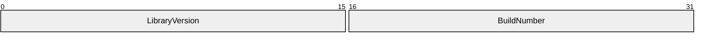

**LibraryVersion (2 bytes)**: A 16-bit unsigned integer that indicates the version of the RDC implementation. The value of LibraryVersion MUST be set to 0x0001.

**BuildNumber (2 bytes)**: A 16-bit unsigned integer that indicates the version of the software implementing the algorithm. The value of BuildNumber MUST be set to 0x0001.

#### 2.2.1.2 FileHeader

The FileHeader structure represents the header of a [**signature file**](#gt_signature-file), which is defined in section [2.2.2](#Section_2.2.2).

The FileHeader structure is defined as follows.

**HeaderSize (4 bytes)**: The size of the FileHeader structure in bytes. MUST be 0x00000018.

**Version (4 bytes)**: The version of [**RDC**](#gt_remote-differential-compression-rdc) that generated this signature file. See section [2.2.1.1](#Section_2.2.1.1).

**MinVersionRequired (4 bytes)**: An RdcVersion representing the lowest version of RDC that can understand this signature file. See section 2.2.1.1. It MUST be 0x00010001.

**Padding (4 bytes)**: Reserved for future use; MUST be 0, and ignored on receipt.

**FileType (8 bytes)**: An unsigned 64-bit integer that indicates the RDC file type of a *file*. The value of FileType MUST be set to 0x00000001.

### 2.2.2 Signature Files

The [**signature file**](#gt_signature-file) consists of a header and zero or more [**RDC**](#gt_remote-differential-compression-rdc) [**chunk**](#gt_chunk) signatures, as shown in the following diagram.

**FileHeader (24 bytes)**: A FileHeader structure, as specified in section [2.2.1.2](#Section_2.2.1.2). The FileType field of the FileHeader structure MUST be 1 for a signature file.

**ChunkSignatures (variable)**: Zero or more ChunkSignatures. See section [2.2.2.1](#Section_2.2.2.1).

#### 2.2.2.1 ChunkSignature

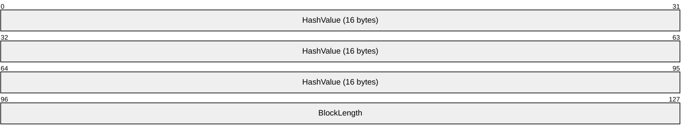

**HashValue (16 bytes)**: MUST be the [**MD4**](#gt_md4) digest of a data [**chunk**](#gt_chunk).

**BlockLength (2 bytes)**: A 16-bit unsigned integer that contains the length of the data chunk that is represented by this signature. The block length MUST be nonzero.

**Bits 16–31 of the Last Row**: Because a signature is 18 bytes long, and because the 32-bit width of the rows in the diagram does not evenly divide into 18 bytes, the last 16 bits of the diagram is space that is not part of the signature at all. This fact is represented by an empty area in the preceding diagram.

### 2.2.3 Similarity Data

Applications of [**RDC**](#gt_remote-differential-compression-rdc) can include [**similarity data**](#gt_similarity-data) in their network protocols. The format of the similarity data is as follows.

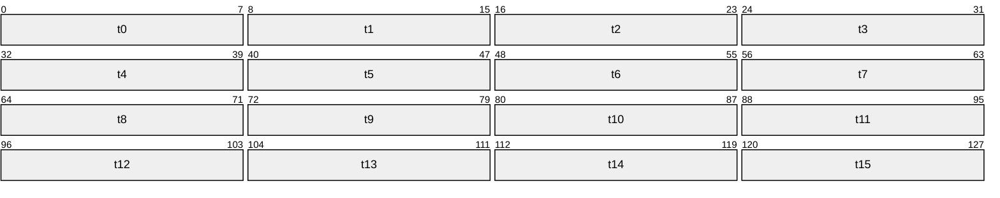

**t0 Through t15**: Similarity traits. See section [3.1.5.4](#Section_3.1.5.4). Each [**similarity trait**](#gt_similarity-trait) is an 8-bit unsigned integer value.

# 3 Protocol Details

## 3.1 Common Details

The [**target location**](#gt_target-location) and [**source location**](#gt_source-location) MUST compute identical signatures for identical chunks, and both the target location and source location MUST use the same algorithm and the same parameters for dividing files into chunks. The [**RDC FilterMax algorithm**](#gt_rdc-filtermax-algorithm) is used to divide files into chunks, as described in section [3.1.5.1](#Section_3.1.5.1). The specific parameters used as input to FilterMax are the responsibility of the user of [**RDC**](#gt_remote-differential-compression-rdc), and are not addressed in this document. This section specifies these processes.

### 3.1.1 Abstract Data Model

This section describes a conceptual model of possible data organization that an implementation maintains in order to use this algorithm. The described organization is provided to facilitate the explanation of how the algorithm behaves. This document does not mandate that implementations adhere to this model as long as their external behavior is consistent with what is described in this document.

**H3 Lookup Table**: A table containing 256 entries of 32-bit, unsigned integers used in computing the H3 [**hash function**](#gt_hash-function). The entries to the table are indexed from 0 through 255. This table is constant (that is, the values in this table do not change during the execution of [**RDC**](#gt_remote-differential-compression-rdc)).

### 3.1.2 Timers

There are no timers in the [**RDC**](#gt_remote-differential-compression-rdc) chunking and [**signature**](#gt_signature) generation components.

### 3.1.3 Initialization

After initialization, the H3 lookup table MUST contain the following data.

| Index | Values | Column 3 | Column 4 | Column 5 |
| --- | --- | --- | --- | --- |
| 0 | 0x5e3f7c48 | 0x796a0d2b | 0xbecd4e32 | 0x6f16159c |
| 4 | 0x687312bc | 0x12a6f30a | 0x8fca2662 | 0x79b83d14 |
| 8 | 0x3fab3f30 | 0x984d6ca2 | 0x4df5fe6c | 0x4acd3196 |
| 12 | 0x6245ad21 | 0x3a15e5ba | 0x90db6499 | 0x05aacb6b |
| 16 | 0x791cf724 | 0x504cd910 | 0x98093570 | 0x090392df |
| 20 | 0xf193e5b8 | 0x42023c5b | 0x80a95c6a | 0x11e676be |
| 24 | 0xc70f2117 | 0xeed4587f | 0x6479e9bd | 0x1b0c427c |
| 28 | 0x410486ba | 0x30f5b837 | 0xf957d307 | 0x1535f121 |
| 32 | 0xabe45e90 | 0x7a1ab8f0 | 0x1c6887e4 | 0x4170b7ba |
| 36 | 0x8b491bed | 0x5c920e73 | 0x1b1ed791 | 0x7a0ed482 |
| 40 | 0xcce86619 | 0x45dc7290 | 0x57e71362 | 0x2e24f01c |
| 44 | 0x0a0637f3 | 0x0e8c5565 | 0x15944012 | 0x34f7eeea |
| 48 | 0xbc628141 | 0x1e200874 | 0xe9244379 | 0x3e63aeca |
| 52 | 0x7a3b3cce | 0x73f8a245 | 0xd734e215 | 0x834fa434 |
| 56 | 0xf96a0904 | 0xfb39a424 | 0x0bfa963a | 0x9b236ee2 |
| 60 | 0xa2131005 | 0x3eb70acf | 0x2907bcd8 | 0x3f685f3a |
| 64 | 0x3765fd37 | 0x1c1c34d2 | 0x03a95179 | 0x024be6c3 |
| 68 | 0x06128960 | 0x844e7490 | 0xe2b371a3 | 0x3382909c |
| 72 | 0x3d519a77 | 0x90971ec9 | 0x6ea745e5 | 0x490b3a5c |
| 76 | 0x7f3916f7 | 0xbc150351 | 0x241a7ba0 | 0xec93c2bb |
| 80 | 0x6c7083aa | 0xf3937751 | 0xe6aa1df1 | 0x129fc001 |
| 84 | 0xb90709b9 | 0x7e59a4fc | 0x4509e58a | 0x8a93ed43 |
| 88 | 0x6934ce62 | 0x8ec6af1a | 0xf36581a9 | 0x53d01d93 |
| 92 | 0xb34eef69 | 0x08494a84 | 0x0f6dff34 | 0x74729aa3 |
| 96 | 0x48b5475f | 0xb986dc84 | 0xd0424c8d | 0xb72ad089 |
| 100 | 0x0adbbdb8 | 0x824fdbe8 | 0x99ad1058 | 0x98faec38 |
| 104 | 0xe746242b | 0x2b7ee7fc | 0x2e151fa7 | 0x6413270f |
| 108 | 0x68ed7239 | 0x7729e2d3 | 0x5697b3a5 | 0x0b90a6c3 |
| 112 | 0xdf7cefcf | 0xded46a48 | 0x46956888 | 0xb3bb6dc4 |
| 116 | 0xe987578f | 0xf82e74b7 | 0xc8eeeba4 | 0xdd960ff9 |
| 120 | 0x482ed28d | 0x4f343078 | 0x563ab8a4 | 0x3ec7aa0d |
| 124 | 0x2481d448 | 0x5fe98704 | 0x5aafc580 | 0x841d81ec |
| 128 | 0xae7fe8fd | 0x6b31ccb6 | 0x911ebdd4 | 0x75f4703d |
| 132 | 0xe6855a0f | 0x6184b42e | 0x147a4a95 | 0x39528e48 |
| 136 | 0xe975b416 | 0x3cba13d3 | 0x1e23e544 | 0xf7955286 |
| 140 | 0xa5f96b7f | 0xaaa697aa | 0x29e794e3 | 0x87628c09 |
| 144 | 0xfeebf5f1 | 0xf8b070cd | 0xe361b627 | 0x8c7a8682 |
| 148 | 0x69cab331 | 0xca867ad1 | 0xd0151a96 | 0xfc19a6b9 |
| 152 | 0x6d7439e7 | 0x64cd62ac | 0x4a650747 | 0x9ddbfa28 |
| 156 | 0x337c8bed | 0xf12a6860 | 0x3767ffd3 | 0x13559ced |
| 160 | 0x71ac2011 | 0xc11dc687 | 0x260b7105 | 0xc13bca0c |
| 164 | 0xcd0af893 | 0x793b54e6 | 0x89d27fc3 | 0xc6bd1c88 |
| 168 | 0xe3337313 | 0x387bc671 | 0x61280de4 | 0x76941a36 |
| 172 | 0xaa52a2b9 | 0x6d7cb52c | 0x18ff4d70 | 0x8987cf38 |
| 176 | 0x306e47ed | 0xf7df8135 | 0x18a8e024 | 0xc9eb085f |
| 180 | 0xc1a7c769 | 0xd5667a12 | 0x9c8be93a | 0x028781b1 |
| 184 | 0x6213dada | 0x07fef4f5 | 0x5e6bf91d | 0x469ea798 |
| 188 | 0xb9654a37 | 0x1cb5e74e | 0x525d502d | 0xe805ec68 |
| 192 | 0xdd8c4320 | 0x7890848f | 0x61e59c8e | 0x1d99f9ef |
| 196 | 0x25b60b20 | 0x2f198088 | 0xe01b6926 | 0xffa4917f |
| 200 | 0xb2fa0f22 | 0xee8ac924 | 0x18a1c5a7 | 0xb76d8d7f |
| 204 | 0x88ad5e0d | 0x7b3fb12b | 0xc8a91add | 0x762a6f4e |
| 208 | 0x056fad31 | 0xebecfab8 | 0xea54cd17 | 0x71f5af9f |
| 212 | 0xfaececa1 | 0x08a52f4d | 0xbb5efebe | 0x5bcb04c2 |
| 216 | 0xcb2530b0 | 0x01bb862b | 0xbb5d54f0 | 0x404deb4b |
| 220 | 0x038658bd | 0x09399005 | 0xddd862c8 | 0x8985776f |
| 224 | 0xcfcfd717 | 0xbec756cb | 0x52aecc5a | 0x09ac3f62 |
| 228 | 0x62c1c6fb | 0x76cc3221 | 0xcde6d028 | 0x844d9291 |
| 232 | 0xc143eeac | 0x0ea5e772 | 0x8855456e | 0xeb03a426 |
| 236 | 0x3398475d | 0x73dc8107 | 0x681605d0 | 0xd18b6264 |
| 240 | 0x934e43eb | 0x59e76d21 | 0xd3ce2b77 | 0x4ccfee1c |
| 244 | 0x2f4af76d | 0x8b12a309 | 0x849bb415 | 0xf45ad809 |
| 248 | 0xc7bccae7 | 0xac891c35 | 0x59db2274 | 0xbcd71393 |
| 252 | 0x2c9b1705 | 0xcb536a69 | 0xb2800f00 | 0x111313fc |

The H3 lookup table is constant and so MUST NOT change at any time.

**Note** This data can be generated by setting the first 16 bytes of the table (that is, the first four 32-bit unsigned integers) to the [**MD4**](#gt_md4) hash of 16 bytes of zeros. Each successive 16 bytes of the table is the MD4 hash of the previous 16 bytes of the table. Implementing this procedure results in running the MD4 hash 64 times.

### 3.1.4 Higher-Layer Triggered Events

There are no higher-layer triggered events in the [**RDC**](#gt_remote-differential-compression-rdc) chunking and [**signature**](#gt_signature) generation components.

### 3.1.5 Message Processing Events and Sequencing Rules

Because [**RDC**](#gt_remote-differential-compression-rdc) is not a protocol, it does not have messages. Instead, this section specifies the actions upon getting a request to determine the [**chunk**](#gt_chunk) boundaries in a file, or to compute the [**signature**](#gt_signature) for a chunk.

This section contains a number of instances of pseudocode. In this pseudocode, operator precedence is the same as in the C language. The symbol ":=" is used for assignment, meaning that the variable appearing to the left of ":=" thereafter assumes the value to the right. The symbol "\" indicates a set difference, and is usually pronounced as the English word "without." For example, {a,b,c} \ {b} = {a,c}.

#### 3.1.5.1 Chunk Generation

This section specifies the [**RDC FilterMax algorithm**](#gt_rdc-filtermax-algorithm), which is used to generate chunks.

[**RDC**](#gt_remote-differential-compression-rdc) chunk generation is initiated by the protocol or application that is using RDC for efficient data transfer. For an example, see [MS-FRS2](../MS-FRS2/MS-FRS2.md) section 3.3.1.5.

RDC chunk generation takes as input a file and two parameters, the [**hash window**](#gt_hash-window) and the [**horizon**](#gt_horizon), and produces a set of offsets into the file that indicates the start of the chunks of the file. Prior to their use, the hash window and the horizon MUST be negotiated between the [**source location**](#gt_source-location) and [**target location**](#gt_target-location) of the file to ensure that chunks are generated consistently on both ends. Negotiation of hash window and horizon is application-specific and is not addressed in this document.<1>

The following diagram illustrates chunk generation.

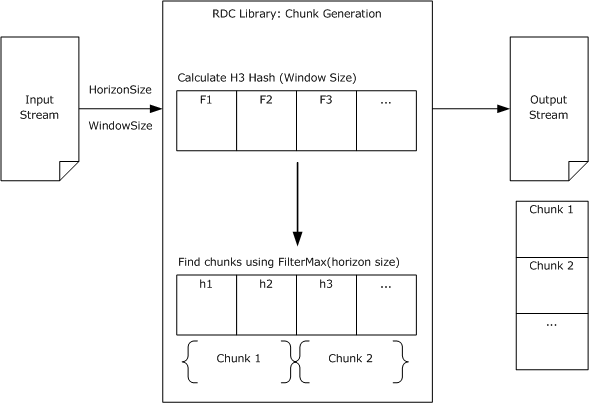

Figure 1: RDC chunk generation

With each chunk, RDC computes a signature. See section [3.1.5.2](#Section_3.1.5.2).

##### 3.1.5.1.1 H3 Hash

[**RDC**](#gt_remote-differential-compression-rdc) uses a [**rolling hash function**](#gt_rolling-hash-function) called H3 in determining its chunk boundaries. H3 computes the hash of the [**hash window**](#gt_hash-window) bytes (denoted as windowSize below) up to and including a particular byte in the file. Because it is a rolling hash function, the H3 hash of a given range is defined in terms of the hash of the range starting and ending 1 byte earlier.

shift_amount is an unsigned 32-bit integer that depends only on windowSize, and is used in computing H3. The shift_amount is calculated as follows.

shift_amount := 1

i := 32

while ((i > 0) AND ((windowSize MODULUS i) ≠ 0))

BEGIN

shift_amount := shift_amount times 2

i := the integer truncation (floor) of (i divided by 2)

END

shift_amount := shift_amount MODULUS 32

hash_valuei is an unsigned 32-bit integer that contains a calculated hash value. By definition, hash_value-1 is zero. Computing the H3 value for the windowSize byte ending at byte i depends on hash_valuei-1. For the purposes of H3, all data bytes before the beginning of the *file* are treated as having a value of 0.

trailingEdgeData and leadingEdgeData contain the data bytes (unsigned 8-bit integers) that are at the trailing edge and leading edge in a sequence of windowSize bytes. These data bytes become indices into the H3 lookup table for the purposes of the hash calculation.

To add leadingEdgeData to the hash value and remove trailingEdgeData (that is, to compute the H3 value of the windowSize bytes ending with the leading edge), compute the following.

**Note** Subscripts are expressed with parentheses (for example, "hash_valuei" would be expressed as "hash_value(i)").

hash_value(i) :=

rotate_bits_left(

hash_value(i-1) XOR

H3 lookup table[trailingEdgeData] XOR

H3 lookupTable[leadingEdgeData],

shift_amount

)

This becomes the new hash_value for moving the window 1 byte farther along.

Note that when processing near the beginning of the *file* (when the leading edge is less than the hash window), the trailing edge will actually be less than zero (before the beginning of the *file*). In this case, H3 considers this nonexistent data to be all zeros.

The following pseudocode shows how hash_value is computed for each offset i.

**Note** Subscripts are expressed with parentheses (for example, "hash_valuei" would be expressed as "hash_value(i)").

hash_value(-1) := 0

FOR i = 0 to min(windowSize-1, Length of the file - 1)

hash_value(i) :=

rotate_bits_left(

hash_value(i-1) XOR

H3 lookup table[0] XOR

H3 lookup table[File[i]], shift_amount)

FOR i = windowSize to Length of File - 1

BEGIN

trailingEdgeData := File[i - windowSize]

leadingEdgeData := File[i]

hash_value(i) :=

rotate_bits_left(

hash_value(i-1) XOR

H3 lookup table[trailingEdgeData] XOR

H3 lookup table[leadingEdgeData],

shift_amount)

END

For an example of H3 hash calculation, see section [4.2](#Section_4.2).

##### 3.1.5.1.2 Finding Chunk Boundaries

Given a file F of length n consisting of bytes b0 .. bn–1 and parameters *windowSize* and *horizon*, [**RDC**](#gt_remote-differential-compression-rdc) finds the [**chunk**](#gt_chunk) boundaries. *windowSize* MUST be an integer that is at least 2 and no more than 96. *horizon* MUST be an integer that is at least 128 and less than 16,384. Recall that *windowSize* and *horizon* are inputs to RDC, and MUST be negotiated between the two parties participating in a transfer using RDC.

A byte bi is a [**local maximum**](#gt_local-maximum) if i > *horizon* and for all j ≠ i where i - *horizon* ≤ j ≤ i + *horizon*, the H3 hash value after adding bi is greater than that after adding any bj.

The local maximum can be found by h(bi-Hash Window .. bi) that has the property that for all j ≥ 0, such that i - horizon ≤ j ≤ i + horizon, j = i OR h(bj-Hash Window .. bj) < h(bi-Hash Window .. bi), where for all k < 0, bk is defined to be 0.

To determine the chunks of F, define the first chunk to start with b0. Work through each consecutive byte from b1 to bn–1. A chunk starts at a byte that is a local maximum or that is 65,535 bytes beyond the last byte that started a chunk.

Thus, the following is a recursive definition of chunk boundaries.

**Note** Subscripts are expressed with parentheses (for example, "hash_valuei" would be expressed as "hash_value(i)").

File position 0 is a chunk boundary

File position n > 0 is a chunk boundary if:

FORALL k in { n-horizon .. n+horizon } \ { n }

hash_value(n) > hash_value(k)

or n - 65,535 is greater than or equal to 0 and

n - 65,535 is a chunk boundary and

FORALL k in { n - 65,534 .. n - 1 }

k is not a chunk boundary.

**Note** The "\" operator means exclusion; so in this construct, it means all values in the range except n.

Define boundaryi to be the ith chunk boundary.

#### 3.1.5.2 Signature Computation

There are two fields in a [**chunk**](#gt_chunk) signature: hash and block length. Given a chunk, the hash MUST be the [**MD4**](#gt_md4) hash [[RFC1320]](https://go.microsoft.com/fwlink/?LinkId=90274) of the data in the chunk, and the block length MUST be the number of bytes in the chunk. Because the block length is an unsigned 16-bit integer, all chunks MUST be less than or equal to 216-1 bytes in length. Recall that the signatures comprise the data in the [**signature file**](#gt_signature-file).

The following diagram illustrates signature computation.

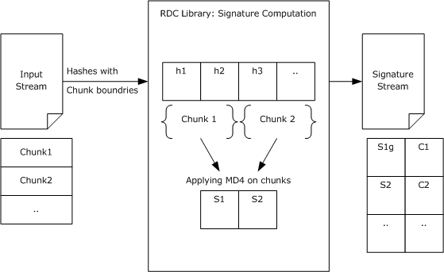

Figure 2: RDC signature computation

Thus, the set of signatures is specified by the following.

**Note** Subscripts are expressed with parentheses (for example, "boundaryi" would be expressed as "boundary(i)").

Let there be N chunks (0,1,... N-1) defined on a file of size n

FOR each chunk consisting of bytes from

boundary(i) to boundary(i+1)-1 -(Initial Chunks where i < N-1)

boundary(i) to n -(Terminal Chunk where i = N-1)

BEGIN

IF (Terminal Chunk)

Signature Hash(i) :=

MD4 of File[boundary(i)] ... File[n-1]

Signature block Length(i) := n - boundary(i)

ELSE

Signature Hash(i) :=

MD4 of File[boundary(i)] ... File[boundary(i+1)-1]

Signature block Length(i) := boundary(i+1) - boundary(i)

END

#### 3.1.5.3 Recursion

Just as [**RDC**](#gt_remote-differential-compression-rdc) can be used to determine the differences between the two original *files*, RDC can first be applied to determine the differences between the two signature *files*, or between the signature *files* of the signature *files*, and so on. This is called recursion.

The following diagram illustrates recursion.

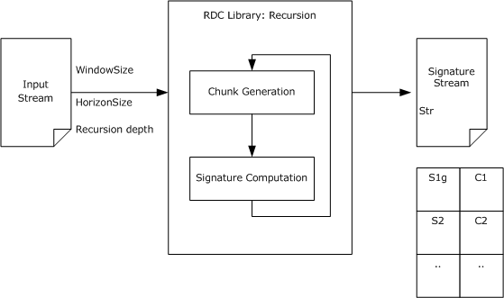

Figure 3: RDC recursion

For an example of recursion, see section [4.4](#Section_4.4).

##### 3.1.5.3.1 Recursion Depth

An implementation MUST support a recursion depth of at least eight levels.<2> The depth of recursion that an application uses depends on the size of the signature *file* that is being transferred versus how many chunks of the signature *file* are required to be transferred for each [**recursion level**](#gt_recursion-level). The application must determine when bandwidth would be better utilized by just sending a bigger signature *file* to avoid another round of signature data transfer.

The determination of recursion depth is application-specific, and is not addressed in this document. For an example of the determination of recursion depth, see [MS-FRS2](../MS-FRS2/MS-FRS2.md) section 3.3.1.5.

#### 3.1.5.4 Similarity

The effectiveness of data replication using [**RDC**](#gt_remote-differential-compression-rdc) techniques depends to a large degree on the [**seed files**](#gt_seed-file) that can be found at the [**target location**](#gt_target-location). If the RDC scenario is simple, such as the synchronization of a *file* that has been replicated recently, the choice of seed file can be as simple as the *file* that is being synchronized. If the RDC scenario is more complicated, such as the replication of a directory of *files*, it is possible that *files* have been added to the [**source location**](#gt_source-location) that do not exist on the target location, in which case there is no simple choice of seed files.

To help choose seed files under the circumstances outlined in the preceding paragraph, [**similarity data**](#gt_similarity-data) for new *files* at the source location are calculated and sent to the target location. The similarity data is used on the target location to find existing *files* that are similar to the new source location *files*. The existing target location *files* can then become the seed files for an RDC replication of the new source location *files*, making the transfer of the new *files* more efficient.

Similarity data can appear in protocols that use RDC, but it has no other effect on the protocol itself.<3> Recall that similarity data can be used for identifying a seed file on the target location. For examples of the use of similarity data, see [MS-FRS2](../MS-FRS2/MS-FRS2.md) sections 1.7, 2.2.1.2.1, and 2.2.1.4.4.

The following diagram illustrates the calculation of similarity data.

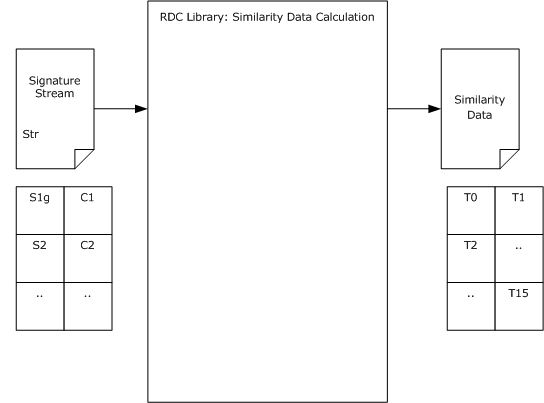

Figure 4: Similarity data calculation

##### 3.1.5.4.1 Similarity Data Calculation

Given a file F to calculate the [**similarity data**](#gt_similarity-data), a 16-byte array is required to store intermediate [**MD4**](#gt_md4) digests. The data construct is called a digest for the purpose of this discussion. The calculation of similarity data for a file is expressed using the following pseudocode.

Define Digest as unsigned char[16]

Digest md4Results

Digest sData[16] =

{ {0xff, 0xff, ..., 0xff},

{0xff, 0xff, ..., 0xff},

...,

{0xff, 0xff, ..., 0xff} }

unsigned char tempBuffer[17]

FOR each RDC Signature of a File

BEGIN

Copy the RDC Signature data into tempBuffer

FOR index = 0 to 15

BEGIN

tempBuffer[16] := index + 1

Compute an MD4 digest for the data in tempBuffer,

put the results in md4Results

IF md4Results < sData[index]

Copy the MD4 digest from md4Results to sData[index]

END

END

The less-than comparison "md4Results < sData[index]" is a byte-by-byte comparison. For example, given A and B (two digests), the digests are considered as arrays of 16 unsigned 8-bit integers, where A0 is the first byte and A15 is the last byte of A. A < B is true if the first Ai that is different from Bi is less than Bi for values of i in 0 to 15.

Once all [**RDC**](#gt_remote-differential-compression-rdc) signatures for a file have been processed, the similarity data is extracted from the array of temporary digest constructs (named sData in the preceding pseudocode). The similarity data is constructed by taking the 8th byte from each of the 16 digests computed in the preceding pseudocode and masking off the top 2 bits. This is shown in the following pseudocode.

unsigned char similarity[16]

FOR index = 0 to 15

similarity[index] := sData[index, 7] & 0x3F

The data in similarity, shown in the preceding pseudocode, is the similarity data for the file.

Each trait of similarity data MUST be a value from 0 to 63 inclusive.

An implementation that does not compute similarity data MUST fill in all traits as zero.

##### 3.1.5.4.2 Finding Seed Files

Using the [**similarity data**](#gt_similarity-data) that has been calculated for *files* on the [**target location**](#gt_target-location), it might be possible to find [**RDC**](#gt_remote-differential-compression-rdc) [**seed files**](#gt_seed-file) for *files* that have been added to the [**source location**](#gt_source-location) but not to the target location. Similarity data consists of 16 bytes of data called [**similarity traits**](#gt_similarity-trait).

When the source location has a new *file* that requires replication on the target location, the application on the source location can send the similarity data of the new *file* to the target location. The application on the target location compares the similarity traits of the new *file* to the similarity traits of each of the target location's existing *files*, counting the similarity traits that are the same (that is, that match). The application can then determine which of the existing *files* are used as seed, based on the number of similarity trait matches; for example, based on a threshold or a majority scheme. The choice of what scheme is used is implementation-specific.<4>

Note that similarity traits are compared on a one-to-one basis so that there are at most 16 comparisons for each target location *file*. That is, the first similarity trait of the new *file* is compared to the first similarity trait of a target location *file*, the second similarity trait is compared to the second similarity trait, and so on.

Any number of target location *files* can be used as seed files for an RDC operation. Target location *files* with the greatest number of similarity traits that match the similarity traits of the new source location *file* are generally the best candidates.

#### 3.1.5.5 Generating the Target File

To generate a [**target file**](#gt_target-file), the protocol using [**RDC**](#gt_remote-differential-compression-rdc) MUST obtain a [**signature file**](#gt_signature-file) from the [**source location**](#gt_source-location), and MUST select one or more [**seed files**](#gt_seed-file) on the [**target location**](#gt_target-location). The seed files can be selected in any vendor-specific manner, including using [**similarity data**](#gt_similarity-data), as described in section [3.1.5.4](#Section_3.1.5.4).

The target location then reconstructs the target file by obtaining the necessary chunks from the [**source file**](#gt_source-file) and combining them with existing chunks from the seed files. It is the responsibility of the protocol using RDC to transport the signature file and any chunks.

The following diagram illustrates generation of a target file.

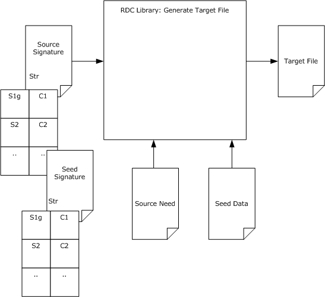

Figure 5: Generating the target file

The following pseudocode specifies the process of generating the target file. Note that each FOR loop iteration is independent of the others, and so can be executed concurrently.

**Note** Subscripts are expressed with parentheses (for example, "SouSigi" would be expressed as "SouSig(i)").

Given n Source Signatures, SouSig(0) .. SouSig(n-1),

and m Seed Signatures, SeedSig(0) .. SeedSig(m-1)

where each Signature has fields len and hash.

Produce Target File T, with bytes T(0) .. T(p)

where p is the sum of SouSig(i).len for all i in 0 .. n.

FOR i = 0 to n-1

BEGIN

offset := sum SouSig(0) to SouSig(i).

IF there exists j < m such that SeedSig(j).hash = SouSig(i).hash

and SeedSig(j).len = SouSig(i).len

T(offset) .. T(offset+SouSig(i).len) := the bytes from Chunk j

of the seed.

ELSE

BEGIN

Fetch Chunk i from the source location

(how depends on the protocol using RDC).

T(offset) .. T(offset+SouSig(i).len) := bytes from Chunk i

of the Source.

END

END

### 3.1.6 Timer Events

None.

### 3.1.7 Other Local Events

None.

# 4 Protocol Examples

## 4.1 Example System Architecture

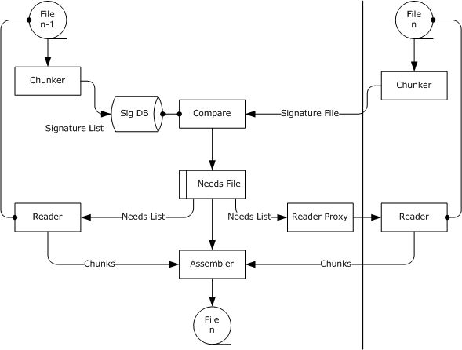

Figure 6: Data flow of RDC in an application

The preceding figure shows the data flow of a possible usage of RDC in an application. Note that there are other possible ways to utilize RDC in an application.

The following terms, in addition to the glossary terms defined in section [1.1](#Section_1.1), are used in this example.

**Assembler**: A function that constructs the [**target file**](#gt_target-file) using three inputs: needs lists, source chunks, and seed chunks.

**Compare**: A function that compares the signatures of the [**seed files**](#gt_seed-file) and [**source files**](#gt_source-files). After performing this comparison, the Compare function produces a list of needs.

**Needs**: A description of a block of data from either the [**source file**](#gt_source-file) or the seed file that is necessary to construct the target file.

**Needs List**: A list of needs in some application-defined format.

**Reader**: A function that reads chunks from a seed file or a source file as determined by the needs list.

**Reader Proxy**: A function that communicates with the reader on the [**source location**](#gt_source-location).

The vertical line represents the network separation between two processes. The file to be transferred is hosted by the source service on the right (the source location for this example); the file is to be transferred to the target service on the left (the [**target location**](#gt_target-location) for this example).

Chunks of both the seed data and the corresponding source data are examined, and a signature is generated for each chunk. The signatures generated on the target location (that is, the seed signatures) can be stored using any mechanism. The signatures generated on the source location (that is, the source signatures) are sent to the target location in the form of a [**signature file**](#gt_signature-file).

The target location examines the source signatures. For each source signature, the target location tries to find a matching seed signature. If a matching seed signature is found, the target location already has the corresponding [**chunk**](#gt_chunk) of data and is not required to download it. If no matching seed signature can be found for a particular source signature, the target location must download the corresponding chunk of data from the source location.

When the target location has all of the data chunks (those it already had, and those it downloaded from the source location), the target location assembles the chunks in the order that corresponds to the signature file that was received from the source location.

For more information on the high-level aspects of [**RDC**](#gt_remote-differential-compression-rdc), see [[MSDN-RDCAPI]](https://go.microsoft.com/fwlink/?LinkId=90073).

## 4.2 H3

This section gives an example of computing the H3 hashes of a sequence of 11 bytes of data with a windowSize of 4.

First, H3 is required to determine the appropriate shift_amount for a 4-byte windowSize. Applying the algorithm in section [3.1.5.1.1](#Section_3.1.5.1.1) yields a shift_amount of eight.

hash_value is initialized to 0x00, and the H3 algorithm starts at the first data byte. Recall that for the purposes of H3, all data bytes before the beginning of the file are treated as having 0 value. Therefore, in the example that follows, this is rotate_bits_left(0 XOR H3 Table[0] XOR H3 Table[0x48],8). Looking into the H3 table yields H3 Table[0] = 0x5e3f7c48 and H3 Table[0x48] = 0x3d519a77. Computing the XOR yields 0x636ee63f, and rotating left 8 bits yields 0x6ee63f63, which is the first H3 value, v0.

To compute v1, repeat the procedure using v0 as the initial hash_value; that is, rotate_bits_left(0x6ee63f63 XOR H3 Table[0] XOR H3 Table[0x65],8). H3 Table[0] = 0x5e3f7c48 and H3 Table[0x65] = 0x824fdbe8, so the result of the XOR is 0xb29698c3. Rotating yields v1 = 0x9698c3b2.

Because of the way shift_amount is computed, (windowSize * shift_amount) MODULUS 32 = 0. Therefore, when a byte is at the trailing edge of the window, the XOR with its corresponding table value is in the same position as when the table value was XOR'd in when it was at the leading edge. Furthermore, for all a, a XOR a = 0, so the second XOR cancels out the effect of the first one. Therefore, the H3 value for a window does not depend on any bytes outside the window, and H3 is a [**hash function**](#gt_hash-function).

The following diagram illustrates the computation of H3 hashes.

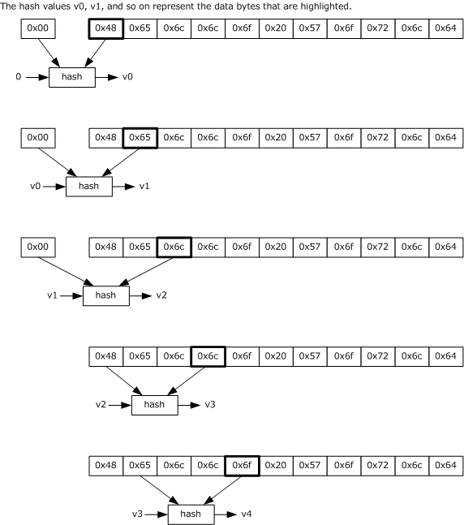

Figure 7: H3 hash computation

## 4.3 FilterMax

The relationship between [**local maximum**](#gt_local-maximum) and [**horizon**](#gt_horizon) is illustrated in the following figure, which assumes a horizon size of 128.

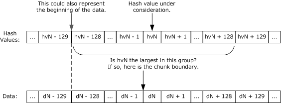

Figure 8: Relationship between local maximum and horizon

In the preceding diagram, consider if hvN is the largest in the indicated range of values. Then it follows that none of the other values in this range can be a local maximum (because they are smaller than hvN). Therefore, local maxima have to be separated by at least horizon bytes.

## 4.4 Sample Recursive Client Transfer

This example illustrates the use of the [**RDC**](#gt_remote-differential-compression-rdc) algorithm over a network protocol.

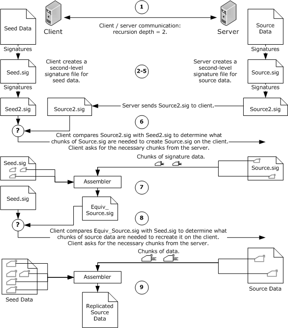

Figure 9: Recursion-depth calculation

A sample network application uses the following steps, which correspond to the preceding figure, to transfer data over the network using the RDC algorithm.

- The [**target location**](#gt_target-location) (referred to here as client) and [**source location**](#gt_source-location) (referred to here as server) determine that a recursion depth of 2 is appropriate. Notes:
- The RDC library allows the application to choose the recursion depth arbitrarily. Choosing an optimum recursion depth is difficult because many factors are involved, including the available network bandwidth and network latency, the speed and load of the disk storage systems on the server and client machines, and available CPU time for computing signatures, if necessary. For an example of recursion-depth calculation, see [MS-FRS2](../MS-FRS2/MS-FRS2.md) section 3.3.1.5.
- The terms client and server in this discussion refer only to the computers' roles in the RDC scenario, not to their operating systems.
- The method used by the client and server to agree on recursion depth is application-specific.
- The client generates signatures for the seed data and stores them in a *file* called seed.sig.
- The client generates signatures for seed.sig and stores them in a *file* called seed2.sig.
- The server generates signatures for the source data and stores them in a *file* called source.sig.
- The server generates signatures for source.sig and stores them in a *file* called source2.sig. The server then sends source2.sig to the client.
- The client examines the signatures in source2.sig, comparing them to the signatures in seed2.sig to determine the chunks of source.sig it requires.
- With source2.sig as a guide, the client creates a first-level [**signature file**](#gt_signature-file) that is identical to source.sig (called equiv_source.sig for this example). Instead of transferring the entire source.sig *file* to the client, the much smaller source2.sig *file* is transferred along with the few pieces of source.sig that are required.
- The client examines the signatures in equiv_source.sig, comparing them to the signatures in seed.sig to determine the chunks of the source data it requires.
- With equiv_source.sig as a guide, the client recreates the source data using normal RDC techniques.
Using the preceding concepts, it might be possible to use a smaller amount of bandwidth to transfer the source data across the network. If, for example, the source data is approximately 9 gigabytes, the first-level signature file will be approximately 92 megabytes, but the second-level signature file will be only about 944 kilobytes.

## 4.5 Sample Input and Generated Signature File

To test an implementation, the following example of a [**source file**](#gt_source-file) (the full text of rfc1320.txt) is used, and the resultant [**signature file**](#gt_signature-file) is generated using windowSize 16 and [**horizon**](#gt_horizon) 512.

File: rfc1320.txt displayed in hexadecimal format, 16 bytes per line.

00000000: 0d 0a 0d 0a 0d 0a 0d 0a 0d 0a 4e 65 74 77 6f 72

00000010: 6b 20 57 6f 72 6b 69 6e 67 20 47 72 6f 75 70 20

00000020: 20 20 20 20 20 20 20 20 20 20 20 20 20 20 20 20

00000030: 20 20 20 20 20 20 20 20 20 20 20 20 20 20 20 20

00000040: 20 20 20 20 20 20 20 20 20 52 2e 20 52 69 76 65

00000050: 73 74 0d 0a 52 65 71 75 65 73 74 20 66 6f 72 20

00000060: 43 6f 6d 6d 65 6e 74 73 3a 20 31 33 32 30 20 20

00000070: 20 20 20 20 20 20 20 20 20 4d 49 54 20 4c 61 62

00000080: 6f 72 61 74 6f 72 79 20 66 6f 72 20 43 6f 6d 70

00000090: 75 74 65 72 20 53 63 69 65 6e 63 65 0d 0a 4f 62

000000a0: 73 6f 6c 65 74 65 73 3a 20 52 46 43 20 31 31 38

000000b0: 36 20 20 20 20 20 20 20 20 20 20 20 20 20 20 20

000000c0: 20 20 20 20 20 20 20 20 20 20 20 61 6e 64 20 52

000000d0: 53 41 20 44 61 74 61 20 53 65 63 75 72 69 74 79

000000e0: 2c 20 49 6e 63 2e 0d 0a 20 20 20 20 20 20 20 20

000000f0: 20 20 20 20 20 20 20 20 20 20 20 20 20 20 20 20

00000100: 20 20 20 20 20 20 20 20 20 20 20 20 20 20 20 20

00000110: 20 20 20 20 20 20 20 20 20 20 20 20 20 20 20 20

00000120: 20 20 20 20 20 20 41 70 72 69 6c 20 31 39 39 32

00000130: 0d 0a 0d 0a 0d 0a 20 20 20 20 20 20 20 20 20 20

00000140: 20 20 20 20 20 20 20 20 20 20 54 68 65 20 4d 44

00000150: 34 20 4d 65 73 73 61 67 65 2d 44 69 67 65 73 74

00000160: 20 41 6c 67 6f 72 69 74 68 6d 0d 0a 0d 0a 53 74

00000170: 61 74 75 73 20 6f 66 20 74 68 69 65 20 4d 65 6d

00000180: 6f 0d 0a 0d 0a 20 20 20 54 68 69 73 20 6d 65 6d

00000190: 6f 20 70 72 6f 76 69 64 65 73 20 69 6e 66 6f 72

000001a0: 6d 61 74 69 6f 6e 20 66 6f 72 20 74 68 65 20 49

000001b0: 6e 74 65 72 6e 65 74 20 63 6f 6d 6d 75 6e 69 74

000001c0: 79 2e 20 20 49 74 20 64 6f 65 73 0d 0a 20 20 20

000001d0: 6e 6f 74 20 73 70 65 63 69 66 79 20 61 6e 20 49

000001e0: 6e 74 65 72 6e 65 74 20 73 74 61 6e 64 61 72 64

000001f0: 2e 20 20 44 69 73 74 72 69 62 75 74 69 6f 6e 20

00000200: 6f 66 20 74 68 69 73 20 6d 65 6d 6f 20 69 73 0d

00000210: 0a 20 20 20 75 6e 6c 69 6d 69 74 65 64 2e 0d 0a

00000220: 0d 0a 41 63 6b 6e 6f 77 6c 65 67 65 6d 65 6e 74

00000230: 73 0d 0a 0d 0a 20 20 20 57 65 20 77 6f 75 6c 64

00000240: 20 6c 69 6b 65 20 74 6f 20 74 68 61 6e 6b 20 44

00000250: 6f 6e 20 43 6f 70 70 65 72 73 6d 69 74 68 2c 20

00000260: 42 75 72 74 20 4b 61 6c 69 73 6b 69 2c 20 52 61

00000270: 6c 70 68 20 4d 65 72 6b 6c 65 2c 0d 0a 20 20 20

00000280: 61 6e 64 20 4e 6f 61 6d 20 4e 69 73 61 6e 20 66

00000290: 6f 72 20 6e 75 6d 65 72 6f 75 73 20 68 65 6c 70

000002a0: 66 75 6c 20 63 6f 6d 6d 65 6e 74 73 20 61 6e 64

000002b0: 20 73 75 67 67 65 73 74 69 6f 6e 73 2e 0d 0a 0d

000002c0: 0a 54 61 62 6c 65 20 6f 66 20 43 6f 6e 74 65 6e

000002d0: 74 73 0d 0a 0d 0a 20 20 20 31 2e 20 45 78 65 63

000002e0: 75 74 69 76 65 20 53 75 6d 6d 61 72 79 20 20 20

000002f0: 20 20 20 20 20 20 20 20 20 20 20 20 20 20 20 20

00000300: 20 20 20 20 20 20 20 20 20 20 20 20 20 20 20 20

00000310: 20 20 20 20 20 20 20 20 20 20 20 20 20 31 0d 0a

00000320: 20 20 20 32 2e 20 54 65 72 6d 69 6e 6f 6c 6f 67

00000330: 79 20 61 6e 64 20 4e 6f 74 61 74 69 6f 6e 20 20

00000340: 20 20 20 20 20 20 20 20 20 20 20 20 20 20 20 20

00000350: 20 20 20 20 20 20 20 20 20 20 20 20 20 20 20 20

00000360: 20 20 20 20 20 20 20 32 0d 0a 20 20 20 33 2e 20

00000370: 4d 44 34 20 41 6c 67 6f 72 69 74 68 6d 20 44 65

00000380: 73 63 72 69 70 74 69 6f 6e 20 20 20 20 20 20 20

00000390: 20 20 20 20 20 20 20 20 20 20 20 20 20 20 20 20

000003a0: 20 20 20 20 20 20 20 20 20 20 20 20 20 20 20 20

000003b0: 20 32 0d 0a 20 20 20 34 2e 20 53 75 6d 6d 61 72

000003c0: 79 20 20 20 20 20 20 20 20 20 20 20 20 20 20 20

000003d0: 20 20 20 20 20 20 20 20 20 20 20 20 20 20 20 20

000003e0: 20 20 20 20 20 20 20 20 20 20 20 20 20 20 20 20

000003f0: 20 20 20 20 20 20 20 20 20 20 20 36 0d 0a 20 20

00000400: 20 52 65 66 65 72 65 6e 63 65 73 20 20 20 20 20

00000410: 20 20 20 20 20 20 20 20 20 20 20 20 20 20 20 20

00000420: 20 20 20 20 20 20 20 20 20 20 20 20 20 20 20 20

00000430: 20 20 20 20 20 20 20 20 20 20 20 20 20 20 20 20

00000440: 20 20 20 20 20 36 0d 0a 20 20 20 41 50 50 45 4e

00000450: 44 49 58 20 41 20 2d 20 52 65 66 65 72 65 6e 63

00000460: 65 20 49 6d 70 6c 65 6d 65 6e 74 61 74 69 6f 6e

00000470: 20 20 20 20 20 20 20 20 20 20 20 20 20 20 20 20

00000480: 20 20 20 20 20 20 20 20 20 20 20 20 20 20 20 36

00000490: 0d 0a 20 20 20 53 65 63 75 72 69 74 79 20 43 6f

000004a0: 6e 73 69 64 65 72 61 74 69 6f 6e 73 20 20 20 20

000004b0: 20 20 20 20 20 20 20 20 20 20 20 20 20 20 20 20

000004c0: 20 20 20 20 20 20 20 20 20 20 20 20 20 20 20 20

000004d0: 20 20 20 20 20 20 20 20 32 30 0d 0a 20 20 20 41

000004e0: 75 74 68 6f 72 27 73 20 41 64 64 72 65 73 73 20

000004f0: 20 20 20 20 20 20 20 20 20 20 20 20 20 20 20 20

00000500: 20 20 20 20 20 20 20 20 20 20 20 20 20 20 20 20

00000510: 20 20 20 20 20 20 20 20 20 20 20 20 20 20 20 20

00000520: 20 20 32 30 0d 0a 0d 0a 31 2e 20 45 78 65 63 75

00000530: 74 69 76 65 20 53 75 6d 6d 61 72 79 0d 0a 0d 0a

00000540: 20 20 20 54 68 69 73 20 64 6f 63 75 6d 65 6e 74

00000550: 20 64 65 73 63 72 69 62 65 73 20 74 68 65 20 4d

00000560: 44 34 20 6d 65 73 73 61 67 65 2d 64 69 67 65 73

00000570: 74 20 61 6c 67 6f 72 69 74 68 6d 20 5b 31 5d 2e

00000580: 20 54 68 65 0d 0a 20 20 20 61 6c 67 6f 72 69 74

00000590: 68 6d 20 74 61 6b 65 73 20 61 73 20 69 6e 70 75

000005a0: 74 20 61 20 6d 65 73 73 61 67 65 20 6f 66 20 61

000005b0: 72 62 69 74 72 61 72 79 20 6c 65 6e 67 74 68 20

000005c0: 61 6e 64 20 70 72 6f 64 75 63 65 73 0d 0a 20 20

000005d0: 20 61 73 20 6f 75 74 70 75 74 20 61 20 31 32 38

000005e0: 2d 62 69 74 20 22 66 69 6e 67 65 72 70 72 69 6e

000005f0: 74 22 20 6f 72 20 22 6d 65 73 73 61 67 65 20 64

00000600: 69 67 65 73 74 22 20 6f 66 20 74 68 65 20 69 6e

00000610: 70 75 74 2e 0d 0a 20 20 20 49 74 20 69 73 20 63

00000620: 6f 6e 6a 65 63 74 75 72 65 64 20 74 68 61 74 20

00000630: 69 74 20 69 73 20 63 6f 6d 70 75 74 61 74 69 6f

00000640: 6e 61 6c 6c 79 20 69 6e 66 65 61 73 69 62 6c 65

00000650: 20 74 6f 20 70 72 6f 64 75 63 65 0d 0a 20 20 20

00000660: 74 77 6f 20 6d 65 73 73 61 67 65 73 20 68 61 76

00000670: 69 6e 67 20 74 68 65 20 73 61 6d 65 20 6d 65 73

00000680: 73 61 67 65 20 64 69 67 65 73 74 2c 20 6f 72 20

00000690: 74 6f 20 70 72 6f 64 75 63 65 20 61 6e 79 0d 0a

000006a0: 20 20 20 6d 65 73 73 61 67 65 20 68 61 76 69 6e

000006b0: 67 20 61 20 67 69 76 65 6e 20 70 72 65 73 70 65

000006c0: 63 69 66 69 65 64 20 74 61 72 67 65 74 20 6d 65

000006d0: 73 73 61 67 65 20 64 69 67 65 73 74 2e 20 54 68

000006e0: 65 20 4d 44 34 0d 0a 20 20 20 61 6c 67 6f 72 69

000006f0: 74 68 6d 20 69 73 20 69 6e 74 65 6e 64 65 64 20

00000700: 66 6f 72 20 64 69 67 69 74 61 6c 20 73 69 67 6e

00000710: 61 74 75 72 65 20 61 70 70 6c 69 63 61 74 69 6f

00000720: 6e 73 2c 20 77 68 65 72 65 20 61 0d 0a 20 20 20

00000730: 6c 61 72 67 65 20 66 69 6c 65 20 6d 75 73 74 20

00000740: 62 65 20 22 63 6f 6d 70 72 65 73 73 65 64 22 20

00000750: 69 6e 20 61 20 73 65 63 75 72 65 20 6d 61 6e 6e

00000760: 65 72 20 62 65 66 6f 72 65 20 62 65 69 6e 67 0d

00000770: 0a 20 20 20 65 6e 63 72 79 70 74 65 64 20 77 69

00000780: 74 68 20 61 20 70 72 69 76 61 74 65 20 28 73 65

00000790: 63 72 65 74 29 20 6b 65 79 20 75 6e 64 65 72 20

000007a0: 61 20 70 75 62 6c 69 63 2d 6b 65 79 20 63 72 79

000007b0: 70 74 6f 73 79 73 74 65 6d 0d 0a 20 20 20 73 75

000007c0: 63 68 20 61 73 20 52 53 41 2e 0d 0a 0d 0a 20 20

000007d0: 20 54 68 65 20 4d 44 34 20 61 6c 67 6f 72 69 74

000007e0: 68 6d 20 69 73 20 64 65 73 69 67 6e 65 64 20 74

000007f0: 6f 20 62 65 20 71 75 69 74 65 20 66 61 73 74 20

00000800: 6f 6e 20 33 32 2d 62 69 74 20 6d 61 63 68 69 6e

00000810: 65 73 2e 20 49 6e 0d 0a 20 20 20 61 64 64 69 74

00000820: 69 6f 6e 2c 20 74 68 65 20 4d 44 34 20 61 6c 67

00000830: 6f 72 69 74 68 6d 20 64 6f 65 73 20 6e 6f 74 20

00000840: 72 65 71 75 69 72 65 20 61 6e 79 20 6c 61 72 67

00000850: 65 20 73 75 62 73 74 69 74 75 74 69 6f 6e 0d 0a

00000860: 20 20 20 74 61 62 6c 65 73 3b 20 74 68 65 20 61

00000870: 6c 67 6f 72 69 74 68 6d 20 63 61 6e 20 62 65 20

00000880: 63 6f 64 65 64 20 71 75 69 74 65 20 63 6f 6d 70

00000890: 61 63 74 6c 79 2e 0d 0a 0d 0a 0d 0a 0d 0a 0d 0a

000008a0: 0d 0a 52 69 76 65 73 74 20 20 20 20 20 20 20 20

000008b0: 20 20 20 20 20 20 20 20 20 20 20 20 20 20 20 20

000008c0: 20 20 20 20 20 20 20 20 20 20 20 20 20 20 20 20

000008d0: 20 20 20 20 20 20 20 20 20 20 20 20 20 20 20 20

000008e0: 20 20 5b 50 61 67 65 20 31 5d 0d 0a 0c 0d 0a 52

000008f0: 46 43 20 31 33 32 30 20 20 20 20 20 20 20 20 20

00000900: 20 20 20 20 20 4d 44 34 20 4d 65 73 73 61 67 65

00000910: 2d 44 69 67 65 73 74 20 41 6c 67 6f 72 69 74 68

00000920: 6d 20 20 20 20 20 20 20 20 20 20 20 20 41 70 72

00000930: 69 6c 20 31 39 39 32 0d 0a 0d 0a 0d 0a 20 20 20

00000940: 54 68 65 20 4d 44 34 20 61 6c 67 6f 72 69 74 68

00000950: 6d 20 69 73 20 62 65 69 6e 67 20 70 6c 61 63 65

00000960: 64 20 69 6e 20 74 68 65 20 70 75 62 6c 69 63 20

00000970: 64 6f 6d 61 69 6e 20 66 6f 72 20 72 65 76 69 65

00000980: 77 20 61 6e 64 0d 0a 20 20 20 70 6f 73 73 69 62

00000990: 6c 65 20 61 64 6f 70 74 69 6f 6e 20 61 73 20 61

000009a0: 20 73 74 61 6e 64 61 72 64 2e 0d 0a 0d 0a 20 20

000009b0: 20 54 68 69 73 20 64 6f 63 75 6d 65 6e 74 20 72

000009c0: 65 70 6c 61 63 65 73 20 74 68 65 20 4f 63 74 6f

000009d0: 62 65 72 20 31 39 39 30 20 52 46 43 20 31 31 38

000009e0: 36 20 5b 32 5d 2e 20 20 54 68 65 20 6d 61 69 6e

000009f0: 0d 0a 20 20 20 64 69 66 66 65 72 65 6e 63 65 20

00000a00: 69 73 20 74 68 61 74 20 74 68 65 20 72 65 66 65

00000a10: 72 65 6e 63 65 20 69 6d 70 6c 65 6d 65 6e 74 61

00000a20: 74 69 6f 6e 20 6f 66 20 4d 44 34 20 69 6e 20 74

00000a30: 68 65 0d 0a 20 20 20 61 70 70 65 6e 64 69 78 20

00000a40: 69 73 20 6d 6f 72 65 20 70 6f 72 74 61 62 6c 65

00000a50: 2e 0d 0a 0d 0a 20 20 20 46 6f 72 20 4f 53 49 2d

00000a60: 62 61 73 65 64 20 61 70 70 6c 69 63 61 74 69 6f

00000a70: 6e 73 2c 20 4d 44 34 27 73 20 6f 62 6a 65 63 74

00000a80: 20 69 64 65 6e 74 69 66 69 65 72 20 69 73 0d 0a

00000a90: 0d 0a 20 20 20 6d 64 34 20 4f 42 4a 45 43 54 20

00000aa0: 49 44 45 4e 54 49 46 49 45 52 20 3a 3a 3d 0d 0a

00000ab0: 20 20 20 20 20 7b 69 73 6f 28 31 29 20 6d 65 6d

00000ac0: 62 65 72 2d 62 6f 64 79 28 32 29 20 55 53 28 38

00000ad0: 34 30 29 20 72 73 61 64 73 69 28 31 31 33 35 34

00000ae0: 39 29 20 64 69 67 65 73 74 41 6c 67 6f 72 69 74

00000af0: 68 6d 28 32 29 20 34 7d 0d 0a 0d 0a 20 20 20 49

00000b00: 6e 20 74 68 65 20 58 2e 35 30 39 20 74 79 70 65

00000b10: 20 41 6c 67 6f 72 69 74 68 6d 49 64 65 6e 74 69

00000b20: 66 69 65 72 20 5b 33 5d 2c 20 74 68 65 20 70 61

00000b30: 72 61 6d 65 74 65 72 73 20 66 6f 72 20 4d 44 34

00000b40: 0d 0a 20 20 20 73 68 6f 75 6c 64 20 68 61 76 65

00000b50: 20 74 79 70 65 20 4e 55 4c 4c 2e 0d 0a 0d 0a 32

00000b60: 2e 20 54 65 72 6d 69 6e 6f 6c 6f 67 79 20 61 6e

00000b70: 64 20 4e 6f 74 61 74 69 6f 6e 0d 0a 0d 0a 20 20

00000b80: 20 49 6e 20 74 68 69 73 20 64 6f 63 75 6d 65 6e

00000b90: 74 20 61 20 22 77 6f 72 64 22 20 69 73 20 61 20

00000ba0: 33 32 2d 62 69 74 20 71 75 61 6e 74 69 74 79 20

00000bb0: 61 6e 64 20 61 20 22 62 79 74 65 22 20 69 73 20

00000bc0: 61 6e 0d 0a 20 20 20 65 69 67 68 74 2d 62 69 74

00000bd0: 20 71 75 61 6e 74 69 74 79 2e 20 41 20 73 65 71

00000be0: 75 65 6e 63 65 20 6f 66 20 62 69 74 73 20 63 61

00000bf0: 6e 20 62 65 20 69 6e 74 65 72 70 72 65 74 65 64

00000c00: 20 69 6e 20 61 0d 0a 20 20 20 6e 61 74 75 72 61

00000c10: 6c 20 6d 61 6e 6e 65 72 20 61 73 20 61 20 73 65

00000c20: 71 75 65 6e 63 65 20 6f 66 20 62 79 74 65 73 2c

00000c30: 20 77 68 65 72 65 20 65 61 63 68 20 63 6f 6e 73

00000c40: 65 63 75 74 69 76 65 20 67 72 6f 75 70 0d 0a 20

00000c50: 20 20 6f 66 20 65 69 67 68 74 20 62 69 74 73 20

00000c60: 69 73 20 69 6e 74 65 72 70 72 65 74 65 64 20 61

00000c70: 73 20 61 20 62 79 74 65 20 77 69 74 68 20 74 68

00000c80: 65 20 68 69 67 68 2d 6f 72 64 65 72 20 28 6d 6f

00000c90: 73 74 0d 0a 20 20 20 73 69 67 6e 69 66 69 63 61

00000ca0: 6e 74 29 20 62 69 74 20 6f 66 20 65 61 63 68 20

00000cb0: 62 79 74 65 20 6c 69 73 74 65 64 20 66 69 72 73

00000cc0: 74 2e 20 53 69 6d 69 6c 61 72 6c 79 2c 20 61 20

00000cd0: 73 65 71 75 65 6e 63 65 20 6f 66 0d 0a 20 20 20

00000ce0: 62 79 74 65 73 20 63 61 6e 20 62 65 20 69 6e 74

00000cf0: 65 72 70 72 65 74 65 64 20 61 73 20 61 20 73 65

00000d00: 71 75 65 6e 63 65 20 6f 66 20 33 32 2d 62 69 74

00000d10: 20 77 6f 72 64 73 2c 20 77 68 65 72 65 20 65 61

00000d20: 63 68 0d 0a 20 20 20 63 6f 6e 73 65 63 75 74 69

00000d30: 76 65 20 67 72 6f 75 70 20 6f 66 20 66 6f 75 72

00000d40: 20 62 79 74 65 73 20 69 73 20 69 6e 74 65 72 70

00000d50: 72 65 74 65 64 20 61 73 20 61 20 77 6f 72 64 20

00000d60: 77 69 74 68 20 74 68 65 0d 0a 20 20 20 6c 6f 77

00000d70: 2d 6f 72 64 65 72 20 28 6c 65 61 73 74 20 73 69

00000d80: 67 6e 69 66 69 63 61 6e 74 29 20 62 79 74 65 20

00000d90: 67 69 76 65 6e 20 66 69 72 73 74 2e 0d 0a 0d 0a

00000da0: 20 20 20 4c 65 74 20 78 5f 69 20 64 65 6e 6f 74

00000db0: 65 20 22 78 20 73 75 62 20 69 22 2e 20 49 66 20

00000dc0: 74 68 65 20 73 75 62 73 63 72 69 70 74 20 69 73

00000dd0: 20 61 6e 20 65 78 70 72 65 73 73 69 6f 6e 2c 20

00000de0: 77 65 0d 0a 20 20 20 73 75 72 72 6f 75 6e 64 20

00000df0: 69 74 20 69 6e 20 62 72 61 63 65 73 2c 20 61 73

00000e00: 20 69 6e 20 78 5f 7b 69 2b 31 7d 2e 20 53 69 6d

00000e10: 69 6c 61 72 6c 79 2c 20 77 65 20 75 73 65 20 5e

00000e20: 20 66 6f 72 0d 0a 20 20 20 73 75 70 65 72 73 63

00000e30: 72 69 70 74 73 20 28 65 78 70 6f 6e 65 6e 74 69

00000e40: 61 74 69 6f 6e 29 2c 20 73 6f 20 74 68 61 74 20

00000e50: 78 5e 69 20 64 65 6e 6f 74 65 73 20 78 20 74 6f

00000e60: 20 74 68 65 20 69 2d 74 68 0d 0a 20 20 20 70 6f

00000e70: 77 65 72 2e 0d 0a 0d 0a 20 20 20 4c 65 74 20 74

00000e80: 68 65 20 73 79 6d 62 6f 6c 20 22 2b 22 20 64 65

00000e90: 6e 6f 74 65 20 61 64 64 69 74 69 6f 6e 20 6f 66

00000ea0: 20 77 6f 72 64 73 20 28 69 2e 65 2e 2c 20 6d 6f

00000eb0: 64 75 6c 6f 2d 32 5e 33 32 0d 0a 20 20 20 61 64

00000ec0: 64 69 74 69 6f 6e 29 2e 20 4c 65 74 20 58 20 3c

00000ed0: 3c 3c 20 73 20 64 65 6e 6f 74 65 20 74 68 65 20

00000ee0: 33 32 2d 62 69 74 20 76 61 6c 75 65 20 6f 62 74

00000ef0: 61 69 6e 65 64 20 62 79 20 63 69 72 63 75 6c 61

00000f00: 72 6c 79 0d 0a 20 20 20 73 68 69 66 74 69 6e 67

00000f10: 20 28 72 6f 74 61 74 69 6e 67 29 20 58 20 6c 65

00000f20: 66 74 20 62 79 20 73 20 62 69 74 20 70 6f 73 69

00000f30: 74 69 6f 6e 73 2e 20 4c 65 74 20 6e 6f 74 28 58

00000f40: 29 20 64 65 6e 6f 74 65 20 74 68 65 0d 0a 20 20

00000f50: 20 62 69 74 2d 77 69 73 65 20 63 6f 6d 70 6c 65

00000f60: 6d 65 6e 74 20 6f 66 20 58 2c 20 61 6e 64 20 6c

00000f70: 65 74 20 58 20 76 20 59 20 64 65 6e 6f 74 65 20

00000f80: 74 68 65 20 62 69 74 2d 77 69 73 65 20 4f 52 20

00000f90: 6f 66 20 58 0d 0a 20 20 20 61 6e 64 20 59 2e 20

00000fa0: 4c 65 74 20 58 20 78 6f 72 20 59 20 64 65 6e 6f

00000fb0: 74 65 20 74 68 65 20 62 69 74 2d 77 69 73 65 20

00000fc0: 58 4f 52 20 6f 66 20 58 20 61 6e 64 20 59 2c 20

00000fd0: 61 6e 64 20 6c 65 74 20 58 59 0d 0a 20 20 20 64

00000fe0: 65 6e 6f 74 65 20 74 68 65 20 62 69 74 2d 77 69

00000ff0: 73 65 20 41 4e 44 20 6f 66 20 58 20 61 6e 64 20

00001000: 59 2e 0d 0a 0d 0a 33 2e 20 4d 44 34 20 41 6c 67

00001010: 6f 72 69 74 68 6d 20 44 65 73 63 72 69 70 74 69

00001020: 6f 6e 0d 0a 0d 0a 20 20 20 57 65 20 62 65 67 69

00001030: 6e 20 62 79 20 73 75 70 70 6f 73 69 6e 67 20 74

00001040: 68 61 74 20 77 65 20 68 61 76 65 20 61 20 62 2d

00001050: 62 69 74 20 6d 65 73 73 61 67 65 20 61 73 20 69

00001060: 6e 70 75 74 2c 20 61 6e 64 20 74 68 61 74 0d 0a

00001070: 20 20 20 77 65 20 77 69 73 68 20 74 6f 20 66 69

00001080: 6e 64 20 69 74 73 20 6d 65 73 73 61 67 65 20 64

00001090: 69 67 65 73 74 2e 20 48 65 72 65 20 62 20 69 73

000010a0: 20 61 6e 20 61 72 62 69 74 72 61 72 79 0d 0a 20

000010b0: 20 20 6e 6f 6e 6e 65 67 61 74 69 76 65 20 69 6e

000010c0: 74 65 67 65 72 3b 20 62 20 6d 61 79 20 62 65 20

000010d0: 7a 65 72 6f 2c 20 69 74 20 6e 65 65 64 20 6e 6f

000010e0: 74 20 62 65 20 61 20 6d 75 6c 74 69 70 6c 65 20

000010f0: 6f 66 0d 0a 20 20 20 65 69 67 68 74 2c 20 61 6e

00001100: 64 20 69 74 20 6d 61 79 20 62 65 20 61 72 62 69

00001110: 74 72 61 72 69 6c 79 20 6c 61 72 67 65 2e 20 57

00001120: 65 20 69 6d 61 67 69 6e 65 20 74 68 65 20 62 69

00001130: 74 73 20 6f 66 20 74 68 65 0d 0a 20 20 20 6d 65

00001140: 73 73 61 67 65 20 77 72 69 74 74 65 6e 20 64 6f

00001150: 77 6e 20 61 73 20 66 6f 6c 6c 6f 77 73 3a 0d 0a

00001160: 0d 0a 20 20 20 20 20 20 20 20 20 20 20 20 20 20

00001170: 20 20 20 6d 5f 30 20 6d 5f 31 20 2e 2e 2e 20 6d

00001180: 5f 7b 62 2d 31 7d 0d 0a 0d 0a 0d 0a 0d 0a 0d 0a

00001190: 52 69 76 65 73 74 20 20 20 20 20 20 20 20 20 20

000011a0: 20 20 20 20 20 20 20 20 20 20 20 20 20 20 20 20

000011b0: 20 20 20 20 20 20 20 20 20 20 20 20 20 20 20 20

000011c0: 20 20 20 20 20 20 20 20 20 20 20 20 20 20 20 20

000011d0: 5b 50 61 67 65 20 32 5d 0d 0a 0c 0d 0a 52 46 43

000011e0: 20 31 33 32 30 20 20 20 20 20 20 20 20 20 20 20

000011f0: 20 20 20 4d 44 34 20 4d 65 73 73 61 67 65 2d 44

00001200: 69 67 65 73 74 20 41 6c 67 6f 72 69 74 68 6d 20

00001210: 20 20 20 20 20 20 20 20 20 20 20 41 70 72 69 6c

00001220: 20 31 39 39 32 0d 0a 0d 0a 0d 0a 20 20 20 54 68

00001230: 65 20 66 6f 6c 6c 6f 77 69 6e 67 20 66 69 76 65

00001240: 20 73 74 65 70 73 20 61 72 65 20 70 65 72 66 6f

00001250: 72 6d 65 64 20 74 6f 20 63 6f 6d 70 75 74 65 20

00001260: 74 68 65 20 6d 65 73 73 61 67 65 20 64 69 67 65

00001270: 73 74 0d 0a 20 20 20 6f 66 20 74 68 65 20 6d 65

00001280: 73 73 61 67 65 2e 0d 0a 0d 0a 33 2e 31 20 53 74

00001290: 65 70 20 31 2e 20 41 70 70 65 6e 64 20 50 61 64

000012a0: 64 69 6e 67 20 42 69 74 73 0d 0a 0d 0a 20 20 20

000012b0: 54 68 65 20 6d 65 73 73 61 67 65 20 69 73 20 22

000012c0: 70 61 64 64 65 64 22 20 28 65 78 74 65 6e 64 65

000012d0: 64 29 20 73 6f 20 74 68 61 74 20 69 74 73 20 6c

000012e0: 65 6e 67 74 68 20 28 69 6e 20 62 69 74 73 29 20

000012f0: 69 73 0d 0a 20 20 20 63 6f 6e 67 72 75 65 6e 74

00001300: 20 74 6f 20 34 34 38 2c 20 6d 6f 64 75 6c 6f 20

00001310: 35 31 32 2e 20 54 68 61 74 20 69 73 2c 20 74 68

00001320: 65 20 6d 65 73 73 61 67 65 20 69 73 20 65 78 74

00001330: 65 6e 64 65 64 20 73 6f 0d 0a 20 20 20 74 68 61

00001340: 74 20 69 74 20 69 73 20 6a 75 73 74 20 36 34 20

00001350: 62 69 74 73 20 73 68 79 20 6f 66 20 62 65 69 6e

00001360: 67 20 61 20 6d 75 6c 74 69 70 6c 65 20 6f 66 20

00001370: 35 31 32 20 62 69 74 73 20 6c 6f 6e 67 2e 0d 0a

00001380: 20 20 20 50 61 64 64 69 6e 67 20 69 73 20 61 6c

00001390: 77 61 79 73 20 70 65 72 66 6f 72 6d 65 64 2c 20

000013a0: 65 76 65 6e 20 69 66 20 74 68 65 20 6c 65 6e 67

000013b0: 74 68 20 6f 66 20 74 68 65 20 6d 65 73 73 61 67

000013c0: 65 20 69 73 0d 0a 20 20 20 61 6c 72 65 61 64 79

000013d0: 20 63 6f 6e 67 72 75 65 6e 74 20 74 6f 20 34 34

000013e0: 38 2c 20 6d 6f 64 75 6c 6f 20 35 31 32 2e 0d 0a

000013f0: 0d 0a 20 20 20 50 61 64 64 69 6e 67 20 69 73 20

00001400: 70 65 72 66 6f 72 6d 65 64 20 61 73 20 66 6f 6c

00001410: 6c 6f 77 73 3a 20 61 20 73 69 6e 67 6c 65 20 22

00001420: 31 22 20 62 69 74 20 69 73 20 61 70 70 65 6e 64

00001430: 65 64 20 74 6f 20 74 68 65 0d 0a 20 20 20 6d 65

00001440: 73 73 61 67 65 2c 20 61 6e 64 20 74 68 65 6e 20

00001450: 22 30 22 20 62 69 74 73 20 61 72 65 20 61 70 70

00001460: 65 6e 64 65 64 20 73 6f 20 74 68 61 74 20 74 68

00001470: 65 20 6c 65 6e 67 74 68 20 69 6e 20 62 69 74 73

00001480: 20 6f 66 0d 0a 20 20 20 74 68 65 20 70 61 64 64

00001490: 65 64 20 6d 65 73 73 61 67 65 20 62 65 63 6f 6d

000014a0: 65 73 20 63 6f 6e 67 72 75 65 6e 74 20 74 6f 20

000014b0: 34 34 38 2c 20 6d 6f 64 75 6c 6f 20 35 31 32 2e

000014c0: 20 49 6e 20 61 6c 6c 2c 20 61 74 0d 0a 20 20 20

000014d0: 6c 65 61 73 74 20 6f 6e 65 20 62 69 74 20 61 6e

000014e0: 64 20 61 74 20 6d 6f 73 74 20 35 31 32 20 62 69

000014f0: 74 73 20 61 72 65 20 61 70 70 65 6e 64 65 64 2e

00001500: 0d 0a 0d 0a 33 2e 32 20 53 74 65 70 20 32 2e 20

00001510: 41 70 70 65 6e 64 20 4c 65 6e 67 74 68 0d 0a 0d

00001520: 0a 20 20 20 41 20 36 34 2d 62 69 74 20 72 65 70

00001530: 72 65 73 65 6e 74 61 74 69 6f 6e 20 6f 66 20 62

00001540: 20 28 74 68 65 20 6c 65 6e 67 74 68 20 6f 66 20

00001550: 74 68 65 20 6d 65 73 73 61 67 65 20 62 65 66 6f

00001560: 72 65 20 74 68 65 0d 0a 20 20 20 70 61 64 64 69

00001570: 6e 67 20 62 69 74 73 20 77 65 72 65 20 61 64 64

00001580: 65 64 29 20 69 73 20 61 70 70 65 6e 64 65 64 20

00001590: 74 6f 20 74 68 65 20 72 65 73 75 6c 74 20 6f 66

000015a0: 20 74 68 65 20 70 72 65 76 69 6f 75 73 0d 0a 20

000015b0: 20 20 73 74 65 70 2e 20 49 6e 20 74 68 65 20 75

000015c0: 6e 6c 69 6b 65 6c 79 20 65 76 65 6e 74 20 74 68

000015d0: 61 74 20 62 20 69 73 20 67 72 65 61 74 65 72 20

000015e0: 74 68 61 6e 20 32 5e 36 34 2c 20 74 68 65 6e 20

000015f0: 6f 6e 6c 79 0d 0a 20 20 20 74 68 65 20 6c 6f 77

00001600: 2d 6f 72 64 65 72 20 36 34 20 62 69 74 73 20 6f

00001610: 66 20 62 20 61 72 65 20 75 73 65 64 2e 20 28 54

00001620: 68 65 73 65 20 62 69 74 73 20 61 72 65 20 61 70

00001630: 70 65 6e 64 65 64 20 61 73 20 74 77 6f 0d 0a 20

00001640: 20 20 33 32 2d 62 69 74 20 77 6f 72 64 73 20 61

00001650: 6e 64 20 61 70 70 65 6e 64 65 64 20 6c 6f 77 2d

00001660: 6f 72 64 65 72 20 77 6f 72 64 20 66 69 72 73 74

00001670: 20 69 6e 20 61 63 63 6f 72 64 61 6e 63 65 20 77

00001680: 69 74 68 20 74 68 65 0d 0a 20 20 20 70 72 65 76

00001690: 69 6f 75 73 20 63 6f 6e 76 65 6e 74 69 6f 6e 73

000016a0: 2e 29 0d 0a 0d 0a 20 20 20 41 74 20 74 68 69 73

000016b0: 20 70 6f 69 6e 74 20 74 68 65 20 72 65 73 75 6c

000016c0: 74 69 6e 67 20 6d 65 73 73 61 67 65 20 28 61 66

000016d0: 74 65 72 20 70 61 64 64 69 6e 67 20 77 69 74 68

000016e0: 20 62 69 74 73 20 61 6e 64 20 77 69 74 68 0d 0a

000016f0: 20 20 20 62 29 20 68 61 73 20 61 20 6c 65 6e 67

00001700: 74 68 20 74 68 61 74 20 69 73 20 61 6e 20 65 78

00001710: 61 63 74 20 6d 75 6c 74 69 70 6c 65 20 6f 66 20

00001720: 35 31 32 20 62 69 74 73 2e 20 45 71 75 69 76 61

00001730: 6c 65 6e 74 6c 79 2c 0d 0a 20 20 20 74 68 69 73

00001740: 20 6d 65 73 73 61 67 65 20 68 61 73 20 61 20 6c

00001750: 65 6e 67 74 68 20 74 68 61 74 20 69 73 20 61 6e

00001760: 20 65 78 61 63 74 20 6d 75 6c 74 69 70 6c 65 20

00001770: 6f 66 20 31 36 20 28 33 32 2d 62 69 74 29 0d 0a

00001780: 20 20 20 77 6f 72 64 73 2e 20 4c 65 74 20 4d 5b

00001790: 30 20 2e 2e 2e 20 4e 2d 31 5d 20 64 65 6e 6f 74

000017a0: 65 20 74 68 65 20 77 6f 72 64 73 20 6f 66 20 74

000017b0: 68 65 20 72 65 73 75 6c 74 69 6e 67 20 6d 65 73

000017c0: 73 61 67 65 2c 0d 0a 20 20 20 77 68 65 72 65 20

000017d0: 4e 20 69 73 20 61 20 6d 75 6c 74 69 70 6c 65 20

000017e0: 6f 66 20 31 36 2e 0d 0a 0d 0a 33 2e 33 20 53 74

000017f0: 65 70 20 33 2e 20 49 6e 69 74 69 61 6c 69 7a 65

00001800: 20 4d 44 20 42 75 66 66 65 72 0d 0a 0d 0a 20 20

00001810: 20 41 20 66 6f 75 72 2d 77 6f 72 64 20 62 75 66

00001820: 66 65 72 20 28 41 2c 42 2c 43 2c 44 29 20 69 73

00001830: 20 75 73 65 64 20 74 6f 20 63 6f 6d 70 75 74 65

00001840: 20 74 68 65 20 6d 65 73 73 61 67 65 20 64 69 67

00001850: 65 73 74 2e 0d 0a 20 20 20 48 65 72 65 20 65 61

00001860: 63 68 20 6f 66 20 41 2c 20 42 2c 20 43 2c 20 44

00001870: 20 69 73 20 61 20 33 32 2d 62 69 74 20 72 65 67

00001880: 69 73 74 65 72 2e 20 54 68 65 73 65 20 72 65 67

00001890: 69 73 74 65 72 73 20 61 72 65 0d 0a 20 20 20 69

000018a0: 6e 69 74 69 61 6c 69 7a 65 64 20 74 6f 20 74 68

000018b0: 65 20 66 6f 6c 6c 6f 77 69 6e 67 20 76 61 6c 75

000018c0: 65 73 20 69 6e 20 68 65 78 61 64 65 63 69 6d 61

000018d0: 6c 2c 20 6c 6f 77 2d 6f 72 64 65 72 20 62 79 74

000018e0: 65 73 0d 0a 20 20 20 66 69 72 73 74 29 3a 0d 0a

000018f0: 0d 0a 20 20 20 20 20 20 20 20 77 6f 72 64 20 41

00001900: 3a 20 30 31 20 32 33 20 34 35 20 36 37 0d 0a 20

00001910: 20 20 20 20 20 20 20 77 6f 72 64 20 42 3a 20 38

00001920: 39 20 61 62 20 63 64 20 65 66 0d 0a 20 20 20 20

00001930: 20 20 20 20 77 6f 72 64 20 43 3a 20 66 65 20 64

00001940: 63 20 62 61 20 39 38 0d 0a 20 20 20 20 20 20 20

00001950: 20 77 6f 72 64 20 44 3a 20 37 36 20 35 34 20 33

00001960: 32 20 31 30 0d 0a 0d 0a 0d 0a 0d 0a 0d 0a 0d 0a

00001970: 0d 0a 0d 0a 0d 0a 0d 0a 52 69 76 65 73 74 20 20

00001980: 20 20 20 20 20 20 20 20 20 20 20 20 20 20 20 20

00001990: 20 20 20 20 20 20 20 20 20 20 20 20 20 20 20 20

000019a0: 20 20 20 20 20 20 20 20 20 20 20 20 20 20 20 20

000019b0: 20 20 20 20 20 20 20 20 5b 50 61 67 65 20 33 5d

000019c0: 0d 0a 0c 0d 0a 52 46 43 20 31 33 32 30 20 20 20

000019d0: 20 20 20 20 20 20 20 20 20 20 20 4d 44 34 20 4d

000019e0: 65 73 73 61 67 65 2d 44 69 67 65 73 74 20 41 6c

000019f0: 67 6f 72 69 74 68 6d 20 20 20 20 20 20 20 20 20

00001a00: 20 20 20 41 70 72 69 6c 20 31 39 39 32 0d 0a 0d

00001a10: 0a 0d 0a 33 2e 34 20 53 74 65 70 20 34 2e 20 50

00001a20: 72 6f 63 65 73 73 20 4d 65 73 73 61 67 65 20 69

00001a30: 6e 20 31 36 2d 57 6f 72 64 20 42 6c 6f 63 6b 73

00001a40: 0d 0a 0d 0a 20 20 20 57 65 20 66 69 72 73 74 20

00001a50: 64 65 66 69 6e 65 20 74 68 72 65 65 20 61 75 78

00001a60: 69 6c 69 61 72 79 20 66 75 6e 63 74 69 6f 6e 73

00001a70: 20 74 68 61 74 20 65 61 63 68 20 74 61 6b 65 20

00001a80: 61 73 20 69 6e 70 75 74 0d 0a 20 20 20 74 68 72

00001a90: 65 65 20 33 32 2d 62 69 74 20 77 6f 72 64 73 20

00001aa0: 61 6e 64 20 70 72 6f 64 75 63 65 20 61 73 20 6f

00001ab0: 75 74 70 75 74 20 6f 6e 65 20 33 32 2d 62 69 74

00001ac0: 20 77 6f 72 64 2e 0d 0a 0d 0a 20 20 20 20 20 20

00001ad0: 20 20 46 28 58 2c 59 2c 5a 29 20 3d 20 58 59 20

00001ae0: 76 20 6e 6f 74 28 58 29 20 5a 0d 0a 20 20 20 20

00001af0: 20 20 20 20 47 28 58 2c 59 2c 5a 29 20 3d 20 58

00001b00: 59 20 76 20 58 5a 20 76 20 59 5a 0d 0a 20 20 20

00001b10: 20 20 20 20 20 48 28 58 2c 59 2c 5a 29 20 3d 20

00001b20: 58 20 78 6f 72 20 59 20 78 6f 72 20 5a 0d 0a 0d

00001b30: 0a 20 20 20 49 6e 20 65 61 63 68 20 62 69 74 20

00001b40: 70 6f 73 69 74 69 6f 6e 20 46 20 61 63 74 73 20

00001b50: 61 73 20 61 20 63 6f 6e 64 69 74 69 6f 6e 61 6c

00001b60: 3a 20 69 66 20 58 20 74 68 65 6e 20 59 20 65 6c

00001b70: 73 65 20 5a 2e 0d 0a 20 20 20 54 68 65 20 66 75

00001b80: 6e 63 74 69 6f 6e 20 46 20 63 6f 75 6c 64 20 68

00001b90: 61 76 65 20 62 65 65 6e 20 64 65 66 69 6e 65 64

00001ba0: 20 75 73 69 6e 67 20 2b 20 69 6e 73 74 65 61 64

00001bb0: 20 6f 66 20 76 20 73 69 6e 63 65 20 58 59 0d 0a

00001bc0: 20 20 20 61 6e 64 20 6e 6f 74 28 58 29 5a 20 77

00001bd0: 69 6c 6c 20 6e 65 76 65 72 20 68 61 76 65 20 22

00001be0: 31 22 20 62 69 74 73 20 69 6e 20 74 68 65 20 73

00001bf0: 61 6d 65 20 62 69 74 20 70 6f 73 69 74 69 6f 6e

00001c00: 2e 29 20 20 49 6e 0d 0a 20 20 20 65 61 63 68 20

00001c10: 62 69 74 20 70 6f 73 69 74 69 6f 6e 20 47 20 61

00001c20: 63 74 73 20 61 73 20 61 20 6d 61 6a 6f 72 69 74

00001c30: 79 20 66 75 6e 63 74 69 6f 6e 3a 20 69 66 20 61

00001c40: 74 20 6c 65 61 73 74 20 74 77 6f 20 6f 66 0d 0a

00001c50: 20 20 20 58 2c 20 59 2c 20 5a 20 61 72 65 20 6f

00001c60: 6e 2c 20 74 68 65 6e 20 47 20 68 61 73 20 61 20

00001c70: 22 31 22 20 62 69 74 20 69 6e 20 74 68 61 74 20

00001c80: 62 69 74 20 70 6f 73 69 74 69 6f 6e 2c 20 65 6c

00001c90: 73 65 20 47 20 68 61 73 0d 0a 20 20 20 61 20 22

00001ca0: 30 22 20 62 69 74 2e 20 49 74 20 69 73 20 69 6e

00001cb0: 74 65 72 65 73 74 69 6e 67 20 74 6f 20 6e 6f 74

00001cc0: 65 20 74 68 61 74 20 69 66 20 74 68 65 20 62 69

00001cd0: 74 73 20 6f 66 20 58 2c 20 59 2c 20 61 6e 64 20

00001ce0: 5a 0d 0a 20 20 20 61 72 65 20 69 6e 64 65 70 65

00001cf0: 6e 64 65 6e 74 20 61 6e 64 20 75 6e 62 69 61 73

00001d00: 65 64 2c 20 74 68 65 20 65 61 63 68 20 62 69 74

00001d10: 20 6f 66 20 66 28 58 2c 59 2c 5a 29 20 77 69 6c

00001d20: 6c 20 62 65 0d 0a 20 20 20 69 6e 64 65 70 65 6e

00001d30: 64 65 6e 74 20 61 6e 64 20 75 6e 62 69 61 73 65

00001d40: 64 2c 20 61 6e 64 20 73 69 6d 69 6c 61 72 6c 79

00001d50: 20 65 61 63 68 20 62 69 74 20 6f 66 20 67 28 58

00001d60: 2c 59 2c 5a 29 20 77 69 6c 6c 20 62 65 0d 0a 20

00001d70: 20 20 69 6e 64 65 70 65 6e 64 65 6e 74 20 61 6e

00001d80: 64 20 75 6e 62 69 61 73 65 64 2e 20 54 68 65 20

00001d90: 66 75 6e 63 74 69 6f 6e 20 48 20 69 73 20 74 68

00001da0: 65 20 62 69 74 2d 77 69 73 65 20 58 4f 52 20 6f

00001db0: 72 0d 0a 20 20 20 70 61 72 69 74 79 22 20 66 75

00001dc0: 6e 63 74 69 6f 6e 3b 20 69 74 20 68 61 73 20 70

00001dd0: 72 6f 70 65 72 74 69 65 73 20 73 69 6d 69 6c 61

00001de0: 72 20 74 6f 20 74 68 6f 73 65 20 6f 66 20 46 20

00001df0: 61 6e 64 20 47 2e 0d 0a 0d 0a 20 20 20 44 6f 20

00001e00: 74 68 65 20 66 6f 6c 6c 6f 77 69 6e 67 3a 0d 0a

00001e10: 0d 0a 20 20 20 20 20 20 50 72 6f 63 65 73 73 20

00001e20: 65 61 63 68 20 31 36 2d 77 6f 72 64 20 62 6c 6f

00001e30: 63 6b 2e 20 2a 2f 0d 0a 20 20 20 20 20 20 46 6f

00001e40: 72 20 69 20 3d 20 30 20 74 6f 20 4e 2f 31 36 2d

00001e50: 31 20 64 6f 0d 0a 0d 0a 20 20 20 20 20 20 20 20

00001e60: 2f 2a 20 43 6f 70 79 20 62 6c 6f 63 6b 20 69 20

00001e70: 69 6e 74 6f 20 58 2e 20 2a 2f 0d 0a 20 20 20 20

00001e80: 20 20 20 20 46 6f 72 20 6a 20 3d 20 30 20 74 6f

00001e90: 20 31 35 20 64 6f 0d 0a 20 20 20 20 20 20 20 20

00001ea0: 20 20 53 65 74 20 58 5b 6a 5d 20 74 6f 20 4d 5b

00001eb0: 69 2a 31 36 2b 6a 5d 2e 0d 0a 20 20 20 20 20 20

00001ec0: 20 20 65 6e 64 20 2f 2a 20 6f 66 20 6c 6f 6f 70

00001ed0: 20 6f 6e 20 6a 20 2a 2f 0d 0a 0d 0a 20 20 20 20

00001ee0: 20 20 20 20 2f 2a 20 53 61 76 65 20 41 20 61 73

00001ef0: 20 41 41 2c 20 42 20 61 73 20 42 42 2c 20 43 20

00001f00: 61 73 20 43 43 2c 20 61 6e 64 20 44 20 61 73 20

00001f10: 44 44 2e 20 2a 2f 0d 0a 20 20 20 20 20 20 20 20

00001f20: 41 41 20 3d 20 41 0d 0a 20 20 20 20 20 20 20 20

00001f30: 42 42 20 3d 20 42 0d 0a 20 20 20 20 20 20 20 20

00001f40: 43 43 20 3d 20 43 0d 0a 20 20 20 20 20 20 20 20

00001f50: 44 44 20 3d 20 44 0d 0a 0d 0a 20 20 20 20 20 20

00001f60: 20 20 2f 2a 20 52 6f 75 6e 64 20 31 2e 20 2a 2f

00001f70: 0d 0a 20 20 20 20 20 20 20 20 2f 2a 20 4c 65 74

00001f80: 20 5b 61 62 63 64 20 6b 20 73 5d 20 64 65 6e 6f

00001f90: 74 65 20 74 68 65 20 6f 70 65 72 61 74 69 6f 6e

00001fa0: 0d 0a 20 20 20 20 20 20 20 20 20 20 20 20 20 61

00001fb0: 20 3d 20 28 61 20 2b 20 46 28 62 2c 63 2c 64 29

00001fc0: 20 2b 20 58 5b 6b 5d 29 20 3c 3c 3c 20 73 2e 20

00001fd0: 2a 2f 0d 0a 20 20 20 20 20 20 20 20 2f 2a 20 44

00001fe0: 6f 20 74 68 65 20 66 6f 6c 6c 6f 77 69 6e 67 20

00001ff0: 31 36 20 6f 70 65 72 61 74 69 6f 6e 73 2e 20 2a

00002000: 2f 0d 0a 20 20 20 20 20 20 20 20 5b 41 42 43 44

00002010: 20 20 30 20 20 33 5d 20 20 5b 44 41 42 43 20 20

00002020: 31 20 20 37 5d 20 20 5b 43 44 41 42 20 20 32 20

00002030: 31 31 5d 20 20 5b 42 43 44 41 20 20 33 20 31 39

00002040: 5d 0d 0a 20 20 20 20 20 20 20 20 5b 41 42 43 44

00002050: 20 20 34 20 20 33 5d 20 20 5b 44 41 42 43 20 20

00002060: 35 20 20 37 5d 20 20 5b 43 44 41 42 20 20 36 20

00002070: 31 31 5d 20 20 5b 42 43 44 41 20 20 37 20 31 39

00002080: 5d 0d 0a 20 20 20 20 20 20 20 20 5b 41 42 43 44

00002090: 20 20 38 20 20 33 5d 20 20 5b 44 41 42 43 20 20

000020a0: 39 20 20 37 5d 20 20 5b 43 44 41 42 20 31 30 20

000020b0: 31 31 5d 20 20 5b 42 43 44 41 20 31 31 20 31 39

000020c0: 5d 0d 0a 20 20 20 20 20 20 20 20 5b 41 42 43 44

000020d0: 20 31 32 20 20 33 5d 20 20 5b 44 41 42 43 20 31

000020e0: 33 20 20 37 5d 20 20 5b 43 44 41 42 20 31 34 20

000020f0: 31 31 5d 20 20 5b 42 43 44 41 20 31 35 20 31 39

00002100: 5d 0d 0a 0d 0a 20 20 20 20 20 20 20 20 2f 2a 20

00002110: 52 6f 75 6e 64 20 32 2e 20 2a 2f 0d 0a 20 20 20

00002120: 20 20 20 20 20 2f 2a 20 4c 65 74 20 5b 61 62 63

00002130: 64 20 6b 20 73 5d 20 64 65 6e 6f 74 65 20 74 68

00002140: 65 20 6f 70 65 72 61 74 69 6f 6e 0d 0a 20 20 20

00002150: 20 20 20 20 20 20 20 20 20 20 61 20 3d 20 28 61

00002160: 20 2b 20 47 28 62 2c 63 2c 64 29 20 2b 20 58 5b

00002170: 6b 5d 20 2b 20 35 41 38 32 37 39 39 39 29 20 3c

00002180: 3c 3c 20 73 2e 20 2a 2f 0d 0a 0d 0a 0d 0a 0d 0a

00002190: 52 69 76 65 73 74 20 20 20 20 20 20 20 20 20 20

000021a0: 20 20 20 20 20 20 20 20 20 20 20 20 20 20 20 20

000021b0: 20 20 20 20 20 20 20 20 20 20 20 20 20 20 20 20

000021c0: 20 20 20 20 20 20 20 20 20 20 20 20 20 20 20 20

000021d0: 5b 50 61 67 65 20 34 5d 0d 0a 0c 0d 0a 52 46 43

000021e0: 20 31 33 32 30 20 20 20 20 20 20 20 20 20 20 20

000021f0: 20 20 20 4d 44 34 20 4d 65 73 73 61 67 65 2d 44

00002200: 69 67 65 73 74 20 41 6c 67 6f 72 69 74 68 6d 20

00002210: 20 20 20 20 20 20 20 20 20 20 20 41 70 72 69 6c

00002220: 20 31 39 39 32 0d 0a 0d 0a 0d 0a 20 20 20 20 20

00002230: 20 20 20 2f 2a 20 44 6f 20 74 68 65 20 66 6f 6c

00002240: 6c 6f 77 69 6e 67 20 31 36 20 6f 70 65 72 61 74

00002250: 69 6f 6e 73 2e 20 2a 2f 0d 0a 20 20 20 20 20 20

00002260: 20 20 5b 41 42 43 44 20 20 30 20 20 33 5d 20 20

00002270: 5b 44 41 42 43 20 20 34 20 20 35 5d 20 20 5b 43

00002280: 44 41 42 20 20 38 20 20 39 5d 20 20 5b 42 43 44

00002290: 41 20 31 32 20 31 33 5d 0d 0a 20 20 20 20 20 20

000022a0: 20 20 5b 41 42 43 44 20 20 31 20 20 33 5d 20 20

000022b0: 5b 44 41 42 43 20 20 35 20 20 35 5d 20 20 5b 43

000022c0: 44 41 42 20 20 39 20 20 39 5d 20 20 5b 42 43 44

000022d0: 41 20 31 33 20 31 33 5d 0d 0a 20 20 20 20 20 20

000022e0: 20 20 5b 41 42 43 44 20 20 32 20 20 33 5d 20 20

000022f0: 5b 44 41 42 43 20 20 36 20 20 35 5d 20 20 5b 43

00002300: 44 41 42 20 31 30 20 20 39 5d 20 20 5b 42 43 44

00002310: 41 20 31 34 20 31 33 5d 0d 0a 20 20 20 20 20 20

00002320: 20 20 5b 41 42 43 44 20 20 33 20 20 33 5d 20 20

00002330: 5b 44 41 42 43 20 20 37 20 20 35 5d 20 20 5b 43

00002340: 44 41 42 20 31 31 20 20 39 5d 20 20 5b 42 43 44

00002350: 41 20 31 35 20 31 33 5d 0d 0a 0d 0a 20 20 20 20

00002360: 20 20 20 20 2f 2a 20 52 6f 75 6e 64 20 33 2e 20

00002370: 2a 2f 0d 0a 20 20 20 20 20 20 20 20 2f 2a 20 4c

00002380: 65 74 20 5b 61 62 63 64 20 6b 20 73 5d 20 64 65

00002390: 6e 6f 74 65 20 74 68 65 20 6f 70 65 72 61 74 69

000023a0: 6f 6e 0d 0a 20 20 20 20 20 20 20 20 20 20 20 20

000023b0: 20 61 20 3d 20 28 61 20 2b 20 48 28 62 2c 63 2c

000023c0: 64 29 20 2b 20 58 5b 6b 5d 20 2b 20 36 45 44 39

000023d0: 45 42 41 31 29 20 3c 3c 3c 20 73 2e 20 2a 2f 0d

000023e0: 0a 20 20 20 20 20 20 20 20 2f 2a 20 44 6f 20 74

000023f0: 68 65 20 66 6f 6c 6c 6f 77 69 6e 67 20 31 36 20

00002400: 6f 70 65 72 61 74 69 6f 6e 73 2e 20 2a 2f 0d 0a

00002410: 20 20 20 20 20 20 20 20 5b 41 42 43 44 20 20 30

00002420: 20 20 33 5d 20 20 5b 44 41 42 43 20 20 38 20 20

00002430: 39 5d 20 20 5b 43 44 41 42 20 20 34 20 31 31 5d

00002440: 20 20 5b 42 43 44 41 20 31 32 20 31 35 5d 0d 0a

00002450: 20 20 20 20 20 20 20 20 5b 41 42 43 44 20 20 32

00002460: 20 20 33 5d 20 20 5b 44 41 42 43 20 31 30 20 20

00002470: 39 5d 20 20 5b 43 44 41 42 20 20 36 20 31 31 5d

00002480: 20 20 5b 42 43 44 41 20 31 34 20 31 35 5d 0d 0a

00002490: 20 20 20 20 20 20 20 20 5b 41 42 43 44 20 20 31

000024a0: 20 20 33 5d 20 20 5b 44 41 42 43 20 20 39 20 20

000024b0: 39 5d 20 20 5b 43 44 41 42 20 20 35 20 31 31 5d

000024c0: 20 20 5b 42 43 44 41 20 31 33 20 31 35 5d 0d 0a

000024d0: 20 20 20 20 20 20 20 20 5b 41 42 43 44 20 20 33

000024e0: 20 20 33 5d 20 20 5b 44 41 42 43 20 31 31 20 20

000024f0: 39 5d 20 20 5b 43 44 41 42 20 20 37 20 31 31 5d

00002500: 20 20 5b 42 43 44 41 20 31 35 20 31 35 5d 0d 0a

00002510: 0d 0a 20 20 20 20 20 20 20 20 2f 2a 20 54 68 65

00002520: 6e 20 70 65 72 66 6f 72 6d 20 74 68 65 20 66 6f

00002530: 6c 6c 6f 77 69 6e 67 20 61 64 64 69 74 69 6f 6e

00002540: 73 2e 20 28 54 68 61 74 20 69 73 2c 20 69 6e 63

00002550: 72 65 6d 65 6e 74 20 65 61 63 68 0d 0a 20 20 20

00002560: 20 20 20 20 20 20 20 20 6f 66 20 74 68 65 20 66

00002570: 6f 75 72 20 72 65 67 69 73 74 65 72 73 20 62 79

00002580: 20 74 68 65 20 76 61 6c 75 65 20 69 74 20 68 61

00002590: 64 20 62 65 66 6f 72 65 20 74 68 69 73 20 62 6c

000025a0: 6f 63 6b 0d 0a 20 20 20 20 20 20 20 20 20 20 20

000025b0: 77 61 73 20 73 74 61 72 74 65 64 2e 29 20 2a 2f

000025c0: 0d 0a 20 20 20 20 20 20 20 20 41 20 3d 20 41 20

000025d0: 2b 20 41 41 0d 0a 20 20 20 20 20 20 20 20 42 20

000025e0: 3d 20 42 20 2b 20 42 42 0d 0a 20 20 20 20 20 20

000025f0: 20 20 43 20 3d 20 43 20 2b 20 43 43 0d 0a 20 20

00002600: 20 20 20 20 20 20 44 20 3d 20 44 20 2b 20 44 44

00002610: 0d 0a 0d 0a 20 20 20 20 20 20 65 6e 64 20 2f 2a

00002620: 20 6f 66 20 6c 6f 6f 70 20 6f 6e 20 69 20 2a 2f

00002630: 0d 0a 0d 0a 20 20 20 4e 6f 74 65 2e 20 54 68 65

00002640: 20 76 61 6c 75 65 20 35 41 2e 2e 39 39 20 69 73

00002650: 20 61 20 68 65 78 61 64 65 63 69 6d 61 6c 20 33

00002660: 32 2d 62 69 74 20 63 6f 6e 73 74 61 6e 74 2c 20

00002670: 77 72 69 74 74 65 6e 20 77 69 74 68 0d 0a 20 20

00002680: 20 74 68 65 20 68 69 67 68 2d 6f 72 64 65 72 20

00002690: 64 69 67 69 74 20 66 69 72 73 74 2e 20 54 68 69

000026a0: 73 20 63 6f 6e 73 74 61 6e 74 20 72 65 70 72 65

000026b0: 73 65 6e 74 73 20 74 68 65 20 73 71 75 61 72 65

000026c0: 20 72 6f 6f 74 0d 0a 20 20 20 6f 66 20 32 2e 20

000026d0: 54 68 65 20 6f 63 74 61 6c 20 76 61 6c 75 65 20

000026e0: 6f 66 20 74 68 69 73 20 63 6f 6e 73 74 61 6e 74

000026f0: 20 69 73 20 30 31 33 32 34 30 34 37 34 36 33 31

00002700: 2e 0d 0a 0d 0a 20 20 20 54 68 65 20 76 61 6c 75

00002710: 65 20 36 45 2e 2e 41 31 20 69 73 20 61 20 68 65

00002720: 78 61 64 65 63 69 6d 61 6c 20 33 32 2d 62 69 74

00002730: 20 63 6f 6e 73 74 61 6e 74 2c 20 77 72 69 74 74

00002740: 65 6e 20 77 69 74 68 20 74 68 65 0d 0a 20 20 20

00002750: 68 69 67 68 2d 6f 72 64 65 72 20 64 69 67 69 74

00002760: 20 66 69 72 73 74 2e 20 20 54 68 69 73 20 63 6f

00002770: 6e 73 74 61 6e 74 20 72 65 70 72 65 73 65 6e 74

00002780: 73 20 74 68 65 20 73 71 75 61 72 65 20 72 6f 6f

00002790: 74 20 6f 66 0d 0a 20 20 20 33 2e 20 54 68 65 20

000027a0: 6f 63 74 61 6c 20 76 61 6c 75 65 20 6f 66 20 74

000027b0: 68 69 73 20 63 6f 6e 73 74 61 6e 74 20 69 73 20

000027c0: 30 31 35 36 36 36 33 36 35 36 34 31 2e 0d 0a 0d

000027d0: 0a 20 20 20 53 65 65 20 4b 6e 75 74 68 2c 20 54

000027e0: 68 65 20 41 72 74 20 6f 66 20 50 72 6f 67 72 61

000027f0: 6d 6d 69 6e 67 2c 20 56 6f 6c 75 6d 65 20 32 20

00002800: 28 53 65 6d 69 6e 75 6d 65 72 69 63 61 6c 0d 0a

00002810: 20 20 20 41 6c 67 6f 72 69 74 68 6d 73 29 2c 20

00002820: 53 65 63 6f 6e 64 20 45 64 69 74 69 6f 6e 20 28

00002830: 31 39 38 31 29 2c 20 41 64 64 69 73 6f 6e 2d 57

00002840: 65 73 6c 65 79 2e 20 54 61 62 6c 65 20 32 2c 20

00002850: 70 61 67 65 0d 0a 20 20 20 20 36 36 30 2e 0d 0a

00002860: 0d 0a 33 2e 35 20 53 74 65 70 20 35 2e 20 4f 75

00002870: 74 70 75 74 0d 0a 0d 0a 20 20 20 54 68 65 20 6d

00002880: 65 73 73 61 67 65 20 64 69 67 65 73 74 20 70 72

00002890: 6f 64 75 63 65 64 20 61 73 20 6f 75 74 70 75 74

000028a0: 20 69 73 20 41 2c 20 42 2c 20 43 2c 20 44 2e 20

000028b0: 54 68 61 74 20 69 73 2c 20 77 65 0d 0a 20 20 20

000028c0: 62 65 67 69 6e 20 77 69 74 68 20 74 68 65 20 6c

000028d0: 6f 77 2d 6f 72 64 65 72 20 62 79 74 65 20 6f 66

000028e0: 20 41 2c 20 61 6e 64 20 65 6e 64 20 77 69 74 68

000028f0: 20 74 68 65 20 68 69 67 68 2d 6f 72 64 65 72 20

00002900: 62 79 74 65 0d 0a 20 20 20 6f 66 20 44 2e 0d 0a

00002910: 0d 0a 20 20 20 54 68 69 73 20 63 6f 6d 70 6c 65

00002920: 74 65 73 20 74 68 65 20 64 65 73 63 72 69 70 74

00002930: 69 6f 6e 20 6f 66 20 4d 44 34 2e 20 41 20 72 65

00002940: 66 65 72 65 6e 63 65 20 69 6d 70 6c 65 6d 65 6e

00002950: 74 61 74 69 6f 6e 20 69 6e 0d 0a 20 20 20 43 20

00002960: 69 73 20 67 69 76 65 6e 20 69 6e 20 74 68 65 20

00002970: 61 70 70 65 6e 64 69 78 2e 0d 0a 0d 0a 0d 0a 0d

00002980: 0a 0d 0a 0d 0a 0d 0a 52 69 76 65 73 74 20 20 20

00002990: 20 20 20 20 20 20 20 20 20 20 20 20 20 20 20 20

000029a0: 20 20 20 20 20 20 20 20 20 20 20 20 20 20 20 20

000029b0: 20 20 20 20 20 20 20 20 20 20 20 20 20 20 20 20

000029c0: 20 20 20 20 20 20 20 5b 50 61 67 65 20 35 5d 0d

000029d0: 0a 0c 0d 0a 52 46 43 20 31 33 32 30 20 20 20 20

000029e0: 20 20 20 20 20 20 20 20 20 20 4d 44 34 20 4d 65

000029f0: 73 73 61 67 65 2d 44 69 67 65 73 74 20 41 6c 67

00002a00: 6f 72 69 74 68 6d 20 20 20 20 20 20 20 20 20 20

00002a10: 20 20 41 70 72 69 6c 20 31 39 39 32 0d 0a 0d 0a

00002a20: 0d 0a 34 2e 20 53 75 6d 6d 61 72 79 0d 0a 0d 0a

00002a30: 20 20 20 54 68 65 20 4d 44 34 20 6d 65 73 73 61

00002a40: 67 65 2d 64 69 67 65 73 74 20 61 6c 67 6f 72 69

00002a50: 74 68 6d 20 69 73 20 73 69 6d 70 6c 65 20 74 6f

00002a60: 20 69 6d 70 6c 65 6d 65 6e 74 2c 20 61 6e 64 20

00002a70: 70 72 6f 76 69 64 65 73 0d 0a 20 20 20 61 20 22

00002a80: 66 69 6e 67 65 72 70 72 69 6e 74 22 20 6f 72 20

00002a90: 6d 65 73 73 61 67 65 20 64 69 67 65 73 74 20 6f

00002aa0: 66 20 61 20 6d 65 73 73 61 67 65 20 6f 66 20 61

00002ab0: 72 62 69 74 72 61 72 79 20 6c 65 6e 67 74 68 2e

00002ac0: 0d 0a 20 20 20 49 74 20 69 73 20 63 6f 6e 6a 65

00002ad0: 63 74 75 72 65 64 20 74 68 61 74 20 74 68 65 20

00002ae0: 64 69 66 66 69 63 75 6c 74 79 20 6f 66 20 63 6f

00002af0: 6d 69 6e 67 20 75 70 20 77 69 74 68 20 74 77 6f

00002b00: 20 6d 65 73 73 61 67 65 73 0d 0a 20 20 20 68 61

00002b10: 76 69 6e 67 20 74 68 65 20 73 61 6d 65 20 6d 65

00002b20: 73 73 61 67 65 20 64 69 67 65 73 74 20 69 73 20

00002b30: 6f 6e 20 74 68 65 20 6f 72 64 65 72 20 6f 66 20

00002b40: 32 5e 36 34 20 6f 70 65 72 61 74 69 6f 6e 73 2c

00002b50: 0d 0a 20 20 20 61 6e 64 20 74 68 61 74 20 74 68

00002b60: 65 20 64 69 66 66 69 63 75 6c 74 79 20 6f 66 20

00002b70: 63 6f 6d 69 6e 67 20 75 70 20 77 69 74 68 20 61

00002b80: 6e 79 20 6d 65 73 73 61 67 65 20 68 61 76 69 6e

00002b90: 67 20 61 20 67 69 76 65 6e 0d 0a 20 20 20 6d 65

00002ba0: 73 73 61 67 65 20 64 69 67 65 73 74 20 69 73 20

00002bb0: 6f 6e 20 74 68 65 20 6f 72 64 65 72 20 6f 66 20

00002bc0: 32 5e 31 32 38 20 6f 70 65 72 61 74 69 6f 6e 73

00002bd0: 2e 20 54 68 65 20 4d 44 34 20 61 6c 67 6f 72 69

00002be0: 74 68 6d 0d 0a 20 20 20 68 61 73 20 62 65 65 6e

00002bf0: 20 63 61 72 65 66 75 6c 6c 79 20 73 63 72 75 74

00002c00: 69 6e 69 7a 65 64 20 66 6f 72 20 77 65 61 6b 6e

00002c10: 65 73 73 65 73 2e 20 49 74 20 69 73 2c 20 68 6f

00002c20: 77 65 76 65 72 2c 20 61 0d 0a 20 20 20 72 65 6c

00002c30: 61 74 69 76 65 6c 79 20 6e 65 77 20 61 6c 67 6f

00002c40: 72 69 74 68 6d 20 61 6e 64 20 66 75 72 74 68 65

00002c50: 72 20 73 65 63 75 72 69 74 79 20 61 6e 61 6c 79

00002c60: 73 69 73 20 69 73 20 6f 66 20 63 6f 75 72 73 65

00002c70: 0d 0a 20 20 20 6a 75 73 74 69 66 69 65 64 2c 20

00002c80: 61 73 20 69 73 20 74 68 65 20 63 61 73 65 20 77

00002c90: 69 74 68 20 61 6e 79 20 6e 65 77 20 70 72 6f 70

00002ca0: 6f 73 61 6c 20 6f 66 20 74 68 69 73 20 73 6f 72

00002cb0: 74 2e 0d 0a 0d 0a 52 65 66 65 72 65 6e 63 65 73

00002cc0: 0d 0a 0d 0a 20 20 20 5b 31 5d 20 52 69 76 65 73

00002cd0: 74 2c 20 52 2e 2c 20 22 54 68 65 20 4d 44 34 20

00002ce0: 6d 65 73 73 61 67 65 20 64 69 67 65 73 74 20 61

00002cf0: 6c 67 6f 72 69 74 68 6d 22 2c 20 69 6e 20 41 2e

00002d00: 4a 2e 20 20 4d 65 6e 65 7a 65 73 0d 0a 20 20 20

00002d10: 20 20 20 20 61 6e 64 20 53 2e 41 2e 20 56 61 6e

00002d20: 73 74 6f 6e 65 2c 20 65 64 69 74 6f 72 73 2c 20

00002d30: 41 64 76 61 6e 63 65 73 20 69 6e 20 43 72 79 70

00002d40: 74 6f 6c 6f 67 79 20 2d 20 43 52 59 50 54 4f 20

00002d50: 27 39 30 0d 0a 20 20 20 20 20 20 20 50 72 6f 63

00002d60: 65 65 64 69 6e 67 73 2c 20 70 61 67 65 73 20 33

00002d70: 30 33 2d 33 31 31 2c 20 53 70 72 69 6e 67 65 72

00002d80: 2d 56 65 72 6c 61 67 2c 20 31 39 39 31 2e 0d 0a

00002d90: 0d 0a 20 20 20 5b 32 5d 20 52 69 76 65 73 74 2c

00002da0: 20 52 2e 2c 20 22 54 68 65 20 4d 44 34 20 4d 65

00002db0: 73 73 61 67 65 20 44 69 67 65 73 74 20 41 6c 67

00002dc0: 6f 72 69 74 68 6d 22 2c 20 52 46 43 20 31 31 38

00002dd0: 36 2c 20 4d 49 54 2c 0d 0a 20 20 20 20 20 20 20

00002de0: 4f 63 74 6f 62 65 72 20 31 39 39 30 2e 0d 0a 0d

00002df0: 0a 20 20 20 5b 33 5d 20 43 43 49 54 54 20 52 65

00002e00: 63 6f 6d 6d 65 6e 64 61 74 69 6f 6e 20 58 2e 35

00002e10: 30 39 20 28 31 39 38 38 29 2c 20 22 54 68 65 20

00002e20: 44 69 72 65 63 74 6f 72 79 20 2d 0d 0a 20 20 20

00002e30: 20 20 20 20 41 75 74 68 65 6e 74 69 63 61 74 69

00002e40: 6f 6e 20 46 72 61 6d 65 77 6f 72 6b 22 2e 0d 0a

00002e50: 0d 0a 20 20 20 5b 34 5d 20 52 69 76 65 73 74 2c

00002e60: 20 52 2e 2c 20 22 54 68 65 20 4d 44 35 20 4d 65

00002e70: 73 73 61 67 65 2d 44 69 67 65 73 74 20 41 6c 67

00002e80: 6f 72 69 74 68 6d 22 2c 20 52 46 43 20 31 33 32

00002e90: 31 2c 20 4d 49 54 20 61 6e 64 0d 0a 20 20 20 20

00002ea0: 20 20 20 52 53 41 20 44 61 74 61 20 53 65 63 75

00002eb0: 72 69 74 79 2c 20 49 6e 63 2c 20 41 70 72 69 6c

00002ec0: 20 31 39 39 32 2e 0d 0a 0d 0a 41 50 50 45 4e 44

00002ed0: 49 58 20 41 20 2d 20 52 65 66 65 72 65 6e 63 65

00002ee0: 20 49 6d 70 6c 65 6d 65 6e 74 61 74 69 6f 6e 0d

00002ef0: 0a 0d 0a 20 20 20 54 68 69 73 20 61 70 70 65 6e

00002f00: 64 69 78 20 63 6f 6e 74 61 69 6e 73 20 74 68 65

00002f10: 20 66 6f 6c 6c 6f 77 69 6e 67 20 66 69 6c 65 73

00002f20: 3a 0d 0a 0d 0a 20 20 20 20 20 20 20 20 67 6c 6f

00002f30: 62 61 6c 2e 68 20 2d 2d 20 67 6c 6f 62 61 6c 20

00002f40: 68 65 61 64 65 72 20 66 69 6c 65 0d 0a 0d 0a 20

00002f50: 20 20 20 20 20 20 20 6d 64 34 2e 68 20 2d 2d 20

00002f60: 68 65 61 64 65 72 20 66 69 6c 65 20 66 6f 72 20

00002f70: 4d 44 34 0d 0a 0d 0a 20 20 20 20 20 20 20 20 6d

00002f80: 64 34 63 2e 63 20 2d 2d 20 73 6f 75 72 63 65 20

00002f90: 63 6f 64 65 20 66 6f 72 20 4d 44 34 0d 0a 0d 0a

00002fa0: 20 20 20 20 20 20 20 20 6d 64 64 72 69 76 65 72

00002fb0: 2e 63 20 2d 2d 20 74 65 73 74 20 64 72 69 76 65

00002fc0: 72 20 66 6f 72 20 4d 44 32 2c 20 4d 44 34 20 61

00002fd0: 6e 64 20 4d 44 35 0d 0a 0d 0a 20 20 20 54 68 65

00002fe0: 20 64 72 69 76 65 72 20 63 6f 6d 70 69 6c 65 73

00002ff0: 20 66 6f 72 20 4d 44 35 20 62 79 20 64 65 66 61

00003000: 75 6c 74 20 62 75 74 20 63 61 6e 20 63 6f 6d 70

00003010: 69 6c 65 20 66 6f 72 20 4d 44 32 20 6f 72 20 4d

00003020: 44 34 0d 0a 20 20 20 69 66 20 74 68 65 20 73 79

00003030: 6d 62 6f 6c 20 4d 44 20 69 73 20 64 65 66 69 6e

00003040: 65 64 20 6f 6e 20 74 68 65 20 43 20 63 6f 6d 70

00003050: 69 6c 65 72 20 63 6f 6d 6d 61 6e 64 20 6c 69 6e

00003060: 65 20 61 73 20 32 20 6f 72 20 34 2e 0d 0a 0d 0a

00003070: 20 20 20 54 68 65 20 69 6d 70 6c 65 6d 65 6e 74

00003080: 61 74 69 6f 6e 20 69 73 20 70 6f 72 74 61 62 6c

00003090: 65 20 61 6e 64 20 73 68 6f 75 6c 64 20 77 6f 72

000030a0: 6b 20 6f 6e 20 6d 61 6e 79 20 64 69 66 66 65 72

000030b0: 65 6e 74 0d 0a 20 20 20 70 6c 61 66 6f 72 6d 73

000030c0: 2e 20 48 6f 77 65 76 65 72 2c 20 69 74 20 69 73

000030d0: 20 6e 6f 74 20 64 69 66 66 69 63 75 6c 74 20 74

000030e0: 6f 20 6f 70 74 69 6d 69 7a 65 20 74 68 65 20 69

000030f0: 6d 70 6c 65 6d 65 6e 74 61 74 69 6f 6e 0d 0a 20

00003100: 20 20 6f 6e 20 70 61 72 74 69 63 75 6c 61 72 20

00003110: 70 6c 61 74 66 6f 72 6d 73 2c 20 61 6e 20 65 78

00003120: 65 72 63 69 73 65 20 6c 65 66 74 20 74 6f 20 74

00003130: 68 65 20 72 65 61 64 65 72 2e 20 46 6f 72 20 65

00003140: 78 61 6d 70 6c 65 2c 0d 0a 20 20 20 6f 6e 20 22

00003150: 6c 69 74 74 6c 65 2d 65 6e 64 69 61 6e 22 20 70

00003160: 6c 61 74 66 6f 72 6d 73 20 77 68 65 72 65 20 74

00003170: 68 65 20 6c 6f 77 65 73 74 2d 61 64 64 72 65 73

00003180: 73 65 64 20 62 79 74 65 20 69 6e 20 61 20 33 32

00003190: 2d 0d 0a 20 20 20 62 69 74 20 77 6f 72 64 20 69

000031a0: 73 20 74 68 65 20 6c 65 61 73 74 20 73 69 67 6e

000031b0: 69 66 69 63 61 6e 74 20 61 6e 64 20 74 68 65 72

000031c0: 65 20 61 72 65 20 6e 6f 20 61 6c 69 67 6e 6d 65

000031d0: 6e 74 0d 0a 20 20 20 72 65 73 74 72 69 63 74 69

000031e0: 6f 6e 73 2c 20 74 68 65 20 63 61 6c 6c 20 74 6f

000031f0: 20 44 65 63 6f 64 65 20 69 6e 20 4d 44 34 54 72

00003200: 61 6e 73 66 6f 72 6d 20 63 61 6e 20 62 65 20 72

00003210: 65 70 6c 61 63 65 64 20 77 69 74 68 0d 0a 0d 0a

00003220: 0d 0a 0d 0a 52 69 76 65 73 74 20 20 20 20 20 20

00003230: 20 20 20 20 20 20 20 20 20 20 20 20 20 20 20 20

00003240: 20 20 20 20 20 20 20 20 20 20 20 20 20 20 20 20

00003250: 20 20 20 20 20 20 20 20 20 20 20 20 20 20 20 20

00003260: 20 20 20 20 5b 50 61 67 65 20 36 5d 0d 0a 0c 0d

00003270: 0a 52 46 43 20 31 33 32 30 20 20 20 20 20 20 20

00003280: 20 20 20 20 20 20 20 4d 44 34 20 4d 65 73 73 61

00003290: 67 65 2d 44 69 67 65 73 74 20 41 6c 67 6f 72 69

000032a0: 74 68 6d 20 20 20 20 20 20 20 20 20 20 20 20 41

000032b0: 70 72 69 6c 20 31 39 39 32 0d 0a 0d 0a 0d 0a 20

000032c0: 20 20 61 20 74 79 70 65 63 61 73 74 2e 0d 0a 0d

000032d0: 0a 41 2e 31 20 67 6c 6f 62 61 6c 2e 68 0d 0a 0d

000032e0: 0a 2f 2a 20 47 4c 4f 42 41 4c 2e 48 20 2d 20 52

000032f0: 53 41 52 45 46 20 74 79 70 65 73 20 61 6e 64 20

00003300: 63 6f 6e 73 74 61 6e 74 73 0d 0a 20 2a 2f 0d 0a

00003310: 0d 0a 2f 2a 20 50 52 4f 54 4f 54 59 50 45 53 20

00003320: 73 68 6f 75 6c 64 20 62 65 20 73 65 74 20 74 6f

00003330: 20 6f 6e 65 20 69 66 20 61 6e 64 20 6f 6e 6c 79

00003340: 20 69 66 20 74 68 65 20 63 6f 6d 70 69 6c 65 72

00003350: 20 73 75 70 70 6f 72 74 73 0d 0a 20 20 20 20 20

00003360: 66 75 6e 63 74 69 6f 6e 20 61 72 67 75 6d 65 6e

00003370: 74 20 70 72 6f 74 6f 74 79 70 69 6e 67 2e 0d 0a

00003380: 20 20 20 54 68 65 20 66 6f 6c 6c 6f 77 69 6e 67

00003390: 20 6d 61 6b 65 73 20 50 52 4f 54 4f 54 59 50 45

000033a0: 53 20 64 65 66 61 75 6c 74 20 74 6f 20 30 20 69

000033b0: 66 20 69 74 20 68 61 73 20 6e 6f 74 20 61 6c 72

000033c0: 65 61 64 79 0d 0a 20 20 20 20 20 62 65 65 6e 20

000033d0: 64 65 66 69 6e 65 64 20 77 69 74 68 20 43 20 63

000033e0: 6f 6d 70 69 6c 65 72 20 66 6c 61 67 73 2e 0d 0a

000033f0: 20 2a 2f 0d 0a 23 69 66 6e 64 65 66 20 50 52 4f

00003400: 54 4f 54 59 50 45 53 0d 0a 23 64 65 66 69 6e 65

00003410: 20 50 52 4f 54 4f 54 59 50 45 53 20 30 0d 0a 23

00003420: 65 6e 64 69 66 0d 0a 0d 0a 2f 2a 20 50 4f 49 4e

00003430: 54 45 52 20 64 65 66 69 6e 65 73 20 61 20 67 65

00003440: 6e 65 72 69 63 20 70 6f 69 6e 74 65 72 20 74 79

00003450: 70 65 20 2a 2f 0d 0a 74 79 70 65 64 65 66 20 75

00003460: 6e 73 69 67 6e 65 64 20 63 68 61 72 20 2a 50 4f

00003470: 49 4e 54 45 52 3b 0d 0a 0d 0a 2f 2a 20 55 49 4e

00003480: 54 32 20 64 65 66 69 6e 65 73 20 61 20 74 77 6f

00003490: 20 62 79 74 65 20 77 6f 72 64 20 2a 2f 0d 0a 74

000034a0: 79 70 65 64 65 66 20 75 6e 73 69 67 6e 65 64 20

000034b0: 73 68 6f 72 74 20 69 6e 74 20 55 49 4e 54 32 3b

000034c0: 0d 0a 0d 0a 2f 2a 20 55 49 4e 54 34 20 64 65 66

000034d0: 69 6e 65 73 20 61 20 66 6f 75 72 20 62 79 74 65

000034e0: 20 77 6f 72 64 20 2a 2f 0d 0a 74 79 70 65 64 65

000034f0: 66 20 75 6e 73 69 67 6e 65 64 20 6c 6f 6e 67 20

00003500: 69 6e 74 20 55 49 4e 54 34 3b 0d 0a 0d 0a 2f 2a

00003510: 20 50 52 4f 54 4f 5f 4c 49 53 54 20 69 73 20 64

00003520: 65 66 69 6e 65 64 20 64 65 70 65 6e 64 69 6e 67

00003530: 20 6f 6e 20 68 6f 77 20 50 52 4f 54 4f 54 59 50

00003540: 45 53 20 69 73 20 64 65 66 69 6e 65 64 20 61 62

00003550: 6f 76 65 2e 0d 0a 20 20 20 49 66 20 75 73 69 6e

00003560: 67 20 50 52 4f 54 4f 54 59 50 45 53 2c 20 74 68

00003570: 65 6e 20 50 52 4f 54 4f 5f 4c 49 53 54 20 72 65

00003580: 74 75 72 6e 73 20 74 68 65 20 6c 69 73 74 2c 20

00003590: 6f 74 68 65 72 77 69 73 65 20 69 74 0d 0a 20 20

000035a0: 20 20 20 72 65 74 75 72 6e 73 20 61 6e 20 65 6d

000035b0: 70 74 79 20 6c 69 73 74 2e 0d 0a 20 2a 2f 0d 0a

000035c0: 0d 0a 23 69 66 20 50 52 4f 54 4f 54 59 50 45 53

000035d0: 0d 0a 23 64 65 66 69 6e 65 20 50 52 4f 54 4f 5f

000035e0: 4c 49 53 54 28 6c 69 73 74 29 20 6c 69 73 74 0d

000035f0: 0a 23 65 6c 73 65 0d 0a 23 64 65 66 69 6e 65 20

00003600: 50 52 4f 54 4f 5f 4c 49 53 54 28 6c 69 73 74 29

00003610: 20 28 29 0d 0a 23 65 6e 64 69 66 0d 0a 0d 0a 41

00003620: 2e 32 20 6d 64 34 2e 68 0d 0a 0d 0a 2f 2a 20 4d

00003630: 44 34 2e 48 20 2d 20 68 65 61 64 65 72 20 66 69

00003640: 6c 65 20 66 6f 72 20 4d 44 34 43 2e 43 0d 0a 20

00003650: 2a 2f 0d 0a 0d 0a 2f 2a 20 43 6f 70 79 72 69 67

00003660: 68 74 20 28 43 29 20 31 39 39 31 2d 32 2c 20 52

00003670: 53 41 20 44 61 74 61 20 53 65 63 75 72 69 74 79

00003680: 2c 20 49 6e 63 2e 20 43 72 65 61 74 65 64 20 31

00003690: 39 39 31 2e 20 41 6c 6c 0d 0a 20 20 20 72 69 67

000036a0: 68 74 73 20 72 65 73 65 72 76 65 64 2e 0d 0a 0d

000036b0: 0a 20 20 20 4c 69 63 65 6e 73 65 20 74 6f 20 63

000036c0: 6f 70 79 20 61 6e 64 20 75 73 65 20 74 68 69 73

000036d0: 20 73 6f 66 74 77 61 72 65 20 69 73 20 67 72 61

000036e0: 6e 74 65 64 20 70 72 6f 76 69 64 65 64 20 74 68

000036f0: 61 74 20 69 74 0d 0a 20 20 20 69 73 20 69 64 65

00003700: 6e 74 69 66 69 65 64 20 61 73 20 74 68 65 20 22

00003710: 52 53 41 20 44 61 74 61 20 53 65 63 75 72 69 74

00003720: 79 2c 20 49 6e 63 2e 20 4d 44 34 20 4d 65 73 73

00003730: 61 67 65 2d 44 69 67 65 73 74 0d 0a 20 20 20 41

00003740: 6c 67 6f 72 69 74 68 6d 22 20 69 6e 20 61 6c 6c

00003750: 20 6d 61 74 65 72 69 61 6c 20 6d 65 6e 74 69 6f

00003760: 6e 69 6e 67 20 6f 72 20 72 65 66 65 72 65 6e 63

00003770: 69 6e 67 20 74 68 69 73 20 73 6f 66 74 77 61 72

00003780: 65 0d 0a 20 20 20 6f 72 20 74 68 69 73 20 66 75

00003790: 6e 63 74 69 6f 6e 2e 0d 0a 0d 0a 0d 0a 0d 0a 52

000037a0: 69 76 65 73 74 20 20 20 20 20 20 20 20 20 20 20

000037b0: 20 20 20 20 20 20 20 20 20 20 20 20 20 20 20 20

000037c0: 20 20 20 20 20 20 20 20 20 20 20 20 20 20 20 20

000037d0: 20 20 20 20 20 20 20 20 20 20 20 20 20 20 20 5b

000037e0: 50 61 67 65 20 37 5d 0d 0a 0c 0d 0a 52 46 43 20

000037f0: 31 33 32 30 20 20 20 20 20 20 20 20 20 20 20 20

00003800: 20 20 4d 44 34 20 4d 65 73 73 61 67 65 2d 44 69

00003810: 67 65 73 74 20 41 6c 67 6f 72 69 74 68 6d 20 20

00003820: 20 20 20 20 20 20 20 20 20 20 41 70 72 69 6c 20

00003830: 31 39 39 32 0d 0a 0d 0a 0d 0a 20 20 20 4c 69 63

00003840: 65 6e 73 65 20 69 73 20 61 6c 73 6f 20 67 72 61

00003850: 6e 74 65 64 20 74 6f 20 6d 61 6b 65 20 61 6e 64

00003860: 20 75 73 65 20 64 65 72 69 76 61 74 69 76 65 20

00003870: 77 6f 72 6b 73 20 70 72 6f 76 69 64 65 64 0d 0a

00003880: 20 20 20 74 68 61 74 20 73 75 63 68 20 77 6f 72

00003890: 6b 73 20 61 72 65 20 69 64 65 6e 74 69 66 69 65

000038a0: 64 20 61 73 20 22 64 65 72 69 76 65 64 20 66 72

000038b0: 6f 6d 20 74 68 65 20 52 53 41 20 44 61 74 61 0d

000038c0: 0a 20 20 20 53 65 63 75 72 69 74 79 2c 20 49 6e

000038d0: 63 2e 20 4d 44 34 20 4d 65 73 73 61 67 65 2d 44

000038e0: 69 67 65 73 74 20 41 6c 67 6f 72 69 74 68 6d 22

000038f0: 20 69 6e 20 61 6c 6c 20 6d 61 74 65 72 69 61 6c

00003900: 0d 0a 20 20 20 6d 65 6e 74 69 6f 6e 69 6e 67 20

00003910: 6f 72 20 72 65 66 65 72 65 6e 63 69 6e 67 20 74

00003920: 68 65 20 64 65 72 69 76 65 64 20 77 6f 72 6b 2e

00003930: 0d 0a 0d 0a 20 20 20 52 53 41 20 44 61 74 61 20

00003940: 53 65 63 75 72 69 74 79 2c 20 49 6e 63 2e 20 6d

00003950: 61 6b 65 73 20 6e 6f 20 72 65 70 72 65 73 65 6e

00003960: 74 61 74 69 6f 6e 73 20 63 6f 6e 63 65 72 6e 69

00003970: 6e 67 20 65 69 74 68 65 72 0d 0a 20 20 20 74 68

00003980: 65 20 6d 65 72 63 68 61 6e 74 61 62 69 6c 69 74

00003990: 79 20 6f 66 20 74 68 69 73 20 73 6f 66 74 77 61

000039a0: 72 65 20 6f 72 20 74 68 65 20 73 75 69 74 61 62

000039b0: 69 6c 69 74 79 20 6f 66 20 74 68 69 73 0d 0a 20

000039c0: 20 20 73 6f 66 74 77 61 72 65 20 66 6f 72 20 61

000039d0: 6e 79 20 70 61 72 74 69 63 75 6c 61 72 20 70 75

000039e0: 72 70 6f 73 65 2e 20 49 74 20 69 73 20 70 72 6f

000039f0: 76 69 64 65 64 20 22 61 73 20 69 73 22 0d 0a 20

00003a00: 20 20 77 69 74 68 6f 75 74 20 65 78 70 72 65 73

00003a10: 73 20 6f 72 20 69 6d 70 6c 69 65 64 20 77 61 72

00003a20: 72 61 6e 74 79 20 6f 66 20 61 6e 79 20 6b 69 6e

00003a30: 64 2e 0d 0a 0d 0a 20 20 20 54 68 65 73 65 20 6e

00003a40: 6f 74 69 63 65 73 20 6d 75 73 74 20 62 65 20 72

00003a50: 65 74 61 69 6e 65 64 20 69 6e 20 61 6e 79 20 63

00003a60: 6f 70 69 65 73 20 6f 66 20 61 6e 79 20 70 61 72

00003a70: 74 20 6f 66 20 74 68 69 73 0d 0a 20 20 20 64 6f

00003a80: 63 75 6d 65 6e 74 61 74 69 6f 6e 20 61 6e 64 2f

00003a90: 6f 72 20 73 6f 66 74 77 61 72 65 2e 0d 0a 20 2a

00003aa0: 2f 0d 0a 0d 0a 2f 2a 20 4d 44 34 20 63 6f 6e 74

00003ab0: 65 78 74 2e 20 2a 2f 0d 0a 74 79 70 65 64 65 66

00003ac0: 20 73 74 72 75 63 74 20 7b 0d 0a 20 20 55 49 4e

00003ad0: 54 34 20 73 74 61 74 65 5b 34 5d 3b 20 20 20 20

00003ae0: 20 20 20 20 20 20 20 20 20 20 20 20 20 20 20 20

00003af0: 20 20 20 20 20 20 20 20 20 20 20 20 20 20 20 2f

00003b00: 2a 20 73 74 61 74 65 20 28 41 42 43 44 29 20 2a

00003b10: 2f 0d 0a 20 20 55 49 4e 54 34 20 63 6f 75 6e 74

00003b20: 5b 32 5d 3b 20 20 20 20 20 20 20 20 2f 2a 20 6e

00003b30: 75 6d 62 65 72 20 6f 66 20 62 69 74 73 2c 20 6d

00003b40: 6f 64 75 6c 6f 20 32 5e 36 34 20 28 6c 73 62 20

00003b50: 66 69 72 73 74 29 20 2a 2f 0d 0a 20 20 75 6e 73

00003b60: 69 67 6e 65 64 20 63 68 61 72 20 62 75 66 66 65

00003b70: 72 5b 36 34 5d 3b 20 20 20 20 20 20 20 20 20 20

00003b80: 20 20 20 20 20 20 20 20 20 20 20 20 20 20 20 2f

00003b90: 2a 20 69 6e 70 75 74 20 62 75 66 66 65 72 20 2a

00003ba0: 2f 0d 0a 7d 20 4d 44 34 5f 43 54 58 3b 0d 0a 0d

00003bb0: 0a 76 6f 69 64 20 4d 44 34 49 6e 69 74 20 50 52

00003bc0: 4f 54 4f 5f 4c 49 53 54 20 28 28 4d 44 34 5f 43

00003bd0: 54 58 20 2a 29 29 3b 0d 0a 76 6f 69 64 20 4d 44

00003be0: 34 55 70 64 61 74 65 20 50 52 4f 54 4f 5f 4c 49

00003bf0: 53 54 0d 0a 20 20 28 28 4d 44 34 5f 43 54 58 20

00003c00: 2a 2c 20 75 6e 73 69 67 6e 65 64 20 63 68 61 72

00003c10: 20 2a 2c 20 75 6e 73 69 67 6e 65 64 20 69 6e 74

00003c20: 29 29 3b 0d 0a 76 6f 69 64 20 4d 44 34 46 69 6e

00003c30: 61 6c 20 50 52 4f 54 4f 5f 4c 49 53 54 20 28 28

00003c40: 75 6e 73 69 67 6e 65 64 20 63 68 61 72 20 5b 31

00003c50: 36 5d 2c 20 4d 44 34 5f 43 54 58 20 2a 29 29 3b

00003c60: 0d 0a 0d 0a 41 2e 33 20 6d 64 34 63 2e 63 0d 0a

00003c70: 0d 0a 2f 2a 20 4d 44 34 43 2e 43 20 2d 20 52 53

00003c80: 41 20 44 61 74 61 20 53 65 63 75 72 69 74 79 2c

00003c90: 20 49 6e 63 2e 2c 20 4d 44 34 20 6d 65 73 73 61

00003ca0: 67 65 2d 64 69 67 65 73 74 20 61 6c 67 6f 72 69

00003cb0: 74 68 6d 0d 0a 20 2a 2f 0d 0a 0d 0a 2f 2a 20 43

00003cc0: 6f 70 79 72 69 67 68 74 20 28 43 29 20 31 39 39

00003cd0: 30 2d 32 2c 20 52 53 41 20 44 61 74 61 20 53 65

00003ce0: 63 75 72 69 74 79 2c 20 49 6e 63 2e 20 41 6c 6c

00003cf0: 20 72 69 67 68 74 73 20 72 65 73 65 72 76 65 64

00003d00: 2e 0d 0a 0d 0a 20 20 20 4c 69 63 65 6e 73 65 20

00003d10: 74 6f 20 63 6f 70 79 20 61 6e 64 20 75 73 65 20

00003d20: 74 68 69 73 20 73 6f 66 74 77 61 72 65 20 69 73

00003d30: 20 67 72 61 6e 74 65 64 20 70 72 6f 76 69 64 65

00003d40: 64 20 74 68 61 74 20 69 74 0d 0a 20 20 20 69 73

00003d50: 20 69 64 65 6e 74 69 66 69 65 64 20 61 73 20 74

00003d60: 68 65 20 22 52 53 41 20 44 61 74 61 20 53 65 63

00003d70: 75 72 69 74 79 2c 20 49 6e 63 2e 20 4d 44 34 20

00003d80: 4d 65 73 73 61 67 65 2d 44 69 67 65 73 74 0d 0a

00003d90: 20 20 20 41 6c 67 6f 72 69 74 68 6d 22 20 69 6e

00003da0: 20 61 6c 6c 20 6d 61 74 65 72 69 61 6c 20 6d 65

00003db0: 6e 74 69 6f 6e 69 6e 67 20 6f 72 20 72 65 66 65

00003dc0: 72 65 6e 63 69 6e 67 20 74 68 69 73 20 73 6f 66

00003dd0: 74 77 61 72 65 0d 0a 20 20 20 6f 72 20 74 68 69

00003de0: 73 20 66 75 6e 63 74 69 6f 6e 2e 0d 0a 0d 0a 20

00003df0: 20 20 4c 69 63 65 6e 73 65 20 69 73 20 61 6c 73

00003e00: 6f 20 67 72 61 6e 74 65 64 20 74 6f 20 6d 61 6b

00003e10: 65 20 61 6e 64 20 75 73 65 20 64 65 72 69 76 61

00003e20: 74 69 76 65 20 77 6f 72 6b 73 20 70 72 6f 76 69

00003e30: 64 65 64 0d 0a 20 20 20 74 68 61 74 20 73 75 63

00003e40: 68 20 77 6f 72 6b 73 20 61 72 65 20 69 64 65 6e

00003e50: 74 69 66 69 65 64 20 61 73 20 22 64 65 72 69 76

00003e60: 65 64 20 66 72 6f 6d 20 74 68 65 20 52 53 41 20

00003e70: 44 61 74 61 0d 0a 20 20 20 53 65 63 75 72 69 74

00003e80: 79 2c 20 49 6e 63 2e 20 4d 44 34 20 4d 65 73 73

00003e90: 61 67 65 2d 44 69 67 65 73 74 20 41 6c 67 6f 72

00003ea0: 69 74 68 6d 22 20 69 6e 20 61 6c 6c 20 6d 61 74

00003eb0: 65 72 69 61 6c 0d 0a 20 20 20 6d 65 6e 74 69 6f

00003ec0: 6e 69 6e 67 20 6f 72 20 72 65 66 65 72 65 6e 63

00003ed0: 69 6e 67 20 74 68 65 20 64 65 72 69 76 65 64 20

00003ee0: 77 6f 72 6b 2e 0d 0a 0d 0a 20 20 20 52 53 41 20

00003ef0: 44 61 74 61 20 53 65 63 75 72 69 74 79 2c 20 49

00003f00: 6e 63 2e 20 6d 61 6b 65 73 20 6e 6f 20 72 65 70

00003f10: 72 65 73 65 6e 74 61 74 69 6f 6e 73 20 63 6f 6e

00003f20: 63 65 72 6e 69 6e 67 20 65 69 74 68 65 72 0d 0a

00003f30: 20 20 20 74 68 65 20 6d 65 72 63 68 61 6e 74 61

00003f40: 62 69 6c 69 74 79 20 6f 66 20 74 68 69 73 20 73

00003f50: 6f 66 74 77 61 72 65 20 6f 72 20 74 68 65 20 73

00003f60: 75 69 74 61 62 69 6c 69 74 79 20 6f 66 20 74 68

00003f70: 69 73 0d 0a 20 20 20 73 6f 66 74 77 61 72 65 20

00003f80: 66 6f 72 20 61 6e 79 20 70 61 72 74 69 63 75 6c

00003f90: 61 72 20 70 75 72 70 6f 73 65 2e 20 49 74 20 69

00003fa0: 73 20 70 72 6f 76 69 64 65 64 20 22 61 73 20 69

00003fb0: 73 22 0d 0a 20 20 20 77 69 74 68 6f 75 74 20 65

00003fc0: 78 70 72 65 73 73 20 6f 72 20 69 6d 70 6c 69 65

00003fd0: 64 20 77 61 72 72 61 6e 74 79 20 6f 66 20 61 6e

00003fe0: 79 20 6b 69 6e 64 2e 0d 0a 0d 0a 0d 0a 0d 0a 0d

00003ff0: 0a 52 69 76 65 73 74 20 20 20 20 20 20 20 20 20

00004000: 20 20 20 20 20 20 20 20 20 20 20 20 20 20 20 20

00004010: 20 20 20 20 20 20 20 20 20 20 20 20 20 20 20 20

00004020: 20 20 20 20 20 20 20 20 20 20 20 20 20 20 20 20

00004030: 20 5b 50 61 67 65 20 38 5d 0d 0a 0c 0d 0a 52 46

00004040: 43 20 31 33 32 30 20 20 20 20 20 20 20 20 20 20

00004050: 20 20 20 20 4d 44 34 20 4d 65 73 73 61 67 65 2d

00004060: 44 69 67 65 73 74 20 41 6c 67 6f 72 69 74 68 6d

00004070: 20 20 20 20 20 20 20 20 20 20 20 20 41 70 72 69

00004080: 6c 20 31 39 39 32 0d 0a 0d 0a 0d 0a 20 20 20 54

00004090: 68 65 73 65 20 6e 6f 74 69 63 65 73 20 6d 75 73

000040a0: 74 20 62 65 20 72 65 74 61 69 6e 65 64 20 69 6e

000040b0: 20 61 6e 79 20 63 6f 70 69 65 73 20 6f 66 20 61

000040c0: 6e 79 20 70 61 72 74 20 6f 66 20 74 68 69 73 0d

000040d0: 0a 20 20 20 64 6f 63 75 6d 65 6e 74 61 74 69 6f

000040e0: 6e 20 61 6e 64 2f 6f 72 20 73 6f 66 74 77 61 72

000040f0: 65 2e 0d 0a 20 2a 2f 0d 0a 0d 0a 23 69 6e 63 6c

00004100: 75 64 65 20 22 67 6c 6f 62 61 6c 2e 68 22 0d 0a

00004110: 23 69 6e 63 6c 75 64 65 20 22 6d 64 34 2e 68 22

00004120: 0d 0a 0d 0a 2f 2a 20 43 6f 6e 73 74 61 6e 74 73

00004130: 20 66 6f 72 20 4d 44 34 54 72 61 6e 73 66 6f 72

00004140: 6d 20 72 6f 75 74 69 6e 65 2e 0d 0a 20 2a 2f 0d

00004150: 0a 23 64 65 66 69 6e 65 20 53 31 31 20 33 0d 0a

00004160: 23 64 65 66 69 6e 65 20 53 31 32 20 37 0d 0a 23

00004170: 64 65 66 69 6e 65 20 53 31 33 20 31 31 0d 0a 23

00004180: 64 65 66 69 6e 65 20 53 31 34 20 31 39 0d 0a 23

00004190: 64 65 66 69 6e 65 20 53 32 31 20 33 0d 0a 23 64

000041a0: 65 66 69 6e 65 20 53 32 32 20 35 0d 0a 23 64 65

000041b0: 66 69 6e 65 20 53 32 33 20 39 0d 0a 23 64 65 66

000041c0: 69 6e 65 20 53 32 34 20 31 33 0d 0a 23 64 65 66

000041d0: 69 6e 65 20 53 33 31 20 33 0d 0a 23 64 65 66 69

000041e0: 6e 65 20 53 33 32 20 39 0d 0a 23 64 65 66 69 6e

000041f0: 65 20 53 33 33 20 31 31 0d 0a 23 64 65 66 69 6e

00004200: 65 20 53 33 34 20 31 35 0d 0a 0d 0a 73 74 61 74

00004210: 69 63 20 76 6f 69 64 20 4d 44 34 54 72 61 6e 73

00004220: 66 6f 72 6d 20 50 52 4f 54 4f 5f 4c 49 53 54 20

00004230: 28 28 55 49 4e 54 34 20 5b 34 5d 2c 20 75 6e 73

00004240: 69 67 6e 65 64 20 63 68 61 72 20 5b 36 34 5d 29

00004250: 29 3b 0d 0a 73 74 61 74 69 63 20 76 6f 69 64 20

00004260: 45 6e 63 6f 64 65 20 50 52 4f 54 4f 5f 4c 49 53

00004270: 54 0d 0a 20 20 28 28 75 6e 73 69 67 6e 65 64 20

00004280: 63 68 61 72 20 2a 2c 20 55 49 4e 54 34 20 2a 2c

00004290: 20 75 6e 73 69 67 6e 65 64 20 69 6e 74 29 29 3b

000042a0: 0d 0a 73 74 61 74 69 63 20 76 6f 69 64 20 44 65

000042b0: 63 6f 64 65 20 50 52 4f 54 4f 5f 4c 49 53 54 0d

000042c0: 0a 20 20 28 28 55 49 4e 54 34 20 2a 2c 20 75 6e

000042d0: 73 69 67 6e 65 64 20 63 68 61 72 20 2a 2c 20 75

000042e0: 6e 73 69 67 6e 65 64 20 69 6e 74 29 29 3b 0d 0a

000042f0: 73 74 61 74 69 63 20 76 6f 69 64 20 4d 44 34 5f

00004300: 6d 65 6d 63 70 79 20 50 52 4f 54 4f 5f 4c 49 53

00004310: 54 20 28 28 50 4f 49 4e 54 45 52 2c 20 50 4f 49

00004320: 4e 54 45 52 2c 20 75 6e 73 69 67 6e 65 64 20 69

00004330: 6e 74 29 29 3b 0d 0a 73 74 61 74 69 63 20 76 6f

00004340: 69 64 20 4d 44 34 5f 6d 65 6d 73 65 74 20 50 52

00004350: 4f 54 4f 5f 4c 49 53 54 20 28 28 50 4f 49 4e 54

00004360: 45 52 2c 20 69 6e 74 2c 20 75 6e 73 69 67 6e 65

00004370: 64 20 69 6e 74 29 29 3b 0d 0a 0d 0a 73 74 61 74

00004380: 69 63 20 75 6e 73 69 67 6e 65 64 20 63 68 61 72

00004390: 20 50 41 44 44 49 4e 47 5b 36 34 5d 20 3d 20 7b

000043a0: 0d 0a 20 20 30 78 38 30 2c 20 30 2c 20 30 2c 20

000043b0: 30 2c 20 30 2c 20 30 2c 20 30 2c 20 30 2c 20 30

000043c0: 2c 20 30 2c 20 30 2c 20 30 2c 20 30 2c 20 30 2c

000043d0: 20 30 2c 20 30 2c 20 30 2c 20 30 2c 20 30 2c 20

000043e0: 30 2c 20 30 2c 20 30 2c 0d 0a 20 20 30 2c 20 30

000043f0: 2c 20 30 2c 20 30 2c 20 30 2c 20 30 2c 20 30 2c

00004400: 20 30 2c 20 30 2c 20 30 2c 20 30 2c 20 30 2c 20

00004410: 30 2c 20 30 2c 20 30 2c 20 30 2c 20 30 2c 20 30

00004420: 2c 20 30 2c 20 30 2c 20 30 2c 20 30 2c 20 30 2c

00004430: 0d 0a 20 20 30 2c 20 30 2c 20 30 2c 20 30 2c 20

00004440: 30 2c 20 30 2c 20 30 2c 20 30 2c 20 30 2c 20 30

00004450: 2c 20 30 2c 20 30 2c 20 30 2c 20 30 2c 20 30 2c

00004460: 20 30 2c 20 30 2c 20 30 2c 20 30 0d 0a 7d 3b 0d

00004470: 0a 0d 0a 2f 2a 20 46 2c 20 47 20 61 6e 64 20 48

00004480: 20 61 72 65 20 62 61 73 69 63 20 4d 44 34 20 66

00004490: 75 6e 63 74 69 6f 6e 73 2e 0d 0a 20 2a 2f 0d 0a

000044a0: 23 64 65 66 69 6e 65 20 46 28 78 2c 20 79 2c 20

000044b0: 7a 29 20 28 28 28 78 29 20 26 20 28 79 29 29 20

000044c0: 7c 20 28 28 7e 78 29 20 26 20 28 7a 29 29 29 0d

000044d0: 0a 23 64 65 66 69 6e 65 20 47 28 78 2c 20 79 2c

000044e0: 20 7a 29 20 28 28 28 78 29 20 26 20 28 79 29 29

000044f0: 20 7c 20 28 28 78 29 20 26 20 28 7a 29 29 20 7c

00004500: 20 28 28 79 29 20 26 20 28 7a 29 29 29 0d 0a 23

00004510: 64 65 66 69 6e 65 20 48 28 78 2c 20 79 2c 20 7a

00004520: 29 20 28 28 78 29 20 5e 20 28 79 29 20 5e 20 28

00004530: 7a 29 29 0d 0a 0d 0a 2f 2a 20 52 4f 54 41 54 45

00004540: 5f 4c 45 46 54 20 72 6f 74 61 74 65 73 20 78 20

00004550: 6c 65 66 74 20 6e 20 62 69 74 73 2e 0d 0a 20 2a

00004560: 2f 0d 0a 23 64 65 66 69 6e 65 20 52 4f 54 41 54

00004570: 45 5f 4c 45 46 54 28 78 2c 20 6e 29 20 28 28 28

00004580: 78 29 20 3c 3c 20 28 6e 29 29 20 7c 20 28 28 78

00004590: 29 20 3e 3e 20 28 33 32 2d 28 6e 29 29 29 29 0d

000045a0: 0a 0d 0a 2f 2a 20 46 46 2c 20 47 47 20 61 6e 64

000045b0: 20 48 48 20 61 72 65 20 74 72 61 6e 73 66 6f 72

000045c0: 6d 61 74 69 6f 6e 73 20 66 6f 72 20 72 6f 75 6e

000045d0: 64 73 20 31 2c 20 32 20 61 6e 64 20 33 20 2a 2f

000045e0: 0d 0a 2f 2a 20 52 6f 74 61 74 69 6f 6e 20 69 73

000045f0: 20 73 65 70 61 72 61 74 65 20 66 72 6f 6d 20 61

00004600: 64 64 69 74 69 6f 6e 20 74 6f 20 70 72 65 76 65

00004610: 6e 74 20 72 65 63 6f 6d 70 75 74 61 74 69 6f 6e

00004620: 20 2a 2f 0d 0a 0d 0a 0d 0a 0d 0a 52 69 76 65 73

00004630: 74 20 20 20 20 20 20 20 20 20 20 20 20 20 20 20

00004640: 20 20 20 20 20 20 20 20 20 20 20 20 20 20 20 20

00004650: 20 20 20 20 20 20 20 20 20 20 20 20 20 20 20 20

00004660: 20 20 20 20 20 20 20 20 20 20 20 5b 50 61 67 65

00004670: 20 39 5d 0d 0a 0c 0d 0a 52 46 43 20 31 33 32 30

00004680: 20 20 20 20 20 20 20 20 20 20 20 20 20 20 4d 44

00004690: 34 20 4d 65 73 73 61 67 65 2d 44 69 67 65 73 74

000046a0: 20 41 6c 67 6f 72 69 74 68 6d 20 20 20 20 20 20

000046b0: 20 20 20 20 20 20 41 70 72 69 6c 20 31 39 39 32

000046c0: 0d 0a 0d 0a 0d 0a 23 64 65 66 69 6e 65 20 46 46

000046d0: 28 61 2c 20 62 2c 20 63 2c 20 64 2c 20 78 2c 20

000046e0: 73 29 20 7b 20 5c 0d 0a 20 20 20 20 28 61 29 20

000046f0: 2b 3d 20 46 20 28 28 62 29 2c 20 28 63 29 2c 20

00004700: 28 64 29 29 20 2b 20 28 78 29 3b 20 5c 0d 0a 20

00004710: 20 20 20 28 61 29 20 3d 20 52 4f 54 41 54 45 5f

00004720: 4c 45 46 54 20 28 28 61 29 2c 20 28 73 29 29 3b

00004730: 20 5c 0d 0a 20 20 7d 0d 0a 23 64 65 66 69 6e 65

00004740: 20 47 47 28 61 2c 20 62 2c 20 63 2c 20 64 2c 20

00004750: 78 2c 20 73 29 20 7b 20 5c 0d 0a 20 20 20 20 28

00004760: 61 29 20 2b 3d 20 47 20 28 28 62 29 2c 20 28 63

00004770: 29 2c 20 28 64 29 29 20 2b 20 28 78 29 20 2b 20

00004780: 28 55 49 4e 54 34 29 30 78 35 61 38 32 37 39 39

00004790: 39 3b 20 5c 0d 0a 20 20 20 20 28 61 29 20 3d 20

000047a0: 52 4f 54 41 54 45 5f 4c 45 46 54 20 28 28 61 29

000047b0: 2c 20 28 73 29 29 3b 20 5c 0d 0a 20 20 7d 0d 0a

000047c0: 23 64 65 66 69 6e 65 20 48 48 28 61 2c 20 62 2c

000047d0: 20 63 2c 20 64 2c 20 78 2c 20 73 29 20 7b 20 5c

000047e0: 0d 0a 20 20 20 20 28 61 29 20 2b 3d 20 48 20 28

000047f0: 28 62 29 2c 20 28 63 29 2c 20 28 64 29 29 20 2b

00004800: 20 28 78 29 20 2b 20 28 55 49 4e 54 34 29 30 78

00004810: 36 65 64 39 65 62 61 31 3b 20 5c 0d 0a 20 20 20

00004820: 20 28 61 29 20 3d 20 52 4f 54 41 54 45 5f 4c 45

00004830: 46 54 20 28 28 61 29 2c 20 28 73 29 29 3b 20 5c

00004840: 0d 0a 20 20 7d 0d 0a 0d 0a 2f 2a 20 4d 44 34 20

00004850: 69 6e 69 74 69 61 6c 69 7a 61 74 69 6f 6e 2e 20

00004860: 42 65 67 69 6e 73 20 61 6e 20 4d 44 34 20 6f 70

00004870: 65 72 61 74 69 6f 6e 2c 20 77 72 69 74 69 6e 67

00004880: 20 61 20 6e 65 77 20 63 6f 6e 74 65 78 74 2e 0d

00004890: 0a 20 2a 2f 0d 0a 76 6f 69 64 20 4d 44 34 49 6e

000048a0: 69 74 20 28 63 6f 6e 74 65 78 74 29 0d 0a 4d 44

000048b0: 34 5f 43 54 58 20 2a 63 6f 6e 74 65 78 74 3b 20

000048c0: 20 20 20 20 20 20 20 20 20 20 20 20 20 20 20 20

000048d0: 20 20 20 20 20 20 20 20 20 20 20 20 20 20 20 20

000048e0: 20 20 20 20 20 20 20 2f 2a 20 63 6f 6e 74 65 78

000048f0: 74 20 2a 2f 0d 0a 7b 0d 0a 20 20 63 6f 6e 74 65

00004900: 78 74 2d 3e 63 6f 75 6e 74 5b 30 5d 20 3d 20 63

00004910: 6f 6e 74 65 78 74 2d 3e 63 6f 75 6e 74 5b 31 5d

00004920: 20 3d 20 30 3b 0d 0a 0d 0a 20 20 2f 2a 20 4c 6f

00004930: 61 64 20 6d 61 67 69 63 20 69 6e 69 74 69 61 6c

00004940: 69 7a 61 74 69 6f 6e 20 63 6f 6e 73 74 61 6e 74

00004950: 73 2e 0d 0a 20 20 20 2a 2f 0d 0a 20 20 63 6f 6e

00004960: 74 65 78 74 2d 3e 73 74 61 74 65 5b 30 5d 20 3d

00004970: 20 30 78 36 37 34 35 32 33 30 31 3b 0d 0a 20 20

00004980: 63 6f 6e 74 65 78 74 2d 3e 73 74 61 74 65 5b 31

00004990: 5d 20 3d 20 30 78 65 66 63 64 61 62 38 39 3b 0d

000049a0: 0a 20 20 63 6f 6e 74 65 78 74 2d 3e 73 74 61 74

000049b0: 65 5b 32 5d 20 3d 20 30 78 39 38 62 61 64 63 66

000049c0: 65 3b 0d 0a 20 20 63 6f 6e 74 65 78 74 2d 3e 73

000049d0: 74 61 74 65 5b 33 5d 20 3d 20 30 78 31 30 33 32

000049e0: 35 34 37 36 3b 0d 0a 7d 0d 0a 0d 0a 2f 2a 20 4d

000049f0: 44 34 20 62 6c 6f 63 6b 20 75 70 64 61 74 65 20

00004a00: 6f 70 65 72 61 74 69 6f 6e 2e 20 43 6f 6e 74 69

00004a10: 6e 75 65 73 20 61 6e 20 4d 44 34 20 6d 65 73 73

00004a20: 61 67 65 2d 64 69 67 65 73 74 0d 0a 20 20 20 20

00004a30: 20 6f 70 65 72 61 74 69 6f 6e 2c 20 70 72 6f 63

00004a40: 65 73 73 69 6e 67 20 61 6e 6f 74 68 65 72 20 6d

00004a50: 65 73 73 61 67 65 20 62 6c 6f 63 6b 2c 20 61 6e

00004a60: 64 20 75 70 64 61 74 69 6e 67 20 74 68 65 0d 0a

00004a70: 20 20 20 20 20 63 6f 6e 74 65 78 74 2e 0d 0a 20

00004a80: 2a 2f 0d 0a 76 6f 69 64 20 4d 44 34 55 70 64 61

00004a90: 74 65 20 28 63 6f 6e 74 65 78 74 2c 20 69 6e 70

00004aa0: 75 74 2c 20 69 6e 70 75 74 4c 65 6e 29 0d 0a 4d

00004ab0: 44 34 5f 43 54 58 20 2a 63 6f 6e 74 65 78 74 3b

00004ac0: 20 20 20 20 20 20 20 20 20 20 20 20 20 20 20 20

00004ad0: 20 20 20 20 20 20 20 20 20 20 20 20 20 20 20 20

00004ae0: 20 20 20 20 20 20 20 20 2f 2a 20 63 6f 6e 74 65

00004af0: 78 74 20 2a 2f 0d 0a 75 6e 73 69 67 6e 65 64 20

00004b00: 63 68 61 72 20 2a 69 6e 70 75 74 3b 20 20 20 20

00004b10: 20 20 20 20 20 20 20 20 20 20 20 20 20 20 20 20

00004b20: 20 20 20 20 20 20 20 20 20 20 20 20 2f 2a 20 69

00004b30: 6e 70 75 74 20 62 6c 6f 63 6b 20 2a 2f 0d 0a 75

00004b40: 6e 73 69 67 6e 65 64 20 69 6e 74 20 69 6e 70 75

00004b50: 74 4c 65 6e 3b 20 20 20 20 20 20 20 20 20 20 20

00004b60: 20 20 20 20 20 20 20 20 20 20 2f 2a 20 6c 65 6e

00004b70: 67 74 68 20 6f 66 20 69 6e 70 75 74 20 62 6c 6f

00004b80: 63 6b 20 2a 2f 0d 0a 7b 0d 0a 20 20 75 6e 73 69

00004b90: 67 6e 65 64 20 69 6e 74 20 69 2c 20 69 6e 64 65

00004ba0: 78 2c 20 70 61 72 74 4c 65 6e 3b 0d 0a 0d 0a 20

00004bb0: 20 2f 2a 20 43 6f 6d 70 75 74 65 20 6e 75 6d 62

00004bc0: 65 72 20 6f 66 20 62 79 74 65 73 20 6d 6f 64 20

00004bd0: 36 34 20 2a 2f 0d 0a 20 20 69 6e 64 65 78 20 3d

00004be0: 20 28 75 6e 73 69 67 6e 65 64 20 69 6e 74 29 28

00004bf0: 28 63 6f 6e 74 65 78 74 2d 3e 63 6f 75 6e 74 5b

00004c00: 30 5d 20 3e 3e 20 33 29 20 26 20 30 78 33 46 29

00004c10: 3b 0d 0a 20 20 2f 2a 20 55 70 64 61 74 65 20 6e

00004c20: 75 6d 62 65 72 20 6f 66 20 62 69 74 73 20 2a 2f

00004c30: 0d 0a 20 20 69 66 20 28 28 63 6f 6e 74 65 78 74

00004c40: 2d 3e 63 6f 75 6e 74 5b 30 5d 20 2b 3d 20 28 28

00004c50: 55 49 4e 54 34 29 69 6e 70 75 74 4c 65 6e 20 3c

00004c60: 3c 20 33 29 29 0d 0a 20 20 20 20 20 20 3c 20 28

00004c70: 28 55 49 4e 54 34 29 69 6e 70 75 74 4c 65 6e 20

00004c80: 3c 3c 20 33 29 29 0d 0a 20 20 20 20 63 6f 6e 74

00004c90: 65 78 74 2d 3e 63 6f 75 6e 74 5b 31 5d 2b 2b 3b

00004ca0: 0d 0a 20 20 63 6f 6e 74 65 78 74 2d 3e 63 6f 75

00004cb0: 6e 74 5b 31 5d 20 2b 3d 20 28 28 55 49 4e 54 34

00004cc0: 29 69 6e 70 75 74 4c 65 6e 20 3e 3e 20 32 39 29

00004cd0: 3b 0d 0a 0d 0a 20 20 70 61 72 74 4c 65 6e 20 3d

00004ce0: 20 36 34 20 2d 20 69 6e 64 65 78 3b 0d 0a 0d 0a

00004cf0: 0d 0a 0d 0a 52 69 76 65 73 74 20 20 20 20 20 20

00004d00: 20 20 20 20 20 20 20 20 20 20 20 20 20 20 20 20

00004d10: 20 20 20 20 20 20 20 20 20 20 20 20 20 20 20 20

00004d20: 20 20 20 20 20 20 20 20 20 20 20 20 20 20 20 20

00004d30: 20 20 20 5b 50 61 67 65 20 31 30 5d 0d 0a 0c 0d

00004d40: 0a 52 46 43 20 31 33 32 30 20 20 20 20 20 20 20

00004d50: 20 20 20 20 20 20 20 4d 44 34 20 4d 65 73 73 61

00004d60: 67 65 2d 44 69 67 65 73 74 20 41 6c 67 6f 72 69

00004d70: 74 68 6d 20 20 20 20 20 20 20 20 20 20 20 20 41

00004d80: 70 72 69 6c 20 31 39 39 32 0d 0a 0d 0a 0d 0a 20

00004d90: 20 2f 2a 20 54 72 61 6e 73 66 6f 72 6d 20 61 73

00004da0: 20 6d 61 6e 79 20 74 69 6d 65 73 20 61 73 20 70

00004db0: 6f 73 73 69 62 6c 65 2e 0d 0a 20 20 20 2a 2f 0d

00004dc0: 0a 20 20 69 66 20 28 69 6e 70 75 74 4c 65 6e 20

00004dd0: 3e 3d 20 70 61 72 74 4c 65 6e 29 20 7b 0d 0a 20

00004de0: 20 20 20 4d 44 34 5f 6d 65 6d 63 70 79 0d 0a 20

00004df0: 20 20 20 20 20 28 28 50 4f 49 4e 54 45 52 29 26

00004e00: 63 6f 6e 74 65 78 74 2d 3e 62 75 66 66 65 72 5b

00004e10: 69 6e 64 65 78 5d 2c 20 28 50 4f 49 4e 54 45 52

00004e20: 29 69 6e 70 75 74 2c 20 70 61 72 74 4c 65 6e 29

00004e30: 3b 0d 0a 20 20 20 20 4d 44 34 54 72 61 6e 73 66

00004e40: 6f 72 6d 20 28 63 6f 6e 74 65 78 74 2d 3e 73 74

00004e50: 61 74 65 2c 20 63 6f 6e 74 65 78 74 2d 3e 62 75

00004e60: 66 66 65 72 29 3b 0d 0a 0d 0a 20 20 20 20 66 6f

00004e70: 72 20 28 69 20 3d 20 70 61 72 74 4c 65 6e 3b 20

00004e80: 69 20 2b 20 36 33 20 3c 20 69 6e 70 75 74 4c 65

00004e90: 6e 3b 20 69 20 2b 3d 20 36 34 29 0d 0a 20 20 20

00004ea0: 20 20 20 4d 44 34 54 72 61 6e 73 66 6f 72 6d 20

00004eb0: 28 63 6f 6e 74 65 78 74 2d 3e 73 74 61 74 65 2c

00004ec0: 20 26 69 6e 70 75 74 5b 69 5d 29 3b 0d 0a 0d 0a

00004ed0: 20 20 20 20 69 6e 64 65 78 20 3d 20 30 3b 0d 0a

00004ee0: 20 20 7d 0d 0a 20 20 65 6c 73 65 0d 0a 20 20 20

00004ef0: 20 69 20 3d 20 30 3b 0d 0a 0d 0a 20 20 2f 2a 20

00004f00: 42 75 66 66 65 72 20 72 65 6d 61 69 6e 69 6e 67

00004f10: 20 69 6e 70 75 74 20 2a 2f 0d 0a 20 20 4d 44 34

00004f20: 5f 6d 65 6d 63 70 79 0d 0a 20 20 20 20 28 28 50

00004f30: 4f 49 4e 54 45 52 29 26 63 6f 6e 74 65 78 74 2d

00004f40: 3e 62 75 66 66 65 72 5b 69 6e 64 65 78 5d 2c 20

00004f50: 28 50 4f 49 4e 54 45 52 29 26 69 6e 70 75 74 5b

00004f60: 69 5d 2c 0d 0a 20 20 20 20 20 69 6e 70 75 74 4c

00004f70: 65 6e 2d 69 29 3b 0d 0a 7d 0d 0a 0d 0a 2f 2a 20

00004f80: 4d 44 34 20 66 69 6e 61 6c 69 7a 61 74 69 6f 6e

00004f90: 2e 20 45 6e 64 73 20 61 6e 20 4d 44 34 20 6d 65

00004fa0: 73 73 61 67 65 2d 64 69 67 65 73 74 20 6f 70 65

00004fb0: 72 61 74 69 6f 6e 2c 20 77 72 69 74 69 6e 67 20

00004fc0: 74 68 65 0d 0a 20 20 20 20 20 74 68 65 20 6d 65

00004fd0: 73 73 61 67 65 20 64 69 67 65 73 74 20 61 6e 64

00004fe0: 20 7a 65 72 6f 69 7a 69 6e 67 20 74 68 65 20 63

00004ff0: 6f 6e 74 65 78 74 2e 0d 0a 20 2a 2f 0d 0a 76 6f

00005000: 69 64 20 4d 44 34 46 69 6e 61 6c 20 28 64 69 67

00005010: 65 73 74 2c 20 63 6f 6e 74 65 78 74 29 0d 0a 75

00005020: 6e 73 69 67 6e 65 64 20 63 68 61 72 20 64 69 67

00005030: 65 73 74 5b 31 36 5d 3b 20 20 20 20 20 20 20 20

00005040: 20 20 20 20 20 20 20 20 20 20 20 20 20 20 20 20

00005050: 20 2f 2a 20 6d 65 73 73 61 67 65 20 64 69 67 65

00005060: 73 74 20 2a 2f 0d 0a 4d 44 34 5f 43 54 58 20 2a

00005070: 63 6f 6e 74 65 78 74 3b 20 20 20 20 20 20 20 20

00005080: 20 20 20 20 20 20 20 20 20 20 20 20 20 20 20 20

00005090: 20 20 20 20 20 20 20 20 20 20 20 20 20 20 20 20

000050a0: 2f 2a 20 63 6f 6e 74 65 78 74 20 2a 2f 0d 0a 7b

000050b0: 0d 0a 20 20 75 6e 73 69 67 6e 65 64 20 63 68 61

000050c0: 72 20 62 69 74 73 5b 38 5d 3b 0d 0a 20 20 75 6e

000050d0: 73 69 67 6e 65 64 20 69 6e 74 20 69 6e 64 65 78

000050e0: 2c 20 70 61 64 4c 65 6e 3b 0d 0a 0d 0a 20 20 2f

000050f0: 2a 20 53 61 76 65 20 6e 75 6d 62 65 72 20 6f 66

00005100: 20 62 69 74 73 20 2a 2f 0d 0a 20 20 45 6e 63 6f

00005110: 64 65 20 28 62 69 74 73 2c 20 63 6f 6e 74 65 78

00005120: 74 2d 3e 63 6f 75 6e 74 2c 20 38 29 3b 0d 0a 0d

00005130: 0a 20 20 2f 2a 20 50 61 64 20 6f 75 74 20 74 6f

00005140: 20 35 36 20 6d 6f 64 20 36 34 2e 0d 0a 20 20 20

00005150: 2a 2f 0d 0a 20 20 69 6e 64 65 78 20 3d 20 28 75

00005160: 6e 73 69 67 6e 65 64 20 69 6e 74 29 28 28 63 6f

00005170: 6e 74 65 78 74 2d 3e 63 6f 75 6e 74 5b 30 5d 20

00005180: 3e 3e 20 33 29 20 26 20 30 78 33 66 29 3b 0d 0a

00005190: 20 20 70 61 64 4c 65 6e 20 3d 20 28 69 6e 64 65

000051a0: 78 20 3c 20 35 36 29 20 3f 20 28 35 36 20 2d 20

000051b0: 69 6e 64 65 78 29 20 3a 20 28 31 32 30 20 2d 20

000051c0: 69 6e 64 65 78 29 3b 0d 0a 20 20 4d 44 34 55 70

000051d0: 64 61 74 65 20 28 63 6f 6e 74 65 78 74 2c 20 50

000051e0: 41 44 44 49 4e 47 2c 20 70 61 64 4c 65 6e 29 3b

000051f0: 0d 0a 0d 0a 20 20 2f 2a 20 41 70 70 65 6e 64 20

00005200: 6c 65 6e 67 74 68 20 28 62 65 66 6f 72 65 20 70

00005210: 61 64 64 69 6e 67 29 20 2a 2f 0d 0a 20 20 4d 44

00005220: 34 55 70 64 61 74 65 20 28 63 6f 6e 74 65 78 74

00005230: 2c 20 62 69 74 73 2c 20 38 29 3b 0d 0a 20 20 2f

00005240: 2a 20 53 74 6f 72 65 20 73 74 61 74 65 20 69 6e

00005250: 20 64 69 67 65 73 74 20 2a 2f 0d 0a 20 20 45 6e

00005260: 63 6f 64 65 20 28 64 69 67 65 73 74 2c 20 63 6f

00005270: 6e 74 65 78 74 2d 3e 73 74 61 74 65 2c 20 31 36

00005280: 29 3b 0d 0a 0d 0a 20 20 2f 2a 20 5a 65 72 6f 69

00005290: 7a 65 20 73 65 6e 73 69 74 69 76 65 20 69 6e 66

000052a0: 6f 72 6d 61 74 69 6f 6e 2e 0d 0a 20 20 20 2a 2f

000052b0: 0d 0a 20 20 4d 44 34 5f 6d 65 6d 73 65 74 20 28

000052c0: 28 50 4f 49 4e 54 45 52 29 63 6f 6e 74 65 78 74

000052d0: 2c 20 30 2c 20 73 69 7a 65 6f 66 20 28 2a 63 6f

000052e0: 6e 74 65 78 74 29 29 3b 0d 0a 0d 0a 0d 0a 0d 0a

000052f0: 52 69 76 65 73 74 20 20 20 20 20 20 20 20 20 20

00005300: 20 20 20 20 20 20 20 20 20 20 20 20 20 20 20 20

00005310: 20 20 20 20 20 20 20 20 20 20 20 20 20 20 20 20

00005320: 20 20 20 20 20 20 20 20 20 20 20 20 20 20 20 5b

00005330: 50 61 67 65 20 31 31 5d 0d 0a 0c 0d 0a 52 46 43

00005340: 20 31 33 32 30 20 20 20 20 20 20 20 20 20 20 20

00005350: 20 20 20 4d 44 34 20 4d 65 73 73 61 67 65 2d 44

00005360: 69 67 65 73 74 20 41 6c 67 6f 72 69 74 68 6d 20

00005370: 20 20 20 20 20 20 20 20 20 20 20 41 70 72 69 6c

00005380: 20 31 39 39 32 0d 0a 0d 0a 0d 0a 7d 0d 0a 0d 0a

00005390: 2f 2a 20 4d 44 34 20 62 61 73 69 63 20 74 72 61

000053a0: 6e 73 66 6f 72 6d 61 74 69 6f 6e 2e 20 54 72 61

000053b0: 6e 73 66 6f 72 6d 73 20 73 74 61 74 65 20 62 61

000053c0: 73 65 64 20 6f 6e 20 62 6c 6f 63 6b 2e 0d 0a 20

000053d0: 2a 2f 0d 0a 73 74 61 74 69 63 20 76 6f 69 64 20

000053e0: 4d 44 34 54 72 61 6e 73 66 6f 72 6d 20 28 73 74

000053f0: 61 74 65 2c 20 62 6c 6f 63 6b 29 0d 0a 55 49 4e

00005400: 54 34 20 73 74 61 74 65 5b 34 5d 3b 0d 0a 75 6e

00005410: 73 69 67 6e 65 64 20 63 68 61 72 20 62 6c 6f 63

00005420: 6b 5b 36 34 5d 3b 0d 0a 7b 0d 0a 20 20 55 49 4e

00005430: 54 34 20 61 20 3d 20 73 74 61 74 65 5b 30 5d 2c

00005440: 20 62 20 3d 20 73 74 61 74 65 5b 31 5d 2c 20 63

00005450: 20 3d 20 73 74 61 74 65 5b 32 5d 2c 20 64 20 3d

00005460: 20 73 74 61 74 65 5b 33 5d 2c 20 78 5b 31 36 5d

00005470: 3b 0d 0a 0d 0a 20 20 44 65 63 6f 64 65 20 28 78

00005480: 2c 20 62 6c 6f 63 6b 2c 20 36 34 29 3b 0d 0a 0d

00005490: 0a 20 20 2f 2a 20 52 6f 75 6e 64 20 31 20 2a 2f

000054a0: 0d 0a 20 20 46 46 20 28 61 2c 20 62 2c 20 63 2c

000054b0: 20 64 2c 20 78 5b 20 30 5d 2c 20 53 31 31 29 3b

000054c0: 20 2f 2a 20 31 20 2a 2f 0d 0a 20 20 46 46 20 28

000054d0: 64 2c 20 61 2c 20 62 2c 20 63 2c 20 78 5b 20 31

000054e0: 5d 2c 20 53 31 32 29 3b 20 2f 2a 20 32 20 2a 2f

000054f0: 0d 0a 20 20 46 46 20 28 63 2c 20 64 2c 20 61 2c

00005500: 20 62 2c 20 78 5b 20 32 5d 2c 20 53 31 33 29 3b

00005510: 20 2f 2a 20 33 20 2a 2f 0d 0a 20 20 46 46 20 28

00005520: 62 2c 20 63 2c 20 64 2c 20 61 2c 20 78 5b 20 33

00005530: 5d 2c 20 53 31 34 29 3b 20 2f 2a 20 34 20 2a 2f

00005540: 0d 0a 20 20 46 46 20 28 61 2c 20 62 2c 20 63 2c

00005550: 20 64 2c 20 78 5b 20 34 5d 2c 20 53 31 31 29 3b

00005560: 20 2f 2a 20 35 20 2a 2f 0d 0a 20 20 46 46 20 28

00005570: 64 2c 20 61 2c 20 62 2c 20 63 2c 20 78 5b 20 35

00005580: 5d 2c 20 53 31 32 29 3b 20 2f 2a 20 36 20 2a 2f

00005590: 0d 0a 20 20 46 46 20 28 63 2c 20 64 2c 20 61 2c

000055a0: 20 62 2c 20 78 5b 20 36 5d 2c 20 53 31 33 29 3b

000055b0: 20 2f 2a 20 37 20 2a 2f 0d 0a 20 20 46 46 20 28

000055c0: 62 2c 20 63 2c 20 64 2c 20 61 2c 20 78 5b 20 37

000055d0: 5d 2c 20 53 31 34 29 3b 20 2f 2a 20 38 20 2a 2f

000055e0: 0d 0a 20 20 46 46 20 28 61 2c 20 62 2c 20 63 2c

000055f0: 20 64 2c 20 78 5b 20 38 5d 2c 20 53 31 31 29 3b

00005600: 20 2f 2a 20 39 20 2a 2f 0d 0a 20 20 46 46 20 28

00005610: 64 2c 20 61 2c 20 62 2c 20 63 2c 20 78 5b 20 39

00005620: 5d 2c 20 53 31 32 29 3b 20 2f 2a 20 31 30 20 2a

00005630: 2f 0d 0a 20 20 46 46 20 28 63 2c 20 64 2c 20 61

00005640: 2c 20 62 2c 20 78 5b 31 30 5d 2c 20 53 31 33 29

00005650: 3b 20 2f 2a 20 31 31 20 2a 2f 0d 0a 20 20 46 46

00005660: 20 28 62 2c 20 63 2c 20 64 2c 20 61 2c 20 78 5b

00005670: 31 31 5d 2c 20 53 31 34 29 3b 20 2f 2a 20 31 32

00005680: 20 2a 2f 0d 0a 20 20 46 46 20 28 61 2c 20 62 2c

00005690: 20 63 2c 20 64 2c 20 78 5b 31 32 5d 2c 20 53 31

000056a0: 31 29 3b 20 2f 2a 20 31 33 20 2a 2f 0d 0a 20 20

000056b0: 46 46 20 28 64 2c 20 61 2c 20 62 2c 20 63 2c 20

000056c0: 78 5b 31 33 5d 2c 20 53 31 32 29 3b 20 2f 2a 20

000056d0: 31 34 20 2a 2f 0d 0a 20 20 46 46 20 28 63 2c 20

000056e0: 64 2c 20 61 2c 20 62 2c 20 78 5b 31 34 5d 2c 20

000056f0: 53 31 33 29 3b 20 2f 2a 20 31 35 20 2a 2f 0d 0a

00005700: 20 20 46 46 20 28 62 2c 20 63 2c 20 64 2c 20 61

00005710: 2c 20 78 5b 31 35 5d 2c 20 53 31 34 29 3b 20 2f

00005720: 2a 20 31 36 20 2a 2f 0d 0a 0d 0a 20 20 2f 2a 20

00005730: 52 6f 75 6e 64 20 32 20 2a 2f 0d 0a 20 20 47 47

00005740: 20 28 61 2c 20 62 2c 20 63 2c 20 64 2c 20 78 5b

00005750: 20 30 5d 2c 20 53 32 31 29 3b 20 2f 2a 20 31 37

00005760: 20 2a 2f 0d 0a 20 20 47 47 20 28 64 2c 20 61 2c

00005770: 20 62 2c 20 63 2c 20 78 5b 20 34 5d 2c 20 53 32

00005780: 32 29 3b 20 2f 2a 20 31 38 20 2a 2f 0d 0a 20 20

00005790: 47 47 20 28 63 2c 20 64 2c 20 61 2c 20 62 2c 20

000057a0: 78 5b 20 38 5d 2c 20 53 32 33 29 3b 20 2f 2a 20

000057b0: 31 39 20 2a 2f 0d 0a 20 20 47 47 20 28 62 2c 20

000057c0: 63 2c 20 64 2c 20 61 2c 20 78 5b 31 32 5d 2c 20

000057d0: 53 32 34 29 3b 20 2f 2a 20 32 30 20 2a 2f 0d 0a

000057e0: 20 20 47 47 20 28 61 2c 20 62 2c 20 63 2c 20 64

000057f0: 2c 20 78 5b 20 31 5d 2c 20 53 32 31 29 3b 20 2f

00005800: 2a 20 32 31 20 2a 2f 0d 0a 20 20 47 47 20 28 64

00005810: 2c 20 61 2c 20 62 2c 20 63 2c 20 78 5b 20 35 5d

00005820: 2c 20 53 32 32 29 3b 20 2f 2a 20 32 32 20 2a 2f

00005830: 0d 0a 20 20 47 47 20 28 63 2c 20 64 2c 20 61 2c

00005840: 20 62 2c 20 78 5b 20 39 5d 2c 20 53 32 33 29 3b

00005850: 20 2f 2a 20 32 33 20 2a 2f 0d 0a 20 20 47 47 20

00005860: 28 62 2c 20 63 2c 20 64 2c 20 61 2c 20 78 5b 31

00005870: 33 5d 2c 20 53 32 34 29 3b 20 2f 2a 20 32 34 20

00005880: 2a 2f 0d 0a 20 20 47 47 20 28 61 2c 20 62 2c 20

00005890: 63 2c 20 64 2c 20 78 5b 20 32 5d 2c 20 53 32 31

000058a0: 29 3b 20 2f 2a 20 32 35 20 2a 2f 0d 0a 20 20 47

000058b0: 47 20 28 64 2c 20 61 2c 20 62 2c 20 63 2c 20 78

000058c0: 5b 20 36 5d 2c 20 53 32 32 29 3b 20 2f 2a 20 32

000058d0: 36 20 2a 2f 0d 0a 20 20 47 47 20 28 63 2c 20 64

000058e0: 2c 20 61 2c 20 62 2c 20 78 5b 31 30 5d 2c 20 53

000058f0: 32 33 29 3b 20 2f 2a 20 32 37 20 2a 2f 0d 0a 20

00005900: 20 47 47 20 28 62 2c 20 63 2c 20 64 2c 20 61 2c

00005910: 20 78 5b 31 34 5d 2c 20 53 32 34 29 3b 20 2f 2a

00005920: 20 32 38 20 2a 2f 0d 0a 20 20 47 47 20 28 61 2c

00005930: 20 62 2c 20 63 2c 20 64 2c 20 78 5b 20 33 5d 2c

00005940: 20 53 32 31 29 3b 20 2f 2a 20 32 39 20 2a 2f 0d

00005950: 0a 20 20 47 47 20 28 64 2c 20 61 2c 20 62 2c 20

00005960: 63 2c 20 78 5b 20 37 5d 2c 20 53 32 32 29 3b 20

00005970: 2f 2a 20 33 30 20 2a 2f 0d 0a 20 20 47 47 20 28

00005980: 63 2c 20 64 2c 20 61 2c 20 62 2c 20 78 5b 31 31

00005990: 5d 2c 20 53 32 33 29 3b 20 2f 2a 20 33 31 20 2a

000059a0: 2f 0d 0a 20 20 47 47 20 28 62 2c 20 63 2c 20 64

000059b0: 2c 20 61 2c 20 78 5b 31 35 5d 2c 20 53 32 34 29

000059c0: 3b 20 2f 2a 20 33 32 20 2a 2f 0d 0a 0d 0a 0d 0a

000059d0: 0d 0a 0d 0a 52 69 76 65 73 74 20 20 20 20 20 20

000059e0: 20 20 20 20 20 20 20 20 20 20 20 20 20 20 20 20

000059f0: 20 20 20 20 20 20 20 20 20 20 20 20 20 20 20 20

00005a00: 20 20 20 20 20 20 20 20 20 20 20 20 20 20 20 20

00005a10: 20 20 20 5b 50 61 67 65 20 31 32 5d 0d 0a 0c 0d

00005a20: 0a 52 46 43 20 31 33 32 30 20 20 20 20 20 20 20

00005a30: 20 20 20 20 20 20 20 4d 44 34 20 4d 65 73 73 61

00005a40: 67 65 2d 44 69 67 65 73 74 20 41 6c 67 6f 72 69

00005a50: 74 68 6d 20 20 20 20 20 20 20 20 20 20 20 20 41

00005a60: 70 72 69 6c 20 31 39 39 32 0d 0a 0d 0a 0d 0a 20

00005a70: 20 2f 2a 20 52 6f 75 6e 64 20 33 20 2a 2f 0d 0a

00005a80: 20 20 48 48 20 28 61 2c 20 62 2c 20 63 2c 20 64

00005a90: 2c 20 78 5b 20 30 5d 2c 20 53 33 31 29 3b 20 2f

00005aa0: 2a 20 33 33 20 2a 2f 0d 0a 20 20 48 48 20 28 64

00005ab0: 2c 20 61 2c 20 62 2c 20 63 2c 20 78 5b 20 38 5d

00005ac0: 2c 20 53 33 32 29 3b 20 2f 2a 20 33 34 20 2a 2f

00005ad0: 0d 0a 20 20 48 48 20 28 63 2c 20 64 2c 20 61 2c

00005ae0: 20 62 2c 20 78 5b 20 34 5d 2c 20 53 33 33 29 3b

00005af0: 20 2f 2a 20 33 35 20 2a 2f 0d 0a 20 20 48 48 20

00005b00: 28 62 2c 20 63 2c 20 64 2c 20 61 2c 20 78 5b 31

00005b10: 32 5d 2c 20 53 33 34 29 3b 20 2f 2a 20 33 36 20

00005b20: 2a 2f 0d 0a 20 20 48 48 20 28 61 2c 20 62 2c 20

00005b30: 63 2c 20 64 2c 20 78 5b 20 32 5d 2c 20 53 33 31

00005b40: 29 3b 20 2f 2a 20 33 37 20 2a 2f 0d 0a 20 20 48

00005b50: 48 20 28 64 2c 20 61 2c 20 62 2c 20 63 2c 20 78

00005b60: 5b 31 30 5d 2c 20 53 33 32 29 3b 20 2f 2a 20 33

00005b70: 38 20 2a 2f 0d 0a 20 20 48 48 20 28 63 2c 20 64

00005b80: 2c 20 61 2c 20 62 2c 20 78 5b 20 36 5d 2c 20 53

00005b90: 33 33 29 3b 20 2f 2a 20 33 39 20 2a 2f 0d 0a 20

00005ba0: 20 48 48 20 28 62 2c 20 63 2c 20 64 2c 20 61 2c

00005bb0: 20 78 5b 31 34 5d 2c 20 53 33 34 29 3b 20 2f 2a

00005bc0: 20 34 30 20 2a 2f 0d 0a 20 20 48 48 20 28 61 2c

00005bd0: 20 62 2c 20 63 2c 20 64 2c 20 78 5b 20 31 5d 2c

00005be0: 20 53 33 31 29 3b 20 2f 2a 20 34 31 20 2a 2f 0d

00005bf0: 0a 20 20 48 48 20 28 64 2c 20 61 2c 20 62 2c 20

00005c00: 63 2c 20 78 5b 20 39 5d 2c 20 53 33 32 29 3b 20

00005c10: 2f 2a 20 34 32 20 2a 2f 0d 0a 20 20 48 48 20 28

00005c20: 63 2c 20 64 2c 20 61 2c 20 62 2c 20 78 5b 20 35

00005c30: 5d 2c 20 53 33 33 29 3b 20 2f 2a 20 34 33 20 2a

00005c40: 2f 0d 0a 20 20 48 48 20 28 62 2c 20 63 2c 20 64

00005c50: 2c 20 61 2c 20 78 5b 31 33 5d 2c 20 53 33 34 29

00005c60: 3b 20 2f 2a 20 34 34 20 2a 2f 0d 0a 20 20 48 48

00005c70: 20 28 61 2c 20 62 2c 20 63 2c 20 64 2c 20 78 5b

00005c80: 20 33 5d 2c 20 53 33 31 29 3b 20 2f 2a 20 34 35

00005c90: 20 2a 2f 0d 0a 20 20 48 48 20 28 64 2c 20 61 2c

00005ca0: 20 62 2c 20 63 2c 20 78 5b 31 31 5d 2c 20 53 33

00005cb0: 32 29 3b 20 2f 2a 20 34 36 20 2a 2f 0d 0a 20 20

00005cc0: 48 48 20 28 63 2c 20 64 2c 20 61 2c 20 62 2c 20

00005cd0: 78 5b 20 37 5d 2c 20 53 33 33 29 3b 20 2f 2a 20

00005ce0: 34 37 20 2a 2f 0d 0a 20 20 48 48 20 28 62 2c 20

00005cf0: 63 2c 20 64 2c 20 61 2c 20 78 5b 31 35 5d 2c 20

00005d00: 53 33 34 29 3b 20 2f 2a 20 34 38 20 2a 2f 0d 0a

00005d10: 0d 0a 20 20 73 74 61 74 65 5b 30 5d 20 2b 3d 20

00005d20: 61 3b 0d 0a 20 20 73 74 61 74 65 5b 31 5d 20 2b

00005d30: 3d 20 62 3b 0d 0a 20 20 73 74 61 74 65 5b 32 5d

00005d40: 20 2b 3d 20 63 3b 0d 0a 20 20 73 74 61 74 65 5b

00005d50: 33 5d 20 2b 3d 20 64 3b 0d 0a 0d 0a 20 20 2f 2a

00005d60: 20 5a 65 72 6f 69 7a 65 20 73 65 6e 73 69 74 69

00005d70: 76 65 20 69 6e 66 6f 72 6d 61 74 69 6f 6e 2e 0d

00005d80: 0a 20 20 20 2a 2f 0d 0a 20 20 4d 44 34 5f 6d 65

00005d90: 6d 73 65 74 20 28 28 50 4f 49 4e 54 45 52 29 78

00005da0: 2c 20 30 2c 20 73 69 7a 65 6f 66 20 28 78 29 29

00005db0: 3b 0d 0a 7d 0d 0a 0d 0a 2f 2a 20 45 6e 63 6f 64

00005dc0: 65 73 20 69 6e 70 75 74 20 28 55 49 4e 54 34 29

00005dd0: 20 69 6e 74 6f 20 6f 75 74 70 75 74 20 28 75 6e

00005de0: 73 69 67 6e 65 64 20 63 68 61 72 29 2e 20 41 73

00005df0: 73 75 6d 65 73 20 6c 65 6e 20 69 73 0d 0a 20 20

00005e00: 20 20 20 61 20 6d 75 6c 74 69 70 6c 65 20 6f 66

00005e10: 20 34 2e 0d 0a 20 2a 2f 0d 0a 73 74 61 74 69 63

00005e20: 20 76 6f 69 64 20 45 6e 63 6f 64 65 20 28 6f 75

00005e30: 74 70 75 74 2c 20 69 6e 70 75 74 2c 20 6c 65 6e

00005e40: 29 0d 0a 75 6e 73 69 67 6e 65 64 20 63 68 61 72

00005e50: 20 2a 6f 75 74 70 75 74 3b 0d 0a 55 49 4e 54 34

00005e60: 20 2a 69 6e 70 75 74 3b 0d 0a 75 6e 73 69 67 6e

00005e70: 65 64 20 69 6e 74 20 6c 65 6e 3b 0d 0a 7b 0d 0a

00005e80: 20 20 75 6e 73 69 67 6e 65 64 20 69 6e 74 20 69

00005e90: 2c 20 6a 3b 0d 0a 0d 0a 20 20 66 6f 72 20 28 69

00005ea0: 20 3d 20 30 2c 20 6a 20 3d 20 30 3b 20 6a 20 3c

00005eb0: 20 6c 65 6e 3b 20 69 2b 2b 2c 20 6a 20 2b 3d 20

00005ec0: 34 29 20 7b 0d 0a 20 20 20 20 6f 75 74 70 75 74

00005ed0: 5b 6a 5d 20 3d 20 28 75 6e 73 69 67 6e 65 64 20

00005ee0: 63 68 61 72 29 28 69 6e 70 75 74 5b 69 5d 20 26

00005ef0: 20 30 78 66 66 29 3b 0d 0a 20 20 20 20 6f 75 74

00005f00: 70 75 74 5b 6a 2b 31 5d 20 3d 20 28 75 6e 73 69

00005f10: 67 6e 65 64 20 63 68 61 72 29 28 28 69 6e 70 75

00005f20: 74 5b 69 5d 20 3e 3e 20 38 29 20 26 20 30 78 66

00005f30: 66 29 3b 0d 0a 20 20 20 20 6f 75 74 70 75 74 5b

00005f40: 6a 2b 32 5d 20 3d 20 28 75 6e 73 69 67 6e 65 64

00005f50: 20 63 68 61 72 29 28 28 69 6e 70 75 74 5b 69 5d

00005f60: 20 3e 3e 20 31 36 29 20 26 20 30 78 66 66 29 3b

00005f70: 0d 0a 20 20 20 20 6f 75 74 70 75 74 5b 6a 2b 33

00005f80: 5d 20 3d 20 28 75 6e 73 69 67 6e 65 64 20 63 68

00005f90: 61 72 29 28 28 69 6e 70 75 74 5b 69 5d 20 3e 3e

00005fa0: 20 32 34 29 20 26 20 30 78 66 66 29 3b 0d 0a 20

00005fb0: 20 7d 0d 0a 7d 0d 0a 0d 0a 2f 2a 20 44 65 63 6f

00005fc0: 64 65 73 20 69 6e 70 75 74 20 28 75 6e 73 69 67

00005fd0: 6e 65 64 20 63 68 61 72 29 20 69 6e 74 6f 20 6f

00005fe0: 75 74 70 75 74 20 28 55 49 4e 54 34 29 2e 20 41

00005ff0: 73 73 75 6d 65 73 20 6c 65 6e 20 69 73 0d 0a 20

00006000: 20 20 20 20 61 20 6d 75 6c 74 69 70 6c 65 20 6f

00006010: 66 20 34 2e 0d 0a 0d 0a 0d 0a 0d 0a 52 69 76 65

00006020: 73 74 20 20 20 20 20 20 20 20 20 20 20 20 20 20

00006030: 20 20 20 20 20 20 20 20 20 20 20 20 20 20 20 20

00006040: 20 20 20 20 20 20 20 20 20 20 20 20 20 20 20 20

00006050: 20 20 20 20 20 20 20 20 20 20 20 5b 50 61 67 65

00006060: 20 31 33 5d 0d 0a 0c 0d 0a 52 46 43 20 31 33 32

00006070: 30 20 20 20 20 20 20 20 20 20 20 20 20 20 20 4d

00006080: 44 34 20 4d 65 73 73 61 67 65 2d 44 69 67 65 73

00006090: 74 20 41 6c 67 6f 72 69 74 68 6d 20 20 20 20 20

000060a0: 20 20 20 20 20 20 20 41 70 72 69 6c 20 31 39 39

000060b0: 32 0d 0a 0d 0a 0d 0a 20 2a 2f 0d 0a 73 74 61 74

000060c0: 69 63 20 76 6f 69 64 20 44 65 63 6f 64 65 20 28

000060d0: 6f 75 74 70 75 74 2c 20 69 6e 70 75 74 2c 20 6c

000060e0: 65 6e 29 0d 0a 0d 0a 55 49 4e 54 34 20 2a 6f 75

000060f0: 74 70 75 74 3b 0d 0a 75 6e 73 69 67 6e 65 64 20

00006100: 63 68 61 72 20 2a 69 6e 70 75 74 3b 0d 0a 75 6e

00006110: 73 69 67 6e 65 64 20 69 6e 74 20 6c 65 6e 3b 0d

00006120: 0a 7b 0d 0a 20 20 75 6e 73 69 67 6e 65 64 20 69

00006130: 6e 74 20 69 2c 20 6a 3b 0d 0a 0d 0a 20 20 66 6f

00006140: 72 20 28 69 20 3d 20 30 2c 20 6a 20 3d 20 30 3b

00006150: 20 6a 20 3c 20 6c 65 6e 3b 20 69 2b 2b 2c 20 6a

00006160: 20 2b 3d 20 34 29 0d 0a 20 20 20 20 6f 75 74 70

00006170: 75 74 5b 69 5d 20 3d 20 28 28 55 49 4e 54 34 29

00006180: 69 6e 70 75 74 5b 6a 5d 29 20 7c 20 28 28 28 55

00006190: 49 4e 54 34 29 69 6e 70 75 74 5b 6a 2b 31 5d 29

000061a0: 20 3c 3c 20 38 29 20 7c 0d 0a 20 20 20 20 20 20

000061b0: 28 28 28 55 49 4e 54 34 29 69 6e 70 75 74 5b 6a

000061c0: 2b 32 5d 29 20 3c 3c 20 31 36 29 20 7c 20 28 28

000061d0: 28 55 49 4e 54 34 29 69 6e 70 75 74 5b 6a 2b 33

000061e0: 5d 29 20 3c 3c 20 32 34 29 3b 0d 0a 7d 0d 0a 0d

000061f0: 0a 2f 2a 20 4e 6f 74 65 3a 20 52 65 70 6c 61 63

00006200: 65 20 22 66 6f 72 20 6c 6f 6f 70 22 20 77 69 74

00006210: 68 20 73 74 61 6e 64 61 72 64 20 6d 65 6d 63 70

00006220: 79 20 69 66 20 70 6f 73 73 69 62 6c 65 2e 0d 0a

00006230: 20 2a 2f 0d 0a 73 74 61 74 69 63 20 76 6f 69 64

00006240: 20 4d 44 34 5f 6d 65 6d 63 70 79 20 28 6f 75 74

00006250: 70 75 74 2c 20 69 6e 70 75 74 2c 20 6c 65 6e 29

00006260: 0d 0a 50 4f 49 4e 54 45 52 20 6f 75 74 70 75 74

00006270: 3b 0d 0a 50 4f 49 4e 54 45 52 20 69 6e 70 75 74

00006280: 3b 0d 0a 75 6e 73 69 67 6e 65 64 20 69 6e 74 20

00006290: 6c 65 6e 3b 0d 0a 7b 0d 0a 20 20 75 6e 73 69 67

000062a0: 6e 65 64 20 69 6e 74 20 69 3b 0d 0a 0d 0a 20 20

000062b0: 66 6f 72 20 28 69 20 3d 20 30 3b 20 69 20 3c 20

000062c0: 6c 65 6e 3b 20 69 2b 2b 29 0d 0a 20 20 20 20 6f

000062d0: 75 74 70 75 74 5b 69 5d 20 3d 20 69 6e 70 75 74

000062e0: 5b 69 5d 3b 0d 0a 7d 0d 0a 0d 0a 2f 2a 20 4e 6f

000062f0: 74 65 3a 20 52 65 70 6c 61 63 65 20 22 66 6f 72

00006300: 20 6c 6f 6f 70 22 20 77 69 74 68 20 73 74 61 6e

00006310: 64 61 72 64 20 6d 65 6d 73 65 74 20 69 66 20 70

00006320: 6f 73 73 69 62 6c 65 2e 0d 0a 20 2a 2f 0d 0a 73

00006330: 74 61 74 69 63 20 76 6f 69 64 20 4d 44 34 5f 6d

00006340: 65 6d 73 65 74 20 28 6f 75 74 70 75 74 2c 20 76

00006350: 61 6c 75 65 2c 20 6c 65 6e 29 0d 0a 50 4f 49 4e

00006360: 54 45 52 20 6f 75 74 70 75 74 3b 0d 0a 69 6e 74

00006370: 20 76 61 6c 75 65 3b 0d 0a 75 6e 73 69 67 6e 65

00006380: 64 20 69 6e 74 20 6c 65 6e 3b 0d 0a 7b 0d 0a 20

00006390: 20 75 6e 73 69 67 6e 65 64 20 69 6e 74 20 69 3b

000063a0: 0d 0a 0d 0a 20 20 66 6f 72 20 28 69 20 3d 20 30

000063b0: 3b 20 69 20 3c 20 6c 65 6e 3b 20 69 2b 2b 29 0d

000063c0: 0a 20 20 20 20 28 28 63 68 61 72 20 2a 29 6f 75

000063d0: 74 70 75 74 29 5b 69 5d 20 3d 20 28 63 68 61 72

000063e0: 29 76 61 6c 75 65 3b 0d 0a 7d 0d 0a 0d 0a 41 2e

000063f0: 34 20 6d 64 64 72 69 76 65 72 2e 63 0d 0a 0d 0a

00006400: 2f 2a 20 4d 44 44 52 49 56 45 52 2e 43 20 2d 20

00006410: 74 65 73 74 20 64 72 69 76 65 72 20 66 6f 72 20

00006420: 4d 44 32 2c 20 4d 44 34 20 61 6e 64 20 4d 44 35

00006430: 0d 0a 20 2a 2f 0d 0a 0d 0a 2f 2a 20 43 6f 70 79

00006440: 72 69 67 68 74 20 28 43 29 20 31 39 39 30 2d 32

00006450: 2c 20 52 53 41 20 44 61 74 61 20 53 65 63 75 72

00006460: 69 74 79 2c 20 49 6e 63 2e 20 43 72 65 61 74 65

00006470: 64 20 31 39 39 30 2e 20 41 6c 6c 0d 0a 20 20 20

00006480: 72 69 67 68 74 73 20 72 65 73 65 72 76 65 64 2e

00006490: 0d 0a 0d 0a 0d 0a 0d 0a 0d 0a 52 69 76 65 73 74

000064a0: 20 20 20 20 20 20 20 20 20 20 20 20 20 20 20 20

000064b0: 20 20 20 20 20 20 20 20 20 20 20 20 20 20 20 20

000064c0: 20 20 20 20 20 20 20 20 20 20 20 20 20 20 20 20

000064d0: 20 20 20 20 20 20 20 20 20 5b 50 61 67 65 20 31

000064e0: 34 5d 0d 0a 0c 0d 0a 52 46 43 20 31 33 32 30 20

000064f0: 20 20 20 20 20 20 20 20 20 20 20 20 20 4d 44 34

00006500: 20 4d 65 73 73 61 67 65 2d 44 69 67 65 73 74 20

00006510: 41 6c 67 6f 72 69 74 68 6d 20 20 20 20 20 20 20

00006520: 20 20 20 20 20 41 70 72 69 6c 20 31 39 39 32 0d

00006530: 0a 0d 0a 0d 0a 20 20 20 52 53 41 20 44 61 74 61

00006540: 20 53 65 63 75 72 69 74 79 2c 20 49 6e 63 2e 20

00006550: 6d 61 6b 65 73 20 6e 6f 20 72 65 70 72 65 73 65

00006560: 6e 74 61 74 69 6f 6e 73 20 63 6f 6e 63 65 72 6e

00006570: 69 6e 67 20 65 69 74 68 65 72 0d 0a 20 20 20 74

00006580: 68 65 20 6d 65 72 63 68 61 6e 74 61 62 69 6c 69

00006590: 74 79 20 6f 66 20 74 68 69 73 20 73 6f 66 74 77

000065a0: 61 72 65 20 6f 72 20 74 68 65 20 73 75 69 74 61

000065b0: 62 69 6c 69 74 79 20 6f 66 20 74 68 69 73 0d 0a

000065c0: 20 20 20 73 6f 66 74 77 61 72 65 20 66 6f 72 20

000065d0: 61 6e 79 20 70 61 72 74 69 63 75 6c 61 72 20 70

000065e0: 75 72 70 6f 73 65 2e 20 49 74 20 69 73 20 70 72

000065f0: 6f 76 69 64 65 64 20 22 61 73 20 69 73 22 0d 0a

00006600: 20 20 20 77 69 74 68 6f 75 74 20 65 78 70 72 65

00006610: 73 73 20 6f 72 20 69 6d 70 6c 69 65 64 20 77 61

00006620: 72 72 61 6e 74 79 20 6f 66 20 61 6e 79 20 6b 69

00006630: 6e 64 2e 0d 0a 0d 0a 20 20 20 54 68 65 73 65 20

00006640: 6e 6f 74 69 63 65 73 20 6d 75 73 74 20 62 65 20

00006650: 72 65 74 61 69 6e 65 64 20 69 6e 20 61 6e 79 20

00006660: 63 6f 70 69 65 73 20 6f 66 20 61 6e 79 20 70 61

00006670: 72 74 20 6f 66 20 74 68 69 73 0d 0a 20 20 20 64

00006680: 6f 63 75 6d 65 6e 74 61 74 69 6f 6e 20 61 6e 64

00006690: 2f 6f 72 20 73 6f 66 74 77 61 72 65 2e 0d 0a 0d

000066a0: 0a 20 2a 2f 0d 0a 0d 0a 2f 2a 20 54 68 65 20 66

000066b0: 6f 6c 6c 6f 77 69 6e 67 20 6d 61 6b 65 73 20 4d

000066c0: 44 20 64 65 66 61 75 6c 74 20 74 6f 20 4d 44 35

000066d0: 20 69 66 20 69 74 20 68 61 73 20 6e 6f 74 20 61

000066e0: 6c 72 65 61 64 79 20 62 65 65 6e 0d 0a 20 20 20

000066f0: 20 20 64 65 66 69 6e 65 64 20 77 69 74 68 20 43

00006700: 20 63 6f 6d 70 69 6c 65 72 20 66 6c 61 67 73 2e

00006710: 0d 0a 20 2a 2f 0d 0a 23 69 66 6e 64 65 66 20 4d

00006720: 44 0d 0a 23 64 65 66 69 6e 65 20 4d 44 20 4d 44

00006730: 35 0d 0a 23 65 6e 64 69 66 0d 0a 0d 0a 23 69 6e

00006740: 63 6c 75 64 65 20 3c 73 74 64 69 6f 2e 68 3e 0d

00006750: 0a 23 69 6e 63 6c 75 64 65 20 3c 74 69 6d 65 2e

00006760: 68 3e 0d 0a 23 69 6e 63 6c 75 64 65 20 3c 73 74

00006770: 72 69 6e 67 2e 68 3e 0d 0a 23 69 6e 63 6c 75 64

00006780: 65 20 22 67 6c 6f 62 61 6c 2e 68 22 0d 0a 23 69

00006790: 66 20 4d 44 20 3d 3d 20 32 0d 0a 23 69 6e 63 6c

000067a0: 75 64 65 20 22 6d 64 32 2e 68 22 0d 0a 23 65 6e

000067b0: 64 69 66 0d 0a 23 69 66 20 4d 44 20 3d 3d 20 34

000067c0: 0d 0a 23 69 6e 63 6c 75 64 65 20 22 6d 64 34 2e

000067d0: 68 22 0d 0a 23 65 6e 64 69 66 0d 0a 23 69 66 20

000067e0: 4d 44 20 3d 3d 20 35 0d 0a 23 69 6e 63 6c 75 64

000067f0: 65 20 22 6d 64 35 2e 68 22 0d 0a 23 65 6e 64 69

00006800: 66 0d 0a 0d 0a 2f 2a 20 4c 65 6e 67 74 68 20 6f

00006810: 66 20 74 65 73 74 20 62 6c 6f 63 6b 2c 20 6e 75

00006820: 6d 62 65 72 20 6f 66 20 74 65 73 74 20 62 6c 6f

00006830: 63 6b 73 2e 0d 0a 20 2a 2f 0d 0a 23 64 65 66 69

00006840: 6e 65 20 54 45 53 54 5f 42 4c 4f 43 4b 5f 4c 45

00006850: 4e 20 31 30 30 30 0d 0a 23 64 65 66 69 6e 65 20

00006860: 54 45 53 54 5f 42 4c 4f 43 4b 5f 43 4f 55 4e 54

00006870: 20 31 30 30 30 0d 0a 0d 0a 73 74 61 74 69 63 20

00006880: 76 6f 69 64 20 4d 44 53 74 72 69 6e 67 20 50 52

00006890: 4f 54 4f 5f 4c 49 53 54 20 28 28 63 68 61 72 20

000068a0: 2a 29 29 3b 0d 0a 73 74 61 74 69 63 20 76 6f 69

000068b0: 64 20 4d 44 54 69 6d 65 54 72 69 61 6c 20 50 52

000068c0: 4f 54 4f 5f 4c 49 53 54 20 28 28 76 6f 69 64 29

000068d0: 29 3b 0d 0a 73 74 61 74 69 63 20 76 6f 69 64 20

000068e0: 4d 44 54 65 73 74 53 75 69 74 65 20 50 52 4f 54

000068f0: 4f 5f 4c 49 53 54 20 28 28 76 6f 69 64 29 29 3b

00006900: 0d 0a 73 74 61 74 69 63 20 76 6f 69 64 20 4d 44

00006910: 46 69 6c 65 20 50 52 4f 54 4f 5f 4c 49 53 54 20

00006920: 28 28 63 68 61 72 20 2a 29 29 3b 0d 0a 73 74 61

00006930: 74 69 63 20 76 6f 69 64 20 4d 44 46 69 6c 74 65

00006940: 72 20 50 52 4f 54 4f 5f 4c 49 53 54 20 28 28 76

00006950: 6f 69 64 29 29 3b 0d 0a 73 74 61 74 69 63 20 76

00006960: 6f 69 64 20 4d 44 50 72 69 6e 74 20 50 52 4f 54

00006970: 4f 5f 4c 49 53 54 20 28 28 75 6e 73 69 67 6e 65

00006980: 64 20 63 68 61 72 20 5b 31 36 5d 29 29 3b 0d 0a

00006990: 0d 0a 23 69 66 20 4d 44 20 3d 3d 20 32 0d 0a 23

000069a0: 64 65 66 69 6e 65 20 4d 44 5f 43 54 58 20 4d 44

000069b0: 32 5f 43 54 58 0d 0a 23 64 65 66 69 6e 65 20 4d

000069c0: 44 49 6e 69 74 20 4d 44 32 49 6e 69 74 0d 0a 23

000069d0: 64 65 66 69 6e 65 20 4d 44 55 70 64 61 74 65 20

000069e0: 4d 44 32 55 70 64 61 74 65 0d 0a 23 64 65 66 69

000069f0: 6e 65 20 4d 44 46 69 6e 61 6c 20 4d 44 32 46 69

00006a00: 6e 61 6c 0d 0a 0d 0a 0d 0a 0d 0a 52 69 76 65 73

00006a10: 74 20 20 20 20 20 20 20 20 20 20 20 20 20 20 20

00006a20: 20 20 20 20 20 20 20 20 20 20 20 20 20 20 20 20

00006a30: 20 20 20 20 20 20 20 20 20 20 20 20 20 20 20 20

00006a40: 20 20 20 20 20 20 20 20 20 20 5b 50 61 67 65 20

00006a50: 31 35 5d 0d 0a 0c 0d 0a 52 46 43 20 31 33 32 30

00006a60: 20 20 20 20 20 20 20 20 20 20 20 20 20 20 4d 44

00006a70: 34 20 4d 65 73 73 61 67 65 2d 44 69 67 65 73 74

00006a80: 20 41 6c 67 6f 72 69 74 68 6d 20 20 20 20 20 20

00006a90: 20 20 20 20 20 20 41 70 72 69 6c 20 31 39 39 32

00006aa0: 0d 0a 0d 0a 0d 0a 23 65 6e 64 69 66 0d 0a 23 69

00006ab0: 66 20 4d 44 20 3d 3d 20 34 0d 0a 23 64 65 66 69

00006ac0: 6e 65 20 4d 44 5f 43 54 58 20 4d 44 34 5f 43 54

00006ad0: 58 0d 0a 23 64 65 66 69 6e 65 20 4d 44 49 6e 69

00006ae0: 74 20 4d 44 34 49 6e 69 74 0d 0a 23 64 65 66 69

00006af0: 6e 65 20 4d 44 55 70 64 61 74 65 20 4d 44 34 55

00006b00: 70 64 61 74 65 0d 0a 23 64 65 66 69 6e 65 20 4d

00006b10: 44 46 69 6e 61 6c 20 4d 44 34 46 69 6e 61 6c 0d

00006b20: 0a 23 65 6e 64 69 66 0d 0a 23 69 66 20 4d 44 20

00006b30: 3d 3d 20 35 0d 0a 23 64 65 66 69 6e 65 20 4d 44

00006b40: 5f 43 54 58 20 4d 44 35 5f 43 54 58 0d 0a 23 64

00006b50: 65 66 69 6e 65 20 4d 44 49 6e 69 74 20 4d 44 35

00006b60: 49 6e 69 74 0d 0a 23 64 65 66 69 6e 65 20 4d 44

00006b70: 55 70 64 61 74 65 20 4d 44 35 55 70 64 61 74 65

00006b80: 0d 0a 23 64 65 66 69 6e 65 20 4d 44 46 69 6e 61

00006b90: 6c 20 4d 44 35 46 69 6e 61 6c 0d 0a 23 65 6e 64

00006ba0: 69 66 0d 0a 0d 0a 2f 2a 20 4d 61 69 6e 20 64 72

00006bb0: 69 76 65 72 2e 0d 0a 0d 0a 20 20 20 41 72 67 75

00006bc0: 6d 65 6e 74 73 20 28 6d 61 79 20 62 65 20 61 6e

00006bd0: 79 20 63 6f 6d 62 69 6e 61 74 69 6f 6e 29 3a 0d

00006be0: 0a 20 20 20 20 20 2d 73 73 74 72 69 6e 67 20 2d

00006bf0: 20 64 69 67 65 73 74 73 20 73 74 72 69 6e 67 0d

00006c00: 0a 20 20 20 20 20 2d 74 20 20 20 20 20 20 20 2d

00006c10: 20 72 75 6e 73 20 74 69 6d 65 20 74 72 69 61 6c

00006c20: 0d 0a 20 20 20 20 20 2d 78 20 20 20 20 20 20 20

00006c30: 2d 20 72 75 6e 73 20 74 65 73 74 20 73 63 72 69

00006c40: 70 74 0d 0a 20 20 20 20 20 66 69 6c 65 6e 61 6d

00006c50: 65 20 2d 20 64 69 67 65 73 74 73 20 66 69 6c 65

00006c60: 0d 0a 20 20 20 20 20 28 6e 6f 6e 65 29 20 20 20

00006c70: 2d 20 64 69 67 65 73 74 73 20 73 74 61 6e 64 61

00006c80: 72 64 20 69 6e 70 75 74 0d 0a 20 2a 2f 0d 0a 69

00006c90: 6e 74 20 6d 61 69 6e 20 28 61 72 67 63 2c 20 61

00006ca0: 72 67 76 29 0d 0a 69 6e 74 20 61 72 67 63 3b 0d

00006cb0: 0a 63 68 61 72 20 2a 61 72 67 76 5b 5d 3b 0d 0a

00006cc0: 7b 0d 0a 20 20 69 6e 74 20 69 3b 0d 0a 0d 0a 20

00006cd0: 20 69 66 20 28 61 72 67 63 20 3e 20 31 29 0d 0a

00006ce0: 20 20 20 20 66 6f 72 20 28 69 20 3d 20 31 3b 20

00006cf0: 69 20 3c 20 61 72 67 63 3b 20 69 2b 2b 29 0d 0a

00006d00: 20 20 20 20 20 20 69 66 20 28 61 72 67 76 5b 69

00006d10: 5d 5b 30 5d 20 3d 3d 20 27 2d 27 20 26 26 20 61

00006d20: 72 67 76 5b 69 5d 5b 31 5d 20 3d 3d 20 27 73 27

00006d30: 29 0d 0a 20 20 20 20 20 20 20 20 4d 44 53 74 72

00006d40: 69 6e 67 20 28 61 72 67 76 5b 69 5d 20 2b 20 32

00006d50: 29 3b 0d 0a 20 20 20 20 20 20 65 6c 73 65 20 69

00006d60: 66 20 28 73 74 72 63 6d 70 20 28 61 72 67 76 5b

00006d70: 69 5d 2c 20 22 2d 74 22 29 20 3d 3d 20 30 29 0d

00006d80: 0a 20 20 20 20 20 20 20 20 4d 44 54 69 6d 65 54

00006d90: 72 69 61 6c 20 28 29 3b 0d 0a 20 20 20 20 20 20

00006da0: 65 6c 73 65 20 69 66 20 28 73 74 72 63 6d 70 20

00006db0: 28 61 72 67 76 5b 69 5d 2c 20 22 2d 78 22 29 20

00006dc0: 3d 3d 20 30 29 0d 0a 20 20 20 20 20 20 20 20 4d

00006dd0: 44 54 65 73 74 53 75 69 74 65 20 28 29 3b 0d 0a

00006de0: 20 20 20 20 20 20 65 6c 73 65 0d 0a 20 20 20 20

00006df0: 20 20 20 20 4d 44 46 69 6c 65 20 28 61 72 67 76

00006e00: 5b 69 5d 29 3b 0d 0a 20 20 65 6c 73 65 0d 0a 20

00006e10: 20 20 20 4d 44 46 69 6c 74 65 72 20 28 29 3b 0d

00006e20: 0a 0d 0a 20 20 72 65 74 75 72 6e 20 28 30 29 3b

00006e30: 0d 0a 7d 0d 0a 0d 0a 2f 2a 20 44 69 67 65 73 74

00006e40: 73 20 61 20 73 74 72 69 6e 67 20 61 6e 64 20 70

00006e50: 72 69 6e 74 73 20 74 68 65 20 72 65 73 75 6c 74

00006e60: 2e 0d 0a 20 2a 2f 0d 0a 73 74 61 74 69 63 20 76

00006e70: 6f 69 64 20 4d 44 53 74 72 69 6e 67 20 28 73 74

00006e80: 72 69 6e 67 29 0d 0a 0d 0a 0d 0a 0d 0a 52 69 76

00006e90: 65 73 74 20 20 20 20 20 20 20 20 20 20 20 20 20

00006ea0: 20 20 20 20 20 20 20 20 20 20 20 20 20 20 20 20

00006eb0: 20 20 20 20 20 20 20 20 20 20 20 20 20 20 20 20

00006ec0: 20 20 20 20 20 20 20 20 20 20 20 20 5b 50 61 67

00006ed0: 65 20 31 36 5d 0d 0a 0c 0d 0a 52 46 43 20 31 33

00006ee0: 32 30 20 20 20 20 20 20 20 20 20 20 20 20 20 20

00006ef0: 4d 44 34 20 4d 65 73 73 61 67 65 2d 44 69 67 65

00006f00: 73 74 20 41 6c 67 6f 72 69 74 68 6d 20 20 20 20

00006f10: 20 20 20 20 20 20 20 20 41 70 72 69 6c 20 31 39

00006f20: 39 32 0d 0a 0d 0a 0d 0a 63 68 61 72 20 2a 73 74

00006f30: 72 69 6e 67 3b 0d 0a 7b 0d 0a 20 20 4d 44 5f 43

00006f40: 54 58 20 63 6f 6e 74 65 78 74 3b 0d 0a 20 20 75

00006f50: 6e 73 69 67 6e 65 64 20 63 68 61 72 20 64 69 67

00006f60: 65 73 74 5b 31 36 5d 3b 0d 0a 20 20 75 6e 73 69

00006f70: 67 6e 65 64 20 69 6e 74 20 6c 65 6e 20 3d 20 73

00006f80: 74 72 6c 65 6e 20 28 73 74 72 69 6e 67 29 3b 0d

00006f90: 0a 0d 0a 20 20 4d 44 49 6e 69 74 20 28 26 63 6f

00006fa0: 6e 74 65 78 74 29 3b 0d 0a 20 20 4d 44 55 70 64

00006fb0: 61 74 65 20 28 26 63 6f 6e 74 65 78 74 2c 20 73

00006fc0: 74 72 69 6e 67 2c 20 6c 65 6e 29 3b 0d 0a 20 20

00006fd0: 4d 44 46 69 6e 61 6c 20 28 64 69 67 65 73 74 2c

00006fe0: 20 26 63 6f 6e 74 65 78 74 29 3b 0d 0a 0d 0a 20

00006ff0: 20 70 72 69 6e 74 66 20 28 22 4d 44 25 64 20 28

00007000: 5c 22 25 73 5c 22 29 20 3d 20 22 2c 20 4d 44 2c

00007010: 20 73 74 72 69 6e 67 29 3b 0d 0a 20 20 4d 44 50

00007020: 72 69 6e 74 20 28 64 69 67 65 73 74 29 3b 0d 0a

00007030: 20 20 70 72 69 6e 74 66 20 28 22 5c 6e 22 29 3b

00007040: 0d 0a 7d 0d 0a 0d 0a 2f 2a 20 4d 65 61 73 75 72

00007050: 65 73 20 74 68 65 20 74 69 6d 65 20 74 6f 20 64

00007060: 69 67 65 73 74 20 54 45 53 54 5f 42 4c 4f 43 4b

00007070: 5f 43 4f 55 4e 54 20 54 45 53 54 5f 42 4c 4f 43

00007080: 4b 5f 4c 45 4e 2d 62 79 74 65 0d 0a 20 20 20 20

00007090: 20 62 6c 6f 63 6b 73 2e 0d 0a 20 2a 2f 0d 0a 73

000070a0: 74 61 74 69 63 20 76 6f 69 64 20 4d 44 54 69 6d

000070b0: 65 54 72 69 61 6c 20 28 29 0d 0a 7b 0d 0a 20 20

000070c0: 4d 44 5f 43 54 58 20 63 6f 6e 74 65 78 74 3b 0d

000070d0: 0a 20 20 74 69 6d 65 5f 74 20 65 6e 64 54 69 6d

000070e0: 65 2c 20 73 74 61 72 74 54 69 6d 65 3b 0d 0a 20

000070f0: 20 75 6e 73 69 67 6e 65 64 20 63 68 61 72 20 62

00007100: 6c 6f 63 6b 5b 54 45 53 54 5f 42 4c 4f 43 4b 5f

00007110: 4c 45 4e 5d 2c 20 64 69 67 65 73 74 5b 31 36 5d

00007120: 3b 0d 0a 20 20 75 6e 73 69 67 6e 65 64 20 69 6e

00007130: 74 20 69 3b 0d 0a 0d 0a 20 20 70 72 69 6e 74 66

00007140: 0d 0a 20 20 20 20 28 22 4d 44 25 64 20 74 69 6d

00007150: 65 20 74 72 69 61 6c 2e 20 44 69 67 65 73 74 69

00007160: 6e 67 20 25 64 20 25 64 2d 62 79 74 65 20 62 6c

00007170: 6f 63 6b 73 20 2e 2e 2e 22 2c 20 4d 44 2c 0d 0a

00007180: 20 20 20 20 20 54 45 53 54 5f 42 4c 4f 43 4b 5f

00007190: 4c 45 4e 2c 20 54 45 53 54 5f 42 4c 4f 43 4b 5f

000071a0: 43 4f 55 4e 54 29 3b 0d 0a 0d 0a 20 20 2f 2a 20

000071b0: 49 6e 69 74 69 61 6c 69 7a 65 20 62 6c 6f 63 6b

000071c0: 20 2a 2f 0d 0a 20 20 66 6f 72 20 28 69 20 3d 20

000071d0: 30 3b 20 69 20 3c 20 54 45 53 54 5f 42 4c 4f 43

000071e0: 4b 5f 4c 45 4e 3b 20 69 2b 2b 29 0d 0a 20 20 20

000071f0: 20 62 6c 6f 63 6b 5b 69 5d 20 3d 20 28 75 6e 73

00007200: 69 67 6e 65 64 20 63 68 61 72 29 28 69 20 26 20

00007210: 30 78 66 66 29 3b 0d 0a 0d 0a 20 20 2f 2a 20 53

00007220: 74 61 72 74 20 74 69 6d 65 72 20 2a 2f 0d 0a 20

00007230: 20 74 69 6d 65 20 28 26 73 74 61 72 74 54 69 6d

00007240: 65 29 3b 0d 0a 0d 0a 20 20 2f 2a 20 44 69 67 65

00007250: 73 74 20 62 6c 6f 63 6b 73 20 2a 2f 0d 0a 20 20

00007260: 4d 44 49 6e 69 74 20 28 26 63 6f 6e 74 65 78 74

00007270: 29 3b 0d 0a 20 20 66 6f 72 20 28 69 20 3d 20 30

00007280: 3b 20 69 20 3c 20 54 45 53 54 5f 42 4c 4f 43 4b

00007290: 5f 43 4f 55 4e 54 3b 20 69 2b 2b 29 0d 0a 20 20

000072a0: 20 20 4d 44 55 70 64 61 74 65 20 28 26 63 6f 6e

000072b0: 74 65 78 74 2c 20 62 6c 6f 63 6b 2c 20 54 45 53

000072c0: 54 5f 42 4c 4f 43 4b 5f 4c 45 4e 29 3b 0d 0a 20

000072d0: 20 4d 44 46 69 6e 61 6c 20 28 64 69 67 65 73 74

000072e0: 2c 20 26 63 6f 6e 74 65 78 74 29 3b 0d 0a 0d 0a

000072f0: 20 20 2f 2a 20 53 74 6f 70 20 74 69 6d 65 72 20

00007300: 2a 2f 0d 0a 20 20 74 69 6d 65 20 28 26 65 6e 64

00007310: 54 69 6d 65 29 3b 0d 0a 0d 0a 20 20 70 72 69 6e

00007320: 74 66 20 28 22 20 64 6f 6e 65 5c 6e 22 29 3b 0d

00007330: 0a 20 20 70 72 69 6e 74 66 20 28 22 44 69 67 65

00007340: 73 74 20 3d 20 22 29 3b 0d 0a 20 20 4d 44 50 72

00007350: 69 6e 74 20 28 64 69 67 65 73 74 29 3b 0d 0a 0d

00007360: 0a 0d 0a 0d 0a 52 69 76 65 73 74 20 20 20 20 20

00007370: 20 20 20 20 20 20 20 20 20 20 20 20 20 20 20 20

00007380: 20 20 20 20 20 20 20 20 20 20 20 20 20 20 20 20

00007390: 20 20 20 20 20 20 20 20 20 20 20 20 20 20 20 20

000073a0: 20 20 20 20 5b 50 61 67 65 20 31 37 5d 0d 0a 0c

000073b0: 0d 0a 52 46 43 20 31 33 32 30 20 20 20 20 20 20

000073c0: 20 20 20 20 20 20 20 20 4d 44 34 20 4d 65 73 73

000073d0: 61 67 65 2d 44 69 67 65 73 74 20 41 6c 67 6f 72

000073e0: 69 74 68 6d 20 20 20 20 20 20 20 20 20 20 20 20

000073f0: 41 70 72 69 6c 20 31 39 39 32 0d 0a 0d 0a 0d 0a

00007400: 20 20 70 72 69 6e 74 66 20 28 22 5c 6e 54 69 6d

00007410: 65 20 3d 20 25 6c 64 20 73 65 63 6f 6e 64 73 5c

00007420: 6e 22 2c 20 28 6c 6f 6e 67 29 28 65 6e 64 54 69

00007430: 6d 65 2d 73 74 61 72 74 54 69 6d 65 29 29 3b 0d

00007440: 0a 20 20 70 72 69 6e 74 66 0d 0a 20 20 20 20 28

00007450: 22 53 70 65 65 64 20 3d 20 25 6c 64 20 62 79 74

00007460: 65 73 2f 73 65 63 6f 6e 64 5c 6e 22 2c 0d 0a 20

00007470: 20 20 20 20 28 6c 6f 6e 67 29 54 45 53 54 5f 42

00007480: 4c 4f 43 4b 5f 4c 45 4e 20 2a 20 28 6c 6f 6e 67

00007490: 29 54 45 53 54 5f 42 4c 4f 43 4b 5f 43 4f 55 4e

000074a0: 54 2f 28 65 6e 64 54 69 6d 65 2d 73 74 61 72 74

000074b0: 54 69 6d 65 29 29 3b 0d 0a 7d 0d 0a 0d 0a 2f 2a

000074c0: 20 44 69 67 65 73 74 73 20 61 20 72 65 66 65 72

000074d0: 65 6e 63 65 20 73 75 69 74 65 20 6f 66 20 73 74

000074e0: 72 69 6e 67 73 20 61 6e 64 20 70 72 69 6e 74 73

000074f0: 20 74 68 65 20 72 65 73 75 6c 74 73 2e 0d 0a 20

00007500: 2a 2f 0d 0a 73 74 61 74 69 63 20 76 6f 69 64 20

00007510: 4d 44 54 65 73 74 53 75 69 74 65 20 28 29 0d 0a

00007520: 7b 0d 0a 20 20 70 72 69 6e 74 66 20 28 22 4d 44

00007530: 25 64 20 74 65 73 74 20 73 75 69 74 65 3a 5c 6e

00007540: 22 2c 20 4d 44 29 3b 0d 0a 0d 0a 20 20 4d 44 53

00007550: 74 72 69 6e 67 20 28 22 22 29 3b 0d 0a 20 20 4d

00007560: 44 53 74 72 69 6e 67 20 28 22 61 22 29 3b 0d 0a

00007570: 20 20 4d 44 53 74 72 69 6e 67 20 28 22 61 62 63

00007580: 22 29 3b 0d 0a 20 20 4d 44 53 74 72 69 6e 67 20

00007590: 28 22 6d 65 73 73 61 67 65 20 64 69 67 65 73 74

000075a0: 22 29 3b 0d 0a 20 20 4d 44 53 74 72 69 6e 67 20

000075b0: 28 22 61 62 63 64 65 66 67 68 69 6a 6b 6c 6d 6e

000075c0: 6f 70 71 72 73 74 75 76 77 78 79 7a 22 29 3b 0d

000075d0: 0a 20 20 4d 44 53 74 72 69 6e 67 0d 0a 20 20 20

000075e0: 20 28 22 41 42 43 44 45 46 47 48 49 4a 4b 4c 4d

000075f0: 4e 4f 50 51 52 53 54 55 56 57 58 59 5a 61 62 63

00007600: 64 65 66 67 68 69 6a 6b 6c 6d 6e 6f 70 71 72 73

00007610: 74 75 76 77 78 79 7a 30 31 32 33 34 35 36 37 38

00007620: 39 22 29 3b 0d 0a 20 20 4d 44 53 74 72 69 6e 67

00007630: 0d 0a 0d 0a 20 20 20 20 28 22 31 32 33 34 35 36

00007640: 37 38 39 30 31 32 33 34 35 36 37 38 39 30 31 32

00007650: 33 34 35 36 37 38 39 30 31 32 33 34 35 36 37 38

00007660: 39 30 5c 0d 0a 31 32 33 34 35 36 37 38 39 30 31

00007670: 32 33 34 35 36 37 38 39 30 31 32 33 34 35 36 37

00007680: 38 39 30 31 32 33 34 35 36 37 38 39 30 22 29 3b

00007690: 0d 0a 7d 0d 0a 0d 0a 2f 2a 20 44 69 67 65 73 74

000076a0: 73 20 61 20 66 69 6c 65 20 61 6e 64 20 70 72 69

000076b0: 6e 74 73 20 74 68 65 20 72 65 73 75 6c 74 2e 0d

000076c0: 0a 20 2a 2f 0d 0a 73 74 61 74 69 63 20 76 6f 69

000076d0: 64 20 4d 44 46 69 6c 65 20 28 66 69 6c 65 6e 61

000076e0: 6d 65 29 0d 0a 63 68 61 72 20 2a 66 69 6c 65 6e

000076f0: 61 6d 65 3b 0d 0a 7b 0d 0a 20 20 46 49 4c 45 20

00007700: 2a 66 69 6c 65 3b 0d 0a 20 20 4d 44 5f 43 54 58

00007710: 20 63 6f 6e 74 65 78 74 3b 0d 0a 20 20 69 6e 74

00007720: 20 6c 65 6e 3b 0d 0a 20 20 75 6e 73 69 67 6e 65

00007730: 64 20 63 68 61 72 20 62 75 66 66 65 72 5b 31 30

00007740: 32 34 5d 2c 20 64 69 67 65 73 74 5b 31 36 5d 3b

00007750: 0d 0a 0d 0a 20 20 69 66 20 28 28 66 69 6c 65 20

00007760: 3d 20 66 6f 70 65 6e 20 28 66 69 6c 65 6e 61 6d

00007770: 65 2c 20 22 72 62 22 29 29 20 3d 3d 20 4e 55 4c

00007780: 4c 29 0d 0a 20 20 20 20 70 72 69 6e 74 66 20 28

00007790: 22 25 73 20 63 61 6e 27 74 20 62 65 20 6f 70 65

000077a0: 6e 65 64 5c 6e 22 2c 20 66 69 6c 65 6e 61 6d 65

000077b0: 29 3b 0d 0a 0d 0a 20 20 65 6c 73 65 20 7b 0d 0a

000077c0: 20 20 20 20 4d 44 49 6e 69 74 20 28 26 63 6f 6e

000077d0: 74 65 78 74 29 3b 0d 0a 20 20 20 20 77 68 69 6c

000077e0: 65 20 28 6c 65 6e 20 3d 20 66 72 65 61 64 20 28

000077f0: 62 75 66 66 65 72 2c 20 31 2c 20 31 30 32 34 2c

00007800: 20 66 69 6c 65 29 29 0d 0a 20 20 20 20 20 20 4d

00007810: 44 55 70 64 61 74 65 20 28 26 63 6f 6e 74 65 78

00007820: 74 2c 20 62 75 66 66 65 72 2c 20 6c 65 6e 29 3b

00007830: 0d 0a 20 20 20 20 4d 44 46 69 6e 61 6c 20 28 64

00007840: 69 67 65 73 74 2c 20 26 63 6f 6e 74 65 78 74 29

00007850: 3b 0d 0a 0d 0a 20 20 20 20 66 63 6c 6f 73 65 20

00007860: 28 66 69 6c 65 29 3b 0d 0a 0d 0a 20 20 20 20 70

00007870: 72 69 6e 74 66 20 28 22 4d 44 25 64 20 28 25 73

00007880: 29 20 3d 20 22 2c 20 4d 44 2c 20 66 69 6c 65 6e

00007890: 61 6d 65 29 3b 0d 0a 20 20 20 20 4d 44 50 72 69

000078a0: 6e 74 20 28 64 69 67 65 73 74 29 3b 0d 0a 0d 0a

000078b0: 0d 0a 0d 0a 52 69 76 65 73 74 20 20 20 20 20 20

000078c0: 20 20 20 20 20 20 20 20 20 20 20 20 20 20 20 20

000078d0: 20 20 20 20 20 20 20 20 20 20 20 20 20 20 20 20

000078e0: 20 20 20 20 20 20 20 20 20 20 20 20 20 20 20 20

000078f0: 20 20 20 5b 50 61 67 65 20 31 38 5d 0d 0a 0c 0d

00007900: 0a 52 46 43 20 31 33 32 30 20 20 20 20 20 20 20

00007910: 20 20 20 20 20 20 20 4d 44 34 20 4d 65 73 73 61

00007920: 67 65 2d 44 69 67 65 73 74 20 41 6c 67 6f 72 69

00007930: 74 68 6d 20 20 20 20 20 20 20 20 20 20 20 20 41

00007940: 70 72 69 6c 20 31 39 39 32 0d 0a 0d 0a 0d 0a 20

00007950: 20 20 20 70 72 69 6e 74 66 20 28 22 5c 6e 22 29

00007960: 3b 0d 0a 20 20 7d 0d 0a 7d 0d 0a 0d 0a 2f 2a 20

00007970: 44 69 67 65 73 74 73 20 74 68 65 20 73 74 61 6e

00007980: 64 61 72 64 20 69 6e 70 75 74 20 61 6e 64 20 70

00007990: 72 69 6e 74 73 20 74 68 65 20 72 65 73 75 6c 74

000079a0: 2e 0d 0a 20 2a 2f 0d 0a 73 74 61 74 69 63 20 76

000079b0: 6f 69 64 20 4d 44 46 69 6c 74 65 72 20 28 29 0d

000079c0: 0a 7b 0d 0a 20 20 4d 44 5f 43 54 58 20 63 6f 6e

000079d0: 74 65 78 74 3b 0d 0a 20 20 69 6e 74 20 6c 65 6e

000079e0: 3b 0d 0a 20 20 75 6e 73 69 67 6e 65 64 20 63 68

000079f0: 61 72 20 62 75 66 66 65 72 5b 31 36 5d 2c 20 64

00007a00: 69 67 65 73 74 5b 31 36 5d 3b 0d 0a 0d 0a 20 20

00007a10: 4d 44 49 6e 69 74 20 28 26 63 6f 6e 74 65 78 74

00007a20: 29 3b 0d 0a 20 20 77 68 69 6c 65 20 28 6c 65 6e

00007a30: 20 3d 20 66 72 65 61 64 20 28 62 75 66 66 65 72

00007a40: 2c 20 31 2c 20 31 36 2c 20 73 74 64 69 6e 29 29

00007a50: 0d 0a 20 20 20 20 4d 44 55 70 64 61 74 65 20 28

00007a60: 26 63 6f 6e 74 65 78 74 2c 20 62 75 66 66 65 72

00007a70: 2c 20 6c 65 6e 29 3b 0d 0a 20 20 4d 44 46 69 6e

00007a80: 61 6c 20 28 64 69 67 65 73 74 2c 20 26 63 6f 6e

00007a90: 74 65 78 74 29 3b 0d 0a 0d 0a 20 20 4d 44 50 72

00007aa0: 69 6e 74 20 28 64 69 67 65 73 74 29 3b 0d 0a 20

00007ab0: 20 70 72 69 6e 74 66 20 28 22 5c 6e 22 29 3b 0d

00007ac0: 0a 7d 0d 0a 0d 0a 2f 2a 20 50 72 69 6e 74 73 20

00007ad0: 61 20 6d 65 73 73 61 67 65 20 64 69 67 65 73 74

00007ae0: 20 69 6e 20 68 65 78 61 64 65 63 69 6d 61 6c 2e

00007af0: 0d 0a 20 2a 2f 0d 0a 73 74 61 74 69 63 20 76 6f

00007b00: 69 64 20 4d 44 50 72 69 6e 74 20 28 64 69 67 65

00007b10: 73 74 29 0d 0a 75 6e 73 69 67 6e 65 64 20 63 68

00007b20: 61 72 20 64 69 67 65 73 74 5b 31 36 5d 3b 0d 0a

00007b30: 0d 0a 7b 0d 0a 20 20 75 6e 73 69 67 6e 65 64 20

00007b40: 69 6e 74 20 69 3b 0d 0a 0d 0a 20 20 66 6f 72 20

00007b50: 28 69 20 3d 20 30 3b 20 69 20 3c 20 31 36 3b 20

00007b60: 69 2b 2b 29 0d 0a 20 20 20 20 70 72 69 6e 74 66

00007b70: 20 28 22 25 30 32 78 22 2c 20 64 69 67 65 73 74

00007b80: 5b 69 5d 29 3b 0d 0a 7d 0d 0a 0d 0a 41 2e 35 20

00007b90: 54 65 73 74 20 73 75 69 74 65 0d 0a 0d 0a 20 20

00007ba0: 20 54 68 65 20 4d 44 34 20 74 65 73 74 20 73 75

00007bb0: 69 74 65 20 28 64 72 69 76 65 72 20 6f 70 74 69

00007bc0: 6f 6e 20 22 2d 78 22 29 20 73 68 6f 75 6c 64 20

00007bd0: 70 72 69 6e 74 20 74 68 65 20 66 6f 6c 6c 6f 77

00007be0: 69 6e 67 0d 0a 20 20 20 72 65 73 75 6c 74 73 3a

00007bf0: 0d 0a 0d 0a 4d 44 34 20 74 65 73 74 20 73 75 69

00007c00: 74 65 3a 0d 0a 4d 44 34 20 28 22 22 29 20 3d 20

00007c10: 33 31 64 36 63 66 65 30 64 31 36 61 65 39 33 31

00007c20: 62 37 33 63 35 39 64 37 65 30 63 30 38 39 63 30

00007c30: 0d 0a 4d 44 34 20 28 22 61 22 29 20 3d 20 62 64

00007c40: 65 35 32 63 62 33 31 64 65 33 33 65 34 36 32 34

00007c50: 35 65 30 35 66 62 64 62 64 36 66 62 32 34 0d 0a

00007c60: 4d 44 34 20 28 22 61 62 63 22 29 20 3d 20 61 34

00007c70: 34 38 30 31 37 61 61 66 32 31 64 38 35 32 35 66

00007c80: 63 31 30 61 65 38 37 61 61 36 37 32 39 64 0d 0a

00007c90: 4d 44 34 20 28 22 6d 65 73 73 61 67 65 20 64 69

00007ca0: 67 65 73 74 22 29 20 3d 20 64 39 31 33 30 61 38

00007cb0: 31 36 34 35 34 39 66 65 38 31 38 38 37 34 38 30

00007cc0: 36 65 31 63 37 30 31 34 62 0d 0a 4d 44 34 20 28

00007cd0: 22 61 62 63 64 65 66 67 68 69 6a 6b 6c 6d 6e 6f

00007ce0: 70 71 72 73 74 75 76 77 78 79 7a 22 29 20 3d 20

00007cf0: 64 37 39 65 31 63 33 30 38 61 61 35 62 62 63 64

00007d00: 65 65 61 38 65 64 36 33 64 66 34 31 32 64 61 39

00007d10: 0d 0a 4d 44 34 20 28 22 41 42 43 44 45 46 47 48

00007d20: 49 4a 4b 4c 4d 4e 4f 50 51 52 53 54 55 56 57 58

00007d30: 59 5a 61 62 63 64 65 66 67 68 69 6a 6b 6c 6d 6e

00007d40: 6f 70 71 72 73 74 75 76 77 78 79 7a 30 31 32 33

00007d50: 34 35 36 37 38 39 22 29 20 3d 0d 0a 30 34 33 66

00007d60: 38 35 38 32 66 32 34 31 64 62 33 35 31 63 65 36

00007d70: 32 37 65 31 35 33 65 37 66 30 65 34 0d 0a 4d 44

00007d80: 34 20 28 22 31 32 33 34 35 36 37 38 39 30 31 32

00007d90: 33 34 35 36 37 38 39 30 31 32 33 34 35 36 37 38

00007da0: 39 30 31 32 33 34 35 36 37 38 39 30 31 32 33 34

00007db0: 35 36 37 38 39 30 31 32 33 34 35 36 37 38 39 30

00007dc0: 31 32 33 34 35 36 0d 0a 37 38 39 30 31 32 33 34

00007dd0: 35 36 37 38 39 30 22 29 20 3d 20 65 33 33 62 34

00007de0: 64 64 63 39 63 33 38 66 32 31 39 39 63 33 65 37

00007df0: 62 31 36 34 66 63 63 30 35 33 36 0d 0a 0d 0a 0d

00007e00: 0a 0d 0a 52 69 76 65 73 74 20 20 20 20 20 20 20

00007e10: 20 20 20 20 20 20 20 20 20 20 20 20 20 20 20 20

00007e20: 20 20 20 20 20 20 20 20 20 20 20 20 20 20 20 20

00007e30: 20 20 20 20 20 20 20 20 20 20 20 20 20 20 20 20

00007e40: 20 20 5b 50 61 67 65 20 31 39 5d 0d 0a 0c 0d 0a

00007e50: 52 46 43 20 31 33 32 30 20 20 20 20 20 20 20 20

00007e60: 20 20 20 20 20 20 4d 44 34 20 4d 65 73 73 61 67

00007e70: 65 2d 44 69 67 65 73 74 20 41 6c 67 6f 72 69 74

00007e80: 68 6d 20 20 20 20 20 20 20 20 20 20 20 20 41 70

00007e90: 72 69 6c 20 31 39 39 32 0d 0a 0d 0a 0d 0a 53 65

00007ea0: 63 75 72 69 74 79 20 43 6f 6e 73 69 64 65 72 61

00007eb0: 74 69 6f 6e 73 0d 0a 0d 0a 20 20 20 54 68 65 20

00007ec0: 6c 65 76 65 6c 20 6f 66 20 73 65 63 75 72 69 74

00007ed0: 79 20 64 69 73 63 75 73 73 65 64 20 69 6e 20 74

00007ee0: 68 69 73 20 6d 65 6d 6f 20 69 73 20 63 6f 6e 73

00007ef0: 69 64 65 72 65 64 20 74 6f 20 62 65 0d 0a 20 20

00007f00: 20 73 75 66 66 69 63 69 65 6e 74 20 66 6f 72 20

00007f10: 69 6d 70 6c 65 6d 65 6e 74 69 6e 67 20 6d 6f 64

00007f20: 65 72 61 74 65 20 73 65 63 75 72 69 74 79 20 68

00007f30: 79 62 72 69 64 20 64 69 67 69 74 61 6c 2d 0d 0a

00007f40: 20 20 20 73 69 67 6e 61 74 75 72 65 20 73 63 68

00007f50: 65 6d 65 73 20 62 61 73 65 64 20 6f 6e 20 4d 44

00007f60: 34 20 61 6e 64 20 61 20 70 75 62 6c 69 63 2d 6b

00007f70: 65 79 20 63 72 79 70 74 6f 73 79 73 74 65 6d 2e

00007f80: 20 57 65 20 64 6f 0d 0a 20 20 20 6e 6f 74 20 6b

00007f90: 6e 6f 77 20 6f 66 20 61 6e 79 20 72 65 61 73 6f

00007fa0: 6e 20 74 68 61 74 20 4d 44 34 20 77 6f 75 6c 64

00007fb0: 20 6e 6f 74 20 62 65 20 73 75 66 66 69 63 69 65

00007fc0: 6e 74 20 66 6f 72 0d 0a 20 20 20 69 6d 70 6c 65

00007fd0: 6d 65 6e 74 69 6e 67 20 76 65 72 79 20 68 69 67

00007fe0: 68 20 73 65 63 75 72 69 74 79 20 64 69 67 69 74

00007ff0: 61 6c 2d 73 69 67 6e 61 74 75 72 65 20 73 63 68

00008000: 65 6d 65 73 2c 20 62 75 74 0d 0a 20 20 20 62 65

00008010: 63 61 75 73 65 20 4d 44 34 20 77 61 73 20 64 65

00008020: 73 69 67 6e 65 64 20 74 6f 20 62 65 20 65 78 63

00008030: 65 70 74 69 6f 6e 61 6c 6c 79 20 66 61 73 74 2c

00008040: 20 69 74 20 69 73 20 22 61 74 20 74 68 65 0d 0a

00008050: 20 20 20 65 64 67 65 22 20 69 6e 20 74 65 72 6d

00008060: 73 20 6f 66 20 72 69 73 6b 69 6e 67 20 73 75 63

00008070: 63 65 73 73 66 75 6c 20 63 72 79 70 74 61 6e 61

00008080: 6c 79 74 69 63 20 61 74 74 61 63 6b 2e 20 41 66

00008090: 74 65 72 0d 0a 20 20 20 66 75 72 74 68 65 72 20

000080a0: 63 72 69 74 69 63 61 6c 20 72 65 76 69 65 77 2c

000080b0: 20 69 74 20 6d 61 79 20 62 65 20 61 70 70 72 6f

000080c0: 70 72 69 61 74 65 20 74 6f 20 63 6f 6e 73 69 64

000080d0: 65 72 20 4d 44 34 20 66 6f 72 0d 0a 20 20 20 76

000080e0: 65 72 79 20 68 69 67 68 20 73 65 63 75 72 69 74

000080f0: 79 20 61 70 70 6c 69 63 61 74 69 6f 6e 73 2e 20

00008100: 46 6f 72 20 76 65 72 79 20 68 69 67 68 20 73 65

00008110: 63 75 72 69 74 79 20 61 70 70 6c 69 63 61 74 69

00008120: 6f 6e 73 0d 0a 20 20 20 62 65 66 6f 72 65 20 74

00008130: 68 65 20 63 6f 6d 70 6c 65 74 69 6f 6e 20 6f 66

00008140: 20 74 68 61 74 20 72 65 76 69 65 77 2c 20 74 68

00008150: 65 20 4d 44 35 20 61 6c 67 6f 72 69 74 68 6d 20

00008160: 5b 34 5d 20 69 73 0d 0a 20 20 20 72 65 63 6f 6d

00008170: 6d 65 6e 64 65 64 2e 0d 0a 0d 0a 41 75 74 68 6f

00008180: 72 27 73 20 41 64 64 72 65 73 73 0d 0a 0d 0a 20

00008190: 20 20 52 6f 6e 61 6c 64 20 4c 2e 20 52 69 76 65

000081a0: 73 74 0d 0a 20 20 20 4d 61 73 73 61 63 68 75 73

000081b0: 65 74 74 73 20 49 6e 73 74 69 74 75 74 65 20 6f

000081c0: 66 20 54 65 63 68 6e 6f 6c 6f 67 79 0d 0a 20 20

000081d0: 20 4c 61 62 6f 72 61 74 6f 72 79 20 66 6f 72 20

000081e0: 43 6f 6d 70 75 74 65 72 20 53 63 69 65 6e 63 65

000081f0: 0d 0a 20 20 20 4e 45 34 33 2d 33 32 34 0d 0a 20

00008200: 20 20 35 34 35 20 54 65 63 68 6e 6f 6c 6f 67 79

00008210: 20 53 71 75 61 72 65 0d 0a 20 20 20 43 61 6d 62

00008220: 72 69 64 67 65 2c 20 4d 41 20 20 30 32 31 33 39

00008230: 2d 31 39 38 36 0d 0a 0d 0a 20 20 20 50 68 6f 6e

00008240: 65 3a 20 28 36 31 37 29 20 32 35 33 2d 35 38 38

00008250: 30 0d 0a 20 20 20 45 4d 61 69 6c 3a 20 72 69 76

00008260: 65 73 74 40 74 68 65 6f 72 79 2e 6c 63 73 2e 6d

00008270: 69 74 2e 65 64 75 0d 0a 0d 0a 0d 0a 0d 0a 0d 0a

00008280: 0d 0a 0d 0a 0d 0a 0d 0a 0d 0a 0d 0a 0d 0a 0d 0a

00008290: 0d 0a 0d 0a 0d 0a 0d 0a 0d 0a 0d 0a 0d 0a 0d 0a

000082a0: 0d 0a 0d 0a 0d 0a 0d 0a 0d 0a 0d 0a 52 69 76 65

000082b0: 73 74 20 20 20 20 20 20 20 20 20 20 20 20 20 20

000082c0: 20 20 20 20 20 20 20 20 20 20 20 20 20 20 20 20

000082d0: 20 20 20 20 20 20 20 20 20 20 20 20 20 20 20 20

000082e0: 20 20 20 20 20 20 20 20 20 20 20 5b 50 61 67 65

000082f0: 20 32 30 5d 0d 0a 0c

The resulting signatures and [**similarity data**](#gt_similarity-data) are shown in the following table. The signatures are shown in the format of one signature per line.

| Bit Range | Field | Description |
| --- | --- | --- |
| Variable | 3108 | 1d6406ded92381dc22cc36b8899b9fdd |
| Variable | 2249 | 919c5d8510ff6387340a61f87b4a3956 |
| Variable | 6190 | b4485ec7719b17df2543a2f711ce6eff |
| Variable | 17389 | 3e752ed7d8f7d7c17fee487b2491a3e0 |
| Variable | 1301 | 1ac5c13f71f575ea8f332465baba2cb0 |
| Variable | 3290 | a74b42809f62ed2aa022592b2bbf222c |

The resulting signature file is shown in the following diagram.

**Note** Hexadecimal numbers that are bold represent the beginning of a signature.

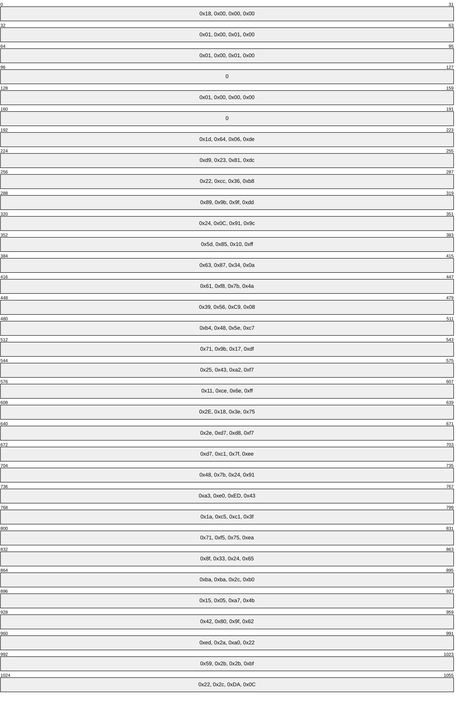

## 4.6 Sample Similarity Calculation

To test an implementation, the following sample [**similarity data**](#gt_similarity-data) computation is used for a file. The similarity data shown is as computed over the preceding set of signatures. Each value is displayed in hexadecimal.

| t0 | t1 | t2 | t3 | t4 | t5 | t6 | t7 | t8 | t9 | t10 | t11 | t12 | t13 | t14 | t15 |
| --- | --- | --- | --- | --- | --- | --- | --- | --- | --- | --- | --- | --- | --- | --- | --- |
| 2a | 38 | 3a | 37 | 09 | 0b | 3b | 01 | 3e | 26 | 27 | 29 | 2a | 01 | 14 | 39 |

## 4.7 Other Considerations

The size of [**RDC**](#gt_remote-differential-compression-rdc) chunks can be shown mathematically to be on average two times the [**horizon**](#gt_horizon) size.

The minimum size of RDC chunks is usually the same as the horizon size. One exception to this rule is when there are less than horizon-size bytes of data left from the current chunk boundary to the end of the data. The other exception to this rule is when the maximum block size is exceeded.

The maximum RDC chunk size is 2^16-1 (65,535) bytes. One of the many possible examples of when this limit can be encountered is when large portions of the data (or all of the data) are the same (that is, all zeros or all ones). RDC automatically inserts a [**cut point**](#gt_cut-points) to ensure that no block is larger that 65,535 bytes. If, for example, the first [**local maximum**](#gt_local-maximum) is found at position 65,540 in a file, there will be a cut point at positions 65,535 and 65,640, the second block being only 5 bytes long.

It is possible, of course, to apply RDC recursion to any number of levels. The depth of recursion that an application uses depends on the size of the [**signature file**](#gt_signature-file) being transferred versus how many chunks of the signature file are required to be transferred for each [**recursion level**](#gt_recursion-level). The application is required to determine when bandwidth would be better utilized by just sending a bigger signature file to avoid another round of signature data transfer.

# 5 Security

## 5.1 Security Considerations for Implementers

[**RDC**](#gt_remote-differential-compression-rdc) relies on a relatively weak hash function (that is, MD4) for its chunks. [**MD4**](#gt_md4) was chosen because it requires few cycles per byte, has a relatively low startup cost (because several hashes are computed per *file*, one per [**chunk**](#gt_chunk)), and yet it is still a reasonably [**collision-resistant hash function**](#gt_collision-resistant-hash-function). This is to be taken in the context in which the main functionality of RDC is to speed up many (but not necessarily all) *file* transfers. RDC itself does not advertise that the transfer is accurate, but check integrity by strong [**hash functions**](#gt_hash-function). Strong hash functions can be computed when traversing the source *file* and sent over at the end or beginning of a transfer.

Thus, it is possible (even to be (rarely) expected) that two distinct chunks of data can have the same length and the same MD4 hash value. In this case, it is possible that the use of RDC will result in the construction of a [**target file**](#gt_target-file) that is, in fact, distinct from the [**source file**](#gt_source-file).

It is recommended that an application using RDC use an alternate means outside of RDC to determine whether the target file has the same content as the original source file.<5>

One way to achieve this goal is to compute a hash (using some application-selected hash algorithm) on the entire contents of the source file and the target file. If the hashes do not match, the application could invoke some sort of recovery operation (such as transferring the source file without the use of RDC). If it is possible that the input data to RDC is generated by a source that is not trustworthy, ensure that this secondary hash is cryptographically secure, so that an attacker cannot intentionally generate a file update that could result in a signature collision and consequent errant transfer.

## 5.2 Index of Security Parameters

None.

# 6 Appendix A: Product Behavior

The information in this specification is applicable to the following Microsoft products or supplemental software. References to product versions include updates to those products.

- Windows Server 2003 R2 operating system
- Windows Vista operating system
- Windows Server 2008 operating system
- Windows 7 operating system
- Windows Server 2008 R2 operating system
- Windows 8 operating system
- Windows Server 2012 operating system
- Windows 8.1 operating system
- Windows Server 2012 R2 operating system
- Windows 10 operating system
- Windows Server 2016 operating system
- Windows Server operating system
- Windows Server 2019 operating system
- Windows Server 2022 operating system
- Windows 11 operating system
- Windows Server 2025 operating system
Exceptions, if any, are noted in this section. If an update version, service pack or Knowledge Base (KB) number appears with a product name, the behavior changed in that update. The new behavior also applies to subsequent updates unless otherwise specified. If a product edition appears with the product version, behavior is different in that product edition.

Unless otherwise specified, any statement of optional behavior in this specification that is prescribed using the terms "SHOULD" or "SHOULD NOT" implies product behavior in accordance with the SHOULD or SHOULD NOT prescription. Unless otherwise specified, the term "MAY" implies that the product does not follow the prescription.

<1> Section 3.1.5.1: For an example of how Windows performs hash window and horizon negotiation, see [MS-FRS2](../MS-FRS2/MS-FRS2.md) section 3.2.4.1.14.

<2> Section 3.1.5.3.1: The RDC library in Windows supports a maximum recursion depth of eight.

<3> Section 3.1.5.4: If the [**similarity data**](#gt_similarity-data) appears in a protocol, the Windows-based client and server use the methods described in section [3.1.5.4.1](#Section_3.1.5.4.1) to compute similarity data.

<4> Section 3.1.5.4.2: FRS2 [MS-FRS2] can use several seed files, some of which are selected by finding the files that have the largest number of matching similarity traits. FRS2 also uses other techniques for finding seed files.

<5> Section 5.1: Windows Distributed File System (DFS) replication [MS-FRS2], the only Microsoft component using RDC at the time of this writing, computes a SHA-1 hash [[FIPS180-2]](https://go.microsoft.com/fwlink/?LinkId=89868) over the contents of the file. And if it does not match, it transfers the file without using [**RDC**](#gt_remote-differential-compression-rdc).

# 7 Change Tracking

This section identifies changes that were made to this document since the last release. Changes are classified as Major, Minor, or None.

The revision class **Major** means that the technical content in the document was significantly revised. Major changes affect protocol interoperability or implementation. Examples of major changes are:

- A document revision that incorporates changes to interoperability requirements.
- A document revision that captures changes to protocol functionality.
The revision class **Minor** means that the meaning of the technical content was clarified. Minor changes do not affect protocol interoperability or implementation. Examples of minor changes are updates to clarify ambiguity at the sentence, paragraph, or table level.

The revision class **None** means that no new technical changes were introduced. Minor editorial and formatting changes may have been made, but the relevant technical content is identical to the last released version.

The changes made to this document are listed in the following table. For more information, please contact [dochelp@microsoft.com](mailto:dochelp@microsoft.com).

| Section | Description | Revision class |
| --- | --- | --- |
| [6](#Section_6) Appendix A: Product Behavior | Added Windows Server 2025 to the list of applicable products. | Major |

## Revision History

| Date | Version | Revision Class | Comments |
| --- | --- | --- | --- |
| 3/2/2007 | 1.0 | New | Version 1.0 release |
| 4/3/2007 | 1.1 | Minor | Version 1.1 release |
| 5/11/2007 | 1.2 | Minor | Version 1.2 release |
| 6/1/2007 | 1.2.1 | Editorial | Changed language and formatting in the technical content. |
| 7/3/2007 | 1.2.2 | Editorial | Changed language and formatting in the technical content. |
| 8/10/2007 | 1.2.3 | Editorial | Changed language and formatting in the technical content. |
| 9/28/2007 | 1.2.4 | Editorial | Changed language and formatting in the technical content. |
| 10/23/2007 | 1.2.5 | Editorial | Changed language and formatting in the technical content. |
| 1/25/2008 | 1.2.6 | Editorial | Changed language and formatting in the technical content. |
| 3/14/2008 | 1.2.7 | Editorial | Changed language and formatting in the technical content. |
| 6/20/2008 | 1.3 | Minor | Clarified the meaning of the technical content. |
| 7/25/2008 | 1.3.1 | Editorial | Changed language and formatting in the technical content. |
| 8/29/2008 | 2.0 | Major | Updated and revised the technical content. |
| 10/24/2008 | 2.0.1 | Editorial | Changed language and formatting in the technical content. |
| 12/5/2008 | 3.0 | Major | Updated and revised the technical content. |
| 1/16/2009 | 3.0.1 | Editorial | Changed language and formatting in the technical content. |
| 2/27/2009 | 3.0.2 | Editorial | Changed language and formatting in the technical content. |
| 4/10/2009 | 3.0.3 | Editorial | Changed language and formatting in the technical content. |
| 5/22/2009 | 3.0.4 | Editorial | Changed language and formatting in the technical content. |
| 7/2/2009 | 3.0.5 | Editorial | Changed language and formatting in the technical content. |
| 8/14/2009 | 3.0.6 | Editorial | Changed language and formatting in the technical content. |
| 9/25/2009 | 3.0.7 | Editorial | Changed language and formatting in the technical content. |
| 11/6/2009 | 3.0.8 | Editorial | Changed language and formatting in the technical content. |
| 12/18/2009 | 3.0.9 | Editorial | Changed language and formatting in the technical content. |
| 1/29/2010 | 3.0.10 | Editorial | Changed language and formatting in the technical content. |
| 3/12/2010 | 4.0 | Major | Updated and revised the technical content. |
| 4/23/2010 | 5.0 | Major | Updated and revised the technical content. |
| 6/4/2010 | 5.0.1 | Editorial | Changed language and formatting in the technical content. |
| 7/16/2010 | 5.0.1 | None | No changes to the meaning, language, or formatting of the technical content. |
| 8/27/2010 | 5.0.1 | None | No changes to the meaning, language, or formatting of the technical content. |
| 10/8/2010 | 5.0.1 | None | No changes to the meaning, language, or formatting of the technical content. |
| 11/19/2010 | 5.1 | Minor | Clarified the meaning of the technical content. |
| 1/7/2011 | 5.1 | None | No changes to the meaning, language, or formatting of the technical content. |
| 2/11/2011 | 5.1 | None | No changes to the meaning, language, or formatting of the technical content. |
| 3/25/2011 | 5.1 | None | No changes to the meaning, language, or formatting of the technical content. |
| 5/6/2011 | 5.1 | None | No changes to the meaning, language, or formatting of the technical content. |
| 6/17/2011 | 5.2 | Minor | Clarified the meaning of the technical content. |
| 9/23/2011 | 5.2 | None | No changes to the meaning, language, or formatting of the technical content. |
| 12/16/2011 | 5.2 | None | No changes to the meaning, language, or formatting of the technical content. |
| 3/30/2012 | 5.2 | None | No changes to the meaning, language, or formatting of the technical content. |
| 7/12/2012 | 5.3 | Minor | Clarified the meaning of the technical content. |
| 10/25/2012 | 5.3 | None | No changes to the meaning, language, or formatting of the technical content. |
| 1/31/2013 | 5.3 | None | No changes to the meaning, language, or formatting of the technical content. |
| 8/8/2013 | 6.0 | Major | Updated and revised the technical content. |
| 11/14/2013 | 6.0 | None | No changes to the meaning, language, or formatting of the technical content. |
| 2/13/2014 | 6.0 | None | No changes to the meaning, language, or formatting of the technical content. |
| 5/15/2014 | 6.0 | None | No changes to the meaning, language, or formatting of the technical content. |
| 6/30/2015 | 7.0 | Major | Significantly changed the technical content. |
| 10/16/2015 | 7.0 | None | No changes to the meaning, language, or formatting of the technical content. |
| 7/14/2016 | 7.0 | None | No changes to the meaning, language, or formatting of the technical content. |
| 6/1/2017 | 7.0 | None | No changes to the meaning, language, or formatting of the technical content. |
| 9/15/2017 | 8.0 | Major | Significantly changed the technical content. |
| 9/12/2018 | 9.0 | Major | Significantly changed the technical content. |
| 4/7/2021 | 10.0 | Major | Significantly changed the technical content. |
| 6/25/2021 | 11.0 | Major | Significantly changed the technical content. |
| 4/23/2024 | 12.0 | Major | Significantly changed the technical content. |
