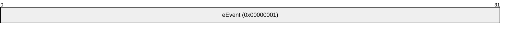
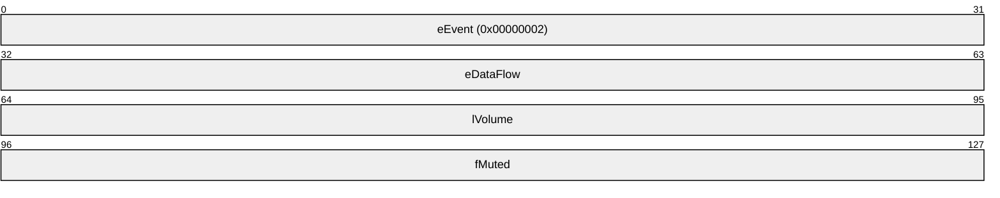
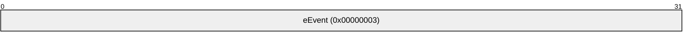
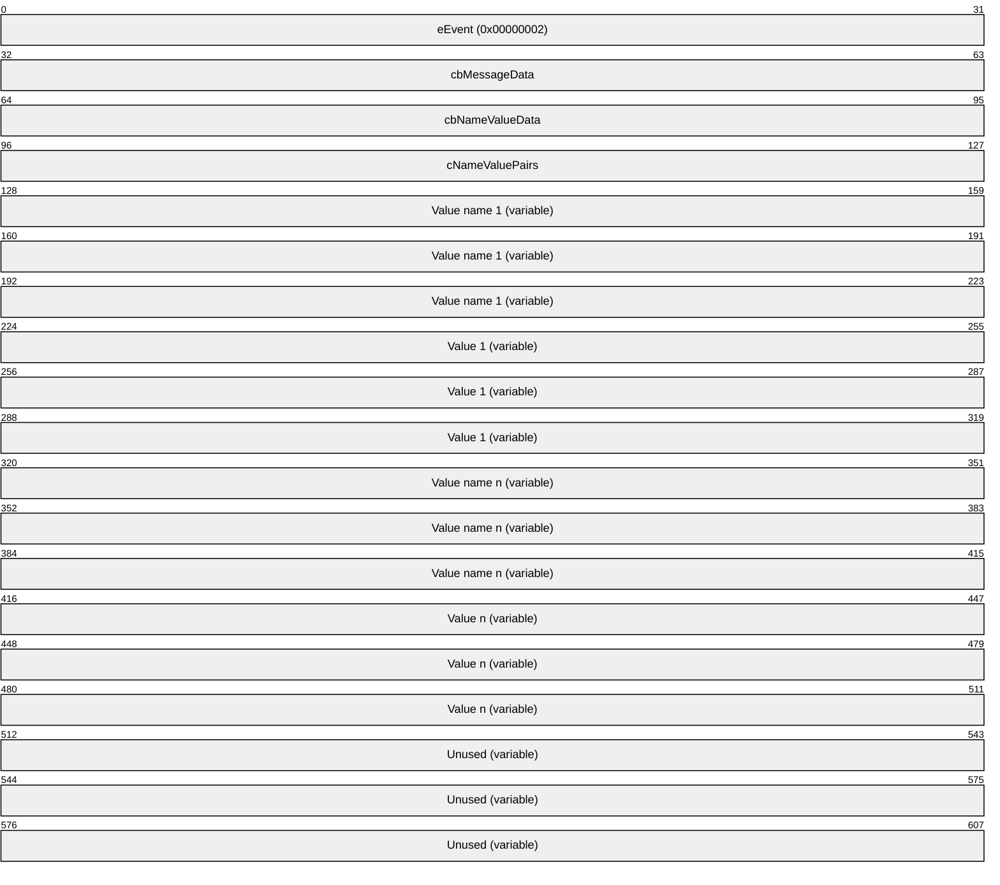
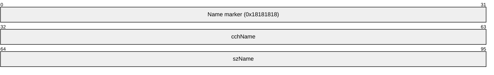
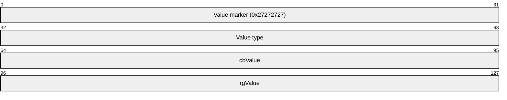

# [MS-RDPADRV]: Remote Desktop Protocol: Audio Level and Drive Letter Persistence Virtual Channel Extension

Table of Contents

1 Introduction

- [1 Introduction](#Section_1)
  - [1.1 Glossary](#Section_1.1)
  - [1.2 References](#Section_1.2)
    - [1.2.1 Normative References](#Section_1.2.1)
    - [1.2.2 Informative References](#Section_1.2.2)
  - [1.3 Overview](#Section_1.3)
  - [1.4 Relationship to Other Protocols](#Section_1.4)
  - [1.5 Prerequisites/Preconditions](#Section_1.5)
  - [1.6 Applicability Statement](#Section_1.6)
  - [1.7 Versioning and Capability Negotiation](#Section_1.7)
  - [1.8 Vendor-Extensible Fields](#Section_1.8)
  - [1.9 Standards Assignments](#Section_1.9)

2 Messages

- [2 Messages](#Section_2)
  - [2.1 Transport](#Section_2.1)
  - [2.2 Message Syntax](#Section_2.2)
    - [2.2.1 SAE_Started](#Section_2.2.1)
    - [2.2.2 SAE_VolumeChange](#Section_2.2.2)
    - [2.2.3 SAE_RemoteConnect](#Section_2.2.3)
    - [2.2.4 SADLE_Started](#Section_2.2.4)
    - [2.2.5 SADLE_SerializedCache](#Section_2.2.5)

3 Protocol Details

- [3 Protocol Details](#Section_3)
  - [3.1 Common Details](#Section_3.1)
    - [3.1.1 Abstract Data Model](#Section_3.1.1)
    - [3.1.2 Timers](#Section_3.1.2)
    - [3.1.3 Initialization](#Section_3.1.3)
      - [3.1.3.1 Audio Level Protocol Initialization](#Section_3.1.3.1)
      - [3.1.3.2 Drive Letter Protocol Initialization](#Section_3.1.3.2)
    - [3.1.4 Higher-Layer Triggered Events](#Section_3.1.4)
      - [3.1.4.1 Audio Level Protocol Events](#Section_3.1.4.1)
      - [3.1.4.2 Drive Letter Protocol Events](#Section_3.1.4.2)
    - [3.1.5 Message Processing Events and Sequencing Rules](#Section_3.1.5)
    - [3.1.6 Timer Events](#Section_3.1.6)
    - [3.1.7 Other Local Events](#Section_3.1.7)

4 Protocol Examples

- [4 Protocol Examples](#Section_4)
  - [4.1 Audio Level Protocol initialization and change](#Section_4.1)
  - [4.2 Drive Letter Protocol initialization and change](#Section_4.2)

5 Security

- [5 Security](#Section_5)
  - [5.1 Security Considerations for Implementers](#Section_5.1)
  - [5.2 Index of Security Parameters](#Section_5.2)

6 Appendix A: Product Behavior

- [6 Appendix A: Product Behavior](#Section_6)

7 Change Tracking

- [7 Change Tracking](#Section_7)

For the legal notice and IP terms, see [LEGAL.md](../LEGAL.md).
Last updated: 4/23/2024.
See [Revision History](#revision-history) for full version history.

# 1 Introduction

This document describes an extension to the RDP dynamic virtual channel protocol that is used exclusively in the context of Windows Multipoint Server scenarios. The RDP dynamic virtual channel protocol allows information to be passed between a remote desktop connection client device and a session on a remote host computer. This extension provides a mechanism for clients to be notified when the [**audio level**](#gt_audio-level) is changed and/or when a [**drive letter**](#gt_drive-letter) is assigned to a USB storage device that is redirected from the client to the session. The extension provides a mechanism for the client to read the audio level and/or drive letter from the session. It is assumed that this information will be stored in non-volatile storage so that if the client is disconnected and rebooted it will retain the values. When the client is later connected to a session on a remote session host the extension provides a mechanism for the client to send the audio level and/or drive letter information to the session and initialize those settings to the stored values. The goal of this functionality is to make a remote desktop client behavior similar to the behavior of a standalone Windows client PC.

Sections 1.5, 1.8, 1.9, 2, and 3 of this specification are normative. All other sections and examples in this specification are informative.

## 1.1 Glossary

This document uses the following terms:

**audio level**: The relative volume level, expressed as a percentage (0-100) of a speaker and/or microphone level. The device has to be physically connected to a client device and then logically connected to a session that the client connects to using the RDP protocol.

**drive letter**: One of the 26 alphabetical characters A-Z, in uppercase or lowercase, that is assigned to a volume. Drive letters serve as a namespace through which data on the volume can be accessed. A volume with a drive letter can be referred to with the drive letter followed by a colon (for example, C:).

**dynamic virtual channel**: A transport used for lossless communication between an RDP client and a server component over a main data connection, as specified in [MS-RDPEDYC].

**virtual channel**: A transport used for communication between a client and a server component over a main data connection, in 1600-byte chunks, as specified in Static Virtual Channels in [MS-RDPBCGR](../MS-RDPBCGR/MS-RDPBCGR.md).

**MAY, SHOULD, MUST, SHOULD NOT, MUST NOT:** These terms (in all caps) are used as defined in [[RFC2119]](https://go.microsoft.com/fwlink/?LinkId=90317). All statements of optional behavior use either MAY, SHOULD, or SHOULD NOT.

## 1.2 References

Links to a document in the Microsoft Open Specifications library point to the correct section in the most recently published version of the referenced document. However, because individual documents in the library are not updated at the same time, the section numbers in the documents may not match. You can confirm the correct section numbering by checking the [Errata](https://go.microsoft.com/fwlink/?linkid=850906).

### 1.2.1 Normative References

We conduct frequent surveys of the normative references to assure their continued availability. If you have any issue with finding a normative reference, please contact [dochelp@microsoft.com](mailto:dochelp@microsoft.com). We will assist you in finding the relevant information.

[MS-RDPEDYC] Microsoft Corporation, "[Remote Desktop Protocol: Dynamic Channel Virtual Channel Extension](../MS-RDPEDYC/MS-RDPEDYC.md)".

[MSDN-EDataFlow] Microsoft Corporation, "EDataFlow enumeration", [http://msdn.microsoft.com/en-us/library/windows/desktop/dd370828(v=vs.85).aspx](https://go.microsoft.com/fwlink/?LinkId=255051)

[RFC2119] Bradner, S., "Key words for use in RFCs to Indicate Requirement Levels", BCP 14, RFC 2119, March 1997, [https://www.rfc-editor.org/info/rfc2119](https://go.microsoft.com/fwlink/?LinkId=90317)

### 1.2.2 Informative References

[MSDN-CoreAudioInterfaces] Microsoft Corporation, "Core Audio Interfaces", [https://msdn.microsoft.com/en-us/library/windows/desktop/dd370805(v=vs.85).aspx](https://go.microsoft.com/fwlink/?LinkId=723178)

[MSDN-IAudioEndpointVolume] Microsoft Corporation, "IAudioEndPointVolume interface", [https://msdn.microsoft.com/en-us/library/windows/desktop/dd370892(v=vs.85).aspx](https://go.microsoft.com/fwlink/?LinkId=723179)

## 1.3 Overview

This extension to the RDP virtual channels protocol allows an RDP (remote desktop connection) client device's behavior, with respect to [**audio levels**](#gt_audio-level) and drive letters, to mimic a Windows client PC session. The following sections provide an audio level and [**drive letter**](#gt_drive-letter) scenarios.

**Audio level scenario**

For example, a user logs onto a PC running a Windows client operating system, plugs in a headset, and finds the level is too loud. The user can lower the audio level by using the Windows user interface. If the audio level was initially set to 100%, the user might change it to 50% to get to a comfortable volume. If the user logs out, reboots the computer, and logs back on, the volume will still be set to 50%.

Contrast that to the experience of a user logging onto a remote session using a thin client. The user adjusts the audio level to 50%, but if the user logs out and back on, by default the audio level is always set back to 100%. This requires the user to re-adjust the audio level every time she logs off on. (This is also true for disconnecting and reconnecting to a session.) With the extension to the virtual channel protocol defined in this document, the audio level settings are saved on the client and each time the device connects to a remote session, the audio level will keep its preset value.

**Drive letter scenario**

For another example, a user logs onto a PC running a Windows client operating system, plugs a USB storage device into the PC, assigns it the drive letter *N:*, and then configures the system to automatically and periodically back up the user's folder onto the USB storage device which has the letter *N:* assigned to it. If the user then reboots the computer and logs back on, the USB storage device will still be assigned *N:* and the backups will continue to occur without problems.

Contrast that to the experience of a user logging on to a remote session using a thin client. The user sets the drive letter to N: and the backups can begin, but when the user logs off and back on, the drive letter has now been assigned the next available letter by the session (for example, the next available drive letter *G:* if the host server already has letters A through F assigned to drives). This will cause the backup to fail and require the user to reset the drive letter to *N:* every time he logs off and back on. With this extension to the virtual channel protocol, the drive letter settings for a specific storage device will be remembered on the client, and each time the device connects to a remote session, the drive letter will keep its preset value.

## 1.4 Relationship to Other Protocols

The Audio Level and Drive Letter Persistence Virtual Channel Extension is implemented over RDP Dynamic Virtual Channels, as defined in [MS-RDPEDYC](../MS-RDPEDYC/MS-RDPEDYC.md).

## 1.5 Prerequisites/Preconditions

None.

## 1.6 Applicability Statement

This protocol is applicable to scenarios where the implementation is required to persist audio volume settings and [**drive letter**](#gt_drive-letter) mappings for RDP sessions on a per client basis, as opposed to a per user basis.

## 1.7 Versioning and Capability Negotiation

## 1.8 Vendor-Extensible Fields

None.

## 1.9 Standards Assignments

None.

# 2 Messages

## 2.1 Transport

This protocol is designed to operate over a [**dynamic virtual channel**](#gt_dynamic-virtual-channel), as specified in [MS-RDPEDYC](../MS-RDPEDYC/MS-RDPEDYC.md). The [**virtual channel**](#gt_virtual-channel) name for [**audio levels**](#gt_audio-level) is "WMSAud" and for [**drive letters**](#gt_drive-letter) is "WMSDL". The Remote Desktop Protocol layer manages the creation, setup, and transmission of data over the virtual channel. These virtual channels MUST be used to establish connections and exchange audio level or drive letter information.

## 2.2 Message Syntax

The following sections contain Remote Desktop Protocol: Audio Level and Drive Letter Persistence Virtual Channel Extension message syntax.

### 2.2.1 SAE_Started

The SAE_Started message is sent from the server to the client to initiate the protocol. It signals that the server is initializing a new RDP session and requires the initial audio volume settings for the session. The client MUST respond with a SAE_VolumeChange message for each dataflow (as defined in [[MSDN-EDataFlow]](https://go.microsoft.com/fwlink/?LinkId=255051)) for which it has a persisted value cached.

**eEvent(4 bytes):** A 32-bit unsigned integer that specifies message type. The value for SAE_Started is 0x00000001.

### 2.2.2 SAE_VolumeChange

When sent from the client to the server, the SAE_VolumeChange message indicates a request to set the volume setting for a specific dataflow (as defined in [[MSDN-EDataFlow]](https://go.microsoft.com/fwlink/?LinkId=255051)) to the specified level. When sent from the server to the client, it indicates that the volume setting for a specific dataflow has been changed to the specified level.

**eEvent(4 bytes):** A 32-bit unsigned integer that specifies message type. The value for SAE_VolumeChange is 0x00000002.

**eDataFlow (4 bytes):** A 32-bit unsigned integer that specifies the specific volume setting. The **eDataFlow** field MUST be one of the following values.

| Value | Meaning |
| --- | --- |
| eRender 0x00000000 | The specified volume level affects the render or playback volume. |
| eCapture 0x00000001 | The specified volume level affects the capture or recording volume. |

**lVolume (4 bytes):** A 32-bit float. The volume level is normalized to the range of 0.0 to 1.0, where 0.0 is the minimum level and 1.0 is the maximum level. Within this range, the relationship of the normalized volume level to the attenuation of signal amplitude is described by a nonlinear, audio-tapered curve.<1>

**fMuted (4 bytes):** A 32-bit unsigned integer that specifies if the dataflow (as defined in [MSDN-EDataFlow]) is turned off or disabled.

| Value | Meaning |
| --- | --- |
| FALSE0x00000000 | The specified dataflow is not disabled. |
| TRUE0x00000001 | The specified dataflow is disabled. |

### 2.2.3 SAE_RemoteConnect

The SAE_RemoteConnect message is sent from the server to the client to initiate the protocol. It signals that the server has reconnected to an existing RDP session and requires the initial audio volume settings for the session. The client MUST respond with a SAE_VolumeChange message for each dataflow (as defined in [[MSDN-EDataFlow]](https://go.microsoft.com/fwlink/?LinkId=255051)) for which it has a persisted value cached.

**eEvent(4 bytes):** A 32-bit unsigned integer that specifies message type. The value for SAE_RemoteConnect is 0x00000003.

### 2.2.4 SADLE_Started

The SADLE_Started message is sent from the server to the client to initiate the protocol. It signals that the server is initializing an RDP session and requires the [**drive letter**](#gt_drive-letter) mapping settings for the session. The client MUST respond with a SADLE_SerializedCache message if it has persisted drive letter mappings cached.

**eEvent(4 bytes):** A 32-bit unsigned integer that specifies message type. The value for SADLE_Started is 0x00000001.

### 2.2.5 SADLE_SerializedCache

The SADLE_SerializedCache message is sent from the client to the server in response to a SADLE_Started message to restore persisted [**drive letter**](#gt_drive-letter) mappings for use in an RDP session. This message is sent from the server to the client whenever the drive letter mappings in the RDP session are changed so that they can be persisted for future sessions.

**eEvent (4 bytes):** An unsigned integer that specifies message type. The value for SADLE_SerializedCache is 0x00000002.

**cbMessageData (4 bytes):** An unsigned integer that specifies the size of the message data.

**cbNameValueData (4 bytes):** An unsigned integer that specifies the size of the name-value data, which MUST match the value of **cbMessageData**. The **cbMessageData** and **cbNameValueData** fields contain the same value to allow verification that the data sizes from two sources (the registry and the protocol payload) match.

**cNameValuePairs (4 bytes):** An unsigned integer that specifies the count of pairs of Value names and Values in this message.

**Value name 1 (variable):** A NAME_DATA structure. Each instance of this structure is byte-aligned and cannot align to a WORD or DWORD boundary.

**Value 1 (variable):** A VALUE_DATA structure. Each instance of this structure is byte-aligned and cannot align to a WORD or DWORD boundary.

**NAME_DATA**

**Name marker (4 bytes):** The constant 0x18181818.

**cchName (4 bytes):** The length of **szName**, in bytes.

**szName (variable, cchName WCHARs):** The value's name, as a Unicode string.

**VALUE_DATA**

**Value marker (4 bytes):** The constant 0x27272727.

**Value type (4 bytes):** The registry value type of this value, for example, REG_BINARY.

**cbValue (4 bytes):** The length of **rgValue**, in bytes.

**rgValue (variable, cbValue bytes):** The value data.

# 3 Protocol Details

## 3.1 Common Details

The protocol is designed to allow an RDP client to be notified of changes to session configuration settings so that those settings can be persisted across sessions and allowed to restore those settings while the session is initializing.

### 3.1.1 Abstract Data Model

None.

### 3.1.2 Timers

None.

### 3.1.3 Initialization

The protocol initializes after an RDP client/server session has been established and the required [**virtual channel**](#gt_virtual-channel) transport has been created.

#### 3.1.3.1 Audio Level Protocol Initialization

The server MUST send an SAE_Started message to the client if the RDP session is being initially created, or it MUST send an SAE_RemoteConnect message if connecting to an existing RDP session. Upon receipt of either of these messages, the RDP client SHOULD reply with an SAE_VolumeChange message containing the same information as the last received SAE_VolumeChange message. If the RDP client has no persisted configuration data, then no response is sent.

#### 3.1.3.2 Drive Letter Protocol Initialization

The server MUST create a volatile Windows registry key where changes will be stored (HKCU\Software\Microsoft\Terminal Server\[session id]\Drive Letter Cache, where [session id] is the decimal RDP session ID). The presence of this key signals to RDP that USB Redirection of Mass Storage devices search a cache of device-to-drive-letter mappings when assigning [**drive letters**](#gt_drive-letter) to newly redirected devices. The server MUST then send a SADLE_Started message to the client. Upon receiving the SADLE_STARTED message, the RDP client SHOULD reply with a SADLE_SerializedCache message containing the same information as the last received SADLE_SerializedCache message. If the RDP client has no persisted configuration data, then the RDP client SHOULD NOT send a response. The RDP client MUST make no attempt to redirect USB Mass Storage devices prior to the protocol being initialized.

### 3.1.4 Higher-Layer Triggered Events

The server MUST monitor the settings for changes and notify the client by sending the appropriate configuration message.

#### 3.1.4.1 Audio Level Protocol Events

The server MUST monitor the master volume level for changes, which can be made via core audio APIs [[MSDN-CoreAudioInterfaces]](https://go.microsoft.com/fwlink/?LinkId=723178) such as the IAudioEndpointVolume interface [[MSDN-IAudioEndpointVolume]](https://go.microsoft.com/fwlink/?LinkId=723179). Changes to the master volume level MUST be sent to the client as a SAE_VolumeChange message.

#### 3.1.4.2 Drive Letter Protocol Events

The server MUST monitor the Windows registry key HKCU\Software\Microsoft\Terminal Server\[session id]\Drive Letter Cache for changes (where [session id] is the decimal RDP session ID). When the key changes, all DWORD Registry Values contained in the key MUST be enumerated and the value name/DWORD value pairs are stored packed into a single contiguous block, which is then sent to the RDP client using a SADLE_SerializedCache message.

### 3.1.5 Message Processing Events and Sequencing Rules

The protocol has two classes of messages, protocol initialization messages, and data transmission messages. Protocol initialization messages are always sent from the RDP server session to the RDP client when the session is first established or has reconnected. The client responds with the appropriate data transmission message if it has any cached data. The client MUST never send data transmission messages to the server except in response to a protocol initialization message.

After the protocol initialization message has been received, the server MUST send a data transmission message to the client every time the data is changed in the RDP session. When the client receives a data transmission message, it MUST discard any old cached copy of the data and cache the current data.

### 3.1.6 Timer Events

None.

### 3.1.7 Other Local Events

None.

# 4 Protocol Examples

## 4.1 Audio Level Protocol initialization and change

- An RDP client that has persisted [**audio level**](#gt_audio-level) data for both the render and capture dataflows (as defined in [[MSDN-EDataFlow]](https://go.microsoft.com/fwlink/?LinkId=255051)) creates a new session on an RDP server.
- The RDP server begins monitoring the RDP audio device for master volume level changes.
- The RDP server sends an SAE_Started message to the client.
- The RDP client retrieves persisted render dataflow audio level data and sends an SAE_VolumeChange message to the server.
- The RDP server changes the master render audio volume to the level in the SAE_VolumeChange message.
- The RDP client retrieves persisted capture dataflow audio level data, and sends an SAE_VolumeChange message to the server.
- The RDP server changes the master capture audio volume to the level in the SAE_VolumeChange message.
- The user changes the render audio volume level in the RDP session.
- The RDP server detects the change, and sends an SAE_VolumeChange message to the RDP client.
- The RDP client updates its persisted render volume settings to those in the SAE_VolumeChange message.

## 4.2 Drive Letter Protocol initialization and change

- An RDP client that has persisted [**drive letter**](#gt_drive-letter) data creates a new session with ID 3 on an RDP server.
- The RDP server creates a volatile Windows Registry Key: HKCU\Software\Microsoft\Terminal server\3\Drive Letter Cache.
- The RDP server begins monitoring the registry key for changes.
- The RDP server sends a SADLE_Started message to the client.
- The RDP client retrieves persisted drive-letter data and sends a SADLE_SerializedCache message to the server.
- The RDP server unpacks the registry value name/value pairs and recreates the registry values under the key HKCU\Software\Microsoft\Terminal server\3\Drive Letter Cache.
- The RDP server adds new value under HKCU\Software\Microsoft\Terminal server\3\Drive Letter Cache.
- The RDP server detects the change and sends a SADLE_SerializedCache message to the RDP client.
- The RDP client updates its persisted-drive-letter data to match that in the SAE_ SerializedCache message.

# 5 Security

## 5.1 Security Considerations for Implementers

None.

## 5.2 Index of Security Parameters

None.

# 6 Appendix A: Product Behavior

The information in this specification is applicable to the following Microsoft products or supplemental software. References to product versions include updates to those products.

- Windows 7 operating system
- Windows 8 operating system
- Windows 8.1 operating system
- Windows Multipoint Server 2012 operating system
- Windows 10 operating system
- Windows Server 2016 operating system
- Windows Server 2019 operating system
- Windows Server 2022 operating system
- Windows 11 operating system
- Windows Server 2025 operating system
Exceptions, if any, are noted in this section. If an update version, service pack or Knowledge Base (KB) number appears with a product name, the behavior changed in that update. The new behavior also applies to subsequent updates unless otherwise specified. If a product edition appears with the product version, behavior is different in that product edition.

Unless otherwise specified, any statement of optional behavior in this specification that is prescribed using the terms "SHOULD" or "SHOULD NOT" implies product behavior in accordance with the SHOULD or SHOULD NOT prescription. Unless otherwise specified, the term "MAY" implies that the product does not follow the prescription.

<1> Section 2.2.2: Note that the shape of the curve might change in future versions of Windows.

# 7 Change Tracking

This section identifies changes that were made to this document since the last release. Changes are classified as Major, Minor, or None.

The revision class **Major** means that the technical content in the document was significantly revised. Major changes affect protocol interoperability or implementation. Examples of major changes are:

- A document revision that incorporates changes to interoperability requirements.
- A document revision that captures changes to protocol functionality.
The revision class **Minor** means that the meaning of the technical content was clarified. Minor changes do not affect protocol interoperability or implementation. Examples of minor changes are updates to clarify ambiguity at the sentence, paragraph, or table level.

The revision class **None** means that no new technical changes were introduced. Minor editorial and formatting changes may have been made, but the relevant technical content is identical to the last released version.

The changes made to this document are listed in the following table. For more information, please contact [dochelp@microsoft.com](mailto:dochelp@microsoft.com).

| Section | Description | Revision class |
| --- | --- | --- |
| [6](#Section_6) Appendix A: Product Behavior | Added Windows Server 2025 to the list of applicable products. | Major |

## Revision History

| Date | Version | Revision Class | Comments |
| --- | --- | --- | --- |
| 7/12/2012 | 1.0 | New | Released new document. |
| 10/25/2012 | 1.1 | Minor | Clarified the meaning of the technical content. |
| 1/31/2013 | 1.1 | None | No changes to the meaning, language, or formatting of the technical content. |
| 8/8/2013 | 1.1 | None | No changes to the meaning, language, or formatting of the technical content. |
| 11/14/2013 | 1.1 | None | No changes to the meaning, language, or formatting of the technical content. |
| 2/13/2014 | 1.1 | None | No changes to the meaning, language, or formatting of the technical content. |
| 5/15/2014 | 1.1 | None | No changes to the meaning, language, or formatting of the technical content. |
| 6/30/2015 | 1.1 | None | No changes to the meaning, language, or formatting of the technical content. |
| 10/16/2015 | 1.1 | None | No changes to the meaning, language, or formatting of the technical content. |
| 7/14/2016 | 1.1 | None | No changes to the meaning, language, or formatting of the technical content. |
| 6/1/2017 | 1.1 | None | No changes to the meaning, language, or formatting of the technical content. |
| 9/12/2018 | 2.0 | Major | Significantly changed the technical content. |
| 4/7/2021 | 3.0 | Major | Significantly changed the technical content. |
| 6/25/2021 | 4.0 | Major | Significantly changed the technical content. |
| 4/23/2024 | 5.0 | Major | Significantly changed the technical content. |
