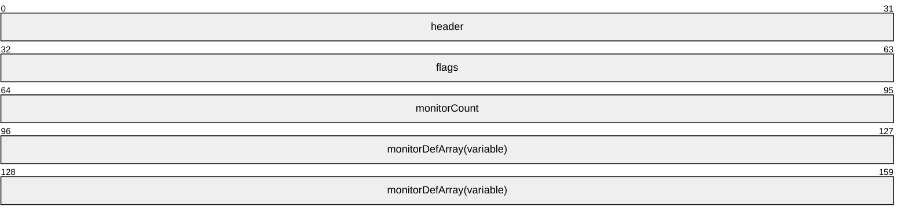

# [MS-RDPBCGR]: Remote Desktop Protocol: Basic Connectivity and Graphics Remoting

Table of Contents

<details>
<summary>1 Introduction</summary>

- [1 Introduction](#Section_1)
  - [1.1 Glossary](#Section_1.1)
  - [1.2 References](#Section_1.2)
    - [1.2.1 Normative References](#Section_1.2.1)
    - [1.2.2 Informative References](#Section_1.2.2)
  - [1.3 Overview](#Section_1.3)
    - [1.3.1 Message Flows](#Section_1.3.1)
      - [1.3.1.1 Connection Sequence](#Section_1.3.1.1)
      - [1.3.1.2 Security-Enhanced Connection Sequence](#Section_1.3.1.2)
      - [1.3.1.3 Deactivation-Reactivation Sequence](#Section_1.3.1.3)
      - [1.3.1.4 Disconnection Sequences](#Section_1.3.1.4)
        - [1.3.1.4.1 User-Initiated on Client](#Section_1.3.1.4.1)
        - [1.3.1.4.2 User-Initiated on Server](#Section_1.3.1.4.2)
        - [1.3.1.4.3 Administrator-Initiated on Server](#Section_1.3.1.4.3)
      - [1.3.1.5 Automatic Reconnection](#Section_1.3.1.5)
    - [1.3.2 Server Error Reporting and Status Updates](#Section_1.3.2)
    - [1.3.3 Static Virtual Channels](#Section_1.3.3)
    - [1.3.4 Data Compression](#Section_1.3.4)
    - [1.3.5 Keyboard and Mouse Input](#Section_1.3.5)
    - [1.3.6 Basic Server Output](#Section_1.3.6)
    - [1.3.7 Controlling Server Graphics Output](#Section_1.3.7)
    - [1.3.8 Server Redirection](#Section_1.3.8)
      - [1.3.8.1 RDSTLS](#Section_1.3.8.1)
    - [1.3.9 Connect-Time and Continuous Network Characteristics Detection](#Section_1.3.9)
    - [1.3.10 Connection Health Monitoring](#Section_1.3.10)
  - [1.4 Relationship to Other Protocols](#Section_1.4)
  - [1.5 Prerequisites/Preconditions](#Section_1.5)
  - [1.6 Applicability Statement](#Section_1.6)
  - [1.7 Versioning and Capability Negotiation](#Section_1.7)
  - [1.8 Vendor-Extensible Fields](#Section_1.8)
  - [1.9 Standards Assignments](#Section_1.9)
</details>

<details>
<summary>2 Messages</summary>

- [2 Messages](#Section_2)
  - [2.1 Transport](#Section_2.1)
  - [2.2 Message Syntax](#Section_2.2)
    - [2.2.1 Connection Sequence](#Section_2.2.1)
      - [2.2.1.1 Client X.224 Connection Request PDU](#Section_2.2.1.1)
        - [2.2.1.1.1 RDP Negotiation Request (RDP_NEG_REQ)](#Section_2.2.1.1.1)
        - [2.2.1.1.2 RDP Correlation Info (RDP_NEG_CORRELATION_INFO)](#Section_2.2.1.1.2)
      - [2.2.1.2 Server X.224 Connection Confirm PDU](#Section_2.2.1.2)
        - [2.2.1.2.1 RDP Negotiation Response (RDP_NEG_RSP)](#Section_2.2.1.2.1)
        - [2.2.1.2.2 RDP Negotiation Failure (RDP_NEG_FAILURE)](#Section_2.2.1.2.2)
      - [2.2.1.3 Client MCS Connect Initial PDU with GCC Conference Create Request](#Section_2.2.1.3)
        - [2.2.1.3.1 User Data Header (TS_UD_HEADER)](#Section_2.2.1.3.1)
        - [2.2.1.3.2 Client Core Data (TS_UD_CS_CORE)](#Section_2.2.1.3.2)
        - [2.2.1.3.3 Client Security Data (TS_UD_CS_SEC)](#Section_2.2.1.3.3)
        - [2.2.1.3.4 Client Network Data (TS_UD_CS_NET)](#Section_2.2.1.3.4)
          - [2.2.1.3.4.1 Channel Definition Structure (CHANNEL_DEF)](#Section_2.2.1.3.4.1)
        - [2.2.1.3.5 Client Cluster Data (TS_UD_CS_CLUSTER)](#Section_2.2.1.3.5)
        - [2.2.1.3.6 Client Monitor Data (TS_UD_CS_MONITOR)](#Section_2.2.1.3.6)
          - [2.2.1.3.6.1 Monitor Definition (TS_MONITOR_DEF)](#Section_2.2.1.3.6.1)
        - [2.2.1.3.7 Client Message Channel Data (TS_UD_CS_MCS_MSGCHANNEL)](#Section_2.2.1.3.7)
        - [2.2.1.3.8 Client Multitransport Channel Data (TS_UD_CS_MULTITRANSPORT)](#Section_2.2.1.3.8)
        - [2.2.1.3.9 Client Unused1 Data (TS_UD_CS_UNUSED1)](#Section_2.2.1.3.9)
        - [2.2.1.3.10 Client Monitor Extended Data (TS_UD_CS_MONITOR_EX)](#Section_2.2.1.3.10)
          - [2.2.1.3.10.1 Monitor Attributes (TS_MONITOR_ATTRIBUTES)](#Section_2.2.1.3.10.1)
      - [2.2.1.4 Server MCS Connect Response PDU with GCC Conference Create Response](#Section_2.2.1.4)
        - [2.2.1.4.1 User Data Header (TS_UD_HEADER)](#Section_2.2.1.4.1)
        - [2.2.1.4.2 Server Core Data (TS_UD_SC_CORE)](#Section_2.2.1.4.2)
        - [2.2.1.4.3 Server Security Data (TS_UD_SC_SEC1)](#Section_2.2.1.4.3)
          - [2.2.1.4.3.1 Server Certificate (SERVER_CERTIFICATE)](#Section_2.2.1.4.3.1)
            - [2.2.1.4.3.1.1 Server Proprietary Certificate (PROPRIETARYSERVERCERTIFICATE)](#Section_2.2.1.4.3.1.1)
              - [2.2.1.4.3.1.1.1 RSA Public Key (RSA_PUBLIC_KEY)](#Section_2.2.1.4.3.1.1.1)
        - [2.2.1.4.4 Server Network Data (TS_UD_SC_NET)](#Section_2.2.1.4.4)
        - [2.2.1.4.5 Server Message Channel Data (TS_UD_SC_MCS_MSGCHANNEL)](#Section_2.2.1.4.5)
        - [2.2.1.4.6 Server Multitransport Channel Data (TS_UD_SC_MULTITRANSPORT)](#Section_2.2.1.4.6)
      - [2.2.1.5 Client MCS Erect Domain Request PDU](#Section_2.2.1.5)
      - [2.2.1.6 Client MCS Attach User Request PDU](#Section_2.2.1.6)
      - [2.2.1.7 Server MCS Attach User Confirm PDU](#Section_2.2.1.7)
      - [2.2.1.8 Client MCS Channel Join Request PDU](#Section_2.2.1.8)
      - [2.2.1.9 Server MCS Channel Join Confirm PDU](#Section_2.2.1.9)
      - [2.2.1.10 Client Security Exchange PDU](#Section_2.2.1.10)
        - [2.2.1.10.1 Security Exchange PDU Data (TS_SECURITY_PACKET)](#Section_2.2.1.10.1)
      - [2.2.1.11 Client Info PDU](#Section_2.2.1.11)
        - [2.2.1.11.1 Client Info PDU Data (CLIENT_INFO_PDU)](#Section_2.2.1.11.1)
          - [2.2.1.11.1.1 Info Packet (TS_INFO_PACKET)](#Section_2.2.1.11.1.1)
            - [2.2.1.11.1.1.1 Extended Info Packet (TS_EXTENDED_INFO_PACKET)](#Section_2.2.1.11.1.1.1)
              - [2.2.1.11.1.1.1.1 Time Zone Information (TS_TIME_ZONE_INFORMATION)](#Section_2.2.1.11.1.1.1.1)
                - [2.2.1.11.1.1.1.1.1 System Time (TS_SYSTEMTIME)](#Section_2.2.1.11.1.1.1.1.1)
      - [2.2.1.12 Server License Error PDU - Valid Client](#Section_2.2.1.12)
        - [2.2.1.12.1 Valid Client License Data (LICENSE_VALID_CLIENT_DATA)](#Section_2.2.1.12.1)
          - [2.2.1.12.1.1 Licensing Preamble (LICENSE_PREAMBLE)](#Section_2.2.1.12.1.1)
          - [2.2.1.12.1.2 Licensing Binary Blob (LICENSE_BINARY_BLOB)](#Section_2.2.1.12.1.2)
          - [2.2.1.12.1.3 Licensing Error Message (LICENSE_ERROR_MESSAGE)](#Section_2.2.1.12.1.3)
      - [2.2.1.13 Mandatory Capability Exchange](#Section_2.2.1.13)
        - [2.2.1.13.1 Server Demand Active PDU](#Section_2.2.1.13.1)
          - [2.2.1.13.1.1 Demand Active PDU Data (TS_DEMAND_ACTIVE_PDU)](#Section_2.2.1.13.1.1)
            - [2.2.1.13.1.1.1 Capability Set (TS_CAPS_SET)](#Section_2.2.1.13.1.1.1)
        - [2.2.1.13.2 Client Confirm Active PDU](#Section_2.2.1.13.2)
          - [2.2.1.13.2.1 Confirm Active PDU Data (TS_CONFIRM_ACTIVE_PDU)](#Section_2.2.1.13.2.1)
      - [2.2.1.14 Client Synchronize PDU](#Section_2.2.1.14)
        - [2.2.1.14.1 Synchronize PDU Data (TS_SYNCHRONIZE_PDU)](#Section_2.2.1.14.1)
      - [2.2.1.15 Client Control PDU - Cooperate](#Section_2.2.1.15)
        - [2.2.1.15.1 Control PDU Data (TS_CONTROL_PDU)](#Section_2.2.1.15.1)
      - [2.2.1.16 Client Control PDU - Request Control](#Section_2.2.1.16)
      - [2.2.1.17 Client Persistent Key List PDU](#Section_2.2.1.17)
        - [2.2.1.17.1 Persistent Key List PDU Data (TS_BITMAPCACHE_PERSISTENT_LIST_PDU)](#Section_2.2.1.17.1)
          - [2.2.1.17.1.1 Persistent List Entry (TS_BITMAPCACHE_PERSISTENT_LIST_ENTRY)](#Section_2.2.1.17.1.1)
      - [2.2.1.18 Client Font List PDU](#Section_2.2.1.18)
        - [2.2.1.18.1 Font List PDU Data (TS_FONT_LIST_PDU)](#Section_2.2.1.18.1)
      - [2.2.1.19 Server Synchronize PDU](#Section_2.2.1.19)
      - [2.2.1.20 Server Control PDU - Cooperate](#Section_2.2.1.20)
      - [2.2.1.21 Server Control PDU - Granted Control](#Section_2.2.1.21)
      - [2.2.1.22 Server Font Map PDU](#Section_2.2.1.22)
        - [2.2.1.22.1 Font Map PDU Data (TS_FONT_MAP_PDU)](#Section_2.2.1.22.1)
    - [2.2.2 Disconnection Sequences](#Section_2.2.2)
      - [2.2.2.1 Client Shutdown Request PDU](#Section_2.2.2.1)
        - [2.2.2.1.1 Shutdown Request PDU Data (TS_SHUTDOWN_REQ_PDU)](#Section_2.2.2.1.1)
      - [2.2.2.2 Server Shutdown Request Denied PDU](#Section_2.2.2.2)
        - [2.2.2.2.1 Shutdown Request Denied PDU Data (TS_SHUTDOWN_DENIED_PDU)](#Section_2.2.2.2.1)
      - [2.2.2.3 MCS Disconnect Provider Ultimatum PDU](#Section_2.2.2.3)
    - [2.2.3 Deactivation-Reactivation Sequence](#Section_2.2.3)
      - [2.2.3.1 Server Deactivate All PDU](#Section_2.2.3.1)
        - [2.2.3.1.1 Deactivate All PDU Data (TS_DEACTIVATE_ALL_PDU)](#Section_2.2.3.1.1)
    - [2.2.4 Auto-Reconnect Sequence](#Section_2.2.4)
      - [2.2.4.1 Server Auto-Reconnect Status PDU](#Section_2.2.4.1)
        - [2.2.4.1.1 Auto-Reconnect Status PDU Data (TS_AUTORECONNECT_STATUS_PDU)](#Section_2.2.4.1.1)
      - [2.2.4.2 Server Auto-Reconnect Packet (ARC_SC_PRIVATE_PACKET)](#Section_2.2.4.2)
      - [2.2.4.3 Client Auto-Reconnect Packet (ARC_CS_PRIVATE_PACKET)](#Section_2.2.4.3)
    - [2.2.5 Server Error Reporting and Status Updates](#Section_2.2.5)
      - [2.2.5.1 Server Set Error Info PDU](#Section_2.2.5.1)
        - [2.2.5.1.1 Set Error Info PDU Data (TS_SET_ERROR_INFO_PDU)](#Section_2.2.5.1.1)
      - [2.2.5.2 Server Status Info PDU](#Section_2.2.5.2)
    - [2.2.6 Static Virtual Channels](#Section_2.2.6)
      - [2.2.6.1 Virtual Channel PDU](#Section_2.2.6.1)
        - [2.2.6.1.1 Channel PDU Header (CHANNEL_PDU_HEADER)](#Section_2.2.6.1.1)
    - [2.2.7 Capability Sets](#Section_2.2.7)
      - [2.2.7.1 Mandatory Capability Sets](#Section_2.2.7.1)
        - [2.2.7.1.1 General Capability Set (TS_GENERAL_CAPABILITYSET)](#Section_2.2.7.1.1)
        - [2.2.7.1.2 Bitmap Capability Set (TS_BITMAP_CAPABILITYSET)](#Section_2.2.7.1.2)
        - [2.2.7.1.3 Order Capability Set (TS_ORDER_CAPABILITYSET)](#Section_2.2.7.1.3)
        - [2.2.7.1.4 Bitmap Cache Capability Set](#Section_2.2.7.1.4)
          - [2.2.7.1.4.1 Revision 1 (TS_BITMAPCACHE_CAPABILITYSET)](#Section_2.2.7.1.4.1)
          - [2.2.7.1.4.2 Revision 2 (TS_BITMAPCACHE_CAPABILITYSET_REV2)](#Section_2.2.7.1.4.2)
            - [2.2.7.1.4.2.1 Bitmap Cache Cell Info (TS_BITMAPCACHE_CELL_CACHE_INFO)](#Section_2.2.7.1.4.2.1)
        - [2.2.7.1.5 Pointer Capability Set (TS_POINTER_CAPABILITYSET)](#Section_2.2.7.1.5)
        - [2.2.7.1.6 Input Capability Set (TS_INPUT_CAPABILITYSET)](#Section_2.2.7.1.6)
        - [2.2.7.1.7 Brush Capability Set (TS_BRUSH_CAPABILITYSET)](#Section_2.2.7.1.7)
        - [2.2.7.1.8 Glyph Cache Capability Set (TS_GLYPHCACHE_CAPABILITYSET)](#Section_2.2.7.1.8)
          - [2.2.7.1.8.1 Cache Definition (TS_CACHE_DEFINITION)](#Section_2.2.7.1.8.1)
        - [2.2.7.1.9 Offscreen Bitmap Cache Capability Set (TS_OFFSCREEN_CAPABILITYSET)](#Section_2.2.7.1.9)
        - [2.2.7.1.10 Virtual Channel Capability Set (TS_VIRTUALCHANNEL_CAPABILITYSET)](#Section_2.2.7.1.10)
        - [2.2.7.1.11 Sound Capability Set (TS_SOUND_CAPABILITYSET)](#Section_2.2.7.1.11)
      - [2.2.7.2 Optional Capability Sets](#Section_2.2.7.2)
        - [2.2.7.2.1 Bitmap Cache Host Support Capability Set (TS_BITMAPCACHE_HOSTSUPPORT_CAPABILITYSET)](#Section_2.2.7.2.1)
        - [2.2.7.2.2 Control Capability Set (TS_CONTROL_CAPABILITYSET)](#Section_2.2.7.2.2)
        - [2.2.7.2.3 Window Activation Capability Set (TS_WINDOWACTIVATION_CAPABILITYSET)](#Section_2.2.7.2.3)
        - [2.2.7.2.4 Share Capability Set (TS_SHARE_CAPABILITYSET)](#Section_2.2.7.2.4)
        - [2.2.7.2.5 Font Capability Set (TS_FONT_CAPABILITYSET)](#Section_2.2.7.2.5)
        - [2.2.7.2.6 Multifragment Update Capability Set (TS_MULTIFRAGMENTUPDATE_CAPABILITYSET)](#Section_2.2.7.2.6)
        - [2.2.7.2.7 Large Pointer Capability Set (TS_LARGE_POINTER_CAPABILITYSET)](#Section_2.2.7.2.7)
        - [2.2.7.2.8 Desktop Composition Capability Set (TS_COMPDESK_CAPABILITYSET)](#Section_2.2.7.2.8)
        - [2.2.7.2.9 Surface Commands Capability Set (TS_SURFCMDS_CAPABILITYSET)](#Section_2.2.7.2.9)
        - [2.2.7.2.10 Bitmap Codecs Capability Set (TS_BITMAPCODECS_CAPABILITYSET)](#Section_2.2.7.2.10)
          - [2.2.7.2.10.1 Bitmap Codecs (TS_BITMAPCODECS)](#Section_2.2.7.2.10.1)
            - [2.2.7.2.10.1.1 Bitmap Codec (TS_BITMAPCODEC)](#Section_2.2.7.2.10.1.1)
              - [2.2.7.2.10.1.1.1 Globally Unique Identifier (GUID)](#Section_2.2.7.2.10.1.1.1)
    - [2.2.8 Keyboard and Mouse Input](#Section_2.2.8)
      - [2.2.8.1 Input PDU Packaging](#Section_2.2.8.1)
        - [2.2.8.1.1 Slow-Path (T.128) Formats](#Section_2.2.8.1.1)
          - [2.2.8.1.1.1 Share Headers](#Section_2.2.8.1.1.1)
            - [2.2.8.1.1.1.1 Share Control Header (TS_SHARECONTROLHEADER)](#Section_2.2.8.1.1.1.1)
            - [2.2.8.1.1.1.2 Share Data Header (TS_SHAREDATAHEADER)](#Section_2.2.8.1.1.1.2)
          - [2.2.8.1.1.2 Security Headers](#Section_2.2.8.1.1.2)
            - [2.2.8.1.1.2.1 Basic (TS_SECURITY_HEADER)](#Section_2.2.8.1.1.2.1)
            - [2.2.8.1.1.2.2 Non-FIPS (TS_SECURITY_HEADER1)](#Section_2.2.8.1.1.2.2)
            - [2.2.8.1.1.2.3 FIPS (TS_SECURITY_HEADER2)](#Section_2.2.8.1.1.2.3)
          - [2.2.8.1.1.3 Client Input Event PDU (TS_INPUT_PDU)](#Section_2.2.8.1.1.3)
            - [2.2.8.1.1.3.1 Client Input Event PDU Data (TS_INPUT_PDU_DATA)](#Section_2.2.8.1.1.3.1)
              - [2.2.8.1.1.3.1.1 Slow-Path Input Event (TS_INPUT_EVENT)](#Section_2.2.8.1.1.3.1.1)
                - [2.2.8.1.1.3.1.1.1 Keyboard Event (TS_KEYBOARD_EVENT)](#Section_2.2.8.1.1.3.1.1.1)
                - [2.2.8.1.1.3.1.1.2 Unicode Keyboard Event (TS_UNICODE_KEYBOARD_EVENT)](#Section_2.2.8.1.1.3.1.1.2)
                - [2.2.8.1.1.3.1.1.3 Mouse Event (TS_POINTER_EVENT)](#Section_2.2.8.1.1.3.1.1.3)
                - [2.2.8.1.1.3.1.1.4 Extended Mouse Event (TS_POINTERX_EVENT)](#Section_2.2.8.1.1.3.1.1.4)
                - [2.2.8.1.1.3.1.1.5 Synchronize Event (TS_SYNC_EVENT)](#Section_2.2.8.1.1.3.1.1.5)
                - [2.2.8.1.1.3.1.1.6 Unused Event (TS_UNUSED_EVENT)](#Section_2.2.8.1.1.3.1.1.6)
                - [2.2.8.1.1.3.1.1.7 Relative Mouse Event (TS_RELPOINTER_EVENT)](#Section_2.2.8.1.1.3.1.1.7)
        - [2.2.8.1.2 Client Fast-Path Input Event PDU (TS_FP_INPUT_PDU)](#Section_2.2.8.1.2)
          - [2.2.8.1.2.1 Fast-Path FIPS Information (TS_FP_FIPS_INFO)](#Section_2.2.8.1.2.1)
          - [2.2.8.1.2.2 Fast-Path Input Event (TS_FP_INPUT_EVENT)](#Section_2.2.8.1.2.2)
            - [2.2.8.1.2.2.1 Fast-Path Keyboard Event (TS_FP_KEYBOARD_EVENT)](#Section_2.2.8.1.2.2.1)
            - [2.2.8.1.2.2.2 Fast-Path Unicode Keyboard Event (TS_FP_UNICODE_KEYBOARD_EVENT)](#Section_2.2.8.1.2.2.2)
            - [2.2.8.1.2.2.3 Fast-Path Mouse Event (TS_FP_POINTER_EVENT)](#Section_2.2.8.1.2.2.3)
            - [2.2.8.1.2.2.4 Fast-Path Extended Mouse Event (TS_FP_POINTERX_EVENT)](#Section_2.2.8.1.2.2.4)
            - [2.2.8.1.2.2.5 Fast-Path Synchronize Event (TS_FP_SYNC_EVENT)](#Section_2.2.8.1.2.2.5)
            - [2.2.8.1.2.2.6 Fast-Path Quality of Experience (QoE) Timestamp Event (TS_FP_QOETIMESTAMP_EVENT)](#Section_2.2.8.1.2.2.6)
            - [2.2.8.1.2.2.7 Fast-Path Relative Mouse Event (TS_FP_RELPOINTER_EVENT)](#Section_2.2.8.1.2.2.7)
      - [2.2.8.2 Keyboard Status PDUs](#Section_2.2.8.2)
        - [2.2.8.2.1 Server Set Keyboard Indicators PDU](#Section_2.2.8.2.1)
          - [2.2.8.2.1.1 Set Keyboard Indicators PDU Data (TS_SET_KEYBOARD_INDICATORS_PDU)](#Section_2.2.8.2.1.1)
        - [2.2.8.2.2 Server Set Keyboard IME Status PDU](#Section_2.2.8.2.2)
          - [2.2.8.2.2.1 Set Keyboard IME Status PDU Data (TS_SET_KEYBOARD_IME_STATUS_PDU)](#Section_2.2.8.2.2.1)
    - [2.2.9 Basic Output](#Section_2.2.9)
      - [2.2.9.1 Output PDU Packaging](#Section_2.2.9.1)
        - [2.2.9.1.1 Slow-Path (T.128) Format](#Section_2.2.9.1.1)
          - [2.2.9.1.1.1 Share Headers](#Section_2.2.9.1.1.1)
          - [2.2.9.1.1.2 Security Headers](#Section_2.2.9.1.1.2)
          - [2.2.9.1.1.3 Server Graphics Update PDU (TS_GRAPHICS_PDU)](#Section_2.2.9.1.1.3)
            - [2.2.9.1.1.3.1 Slow-Path Graphics Update (TS_GRAPHICS_UPDATE)](#Section_2.2.9.1.1.3.1)
              - [2.2.9.1.1.3.1.1 Palette Update (TS_UPDATE_PALETTE)](#Section_2.2.9.1.1.3.1.1)
                - [2.2.9.1.1.3.1.1.1 Palette Update Data (TS_UPDATE_PALETTE_DATA)](#Section_2.2.9.1.1.3.1.1.1)
                - [2.2.9.1.1.3.1.1.2 RGB Palette Entry (TS_PALETTE_ENTRY)](#Section_2.2.9.1.1.3.1.1.2)
              - [2.2.9.1.1.3.1.2 Bitmap Update (TS_UPDATE_BITMAP)](#Section_2.2.9.1.1.3.1.2)
                - [2.2.9.1.1.3.1.2.1 Bitmap Update Data (TS_UPDATE_BITMAP_DATA)](#Section_2.2.9.1.1.3.1.2.1)
                - [2.2.9.1.1.3.1.2.2 Bitmap Data (TS_BITMAP_DATA)](#Section_2.2.9.1.1.3.1.2.2)
                - [2.2.9.1.1.3.1.2.3 Compressed Data Header (TS_CD_HEADER)](#Section_2.2.9.1.1.3.1.2.3)
                - [2.2.9.1.1.3.1.2.4 RLE Compressed Bitmap Stream (RLE_BITMAP_STREAM)](#Section_2.2.9.1.1.3.1.2.4)
              - [2.2.9.1.1.3.1.3 Synchronize Update (TS_UPDATE_SYNC)](#Section_2.2.9.1.1.3.1.3)
          - [2.2.9.1.1.4 Server Pointer Update PDU (TS_POINTER_PDU)](#Section_2.2.9.1.1.4)
            - [2.2.9.1.1.4.1 Point (TS_POINT16)](#Section_2.2.9.1.1.4.1)
            - [2.2.9.1.1.4.2 Pointer Position Update (TS_POINTERPOSATTRIBUTE)](#Section_2.2.9.1.1.4.2)
            - [2.2.9.1.1.4.3 System Pointer Update (TS_SYSTEMPOINTERATTRIBUTE)](#Section_2.2.9.1.1.4.3)
            - [2.2.9.1.1.4.4 Color Pointer Update (TS_COLORPOINTERATTRIBUTE)](#Section_2.2.9.1.1.4.4)
            - [2.2.9.1.1.4.5 New Pointer Update (TS_POINTERATTRIBUTE)](#Section_2.2.9.1.1.4.5)
            - [2.2.9.1.1.4.6 Cached Pointer Update (TS_CACHEDPOINTERATTRIBUTE)](#Section_2.2.9.1.1.4.6)
          - [2.2.9.1.1.5 Server Play Sound PDU](#Section_2.2.9.1.1.5)
            - [2.2.9.1.1.5.1 Play Sound PDU Data (TS_PLAY_SOUND_PDU_DATA)](#Section_2.2.9.1.1.5.1)
        - [2.2.9.1.2 Server Fast-Path Update PDU (TS_FP_UPDATE_PDU)](#Section_2.2.9.1.2)
          - [2.2.9.1.2.1 Fast-Path Update (TS_FP_UPDATE)](#Section_2.2.9.1.2.1)
            - [2.2.9.1.2.1.1 Fast-Path Palette Update (TS_FP_UPDATE_PALETTE)](#Section_2.2.9.1.2.1.1)
            - [2.2.9.1.2.1.2 Fast-Path Bitmap Update (TS_FP_UPDATE_BITMAP)](#Section_2.2.9.1.2.1.2)
            - [2.2.9.1.2.1.3 Fast-Path Synchronize Update (TS_FP_UPDATE_SYNCHRONIZE)](#Section_2.2.9.1.2.1.3)
            - [2.2.9.1.2.1.4 Fast-Path Pointer Position Update (TS_FP_POINTERPOSATTRIBUTE)](#Section_2.2.9.1.2.1.4)
            - [2.2.9.1.2.1.5 Fast-Path System Pointer Hidden Update (TS_FP_SYSTEMPOINTERHIDDENATTRIBUTE)](#Section_2.2.9.1.2.1.5)
            - [2.2.9.1.2.1.6 Fast-Path System Pointer Default Update (TS_FP_SYSTEMPOINTERDEFAULTATTRIBUTE)](#Section_2.2.9.1.2.1.6)
            - [2.2.9.1.2.1.7 Fast-Path Color Pointer Update (TS_FP_COLORPOINTERATTRIBUTE)](#Section_2.2.9.1.2.1.7)
            - [2.2.9.1.2.1.8 Fast-Path New Pointer Update (TS_FP_POINTERATTRIBUTE)](#Section_2.2.9.1.2.1.8)
            - [2.2.9.1.2.1.9 Fast-Path Cached Pointer Update (TS_FP_CACHEDPOINTERATTRIBUTE)](#Section_2.2.9.1.2.1.9)
            - [2.2.9.1.2.1.10 Fast-Path Surface Commands Update (TS_FP_SURFCMDS)](#Section_2.2.9.1.2.1.10)
              - [2.2.9.1.2.1.10.1 Surface Command (TS_SURFCMD)](#Section_2.2.9.1.2.1.10.1)
            - [2.2.9.1.2.1.11 Fast-Path Large Pointer Update (TS_FP_LARGEPOINTERATTRIBUTE)](#Section_2.2.9.1.2.1.11)
      - [2.2.9.2 Surface Commands](#Section_2.2.9.2)
        - [2.2.9.2.1 Set Surface Bits Command (TS_SURFCMD_SET_SURF_BITS)](#Section_2.2.9.2.1)
          - [2.2.9.2.1.1 Extended Bitmap Data (TS_BITMAP_DATA_EX)](#Section_2.2.9.2.1.1)
            - [2.2.9.2.1.1.1 Extended Compressed Bitmap Header (TS_COMPRESSED_BITMAP_HEADER_EX)](#Section_2.2.9.2.1.1.1)
        - [2.2.9.2.2 Stream Surface Bits Command (TS_SURFCMD_STREAM_SURF_BITS)](#Section_2.2.9.2.2)
        - [2.2.9.2.3 Frame Marker Command (TS_FRAME_MARKER)](#Section_2.2.9.2.3)
    - [2.2.10 Logon and Authorization Notifications](#Section_2.2.10)
      - [2.2.10.1 Server Save Session Info PDU](#Section_2.2.10.1)
        - [2.2.10.1.1 Save Session Info PDU Data (TS_SAVE_SESSION_INFO_PDU_DATA)](#Section_2.2.10.1.1)
          - [2.2.10.1.1.1 Logon Info Version 1 (TS_LOGON_INFO)](#Section_2.2.10.1.1.1)
          - [2.2.10.1.1.2 Logon Info Version 2 (TS_LOGON_INFO_VERSION_2)](#Section_2.2.10.1.1.2)
          - [2.2.10.1.1.3 Plain Notify (TS_PLAIN_NOTIFY)](#Section_2.2.10.1.1.3)
          - [2.2.10.1.1.4 Logon Info Extended (TS_LOGON_INFO_EXTENDED)](#Section_2.2.10.1.1.4)
            - [2.2.10.1.1.4.1 Logon Info Field (TS_LOGON_INFO_FIELD)](#Section_2.2.10.1.1.4.1)
              - [2.2.10.1.1.4.1.1 Logon Errors Info (TS_LOGON_ERRORS_INFO)](#Section_2.2.10.1.1.4.1.1)
      - [2.2.10.2 Early User Authorization Result PDU](#Section_2.2.10.2)
    - [2.2.11 Controlling Server Graphics Output](#Section_2.2.11)
      - [2.2.11.1 Inclusive Rectangle (TS_RECTANGLE16)](#Section_2.2.11.1)
      - [2.2.11.2 Client Refresh Rect PDU](#Section_2.2.11.2)
        - [2.2.11.2.1 Refresh Rect PDU Data (TS_REFRESH_RECT_PDU)](#Section_2.2.11.2.1)
      - [2.2.11.3 Client Suppress Output PDU](#Section_2.2.11.3)
        - [2.2.11.3.1 Suppress Output PDU Data (TS_SUPPRESS_OUTPUT_PDU)](#Section_2.2.11.3.1)
    - [2.2.12 Display Update Notifications](#Section_2.2.12)
      - [2.2.12.1 Monitor Layout PDU](#Section_2.2.12.1)
    - [2.2.13 Server Redirection](#Section_2.2.13)
      - [2.2.13.1 Server Redirection Packet (RDP_SERVER_REDIRECTION_PACKET)](#Section_2.2.13.1)
        - [2.2.13.1.1 Target Net Addresses (TARGET_NET_ADDRESSES)](#Section_2.2.13.1.1)
          - [2.2.13.1.1.1 Target Net Address (TARGET_NET_ADDRESS)](#Section_2.2.13.1.1.1)
        - [2.2.13.1.2 Target Certificate Container (TARGET_CERTIFICATE_CONTAINER)](#Section_2.2.13.1.2)
          - [2.2.13.1.2.1 Certificate Meta Element (CERTIFICATE_META_ELEMENT)](#Section_2.2.13.1.2.1)
      - [2.2.13.2 Standard RDP Security](#Section_2.2.13.2)
        - [2.2.13.2.1 Standard Security Server Redirection PDU (TS_STANDARD_SECURITY_SERVER_REDIRECTION)](#Section_2.2.13.2.1)
      - [2.2.13.3 Enhanced RDP Security](#Section_2.2.13.3)
        - [2.2.13.3.1 Enhanced Security Server Redirection PDU (TS_ENHANCED_SECURITY_SERVER_REDIRECTION)](#Section_2.2.13.3.1)
    - [2.2.14 Network Characteristics Detection](#Section_2.2.14)
      - [2.2.14.1 Server-to-Client Request Messages](#Section_2.2.14.1)
        - [2.2.14.1.1 RTT Measure Request (RDP_RTT_REQUEST)](#Section_2.2.14.1.1)
        - [2.2.14.1.2 Bandwidth Measure Start (RDP_BW_START)](#Section_2.2.14.1.2)
        - [2.2.14.1.3 Bandwidth Measure Payload (RDP_BW_PAYLOAD)](#Section_2.2.14.1.3)
        - [2.2.14.1.4 Bandwidth Measure Stop (RDP_BW_STOP)](#Section_2.2.14.1.4)
        - [2.2.14.1.5 Network Characteristics Result (RDP_NETCHAR_RESULTS)](#Section_2.2.14.1.5)
      - [2.2.14.2 Client-to-Server Response Messages](#Section_2.2.14.2)
        - [2.2.14.2.1 RTT Measure Response (RDP_RTT_RESPONSE)](#Section_2.2.14.2.1)
        - [2.2.14.2.2 Bandwidth Measure Results (RDP_BW_RESULTS)](#Section_2.2.14.2.2)
        - [2.2.14.2.3 Network Characteristics Sync (RDP_NETCHAR_SYNC)](#Section_2.2.14.2.3)
      - [2.2.14.3 Server Auto-Detect Request PDU](#Section_2.2.14.3)
      - [2.2.14.4 Client Auto-Detect Response PDU](#Section_2.2.14.4)
    - [2.2.15 Multitransport Bootstrapping](#Section_2.2.15)
      - [2.2.15.1 Server Initiate Multitransport Request PDU](#Section_2.2.15.1)
      - [2.2.15.2 Client Initiate Multitransport Response PDU](#Section_2.2.15.2)
    - [2.2.16 Connection Health Monitoring](#Section_2.2.16)
      - [2.2.16.1 Server Heartbeat PDU](#Section_2.2.16.1)
    - [2.2.17 RDSTLS PDUs](#Section_2.2.17)
      - [2.2.17.1 RDSTLS Capabilities PDU](#Section_2.2.17.1)
      - [2.2.17.2 RDSTLS Authentication Request PDU with Password Credentials](#Section_2.2.17.2)
      - [2.2.17.3 RDSTLS Authentication Request PDU with Auto-Reconnect Cookie](#Section_2.2.17.3)
      - [2.2.17.4 RDSTLS Authentication Response PDU](#Section_2.2.17.4)
    - [2.2.18 RDS AAD Auth PDUs](#Section_2.2.18)
      - [2.2.18.1 Server Nonce PDU](#Section_2.2.18.1)
      - [2.2.18.2 Authentication Request PDU](#Section_2.2.18.2)
        - [2.2.18.2.1 RDP Assertion](#Section_2.2.18.2.1)
      - [2.2.18.3 Authentication Result PDU](#Section_2.2.18.3)
</details>

<details>
<summary>3 Protocol Details</summary>

- [3 Protocol Details](#Section_3)
  - [3.1 Common Details](#Section_3.1)
    - [3.1.1 Abstract Data Model](#Section_3.1.1)
    - [3.1.2 Timers](#Section_3.1.2)
    - [3.1.3 Initialization](#Section_3.1.3)
    - [3.1.4 Higher-Layer Triggered Events](#Section_3.1.4)
    - [3.1.5 Message Processing Events and Sequencing Rules](#Section_3.1.5)
      - [3.1.5.1 Disconnection Sequences](#Section_3.1.5.1)
        - [3.1.5.1.1 Sending of MCS Disconnect Provider Ultimatum PDU](#Section_3.1.5.1.1)
        - [3.1.5.1.2 Processing of MCS Disconnect Provider Ultimatum PDU](#Section_3.1.5.1.2)
      - [3.1.5.2 Static Virtual Channels](#Section_3.1.5.2)
        - [3.1.5.2.1 Sending of Virtual Channel PDU](#Section_3.1.5.2.1)
        - [3.1.5.2.2 Processing of Virtual Channel PDU](#Section_3.1.5.2.2)
          - [3.1.5.2.2.1 Reassembly of Chunked Virtual Channel Data](#Section_3.1.5.2.2.1)
    - [3.1.6 Timer Events](#Section_3.1.6)
    - [3.1.7 Other Local Events](#Section_3.1.7)
    - [3.1.8 MPPC-Based Bulk Data Compression](#Section_3.1.8)
      - [3.1.8.1 Abstract Data Model](#Section_3.1.8.1)
      - [3.1.8.2 Compressing Data](#Section_3.1.8.2)
        - [3.1.8.2.1 Setting the Compression Flags](#Section_3.1.8.2.1)
        - [3.1.8.2.2 Operation of the Bulk Compressor](#Section_3.1.8.2.2)
        - [3.1.8.2.3 Data Compression Example](#Section_3.1.8.2.3)
      - [3.1.8.3 Decompressing Data](#Section_3.1.8.3)
      - [3.1.8.4 Compression Types](#Section_3.1.8.4)
        - [3.1.8.4.1 RDP 4.0](#Section_3.1.8.4.1)
          - [3.1.8.4.1.1 Literal Encoding](#Section_3.1.8.4.1.1)
          - [3.1.8.4.1.2 Copy-Tuple Encoding](#Section_3.1.8.4.1.2)
            - [3.1.8.4.1.2.1 Copy-Offset Encoding](#Section_3.1.8.4.1.2.1)
            - [3.1.8.4.1.2.2 Length-of-Match Encoding](#Section_3.1.8.4.1.2.2)
        - [3.1.8.4.2 RDP 5.0](#Section_3.1.8.4.2)
          - [3.1.8.4.2.1 Literal Encoding](#Section_3.1.8.4.2.1)
          - [3.1.8.4.2.2 Copy-Tuple Encoding](#Section_3.1.8.4.2.2)
            - [3.1.8.4.2.2.1 Copy-Offset Encoding](#Section_3.1.8.4.2.2.1)
            - [3.1.8.4.2.2.2 Length-of-Match Encoding](#Section_3.1.8.4.2.2.2)
    - [3.1.9 Interleaved RLE-Based Bitmap Compression](#Section_3.1.9)
  - [3.2 Client Details](#Section_3.2)
    - [3.2.1 Abstract Data Model](#Section_3.2.1)
      - [3.2.1.1 Received Server Data](#Section_3.2.1.1)
      - [3.2.1.2 Static Virtual Channel IDs](#Section_3.2.1.2)
      - [3.2.1.3 I/O Channel ID](#Section_3.2.1.3)
      - [3.2.1.4 Message Channel ID](#Section_3.2.1.4)
      - [3.2.1.5 User Channel ID](#Section_3.2.1.5)
      - [3.2.1.6 Server Channel ID](#Section_3.2.1.6)
      - [3.2.1.7 Server Capabilities](#Section_3.2.1.7)
      - [3.2.1.8 Share ID](#Section_3.2.1.8)
      - [3.2.1.9 Automatic Reconnection Cookie](#Section_3.2.1.9)
      - [3.2.1.10 Server Licensing Encryption Ability](#Section_3.2.1.10)
      - [3.2.1.11 Pointer Image Cache](#Section_3.2.1.11)
      - [3.2.1.12 Session Keys](#Section_3.2.1.12)
      - [3.2.1.13 Bitmap Caches](#Section_3.2.1.13)
      - [3.2.1.14 Persistent Bitmap Caches](#Section_3.2.1.14)
      - [3.2.1.15 Persisted Bitmap Keys](#Section_3.2.1.15)
      - [3.2.1.16 Connection Start Time](#Section_3.2.1.16)
      - [3.2.1.17 Network Characteristics Byte Count](#Section_3.2.1.17)
      - [3.2.1.18 Network Characteristics Sequence Number](#Section_3.2.1.18)
    - [3.2.2 Timers](#Section_3.2.2)
      - [3.2.2.1 Connection Sequence Timeout Timer](#Section_3.2.2.1)
      - [3.2.2.2 Network Characteristics Timer](#Section_3.2.2.2)
    - [3.2.3 Initialization](#Section_3.2.3)
    - [3.2.4 Higher-Layer Triggered Events](#Section_3.2.4)
    - [3.2.5 Message Processing Events and Sequencing Rules](#Section_3.2.5)
      - [3.2.5.1 Constructing a Client-to-Server Slow-Path PDU](#Section_3.2.5.1)
      - [3.2.5.2 Processing a Server-to-Client Slow-Path PDU](#Section_3.2.5.2)
      - [3.2.5.3 Connection Sequence](#Section_3.2.5.3)
        - [3.2.5.3.1 Sending X.224 Connection Request PDU](#Section_3.2.5.3.1)
        - [3.2.5.3.2 Processing X.224 Connection Confirm PDU](#Section_3.2.5.3.2)
        - [3.2.5.3.3 Sending MCS Connect Initial PDU with GCC Conference Create Request](#Section_3.2.5.3.3)
        - [3.2.5.3.4 Processing MCS Connect Response PDU with GCC Conference Create Response](#Section_3.2.5.3.4)
        - [3.2.5.3.5 Sending MCS Erect Domain Request PDU](#Section_3.2.5.3.5)
        - [3.2.5.3.6 Sending MCS Attach User Request PDU](#Section_3.2.5.3.6)
        - [3.2.5.3.7 Processing MCS Attach User Confirm PDU](#Section_3.2.5.3.7)
        - [3.2.5.3.8 Sending MCS Channel Join Request PDU(s)](#Section_3.2.5.3.8)
        - [3.2.5.3.9 Processing MCS Channel Join Confirm PDU(s)](#Section_3.2.5.3.9)
        - [3.2.5.3.10 Sending Security Exchange PDU](#Section_3.2.5.3.10)
        - [3.2.5.3.11 Sending Client Info PDU](#Section_3.2.5.3.11)
        - [3.2.5.3.12 Processing License Error PDU - Valid Client](#Section_3.2.5.3.12)
        - [3.2.5.3.13 Mandatory Capability Exchange](#Section_3.2.5.3.13)
          - [3.2.5.3.13.1 Processing Demand Active PDU](#Section_3.2.5.3.13.1)
          - [3.2.5.3.13.2 Sending Confirm Active PDU](#Section_3.2.5.3.13.2)
        - [3.2.5.3.14 Sending Synchronize PDU](#Section_3.2.5.3.14)
        - [3.2.5.3.15 Sending Control PDU - Cooperate](#Section_3.2.5.3.15)
        - [3.2.5.3.16 Sending Control PDU - Request Control](#Section_3.2.5.3.16)
        - [3.2.5.3.17 Sending Persistent Key List PDU(s)](#Section_3.2.5.3.17)
        - [3.2.5.3.18 Sending Font List PDU](#Section_3.2.5.3.18)
        - [3.2.5.3.19 Processing Synchronize PDU](#Section_3.2.5.3.19)
        - [3.2.5.3.20 Processing Control PDU - Cooperate](#Section_3.2.5.3.20)
        - [3.2.5.3.21 Processing Control PDU - Granted Control](#Section_3.2.5.3.21)
        - [3.2.5.3.22 Processing Font Map PDU](#Section_3.2.5.3.22)
      - [3.2.5.4 Disconnection Sequences](#Section_3.2.5.4)
        - [3.2.5.4.1 Sending Shutdown Request PDU](#Section_3.2.5.4.1)
        - [3.2.5.4.2 Processing Shutdown Request Denied PDU](#Section_3.2.5.4.2)
      - [3.2.5.5 Deactivation-Reconnection Sequence](#Section_3.2.5.5)
        - [3.2.5.5.1 Processing Deactivate All PDU](#Section_3.2.5.5.1)
      - [3.2.5.6 Auto-Reconnect Sequence](#Section_3.2.5.6)
        - [3.2.5.6.1 Processing Auto-Reconnect Status PDU](#Section_3.2.5.6.1)
      - [3.2.5.7 Server Error Reporting and Status Updates](#Section_3.2.5.7)
        - [3.2.5.7.1 Processing Set Error Info PDU](#Section_3.2.5.7.1)
        - [3.2.5.7.2 Processing Status Info PDU](#Section_3.2.5.7.2)
      - [3.2.5.8 Keyboard and Mouse Input](#Section_3.2.5.8)
        - [3.2.5.8.1 Input Event Notifications](#Section_3.2.5.8.1)
          - [3.2.5.8.1.1 Sending Input Event PDU](#Section_3.2.5.8.1.1)
          - [3.2.5.8.1.2 Sending Fast-Path Input Event PDU](#Section_3.2.5.8.1.2)
        - [3.2.5.8.2 Keyboard Status PDUs](#Section_3.2.5.8.2)
          - [3.2.5.8.2.1 Processing Set Keyboard Indicators PDU](#Section_3.2.5.8.2.1)
          - [3.2.5.8.2.2 Processing Set Keyboard IME Status PDU](#Section_3.2.5.8.2.2)
      - [3.2.5.9 Basic Output](#Section_3.2.5.9)
        - [3.2.5.9.1 Processing Slow-Path Graphics Update PDU](#Section_3.2.5.9.1)
        - [3.2.5.9.2 Processing Slow-Path Pointer Update PDU](#Section_3.2.5.9.2)
        - [3.2.5.9.3 Processing Fast-Path Update PDU](#Section_3.2.5.9.3)
          - [3.2.5.9.3.1 Processing Fast-Path Update Fragments](#Section_3.2.5.9.3.1)
        - [3.2.5.9.4 Sound](#Section_3.2.5.9.4)
          - [3.2.5.9.4.1 Processing Play Sound PDU](#Section_3.2.5.9.4.1)
      - [3.2.5.10 Logon and Authorization Notifications](#Section_3.2.5.10)
        - [3.2.5.10.1 Processing Save Session Info PDU](#Section_3.2.5.10.1)
        - [3.2.5.10.2 Processing Early User Authorization Result PDU](#Section_3.2.5.10.2)
      - [3.2.5.11 Controlling Server Graphics Output](#Section_3.2.5.11)
        - [3.2.5.11.1 Sending Refresh Rect PDU](#Section_3.2.5.11.1)
        - [3.2.5.11.2 Sending Suppress Output PDU](#Section_3.2.5.11.2)
      - [3.2.5.12 Display Update Notifications](#Section_3.2.5.12)
        - [3.2.5.12.1 Processing Monitor Layout PDU](#Section_3.2.5.12.1)
      - [3.2.5.13 Server Redirection](#Section_3.2.5.13)
        - [3.2.5.13.1 Processing of the Server Redirection PDUs](#Section_3.2.5.13.1)
      - [3.2.5.14 Network Characteristics Detection](#Section_3.2.5.14)
      - [3.2.5.15 Multitransport Bootstrapping](#Section_3.2.5.15)
        - [3.2.5.15.1 Processing the Initiate Multitransport Request PDU](#Section_3.2.5.15.1)
        - [3.2.5.15.2 Sending the Initiate Multitransport Response PDU](#Section_3.2.5.15.2)
    - [3.2.6 Timer Events](#Section_3.2.6)
      - [3.2.6.1 Client-Side Connection Sequence Timeout](#Section_3.2.6.1)
    - [3.2.7 Other Local Events](#Section_3.2.7)
      - [3.2.7.1 Disconnection Due to Network Error](#Section_3.2.7.1)
  - [3.3 Server Details](#Section_3.3)
    - [3.3.1 Abstract Data Model](#Section_3.3.1)
      - [3.3.1.1 Received Client Data](#Section_3.3.1.1)
      - [3.3.1.2 User Channel ID](#Section_3.3.1.2)
      - [3.3.1.3 I/O Channel ID](#Section_3.3.1.3)
      - [3.3.1.4 Message Channel ID](#Section_3.3.1.4)
      - [3.3.1.5 Server Channel ID](#Section_3.3.1.5)
      - [3.3.1.6 Client Licensing Encryption Ability](#Section_3.3.1.6)
      - [3.3.1.7 Client Capabilities](#Section_3.3.1.7)
      - [3.3.1.8 Cached Bitmap Keys](#Section_3.3.1.8)
      - [3.3.1.9 Pointer Image Cache](#Section_3.3.1.9)
      - [3.3.1.10 Session Keys](#Section_3.3.1.10)
      - [3.3.1.11 Automatic Reconnection Cookie](#Section_3.3.1.11)
      - [3.3.1.12 Connection Start Time](#Section_3.3.1.12)
      - [3.3.1.13 RTT Measure Request Data](#Section_3.3.1.13)
      - [3.3.1.14 Multitransport Request Data](#Section_3.3.1.14)
    - [3.3.2 Timers](#Section_3.3.2)
      - [3.3.2.1 Connection Sequence Timeout Timer](#Section_3.3.2.1)
    - [3.3.3 Initialization](#Section_3.3.3)
    - [3.3.4 Higher-Layer Triggered Events](#Section_3.3.4)
    - [3.3.5 Message Processing Events and Sequencing Rules](#Section_3.3.5)
      - [3.3.5.1 Constructing a Server-to-Client Slow-Path PDU](#Section_3.3.5.1)
      - [3.3.5.2 Processing a Client-to-Server Slow-Path PDU](#Section_3.3.5.2)
      - [3.3.5.3 Connection Sequence](#Section_3.3.5.3)
        - [3.3.5.3.1 Processing X.224 Connection Request PDU](#Section_3.3.5.3.1)
        - [3.3.5.3.2 Sending X.224 Connection Confirm PDU](#Section_3.3.5.3.2)
        - [3.3.5.3.3 Processing MCS Connect Initial PDU with GCC Conference Create Request](#Section_3.3.5.3.3)
          - [3.3.5.3.3.1 Handling Errors in the GCC Conference Create Request Data](#Section_3.3.5.3.3.1)
        - [3.3.5.3.4 Sending MCS Connect Response PDU with GCC Conference Create Response](#Section_3.3.5.3.4)
        - [3.3.5.3.5 Processing MCS Erect Domain Request PDU](#Section_3.3.5.3.5)
        - [3.3.5.3.6 Processing MCS Attach User Request PDU](#Section_3.3.5.3.6)
        - [3.3.5.3.7 Sending MCS Attach User Confirm PDU](#Section_3.3.5.3.7)
        - [3.3.5.3.8 Processing MCS Channel Join Request PDU(s)](#Section_3.3.5.3.8)
        - [3.3.5.3.9 Sending MCS Channel Join Confirm PDU(s)](#Section_3.3.5.3.9)
        - [3.3.5.3.10 Processing Security Exchange PDU](#Section_3.3.5.3.10)
        - [3.3.5.3.11 Processing Client Info PDU](#Section_3.3.5.3.11)
        - [3.3.5.3.12 Sending License Error PDU - Valid Client](#Section_3.3.5.3.12)
        - [3.3.5.3.13 Mandatory Capability Exchange](#Section_3.3.5.3.13)
          - [3.3.5.3.13.1 Sending Demand Active PDU](#Section_3.3.5.3.13.1)
          - [3.3.5.3.13.2 Processing Confirm Active PDU](#Section_3.3.5.3.13.2)
        - [3.3.5.3.14 Processing Synchronize PDU](#Section_3.3.5.3.14)
        - [3.3.5.3.15 Processing Control PDU - Cooperate](#Section_3.3.5.3.15)
        - [3.3.5.3.16 Processing Control PDU - Request Control](#Section_3.3.5.3.16)
        - [3.3.5.3.17 Processing Persistent Key List PDU(s)](#Section_3.3.5.3.17)
        - [3.3.5.3.18 Processing Font List PDU](#Section_3.3.5.3.18)
        - [3.3.5.3.19 Sending Synchronize PDU](#Section_3.3.5.3.19)
        - [3.3.5.3.20 Sending Control PDU - Cooperate](#Section_3.3.5.3.20)
        - [3.3.5.3.21 Sending Control PDU - Granted Control](#Section_3.3.5.3.21)
        - [3.3.5.3.22 Sending Font Map PDU](#Section_3.3.5.3.22)
      - [3.3.5.4 Disconnection Sequences](#Section_3.3.5.4)
        - [3.3.5.4.1 Processing Shutdown Request PDU](#Section_3.3.5.4.1)
        - [3.3.5.4.2 Sending Shutdown Request Denied PDU](#Section_3.3.5.4.2)
      - [3.3.5.5 Deactivation-Reconnection Sequence](#Section_3.3.5.5)
        - [3.3.5.5.1 Sending Deactivate All PDU](#Section_3.3.5.5.1)
      - [3.3.5.6 Auto-Reconnect Sequence](#Section_3.3.5.6)
        - [3.3.5.6.1 Sending Auto-Reconnect Status PDU](#Section_3.3.5.6.1)
      - [3.3.5.7 Server Error Reporting and Status Updates](#Section_3.3.5.7)
        - [3.3.5.7.1 Sending Set Error Info PDU](#Section_3.3.5.7.1)
          - [3.3.5.7.1.1 User Authorization Failures](#Section_3.3.5.7.1.1)
        - [3.3.5.7.2 Sending Status Info PDU](#Section_3.3.5.7.2)
      - [3.3.5.8 Keyboard and Mouse Input](#Section_3.3.5.8)
        - [3.3.5.8.1 Input Event Notifications](#Section_3.3.5.8.1)
          - [3.3.5.8.1.1 Processing Input Event PDU](#Section_3.3.5.8.1.1)
          - [3.3.5.8.1.2 Processing Fast-Path Input Event PDU](#Section_3.3.5.8.1.2)
        - [3.3.5.8.2 Keyboard Status PDUs](#Section_3.3.5.8.2)
          - [3.3.5.8.2.1 Sending Set Keyboard Indicators PDU](#Section_3.3.5.8.2.1)
          - [3.3.5.8.2.2 Sending Set Keyboard IME Status PDU](#Section_3.3.5.8.2.2)
      - [3.3.5.9 Basic Output](#Section_3.3.5.9)
        - [3.3.5.9.1 Sending Slow-Path Graphics Update PDU](#Section_3.3.5.9.1)
        - [3.3.5.9.2 Sending Slow-Path Pointer Update PDU](#Section_3.3.5.9.2)
        - [3.3.5.9.3 Sending Fast-Path Update PDU](#Section_3.3.5.9.3)
        - [3.3.5.9.4 Sound](#Section_3.3.5.9.4)
          - [3.3.5.9.4.1 Sending Play Sound PDU](#Section_3.3.5.9.4.1)
      - [3.3.5.10 Logon and Authorization Notifications](#Section_3.3.5.10)
        - [3.3.5.10.1 Sending Save Session Info PDU](#Section_3.3.5.10.1)
        - [3.3.5.10.2 Sending Early User Authorization Result PDU](#Section_3.3.5.10.2)
      - [3.3.5.11 Controlling Server Graphics Output](#Section_3.3.5.11)
        - [3.3.5.11.1 Processing Refresh Rect PDU](#Section_3.3.5.11.1)
        - [3.3.5.11.2 Processing Suppress Output PDU](#Section_3.3.5.11.2)
      - [3.3.5.12 Display Update Notifications](#Section_3.3.5.12)
        - [3.3.5.12.1 Sending Monitor Layout PDU](#Section_3.3.5.12.1)
      - [3.3.5.13 Server Redirection](#Section_3.3.5.13)
        - [3.3.5.13.1 Sending of the Server Redirection PDUs](#Section_3.3.5.13.1)
      - [3.3.5.14 Network Characteristics Detection](#Section_3.3.5.14)
      - [3.3.5.15 Multitransport Bootstrapping](#Section_3.3.5.15)
        - [3.3.5.15.1 Sending the Initiate Multitransport Request PDU](#Section_3.3.5.15.1)
        - [3.3.5.15.2 Processing the Initiate Multitransport Response PDU](#Section_3.3.5.15.2)
    - [3.3.6 Timer Events](#Section_3.3.6)
      - [3.3.6.1 Server-Side Connection Sequence Timeout](#Section_3.3.6.1)
      - [3.3.6.2 Auto-Reconnect Cookie Update](#Section_3.3.6.2)
    - [3.3.7 Other Local Events](#Section_3.3.7)
</details>

<details>
<summary>4 Protocol Examples</summary>

- [4 Protocol Examples](#Section_4)
  - [4.1 Annotated Connection Sequence](#Section_4.1)
    - [4.1.1 Client X.224 Connection Request PDU](#Section_4.1.1)
    - [4.1.2 Server X.224 Connection Confirm PDU](#Section_4.1.2)
    - [4.1.3 Client MCS Connect Initial PDU with GCC Conference Create Request](#Section_4.1.3)
    - [4.1.4 Server MCS Connect Response PDU with GCC Conference Create Response](#Section_4.1.4)
    - [4.1.5 Client MCS Erect Domain Request PDU](#Section_4.1.5)
    - [4.1.6 Client MCS Attach User Request PDU](#Section_4.1.6)
    - [4.1.7 Server MCS Attach-User Confirm PDU](#Section_4.1.7)
    - [4.1.8 MCS Channel Join Request and Confirm PDUs](#Section_4.1.8)
      - [4.1.8.1 Channel 1007](#Section_4.1.8.1)
        - [4.1.8.1.1 Client Join Request PDU for Channel 1007 (User Channel)](#Section_4.1.8.1.1)
        - [4.1.8.1.2 Server Join Confirm PDU for Channel 1007 (User Channel)](#Section_4.1.8.1.2)
      - [4.1.8.2 Channel 1003](#Section_4.1.8.2)
        - [4.1.8.2.1 Client Join Request PDU for Channel 1003 (I/O Channel)](#Section_4.1.8.2.1)
        - [4.1.8.2.2 Server Join Confirm PDU for Channel 1003 (I/O Channel)](#Section_4.1.8.2.2)
      - [4.1.8.3 Channel 1004](#Section_4.1.8.3)
        - [4.1.8.3.1 Client Join Request PDU for Channel 1004 (rdpdr Channel)](#Section_4.1.8.3.1)
        - [4.1.8.3.2 Server Join Confirm PDU for Channel 1004 (rdpdr Channel)](#Section_4.1.8.3.2)
      - [4.1.8.4 Channel 1005](#Section_4.1.8.4)
        - [4.1.8.4.1 Client Join Request PDU for Channel 1005 (cliprdr Channel)](#Section_4.1.8.4.1)
        - [4.1.8.4.2 Server Join Confirm PDU for Channel 1005 (cliprdr Channel)](#Section_4.1.8.4.2)
      - [4.1.8.5 Channel 1006](#Section_4.1.8.5)
        - [4.1.8.5.1 Client Join Request PDU for Channel 1006 (rdpsnd Channel)](#Section_4.1.8.5.1)
        - [4.1.8.5.2 Server Join Confirm PDU for Channel 1006 (rdpsnd Channel)](#Section_4.1.8.5.2)
    - [4.1.9 Client Security Exchange PDU](#Section_4.1.9)
    - [4.1.10 Client Info PDU](#Section_4.1.10)
    - [4.1.11 Server License Error PDU - Valid Client](#Section_4.1.11)
    - [4.1.12 Server Demand Active PDU](#Section_4.1.12)
    - [4.1.13 Client Confirm Active PDU](#Section_4.1.13)
    - [4.1.14 Client Synchronize PDU](#Section_4.1.14)
    - [4.1.15 Client Control PDU - Cooperate](#Section_4.1.15)
    - [4.1.16 Client Control PDU - Request Control](#Section_4.1.16)
    - [4.1.17 Client Persistent Key List PDU](#Section_4.1.17)
    - [4.1.18 Client Font List PDU](#Section_4.1.18)
    - [4.1.19 Server Synchronize PDU](#Section_4.1.19)
    - [4.1.20 Server Control PDU - Cooperate](#Section_4.1.20)
    - [4.1.21 Server Control PDU - Granted Control](#Section_4.1.21)
    - [4.1.22 Server Font Map PDU](#Section_4.1.22)
  - [4.2 Annotated User-Initiated (on Client) Disconnection Sequence](#Section_4.2)
    - [4.2.1 Client Shutdown Request PDU](#Section_4.2.1)
    - [4.2.2 Server Shutdown Request Denied PDU](#Section_4.2.2)
    - [4.2.3 MCS Disconnect Provider Ultimatum PDU](#Section_4.2.3)
  - [4.3 Annotated Save Session Info PDU](#Section_4.3)
    - [4.3.1 Logon Info Version 2](#Section_4.3.1)
    - [4.3.2 Plain Notify](#Section_4.3.2)
    - [4.3.3 Logon Info Extended](#Section_4.3.3)
  - [4.4 Annotated Server-to-Client Virtual Channel PDU](#Section_4.4)
  - [4.5 Annotated Standard Security Server Redirection PDU](#Section_4.5)
  - [4.6 Annotated Enhanced Security Server Redirection PDU](#Section_4.6)
  - [4.7 Annotated Fast-Path Input Event PDU](#Section_4.7)
  - [4.8 Java Code to Encrypt and Decrypt a Sample Client Random](#Section_4.8)
  - [4.9 Java Code to Sign a Sample Proprietary Certificate Hash](#Section_4.9)
  - [4.10 Specifying the Active Keyboard Layout and Language](#Section_4.10)
  - [4.11 RDS AAD Auth and CloudAP](#Section_4.11)
    - [4.11.1 Generating a Server Nonce](#Section_4.11.1)
    - [4.11.2 Validating an Authentication Request](#Section_4.11.2)
    - [4.11.3 Acquiring an AAD Nonce](#Section_4.11.3)
    - [4.11.4 Acquiring an RDP Access Token](#Section_4.11.4)
</details>

<details>
<summary>5 Security</summary>

- [5 Security](#Section_5)
  - [5.1 Security Considerations for Implementers](#Section_5.1)
  - [5.2 Index of Security Parameters](#Section_5.2)
  - [5.3 Standard RDP Security](#Section_5.3)
    - [5.3.1 Encryption Levels](#Section_5.3.1)
    - [5.3.2 Negotiating the Cryptographic Configuration](#Section_5.3.2)
      - [5.3.2.1 Cryptographic Negotiation Failures](#Section_5.3.2.1)
    - [5.3.3 Server Certificates](#Section_5.3.3)
      - [5.3.3.1 Proprietary Certificates](#Section_5.3.3.1)
        - [5.3.3.1.1 Terminal Services Signing Key](#Section_5.3.3.1.1)
        - [5.3.3.1.2 Signing a Proprietary Certificate](#Section_5.3.3.1.2)
        - [5.3.3.1.3 Validating a Proprietary Certificate](#Section_5.3.3.1.3)
      - [5.3.3.2 X.509 Certificate Chains](#Section_5.3.3.2)
    - [5.3.4 Client and Server Random Values](#Section_5.3.4)
      - [5.3.4.1 Encrypting Client Random](#Section_5.3.4.1)
      - [5.3.4.2 Decrypting Client Random](#Section_5.3.4.2)
    - [5.3.5 Initial Session Key Generation](#Section_5.3.5)
      - [5.3.5.1 Non-FIPS](#Section_5.3.5.1)
      - [5.3.5.2 FIPS](#Section_5.3.5.2)
    - [5.3.6 Encrypting and Decrypting the I/O Data Stream](#Section_5.3.6)
      - [5.3.6.1 Non-FIPS](#Section_5.3.6.1)
        - [5.3.6.1.1 Salted MAC Generation](#Section_5.3.6.1.1)
      - [5.3.6.2 FIPS](#Section_5.3.6.2)
    - [5.3.7 Session Key Updates](#Section_5.3.7)
      - [5.3.7.1 Non-FIPS](#Section_5.3.7.1)
      - [5.3.7.2 FIPS](#Section_5.3.7.2)
    - [5.3.8 Packet Layout in the I/O Data Stream](#Section_5.3.8)
  - [5.4 Enhanced RDP Security](#Section_5.4)
    - [5.4.1 Encryption Levels](#Section_5.4.1)
    - [5.4.2 Security-Enhanced Connection Sequence](#Section_5.4.2)
      - [5.4.2.1 Negotiation-Based Approach](#Section_5.4.2.1)
      - [5.4.2.2 Direct Approach](#Section_5.4.2.2)
      - [5.4.2.3 Changes to the Security Commencement Phase](#Section_5.4.2.3)
      - [5.4.2.4 Disabling Forced Encryption of Licensing Packets](#Section_5.4.2.4)
    - [5.4.3 Encrypting and Decrypting the I/O Data Stream](#Section_5.4.3)
    - [5.4.4 Packet Layout in the I/O Data Stream](#Section_5.4.4)
    - [5.4.5 External Security Protocols Used By RDP](#Section_5.4.5)
      - [5.4.5.1 Transport Layer Security (TLS)](#Section_5.4.5.1)
      - [5.4.5.2 CredSSP](#Section_5.4.5.2)
        - [5.4.5.2.1 User Authorization Failures](#Section_5.4.5.2.1)
        - [5.4.5.2.2 TLS Fatal Alerts](#Section_5.4.5.2.2)
      - [5.4.5.3 RDSTLS Security](#Section_5.4.5.3)
        - [5.4.5.3.1 RDSTLS Connection Sequence](#Section_5.4.5.3.1)
      - [5.4.5.4 RDS AAD Auth Security](#Section_5.4.5.4)
        - [5.4.5.4.1 RDS AAD Auth Connection Sequence](#Section_5.4.5.4.1)
  - [5.5 Automatic Reconnection](#Section_5.5)
</details>

<details>
<summary>6 Appendix A: Product Behavior</summary>

- [6 Appendix A: Product Behavior](#Section_6)
</details>

<details>
<summary>7 Change Tracking</summary>

- [7 Change Tracking](#Section_7)
</details>

For the legal notice and IP terms, see [LEGAL.md](../LEGAL.md).
Last updated: 4/7/2025.
See [Revision History](#revision-history) for full version history.

<a id="Section_1"></a>
# 1 Introduction

The Remote Desktop Protocol: Basic Connectivity and Graphics Remoting facilitates user interaction with a remote computer system by transferring graphics display data from the remote computer to the user and transporting input commands from the user to the remote computer, where the input commands are replayed on the remote computer. RDP also provides an extensible transport mechanism which allows specialized communication to take place between components on the user computer and components running on the remote computer.

Sections 1.5, 1.8, 1.9, 2, and 3 of this specification are normative. All other sections and examples in this specification are informative.

<a id="Section_1.1"></a>
## 1.1 Glossary

This document uses the following terms:

<a id="gt_ansi-character"></a>
**ANSI character**: An 8-bit Windows-1252 character set unit.

<a id="gt_asn1"></a>
**ASN.1**: Abstract Syntax Notation One. ASN.1 is used to describe Kerberos datagrams as a sequence of components, sent in messages. ASN.1 is described in the following specifications: [[ITUX660]](https://go.microsoft.com/fwlink/?LinkId=89922) for general procedures; [[ITUX680]](https://go.microsoft.com/fwlink/?LinkId=89923) for syntax specification, and [[ITUX690]](https://go.microsoft.com/fwlink/?LinkId=89924) for the Basic Encoding Rules (BER), Canonical Encoding Rules (CER), and Distinguished Encoding Rules (DER) encoding rules.

<a id="gt_azure-active-directory-azure-ad"></a>
**Azure Active Directory (Azure AD)**: The identity service in Microsoft Azure that provides identity management and access control capabilities through a REST-based API, an Azure portal, or a PowerShell command window.

<a id="gt_basic-encoding-rules-ber"></a>
**Basic Encoding Rules (BER)**: A set of encoding rules for [**ASN.1**](#gt_asn1) notation. These encoding schemes allow the identification, extraction, and decoding of data structures. These encoding rules are defined in [ITUX690].

<a id="gt_binary-large-object-blob"></a>
**binary large object (BLOB)**: A collection of binary data stored as a single entity in a database.

<a id="gt_certification-authority-ca"></a>
**certification authority (CA)**: A third party that issues public key certificates. Certificates serve to bind public keys to a user identity. Each user and certification authority (CA) can decide whether to trust another user or CA for a specific purpose, and whether this trust is to be transitive. For more information, see [[RFC3280]](https://go.microsoft.com/fwlink/?LinkId=90414).

<a id="gt_client-data-block"></a>
**Client Data Block**: A collection of related client settings that are encapsulated within the user data of a Generic Conference Control (GCC) Conference Create Request. Only four Client Data Blocks exist: Core Data, Security Data, Network Data, and Cluster Data. The set of Client Data Blocks is designed to remain static.

<a id="gt_cloud-authentication-provider-cloudap"></a>
**Cloud Authentication Provider (CloudAP)**: A Windows Authentication Package enabling users to sign in to Windows using their Azure Active Directory or Microsoft Account.

<a id="gt_connection-broker"></a>
**Connection Broker**: A service that allows users to reconnect to their existing sessions, enables the even distribution of session loads among servers, and provides access to virtual desktops and remote programs. Further background information about Connection Broker is available in [Anderson].

<a id="gt_desktop-scale-factor"></a>
**desktop scale factor**: The scale factor (as a percentage) applied to Windows Desktop Applications.

<a id="gt_device-scale-factor"></a>
**device scale factor**: The scale factor as a percentage is applied to Windows Store Apps. This value has to be calculated such that the effective maximum height of a Windows Store App is always greater than 768 pixels, otherwise the app will not start.

<a id="gt_domain-name"></a>
**domain name**: A domain name or a NetBIOS name that identifies a domain.

<a id="gt_dynamic-dst"></a>
**Dynamic DST**: Dynamic daylight saving time (DST) provides support for time zones whose boundaries for daylight saving time change from year to year.

<a id="gt_extended-client-data-block"></a>
**Extended Client Data Block**: A collection of related client settings that are encapsulated within the user data of a Generic Conference Control (GCC) Conference Create Request. In contrast to the static set of [**Client Data Blocks**](#gt_client-data-block), the set of Extended Client Data Blocks is designed to be expanded over time.

<a id="gt_input-method-editor-ime"></a>
**Input Method Editor (IME)**: An application that is used to enter characters in written Asian languages by using a standard 101-key keyboard. An IME consists of both an engine that converts keystrokes into phonetic and ideographic characters and a dictionary of commonly used ideographic words.

<a id="gt_javascript-object-notation-json"></a>
**JavaScript Object Notation (JSON)**: A text-based, data interchange format that is used to transmit structured data, typically in Asynchronous JavaScript + XML (AJAX) web applications, as described in [[RFC7159]](https://go.microsoft.com/fwlink/?linkid=842522). The JSON format is based on the structure of ECMAScript (Jscript, JavaScript) objects.

<a id="gt_json-object-signing-and-encryption-jose"></a>
**JSON Object Signing and Encryption (JOSE)**: The set of JSON Object Signing and Encryption (JOSE) technologies: [**JSON Web Signature (JWS)**](#gt_json-web-signature-jws), JSON Web Encryption (JWE), [**JSON Web Key (JWK)**](#gt_json-web-key-jwk), and JSON Web Algorithms (JWA) that can be used collectively to encrypt and/or sign content.

<a id="gt_json-web-key-jwk"></a>
**JSON Web Key (JWK)**: A JavaScript Object Notation (JSON) data structure that represents a cryptographic key. The specification also defines a JWK Set JSON data structure that represents a set of JWKs.

<a id="gt_json-web-signature-jws"></a>
**JSON web signature (JWS)**: A mechanism that uses [**JavaScript Object Notation (JSON)**](#gt_javascript-object-notation-json) data structures to represent signed content.

<a id="gt_json-web-token-jwt"></a>
**JSON Web Token (JWT)**: A string representing a set of claims as a JSON object that is encoded in a [**JWS**](#gt_json-web-signature-jws) or JWE, enabling the claims to be digitally signed or integrity protected with a Message Authentication Code (MAC) and/or encrypted. For more information, see [[RFC7519]](https://go.microsoft.com/fwlink/?LinkId=824833).

<a id="gt_md5-hash"></a>
**MD5 hash**: A hashing algorithm, as described in [[RFC1321]](https://go.microsoft.com/fwlink/?LinkId=90275), that was developed by RSA Data Security, Inc. An MD5 hash is used by the File Replication Service (FRS) to verify that a file on each replica member is identical.

<a id="gt_message-authentication-code-mac"></a>
**Message Authentication Code (MAC)**: A message authenticator computed through the use of a symmetric key. A [**MAC**](#gt_message-authentication-code-mac) algorithm accepts a secret key and a data buffer, and outputs a [**MAC**](#gt_message-authentication-code-mac). The data and [**MAC**](#gt_message-authentication-code-mac) can then be sent to another party, which can verify the integrity and authenticity of the data by using the same secret key and the same [**MAC**](#gt_message-authentication-code-mac) algorithm.

<a id="gt_multipoint-communication-service-mcs"></a>
**Multipoint Communication Service (MCS)**: A data transmission protocol and set of services defined by the ITU T.120 standard, specifically [[T122]](https://go.microsoft.com/fwlink/?LinkId=94993) and [[T125]](https://go.microsoft.com/fwlink/?LinkId=90543).

<a id="gt_network-level-authentication-nla"></a>
**Network Level Authentication (NLA)**: Refers to the usage of CredSSP (as described in [MS-CSSP](#Section_5)) within the context of an RDP connection to authenticate the identity of a user at the network layer before the initiation of the RDP handshake. The use of NLA ensures that server resources are only committed to authenticated users.

<a id="gt_oauth-20"></a>
**OAuth 2.0**: An authorization framework that enables a third-party application to obtain limited access to an HTTP service.

<a id="gt_packed-encoding-rules-per"></a>
**Packed Encoding Rules (PER)**: A set of encoding rules for [**ASN.1**](#gt_asn1) notation, specified in [[ITUX691]](https://go.microsoft.com/fwlink/?LinkId=192078). These rules enable the identification, extraction, and decoding of data structures.

<a id="gt_protocol-data-unit-pdu"></a>
**protocol data unit (PDU)**: Information that is delivered as a unit among peer entities of a network and that can contain control information, address information, or data. For more information on remote procedure call (RPC)-specific PDUs, see [[C706]](https://go.microsoft.com/fwlink/?LinkId=89824) section 12.

<a id="gt_quality-of-experience-qoe"></a>
**Quality of Experience (QoE)**: A subjective measure of a user's experiences with a media service.

<a id="gt_rc4"></a>
**RC4**: Means Rivest Cipher 4 invented by Ron Rivest in 1987 for RSA Security. It is a variable key-length symmetric encryption algorithm stream cipher that operates on a stream of data byte by byte. It's simple to apply, does not consume more memory, and works quickly on very large pieces of data such as WEP/WPA for wireless network encryption and SSL/ [**TLS**](#gt_transport-layer-security-tls) for internet security. RC4 stream ciphers cannot be implemented on small streams of data. RC4 weaknesses make it vulnerable to various cryptographic attacks. For more information, see [[SCHNEIER]](https://go.microsoft.com/fwlink/?LinkId=817338) section 17.1.

<a id="gt_remote-desktop"></a>
**Remote Desktop**: See [**Remote Desktop Protocol (RDP)**](#gt_remote-desktop-protocol-rdp).

<a id="gt_remote-desktop-protocol-rdp"></a>
**Remote Desktop Protocol (RDP)**: A multi-channel protocol that allows a user to connect to a computer running Microsoft Terminal Services (TS). RDP enables the exchange of client and server settings and also enables negotiation of common settings to use for the duration of the connection, so that input, graphics, and other data can be exchanged and processed between client and server.

<a id="gt_rivest-shamir-adleman-rsa"></a>
**Rivest-Shamir-Adleman (RSA)**: A system for public key cryptography. [**RSA**](#gt_rivest-shamir-adleman-rsa) is specified in [[RFC8017]](https://go.microsoft.com/fwlink/?linkid=2164409).

<a id="gt_server-authentication"></a>
**server authentication**: The act of proving the identity of a server to a client, while providing key material that binds the identity to subsequent communications.

<a id="gt_server-data-block"></a>
**Server Data Block**: A collection of related server settings that are encapsulated within the user data of a Generic Conference Control (GCC) Conference Create Response. Three Server Data Blocks exist: Core Data, Security Data, and Network Data.

<a id="gt_sha-1-hash"></a>
**SHA-1 hash**: A hashing algorithm as specified in [[FIPS180-2]](https://go.microsoft.com/fwlink/?LinkId=89868) that was developed by the National Institute of Standards and Technology (NIST) and the National Security Agency (NSA).

<a id="gt_transmission-control-protocol-tcp"></a>
**Transmission Control Protocol (TCP)**: A protocol used with the Internet Protocol (IP) to send data in the form of message units between computers over the Internet. TCP handles keeping track of the individual units of data (called packets) that a message is divided into for efficient routing through the Internet.

<a id="gt_transport-layer-security-tls"></a>
**Transport Layer Security (TLS)**: A security protocol that supports confidentiality and integrity of messages in client and server applications communicating over open networks. TLS supports server and, optionally, client authentication by using X.509 certificates (as specified in [[X509]](https://go.microsoft.com/fwlink/?LinkId=90590)). TLS is standardized in the IETF TLS working group.

<a id="gt_unicode"></a>
**Unicode**: A character encoding standard developed by the Unicode Consortium that represents almost all of the written languages of the world. The [**Unicode**](#gt_unicode) standard [[UNICODE5.0.0/2007]](https://go.microsoft.com/fwlink/?LinkId=154659) provides three forms (UTF-8, UTF-16, and UTF-32) and seven schemes (UTF-8, UTF-16, UTF-16 BE, UTF-16 LE, UTF-32, UTF-32 LE, and UTF-32 BE).

<a id="gt_unicode-character"></a>
**Unicode character**: Unless otherwise specified, a 16-bit UTF-16 code unit.

**MAY, SHOULD, MUST, SHOULD NOT, MUST NOT:** These terms (in all caps) are used as defined in [[RFC2119]](https://go.microsoft.com/fwlink/?LinkId=90317). All statements of optional behavior use either MAY, SHOULD, or SHOULD NOT.

<a id="Section_1.2"></a>
## 1.2 References

Links to a document in the Microsoft Open Specifications library point to the correct section in the most recently published version of the referenced document. However, because individual documents in the library are not updated at the same time, the section numbers in the documents may not match. You can confirm the correct section numbering by checking the [Errata](https://go.microsoft.com/fwlink/?linkid=850906).

<a id="Section_1.2.1"></a>
### 1.2.1 Normative References

We conduct frequent surveys of the normative references to assure their continued availability. If you have any issue with finding a normative reference, please contact [dochelp@microsoft.com](mailto:dochelp@microsoft.com). We will assist you in finding the relevant information.

[IETFDRAFT-OAUTH2PROOF] Bradley, J., Hunt, P., Jones, M., et al., "OAuth 2.0 Proof-of-Possession: Authorization Server to Client Key", [https://datatracker.ietf.org/doc/html/draft-ietf-oauth-pop-key-distribution-07](https://go.microsoft.com/fwlink/?linkid=2205256)

[International] Dr. International, "Developing International Software (2nd Edition)", Microsoft Press, 2003, ISBN: 0735615837.

[ITUX691] ITU-T, "ASN.1 Encoding Rules: Specification of Packed Encoding Rules (PER)", Recommendation X.691, July 2002, [https://www.itu.int/rec/T-REC-X.691-200207-S](https://go.microsoft.com/fwlink/?LinkId=192078)

[MS-CSSP] Microsoft Corporation, "[Credential Security Support Provider (CredSSP) Protocol](#Section_5)".

[MS-DTYP] Microsoft Corporation, "[Windows Data Types](../MS-DTYP/MS-DTYP.md)".

[MS-ERREF] Microsoft Corporation, "[Windows Error Codes](../MS-ERREF/MS-ERREF.md)".

[MS-RDPEA] Microsoft Corporation, "[Remote Desktop Protocol: Audio Output Virtual Channel Extension](../MS-RDPEA/MS-RDPEA.md)".

[MS-RDPEGDI] Microsoft Corporation, "[Remote Desktop Protocol: Graphics Device Interface (GDI) Acceleration Extensions](../MS-RDPEGDI/MS-RDPEGDI.md)".

[MS-RDPELE] Microsoft Corporation, "[Remote Desktop Protocol: Licensing Extension](../MS-RDPELE/MS-RDPELE.md)".

[MS-RDPEMT] Microsoft Corporation, "[Remote Desktop Protocol: Multitransport Extension](#Section_2.1)".

[MS-RDPERP] Microsoft Corporation, "[Remote Desktop Protocol: Remote Programs Virtual Channel Extension](../MS-RDPERP/MS-RDPERP.md)".

[MS-RDPEUDP] Microsoft Corporation, "[Remote Desktop Protocol: UDP Transport Extension](#Section_2.1)".

[MS-RDPNSC] Microsoft Corporation, "[Remote Desktop Protocol: NSCodec Extension](../MS-RDPNSC/MS-RDPNSC.md)".

[MS-RDPRFX] Microsoft Corporation, "[Remote Desktop Protocol: RemoteFX Codec Extension](../MS-RDPRFX/MS-RDPRFX.md)".

[RFC2104] Krawczyk, H., Bellare, M., and Canetti, R., "HMAC: Keyed-Hashing for Message Authentication", RFC 2104, February 1997, [https://www.rfc-editor.org/info/rfc2104](https://go.microsoft.com/fwlink/?LinkId=90314)

[RFC2119] Bradner, S., "Key words for use in RFCs to Indicate Requirement Levels", BCP 14, RFC 2119, March 1997, [https://www.rfc-editor.org/info/rfc2119](https://go.microsoft.com/fwlink/?LinkId=90317)

[RFC2246] Dierks, T., and Allen, C., "The TLS Protocol Version 1.0", RFC 2246, January 1999, [https://www.rfc-editor.org/info/rfc2246](https://go.microsoft.com/fwlink/?LinkId=90324)

[RFC3447] Jonsson, J. and Kaliski, B., "Public-Key Cryptography Standards (PKCS) #1: RSA Cryptography Specifications Version 2.1", RFC 3447, February 2003, [https://www.rfc-editor.org/info/rfc3447](https://go.microsoft.com/fwlink/?LinkId=90422)

[RFC4346] Dierks, T., and Rescorla, E., "The Transport Layer Security (TLS) Protocol Version 1.1", RFC 4346, April 2006, [https://www.rfc-editor.org/info/rfc4346](https://go.microsoft.com/fwlink/?LinkId=90474)

[RFC4648] Josefsson, S., "The Base16, Base32, and Base64 Data Encodings", RFC 4648, October 2006, [https://www.rfc-editor.org/info/rfc4648](https://go.microsoft.com/fwlink/?LinkId=90487)

[RFC5246] Dierks, T., and Rescorla, E., "The Transport Layer Security (TLS) Protocol Version 1.2", RFC 5246, August 2008, [https://www.rfc-editor.org/info/rfc5246](https://go.microsoft.com/fwlink/?LinkId=129803)

[RFC6749] Hardt, D., Ed., "The OAuth 2.0 Authorization Framework", RFC 6749, October 2012, [https://www.rfc-editor.org/info/rfc6749](https://go.microsoft.com/fwlink/?LinkId=301486)

[RFC7515] Jones, M., Bradley, J., and Sakimura, N., "JSON Web Signature (JWS)", RFC 7515, May 2015, [https://www.rfc-editor.org/info/rfc7515](https://go.microsoft.com/fwlink/?LinkId=691168)

[RFC7517] Jones, M., "JSON Web Key (JWK)", RFC 7517, May 2015, [https://www.rfc-editor.org/info/rfc7517](https://go.microsoft.com/fwlink/?linkid=2111028)

[RFC7518] Jones, M., "JSON Web Algorithms (JWA)", [https://www.rfc-editor.org/info/rfc7518](https://go.microsoft.com/fwlink/?linkid=2206215)

[RFC7519] Internet Engineering Task Force, "JSON Web Token (JWT)", [https://www.rfc-editor.org/info/rfc7519](https://go.microsoft.com/fwlink/?LinkId=824833)

[RFC7638] Jones, M., Sakimura, N., "JSON Web Key (JWK) Thumbprint", September 2015, [https://www.rfc-editor.org/info/rfc7638](https://go.microsoft.com/fwlink/?linkid=2206536)

[RFC8259] Bray, T., Ed., "The JavaScript Object Notation (JSON) Data Interchange Format", RFC 8259, December 2017, [https://www.rfc-editor.org/info/rfc8259](https://go.microsoft.com/fwlink/?linkid=867803)

[RFC8446] Rescorla, E., "The Transport Layer Security (TLS) Protocol Version 1.3", RFC 8446, August 2018, [https://www.rfc-editor.org/info/rfc8446](https://go.microsoft.com/fwlink/?linkid=2147431)

[SCHNEIER] Schneier, B., "Applied Cryptography, Second Edition", John Wiley and Sons, 1996, ISBN: 0471117099, [http://www.wiley.com/WileyCDA/WileyTitle/productCd-0471117099.html](https://go.microsoft.com/fwlink/?LinkId=817338)

[SSL3] Netscape, "SSL 3.0 Specification", November 1996, [https://tools.ietf.org/html/draft-ietf-tls-ssl-version3-00](https://go.microsoft.com/fwlink/?LinkId=90534)

[T122] ITU-T, "Multipoint communication service - Service definition", Recommendation T.122, February 1998, [http://www.itu.int/rec/T-REC-T.122/en](https://go.microsoft.com/fwlink/?LinkId=94993)

**Note** There is a charge to download the specification.

[T123] ITU-T, "Network-Specific Data Protocol Stacks for Multimedia Conferencing", Recommendation T.123, May 1999, [http://www.itu.int/rec/T-REC-T.123/en](https://go.microsoft.com/fwlink/?LinkId=90541)

**Note** There is a charge to download the specification.

[T124] ITU-T, "Generic Conference Control", Recommendation T.124, February 1998, [http://www.itu.int/rec/T-REC-T.124/en](https://go.microsoft.com/fwlink/?LinkId=90542)

**Note** There is a charge to download the specification.

[T125] ITU-T, "Multipoint Communication Service Protocol Specification", Recommendation T.125, February 1998, [http://www.itu.int/rec/T-REC-T.125-199802-I/en](https://go.microsoft.com/fwlink/?LinkId=90543)

**Note** There is a charge to download the specification.

[T128] ITU-T, "Multipoint Application Sharing", Recommendation T.128, February 1998, [http://www.itu.int/rec/T-REC-T.128-199802-S/en](https://go.microsoft.com/fwlink/?LinkId=90544)

**Note** There is a charge to download the specification.

[X224] ITU-T, "Information technology - Open Systems Interconnection - Protocol for Providing the Connection-Mode Transport Service", Recommendation X.224, November 1995, [http://www.itu.int/rec/T-REC-X.224-199511-I/en](https://go.microsoft.com/fwlink/?LinkId=90588)

**Note** There is a charge to download the specification.

<a id="Section_1.2.2"></a>
### 1.2.2 Informative References

[MS-RDPCR2] Microsoft Corporation, "[Remote Desktop Protocol: Composited Remoting V2](../MS-RDPCR2/MS-RDPCR2.md)".

[MS-RDPEAI] Microsoft Corporation, "[Remote Desktop Protocol: Audio Input Redirection Virtual Channel Extension](../MS-RDPEAI/MS-RDPEAI.md)".

[MS-RDPECLIP] Microsoft Corporation, "[Remote Desktop Protocol: Clipboard Virtual Channel Extension](../MS-RDPECLIP/MS-RDPECLIP.md)".

[MS-RDPEDC] Microsoft Corporation, "[Remote Desktop Protocol: Desktop Composition Virtual Channel Extension](../MS-RDPEDC/MS-RDPEDC.md)".

[MS-RDPEDISP] Microsoft Corporation, "[Remote Desktop Protocol: Display Update Virtual Channel Extension](../MS-RDPEDISP/MS-RDPEDISP.md)".

[MS-RDPEDYC] Microsoft Corporation, "[Remote Desktop Protocol: Dynamic Channel Virtual Channel Extension](../MS-RDPEDYC/MS-RDPEDYC.md)".

[MS-RDPEECO] Microsoft Corporation, "[Remote Desktop Protocol: Virtual Channel Echo Extension](../MS-RDPEECO/MS-RDPEECO.md)".

[MS-RDPEFS] Microsoft Corporation, "[Remote Desktop Protocol: File System Virtual Channel Extension](../MS-RDPEFS/MS-RDPEFS.md)".

[MS-RDPEGFX] Microsoft Corporation, "[Remote Desktop Protocol: Graphics Pipeline Extension](../MS-RDPEGFX/MS-RDPEGFX.md)".

[MS-RDPEGT] Microsoft Corporation, "[Remote Desktop Protocol: Geometry Tracking Virtual Channel Protocol Extension](../MS-RDPEGT/MS-RDPEGT.md)".

[MS-RDPEI] Microsoft Corporation, "[Remote Desktop Protocol: Input Virtual Channel Extension](../MS-RDPEI/MS-RDPEI.md)".

[MS-RDPEMC] Microsoft Corporation, "[Remote Desktop Protocol: Multiparty Virtual Channel Extension](../MS-RDPEMC/MS-RDPEMC.md)".

[MS-RDPEPC] Microsoft Corporation, "[Remote Desktop Protocol: Print Virtual Channel Extension](../MS-RDPEPC/MS-RDPEPC.md)".

[MS-RDPEPNP] Microsoft Corporation, "[Remote Desktop Protocol: Plug and Play Devices Virtual Channel Extension](../MS-RDPEPNP/MS-RDPEPNP.md)".

[MS-RDPEPS] Microsoft Corporation, "[Remote Desktop Protocol: Session Selection Extension](../MS-RDPEPS/MS-RDPEPS.md)".

[MS-RDPESC] Microsoft Corporation, "[Remote Desktop Protocol: Smart Card Virtual Channel Extension](../MS-RDPESC/MS-RDPESC.md)".

[MS-RDPESP] Microsoft Corporation, "[Remote Desktop Protocol: Serial and Parallel Port Virtual Channel Extension](../MS-RDPESP/MS-RDPESP.md)".

[MS-RDPEUSB] Microsoft Corporation, "[Remote Desktop Protocol: USB Devices Virtual Channel Extension](../MS-RDPEUSB/MS-RDPEUSB.md)".

[MS-RDPEVOR] Microsoft Corporation, "[Remote Desktop Protocol: Video Optimized Remoting Virtual Channel Extension](../MS-RDPEVOR/MS-RDPEVOR.md)".

[MS-RDPEV] Microsoft Corporation, "[Remote Desktop Protocol: Video Redirection Virtual Channel Extension](../MS-RDPEV/MS-RDPEV.md)".

[MS-RDPEXPS] Microsoft Corporation, "[Remote Desktop Protocol: XML Paper Specification (XPS) Print Virtual Channel Extension](../MS-RDPEXPS/MS-RDPEXPS.md)".

[MS-TSGU] Microsoft Corporation, "[Terminal Services Gateway Server Protocol](../MS-TSGU/MS-TSGU.md)".

[MSDN-CP] Microsoft Corporation, "Code Page Identifiers", [https://learn.microsoft.com/en-us/windows/desktop/Intl/code-page-identifiers](https://go.microsoft.com/fwlink/?LinkId=89981)

[MSDN-MUI] Microsoft Corporation, "Language Identifier Constants and Strings", [https://learn.microsoft.com/en-us/windows/win32/intl/language-identifier-constants-and-strings](https://go.microsoft.com/fwlink/?LinkId=90048)

[MSDN-SCHANNEL] Microsoft Corporation, "Creating a Secure Connection Using Schannel", [http://msdn.microsoft.com/en-us/library/aa374782.aspx](https://go.microsoft.com/fwlink/?LinkId=90121)

[MSFT-DIL] Microsoft Corporation, "Default Input Locales", [https://learn.microsoft.com/en-us/previous-versions/windows/it-pro/windows-vista/cc766503(v=ws.10)](https://go.microsoft.com/fwlink/?LinkId=202824)

[MSFT-SDLBTS] Microsoft Corporation, "Session Directory and Load Balancing Using Terminal Server", September 2002, [http://download.microsoft.com/download/8/6/2/8624174c-8587-4a37-8722-00139613a5bc/TS_Session_Directory.doc](https://go.microsoft.com/fwlink/?LinkId=90204)

[MSKB-5017380] Microsoft Corporation, "September 2022 - KB5017380", September 2022, [https://support.microsoft.com/en-us/topic/september-20-2022-kb5017380-os-builds-19042-2075-19043-2075-and-19044-2075-preview-59ab550c-105e-4481-b440-c37f07bf7897](https://go.microsoft.com/fwlink/?linkid=2205486)

[MSKB-5017381] Microsoft Corporation, "September 2022 - KB5017381", September 2022, [https://support.microsoft.com/en-au/topic/september-20-2022-kb5017381-os-build-20348-1070-preview-dc843fea-bccd-4550-9891-a021ae5088f0](https://go.microsoft.com/fwlink/?linkid=2205487)

[MSKB-5017383] Microsoft Corporation, "September 2022 - KB5017383", September 2022, [https://support.microsoft.com/en-us/topic/september-20-2022-kb5017383-os-build-22000-1042-preview-62753265-68e9-45d2-adcb-f996bf3ad393](https://go.microsoft.com/fwlink/?linkid=2205488)

[RFC2118] Pall, G., "Microsoft Point-To-Point Compression (MPPC) Protocol", RFC 2118, March 1997, [http://www.ietf.org/rfc/rfc2118.txt](https://go.microsoft.com/fwlink/?LinkId=90316)

<a id="Section_1.3"></a>
## 1.3 Overview

This protocol is designed to facilitate user interaction with a remote computer system by transferring graphics display information from the remote computer to the user and transporting input commands from the user to the remote computer, where the input commands are replayed on the remote computer. This protocol also provides an extensible transport mechanism which allows specialized communication to take place between components on the user computer and components running on the remote computer.

The following subsections present overviews of the protocol operation as well as sequencing information.

<a id="Section_1.3.1"></a>
### 1.3.1 Message Flows

<a id="Section_1.3.1.1"></a>
#### 1.3.1.1 Connection Sequence

The goal of the RDP Connection Sequence is to exchange client and server settings and to specify common settings to use for the duration of the connection so that input, graphics, and other data can be exchanged and processed between client and server. The RDP Connection Sequence is described in following figure. All of the message exchanges in this diagram are strictly sequential, except where noted in the text that follows.


Figure 1: Remote Desktop Protocol (RDP) connection sequence

The connection sequence can be broken up into ten distinct phases:

- Connection Initiation: The client initiates the connection by sending the server a Class 0 X.224 Connection Request PDU (section [2.2.1.1](#Section_2.2.1.1)). The server responds with a Class 0 X.224 Connection Confirm PDU (section [2.2.1.2](#Section_2.2.1.2)).
From this point, all subsequent data sent between client and server is wrapped in an X.224 Data [**Protocol Data Unit (PDU)**](#gt_protocol-data-unit-pdu) (1).

- Basic Settings Exchange: Basic settings are exchanged between the client and server by using the MCS Connect Initial PDU (section [2.2.1.3](#Section_3.3.5.3.3)) and MCS Connect Response PDU (section [2.2.1.4](#Section_3.3.5.3.4)). The Connect Initial PDU contains a Generic Conference Control (GCC) Conference Create Request, while the Connect Response PDU contains a GCC Conference Create Response.
These two GCC packets contain concatenated blocks of settings data (such as core data, security data, and network data) which are read by client and server.


Figure 2: MCS Connect Initial PDU


Figure 3: MCS Connect Response PDU

- Channel Connection: The client sends an MCS Erect Domain Request PDU (section [2.2.1.5](#Section_3.2.5.3.5)), followed by an MCS Attach User Request PDU (section [2.2.1.6](#Section_4.1.6)) to attach the primary user identity to the MCS domain. The server responds with an MCS Attach User Confirm PDU (section [2.2.1.7](#Section_3.2.5.3.7)) containing the User Channel ID. The client then proceeds to join the user channel, the input/output (I/O) channel, and all of the static virtual channels (the I/O and static virtual channel IDs are obtained from the data embedded in the GCC packets) by using multiple MCS Channel Join Request PDUs (section [2.2.1.8](#Section_3.2.5.3.8)). The server confirms each channel with an MCS Channel Join Confirm PDU (section [2.2.1.9](#Section_3.3.5.3.9)). (RDP 4.0, 5.0, 5.1, 5.2, 6.0, 6.1, 7.0, 7.1, 8.0, 10.2, 10.3, 10.4, and 10.5 clients send a Channel Join Request to the server only after the Channel Join Confirm for a previously sent request has been received. RDP 8.1, 10.0, and 10.1 clients send all of the Channel Join Requests to the server in a single batch to minimize the overall connection sequence time.)
From this point, all subsequent data sent from the client to the server is wrapped in an MCS Send Data Request PDU, while data sent from the server to the client is wrapped in an MCS Send Data Indication PDU. This is in addition to the data being wrapped by an X.224 Data PDU.

- RDP Security Commencement: If Standard RDP Security mechanisms (section [5.3](#Section_5.3)) are being employed and encryption is in force (this is determined by examining the data embedded in the GCC Conference Create Response packet) then the client sends a Security Exchange PDU (section [2.2.1.10](#Section_2.2.1.10.1)) containing an encrypted 32-byte random number to the server. This random number is encrypted with the public key of the server as described in section [5.3.4.1](#Section_5.3.4.1) (the server's public key, as well as a 32-byte server-generated random number, are both obtained from the data embedded in the GCC Conference Create Response packet). The client and server then utilize the two 32-byte random numbers to generate session keys which are used to encrypt and validate the integrity of subsequent RDP traffic.
From this point, all subsequent RDP traffic can be encrypted and a security header is included with the data if encryption is in force. (The Client Info PDU (section [2.2.1.11](#Section_2.2.1.11.1)) and licensing PDUs ([MS-RDPELE](../MS-RDPELE/MS-RDPELE.md) section 2.2.2) are an exception in that they always have a security header). The Security Header follows the X.224 and MCS Headers and indicates whether the attached data is encrypted. Even if encryption is in force, server-to-client traffic cannot always be encrypted, while client-to-server traffic will always be encrypted (encryption of licensing PDUs is optional, however).

- Secure Settings Exchange: Secure client data (such as the username, password, and auto-reconnect cookie) is sent to the server by using the Client Info PDU (section 2.2.1.11).
- Optional Connect-Time Auto-Detection: During the Optional Connect-Time Auto-Detection phase, the goal is to determine characteristics of the network, such as the round-trip latency time and the bandwidth of the link between the server and client. This is accomplished by exchanging a collection of PDUs (specified in section [2.2.14](#Section_2.2.14)) over a predetermined period of time with enough data to ensure that the results are statistically relevant.
- Licensing: The goal of the licensing exchange is to transfer a license from the server to the client. The client stores this license and on subsequent connections sends the license to the server for validation. However, in some situations the client cannot be issued a license to store. In effect, the packets exchanged during this phase of the protocol depend on the licensing mechanisms employed by the server. Within the context of this document, it is assumed that the client will not be issued a license to store. For details regarding more advanced licensing scenarios that take place during the Licensing phase, see [MS-RDPELE] section 1.3.
- Optional Multitransport Bootstrapping: After the connection has been secured and the Licensing phase has run to completion, the server can choose to initiate multitransport connections ([MS-RDPEMT](#Section_2.1) section 1.3). The Initiate Multitransport Request PDU (section [2.2.15.1](#Section_2.2.15.1)) is sent by the server to the client and results in the out-of-band creation of a multitransport connection using messages from the RDP-UDP, TLS, DTLS, and multitransport protocols ([MS-RDPEMT] section 1.3.1). The client sends the Multitransport Response PDU (section [2.2.15.2](#Section_2.2.15.2)) to the server if the multitransport connection could not be established or if the server indicated support for Soft-Sync in the Server Multitransport Channel Data (section [2.2.1.4.6](#Section_2.2.1.4.6))
- Capabilities Exchange: The server sends the set of capabilities it supports to the client in a Demand Active PDU (section [2.2.1.13.1](#Section_2.2.1.13.1)). The optional Monitor Layout PDU (section [2.2.12.1](#Section_2.2.12.1)) is sent by the server after the Demand Active PDU. The client responds to the Demand Active PDU with its capabilities by sending a Confirm Active PDU (section [2.2.1.13.2](#Section_2.2.1.13.2.1)).
- Connection Finalization: The client and server exchange PDUs to finalize the connection details. The client-to-server PDUs sent during this phase have no dependencies on any of the server-to-client PDUs; they can be sent as a single batch, provided that sequencing is maintained.
- The Client Synchronize PDU (section [2.2.1.14](#Section_2.2.1.14)) is sent after transmitting the Confirm Active PDU.
- The Client Control (Cooperate) PDU (section [2.2.1.15](#Section_2.2.1.15)) is sent after transmitting the Client Synchronize PDU.
- The Client Control (Request Control) PDU (section [2.2.1.16](#Section_2.2.1.16)) is sent after transmitting the Client Control (Cooperate) PDU.
- The optional Persistent Key List PDUs (section [2.2.1.17](#Section_2.2.1.17)) are sent after transmitting the Client Control (Request Control) PDU.
- The Font List PDU (section [2.2.1.18](#Section_2.2.1.18)) is sent after transmitting the Persistent Key List PDUs or, if the Persistent Key List PDUs were not sent, it is sent after transmitting the Client Control (Request Control) PDU (section 2.2.1.16).
The server-to-client PDUs sent during the Connection Finalization phase have dependencies on the client-to-server PDUs.

- The Server Synchronize PDU (section [2.2.1.19](#Section_2.2.1.19)) is sent in response to the Confirm Active PDU.
- The Server Control (Cooperate) PDU (section [2.2.1.20](#Section_2.2.1.20)) is sent after transmitting the Server Synchronize PDU.
- The Server Control (Granted Control) PDU (section [2.2.1.21](#Section_2.2.1.21)) is sent in response to the Client Control (Request Control) PDU.
- The Font Map PDU (section [2.2.1.22](#Section_2.2.1.22)) is sent in response to the Font List PDU.
Once the client has sent the Confirm Active PDU, it can start sending mouse and keyboard input to the server, and upon receipt of the Font List PDU the server can start sending graphics output to the client.

Besides input and graphics data, other data that can be exchanged between client and server after the connection has been finalized includes connection management information and virtual channel messages (exchanged between client-side plug-ins and server-side applications).

<a id="Section_1.3.1.2"></a>
#### 1.3.1.2 Security-Enhanced Connection Sequence

The RDP Connection Sequence does not provide any mechanisms which ensure that the identity of the server is authenticated, and as a result it is vulnerable to man-in-the-middle attacks (these attacks can compromise the confidentiality of the data sent between client and server).

The goal of the Security-Enhanced Connection Sequence is to provide an extensible mechanism within RDP so that well-known and proven security protocols (such as Secure Socket Layer (SSL) or Kerberos) can be used to fulfill security objectives and to wrap RDP traffic. There are two variations of the Security-Enhanced Connection Sequence. The negotiation-based approach aims to provide backward-compatibility with previous RDP implementations, while the Direct Approach favors more rigorous security over interoperability.

Negotiation-Based Approach: The client advertises the security packages which it supports (by appending a negotiation request structure to the X.224 Connection Request PDU) and the server selects the package to use (by appending a negotiation response structure to the X.224 Connection Confirm PDU). After the client receives the X.224 Connection Confirm PDU the handshake messages defined by the negotiated security package are exchanged and then all subsequent RDP traffic is secured by using the cryptographic techniques specified by the negotiated security package.

Direct Approach: Instead of negotiating a security package, the client and server immediately execute a predetermined security protocol (for example, the CredSSP Protocol [MS-CSSP](#Section_5)) prior to any RDP traffic being exchanged on the wire. This approach results in all RDP traffic being secured using the hard-coded security package. However, it has the disadvantage of not working with servers that expect the connection sequence to be initiated by an X.224 Connection Request PDU.

For more details about [Enhanced RDP Security](#Section_5.4), see section 5.4.

<a id="Section_1.3.1.3"></a>
#### 1.3.1.3 Deactivation-Reactivation Sequence

After the connection sequence has run to completion, the server can determine that the client has to be connected to an existing session. To accomplish this task the server signals the client with a [Deactivate All PDU](#Section_3.2.5.5.1). A Deactivate All PDU implies that the connection will be dropped or that a capability re-exchange will occur. If a capability re-exchange is required, then the Capability Exchange and Connection Finalization phases of the connection sequence (section [1.3.1.1](#Section_1.3)) are re-executed.

The sending and processing of the Deactivate All PDU is described in sections [3.3.5.5.1](#Section_3.3.5.5.1) and [3.2.5.5.1](#Section_3.2.5.5.1) respectively.

<a id="Section_1.3.1.4"></a>
#### 1.3.1.4 Disconnection Sequences

<a id="Section_1.3.1.4.1"></a>
##### 1.3.1.4.1 User-Initiated on Client

The user can initiate a client-side disconnect by closing the RDP client application. To implement this type of disconnection the client can initiate an immediate disconnect by sending the [MCS Disconnect Provider Ultimatum PDU](#Section_2.2.2.3) (with the reason code set to "user requested") and then closing the connection. Alternatively, the client can first notify the server of the intent to disconnect by sending the [Shutdown Request PDU](#Section_2.2.2.1) and then waiting for a response. The server response to this PDU is determined by whether the session is associated with a logged-on user account.

- If a logged-on user account is associated with the session, the server always denies the shutdown request and sends the client a [Shutdown Request Denied PDU](#Section_2.2.2.2). At this point the client behavior is implementation-dependent (the client can, for example, choose to display a dialog box specifying that the session will be disconnected). If the decision is made to proceed with the disconnection, the client sends the server an MCS Disconnect Provider Ultimatum PDU (with the reason code set to "user requested") and closes the connection.
- If a logged-on user account is not associated with the session, the server closes the connection immediately after receiving the Shutdown Request PDU.
The sending and processing of the Shutdown Request PDU is described in sections [3.2.5.4.1](#Section_3.2.5.4.1) and [3.3.5.4.1](#Section_3.3.5.4.1) respectively. The sending and processing of the Shutdown Request Denied PDU is described in sections [3.3.5.4.2](#Section_3.3.5.4.2) and [3.2.5.4.2](#Section_3.2.5.4.2) respectively.

<a id="Section_1.3.1.4.2"></a>
##### 1.3.1.4.2 User-Initiated on Server

The user can initiate a server-side disconnect by ending the session hosted on the server. To implement this type of disconnection, the server sends the client the following sequence of PDUs:

- An optional [Set Error Info PDU](#Section_3.3.5.7.1) (containing a detailed reason for the pending disconnection)
- An optional [Deactivate All PDU](#Section_3.2.5.5.1)
- An optional [MCS Disconnect Provider Ultimatum PDU](#Section_2.2.2.3) (with the reason code set to "user requested")
The connection is then closed by the server.

The sending of the Deactivate All and MCS Disconnect Provider Ultimatum PDUs is specified in section [3.3.5.5.1](#Section_3.3.5.5.1), while the sending of the Set Error Info PDU is specified in section [3.3.5.7.1](#Section_3.3.5.7.1).

<a id="Section_1.3.1.4.3"></a>
##### 1.3.1.4.3 Administrator-Initiated on Server

The administrator of a server can force a user to be logged off from a session or disconnect sessions outside of the user's control. To implement this type of disconnection, the server sends the client the following sequence of PDUs:

- An optional [Set Error Info PDU](#Section_3.3.5.7.1) (containing a detailed reason for the pending disconnection)
- An optional [Deactivate All PDU](#Section_3.2.5.5.1)
- An optional [MCS Disconnect Provider Ultimatum PDU](#Section_2.2.2.3) (with the reason code set to "provider initiated")
The connection is then closed by the server.

The sending of the Deactivate All and MCS Disconnect Provider Ultimatum PDUs is specified in section [3.3.5.5.1](#Section_3.3.5.5.1), while the sending of the Set Error Info PDU is specified in section [3.3.5.7.1](#Section_3.3.5.7.1).

<a id="Section_1.3.1.5"></a>
#### 1.3.1.5 Automatic Reconnection

The Automatic Reconnection feature allows a client to reconnect to an existing session (after a short-term network failure has occurred) without having to resend the user's credentials to the server.

After a successful log on, the server sends the client an "auto-reconnect cookie" in the [Save Session Info PDU](#Section_4.3). This cookie is bound to the current user's session and is stored by the client. In the case of a disconnection due to a network error, the client can try to automatically reconnect to the server. If it can connect, it sends a cryptographically modified version of the cookie to the server in the [Client Info PDU](#Section_2.2.1.11.1) (the Secure Settings Exchange phase of the connection sequence, as specified in section [1.3.1.1](#Section_1.3)). The server uses the modified cookie to confirm that the client requesting auto-reconnection is the last client that was connected to the session. If this check passes, then the client is automatically connected to the desired session upon completion of the connection sequence.

The auto-reconnect cookie associated with a given session is flushed and regenerated whenever a client connects to the session or the session is reset. This ensures that if a different client connects to the session, then any previous clients that were connected can no longer use the auto-reconnect mechanism to connect. Furthermore, the server invalidates and updates the cookie at hourly intervals, sending the new cookie to the client in the Save Session Info PDU.

<a id="Section_1.3.2"></a>
### 1.3.2 Server Error Reporting and Status Updates

A server can send detailed error codes to a client by using the [Set Error Info PDU](#Section_3.3.5.7.1) (the client indicates during the Basic Settings Exchange phase of the connection sequence, as specified in section [1.3.1.1](#Section_1.3), that it supports this [**PDU**](#gt_protocol-data-unit-pdu)). This PDU can be sent when a phase in the connection sequence fails or when the client is about to be disconnected. Error codes allow the client to give much clearer failure explanations to the user. If a server chooses not to send error codes to a client that supports receiving these codes, then the client will be unable to report a clear diagnosable reason for any server-side initiated disconnections.

Status updates can be sent to a client by using the [Status Info PDU](#Section_3.2.5.7.2) (the client indicates during the Basic Settings Exchange phase of the connection sequence, as specified in section 1.3.1.1, that it supports this PDU). This PDU can be sent by the server to allow the client to give feedback to a user when the server is performing processing that can take some time to complete.

The sending and processing of the Set Error Info PDU is described in sections [3.3.5.7.1](#Section_3.3.5.7.1) and [3.2.5.7.1](#Section_3.2.5.7.1) respectively, while the sending and processing of the Status Info PDU is described in sections [3.3.5.7.2](#Section_3.3.5.7.2) and [3.2.5.7.2](#Section_3.2.5.7.2) respectively.

<a id="Section_1.3.3"></a>
### 1.3.3 Static Virtual Channels

Static Virtual Channels allow lossless communication between client and server components over the main RDP data connection. Virtual channel data is application-specific and opaque to RDP. A maximum of 31 static virtual channels can be created at connection time.

The list of desired virtual channels is requested and confirmed during the Basic Settings Exchange phase of the connection sequence (as specified in section [1.3.1.1](#Section_1.3)) and the endpoints are joined during the Channel Connection phase (as specified in section 1.3.1.1). Once joined, the client and server endpoints do not exchange data until the connection sequence has completed.

Static Virtual Channel data is broken up into chunks before being transmitted. The maximum size of an individual chunk is determined by the settings exchanged in the Virtual Channel Capability Set described in section [2.2.7.1.10](#Section_2.2.7.1.10) (the chunk size does not include RDP headers). Each virtual channel acts as an independent data stream. The client and server examine the data received on each virtual channel and route the data stream to the appropriate endpoint for further processing. A particular client or server implementation can decide whether to pass on individual chunks of data as they are received, or to assemble the separate chunks of data into a complete block before passing it on to the endpoint.

<a id="Section_1.3.4"></a>
### 1.3.4 Data Compression

RDP uses a bulk compressor to compress virtual channel data and some data in [**PDUs**](#gt_protocol-data-unit-pdu) sent from server to client. Capability advertising for various versions of the bulk compressor occurs in the [Client Info PDU](#Section_2.2.1.11.1) (the Secure Settings Exchange phase of the connection sequence, as specified in section [1.3.1.1](#Section_1.3)).

One version of the bulk compressor (the RDP 4.0 bulk compressor) is based on the Microsoft Point-To-Point Compression (MPPC) Protocol, as described in [[RFC2118]](https://go.microsoft.com/fwlink/?LinkId=90316), and uses an 8 kilobyte history buffer. A more advanced version of the compressor (the RDP 5.0 bulk compressor) is derived from the RDP 4.0 bulk compressor, but uses a 64 kilobyte history buffer and modified Huffman-style encoding rules.

Besides employing bulk compression for generic data, RDP also uses variations of run length encoding (RLE) rules to implement compression of bitmap data sent from server to client. All clients have to be capable of decompressing compressed bitmap data; this capability is not negotiable.

<a id="Section_1.3.5"></a>
### 1.3.5 Keyboard and Mouse Input

The client sends mouse and keyboard input [**PDUs**](#gt_protocol-data-unit-pdu) in two types: slow-path and fast-path. Slow-path is similar to T.128 input formats for input PDUs, with some modifications for RDP input requirements. Fast-path was introduced to take advantage of the fact that in RDP there are no extended [**Multipoint Communication Services (MCS)**](#gt_multipoint-communication-service-mcs) topologies, just one top-level node and one leaf-node per socket. Fast-path also uses reduced or removed headers and alternate bytestream-orientated encoding formats to reduce bandwidth and CPU cycles for encode and decode.

Client-to-server [Input Event PDUs](#Section_2.2.8.1.1.3) convey keyboard and mouse data to the server so that it can inject input as needed. The client can also periodically synchronize the state of the toggle keys (for example, NUM LOCK and CAPS LOCK) using the [Synchronize Event PDU](#Section_2.2.8.1.1.3.1.1.5). This is necessary when the client loses input focus and then later gets the focus back (possibly with new toggle key states). In a similar vein, the server can also force an update of the local keyboard toggle keys or the local [**input method editor (IME)**](#gt_input-method-editor-ime) being used to ensure that synchronization with the session is maintained.

<a id="Section_1.3.6"></a>
### 1.3.6 Basic Server Output

In a similar style to input-related [**PDUs**](#gt_protocol-data-unit-pdu) (as specified in section [1.3.5](#Section_1.3.5)), server output-related PDUs come in two types: slow-path and fast-path. Slow-path output is similar to T.128 output and is not optimized in any way. Fast-path output uses reduced or removed headers to save bandwidth and reduce encoding and decoding latency by reducing the required CPU cycles.

The most fundamental output that a server can send to a connected client is bitmap images of the user's session using [Bitmap Updates](#Section_2.2.9.1.1.3.1.2). This allows the client to render the working space and enables a user to interact with the session running on the server. The global palette information for a session is sent to the client using [Palette Updates](#Section_2.2.9.1.1.3.1.1).

The client can choose to render the mouse cursor locally (if it is not included in the graphics updates sent by the server). In this case, the server sends updates of the current cursor image to ensure that it can be drawn with the correct shape (the [Pointer Update PDUs](#Section_2.2.9.1.1.4) are used to accomplish this task). Furthermore, if the mouse is programmatically moved in the user's session, the server informs the client of the new position using the [Pointer Position PDU](#Section_2.2.9.1.1.4.1).

Other basic output which a server sends to a connected client includes the [Play Sound PDU](#Section_3.3.5.9.4.1), which instructs a client to play rudimentary sounds (by specifying a frequency and its duration) and Connection Management PDUs, as specified in section [2.2.10](#Section_2.2.10).

<a id="Section_1.3.7"></a>
### 1.3.7 Controlling Server Graphics Output

A client connected to a server and displaying graphics data might need to request that the server resend the graphics data for a collection of rectangular regions of the session screen area, or stop sending graphics data for a period of time (perhaps when the client is minimized). These two tasks are accomplished by having the client send the [Refresh Rect PDU](#Section_2.2.11.2) and [Suppress Output PDUs](#Section_2.2.11.3), respectively.

<a id="Section_1.3.8"></a>
### 1.3.8 Server Redirection

A client connection can be redirected to a specific session on another server by using the [Server Redirection PDU(section2.2.13)](#Section_2.2.13). This enables basic load-balancing scenarios, as shown in the following figure.


Figure 4: Basic server redirection

Assume that User A has an existing session on Server S1 (Session #3). Both Server S1 and Server S2 are able to communicate with a [**Connection Broker**](#gt_connection-broker).

- User A uses Client C to connect to Server S2 and authenticate.
- Server S2 communicates with the Connection Broker and is informed that User A has an existing session on Server S1 (Session #3).
- Server S2 sends a Redirection [**PDU**](#gt_protocol-data-unit-pdu) to Client C, which contains:
- The name of the target server (S1).
- The target Session ID (Session #3).
- The login credentials to use for Server S1 (if necessary).
- Client C closes the connection to Server S2 and initiates a connection to Server S1. As part of the connection initialization data sent to Server S1, Client C sends the login credentials and requests a connection to Session #3.
- Server S1 validates the login credentials, and, if they are correct, connects Client C to Session #3.
If Client C cannot connect directly to Server S1, the Redirection PDU has to contain a variable-length **routing token** that contains the information required by Server S2 to redirect the client connection appropriately. The client places this token into the X.224 Connection Request PDU(section[2.2.1.1)](#Section_18a27ef96f9a4501b00094b1fe3c2c10) of the **RDP Connection Sequence** and then reconnects it back to Server S2. Server S2 reads the **routing token** and then redirects the X.224 Connection Request and all future traffic from Client C to Server S1.

For more information about **load balancing** of [**Remote Desktop**](#gt_remote-desktop) sessions and the **routing token** format, see [[MSFT-SDLBTS]](https://go.microsoft.com/fwlink/?LinkId=90204) sections "Load-Balanced Configurations", "Revectoring Clients", and "Routing Token Format".

<a id="Section_1.3.8.1"></a>
#### 1.3.8.1 RDSTLS

The RDSTLS Security Protocol (section [5.4.5.3](#Section_5.4.5.3)) is primarily used in the context of server redirection scenarios. When the Redirection PDU is sent to the client (step 3 in section [1.3.8](#Section_1.3.8)), RDSTLS should be used for the subsequent reconnection and authentication phase (steps 4 and 5 of section 1.3.8) if it contains two key data items:

- The authentication certificate of the target server.
- An encrypted password for user authentication.
These two items are used in the context of RDSTLS to facilitate mutual authentication when reconnecting to the target server.

<a id="Section_1.3.9"></a>
### 1.3.9 Connect-Time and Continuous Network Characteristics Detection

Connect-Time Auto-Detection occurs once during the RDP Connection Sequence (section [1.3.1.1](#Section_1.3)), and is accomplished by sending request and response messages over the main RDP connection during the Optional Connect-Time Auto-Detection phase.

The following messages are encapsulated in the server-to-client Auto-Detect Request PDU (section [2.2.14.3](#Section_2.2.14.3)) and flow over the main RDP connection, implementing Connect-Time Auto-Detection:

- RTT Message Request (section [2.2.14.1.1](#Section_2.2.14.1.1))
- Bandwidth Measure Start (section [2.2.14.1.2](#Section_2.2.14.1.2))
- Bandwidth Measure Payload (section [2.2.14.1.3](#Section_2.2.14.1.3))
- Bandwidth Measure Stop (section [2.2.14.1.4](#Section_2.2.14.1.4))
- Network Characteristics Result (section [2.2.14.1.5](#Section_2.2.14.1.5))
The following messages are encapsulated in the client-to-server Auto-Detect Response PDU (section [2.2.14.2](#Section_2.2.14.2)) and flow over the main RDP connection as part of Connect-Time Auto-Detection:

- RTT Measure Response (section [2.2.14.2.1](#Section_2.2.14.2.1))
- Bandwidth Measure Results (section [2.2.14.2.2](#Section_2.2.14.2.2))
- Network Characteristics Sync (section [2.2.14.2.3](#Section_2.2.14.2.3))
Continuous Auto-Detection occurs on a constant basis after the RDP Connection Sequence has completed, and is implemented by sending request and response messages over the main RDP connection and any created sideband channels ([MS-RDPEMT](#Section_2.1) section 1.3.2).

The following messages are encapsulated in the server-to-client Auto-Detect Request PDU and flow over the main RDP connection, implementing Continuous Auto-Detection:

- RTT Message Request (section 2.2.14.1.1)
- Bandwidth Measure Start (section 2.2.14.1.2)
- Bandwidth Measure Stop (section 2.2.14.1.4)
The following messages are encapsulated in the client-to-server Auto-Detect Response PDU and flow over the main RDP connection as part of Continuous Auto-Detection:

- RTT Measure Response (section 2.2.14.2.1)
- Bandwidth Measure Results (section 2.2.14.2.2)
The following messages are encapsulated in the RDP_TUNNEL_SUBHEADER ([MS-RDPEMT] section 2.2.1.1.1) structure and are used to implement Continuous Auto-Detection over the sideband channels that are in active use:

- Bandwidth Measure Start (section 2.2.14.1.2)
- Bandwidth Measure Stop (section 2.2.14.1.4)
- Network Characteristics Result (section 2.2.14.1.5)
- Bandwidth Measure Results (section 2.2.14.2.2)
<a id="Section_1.3.10"></a>
### 1.3.10 Connection Health Monitoring

The [Heartbeat PDU(section2.2.16.1)](#Section_2.2.16.1) allows a client to monitor the state of the connection to the server in real time. If the client and server both support connection health monitoring, then the server will send Heartbeat PDUs to the client at a regular cadence when no other data is sent. If no data has been received over a predetermined number of heartbeat intervals by the client, then the server might be down or the network link might be in a disconnected state. If this is the case, the client can respond by displaying a warning or initiating a reconnection attempt.

<a id="Section_1.4"></a>
## 1.4 Relationship to Other Protocols

[MS-RDPBCGR] is based on the ITU (International Telecommunication Union) T.120 series of protocols. The T.120 standard is composed of a suite of communication and application-layer protocols that enable implementers to create compatible products and services for real-time, multipoint data connections and conferencing.

- Protocol for Providing the Connection-Mode Transport Service [[X224]](https://go.microsoft.com/fwlink/?LinkId=90588)
- Multipoint communication service - Service definition [[T122]](https://go.microsoft.com/fwlink/?LinkId=94993)
- Network-Specific Data Protocol Stacks for Multimedia Conferencing [[T123]](https://go.microsoft.com/fwlink/?LinkId=90541)
- Generic Conference Control [[T124]](https://go.microsoft.com/fwlink/?LinkId=90542)
- Multipoint Communication Service Protocol Specification [[T125]](https://go.microsoft.com/fwlink/?LinkId=90543)
- Multipoint Application Sharing [[T128]](https://go.microsoft.com/fwlink/?LinkId=90544)
The following protocols are tunneled within an [MS-RDPBCGR] static virtual channel:

- Multiparty Virtual Channel Extension [MS-RDPEMC](../MS-RDPEMC/MS-RDPEMC.md)
- Clipboard Virtual Channel Extension [MS-RDPECLIP](../MS-RDPECLIP/MS-RDPECLIP.md)
- Audio Output Virtual Channel Extension [MS-RDPEA](../MS-RDPEA/MS-RDPEA.md)
- Remote Programs Virtual Channel Extension [MS-RDPERP](../MS-RDPERP/MS-RDPERP.md)
- Dynamic Channel Virtual Channel Extension [MS-RDPEDYC](../MS-RDPEDYC/MS-RDPEDYC.md)
- File System Virtual Channel Extension [MS-RDPEFS](../MS-RDPEFS/MS-RDPEFS.md)
- Serial Port Virtual Channel Extension [MS-RDPESP](../MS-RDPESP/MS-RDPESP.md)
- Print Virtual Channel Extension [MS-RDPEPC](../MS-RDPEPC/MS-RDPEPC.md)
- Smart Card Virtual Channel Extension [MS-RDPESC](../MS-RDPESC/MS-RDPESC.md)
[MS-RDPEDYC] tunnels the following protocols:

- XPS Printing Virtual Channel Extension [MS-RDPEXPS](../MS-RDPEXPS/MS-RDPEXPS.md)
- Plug and Play Devices Virtual Channel Extension [MS-RDPEPNP](../MS-RDPEPNP/MS-RDPEPNP.md)
- Video Virtual Channel Extension [MS-RDPEV](../MS-RDPEV/MS-RDPEV.md)
- Audio Input Virtual Channel Extension [MS-RDPEAI](../MS-RDPEAI/MS-RDPEAI.md)
- Composited Remoting V2 Extension [MS-RDPCR2](../MS-RDPCR2/MS-RDPCR2.md)
- USB Devices Virtual Channel Extension [MS-RDPEUSB](../MS-RDPEUSB/MS-RDPEUSB.md)
- Graphics Pipeline Extension [MS-RDPEGFX](../MS-RDPEGFX/MS-RDPEGFX.md)
- Input Virtual Channel Extension [MS-RDPEI](../MS-RDPEI/MS-RDPEI.md)
- Video Optimized Remoting Virtual Channel Extension [MS-RDPEVOR](../MS-RDPEVOR/MS-RDPEVOR.md)
- Virtual Channel Echo Extension [MS-RDPEECO](../MS-RDPEECO/MS-RDPEECO.md)
- Geometry Tracking Virtual Channel Protocol Extension [MS-RDPEGT](../MS-RDPEGT/MS-RDPEGT.md)
- Display Control Virtual Channel Extension [MS-RDPEDISP](../MS-RDPEDISP/MS-RDPEDISP.md)
The following protocols extend [MS-RDPBCGR]:

- Licensing Extension [MS-RDPELE](../MS-RDPELE/MS-RDPELE.md)
- Session Selection Extension [MS-RDPEPS](../MS-RDPEPS/MS-RDPEPS.md)
- Graphics Device Interface (GDI) Acceleration Extensions [MS-RDPEGDI](../MS-RDPEGDI/MS-RDPEGDI.md)
- Desktop Composition Extension [MS-RDPEDC](../MS-RDPEDC/MS-RDPEDC.md)
- Remote Programs Virtual Channel Extension [MS-RDPERP]
- NSCodec Extension [MS-RDPNSC](../MS-RDPNSC/MS-RDPNSC.md)
- RemoteFX Codec Extension [MS-RDPRFX](../MS-RDPRFX/MS-RDPRFX.md)
The following protocol tunnels [MS-RDPEDYC]:

- Multitransport Extension [MS-RDPEMT](#Section_2.1)
The following protocol tunnels [MS-RDPEMT]:

- UDP Transport Extension [MS-RDPEUDP](#Section_2.1)
The following protocol tunnels [MS-RDPBCGR]:

- Gateway Server Protocol [MS-TSGU](../MS-TSGU/MS-TSGU.md)
<a id="Section_1.5"></a>
## 1.5 Prerequisites/Preconditions

This protocol assumes that the client and server systems both have an IP address and are able to communicate over a computer network. It also assumes that the initiator (or "client") has already obtained the IP address of the server, that the server has registered a port, and that the server is actively listening for client connections on that port.<1>

<a id="Section_1.6"></a>
## 1.6 Applicability Statement

This protocol is applicable in scenarios where interactions with a session or application hosted on a remote server are required. In this context, the graphical user interface of a session or application running on a remote machine is transmitted to the client machine. The client, in turn, sends keyboard and mouse input to be processed by the server allowing the client to interact with the session or application on the server.

In scenarios in which more specialized communication between client and server components is needed, [Virtual Channels](#Section_3.1.5.2) (section 1.3.3) provide an extensible transport mechanism. Examples of more specialized communication include redirection of client-side devices (for example, printers, drives, smart card readers, or Plug and Play devices) and synchronization of the local and remote clipboards.

<a id="Section_1.7"></a>
## 1.7 Versioning and Capability Negotiation

Capability negotiation for RDP is essentially the same as for T.128. The server advertises its capabilities in a [Demand Active PDU](#Section_2.2.1.13.1) sent to the client, and the client advertises its capabilities in the follow-up [Confirm Active PDU](#Section_2.2.1.13.2.1) (see the Capability Exchange phase in section [1.3.1.1](#Section_1.3)). Capability sets are packaged in a combined capability set structure. This structure contains a count of the number of capability sets, followed by the contents of the individual capability sets.


Figure 5: Combined Capability Set structure

Information exchanged in the capability sets includes data such as supported [**PDUs**](#gt_protocol-data-unit-pdu) and drawing orders, desktop dimensions, and allowed color depths, input device support, cache structures and feature support. The client and server do not violate any peer capabilities when sending data on the wire. This ensures that all RDP traffic on the wire is consistent with expectations and can be processed by each party.

Early capability information (in the form of a bitmask) is advertised by the client as part of the data which it sends to the server during the Basic Settings Exchange phase. This information is intended for capabilities that need to be advertised prior to the actual Capability Exchange phase. For example, support for the [Set Error Info PDU](#Section_3.3.5.7.1) is established before the Licensing phase of the connection sequence, which occurs before the Capability Exchange phase (section 1.3.1.1). This is necessary because the server has to be aware of how errors can be communicated back to the client.

The client and server data exchanged during the Basic Settings Exchange phase in the RDP Connection Sequence (section 1.3.1.1) includes an RDP version number (consisting of a major and minor field). However, this version information does not accurately reflect the version of RDP being used by RDP 5.0, 5.1, 5.2, 6.0, 6.1, 7.0, 7.1, 8.0, and 8.1 clients because they all advertise a minor version of "4").

The build number of the client is also available as part of the data the client sends to the server during the Basic Settings Exchange phase. However, this value is implementation-dependent and is not necessarily consistent across the spectrum of RDP clients manufactured by different vendors.

<a id="Section_1.8"></a>
## 1.8 Vendor-Extensible Fields

This protocol uses NTSTATUS values as defined in [MS-ERREF](../MS-ERREF/MS-ERREF.md) section 2.3. Vendors are free to choose their own values for this field, as long as the C bit (0x20000000) is set, indicating it is a customer code.

<a id="Section_1.9"></a>
## 1.9 Standards Assignments

None.

<a id="Section_2"></a>
# 2 Messages

<a id="Section_2.1"></a>
## 2.1 Transport

The [MS-RDPBCGR] packets are encapsulated in the [**Transmission Control Protocol (TCP)**](#gt_transmission-control-protocol-tcp). The TCP packets MUST be encapsulated in version 4 or 6 of the IP protocol.

There is no officially assigned TCP port for [MS-RDPBCGR], but protocol servers listen by default on TCP port 3389 for client requests.

<a id="Section_2.2"></a>
## 2.2 Message Syntax

All multiple-byte fields within a message MUST be marshaled in little-endian byte order, unless otherwise specified. This protocol references commonly used data types as defined in [MS-DTYP](../MS-DTYP/MS-DTYP.md).

Version 2 MCS Encoding Rules (defined in [[T125]](https://go.microsoft.com/fwlink/?LinkId=90543) section 9) are used when encoding MCS structures defined in [T125]. The MCS Send Data Request ([T125] section 11.32) and MCS Send Data Indication ([T125] section 11.33) structures MUST be restricted to 16,383 or fewer bytes in length to avoid implementing [**ASN.1**](#gt_asn1) [**Packed Encoding Rules (PER)**](#gt_packed-encoding-rules-per) extended size determinant encoding ([[ITUX691]](https://go.microsoft.com/fwlink/?LinkId=192078) section 10.9.3, excluding 10.9.3.8).

<a id="Section_2.2.1"></a>
### 2.2.1 Connection Sequence

<a id="Section_2.2.1.1"></a>
#### 2.2.1.1 Client X.224 Connection Request PDU

The X.224 Connection Request PDU is an RDP Connection Sequence PDU sent from client to server during the Connection Initiation phase of the RDP Connection Sequence (section [1.3.1.1](#Section_1.3) for an overview of the RDP Connection Sequence phases).


**tpktHeader (4 bytes):** A TPKT Header, as specified in [[T123]](https://go.microsoft.com/fwlink/?LinkId=90541) section 8.

**x224Crq (7 bytes):** An X.224 Class 0 Connection Request transport protocol data unit (TPDU), as specified in [[X224]](https://go.microsoft.com/fwlink/?LinkId=90588) section 13.3.

**routingToken (variable):** An optional and variable-length routing token (used for load balancing) terminated by a 0x0D0A two-byte sequence. For more information about the routing token format, see [[MSFT-SDLBTS]](https://go.microsoft.com/fwlink/?LinkId=90204) "Routing Token Format". The length of the routing token and CR+LF sequence is included in the **X.224 Connection Request Length Indicator** field. If this field is present, then the **cookie** field MUST NOT be present.

**cookie (variable):** An optional and variable-length [**ANSI character**](#gt_ansi-character) string terminated by a 0x0D0A two-byte sequence. This text string MUST be "Cookie: mstshash=IDENTIFIER", where IDENTIFIER is an ANSI character string (an example cookie string is shown in section [4.1.1](#Section_4.1.1)). The length of the entire cookie string and CR+LF sequence is included in the **X.224 Connection Request Length Indicator** field. This field MUST NOT be present if the **routingToken** field is present.

**rdpNegReq (8 bytes):** An optional **RDP Negotiation Request** (section [2.2.1.1.1](#Section_2.2.1.1.1)) structure. The length of this field is included in the **X.224 Connection Request Length Indicator** field.

**rdpCorrelationInfo (36 bytes):** An optional **Correlation Info** (section [2.2.1.1.2](#Section_2.2.1.1.2)) structure. The length of this field is included in the **X.224 Connection Request Length Indicator** field. This field MUST be present if the CORRELATION_INFO_PRESENT (0x08) flag is set in the **flags** field of the **RDP Negotiation Request** structure, encapsulated within the optional **rdpNegReq** field. If the CORRELATION_INFO_PRESENT (0x08) flag is not set, then this field MUST NOT be present.

<a id="Section_2.2.1.1.1"></a>
##### 2.2.1.1.1 RDP Negotiation Request (RDP_NEG_REQ)

The RDP Negotiation Request structure is used by a client to advertise the security protocols which it supports.


**type (1 byte):** An 8-bit, unsigned integer that indicates the packet type. This field MUST be set to 0x01 (TYPE_RDP_NEG_REQ).

**flags (1 byte):** An 8-bit, unsigned integer that contains protocol flags.

| Flag | Meaning |
| --- | --- |
| RESTRICTED_ADMIN_MODE_REQUIRED 0x01 | Indicates that the client requires credential-less logon over CredSSP (also known as "restricted admin mode"). If the server supports this mode then it is acceptable for the client to send empty credentials in the **TSPasswordCreds** structure defined in [MS-CSSP](#Section_5) section 2.2.1.2.1.<2> |
| REDIRECTED_AUTHENTICATION_MODE_REQUIRED 0x02 | Indicates that the client requires credential-less logon over CredSSP with redirected authentication over CredSSP (also known as "Remote Credential Guard"). If the server supports this mode, the client can send a redirected logon buffer in the TSRemoteGuardCreds structure defined in [MS-CSSP] section 2.2.1.2.3. |
| CORRELATION_INFO_PRESENT 0x08 | The optional **rdpCorrelationInfo** field of the 224 Connection Request PDU (section [2.2.1.1](#Section_2.2.1.1)) is present. |

**length (2 bytes):** A 16-bit, unsigned integer that specifies the packet size. This field MUST be set to 0x0008 (8 bytes).

**requestedProtocols (4 bytes):** A 32-bit, unsigned integer that contains flags indicating the supported security protocols.

| Flag | Meaning |
| --- | --- |
| PROTOCOL_RDP 0x00000000 | Standard RDP Security (section [5.3](#Section_2.2.13.2)). |
| PROTOCOL_SSL 0x00000001 | [TLS](#Section_5.4.5.2.2) 1.0, 1.1, or 1.2 (section 5.4.5.1). |
| PROTOCOL_HYBRID 0x00000002 | [Credential Security Support Provider protocol (CredSSP)](#Section_5.4.5.2) (section 5.4.5.2). If this flag is set, then the PROTOCOL_SSL (0x00000001) flag SHOULD also be set because [**Transport Layer Security (TLS)**](#gt_transport-layer-security-tls) is a subset of CredSSP. |
| PROTOCOL_RDSTLS 0x00000004 | RDSTLS protocol (section [5.4.5.3](#Section_5.4.5.3)). |
| PROTOCOL_HYBRID_EX 0x00000008 | Credential Security Support Provider protocol (CredSSP) (section 5.4.5.2) coupled with the [Early User Authorization Result PDU(section2.2.10.2)](#Section_2.2.10.2). If this flag is set, then the PROTOCOL_HYBRID (0x00000002) flag SHOULD also be set. For more information on the sequencing of the CredSSP messages and the Early User Authorization Result PDU, see sections [5.4.2.1](#Section_5.4.2.1) and [5.4.2.2](#Section_5.4.2.2). |
| PROTOCOL_RDSAAD 0x00000010 | RDS-AAD-Auth Security (section [5.4.5.4](#Section_5.4.5.4)). |

<a id="Section_2.2.1.1.2"></a>
##### 2.2.1.1.2 RDP Correlation Info (RDP_NEG_CORRELATION_INFO)

The RDP Correlation Info structure is used by a client to propagate connection correlation information to the server. This information allows diagnostic tools on the server to track and monitor a specific connection as it is handled by Terminal Services components.


**type (1 byte):** An 8-bit, unsigned integer that indicates the packet type. This field MUST be set to 0x06 (TYPE_RDP_CORRELATION_INFO).

**flags (1 byte):** An 8-bit, unsigned integer that contains protocol flags. There are currently no defined flags, so this field MUST be set to 0x00.

**length (2 bytes):** A 16-bit, unsigned integer that specifies the packet size. This field MUST be set to 0x0024 (36 bytes).

**correlationId (16 bytes):** An array of sixteen 8-bit, unsigned integers that specifies a unique identifier to associate with the connection. The first byte in the array SHOULD NOT have a value of 0x00 or 0xF4 and the value 0x0D SHOULD NOT be contained in any of the bytes.

**reserved (16 bytes):** An array of sixteen 8-bit, unsigned integers reserved for future use. All sixteen integers within this array MUST be set to zero.

<a id="Section_2.2.1.2"></a>
#### 2.2.1.2 Server X.224 Connection Confirm PDU

The X.224 Connection Confirm PDU is an RDP Connection Sequence PDU sent from server to client during the Connection Initiation phase of the RDP Connection Sequence (see section [1.3.1.1](#Section_1.3) for an overview of the RDP Connection Sequence phases). It is sent as a response to the X.224 Connection Request PDU (section [2.2.1.1](#Section_2.2.1.1)).


**tpktHeader (4 bytes):** A TPKT Header, as specified in [[T123]](https://go.microsoft.com/fwlink/?LinkId=90541) section 8.

**x224Ccf (7 bytes):** An X.224 Class 0 Connection Confirm TPDU, as specified in [[X224]](https://go.microsoft.com/fwlink/?LinkId=90588) section 13.4.

**rdpNegData (8 bytes):** An optional **RDP Negotiation Response** (section [2.2.1.2.1](#Section_2.2.1.2.1)) structure or an optional **RDP Negotiation Failure** (section [2.2.1.2.2](#Section_2.2.1.2.2)) structure. The length of this field is included in the **X.224 Connection Confirm Length Indicator** field.

<a id="Section_2.2.1.2.1"></a>
##### 2.2.1.2.1 RDP Negotiation Response (RDP_NEG_RSP)

The **RDP Negotiation Response** structure is used by a server to inform the client of the security protocol which it has selected to use for the connection.


**type (1 byte):** An 8-bit, unsigned integer that indicates the packet type. This field MUST be set to 0x02 (TYPE_RDP_NEG_RSP).

**flags (1 byte):** An 8-bit, unsigned integer that contains protocol flags.

| Flag | Meaning |
| --- | --- |
| EXTENDED_CLIENT_DATA_SUPPORTED 0x01 | The server supports [**Extended Client Data Blocks**](#gt_extended-client-data-block) in the GCC Conference Create Request user data (section [2.2.1.3](#Section_3.3.5.3.3)). |
| DYNVC_GFX_PROTOCOL_SUPPORTED 0x02 | The server supports the Graphics Pipeline Extension Protocol described in [MS-RDPEGFX](../MS-RDPEGFX/MS-RDPEGFX.md) sections 1, 2, and 3. |
| NEGRSP_FLAG_RESERVED 0x04 | An unused flag that is reserved for future use. This flag SHOULD be ignored by the client. |
| RESTRICTED_ADMIN_MODE_SUPPORTED 0x08 | Indicates that the server supports credential-less logon over CredSSP (also known as "restricted admin mode") and it is acceptable for the client to send empty credentials in the **TSPasswordCreds** structure defined in [MS-CSSP](#Section_5) section 2.2.1.2.1.<3> |
| REDIRECTED_AUTHENTICATION_MODE_SUPPORTED 0x10 | Indicates that the server supports credential-less logon over CredSSP with credential redirection (also known as "Remote Credential Guard"). The client can send a redirected logon buffer in the TSRemoteGuardCreds structure defined in [MS-CSSP] section 2.2.1.2.3. |

**length (2 bytes):** A 16-bit, unsigned integer that specifies the packet size. This field MUST be set to 0x0008 (8 bytes).

**selectedProtocol (4 bytes):** A 32-bit, unsigned integer that specifies the selected security protocol.

| Value | Meaning |
| --- | --- |
| PROTOCOL_RDP 0x00000000 | Standard RDP Security (section [5.3](#Section_2.2.13.2)). |
| PROTOCOL_SSL 0x00000001 | [TLS](#Section_5.4.5.2.2) 1.0, 1.1 or 1.2 (section 5.4.5.1). |
| PROTOCOL_HYBRID 0x00000002 | [CredSSP](#Section_5.4.5.2) (section 5.4.5.2). |
| PROTOCOL_RDSTLS 0x00000004 | RDSTLS protocol (section [5.4.5.3](#Section_5.4.5.3)). |
| PROTOCOL_HYBRID_EX 0x00000008 | Credential Security Support Provider protocol (CredSSP) (section 5.4.5.2) coupled with the [Early User Authorization Result PDU(section2.2.10.2)](#Section_2.2.10.2). |
| PROTOCOL_RDSAAD 0x00000010 | RDS-AAD-Auth Security (section [5.4.5.4](#Section_5.4.5.4)). |

<a id="Section_2.2.1.2.2"></a>
##### 2.2.1.2.2 RDP Negotiation Failure (RDP_NEG_FAILURE)

The **RDP Negotiation Failure** structure is used by a server to inform the client of a failure that has occurred while preparing security for the connection.


**type (1 byte):** An 8-bit, unsigned integer that indicates the packet type. This field MUST be set to 0x03 (TYPE_RDP_NEG_FAILURE).

**flags (1 byte):** An 8-bit, unsigned integer that contains protocol flags. There are currently no defined flags, so the field MUST be set to 0x00.

**length (2 bytes):** A 16-bit, unsigned integer that specifies the packet size. This field MUST be set to 0x0008 (8 bytes).

**failureCode (4 bytes):** A 32-bit, unsigned integer that specifies the failure code.

| Value | Meaning |
| --- | --- |
| SSL_REQUIRED_BY_SERVER 0x00000001 | The server requires that the client support [Enhanced RDP Security](#Section_5.4) (section 5.4) with either [TLS](#Section_5.4.5.2.2) 1.0, 1.1 or 1.2 (section 5.4.5.1) or [CredSSP](#Section_5.4.5.2) (section 5.4.5.2). If only CredSSP was requested then the server only supports TLS. |
| SSL_NOT_ALLOWED_BY_SERVER 0x00000002 | The server is configured to only use [Standard RDP Security](#Section_2.2.13.2) mechanisms (section 5.3) and does not support any [External Security Protocols](#Section_5) (section 5.4.5). |
| SSL_CERT_NOT_ON_SERVER 0x00000003 | The server does not possess a valid authentication certificate and cannot initialize the External Security Protocol Provider (section 5.4.5). |
| INCONSISTENT_FLAGS 0x00000004 | The list of requested security protocols is not consistent with the current security protocol in effect. This error is only possible when the [Direct Approach](#Section_5.4.2.2) (sections 5.4.2.2 and [1.3.1.2](#Section_5.4.2)) is used and an External Security Protocol (section 5.4.5) is already being used. |
| HYBRID_REQUIRED_BY_SERVER 0x00000005 | The server requires that the client support Enhanced RDP Security (section 5.4) with CredSSP (section 5.4.5.2). |
| SSL_WITH_USER_AUTH_REQUIRED_BY_SERVER 0x00000006 | The server requires that the client support Enhanced RDP Security (section 5.4) with TLS 1.0, 1.1 or 1.2 (section 5.4.5.1) and certificate-based client authentication.<4> |

<a id="Section_2.2.1.3"></a>
#### 2.2.1.3 Client MCS Connect Initial PDU with GCC Conference Create Request

The MCS Connect Initial PDU is an RDP Connection Sequence PDU sent from client to server during the Basic Settings Exchange phase of the RDP Connection Sequence (see section [1.3.1.1](#Section_1.3) for an overview of the RDP Connection Sequence phases). It is sent after receiving the X.224 Connection Confirm PDU (section [2.2.1.2](#Section_2.2.1.2)). The MCS Connect Initial PDU encapsulates a GCC Conference Create Request, which encapsulates concatenated blocks of settings data. A basic high-level overview of the nested structure for the Client MCS Connect Initial PDU is illustrated in section 1.3.1.1, in the figure specifying the MCS Connect Initial PDU. Note that the order of the settings data blocks is allowed to vary from that shown in the previously mentioned figure and the message syntax layout that follows. This is possible because each data block is identified by a [User Data Header](#Section_2.2.1.4.1) structure (section 2.2.1.3.1).


**tpktHeader (4 bytes):** A TPKT Header, as specified in [[T123]](https://go.microsoft.com/fwlink/?LinkId=90541) section 8.

**x224Data (3 bytes):** An X.224 Class 0 Data TPDU, as specified in [[X224]](https://go.microsoft.com/fwlink/?LinkId=90588) section 13.7.

**mcsCi (variable):** Variable-length [**Basic Encoding Rules**](#gt_basic-encoding-rules-ber) encoded (BER-encoded) MCS Connect Initial structure (using definite-length encoding) as described in [[T125]](https://go.microsoft.com/fwlink/?LinkId=90543) section 11.1 (the [**ASN.1**](#gt_asn1) structure definition is detailed in [T125] section 7, part 2). The **userData** field of the MCS Connect Initial encapsulates the GCC Conference Create Request data (contained in the **gccCCrq** and subsequent fields). If the server did not advertise support for extended client data (section [2.2.1.2.1](#Section_2.2.1.2.1)), then the maximum allowed size of the **userData** field is 1024 bytes, and the combined size of the **gccCCrq** and subsequent fields MUST be less than 1024 bytes. However, if the server did advertise support for extended client data, then the maximum allowed size of the **userData** field is 4096 bytes and the **gccCCrq** and subsequent fields MUST be less than 4096 bytes.

**gccCCrq (variable):** Variable-length [**Packed Encoding Rules**](#gt_packed-encoding-rules-per) encoded (PER-encoded) GCC Connect Data structure, which encapsulates a Connect GCC PDU that contains a GCC Conference Create Request structure as described in [[T124]](https://go.microsoft.com/fwlink/?LinkId=90542) (the ASN.1 structure definitions are detailed in [T124] section 8.7) appended as user data to the MCS Connect Initial (using the format described in [T124] sections 9.5 and 9.6). The **userData** field of the GCC Conference Create Request contains one user data set consisting of concatenated [**Client Data Blocks**](#gt_client-data-block).

**clientCoreData (variable):** Variable-length [Client Core Data](#Section_2.2.1.3.2) structure (section 2.2.1.3.2).

**clientSecurityData (12 bytes):** [Client Security Data](#Section_5) structure (section 2.2.1.3.3).

**clientNetworkData (variable):** Variable-length [Client Network Data](#Section_2.2.1.3.4) structure (section 2.2.1.3.4).

**clientClusterData (12 bytes):** Optional [Client Cluster Data](#Section_2.2.1.3.5) structure (section 2.2.1.3.5).

**clientMonitorData (variable):** Variable-length [Client Monitor Data](#Section_2.2.1.3.6) structure (section 2.2.1.3.6). This field MUST NOT be included if the server did not advertise support for [**Extended Client Data Blocks**](#gt_extended-client-data-block) by using the EXTENDED_CLIENT_DATA_SUPPORTED flag (0x00000001) as described in section 2.2.1.2.1.

**clientMessageChannelData (8 bytes):** Optional [Client Message Channel Data](#Section_2.2.1.3.7) structure (section 2.2.1.3.7). This field MUST NOT be included if the server did not advertise support for Extended Client Data Blocks by using the EXTENDED_CLIENT_DATA_SUPPORTED flag (0x00000001) as described in section 2.2.1.2.1.

**clientMultitransportChannelData (8 bytes):** Optional [Client Multitransport Channel Data](#Section_2.2.1.3.8) structure (section 2.2.1.3.8). This field MUST NOT be included if the server did not advertise support for Extended Client Data Blocks by using the EXTENDED_CLIENT_DATA_SUPPORTED flag (0x00000001) as described in section 2.2.1.2.1.

**clientMonitorExtendedData (variable):** Variable-length [Client Monitor Extended Data](#Section_2.2.1.3.10) structure (section 2.2.1.3.10). This field MUST NOT be included if the server did not advertise support for Extended Client Data Blocks by using the EXTENDED_CLIENT_DATA_SUPPORTED flag (0x00000001) as described in 2.2.1.2.1.

<a id="Section_2.2.1.3.1"></a>
##### 2.2.1.3.1 User Data Header (TS_UD_HEADER)

The TS_UD_HEADER precedes all data blocks in the client and server GCC user data.


**type (2 bytes):** A 16-bit, unsigned integer. The type of the data block that this header precedes.

| Value | Meaning |
| --- | --- |
| CS_CORE 0xC001 | The data block that follows contains [Client Core Data](#Section_2.2.1.3.2) (section 2.2.1.3.2). |
| CS_SECURITY 0xC002 | The data block that follows contains [Client Security Data](#Section_5) (section 2.2.1.3.3). |
| CS_NET 0xC003 | The data block that follows contains [Client Network Data](#Section_2.2.1.3.4) (section 2.2.1.3.4). |
| CS_CLUSTER 0xC004 | The data block that follows contains [Client Cluster Data](#Section_2.2.1.3.5) (section 2.2.1.3.5). |
| CS_MONITOR 0xC005 | The data block that follows contains Client Monitor Data (section [2.2.1.3.6](#Section_2.2.1.3.6)). |
| CS_MCS_MSGCHANNEL 0xC006 | The data block that follows contains Client Message Channel Data (section [2.2.1.3.7](#Section_2.2.1.3.7)). |
| CS_MONITOR_EX 0xC008 | The data block that follows contains Client Monitor Extended Data (section [2.2.1.3.10](#Section_2.2.1.3.10)). |
| CS_MULTITRANSPORT 0xC00A | The data block that follows contains Client Multitransport Channel Data (section [2.2.1.3.8](#Section_2.2.1.3.8)). |
| CS_UNUSED1 0xC00C | The data block that follows contains Client Unused1 Data (section [2.2.1.3.9](#Section_2.2.1.3.9)). |
| SC_CORE 0x0C01 | The data block that follows contains [Server Core Data](#Section_2.2.1.4.2) (section 2.2.1.4.2). |
| SC_SECURITY 0x0C02 | The data block that follows contains [Server Security Data](#Section_5) (section 2.2.1.4.3). |
| SC_NET 0x0C03 | The data block that follows contains [Server Network Data](#Section_2.2.1.4.4) (section 2.2.1.4.4). |
| SC_MCS_MSGCHANNEL 0x0C04 | The data block that follows contains Server Message Channel Data (section [2.2.1.4.5](#Section_2.2.1.4.5)). |
| SC_MULTITRANSPORT 0x0C08 | The data block that follows contains Server Multitransport Channel Data (section [2.2.1.4.6](#Section_2.2.1.4.6)). |

**length (2 bytes):** A 16-bit, unsigned integer. The size in bytes of the data block, including this header.

<a id="Section_2.2.1.3.2"></a>
##### 2.2.1.3.2 Client Core Data (TS_UD_CS_CORE)

The **TS_UD_CS_CORE** data block contains core client connection-related information.


**header (4 bytes):** A GCC user data block header, as specified in section [2.2.1.3.1](#Section_2.2.1.4.1). The **User Data Header type** field MUST be set to CS_CORE (0xC001).

**version (4 bytes):** A 32-bit, unsigned integer. Client version number for the [**RDP**](#gt_remote-desktop-protocol-rdp). The major version number is stored in the high 2 bytes, while the minor version number is stored in the low 2 bytes.

| Value | Meaning |
| --- | --- |
| 0x00080001 | RDP 4.0 clients |
| 0x00080004 | RDP 5.0, 5.1, 5.2, 6.0, 6.1, 7.0, 7.1, 8.0, and 8.1 clients |
| 0x00080005 | RDP 10.0 clients |
| 0x00080006 | RDP 10.1 clients |
| 0x00080007 | RDP 10.2 clients |
| 0x00080008 | RDP 10.3 clients |
| 0x00080009 | RDP 10.4 clients |
| 0x0008000A | RDP 10.5 clients |
| 0x0008000B | RDP 10.6 clients |
| 0x0008000C | RDP 10.7 clients |
| 0x0008000D | RDP 10.8 clients |
| 0x0008000E | RDP 10.9 clients |
| 0x0008000F | RDP 10.10 clients |
| 0x00080010 | RDP 10.11 clients |
| 0x00080011 | RDP 10.12 clients |

**desktopWidth (2 bytes):** A 16-bit, unsigned integer. The requested desktop width in pixels (validation of this field is described in section [3.3.5.3.3](#Section_3.3.5.3.3)).

**desktopHeight (2 bytes):** A 16-bit, unsigned integer. The requested desktop height in pixels (validation of this field is described in section 3.3.5.3.3).

**colorDepth (2 bytes):** A 16-bit, unsigned integer. The requested color depth. Values in this field MUST be ignored if the **postBeta2ColorDepth** field is present.

| Value | Meaning |
| --- | --- |
| RNS_UD_COLOR_4BPP 0xCA00 | 4 bits-per-pixel (bpp) |
| RNS_UD_COLOR_8BPP 0xCA01 | 8 bpp |

**SASSequence (2 bytes):** A 16-bit, unsigned integer. Secure access sequence. This field SHOULD be set to RNS_UD_SAS_DEL (0xAA03).

**keyboardLayout (4 bytes):** A 32-bit, unsigned integer. The active input locale identifier, also known as the "HKL" (for example, 0x00010409 for a "United States-Dvorak" keyboard layout and 0x00020418 for a "Romanian (Programmers)" keyboard layout). For a list of input locale identifiers, see [[MSFT-DIL]](https://go.microsoft.com/fwlink/?LinkId=202824).<5> If the **keyboardLayout** field is set to zero, then the server SHOULD use the default active input locale identifier and active language identifier (see the **CodePage** field in section [2.2.1.11.1.1](#Section_2.2.1.11.1.1)) associated with the user account.<6>

**clientBuild (4 bytes):** A 32-bit, unsigned integer. The build number of the client.

**clientName (32 bytes):** Name of the client computer. This field contains up to 15 [**Unicode characters**](#gt_unicode-character) plus a null terminator.

**keyboardType (4 bytes):** A 32-bit, unsigned integer. The keyboard type.

| Value | Meaning |
| --- | --- |
| 0x00000001 | IBM PC/XT or compatible (83-key) keyboard |
| 0x00000002 | Olivetti "ICO" (102-key) keyboard |
| 0x00000003 | IBM PC/AT (84-key) and similar keyboards |
| 0x00000004 | IBM enhanced (101-key or 102-key) keyboard |
| 0x00000005 | Nokia 1050 and similar keyboards |
| 0x00000006 | Nokia 9140 and similar keyboards |
| 0x00000007 | Japanese keyboard |
| 0x00000008 | Korean keyboard |

**keyboardSubType (4 bytes):** A 32-bit, unsigned integer. The keyboard subtype (an original equipment manufacturer-dependent value).

**keyboardFunctionKey (4 bytes):** A 32-bit, unsigned integer. The number of function keys on the keyboard.

**imeFileName (64 bytes):** A 64-byte field. The [**input method editor (IME)**](#gt_input-method-editor-ime) file name associated with the active input locale. This field contains up to 31 [**Unicode**](#gt_unicode) characters plus a null terminator.

**postBeta2ColorDepth (2 bytes):** A 16-bit, unsigned integer. The requested color depth. Values in this field MUST be ignored if the **highColorDepth** field is present.

| Value | Meaning |
| --- | --- |
| RNS_UD_COLOR_4BPP 0xCA00 | 4 bits-per-pixel (bpp) |
| RNS_UD_COLOR_8BPP 0xCA01 | 8 bpp |
| RNS_UD_COLOR_16BPP_555 0xCA02 | 15-bit 555 RGB mask (5 bits for red, 5 bits for green, and 5 bits for blue) |
| RNS_UD_COLOR_16BPP_565 0xCA03 | 16-bit 565 RGB mask (5 bits for red, 6 bits for green, and 5 bits for blue) |
| RNS_UD_COLOR_24BPP 0xCA04 | 24-bit RGB mask (8 bits for red, 8 bits for green, and 8 bits for blue) |

If this field is not present, all of the subsequent fields MUST NOT be present.

**clientProductId (2 bytes):** A 16-bit, unsigned integer. The client product ID. This field SHOULD be initialized to 1. If this field is present, then the **postBeta2ColorDepth** field MUST also be present. If this field is not present, all of the subsequent fields MUST NOT be present.

**serialNumber (4 bytes):** A 32-bit, unsigned integer. Serial number. This field SHOULD be initialized to zero. If this field is present, then the **clientProductId** field MUST also be present. If this field is not present, all of the subsequent fields MUST NOT be present.

**highColorDepth (2 bytes):** A 16-bit, unsigned integer. The requested color depth.

| Value | Meaning |
| --- | --- |
| HIGH_COLOR_4BPP 0x0004 | 4 bpp |
| HIGH_COLOR_8BPP 0x0008 | 8 bpp |
| HIGH_COLOR_15BPP 0x000F | 15-bit 555 RGB mask (5 bits for red, 5 bits for green, and 5 bits for blue) |
| HIGH_COLOR_16BPP 0x0010 | 16-bit 565 RGB mask (5 bits for red, 6 bits for green, and 5 bits for blue) |
| HIGH_COLOR_24BPP 0x0018 | 24-bit RGB mask (8 bits for red, 8 bits for green, and 8 bits for blue) |

If this field is present, then the **serialNumber** field MUST also be present. If this field is not present, all of the subsequent fields MUST NOT be present.

**supportedColorDepths (2 bytes):** A 16-bit, unsigned integer. Specifies the high color depths that the client is capable of supporting.

| Flag | Meaning |
| --- | --- |
| RNS_UD_24BPP_SUPPORT 0x0001 | 24-bit RGB mask (8 bits for red, 8 bits for green, and 8 bits for blue) |
| RNS_UD_16BPP_SUPPORT 0x0002 | 16-bit 565 RGB mask (5 bits for red, 6 bits for green, and 5 bits for blue) |
| RNS_UD_15BPP_SUPPORT 0x0004 | 15-bit 555 RGB mask (5 bits for red, 5 bits for green, and 5 bits for blue) |
| RNS_UD_32BPP_SUPPORT 0x0008 | 32-bit RGB mask (8 bits for the alpha channel, 8 bits for red, 8 bits for green, and 8 bits for blue) |

If this field is present, then the **highColorDepth** field MUST also be present. If this field is not present, all of the subsequent fields MUST NOT be present.

**earlyCapabilityFlags (2 bytes):** A 16-bit, unsigned integer that specifies capabilities early in the connection sequence.

| Flag | Meaning |
| --- | --- |
| RNS_UD_CS_SUPPORT_ERRINFO_PDU 0x0001 | Indicates that the client supports the **Set Error Info PDU** (section [2.2.5.1](#Section_3.3.5.7.1)). |
| RNS_UD_CS_WANT_32BPP_SESSION 0x0002 | Indicates that the client is requesting a session color depth of 32 bpp. This flag is necessary because the **highColorDepth** field does not support a value of 32. If this flag is set, the **highColorDepth** field SHOULD be set to 24 to provide an acceptable fallback for the scenario where the server does not support 32 bpp color. |
| RNS_UD_CS_SUPPORT_STATUSINFO_PDU 0x0004 | Indicates that the client supports the **Server Status Info PDU** (section [2.2.5.2](#Section_3.2.5.7.2)). |
| RNS_UD_CS_STRONG_ASYMMETRIC_KEYS 0x0008 | Indicates that the client supports asymmetric keys larger than 512 bits for use with the **Server Certificate** (section [2.2.1.4.3.1](#Section_2.2.1.4.3.1)) sent in the **Server Security Data** block (section [2.2.1.4.3](#Section_5)). |
| RNS_UD_CS_RELATIVE_MOUSE_INPUT 0x0010 | This flag MUST be ignored by the server if the **version** field is less than 0x00080011. If the **version** field is greater than or equal to 0x0008001, then this flag indicates that the client supports relative mouse mode (section [2.2.8.1.1.3.1.1.7](#Section_2.2.8.1.1.3.1.1.7) and section [2.2.8.1.2.2.7](#Section_2.2.8.1.2.2.7)). |
| RNS_UD_CS_VALID_CONNECTION_TYPE 0x0020 | Indicates that the **connectionType** field contains valid data. |
| RNS_UD_CS_SUPPORT_MONITOR_LAYOUT_PDU 0x0040 | Indicates that the client supports the **Monitor Layout PDU** (section [2.2.12.1](#Section_2.2.12.1)). |
| RNS_UD_CS_SUPPORT_NETCHAR_AUTODETECT 0x0080 | Indicates that the client supports network characteristics detection using the structures and PDUs described in section [2.2.14](#Section_2.2.14). |
| RNS_UD_CS_SUPPORT_DYNVC_GFX_PROTOCOL 0x0100 | Indicates that the client supports the Graphics Pipeline Extension Protocol described in [MS-RDPEGFX](../MS-RDPEGFX/MS-RDPEGFX.md) sections 1, 2, and 3. Setting this flag requires that the client support network characteristics detection using the structures and PDUs described in section [2.2.1.4](#Section_3.3.5.3.4). |
| RNS_UD_CS_SUPPORT_DYNAMIC_TIME_ZONE 0x0200 | Indicates that the client supports [**Dynamic DST**](#gt_dynamic-dst). Dynamic DST information is provided by the client in the **cbDynamicDSTTimeZoneKeyName**, **dynamicDSTTimeZoneKeyName** and **dynamicDaylightTimeDisabled** fields of the **Extended Info Packet** (section [2.2.1.11.1.1.1](#Section_4.1.10)). |
| RNS_UD_CS_SUPPORT_HEARTBEAT_PDU 0x0400 | Indicates that the client supports the **Heartbeat PDU** (section [2.2.16.1](#Section_2.2.16.1)). |
| RNS_UD_CS_SUPPORT_SKIP_CHANNELJOIN 0x0800 | Indicates that the client supports skipping the MCS Channel Join Request PDUs (section [2.2.1.8](#Section_3.2.5.3.8)) and MCS Channel Join Confirm PDUs (section [2.2.1.9](#Section_3.3.5.3.9)) in the Channel Connection phase of the RDP Connection Sequence (section [1.3.1.1](#Section_1.3)). If this flag is set, the client considers all MCS channels as joined after the MCS Attach User Confirm PDU (section [2.2.1.7](#Section_3.2.5.3.7)) has been received (section [3.2.5.3.8](#Section_3.2.5.3.8)). |

If this field is present, then the **supportedColorDepths** field MUST also be present. If this field is not present, all of the subsequent fields MUST NOT be present.

**clientDigProductId (64 bytes):** Contains a value that uniquely identifies the client. If this field is present, then the **earlyCapabilityFlags** field MUST also be present. If this field is not present, all of the subsequent fields MUST NOT be present.

**connectionType (1 byte):** An 8-bit, unsigned integer. Hints at the type of network connection being used by the client. This field only contains valid data if the RNS_UD_CS_VALID_CONNECTION_TYPE (0x0020) flag is present in the **earlyCapabilityFlags** field.

| Value | Meaning |
| --- | --- |
| CONNECTION_TYPE_MODEM 0x01 | Modem (56 Kbps) |
| CONNECTION_TYPE_BROADBAND_LOW 0x02 | Low-speed broadband (256 Kbps - 2 Mbps) |
| CONNECTION_TYPE_SATELLITE 0x03 | Satellite (2 Mbps - 16 Mbps with high latency) |
| CONNECTION_TYPE_BROADBAND_HIGH 0x04 | High-speed broadband (2 Mbps - 10 Mbps) |
| CONNECTION_TYPE_WAN 0x05 | WAN (10 Mbps or higher with high latency) |
| CONNECTION_TYPE_LAN 0x06 | LAN (10 Mbps or higher) |
| CONNECTION_TYPE_AUTODETECT 0x07 | The server SHOULD attempt to detect the connection type. If the connection type can be successfully determined then the performance flags, sent by the client in the **performanceFlags** field of the **Extended Info Packet** (section 2.2.1.11.1.1.1), SHOULD be ignored and the server SHOULD determine the appropriate set of performance flags to apply to the remote session (based on the detected connection type). If the RNS_UD_CS_SUPPORT_NETCHAR_AUTODETECT (0x0080) flag is not set in the **earlyCapabilityFlags** field, then this value SHOULD be ignored. |

If this field is present, then the **clientDigProductId** field MUST also be present. If this field is not present, all of the subsequent fields MUST NOT be present.

**pad1octet (1 byte):** An 8-bit, unsigned integer. Padding to align the **serverSelectedProtocol** field on the correct byte boundary. If this field is present, then the **connectionType** field MUST also be present. If this field is not present, all of the subsequent fields MUST NOT be present.

**serverSelectedProtocol (4 bytes):** A 32-bit, unsigned integer that contains the value returned by the server in the **selectedProtocol** field of the **RDP Negotiation Response** (section [2.2.1.2.1](#Section_2.2.1.2.1)). In the event that an **RDP Negotiation Response** was not received from the server, this field MUST be initialized to PROTOCOL_RDP (0). This field MUST be present if an **RDP Negotiation Request** (section [2.2.1.1.1](#Section_2.2.1.1.1)) was sent to the server. If this field is present, then the **pad1octet** field MUST also be present. If this field is not present, all of the subsequent fields MUST NOT be present.

**desktopPhysicalWidth (4 bytes):** A 32-bit, unsigned integer. The requested physical width of the desktop, in millimeters (mm). This value MUST be ignored if it is less than 10 mm or greater than 10,000 mm or **desktopPhysicalHeight** is less than 10 mm or greater than 10,000 mm. If this field is present, then the **serverSelectedProtocol** and **desktopPhysicalHeight** fields MUST also be present. If this field is not present, all of the subsequent fields MUST NOT be present. If the **desktopPhysicalHeight** field is not present, this field MUST be ignored.

**desktopPhysicalHeight (4 bytes):** A 32-bit, unsigned integer. The requested physical height of the desktop, in millimeters. This value MUST be ignored if it is less than 10 mm or greater than 10,000 mm or **desktopPhysicalWidth** is less than 10 mm or greater than 10,000 mm. If this field is present, then the **desktopPhysicalWidth** field MUST also be present. If this field is not present, all of the subsequent fields MUST NOT be present.

**desktopOrientation (2 bytes):** A 16-bit, unsigned integer. The requested orientation of the desktop, in degrees.

| Value | Meaning |
| --- | --- |
| ORIENTATION_LANDSCAPE 0 | The desktop is not rotated. |
| ORIENTATION_PORTRAIT 90 | The desktop is rotated clockwise by 90 degrees. |
| ORIENTATION_LANDSCAPE_FLIPPED 180 | The desktop is rotated clockwise by 180 degrees. |
| ORIENTATION_PORTRAIT_FLIPPED 270 | The desktop is rotated clockwise by 270 degrees. |

This value MUST be ignored if it is invalid. If this field is present, then the **desktopPhysicalHeight** field MUST also be present. If this field is not present, all of the subsequent fields MUST NOT be present.

**desktopScaleFactor (4 bytes):** A 32-bit, unsigned integer. The requested [**desktop scale factor**](#gt_desktop-scale-factor). This value MUST be ignored if it is less than 100% or greater than 500% or **deviceScaleFactor** is not 100%, 140%, or 180%. If this field is present, then the **desktopOrientation** and **deviceScaleFactor** fields MUST also be present. If this field is not present, all of the subsequent fields MUST NOT be present. If the **deviceScaleFactor** field is not present, this field MUST be ignored.

**deviceScaleFactor (4 bytes):** A 32-bit, unsigned integer. The requested [**device scale factor**](#gt_device-scale-factor). This value MUST be ignored if it is not set to 100%, 140%, or 180% or **desktopScaleFactor** is less than 100% or greater than 500%. If this field is present, then the **desktopScaleFactor** field MUST also be present.<7>

<a id="Section_2.2.1.3.3"></a>
##### 2.2.1.3.3 Client Security Data (TS_UD_CS_SEC)

The TS_UD_CS_SEC data block contains security-related information used to advertise client cryptographic support. This information is only relevant when [Standard RDP Security](#Section_2.2.13.2) mechanisms (section 5.3) will be used. See sections [3](#Section_3) and [5.3.2](#Section_5.3.2) for a detailed discussion of how this information is used.


**header (4 bytes):** A GCC user data block header as described in [User Data Header (section 2.2.1.3.1)](#Section_2.2.1.4.1). The User Data Header **type** field MUST be set to CS_SECURITY (0xC002).

**encryptionMethods (4 bytes):** A 32-bit, unsigned integer. Cryptographic encryption methods supported by the client and used in conjunction with Standard RDP Security. The client MUST specify at least one encryption method, and the server MUST select one of the methods specified by the client.

| Flag | Meaning |
| --- | --- |
| 40BIT_ENCRYPTION_FLAG 0x00000001 | 40-bit session keys MUST be used to encrypt data (with [**RC4**](#gt_rc4)) and generate [**Message Authentication Codes (MAC)**](#gt_message-authentication-code-mac). |
| 128BIT_ENCRYPTION_FLAG 0x00000002 | 128-bit session keys MUST be used to encrypt data (with RC4) and generate MACs. |
| 56BIT_ENCRYPTION_FLAG 0x00000008 | 56-bit session keys MUST be used to encrypt data (with RC4) and generate MACs. |
| FIPS_ENCRYPTION_FLAG 0x00000010 | All encryption and Message Authentication Code generation routines MUST be Federal Information Processing Standard (FIPS) 140-1 compliant. |

Section 5.3.2 describes how the client and server negotiate the security parameters for a given connection.

**extEncryptionMethods (4 bytes):** A 32-bit, unsigned integer. This field is used exclusively for the French locale. In French locale clients, **encryptionMethods** MUST be set to zero and **extEncryptionMethods** MUST be set to the value to which **encryptionMethods** would have been set. For non-French locale clients, this field MUST be set to zero.

<a id="Section_2.2.1.3.4"></a>
##### 2.2.1.3.4 Client Network Data (TS_UD_CS_NET)

The TS_UD_CS_NET packet contains a list of requested virtual channels.


**header (4 bytes):** A GCC user data block header, as specified in [User Data Header](#Section_2.2.1.4.1) (section 2.2.1.3.1). The User Data Header **type** field MUST be set to CS_NET (0xC003).

**channelCount (4 bytes):** A 32-bit, unsigned integer. The number of requested static virtual channels (the maximum allowed is 31).

**channelDefArray (variable):** A variable-length array containing the information for requested static virtual channels encapsulated in [CHANNEL_DEF](#Section_2.2.1.3.4.1) structures (section 2.2.1.3.4.1). The number of CHANNEL_DEF structures which follows is given by the **channelCount** field.

<a id="Section_2.2.1.3.4.1"></a>
###### 2.2.1.3.4.1 Channel Definition Structure (CHANNEL_DEF)

The CHANNEL_DEF packet contains information for a particular static virtual channel.


**name (8 bytes):** An 8-byte array containing a null-terminated collection of seven ANSI characters that uniquely identify the channel.

**options (4 bytes):** A 32-bit, unsigned integer. Channel option flags.

| Flag | Meaning |
| --- | --- |
| CHANNEL_OPTION_INITIALIZED 0x80000000 | This flag is unused and its value MUST be ignored by the server. |
| CHANNEL_OPTION_ENCRYPT_RDP 0x40000000 | This flag is unused and its value MUST be ignored by the server. |
| CHANNEL_OPTION_ENCRYPT_SC 0x20000000 | This flag is unused and its value MUST be ignored by the server. |
| CHANNEL_OPTION_ENCRYPT_CS 0x10000000 | This flag is unused and its value MUST be ignored by the server. |
| CHANNEL_OPTION_PRI_HIGH 0x08000000 | Channel data MUST be sent with high MCS priority. |
| CHANNEL_OPTION_PRI_MED 0x04000000 | Channel data MUST be sent with medium MCS priority. |
| CHANNEL_OPTION_PRI_LOW 0x02000000 | Channel data MUST be sent with low MCS priority. |
| CHANNEL_OPTION_COMPRESS_RDP 0x00800000 | Virtual channel data MUST be compressed if RDP data is being compressed. |
| CHANNEL_OPTION_COMPRESS 0x00400000 | Virtual channel data MUST be compressed, regardless of RDP compression settings. |
| CHANNEL_OPTION_SHOW_PROTOCOL 0x00200000 | The value of this flag MUST be ignored by the server. The visibility of the Channel PDU Header (section [2.2.6.1.1](#Section_2.2.6.1.1)) is determined by the CHANNEL_FLAG_SHOW_PROTOCOL (0x00000010) flag as defined in the **flags** field (section 2.2.6.1.1). |
| REMOTE_CONTROL_PERSISTENT 0x00100000 | Channel MUST be persistent across remote control transactions. |

<a id="Section_2.2.1.3.5"></a>
##### 2.2.1.3.5 Client Cluster Data (TS_UD_CS_CLUSTER)

The **TS_UD_CS_CLUSTER** data block is sent by the client to the server either to advertise that it can support the Server Redirection PDUs (sections [2.2.13.2](#Section_2.2.13.2) and [2.2.13.3](#Section_2.2.13.3)) or to request a connection to a given session identifier.


**header (4 bytes):** A GCC user data block header, as specified in **User Data Header** (section [2.2.1.3.1](#Section_2.2.1.4.1)). The **User Data Header type** field MUST be set to CS_CLUSTER (0xC004).

**Flags (4 bytes):** A 32-bit, unsigned integer. Cluster information flags.

| Flag | Meaning |
| --- | --- |
| REDIRECTION_SUPPORTED 0x00000001 | The client can receive server session redirection packets. If this flag is set, the ServerSessionRedirectionVersionMask MUST contain the server session redirection version that the client supports. |
| ServerSessionRedirectionVersionMask 0x0000003C | The server session redirection version that the client supports. See the discussion which follows this table for more information. |
| REDIRECTED_SESSIONID_FIELD_VALID 0x00000002 | The **RedirectedSessionID** field contains an ID that identifies a session on the server to associate with the connection. |
| REDIRECTED_SMARTCARD 0x00000040 | The client logged on with a smart card. |

The ServerSessionRedirectionVersionMask is a 4-bit enumerated value containing the server session redirection version supported by the client. The following are possible version values.

| Value | Meaning |
| --- | --- |
| REDIRECTION_VERSION1 0x00 | If REDIRECTION_SUPPORTED is set, server session redirection version 1 is supported by the client.<8> |
| REDIRECTION_VERSION2 0x01 | If REDIRECTION_SUPPORTED is set, server session redirection version 2 is supported by the client.<9> |
| REDIRECTION_VERSION3 0x02 | If REDIRECTION_SUPPORTED is set, server session redirection version 3 is supported by the client.<10> |
| REDIRECTION_VERSION4 0x03 | If REDIRECTION_SUPPORTED is set, server session redirection version 4 is supported by the client.<11> |
| REDIRECTION_VERSION5 0x04 | If REDIRECTION_SUPPORTED is set, server session redirection version 5 is supported by the client.<12> |
| REDIRECTION_VERSION6 0x05 | If REDIRECTION_SUPPORTED is set, server session redirection version 6 is supported by the client.<13> |

The version values cannot be combined; only one value MUST be specified if the REDIRECTED_SESSIONID_FIELD_VALID (0x00000002) flag is present in the **Flags** field.

**RedirectedSessionID (4 bytes):** A 32-bit, unsigned integer. If the REDIRECTED_SESSIONID_FIELD_VALID flag is set in the **Flags** field, then the **RedirectedSessionID** field contains a valid session identifier to which the client requests to connect.

<a id="Section_2.2.1.3.6"></a>
##### 2.2.1.3.6 Client Monitor Data (TS_UD_CS_MONITOR)

The TS_UD_CS_MONITOR packet describes the client-side display monitor layout. This packet is an [**Extended Client Data Block**](#gt_extended-client-data-block) and MUST NOT be sent to a server which does not advertise support for Extended Client Data Blocks by using the EXTENDED_CLIENT_DATA_SUPPORTED flag (0x00000001) as described in section [2.2.1.2.1](#Section_2.2.1.2.1).

The maximum width of the virtual desktop resulting from the union of the monitors contained in the **monitorDefArray** field MUST NOT exceed 32,766 pixels. Similarly, the maximum height of the virtual desktop resulting from the union of the monitors contained in the **monitorDefArray** field MUST NOT exceed 32,766 pixels. The minimum permitted size of the virtual desktop is 200 x 200 pixels.



**header (4 bytes):** A GCC user data block header, as specified in User Data Header (section [2.2.1.3.1](#Section_2.2.1.4.1)). The User Data Header type field MUST be set to CS_MONITOR (0xC005).

**flags (4 bytes):** A 32-bit, unsigned integer. This field is unused and reserved for future use. It MUST be set to zero.

**monitorCount (4 bytes):** A 32-bit, unsigned integer. The number of display monitor definitions in the **monitorDefArray** field (the maximum allowed is 16).

**monitorDefArray (variable):** A variable-length array containing a series of **TS_MONITOR_DEF** structures (section [2.2.1.3.6.1](#Section_2.2.1.3.6.1)) which describe the display monitor layout of the client. The number of **TS_MONITOR_DEF** structures is given by the **monitorCount** field.

<a id="Section_2.2.1.3.6.1"></a>
###### 2.2.1.3.6.1 Monitor Definition (TS_MONITOR_DEF)

The TS_MONITOR_DEF packet describes the configuration of a client-side display monitor. The x and y coordinates used to describe the monitor position MUST be relative to the upper-left corner of the monitor designated as the "primary display monitor" (the upper-left corner of the primary monitor is always (0, 0)).


**left (4 bytes):** A 32-bit, signed integer. Specifies the x-coordinate of the upper-left corner of the display monitor.

**top (4 bytes):** A 32-bit, signed integer. Specifies the y-coordinate of the upper-left corner of the display monitor.

**right (4 bytes):** A 32-bit, signed integer. Specifies the inclusive x-coordinate of the lower-right corner of the display monitor.

**bottom (4 bytes):** A 32-bit, signed integer. Specifies the inclusive y-coordinate of the lower-right corner of the display monitor.

**flags (4 bytes):** A 32-bit, unsigned integer. Monitor configuration flags.

| Flag | Meaning |
| --- | --- |
| TS_MONITOR_PRIMARY 0x00000001 | The top, left, right, and bottom fields describe the position of the primary monitor. |

<a id="Section_2.2.1.3.7"></a>
##### 2.2.1.3.7 Client Message Channel Data (TS_UD_CS_MCS_MSGCHANNEL)

The TS_UD_CS_MCS_MSGCHANNEL packet indicates support for the message channel which is used to transport the [Initiate Multitransport Request PDU(section2.2.15.1)](#Section_2.2.15.1). This packet is an Extended Client Data Block and MUST NOT be sent to a server which does not advertise support for Extended Client Data Blocks by using the EXTENDED_CLIENT_DATA_SUPPORTED flag (0x00000001) as described in section [2.2.1.2.1](#Section_2.2.1.2.1).


**header (4 bytes):** A GCC user data block header, as specified in [User Data Header (section 2.2.1.3.1)](#Section_2.2.1.4.1). The User Data Header type field MUST be set to CS_MCS_MSGCHANNEL (0xC006).

**flags (4 bytes):** A 32-bit, unsigned integer. This field is unused and reserved for future use. It MUST be set to zero.

<a id="Section_2.2.1.3.8"></a>
##### 2.2.1.3.8 Client Multitransport Channel Data (TS_UD_CS_MULTITRANSPORT)

The TS_UD_CS_MULTITRANSPORT packet is used to indicate support for the RDP Multitransport Layer ([MS-RDPEMT](#Section_2.1) section 1.3) and to specify multitransport characteristics. This packet is an Extended Client Data Block and MUST NOT be sent to a server which does not advertise support for Extended Client Data Blocks by using the EXTENDED_CLIENT_DATA_SUPPORTED flag (0x00000001) as described in section [2.2.1.2.1](#Section_2.2.1.2.1).


**header (4 bytes):** A GCC user data block header, as specified in [User Data Header (section 2.2.1.3.1)](#Section_2.2.1.4.1). The User Data Header type field MUST be set to CS_MULTITRANSPORT (0xC00A).

**flags (4 bytes):** A 32-bit, unsigned integer that specifies protocols supported by the client-side multitransport layer.

| Value | Meaning |
| --- | --- |
| TRANSPORTTYPE_UDPFECR 0x01 | RDP-UDP Forward Error Correction (FEC) reliable transport ([MS-RDPEUDP](#Section_2.1) sections 1 to 3). |
| TRANSPORTTYPE_UDPFECL 0x04 | RDP-UDP FEC lossy transport ([MS-RDPEUDP] sections 1 to 3). |
| TRANSPORTTYPE_UDP_PREFERRED 0x100 | Indicates that tunneling of static virtual channel traffic over UDP is supported ([MS-RDPEDYC](../MS-RDPEDYC/MS-RDPEDYC.md) section 3.1.5.4). |
| SOFTSYNC_TCP_TO_UDP 0x200 | Indicates that switching dynamic virtual channels from the TCP to UDP transport is supported ([MS-RDPEDYC] section 3.1.5.3). |

<a id="Section_2.2.1.3.9"></a>
##### 2.2.1.3.9 Client Unused1 Data (TS_UD_CS_UNUSED1)

The **TS_UD_CS_UNUSED1** packet SHOULD be ignored by the server if sent by the client.


**header (4 bytes):** A GCC user data block header, as specified in [User Data Header (section 2.2.1.3.1)](#Section_2.2.1.4.1). The User Data Header type field MUST be set to CS_UNUSED1 (0xC00C).

**pad2Octets (2 bytes):** A 32-bit, unsigned integer. This field is for padding, and the values in this field MUST be ignored.

<a id="Section_2.2.1.3.10"></a>
##### 2.2.1.3.10 Client Monitor Extended Data (TS_UD_CS_MONITOR_EX)

The TS_UD_CS_MONITOR_EX packet describes extended attributes of the client-side display monitor layout defined by the Client Monitor Data block (section [2.2.1.3.6](#Section_2.2.1.3.6)). This packet is an Extended Client Data Block and MUST NOT be sent to a server which does not advertise support for Extended Client Data Blocks by using the EXTENDED_CLIENT_DATA_SUPPORTED flag (0x00000001) as described in section [2.2.1.2.1](#Section_2.2.1.2.1).


**header (4 bytes):** A GCC user data block header, as specified in [User Data Header](#Section_2.2.1.4.1) (section 2.2.1.3.1). The User Data Header type field MUST be set to CS_MONITOR_EX (0xC008).

**flags (4 bytes):** A 32-bit, unsigned integer. This field is unused and reserved for future use. It MUST be set to zero.

**monitorAttributeSize (4 bytes):** A 32-bit, unsigned integer. The size, in bytes, of a single element in the **monitorAttributesArray** field. This field MUST be set to 20 bytes, which is the size of the **Monitor Attributes** structure (section [2.2.1.3.10.1](#Section_2.2.1.3.10.1)).

**monitorCount (4 bytes):** A 32-bit, unsigned integer. The number of elements in the **monitorAttributesArray** field. This value MUST be the same as the **monitorCount** field specified in the Client Monitor Data block.

**monitorAttributesArray (variable):** A variable-length array containing a series of Monitor Attribute structures (section 2.2.1.3.10.1) which describe extended attributes of each display monitor specified in the Client Monitor Data block. The number of Monitor Attribute structures is specified by the **monitorCount** field.

<a id="Section_2.2.1.3.10.1"></a>
###### 2.2.1.3.10.1 Monitor Attributes (TS_MONITOR_ATTRIBUTES)

The TS_MONITOR_ATTRIBUTES packet describes extended attributes of a client-side display monitor.


**physicalWidth (4 bytes):** A 32-bit, unsigned integer. The physical width of the monitor, in millimeters (mm). This value MUST be ignored if it is less than 10 mm or greater than 10,000 mm or **physicalHeight** is less than 10 mm or greater than 10,000 mm.

**physicalHeight (4 bytes):** A 32-bit, unsigned integer. The physical height of the monitor, in millimeters. This value MUST be ignored if it is less than 10 mm or greater than 10,000 mm or **physicalWidth** is less than 10 mm or greater than 10,000 mm.

**orientation (4 bytes):** A 32-bit, unsigned integer. The orientation of the monitor, in degrees. This value MUST be ignored if it is invalid.

| Value | Meaning |
| --- | --- |
| ORIENTATION_LANDSCAPE 0 | The desktop is not rotated. |
| ORIENTATION_PORTRAIT 90 | The desktop is rotated clockwise by 90 degrees. |
| ORIENTATION_LANDSCAPE_FLIPPED 180 | The desktop is rotated clockwise by 180 degrees. |
| ORIENTATION_PORTRAIT_FLIPPED 270 | The desktop is rotated clockwise by 270 degrees. |

**desktopScaleFactor (4 bytes):** A 32-bit, unsigned integer. The desktop scale factor of the monitor. This value MUST be ignored if it is less than 100% or greater than 500% or **deviceScaleFactor** is not 100%, 140% or 180%.

**deviceScaleFactor (4 bytes):** A 32-bit, unsigned integer. The device scale factor of the monitor. This value MUST be ignored if it is not set to 100%, 140%, or 180% or **desktopScaleFactor** is less than 100% or greater than 500%.<14>

<a id="Section_2.2.1.4"></a>
#### 2.2.1.4 Server MCS Connect Response PDU with GCC Conference Create Response

The MCS Connect Response PDU is an RDP Connection Sequence PDU sent from server to client during the Basic Settings Exchange phase of the RDP Connection Sequence (see section [1.3.1.1](#Section_1.3) for an overview of the RDP Connection Sequence phases). It is sent as a response to the [MCS Connect Initial PDU](#Section_3.3.5.3.3) (section 2.2.1.3). The MCS Connect Response PDU encapsulates a GCC Conference Create Response, which encapsulates concatenated blocks of settings data. A basic high-level overview of the nested structure for the Server MCS Connect Response PDU is illustrated in section 1.3.1.1, in the figure specifying MCS Connect Response PDU. Note that the order of the settings data blocks is allowed to vary from that shown in the previously mentioned figure and the message syntax layout that follows. This is possible because each data block is identified by a [User Data Header](#Section_2.2.1.4.1) structure (section 2.2.1.4.1).

```mermaid
packet-beta
  0-31: "tpktHeader"
  32-55: "x224Data"
  56-95: "mcsCrsp (variable)"
  96-159: "gccCCrsp (variable)"
  160-223: "serverCoreData (variable)"
  224-287: "serverNetworkData (variable)"
  288-351: "serverSecurityData (variable)"
  352-399: "serverMessageChannelData (optional)"
  400-463: "serverMultitransportChannelData (optional)"
```

**tpktHeader (4 bytes):** A TPKT Header, as specified in [[T123]](https://go.microsoft.com/fwlink/?LinkId=90541) section 8.

**x224Data (3 bytes):** An X.224 Class 0 Data TPDU, as specified in [[X224]](https://go.microsoft.com/fwlink/?LinkId=90588) section 13.7.

**mcsCrsp (variable):** Variable-length BER-encoded MCS Connect Response structure (using definite-length encoding) as described in [[T125]](https://go.microsoft.com/fwlink/?LinkId=90543) section 11.2 (the [**ASN.1**](#gt_asn1) structure definition is detailed in [T125] section 7, part 2). The **userData** field of the MCS Connect Response encapsulates the GCC Conference Create Response data (contained in the **gccCCrsp** and subsequent fields).

**gccCCrsp (variable):** Variable-length PER-encoded GCC Connect Data structure which encapsulates a Connect GCC PDU that contains a GCC Conference Create Response structure as described in [[T124]](https://go.microsoft.com/fwlink/?LinkId=90542) (the ASN.1 structure definitions are specified in [T124] section 8.7) appended as user data to the MCS Connect Response (using the format specified in [T124] sections 9.5 and 9.6). The **userData** field of the GCC Conference Create Response contains one user data set consisting of concatenated [**Server Data Blocks**](#gt_server-data-block).

**serverCoreData (variable):** Variable-length [Server Core Data](#Section_2.2.1.4.2) structure (section 2.2.1.4.2).

**serverNetworkData (variable):** Variable-length [Server Network Data](#Section_2.2.1.4.4) structure (section 2.2.1.4.4).

**serverSecurityData (variable):** Variable-length [Server Security Data](#Section_5) structure (section 2.2.1.4.3).

**serverMessageChannelData (6 bytes):** Optional Server Message Channel Data structure (section [2.2.1.4.5](#Section_2.2.1.4.5)). This field MUST NOT be included if the client did not populate the optional **clientMessageChannelData** field in the MCS Connect Initial PDU (section 2.2.1.3).

**serverMultitransportChannelData (8 bytes):** Optional Server Multitransport Channel Data structure (section [2.2.1.4.6](#Section_2.2.1.4.6)). This field MUST NOT be included if the client did not populate the optional **clientMultitransportChannelData** field in the MCS Connect Initial PDU (section 2.2.1.3).

<a id="Section_2.2.1.4.1"></a>
##### 2.2.1.4.1 User Data Header (TS_UD_HEADER)

See section [2.2.1.3.1](#Section_2.2.1.4.1) for a description of the User Data Header.

<a id="Section_2.2.1.4.2"></a>
##### 2.2.1.4.2 Server Core Data (TS_UD_SC_CORE)

The **TS_UD_SC_CORE** data block contains core server connection-related information.

```mermaid
packet-beta
  0-31: "header"
  32-63: "version"
  64-95: "clientRequestedProtocols (optional)"
  96-127: "earlyCapabilityFlags (optional)"
```

**header (4 bytes):** A GCC user data block header, as specified in **User Data Header** (section [2.2.1.3.1](#Section_2.2.1.4.1)). The **User Data Header type** field MUST be set to SC_CORE (0x0C01).

**version (4 bytes):** A 32-bit, unsigned integer. The server version number for the RDP. The major version number is stored in the high two bytes, while the minor version number is stored in the low two bytes.

| Value | Meaning |
| --- | --- |
| 0x00080001 | RDP 4.0 servers |
| 0x00080004 | RDP 5.0, 5.1, 5.2, 6.0, 6.1, 7.0, 7.1, 8.0, and 8.1 servers |
| 0x00080005 | RDP 10.0 servers |
| 0x00080006 | RDP 10.1 servers |
| 0x00080007 | RDP 10.2 servers |
| 0x00080008 | RDP 10.3 servers |
| 0x00080009 | RDP 10.4 servers |
| 0x0008000A | RDP 10.5 servers |
| 0x0008000B | RDP 10.6 servers |
| 0x0008000C | RDP 10.7 servers |
| 0x0008000D | RDP 10.8 servers |
| 0x0008000E | RDP 10.9 servers |
| 0x0008000F | RDP 10.10 servers |
| 0x00080010 | RDP 10.11 servers |
| 0x00080011 | RDP 10.12 servers |

If the server advertises a version number greater than or equal to 0x00080004, it MUST support a maximum length of 512 bytes for the **UserName** field in the **Info Packet** (section [2.2.1.11.1.1](#Section_2.2.1.11.1.1)).

**clientRequestedProtocols (4 bytes):** A 32-bit, unsigned integer that contains the flags sent by the client in the **requestedProtocols** field of the **RDP Negotiation Request** (section [2.2.1.1.1](#Section_2.2.1.1.1)). In the event that an **RDP Negotiation Request** was not received from the client, this field MUST be initialized to PROTOCOL_RDP (0). If this field is not present, all of the subsequent fields MUST NOT be present.

**earlyCapabilityFlags (4 bytes):** A 32-bit, unsigned integer that specifies capabilities early in the connection sequence.

| Value | Meaning |
| --- | --- |
| RNS_UD_SC_EDGE_ACTIONS_SUPPORTED_V1 0x00000001 | Indicates that the following key combinations are reserved by the server operating system: WIN + Z WIN + CTRL + TAB WIN + C WIN + . WIN + SHIFT + . In addition, the monitor boundaries of the remote session are employed by the server operating system to trigger user interface elements via touch or mouse gestures. |
| RNS_UD_SC_DYNAMIC_DST_SUPPORTED 0x00000002 | Indicates that the server supports [**Dynamic DST**](#gt_dynamic-dst). Dynamic DST information is provided by the client in the **cbDynamicDSTTimeZoneKeyName**, **dynamicDSTTimeZoneKeyName**, and **dynamicDaylightTimeDisabled** fields of the **Extended Info Packet** (section [2.2.1.11.1.1.1](#Section_4.1.10)). |
| RNS_UD_SC_EDGE_ACTIONS_SUPPORTED_V2 0x00000004 | Indicates that the following key combinations are reserved by the server operating system: WIN + Z WIN + TAB WIN + A In addition, the monitor boundaries of the remote session are employed by the server operating system to trigger user interface elements via touch. |
| RNS_UD_SC_SKIP_CHANNELJOIN_SUPPORTED 0x00000008 | Indicates that the server supports skipping the MCS Channel Join Request PDUs (section 2.2.1.8) and MCS Channel Join Confirm PDUs (section 2.2.1.9) in the Channel Connection phase of the RDP Connection Sequence (section 1.3.1.1). If this flag is set, the server considers all MCS channels as joined after the MCS Attach User Confirm PDU (section 2.2.1.7) has been sent (section 3.3.5.3.8). |

If this field is present, all of the preceding fields MUST also be present.

<a id="Section_2.2.1.4.3"></a>
##### 2.2.1.4.3 Server Security Data (TS_UD_SC_SEC1)

The TS_UD_SC_SEC1 data block returns negotiated security-related information to the client. See section [5.3.2](#Section_5.3.2) for a detailed discussion of how this information is used.

```mermaid
packet-beta
  0-31: "header"
  32-63: "encryptionMethod"
  64-95: "encryptionLevel"
  96-127: "serverRandomLen (optional)"
  128-159: "serverCertLen (optional)"
  160-223: "serverRandom (variable)"
  224-287: "serverCertificate (variable)"
```

**header (4 bytes):** A GCC user data block header, as specified in [User Data Header](#Section_2.2.1.4.1) (section 2.2.1.3.1). The User Data Header **type** field MUST be set to SC_SECURITY (0x0C02).

**encryptionMethod (4 bytes):** A 32-bit, unsigned integer. The selected cryptographic method to use for the session. When [Enhanced RDP Security](#Section_5.4) (section 5.4) is being used, this field MUST be set to ENCRYPTION_METHOD_NONE (0).

| Value | Meaning |
| --- | --- |
| ENCRYPTION_METHOD_NONE 0x00000000 | No encryption or [**Message Authentication Codes (MACs)**](#gt_message-authentication-code-mac) will be used. |
| ENCRYPTION_METHOD_40BIT 0x00000001 | 40-bit session keys will be used to encrypt data (with RC4) and generate MACs. |
| ENCRYPTION_METHOD_128BIT 0x00000002 | 128-bit session keys will be used to encrypt data (with RC4) and generate MACs. |
| ENCRYPTION_METHOD_56BIT 0x00000008 | 56-bit session keys will be used to encrypt data (with RC4) and generate MACs. |
| ENCRYPTION_METHOD_FIPS 0x00000010 | All encryption and Message Authentication Code generation routines will be FIPS 140-1 compliant. |

**encryptionLevel (4 bytes):** A 32-bit, unsigned integer that describes the encryption behavior to use for the session. When Enhanced RDP Security (section 5.4) is being used, this field MUST be set to ENCRYPTION_LEVEL_NONE (0).

| Name | Value |
| --- | --- |
| ENCRYPTION_LEVEL_NONE | 0x00000000 |
| ENCRYPTION_LEVEL_LOW | 0x00000001 |
| ENCRYPTION_LEVEL_CLIENT_COMPATIBLE | 0x00000002 |
| ENCRYPTION_LEVEL_HIGH | 0x00000003 |
| ENCRYPTION_LEVEL_FIPS | 0x00000004 |

See section [5.3.1](#Section_5.4.1) for a description of each of the low, client-compatible, high, and FIPS encryption levels.

**serverRandomLen (4 bytes):** An optional 32-bit, unsigned integer that specifies the size in bytes of the **serverRandom** field. If the **encryptionMethod** and **encryptionLevel** fields are both set to zero, then this field MUST NOT be present and the length of the **serverRandom** field MUST be zero. If either the **encryptionMethod** or **encryptionLevel** field is non-zero, this field MUST be set to 0x00000020.

**serverCertLen (4 bytes):** An optional 32-bit, unsigned integer that specifies the size in bytes of the **serverCertificate** field. If the **encryptionMethod** and **encryptionLevel** fields are both set to zero, then this field MUST NOT be present and the length of the **serverCertificate** field MUST be zero.

**serverRandom (variable):** The variable-length server random value used to derive session keys (sections [5.3.4](#Section_5.3.4) and [5.3.5](#Section_4.11.1)). The length in bytes is given by the **serverRandomLen** field. If the **encryptionMethod** and **encryptionLevel** fields are both set to zero, then this field MUST NOT be present.

**serverCertificate (variable):** The variable-length certificate containing the server's public key information. The length in bytes is given by the **serverCertLen** field. If the **encryptionMethod** and **encryptionLevel** fields are both set to zero, then this field MUST NOT be present.

<a id="Section_2.2.1.4.3.1"></a>
###### 2.2.1.4.3.1 Server Certificate (SERVER_CERTIFICATE)

The SERVER_CERTIFICATE structure describes the generic server certificate structure to which all server certificates present in the [Server Security Data](#Section_5) (section 2.2.1.4.3) conform.

```mermaid
packet-beta
  0-31: "dwVersion"
  32-95: "certData (variable)"
```

**dwVersion (4 bytes):** A 32-bit, unsigned integer. The format of this field is described by the following bitmask diagram.

```mermaid
packet-beta
  0-30: "certChainVersion"
  31-31: "t"
```

**certChainVersion (31 bits):** A 31-bit, unsigned integer that contains the certificate version.

| Bit Range | Field | Description |
| --- | --- | --- |
| Variable | CERT_CHAIN_VERSION_1 0x00000001 | The certificate contained in the **certData** field is a [Server Proprietary Certificate](#Section_5.3.3.1) (section 2.2.1.4.3.1.1). |
| Variable | CERT_CHAIN_VERSION_2 0x00000002 | The certificate contained in the **certData** field is an X.509 Certificate (section [5.3.3.2](#Section_5.3.3.2)). |

**t (1 bit):** A 1-bit field that indicates whether the certificate contained in the **certData** field has been permanently or temporarily issued to the server.

| Bit Range | Field | Description |
| --- | --- | --- |
| Variable | 0 | The certificate has been permanently issued to the server. |
| Variable | 1 | The certificate has been temporarily issued to the server. |

**certData (variable):** Certificate data. The format of this certificate data is determined by the **dwVersion** field.

<a id="Section_2.2.1.4.3.1.1"></a>
Server Proprietary Certificate (PROPRIETARYSERVERCERTIFICATE)

The PROPRIETARYSERVERCERTIFICATE structure describes a signed certificate containing the server's public key and conforming to the structure of a [Server Certificate](#Section_2.2.1.4.3.1) (section 2.2.1.4.3.1). For a detailed description of [Proprietary Certificates](#Section_5.3.3.1), see section 5.3.3.1.

```mermaid
packet-beta
  0-31: "dwVersion"
  32-63: "dwSigAlgId"
  64-95: "dwKeyAlgId"
  96-111: "wPublicKeyBlobType"
  112-127: "wPublicKeyBlobLen"
  128-191: "PublicKeyBlob (variable)"
  192-207: "wSignatureBlobType"
  208-223: "wSignatureBlobLen"
  224-287: "SignatureBlob (variable)"
```

**dwVersion (4 bytes):** A 32-bit, unsigned integer. The certificate version number. This field MUST be set to CERT_CHAIN_VERSION_1 (0x00000001).

**dwSigAlgId (4 bytes):** A 32-bit, unsigned integer. The signature algorithm identifier. This field MUST be set to SIGNATURE_ALG_RSA (0x00000001).

**dwKeyAlgId (4 bytes):** A 32-bit, unsigned integer. The key algorithm identifier. This field MUST be set to KEY_EXCHANGE_ALG_RSA (0x00000001).

**wPublicKeyBlobType (2 bytes):** A 16-bit, unsigned integer. The type of data in the **PublicKeyBlob** field. This field MUST be set to BB_RSA_KEY_BLOB (0x0006).

**wPublicKeyBlobLen (2 bytes):** A 16-bit, unsigned integer. The size in bytes of the **PublicKeyBlob** field.

**PublicKeyBlob (variable):** Variable-length server public key bytes, formatted using the [Rivest-Shamir-Adleman (RSA) Public Key](#Section_fe93545c772a4ade9d02ad1e0d81b6af) structure (section 2.2.1.4.3.1.1.1). The length in bytes is given by the **wPublicKeyBlobLen** field.

**wSignatureBlobType (2 bytes):** A 16-bit, unsigned integer. The type of data in the **SignatureBlob** field. This field is set to BB_RSA_SIGNATURE_BLOB (0x0008).

**wSignatureBlobLen (2 bytes):** A 16-bit, unsigned integer. The size in bytes of the **SignatureBlob** field.

**SignatureBlob (variable):** Variable-length signature of the certificate created with the [Terminal Services Signing Key](#Section_5.3.3.1.1) (sections 5.3.3.1.1 and [5.3.3.1.2](#Section_5.3.3.1.2)). The length in bytes is given by the **wSignatureBlobLen** field.

<a id="Section_2.2.1.4.3.1.1.1"></a>
RSA Public Key (RSA_PUBLIC_KEY)

The structure used to describe a public key in a [Proprietary Certificate](#Section_5.3.3.1) (section 2.2.1.4.3.1.1).

```mermaid
packet-beta
  0-31: "magic"
  32-63: "keylen"
  64-95: "bitlen"
  96-127: "datalen"
  128-159: "pubExp"
  160-223: "modulus (variable)"
```

**magic (4 bytes):** A 32-bit, unsigned integer. The sentinel value. This field MUST be set to 0x31415352.

**keylen (4 bytes):** A 32-bit, unsigned integer. The size in bytes of the **modulus** field. This value is directly related to the **bitlen** field and MUST be ((bitlen / 8) + 8) bytes.

**bitlen (4 bytes):** A 32-bit, unsigned integer. The number of bits in the public key modulus.

**datalen (4 bytes):** A 32-bit, unsigned integer. The maximum number of bytes that can be encoded using the public key. This value is directly related to the **bitlen** field and MUST be ((bitlen / 8) - 1) bytes.

**pubExp (4 bytes):** A 32-bit, unsigned integer. The public exponent of the public key.

**modulus (variable):** A variable-length array of bytes containing the public key modulus. The length in bytes of this field is given by the **keylen** field. The **modulus** field contains all (bitlen / 8) bytes of the public key modulus and 8 bytes of zero padding (which MUST follow after the modulus bytes).

<a id="Section_2.2.1.4.4"></a>
##### 2.2.1.4.4 Server Network Data (TS_UD_SC_NET)

The TS_UD_SC_NET data block is a reply to the static virtual channel list presented in the [Client Network Data](#Section_2.2.1.3.4) structure (section 2.2.1.3.4).

```mermaid
packet-beta
  0-31: "header"
  32-47: "MCSChannelId"
  48-63: "channelCount"
  64-127: "channelIdArray (variable)"
  128-143: "Pad (optional)"
```

**header (4 bytes):** A GCC user data block header, as specified in section [User Data Header (section 2.2.1.3.1)](#Section_2.2.1.4.1). The User Data Header **type** field MUST be set to SC_NET (0x0C03).

**MCSChannelId (2 bytes):** A 16-bit, unsigned integer. The MCS channel identifier of the I/O channel.

**channelCount (2 bytes):** A 16-bit, unsigned integer. The number of 16-bit, unsigned integer MCS channel IDs in the **channelIdArray** field.

**channelIdArray (variable):** A variable-length array of MCS channel IDs (each channel ID is a 16-bit, unsigned integer) which have been allocated (the number is given by the **channelCount** field). Each MCS channel ID corresponds in position to the channels requested in the Client Network Data structure.

**Pad (2 bytes):** A 16-bit, unsigned integer. Optional padding. Values in this field MUST be ignored. The size in bytes of the Server Network Data structure MUST be a multiple of 4. If the **channelCount** field contains an odd value, then the size of the **channelIdArray** (and by implication the entire Server Network Data structure) will not be a multiple of 4. In this scenario, the **Pad** field MUST be present and it is used to add an additional 2 bytes to the size of the Server Network Data structure. If the **channelCount** field contains an even value, then the **Pad** field is not required and MUST NOT be present.

<a id="Section_2.2.1.4.5"></a>
##### 2.2.1.4.5 Server Message Channel Data (TS_UD_SC_MCS_MSGCHANNEL)

The TS_UD_SC_MCS_MSGCHANNEL packet is used to specify the ID of the MCS channel which transports the Multitransport Bootstrapping PDUs (sections [2.2.15.1](#Section_2.2.15.1) and [2.2.15.2](#Section_2.2.15.2)) and Network Characteristics Detection PDUs (sections [2.2.14.3](#Section_2.2.14.3) and [2.2.14.4](#Section_2.2.14.4)).

```mermaid
packet-beta
  0-31: "header"
  32-47: "MCSChannelID"
```

**header (4 bytes):** A GCC user data block header, as specified in [User Data Header (section 2.2.1.4.1)](#Section_2.2.1.4.1). The User Data Header type field MUST be set to SC_MCS_MSGCHANNEL (0x0C04).

**MCSChannelID (2 bytes):** A 16-bit, unsigned integer that specifies the MCS channel identifier of the MCS message channel. If this value is zero, then the channel MUST NOT be joined (section [3.2.5.3.8](#Section_3.2.5.3.8)), and the PDUs which are transported on this channel cannot be transmitted.

<a id="Section_2.2.1.4.6"></a>
##### 2.2.1.4.6 Server Multitransport Channel Data (TS_UD_SC_MULTITRANSPORT)

The **TS_UD_CS_MULTITRANSPORT** packet is used to indicate support for the RDP Multitransport Layer ([MS-RDPEMT](#Section_2.1) section 1.3) and to specify multitransport characteristics.

```mermaid
packet-beta
  0-31: "header"
  32-63: "flags"
```

**header (4 bytes):** A GCC user data block header, as specified in [User Data Header (section 2.2.1.3.1)](#Section_2.2.1.4.1). The User Data Header type field MUST be set to SC_MULTITRANSPORT (0x0C08).

**flags (4 bytes):** A 32-bit, unsigned integer that specifies protocols supported by the server-side multitransport layer.

| Value | Meaning |
| --- | --- |
| TRANSPORTTYPE_UDPFECR 0x01 | RDP-UDP Forward Error Correction (FEC) reliable transport ([MS-RDPEUDP](#Section_2.1) sections 1 to 3). |
| TRANSPORTTYPE_UDPFECL 0x04 | RDP-UDP FEC lossy transport ([MS-RDPEUDP] sections 1 to 3).<15> |
| TRANSPORTTYPE_UDP_PREFERRED 0x100 | Indicates that tunneling of static virtual channel traffic over UDP is supported ([MS-RDPEDYC](../MS-RDPEDYC/MS-RDPEDYC.md) section 3.1.5.4). |
| SOFTSYNC_TCP_TO_UDP 0x200 | Indicates that switching dynamic virtual channels from the TCP to UDP transport is supported ([MS-RDPEDYC] section 3.1.5.3). If the server advertises the SOFTSYNC_TCP_TO_UDP flag, then the server MUST support processing success responses in the **Initiate Multitransport Response PDU** (section [2.2.15.2](#Section_2.2.15.2)). |

<a id="Section_2.2.1.5"></a>
#### 2.2.1.5 Client MCS Erect Domain Request PDU

The MCS Erect Domain Request PDU is an RDP Connection Sequence PDU sent from client to server during the Channel Connection phase of the RDP Connection Sequence (see section [1.3.1.1](#Section_1.3) for an overview of the RDP Connection Sequence phases). It is sent after receiving the [MCS Connect Response PDU](#Section_3.3.5.3.4) (section 2.2.1.4).

```mermaid
packet-beta
  0-31: "tpktHeader"
  32-55: "x224Data"
  56-95: "mcsEDrq"
```

**tpktHeader (4 bytes):** A TPKT Header, as specified in [[T123]](https://go.microsoft.com/fwlink/?LinkId=90541) section 8.

**x224Data (3 bytes):** An X.224 Class 0 Data TPDU, as specified in [[X224]](https://go.microsoft.com/fwlink/?LinkId=90588) section 13.7.

**mcsEDrq (5 bytes):** PER-encoded MCS Domain PDU which encapsulates an MCS Erect Domain Request structure, as specified in [[T125]](https://go.microsoft.com/fwlink/?LinkId=90543) section 11.8 (the [**ASN.1**](#gt_asn1) structure definitions are given in [T125] section 7, parts 3 and 10).

<a id="Section_2.2.1.6"></a>
#### 2.2.1.6 Client MCS Attach User Request PDU

The MCS Attach User Request PDU is an RDP Connection Sequence PDU sent from client to server during the Channel Connection phase of the RDP Connection Sequence to request a User Channel ID (see section [1.3.1.1](#Section_1.3) for an overview of the RDP Connection Sequence phases). It is sent after transmitting the [MCS Erect Domain Request PDU](#Section_3.2.5.3.5) (section 2.2.1.5).

```mermaid
packet-beta
  0-31: "tpktHeader"
  32-55: "x224Data"
  56-63: "mcsAUrq"
```

**tpktHeader (4 bytes):** A TPKT Header, as specified in [[T123]](https://go.microsoft.com/fwlink/?LinkId=90541) section 8.

**x224Data (3 bytes):** An X.224 Class 0 Data TPDU, as specified in [[X224]](https://go.microsoft.com/fwlink/?LinkId=90588) section 13.7.

**mcsAUrq (1 byte):** PER-encoded MCS Domain PDU that encapsulates an MCS Attach User Request structure, as specified in [[T125]](https://go.microsoft.com/fwlink/?LinkId=90543) section 11.17 (the [**ASN.1**](#gt_asn1) structure definitions are given in [T125] section 7, parts 5 and 10).

<a id="Section_2.2.1.7"></a>
#### 2.2.1.7 Server MCS Attach User Confirm PDU

The MCS Attach User Confirm PDU is an RDP Connection Sequence PDU sent from server to client during the Channel Connection phase of the RDP Connection Sequence (see section [1.3.1.1](#Section_1.3) for an overview of the RDP Connection Sequence phases). It is sent as a response to the [MCS Attach User Request PDU](#Section_4.1.6) (section 2.2.1.6).

```mermaid
packet-beta
  0-31: "tpktHeader"
  32-55: "x224Data"
  56-87: "mcsAUcf"
```

**tpktHeader (4 bytes):** A TPKT Header, as specified in [[T123]](https://go.microsoft.com/fwlink/?LinkId=90541) section 8.

**x224Data (3 bytes):** An X.224 Class 0 Data TPDU, as specified in section [[X224]](https://go.microsoft.com/fwlink/?LinkId=90588) 13.7.

**mcsAUcf (4 bytes):** PER-encoded MCS Domain PDU which encapsulates an MCS Attach User Confirm structure, as specified in [[T125]](https://go.microsoft.com/fwlink/?LinkId=90543) sections 11.18 (the [**ASN.1**](#gt_asn1) structure definitions are given in [T125] section 7, parts 5 and 10).

<a id="Section_2.2.1.8"></a>
#### 2.2.1.8 Client MCS Channel Join Request PDU

The MCS Channel Join Request PDU is an RDP Connection Sequence PDU sent from client to server during the Channel Connection phase of the RDP Connection Sequence (see section [1.3.1.1](#Section_1.3) for an overview of the RDP Connection Sequence phases). It is sent after receiving the [MCS Attach User Confirm PDU](#Section_3.2.5.3.7) (section 2.2.1.7). The client uses the MCS Channel Join Request PDU to join the user channel obtained from the Attach User Confirm PDU, the I/O channel (section [2.2.1.4.4](#Section_2.2.1.4.4)), the message channel (section [2.2.1.4.5](#Section_2.2.1.4.5)), and all of the static virtual channels obtained from the Server Network Data structure (section 2.2.1.4.4).

```mermaid
packet-beta
  0-31: "tpktHeader"
  32-55: "x224Data"
  56-95: "mcsCJrq"
```

**tpktHeader (4 bytes):** A TPKT Header, as specified in [[T123]](https://go.microsoft.com/fwlink/?LinkId=90541) section 8.

**x224Data (3 bytes):** An X.224 Class 0 Data TPDU, as specified in [[X224]](https://go.microsoft.com/fwlink/?LinkId=90588) section 13.7.

**mcsCJrq (5 bytes):** PER-encoded MCS Domain PDU which encapsulates an MCS Channel Join Request structure as specified in [[T125]](https://go.microsoft.com/fwlink/?LinkId=90543) section 11.21 (the [**ASN.1**](#gt_asn1) structure definitions are given in [T125] section 7, parts 6 and 10).

<a id="Section_2.2.1.9"></a>
#### 2.2.1.9 Server MCS Channel Join Confirm PDU

The MCS Channel Join Confirm PDU is an RDP Connection Sequence PDU sent from server to client during the Channel Connection phase of the RDP Connection Sequence (see section [1.3.1.1](#Section_1.3) for an overview of the RDP Connection Sequence phases). It is sent as a response to the [MCS Channel Join Request PDU](#Section_3.2.5.3.8) (section 2.2.1.8).

```mermaid
packet-beta
  0-31: "tpktHeader"
  32-55: "x224Data"
  56-119: "mcsCJcf"
```

**tpktHeader (4 bytes):** A TPKT Header, as specified in [[T123]](https://go.microsoft.com/fwlink/?LinkId=90541) section 8.

**x224Data (3 bytes):** An X.224 Class 0 Data TPDU, as specified in [[X224]](https://go.microsoft.com/fwlink/?LinkId=90588) section 13.7.

**mcsCJcf (8 bytes):** PER-encoded MCS Domain PDU which encapsulates an MCS Channel Join Confirm PDU structure, as specified in [[T125]](https://go.microsoft.com/fwlink/?LinkId=90543) section 11.22 (the [**ASN.1**](#gt_asn1) structure definitions are given in [T125] section 7, parts 6 and 10).

<a id="Section_2.2.1.10"></a>
#### 2.2.1.10 Client Security Exchange PDU

The Security Exchange PDU is an optional RDP Connection Sequence PDU that is sent from client to server during the RDP Security Commencement phase of the RDP Connection Sequence (see section [1.3.1.1](#Section_1.3) for an overview of the RDP Connection Sequence phases). It is sent after all of the requested [MCS Channel Join Confirm PDUs(section2.2.1.9)](#Section_3.3.5.3.9) have been received.

```mermaid
packet-beta
  0-31: "tpktHeader"
  32-55: "x224Data"
  56-95: "mcsSDrq (variable)"
  96-159: "securityExchangePduData (variable)"
```

**tpktHeader (4 bytes):** A TPKT Header, as specified in [[T123]](https://go.microsoft.com/fwlink/?LinkId=90541) section 8.

**x224Data (3 bytes):** An X.224 Class 0 Data TPDU, as specified in [[X224]](https://go.microsoft.com/fwlink/?LinkId=90588) section 13.7.

**mcsSDrq (variable):** Variable-length PER-encoded MCS Domain PDU (DomainMCSPDU) which encapsulates an MCS Send Data Request structure (SDrq, choice 25 from DomainMCSPDU), as specified in [[T125]](https://go.microsoft.com/fwlink/?LinkId=90543) section 11.32 (the [**ASN.1**](#gt_asn1) structure definitions are given in [T125] section 7, parts 7 and 10). The **userData** field of the MCS Send Data Request contains a [Security Exchange PDU Data (section 2.2.1.10.1)](#Section_5) structure.

**securityExchangePduData (variable):** The actual contents of the Security Exchange PDU, as specified in section 2.2.1.10.1.

<a id="Section_2.2.1.10.1"></a>
##### 2.2.1.10.1 Security Exchange PDU Data (TS_SECURITY_PACKET)

The TS_SECURITY_PACKET structure contains the encrypted client random value which is used together with the server random (section [2.2.1.4.3](#Section_5)) to derive session keys to secure the connection (sections [5.3.4](#Section_5.3.4) and [5.3.5](#Section_4.11.1)).

```mermaid
packet-beta
  0-31: "basicSecurityHeader"
  32-63: "length"
  64-127: "encryptedClientRandom (variable)"
```

**basicSecurityHeader (4 bytes):** A Basic Security Header (section [2.2.8.1.1.2.1](#Section_5)). The **flags** field of the security header MUST contain the SEC_EXCHANGE_PKT flag (0x0001).

**length (4 bytes):** A 32-bit, unsigned integer. The size in bytes of the buffer containing the encrypted client random value, not including the header length.

**encryptedClientRandom (variable):** The client random value encrypted with the public key of the server (section 5.3.4).

<a id="Section_2.2.1.11"></a>
#### 2.2.1.11 Client Info PDU

The Client Info PDU is an RDP Connection Sequence PDU sent from client to server during the Secure Settings Exchange phase of the RDP Connection Sequence (see section [1.3.1.1](#Section_1.3) for an overview of the RDP Connection Sequence phases). It is sent after transmitting a [Security Exchange PDU(section2.2.1.10)](#Section_2.2.1.10.1) or, if the Security Exchange PDU was not sent, it is transmitted after receiving all requested [MCS Channel Join Confirm PDUs(section2.2.1.9)](#Section_3.3.5.3.9).

```mermaid
packet-beta
  0-31: "tpktHeader"
  32-55: "x224Data"
  56-95: "mcsSDrq (variable)"
  96-159: "clientInfoPduData (variable)"
```

**tpktHeader (4 bytes):** A TPKT Header, as specified in [[T123]](https://go.microsoft.com/fwlink/?LinkId=90541) section 8.

**x224Data (3 bytes):** An X.224 Class 0 Data TPDU, as specified in [[X224]](https://go.microsoft.com/fwlink/?LinkId=90588) section 13.7.

**mcsSDrq (variable):** Variable-length PER-encoded MCS Domain PDU (DomainMCSPDU) which encapsulates an MCS Send Data Request structure (SDrq, choice 25 from DomainMCSPDU), as specified in [[T125]](https://go.microsoft.com/fwlink/?LinkId=90543) section 11.32 (the ASN.1 structure definitions are given in [T125] section 7, parts 7 and 10). The **userData** field of the MCS Send Data Request contains a [Client Info PDU Data (section 2.2.1.11.1)](#Section_4.1.10) structure.

**clientInfoPduData (variable):** The contents of the Client Info PDU, as specified in section 2.2.1.11.1.

<a id="Section_2.2.1.11.1"></a>
##### 2.2.1.11.1 Client Info PDU Data (CLIENT_INFO_PDU)

The CLIENT_INFO_PDU structure serves as a wrapper for a [Security Header](#Section_5) (section 2.2.8.1.1.2) and the actual client information contained in a [TS_INFO_PACKET](#Section_2.2.1.11.1.1) structure (section 2.2.1.11.1.1).

```mermaid
packet-beta
  0-63: "securityHeader (variable)"
  64-127: "infoPacket (variable)"
```

**securityHeader (variable):** Security header. The format of the security header depends on the Encryption Level and Encryption Method selected by the server (sections [5.3.2](#Section_5.3.2) and [2.2.1.4.3](#Section_2.2.1.4.3)). This field MUST contain one of the following headers:

- [Basic Security Header](#Section_5) (section 2.2.8.1.1.2.1) if the [Encryption Level](#Section_5.4.1) selected by the server is ENCRYPTION_LEVEL_NONE (0).
- [Non-FIPS Security Header](#Section_5) (section 2.2.8.1.1.2.2) if the Encryption Method selected by the server is ENCRYPTION_METHOD_40BIT (0x00000001), ENCRYPTION_METHOD_56BIT (0x00000008), or ENCRYPTION_METHOD_128BIT (0x00000002).
- [FIPS Security Header](#Section_5) (section 2.2.8.1.1.2.3) if the Encryption Method selected by the server is ENCRYPTION_METHOD_FIPS (0x00000010).
The **flags** field of the security header MUST contain the SEC_INFO_PKT flag (section 2.2.8.1.1.2.1).

**infoPacket (variable):** Client information, as specified in TS_INFO_PACKET.

<a id="Section_2.2.1.11.1.1"></a>
###### 2.2.1.11.1.1 Info Packet (TS_INFO_PACKET)

The **TS_INFO_PACKET** structure contains extra information not passed to the server during the Basic Settings Exchange phase (section [1.3.1.1](#Section_1.3)) of the RDP Connection Sequence, primarily to ensure that it gets encrypted (as auto-logon password data and other sensitive information is passed here).

```mermaid
packet-beta
  0-31: "CodePage"
  32-63: "flags"
  64-79: "cbDomain"
  80-95: "cbUserName"
  96-111: "cbPassword"
  112-127: "cbAlternateShell"
  128-143: "cbWorkingDir"
  144-191: "Domain (variable)"
  192-255: "UserName (variable)"
  256-319: "Password (variable)"
  320-383: "AlternateShell (variable)"
  384-447: "WorkingDir (variable)"
  448-511: "extraInfo (variable)"
```

**CodePage (4 bytes):** A 32-bit, unsigned integer. If the **flags** field does not contain the INFO_UNICODE flag (0x00000010), then this field MUST contain the ANSI code page descriptor being used by the client (for a list of code pages, see [[MSDN-CP]](https://go.microsoft.com/fwlink/?LinkId=89981)) to encode the character fields in the **Info Packet** and **Extended Info Packet** (section [2.2.1.11.1.1.1](#Section_4.1.10)). However, if the **flags** field contains the INFO_UNICODE flag, then the **CodePage** field MUST contain the active language identifier in the low-word<16> (for a list of language identifiers, see [[MSDN-MUI]](https://go.microsoft.com/fwlink/?LinkId=90048)); the contents of the high-word MUST be ignored by the server. The active language identifier SHOULD be ignored by the server if the **keyboardLayout** field of the **Client Core Data** structure (section [2.2.1.3.2](#Section_2.2.1.3.2)) is set to zero.<17>

**flags (4 bytes):** A 32-bit, unsigned integer. Option flags.

| Flag | Meaning |
| --- | --- |
| INFO_MOUSE 0x00000001 | Indicates that the client machine has a mouse attached. |
| INFO_DISABLECTRLALTDEL 0x00000002 | Indicates that the CTRL+ALT+DEL (or the equivalent) secure access keyboard sequence is not required at the logon prompt. |
| INFO_AUTOLOGON 0x00000008 | The client requests auto logon using the included user name, password and domain. |
| INFO_UNICODE 0x00000010 | Indicates that the character set for strings in the **Info Packet** and **Extended Info Packet** (section 2.2.1.11.1.1.1) is Unicode. If this flag is absent, then the ANSI character set that is specified by the ANSI code page descriptor in the **CodePage** field is used for strings in the Info Packet and Extended Info Packet. |
| INFO_MAXIMIZESHELL 0x00000020 | Indicates that the alternate shell (specified in the **AlternateShell** field of the **Info Packet** structure) MUST be started in a maximized state. |
| INFO_LOGONNOTIFY 0x00000040 | Indicates that the client wants to be informed of the user name and domain used to log on to the server, as well as the ID of the session to which the user connected. The **Save Session Info PDU** (section [2.2.10.1](#Section_4.3)) is sent from the server to notify the client of this information using a **Logon Info Version 1** (section [2.2.10.1.1.1](#Section_2.2.10.1.1.1)) or **Logon Info Version 2** (section [2.2.10.1.1.2](#Section_2.2.10.1.1.2)) structure. |
| INFO_COMPRESSION 0x00000080 | Indicates that the CompressionTypeMask is valid and contains the highest compression package type supported by the client. |
| CompressionTypeMask 0x00001E00 | Indicates the highest compression package type supported. See the discussion which follows this table for more information. |
| INFO_ENABLEWINDOWSKEY 0x00000100 | Indicates that the client uses the Windows key on Windows-compatible keyboards. |
| INFO_REMOTECONSOLEAUDIO 0x00002000 | Requests that audio played in a session hosted on a remote server be played on the server. |
| INFO_FORCE_ENCRYPTED_CS_PDU 0x00004000 | Indicates that all client-to-server traffic is encrypted when encryption is in force. Setting this flag prevents the server from processing unencrypted packets in man-in-the-middle attack scenarios. This flag is not understood by RDP 4.0, 5.0, and 5.1 servers. |
| INFO_RAIL 0x00008000 | Indicates that the remote connection being established is for the purpose of launching remote programs using the protocol defined in [MS-RDPERP](../MS-RDPERP/MS-RDPERP.md) sections 2 and 3. This flag is not understood by RDP 4.0, 5.0, 5.1, and 5.2 servers. |
| INFO_LOGONERRORS 0x00010000 | Indicates a request for logon error notifications using the Save Session Info PDU. This flag is not understood by RDP 4.0, 5.0, 5.1, and 5.2 servers. |
| INFO_MOUSE_HAS_WHEEL 0x00020000 | Indicates that the mouse which is connected to the client machine has a scroll wheel. This flag is not understood by RDP 4.0, 5.0, 5.1, and 5.2 servers. |
| INFO_PASSWORD_IS_SC_PIN 0x00040000 | Indicates that the **Password** field in the Info Packet contains a smart card personal identification number (PIN). This flag is not understood by RDP 4.0, 5.0, 5.1, and 5.2 servers. |
| INFO_NOAUDIOPLAYBACK 0x00080000 | Indicates that audio redirection (using the protocol defined in [MS-RDPEA](../MS-RDPEA/MS-RDPEA.md) sections 2 and 3) MUST NOT take place. This flag is not understood by RDP 4.0, 5.0, 5.1, and 5.2 servers. If the INFO_NOAUDIOPLAYBACK flag is not set, then audio redirection SHOULD take place if the INFO_REMOTECONSOLEAUDIO (0x00002000) flag is also not set. |
| INFO_USING_SAVED_CREDS 0x00100000 | Any user credentials sent on the wire during the RDP Connection Sequence (sections 1.3.1.1 and [1.3.1.2](#Section_5.4.2)) have been retrieved from a credential store and were not obtained directly from the user. This flag is not understood by RDP 4.0, 5.0, 5.1, 5.2, and 6.0 servers. |
| INFO_AUDIOCAPTURE 0x00200000 | Indicates that the redirection of client-side audio input to a session hosted on a remote server is supported using the protocol defined in [MS-RDPEAI](../MS-RDPEAI/MS-RDPEAI.md) sections 2 and 3. This flag is not understood by RDP 4.0, 5.0, 5.1, 5.2, 6.0, and 6.1 servers. |
| INFO_VIDEO_DISABLE 0x00400000 | Indicates that video redirection or playback (using the protocol defined in [MS-RDPEV](../MS-RDPEV/MS-RDPEV.md) sections 2 and 3) MUST NOT take place. This flag is not understood by RDP 4.0, 5.0, 5.1, 5.2, 6.0, and 6.1 servers. |
| INFO_RESERVED1 0x00800000 | An unused flag that is reserved for future use. This flag MUST NOT be set. |
| INFO_RESERVED2 0x01000000 | An unused flag that is reserved for future use. This flag MUST NOT be set. |
| INFO_HIDEF_RAIL_SUPPORTED 0x02000000 | Indicates that the client supports Enhanced RemoteApp ([MS-RDPERP] section 1.3.3). The INFO_HIDEF_RAIL_SUPPORTED flag MUST be ignored if the INFO_RAIL (0x00008000) flag is not specified. Furthermore, a client that specifies the INFO_HIDEF_RAIL_SUPPORTED flag MUST send the Remote Programs Capability Set ([MS-RDPERP] section 2.2.1.1.1) to the server. The INFO_HIDEF_RAIL_SUPPORTED flag is not understood by RDP 4.0, 5.0, 5.1, 5.2, 6.0, 6.1, 7.0, 7.1, and 8.0 servers. |

The CompressionTypeMask is a 4-bit enumerated value containing the highest compression package support available on the client. The packages codes are:

| Value | Meaning |
| --- | --- |
| PACKET_COMPR_TYPE_8K 0x0 | RDP 4.0 bulk compression (section [3.1.8.4.1](#Section_3.1.8.4.1)). |
| PACKET_COMPR_TYPE_64K 0x1 | RDP 5.0 bulk compression (section [3.1.8.4.2](#Section_3.1.8.4.2)). |
| PACKET_COMPR_TYPE_RDP6 0x2 | RDP 6.0 bulk compression ([MS-RDPEGDI](../MS-RDPEGDI/MS-RDPEGDI.md) section 3.1.8.1). |
| PACKET_COMPR_TYPE_RDP61 0x3 | RDP 6.1 bulk compression ([MS-RDPEGDI] section 3.1.8.2). |

If a client supports compression package *n* then it MUST support packages *0...(n - 1)*.

**cbDomain (2 bytes):** A 16-bit, unsigned integer. The size in bytes of the character data in the **Domain** field. This size excludes the length of the mandatory null terminator.

**cbUserName (2 bytes):** A 16-bit, unsigned integer. The size in bytes of the character data in the **UserName** field. This size excludes the length of the mandatory null terminator.

**cbPassword (2 bytes):** A 16-bit, unsigned integer. The size in bytes of the character data in the **Password** field. This size excludes the length of the mandatory null terminator.

**cbAlternateShell (2 bytes):** A 16-bit, unsigned integer. The size in bytes of the character data in the **AlternateShell** field. This size excludes the length of the mandatory null terminator.

**cbWorkingDir (2 bytes):** A 16-bit, unsigned integer. The size in bytes of the character data in the **WorkingDir** field. This size excludes the length of the mandatory null terminator.

**Domain (variable):** Variable-length logon domain of the user (the length in bytes is given by the **cbDomain** field). The maximum length allowed by RDP 4.0 and RDP 5.0 servers is 52 bytes (including the mandatory null terminator), while all other versions of RDP servers allow a maximum length of 512 bytes (including the mandatory null terminator). The field MUST contain at least a null terminator character in Windows-1252 or [**Unicode**](#gt_unicode) format (depending on the presence of the INFO_UNICODE flag).

**UserName (variable):** Variable-length logon user name of the user (the length in bytes is given by the **cbUserName** field). The maximum length allowed by RDP 4.0 servers is 44 bytes (including the mandatory null terminator), while all other versions of RDP servers allow a maximum length of 512 bytes (including the mandatory null terminator). The field MUST contain at least a null terminator character in Windows-1252 or Unicode format (depending on the presence of the INFO_UNICODE flag). The contents of the **UserName** field SHOULD be ignored if the INFO_PASSWORD_IS_SC_PIN (0x00040000) flag is specified in the **flags** field.

**Password (variable):** Variable-length logon password of the user (the length in bytes is given by the **cbPassword** field). The maximum length allowed by RDP 4.0 and RDP 5.0 servers is 32 bytes (including the mandatory null terminator), while all other versions of RDP servers allow a maximum length of 512 bytes (including the mandatory null terminator). The field MUST contain at least a null terminator character in Windows-1252 or Unicode format (depending on the presence of the INFO_UNICODE flag).

**AlternateShell (variable):** Variable-length path to the executable file of an alternate shell, e.g. "c:\dir\prog.exe" (the length in bytes is given by the **cbAlternateShell** field). The maximum allowed length is 512 bytes (including the mandatory null terminator). This field MUST only be initialized if the client is requesting a shell other than the default. The field MUST contain at least a null terminator character in Windows-1252 or Unicode format (depending on the presence of the INFO_UNICODE flag).

**WorkingDir (variable):** Variable-length directory that contains the executable file specified in the **AlternateShell** field or any related files (the length in bytes is given by the **cbWorkingDir** field). The maximum allowed length is 512 bytes (including the mandatory null terminator). This field MAY be initialized if the client is requesting a shell other than the default. The field MUST contain at least a null terminator character in Windows-1252 or Unicode format (depending on the presence of the INFO_UNICODE flag).

**extraInfo (variable):** Optional and variable-length extended information used in all RDP versions, except for RDP 4.0, and specified in section 2.2.1.11.1.1.1.

<a id="Section_2.2.1.11.1.1.1"></a>
Extended Info Packet (TS_EXTENDED_INFO_PACKET)

The **TS_EXTENDED_INFO_PACKET** structure contains user information specific to all RDP versions, except for RDP 4.0.

```mermaid
packet-beta
  0-15: "clientAddressFamily"
  16-31: "cbClientAddress"
  32-95: "clientAddress (variable)"
  96-111: "cbClientDir"
  112-159: "clientDir (variable)"
  160-255: "clientTimeZone (172 bytes, optional)"
  256-287: "clientSessionId (optional)"
  288-319: "performanceFlags (optional)"
  320-335: "cbAutoReconnectCookie (optional)"
  336-431: "autoReconnectCookie (28 bytes, optional)"
  432-447: "reserved1 (optional)"
  448-463: "reserved2 (optional)"
  464-479: "cbDynamicDSTTimeZoneKeyName (optional)"
  480-543: "dynamicDSTTimeZoneKeyName (variable)"
  544-559: "dynamicDaylightTimeDisabled (optional)"
```

**clientAddressFamily (2 bytes):** A 16-bit, unsigned integer. The numeric socket descriptor for the client address type.

| Value | Meaning |
| --- | --- |
| AF_INET 0x00002 | The **clientAddress** field contains an IPv4 address. |
| AF_INET6 0x0017 | The **clientAddress** field contains an IPv6 address. |

**cbClientAddress (2 bytes):** A 16-bit, unsigned integer. The size in bytes of the character data in the **clientAddress** field. This size includes the length of the mandatory null terminator.

**clientAddress (variable):** Variable-length textual representation of the client IPv4 or IPv6 address. The maximum allowed length (including the mandatory null terminator) is 64 bytes for RDP 5.0, 5.1, 5.2, and 6.0, and 80 bytes for all other RDP versions.

**cbClientDir (2 bytes):** A 16-bit, unsigned integer. The size in bytes of the character data in the **clientDir** field. This size includes the length of the mandatory null terminator.

**clientDir (variable):** Variable-length directory that contains either (a) the folder path on the client machine from which the client software is being run, or (b) the full path of the software module implementing the client (see section [4.1.10](#Section_4.1.10) for an example). The maximum allowed length is 512 bytes (including the mandatory null terminator).

**clientTimeZone (172 bytes):** A **TS_TIME_ZONE_INFORMATION** structure (section [2.2.1.11.1.1.1.1](#Section_2.2.1.11.1.1.1.1)) that contains time zone information for a client. This field is not read by RDP 5.0 and 5.1 servers. If this field is not present, then all of the subsequent fields MUST NOT be present.

**clientSessionId (4 bytes):** A 32-bit, unsigned integer. This field was added in RDP 5.1 and is currently ignored by the server. It SHOULD be set to zero. If this field is present, then the **clientTimeZone** field MUST also be present. If this field is not present, then all of the subsequent fields MUST NOT be present.

**performanceFlags (4 bytes):** A 32-bit, unsigned integer. It specifies a list of server desktop shell features to enable or disable in the session (with the goal of optimizing bandwidth usage). This field is not read by RDP 5.0 servers. If this field is present, then the **clientSessionId** field MUST also be present. If this field is not present, then all of the subsequent fields MUST NOT be present.

| Flag | Meaning |
| --- | --- |
| PERF_DISABLE_WALLPAPER 0x00000001 | Disable desktop wallpaper. |
| PERF_DISABLE_FULLWINDOWDRAG 0x00000002 | Disable full-window drag (only the window outline is displayed when the window is moved). |
| PERF_DISABLE_MENUANIMATIONS 0x00000004 | Disable menu animations. |
| PERF_DISABLE_THEMING 0x00000008 | Disable user interface themes. |
| PERF_RESERVED1 0x00000010 | An unused flag that is reserved for future use. This flag SHOULD be ignored by the server. |
| PERF_DISABLE_CURSOR_SHADOW 0x00000020 | Disable mouse cursor shadows. |
| PERF_DISABLE_CURSORSETTINGS 0x00000040 | Disable cursor blinking. |
| PERF_ENABLE_FONT_SMOOTHING 0x00000080 | Enable font smoothing.<18> |
| PERF_ENABLE_DESKTOP_COMPOSITION 0x00000100 | Enable Desktop Composition ([MS-RDPEDC](../MS-RDPEDC/MS-RDPEDC.md) sections 1, 2 and 3; and [MS-RDPCR2](../MS-RDPCR2/MS-RDPCR2.md) sections 1, 2 and 3). The usage of Desktop Composition in a remote session requires that the color depth be 32 bits per pixel (bpp). (See the description of the **highColorDepth**, **supportedColorDepths** and **earlyCapabilityFlags** (specifically the RNS_UD_CS_WANT_32BPP_SESSION (0x0002) flag) fields in section [2.2.1.3.2](#Section_2.2.1.3.2) for background on setting the remote session color depth to 32 bpp.)<19> |
| PERF_RESERVED2 0x80000000 | An unused flag that is reserved for future use. This flag SHOULD be ignored by the server. |

If the **connectionType** field of the Client Core Data (section 2.2.1.3.2) is set to CONNECTION_TYPE_AUTODETECT (0x07), and the client indicates support for network characteristics detection by specifying the RNS_UD_CS_SUPPORT_NETCHAR_AUTODETECT (0x0080) flag in the **earlyCapabilityFlags** field of the Client Core Data, then the server SHOULD ignore the contents of the **performanceFlags** field if the connection type can be determined (using the PDUs specified in section [2.2.14](#Section_2.2.14)) and SHOULD instead determine an appropriate set of performance flags to apply to the remote session based on the detected connection type.

**cbAutoReconnectCookie (2 bytes):** A 16-bit, unsigned integer. The size in bytes of the cookie specified by the **autoReconnectCookie** field. This field MUST be set to zero or 0x001C. The **cbAutoReconnectCookie** field is not read by RDP 5.0 and 5.1 servers. If this field is present, then the **performanceFlags** field MUST also be present. If this field is not present, then all of the subsequent fields MUST NOT be present.

**autoReconnectCookie (28 bytes):** Buffer containing an **ARC_CS_PRIVATE_PACKET** structure (section [2.2.4.3](#Section_2.2.4.3)). This buffer is a unique cookie that allows a disconnected client to seamlessly reconnect to a previously established session (see section [5.5](#Section_1.3.1.5) for more details). The **autoReconnectCookie** field is not read by RDP 5.0 and 5.1 servers. This field MUST be present if the **cbAutoReconnectCookie** field is nonzero.

**reserved1 (2 bytes):** This field is reserved for future use and has no effect on RDP wire traffic. It SHOULD<20> be set to zero. If this field is present, the **cbAutoReconnectCookie** and **reserved2** fields MUST also be present. If this field is not present, then all of the subsequent fields MUST NOT be present.

**reserved2 (2 bytes):** This field is reserved for future use and has no effect on RDP wire traffic. It MUST be set to zero. If this field is present, then the **reserved1** field MUST also be present. If this field is not present, then all of the subsequent fields MUST NOT be present.

**cbDynamicDSTTimeZoneKeyName (2 bytes):** A 16-bit, unsigned integer. The size, in bytes, of the **dynamicDSTTimeZoneKeyName** field. This field is not read by RDP 5.0, 5.1, 5.2, 6.0, 6.1, 7.0, and 7.1 servers. If this field is present, then the **reserved2** and **dynamicDaylightTimeDisabled** fields MUST also be present. If this field is not present, then all of the subsequent fields MUST NOT be present.<21>

**dynamicDSTTimeZoneKeyName (variable):** A variable-length array of Unicode characters with no terminating null, containing the descriptive name of the Dynamic DST time zone on the client. This field is not read by RDP 5.0, 5.1, 5.2, 6.0, 6.1, 7.0, and 7.1 servers. The maximum allowed length is 254 bytes. This field MUST be present if the **cbDynamicDSTTimeZoneKeyName** field is nonzero.<22>

**dynamicDaylightTimeDisabled (2 bytes):** A 16-bit, unsigned integer that specifies whether Dynamic DST MUST be disabled in the remote session. This field is not read by RDP 5.0, 5.1, 5.2, 6.0, 6.1, 7.0, and 7.1 servers.

| Value | Meaning |
| --- | --- |
| FALSE 0x0000 | Dynamic DST MUST be enabled in the remote session if the feature is supported. |
| TRUE 0x0001 | Dynamic DST MUST be disabled in the remote session. |

If this field is present, then the **cbDynamicDSTTimeZoneKeyName** field MUST also be present. If this field is not present, then all of the subsequent fields MUST NOT be present.<23>

<a id="Section_2.2.1.11.1.1.1.1"></a>
Time Zone Information (TS_TIME_ZONE_INFORMATION)

The TS_TIME_ZONE_INFORMATION structure contains client time zone information.

```mermaid
packet-beta
  0-31: "Bias"
  32-127: "StandardName (64 bytes)"
  128-223: "StandardDate (16 bytes)"
  224-255: "StandardBias"
  256-351: "DaylightName (64 bytes)"
  352-447: "DaylightDate (16 bytes)"
  448-479: "DaylightBias"
```

**Bias (4 bytes):** A 32-bit, signed integer that contains the current bias for local time translation on the client. The bias is the difference, in minutes, between Coordinated Universal Time (UTC) and local time. All translations between UTC and local time are based on the following formula:

UTC = local time + bias

**StandardName (64 bytes):** An array of 32 [**Unicode**](#gt_unicode) characters. The descriptive name for standard time on the client.

**StandardDate (16 bytes):** A [TS_SYSTEMTIME](#Section_41b1f58153c94f75b9c29afc3cb9d08f) (section 2.2.1.11.1.1.1.1.1) structure that contains the date and local time when the transition from daylight saving time to standard time occurs on the client. If this field contains a valid date and time, then the **DaylightDate** field MUST also contain a valid date and time. If the **wYear**, **wMonth**, **wDayOfWeek**, **wDay**, **wHour**, **wMinute**, **wSecond**, and **wMilliseconds** fields are all set to zero, then the client does not support daylight saving time.

**StandardBias (4 bytes):** A 32-bit, signed integer that contains the bias value to be used during local time translations that occur during standard time. This value is added to the value of the **Bias** field to form the bias used during standard time. This field MUST be ignored if a valid date and time is not specified in the **StandardDate** field or the **wYear**, **wMonth**, **wDayOfWeek**, **wDay**, **wHour**, **wMinute**, **wSecond**, and **wMilliseconds** fields of the **StandardDate** field are all set to zero.

**DaylightName (64 bytes):** An array of 32 Unicode characters. The descriptive name for daylight saving time on the client.

**DaylightDate (16 bytes):** A TS_SYSTEMTIME (section 2.2.1.11.1.1.1.1.1) structure that contains a date and local time when the transition from standard time to daylight saving time occurs on the client. If this field contains a valid date and time, then the **StandardDate** field MUST also contain a valid date and time. If the **wYear**, **wMonth**, **wDayOfWeek**, **wDay**, **wHour**, **wMinute**, **wSecond**, and **wMilliseconds** fields are all set to zero, then the client does not support daylight saving time.

**DaylightBias (4 bytes):** A 32-bit, signed integer that contains the bias value to be used during local time translations that occur during daylight saving time. This value is added to the value of the **Bias** field to form the bias used during daylight saving time. This field MUST be ignored if a valid date and time is not specified in the **DaylightDate** field or the **wYear**, **wMonth**, **wDayOfWeek**, **wDay**, **wHour**, **wMinute**, **wSecond**, and **wMilliseconds** fields of the **DaylightDate** field are all set to zero.

<a id="Section_2.2.1.11.1.1.1.1.1"></a>
System Time (TS_SYSTEMTIME)

The TS_SYSTEMTIME structure contains a date and local time when the transition occurs between daylight saving time to standard time occurs or standard time to daylight saving time.

```mermaid
packet-beta
  0-15: "wYear"
  16-31: "wMonth"
  32-47: "wDayOfWeek"
  48-63: "wDay"
  64-79: "wHour"
  80-95: "wMinute"
  96-111: "wSecond"
  112-127: "wMilliseconds"
```

**wYear (2 bytes):** A 16-bit, unsigned integer. This field MUST be set to zero.

**wMonth (2 bytes):** A 16-bit, unsigned integer. The month when transition occurs.

| Value | Meaning |
| --- | --- |
| 1 | January |
| 2 | February |
| 3 | March |
| 4 | April |
| 5 | May |
| 6 | June |
| 7 | July |
| 8 | August |
| 9 | September |
| 10 | October |
| 11 | November |
| 12 | December |

**wDayOfWeek (2 bytes):** A 16-bit, unsigned integer. The day of the week when transition occurs.

| Value | Meaning |
| --- | --- |
| 0 | Sunday |
| 1 | Monday |
| 2 | Tuesday |
| 3 | Wednesday |
| 4 | Thursday |
| 5 | Friday |
| 6 | Saturday |

**wDay (2 bytes):** A 16-bit, unsigned integer. The occurrence of **wDayOfWeek** within the month when the transition takes place.

| Value | Meaning |
| --- | --- |
| 1 | First occurrence of **wDayOfWeek** |
| 2 | Second occurrence of **wDayOfWeek** |
| 3 | Third occurrence of **wDayOfWeek** |
| 4 | Fourth occurrence of **wDayOfWeek** |
| 5 | Last occurrence of **wDayOfWeek** |

**wHour (2 bytes):** A 16-bit, unsigned integer. The hour when transition occurs (0 to 23).

**wMinute (2 bytes):** A 16-bit, unsigned integer. The minute when transition occurs (0 to 59).

**wSecond (2 bytes):** A 16-bit, unsigned integer. The second when transition occurs (0 to 59).

**wMilliseconds (2 bytes):** A 16-bit, unsigned integer. The millisecond when transition occurs (0 to 999).

<a id="Section_2.2.1.12"></a>
#### 2.2.1.12 Server License Error PDU - Valid Client

The License Error (Valid Client) PDU is an RDP Connection Sequence PDU sent from server to client during the Licensing phase of the RDP Connection Sequence (see section [1.3.1.1](#Section_1.3) for an overview of the RDP Connection Sequence phases). This licensing [**PDU**](#gt_protocol-data-unit-pdu) indicates that the server will not issue the client a license to store and that the Licensing Phase has ended successfully. This is one possible licensing PDU that can be sent during the Licensing Phase (see [MS-RDPELE](../MS-RDPELE/MS-RDPELE.md) section 2.2.2 for a list of all permissible licensing PDUs).

```mermaid
packet-beta
  0-31: "tpktHeader"
  32-55: "x224Data"
  56-95: "mcsSDin (variable)"
  96-159: "securityHeader (variable)"
  160-223: "validClientLicenseData (variable)"
```

**tpktHeader (4 bytes):** A TPKT Header, as specified in [[T123]](https://go.microsoft.com/fwlink/?LinkId=90541) section 8.

**x224Data (3 bytes):** An X.224 Class 0 Data TPDU, as specified in [[X224]](https://go.microsoft.com/fwlink/?LinkId=90588) section 13.7.

**mcsSDin (variable):** Variable-length PER-encoded MCS Domain PDU (DomainMCSPDU) which encapsulates an MCS Send Data Indication structure (SDin, choice 26 from DomainMCSPDU), as specified in [[T125]](https://go.microsoft.com/fwlink/?LinkId=90543) section 11.33 (the ASN.1 structure definitions are given in [T125] section 7, parts 7 and 10). The **userData** field of the MCS Send Data Indication contains a Security Header and a [Valid Client License Data (section 2.2.1.12.1)](#Section_2.2.1.12.1) structure.

**securityHeader (variable):** Security header. The format of the security header depends on the Encryption Level and Encryption Method selected by the server (sections [5.3.2](#Section_5.3.2) and [2.2.1.4.3](#Section_2.2.1.4.3)). This field MUST contain one of the following headers:

- [Basic Security Header](#Section_5) (section 2.2.8.1.1.2.1) if the [Encryption Level](#Section_5.4.1) selected by the server is ENCRYPTION_LEVEL_NONE (0) or ENCRYPTION_LEVEL_LOW (1) and the embedded **flags** field does not contain the SEC_ENCRYPT (0x0008) flag.
- [Non-FIPS Security Header](#Section_5) (section 2.2.8.1.1.2.2) if the Encryption Method selected by the server is ENCRYPTION_METHOD_40BIT (0x00000001), ENCRYPTION_METHOD_56BIT (0x00000008), or ENCRYPTION_METHOD_128BIT (0x00000002) and the embedded **flags** field contains the SEC_ENCRYPT (0x0008) flag.
- [FIPS Security Header](#Section_5) (section 2.2.8.1.1.2.3) if the Encryption Method selected by the server is ENCRYPTION_METHOD_FIPS (0x00000010) and the embedded **flags** field contains the SEC_ENCRYPT (0x0008) flag.
If the Encryption Level is set to ENCRYPTION_LEVEL_CLIENT_COMPATIBLE (2), ENCRYPTION_LEVEL_HIGH (3), or ENCRYPTION_LEVEL_FIPS (4) and the **flags** field of the security header does not contain the SEC_ENCRYPT (0x0008) flag (the licensing PDU is not encrypted), then the field MUST contain a Basic Security Header. This MUST be the case if SEC_LICENSE_ENCRYPT_SC (0x0200) flag was not set on the [Security Exchange PDU(section2.2.1.10)](#Section_2.2.1.10.1).

The **flags** field of the security header MUST contain the SEC_LICENSE_PKT (0x0080) flag (section 2.2.8.1.1.2.1).

**validClientLicenseData (variable):** The actual contents of the License Error (Valid Client) PDU, as specified in section 2.2.1.12.1.

<a id="Section_2.2.1.12.1"></a>
##### 2.2.1.12.1 Valid Client License Data (LICENSE_VALID_CLIENT_DATA)

The LICENSE_VALID_CLIENT_DATA structure contains information which indicates that the server will not issue the client a license to store and that the Licensing Phase has ended successfully.

```mermaid
packet-beta
  0-31: "preamble"
  32-95: "validClientMessage (variable)"
```

**preamble (4 bytes):** Licensing Preamble (section [2.2.1.12.1.1](#Section_2.2.1.12.1.1)) structure containing header information. The **bMsgType** field of the preamble structure MUST be set to ERROR_ALERT (0xFF).

**validClientMessage (variable):** A [Licensing Error Message (section 2.2.1.12.1.3)](#Section_2.2.1.12.1.3) structure. The **dwStateTransition** field MUST be set to ST_NO_TRANSITION (0x00000002). The **bbErrorInfo** field MUST contain an empty [**binary large object (BLOB)**](#gt_binary-large-object-blob) of type BB_ERROR_BLOB (0x0004).

<a id="Section_2.2.1.12.1.1"></a>
###### 2.2.1.12.1.1 Licensing Preamble (LICENSE_PREAMBLE)

The **LICENSE_PREAMBLE** structure precedes every licensing packet sent on the wire.

```mermaid
packet-beta
  0-7: "bMsgType"
  8-15: "flags"
  16-31: "wMsgSize"
```

**bMsgType (1 byte):** An 8-bit, unsigned integer. A type of the licensing packet. For more details about the different licensing packets, see [MS-RDPELE](../MS-RDPELE/MS-RDPELE.md) section 2.2.2.

Sent by server:

| Value | Meaning |
| --- | --- |
| LICENSE_REQUEST 0x01 | Indicates a License Request PDU ([MS-RDPELE] section 2.2.2.1). |
| PLATFORM_CHALLENGE 0x02 | Indicates a Platform Challenge PDU ([MS-RDPELE] section 2.2.2.4). |
| NEW_LICENSE 0x03 | Indicates a New License PDU ([MS-RDPELE] section 2.2.2.7). |
| UPGRADE_LICENSE 0x04 | Indicates an Upgrade License PDU ([MS-RDPELE] section 2.2.2.6). |

Sent by client:

| Value | Meaning |
| --- | --- |
| LICENSE_INFO 0x12 | Indicates a License Information PDU ([MS-RDPELE] section 2.2.2.3). |
| NEW_LICENSE_REQUEST 0x13 | Indicates a New License Request PDU ([MS-RDPELE] section 2.2.2.2). |
| PLATFORM_CHALLENGE_RESPONSE 0x15 | Indicates a Platform Challenge Response PDU ([MS-RDPELE] section 2.2.2.5). |

Sent by either client or server:

| Value | Meaning |
| --- | --- |
| ERROR_ALERT 0xFF | Indicates a **Licensing Error Message PDU** (section [2.2.1.12.1.3](#Section_2.2.1.12.1.3)). |

**flags (1 byte):** An 8-bit, unsigned integer. License preamble flags.

| Value | Meaning |
| --- | --- |
| LicenseProtocolVersionMask 0x0F | The license protocol version. See the discussion which follows this table for more information. |
| EXTENDED_ERROR_MSG_SUPPORTED 0x80 | Indicates that extended error information using the **Licensing Error Message** (section 2.2.1.12.1.3) is supported. |

The LicenseProtocolVersionMask is a 4-bit value containing the supported license protocol version. The following are possible version values.

| Value | Meaning |
| --- | --- |
| PREAMBLE_VERSION_2_0 0x2 | RDP 4.0 |
| PREAMBLE_VERSION_3_0 0x3 | RDP 5.0, 5.1, 5.2, 6.0, 6.1, 7.0, 7.1, 8.0, 8.1, 10.0, 10.1, 10.2, 10.3, 10.4, and 10.5 |

**wMsgSize (2 bytes):** An 16-bit, unsigned integer. The size in bytes of the licensing packet (including the size of the preamble).

<a id="Section_2.2.1.12.1.2"></a>
###### 2.2.1.12.1.2 Licensing Binary Blob (LICENSE_BINARY_BLOB)

The LICENSE_BINARY_BLOB structure is used to encapsulate arbitrary length binary licensing data.

```mermaid
packet-beta
  0-15: "wBlobType"
  16-31: "wBlobLen"
  32-95: "blobData (variable)"
```

**wBlobType (2 bytes):** A 16-bit, unsigned integer. The data type of the binary information. If **wBlobLen** is set to 0, then the contents of this field SHOULD be ignored.

| Value | Meaning |
| --- | --- |
| BB_DATA_BLOB 0x0001 | Used by License Information PDU and Platform Challenge Response PDU ([MS-RDPELE](../MS-RDPELE/MS-RDPELE.md) sections 2.2.2.3 and 2.2.2.5). |
| BB_RANDOM_BLOB 0x0002 | Used by License Information PDU and New License Request PDU ([MS-RDPELE] sections 2.2.2.3 and 2.2.2.2). |
| BB_CERTIFICATE_BLOB 0x0003 | Used by License Request PDU ([MS-RDPELE] section 2.2.2.1). |
| BB_ERROR_BLOB 0x0004 | Used by [License Error PDU(section2.2.1.12)](#Section_2.2.1.12.1.2). |
| BB_ENCRYPTED_DATA_BLOB 0x0009 | Used by Platform Challenge Response PDU and Upgrade License PDU ([MS-RDPELE] sections 2.2.2.5 and 2.2.2.6). |
| BB_KEY_EXCHG_ALG_BLOB 0x000D | Used by License Request PDU ([MS-RDPELE] section 2.2.2.1). |
| BB_SCOPE_BLOB 0x000E | Used by License Request PDU ([MS-RDPELE] section 2.2.2.1). |
| BB_CLIENT_USER_NAME_BLOB 0x000F | Used by New License Request PDU ([MS-RDPELE] section 2.2.2.2). |
| BB_CLIENT_MACHINE_NAME_BLOB 0x0010 | Used by New License Request PDU ([MS-RDPELE] section 2.2.2.2). |

**wBlobLen (2 bytes):** A 16-bit, unsigned integer. The size in bytes of the binary information in the **blobData** field. If **wBlobLen** is set to 0, then the **blobData** field is not included in the Licensing Binary BLOB structure and the contents of the **wBlobType** field SHOULD be ignored.

**blobData (variable):** Variable-length binary data. The size of this data in bytes is given by the **wBlobLen** field. If **wBlobLen** is set to 0, then this field is not included in the Licensing Binary BLOB structure.

<a id="Section_2.2.1.12.1.3"></a>
###### 2.2.1.12.1.3 Licensing Error Message (LICENSE_ERROR_MESSAGE)

The LICENSE_ERROR_MESSAGE structure is used to indicate that an error occurred during the licensing protocol. Alternatively, it is also used to notify the peer of important status information.

```mermaid
packet-beta
  0-31: "dwErrorCode"
  32-63: "dwStateTransition"
  64-127: "bbErrorInfo (variable)"
```

**dwErrorCode (4 bytes):** A 32-bit, unsigned integer. The error or status code.

Sent by client:

| Name | Value |
| --- | --- |
| ERR_INVALID_SERVER_CERTIFICATE | 0x00000001 |
| ERR_NO_LICENSE | 0x00000002 |

Sent by server:

| Name | Value |
| --- | --- |
| ERR_INVALID_SCOPE | 0x00000004 |
| ERR_NO_LICENSE_SERVER | 0x00000006 |
| STATUS_VALID_CLIENT | 0x00000007 |
| ERR_INVALID_CLIENT | 0x00000008 |
| ERR_INVALID_PRODUCTID | 0x0000000B |
| ERR_INVALID_MESSAGE_LEN | 0x0000000C |

Sent by client and server:

| Name | Value |
| --- | --- |
| ERR_INVALID_MAC | 0x00000003 |

**dwStateTransition (4 bytes):** A 32-bit, unsigned integer. The licensing state to transition into upon receipt of this message. For more details about how this field is used, see [MS-RDPELE](../MS-RDPELE/MS-RDPELE.md) section 3.1.5.2.

| Name | Value |
| --- | --- |
| ST_TOTAL_ABORT | 0x00000001 |
| ST_NO_TRANSITION | 0x00000002 |
| ST_RESET_PHASE_TO_START | 0x00000003 |
| ST_RESEND_LAST_MESSAGE | 0x00000004 |

**bbErrorInfo (variable):** A [LICENSE_BINARY_BLOB (section 2.2.1.12.1.2)](#Section_2.2.1.12.1.2) structure which MUST contain a BLOB of type BB_ERROR_BLOB (0x0004) that includes information relevant to the error code specified in **dwErrorCode**.

<a id="Section_2.2.1.13"></a>
#### 2.2.1.13 Mandatory Capability Exchange

<a id="Section_2.2.1.13.1"></a>
##### 2.2.1.13.1 Server Demand Active PDU

The Demand Active PDU is an RDP Connection Sequence PDU sent from server to client during the Capabilities Exchange phase of the RDP Connection Sequence (see section [1.3.1.1](#Section_1.3) for an overview of the RDP Connection Sequence phases). It is sent upon successful completion of the Licensing phase of the RDP Connection Sequence.

```mermaid
packet-beta
  0-31: "tpktHeader"
  32-55: "x224Data"
  56-95: "mcsSDin (variable)"
  96-159: "securityHeader (variable)"
  160-223: "demandActivePduData (variable)"
```

**tpktHeader (4 bytes):** A TPKT Header, as specified in [[T123]](https://go.microsoft.com/fwlink/?LinkId=90541) section 8.

**x224Data (3 bytes):** An X.224 Class 0 Data TPDU, as specified in [[X224]](https://go.microsoft.com/fwlink/?LinkId=90588) section 13.7.

**mcsSDin (variable):** Variable-length PER-encoded MCS Domain PDU (DomainMCSPDU) which encapsulates an MCS Send Data Indication structure (SDin, choice 26 from DomainMCSPDU), as specified in [[T125]](https://go.microsoft.com/fwlink/?LinkId=90543) section 11.33 (the ASN.1 structure definitions are given in [T125] section 7, parts 7 and 10). The **userData** field of the MCS Send Data Indication contains a Security Header and a Demand Active PDU Data (section 2.2.1.13.1) structure.

**securityHeader (variable):** Optional security header. The presence and format of the security header depends on the Encryption Level and Encryption Method selected by the server (sections [5.3.2](#Section_5.3.2) and [2.2.1.4.3](#Section_2.2.1.4.3)). If the Encryption Level selected by the server is greater than ENCRYPTION_LEVEL_NONE (0) and the Encryption Method selected by the server is greater than ENCRYPTION_METHOD_NONE (0), then this field MUST contain one of the following headers:

- [Basic Security Header(section2.2.8.1.1.2.1)](#Section_5) if the Encryption Level selected by the server is ENCRYPTION_LEVEL_LOW (1).
- [Non-FIPS Security Header(section2.2.8.1.1.2.2)](#Section_5) if the Encryption Method selected by the server is ENCRYPTION_METHOD_40BIT (0x00000001), ENCRYPTION_METHOD_56BIT (0x00000008), or ENCRYPTION_METHOD_128BIT (0x00000002).
- [FIPS Security Header(section2.2.8.1.1.2.3)](#Section_5) if the Encryption Method selected by the server is ENCRYPTION_METHOD_FIPS (0x00000010).
If the Encryption Level selected by the server is ENCRYPTION_LEVEL_NONE (0) and the Encryption Method selected by the server is ENCRYPTION_METHOD_NONE (0), then this header MUST NOT be included in the [**PDU**](#gt_protocol-data-unit-pdu).

**demandActivePduData (variable):** The contents of the Demand Active PDU, as specified in section [2.2.1.13.1.1](#Section_2.2.1.13.1.1).

<a id="Section_2.2.1.13.1.1"></a>
###### 2.2.1.13.1.1 Demand Active PDU Data (TS_DEMAND_ACTIVE_PDU)

The TS_DEMAND_ACTIVE_PDU structure is a standard T.128 Demand Active PDU ([[T128]](https://go.microsoft.com/fwlink/?LinkId=90544) section 8.4.1).

```mermaid
packet-beta
  0-47: "shareControlHeader"
  48-79: "shareID"
  80-95: "lengthSourceDescriptor"
  96-111: "lengthCombinedCapabilities"
  112-159: "sourceDescriptor (variable)"
  160-175: "numberCapabilities"
  176-191: "pad2Octets"
  192-255: "capabilitySets (variable)"
  256-287: "sessionId"
```

**shareControlHeader (6 bytes):** [Share Control Header (section 2.2.8.1.1.1.1)](#Section_2.2.8.1.1.1.1) containing information about the packet. The **type** subfield of the **pduType** field of the Share Control Header MUST be set to PDUTYPE_DEMANDACTIVEPDU (1), and the **PDUVersion** subfield MUST be set to TS_PROTOCOL_VERSION (0x1).

**shareID (4 bytes):** A 32-bit, unsigned integer. The share identifier for the packet ([T128] section 8.4.2 for more information regarding share IDs).

**lengthSourceDescriptor (2 bytes):** A 16-bit, unsigned integer. The size in bytes of the **sourceDescriptor** field.

**lengthCombinedCapabilities (2 bytes):** A 16-bit, unsigned integer. The combined size in bytes of the **numberCapabilities**, **pad2Octets**, and **capabilitySets** fields.

**sourceDescriptor (variable):** A variable-length array of bytes containing a source descriptor (see [T128] section 8.4.1 for more information regarding source descriptors).

**numberCapabilities (2 bytes):** A 16-bit, unsigned integer. The number of capability sets included in the Demand Active PDU.

**pad2Octets (2 bytes):** A 16-bit, unsigned integer. Padding. Values in this field MUST be ignored.

**capabilitySets (variable):** An array of [Capability Set (section 2.2.1.13.1.1.1)](#Section_2.2.1.13.1.1.1) structures. The number of capability sets is specified by the **numberCapabilities** field.

**sessionId (4 bytes):** A 32-bit, unsigned integer. The session identifier. This field is ignored by the client.

<a id="Section_2.2.1.13.1.1.1"></a>
Capability Set (TS_CAPS_SET)

The TS_CAPS_SET structure is used to describe the type and size of a capability set exchanged between clients and servers. All capability sets conform to this basic structure (section [2.2.7](#Section_2.2.7)).

```mermaid
packet-beta
  0-15: "capabilitySetType"
  16-31: "lengthCapability"
  32-95: "capabilityData (variable)"
```

**capabilitySetType (2 bytes):** A 16-bit, unsigned integer. The type identifier of the capability set.

| Value | Meaning |
| --- | --- |
| CAPSTYPE_GENERAL 0x0001 | [General Capability Set(section2.2.7.1.1)](#Section_2.2.7.1.11) |
| CAPSTYPE_BITMAP 0x0002 | [Bitmap Capability Set(section2.2.7.1.2)](#Section_2.2.7.1.2) |
| CAPSTYPE_ORDER 0x0003 | [Order Capability Set(section2.2.7.1.3)](#Section_2.2.7.1.3) |
| CAPSTYPE_BITMAPCACHE 0x0004 | Revision 1 Bitmap Cache Capability Set(section[2.2.7.1.4.1)](#Section_101d40a756c040e1bcb91475ff63cb9d) |
| CAPSTYPE_CONTROL 0x0005 | [Control Capability Set(section2.2.7.2.2)](#Section_2.2.7.2.2) |
| CAPSTYPE_ACTIVATION 0x0007 | [Window Activation Capability Set(section2.2.7.2.3)](#Section_2.2.7.2.3) |
| CAPSTYPE_POINTER 0x0008 | [Pointer Capability Set(section2.2.7.1.5)](#Section_2.2.7.1.5) |
| CAPSTYPE_SHARE 0x0009 | [Share Capability Set(section2.2.7.2.4)](#Section_2.2.7.2.4) |
| CAPSTYPE_COLORCACHE 0x000A | Color Table Cache Capability Set ([MS-RDPEGDI](../MS-RDPEGDI/MS-RDPEGDI.md) section 2.2.1.1) |
| CAPSTYPE_SOUND 0x000C | [Sound Capability Set(section2.2.7.1.11)](#Section_2.2.7.1.11) |
| CAPSTYPE_INPUT 0x000D | [Input Capability Set(section2.2.7.1.6)](#Section_2.2.7.1.6) |
| CAPSTYPE_FONT 0x000E | [Font Capability Set(section2.2.7.2.5)](#Section_2.2.7.2.5) |
| CAPSTYPE_BRUSH 0x000F | [Brush Capability Set(section2.2.7.1.7)](#Section_2.2.7.1.7) |
| CAPSTYPE_GLYPHCACHE 0x0010 | [Glyph Cache Capability Set(section2.2.7.1.8)](#Section_2.2.7.1.8) |
| CAPSTYPE_OFFSCREENCACHE 0x0011 | [Offscreen Bitmap Cache Capability Set(section2.2.7.1.9)](#Section_2.2.7.1.9) |
| CAPSTYPE_BITMAPCACHE_HOSTSUPPORT 0x0012 | [Bitmap Cache Host Support Capability Set(section2.2.7.2.1)](#Section_2.2.7.2.1) |
| CAPSTYPE_BITMAPCACHE_REV2 0x0013 | Revision 2 Bitmap Cache Capability Set(section[2.2.7.1.4.2)](#Section_a5b9b9a65f674089a95d009bc8e25bfc) |
| CAPSTYPE_VIRTUALCHANNEL 0x0014 | [Virtual Channel Capability Set(section2.2.7.1.10)](#Section_2.2.7.1.10) |
| CAPSTYPE_DRAWNINEGRIDCACHE 0x0015 | DrawNineGrid Cache Capability Set ([MS-RDPEGDI] section 2.2.1.2) |
| CAPSTYPE_DRAWGDIPLUS 0x0016 | Draw GDI+ Cache Capability Set ([MS-RDPEGDI] section 2.2.1.3) |
| CAPSTYPE_RAIL 0x0017 | Remote Programs Capability Set ([MS-RDPERP](../MS-RDPERP/MS-RDPERP.md) section 2.2.1.1.1) |
| CAPSTYPE_WINDOW 0x0018 | Window List Capability Set ([MS-RDPERP] section 2.2.1.1.2) |
| CAPSETTYPE_COMPDESK 0x0019 | [Desktop Composition Extension Capability Set(section2.2.7.2.8)](#Section_2.2.7.2.8) |
| CAPSETTYPE_MULTIFRAGMENTUPDATE 0x001A | [Multifragment Update Capability Set(section2.2.7.2.6)](#Section_2.2.7.2.6) |
| CAPSETTYPE_LARGE_POINTER 0x001B | [Large Pointer Capability Set(section2.2.7.2.7)](#Section_2.2.7.2.7) |
| CAPSETTYPE_SURFACE_COMMANDS 0x001C | [Surface Commands Capability Set(section2.2.7.2.9)](#Section_2.2.7.2.9) |
| CAPSETTYPE_BITMAP_CODECS 0x001D | [Bitmap Codecs Capability Set(section2.2.7.2.10)](#Section_2.2.7.2.10.1) |
| CAPSSETTYPE_FRAME_ACKNOWLEDGE 0x001E | Frame Acknowledge Capability Set ([MS-RDPRFX](../MS-RDPRFX/MS-RDPRFX.md) section 2.2.1.3) |

**lengthCapability (2 bytes):** A 16-bit, unsigned integer. The length in bytes of the capability data, including the size of the **capabilitySetType** and **lengthCapability** fields.

**capabilityData (variable):** Capability set data which conforms to the structure of the type given by the **capabilitySetType** field.

<a id="Section_2.2.1.13.2"></a>
##### 2.2.1.13.2 Client Confirm Active PDU

The Confirm Active PDU is an RDP Connection Sequence PDU sent from client to server during the Capabilities Exchange phase of the RDP Connection Sequence (see section [1.3.1.1](#Section_1.3) for an overview of the RDP Connection Sequence phases). It is sent as a response to the [Demand Active PDU(section2.2.1.13.1)](#Section_2.2.1.13.1). Once the Confirm Active PDU has been sent, the client can start sending input PDUs (section [2.2.8](#Section_2.2.8)) to the server.

```mermaid
packet-beta
  0-31: "tpktHeader"
  32-55: "x224Data"
  56-95: "mcsSDrq (variable)"
  96-159: "securityHeader (variable)"
  160-223: "confirmActivePduData (variable)"
```

**tpktHeader (4 bytes):** A TPKT Header, as specified in [[T123]](https://go.microsoft.com/fwlink/?LinkId=90541) section 8.

**x224Data (3 bytes):** An X.224 Class 0 Data TPDU, as specified in [[X224]](https://go.microsoft.com/fwlink/?LinkId=90588) section 13.7.

**mcsSDrq (variable):** Variable-length PER-encoded MCS Domain PDU (DomainMCSPDU) which encapsulates an MCS Send Data Request structure (SDrq, choice 25 from DomainMCSPDU), as specified in [[T125]](https://go.microsoft.com/fwlink/?LinkId=90543) section 11.32 (the ASN.1 structure definitions are given in [T125] section 7, parts 7 and 10). The **userData** field of the MCS Send Data Request contains a Security Header and a Confirm Active PDU Data (section 2.2.1.13.2) structure.

**securityHeader (variable):** Optional security header. The presence and format of the security header depends on the Encryption Level and Encryption Method selected by the server (sections [5.3.2](#Section_5.3.2) and [2.2.1.4.3](#Section_2.2.1.4.3)). If the Encryption Level selected by the server is greater than ENCRYPTION_LEVEL_NONE (0) and the Encryption Method selected by the server is greater than ENCRYPTION_METHOD_NONE (0) then this field MUST contain one of the following headers:

- [Non-FIPS Security Header(section2.2.8.1.1.2.2)](#Section_5) if the Encryption Method selected by the server is ENCRYPTION_METHOD_40BIT (0x00000001), ENCRYPTION_METHOD_56BIT (0x00000008), or ENCRYPTION_METHOD_128BIT (0x00000002).
- [FIPS Security Header(section2.2.8.1.1.2.3)](#Section_5) if the Encryption Method selected by the server is ENCRYPTION_METHOD_FIPS (0x00000010).
If the Encryption Level selected by the server is ENCRYPTION_LEVEL_NONE (0) and the Encryption Method selected by the server is ENCRYPTION_METHOD_NONE (0), then this header MUST NOT be included in the [**PDU**](#gt_protocol-data-unit-pdu).

**confirmActivePduData (variable):** The contents of the [Confirm Active PDU](#Section_4.1.13), as specified in section 2.2.1.13.2.1.

<a id="Section_2.2.1.13.2.1"></a>
###### 2.2.1.13.2.1 Confirm Active PDU Data (TS_CONFIRM_ACTIVE_PDU)

The TS_CONFIRM_ACTIVE_PDU structure is a standard T.128 Confirm Active PDU ([[T128]](https://go.microsoft.com/fwlink/?LinkId=90544) section 8.4.1).

```mermaid
packet-beta
  0-47: "shareControlHeader"
  48-79: "shareID"
  80-95: "originatorID"
  96-111: "lengthSourceDescriptor"
  112-127: "lengthCombinedCapabilities"
  128-191: "sourceDescriptor (variable)"
  192-207: "numberCapabilities"
  208-223: "pad2Octets"
  224-287: "capabilitySets (variable)"
```

**shareControlHeader (6 bytes):** [Share Control Header (section 2.2.8.1.1.1.1)](#Section_2.2.8.1.1.1.1) containing information about the packet. The **type** subfield of the **pduType** field of the Share Control Header MUST be set to PDUTYPE_CONFIRMACTIVEPDU (3), and the **PDUVersion** subfield MUST be set to TS_PROTOCOL_VERSION (0x1).

**shareID (4 bytes):** A 32-bit, unsigned integer. The share identifier for the packet (see [T128] section 8.4.2 for more information regarding share IDs).

**originatorID (2 bytes):** A 16-bit, unsigned integer. The identifier of the packet originator. This field MUST be set to the server channel ID (0x03EA).

**lengthSourceDescriptor (2 bytes):** A 16-bit, unsigned integer. The size in bytes of the **sourceDescriptor** field.

**lengthCombinedCapabilities (2 bytes):** A 16-bit, unsigned integer. The combined size in bytes of the **numberCapabilities**, **pad2Octets** and **capabilitySets** fields.

**sourceDescriptor (variable):** A variable-length array of bytes containing a source descriptor (see [T128] section 8.4.1 for more information regarding source descriptors).

**numberCapabilities (2 bytes):** A 16-bit, unsigned integer. Number of capability sets included in the Confirm Active PDU.

**pad2Octets (2 bytes):** A 16-bit, unsigned integer. Padding. Values in this field MUST be ignored.

**capabilitySets (variable):** An array of [Capability Set (section 2.2.1.13.1.1.1)](#Section_2.2.1.13.1.1.1) structures. The number of capability sets is specified by the **numberCapabilities** field.

<a id="Section_2.2.1.14"></a>
#### 2.2.1.14 Client Synchronize PDU

The Client Synchronize PDU is an RDP Connection Sequence PDU sent from client to server during the Connection Finalization phase of the RDP Connection Sequence (see section [1.3.1.1](#Section_1.3) for an overview of the RDP Connection Sequence phases). It is sent after transmitting the [Confirm Active PDU(section2.2.1.13.2)](#Section_2.2.1.13.2.1).

```mermaid
packet-beta
  0-31: "tpktHeader"
  32-55: "x224Data"
  56-95: "mcsSDrq (variable)"
  96-159: "securityHeader (variable)"
  160-271: "synchronizePduData (22 bytes)"
```

**tpktHeader (4 bytes):** A TPKT Header, as specified in [[T123]](https://go.microsoft.com/fwlink/?LinkId=90541) section 8.

**x224Data (3 bytes):** An X.224 Class 0 Data TPDU, as specified in [[X224]](https://go.microsoft.com/fwlink/?LinkId=90588) section 13.7.

**mcsSDrq (variable):** Variable-length PER-encoded MCS Domain PDU (DomainMCSPDU) which encapsulates an MCS Send Data Request structure (SDrq, choice 25 from DomainMCSPDU), as specified in [[T125]](https://go.microsoft.com/fwlink/?LinkId=90543) section 11.32 (the ASN.1 structure definitions are given in [T125] section 7, parts 7 and 10). The **userData** field of the MCS Send Data Request contains a Security Header and a [Synchronize PDU Data (section 2.2.1.14.1)](#Section_2.2.1.14.1) structure.

**securityHeader (variable):** Optional security header. The presence and format of the security header depends on the Encryption Level and Encryption Method selected by the server (sections [5.3.2](#Section_5.3.2) and [2.2.1.4.3](#Section_5)). If the Encryption Level selected by the server is greater than ENCRYPTION_LEVEL_NONE (0) and the Encryption Method selected by the server is greater than ENCRYPTION_METHOD_NONE (0), then this field MUST contain one of the following headers:

- [Non-FIPS Security Header](#Section_5) (section 2.2.8.1.1.2.2) if the Encryption Method selected by the server is ENCRYPTION_METHOD_40BIT (0x00000001), ENCRYPTION_METHOD_56BIT (0x00000008), or ENCRYPTION_METHOD_128BIT (0x00000002).
- [FIPS Security Header](#Section_5) (section 2.2.8.1.1.2.3) if the Encryption Method selected by the server is ENCRYPTION_METHOD_FIPS (0x00000010).
If the Encryption Level selected by the server is ENCRYPTION_LEVEL_NONE (0) and the Encryption Method selected by the server is ENCRYPTION_METHOD_NONE (0), then this header MUST NOT be included in the [**PDU**](#gt_protocol-data-unit-pdu).

**synchronizePduData (22 bytes):** The contents of the Synchronize PDU, as specified in section 2.2.1.14.1.

<a id="Section_2.2.1.14.1"></a>
##### 2.2.1.14.1 Synchronize PDU Data (TS_SYNCHRONIZE_PDU)

The TS_SYNCHRONIZE_PDU structure is a standard T.128 Synchronize PDU ([[T128]](https://go.microsoft.com/fwlink/?LinkId=90544) section 8.6.1).

```mermaid
packet-beta
  0-111: "shareDataHeader (18 bytes)"
  112-127: "messageType"
  128-143: "targetUser"
```

**shareDataHeader (18 bytes):** [Share Data Header (section 2.2.8.1.1.1.2)](#Section_2.2.8.1.1.1.2) containing information about the packet. The **type** subfield of the **pduType** field of the Share Data Header MUST be set to PDUTYPE_DATAPDU (7). The **pduType2** field of the Share Data Header MUST be set to PDUTYPE2_SYNCHRONIZE (31).

**messageType (2 bytes):** A 16-bit, unsigned integer. The message type. This field MUST be set to SYNCMSGTYPE_SYNC (1).

**targetUser (2 bytes):** A 16-bit, unsigned integer. The MCS channel ID of the target user.

<a id="Section_2.2.1.15"></a>
#### 2.2.1.15 Client Control PDU - Cooperate

The Client Control (Cooperate) PDU is an RDP Connection Sequence PDU sent from client to server during the Connection Finalization phase of the RDP Connection Sequence (see section [1.3.1.1](#Section_1.3) for an overview of the RDP Connection Sequence phases). It is sent after transmitting the [Client Synchronize PDU(section2.2.1.14)](#Section_4.1.14).

```mermaid
packet-beta
  0-31: "tpktHeader"
  32-55: "x224Data"
  56-95: "mcsSDrq (variable)"
  96-159: "securityHeader (variable)"
  160-271: "controlPduData (26 bytes)"
```

**tpktHeader (4 bytes):** A TPKT Header, as specified in [[T123]](https://go.microsoft.com/fwlink/?LinkId=90541) section 8.

**x224Data (3 bytes):** An X.224 Class 0 Data TPDU, as specified in [[X224]](https://go.microsoft.com/fwlink/?LinkId=90588) section 13.7.

**mcsSDrq (variable):** Variable-length PER-encoded MCS Domain PDU (DomainMCSPDU) which encapsulates an MCS Send Data Request structure (SDrq, choice 25 from DomainMCSPDU), as specified in [[T125]](https://go.microsoft.com/fwlink/?LinkId=90543) section 11.32 (the ASN.1 structure definitions are given in [T125] section 7, parts 7 and 10). The **userData** field of the MCS Send Data Request contains a Security Header and a [Control PDU Data (section 2.2.1.15.1)](#Section_2.2.1.15.1) structure.

**securityHeader (variable):** Optional security header. The presence and format of the security header depends on the Encryption Level and Encryption Method selected by the server (sections [5.3.2](#Section_5.3.2) and [2.2.1.4.3](#Section_5)). If the Encryption Level selected by the server is greater than ENCRYPTION_LEVEL_NONE (0) and the Encryption Method selected by the server is greater than ENCRYPTION_METHOD_NONE (0), then this field MUST contain one of the following headers:

- [Non-FIPS Security Header](#Section_5) (section 2.2.8.1.1.2.2) if the Encryption Method selected by the server is ENCRYPTION_METHOD_40BIT (0x00000001), ENCRYPTION_METHOD_56BIT (0x00000008), or ENCRYPTION_METHOD_128BIT (0x00000002).
- [FIPS Security Header](#Section_5) (section 2.2.8.1.1.2.3) if the Encryption Method selected by the server is ENCRYPTION_METHOD_FIPS (0x00000010).
If the Encryption Level selected by the server is ENCRYPTION_LEVEL_NONE (0) and the Encryption Method selected by the server is ENCRYPTION_METHOD_NONE (0), then this header MUST NOT be included in the [**PDU**](#gt_protocol-data-unit-pdu).

**controlPduData (26 bytes):** The actual contents of the Control PDU, as specified in section 2.2.1.15.1. The **grantId** and **controlId** fields of the Control PDU Data MUST both be set to zero, while the **action** field MUST be set to CTRLACTION_COOPERATE (0x0004).

<a id="Section_2.2.1.15.1"></a>
##### 2.2.1.15.1 Control PDU Data (TS_CONTROL_PDU)

The TS_CONTROL_PDU structure is a standard T.128 Synchronize PDU ([[T128]](https://go.microsoft.com/fwlink/?LinkId=90544) section 8.12).

```mermaid
packet-beta
  0-111: "shareDataHeader (18 bytes)"
  112-127: "action"
  128-143: "grantId"
  144-175: "controlId"
```

**shareDataHeader (18 bytes):** [Share Data Header (section 2.2.8.1.1.1.2)](#Section_2.2.8.1.1.1.2) containing information about the packet. The **type** subfield of the **pduType** field of the [Share Control Header (section 2.2.8.1.1.1.1)](#Section_2.2.8.1.1.1.1) MUST be set to PDUTYPE_DATAPDU (7). The **pduType2** field of the Share Data Header MUST be set to PDUTYPE2_CONTROL (20).

**action (2 bytes):** A 16-bit, unsigned integer. The action code.

| Value | Meaning |
| --- | --- |
| CTRLACTION_REQUEST_CONTROL 0x0001 | Request control |
| CTRLACTION_GRANTED_CONTROL 0x0002 | Granted control |
| CTRLACTION_DETACH 0x0003 | Detach |
| CTRLACTION_COOPERATE 0x0004 | Cooperate |

**grantId (2 bytes):** A 16-bit, unsigned integer. The grant identifier.

**controlId (4 bytes):** A 32-bit, unsigned integer. The control identifier.

<a id="Section_2.2.1.16"></a>
#### 2.2.1.16 Client Control PDU - Request Control

The Client Control (Request Control) PDU is an RDP Connection Sequence PDU sent from client to server during the Connection Finalization phase of the RDP Connection Sequence (see section [1.3.1.1](#Section_1.3) for an overview of the RDP Connection Sequence phases). It is sent after transmitting the [Client Control (Cooperate) PDU(section2.2.1.15)](#Section_2.2.1.15.1).

```mermaid
packet-beta
  0-31: "tpktHeader"
  32-55: "x224Data"
  56-95: "mcsSDrq (variable)"
  96-159: "securityHeader (variable)"
  160-271: "controlPduData (26 bytes)"
```

**tpktHeader (4 bytes):** A TPKT Header, as specified in [[T123]](https://go.microsoft.com/fwlink/?LinkId=90541) section 8.

**x224Data (3 bytes):** An X.224 Class 0 Data TPDU, as specified in [[X224]](https://go.microsoft.com/fwlink/?LinkId=90588) section 13.7.

**mcsSDrq (variable):** Variable-length PER-encoded MCS Domain PDU (DomainMCSPDU) which encapsulates an MCS Send Data Request structure (SDrq, choice 25 from DomainMCSPDU), as specified in [[T125]](https://go.microsoft.com/fwlink/?LinkId=90543) section 11.32 (the ASN.1 structure definitions are given in [T125] section 7, parts 7 and 10). The **userData** field of the MCS Send Data Request contains a Security Header and a [Control PDU Data (section 2.2.1.15.1)](#Section_2.2.1.15.1) structure.

**securityHeader (variable):** Optional security header. The presence and format of the security header depends on the Encryption Level and Encryption Method selected by the server (sections [5.3.2](#Section_5.3.2) and [2.2.1.4.3](#Section_5)). If the Encryption Level selected by the server is greater than ENCRYPTION_LEVEL_NONE (0) and the Encryption Method selected by the server is greater than ENCRYPTION_METHOD_NONE (0), then this field MUST contain one of the following headers:

- [Non-FIPS Security Header(section2.2.8.1.1.2.2)](#Section_5) if the Encryption Method selected by the server is ENCRYPTION_METHOD_40BIT (0x00000001), ENCRYPTION_METHOD_56BIT (0x00000008), or ENCRYPTION_METHOD_128BIT (0x00000002).
- [FIPS Security Header(section2.2.8.1.1.2.3)](#Section_5) if the Encryption Method selected by the server is ENCRYPTION_METHOD_FIPS (0x00000010).
If the Encryption Level selected by the server is ENCRYPTION_LEVEL_NONE (0) and the Encryption Method selected by the server is ENCRYPTION_METHOD_NONE (0), then this header MUST NOT be included in the [**PDU**](#gt_protocol-data-unit-pdu).

**controlPduData (26 bytes):** The contents of the Control PDU, as specified in section 2.2.1.15.1. The **grantId** and **controlId** fields of the Control PDU Data MUST both be set to zero, while the **action** field MUST be set to CTRLACTION_REQUEST_CONTROL (0x0001).

<a id="Section_2.2.1.17"></a>
#### 2.2.1.17 Client Persistent Key List PDU

The Persistent Key List PDU is an RDP Connection Sequence PDU sent from client to server during the Connection Finalization phase of the RDP Connection Sequence (see section [1.3.1.1](#Section_1.3) for an overview of the RDP Connection Sequence phases). A single Persistent Key List PDU or a sequence of Persistent Key List PDUs MUST be sent after transmitting the [Client Control (Request Control) PDU(section2.2.1.16)](#Section_2.2.1.16) if the client has bitmaps that were stored in a [Persistent Bitmap Cache(section3.2.1.14)](#Section_3.2.1.14), the server advertised support for the [Bitmap Host Cache Support Capability Set(section2.2.7.2.1)](#Section_2.2.7.2.1), and a Deactivation-Reactivation Sequence is not in progress (see section [1.3.1.3](#Section_1.3.1.3) for an overview of the Deactivation-Reactivation Sequence).

```mermaid
packet-beta
  0-31: "tpktHeader"
  32-55: "x224Data"
  56-95: "mcsSDrq (variable)"
  96-159: "securityHeader (variable)"
  160-223: "persistentKeyListPduData (variable)"
```

**tpktHeader (4 bytes):** A TPKT Header, as specified in [[T123]](https://go.microsoft.com/fwlink/?LinkId=90541) section 8.

**x224Data (3 bytes):** An X.224 Class 0 Data TPDU, as specified in [[X224]](https://go.microsoft.com/fwlink/?LinkId=90588) section 13.7.

**mcsSDrq (variable):** Variable-length PER-encoded MCS Domain PDU (DomainMCSPDU), which encapsulates an MCS Send Data Request structure (SDrq, choice 25 from DomainMCSPDU), as specified in [[T125]](https://go.microsoft.com/fwlink/?LinkId=90543) section 11.32 (the ASN.1 structure definitions are given in [T125] section 7, parts 7 and 10). The **userData** field of the MCS Send Data Request contains a Security Header and a [Persistent Key List PDU Data (section 2.2.1.17.1)](#Section_2.2.1.17.1) structure.

**securityHeader (variable):** Optional security header. The presence and format of the security header depends on the Encryption Level and Encryption Method selected by the server (sections [5.3.2](#Section_5.3.2) and [2.2.1.4.3](#Section_5)). If the Encryption Level selected by the server is greater than ENCRYPTION_LEVEL_NONE (0) and the Encryption Method selected by the server is greater than ENCRYPTION_METHOD_NONE (0), then this field MUST contain one of the following headers:

- [Non-FIPS Security Header(section2.2.8.1.1.2.2)](#Section_5) if the Encryption Method selected by the server is ENCRYPTION_METHOD_40BIT (0x00000001), ENCRYPTION_METHOD_56BIT (0x00000008), or ENCRYPTION_METHOD_128BIT (0x00000002).
- [FIPS Security Header(section2.2.8.1.1.2.3)](#Section_5) if the Encryption Method selected by the server is ENCRYPTION_METHOD_FIPS (0x00000010).
If the Encryption Level selected by the server is ENCRYPTION_LEVEL_NONE (0) and the Encryption Method selected by the server is ENCRYPTION_METHOD_NONE (0), then this header MUST NOT be included in the [**PDU**](#gt_protocol-data-unit-pdu).

**persistentKeyListPduData (variable):** The contents of the Persistent Key List PDU, as specified in section 2.2.1.17.1.

<a id="Section_2.2.1.17.1"></a>
##### 2.2.1.17.1 Persistent Key List PDU Data (TS_BITMAPCACHE_PERSISTENT_LIST_PDU)

The TS_BITMAPCACHE_PERSISTENT_LIST_PDU structure contains a list of cached bitmap keys saved from Cache Bitmap (Revision 2) Orders ([MS-RDPEGDI](../MS-RDPEGDI/MS-RDPEGDI.md) section 2.2.2.2.1.2.3) that were sent in previous sessions. By including a key in the Persistent Key List PDU Data the client indicates to the server that it has a local copy of the bitmap associated with the key, which means that the server does not need to retransmit the bitmap to the client (for more details about the Persistent Bitmap Cache, see [MS-RDPEGDI] section 3.1.1.1.1). The bitmap keys can be sent in more than one [Persistent Key List PDU](#Section_3.3.5.3.17), with each [**PDU**](#gt_protocol-data-unit-pdu) being marked using flags in the **bBitMask** field. The number of bitmap keys encapsulated within the Persistent Key List PDU Data SHOULD be limited to 169.

```mermaid
packet-beta
  0-111: "shareDataHeader (18 bytes)"
  112-127: "numEntriesCache0"
  128-143: "numEntriesCache1"
  144-159: "numEntriesCache2"
  160-175: "numEntriesCache3"
  176-191: "numEntriesCache4"
  192-207: "totalEntriesCache0"
  208-223: "totalEntriesCache1"
  224-239: "totalEntriesCache2"
  240-255: "totalEntriesCache3"
  256-271: "totalEntriesCache4"
  272-279: "bBitMask"
  280-287: "Pad2"
  288-303: "Pad3"
  304-351: "entries (variable)"
```

**shareDataHeader (18 bytes):** [Share Data Header (section 2.2.8.1.1.1.2)](#Section_2.2.8.1.1.1.2) containing information about the packet. The **type** subfield of the **pduType** field of the [Share Control Header (section 2.2.8.1.1.1.1)](#Section_2.2.8.1.1.1.1) MUST be set to PDUTYPE_DATAPDU (7). The **pduType2** field of the Share Data Header MUST be set to PDUTYPE2_BITMAPCACHE_PERSISTENT_LIST (43).

**numEntriesCache0 (2 bytes):** A 16-bit, unsigned integer. The number of entries for Bitmap Cache 0 in the current Persistent Key List PDU.

**numEntriesCache1 (2 bytes):** A 16-bit, unsigned integer. The number of entries for Bitmap Cache 1 in the current Persistent Key List PDU.

**numEntriesCache2 (2 bytes):** A 16-bit, unsigned integer. The number of entries for Bitmap Cache 2 in the current Persistent Key List PDU.

**numEntriesCache3 (2 bytes):** A 16-bit, unsigned integer. The number of entries for Bitmap Cache 3 in the current Persistent Key List PDU.

**numEntriesCache4 (2 bytes):** A 16-bit, unsigned integer. The number of entries for Bitmap Cache 4 in the current Persistent Key List PDU.

**totalEntriesCache0 (2 bytes):** A 16-bit, unsigned integer. The total number of entries for Bitmap Cache 0 expected across the entire sequence of Persistent Key List PDUs. This value MUST remain unchanged across the sequence. The sum of the **totalEntriesCache0**, **totalEntriesCache1**, **totalEntriesCache2**, **totalEntriesCache3**, and **totalEntriesCache4** fields MUST NOT exceed 262,144.

**totalEntriesCache1 (2 bytes):** A 16-bit, unsigned integer. The total number of entries for Bitmap Cache 1 expected across the entire sequence of Persistent Key List PDUs. This value MUST remain unchanged across the sequence. The sum of the **totalEntriesCache0**, **totalEntriesCache1**, **totalEntriesCache2**, **totalEntriesCache3**, and **totalEntriesCache4** fields MUST NOT exceed 262,144.

**totalEntriesCache2 (2 bytes):** A 16-bit, unsigned integer. The total number of entries for Bitmap Cache 2 expected across the entire sequence of Persistent Key List PDUs. This value MUST remain unchanged across the sequence. The sum of the **totalEntriesCache0**, **totalEntriesCache1**, **totalEntriesCache2**, **totalEntriesCache3**, and **totalEntriesCache4** fields MUST NOT exceed 262,144.

**totalEntriesCache3 (2 bytes):** A 16-bit, unsigned integer. The total number of entries for Bitmap Cache 3 expected across the entire sequence of Persistent Key List PDUs. This value MUST remain unchanged across the sequence. The sum of the **totalEntriesCache0**, **totalEntriesCache1**, **totalEntriesCache2**, **totalEntriesCache3**, and **totalEntriesCache4** fields MUST NOT exceed 262,144.

**totalEntriesCache4 (2 bytes):** A 16-bit, unsigned integer. The total number of entries for Bitmap Cache 4 expected across the entire sequence of Persistent Key List PDUs. This value MUST remain unchanged across the sequence.

**bBitMask (1 byte):** An 8-bit, unsigned integer. The sequencing flag.

| Flag | Meaning |
| --- | --- |
| PERSIST_PDU_FIRST 0x01 | Indicates that the PDU is the first in a sequence of Persistent Key List PDUs. |
| PERSIST_PDU_LAST 0x02 | Indicates that the PDU is the last in a sequence of Persistent Key List PDUs. |

If neither PERSIST_FIRST_PDU (0x01) nor PERSIST_LAST_PDU (0x02) are set, then the current PDU is an intermediate packet in a sequence of Persistent Key List PDUs.

**Pad2 (1 byte):** An 8-bit, unsigned integer. Padding. Values in this field MUST be ignored.

**Pad3 (2 bytes):** A 16-bit, unsigned integer. Padding. Values in this field MUST be ignored.

**entries (variable):** An array of [TS_BITMAPCACHE_PERSISTENT_LIST_ENTRY](#Section_2.2.1.17.1.1) structures which describe 64-bit bitmap keys. The keys MUST be arranged in order from low cache number to high cache number. For instance, if a PDU contains one key for Bitmap Cache 0 and two keys for Bitmap Cache 1, then **numEntriesCache0** will be set to 1, **numEntriesCache1** will be set to 2, and **numEntriesCache2**, **numEntriesCache3**, and **numEntriesCache4** will all be set to zero. The keys will be arranged in the following order: (Bitmap Cache 0, Key 1), (Bitmap Cache 1, Key 1), (Bitmap Cache 1, Key 2).

<a id="Section_2.2.1.17.1.1"></a>
###### 2.2.1.17.1.1 Persistent List Entry (TS_BITMAPCACHE_PERSISTENT_LIST_ENTRY)

The TS_BITMAPCACHE_PERSISTENT_LIST_ENTRY structure contains a 64-bit bitmap key to be sent back to the server.

```mermaid
packet-beta
  0-31: "Key1"
  32-63: "Key2"
```

**Key1 (4 bytes):** Low 32 bits of the 64-bit persistent bitmap cache key.

**Key2 (4 bytes):** A 32-bit, unsigned integer. High 32 bits of the 64-bit persistent bitmap cache key.

<a id="Section_2.2.1.18"></a>
#### 2.2.1.18 Client Font List PDU

The Font List PDU is an RDP Connection Sequence PDU sent from client to server during the Connection Finalization phase of the RDP Connection Sequence (see section [1.3.1.1](#Section_1.3) for an overview of the RDP Connection Sequence phases). It is sent after transmitting the [Persistent Key List PDUs(section2.2.1.17)](#Section_3.3.5.3.17) or, if the Persistent Key List PDUs were not sent, it is sent after transmitting the [Client Control (Request Control) PDU(section2.2.1.16)](#Section_2.2.1.16).

```mermaid
packet-beta
  0-31: "tpktHeader"
  32-55: "x224Data"
  56-95: "mcsSDrq (variable)"
  96-159: "securityHeader (variable)"
  160-271: "fontListPduData (26 bytes)"
```

**tpktHeader (4 bytes):** A TPKT Header, as specified in [[T123]](https://go.microsoft.com/fwlink/?LinkId=90541) section 8.

**x224Data (3 bytes):** An X.224 Class 0 Data TPDU, as specified in [[X224]](https://go.microsoft.com/fwlink/?LinkId=90588) section 13.7.

**mcsSDrq (variable):** Variable-length PER-encoded MCS Domain PDU (DomainMCSPDU) which encapsulates an MCS Send Data Request structure (SDrq, choice 25 from DomainMCSPDU), as specified in [[T125]](https://go.microsoft.com/fwlink/?LinkId=90543) section 11.32 (the ASN.1 structure definitions are given in [T125] section 7, parts 7 and 10). The **userData** field of the MCS Send Data Request PDU contains a Security Header and a [Font List PDU Data (section 2.2.1.18.1)](#Section_2.2.1.18.1) structure.

**securityHeader (variable):** Optional security header. The presence and format of the security header depends on the Encryption Level and Encryption Method selected by the server (sections [5.3.2](#Section_5.3.2) and [2.2.1.4.3](#Section_5)). If the Encryption Level selected by the server is greater than ENCRYPTION_LEVEL_NONE (0) and the Encryption Method selected by the server is greater than ENCRYPTION_METHOD_NONE (0) then this field MUST contain one of the following headers:

- [Non-FIPS Security Header(section2.2.8.1.1.2.2)](#Section_5) if the Encryption Method selected by the server is ENCRYPTION_METHOD_40BIT (0x00000001), ENCRYPTION_METHOD_56BIT (0x00000008), or ENCRYPTION_METHOD_128BIT (0x00000002).
- [FIPS Security Header(section2.2.8.1.1.2.3)](#Section_5) if the Encryption Method selected by the server is ENCRYPTION_METHOD_FIPS (0x00000010).
If the Encryption Level selected by the server is ENCRYPTION_LEVEL_NONE (0) and the Encryption Method selected by the server is ENCRYPTION_METHOD_NONE (0), then this header MUST NOT be included in the [**PDU**](#gt_protocol-data-unit-pdu).

**fontListPduData (26 bytes):** The contents of the Font List PDU, as specified in section 2.2.1.18.1.

<a id="Section_2.2.1.18.1"></a>
##### 2.2.1.18.1 Font List PDU Data (TS_FONT_LIST_PDU)

The TS_FONT_LIST_PDU structure contains the contents of the Font List PDU, which is a Share Data Header (section [2.2.8.1.1.1.2](#Section_2.2.8.1.1.1.2)) and four fields.

```mermaid
packet-beta
  0-111: "shareDataHeader (18 bytes)"
  112-127: "numberFonts"
  128-143: "totalNumFonts"
  144-159: "listFlags"
  160-175: "entrySize"
```

**shareDataHeader (18 bytes):** Share Data Header (section 2.2.8.1.1.1.2) containing information about the packet. The **type** subfield of the **pduType** field of the [Share Control Header (section 2.2.8.1.1.1.1)](#Section_2.2.8.1.1.1.1) MUST be set to PDUTYPE_DATAPDU (7). The **pduType2** field of the Share Data Header MUST be set to PDUTYPE2_FONTLIST (39).

**numberFonts (2 bytes):** A 16-bit, unsigned integer. The number of fonts. This field SHOULD be set to zero.

**totalNumFonts (2 bytes):** A 16-bit, unsigned integer. The total number of fonts. This field SHOULD be set to zero.

**listFlags (2 bytes):** A 16-bit, unsigned integer. The sequence flags. This field SHOULD be set to 0x0003, which is the logical OR'd value of FONTLIST_FIRST (0x0001) and FONTLIST_LAST (0x0002).

**entrySize (2 bytes):** A 16-bit, unsigned integer. The entry size. This field SHOULD be set to 0x0032 (50 bytes).

<a id="Section_2.2.1.19"></a>
#### 2.2.1.19 Server Synchronize PDU

The Server Synchronize PDU is an RDP Connection Sequence PDU sent from server to client during the Connection Finalization phase of the RDP Connection Sequence (see section [1.3.1.1](#Section_1.3) for an overview of the RDP Connection Sequence phases). It is sent after receiving the [Confirm Active PDU(section2.2.1.13.2)](#Section_2.2.1.13.2.1).

```mermaid
packet-beta
  0-31: "tpktHeader"
  32-55: "x224Data"
  56-95: "mcsSDin (variable)"
  96-159: "securityHeader (variable)"
  160-271: "synchronizePduData (22 bytes)"
```

**tpktHeader (4 bytes):** A TPKT Header, as specified in [[T123]](https://go.microsoft.com/fwlink/?LinkId=90541) section 8.

**x224Data (3 bytes):** An X.224 Class 0 Data TPDU, as specified in [[X224]](https://go.microsoft.com/fwlink/?LinkId=90588) section 13.7.

**mcsSDin (variable):** Variable-length PER-encoded MCS Domain PDU (DomainMCSPDU) which encapsulates an MCS Send Data Indication structure (SDin, choice 26 from DomainMCSPDU), as specified in [[T125]](https://go.microsoft.com/fwlink/?LinkId=90543) section 11.33 (the ASN.1 structure definitions are given in section 7, parts 7 and 10 of [T125]). The **userData** field of the MCS Send Data Indication contains a Security Header and a [Synchronize PDU Data (section 2.2.1.14.1)](#Section_2.2.1.14.1) structure.

**securityHeader (variable):** Optional security header. The presence and format of the security header depends on the Encryption Level and Encryption Method selected by the server (sections [5.3.2](#Section_5.3.2) and [2.2.1.4.3](#Section_5)). If the Encryption Level selected by the server is greater than ENCRYPTION_LEVEL_NONE (0) and the Encryption Method selected by the server is greater than ENCRYPTION_METHOD_NONE (0), then this field MUST contain one of the following headers:

- [Basic Security Header(section2.2.8.1.1.2.1)](#Section_5) if the Encryption Level selected by the server is ENCRYPTION_LEVEL_LOW (1).
- [Non-FIPS Security Header(section2.2.8.1.1.2.2)](#Section_5) if the Encryption Method selected by the server is ENCRYPTION_METHOD_40BIT (0x00000001), ENCRYPTION_METHOD_56BIT (0x00000008), or ENCRYPTION_METHOD_128BIT (0x00000002).
- [FIPS Security Header(section2.2.8.1.1.2.3)](#Section_5) if the Encryption Method selected by the server is ENCRYPTION_METHOD_FIPS (0x00000010).
If the Encryption Level selected by the server is ENCRYPTION_LEVEL_NONE (0) and the Encryption Method selected by the server is ENCRYPTION_METHOD_NONE (0), then this header MUST NOT be included in the [**PDU**](#gt_protocol-data-unit-pdu).

**synchronizePduData (22 bytes):** The contents of the Synchronize PDU as described in section 2.2.1.14.1.

<a id="Section_2.2.1.20"></a>
#### 2.2.1.20 Server Control PDU - Cooperate

The Server Control (Cooperate) PDU is an RDP Connection Sequence PDU sent from server to client during the Connection Finalization phase of the RDP Connection Sequence (see section [1.3.1.1](#Section_1.3) for an overview of the RDP Connection Sequence phases). It is sent after transmitting the Server Synchronize PDU (section [2.2.1.19](#Section_2.2.1.19)).

```mermaid
packet-beta
  0-31: "tpktHeader"
  32-55: "x224Data"
  56-95: "mcsSDin (variable)"
  96-159: "securityHeader (variable)"
  160-271: "controlPduData (26 bytes)"
```

**tpktHeader (4 bytes):** A TPKT Header, as specified in [[T123]](https://go.microsoft.com/fwlink/?LinkId=90541) section 8.

**x224Data (3 bytes):** An X.224 Class 0 Data TPDU, as specified in [[X224]](https://go.microsoft.com/fwlink/?LinkId=90588) section 13.7.

**mcsSDin (variable):** Variable-length PER-encoded MCS Domain PDU (DomainMCSPDU) which encapsulates an MCS Send Data Indication structure (SDin, choice 26 from DomainMCSPDU), as specified in [[T125]](https://go.microsoft.com/fwlink/?LinkId=90543) section 11.33 (the ASN.1 structure definitions are given in [T125] section 7, parts 7 and 10). The **userData** field of the MCS Send Data Indication contains a Security Header and a [Control PDU Data (section 2.2.1.15.1)](#Section_2.2.1.15.1) structure.

**securityHeader (variable):** Optional security header. The presence and format of the security header depends on the Encryption Level and Encryption Method selected by the server (sections [5.3.2](#Section_5.3.2) and [2.2.1.4.3](#Section_5)). If the Encryption Level selected by the server is greater than ENCRYPTION_LEVEL_NONE (0) and the Encryption Method selected by the server is greater than ENCRYPTION_METHOD_NONE (0) then this field MUST contain one of the following headers:

- [Basic Security Header(section2.2.8.1.1.2.1)](#Section_5) if the Encryption Level selected by the server is ENCRYPTION_LEVEL_LOW (1).
- [Non-FIPS Security Header(section2.2.8.1.1.2.2)](#Section_5) if the Encryption Method selected by the server is ENCRYPTION_METHOD_40BIT (0x00000001), ENCRYPTION_METHOD_56BIT (0x00000008), or ENCRYPTION_METHOD_128BIT (0x00000002).
- [FIPS Security Header(section2.2.8.1.1.2.3)](#Section_5) if the Encryption Method selected by the server is ENCRYPTION_METHOD_FIPS (0x00000010).
If the Encryption Level selected by the server is ENCRYPTION_LEVEL_NONE (0) and the Encryption Method selected by the server is ENCRYPTION_METHOD_NONE (0), then this header MUST NOT be included in the [**PDU**](#gt_protocol-data-unit-pdu).

**controlPduData (26 bytes):** The contents of the Control PDU as described in section 2.2.1.15.1. The **grantId** and **controlId** fields of the Control PDU Data MUST both be set to zero, while the **action** field MUST be set to CTRLACTION_COOPERATE (0x0004).

<a id="Section_2.2.1.21"></a>
#### 2.2.1.21 Server Control PDU - Granted Control

The Server Control (Granted Control) PDU is an RDP Connection Sequence PDU sent from server to client during the Connection Finalization phase of the RDP Connection Sequence (see section [1.3.1.1](#Section_1.3) for an overview of the RDP Connection Sequence phases). It is sent after receiving the Client Control (Request Control) PDU (section [2.2.1.16](#Section_2.2.1.16)).

```mermaid
packet-beta
  0-31: "tpktHeader"
  32-55: "x224Data"
  56-95: "mcsSDin (variable)"
  96-159: "securityHeader (variable)"
  160-271: "controlPduData (26 bytes)"
```

**tpktHeader (4 bytes):** A TPKT Header, as specified in [[T123]](https://go.microsoft.com/fwlink/?LinkId=90541) section 8.

**x224Data (3 bytes):** An X.224 Class 0 Data TPDU, as specified in [[X224]](https://go.microsoft.com/fwlink/?LinkId=90588) section 13.7.

**mcsSDin (variable):** Variable-length PER-encoded MCS Domain PDU (DomainMCSPDU) which encapsulates an MCS Send Data Indication structure (SDin, choice 26 from DomainMCSPDU), as specified in [[T125]](https://go.microsoft.com/fwlink/?LinkId=90543) section 11.33 (the ASN.1 structure definitions are given in [T125] section 7, parts 7 and 10). The **userData** field of the MCS Send Data Indication contains a Security Header and a [Control PDU Data](#Section_2.2.1.15.1) (section 2.2.1.15.1) structure.

**securityHeader (variable):** Optional security header. The presence and format of the security header depends on the Encryption Level and Encryption Method selected by the server (sections [5.3.2](#Section_5.3.2) and [2.2.1.4.3](#Section_5)). If the Encryption Level selected by the server is greater than ENCRYPTION_LEVEL_NONE (0) and the Encryption Method selected by the server is greater than ENCRYPTION_METHOD_NONE (0) then this field MUST contain one of the following headers:

- [Basic Security Header](#Section_5) (section 2.2.8.1.1.2.1) if the [Encryption Level](#Section_5.4.1) selected by the server is ENCRYPTION_LEVEL_LOW (1).
- [Non-FIPS Security Header](#Section_5) (section 2.2.8.1.1.2.2) if the Encryption Method selected by the server is ENCRYPTION_METHOD_40BIT (0x00000001), ENCRYPTION_METHOD_56BIT (0x00000008), or ENCRYPTION_METHOD_128BIT (0x00000002).
- [FIPS Security Header](#Section_5) (section 2.2.8.1.1.2.3) if the Encryption Method selected by the server is ENCRYPTION_METHOD_FIPS (0x00000010).
If the Encryption Level selected by the server is ENCRYPTION_LEVEL_NONE (0) and the Encryption Method selected by the server is ENCRYPTION_METHOD_NONE (0), then this header MUST NOT be included in the [**PDU**](#gt_protocol-data-unit-pdu).

**controlPduData (26 bytes):** The contents of the Control PDU as described in section 2.2.1.15.1. The **action** field MUST be set to CTRLACTION_GRANTED_CONTROL (0x0002). The **grantId** field MUST be set to the User Channel ID (sections [2.2.1.6](#Section_4.1.6) and [2.2.1.7](#Section_3.2.5.3.7)), while the **controlId** field MUST be set to the server channel ID (0x03EA).

<a id="Section_2.2.1.22"></a>
#### 2.2.1.22 Server Font Map PDU

The Font Map PDU is an RDP Connection Sequence PDU sent from server to client during the Connection Finalization phase of the RDP Connection Sequence (see section [1.3.1.1](#Section_1.3) for an overview of the RDP Connection Sequence phases). It is sent after receiving the Font List PDU (section [2.2.1.18](#Section_2.2.1.18)). The Font Map PDU is the last PDU in the connection sequence.

```mermaid
packet-beta
  0-31: "tpktHeader"
  32-55: "x224Data"
  56-95: "mcsSDin (variable)"
  96-159: "securityHeader (variable)"
  160-271: "fontMapPduData (26 bytes)"
```

**tpktHeader (4 bytes):** A TPKT Header, as specified in [[T123]](https://go.microsoft.com/fwlink/?LinkId=90541) section 8.

**x224Data (3 bytes):** An X.224 Class 0 Data TPDU, as specified in [[X224]](https://go.microsoft.com/fwlink/?LinkId=90588) section 13.7.

**mcsSDin (variable):** Variable-length PER-encoded MCS Domain PDU (DomainMCSPDU) which encapsulates an MCS Send Data Indication structure (SDin, choice 26 from DomainMCSPDU), as specified in [[T125]](https://go.microsoft.com/fwlink/?LinkId=90543) section 11.33 (the ASN.1 structure definitions are given in [T125] section 7, parts 7 and 10). The **userData** field of the MCS Send Data Indication contains a Security Header and a [Font Map PDU Data](#Section_2.2.1.22.1) (section 2.2.1.22.1) structure.

**securityHeader (variable):** Optional security header. The presence and format of the security header depends on the Encryption Level and Encryption Method selected by the server (sections [5.3.2](#Section_5.3.2) and [2.2.1.4.3](#Section_5)). If the Encryption Level selected by the server is greater than ENCRYPTION_LEVEL_NONE (0) and the Encryption Method selected by the server is greater than ENCRYPTION_METHOD_NONE (0), then this field MUST contain one of the following headers:

- [Basic Security Header](#Section_5) (section 2.2.8.1.1.2.1) if the [Encryption Level](#Section_5.4.1) selected by the server is ENCRYPTION_LEVEL_LOW (1).
- [Non-FIPS Security Header](#Section_5) (section 2.2.8.1.1.2.2) if the Encryption Method selected by the server is ENCRYPTION_METHOD_40BIT (0x00000001), ENCRYPTION_METHOD_56BIT (0x00000008), or ENCRYPTION_METHOD_128BIT (0x00000002).
- [FIPS Security Header](#Section_5) (section 2.2.8.1.1.2.3) if the Encryption Method selected by the server is ENCRYPTION_METHOD_FIPS (0x00000010).
If the Encryption Level selected by the server is ENCRYPTION_LEVEL_NONE (0) and the Encryption Method selected by the server is ENCRYPTION_METHOD_NONE (0), then this header MUST NOT be included in the [**PDU**](#gt_protocol-data-unit-pdu).

**fontMapPduData (26 bytes):** The contents of the Font Map PDU, as specified in section 2.2.1.22.1.

<a id="Section_2.2.1.22.1"></a>
##### 2.2.1.22.1 Font Map PDU Data (TS_FONT_MAP_PDU)

The TS_FONT_MAP_PDU structure contains the contents of the Font Map PDU, which is a Share Data Header (section [2.2.8.1.1.1.2](#Section_2.2.8.1.1.1.2)) and four fields.

```mermaid
packet-beta
  0-111: "shareDataHeader (18 bytes)"
  112-127: "numberEntries"
  128-143: "totalNumEntries"
  144-159: "mapFlags"
  160-175: "entrySize"
```

**shareDataHeader (18 bytes):** Share Data Header (section 2.2.8.1.1.1.2). The **type** subfield of the **pduType** field of the [Share Control Header (section 2.2.8.1.1.1.1)](#Section_2.2.8.1.1.1.1) MUST be set to PDUTYPE_DATAPDU (7). The **pduType2** field of the Share Data Header MUST be set to PDUTYPE2_FONTMAP (40).

**numberEntries (2 bytes):** A 16-bit, unsigned integer. The number of fonts. This field SHOULD be set to zero.

**totalNumEntries (2 bytes):** A 16-bit, unsigned integer. The total number of fonts. This field SHOULD be set to zero.

**mapFlags (2 bytes):** A 16-bit, unsigned integer. The sequence flags. This field SHOULD be set to 0x0003, which is the logical OR'ed value of FONTMAP_FIRST (0x0001) and FONTMAP_LAST (0x0002).

**entrySize (2 bytes):** A 16-bit, unsigned integer. The entry size. This field SHOULD be set to 0x0004 (4 bytes).

<a id="Section_2.2.2"></a>
### 2.2.2 Disconnection Sequences

<a id="Section_2.2.2.1"></a>
#### 2.2.2.1 Client Shutdown Request PDU

The Shutdown Request PDU is sent by the client as part of the [User-Initiated on Client](#Section_1.3.1.4.1) Disconnection Sequence (see section 1.3.1.4.1 for an overview of the User-Initiated on Client Disconnection Sequence).

```mermaid
packet-beta
  0-31: "tpktHeader"
  32-55: "x224Data"
  56-95: "mcsSDrq (variable)"
  96-159: "securityHeader (variable)"
  160-271: "shutdownRequestPduData (18 bytes)"
```

**tpktHeader (4 bytes):** A TPKT Header, as specified in [[T123]](https://go.microsoft.com/fwlink/?LinkId=90541) section 8.

**x224Data (3 bytes):** An X.224 Class 0 Data TPDU, as specified in [[X224]](https://go.microsoft.com/fwlink/?LinkId=90588) section 13.7.

**mcsSDrq (variable):** Variable-length PER-encoded MCS Domain PDU (DomainMCSPDU) which encapsulates an MCS Send Data Request structure (SDrq, choice 25 from DomainMCSPDU), as specified in [[T125]](https://go.microsoft.com/fwlink/?LinkId=90543) section 11.32 (the ASN.1 structure definitions are given in [T125] section 7, parts 7 and 10). The **userData** field of the MCS Send Data Request contains a Security Header and a [Shutdown Request PDU Data (section 2.2.2.1.1)](#Section_2.2.2.1.1) structure.

**securityHeader (variable):** Optional security header. The presence and format of the security header depends on the Encryption Level and Encryption Method selected by the server (sections [5.3.2](#Section_5.3.2) and [2.2.1.4.3](#Section_5)). If the Encryption Level selected by the server is greater than ENCRYPTION_LEVEL_NONE (0) and the Encryption Method selected by the server is greater than ENCRYPTION_METHOD_NONE (0) then this field MUST contain one of the following headers:

- [Non-FIPS Security Header](#Section_5) (section 2.2.8.1.1.2.2) if the Encryption Method selected by the server is ENCRYPTION_METHOD_40BIT (0x00000001), ENCRYPTION_METHOD_56BIT (0x00000008), or ENCRYPTION_METHOD_128BIT (0x00000002).
- [FIPS Security Header](#Section_5) (section 2.2.8.1.1.2.3) if the Encryption Method selected by the server is ENCRYPTION_METHOD_FIPS (0x00000010).
If the Encryption Level selected by the server is ENCRYPTION_LEVEL_NONE (0) and the Encryption Method selected by the server is ENCRYPTION_METHOD_NONE (0), then this header MUST NOT be included in the [**PDU**](#gt_protocol-data-unit-pdu).

**shutdownRequestPduData (18 bytes):** The contents of the Shutdown Request PDU, as specified in section 2.2.2.1.1.

<a id="Section_2.2.2.1.1"></a>
##### 2.2.2.1.1 Shutdown Request PDU Data (TS_SHUTDOWN_REQ_PDU)

The TS_SHUTDOWN_REQ_PDU structure contains the contents of the [Shutdown Request PDU](#Section_2.2.2.1) (section 2.2.2.1), which is a [Share Data Header](#Section_2.2.8.1.1.1.2) (section 2.2.8.1.1.1.2) with no [**PDU**](#gt_protocol-data-unit-pdu) body.

```mermaid
packet-beta
  0-111: "shareDataHeader (18 bytes)"
```

**shareDataHeader (18 bytes):** Share Data Header containing information about the packet. The **type** subfield of the **pduType** field of the [Share Control Header](#Section_2.2.8.1.1.1.1) (section 2.2.8.1.1.1.1) MUST be set to PDUTYPE_DATAPDU (7). The **pduType2** field of the Share Data Header MUST be set to PDUTYPE2_SHUTDOWN_REQUEST (36).

<a id="Section_2.2.2.2"></a>
#### 2.2.2.2 Server Shutdown Request Denied PDU

The Shutdown Request Denied PDU is sent by the server as part of the [User-Initiated on Client](#Section_1.3.1.4.1) Disconnection Sequence (see section 1.3.1.4.1 for an overview of the User-Initiated on Client Disconnection Sequence).

```mermaid
packet-beta
  0-31: "tpktHeader"
  32-55: "x224Data"
  56-95: "mcsSDin (variable)"
  96-159: "securityHeader (variable)"
  160-271: "shutdownRequestDeniedPduData (18 bytes)"
```

**tpktHeader (4 bytes):** A TPKT Header, as specified in [[T123]](https://go.microsoft.com/fwlink/?LinkId=90541) section 8.

**x224Data (3 bytes):** An X.224 Class 0 Data TPDU, as specified in [[X224]](https://go.microsoft.com/fwlink/?LinkId=90588) section 13.7.

**mcsSDin (variable):** Variable-length PER-encoded MCS Domain PDU (DomainMCSPDU) which encapsulates an MCS Send Data Indication structure (SDin, choice 26 from DomainMCSPDU), as specified in [[T125]](https://go.microsoft.com/fwlink/?LinkId=90543) section 11.33 (the ASN.1 structure definitions are given in [T125] section 7, parts 7 and 10). The **userData** field of the MCS Send Data Indication contains a Security Header and a [Shutdown Request Denied PDU Data (section 2.2.2.2.1)](#Section_2.2.2.2.1) structure.

**securityHeader (variable):** Optional security header. The presence and format of the security header depends on the Encryption Level and Encryption Method selected by the server (sections [5.3.2](#Section_5.3.2) and [2.2.1.4.3](#Section_5)). If the Encryption Level selected by the server is greater than ENCRYPTION_LEVEL_NONE (0) and the Encryption Method selected by the server is greater than ENCRYPTION_METHOD_NONE (0) then this field MUST contain one of the following headers:

- [Basic Security Header(section2.2.8.1.1.2.1)](#Section_5) if the Encryption Level selected by the server is ENCRYPTION_LEVEL_LOW (1).
- [Non-FIPS Security Header(section2.2.8.1.1.2.2)](#Section_5) if the Encryption Method selected by the server is ENCRYPTION_METHOD_40BIT (0x00000001), ENCRYPTION_METHOD_56BIT (0x00000008), or ENCRYPTION_METHOD_128BIT (0x00000002).
- [FIPS Security Header(section2.2.8.1.1.2.3)](#Section_5) if the Encryption Method selected by the server is ENCRYPTION_METHOD_FIPS (0x00000010).
If the Encryption Level selected by the server is ENCRYPTION_LEVEL_NONE (0) and the Encryption Method selected by the server is ENCRYPTION_METHOD_NONE (0), then this header MUST NOT be included in the [**PDU**](#gt_protocol-data-unit-pdu).

**shutdownRequestDeniedPduData (18 bytes):** The contents of the Shutdown Request Denied PDU, as specified in section 2.2.2.2.1.

<a id="Section_2.2.2.2.1"></a>
##### 2.2.2.2.1 Shutdown Request Denied PDU Data (TS_SHUTDOWN_DENIED_PDU)

The TS_SHUTDOWN_DENIED_PDU structure contains the contents of the [Shutdown Request Denied PDU](#Section_2.2.2.2), which is a [Share Data Header(section2.2.8.1.1.1.2)](#Section_2.2.8.1.1.1.2) with no [**PDU**](#gt_protocol-data-unit-pdu) body.

```mermaid
packet-beta
  0-111: "shareDataHeader (18 bytes)"
```

**shareDataHeader (18 bytes):** Share Data Header containing information about the packet. The **type** subfield of the **pduType** field of the [Share Control Header (section 2.2.8.1.1.1.1)](#Section_2.2.8.1.1.1.1) MUST be set to PDUTYPE_DATAPDU (7). The **pduType2** field of the Share Data Header MUST be set to PDUTYPE2_SHUTDOWN_DENIED (37).

<a id="Section_2.2.2.3"></a>
#### 2.2.2.3 MCS Disconnect Provider Ultimatum PDU

The MCS Disconnect Provider Ultimatum PDU is an MCS PDU sent as part of the [Disconnection Sequences](#Section_3.3.5.4), described in section 1.3.1.4.

```mermaid
packet-beta
  0-31: "tpktHeader"
  32-55: "x224Data"
  56-119: "mcsDPum"
```

**tpktHeader (4 bytes):** A TPKT Header, as specified in [[T123]](https://go.microsoft.com/fwlink/?LinkId=90541) section 8.

**x224Data (3 bytes):** An X.224 Class 0 Data TPDU, as specified in [[X224]](https://go.microsoft.com/fwlink/?LinkId=90588) section 13.7.

**mcsDPum (8 bytes):** PER-encoded MCS Disconnect Provider Ultimatum PDU, as specified in [[T125]](https://go.microsoft.com/fwlink/?LinkId=90543) section 11.15 (the ASN.1 structure definition is given in [T125] section 7, part 4).

<a id="Section_2.2.3"></a>
### 2.2.3 Deactivation-Reactivation Sequence

<a id="Section_2.2.3.1"></a>
#### 2.2.3.1 Server Deactivate All PDU

The Deactivate All PDU is sent from server to client to indicate that the connection will be dropped or that a capability re-exchange using a [Deactivation-Reactivation Sequence](#Section_1.3.1.3) will occur (see section 1.3.1.3 for an overview of the Deactivation-Reactivation Sequence).

```mermaid
packet-beta
  0-31: "tpktHeader"
  32-55: "x224Data"
  56-95: "mcsSDin (variable)"
  96-159: "securityHeader (variable)"
  160-223: "deactivateAllPduData (variable)"
```

**tpktHeader (4 bytes):** A TPKT Header, as specified in [[T123]](https://go.microsoft.com/fwlink/?LinkId=90541) section 8.

**x224Data (3 bytes):** An X.224 Class 0 Data TPDU, as specified in [[X224]](https://go.microsoft.com/fwlink/?LinkId=90588) section 13.7.

**mcsSDin (variable):** Variable-length PER-encoded MCS Domain PDU (DomainMCSPDU) which encapsulates an MCS Send Data Indication structure (SDin, choice 26 from DomainMCSPDU), as specified in [[T125]](https://go.microsoft.com/fwlink/?LinkId=90543) section 11.33 (the ASN.1 structure definitions are given in [T125] section 7, parts 7 and 10). The **userData** field of the MCS Send Data Indication contains a Security Header and a [Deactivate All PDU Data (section 2.2.3.1.1)](#Section_2.2.3.1.1) structure.

**securityHeader (variable):** Optional security header. The presence and format of the security header depends on the Encryption Level and Encryption Method selected by the server (sections [5.3.2](#Section_5.3.2) and [2.2.1.4.3](#Section_5)). If the Encryption Level selected by the server is greater than ENCRYPTION_LEVEL_NONE (0) and the Encryption Method selected by the server is greater than ENCRYPTION_METHOD_NONE (0) then this field MUST contain one of the following headers:

- [Basic Security Header(section2.2.8.1.1.2.1)](#Section_5) if the Encryption Level selected by the server is ENCRYPTION_LEVEL_LOW (1).
- [Non-FIPS Security Header(section2.2.8.1.1.2.2)](#Section_5) if the Encryption Method selected by the server is ENCRYPTION_METHOD_40BIT (0x00000001), ENCRYPTION_METHOD_56BIT (0x00000008), or ENCRYPTION_METHOD_128BIT (0x00000002).
- [FIPS Security Header(section2.2.8.1.1.2.3)](#Section_5) if the Encryption Method selected by the server is ENCRYPTION_METHOD_FIPS (0x00000010).
If the Encryption Level selected by the server is ENCRYPTION_LEVEL_NONE (0) and the Encryption Method selected by the server is ENCRYPTION_METHOD_NONE (0), then this header MUST NOT be included in the [**PDU**](#gt_protocol-data-unit-pdu).

**deactivateAllPduData (variable):** The contents of the Deactivate All PDU, as specified in section 2.2.3.1.1.

<a id="Section_2.2.3.1.1"></a>
##### 2.2.3.1.1 Deactivate All PDU Data (TS_DEACTIVATE_ALL_PDU)

The TS_DEACTIVATE_ALL_PDU structure is a standard T.128 Deactivate All PDU ([[T128]](https://go.microsoft.com/fwlink/?LinkId=90544) section 8.4.1).

```mermaid
packet-beta
  0-47: "shareControlHeader"
  48-79: "shareID"
  80-95: "lengthSourceDescriptor"
  96-159: "sourceDescriptor (variable)"
```

**shareControlHeader (6 bytes):** [Share Control Header (section 2.2.8.1.1.1.1)](#Section_2.2.8.1.1.1.1) containing information about the packet. The **type** subfield of the **pduType** field of the Share Control Header MUST be set to PDUTYPE_DEACTIVATEALLPDU (6), and the **PDUVersion** subfield MUST be set to TS_PROTOCOL_VERSION (0x1).

**shareID (4 bytes):** A 32-bit, unsigned integer. The share identifier for the packet (see [T128] section 8.4.2 for more information regarding share IDs).

**lengthSourceDescriptor (2 bytes):** A 16-bit, unsigned integer. The size in bytes of the **sourceDescriptor** field.

**sourceDescriptor (variable):** Variable number of bytes. The source descriptor. This field SHOULD be set to 0x00.

<a id="Section_2.2.4"></a>
### 2.2.4 Auto-Reconnect Sequence

<a id="Section_2.2.4.1"></a>
#### 2.2.4.1 Server Auto-Reconnect Status PDU

The **Auto-Reconnect Status PDU** is sent by the server to the client to indicate that automatic reconnection using the Client Auto-Reconnect Packet (section [2.2.4.3](#Section_2.2.4.3)), sent as part of the extended information of the Client Info PDU (section [2.2.1.11.1](#Section_4.1.10)), has failed.

```mermaid
packet-beta
  0-31: "tpktHeader"
  32-55: "x224Data"
  56-95: "mcsSDin (variable)"
  96-159: "securityHeader (variable)"
  160-271: "arcStatusPduData (22 bytes)"
```

**tpktHeader (4 bytes):** A TPKT Header, as specified in [[T123]](https://go.microsoft.com/fwlink/?LinkId=90541) section 8.

**x224Data (3 bytes):** An X.224 Class 0 Data TPDU, as specified in [[X224]](https://go.microsoft.com/fwlink/?LinkId=90588) section 13.7.

**mcsSDin (variable):** Variable-length PER-encoded MCS Domain PDU (DomainMCSPDU) which encapsulates an MCS Send Data Indication structure (SDin, choice 26 from DomainMCSPDU), as specified in [[T125]](https://go.microsoft.com/fwlink/?LinkId=90543) section 11.33 (the ASN.1 structure definitions are given in [T125] section 7, parts 7 and 10). The **userData** field of the MCS Send Data Indication contains a Security Header and an [Auto-Reconnect Status PDU Data (section 2.2.4.1.1)](#Section_2.2.4.1.1) structure.

**securityHeader (variable):** Optional security header. The presence and format of the security header depends on the Encryption Level and Encryption Method selected by the server (sections [5.3.2](#Section_5.3.2) and [2.2.1.4.3](#Section_5)). If the Encryption Level selected by the server is greater than ENCRYPTION_LEVEL_NONE (0) and the Encryption Method selected by the server is greater than ENCRYPTION_METHOD_NONE (0) then this field MUST contain one of the following headers:

- [Basic Security Header(section2.2.8.1.1.2.1)](#Section_5) if the Encryption Level selected by the server is ENCRYPTION_LEVEL_LOW (1).
- [Non-FIPS Security Header(section2.2.8.1.1.2.2)](#Section_5) if the Encryption Method selected by the server is ENCRYPTION_METHOD_40BIT (0x00000001), ENCRYPTION_METHOD_56BIT (0x00000008), or ENCRYPTION_METHOD_128BIT (0x00000002).
- [FIPS Security Header(section2.2.8.1.1.2.3)](#Section_5) if the Encryption Method selected by the server is ENCRYPTION_METHOD_FIPS (0x00000010).
If the Encryption Level selected by the server is ENCRYPTION_LEVEL_NONE (0) and the Encryption Method selected by the server is ENCRYPTION_METHOD_NONE (0), then this header MUST NOT be included in the [**PDU**](#gt_protocol-data-unit-pdu).

**arcStatusPduData (22 bytes):** The contents of the Auto-Reconnect Status PDU, as specified in section 2.2.4.1.1.

<a id="Section_2.2.4.1.1"></a>
##### 2.2.4.1.1 Auto-Reconnect Status PDU Data (TS_AUTORECONNECT_STATUS_PDU)

The TS_AUTORECONNECT_STATUS_PDU structure contains the contents of the [Auto-Reconnect Status PDU](#Section_2.2.4.1), which is a [Share Data Header(section2.2.8.1.1.1.2)](#Section_2.2.8.1.1.1.2) with a status field.

```mermaid
packet-beta
  0-111: "shareDataHeader (18 bytes)"
  112-143: "arcStatus"
```

**shareDataHeader (18 bytes):** Share Data Header containing information about the packet. The **type** subfield of the **pduType** field of the [Share Control Header (section 2.2.8.1.1.1.1)](#Section_2.2.8.1.1.1.1) MUST be set to PDUTYPE_DATAPDU (7). The **pduType2** field of the Share Data Header MUST be set to PDUTYPE2_ARC_STATUS_PDU (50), and the **pduSource** field MUST be set to zero.

**arcStatus (4 bytes):** A 32-bit, unsigned integer. This field MUST be set to zero.

<a id="Section_2.2.4.2"></a>
#### 2.2.4.2 Server Auto-Reconnect Packet (ARC_SC_PRIVATE_PACKET)

The ARC_SC_PRIVATE_PACKET structure contains server-supplied information used to seamlessly re-establish a connection to a server after network interruption. It is sent as part of the Save Session Info PDU logon information (section [2.2.10.1.1.4](#Section_2.2.10.1.1.4)).

```mermaid
packet-beta
  0-31: "cbLen"
  32-63: "Version"
  64-95: "LogonId"
  96-191: "ArcRandomBits (16 bytes)"
```

**cbLen (4 bytes):** A 32-bit, unsigned integer. The length in bytes of the Server Auto-Reconnect Packet. This field MUST be set to 0x0000001C (28 bytes).

**Version (4 bytes):** A 32-bit, unsigned integer. The value representing the auto-reconnect version.

| Value | Meaning |
| --- | --- |
| AUTO_RECONNECT_VERSION_1 0x00000001 | Version 1 of auto-reconnect. |

**LogonId (4 bytes):** A 32-bit, unsigned integer. The session identifier for reconnection.

**ArcRandomBits (16 bytes):** Byte buffer containing a 16-byte, random number generated as a key for secure reconnection (section [5.5](#Section_1.3.1.5)).

<a id="Section_2.2.4.3"></a>
#### 2.2.4.3 Client Auto-Reconnect Packet (ARC_CS_PRIVATE_PACKET)

The ARC_CS_PRIVATE_PACKET structure contains the client response cookie used to seamlessly re-establish a connection to a server after network interruption. It is sent as part of the extended information of the [Client Info PDU](#Section_4.1.10) (section 2.2.1.11.1.1.1).

```mermaid
packet-beta
  0-31: "cbLen"
  32-63: "Version"
  64-95: "LogonId"
  96-191: "SecurityVerifier (16 bytes)"
```

**cbLen (4 bytes):** A 32-bit, unsigned integer. The length in bytes of the Client Auto-Reconnect Packet. This field MUST be set to 0x0000001C (28 bytes).

**Version (4 bytes):** A 32-bit, unsigned integer. The value representing the auto-reconnect version.

| Value | Meaning |
| --- | --- |
| AUTO_RECONNECT_VERSION_1 0x00000001 | Version 1 of auto-reconnect. |

**LogonId (4 bytes):** A 32-bit, unsigned integer. The session identifier for reconnection.

**SecurityVerifier (16 bytes):** Byte buffer containing a 16-byte verifier value derived using cryptographic methods (as specified in section [5.5](#Section_1.3.1.5)) from the **ArcRandomBits** field of the [Server Auto-Reconnect Packet](#Section_2.2.4.2) (section 2.2.4.2).

<a id="Section_2.2.5"></a>
### 2.2.5 Server Error Reporting and Status Updates

<a id="Section_2.2.5.1"></a>
#### 2.2.5.1 Server Set Error Info PDU

The Set Error Info PDU is sent by the server when there is a connection or disconnection failure. This [**PDU**](#gt_protocol-data-unit-pdu) is only sent to clients which have indicated that they are capable of handling error reporting using the RNS_UD_CS_SUPPORT_ERRINFO_PDU flag in the [Client Core Data(section2.2.1.3.2)](#Section_2.2.1.3.2).

```mermaid
packet-beta
  0-31: "tpktHeader"
  32-55: "x224Data"
  56-95: "mcsSDin (variable)"
  96-159: "securityHeader (variable)"
  160-271: "errorInfoPduData (22 bytes)"
```

**tpktHeader (4 bytes):** A TPKT Header, as specified in [[T123]](https://go.microsoft.com/fwlink/?LinkId=90541) section 8.

**x224Data (3 bytes):** An X.224 Class 0 Data TPDU, as specified in [[X224]](https://go.microsoft.com/fwlink/?LinkId=90588) section 13.7.

**mcsSDin (variable):** Variable-length PER-encoded MCS Domain PDU (DomainMCSPDU) which encapsulates an MCS Send Data Indication structure (SDin, choice 26 from DomainMCSPDU), as specified in [[T125]](https://go.microsoft.com/fwlink/?LinkId=90543) section 11.33 (the ASN.1 structure definitions are given in [T125] section 7, parts 7 and 10). The **userData** field of the MCS Send Data Indication contains a Security Header and a [Set Error Info PDU Data (section 2.2.5.1.1)](#Section_2.2.5.1.1) structure.

**securityHeader (variable):** Optional security header. The presence and format of the security header depends on the Encryption Level and Encryption Method selected by the server (sections [5.3.2](#Section_5.3.2) and [2.2.1.4.3](#Section_5)). If the Encryption Level selected by the server is greater than ENCRYPTION_LEVEL_NONE (0) and the Encryption Method selected by the server is greater than ENCRYPTION_METHOD_NONE (0) then this field MUST contain one of the following headers:

- [Basic Security Header(section2.2.8.1.1.2.1)](#Section_5) if the Encryption Level selected by the server is ENCRYPTION_LEVEL_LOW (1).
- [Non-FIPS Security Header(section2.2.8.1.1.2.2)](#Section_5) if the Encryption Method selected by the server is ENCRYPTION_METHOD_40BIT (0x00000001), ENCRYPTION_METHOD_56BIT (0x00000008), or ENCRYPTION_METHOD_128BIT (0x00000002).
- [FIPS Security Header(section2.2.8.1.1.2.3)](#Section_5) if the Encryption Method selected by the server is ENCRYPTION_METHOD_FIPS (0x00000010).
If the Encryption Level selected by the server is ENCRYPTION_LEVEL_NONE (0) and the Encryption Method selected by the server is ENCRYPTION_METHOD_NONE (0), then this header MUST NOT be included in the PDU.

**errorInfoPduData (22 bytes):** The contents of the Set Error Info PDU, as specified in section 2.2.5.1.1.

<a id="Section_2.2.5.1.1"></a>
##### 2.2.5.1.1 Set Error Info PDU Data (TS_SET_ERROR_INFO_PDU)

The **TS_SET_ERROR_INFO_PDU** structure contains the contents of the **Set Error Info PDU** (section [2.2.5.1](#Section_3.3.5.7.1)), which is a **Share Data Header**(section[2.2.8.1.1.1.2](#Section_2.2.8.1.1.1.2)) with an error value field.

```mermaid
packet-beta
  0-111: "shareDataHeader (18 bytes)"
  112-143: "errorInfo"
```

**shareDataHeader (18 bytes): Share Data Header** containing information about the packet. The **type** subfield of the **pduType** field of the **Share Control Header** (section [2.2.8.1.1.1.1](#Section_2.2.8.1.1.1.1)) MUST be set to PDUTYPE_DATAPDU (7). The **pduType2** field of the **Share Data Header** MUST be set to PDUTYPE2_SET_ERROR_INFO_PDU (47), and the **pduSource** field MUST be set to zero.

**errorInfo (4 bytes):** A 32-bit, unsigned integer. Error code.

Protocol-independent codes:

| Value | Meaning |
| --- | --- |
| ERRINFO_NONE 0x00000000 | No error has occurred. This code SHOULD be ignored. |
| ERRINFO_RPC_INITIATED_DISCONNECT 0x00000001 | The disconnection was initiated by an administrative tool on the server in another session. |
| ERRINFO_RPC_INITIATED_LOGOFF 0x00000002 | The disconnection was due to a forced logoff initiated by an administrative tool on the server in another session. |
| ERRINFO_IDLE_TIMEOUT 0x00000003 | The idle session limit timer on the server has elapsed. |
| ERRINFO_LOGON_TIMEOUT 0x00000004 | The active session limit timer on the server has elapsed. |
| ERRINFO_DISCONNECTED_BY_OTHERCONNECTION 0x00000005 | Another user connected to the server, forcing the disconnection of the current connection. |
| ERRINFO_OUT_OF_MEMORY 0x00000006 | The server ran out of available memory resources. |
| ERRINFO_SERVER_DENIED_CONNECTION 0x00000007 | The server denied the connection. |
| ERRINFO_SERVER_INSUFFICIENT_PRIVILEGES 0x00000009 | The user cannot connect to the server due to insufficient access privileges. |
| ERRINFO_SERVER_FRESH_CREDENTIALS_REQUIRED 0x0000000A | The server does not accept saved user credentials and requires that the user enter their credentials for each connection. |
| ERRINFO_RPC_INITIATED_DISCONNECT_BYUSER 0x0000000B | The disconnection was initiated by an administrative tool on the server running in the users session. |
| ERRINFO_LOGOFF_BY_USER 0x0000000C | The disconnection was initiated by the user logging off his or her session on the server. |
| ERRINFO_CLOSE_STACK_ON_DRIVER_NOT_READY 0x0000000F | The display driver in the remote session did not report any status within the time allotted for startup. |
| ERRINFO_SERVER_DWM_CRASH 0x00000010 | The DWM process running in the remote session terminated unexpectedly. |
| ERRINFO_CLOSE_STACK_ON_DRIVER_FAILURE 0x00000011 | The display driver in the remote session was unable to complete all the tasks required for startup. |
| ERRINFO_CLOSE_STACK_ON_DRIVER_IFACE_FAILURE 0x00000012 | The display driver in the remote session started up successfully, but due to internal failures was not usable by the remoting stack. |
| ERRINFO_SERVER_WINLOGON_CRASH 0x00000017 | The Winlogon process running in the remote session terminated unexpectedly. |
| ERRINFO_SERVER_CSRSS_CRASH 0x00000018 | The CSRSS process running in the remote session terminated unexpectedly. |
| ERRINFO_SERVER_SHUTDOWN 0x00000019 | The remote server is busy shutting down. |
| ERRINFO_SERVER_REBOOT 0x0000001A | The remote server is busy rebooting. |

Protocol-independent licensing codes:

| Value | Meaning |
| --- | --- |
| ERRINFO_LICENSE_INTERNAL 0x00000100 | An internal error has occurred in the Terminal Services licensing component. |
| ERRINFO_LICENSE_NO_LICENSE_SERVER 0x00000101 | A Remote Desktop License Server ([MS-RDPELE](../MS-RDPELE/MS-RDPELE.md) section 1.1) could not be found to provide a license. |
| ERRINFO_LICENSE_NO_LICENSE 0x00000102 | There are no Client Access Licenses ([MS-RDPELE] section 1.1) available for the target remote computer. |
| ERRINFO_LICENSE_BAD_CLIENT_MSG 0x00000103 | The remote computer received an invalid licensing message from the client. |
| ERRINFO_LICENSE_HWID_DOESNT_MATCH_LICENSE 0x00000104 | The Client Access License ([MS-RDPELE] section 1.1) stored by the client has been modified. |
| ERRINFO_LICENSE_BAD_CLIENT_LICENSE 0x00000105 | The Client Access License ([MS-RDPELE] section 1.1) stored by the client is in an invalid format |
| ERRINFO_LICENSE_CANT_FINISH_PROTOCOL 0x00000106 | Network problems have caused the licensing protocol ([MS-RDPELE] section 1.3.3) to be terminated. |
| ERRINFO_LICENSE_CLIENT_ENDED_PROTOCOL 0x00000107 | The client prematurely ended the licensing protocol ([MS-RDPELE] section 1.3.3). |
| ERRINFO_LICENSE_BAD_CLIENT_ENCRYPTION 0x00000108 | A licensing message ([MS-RDPELE] sections 2.2 and 5.1) was incorrectly encrypted. |
| ERRINFO_LICENSE_CANT_UPGRADE_LICENSE 0x00000109 | The Client Access License ([MS-RDPELE] section 1.1) stored by the client could not be upgraded or renewed. |
| ERRINFO_LICENSE_NO_REMOTE_CONNECTIONS 0x0000010A | The remote computer is not licensed to accept remote connections. |

Protocol-independent codes generated by Connection Broker:

| Value | Meaning |
| --- | --- |
| ERRINFO_CB_DESTINATION_NOT_FOUND 0x00000400 | The target endpoint could not be found. |
| ERRINFO_CB_LOADING_DESTINATION 0x00000402 | The target endpoint to which the client is being redirected is disconnecting from the Connection Broker. |
| ERRINFO_CB_REDIRECTING_TO_DESTINATION 0x00000404 | An error occurred while the connection was being redirected to the target endpoint. |
| ERRINFO_CB_SESSION_ONLINE_VM_WAKE 0x00000405 | An error occurred while the target endpoint (a virtual machine) was being awakened. |
| ERRINFO_CB_SESSION_ONLINE_VM_BOOT 0x00000406 | An error occurred while the target endpoint (a virtual machine) was being started. |
| ERRINFO_CB_SESSION_ONLINE_VM_NO_DNS 0x00000407 | The IP address of the target endpoint (a virtual machine) cannot be determined. |
| ERRINFO_CB_DESTINATION_POOL_NOT_FREE 0x00000408 | There are no available endpoints in the pool managed by the Connection Broker. |
| ERRINFO_CB_CONNECTION_CANCELLED 0x00000409 | Processing of the connection has been canceled. |
| ERRINFO_CB_CONNECTION_ERROR_INVALID_SETTINGS 0x00000410 | The settings contained in the **routingToken** field of the X.224 Connection Request PDU (section [2.2.1.1](#Section_2.2.1.1)) cannot be validated. |
| ERRINFO_CB_SESSION_ONLINE_VM_BOOT_TIMEOUT 0x00000411 | A time-out occurred while the target endpoint (a virtual machine) was being started. |
| ERRINFO_CB_SESSION_ONLINE_VM_SESSMON_FAILED 0x00000412 | A session monitoring error occurred while the target endpoint (a virtual machine) was being started. |

RDP specific codes:

| Value | Meaning |
| --- | --- |
| ERRINFO_UNKNOWNPDUTYPE2 0x000010C9 | Unknown **pduType2** field in a received Share Data Header (section 2.2.8.1.1.1.2). |
| ERRINFO_UNKNOWNPDUTYPE 0x000010CA | Unknown **pduType** field in a received Share Control Header (section 2.2.8.1.1.1.1). |
| ERRINFO_DATAPDUSEQUENCE 0x000010CB | An out-of-sequence Slow-Path Data PDU (section 2.2.8.1.1.1.1) has been received. |
| ERRINFO_CONTROLPDUSEQUENCE 0x000010CD | An out-of-sequence Demand Active PDU (section [2.2.1.13.1](#Section_2.2.1.13.1)), Confirm Active PDU (section [2.2.1.13.2](#Section_2.2.1.13.2.1)), Deactivate All PDU (section [2.2.3.1](#Section_3.2.5.5.1)) or Enhanced Security Server Redirection PDU (section [2.2.13.3.1](#Section_2.2.13.3.1)) has been received. |
| ERRINFO_INVALIDCONTROLPDUACTION 0x000010CE | A Control PDU (sections [2.2.1.15](#Section_2.2.1.15.1) and [2.2.1.16](#Section_2.2.1.16)) has been received with an invalid **action** field. |
| ERRINFO_INVALIDINPUTPDUTYPE 0x000010CF | One of two possible errors: A Slow-Path Input Event (section [2.2.8.1.1.3.1.1](#Section_2.2.8.1.1.3.1.1)) has been received with an invalid **messageType** field. A Fast-Path Input Event (section [2.2.8.1.2.2](#Section_2.2.8.1.2.2)) has been received with an invalid **eventCode** field. |
| ERRINFO_INVALIDINPUTPDUMOUSE 0x000010D0 | One of two possible errors: A Slow-Path Mouse Event (section [2.2.8.1.1.3.1.1.3](#Section_2.2.8.1.1.3.1.1.3)) or Extended Mouse Event (section [2.2.8.1.1.3.1.1.4](#Section_2.2.8.1.1.3.1.1.4)) has been received with an invalid **pointerFlags** field. A Fast-Path Mouse Event (section [2.2.8.1.2.2.3](#Section_2.2.8.1.2.2.3)) or Fast-Path Extended Mouse Event (section [2.2.8.1.2.2.4](#Section_2.2.8.1.2.2.4)) has been received with an invalid **pointerFlags** field. |
| ERRINFO_INVALIDREFRESHRECTPDU 0x000010D1 | An invalid Refresh Rect PDU (section [2.2.11.2](#Section_2.2.11.2)) has been received. |
| ERRINFO_CREATEUSERDATAFAILED 0x000010D2 | The server failed to construct the GCC Conference Create Response user data (section [2.2.1.4](#Section_3.3.5.3.4)). |
| ERRINFO_CONNECTFAILED 0x000010D3 | Processing during the Channel Connection phase of the RDP Connection Sequence (see section [1.3.1.1](#Section_1.3) for an overview of the RDP Connection Sequence phases) has failed. |
| ERRINFO_CONFIRMACTIVEWRONGSHAREID 0x000010D4 | A Confirm Active PDU (section 2.2.1.13.2) was received from the client with an invalid **shareID** field. |
| ERRINFO_CONFIRMACTIVEWRONGORIGINATOR 0x000010D5 | A Confirm Active PDU (section 2.2.1.13.2) was received from the client with an invalid **originatorID** field. |
| ERRINFO_PERSISTENTKEYPDUBADLENGTH 0x000010DA | There is not enough data to process a Persistent Key List PDU (section [2.2.1.17](#Section_3.3.5.3.17)). |
| ERRINFO_PERSISTENTKEYPDUILLEGALFIRST 0x000010DB | A Persistent Key List PDU (section 2.2.1.17) marked as PERSIST_PDU_FIRST (0x01) was received after the reception of a prior Persistent Key List PDU also marked as PERSIST_PDU_FIRST. |
| ERRINFO_PERSISTENTKEYPDUTOOMANYTOTALKEYS 0x000010DC | A Persistent Key List PDU (section 2.2.1.17) was received which specified a total number of bitmap cache entries larger than 262144. |
| ERRINFO_PERSISTENTKEYPDUTOOMANYCACHEKEYS 0x000010DD | A Persistent Key List PDU (section 2.2.1.17) was received which specified an invalid total number of keys for a bitmap cache (the number of entries that can be stored within each bitmap cache is specified in the Revision 1 or 2 Bitmap Cache Capability Set (section [2.2.7.1.4](#Section_2.2.7.1.4)) that is sent from client to server). |
| ERRINFO_INPUTPDUBADLENGTH 0x000010DE | There is not enough data to process Input Event PDU Data (section [2.2.8.1.1.3.1](#Section_2.2.8.1.1.3.1)) or a Fast-Path Input Event PDU (section [2.2.8.1.2](#Section_2.2.8.1.2)). |
| ERRINFO_BITMAPCACHEERRORPDUBADLENGTH 0x000010DF | There is not enough data to process the **shareDataHeader**, **NumInfoBlocks**, **Pad1**, and **Pad2** fields of the Bitmap Cache Error PDU Data ([MS-RDPEGDI](../MS-RDPEGDI/MS-RDPEGDI.md) section 2.2.2.3.1.1). |
| ERRINFO_SECURITYDATATOOSHORT 0x000010E0 | One of two possible errors: The **dataSignature** field of the Fast-Path Input Event PDU (section 2.2.8.1.2) does not contain enough data. The **fipsInformation** and **dataSignature** fields of the Fast-Path Input Event PDU (section 2.2.8.1.2) do not contain enough data. |
| ERRINFO_VCHANNELDATATOOSHORT 0x000010E1 | One of two possible errors: There is not enough data in the Client Network Data (section [2.2.1.3.4](#Section_2.2.1.3.4)) to read the virtual channel configuration data. There is not enough data to read a complete Channel PDU Header (section [2.2.6.1.1](#Section_2.2.6.1.1)). |
| ERRINFO_SHAREDATATOOSHORT 0x000010E2 | One of four possible errors: There is not enough data to process Control PDU Data (section [2.2.1.15.1](#Section_2.2.1.15.1)). There is not enough data to read a complete Share Control Header (section 2.2.8.1.1.1.1). There is not enough data to read a complete Share Data Header (section 2.2.8.1.1.1.2) of a Slow-Path Data PDU (section 2.2.8.1.1.1.1). There is not enough data to process Font List PDU Data (section [2.2.1.18.1](#Section_2.2.1.18.1)). |
| ERRINFO_BADSUPRESSOUTPUTPDU 0x000010E3 | One of two possible errors: There is not enough data to process Suppress Output PDU Data (section [2.2.11.3.1](#Section_2.2.11.3)). The **allowDisplayUpdates** field of the Suppress Output PDU Data (section 2.2.11.3.1) is invalid. |
| ERRINFO_CONFIRMACTIVEPDUTOOSHORT 0x000010E5 | One of two possible errors: There is not enough data to read the **shareControlHeader**, **shareID**, **originatorID**, **lengthSourceDescriptor**, and **lengthCombinedCapabilities** fields of the Confirm Active PDU Data (section [2.2.1.13.2.1](#Section_4.1.13)). There is not enough data to read the **sourceDescriptor**, **numberCapabilities**, **pad2Octets**, and **capabilitySets** fields of the Confirm Active PDU Data (section 2.2.1.13.2.1). |
| ERRINFO_CAPABILITYSETTOOSMALL 0x000010E7 | There is not enough data to read the **capabilitySetType** and the **lengthCapability** fields in a received Capability Set (section [2.2.1.13.1.1.1](#Section_2.2.1.13.1.1.1)). |
| ERRINFO_CAPABILITYSETTOOLARGE 0x000010E8 | A Capability Set (section 2.2.1.13.1.1.1) has been received with a **lengthCapability** field that contains a value greater than the total length of the data received. |
| ERRINFO_NOCURSORCACHE 0x000010E9 | One of two possible errors: Both the **colorPointerCacheSize** and **pointerCacheSize** fields in the Pointer Capability Set (section [2.2.7.1.5](#Section_2.2.7.1.5)) are set to zero. The **pointerCacheSize** field in the Pointer Capability Set (section 2.2.7.1.5) is not present, and the **colorPointerCacheSize** field is set to zero. |
| ERRINFO_BADCAPABILITIES 0x000010EA | The capabilities received from the client in the Confirm Active PDU (section 2.2.1.13.2) were not accepted by the server. |
| ERRINFO_VIRTUALCHANNELDECOMPRESSIONERR 0x000010EC | An error occurred while using the bulk compressor (section [3.1.8](#Section_3.1.8) and [MS-RDPEGDI] section 3.1.8) to decompress a Virtual Channel PDU (section [2.2.6.1](#Section_2.2.6.1)) |
| ERRINFO_INVALIDVCCOMPRESSIONTYPE 0x000010ED | An invalid bulk compression package was specified in the **flags** field of the Channel PDU Header (section 2.2.6.1.1). |
| ERRINFO_INVALIDCHANNELID 0x000010EF | An invalid MCS channel ID was specified in the **mcsPdu** field of the Virtual Channel PDU (section 2.2.6.1). |
| ERRINFO_VCHANNELSTOOMANY 0x000010F0 | The client requested more than the maximum allowed 31 static virtual channels in the Client Network Data (section 2.2.1.3.4). |
| ERRINFO_REMOTEAPPSNOTENABLED 0x000010F3 | The INFO_RAIL flag (0x00008000) MUST be set in the **flags** field of the Info Packet (section [2.2.1.11.1.1](#Section_2.2.1.11.1.1)) as the session on the remote server can only host remote applications. |
| ERRINFO_CACHECAPNOTSET 0x000010F4 | The client sent a Persistent Key List PDU (section 2.2.1.17) without including the prerequisite Revision 2 Bitmap Cache Capability Set (section [2.2.7.1.4.2](#Section_2.2.7.1.4.2)) in the Confirm Active PDU (section 2.2.1.13.2). |
| ERRINFO_BITMAPCACHEERRORPDUBADLENGTH2 0x000010F5 | The **NumInfoBlocks** field in the Bitmap Cache Error PDU Data is inconsistent with the amount of data in the **Info** field ([MS-RDPEGDI] section 2.2.2.3.1.1). |
| ERRINFO_OFFSCRCACHEERRORPDUBADLENGTH 0x000010F6 | There is not enough data to process an Offscreen Bitmap Cache Error PDU ([MS-RDPEGDI] section 2.2.2.3.2). |
| ERRINFO_DNGCACHEERRORPDUBADLENGTH 0x000010F7 | There is not enough data to process a DrawNineGrid Cache Error PDU ([MS-RDPEGDI] section 2.2.2.3.3). |
| ERRINFO_GDIPLUSPDUBADLENGTH 0x000010F8 | There is not enough data to process a GDI+ Error PDU ([MS-RDPEGDI] section 2.2.2.3.4). |
| ERRINFO_SECURITYDATATOOSHORT2 0x00001111 | There is not enough data to read a Basic Security Header (section [2.2.8.1.1.2.1](#Section_5)). |
| ERRINFO_SECURITYDATATOOSHORT3 0x00001112 | There is not enough data to read a Non-FIPS Security Header (section [2.2.8.1.1.2.2](#Section_5)) or FIPS Security Header (section [2.2.8.1.1.2.3](#Section_5)). |
| ERRINFO_SECURITYDATATOOSHORT4 0x00001113 | There is not enough data to read the **basicSecurityHeader** and **length** fields of the Security Exchange PDU Data (section [2.2.1.10.1](#Section_5)). |
| ERRINFO_SECURITYDATATOOSHORT5 0x00001114 | There is not enough data to read the **CodePage**, **flags**, **cbDomain**, **cbUserName**, **cbPassword**, **cbAlternateShell**, **cbWorkingDir**, **Domain**, **UserName**, **Password**, **AlternateShell**, and **WorkingDir** fields in the Info Packet (section 2.2.1.11.1.1). |
| ERRINFO_SECURITYDATATOOSHORT6 0x00001115 | There is not enough data to read the **CodePage**, **flags**, **cbDomain**, **cbUserName**, **cbPassword**, **cbAlternateShell**, and **cbWorkingDir** fields in the Info Packet (section 2.2.1.11.1.1). |
| ERRINFO_SECURITYDATATOOSHORT7 0x00001116 | There is not enough data to read the **clientAddressFamily** and **cbClientAddress** fields in the Extended Info Packet (section [2.2.1.11.1.1.1](#Section_4.1.10)). |
| ERRINFO_SECURITYDATATOOSHORT8 0x00001117 | There is not enough data to read the **clientAddress** field in the Extended Info Packet (section 2.2.1.11.1.1.1). |
| ERRINFO_SECURITYDATATOOSHORT9 0x00001118 | There is not enough data to read the **cbClientDir** field in the Extended Info Packet (section 2.2.1.11.1.1.1). |
| ERRINFO_SECURITYDATATOOSHORT10 0x00001119 | There is not enough data to read the **clientDir** field in the Extended Info Packet (section 2.2.1.11.1.1.1). |
| ERRINFO_SECURITYDATATOOSHORT11 0x0000111A | There is not enough data to read the **clientTimeZone** field in the Extended Info Packet (section 2.2.1.11.1.1.1). |
| ERRINFO_SECURITYDATATOOSHORT12 0x0000111B | There is not enough data to read the **clientSessionId** field in the Extended Info Packet (section 2.2.1.11.1.1.1). |
| ERRINFO_SECURITYDATATOOSHORT13 0x0000111C | There is not enough data to read the **performanceFlags** field in the Extended Info Packet (section 2.2.1.11.1.1.1). |
| ERRINFO_SECURITYDATATOOSHORT14 0x0000111D | There is not enough data to read the **cbAutoReconnectCookie** field in the Extended Info Packet (section 2.2.1.11.1.1.1). |
| ERRINFO_SECURITYDATATOOSHORT15 0x0000111E | There is not enough data to read the **autoReconnectCookie** field in the Extended Info Packet (section 2.2.1.11.1.1.1). |
| ERRINFO_SECURITYDATATOOSHORT16 0x0000111F | The **cbAutoReconnectCookie** field in the Extended Info Packet (section 2.2.1.11.1.1.1) contains a value which is larger than the maximum allowed length of 128 bytes. |
| ERRINFO_SECURITYDATATOOSHORT17 0x00001120 | There is not enough data to read the **clientAddressFamily** and **cbClientAddress** fields in the Extended Info Packet (section 2.2.1.11.1.1.1). |
| ERRINFO_SECURITYDATATOOSHORT18 0x00001121 | There is not enough data to read the **clientAddress** field in the Extended Info Packet (section 2.2.1.11.1.1.1). |
| ERRINFO_SECURITYDATATOOSHORT19 0x00001122 | There is not enough data to read the **cbClientDir** field in the Extended Info Packet (section 2.2.1.11.1.1.1). |
| ERRINFO_SECURITYDATATOOSHORT20 0x00001123 | There is not enough data to read the **clientDir** field in the Extended Info Packet (section 2.2.1.11.1.1.1). |
| ERRINFO_SECURITYDATATOOSHORT21 0x00001124 | There is not enough data to read the **clientTimeZone** field in the Extended Info Packet (section 2.2.1.11.1.1.1). |
| ERRINFO_SECURITYDATATOOSHORT22 0x00001125 | There is not enough data to read the **clientSessionId** field in the Extended Info Packet (section 2.2.1.11.1.1.1). |
| ERRINFO_SECURITYDATATOOSHORT23 0x00001126 | There is not enough data to read the Client Info PDU Data (section [2.2.1.11.1](#Section_4.1.10)). |
| ERRINFO_BADMONITORDATA 0x00001129 | The number of TS_MONITOR_DEF (section [2.2.1.3.6.1](#Section_2.2.1.3.6.1)) structures present in the **monitorDefArray** field of the Client Monitor Data (section [2.2.1.3.6](#Section_2.2.1.3.6)) is less than the value specified in **monitorCount** field. |
| ERRINFO_VCDECOMPRESSEDREASSEMBLEFAILED 0x0000112A | The server-side decompression buffer is invalid, or the size of the decompressed VC data exceeds the chunking size specified in the Virtual Channel Capability Set (section [2.2.7.1.10](#Section_2.2.7.1.10)). |
| ERRINFO_VCDATATOOLONG 0x0000112B | The size of a received Virtual Channel PDU (section 2.2.6.1) exceeds the chunking size specified in the Virtual Channel Capability Set (section 2.2.7.1.10). |
| ERRINFO_BAD_FRAME_ACK_DATA 0x0000112C | There is not enough data to read a TS_FRAME_ACKNOWLEDGE_PDU ([MS-RDPRFX](../MS-RDPRFX/MS-RDPRFX.md) section 2.2.3.1). |
| ERRINFO_GRAPHICSMODENOTSUPPORTED 0x0000112D | The graphics mode requested by the client is not supported by the server. |
| ERRINFO_GRAPHICSSUBSYSTEMRESETFAILED 0x0000112E | The server-side graphics subsystem failed to reset. |
| ERRINFO_GRAPHICSSUBSYSTEMFAILED 0x0000112F | The server-side graphics subsystem is in an error state and unable to continue graphics encoding. |
| ERRINFO_TIMEZONEKEYNAMELENGTHTOOSHORT 0x00001130 | There is not enough data to read the **cbDynamicDSTTimeZoneKeyName** field in the Extended Info Packet (section 2.2.1.11.1.1.1). |
| ERRINFO_TIMEZONEKEYNAMELENGTHTOOLONG 0x00001131 | The length reported in the **cbDynamicDSTTimeZoneKeyName** field of the Extended Info Packet (section 2.2.1.11.1.1.1) is too long. |
| ERRINFO_DYNAMICDSTDISABLEDFIELDMISSING 0x00001132 | The **dynamicDaylightTimeDisabled** field is not present in the Extended Info Packet (section 2.2.1.11.1.1.1). |
| ERRINFO_VCDECODINGERROR 0x00001133 | An error occurred when processing dynamic virtual channel data ([MS-RDPEDYC](../MS-RDPEDYC/MS-RDPEDYC.md) section 3.3.5). |
| ERRINFO_VIRTUALDESKTOPTOOLARGE 0x00001134 | The width or height of the virtual desktop defined by the monitor layout in the Client Monitor Data (section 2.2.1.3.6) is larger than the maximum allowed value of 32,766. |
| ERRINFO_MONITORGEOMETRYVALIDATIONFAILED 0x00001135 | The monitor geometry defined by the Client Monitor Data (section 2.2.1.3.6) is invalid. |
| ERRINFO_INVALIDMONITORCOUNT 0x00001136 | The **monitorCount** field in the Client Monitor Data (section 2.2.1.3.6) is too large. |
| ERRINFO_UPDATESESSIONKEYFAILED 0x00001191 | An attempt to update the session keys while using Standard RDP Security mechanisms (section [5.3.7](#Section_5.3.7)) failed. |
| ERRINFO_DECRYPTFAILED 0x00001192 | One of two possible error conditions: Decryption using Standard RDP Security mechanisms (section [5.3.6](#Section_5.3.6)) failed. Session key creation using Standard RDP Security mechanisms (section [5.3.5](#Section_4.11.1)) failed. |
| ERRINFO_ENCRYPTFAILED 0x00001193 | Encryption using Standard RDP Security mechanisms (section 5.3.6) failed. |
| ERRINFO_ENCPKGMISMATCH 0x00001194 | Failed to find a usable Encryption Method (section [5.3.2](#Section_5.3.2)) in the **encryptionMethods** field of the Client Security Data (section [2.2.1.4.3](#Section_5)). |
| ERRINFO_DECRYPTFAILED2 0x00001195 | Unencrypted data was encountered in a protocol stream which is meant to be encrypted with Standard RDP Security mechanisms (section 5.3.6). |

<a id="Section_2.2.5.2"></a>
#### 2.2.5.2 Server Status Info PDU

The Status Info PDU is sent by the server to update the client with status information. This PDU is only sent to clients that have indicated that they are capable of status updates using the RNS_UD_CS_SUPPORT_STATUSINFO_PDU flag in the Client Core Data (section [2.2.1.3.2](#Section_2.2.1.3.2)).

```mermaid
packet-beta
  0-31: "tpktHeader"
  32-55: "x224Data"
  56-95: "mcsSDin (variable)"
  96-159: "securityHeader (variable)"
  160-271: "shareDataHeader (18 bytes)"
  272-303: "statusCode"
```

**tpktHeader (4 bytes):** A TPKT Header, as specified in [[T123]](https://go.microsoft.com/fwlink/?LinkId=90541) section 8.

**x224Data (3 bytes):** An X.224 Class 0 Data TPDU, as specified in [[X224]](https://go.microsoft.com/fwlink/?LinkId=90588) section 13.7.

**mcsSDin (variable):** Variable-length PER-encoded MCS Domain PDU (DomainMCSPDU) which encapsulates an MCS Send Data Indication structure (SDin, choice 26 from DomainMCSPDU), as specified in [[T125]](https://go.microsoft.com/fwlink/?LinkId=90543) section 11.33 (the ASN.1 structure definitions are given in [T125] section 7, parts 7 and 10). The **userData** field of the MCS Send Data Indication contains a Security Header, a Share Data Header, and a status code.

**securityHeader (variable):** Optional security header. The presence and format of the security header depends on the Encryption Level and Encryption Method selected by the server (sections [5.3.2](#Section_5.3.2) and [2.2.1.4.3](#Section_5)). If the Encryption Level selected by the server is greater than ENCRYPTION_LEVEL_NONE (0) and the Encryption Method selected by the server is greater than ENCRYPTION_METHOD_NONE (0), then this field MUST contain one of the following headers:

- Basic Security Header (section [2.2.8.1.1.2.1](#Section_5)) if the Encryption Level selected by the server is ENCRYPTION_LEVEL_LOW (1).
- Non-FIPS Security Header (section [2.2.8.1.1.2.2](#Section_5)) if the Encryption Method selected by the server is ENCRYPTION_METHOD_40BIT (0x00000001), ENCRYPTION_METHOD_56BIT (0x00000008), or ENCRYPTION_METHOD_128BIT (0x00000002).
- FIPS Security Header (section [2.2.8.1.1.2.3](#Section_5)) if the Encryption Method selected by the server is ENCRYPTION_METHOD_FIPS (0x00000010).
If the Encryption Level selected by the server is ENCRYPTION_LEVEL_NONE (0) and the Encryption Method selected by the server is ENCRYPTION_METHOD_NONE (0), then this header MUST NOT be included in the PDU.

**shareDataHeader (18 bytes):** A Share Data Header containing information about the packet. The **type** subfield of the **pduType** field of the Share Control Header (section [2.2.8.1.1.1.1](#Section_2.2.8.1.1.1.1)) MUST be set to PDUTYPE_DATAPDU (7). The **pduType2** field of the Share Data Header MUST be set to PDUTYPE2_STATUS_INFO_PDU (54), and the **pduSource** field MUST be set to zero.

**statusCode (4 bytes):** A 32-bit, unsigned integer. Status code.

| Value | Meaning |
| --- | --- |
| TS_STATUS_FINDING_DESTINATION 0x00000401 | The destination computer is being located. |
| TS_STATUS_LOADING_DESTINATION 0x00000402 | The destination computer is being prepared for use. |
| TS_STATUS_BRINGING_SESSION_ONLINE 0x00000403 | The destination computer is being prepared to accept a remote connection. |
| TS_STATUS_REDIRECTING_TO_DESTINATION 0x00000404 | The client is being redirected to the destination computer. |
| TS_STATUS_VM_LOADING 0x00000501 | The destination virtual machine image is being loaded. |
| TS_STATUS_VM_WAKING 0x00000502 | The destination virtual machine is being resumed from sleep or hibernation. |
| TS_STATUS_VM_STARTING 0x00000503 | The destination virtual machine is being started. |
| TS_STATUS_VM_STARTING_MONITORING 0x00000504 | Monitoring of the destination virtual machine is being initiated. |
| TS_STATUS_VM_RETRYING_MONITORING 0x00000505 | Monitoring of the destination virtual machine is being reinitiated. |

<a id="Section_2.2.6"></a>
### 2.2.6 Static Virtual Channels

<a id="Section_2.2.6.1"></a>
#### 2.2.6.1 Virtual Channel PDU

The Virtual Channel PDU is sent from client to server or from server to client and is used to transport data between static virtual channel endpoints.

```mermaid
packet-beta
  0-31: "tpktHeader"
  32-55: "x224Data"
  56-95: "mcsPdu (variable)"
  96-159: "securityHeader (variable)"
  160-223: "channelPduHeader"
  224-287: "virtualChannelData (variable)"
```

**tpktHeader (4 bytes):** A TPKT Header, as specified in [[T123]](https://go.microsoft.com/fwlink/?LinkId=90541) section 8.

**x224Data (3 bytes):** An X.224 Class 0 Data TPDU, as specified in [[X224]](https://go.microsoft.com/fwlink/?LinkId=90588) section 13.7.

**mcsPdu (variable):** If the [**PDU**](#gt_protocol-data-unit-pdu) is being sent from client to server, this field MUST contain a variable-length, PER-encoded MCS Domain PDU (DomainMCSPDU) which encapsulates an MCS Send Data Request structure (SDrq, choice 25 from DomainMCSPDU), as specified in [[T125]](https://go.microsoft.com/fwlink/?LinkId=90543) section 11.32 (the ASN.1 structure definition is given in [T125] section 7, parts 7 and 10). The **userData** field of the MCS Send Data Request contains a Security Header and the **static virtual channel data**.

If the PDU is being sent from server to client, this field MUST contain a variable-length, PER-encoded MCS Domain PDU (DomainMCSPDU) which encapsulates an MCS Send Data Indication structure (SDin, choice 26 from DomainMCSPDU), as specified in [T125] section 11.33 (the ASN.1 structure definition is given in [T125] section 7, parts 7 and 10). The **userData** field of the MCS Send Data Indication contains a Security Header and the **static virtual channel data**.

**securityHeader (variable):** Optional security header. The presence and format of the security header depends on the Encryption Level and Encryption Method selected by the server (sections [5.3.2](#Section_5.3.2) and [2.2.1.4.3](#Section_5)). If the Encryption Level selected by the server is greater than ENCRYPTION_LEVEL_NONE (0) and the Encryption Method selected by the server is greater than ENCRYPTION_METHOD_NONE (0), then this field MUST contain one of the security headers described in section [2.2.8.1.1.2](#Section_2.2.8.1.1.2).

If the PDU is being sent from client to server:

- The **securityHeader** field MUST contain a Non-FIPS Security Header (section [2.2.8.1.1.2.2](#Section_5)) if the Encryption Method selected by the server is ENCRYPTION_METHOD_40BIT (0x00000001), ENCRYPTION_METHOD_56BIT (0x00000008), or ENCRYPTION_METHOD_128BIT (0x00000002).
If the PDU is being sent from server to client:

- The **securityHeader** field MUST contain a [Basic Security Header(section2.2.8.1.1.2.1)](#Section_5) if the Encryption Level selected by the server is ENCRYPTION_LEVEL_LOW (1).
- The **securityHeader** field MUST contain a Non-FIPS Security Header (section 2.2.8.1.1.2.2) if the Encryption Method selected by the server is ENCRYPTION_METHOD_40BIT (0x00000001), ENCRYPTION_METHOD_56BIT (0x00000008), or ENCRYPTION_METHOD_128BIT (0x00000002).
If the Encryption Method selected by the server is ENCRYPTION_METHOD_FIPS (0x00000010) the **securityHeader** field MUST contain a [FIPS Security Header(section2.2.8.1.1.2.3)](#Section_5).

If the Encryption Level selected by the server is ENCRYPTION_LEVEL_NONE (0) and the Encryption Method selected by the server is ENCRYPTION_METHOD_NONE (0), then this header MUST NOT be included in the PDU.

**channelPduHeader (8 bytes):** A [Channel PDU Header (section 2.2.6.1.1)](#Section_2.2.6.1.1) structure, which contains control flags and describes the size of the opaque channel data.

**virtualChannelData (variable):** Variable-length data to be processed by the static virtual channel protocol handler. This field MUST NOT be larger than CHANNEL_CHUNK_LENGTH (1600) bytes in size unless the maximum virtual channel chunk size is specified in the optional **VCChunkSize** field of the [Virtual Channel Capability Set (section 2.2.7.1.10)](#Section_2.2.7.1.10).

<a id="Section_2.2.6.1.1"></a>
##### 2.2.6.1.1 Channel PDU Header (CHANNEL_PDU_HEADER)

The CHANNEL_PDU_HEADER MUST precede all opaque static virtual channel traffic chunks transmitted via RDP between a client and server.

```mermaid
packet-beta
  0-31: "length"
  32-63: "flags"
```

**length (4 bytes):** A 32-bit, unsigned integer. The total length in bytes of the uncompressed channel data, excluding this header. The data can span multiple Virtual Channel PDUs and the individual chunks will need to be reassembled in that case (section [3.1.5.2.2](#Section_3.1.5.2.2)).

**flags (4 bytes):** A 32-bit, unsigned integer. The channel control flags.

| Flag | Meaning |
| --- | --- |
| CHANNEL_FLAG_FIRST 0x00000001 | Indicates that the chunk is the first in a sequence. |
| CHANNEL_FLAG_LAST 0x00000002 | Indicates that the chunk is the last in a sequence. |
| CHANNEL_FLAG_SHOW_PROTOCOL 0x00000010 | The Channel PDU Header MUST be visible to the application endpoint (section [2.2.1.3.4.1](#Section_2.2.1.3.4.1)). |
| CHANNEL_FLAG_SUSPEND 0x00000020 | All virtual channel traffic MUST be suspended. This flag is only valid in server-to-client virtual channel traffic. It MUST be ignored in client-to-server data. |
| CHANNEL_FLAG_RESUME 0x00000040 | All virtual channel traffic MUST be resumed. This flag is only valid in server-to-client virtual channel traffic. It MUST be ignored in client-to-server data. |
| CHANNEL_FLAG_SHADOW_PERSISTENT 0x00000080 | This flag is unused and its value MUST be ignored by the client and server. |
| CHANNEL_PACKET_COMPRESSED 0x00200000 | The virtual channel data is compressed. This flag is equivalent to MPPC bit C (for more information see [[RFC2118]](https://go.microsoft.com/fwlink/?LinkId=90316) section 3.1). |
| CHANNEL_PACKET_AT_FRONT 0x00400000 | The decompressed packet MUST be placed at the beginning of the history buffer. This flag is equivalent to MPPC bit B (for more information see [RFC2118] section 3.1). |
| CHANNEL_PACKET_FLUSHED 0x00800000 | The decompressor MUST reinitialize the history buffer (by filling it with zeros) and reset the HistoryOffset to zero. After it has been reinitialized, the entire history buffer is immediately regarded as valid. This flag is equivalent to MPPC bit A (for more information see [RFC2118] section 3.1). If the CHANNEL_PACKET_COMPRESSED (0x00200000) flag is also present, then the CHANNEL_PACKET_FLUSHED flag MUST be processed first. |
| CompressionTypeMask 0x000F0000 | Indicates the compression package which was used to compress the data. See the discussion which follows this table for a list of compression packages. |

If neither the CHANNEL_FLAG_FIRST (0x00000001) nor the CHANNEL_FLAG_LAST (0x00000002) flag is present, the chunk is from the middle of a sequence.

Instructions specifying how to set the compression flags can be found in section [3.1.8.2.1](#Section_3.1.8.2.1).

Possible compression types are as follows.

| Value | Meaning |
| --- | --- |
| PACKET_COMPR_TYPE_8K 0x0 | RDP 4.0 bulk compression (section [3.1.8.4.1](#Section_3.1.8.4.1)). |
| PACKET_COMPR_TYPE_64K 0x1 | RDP 5.0 bulk compression (section [3.1.8.4.2](#Section_3.1.8.4.2)). |
| PACKET_COMPR_TYPE_RDP6 0x2 | RDP 6.0 bulk compression ([MS-RDPEGDI](../MS-RDPEGDI/MS-RDPEGDI.md) section 3.1.8.1). |
| PACKET_COMPR_TYPE_RDP61 0x3 | RDP 6.1 bulk compression ([MS-RDPEGDI] section 3.1.8.2). |

Instructions detailing how to compress a data stream are listed in section [3.1.8.2](#Section_3.1.8), while decompression of a data stream is described in section [3.1.8.3](#Section_3.1.8).

<a id="Section_2.2.7"></a>
### 2.2.7 Capability Sets

<a id="Section_2.2.7.1"></a>
#### 2.2.7.1 Mandatory Capability Sets

<a id="Section_2.2.7.1.1"></a>
##### 2.2.7.1.1 General Capability Set (TS_GENERAL_CAPABILITYSET)

The **TS_GENERAL_CAPABILITYSET** structure is used to advertise general characteristics and is based on the capability set specified in [[T128]](https://go.microsoft.com/fwlink/?LinkId=90544) section 8.2.3. This capability is sent by both client and server.

```mermaid
packet-beta
  0-15: "capabilitySetType"
  16-31: "lengthCapability"
  32-47: "osMajorType"
  48-63: "osMinorType"
  64-79: "protocolVersion"
  80-95: "pad2octetsA"
  96-111: "compressionTypes"
  112-127: "extraFlags"
  128-143: "updateCapabilityFlag"
  144-159: "remoteUnshareFlag"
  160-175: "compressionLevel"
  176-183: "refreshRectSupport"
  184-191: "suppressOutputSupport"
```

**capabilitySetType (2 bytes):** A 16-bit, unsigned integer. The type of the capability set. This field MUST be set to CAPSTYPE_GENERAL (1).

**lengthCapability (2 bytes):** A 16-bit, unsigned integer. The length in bytes of the capability data, including the size of the **capabilitySetType** and **lengthCapability** fields.

**osMajorType (2 bytes):** A 16-bit, unsigned integer. The type of platform.

| Value | Meaning |
| --- | --- |
| OSMAJORTYPE_UNSPECIFIED 0x0000 | Unspecified platform |
| OSMAJORTYPE_WINDOWS 0x0001 | Windows platform |
| OSMAJORTYPE_OS2 0x0002 | OS/2 platform |
| OSMAJORTYPE_MACINTOSH 0x0003 | Macintosh platform |
| OSMAJORTYPE_UNIX 0x0004 | UNIX platform |
| OSMAJORTYPE_IOS 0x0005 | iOS platform |
| OSMAJORTYPE_OSX 0x0006 | OS X platform |
| OSMAJORTYPE_ANDROID 0x0007 | Android platform |
| OSMAJORTYPE_CHROME_OS 0x0008 | Chrome OS platform |

**osMinorType (2 bytes):** A 16-bit, unsigned integer. The version of the platform specified in the **osMajorType** field.

| Value | Meaning |
| --- | --- |
| OSMINORTYPE_UNSPECIFIED 0x0000 | Unspecified version |
| OSMINORTYPE_WINDOWS_31X 0x0001 | Windows 3.1x |
| OSMINORTYPE_WINDOWS_95 0x0002 | Windows 95 |
| OSMINORTYPE_WINDOWS_NT 0x0003 | Windows NT |
| OSMINORTYPE_OS2_V21 0x0004 | OS/2 2.1 |
| OSMINORTYPE_POWER_PC 0x0005 | PowerPC |
| OSMINORTYPE_MACINTOSH 0x0006 | Macintosh |
| OSMINORTYPE_NATIVE_XSERVER 0x0007 | Native X Server |
| OSMINORTYPE_PSEUDO_XSERVER 0x0008 | Pseudo X Server |
| OSMINORTYPE_WINDOWS RT 0x0009 | Windows RT |

**protocolVersion (2 bytes):** A 16-bit, unsigned integer. The protocol version. This field MUST be set to TS_CAPS_PROTOCOLVERSION (0x0200).

**pad2octetsA (2 bytes):** A 16-bit, unsigned integer. Padding. Values in this field MUST be ignored.

**compressionTypes (2 bytes):** A 16-bit, unsigned integer. General compression types. This field MUST be set to zero.

**extraFlags (2 bytes):** A 16-bit, unsigned integer. General capability information.

All RDP versions, except for RDP 4.0, support the following flags.

| Flag | Meaning |
| --- | --- |
| FASTPATH_OUTPUT_SUPPORTED 0x0001 | Advertiser supports fast-path output.<24> |
| NO_BITMAP_COMPRESSION_HDR 0x0400 | Advertiser supports excluding the 8-byte **Compressed Data Header** (section [2.2.9.1.1.3.1.2.3](../MS-RDPEGDI/MS-RDPEGDI.md)) from the **Bitmap Data** (section [2.2.9.1.1.3.1.2.2](../MS-RDPEGDI/MS-RDPEGDI.md)) structure or the Cache Bitmap (Revision 2) Secondary Drawing Order ([MS-RDPEGDI](../MS-RDPEGDI/MS-RDPEGDI.md) section 2.2.2.2.1.2.3). |

All RDP versions, except for RDP 4.0 and 5.0, support the following additional flags.

| Flag | Meaning |
| --- | --- |
| LONG_CREDENTIALS_SUPPORTED 0x0004 | Advertiser supports long-length credentials for the user name, password, or [**domain name**](#gt_domain-name) in the **Save Session Info PDU** (section [2.2.10.1](#Section_4.3)).<25> |

All RDP versions, except for RDP 4.0, 5.0 and 5.1, support the following additional flags.

| Flag | Meaning |
| --- | --- |
| AUTORECONNECT_SUPPORTED 0x0008 | Advertiser supports auto-reconnection (section [5.5](#Section_1.3.1.5)). |
| ENC_SALTED_CHECKSUM 0x0010 | Advertiser supports salted [**MAC**](#gt_message-authentication-code-mac) generation (section [5.3.6.1.1](#Section_5.3.6.1.1)). |

**updateCapabilityFlag (2 bytes):** A 16-bit, unsigned integer. Support for update capability. This field MUST be set to zero.

**remoteUnshareFlag (2 bytes):** A 16-bit, unsigned integer. Support for remote unsharing. This field MUST be set to zero.

**compressionLevel (2 bytes):** A 16-bit, unsigned integer. General compression level. This field MUST be set to zero.

**refreshRectSupport (1 byte):** An 8-bit, unsigned integer. Server-only flag that indicates whether the **Refresh Rect PDU** (section [2.2.11.2](#Section_2.2.11.2)) is supported.

| Value | Meaning |
| --- | --- |
| FALSE 0x00 | Server does not support **Refresh Rect PDU**. |
| TRUE 0x01 | Server supports **Refresh Rect PDU**. |

**suppressOutputSupport (1 byte):** An 8-bit, unsigned integer. Server-only flag that indicates whether the **Suppress Output PDU** (section [2.2.11.3](#Section_2.2.11.3)) is supported.

| Value | Meaning |
| --- | --- |
| FALSE 0x00 | Server does not support **Suppress Output PDU**. |
| TRUE 0x01 | Server supports **Suppress Output PDU**. |

<a id="Section_2.2.7.1.2"></a>
##### 2.2.7.1.2 Bitmap Capability Set (TS_BITMAP_CAPABILITYSET)

The TS_BITMAP_CAPABILITYSET structure is used to advertise bitmap-orientated characteristics and is based on the capability set specified in [[T128]](https://go.microsoft.com/fwlink/?LinkId=90544) section 8.2.4. This capability is sent by both client and server.

```mermaid
packet-beta
  0-15: "capabilitySetType"
  16-31: "lengthCapability"
  32-47: "preferredBitsPerPixel"
  48-63: "receive1BitPerPixel"
  64-79: "receive4BitsPerPixel"
  80-95: "receive8BitsPerPixel"
  96-111: "desktopWidth"
  112-127: "desktopHeight"
  128-143: "pad2octets"
  144-159: "desktopResizeFlag"
  160-175: "bitmapCompressionFlag"
  176-183: "highColorFlags"
  184-191: "drawingFlags"
  192-207: "multipleRectangleSupport"
  208-223: "pad2octetsB"
```

**capabilitySetType (2 bytes):** A 16-bit, unsigned integer. The type of the capability set. This field MUST be set to CAPSTYPE_BITMAP (2).

**lengthCapability (2 bytes):** A 16-bit, unsigned integer. The length in bytes of the capability data, including the size of the **capabilitySetType** and **lengthCapability** fields.

**preferredBitsPerPixel (2 bytes):** A 16-bit, unsigned integer. The server MUST set this field to the color depth of the session, while the client SHOULD set this field to the color depth requested in the Client Core Data (section [2.2.1.3.2](#Section_2.2.1.3.2)).

**receive1BitPerPixel (2 bytes):** A 16-bit, unsigned integer. Indicates whether the client can receive 1 bpp. This field is ignored and SHOULD be set to TRUE (0x0001).

**receive4BitsPerPixel (2 bytes):** A 16-bit, unsigned integer. Indicates whether the client can receive 4 bpp. This field is ignored and SHOULD be set to TRUE (0x0001).

**receive8BitsPerPixel (2 bytes):** A 16-bit, unsigned integer. Indicates whether the client can receive 8 bpp. This field is ignored and SHOULD be set to TRUE (0x0001).

**desktopWidth (2 bytes):** A 16-bit, unsigned integer. The width of the desktop in the session.

**desktopHeight (2 bytes):** A 16-bit, unsigned integer. The height of the desktop in the session.

**pad2octets (2 bytes):** A 16-bit, unsigned integer. Padding. Values in this field MUST be ignored.

**desktopResizeFlag (2 bytes):** A 16-bit, unsigned integer. Indicates whether resizing the desktop by using a Deactivation-Reactivation Sequence is supported (see section [1.3.1.3](#Section_1.3.1.3) for an overview of the Deactivation-Reactivation Sequence).

| Value | Meaning |
| --- | --- |
| FALSE 0x0000 | Desktop resizing is not supported. |
| TRUE 0x0001 | Desktop resizing is supported. |

**bitmapCompressionFlag (2 bytes):** A 16-bit, unsigned integer. Indicates whether bitmap compression is supported. This field MUST be set to TRUE (0x0001) because support for compressed bitmaps is required for a connection to proceed.

**highColorFlags (1 byte):** An 8-bit, unsigned integer. Client support for 16 bpp color modes. This field is ignored and SHOULD be set to zero.

**drawingFlags (1 byte):** An 8-bit, unsigned integer. Flags describing support for 32 bpp bitmaps.

| Flag | Meaning |
| --- | --- |
| DRAW_ALLOW_DYNAMIC_COLOR_FIDELITY 0x02 | Indicates support for lossy compression of 32 bpp bitmaps by reducing color-fidelity on a per-pixel basis ([MS-RDPEGDI](../MS-RDPEGDI/MS-RDPEGDI.md) section 3.1.9.1.4). |
| DRAW_ALLOW_COLOR_SUBSAMPLING 0x04 | Indicates support for chroma subsampling when compressing 32 bpp bitmaps ([MS-RDPEGDI] section 3.1.9.1.3). |
| DRAW_ALLOW_SKIP_ALPHA 0x08 | Indicates that the client supports the removal of the alpha-channel when compressing 32 bpp bitmaps. In this case the alpha is assumed to be 0xFF, meaning the bitmap is opaque. |
| DRAW_UNUSED_FLAG 0x10 | An unused flag that MUST be ignored by the client if it is present in the server-to-client Bitmap Capability Set. |

Compression of 32 bpp bitmaps is specified in [MS-RDPEGDI] section 3.1.9.

**multipleRectangleSupport (2 bytes):** A 16-bit, unsigned integer. Indicates whether the use of multiple bitmap rectangles is supported in the Bitmap Update (section [2.2.9.1.1.3.1.2](#Section_2.2.9.1.1.3.1.2)). This field MUST be set to TRUE (0x0001) because multiple rectangle support is required for a connection to proceed.

**pad2octetsB (2 bytes):** A 16-bit, unsigned integer. Padding. Values in this field MUST be ignored.

<a id="Section_2.2.7.1.3"></a>
##### 2.2.7.1.3 Order Capability Set (TS_ORDER_CAPABILITYSET)

The **TS_ORDER_CAPABILITYSET** structure advertises support for primary drawing order-related capabilities and is based on the capability set specified in [[T128]](https://go.microsoft.com/fwlink/?LinkId=90544) section 8.2.5 (for more information about primary drawing orders, see [MS-RDPEGDI](../MS-RDPEGDI/MS-RDPEGDI.md) section 2.2.2.2.1.1). This capability is sent by both client and server.

```mermaid
packet-beta
  0-15: "capabilitySetType"
  16-31: "lengthCapability"
  32-127: "terminalDescriptor (16 bytes)"
  128-159: "pad4octetsA"
  160-175: "desktopSaveXGranularity"
  176-191: "desktopSaveYGranularity"
  192-207: "pad2octetsA"
  208-223: "maximumOrderLevel"
  224-239: "numberFonts"
  240-255: "orderFlags"
  256-351: "orderSupport (32 bytes)"
  352-367: "textFlags"
  368-383: "orderSupportExFlags"
  384-415: "pad4octetsB"
  416-447: "desktopSaveSize"
  448-463: "pad2octetsC"
  464-479: "pad2octetsD"
  480-495: "textANSICodePage"
  496-511: "pad2octetsE"
```

**capabilitySetType (2 bytes):** A 16-bit, unsigned integer. The type of the capability set. This field MUST be set to CAPSTYPE_ORDER (3).

**lengthCapability (2 bytes):** A 16-bit, unsigned integer. The length in bytes of the capability data, including the size of the **capabilitySetType** and **lengthCapability** fields.

**terminalDescriptor (16 bytes):** A 16-element array of 8-bit, unsigned integers. Terminal descriptor. This field is ignored and SHOULD be set to all zeros.

**pad4octetsA (4 bytes):** A 32-bit, unsigned integer. Padding. Values in this field MUST be ignored.

**desktopSaveXGranularity (2 bytes):** A 16-bit, unsigned integer. X granularity used in conjunction with the **SaveBitmap Primary Drawing Order** ([MS-RDPEGDI] section 2.2.2.2.1.1.2.12). This value is ignored and assumed to be 1.

**desktopSaveYGranularity (2 bytes):** A 16-bit, unsigned integer. Y granularity used in conjunction with the **SaveBitmap Primary Drawing Order** ([MS-RDPEGDI] section 2.2.2.2.1.1.2.12). This value is ignored and assumed to be 20.

**pad2octetsA (2 bytes):** A 16-bit, unsigned integer. Padding. Values in this field MUST be ignored.

**maximumOrderLevel (2 bytes):** A 16-bit, unsigned integer. Maximum order level. This value is ignored and SHOULD be set to ORD_LEVEL_1_ORDERS (1).

**numberFonts (2 bytes):** A 16-bit, unsigned integer. Number of fonts. This value is ignored and SHOULD be set to zero.

**orderFlags (2 bytes):** A 16-bit, unsigned integer. A 16-bit unsigned integer. Support for drawing order options.

| Flag | Meaning |
| --- | --- |
| NEGOTIATEORDERSUPPORT 0x0002 | Indicates support for specifying supported drawing orders in the **orderSupport** field. This flag MUST be set. |
| ZEROBOUNDSDELTASSUPPORT 0x0008 | Indicates support for the TS_ZERO_BOUNDS_DELTAS (0x20) flag ([MS-RDPEGDI] section 2.2.2.2.1.1.2). The client MUST set this flag. |
| COLORINDEXSUPPORT 0x0020 | Indicates support for sending color indices (not RGB values) in orders. |
| SOLIDPATTERNBRUSHONLY 0x0040 | Indicates that this party can receive only solid and pattern brushes. |
| ORDERFLAGS_EXTRA_FLAGS 0x0080 | Indicates that the **orderSupportExFlags** field contains valid data. |

**orderSupport (32 bytes):** An array of 32 bytes indicating support for various primary drawing orders. The indices of this array are the negotiation indices for the primary orders specified in [MS-RDPEGDI] section 2.2.2.2.1.1.2.

| Negotiation index | Primary drawing order or orders |
| --- | --- |
| TS_NEG_DSTBLT_INDEX 0x00 | **DstBlt Primary Drawing Order** ([MS-RDPEGDI] section 2.2.2.2.1.1.2.1). |
| TS_NEG_PATBLT_INDEX 0x01 | **PatBlt Primary Drawing Order** ([MS-RDPEGDI] section 2.2.2.2.1.1.2.3) and **OpaqueRect Primary Drawing Order** ([MS-RDPEGDI] section 2.2.2.2.1.1.2.5). |
| TS_NEG_SCRBLT_INDEX 0x02 | **ScrBlt Primary Drawing Order** ([MS-RDPEGDI] section 2.2.2.2.1.1.2.7).<26> |
| TS_NEG_MEMBLT_INDEX 0x03 | **MemBlt Primary Drawing Order** ([MS-RDPEGDI] section 2.2.2.2.1.1.2.9).<27> |
| TS_NEG_MEM3BLT_INDEX 0x04 | **Mem3Blt Primary Drawing Order** ([MS-RDPEGDI] section 2.2.2.2.1.1.2.10). |
| UnusedIndex1 0x05 | The contents of the byte at this index MUST be ignored. |
| UnusedIndex2 0x06 | The contents of the byte at this index MUST be ignored. |
| TS_NEG_DRAWNINEGRID_INDEX 0x07 | **DrawNineGrid Primary Drawing Order** ([MS-RDPEGDI] section 2.2.2.2.1.1.2.21). |
| TS_NEG_LINETO_INDEX 0x08 | **LineTo Primary Drawing Order** ([MS-RDPEGDI] section 2.2.2.2.1.1.2.11). |
| TS_NEG_MULTI_DRAWNINEGRID_INDEX 0x09 | **MultiDrawNineGrid Primary Drawing Order** ([MS-RDPEGDI] section 2.2.2.2.1.1.2.22). |
| UnusedIndex3 0x0A | The contents of the byte at this index MUST be ignored. |
| TS_NEG_SAVEBITMAP_INDEX 0x0B | **SaveBitmap Primary Drawing Order** ([MS-RDPEGDI] section 2.2.2.2.1.1.2.12). |
| UnusedIndex4 0x0C | The contents of the byte at this index MUST be ignored. |
| UnusedIndex5 0x0D | The contents of the byte at this index MUST be ignored. |
| UnusedIndex6 0x0E | The contents of the byte at this index MUST be ignored. |
| TS_NEG_MULTIDSTBLT_INDEX 0x0F | **MultiDstBlt Primary Drawing Order** ([MS-RDPEGDI] section 2.2.2.2.1.1.2.2). |
| TS_NEG_MULTIPATBLT_INDEX 0x10 | MultiPatBlt Primary Drawing Order ([MS-RDPEGDI] section 2.2.2.2.1.1.2.4). |
| TS_NEG_MULTISCRBLT_INDEX 0x11 | MultiScrBlt Primary Drawing Order ([MS-RDPEGDI] section 2.2.2.2.1.1.2.8). |
| TS_NEG_MULTIOPAQUERECT_INDEX 0x12 | MultiOpaqueRect Primary Drawing Order ([MS-RDPEGDI] section 2.2.2.2.1.1.2.6). |
| TS_NEG_FAST_INDEX_INDEX 0x13 | FastIndex Primary Drawing Order ([MS-RDPEGDI] section 2.2.2.2.1.1.2.14). |
| TS_NEG_POLYGON_SC_INDEX 0x14 | PolygonSC Primary Drawing Order ([MS-RDPEGDI] section 2.2.2.2.1.1.2.16) and PolygonCB Primary Drawing Order ([MS-RDPEGDI] section 2.2.2.2.1.1.2.17). |
| TS_NEG_POLYGON_CB_INDEX 0x15 | PolygonCB Primary Drawing Order ([MS-RDPEGDI] section 2.2.2.2.1.1.2.17) and PolygonSC Primary Drawing Order ([MS-RDPEGDI] section 2.2.2.2.1.1.2.16). |
| TS_NEG_POLYLINE_INDEX 0x16 | Polyline Primary Drawing Order ([MS-RDPEGDI] section 2.2.2.2.1.1.2.18). |
| UnusedIndex7 0x17 | The contents of the byte at this index MUST be ignored. |
| TS_NEG_FAST_GLYPH_INDEX 0x18 | FastGlyph Primary Drawing Order ([MS-RDPEGDI] section 2.2.2.2.1.1.2.15). |
| TS_NEG_ELLIPSE_SC_INDEX 0x19 | EllipseSC Primary Drawing Order ([MS-RDPEGDI] section 2.2.2.2.1.1.2.19) and EllipseCB Primary Drawing Order ([MS-RDPEGDI] section 2.2.2.2.1.1.2.20). |
| TS_NEG_ELLIPSE_CB_INDEX 0x1A | EllipseCB Primary Drawing Order ([MS-RDPEGDI] section 2.2.2.2.1.1.2.20) and EllipseSC Primary Drawing Order ([MS-RDPEGDI] section 2.2.2.2.1.1.2.19). |
| TS_NEG_INDEX_INDEX 0x1B | GlyphIndex Primary Drawing Order ([MS-RDPEGDI] section 2.2.2.2.1.1.2.13). |
| UnusedIndex8 0x1C | The contents of the byte at this index MUST be ignored. |
| UnusedIndex9 0x1D | The contents of the byte at this index MUST be ignored. |
| UnusedIndex10 0x1E | The contents of the byte at this index MUST be ignored. |
| UnusedIndex11 0x1F | The contents of the byte at this index MUST be ignored. |

If an order is supported, the byte at the given index MUST contain the value 0x01. Any order not supported by the client causes the server to spend more time and bandwidth using workarounds, such as other primary orders or simply sending screen bitmap data in a Bitmap Update (sections [2.2.9.1.1.3.1.2](#Section_2.2.9.1.1.3.1.2) and [2.2.9.1.2.1.2](#Section_2.2.9.1.2.1.2)). If no primary drawing orders are supported, this array MUST be initialized to all zeros.

**textFlags (2 bytes):** A 16-bit, unsigned integer. Values in this field MUST be ignored.

**orderSupportExFlags (2 bytes):** A 16-bit, unsigned integer. Extended order support flags.

| Flag | Meaning |
| --- | --- |
| ORDERFLAGS_EX_CACHE_BITMAP_REV3_SUPPORT 0x0002 | The Cache Bitmap (Revision 3) Secondary Drawing Order ([MS-RDPEGDI] section 2.2.2.2.1.2.8) is supported. |
| ORDERFLAGS_EX_ALTSEC_FRAME_MARKER_SUPPORT 0x0004 | The Frame Marker Alternate Secondary Drawing Order ([MS-RDPEGDI] section 2.2.2.2.1.3.7) is supported. |

**pad4octetsB (4 bytes):** A 32-bit, unsigned integer. Padding. Values in this field MUST be ignored.

**desktopSaveSize (4 bytes):** A 32-bit, unsigned integer. The maximum usable size of bitmap space for bitmap packing in the SaveBitmap Primary Drawing Order ([MS-RDPEGDI] section 2.2.2.2.1.1.2.12). This field is ignored by the client and assumed to be 230400 bytes (480 * 480).

**pad2octetsC (2 bytes):** A 16-bit, unsigned integer. Padding. Values in this field MUST be ignored.

**pad2octetsD (2 bytes):** A 16-bit, unsigned integer. Padding. Values in this field MUST be ignored.

**textANSICodePage (2 bytes):** A 16-bit, unsigned integer. ANSI code page descriptor being used by the client (for a list of code pages, see [[MSDN-CP]](https://go.microsoft.com/fwlink/?LinkId=89981)). This field is ignored by the client and SHOULD be set to zero by the server.

**pad2octetsE (2 bytes):** A 16-bit, unsigned integer. Padding. Values in this field MUST be ignored.

<a id="Section_2.2.7.1.4"></a>
##### 2.2.7.1.4 Bitmap Cache Capability Set

<a id="Section_2.2.7.1.4.1"></a>
###### 2.2.7.1.4.1 Revision 1 (TS_BITMAPCACHE_CAPABILITYSET)

The TS_BITMAPCACHE_CAPABILITYSET structure is used to advertise support for Revision 1 bitmap caches ([MS-RDPEGDI](../MS-RDPEGDI/MS-RDPEGDI.md) section 3.1.1.1.1). This capability is only sent from client to server.

In addition to specifying bitmap caching parameters in the Revision 1 Bitmap Cache Capability Set, a client MUST also support the MemBlt and Mem3Blt Primary Drawing Orders ([MS-RDPEGDI] sections 2.2.2.2.1.1.2.9 and 2.2.2.2.1.1.2.10, respectively) in order to receive the Cache Bitmap (Revision 1) Secondary Drawing Order ([MS-RDPEGDI] section 2.2.2.2.1.2.2).

```mermaid
packet-beta
  0-15: "capabilitySetType"
  16-31: "lengthCapability"
  32-63: "pad1"
  64-95: "pad2"
  96-127: "pad3"
  128-159: "pad4"
  160-191: "pad5"
  192-223: "pad6"
  224-239: "Cache0Entries"
  240-255: "Cache0MaximumCellSize"
  256-271: "Cache1Entries"
  272-287: "Cache1MaximumCellSize"
  288-303: "Cache2Entries"
  304-319: "Cache2MaximumCellSize"
```

**capabilitySetType (2 bytes):** A 16-bit, unsigned integer. The type of the capability set. This field MUST be set to CAPSTYPE_BITMAPCACHE (4).

**lengthCapability (2 bytes):** A 16-bit, unsigned integer. The length in bytes of the capability data, including the size of the **capabilitySetType** and **lengthCapability** fields.

**pad1 (4 bytes):** A 32-bit, unsigned integer. Padding. Values in this field MUST be ignored.

**pad2 (4 bytes):** A 32-bit, unsigned integer. Padding. Values in this field MUST be ignored.

**pad3 (4 bytes):** A 32-bit, unsigned integer. Padding. Values in this field MUST be ignored.

**pad4 (4 bytes):** A 32-bit, unsigned integer. Padding. Values in this field MUST be ignored.

**pad5 (4 bytes):** A 32-bit, unsigned integer. Padding. Values in this field MUST be ignored.

**pad6 (4 bytes):** A 32-bit, unsigned integer. Padding. Values in this field MUST be ignored.

**Cache0Entries (2 bytes):** A 16-bit, unsigned integer. The number of entries in Bitmap Cache 0 (maximum allowed value is 200 entries).

**Cache0MaximumCellSize (2 bytes):** A 16-bit, unsigned integer. The maximum cell size in Bitmap Cache 0.

**Cache1Entries (2 bytes):** A 16-bit, unsigned integer. The number of entries in Bitmap Cache 1 (maximum allowed value is 600 entries).

**Cache1MaximumCellSize (2 bytes):** A 16-bit, unsigned integer. The maximum cell size in Bitmap Cache 1.

**Cache2Entries (2 bytes):** A 16-bit, unsigned integer. The number of entries in Bitmap Cache 2 (maximum allowed value is 65535 entries).

**Cache2MaximumCellSize (2 bytes):** A 16-bit, unsigned integer. The maximum cell size in Bitmap Cache 2.

<a id="Section_2.2.7.1.4.2"></a>
###### 2.2.7.1.4.2 Revision 2 (TS_BITMAPCACHE_CAPABILITYSET_REV2)

The TS_BITMAPCACHE_CAPABILITYSET_REV2 structure is used to advertise support for Revision 2 bitmap caches ([MS-RDPEGDI](../MS-RDPEGDI/MS-RDPEGDI.md) section 3.1.1.1.1). This capability is only sent from client to server.

In addition to specifying bitmap caching parameters in the Revision 2 Bitmap Cache Capability Set, a client MUST also support the MemBlt and Mem3Blt Primary Drawing Orders ([MS-RDPEGDI] sections 2.2.2.2.1.1.2.9 and 2.2.2.2.1.1.2.10, respectively) in order to receive the Cache Bitmap (Revision 2) Secondary Drawing Order ([MS-RDPEGDI] section 2.2.2.2.1.2.3).

```mermaid
packet-beta
  0-15: "capabilitySetType"
  16-31: "lengthCapability"
  32-47: "CacheFlags"
  48-55: "Pad2"
  56-63: "NumCellCaches"
  64-95: "BitmapCache0CellInfo"
  96-127: "BitmapCache1CellInfo"
  128-159: "BitmapCache2CellInfo"
  160-191: "BitmapCache3CellInfo"
  192-223: "BitmapCache4CellInfo"
  224-319: "Pad3"
```

**capabilitySetType (2 bytes):** A 16-bit, unsigned integer. The type of the capability set. This field MUST be set to CAPSTYPE_BITMAPCACHE_REV2 (19).

**lengthCapability (2 bytes):** A 16-bit, unsigned integer. The length in bytes of the capability data, including the size of the **capabilitySetType** and **lengthCapability** fields.

**CacheFlags (2 bytes):** A 16-bit, unsigned integer. Properties which apply to all the bitmap caches.

| Flag | Meaning |
| --- | --- |
| PERSISTENT_KEYS_EXPECTED_FLAG 0x0001 | Indicates that the client will send a [Persistent Key List PDU](#Section_3.3.5.3.17) during the Connection Finalization phase of the RDP Connection Sequence (see section [1.3.1.1](#Section_1.3) for an overview of the RDP Connection Sequence phases). |
| ALLOW_CACHE_WAITING_LIST_FLAG 0x0002 | Indicates that the client supports a cache waiting list. If a waiting list is supported, new bitmaps are cached on the second hit rather than the first (that is, a bitmap is sent twice before it is cached). |

**Pad2 (1 byte):** An 8-bit, unsigned integer. Padding. Values in this field MUST be ignored.

**NumCellCaches (1 byte):** An 8-bit, unsigned integer. Number of bitmap caches (with a maximum allowed value of 5).

**BitmapCache0CellInfo (4 bytes):** A [TS_BITMAPCACHE_CELL_CACHE_INFO](#Section_f6602bd5355a47feaf563ba2a1692889) structure. Contains information about the structure of Bitmap Cache 0. The maximum number of entries allowed in this cache is 600. This field is only valid if **NumCellCaches** is greater than or equal to 1.

**BitmapCache1CellInfo (4 bytes):** A TS_BITMAPCACHE_CELL_CACHE_INFO structure. Contains information about the structure of Bitmap Cache 1. The maximum number of entries allowed in this cache is 600. This field is only valid if **NumCellCaches** is greater than or equal to 2.

**BitmapCache2CellInfo (4 bytes):** A TS_BITMAPCACHE_CELL_CACHE_INFO structure. Contains information about the structure of Bitmap Cache 2. The maximum number of entries allowed in this cache is 65536. This field is only valid if **NumCellCaches** is greater than or equal to 3.

**BitmapCache3CellInfo (4 bytes):** A TS_BITMAPCACHE_CELL_CACHE_INFO structure. Contains information about the structure of Bitmap Cache 3. The maximum number of entries allowed in this cache is 4096. This field is only valid if **NumCellCaches** is greater than or equal to 4.

**BitmapCache4CellInfo (4 bytes):** A TS_BITMAPCACHE_CELL_CACHE_INFO structure. Contains information about the structure of Bitmap Cache 4. The maximum number of entries allowed in this cache is 2048. This field is only valid if **NumCellCaches** is equal to 5.

**Pad3 (12 bytes):** A 12-element array of 8-bit, unsigned integers. Padding. Values in this field MUST be ignored.

<a id="Section_2.2.7.1.4.2.1"></a>
Bitmap Cache Cell Info (TS_BITMAPCACHE_CELL_CACHE_INFO)

The TS_BITMAPCACHE_CELL_CACHE_INFO structure contains information about a bitmap cache on the client.

```mermaid
packet-beta
  0-31: "CellInfo"
```

**CellInfo (4 bytes):** A 32-bit unsigned integer that contains information about a bitmap cache on the client. The format of the **CellInfo** field is described by the following bitmask diagram.

```mermaid
packet-beta
  0-30: "NumEntries"
  31-31: "k"
```

**NumEntries (31 bits):** A 31-bit unsigned integer that contains the number of entries in the cache.

**k (1 bit):** A 1-bit field that indicates that the bitmap cache is persistent across RDP connections and that the client expects to receive a unique 64-bit bitmap key in the Cache Bitmap (Revision 2) Secondary Drawing Order ([MS-RDPEGDI](../MS-RDPEGDI/MS-RDPEGDI.md) section 2.2.2.2.1.2.3) for every bitmap inserted into this cache. If this bit is set, 64-bit keys MUST be sent by the server.

<a id="Section_2.2.7.1.5"></a>
##### 2.2.7.1.5 Pointer Capability Set (TS_POINTER_CAPABILITYSET)

The TS_POINTER_CAPABILITYSET structure advertises pointer cache sizes and flags and is based on the capability set specified in [[T128]](https://go.microsoft.com/fwlink/?LinkId=90544) section 8.2.11. This capability is sent by both client and server.

```mermaid
packet-beta
  0-15: "capabilitySetType"
  16-31: "lengthCapability"
  32-47: "colorPointerFlag"
  48-63: "colorPointerCacheSize"
  64-79: "pointerCacheSize"
```

**capabilitySetType (2 bytes):** A 16-bit, unsigned integer. The type of the capability set. This field MUST be set to CAPSTYPE_POINTER (8).

**lengthCapability (2 bytes):** A 16-bit, unsigned integer. The length in bytes of the capability data, including the size of the **capabilitySetType** and **lengthCapability** fields.

**colorPointerFlag (2 bytes):** A 16-bit, unsigned integer. Indicates support for color pointers. Since RDP supports monochrome cursors by using Color Pointer Updates and New Pointer Updates (sections [2.2.9.1.1.4.4](#Section_2.2.9.1.1.4.4) and [2.2.9.1.1.4.5](#Section_2.2.9.1.1.4.5) respectively), the value of this field is ignored and is always assumed to be TRUE (at a minimum the Color Pointer Update MUST be supported by an RDP client).

| Value | Meaning |
| --- | --- |
| FALSE 0x0000 | Monochrome mouse cursors are supported. |
| TRUE 0x0001 | Color mouse cursors are supported. |

**colorPointerCacheSize (2 bytes):** A 16-bit, unsigned integer. The number of available slots in the 24 bpp color pointer cache used to store data received in the Color Pointer Update (section 2.2.9.1.1.4.4).

**pointerCacheSize (2 bytes):** A 16-bit, unsigned integer. The number of available slots in the pointer cache used to store pointer data of arbitrary bit depth received in the New Pointer Update (section 2.2.9.1.1.4.5).

If the value contained in this field is zero or the Pointer Capability Set sent from the client does not include this field, the server will not use the New Pointer Update.

<a id="Section_2.2.7.1.6"></a>
##### 2.2.7.1.6 Input Capability Set (TS_INPUT_CAPABILITYSET)

The **TS_INPUT_CAPABILITYSET** structure is used to advertise support for input formats and devices. This capability is sent by both client and server. The **keyboardLayout**, **keyboardType**, **keyboardSubType**, and **keyboardFunctionKey** fields of the server-to-client **TS_INPUT_CAPABILITYSET** structure SHOULD<28> be set to zero, and the **imeFileName** field of the server-to-client **TS_INPUT_CAPABILITYSET** structure SHOULD<29> be filled with zeros.

```mermaid
packet-beta
  0-15: "capabilitySetType"
  16-31: "lengthCapability"
  32-47: "inputFlags"
  48-63: "pad2octetsA"
  64-95: "keyboardLayout"
  96-127: "keyboardType"
  128-159: "keyboardSubType"
  160-191: "keyboardFunctionKey"
  192-287: "imeFileName (64 bytes)"
```

**capabilitySetType (2 bytes):** A 16-bit, unsigned integer. The type of the capability set. This field MUST be set to CAPSTYPE_INPUT (13).

**lengthCapability (2 bytes):** A 16-bit, unsigned integer. The length in bytes of the capability data, including the size of the **capabilitySetType** and **lengthCapability** fields.

**inputFlags (2 bytes):** A 16-bit, unsigned integer. Input support flags.

| Flag | Meaning |
| --- | --- |
| INPUT_FLAG_SCANCODES 0x0001 | Indicates support for using scancodes in the **Keyboard Event** notifications (sections [2.2.8.1.1.3.1.1.1](#Section_2.2.8.1.1.3.1.1.1) and [2.2.8.1.2.2.1](#Section_2.2.8.1.2.2.1)). |
| INPUT_FLAG_MOUSEX 0x0004 | Indicates support for **Extended Mouse Event** notifications (sections [2.2.8.1.1.3.1.1.4](#Section_2.2.8.1.1.3.1.1.4) and [2.2.8.1.2.2.4](#Section_2.2.8.1.2.2.4)). |
| INPUT_FLAG_FASTPATH_INPUT 0x0008 | Advertised by RDP 5.0 and 5.1 servers to indicate support for fast-path input. |
| INPUT_FLAG_UNICODE 0x0010 | Indicates support for **Unicode Keyboard Event** notifications (sections [2.2.8.1.1.3.1.1.2](#Section_2.2.8.1.1.3.1.1.2) and [2.2.8.1.2.2.2](#Section_2.2.8.1.2.2.2)). |
| INPUT_FLAG_FASTPATH_INPUT2 0x0020 | Advertised by all RDP servers, except for RDP 4.0, 5.0, and 5.1 servers, to indicate support for fast-path input. Clients that do not support this flag will not be able to use fast-path input when connecting to RDP 5.2, 6.0, 6.1, 7.0, 7.1, 8.0, 8.1, 10.0, 10.1, 10.2, 10.3, 10.4, and 10.5 servers. |
| INPUT_FLAG_UNUSED1 0x0040 | An unused flag that MUST be ignored by the client if it is present in the server-to-client Input Capability Set. |
| INPUT_FLAG_MOUSE_RELATIVE 0x0080 | This flag MUST be ignored by the server if it is present in the client-to-server Input Capability Set and the protocol version specified in the **Client Core Data** (section [2.2.1.3.2](#Section_2.2.1.3.2)) is less than 0x00080011. If the protocol version is greater than or equal to 0x00080011, then this flag indicates that the client supports relative mouse mode (section [2.2.8.1.1.3.1.1.7](#Section_2.2.8.1.1.3.1.1.7) and section [2.2.8.1.2.2.7](#Section_2.2.8.1.2.2.7)). |
| TS_INPUT_FLAG_MOUSE_HWHEEL 0x0100 | Indicates support for horizontal **Mouse Wheel Event** notifications (sections [2.2.8.1.1.3.1.1.3](#Section_2.2.8.1.1.3.1.1.3) and [2.2.8.1.2.2.3](#Section_2.2.8.1.2.2.3)). |
| TS_INPUT_FLAG_QOE_TIMESTAMPS 0x0200 | Indicates support for **Quality of Experience (QoE) Timestamp Event** notifications (section [2.2.8.1.2.2.6](#Section_2.2.8.1.2.2.6)). There is no slow-path support for [**Quality of Experience (QoE)**](#gt_quality-of-experience-qoe) timestamps. |

At a minimum, the INPUT_FLAG_SCANCODES flag MUST be set, as server-side RDP keyboard input handling is restricted to keyboard scancodes and Unicode input (unlike the code-point or virtual codes supported in [[T128]](https://go.microsoft.com/fwlink/?LinkId=90544)).

**pad2octetsA (2 bytes):** A 16-bit, unsigned integer. Padding. Values in this field MUST be ignored.

**keyboardLayout (4 bytes):** A 32-bit, unsigned integer. The active input locale identifier, also known as the "HKL" (for example, 0x00000409 for a "US" keyboard layout and 0x00010407 for a "German (IBM)" keyboard layout). For a list of input locale identifiers, see [[MSFT-DIL]](https://go.microsoft.com/fwlink/?LinkId=202824). The active input locale identifier is only specified in the client **Input Capability Set** and SHOULD be the same as the keyboard layout specified in the **Client Core Data** (section 2.2.1.3.2).<30>

**keyboardType (4 bytes):** A 32-bit, unsigned integer. Keyboard type.

| Value | Meaning |
| --- | --- |
| 0x00000001 | IBM PC/XT or compatible (83-key) keyboard |
| 0x00000002 | Olivetti "ICO" (102-key) keyboard |
| 0x00000003 | IBM PC/AT (84-key) or similar keyboard |
| 0x00000004 | IBM enhanced (101- or 102-key) keyboard |
| 0x00000005 | Nokia 1050 and similar keyboards |
| 0x00000006 | Nokia 9140 and similar keyboards |
| 0x00000007 | Japanese keyboard |

This value is only specified in the client **Input Capability Set** and SHOULD correspond with that sent in the **Client Core Data**.

**keyboardSubType (4 bytes):** A 32-bit, unsigned integer. Keyboard subtype (an original equipment manufacturer-dependent value). This value is only specified in the client **Input Capability Set** and SHOULD correspond with that sent in the **Client Core Data**.

**keyboardFunctionKey (4 bytes):** A 32-bit, unsigned integer. Number of function keys on the keyboard. This value is only specified in the client **Input Capability Set** and SHOULD correspond with that sent in the **Client Core Data**.

**imeFileName (64 bytes):** A 64-byte field, containing the [**input method editor (IME)**](#gt_input-method-editor-ime) file name associated with the input locale. This field contains up to 31 [**Unicode**](#gt_unicode) characters plus a null terminator and is only specified in the client **Input Capability Set** and its contents SHOULD correspond with that sent in the **Client Core Data**.

<a id="Section_2.2.7.1.7"></a>
##### 2.2.7.1.7 Brush Capability Set (TS_BRUSH_CAPABILITYSET)

The **TS_BRUSH_CAPABILITYSET** advertises client brush support. This capability is only sent from client to server.

```mermaid
packet-beta
  0-15: "capabilitySetType"
  16-31: "lengthCapability"
  32-63: "brushSupportLevel"
```

**capabilitySetType (2 bytes):** A 16-bit, unsigned integer. The type of the capability set. This field MUST be set to CAPSTYPE_BRUSH (15).

**lengthCapability (2 bytes):** A 16-bit, unsigned integer. The length in bytes of the capability data, including the size of the **capabilitySetType** and **lengthCapability** fields.

**brushSupportLevel (4 bytes):** A 32-bit, unsigned integer. The maximum brush level supported by the client.

| Value | Meaning |
| --- | --- |
| BRUSH_DEFAULT 0x00000000 | Support for solid-color and monochrome pattern brushes with no caching. This is an RDP 4.0 implementation. |
| BRUSH_COLOR_8x8 0x00000001 | Ability to handle color brushes (4-bit or 8-bit in RDP 5.0; 4-bit, 8-bit, 16-bit, or 24-bit in all other RDP versions, except for RDP 4.0) and caching. Brushes are limited to 8-by-8 pixels. |
| BRUSH_COLOR_FULL 0x00000002 | Ability to handle color brushes (4-bit or 8-bit in RDP 5.0; 4-bit, 8-bit, 16-bit, or 24-bit in all other RDP versions, except for RDP 4.0) and caching. Brushes can have arbitrary dimensions. |

<a id="Section_2.2.7.1.8"></a>
##### 2.2.7.1.8 Glyph Cache Capability Set (TS_GLYPHCACHE_CAPABILITYSET)

The TS_GLYPHCACHE_CAPABILITYSET structure advertises the glyph support level and associated cache sizes. This capability is only sent from client to server.

```mermaid
packet-beta
  0-15: "capabilitySetType"
  16-31: "lengthCapability"
  32-127: "GlyphCache (40 bytes)"
  128-159: "FragCache"
  160-175: "GlyphSupportLevel"
  176-191: "pad2octets"
```

**capabilitySetType (2 bytes):** A 16-bit, unsigned integer. The type of the capability set. This field MUST be set to CAPSTYPE_GLYPHCACHE (16).

**lengthCapability (2 bytes):** A 16-bit, unsigned integer. The length in bytes of the capability data, including the size of the **capabilitySetType** and **lengthCapability** fields.

**GlyphCache (40 bytes):** An array of 10 [TS_CACHE_DEFINITION](#Section_2.2.7.1.8.1) structures. An ordered specification of the layout of each of the glyph caches with IDs 0 through to 9 ([MS-RDPEGDI](../MS-RDPEGDI/MS-RDPEGDI.md) section 3.1.1.1.2).

**FragCache (4 bytes):** Fragment cache data. The maximum number of entries allowed in the cache is 256, and the largest allowed maximum size of an element is 256 bytes.

**GlyphSupportLevel (2 bytes):** A 16-bit, unsigned integer. The level of glyph support.

| Value | Meaning |
| --- | --- |
| GLYPH_SUPPORT_NONE 0x0000 | The client does not support glyph caching. All text output will be sent to the client as expensive Bitmap Updates (sections [2.2.9.1.1.3.1.2](#Section_2.2.9.1.1.3.1.2) and [2.2.9.1.2.1.2](#Section_2.2.9.1.2.1.2)). |
| GLYPH_SUPPORT_PARTIAL 0x0001 | Indicates support for Revision 1 Cache Glyph Secondary Drawing Orders ([MS-RDPEGDI] section 2.2.2.2.1.2.5). |
| GLYPH_SUPPORT_FULL 0x0002 | Indicates support for Revision 1 Cache Glyph Secondary Drawing Orders ([MS-RDPEGDI] section 2.2.2.2.1.2.5). |
| GLYPH_SUPPORT_ENCODE 0x0003 | Indicates support for Revision 2 Cache Glyph Secondary Drawing Orders ([MS-RDPEGDI] section 2.2.2.2.1.2.6). |

If the **GlyphSupportLevel** is greater than GLYPH_SUPPORT_NONE (0), the client MUST support the GlyphIndex Primary Drawing Order ([MS-RDPEGDI] section 2.2.2.2.1.1.2.13) or the FastIndex Primary Drawing Order ([MS-RDPEGDI] section 2.2.2.2.1.1.2.14). If the FastIndex Primary Drawing Order is not supported, then support for the GlyphIndex Primary Drawing Order is assumed by the server (order support is specified in the Order Capability Set, as described in section [2.2.7.1.3](#Section_2.2.7.1.3)).

**pad2octets (2 bytes):** A 16-bit, unsigned integer. Padding. Values in this field MUST be ignored.

<a id="Section_2.2.7.1.8.1"></a>
###### 2.2.7.1.8.1 Cache Definition (TS_CACHE_DEFINITION)

The TS_CACHE_DEFINITION structure specifies details about a particular cache in the [Glyph Capability Set(section2.2.7.1.8)](#Section_2.2.7.1.8) structure.

```mermaid
packet-beta
  0-15: "CacheEntries"
  16-31: "CacheMaximumCellSize"
```

**CacheEntries (2 bytes):** A 16-bit, unsigned integer. The number of entries in the cache. The maximum number of entries allowed in a cache is 254, and the largest allowed maximum size of an element is 2048 bytes.

**CacheMaximumCellSize (2 bytes):** A 16-bit, unsigned integer. The maximum size in bytes of an entry in the cache.

<a id="Section_2.2.7.1.9"></a>
##### 2.2.7.1.9 Offscreen Bitmap Cache Capability Set (TS_OFFSCREEN_CAPABILITYSET)

The TS_OFFSCREEN_CAPABILITYSET structure is used to advertise support for offscreen bitmap caching ([MS-RDPEGDI](../MS-RDPEGDI/MS-RDPEGDI.md) section 3.1.1.1.5). This capability is only sent from client to server.

```mermaid
packet-beta
  0-15: "capabilitySetType"
  16-31: "lengthCapability"
  32-63: "offscreenSupportLevel"
  64-79: "offscreenCacheSize"
  80-95: "offscreenCacheEntries"
```

**capabilitySetType (2 bytes):** A 16-bit, unsigned integer. The type of the capability set. This field MUST be set to CAPSTYPE_OFFSCREENCACHE (17).

**lengthCapability (2 bytes):** A 16-bit, unsigned integer. The length in bytes of the capability data, including the size of the **capabilitySetType** and **lengthCapability** fields.

**offscreenSupportLevel (4 bytes):** A 32-bit, unsigned integer. Offscreen bitmap cache support level.

| Value | Meaning |
| --- | --- |
| FALSE 0x00000000 | Offscreen bitmap cache is not supported. |
| TRUE 0x00000001 | Offscreen bitmap cache is supported. |

**offscreenCacheSize (2 bytes):** A 16-bit, unsigned integer. The maximum size, in kilobytes, of the client-side offscreen bitmap cache.

**offscreenCacheEntries (2 bytes):** A 16-bit, unsigned integer. The maximum number of cache entries allowed in the client-side offscreen bitmap cache.

<a id="Section_2.2.7.1.10"></a>
##### 2.2.7.1.10 Virtual Channel Capability Set (TS_VIRTUALCHANNEL_CAPABILITYSET)

The TS_VIRTUALCHANNEL_CAPABILITYSET structure is used to advertise virtual channel support characteristics. This capability is sent by both client and server.

```mermaid
packet-beta
  0-15: "capabilitySetType"
  16-31: "lengthCapability"
  32-63: "flags"
  64-95: "VCChunkSize (optional)"
```

**capabilitySetType (2 bytes):** A 16-bit, unsigned integer. The type of the capability set. This field MUST be set to CAPSTYPE_VIRTUALCHANNEL (20).

**lengthCapability (2 bytes):** A 16-bit, unsigned integer. The length in bytes of the capability data, including the size of the **capabilitySetType** and **lengthCapability** fields.

**flags (4 bytes):** A 32-bit, unsigned integer. Virtual channel compression flags.

| Flag | Meaning |
| --- | --- |
| VCCAPS_NO_COMPR 0x00000000 | Virtual channel compression is not supported. |
| VCCAPS_COMPR_SC 0x00000001 | Indicates to the server that virtual channel compression is supported by the client for server-to-client traffic. The highest compression level supported by the client is advertised in the [Client Info PDU(section2.2.1.11)](#Section_2.2.1.11.1). |
| VCCAPS_COMPR_CS_8K 0x00000002 | Indicates to the client that virtual channel compression is supported by the server for client-to-server traffic (the compression level is limited to RDP 4.0 bulk compression). |

**VCChunkSize (4 bytes):** A 32-bit unsigned integer. When sent from server to client, this field contains the maximum allowed size of a virtual channel chunk. When sent from client to server, the value in this field is ignored by the server; the server determines the maximum virtual channel chunk size. This value MUST be greater than or equal to CHANNEL_CHUNK_LENGTH and less than or equal to 16256.

<a id="Section_2.2.7.1.11"></a>
##### 2.2.7.1.11 Sound Capability Set (TS_SOUND_CAPABILITYSET)

The TS_SOUND_CAPABILITYSET structure advertises the ability to play a "beep" sound. This capability is sent only from client to server.

```mermaid
packet-beta
  0-15: "capabilitySetType"
  16-31: "lengthCapability"
  32-47: "soundFlags"
  48-63: "pad2octetsA"
```

**capabilitySetType (2 bytes):** A 16-bit, unsigned integer. The type of the capability set. This field MUST be set to CAPSTYPE_SOUND (12).

**lengthCapability (2 bytes):** A 16-bit, unsigned integer. The length in bytes of the capability data, including the size of the **capabilitySetType** and **lengthCapability** fields.

**soundFlags (2 bytes):** A 16-bit, unsigned integer. Support for sound options.

| Flag | Meaning |
| --- | --- |
| SOUND_FLAG_BEEPS 0x0001 | Playing a beep sound is supported. |

If the client advertises support for beeps, it MUST support the Play Sound PDU (section [2.2.9.1.1.5](#Section_3.3.5.9.4.1)).

**pad2octetsA (2 bytes):** A 16-bit, unsigned integer. Padding. Values in this field MUST be ignored.

<a id="Section_2.2.7.2"></a>
#### 2.2.7.2 Optional Capability Sets

<a id="Section_2.2.7.2.1"></a>
##### 2.2.7.2.1 Bitmap Cache Host Support Capability Set (TS_BITMAPCACHE_HOSTSUPPORT_CAPABILITYSET)

The TS_BITMAPCACHE_HOSTSUPPORT_CAPABILITYSET structure is used to advertise support for persistent bitmap caching ([MS-RDPEGDI](../MS-RDPEGDI/MS-RDPEGDI.md) section 3.1.1.1.1). This capability set is only sent from server to client.

```mermaid
packet-beta
  0-15: "capabilitySetType"
  16-31: "lengthCapability"
  32-39: "cacheVersion"
  40-47: "pad1"
  48-63: "pad2"
```

**capabilitySetType (2 bytes):** A 16-bit, unsigned integer. The type of the capability set. This field MUST be set to CAPSTYPE_BITMAPCACHE_HOSTSUPPORT (18).

**lengthCapability (2 bytes):** A 16-bit, unsigned integer. The length in bytes of the capability data, including the size of the **capabilitySetType** and **lengthCapability** fields.

**cacheVersion (1 byte):** An 8-bit, unsigned integer. Cache version. This field MUST be set to TS_BITMAPCACHE_REV2 (0x01), which indicates support for the Revision 2 bitmap caches ([MS-RDPEGDI] section 3.1.1.1.1).

**pad1 (1 byte):** An 8-bit, unsigned integer. Padding. Values in this field MUST be ignored.

**pad2 (2 bytes):** A 16-bit, unsigned integer. Padding. Values in this field MUST be ignored.

<a id="Section_2.2.7.2.2"></a>
##### 2.2.7.2.2 Control Capability Set (TS_CONTROL_CAPABILITYSET)

The TS_CONTROL_CAPABILITYSET structure is used by the client to advertise control capabilities and is fully described in [[T128]](https://go.microsoft.com/fwlink/?LinkId=90544) section 8.2.10. This capability is only sent from client to server and the server ignores its contents.

```mermaid
packet-beta
  0-15: "capabilitySetType"
  16-31: "lengthCapability"
  32-47: "controlFlags"
  48-63: "remoteDetachFlag"
  64-79: "controlInterest"
  80-95: "detachInterest"
```

**capabilitySetType (2 bytes):** A 16-bit, unsigned integer. The type of the capability set. This field MUST be set to CAPSTYPE_CONTROL (5).

**lengthCapability (2 bytes):** A 16-bit, unsigned integer. The length in bytes of the capability data, including the size of the **capabilitySetType** and **lengthCapability** fields.

**controlFlags (2 bytes):** A 16-bit, unsigned integer. This field SHOULD be set to zero.

**remoteDetachFlag (2 bytes):** A 16-bit, unsigned integer. This field SHOULD be set to FALSE (0x0000).

**controlInterest (2 bytes):** A 16-bit, unsigned integer. This field SHOULD be set to CONTROLPRIORITY_NEVER (0x0002).

**detachInterest (2 bytes):** A 16-bit, unsigned integer. This field SHOULD be set to CONTROLPRIORITY_NEVER (0x0002).

<a id="Section_2.2.7.2.3"></a>
##### 2.2.7.2.3 Window Activation Capability Set (TS_WINDOWACTIVATION_CAPABILITYSET)

The TS_WINDOWACTIVATION_CAPABILITYSET structure is used by the client to advertise window activation characteristics capabilities and is fully specified in [[T128]](https://go.microsoft.com/fwlink/?LinkId=90544) section 8.2.9. This capability is only sent from client to server and the server ignores its contents.

```mermaid
packet-beta
  0-15: "capabilitySetType"
  16-31: "lengthCapability"
  32-47: "helpKeyFlag"
  48-63: "helpKeyIndexFlag"
  64-79: "helpExtendedKeyFlag"
  80-95: "windowManagerKeyFlag"
```

**capabilitySetType (2 bytes):** A 16-bit, unsigned integer. The type of the capability set. This field MUST be set to CAPSTYPE_ACTIVATION (7).

**lengthCapability (2 bytes):** A 16-bit, unsigned integer. The length in bytes of the capability data, including the size of the **capabilitySetType** and **lengthCapability** fields.

**helpKeyFlag (2 bytes):** A 16-bit, unsigned integer. This field SHOULD be set to FALSE (0x0000).

**helpKeyIndexFlag (2 bytes):** A 16-bit, unsigned integer. This field SHOULD be set to FALSE (0x0000).

**helpExtendedKeyFlag (2 bytes):** A 16-bit, unsigned integer. This field SHOULD be set to FALSE (0x0000).

**windowManagerKeyFlag (2 bytes):** A 16-bit, unsigned integer. This field SHOULD be set to FALSE (0x0000).

<a id="Section_2.2.7.2.4"></a>
##### 2.2.7.2.4 Share Capability Set (TS_SHARE_CAPABILITYSET)

The TS_SHARE_CAPABILITYSET structure is used to advertise the channel ID of the sender and is fully specified in [[T128]](https://go.microsoft.com/fwlink/?LinkId=90544) section 8.2.12. This capability is sent by both client and server.

```mermaid
packet-beta
  0-15: "capabilitySetType"
  16-31: "lengthCapability"
  32-47: "nodeID"
  48-63: "pad2octets"
```

**capabilitySetType (2 bytes):** A 16-bit, unsigned integer. The type of the capability set. This field MUST be set to CAPSTYPE_SHARE (9).

**lengthCapability (2 bytes):** A 16-bit, unsigned integer. The length in bytes of the capability data, including the size of the **capabilitySetType** and **lengthCapability** fields.

**nodeID (2 bytes):** A 16-bit, unsigned integer. This field SHOULD be set to zero by the client and to the server channel ID by the server (0x03EA).

**pad2octets (2 bytes):** A 16-bit, unsigned integer. Padding. Values in this field MUST be ignored.

<a id="Section_2.2.7.2.5"></a>
##### 2.2.7.2.5 Font Capability Set (TS_FONT_CAPABILITYSET)

The TS_FONT_CAPABILITYSET structure is used to advertise font support options. This capability is sent by both client and server.

```mermaid
packet-beta
  0-15: "capabilitySetType"
  16-31: "lengthCapability"
  32-47: "fontSupportFlags"
  48-63: "pad2octets"
```

**capabilitySetType (2 bytes):** A 16-bit, unsigned integer. The type of the capability set. This field MUST be set to CAPSTYPE_FONT (14).

**lengthCapability (2 bytes):** A 16-bit, unsigned integer. The length in bytes of the capability data, including the size of the **capabilitySetType** and **lengthCapability** fields.

**fontSupportFlags (2 bytes):** A 16-bit, unsigned integer. The font support options. This field SHOULD be set to FONTSUPPORT_FONTLIST (0x0001).

**pad2octets (2 bytes):** A 16-bit, unsigned integer. Padding. Values in this field MUST be ignored.

<a id="Section_2.2.7.2.6"></a>
##### 2.2.7.2.6 Multifragment Update Capability Set (TS_MULTIFRAGMENTUPDATE_CAPABILITYSET)

The TS_MULTIFRAGMENTUPDATE_CAPABILITYSET structure is used to specify capabilities related to the fragmentation and reassembly of Fast-Path Updates (section [2.2.9.1.2.1](#Section_2.2.9.1.2.1)). This capability is sent by both client and server.

```mermaid
packet-beta
  0-15: "capabilitySetType"
  16-31: "lengthCapability"
  32-63: "MaxRequestSize"
```

**capabilitySetType (2 bytes):** A 16-bit, unsigned integer. Type of the capability set. This field MUST be set to CAPSETTYPE_MULTIFRAGMENTUPDATE (26).

**lengthCapability (2 bytes):** A 16-bit, unsigned integer. The length in bytes of the capability data, including the size of the **capabilitySetType** and **lengthCapability** fields.

**MaxRequestSize (4 bytes):** A 32-bit, unsigned integer. The size of the buffer used to reassemble the fragments of a Fast-Path Update (section 2.2.9.1.2.1). The size of this buffer places a cap on the size of the largest Fast-Path Update that can be fragmented (there MUST always be enough buffer space to hold all of the related Fast-Path Update fragments for reassembly).

<a id="Section_2.2.7.2.7"></a>
##### 2.2.7.2.7 Large Pointer Capability Set (TS_LARGE_POINTER_CAPABILITYSET)

The TS_LARGE_POINTER_CAPABILITYSET structure is used to specify capabilities related to large mouse pointer shape support. This capability is sent by both client and server.

To support large pointer shapes, the client and server MUST support multifragment updates and indicate this support by exchanging the Multifragment Update Capability Set (section [2.2.7.2.6](#Section_2.2.7.2.6)). The **MaxRequestSize** field of the Multifragment Update Capability Set MUST be set based on the flags included in the **largePointerSupportFlags** field. If only the LARGE_POINTER_FLAG_96x96 (0x00000001) flag is specified, then the **MaxRequestSize** field MUST be set to at least 38,055 bytes (so that a 96 x 96 pixel 32bpp pointer can be transported). If the LARGE_POINTER_FLAG_384x384 (0x00000002) flag is included, then the **MaxRequestSize** MUST be set to at least 608,299 bytes (so that a 384 x 384 pixel 32bpp pointer can be transported).

```mermaid
packet-beta
  0-15: "capabilitySetType"
  16-31: "lengthCapability"
  32-47: "largePointerSupportFlags"
```

**capabilitySetType (2 bytes):** A 16-bit, unsigned integer. Type of the capability set. This field MUST be set to CAPSETTYPE_LARGE_POINTER (27).

**lengthCapability (2 bytes):** A 16-bit, unsigned integer. The length in bytes of the capability data, including the size of the capabilitySetType and lengthCapability fields.

**largePointerSupportFlags (2 bytes):** Support for large pointer shapes.

| Flag | Meaning |
| --- | --- |
| LARGE_POINTER_FLAG_96x96 0x00000001 | Mouse pointer shapes of up to 96x96 pixels in size are supported. |
| LARGE_POINTER_FLAG_384x384 0x00000002 | Mouse pointer shapes of up to 384x384 pixels in size, and the Fast-Path Large Pointer Update (section [2.2.9.1.2.1.11](#Section_2.2.9.1.2.1.11)), are supported. |

Mouse pointer shapes are used by the following pointer updates:

- Color Pointer Update (section [2.2.9.1.1.4.4](#Section_2.2.9.1.1.4.4))
- New Pointer Update (section [2.2.9.1.1.4.5](#Section_2.2.9.1.1.4.5))
- Fast-Path Color Pointer Update (section [2.2.9.1.2.1.7](#Section_2.2.9.1.2.1.7))
- Fast-Path New Pointer Update (section [2.2.9.1.2.1.8](#Section_2.2.9.1.2.1.8))
- Fast-Path Large Pointer Update (section 2.2.9.1.2.1.11)
The pointer shape data is contained within the AND and XOR masks encapsulated in each of these updates.

<a id="Section_2.2.7.2.8"></a>
##### 2.2.7.2.8 Desktop Composition Capability Set (TS_COMPDESK_CAPABILITYSET)

The TS_COMPDESK_CAPABILITYSET structure is used to support desktop composition. This capability is sent by both client and server.

```mermaid
packet-beta
  0-15: "capabilitySetType"
  16-31: "lengthCapability"
  32-47: "CompDeskSupportLevel"
```

**capabilitySetType (2 bytes):** A 16-bit, unsigned integer. The type of capability set. This field MUST be set to 0x0019 (CAPSETTYPE_COMPDESK).

**lengthCapability (2 bytes):** A 16-bit, unsigned integer. The length in bytes of the capability data.

**CompDeskSupportLevel (2 bytes):** A 16-bit, unsigned integer. The desktop composition support level.

| Value | Meaning |
| --- | --- |
| COMPDESK_NOT_SUPPORTED 0x0000 | Desktop composition services are not supported. |
| COMPDESK_SUPPORTED 0x0001 | Desktop composition services are supported. |

<a id="Section_2.2.7.2.9"></a>
##### 2.2.7.2.9 Surface Commands Capability Set (TS_SURFCMDS_CAPABILITYSET)

The TS_SURFCMDS_CAPABILITYSET structure advertises support for [Surface Commands(section2.2.9.2)](#Section_2.2.9.2). This capability is sent by both the client and the server.

```mermaid
packet-beta
  0-15: "capabilitySetType"
  16-31: "lengthCapability"
  32-63: "cmdFlags"
  64-95: "reserved"
```

**capabilitySetType (2 bytes):** A 16-bit, unsigned integer. The type of capability set. This field MUST be set to 0x001C (CAPSETTYPE_SURFACE_COMMANDS).

**lengthCapability (2 bytes):** A 16-bit, unsigned integer. The length in bytes of the capability data.

**cmdFlags (4 bytes):** A 32-bit, unsigned integer. Flags indicating which Surface Commands are supported.

| Flag | Meaning |
| --- | --- |
| SURFCMDS_SETSURFACEBITS 0x00000002 | The Set Surface Bits Command (section [2.2.9.2.1](#Section_2.2.9.2.1)) is supported. |
| SURFCMDS_FRAMEMARKER 0x00000010 | The Frame Marker Command (section [2.2.9.2.3](#Section_2.2.9.2.3)) is supported. |
| SURFCMDS_STREAMSURFACEBITS 0x00000040 | The Stream Surface Bits Command (section [2.2.9.2.2](#Section_2.2.9.2.2)) is supported. |

If the client advertises support for surface commands, it MUST also indicate support for fast-path output by setting the FASTPATH_OUTPUT_SUPPORTED (0x0001) flag in the **extraFlags** field of the General Capability Set (section [2.2.7.1.1](#Section_2.2.7.1.11)).

**reserved (4 bytes):** This field is reserved for future use and has no effect on the RDP wire traffic. It MUST be set to zero.

<a id="Section_2.2.7.2.10"></a>
##### 2.2.7.2.10 Bitmap Codecs Capability Set (TS_BITMAPCODECS_CAPABILITYSET)

The TS_BITMAPCODECS_CAPABILITYSET structure advertises support for bitmap encoding and decoding codecs used in conjunction with the Set Surface Bits Surface Command (section [2.2.9.2.1](#Section_2.2.9.2.1)) and Cache Bitmap (Revision 3) Secondary Drawing Order ([MS-RDPEGDI](../MS-RDPEGDI/MS-RDPEGDI.md) section 2.2.2.2.1.2.8). This capability is sent by both the client and server.

```mermaid
packet-beta
  0-15: "capabilitySetType"
  16-31: "lengthCapability"
  32-95: "supportedBitmapCodecs (variable)"
```

**capabilitySetType (2 bytes):** A 16-bit, unsigned integer. The type of capability set. This field MUST be set to 0x001D (CAPSETTYPE_BITMAP_CODECS).

**lengthCapability (2 bytes):** A 16-bit, unsigned integer. The length in bytes of the capability data.

**supportedBitmapCodecs (variable):** A variable-length field containing a TS_BITMAPCODECS structure (section [2.2.7.2.10.1](#Section_2.2.7.2.10.1)).

<a id="Section_2.2.7.2.10.1"></a>
###### 2.2.7.2.10.1 Bitmap Codecs (TS_BITMAPCODECS)

The TS_BITMAPCODECS structure contains an array of bitmap codec capabilities.

```mermaid
packet-beta
  0-7: "bitmapCodecCount"
  8-63: "bitmapCodecArray (variable)"
```

**bitmapCodecCount (1 byte):** An 8-bit, unsigned integer. The number of bitmap codec capability entries contained in the bitmapCodecArray field (the maximum allowed is 255).

**bitmapCodecArray (variable):** A variable-length array containing a series of **TS_BITMAPCODEC** structures (section [2.2.7.2.10.1.1](#Section_2.2.7.2.10.1.1)) that describes the supported bitmap codecs. The number of **TS_BITMAPCODEC** structures contained in the array is given by the **bitmapCodecCount** field.

<a id="Section_2.2.7.2.10.1.1"></a>
Bitmap Codec (TS_BITMAPCODEC)

The **TS_BITMAPCODEC** structure is used to describe the encoding parameters of a bitmap codec.

```mermaid
packet-beta
  0-95: "codecGUID (16 bytes)"
  96-103: "codecID"
  104-119: "codecPropertiesLength"
  120-159: "codecProperties (variable)"
```

**codecGUID (16 bytes):** A Globally Unique Identifier (section [2.2.7.2.10.1.1.1](#Section_2.2.7.2.10.1.1.1)) that functions as a unique ID for each bitmap codec.

| Value | Meaning |
| --- | --- |
| CODEC_GUID_NSCODEC {0xCA8D1BB9, 0x000F, 0x154F, 0x58, 0x9F, 0xAE, 0x2D, 0x1A, 0x87, 0xE2, 0xD6} | The Bitmap Codec structure defines encoding parameters for the NSCodec Bitmap Codec ([MS-RDPNSC](../MS-RDPNSC/MS-RDPNSC.md) sections 2 and 3). The **codecProperties** field MUST contain an NSCodec Capability Set ([MS-RDPNSC] section 2.2.1) structure. |
| CODEC_GUID_REMOTEFX {0x76772F12, 0xBD72, 0x4463, 0xAF, 0xB3, 0xB7, 0x3C, 0x9C, 0x6F, 0x78, 0x86} | The Bitmap Codec structure defines encoding parameters for the RemoteFX Bitmap Codec ([MS-RDPRFX](../MS-RDPRFX/MS-RDPRFX.md) sections 2 and 3). The **codecProperties** field MUST contain a TS_RFX_CLNT_CAPS_CONTAINER ([MS-RDPRFX] section 2.2.1.1) structure or a TS_RFX_SRVR_CAPS_CONTAINER ([MS-RDPRFX] section 2.2.1.2) structure. |
| CODEC_GUID_IMAGE_REMOTEFX {0x2744CCD4, 0x9D8A, 0x4E74, 0x80, 0x3C, 0x0E, 0xCB, 0xEE, 0xA1, 0x9C, 0x54} | The Bitmap Codec structure defines encoding parameters for the RemoteFX Bitmap Codec ([MS-RDPRFX] sections 2 and 3) operating in image mode ([MS-RDPRFX] section 2.2.1.1.1.1). The **codecProperties** field MUST contain a TS_RFX_CLNT_CAPS_CONTAINER ([MS-RDPRFX] section 2.2.1.1) structure or a TS_RFX_SRVR_CAPS_CONTAINER ([MS-RDPRFX] section 2.2.1.2) structure.<31> |
| CODEC_GUID_IGNORE {0x9C4351A6, 0x3535, 0x42AE, 0x91, 0x0C, 0xCD, 0xFC, 0xE5, 0x76, 0x0B, 0x58} | The Bitmap Codec structure MUST be ignored. |

**codecID (1 byte):** An 8-bit unsigned integer. When sent from the client to the server, this field contains a unique 8-bit ID that can be used to identify bitmap data encoded using the codec in wire traffic associated with the current connection - this ID is used in subsequent Set Surface Bits commands (section [2.2.9.2.1](#Section_2.2.9.2.1)) and Cache Bitmap (Revision 3) orders ([MS-RDPEGDI](../MS-RDPEGDI/MS-RDPEGDI.md) section 2.2.2.2.1.2.8). When sent from the server to the client, the value in this field is ignored by the client - the client determines the 8-bit ID to use for the codec. If the **codecGUID** field contains the CODEC_GUID_NSCODEC GUID, then this field MUST be set to 0x01 (the codec ID 0x01 MUST NOT be associated with any other bitmap codec).

**codecPropertiesLength (2 bytes):** A 16-bit, unsigned integer. The size in bytes of the **codecProperties** field.

**codecProperties (variable):** A variable-length array of bytes containing data that describes the encoding parameter of the bitmap codec. If the **codecGUID** field is set to CODEC_GUID_NSCODEC, this field MUST contain an NSCodec Capability Set ([MS-RDPNSC] section 2.2.1) structure. Otherwise, if the **codecGUID** field is set to CODEC_GUID_REMOTEFX, this field MUST contain a TS_RFX_CLNT_CAPS_CONTAINER ([MS-RDPRFX] section 2.2.1.1) structure when sent from client to server, and a TS_RFX_SRVR_CAPS_CONTAINER ([MS-RDPRFX] section 2.2.1.2) structure when sent from server to client.

<a id="Section_2.2.7.2.10.1.1.1"></a>
Globally Unique Identifier (GUID)

The GUID structure contains 128 bits that represent a globally unique identifier that can be used to provide a distinctive reference number, as specified in [MS-DTYP](../MS-DTYP/MS-DTYP.md) section 2.3.4.

```mermaid
packet-beta
  0-31: "codecGUID1"
  32-47: "codecGUID2"
  48-63: "codecGUID3"
  64-71: "codecGUID4"
  72-79: "codecGUID5"
  80-87: "codecGUID6"
  88-95: "codecGUID7"
  96-103: "codecGUID8"
  104-111: "codecGUID9"
  112-119: "codecGUID10"
  120-127: "codecGUID11"
```

**codecGUID1 (4 bytes):** A 32-bit, unsigned integer. The first GUID component.

**codecGUID2 (2 bytes):** A 16-bit, unsigned integer. The second GUID component.

**codecGUID3 (2 bytes):** A 16-bit, unsigned integer. The third GUID component.

**codecGUID4 (1 byte):** An 8-bit, unsigned integer. The fourth GUID component.

**codecGUID5 (1 byte):** An 8-bit, unsigned integer. The fifth GUID component.

**codecGUID6 (1 byte):** An 8-bit, unsigned integer. The sixth GUID component.

**codecGUID7 (1 byte):** An 8-bit, unsigned integer. The seventh GUID component.

**codecGUID8 (1 byte):** An 8-bit, unsigned integer. The eighth GUID component.

**codecGUID9 (1 byte):** An 8-bit, unsigned integer. The ninth GUID component.

**codecGUID10 (1 byte):** An 8-bit, unsigned integer. The tenth GUID component.

**codecGUID11 (1 byte):** An 8-bit, unsigned integer. The eleventh GUID component.

<a id="Section_2.2.8"></a>
### 2.2.8 Keyboard and Mouse Input

<a id="Section_2.2.8.1"></a>
#### 2.2.8.1 Input PDU Packaging

<a id="Section_2.2.8.1.1"></a>
##### 2.2.8.1.1 Slow-Path (T.128) Formats

<a id="Section_2.2.8.1.1.1"></a>
###### 2.2.8.1.1.1 Share Headers

<a id="Section_2.2.8.1.1.1.1"></a>
Share Control Header (TS_SHARECONTROLHEADER)

The TS_SHARECONTROLHEADER header is a T.128 header ([[T128]](https://go.microsoft.com/fwlink/?LinkId=90544) section 8.3) that MUST be present in the following PDUs.

- Demand Active PDU (section [2.2.1.13.1](#Section_2.2.1.13.1)).
- Confirm Active PDU (section [2.2.1.13.2](#Section_2.2.1.13.2.1)).
- Deactivate All PDU (section [2.2.3.1](#Section_3.2.5.5.1)).
- Enhanced Security Server Redirection PDU (section [2.2.13.3.1](#Section_2.2.13.3.1)).
- All Data PDUs (section [2.2.8.1.1.1.2](#Section_2.2.8.1.1.1.2)).
A definitive list of all Data PDUs is given in section 2.2.8.1.1.1.2 in the description of the **pduType2** field.

```mermaid
packet-beta
  0-15: "totalLength"
  16-31: "pduType"
  32-47: "pduSource"
```

**totalLength (2 bytes):** A 16-bit unsigned integer. The total length of the packet in bytes (the length includes the size of the Share Control Header). If the **totalLength** field equals 0x8000, then the Share Control Header and any data that follows MAY be interpreted as a T.128 FlowPDU as described in [T128] section 8.5 (the ASN.1 structure definition is detailed in [T128] section 9.1) and MUST be ignored.

**pduType (2 bytes):** A 16-bit unsigned integer. It contains the [**PDU**](#gt_protocol-data-unit-pdu) type and protocol version information. The format of the **pduType** field is described by the following bitmask diagram.

```mermaid
packet-beta
  0-3: "type"
  4-15: "PDUVersion"
```

**type (4 bits):** A 4-bit unsigned integer that specifies the PDU type.

| Bit Range | Field | Description |
| --- | --- | --- |
| Variable | PDUTYPE_DEMANDACTIVEPDU 0x1 | Demand Active PDU(section2.2.1.13.1). |
| Variable | PDUTYPE_CONFIRMACTIVEPDU 0x3 | Confirm Active PDU(section2.2.1.13.2). |
| Variable | PDUTYPE_DEACTIVATEALLPDU 0x6 | Deactivate All PDU(section2.2.3.1). |
| Variable | PDUTYPE_DATAPDU 0x7 | Data PDU (actual type is revealed by the **pduType2** field in the Share Data Header(section2.2.8.1.1.1.2) structure). |
| Variable | PDUTYPE_SERVER_REDIR_PKT 0xA | Enhanced Security Server Redirection PDU (section 2.2.13.3.1). |

**PDUVersion (12 bits):** A 12-bit unsigned integer that specifies the PDU version.

**pduSource (2 bytes):** A 16-bit unsigned integer. The channel ID that is the transmission source of the PDU.

<a id="Section_2.2.8.1.1.1.2"></a>
Share Data Header (TS_SHAREDATAHEADER)

The TS_SHAREDATAHEADER header is a T.128 header ([[T128]](https://go.microsoft.com/fwlink/?LinkId=90544) section 8.3) that MUST be present in all Data PDUs. A definitive list of all Data PDUs is given in the description of the **pduType2** field.

```mermaid
packet-beta
  0-47: "shareControlHeader"
  48-79: "shareID"
  80-87: "pad1"
  88-95: "streamID"
  96-111: "uncompressedLength"
  112-119: "pduType2"
  120-127: "compressedType"
  128-143: "compressedLength"
```

**shareControlHeader (6 bytes):** [Share Control Header (section 2.2.8.1.1.1.1)](#Section_2.2.8.1.1.1.1) containing information about the packet. The **PDUVersion** subfield of the **pduType** field of the Share Control Header MUST be set to TS_PROTOCOL_VERSION (0x1).

**shareID (4 bytes):** A 32-bit, unsigned integer. Share identifier for the packet (see [T128] section 8.4.2 for more information about share IDs).

**pad1 (1 byte):** An 8-bit, unsigned integer. Padding. Values in this field MUST be ignored.

**streamID (1 byte):** An 8-bit, unsigned integer. The stream identifier for the packet.

| Value | Meaning |
| --- | --- |
| STREAM_UNDEFINED 0x00 | Undefined stream priority. This value might be used in the Server Synchronize PDU (section [2.2.1.19](#Section_2.2.1.19)) due to a server-side RDP bug. It MUST NOT be used in conjunction with any other [**PDUs**](#gt_protocol-data-unit-pdu). |
| STREAM_LOW 0x01 | Low-priority stream. |
| STREAM_MED 0x02 | Medium-priority stream. |
| STREAM_HI 0x04 | High-priority stream. |

**uncompressedLength (2 bytes):** A 16-bit, unsigned integer. The uncompressed length of the packet in bytes.

**pduType2 (1 byte):** An 8-bit, unsigned integer. The type of Data PDU.

| Value | Meaning |
| --- | --- |
| PDUTYPE2_UPDATE 0x02 | [Graphics Update PDU(section2.2.9.1.1.3)](#Section_2.2.9.1.1.3) |
| PDUTYPE2_CONTROL 0x14 | [Control PDU(section2.2.1.15.1)](#Section_2.2.1.15.1) |
| PDUTYPE2_POINTER 0x1B | [Pointer Update PDU(section2.2.9.1.1.4)](#Section_2.2.9.1.1.4) |
| PDUTYPE2_INPUT 0x1C | [Input Event PDU(section2.2.8.1.1.3)](#Section_2.2.8.1.1.3) |
| PDUTYPE2_SYNCHRONIZE 0x1F | [Synchronize PDU(section2.2.1.14.1)](#Section_2.2.1.14.1) |
| PDUTYPE2_REFRESH_RECT 0x21 | [Refresh Rect PDU(section2.2.11.2.1)](#Section_2.2.11.2.1) |
| PDUTYPE2_PLAY_SOUND 0x22 | [Play Sound PDU(section2.2.9.1.1.5.1)](#Section_2.2.9.1.1.5.1) |
| PDUTYPE2_SUPPRESS_OUTPUT 0x23 | [Suppress Output PDU(section2.2.11.3.1)](#Section_2.2.11.3) |
| PDUTYPE2_SHUTDOWN_REQUEST 0x24 | [Shutdown Request PDU(section2.2.2.1.1)](#Section_2.2.2.1.1) |
| PDUTYPE2_SHUTDOWN_DENIED 0x25 | [Shutdown Request Denied PDU(section2.2.2.2.1)](#Section_2.2.2.2.1) |
| PDUTYPE2_SAVE_SESSION_INFO 0x26 | [Save Session Info PDU(section2.2.10.1.1)](#Section_4.3) |
| PDUTYPE2_FONTLIST 0x27 | [Font List PDU(section2.2.1.18.1)](#Section_2.2.1.18.1) |
| PDUTYPE2_FONTMAP 0x28 | [Font Map PDU(section2.2.1.22.1)](#Section_2.2.1.22.1) |
| PDUTYPE2_SET_KEYBOARD_INDICATORS 0x29 | [Set Keyboard Indicators PDU(section2.2.8.2.1.1)](#Section_2.2.8.2.1.1) |
| PDUTYPE2_BITMAPCACHE_PERSISTENT_LIST 0x2B | [Persistent Key List PDU(section2.2.1.17.1)](#Section_2.2.1.17.1) |
| PDUTYPE2_BITMAPCACHE_ERROR_PDU 0x2C | Bitmap Cache Error PDU ([MS-RDPEGDI](../MS-RDPEGDI/MS-RDPEGDI.md) section 2.2.2.3.1) |
| PDUTYPE2_SET_KEYBOARD_IME_STATUS 0x2D | [Set Keyboard IME Status PDU(section2.2.8.2.2.1)](#Section_2.2.8.2.2.1) |
| PDUTYPE2_OFFSCRCACHE_ERROR_PDU 0x2E | Offscreen Bitmap Cache Error PDU ([MS-RDPEGDI] section 2.2.2.3.2) |
| PDUTYPE2_SET_ERROR_INFO_PDU 0x2F | [Set Error Info PDU(section2.2.5.1.1)](#Section_2.2.5.1.1) |
| PDUTYPE2_DRAWNINEGRID_ERROR_PDU 0x30 | DrawNineGrid Cache Error PDU ([MS-RDPEGDI] section 2.2.2.3.3) |
| PDUTYPE2_DRAWGDIPLUS_ERROR_PDU 0x31 | GDI+ Error PDU ([MS-RDPEGDI] section 2.2.2.3.4) |
| PDUTYPE2_ARC_STATUS_PDU 0x32 | [Auto-Reconnect Status PDU(section2.2.4.1.1)](#Section_2.2.4.1.1) |
| PDUTYPE2_STATUS_INFO_PDU 0x36 | [Status Info PDU(section2.2.5.2)](#Section_3.2.5.7.2) |
| PDUTYPE2_MONITOR_LAYOUT_PDU 0x37 | [Monitor Layout PDU(section2.2.12.1)](#Section_2.2.12.1) |

**compressedType (1 byte):** An 8-bit, unsigned integer. The compression type and flags specifying the data following the Share Data Header (section 2.2.8.1.1.1.2).

| Flag | Meaning |
| --- | --- |
| CompressionTypeMask 0x0F | Indicates the package which was used for compression. See the table which follows for a list of compression packages. |
| PACKET_COMPRESSED 0x20 | The payload data is compressed. This flag is equivalent to MPPC bit C (for more information see [[RFC2118]](https://go.microsoft.com/fwlink/?LinkId=90316) section 3.1). |
| PACKET_AT_FRONT 0x40 | The decompressed packet MUST be placed at the beginning of the history buffer. This flag is equivalent to MPPC bit B (for more information see [RFC2118] section 3.1). |
| PACKET_FLUSHED 0x80 | The decompressor MUST reinitialize the history buffer (by filling it with zeros) and reset the HistoryOffset to zero. After it has been reinitialized, the entire history buffer is immediately regarded as valid. This flag is equivalent to MPPC bit A (for more information see [RFC2118] section 3.1). If the PACKET_COMPRESSED (0x20) flag is also present, then the PACKET_FLUSHED flag MUST be processed first. |

Instructions specifying how to set the compression flags can be found in section [3.1.8.2.1](#Section_3.1.8.2.1).

Possible compression types are as follows.

| Value | Meaning |
| --- | --- |
| PACKET_COMPR_TYPE_8K 0x0 | RDP 4.0 bulk compression (section [3.1.8.4.1](#Section_3.1.8.4.1)). |
| PACKET_COMPR_TYPE_64K 0x1 | RDP 5.0 bulk compression (section [3.1.8.4.2](#Section_3.1.8.4.2)). |
| PACKET_COMPR_TYPE_RDP6 0x2 | RDP 6.0 bulk compression ([MS-RDPEGDI] section 3.1.8.1). |
| PACKET_COMPR_TYPE_RDP61 0x3 | RDP 6.1 bulk compression ([MS-RDPEGDI] section 3.1.8.2). |

Instructions specifying how to compress a data stream are listed in section [3.1.8.2](#Section_3.1.8), while decompression of a data stream is described in section [3.1.8.3](#Section_3.1.8).

**compressedLength (2 bytes):** A 16-bit, unsigned integer. The compressed length of the packet in bytes.

<a id="Section_2.2.8.1.1.2"></a>
###### 2.2.8.1.1.2 Security Headers

<a id="Section_2.2.8.1.1.2.1"></a>
Basic (TS_SECURITY_HEADER)

The TS_SECURITY_HEADER structure is used to store security flags.

```mermaid
packet-beta
  0-15: "flags"
  16-31: "flagsHi"
```

**flags (2 bytes):** A 16-bit, unsigned integer that contains security flags.

| Flag | Meaning |
| --- | --- |
| SEC_EXCHANGE_PKT 0x0001 | Indicates that the packet is a Security Exchange PDU (section [2.2.1.10](#Section_2.2.1.10.1)). This packet type is sent from client to server only. The client only sends this packet if it will be encrypting further communication and Standard RDP Security mechanisms (section [5.3](#Section_2.2.13.2)) are in effect. |
| SEC_TRANSPORT_REQ 0x0002 | Indicates that the packet is an Initiate Multitransport Request PDU (section [2.2.15.1](#Section_2.2.15.1)). This flag MUST NOT be present if the PDU containing the security header is being sent from client to server. This flag MUST NOT be present if the PDU containing the security header is not being sent on the MCS message channel. The ID of the message channel is specified in the Server Message Channel Data (section [2.2.1.4.5](#Section_2.2.1.4.5)). |
| SEC_TRANSPORT_RSP 0x0004 | Indicates that the packet is an Initiate Multitransport Response PDU (section [2.2.15.2](#Section_2.2.15.2)). This flag MUST NOT be present if the PDU containing the security header is being sent from server to client. This flag MUST NOT be present if the PDU containing the security header is not being sent on the MCS message channel. The ID of the message channel is specified in the Server Message Channel Data (section 2.2.1.4.5). |
| SEC_ENCRYPT 0x0008 | Indicates that the packet is encrypted. |
| SEC_RESET_SEQNO 0x0010 | This flag is not processed by any RDP clients or servers and MUST be ignored. |
| SEC_IGNORE_SEQNO 0x0020 | This flag is not processed by any RDP clients or servers and MUST be ignored. |
| SEC_INFO_PKT 0x0040 | Indicates that the packet is a Client Info PDU (section [2.2.1.11](#Section_2.2.1.11.1)). This packet type is sent from client to server only. If Standard RDP Security mechanisms are in effect, then this packet MUST also be encrypted. |
| SEC_LICENSE_PKT 0x0080 | Indicates that the packet is a Licensing PDU (section [2.2.1.12](#Section_2.2.1.12.1.2)). |
| SEC_LICENSE_ENCRYPT_CS 0x0200 | Indicates to the client that the server is capable of processing encrypted licensing packets. It is sent by the server together with any licensing [**PDUs**](#gt_protocol-data-unit-pdu) (section 2.2.1.12). |
| SEC_LICENSE_ENCRYPT_SC 0x0200 | Indicates to the server that the client is capable of processing encrypted licensing packets. It is sent by the client together with the SEC_EXCHANGE_PKT flag when sending a Security Exchange PDU (section 2.2.1.10). |
| SEC_REDIRECTION_PKT 0x0400 | Indicates that the packet is a Standard Security Server Redirection PDU (section [2.2.13.2.1](#Section_2.2.13.2.1)) and that the PDU is encrypted. |
| SEC_SECURE_CHECKSUM 0x0800 | Indicates that the [**MAC**](#gt_message-authentication-code-mac) for the PDU was generated using the "salted MAC generation" technique (section [5.3.6.1.1](#Section_5.3.6.1.1)). If this flag is not present, then the standard technique was used (sections [2.2.8.1.1.2.2](#Section_5) and [2.2.8.1.1.2.3](#Section_5)). |
| SEC_AUTODETECT_REQ 0x1000 | Indicates that the packet is an Auto-Detect Request PDU (section [2.2.14.3](#Section_2.2.14.3)). This flag MUST NOT be present if the PDU containing the security header is being sent from client to server. This flag MUST NOT be present if the PDU containing the security header is not being sent on the MCS message channel. The ID of the message channel is specified in the Server Message Channel Data(section2.2.1.4.5). |
| SEC_AUTODETECT_RSP 0x2000 | Indicates that the packet is an Auto-Detect Response PDU (section [2.2.14.4](#Section_2.2.14.4)). This flag MUST NOT be present if the PDU containing the security header is being sent from server to client. This flag MUST NOT be present if the PDU containing the security header is not being sent on the MCS message channel. The ID of the message channel is specified in the Server Message Channel Data (2.2.1.4.5). |
| SEC_HEARTBEAT 0x4000 | Indicates that the packet is a Heartbeat PDU (section [2.2.16.1](#Section_2.2.16.1)). This flag MUST NOT be present if the PDU containing the security header is not being sent on the MCS message channel. The ID of the message channel is specified in the Server Message Channel Data (2.2.1.4.5). |
| SEC_FLAGSHI_VALID 0x8000 | Indicates that the **flagsHi** field contains valid data. If this flag is not set, then the contents of the **flagsHi** field MUST be ignored. |

**flagsHi (2 bytes):** A 16-bit, unsigned integer. This field is reserved for future use. It is currently unused and all values are ignored. This field MUST contain valid data only if the SEC_FLAGSHI_VALID bit (0x8000) is set in the **flags** field. If this bit is not set, the **flagsHi** field is uninitialized and MAY contain random data.

<a id="Section_2.2.8.1.1.2.2"></a>
Non-FIPS (TS_SECURITY_HEADER1)

The TS_SECURITY_HEADER1 structure extends the Basic Security Header (section [2.2.8.1.1.2.1](#Section_2.2.8.1.1.2.1)) and is used to store a 64-bit Message Authentication Code.

```mermaid
packet-beta
  0-15: "flags"
  16-31: "flagsHi"
  32-95: "dataSignature"
```

**flags (2 bytes):** A 16-bit, unsigned integer that contains security flags as specified in section 2.2.8.1.1.2.1.

**flagsHi (2 bytes):** A 16-bit, unsigned integer. This field is reserved for future use. It is currently unused and all values are ignored. This field MUST contain valid data only if the SEC_FLAGSHI_VALID bit (0x8000) is set in the **flags** field. If this bit is not set, the **flagsHi** field is uninitialized and MAY contain random data.

**dataSignature (8 bytes):** A 64-bit Message Authentication Code generated by using one of the techniques described in section [5.3.6.1](#Section_5.3.6.1).

<a id="Section_2.2.8.1.1.2.3"></a>
FIPS (TS_SECURITY_HEADER2)

The TS_SECURITY_HEADER2 structure extends the Basic Security Header (section [2.2.8.1.1.2.1](#Section_2.2.8.1.1.2.1)) and is used to store padding information and a 64-bit Message Authentication Code.

```mermaid
packet-beta
  0-15: "flags"
  16-31: "flagsHi"
  32-47: "length"
  48-55: "version"
  56-63: "padlen"
  64-127: "dataSignature"
```

**flags (2 bytes):** A 16-bit, unsigned integer that contains security flags as specified in section 2.2.8.1.1.2.1.

**flagsHi (2 bytes):** A 16-bit, unsigned integer. This field is reserved for future use. It is currently unused and all values are ignored. This field MUST contain valid data only if the SEC_FLAGSHI_VALID bit (0x8000) is set in the **flags** field. If this bit is not set, the **flagsHi** field is uninitialized and MAY contain random data.

**length (2 bytes):** A 16-bit, unsigned integer. The length of the FIPS security header. This field MUST be set to 0x0010 (16 bytes).

**version (1 byte):** An 8-bit, unsigned integer. The version of the FIPS header. This field SHOULD be set to TSFIPS_VERSION1 (0x01).

**padlen (1 byte):** An 8-bit, unsigned integer. The number of padding bytes of padding appended to the end of the packet prior to encryption to make sure that the data to be encrypted is a multiple of the 3DES block size (that is, a multiple of 8 because the block size is 64 bits).

**dataSignature (8 bytes):** A 64-bit Message Authentication Code generated by using the techniques specified in section [5.3.6.2](#Section_5.3.6.2).

<a id="Section_2.2.8.1.1.3"></a>
###### 2.2.8.1.1.3 Client Input Event PDU (TS_INPUT_PDU)

The Input Event PDU is used to transmit input events from client to server.<32><33>

```mermaid
packet-beta
  0-31: "tpktHeader"
  32-55: "x224Data"
  56-95: "mcsSDrq (variable)"
  96-159: "securityHeader (variable)"
  160-223: "clientInputEventData (variable)"
```

**tpktHeader (4 bytes):** A TPKT Header, as specified in [[T123]](https://go.microsoft.com/fwlink/?LinkId=90541) section 8.

**x224Data (3 bytes):** An X.224 Class 0 Data TPDU, as specified in [[X224]](https://go.microsoft.com/fwlink/?LinkId=90588) section 13.7.

**mcsSDrq (variable):** Variable-length PER-encoded MCS Domain PDU (DomainMCSPDU) which encapsulates an MCS Send Data Request structure (SDrq, choice 25 from DomainMCSPDU), as specified in [[T125]](https://go.microsoft.com/fwlink/?LinkId=90543) section 11.32 (the ASN.1 structure definitions are given in [T125] section 7, parts 7 and 10). The **userData** field of the MCS Send Data Request contains a Security Header and a [Client Input Event PDU Data (section 2.2.8.1.1.3.1)](#Section_2.2.8.1.1.3.1) structure.

**securityHeader (variable):** Optional security header. The presence and format of the security header depends on the Encryption Level and Encryption Method selected by the server (sections [5.3.2](#Section_5.3.2) and [2.2.1.4.3](#Section_5)). If the Encryption Level selected by the server is greater than ENCRYPTION_LEVEL_NONE (0) and the Encryption Method selected by the server is greater than ENCRYPTION_METHOD_NONE (0), then this field MUST contain one of the following headers:

- [Non-FIPS Security Header(section2.2.8.1.1.2.2)](#Section_5) if the Encryption Method selected by the server is ENCRYPTION_METHOD_40BIT (0x00000001), ENCRYPTION_METHOD_56BIT (0x00000008), or ENCRYPTION_METHOD_128BIT (0x00000002).
- [FIPS Security Header(section2.2.8.1.1.2.3)](#Section_5) if the Encryption Method selected by the server is ENCRYPTION_METHOD_FIPS (0x00000010).
If the Encryption Level selected by the server is ENCRYPTION_LEVEL_NONE (0) and the Encryption Method selected by the server is ENCRYPTION_METHOD_NONE (0), then this header MUST NOT be included in the [**PDU**](#gt_protocol-data-unit-pdu).

**clientInputEventData (variable):** The actual contents of the Client Input Event PDU, as specified in section 2.2.8.1.1.3.1.

<a id="Section_2.2.8.1.1.3.1"></a>
Client Input Event PDU Data (TS_INPUT_PDU_DATA)

The TS_INPUT_PDU_DATA structure contains a collection of Slow-Path Input Events (section [2.2.8.1.1.3.1.1](#Section_2.2.8.1.1.3.1.1)) generated by the client and intended to be processed by the server.

```mermaid
packet-beta
  0-111: "shareDataHeader (18 bytes)"
  112-127: "numEvents"
  128-143: "pad2Octets"
  144-191: "slowPathInputEvents (variable)"
```

**shareDataHeader (18 bytes):** [Share Data Header (section 2.2.8.1.1.1.2)](#Section_2.2.8.1.1.1.2) containing information about the packet. The **type** subfield of the **pduType** field of the [Share Control Header (section 2.2.8.1.1.1.1)](#Section_2.2.8.1.1.1.1) MUST be set to PDUTYPE_DATAPDU (7). The **pduType2** field of the Share Data Header MUST be set to PDUTYPE2_INPUT (28).

**numEvents (2 bytes):** A 16-bit, unsigned integer. The number of Slow-Path Input Events packed together in the **slowPathInputEvents** field.

**pad2Octets (2 bytes):** A 16-bit, unsigned integer. Padding. Values in this field MUST be ignored.

**slowPathInputEvents (variable):** A collection of Slow-Path Input Events to be processed by the server. The number of events present in this array is given by the **numEvents** field.

<a id="Section_2.2.8.1.1.3.1.1"></a>
Slow-Path Input Event (TS_INPUT_EVENT)

The TS_INPUT_EVENT structure is used to wrap event-specific information for all slow-path input events.

```mermaid
packet-beta
  0-31: "eventTime"
  32-47: "messageType"
  48-95: "slowPathInputData (variable)"
```

**eventTime (4 bytes):** A 32-bit, unsigned integer. The 32-bit time stamp for the input event. This value is ignored by the server.

**messageType (2 bytes):** A 16-bit, unsigned integer. The input event type.

| Value | Meaning |
| --- | --- |
| INPUT_EVENT_SYNC 0x0000 | Indicates a [Synchronize Event(section2.2.8.1.1.3.1.1.5)](#Section_2.2.8.1.1.3.1.1.5). |
| INPUT_EVENT_UNUSED 0x0002 | Indicates an [Unused Event(section2.2.8.1.1.3.1.1.6)](#Section_2.2.8.1.1.3.1.1.6). |
| INPUT_EVENT_SCANCODE 0x0004 | Indicates a [Keyboard Event(section2.2.8.1.1.3.1.1.1)](#Section_2.2.8.1.1.3.1.1.1). |
| INPUT_EVENT_UNICODE 0x0005 | Indicates a [Unicode Keyboard Event(section2.2.8.1.1.3.1.1.2)](#Section_2.2.8.1.1.3.1.1.2). |
| INPUT_EVENT_MOUSE 0x8001 | Indicates a [Mouse Event(section2.2.8.1.1.3.1.1.3)](#Section_2.2.8.1.1.3.1.1.3). |
| INPUT_EVENT_MOUSEX 0x8002 | Indicates an [Extended Mouse Event(section2.2.8.1.1.3.1.1.4)](#Section_2.2.8.1.1.3.1.1.4). |
| INPUT_EVENT_MOUSEREL 0x8004 | Indicates a [Relative Mouse Event (section 2.2.8.1.1.3.1.1.7)](#Section_2.2.8.1.1.3.1.1.7). |

**slowPathInputData (variable):** TS_KEYBOARD_EVENT, TS_UNICODE_KEYBOARD_EVENT, TS_POINTER_EVENT, TS_POINTERX_EVENT, TS_SYNC_EVENT, or TS_UNUSED_EVENT. The actual contents of the input event specified by the **messageType** field (sections 2.2.8.1.1.3.1.1.1 through 2.2.8.1.1.3.1.1.6).

<a id="Section_2.2.8.1.1.3.1.1.1"></a>
Keyboard Event (TS_KEYBOARD_EVENT)

The TS_KEYBOARD_EVENT structure is a standard T.128 Keyboard Event ([[T128]](https://go.microsoft.com/fwlink/?LinkId=90544) section 8.18.2). RDP keyboard input is restricted to keyboard scancodes, unlike the code-point or virtual codes supported in T.128 (a scancode is an 8-bit value specifying a key location on the keyboard). The server accepts a scancode value and translates it into the correct character depending on the language locale and keyboard layout used in the session.

```mermaid
packet-beta
  0-15: "keyboardFlags"
  16-31: "keyCode"
  32-47: "pad2Octets"
```

**keyboardFlags (2 bytes):** A 16-bit, unsigned integer. The flags describing the keyboard event.

| Flag | Meaning |
| --- | --- |
| KBDFLAGS_EXTENDED 0x0100 | Indicates that the keystroke message contains an extended scancode. For enhanced 101-key and 102-key keyboards, extended keys include the right ALT and right CTRL keys on the main section of the keyboard; the INS, DEL, HOME, END, PAGE UP, PAGE DOWN and ARROW keys in the clusters to the left of the numeric keypad; and the Divide ("/") and ENTER keys in the numeric keypad. |
| KBDFLAGS_EXTENDED1 0x0200 | Used to send keyboard events triggered by the PAUSE key. A PAUSE key press and release MUST be sent as the following sequence of keyboard events: CTRL (0x1D) DOWN NUMLOCK (0x45) DOWN CTRL (0x1D) UP NUMLOCK (0x45) UP The CTRL DOWN and CTRL UP events MUST both include the KBDFLAGS_EXTENDED1 flag. |
| KBDFLAGS_DOWN 0x4000 | Indicates that the key was down prior to this event. |
| KBDFLAGS_RELEASE 0x8000 | The absence of this flag indicates a key-down event, while its presence indicates a key-release event. |

**keyCode (2 bytes):** A 16-bit, unsigned integer. The scancode of the key which triggered the event.

**pad2Octets (2 bytes):** A 16-bit, unsigned integer. Padding. Values in this field MUST be ignored.

<a id="Section_2.2.8.1.1.3.1.1.2"></a>
Unicode Keyboard Event (TS_UNICODE_KEYBOARD_EVENT)

The TS_UNICODE_KEYBOARD_EVENT structure is used to transmit a [**Unicode**](#gt_unicode) input code, as opposed to a keyboard scancode. Support for the Unicode Keyboard Event is advertised in the [Input Capability Set(section2.2.7.1.6)](#Section_2.2.7.1.6).

```mermaid
packet-beta
  0-15: "keyboardFlags"
  16-31: "unicodeCode"
  32-47: "pad2Octets"
```

**keyboardFlags (2 bytes):** A 16-bit unsigned integer. The flags describing the Unicode keyboard event.

| Flag | Meaning |
| --- | --- |
| KBDFLAGS_RELEASE 0x8000 | The absence of this flag indicates a key-down event, whereas its presence indicates a key-release event. |

**unicodeCode (2 bytes):** A 16-bit unsigned integer. The Unicode character input code.

**pad2Octets (2 bytes):** A 16-bit unsigned integer. Padding. Values in this field MUST be ignored.

<a id="Section_2.2.8.1.1.3.1.1.3"></a>
Mouse Event (TS_POINTER_EVENT)

The TS_POINTER_EVENT structure is a standard T.128 Pointing Device Event ([[T128]](https://go.microsoft.com/fwlink/?LinkId=90544) section 8.18.1). RDP adds flags to deal with wheel mice and extended mouse buttons.

```mermaid
packet-beta
  0-15: "pointerFlags"
  16-31: "xPos"
  32-47: "yPos"
```

**pointerFlags (2 bytes):** A 16-bit, unsigned integer. Contains flags that describe the pointer event.

Mouse wheel event.

| Flag | Meaning |
| --- | --- |
| PTRFLAGS_HWHEEL 0x0400 | The event is a horizontal mouse wheel rotation. The only valid flags in a horizontal wheel rotation event are PTRFLAGS_WHEEL_NEGATIVE and the WheelRotationMask; all other pointer flags are ignored. This flag MUST NOT be sent to a server that does not indicate support for horizontal mouse wheel events in the Input Capability Set (section [2.2.7.1.6](#Section_2.2.7.1.6)). |
| PTRFLAGS_WHEEL 0x0200 | The event is a vertical mouse wheel rotation. The only valid flags in a vertical wheel rotation event are PTRFLAGS_WHEEL_NEGATIVE and the WheelRotationMask; all other pointer flags are ignored. |
| PTRFLAGS_WHEEL_NEGATIVE 0x0100 | The wheel rotation value (contained in the **WheelRotationMask** bit field) is negative and MUST be sign-extended before injection at the server. |
| WheelRotationMask 0x01FF | The bit field describing the number of rotation units the mouse wheel was rotated. The value is negative if the PTRFLAGS_WHEEL_NEGATIVE flag is set. |

If both PTRFLAGS_WHEEL and PTRFLAGS_HWHEEL are specified, then PTRFLAGS_WHEEL takes precedence.

Mouse movement event.

| Flag | Meaning |
| --- | --- |
| PTRFLAGS_MOVE 0x0800 | Indicates that the mouse position MUST be updated to the location specified by the **xPos** and **yPos** fields. |

Mouse button events.

| Flag | Meaning |
| --- | --- |
| PTRFLAGS_DOWN 0x8000 | Indicates that a press event has occurred at the position specified by the **xPos** and **yPos** fields. The button flags indicate which button has been pressed and at least one of these flags MUST be set. |
| PTRFLAGS_BUTTON1 0x1000 | Mouse button 1 (left button) was pressed or released. If the PTRFLAGS_DOWN flag is set, then the button was pressed, otherwise it was released. |
| PTRFLAGS_BUTTON2 0x2000 | Mouse button 2 (right button) was pressed or released. If the PTRFLAGS_DOWN flag is set, then the button was pressed, otherwise it was released. |
| PTRFLAGS_BUTTON3 0x4000 | Mouse button 3 (middle button or wheel) was pressed or released. If the PTRFLAGS_DOWN flag is set, then the button was pressed, otherwise it was released. |

**xPos (2 bytes):** A 16-bit, unsigned integer. The x-coordinate of the pointer relative to the top-left corner of the server's desktop. This field SHOULD be ignored by the server if either the PTRFLAGS_WHEEL (0x0200) or the PTRFLAGS_HWHEEL (0x0400) flag is specified in the **pointerFlags** field.

**yPos (2 bytes):** A 16-bit, unsigned integer. The y-coordinate of the pointer relative to the top-left corner of the server's desktop. This field SHOULD be ignored by the server if either the PTRFLAGS_WHEEL (0x0200) or the PTRFLAGS_HWHEEL (0x0400) flag is specified in the **pointerFlags** field.

<a id="Section_2.2.8.1.1.3.1.1.4"></a>
Extended Mouse Event (TS_POINTERX_EVENT)

The TS_POINTERX_EVENT structure has the same format as the [TS_POINTER_EVENT(section2.2.8.1.1.3.1.1.3)](#Section_2.2.8.1.1.3.1.1.3). The fields and possible field values are all the same, except for the **pointerFlags** field. Support for the Extended Mouse Event is advertised in the [Input Capability Set(section2.2.7.1.6)](#Section_2.2.7.1.6).

```mermaid
packet-beta
  0-15: "pointerFlags"
  16-31: "xPos"
  32-47: "yPos"
```

**pointerFlags (2 bytes):** A 16-bit unsigned integer. Contains flags that describe the extended mouse event.

| Flag | Meaning |
| --- | --- |
| PTRXFLAGS_DOWN 0x8000 | Indicates that a press event has occurred at the position specified by the **xPos** and **yPos** fields. The button flags indicate which button has been pressed and at least one of these flags MUST be set. |
| PTRXFLAGS_BUTTON1 0x0001 | Extended mouse button 1 (also referred to as button 4) was pressed or released. If the PTRXFLAGS_DOWN flag is set, the button was pressed; otherwise, it was released. |
| PTRXFLAGS_BUTTON2 0x0002 | Extended mouse button 2 (also referred to as button 5) was pressed or released. If the PTRXFLAGS_DOWN flag is set, the button was pressed; otherwise, it was released. |

**xPos (2 bytes):** A 16-bit unsigned integer. The x-coordinate of the pointer.

**yPos (2 bytes):** A 16-bit unsigned integer. The y-coordinate of the pointer.

<a id="Section_2.2.8.1.1.3.1.1.5"></a>
Synchronize Event (TS_SYNC_EVENT)

The TS_SYNC_EVENT structure is a standard T.128 Input Synchronize Event ([[T128]](https://go.microsoft.com/fwlink/?LinkId=90544) section 8.18.6). In RDP this event is used to synchronize the values of the toggle keys (for example, Caps Lock) and to reset the server key state to all keys up. This event is sent by the client to communicate the state of the toggle keys. The synchronize event SHOULD be followed by key-down events to communicate which keyboard and mouse keys are down.

```mermaid
packet-beta
  0-15: "pad2Octets"
  16-47: "toggleFlags"
```

**pad2Octets (2 bytes):** A 16-bit, unsigned integer. Padding. Values in this field MUST be ignored.

**toggleFlags (4 bytes):** A 32-bit, unsigned integer. Flags indicating the "on" status of the keyboard toggle keys.

| Flag | Meaning |
| --- | --- |
| TS_SYNC_SCROLL_LOCK 0x00000001 | Indicates that the Scroll Lock indicator light SHOULD be on. |
| TS_SYNC_NUM_LOCK 0x00000002 | Indicates that the Num Lock indicator light SHOULD be on. |
| TS_SYNC_CAPS_LOCK 0x00000004 | Indicates that the Caps Lock indicator light SHOULD be on. |
| TS_SYNC_KANA_LOCK 0x00000008 | Indicates that the Kana Lock indicator light SHOULD be on. |

<a id="Section_2.2.8.1.1.3.1.1.6"></a>
Unused Event (TS_UNUSED_EVENT)

The TS_UNUSED_EVENT structure is sent by RDP 4.0, 5.0, 5.1, 5.2, 6.0, 6.1, 7.0, and 7.1 clients if the server erroneously did not indicate support for scancodes in the [Input Capability Set (TS_INPUT_CAPABILITYSET)(section2.2.7.1.6)](#Section_2.2.7.1.6).

```mermaid
packet-beta
  0-31: "pad4Octets"
  32-47: "pad2Octets"
```

**pad4Octets (4 bytes):** A 32-bit, unsigned integer. This field is padding, and the values in this field MUST be ignored.

**pad2Octets (2 bytes):** A 32-bit, unsigned integer. This field is padding, and the values in this field MUST be ignored.

<a id="Section_2.2.8.1.1.3.1.1.7"></a>
Relative Mouse Event (TS_RELPOINTER_EVENT)

The TS_RELPOINTER_EVENT structure is used to specify relative mouse pointer movement (as opposed to absolute positioning). Support for the Relative Mouse Event is advertised in the Input Capability Set (section [2.2.7.1.6](#Section_2.2.7.1.6)).

```mermaid
packet-beta
  0-15: "pointerFlags"
  16-31: "xDelta"
  32-47: "yDelta"
```

**pointerFlags (2 bytes):** A 16-bit unsigned integer. Contains flags that describe the pointer event.

Mouse movement event.

| Flag | Meaning |
| --- | --- |
| PTRFLAGS_MOVE 0x0800 | Indicates that the mouse pointer MUST be moved using the delta specified by the **xDelta** and **yDelta** fields. |

Mouse button events.

| Flag | Meaning |
| --- | --- |
| PTRFLAGS_DOWN 0x8000 | Indicates that a press event has occurred at the position resulting from the application of the **xDelta** and **yDelta** fields to the previous position. The button flags indicate which button has been pressed and at least one of these flags MUST be set. |
| PTRFLAGS_BUTTON1 0x1000 | Mouse button 1 (left button) was pressed or released. If the PTRFLAGS_DOWN flag is set, then the button was pressed; otherwise, it was released. |
| PTRFLAGS_BUTTON2 0x2000 | Mouse button 2 (right button) was pressed or released. If the PTRFLAGS_DOWN flag is set, then the button was pressed; otherwise, it was released. |
| PTRFLAGS_BUTTON3 0x4000 | Mouse button 3 (middle button or wheel) was pressed or released. If the PTRFLAGS_DOWN flag is set, then the button was pressed; otherwise, it was released. |
| PTRXFLAGS_BUTTON1 0x0001 | Extended mouse button 1 (also referred to as button 4) was pressed or released. If the PTRXFLAGS_DOWN flag is set, the button was pressed; otherwise, it was released. |
| PTRXFLAGS_BUTTON2 0x0002 | Extended mouse button 2 (also referred to as button 5) was pressed or released. If the PTRXFLAGS_DOWN flag is set, the button was pressed; otherwise, it was released. |

**xDelta (2 bytes):** A 16-bit signed integer. The distance the pointer has moved on the x-axis since the previous position update was sent. Negative values indicate that the pointer is moving to the left.

**yDelta (2 bytes):** A 16-bit signed integer. The distance the pointer has moved on the y-axis since the previous position update was sent. Negative values indicate that the pointer is moving up.

<a id="Section_2.2.8.1.2"></a>
##### 2.2.8.1.2 Client Fast-Path Input Event PDU (TS_FP_INPUT_PDU)

The Fast-Path Input Event PDU is used to transmit input events from client to server.<34> Fast-path revises client input packets from the first byte with the goal of improving bandwidth. The TPKT Header ([[T123]](https://go.microsoft.com/fwlink/?LinkId=90541) section 8), X.224 Class 0 Data TPDU ([[X224]](https://go.microsoft.com/fwlink/?LinkId=90588) section 13.7), and MCS Send Data Request ([[T125]](https://go.microsoft.com/fwlink/?LinkId=90543) section 11.32) are replaced; the [Security Header(section2.2.8.1.1.2)](#Section_5) is collapsed into the fast-path input header, and the [Share Data Header(section2.2.8.1.1.1.2)](#Section_2.2.8.1.1.1.2) is replaced by a new fast-path format. The contents of the input notification events (section [2.2.8.1.1.3.1.1](#Section_2.2.8.1.1.3.1.1)) are also changed to reduce their size, particularly by removing or reducing headers. Support for fast-path input is advertised in the [Input Capability Set(section2.2.7.1.6)](#Section_2.2.7.1.6).

```mermaid
packet-beta
  0-7: "fpInputHeader"
  8-15: "length1"
  16-23: "length2 (optional)"
  24-55: "fipsInformation (optional)"
  56-119: "dataSignature (optional)"
  120-127: "numEvents (optional)"
  128-191: "fpInputEvents (variable)"
```

**fpInputHeader (1 byte):** An 8-bit, unsigned integer. One-byte, bit-packed header. This byte coincides with the first byte of the TPKT Header ([T123] section 8). Three pieces of information are collapsed into this byte:

- Security flags
- Number of events in the fast-path input [**PDU**](#gt_protocol-data-unit-pdu)
- Action code
The format of the **fpInputHeader** byte is described by the following bitmask diagram.

```mermaid
packet-beta
  0-1: "action"
  2-5: "numEvents"
  6-7: "flags"
```

**action (2 bits):** A 2-bit, unsigned integer that indicates whether the PDU is in fast-path or slow-path format.

| Bit Range | Field | Description |
| --- | --- | --- |
| Variable | FASTPATH_INPUT_ACTION_FASTPATH 0x0 | Indicates the PDU is a fast-path input PDU. |
| Indicates the presence of a TPKT Header initial version byte, which indicates that the PDU is a slow-path input PDU (in this case the full value of the initial byte MUST be 0x03). | FASTPATH_INPUT_ACTION_X224 0x3 | - |

**numEvents (4 bits):** A 4-bit, unsigned integer that collapses the number of fast-path input events packed together in the **fpInputEvents** field into 4 bits if the number of events is in the range 1 to 15. If the number of input events is greater than 15, then the **numEvents** bit field in the fast-path header byte MUST be set to zero, and the **numEvents** optional field inserted after the **dataSignature** field. This allows up to 255 input events in one PDU.

**flags (2 bits):** A 2-bit, unsigned integer that contains the flags describing the cryptographic parameters of the PDU.

| Bit Range | Field | Description |
| --- | --- | --- |
| Indicates that the [**MAC**](#gt_message-authentication-code-mac) signature for the PDU was generated using the "salted MAC generation" technique (section [5.3.6.1.1](#Section_5.3.6.1.1)). If this bit is not set, then the standard technique was used (sections [2.2.8.1.1.2.2](#Section_5) and [2.2.8.1.1.2.3](#Section_5)). | FASTPATH_INPUT_SECURE_CHECKSUM 0x1 | - |
| Indicates that the PDU contains an 8-byte MAC signature after the optional **length2** field (that is, the **dataSignature** field is present) and the contents of the PDU are encrypted using the negotiated encryption package (sections [5.3.2](#Section_5.3.2) and [5.3.6](#Section_5.3.6)). | FASTPATH_INPUT_ENCRYPTED 0x2 | - |

**length1 (1 byte):** An 8-bit, unsigned integer. If the most significant bit of the **length1** field is not set, then the size of the PDU is in the range 1 to 127 bytes and the **length1** field contains the overall PDU length (the **length2** field is not present in this case). However, if the most significant bit of the length1 field is set, then the overall PDU length is given by the low 7 bits of the **length1** field concatenated with the 8 bits of the **length2** field, in big-endian order (the **length2** field contains the low-order bits). The overall PDU length SHOULD be less than or equal to 16,383 bytes.

**length2 (1 byte):** An 8-bit, unsigned integer. If the most significant bit of the **length1** field is not set, then the **length2** field is not present. If the most significant bit of the **length1** field is set, then the overall PDU length is given by the low 7 bits of the **length1** field concatenated with the 8 bits of the **length2** field, in big-endian order (the **length2** field contains the low-order bits). The overall PDU length SHOULD be less than or equal to 16,383 bytes.

**fipsInformation (4 bytes):** An optional Fast-Path FIPS Information (section [2.2.8.1.2.1](#Section_2.2.8.1.2.1)) structure, present when the Encryption Method selected by the server (sections 5.3.2 and [2.2.1.4.3](#Section_5)) is ENCRYPTION_METHOD_FIPS (0x00000010).

**dataSignature (8 bytes):** MAC generated over the packet using one of the techniques described in section 5.3.6 (the FASTPATH_INPUT_SECURE_CHECKSUM flag, which is set in the **fpInputHeader** field, describes the method used to generate the signature). This field MUST be present if the FASTPATH_INPUT_ENCRYPTED flag is set in the **fpInputHeader** field.

**numEvents (1 byte):** An 8-bit, unsigned integer. The number of fast-path input events packed together in the **fpInputEvents** field (up to 255). This field is present if the **numEvents** bit field in the fast-path header byte is zero.

**fpInputEvents (variable):** An array of [Fast-Path Input Event (section 2.2.8.1.2.2)](#Section_2.2.8.1.2.2) structures to be processed by the server. The number of events present in this array is given by the **numEvents** bit field in the fast-path header byte, or by the **numEvents** field in the Fast-Path Input Event PDU (if it is present).

<a id="Section_2.2.8.1.2.1"></a>
###### 2.2.8.1.2.1 Fast-Path FIPS Information (TS_FP_FIPS_INFO)

The TS_FP_FIPS_INFO structure contains FIPS information for inclusion in a fast-path header.

```mermaid
packet-beta
  0-15: "length"
  16-23: "version"
  24-31: "padlen"
```

**length (2 bytes):** A 16-bit, unsigned integer. The length of the [FIPS Security Header (section 2.2.8.1.1.2.3)](#Section_5). This field MUST be set to 0x0010 (16 bytes).

**version (1 byte):** An 8-bit, unsigned integer. The version of the FIPS Header. This field SHOULD be set to TSFIPS_VERSION1 (0x01).

**padlen (1 byte):** An 8-bit, unsigned integer. The number of padding bytes of padding appended to the end of the packet prior to encryption to make sure that the data to be encrypted is a multiple of the 3DES block size (that is, a multiple of 8 because the block size is 64 bits).

<a id="Section_2.2.8.1.2.2"></a>
###### 2.2.8.1.2.2 Fast-Path Input Event (TS_FP_INPUT_EVENT)

The **TS_FP_INPUT_EVENT** structure is used to describe the type and encapsulate the data for a fast-path input event sent from client to server. All fast-path input events conform to this basic structure (sections [2.2.8.1.2.2.1](#Section_2.2.8.1.2.2.1) to [2.2.8.1.2.2.6](#Section_2.2.8.1.2.2.6)).

```mermaid
packet-beta
  0-7: "eventHeader"
  8-63: "eventData (variable)"
```

**eventHeader (1 byte):** An 8-bit, unsigned integer. One byte bit-packed event header. Two pieces of information are collapsed into this byte:

- Fast-path input event type
- Flags specific to the input event
The format of the **eventHeader** field is described by the following bitmask diagram.

```mermaid
packet-beta
  0-4: "eventFlags"
  5-7: "eventCode"
```

**eventFlags (5 bits):** A 5-bit unsigned integer that contains flags specific to the input event.

**eventCode (3 bits):** A 3-bit unsigned integer that specifies the type code of the input event.

| Bit Range | Field | Description |
| --- | --- | --- |
| Variable | FASTPATH_INPUT_EVENT_SCANCODE 0x0 | Indicates a Fast-Path Keyboard Event(section2.2.8.1.2.2.1). |
| Variable | FASTPATH_INPUT_EVENT_MOUSE 0x1 | Indicates a [Fast-Path Mouse Event(section2.2.8.1.2.2.3)](#Section_2.2.8.1.2.2.3). |
| Variable | FASTPATH_INPUT_EVENT_MOUSEX 0x2 | Indicates a [Fast-Path Extended Mouse Event(section2.2.8.1.2.2.4)](#Section_2.2.8.1.2.2.4). |
| Variable | FASTPATH_INPUT_EVENT_SYNC 0x3 | Indicates a [Fast-Path Synchronize Event(section2.2.8.1.2.2.5)](#Section_2.2.8.1.2.2.5). |
| Variable | FASTPATH_INPUT_EVENT_UNICODE 0x4 | Indicates a [Fast-Path Unicode Keyboard Event(section2.2.8.1.2.2.2)](#Section_2.2.8.1.2.2.2). |
| Variable | FASTPATH_INPUT_EVENT_MOUSEREL 0x5 | Indicates a Fast Path Relative Mouse Event (section [2.2.8.1.2.2.7](#Section_2.2.8.1.2.2.7)). |
| Variable | FASTPATH_INPUT_EVENT_QOE_TIMESTAMP 0x6 | Indicates a Fast-Path Quality of Experience (QoE) Timestamp Event (section 2.2.8.1.2.2.6). |

**eventData (variable):** Optional and variable-length data specific to the input event.

<a id="Section_2.2.8.1.2.2.1"></a>
Fast-Path Keyboard Event (TS_FP_KEYBOARD_EVENT)

The TS_FP_KEYBOARD_EVENT structure is the fast-path variant of the [TS_KEYBOARD_EVENT(section2.2.8.1.1.3.1.1.1)](#Section_2.2.8.1.1.3.1.1.1).

```mermaid
packet-beta
  0-7: "eventHeader"
  8-15: "keyCode"
```

**eventHeader (1 byte):** An 8-bit, unsigned integer. The format of this field is the same as the **eventHeader** byte field described in section [2.2.8.1.2.2](#Section_2.2.8.1.2.2). The **eventCode** bitfield (3 bits in size) MUST be set to FASTPATH_INPUT_EVENT_SCANCODE (0). The **eventFlags** bitfield (5 bits in size) contains flags describing the keyboard event.

| Bit Range | Field | Description |
| --- | --- | --- |
| Variable | FASTPATH_INPUT_KBDFLAGS_RELEASE 0x01 | The absence of this flag indicates a key-down event, while its presence indicates a key-release event. |
| Variable | FASTPATH_INPUT_KBDFLAGS_EXTENDED 0x02 | Indicates that the keystroke message contains an extended scancode. For enhanced 101-key and 102-key keyboards, extended keys include the right ALT and right CTRL keys on the main section of the keyboard; the INS, DEL, HOME, END, PAGE UP, PAGE DOWN and ARROW keys in the clusters to the left of the numeric keypad; and the Divide ("/") and ENTER keys in the numeric keypad. |
| Variable | FASTPATH_INPUT_KBDFLAGS_EXTENDED1 0x04 | Used to send keyboard events triggered by the PAUSE key. A PAUSE key press and release MUST be sent as the following sequence of keyboard events: CTRL (0x1D) DOWN NUMLOCK (0x45) DOWN CTRL (0x1D) UP NUMLOCK (0x45) UP The CTRL DOWN and CTRL UP events MUST both include the FASTPATH_INPUT_KBDFLAGS_EXTENDED1 flag. |

**keyCode (1 byte):** An 8-bit, unsigned integer. The scancode of the key which triggered the event.

<a id="Section_2.2.8.1.2.2.2"></a>
Fast-Path Unicode Keyboard Event (TS_FP_UNICODE_KEYBOARD_EVENT)

The TS_FP_UNICODE_KEYBOARD_EVENT structure is the fast-path variant of the [TS_UNICODE_KEYBOARD_EVENT(section2.2.8.1.1.3.1.1.2)](#Section_2.2.8.1.1.3.1.1.2) structure. Support for the Unicode Keyboard Event is advertised in the [Input Capability Set(section2.2.7.1.6)](#Section_2.2.7.1.6).

```mermaid
packet-beta
  0-7: "eventHeader"
  8-23: "unicodeCode"
```

**eventHeader (1 byte):** An 8-bit unsigned integer. The format of this field is the same as the **eventHeader** byte field, specified in section [2.2.8.1.2.2](#Section_2.2.8.1.2.2). The **eventCode** bitfield (3 bits in size) MUST be set to FASTPATH_INPUT_EVENT_UNICODE (4). The **eventFlags** bitfield (5 bits in size) contains flags describing the keyboard event.

| Bit Range | Field | Description |
| --- | --- | --- |
| Variable | FASTPATH_INPUT_KBDFLAGS_RELEASE 0x01 | The absence of this flag indicates a key-down event, whereas its presence indicates a key-release event. |

**unicodeCode (2 bytes):** A 16-bit unsigned integer. The [**Unicode**](#gt_unicode) character input code.

<a id="Section_2.2.8.1.2.2.3"></a>
Fast-Path Mouse Event (TS_FP_POINTER_EVENT)

The TS_FP_POINTER_EVENT structure is the fast-path variant of the [TS_POINTER_EVENT(section2.2.8.1.1.3.1.1.3)](#Section_2.2.8.1.1.3.1.1.3) structure.

```mermaid
packet-beta
  0-7: "eventHeader"
  8-23: "pointerFlags"
  24-39: "xPos"
  40-55: "yPos"
```

**eventHeader (1 byte):** An 8-bit, unsigned integer. The format of this field is the same as the **eventHeader** byte field, specified in section [2.2.8.1.2.2](#Section_2.2.8.1.2.2). The **eventCode** bitfield (3 bits in size) MUST be set to FASTPATH_INPUT_EVENT_MOUSE (1). The **eventFlags** bitfield (5 bits in size) MUST be zeroed out.

**pointerFlags (2 bytes):** A 16-bit, unsigned integer. Contains flags that describe the pointer event. The possible flags are identical to those found in the **pointerFlags** field of the TS_POINTER_EVENT structure.

**xPos (2 bytes):** A 16-bit, unsigned integer. The x-coordinate of the pointer relative to the top-left corner of the server's desktop. This field SHOULD be ignored by the server if either the PTRFLAGS_WHEEL (0x0200) or the PTRFLAGS_HWHEEL (0x0400) flag is specified in the **pointerFlags** field.

**yPos (2 bytes):** A 16-bit, unsigned integer. The y-coordinate of the pointer relative to the top-left corner of the server's desktop. This field SHOULD be ignored by the server if either the PTRFLAGS_WHEEL (0x0200) or the PTRFLAGS_HWHEEL (0x0400) flag is specified in the **pointerFlags** field.

<a id="Section_2.2.8.1.2.2.4"></a>
Fast-Path Extended Mouse Event (TS_FP_POINTERX_EVENT)

The TS_FP_POINTERX_EVENT structure is the fast-path variant of the [TS_POINTERX_EVENT(section2.2.8.1.1.3.1.1.4)](#Section_2.2.8.1.1.3.1.1.4) structure. Support for the Extended Mouse Event is advertised in the [Input Capability Set(section2.2.7.1.6)](#Section_2.2.7.1.6).

```mermaid
packet-beta
  0-7: "eventHeader"
  8-23: "pointerFlags"
  24-39: "xPos"
  40-55: "yPos"
```

**eventHeader (1 byte):** An 8-bit, unsigned integer. The format of this field is the same as the **eventHeader** byte field, specified in section [2.2.8.1.2.2](#Section_2.2.8.1.2.2). The **eventCode** bitfield (3 bits in size) MUST be set to FASTPATH_INPUT_EVENT_MOUSEX (2). The **eventFlags** bitfield (5 bits in size) MUST be zeroed out.

**pointerFlags (2 bytes):** A 16-bit, unsigned integer. Contains flags that describe the pointer event. The possible flags are identical to those found in the **pointerFlags** field of the TS_POINTERX_EVENT structure.

**xPos (2 bytes):** A 16-bit, unsigned integer. The x-coordinate of the pointer.

**yPos (2 bytes):** A 16-bit, unsigned integer. The y-coordinate of the pointer.

<a id="Section_2.2.8.1.2.2.5"></a>
Fast-Path Synchronize Event (TS_FP_SYNC_EVENT)

The TS_FP_SYNC_EVENT structure is the fast-path variant of the [TS_SYNC_EVENT(section2.2.8.1.1.3.1.1.5)](#Section_2.2.8.1.1.3.1.1.5) structure.

```mermaid
packet-beta
  0-7: "eventHeader"
```

**eventHeader (1 byte):** An 8-bit, unsigned integer. The format of this field is the same as the **eventHeader** byte field, specified in section [2.2.8.1.2.2](#Section_2.2.8.1.2.2). The **eventCode** bitfield (3 bits in size) MUST be set to FASTPATH_INPUT_EVENT_SYNC (3). The **eventFlags** bitfield (5 bits in size) contains flags indicating the "on" status of the keyboard toggle keys.

| Bit Range | Field | Description |
| --- | --- | --- |
| Variable | FASTPATH_INPUT_SYNC_SCROLL_LOCK 0x01 | Indicates that the Scroll Lock indicator light SHOULD be on. |
| Variable | FASTPATH_INPUT_SYNC_NUM_LOCK 0x02 | Indicates that the Num Lock indicator light SHOULD be on. |
| Variable | FASTPATH_INPUT_SYNC_CAPS_LOCK 0x04 | Indicates that the Caps Lock indicator light SHOULD be on. |
| Variable | FASTPATH_INPUT_SYNC_KANA_LOCK 0x08 | Indicates that the Kana Lock indicator light SHOULD be on. |

<a id="Section_2.2.8.1.2.2.6"></a>
Fast-Path Quality of Experience (QoE) Timestamp Event (TS_FP_QOETIMESTAMP_EVENT)

The TS_FP_QOETIMESTAMP_EVENT structure is used to enable the calculation of [**Quality of Experience (QoE)**](#gt_quality-of-experience-qoe) metrics. This event is sent solely for informational and debugging purposes and MUST NOT be transmitted to the server if the TS_INPUT_FLAG_QOE_TIMESTAMPS (0x0200) flag was not received in the Input Capability Set (section [2.2.7.1.6](#Section_2.2.7.1.6)).

```mermaid
packet-beta
  0-7: "eventHeader"
  8-39: "timestamp"
```

**eventHeader (1 byte)**: An 8-bit, unsigned integer. The format of this field is the same as the **eventHeader** byte field, specified in section [2.2.8.1.2.2](#Section_2.2.8.1.2.2). The **eventCode bitfield** (3 bits in size) MUST be set to FASTPATH_INPUT_EVENT_QOE_TIMESTAMP (6). The **eventFlags** bitfield (5 bits in size) MUST be zeroed out.

**timestamp (4 bytes)**: A 32-bit, unsigned integer. A client-generated timestamp, in milliseconds, that indicates when the current input batch was encoded by the client. The value of the first timestamp sent by the client implicitly defines the origin for all subsequent timestamps. The server is responsible for handling roll-over of the timestamp.

<a id="Section_2.2.8.1.2.2.7"></a>
Fast-Path Relative Mouse Event (TS_FP_RELPOINTER_EVENT)

The **TS_FP_RELPOINTER_EVENT** structure is the fast path variant of the **TS_RELPOINTER_EVENT** (section [2.2.8.1.1.3.1.1.7](#Section_2.2.8.1.1.3.1.1.7)) structure.

```mermaid
packet-beta
  0-7: "eventHeader"
  8-23: "pointerFlags"
  24-39: "xDelta"
  40-55: "yDelta"
```

**eventHeader (1 byte):** An 8-bit unsigned integer. The format of this field is the same as the **eventHeader** byte field, specified in section [2.2.8.1.2.2](#Section_2.2.8.1.2.2). The **eventCode** bitfield (3 bits in size) MUST be set to FASTPATH_INPUT_EVENT_MOUSEREL (5). The **eventFlags** bitfield (5 bits in size) MUST be zeroed out.

**pointerFlags (2 bytes):** A 16-bit unsigned integer. Contains flags that describe the pointer event. The possible flags are identical to those found in the **pointerFlags** field of the **TS_RELPOINTER_EVENT** structure.

**xDelta (2 bytes):** A 16-bit signed integer. The distance the pointer has moved on the x-axis since the previous position update was sent. Negative values indicate that the pointer is moving to the left.

**yDelta (2 bytes):** A 16-bit signed integer. The distance the pointer has moved on the y-axis since the previous position update was sent. Negative values indicate that the pointer is moving up.

<a id="Section_2.2.8.2"></a>
#### 2.2.8.2 Keyboard Status PDUs

<a id="Section_2.2.8.2.1"></a>
##### 2.2.8.2.1 Server Set Keyboard Indicators PDU

The Set Keyboard Indicators PDU is sent by the server to synchronize the state of the keyboard toggle keys (Scroll Lock, Num Lock, and so on). It is similar in operation to the Client Synchronize Input Event Notification (sections [2.2.8.1.1.3.1.1.5](#Section_2.2.8.1.1.3.1.1.5) and [2.2.8.1.2.2.5](#Section_2.2.8.1.2.2.5)), but flows in the opposite direction.

```mermaid
packet-beta
  0-31: "tpktHeader"
  32-55: "x224Data"
  56-95: "mcsSDin (variable)"
  96-159: "securityHeader (variable)"
  160-271: "setKeyBdIndicatorsPduData (22 bytes)"
```

**tpktHeader (4 bytes):** A TPKT Header, as specified in [[T123]](https://go.microsoft.com/fwlink/?LinkId=90541) section 8.

**x224Data (3 bytes):** An X.224 Class 0 Data TPDU, as specified in [[X224]](https://go.microsoft.com/fwlink/?LinkId=90588) section 13.7.

**mcsSDin (variable):** Variable-length PER-encoded MCS Domain PDU (DomainMCSPDU) which encapsulates an MCS Send Data Indication structure (SDin, choice 26 from DomainMCSPDU), as specified in [[T125]](https://go.microsoft.com/fwlink/?LinkId=90543) section 11.33 (the ASN.1 structure definitions are given in [T125] section 7, parts 7 and 10). The **userData** field of the MCS Send Data Indication contains a Security Header and a [Set Keyboard Indicators PDU Data (section 2.2.8.2.1.1)](#Section_2.2.8.2.1.1) structure.

**securityHeader (variable):** Optional security header. The presence and format of the security header depends on the Encryption Level and Encryption Method selected by the server (sections [5.3.2](#Section_5.3.2) and [2.2.1.4.3](#Section_5)). If the Encryption Level selected by the server is greater than ENCRYPTION_LEVEL_NONE (0) and the Encryption Method selected by the server is greater than ENCRYPTION_METHOD_NONE (0) then this field MUST contain one of the following headers:

- [Basic Security Header(section2.2.8.1.1.2.1)](#Section_5) if the Encryption Level selected by the server is ENCRYPTION_LEVEL_LOW (1).
- [Non-FIPS Security Header(section2.2.8.1.1.2.2)](#Section_5) if the Encryption Method selected by the server is ENCRYPTION_METHOD_40BIT (0x00000001), ENCRYPTION_METHOD_56BIT (0x00000008), or ENCRYPTION_METHOD_128BIT (0x00000002).
- [FIPS Security Header(section2.2.8.1.1.2.3)](#Section_5) if the Encryption Method selected by the server is ENCRYPTION_METHOD_FIPS (0x00000010).
If the Encryption Level selected by the server is ENCRYPTION_LEVEL_NONE (0) and the Encryption Method selected by the server is ENCRYPTION_METHOD_NONE (0), then this header MUST NOT be included in the [**PDU**](#gt_protocol-data-unit-pdu).

**setKeyBdIndicatorsPduData (22 bytes):** The actual contents of the Set Keyboard Indicators PDU, as specified in section 2.2.8.2.1.1.

<a id="Section_2.2.8.2.1.1"></a>
###### 2.2.8.2.1.1 Set Keyboard Indicators PDU Data (TS_SET_KEYBOARD_INDICATORS_PDU)

The TS_SET_KEYBOARD_INDICATORS_PDU structure contains the actual contents of the [Set Keyboard Indicators PDU(section2.2.8.2.1)](#Section_3.3.5.8.2.1). The contents of the **LedFlags** field is identical to the flags used in the Client Synchronize Input Event Notification (section [2.2.8.1.1.3.1.1.5](#Section_2.2.8.1.1.3.1.1.5)).

```mermaid
packet-beta
  0-111: "shareDataHeader (18 bytes)"
  112-127: "UnitId"
  128-143: "LedFlags"
```

**shareDataHeader (18 bytes):** [Share Data Header (section 2.2.8.1.1.1.2)](#Section_2.2.8.1.1.1.2) containing information about the packet. The **type** subfield of the **pduType** field of the [Share Control Header (section 2.2.8.1.1.1.1)](#Section_2.2.8.1.1.1.1) MUST be set to PDUTYPE_DATAPDU (7). The **pduType2** field of the Share Data Header MUST be set to PDUTYPE2_SET_KEYBOARD_INDICATORS (41).

**UnitId (2 bytes):** A 16-bit, unsigned integer. Hardware related value. This field SHOULD be ignored by the client and as a consequence SHOULD be set to zero by the server.

**LedFlags (2 bytes):** A 16-bit, unsigned integer. The flags indicating the "on" status of the keyboard toggle keys.

| Flag | Meaning |
| --- | --- |
| TS_SYNC_SCROLL_LOCK 0x0001 | Indicates that the Scroll Lock indicator light SHOULD be on. |
| TS_SYNC_NUM_LOCK 0x0002 | Indicates that the Num Lock indicator light SHOULD be on. |
| TS_SYNC_CAPS_LOCK 0x0004 | Indicates that the Caps Lock indicator light SHOULD be on. |
| TS_SYNC_KANA_LOCK 0x0008 | Indicates that the Kana Lock indicator light SHOULD be on. |

<a id="Section_2.2.8.2.2"></a>
##### 2.2.8.2.2 Server Set Keyboard IME Status PDU

The Set Keyboard IME Status PDU is used to request that the client set the state of the [**input method editor (IME)**](#gt_input-method-editor-ime) and is sent by the server<35> when the user's session employs at least one IME. This [**PDU**](#gt_protocol-data-unit-pdu) is accepted and ignored by non-IME-aware clients.

```mermaid
packet-beta
  0-31: "tpktHeader"
  32-55: "x224Data"
  56-95: "mcsSDin (variable)"
  96-159: "securityHeader (variable)"
  160-255: "setKeyBdImeStatusPduData (28 bytes)"
```

**tpktHeader (4 bytes):** A TPKT Header, as specified in [[T123]](https://go.microsoft.com/fwlink/?LinkId=90541) section 8.

**x224Data (3 bytes):** An X.224 Class 0 Data TPDU, as specified in [[X224]](https://go.microsoft.com/fwlink/?LinkId=90588) section 13.7.

**mcsSDin (variable):** Variable-length PER-encoded MCS Domain PDU (DomainMCSPDU) which encapsulates an MCS Send Data Indication structure (SDin, choice 26 from DomainMCSPDU), as specified in [[T125]](https://go.microsoft.com/fwlink/?LinkId=90543) section 11.33 (the ASN.1 structure definitions are given in [T125] section 7, parts 7 and 10). The **userData** field of the MCS Send Data Indication contains a Security Header and a Set Keyboard IME Status PDU Data (section [2.2.8.2.2.1](#Section_2.2.8.2.2.1)) structure.

**securityHeader (variable):** Optional security header. The presence and format of the security header depends on the Encryption Level and Encryption Method selected by the server (sections [5.3.2](#Section_5.3.2) and [2.2.1.4.3](#Section_5)). If the Encryption Level selected by the server is greater than ENCRYPTION_LEVEL_NONE (0) and the Encryption Method selected by the server is greater than ENCRYPTION_METHOD_NONE (0) then this field MUST contain one of the following headers:

- Basic Security Header (section [2.2.8.1.1.2.1](#Section_5)) if the Encryption Level selected by the server is ENCRYPTION_LEVEL_LOW (1).
- Non-FIPS Security Header (section [2.2.8.1.1.2.2](#Section_5)) if the Encryption Method selected by the server is ENCRYPTION_METHOD_40BIT (0x00000001), ENCRYPTION_METHOD_56BIT (0x00000008), or ENCRYPTION_METHOD_128BIT (0x00000002).
- FIPS Security Header (section [2.2.8.1.1.2.3](#Section_5)) if the Encryption Method selected by the server is ENCRYPTION_METHOD_FIPS (0x00000010).
If the Encryption Level selected by the server is ENCRYPTION_LEVEL_NONE (0) and the Encryption Method selected by the server is ENCRYPTION_METHOD_NONE (0), then this header MUST NOT be included in the PDU.

**setKeyBdImeStatusPduData (28 bytes):** The actual contents of the Set Keyboard IME Status PDU, as specified in section 2.2.8.2.2.1.

<a id="Section_2.2.8.2.2.1"></a>
###### 2.2.8.2.2.1 Set Keyboard IME Status PDU Data (TS_SET_KEYBOARD_IME_STATUS_PDU)

The TS_SET_KEYBOARD_IME_STATUS_PDU structure contains the actual contents of the [Set Keyboard IME Status PDU(section2.2.8.2.2)](#Section_2.2.8.2.2). The **ImeState** and **ImeConvMode** fields are used as input parameters to a Fujitsu Oyayubi-specific IME control function on Asian IME clients.

For more information on [**input method editors (IMEs)**](#gt_input-method-editor-ime), see [International], section "Input Method Editors" in chapter 5.

```mermaid
packet-beta
  0-111: "shareDataHeader (18 bytes)"
  112-127: "UnitId"
  128-159: "ImeState"
  160-191: "ImeConvMode"
```

**shareDataHeader (18 bytes):** [Share Data Header (section 2.2.8.1.1.1.2)](#Section_2.2.8.1.1.1.2) containing information about the packet. The **type** subfield of the **pduType** field of the [Share Control Header (section 2.2.8.1.1.1.1)](#Section_2.2.8.1.1.1.1) MUST be set to PDUTYPE_DATAPDU (7). The **pduType2** field of the Share Data Header MUST be set to PDUTYPE2_SET_KEYBOARD_IME_STATUS (45).

**UnitId (2 bytes):** A 16-bit, unsigned integer. The unit identifier for which the IME message is intended. This field SHOULD be ignored by the client and as a consequence SHOULD be set to zero by the server.

**ImeState (4 bytes):** A 32-bit, unsigned integer. Indicates the open or closed state of the IME.

| Value | Meaning |
| --- | --- |
| IME_STATE_CLOSED 0x00000000 | The IME state is closed. |
| IME_STATE_OPEN 0x00000001 | The IME state is open. |

**ImeConvMode (4 bytes):** A 32-bit, unsigned integer. Indicates the IME conversion mode.

| Flag | Meaning |
| --- | --- |
| IME_CMODE_NATIVE 0x00000001 | The input mode is native. If not set, the input mode is alphanumeric. |
| IME_CMODE_KATAKANA 0x00000002 | The input mode is Katakana. If not set, the input mode is Hiragana. |
| IME_CMODE_FULLSHAPE 0x00000008 | The input mode is full-width. If not set, the input mode is half-width. |
| IME_CMODE_ROMAN 0x00000010 | The input mode is Roman. |
| IME_CMODE_CHARCODE 0x00000020 | Character-code input is in effect. |
| IME_CMODE_HANJACONVERT 0x00000040 | Hanja conversion mode is in effect. |
| IME_CMODE_SOFTKBD 0x00000080 | A soft (on-screen) keyboard is being used. |
| IME_CMODE_NOCONVERSION 0x00000100 | IME conversion is inactive (that is, the IME is closed). |
| IME_CMODE_EUDC 0x00000200 | End-User Defined Character (EUDC) conversion mode is in effect. |
| IME_CMODE_SYMBOL 0x00000400 | Symbol conversion mode is in effect. |
| IME_CMODE_FIXED 0x00000800 | Fixed conversion mode is in effect. |

<a id="Section_2.2.9"></a>
### 2.2.9 Basic Output

<a id="Section_2.2.9.1"></a>
#### 2.2.9.1 Output PDU Packaging

<a id="Section_2.2.9.1.1"></a>
##### 2.2.9.1.1 Slow-Path (T.128) Format

<a id="Section_2.2.9.1.1.1"></a>
###### 2.2.9.1.1.1 Share Headers

The Share Headers used in conjunction with slow-path output [**PDUs**](#gt_protocol-data-unit-pdu) are the same as those used in conjunction with slow-path input PDUs. These headers are described in section [2.2.8.1.1.1](#Section_2.2.8.1.1.1).

<a id="Section_2.2.9.1.1.2"></a>
###### 2.2.9.1.1.2 Security Headers

The Security Headers used in conjunction with slow-path output [**PDUs**](#gt_protocol-data-unit-pdu) are the same as those used in conjunction with slow-path input PDUs. These headers are described in section [2.2.8.1.1.2](#Section_5).

<a id="Section_2.2.9.1.1.3"></a>
###### 2.2.9.1.1.3 Server Graphics Update PDU (TS_GRAPHICS_PDU)

The Slow-Path Graphics Update PDU is used to transmit graphics updates from server to client.

```mermaid
packet-beta
  0-31: "tpktHeader"
  32-55: "x224Data"
  56-95: "mcsSDin (variable)"
  96-159: "securityHeader (variable)"
  160-223: "slowPathGraphicsUpdates (variable)"
```

**tpktHeader (4 bytes):** A TPKT Header, as specified in [[T123]](https://go.microsoft.com/fwlink/?LinkId=90541) section 8.

**x224Data (3 bytes):** An X.224 Class 0 Data TPDU, as specified in [[X224]](https://go.microsoft.com/fwlink/?LinkId=90588) section 13.7.

**mcsSDin (variable):** Variable-length PER-encoded MCS Domain PDU (DomainMCSPDU) which encapsulates an MCS Send Data Indication structure (SDin, choice 26 from DomainMCSPDU), as specified in [[T125]](https://go.microsoft.com/fwlink/?LinkId=90543) section 11.33 (the ASN.1 structure definitions are given in [T125] section 7, parts 7 and 10). The **userData** field of the MCS Send Data Indication contains a Security Header and a [Slow-Path Graphics Update (section 2.2.9.1.1.3.1)](#Section_2.2.9.1.1.3.1) structure.

**securityHeader (variable):** Optional security header. The presence and format of the security header depends on the Encryption Level and Encryption Method selected by the server (sections [5.3.2](#Section_5.3.2) and [2.2.1.4.3](#Section_5)). If the Encryption Level selected by the server is greater than ENCRYPTION_LEVEL_NONE (0) and the Encryption Method selected by the server is greater than ENCRYPTION_METHOD_NONE (0), then this field MUST contain one of the following headers:

- [Basic Security Header(section2.2.8.1.1.2.1)](#Section_5) if the Encryption Level selected by the server is ENCRYPTION_LEVEL_LOW (1).
- [Non-FIPS Security Header(section2.2.8.1.1.2.2)](#Section_5) if the Encryption Method selected by the server is ENCRYPTION_METHOD_40BIT (0x00000001), ENCRYPTION_METHOD_56BIT (0x00000008), or ENCRYPTION_METHOD_128BIT (0x00000002).
- [FIPS Security Header(section2.2.8.1.1.2.3)](#Section_5) if the Encryption Method selected by the server is ENCRYPTION_METHOD_FIPS (0x00000010).
If the Encryption Level selected by the server is ENCRYPTION_LEVEL_NONE (0) and the Encryption Method selected by the server is ENCRYPTION_METHOD_NONE (0), then this header MUST NOT be included in the [**PDU**](#gt_protocol-data-unit-pdu).

**slowPathGraphicsUpdates (variable):** A variable-length array of Slow-Path Graphics Updates (section 2.2.9.1.1.3.1) to be processed by the client.

<a id="Section_2.2.9.1.1.3.1"></a>
Slow-Path Graphics Update (TS_GRAPHICS_UPDATE)

The **TS_GRAPHICS_UPDATE** structure is used to describe the type and encapsulate the data for a slow-path graphics update sent from server to client.<36> All slow-path graphic updates conform to this basic structure (section [2.2.9.1.1.3.1.1](#Section_2.2.9.1.1.3.1.1)).

```mermaid
packet-beta
  0-111: "shareDataHeader (18 bytes)"
  112-127: "updateType"
  128-191: "updateData (variable)"
```

**shareDataHeader (18 bytes): Share Data Header** (section [2.2.8.1.1.1.2](#Section_2.2.8.1.1.1.2)) containing information about the packet. The **type** subfield of the **pduType** field of the **Share Control Header** (section [2.2.8.1.1.1.1](#Section_2.2.8.1.1.1.1)) MUST be set to PDUTYPE_DATAPDU (7). The **pduType2** field of the **Share Data Header** MUST be set to PDUTYPE2_UPDATE (2).

**updateType (2 bytes):** A 16-bit, unsigned integer. Type of the graphics update.

| Value | Meaning |
| --- | --- |
| UPDATETYPE_ORDERS 0x0000 | Indicates an Orders Update ([MS-RDPEGDI](../MS-RDPEGDI/MS-RDPEGDI.md) section 2.2.2.2). |
| UPDATETYPE_BITMAP 0x0001 | Indicates a Bitmap Graphics Update (section [2.2.9.1.1.3.1.2](#Section_2.2.9.1.1.3.1.2)). |
| UPDATETYPE_PALETTE 0x0002 | Indicates a Palette Update (section 2.2.9.1.1.3.1.1). |
| UPDATETYPE_SYNCHRONIZE 0x0003 | Indicates a Synchronize Update (section [2.2.9.1.1.3.1.3](#Section_2.2.9.1.1.3.1.3)). |

**updateData (variable):** Variable-length data specific to the graphics update.

<a id="Section_2.2.9.1.1.3.1.1"></a>
Palette Update (TS_UPDATE_PALETTE)

The TS_UPDATE_PALETTE structure contains global palette information that covers the entire session's palette ([[T128]](https://go.microsoft.com/fwlink/?LinkId=90544) section 8.18.6). Only 256-color palettes are sent in this update. Palletized color is supported only in RDP 4.0, 5.0, 5.1, 5.2, 6.0, 6.1, 7.0, and 7.1.

```mermaid
packet-beta
  0-111: "shareDataHeader (18 bytes)"
  112-159: "paletteData (variable)"
```

**shareDataHeader (18 bytes):** [Share Data Header (section 2.2.8.1.1.1.2)](#Section_2.2.8.1.1.1.2) containing information about the packet. The **type** subfield of the **pduType** field of the [Share Control Header (section 2.2.8.1.1.1.1)](#Section_2.2.8.1.1.1.1) MUST be set to PDUTYPE_DATAPDU (7). The **pduType2** field of the Share Data Header MUST be set to PDUTYPE2_UPDATE (2).

**paletteData (variable):** The actual palette update data, as specified in section [2.2.9.1.1.3.1.1.1](#Section_2.2.9.1.1.3.1.1.1).

<a id="Section_2.2.9.1.1.3.1.1.1"></a>
Palette Update Data (TS_UPDATE_PALETTE_DATA)

The TS_UPDATE_PALETTE_DATA encapsulates the palette data that defines a [Palette Update(section2.2.9.1.1.3.1.1)](#Section_2.2.9.1.1.3.1.1).

```mermaid
packet-beta
  0-15: "updateType"
  16-31: "pad2Octets"
  32-63: "numberColors"
  64-127: "paletteEntries (variable)"
```

**updateType (2 bytes):** A 16-bit, unsigned integer. The update type. This field MUST be set to UPDATETYPE_PALETTE (0x0002).

**pad2Octets (2 bytes):** A 16-bit, unsigned integer. Padding. Values in this field MUST be ignored.

**numberColors (4 bytes):** A 32-bit, unsigned integer. The number of RGB triplets in the **paletteData** field. This field MUST be set to 256 (the number of entries in an 8 bpp palette).

**paletteEntries (variable):** An array of palette entries in RGB triplet format (section [2.2.9.1.1.3.1.1.2](#Section_2.2.9.1.1.3.1.1.2)) packed on byte boundaries. The number of triplet entries is given by the **numberColors** field.

<a id="Section_2.2.9.1.1.3.1.1.2"></a>
RGB Palette Entry (TS_PALETTE_ENTRY)

The TS_PALETTE_ENTRY structure is used to express the red, green, and blue components necessary to reproduce a color in the additive RGB space.

```mermaid
packet-beta
  0-7: "red"
  8-15: "green"
  16-23: "blue"
```

**red (1 byte):** An 8-bit, unsigned integer. The red RGB color component.

**green (1 byte):** An 8-bit, unsigned integer. The green RGB color component.

**blue (1 byte):** An 8-bit, unsigned integer. The blue RGB color component.

<a id="Section_2.2.9.1.1.3.1.2"></a>
Bitmap Update (TS_UPDATE_BITMAP)

The TS_UPDATE_BITMAP structure contains one or more rectangular clippings taken from the server-side screen frame buffer ([[T128]](https://go.microsoft.com/fwlink/?LinkId=90544) section 8.17).

```mermaid
packet-beta
  0-111: "shareDataHeader (18 bytes)"
  112-159: "bitmapData (variable)"
```

**shareDataHeader (18 bytes):** [Share Data Header (section 2.2.8.1.1.1.2)](#Section_2.2.8.1.1.1.2) containing information about the packet. The **type** subfield of the **pduType** field of the [Share Control Header (section 2.2.8.1.1.1.1)](#Section_2.2.8.1.1.1.1) MUST be set to PDUTYPE_DATAPDU (7). The **pduType2** field of the Share Data Header MUST be set to PDUTYPE2_UPDATE (2).

**bitmapData (variable):** The actual bitmap update data, as specified in section [2.2.9.1.1.3.1.2.1](#Section_2.2.9.1.1.3.1.2.1).

<a id="Section_2.2.9.1.1.3.1.2.1"></a>
Bitmap Update Data (TS_UPDATE_BITMAP_DATA)

The TS_UPDATE_BITMAP_DATA structure encapsulates the bitmap data that defines a [Bitmap Update(section2.2.9.1.1.3.1.2)](#Section_2.2.9.1.1.3.1.2).

```mermaid
packet-beta
  0-15: "updateType"
  16-31: "numberRectangles"
  32-95: "rectangles (variable)"
```

**updateType (2 bytes):** A 16-bit, unsigned integer. The update type. This field MUST be set to UPDATETYPE_BITMAP (0x0001).

**numberRectangles (2 bytes):** A 16-bit, unsigned integer. The number of screen rectangles present in the rectangles field.

**rectangles (variable):** Variable-length array of [TS_BITMAP_DATA (section 2.2.9.1.1.3.1.2.2)](#Section_2.2.9.1.1.3.1.2.2) structures, each of which contains a rectangular clipping taken from the server-side screen frame buffer. The number of screen clippings in the array is specified by the **numberRectangles** field.

<a id="Section_2.2.9.1.1.3.1.2.2"></a>
Bitmap Data (TS_BITMAP_DATA)

The TS_BITMAP_DATA structure wraps the bitmap data for a screen area rectangle containing a clipping taken from the server-side screen frame buffer.

```mermaid
packet-beta
  0-15: "destLeft"
  16-31: "destTop"
  32-47: "destRight"
  48-63: "destBottom"
  64-79: "width"
  80-95: "height"
  96-111: "bitsPerPixel"
  112-127: "flags"
  128-143: "bitmapLength"
  144-207: "bitmapComprHdr (optional)"
  208-255: "bitmapDataStream (variable)"
```

**destLeft (2 bytes):** A 16-bit, unsigned integer. Left bound of the rectangle.

**destTop (2 bytes):** A 16-bit, unsigned integer. Top bound of the rectangle.

**destRight (2 bytes):** A 16-bit, unsigned integer. Inclusive right bound of the rectangle.

**destBottom (2 bytes):** A 16-bit, unsigned integer. Inclusive bottom bound of the rectangle.

**width (2 bytes):** A 16-bit, unsigned integer. The width of the rectangle.

**height (2 bytes):** A 16-bit, unsigned integer. The height of the rectangle.

**bitsPerPixel (2 bytes):** A 16-bit, unsigned integer. The color depth of the rectangle data in bits-per-pixel.

**flags (2 bytes):** A 16-bit, unsigned integer. The flags describing the format of the bitmap data in the **bitmapDataStream** field.

| Flags | Meaning |
| --- | --- |
| BITMAP_COMPRESSION 0x0001 | Indicates that the bitmap data is compressed. The **bitmapComprHdr** field MUST be present if the NO_BITMAP_COMPRESSION_HDR (0x0400) flag is not set. |
| NO_BITMAP_COMPRESSION_HDR 0x0400 | Indicates that the **bitmapComprHdr** field is not present (removed for bandwidth efficiency to save 8 bytes). |

**bitmapLength (2 bytes):** A 16-bit, unsigned integer. The size in bytes of the data in the **bitmapComprHdr** and **bitmapDataStream** fields.

**bitmapComprHdr (8 bytes):** Optional Compressed Data Header structure (section [2.2.9.1.1.3.1.2.3](#Section_2.2.9.1.1.3.1.2.3)) specifying the bitmap data in the **bitmapDataStream**. This field MUST be present if the BITMAP_COMPRESSION (0x0001) flag is present in the **flags** field, but the NO_BITMAP_COMPRESSION_HDR (0x0400) flag is not.

**bitmapDataStream (variable):** A variable-length array of bytes describing a bitmap image. Bitmap data is either compressed or uncompressed, depending on whether the BITMAP_COMPRESSION flag is present in the **flags** field. Uncompressed bitmap data is formatted as a bottom-up, left-to-right series of pixels. Each pixel is a whole number of bytes. Each row contains a multiple of four bytes (including up to three bytes of padding, as necessary). Compressed bitmaps not in 32 bpp format are compressed using Interleaved RLE and encapsulated in an [RLE Compressed Bitmap Stream](../MS-RDPEGDI/MS-RDPEGDI.md) structure (section 2.2.9.1.1.3.1.2.4), while compressed bitmaps at a color depth of 32 bpp are compressed using RDP 6.0 Bitmap Compression and stored inside an RDP 6.0 Bitmap Compressed Stream structure ([MS-RDPEGDI](../MS-RDPEGDI/MS-RDPEGDI.md) section 2.2.2.5.1).

<a id="Section_2.2.9.1.1.3.1.2.3"></a>
Compressed Data Header (TS_CD_HEADER)

The TS_CD_HEADER structure is used to describe compressed bitmap data.

```mermaid
packet-beta
  0-15: "cbCompFirstRowSize"
  16-31: "cbCompMainBodySize"
  32-47: "cbScanWidth"
  48-63: "cbUncompressedSize"
```

**cbCompFirstRowSize (2 bytes):** A 16-bit, unsigned integer. The field MUST be set to 0x0000.

**cbCompMainBodySize (2 bytes):** A 16-bit, unsigned integer. The size in bytes of the compressed bitmap data (which follows this header).

**cbScanWidth (2 bytes):** A 16-bit, unsigned integer. The width of the bitmap (which follows this header) in pixels (this value MUST be divisible by 4).

**cbUncompressedSize (2 bytes):** A 16-bit, unsigned integer. The size in bytes of the bitmap data (which follows this header) after it has been decompressed.

<a id="Section_2.2.9.1.1.3.1.2.4"></a>
RLE Compressed Bitmap Stream (RLE_BITMAP_STREAM)

The RLE_BITMAP_STREAM structure contains a stream of bitmap data compressed using Interleaved Run-Length Encoding (RLE). Bitmap data compressed by the server MUST follow a [Compressed Data Header(section2.2.9.1.1.3.1.2.3)](#Section_2.2.9.1.1.3.1.2.3) structure unless the exclusion of this header has been specified in the [General Capability Set(section2.2.7.1.1)](#Section_2.2.7.1.11).

A compressed bitmap is sent as a series of compression orders that instruct the decoder how to reassemble a compressed bitmap (a particular bitmap can have many valid compressed representations). A compression order consists of an order header, followed by an optional encoded run length, followed by optional data associated with the compression order. Some orders require the decoder to refer to the previous scanline of bitmap data and because of this fact the first scanline sometimes requires special cases for decoding.

Standard Compression Orders begin with a one-byte order header. The high order bits of this header contain a code identifier, while the low order bits store the unsigned length of the associated run (unless otherwise specified). There are two forms of Standard Compression Orders:

- The regular form contains a 3-bit code identifier and a 5-bit run length.
- The lite form contains a 4-bit code identifier and a 4-bit run length.
For both the regular and lite forms a run length of zero indicates an extended run (a MEGA run), where the byte following the order header contains the encoded length of the associated run. The encoded run length is calculated using the following formula (unless otherwise specified):

EncodedMegaRunLength = RunLength - (MaximumNonMegaRunLength + 1)

The maximum run length that can be stored in a non-MEGA regular order is 31, while a non-MEGA lite order can only store a maximum run length of 15.

Extended Compression Orders begin with a one-byte order header which contains an 8-bit code identifier. There are two types of Extended Compression Orders:

- The MEGA_MEGA type stores the unsigned length of the associated run in the two bytes following the order header (in little-endian order).
- The single-byte type is used to encode short, commonly occurring foreground/background sequences and single black or white pixels.
Pseudo-code describing how to decompress a compressed bitmap stream can be found in section [3.1.9](#Section_3.1.9).

```mermaid
packet-beta
  0-63: "rleCompressedBitmapStream (variable)"
```

**rleCompressedBitmapStream (variable):** An array of compression codes describing compressed structures in the bitmap.

**Background Run Orders**

A Background Run Order encodes a run of pixels where each pixel in the run matches the uncompressed pixel on the previous scanline. If there is no previous scanline then each pixel in the run MUST be black.

When encountering back-to-back background runs, the decompressor MUST write a one-pixel foreground run to the destination buffer before processing the second background run if both runs occur on the first scanline or after the first scanline (if the first run is on the first scanline, and the second run is on the second scanline, then a one-pixel foreground run MUST NOT be written to the destination buffer). This one-pixel foreground run is counted in the length of the run.

The run length encodes the number of pixels in the run. There is no data associated with Background Run Orders.

| Code Identifier | Meaning |
| --- | --- |
| REGULAR_BG_RUN 0x0 | The compression order encodes a regular-form background run. The run length is stored in the five low-order bits of the order header byte. If this value is zero, then the run length is encoded in the byte following the order header and MUST be incremented by 32 to give the final value. |
| MEGA_MEGA_BG_RUN 0xF0 | The compression order encodes a MEGA_MEGA background run. The run length is stored in the two bytes following the order header (in little-endian format). |

**Foreground Run Orders**

A Foreground Run Order encodes a run of pixels where each pixel in the run matches the uncompressed pixel on the previous scanline XOR'd with the current foreground color. The initial foreground color MUST be white. If there is no previous scanline, then each pixel in the run MUST be set to the current foreground color.

The run length encodes the number of pixels in the run.

If the order is a "set" variant, then in addition to encoding a run of pixels, the order also encodes a new foreground color (in little-endian format) in the bytes following the optional run length. The current foreground color MUST be updated with the new value before writing the run to the destination buffer.

| Code Identifier | Meaning |
| --- | --- |
| REGULAR_FG_RUN 0x1 | The compression order encodes a regular-form foreground run. The run length is stored in the five low-order bits of the order header byte. If this value is zero, then the run length is encoded in the byte following the order header and MUST be incremented by 32 to give the final value. |
| MEGA_MEGA_FG_RUN 0xF1 | The compression order encodes a MEGA_MEGA foreground run. The run length is stored in the two bytes following the order header (in little-endian format). |
| LITE_SET_FG_FG_RUN 0xC | The compression order encodes a "set" variant lite-form foreground run. The run length is stored in the four low-order bits of the order header byte. If this value is zero, then the run length is encoded in the byte following the order header and MUST be incremented by 16 to give the final value. |
| MEGA_MEGA_SET_FG_RUN 0xF6 | The compression order encodes a "set" variant MEGA_MEGA foreground run. The run length is stored in the two bytes following the order header (in little-endian format). |

**Dithered Run Orders**

A Dithered Run Order encodes a run of pixels which is composed of two alternating colors. The two colors are encoded (in little-endian format) in the bytes following the optional run length.

The run length encodes the number of pixel-pairs in the run (not pixels).

| Code Identifier | Meaning |
| --- | --- |
| LITE_DITHERED_RUN 0xE | The compression order encodes a lite-form dithered run. The run length is stored in the four low-order bits of the order header byte. If this value is zero, then the run length is encoded in the byte following the order header and MUST be incremented by 16 to give the final value. |
| MEGA_MEGA_DITHERED_RUN 0xF8 | The compression order encodes a MEGA_MEGA dithered run. The run length is stored in the two bytes following the order header (in little-endian format). |

**Color Run Orders**

A Color Run Order encodes a run of pixels where each pixel is the same color. The color is encoded (in little-endian format) in the bytes following the optional run length.

The run length encodes the number of pixels in the run.

| Code Identifier | Meaning |
| --- | --- |
| REGULAR_COLOR_RUN 0x3 | The compression order encodes a regular-form color run. The run length is stored in the five low-order bits of the order header byte. If this value is zero, then the run length is encoded in the byte following the order header and MUST be incremented by 32 to give the final value. |
| MEGA_MEGA_COLOR_RUN 0xF3 | The compression order encodes a MEGA_MEGA color run. The run length is stored in the two bytes following the order header (in little-endian format). |

**Foreground / Background Image Orders**

A Foreground/Background Image Order encodes a binary image where each pixel in the image that is not on the first scanline fulfills exactly one of the following two properties:

(a) The pixel matches the uncompressed pixel on the previous scanline XOR'ed with the current foreground color.

(b) The pixel matches the uncompressed pixel on the previous scanline.

If the pixel is on the first scanline then it fulfills exactly one of the following two properties:

(c) The pixel is the current foreground color.

(d) The pixel is black.

The binary image is encoded as a sequence of byte-sized bitmasks which follow the optional run length (the last bitmask in the sequence can be smaller than one byte in size). If the order is a "set" variant then the bitmasks MUST follow the bytes which specify the new foreground color. Each bit in the encoded bitmask sequence represents one pixel in the image. A bit that has a value of 1 represents a pixel that fulfills either property (a) or (c), while a bit that has a value of 0 represents a pixel that fulfills either property (b) or (d). The individual bitmasks MUST each be processed from the low-order bit to the high-order bit.

The run length encodes the number of pixels in the run.

If the order is a "set" variant, then in addition to encoding a binary image, the order also encodes a new foreground color (in little-endian format) in the bytes following the optional run length. The current foreground color MUST be updated with the new value before writing the run to the destination buffer.

| Code Identifier | Meaning |
| --- | --- |
| REGULAR_FGBG_IMAGE 0x2 | The compression order encodes a regular-form foreground/background image. The run length is encoded in the five low-order bits of the order header byte and MUST be multiplied by 8 to give the final value. If this value is zero, then the run length is encoded in the byte following the order header and MUST be incremented by 1 to give the final value. |
| MEGA_MEGA_FGBG_IMAGE 0xF2 | The compression order encodes a MEGA_MEGA foreground/background image. The run length is stored in the two bytes following the order header (in little-endian format). |
| LITE_SET_FG_FGBG_IMAGE 0xD | The compression order encodes a "set" variant lite-form foreground/background image. The run length is encoded in the four low-order bits of the order header byte and MUST be multiplied by 8 to give the final value. If this value is zero, then the run length is encoded in the byte following the order header and MUST be incremented by 1 to give the final value. |
| MEGA_MEGA_SET_FGBG_IMAGE 0xF7 | The compression order encodes a "set" variant MEGA_MEGA foreground/background image. The run length is stored in the two bytes following the order header (in little-endian format). |

**Color Image Orders**

A Color Image Order encodes a run of uncompressed pixels.

The run length encodes the number of pixels in the run. So, to compute the actual number of bytes which follow the optional run length, the run length MUST be multiplied by the color depth (in bits-per-pixel) of the bitmap data.

| Code Identifier | Meaning |
| --- | --- |
| REGULAR_COLOR_IMAGE 0x4 | The compression order encodes a regular-form color image. The run length is stored in the five low-order bits of the order header byte. If this value is zero, then the run length is encoded in the byte following the order header and MUST be incremented by 32 to give the final value. |
| MEGA_MEGA_COLOR_IMAGE 0xF4 | The compression order encodes a MEGA_MEGA color image. The run length is stored in the two bytes following the order header (in little-endian format). |

**Special Orders**

| Code Identifier | Meaning |
| --- | --- |
| SPECIAL_FGBG_1 0xF9 | The compression order encodes a foreground/background image with an 8-bit bitmask of 0x03. |
| SPECIAL_FGBG_2 0xFA | The compression order encodes a foreground/background image with an 8-bit bitmask of 0x05. |
| WHITE 0xFD | The compression order encodes a single white pixel. |
| BLACK 0xFE | The compression order encodes a single black pixel. |

<a id="Section_2.2.9.1.1.3.1.3"></a>
Synchronize Update (TS_UPDATE_SYNC)

The TS_UPDATE_SYNC structure is an artifact of the T.128 protocol ([[T128]](https://go.microsoft.com/fwlink/?LinkId=90544) section 8.6.2) and SHOULD be ignored.

```mermaid
packet-beta
  0-111: "shareDataHeader (18 bytes)"
  112-127: "updateType"
  128-143: "pad2Octets"
```

**shareDataHeader (18 bytes):** [Share Data Header (section 2.2.8.1.1.1.2)](#Section_2.2.8.1.1.1.2) containing information about the packet. The **type** subfield of the **pduType** field of the [Share Control Header (section 2.2.8.1.1.1.1)](#Section_2.2.8.1.1.1.1) MUST be set to PDUTYPE_DATAPDU (7). The **pduType2** field of the Share Data Header MUST be set to PDUTYPE2_UPDATE (2).

**updateType (2 bytes):** A 16-bit, unsigned integer. The update type. This field MUST be set to UPDATETYPE_SYNCHRONIZE (0x0003).

**pad2Octets (2 bytes):** A 16-bit, unsigned integer. Padding. Values in this field MUST be ignored.

<a id="Section_2.2.9.1.1.4"></a>
###### 2.2.9.1.1.4 Server Pointer Update PDU (TS_POINTER_PDU)

The Pointer Update PDU is sent from server to client and is used to convey pointer information, including pointers' bitmap images, use of system or hidden pointers, use of cached cursors and position updates.

```mermaid
packet-beta
  0-31: "tpktHeader"
  32-55: "x224Data"
  56-95: "mcsSDin (variable)"
  96-159: "securityHeader (variable)"
  160-271: "shareDataHeader (18 bytes)"
  272-287: "messageType"
  288-303: "pad2Octets"
  304-351: "pointerAttributeData (variable)"
```

**tpktHeader (4 bytes):** A TPKT Header, as specified in [[T123]](https://go.microsoft.com/fwlink/?LinkId=90541) section 8.

**x224Data (3 bytes):** An X.224 Class 0 Data TPDU, as specified in [[X224]](https://go.microsoft.com/fwlink/?LinkId=90588) section 13.7.

**mcsSDin (variable):** Variable-length PER-encoded MCS Domain PDU (DomainMCSPDU) which encapsulates an MCS Send Data Indication structure (SDin, choice 26 from DomainMCSPDU), as specified in [[T125]](https://go.microsoft.com/fwlink/?LinkId=90543) section 11.33 (the ASN.1 structure definitions are given in [T125] section 7, parts 7 and 10). The userData field of the MCS Send Data Indication contains a Security Header and the Pointer Update PDU data.

**securityHeader (variable):** Optional security header. The presence and format of the security header depends on the Encryption Level and Encryption Method selected by the server (sections [5.3.2](#Section_5.3.2) and [2.2.1.4.3](#Section_5)). If the Encryption Level selected by the server is greater than ENCRYPTION_LEVEL_NONE (0) and the Encryption Method selected by the server is greater than ENCRYPTION_METHOD_NONE (0), then this field MUST contain one of the following headers:

- [Basic Security Header(section2.2.8.1.1.2.1)](#Section_5) if the Encryption Level selected by the server is ENCRYPTION_LEVEL_LOW (1).
- [Non-FIPS Security Header(section2.2.8.1.1.2.2)](#Section_5) if the Encryption Method selected by the server is ENCRYPTION_METHOD_40BIT (0x00000001), ENCRYPTION_METHOD_56BIT (0x00000008), or ENCRYPTION_METHOD_128BIT (0x00000002).
- [FIPS Security Header(section2.2.8.1.1.2.3)](#Section_5) if the Encryption Method selected by the server is ENCRYPTION_METHOD_FIPS (0x00000010).
If the Encryption Level selected by the server is ENCRYPTION_LEVEL_NONE (0) and the Encryption Method selected by the server is ENCRYPTION_METHOD_NONE (0), then this header MUST NOT be included in the [**PDU**](#gt_protocol-data-unit-pdu).

**shareDataHeader (18 bytes):** [Share Data Header (section 2.2.8.1.1.1.2)](#Section_2.2.8.1.1.1.2) containing information about the packet. The **type** subfield of the **pduType** field of the [Share Control Header (section 2.2.8.1.1.1.1)](#Section_2.2.8.1.1.1.1) MUST be set to PDUTYPE_DATAPDU (7). The **pduType2** field of the Share Data Header MUST be set to PDUTYPE2_POINTER (27).

**messageType (2 bytes):** A 16-bit, unsigned integer. Type of pointer update.

| Value | Meaning |
| --- | --- |
| TS_PTRMSGTYPE_SYSTEM 0x0001 | Indicates a [System Pointer Update(section2.2.9.1.1.4.3)](#Section_2.2.9.1.1.4.3). |
| TS_PTRMSGTYPE_POSITION 0x0003 | Indicates a [Pointer Position Update(section2.2.9.1.1.4.2)](#Section_2.2.9.1.1.4.2). |
| TS_PTRMSGTYPE_COLOR 0x0006 | Indicates a [Color Pointer Update(section2.2.9.1.1.4.4)](#Section_2.2.9.1.1.4.4). |
| TS_PTRMSGTYPE_CACHED 0x0007 | Indicates a [Cached Pointer Update(section2.2.9.1.1.4.6)](#Section_2.2.9.1.1.4.6). |
| TS_PTRMSGTYPE_POINTER 0x0008 | Indicates a [New Pointer Update(section2.2.9.1.1.4.5)](#Section_2.2.9.1.1.4.5). |

T.128 Monochrome Pointer updates ([[T128]](https://go.microsoft.com/fwlink/?LinkId=90544) section 8.14.2) are not used in RDP and are not planned for a future version. Monochrome pointers are translated into 24 bpp cursors using the Color Pointer Update(section2.2.9.1.1.4.4) when the New Pointer Update(section2.2.9.1.1.4.5) is not supported, or sent as 1 bpp using the New Pointer Update.

**pad2Octets (2 bytes):** A 16-bit, unsigned integer. Padding. Values in this field MUST be ignored.

**pointerAttributeData (variable):** A Pointer Position Update (section 2.2.9.1.1.4.2), System Pointer Update (section 2.2.9.1.1.4.3), Color Pointer Update (section 2.2.9.1.1.4.4), New Pointer Update (section 2.2.9.1.1.4.5), or Cached Pointer Update (section 2.2.9.1.1.4.6). The actual contents of the slow-path pointer update.

<a id="Section_2.2.9.1.1.4.1"></a>
Point (TS_POINT16)

The TS_POINT16 structure specifies a point relative to the top-left corner of the server's desktop.

```mermaid
packet-beta
  0-15: "xPos"
  16-31: "yPos"
```

**xPos (2 bytes):** A 16-bit, unsigned integer. The x-coordinate relative to the top-left corner of the server's desktop.

**yPos (2 bytes):** A 16-bit, unsigned integer. The y-coordinate relative to the top-left corner of the server's desktop.

<a id="Section_2.2.9.1.1.4.2"></a>
Pointer Position Update (TS_POINTERPOSATTRIBUTE)

The TS_POINTERPOSATTRIBUTE structure is used to indicate that the client pointer MUST be moved to the specified position relative to the top-left corner of the server's desktop ([[T128]](https://go.microsoft.com/fwlink/?LinkId=90544) section 8.14.4).

```mermaid
packet-beta
  0-31: "position"
```

**position (4 bytes)**: A [Point (section 2.2.9.1.1.4.1)](#Section_2.2.9.1.1.4.1) structure containing the new x-coordinates and y-coordinates of the pointer.

<a id="Section_2.2.9.1.1.4.3"></a>
System Pointer Update (TS_SYSTEMPOINTERATTRIBUTE)

The TS_SYSTEMPOINTERATTRIBUTE structure is used to hide the pointer or to set its shape to the operating system default ([[T128]](https://go.microsoft.com/fwlink/?LinkId=90544) section 8.14.1).

```mermaid
packet-beta
  0-31: "systemPointerType"
```

**systemPointerType (4 bytes):** A 32-bit, unsigned integer. The type of system pointer.

| Value | Meaning |
| --- | --- |
| SYSPTR_NULL 0x00000000 | The hidden pointer. |
| SYSPTR_DEFAULT 0x00007F00 | The default system pointer. |

<a id="Section_2.2.9.1.1.4.4"></a>
Color Pointer Update (TS_COLORPOINTERATTRIBUTE)

The TS_COLORPOINTERATTRIBUTE structure represents a regular T.128 24 bpp color pointer, as specified in [[T128]](https://go.microsoft.com/fwlink/?LinkId=90544) section 8.14.3. This pointer update is used for both monochrome and color pointers in RDP.

```mermaid
packet-beta
  0-15: "cacheIndex"
  16-47: "hotSpot"
  48-63: "width"
  64-79: "height"
  80-95: "lengthAndMask"
  96-111: "lengthXorMask"
  112-159: "xorMaskData (variable)"
  160-223: "andMaskData (variable)"
  224-231: "pad (optional)"
```

**cacheIndex (2 bytes)**: A 16-bit, unsigned integer. The zero-based cache entry in the pointer cache in which to store the pointer image. The number of cache entries is specified using the [Pointer Capability Set (section 2.2.7.1.5)](#Section_2.2.7.1.5).

**hotSpot (4 bytes)**: A [Point (section 2.2.9.1.1.4.1)](#Section_2.2.9.1.1.4.1) structure containing the x-coordinates and y-coordinates of the pointer hotspot.

**width (2 bytes)**: A 16-bit, unsigned integer. The width of the pointer in pixels. The maximum allowed pointer width is 96 pixels if the client set the LARGE_POINTER_FLAG_96x96 (0x00000001) flag in the Large Pointer Capability Set (section [2.2.7.2.7](#Section_2.2.7.2.7)). If the LARGE_POINTER_FLAG_96x96 was not set, the maximum allowed pointer width is 32 pixels.

**height (2 bytes)**: A 16-bit, unsigned integer. The height of the pointer in pixels. The maximum allowed pointer height is 96 pixels if the client set the LARGE_POINTER_FLAG_96x96 (0x00000001) flag in the Large Pointer Capability Set (section 2.2.7.2.7). If the LARGE_POINTER_FLAG_96x96 was not set, the maximum allowed pointer height is 32 pixels.

**lengthAndMask (2 bytes)**: A 16-bit, unsigned integer. The size in bytes of the **andMaskData** field.

**lengthXorMask (2 bytes)**: A 16-bit, unsigned integer. The size in bytes of the **xorMaskData** field.

**xorMaskData (variable)**: A variable-length array of bytes. Contains the 24-bpp, bottom-up XOR mask scan-line data. The XOR mask is padded to a 2-byte boundary for each encoded scan-line. For example, if a 3x3 pixel cursor is being sent, then each scan-line will consume 10 bytes (3 pixels per scan-line multiplied by 3 bytes per pixel, rounded up to the next even number of bytes).

**andMaskData (variable)**: A variable-length array of bytes. Contains the 1-bpp, bottom-up AND mask scan-line data. The AND mask is padded to a 2-byte boundary for each encoded scan-line. For example, if a 7x7 pixel cursor is being sent, then each scan-line will consume 2 bytes (7 pixels per scan-line multiplied by 1 bpp, rounded up to the next even number of bytes).

**pad (1 byte)**: An optional 8-bit, unsigned integer. Padding. Values in this field MUST be ignored.

<a id="Section_2.2.9.1.1.4.5"></a>
New Pointer Update (TS_POINTERATTRIBUTE)

The TS_POINTERATTRIBUTE structure is used to send pointer data at an arbitrary color depth. Support for the New Pointer Update is advertised in the [Pointer Capability Set(section2.2.7.1.5)](#Section_2.2.7.1.5).

```mermaid
packet-beta
  0-15: "xorBpp"
  16-63: "colorPtrAttr (variable)"
```

**xorBpp (2 bytes):** A 16-bit, unsigned integer. The color depth in bits-per-pixel of the XOR mask contained in the **colorPtrAttr** field.

**colorPtrAttr (variable):** Encapsulated [Color Pointer Update (section 2.2.9.1.1.4.4)](#Section_2.2.9.1.1.4.4) structure which contains information about the pointer. The Color Pointer Update fields are all used, as specified in section 2.2.9.1.1.4.4; however color XOR data is presented in the color depth described in the xorBpp field (for 8 bpp, each byte contains one palette index; for 4 bpp, there are two palette indices per byte).

<a id="Section_2.2.9.1.1.4.6"></a>
Cached Pointer Update (TS_CACHEDPOINTERATTRIBUTE)

The TS_CACHEDPOINTERATTRIBUTE structure is used to instruct the client to change the current pointer shape to one already present in the pointer cache.

```mermaid
packet-beta
  0-15: "cacheIndex"
```

**cacheIndex (2 bytes):** A 16-bit, unsigned integer. A zero-based cache entry containing the cache index of the cached pointer to which the client's pointer MUST be changed. The pointer data MUST have already been cached using either the [Color Pointer Update (section 2.2.9.1.1.4.4)](#Section_2.2.9.1.1.4.4) or [New Pointer Update (section 2.2.9.1.1.4.5)](#Section_2.2.9.1.1.4.5).

<a id="Section_2.2.9.1.1.5"></a>
###### 2.2.9.1.1.5 Server Play Sound PDU

The Play Sound PDU instructs the client to play a "beep" sound.

```mermaid
packet-beta
  0-31: "tpktHeader"
  32-55: "x224Data"
  56-95: "mcsSDin (variable)"
  96-159: "securityHeader (variable)"
  160-271: "playSoundPduData (26 bytes)"
```

**tpktHeader (4 bytes):** A TPKT Header, as specified in [[T123]](https://go.microsoft.com/fwlink/?LinkId=90541) section 8.

**x224Data (3 bytes):** An X.224 Class 0 Data TPDU, as specified in [[X224]](https://go.microsoft.com/fwlink/?LinkId=90588) section 13.7.

**mcsSDin (variable):** Variable-length PER-encoded MCS Domain PDU (DomainMCSPDU) which encapsulates an MCS Send Data Indication structure (SDin, choice 26 from DomainMCSPDU), as specified in [[T125]](https://go.microsoft.com/fwlink/?LinkId=90543) section 11.33 (the ASN.1 structure definitions are given in [T125] section 7, parts 7 and 10). The **userData** field of the MCS Send Data Indication contains a Security Header and a [Play Sound PDU Data (section 2.2.9.1.1.5.1)](#Section_2.2.9.1.1.5.1) structure.

**securityHeader (variable):** Optional security header. The presence and format of the security header depends on the Encryption Level and Encryption Method selected by the server (sections [5.3.2](#Section_5.3.2) and [2.2.1.4.3](#Section_5)). If the Encryption Level selected by the server is greater than ENCRYPTION_LEVEL_NONE (0) and the Encryption Method selected by the server is greater than ENCRYPTION_METHOD_NONE (0), then this field MUST contain one of the following headers:

- [Basic Security Header(section2.2.8.1.1.2.1)](#Section_5) if the Encryption Level selected by the server is ENCRYPTION_LEVEL_LOW (1).
- [Non-FIPS Security Header(section2.2.8.1.1.2.2)](#Section_5) if the Encryption Method selected by the server is ENCRYPTION_METHOD_40BIT (0x00000001), ENCRYPTION_METHOD_56BIT (0x00000008), or ENCRYPTION_METHOD_128BIT (0x00000002).
- [FIPS Security Header(section2.2.8.1.1.2.3)](#Section_5) if the Encryption Method selected by the server is ENCRYPTION_METHOD_FIPS (0x00000010).
If the Encryption Level selected by the server is ENCRYPTION_LEVEL_NONE (0) and the Encryption Method selected by the server is ENCRYPTION_METHOD_NONE (0), then this header MUST NOT be included in the [**PDU**](#gt_protocol-data-unit-pdu).

**playSoundPduData (26 bytes):** The actual contents of the Play Sound PDU, as specified in section 2.2.9.1.1.5.1.

<a id="Section_2.2.9.1.1.5.1"></a>
Play Sound PDU Data (TS_PLAY_SOUND_PDU_DATA)

The TS_PLAY_SOUND_PDU_DATA structure contains the contents of the [Play Sound PDU](#Section_3.3.5.9.4.1), which is a [Share Data Header(section2.2.8.1.1.1.2)](#Section_2.2.8.1.1.1.2) and two fields.

```mermaid
packet-beta
  0-111: "shareDataHeader (18 bytes)"
  112-143: "duration"
  144-175: "frequency"
```

**shareDataHeader (18 bytes):** Share Data Header containing information about the packet. The **type** subfield of the **pduType** field of the [Share Control Header (section 2.2.8.1.1.1.1)](#Section_2.2.8.1.1.1.1) MUST be set to PDUTYPE_DATAPDU (7). The **pduType2** field of the Share Data Header MUST be set to PDUTYPE2_PLAY_SOUND (34).

**duration (4 bytes):** A 32-bit, unsigned integer. Duration of the beep the client MUST play.

**frequency (4 bytes):** A 32-bit, unsigned integer. Frequency of the beep the client MUST play.

<a id="Section_2.2.9.1.2"></a>
##### 2.2.9.1.2 Server Fast-Path Update PDU (TS_FP_UPDATE_PDU)

Fast-path revises server output packets from the first byte with the goal of improving bandwidth. The TPKT Header ([[T123]](https://go.microsoft.com/fwlink/?LinkId=90541) section 8), X.224 Class 0 Data TPDU ([[X224]](https://go.microsoft.com/fwlink/?LinkId=90588) section 13.7), and MCS Send Data Indication ([[T125]](https://go.microsoft.com/fwlink/?LinkId=90543) section 11.33) are replaced; the [Security Header(section2.2.8.1.1.2)](#Section_5) is collapsed into the fast-path output header; and the [Share Data Header(section2.2.8.1.1.1.2)](#Section_2.2.8.1.1.1.2) is replaced by a new fast-path format. The contents of the graphics and pointer updates (sections [2.2.9.1.1.3](#Section_2.2.9.1.1.3) and [2.2.9.1.1.4](#Section_2.2.9.1.1.4)) are also changed to reduce their size, particularly by removing or reducing headers. Support for fast-path output is advertised in the [General Capability Set(section2.2.7.1.1)](#Section_2.2.7.1.11).

```mermaid
packet-beta
  0-7: "fpOutputHeader"
  8-15: "length1"
  16-23: "length2 (optional)"
  24-55: "fipsInformation (optional)"
  56-119: "dataSignature (optional)"
  120-159: "fpOutputUpdates (variable)"
```

**fpOutputHeader (1 byte):** An 8-bit, unsigned integer. One-byte, bit-packed header. This byte coincides with the first byte of the TPKT Header ([T123] section 8). Two pieces of information are collapsed into this byte:

- Security flags
- Action code
The format of the **fpOutputHeader** byte is described by the following bitmask diagram.

```mermaid
packet-beta
  0-1: "action"
  2-5: "reserved"
  6-7: "flags"
```

**action (2 bits):** A 2-bit, unsigned integer that indicates whether the PDU is in fast-path or slow-path format.

| Bit Range | Field | Description |
| --- | --- | --- |
| Indicates that the [**PDU**](#gt_protocol-data-unit-pdu) is a fast-path output PDU. | FASTPATH_OUTPUT_ACTION_FASTPATH 0x0 | - |
| Indicates the presence of a TPKT Header ([T123] section 8) initial version byte which indicates that the PDU is a slow-path output PDU (in this case the full value of the initial byte MUST be 0x03). | FASTPATH_OUTPUT_ACTION_X224 0x3 | - |

**reserved (4 bits):** A 4-bit, unsigned integer that is unused and reserved for future use. This field MUST be set to zero.

**flags (2 bits):** A 2-bit, unsigned integer that contains flags describing the cryptographic parameters of the PDU.

| Bit Range | Field | Description |
| --- | --- | --- |
| Indicates that the [**MAC**](#gt_message-authentication-code-mac) signature for the PDU was generated using the "salted MAC generation" technique (section [5.3.6.1.1](#Section_5.3.6.1.1)). If this bit is not set, then the standard technique was used (sections [2.2.8.1.1.2.2](#Section_5) and [2.2.8.1.1.2.3](#Section_5)). | FASTPATH_OUTPUT_SECURE_CHECKSUM 0x1 | - |
| Indicates that the PDU contains an 8-byte MAC signature after the optional **length2** field (that is, the **dataSignature** field is present), and the contents of the PDU are encrypted using the negotiated encryption package (sections [5.3.2](#Section_5.3.2) and [5.3.6](#Section_5.3.6)). | FASTPATH_OUTPUT_ENCRYPTED 0x2 | - |

**length1 (1 byte):** An 8-bit, unsigned integer. If the most significant bit of the **length1** field is not set, then the size of the PDU is in the range 1 to 127 bytes and the **length1** field contains the overall PDU length (the **length2** field is not present in this case). However, if the most significant bit of the **length1** field is set, then the overall PDU length is given by the low 7 bits of the **length1** field concatenated with the 8 bits of the **length2** field, in big-endian order (the **length2** field contains the low-order bits). The overall PDU length SHOULD be less than or equal to 16,383 bytes.

**length2 (1 byte):** An 8-bit, unsigned integer. If the most significant bit of the **length1** field is not set, then the **length2** field is not present. If the most significant bit of the **length1** field is set, then the overall PDU length is given by the low 7 bits of the **length1** field concatenated with the 8 bits of the **length2** field, in big-endian order (the **length2** field contains the low-order bits). The overall PDU length SHOULD be less than or equal to 16,383 bytes.

**fipsInformation (4 bytes):** An optional Fast-Path FIPS Information (section [2.2.8.1.2.1](#Section_2.2.8.1.2.1)) structure, present when the Encryption Method selected by the server (sections 5.3.2 and [2.2.1.4.3](#Section_5)) is ENCRYPTION_METHOD_FIPS (0x00000010).

**dataSignature (8 bytes):** MAC generated over the packet using one of the techniques specified in section 5.3.6 (the FASTPATH_OUTPUT_SECURE_CHECKSUM flag, which is set in the **fpOutputHeader** field, describes the method used to generate the signature). This field MUST be present if the FASTPATH_OUTPUT_ENCRYPTED flag is set in the **fpOutputHeader** field.

**fpOutputUpdates (variable):** An array of [Fast-Path Update (section 2.2.9.1.2.1)](#Section_2.2.9.1.2.1) structures to be processed by the client.

<a id="Section_2.2.9.1.2.1"></a>
###### 2.2.9.1.2.1 Fast-Path Update (TS_FP_UPDATE)

The TS_FP_UPDATE structure is used to describe and encapsulate the data for a fast-path update sent from server to client. All fast-path updates conform to this basic structure (sections [2.2.9.1.2.1.1](#Section_2.2.9.1.2.1.1) to [2.2.9.1.2.1.10](#Section_2.2.9.1.2.1.10)).

```mermaid
packet-beta
  0-7: "updateHeader"
  8-15: "compressionFlags (optional)"
  16-31: "size"
  32-95: "updateData (variable)"
```

**updateHeader (1 byte):** An 8-bit, unsigned integer. Three pieces of information are collapsed into this byte:

- Fast-path update type
- Fast-path fragment sequencing
- Compression usage indication
The format of the **updateHeader** byte is described by the following bitmask diagram.

```mermaid
packet-beta
  0-3: "updateCode"
  4-5: "fragmentation"
  6-7: "compression"
```

**updateCode (4 bits):** A 4-bit, unsigned integer that specifies the type code of the update.

| Bit Range | Field | Description |
| --- | --- | --- |
| Variable | FASTPATH_UPDATETYPE_ORDERS 0x0 | Indicates a Fast-Path Orders Update ([MS-RDPEGDI](../MS-RDPEGDI/MS-RDPEGDI.md) section 2.2.2.2). |
| Variable | FASTPATH_UPDATETYPE_BITMAP 0x1 | Indicates a Fast-Path Bitmap Update (section [2.2.9.1.2.1.2](#Section_2.2.9.1.2.1.2)). |
| Variable | FASTPATH_UPDATETYPE_PALETTE 0x2 | Indicates a Fast-Path Palette Update (section 2.2.9.1.2.1.1). |
| Variable | FASTPATH_UPDATETYPE_SYNCHRONIZE 0x3 | Indicates a Fast-Path Synchronize Update (section [2.2.9.1.2.1.3](#Section_2.2.9.1.2.1.3)). |
| Variable | FASTPATH_UPDATETYPE_SURFCMDS 0x4 | Indicates a Fast-Path Surface Commands Update (section 2.2.9.1.2.1.10). |
| Variable | FASTPATH_UPDATETYPE_PTR_NULL 0x5 | Indicates a Fast-Path System Pointer Hidden Update (section [2.2.9.1.2.1.5](#Section_2.2.9.1.2.1.5)). |
| Variable | FASTPATH_UPDATETYPE_PTR_DEFAULT 0x6 | Indicates a Fast-Path System Pointer Default Update (section [2.2.9.1.2.1.6](#Section_2.2.9.1.2.1.6)). |
| Variable | FASTPATH_UPDATETYPE_PTR_POSITION 0x8 | Indicates a Fast-Path Pointer Position Update (section [2.2.9.1.2.1.4](#Section_2.2.9.1.2.1.4)). |
| Variable | FASTPATH_UPDATETYPE_COLOR 0x9 | Indicates a Fast-Path Color Pointer Update (section [2.2.9.1.2.1.7](#Section_2.2.9.1.2.1.7)). |
| Variable | FASTPATH_UPDATETYPE_CACHED 0xA | Indicates a Fast-Path Cached Pointer Update (section [2.2.9.1.2.1.9](#Section_2.2.9.1.2.1.9)). |
| Variable | FASTPATH_UPDATETYPE_POINTER 0xB | Indicates a Fast-Path New Pointer Update (section [2.2.9.1.2.1.8](#Section_2.2.9.1.2.1.8)). |
| Variable | FASTPATH_UPDATETYPE_LARGE_POINTER 0xC | Indicates a Fast-Path Large Pointer Update (section [2.2.9.1.2.1.11](#Section_2.2.9.1.2.1.11)). |

**fragmentation (2 bits):** A 2-bit, unsigned integer that specifies the fast-path fragment sequencing information. Support for fast-path fragmentation is specified in the Multifragment Update Capability Set (section [2.2.7.2.6](#Section_2.2.7.2.6)).

| Bit Range | Field | Description |
| --- | --- | --- |
| Variable | FASTPATH_FRAGMENT_SINGLE 0x0 | The fast-path data in the **updateData** field is not part of a sequence of fragments. |
| Variable | FASTPATH_FRAGMENT_LAST 0x1 | The fast-path data in the **updateData** field contains the last fragment in a sequence of fragments. |
| Variable | FASTPATH_FRAGMENT_FIRST 0x2 | The fast-path data in the **updateData** field contains the first fragment in a sequence of fragments. |
| Variable | FASTPATH_FRAGMENT_NEXT 0x3 | The fast-path data in the **updateData** field contains the second or subsequent fragment in a sequence of fragments. |

**compression (2 bits):** A 2-bit, unsigned integer that specifies compression parameters.

| Bit Range | Field | Description |
| --- | --- | --- |
| Variable | FASTPATH_OUTPUT_COMPRESSION_USED 0x2 | Indicates that the **compressionFlags** field is present. |

**compressionFlags (1 byte):** An 8-bit, unsigned integer. Optional compression flags. The flags used in this field are exactly the same as the flags used in the **compressedType** field in the [Share Data Header (section 2.2.8.1.1.1.2)](#Section_2.2.8.1.1.1.2) and have the same meaning.

**size (2 bytes):** A 16-bit, unsigned integer. The size in bytes of the data in the **updateData** field.

**updateData (variable):** Optional and variable-length data specific to the update.

<a id="Section_2.2.9.1.2.1.1"></a>
Fast-Path Palette Update (TS_FP_UPDATE_PALETTE)

The TS_FP_UPDATE_PALETTE structure is the fast-path variant of the [TS_UPDATE_PALETTE(section2.2.9.1.1.3.1.1)](#Section_2.2.9.1.1.3.1.1) structure.

```mermaid
packet-beta
  0-7: "updateHeader"
  8-15: "compressionFlags (optional)"
  16-31: "size"
  32-95: "paletteUpdateData (variable)"
```

**updateHeader (1 byte):** An 8-bit, unsigned integer. The format of this field is the same as the **updateHeader** byte field, specified in the [Fast-Path Update (section 2.2.9.1.2.1)](#Section_2.2.9.1.2.1) structure. The **updateCode** bitfield (4 bits in size) MUST be set to FASTPATH_UPDATETYPE_PALETTE (2).

**compressionFlags (1 byte):** An 8-bit, unsigned integer. The format of this optional field (as well as the possible values) is the same as the **compressionFlags** field specified in the Fast-Path Update structure.

**size (2 bytes):** A 16-bit, unsigned integer. The format of this field (as well as the possible values) is the same as the **size** field specified in the Fast-Path Update structure.

**paletteUpdateData (variable):** Variable-length palette data. Both slow-path and fast-path utilize the same data format, a [Palette Update Data (section 2.2.9.1.1.3.1.1.1)](#Section_2.2.9.1.1.3.1.1.1) structure, to represent this information.

<a id="Section_2.2.9.1.2.1.2"></a>
Fast-Path Bitmap Update (TS_FP_UPDATE_BITMAP)

The TS_FP_UPDATE_BITMAP structure is the fast-path variant of the [TS_UPDATE_BITMAP(section2.2.9.1.1.3.1.2)](#Section_2.2.9.1.1.3.1.2) structure.

```mermaid
packet-beta
  0-7: "updateHeader"
  8-15: "compressionFlags (optional)"
  16-31: "size"
  32-95: "bitmapUpdateData (variable)"
```

**updateHeader (1 byte):** An 8-bit, unsigned integer. The format of this field is the same as the **updateHeader** byte field specified in the [Fast-Path Update (section 2.2.9.1.2.1)](#Section_2.2.9.1.2.1) structure. The **updateCode** bitfield (4 bits in size) MUST be set to FASTPATH_UPDATETYPE_BITMAP (1).

**compressionFlags (1 byte):** An 8-bit, unsigned integer. The format of this optional field (as well as the possible values) is the same as the **compressionFlags** field specified in the Fast-Path Update structure.

**size (2 bytes):** A 16-bit, unsigned integer. The format of this field (as well as the possible values) is the same as the **size** field specified in the Fast-Path Update structure.

**bitmapUpdateData (variable):** Variable-length bitmap data. Both slow-path and fast-path utilize the same data format, a [Bitmap Update Data (section 2.2.9.1.1.3.1.2.1)](#Section_2.2.9.1.1.3.1.2.1) structure, to represent this information.

<a id="Section_2.2.9.1.2.1.3"></a>
Fast-Path Synchronize Update (TS_FP_UPDATE_SYNCHRONIZE)

The TS_FP_UPDATE_SYNCHRONIZE structure is the fast-path variant of the TS_UPDATE_SYNC(section [2.2.9.1.1.3.1.3](#Section_2.2.9.1.1.3.1.3)) structure.

```mermaid
packet-beta
  0-7: "updateHeader"
  8-15: "compressionFlags (optional)"
  16-31: "size"
```

**updateHeader (1 byte):** An 8-bit, unsigned integer. The format of this field is the same as the **updateHeader** byte field described in the [Fast-Path Update (section 2.2.9.1.2.1)](#Section_2.2.9.1.2.1). The **updateCode** bitfield (4 bits in size) MUST be set to FASTPATH_UPDATETYPE_SYNCHRONIZE (3).

**compressionFlags (1 byte):** An 8-bit, unsigned integer. The format of this optional field (as well as the possible values) is the same as the **compressionFlags** field described in the Fast-Path Update structure.

**size (2 bytes):** A 16-bit, unsigned integer. This field MUST be set to zero.

<a id="Section_2.2.9.1.2.1.4"></a>
Fast-Path Pointer Position Update (TS_FP_POINTERPOSATTRIBUTE)

The TS_FP_POINTERPOSATTRIBUTE structure is the fast-path variant of the TS_POINTERPOSATTRIBUTE structure (section [2.2.9.1.1.4.2](#Section_2.2.9.1.1.4.2)).

```mermaid
packet-beta
  0-7: "updateHeader"
  8-15: "compressionFlags (optional)"
  16-31: "size"
  32-63: "pointerPositionUpdateData"
```

**updateHeader (1 byte):** The format of this field is the same as the **updateHeader** byte field specified in the [Fast-Path Update (section 2.2.9.1.2.1)](#Section_2.2.9.1.2.1) structure. The **updateCode** bitfield (4 bits in size) MUST be set to FASTPATH_UPDATETYPE_PTR_POSITION (8).

**compressionFlags (1 byte):** An 8-bit, unsigned integer. The format of this optional field (as well as the possible values) is the same as the **compressionFlags** field specified in the Fast-Path Update structure.

**size (2 bytes):** A 16-bit, unsigned integer. The format of this field (as well as the possible values) is the same as the **size** field specified in the Fast-Path Update structure.

**pointerPositionUpdateData (4 bytes):** Pointer coordinates. Both slow-path and fast-path utilize the same data format, a Pointer Position Update (section 2.2.9.1.1.4.2) structure, to represent this information.

<a id="Section_2.2.9.1.2.1.5"></a>
Fast-Path System Pointer Hidden Update (TS_FP_SYSTEMPOINTERHIDDENATTRIBUTE)

The TS_FP_SYSTEMPOINTERHIDDENATTRIBUTE structure is used to hide the pointer.

```mermaid
packet-beta
  0-7: "updateHeader"
  8-15: "compressionFlags (optional)"
  16-31: "size"
```

**updateHeader (1 byte):** An 8-bit, unsigned integer. The format of this field is the same as the **updateHeader** byte field specified in the [Fast-Path Update (section 2.2.9.1.2.1)](#Section_2.2.9.1.2.1) structure. The **updateCode** bitfield (4 bits in size) MUST be set to FASTPATH_UPDATETYPE_PTR_NULL (5).

**compressionFlags (1 byte):** An 8-bit, unsigned integer. The format of this optional field (as well as the possible values) is the same as the **compressionFlags** field specified in the Fast-Path Update structure.

**size (2 bytes):** A 16-bit, unsigned integer. This field MUST be set to zero.

<a id="Section_2.2.9.1.2.1.6"></a>
Fast-Path System Pointer Default Update (TS_FP_SYSTEMPOINTERDEFAULTATTRIBUTE)

The TS_FP_SYSTEMPOINTERDEFAULTATTRIBUTE structure is used to set the shape of the pointer to the operating system default.

```mermaid
packet-beta
  0-7: "updateHeader"
  8-15: "compressionFlags (optional)"
  16-31: "size"
```

**updateHeader (1 byte):** An 8-bit, unsigned integer. The format of this field is the same as the **updateHeader** byte field specified in the [Fast-Path Update (section 2.2.9.1.2.1)](#Section_2.2.9.1.2.1) structure. The **updateCode** bitfield (4 bits in size) MUST be set to FASTPATH_UPDATETYPE_PTR_DEFAULT (6).

**compressionFlags (1 byte):** An 8-bit, unsigned integer. The format of this optional field (as well as the possible values) is the same as the **compressionFlags** field specified in the Fast-Path Update structure.

**size (2 bytes):** A 16-bit, unsigned integer. This field MUST be set to zero.

<a id="Section_2.2.9.1.2.1.7"></a>
Fast-Path Color Pointer Update (TS_FP_COLORPOINTERATTRIBUTE)

The TS_FP_COLORPOINTERATTRIBUTE structure is the fast-path variant of the [TS_COLORPOINTERATTRIBUTE(section2.2.9.1.1.4.4)](#Section_2.2.9.1.1.4.4) structure.

```mermaid
packet-beta
  0-7: "updateHeader"
  8-15: "compressionFlags (optional)"
  16-31: "size"
  32-95: "colorPointerUpdateData (variable)"
```

**updateHeader (1 byte):** An 8-bit, unsigned integer. The format of this field is the same as the **updateHeader** byte field specified in the [Fast-Path Update (section 2.2.9.1.2.1)](#Section_2.2.9.1.2.1) structure. The **updateCode** bitfield (4 bits in size) MUST be set to FASTPATH_UPDATETYPE_COLOR (9).

**compressionFlags (1 byte):** An 8-bit, unsigned integer. The format of this optional field (as well as the possible values) is the same as the **compressionFlags** field specified in the Fast-Path Update structure.

**size (2 bytes):** A 16-bit, unsigned integer. The format of this field (as well as the possible values) is the same as the **size** field specified in the Fast-Path Update structure.

**colorPointerUpdateData (variable):** Color pointer data. Both slow-path and fast-path utilize the same data format, a Color Pointer Update (section 2.2.9.1.1.4.4) structure, to represent this information.

<a id="Section_2.2.9.1.2.1.8"></a>
Fast-Path New Pointer Update (TS_FP_POINTERATTRIBUTE)

The TS_FP_POINTERATTRIBUTE structure is the fast-path variant of the [TS_POINTERATTRIBUTE(section2.2.9.1.1.4.5)](#Section_2.2.9.1.1.4.5) structure.

```mermaid
packet-beta
  0-7: "updateHeader"
  8-15: "compressionFlags (optional)"
  16-31: "size"
  32-95: "newPointerUpdateData (variable)"
```

**updateHeader (1 byte):** An 8-bit, unsigned integer. The format of this field is the same as the **updateHeader** byte field specified in the [Fast-Path Update (section 2.2.9.1.2.1)](#Section_2.2.9.1.2.1) structure. The **updateCode** bitfield (4 bits in size) MUST be set to FASTPATH_UPDATETYPE_POINTER (11).

**compressionFlags (1 byte):** An 8-bit, unsigned integer. The format of this optional field (as well as the possible values) is the same as the **compressionFlags** field specified in the Fast-Path Update structure.

**size (2 bytes):** A 16-bit, unsigned integer. The format of this field (as well as the possible values) is the same as the **size** field specified in the Fast-Path Update structure.

**newPointerUpdateData (variable):** Color pointer data at arbitrary color depth. Both slow-path and fast-path utilize the same data format, a New Pointer Update (section 2.2.9.1.1.4.5) structure, to represent this information.

<a id="Section_2.2.9.1.2.1.9"></a>
Fast-Path Cached Pointer Update (TS_FP_CACHEDPOINTERATTRIBUTE)

The TS_FP_CACHEDPOINTERATTRIBUTE structure is the fast-path variant of the [TS_CACHEDPOINTERATTRIBUTE(section2.2.9.1.1.4.6)](#Section_2.2.9.1.1.4.6) structure.

```mermaid
packet-beta
  0-7: "updateHeader"
  8-15: "compressionFlags (optional)"
  16-31: "size"
  32-47: "cachedPointerUpdateData"
```

**updateHeader (1 byte):** An 8-bit, unsigned integer. The format of this field is the same as the **updateHeader** byte field specified in the [Fast-Path Update (section 2.2.9.1.2.1)](#Section_2.2.9.1.2.1) structure. The **updateCode** bitfield (4 bits in size) MUST be set to FASTPATH_UPDATETYPE_CACHED (10).

**compressionFlags (1 byte):** An 8-bit, unsigned integer. The format of this optional field (as well as the possible values) is the same as the **compressionFlags** field specified in the Fast-Path Update structure.

**size (2 bytes):** A 16-bit, unsigned integer. The format of this field (as well as the possible values) is the same as the **size** field specified in the Fast-Path Update structure.

**cachedPointerUpdateData (2 bytes):** Cached pointer data. Both slow-path and fast-path utilize the same data format, a Cached Pointer Update (section 2.2.9.1.1.4.6) structure, to represent this information.

<a id="Section_2.2.9.1.2.1.10"></a>
Fast-Path Surface Commands Update (TS_FP_SURFCMDS)

The **TS_FP_SURFCMDS** structure encapsulates one or more Surface Command (section [2.2.9.1.2.1.10.1](#Section_2.2.9.1.2.1.10.1)) structures.

```mermaid
packet-beta
  0-7: "updateHeader"
  8-15: "compressionFlags (optional)"
  16-31: "size"
  32-95: "surfaceCommands (variable)"
```

**updateHeader (1 byte):** An 8-bit, unsigned integer. The format of this field is the same as the **updateHeader** byte field specified in the Fast-Path Update (section [2.2.9.1.2.1](#Section_2.2.9.1.2.1)) structure. The **updateCode** bitfield (4 bits in size) MUST be set to FASTPATH_UPDATETYPE_SURFCMDS (4).

**compressionFlags (1 byte):** An 8-bit, unsigned integer. The format of this optional field (as well as the possible values) is the same as the **compressionFlags** field specified in the Fast-Path Update (section 2.2.9.1.2.1) structure.

**size (2 bytes):** A 16-bit, unsigned integer. The format of this field (as well as the possible values) is the same as the **size** field specified in the Fast-Path Update structure.

**surfaceCommands (variable):** An array of Surface Command (section 2.2.9.1.2.1.10.1) structures containing a collection of commands to be processed by the client.

<a id="Section_2.2.9.1.2.1.10.1"></a>
Surface Command (TS_SURFCMD)

The TS_SURFCMD structure is used to specify the Surface Command type and to encapsulate the data for a Surface Command sent from a server to a client. All Surface Commands in section [2.2.9.2](#Section_2.2.9.2) conform to this structure.

```mermaid
packet-beta
  0-15: "cmdType"
  16-63: "cmdData (variable)"
```

**cmdType (2 bytes):** A 16-bit unsigned integer. Surface Command type.

| Value | Meaning |
| --- | --- |
| CMDTYPE_SET_SURFACE_BITS 0x0001 | Indicates a Set Surface Bits Command (section [2.2.9.2.1](#Section_2.2.9.2.1)). |
| CMDTYPE_FRAME_MARKER 0x0004 | Indicates a Frame Marker Command (section [2.2.9.2.3](#Section_2.2.9.2.3)). |
| CMDTYPE_STREAM_SURFACE_BITS 0x0006 | Indicates a Stream Surface Bits Command (section [2.2.9.2.2](#Section_2.2.9.2.2)).<37> |

**cmdData (variable):** Variable-length data specific to the Surface Command.

<a id="Section_2.2.9.1.2.1.11"></a>
Fast-Path Large Pointer Update (TS_FP_LARGEPOINTERATTRIBUTE)

The TS_FP_LARGEPOINTERATTRIBUTE structure is used to transport mouse pointer shapes larger than 96x96 pixels in size.

```mermaid
packet-beta
  0-7: "updateHeader"
  8-15: "compressionFlags (optional)"
  16-31: "size"
  32-47: "xorBpp"
  48-63: "cacheIndex"
  64-95: "hotSpot"
  96-111: "width"
  112-127: "height"
  128-159: "lengthAndMask"
  160-191: "lengthXorMask"
  192-255: "xorMaskData (variable)"
  256-319: "andMaskData (variable)"
  320-327: "pad (optional)"
```

**updateHeader (1 byte):** An 8-bit, unsigned integer. The format of this field is the same as the **updateHeader** byte field specified in the [Fast-Path Update (section 2.2.9.1.2.1)](#Section_2.2.9.1.2.1) structure. The **updateCode** bitfield (4 bits in size) MUST be set to FASTPATH_UPDATETYPE_LARGE_POINTER (12).

**compressionFlags (1 byte):** An 8-bit, unsigned integer. The format of this optional field (as well as the possible values) is the same as the **compressionFlags** field specified in the Fast-Path Update structure.

**size (2 bytes):** A 16-bit, unsigned integer. The format of this field (as well as the possible values) is the same as the **size** field specified in the Fast-Path Update structure.

**xorBpp (2 bytes):** A 16-bit, unsigned integer. The color depth in bits-per-pixel of the XOR mask contained in the **xorMaskData** field.

**cacheIndex (2 bytes):** A 16-bit, unsigned integer. The zero-based cache entry in the pointer cache in which to store the pointer image. The number of cache entries is specified using the [Pointer Capability Set (section 2.2.7.1.5)](#Section_2.2.7.1.5).

**hotSpot (4 bytes):** [A Point (section 2.2.9.1.1.4.1)](#Section_2.2.9.1.1.4.1) structure containing the x-coordinates and y-coordinates of the pointer hotspot.

**width (2 bytes):** A 16-bit, unsigned integer. The width of the pointer in pixels. The maximum allowed pointer width is 384 pixels.

**height (2 bytes):** A 16-bit, unsigned integer. The height of the pointer in pixels. The maximum allowed pointer height is 384 pixels.

**lengthAndMask (4 bytes):** A 32-bit, unsigned integer. The size in bytes of the **andMaskData** field.

**lengthXorMask (4 bytes):** A 32-bit, unsigned integer. The size in bytes of the **xorMaskData** field.

**xorMaskData (variable):** A variable-length array of bytes. Contains the 24-bpp, bottom-up XOR mask scan-line data. The XOR mask is padded to a 2-byte boundary for each encoded scan-line. For example, if a 3x3 pixel cursor is being sent, then each scan-line will consume 10 bytes (3 pixels per scan-line multiplied by 3 bytes per pixel, rounded up to the next even number of bytes).

**andMaskData (variable):** A variable-length array of bytes. Contains the 1-bpp, bottom-up AND mask scan-line data. The AND mask is padded to a 2-byte boundary for each encoded scan-line. For example, if a 7x7 pixel cursor is being sent, then each scan-line will consume 2 bytes (7 pixels per scan-line multiplied by 1 byte per pixel, rounded up to the next even number of bytes).

**pad (1 byte):** An optional 8-bit, unsigned integer used for padding. Values in this field MUST be ignored.

<a id="Section_2.2.9.2"></a>
#### 2.2.9.2 Surface Commands

Surface Commands all conform to the layout of the Surface Command (section [2.2.9.1.2.1.10.1](#Section_2.2.9.1.2.1.10.1)) structure and MUST be wrapped in a Fast-Path Surface Commands Update (section [2.2.9.1.2.1.10](#Section_2.2.9.1.2.1.10)).

<a id="Section_2.2.9.2.1"></a>
##### 2.2.9.2.1 Set Surface Bits Command (TS_SURFCMD_SET_SURF_BITS)

The Set Surface Bits Command is used to transport encoded bitmap data destined for a rectangular region of the primary drawing surface from an RDP server to an RDP client.

```mermaid
packet-beta
  0-15: "cmdType"
  16-31: "destLeft"
  32-47: "destTop"
  48-63: "destRight"
  64-79: "destBottom"
  80-127: "bitmapData (variable)"
```

**cmdType (2 bytes):** A 16-bit, unsigned integer. Surface Command type. This field MUST be set to CMDTYPE_SET_SURFACE_BITS (0x0001).

**destLeft (2 bytes):** A 16-bit, unsigned integer. Left bound of the destination rectangle that will contain the decoded bitmap data.

**destTop (2 bytes):** A 16-bit, unsigned integer. Top bound of the destination rectangle that will contain the decoded bitmap data.

**destRight (2 bytes):** A 16-bit, unsigned integer. Exclusive right bound of the destination rectangle that will contain the decoded bitmap data. This field SHOULD be ignored, as the width of the encoded bitmap image is specified in the Extended Bitmap Data (section [2.2.9.2.1.1](#Section_2.2.9.2.1.1)) present in the variable-length **bitmapData** field.

**destBottom (2 bytes):** A 16-bit, unsigned integer. Exclusive bottom bound of the destination rectangle that will contain the decoded bitmap data. This field SHOULD be ignored, as the height of the encoded bitmap image is specified in the Extended Bitmap Data present in the variable-length **bitmapData** field.

**bitmapData (variable):** An Extended Bitmap Data structure that contains an encoded bitmap image.

<a id="Section_2.2.9.2.1.1"></a>
###### 2.2.9.2.1.1 Extended Bitmap Data (TS_BITMAP_DATA_EX)

The **TS_BITMAP_DATA_EX** structure is used to encapsulate encoded bitmap data.

```mermaid
packet-beta
  0-7: "bpp"
  8-15: "flags"
  16-23: "reserved"
  24-31: "codecID"
  32-47: "width"
  48-63: "height"
  64-95: "bitmapDataLength"
  96-159: "exBitmapDataHeader (variable)"
  160-223: "bitmapData (variable)"
```

**bpp (1 byte):** An 8-bit, unsigned integer. The color depth of the bitmap data in bits-per-pixel.

**flags (1 byte):** An 8-bit, unsigned integer that contains flags.

| **Flag** | **Meaning** |
| --- | --- |
| EX_COMPRESSED_BITMAP_HEADER_PRESENT 0x01 | Indicates that the optional **exBitmapDataHeader** field is present. |

**reserved (1 byte):** An 8-bit, unsigned integer. This field is reserved for future use. It MUST be set to zero.

**codecID (1 byte):** An 8-bit, unsigned integer. The client-assigned ID that identifies the bitmap codec that was used to encode the bitmap data. Bitmap codec parameters are exchanged in the Bitmap Codecs Capability Set (section [2.2.7.2.10](#Section_2.2.7.2.10.1)). If this field is 0, then the bitmap data is not encoded and can be used without performing any decoding transformation.

**width (2 bytes):** A 16-bit, unsigned integer. The width of the decoded bitmap image in pixels.

**height (2 bytes):** A 16-bit, unsigned integer. The height of the decoded bitmap image in pixels.

**bitmapDataLength (4 bytes):** A 32-bit, unsigned integer. The size in bytes of the **bitmapData** field.

**exBitmapDataHeader (variable):** An optional Extended Compressed Bitmap Header (section [2.2.9.2.1.1.1](#Section_2.2.9.2.1.1.1)) structure that contains nonessential information associated with bitmap data in the **bitmapData** field. This field MUST be present if the EX_COMPRESSED_BITMAP_HEADER_PRESENT (0x01) flag is present.

**bitmapData (variable):** A variable-length array of bytes containing bitmap data encoded using the codec identified by the ID in the **codecID** field.

<a id="Section_2.2.9.2.1.1.1"></a>
Extended Compressed Bitmap Header (TS_COMPRESSED_BITMAP_HEADER_EX)

The **TS_COMPRESSED_BITMAP_HEADER_EX** structure is used to encapsulate nonessential information associated with bitmap data being transported in an Extended Bitmap Data (section [2.2.9.2.1.1](#Section_2.2.9.2.1.1)) structure.

```mermaid
packet-beta
  0-31: "highUniqueId"
  32-63: "lowUniqueId"
  64-127: "tmMilliseconds"
  128-191: "tmSeconds"
```

**highUniqueId (4 bytes):** A 32-bit, unsigned integer that contains the high-order bits of a unique 64-bit identifier for the bitmap data.

**lowUniqueId (4 bytes):** A 32-bit, unsigned integer that contains the low-order bits of a unique 64-bit identifier for the bitmap data.

**tmMilliseconds (8 bytes):** A 64-bit, unsigned integer that contains the milliseconds component of the timestamp that indicates when the bitmap data was generated. The timestamp (composed of the **tmMilliseconds** and **tmSeconds** fields), denotes the period of time that has elapsed since January 1, 1970 (midnight UTC/GMT), not counting leap seconds.

**tmSeconds (8 bytes):** A 64-bit, unsigned integer that contains the seconds component of the timestamp that indicates when the bitmap data was generated. The timestamp (composed of the **tmMilliseconds** and **tmSeconds** fields), denotes the period of time that has elapsed since January 1, 1970 (midnight UTC/GMT), not counting leap seconds.

<a id="Section_2.2.9.2.2"></a>
##### 2.2.9.2.2 Stream Surface Bits Command (TS_SURFCMD_STREAM_SURF_BITS)

The Stream Surface Bits Command is used to transport encoded bitmap data destined for a rectangular region of the primary drawing surface from an RDP server to an RDP client.

```mermaid
packet-beta
  0-15: "cmdType"
  16-31: "destLeft"
  32-47: "destTop"
  48-63: "destRight"
  64-79: "destBottom"
  80-127: "bitmapData (variable)"
```

**cmdType (2 bytes):** A 16-bit, unsigned integer. Surface Command type. This field MUST be set to CMDTYPE_STREAM_SURFACE_BITS (0x0006).

**destLeft (2 bytes):** A 16-bit, unsigned integer. Left bound of the destination rectangle that will contain the decoded bitmap data.

**destTop (2 bytes):** A 16-bit, unsigned integer. Top bound of the destination rectangle that will contain the decoded bitmap data.

**destRight (2 bytes):** A 16-bit, unsigned integer. Exclusive right bound of the destination rectangle that will contain the decoded bitmap data.

**destBottom (2 bytes):** A 16-bit, unsigned integer. Exclusive bottom bound of the destination rectangle that will contain the decoded bitmap data.

**bitmapData (variable):** An Extended Bitmap Data (section [2.2.9.2.1.1](#Section_2.2.9.2.1.1)) structure that contains an encoded bitmap image.

<a id="Section_2.2.9.2.3"></a>
##### 2.2.9.2.3 Frame Marker Command (TS_FRAME_MARKER)

The Frame Marker Command is used to group multiple surface commands so that these commands can be processed and presented to the user as a single entity, a frame.

```mermaid
packet-beta
  0-15: "cmdType"
  16-31: "frameAction"
  32-63: "frameId"
```

**cmdType (2 bytes):** A 16-bit, unsigned integer. Surface Command type. This field MUST be set to CMDTYPE_FRAME_MARKER (0x0004).

**frameAction (2 bytes):** A 16-bit, unsigned integer. Identifies the beginning and end of a frame.

| Value | Meaning |
| --- | --- |
| SURFACECMD_FRAMEACTION_BEGIN 0x0000 | Indicates the start of a new frame. |
| SURFACECMD_FRAMEACTION_END 0x0001 | Indicates the end of the current frame. |

**frameId (4 bytes):** A 32-bit, unsigned integer. The ID identifying the frame.

<a id="Section_2.2.10"></a>
### 2.2.10 Logon and Authorization Notifications

<a id="Section_2.2.10.1"></a>
#### 2.2.10.1 Server Save Session Info PDU

The Save Session Info PDU is used by the server to transmit session and user logon information back to the client after the user has logged on.

```mermaid
packet-beta
  0-31: "tpktHeader"
  32-55: "x224Data"
  56-95: "mcsSDin (variable)"
  96-159: "securityHeader (variable)"
  160-223: "saveSessionInfoPduData (variable)"
```

**tpktHeader (4 bytes):** A TPKT Header, as specified in [[T123]](https://go.microsoft.com/fwlink/?LinkId=90541) section 8.

**x224Data (3 bytes):** An X.224 Class 0 Data TPDU, as specified in [[X224]](https://go.microsoft.com/fwlink/?LinkId=90588) section 13.7.

**mcsSDin (variable):** Variable-length PER-encoded MCS Domain PDU (DomainMCSPDU) which encapsulates an MCS Send Data Indication structure (SDin, choice 26 from DomainMCSPDU), as specified in [[T125]](https://go.microsoft.com/fwlink/?LinkId=90543) section 11.33 (the ASN.1 structure definitions are given in [T125] section 7, parts 7 and 10). The **userData** field of the MCS Send Data Indication contains a Security Header and a [Save Session Info PDU Data (section 2.2.10.1.1)](#Section_4.3) structure.

**securityHeader (variable):** Optional security header. The presence and format of the security header depends on the Encryption Level and Encryption Method selected by the server (sections [5.3.2](#Section_5.3.2) and [2.2.1.4.3](#Section_5)). If the Encryption Level selected by the server is greater than ENCRYPTION_LEVEL_NONE (0) and the Encryption Method selected by the server is greater than ENCRYPTION_METHOD_NONE (0), then this field MUST contain one of the following headers:

- [Basic Security Header(section2.2.8.1.1.2.1)](#Section_5) if the Encryption Level selected by the server is ENCRYPTION_LEVEL_LOW (1).
- [Non-FIPS Security Header(section2.2.8.1.1.2.2)](#Section_5) if the Encryption Method selected by the server is ENCRYPTION_METHOD_40BIT (0x00000001), ENCRYPTION_METHOD_56BIT (0x00000008), or ENCRYPTION_METHOD_128BIT (0x00000002).
- [FIPS Security Header(section2.2.8.1.1.2.3)](#Section_5) if the Encryption Method selected by the server is ENCRYPTION_METHOD_FIPS (0x00000010).
If the Encryption Level selected by the server is ENCRYPTION_LEVEL_NONE (0) and the Encryption Method selected by the server is ENCRYPTION_METHOD_NONE (0), then this header MUST NOT be included in the [**PDU**](#gt_protocol-data-unit-pdu).

**saveSessionInfoPduData (variable):** The actual contents of the Save Session Info PDU, as specified in section 2.2.10.1.1.

<a id="Section_2.2.10.1.1"></a>
##### 2.2.10.1.1 Save Session Info PDU Data (TS_SAVE_SESSION_INFO_PDU_DATA)

The **TS_SAVE_SESSION_INFO_PDU_DATA** structure is a wrapper around different classes of user logon information.

```mermaid
packet-beta
  0-111: "shareDataHeader (18 bytes)"
  112-143: "infoType"
  144-191: "infoData (variable)"
```

**shareDataHeader (18 bytes): Share Data Header** (section [2.2.8.1.1.1.2](#Section_2.2.8.1.1.1.2)) containing information about the packet. The **type** subfield of the **pduType** field of the **Share Control Header** (section [2.2.8.1.1.1.1](#Section_2.2.8.1.1.1.1)) MUST be set to PDUTYPE_DATAPDU (7). The **pduType2** field of the **Share Data Header** MUST be set to PDUTYPE2_SAVE_SESSION_INFO (38).

**infoType (4 bytes):** A 32-bit, unsigned integer. The type of logon information.

| Value | Meaning |
| --- | --- |
| INFOTYPE_LOGON 0x00000000 | This is a notification that the user has logged on. The **infoData** field which follows contains a **Logon Info Version 1** (section [2.2.10.1.1.1](#Section_2.2.10.1.1.1)) structure. |
| INFOTYPE_LOGON_LONG 0x00000001 | This is a notification that the user has logged on. The **infoData** field which follows contains a **Logon Info Version 2** (section [2.2.10.1.1.2](#Section_2.2.10.1.1.2)) structure. This type is supported by all RDP versions except for RDP 4.0 and 5.0, and SHOULD be used if the LONG_CREDENTIALS_SUPPORTED (0x00000004) flag is set in the **General Capability Set** (section [2.2.7.1.1](#Section_2.2.7.1.11)). |
| INFOTYPE_LOGON_PLAINNOTIFY 0x00000002 | This is a notification that the user has logged on. The **infoData** field which follows contains a Plain Notify structure which contains 576 bytes of padding (section [2.2.10.1.1.3](#Section_4.3.2)). This type is supported by all RDP versions except for RDP 4.0 and 5.0. |
| INFOTYPE_LOGON_EXTENDED_INFO 0x00000003 | The **infoData** field which follows contains a **Logon Info Extended** (section[2.2.10.1.1.4](#Section_2.2.10.1.1.4)) structure. This type is supported by all RDP versions except for RDP 4.0, 5.0, and 5.1. |

**infoData (variable):** A **Logon Info Version 1** (section 2.2.10.1.1.1), **Logon Info Version 2** (section 2.2.10.1.1.2), **Plain Notify** (section 2.2.10.1.1.3), or **Logon Info Extended** (section 2.2.10.1.1.4) structure. The type of data that follows depends on the value of the **infoType** field.

<a id="Section_2.2.10.1.1.1"></a>
###### 2.2.10.1.1.1 Logon Info Version 1 (TS_LOGON_INFO)

The **TS_LOGON_INFO** structure is a fixed-length structure that contains logon information intended for the client.

```mermaid
packet-beta
  0-31: "cbDomain"
  32-127: "Domain (52 bytes)"
  128-159: "cbUserName"
  160-255: "UserName (512 bytes)"
  256-287: "SessionId"
```

**cbDomain (4 bytes):** A 32-bit, unsigned integer. The size of the [**Unicode**](#gt_unicode) character data (including the mandatory null terminator) in bytes present in the fixed-length **Domain** field.

**Domain (52 bytes):** An array of 26 Unicode characters: Null-terminated Unicode string containing the name of the domain to which the user is logged on. The length of the character data in bytes is given by the **cbDomain** field.

**cbUserName (4 bytes):** A 32-bit, unsigned integer. Size of the Unicode character data (including the mandatory null terminator) in bytes present in the fixed-length **UserName** field.

**UserName (512 bytes):** An array of 256 Unicode characters: Null-terminated Unicode string containing the username which was used to log on. The length of the character data in bytes is given by the **cbUserName** field.

**SessionId (4 bytes):** A 32-bit, unsigned integer. Optional ID of the session on the remote server according to the server. Sent by all RDP servers, except for RDP 4.0 servers.

<a id="Section_2.2.10.1.1.2"></a>
###### 2.2.10.1.1.2 Logon Info Version 2 (TS_LOGON_INFO_VERSION_2)

TS_LOGON_INFO_VERSION_2 is a variable-length structure that contains logon information intended for the client.

```mermaid
packet-beta
  0-15: "Version"
  16-47: "Size"
  48-79: "SessionId"
  80-111: "cbDomain"
  112-143: "cbUserName"
  144-223: "Pad (558 bytes)"
  224-287: "Domain (variable)"
  288-351: "UserName (variable)"
```

**Version (2 bytes):** A 16-bit, unsigned integer. The logon version.

| Value | Meaning |
| --- | --- |
| SAVE_SESSION_PDU_VERSION_ONE 0x0001 | Version 1 |

**Size (4 bytes):** A 32-bit, unsigned integer. The total size in bytes of this structure, excluding the **Domain** and **UserName** variable-length fields.

**SessionId (4 bytes):** A 32-bit, unsigned integer. The ID of the session on the remote server according to the server.

**cbDomain (4 bytes):** A 32-bit, unsigned integer. The size in bytes of the **Domain** field (including the mandatory null terminator).

**cbUserName (4 bytes):** A 32-bit, unsigned integer. The size in bytes of the **UserName** field (including the mandatory null terminator).

**Pad (558 bytes):** 558 bytes. Padding. Values in this field MUST be ignored.

**Domain (variable):** Variable-length null-terminated [**Unicode**](#gt_unicode) string containing the name of the domain to which the user is logged on. The size of this field in bytes is given by the **cbDomain** field.

**UserName (variable):** Variable-length null-terminated Unicode string containing the user name which was used to log on. The size of this field in bytes is given by the **cbUserName** field.

<a id="Section_2.2.10.1.1.3"></a>
###### 2.2.10.1.1.3 Plain Notify (TS_PLAIN_NOTIFY)

TS_PLAIN_NOTIFY is a fixed-length structure that contains 576 bytes of padding.

```mermaid
packet-beta
  0-95: "Pad (576 bytes)"
```

**Pad (576 bytes):** 576 bytes. Padding. Values in this field MUST be ignored.

<a id="Section_2.2.10.1.1.4"></a>
###### 2.2.10.1.1.4 Logon Info Extended (TS_LOGON_INFO_EXTENDED)

The **TS_LOGON_INFO_EXTENDED** structure contains extended logon information and is supported by all RDP versions, except for RDP 4.0, 5.0, and 5.1.

```mermaid
packet-beta
  0-15: "Length"
  16-47: "FieldsPresent"
  48-95: "LogonFields (variable)"
  96-207: "Pad (570 bytes)"
```

**Length (2 bytes):** A 16-bit, unsigned integer. The total size in bytes of this structure, including the variable **LogonFields** field.

**FieldsPresent (4 bytes):** A 32-bit, unsigned integer. The flags indicating which fields are present in the **LogonFields** field.

| Flag | Meaning |
| --- | --- |
| LOGON_EX_AUTORECONNECTCOOKIE 0x00000001 | An auto-reconnect cookie field is present. The **LogonFields** field of the associated **Logon Info** (section[2.2.10.1.1.4.1](#Section_2.2.10.1.1.4.1)) structure MUST contain a **Server Auto-Reconnect Packet** (section[2.2.4.2](#Section_2.2.4.2)) structure. |
| LOGON_EX_LOGONERRORS 0x00000002 | A logon error field is present. The **LogonFields** field of the associated **Logon Info** MUST contain a **Logon Errors Info** (section[2.2.10.1.1.4.1.1](#Section_2.2.10.1.1.4.1.1)) structure. |

**LogonFields (variable):** Extended logon information fields encapsulated in **Logon Info Field** (section 2.2.10.1.1.4.1) structures. The presence of an information field is indicated by the flags within the **FieldsPresent** field of the **Logon Info Extended** structure. The ordering of the fields is implicit and is as follows:

- Auto-reconnect cookie data
- Logon notification data
If a field is not present, the next field which is present is read.

**Pad (570 bytes):** 570 bytes. Padding. Values in this field MUST be ignored.

<a id="Section_2.2.10.1.1.4.1"></a>
Logon Info Field (TS_LOGON_INFO_FIELD)

The **TS_LOGON_INFO_FIELD** structure is used to encapsulate extended logon information field data of variable length.

```mermaid
packet-beta
  0-31: "cbFieldData"
  32-95: "FieldData (variable)"
```

**cbFieldData (4 bytes):** A 32-bit, unsigned integer. The size in bytes of the variable-length data in the **FieldData** field.

**FieldData (variable):** Variable-length data conforming to the structure for the type given in the **FieldsPresent** field of the [Logon Info Extended (section 2.2.10.1.1.4)](#Section_2.2.10.1.1.4) structure.

<a id="Section_2.2.10.1.1.4.1.1"></a>
Logon Errors Info (TS_LOGON_ERRORS_INFO)

The **TS_LOGON_ERRORS_INFO** structure contains information that describes a logon error notification.

```mermaid
packet-beta
  0-31: "ErrorNotificationType"
  32-63: "ErrorNotificationData"
```

**ErrorNotificationType (4 bytes):** A 32-bit, unsigned integer that specifies an NTSTATUS value (see [MS-ERREF](../MS-ERREF/MS-ERREF.md) section 2.3.1 for information about translating NTSTATUS error codes to usable text strings), or one of the following values.

| Value | Meaning |
| --- | --- |
| LOGON_MSG_SESSION_BUSY_OPTIONS 0xFFFFFFF8 | The "Session is Busy" dialog is being displayed by Winlogon. The session identifier is specified by the **ErrorNotificationData** field. |
| LOGON_MSG_DISCONNECT_REFUSED 0xFFFFFFF9 | The "Disconnection Refused" dialog is being displayed by Winlogon. The session identifier is specified by the **ErrorNotificationData** field. |
| LOGON_MSG_NO_PERMISSION 0xFFFFFFFA | The "No Permission" dialog is being displayed by Winlogon. The session identifier is specified by the **ErrorNotificationData** field. |
| LOGON_MSG_BUMP_OPTIONS 0xFFFFFFFB | The "Session Contention" dialog is being displayed by Winlogon. The session identifier is specified by the **ErrorNotificationData** field. |
| LOGON_MSG_ RECONNECT_OPTIONS 0xFFFFFFFC | The "Session Reconnection" dialog is being displayed by Winlogon. The session identifier is specified by the **ErrorNotificationData** field. |
| LOGON_MSG_SESSION_TERMINATE 0xFFFFFFFD | The session is being terminated. The session identifier is specified by the **ErrorNotificationData** field. |
| LOGON_MSG_SESSION_CONTINUE 0xFFFFFFFE | The logon process is continuing. The session identifier is specified by the **ErrorNotificationData** field. |
| ERROR_CODE_ACCESS_DENIED 0xFFFFFFFF | The logon process failed and cannot proceed. The contents of the **ErrorNotificationData** field SHOULD be ignored. |

**ErrorNotificationData (4 bytes):** A 32-bit, unsigned integer that specifies the session identifier, or one of the following values.

| Value | Meaning |
| --- | --- |
| LOGON_FAILED_BAD_PASSWORD 0x00000000 | The logon process failed. The logon credentials which were supplied are invalid. The user's focus SHOULD be directed to the WinLogon screen. |
| LOGON_FAILED_UPDATE_PASSWORD 0x00000001 | The logon process failed. The user cannot continue with the logon process until the password is changed. The user's focus SHOULD be directed to the WinLogon screen. |
| LOGON_FAILED_OTHER 0x00000002 | The logon process failed. The user's focus SHOULD be directed to the WinLogon screen. |
| LOGON_WARNING 0x00000003 | The logon process has displayed a warning. The user's focus SHOULD be directed to the WinLogon screen. |

<a id="Section_2.2.10.2"></a>
#### 2.2.10.2 Early User Authorization Result PDU

The Early User Authorization Result PDU is sent from server to client and is used to convey authorization information to the client. This PDU is only sent by the server if the client advertised support for it by specifying the PROTOCOL_HYBRID_EX (0x00000008) flag in the **requestedProtocols** field of the RDP Negotiation Request (section [2.2.1.1.1](#Section_2.2.1.1.1)) structure and it MUST be sent immediately after the CredSSP handshake (section [5.4.5.2](#Section_5.4.5.2)) has completed.

```mermaid
packet-beta
  0-31: "authorizationResult"
```

**authorizationResult (4 bytes):** A 32-bit unsigned integer. Specifies the authorization result.

| Value | Meaning |
| --- | --- |
| AUTHZ_SUCCESS 0x00000000 | The user has permission to access the server. |
| AUTHZ_ACCESS_DENIED 0x00000005 | The user does not have permission to access the server. |

<a id="Section_2.2.11"></a>
### 2.2.11 Controlling Server Graphics Output

<a id="Section_2.2.11.1"></a>
#### 2.2.11.1 Inclusive Rectangle (TS_RECTANGLE16)

The TS_RECTANGLE16 structure describes a rectangle expressed in inclusive coordinates (the right and bottom coordinates are included in the rectangle bounds).

```mermaid
packet-beta
  0-15: "left"
  16-31: "top"
  32-47: "right"
  48-63: "bottom"
```

**left (2 bytes):** A 16-bit, unsigned integer. The leftmost bound of the rectangle.

**top (2 bytes):** A 16-bit, unsigned integer. The upper bound of the rectangle.

**right (2 bytes):** A 16-bit, unsigned integer. The rightmost bound of the rectangle.

**bottom (2 bytes):** A 16-bit, unsigned integer. The lower bound of the rectangle.

<a id="Section_2.2.11.2"></a>
#### 2.2.11.2 Client Refresh Rect PDU

The Refresh Rect PDU allows the client to request that the server redraw one or more rectangles of the session screen area. The client can use it to repaint sections of the client window that were obscured by local applications.<38> Server support for this [**PDU**](#gt_protocol-data-unit-pdu) is indicated in the [General Capability Set(section2.2.7.1.1)](#Section_2.2.7.1.11).

```mermaid
packet-beta
  0-31: "tpktHeader"
  32-55: "x224Data"
  56-95: "mcsSDrq (variable)"
  96-159: "securityHeader (variable)"
  160-223: "refreshRectPduData (variable)"
```

**tpktHeader (4 bytes):** A TPKT Header, as specified in [[T123]](https://go.microsoft.com/fwlink/?LinkId=90541) section 8.

**x224Data (3 bytes):** An X.224 Class 0 Data TPDU, as specified in [[X224]](https://go.microsoft.com/fwlink/?LinkId=90588) section 13.7.

**mcsSDrq (variable):** Variable-length PER-encoded MCS Domain PDU (DomainMCSPDU) that encapsulates an MCS Send Data Request structure (SDrq, choice 25 from DomainMCSPDU), as specified in [[T125]](https://go.microsoft.com/fwlink/?LinkId=90543) section 11.32 (the ASN.1 structure definitions are given [T125] in section 7, parts 7 and 10). The **userData** field of the MCS Send Data Request contains a Security Header and a [Refresh Rect PDU Data (section 2.2.11.2.1)](#Section_2.2.11.2.1) structure.

**securityHeader (variable):** Optional security header. The presence and format of the security header depends on the Encryption Level and Encryption Method selected by the server (sections [5.3.2](#Section_5.3.2) and [2.2.1.4.3](#Section_5)). If the Encryption Level selected by the server is greater than ENCRYPTION_LEVEL_NONE (0) and the Encryption Method selected by the server is greater than ENCRYPTION_METHOD_NONE (0), then this field MUST contain one of the following headers:

- [Non-FIPS Security Header(section2.2.8.1.1.2.2)](#Section_5) if the Encryption Method selected by the server is ENCRYPTION_METHOD_40BIT (0x00000001), ENCRYPTION_METHOD_56BIT (0x00000008), or ENCRYPTION_METHOD_128BIT (0x00000002).
- [FIPS Security Header(section2.2.8.1.1.2.3)](#Section_5) if the Encryption Method selected by the server is ENCRYPTION_METHOD_FIPS (0x00000010).
If the Encryption Level selected by the server is ENCRYPTION_LEVEL_NONE (0) and the Encryption Method selected by the server is ENCRYPTION_METHOD_NONE (0), then this header MUST NOT be included in the PDU.

**refreshRectPduData (variable):** The actual contents of the Refresh Rect PDU, as specified in section 2.2.11.2.1.

<a id="Section_2.2.11.2.1"></a>
##### 2.2.11.2.1 Refresh Rect PDU Data (TS_REFRESH_RECT_PDU)

The TS_REFRESH_RECT_PDU structure contains the contents of the [Refresh Rect PDU](#Section_2.2.11.2), which is a [Share Data Header(section2.2.8.1.1.1.2)](#Section_2.2.8.1.1.1.2) and two fields.

```mermaid
packet-beta
  0-111: "shareDataHeader (18 bytes)"
  112-119: "numberOfAreas"
  120-143: "pad3Octects"
  144-191: "areasToRefresh (variable)"
```

**shareDataHeader (18 bytes):** A Share Data Header containing information about the packet. The **type** subfield of the **pduType** field of the [Share Control Header (section 2.2.8.1.1.1.1)](#Section_2.2.8.1.1.1.1) MUST be set to PDUTYPE_DATAPDU (7). The **pduType2** field of the Share Data Header MUST be set to PDUTYPE2_REFRESH_RECT (33).

**numberOfAreas (1 byte):** An 8-bit, unsigned integer. The number of [Inclusive Rectangle (section 2.2.11.1)](#Section_2.2.11.1) structures in the **areasToRefresh** field.

**pad3Octects (3 bytes):** A 3-element array of 8-bit, unsigned integer values. Padding. Values in this field MUST be ignored.

**areasToRefresh (variable):** An array of TS_RECTANGLE16 structures (variable number of bytes). Array of screen area Inclusive Rectangles to redraw. The number of rectangles is given by the **numberOfAreas** field.

<a id="Section_2.2.11.3"></a>
#### 2.2.11.3 Client Suppress Output PDU

The Suppress Output PDU is sent by the client to toggle all display updates from the server. This packet does not end the session or socket connection. Typically, a client sends this packet when its window is either minimized or restored. Server support for this PDU is indicated in the [General Capability Set(section2.2.7.1.1)](#Section_2.2.7.1.11).

```mermaid
packet-beta
  0-31: "tpktHeader"
  32-55: "x224Data"
  56-95: "mcsSDrq (variable)"
  96-159: "securityHeader (variable)"
  160-223: "suppressOutputPduData (variable)"
```

**tpktHeader (4 bytes):** A TPKT Header, as specified in [[T123]](https://go.microsoft.com/fwlink/?LinkId=90541) section 8.

**x224Data (3 bytes):** An X.224 Class 0 Data TPDU, as specified in [[X224]](https://go.microsoft.com/fwlink/?LinkId=90588) section 13.7.

**mcsSDrq (variable):** Variable-length PER-encoded MCS Domain PDU (DomainMCSPDU) which encapsulates an MCS Send Data Request structure (SDrq, choice 25 from DomainMCSPDU), as specified in [[T125]](https://go.microsoft.com/fwlink/?LinkId=90543) section 11.32 (the ASN.1 structure definitions are given in [T125] section 7, parts 7 and 10). The **userData** field of the MCS Send Data Request contains a Security Header and a [Client Suppress Output PDU Data (section 2.2.11.3.1)](#Section_2.2.11.3) structure.

**securityHeader (variable):** Optional security header. The presence and format of the security header depends on the Encryption Level and Encryption Method selected by the server (sections [5.3.2](#Section_5.3.2) and [2.2.1.4.3](#Section_5)). If the Encryption Level selected by the server is greater than ENCRYPTION_LEVEL_NONE (0) and the Encryption Method selected by the server is greater than ENCRYPTION_METHOD_NONE (0) then this field MUST contain one of the following headers:

- [Non-FIPS Security Header(section2.2.8.1.1.2.2)](#Section_5) if the Encryption Method selected by the server is ENCRYPTION_METHOD_40BIT (0x00000001), ENCRYPTION_METHOD_56BIT (0x00000008), or ENCRYPTION_METHOD_128BIT (0x00000002).
- [FIPS Security Header(section2.2.8.1.1.2.3)](#Section_5) if the Encryption Method selected by the server is ENCRYPTION_METHOD_FIPS (0x00000010).
If the Encryption Level selected by the server is ENCRYPTION_LEVEL_NONE (0) and the Encryption Method selected by the server is ENCRYPTION_METHOD_NONE (0), then this header MUST NOT be included in the [**PDU**](#gt_protocol-data-unit-pdu).

**suppressOutputPduData (variable):** TS_SUPPRESS_OUTPUT_PDU (variable number of bytes):

The actual contents of the Suppress Output PDU, as specified in section 2.2.11.3.1.

<a id="Section_2.2.11.3.1"></a>
##### 2.2.11.3.1 Suppress Output PDU Data (TS_SUPPRESS_OUTPUT_PDU)

The TS_SUPPRESS_OUTPUT_PDU structure contains the contents of the [Suppress Output PDU](#Section_2.2.11.3), which is a [Share Data Header(section2.2.8.1.1.1.2)](#Section_2.2.8.1.1.1.2) and two fields.

```mermaid
packet-beta
  0-111: "shareDataHeader (18 bytes)"
  112-119: "allowDisplayUpdates"
  120-143: "pad3Octets"
  144-207: "desktopRect"
```

**shareDataHeader (18 bytes):** A Share Data Header containing information about the packet (section 2.2.8.1.1.1.2). The **type** subfield of the **pduType** field of the [Share Control Header (section 2.2.8.1.1.1.1)](#Section_2.2.8.1.1.1.1) MUST be set to PDUTYPE_DATAPDU (7). The **pduType2** field of the Share Data Header MUST be set to PDUTYPE2_SUPPRESS_OUTPUT (35).

**allowDisplayUpdates (1 byte):** An 8-bit, unsigned integer. Indicates whether the client wants to receive display updates from the server.

| Value | Meaning |
| --- | --- |
| SUPPRESS_DISPLAY_UPDATES 0x00 | Turn off display updates from the server. |
| ALLOW_DISPLAY_UPDATES 0x01 | Turn on display updates from the server. |

**pad3Octets (3 bytes):** A 3-element array of 8-bit, unsigned integer values. Padding. Values in this field MUST be ignored.

**desktopRect (8 bytes):** An [Inclusive Rectangle (section 2.2.11.1)](#Section_2.2.11.1) which contains the coordinates of the desktop rectangle if the **allowDisplayUpdates** field is set to ALLOW_DISPLAY_UPDATES (1). If the **allowDisplayUpdates** field is set to SUPPRESS_DISPLAY_UPDATES (0), this field MUST NOT be included in the [**PDU**](#gt_protocol-data-unit-pdu).

<a id="Section_2.2.12"></a>
### 2.2.12 Display Update Notifications

<a id="Section_2.2.12.1"></a>
#### 2.2.12.1 Monitor Layout PDU

The Monitor Layout PDU is used by the server to notify the client of the monitor layout in the session on the remote server.

```mermaid
packet-beta
  0-31: "tpktHeader"
  32-55: "x224Data"
  56-95: "mcsSDin (variable)"
  96-159: "securityHeader (variable)"
  160-271: "shareDataHeader (18 bytes)"
  272-303: "monitorCount"
  304-351: "monitorDefArray (variable)"
```

**tpktHeader (4 bytes):** A TPKT Header, as specified in [[T123]](https://go.microsoft.com/fwlink/?LinkId=90541) section 8.

**x224Data (3 bytes):** An X.224 Class 0 Data TPDU, as specified in [[X224]](https://go.microsoft.com/fwlink/?LinkId=90588) section 13.7.

**mcsSDin (variable):** Variable-length PER-encoded MCS Domain PDU (DomainMCSPDU) which encapsulates an MCS Send Data Indication structure (SDin, choice 26 from DomainMCSPDU), as specified in [[T125]](https://go.microsoft.com/fwlink/?LinkId=90543) section 11.33 (the ASN.1 structure definitions are given in [T125] section 7, parts 7 and 10). The **userData** field of the MCS Send Data Indication contains a Security Header, Share Data Header, monitor count, and a monitor definition array.

**securityHeader (variable):** Optional security header. The presence and format of the security header depends on the Encryption Level and Encryption Method selected by the server (sections [5.3.2](#Section_5.3.2) and [2.2.1.4.3](#Section_5)). If the Encryption Level selected by the server is greater than ENCRYPTION_LEVEL_NONE (0) and the Encryption Method selected by the server is greater than ENCRYPTION_METHOD_NONE (0), then this field MUST contain one of the following headers:

- [Basic Security Header(section2.2.8.1.1.2.1)](#Section_5) if the Encryption Level selected by the server is ENCRYPTION_LEVEL_LOW (1).
- [Non-FIPS Security Header(section2.2.8.1.1.2.2)](#Section_5) if the Encryption Method selected by the server is ENCRYPTION_METHOD_40BIT (0x00000001), ENCRYPTION_METHOD_56BIT (0x00000008), or ENCRYPTION_METHOD_128BIT (0x00000002).
- [FIPS Security Header(section2.2.8.1.1.2.3)](#Section_5) if the Encryption Method selected by the server is ENCRYPTION_METHOD_FIPS (0x00000010).
If the Encryption Level selected by the server is ENCRYPTION_LEVEL_NONE (0) and the Encryption Method selected by the server is ENCRYPTION_METHOD_NONE (0), then this header MUST NOT be included in the PDU.

**shareDataHeader (18 bytes):** A [Share Data Header](#Section_2.2.8.1.1.1) containing information about the packet. The **type** subfield of the **pduType** field of the [Share Control Header (section 2.2.8.1.1.1.1)](#Section_2.2.8.1.1.1.1) MUST be set to PDUTYPE_DATAPDU (7). The **pduType2** field of the [Share Data Header](#Section_2.2.8.1.1.1.2) MUST be set to PDUTYPE2_MONITOR_LAYOUT_PDU (55), and the **pduSource** field MUST be set to zero.

**monitorCount (4 bytes):** A 32-bit, unsigned integer. The number of display monitor definitions in the **monitorDefArray** field.

**monitorDefArray (variable):** A variable-length array containing a series of [TS_MONITOR_DEF structures (section 2.2.1.3.6.1)](#Section_2.2.1.3.6.1), which describe the display monitor layout of the session on the remote server. The number of TS_MONITOR_DEF structures that follows is given by the **monitorCount** field.

<a id="Section_2.2.13"></a>
### 2.2.13 Server Redirection

<a id="Section_2.2.13.1"></a>
#### 2.2.13.1 Server Redirection Packet (RDP_SERVER_REDIRECTION_PACKET)

The **RDP_SERVER_REDIRECTION_PACKET** structure contains information to enable a client to reconnect to a session on a specified server. This data is sent to a client in a Redirection [**PDU**](#gt_protocol-data-unit-pdu) to enable load-balancing of Remote Desktop sessions across a collection of machines. For more information about the load balancing of Remote Desktop sessions, see [[MSFT-SDLBTS]](https://go.microsoft.com/fwlink/?LinkId=90204) "Load-Balanced Configurations" and "Revectoring Clients".

```mermaid
packet-beta
  0-15: "Flags"
  16-31: "Length"
  32-63: "SessionID"
  64-95: "RedirFlags"
  96-127: "TargetNetAddressLength (optional)"
  128-191: "TargetNetAddress (variable)"
  192-223: "LoadBalanceInfoLength (optional)"
  224-287: "LoadBalanceInfo (variable)"
  288-319: "UserNameLength (optional)"
  320-383: "UserName (variable)"
  384-415: "DomainLength (optional)"
  416-479: "Domain (variable)"
  480-511: "PasswordLength (optional)"
  512-575: "Password (variable)"
  576-607: "TargetFQDNLength (optional)"
  608-671: "TargetFQDN (variable)"
  672-703: "TargetNetBiosNameLength (optional)"
  704-767: "TargetNetBiosName (variable)"
  768-799: "TsvUrlLength (optional)"
  800-863: "TsvUrl (variable)"
  864-895: "RedirectionGuidLength (optional)"
  896-959: "RedirectionGuid (variable)"
  960-991: "TargetCertificateLength (optional)"
  992-1055: "TargetCertificate (variable)"
  1056-1087: "TargetNetAddressesLength (optional)"
  1088-1151: "TargetNetAddresses (variable)"
  1152-1215: "Pad (optional)"
```

**Flags (2 bytes):** A 16-bit unsigned integer. The server redirection identifier. This field MUST be set to SEC_REDIRECTION_PKT (0x0400).

**Length (2 bytes):** A 16-bit unsigned integer. The overall length, in bytes, of the **Server Redirection Packet** structure.

**SessionID (4 bytes):** A 32-bit unsigned integer. The session identifier to which the client MUST reconnect. This identifier MUST be specified in the **RedirectedSessionID** field of the **Client Cluster Data** (section [2.2.1.3.5](#Section_2.2.1.3.5)) if a reconnect attempt takes place. The **Client Cluster Data** is transmitted as part of the **MCS Connect Initial PDU** (section [2.2.1.3](#Section_3.3.5.3.3)).

**RedirFlags (4 bytes):** A 32-bit unsigned integer. A bit field that contains redirection information flags, some of which indicate the presence of additional data at the end of the packet.

| Flag | Meaning |
| --- | --- |
| LB_TARGET_NET_ADDRESS 0x00000001 | Indicates that the **TargetNetAddressLength** and **TargetNetAddress** fields are present. |
| LB_LOAD_BALANCE_INFO 0x00000002 | Indicates that the **LoadBalanceInfoLength** and **LoadBalanceInfo** fields are present. |
| LB_USERNAME 0x00000004 | Indicates that the **UserNameLength** and **UserName** fields are present. |
| LB_DOMAIN 0x00000008 | Indicates that the **DomainLength** and **Domain** fields are present. |
| LB_PASSWORD 0x00000010 | Indicates that the **PasswordLength** and **Password** fields are present. |
| LB_DONTSTOREUSERNAME 0x00000020 | Indicates that when reconnecting, the client MUST send the username specified in the **UserName** field to the server in the **Client Info PDU** (section [2.2.1.11.1.1](#Section_2.2.1.11.1.1)). |
| LB_SMARTCARD_LOGON 0x00000040 | Indicates that the user can use a smart card for authentication. |
| LB_NOREDIRECT 0x00000080 | Indicates that the contents of the PDU are for informational purposes only. No actual redirection is required. |
| LB_TARGET_FQDN 0x00000100 | Indicates that the **TargetFQDNLength** and **TargetFQDN** fields are present. |
| LB_TARGET_NETBIOS_NAME 0x00000200 | Indicates that the **TargetNetBiosNameLength** and **TargetNetBiosName** fields are present. |
| LB_TARGET_NET_ADDRESSES 0x00000800 | Indicates that the **TargetNetAddressesLength** and **TargetNetAddresses** fields are present. |
| LB_CLIENT_TSV_URL 0x00001000 | Indicates that the **TsvUrlLength** and **TsvUrl** fields are present.<39> |
| LB_SERVER_TSV_CAPABLE 0x00002000 | Indicates that the server supports redirection based on the **TsvUrl** present in the **LoadBalanceInfo** sent by the client.<40> |
| LB_PASSWORD_IS_PK_ENCRYPTED 0x00004000 | Indicates that the data in the **Password** field is encrypted and contains data that SHOULD be used in the **RDSTLS Authentication Request PDU with Password Credentials** (section [2.2.17.2](#Section_2.2.17.2)). |
| LB_REDIRECTION_GUID 0x00008000 | Indicates that the **RedirectionGuidLength** and **RedirectionGuid** fields are present. |
| LB_TARGET_CERTIFICATE 0x00010000 | Indicates that the **TargetCertificateLength** and **TargetCertificate** fields are present. |

**TargetNetAddressLength (4 bytes):** A 32-bit unsigned integer. The length, in bytes, of the **TargetNetAddress** field.

**TargetNetAddress (variable):** A variable-length array of bytes containing the IP address of the server (for example, "192.168.0.1" using dotted decimal notation) in Unicode format, including a null-terminator.

**LoadBalanceInfoLength (4 bytes):** A 32-bit unsigned integer. The length, in bytes, of the **LoadBalanceInfo** field.

**LoadBalanceInfo (variable):** A variable-length array of bytes containing load balancing information that MUST be treated as opaque data by the client and passed to the server if the LB_TARGET_NET_ADDRESS (0x00000001) flag is not present in the **RedirFlags** field and a reconnection takes place. See section [3.2.5.3.1](#Section_3.2.5.3.15) for details on populating the **routingToken** field of the **X.224 Connection Request PDU** (section [2.2.1.1](#Section_2.2.1.1)).

**UserNameLength (4 bytes):** A 32-bit unsigned integer. The length, in bytes, of the **UserName** field.

**UserName (variable):** A variable-length array of bytes containing the username of the user in Unicode format, including a null-terminator.

**DomainLength (4 bytes):** A 32-bit unsigned integer. The length, in bytes, of the **Domain** field.

**Domain (variable):** A variable-length array of bytes containing the domain to which the user connected in Unicode format, including a null-terminator.

**PasswordLength (4 bytes):** A 32-bit unsigned integer. The length, in bytes, of the **Password** field.

**Password (variable):** A variable-length array of bytes containing a password to be used when connecting to the redirected server. If the LB_PASSWORD_IS_PK_ENCRYPTED (0x00004000) flag is specified in the **RedirFlags** field, then the password MUST be treated as an opaque encrypted blob and sent to the target server using the RDSTLS protocol (section [5.4.5.3](#Section_5.4.5.3)). If the LB_PASSWORD_IS_PK_ENCRYPTED flag is not set, then the **Password** field contains a cleartext password (in Unicode format), including a null-terminator, that MUST be passed to the target server on successful connection.

**TargetFQDNLength (4 bytes):** A 32-bit unsigned integer. The length, in bytes, of the **TargetFQDN** field.

**TargetFQDN (variable):** A variable-length array of bytes containing the fully qualified domain name (FQDN) of the target machine, including a null-terminator.

**TargetNetBiosNameLength (4 bytes):** A 32-bit unsigned integer. The length, in bytes, of the **TargetNetBiosName** field.

**TargetNetBiosName (variable):** A variable-length array of bytes containing the NETBIOS name of the target machine, including a null-terminator.

**TsvUrlLength (4 bytes):** The length, in bytes, of the **TsvUrl** field.<41>

**TsvUrl (variable):** A variable-length array of bytes.<42> If the client has previously sent a **TsvUrl** field in the **LoadBalanceInfo** to the server in the expected format, then the server will return the same **TsvUrl** to the client in this field. The client verifies that it is the same as the one that it previously passed to the server and if they don't match, the client immediately disconnects the connection.

**RedirectionGuidLength (4 bytes):** A 32-bit unsigned integer. The length, in bytes, of the **RedirectionGuid** field.

**RedirectionGuid (variable):** A variable-length array of bytes containing a Base64-encoded ([[RFC4648]](https://go.microsoft.com/fwlink/?LinkId=90487) section 4) **GUID** ([MS-DTYP](../MS-DTYP/MS-DTYP.md) section 2.3.4) in Unicode format that functions as a unique identifier for the redirected connection.

**TargetCertificateLength (4 bytes):** A 32-bit unsigned integer. The length, in bytes, of the **TargetCertificate** field.

**TargetCertificate (variable):** A variable-length array of bytes containing a Base64-encoded **Target Certificate Container** (section [2.2.13.1.2](#Section_2.2.13.1.2.1)) structure in Unicode format that encapsulates the X.509 certificate of the target server.

**TargetNetAddressesLength (4 bytes):** A 32-bit unsigned integer. The length, in bytes, of the **TargetNetAddresses** field.

**TargetNetAddresses (variable):** A variable-length array of bytes containing the target IP addresses of the server to connect against, stored in a **Target Net Addresses** (section [2.2.13.1.1](#Section_2.2.13.1.1)) structure.

**Pad (8 bytes):** An optional 8-element array of 8-bit unsigned integers. Padding. Values in this field MUST be ignored.

<a id="Section_2.2.13.1.1"></a>
##### 2.2.13.1.1 Target Net Addresses (TARGET_NET_ADDRESSES)

The **TARGET_NET_ADDRESSES** structure is used to hold a collection of IP addresses in Unicode format.

```mermaid
packet-beta
  0-31: "addressCount"
  32-95: "addresses (variable)"
```

**addressCount (4 bytes):** A 32-bit, unsigned integer. The number of IP addresses present in the address field.

**addresses (variable):** An array of [Target Net Address (section 2.2.13.1.1.1)](#Section_2.2.13.1.1.1) structures, each containing an IP address.

<a id="Section_2.2.13.1.1.1"></a>
###### 2.2.13.1.1.1 Target Net Address (TARGET_NET_ADDRESS)

The **TARGET_NET_ADDRESS** structure holds a Unicode text representation of an IP address.

```mermaid
packet-beta
  0-31: "addressLength"
  32-95: "address (variable)"
```

**addressLength (4 bytes):** A 32-bit, unsigned integer. The length in bytes of the address field.

**address (variable):** A variable-length array of bytes containing an IP address in Unicode format, including a null-terminator.

<a id="Section_2.2.13.1.2"></a>
##### 2.2.13.1.2 Target Certificate Container (TARGET_CERTIFICATE_CONTAINER)

The **TARGET_CERTIFICATE_CONTAINER** structure is used to wrap an X.509 certificate. It contains an array of **Certificate Meta Element** (section [2.2.13.1.2.1](#Section_2.2.13.1.2.1)) structures. The element of type ELEMENT_TYPE_CERTIFICATE (32) and encoding ENCODING_TYPE_ASN1_DER (1) contains the X.509 certificate.

```mermaid
packet-beta
  0-127: "elements (variable)"
```

**elements (variable):** An array of **Certificate Meta Element** structures. All elements in this array SHOULD be ignored, except for the element of type ELEMENT_TYPE_CERTIFICATE (32) and encoding ENCODING_TYPE_ASN1_DER (1).

<a id="Section_2.2.13.1.2.1"></a>
###### 2.2.13.1.2.1 Certificate Meta Element (CERTIFICATE_META_ELEMENT)

The **CERTIFICATE_META_ELEMENT** structure specifies an element contained within a **Target Certificate Container** (section [2.2.13.1.2](#Section_2.2.13.1.2.1)) structure.

```mermaid
packet-beta
  0-31: "type"
  32-63: "encoding"
  64-95: "elementSize"
  96-223: "elementData (variable)"
```

**type (4 bytes):** A 32-bit, unsigned integer specifying the type of the data in the **elementData** field. All values SHOULD be ignored except for ELEMENT_TYPE_CERTIFICATE (32), which indicates that the element is an X.509 certificate.

**encoding (4 bytes):** A 32-bit, unsigned integer specifying the encoding used to serialize the data in the **elementData** field. All values SHOULD be ignored except for ENCODING_TYPE_ASN1_DER (1), which indicates that the element is encoded using the ASN.1 DER scheme.

**elementSize (4 bytes):** A 32-bit, unsigned integer specifying the size, in bytes, of the **elementData** field.

**elementData (variable):** A variable-length array of bytes containing the certificate meta element data.

<a id="Section_2.2.13.2"></a>
#### 2.2.13.2 Standard RDP Security

<a id="Section_2.2.13.2.1"></a>
##### 2.2.13.2.1 Standard Security Server Redirection PDU (TS_STANDARD_SECURITY_SERVER_REDIRECTION)

The **Standard Security Server Redirection PDU** is sent by the server to the client to instruct it to reconnect to an existing session on another server. The information required to perform the reconnection is contained in an embedded Server Redirection Packet (section [2.2.13.1](#Section_2.2.13.1)). This PDU MUST NOT be sent if the Encryption Level selected by the server is ENCRYPTION_LEVEL_NONE (0); the Enhanced Security Server Redirection PDU (section [2.2.13.3.1](#Section_2.2.13.3.1)) MUST be used instead. Because the Standard Security Server Redirection PDU can contain confidential information, it MUST always be encrypted using Standard RDP Security mechanisms (section [5.3](#Section_5.3)).

```mermaid
packet-beta
  0-31: "tpktHeader"
  32-55: "x224Data"
  56-95: "mcsSDin (variable)"
  96-159: "securityHeader (variable)"
  160-223: "serverRedirectionPDU (variable)"
```

**tpktHeader (4 bytes):** A TPKT Header, as specified in [[T123]](https://go.microsoft.com/fwlink/?LinkId=90541) section 8.

**x224Data (3 bytes):** An X.224 Class 0 Data TPDU, as specified in [[X224]](https://go.microsoft.com/fwlink/?LinkId=90588) section 13.7.

**mcsSDin (variable):** Variable-length PER-encoded MCS Domain PDU (DomainMCSPDU) which encapsulates an MCS Send Data Indication structure (SDin, choice 26 from DomainMCSPDU), as specified in [[T125]](https://go.microsoft.com/fwlink/?LinkId=90543) section 11.33 (the ASN.1 structure definitions are specified in [T125] section 7, parts 7 and 10). The **userData** field of the MCS Send Data Indication contains a Security Header and the Server Redirection PDU data.

**securityHeader (variable):** Security header. The format of the security header depends on the Encryption Level and Encryption Method selected by the server (sections [5.3.2](#Section_5.3.2) and [2.2.1.4.3](#Section_2.2.1.4.3)). This field MUST contain one of the following headers:

- Non-FIPS Security Header (section [2.2.8.1.1.2.2](#Section_5)) if the Encryption Method selected by the server is ENCRYPTION_METHOD_40BIT (0x00000001), ENCRYPTION_METHOD_56BIT (0x00000008), or ENCRYPTION_METHOD_128BIT (0x00000002).
- FIPS Security Header (section [2.2.8.1.1.2.3](#Section_5)) if the Encryption Method selected by the server is ENCRYPTION_METHOD_FIPS (0x00000010).
The **flags** field of the security header MUST contain the SEC_REDIRECTION_PKT (0x0400) flag (section [2.2.8.1.1.2.1](#Section_5)).

**serverRedirectionPDU (variable):** Information required by the client to initiate a reconnection to a given session on a target server encapsulated in a Server Redirection Packet (section 2.2.13.1) structure.

<a id="Section_2.2.13.3"></a>
#### 2.2.13.3 Enhanced RDP Security

<a id="Section_2.2.13.3.1"></a>
##### 2.2.13.3.1 Enhanced Security Server Redirection PDU (TS_ENHANCED_SECURITY_SERVER_REDIRECTION)

The Enhanced Security Server Redirection [**PDU**](#gt_protocol-data-unit-pdu) is sent by the server to the client to instruct it to reconnect to an existing session on another server. The information required to perform the reconnection is contained in an embedded [Server Redirection Packet(section2.2.13.1)](#Section_2.2.13.1). This PDU MUST NOT be sent if Standard RDP Security (section [5.3](#Section_2.2.13.2)) is in effect. The Standard Security Server Redirection PDU (section [2.2.13.2.1](#Section_2.2.13.2.1)) MUST be used instead. Because this PDU can contain confidential information, it MUST always be encrypted by the External Security Protocol layer (section [5.4](#Section_5.4)).

```mermaid
packet-beta
  0-31: "tpktHeader"
  32-55: "x224Data"
  56-95: "mcsSDin (variable)"
  96-143: "shareControlHeader"
  144-159: "pad2Octets"
  160-223: "serverRedirectionPDU (variable)"
  224-231: "pad1Octet (optional)"
```

**tpktHeader (4 bytes):** A TPKT Header, as specified in [[T123]](https://go.microsoft.com/fwlink/?LinkId=90541) section 8.

**x224Data (3 bytes):** An X.224 Class 0 Data TPDU, as specified in [[X224]](https://go.microsoft.com/fwlink/?LinkId=90588) section 13.7.

**mcsSDin (variable):** Variable-length PER-encoded MCS Domain PDU (DomainMCSPDU) which encapsulates an MCS Send Data Indication structure (SDin, choice 26 from DomainMCSPDU), as specified in [[T125]](https://go.microsoft.com/fwlink/?LinkId=90543) section 11.33 (the ASN.1 structure definitions are specified in [T125] section 7, parts 7 and 10). The **userData** field of the MCS Send Data Indication contains a Share Control Header and the Server Redirection PDU data.

**shareControlHeader (6 bytes):** A Share Control Header (as specified in section [2.2.8.1.1.1.1](#Section_2.2.8.1.1.1.1)) containing information on the packet. The **type** subfield of the **pduType** field of the Share Control Header MUST be set to PDUTYPE_SERVER_REDIR_PKT (10), and the **PDUVersion** subfield MUST be set to zero.

**pad2Octets (2 bytes):** A 16-bit, unsigned integer. Padding. Values in this field MUST be ignored.

**serverRedirectionPDU (variable):** Information required by the client to initiate a reconnection to a given session on a target server encapsulated in a Server Redirection Packet (section 2.2.13.1) structure.

**pad1Octet (1 byte):** An optional 8-bit, unsigned integer. Padding. Values in this field MUST be ignored.

<a id="Section_2.2.14"></a>
### 2.2.14 Network Characteristics Detection

<a id="Section_2.2.14.1"></a>
#### 2.2.14.1 Server-to-Client Request Messages

<a id="Section_2.2.14.1.1"></a>
##### 2.2.14.1.1 RTT Measure Request (RDP_RTT_REQUEST)

The RDP_RTT_REQUEST structure is used to initiate a round-trip time measurement operation.

```mermaid
packet-beta
  0-7: "headerLength"
  8-15: "headerTypeId"
  16-31: "sequenceNumber"
  32-47: "requestType"
```

**headerLength (1 byte):** An 8-bit unsigned integer that specifies the size, in bytes, of the header data. This field MUST be set to 0x06.

**headerTypeId (1 byte):** An 8-bit unsigned integer that specifies the high-level type. This field MUST be set to TYPE_ID_AUTODETECT_REQUEST (0x00).

**sequenceNumber (2 bytes):** A 16-bit unsigned integer that specifies the message sequence number.

**requestType (2 bytes):** A 16-bit unsigned integer that specifies a request type code. This field MUST be set to one of the following values.

| Value | Meaning |
| --- | --- |
| 0x0001 | The RTT Measure Request message is encapsulated in the **autoDetectReqPduData** field of an Auto-Detect Request PDU (section [2.2.14.3](#Section_2.2.14.3)) sent after the RDP Connection Sequence (section [1.3.1.1](#Section_1.3)) has completed. |
| 0x1001 | The RTT Measure Request message is encapsulated in the **autoDetectReqPduData** field of an Auto-Detect Request PDU sent during the Optional Connect-Time Auto-Detection phase of the RDP Connection Sequence. |

<a id="Section_2.2.14.1.2"></a>
##### 2.2.14.1.2 Bandwidth Measure Start (RDP_BW_START)

The RDP_BW_START structure is used to start a bandwidth measurement operation.

```mermaid
packet-beta
  0-7: "headerLength"
  8-15: "headerTypeId"
  16-31: "sequenceNumber"
  32-47: "requestType"
```

**headerLength (1 byte):** An 8-bit unsigned integer that specifies the size, in bytes, of the header data. This field MUST be set to 0x06.

**headerTypeId (1 byte):** An 8-bit unsigned integer that specifies the high-level type. This field MUST be set to TYPE_ID_AUTODETECT_REQUEST (0x00).

**sequenceNumber (2 bytes):** A 16-bit unsigned integer that specifies the message sequence number.

**requestType (2 bytes):** A 16-bit unsigned integer that specifies a request type code. This field MUST be set to one of the following values.

| Value | Meaning |
| --- | --- |
| 0x0014 | One of two possible meanings: The Bandwidth Measure Start message is encapsulated in the **SubHeaderData** field of an RDP_TUNNEL_SUBHEADER ([MS-RDPEMT](#Section_2.1) section 2.2.1.1.1) structure that is being tunneled over a reliable UDP multitransport connection ([MS-RDPEMT] sections 1.3 and 2.1). The Bandwidth Measure Start message is encapsulated in the **autoDetectReqPduData** field of an Auto-Detect Request PDU (section [2.2.14.3](#Section_2.2.14.3)) sent after the RDP Connection Sequence (section [1.3.1.1](#Section_1.3)) has completed. |
| 0x0114 | The Bandwidth Measure Start message is encapsulated in the **SubHeaderData** field of an RDP_TUNNEL_SUBHEADER ([MS-RDPEMT] section 2.2.1.1.1) structure that is being tunneled over a lossy UDP multitransport connection ([MS-RDPEMT] sections 1.3 and 2.1). |
| 0x1014 | The Bandwidth Measure Start message is encapsulated in the **autoDetectReqPduData** field of an Auto-Detect Request PDU sent during the Optional Connect-Time Auto-Detection phase of the RDP Connection Sequence. |

<a id="Section_2.2.14.1.3"></a>
##### 2.2.14.1.3 Bandwidth Measure Payload (RDP_BW_PAYLOAD)

The RDP_BW_PAYLOAD structure is used to transfer data associated with a bandwidth measurement operation that occurs during the Optional Connect-Time Auto-Detection phase of the RDP Connection Sequence (see section [1.3.1.1](#Section_1.3) for an overview of the RDP Connection Sequence phases).

```mermaid
packet-beta
  0-7: "headerLength"
  8-15: "headerTypeId"
  16-31: "sequenceNumber"
  32-47: "requestType"
  48-63: "payloadLength"
  64-127: "payload (variable)"
```

**headerLength (1 byte):** An 8-bit unsigned integer that specifies the size, in bytes, of the header data. This field MUST be set to 0x08.

**headerTypeId (1 byte):** An 8-bit unsigned integer that specifies the high-level type. This field MUST be set to TYPE_ID_AUTODETECT_REQUEST (0x00).

**sequenceNumber (2 bytes):** A 16-bit unsigned integer that specifies the message sequence number.

**requestType (2 bytes):** A 16-bit unsigned integer that specifies a request type code. This field MUST be set to 0x0002.

**payloadLength (2 bytes):** A 16-bit unsigned integer that specifies the size, in bytes, of the **payload** field.

**payload (variable):** A variable-length array of bytes that contains random data. The number of bytes in this array is specified by the **payloadLength** field.

<a id="Section_2.2.14.1.4"></a>
##### 2.2.14.1.4 Bandwidth Measure Stop (RDP_BW_STOP)

The RDP_BW_STOP structure is used to stop a bandwidth measurement operation.

```mermaid
packet-beta
  0-7: "headerLength"
  8-15: "headerTypeId"
  16-31: "sequenceNumber"
  32-47: "requestType"
  48-63: "payloadLength (optional)"
  64-127: "payload (variable)"
```

**headerLength (1 byte):** An 8-bit unsigned integer that specifies the size, in bytes, of the header data. This field MUST be set to 0x06 if the **requestType** field is not set to 0x002B and 0x08 if the **requestType** field is set to 0x002B.

**headerTypeId (1 byte):** An 8-bit unsigned integer that specifies the high-level type. This field MUST be set to TYPE_ID_AUTODETECT_REQUEST (0x00).

**sequenceNumber (2 bytes):** A 16-bit unsigned integer that specifies the message sequence number.

**requestType (2 bytes):** A 16-bit unsigned integer that specifies a request type code. This field MUST be set to one of the following values.

| Value | Meaning |
| --- | --- |
| 0x002B | The Bandwidth Measure Stop message is encapsulated in the **autoDetectReqPduData** field of an Auto-Detect Request PDU (section [2.2.14.3](#Section_2.2.14.3)) sent during the Optional Connect-Time Auto-Detection phase of the RDP Connection Sequence (section [1.3.1.1](#Section_1.3)). The **payloadLength** field is present and has a value greater than zero. |
| 0x0429 | One of two possible meanings: The Bandwidth Measure Stop message is encapsulated in the **SubHeaderData** field of an RDP_TUNNEL_SUBHEADER ([MS-RDPEMT](#Section_2.1) section 2.2.1.1.1) structure that is being tunneled over a reliable UDP multitransport connection ([MS-RDPEMT] sections 1.3 and 2.1). The Bandwidth Measure Stop message is encapsulated in the **autoDetectReqPduData** field of an Auto-Detect Request PDU sent after the RDP Connection Sequence has completed. |
| 0x0629 | The Bandwidth Measure Stop message is encapsulated in the **SubHeaderData** field of an RDP_TUNNEL_SUBHEADER ([MS-RDPEMT] section 2.2.1.1.1) structure that is being tunneled over a lossy UDP multitransport connection ([MS-RDPEMT] sections 1.3 and 2.1). |

**payloadLength (2 bytes):** An optional 16-bit unsigned integer that specifies the size, in bytes, of the **payload** field. If this field is not present, then the size of the **payload** field is zero bytes. The **payloadLength** field MUST NOT be present if the value of the **requestType** field is not set to 0x002B. It MUST be present (and have a value greater than zero) if the value of the **requestType** field is set to 0x002B.

**payload (variable):** A variable-length array of bytes that contains random data. The number of bytes in this array is specified by the **payloadLength** field.

<a id="Section_2.2.14.1.5"></a>
##### 2.2.14.1.5 Network Characteristics Result (RDP_NETCHAR_RESULTS)

The RDP_NETCHAR_RESULTS structure is used by the server to send detected network characteristics to the client.

```mermaid
packet-beta
  0-7: "headerLength"
  8-15: "headerTypeId"
  16-31: "sequenceNumber"
  32-47: "requestType"
  48-79: "baseRTT (optional)"
  80-111: "bandwidth (optional)"
  112-143: "averageRTT (optional)"
```

**headerLength (1 byte):** An 8-bit unsigned integer that specifies the size, in bytes, of the header data. This field MUST be set to 0x0E if the **requestType** field is not set to 0x08C0 and 0x12 if the **requestType** field is set to 0x08C0

**headerTypeId (1 byte):** An 8-bit unsigned integer that specifies the high-level type. This field MUST be set to TYPE_ID_AUTODETECT_REQUEST (0x00).

**sequenceNumber (2 bytes):** A 16-bit unsigned integer that specifies the message sequence number.

**requestType (2 bytes):** A 16-bit unsigned integer that specifies a request type code. This field MUST be set to one of the following values.

| Value | Meaning |
| --- | --- |
| 0x0840 | The **baseRTT** and **averageRTT** fields are present in the Network Characteristics Result message (the **bandwidth** field is not present). |
| 0x0880 | The **bandwidth** and **averageRTT** fields are present in the Network Characteristics Result message (the **baseRTT** field is not present). |
| 0x08C0 | The **baseRTT**, **bandwidth** and **averageRTT** fields are present in the Network Characteristics Result message. |

**baseRTT (4 bytes):** An optional 32-bit unsigned integer that specifies the lowest detected round-trip time in milliseconds.

**bandwidth (4 bytes):** An optional 32-bit unsigned integer that specifies the current bandwidth in kilobits per second.

**averageRTT (4 bytes):** An optional 32-bit unsigned integer that specifies the current average round-trip time in milliseconds.

<a id="Section_2.2.14.2"></a>
#### 2.2.14.2 Client-to-Server Response Messages

<a id="Section_2.2.14.2.1"></a>
##### 2.2.14.2.1 RTT Measure Response (RDP_RTT_RESPONSE)

The RDP_RTT_RESPONSE structure is used to respond to round-trip time measurement operations initiated by the RTT Measure Request (section [2.2.14.1.1](#Section_2.2.14.1.1)) message.

```mermaid
packet-beta
  0-7: "headerLength"
  8-15: "headerTypeId"
  16-31: "sequenceNumber"
  32-47: "responseType"
```

**headerLength (1 byte):** An 8-bit unsigned integer that specifies the size, in bytes, of the header data. This field MUST be set to 0x06.

**headerTypeId (1 byte):** An 8-bit unsigned integer that specifies the high-level type. This field MUST be set to TYPE_ID_AUTODETECT_RESPONSE (0x01).

**sequenceNumber (2 bytes):** A 16-bit unsigned integer that specifies the message sequence number. This field SHOULD be set to the same value as the **sequenceNumber** field of the most recent RTT Measure Request (section 2.2.14.1.1) message received from the server.

**responseType (2 bytes):** A 16-bit unsigned integer that specifies a response type code. This field MUST be set to 0x0000.

<a id="Section_2.2.14.2.2"></a>
##### 2.2.14.2.2 Bandwidth Measure Results (RDP_BW_RESULTS)

The RDP_BW_RESULTS structure is used to send the results of a bandwidth measurement operation to the initiating end-point. Bandwidth measurement is started by the initiating end-point using the Bandwidth Measure Start (section [2.2.14.1.2](#Section_2.2.14.1.2)) message and stopped by the same end-point using the Bandwidth Measure Stop (section [2.2.14.1.4](#Section_2.2.14.1.4)) message. During the RDP Connection Sequence (section [1.3.1.1](#Section_1.3)) payloads of random data are transmitted by the initiating end-point using a sequence of Bandwidth Measure Payload (section [2.2.14.1.3](#Section_2.2.14.1.3)) messages (sent between the start and stop messages). After the RDP Connection Sequence, the PDUs sent from server to client (between start and stop messages) replace the payload messages.

```mermaid
packet-beta
  0-7: "headerLength"
  8-15: "headerTypeId"
  16-31: "sequenceNumber"
  32-47: "responseType"
  48-79: "timeDelta"
  80-111: "byteCount"
```

**headerLength (1 byte):** An 8-bit unsigned integer that specifies the size, in bytes, of the header data. This field MUST be set to 0x0E.

**headerTypeId (1 byte):** An 8-bit unsigned integer that specifies the high-level type. This field MUST be set to TYPE_ID_AUTODETECT_RESPONSE (0x01).

**sequenceNumber (2 bytes):** A 16-bit unsigned integer that specifies the message sequence number. This field SHOULD be set to the same value as the **sequenceNumber** field of the most recent Bandwidth Measure Stop (section 2.2.14.1.4) message received from the server.

**responseType (2 bytes):** A 16-bit unsigned integer that specifies a response type code. This field MUST be set to one of the following values.

| Value | Meaning |
| --- | --- |
| 0x0003 | The Bandwidth Measure Results message is encapsulated in the **autoDetectReqPduData** field of an Auto-Detect Request PDU (section [2.2.14.3](#Section_2.2.14.3)) sent during the Optional Connect-Time Auto-Detection phase of the RDP Connection Sequence (see section 1.3.1.1 for an overview of the RDP Connection Sequence phases). |
| 0x000B | One of two possible meanings: The Bandwidth Measure Results message is encapsulated in the **autoDetectReqPduData** field of an Auto-Detect Request PDU (section 2.2.14.3) sent after the RDP Connection Sequence has completed. The Bandwidth Measure Results message is encapsulated in the **SubHeaderData** field of an RDP_TUNNEL_SUBHEADER ([MS-RDPEMT](#Section_2.1) section 2.2.1.1.1) structure. |

**timeDelta (4 bytes):** A 32-bit unsigned integer that specifies the time delta, in milliseconds, between the receipt of the Bandwidth Measure Start and the Bandwidth Measure Stop messages.

**byteCount (4 bytes):** A 32-bit unsigned integer that specifies the total data received in the Bandwidth Measure Payload messages.

<a id="Section_2.2.14.2.3"></a>
##### 2.2.14.2.3 Network Characteristics Sync (RDP_NETCHAR_SYNC)

The RDP_NETCHAR_SYNC structure is sent in response to the RTT Measure Request (section [2.2.14.1.1](#Section_2.2.14.1.1)) message or Bandwidth Measure Start (section [2.2.14.1.2](#Section_2.2.14.1.2)) message and is used to short-circuit connect-time network characteristics detection in the case of an auto-reconnect (section [1.3.1.5](#Section_3.2.1.9) and [2.2.4](#Section_2.2.4)).

```mermaid
packet-beta
  0-7: "headerLength"
  8-15: "headerTypeId"
  16-31: "sequenceNumber"
  32-47: "responseType"
  48-79: "bandwidth"
  80-111: "rtt"
```

**headerLength (1 byte):** An 8-bit unsigned integer that specifies the size, in bytes, of the header data. This field MUST be set to 0x0E.

**headerTypeId (1 byte):** An 8-bit unsigned integer that specifies the high-level type. This field MUST be set to TYPE_ID_AUTODETECT_RESPONSE (0x01).

**sequenceNumber (2 bytes):** A 16-bit unsigned integer that specifies the message sequence number. This field SHOULD be set to the same value as the **sequenceNumber** field of the most recent RTT Measure Request (section 2.2.14.1.1) or Bandwidth Measure Stop (section [2.2.14.1.4](#Section_2.2.14.1.4)) message received from the server.

**responseType (2 bytes):** A 16-bit unsigned integer that specifies a request type code. This field MUST be set to 0x0018.

**bandwidth (4 bytes):** A 32-bit unsigned integer that specifies the previously detected bandwidth in kilobits per second.

**rtt (4 bytes):** A 32-bit unsigned integer that specifies the previously detected round-trip time in milliseconds.

<a id="Section_2.2.14.3"></a>
#### 2.2.14.3 Server Auto-Detect Request PDU

The Auto-Detect Request PDU is sent by server to the client and is used to detect network characteristics such as bandwidth and round-trip time.

This PDU MUST only be sent over the MCS message channel. The ID of the message channel is specified in the Server Message Channel Data (section [2.2.1.4.5](#Section_2.2.1.4.5)).

```mermaid
packet-beta
  0-31: "tpktHeader"
  32-55: "x224Data"
  56-95: "mcsSDin (variable)"
  96-159: "securityHeader (variable)"
  160-223: "autoDetectReqPduData (variable)"
```

**tpktHeader (4 bytes):** A TPKT Header, as specified in [[T123]](https://go.microsoft.com/fwlink/?LinkId=90541) section 8.

**x224Data (3 bytes):** An X.224 Class 0 Data TPDU, as specified in [[X224]](https://go.microsoft.com/fwlink/?LinkId=90588) section 13.7.

**mcsSDin (variable):** A variable-length PER-encoded MCS Domain PDU (DomainMCSPDU) that encapsulates an MCS Send Data Indication structure (SDin, choice 26 from DomainMCSPDU), as specified in [[T125]](https://go.microsoft.com/fwlink/?LinkId=90543) section 11.33 (the ASN.1 structure definitions are given in [T125] section 7, parts 7 and 10). The **userData** field of the MCS Send Data Indication contains a Security Header and auto-detect request data.

**securityHeader (variable):** A security header. The format of the security header depends on the Encryption Level and Encryption Method selected by the server (sections [5.3.2](#Section_5.3.2) and [2.2.1.4.3](#Section_5)). This field MUST contain one of the following headers:

- Basic Security Header (section [2.2.8.1.1.2.1](#Section_5)) if the Encryption Level selected by the server is ENCRYPTION_LEVEL_NONE (0) or ENCRYPTION_LEVEL_LOW (1) and the embedded flags field does not contain the SEC_ENCRYPT (0x0008) flag.
- Non-FIPS Security Header (section [2.2.8.1.1.2.2](#Section_5)) if the Encryption Method selected by the server is ENCRYPTION_METHOD_40BIT (0x00000001), ENCRYPTION_METHOD_56BIT (0x00000008), or ENCRYPTION_METHOD_128BIT (0x00000002) and the embedded **flags** field contains the SEC_ENCRYPT (0x0008) flag.
- FIPS Security Header (section [2.2.8.1.1.2.3](#Section_5)) if the Encryption Method selected by the server is ENCRYPTION_METHOD_FIPS (0x00000010) and the embedded **flags** field contains the SEC_ENCRYPT (0x0008) flag.
If the Encryption Level is set to ENCRYPTION_LEVEL_CLIENT_COMPATIBLE (2), ENCRYPTION_LEVEL_HIGH (3), or ENCRYPTION_LEVEL_FIPS (4) and the **flags** field of the security header does not contain the SEC_ENCRYPT (0x0008) flag (the PDU is not encrypted), then the field MUST contain a Basic Security Header.

The **flags** field of the security header MUST contain the SEC_AUTODETECT_REQ (0x1000) flag (2.2.8.1.1.2.1).

**autoDetectReqPduData (variable):** A variable-length field that contains auto-detect request data, specifically one of the five messages described in sections [2.2.14.1.1](#Section_2.2.14.1.1), [2.2.14.1.2](#Section_2.2.14.1.2), [2.2.14.1.3](#Section_2.2.14.1.3), [2.2.14.1.4](#Section_2.2.14.1.4) and [2.2.14.1.5](#Section_2.2.14.1.5).

<a id="Section_2.2.14.4"></a>
#### 2.2.14.4 Client Auto-Detect Response PDU

The Auto-Detect Response PDU is sent by the client to the server and is used to detect network characteristics such as bandwidth and round-trip time.

This PDU MUST only be sent over the MCS message channel. The ID of the message channel is specified in the Server Message Channel Data (section [2.2.1.4.5](#Section_2.2.1.4.5)).

```mermaid
packet-beta
  0-31: "tpktHeader"
  32-55: "x224Data"
  56-95: "mcsSDrq (variable)"
  96-159: "securityHeader (variable)"
  160-223: "autoDetectRspPduData (variable)"
```

**tpktHeader (4 bytes):** A TPKT Header, as specified in [[T123]](https://go.microsoft.com/fwlink/?LinkId=90541) section 8.

**x224Data (3 bytes):** An X.224 Class 0 Data TPDU, as specified in [[X224]](https://go.microsoft.com/fwlink/?LinkId=90588) section 13.7.

**mcsSDrq (variable):** A variable-length PER-encoded MCS Domain PDU (DomainMCSPDU) that encapsulates an MCS Send Data Request structure (SDrq, choice 25 from DomainMCSPDU), as specified in [[T125]](https://go.microsoft.com/fwlink/?LinkId=90543) section 11.32 (the ASN.1 structure definitions are given in [T125] section 7, parts 7 and 10). The **userData** field of the MCS Send Data Request contains a Security Header and auto-detect response data.

**securityHeader (variable):** An optional security header. The presence and format of the security header depends on the Encryption Level and Encryption Method selected by the server (sections [5.3.2](#Section_5.3.2) and [2.2.1.4.3](#Section_5)). If the Encryption Level selected by the server is greater than ENCRYPTION_LEVEL_NONE (0) and the Encryption Method selected by the server is greater than ENCRYPTION_METHOD_NONE (0) then this field MUST contain one of the following headers:

- Basic Security Header (section [2.2.8.1.1.2.1](#Section_5)) if the Encryption Level selected by the server is ENCRYPTION_LEVEL_NONE (0).
- Non-FIPS Security Header (section [2.2.8.1.1.2.2](#Section_5)) if the Encryption Method selected by the server is ENCRYPTION_METHOD_40BIT (0x00000001), ENCRYPTION_METHOD_56BIT (0x00000008), or ENCRYPTION_METHOD_128BIT (0x00000002).
- FIPS Security Header (section [2.2.8.1.1.2.3](#Section_5)) if the Encryption Method selected by the server is ENCRYPTION_METHOD_FIPS (0x00000010).
The **flags** field of the security header MUST contain the SEC_AUTODETECT_RSP (0x2000) flag (2.2.8.1.1.2.1).

**autoDetectRspPduData (variable):** A variable-length field that contains auto-detect response data, specifically one of the three messages described in sections [2.2.14.2.1](#Section_2.2.14.2.1), [2.2.14.2.2](#Section_2.2.14.2.2) and [2.2.14.2.3](#Section_2.2.14.2.3).

<a id="Section_2.2.15"></a>
### 2.2.15 Multitransport Bootstrapping

<a id="Section_2.2.15.1"></a>
#### 2.2.15.1 Server Initiate Multitransport Request PDU

The Initiate Multitransport Request PDU is sent by the server to the client and is used to bootstrap the creation of a sideband channel ([MS-RDPEMT](#Section_2.1) section 1.3). Upon receiving and successfully decoding the Initiate Multitransport Request PDU, the client SHOULD create the requested channel using the specified transport protocol ([MS-RDPEUDP](#Section_2.1) sections 1.3.2.1 and 3.1.5.2) and then secure the channel using TLS or DTLS ([MS-RDPEMT] sections 1.4 and 5.1). After the channel has been successfully created and secured, the client MUST send the Tunnel Create Request PDU ([MS-RDPEMT] section 2.2.2.1) to the server over the newly created channel ([MS-RDPEMT] section 1.3.1).

This PDU MUST only be sent over the MCS message channel. The ID of the message channel is specified in the Server Message Channel Data (section [2.2.1.4.5](#Section_2.2.1.4.5)).

```mermaid
packet-beta
  0-31: "tpktHeader"
  32-55: "x224Data"
  56-95: "mcsSDin (variable)"
  96-159: "securityHeader (variable)"
  160-191: "requestId"
  192-207: "requestedProtocol"
  208-223: "reserved"
  224-319: "securityCookie (16 bytes)"
```

**tpktHeader (4 bytes):** A TPKT Header, as specified in [[T123]](https://go.microsoft.com/fwlink/?LinkId=90541) section 8.

**x224Data (3 bytes):** An X.224 Class 0 Data TPDU, as specified in [[X224]](https://go.microsoft.com/fwlink/?LinkId=90588) section 13.7.

**mcsSDin (variable):** A variable-length PER-encoded MCS Domain PDU (DomainMCSPDU) that encapsulates an MCS Send Data Indication structure (SDin, choice 26 from DomainMCSPDU), as specified in [[T125]](https://go.microsoft.com/fwlink/?LinkId=90543) section 11.33 (the ASN.1 structure definitions are given in [T125] section 7, parts 7 and 10). The **userData** field of the MCS Send Data Indication contains a Security Header, ID, transport protocol, and a security cookie.

**securityHeader (variable):** Security header. The format of the security header depends on the Encryption Level and Encryption Method selected by the server (sections [5.3.2](#Section_5.3.2) and [2.2.1.4.3](#Section_5)). This field MUST contain one of the following headers:

- Basic Security Header (section [2.2.8.1.1.2.1](#Section_5)) if the Encryption Level selected by the server is ENCRYPTION_LEVEL_NONE (0) or ENCRYPTION_LEVEL_LOW (1) and the embedded **flags** field does not contain the SEC_ENCRYPT (0x0008) flag.
- Non-FIPS Security Header (section [2.2.8.1.1.2.2](#Section_5)) if the Encryption Method selected by the server is ENCRYPTION_METHOD_40BIT (0x00000001), ENCRYPTION_METHOD_56BIT (0x00000008), or ENCRYPTION_METHOD_128BIT (0x00000002) and the embedded **flags** field contains the SEC_ENCRYPT (0x0008) flag.
- FIPS Security Header (section [2.2.8.1.1.2.3](#Section_5)) if the Encryption Method selected by the server is ENCRYPTION_METHOD_FIPS (0x00000010) and the embedded **flags** field contains the SEC_ENCRYPT (0x0008) flag.
If the Encryption Level is set to ENCRYPTION_LEVEL_CLIENT_COMPATIBLE (2), ENCRYPTION_LEVEL_HIGH (3), or ENCRYPTION_LEVEL_FIPS (4) and the **flags** field of the security header does not contain the SEC_ENCRYPT (0x0008) flag (the PDU is not encrypted), then the field MUST contain a Basic Security Header.

The **flags** field of the security header MUST contain the SEC_TRANSPORT_REQ (0x0002) flag (section 2.2.8.1.1.2.1).

**requestId (4 bytes):** A 32-bit unsigned integer that specifies a unique ID that the server MUST use to associate this Initiate Multitransport Request PDU with the Tunnel Create Request PDU ([MS-RDPEMT] section 2.2.2.1) sent by the client after the transport has been established.

**requestedProtocol (2 bytes):** A 16-bit unsigned integer that specifies the protocol to use in the transport.

| Value | Meaning |
| --- | --- |
| INITITATE_REQUEST_PROTOCOL_UDPFECR 0x01 | RDP-UDP Forward Error Correction (FEC) reliable transport ([MS-RDPEUDP] sections 1 to 3). |
| INITITATE_REQUEST_PROTOCOL_UDPFECL 0x02 | RDP-UDP FEC lossy transport ([MS-RDPEUDP] sections 1 to 3).<43> |

**reserved (2 bytes):** A 16-bit unsigned integer. This field is unused and reserved for future use. It MUST be set to zero.

**securityCookie (16 bytes):** A 16-element array of 8-bit unsigned integers that contains randomly generated data. This array MUST be retransmitted by the client in the Tunnel Create Request PDU ([MS-RDPEMT] section 2.2.2.1) after the channel has been created and is used by the server to validate the channel setup ([MS-RDPEMT] section 3.2.5.1).

<a id="Section_2.2.15.2"></a>
#### 2.2.15.2 Client Initiate Multitransport Response PDU

The Initiate Multitransport Response PDU is sent by the client to the server and is used to indicate to the server whether the client was able to complete the multitransport initiation request associated with the ID specified in the **requestId** field.

This PDU MUST only be sent over the MCS message channel. The ID of the message channel is specified in the [Server Message Channel Data(section2.2.1.4.5)](#Section_2.2.1.4.5).

```mermaid
packet-beta
  0-31: "tpktHeader"
  32-55: "x224Data"
  56-95: "mcsSDrq (variable)"
  96-159: "securityHeader (variable)"
  160-191: "requestId"
  192-223: "hrResponse"
```

**tpktHeader (4 bytes):** A TPKT Header, as specified in [[T123]](https://go.microsoft.com/fwlink/?LinkId=90541) section 8.

**x224Data (3 bytes):** An X.224 Class 0 Data TPDU, as specified in [[X224]](https://go.microsoft.com/fwlink/?LinkId=90588) section 13.7.

**mcsSDrq (variable):** A variable-length PER-encoded MCS Domain PDU (DomainMCSPDU) that encapsulates an MCS Send Data Request structure (SDrq, choice 25 from DomainMCSPDU), as specified in [[T125]](https://go.microsoft.com/fwlink/?LinkId=90543) section 11.32 (the ASN.1 structure definitions are given in [T125] section 7, parts 7 and 10). The **userData** field of the MCS Send Data Request contains a Security Header and a Control PDU Data structure (section [2.2.1.15.1](#Section_2.2.1.15.1)).

**securityHeader (variable):** Security header. The format of the security header depends on the Encryption Level and Encryption Method selected by the server (sections [5.3.2](#Section_5.3.2) and [2.2.1.4.3](#Section_5)). This field MUST contain one of the following headers:

- Basic Security Header (section [2.2.8.1.1.2.1](#Section_5)) if the Encryption Level selected by the server is ENCRYPTION_LEVEL_NONE (0).
- Non-FIPS Security Header (section [2.2.8.1.1.2.2](#Section_5)) if the Encryption Method selected by the server is ENCRYPTION_METHOD_40BIT (0x00000001), ENCRYPTION_METHOD_56BIT (0x00000008), or ENCRYPTION_METHOD_128BIT (0x00000002).
- FIPS Security Header (section [2.2.8.1.1.2.3](#Section_5)) if the Encryption Method selected by the server is ENCRYPTION_METHOD_FIPS (0x00000010).
The **flags** field of the security header MUST contain the SEC_TRANSPORT_RSP (0x0004) flag (section 2.2.8.1.1.2.1).

**requestId (4 bytes):** A 32-bit unsigned integer that MUST contain the ID that was sent to the client in the **requestId** field of the associated Initiate Multitransport Request PDU (section [2.2.15.1](#Section_2.2.15.1)).

**hrResponse (4 bytes):** A 32-bit unsigned integer that specifies a response code.

| Value | Meaning |
| --- | --- |
| E_ABORT 0x80004004 | Indicates that the client was unable to successfully establish the multitransport connection. |
| S_OK 0x00000000 | Indicates that the client was able to successfully complete the multitransport initiation request. This response code MUST only be sent to a server that advertises the SOFTSYNC_TCP_TO_UDP (0x200) flag in the Server Multitransport Channel Data (section [2.2.1.4.6](#Section_2.2.1.4.6)). |

<a id="Section_2.2.16"></a>
### 2.2.16 Connection Health Monitoring

<a id="Section_2.2.16.1"></a>
#### 2.2.16.1 Server Heartbeat PDU

The Heartbeat PDU is sent by the server to the client and allows the client to monitor the state of the connection to the server in real time.

This PDU MUST only be sent over the MCS message channel. The ID of the message channel is specified in the Server Message Channel Data (section [2.2.1.4.5](#Section_2.2.1.4.5)). It SHOULD only be sent when no other PDUs have been sent to the client in a given heartbeat interval.

```mermaid
packet-beta
  0-31: "tpktHeader"
  32-55: "x224Data"
  56-95: "mcsSDin (variable)"
  96-159: "securityHeader (variable)"
  160-167: "reserved"
  168-175: "period"
  176-183: "count1"
  184-191: "count2"
```

**tpktHeader (4 bytes):** A TPKT Header, as specified in [[T123]](https://go.microsoft.com/fwlink/?LinkId=90541) section 8.

**x224Data (3 bytes):** An X.224 Class 0 Data TPDU, as specified in [[X224]](https://go.microsoft.com/fwlink/?LinkId=90588) section 13.7.

**mcsSDin (variable):** A variable-length PER-encoded MCS Domain PDU (DomainMCSPDU) that encapsulates an MCS Send Data Indication structure (SDin, choice 26 from DomainMCSPDU), as specified in [[T125]](https://go.microsoft.com/fwlink/?LinkId=90543) section 11.33 (the ASN.1 structure definitions are given in [T125] section 7, parts 7 and 10). The **userData** field of the MCS Send Data Indication contains a security header and heartbeat information.

**securityHeader (variable):** Security header. The format of the security header depends on the Encryption Level and Encryption Method selected by the server (sections [5.3.1](#Section_5.4.1) and [2.2.1.4.3](#Section_5)). This field MUST contain one of the following headers:

- Basic Security Header (section [2.2.8.1.1.2.1](#Section_5)) if the Encryption Level selected by the server is ENCRYPTION_LEVEL_NONE (0) or ENCRYPTION_LEVEL_LOW (1) and the embedded **flags** field does not contain the SEC_ENCRYPT (0x0008) flag.
- Non-FIPS Security Header (section [2.2.8.1.1.2.2](#Section_5)) if the Encryption Method selected by the server is ENCRYPTION_METHOD_40BIT (0x00000001), ENCRYPTION_METHOD_56BIT (0x00000008), or ENCRYPTION_METHOD_128BIT (0x00000002) and the embedded **flags** field contains the SEC_ENCRYPT (0x0008) flag.
- FIPS Security Header (section [2.2.8.1.1.2.3](#Section_5)) if the Encryption Method selected by the server is ENCRYPTION_METHOD_FIPS (0x00000010) and the embedded **flags** field contains the SEC_ENCRYPT (0x0008) flag.
If the Encryption Level is set to ENCRYPTION_LEVEL_CLIENT_COMPATIBLE (2), ENCRYPTION_LEVEL_HIGH (3), or ENCRYPTION_LEVEL_FIPS (4) and the **flags** field of the security header does not contain the SEC_ENCRYPT (0x0008) flag (meaning the PDU is not encrypted), then the field MUST contain a Basic Security Header.

The **flags** field of the security header MUST contain the SEC_HEARTBEAT (0x4000) flag (section 2.2.8.1.1.2.1).

**reserved (1 byte):** An 8-bit unsigned integer reserved for future use. This field MUST be set to zero.

**period (1 byte):** An 8-bit unsigned integer that specifies the time (in seconds) between Heartbeat PDUs.

**count1 (1 byte):** An 8-bit unsigned integer that specifies how many missed heartbeats SHOULD trigger a client-side warning. The client MAY ignore this value.

**count2 (1 byte):** An 8-bit unsigned integer that specifies how many missed heartbeats after the warning SHOULD trigger a client-side reconnection attempt. The client MAY ignore this value.

<a id="Section_2.2.17"></a>
### 2.2.17 RDSTLS PDUs

<a id="Section_2.2.17.1"></a>
#### 2.2.17.1 RDSTLS Capabilities PDU

The RDSTLS Capabilities PDU is sent by the server to the client and allows the server to advertise the supported RDSTLS versions.

```mermaid
packet-beta
  0-15: "Version"
  16-31: "PduType"
  32-47: "DataType"
  48-63: "SupportedVersions"
```

**Version (2 bytes):** A 16-bit unsigned integer that specifies the RDSTLS version. This field MUST be set to RDSTLS_VERSION_1 (0x0001).

**PduType (2 bytes):** A 16-bit unsigned integer that specifies the RDSTLS PDU type. This field MUST be set to RDSTLS_TYPE_CAPABILITIES (0x0001).

**DataType (2 bytes):** A 16-bit unsigned integer that specifies the type of data contained in the PDU. This field MUST be set to RDSTLS_DATA_CAPABILITIES (0x0001).

**SupportedVersions (2 bytes):** A 16-bit unsigned integer that specifies the RDSTLS versions supported by the server. This field MUST be set to RDSTLS_VERSION_1 (0x0001).

<a id="Section_2.2.17.2"></a>
#### 2.2.17.2 RDSTLS Authentication Request PDU with Password Credentials

The RDSTLS Authentication Request PDU is sent by the client to the server and is used to request user authentication using data acquired from the Server Redirection Packet (section [2.2.13.1](#Section_2.2.13.1)).

```mermaid
packet-beta
  0-15: "Version"
  16-31: "PduType"
  32-47: "DataType"
  48-63: "RedirectionGuidLength"
  64-127: "RedirectionGuid (variable)"
  128-143: "UserNameLength"
  144-191: "UserName (variable)"
  192-207: "DomainLength"
  208-255: "Domain (variable)"
  256-271: "PasswordLength"
  272-319: "Password (variable)"
```

**Version (2 bytes):** A 16-bit unsigned integer that specifies the RDSTLS version. This field MUST be set to RDSTLS_VERSION_1 (0x0001).

**PduType (2 bytes):** A 16-bit unsigned integer that specifies the RDSTLS PDU type. This field MUST be set to RDSTLS_TYPE_AUTHREQ (0x0002).

**DataType (2 bytes):** A 16-bit unsigned integer that specifies the type of data contained in the PDU. This field MUST be set to RDSTLS_DATA_PASSWORD_CREDS (0x0001).

**RedirectionGuidLength (2 bytes):** A 16-bit unsigned integer that specifies the length, in bytes, of the **RedirectionGuid** field.

**RedirectionGuid (variable):** A variable-length array of bytes containing a Base64-encoded ([[RFC4648]](https://go.microsoft.com/fwlink/?LinkId=90487) Section 4) GUID ([MS-DTYP](../MS-DTYP/MS-DTYP.md) section 2.3.4) in Unicode format that functions as a unique identifier for the current redirected connection. This value SHOULD be acquired from the **RedirectionGuid** field of the Server Redirection Packet (section 2.2.13.1).

**UserNameLength (2 bytes):** A 16-bit unsigned integer that specifies the length, in bytes, of the **UserName** field.

**UserName (variable):** A variable-length array of bytes containing the username of the user in Unicode format, including a null-terminator. This value SHOULD be acquired from the **UserName** field of the Server Redirection Packet (section 2.2.13.1).

**DomainLength (2 bytes):** A 16-bit unsigned integer that specifies the length, in bytes, of the **Domain** field.

**Domain (variable):** A variable-length array of bytes containing the domain to which the user connected in Unicode format, including a null-terminator. This value SHOULD be acquired from the **Domain** field of the Server Redirection Packet (section 2.2.13.1).

**PasswordLength (2 bytes):** A 16-bit unsigned integer that specifies the length, in bytes, of the **Password** field.

**Password (variable):** A variable-length array of bytes containing an encrypted password blob. This value SHOULD be acquired from the **Password** field of the Server Redirection Packet (section 2.2.13.1).

<a id="Section_2.2.17.3"></a>
#### 2.2.17.3 RDSTLS Authentication Request PDU with Auto-Reconnect Cookie

The RDSTLS Authentication Request PDU is sent by the client to the server and is used to request user authentication using an auto-reconnect cookie that was generated as specified in section [5.5](#Section_1.3.1.5).

```mermaid
packet-beta
  0-15: "Version"
  16-31: "PduType"
  32-47: "DataType"
  48-79: "SessionID"
  80-95: "AutoReconnectCookieLength"
  96-159: "AutoReconnectCookie (variable)"
```

**Version (2 bytes):** A 16-bit unsigned integer that specifies the RDSTLS version. This field MUST be set to RDSTLS_VERSION_1 (0x0001).

**PduType (2 bytes):** A 16-bit unsigned integer that specifies the RDSTLS PDU type. This field MUST be set to RDSTLS_TYPE_AUTHREQ (0x0002).

**DataType (2 bytes):** A 16-bit unsigned integer that specifies the type of data contained in the PDU. This field MUST be set to RDSTLS_DATA_AUTORECONNECT_COOKIE (0x0002).

**SessionID (4 bytes):** A 32-bit unsigned integer that specifies the identifier of the session to which the client MUST be connected.

**AutoReconnectCookieLength (2 bytes):** A 16-bit unsigned integer that specifies the length, in bytes, of the **AutoReconnectCookie** field.

**AutoReconnectCookie (variable):** A variable-length array of bytes containing an auto-reconnect cookie that was generated as specified in section 5.5.

<a id="Section_2.2.17.4"></a>
#### 2.2.17.4 RDSTLS Authentication Response PDU

The **RDSTLS Authentication Response PDU** is sent by the server to the client and is used to indicate the result of user authentication.

```mermaid
packet-beta
  0-15: "Version"
  16-31: "PduType"
  32-47: "DataType"
  48-79: "ResultCode"
```

**Version (2 bytes):** A 16-bit unsigned integer that specifies the RDSTLS version. This field MUST be set to RDSTLS_VERSION_1 (0x0001).

**PduType (2 bytes):** A 16-bit unsigned integer that specifies the RDSTLS PDU type. This field MUST be set to RDSTLS_TYPE_AUTHRSP (0x0004).

**DataType (2 bytes):** A 16-bit unsigned integer that specifies the type of data contained in the PDU. This field MUST be set to RDSTLS_DATA_RESULT_CODE (0x0001).

**ResultCode (4 bytes):** A 32-bit unsigned integer that specifies the user authentication result.

| Value | Meaning |
| --- | --- |
| RDSTLS_RESULT_SUCCESS 0x00000000 | User authentication succeeded. |
| RDSTLS_RESULT_ACCESS_DENIED 0x00000005 | The user does not have permission to access the server. |
| RDSTLS_RESULT_LOGON_FAILURE 0x0000052e | The username is unknown or the supplied password is incorrect. |
| RDSTLS_RESULT_INVALID_LOGON_HOURS 0x00000530 | The user account has time restrictions and cannot be accessed at this time. |
| RDSTLS_RESULT_PASSWORD_EXPIRED 0x00000532 | The password associated with the user account has expired. |
| RDSTLS_RESULT_ACCOUNT_DISABLED 0x00000533 | The user account is currently disabled. |
| RDSTLS_RESULT_PASSWORD_MUST_CHANGE 0x00000773 | The password associated with the user account has to be changed. |
| RDSTLS_RESULT_ACCOUNT_LOCKED_OUT 0x00000775 | The user account is currently locked out and cannot be accessed. |

<a id="Section_2.2.18"></a>
### 2.2.18 RDS AAD Auth PDUs

<a id="Section_2.2.18.1"></a>
#### 2.2.18.1 Server Nonce PDU

The Server Nonce PDU is sent by the server to the client and contains an opaque UTF-8 encoded string.

```mermaid
packet-beta
  0-63: "jsonServerNonce (variable)"
```

**jsonServerNonce (variable):** A UTF-8 encoded string containing a [**JSON**](#gt_javascript-object-notation-json) ([[RFC8259]](https://go.microsoft.com/fwlink/?linkid=867803)) message in the following format: "{"ts_nonce":"<nonce_value>"}", where nonce_value is an opaque UTF-8 encoded string. An example of using CloudAP to generate a server nonce is presented in section [4.11.1](#Section_4.11.1).

<a id="Section_2.2.18.2"></a>
#### 2.2.18.2 Authentication Request PDU

The **Authentication Request PDU** is sent by the client to the server and contains a UTF-8 encoded string specifying an RDP Assertion (section [2.2.18.2.1](#Section_2.2.18.2.1)).

```mermaid
packet-beta
  0-127: "jsonRdpAssertion (variable)"
```

**jsonRdpAssertion (variable):** A UTF-8 encoded string containing a JSON message in the following format: "{"rdp_assertion":"<rdp_assertion_value>"}", where **rdp_assertion_value** is a UTF-8 encoded string containing an **RDP Assertion**.

<a id="Section_2.2.18.2.1"></a>
##### 2.2.18.2.1 RDP Assertion

The **RDP Assertion** is embedded in the **Authentication Request PDU** (section [2.2.18.2](#Section_2.2.18.2)) and effectively functions as a user credential.

```mermaid
packet-beta
  0-63: "assertion (variable)"
```

**assertion (variable):** The RDP Assertion is a [**JSON Web Token (JWT)**](#gt_json-web-token-jwt) ([[RFC7519]](https://go.microsoft.com/fwlink/?LinkId=824833)) encoded in a [**JSON Web Signature (JWS)**](#gt_json-web-signature-jws) ([[RFC7515]](https://go.microsoft.com/fwlink/?LinkId=691168)) structure using JWS Compact Serialization ([RFC7515] section 3.1). It has the following format: "<Base64URL encoded JOSE Header>.<Base64URL encoded JWS Payload>.<Base64URL encoded JWS Signature>".

The [**JOSE**](#gt_json-object-signing-and-encryption-jose) (JSON Object Signing and Encryption) Header ([RFC7515] section 4) MUST contain the "alg" and "kid" parameters. The "alg" parameter SHOULD be set to "RS256" ([[RFC7518]](https://go.microsoft.com/fwlink/?linkid=2206215) section 3.3). The "kid" parameter can be any string.

The JWS Payload has the following format:

{

"ts":"<timestamp>",

"at":"<access_token>",

"u":"<resource_uri>",

"nonce":"<server nonce>",

"cnf":{"jwk":{<bk_pub_jwk>}},

"client_claims":"{"aad_nonce":"<aad_nonce>"}"

}

Where:

**timestamp**: The number of whole integer seconds from midnight, January 1, 1970 GMT.

**access_token**: An RDP Access Token (section [5.4.5.4.1](#Section_5.4.5.4.1))

**resource_uri**: The resource URI string used to acquire the RDP Access Token (section 5.4.5.4.1).

**server_nonce**: The nonce value obtained from the target device (section 5.4.5.4.1).

**bk_pub_jwk**: A [**JSON Web Key (JWK)**](#gt_json-web-key-jwk) [[RFC7517]](https://go.microsoft.com/fwlink/?linkid=2111028) representation of the public part of the PoP key used to acquire the RDP Access Token (section 5.4.5.4.1).

**aad_nonce**: AAD Nonce value (section 5.4.5.4.1).

The JWS Signature SHOULD use the RSASSA-PKCS1-v1_5 algorithm ([[RFC3447]](https://go.microsoft.com/fwlink/?LinkId=90422) section 8.2), with input being a SHA-256 hash of a string containing the combined Base64URL encoded JOSE Header and Base64URL encoded JWS Payload: "<Base64URL encoded JOSE Header>.<Base64URL encoded JWS Payload>". An example of creating such a signature is provided in [RFC7515] Appendix A.2.

<a id="Section_2.2.18.3"></a>
#### 2.2.18.3 Authentication Result PDU

The **Authentication Result PDU** is sent by the server to the client and contains an authentication result.

```mermaid
packet-beta
  0-63: "jsonAuthResult (variable)"
```

**jsonAuthResult (variable):** A UTF-8 encoded string containing a JSON message in the following format: "{"authentication_result":"<error_code>"}", where **error_code** is a 32-bit integer that encodes an HRESULT ([MS-ERREF](../MS-ERREF/MS-ERREF.md) section 2.1).

| Value | Meaning |
| --- | --- |
| S_OK (0x00000000) | User authentication and authorization succeeded. The RDP connection can proceed. |
| SEC_E_INVALID_TOKEN (0x80090308) | The Authentication Request (section [2.2.18.2](#Section_2.2.18.2)) was invalid. |
| E_ACCESSDENIED (0x80070005) | The user is not authorized to connect to the server. |
| STATUS_LOGON_FAILURE (0xD000006D) | The logon attempt failed. |
| STATUS_NO_LOGON_SERVERS (0xD000005E) | No domain controllers are available to service the authentication request. |
| STATUS_INVALID_LOGON_HOURS (0xD000006F) | The user account has time restrictions and cannot be used to log on at this time. |
| STATUS_INVALID_WORKSTATION (0xD0000070) | The user account has workstation restrictions and cannot be used to log on from the current workstation. |
| STATUS_PASSWORD_EXPIRED (0xD0000071) | The user-account password has expired. |
| STATUS_ACCOUNT_DISABLED (0xD0000072) | The user account is currently disabled and cannot be used to log on. |
| Other | For additional values, see [MS-ERREF] section 2.1. |

<a id="Section_3"></a>
# 3 Protocol Details

<a id="Section_3.1"></a>
## 3.1 Common Details

<a id="Section_3.1.1"></a>
### 3.1.1 Abstract Data Model

None.

<a id="Section_3.1.2"></a>
### 3.1.2 Timers

None.

<a id="Section_3.1.3"></a>
### 3.1.3 Initialization

None.

<a id="Section_3.1.4"></a>
### 3.1.4 Higher-Layer Triggered Events

None.

<a id="Section_3.1.5"></a>
### 3.1.5 Message Processing Events and Sequencing Rules

<a id="Section_3.1.5.1"></a>
#### 3.1.5.1 Disconnection Sequences

<a id="Section_3.1.5.1.1"></a>
##### 3.1.5.1.1 Sending of MCS Disconnect Provider Ultimatum PDU

The structure and fields of the MCS Disconnect Provider Ultimatum PDU are specified in section [2.2.2.3](#Section_2.2.2.3).

The **tpktHeader** field is initialized as specified in [[T123]](https://go.microsoft.com/fwlink/?LinkId=90541) section 8, while the **x224Data** field (which contains an X.224 Class 0 Data TPDU) is initialized as specified in [[X224]](https://go.microsoft.com/fwlink/?LinkId=90588) section 13.7.

The MCS Disconnect Provider Ultimatum PDU (embedded within the **mcsDPum** field) is specified in [[T125]](https://go.microsoft.com/fwlink/?LinkId=90543) section 7, part 4. Only the rn-provider-initiated (1) or rn-user-requested (3) reason codes MUST be used in the **reason** field.

- In the case of a user-initiated client-side disconnection (section [1.3.1.4.1](#Section_1.3.1.4.1)), the reason code set by the client MUST be rn-user-requested (3).
- In the case of a user-initiated server-side disconnection (section [1.3.1.4.2](#Section_1.3.1.4.2)), the reason code set by the server MUST be rn-user-requested (3).
- In the case of an administrator-initiated server-side disconnection (section [1.3.1.4.3](#Section_1.3.1.4.3)), the reason code set by the server MUST be rn-provider-initiated (1).
If Enhanced RDP Security (section [5.4](#Section_5.4)) is in effect, the External Security Protocol (section [5.4.5](#Section_5)) MUST be used to encrypt the entire [**PDU**](#gt_protocol-data-unit-pdu) and generate a verification digest before the PDU is transmitted over the wire.

Once the MCS Disconnect Provider Ultimatum PDU has been sent, the network connection MUST be closed.

<a id="Section_3.1.5.1.2"></a>
##### 3.1.5.1.2 Processing of MCS Disconnect Provider Ultimatum PDU

The structure and fields of the MCS Disconnect Provider Ultimatum PDU are specified in section [2.2.2.3](#Section_2.2.2.3).

If Enhanced RDP Security (section [5.4](#Section_5.4)) is in effect, the External Security Protocol MUST be used to decrypt and verify the integrity of the entire [**PDU**](#gt_protocol-data-unit-pdu) prior to any processing taking place.

The embedded length fields within the **tpktHeader** field ([[T123]](https://go.microsoft.com/fwlink/?LinkId=90541) section 8) MUST be examined for consistency with the received data. If there is any discrepancy, the connection SHOULD be dropped.

The MCS Disconnect Provider Ultimatum PDU (embedded within the **mcsDPum** field) is specified in [[T125]](https://go.microsoft.com/fwlink/?LinkId=90543) section 7, part 4.

- Servers MUST ignore the **reason** field within the MCS Disconnect Provider Ultimatum PDU.
- Clients MAY use the value in the **reason** field to present an appropriate message to the user to indicate the cause of the disconnection that will follow. If the reason code was not set to either rn-provider-initiated (1) or rn-user-requested (3), the client MUST ignore the reason code.
After receiving an MCS Disconnect Provider Ultimatum PDU, the recipient MUST expect the network connection to be closed by the sender.

<a id="Section_3.1.5.2"></a>
#### 3.1.5.2 Static Virtual Channels

<a id="Section_3.1.5.2.1"></a>
##### 3.1.5.2.1 Sending of Virtual Channel PDU

The [Virtual Channel PDU](#Section_2.2.6.1) is transmitted by both the client and the server. Its structure and fields are specified in section 2.2.6.1.

The **tpktHeader** field is initialized as specified in [[T123]](https://go.microsoft.com/fwlink/?LinkId=90541) section 8, while the **x224Data** field (which contains an X.224 Class 0 Data TPDU) is initialized as specified in [[X224]](https://go.microsoft.com/fwlink/?LinkId=90588) section 13.7.

As specified in section 2.2.6.1, the **mcsPdu** field encapsulates either an MCS Send Data Request PDU (if the PDU is being sent from client to server) or an MCS Send Data Indication PDU (if the PDU is being sent from server to client), and is initialized as specified in [[T125]](https://go.microsoft.com/fwlink/?LinkId=90543) sections 11.32 and 11.33, respectively. In both of these cases, the embedded **channelId** field MUST contain the server-assigned virtual channel ID. Static virtual channels are requested by name in the Client Network Data (section [2.2.1.3.4](#Section_2.2.1.3.4)), and the server-assigned IDs for each of those channels are enumerated in the Server Network Data (section [2.2.1.4.4](#Section_2.2.1.4.4)). The embedded **initiator** field for a client-to-server Virtual Channel PDU MUST be set to the User Channel ID held in the User Channel ID store (section [3.2.1.5](#Section_3.2.1.5)). For a server-to-client Virtual Channel PDU, the embedded **initiator** field MUST be set to the MCS server channel ID held in the Server Channel ID store (section [3.3.1.5](#Section_3.3.1.5)). The remaining fields of the Virtual Channel PDU are encapsulated inside the **userData** field of the **mcsPdu**.

If Enhanced RDP Security (section [5.4](#Section_5.4)) is in effect, the External Security Protocol MUST be used to encrypt the entire PDU and generate a verification digest before the PDU is transmitted over the wire. Also, in this scenario, the **securityHeader** field MUST NOT be present.

If Standard RDP Security mechanisms (section [5.3](#Section_5.3)) are in effect, the PDU data following the optional **securityHeader** field is encrypted and signed (using the methods and techniques specified in section [5.3.6](#Section_5.3.6)) based on the values of the Encryption Level and Encryption Method selected by the server as part of the negotiation specified in section [5.3.2](#Section_5.3.2). The format of the **securityHeader** field is selected as specified in section 2.2.6.1, and the fields populated with appropriate security data. If the data is to be encrypted, the embedded flags field of the **securityHeader** field MUST contain the SEC_ENCRYPT (0x0008) flag.

The usage of compression for virtual channel traffic is specified in the [Virtual Channel Capability Set](#Section_2.2.7.1.10) (section 2.2.7.1.10), while the highest compression level supported by the client is advertised in the [Client Info PDU](#Section_4.1.10) (section 3.2.5.3.11). If compression of the opaque virtual channel traffic has been requested, the sending entity SHOULD compress the data before it is encrypted.

If compression is to be applied to client-to-server traffic, RDP 4.0 bulk compression (section [3.1.8.4.1](#Section_3.1.8.4.1)) MUST be used, while the compression type to apply to server-to-client traffic MUST be the highest type advertised by the client in the Client Info PDU (section [2.2.1.11.1.1](#Section_2.2.1.11.1.1)) and supported by the server. Data compression is discussed in section [3.1.8.2](#Section_3.1.8.2) (the Virtual Channel PDU compression flags are specified in section [2.2.6.1.1](#Section_2.2.6.1.1)).

If the optional **VCChunkSize** field is not present in either the client or the server Virtual Channel Capability Set(section2.2.7.1.10), the resultant virtual channel data sent on the wire (contained in the **virtualChannelData** field) MUST be less than or equal to 1,600 bytes in length. If the maximum virtual channel chunk size is specified by the server in the optional **VCChunkSize** field of the Virtual Channel Capability Set and the **VCChunkSize** field is present in the Virtual Channel Capability Set sent by the client, the virtual channel data sent on the wire MUST be less than or equal to the value specified in the server-to-client **VCChunkSize** field.

If the total size of the virtual channel data is larger than the chunk size, then each chunk MUST be sent in a separate Virtual Channel PDU. If a given chunk is the first or last in the sequence of chunks, the CHANNEL_FLAG_FIRST (0x00000001) flag or CHANNEL_FLAG_LAST (0x00000002) flag MUST be set appropriately in the embedded **flags** field of the **channelPduHeader** field (the Channel PDU Header structure is specified in section 2.2.6.1.1). Virtual channel data that fits in a single Virtual Channel PDU MUST specify both flags, and chunked data that is not the first or last chunk in a sequence of chunks MUST NOT specify either of these two flags. Chunks of virtual channel data MUST be sent in order, because there is no way to specify the position of a chunk. Furthermore, all Virtual Channel PDUs that contain chunked data MUST specify the CHANNEL_FLAG_SHOW_PROTOCOL (0x00000010) flag so that the recipient can correctly reassemble the data.

<a id="Section_3.1.5.2.2"></a>
##### 3.1.5.2.2 Processing of Virtual Channel PDU

The Virtual Channel PDU is received by both the client and the server. Its structure and fields are specified in section [2.2.6.1](#Section_2.2.6.1).

If Enhanced RDP Security (section [5.4](#Section_5.4)) is in effect, the External Security Protocol (section [5.4.5](#Section_5.4.5)) being used to secure the connection MUST be used to decrypt and verify the integrity of the entire PDU prior to any processing taking place.

The embedded length fields within the **tpktHeader** ([[T123]](https://go.microsoft.com/fwlink/?LinkId=90541) section 8) and **mcsPdu** ([[T125]](https://go.microsoft.com/fwlink/?LinkId=90543) section 7, parts 7 and 10) fields MUST be examined for consistency with the received data. If there is any discrepancy, the connection SHOULD be dropped.

The **mcsPdu** field encapsulates either an MCS Send Data Request PDU (if the PDU is being sent from client to server) or an MCS Send Data Indication PDU (if the PDU is being sent from server to client). In both of these cases, the embedded **channelId** field MUST contain the server-assigned virtual channel ID. This ID MUST be used to route the data in the **virtualChannelData** field to the appropriate virtual channel endpoint after decryption of the [**PDU**](#gt_protocol-data-unit-pdu) and any necessary decompression of the payload has been conducted.

The conditions mandating the presence of the **securityHeader** field, as well as the type of Security Header structure present in this field, are explained in section 2.2.6.1. If the **securityHeader** field is present, the embedded **flags** field MUST be examined for the presence of the SEC_ENCRYPT (0x0008) flag (section [2.2.8.1.1.2.1](#Section_2.2.8.1.1.2.1)), and, if it is present, the data following the **securityHeader** field MUST be verified and decrypted using the methods and techniques specified in section [5.3.6](#Section_5.3.6). If the MAC signature is incorrect, or the data cannot be decrypted correctly, the connection SHOULD be dropped.

If the data in the **virtualChannelData** field is compressed, then the data MUST be decompressed using the techniques detailed in section [3.1.8.3](#Section_3.1.8.3) (the Virtual Channel PDU compression flags are specified in section [2.2.6.1.1](#Section_2.2.6.1.1)).

If the embedded **flags** field of the **channelPduHeader** field (the Channel PDU Header structure is specified in section 2.2.6.1.1) does not contain the CHANNEL_FLAG_FIRST (0x00000001) flag or CHANNEL_FLAG_LAST (0x00000002) flag, and the data is not part of a chunked sequence (that is, a start chunk has not been received), then the data in the **virtualChannelData** field can be dispatched to the appropriate virtual channel endpoint (no reassembly is required by the endpoint). If the CHANNEL_FLAG_SHOW_PROTOCOL (0x00000010) flag is specified in the Channel PDU Header, then the **channelPduHeader** field MUST also be dispatched to the virtual channel endpoint.

If the virtual channel data is part of a sequence of chunks, then the instructions in section [3.1.5.2.2.1](#Section_3.1.5.2.2.1) MUST be followed to reassemble the stream.

<a id="Section_3.1.5.2.2.1"></a>
###### 3.1.5.2.2.1 Reassembly of Chunked Virtual Channel Data

Virtual channel data can span multiple Virtual Channel PDUs (section [3.1.5.2.1](#Section_3.1.5.2.1)). If this is the case, the embedded **length** field of the **channelPduHeader** field (the Channel PDU Header structure is specified in section [2.2.6.1.1](#Section_2.2.6.1.1)) specifies the total length of the uncompressed virtual channel data spanned across all of the associated Virtual Channel PDUs. This length is referred to as **totalLength**. For example, assume that the virtual channel chunking size specified in the Virtual Channel Capability Set (section [2.2.7.1.10](#Section_2.2.7.1.10)) is 1,000 bytes and that 2,062 bytes need to be transmitted on a given virtual channel. In this example, the following sequence of Virtual Channel PDUs will be sent (only relevant fields are listed):

Virtual Channel PDU 1:

CHANNEL_PDU_HEADER::length = 2062 bytes

CHANNEL_PDU_HEADER::flags = CHANNEL_FLAG_FIRST

Actual virtual channel data is 1000 bytes (the chunking size).

Virtual Channel PDU 2:

CHANNEL_PDU_HEADER::length = 2062 bytes

CHANNEL_PDU_HEADER::flags = 0

Actual virtual channel data is 1000 bytes (the chunking size).

Virtual Channel PDU 3:

CHANNEL_PDU_HEADER::length = 2062 bytes

CHANNEL_PDU_HEADER::flags = CHANNEL_FLAG_LAST

Actual virtual channel data is 62 bytes.

The size of the virtual channel data in the last PDU (the data in the **virtualChannelData** field) is determined by subtracting the offset of the **virtualChannelData** field in the encapsulating Virtual Channel PDU from the total size specified in the **tpktHeader** field. This length is referred to as **chunkLength**.

Upon receiving each Virtual Channel PDU, the server MUST dispatch the virtual channel data to the appropriate virtual channel endpoint. The sequencing of the chunk (whether it is first, intermediate, or last), **totalLength**, **chunkLength**, and the **virtualChannelData** fields MUST be dispatched to the virtual channel endpoint so that the data can be correctly reassembled. If the CHANNEL_FLAG_SHOW_PROTOCOL (0x00000010) flag is specified in the Channel PDU Header, then the **channelPduHeader** field MUST also be dispatched to the virtual channel endpoint.

A reassembly buffer MUST be created by the virtual channel endpoint using the size specified by **totalLength** when the first chunk is received. After the reassembly buffer has been created the first chunk MUST be copied into the front of the buffer. Subsequent chunks MUST then be copied into the reassembly buffer in the order in which they are received. Upon receiving the last chunk of virtual channel data, the reassembled data is processed by the virtual channel endpoint.

<a id="Section_3.1.6"></a>
### 3.1.6 Timer Events

None.

<a id="Section_3.1.7"></a>
### 3.1.7 Other Local Events

None.

<a id="Section_3.1.8"></a>
### 3.1.8 MPPC-Based Bulk Data Compression

RDP uses a modified form of the Microsoft Point-to-Point Compression (MPPC) Protocol to perform bulk compression of the [**PDU**](#gt_protocol-data-unit-pdu) contents. This protocol is described in [[RFC2118]](https://go.microsoft.com/fwlink/?LinkId=90316). There are two forms of bulk compression used at the server and client:

- RDP 4.0: Based on the original MPPC Protocol, with an 8,192 byte history buffer (section [3.1.8.4.1](#Section_3.1.8.4.1)).
- RDP 5.0: A modified version of RDP 4.0 that uses a 65,536 byte history buffer and implements rearranged Huffman style encoding for the bitstream formats (section [3.1.8.4.2](#Section_3.1.8.4.2)).
Both the server and client can operate as the sender of compressed data. Server-to-client compression can be used for fast-path output data (section [2.2.9.1.2.1](#Section_2.2.9.1.2.1)), slow-path output data (section [2.2.9.1.1](#Section_2.2.9.1.1.5)) or virtual channel data (section [2.2.6.1](#Section_2.2.6.1)). Client-to-server compression can currently only be used for virtual channel data.

The client advertises the maximum compression type it supports in the [Client Info PDU](#Section_2.2.1.11.1) (section 2.2.1.11). In response the server selects a compression type within the range advertised by the client. This compression type is then used when performing all subsequent server-to-client and client-to-server bulk compression.

The compression type usage is indicated on a per-PDU basis by compression flags which are set in the header flags associated with each PDU. Besides being used to indicate the compression type, the compression flags are also used to communicate compression state changes which are required to maintain state synchronization. The header used to transmit the compression flags will depend on the type of data payload, such as fast-path output data (section 2.2.9.1.2.1), virtual channel data (section 2.2.6.1) or slow-path data (section 2.2.9.1.1).

<a id="Section_3.1.8.1"></a>
#### 3.1.8.1 Abstract Data Model

The shared state necessary to support the transmission and reception of compressed data between a client and server requires a history buffer and a current offset into the history buffer (**HistoryOffset**). The size of the history buffer depends on the compression type being used (8 kilobytes for RDP 4.0 and 64 kilobytes for RDP 5.0). Any data that is being compressed MUST be smaller in size than the history buffer. The **HistoryOffset** MUST start initialized to zero while the history buffer MUST be filled with zeros. After it has been initialized, the entire history buffer is immediately regarded as valid.

When compressing data, the sender MUST first check that the uncompressed data can be inserted into the history buffer at the position in the history buffer given by the **HistoryOffset**. If the data will not fit into the history buffer (the sum of the **HistoryOffset** and the size of the uncompressed data exceeds the size of the history buffer), the **HistoryOffset** MUST be reset to the start of the history buffer (offset 0). If the data will fit into the history buffer, the sender endpoint inserts the uncompressed data at the position in the history buffer given by the **HistoryOffset**, and then advances the **HistoryOffset** by the amount of data added.

As the receiver endpoint decompresses the data, it inserts the decompressed data at the position in the history buffer given by its local copy **HistoryOffset**. If a reset occurs, the sender endpoint MUST notify the target receiver so it can reset its local state. In this way, the sender and receiver endpoints maintain an exact replica of the history buffer and **HistoryOffset**.

<a id="Section_3.1.8.2"></a>
#### 3.1.8.2 Compressing Data

The uncompressed data is first inserted into the local history buffer at the position indicated by HistoryOffset by the sender. The compressor then runs through the length of newly added uncompressed data to be sent and produces as output a sequence of literals (bytes to be sent uncompressed) or copy-tuples which consists of a <copy-offset, length-of-match> pair.

The copy-offset component of the copy-tuple is an index into HistoryBuffer (counting backwards from the current byte being compressed in the history buffer towards the start of the buffer) where there is a match to the data to be sent. The length-of-match component is the length of that match in bytes, and MUST be larger than 2 (section [3.1.8.4.1.2.2](#Section_3.1.8.4.1.2.2) and [3.1.8.4.2.2.2](#Section_3.1.8.4.2.2.2)). If the resulting data is not smaller than the original bytes (that is, expansion instead of compression results), then this results in a flush and the data is sent uncompressed so as never to send more data than the original uncompressed bytes.

In this way the compressor aims to reduce the size of data that needs to be transmitted. For example, consider the following string.

0 1 2 3 4

012345678901234567890123456789012345678901234567890

for.whom.the.bell.tolls,.the.bell.tolls.for.thee!

The compressor produces the following:

for.whom.the.bell.tolls,<16,15>.<40,4><19,3>e!

The <16,15> tuple is the compression of '.the.bell.tolls' and <40,4> is 'for.', <19,3> gives 'the'.

The expansion of a copy-tuple MUST use a "replicating copy". A replicating copy is implemented using the following pseudocode.

SrcPtr = HistoryPtr - CopyOffset;

while (LengthOfMatch > 0)

{

*HistoryPtr = *SrcPtr;

SrcPtr = SrcPtr + 1;

HistoryPtr = HistoryPtr + 1;

LengthOfMatch = LengthOfMatch - 1;

}

For example, consider the following compressed stream.

Xcd<2,4>YZ

Using a replicating copy, this is correctly decompressed to

XcdcdcdYZ

Literals and copy-tuples are encoded using the scheme described in section [3.1.8.4.1](#Section_3.1.8.4.1) or [3.1.8.4.2](#Section_3.1.8.4.2) (the scheme used depends on whether RDP 4.0 or 5.0 bulk compression is being used).

<a id="Section_3.1.8.2.1"></a>
##### 3.1.8.2.1 Setting the Compression Flags

The sender MUST always specify the compression flags associated with a compressed payload. These flags MUST be set in the header field appropriate to the type of data payload, such as fast-path output data (section [2.2.9.1.2.1](#Section_2.2.9.1.2.1)), virtual channel data (section [2.2.6.1](#Section_2.2.6.1)), or slow-path output data (section [2.2.9.1.1](#Section_2.2.9.1.1.5)).

The compression flags are produced by performing a logical OR operation of the compression type with one or more of the following flags.

| Compression flag | Meaning |
| --- | --- |
| PACKET_COMPRESSED 0x20 | Used to indicate that the data is compressed. This flag is equivalent to MPPC bit C (for more information see [[RFC2118]](https://go.microsoft.com/fwlink/?LinkId=90316) section 3.1). This flag MUST be set when compression of the data was successful. |
| PACKET_AT_FRONT 0x40 | Used to indicate that the decompressed data MUST be placed at the beginning of the local history buffer. This flag is equivalent to MPPC bit B (for more information see [RFC2118] section 3.1). This flag MUST be set in conjunction with the PACKET_COMPRESSED (0x20) flag. There are two conditions on the "compressor-side" that generate this scenario: (1) this is the first packet to be compressed, and (2) the data to be compressed will not fit at the end of the history buffer but instead needs to be placed at the start of the history buffer. |
| PACKET_FLUSHED 0x80 | Used to indicate that the decompressor MUST reinitialized the history buffer (by filling it with zeros) and reset the HistoryOffset to zero. After it has been reinitialized, the entire history buffer is immediately regarded as valid. This flag is equivalent to MPPC bit A (for more information see [RFC2118] section 3.1). If the PACKET_COMPRESSED (0x20) flag is also present, then the PACKET_FLUSHED flag MUST be processed first. |

Data that is tagged as compressed (using the PACKET_COMPRESSED flag) MUST NOT be larger in size than the original data. This implies that in a minority of cases it is possible for compressed data to be the same size as the original data, and still be regarded as compressed. In effect, the statement that "data is compressed" simply implies that the data is encoded using a particular scheme, and that a decoder (or decompressor) is required to obtain the original data.

<a id="Section_3.1.8.2.2"></a>
##### 3.1.8.2.2 Operation of the Bulk Compressor

The flowchart in the following figure illustrates the general operation of the bulk compressor and the production of the compression flags described in section [3.1.8.2.1](#Section_3.1.8.2.1).

The constructs that follow are used throughout the flowchart.

- **Flags**: The compression flags.
- **SrcData**: The source bytes to be passed to the compressor.
- **HistoryBuffer**: The history buffer as described in section [3.1.8.1](#Section_3.1.8.1).
- **HistoryOffset**: The current offset into the history buffer as described in section 3.1.8.1.
- **HistoryPtr**: A pointer to the current byte in the history buffer which is being encoded.
- **OutputBuffer**: The output buffer that will contain the encoded bytes.


Figure 6: Operation of the bulk compressor

<a id="Section_3.1.8.2.3"></a>
##### 3.1.8.2.3 Data Compression Example

This example is based on the flowchart in the preceding figure that describes the operation of the bulk compressor.

Source Data (ANSI characters):

for.whom.the.bell.tolls,.the.bell.tolls.for.thee!

HistoryPtr = 0

HistoryOffset = 0

(1) Copy the source data to the history buffer.

History Buffer:

0 1 2 3 4

012345678901234567890123456789012345678901234567890

for.whom.the.bell.tolls,.the.bell.tolls.for.thee!

^ (HistoryPtr = 0)

HistoryOffset = 49

Output Buffer:

<empty>

(2) No match larger than 2 characters found at the current position. Add the ANSI character at HistoryPtr ('f') to the output buffer and advance HistoryPtr.

History Buffer:

0 1 2 3 4

012345678901234567890123456789012345678901234567890

for.whom.the.bell.tolls,.the.bell.tolls.for.thee!

^ (HistoryPtr = 1)

Output Buffer:

f

(3) No match larger than 2 characters found at the current position. Add the ANSI character at HistoryPtr ('o') to the output buffer and advance HistoryPtr.

History Buffer:

0 1 2 3 4

012345678901234567890123456789012345678901234567890

for.whom.the.bell.tolls,.the.bell.tolls.for.thee!

^ (HistoryPtr = 2)

Output Buffer:

fo

(4) No match larger than 2 characters found at the current position. Add the ANSI character at HistoryPtr ('r') to the output buffer and advance HistoryPtr.

History Buffer:

0 1 2 3 4

012345678901234567890123456789012345678901234567890

for.whom.the.bell.tolls,.the.bell.tolls.for.thee!

^ (HistoryPtr = 3)

Output Buffer:

for

(5) No match larger than 2 characters found at the current position. Add the ANSI character at HistoryPtr ('.') to the output buffer and advance HistoryPtr.

History Buffer:

0 1 2 3 4

012345678901234567890123456789012345678901234567890

for.whom.the.bell.tolls,.the.bell.tolls.for.thee!

^ (HistoryPtr = 4)

Output Buffer:

for.

For the sake of brevity, we skip the next 19 steps where we just add ANSI characters to the output buffer.

(6) Current value of HistoryPtr is 23. No match larger than 2 characters found at the current position. Add the ANSI character at HistoryPtr (',') to the output buffer and advance HistoryPtr.

History Buffer:

0 1 2 3 4

012345678901234567890123456789012345678901234567890

for.whom.the.bell.tolls,.the.bell.tolls.for.thee!

^ (HistoryPtr = 24)

Output Buffer:

for.whom.the.bell.tolls,

(7) We find a match in the history buffer at position 8 of length 15 characters (".the.bell.tolls"). Encode the copy-tuple and add it to the output buffer and advance HistoryPtr by the size of the match. Recall from section [3.1.8.2](#Section_3.1.8) that the copy-offset component of the copy-tuple is an index into HistoryBuffer (counting backwards from the HistoryPtr towards the start of the buffer) where there is a match to the data to be sent.

History Buffer:

0 1 2 3 4

012345678901234567890123456789012345678901234567890

for.whom.the.bell.tolls,.the.bell.tolls.for.thee!

^ (HistoryPtr = 39)

Output Buffer:

for.whom.the.bell.tolls,<16,15>

(8) No match larger than 2 characters found at the current position. Add the ANSI character at HistoryPtr ('.') to the output buffer and advance HistoryPtr.

History Buffer:

0 1 2 3 4

012345678901234567890123456789012345678901234567890

for.whom.the.bell.tolls,.the.bell.tolls.for.thee!

^ (HistoryPtr = 40)

Output Buffer:

for.whom.the.bell.tolls,<16,15>.

(9) We find a match in the history buffer at position 0 of length 4 characters ("for."). Encode the copy-tuple and add it to the output buffer and advance HistoryPtr by the size of the match.

History Buffer:

0 1 2 3 4

012345678901234567890123456789012345678901234567890

for.whom.the.bell.tolls,.the.bell.tolls.for.thee!

^ (HistoryPtr = 44)

Output Buffer:

for.whom.the.bell.tolls,<16,15>.<40,4>

(10) We find a match in the history buffer at position 25 of length 3 characters ("the"). Encode the copy-tuple and add it to the output buffer and advance HistoryPtr by the size of the match.

History Buffer:

0 1 2 3 4

012345678901234567890123456789012345678901234567890

for.whom.the.bell.tolls,.the.bell.tolls.for.thee!

^ (HistoryPtr = 47)

Output Buffer:

for.whom.the.bell.tolls,<16,15>.<40,4><19,3>

(11) No match larger than 2 characters found at the current position. Add the ANSI character at HistoryPtr ('e') to the output buffer and advance HistoryPtr.

History Buffer:

0 1 2 3 4

012345678901234567890123456789012345678901234567890

for.whom.the.bell.tolls,.the.bell.tolls.for.thee!

^ (HistoryPtr = 48)

Output Buffer:

for.whom.the.bell.tolls,<16,15>.<40,4><19,3>e

(12) No match larger than 2 characters found at the current position. Add the ANSI character at HistoryPtr ('!') to the output buffer and advance HistoryPtr.

History Buffer:

0 1 2 3 4

012345678901234567890123456789012345678901234567890

for.whom.the.bell.tolls,.the.bell.tolls.for.thee!

^ (HistoryPtr = 49)

Output Buffer:

for.whom.the.bell.tolls,<16,15>.<40,4><19,3>e!

(13) HistoryPtr (49) is not less than HistoryOffset (49), so we add the PACKET_COMPRESSED flag to the output packet and send the Output Buffer.

<a id="Section_3.1.8.3"></a>
#### 3.1.8.3 Decompressing Data

An endpoint which receives compressed data MUST decompress the data and store the resultant data at the end of the history buffer. The order of actions depends on the compression flags associated with the compressed data.

| Compression flag | Meaning |
| --- | --- |
| PACKET_FLUSHED 0x80 | If this flag is set, the decompressor MUST reinitialize the history buffer (by filling it with zeros) and reset the HistoryOffset to zero. Once the history buffer has been reinitialized, its entire contents are immediately regarded as valid. If the PACKET_COMPRESSED (0x20) flag is also present, then the PACKET_FLUSHED flag MUST be processed first. |
| PACKET_AT_FRONT 0x40 | If this flag is set, the decompressor MUST start decompressing to the start of the history buffer, by resetting the HistoryOffset to zero. Otherwise, the decompressor MUST append the decompressed data to the end of the history buffer. |
| PACKET_COMPRESSED 0x20 | If this flag is set, the decompressor MUST decompress the data, appending the decompressed data to the history buffer and advancing the HistoryOffset by the size of the resulting decompressed data. |

<a id="Section_3.1.8.4"></a>
#### 3.1.8.4 Compression Types

<a id="Section_3.1.8.4.1"></a>
##### 3.1.8.4.1 RDP 4.0

<a id="Section_3.1.8.4.1.1"></a>
###### 3.1.8.4.1.1 Literal Encoding

Literals are bytes sent uncompressed. If the value of a literal is below 0x80, it is not encoded in any special manner. If the literal has a value greater than 0x7F it is sent as the bits 10 followed by the lower 7 bits of the literal. For example, 0x56 is transmitted as the binary value 01010110, while 0xE7 is transmitted as the binary value 101100111.

<a id="Section_3.1.8.4.1.2"></a>
###### 3.1.8.4.1.2 Copy-Tuple Encoding

Copy-tuples consist of a <copy-offset> and <length-of-match> pair (see section [3.1.8.2](#Section_3.1.8) for more details).

<a id="Section_3.1.8.4.1.2.1"></a>
Copy-Offset Encoding

Encoding of the copy-offset value is performed according to the following table.

| Bit Range | Field | Description |
| --- | --- | --- |
| Variable | 0...63 | 1111 + lower 6 bits of copy-offset |
| Variable | 64...319 | 1110 + lower 8 bits of (copy-offset  64) |
| Variable | 320...8191 | 110 + lower 13 bits of (copy-offset  320) |

For example:

- A copy-offset value of 3 is encoded as the binary value 1111 000011.
- A copy-offset value of 128 is encoded as the binary value 1110 01000000.
- A copy-offset value of 1024 is encoded as the binary value 110 0001011000000.
A copy-offset value MUST be followed by a length-of-match (L-o-M) value.

<a id="Section_3.1.8.4.1.2.2"></a>
Length-of-Match Encoding

Encoding of the length-of-match (L-o-M) value is performed according to the following table.

| Bit Range | Field | Description |
| --- | --- | --- |
| Variable | 3 | 0 |
| Variable | 4...7 | 10 + 2 lower bits of L-o-M |
| Variable | 8...15 | 110 + 3 lower bits of L-o-M |
| Variable | 16...31 | 1110 + 4 lower bits of L-o-M |
| Variable | 32...63 | 11110 + 5 lower bits of L-o-M |
| Variable | 64...127 | 111110 + 6 lower bits of L-o-M |
| Variable | 128...255 | 1111110 + 7 lower bits of L-o-M |
| Variable | 256...511 | 11111110 + 8 lower bits of L-o-M |
| Variable | 512...1023 | 111111110 + 9 lower bits of L-o-M |
| Variable | 1024...2047 | 1111111110 + 10 lower bits of L-o-M |
| Variable | 2048...4095 | 11111111110 + 11 lower bits of L-o-M |
| Variable | 4096...8191 | 111111111110 + 12 lower bits of L-o-M |

For example:

- A length-of-match value of 15 is encoded as the binary value 110 111.
- A length-of-match value of 120 is encoded as the binary value 111110 111000.
- A length-of-match value of 4097 is encoded as the binary value 111111111110 000000000001.
<a id="Section_3.1.8.4.2"></a>
##### 3.1.8.4.2 RDP 5.0

The rules for RDP 5.0 are very similar to those of RDP 4.0 (section [3.1.8.4.1](#Section_3.1.8.4.1)). RDP 5.0 has a history buffer size of 64 kilobytes, thus both endpoints MUST maintain a 64 kilobyte window.

<a id="Section_3.1.8.4.2.1"></a>
###### 3.1.8.4.2.1 Literal Encoding

Literals are bytes sent uncompressed. If the value of a literal is below 0x80, it is not encoded in any special manner. If the literal has a value greater than 0x7F it is sent as the bits 10 followed by the lower 7 bits of the literal. For example, 0x56 is transmitted as the binary value 01010110, while 0xE7 is transmitted as the binary value 101100111.

<a id="Section_3.1.8.4.2.2"></a>
###### 3.1.8.4.2.2 Copy-Tuple Encoding

Copy-tuples consist of a <copy-offset> and <length-of-match> pair (see section [3.1.8.2](#Section_3.1.8) for more details).

<a id="Section_3.1.8.4.2.2.1"></a>
Copy-Offset Encoding

Encoding of the copy-offset value is performed according to the following table.

| Bit Range | Field | Description |
| --- | --- | --- |
| Variable | 0...63 | 11111 + lower 6 bits of copy-offset |
| Variable | 64...319 | 11110 + lower 8 bits of (copy-offset  64) |
| Variable | 320...2367 | 1110 + lower 11 bits of (copy-offset  320) |
| Variable | 2368+ | 110 + lower 16 bits of (copy-offset  2368) |

A copy-offset value MUST be followed by a length-of-match value.

<a id="Section_3.1.8.4.2.2.2"></a>
Length-of-Match Encoding

Encoding of the length-of-match (L-o-M) value is performed according to the following table.

| Bit Range | Field | Description |
| --- | --- | --- |
| Variable | 3 | 0 |
| 4..7 | 10 + 2 lower bits of L-o-M | - |
| 8..15 | 110 + 3 lower bits of L-o-M | - |
| 16..31 | 1110 + 4 lower bits of L-o-M | - |
| 32..63 | 11110 + 5 lower bits of L-o-M | - |
| 64..127 | 111110 + 6 lower bits of L-o-M | - |
| 128..255 | 1111110 + 7 lower bits of L-o-M | - |
| 256..511 | 11111110 + 8 lower bits of L-o-M | - |
| 512..1023 | 111111110 + 9 lower bits of L-o-M | - |
| 1024..2047 | 1111111110 + 10 lower bits of L-o-M | - |
| 2048..4095 | 11111111110 + 11 lower bits of L-o-M | - |
| 4096..8191 | 111111111110 + 12 lower bits of L-o-M | - |
| 8192..16383 | 1111111111110 + 13 lower bits of L-o-M | - |
| 16384..32767 | 11111111111110 + 14 lower bits of L-o-M | - |
| 32768..65535 | 111111111111110 + 15 lower bits of L-o-M | - |

<a id="Section_3.1.9"></a>
### 3.1.9 Interleaved RLE-Based Bitmap Compression

Bitmap data sent from server to client can be compressed using Interleaved RLE as described in section [2.2.9.1.1.3.1.2.4](#Section_2.2.9.1.1.3.1.2.4). The pseudo-code which follows shows how to decompress a compressed bitmap stream.

//

// Bitmasks

//

BYTE g_MaskBit0 = 0x01; // Least significant bit

BYTE g_MaskBit1 = 0x02;

BYTE g_MaskBit2 = 0x04;

BYTE g_MaskBit3 = 0x08;

BYTE g_MaskBit4 = 0x10;

BYTE g_MaskBit5 = 0x20;

BYTE g_MaskBit6 = 0x40;

BYTE g_MaskBit7 = 0x80; // Most significant bit

BYTE g_MaskRegularRunLength = 0x1F;

BYTE g_MaskLiteRunLength = 0x0F;

BYTE g_MaskSpecialFgBg1 = 0x03;

BYTE g_MaskSpecialFgBg2 = 0x05;

//

// Returns the color depth (in bytes per pixel) that was selected

// for the RDP connection.

//

UINT

GetColorDepth();

//

// PIXEL is a dynamic type that is sized based on the current color

// depth being used for the RDP connection.

//

// if (GetColorDepth() == 8) then PIXEL is an 8-bit unsigned integer

// if (GetColorDepth() == 15) then PIXEL is a 16-bit unsigned integer

// if (GetColorDepth() == 16) then PIXEL is a 16-bit unsigned integer

// if (GetColorDepth() == 24) then PIXEL is a 24-bit unsigned integer

//

//

// Writes a pixel to the specified buffer.

//

VOID

WritePixel(

BYTE* pbBuffer,

PIXEL pixel

);

//

// Reads a pixel from the specified buffer.

//

PIXEL

ReadPixel(

BYTE* pbBuffer

);

//

// Returns the size of a pixel in bytes.

//

UINT

GetPixelSize()

{

UINT colorDepth = GetColorDepth();

if (colorDepth == 8)

{

return 1;

}

else if (colorDepth == 15 || colorDepth == 16)

{

return 2;

}

else if (colorDepth == 24)

{

return 3;

}

}

//

// Returns a pointer to the next pixel in the specified buffer.

//

BYTE*

NextPixel(

BYTE* pbBuffer

)

{

return pbBuffer + GetPixelSize();

}

//

// Reads the supplied order header and extracts the compression

// order code ID.

//

UINT

ExtractCodeId(

BYTE bOrderHdr

);

//

// Returns a pointer to the data that follows the compression

// order header and optional run length.

//

BYTE*

AdvanceOverOrderHeader(

UINT codeId,

BYTE* pbOrderHdr

);

//

// Returns TRUE if the supplied code identifier is for a regular-form

// standard compression order. For example IsRegularCode(0x01) returns

// TRUE as 0x01 is the code ID for a Regular Foreground Run Order.

//

BOOL

IsRegularCode(

UINT codeId

);

//

// Returns TRUE if the supplied code identifier is for a lite-form

// standard compression order. For example IsLiteCode(0x0E) returns

// TRUE as 0x0E is the code ID for a Lite Dithered Run Order.

//

BOOL

IsLiteCode(

UINT codeId

);

//

// Returns TRUE if the supplied code identifier is for a MEGA_MEGA

// type extended compression order. For example IsMegaMegaCode(0xF0)

// returns TRUE as 0xF0 is the code ID for a MEGA_MEGA Background

// Run Order.

//

BOOL

IsMegaMegaCode(

UINT codeId

);

//

// Returns a black pixel.

//

PIXEL

GetColorBlack()

{

UINT colorDepth = GetColorDepth();

if (colorDepth == 8)

{

return (PIXEL) 0x00;

}

else if (colorDepth == 15)

{

return (PIXEL) 0x0000;

}

else if (colorDepth == 16)

{

return (PIXEL) 0x0000;

}

else if (colorDepth == 24)

{

return (PIXEL) 0x000000;

}

}

//

// Returns a white pixel.

//

PIXEL

GetColorWhite()

{

UINT colorDepth = GetColorDepth();

if (colorDepth == 8)

{

//

// Palette entry #255 holds black.

//

return (PIXEL) 0xFF;

}

else if (colorDepth == 15)

{

//

// 5 bits per RGB component:

// 0111 1111 1111 1111 (binary)

//

return (PIXEL) 0x7FFF;

}

else if (colorDepth == 16)

{

//

// 5 bits for red, 6 bits for green, 5 bits for green:

// 1111 1111 1111 1111 (binary)

//

return (PIXEL) 0xFFFF;

}

else if (colorDepth == 24)

{

//

// 8 bits per RGB component:

// 1111 1111 1111 1111 1111 1111 (binary)

//

return (PIXEL) 0xFFFFFF;

}

}

//

// Extract the run length of a Regular-Form Foreground/Background

// Image Order.

//

UINT

ExtractRunLengthRegularFgBg(

BYTE* pbOrderHdr

)

{

UINT runLength;

runLength = *pbOrderHdr AND g_MaskRegularRunLength;

if (runLength == 0)

{

runLength = *(pbOrderHdr + 1) + 1;

}

else

{

runLength = runLength * 8;

}

return runLength;

}

//

// Extract the run length of a Lite-Form Foreground/Background

// Image Order.

//

UINT

ExtractRunLengthLiteFgBg(

BYTE* pbOrderHdr

)

{

UINT runLength;

runLength = *pbOrderHdr AND g_MaskLiteRunLength;

if (runLength == 0)

{

runLength = *(pbOrderHdr + 1) + 1;

}

else

{

runLength = runLength * 8;

}

return runLength;

}

//

// Extract the run length of a regular-form compression order.

//

UINT

ExtractRunLengthRegular(

BYTE* pbOrderHdr

)

{

UINT runLength;

runLength = *pbOrderHdr AND g_MaskRegularRunLength;

if (runLength == 0)

{

//

// An extended (MEGA) run.

//

runLength = *(pbOrderHdr + 1) + 32;

}

return runLength;

}

//

// Extract the run length of a lite-form compression order.

//

UINT

ExtractRunLengthLite(

BYTE* pbOrderHdr

)

{

UINT runLength;

runLength = *pbOrderHdr AND g_MaskLiteRunLength;

if (runLength == 0)

{

//

// An extended (MEGA) run.

//

runLength = *(pbOrderHdr + 1) + 16;

}

return runLength;

}

//

// Extract the run length of a MEGA_MEGA-type compression order.

//

UINT

ExtractRunLengthMegaMega(

BYTE* pbOrderHdr

)

{

UINT runLength;

pbOrderHdr = pbOrderHdr + 1;

runLength = ((UINT16) pbOrderHdr[0]) OR ((UINT16) pbOrderHdr[1] << 8);

return runLength;

}

//

// Extract the run length of a compression order.

//

UINT

ExtractRunLength(

UINT code,

BYTE* pbOrderHdr

)

{

UINT runLength;

if (code == REGULAR_FGBG_IMAGE)

{

runLength = ExtractRunLengthRegularFgBg(pbOrderHdr);

}

else if (code == LITE_SET_FG_FGBG_IMAGE)

{

runLength = ExtractRunLengthLiteFgBg(pbOrderHdr);

}

else if (IsRegularCode(code))

{

runLength = ExtractRunLengthRegular(pbOrderHdr);

}

else if (IsLiteCode(code))

{

runLength = ExtractRunLengthLite(pbOrderHdr);

}

else if (IsMegaMegaCode(code))

{

runLength = ExtractRunLengthMegaMega(pbOrderHdr);

}

else

{

runLength = 0;

}

return runLength;

}

//

// Write a foreground/background image to a destination buffer.

//

BYTE*

WriteFgBgImage(

BYTE* pbDest,

UINT rowDelta,

BYTE bitmask,

PIXEL fgPel,

UINT cBits

)

{

PIXEL xorPixel;

xorPixel = ReadPixel(pbDest - rowDelta);

if (bitmask AND g_MaskBit0)

{

WritePixel(pbDest, xorPixel XOR fgPel);

}

else

{

WritePixel(pbDest, xorPixel);

}

pbDest = NextPixel(pbDest);

cBits = cBits - 1;

if (cBits > 0)

{

xorPixel = ReadPixel(pbDest - rowDelta);

if (bitmask AND g_MaskBit1)

{

WritePixel(pbDest, xorPixel XOR fgPel);

}

else

{

WritePixel(pbDest, xorPixel);

}

pbDest = NextPixel(pbDest);

cBits = cBits - 1;

if (cBits > 0)

{

xorPixel = ReadPixel(pbDest - rowDelta);

if (bitmask AND g_MaskBit2)

{

WritePixel(pbDest, xorPixel XOR fgPel);

}

else

{

WritePixel(pbDest, xorPixel);

}

pbDest = NextPixel(pbDest);

cBits = cBits - 1;

if (cBits > 0)

{

xorPixel = ReadPixel(pbDest - rowDelta);

if (bitmask AND g_MaskBit3)

{

WritePixel(pbDest, xorPixel XOR fgPel);

}

else

{

WritePixel(pbDest, xorPixel);

}

pbDest = NextPixel(pbDest);

cBits = cBits - 1;

if (cBits > 0)

{

xorPixel = ReadPixel(pbDest - rowDelta);

if (bitmask AND g_MaskBit4)

{

WritePixel(pbDest, xorPixel XOR fgPel);

}

else

{

WritePixel(pbDest, xorPixel);

}

pbDest = NextPixel(pbDest);

cBits = cBits - 1;

if (cBits > 0)

{

xorPixel = ReadPixel(pbDest - rowDelta);

if (bitmask AND g_MaskBit5)

{

WritePixel(pbDest, xorPixel XOR fgPel);

}

else

{

WritePixel(pbDest, xorPixel);

}

pbDest = NextPixel(pbDest);

cBits = cBits - 1;

if (cBits > 0)

{

xorPixel = ReadPixel(pbDest - rowDelta);

if (bitmask AND g_MaskBit6)

{

WritePixel(pbDest, xorPixel XOR fgPel);

}

else

{

WritePixel(pbDest, xorPixel);

}

pbDest = NextPixel(pbDest);

cBits = cBits - 1;

if (cBits > 0)

{

xorPixel = ReadPixel(pbDest - rowDelta);

if (bitmask AND g_MaskBit7)

{

WritePixel(pbDest, xorPixel XOR fgPel);

}

else

{

WritePixel(pbDest, xorPixel);

}

pbDest = NextPixel(pbDest);

}

}

}

}

}

}

}

return pbDest;

}

//

// Write a foreground/background image to a destination buffer

// for the first line of compressed data.

//

BYTE*

WriteFirstLineFgBgImage(

BYTE* pbDest,

BYTE bitmask,

PIXEL fgPel,

UINT cBits

)

{

if (bitmask AND g_MaskBit0)

{

WritePixel(pbDest, fgPel);

}

else

{

WritePixel(pbDest, GetColorBlack());

}

pbDest = NextPixel(pbDest);

cBits = cBits - 1;

if (cBits > 0)

{

if (bitmask AND g_MaskBit1)

{

WritePixel(pbDest, fgPel);

}

else

{

WritePixel(pbDest, GetColorBlack());

}

pbDest = NextPixel(pbDest);

cBits = cBits - 1;

if (cBits > 0)

{

if (bitmask AND g_MaskBit2)

{

WritePixel(pbDest, fgPel);

}

else

{

WritePixel(pbDest, GetColorBlack());

}

pbDest = NextPixel(pbDest);

cBits = cBits - 1;

if (cBits > 0)

{

if (bitmask AND g_MaskBit3)

{

WritePixel(pbDest, fgPel);

}

else

{

WritePixel(pbDest, GetColorBlack());

}

pbDest = NextPixel(pbDest);

cBits = cBits - 1;

if (cBits > 0)

{

if (bitmask AND g_MaskBit4)

{

WritePixel(pbDest, fgPel);

}

else

{

WritePixel(pbDest, GetColorBlack());

}

pbDest = NextPixel(pbDest);

cBits = cBits - 1;

if (cBits > 0)

{

if (bitmask AND g_MaskBit5)

{

WritePixel(pbDest, fgPel);

}

else

{

WritePixel(pbDest, GetColorBlack());

}

pbDest = NextPixel(pbDest);

cBits = cBits - 1;

if (cBits > 0)

{

if (bitmask AND g_MaskBit6)

{

WritePixel(pbDest, fgPel);

}

else

{

WritePixel(pbDest, GetColorBlack());

}

pbDest = NextPixel(pbDest);

cBits = cBits - 1;

if (cBits > 0)

{

if (bitmask AND g_MaskBit7)

{

WritePixel(pbDest, fgPel);

}

else

{

WritePixel(pbDest, GetColorBlack());

}

pbDest = NextPixel(pbDest);

}

}

}

}

}

}

}

return pbDest;

}

//

// Decompress an RLE compressed bitmap.

//

VOID

RleDecompress(

BYTE* pbSrcBuffer, // Source buffer containing compressed bitmap

UINT cbSrcBuffer, // Size of source buffer in bytes

BYTE* pbDestBuffer, // Destination buffer

UINT rowDelta // Scanline length in bytes

)

{

BYTE* pbSrc = pbSrcBuffer;

BYTE* pbEnd = pbSrcBuffer + cbSrcBuffer;

BYTE* pbDest = pbDestBuffer;

PIXEL fgPel = GetColorWhite();

BOOL fInsertFgPel = FALSE;

BOOL fFirstLine = TRUE;

BYTE bitmask;

PIXEL pixelA, pixelB;

UINT runLength;

UINT code;

while (pbSrc < pbEnd)

{

//

// Watch out for the end of the first scanline.

//

if (fFirstLine)

{

if (pbDest - pbDestBuffer >= rowDelta)

{

fFirstLine = FALSE;

fInsertFgPel = FALSE;

}

}

//

// Extract the compression order code ID from the compression

// order header.

//

code = ExtractCodeId(*pbSrc);

//

// Handle Background Run Orders.

//

if (code == REGULAR_BG_RUN OR

code == MEGA_MEGA_BG_RUN)

{

runLength = ExtractRunLength(code, pbSrc);

pbSrc = AdvanceOverOrderHeader(code, pbSrc);

if (fFirstLine)

{

if (fInsertFgPel)

{

WritePixel(pbDest, fgPel);

pbDest = NextPixel(pbDest);

runLength = runLength - 1;

}

while (runLength > 0)

{

WritePixel(pbDest, GetColorBlack());

pbDest = NextPixel(pbDest);

runLength = runLength - 1;

}

}

else

{

if (fInsertFgPel)

{

WritePixel(

pbDest,

ReadPixel(pbDest - rowDelta) XOR fgPel

);

pbDest = NextPixel(pbDest);

runLength = runLength - 1;

}

while (runLength > 0)

{

WritePixel(pbDest, ReadPixel(pbDest - rowDelta));

pbDest = NextPixel(pbDest);

runLength = runLength - 1;

}

}

//

// A follow-on background run order will need a

// foreground pel inserted.

//

fInsertFgPel = TRUE;

continue;

}

//

// For any of the other run-types a follow-on background run

// order does not need a foreground pel inserted.

//

fInsertFgPel = FALSE;

//

// Handle Foreground Run Orders.

//

if (code == REGULAR_FG_RUN OR

code == MEGA_MEGA_FG_RUN OR

code == LITE_SET_FG_FG_RUN OR

code == MEGA_MEGA_SET_FG_RUN)

{

runLength = ExtractRunLength(code, pbSrc);

pbSrc = AdvanceOverOrderHeader(code, pbSrc);

if (code == LITE_SET_FG_FG_RUN OR

code == MEGA_MEGA_SET_FG_RUN)

{

fgPel = ReadPixel(pbSrc);

pbSrc = NextPixel(pbSrc);

}

while (runLength > 0)

{

if (fFirstLine)

{

WritePixel(pbDest, fgPel);

pbDest = NextPixel(pbDest);

}

else

{

WritePixel(

pbDest,

ReadPixel(pbDest - rowDelta) XOR fgPel

);

pbDest = NextPixel(pbDest);

}

runLength = runLength - 1;

}

continue;

}

//

// Handle Dithered Run Orders.

//

if (code == LITE_DITHERED_RUN OR

code == MEGA_MEGA_DITHERED_RUN)

{

runLength = ExtractRunLength(code, pbSrc);

pbSrc = AdvanceOverOrderHeader(code, pbSrc);

pixelA = ReadPixel(pbSrc);

pbSrc = NextPixel(pbSrc);

pixelB = ReadPixel(pbSrc);

pbSrc = NextPixel(pbSrc);

while (runLength > 0)

{

WritePixel(pbDest, pixelA);

pbDest = NextPixel(pbDest);

WritePixel(pbDest, pixelB);

pbDest = NextPixel(pbDest);

runLength = runLength - 1;

}

continue;

}

//

// Handle Color Run Orders.

//

if (code == REGULAR_COLOR_RUN OR

code == MEGA_MEGA_COLOR_RUN)

{

runLength = ExtractRunLength(code, pbSrc);

pbSrc = AdvanceOverOrderHeader(code, pbSrc);

pixelA = ReadPixel(pbSrc);

pbSrc = NextPixel(pbSrc);

while (runLength > 0)

{

WritePixel(pbDest, pixelA);

pbDest = NextPixel(pbDest);

runLength = runLength - 1;

}

continue;

}

//

// Handle Foreground/Background Image Orders.

//

if (code == REGULAR_FGBG_IMAGE OR

code == MEGA_MEGA_FGBG_IMAGE OR

code == LITE_SET_FG_FGBG_IMAGE OR

code == MEGA_MEGA_SET_FGBG_IMAGE)

{

runLength = ExtractRunLength(code, pbSrc);

pbSrc = AdvanceOverOrderHeader(code, pbSrc);

if (code == LITE_SET_FG_FGBG_IMAGE OR

code == MEGA_MEGA_SET_FGBG_IMAGE)

{

fgPel = ReadPixel(pbSrc);

pbSrc = NextPixel(pbSrc);

}

while (runLength > 8)

{

bitmask = *pbSrc;

pbSrc = pbSrc + 1;

if (fFirstLine)

{

pbDest = WriteFirstLineFgBgImage(

pbDest,

bitmask,

fgPel,

8

);

}

else

{

pbDest = WriteFgBgImage(

pbDest,

rowDelta,

bitmask,

fgPel,

8

);

}

runLength = runLength - 8;

}

if (runLength > 0)

{

bitmask = *pbSrc;

pbSrc = pbSrc + 1;

if (fFirstLine)

{

pbDest = WriteFirstLineFgBgImage(

pbDest,

bitmask,

fgPel,

runLength

);

}

else

{

pbDest = WriteFgBgImage(

pbDest,

rowDelta,

bitmask,

fgPel,

runLength

);

}

}

continue;

}

//

// Handle Color Image Orders.

//

if (code == REGULAR_COLOR_IMAGE OR

code == MEGA_MEGA_COLOR_IMAGE)

{

UINT byteCount;

runLength = ExtractRunLength(code, pbSrc);

pbSrc = AdvanceOverOrderHeader(code, pbSrc);

byteCount = runLength * GetColorDepth();

while (byteCount > 0)

{

*pbDest = *pbSrc;

pbDest = pbDest + 1;

pbSrc = pbSrc + 1;

byteCount = byteCount - 1;

}

continue;

}

//

// Handle Special Order 1.

//

if (code == SPECIAL_FGBG_1)

{

if (fFirstLine)

{

pbDest = WriteFirstLineFgBgImage(

pbDest,

g_MaskSpecialFgBg1,

fgPel,

8

);

}

else

{

pbDest = WriteFgBgImage(

pbDest,

rowDelta,

g_MaskSpecialFgBg1,

fgPel,

8

);

}

continue;

}

//

// Handle Special Order 2.

//

if (code == SPECIAL_FGBG_2)

{

if (fFirstLine)

{

pbDest = WriteFirstLineFgBgImage(

pbDest,

g_MaskSpecialFgBg2,

fgPel,

8

);

}

else

{

pbDest = WriteFgBgImage(

pbDest,

rowDelta,

g_MaskSpecialFgBg2,

fgPel,

8

);

}

continue;

}

//

// Handle White Order.

//

if (code == WHITE)

{

WritePixel(pbDest, GetColorWhite());

pbDest = NextPixel(pbDest);

continue;

}

//

// Handle Black Order.

//

if (code == BLACK)

{

WritePixel(pbDest, GetColorBlack());

pbDest = NextPixel(pbDest);

continue;

}

}

}

<a id="Section_3.2"></a>
## 3.2 Client Details

<a id="Section_3.2.1"></a>
### 3.2.1 Abstract Data Model

This section describes a conceptual model of possible data organization that an implementation maintains to participate in this protocol. The described organization is provided to facilitate the explanation of how the protocol behaves. This document does not mandate that implementations adhere to this model as long as their external behavior is consistent with that described in this document.

**Note** It is possible to implement the following conceptual data by using a variety of techniques as long as the implementation produces external behavior that is consistent with that described in this document.

<a id="Section_3.2.1.1"></a>
#### 3.2.1.1 Received Server Data

The Received Server Data store contains data received from the server during execution of the Remote Desktop Protocol. This store is initialized when processing the [MCS Connect Response PDU with GCC Conference Create Response](#Section_3.3.5.3.4) (sections 2.2.1.4 and [3.2.5.3.4](#Section_3.2.5.3.4)).

<a id="Section_3.2.1.2"></a>
#### 3.2.1.2 Static Virtual Channel IDs

The Static Virtual Channel IDs store contains the MCS channel identifiers of the static virtual channels. This data store is initialized when processing the [Server Network Data](#Section_2.2.1.4.4) (sections 2.2.1.4.4 and [3.2.5.3.4](#Section_3.2.5.3.4)).

<a id="Section_3.2.1.3"></a>
#### 3.2.1.3 I/O Channel ID

The I/O Channel ID store contains the MCS channel identifier of the I/O channel. This data store is initialized when processing the [Server Network Data](#Section_2.2.1.4.4) (sections 2.2.1.4.4 and [3.2.5.3.4](#Section_3.2.5.3.4)).

<a id="Section_3.2.1.4"></a>
#### 3.2.1.4 Message Channel ID

The Message Channel ID store contains the MCS channel identifier of the message channel. This data store is initialized when processing the Server Message Channel Data (sections [2.2.1.4.5](#Section_2.2.1.4.5) and [3.2.5.3.4](#Section_3.2.5.3.4)).

<a id="Section_3.2.1.5"></a>
#### 3.2.1.5 User Channel ID

The User Channel ID store contains the MCS channel identifier of the user channel. This data store is initialized when processing the [MCS Attach User Confirm PDU](#Section_3.2.5.3.7) (sections 2.2.1.7 and [3.2.5.3.7](#Section_3.2.5.3.7)).

<a id="Section_3.2.1.6"></a>
#### 3.2.1.6 Server Channel ID

The Server Channel ID store contains the MCS channel identifier of the server channel. This data store is initialized when processing the Demand Active PDU (sections [2.2.1.13.1.1](#Section_2.2.1.13.1.1) and [3.2.5.3.13.1](#Section_3.2.5.3.13.1)).

<a id="Section_3.2.1.7"></a>
#### 3.2.1.7 Server Capabilities

The Server Capabilities store contains capability sets (section [1.7](#Section_1.7)) received from the server in the Demand Active PDU (sections [2.2.1.13.1](#Section_2.2.1.13.1) and [3.2.5.3.13.1](#Section_3.2.5.3.13.1)).

<a id="Section_3.2.1.8"></a>
#### 3.2.1.8 Share ID

The Share ID store holds the share identifier selected by the server ([[T128]](https://go.microsoft.com/fwlink/?LinkId=90544) section 8.4.2 for more information regarding share IDs). This data store is initialized when processing the Demand Active PDU (sections [2.2.1.13.1](#Section_2.2.1.13.1) and [3.2.5.3.13.1](#Section_3.2.5.3.13.1)) and is used to initialize the **shareID** field of the Share Data Header when sending basic client-to-server slow-path PDUs (section [3.2.5.1](#Section_3.2.5.1)).

<a id="Section_3.2.1.9"></a>
#### 3.2.1.9 Automatic Reconnection Cookie

The Automatic Reconnection Cookie store contains a cookie received from the server that enables seamless reconnections in cases where the connection has been broken due to short-term transient network failure (section [5.5](#Section_1.3.1.5)). The cookie is sent by the server to the client in the [Save Session Info PDU](#Section_4.3) (sections 2.2.10.1 and [3.2.5.10.1](#Section_3.2.5.10.1)), and sent by the client to the server in the Client Info PDU (sections [2.2.1.11.1.1.1](#Section_2.2.1.11.1.1.1) and [3.3.5.3.11](#Section_3.3.5.3.11)).

<a id="Section_3.2.1.10"></a>
#### 3.2.1.10 Server Licensing Encryption Ability

The Server Licensing Encryption Ability store determines whether the server has the ability to handle encrypted licensing packets when using Standard RDP Security mechanisms (see the discussion of the SEC_LICENSE_ENCRYPT_CS flag in section [2.2.8.1.1.2.1](#Section_5)). This fact is communicated to the client by setting the SEC_LICENSE_ENCRYPT_CS (0x0200) flag in all licensing [**PDUs**](#gt_protocol-data-unit-pdu) sent from the server.

<a id="Section_3.2.1.11"></a>
#### 3.2.1.11 Pointer Image Cache

The Pointer Image Cache contains a collection of pointer images saved from Color Pointer Updates (sections [2.2.9.1.2.1.7](#Section_2.2.9.1.2.1.7), [3.2.5.9.2](#Section_3.2.5.9.2), and [3.2.5.9.3](#Section_3.2.5.9.3.1)), New Pointer Updates (sections [2.2.9.1.2.1.8](#Section_2.2.9.1.2.1.8), 3.2.5.9.2, and 3.2.5.9.3), and Large Pointer Updates (sections [2.2.9.1.2.1.11](#Section_2.2.9.1.2.1.11) and 3.2.5.9.3). The images stored in the cache are used to set the shape of the pointer when processing a Cached Pointer Update (sections [2.2.9.1.1.4.6](#Section_2.2.9.1.1.4.6), 3.2.5.9.2, and 3.2.5.9.3). The size and color depth (either variable or fixed at 24 bpp) of the cache is specified in the Pointer Capability Set (section [2.2.7.1.5](#Section_2.2.7.1.5)).

<a id="Section_3.2.1.12"></a>
#### 3.2.1.12 Session Keys

The Session Keys store holds the symmetric keys (sections [5.3.5](#Section_5.3.5) to [5.3.7](#Section_5.3.7)) used to encrypt, decrypt, and sign RDP packets.

<a id="Section_3.2.1.13"></a>
#### 3.2.1.13 Bitmap Caches

A Bitmap Cache is a store that contains bitmap images that were sent to the client using the Cache Bitmap (Revision 2) Secondary Drawing Order ([MS-RDPEGDI](../MS-RDPEGDI/MS-RDPEGDI.md) section 2.2.2.2.1.2.3).

<a id="Section_3.2.1.14"></a>
#### 3.2.1.14 Persistent Bitmap Caches

A Persistent Bitmap Cache is a store that contains bitmap images that were sent to the client by using the Cache Bitmap (Revision 2) Secondary Drawing Order ([MS-RDPEGDI](../MS-RDPEGDI/MS-RDPEGDI.md) section 2.2.2.2.1.2.3). Unlike the Bitmap Caches described in section [3.2.1.13](#Section_3.2.1.13), Persistent Bitmap Caches are not bound to the lifetime of a given RDP connection and their contents are persisted even after the RDP connection is closed.

<a id="Section_3.2.1.15"></a>
#### 3.2.1.15 Persisted Bitmap Keys

The Persisted Bitmap Keys store holds a collection of 64-bit bitmap keys, each of which uniquely identifies a bitmap image that is present in a Persistent Bitmap Cache (section [3.2.1.14](#Section_3.2.1.14)). The lifetime of this store is bound to the lifetime of the Persistent Bitmap Caches.

<a id="Section_3.2.1.16"></a>
#### 3.2.1.16 Connection Start Time

The Connection Start Time store contains the time at which the client first sent network traffic to the server.

<a id="Section_3.2.1.17"></a>
#### 3.2.1.17 Network Characteristics Byte Count

The Network Characteristics Byte Count store is a byte counter that is used when determining the network characteristics by using the messages defined in section [2.2.14.1](#Section_2.2.14.1.4).

<a id="Section_3.2.1.18"></a>
#### 3.2.1.18 Network Characteristics Sequence Number

The Network Characteristics Sequence Number store is used to correlate bandwidth measurement operations when determining network characteristics by using the bandwidth measurement messages defined in sections [2.2.14.2](#Section_2.2.14.2) and [2.2.14.4](#Section_2.2.14.4).

<a id="Section_3.2.2"></a>
### 3.2.2 Timers

<a id="Section_3.2.2.1"></a>
#### 3.2.2.1 Connection Sequence Timeout Timer

The Connection Sequence Timeout Timer stores the amount of time that has elapsed since the client first sent network traffic to the server. The connection start time is stored in the Connection Start Time store (section [3.2.1.16](#Section_3.2.1.16)).

<a id="Section_3.2.2.2"></a>
#### 3.2.2.2 Network Characteristics Timer

The Network Characteristics Timer store is a millisecond-resolution timer that is used when determining the network characteristics using the messages defined in [2.2.14.1](#Section_2.2.14.1.4).

<a id="Section_3.2.3"></a>
### 3.2.3 Initialization

None.

<a id="Section_3.2.4"></a>
### 3.2.4 Higher-Layer Triggered Events

None.

<a id="Section_3.2.5"></a>
### 3.2.5 Message Processing Events and Sequencing Rules

<a id="Section_3.2.5.1"></a>
#### 3.2.5.1 Constructing a Client-to-Server Slow-Path PDU

The majority of client-to-server slow-path PDUs have the same basic structure (sections [5.3.8](#Section_5.3.8) and [5.4.4](#Section_5.4.4)):

- **tpktHeader**: TPKT Header ([[T123]](https://go.microsoft.com/fwlink/?LinkId=90541) section 8)
- **x224Data**: X.224 Class 0 Data TPDU ([[X224]](https://go.microsoft.com/fwlink/?LinkId=90588) section 13.7)
- **mcsSDrq**: MCS Send Data Request PDU ([[T125]](https://go.microsoft.com/fwlink/?LinkId=90543) section 7, Part 7)
- **securityHeader**: Optional Security Header (section [2.2.8.1.1.2](#Section_5))
- **shareDataHeader**: Share Data Header (section [2.2.8.1.1.1.2](#Section_2.2.8.1.1.1.2))
- [**PDU**](#gt_protocol-data-unit-pdu) Contents (see the section describing the PDU structure and fields in section [2.2](#Section_2.2))
The **tpktHeader** field is initialized as specified in [T123] section 8, while the **x224Data** field is initialized as specified in [X224] section 13.7.

The **mcsSDrq** field is initialized as specified in [T125] section 11.32. The embedded **initiator** field MUST be set to the User Channel ID held in the User Channel ID store (section [3.2.1.5](#Section_3.3.1.2)) and the embedded **channelId** field MUST be set to the MCS I/O channel ID held in the I/O Channel ID store (section [3.2.1.3](#Section_3.2.1.3)). The embedded **userData** field contains the remaining fields of the PDU.

If Enhanced RDP Security (section [5.4](#Section_5.4)) is in effect, the External Security Protocol (section [5.4.5](#Section_5.4.5)) MUST be used to encrypt the entire PDU and generate a verification digest before the PDU is transmitted over the wire. Also, in this scenario, the **securityHeader** field MUST NOT be present.

If Standard RDP Security mechanisms (section [5.3](#Section_2.2.13.2)) are in effect, the PDU data following the optional **securityHeader** field is encrypted and signed (using the methods and techniques specified in section [5.3.6](#Section_5.3.6)) based on the values of the Encryption Level and Encryption Method selected by the server as part of the negotiation specified in section [5.3.2](#Section_5.3.2). The format of the **securityHeader** field is selected as specified in the section describing the PDU structure and fields in section 2.2, and the fields populated with the appropriate security data. If the data is to be encrypted, the embedded **flags** field of the **securityHeader** field MUST contain the SEC_ENCRYPT (0x0008) flag.

The **shareDataHeader** field contains a Share Data Header structure as described in section 2.2.8.1.1.1.2. The **pduSource** field of the embedded Share Control Header (section [2.2.8.1.1.1.1](#Section_2.2.8.1.1.1.1)) MUST be set to the User Channel ID held in the User Channel ID store (section 3.2.1.5). If the contents of the PDU are to be compressed (this MUST be done before any [**MAC**](#gt_message-authentication-code-mac) signature is constructed and encryption methods applied), the embedded **compressedType** field of the **shareDataHeader** MUST be initialized as specified in section 2.2.8.1.1.1.2. The remaining Share Data Header and Share Control Header fields MUST be populated as specified in sections 2.2.8.1.1.1.1, 2.2.8.1.1.1.2, and the section describing the PDU structure and fields in section 2.2.

Any remaining fields are populated as specified in the section describing the PDU structure and fields in section 2.2.

<a id="Section_3.2.5.2"></a>
#### 3.2.5.2 Processing a Server-to-Client Slow-Path PDU

The majority of server-to-client slow-path PDUs have the same basic structure (sections [5.3.8](#Section_5.3.8) and [5.4.4](#Section_5.4.4)):

- **tpktHeader**: TPKT Header ([[T123]](https://go.microsoft.com/fwlink/?LinkId=90541) section 8)
- **x224Data**: X.224 Class 0 Data TPDU ([[X224]](https://go.microsoft.com/fwlink/?LinkId=90588) section 13.7)
- **mcsSDin**: MCS Send Data Indication PDU ([[T125]](https://go.microsoft.com/fwlink/?LinkId=90543) section 7, part 7)
- **securityHeader**: Optional Security Header (section [2.2.8.1.1.2](#Section_5))
- **shareDataHeader**: Share Data Header (section [2.2.8.1.1.1.2](#Section_2.2.8.1.1.1.2))
- PDU Contents (see the section describing the PDU structure and fields in section [2.2](#Section_2.2))
If Enhanced RDP Security (section [5.4](#Section_5.4)) is in effect, the External Security Protocol (section [5.4.5](#Section_5)) being used to secure the connection MUST be used to decrypt and verify the integrity of the entire PDU prior to any processing taking place.

The embedded length fields within the **tpktHeader** ([T123] section 8) and **mcsSDin** ([T125] section 7, parts 7 and 10) fields MUST be examined for consistency with the received data. If there is any discrepancy, the connection SHOULD be dropped.

The embedded **channelId** field within the **mcsSDin** is used to route the PDU to the appropriate target channel.

The conditions mandating the presence of the **securityHeader** field, as well as the type of Security Header structure present in this field, are explained in the section describing the PDU structure and fields in section 2.2. If the **securityHeader** field is present, the embedded **flags** field MUST be examined for the presence of the SEC_ENCRYPT (0x0008) flag (section [2.2.8.1.1.2.1](#Section_5)), and, if it is present, the data following the **securityHeader** field MUST be verified and decrypted using the methods and techniques specified in section [5.3.6](#Section_5.3.6). If the [**MAC**](#gt_message-authentication-code-mac) signature is incorrect, or the data cannot be decrypted correctly, the connection SHOULD be dropped. If Enhanced RDP Security is in effect and the SEC_ENCRYPT flag is present, the connection SHOULD be dropped because double-encryption is never used in this scenario.

The **shareDataHeader** field (which contains the Share Control Header and Share Data Header described in sections [2.2.8.1.1.1.1](#Section_2.2.8.1.1.1.1) and 2.2.8.1.1.1.2 respectively) MUST be examined to determine the PDU type (from the **pduType** and **pduType2** fields), as well as the compression usage information (from the **compressedType** field). If the data following the Share Data Header is compressed, then decompression using the techniques specified in section [3.1.8.3](#Section_3.1.8.3) MUST be performed. The value of the **totalLength** field MUST also be examined for consistency with the received data. If there is any discrepancy, the connection SHOULD be dropped. The remaining Share Control Header and Share Data Header fields MAY be ignored.

Any remaining PDU fields MUST be interpreted and processed in accordance with the section describing the PDU structure and fields in section 2.2.

<a id="Section_3.2.5.3"></a>
#### 3.2.5.3 Connection Sequence

<a id="Section_3.2.5.3.1"></a>
##### 3.2.5.3.1 Sending X.224 Connection Request PDU

The structure and fields of the X.224 Connection Request PDU are specified in section [2.2.1.1](#Section_2.2.1.1).

The **tpktHeader** field is initialized as specified in [[T123]](https://go.microsoft.com/fwlink/?LinkId=90541) section 8, while the **x224Crq** field is initialized as specified in [[X224]](https://go.microsoft.com/fwlink/?LinkId=90588) section 13.3 (the Destination reference and Source reference fields are both set to zero, and the Class and options fields are both set to zero). Parameter fields MUST NOT be specified in the variable part of the Connection Request PDU. This implies that the default maximum size of an X.224 Data PDU payload (65528 bytes) is used because the maximum TPDU size and preferred maximum TPDU size are not present.

The **routingToken** field is optional. If the client is in possession of a routing token, it MUST populate the **routingToken** field. The primary source of a routing token is the **LoadBalanceInfo** field of the Server Redirection PDU (section [2.2.13.1](#Section_2.2.13.1)). However other methods, such as scriptable APIs or file input, can be used to provide a client with a routing token before a connection to an RDP server is initiated. For more information about load balancing of [**Remote Desktop**](#gt_remote-desktop) sessions and the routing token format, see [[MSFT-SDLBTS]](https://go.microsoft.com/fwlink/?LinkId=90204) sections "Load-Balanced Configurations", "Revectoring Clients", and "Routing Token Format".

The **cookie** field is optional and MUST NOT be present if the **routingToken** field is present.<44>

The optional **rdpNegData** field contains an RDP Negotiation Request structure, as specified in section [2.2.1.1.1](#Section_2.2.1.1.1). The **requestedProtocols** field is initialized with flags describing the security protocols which the client supports (see section [5.4](#Section_5.4) for more details on Enhanced RDP Security).

Upon successfully transmitting the X.224 Connection Request PDU, the client MUST update the Connection Start Time store (section [3.2.1.16](#Section_3.2.1.16)).

<a id="Section_3.2.5.3.2"></a>
##### 3.2.5.3.2 Processing X.224 Connection Confirm PDU

The structure and fields of the X.224 Connection Confirm PDU are specified in section [2.2.1.2](#Section_2.2.1.2).

The embedded length fields within the **tpktHeader** field ([[T123]](https://go.microsoft.com/fwlink/?LinkId=90541) section 8) MUST be examined for consistency with the received data. If there is any discrepancy, the connection SHOULD be dropped. The Destination reference, Source reference, and Class and options fields within the **x224Ccf** field MAY be ignored.

If the **rdpNegData** field is not present, it is assumed that the server does not support [Enhanced RDP Security](#Section_5.4) (section 5.4) and the protocol selected by the server is implicitly assumed to be PROTOCOL_RDP (0x00000000). If the **rdpNegData** is present, then it MUST contain either an [RDP Negotiation Response](#Section_2.2.1.2.1) (section 2.2.1.2.1) structure or [RDP Negotiation Failure](#Section_2.2.1.2.2) (section 2.2.1.2.2) structure. If any other structure is present, the connection SHOULD be dropped.

If an RDP Negotiation Failure structure is present, the failure code is extracted from the **failureCode** field and the connection SHOULD be dropped (see section 2.2.1.2.2 for a list of failure codes). If an RDP Negotiation Response structure is present, the **selectedProtocol** field is parsed to extract the selected protocol identifier (see section 2.2.1.2.1 for a list of identifiers).

If an External Security Protocol (section [5.4.5](#Section_5)) will be used for the duration of the connection, and the Negotiation-Based Approach (section [5.4.2.1](#Section_5.4.2.1)) is being used, the client MUST execute the selected protocol at this stage by calling into the relevant External Security Protocol provider. Once the External Security Protocol handshake has successfully run to completion and all authentication requirements have been fulfilled, the client SHOULD continue with the connection sequence by sending the [MCS Connect Initial PDU](#Section_3.3.5.3.3) (section 2.2.1.3) to the server over the newly established secure channel (section [3.2.5.3.3](#Section_3.2.5.3.3)).

If [Standard RDP Security](#Section_2.2.13.2) mechanisms (section 5.3) are to be used, that is, the protocol selected by the server is PROTOCOL_RDP (0x00000000), then the client SHOULD do either of the following:

- Continue with the connection sequence by sending the Client MCS Connect Initial PDU(section2.2.1.3) to the server.
- Disconnect and then restart the connection sequence, specifying only the PROTOCOL_RDP flag (0x00000000) in the **requestedProtocols** field of the [RDP Negotiation Request](#Section_2.2.1.1.1) structure (section 2.2.1.1.1).
Both of these actions will result in a session that is secured using Standard RDP Security mechanisms. However, the second option makes it possible for a client application to prompt the user and wait for a response before continuing with the connection.

<a id="Section_3.2.5.3.3"></a>
##### 3.2.5.3.3 Sending MCS Connect Initial PDU with GCC Conference Create Request

The structure and fields of the [MCS Connect Initial PDU with GCC Conference Create Request](#Section_3.3.5.3.3) are specified in section 2.2.1.3. A basic high-level overview of the nested structure for the MCS Connect Initial PDU is illustrated in section [1.3.1.1](#Section_1.3), in the figure specifying MCS Connect Initial PDU.

The **tpktHeader** field is initialized as specified in [[T123]](https://go.microsoft.com/fwlink/?LinkId=90541) section 8, while the **x224Data** field (which contains an X.224 Class 0 Data TPDU) is initialized as specified in [[X224]](https://go.microsoft.com/fwlink/?LinkId=90588) section 13.7.

The MCS Connect Initial PDU (embedded within the **mcsCi** field) is specified in [[T125]](https://go.microsoft.com/fwlink/?LinkId=90543) section 7, part 2. The client SHOULD initialize the fields of the MCS Connect Initial PDU as follows.

| Bit Range | Field | Description |
| --- | --- | --- |
| Variable | calledDomainSelector | 0x01. |
| Variable | callingDomainSelector | 0x01. |
| Variable | upwardFlag | TRUE. |
| Variable | targetParameters | See the following table. |
| Variable | minimumParameters | See the following table. |
| Variable | maximumParameters | See the following table. |
| Variable | userData | GCC Conference Create Request. |

The **targetParameters**, **minimumParameters**, and **maximumParameters** domain parameter structures SHOULD be initialized as follows.

| Domain parameter | targetParameters | minimumParameters | maximumParameters |
| --- | --- | --- | --- |
| maxChannelIds | 34 | 1 | 65535 |
| maxUserIds | 2 | 1 | 65535 |
| maxTokenIds | 0 | 1 | 65535 |
| numPriorities | 1 | 1 | 1 |
| minThroughput | 0 | 0 | 0 |
| maxHeight | 1 | 1 | 1 |
| maxMCSPDUsize | 65535 | 1056 | 65535 |
| protocolVersion | 2 | 2 | 2 |

The **userData** field of the MCS Connect Initial PDU contains the GCC Conference Create Request (embedded within the **gccCCrq** field). The GCC Conference Create Request is specified in [[T124]](https://go.microsoft.com/fwlink/?LinkId=90542) section 8.7 and appended as user data to the MCS Connect Initial PDU using the format specified in [T124] sections 9.5 and 9.6. The client SHOULD initialize the fields of the GCC Conference Create Request as follows.

| Bit Range | Field | Description |
| --- | --- | --- |
| Variable | conferenceName | "1" |
| Variable | convenerPassword | Optional field, not used |
| Variable | password | Optional field, not used |
| Variable | lockedConference | FALSE |
| Variable | listedConference | FALSE |
| Variable | conductibleConference | FALSE |
| Variable | terminationMethod | automatic (0) |
| Variable | conductorPrivileges | Optional field, not used |
| Variable | conductedPrivileges | Optional field, not used |
| Variable | nonConductedPrivileges | Optional field, not used |
| Variable | conferenceDescription | Optional field, not used |
| Variable | callerIdentifier | Optional field, not used |
| Variable | userData | Basic client settings data blocks |

The **userData** field of the GCC Conference Create Request MUST be initialized with basic client settings data blocks (sections [2.2.1.3.2](#Section_2.2.1.3.2) through [2.2.1.3.5](#Section_2.2.1.3.5)). The client-to-server H.221 nonstandard key which MUST be embedded at the start of the **userData** field ([T124] section 8.7 for a description of the structure of user data) MUST be the ANSI character string "Duca".

If [Enhanced RDP Security](#Section_5.4) (section 5.4) is in effect, the [External Security Protocol](#Section_5) (section 5.4.5) MUST be used to encrypt the entire [**PDU**](#gt_protocol-data-unit-pdu) and generate a verification digest before the PDU is transmitted over the wire.

<a id="Section_3.2.5.3.4"></a>
##### 3.2.5.3.4 Processing MCS Connect Response PDU with GCC Conference Create Response

The structure and fields of the [MCS Connect Response PDU with GCC Conference Create Response](#Section_3.3.5.3.4) are specified in section 2.2.1.4. A basic high-level overview of the nested structure for the MCS Connect Response PDU is illustrated in section [1.3.1.1](#Section_1.3), in the figure specifying the MCS Connect Response PDU.

If [Enhanced RDP Security](#Section_5.4) (section 5.4) is in effect, the [External Security Protocol](#Section_5) (section 5.4.5) MUST be used to decrypt and verify the integrity of the entire [**PDU**](#gt_protocol-data-unit-pdu) prior to any processing taking place.

The embedded length fields within the **tpktHeader** field ([[T123]](https://go.microsoft.com/fwlink/?LinkId=90541) section 8) MUST be examined for consistency with the received data. If there is any discrepancy, the connection SHOULD be dropped.

The MCS Connect Response PDU (embedded within the **mcsCrsp** field) is specified in [[T125]](https://go.microsoft.com/fwlink/?LinkId=90543) section 7, part 2. The client ignores the **calledConnectId** and **domainParameters** fields of this PDU. If the **result** field is set to rt-successful (0) the client MUST send the [MCS Erect Domain Request PDU](#Section_3.2.5.3.5) to the server (section [3.2.5.3.5](#Section_3.2.5.3.5)). If the **result** field is set to any other value, the client SHOULD drop the connection.

The **mcsCrsp** field of the MCS Connect Response PDU contains the GCC Conference Create Response data (embedded within the **gccCCrsp** field). The GCC Conference Create Response is described in [[T124]](https://go.microsoft.com/fwlink/?LinkId=90542) section 8.7 and appended as user data to the MCS Connect Response PDU using the format specified in [T124] sections 9.5 and 9.6. The client MUST ignore the specified length of the MCS Connect Response PDU user data.

The client ignores all of the GCC Conference Create Response fields, except for the **userData** field. The **userData** field of the GCC Conference Create Response MUST contain basic server settings data blocks (sections [2.2.1.4.2](#Section_2.2.1.4.2) through [2.2.1.4.4](#Section_2.2.1.4.4)). The client MUST check that the server-to-client H.221 nonstandard key embedded at the start of the **x224Data** field ([T124] section 8.7 for a description of the structure of user data) MUST be the ANSI character string "McDn". If this is not the case, the connection SHOULD be dropped.

All of the encoded lengths within the MCS Connect Response PDU and the GCC Conference Create Response (except for those already noted) MUST also be examined for consistency with the received data. If there is any discrepancy, the connection SHOULD be dropped.

Once the **mcsCrsp** and **gccCCrsp** fields have been successfully parsed the client examines the basic server settings data blocks and stores the received data in the [Received Server Data](#Section_3.2.1.1) store (section [3.2.1.1](#Section_3.2.1.1)). However, before the data is stored the Basic Server Settings Data Blocks are checked for validity.

The **clientRequestedProtocols** field in the Server Core Data (section 2.2.1.4.2) is examined to ensure that it contains the same flags that the client sent to the server in the [RDP Negotiation Request(section2.2.1.1.1)](#Section_2.2.1.1.1). If this is not the case, the client SHOULD drop the connection. In the event that this optional field is not present, the value PROTOCOL_RDP (0) MUST be assumed.

Select settings in the [Server Security Data](#Section_5) (section 2.2.1.4.3) are validated using the following rules.

| Bit Range | Field | Description |
| --- | --- | --- |
| Variable | encryptionMethod | If this field does not contain a valid Encryption Method identifier, the client SHOULD drop the connection. If the client does not support the selected Encryption Method it SHOULD disconnect because further communication with the server will not be possible. |
| Variable | encryptionLevel | If this field contains a nonzero value and there is not enough data to read the data in the **serverRandom** or **serverCertificate** fields, the client SHOULD drop the connection. |
| Variable | serverRandomLen | If this field does not contain a value of 32, the client SHOULD drop the connection. |
| Variable | serverCertificate | If this field does not contain a valid certificate, the client SHOULD drop the connection. Proprietary certificates (sections [3.2.5.3.1](#Section_3.2.5.3.15) and [5.3.3.1](#Section_5.3.3.1)) SHOULD be tested for validity using the techniques specified in section [5.3.3.1.3](#Section_5.3.3.1.3). |

The **channelCount** and **channelIdArray** fields in the Server Network Data (section 2.2.1.4.4) MUST be examined for consistency to ensure that the packet contains enough data to extract the specified number of channel IDs. If there is not enough data, the client SHOULD drop the connection. The MCS channel IDs returned in the **channelIdArray** MUST be saved in the Static Virtual Channel IDs store (section [3.2.1.2](#Section_3.2.1.2)), while the **MCSChannelId** field MUST be saved in the I/O Channel ID store (section [3.2.1.3](#Section_3.2.1.3)). The **MCSChannelId** field in the Server Message Channel Data (section [2.2.1.4.5](#Section_2.2.1.4.5)) MUST be saved in the Message Channel ID store (section [3.2.1.4](#Section_3.2.1.4)). These IDs MUST be used by the client when sending [MCS Channel Join Request PDUs](#Section_3.2.5.3.8) (sections 2.2.1.8 and [3.2.5.3.8](#Section_3.2.5.3.8)).

Once the basic server settings data blocks have been processed successfully, the client MUST send the MCS Attach User Request PDU (section [3.2.5.3.6](#Section_3.2.5.3.6)) to the server.

<a id="Section_3.2.5.3.5"></a>
##### 3.2.5.3.5 Sending MCS Erect Domain Request PDU

The structure and fields of the [MCS Erect Domain Request PDU](#Section_3.2.5.3.5) are specified in section 2.2.1.5.

The **tpktHeader** field is initialized as specified in [[T123]](https://go.microsoft.com/fwlink/?LinkId=90541) section 8, while the **x224Data** field (which contains an X.224 Class 0 Data TPDU) is initialized as specified in [[X224]](https://go.microsoft.com/fwlink/?LinkId=90588) section 13.7.

The MCS Erect Domain Request PDU (embedded within the **mcsEDrq** field) is specified in [[T125]](https://go.microsoft.com/fwlink/?LinkId=90543) section 7, parts 3 and 10. The client SHOULD initialize both the **subHeight** and **subinterval** fields of the MCS Erect Domain Request PDU to zero.

If [Enhanced RDP Security](#Section_5.4) (section 5.4) is in effect, the [External Security Protocol](#Section_5) (section 5.4.5) MUST be used to encrypt the entire [**PDU**](#gt_protocol-data-unit-pdu) and generate a verification digest before the PDU is transmitted over the wire.

<a id="Section_3.2.5.3.6"></a>
##### 3.2.5.3.6 Sending MCS Attach User Request PDU

The structure and fields of the [MCS Attach User Request PDU](#Section_4.1.6) are specified in section 2.2.1.6.

The **tpktHeader** field is initialized as specified in [[T123]](https://go.microsoft.com/fwlink/?LinkId=90541) section 8, while the **x224Data** field (which contains an X.224 Class 0 Data TPDU) is initialized as specified in [[X224]](https://go.microsoft.com/fwlink/?LinkId=90588) section 13.7.

The MCS Attach User Request PDU (embedded within the **mcsAUrq** field) is specified in [[T125]](https://go.microsoft.com/fwlink/?LinkId=90543) section 7, parts 5 and 10.

If [Enhanced RDP Security](#Section_5.4) (section 5.4) is in effect, the [External Security Protocol](#Section_5) (section 5.4.5) MUST be used to encrypt the entire [**PDU**](#gt_protocol-data-unit-pdu) and generate a verification digest before the PDU is transmitted over the wire.

<a id="Section_3.2.5.3.7"></a>
##### 3.2.5.3.7 Processing MCS Attach User Confirm PDU

The structure and fields of the [MCS Attach User Confirm PDU](#Section_3.2.5.3.7) are specified in section 2.2.1.7.

If [Enhanced RDP Security](#Section_5.4) (section 5.4) is in effect, the [External Security Protocol](#Section_5) (section 5.4.5) MUST be used to decrypt and verify the integrity of the entire [**PDU**](#gt_protocol-data-unit-pdu) prior to any processing taking place.

The embedded length fields within the **tpktHeader** field ([[T123]](https://go.microsoft.com/fwlink/?LinkId=90541) section 8) MUST be examined for consistency with the received data. If there is any discrepancy, the connection SHOULD be dropped.

The MCS Attach User Confirm PDU (embedded within the **mcsAUcf** field) is specified in [[T125]](https://go.microsoft.com/fwlink/?LinkId=90543) section 7, parts 5 and 10. If the **result** field is not set to rt-successful (0), the client SHOULD drop the connection. If the **result** field is set to rt-successful (0) but the **initiator** field is not present, the client SHOULD drop the connection. If the **initiator** field is present, the client stores the value of the **initiator** in the [User Channel ID](#Section_3.3.1.2) store (section 3.2.1.5), because the **initiator** specifies the User Channel ID.

Once the User Channel ID has been extracted, the client MUST send an [MCS Channel Join Request PDU](#Section_3.2.5.3.8) for the user channel (section 3.2.5.3.8).

<a id="Section_3.2.5.3.8"></a>
##### 3.2.5.3.8 Sending MCS Channel Join Request PDU(s)

The structure and fields of the [MCS Channel Join Request PDU](#Section_3.2.5.3.8) are specified in section 2.2.1.8.

Multiple MCS Channel Join Request PDUs are sent to join the following channels:

- User Channel (the MCS channel ID is stored in the [User Channel ID](#Section_3.3.1.2) store (section 3.2.1.5)).
- I/O channel (the MCS channel ID is stored in the [I/O Channel ID](#Section_3.2.1.3) store (section 3.2.1.3)).
- Message channel, if the Message Channel ID is non-zero (the MCS channel ID is stored in the Message Channel ID store (section [3.2.1.4](#Section_3.2.1.4))).
- Static Virtual Channels (the MCS channel IDs are stored in the [Static Virtual Channel IDs](#Section_3.1.5.2) store (section [3.2.1.2](#Section_3.2.1.2))).
The MCS Channel Join Request PDUs are sent sequentially. The first [**PDU**](#gt_protocol-data-unit-pdu) is sent after receiving the [MCS Attach User Confirm PDU](#Section_3.2.5.3.7) (section 2.2.1.7) and subsequent PDUs are sent after receiving the [MCS Channel Join Confirm PDU](#Section_3.3.5.3.9) (section 2.2.1.9) for the previous request. Sending of the MCS Channel Join Request PDUs MUST continue until all channels have been successfully joined.

The **tpktHeader** field is initialized as specified in [[T123]](https://go.microsoft.com/fwlink/?LinkId=90541) section 8, while the **x224Data** field (which contains an X.224 Class 0 Data TPDU) is initialized as specified in [[X224]](https://go.microsoft.com/fwlink/?LinkId=90588) section 13.7.

The MCS Channel Join Request PDU (embedded within the **mcsCJrq** field) is specified in [[T125]](https://go.microsoft.com/fwlink/?LinkId=90543) section 7, parts 6 and 10. The **initiator** field is initialized with the User Channel ID obtained during the processing of the MCS Attach User Confirm PDU and stored in the User Channel ID store. The **channelId** field is initialized with the MCS channel ID of the channel that is being joined.

If [Enhanced RDP Security](#Section_5.4) (section 5.4) is in effect, the [External Security Protocol](#Section_5) (section 5.4.5) MUST be used to encrypt the entire PDU and generate a verification digest before the PDU is transmitted over the wire.

If the client set the RNS_UD_CS_SUPPORT_SKIP_CHANNELJOIN flag in the **earlyCapabilityFlags** field of the Client Core Data (section [2.2.1.3.2](#Section_2.2.1.3.2)), and the server set the RNS_UD_SC_SKIP_CHANNELJOIN_SUPPORTED flag in **earlyCapabilityFlags** field of the Server Core Data (section [2.2.1.4.2](#Section_2.2.1.4.2)), then the MCS Channel Join Request PDUs (section 2.2.1.8) and the MCS Channel Join Confirm PDUs (section 2.2.1.9) SHOULD be skipped to reduce the connection time. Upon reception of the MCS Attach User Confirm PDU (section 2.2.1.7) all the MCS channels (the user channel, the I/O channel, the message channel, and all static virtual channels) SHOULD be considered as fully joined by the client. The client SHOULD NOT send any MCS Channel Join Request PDUs to server and SHOULD proceed to the RDP Security Commencement phase (section [1.3.1.1](#Section_1.3)).

<a id="Section_3.2.5.3.9"></a>
##### 3.2.5.3.9 Processing MCS Channel Join Confirm PDU(s)

The structure and fields of the [MCS Channel Join Confirm PDU](#Section_3.3.5.3.9) are specified in section 2.2.1.9.

If [Enhanced RDP Security](#Section_5.4) (section 5.4) is in effect, the [External Security Protocol](#Section_5) (section 5.4.5) MUST be used to decrypt and verify the integrity of the entire [**PDU**](#gt_protocol-data-unit-pdu) prior to any processing taking place.

The embedded length fields within the **tpktHeader** field ([[T123]](https://go.microsoft.com/fwlink/?LinkId=90541) section 8) MUST be examined for consistency with the received data. If there is any discrepancy, the connection SHOULD be dropped.

The MCS Channel Join Confirm PDU (embedded within the **mcsCJcf** field) is specified in [[T125]](https://go.microsoft.com/fwlink/?LinkId=90543) section 7, parts 6 and 10. If the optional **channelId** field is not present, the client SHOULD drop the connection. Furthermore, if the **result** field is not set to rt-successful (0), the client SHOULD also drop the connection. The **initiator** and **requested** fields MAY be ignored, however, the **channelId** field MUST be examined. If the value of the **channelId** field does not correspond with the value of the **channelId** field sent in the previous [MCS Channel Join Request PDU](#Section_3.2.5.3.8) (section 2.2.1.8) the connection SHOULD be dropped.

Once the client has successfully processed the MCS Channel Join Confirm PDU, it MUST send a new MCS Channel Join Request PDU to the server containing the ID of the next channel which has not yet been joined. If all channels have been joined, the client MUST proceed to send one of the following PDUs:

- The [Security Exchange PDU](#Section_2.2.1.10.1) (section 2.2.1.10) if [Standard RDP Security](#Section_2.2.13.2) mechanisms (section 5.3) are in effect and the [Encryption Level](#Section_5.4.1) (section 5.3.1) and Encryption Method returned from the server in the [Server Security Data](#Section_2.2.1.4.2) (sections 2.2.1.4.2 and [3.2.5.3.4](#Section_3.2.5.3.4)) are both greater than zero.
- The [Client Info PDU](#Section_2.2.1.11.1) (section 2.2.1.11) if the Encryption Level and Encryption Method returned from the server are both zero.
<a id="Section_3.2.5.3.10"></a>
##### 3.2.5.3.10 Sending Security Exchange PDU

The structure and fields of the [Security Exchange PDU](#Section_2.2.1.10.1) are specified in section 2.2.1.10.

The **tpktHeader** field is initialized as specified in [[T123]](https://go.microsoft.com/fwlink/?LinkId=90541) section 8, while the **x224Data** field (which contains an X.224 Class 0 Data TPDU) is initialized as specified in [[X224]](https://go.microsoft.com/fwlink/?LinkId=90588) section 13.7.

The **mcsSDrq** field is initialized as specified in [[T125]](https://go.microsoft.com/fwlink/?LinkId=90543) section 11.32. The embedded **initiator** field MUST be set to the User Channel ID (held in the [User Channel ID](#Section_3.3.1.2) store (section 3.2.1.5)) and the embedded **channelId** field MUST be set to the MCS I/O channel ID (held in the [I/O Channel ID](#Section_3.2.1.3) store (section 3.2.1.3). The embedded **userData** field contains the remaining fields of the Security Exchange PDU.

The embedded **flags** field of the **basicSecurityHeader** MUST contain the SEC_EXCHANGE_PKT (0x0001) flag (specified in section [2.2.8.1.1.2.1](#Section_5)) to indicate the [**PDU**](#gt_protocol-data-unit-pdu) type. If the client can handle encrypted licensing packets from the server and [Standard RDP Security](#Section_2.2.13.2) mechanisms (sections 5.3 and [5.4](#Section_5.4)) are being used, then the SEC_LICENSE_ENCRYPT_SC (0x0200) flag SHOULD also be included in the **flags** subfield of the **basicSecurityHeader** field.

A 32-byte random number MUST be generated and then encrypted using the public key of the server and the techniques specified in section [5.3.4.1](#Section_5.3.4.1). The public key of the server is embedded in the server's certificate, which is held in the **serverCertificate** field of the [Server Security Data](#Section_5) (section 2.2.1.4.3) sent in the [MCS Connect Response PDU with GCC Conference Response](#Section_3.2.5.3.4) (section 3.2.5.3.4). Once the 32-byte random number has been successfully encrypted, it MUST be copied into the **encryptedClientRandom** field. The size of the **encryptedClientRandom** field MUST be derived as specified in section 5.3.4.1. After the encrypted client random has been copied into the **encryptedClientRandom** buffer, 8 bytes of padding (which MUST be filled with zeroes) will remain.

Once the client has sent the Security Exchange PDU, it MUST generate the session keys which will be used to encrypt, decrypt, and sign data sent on the wire. The 32-byte client random and server random (transmitted in the Server Security Data (section 2.2.1.4.3)) are used to accomplish this task by employing the techniques specified in section [5.3.5](#Section_4.11.1). On successful generation of the session keys, the client MUST send the [Client Info PDU](#Section_4.1.10) to the server (section 3.2.5.3.11) and store the session keys in the Session Keys store (section [3.2.1.12](#Section_3.2.1.12)).

<a id="Section_3.2.5.3.11"></a>
##### 3.2.5.3.11 Sending Client Info PDU

The structure and fields of the [Client Info PDU](#Section_2.2.1.11.1) are specified in section 2.2.1.11.

The **tpktHeader** field is initialized as specified in [[T123]](https://go.microsoft.com/fwlink/?LinkId=90541) section 8, while the **x224Data** field (which contains an X.224 Class 0 Data TPDU) is initialized as specified in [[X224]](https://go.microsoft.com/fwlink/?LinkId=90588) section 13.7.

The **mcsSDrq** field is initialized as specified in [[T125]](https://go.microsoft.com/fwlink/?LinkId=90543) section 11.32. The embedded **initiator** field MUST be set to the User Channel ID (held in the [User Channel ID](#Section_3.3.1.2) store (section 3.2.1.5)) and the embedded **channelId** field MUST be set to the MCS I/O channel ID (held in the [I/O Channel ID](#Section_3.2.1.3) (section 3.2.1.3)). The embedded **userData** field contains the remaining fields of the Client Info PDU.

If [Enhanced RDP Security](#Section_5.4) (section 5.4) is in effect, the [External Security Protocol](#Section_5) (section 5.4.5) MUST be used to encrypt the entire [**PDU**](#gt_protocol-data-unit-pdu) and generate a verification digest. The **securityHeader** field MUST be present; however, it will contain a [Basic Security Header](#Section_5) structure (section 2.2.8.1.1.2.1).

If [Standard RDP Security](#Section_2.2.13.2) mechanisms (section 5.3) are in effect, the PDU data following the **securityHeader** field can be encrypted and signed (depending on the values of the [Encryption Level](#Section_5.4.1) (section 5.3.1) and Encryption Method selected by the server as part of the negotiation specified in section [5.3.2](#Section_5.3.2)) using the methods and techniques described in [5.3.6](#Section_5.3.6). The format of the **securityHeader** field is selected as described in the section detailing the PDU structure and fields (section [2.2](#Section_2.2)) and the fields populated with appropriate security data. If the data is to be encrypted, the embedded flags field of the **securityHeader** field MUST contain the SEC_ENCRYPT (0x0008) flag.

The embedded flags field of the **securityHeader** field (which is always present) MUST contain the SEC_INFO_PKT (0x0040) flag (specified in section 2.2.8.1.1.2.1) to indicate the PDU type.

If the client is in the process of attempting an automatic reconnection operation using a cookie stored in the [Automatic Reconnection Cookie](#Section_3.3.1.11) store (section 3.2.1.9), then it MUST populate the **autoReconnectCookie** field of the [Extended Info Structure](#Section_4.1.10) (section 2.2.1.11.1.1.1) with the contents of the cookie. The remainder of the PDU MUST be populated with client settings according to the structure and type definition in section [2.2.1.11.1.1](#Section_2.2.1.11.1.1).

<a id="Section_3.2.5.3.12"></a>
##### 3.2.5.3.12 Processing License Error PDU - Valid Client

The structure and fields of the [License Error (Valid Client) PDU](#Section_2.2.1.12.1.2) are specified in section 2.2.1.12.

If [Enhanced RDP Security](#Section_5.4) (section 5.4) is in effect, the [External Security Protocol](#Section_5) (section 5.4.5) MUST be used to decrypt and verify the integrity of the entire [**PDU**](#gt_protocol-data-unit-pdu) prior to any processing taking place.

The embedded length fields within the **tpktHeader** ([[T123]](https://go.microsoft.com/fwlink/?LinkId=90541) section 8) and **mcsSDin** ([[T125]](https://go.microsoft.com/fwlink/?LinkId=90543) section 7, parts 7 and 10) fields MUST be examined for consistency with the received data. If there is any discrepancy, the connection SHOULD be dropped.

The embedded **channelId** field within the **mcsSDin** is used to route the PDU to the appropriate target channel.

The **securityHeader** field MUST always be present and it MUST contain at least a [Basic Security Header](#Section_5) structure (section 2.2.8.1.1.2.1). The embedded flags field of the **securityHeader** MUST contain the SEC_LICENSE_PKT (0x0080) flag (section 2.2.8.1.1.2.1). If this flag is not present then the packet cannot be handled as a licensing PDU, and the connection SHOULD be dropped.

If the SEC_LICENSE_ENCRYPT_CS (0x0200) flag is present, then the server is able to accept encrypted licensing packets when using [Standard RDP Security](#Section_2.2.13.2) mechanisms (section 5.3). This fact is stored in the [Server Licensing Encryption Ability](#Section_3.2.1.10) store (section 3.2.1.10).

If the SEC_ENCRYPT (0x0008) flag is present, then the data following the **securityHeader** field is encrypted and it MUST be verified and decrypted using the methods and techniques described in section [5.3.6](#Section_5.3.6). If the [**MAC**](#gt_message-authentication-code-mac) signature is incorrect or the data cannot be decrypted correctly, the connection SHOULD be dropped.

The remaining PDU fields MUST be interpreted and processed according to the description in section 2.2.1.12. If the **bMsgType** field is not set to ERROR_ALERT (0xFF) then the message is not a License Error PDU and the client MAY drop the connection. However, if the client is able to process licensing PDUs, as specified in [MS-RDPELE](../MS-RDPELE/MS-RDPELE.md) section 2.2.2, it MUST determine if the message is another type of licensing PDU enumerated in [MS-RDPELE] section 2.2.2 and if so, process it accordingly. If the PDU is a License Error PDU, the client MUST examine the remaining fields and ensure that they conform to the structure and values listed in section 2.2.1.12. If this is not the case, the client SHOULD drop the connection.

<a id="Section_3.2.5.3.13"></a>
##### 3.2.5.3.13 Mandatory Capability Exchange

<a id="Section_3.2.5.3.13.1"></a>
###### 3.2.5.3.13.1 Processing Demand Active PDU

The structure and fields of the [Demand Active PDU](#Section_2.2.1.13.1) are specified in section 2.2.1.13.1.

If [Enhanced RDP Security](#Section_5.4) (section 5.4) is in effect, the [External Security Protocol](#Section_5) (section 5.4.5) being used to secure the connection MUST be used to decrypt and verify the integrity of the entire [**PDU**](#gt_protocol-data-unit-pdu) prior to any processing taking place.

The embedded length fields within the **tpktHeader** ([[T123]](https://go.microsoft.com/fwlink/?LinkId=90541) section 8) and **mcsSDin** ([[T125]](https://go.microsoft.com/fwlink/?LinkId=90543) section 7, parts 7 and 10) fields MUST be examined for consistency with the received data. If there is any discrepancy, the connection SHOULD be dropped.

The embedded **channelId** field within the **mcsSDin** is used to route the PDU to the appropriate target channel.

The conditions mandating the presence of the **securityHeader** field, as well as the type of Security Header structure present in this field, are explained in section 2.2.1.13.1. If the **securityHeader** field is present, the embedded **flags** field MUST be examined for the presence of the SEC_ENCRYPT (0x0008) flag (section [2.2.8.1.1.2.1](#Section_5)), and if it is present the data following the **securityHeader** field MUST be verified and decrypted using the methods and techniques described in section [5.3.6](#Section_5.3.6). If the [**MAC**](#gt_message-authentication-code-mac) signature is incorrect or the data cannot be decrypted correctly, the connection SHOULD be dropped.

The **shareControlHeader** field (which contains a [Share Control Header](#Section_2.2.8.1.1.1.1) as specified in section 2.2.8.1.1.1.1) MUST be examined to ensure that the PDU type (present in the **pduType** field) has the value PDUTYPE_DEMANDACTIVEPDU (1). If this is not the case the received PDU SHOULD be ignored. The value of the **totalLength** field MUST also be examined for consistency with the received data. If there is any discrepancy, the connection SHOULD be dropped. If there is no length discrepancy, the server MCS channel ID (present in the **pduSource** field) MUST be stored in the Server Channel ID store (section [3.2.1.6](#Section_3.2.1.6)).

The remaining PDU fields and capability data MUST be interpreted and processed according to sections [2.2.1.13.1.1](#Section_2.2.1.13.1.1) and [2.2.7](#Section_2.2.7). The capabilities received from the server MUST be stored in the [Server Capabilities](#Section_3.2.1.7) store (section 3.2.1.7) and MUST be used to determine what subset of RDP to send to the server. The contents of the **shareID** field MUST be stored in the [Share ID](#Section_3.2.1.8) store (section 3.2.1.8).

After successfully processing the Demand Active PDU, the client MUST send the [Confirm Active PDU](#Section_2.2.1.13.2.1) (section 2.2.1.13.2) to the server. If processing of the Demand Active PDU was unsuccessful, the connection SHOULD be dropped.

<a id="Section_3.2.5.3.13.2"></a>
###### 3.2.5.3.13.2 Sending Confirm Active PDU

The structure and fields of the [Confirm Active PDU](#Section_2.2.1.13.2.1) are specified in section 2.2.1.13.2.

The **tpktHeader** field is initialized as specified in [[T123]](https://go.microsoft.com/fwlink/?LinkId=90541) section 8, while the **x224Data** field (which contains an X.224 Class 0 Data TPDU) is initialized as specified in [[X224]](https://go.microsoft.com/fwlink/?LinkId=90588) section 13.7.

The **mcsSDrq** field is initialized as described in [[T125]](https://go.microsoft.com/fwlink/?LinkId=90543) section 11.32. The embedded **initiator** field MUST be set to the User Channel ID (held in the [User Channel ID](#Section_3.3.1.2) store (section 3.2.1.5) described in section [3.3.1.6](#Section_3.3.1.6)) and the embedded **channelId** field MUST be set to the MCS I/O channel ID (held in the [I/O Channel ID](#Section_3.2.1.3) store (section 3.2.1.3)) described in section [3.3.1.5](#Section_3.2.1.6)). The embedded **userData** field contains the remaining fields of the Confirm Active PDU.

If [Enhanced RDP Security](#Section_5.4) (section 5.4) is in effect, the [External Security Protocol](#Section_5) (section 5.4.5) MUST be used to encrypt the entire [**PDU**](#gt_protocol-data-unit-pdu) and generate a verification digest before the PDU is transmitted over the wire. Also, in this scenario the **securityHeader** field MUST NOT be present.

If [Standard RDP Security](#Section_2.2.13.2) mechanisms (section 5.3) are in effect, the PDU data following the optional **securityHeader** field can be encrypted and signed (depending on the values of the [Encryption Level](#Section_5.4.1) (section 5.3.1) and Encryption Method selected by the server as part of the negotiation specified in section [5.3.2](#Section_5.3.2)) using the methods and techniques described in [5.3.6](#Section_5.3.6). The format of the **securityHeader** field is selected as specified in section 2.2.1.13.2 and the fields populated with appropriate security data. If the data is to be encrypted, the embedded **flags** field of the **securityHeader** field MUST contain the SEC_ENCRYPT (0x0008) flag.

The remaining fields are populated as described in section [2.2.1.13.2.1](#Section_4.1.13), with the combined capability set data being inserted into the **capabilitySets** field.

After sending the Confirm Active PDU, the client MUST send the [Synchronize PDU](#Section_4.1.14) (section 3.2.5.3.14) to the server.

Once the client has successfully transmitted this PDU, input PDUs (section [2.2.8](#Section_2.2.8)) SHOULD be sent to the server (section [3.3.5.8](#Section_3.3.5.8)).

<a id="Section_3.2.5.3.14"></a>
##### 3.2.5.3.14 Sending Synchronize PDU

The structure and fields of the [Synchronize PDU](#Section_4.1.14) are specified in section 2.2.1.14 and the techniques specified in section [3.2.5.1](#Section_3.2.5.1) demonstrate how to initialize the contents of the [**PDU**](#gt_protocol-data-unit-pdu). The **targetUser** field SHOULD be set to the MCS server channel ID that is held in the [Server Channel ID](#Section_3.2.1.6) store (section 3.2.1.6). The contents of this PDU MUST NOT be compressed.

After sending the Synchronize PDU, the client MUST send the [Control (Cooperate) PDU](#Section_6e014444be22411884fecc0567b60e68) (section 3.2.5.3.15) to the server.

<a id="Section_3.2.5.3.15"></a>
##### 3.2.5.3.15 Sending Control PDU - Cooperate

The structure and fields of the [Control (Cooperate) PDU](#Section_2.2.1.15.1) are specified in section 2.2.1.15, and the techniques specified in section [3.2.5.1](#Section_3.2.5.1) demonstrate how to initialize the contents of the [**PDU**](#gt_protocol-data-unit-pdu). The **grantId** and **controlId** fields SHOULD be set to zero. The contents of this PDU MUST NOT be compressed.

After sending the Control (Cooperate) PDU, the client MUST send the [Control (Request Control) PDU](#Section_e3a79a2c6be248b99b7a1b7be3bb25dd) (section 3.2.5.3.16) to the server.

<a id="Section_3.2.5.3.16"></a>
##### 3.2.5.3.16 Sending Control PDU - Request Control

The structure and fields of the [Control (Request Control) PDU](#Section_2.2.1.16) are specified in section 2.2.1.16, and the techniques described in section [3.2.5.1](#Section_3.2.5.1) demonstrate how to initialize the contents of the [**PDU**](#gt_protocol-data-unit-pdu). The **grantId** and **controlId** fields SHOULD be set to zero. The contents of this PDU MUST NOT be compressed.

After sending the Control (Request Control) PDU, the client MUST send the [Persistent Key List PDU](#Section_3.3.5.3.17) (section 3.2.5.3.17) to the server if the server supports the Revision 2 bitmap caches (section [2.2.7.2.1](#Section_2.2.7.2.1) and [MS-RDPEGDI](../MS-RDPEGDI/MS-RDPEGDI.md) section 3.1.1.1.1) and a [Deactivation-Reactivation Sequence(section1.3.1.3)](#Section_1.3.1.3) is not in progress. If the server does not support the Revision 2 bitmap caches, the client MUST proceed to send the [Font List PDU](#Section_2.2.1.18.1) (section 3.2.5.3.18).

<a id="Section_3.2.5.3.17"></a>
##### 3.2.5.3.17 Sending Persistent Key List PDU(s)

The structure and fields of the [Persistent Key List PDU](#Section_3.3.5.3.17) are specified in section 2.2.1.17, and the techniques specified in section [3.2.5.1](#Section_3.2.5.1) demonstrate how to initialize the contents of the [**PDU**](#gt_protocol-data-unit-pdu). The contents of this PDU MUST NOT be compressed.

Each of the keys sent in a Persistent Key List PDU is encapsulated in a Persistent List Entry (section [2.2.1.17.1.1](#Section_2.2.1.17.1.1)) and is obtained from the Persisted Bitmap Keys store (section [3.2.1.15](#Section_3.2.1.15)).

After sending a single Persistent Key List PDU or a sequence of Persistent Key List PDUs, the client MUST send the [Font List PDU](#Section_2.2.1.18.1) (section 3.2.5.3.18) to the server.

<a id="Section_3.2.5.3.18"></a>
##### 3.2.5.3.18 Sending Font List PDU

The structure and fields of the [Font List PDU](#Section_2.2.1.18.1) are specified in section 2.2.1.18, and the techniques specified in section [3.2.5.1](#Section_3.2.5.1) demonstrate how to initialize the contents of the [**PDU**](#gt_protocol-data-unit-pdu). The contents of this PDU MUST NOT be compressed.

<a id="Section_3.2.5.3.19"></a>
##### 3.2.5.3.19 Processing Synchronize PDU

The structure and fields of the [Synchronize PDU](#Section_2.2.1.19) are specified in section 2.2.1.19, and the techniques specified in section [3.2.5.2](#Section_3.2.5.2) demonstrate how to process the contents of the [**PDU**](#gt_protocol-data-unit-pdu). The contents of the **targetUser** field MUST be ignored.

<a id="Section_3.2.5.3.20"></a>
##### 3.2.5.3.20 Processing Control PDU - Cooperate

The structure and fields of the [Control (Cooperate) PDU](#Section_2.2.1.20) are specified in section 2.2.1.20, and the techniques specified in section [3.2.5.2](#Section_3.2.5.2) demonstrate how to process the contents of the [**PDU**](#gt_protocol-data-unit-pdu). The contents of the **controlId** and **grantId** fields MUST be ignored.

<a id="Section_3.2.5.3.21"></a>
##### 3.2.5.3.21 Processing Control PDU - Granted Control

The structure and fields of the [Control (Granted Control) PDU](#Section_2.2.1.21) are specified in section 2.2.1.21, and the techniques specified in section [3.2.5.2](#Section_3.2.5.2) demonstrate how to process the contents of the [**PDU**](#gt_protocol-data-unit-pdu). The contents of the **controlId** and **grantId** fields MUST be ignored.

<a id="Section_3.2.5.3.22"></a>
##### 3.2.5.3.22 Processing Font Map PDU

The structure and fields of the [Font Map PDU](#Section_3.2.5.3.22) are specified in section 2.2.1.22, and the techniques specified in section [3.2.5.2](#Section_3.2.5.2) demonstrate how to process the contents of the [**PDU**](#gt_protocol-data-unit-pdu). The contents of the **numberEntries**, **totalNumEntries**, **mapFlags**, and **entrySize** fields MUST be ignored.

<a id="Section_3.2.5.4"></a>
#### 3.2.5.4 Disconnection Sequences

<a id="Section_3.2.5.4.1"></a>
##### 3.2.5.4.1 Sending Shutdown Request PDU

The structure and fields of the [Shutdown Request PDU](#Section_2.2.2.1) are specified in section 2.2.2.1, and the techniques specified in section [3.2.5.1](#Section_3.2.5.1) demonstrate how to initialize the contents of the [**PDU**](#gt_protocol-data-unit-pdu). The contents of this PDU MUST NOT be compressed.

<a id="Section_3.2.5.4.2"></a>
##### 3.2.5.4.2 Processing Shutdown Request Denied PDU

The structure and fields of the [Shutdown Request Denied PDU](#Section_2.2.2.2) are specified in section 2.2.2.2, and the techniques described in section [3.2.5.2](#Section_3.2.5.2) demonstrate how to process the contents of the [**PDU**](#gt_protocol-data-unit-pdu).

After this PDU has been processed, the client MAY prompt the user to determine whether a disconnection is required. If the user chooses to disconnect the client SHOULD send an [MCS Disconnect Provider Ultimatum PDU](#Section_2.2.2.3) (section 3.1.5.1.1) to the server and thereafter MUST drop the connection.

<a id="Section_3.2.5.5"></a>
#### 3.2.5.5 Deactivation-Reconnection Sequence

<a id="Section_3.2.5.5.1"></a>
##### 3.2.5.5.1 Processing Deactivate All PDU

The structure and fields of the [Deactivate All PDU](#Section_3.2.5.5.1) are specified in section 2.2.3.1, and the techniques specified in section [3.2.5.2](#Section_3.2.5.2) demonstrate how to process the contents of the [**PDU**](#gt_protocol-data-unit-pdu).

Once this PDU has been processed, the client MUST disable its graphics and input protocol handlers and prepare either for a capability re-exchange (which will employ a [Deactivation-Reactivation Sequence](#Section_1.3.1.3) as described in section 1.3.1.3) or a disconnection (the client MUST be prepared to process the optional [MCS Disconnect Provider Ultimatum](#Section_3.1.5.1.1) PDU (section 3.1.5.1.2) after receiving the Deactivate All PDU, but prior to the actual disconnection).

<a id="Section_3.2.5.6"></a>
#### 3.2.5.6 Auto-Reconnect Sequence

<a id="Section_3.2.5.6.1"></a>
##### 3.2.5.6.1 Processing Auto-Reconnect Status PDU

The structure and fields of the [Auto-Reconnect Status PDU](#Section_2.2.4.1) are specified in section 2.2.4.1, and the techniques specified in section [3.2.5.2](#Section_3.2.5.2) demonstrate how to process the contents of the [**PDU**](#gt_protocol-data-unit-pdu).

Once this PDU has been processed, the client SHOULD discard the Automatic Reconnection Cookie (section [3.2.1.9](#Section_3.2.1.9)) and continue with the connection by prompting the user to manually enter credentials for the reconnection attempt.

<a id="Section_3.2.5.7"></a>
#### 3.2.5.7 Server Error Reporting and Status Updates

<a id="Section_3.2.5.7.1"></a>
##### 3.2.5.7.1 Processing Set Error Info PDU

The structure and fields of the [Set Error Info PDU](#Section_3.3.5.7.1) are specified in section 2.2.5.1, and the techniques specified in section [3.2.5.2](#Section_3.2.5.2) demonstrate how to process the contents of the [**PDU**](#gt_protocol-data-unit-pdu).

The Set Error Info PDU is sent as a precursor to a server-side disconnect and informs the client of the reason for the disconnection which will follow. Once this PDU has been processed, the client MUST store the error code so that the reason for the server disconnect which will follow can be accurately reported to the user.

<a id="Section_3.2.5.7.2"></a>
##### 3.2.5.7.2 Processing Status Info PDU

The structure and fields of the [Status Info PDU](#Section_3.2.5.7.2) are specified in section 2.2.5.2, and the techniques specified in section [3.2.5.2](#Section_3.2.5.2) demonstrate how to process the contents of the PDU.

Once this PDU has been processed, the client can use the status code to give feedback to a user to ensure that it is evident that server-side processing is taking place and that the connection is progressing.

<a id="Section_3.2.5.8"></a>
#### 3.2.5.8 Keyboard and Mouse Input

<a id="Section_3.2.5.8.1"></a>
##### 3.2.5.8.1 Input Event Notifications

<a id="Section_3.2.5.8.1.1"></a>
###### 3.2.5.8.1.1 Sending Input Event PDU

The structure and fields of the Input Event PDU are specified in sections [2.2.8.1.1.3](#Section_2.2.8.1.1.3) and [2.2.8.1.1.3.1](#Section_2.2.8.1.1.3.1), and the techniques specified in section [3.2.5.1](#Section_3.2.5.1) demonstrate how to initialize the contents of the [**PDU**](#gt_protocol-data-unit-pdu).

The **slowPathInputEvents** field (section 2.2.8.1.1.3.1) encapsulates a collection of input events and is populated with the following input event data:

- [Keyboard Event(section2.2.8.1.1.3.1.1.1)](#Section_2.2.8.1.1.3.1.1.1)
- [Unicode Keyboard Event(section2.2.8.1.1.3.1.1.2)](#Section_2.2.8.1.1.3.1.1.2)
- [Mouse Event(section2.2.8.1.1.3.1.1.3)](#Section_2.2.8.1.1.3.1.1.3)
- [Extended Mouse Event(section2.2.8.1.1.3.1.1.4)](#Section_2.2.8.1.1.3.1.1.4)
- [Synchronize Event(section2.2.8.1.1.3.1.1.5)](#Section_2.2.8.1.1.3.1.1.5)
- [Unused Event(section2.2.8.1.1.3.1.1.6)](#Section_2.2.8.1.1.3.1.1.6)
- [Relative Mouse Event (section 2.2.8.1.1.3.1.1.7)](#Section_2.2.8.1.1.3.1.1.7)
The contents of this PDU MUST NOT be compressed.

If the client has sent a Synchronize Event, it SHOULD subsequently send key-down events for all of the keyboard and mouse keys that are down.

<a id="Section_3.2.5.8.1.2"></a>
###### 3.2.5.8.1.2 Sending Fast-Path Input Event PDU

The [Fast-Path Input Event PDU](#Section_2.2.8.1.2) (section 2.2.8.1.2) has the following basic structure (sections [5.3.8](#Section_5.3.8) and [5.4.4](#Section_5.4.4)):

- **fpInputHeader**: Fast-Path Input Header (section 2.2.8.1.2)
- **length1** and **length2**: Packet length (section 2.2.8.1.2)
- **fipsInformation**: Optional Fast-Path FIPS Information (section 2.2.8.1.2)
- **dataSignature**: Optional data signature (section 2.2.8.1.2)
- **numEvents**: Optional number of events (section 2.2.8.1.2)
- [**PDU**](#gt_protocol-data-unit-pdu) contents (collection of fast-path input events):
- Keyboard Event (section [2.2.8.1.2.2.1](#Section_2.2.8.1.2.2.1))
- Unicode Keyboard Event (section [2.2.8.1.2.2.2](#Section_2.2.8.1.2.2.2))
- Mouse Event (section [2.2.8.1.2.2.3](#Section_2.2.8.1.2.2.3))
- Extended Mouse Event (section [2.2.8.1.2.2.4](#Section_2.2.8.1.2.2.4))
- Synchronize Event (section [2.2.8.1.2.2.5](#Section_2.2.8.1.2.2.5))
- Quality Of Experience (QOE) Timestamp Event (section [2.2.8.1.2.2.6](#Section_2.2.8.1.2.2.6))
- Relative Mouse Event (section [2.2.8.1.2.2.7](#Section_2.2.8.1.2.2.7))
The **fpInputHeader**, **length1**, **length2**, and **numEvents** fields MUST be initialized as described in 2.2.8.1.2. Because the PDU is in fast-path format, the embedded **action** field of the **fpInputHeader** field MUST be set to FASTPATH_INPUT_ACTION_FASTPATH (0).

If [Enhanced RDP Security](#Section_5.4) (section 5.4) is in effect, the [External Security Protocol](#Section_5) (section 5.4.5) MUST be used to encrypt the entire PDU and generate a verification digest before the PDU is transmitted over the wire. Also, in this scenario the **fipsInformation** and **dataSignature** fields MUST NOT be present.

If [Standard RDP Security](#Section_2.2.13.2) mechanisms (section 5.3) are in effect, the PDU data following the optional **dataSignature** field can be encrypted and signed (depending on the values of the [Encryption Level](#Section_5.4.1) (section 5.3.1) and Encryption Method selected by the server as part of the negotiation described in section [5.3.2](#Section_5.3.2)), using the methods and techniques described in section [5.3.6](#Section_5.3.6). If the data is to be encrypted, the embedded **flags** field of the **fpInputHeader** field MUST contain the FASTPATH_INPUT_ENCRYPTED (2) flag.

The actual PDU contents, which encapsulates a collection of input events, is populated with fast-path event data as described from 2.2.8.1.2.2.1 to 2.2.8.1.2.2.5.

<a id="Section_3.2.5.8.2"></a>
##### 3.2.5.8.2 Keyboard Status PDUs

<a id="Section_3.2.5.8.2.1"></a>
###### 3.2.5.8.2.1 Processing Set Keyboard Indicators PDU

The structure and fields of the [Set Keyboard Indicators PDU](#Section_3.3.5.8.2.1) are specified in section 2.2.8.2.1 and the techniques specified in section [3.2.5.2](#Section_3.2.5.2) demonstrate how to process the contents of the [**PDU**](#gt_protocol-data-unit-pdu).

Once this PDU has been processed, the client SHOULD update the local keyboard indictors.

<a id="Section_3.2.5.8.2.2"></a>
###### 3.2.5.8.2.2 Processing Set Keyboard IME Status PDU

The structure and fields of the [Set Keyboard IME Status PDU](#Section_2.2.8.2.2) are specified in section 2.2.8.2.2, and the techniques specified in section [3.2.5.2](#Section_3.2.5.2) demonstrate how to process the contents of the [**PDU**](#gt_protocol-data-unit-pdu).

Once this PDU has been processed, the client SHOULD update the state of the local [**input method editor (IME)**](#gt_input-method-editor-ime). Non-IME aware clients MAY ignore this PDU.

<a id="Section_3.2.5.9"></a>
#### 3.2.5.9 Basic Output

<a id="Section_3.2.5.9.1"></a>
##### 3.2.5.9.1 Processing Slow-Path Graphics Update PDU

The structure and fields of the [Slow-Path Graphics Update PDU](#Section_2.2.9.1.1.3) are specified in section 2.2.9.1.1.3, and the techniques specified in section [3.2.5.2](#Section_3.2.5.2) demonstrate how to process the contents of the [**PDU**](#gt_protocol-data-unit-pdu).

The **slowPathGraphicsUpdate** field contains a single graphics update structure, which MUST be one of the following types:

- Orders Update ([MS-RDPEGDI](../MS-RDPEGDI/MS-RDPEGDI.md) section 2.2.2.2)
- [Palette Update](#Section_2.2.9.1.1.3.1.1) (section 2.2.9.1.1.3.1.1)
- [Bitmap Update](#Section_2.2.9.1.1.3.1.2) (section 2.2.9.1.1.3.1.2)
- [Synchronize Update](#Section_2.2.9.1.1.3.1.3) (section 2.2.9.1.1.3.1.3)
If a slow-path update structure is received which does not match one of the known types, the client SHOULD ignore the data in the update.

Once this PDU has been processed, the client MUST carry out any operations necessary to complete the update. In the case of a Palette Update, the client MUST update the global palette on all drawing surfaces. Processing of the Bitmap Update requires that the client render the attached bitmap data on the primary drawing surface as specified by the update parameters. The Synchronize Update MAY be ignored by the client. Processing of the Orders Update (which contains Optimized RDP Drawing Orders) is specified in [MS-RDPEGDI] section 3.2.5.

<a id="Section_3.2.5.9.2"></a>
##### 3.2.5.9.2 Processing Slow-Path Pointer Update PDU

The structure and fields of the [Slow-Path Pointer Update PDU](#Section_2.2.9.1.1.4) are specified in section 2.2.9.1.1.4, and the techniques specified in section 3.2.5.9.2 demonstrate how to process the contents of the [**PDU**](#gt_protocol-data-unit-pdu).

The **messageType** field contains an identifier that describes the type of Pointer Update data (see section 2.2.9.1.1.4 for a list of possible values) present in the **pointerAttributeData** field:

- [Pointer Position Update](#Section_2.2.9.1.1.4.2) (section 2.2.9.1.1.4.2)
- [System Pointer Update](#Section_2.2.9.1.1.4.3) (section 2.2.9.1.1.4.3)
- [Color Pointer Update](#Section_2.2.9.1.1.4.4) (section 2.2.9.1.1.4.4)
- [New Pointer Update](#Section_2.2.9.1.1.4.5) (section 2.2.9.1.1.4.5)
- [Cached Pointer Update](#Section_2.2.9.1.1.4.6) (section 2.2.9.1.1.4.6)
If a slow-path update structure is received which does not match one of the known types, the client SHOULD ignore the data in the update.

Once this PDU has been processed, the client MUST carry out any operations necessary to update the local pointer position (in the case of the Position Update) or change the shape (in the case of the System, Color, New, and Cached Pointer Updates). In the case of the Color and New Pointer Updates the new pointer image MUST also be stored in the [Pointer Image Cache](#Section_3.2.1.11) (section 3.2.1.11), in the slot specified by the **cacheIndex** field. This necessary step ensures that the client is able to correctly process future Cached Pointer Updates.

<a id="Section_3.2.5.9.3"></a>
##### 3.2.5.9.3 Processing Fast-Path Update PDU

The Fast-Path Update PDU has the following basic structure (sections [5.3.8](#Section_5.3.8) and [5.4.4](#Section_5.4.4)):

- **fpOutputHeader**: Fast-Path Output Header (section [2.2.9.1.2](#Section_2.2.9.1.2.1))
- **length1** and **length2**: Packet length (section 2.2.9.1.2)
- **fipsInformation**: Optional Fast-Path FIPS Information (section 2.2.9.1.2)
- **dataSignature**: Optional data signature (section 2.2.9.1.2)
- [**PDU**](#gt_protocol-data-unit-pdu) contents (collection of fast-path output updates):
- Orders Update ([MS-RDPEGDI](../MS-RDPEGDI/MS-RDPEGDI.md) section 2.2.2.2)
- Palette Update (section [2.2.9.1.2.1.1](#Section_2.2.9.1.2.1.1))
- Bitmap Update (section [2.2.9.1.2.1.2](#Section_2.2.9.1.2.1.2))
- Synchronize Update (section [2.2.9.1.2.1.3](#Section_2.2.9.1.2.1.3))
- Pointer Position Update (section [2.2.9.1.2.1.4](#Section_2.2.9.1.2.1.4))
- System Pointer Hidden Update (section [2.2.9.1.2.1.5](#Section_2.2.9.1.2.1.5))
- System Pointer Default Update (section [2.2.9.1.2.1.6](#Section_2.2.9.1.2.1.6))
- Color Pointer Update (section [2.2.9.1.2.1.7](#Section_2.2.9.1.2.1.7))
- New Pointer Update (section [2.2.9.1.2.1.8](#Section_2.2.9.1.2.1.8))
- Cached Pointer Update (section [2.2.9.1.2.1.9](#Section_2.2.9.1.2.1.9))
- Surface Commands Update (section [2.2.9.1.2.1.10](#Section_2.2.9.1.2.1.10))
- Large Pointer Update (section [2.2.9.1.2.1.11](#Section_2.2.9.1.2.1.11))
If Enhanced RDP Security (section [5.4](#Section_5.4)) is in effect, the [External Security Protocol](#Section_5) (section 5.4.5) being used to secure the connection MUST be used to decrypt and verify the integrity of the entire PDU prior to any processing taking place.

The contents of the embedded **action** field of the **fpOutputHeader** field MUST be set to FASTPATH_OUTPUT_ACTION_FASTPATH (0). If it is not set to this value, the PDU is not a Fast-Path Update PDU and MUST be processed as a slow-path PDU (section [3.2.5.2](#Section_3.2.5.2)).

If the embedded **flags** field of the **fpOutputHeader** field contains the FASTPATH_OUTPUT_ENCRYPTED (2) flag, then the data following the optional **dataSignature** field (which in this case MUST be present) MUST be verified and decrypted using the methods and techniques described in section [5.3.6](#Section_5.3.6). If the [**MAC**](#gt_message-authentication-code-mac) signature is incorrect or the data cannot be decrypted correctly, the connection SHOULD be dropped. If Enhanced RDP Security is in effect and the FASTPATH_OUTPUT_ENCRYPTED (2) flag is present the connection SHOULD be dropped because double-encryption is not used within RDP in the presence of an External Security Protocol provider.

The update structures present in the **fpOutputUpdates** field MUST be interpreted and processed according to the descriptions detailed from section 2.2.9.1.2.1.1 to section 2.2.9.1.2.1.11. The contents of each individual update MAY have been compressed by the server. If this is the case, the embedded compression field of the common **updateHeader** field MUST contain the FASTPATH_OUTPUT_COMPRESSION_USED flag and the optional **compressionFlags** field will be initialized with the compression usage information. Once this PDU has been processed, the client MUST carry out the operation appropriate to the update type, as specified in the slow-path versions of this PDU (sections [3.2.5.9.1](#Section_3.2.5.9.1) and [3.2.5.9.2](#Section_3.2.5.9.2)).

<a id="Section_3.2.5.9.3.1"></a>
###### 3.2.5.9.3.1 Processing Fast-Path Update Fragments

A Fast-Path Update (section [2.2.9.1.2.1](#Section_2.2.9.1.2.1)) structure contains fragmented data in the **updateData** field if the **fragmentation** subfield of the **updateHeader** field is non-zero:

- FASTPATH_FRAGMENT_FIRST (0x2)
- FASTPATH_FRAGMENT_NEXT (0x3)
- FASTPATH_FRAGMENT_LAST (0x1)
Fragments MUST be reassembled in the order in which they arrive from the server. A FASTPATH_FRAGMENT_FIRST fragment MUST start a sequence of fragments. Zero, one, or more FASTPATH_FRAGMENT_NEXT fragments MUST follow a FASTPATH_FRAGMENT_FIRST fragment. The FASTPATH_FRAGMENT_LAST fragment MUST follow a FASTPATH_FRAGMENT_NEXT or a FASTPATH_FRAGMENT_FIRST fragment.

Valid fragment sequences can be summarized as:

- FIRST fragment, LAST fragment
- FIRST fragment, multiple NEXT fragments, LAST fragment
Any deviation from the set of valid fragment sequences SHOULD trigger a disconnect.

As fragments are received from the server, the client SHOULD copy the contents into a reassembly buffer. When the FASTPATH_FRAGMENT_LAST fragment has been received, the reassembly buffer will contain an update that SHOULD be processed. The type of the update is determined by the **updateCode** subfield in the **updateHeader** field (all updates MUST have the same **updateCode** and **compression** subfield values).

An overview of the reassembly process is presented in the figure titled "Reassembly of a fragmented update".


Figure 7: Reassembly of a fragmented update

<a id="Section_3.2.5.9.4"></a>
##### 3.2.5.9.4 Sound

<a id="Section_3.2.5.9.4.1"></a>
###### 3.2.5.9.4.1 Processing Play Sound PDU

The structure and fields of the [Play Sound PDU](#Section_3.3.5.9.4.1) are specified in section 2.2.9.1.1.5, and the techniques specified in section [3.2.5.2](#Section_3.2.5.2) demonstrate how to process the contents of the [**PDU**](#gt_protocol-data-unit-pdu).

Once this PDU has been processed, the client SHOULD play a sound using the frequency and duration specified by the PDU.<45>

<a id="Section_3.2.5.10"></a>
#### 3.2.5.10 Logon and Authorization Notifications

<a id="Section_3.2.5.10.1"></a>
##### 3.2.5.10.1 Processing Save Session Info PDU

The structure and fields of the [Save Session Info PDU](#Section_4.3) are specified in section 2.2.10.1, and the techniques specified in section [3.2.5.2](#Section_3.2.5.2) demonstrate how to process the contents of the [**PDU**](#gt_protocol-data-unit-pdu).

Once this PDU has been processed, the client SHOULD respond to the type of data contained in the PDU:

- In the case of a logon notification being present in the PDU, the client MAY carry out some implementation-dependent action, and if wanted, save the new user name and domain (if received) that were used to log on.
- In the case of an auto-reconnect cookie being received in the PDU, the client SHOULD save the cookie in the [Automatic Reconnection Cookie](#Section_3.3.1.11) store (section 3.2.1.9) for possible use during an automatic reconnection sequence.
- In the case of a logon error or warning notification being present in the PDU, the client SHOULD carry out some implementation-dependent action to respond to the notification.
<a id="Section_3.2.5.10.2"></a>
##### 3.2.5.10.2 Processing Early User Authorization Result PDU

The structure and fields of the Early User Authorization Result PDU are specified in section [2.2.10.2](#Section_2.2.10.2). If the **authorizationResult** field is set to AUTHZ_ACCESS_DENIED (0x00000005), the client SHOULD drop the connection as user authorization has failed and login to the remote session will not be possible.

<a id="Section_3.2.5.11"></a>
#### 3.2.5.11 Controlling Server Graphics Output

<a id="Section_3.2.5.11.1"></a>
##### 3.2.5.11.1 Sending Refresh Rect PDU

The structure and fields of the [Refresh Rect PDU](#Section_2.2.11.2) are specified in section 2.2.11.2, and the techniques specified in section [3.2.5.1](#Section_3.2.5.1) demonstrate how to initialize the contents of the [**PDU**](#gt_protocol-data-unit-pdu). The contents of this PDU MUST NOT be compressed.

<a id="Section_3.2.5.11.2"></a>
##### 3.2.5.11.2 Sending Suppress Output PDU

The structure and fields of the [Suppress Output PDU](#Section_2.2.11.3) are specified in section 2.2.11.3, and the techniques specified in section [3.2.5.1](#Section_3.2.5.1) demonstrate how to initialize the contents of the [**PDU**](#gt_protocol-data-unit-pdu). The contents of this PDU MUST NOT be compressed.

<a id="Section_3.2.5.12"></a>
#### 3.2.5.12 Display Update Notifications

<a id="Section_3.2.5.12.1"></a>
##### 3.2.5.12.1 Processing Monitor Layout PDU

The structure and fields of the Monitor Layout PDU are specified in section [2.2.12.1](#Section_2.2.12.1), and the techniques specified in section [3.2.5.2](#Section_3.2.5.2) demonstrate how to process the contents of the PDU.

Once this PDU has been processed, the client can use the monitor layout information to determine whether the local monitor configuration matches the remote configuration (as a precursor to possibly enabling full-screen viewing), or provide some form of high-level navigation among the remoted monitors.

<a id="Section_3.2.5.13"></a>
#### 3.2.5.13 Server Redirection

<a id="Section_3.2.5.13.1"></a>
##### 3.2.5.13.1 Processing of the Server Redirection PDUs

An overview of the principles behind server redirection and an example of how it operates within the context of an RDP connection is presented in section [1.3.3](#Section_1.3.3).

Two variants of the Server Redirection [**PDU**](#gt_protocol-data-unit-pdu) can be received by the client to indicate that it MUST terminate the current connection and reconnect to another server. The Standard Security variant (section [2.2.13.2.1](#Section_2.2.13.2.1)) of the Server Redirection PDU MUST be received when Enhanced RDP Security (section [5.4](#Section_5.4)) is not in effect. When Enhanced RDP Security is being used to secure the connection, the Enhanced Security variant (section [2.2.13.3.1](#Section_2.2.13.3.1)) of the PDU MUST be received.

The actual contents of the Server Redirection PDU (embedded in the Standard Security or Enhanced Security variant) are contained in a Server Redirection Packet (section [2.2.13.1](#Section_2.2.13.1)). The information required by the client to connect to a new target server MUST be specified in this PDU.

The techniques described in section [3.2.5.2](#Section_3.2.5.2) describe how to process the two variants of this PDU (the instructions regarding the Share Data Header MUST be ignored because it is not present in either PDU).

Once the client has completed processing the appropriate variant of this PDU, it MUST terminate the current connection to the server that transmitted the PDU and initiate a new connection to the target server specified in the Server Redirection Packet.

<a id="Section_3.2.5.14"></a>
#### 3.2.5.14 Network Characteristics Detection

The steps that follow describe how a client SHOULD respond when receiving the server-to-client network characteristics request detection messages described in section [2.2.14.1](#Section_2.2.14.1.4).

- When receiving an RTT Measure Request (section [2.2.14.1.1](#Section_2.2.14.1.1)):
Immediately send an RTT Measure Response (section [2.2.14.2.1](#Section_2.2.14.2.1)), embedded in an Auto-Detect Response PDU (section [2.2.14.4](#Section_2.2.14.4)), to the server.

- When receiving a Bandwidth Measure Start (section [2.2.14.1.2](#Section_2.2.14.1.2)):
- If the **requestType** field equals 0x0014:
- Clear the Network Characteristics Byte Count store (section [3.2.1.17](#Section_3.2.1.17)) and the Network Characteristics Timer (section [3.2.2.2](#Section_3.2.2.2)).
- Start the Network Characteristics Timer (section 3.2.2.2).
- When receiving any data from the server, add the number of bytes received to the Network Characteristics Byte Count store (section 3.2.1.17). If an RDP Security Header (section [2.2.8.1.1.2](#Section_5)) is present in the data, then only the bytes following the Security Header MUST be included in the count. If an **RDP_TUNNEL_HEADER** ([MS-RDPEMT](#Section_2.1) section 2.2.1.1) structure is present in the data, then only the data following the Tunnel PDU Header MUST be included in the count. Continue doing this until a Bandwidth Measure Stop (section [2.2.14.1.4](#Section_2.2.14.1.4)) is received.
- If a Bandwidth Measure Start (section 2.2.14.1.2) is received before receiving a Bandwidth Measure Stop (section 2.2.14.1.4), jump to step 1.
- If the **requestType** field equals 0x0114:
- Clear the Network Characteristics Byte Count store (section 3.2.1.17) and the Network Characteristics Timer (section 3.2.2.2), and save the contents of the **sequenceNumber** field to the Network Characteristics Sequence Number store (section [3.2.1.18](#Section_3.2.1.18)).
- Start the Network Characteristics Timer (section 3.2.2.2).
- When receiving any data from the server, add the number of bytes received to the Network Characteristics Byte Count store (section 3.2.1.17). Only the data following the Tunnel PDU Header ([MS-RDPEMT] section 2.2.1.1) MUST be included in the count. Continue doing this until a Bandwidth Measure Stop is received.
- If a Bandwidth Measure Start (section 2.2.14.1.2) is received before receiving a Bandwidth Measure Stop (section 2.2.14.1.4), jump to step 1.
- If the **requestType** field equals 0x1014:
- Clear the Network Characteristics Byte Count store (section 3.2.1.17) and the Network Characteristics Timer (section 3.2.2.2); or send the Network Characteristics Sync, embedded in an Auto-Detect Response PDU (section 2.2.14.4), to the server and then skip step 2.
- Start the Network Characteristics Timer (section 3.2.2.2).
- When receiving a Bandwidth Measure Payload (section [2.2.14.1.3](#Section_2.2.14.1.3)):
Increment the Network Characteristics Byte Count store (section 3.2.1.17) by the value specified in the **payloadLength** field plus the size of the header fields (8 bytes).

- When receiving a Bandwidth Measure Stop (section 2.2.14.1.4):
- If the **requestType** field equals 0x002B:
- Increment the Network Characteristics Byte Count store (section 3.2.1.17) by the value specified in the **payloadLength** field plus the size of the header fields (8 bytes).
- Stop the Network Characteristics Timer.
- Immediately send the contents of the Network Characteristics Timer and the Network Characteristics Byte Count store (section 3.2.1.17) to the server in a Bandwidth Measure Results (section [2.2.14.2.2](#Section_2.2.14.2.2)) with a **responseType** of 0x0003. The Bandwidth Measure Results MUST be encapsulated in an Auto-Detect Response PDU (section 2.2.14.4) and be sent on the main RDP channel, as opposed to a multitransport channel ([MS-RDPEMT] section 1.3.2).
- If the **requestType** field equals 0x0429:
- Stop the Network Characteristics Timer (section 3.2.2.2).
- Send the contents of the Network Characteristics Timer and the Network Characteristics Byte Count store (section 3.2.1.17) to the server in a Bandwidth Measure Results (section 2.2.14.2.2) with a **responseType** of 0x000B.
- If the Bandwidth Measure Stop message is encapsulated in the **SubHeaderData** field of an **RDP_TUNNEL_SUBHEADER** ([MS-RDPEMT] section 2.2.1.1.1) structure that is being tunneled over a reliable UDP multitransport connection, then the Bandwidth Measure Results MUST be encapsulated in an **RDP_TUNNEL_SUBHEADER** structure and be sent over the reliable UDP multitransport channel ([MS-RDPEMT] section 1.3.2).
- If the Bandwidth Measure Stop message is encapsulated in the **autoDetectReqPduData** field of an Auto-Detect Request PDU (section [2.2.14.3](#Section_2.2.14.3)), then the Bandwidth Measure Results MUST be encapsulated in an Auto-Detect Response PDU (section 2.2.14.4) and sent on the main RDP channel, as opposed to a multitransport channel ([MS-RDPEMT] section 1.3.2).
- If the **requestType** field equals 0x0629:
- Verify that the sequence number stored in the Network Characteristics Sequence Number store (section 3.2.1.18) is the same as the contents of the **sequenceNumber** field. If it is not the same, skip step 2.
- Send the contents of the Network Characteristics Timer and the Network Characteristics Byte Count store (section 3.2.1.17) to the server in a Bandwidth Measure Results (section 2.2.14.2.2) with a **responseType** of 0x000B. The Bandwidth Measure Results MUST be encapsulated in an **RDP_TUNNEL_SUBHEADER** ([MS-RDPEMT] section 2.2.1.1.1) structure and be sent over the lossy UDP multitransport channel ([MS-RDPEMT] section 1.3.2).
- When receiving a Network Characteristics Result (section [2.2.14.1.5](#Section_2.2.14.1.5)):
Extract the network metrics from the PDU.

<a id="Section_3.2.5.15"></a>
#### 3.2.5.15 Multitransport Bootstrapping

<a id="Section_3.2.5.15.1"></a>
##### 3.2.5.15.1 Processing the Initiate Multitransport Request PDU

The structure and fields of the Initiate Multitransport Request PDU are described in section [2.2.14.1](#Section_2.2.14.1.4). Upon successfully decoding this PDU the client MUST attempt to establish a sideband channel ([MS-RDPEMT](#Section_2.1) sections 1.3 and 3) using the transport protocol requested in the **requestedProtocol** field (for reliable or lossy UDP). If the client is unable to initiate the creation of a sideband channel, then the Initiate Multitransport Response PDU SHOULD be sent to the server (section [3.2.5.15.2](#Section_3.2.5.15.2)).

If Soft-Sync (switching dynamic virtual channels from the TCP to the UDP transport) is supported by the client and server, as indicated by the SOFTSYNC_TCP_TO_UDP (0x200) flag in the Client Multitransport Channel Data (section [2.2.1.3.8](#Section_2.2.1.3.8)) and Server Multitransport Channel Data (section [2.2.1.4.6](#Section_2.2.1.4.6)), the Initiate Multitransport Response PDU MUST be sent to the server regardless of whether the sideband channel creation succeeded or failed. For more information on Soft-Sync see [MS-RDPEDYC](../MS-RDPEDYC/MS-RDPEDYC.md) section 3.1.5.3.

<a id="Section_3.2.5.15.2"></a>
##### 3.2.5.15.2 Sending the Initiate Multitransport Response PDU

The structure and fields of the Initiate Multitransport Response PDU are described in section [2.2.15.2](#Section_2.2.15.2), and the PDU MUST be initialized according to this specification. The embedded **initiator** field of the **mcsSDrq** field MUST be set to the User Channel ID held in the User Channel ID store (section [3.2.1.4](#Section_3.2.1.4)), while the embedded **channelId** field MUST be set to the MCS message channel ID held in the Message Channel ID store (section [3.2.1.3](#Section_3.2.1.3)). Furthermore, the embedded **flags** field of the **securityHeader** MUST contain the SEC_TRANSPORT_RSP (0x0004) flag (section [2.2.8.1.1.2.1](#Section_5)).

This Initiate Multitransport Response PDU indicates to the server that a sideband initiation request succeeded or failed. If the **hrResponse** field indicates a failure, the client MUST NOT attempt to create a sideband channel after sending this PDU.

<a id="Section_3.2.6"></a>
### 3.2.6 Timer Events

<a id="Section_3.2.6.1"></a>
#### 3.2.6.1 Client-Side Connection Sequence Timeout

The Client-Side Connection Sequence Timeout fires if more than 300 seconds have elapsed on the client-side Connection Sequence Timeout Timer (section [3.2.2.1](#Section_3.2.2.1)). In this event the client MAY terminate the connection to the server.

<a id="Section_3.2.7"></a>
### 3.2.7 Other Local Events

None.

<a id="Section_3.2.7.1"></a>
#### 3.2.7.1 Disconnection Due to Network Error

If the client detects that a disconnection which has taken place is due to a network error, it MAY attempt to automatically reconnect to the server using the technique specified in section [5.5](#Section_1.3.1.5). Automatic reconnection allows the client to seamlessly reconnect to an existing session (after a short-term network failure has occurred) without having to resend the user's credentials to the server.

<a id="Section_3.3"></a>
## 3.3 Server Details

<a id="Section_3.3.1"></a>
### 3.3.1 Abstract Data Model

This section describes a conceptual model of possible data organization that an implementation maintains to participate in this protocol. The described organization is provided to facilitate the explanation of how the protocol behaves. This document does not mandate that implementations adhere to this model as long as their external behavior is consistent with what is described in this document.

**Note** It is possible to implement the following conceptual data by using a variety of techniques as long as the implementation produces external behavior that is consistent with that described in this document.

<a id="Section_3.3.1.1"></a>
#### 3.3.1.1 Received Client Data

The Received Client Data store contains data received from the client during execution of the Remote Desktop Protocol. This store is initialized when processing the X.224 Connection Request PDU(section[2.2.1.1)](#Section_18a27ef96f9a4501b00094b1fe3c2c10), [MCS Connect Initial PDU with GCC Conference Create Request](#Section_3.3.5.3.3) (sections 2.2.1.3 and [3.3.5.3.3](#Section_3.3.5.3.3)), and [Client Info PDU](#Section_2.2.1.11.1) (sections 2.2.1.11 and [3.3.5.3.11](#Section_3.3.5.3.11)).

<a id="Section_3.3.1.2"></a>
#### 3.3.1.2 User Channel ID

The User Channel ID store contains the MCS channel identifier allocated by the server to identify the user channel. This value MUST be in the range 1001 to 65536, inclusive, as required by the T.125 ASN.1 definitions of the UserId and DynamicChannelId types ([[T125]](https://go.microsoft.com/fwlink/?LinkId=90543) section 7, part 1).

<a id="Section_3.3.1.3"></a>
#### 3.3.1.3 I/O Channel ID

The I/O Channel ID store contains the MCS channel identifier selected by the server to identify the I/O channel. This ID is communicated to the client in the [Server Network Data](#Section_2.2.1.4.4) (sections 2.2.1.4.4 and [3.2.5.3.4](#Section_3.2.5.3.4)).

<a id="Section_3.3.1.4"></a>
#### 3.3.1.4 Message Channel ID

The Message Channel ID store contains the MCS channel identifier selected by the server to identify the message channel. This ID is communicated to the client in the Server Message Channel Data (sections [2.2.1.4.5](#Section_2.2.1.4.5) and [3.2.5.3.4](#Section_3.2.5.3.4)).

<a id="Section_3.3.1.5"></a>
#### 3.3.1.5 Server Channel ID

The Server Channel ID store contains the MCS channel identifier of the server channel, which is defined as the arbitrarily chosen but fixed value 0x03EA (1002). This value is in the range 1001 to 65536, inclusive, as required by the T.125 ASN.1 definitions of the UserId and DynamicChannelId types ([[T125]](https://go.microsoft.com/fwlink/?LinkId=90543) section 7, part 1).

<a id="Section_3.3.1.6"></a>
#### 3.3.1.6 Client Licensing Encryption Ability

The Client Licensing Encryption Ability store determines whether the client has the ability to handle encrypted licensing packets when using [RDP Security](#Section_2.2.13.2) mechanisms (see section 5.3 and the discussion of the SEC_LICENSE_ENCRYPT_SC flag in section [2.2.8.1.1.2.1](#Section_5)). This fact is communicated to the server as part of the [Security Exchange PDU](#Section_2.2.1.10.1) (sections 2.2.1.10 and [3.2.5.3.10](#Section_3.2.5.3.10)).

<a id="Section_3.3.1.7"></a>
#### 3.3.1.7 Client Capabilities

The Client Capabilities store contains the capability sets (sections [1.4](#Section_1.4) and [2.2.6](#Section_2.2.6)) received from the client in the Confirm Active PDU (sections [2.2.1.13.2](#Section_2.2.1.13.2.1) and [3.3.5.3.13.2](#Section_3.3.5.3.13.2)).

<a id="Section_3.3.1.8"></a>
#### 3.3.1.8 Cached Bitmap Keys

The Cached Bitmap Keys store holds a collection of 64-bit bitmap keys, each of which uniquely identifies a bitmap image that was sent to the client by using a Cache Bitmap (Revision 2) Secondary Drawing Order ([MS-RDPEGDI](../MS-RDPEGDI/MS-RDPEGDI.md) section 2.2.2.2.1.2.3).

<a id="Section_3.3.1.9"></a>
#### 3.3.1.9 Pointer Image Cache

The Pointer Image Cache contains a collection of pointer images sent to the client in Color Pointer Updates (sections [2.2.9.1.2.1.7](#Section_2.2.9.1.2.1.7), [3.3.5.9.2](#Section_3.3.5.9.2), and [3.3.5.9.3](#Section_3.3.5.9.3)) and New Pointer Updates (sections [2.2.9.1.2.1.8](#Section_2.2.9.1.2.1.8), 3.3.5.9.2, and 3.3.5.9.3). The size and color depth (either variable or fixed at 24 bpp) of the cache is specified in the Pointer Capability Set (section [2.2.7.1.5](#Section_2.2.7.1.5)).

<a id="Section_3.3.1.10"></a>
#### 3.3.1.10 Session Keys

The Session Keys store holds the symmetric keys (sections [5.3.5](#Section_5.3.5) to [5.3.7](#Section_5.3.7)) used to encrypt, decrypt, and sign RDP packets.

<a id="Section_3.3.1.11"></a>
#### 3.3.1.11 Automatic Reconnection Cookie

The Automatic Reconnection Cookie store holds the cookie received from the client in the Client Info PDU (sections [2.2.1.11.1.1.1](#Section_2.2.1.11.1.1.1) and [3.3.5.3.11](#Section_3.3.5.3.11)).

<a id="Section_3.3.1.12"></a>
#### 3.3.1.12 Connection Start Time

The Connection Start Time store holds the time at which the server first received network traffic from the client.

<a id="Section_3.3.1.13"></a>
#### 3.3.1.13 RTT Measure Request Data

The RTT Measure Request Data store contains the timestamp and sequence number associated with each RTT Measure Request (section [2.2.14.1.1](#Section_2.2.14.1.1)) message that has been sent to the client.

<a id="Section_3.3.1.14"></a>
#### 3.3.1.14 Multitransport Request Data

The Multitransport Request Data store contains the request ID, requested protocol, and 16-byte security cookie for each Initiate Multitransport Request PDU (section [2.2.15.1](#Section_2.2.15.1)) that has been sent to the client.

<a id="Section_3.3.2"></a>
### 3.3.2 Timers

<a id="Section_3.3.2.1"></a>
#### 3.3.2.1 Connection Sequence Timeout Timer

The Connection Sequence Timeout Timer stores the amount of time that has elapsed since the server first received network traffic from the client. The connection start time is stored in the Connection Start Time store (section [3.3.1.12](#Section_3.3.1.12)).

<a id="Section_3.3.3"></a>
### 3.3.3 Initialization

None.

<a id="Section_3.3.4"></a>
### 3.3.4 Higher-Layer Triggered Events

None.

<a id="Section_3.3.5"></a>
### 3.3.5 Message Processing Events and Sequencing Rules

<a id="Section_3.3.5.1"></a>
#### 3.3.5.1 Constructing a Server-to-Client Slow-Path PDU

The majority of server-to-client slow-path PDUs have the same basic structure (sections [5.3.7.2](#Section_5.3.7.2) and [5.4.4](#Section_5.4.4)):

- **tpktHeader**: TPKT Header ([[T123]](https://go.microsoft.com/fwlink/?LinkId=90541) section 8)
- **x224Data**: X.224 Class 0 Data TPDU ([[X224]](https://go.microsoft.com/fwlink/?LinkId=90588) section 13.7)
- **mcsSDin**: MCS Send Data Indication PDU ([[T125]](https://go.microsoft.com/fwlink/?LinkId=90543) section 7, Part 7)
- **securityHeader**: Optional Security Header (section [2.2.9.1.1.2](#Section_2.2.9.1.1.2))
- **shareDataHeader**: [Share Data Header](#Section_2.2.8.1.1.1.2) (section 2.2.8.1.1.1.2)
- [**PDU**](#gt_protocol-data-unit-pdu) Contents (see the section describing the PDU structure and fields in section [2.2](#Section_2.2))
The **tpktHeader** field is initialized as specified in [T123] section 8, while the **x224Data** field is initialized as specified in [X224] section 13.7.

The **mcsSDin** field is initialized as specified in [T125] section 11.33. The embedded **initiator** field MUST be set to the MCS server channel ID held in the Server Channel ID store (section [3.3.1.5](#Section_3.3.1.5)) and the embedded **channelId** field MUST be set to the MCS I/O channel ID held in the I/O Channel ID store (section [3.2.1.3](#Section_3.2.1.3)). The embedded **userData** field contains the remaining fields of the PDU.

If Enhanced RDP Security (section [5.4](#Section_5.4)) is in effect, the External Security Protocol (section [5.4.5](#Section_5)) MUST be used to encrypt the entire PDU and generate a verification digest before the PDU is transmitted over the wire. Also, in this scenario, the **securityHeader** field MUST NOT be present.

If Standard RDP Security mechanisms (section [5.3](#Section_2.2.13.2)) are in effect, the PDU data following the optional **securityHeader** field is encrypted and signed (using the methods and techniques specified in section [5.3.6](#Section_5.3.6)) based on the values of the Encryption Level and Encryption Method selected by the server as part of the negotiation specified in section [5.3.2](#Section_5.3.2). The format of the **securityHeader** field is selected as specified in the section describing the PDU structure and fields in section 2.2, and the fields populated with the appropriate security data. If the data is to be encrypted, the embedded **flags** field of the **securityHeader** field MUST contain the SEC_ENCRYPT (0x0008) flag.

The **shareDataHeader** field contains a Share Data Header structure as described in section 2.2.8.1.1.1.2. The **pduSource** field of the embedded [Share Control Header(section2.2.8.1.1.1.1)](#Section_2.2.8.1.1.1.1) MUST be set to the MCS server channel ID held in the [Server Channel ID](#Section_3.2.1.6) store (section 3.3.1.5). If the contents of the PDU are to be compressed (this MUST be done before any [**MAC**](#gt_message-authentication-code-mac) signature is constructed and encryption methods applied), the embedded **compressedType** field of the **shareDataHeader** MUST be initialized as specified in section 2.2.8.1.1.1.2. The remaining Share Data Header and Share Control Header fields MUST be populated as specified in sections 2.2.8.1.1.1.1, 2.2.8.1.1.1.2, and the section describing the PDU structure and fields in section 2.2.

Any remaining fields are populated as specified in the section describing the PDU structure and fields in section 2.2.

<a id="Section_3.3.5.2"></a>
#### 3.3.5.2 Processing a Client-to-Server Slow-Path PDU

The majority of client-to-server slow-path PDUs have the same basic structure (sections [5.3.8](#Section_5.3.8) and [5.4.4](#Section_5.4.4)):

- **tpktHeader**: TPKT Header ([[T123]](https://go.microsoft.com/fwlink/?LinkId=90541) section 8)
- **x224Data**: X.224 Class 0 Data TPDU ([[X224]](https://go.microsoft.com/fwlink/?LinkId=90588) section 13.7)
- **mcsSDrq**: MCS Send Data Request PDU ([[T125]](https://go.microsoft.com/fwlink/?LinkId=90543) section 7, part 7)
- **securityHeader**: Optional Security Header (section [2.2.8.1.1.2](#Section_5))
- **shareDataHeader**: [Share Data Header](#Section_2.2.8.1.1.1.2) (section 2.2.8.1.1.1.2)
- [**PDU**](#gt_protocol-data-unit-pdu) Contents (see the section describing the PDU structure and fields in section [2.2](#Section_2.2))
If Enhanced RDP Security (section [5.4](#Section_5.4)) is in effect, the External Security Protocol (section [5.4.5](#Section_5)) being used to secure the connection MUST be used to decrypt and verify the integrity of the entire PDU prior to any processing taking place.

The embedded length fields within the **tpktHeader** ([T123] section 8) and **mcsSDrq** ([T125] section 7, parts 7 and 10) fields MUST be examined for consistency with the received data. If there is any discrepancy, the connection SHOULD be dropped.

The embedded **channelId** field within the **mcsSDrq** is used to route the PDU to the appropriate target channel.

The conditions mandating the presence of the **securityHeader** field, as well as the type of Security Header structure present in this field, are explained in the section describing the PDU structure and fields in section 2.2. If the **securityHeader** field is present, the embedded **flags** field MUST be examined for the presence of the SEC_ENCRYPT (0x0008) flag (section [2.2.8.1.1.2.1](#Section_5)), and, if it is present the data following the **securityHeader** field MUST be verified and decrypted using the methods and techniques specified in section [5.3.6](#Section_5.3.6). If the [**MAC**](#gt_message-authentication-code-mac) signature is incorrect, or the data cannot be decrypted correctly, the connection SHOULD be dropped. If Enhanced RDP Security is in effect and the SEC_ENCRYPT flag is present, the connection SHOULD be dropped because double-encryption is never used in this scenario.

The **shareDataHeader** field (which contains the Share Control Header and Share Data Header described in sections [2.2.8.1.1.1.1](#Section_2.2.8.1.1.1.1) and 2.2.8.1.1.1.2 respectively) MUST be examined to determine the PDU type (from the **pduType** and **pduType2** fields), as well as the compression usage information (from the **compressedType** field). If the data following the Share Data Header is compressed, then decompression using the techniques specified in section [3.1.8.3](#Section_3.1.8.3) MUST be performed. The value of the **totalLength** field MUST also be examined for consistency with the received data. If there is any discrepancy, the connection SHOULD be dropped. The remaining Share Control Header and Share Data Header fields MAY be ignored.

Any remaining PDU fields MUST be interpreted and processed in accordance with the section describing the PDU structure and fields in section 2.2.

<a id="Section_3.3.5.3"></a>
#### 3.3.5.3 Connection Sequence

<a id="Section_3.3.5.3.1"></a>
##### 3.3.5.3.1 Processing X.224 Connection Request PDU

The structure and fields of the X.224 Connection Request PDU are specified in section [2.2.1.1](#Section_2.2.1.1).

The embedded length fields within the **tpktHeader** field ([[T123]](https://go.microsoft.com/fwlink/?LinkId=90541) section 8) MUST be examined for consistency with the received data. If there is any discrepancy, the connection SHOULD be dropped. Other reasons for dropping the connection include:

- The length of the X.224 Connection Request PDU is less than 11 bytes.
- The X.224 Connection Request PDU is not Class 0 ([[X224]](https://go.microsoft.com/fwlink/?LinkId=90588) section 13.7).
The Destination reference, Source reference, and Class and options fields within the **x224Crq** field SHOULD be ignored.

If the optional **routingToken** field exists, it MUST be ignored because the routing token is intended to be inspected and parsed by external networking hardware along the connection path (for more information about load balancing of Remote Desktop sessions and the routing token format, see [[MSFT-SDLBTS]](https://go.microsoft.com/fwlink/?LinkId=90204) "Load-Balanced Configurations", "Revectoring Clients", and "Routing Token Format").

If the optional **cookie** field is present, it MUST be ignored.

If both the **routingToken** and **cookie** fields are present, the server SHOULD continue with the connection. Since the server does not process either the **routingToken** or **cookie** fields, a client violation of the protocol specification in section 2.2.1.1 is not an issue. However, including both the **routingToken** and the **cookie** fields will most likely result in problems when the X.224 Connection Request is inspected and parsed by networking hardware that is used for load balancing Remote Desktop sessions.

If the **rdpNegData** field is not present, it is assumed that the client does not support [Enhanced RDP Security](#Section_5.4) (section 5.4) and negotiation data MUST NOT be sent to the client as part of the X.224 Connection Confirm PDU (section [2.2.1.2](#Section_2.2.1.2)). If the **rdpNegData** field is present, it is parsed to check that it contains an [RDP Negotiation Request](#Section_2.2.1.1.1) structure, as specified in section 2.2.1.1.1. If this is the case, the flags describing the supported security protocols in the **requestedProtocols** field are saved in the [Received Client Data](#Section_3.2.1.1) store (section 3.3.1.1).

Once the X.224 Connection Request PDU has been processed successfully, the server MUST send the X.224 Connection Confirm PDU to the client (section [3.3.5.3.2](#Section_3.3.5.3.2)) and update the Connection Start Time store (section [3.3.1.12](#Section_3.3.1.12)).

<a id="Section_3.3.5.3.2"></a>
##### 3.3.5.3.2 Sending X.224 Connection Confirm PDU

The structure and fields of the X.224 Connection Confirm PDU are specified in section [2.2.1.2](#Section_2.2.1.2).

The **tpktHeader** field is initialized as specified in [[T123]](https://go.microsoft.com/fwlink/?LinkId=90541) section 8, while the **x224Ccf** field is initialized as detailed in [[X224]](https://go.microsoft.com/fwlink/?LinkId=90588) section 13.4 (the Destination reference is set to zero, the Source reference is set to 0x1234, and the Class and options are set to zero). Parameter fields MUST NOT be specified in the variable part of the Connection Response PDU.

The **rdpNegData** field is left empty if the client did not append any negotiation data to the X.224 Connection Request PDU (section [2.2.1.1](#Section_2.2.1.1)). If the client did append negotiation data to the X.224 Connection Request PDU, the **rdpNegData** field SHOULD contain an [RDP Negotiation Response](#Section_2.2.1.2.1) (section 2.2.1.2.1) or [RDP Negotiation Failure](#Section_2.2.1.2.2) (section 2.2.1.2.2) structure.

The RDP Negotiation Response structure is sent if the server supports (and is configured to use) one of the client-requested security protocols specified in the X.224 Connection Request PDU and saved in the [Received Client Data](#Section_3.2.1.1) store (section 3.3.1.1). The **selectedProtocol** field is initialized with the selected protocol identifier (see section 2.2.1.2.1 for a list of identifiers). If the server decides to use [Standard RDP Security](#Section_2.2.13.2) mechanisms (section 5.3), it MUST set the **selectedProtocol** field to PROTOCOL_RDP (0x00000000).

The RDP Negotiation Failure structure is sent if it is not possible to continue the connection with any of the client-requested [External Security Protocol](#Section_5) (section 5.4.5). The possible failure codes and a reason for sending each of them are listed in section 2.2.1.2.2. After sending the RDP Negotiation Failure structure the server MUST close the connection.

If an External Security Protocol, such as [TLS](#Section_5.4.5.2.2) (section 5.4.5.1) or [CredSSP](#Section_5.4.5.2) (section 5.4.5.2), will be used for the duration of the connection, the server MUST prepare to execute the selected protocol by calling into the relevant External Security Protocol Provider after the X.224 Connection Confirm PDU (with RDP Negotiation Response) has been sent to the client.

<a id="Section_3.3.5.3.3"></a>
##### 3.3.5.3.3 Processing MCS Connect Initial PDU with GCC Conference Create Request

The structure and fields of the **MCS Connect Initial PDU with GCC Conference Create Request** are specified in section [2.2.1.3](#Section_3.3.5.3.3). A basic high-level overview of the nested structure for the **MCS Connect Initial PDU** is illustrated in section [1.3.1.1](#Section_1.3), in the figure specifying **MCS Connect Initial PDU**.

If **Enhanced RDP Security** (section [5.4](#Section_5.4)) is in effect, the **External Security Protocol** (section [5.4.5](#Section_5)) MUST be used to decrypt and verify the integrity of the entire [**PDU**](#gt_protocol-data-unit-pdu) prior to any processing taking place.

The embedded length fields within the **tpktHeader** field ([[T123]](https://go.microsoft.com/fwlink/?LinkId=90541) section 8) MUST be examined for consistency with the received data. If there is any discrepancy, the connection SHOULD be dropped.

The **MCS Connect Initial PDU** (embedded within the **mcsCi** field) is specified in [[T125]](https://go.microsoft.com/fwlink/?LinkId=90543) section 7, part 2. The server SHOULD ignore the **calledDomainSelector**, **callingDomainSelector**, and **upwardFlag** fields of this PDU.

The domain parameters (contained in the **targetParameters**, **minimumParameters**, and **maximumParameters** fields) received in the **MCS Connect Initial PDU** are examined and the resultant parameters determined. The following pseudo-code describes the process employed by the server to merge the domain parameters. If the server is unable to successfully merge the domain parameters, the connection SHOULD be dropped.

//

// Merges the fields contained in the targetParameters, minimumParameters, and

// maximumParameters fields. Returns TRUE if the domain parameters were successfully

// merged, FALSE otherwise.

//

BOOL

MergeDomainParameters(

DomainParameters targetParameters,

DomainParameters minimumParameters,

DomainParameters maximumParameters,

DomainParameters* pOutParameters

)

{

//

// maxChannelIds

//

if (targetParameters.maxChannelIds >= 4)

{

pOutParameters->maxChannelIds = targetParameters.maxChannelIds;

}

else if (maximumParameters.maxChannelIds >= 4)

{

pOutParameters->maxChannelIds = 4;

}

else

{

return FALSE;

}

//

// maxUserIds

//

if (targetParameters.maxUserIds >= 3)

{

pOutParameters->maxUserIds = targetParameters.maxUserIds;

}

else if (maximumParameters.maxUserIds >= 3)

{

pOutParameters->maxUserIds = 3;

}

else

{

return FALSE;

}

//

// maxTokenIds

//

pOutParameters->maxTokenIds = targetParameters.maxTokenIds;

//

// numPriorities

//

if (minimumParameters.numPriorities <= 1)

{

pOutParameters->numPriorities = 1;

}

else

{

return FALSE;

}

//

// minThroughput

//

pOutParameters->minThroughput = targetParameters.minThroughput;

//

// maxHeight

//

if ((targetParameters.maxHeight == 1) ||

(minimumParameters.maxHeight <= 1))

{

pOutParameters->maxHeight = 1;

}

else

{

return FALSE;

}

//

// maxMCSPDUsize

//

if (targetParameters.maxMCSPDUsize >= 124)

{

if (targetParameters.maxMCSPDUsize <= 65528)

{

pOutParameters->maxMCSPDUsize = targetParameters.maxMCSPDUsize;

}

else if (minimumParameters.maxMCSPDUsize >= 124 &&

minimumParameters.maxMCSPDUsize <= 65528)

{

pOutParameters->maxMCSPDUsize = 65528;

}

else

{

return FALSE;

}

}

else

{

if (maximumParameters.maxMCSPDUsize >= 124)

{

pOutParameters->maxMCSPDUsize = maximumParameters.maxMCSPDUsize;

}

else

{

return FALSE;

}

}

//

// protocolVersion

//

if ((targetParameters.protocolVersion == 2) ||

(minimumParameters.protocolVersion <= 2 && maximumParameters.protocolVersion >= 2))

{

pOutParameters->protocolVersion = 2;

}

else

{

return FALSE;

}

return TRUE;

}

The **userData** field of the **MCS Connect Initial PDU** contains the GCC Conference Create Request (embedded within the **gccCCrq** field). The GCC Conference Create Request is described in [[T124]](https://go.microsoft.com/fwlink/?LinkId=90542) section 8.7 and appended as user data to the **MCS Connect Initial PDU** using the format specified in [T124] sections 9.5 and 9.6.

The server MUST ensure that the size of the GCC Conference Create Request data is within bounds. If [**Extended Client Data Blocks**](#gt_extended-client-data-block) are not supported (section [2.2.1.2.1](#Section_2.2.1.2.1)), then the maximum allowed size of the GCC Conference Create Request data is 1024 bytes. If Extended Client Data Blocks are supported, then the maximum allowed size is 4096 bytes. If the size of the GCC Conference Create Request data is invalid, the server MUST close the connection as specified in section [3.3.5.3.3.1](#Section_3.3.5.3.3.1).

If the size of the GCC Conference Create Request data is valid, processing MUST continue. The server MAY ignore all of the GCC Conference Create Request fields, except for the **userData** field. The **userData** field of the GCC Conference Create Request MUST contain basic client settings data blocks (sections [2.2.1.3.2](#Section_2.2.1.3.2) through [2.2.1.3.5](#Section_2.2.1.3.5)). The server MUST check that the client-to-server H.221 nonstandard key embedded at the start of the **userData** field ([T124] section 8.7 for a description of the structure of user data) is the ANSI character string "Duca". If this is not the case, the server MUST close the connection as specified in section 3.3.5.3.3.1.

All of the encoded lengths within the **MCS Connect Initial PDU** and the GCC Conference Create Request MUST also be examined for consistency with the received data. If there is any discrepancy, the server MUST close the connection as specified in section 3.3.5.3.3.1.

Once the **mcsCi** and **gccCCrq** fields have been successfully parsed the server examines the basic client settings data blocks in the GCC Conference Create Request user data and stores this data in the **Received Client Data** store (section [3.3.1.1](#Section_3.2.1.1)). However, before the data is stored, the basic client settings data blocks are checked for validity.

Select settings in the **Client Core Data** (section 2.2.1.3.2) are validated using the following rules.

| Bit Range | Field | Description |
| --- | --- | --- |
| Variable | desktopWidth | If this field contains a value greater than the maximum allowed width,<46> it is implicitly assumed to equal the maximum allowed width. |
| Variable | desktopHeight | If this field contains a value greater than the maximum allowed height,<47> it is implicitly assumed to equal the maximum allowed height. |
| Variable | colorDepth | If this field does not contain a valid color depth (valid values are specified in section 2.2.1.3.2) and the **postBeta2ColorDepth** field is not present, the server MUST close the connection as specified in section 3.3.5.3.3.1. |
| Variable | postBeta2ColorDepth | If this field does not contain a valid color depth (valid values are specified in section 2.2.1.3.2) and the **highColorDepth** field is not present, the server MUST close the connection as specified in section 3.3.5.3.3.1. |
| Variable | highColorDepth | If this field does not contain a valid color depth (valid values are specified in section 2.2.1.3.2), a value of 8 bits per pixel is assumed. |
| Variable | serverSelectedProtocol | If this field does not contain the same value that the server transmitted to the client in the [RDP Negotiation Response](#Section_3.3.5.3.2) (section 3.3.5.3.2), the server SHOULD drop the connection. In the event that this optional field is not present, the value PROTOCOL_RDP (0) MUST be assumed. |

The **encryptionMethods** and **extEncryptionMethods** fields in the [Client Security Data](#Section_5) (section 2.2.1.3.3) are examined to ensure that they contain at least one valid flag. If no valid flags are present, the server MUST close the connection as specified in section 3.3.5.3.3.1.

If the [Client Network Data](#Section_2.2.1.3.4) (section 2.2.1.3.4) is included in the Settings Data, the server MUST check that the **channelCount** field is within bounds. Furthermore, the data supplied in the **channelDefArray** MUST be complete. If these two conditions are not met, the server MUST close the connection as specified in section 3.3.5.3.3.1.

Once the basic client settings data blocks have been processed successfully, the server MUST send the [MCS Connect Response PDU with GCC Conference Create Response](#Section_3.3.5.3.4) (section 2.2.1.4) to the client.

<a id="Section_3.3.5.3.3.1"></a>
###### 3.3.5.3.3.1 Handling Errors in the GCC Conference Create Request Data

If there is invalid data in the GCC Conference Create Request data then the server MUST follow one of the following courses of action:

- Send an MCS Connect Response PDU (section [2.2.1.4](#Section_3.3.5.3.4)) to the client containing only a **result** field set to the value rt-unspecified-failure (14), and then close the connection.
- Close the connection without sending an MCS Connect Response PDU containing the rt-unspecified-failure (14) code (in this case the client will not be able to determine that the disconnection is due to invalid GCC Conference Create Request data).
<a id="Section_3.3.5.3.4"></a>
##### 3.3.5.3.4 Sending MCS Connect Response PDU with GCC Conference Create Response

The structure and fields of the [MCS Connect Response PDU with GCC Conference Create Response](#Section_3.3.5.3.4) are described in section 2.2.1.4. A basic high-level overview of the nested structure for the MCS Connect Response PDU is illustrated in section [1.3.1.1](#Section_1.3), in the figure specifying MCS Connect Response PDU.

The **tpktHeader** field is initialized as described in [[T123]](https://go.microsoft.com/fwlink/?LinkId=90541) section 8, while the **x224Data** field (which contains an X.224 Class 0 Data TPDU) is initialized as specified in [[X224]](https://go.microsoft.com/fwlink/?LinkId=90588) section 13.7.

The MCS Connect Response PDU (embedded within the **mcsCrsp** field) is described in [[T125]](https://go.microsoft.com/fwlink/?LinkId=90543) section 7, part 2. The fact that the MCS Connect Response PDU will contain a GCC Conference Create Response as user data implies that processing of the [MCS Connect Initial PDU with GCC Conference Create Request](#Section_3.3.5.3.3) (section 3.3.5.3.3) was successful, and hence the server MUST set the **result** field of the MCS Connect Response PDU to rt-successful (0). The **calledConnectId** field SHOULD be set to zero, while the **domainParameters** field MUST be initialized with the parameters which were derived from processing of the MCS Connect Initial PDU (see section 3.3.5.3.3 for a description of the negotiation rules).

The **userData** field of the MCS Connect Response PDU contains the GCC Conference Create Response (embedded within the **gccCCrsp** field). The GCC Conference Create Response is described in [[T124]](https://go.microsoft.com/fwlink/?LinkId=90542) section 8.7 and appended as user data to the MCS Connect Response PDU using the format described in [T124] sections 9.5 and 9.6. The server SHOULD initialize the fields of the GCC Conference Create Response as follows.

| Bit Range | Field | Description |
| --- | --- | --- |
| 1 (length of 1 byte) | tag | - |
| Variable | result | success (0) |
| Variable | userData | Basic Server Settings Data Blocks |

The **nodeID** field of the GCC Conference Create Response MUST be initialized with a value in the range 1001 to 65536, inclusive, as required by the T.124 ASN.1 definitions of the UserID and DynamicChannelID types ([T124] section 8.7, parts 1 and 2).

The **userData** field of the GCC Conference Create Response MUST be initialized with basic server settings data blocks (sections [2.2.1.4.2](#Section_2.2.1.4.2) through to [2.2.1.4.4](#Section_2.2.1.4.4)). The server-to-client H.221 nonstandard key which MUST be embedded at the start of the **userData** field ([T124] section 8.7 for a description of the structure of user data) is the ANSI character string "McDn".

If [Enhanced RDP Security](#Section_5.4) (section 5.4) is in effect, the [External Security Protocol](#Section_5) (section 5.4.5) MUST be used to encrypt the entire [**PDU**](#gt_protocol-data-unit-pdu) and generate a verification digest before the PDU is transmitted over the wire.

<a id="Section_3.3.5.3.5"></a>
##### 3.3.5.3.5 Processing MCS Erect Domain Request PDU

The structure and fields of the [MCS Erect Domain Request PDU](#Section_3.2.5.3.5) are described in section 2.2.1.5.

If [Enhanced RDP Security](#Section_5.4) (section 5.4) is in effect, the [External Security Protocol](#Section_5) (section 5.4.5) MUST be used to decrypt and verify the integrity of the entire [**PDU**](#gt_protocol-data-unit-pdu) prior to any processing taking place.

The embedded length fields within the **tpktHeader** field ([[T123]](https://go.microsoft.com/fwlink/?LinkId=90541) section 8) MUST be examined for consistency with the received data. If there is any discrepancy, the connection SHOULD be dropped.

The MCS Erect Domain Request PDU (embedded within the **mcsEDrq** field) is described in [[T125]](https://go.microsoft.com/fwlink/?LinkId=90543) section 7, parts 3 and 10. The server MUST ensure that the **subHeight** and **subinterval** fields are contained within the PDU. If this is not the case, the connection SHOULD be dropped.

<a id="Section_3.3.5.3.6"></a>
##### 3.3.5.3.6 Processing MCS Attach User Request PDU

The structure and fields of the [MCS Attach User Request PDU](#Section_4.1.6) are described in section 2.2.1.6.

If [Enhanced RDP Security](#Section_5.4) (section 5.4) is in effect, the [External Security Protocol](#Section_5) (section 5.4.5) MUST be used to decrypt and verify the integrity of the entire [**PDU**](#gt_protocol-data-unit-pdu) prior to any processing taking place.

The embedded length fields within the **tpktHeader** field ([[T123]](https://go.microsoft.com/fwlink/?LinkId=90541) section 8) MUST be examined for consistency with the received data. If there is any discrepancy, the connection SHOULD be dropped.

The MCS Attach User Request PDU (embedded within the **mcsAUrq** field) is described in [[T125]](https://go.microsoft.com/fwlink/?LinkId=90543) section 7, parts 5 and 10.

Upon receiving the MCS Attach User Request PDU the server MUST send the [MCS Attach User Confirm PDU](#Section_3.2.5.3.7) (section 3.3.5.3.7) to the client.

<a id="Section_3.3.5.3.7"></a>
##### 3.3.5.3.7 Sending MCS Attach User Confirm PDU

The structure and fields of the [MCS Attach User Confirm PDU](#Section_3.2.5.3.7) are described in section 2.2.1.7.

The **tpktHeader** field is initialized as described in [[T123]](https://go.microsoft.com/fwlink/?LinkId=90541) section 8, while the **x224Data** field (which contains an X.224 Class 0 Data TPDU) is initialized as specified in [[X224]](https://go.microsoft.com/fwlink/?LinkId=90588) section 13.7.

The [MCS Connect Response PDU](#Section_3.3.5.3.4) (embedded within the **mcsCrsp** field (section 2.2.1.4)) is described in [[T125]](https://go.microsoft.com/fwlink/?LinkId=90543) section 7, parts 5 and 10.

If processing of the MCS Attach User Request was successful (section [3.3.5.3.6](#Section_3.3.5.3.6)), the **result** field MUST be set to rt-successful (0), and the optional **initiator** field MUST be present and MUST contain an integer identifier that will be used to identify the user channel (this identifier MUST be stored in the [User Channel ID](#Section_3.3.1.2) store (section 3.3.1.2)). If processing of the MCS Attach User Request was not successful, then the optional **initiator** field SHOULD NOT be present and the **result** field MUST be set to rt-unspecified-failure (14).

If [Enhanced RDP Security](#Section_5.4) (section 5.4) is in effect, the [External Security Protocol](#Section_5) (section 5.4.5) MUST be used to encrypt the entire [**PDU**](#gt_protocol-data-unit-pdu) and generate a verification digest before the PDU is transmitted over the wire.

<a id="Section_3.3.5.3.8"></a>
##### 3.3.5.3.8 Processing MCS Channel Join Request PDU(s)

The structure and fields of the [MCS Channel Join Request PDU](#Section_3.2.5.3.8) are described in section 2.2.1.8.

If [Enhanced RDP Security](#Section_5.4) (section 5.4) is in effect, the [External Security Protocol](#Section_5) (section 5.4.5) MUST be used to decrypt and verify the integrity of the entire [**PDU**](#gt_protocol-data-unit-pdu) prior to any processing taking place.

The embedded length fields within the **tpktHeader** field ([[T123]](https://go.microsoft.com/fwlink/?LinkId=90541) section 8) MUST be examined for consistency with the received data. If there is any discrepancy, the connection SHOULD be dropped.

The MCS Channel Join Request PDU (embedded within the **mcsCJrq** field) is described in detail in [[T125]](https://go.microsoft.com/fwlink/?LinkId=90543) section 7, parts 6 and 10.

Upon receiving the MCS Channel Join Request PDU the server MUST carry out any necessary processing to mark the channel as "joined" and MUST then send the [MCS Channel Join Confirm PDU](#Section_3.3.5.3.9) (section 3.3.5.3.9) to the client to indicate the result of the join operation. If the server receives a Channel Join Request PDU for a channel that has already been joined, then the request SHOULD be ignored and a Channel Join Confirm PDU SHOULD NOT be sent.

If the client set the RNS_UD_CS_SUPPORT_SKIP_CHANNELJOIN flag in the **earlyCapabilityFlags** field of the Client Core Data (section [2.2.1.3.2](#Section_2.2.1.3.2)), and the server set the RNS_UD_SC_SKIP_CHANNELJOIN_SUPPORTED flag in **earlyCapabilityFlags** field of the Server Core Data (section [2.2.1.4.2](#Section_2.2.1.4.2)), then the MCS Channel Join Request PDUs (section 2.2.1.8) and the MCS Channel Join Confirm PDUs (section [2.2.1.9](#Section_3.3.5.3.9)) SHOULD be skipped to reduce the connection time. After sending the MCS Attach User Confirm PDU (section [2.2.1.7](#Section_3.2.5.3.7)) all the MCS channels (the user channel, the I/O channel, the message channel, and all static virtual channels) SHOULD be considered as fully joined by the server. The server SHOULD ignore any MCS Channel Join Request PDUs and SHOULD proceed to the RDP Security Commencement phase (section [1.3.1.1](#Section_1.3)).

<a id="Section_3.3.5.3.9"></a>
##### 3.3.5.3.9 Sending MCS Channel Join Confirm PDU(s)

The structure and fields of the [MCS Channel Join Confirm PDU](#Section_3.3.5.3.9) are described in section 2.2.1.9.

The **tpktHeader** field is initialized as described in [[T123]](https://go.microsoft.com/fwlink/?LinkId=90541) section 8, while the **x224Data** field (which contains an X.224 Class 0 Data TPDU) is initialized as specified in [[X224]](https://go.microsoft.com/fwlink/?LinkId=90588) section 13.7.

The MCS Channel Join Confirm PDU (embedded within the **mcsCJcf** field) is described in [[T125]](https://go.microsoft.com/fwlink/?LinkId=90543) section 7, parts 6 and 10. The **result** field MUST be set to rt-successful (0) if the MCS channel ID in the corresponding [MCS Channel Join Request PDU](#Section_3.2.5.3.8) (section 3.3.5.3.8) was successfully joined. If an error occurred during the join (for example, too many channels, no such MCS channel ID, or a memory allocation error), the server MUST set the **result** field to rt-unspecified-failure (14). The remaining fields MUST be initialized as follows (these fields are essentially copied over from the MCS Channel Join Request PDU).

| Bit Range | Field | Description |
| --- | --- | --- |
| Variable | initiator | The initiator value which was sent in the corresponding MCS Channel Join Request PDU. |
| Variable | requested | The MCS channel ID which was sent in the corresponding MCS Channel Join Request PDU. |
| Variable | channelId | The MCS channel ID which was sent in the corresponding MCS Channel Join Request PDU. |

The optional **channelId** field MUST be included in the MCS Channel Join Confirm PDU sent to the client.

If [Enhanced RDP Security](#Section_5.4) (section 5.4) is in effect, the [External Security Protocol](#Section_5) (section 5.4.5) MUST be used to encrypt the entire [**PDU**](#gt_protocol-data-unit-pdu) and generate a verification digest before the PDU is transmitted over the wire.

<a id="Section_3.3.5.3.10"></a>
##### 3.3.5.3.10 Processing Security Exchange PDU

The structure and fields of the [Security Exchange PDU](#Section_2.2.1.10.1) are described in section 2.2.1.10.

The embedded length fields within the **tpktHeader** ([[T123]](https://go.microsoft.com/fwlink/?LinkId=90541) section 8) and the **mcsSDrq** ([[T125]](https://go.microsoft.com/fwlink/?LinkId=90543) section 7, parts 7 and 10) fields MUST be examined for consistency with the received data. If there is any discrepancy, the connection SHOULD be dropped.

The embedded **channelId** field within the **mcsSDrq** is used to route the [**PDU**](#gt_protocol-data-unit-pdu) to the appropriate target channel.

The embedded flags field of the **basicSecurityHeader** MUST contain the SEC_EXCHANGE_PKT (0x0001) flag (described in section [2.2.8.1.1.2.1](#Section_5)). If this flag is not present then the packet cannot be interpreted as a Security Exchange PDU, and the connection SHOULD be dropped. If the SEC_LICENSE_ENCRYPT_SC (0x0200) flag is present, then the client is able to accept encrypted licensing packets when using [Standard RDP Security](#Section_2.2.13.2) mechanisms (section 5.3). This fact is stored in the [Client Licensing Encryption Ability](#Section_3.3.1.6) store (section 3.3.1.6).

The encrypted client random value is extracted from the **encryptedClientRandom** field using the **length** field to determine the size of the data. If the value of the **length** field is inconsistent with the size of the received data, the connection SHOULD be dropped. The encrypted client random value is then decrypted using the methods and techniques described in section [5.3.4.2](#Section_5.3.4.2).

Once the server has extracted and decrypted the client random it MUST generate the session keys which will be used to encrypt, decrypt, and sign data sent on the wire. The 32-byte client random and server random (transmitted in the [Server Security Data](#Section_5) described in section 2.2.1.4.3) are used to accomplish this task by employing the techniques described in section [5.3.5](#Section_4.11.1). On successful generation of the session keys, the server MUST store the session keys in the Session Keys store (section [3.3.1.10](#Section_3.3.1.10)).

<a id="Section_3.3.5.3.11"></a>
##### 3.3.5.3.11 Processing Client Info PDU

The structure and fields of the [Client Info PDU](#Section_2.2.1.11.1) are specified in section 2.2.1.11.

If [Enhanced RDP Security](#Section_5.4) (section 5.4) is in effect, the [External Security Protocol](#Section_5) (section 5.4.5) MUST be used to decrypt and verify the integrity of the entire [**PDU**](#gt_protocol-data-unit-pdu) prior to any processing taking place.

The embedded length fields within the **tpktHeader** ([[T123]](https://go.microsoft.com/fwlink/?LinkId=90541) section 8) and the **mcsSDrq** ([[T125]](https://go.microsoft.com/fwlink/?LinkId=90543) section 7, parts 7 and 10) fields MUST be examined for consistency with the received data. If there is any discrepancy, the connection SHOULD be dropped.

The embedded **channelId** field within the **mcsSDrq** is used to route the PDU to the appropriate target channel.

The **securityHeader** field MUST always be present and it MUST contain at least a [Basic Security Header](#Section_5) structure (section 2.2.8.1.1.2.1). The embedded flags field of the **securityHeader** MUST contain the SEC_INFO_PKT (0x0040) flag (described in section 2.2.8.1.1.2.1). If this flag is not present then the packet cannot be interpreted as a Client Info PDU (section 2.2.1.11), and the connection SHOULD be dropped. If the SEC_ENCRYPT (0x0008) flag is present, then the data following the **securityHeader** field is encrypted and it MUST be verified and decrypted using the methods and techniques specified in section [5.3.6](#Section_5.3.6). If the [Encryption Level](#Section_5.4.1) (section 5.3.1) selected by the server (sections [5.3.2](#Section_5.3.2) and [2.2.1.4.3](#Section_5)) is ENCRYPTION_LEVEL_NONE (0) the SEC_ENCRYPT flag MAY<48> be set incorrectly. In this case the Encryption Level setting MUST be respected and the value of the flag MUST be ignored. If the [**MAC**](#gt_message-authentication-code-mac) signature is incorrect or the data cannot be decrypted correctly, the connection SHOULD be dropped.

Before reading the client settings fields, the format of the character data MUST be determined by testing for the presence of the INFO_UNICODE (0x00000010) flag (section [2.2.1.11.1.1](#Section_2.2.1.11.1.1)). If the flag is present, all character data MUST be interpreted as [**Unicode**](#gt_unicode); otherwise, it MUST be treated as ANSI characters.

All of the received client settings are stored in the [Received Client Data](#Section_3.2.1.1) store (section 3.3.1.1). When storing character data, the server SHOULD only save the maximum allowed sizes specified in section 2.2.1.11.1.1. For example, the maximum specified size for the **AlternateShell** field is 512 bytes. If received data is larger than this size, it SHOULD be truncated to 512 bytes in length (including the mandatory null terminator) when it is stored.

If there is not enough received data to completely read a variable-length field, the connection SHOULD be dropped. For example, if the **cbAlternateShell** field contains a value of 44 bytes, but only 30 bytes remain to be parsed, the connection SHOULD be dropped.

If an auto-reconnect cookie exists in the **autoReconnectCookie** field, the server SHOULD store the cookie in the Automatic Reconnection Cookie store (section [3.3.1.10](#Section_3.3.1.10))and use it to log on the user once the connection sequence completes (for a description of how automatic reconnection works, see section [5.5](#Section_1.3.1.5)). If logon with the cookie fails, the credentials supplied in the Client Info PDU SHOULD be used, or alternatively the user MAY enter credentials at a server-side prompt remoted using RDP.

Once the server has successfully processed the Client Info PDU, it can enter the Licensing phase of the RDP Connection Sequence and carry out a licensing exchange with the client (see section [1.3.1.1](#Section_1.3) for an overview of the RDP Connection Sequence phases).

<a id="Section_3.3.5.3.12"></a>
##### 3.3.5.3.12 Sending License Error PDU - Valid Client

The structure and fields of the [License Error (Valid Client) PDU](#Section_2.2.1.12.1.2) are described in section 2.2.1.12.

The **tpktHeader** field is initialized as described in [[T123]](https://go.microsoft.com/fwlink/?LinkId=90541) section 8, while the **x224Data** field (which contains an X.224 Class 0 Data TPDU) is initialized as specified in [[X224]](https://go.microsoft.com/fwlink/?LinkId=90588) section 13.7.

The **mcsSDin** field is initialized as described in [[T125]](https://go.microsoft.com/fwlink/?LinkId=90543) section 11.33. The embedded **initiator** field MUST be set to the MCS server channel ID held in the [Server Channel ID](#Section_3.2.1.6) store (section 3.3.1.5) and the embedded **channelId** field MUST be set to the MCS I/O channel ID held in the [I/O Channel ID](#Section_3.2.1.3) store (section 3.3.1.3). The embedded **userData** field contains the remaining fields of the Valid Client PDU.

If [Enhanced RDP Security](#Section_5.4) (section 5.4) is in effect, the [External Security Protocol](#Section_5) (section 5.4.5) MUST be used to encrypt the entire [**PDU**](#gt_protocol-data-unit-pdu) and generate a verification digest. The **securityHeader** field MUST be present; however, it will contain a [Basic Security Header](#Section_5) structure (section 2.2.8.1.1.2.1).

If [Standard RDP Security](#Section_2.2.13.2) mechanisms (section 5.3) are in effect, the PDU data following the **securityHeader** field can be encrypted and signed (depending on the values of the Encryption Level and Encryption Method selected by the server as part of the negotiation described in section [5.3.2](#Section_5.3.2) and the contents of the [Client Licensing Encryption Ability](#Section_3.3.1.6) store (section 3.3.1.6) using the methods and techniques described in section [5.3.6](#Section_5.3.6)). The format of the **securityHeader** field is selected as described in section 2.2.1.12 and the fields populated with appropriate security data. If the data is to be encrypted, the embedded **flags** field of the **securityHeader** field MUST contain the SEC_ENCRYPT (0x0008) flag.

The embedded **flags** field of the **securityHeader** field (which is always present) MUST contain the SEC_LICENSE_PKT (0x0080) flag (described in section 2.2.8.1.1.2.1) to indicate that the message is a licensing PDU. If the server can handle encrypted licensing packets from the client and Standard RDP Security mechanisms are being used, then the SEC_LICENSE_ENCRYPT_CS (0x0200) flag SHOULD also be included in the **flags** subfield of the **securityHeader** field.

The remainder of the PDU MUST be populated according to the structure and type definition in section 2.2.1.12.

After sending the License Error (Valid Client) PDU, the server MUST send the [Demand Active PDU](#Section_4.1.12) (section 3.3.5.3.13.1) to the client.

<a id="Section_3.3.5.3.13"></a>
##### 3.3.5.3.13 Mandatory Capability Exchange

<a id="Section_3.3.5.3.13.1"></a>
###### 3.3.5.3.13.1 Sending Demand Active PDU

The structure and fields of the [Demand Active PDU](#Section_2.2.1.13.1) are described in section 2.2.1.13.1.

The **tpktHeader** field is initialized as described in [[T123]](https://go.microsoft.com/fwlink/?LinkId=90541) section 8, while the **x224Data** field (which contains an X.224 Class 0 Data TPDU) is initialized as specified in [[X224]](https://go.microsoft.com/fwlink/?LinkId=90588) section 13.7.

The **mcsSDin** field is initialized as described in [[T125]](https://go.microsoft.com/fwlink/?LinkId=90543) section 11.33. The embedded **initiator** field MUST be set to the MCS server channel ID held in the [Server Channel ID](#Section_3.2.1.6) store (section 3.3.1.5) and the embedded **channelId** field MUST be set to the MCS I/O channel ID held in the [I/O Channel ID](#Section_3.2.1.3) store (section 3.3.1.3). The embedded **userData** field contains the remaining fields of the Demand Active PDU.

If [Enhanced RDP Security](#Section_5.4) (section 5.4) is in effect, the [External Security Protocol](#Section_5) (section 5.4.5) MUST be used to encrypt the entire [**PDU**](#gt_protocol-data-unit-pdu) and generate a verification digest before the PDU is transmitted over the wire. Also, in this scenario the **securityHeader** field MUST NOT be present.

If [Standard RDP Security](#Section_2.2.13.2) mechanisms (section 5.3) are in effect, the PDU data following the optional **securityHeader** field can be encrypted and signed (depending on the values of the Encryption Level and Encryption Method selected by the server as part of the negotiation described in section [5.3.2](#Section_5.3.2)) using the methods and techniques described in [5.3.6](#Section_5.3.6). The format of the **securityHeader** field is selected as described in section 2.2.1.13.1 and the fields populated with appropriate security data. If the data is to be encrypted, the embedded flags field of the **securityHeader** field MUST contain the SEC_ENCRYPT (0x0008) flag.

The remaining fields are populated as described in section [2.2.1.13.1.1](#Section_2.2.1.13.1.1), with the combined capability set data being inserted into the **capabilitySets** field.

<a id="Section_3.3.5.3.13.2"></a>
###### 3.3.5.3.13.2 Processing Confirm Active PDU

The structure and fields of the [Confirm Active PDU](#Section_2.2.1.13.2.1) are described in section 2.2.1.13.2.

If [Enhanced RDP Security](#Section_5.4) (section 5.4) is in effect, the [External Security Protocol](#Section_5) (section 5.4.5) being used to secure the connection MUST be used to decrypt and verify the integrity of the entire [**PDU**](#gt_protocol-data-unit-pdu) prior to any processing taking place.

The embedded length fields within the **tpktHeader** ([[T123]](https://go.microsoft.com/fwlink/?LinkId=90541) section 8) and the **mcsSDrq** ([[T125]](https://go.microsoft.com/fwlink/?LinkId=90543) section 7, parts 7 and 10) fields MUST be examined for consistency with the received data. If there is any discrepancy, the connection SHOULD be dropped.

The embedded **channelId** field within the **mcsSDrq** is used to route the PDU to the appropriate target channel.

The conditions mandating the presence of the **securityHeader** field, as well as the type of Security Header structure present in this field, are explained in section 2.2.1.13.2. If the **securityHeader** field is present, the embedded flags field MUST be examined for the presence of the SEC_ENCRYPT (0x0008) flag (section [2.2.8.1.1.2.1](#Section_5)), and if it is present the data following the **securityHeader** field MUST be verified and decrypted using the methods and techniques described in section [5.3.6](#Section_5.3.6). If the [**MAC**](#gt_message-authentication-code-mac) signature is incorrect or the data cannot be decrypted correctly, the connection SHOULD be dropped.

The **shareControlHeader** field (which contains a [Share Control Header](#Section_2.2.8.1.1.1.1) as described in section 2.2.8.1.1.1.1) MUST be examined to ensure that the PDU type (present in the **pduType** field) has the value PDUTYPE_CONFIRMACTIVEPDU (3).

The remaining PDU fields and capability data MUST be interpreted and processed according to sections [2.2.1.13.2.1](#Section_4.1.13) and [2.2.7](#Section_2.2.7). The capabilities received from the client MUST be stored in the [Client Capabilities](#Section_3.3.1.7) store (section 3.3.1.7) and MUST be used to determine what subset of RDP to send to the client.

After successfully processing the Confirm Active PDU, the server MUST send the [Synchronize PDU](#Section_4.1.14) (section 3.3.5.3.14) to the client. If processing of the Confirm Active PDU was unsuccessful, the connection SHOULD be dropped.

<a id="Section_3.3.5.3.14"></a>
##### 3.3.5.3.14 Processing Synchronize PDU

The structure and fields of the Synchronize PDU are described in section [2.2.1.14](#Section_4.1.14), and the techniques described in section [3.3.5.2](#Section_3.3.5.2) demonstrate how to process the contents of the [**PDU**](#gt_protocol-data-unit-pdu). The contents of the **targetUser** field MUST be ignored.

<a id="Section_3.3.5.3.15"></a>
##### 3.3.5.3.15 Processing Control PDU - Cooperate

The structure and fields of the Control (Cooperate) PDU are described in section [2.2.1.15](#Section_2.2.1.15.1), and the techniques described in section [3.3.5.2](#Section_3.3.5.2) demonstrate how to process the contents of the [**PDU**](#gt_protocol-data-unit-pdu). The contents of the **controlId** and **grantId** fields MUST be ignored.

After successfully processing the client-to-server Control (Cooperate) PDU, the server MUST send the Control (Cooperate) PDU (section [3.3.5.3.20](#Section_3.3.5.3.20)) to the client. If processing of the client-to-server Control (Cooperate) PDU was unsuccessful, the connection SHOULD be dropped.

<a id="Section_3.3.5.3.16"></a>
##### 3.3.5.3.16 Processing Control PDU - Request Control

The structure and fields of the Control (Request Control) PDU are described in section [2.2.1.16](#Section_2.2.1.16), and the techniques described in section [3.3.5.2](#Section_3.3.5.2) demonstrate how to process the contents of the [**PDU**](#gt_protocol-data-unit-pdu). The contents of the **controlId** and **grantId** fields MUST be ignored.

After successfully processing the Control (Request Control) PDU, the server MUST send the Control (Granted Control) PDU (section [3.3.5.3.21](#Section_3.3.5.3.21)) to the client. If processing of the Control (Request Control) PDU was unsuccessful, the connection SHOULD be dropped.

<a id="Section_3.3.5.3.17"></a>
##### 3.3.5.3.17 Processing Persistent Key List PDU(s)

The structure and fields of the [Persistent Key List PDU](#Section_3.3.5.3.17) are described in section 2.2.1.17, and the techniques described in section [3.3.5.2](#Section_3.3.5.2) demonstrate how to process the contents of the [**PDU**](#gt_protocol-data-unit-pdu). Note that multiple Persistent Key List PDUs can be sent in succession. The **bBitMask** flag indicates the sequencing.

After the server has successfully processed the Persistent Key List PDU (or sequence of Persistent Key List PDUs), it MUST store the 64-bit bitmap keys received from the client in the [Cached Bitmap Keys](#Section_3.3.1.8) store (section 3.3.1.8).

<a id="Section_3.3.5.3.18"></a>
##### 3.3.5.3.18 Processing Font List PDU

The structure and fields of the Font List are described in section [2.2.1.18](#Section_2.2.1.18.1), and the techniques described in section [3.3.5.2](#Section_3.3.5.2) demonstrate how to process the contents of the [**PDU**](#gt_protocol-data-unit-pdu). The contents of the **numberFonts**, **totalNumFonts**, **listFlags**, and **entrySize** fields MUST be ignored.

After successfully processing the Font List PDU, the server MUST send the Font Map PDU (section [3.3.5.3.22](#Section_3.3.5.3.22)) to the client. If processing of the Font List PDU was unsuccessful, the connection SHOULD be dropped.

<a id="Section_3.3.5.3.19"></a>
##### 3.3.5.3.19 Sending Synchronize PDU

The structure and fields of the Synchronize PDU are described in section [2.2.1.19](#Section_2.2.1.19), and the techniques described in section [3.3.5.1](#Section_3.3.5.1) demonstrate how to initialize the contents of the [**PDU**](#gt_protocol-data-unit-pdu). The **targetUser** field SHOULD<49> be set to zero. The contents of this PDU SHOULD NOT be compressed.

<a id="Section_3.3.5.3.20"></a>
##### 3.3.5.3.20 Sending Control PDU - Cooperate

The structure and fields of the Control (Cooperate) PDU are described in section [2.2.1.20](#Section_2.2.1.20), and the techniques described in section [3.3.5.1](#Section_3.3.5.1) demonstrate how to initialize the contents of the [**PDU**](#gt_protocol-data-unit-pdu). The **grantId** and **controlId** fields SHOULD be set to zero. The contents of this PDU SHOULD NOT be compressed.

<a id="Section_3.3.5.3.21"></a>
##### 3.3.5.3.21 Sending Control PDU - Granted Control

The structure and fields of the Control (Granted Control) PDU are described in section [2.2.1.21](#Section_2.2.1.21), and the techniques described in section [3.3.5.1](#Section_3.3.5.1) demonstrate how to initialize the contents of the [**PDU**](#gt_protocol-data-unit-pdu). The **grantId** field SHOULD be set to the User Channel ID (held in the User Channel ID store ([3.3.1.2](#Section_3.3.1.2))), while the **controlId** field SHOULD be set to the MCS server channel ID (held in the Server Channel ID store (section [3.3.1.5](#Section_3.2.1.6))). The contents of this PDU SHOULD NOT be compressed.

<a id="Section_3.3.5.3.22"></a>
##### 3.3.5.3.22 Sending Font Map PDU

The structure and fields of the Font Map PDU are described in section [2.2.1.22](#Section_3.2.5.3.22), and the techniques described in section [3.3.5.1](#Section_3.3.5.1) demonstrate how to initialize the contents of the [**PDU**](#gt_protocol-data-unit-pdu). The contents of this PDU SHOULD NOT be compressed.

Once the server has successfully sent this PDU, graphics and pointer updates (section [2.2.9](#Section_2.2.9)) SHOULD be sent to the client (section [3.3.5.9](#Section_3.3.5.9)).

<a id="Section_3.3.5.4"></a>
#### 3.3.5.4 Disconnection Sequences

<a id="Section_3.3.5.4.1"></a>
##### 3.3.5.4.1 Processing Shutdown Request PDU

The structure and fields of the Shutdown Request PDU are described in section [2.2.2.1](#Section_2.2.2.1), and the techniques described in section [3.3.5.2](#Section_3.3.5.2) demonstrate how to process the contents of the [**PDU**](#gt_protocol-data-unit-pdu).

After the server has successfully processed the Shutdown Request PDU, it MUST send the [Shutdown Request Denied PDU(section3.3.5.4.2)](#Section_3.3.5.4.2) to the client if a logged-on user account is associated with the session. If a logged-on user account is not associated with the session, the server MUST close the connection.

<a id="Section_3.3.5.4.2"></a>
##### 3.3.5.4.2 Sending Shutdown Request Denied PDU

The structure and fields of the Shutdown Request Denied PDU are described in section [2.2.2.2](#Section_2.2.2.2), and the techniques described in section [3.3.5.1](#Section_3.3.5.1) demonstrate how to initialize the contents of the [**PDU**](#gt_protocol-data-unit-pdu). The contents of this PDU SHOULD NOT be compressed.

<a id="Section_3.3.5.5"></a>
#### 3.3.5.5 Deactivation-Reconnection Sequence

<a id="Section_3.3.5.5.1"></a>
##### 3.3.5.5.1 Sending Deactivate All PDU

The structure and fields of the Deactivate All PDU are described in section [2.2.3.1](#Section_3.2.5.5.1), and the techniques described in section [3.3.5.1](#Section_3.3.5.1) demonstrate how to initialize the contents of the [**PDU**](#gt_protocol-data-unit-pdu).

The Deactivate All PDU is sent from server to client to indicate that the connection will be closed or that a capability re-exchange will occur. After sending the Deactivate All PDU the server MUST follow one of the following courses of action.

- Send an [MCS Disconnect Provider Ultimatum PDU(section3.1.5.1.1)](#Section_2.2.2.3) to notify the client of the source of the disconnection ("user requested" or "provider initiated"), and then close the connection.
- Close the connection without sending an MCS Disconnect Provider Ultimatum (in this case the client will not be informed of the source of the disconnection).
- Initiate a capability re-exchange by re-executing the connection sequence, starting with the [Demand Active PDU(section3.3.5.3.13.1)](#Section_4.1.12).
<a id="Section_3.3.5.6"></a>
#### 3.3.5.6 Auto-Reconnect Sequence

<a id="Section_3.3.5.6.1"></a>
##### 3.3.5.6.1 Sending Auto-Reconnect Status PDU

The structure and fields of the Auto-Reconnect Status PDU are described in section [2.2.4.1](#Section_2.2.4.1), and the techniques described in section [3.3.5.1](#Section_3.3.5.1) demonstrate how to initialize the contents of the [**PDU**](#gt_protocol-data-unit-pdu). The contents of this PDU SHOULD NOT be compressed.

<a id="Section_3.3.5.7"></a>
#### 3.3.5.7 Server Error Reporting and Status Updates

<a id="Section_3.3.5.7.1"></a>
##### 3.3.5.7.1 Sending Set Error Info PDU

The structure and fields of the Set Error Info PDU are described in section [2.2.5.1](#Section_3.3.5.7.1), and the techniques described in section [3.3.5.1](#Section_3.3.5.1) demonstrate how to initialize the contents of the [**PDU**](#gt_protocol-data-unit-pdu). The contents of this PDU SHOULD NOT be compressed.

This PDU MUST NOT be sent to a client which has not indicated support for it by setting the RNS_UD_CS_SUPPORT_ERRINFO_PDU flag (0x0001) in the **earlyCapabilityFlags** field of the [Client Core Data(section2.2.1.3.2)](#Section_2.2.1.3.2).

After the PDU has been sent the server MUST disconnect the client (since the Set Error Info PDU has been sent, the client will be aware of the reason for the disconnect).

<a id="Section_3.3.5.7.1.1"></a>
###### 3.3.5.7.1.1 User Authorization Failures

The process of user authorization ensures that a user has sufficient permission to access a server remotely via RDP. User authorization MUST only take place after the credentials for a user have been received.

When Enhanced RDP Security (section [5.4](#Section_5.4)) with CredSSP (section [5.4.5.2](#Section_5.4.5.2)) is used, the user credentials will be accessible by the time the MCS Connect Initial PDU (section [3.3.5.3.3](#Section_3.3.5.3.3)) and MCS Connect Response PDU (section [3.3.5.3.4](#Section_3.3.5.3.4)) have been exchanged (sections [5.4.2.1](#Section_5.4.2.1) and [5.4.2.2](#Section_5.4.2.2)). In this scenario, user authorization MUST take place after all the MCS Channel Join Request PDUs (section [3.3.5.3.8](#Section_3.2.5.3.8)) and MCS Channel Join Confirm PDUs (section [3.3.5.3.9](#Section_3.3.5.3.9)) have been exchanged.

If the process of user authorization fails, and the client has indicated support for the Set Error Info PDU (section [2.2.5.1](#Section_2.2.5.1)) by setting the RNS_UD_CS_SUPPORT_ERRINFO_PDU flag (0x0001) in the **earlyCapabilityFlags** field of the Client Core Data (section [2.2.1.3.2](#Section_2.2.1.3.2)), then the server MUST send a Set Error Info PDU to the client with the error code ERRINFO_SERVER_INSUFFICIENT_PRIVILEGES (0x00000009) and close the connection. If the client does not support the Set Error Info PDU, the server MUST close the connection without sending a Set Error Info PDU.

<a id="Section_3.3.5.7.2"></a>
##### 3.3.5.7.2 Sending Status Info PDU

The structure and fields of the [Status Info PDU](#Section_3.2.5.7.2) are described in section 2.2.5.2, and the techniques specified in section [3.3.5.1](#Section_3.3.5.1) demonstrate how to initialize the contents of the PDU. The contents of this PDU SHOULD NOT be compressed.

This PDU MUST NOT be sent to a client which has not indicated support for it by setting the RNS_UD_CS_SUPPORT_STATUSINFO_PDU (0x0004) in the **earlyCapabilityFlags** field of the [Client Core Data(section2.2.1.3.2)](#Section_2.2.1.3.2).

<a id="Section_3.3.5.8"></a>
#### 3.3.5.8 Keyboard and Mouse Input

<a id="Section_3.3.5.8.1"></a>
##### 3.3.5.8.1 Input Event Notifications

<a id="Section_3.3.5.8.1.1"></a>
###### 3.3.5.8.1.1 Processing Input Event PDU

The structure and fields of the Input Event PDU are described in sections [2.2.8.1.1.3](#Section_2.2.8.1.1.3) and [2.2.8.1.1.3.1](#Section_2.2.8.1.1.3.1), and the techniques described in section [3.3.5.2](#Section_3.3.5.2) demonstrate how to process the contents of the [**PDU**](#gt_protocol-data-unit-pdu).

The **slowPathInputEvents** field (section 2.2.8.1.1.3.1) encapsulates a collection of input events and is populated with the following input event data:

- [Keyboard Event(section2.2.8.1.1.3.1.1.1)](#Section_2.2.8.1.1.3.1.1.1)
- [Unicode Keyboard Event(section2.2.8.1.1.3.1.1.2)](#Section_2.2.8.1.1.3.1.1.2)
- [Mouse Event(section2.2.8.1.1.3.1.1.3)](#Section_2.2.8.1.1.3.1.1.3)
- [Extended Mouse Event(section2.2.8.1.1.3.1.1.4)](#Section_2.2.8.1.1.3.1.1.4)
- [Synchronize Event(section2.2.8.1.1.3.1.1.5)](#Section_2.2.8.1.1.3.1.1.5)
- [Unused Event(section2.2.8.1.1.3.1.1.6)](#Section_2.2.8.1.1.3.1.1.6)
- Relative Mouse Event (section [2.2.8.1.1.3.1.1.7](#Section_2.2.8.1.1.3.1.1.7))
If an input event is received that does not match one of the known types, the server SHOULD drop the connection.

Once this PDU has been processed, the server MUST inject the input event into the user's session.

<a id="Section_3.3.5.8.1.2"></a>
###### 3.3.5.8.1.2 Processing Fast-Path Input Event PDU

The [Fast-Path Input Event PDU](#Section_2.2.8.1.2) has the following basic structure (sections [5.3.8](#Section_5.3.8) and [5.4.4](#Section_5.4.4)):

- **fpInputHeader**: Fast-Path Input Header (section 2.2.8.1.2)
- **length1** and **length2**: Packet length (section 2.2.8.1.2)
- **fipsInformation**: Optional Fast-Path FIPS Information (section 2.2.8.1.2)
- **dataSignature**: Optional data signature (section 2.2.8.1.2)
- **numEvents**: Optional number of events (section 2.2.8.1.2)
- [**PDU**](#gt_protocol-data-unit-pdu) contents (collection of input events):
- Keyboard Event (section [2.2.8.1.2.2.1](#Section_2.2.8.1.2.2.1))
- Unicode Keyboard Event (section [2.2.8.1.2.2.2](#Section_2.2.8.1.2.2.2))
- Mouse Event (section [2.2.8.1.2.2.3](#Section_2.2.8.1.2.2.3))
- Extended Mouse Event (section [2.2.8.1.2.2.4](#Section_2.2.8.1.2.2.4))
- Synchronize Event (section [2.2.8.1.2.2.5](#Section_2.2.8.1.2.2.5))
- Quality Of Experience (QOE) Timestamp Event (section [2.2.8.1.2.2.6](#Section_2.2.8.1.2.2.6))
- Relative Mouse Event (section [2.2.8.1.2.2.7](#Section_2.2.8.1.2.2.7))
If [Enhanced RDP Security](#Section_5.4) (section 5.4) is in effect, the [External Security Protocol](#Section_5) (section 5.4.5) being used to secure the connection MUST be used to decrypt and verify the integrity of the entire PDU prior to any processing taking place.

The contents of the embedded **action** field of the **fpInputHeader** field MUST be set to FASTPATH_INPUT_ACTION_FASTPATH (0). If it is not set to this value the PDU is not a Fast-Path Input Event PDU and MUST be processed as a slow-path PDU (section [3.3.5.2](#Section_3.3.5.2)).

If the embedded **flags** field of the **fpInputHeader** field contains the FASTPATH_INPUT_ENCRYPTED (2) flag, then the data following the optional **dataSignature** field (which in this case MUST be present) MUST be verified and decrypted using the methods and techniques described in section [5.3.6](#Section_5.3.6). If the [**MAC**](#gt_message-authentication-code-mac) signature is incorrect or the data cannot be decrypted correctly, the connection SHOULD be dropped. If Enhanced RDP Security is in effect and the FASTPATH_INPUT_ENCRYPTED (2) flag is present the connection SHOULD be dropped because double-encryption is not used within RDP in the presence of an External Security Protocol Provider.

The **numEvents** field details the number of input events present in the **fpInputEvents** field. The input events present in this field MUST be interpreted and processed according to the descriptions detailed from sections 2.2.8.1.2.2.1 through 2.2.8.1.2.2.5. If a Fast-Path Input Event structure is received that does not match one of the known types, the server SHOULD drop the connection.

Once this PDU has been processed, the server MUST inject the input event into the user's session.

<a id="Section_3.3.5.8.2"></a>
##### 3.3.5.8.2 Keyboard Status PDUs

<a id="Section_3.3.5.8.2.1"></a>
###### 3.3.5.8.2.1 Sending Set Keyboard Indicators PDU

The structure and fields of the Set Keyboard Indicators PDU are described in section [2.2.8.2.1](#Section_3.3.5.8.2.1), and the techniques described in section [3.3.5.1](#Section_3.3.5.1) demonstrate how to initialize the contents of the [**PDU**](#gt_protocol-data-unit-pdu). The contents of this PDU SHOULD NOT be compressed.

<a id="Section_3.3.5.8.2.2"></a>
###### 3.3.5.8.2.2 Sending Set Keyboard IME Status PDU

The structure and fields of the Set Keyboard IME Status PDU are described in section [2.2.8.2.2](#Section_2.2.8.2.2), and the techniques described in section [3.3.5.1](#Section_3.3.5.1) demonstrate how to initialize the contents of the [**PDU**](#gt_protocol-data-unit-pdu). The contents of this PDU SHOULD NOT be compressed.

<a id="Section_3.3.5.9"></a>
#### 3.3.5.9 Basic Output

<a id="Section_3.3.5.9.1"></a>
##### 3.3.5.9.1 Sending Slow-Path Graphics Update PDU

The structure and fields of the Slow-Path Graphics Update PDU are described in section [2.2.9.1.1.3](#Section_2.2.9.1.1.3), and the techniques described in section [3.3.5.1](#Section_3.3.5.1) demonstrate how to initialize the contents of the [**PDU**](#gt_protocol-data-unit-pdu).

The **slowPathGraphicsUpdate** field contains a single graphics update structure, which MUST be one of the following types:

- Orders Update ([MS-RDPEGDI](../MS-RDPEGDI/MS-RDPEGDI.md) section 2.2.2.2)
- [Palette Update(section2.2.9.1.1.3.1.1)](#Section_2.2.9.1.1.3.1.1)
- [Bitmap Update(section2.2.9.1.1.3.1.2)](#Section_2.2.9.1.1.3.1.2)
- [Synchronize Update(section2.2.9.1.1.3.1.3)](#Section_2.2.9.1.1.3.1.3)
The contents of this PDU SHOULD be compressed by the server before any [**MAC**](#gt_message-authentication-code-mac) signature is constructed and encryption methods applied if the size of the data payload exceeds 50 bytes. The Share Data Header MUST be initialized with the compression usage information (section 3.3.5.1).

<a id="Section_3.3.5.9.2"></a>
##### 3.3.5.9.2 Sending Slow-Path Pointer Update PDU

The structure and fields of the Slow-Path Pointer Update PDU are described in section [2.2.9.1.1.4](#Section_2.2.9.1.1.4), and the techniques described in section [3.3.5.1](#Section_3.3.5.1) demonstrate how to initialize the contents of the [**PDU**](#gt_protocol-data-unit-pdu).

The **messageType** field MUST be initialized with the identifier describing the type of the Pointer Update (see section 2.2.9.1.1.4 for a list of possible values), while the **pointerAttributeData** field MUST be initialized with the actual update data contained in one of the following structures:

- [Pointer Position Update(section2.2.9.1.1.4.2)](#Section_2.2.9.1.1.4.2)
- [System Pointer Update(section2.2.9.1.1.4.3)](#Section_2.2.9.1.1.4.3)
- [Color Pointer Update(section2.2.9.1.1.4.4)](#Section_2.2.9.1.1.4.4)
- [New Pointer Update(section2.2.9.1.1.4.5)](#Section_2.2.9.1.1.4.5)
- [Cached Pointer Update(section2.2.9.1.1.4.6)](#Section_2.2.9.1.1.4.6)
When sending a Color or New Pointer Update, the server MUST save the pointer image in the [Pointer Image Cache(section3.3.1.9)](#Section_3.2.1.11) and initialize the **cacheIndex** field with the index of the cache entry which was used. If the pointer image has to be changed and the image is already present in the cache the server SHOULD send the client a Cached Pointer Update to save bandwidth that would have been used to resend the image.

The contents of this PDU SHOULD be compressed by the server before any MAC signature is constructed and encryption methods applied if the size of the data payload exceeds 50 bytes. The Share Data Header MUST be initialized with the compression usage information (section 3.3.5.1).

<a id="Section_3.3.5.9.3"></a>
##### 3.3.5.9.3 Sending Fast-Path Update PDU

The [Fast-Path Update PDU](#Section_2.2.9.1.2.1) has the following basic structure (sections [5.3.8](#Section_5.3.8) and [5.4.4](#Section_5.4.4)):

- **fpOutputHeader**: Fast-Path Output Header (section 2.2.9.1.2)
- **length1** and **length2**: Packet length (section 2.2.9.1.2)
- **fipsInformation**: Optional Fast-Path FIPS Information (section 2.2.9.1.2)
- **dataSignature**: Optional data signature (section 2.2.9.1.2)
- [**PDU**](#gt_protocol-data-unit-pdu) contents (collection of fast-path output updates):
- Orders Update ([MS-RDPEGDI](../MS-RDPEGDI/MS-RDPEGDI.md) section 2.2.2.2)
- Palette Update (section [2.2.9.1.2.1.1](#Section_2.2.9.1.2.1.1))
- Bitmap Update (section [2.2.9.1.2.1.2](#Section_2.2.9.1.2.1.2))
- Synchronize Update (section [2.2.9.1.2.1.3](#Section_2.2.9.1.2.1.3))
- Pointer Position Update (section [2.2.9.1.2.1.4](#Section_2.2.9.1.2.1.4))
- System Pointer Hidden Update (section [2.2.9.1.2.1.5](#Section_2.2.9.1.2.1.5))
- System Pointer Default Update (section [2.2.9.1.2.1.6](#Section_2.2.9.1.2.1.6))
- Color Pointer Update (section [2.2.9.1.2.1.7](#Section_2.2.9.1.2.1.7))
- New Pointer Update (section [2.2.9.1.2.1.8](#Section_2.2.9.1.2.1.8))
- Cached Pointer Update (section [2.2.9.1.2.1.9](#Section_2.2.9.1.2.1.9))
- Surface Commands Update (section [2.2.9.1.2.1.10](#Section_2.2.9.1.2.1.10))
The **fpOutputHeader**, **length1**, and **length2** fields MUST be initialized as described in section 2.2.9.1.2. Because the PDU is in fast-path format, the embedded **action** field of the **fpOutputHeader** field MUST be set to FASTPATH_OUTPUT_ACTION_FASTPATH (0).

If Enhanced RDP Security (section [5.4](#Section_5.4)) is in effect, the [External Security Protocol](#Section_5) (section 5.4.5) MUST be used to encrypt the entire PDU and generate a verification digest before the PDU is transmitted over the wire. Also, in this scenario the **fipsInformation** and **dataSignature** fields MUST NOT be present.

If [Standard RDP Security](#Section_2.2.13.2) mechanisms (section 5.3) are in effect, the PDU data following the optional **dataSignature** field can be encrypted and signed (depending on the values of the Encryption Level and Encryption Method selected by the server as part of the negotiation described in section [5.3.2](#Section_5.3.2)) using the methods and techniques described in section [5.3.6](#Section_5.3.6). If the data is to be encrypted, the embedded **flags** field of the **fpOutputHeader** field MUST contain the FASTPATH_OUTPUT_ENCRYPTED (2) flag.

The PDU contents, which encapsulate a collection of output events, is populated with fast-path update data as described in sections 2.2.9.1.2.1.1 through 2.2.9.1.2.1.10. The contents of each individual update SHOULD be compressed by the server before any [**MAC**](#gt_message-authentication-code-mac) signature is constructed and encryption methods applied if the size of the data payload exceeds 50 bytes. If this is the case, the embedded **compression** field of the common **updateHeader** field MUST contain the FASTPATH_OUTPUT_COMPRESSION_USED flag and the optional **compressionFlags** field MUST be initialized with the compression usage information.

<a id="Section_3.3.5.9.4"></a>
##### 3.3.5.9.4 Sound

<a id="Section_3.3.5.9.4.1"></a>
###### 3.3.5.9.4.1 Sending Play Sound PDU

The structure and fields of the Play Sound PDU are described in section [2.2.9.1.1.5](#Section_3.3.5.9.4.1), and the techniques described in section [3.3.5.1](#Section_3.3.5.1) demonstrate how to initialize the contents of the [**PDU**](#gt_protocol-data-unit-pdu). The Play Sound PDU SHOULD<50> be sent to instruct a client to play a sound by specifying its frequency and duration. The contents of this PDU SHOULD NOT be compressed.

<a id="Section_3.3.5.10"></a>
#### 3.3.5.10 Logon and Authorization Notifications

<a id="Section_3.3.5.10.1"></a>
##### 3.3.5.10.1 Sending Save Session Info PDU

The structure and fields of the **Save Session Info PDU** are described in section [2.2.10.1](#Section_4.3).

The three reasons for sending this [**PDU**](#gt_protocol-data-unit-pdu) are:

- Notifying the client that the user has logged on (the username and domain which were used, as well as the ID of the session to which the user connected, can be included in this notification).
- Transmitting an auto-reconnect cookie to the client (see section [1.3.1.5](#Section_3.2.1.9) for an overview of automatic reconnection).
- Informing the client of an error or warning that occurred while the user was logging on.
The client SHOULD always be notified after the user has logged on. The INFOTYPE_LOGON (0x00000000), INFOTYPE_LOGON_LONG (0x00000001), or INFOTYPE_LOGON_PLAINNOTIFY (0x00000002) notification types MUST be used to accomplish this task.

A logon notification of type INFOTYPE_LOGON or INFOTYPE_LOGON_LONG SHOULD<51> be sent if the INFO_LOGONNOTIFY (0x00000040) flag was set by the client in the **Client Info PDU** (sections [2.2.1.11](#Section_2.2.1.11.1) and [3.3.5.3.1](#Section_3.3.5.3.12)) or if the username or domain used to log on to the session is different from what was sent in the **Client Info PDU** (the original username or domain might have been invalid, resulting in the user having to re-enter its credentials at a remoted logon prompt). The LONG_CREDENTIALS_SUPPORTED (0x00000004) flag, in the **extraFlags** field of the **General Capability Set** (section [2.2.7.1.1](#Section_2.2.7.1.11)) received from the client (section [3.3.5.3.13.2](#Section_3.3.5.3.13.2)), determines whether the INFOTYPE_LOGON or INFOTYPE_LOGON_LONG type is used.

A logon notification of type INFOTYPE_LOGON_PLAINNOTIFY SHOULD be sent whenever a notification of type INFOTYPE_LOGON or INFOTYPE_LOGON_LONG would not be sent.

The techniques described in section [3.3.5.1](#Section_3.3.5.1) demonstrate how to initialize the contents of the PDU. The contents of this PDU SHOULD NOT be compressed.

<a id="Section_3.3.5.10.2"></a>
##### 3.3.5.10.2 Sending Early User Authorization Result PDU

The structure and fields of the Early User Authorization Result PDU are described in section [2.2.10.2](#Section_2.2.10.2). If the PROTOCOL_HYBRID_EX (0x00000008) flag was specified in the **requestedProtocols** field of the RDP Negotiation Request (section [2.2.1.1.1](#Section_2.2.1.1.1)) structure, and the server set the **selectedProtocol** field of the RDP Negotiation Response (section [2.2.1.2.1](#Section_2.2.1.2.1)) to PROTOCOL_HYBRID_EX, then the server SHOULD authorize the user (once the CredSSP (section [5.4.5.2](#Section_5.4.5.2)) handshake has completed) and then indicate the result of the authorization by using the Early User Authorization Result PDU. If it is to be sent to the client, the Early User Authorization Result PDU MUST be sent before any post-handshake PDUs are transmitted (section [5.4.2.1](#Section_5.4.2.1) and [5.4.2.2](#Section_5.4.2.2)).

<a id="Section_3.3.5.11"></a>
#### 3.3.5.11 Controlling Server Graphics Output

<a id="Section_3.3.5.11.1"></a>
##### 3.3.5.11.1 Processing Refresh Rect PDU

The structure and fields of the Refresh Rect PDU are described in section [2.2.11.2](#Section_2.2.11.2), and the techniques described in section [3.3.5.2](#Section_3.3.5.2) demonstrate how to process the contents of the [**PDU**](#gt_protocol-data-unit-pdu).

Once this PDU has been processed, the server MUST send updated graphics data for the region specified by the PDU.

<a id="Section_3.3.5.11.2"></a>
##### 3.3.5.11.2 Processing Suppress Output PDU

The structure and fields of the [Suppress Output PDU](#Section_2.2.11.3) are described in section 2.2.11.3, and the techniques described in section [3.3.5.2](#Section_3.3.5.2) demonstrate how to process the contents of the [**PDU**](#gt_protocol-data-unit-pdu).

Once this PDU has been processed, the server MUST stop or resume sending graphics updates, depending on the value of the **allowDisplayUpdates** field in the PDU.

<a id="Section_3.3.5.12"></a>
#### 3.3.5.12 Display Update Notifications

<a id="Section_3.3.5.12.1"></a>
##### 3.3.5.12.1 Sending Monitor Layout PDU

The structure and fields of the [Monitor Layout PDU](#Section_2.2.12.1) are specified in section 2.2.12.1, and the techniques specified in section [3.3.5.1](#Section_3.3.5.1) demonstrate how to initialize the contents of the PDU. The contents of this PDU SHOULD NOT be compressed.

This PDU MUST NOT be sent to a client that has not indicated support for it by setting the RNS_UD_CS_SUPPORT_MONITOR_LAYOUT_PDU flag (0x0040) in the **earlyCapabilityFlags** field of the [Client Core Data(section2.2.1.3.2)](#Section_2.2.1.3.2).

<a id="Section_3.3.5.13"></a>
#### 3.3.5.13 Server Redirection

<a id="Section_3.3.5.13.1"></a>
##### 3.3.5.13.1 Sending of the Server Redirection PDUs

An overview of the principles behind server redirection and an example of how it operates within the context of an RDP connection are presented in section [1.3.8](#Section_1.3.8).

Two variants of the Server Redirection [**PDU**](#gt_protocol-data-unit-pdu) are used to force the client to direct the current connection to another server. The Standard Security variant (section [2.2.13.2](#Section_2.2.13.2)) of the Server Redirection PDU MUST be used when Enhanced RDP Security (section [5.4](#Section_5.4)) is not in effect. When Enhanced RDP Security is being used to secure the connection, the Enhanced Security variant (section [2.2.13.3](#Section_2.2.13.3.1)) of the PDU MUST be used.

The actual contents of the Server Redirection PDU (embedded in the Standard Security or Enhanced Security variant) are contained in a Server Redirection Packet (section [2.2.13](#Section_2.2.13)). The server MUST initialize this structure with all of the information required by the client to connect to a new target server.

The techniques described in section [3.3.5.1](#Section_3.3.5.1) describe how to initialize the two variants of this PDU (the instructions regarding the Share Data Header MUST be ignored because it is not present in either PDU). The contents of this PDU SHOULD NOT be compressed.

<a id="Section_3.3.5.14"></a>
#### 3.3.5.14 Network Characteristics Detection

The steps that follow describe how a server SHOULD respond when receiving the client-to-server network characteristics response detection messages described in section [2.2.14.2](#Section_2.2.14.2).

- When sending an RTT Measure Request (section [2.2.14.1.1](#Section_2.2.14.1.1)) to the client, the server MUST save the timestamp (the current system time in milliseconds) and the unique sequence number associated with the message in the RTT Measure Request Data store (section [3.3.1.13](#Section_3.3.1.13)).
- When receiving an RTT Measure Response (section [2.2.14.2.1](#Section_2.2.14.2.1)) from the client, the server MUST look up the timestamp of the associated RTT Measure Request (section 2.2.14.1.1) by searching the RTT Measure Request Data store (section 3.3.1.13) using the contents of the **sequenceNumber** field as a key. Subtracting the saved timestamp from the current time will yield an RTT (round-trip time) sample in milliseconds. This value can be used by the server to calculate the average RTT or moving average RTT.
- When receiving a Bandwidth Measure Results (section [2.2.14.2.2](#Section_2.2.14.2.2)) the server MUST use the contents of the **timeDelta** and **byteCount** fields to calculate the bandwidth in kilobits per second using the following calculation: (**byteCount** * 8) / **timeDelta**.
- When receiving a Network Characteristics Sync (section [2.2.14.2.3](#Section_2.2.14.2.3)) the server MUST stop any RTT or bandwidth measurement operation that is in progress and instead use the values transmitted in the **bandwidth** and **rtt** fields.
<a id="Section_3.3.5.15"></a>
#### 3.3.5.15 Multitransport Bootstrapping

<a id="Section_3.3.5.15.1"></a>
##### 3.3.5.15.1 Sending the Initiate Multitransport Request PDU

The structure and fields of the Initiate Multitransport Request PDU are described in section [2.2.15.1](#Section_2.2.15.1) and the PDU MUST be initialized according to this specification. The embedded **initiator** field of the **mcsSDin** field MUST be set to the MCS server channel ID held in the Server Channel ID store (section [3.3.1.5](#Section_3.2.1.6)), while the embedded **channelId** field MUST be set to the MCS message channel ID held in the Message Channel ID store (section [3.3.1.4](#Section_3.3.1.4)). Furthermore, the embedded **flags** field of the **securityHeader** MUST contain the SEC_TRANSPORT_REQ (0x0002) flag (section [2.2.8.1.1.2.1](#Section_5)).

A single Initiate Multitransport Request PDU MUST be sent to the client for each type of sideband channel being requested. A sideband channel utilizes either reliable UDP or lossy UDP as a transport protocol ([MS-RDPEMT](#Section_2.1) section 1.3) and hence only a maximum of two Initiate Multitransport Request PDUs can be sent to the client.

The server MUST save the request ID (specified in the **requestId** field), requested protocol (specified in the **requestedProtocol** field) and the security cookie (specified in the **securityCookie** field) in the Multitransport Request Data store (section [3.3.1.14](#Section_3.3.1.14)) so that the sideband initiation request can be correctly correlated with the Tunnel Create Request PDU ([MS-RDPEMT] section 2.2.2.1) or Initiate Multitransport Response PDU (section [2.2.15.2](#Section_2.2.15.2)).

The Initiate Multitransport Request PDU is only used to bootstrap the creation of a sideband channel. More information on the creation, setup sequence, and operation of sideband channels is available in [MS-RDPEMT] section 1.3.1.

<a id="Section_3.3.5.15.2"></a>
##### 3.3.5.15.2 Processing the Initiate Multitransport Response PDU

The structure and fields of the Initiate Multitransport Response PDU are described in section [2.2.15.2](#Section_2.2.15.2). The receipt of this PDU indicates to the server whether or not the client was able to initiate a sideband channel for the request associated with the ID specified in the **requestId** field. The protocol and security cookie associated with the request can be determined by looking up the data associated with the request ID in the Multitransport Request Data store (section [3.3.1.14](#Section_3.3.1.14)).

<a id="Section_3.3.6"></a>
### 3.3.6 Timer Events

<a id="Section_3.3.6.1"></a>
#### 3.3.6.1 Server-Side Connection Sequence Timeout

The Server-Side Connection Sequence Timeout fires if more than 60 seconds have elapsed on the server-side Connection Sequence Timeout Timer (section [3.3.2.1](#Section_3.3.2.1)). In this event the server MAY terminate the connection to the server.

<a id="Section_3.3.6.2"></a>
#### 3.3.6.2 Auto-Reconnect Cookie Update

The Auto-Reconnect Cookie Update event fires at hourly intervals and triggers the creation of an Auto-Reconnect cookie (section [5.5](#Section_1.3.1.5)). This cookie is effectively a 16-byte, cryptographically secure random number contained within a Server Auto-Reconnect Packet (section [2.2.4.2](#Section_2.2.4.2)), and it is sent to the client by using the Save Session Info PDU (section [2.2.10.1](#Section_4.3)).

<a id="Section_3.3.7"></a>
### 3.3.7 Other Local Events

None.

<a id="Section_4"></a>
# 4 Protocol Examples

<a id="Section_4.1"></a>
## 4.1 Annotated Connection Sequence

The annotated connection sequence PDUs detailed in sections [4.1.1](#Section_4.1.1) through [4.1.22](#Section_4.1.22) were exchanged between a Microsoft RDP 5.1 client and Microsoft RDP 5.1 server.

<a id="Section_4.1.1"></a>
### 4.1.1 Client X.224 Connection Request PDU

The following is an annotated dump of the X.224 Connection Request PDU (section [2.2.1.1](#Section_2.2.1.1)).

00000000 03 00 00 2c 27 e0 00 00 00 00 00 43 6f 6f 6b 69 ...,'......Cooki

00000010 65 3a 20 6d 73 74 73 68 61 73 68 3d 65 6c 74 6f e: mstshash=elto

00000020 6e 73 0d 0a 01 00 08 00 00 00 00 00 ns..........

03 -> TPKT Header: version = 3

00 -> TPKT Header: Reserved = 0

00 -> TPKT Header: Packet length - high part

2c -> TPKT Header: Packet length - low part (total = 44 bytes)

27 -> X.224: Length indicator (39 bytes)

e0 -> X.224: Type (high nibble) = 0xe = CR TPDU; credit (low nibble) = 0

00 00 -> X.224: Destination reference = 0

00 00 -> X.224: Source reference = 0

00 -> X.224: Class and options = 0

43 6f 6f 6b 69 65 3a 20 6d 73 74 73 68 61 73 68

3d 65 6c 74 6f 6e 73 -> "Cookie: mstshash=eltons"

0d0a -> Cookie terminator sequence

01 -> RDP_NEG_REQ::type (TYPE_RDP_NEG_REQ)

00 -> RDP_NEG_REQ::flags (0)

08 00 -> RDP_NEG_REQ::length (8 bytes)

00 00 00 00 -> RDP_NEG_REQ::requestedProtocols (PROTOCOL_RDP)

<a id="Section_4.1.2"></a>
### 4.1.2 Server X.224 Connection Confirm PDU

The following is an annotated dump of the X.224 Connection Confirm PDU (section [2.2.1.2](#Section_2.2.1.2)).

00000000 03 00 00 13 0e d0 00 00 12 34 00 02 00 08 00 00 .........4......

00000010 00 00 00 ...

03 -> TPKT Header: TPKT version = 3

00 -> TPKT Header: Reserved = 0

00 -> TPKT Header: Packet length - high part

13 -> TPKT Header: Packet length - low part (total = 19 bytes)

0e -> X.224: Length indicator (14 bytes)

d0 -> X.224: Type (high nibble) = 0xd = CC TPDU; credit (low nibble) = 0

00 00 -> X.224: Destination reference = 0

12 34 -> X.224: Source reference = 0x1234 (bogus value)

00 -> X.224: Class and options = 0

02 -> RDP_NEG_RSP::type (TYPE_RDP_NEG_RSP)

00 -> RDP_NEG_RSP::flags (0)

08 00 -> RDP_NEG_RSP::length (8 bytes)

00 00 00 00 -> RDP_NEG_RSP::selectedProtocol (PROTOCOL_RDP)

<a id="Section_4.1.3"></a>
### 4.1.3 Client MCS Connect Initial PDU with GCC Conference Create Request

The following is an annotated dump of the **MCS Connect Initial PDU with GCC Conference Create Request** (section [2.2.1.3](#Section_3.3.5.3.3)).

00000000 03 00 01 a0 02 f0 80 7f 65 82 01 94 04 01 01 04 ........e.......

00000010 01 01 01 01 ff 30 19 02 01 22 02 01 02 02 01 00 .....0..."......

00000020 02 01 01 02 01 00 02 01 01 02 02 ff ff 02 01 02 ................

00000030 30 19 02 01 01 02 01 01 02 01 01 02 01 01 02 01 0...............

00000040 00 02 01 01 02 02 04 20 02 01 02 30 1c 02 02 ff ....... ...0....

00000050 ff 02 02 fc 17 02 02 ff ff 02 01 01 02 01 00 02 ................

00000060 01 01 02 02 ff ff 02 01 02 04 82 01 33 00 05 00 ............3...

00000070 14 7c 00 01 81 2a 00 08 00 10 00 01 c0 00 44 75 .|...*........Du

00000080 63 61 81 1c 01 c0 d8 00 04 00 08 00 00 05 00 04 ca..............

00000090 01 ca 03 aa 09 04 00 00 ce 0e 00 00 45 00 4c 00 ............E.L.

000000a0 54 00 4f 00 4e 00 53 00 2d 00 44 00 45 00 56 00 T.O.N.S.-.D.E.V.

000000b0 32 00 00 00 00 00 00 00 00 00 00 00 04 00 00 00 2...............

000000c0 00 00 00 00 0c 00 00 00 00 00 00 00 00 00 00 00 ................

000000d0 00 00 00 00 00 00 00 00 00 00 00 00 00 00 00 00 ................

000000e0 00 00 00 00 00 00 00 00 00 00 00 00 00 00 00 00 ................

000000f0 00 00 00 00 00 00 00 00 00 00 00 00 00 00 00 00 ................

00000100 00 00 00 00 00 00 00 00 01 ca 01 00 00 00 00 00 ................

00000110 18 00 07 00 01 00 36 00 39 00 37 00 31 00 32 00 ......6.9.7.1.2.

00000120 2d 00 37 00 38 00 33 00 2d 00 30 00 33 00 35 00 -.7.8.3.-.0.3.5.

00000130 37 00 39 00 37 00 34 00 2d 00 34 00 32 00 37 00 7.9.7.4.-.4.2.7.

00000140 31 00 34 00 00 00 00 00 00 00 00 00 00 00 00 00 1.4.............

00000150 00 00 00 00 00 00 00 00 00 00 00 00 04 c0 0c 00 ................

00000160 0d 00 00 00 00 00 00 00 02 c0 0c 00 1b 00 00 00 ................

00000170 00 00 00 00 03 c0 2c 00 03 00 00 00 72 64 70 64 ......,.....rdpd

00000180 72 00 00 00 00 00 80 80 63 6c 69 70 72 64 72 00 r.......cliprdr.

00000190 00 00 a0 c0 72 64 70 73 6e 64 00 00 00 00 00 c0 ....rdpsnd......

03 -> TPKT: TPKT version = 3

00 -> TPKT: Reserved = 0

01 -> TPKT: Packet length - high part

a0 -> TPKT: Packet length - low part (total = 416 bytes)

02 -> X.224: Length indicator = 2

f0 -> X.224: Type = 0xf0 = Data TPDU

80 -> X.224: EOT

7f 65 -> BER: Application-Defined Type = APPLICATION 101 =

Connect-Initial

This is the BER encoded multiple octet variant of the ASN.1 type field. The multiple octet variant is used when the type can be greater than 30, and is constructed as follows:

7 6 5 4 3 2 1 0 7 6 5 4 3 2 1 0 7 6 5 4 3 2 1 0

+-----------------+ +-----------------+ +-----------------+

| C C F 1 1 1 1 1 | | 1 T T T T T T T | ... | 0 T T T T T T T |

+-----------------+ +-----------------+ +-----------------+

1 2 n

In this case, CC = 01 which means the type is APPLICATION defined, and F = 1 to indicate that the type is constructed (as opposed to primitive). There is only one octet containing the type value (the second octet, which has the form 0TTTTTTT), and hence the type is 0x65 (MCS_TYPE_CONNECTINITIAL).

82 01 94 -> BER: Type Length = 404 bytes

This is the BER encoded definite long variant of the ASN.1 length field. The long variant layout is constructed as follows:

7 6 5 4 3 2 1 0 7 6 5 4 3 2 1 0 7 6 5 4 3 2 1 0

+-----------------+ +-----------------+ +-----------------+

| 1 (0 < n < 127) | | L L L L L L L L | ... | L L L L L L L L |

+-----------------+ +-----------------+ +-----------------+

1 2 n + 1

Since the most significant bit of the first byte (0x82) is set, the low seven bits contain the number of length bytes, which means that the number of length bytes is 2. Hence 0x01 and 0x94 are length bytes, which indicates that the length is greater than 256 bytes and less than 65536 bytes, specifically 0x194 (404) bytes.

04 01 01 -> Connect-Initial::callingDomainSelector

The first byte (0x04) is the ASN.1 BER encoded OctetString type. The length of the data is given by the second byte (1 byte), which is encoded using the BER definite short variant of the ASN.1 length field. The third byte contains the value, which is 0x01.

04 01 01 -> Connect-Initial::calledDomainSelector

01 01 ff -> Connect-Initial::upwardFlag = TRUE

The first byte (0x01) is the ASN.1 BER encoded Boolean type. The length of the data is given by the second byte (0x01, so the length is 1 byte). The third byte contains the value, which is 0xff (TRUE).

30 19 -> Connect-Initial::targetParameters (25 bytes)

The first byte (0x30) is the ASN.1 BER encoded SequenceOf type. The length of the sequence data is given by the second byte (0x19, so the length is 25 bytes).

02 01 22 -> DomainParameters::maxChannelIds = 34

The first byte (0x02) is the ASN.1 BER encoded Integer type. The length of the integer is given by the second byte (1 byte), and the actual value is 34 (0x22).

02 01 02 -> DomainParameters::maxUserIds = 2

02 01 00 -> DomainParameters::maxTokenIds = 0

02 01 01 -> DomainParameters::numPriorities = 1

02 01 00 -> DomainParameters::minThroughput = 0

02 01 01 -> DomainParameters::maxHeight = 1

02 02 ff ff -> DomainParameters::maxMCSPDUsize = 65535

02 01 02 -> DomainParameters::protocolVersion = 2

30 19 -> Connect-Initial::minimumParameters (25 bytes)

02 01 01 -> DomainParameters::maxChannelIds = 1

02 01 01 -> DomainParameters::maxUserIds = 1

02 01 01 -> DomainParameters::maxTokenIds = 1

02 01 01 -> DomainParameters::numPriorities = 1

02 01 00 -> DomainParameters::minThroughput = 0

02 01 01 -> DomainParameters::maxHeight = 1

02 02 04 20 -> DomainParameters::maxMCSPDUsize = 1056

02 01 02 -> DomainParameters::protocolVersion = 2

30 1c -> Connect-Initial::maximumParameters (28 bytes)

0x02 0x02 0xff 0xff -> DomainParameters::maxChannelIds = 65535

0x02 0x02 0xfc 0x17 -> DomainParameters::maxUserIds = 64535

0x02 0x02 0xff 0xff -> DomainParameters::maxTokenIds = 65535

0x02 0x01 0x01 -> DomainParameters::numPriorities = 1

0x02 0x01 0x00 -> DomainParameters::minThroughput = 0

0x02 0x01 0x01 -> DomainParameters::maxHeight = 1

0x02 0x02 0xff 0xff -> DomainParameters::maxMCSPDUsize = 65535

0x02 0x01 0x02 -> DomainParameters::protocolVersion = 2

04 82 01 33 -> Connect-Initial::userData (307 bytes)

The first byte (0x04) is the ASN.1 OctetString type. The length is encoded using the BER definite long variant format. Hence, since the most significant bit of the second byte (0x82) is set, the low seven bits contain the number of length bytes, which means that the number of length bytes is 2. Hence 0x01 and 0x33 are length bytes, which indicates that the length is greater than 256 bytes and less than 65536 bytes, specifically 0x133 (307) bytes.

PER encoded (ALIGNED variant of BASIC-PER) GCC Connection Data (ConnectData):

00 05 00 14 7c 00 01 81 2a 00 08 00 10 00 01 c0

00 44 75 63 61 81 1c

0 - CHOICE: From Key select object (0) of type OBJECT IDENTIFIER

0 - padding

0 - padding

0 - padding

0 - padding

0 - padding

0 - padding

0 - padding

05 -> object length = 5 bytes

00 14 7c 00 01 -> object

The first byte gives the first two values in the sextuple (m and n), as it is encoded as

40m + n. Hence, decoding the remaining data yields the correct results:

OID = { 0 0 20 124 0 1 } = {itu-t(0) recommendation(0) t(20) t124(124) version(0) 1}

Description = v.1 of ITU-T Recommendation T.124 (Feb 1998): "Generic Conference Control"

81 2a -> ConnectData::connectPDU length = 298 bytes

Since the most significant bit of the first byte (0x81) is set to 1 and the following bit is set to 0, the length is given by the low six bits of the first byte and the second byte. Hence, the value is 0x12a, which is 298 bytes.

PER encoded (ALIGNED variant of BASIC-PER) GCC Conference Create Request PDU:

00 08 00 10 00 01 c0 00 44 75 63 61 81 1c

0x00:

0 - extension bit (ConnectGCCPDU)

0 - --\

0 - | CHOICE: From ConnectGCCPDU select conferenceCreateRequest (0)

0 - --/ of type ConferenceCreateRequest

0 - extension bit (ConferenceCreateRequest)

0 - ConferenceCreateRequest::convenerPassword present

0 - ConferenceCreateRequest::password present

0 - ConferenceCreateRequest::conductorPrivileges present

0x08:

0 - ConferenceCreateRequest::conductedPrivileges present

0 - ConferenceCreateRequest::nonConductedPrivileges present

0 - ConferenceCreateRequest::conferenceDescription present

0 - ConferenceCreateRequest::callerIdentifier present

1 - ConferenceCreateRequest::userData present

0 - extension bit (ConferenceName)

0 - ConferenceName::text present

0 - padding

0x00:

0 - --\

0 - |

0 - |

0 - | ConferenceName::numeric length = 0 + 1 = 1 character

0 - | (minimum for SimpleNumericString is 1)

0 - |

0 - |

0 - --/

0x10:

0 - --\

0 - | ConferenceName::numeric = "1"

0 - |

1 - --/

0 - ConferenceCreateRequest::lockedConference

0 - ConferenceCreateRequest::listedConference

0 - ConferenceCreateRequest::conducibleConference

0 - extension bit (TerminationMethod)

0x00:

0 - TerminationMethod::automatic

0 - padding

0 - padding

0 - padding

0 - padding

0 - padding

0 - padding

0 - padding

0x01:

0 - --\

0 - |

0 - |

0 - | number of UserData sets = 1

0 - |

0 - |

0 - |

1 - --/

0xc0:

1 - UserData::value present

1 - CHOICE: From Key select h221NonStandard (1) of type H221NonStandardIdentifier

0 - padding

0 - padding

0 - padding

0 - padding

0 - padding

0 - padding

0x00:

0 - --\

0 - |

0 - |

0 - | h221NonStandard length = 0 + 4 = 4 octets

0 - | (minimum for H221NonStandardIdentifier is 4)

0 - |

0 - |

0 - --/

44 75 63 61 -> h221NonStandard (client-to-server H.221 key) = "Duca"

81 1c -> UserData::value length = 284 bytes

Since the most significant bit of the first byte (0x81) is set to 1 and the following bit is set to 0, the length is given by the low six bits of the first byte and the second byte. Hence, the value is 0x11c, which is 284 bytes.

01 c0 d8 00 -> TS_UD_HEADER::type = CS_CORE (0xc001), length = 216 bytes

04 00 08 00 -> TS_UD_CS_CORE::version = 0x00080004

00 05 -> TS_UD_CS_CORE::desktopWidth = 1280

00 04 -> TS_UD_CS_CORE::desktopHeight = 1024

01 ca -> TS_UD_CS_CORE::colorDepth = RNS_UD_COLOR_8BPP (0xca01)

03 aa -> TS_UD_CS_CORE::SASSequence

09 04 00 00 -> TS_UD_CS_CORE::keyboardLayout = 0x409 = 1033 = English (US)

ce 0e 00 00 -> TS_UD_CS_CORE::clientBuild = 3790

45 00 4c 00 54 00 4f 00 4e 00 53 00 2d 00 44 00

45 00 56 00 32 00 00 00 00 00 00 00 00 00 00 00 -> TS_UD_CS_CORE::clientName = ELTONS-TEST2

04 00 00 00 -> TS_UD_CS_CORE::keyboardType

00 00 00 00 -> TS_UD_CS_CORE::keyboardSubType

0c 00 00 00 -> TS_UD_CS_CORE::keyboardFunctionKey

00 00 00 00 00 00 00 00 00 00 00 00 00 00 00 00

00 00 00 00 00 00 00 00 00 00 00 00 00 00 00 00

00 00 00 00 00 00 00 00 00 00 00 00 00 00 00 00

00 00 00 00 00 00 00 00 00 00 00 00 00 00 00 00 ->

TS_UD_CS_CORE::imeFileName = ""

01 ca -> TS_UD_CS_CORE::postBeta2ColorDepth = RNS_UD_COLOR_8BPP (0xca01)

01 00 -> TS_UD_CS_CORE::clientProductId

00 00 00 00 -> TS_UD_CS_CORE::serialNumber

18 00 -> TS_UD_CS_CORE::highColorDepth = 24 bpp

07 00 -> TS_UD_CS_CORE::supportedColorDepths

0x07

= 0x01 | 0x02 | 0x04

= RNS_UD_24BPP_SUPPORT | RNS_UD_16BPP_SUPPORT | RNS_UD_15BPP_SUPPORT

01 00 -> TS_UD_CS_CORE::earlyCapabilityFlags

0x01

= RNS_UD_CS_SUPPORT_ERRINFO_PDU

36 00 39 00 37 00 31 00 32 00 2d 00 37 00 38 00

33 00 2d 00 30 00 33 00 35 00 37 00 39 00 37 00

34 00 2d 00 34 00 32 00 37 00 31 00 34 00 00 00

00 00 00 00 00 00 00 00 00 00 00 00 00 00 00 00 ->

TS_UD_CS_CORE::clientDigProductId = "69712-783-0357974-42714"

00 -> TS_UD_CS_CORE::connectionType = 0 (ignored as RNS_UD_CS_VALID_CONNECTION_TYPE not set)

00 -> TS_UD_CS_CORE::pad1octet

00 00 00 00 -> TS_UD_CS_CORE::serverSelectedProtocol

04 c0 0c 00 -> TS_UD_HEADER::type = CS_CLUSTER (0xc004), length = 12 bytes

0d 00 00 00 -> TS_UD_CS_CLUSTER::Flags = 0x0d

0x0d

= 0x03 << 2 | 0x01

= REDIRECTION_VERSION4 << 2 | REDIRECTION_SUPPORTED

00 00 00 00 -> TS_UD_CS_CLUSTER::RedirectedSessionID

02 c0 0c 00 -> TS_UD_HEADER::type = CS_SECURITY (0xc002), length = 12 bytes

1b 00 00 00 -> TS_UD_CS_SEC::encryptionMethods

0x1b

= 0x01 | 0x02 | 0x08 | 0x10

= 40BIT_ENCRYPTION_FLAG | 128BIT_ENCRYPTION_FLAG |

56BIT_ENCRYPTION_FLAG | FIPS_ENCRYPTION_FLAG

00 00 00 00 -> TS_UD_CS_SEC::extEncryptionMethods

03 c0 2c 00 -> TS_UD_HEADER::type = CS_NET (0xc003), length = 44 bytes

03 00 00 00 -> TS_UD_CS_NET::channelCount = 3

72 64 70 64 72 00 00 00 -> CHANNEL_DEF::name = "rdpdr"

00 00 80 80 -> CHANNEL_DEF::options = 0x80800000

0x80800000

= 0x80000000 | 0x00800000

= CHANNEL_OPTION_INITIALIZED | CHANNEL_OPTION_COMPRESS_RDP

63 6c 69 70 72 64 72 00 -> CHANNEL_DEF::name = "cliprdr"

00 00 a0 c0 -> CHANNEL_DEF::options = 0xc0a00000

0xc0a00000

= 0x80000000 |

0x40000000 |

0x00800000 |

0x00200000

= CHANNEL_OPTION_INITIALIZED |

CHANNEL_OPTION_ENCRYPT_RDP |

CHANNEL_OPTION_COMPRESS_RDP |

CHANNEL_OPTION_SHOW_PROTOCOL

72 64 70 73 6e 64 00 00 -> CHANNEL_DEF::name = "rdpsnd"

00 00 00 c0 -> CHANNEL_DEF::options = 0xc0000000

0xc0000000

= 0x80000000 | 0x40000000

= CHANNEL_OPTION_INITIALIZED |

CHANNEL_OPTION_ENCRYPT_RDP

<a id="Section_4.1.4"></a>
### 4.1.4 Server MCS Connect Response PDU with GCC Conference Create Response

The following is an annotated dump of the **MCS Connect Response PDU with GCC Conference Create Response** (section [2.2.1.4](#Section_3.3.5.3.4)).

00000000 03 00 01 51 02 f0 80 7f 66 82 01 45 0a 01 00 02 ...Q....f..E....

00000010 01 00 30 1a 02 01 22 02 01 03 02 01 00 02 01 01 ..0...".........

00000020 02 01 00 02 01 01 02 03 00 ff f8 02 01 02 04 82 ................

00000030 01 1f 00 05 00 14 7c 00 01 2a 14 76 0a 01 01 00 ......|..*.v....

00000040 01 c0 00 4d 63 44 6e 81 08 01 0c 0c 00 04 00 08 ...McDn.........

00000050 00 00 00 00 00 03 0c 10 00 eb 03 03 00 ec 03 ed ................

00000060 03 ee 03 00 00 02 0c ec 00 02 00 00 00 02 00 00 ................

00000070 00 20 00 00 00 b8 00 00 00 10 11 77 20 30 61 0a . .........w 0a.

00000080 12 e4 34 a1 1e f2 c3 9f 31 7d a4 5f 01 89 34 96 ..4.....1}._..4.

00000090 e0 ff 11 08 69 7f 1a c3 d2 01 00 00 00 01 00 00 ....i...........

000000a0 00 01 00 00 00 06 00 5c 00 52 53 41 31 48 00 00 .......\.RSA1H..

000000b0 00 00 02 00 00 3f 00 00 00 01 00 01 00 cb 81 fe .....?..........

000000c0 ba 6d 61 c3 55 05 d5 5f 2e 87 f8 71 94 d6 f1 a5 .ma.U.._...q....

000000d0 cb f1 5f 0c 3d f8 70 02 96 c4 fb 9b c8 3c 2d 55 .._.=.p......<-U

000000e0 ae e8 ff 32 75 ea 68 79 e5 a2 01 fd 31 a0 b1 1f ...2u.hy....1...

000000f0 55 a6 1f c1 f6 d1 83 88 63 26 56 12 bc 00 00 00 U.......c&V.....

00000100 00 00 00 00 00 08 00 48 00 e9 e1 d6 28 46 8b 4e .......H....(F.N

00000110 f5 0a df fd ee 21 99 ac b4 e1 8f 5f 81 57 82 ef .....!....._.W..

00000120 9d 96 52 63 27 18 29 db b3 4a fd 9a da 42 ad b5 ..Rc'.)..J...B..

00000130 69 21 89 0e 1d c0 4c 1a a8 aa 71 3e 0f 54 b9 9a i!....L...q>.T..

00000140 e4 99 68 3f 6c d6 76 84 61 00 00 00 00 00 00 00 ..h?l.v.a.......

00000150 00 .

03 00 01 51 -> TPKT Header (length = 337 bytes)

02 f0 80 -> X.224 Data TPDU

7f 66 -> BER: Application-Defined Type = APPLICATION 102 =

Connect-Response

82 01 45 -> BER: Type Length = 325 bytes

0a 01 00 -> Connect-Response::result = rt-successful (0)

The first byte (0x0a) is the ASN.1 BER encoded Enumerated type. The

length of the value is given by the second byte (1 byte), and the

actual value is 0 (rt-successful).

02 01 00 -> Connect-Response::calledConnectId = 0

30 1a -> Connect-Response::domainParameters (26 bytes)

02 01 22 -> DomainParameters::maxChannelIds = 34

02 01 03 -> DomainParameters::maxUserIds = 3

02 01 00 -> DomainParameters::maximumTokenIds = 0

02 01 01 -> DomainParameters::numPriorities = 1

02 01 00 -> DomainParameters::minThroughput = 0

02 01 01 -> DomainParameters::maxHeight = 1

02 03 00 ff f8 -> DomainParameters::maxMCSPDUsize = 65528

02 01 02 -> DomainParameters::protocolVersion = 2

04 82 01 1f -> Connect-Response::userData (287 bytes)

PER encoded (ALIGNED variant of BASIC-PER) GCC Connection Data (ConnectData):

00 05 00 14 7c 00 01 2a 14 76 0a 01 01 00 01 c0

00 4d 63 44 6e 81 08

00 05 -> Key::object length = 5 bytes

00 14 7c 00 01 -> Key::object = { 0 0 20 124 0 1 }

2a -> ConnectData::connectPDU length = 42 bytes

This length is ignored by the client.

PER encoded (ALIGNED variant of BASIC-PER) GCC Conference Create Response

PDU:

14 76 0a 01 01 00 01 c0 00 00 4d 63 44 6e 81 08

0x14:

0 - extension bit (ConnectGCCPDU)

0 - --\

0 - | CHOICE: From ConnectGCCPDU select conferenceCreateResponse (1)

1 - --/ of type ConferenceCreateResponse

0 - extension bit (ConferenceCreateResponse)

1 - ConferenceCreateResponse::userData present

0 - padding

0 - padding

0x76:

0 - --\

1 - |

1 - |

1 - |

0 - |

1 - |

1 - |

0 - |

| ConferenceCreateResponse::nodeID = 0x760a + 1001 = 30218 + 1001 = 31219

0x0a: | (minimum for UserID is 1001)

0 - |

0 - |

0 - |

0 - |

1 - |

0 - |

1 - |

0 - --/

0x01:

0 - --\

0 - |

0 - |

0 - | ConferenceCreateResponse::tag length = 1 byte

0 - |

0 - |

0 - |

1 - --/

0x01:

0 - --\

0 - |

0 - |

0 - | ConferenceCreateResponse::tag = 1

0 - |

0 - |

0 - |

1 - --/

0x00:

0 - extension bit (Result)

0 - --\

0 - | ConferenceCreateResponse::result = success (0)

0 - --/

0 - padding

0 - padding

0 - padding

0 - padding

0x01:

0 - --\

0 - |

0 - |

0 - | number of UserData sets = 1

0 - |

0 - |

0 - |

1 - --/

0xc0:

1 - UserData::value present

1 - CHOICE: From Key select h221NonStandard (1) of type H221NonStandardIdentifier

0 - padding

0 - padding

0 - padding

0 - padding

0 - padding

0 - padding

0x00:

0 - --\

0 - |

0 - |

0 - | h221NonStandard length = 0 + 4 = 4 octets

0 - | (minimum for H221NonStandardIdentifier is 4)

0 - |

0 - |

0 - --/

4d 63 44 6e -> h221NonStandard (server-to-client H.221 key) = "McDn"

81 08 -> UserData::value length = 264 bytes

01 0c 0c 00 -> TS_UD_HEADER::type = SC_CORE (0x0c01), length = 12

bytes

04 00 08 00 -> TS_UD_SC_CORE::version = 0x00080004

00 00 00 00 -> TS_UD_SC_CORE::clientRequestedProtocols = PROTOCOL_RDP

03 0c 10 00 -> TS_UD_HEADER::type = SC_NET (0x0c03), length = 16 bytes

eb 03 -> TS_UD_SC_NET::MCSChannelId = 0x3eb = 1003 (I/O channel)

03 00 -> TS_UD_SC_NET::channelCount = 3

ec 03 -> channelIdArray[0] = 0x3ec = 1004 (rdpdr)

ed 03 -> channelIdArray[1] = 0x3ed = 1005 (cliprdr)

ee 03 -> channelIdArray[2] = 0x3ee = 1006 (rdpsnd)

00 00 -> Pad

02 0c ec 00 -> TS_UD_HEADER::type = SC_SECURITY, length = 236

02 00 00 00 -> TS_UD_SC_SEC1::encryptionMethod = ENCRYPTION_METHOD_128BIT

02 00 00 00 -> TS_UD_SC_SEC1::encryptionLevel = ENCRYPTION_LEVEL_CLIENT_COMPATIBLE

20 00 00 00 -> TS_UD_SC_SEC1::serverRandomLen = 32 bytes

b8 00 00 00 -> TS_UD_SC_SEC1::serverCertLen = 184 bytes

10 11 77 20 30 61 0a 12 e4 34 a1 1e f2 c3 9f 31

7d a4 5f 01 89 34 96 e0 ff 11 08 69 7f 1a c3 d2 -> TS_UD_SC_SEC1::serverRandom

TS_UD_SC_SEC1::serverCertificate:

01 00 00 00 01 00 00 00 01 00 00 00 06 00 5c 00

52 53 41 31 48 00 00 00 00 02 00 00 3f 00 00 00

01 00 01 00 cb 81 fe ba 6d 61 c3 55 05 d5 5f 2e

87 f8 71 94 d6 f1 a5 cb f1 5f 0c 3d f8 70 02 96

c4 fb 9b c8 3c 2d 55 ae e8 ff 32 75 ea 68 79 e5

a2 01 fd 31 a0 b1 1f 55 a6 1f c1 f6 d1 83 88 63

26 56 12 bc 00 00 00 00 00 00 00 00 08 00 48 00

e9 e1 d6 28 46 8b 4e f5 0a df fd ee 21 99 ac b4

e1 8f 5f 81 57 82 ef 9d 96 52 63 27 18 29 db b3

4a fd 9a da 42 ad b5 69 21 89 0e 1d c0 4c 1a a8

aa 71 3e 0f 54 b9 9a e4 99 68 3f 6c d6 76 84 61

00 00 00 00 00 00 00 00

01 00 00 00 -> PROPRIETARYSERVERCERTIFICATE::dwVersion = CERT_CHAIN_VERSION_1 (1)

01 00 00 00 -> PROPRIETARYSERVERCERTIFICATE::dwSigAlgId = SIGNATURE_ALG_RSA (1)

01 00 00 00 -> PROPRIETARYSERVERCERTIFICATE::dwKeyAlgId = KEY_EXCHANGE_ALG_RSA (1)

06 00 -> PROPRIETARYSERVERCERTIFICATE::wPublicKeyBlobType = BB_RSA_KEY_BLOB (6)

5c 00 -> PROPRIETARYSERVERCERTIFICATE::wPublicKeyBlobLen = 92 bytes

PROPRIETARYSERVERCERTIFICATE::PublicKeyBlob:

52 53 41 31 48 00 00 00 00 02 00 00 3f 00 00 00

01 00 01 00 cb 81 fe ba 6d 61 c3 55 05 d5 5f 2e

87 f8 71 94 d6 f1 a5 cb f1 5f 0c 3d f8 70 02 96

c4 fb 9b c8 3c 2d 55 ae e8 ff 32 75 ea 68 79 e5

a2 01 fd 31 a0 b1 1f 55 a6 1f c1 f6 d1 83 88 63

26 56 12 bc 00 00 00 00 00 00 00 00

52 53 41 31 -> RSA_PUBLIC_KEY::magic = "RSA1"

48 00 00 00 -> RSA_PUBLIC_KEY::keylen = 72 bytes ((512 / 8) + 8)

00 02 00 00 -> RSA_PUBLIC_KEY::bitlen = 0x0200 = 512 bits

3f 00 00 00 -> RSA_PUBLIC_KEY::datalen = 63 bytes ((512 / 8)  1)

01 00 01 00 -> RSA_PUBLIC_KEY::pubExp = 0x00010001

cb 81 fe ba 6d 61 c3 55 05 d5 5f 2e 87 f8 71 94

d6 f1 a5 cb f1 5f 0c 3d f8 70 02 96 c4 fb 9b c8

3c 2d 55 ae e8 ff 32 75 ea 68 79 e5 a2 01 fd 31

a0 b1 1f 55 a6 1f c1 f6 d1 83 88 63 26 56 12 bc

00 00 00 00 00 00 00 00 -> RSA_PUBLIC_KEY::modulus

08 00 -> PROPRIETARYSERVERCERTIFICATE::wSignatureBlobType = BB_RSA_SIGNATURE_BLOB (8)

48 00 -> PROPRIETARYSERVERCERTIFICATE::wSignatureBlobLen = 72 bytes

e9 e1 d6 28 46 8b 4e f5 0a df fd ee 21 99 ac b4

e1 8f 5f 81 57 82 ef 9d 96 52 63 27 18 29 db b3

4a fd 9a da 42 ad b5 69 21 89 0e 1d c0 4c 1a a8

aa 71 3e 0f 54 b9 9a e4 99 68 3f 6c d6 76 84 61

00 00 00 00 00 00 00 00 -> PROPRIETARYSERVERCERTIFICATE::SignatureBlob

<a id="Section_4.1.5"></a>
### 4.1.5 Client MCS Erect Domain Request PDU

The following is an annotated dump of the [MCS Erect Domain Request PDU](#Section_3.2.5.3.5) (section 2.2.1.5).

00000000 03 00 00 0c 02 f0 80 04 01 00 01 00 ............

03 00 00 0c -> TPKT Header (length = 12 bytes)

02 f0 80 -> X.224 Data TPDU

PER encoded (ALIGNED variant of BASIC-PER) PDU contents:

04 01 00 01 00

0x04:

0 - --\

0 - |

0 - | CHOICE: From DomainMCSPDU select erectDomainRequest (1)

0 - | of type ErectDomainRequest

0 - |

1 - --/

0 - padding

0 - padding

0x01:

0 - --\

0 - |

0 - |

0 - | ErectDomainRequest::subHeight length = 1 byte

0 - |

0 - |

0 - |

1 - --/

0x00:

0 - --\

0 - |

0 - |

0 - | ErectDomainRequest::subHeight = 0

0 - |

0 - |

0 - |

0 - --/

0x01:

0 - --\

0 - |

0 - |

0 - | ErectDomainRequest::subInterval length = 1 byte

0 - |

0 - |

0 - |

1 - --/

0x00:

0 - --\

0 - |

0 - |

0 - | ErectDomainRequest::subInterval = 0

0 - |

0 - |

0 - |

0 - --/

<a id="Section_4.1.6"></a>
### 4.1.6 Client MCS Attach User Request PDU

The following is an annotated dump of the [MCS Attach User Request PDU](#Section_4.1.6) (section 2.2.1.6).

00000000 03 00 00 08 02 f0 80 28 .......(

03 00 00 08 -> TPKT Header (length = 8 bytes)

02 f0 80 -> X.224 Data TPDU

PER encoded (ALIGNED variant of BASIC-PER) PDU contents:

28

0x28:

0 - --\

0 - |

1 - | CHOICE: From DomainMCSPDU select attachUserRequest (10)

0 - | of type AttachUserRequest

1 - |

0 - --/

0 - padding

0 - padding

<a id="Section_4.1.7"></a>
### 4.1.7 Server MCS Attach-User Confirm PDU

The following is an annotated dump of the [MCS Attach User Confirm PDU](#Section_3.2.5.3.7) (section 2.2.1.7).

00000000 03 00 00 0b 02 f0 80 2e 00 00 06 ...........

03 00 00 0b -> TPKT Header (length = 11 bytes)

02 f0 80 -> X.224 Data TPDU

PER encoded (ALIGNED variant of BASIC-PER) PDU contents:

2e 00 00 06

0x2e:

0 - --\

0 - |

1 - | CHOICE: From DomainMCSPDU select attachUserConfirm (11)

0 - | of type AttachUserConfirm

1 - |

1 - --/

1 - AttachUserConfirm::initiator present

0 - --\

|

0x00: | AttachUserConfirm::result = rt-successful (0)

0 - |

0 - |

0 - --/

0 - padding

0 - padding

0 - padding

0 - padding

0 - padding

0x00:

0 - --\

0 - |

0 - |

0 - |

0 - |

0 - |

0 - |

0 - |

| AttachUserConfirm::initiator = 0x0006 + 1001 = 0x03ef = 1007 (user channel)

0x06: |

0 - |

0 - |

0 - |

0 - |

0 - |

1 - |

1 - |

0 - --/

<a id="Section_4.1.8"></a>
### 4.1.8 MCS Channel Join Request and Confirm PDUs

<a id="Section_4.1.8.1"></a>
#### 4.1.8.1 Channel 1007

<a id="Section_4.1.8.1.1"></a>
##### 4.1.8.1.1 Client Join Request PDU for Channel 1007 (User Channel)

The following is an annotated dump of the [MCS Channel Join Request PDU](#Section_3.2.5.3.8) (section 2.2.1.8).

00000000 03 00 00 0c 02 f0 80 38 00 06 03 ef .......8....

03 00 00 0c -> TPKT Header (length = 12 bytes)

02 f0 80 -> X.224 Data TPDU

PER encoded (ALIGNED variant of BASIC-PER) PDU contents:

38 00 06 03 ef

0x38:

0 - --\

0 - |

1 - | CHOICE: From DomainMCSPDU select channelJoinRequest (14)

1 - | of type ChannelJoinRequest

1 - |

0 - --/

0 - padding

0 - padding

0x00:

0 - --\

0 - |

0 - |

0 - |

0 - |

0 - |

0 - |

0 - |

| ChannelJoinRequest::initiator = 0x06 + 1001 = 1007 (0x03ef)

0x06: |

0 - |

0 - |

0 - |

0 - |

0 - |

1 - |

1 - |

0 - --/

0x03:

0 - --\

0 - |

0 - |

0 - |

0 - |

0 - |

1 - |

1 - |

| ChannelJoinRequest::channelId = 0x03ef = 1007

0xef: |

1 - |

1 - |

1 - |

0 - |

1 - |

1 - |

1 - |

1 - --/

<a id="Section_4.1.8.1.2"></a>
##### 4.1.8.1.2 Server Join Confirm PDU for Channel 1007 (User Channel)

The following is an annotated dump of the [MCS Channel Join Confirm PDU](#Section_3.3.5.3.9) (section 2.2.1.9).

00000000 03 00 00 0f 02 f0 80 3e 00 00 06 03 ef 03 ef .......>.......

03 00 00 0f -> TPKT Header (length = 15 bytes)

02 f0 80 -> X.224 Data TPDU

PER encoded (ALIGNED variant of BASIC-PER) PDU contents:

3e 00 00 06 03 ef 03 ef

0x3e:

0 - --\

0 - |

1 - | CHOICE: From DomainMCSPDU select channelJoinConfirm (15)

1 - | of type ChannelJoinConfirm

1 - |

1 - --/

1 - ChannelJoinConfirm::channelId present

0 - --\

|

0x00: | ChannelJoinConfirm::result = rt-successful (0)

0 - |

0 - |

0 - --/

0 - padding

0 - padding

0 - padding

0 - padding

0 - padding

0x00:

0 - --\

0 - |

0 - |

0 - |

0 - |

0 - |

0 - |

0 - |

| ChannelJoinConfirm::initiator = 0x06 + 1001 = 1007 (0x03ef)

0x06: |

0 - |

0 - |

0 - |

0 - |

0 - |

1 - |

1 - |

0 - --/

0x03:

0 - --\

0 - |

0 - |

0 - |

0 - |

0 - |

1 - |

1 - |

| ChannelJoinConfirm::requested = 0x03ef = 1007

0xef: |

1 - |

1 - |

1 - |

0 - |

1 - |

1 - |

1 - |

1 - --/

0x03:

0 - --\

0 - |

0 - |

0 - |

0 - |

0 - |

1 - |

1 - |

| ChannelJoinConfirm::channelId = 0x03ef = 1007

0xef: |

1 - |

1 - |

1 - |

0 - |

1 - |

1 - |

1 - |

1 - --/

<a id="Section_4.1.8.2"></a>
#### 4.1.8.2 Channel 1003

<a id="Section_4.1.8.2.1"></a>
##### 4.1.8.2.1 Client Join Request PDU for Channel 1003 (I/O Channel)

The following is an annotated dump of the [MCS Channel Join Request PDU](#Section_3.2.5.3.8) (section 2.2.1.8).

00000000 03 00 00 0c 02 f0 80 38 00 06 03 eb .......8....

ChannelJoinRequest::initiator = 6 + 1001 = 1007

ChannelJoinRequest::channelId = 0x03eb = 1003

<a id="Section_4.1.8.2.2"></a>
##### 4.1.8.2.2 Server Join Confirm PDU for Channel 1003 (I/O Channel)

The following is an annotated dump of the [MCS Channel Join Confirm PDU](#Section_3.3.5.3.9) (section 2.2.1.9).

00000000 03 00 00 0f 02 f0 80 3e 00 00 06 03 eb 03 eb .......>.......

ChannelJoinConfirm::result = rt-successful (0)

ChannelJoinConfirm::initiator = 6 + 1001 = 1007

ChannelJoinConfirm::requested = 0x03eb = 1003

ChannelJoinConfirm::channelId = 0x03eb = 1003

<a id="Section_4.1.8.3"></a>
#### 4.1.8.3 Channel 1004

<a id="Section_4.1.8.3.1"></a>
##### 4.1.8.3.1 Client Join Request PDU for Channel 1004 (rdpdr Channel)

The following is an annotated dump of the [MCS Channel Join Request PDU](#Section_3.2.5.3.8) (section 2.2.1.8).

00000000 03 00 00 0c 02 f0 80 38 00 06 03 ec .......8....

ChannelJoinRequest::initiator = 6 + 1001 = 1007

ChannelJoinRequest::channelId = 0x03ec = 1004

<a id="Section_4.1.8.3.2"></a>
##### 4.1.8.3.2 Server Join Confirm PDU for Channel 1004 (rdpdr Channel)

The following is an annotated dump of the [Client MCS Channel Join Confirm PDU](#Section_3.3.5.3.9) (section 2.2.1.9).

00000000 03 00 00 0f 02 f0 80 3e 00 00 06 03 ec 03 ec .......>.......

ChannelJoinConfirm::result = rt-successful (0)

ChannelJoinConfirm::initiator = 6 + 1001 = 1007

ChannelJoinConfirm::requested = 0x03ec = 1004

ChannelJoinConfirm::channelId = 0x03ec = 1004

<a id="Section_4.1.8.4"></a>
#### 4.1.8.4 Channel 1005

<a id="Section_4.1.8.4.1"></a>
##### 4.1.8.4.1 Client Join Request PDU for Channel 1005 (cliprdr Channel)

The following is an annotated dump of the [MCS Channel Join Request PDU](#Section_3.2.5.3.8) (section 2.2.1.8).

00000000 03 00 00 0c 02 f0 80 38 00 06 03 ed .......8....

ChannelJoinRequest::initiator = 6 + 1001 = 1007

ChannelJoinRequest::channelId = 0x03ed = 1005

<a id="Section_4.1.8.4.2"></a>
##### 4.1.8.4.2 Server Join Confirm PDU for Channel 1005 (cliprdr Channel)

The following is an annotated dump of the [MCS Channel Join Confirm PDU](#Section_3.3.5.3.9) (section 2.2.1.9).

00000000 03 00 00 0f 02 f0 80 3e 00 00 06 03 ed 03 ed .......>.......

ChannelJoinConfirm::result = rt-successful (0)

ChannelJoinConfirm::initiator = 6 + 1001 = 1007

ChannelJoinConfirm::requested = 0x03ed = 1005

ChannelJoinConfirm::channelId = 0x03ed = 1005

<a id="Section_4.1.8.5"></a>
#### 4.1.8.5 Channel 1006

<a id="Section_4.1.8.5.1"></a>
##### 4.1.8.5.1 Client Join Request PDU for Channel 1006 (rdpsnd Channel)

The following is an annotated dump of the [MCS Channel Join Request PDU](#Section_3.2.5.3.8) (section 2.2.1.8).

00000000 03 00 00 0c 02 f0 80 38 00 06 03 ee .......8....

ChannelJoinRequest::initiator = 6 + 1001 = 1007

ChannelJoinRequest::channelId = 0x03ee = 1006

<a id="Section_4.1.8.5.2"></a>
##### 4.1.8.5.2 Server Join Confirm PDU for Channel 1006 (rdpsnd Channel)

The following is an annotated dump of the [MCS Channel Join Confirm PDU](#Section_3.3.5.3.9) (section 2.2.1.9).

00000000 03 00 00 0f 02 f0 80 3e 00 00 06 03 ee 03 ee .......>.......

ChannelJoinConfirm::result = rt-successful (0)

ChannelJoinConfirm::initiator = 6 + 1001 = 1007

ChannelJoinConfirm::requested = 0x03ee = 1006

ChannelJoinConfirm::channelId = 0x03ee = 1006

<a id="Section_4.1.9"></a>
### 4.1.9 Client Security Exchange PDU

The following is an annotated dump of the [Security Exchange PDU](#Section_2.2.1.10.1) (section 2.2.1.10).

00000000 03 00 00 5e 02 f0 80 64 00 06 03 eb 70 50 01 02 ...^...d....pP..

00000010 00 00 48 00 00 00 91 ac 0c 8f 64 8c 39 f4 e7 ff ..H.......d.9...

00000020 0a 3b 79 11 5c 13 51 2a cb 72 8f 9d b7 42 2e f7 .;y.\.Q*.r...B..

00000030 08 4c 8e ae 55 99 62 d2 81 81 e4 66 c8 05 ea d4 .L..U.b....f....

00000040 73 06 3f c8 5f af 2a fd fc f1 64 b3 3f 0a 15 1d s.?._.*...d.?...

00000050 db 2c 10 9d 30 11 00 00 00 00 00 00 00 00 .,..0.........

03 00 00 5e -> TPKT Header (length = 94 bytes)

02 f0 80 -> X.224 Data TPDU

PER encoded (ALIGNED variant of BASIC-PER) SendDataRequest PDU:

64 00 06 03 eb 70 50

0x64:

0 - --\

1 - |

1 - | CHOICE: From DomainMCSPDU select sendDataRequest (25)

0 - | of type SendDataRequest

0 - |

1 - --/

0 - padding

0 - padding

0x00:

0 - --\

0 - |

0 - |

0 - |

0 - |

0 - |

0 - |

0 - |

| SendDataRequest::initiator = 0x06 + 1001 = 1007

0x06: |

0 - |

0 - |

0 - |

0 - |

0 - |

1 - |

1 - |

0 - --/

0x03:

0 - --\

0 - |

0 - |

0 - |

0 - |

0 - |

1 - |

1 - |

| SendDataRequest::channelId = 0x03eb = 1003

0xeb: |

1 - |

1 - |

1 - |

0 - |

1 - |

0 - |

1 - |

1 - --/

0x70:

0 - --\ SendDataRequest::dataPriority = 0x01 = high

1 - --/

1 - --\ SendDataRequest::segmentation = 0x03 = (0x02 | 0x01) = (begin | end)

1 - --/

0 - padding

0 - padding

0 - padding

0 - padding

0x50:

0 - --\

1 - |

0 - |

1 - | SendDataRequest::userData length = 80 bytes

0 - |

0 - |

0 - |

0 - --/

01 02 -> TS_SECURITY_HEADER::flags = 0x0201

0x0201

= 0x0200 | 0x0001

= SEC_LICENSE_ENCRYPT_SC | SEC_EXCHANGE_PKT

00 00 -> TS_SECURITY_HEADER::flagsHi = 0x0000

48 00 00 00 -> TS_SECURITY_PACKET::length = 0x48 = 72 bytes

91 ac 0c 8f 64 8c 39 f4 e7 ff 0a 3b 79 11 5c 13

51 2a cb 72 8f 9d b7 42 2e f7 08 4c 8e ae 55 99

62 d2 81 81 e4 66 c8 05 ea d4 73 06 3f c8 5f af

2a fd fc f1 64 b3 3f 0a 15 1d db 2c 10 9d 30 11 ->

TS_SECURITY_PACKET::encryptedClientRandom

00 00 00 00 00 00 00 00 -> 8-bytes of rear padding (always present)

<a id="Section_4.1.10"></a>
### 4.1.10 Client Info PDU

The following is an annotated dump of the [Client Info PDU](#Section_2.2.1.11.1) (section 2.2.1.11).

00000000 03 00 01 ab 02 f0 80 64 00 06 03 eb 70 81 9c 48 .......d....p..H

00000010 00 00 00 45 ca 46 fa 5e a7 be bc 74 21 d3 65 e9 ...E.F.^...t!.e.

00000020 ba 76 12 7c 55 4b 9d 84 3b 3e 07 29 20 73 25 7b .v.|UK..;>.) s%{

00000030 e6 9a bb e8 41 8a a0 69 3f 26 9a cd bc a6 03 27 ....A..i?&.....'

00000040 f5 ce bb a8 c2 ff 0f 38 a3 bf 74 81 ac cb c9 08 .......8..t.....

00000050 49 0a 43 cf 91 31 36 cd ba 3d 16 4f 11 d7 69 12 I.C..16..=.O..i.

00000060 c8 e9 57 c0 b8 0f c4 72 66 79 bd 86 ba 30 60 76 ..W....rfy...0`v

00000070 b4 cd 52 5e 79 8e 88 95 f0 9a 43 20 d9 96 74 1d ..R^y.....C ..t.

00000080 5c 8a 9a e3 8a 5d d2 55 17 8c f2 66 6b 3f 3d 3a \....].U...fk?=:

00000090 e3 2a d4 ff d5 11 30 30 e2 ff e2 e4 11 0c 7f 6a .*....00.......j

000000a0 1e a3 f4 2f dd 4f 89 8c c0 ca d3 8a 49 d7 00 d9 .../.O......I...

000000b0 09 40 ab 79 1a 72 f9 89 42 af 20 aa 50 c7 cd d0 .@.y.r..B. .P...

000000c0 b8 1e ab d3 eb 10 01 82 68 9f f5 c9 05 fe 20 bb ........h..... .

000000d0 7c 68 b4 72 cd 37 53 df 43 0a 6d de cb be 5f 80 |h.r.7S.C.m..._.

000000e0 05 1e b8 f3 5d 04 0c c6 66 3b 39 5f 5d a2 da b9 ....]...f;9_]...

000000f0 ea c9 da ba 7c 9d 4e 4a 4f 4a 16 04 ea 4e 23 d3 ....|.NJOJ...N#.

00000100 6d 2c 2b 42 58 19 69 10 23 d4 e1 af 46 34 fc 23 m,+BX.i.#...F4.#

00000110 81 59 54 65 5f 6c 67 57 14 62 57 94 f1 81 86 00 .YTe_lgW.bW.....

00000120 fe 1c 27 f6 76 e2 00 ea c5 f7 b5 e9 b2 ad ef 7f ..'.v...........

00000130 87 8b 8a b0 d3 1e 43 54 4b ab f6 ba 7f 5a b9 e5 ......CTK....Z..

00000140 2d 5f 81 ab 2a 15 c4 97 bc d3 92 9a da be 8a b0 -_..*...........

00000150 fb a4 1a a0 96 26 86 23 10 1b 21 0a 91 05 22 4d .....&.#..!..."M

00000160 6c 4d 01 4c 84 f3 50 56 4f 3a e4 c0 24 bf 35 f6 lM.L..PVO:..$.5.

00000170 f5 8b 3f 20 55 98 91 05 4d ee 46 95 44 6d 06 33 ..? U...M.F.Dm.3

00000180 42 1f 9f 84 91 e7 c5 9f 04 11 de cf a5 07 5f 27 B............._'

00000190 dd c0 ac b1 a7 98 9d 6d 79 00 70 33 bf 4e 16 23 .......my.p3.N.#

000001a0 57 f5 c7 88 82 d1 c6 a3 b4 0b 29 W.........)

03 00 01 ab -> TPKT Header (length = 427 bytes)

02 f0 80 -> X.224 Data TPDU

64 00 06 03 eb 70 81 9c -> PER encoded (ALIGNED variant of BASIC-PER) SendDataRequest

initiator = 1007 (0x03ef)

channelId = 1003 (0x03eb)

dataPriority = high

segmentation = begin | end

userData length = 0x19c = 412 bytes

48 00 -> TS_SECURITY_HEADER::flags = 0x0048

0x0048

= 0x0040 | 0x0008

= SEC_INFO_PKT | SEC_ENCRYPT

00 00 -> TS_SECURITY_HEADER::flagsHi - ignored as flags field does

not contain SEC_FLAGSHI_VALID (0x8000)

45 ca 46 fa 5e a7 be bc -> TS_SECURITY_HEADER1::dataSignature

74 21 d3 65 e9 ba 76 12 7c 55 4b 9d 84 3b 3e 07

29 20 73 25 7b e6 9a bb e8 41 8a a0 69 3f 26 9a

cd bc a6 03 27 f5 ce bb a8 c2 ff 0f 38 a3 bf 74

81 ac cb c9 08 49 0a 43 cf 91 31 36 cd ba 3d 16

4f 11 d7 69 12 c8 e9 57 c0 b8 0f c4 72 66 79 bd

86 ba 30 60 76 b4 cd 52 5e 79 8e 88 95 f0 9a 43

20 d9 96 74 1d 5c 8a 9a e3 8a 5d d2 55 17 8c f2

66 6b 3f 3d 3a e3 2a d4 ff d5 11 30 30 e2 ff e2

e4 11 0c 7f 6a 1e a3 f4 2f dd 4f 89 8c c0 ca d3

8a 49 d7 00 d9 09 40 ab 79 1a 72 f9 89 42 af 20

aa 50 c7 cd d0 b8 1e ab d3 eb 10 01 82 68 9f f5

c9 05 fe 20 bb 7c 68 b4 72 cd 37 53 df 43 0a 6d

de cb be 5f 80 05 1e b8 f3 5d 04 0c c6 66 3b 39

5f 5d a2 da b9 ea c9 da ba 7c 9d 4e 4a 4f 4a 16

04 ea 4e 23 d3 6d 2c 2b 42 58 19 69 10 23 d4 e1

af 46 34 fc 23 81 59 54 65 5f 6c 67 57 14 62 57

94 f1 81 86 00 fe 1c 27 f6 76 e2 00 ea c5 f7 b5

e9 b2 ad ef 7f 87 8b 8a b0 d3 1e 43 54 4b ab f6

ba 7f 5a b9 e5 2d 5f 81 ab 2a 15 c4 97 bc d3 92

9a da be 8a b0 fb a4 1a a0 96 26 86 23 10 1b 21

0a 91 05 22 4d 6c 4d 01 4c 84 f3 50 56 4f 3a e4

c0 24 bf 35 f6 f5 8b 3f 20 55 98 91 05 4d ee 46

95 44 6d 06 33 42 1f 9f 84 91 e7 c5 9f 04 11 de

cf a5 07 5f 27 dd c0 ac b1 a7 98 9d 6d 79 00 70

33 bf 4e 16 23 57 f5 c7 88 82 d1 c6 a3 b4 0b 29 -> Encrypted

TS_INFO_PACKET

Decrypted TS_INFO_PACKET:

00000000 09 04 09 04 b3 43 00 00 0a 00 0c 00 00 00 00 00 .....C..........

00000010 00 00 4e 00 54 00 44 00 45 00 56 00 00 00 65 00 ..N.T.D.E.V...e.

00000020 6c 00 74 00 6f 00 6e 00 73 00 00 00 00 00 00 00 l.t.o.n.s.......

00000030 00 00 02 00 1e 00 31 00 35 00 37 00 2e 00 35 00 ......1.5.7...5.

00000040 39 00 2e 00 32 00 34 00 32 00 2e 00 31 00 35 00 9...2.4.2...1.5.

00000050 36 00 00 00 84 00 43 00 3a 00 5c 00 64 00 65 00 6.....C.:.\.d.e.

00000060 70 00 6f 00 74 00 73 00 5c 00 77 00 32 00 6b 00 p.o.t.s.\.w.2.k.

00000070 33 00 5f 00 31 00 5c 00 74 00 65 00 72 00 6d 00 3._.1.\.t.e.r.m.

00000080 73 00 72 00 76 00 5c 00 6e 00 65 00 77 00 63 00 s.r.v.\.n.e.w.c.

00000090 6c 00 69 00 65 00 6e 00 74 00 5c 00 6c 00 69 00 l.i.e.n.t.\.l.i.

000000a0 62 00 5c 00 77 00 69 00 6e 00 33 00 32 00 5c 00 b.\.w.i.n.3.2.\.

000000b0 6f 00 62 00 6a 00 5c 00 69 00 33 00 38 00 36 00 o.b.j.\.i.3.8.6.

000000c0 5c 00 6d 00 73 00 74 00 73 00 63 00 61 00 78 00 \.m.s.t.s.c.a.x.

000000d0 2e 00 64 00 6c 00 6c 00 00 00 e0 01 00 00 50 00 ..d.l.l.......P.

000000e0 61 00 63 00 69 00 66 00 69 00 63 00 20 00 53 00 a.c.i.f.i.c. .S.

000000f0 74 00 61 00 6e 00 64 00 61 00 72 00 64 00 20 00 t.a.n.d.a.r.d. .

00000100 54 00 69 00 6d 00 65 00 00 00 00 00 00 00 00 00 T.i.m.e.........

00000110 00 00 00 00 00 00 00 00 00 00 00 00 00 00 00 00 ................

00000120 0a 00 00 00 05 00 02 00 00 00 00 00 00 00 00 00 ................

00000130 00 00 50 00 61 00 63 00 69 00 66 00 69 00 63 00 ..P.a.c.i.f.i.c.

00000140 20 00 44 00 61 00 79 00 6c 00 69 00 67 00 68 00 .D.a.y.l.i.g.h.

00000150 74 00 20 00 54 00 69 00 6d 00 65 00 00 00 00 00 t. .T.i.m.e.....

00000160 00 00 00 00 00 00 00 00 00 00 00 00 00 00 00 00 ................

00000170 00 00 00 00 04 00 00 00 01 00 02 00 00 00 00 00 ................

00000180 00 00 c4 ff ff ff 00 00 00 00 01 00 00 00 00 00 ................

09 04 09 04 -> TS_INFO_PACKET::CodePage = 0x04090409

Low word = 0x0409 = 1033 = English (US)

Since the INFO_UNICODE flag is set, this is the active language identifier.

b3 43 00 00 -> TS_INFO_PACKET::flags = 0x000043b3

0x000043b3

= 0x00000001 |

0x00000002 |

0x00000010 |

0x00000020 |

0x00000080 |

0x00000100 |

0x00000200 |

0x00004000

= INFO_MOUSE |

INFO_DISABLECTRLALTDEL |

INFO_UNICODE |

INFO_MAXIMIZESHELL |

INFO_COMPRESSION |

INFO_ENABLEWINDOWSKEY |

PACKET_COMPR_TYPE_64K << 9 |

INFO_FORCE_ENCRYPTED_CS_PDU

0a 00 -> TS_INFO_PACKET::cbDomain = 0x0a = 10 bytes (not including

the size of the mandatory NULL terminator)

0c 00 -> TS_INFO_PACKET::cbUserName = 0x0c = 12 bytes (not including

the size of the mandatory NULL terminator)

00 00 -> TS_INFO_PACKET::cbPassword = 0 bytes

00 00 -> TS_INFO_PACKET::cbAlternateShell = 0 bytes

00 00 -> TS_INFO_PACKET::cbWorkingDir = 0 bytes

4e 00 54 00 44 00 45 00 56 00 00 00 -> TS_INFO_PACKET::Domain = "NTDEV"

65 00 6c 00 74 00 6f 00 6e 00 73 00 00 00 ->

TS_INFO_PACKET::UserName = "eltons"

00 00 -> TS_INFO_PACKET::Password = ""

00 00 -> TS_INFO_PACKET::AlternateShell = ""

00 00 -> TS_INFO_PACKET::WorkingDir = ""

02 00 -> TS_EXTENDED_INFO_PACKET::clientAddressFamily = AF_INET (2)

1e 00 -> TS_EXTENDED_INFO_PACKET::cbClientAddress = 0x1e = 30 bytes

(including the size of the mandatory NULL terminator)

31 00 35 00 37 00 2e 00 35 00 39 00 2e 00 32 00

34 00 32 00 2e 00 31 00 35 00 36 00 00 00 ->

TS_EXTENDED_INFO_PACKET::clientAddress = "157.59.242.156"

84 00 -> TS_EXTENDED_INFO_PACKET::cbClientDir = 0x84 = 132 bytes (including the size of the mandatory NULL terminator)

43 00 3a 00 5c 00 64 00 65 00 70 00 6f 00 74 00

73 00 5c 00 77 00 32 00 6b 00 33 00 5f 00 31 00

5c 00 74 00 65 00 72 00 6d 00 73 00 72 00 76 00

5c 00 6e 00 65 00 77 00 63 00 6c 00 69 00 65 00

6e 00 74 00 5c 00 6c 00 69 00 62 00 5c 00 77 00

69 00 6e 00 33 00 32 00 5c 00 6f 00 62 00 6a 00

5c 00 69 00 33 00 38 00 36 00 5c 00 6d 00 73 00

74 00 73 00 63 00 61 00 78 00 2e 00 64 00 6c 00

6c 00 00 00 -> TS_EXTENDED_INFO_PACKET::clientDir =

"C:\depots\w2k3_1\termsrv\newclient\lib\win32\obj\i386\mstscax.dll"

e0 01 00 00 -> TS_TIME_ZONE_INFORMATION::Bias = 0x01e0 = 480 mins = 8 hrs

50 00 61 00 63 00 69 00 66 00 69 00 63 00 20 00

53 00 74 00 61 00 6e 00 64 00 61 00 72 00 64 00

20 00 54 00 69 00 6d 00 65 00 00 00 00 00 00 00

00 00 00 00 00 00 00 00 00 00 00 00 00 00 00 00 ->

TS_TIME_ZONE_INFORMATION::StandardName = "Pacific Standard Time"

00 00 -> TS_TIME_ZONE_INFORMATION::StandardDate::wYear = 0

0a 00 -> TS_TIME_ZONE_INFORMATION::StandardDate::wMonth = 0x0a =

October (10)

00 00 -> TS_TIME_ZONE_INFORMATION::StandardDate::wDayOfWeek = Sunday (0)

05 00 -> TS_TIME_ZONE_INFORMATION::StandardDate::wDay = 5 (last Sunday)

02 00 -> TS_TIME_ZONE_INFORMATION::StandardDate::wHour = 2am

00 00 -> TS_TIME_ZONE_INFORMATION::StandardDate::wMinute = 0

00 00 -> TS_TIME_ZONE_INFORMATION::StandardDate::wSecond = 0

00 00 -> TS_TIME_ZONE_INFORMATION::StandardDate::wMilliseconds = 0

00 00 00 00 -> TS_TIME_ZONE_INFORMATION::StandardBias = 0

50 00 61 00 63 00 69 00 66 00 69 00 63 00 20 00

44 00 61 00 79 00 6c 00 69 00 67 00 68 00 74 00

20 00 54 00 69 00 6d 00 65 00 00 00 00 00 00 00

00 00 00 00 00 00 00 00 00 00 00 00 00 00 00 00 ->

TS_TIME_ZONE_INFORMATION::DaylightName = "Pacific Daylight Time"

00 00 -> TS_TIME_ZONE_INFORMATION::DaylightDate::wYear = 0

04 00 -> TS_TIME_ZONE_INFORMATION::DaylightDate::wMonth = April (4)

00 00 -> TS_TIME_ZONE_INFORMATION::DaylightDate::wDayOfWeek = Sunday (0)

01 00 -> TS_TIME_ZONE_INFORMATION::DaylightDate::wDay = 1 (first Sunday)

02 00 -> TS_TIME_ZONE_INFORMATION::DaylightDate::wHour = 2am

00 00 -> TS_TIME_ZONE_INFORMATION::DaylightDate::wMinute = 0

00 00 -> TS_TIME_ZONE_INFORMATION::DaylightDate::wSecond = 0

00 00 -> TS_TIME_ZONE_INFORMATION::DaylightDate::wMilliseconds = 0

c4 ff ff ff -> TS_TIME_ZONE_INFORMATION::DaylightBias = 0xffffffc4 =

-60 (two's complement)

00 00 00 00 -> TS_EXTENDED_INFO_PACKET::clientSessionId = 0

01 00 00 00 -> TS_EXTENDED_INFO_PACKET::performanceFlags = 0x01 =

TS_PERF_DISABLE_WALLPAPER

00 00 -> TS_EXTENDED_INFO_PACKET:: cbAutoReconnectCookie = 0

<a id="Section_4.1.11"></a>
### 4.1.11 Server License Error PDU - Valid Client

The following is an annotated dump of the **License Error (Valid Client) PDU** (section [2.2.1.12](#Section_2.2.1.12.1.2)).

00000000 03 00 00 2a 02 f0 80 68 00 01 03 eb 70 1c 88 02 ...*...h....p...

00000010 02 03 8d 43 9a ab d5 2a 31 39 62 4d c1 ec 0d 99 ...C...*19bM....

00000020 88 e6 da ab 2c 02 72 4d 49 90 ....,.rMI.

03 00 00 2a -> TPKT Header (length = 42 bytes)

02 f0 80 -> X.224 Data TPDU

PER encoded (ALIGNED variant of BASIC-PER) SendDataIndication PDU:

68 00 01 03 eb 70 1c

0x68:

0 - --\

1 - |

1 - | CHOICE: From DomainMCSPDU select sendDataIndication (26) of

0 - | type SendDataIndication

1 - |

0 - --/

0 - padding

0 - padding

0x00:

0 - --\

0 - |

0 - |

0 - |

0 - |

0 - |

0 - |

0 - |

| SendDataIndication::initiator = 0x01 + 1001 = 1002 (0x03ea)

0x01: |

0 - |

0 - |

0 - |

0 - |

0 - |

0 - |

0 - |

1 - --/

0x03:

0 - --\

0 - |

0 - |

0 - |

0 - |

0 - |

1 - |

1 - |

| SendDataIndication::channelId = 0x03eb = 1003

0xeb: |

1 - |

1 - |

1 - |

0 - |

1 - |

0 - |

1 - |

1 - --/

0x70:

0 - --\ SendDataIndication::dataPriority = 0x01 = high

1 - --/

1 - --\ SendDataIndication::segmentation = 0x03 = (0x02 | 0x01) = (begin | end)

1 - --/

0 - padding

0 - padding

0 - padding

0 - padding

0x1c:

0 - --\

0 - |

0 - |

1 - | SendDataIndication::userData length = 28 bytes

1 - |

1 - |

0 - |

0 - --/

88 02 -> TS_SECURITY_HEADER::flags = 0x0288

0x0288

= 0x0008 | 0x0080 | 0x0200

= SEC_ENCRYPT | SEC_LICENSE_PKT | SEC_LICENSE_ENCRYPT_CS

02 03 -> TS_SECURITY_HEADER::flagsHi - ignored as flags field does not contain SEC_FLAGSHI_VALID (0x8000)

8d 43 9a ab d5 2a 31 39 -> TS_SECURITY_HEADER1::dataSignature

62 4d c1 ec 0d 99 88 e6 da ab 2c 02 72 4d 49 90 -> Encrypted Licensing Packet

Decrypted Licensing Packet:

00000000 ff 03 10 00 07 00 00 00 02 00 00 00 04 00 00 00 ................

ff -> LICENSE_PREAMBLE::bMsgType = ERROR_ALERT

03 -> LICENSE_PREAMBLE::flags = 3 (RDP 5.0, 5.1, 5.2, 6.0, 6.1, 7.0, 7.1, 8.0, 8.1, 10.0, 10.1, 10.2, 10.3, 10.4, and 10.5)

10 00 -> LICENSE_PREAMBLE::wMsgSize = 0x10 = 16 bytes

07 00 00 00 -> LICENSE_ERROR_MESSAGE::dwErrorCode = STATUS_VALID_CLIENT

02 00 00 00 -> LICENSE_ERROR_MESSAGE::dwStateTransition = ST_NO_TRANSITION

04 00 -> LICENSE_ERROR_MESSAGE::bbErrorInfo::wBlobType = BB_ERROR_BLOB

00 00 -> LICENSE_ERROR_MESSAGE::bbErrorInfo::wBlobLen = 0

<a id="Section_4.1.12"></a>
### 4.1.12 Server Demand Active PDU

The following is an annotated dump of the **Demand Active PDU** (section [2.2.1.13.1](#Section_2.2.1.13.1)).

00000000 03 00 01 82 02 f0 80 68 00 01 03 eb 70 81 73 08 .......h....p.s.

00000010 00 02 03 56 02 e1 47 ac 5c 50 d9 72 f9 c3 32 0a ...V..G.\P.r..2.

00000020 c7 23 3f 5f 78 11 de e2 af 6c 9b f3 63 32 6b 18 .#?_x....l..c2k.

00000030 15 1c e5 e2 ff e2 61 f9 1e 99 90 c5 62 9b 8f 2a ......a.....b..*

00000040 c3 de bb 6f 3e 59 01 62 4f 75 e4 5c be e7 ce 08 ...o>Y.bOu.\....

00000050 44 b1 37 9f c0 27 55 bd e5 eb 7e 63 80 6a bf 8e D.7..'U...~c.j..

00000060 0e 21 f0 c3 70 f8 e9 4f da 72 0f e5 ca 2a f3 b5 .!..p..O.r...*..

00000070 9d d7 05 de 4d 35 49 80 37 2f 8a fb 4b c2 1f f8 ....M5I.7/..K...

00000080 01 4f 2f 1d 73 7b 95 01 52 9d b1 c6 d2 03 61 51 .O/.s{..R.....aQ

00000090 da 3a 17 86 77 36 05 a2 24 63 5c af 65 67 e7 8d .:..w6..$c\.eg..

000000a0 0b a3 71 e1 ec f3 e4 a1 24 ed c8 2a 4f 5d 9f 91 ..q.....$..*O]..

000000b0 89 91 1d 69 c5 f5 48 bb 37 b2 93 e9 35 21 7e 0d ...i..H.7...5!~.

000000c0 09 27 d6 16 d6 91 57 9c 7e f9 d2 a1 c5 26 63 de .'....W.~....&c.

000000d0 78 38 f7 77 08 95 76 e3 68 bc 26 82 18 3c fb f0 x8.w..v.h.&..<..

000000e0 ba 21 02 72 55 27 fa 8c e2 59 ba 86 dd 11 12 ba .!.rU'...Y......

000000f0 7e 87 74 3e c4 7c 57 3d 50 c0 b7 0f 85 a0 7b 1d ~.t>.|W=P.....{.

00000100 86 7a 03 b3 6d ef de 1b 59 5c 4d ea 65 34 f8 bf .z..m...Y\M.e4..

00000110 f3 50 6b 24 b5 30 85 1d e6 30 3b 99 0d 0b 31 b1 .Pk$.0...0;...1.

00000120 45 10 6b af 4a 38 bc 14 9c c5 c7 a7 24 b3 f9 6a E.k.J8......$..j

00000130 3a 87 c7 39 0f 59 b7 d6 3d c4 23 d7 d3 fe c5 f3 :..9.Y..=.#.....

00000140 b6 16 e4 2c c2 c7 27 a7 31 e9 d9 84 b8 19 59 ea ...,..'.1.....Y.

00000150 a7 e1 1c d2 8d a7 00 61 e9 b5 ab 0d 53 fe e2 cc .......a....S...

00000160 1d b8 93 39 c1 d4 e4 40 b3 e4 b8 a6 46 75 11 59 ...9...@....Fu.Y

00000170 c1 cb 60 72 7a 6d a8 1a fe 9d b7 4a 06 60 99 ad ..`rzm.....J.`..

00000180 81 48 .H

03 00 01 82 -> TPKT Header (length = 386 bytes)

02 f0 80 -> X.224 Data TPDU

68 00 01 03 eb 70 81 73 -> PER encoded (ALIGNED variant of BASIC-PER) SendDataIndication

initiator = 1002 (0x03ea)

channelId = 1003 (0x03eb)

dataPriority = high

segmentation = begin | end

userData length = 0x173 = 371 bytes

08 00 -> TS_SECURITY_HEADER::flags = 0x0008 = SEC_ENCRYPT

02 03 -> TS_SECURITY_HEADER::flagsHi - ignored as flags field does

not contain SEC_FLAGSHI_VALID (0x8000)

56 02 e1 47 ac 5c 50 d9 -> TS_SECURITY_HEADER1::dataSignature

72 f9 c3 32 0a c7 23 3f 5f 78 11 de e2 af 6c 9b

f3 63 32 6b 18 15 1c e5 e2 ff e2 61 f9 1e 99 90

c5 62 9b 8f 2a c3 de bb 6f 3e 59 01 62 4f 75 e4

5c be e7 ce 08 44 b1 37 9f c0 27 55 bd e5 eb 7e

63 80 6a bf 8e 0e 21 f0 c3 70 f8 e9 4f da 72 0f

e5 ca 2a f3 b5 9d d7 05 de 4d 35 49 80 37 2f 8a

fb 4b c2 1f f8 01 4f 2f 1d 73 7b 95 01 52 9d b1

c6 d2 03 61 51 da 3a 17 86 77 36 05 a2 24 63 5c

af 65 67 e7 8d 0b a3 71 e1 ec f3 e4 a1 24 ed c8

2a 4f 5d 9f 91 89 91 1d 69 c5 f5 48 bb 37 b2 93

e9 35 21 7e 0d 09 27 d6 16 d6 91 57 9c 7e f9 d2

a1 c5 26 63 de 78 38 f7 77 08 95 76 e3 68 bc 26

82 18 3c fb f0 ba 21 02 72 55 27 fa 8c e2 59 ba

86 dd 11 12 ba 7e 87 74 3e c4 7c 57 3d 50 c0 b7

0f 85 a0 7b 1d 86 7a 03 b3 6d ef de 1b 59 5c 4d

ea 65 34 f8 bf f3 50 6b 24 b5 30 85 1d e6 30 3b

99 0d 0b 31 b1 45 10 6b af 4a 38 bc 14 9c c5 c7

a7 24 b3 f9 6a 3a 87 c7 39 0f 59 b7 d6 3d c4 23

d7 d3 fe c5 f3 b6 16 e4 2c c2 c7 27 a7 31 e9 d9

84 b8 19 59 ea a7 e1 1c d2 8d a7 00 61 e9 b5 ab

0d 53 fe e2 cc 1d b8 93 39 c1 d4 e4 40 b3 e4 b8

a6 46 75 11 59 c1 cb 60 72 7a 6d a8 1a fe 9d b7

4a 06 60 99 ad 81 48 -> Encrypted TS_DEMAND_ACTIVE_PDU

Decrypted TS_DEMAND_ACTIVE_PDU:

00000000 67 01 11 00 ea 03 ea 03 01 00 04 00 51 01 52 44 g...........Q.RD

00000010 50 00 0d 00 00 00 09 00 08 00 ea 03 dc e2 01 00 P...............

00000020 18 00 01 00 03 00 00 02 00 00 00 00 1d 04 00 00 ................

00000030 00 00 00 00 01 01 14 00 08 00 02 00 00 00 16 00 ................

00000040 28 00 00 00 00 00 70 f6 13 f3 01 00 00 00 01 00 (.....p.........

00000050 00 00 18 00 00 00 9c f6 13 f3 61 a6 82 80 00 00 ..........a.....

00000060 00 00 00 50 91 bf 0e 00 04 00 02 00 1c 00 18 00 ...P............

00000070 01 00 01 00 01 00 00 05 00 04 00 00 01 00 01 00 ................

00000080 00 00 01 00 00 00 03 00 58 00 00 00 00 00 00 00 ........X.......

00000090 00 00 00 00 00 00 00 00 00 00 40 42 0f 00 01 00 ..........@B....

000000a0 14 00 00 00 01 00 00 00 22 00 01 01 01 01 01 00 ........".......

000000b0 00 01 01 01 01 01 00 00 00 01 01 01 01 01 01 01 ................

000000c0 01 00 01 01 01 01 00 00 00 00 a1 06 00 00 40 42 ..............@B

000000d0 0f 00 40 42 0f 00 01 00 00 00 00 00 00 00 0a 00 ..@B............

000000e0 08 00 06 00 00 00 12 00 08 00 01 00 00 00 08 00 ................

000000f0 0a 00 01 00 19 00 19 00 0d 00 58 00 35 00 00 00 ..........X.5...

00000100 a1 06 00 00 40 42 0f 00 0c f6 13 f3 93 5a 37 f3 ....@B.......Z7.

00000110 00 90 30 e1 34 1c 38 f3 40 f6 13 f3 04 00 00 00 ..0.4.8.@.......

00000120 4c 54 dc e2 08 50 dc e2 01 00 00 00 08 50 dc e2 LT...P.......P..

00000130 00 00 00 00 38 f6 13 f3 2e 05 38 f3 08 50 dc e2 ....8.....8..P..

00000140 2c f6 13 f3 00 00 00 00 08 00 0a 00 01 00 19 00 ,...............

00000150 17 00 08 00 00 00 00 00 18 00 0b 00 00 00 00 00 ................

00000160 00 00 00 00 00 00 00 .......

67 01 -> TS_SHARECONTROLHEADER::totalLength = 0x0167 = 359 bytes

11 00 -> TS_SHARECONTROLHEADER::pduType = 0x0011

0x0011

= 0x0010 | 0x0001

= TS_PROTOCOL_VERSION | PDUTYPE_DEMANDACTIVEPDU

ea 03 -> TS_SHARECONTROLHEADER::pduSource = 0x03ea (1002)

ea 03 01 00 -> TS_DEMAND_ACTIVE_PDU::shareID

04 00 -> TS_DEMAND_ACTIVE_PDU::lengthSourceDescriptor = 4 bytes

51 01 -> TS_DEMAND_ACTIVE_PDU::lengthCombinedCapabilities = 0x151 = 337 bytes

52 44 50 00 -> TS_DEMAND_ACTIVE_PDU::sourceDescriptor = "RDP"

0d 00 -> TS_DEMAND_ACTIVE_PDU::numberCapabilities = 13

00 00 -> TS_DEMAND_ACTIVE_PDU::pad2Octets

Share Capability Set (8 bytes)

09 00 08 00 ea 03 dc e2

09 00 -> TS_SHARE_CAPABILITYSET::capabilitySetType = CAPSTYPE_SHARE (9)

08 00 -> TS_SHARE_CAPABILITYSET::lengthCapability = 8 bytes

ea 03 -> TS_SHARE_CAPABILITYSET::nodeID = 0x03ea (1002)

dc e2 -> TS_SHARE_CAPABILITYSET::pad2octets

General Capability Set (24 bytes)

01 00 18 00 01 00 03 00 00 02 00 00 00 00 1d 04

00 00 00 00 00 00 01 01

01 00 -> TS_GENERAL_CAPABILITYSET::capabilitySetType = CAPSTYPE_GENERAL (1)

18 00 -> TS_GENERAL_CAPABILITYSET::lengthCapability = 24 bytes

01 00 -> TS_GENERAL_CAPABILITYSET::osMajorType = OSMAJORTYPE_WINDOWS (1)

03 00 -> TS_GENERAL_CAPABILITYSET::osMinorType = OSMINORTYPE_WINDOWS_NT (3)

00 02 -> TS_GENERAL_CAPABILITYSET::protocolVersion = TS_CAPS_PROTOCOLVERSION (0x0200)

00 00 -> TS_GENERAL_CAPABILITYSET::pad2octetsA

00 00 -> TS_GENERAL_CAPABILITYSET::compressionTypes = 0

1d 04 -> TS_GENERAL_CAPABILITYSET::extraFlags = 0x041d

0x041d

= 0x0400 |

0x0010 |

0x0008 |

0x0004 |

0x0001

= NO_BITMAP_COMPRESSION_HDR |

ENC_SALTED_CHECKSUM |

AUTORECONNECT_SUPPORTED |

LONG_CREDENTIALS_SUPPORTED |

FASTPATH_OUTPUT_SUPPORTED

00 00 -> TS_GENERAL_CAPABILITYSET::updateCapabilityFlag = 0

00 00 -> TS_GENERAL_CAPABILITYSET::remoteUnshareFlag = 0

00 00 -> TS_GENERAL_CAPABILITYSET::compressionLevel = 0

01 -> TS_GENERAL_CAPABILITYSET::refreshRectSupport = TRUE

01 -> TS_GENERAL_CAPABILITYSET::suppressOutputSupport = TRUE

Virtual Channel Capability Set (8 bytes)

14 00 08 00 02 00 00 00

14 00 -> TS_VIRTUALCHANNEL_CAPABILITYSET::capabilitySetType = CAPSTYPE_VIRTUALCHANNEL (20)

08 00 -> TS_VIRTUALCHANNEL_CAPABILITYSET::lengthCapability = 8 bytes

02 00 00 00 -> TS_VIRTUALCHANNEL_CAPABILITYSET::flags = 0x00000002

= VCCAPS_COMPR_CS_8K

DrawGdiPlus Capability Set (40 bytes)

16 00 28 00 00 00 00 00 70 f6 13 f3 01 00 00 00

01 00 00 00 18 00 00 00 9c f6 13 f3 61 a6 82 80

00 00 00 00 00 50 91 bf

16 00 -> TS_DRAW_GDIPLUS_CAPABILITYSET::capabilitySetType = CAPSTYPE_DRAWGDIPLUS (22)

28 00 -> TS_DRAW_GDIPLUS_CAPABILITYSET::lengthCapability = 40 bytes

00 00 00 00 -> TS_DRAW_GDIPLUS_CAPABILITYSET::drawGdiplusSupportLevel

= TS_DRAW_GDIPLUS_DEFAULT (0)

70 f6 13 f3 -> TS_DRAW_GDIPLUS_CAPABILITYSET::GdipVersion

(not initialized by server)

01 00 00 00 -> TS_DRAW_GDIPLUS_CAPABILITYSET::drawGdiplusCacheLevel

= TS_DRAW_GDIPLUS_CACHE_LEVEL_ONE (1)

01 00 -> TS_GDIPLUS_CACHE_ENTRIES::GdipGraphicsCacheEntries

(not initialized by server)

00 00 -> TS_GDIPLUS_CACHE_ENTRIES::GdipObjectBrushCacheEntries

(not initialized by server)

18 00 -> TS_GDIPLUS_CACHE_ENTRIES::GdipObjectPenCacheEntries

(not initialized by server)

00 00 -> TS_GDIPLUS_CACHE_ENTRIES::GdipObjectImageCacheEntries

(not initialized by server)

9c f6 -> TS_GDIPLUS_CACHE_ENTRIES::GdipObjectImageAttributesCacheEntries

(not initialized by server)

13 f3 -> TS_GDIPLUS_CACHE_CHUNK_SIZE::GdipGraphicsCacheChunkSize

(not initialized by server)

61 a6 -> TS_GDIPLUS_CACHE_CHUNK_SIZE::GdipObjectBrushCacheChunkSize

(not initialized by server)

82 80 -> TS_GDIPLUS_CACHE_CHUNK_SIZE::GdipObjectPenCacheChunkSize

(not initialized by server)

00 00 ->

TS_GDIPLUS_CACHE_CHUNK_SIZE::GdipObjectImageAttributesCacheChunkSize

(not initialized by server)

00 00 -> TS_GDIPLUS_IMAGE_CACHE_PROPERTIES::GdipObjectImageCacheChunkSize

(not initialized by server)

00 50 -> TS_GDIPLUS_IMAGE_CACHE_PROPERTIES::GdipObjectImageCacheTotalSize

(not initialized by server)

91 bf -> TS_GDIPLUS_IMAGE_CACHE_PROPERTIES::GdipObjectImageCacheMaxSize

(not initialized by server)

Font Capability Set (4 bytes)

0e 00 04 00

0e 00 -> TS_FONT_CAPABILITYSET::capabilitySetType = CAPSTYPE_FONT (14)

04 00 -> TS_FONT_CAPABILITYSET::lengthCapability = 4 bytes

Due to a bug, the TS_FONT_CAPABILITYSET capability set size is incorrectly set to 4 bytes (it has to be 8 bytes). As a result of this bug, the fontSupportFlags and pad2octets fields are missing.

Bitmap Capability Set (28 bytes)

02 00 1c 00 18 00 01 00 01 00 01 00 00 05 00 04

00 00 01 00 01 00 00 00 01 00 00 00

02 00 -> TS_BITMAP_CAPABILITYSET::capabilitySetType = CAPSTYPE_BITMAP (2)

1c 00 -> TS_BITMAP_CAPABILITYSET::lengthCapability = 28 bytes

18 00 -> TS_BITMAP_CAPABILITYSET::preferredBitsPerPixel = 24 bpp

01 00 -> TS_BITMAP_CAPABILITYSET::receive1BitPerPixel = TRUE

01 00 -> TS_BITMAP_CAPABILITYSET::receive4BitsPerPixel = TRUE

01 00 -> TS_BITMAP_CAPABILITYSET::receive8BitsPerPixel = TRUE

00 05 -> TS_BITMAP_CAPABILITYSET::desktopWidth = 1280 pixels

00 04 -> TS_BITMAP_CAPABILITYSET::desktopHeight = 1024 pixels

00 00 -> TS_BITMAP_CAPABILITYSET::pad2octets

01 00 -> TS_BITMAP_CAPABILITYSET::desktopResizeFlag = TRUE

01 00 -> TS_BITMAP_CAPABILITYSET::bitmapCompressionFlag = TRUE

00 -> TS_BITMAP_CAPABILITYSET::highColorFlags = 0

00 -> TS_BITMAP_CAPABILITYSET::drawingFlags

01 00 -> TS_BITMAP_CAPABILITYSET::multipleRectangleSupport = TRUE

00 00 -> TS_BITMAP_CAPABILITYSET::pad2octetsB

Order Capability Set (88 bytes)

03 00 58 00 00 00 00 00 00 00 00 00 00 00 00 00

00 00 00 00 40 42 0f 00 01 00 14 00 00 00 01 00

00 00 22 00 01 01 01 01 01 00 00 01 01 01 01 01

00 00 00 01 01 01 01 01 01 01 01 00 01 01 01 01

00 00 00 00 a1 06 00 00 40 42 0f 00 40 42 0f 00

01 00 00 00 00 00 00 00

03 00 -> TS_ORDER_CAPABILITYSET::capabilitySetType = CAPSTYPE_ORDER (3)

58 00 -> TS_ORDER_CAPABILITYSET::lengthCapability = 88 bytes

00 00 00 00 00 00 00 00 00 00 00 00 00 00 00 00 ->

TS_ORDER_CAPABILITYSET::terminalDescriptor = ""

40 42 0f 00 -> TS_ORDER_CAPABILITYSET::pad4octetsA

01 00 -> TS_ORDER_CAPABILITYSET::desktopSaveXGranularity = 1

14 00 -> TS_ORDER_CAPABILITYSET::desktopSaveYGranularity = 20

00 00 -> TS_ORDER_CAPABILITYSET::pad2octetsA

01 00 -> TS_ORDER_CAPABILITYSET::maximumOrderLevel = ORD_LEVEL_1_ORDERS (1)

00 00 -> TS_ORDER_CAPABILITYSET::numberFonts = 0

22 00 -> TS_ORDER_CAPABILITYSET::orderFlags = 0x0022

0x0022

= 0x0020 | 0x0002

= COLORINDEXSUPPORT | NEGOTIATEORDERSUPPORT

01 -> TS_ORDER_CAPABILITYSET::orderSupport[TS_NEG_DSTBLT_INDEX] = TRUE

01 -> TS_ORDER_CAPABILITYSET::orderSupport[TS_NEG_PATBLT_INDEX] = TRUE

01 -> TS_ORDER_CAPABILITYSET::orderSupport[TS_NEG_SCRBLT_INDEX] = TRUE

01 -> TS_ORDER_CAPABILITYSET::orderSupport[TS_NEG_MEMBLT_INDEX] = TRUE

01 -> TS_ORDER_CAPABILITYSET::orderSupport[TS_NEG_MEM3BLT_INDEX] = TRUE

00 -> TS_ORDER_CAPABILITYSET::orderSupport[0x05] = FALSE

00 -> TS_ORDER_CAPABILITYSET::orderSupport[0x06] = FALSE

01 -> TS_ORDER_CAPABILITYSET::orderSupport[TS_NEG_DRAWNINEGRID_INDEX] = TRUE

01 -> TS_ORDER_CAPABILITYSET::orderSupport[TS_NEG_LINETO_INDEX] = TRUE

01 -> TS_ORDER_CAPABILITYSET::orderSupport[TS_NEG_MULTI_DRAWNINEGRID_INDEX] = TRUE

01 -> TS_ORDER_CAPABILITYSET::orderSupport[0x0A] = TRUE

01 -> TS_ORDER_CAPABILITYSET::orderSupport[TS_NEG_SAVEBITMAP_INDEX] = TRUE

00 -> TS_ORDER_CAPABILITYSET::orderSupport[0x0C] = FALSE

00 -> TS_ORDER_CAPABILITYSET::orderSupport[0X0D] = FALSE

00 -> TS_ORDER_CAPABILITYSET::orderSupport[0X0E] = FALSE

01 -> TS_ORDER_CAPABILITYSET::orderSupport[TS_NEG_MULTIDSTBLT_INDEX] = TRUE

01 -> TS_ORDER_CAPABILITYSET::orderSupport[TS_NEG_MULTIPATBLT_INDEX] = TRUE

01 -> TS_ORDER_CAPABILITYSET::orderSupport[TS_NEG_MULTISCRBLT_INDEX] = TRUE

01 -> TS_ORDER_CAPABILITYSET::orderSupport[TS_NEG_MULTIOPAQUERECT_INDEX] = TRUE

01 -> TS_ORDER_CAPABILITYSET::orderSupport[TS_NEG_FAST_INDEX_INDEX] = TRUE

01 -> TS_ORDER_CAPABILITYSET::orderSupport[TS_NEG_POLYGON_SC_INDEX] = TRUE

01 -> TS_ORDER_CAPABILITYSET::orderSupport[TS_NEG_POLYGON_CB_INDEX] = TRUE

01 -> TS_ORDER_CAPABILITYSET::orderSupport[TS_NEG_POLYLINE_INDEX] = TRUE

00 -> TS_ORDER_CAPABILITYSET::orderSupport[0X17] = 0

01 -> TS_ORDER_CAPABILITYSET::orderSupport[TS_NEG_FAST_GLYPH_INDEX] = TRUE

01 -> TS_ORDER_CAPABILITYSET::orderSupport[TS_NEG_ELLIPSE_SC_INDEX] = TRUE

01 -> TS_ORDER_CAPABILITYSET::orderSupport[TS_NEG_ELLIPSE_CB_INDEX] = TRUE

01 -> TS_ORDER_CAPABILITYSET::orderSupport[TS_NEG_INDEX_INDEX] = TRUE

00 -> TS_ORDER_CAPABILITYSET::orderSupport[0X1C] = FALSE

00 -> TS_ORDER_CAPABILITYSET::orderSupport[0X1D] = FALSE

00 -> TS_ORDER_CAPABILITYSET::orderSupport[0X1E] = FALSE

00 -> TS_ORDER_CAPABILITYSET::orderSupport[0X1F] = 0

a1 06 -> TS_ORDER_CAPABILITYSET::textFlags = 0x06a1

00 00 -> TS_ORDER_CAPABILITYSET::orderSupportExFlags

40 42 0f 00 -> TS_ORDER_CAPABILITYSET::pad4octetsB

40 42 0f 00 -> TS_ORDER_CAPABILITYSET::desktopSaveSize = 0xf4240 = 1000000

01 00 -> TS_ORDER_CAPABILITYSET::pad2octetsC

00 00 -> TS_ORDER_CAPABILITYSET::pad2octetsD

00 00 -> TS_ORDER_CAPABILITYSET::textANSICodePage

00 00 -> TS_ORDER_CAPABILITYSET::pad2octetsE

Color Table Cache Capability Set (8 bytes)

0a 00 08 00 06 00 00 00

0a 00 -> TS_COLORTABLECACHE_CAPABILITYSET::capabilitySetType = CAPSTYPE_COLORCACHE (10)

08 00 -> TS_COLORTABLECACHE_CAPABILITYSET::lengthCapability = 8 bytes

06 00 -> TS_COLORTABLECACHE_CAPABILITYSET::colorTableCacheSize = 6

00 00 -> TS_COLORTABLECACHE_CAPABILITYSET::pad2octets

Bitmap Cache Host Support Capability Set (8 bytes)

12 00 08 00 01 00 00 00

12 00 -> TS_BITMAPCACHE_CAPABILITYSET_HOSTSUPPORT::capabilitySetType

= CAPSTYPE_BITMAPCACHE_HOSTSUPPORT (18)

08 00 -> TS_BITMAPCACHE_CAPABILITYSET_HOSTSUPPORT::lengthCapability

= 8 bytes

01 -> TS_BITMAPCACHE_CAPABILITYSET_HOSTSUPPORT::CacheVersion = 1

(corresponds to rev. 2 capabilities)

00 -> TS_BITMAPCACHE_CAPABILITYSET_HOSTSUPPORT::Pad1

00 00 -> TS_BITMAPCACHE_CAPABILITYSET_HOSTSUPPORT::Pad2

Pointer Capability Set (10 bytes)

08 00 0a 00 01 00 19 00 19 00

08 00 -> TS_POINTER_CAPABILITYSET::capabilitySetType = CAPSTYPE_POINTER (8)

0a 00 -> TS_POINTER_CAPABILITYSET::lengthCapability = 10 bytes

01 00 -> TS_POINTER_CAPABILITYSET::colorPointerFlag = TRUE

19 00 -> TS_POINTER_CAPABILITYSET::colorPointerCacheSize = 25

19 00 -> TS_POINTER_CAPABILITYSET::pointerCacheSize = 25

Input Capability Set (88 bytes)

0d 00 58 00 35 00 00 00 a1 06 00 00 40 42 0f 00

0c f6 13 f3 93 5a 37 f3 00 90 30 e1 34 1c 38 f3

40 f6 13 f3 04 00 00 00 4c 54 dc e2 08 50 dc e2

01 00 00 00 08 50 dc e2 00 00 00 00 38 f6 13 f3

2e 05 38 f3 08 50 dc e2 2c f6 13 f3 00 00 00 00

08 00 0a 00 01 00 19 00

0d 00 -> TS_INPUT_CAPABILITYSET::capabilitySetType = CAPSTYPE_INPUT (13)

58 00 -> TS_INPUT_CAPABILITYSET::lengthCapability = 88 bytes

35 00 -> TS_INPUT_CAPABILITYSET::inputFlags = 0x0035

0x0035

= 0x0020 |

0x0010 |

0x0004 |

0x0001

= INPUT_FLAG_FASTPATH_INPUT2 |

INPUT_FLAG_VKPACKET |

INPUT_FLAG_MOUSEX |

INPUT_FLAG_SCANCODES

00 00 -> TS_INPUT_CAPABILITYSET::pad2octetsA

a1 06 00 00 -> TS_INPUT_CAPABILITYSET::keyboardLayout (not initialized by server)

40 42 0f 00 -> TS_INPUT_CAPABILITYSET::keyboardType (not initialized by server)

0c f6 13 f3 -> TS_INPUT_CAPABILITYSET::keyboardSubType

(not initialized by server)

93 5a 37 f3 -> TS_INPUT_CAPABILITYSET::keyboardFunctionKey

(not initialized by server)

00 90 30 e1 34 1c 38 f3 40 f6 13 f3 04 00 00 00

4c 54 dc e2 08 50 dc e2 01 00 00 00 08 50 dc e2

00 00 00 00 38 f6 13 f3 2e 05 38 f3 08 50 dc e2

2c f6 13 f3 00 00 00 00 08 00 0a 00 01 00 19 00 ->

TS_INPUT_CAPABILITYSET::imeFileName (not initialized by server)

RAIL Capability Set (8 bytes)

17 00 08 00 00 00 00 00

17 00 -> TS_RAIL_CAPABILITYSET::capabilitySetType = CAPSTYPE_RAIL (23)

08 00 -> TS_RAIL_CAPABILITYSET::lengthCapability = 8 bytes

00 00 00 00 -> TS_RAIL_CAPABILITYSET::railSupportLevel =

TS_RAIL_LEVEL_DEFAULT (0)

Windowing Capability Set (11 bytes)

18 00 0b 00 00 00 00 00 00 00 00

18 00 -> TS_WINDOW_CAPABILITYSET::capabilitySetType =

CAPSTYPE_WINDOW (24)

0b 00 -> TS_WINDOW_CAPABILITYSET::lengthCapability = 11 bytes

00 00 00 00 -> TS_WINDOW_CAPABILITYSET::wndSupportLevel =

TS_WINDOW_LEVEL_DEFAULT (0)

00 -> TS_WINDOW_CAPABILITYSET::nIconCaches = 0

00 00 -> TS_WINDOW_CAPABILITYSET::nIconCacheEntries = 0

Remainder of Demand Active PDU:

00 00 00 00 -> TS_DEMAND_ACTIVE_PDU::sessionId = 0

<a id="Section_4.1.13"></a>
### 4.1.13 Client Confirm Active PDU

The following is an annotated dump of the **Confirm Active PDU** (section [2.2.1.13.2](#Section_2.2.1.13.2.1)).

00000000 03 00 02 07 02 f0 80 64 00 06 03 eb 70 81 f8 38 .......d....p..8

00000010 00 00 00 ab 1f 51 e7 93 17 5c 45 04 36 38 41 80 .....Q...\E.68A.

00000020 2f ad d4 d3 48 e9 88 84 05 f4 3f c4 d1 e8 9d 92 /...H.....?.....

00000030 85 ac e6 fd 25 30 6d b5 fe 0e 4b 72 e3 f4 15 9f ....%0m...Kr....

00000040 2a 01 6e 44 15 d1 b4 1b f6 96 36 40 63 39 6f 73 *.nD......6@c9os

00000050 fc 93 57 b2 a7 f8 df 44 e5 23 5d 2f 57 4a e2 df ..W....D.#]/WJ..

00000060 aa 2d bc 99 4c fd 78 e1 a4 df 57 71 07 1e d4 99 .-..L.x...Wq....

00000070 59 c8 4d ae 4f 00 90 de 56 63 3a 8c cc ca 40 60 Y.M.O...Vc:...@`

00000080 2b ae 74 c5 e2 70 e9 bb 5e 0b c6 e8 82 21 cc a3 +.t..p..^....!..

00000090 e9 61 4c 6e db 76 7a fc a4 cc 57 a5 94 d5 96 5c .aLn.vz...W....\

000000a0 b2 99 1a 2a 84 52 84 97 35 54 6b c9 7d 3e f0 c8 ...*.R..5Tk.}>..

000000b0 3c e4 3d 44 79 76 07 e6 3f 20 1d 66 2c c9 0f d2 <.=Dyv..? .f,...

000000c0 cd 3d bf 25 38 7b cd 10 7c d7 2d da 72 8b db de .=.%8{..|.-.r...

000000d0 b8 97 00 11 14 dd 22 b5 a0 b9 19 7b e5 9d e1 90 ......"....{....

000000e0 72 5f 5a 5a 48 59 a8 67 68 b5 e6 95 70 e9 d3 19 r_ZZHY.gh...p...

000000f0 4f bd d9 1c 09 03 ac fa 6e 4b f5 0a 1e 21 a6 2f O.......nK...!./

00000100 57 c0 70 80 fc a1 0f 12 58 fe 0a 89 ca fc ff cf W.p.....X.......

00000110 37 04 b1 12 fd d2 03 30 b4 c7 fe a1 ad 5e 2b 8d 7......0.....^+.

00000120 21 3d 18 6e 0c b0 18 c4 78 33 06 f0 14 67 7a 7d !=.n....x3...gz}

00000130 09 1c 6e 66 57 00 db be 95 ef bf c2 1a a7 11 5e ..nfW..........^

00000140 d2 d3 36 c8 13 8d 64 ed 0f a3 bf ce c2 6f 8e e4 ..6...d......o..

00000150 11 4f 84 e5 c5 61 68 15 44 c5 5d 53 40 24 35 26 .O...ah.D.]S@$5&

00000160 20 21 a5 cf 11 6a a2 7a 6c 3e 36 d5 93 a1 f9 5e !...j.zl>6....^

00000170 df e6 a5 2c 94 4f 1a 22 9f 7d fd 24 b4 06 7d 70 ...,.O.".}.$..}p

00000180 f0 49 ae 04 54 9d 14 73 48 27 57 e6 38 32 0e 31 .I..T..sH'W.82.1

00000190 c5 aa d5 c9 1c 82 0d ae 18 24 9c 18 90 b4 90 8d .........$......

000001a0 f1 bd 5f fb 10 c7 0b 01 fb bc 12 56 1d 30 19 c6 .._........V.0..

000001b0 90 a1 06 17 38 ed 0f 3c 62 1e 16 0d 87 b4 90 af ....8..<b.......

000001c0 ff 08 71 ff e9 25 19 8c d4 eb 7f b4 6a 43 d4 8b ..q..%......jC..

000001d0 05 43 b8 66 59 e2 1d 23 d8 92 14 9b 3c a7 07 40 .C.fY..#....<..@

000001e0 d6 30 7b 58 3e 6e 7f c8 12 15 bc eb 9f 74 8f 9c .0{X>n.......t..

000001f0 b3 8d e2 60 34 a3 3a 8f a0 34 42 b1 18 08 a0 c5 ...`4.:..4B.....

00000200 b5 97 44 ed b5 48 82 ..D..H.

03 00 02 07 -> TPKT Header (length = 519 bytes)

02 f0 80 -> X.224 Data TPDU

64 00 06 03 eb 70 81 f8 -> PER encoded (ALIGNED variant of BASIC-PER) SendDataRequest

initiator = 1007 (0x03ef)

channelId = 1003 (0x03eb)

dataPriority = high

segmentation = begin | end

userData length = 0x1f8 = 504 bytes

38 00 -> TS_SECURITY_HEADER::flags = 0x0038

0x0038

= 0x0010 | 0x0020 | 0x0008

= SEC_RESET_SEQNO | SEC_IGNORE_SEQNO | SEC_ENCRYPT

00 00 -> TS_SECURITY_HEADER::flagsHi - ignored as flags field does

not contain SEC_FLAGSHI_VALID (0x8000)

ab 1f 51 e7 93 17 5c 45 -> TS_SECURITY_HEADER1::dataSignature

04 36 38 41 80 2f ad d4 d3 48 e9 88 84 05 f4 3f

c4 d1 e8 9d 92 85 ac e6 fd 25 30 6d b5 fe 0e 4b

72 e3 f4 15 9f 2a 01 6e 44 15 d1 b4 1b f6 96 36

40 63 39 6f 73 fc 93 57 b2 a7 f8 df 44 e5 23 5d

2f 57 4a e2 df aa 2d bc 99 4c fd 78 e1 a4 df 57

71 07 1e d4 99 59 c8 4d ae 4f 00 90 de 56 63 3a

8c cc ca 40 60 2b ae 74 c5 e2 70 e9 bb 5e 0b c6

e8 82 21 cc a3 e9 61 4c 6e db 76 7a fc a4 cc 57

a5 94 d5 96 5c b2 99 1a 2a 84 52 84 97 35 54 6b

c9 7d 3e f0 c8 3c e4 3d 44 79 76 07 e6 3f 20 1d

66 2c c9 0f d2 cd 3d bf 25 38 7b cd 10 7c d7 2d

da 72 8b db de b8 97 00 11 14 dd 22 b5 a0 b9 19

7b e5 9d e1 90 72 5f 5a 5a 48 59 a8 67 68 b5 e6

95 70 e9 d3 19 4f bd d9 1c 09 03 ac fa 6e 4b f5

0a 1e 21 a6 2f 57 c0 70 80 fc a1 0f 12 58 fe 0a

89 ca fc ff cf 37 04 b1 12 fd d2 03 30 b4 c7 fe

a1 ad 5e 2b 8d 21 3d 18 6e 0c b0 18 c4 78 33 06

f0 14 67 7a 7d 09 1c 6e 66 57 00 db be 95 ef bf

c2 1a a7 11 5e d2 d3 36 c8 13 8d 64 ed 0f a3 bf

ce c2 6f 8e e4 11 4f 84 e5 c5 61 68 15 44 c5 5d

53 40 24 35 26 20 21 a5 cf 11 6a a2 7a 6c 3e 36

d5 93 a1 f9 5e df e6 a5 2c 94 4f 1a 22 9f 7d fd

24 b4 06 7d 70 f0 49 ae 04 54 9d 14 73 48 27 57

e6 38 32 0e 31 c5 aa d5 c9 1c 82 0d ae 18 24 9c

18 90 b4 90 8d f1 bd 5f fb 10 c7 0b 01 fb bc 12

56 1d 30 19 c6 90 a1 06 17 38 ed 0f 3c 62 1e 16

0d 87 b4 90 af ff 08 71 ff e9 25 19 8c d4 eb 7f

b4 6a 43 d4 8b 05 43 b8 66 59 e2 1d 23 d8 92 14

9b 3c a7 07 40 d6 30 7b 58 3e 6e 7f c8 12 15 bc

eb 9f 74 8f 9c b3 8d e2 60 34 a3 3a 8f a0 34 42

b1 18 08 a0 c5 b5 97 44 ed b5 48 82 ->

Encrypted TS_CONFIRM_ACTIVE_PDU

Decrypted TS_CONFIRM_ACTIVE_PDU:

00000000 ec 01 13 00 ef 03 ea 03 01 00 ea 03 06 00 d6 01 ................

00000010 4d 53 54 53 43 00 12 00 00 00 01 00 18 00 01 00 MSTSC...........

00000020 03 00 00 02 00 00 00 00 1d 04 00 00 00 00 00 00 ................

00000030 00 00 02 00 1c 00 18 00 01 00 01 00 01 00 00 05 ................

00000040 00 04 00 00 01 00 01 00 00 00 01 00 00 00 03 00 ................

00000050 58 00 00 00 00 00 00 00 00 00 00 00 00 00 00 00 X...............

00000060 00 00 00 00 00 00 01 00 14 00 00 00 01 00 00 00 ................

00000070 2a 00 01 01 01 01 01 00 00 01 01 01 00 01 00 00 *...............

00000080 00 01 01 01 01 01 01 01 01 00 01 01 01 00 00 00 ................

00000090 00 00 a1 06 00 00 00 00 00 00 00 84 03 00 00 00 ................

000000a0 00 00 e4 04 00 00 13 00 28 00 03 00 00 03 78 00 ........(.....x.

000000b0 00 00 78 00 00 00 fb 09 00 80 00 00 00 00 00 00 ..x.............

000000c0 00 00 00 00 00 00 00 00 00 00 00 00 00 00 0a 00 ................

000000d0 08 00 06 00 00 00 07 00 0c 00 00 00 00 00 00 00 ................

000000e0 00 00 05 00 0c 00 00 00 00 00 02 00 02 00 08 00 ................

000000f0 0a 00 01 00 14 00 15 00 09 00 08 00 00 00 00 00 ................

00000100 0d 00 58 00 15 00 20 00 09 04 00 00 04 00 00 00 ..X... .........

00000110 00 00 00 00 0c 00 00 00 00 00 00 00 00 00 00 00 ................

00000120 00 00 00 00 00 00 00 00 00 00 00 00 00 00 00 00 ................

00000130 00 00 00 00 00 00 00 00 00 00 00 00 00 00 00 00 ................

00000140 00 00 00 00 00 00 00 00 00 00 00 00 00 00 00 00 ................

00000150 00 00 00 00 00 00 00 00 0c 00 08 00 01 00 00 00 ................

00000160 0e 00 08 00 01 00 00 00 10 00 34 00 fe 00 04 00 ..........4.....

00000170 fe 00 04 00 fe 00 08 00 fe 00 08 00 fe 00 10 00 ................

00000180 fe 00 20 00 fe 00 40 00 fe 00 80 00 fe 00 00 01 .. ...@.........

00000190 40 00 00 08 00 01 00 01 03 00 00 00 0f 00 08 00 @...............

000001a0 01 00 00 00 11 00 0c 00 01 00 00 00 00 1e 64 00 ..............d.

000001b0 14 00 08 00 01 00 00 00 15 00 0c 00 02 00 00 00 ................

000001c0 00 0a 00 01 16 00 28 00 00 00 00 00 00 00 00 00 ......(.........

000001d0 00 00 00 00 00 00 00 00 00 00 00 00 00 00 00 00 ................

000001e0 00 00 00 00 00 00 00 00 00 00 00 00 ............

ec 01 -> TS_SHARECONTROLHEADER::totalLength = 0x01ec = 492 bytes

13 00 -> TS_SHARECONTROLHEADER::pduType = 0x0013

0x0013

= 0x0010 | 0x0003

= TS_PROTOCOL_VERSION | PDUTYPE_CONFIRMACTIVEPDU

ef 03 -> TS_SHARECONTROLHEADER::pduSource = 0x03ef (1007)

ea 03 01 00 -> TS_CONFIRM_ACTIVE_PDU::shareID = 0x000103ea

ea 03 -> TS_CONFIRM_ACTIVE_PDU::originatorID = 0x03ea (1002)

06 00 -> TS_CONFIRM_ACTIVE_PDU::lengthSourceDescriptor = 6 bytes

d6 01 -> TS_CONFIRM_ACTIVE_PDU::lengthCombinedCapabilities = 0x1d6 = 470 bytes

4d 53 54 53 43 00 -> TS_CONFIRM_ACTIVE_PDU::sourceDescriptor = "MSTSC"

12 00 -> TS_CONFIRM_ACTIVE_PDU::numberCapabilities = 18

00 00 -> TS_CONFIRM_ACTIVE_PDU::pad2Octets

General Capability Set (24 bytes)

01 00 18 00 01 00 03 00 00 02 00 00 00 00 1d 04

00 00 00 00 00 00 00 00

01 00 -> TS_GENERAL_CAPABILITYSET::capabilitySetType = CAPSTYPE_GENERAL (1)

18 00 -> TS_GENERAL_CAPABILITYSET::lengthCapability = 24 bytes

01 00 -> TS_GENERAL_CAPABILITYSET::osMajorType = OSMAJORTYPE_WINDOWS (1)

03 00 -> TS_GENERAL_CAPABILITYSET::osMinorType = OSMINORTYPE_WINDOWS_NT (3)

00 02 -> TS_GENERAL_CAPABILITYSET::protocolVersion = TS_CAPS_PROTOCOLVERSION (0x0200)

00 00 -> TS_GENERAL_CAPABILITYSET::pad2octetsA

00 00 -> TS_GENERAL_CAPABILITYSET::compressionTypes = 0

1d 04 -> TS_GENERAL_CAPABILITYSET::extraFlags = 0x041d

0x041d

= 0x0400 |

0x0010 |

0x0008 |

0x0004 |

0x0001

= NO_BITMAP_COMPRESSION_HDR |

ENC_SALTED_CHECKSUM |

AUTORECONNECT_SUPPORTED |

LONG_CREDENTIALS_SUPPORTED |

FASTPATH_OUTPUT_SUPPORTED

00 00 -> TS_GENERAL_CAPABILITYSET::updateCapabilityFlag = 0

00 00 -> TS_GENERAL_CAPABILITYSET::remoteUnshareFlag = 0

00 00 -> TS_GENERAL_CAPABILITYSET::compressionLevel = 0

00 -> TS_GENERAL_CAPABILITYSET::refreshRectSupport = FALSE

00 -> TS_GENERAL_CAPABILITYSET::suppressOutputSupport = FALSE

Bitmap Capability Set (28 bytes)

02 00 1c 00 18 00 01 00 01 00 01 00 00 05 00 04

00 00 01 00 01 00 00 00 01 00 00 00

02 00 -> TS_BITMAP_CAPABILITYSET::capabilitySetType = CAPSTYPE_BITMAP (2)

1c 00 -> TS_BITMAP_CAPABILITYSET::lengthCapability = 28 bytes

18 00 -> TS_BITMAP_CAPABILITYSET::preferredBitsPerPixel = 24 bpp

01 00 -> TS_BITMAP_CAPABILITYSET::receive1BitPerPixel = TRUE

01 00 -> TS_BITMAP_CAPABILITYSET::receive4BitsPerPixel = TRUE

01 00 -> TS_BITMAP_CAPABILITYSET::receive8BitsPerPixel = TRUE

00 05 -> TS_BITMAP_CAPABILITYSET::desktopWidth = 1280 pixels

00 04 -> TS_BITMAP_CAPABILITYSET::desktopHeight = 1024 pixels

00 00 -> TS_BITMAP_CAPABILITYSET::pad2octets

01 00 -> TS_BITMAP_CAPABILITYSET::desktopResizeFlag = TRUE

01 00 -> TS_BITMAP_CAPABILITYSET::bitmapCompressionFlag = TRUE

00 -> TS_BITMAP_CAPABILITYSET::highColorFlags = 0

00 -> TS_BITMAP_CAPABILITYSET::drawingFlags

01 00 -> TS_BITMAP_CAPABILITYSET::multipleRectangleSupport = TRUE

00 00 -> TS_BITMAP_CAPABILITYSET::pad2octetsB

Order Capability Set (88 bytes)

03 00 58 00 00 00 00 00 00 00 00 00 00 00 00 00

00 00 00 00 00 00 00 00 01 00 14 00 00 00 01 00

00 00 2a 00 01 01 01 01 01 00 00 01 01 01 00 01

00 00 00 01 01 01 01 01 01 01 01 00 01 01 01 00

00 00 00 00 a1 06 00 00 00 00 00 00 00 84 03 00

00 00 00 00 e4 04 00 00

03 00 -> TS_ORDER_CAPABILITYSET::capabilitySetType = CAPSTYPE_ORDER (3)

58 00 -> TS_ORDER_CAPABILITYSET::lengthCapability = 88 bytes

00 00 00 00 00 00 00 00 00 00 00 00 00 00 00 00 ->

TS_ORDER_CAPABILITYSET::terminalDescriptor = ""

00 00 00 00 -> TS_ORDER_CAPABILITYSET::pad4octetsA

01 00 -> TS_ORDER_CAPABILITYSET::desktopSaveXGranularity = 1

14 00 -> TS_ORDER_CAPABILITYSET::desktopSaveYGranularity = 20

00 00 -> TS_ORDER_CAPABILITYSET::pad2octetsA

01 00 -> TS_ORDER_CAPABILITYSET::maximumOrderLevel = ORD_LEVEL_1_ORDERS (1)

00 00 -> TS_ORDER_CAPABILITYSET::numberFonts = 0

2a 00 -> TS_ORDER_CAPABILITYSET::orderFlags = 0x002a

0x002a

= 0x0020 |

0x0008 |

0x0002

= COLORINDEXSUPPORT |

ZEROBOUNDSDELTASSUPPORT |

NEGOTIATEORDERSUPPORT

01 -> TS_ORDER_CAPABILITYSET::orderSupport[TS_NEG_DSTBLT_INDEX] = TRUE

01 -> TS_ORDER_CAPABILITYSET::orderSupport[TS_NEG_PATBLT_INDEX] = TRUE

01 -> TS_ORDER_CAPABILITYSET::orderSupport[TS_NEG_SCRBLT_INDEX] = TRUE

01 -> TS_ORDER_CAPABILITYSET::orderSupport[TS_NEG_MEMBLT_INDEX] = TRUE

01 -> TS_ORDER_CAPABILITYSET::orderSupport[TS_NEG_MEM3BLT_INDEX] = TRUE

00 -> TS_ORDER_CAPABILITYSET::orderSupport[0x05] = FALSE

00 -> TS_ORDER_CAPABILITYSET::orderSupport[0x06] = FALSE

01 -> TS_ORDER_CAPABILITYSET::orderSupport[TS_NEG_DRAWNINEGRID_INDEX] = TRUE

01 -> TS_ORDER_CAPABILITYSET::orderSupport[TS_NEG_LINETO_INDEX] = TRUE

01 -> TS_ORDER_CAPABILITYSET::orderSupport[TS_NEG_MULTI_DRAWNINEGRID_INDEX] = TRUE

00 -> TS_ORDER_CAPABILITYSET::orderSupport[0x0A] = FALSE

01 -> TS_ORDER_CAPABILITYSET::orderSupport[TS_NEG_SAVEBITMAP_INDEX] = TRUE

00 -> TS_ORDER_CAPABILITYSET::orderSupport[0x0C] = FALSE

00 -> TS_ORDER_CAPABILITYSET::orderSupport[0x0D] = FALSE

00 -> TS_ORDER_CAPABILITYSET::orderSupport[0x0E] = FALSE

01 -> TS_ORDER_CAPABILITYSET::orderSupport[TS_NEG_MULTIDSTBLT_INDEX] = TRUE

01 -> TS_ORDER_CAPABILITYSET::orderSupport[TS_NEG_MULTIPATBLT_INDEX] = TRUE

01 -> TS_ORDER_CAPABILITYSET::orderSupport[TS_NEG_MULTISCRBLT_INDEX] = TRUE

01 -> TS_ORDER_CAPABILITYSET::orderSupport[TS_NEG_MULTIOPAQUERECT_INDEX] = TRUE

01 -> TS_ORDER_CAPABILITYSET::orderSupport[TS_NEG_FAST_INDEX_INDEX] = TRUE

01 -> TS_ORDER_CAPABILITYSET::orderSupport[TS_NEG_POLYGON_SC_INDEX] = TRUE

01 -> TS_ORDER_CAPABILITYSET::orderSupport[TS_NEG_POLYGON_CB_INDEX] = TRUE

01 -> TS_ORDER_CAPABILITYSET::orderSupport[TS_NEG_POLYLINE_INDEX] = TRUE

00 -> TS_ORDER_CAPABILITYSET::orderSupport[0x17] = 0

01 -> TS_ORDER_CAPABILITYSET::orderSupport[TS_NEG_FAST_GLYPH_INDEX] = TRUE

01 -> TS_ORDER_CAPABILITYSET::orderSupport[TS_NEG_ELLIPSE_SC_INDEX] = TRUE

01 -> TS_ORDER_CAPABILITYSET::orderSupport[TS_NEG_ELLIPSE_CB_INDEX] = TRUE

00 -> TS_ORDER_CAPABILITYSET::orderSupport[TS_NEG_INDEX_INDEX] = FALSE

00 -> TS_ORDER_CAPABILITYSET::orderSupport[0x1C] = FALSE

00 -> TS_ORDER_CAPABILITYSET::orderSupport[0x1D] = FALSE

00 -> TS_ORDER_CAPABILITYSET::orderSupport[0x1E] = FALSE

00 -> TS_ORDER_CAPABILITYSET::orderSupport[0x1F] = 0

a1 06 -> TS_ORDER_CAPABILITYSET::textFlags = 0x06a1

0x6a1

= 0x400 |

0x200 |

0x080 |

0x020 |

0x001

= TS_TEXTFLAGS_ALLOWCELLHEIGHT |

TS_TEXTFLAGS_USEBASELINESTART |

TS_TEXTFLAGS_CHECKFONTSIGNATURES |

TS_TEXTFLAGS_ALLOWDELTAXSIM |

TS_TEXTFLAGS_CHECKFONTASPECT

00 00 -> TS_ORDER_CAPABILITYSET::orderSupportExFlags

00 00 00 00 -> TS_ORDER_CAPABILITYSET::pad4octetsB

00 84 03 00 -> TS_ORDER_CAPABILITYSET::desktopSaveSize = 0x38400 = 230400

00 00 -> TS_ORDER_CAPABILITYSET::pad2octetsC

00 00 -> TS_ORDER_CAPABILITYSET::pad2octetsD

e4 04 -> TS_ORDER_CAPABILITYSET::textANSICodePage = 0x04e4 = ANSI - Latin I (1252)

00 00 -> TS_ORDER_CAPABILITYSET::pad2octetsE

Bitmap Cache Rev. 2 Capability Set (40 bytes)

13 00 28 00 03 00 00 03 78 00 00 00 78 00 00 00

fb 09 00 80 00 00 00 00 00 00 00 00 00 00 00 00

00 00 00 00 00 00 00 00

13 00 -> TS_BITMAPCACHE_CAPABILITYSET_REV2::capabilitySetType =

CAPSTYPE_BITMAPCACHE_REV2 (19)

28 00 -> TS_BITMAPCACHE_CAPABILITYSET_REV2::lengthCapability =

40 bytes

03 00 -> TS_BITMAPCACHE_CAPABILITYSET_REV2::CacheFlags = = 0x0003

0x0003

= 0x0001 | 0x0002

= PERSISTENT_KEYS_EXPECTED_FLAG | ALLOW_CACHE_WAITING_LIST_FLAG

00 -> TS_BITMAPCACHE_CAPABILITYSET_REV2::Pad2

03 -> TS_BITMAPCACHE_CAPABILITYSET_REV2::NumCellCaches = 3

78 00 00 00 -> TS_BITMAPCACHE_CAPABILITYSET_REV2::BitmapCache0CellInfo = 0x00000078

TS_BITMAPCACHE_CELL_CACHE_INFO::NumEntries = 0x78 = 120

TS_BITMAPCACHE_CELL_CACHE_INFO::k = FALSE

78 00 00 00 -> TS_BITMAPCACHE_CAPABILITYSET_REV2::BitmapCache1CellInfo =

0x00000078

TS_BITMAPCACHE_CELL_CACHE_INFO::NumEntries = 0x78 = 120

TS_BITMAPCACHE_CELL_CACHE_INFO::k = FALSE

fb 09 00 80 -> TS_BITMAPCACHE_CAPABILITYSET_REV2::BitmapCache2CellInfo = 0x800009fb

TS_BITMAPCACHE_CELL_CACHE_INFO::NumEntries = 0x9fb = 2555

TS_BITMAPCACHE_CELL_CACHE_INFO::k = TRUE

00 00 00 00 -> TS_BITMAPCACHE_CAPABILITYSET_REV2::BitmapCache3CellInfo = 0x00000000

00 00 00 00 -> TS_BITMAPCACHE_CAPABILITYSET_REV2::BitmapCache4CellInfo = 0x00000000

00 00 00 00 00 00 00 00 00 00 00 00 -> TS_BITMAPCACHE_CAPABILITYSET_REV2::Pad3

Color Table Cache Capability Set (8 bytes)

0a 00 08 00 06 00 00 00

0a 00 -> TS_COLORTABLECACHE_CAPABILITYSET::capabilitySetType = CAPSTYPE_COLORCACHE (10)

08 00 -> TS_COLORTABLECACHE_CAPABILITYSET::lengthCapability = 8 bytes

06 00 -> TS_COLORTABLECACHE_CAPABILITYSET::colorTableCacheSize = 6

00 00 -> TS_COLORTABLECACHE_CAPABILITYSET::pad2octets = 0

Window Activation Capability Set (12 bytes)

07 00 0c 00 00 00 00 00 00 00 00 00

07 00 -> TS_WINDOWACTIVATION_CAPABILITYSET::capabilitySetType = CAPSTYPE_ACTIVATION (7)

0c 00 -> TS_WINDOWACTIVATION_CAPABILITYSET::lengthCapability = 12 bytes

00 00 -> TS_WINDOWACTIVATION_CAPABILITYSET::helpKeyFlag = 0

00 00 -> TS_WINDOWACTIVATION_CAPABILITYSET::helpKeyIndexFlag = 0

00 00 -> TS_WINDOWACTIVATION_CAPABILITYSET::helpExtendedKeyFlag = 0

00 00 -> TS_WINDOWACTIVATION_CAPABILITYSET::windowManagerKeyFlag = 0

Control Capability Set (12 bytes)

05 00 0c 00 00 00 00 00 02 00 02 00

05 00 -> TS_CONTROL_CAPABILITYSET::capabilitySetType = CAPSTYPE_CONTROL (5)

0c 00 -> TS_CONTROL_CAPABILITYSET::lengthCapability = 12 bytes

00 00 -> TS_CONTROL_CAPABILITYSET::controlFlags = 0

00 00 -> TS_CONTROL_CAPABILITYSET::remoteDetachFlag = 0

02 00 -> TS_CONTROL_CAPABILITYSET::controlInterest = CONTROLPRIORITY_NEVER (2)

02 00 -> TS_CONTROL_CAPABILITYSET::detachInterest = CONTROLPRIORITY_NEVER (2)

Pointer Capability Set (10 bytes)

08 00 0a 00 01 00 14 00 15 00

08 00 -> TS_POINTER_CAPABILITYSET::capabilitySetType = CAPSTYPE_POINTER (8)

0a 00 -> TS_POINTER_CAPABILITYSET::lengthCapability = 10 bytes

01 00 -> TS_POINTER_CAPABILITYSET::colorPointerFlag = TRUE

14 00 -> TS_POINTER_CAPABILITYSET::colorPointerCacheSize = 20

15 00 -> TS_POINTER_CAPABILITYSET::pointerCacheSize = 21

Share Capability Set (8 bytes)

09 00 08 00 00 00 00 00

09 00 -> TS_SHARE_CAPABILITYSET::capabilitySetType = CAPSTYPE_SHARE (9)

08 00 -> TS_SHARE_CAPABILITYSET::lengthCapability = 8 bytes

00 00 -> TS_SHARE_CAPABILITYSET::nodeID = 0

00 00 -> TS_SHARE_CAPABILITYSET::pad2octets

Input Capability Set (88 bytes)

0d 00 58 00 15 00 20 00 09 04 00 00 04 00 00 00

00 00 00 00 0c 00 00 00 00 00 00 00 00 00 00 00

00 00 00 00 00 00 00 00 00 00 00 00 00 00 00 00

00 00 00 00 00 00 00 00 00 00 00 00 00 00 00 00

00 00 00 00 00 00 00 00 00 00 00 00 00 00 00 00

00 00 00 00 00 00 00 00

0d 00 -> TS_INPUT_CAPABILITYSET::capabilitySetType = CAPSTYPE_INPUT (13)

58 00 -> TS_INPUT_CAPABILITYSET::lengthCapability = 88 bytes

0d 00 -> TS_INPUT_CAPABILITYSET::capabilitySetType = CAPSTYPE_INPUT (13)

58 00 -> TS_INPUT_CAPABILITYSET::lengthCapability = 88 bytes

15 00 -> TS_INPUT_CAPABILITYSET::inputFlags = 0x0015

0x0015

= 0x0010 |

0x0004 |

0x0001

= INPUT_FLAG_VKPACKET |

INPUT_FLAG_MOUSEX |

INPUT_FLAG_SCANCODES

20 00 -> TS_INPUT_CAPABILITYSET::pad2octetsA

09 04 00 00 -> TS_INPUT_CAPABILITYSET::keyboardLayout = 0x00000409

= English (United States)

04 00 00 00 -> TS_INPUT_CAPABILITYSET::keyboardType = 4

= IBM enhanced (101- or 102-key) keyboard

00 00 00 00 -> TS_INPUT_CAPABILITYSET::keyboardSubType = 0

0c 00 00 00 -> TS_INPUT_CAPABILITYSET::keyboardFunctionKey = 0x0c = 12

00 00 00 00 00 00 00 00 00 00 00 00 00 00 00 00

00 00 00 00 00 00 00 00 00 00 00 00 00 00 00 00

00 00 00 00 00 00 00 00 00 00 00 00 00 00 00 00

00 00 00 00 00 00 00 00 00 00 00 00 00 00 00 00 ->

TS_INPUT_CAPABILITYSET::imeFileName

Sound Capability Set (8 bytes)

0c 00 08 00 01 00 00 00

0c 00 -> TS_SOUND_CAPABILITYSET::capabilitySetType = CAPSTYPE_SOUND (12)

08 00 -> TS_SOUND_CAPABILITYSET::lengthCapability = 8 bytes

01 00 -> TS_SOUND_CAPABILITYSET::soundFlags = 0x0001 = SOUND_FLAG_BEEPS

00 00 -> TS_SOUND_CAPABILITYSET::pad2octetsA

Font Capability Set (8 bytes)

0e 00 08 00 01 00 00 00

0e 00 -> TS_FONT_CAPABILITYSET::capabilitySetType = CAPSTYPE_FONT (14)

08 00 -> TS_FONT_CAPABILITYSET::lengthCapability = 8 bytes

01 00 -> TS_FONT_CAPABILITYSET::fontSupportFlags = 0x0001 = FONTSUPPORT_FONTLIST

00 00 -> TS_FONT_CAPABILITYSET::pad2octets

Glyph Cache Capability Set (52 bytes)

10 00 34 00 fe 00 04 00 fe 00 04 00 fe 00 08 00

fe 00 08 00 fe 00 10 00 fe 00 20 00 fe 00 40 00

fe 00 80 00 fe 00 00 01 40 00 00 08 00 01 00 01

03 00 00 00

10 00 -> TS_GLYPHCACHE_CAPABILITYSET::capabilitySetType = CAPSTYPE_GLYPHCACHE (16)

34 00 -> TS_GLYPHCACHE_CAPABILITYSET::lengthCapability = 52 bytes

TS_GLYPHCACHE_CAPABILITYSET::GlyphCache[0]:

fe 00 -> TS_CACHE_DEFINITION::CacheEntries = 254

04 00 -> TS_CACHE_DEFINITION::CacheMaximumCellSize = 4

TS_GLYPHCACHE_CAPABILITYSET::GlyphCache[1]:

fe 00 -> TS_CACHE_DEFINITION::CacheEntries = 254

04 00 -> TS_CACHE_DEFINITION::CacheMaximumCellSize = 4

TS_GLYPHCACHE_CAPABILITYSET::GlyphCache[2]:

fe 00 -> TS_CACHE_DEFINITION::CacheEntries = 254

08 00 -> TS_CACHE_DEFINITION::CacheMaximumCellSize = 8

TS_GLYPHCACHE_CAPABILITYSET::GlyphCache[3]:

fe 00 -> TS_CACHE_DEFINITION::CacheEntries = 254

08 00 -> TS_CACHE_DEFINITION::CacheMaximumCellSize = 8

TS_GLYPHCACHE_CAPABILITYSET::GlyphCache[4]:

fe 00 -> TS_CACHE_DEFINITION::CacheEntries = 254

10 00 -> TS_CACHE_DEFINITION::CacheMaximumCellSize = 16

TS_GLYPHCACHE_CAPABILITYSET::GlyphCache[5]:

fe 00 -> TS_CACHE_DEFINITION::CacheEntries = 254

20 00 -> TS_CACHE_DEFINITION::CacheMaximumCellSize = 32

TS_GLYPHCACHE_CAPABILITYSET::GlyphCache[6]:

fe 00 -> TS_CACHE_DEFINITION::CacheEntries = 254

40 00 -> TS_CACHE_DEFINITION::CacheMaximumCellSize = 64

TS_GLYPHCACHE_CAPABILITYSET::GlyphCache[7]:

fe 00 -> TS_CACHE_DEFINITION::CacheEntries = 254

80 00 -> TS_CACHE_DEFINITION::CacheMaximumCellSize = 128

TS_GLYPHCACHE_CAPABILITYSET::GlyphCache[8]:

fe 00 -> TS_CACHE_DEFINITION::CacheEntries = 254

00 01 -> TS_CACHE_DEFINITION::CacheMaximumCellSize = 256

TS_GLYPHCACHE_CAPABILITYSET::GlyphCache[9]:

40 00 -> TS_CACHE_DEFINITION::CacheEntries = 64

00 08 -> TS_CACHE_DEFINITION::CacheMaximumCellSize = 256

TS_GLYPHCACHE_CAPABILITYSET::FragCache:

00 01 -> TS_CACHE_DEFINITION::CacheEntries = 256

00 01 -> TS_CACHE_DEFINITION::CacheMaximumCellSize = 256

03 00 -> TS_GLYPHCACHE_CAPABILITYSET::GlyphSupportLevel = GLYPH_SUPPORT_ENCODE (3)

00 00 -> TS_GLYPHCACHE_CAPABILITYSET::pad2octets

Brush Capability Set (8 bytes)

0f 00 08 00 01 00 00 00

0f 00 -> TS_BRUSH_CAPABILITYSET::capabilitySetType = CAPSTYPE_BRUSH (15)

08 00 -> TS_BRUSH_CAPABILITYSET::lengthCapability = 8 bytes

01 00 00 00 -> TS_BRUSH_CAPABILITYSET::brushSupportLevel = BRUSH_COLOR_8x8 (1)

Offscreen Bitmap Cache Capability Set (12 bytes)

11 00 0c 00 01 00 00 00 00 1e 64 00

11 00 -> TS_OFFSCREEN_CAPABILITYSET::capabilitySetType = CAPSTYPE_OFFSCREENCACHE (17)

0c 00 -> TS_OFFSCREEN_CAPABILITYSET::lengthCapability = 12 bytes

01 00 00 00 -> TS_OFFSCREEN_CAPABILITYSET::offscreenSupportLevel = TRUE (1)

00 1e -> TS_OFFSCREEN_CAPABILITYSET::offscreenCacheSize = 7680

64 00 -> TS_OFFSCREEN_CAPABILITYSET::offscreenCacheEntries = 100

Virtual Channel Capability Set (8 bytes)

14 00 08 00 01 00 00 00

14 00 -> TS_VIRTUALCHANNEL_CAPABILITYSET::capabilitySetType = CAPSTYPE_VIRTUALCHANNEL (20)

08 00 -> TS_VIRTUALCHANNEL_CAPABILITYSET::lengthCapability = 8 bytes

01 00 00 00 -> TS_VIRTUALCHANNEL_CAPABILITYSET::flags = 0x00000001 = VCCAPS_COMPR_SC

DrawNineGridCache Capability Set (12 bytes)

15 00 0c 00 02 00 00 00 00 0a 00 01

15 00 -> TS_DRAW_NINEGRID_CAPABILITYSET::capabilitySetType = CAPSTYPE_DRAWNINEGRIDCACHE (21)

0c 00 -> TS_DRAW_NINEGRID_CAPABILITYSET::lengthCapability = 12 bytes

02 00 00 00 -> TS_DRAW_NINEGRID_CAPABILITYSET::drawNineGridSupportLevel

= DRAW_NINEGRID_SUPPORTED_REV2 (2)

00 0a -> TS_DRAW_NINEGRID_CAPABILITYSET::drawNineGridCacheSize = 2560

00 01 -> TS_DRAW_NINEGRID_CAPABILITYSET::drawNineGridCacheEntries = 256

DrawGdiPlus Capability Set (40 bytes)

16 00 28 00 00 00 00 00 00 00 00 00 00 00 00 00

00 00 00 00 00 00 00 00 00 00 00 00 00 00 00 00

00 00 00 00 00 00 00 00

16 00 -> TS_DRAW_GDIPLUS_CAPABILITYSET::capabilitySetType = CAPSTYPE_DRAWGDIPLUS (22)

28 00 -> TS_DRAW_GDIPLUS_CAPABILITYSET::lengthCapability = 40 bytes

00 00 00 00 -> TS_DRAW_GDIPLUS_CAPABILITYSET::drawGdiplusSupportLevel

= TS_DRAW_GDIPLUS_DEFAULT (0)

00 00 00 00 -> TS_DRAW_GDIPLUS_CAPABILITYSET::GdipVersion = 0

00 00 00 00 -> TS_DRAW_GDIPLUS_CAPABILITYSET::drawGdiplusCacheLevel

= TS_DRAW_GDIPLUS_CACHE_LEVEL_DEFAULT (0)

00 00 -> TS_GDIPLUS_CACHE_ENTRIES::GdipGraphicsCacheEntries

00 00 -> TS_GDIPLUS_CACHE_ENTRIES::GdipObjectBrushCacheEntries

00 00 -> TS_GDIPLUS_CACHE_ENTRIES::GdipObjectPenCacheEntries

00 00 -> TS_GDIPLUS_CACHE_ENTRIES::GdipObjectImageCacheEntries

00 00 -> TS_GDIPLUS_CACHE_ENTRIES::GdipObjectImageAttributesCacheEntries

00 00 -> TS_GDIPLUS_CACHE_CHUNK_SIZE::GdipGraphicsCacheChunkSize

00 00 -> TS_GDIPLUS_CACHE_CHUNK_SIZE::GdipObjectBrushCacheChunkSize

00 00 -> TS_GDIPLUS_CACHE_CHUNK_SIZE::GdipObjectPenCacheChunkSize

00 00 -> TS_GDIPLUS_CACHE_CHUNK_SIZE::GdipObjectImageAttributesCacheChunkSize

00 00 -> TS_GDIPLUS_IMAGE_CACHE_PROPERTIES::GdipObjectImageCacheChunkSize

00 00 -> TS_GDIPLUS_IMAGE_CACHE_PROPERTIES::GdipObjectImageCacheTotalSize

00 00 -> TS_GDIPLUS_IMAGE_CACHE_PROPERTIES::GdipObjectImageCacheMaxSize

<a id="Section_4.1.14"></a>
### 4.1.14 Client Synchronize PDU

The following is an annotated dump of the **Synchronize PDU** (section [2.2.1.14](#Section_4.1.14)).

00000000 03 00 00 30 02 f0 80 64 00 06 03 eb 70 22 28 00 ...0...d....p"(.

00000010 81 f8 59 ff cb 2f 73 57 2b 42 db 88 2e 23 a9 97 ..Y../sW+B...#..

00000020 c2 b1 f5 74 bc 49 cc 8a d8 fd 60 8a 7a f6 44 75 ...t.I....`.z.Du

03 00 00 30 -> TPKT Header (length = 48 bytes)

02 f0 80 -> X.224 Data TPDU

64 00 06 03 eb 70 22 -> PER encoded (ALIGNED variant of BASIC-PER) SendDataRequest

initiator = 1007 (0x03ef)

channelId = 1003 (0x03eb)

dataPriority = high

segmentation = begin | end

userData length = 0x22 = 34 bytes

28 00 -> TS_SECURITY_HEADER::flags = 0x0028

0x0028

= 0x0020 | 0x0008

= SEC_IGNORE_SEQNO | SEC_ENCRYPT

81 f8 -> TS_SECURITY_HEADER::flagsHi - ignored as flags field does

not contain SEC_FLAGSHI_VALID (0x8000)

59 ff cb 2f 73 57 2b 42 -> TS_SECURITY_HEADER1::dataSignature

db 88 2e 23 a9 97 c2 b1 f5 74 bc 49 cc 8a d8 fd

60 8a 7a f6 44 75 -> Encrypted TS_SYNCHRONIZE_PDU

Decrypted TS_SYNCHRONIZE_PDU:

00000000 16 00 17 00 ef 03 ea 03 01 00 00 01 08 00 1f 00 ................

00000010 00 00 01 00 ea 03 ......

16 00 -> TS_SHARECONTROLHEADER::totalLength = 0x0016 = 22 bytes

17 00 -> TS_SHARECONTROLHEADER::pduType = 0x0017

0x0017

= 0x0010 | 0x0007

= TS_PROTOCOL_VERSION | PDUTYPE_DATAPDU

ef 03 -> TS_SHARECONTROLHEADER::pduSource = 0x03ef = 1007

ea 03 01 00 -> TS_SHAREDATAHEADER::shareID = 0x000103ea

00 -> TS_SHAREDATAHEADER::pad1

01 -> TS_SHAREDATAHEADER::streamID = STREAM_LOW (1)

08 00 -> TS_SHAREDATAHEADER::uncompressedLength = 0x0008 = 8 bytes

1f -> TS_SHAREDATAHEADER::pduType2 = PDUTYPE2_SYNCHRONIZE (31)

00 -> TS_SHAREDATAHEADER::compressedType = 0

00 00 -> TS_SHAREDATAHEADER::compressedLength = 0

01 00 ->TS_SYNCHRONIZE_PDU::messageType = SYNCMSGTYPE_SYNC (1)

ea 03 ->TS_SYNCHRONIZE_PDU::targetUser = 0x03ea

<a id="Section_4.1.15"></a>
### 4.1.15 Client Control PDU - Cooperate

The following is an annotated dump of the [Client Control (Cooperate) PDU](#Section_2.2.1.15.1) (section 2.2.1.15).

00000000 03 00 00 34 02 f0 80 64 00 06 03 eb 70 26 08 00 ...4...d....p&..

00000010 81 f8 04 03 de f7 91 a3 7c af 3f 7a 62 4e 3b fe ........|.?zbN;.

00000020 b6 7a 28 bf 0d 4f 31 27 03 b9 4a f1 e6 26 f0 bd .z(..O1'..J..&..

00000030 c5 71 0a 53 .q.S

03 00 00 34 -> TPKT Header (length = 52 bytes)

02 f0 80 -> X.224 Data TPDU

64 00 06 03 eb 70 26 -> PER encoded (ALIGNED variant of BASIC-PER) SendDataRequest

initiator = 1007 (0x03ef)

channelId = 1003 (0x03eb)

dataPriority = high

segmentation = begin | end

userData length = 0x26 = 38 bytes

08 00 -> TS_SECURITY_HEADER::flags = 0x0008 = SEC_ENCRYPT

81 f8 -> TS_SECURITY_HEADER::flagsHi - ignored as flags field does

not contain SEC_FLAGSHI_VALID (0x8000)

04 03 de f7 91 a3 7c af -> TS_SECURITY_HEADER1::dataSignature

3f 7a 62 4e 3b fe b6 7a 28 bf 0d 4f 31 27 03 b9

4a f1 e6 26 f0 bd c5 71 0a 53 -> Encrypted TS_CONTROL_PDU

Decrypted TS_CONTROL_PDU:

00000000 1a 00 17 00 ef 03 ea 03 01 00 00 01 0c 00 14 00 ................

00000010 00 00 04 00 00 00 00 00 00 00 ..........

1a 00 -> TS_SHARECONTROLHEADER::totalLength = 0x001a = 26 bytes

17 00 -> TS_SHARECONTROLHEADER::pduType = 0x0017

0x0017

= 0x0010 | 0x0007

= TS_PROTOCOL_VERSION | PDUTYPE_DATAPDU

ef 03 -> TS_SHARECONTROLHEADER::pduSource = 0x03ef = 1007

ea 03 01 00 -> TS_SHAREDATAHEADER::shareID = 0x000103ea

00 -> TS_SHAREDATAHEADER::pad1

01 -> TS_SHAREDATAHEADER::streamID = STREAM_LOW (1)

0c 00 -> TS_SHAREDATAHEADER::uncompressedLength = 0x000c = 12 bytes

14 -> TS_SHAREDATAHEADER::pduType2 = PDUTYPE2_CONTROL (20)

00 -> TS_SHAREDATAHEADER::compressedType = 0

00 00 -> TS_SHAREDATAHEADER::compressedLength = 0

04 00 -> TS_CONTROL_PDU::action = CTRLACTION_COOPERATE (4)

00 00 -> TS_CONTROL_PDU::grantId = 0

00 00 00 00 -> TS_CONTROL_PDU::controlId = 0

<a id="Section_4.1.16"></a>
### 4.1.16 Client Control PDU - Request Control

The following is an annotated dump of the [Client Control (Request) PDU](#Section_2.2.1.16) (section 2.2.1.16).

00000000 03 00 00 34 02 f0 80 64 00 06 03 eb 70 26 08 00 ...4...d....p&..

00000010 81 f8 3b 8b b4 72 56 ff d1 d6 4b 17 1e ae f6 8d ..;..rV...K.....

00000020 dd 75 a0 a3 16 97 29 12 b7 cf 14 c9 11 0b d8 c8 .u....).........

00000030 fa a1 81 3a ...:

03 00 00 34 -> TPKT Header (length = 52 bytes)

02 f0 80 -> X.224 Data TPDU

64 00 06 03 eb 70 26 -> PER encoded (ALIGNED variant of BASIC-PER) SendDataRequest

initiator = 1007 (0x03ef)

channelId = 1003 (0x03eb)

dataPriority = high

segmentation = begin | end

userData length = 0x26 = 38 bytes

08 00 -> TS_SECURITY_HEADER::flags = 0x0008 = SEC_ENCRYPT

81 f8 -> TS_SECURITY_HEADER::flagsHi - ignored as flags field does

not contain SEC_FLAGSHI_VALID (0x8000)

3b 8b b4 72 56 ff d1 d6 -> TS_SECURITY_HEADER1::dataSignature

4b 17 1e ae f6 8d dd 75 a0 a3 16 97 29 12 b7 cf

14 c9 11 0b d8 c8 fa a1 81 3a -> Encrypted TS_CONTROL_PDU

Decrypted TS_CONTROL_PDU:

00000000 1a 00 17 00 ef 03 ea 03 01 00 00 01 0c 00 14 00 ................

00000010 00 00 01 00 00 00 00 00 00 00 ..........

1a 00 -> TS_SHARECONTROLHEADER::totalLength = 0x001a = 26 bytes

17 00 -> TS_SHARECONTROLHEADER::pduType = 0x0017

0x0017

= 0x0010 | 0x0007

= TS_PROTOCOL_VERSION | PDUTYPE_DATAPDU

ef 03 -> TS_SHARECONTROLHEADER::pduSource = 0x03ef = 1007

ea 03 01 00 -> TS_SHAREDATAHEADER::shareID = 0x000103ea

00 -> TS_SHAREDATAHEADER::pad1

01 -> TS_SHAREDATAHEADER::streamID = STREAM_LOW (1)

0c 00 -> TS_SHAREDATAHEADER::uncompressedLength = 0x000c = 12 bytes

14 -> TS_SHAREDATAHEADER::pduType2 = PDUTYPE2_CONTROL (20)

00 -> TS_SHAREDATAHEADER::compressedType = 0

00 00 -> TS_SHAREDATAHEADER::compressedLength = 0

01 00 -> TS_CONTROL_PDU::action = CTRLACTION_REQUEST_CONTROL (1)

00 00 -> TS_CONTROL_PDU::grantId = 0

00 00 00 00 -> TS_CONTROL_PDU::controlId = 0

<a id="Section_4.1.17"></a>
### 4.1.17 Client Persistent Key List PDU

The following is an annotated dump of the [Persistent Key List PDU](#Section_3.3.5.3.17) (section 2.2.1.17).

00000000 03 00 01 0d 02 f0 80 64 00 06 03 eb 70 80 fe 08 .......d....p...

00000010 00 90 16 ce c6 4a 69 d9 d3 49 9e 10 a5 04 0f cf .....Ji..I......

00000020 ab 4f 6a 3b da 31 03 4f 29 bd 64 3e 98 46 ec 0a .Oj;.1.O).d>.F..

00000030 1d cd 9c ad 13 58 a3 bd 8b 9d ae f1 e9 9d 43 96 .....X........C.

00000040 53 f5 d0 b7 50 88 f3 81 f1 cb ad 17 55 75 9c 5f S...P.......Uu._

00000050 ef ec a9 35 40 b3 74 06 d1 ae d1 15 9f ed 91 49 ...5@.t........I

00000060 a6 3d 1f c1 31 b1 17 58 da 0e 24 df 1f 87 86 39 .=..1..X..$....9

00000070 d1 46 66 ea 0e 98 d0 4b 5b 7b 01 b9 8a e8 68 32 .Ff....K[{....h2

00000080 80 da b9 58 a6 9f 4f b5 ba 79 04 ae d9 63 c0 6a ...X..O..y...c.j

00000090 a8 81 51 97 25 0b 3f c3 d2 47 fa 0a 7a 22 1f bd ..Q.%.?..G..z"..

000000a0 5f 4e b8 00 ea 32 06 e6 af 15 e4 6f b3 d3 c1 4c _N...2.....o...L

000000b0 cb 0a 8e dd a7 29 07 03 59 c1 c1 08 1b aa 56 3c .....)..Y.....V<

000000c0 f5 d0 89 e3 cd cf 26 8b 65 59 0a cb 7e 81 b6 33 ......&.eY..~..3

000000d0 bb 4d 9a 13 80 e7 57 2a 0d 1d 11 b4 18 c4 31 2f .M....W*......1/

000000e0 4f 89 77 09 94 2e c3 8e bf fd 6a 39 2b 47 74 0e O.w.......j9+Gt.

000000f0 12 74 ec 45 14 c3 6b 27 d6 b6 93 11 a4 bc 46 de .t.E..k'......F.

00000100 69 4a b4 54 c7 24 24 99 8f 60 b7 21 59 iJ.T.$$..`.!Y

03 00 01 0d -> TPKT Header (length = 269 bytes)

02 f0 80 -> X.224 Data TPDU

64 00 06 03 eb 70 80 fe -> PER encoded (ALIGNED variant of BASIC-PER) SendDataRequest

initiator = 1007 (0x03ef)

channelId = 1003 (0x03eb)

dataPriority = high

segmentation = begin | end

userData length = 0xfe = 254 bytes

08 00 -> TS_SECURITY_HEADER::flags = 0x0008 = SEC_ENCRYPT

90 16 -> TS_SECURITY_HEADER::flagsHi - ignored as flags field does

not contain SEC_FLAGSHI_VALID (0x8000)

ce c6 4a 69 d9 d3 49 9e -> TS_SECURITY_HEADER1::dataSignature

10 a5 04 0f cf ab 4f 6a 3b da 31 03 4f 29 bd 64

3e 98 46 ec 0a 1d cd 9c ad 13 58 a3 bd 8b 9d ae

f1 e9 9d 43 96 53 f5 d0 b7 50 88 f3 81 f1 cb ad

17 55 75 9c 5f ef ec a9 35 40 b3 74 06 d1 ae d1

15 9f ed 91 49 a6 3d 1f c1 31 b1 17 58 da 0e 24

df 1f 87 86 39 d1 46 66 ea 0e 98 d0 4b 5b 7b 01

b9 8a e8 68 32 80 da b9 58 a6 9f 4f b5 ba 79 04

ae d9 63 c0 6a a8 81 51 97 25 0b 3f c3 d2 47 fa

0a 7a 22 1f bd 5f 4e b8 00 ea 32 06 e6 af 15 e4

6f b3 d3 c1 4c cb 0a 8e dd a7 29 07 03 59 c1 c1

08 1b aa 56 3c f5 d0 89 e3 cd cf 26 8b 65 59 0a

cb 7e 81 b6 33 bb 4d 9a 13 80 e7 57 2a 0d 1d 11

b4 18 c4 31 2f 4f 89 77 09 94 2e c3 8e bf fd 6a

39 2b 47 74 0e 12 74 ec 45 14 c3 6b 27 d6 b6 93

11 a4 bc 46 de 69 4a b4 54 c7 24 24 99 8f 60 b7

21 59 -> Encrypted TS_BITMAPCACHE_PERSISTENT_LIST

Decrypted TS_BITMAPCACHE_PERSISTENT_LIST:

00000000 f2 00 17 00 ef 03 ea 03 01 00 00 01 00 00 2b 00 ..............+.

00000010 00 00 00 00 00 00 19 00 00 00 00 00 00 00 00 00 ................

00000020 19 00 00 00 00 00 03 00 00 00 a3 1e 51 16 48 29 ............Q.H)

00000030 22 78 61 f7 89 9c cd a9 66 a8 44 4e b7 bd b4 6d "xa.....f.DN...m

00000040 9e f6 39 91 64 af bc c3 70 02 9f aa fa fd 6e ba ..9.d...p.....n.

00000050 58 dc 7b af de 06 56 3a c2 ce 68 ba 54 b6 bf 9e X.{...V:..h.T...

00000060 bc d6 d1 22 c0 98 63 e9 41 fe 38 6c 50 35 0e db ..."..c.A.8lP5..

00000070 b3 f5 45 cc 18 2d 30 44 fc 88 e5 c3 5d 23 63 f6 ..E..-0D....]#c.

00000080 cf 53 0a a8 01 b6 10 51 a5 28 70 81 6c 59 19 29 .S.....Q.(p.lY.)

00000090 00 c9 e2 b5 e7 a7 46 04 4e 1b 72 8d 4a dd 81 bb ......F.N.r.J...

000000a0 14 16 53 6a 4e 3c 48 72 66 c9 6c 77 4b 4a 32 48 ..SjN<Hrf.lwKJ2H

000000b0 2c c6 02 54 56 f2 81 c9 85 56 2c 0a 3d 54 86 9d ,..TV....V,.=T..

000000c0 2b 97 63 0f 0a 36 f8 63 79 3e c9 70 41 4b ec a8 +.c..6.cy>.pAK..

000000d0 7c 7b 79 28 b6 b4 a6 43 24 de cb 9c ff a2 29 3c |{y(...C$.....)<

000000e0 02 56 64 df 80 b0 0d 6e e7 1a 83 c7 54 31 aa 8a .Vd....n....T1..

000000f0 90 b3 ..

f2 00 -> TS_SHARECONTROLHEADER::totalLength = 0x00f2 = 242 bytes

17 00 -> TS_SHARECONTROLHEADER::pduType = 0x0017

0x0017

= 0x0010 | 0x0007

= TS_PROTOCOL_VERSION | PDUTYPE_DATAPDU

ef 03 -> TS_SHARECONTROLHEADER::pduSource = 0x03ef = 1007

ea 03 01 00 -> TS_SHAREDATAHEADER::shareID = 0x000103ea

00 -> TS_SHAREDATAHEADER::pad1

01 -> TS_SHAREDATAHEADER::streamID = STREAM_LOW (1)

00 00 -> TS_SHAREDATAHEADER::uncompressedLength = 0

2b -> TS_SHAREDATAHEADER::pduType2 =

PDUTYPE2_BITMAPCACHE_PERSISTENT_LIST (43)

00 -> TS_SHAREDATAHEADER::compressedType = 0

00 00 -> TS_SHAREDATAHEADER::compressedLength = 0

00 00 -> TS_BITMAPCACHE_PERSISTENT_LIST_PDU::numEntriesCache0 = 0

00 00 -> TS_BITMAPCACHE_PERSISTENT_LIST_PDU::numEntriesCache1 = 0

19 00 -> TS_BITMAPCACHE_PERSISTENT_LIST_PDU::numEntriesCache2 = 0x19 = 25

00 00 -> TS_BITMAPCACHE_PERSISTENT_LIST_PDU::numEntriesCache3 = 0

00 00 -> TS_BITMAPCACHE_PERSISTENT_LIST_PDU::numEntriesCache4 = 0

00 00 -> TS_BITMAPCACHE_PERSISTENT_LIST_PDU::totalEntriesCache0 = 0

00 00 -> TS_BITMAPCACHE_PERSISTENT_LIST_PDU::totalEntriesCache1 = 0

19 00 -> TS_BITMAPCACHE_PERSISTENT_LIST_PDU::totalEntriesCache2 = 0x19 = 25

00 00 -> TS_BITMAPCACHE_PERSISTENT_LIST_PDU::totalEntriesCache3 = 0

00 00 -> TS_BITMAPCACHE_PERSISTENT_LIST_PDU::totalEntriesCache4 = 0

03 -> TS_BITMAPCACHE_PERSISTENT_LIST_PDU::bBitMask = 0x03

0x03

= 0x01 | 0x02

= PERSIST_FIRST_PDU | PERSIST_LAST_PDU

00 -> TS_BITMAPCACHE_PERSISTENT_LIST_PDU::Pad2

00 00 -> TS_BITMAPCACHE_PERSISTENT_LIST_PDU::Pad3

TS_BITMAPCACHE_PERSISTENT_LIST_PDU::entries:

a3 1e 51 16 -> Low 32-bits of Cache 2, Key 0 (TS_BITMAPCACHE_PERSISTENT_LIST_ENTRY::Key1)

48 29 22 78 -> High 32-bits of Cache 2, Key 0 (TS_BITMAPCACHE_PERSISTENT_LIST_ENTRY::Key2)

61 f7 89 9c -> Low 32-bits of Cache 2, Key 1 (TS_BITMAPCACHE_PERSISTENT_LIST_ENTRY::Key1)

cd a9 66 a8 -> High 32-bits of Cache 2, Key 1 (TS_BITMAPCACHE_PERSISTENT_LIST_ENTRY::Key2)

44 4e b7 bd -> Low 32-bits of Cache 2, Key 2 (TS_BITMAPCACHE_PERSISTENT_LIST_ENTRY::Key1)

b4 6d 9e f6 -> High 32-bits Cache 2, Key 2 (TS_BITMAPCACHE_PERSISTENT_LIST_ENTRY::Key2)

39 91 64 af -> Low 32-bits of Cache 2, Key 3 (TS_BITMAPCACHE_PERSISTENT_LIST_ENTRY::Key1)

bc c3 70 02 -> High 32-bits of Cache 2, Key 3 (TS_BITMAPCACHE_PERSISTENT_LIST_ENTRY::Key2)

9f aa fa fd -> Low 32-bits of Cache 2, Key 4 (TS_BITMAPCACHE_PERSISTENT_LIST_ENTRY::Key1)

6e ba 58 dc -> High 32-bits of Cache 2, Key 4 (TS_BITMAPCACHE_PERSISTENT_LIST_ENTRY::Key2)

7b af de 06 -> Low 32-bits of Cache 2, Key 5 (TS_BITMAPCACHE_PERSISTENT_LIST_ENTRY::Key1)

56 3a c2 ce -> High 32-bits of Cache 2, Key 5 (TS_BITMAPCACHE_PERSISTENT_LIST_ENTRY::Key2)

68 ba 54 b6 -> Low 32-bits of Cache 2, Key 6 (TS_BITMAPCACHE_PERSISTENT_LIST_ENTRY::Key1)

bf 9e bc d6 -> High 32-bits of Cache 2, Key 6 (TS_BITMAPCACHE_PERSISTENT_LIST_ENTRY::Key2)

d1 22 c0 98 -> Low 32-bits of Cache 2, Key 7 (TS_BITMAPCACHE_PERSISTENT_LIST_ENTRY::Key1)

63 e9 41 fe -> High 32-bits of Cache 2, Key 7 (TS_BITMAPCACHE_PERSISTENT_LIST_ENTRY::Key2)

38 6c 50 35 -> Low 32-bits of Cache 2, Key 8 (TS_BITMAPCACHE_PERSISTENT_LIST_ENTRY::Key1)

0e db b3 f5 -> High 32-bits of Cache 2, Key 8 (TS_BITMAPCACHE_PERSISTENT_LIST_ENTRY::Key2)

45 cc 18 2d -> Low 32-bits of Cache 2, Key 9 (TS_BITMAPCACHE_PERSISTENT_LIST_ENTRY::Key1)

30 44 fc 88 -> High 32-bits of Cache 2, Key 9 (TS_BITMAPCACHE_PERSISTENT_LIST_ENTRY::Key2)

e5 c3 5d 23 -> Low 32-bits of Cache 2, Key 10 (TS_BITMAPCACHE_PERSISTENT_LIST_ENTRY::Key1)

63 f6 cf 53 -> High 32-bits of Cache 2, Key 10 (TS_BITMAPCACHE_PERSISTENT_LIST_ENTRY::Key2)

0a a8 01 b6 -> Low 32-bits of Cache 2, Key 11 (TS_BITMAPCACHE_PERSISTENT_LIST_ENTRY::Key1)

10 51 a5 28 -> High 32-bits of Cache 2, Key 11 (TS_BITMAPCACHE_PERSISTENT_LIST_ENTRY::Key2)

70 81 6c 59 -> Low 32-bits of Cache 2, Key 12 (TS_BITMAPCACHE_PERSISTENT_LIST_ENTRY::Key1)

19 29 00 c9 -> High 32-bits of Cache 2, Key 12 (TS_BITMAPCACHE_PERSISTENT_LIST_ENTRY::Key2)

e2 b5 e7 a7 -> Low 32-bits of Cache 2, Key 13 (TS_BITMAPCACHE_PERSISTENT_LIST_ENTRY::Key1)

46 04 4e 1b -> High 32-bits of Cache 2, Key 13 (TS_BITMAPCACHE_PERSISTENT_LIST_ENTRY::Key2)

72 8d 4a dd -> Low 32-bits of Cache 2, Key 14 (TS_BITMAPCACHE_PERSISTENT_LIST_ENTRY::Key1)

81 bb 14 16 -> High 32-bits of Cache 2, Key 14 (TS_BITMAPCACHE_PERSISTENT_LIST_ENTRY::Key2)

53 6a 4e 3c -> Low 32-bits of Cache 2, Key 15 (TS_BITMAPCACHE_PERSISTENT_LIST_ENTRY::Key1)

48 72 66 c9 -> High 32-bits of Cache 2, Key 15 (TS_BITMAPCACHE_PERSISTENT_LIST_ENTRY::Key2)

6c 77 4b 4a -> Low 32-bits of Cache 2, Key 16 (TS_BITMAPCACHE_PERSISTENT_LIST_ENTRY::Key1)

32 48 2c c6 -> High 32-bits of Cache 2, Key 16 (TS_BITMAPCACHE_PERSISTENT_LIST_ENTRY::Key2)

02 54 56 f2 -> Low 32-bits of Cache 2, Key 17 (TS_BITMAPCACHE_PERSISTENT_LIST_ENTRY::Key1)

81 c9 85 56 -> High 32-bits of Cache 2, Key 17 (TS_BITMAPCACHE_PERSISTENT_LIST_ENTRY::Key2)

2c 0a 3d 54 -> Low 32-bits of Cache 2, Key 18 (TS_BITMAPCACHE_PERSISTENT_LIST_ENTRY::Key1)

86 9d 2b 97 -> High 32-bits of Cache 2, Key 18 (TS_BITMAPCACHE_PERSISTENT_LIST_ENTRY::Key2)

63 0f 0a 36 -> Low 32-bits of Cache 2, Key 19 (TS_BITMAPCACHE_PERSISTENT_LIST_ENTRY::Key1)

f8 63 79 3e -> High 32-bits of Cache 2, Key 19 (TS_BITMAPCACHE_PERSISTENT_LIST_ENTRY::Key2)

c9 70 41 4b -> Low 32-bits of Cache 2, Key 20 (TS_BITMAPCACHE_PERSISTENT_LIST_ENTRY::Key1)

ec a8 7c 7b -> High 32-bits of Cache 2, Key 20 (TS_BITMAPCACHE_PERSISTENT_LIST_ENTRY::Key2)

79 28 b6 b4 -> Low 32-bits of Cache 2, Key 21 (TS_BITMAPCACHE_PERSISTENT_LIST_ENTRY::Key1)

a6 43 24 de -> High 32-bits of Cache 2, Key 21 (TS_BITMAPCACHE_PERSISTENT_LIST_ENTRY::Key2)

cb 9c ff a2 -> Low 32-bits of Cache 2, Key 22 (TS_BITMAPCACHE_PERSISTENT_LIST_ENTRY::Key1)

29 3c 02 56 -> High 32-bits of Cache 2, Key 22 (TS_BITMAPCACHE_PERSISTENT_LIST_ENTRY::Key2)

64 df 80 b0 -> Low 32-bits of Cache 2, Key 23 (TS_BITMAPCACHE_PERSISTENT_LIST_ENTRY::Key1)

0d 6e e7 1a -> High 32-bits of Cache 2, Key 23 (TS_BITMAPCACHE_PERSISTENT_LIST_ENTRY::Key2)

83 c7 54 31 -> Low 32-bits of Cache 2, Key 24 (TS_BITMAPCACHE_PERSISTENT_LIST_ENTRY::Key1)

aa 8a 90 b3 -> High 32-bits of Cache 2, Key 24 (TS_BITMAPCACHE_PERSISTENT_LIST_ENTRY::Key2)

<a id="Section_4.1.18"></a>
### 4.1.18 Client Font List PDU

The following is an annotated dump of the **Font List PDU** (section [2.2.1.18](#Section_2.2.1.18.1)).

00000000 03 00 00 34 02 f0 80 64 00 06 03 eb 70 26 08 00 ...4...d....p&..

00000010 80 fe 98 19 5c fb 92 92 f5 97 18 b2 b7 c3 13 dc ....\...........

00000020 03 fb 64 45 c0 43 6d 91 37 26 fd 8e 71 e6 f2 2a ..dE.Cm.7&..q..*

00000030 1e ae 35 03 ..5.

03 00 00 34 -> TPKT Header (length = 52 bytes)

02 f0 80 -> X.224 Data TPDU

64 00 06 03 eb 70 26 -> PER encoded (ALIGNED variant of BASIC-PER) SendDataRequest

initiator = 1007 (0x03ef)

channelId = 1003 (0x03eb)

dataPriority = high

segmentation = begin | end

userData length = 0x26 = 38 bytes

08 00 -> TS_SECURITY_HEADER::flags = 0x0008 = SEC_ENCRYPT

80 fe -> TS_SECURITY_HEADER::flagsHi - ignored as flags field does

not contain SEC_FLAGSHI_VALID (0x8000)

98 19 5c fb 92 92 f5 97 -> TS_SECURITY_HEADER1::dataSignature

18 b2 b7 c3 13 dc 03 fb 64 45 c0 43 6d 91 37 26

fd 8e 71 e6 f2 2a 1e ae 35 03 -> Encrypted TS_FONT_LIST_PDU

Decrypted TS_FONT_LIST_PDU:

00000000 1a 00 17 00 ef 03 ea 03 01 00 00 01 3b da 27 00 ............;.'.

00000010 00 00 00 00 00 00 03 00 32 00 ........2.

1a 00 -> TS_SHARECONTROLHEADER::totalLength = 0x001a = 26 bytes

17 00 -> TS_SHARECONTROLHEADER::pduType = 0x0017

0x0017

= 0x0010 | 0x0007

= TS_PROTOCOL_VERSION | PDUTYPE_DATAPDU

ef 03 -> TS_SHARECONTROLHEADER::pduSource = 0x03ef = 1007

ea 03 01 00 -> TS_SHAREDATAHEADER::shareID = 0x000103ea

00 -> TS_SHAREDATAHEADER::pad1

01 -> TS_SHAREDATAHEADER::streamID = STREAM_LOW (1)

3b da -> TS_SHAREDATAHEADER::uncompressedLength (uninitialized due to bug)

27 -> TS_SHAREDATAHEADER::pduType2 = PDUTYPE2_FONTLIST (39)

00 -> TS_SHAREDATAHEADER::compressedType = 0

00 00 -> TS_SHAREDATAHEADER::compressedLength = 0

00 00 -> TS_FONT_LIST_PDU::numberFonts = 0

00 00 -> TS_FONT_LIST_PDU::totalNumFonts = 0

03 00 -> TS_FONT_LIST_PDU::listFlags = 0x0003

0x0003

= 0x0002 | 0x0001

= FONTLIST_LAST | FONTLIST_FIRST

32 00 -> TS_FONT_LIST_PDU::entrySize = 0x0032 = 50 bytes

<a id="Section_4.1.19"></a>
### 4.1.19 Server Synchronize PDU

The following is an annotated dump of the [Synchronize PDU](#Section_2.2.1.19) (section 2.2.1.19).

00000000 03 00 00 30 02 f0 80 68 00 01 03 eb 70 22 08 08 ...0...h....p"..

00000010 02 03 f4 4e d1 9e b4 53 b6 e6 d7 be cc c2 2b 18 ...N...S......+.

00000020 a2 cf 5c 9f 59 de c6 02 e2 ff 36 69 b7 ff 0e 27 ..\.Y.....6i...'

03 00 00 30 -> TPKT Header (length = 48 bytes)

02 f0 80 -> X.224 Data TPDU

68 00 01 03 eb 70 22 -> PER encoded (ALIGNED variant of BASIC-PER) SendDataIndication

initiator = 1002 (0x03ea)

channelId = 1003 (0x03eb)

dataPriority = high

segmentation = begin | end

userData length = 0x22 = 34 bytes

08 08 -> TS_SECURITY_HEADER::flags = 0x0808

0x0808

= 0x0800 | 0x0008

= SEC_SECURE_CHECKSUM | SEC_ENCRYPT

02 03 -> TS_SECURITY_HEADER::flagsHi - ignored as flags field does

not contain SEC_FLAGSHI_VALID (0x8000)

f4 4e d1 9e b4 53 b6 e6 -> TS_SECURITY_HEADER1::dataSignature

d7 be cc c2 2b 18 a2 cf 5c 9f 59 de c6 02 e2 ff

36 69 b7 ff 0e 27 -> Encrypted TS_SYNCHRONIZE_PDU

Decrypted TS_SYNCHRONIZE_PDU:

00000000 16 00 17 00 ea 03 ea 03 01 00 14 00 16 00 1f 00 ................

00000010 00 00 01 00 63 44 ....cD

16 00 -> TS_SHARECONTROLHEADER::totalLength = 0x0016 = 22 bytes

17 00 -> TS_SHARECONTROLHEADER::pduType = 0x0017

0x0017

= 0x0010 | 0x0007

= TS_PROTOCOL_VERSION | PDUTYPE_DATAPDU

ea 03 -> TS_SHARECONTROLHEADER::pduSource = 0x03ea = 1002

ea 03 01 00 -> TS_SHAREDATAHEADER::shareID = 0x000103ea

14 -> TS_SHAREDATAHEADER::pad1

00 -> TS_SHAREDATAHEADER::streamID = STREAM_UNDEFINED (0)

16 00 -> TS_SHAREDATAHEADER::uncompressedLength = 0x0016 = 22 bytes

1f -> TS_SHAREDATAHEADER::pduType2 = PDUTYPE2_SYNCHRONIZE (31)

00 -> TS_SHAREDATAHEADER::compressedType = 0

00 00 -> TS_SHAREDATAHEADER::compressedLength = 0

01 00 -> TS_SYNCHRONIZE_PDU::messageType = SYNCMSGTYPE_SYNC (1)

63 44 -> TS_SYNCHRONIZE_PDU::targetUser (uninitialized due to bug)

<a id="Section_4.1.20"></a>
### 4.1.20 Server Control PDU - Cooperate

The following is an annotated dump of the [Server Control (Cooperate) PDU](#Section_2.2.1.20) (section 2.2.1.20).

00000000 03 00 00 34 02 f0 80 68 00 01 03 eb 70 26 08 08 ...4...h....p&..

00000010 02 03 1c 2c 1b a6 84 ae 6d 6d 1f ad 25 6d 8b 61 ...,....mm..%m.a

00000020 11 f1 b2 0e 12 e6 e8 6b 43 af b0 4e c8 79 73 46 .......kC..N.ysF

00000030 31 ee 05 f9 1...

03 00 00 34 -> TPKT Header (length = 52 bytes)

02 f0 80 -> X.224 Data TPDU

68 00 01 03 eb 70 26 -> PER encoded (ALIGNED variant of BASIC-PER) SendDataIndication

initiator = 1002 (0x03ea)

channelId = 1003 (0x03eb)

dataPriority = high

segmentation = begin | end

userData length = 0x26 = 38 bytes

08 08 -> TS_SECURITY_HEADER::flags = 0x0808

0x0808

= 0x0800 | 0x0008

= SEC_SECURE_CHECKSUM | SEC_ENCRYPT

02 03 -> TS_SECURITY_HEADER::flagsHi - ignored as flags field does

not contain SEC_FLAGSHI_VALID (0x8000)

1c 2c 1b a6 84 ae 6d 6d -> TS_SECURITY_HEADER1::dataSignature

1f ad 25 6d 8b 61 11 f1 b2 0e 12 e6 e8 6b 43 af

b0 4e c8 79 73 46 31 ee 05 f9 -> Encrypted TS_CONTROL_PDU

Decrypted TS_CONTROL_PDU:

00000000 1a 00 17 00 ea 03 ea 03 01 00 b5 02 1a 00 14 00 ................

00000010 00 00 04 00 00 00 00 00 00 00 ..........

1a 00 -> TS_SHARECONTROLHEADER::totalLength = 0x001a = 26 bytes

17 00 -> TS_SHARECONTROLHEADER::pduType = 0x0017

0x0017

= 0x0010 | 0x0007

= TS_PROTOCOL_VERSION | PDUTYPE_DATAPDU

ea 03 -> TS_SHARECONTROLHEADER::pduSource = 0x03ea = 1002

ea 03 01 00 -> TS_SHAREDATAHEADER::shareID = 0x000103ea

b5 -> TS_SHAREDATAHEADER::pad1

02 -> TS_SHAREDATAHEADER::streamID = STREAM_MED (2)

1a 00 -> TS_SHAREDATAHEADER::uncompressedLength = 0x001a = 26 bytes

14 -> TS_SHAREDATAHEADER::pduType2 = PDUTYPE2_CONTROL (20)

00 -> TS_SHAREDATAHEADER::compressedType = 0

00 00 -> TS_SHAREDATAHEADER::compressedLength = 0

04 00 -> TS_CONTROL_PDU::action = CTRLACTION_COOPERATE (4)

00 00 -> TS_CONTROL_PDU::grantId = 0

00 00 00 00 -> TS_CONTROL_PDU::controlId = 0

<a id="Section_4.1.21"></a>
### 4.1.21 Server Control PDU - Granted Control

The following is an annotated dump of the [Server Control (Granted Control) PDU](#Section_2.2.1.21) (section 2.2.1.21).

00000000 03 00 00 34 02 f0 80 68 00 01 03 eb 70 26 08 08 ...4...h....p&..

00000010 02 03 c3 90 ba eb 39 68 dd ed 60 54 ad 97 a5 a5 ......9h..`T....

00000020 ec 44 e6 63 45 20 bd c9 66 4e 12 de 01 d3 3c 39 .D.cE ..fN....<9

00000030 09 0c 99 f8 ....

03 00 00 34 -> TPKT Header (length = 52 bytes)

02 f0 80 -> X.224 Data TPDU

68 00 01 03 eb 70 26 -> PER encoded (ALIGNED variant of BASIC-PER) SendDataIndication

initiator = 1002 (0x03ea)

channelId = 1003 (0x03eb)

dataPriority = high

segmentation = begin | end

userData length = 0x26 = 38 bytes

08 08 -> TS_SECURITY_HEADER::flags = 0x0808

0x0808

= 0x0800 | 0x0008

= SEC_SECURE_CHECKSUM | SEC_ENCRYPT

02 03 -> TS_SECURITY_HEADER::flagsHi - ignored as flags field does

not contain SEC_FLAGSHI_VALID (0x8000)

c3 90 ba eb 39 68 dd ed -> TS_SECURITY_HEADER1::dataSignature

60 54 ad 97 a5 a5 ec 44 e6 63 45 20 bd c9 66 4e

12 de 01 d3 3c 39 09 0c 99 f8 -> Encrypted TS_CONTROL_PDU

Decrypted TS_CONTROL_PDU:

00000000 1a 00 17 00 ea 03 ea 03 01 00 12 02 1a 00 14 00 ................

00000010 00 00 02 00 ef 03 ea 03 00 00 ..........

1a 00 -> TS_SHARECONTROLHEADER::totalLength = 0x001a = 26 bytes

17 00 -> TS_SHARECONTROLHEADER::pduType = 0x0017

0x0017

= 0x0010 | 0x0007

= TS_PROTOCOL_VERSION | PDUTYPE_DATAPDU

ea 03 -> TS_SHARECONTROLHEADER::pduSource = 0x03ea = 1002

ea 03 01 00 -> TS_SHAREDATAHEADER::shareID = 0x000103ea

12 -> TS_SHAREDATAHEADER::pad1

02 -> TS_SHAREDATAHEADER::streamID = STREAM_MED (2)

1a 00 -> TS_SHAREDATAHEADER::uncompressedLength = 0x001a = 26 bytes

14 -> TS_SHAREDATAHEADER::pduType2 = PDUTYPE2_CONTROL (20)

00 -> TS_SHAREDATAHEADER::compressedType = 0

00 00 -> TS_SHAREDATAHEADER::compressedLength = 0

02 00 -> TS_CONTROL_PDU::action = CTRLACTION_GRANTED_CONTROL (2)

ef 03 -> TS_CONTROL_PDU::grantId = 0x03ef = 1007

ea 03 00 00 -> TS_CONTROL_PDU::controlId = 0x03ea = 1002

<a id="Section_4.1.22"></a>
### 4.1.22 Server Font Map PDU

The following is an annotated dump of the [Font Map PDU](#Section_3.2.5.3.22) (section 2.2.1.22).

00000000 03 00 00 34 02 f0 80 68 00 01 03 eb 70 26 08 08 ...4...h....p&..

00000010 02 03 41 e9 b7 a2 62 9e bb d3 a0 be 09 9e d4 de ..A...b.........

00000020 8c 6d b6 79 64 4c bf 9d 21 46 32 7f 3b e4 dc 7f .m.ydL..!F2.;...

00000030 08 39 23 c1 .9#.

03 00 00 34 -> TPKT Header (length = 52 bytes)

02 f0 80 -> X.224 Data TPDU

68 00 01 03 eb 70 26 -> PER encoded (ALIGNED variant of BASIC-PER) SendDataIndication

initiator = 1002 (0x03ea)

channelId = 1003 (0x03eb)

dataPriority = high

segmentation = begin | end

userData length = 0x26 = 38 bytes

08 08 -> TS_SECURITY_HEADER::flags = 0x0808

0x0808

= 0x0800 | 0x0008

= SEC_SECURE_CHECKSUM | SEC_ENCRYPT

02 03 -> TS_SECURITY_HEADER::flagsHi - ignored as flags field does

not contain SEC_FLAGSHI_VALID (0x8000)

41 e9 b7 a2 62 9e bb d3 -> TS_SECURITY_HEADER1::dataSignature

a0 be 09 9e d4 de 8c 6d b6 79 64 4c bf 9d 21 46

32 7f 3b e4 dc 7f 08 39 23 c1 -> Encrypted TS_FONT_MAP_PDU

Decrypted TS_FONT_MAP_PDU:

00000000 1a 00 17 00 ea 03 ea 03 01 00 45 02 1a 00 28 00 ..........E...(.

00000010 00 00 00 00 00 00 03 00 04 00 ..........

1a 00 -> TS_SHARECONTROLHEADER::totalLength = 0x001a = 26 bytes

17 00 -> TS_SHARECONTROLHEADER::pduType = 0x0017

0x0017

= 0x0010 | 0x0007

= TS_PROTOCOL_VERSION | PDUTYPE_DATAPDU

ea 03 -> TS_SHARECONTROLHEADER::pduSource = 0x03ea = 1002

ea 03 01 00 -> TS_SHAREDATAHEADER::shareID = 0x000103ea

45 -> TS_SHAREDATAHEADER::pad1

02 -> TS_SHAREDATAHEADER::streamID = STREAM_MED (2)

1a 00 -> TS_SHAREDATAHEADER::uncompressedLength = 0x001a = 26 bytes

28 -> TS_SHAREDATAHEADER::pduType2 = PDUTYPE2_FONTMAP (40)

00 -> TS_SHAREDATAHEADER::compressedType = 0

00 00 -> TS_SHAREDATAHEADER::compressedLength = 0

00 00 -> TS_FONT_MAP_PDU::numberEntries = 0

00 00 -> TS_FONT_MAP_PDU::totalNumEntries = 0

03 00 -> TS_FONT_MAP_PDU::mapFlags = 0x0003

0x0003

= 0x0002 | 0x0001

= FONTMAP_LAST | FONTMAP_FIRST

04 00 -> TS_FONT_MAP_PDU::entrySize = 4 bytes

<a id="Section_4.2"></a>
## 4.2 Annotated User-Initiated (on Client) Disconnection Sequence

The annotated disconnection sequence PDUs detailed in sections [4.2.1](#Section_4.2.1) through [4.2.3](#Section_4.2.3) were exchanged between a Microsoft RDP 5.1 client and Microsoft RDP 5.1 server.

<a id="Section_4.2.1"></a>
### 4.2.1 Client Shutdown Request PDU

The following is an annotated dump of the [Shutdown Request PDU](#Section_2.2.2.1) (section 2.2.2.1).

00000000 03 00 00 2c 02 f0 80 64 00 06 03 eb 70 1e 08 08 ...,...d....p...

00000010 70 52 ca 3d ba 05 20 60 e6 57 43 2c f1 41 f0 3b pR.=.. `.WC,.A.;

00000020 0c a0 33 ff 04 55 d4 e6 9b 3c 28 f6 ..3..U...<(.

03 00 00 2c -> TPKT Header (length = 44 bytes)

02 f0 80 -> X.224 Data TPDU

64 00 06 03 eb 70 1e -> PER encoded (ALIGNED variant of BASIC-PER) SendDataRequest

initiator = 1007 (0x03ef)

channelId = 1003 (0x03eb)

dataPriority = high

segmentation = begin | end

userData length = 0x1e = 30 bytes

08 00 -> TS_SECURITY_HEADER::flags = 0x0008 = SEC_ENCRYPT

70 52 -> TS_SECURITY_HEADER::flagsHi - ignored as flags field does

not contain SEC_FLAGSHI_VALID (0x8000)

ca 3d ba 05 20 60 e6 57 -> TS_SECURITY_HEADER1::dataSignature

43 2c f1 41 f0 3b 0c a0 33 ff 04 55 d4 e6 9b 3c

28 f6 -> Encrypted TS_SHUTDOWN_REQ_PDU

Decrypted TS_SHUTDOWN_REQ_PDU:

12 00 17 00 ef 03 ea 03 02 00 00 01 04 00 24 00

00 00

12 00 -> TS_SHARECONTROLHEADER::totalLength = 0x0012 = 18 bytes

17 00 -> TS_SHARECONTROLHEADER::pduType = 0x0017

0x0017

= 0x0010 | 0x0007

= TS_PROTOCOL_VERSION | PDUTYPE_DATAPDU

ef 03 -> TS_SHARECONTROLHEADER::pduSource = 0x03ef = 1007

ea 03 02 00 -> TS_SHAREDATAHEADER::shareID = 0x000203ea

00 -> TS_SHAREDATAHEADER::pad1

01 -> TS_SHAREDATAHEADER::streamID = STREAM_LOW (1)

04 00 -> TS_SHAREDATAHEADER::uncompressedLength = 0x0004 = 4 bytes

24 -> TS_SHAREDATAHEADER::pduType2 = PDUTYPE2_SHUTDOWN_REQUEST (36)

00 -> TS_SHAREDATAHEADER::compressedType = 0

00 00 -> TS_SHAREDATAHEADER::compressedLength = 0

<a id="Section_4.2.2"></a>
### 4.2.2 Server Shutdown Request Denied PDU

The following is an annotated dump of the [Shutdown Request Denied PDU](#Section_2.2.2.2) (section 2.2.2.2).

00000000 03 00 00 24 02 f0 80 68 00 01 03 eb 70 1e 08 08 ...$...h....p...

00000010 10 00 31 19 b0 6c e3 cf 5e 0a df b6 5f 69 ce 41 ..1..l..^..._i.A

00000020 e3 23 f1 f6 50 4a 59 2e af e8 80 fb .#..PJY.....

03 00 00 24 -> TPKT Header (length = 36 bytes)

02 f0 80 -> X.224 Data TPDU

68 00 01 03 eb 70 1e -> PER encoded (ALIGNED variant of BASIC-PER) SendDataIndication

initiator = 1002 (0x03ea)

channelId = 1003 (0x03eb)

dataPriority = high

segmentation = begin | end

userData length = 0x1e = 30 bytes

08 00 -> TS_SECURITY_HEADER::flags = 0x0008 = SEC_ENCRYPT

10 00 -> TS_SECURITY_HEADER::flagsHi - ignored as flags field does

not contain SEC_FLAGSHI_VALID (0x8000)

31 19 b0 6c e3 cf 5e 0a -> TS_SECURITY_HEADER1::dataSignature

df b6 5f 69 ce 41 e3 23 f1 f6 50 4a 59 2e af e8

80 fb -> Encrypted TS_SHUTDOWN_DENIED_PDU

Decrypted TS_SHUTDOWN_DENIED_PDU:

12 00 17 00 ea 03 ea 03 02 00 a6 02 12 00 25 00

00 00

12 00 -> TS_SHARECONTROLHEADER::totalLength = 0x0012 = 18 bytes

17 00 -> TS_SHARECONTROLHEADER::pduType = 0x0017

0x0017

= 0x0010 | 0x0007

= TS_PROTOCOL_VERSION | PDUTYPE_DATAPDU

ea 03 -> TS_SHARECONTROLHEADER::pduSource = 0x03ea = 1002

ea 03 02 00 -> TS_SHAREDATAHEADER::shareID = 0x000203ea

a6 -> TS_SHAREDATAHEADER::pad1

02 -> TS_SHAREDATAHEADER::streamID = STREAM_MED (2)

12 00 -> TS_SHAREDATAHEADER::uncompressedLength = 0x0012 = 18 bytes

25 -> TS_SHAREDATAHEADER::pduType2 = PDUTYPE2_SHUTDOWN_DENIED (37)

00 -> TS_SHAREDATAHEADER::compressedType = 0

00 00 -> TS_SHAREDATAHEADER::compressedLength = 0

<a id="Section_4.2.3"></a>
### 4.2.3 MCS Disconnect Provider Ultimatum PDU

The following is an annotated dump of the [MCS Disconnect Provider Ultimatum PDU](#Section_2.2.2.3) (section 2.2.2.3).

00000000 03 00 00 09 02 f0 80 21 80 .......!.

03 00 00 09 -> TPKT Header (length = 9 bytes)

02 f0 80 -> X.224 Data TPDU

PER encoded (ALIGNED variant of BASIC-PER) PDU contents:

21 80

0x21:

0 - --\

0 - |

1 - | CHOICE: From DomainMCSPDU select disconnectProviderUltimatum (8)

0 - | of type DisconnectProviderUltimatum

0 - |

0 - --/

0 - --\

1 - |

| DisconnectProviderUltimatum::reason = rn-user-requested (3)

0x80: |

1 - --/

0 - padding

0 - padding

0 - padding

0 - padding

0 - padding

0 - padding

0 - padding

<a id="Section_4.3"></a>
## 4.3 Annotated Save Session Info PDU

The annotated Save Session Info PDUs detailed in sections [4.3.1](#Section_4.3.1) through [4.3.3](#Section_4.3.3) were sent from a Microsoft RDP 5.1 server to a Microsoft RDP 5.1 client.

<a id="Section_4.3.1"></a>
### 4.3.1 Logon Info Version 2

The following is an annotated dump of Save Session Info PDU containing a Logon Info Version 2 structure, section [2.2.10.1.1.2](#Section_2.2.10.1.1.2).

00000000 03 00 02 8b 02 f0 80 68 00 01 03 eb 70 82 7c 08 .......h....p.|.

00000010 08 00 00 6e 4b c4 ce 9e 4a 69 c4 0a f9 41 2e 6b ...nK...Ji...A.k

00000020 28 f5 95 7e ca c3 87 37 43 4c da 68 84 12 11 a1 (..~...7CL.h....

00000030 b8 5c 28 b2 78 15 30 98 c2 20 00 36 ef e6 6c 91 .\(.x.0.. .6..l.

00000040 60 d2 c7 51 f7 de 49 c3 0c 3e 5b 51 89 7f a3 b3 `..Q..I..>[Q....

00000050 d6 58 30 50 7b 1b ed 47 b6 8a fe 4f e2 e3 7b 65 .X0P{..G...O..{e

00000060 08 52 ed bf 52 16 8c 8b 42 4e 31 a0 8c 8b 59 f9 .R..R...BN1...Y.

00000070 84 66 58 b4 f8 a0 b6 49 15 01 b4 00 56 bd fe 7e .fX....I....V..~

00000080 dd ea 4a e1 9a 5a 41 dc e0 9b 1d d6 ca 09 54 94 ..J..ZA.......T.

00000090 93 48 04 40 f3 6b 17 9b 81 a2 3d 66 2e c2 00 70 .H.@.k....=f...p

000000a0 8f c5 5e 12 a5 54 98 77 4b 74 22 07 a8 09 5b 4f ..^..T.wKt"...[O

000000b0 d6 04 50 6f 90 88 1f 6d 66 a6 19 31 59 f3 68 74 ..Po...mf..1Y.ht

000000c0 16 25 51 b1 25 97 7b 3b e2 c9 ae 99 0d 8b 61 77 .%Q.%.{;......aw

000000d0 3a c7 1c 2e 20 73 93 c3 c6 2b c2 2a d6 0c b6 9c :... s...+.*....

000000e0 72 b0 2d f1 4b 3d 9c 6c e0 22 2d d3 83 b2 a3 b9 r.-.K=.l."-.....

000000f0 6e 4f ee 0c f4 98 d7 8c 19 65 1a c6 be c4 9b d9 nO.......e......

00000100 b4 3f 30 0d df bf 31 9e 33 50 e2 20 a3 9b 1d e2 .?0...1.3P. ....

00000110 46 3c b0 dc 07 29 d8 0b ed c3 68 0a 2c d9 3f ff F<...)....h.,.?.

00000120 3b f2 96 be b6 cf cf 8f 36 d2 86 71 be f7 01 31 ;.......6..q...1

00000130 5c 61 e7 83 2e 0e 7b 3c 76 18 69 52 39 6e 94 6d \a....{<v.iR9n.m

00000140 e6 63 00 7f 2e 9f f3 bd 86 43 36 25 d5 1c 77 ed .c.......C6%..w.

00000150 45 c1 7f f8 41 23 1f 25 f8 0a f2 6d 6d ac 98 d5 E...A#.%...mm...

00000160 9e d8 3b e4 63 35 67 54 4e c6 8d 50 30 a4 ee af ..;.c5gTN..P0...

00000170 84 a4 63 80 9e 62 f3 f2 94 8e 2f a3 f9 71 06 99 ..c..b..../..q..

00000180 3f 25 c8 6d 84 57 1a 5c 51 ef 88 9e e6 60 87 13 ?%.m.W.\Q....`..

00000190 d9 dd 5c 16 d1 0a bc 99 ec c9 d0 fe ad 3b f7 a4 ..\..........;..

000001a0 28 7e 41 e5 a1 85 fd ed 92 52 13 7e 1f fa 0d 3f (~A......R.~...?

000001b0 05 13 86 05 b2 1c fb 5f 76 a5 4c 47 da 4b 2b 1a ......._v.LG.K+.

000001c0 88 7f 5d ae c9 c5 03 08 79 6a 96 96 9f 7a 11 be ..].....yj...z..

000001d0 5a 66 c5 21 f4 a4 bc a0 0f 04 b7 9c 1b 71 9e c4 Zf.!.........q..

000001e0 d7 b3 60 52 33 a1 c6 76 de cf 05 f1 71 dd 4a aa ..`R3..v....q.J.

000001f0 3d d6 db 2e a7 f9 45 95 f6 06 d5 a6 3a 49 d7 73 =.....E.....:I.s

00000200 c5 af 42 c1 f5 6a 86 2b f1 ad 04 4e 1c 7c 00 35 ..B..j.+...N.|.5

00000210 77 12 c1 7e 6a bd 07 e8 61 fa 78 70 d6 d6 10 f1 w..~j...a.xp....

00000220 35 53 d8 47 03 a8 7a 49 57 12 5d 96 3a 6d 1c 86 5S.G..zIW.].:m..

00000230 f6 72 28 c8 5c 87 72 49 3c 0f 9c 07 48 ef 12 5e .r(.\.rI<...H..^

00000240 14 77 38 01 d0 bf 5e 90 e1 9a 89 f2 fa c6 06 02 .w8...^.........

00000250 4d 90 fa fd d7 12 bd e6 7e d6 08 15 82 98 b1 c1 M.......~.......

00000260 84 1b d2 9e 29 41 c0 19 96 16 82 4f 16 ee 5e 86 ....)A.....O..^.

00000270 9a 1c 2d 1f 85 c3 46 65 ed 31 d4 a9 47 e5 e4 64 ..-...Fe.1..G..d

00000280 d9 40 0f 78 4e 47 91 ec d7 39 c6 .@.xNG...9.

03 00 02 8b -> TPKT Header (length = 651 bytes)

02 f0 80 -> X.224 Data TPDU

68 00 01 03 eb 70 82 7c -> PER encoded (ALIGNED variant of BASIC-PER) SendDataIndication

initiator = 1002 (0x03ea)

channelId = 1003 (0x03eb)

dataPriority = high

segmentation = begin | end

userData length = 0x27c = 636 bytes

08 08 -> TS_SECURITY_HEADER::flags = 0x0808

0x0808

= 0x0800 | 0x0008

= SEC_SECURE_CHECKSUM | SEC_ENCRYPT

00 00 -> TS_SECURITY_HEADER::flagsHi - ignored as flags field does

not contain SEC_FLAGSHI_VALID (0x8000)

6e 4b c4 ce 9e 4a 69 c4 -> TS_SECURITY_HEADER1::dataSignature

0a f9 41 2e 6b 28 f5 95 7e ca c3 87 37 43 4c da

68 84 12 11 a1 b8 5c 28 b2 78 15 30 98 c2 20 00

36 ef e6 6c 91 60 d2 c7 51 f7 de 49 c3 0c 3e 5b

51 89 7f a3 b3 d6 58 30 50 7b 1b ed 47 b6 8a fe

4f e2 e3 7b 65 08 52 ed bf 52 16 8c 8b 42 4e 31

a0 8c 8b 59 f9 84 66 58 b4 f8 a0 b6 49 15 01 b4

00 56 bd fe 7e dd ea 4a e1 9a 5a 41 dc e0 9b 1d

d6 ca 09 54 94 93 48 04 40 f3 6b 17 9b 81 a2 3d

66 2e c2 00 70 8f c5 5e 12 a5 54 98 77 4b 74 22

07 a8 09 5b 4f d6 04 50 6f 90 88 1f 6d 66 a6 19

31 59 f3 68 74 16 25 51 b1 25 97 7b 3b e2 c9 ae

99 0d 8b 61 77 3a c7 1c 2e 20 73 93 c3 c6 2b c2

2a d6 0c b6 9c 72 b0 2d f1 4b 3d 9c 6c e0 22 2d

d3 83 b2 a3 b9 6e 4f ee 0c f4 98 d7 8c 19 65 1a

c6 be c4 9b d9 b4 3f 30 0d df bf 31 9e 33 50 e2

20 a3 9b 1d e2 46 3c b0 dc 07 29 d8 0b ed c3 68

0a 2c d9 3f ff 3b f2 96 be b6 cf cf 8f 36 d2 86

71 be f7 01 31 5c 61 e7 83 2e 0e 7b 3c 76 18 69

52 39 6e 94 6d e6 63 00 7f 2e 9f f3 bd 86 43 36

25 d5 1c 77 ed 45 c1 7f f8 41 23 1f 25 f8 0a f2

6d 6d ac 98 d5 9e d8 3b e4 63 35 67 54 4e c6 8d

50 30 a4 ee af 84 a4 63 80 9e 62 f3 f2 94 8e 2f

a3 f9 71 06 99 3f 25 c8 6d 84 57 1a 5c 51 ef 88

9e e6 60 87 13 d9 dd 5c 16 d1 0a bc 99 ec c9 d0

fe ad 3b f7 a4 28 7e 41 e5 a1 85 fd ed 92 52 13

7e 1f fa 0d 3f 05 13 86 05 b2 1c fb 5f 76 a5 4c

47 da 4b 2b 1a 88 7f 5d ae c9 c5 03 08 79 6a 96

96 9f 7a 11 be 5a 66 c5 21 f4 a4 bc a0 0f 04 b7

9c 1b 71 9e c4 d7 b3 60 52 33 a1 c6 76 de cf 05

f1 71 dd 4a aa 3d d6 db 2e a7 f9 45 95 f6 06 d5

a6 3a 49 d7 73 c5 af 42 c1 f5 6a 86 2b f1 ad 04

4e 1c 7c 00 35 77 12 c1 7e 6a bd 07 e8 61 fa 78

70 d6 d6 10 f1 35 53 d8 47 03 a8 7a 49 57 12 5d

96 3a 6d 1c 86 f6 72 28 c8 5c 87 72 49 3c 0f 9c

07 48 ef 12 5e 14 77 38 01 d0 bf 5e 90 e1 9a 89

f2 fa c6 06 02 4d 90 fa fd d7 12 bd e6 7e d6 08

15 82 98 b1 c1 84 1b d2 9e 29 41 c0 19 96 16 82

4f 16 ee 5e 86 9a 1c 2d 1f 85 c3 46 65 ed 31 d4

a9 47 e5 e4 64 d9 40 0f 78 4e 47 91 ec d7 39 c6 -> Encrypted

TS_SAVE_SESSION_INFO_PDU_DATA

Decrypted TS_SAVE_SESSION_INFO_PDU_DATA:

00000000 70 02 17 00 ea 03 ea 03 02 00 00 01 70 02 26 00 p...........p.&.

00000010 00 00 01 00 00 00 01 00 12 00 00 00 02 00 00 00 ................

00000020 0c 00 00 00 0e 00 00 00 00 00 00 00 00 00 00 00 ................

00000030 00 00 00 00 00 00 00 00 00 00 00 00 00 00 00 00 ................

00000040 00 00 00 00 00 00 00 00 00 00 00 00 00 00 00 00 ................

00000050 00 00 00 00 00 00 00 00 00 00 00 00 00 00 00 00 ................

00000060 00 00 00 00 00 00 00 00 00 00 00 00 00 00 00 00 ................

00000070 00 00 00 00 00 00 00 00 00 00 00 00 00 00 00 00 ................

00000080 00 00 00 00 00 00 00 00 00 00 00 00 00 00 00 00 ................

00000090 00 00 00 00 00 00 00 00 00 00 00 00 00 00 00 00 ................

000000a0 00 00 00 00 00 00 00 00 00 00 00 00 00 00 00 00 ................

000000b0 00 00 00 00 00 00 00 00 00 00 00 00 00 00 00 00 ................

000000c0 00 00 00 00 00 00 00 00 00 00 00 00 00 00 00 00 ................

000000d0 00 00 00 00 00 00 00 00 00 00 00 00 00 00 00 00 ................

000000e0 00 00 00 00 00 00 00 00 00 00 00 00 00 00 00 00 ................

000000f0 00 00 00 00 00 00 00 00 00 00 00 00 00 00 00 00 ................

00000100 00 00 00 00 00 00 00 00 00 00 00 00 00 00 00 00 ................

00000110 00 00 00 00 00 00 00 00 00 00 00 00 00 00 00 00 ................

00000120 00 00 00 00 00 00 00 00 00 00 00 00 00 00 00 00 ................

00000130 00 00 00 00 00 00 00 00 00 00 00 00 00 00 00 00 ................

00000140 00 00 00 00 00 00 00 00 00 00 00 00 00 00 00 00 ................

00000150 00 00 00 00 00 00 00 00 00 00 00 00 00 00 00 00 ................

00000160 00 00 00 00 00 00 00 00 00 00 00 00 00 00 00 00 ................

00000170 00 00 00 00 00 00 00 00 00 00 00 00 00 00 00 00 ................

00000180 00 00 00 00 00 00 00 00 00 00 00 00 00 00 00 00 ................

00000190 00 00 00 00 00 00 00 00 00 00 00 00 00 00 00 00 ................

000001a0 00 00 00 00 00 00 00 00 00 00 00 00 00 00 00 00 ................

000001b0 00 00 00 00 00 00 00 00 00 00 00 00 00 00 00 00 ................

000001c0 00 00 00 00 00 00 00 00 00 00 00 00 00 00 00 00 ................

000001d0 00 00 00 00 00 00 00 00 00 00 00 00 00 00 00 00 ................

000001e0 00 00 00 00 00 00 00 00 00 00 00 00 00 00 00 00 ................

000001f0 00 00 00 00 00 00 00 00 00 00 00 00 00 00 00 00 ................

00000200 00 00 00 00 00 00 00 00 00 00 00 00 00 00 00 00 ................

00000210 00 00 00 00 00 00 00 00 00 00 00 00 00 00 00 00 ................

00000220 00 00 00 00 00 00 00 00 00 00 00 00 00 00 00 00 ................

00000230 00 00 00 00 00 00 00 00 00 00 00 00 00 00 00 00 ................

00000240 00 00 00 00 00 00 00 00 00 00 00 00 00 00 00 00 ................

00000250 00 00 00 00 00 00 4e 00 54 00 44 00 45 00 56 00 ......N.T.D.E.V.

00000260 00 00 65 00 6c 00 74 00 6f 00 6e 00 73 00 00 00 ..e.l.t.o.n.s...

70 02 -> TS_SHARECONTROLHEADER::totalLength = 0x0270 = 624 bytes

17 00 -> TS_SHARECONTROLHEADER::pduType = 0x0017

0x0017

= 0x0010 | 0x0007

= TS_PROTOCOL_VERSION | PDUTYPE_DATAPDU

ea 03 -> TS_SHARECONTROLHEADER::pduSource = 0x03ea = 1002

ea 03 02 00 -> TS_SHAREDATAHEADER::shareID = 0x000203ea

00 -> TS_SHAREDATAHEADER::pad1

01 -> TS_SHAREDATAHEADER::streamID = STREAM_LOW (1)

70 02 -> TS_SHAREDATAHEADER::uncompressedLength = 0x0270 = 624 bytes

26 -> TS_SHAREDATAHEADER::pduType2 = PDUTYPE2_SAVE_SESSION_INFO (38)

00 -> TS_SHAREDATAHEADER::compressedType = 0

00 00 -> TS_SHAREDATAHEADER::compressedLength = 0

01 00 00 00 -> TS_SAVE_SESSION_INFO_PDU_DATA::infoType =

INFOTYPE_LOGON_LONG (1)

01 00 -> TS_LOGON_INFO_VERSION_2::Version

12 00 00 00 -> TS_LOGON_INFO_VERSION_2::Size

02 00 00 00 -> TS_LOGON_INFO_VERSION_2::SessionId

0c 00 00 00 -> TS_LOGON_INFO_VERSION_2::cbDomain

0e 00 00 00 -> TS_LOGON_INFO_VERSION_2::cbUserName

00 00 00 00 00 00 00 00 00 00 00 00 00 00 00 00

00 00 00 00 00 00 00 00 00 00 00 00 00 00 00 00

00 00 00 00 00 00 00 00 00 00 00 00 00 00 00 00

00 00 00 00 00 00 00 00 00 00 00 00 00 00 00 00

00 00 00 00 00 00 00 00 00 00 00 00 00 00 00 00

00 00 00 00 00 00 00 00 00 00 00 00 00 00 00 00

00 00 00 00 00 00 00 00 00 00 00 00 00 00 00 00

00 00 00 00 00 00 00 00 00 00 00 00 00 00 00 00

00 00 00 00 00 00 00 00 00 00 00 00 00 00 00 00

00 00 00 00 00 00 00 00 00 00 00 00 00 00 00 00

00 00 00 00 00 00 00 00 00 00 00 00 00 00 00 00

00 00 00 00 00 00 00 00 00 00 00 00 00 00 00 00

00 00 00 00 00 00 00 00 00 00 00 00 00 00 00 00

00 00 00 00 00 00 00 00 00 00 00 00 00 00 00 00

00 00 00 00 00 00 00 00 00 00 00 00 00 00 00 00

00 00 00 00 00 00 00 00 00 00 00 00 00 00 00 00

00 00 00 00 00 00 00 00 00 00 00 00 00 00 00 00

00 00 00 00 00 00 00 00 00 00 00 00 00 00 00 00

00 00 00 00 00 00 00 00 00 00 00 00 00 00 00 00

00 00 00 00 00 00 00 00 00 00 00 00 00 00 00 00

00 00 00 00 00 00 00 00 00 00 00 00 00 00 00 00

00 00 00 00 00 00 00 00 00 00 00 00 00 00 00 00

00 00 00 00 00 00 00 00 00 00 00 00 00 00 00 00

00 00 00 00 00 00 00 00 00 00 00 00 00 00 00 00

00 00 00 00 00 00 00 00 00 00 00 00 00 00 00 00

00 00 00 00 00 00 00 00 00 00 00 00 00 00 00 00

00 00 00 00 00 00 00 00 00 00 00 00 00 00 00 00

00 00 00 00 00 00 00 00 00 00 00 00 00 00 00 00

00 00 00 00 00 00 00 00 00 00 00 00 00 00 00 00

00 00 00 00 00 00 00 00 00 00 00 00 00 00 00 00

00 00 00 00 00 00 00 00 00 00 00 00 00 00 00 00

00 00 00 00 00 00 00 00 00 00 00 00 00 00 00 00

00 00 00 00 00 00 00 00 00 00 00 00 00 00 00 00

00 00 00 00 00 00 00 00 00 00 00 00 00 00 00 00

00 00 00 00 00 00 00 00 00 00 00 00 00 00 ->

TS_LOGON_INFO_VERSION_2::Pad (558 bytes)

4e 00 54 00 44 00 45 00 56 00 00 00 ->

TS_LOGON_INFO_VERSION_2::Domain = ""NTDEV

65 00 6c 00 74 00 6f 00 6e 00 73 00 00 00 ->

TS_LOGON_INFO_VERSION_2::UserName = "username"

<a id="Section_4.3.2"></a>
### 4.3.2 Plain Notify

The following is an annotated dump of [Save Session Info PDU](#Section_4.3) (section 2.2.10.1.1) containing a [Plain Notify](#Section_4.3.2) structure, section 2.2.10.1.1.3.

00000000 03 00 02 71 02 f0 80 68 00 01 03 eb 70 82 62 08 ...q...h....p.b.

00000010 08 02 03 90 94 9a cc a2 38 22 3b 03 6e a4 a2 e3 ........8";.n...

00000020 1c 4d 55 aa 56 d3 ca f8 e6 52 99 1e b5 f1 a0 42 .MU.V....R.....B

00000030 4e 89 64 83 54 1f da 89 a7 f5 53 8b 61 bb 73 b5 N.d.T.....S.a.s.

00000040 58 d4 6b bc 28 c2 84 c3 90 b4 45 b5 97 d5 d2 05 X.k.(.....E.....

00000050 bc 66 a4 d4 73 31 7e 0e 4d 42 12 0a 95 88 18 ff .f..s1~.MB......

00000060 f6 87 07 71 38 5b 3e 48 e6 d4 d0 2f c2 80 4c 7f ...q8[>H.../..L.

00000070 7d 88 78 5f ec 06 cf 8d cb 91 d6 d3 7c 56 45 59 }.x_........|VEY

00000080 7c 26 05 ed 14 92 a4 a5 a7 d8 98 1b f0 bf be b0 |&..............

00000090 bf e3 35 e8 38 8a ad 12 ec e1 72 9c 89 0a 1e a5 ..5.8.....r.....

000000a0 dc 19 48 5e 2a 7f 9e d0 11 92 70 cc 01 45 50 d5 ..H^*.....p..EP.

000000b0 1e c7 f9 ff 74 c1 74 45 04 4e 4f 5d 49 ce 41 b3 ....t.tE.NO]I.A.

000000c0 ed 7f 5c 0e bb 37 50 d0 f7 79 e9 d7 c0 55 4a 1c ..\..7P..y...UJ.

000000d0 54 29 84 62 3f c9 68 04 5f b3 51 41 89 2b 36 a6 T).b?.h._.QA.+6.

000000e0 65 0a 4e da 92 61 38 a5 73 16 a5 b4 cd 87 db 84 e.N..a8.s.......

000000f0 10 3e b9 1f ad 3e df 50 37 5b 8e ac cb e9 e5 51 .>...>.P7[.....Q

00000100 90 bf e1 e5 0f 16 f2 70 b9 dc 89 2a 46 53 c1 fa .......p...*FS..

00000110 e2 ef 0a bb ce 16 a1 2a 2d 24 1e 21 fe b9 b6 54 .......*-$.!...T

00000120 2a 6e ff e5 b7 d3 84 52 19 dd 41 eb eb 4b 81 ab *n.....R..A..K..

00000130 20 11 8c 18 19 45 e9 23 00 58 a5 71 94 6c c0 58 ....E.#.X.q.l.X

00000140 70 9b 1d 75 f6 e4 f7 18 17 f9 8c 1d e9 c1 9b 76 p..u...........v

00000150 21 a3 6e f6 3e 4b 82 54 f2 16 96 21 0e 1c 54 e9 !.n.>K.T...!..T.

00000160 d1 65 18 0f e5 f9 45 bf d7 f9 24 a9 7e 3e 6a 73 .e....E...$.~>js

00000170 23 fc 3c 0a 04 52 c4 ee fa 13 64 21 a1 47 2d 4a #.<..R....d!.G-J

00000180 4f 00 c0 80 8b 9c a6 ec e9 94 57 a4 3d 88 77 e5 O.........W.=.w.

00000190 b6 71 e6 a1 15 a4 c6 02 64 a1 af 34 b9 73 87 e1 .q......d..4.s..

000001a0 22 1b 33 a5 bf bb 7e 96 bc 31 92 f8 4a bc ab f8 ".3...~..1..J...

000001b0 3f 5b 85 1b 23 75 46 45 b7 31 08 45 ca de 1f df ?[..#uFE.1.E....

000001c0 49 3e 37 f1 2e af 16 d2 5c 3e 2e 30 68 36 d1 ae I>7.....\>.0h6..

000001d0 9e 0d bf ff 53 ce 96 f6 6f 31 60 f1 40 e0 6f 0c ....S...o1`.@.o.

000001e0 a1 b3 b3 6b 04 99 a1 f6 b9 cf 69 21 e4 a2 bc 07 ...k......i!....

000001f0 81 c4 36 dc 9e 99 9d 50 da 62 55 71 f0 5d 3d fd ..6....P.bUq.]=.

00000200 08 73 54 b6 cb 48 dd 5d 54 1a 08 09 ae 9f 98 b0 .sT..H.]T.......

00000210 3b e3 2a a8 e8 61 1f 4f e5 11 d4 4f 8e e0 96 8d ;.*..a.O...O....

00000220 c8 ed d1 9e f2 27 1f c6 79 dc a2 df 52 01 21 be .....'..y...R.!.

00000230 13 7f c6 55 bb 08 b1 d3 2d de e3 7b 8b 11 95 53 ...U....-..{...S

00000240 af 4b bf 80 e9 5f 54 d4 96 f1 da 35 ee d4 50 e8 .K..._T....5..P.

00000250 28 58 aa 59 86 db f3 e5 44 a3 8b 3c 40 fd f5 b5 (X.Y....D..<@...

00000260 9f 1d b8 1c 30 43 52 9f 4b 34 4b c7 59 6b b6 06 ....0CR.K4K.Yk..

00000270 e7 .

03 00 02 71 -> TPKT Header (length = 625 bytes)

02 f0 80 -> X.224 Data TPDU

68 00 01 03 eb 70 82 62 -> PER encoded (ALIGNED variant of BASIC-PER) SendDataIndication

initiator = 1002 (0x03ea)

channelId = 1003 (0x03eb)

dataPriority = high

segmentation = begin | end

userData length = 0x262 = 610 bytes

08 08 -> TS_SECURITY_HEADER::flags = 0x0808

0x0808

= 0x0800 | 0x0008

= SEC_SECURE_CHECKSUM | SEC_ENCRYPT

02 03 -> TS_SECURITY_HEADER::flagsHi - ignored as flags field does

not contain SEC_FLAGSHI_VALID (0x8000)

90 94 9a cc a2 38 22 3b -> TS_SECURITY_HEADER1::dataSignature

03 6e a4 a2 e3 1c 4d 55 aa 56 d3 ca f8 e6 52 99

1e b5 f1 a0 42 4e 89 64 83 54 1f da 89 a7 f5 53

8b 61 bb 73 b5 58 d4 6b bc 28 c2 84 c3 90 b4 45

b5 97 d5 d2 05 bc 66 a4 d4 73 31 7e 0e 4d 42 12

0a 95 88 18 ff f6 87 07 71 38 5b 3e 48 e6 d4 d0

2f c2 80 4c 7f 7d 88 78 5f ec 06 cf 8d cb 91 d6

d3 7c 56 45 59 7c 26 05 ed 14 92 a4 a5 a7 d8 98

1b f0 bf be b0 bf e3 35 e8 38 8a ad 12 ec e1 72

9c 89 0a 1e a5 dc 19 48 5e 2a 7f 9e d0 11 92 70

cc 01 45 50 d5 1e c7 f9 ff 74 c1 74 45 04 4e 4f

5d 49 ce 41 b3 ed 7f 5c 0e bb 37 50 d0 f7 79 e9

d7 c0 55 4a 1c 54 29 84 62 3f c9 68 04 5f b3 51

41 89 2b 36 a6 65 0a 4e da 92 61 38 a5 73 16 a5

b4 cd 87 db 84 10 3e b9 1f ad 3e df 50 37 5b 8e

ac cb e9 e5 51 90 bf e1 e5 0f 16 f2 70 b9 dc 89

2a 46 53 c1 fa e2 ef 0a bb ce 16 a1 2a 2d 24 1e

21 fe b9 b6 54 2a 6e ff e5 b7 d3 84 52 19 dd 41

eb eb 4b 81 ab 20 11 8c 18 19 45 e9 23 00 58 a5

71 94 6c c0 58 70 9b 1d 75 f6 e4 f7 18 17 f9 8c

1d e9 c1 9b 76 21 a3 6e f6 3e 4b 82 54 f2 16 96

21 0e 1c 54 e9 d1 65 18 0f e5 f9 45 bf d7 f9 24

a9 7e 3e 6a 73 23 fc 3c 0a 04 52 c4 ee fa 13 64

21 a1 47 2d 4a 4f 00 c0 80 8b 9c a6 ec e9 94 57

a4 3d 88 77 e5 b6 71 e6 a1 15 a4 c6 02 64 a1 af

34 b9 73 87 e1 22 1b 33 a5 bf bb 7e 96 bc 31 92

f8 4a bc ab f8 3f 5b 85 1b 23 75 46 45 b7 31 08

45 ca de 1f df 49 3e 37 f1 2e af 16 d2 5c 3e 2e

30 68 36 d1 ae 9e 0d bf ff 53 ce 96 f6 6f 31 60

f1 40 e0 6f 0c a1 b3 b3 6b 04 99 a1 f6 b9 cf 69

21 e4 a2 bc 07 81 c4 36 dc 9e 99 9d 50 da 62 55

71 f0 5d 3d fd 08 73 54 b6 cb 48 dd 5d 54 1a 08

09 ae 9f 98 b0 3b e3 2a a8 e8 61 1f 4f e5 11 d4

4f 8e e0 96 8d c8 ed d1 9e f2 27 1f c6 79 dc a2

df 52 01 21 be 13 7f c6 55 bb 08 b1 d3 2d de e3

7b 8b 11 95 53 af 4b bf 80 e9 5f 54 d4 96 f1 da

35 ee d4 50 e8 28 58 aa 59 86 db f3 e5 44 a3 8b

3c 40 fd f5 b5 9f 1d b8 1c 30 43 52 9f 4b 34 4b

c7 59 6b b6 06 e7 -> Encrypted TS_SAVE_SESSION_INFO_PDU_DATA

Decrypted TS_SAVE_SESSION_INFO_PDU_DATA:

00000 56 02 17 00 ea 03 ea 03 02 00 00 01 56 02 26 00 V...........V.&.

00010 00 00 02 00 00 00 00 00 00 00 00 00 00 00 00 00 ................

00020 00 00 00 00 00 00 00 00 00 00 00 00 00 00 00 00 ................

00030 00 00 00 00 00 00 00 00 00 00 00 00 00 00 00 00 ................

00040 00 00 00 00 00 00 00 00 00 00 00 00 00 00 00 00 ................

00050 00 00 00 00 00 00 00 00 00 00 00 00 00 00 00 00 ................

00060 00 00 00 00 00 00 00 00 00 00 00 00 00 00 00 00 ................

00070 00 00 00 00 00 00 00 00 00 00 00 00 00 00 00 00 ................

00080 00 00 00 00 00 00 00 00 00 00 00 00 00 00 00 00 ................

00090 00 00 00 00 00 00 00 00 00 00 00 00 00 00 00 00 ................

000a0 00 00 00 00 00 00 00 00 00 00 00 00 00 00 00 00 ................

000b0 00 00 00 00 00 00 00 00 00 00 00 00 00 00 00 00 ................

000c0 00 00 00 00 00 00 00 00 00 00 00 00 00 00 00 00 ................

000d0 00 00 00 00 00 00 00 00 00 00 00 00 00 00 00 00 ................

000e0 00 00 00 00 00 00 00 00 00 00 00 00 00 00 00 00 ................

000f0 00 00 00 00 00 00 00 00 00 00 00 00 00 00 00 00 ................

00100 00 00 00 00 00 00 00 00 00 00 00 00 00 00 00 00 ................

00110 00 00 00 00 00 00 00 00 00 00 00 00 00 00 00 00 ................

00120 00 00 00 00 00 00 00 00 00 00 00 00 00 00 00 00 ................

00130 00 00 00 00 00 00 00 00 00 00 00 00 00 00 00 00 ................

00140 00 00 00 00 00 00 00 00 00 00 00 00 00 00 00 00 ................

00150 00 00 00 00 00 00 00 00 00 00 00 00 00 00 00 00 ................

00160 00 00 00 00 00 00 00 00 00 00 00 00 00 00 00 00 ................

00170 00 00 00 00 00 00 00 00 00 00 00 00 00 00 00 00 ................

00180 00 00 00 00 00 00 00 00 00 00 00 00 00 00 00 00 ................

00190 00 00 00 00 00 00 00 00 00 00 00 00 00 00 00 00 ................

001a0 00 00 00 00 00 00 00 00 00 00 00 00 00 00 00 00 ................

001b0 00 00 00 00 00 00 00 00 00 00 00 00 00 00 00 00 ................

001c0 00 00 00 00 00 00 00 00 00 00 00 00 00 00 00 00 ................

001d0 00 00 00 00 00 00 00 00 00 00 00 00 00 00 00 00 ................

001e0 00 00 00 00 00 00 00 00 00 00 00 00 00 00 00 00 ................

001f0 00 00 00 00 00 00 00 00 00 00 00 00 00 00 00 00 ................

00200 00 00 00 00 00 00 00 00 00 00 00 00 00 00 00 00 ................

00210 00 00 00 00 00 00 00 00 00 00 00 00 00 00 00 00 ................

00220 00 00 00 00 00 00 00 00 00 00 00 00 00 00 00 00 ................

00230 00 00 00 00 00 00 00 00 00 00 00 00 00 00 00 00 ................

00240 00 00 00 00 00 00 00 00 00 00 00 00 00 00 00 00 ................

00250 00 00 00 00 00 00 ......

56 02 -> TS_SHARECONTROLHEADER::totalLength = 0x0256 = 598 bytes

17 00 -> TS_SHARECONTROLHEADER::pduType = 0x0017

0x0017

= 0x0010 | 0x0007

= TS_PROTOCOL_VERSION | PDUTYPE_DATAPDU

ea 03 -> TS_SHARECONTROLHEADER::pduSource = 0x03ea = 1002

ea 03 02 00 -> TS_SHAREDATAHEADER::shareID = 0x000203ea

00 -> TS_SHAREDATAHEADER::pad1

01 -> TS_SHAREDATAHEADER::streamID = STREAM_LOW (1)

56 02 -> TS_SHAREDATAHEADER::uncompressedLength = 0x0256 = 598 bytes

26 -> TS_SHAREDATAHEADER::pduType2 = PDUTYPE2_SAVE_SESSION_INFO (38)

00 -> TS_SHAREDATAHEADER::compressedType = 0

00 00 -> TS_SHAREDATAHEADER::compressedLength = 0

02 00 00 00 -> TS_SAVE_SESSION_INFO_PDU_DATA::infoType =

INFOTYPE_LOGON_PLAINNOTIFY (2)

00 00 00 00 00 00 00 00 00 00 00 00 00 00 00 00

00 00 00 00 00 00 00 00 00 00 00 00 00 00 00 00

00 00 00 00 00 00 00 00 00 00 00 00 00 00 00 00

00 00 00 00 00 00 00 00 00 00 00 00 00 00 00 00

00 00 00 00 00 00 00 00 00 00 00 00 00 00 00 00

00 00 00 00 00 00 00 00 00 00 00 00 00 00 00 00

00 00 00 00 00 00 00 00 00 00 00 00 00 00 00 00

00 00 00 00 00 00 00 00 00 00 00 00 00 00 00 00

00 00 00 00 00 00 00 00 00 00 00 00 00 00 00 00

00 00 00 00 00 00 00 00 00 00 00 00 00 00 00 00

00 00 00 00 00 00 00 00 00 00 00 00 00 00 00 00

00 00 00 00 00 00 00 00 00 00 00 00 00 00 00 00

00 00 00 00 00 00 00 00 00 00 00 00 00 00 00 00

00 00 00 00 00 00 00 00 00 00 00 00 00 00 00 00

00 00 00 00 00 00 00 00 00 00 00 00 00 00 00 00

00 00 00 00 00 00 00 00 00 00 00 00 00 00 00 00

00 00 00 00 00 00 00 00 00 00 00 00 00 00 00 00

00 00 00 00 00 00 00 00 00 00 00 00 00 00 00 00

00 00 00 00 00 00 00 00 00 00 00 00 00 00 00 00

00 00 00 00 00 00 00 00 00 00 00 00 00 00 00 00

00 00 00 00 00 00 00 00 00 00 00 00 00 00 00 00

00 00 00 00 00 00 00 00 00 00 00 00 00 00 00 00

00 00 00 00 00 00 00 00 00 00 00 00 00 00 00 00

00 00 00 00 00 00 00 00 00 00 00 00 00 00 00 00

00 00 00 00 00 00 00 00 00 00 00 00 00 00 00 00

00 00 00 00 00 00 00 00 00 00 00 00 00 00 00 00

00 00 00 00 00 00 00 00 00 00 00 00 00 00 00 00

00 00 00 00 00 00 00 00 00 00 00 00 00 00 00 00

00 00 00 00 00 00 00 00 00 00 00 00 00 00 00 00

00 00 00 00 00 00 00 00 00 00 00 00 00 00 00 00

00 00 00 00 00 00 00 00 00 00 00 00 00 00 00 00

00 00 00 00 00 00 00 00 00 00 00 00 00 00 00 00

00 00 00 00 00 00 00 00 00 00 00 00 00 00 00 00

00 00 00 00 00 00 00 00 00 00 00 00 00 00 00 00

00 00 00 00 00 00 00 00 00 00 00 00 00 00 00 00

00 00 00 00 00 00 00 00 00 00 00 00 00 00 00 00 ->

TS_PLAIN_NOTIFY::Pad (576 bytes)

<a id="Section_4.3.3"></a>
### 4.3.3 Logon Info Extended

The following is an annotated dump of [Save Session Info PDU](#Section_4.3) (section 2.2.10.1.1) containing a [Logon Info Extended](#Section_2.2.10.1.1.4) structure, as specified in section 2.2.10.1.1.4.

00000000 03 00 02 91 02 f0 80 68 00 01 03 eb 70 82 82 08 .......h....p...

00000010 08 00 00 a6 70 37 7e 91 62 c5 1d c4 a0 a9 67 53 ....p7~.b.....gS

00000020 c0 fa c3 ee 78 9d 89 70 8e 6b e4 0e d9 2f 44 39 ....x..p.k.../D9

00000030 97 20 3d 78 77 9e 53 44 4d 91 f3 71 3e 78 60 7b . =xw.SDM..q>x`{

00000040 6b c6 05 3c 4a f6 2e 92 00 3c 63 81 ce e7 da 37 k..<J....<c....7

00000050 33 07 70 af a3 8c f8 3a a1 cd dd 02 60 8b 85 35 3.p....:....`..5

00000060 57 7b 6e dd 69 84 22 68 11 46 74 e6 ae 17 18 8d W{n.i."h.Ft.....

00000070 df 94 52 6b 82 1e b9 77 73 07 1e 0c 76 d4 83 87 ..Rk...ws...v...

00000080 38 34 4c f5 3e cf 4f 75 d2 53 bf db 3d fb e4 77 84L.>.Ou.S..=..w

00000090 92 c9 fc 43 dc 06 96 c0 ad c7 dc 48 11 83 2a 40 ...C.......H..*@

000000a0 d4 58 3c cd 7e 6e bb d8 a4 f1 a1 6d c5 6e 98 90 .X<.~n.....m.n..

000000b0 e6 0f 73 02 6a f2 d3 05 af ee 01 e2 cb 5d 8c ae ..s.j........]..

000000c0 a4 66 4b c6 36 c4 5e 61 a2 fd c3 cd 2f 8c fb a9 .fK.6.^a..../...

000000d0 34 bb 55 61 92 a8 bf b4 2a aa ff 3a 35 3e 62 4b 4.Ua....*..:5>bK

000000e0 14 bc ae 11 36 c8 f4 14 c2 ce 86 0f 6c d8 36 57 ....6.......l.6W

000000f0 d6 d4 4e c4 f4 62 54 86 46 e6 c3 a7 fe 6a b5 53 ..N..bT.F....j.S

00000100 49 8a a6 72 13 fb e5 60 2f 3c 21 4b 76 54 99 e8 I..r...`/<!KvT..

00000110 c1 83 6c 89 e4 2d 57 ad 15 61 f4 06 bf 87 c8 a6 ..l..-W..a......

00000120 69 5a f4 ec 6d de c6 af df f8 82 be 42 d0 21 85 iZ..m.......B.!.

00000130 59 e3 80 9f a6 18 5c 83 3b b5 29 9b c2 f6 ee 13 Y.....\.;.).....

00000140 2e 53 5c ea ee 2f e4 52 93 58 90 e1 2b fb c1 9d .S\../.R.X..+...

00000150 2d 64 95 61 8a 22 36 00 45 ea 56 b5 39 e6 de fe -d.a."6.E.V.9...

00000160 82 dc 67 ec 1d da 2d a3 17 27 22 c2 39 44 2f 04 ..g...-..'".9D/.

00000170 8d 8b ff 84 27 f0 9c 18 2a d2 69 a0 af fd 6a e0 ....'...*.i...j.

00000180 3d ab ce f7 4b 6b 5d 8e bf 49 24 b4 71 ec 70 5e =...Kk]..I$.q.p^

00000190 14 42 cf 0c 8b 45 b6 7d 77 b1 23 0c 87 3b fa f0 .B...E.}w.#..;..

000001a0 44 13 31 b4 16 84 db 03 c7 04 dd 23 b7 5c 95 c7 D.1........#.\..

000001b0 29 50 5d d6 dd 21 39 85 18 1b dd fa 1c a2 0a 66 )P]..!9........f

000001c0 a6 75 e0 e5 e4 f0 0e 20 9d 39 9f 07 eb 2c 7f fc .u..... .9...,..

000001d0 3b f2 88 e0 88 dd 9f 3c 1d b2 36 8b 90 81 b1 63 ;......<..6....c

000001e0 3f 31 40 2b 91 a7 1b f3 59 bf 90 53 68 c2 5a 99 ?1@+....Y..Sh.Z.

000001f0 4d 2e 2d 59 b7 bc f9 ba 05 45 18 2c 3c 16 ae d9 M.-Y.....E.,<...

00000200 0d f1 35 fd 0d 12 51 08 50 18 d2 38 07 52 4c cb ..5...Q.P..8.RL.

00000210 8c 16 b9 5a 57 2a 8e 7c ee d7 82 56 27 a8 f0 1d ...ZW*.|...V'...

00000220 9b e8 be 06 a3 ac c3 b8 61 d6 e3 70 05 5a 14 68 ........a..p.Z.h

00000230 19 4f 78 a5 5a 0d 0a 13 e5 e4 78 04 46 00 cb ba .Ox.Z.....x.F...

00000240 53 b2 10 a4 6c d9 7b 07 34 44 52 fb e8 65 49 57 S...l.{.4DR..eIW

00000250 f9 96 6e 0f 53 30 b7 31 93 15 a1 cb 60 ba 6a c4 ..n.S0.1....`.j.

00000260 dc 29 ac 11 8c 37 91 eb b3 97 b8 51 88 5d 11 f9 .)...7.....Q.]..

00000270 79 8b 3e 38 8e 88 3d 54 0d fa 83 58 2f ef bc 80 y.>8..=T...X/...

00000280 2b 78 8c b8 91 c2 a2 21 36 85 00 ae ef 2e c6 28 +x.....!6......(

00000290 3d =

03 00 02 91 -> TPKT Header (length = 657 bytes)

02 f0 80 -> X.224 Data TPDU

68 00 01 03 eb 70 82 82 -> PER encoded (ALIGNED variant of BASIC-PER) SendDataIndication

initiator = 1002 (0x03ea)

channelId = 1003 (0x03eb)

dataPriority = high

segmentation = begin | end

userData length = 0x282 = 642 bytes

08 08 -> TS_SECURITY_HEADER::flags = 0x0808

0x0808

= 0x0800 | 0x0008

= SEC_SECURE_CHECKSUM | SEC_ENCRYPT

00 00 -> TS_SECURITY_HEADER::flagsHi - ignored as flags field does

not contain SEC_FLAGSHI_VALID (0x8000)

a6 70 37 7e 91 62 c5 1d -> TS_SECURITY_HEADER1::dataSignature

c4 a0 a9 67 53 c0 fa c3 ee 78 9d 89 70 8e 6b e4

0e d9 2f 44 39 97 20 3d 78 77 9e 53 44 4d 91 f3

71 3e 78 60 7b 6b c6 05 3c 4a f6 2e 92 00 3c 63

81 ce e7 da 37 33 07 70 af a3 8c f8 3a a1 cd dd

02 60 8b 85 35 57 7b 6e dd 69 84 22 68 11 46 74

e6 ae 17 18 8d df 94 52 6b 82 1e b9 77 73 07 1e

0c 76 d4 83 87 38 34 4c f5 3e cf 4f 75 d2 53 bf

db 3d fb e4 77 92 c9 fc 43 dc 06 96 c0 ad c7 dc

48 11 83 2a 40 d4 58 3c cd 7e 6e bb d8 a4 f1 a1

6d c5 6e 98 90 e6 0f 73 02 6a f2 d3 05 af ee 01

e2 cb 5d 8c ae a4 66 4b c6 36 c4 5e 61 a2 fd c3

cd 2f 8c fb a9 34 bb 55 61 92 a8 bf b4 2a aa ff

3a 35 3e 62 4b 14 bc ae 11 36 c8 f4 14 c2 ce 86

0f 6c d8 36 57 d6 d4 4e c4 f4 62 54 86 46 e6 c3

a7 fe 6a b5 53 49 8a a6 72 13 fb e5 60 2f 3c 21

4b 76 54 99 e8 c1 83 6c 89 e4 2d 57 ad 15 61 f4

06 bf 87 c8 a6 69 5a f4 ec 6d de c6 af df f8 82

be 42 d0 21 85 59 e3 80 9f a6 18 5c 83 3b b5 29

9b c2 f6 ee 13 2e 53 5c ea ee 2f e4 52 93 58 90

e1 2b fb c1 9d 2d 64 95 61 8a 22 36 00 45 ea 56

b5 39 e6 de fe 82 dc 67 ec 1d da 2d a3 17 27 22

c2 39 44 2f 04 8d 8b ff 84 27 f0 9c 18 2a d2 69

a0 af fd 6a e0 3d ab ce f7 4b 6b 5d 8e bf 49 24

b4 71 ec 70 5e 14 42 cf 0c 8b 45 b6 7d 77 b1 23

0c 87 3b fa f0 44 13 31 b4 16 84 db 03 c7 04 dd

23 b7 5c 95 c7 29 50 5d d6 dd 21 39 85 18 1b dd

fa 1c a2 0a 66 a6 75 e0 e5 e4 f0 0e 20 9d 39 9f

07 eb 2c 7f fc 3b f2 88 e0 88 dd 9f 3c 1d b2 36

8b 90 81 b1 63 3f 31 40 2b 91 a7 1b f3 59 bf 90

53 68 c2 5a 99 4d 2e 2d 59 b7 bc f9 ba 05 45 18

2c 3c 16 ae d9 0d f1 35 fd 0d 12 51 08 50 18 d2

38 07 52 4c cb 8c 16 b9 5a 57 2a 8e 7c ee d7 82

56 27 a8 f0 1d 9b e8 be 06 a3 ac c3 b8 61 d6 e3

70 05 5a 14 68 19 4f 78 a5 5a 0d 0a 13 e5 e4 78

04 46 00 cb ba 53 b2 10 a4 6c d9 7b 07 34 44 52

fb e8 65 49 57 f9 96 6e 0f 53 30 b7 31 93 15 a1

cb 60 ba 6a c4 dc 29 ac 11 8c 37 91 eb b3 97 b8

51 88 5d 11 f9 79 8b 3e 38 8e 88 3d 54 0d fa 83

58 2f ef bc 80 2b 78 8c b8 91 c2 a2 21 36 85 00

ae ef 2e c6 28 3d -> Encrypted TS_SAVE_SESSION_INFO_PDU_DATA

Decrypted TS_SAVE_SESSION_INFO_PDU_DATA:

00000 76 02 17 00 ea 03 ea 03 02 00 00 01 76 02 26 00 v...........v.&.

00010 00 00 03 00 00 00 26 00 01 00 00 00 1c 00 00 00 ......&.........

00020 1c 00 00 00 01 00 00 00 02 00 00 00 a8 02 e7 25 ...............%

00030 e2 4c 82 b7 52 a5 53 50 34 98 a1 a8 00 00 00 00 .L..R.SP4.......

00040 00 00 00 00 00 00 00 00 00 00 00 00 00 00 00 00 ................

00050 00 00 00 00 00 00 00 00 00 00 00 00 00 00 00 00 ................

00060 00 00 00 00 00 00 00 00 00 00 00 00 00 00 00 00 ................

00070 00 00 00 00 00 00 00 00 00 00 00 00 00 00 00 00 ................

00080 00 00 00 00 00 00 00 00 00 00 00 00 00 00 00 00 ................

00090 00 00 00 00 00 00 00 00 00 00 00 00 00 00 00 00 ................

000a0 00 00 00 00 00 00 00 00 00 00 00 00 00 00 00 00 ................

000b0 00 00 00 00 00 00 00 00 00 00 00 00 00 00 00 00 ................

000c0 00 00 00 00 00 00 00 00 00 00 00 00 00 00 00 00 ................

000d0 00 00 00 00 00 00 00 00 00 00 00 00 00 00 00 00 ................

000e0 00 00 00 00 00 00 00 00 00 00 00 00 00 00 00 00 ................

000f0 00 00 00 00 00 00 00 00 00 00 00 00 00 00 00 00 ................

00100 00 00 00 00 00 00 00 00 00 00 00 00 00 00 00 00 ................

00110 00 00 00 00 00 00 00 00 00 00 00 00 00 00 00 00 ................

00120 00 00 00 00 00 00 00 00 00 00 00 00 00 00 00 00 ................

00130 00 00 00 00 00 00 00 00 00 00 00 00 00 00 00 00 ................

00140 00 00 00 00 00 00 00 00 00 00 00 00 00 00 00 00 ................

00150 00 00 00 00 00 00 00 00 00 00 00 00 00 00 00 00 ................

00160 00 00 00 00 00 00 00 00 00 00 00 00 00 00 00 00 ................

00170 00 00 00 00 00 00 00 00 00 00 00 00 00 00 00 00 ................

00180 00 00 00 00 00 00 00 00 00 00 00 00 00 00 00 00 ................

00190 00 00 00 00 00 00 00 00 00 00 00 00 00 00 00 00 ................

001a0 00 00 00 00 00 00 00 00 00 00 00 00 00 00 00 00 ................

001b0 00 00 00 00 00 00 00 00 00 00 00 00 00 00 00 00 ................

001c0 00 00 00 00 00 00 00 00 00 00 00 00 00 00 00 00 ................

001d0 00 00 00 00 00 00 00 00 00 00 00 00 00 00 00 00 ................

001e0 00 00 00 00 00 00 00 00 00 00 00 00 00 00 00 00 ................

001f0 00 00 00 00 00 00 00 00 00 00 00 00 00 00 00 00 ................

00200 00 00 00 00 00 00 00 00 00 00 00 00 00 00 00 00 ................

00210 00 00 00 00 00 00 00 00 00 00 00 00 00 00 00 00 ................

00220 00 00 00 00 00 00 00 00 00 00 00 00 00 00 00 00 ................

00230 00 00 00 00 00 00 00 00 00 00 00 00 00 00 00 00 ................

00240 00 00 00 00 00 00 00 00 00 00 00 00 00 00 00 00 ................

00250 00 00 00 00 00 00 00 00 00 00 00 00 00 00 00 00 ................

00260 00 00 00 00 00 00 00 00 00 00 00 00 00 00 00 00 ................

00270 00 00 00 00 00 00 ......

76 02 -> TS_SHARECONTROLHEADER::totalLength = 0x0276 = 630 bytes

17 00 -> TS_SHARECONTROLHEADER::pduType = 0x0017

0x0017

= 0x0010 | 0x0007

= TS_PROTOCOL_VERSION | PDUTYPE_DATAPDU

ea 03 -> TS_SHARECONTROLHEADER::pduSource = 0x03ea = 1002

ea 03 02 00 -> TS_SHAREDATAHEADER::shareID = 0x000203ea

00 -> TS_SHAREDATAHEADER::pad1

01 -> TS_SHAREDATAHEADER::streamID = STREAM_LOW (1)

76 02 -> TS_SHAREDATAHEADER::uncompressedLength = 0x0276 = 630 bytes

26 -> TS_SHAREDATAHEADER::pduType2 = PDUTYPE2_SAVE_SESSION_INFO (38)

00 -> TS_SHAREDATAHEADER::compressedType = 0

00 00 -> TS_SHAREDATAHEADER::compressedLength = 0

03 00 00 00 -> TS_SAVE_SESSION_INFO_PDU_DATA::infoType =

INFOTYPE_LOGON_EXTENDED_INFO (3)

26 00 -> TS_LOGON_INFO_EXTENDED::Length = 0x26 = 38

01 00 00 00 -> TS_LOGON_INFO_EXTENDED::FieldsPresent =

LOGON_EX_AUTORECONNECTCOOKIE (1)

1c 00 00 00 -> TS_LOGON_INFO_FIELD::cbFieldData = 28

1c 00 00 00 -> ARC_SC_PRIVATE_PACKET::cbLen = 28

01 00 00 00 -> ARC_SC_PRIVATE_PACKET::Version

02 00 00 00 -> ARC_SC_PRIVATE_PACKET::LogonId

a8 02 e7 25 e2 4c 82 b7 52 a5 53 50 34 98 a1 a8 ->

ARC_SC_PRIVATE_PACKET::ArcRandomBits

00 00 00 00 00 00 00 00 00 00 00 00 00 00 00 00

00 00 00 00 00 00 00 00 00 00 00 00 00 00 00 00

00 00 00 00 00 00 00 00 00 00 00 00 00 00 00 00

00 00 00 00 00 00 00 00 00 00 00 00 00 00 00 00

00 00 00 00 00 00 00 00 00 00 00 00 00 00 00 00

00 00 00 00 00 00 00 00 00 00 00 00 00 00 00 00

00 00 00 00 00 00 00 00 00 00 00 00 00 00 00 00

00 00 00 00 00 00 00 00 00 00 00 00 00 00 00 00

00 00 00 00 00 00 00 00 00 00 00 00 00 00 00 00

00 00 00 00 00 00 00 00 00 00 00 00 00 00 00 00

00 00 00 00 00 00 00 00 00 00 00 00 00 00 00 00

00 00 00 00 00 00 00 00 00 00 00 00 00 00 00 00

00 00 00 00 00 00 00 00 00 00 00 00 00 00 00 00

00 00 00 00 00 00 00 00 00 00 00 00 00 00 00 00

00 00 00 00 00 00 00 00 00 00 00 00 00 00 00 00

00 00 00 00 00 00 00 00 00 00 00 00 00 00 00 00

00 00 00 00 00 00 00 00 00 00 00 00 00 00 00 00

00 00 00 00 00 00 00 00 00 00 00 00 00 00 00 00

00 00 00 00 00 00 00 00 00 00 00 00 00 00 00 00

00 00 00 00 00 00 00 00 00 00 00 00 00 00 00 00

00 00 00 00 00 00 00 00 00 00 00 00 00 00 00 00

00 00 00 00 00 00 00 00 00 00 00 00 00 00 00 00

00 00 00 00 00 00 00 00 00 00 00 00 00 00 00 00

00 00 00 00 00 00 00 00 00 00 00 00 00 00 00 00

00 00 00 00 00 00 00 00 00 00 00 00 00 00 00 00

00 00 00 00 00 00 00 00 00 00 00 00 00 00 00 00

00 00 00 00 00 00 00 00 00 00 00 00 00 00 00 00

00 00 00 00 00 00 00 00 00 00 00 00 00 00 00 00

00 00 00 00 00 00 00 00 00 00 00 00 00 00 00 00

00 00 00 00 00 00 00 00 00 00 00 00 00 00 00 00

00 00 00 00 00 00 00 00 00 00 00 00 00 00 00 00

00 00 00 00 00 00 00 00 00 00 00 00 00 00 00 00

00 00 00 00 00 00 00 00 00 00 00 00 00 00 00 00

00 00 00 00 00 00 00 00 00 00 00 00 00 00 00 00

00 00 00 00 00 00 00 00 00 00 00 00 00 00 00 00

00 00 00 00 00 00 00 00 00 00 ->

TS_LOGON_INFO_EXTENDED::Pad (570 bytes)

<a id="Section_4.4"></a>
## 4.4 Annotated Server-to-Client Virtual Channel PDU

The following is an annotated dump of the **Virtual Channel PDU** (section [2.2.6.1](#Section_2.2.6.1)) that was exchanged between a Microsoft RDP 5.1 client and Microsoft RDP 5.1 server.

00000000 03 00 00 2e 02 f0 80 68 00 01 03 ed f0 1c 08 08 .......h..... ..

00000010 01 00 47 bd eb cb 29 51 ae 0a f6 07 33 ce fc a5 ..G...)Q....3...

00000020 f7 09 de 67 4e a3 2a 2c 38 29 ...gN.*,8)

03 00 00 2a -> TPKT Header (length = 42 bytes)

02 f0 80 -> X.224 Data TPDU

68 00 01 03 ed f0 1c -> PER encoded (ALIGNED variant of BASIC-PER) SendDataIndication

initiator = 1002 (0x03ea)

channelId = 1005 (0x03ed) = "cliprdr"

dataPriority = low

segmentation = begin | end

userData length = 0x1c = 28 bytes

08 08 -> TS_SECURITY_HEADER::flags = 0x0808

0x0808

= 0x0800 | 0x0008

= SEC_SECURE_CHECKSUM | SEC_ENCRYPT

01 00 -> TS_SECURITY_HEADER::flagsHi - ignored as flags field does

not contain SEC_FLAGSHI_VALID (0x8000)

47 bd eb cb 29 51 ae 0a -> TS_SECURITY_HEADER1::dataSignature

f6 07 33 ce fc a5 f7 09 de 67 4e a3 2a 2c 38 29 -> Encrypted static

virtual channel data

Decrypted static virtual channel data:

00000000 08 00 00 00 03 00 00 00 03 00 01 00 00 00 00 00 ................

08 00 00 00 -> CHANNEL_PDU_HEADER::length = 8 bytes

03 00 00 00 -> CHANNEL_PDU_HEADER::flags = 0x00000003

0x00000003

= 0x00000002 | 0x00000001

= CHANNEL_FLAG_FIRST | CHANNEL_FLAG_LAST

03 00 01 00 00 00 00 00 -> Channel data to be processed by the

"cliprdr" handler

<a id="Section_4.5"></a>
## 4.5 Annotated Standard Security Server Redirection PDU

The following is an annotated dump of a **Standard Security Server Redirection** [**PDU**](#gt_protocol-data-unit-pdu) (section [2.2.13.2.1](#Section_2.2.13.2.1)) that was sent from a Microsoft RDP 5.1 server to a Microsoft RDP 5.1 client.

00000000 03 00 02 1f 02 f0 80 68 00 01 03 eb 70 82 10 00 .......h....p...

00000010 0c 00 00 58 dd 3f e5 f3 de 80 26 c0 d6 3f 26 0e ...X.?....&..?&.

00000020 2c b5 93 dd 26 d5 4b 84 a1 1d 2a 78 85 38 cf 1d ,...&.K...*x.8..

00000030 72 80 46 0e 72 fb fd 29 77 e7 e3 0a ba 3f cc a4 r.F.r..)w....?..

00000040 50 2c 5b 87 cb e2 2b 61 ea 9a b7 19 25 a6 ea 33 P,[...+a....%..3

00000050 01 9a 2e 3a 58 fe 7e 1e 66 c0 3c a0 d3 5b d1 96 ...:X.~.f.<..[..

00000060 43 4a f4 94 57 b2 71 ba df 69 ed 3a ad b2 83 a5 CJ..W.q..i.:....

00000070 d8 db 8d e1 c1 5e 73 6c d3 61 3c fc ae 05 78 94 .....^sl.a<...x.

00000080 f2 f6 87 ae 78 24 8e 5b 50 d6 36 2c c6 56 e2 2d ....x$.[P.6,.V.-

00000090 61 46 d3 a3 22 d6 ce 1a 26 1c 1e e0 9b 97 2d 98 aF.."...&.....-.

000000a0 45 3c b9 92 47 1a 25 f0 8c 7c c0 6f 54 b6 09 21 E<..G.%..|.oT..!

000000b0 67 e3 41 3e 4e b9 be d2 86 d9 38 10 69 d7 f5 90 g.A>N.....8.i...

000000c0 ef c1 50 39 13 b2 9b 7c 98 52 35 0f 90 26 cc ad ..P9...|.R5..&..

000000d0 7d df 11 37 97 09 d9 69 12 0a 5f 3b bd 38 28 f6 }..7...i.._;.8(.

000000e0 8a 4d 65 a6 3f 74 8f 6d 09 84 e2 03 b6 35 b9 b1 .Me.?t.m.....5..

000000f0 11 10 b0 53 5e c8 25 f0 b2 bd af 4c ce 49 62 de ...S^.%....L.Ib.

00000100 23 67 43 66 0a f1 3a 8f d7 9d 80 fb 2a 37 c3 de #gCf..:.....*7..

00000110 8e 02 16 e2 12 73 2b 58 b8 5e 7e 61 ba 6f 80 73 .....s+X.^~a.o.s

00000120 0b f5 27 b7 45 1c bf 6a 1c fe 74 55 df 81 f6 06 ..'.E..j..tU....

00000130 f3 ca b2 ce a8 d4 94 75 24 c2 02 0a 56 a9 fd 13 .......u$...V...

00000140 a6 af 8d 53 66 49 4d 4e bc b2 ff 80 5b 48 68 da ...SfIMN....[Hh.

00000150 ee 01 1c bd a2 17 42 50 e5 15 4e 21 0c 6e d3 5b ......BP..N!.n.[

00000160 3c 5a ce bc 0f e3 13 fb a3 7f 3c e0 7a c7 be 06 <Z........<.z...

00000170 90 7a a2 91 33 ce 00 68 21 63 89 a3 5c 43 be 96 .z..3..h!c..\C..

00000180 e0 11 b8 48 a8 47 1a 75 47 22 2f 3f 97 8d bd 14 ...H.G.uG"/?....

00000190 34 a5 89 06 49 6a 8c 19 82 eb 4f 7e ec 06 80 e2 4...Ij....O~....

000001a0 20 b5 ac 04 65 da 98 65 27 8f 45 80 ff 73 3e af ...e..e'.E..s>.

000001b0 05 ab bc e4 66 4d d0 34 85 a5 9a a4 57 5a c6 b9 ....fM.4....WZ..

000001c0 27 e7 73 37 7e 7c 0b 65 24 cd 5c 61 89 f7 13 a2 '.s7~|.e$.\a....

000001d0 d8 e1 85 ea 6f 81 7a 3b f5 e8 fb 45 92 f2 81 8c ....o.z;...E....

000001e0 cd 59 84 13 d9 6b db 0a ba af 0c 4f 9a de aa d6 .Y...k.....O....

000001f0 a1 44 db cc 07 4c 71 4e 2a c3 50 9c f5 0f 9e 2b .D...LqN*.P....+

00000200 2f 4b bb b6 fa 08 d1 65 e3 1a 1a 62 06 c4 ec 41 /K.....e...b...A

00000210 69 6b d5 86 93 9c 46 de 4f 07 11 55 54 e9 16 ik....F.O..UT..

03 00 02 1f -> TPKT Header (length = 543 bytes)

02 f0 80 -> X.224 Data TPDU

68 00 01 03 eb 70 82 10 -> PER encoded (ALIGNED variant of BASIC-PER) SendDataIndication

initiator = 1002 (0x03ea)

channelId = 1003 (0x03eb)

dataPriority = high

segmentation = begin | end

userData length = 0x210 = 528 bytes

00 0c -> TS_SECURITY_HEADER::flags = 0x0c00

0x0c00

= 0x0800 | 0x0400

= SEC_SECURE_CHECKSUM | SEC_REDIRECTION_PKT

00 00 -> TS_SECURITY_HEADER::flagsHi - ignored as flags field does not contain RDP_SEC_FLAGSHI_VALID (0x8000)

58 dd 3f e5 f3 de 80 26 -> TS_SECURITY_HEADER1::dataSignature

c0 d6 3f 26 0e 2c b5 93 dd 26 d5 4b 84 a1 1d 2a

78 85 38 cf 1d 72 80 46 0e 72 fb fd 29 77 e7 e3

0a ba 3f cc a4 50 2c 5b 87 cb e2 2b 61 ea 9a b7

19 25 a6 ea 33 01 9a 2e 3a 58 fe 7e 1e 66 c0 3c

a0 d3 5b d1 96 43 4a f4 94 57 b2 71 ba df 69 ed

3a ad b2 83 a5 d8 db 8d e1 c1 5e 73 6c d3 61 3c

fc ae 05 78 94 f2 f6 87 ae 78 24 8e 5b 50 d6 36

2c c6 56 e2 2d 61 46 d3 a3 22 d6 ce 1a 26 1c 1e

e0 9b 97 2d 98 45 3c b9 92 47 1a 25 f0 8c 7c c0

6f 54 b6 09 21 67 e3 41 3e 4e b9 be d2 86 d9 38

10 69 d7 f5 90 ef c1 50 39 13 b2 9b 7c 98 52 35

0f 90 26 cc ad 7d df 11 37 97 09 d9 69 12 0a 5f

3b bd 38 28 f6 8a 4d 65 a6 3f 74 8f 6d 09 84 e2

03 b6 35 b9 b1 11 10 b0 53 5e c8 25 f0 b2 bd af

4c ce 49 62 de 23 67 43 66 0a f1 3a 8f d7 9d 80

fb 2a 37 c3 de 8e 02 16 e2 12 73 2b 58 b8 5e 7e

61 ba 6f 80 73 0b f5 27 b7 45 1c bf 6a 1c fe 74

55 df 81 f6 06 f3 ca b2 ce a8 d4 94 75 24 c2 02

0a 56 a9 fd 13 a6 af 8d 53 66 49 4d 4e bc b2 ff

80 5b 48 68 da ee 01 1c bd a2 17 42 50 e5 15 4e

21 0c 6e d3 5b 3c 5a ce bc 0f e3 13 fb a3 7f 3c

e0 7a c7 be 06 90 7a a2 91 33 ce 00 68 21 63 89

a3 5c 43 be 96 e0 11 b8 48 a8 47 1a 75 47 22 2f

3f 97 8d bd 14 34 a5 89 06 49 6a 8c 19 82 eb 4f

7e ec 06 80 e2 20 b5 ac 04 65 da 98 65 27 8f 45

80 ff 73 3e af 05 ab bc e4 66 4d d0 34 85 a5 9a

a4 57 5a c6 b9 27 e7 73 37 7e 7c 0b 65 24 cd 5c

61 89 f7 13 a2 d8 e1 85 ea 6f 81 7a 3b f5 e8 fb

45 92 f2 81 8c cd 59 84 13 d9 6b db 0a ba af 0c

4f 9a de aa d6 a1 44 db cc 07 4c 71 4e 2a c3 50

9c f5 0f 9e 2b 2f 4b bb b6 fa 08 d1 65 e3 1a 1a

62 06 c4 ec 41 69 6b d5 86 93 9c 46 de 4f 07 11

55 54 e9 16 -> Encrypted RDP_SERVER_REDIRECTION_PACKET

Decrypted RDP_SERVER_REDIRECTION_PACKET:

00000000 00 04 04 02 02 00 00 00 1d 0b 00 00 46 00 00 00 ............F...

00000010 32 00 30 00 30 00 31 00 3a 00 34 00 38 00 39 00 2.0.0.1.:.4.8.9.

00000020 38 00 3a 00 32 00 62 00 3a 00 32 00 3a 00 39 00 8.:.2.b.:.2.:.9.

00000030 64 00 65 00 37 00 3a 00 34 00 35 00 36 00 39 00 d.e.7.:.4.5.6.9.

00000040 3a 00 66 00 62 00 33 00 39 00 3a 00 65 00 66 00 :.f.b.3.9.:.e.f.

00000050 32 00 39 00 00 00 1c 00 00 00 61 00 64 00 6d 00 2.9.......a.d.m.

00000060 69 00 6e 00 69 00 73 00 74 00 72 00 61 00 74 00 i.n.i.s.t.r.a.t.

00000070 6f 00 72 00 00 00 16 00 00 00 54 00 53 00 2d 00 o.r.......T.S.-.

00000080 53 00 54 00 52 00 45 00 53 00 53 00 31 00 00 00 S.T.R.E.S.S.1...

00000090 78 00 00 00 02 00 00 80 44 53 48 4c 06 6f 27 1b x.......DSHL.o'.

000000a0 29 10 f9 d9 58 fb 46 7d f9 e1 02 14 a2 15 aa 00 )...X.F}........

000000b0 34 5c 76 a4 52 76 fd 04 d6 2d 85 8d 64 69 88 80 4\v.Rv...-..di..

000000c0 1b 8d 0e b0 b7 9b d3 d8 84 c6 10 a2 e9 b6 e0 06 ................

000000d0 99 5d 85 16 2d bf d8 f1 99 77 75 2d be e2 77 a6 .]..-....wu-..w.

000000e0 3f 5e fb 86 ca ed 04 81 31 11 d3 b9 fc 32 ad 45 ?^......1....2.E

000000f0 df ad ca b7 8d 02 6f 92 65 c6 d7 b4 68 cd f6 49 ......o.e...h..I

00000100 bc b8 88 87 6e 01 ce d0 95 fd 00 00 5a 00 00 00 ....n.......Z...

00000110 6a 00 69 00 61 00 7a 00 6f 00 75 00 2d 00 74 00 j.i.a.z.o.u.-.t.

00000120 65 00 73 00 74 00 32 00 2e 00 74 00 73 00 2d 00 e.s.t.2...t.s.-.

00000130 73 00 74 00 72 00 65 00 73 00 73 00 31 00 2e 00 s.t.r.e.s.s.1...

00000140 6e 00 74 00 74 00 65 00 73 00 74 00 2e 00 6d 00 n.t.t.e.s.t...m.

00000150 69 00 63 00 72 00 6f 00 73 00 6f 00 66 00 74 00 i.c.r.o.s.o.f.t.

00000160 2e 00 63 00 6f 00 6d 00 00 00 1a 00 00 00 4a 00 ..c.o.m.......J.

00000170 49 00 41 00 5a 00 4f 00 55 00 2d 00 54 00 45 00 I.A.Z.O.U.-.T.E.

00000180 53 00 54 00 32 00 00 00 70 00 00 00 02 00 00 00 S.T.2...p.......

00000190 46 00 00 00 32 00 30 00 30 00 31 00 3a 00 34 00 F...2.0.0.1.:.4.

000001a0 38 00 39 00 38 00 3a 00 32 00 62 00 3a 00 32 00 8.9.8.:.2.b.:.2.

000001b0 3a 00 39 00 64 00 65 00 37 00 3a 00 34 00 35 00 :.9.d.e.7.:.4.5.

000001c0 36 00 39 00 3a 00 66 00 62 00 33 00 39 00 3a 00 6.9.:.f.b.3.9.:.

000001d0 65 00 66 00 32 00 39 00 00 00 1e 00 00 00 31 00 e.f.2.9.......1.

000001e0 35 00 37 00 2e 00 35 00 39 00 2e 00 32 00 34 00 5.7...5.9...2.4.

000001f0 30 00 2e 00 31 00 34 00 34 00 00 00 c0 c0 c0 c0 0...1.4.4.......

00000200 c0 c0 c0 c0 ....

00 04 -> RDP_SERVER_REDIRECTION_PACKET::Flags = 0x0400 = SEC_REDIRECTION_PKT

04 02 -> RDP_SERVER_REDIRECTION_PACKET::Length = 0x204 = 516 bytes

02 00 00 00 -> RDP_SERVER_REDIRECTION_PACKET::SessionID = 2

1d 0b 00 00 -> RDP_SERVER_REDIRECTION_PACKET::RedirFlags = 0x00000b1d

0x00000b1d

= 0x00000800 |

0x00000200 |

0x00000100 |

0x00000010 |

0x00000008 |

0x00000004 |

0x00000001

= LB_TARGET_NET_ADDRESSES |

LB_TARGET_NETBIOS_NAME |

LB_TARGET_FQDN |

LB_PASSWORD |

LB_DOMAIN |

LB_USERNAME |

LB_TARGET_NET_ADDRESS

46 00 00 00 -> RDP_SERVER_REDIRECTION_PACKET::TargetNetAddressLength = 0x46 = 70 bytes

32 00 30 00 30 00 31 00 3a 00 34 00 38 00 39 00

38 00 3a 00 32 00 62 00 3a 00 32 00 3a 00 39 00

64 00 65 00 37 00 3a 00 34 00 35 00 36 00 39 00

3a 00 66 00 62 00 33 00 39 00 3a 00 65 00 66 00

32 00 39 00 00 00 -> RDP_SERVER_REDIRECTION_PACKET::TargetNetAddress = "2001:4898:2b:2:9de7:4569:fb39:ef29"

1c 00 00 00 -> RDP_SERVER_REDIRECTION_PACKET::UserNameLength = 0x1c = 28

61 00 64 00 6d 00 69 00 6e 00 69 00 73 00 74 00

72 00 61 00 74 00 6f 00 72 00 00 00 -> RDP_SERVER_REDIRECTION_PACKET::UserName = "administrator"

16 00 00 00 -> RDP_SERVER_REDIRECTION_PACKET::DomainLength = 0x16 = 22 bytes

54 00 53 00 2d 00 53 00 54 00 52 00 45 00 53 00

53 00 31 00 00 00 -> RDP_SERVER_REDIRECTION_PACKET::Domain = "TS-STRESS1"

78 00 00 00 -> RDP_SERVER_REDIRECTION_PACKET::PasswordLength = 0x78 = 120 bytes

02 00 00 80 44 53 48 4c 06 6f 27 1b 29 10 f9 d9

58 fb 46 7d f9 e1 02 14 a2 15 aa 00 34 5c 76 a4

52 76 fd 04 d6 2d 85 8d 64 69 88 80 1b 8d 0e b0

b7 9b d3 d8 84 c6 10 a2 e9 b6 e0 06 99 5d 85 16

2d bf d8 f1 99 77 75 2d be e2 77 a6 3f 5e fb 86

ca ed 04 81 31 11 d3 b9 fc 32 ad 45 df ad ca b7

8d 02 6f 92 65 c6 d7 b4 68 cd f6 49 bc b8 88 87

6e 01 ce d0 95 fd 00 00 -> RDP_SERVER_REDIRECTION_PACKET::Password

5a 00 00 00 -> RDP_SERVER_REDIRECTION_PACKET::TargetFQDNLength = 0x5a = 90

6a 00 69 00 61 00 7a 00 6f 00 75 00 2d 00 74 00

65 00 73 00 74 00 32 00 2e 00 74 00 73 00 2d 00

73 00 74 00 72 00 65 00 73 00 73 00 31 00 2e 00

6e 00 74 00 74 00 65 00 73 00 74 00 2e 00 6d 00

69 00 63 00 72 00 6f 00 73 00 6f 00 66 00 74 00

2e 00 63 00 6f 00 6d 00 00 00 -> RDP_SERVER_REDIRECTION_PACKET::TargetFQDN = "jiazou-test2.ts-stress1.nttest.microsoft.com"

1a 00 00 00 -> RDP_SERVER_REDIRECTION_PACKET::TargetNetBiosNameLength = 0x1a = 26

4a 00 49 00 41 00 5a 00 4f 00 55 00 2d 00 54 00

45 00 53 00 54 00 32 00 00 00 -> RDP_SERVER_REDIRECTION_PACKET::TargetNetBiosName = "JIAZOU-TEST2"

70 00 00 00 -> RDP_SERVER_REDIRECTION_PACKET::TargetNetAddressesLength = 112 bytes

02 00 00 00 -> TARGET_NET_ADDRESSES::addressCount = 2

46 00 00 00 -> TARGET_NET_ADDRESS::addressLength = 70 bytes

32 00 30 00 30 00 31 00 3a 00 34 00 38 00 39 00

38 00 3a 00 32 00 62 00 3a 00 32 00 3a 00 39 00

64 00 65 00 37 00 3a 00 34 00 35 00 36 00 39 00

3a 00 66 00 62 00 33 00 39 00 3a 00 65 00 66 00

32 00 39 00 00 00 -> TARGET_NET_ADDRESS::address = "2001:4898:2b:2:9de7:4569:fb39:ef29"

1e 00 00 00 -> TARGET_NET_ADDRESS::addressLength = 30 bytes

31 00 35 00 37 00 2e 00 35 00 39 00 2e 00 32 00

34 00 30 00 2e 00 31 00 34 00 34 00 00 00 -> TARGET_NET_ADDRESS::address = "157.59.240.144"

c0 c0 c0 c0 c0 c0 c0 c0 -> RDP_SERVER_REDIRECTION_PACKET::Pad

<a id="Section_4.6"></a>
## 4.6 Annotated Enhanced Security Server Redirection PDU

The following is an annotated dump of an [Enhanced Security Server Redirection PDU(section2.2.13.3.1)](#Section_2.2.13.3.1) that was sent from a Microsoft RDP 5.1 server to a Microsoft RDP 5.1 client.

00000000 03 00 02 1c 02 f0 80 68 00 01 03 eb 70 82 0d 0d .......h....p...

00000010 02 0a 00 ea 03 5f 59 00 04 04 02 02 00 00 00 1d ....._Y.........

00000020 0b 00 00 46 00 00 00 32 00 30 00 30 00 31 00 3a ...F...2.0.0.1.:

00000030 00 34 00 38 00 39 00 38 00 3a 00 32 00 62 00 3a .4.8.9.8.:.2.b.:

00000040 00 32 00 3a 00 39 00 64 00 65 00 37 00 3a 00 34 .2.:.9.d.e.7.:.4

00000050 00 35 00 36 00 39 00 3a 00 66 00 62 00 33 00 39 .5.6.9.:.f.b.3.9

00000060 00 3a 00 65 00 66 00 32 00 39 00 00 00 1c 00 00 .:.e.f.2.9......

00000070 00 61 00 64 00 6d 00 69 00 6e 00 69 00 73 00 74 .a.d.m.i.n.i.s.t

00000080 00 72 00 61 00 74 00 6f 00 72 00 00 00 16 00 00 .r.a.t.o.r......

00000090 00 54 00 53 00 2d 00 53 00 54 00 52 00 45 00 53 .T.S.-.S.T.R.E.S

000000a0 00 53 00 31 00 00 00 78 00 00 00 02 00 00 80 44 .S.1...x.......D

000000b0 53 48 4c 02 10 f3 e3 bf b1 37 95 28 80 b7 56 f3 SHL......7.(..V.

000000c0 7c 27 4a 43 cc 50 98 59 05 b5 6b 50 97 62 f8 cf |'JC.P.Y..kP.b..

000000d0 c0 1b 6a 06 16 db b9 b1 ba 21 01 f4 ea 82 dc 37 ..j......!.....7

000000e0 17 65 7d be 58 ec 34 e9 33 07 12 c1 76 8d f5 bc .e}.X.4.3...v...

000000f0 a2 9f 2c ef 32 a7 a4 80 a9 05 f7 02 94 96 8d 95 ..,.2...........

00000100 b8 2c db 55 4a 78 08 eb 87 10 c7 8b a9 0a e6 44 .,.UJx.........D

00000110 ab ec 6b ee 42 bb 32 e7 b0 ef 3c ae 45 73 a6 69 ..k.B.2...<.Es.i

00000120 69 00 00 5a 00 00 00 6a 00 69 00 61 00 7a 00 6f i..Z...j.i.a.z.o

00000130 00 75 00 2d 00 74 00 65 00 73 00 74 00 32 00 2e .u.-.t.e.s.t.2..

00000140 00 74 00 73 00 2d 00 73 00 74 00 72 00 65 00 73 .t.s.-.s.t.r.e.s

00000150 00 73 00 31 00 2e 00 6e 00 74 00 74 00 65 00 73 .s.1...n.t.t.e.s

00000160 00 74 00 2e 00 6d 00 69 00 63 00 72 00 6f 00 73 .t...m.i.c.r.o.s

00000170 00 6f 00 66 00 74 00 2e 00 63 00 6f 00 6d 00 00 .o.f.t...c.o.m..

00000180 00 1a 00 00 00 4a 00 49 00 41 00 5a 00 4f 00 55 .....J.I.A.Z.O.U

00000190 00 2d 00 54 00 45 00 53 00 54 00 32 00 00 00 70 .-.T.E.S.T.2...p

000001a0 00 00 00 02 00 00 00 46 00 00 00 32 00 30 00 30 .......F...2.0.0

000001b0 00 31 00 3a 00 34 00 38 00 39 00 38 00 3a 00 32 .1.:.4.8.9.8.:.2

000001c0 00 62 00 3a 00 32 00 3a 00 39 00 64 00 65 00 37 .b.:.2.:.9.d.e.7

000001d0 00 3a 00 34 00 35 00 36 00 39 00 3a 00 66 00 62 .:.4.5.6.9.:.f.b

000001e0 00 33 00 39 00 3a 00 65 00 66 00 32 00 39 00 00 .3.9.:.e.f.2.9..

000001f0 00 1e 00 00 00 31 00 35 00 37 00 2e 00 35 00 39 .....1.5.7...5.9

00000200 00 2e 00 32 00 34 00 30 00 2e 00 31 00 34 00 34 ...2.4.0...1.4.4

00000210 00 00 00 c0 c0 c0 c0 c0 c0 c0 c0 00 ............

03 00 02 1c -> TPKT Header (length = 540 bytes)

02 f0 80 -> X.224 Data TPDU

68 00 01 03 eb 70 82 0d -> PER encoded (ALIGNED variant of BASIC-PER) SendDataIndication

initiator = 1002 (0x03ea)

channelId = 1003 (0x03eb)

dataPriority = high

segmentation = begin | end

userData length = 0x20d = 525 bytes

0d 02 -> TS_SHARECONTROLHEADER::totalLength = 0x020d = 525 bytes

0a 00 -> TS_SHARECONTROLHEADER::pduType = 0x000a = PDUTYPE_SERVER_REDIR_PKT (10)

ea 03 -> TS_SHARECONTROLHEADER::pduSource = 0x03ea (1002)

5f 59 -> TS_ENHANCED_SECURITY_SERVER_REDIRECTION::pad2Octets

00 04 -> RDP_SERVER_REDIRECTION_PACKET::Flags = 0x0400 = SEC_REDIRECTION_PKT

04 02 -> RDP_SERVER_REDIRECTION_PACKET::Length = 0x204 = 516 bytes

02 00 00 00 -> RDP_SERVER_REDIRECTION_PACKET::SessionID = 2

1d 0b 00 00 -> RDP_SERVER_REDIRECTION_PACKET::RedirFlags = 0x00000b1d

0x00000b1d

= 0x00000800 |

0x00000200 |

0x00000100 |

0x00000010 |

0x00000008 |

0x00000004 |

0x00000001

= LB_TARGET_NET_ADDRESSES |

LB_TARGET_NETBIOS_NAME |

LB_TARGET_FQDN |

LB_PASSWORD |

LB_DOMAIN |

LB_USERNAME |

LB_TARGET_NET_ADDRESS

46 00 00 00 -> RDP_SERVER_REDIRECTION_PACKET::TargetNetAddressLength = 0x46 = 70 bytes

32 00 30 00 30 00 31 00 3a 00 34 00 38 00 39 00

38 00 3a 00 32 00 62 00 3a 00 32 00 3a 00 39 00

64 00 65 00 37 00 3a 00 34 00 35 00 36 00 39 00

3a 00 66 00 62 00 33 00 39 00 3a 00 65 00 66 00

32 00 39 00 00 00 -> RDP_SERVER_REDIRECTION_PACKET::TargetNetAddress = "2001:4898:2b:2:9de7:4569:fb39:ef29"

1c 00 00 00 -> RDP_SERVER_REDIRECTION_PACKET::UserNameLength = 0x1c = 28

61 00 64 00 6d 00 69 00 6e 00 69 00 73 00 74 00

72 00 61 00 74 00 6f 00 72 00 00 00 -> RDP_SERVER_REDIRECTION_PACKET::UserName = "administrator"

16 00 00 00 -> RDP_SERVER_REDIRECTION_PACKET::DomainLength = 0x16 = 22 bytes

54 00 53 00 2d 00 53 00 54 00 52 00 45 00 53 00

53 00 31 00 00 00 -> RDP_SERVER_REDIRECTION_PACKET::Domain = "TS-STRESS1"

78 00 00 00 -> RDP_SERVER_REDIRECTION_PACKET::PasswordLength = 0x78 = 120 bytes

02 00 00 80 44 53 48 4c 02 10 f3 e3 bf b1 37 95

28 80 b7 56 f3 7c 27 4a 43 cc 50 98 59 05 b5 6b

50 97 62 f8 cf c0 1b 6a 06 16 db b9 b1 ba 21 01

f4 ea 82 dc 37 17 65 7d be 58 ec 34 e9 33 07 12

c1 76 8d f5 bc a2 9f 2c ef 32 a7 a4 80 a9 05 f7

02 94 96 8d 95 b8 2c db 55 4a 78 08 eb 87 10 c7

8b a9 0a e6 44 ab ec 6b ee 42 bb 32 e7 b0 ef 3c

ae 45 73 a6 69 69 00 00 -> RDP_SERVER_REDIRECTION_PACKET::Password

5a 00 00 00 -> RDP_SERVER_REDIRECTION_PACKET::TargetFQDNLength = 0x5a = 90

6a 00 69 00 61 00 7a 00 6f 00 75 00 2d 00 74 00

65 00 73 00 74 00 32 00 2e 00 74 00 73 00 2d 00

73 00 74 00 72 00 65 00 73 00 73 00 31 00 2e 00

6e 00 74 00 74 00 65 00 73 00 74 00 2e 00 6d 00

69 00 63 00 72 00 6f 00 73 00 6f 00 66 00 74 00

2e 00 63 00 6f 00 6d 00 00 00 -> RDP_SERVER_REDIRECTION_PACKET::TargetFQDN = "jiazou-test2.ts-stress1.nttest.microsoft.com"

1a 00 00 00 -> RDP_SERVER_REDIRECTION_PACKET::TargetNetBiosNameLength = 0x1a = 26

4a 00 49 00 41 00 5a 00 4f 00 55 00 2d 00 54 00

45 00 53 00 54 00 32 00 00 00 -> RDP_SERVER_REDIRECTION_PACKET::TargetNetBiosName = "JIAZOU-TEST2"

70 00 00 00 -> RDP_SERVER_REDIRECTION_PACKET::TargetNetAddressesLength = 112 bytes

02 00 00 00 -> TARGET_NET_ADDRESSES::addressCount = 2

46 00 00 00 -> TARGET_NET_ADDRESS::addressLength = 70 bytes

32 00 30 00 30 00 31 00 3a 00 34 00 38 00 39 00

38 00 3a 00 32 00 62 00 3a 00 32 00 3a 00 39 00

64 00 65 00 37 00 3a 00 34 00 35 00 36 00 39 00

3a 00 66 00 62 00 33 00 39 00 3a 00 65 00 66 00

32 00 39 00 00 00 -> TARGET_NET_ADDRESS::address = "2001:4898:2b:2:9de7:4569:fb39:ef29"

1e 00 00 00 -> TARGET_NET_ADDRESS::addressLength = 30 bytes

31 00 35 00 37 00 2e 00 35 00 39 00 2e 00 32 00

34 00 30 00 2e 00 31 00 34 00 34 00 00 00 -> TARGET_NET_ADDRESS::address = "157.59.240.144"

c0 c0 c0 c0 c0 c0 c0 c0 -> RDP_SERVER_REDIRECTION_PACKET::Pad

00 -> TS_ENHANCED_SECURITY_SERVER_REDIRECTION::pad1Octet

<a id="Section_4.7"></a>
## 4.7 Annotated Fast-Path Input Event PDU

The following is an annotated dump of a Fast-Path Input Event PDU (section [2.2.8.1.2](#Section_2.2.8.1.2)) that was sent from a Microsoft RDP 5.1 client to a Microsoft RDP 5.1 server.

00000000 c4 11 30 35 6b 5b b5 34 c8 47 26 18 5e 76 0e de ..05k[.4.G&.^v..

00000010 28 (

c4 -> TS_FP_INPUT_PDU::fpInputHeader = 0xc4

Binary of 0xc4 = 11 0001 00

action = FASTPATH_INPUT_ACTION_FASTPATH (0)

numEvents = 1

flags = 0x3

0x3

= 0x1 | 0x2

= FASTPATH_INPUT_SECURE_CHECKSUM | FASTPATH_INPUT_ENCRYPTED

11 -> TS_FP_INPUT_PDU::length1 = 0x11 = 17 bytes

30 35 6b 5b b5 34 c8 47 -> TS_FP_INPUT_PDU::dataSignature

26 18 5e 76 0e de 28 -> Encrypted TS_FP_INPUT_PDU::fpInputEvents

Decrypted TS_FP_INPUT_PDU::fpInputEvents:

00000000 20 00 08 ab 02 6f 01 ....o.

20 -> TS_FP_INPUT_EVENT::eventHeader = 0x20

Binary of 0x20 = 001 00000

eventFlags = 0

eventCode = 1 (FASTPATH_INPUT_EVENT_MOUSE)

00 08 -> TS_FP_POINTER_EVENT::pointerFlags = 0x0800

0x0800

= PTRFLAGS_MOVE

ab 02 -> TS_FP_POINTER_EVENT::xPos = 0x02ab = 683

6f 01 -> TS_FP_POINTER_EVENT::yPos = 0x016f = 367

<a id="Section_4.8"></a>
## 4.8 Java Code to Encrypt and Decrypt a Sample Client Random

The following Java code illustrates how to encrypt and decrypt with [**RSA**](#gt_rivest-shamir-adleman-rsa).

import java.math.BigInteger;

public class RdpRsaEncrypt

{

//

// Print out the contents of a byte array in hexadecimal.

//

private static void PrintBytes(

byte[] bytes

)

{

int cBytes = bytes.length;

int iByte = 0;

for (;;) {

for (int i = 0; i < 8; i++) {

String hex = Integer.toHexString(bytes[iByte++] & 0xff);

if (hex.length() == 1) {

hex = "0" + hex;

}

System.out.print("0x" + hex + " ");

if (iByte >= cBytes) {

System.out.println();

return;

}

}

System.out.println();

}

}

//

// Reverse the order of the values in a byte array.

//

public static void ReverseByteArray(

byte[] array

)

{

int i, j;

byte temp;

for (i = 0, j = array.length - 1; i < j; i++, j--) {

temp = array[i];

array[i] = array[j];

array[j] = temp;

}

}

//

// Use RSA to encrypt data.

//

public static byte[] RsaEncrypt(

byte[] modulusBytes,

byte[] exponentBytes,

byte[] dataBytes

)

{

//

// Reverse the passed in byte arrays and then use these to

// create the BigIntegers for the RSA computation.

//

ReverseByteArray(modulusBytes);

ReverseByteArray(exponentBytes);

ReverseByteArray(dataBytes);

BigInteger modulus = new BigInteger(

1,

modulusBytes

);

BigInteger exponent = new BigInteger(

1,

exponentBytes

);

BigInteger data = new BigInteger(

1,

dataBytes

);

//

// Perform RSA encryption:

// ciphertext = plaintext^exponent % modulus.

//

BigInteger cipherText = data.modPow(

exponent,

modulus

);

//

// Reverse the generated ciphertext.

//

byte[] cipherTextBytes = cipherText.toByteArray();

ReverseByteArray(cipherTextBytes);

//

// Undo the reversal of the passed in byte arrays.

//

ReverseByteArray(modulusBytes);

ReverseByteArray(exponentBytes);

ReverseByteArray(dataBytes);

return cipherTextBytes;

}

//

// Use RSA to decrypt data.

//

public static byte[] RsaDecrypt(

byte[] modulusBytes,

byte[] privateExponentBytes,

byte[] encryptedDataBytes

)

{

//

// Reverse the passed in byte arrays and then use these to

// create the BigIntegers for the RSA computation.

//

ReverseByteArray(modulusBytes);

ReverseByteArray(privateExponentBytes);

ReverseByteArray(encryptedDataBytes);

BigInteger modulus = new BigInteger(

1,

modulusBytes

);

BigInteger privateExponent = new BigInteger(

1,

privateExponentBytes

);

BigInteger encryptedData = new BigInteger(

1,

encryptedDataBytes

);

//

// Perform RSA encryption:

// plaintext = ciphertext^privateExponent % modulus.

//

BigInteger decryptedData = encryptedData.modPow(

privateExponent,

modulus

);

//

// Reverse the generated plaintext.

//

byte[] decryptedDataBytes = decryptedData.toByteArray();

ReverseByteArray(decryptedDataBytes);

//

// Undo the reversal of the passed in byte arrays.

//

ReverseByteArray(modulusBytes);

ReverseByteArray(privateExponentBytes);

ReverseByteArray(encryptedDataBytes);

return decryptedDataBytes;

}

//

// Main routine.

//

public static void main(

String[] args

)

{

//

// Modulus bytes obtained straight from the wire in the

// proprietary certificate (in little endian format).

// This is for a 512-bit key set.

//

byte[] modulusBytes =

{

(byte) 0x37, (byte) 0xa8, (byte) 0x70, (byte) 0xfe,

(byte) 0x9a, (byte) 0xb9, (byte) 0xa8, (byte) 0x54,

(byte) 0xcb, (byte) 0x98, (byte) 0x79, (byte) 0x44,

(byte) 0x7a, (byte) 0xb9, (byte) 0xeb, (byte) 0x38,

(byte) 0x06, (byte) 0xea, (byte) 0x26, (byte) 0xa1,

(byte) 0x47, (byte) 0xea, (byte) 0x19, (byte) 0x70,

(byte) 0x5d, (byte) 0xf3, (byte) 0x52, (byte) 0x88,

(byte) 0x70, (byte) 0x21, (byte) 0xb5, (byte) 0x9e,

(byte) 0x50, (byte) 0xb4, (byte) 0xe1, (byte) 0xf5,

(byte) 0x1a, (byte) 0xd8, (byte) 0x2d, (byte) 0x51,

(byte) 0x4d, (byte) 0x1a, (byte) 0xad, (byte) 0x79,

(byte) 0x7c, (byte) 0x89, (byte) 0x46, (byte) 0xb0,

(byte) 0xcc, (byte) 0x66, (byte) 0x74, (byte) 0x02,

(byte) 0xd8, (byte) 0x28, (byte) 0x5d, (byte) 0x9d,

(byte) 0xd7, (byte) 0xca, (byte) 0xfc, (byte) 0x60,

(byte) 0x0f, (byte) 0x38, (byte) 0xf9, (byte) 0xb3

};

//

// Exponent bytes (in little endian order) obtained straight

// from the wire (in the proprietary certificate).

//

byte[] exponentBytes =

{

(byte) 0x01, (byte) 0x00, (byte) 0x01, (byte) 0x00

};

//

// Private exponent of the private key generated by the

// server (in little endian format).

//

byte[] privateExponentBytes =

{

(byte) 0xc1, (byte) 0x07, (byte) 0xe7, (byte) 0xd4,

(byte) 0xd3, (byte) 0x38, (byte) 0x8d, (byte) 0x36,

(byte) 0xf5, (byte) 0x9e, (byte) 0x8b, (byte) 0x96,

(byte) 0x0d, (byte) 0x55, (byte) 0x65, (byte) 0x08,

(byte) 0x28, (byte) 0x25, (byte) 0xa3, (byte) 0x2e,

(byte) 0xc7, (byte) 0x68, (byte) 0xd6, (byte) 0x44,

(byte) 0x85, (byte) 0x2d, (byte) 0x32, (byte) 0xf6,

(byte) 0x72, (byte) 0xa8, (byte) 0x9b, (byte) 0xba,

(byte) 0x5e, (byte) 0x82, (byte) 0x82, (byte) 0xf0,

(byte) 0x5c, (byte) 0x0c, (byte) 0xeb, (byte) 0x6b,

(byte) 0x12, (byte) 0x6a, (byte) 0xa7, (byte) 0x45,

(byte) 0x15, (byte) 0xce, (byte) 0x41, (byte) 0xe0,

(byte) 0x03, (byte) 0xe5, (byte) 0xe6, (byte) 0x6d,

(byte) 0xdf, (byte) 0xfd, (byte) 0x58, (byte) 0x61,

(byte) 0x0b, (byte) 0x07, (byte) 0xa4, (byte) 0x7b,

(byte) 0xb3, (byte) 0xf3, (byte) 0x71, (byte) 0x94

};

//

// Sample 32-byte client random.

//

byte[] clientRandomBytes =

{

(byte) 0xff, (byte) 0xee, (byte) 0x00, (byte) 0x00,

(byte) 0x00, (byte) 0x00, (byte) 0x00, (byte) 0x00,

(byte) 0x00, (byte) 0x00, (byte) 0x00, (byte) 0x00,

(byte) 0x00, (byte) 0x00, (byte) 0x00, (byte) 0x00,

(byte) 0x00, (byte) 0x00, (byte) 0x00, (byte) 0x00,

(byte) 0x00, (byte) 0x00, (byte) 0x00, (byte) 0x00,

(byte) 0x00, (byte) 0x00, (byte) 0x00, (byte) 0x00,

(byte) 0x00, (byte) 0x00, (byte) 0x00, (byte) 0xff

};

System.out.println("Client random:");

PrintBytes(clientRandomBytes);

//

// Perform encryption.

//

byte[] encryptedClientRandomBytes = RsaEncrypt(

modulusBytes,

exponentBytes,

clientRandomBytes

);

System.out.println("Encrypted client random:");

PrintBytes(encryptedClientRandomBytes);

//

// Perform decryption.

//

byte[] decryptedClientRandomBytes = RsaDecrypt(

modulusBytes,

privateExponentBytes,

encryptedClientRandomBytes

);

System.out.println("Decrypted client random:");

PrintBytes(decryptedClientRandomBytes);

}

};

<a id="Section_4.9"></a>
## 4.9 Java Code to Sign a Sample Proprietary Certificate Hash

The following Java code illustrates how to sign a Proprietary Certificate Hash with [**RSA**](#gt_rivest-shamir-adleman-rsa).

import java.math.BigInteger;

public class RdpRsaSign

{

//

// Print out the contents of a byte array in hexadecimal.

//

private static void PrintBytes(

byte[] bytes

)

{

int cBytes = bytes.length;

int iByte = 0;

for (;;) {

for (int i = 0; i < 8; i++) {

String hex = Integer.toHexString(bytes[iByte++] & 0xff);

if (hex.length() == 1) {

hex = "0" + hex;

}

System.out.print("0x" + hex + " ");

if (iByte >= cBytes) {

System.out.println();

return;

}

}

System.out.println();

}

}

//

// Reverse the order of the values in a byte array.

//

public static void ReverseByteArray(

byte[] array

)

{

int i, j;

byte temp;

for (i = 0, j = array.length - 1; i < j; i++, j--) {

temp = array[i];

array[i] = array[j];

array[j] = temp;

}

}

//

// Use RSA to encrypt data.

//

public static byte[] RsaEncrypt(

byte[] modulusBytes,

byte[] exponentBytes,

byte[] dataBytes

)

{

//

// Reverse the passed in byte arrays and then use these to

// create the BigIntegers for the RSA computation.

//

ReverseByteArray(modulusBytes);

ReverseByteArray(exponentBytes);

ReverseByteArray(dataBytes);

BigInteger modulus = new BigInteger(

1,

modulusBytes

);

BigInteger exponent = new BigInteger(

1,

exponentBytes

);

BigInteger data = new BigInteger(

1,

dataBytes

);

//

// Perform RSA encryption:

// ciphertext = plaintext^exponent % modulus.

//

BigInteger cipherText = data.modPow(

exponent,

modulus

);

//

// Reverse the generated ciphertext.

//

byte[] cipherTextBytes = cipherText.toByteArray();

ReverseByteArray(cipherTextBytes);

//

// Undo the reversal of the passed in byte arrays.

//

ReverseByteArray(modulusBytes);

ReverseByteArray(exponentBytes);

ReverseByteArray(dataBytes);

return cipherTextBytes;

}

//

// Use RSA to decrypt data.

//

public static byte[] RsaDecrypt(

byte[] modulusBytes,

byte[] privateExponentBytes,

byte[] encryptedDataBytes

)

{

//

// Reverse the passed in byte arrays and then use these to

// create the BigIntegers for the RSA computation.

//

ReverseByteArray(modulusBytes);

ReverseByteArray(privateExponentBytes);

ReverseByteArray(encryptedDataBytes);

BigInteger modulus = new BigInteger(

1,

modulusBytes

);

BigInteger privateExponent = new BigInteger(

1,

privateExponentBytes

);

BigInteger encryptedData = new BigInteger(

1,

encryptedDataBytes

);

//

// Perform RSA encryption:

// plaintext = ciphertext^privateExponent % modulus.

//

BigInteger decryptedData = encryptedData.modPow(

privateExponent,

modulus

);

//

// Reverse the generated plaintext.

//

byte[] decryptedDataBytes = decryptedData.toByteArray();

ReverseByteArray(decryptedDataBytes);

//

// Undo the reversal of the passed in byte arrays.

//

ReverseByteArray(modulusBytes);

ReverseByteArray(privateExponentBytes);

ReverseByteArray(encryptedDataBytes);

return decryptedDataBytes;

}

//

// Main routine.

//

public static void main(

String[] args

)

{

//

// Modulus bytes obtained straight from the wire in the

// proprietary certificate (in little endian format).

// This is for a 512-bit key set.

//

byte[] modulusBytes =

{

(byte) 0x3d, (byte) 0x3a, (byte) 0x5e, (byte) 0xbd,

(byte) 0x72, (byte) 0x43, (byte) 0x3e, (byte) 0xc9,

(byte) 0x4d, (byte) 0xbb, (byte) 0xc1, (byte) 0x1e,

(byte) 0x4a, (byte) 0xba, (byte) 0x5f, (byte) 0xcb,

(byte) 0x3e, (byte) 0x88, (byte) 0x20, (byte) 0x87,

(byte) 0xef, (byte) 0xf5, (byte) 0xc1, (byte) 0xe2,

(byte) 0xd7, (byte) 0xb7, (byte) 0x6b, (byte) 0x9a,

(byte) 0xf2, (byte) 0x52, (byte) 0x45, (byte) 0x95,

(byte) 0xce, (byte) 0x63, (byte) 0x65, (byte) 0x6b,

(byte) 0x58, (byte) 0x3a, (byte) 0xfe, (byte) 0xef,

(byte) 0x7c, (byte) 0xe7, (byte) 0xbf, (byte) 0xfe,

(byte) 0x3d, (byte) 0xf6, (byte) 0x5c, (byte) 0x7d,

(byte) 0x6c, (byte) 0x5e, (byte) 0x06, (byte) 0x09,

(byte) 0x1a, (byte) 0xf5, (byte) 0x61, (byte) 0xbb,

(byte) 0x20, (byte) 0x93, (byte) 0x09, (byte) 0x5f,

(byte) 0x05, (byte) 0x6d, (byte) 0xea, (byte) 0x87,

};

//

// Exponent bytes (in little endian order) obtained straight

// from the wire (in the proprietary certificate).

//

byte[] exponentBytes =

{

(byte) 0x5b, (byte) 0x7b, (byte) 0x88, (byte) 0xc0

};

//

// Private exponent of the private key generated by the

// server (in little endian format).

//

byte[] privateExponentBytes =

{

(byte) 0x87, (byte) 0xa7, (byte) 0x19, (byte) 0x32,

(byte) 0xda, (byte) 0x11, (byte) 0x87, (byte) 0x55,

(byte) 0x58, (byte) 0x00, (byte) 0x16, (byte) 0x16,

(byte) 0x25, (byte) 0x65, (byte) 0x68, (byte) 0xf8,

(byte) 0x24, (byte) 0x3e, (byte) 0xe6, (byte) 0xfa,

(byte) 0xe9, (byte) 0x67, (byte) 0x49, (byte) 0x94,

(byte) 0xcf, (byte) 0x92, (byte) 0xcc, (byte) 0x33,

(byte) 0x99, (byte) 0xe8, (byte) 0x08, (byte) 0x60,

(byte) 0x17, (byte) 0x9a, (byte) 0x12, (byte) 0x9f,

(byte) 0x24, (byte) 0xdd, (byte) 0xb1, (byte) 0x24,

(byte) 0x99, (byte) 0xc7, (byte) 0x3a, (byte) 0xb8,

(byte) 0x0a, (byte) 0x7b, (byte) 0x0d, (byte) 0xdd,

(byte) 0x35, (byte) 0x07, (byte) 0x79, (byte) 0x17,

(byte) 0x0b, (byte) 0x51, (byte) 0x9b, (byte) 0xb3,

(byte) 0xc7, (byte) 0x10, (byte) 0x01, (byte) 0x13,

(byte) 0xe7, (byte) 0x3f, (byte) 0xf3, (byte) 0x5f

};

//

// Sample hash of a proprietary certificate.

//

byte[] hashBytes =

{

(byte) 0xf5, (byte) 0xcc, (byte) 0x18, (byte) 0xee,

(byte) 0x45, (byte) 0xe9, (byte) 0x4d, (byte) 0xa6,

(byte) 0x79, (byte) 0x02, (byte) 0xca, (byte) 0x76,

(byte) 0x51, (byte) 0x33, (byte) 0xe1, (byte) 0x7f,

(byte) 0x00, (byte) 0xff, (byte) 0xff, (byte) 0xff,

(byte) 0xff, (byte) 0xff, (byte) 0xff, (byte) 0xff,

(byte) 0xff, (byte) 0xff, (byte) 0xff, (byte) 0xff,

(byte) 0xff, (byte) 0xff, (byte) 0xff, (byte) 0xff,

(byte) 0xff, (byte) 0xff, (byte) 0xff, (byte) 0xff,

(byte) 0xff, (byte) 0xff, (byte) 0xff, (byte) 0xff,

(byte) 0xff, (byte) 0xff, (byte) 0xff, (byte) 0xff,

(byte) 0xff, (byte) 0xff, (byte) 0xff, (byte) 0xff,

(byte) 0xff, (byte) 0xff, (byte) 0xff, (byte) 0xff,

(byte) 0xff, (byte) 0xff, (byte) 0xff, (byte) 0xff,

(byte) 0xff, (byte) 0xff, (byte) 0xff, (byte) 0xff,

(byte) 0xff, (byte) 0xff, (byte) 0x01

};

System.out.println("Hash:");

PrintBytes(hashBytes);

//

// Perform decryption (signing).

//

byte[] signedHashBytes = RsaDecrypt(

modulusBytes,

privateExponentBytes,

hashBytes

);

System.out.println("Signed hash bytes:");

PrintBytes(signedHashBytes);

//

// Perform encryption (verification).

//

byte[] verifiedHashBytes = RsaEncrypt(

modulusBytes,

exponentBytes,

signedHashBytes

);

System.out.println("Verified hash bytes:");

PrintBytes(verifiedHashBytes);

}

};

<a id="Section_4.10"></a>
## 4.10 Specifying the Active Keyboard Layout and Language

Examples of how to encode a select set of keyboard layouts and language combinations are presented in this section.

The client-side keyboard layout is sent to the server in the **keyboardLayout** field of the Client Core Data (section [2.2.1.3.2](#Section_2.2.1.3.2)) structure, while the active language identifier is sent to the server in the low-word of the **CodePage** field of the Info Packet ([2.2.1.11.1.1](#Section_2.2.1.11.1.1)) structure (if the INFO_UNICODE (0x00000010) flag is set in the **flags** field).

- "English (United States)" Language with "US" Keyboard Layout:
TS_UD_CS_CORE::KeyboardLayout = 0x00000409

LOWORD(TS_INFO_PACKET::CodePage) = 0x0409

- "German (Luxembourg)" Language with "German" Keyboard Layout:
TS_UD_CS_CORE::KeyboardLayout = 0x00000407

LOWORD(TS_INFO_PACKET::CodePage) = 0x1007

- "Afrikaans" Language with "Romanian (Programmers)" Keyboard Layout:
TS_UD_CS_CORE::KeyboardLayout = 0x00020418

LOWORD(TS_INFO_PACKET::CodePage) = 0x0436

- "Uzbek (Cyrillic)" Language with "Azerbaijani Cyrillic" Keyboard Layout:
TS_UD_CS_CORE::KeyboardLayout = 0x0000082C

LOWORD(TS_INFO_PACKET::CodePage) = 0x0843

<a id="Section_4.11"></a>
## 4.11 RDS AAD Auth and CloudAP

The [**Cloud Authentication Provider (CloudAP)**](#gt_cloud-authentication-provider-cloudap) package provides several APIs that can help with an RDS AAD Auth protocol implementation on Windows operating systems. The ID of the CloudAP package can be obtained by calling *LsaLookupAuthenticationPackage* function. It can be used by calling the *LsaCallAuthenticationPackage* function.<52>

#include <iostream>

#include <Windows.h>

#include <NTSecAPI.h>

#define SECURITY_WIN32

#include <security.h>

using namespace std;

#define STATUS_SUCCESS ((NTSTATUS) 0x00000000L)

#define STATUS_ACCOUNT_RESTRICTION ((NTSTATUS) 0xC000006EL)

#define CALLPKG_GENERIC (2)

typedef struct _tagCloudAPGenericCallPkgInput

{

ULONG ulMessageType;

GUID ProviderGuid;

ULONG ulInputSize;

BYTE abInput[ANYSIZE_ARRAY];

} CAP_PKG_INPUT, *PCAP_PKG_INPUT;

// {B16898C6-A148-4967-9171-64D755DA8520}

static const GUID AadGlobalIdProviderGuid =

{

0xB16898C6,

0xA148,

0x4967,

{ 0x91, 0x71, 0x64, 0xD7, 0x55, 0xDA, 0x85, 0x20 }

};

//

// Get the CloudAP Authentication Package ID.

//

ULONG

GetCloudApPackageId(

HANDLE hLsa

)

{

char szCloudAPName[] = "CloudAP";

LSA_STRING cloudApPackageName =

{

(USHORT)(sizeof(szCloudAPName) - sizeof(char)),

(USHORT)(sizeof(szCloudAPName)),

szCloudAPName

};

ULONG cloudApPackageId;

NTSTATUS status = LsaLookupAuthenticationPackage(

hLsa,

&cloudApPackageName,

&cloudApPackageId

);

if (status != STATUS_SUCCESS)

{

throw runtime_error("LsaLookupAuthenticationPackage failed");

}

}

//

// Call the CloudAP Authentication Package.

//

string

CallCloudAP(

HANDLE hLsa,

ULONG cloudApPackageId,

const string& requestJson

)

{

HRESULT hr = E_NOTIMPL;

NTSTATUS status;

NTSTATUS subStatus;

PCAP_PKG_INPUT pCloudApRequest = nullptr;

DWORD cbCloudApRequest = 0;

char* pCloudApResponse = nullptr;

DWORD cbCloudApResponse = 0;

cbCloudApRequest = (DWORD) (

sizeof(CAP_PKG_INPUT) -

ANYSIZE_ARRAY +

requestJson.length()

);

pCloudApRequest = (PCAP_PKG_INPUT)(new BYTE[cbCloudApRequest]);

pCloudApRequest->ulMessageType = CALLPKG_GENERIC;

pCloudApRequest->ProviderGuid = AadGlobalIdProviderGuid;

pCloudApRequest->ulInputSize = (ULONG) requestJson.length();

memcpy(

pCloudApRequest->abInput,

requestJson.data(),

requestJson.length()

);

try

{

status = LsaCallAuthenticationPackage(

hLsa,

cloudApPackageId,

pCloudApRequest,

cbCloudApRequest,

(PVOID*) &pCloudApResponse,

&cbCloudApResponse,

&subStatus

);

if (status != STATUS_SUCCESS)

{

throw runtime_error("LsaCallAuthenticationPackage failed");

}

if (subStatus != STATUS_SUCCESS)

{

throw runtime_error("LsaCallAuthenticationPackage failed");

}

if (pCloudApResponse != nullptr)

{

string response(pCloudApResponse, cbCloudApResponse);

LsaFreeReturnBuffer((PVOID)pCloudApResponse);

delete [] pCloudApRequest;

return response;

}

else

{

return "";

}

}

catch (...)

{

delete[] pCloudApRequest;

throw;

}

}

<a id="Section_4.11.1"></a>
### 4.11.1 Generating a Server Nonce

To generate a Server Nonce call CloudAP with the following JSON message as the input:

{

"call":9,

"correlationId":"<correlation_id>"

}

Where **correlation_id** is a stringified GUID used for diagnostics.

The call will return a JSON message containing a Server Nonce.

Example:

string serverNonceJson = CallCloudAP(

hLsa,

GetCloudApPackageId(hLsa),

"{\"call\":9, \"correlationId\":\"B9C64CDD-914A-4865-B113-E01315B976AD\"}"

);

<a id="Section_4.11.2"></a>
### 4.11.2 Validating an Authentication Request

To validate an Authentication Request pass it to CloudAP inside the following JSON message:

{

"call":10,

"payload":"<authentication_request>",

"correlationId":"<correlation_id>"

}

Where **correlation_id** is a stringified GUID used for diagnostics.

The call will return a JSON message containing a Base64URL encoded credential blob which can be passed to the *LsaLogonUser* function to log in the user.

<a id="Section_4.11.3"></a>
### 4.11.3 Acquiring an AAD Nonce

The client MUST acquire a fresh AAD Nonce from the Azure AD Authority during every RDS AAD Auth handshake. To accomplish this the client must send a "POST" HTTP request to the Token endpoint on an Azure AD Authority server. The Azure AD Authority hostname depends on the cloud being used. For the Microsoft Public Cloud the hostname is "login.microsoftonline.com".

The request content must be set to "grant_type=srv_challenge".

If the request succeeds, the response content will contain the JSON message:

{

"Nonce":"<aad_nonce>"

}

Where **aad_nonce** is the AAD Nonce.

Example HTTP request:

POST /common/oauth2/token HTTP/1.1

Host: login.microsoftonline.com

Content-Length: 24

grant_type=srv_challenge

Example HTTP response (line breaks added and some values truncated for readability):

HTTP/1.1 200 OK

...<truncated>

Content-Length: 139

{

"Nonce":"AwABA...<truncated>"

}

<a id="Section_4.11.4"></a>
### 4.11.4 Acquiring an RDP Access Token

The client follows the standard [**OAuth 2.0**](#gt_oauth-20) Authorization Code Grant flow described in [[RFC6749]](https://go.microsoft.com/fwlink/?LinkId=301486) section 4.1]. All requests must be sent to an Azure AD Authority server. The Azure AD Authority hostname depends on the cloud being used. For the Microsoft Public Cloud the hostname is "login.microsoftonline.com".

The Access Token scope parameter in all requests must be specified in one of two ways:

- Using the servers AAD Device ID: "ms-device-service://termsrv.wvd.microsoft.com/id/<device_id>/user_impersonation", where **device_id** is the servers AAD Device ID.
- Using the servers hostname: "ms-device-service://termsrv.wvd.microsoft.com/name/<host_name>/user_impersonation", where **host_name** is the servers hostname.
Example Authorization Request (line breaks added for readability):

GET /common/oauth2/v2.0/authorize?

client_id=81ec77fa-8ec7-4901-bf69-f1130545991d

&response_type=code

&response_mode=form_post

&scope=ms-device-service%3A%2F%2Ftermsrv.wvd.microsoft.com%2Fid%2F5d9d9c9f-1805-42e3-8c87-15208f7e175d%2Fuser_impersonation

&redirect_uri=https%3A%2F%2Flogin.microsoftonline.com%2Fcommon%2Foauth2%2Fnativeclient HTTP/1.1

Host: login.microsoftonline.com

For the Token Request the client must generate or use an existing asymmetric ([**RSA**](#gt_rivest-shamir-adleman-rsa) with 2048-bit key strength) PoP key. The Token Request must contain the same **client_id**, **scope** and **redirect_uri** parameters as the Authorization Request. The Token Request must contain a **req_cnf** parameter. The **req_cnf** parameter is provided as a Base64URL encoded [**JWK**](#gt_json-web-key-jwk) value that conforms to [[RFC7517]](https://go.microsoft.com/fwlink/?linkid=2111028) section 4. The client must send a JWK containing only a kid element, with the value containing an RFC 7638-compliant JWK thumbprint ([[RFC7638]](https://go.microsoft.com/fwlink/?linkid=2206536) section 3) that is Base64 encoded. The client should minify the JSON contents of **req_cnf** before sending to the service in order to reduce the size of transmitted data.

Example of a decoded req_cnf parameter value:

{

"kid":"91Sc1CyFd0I_us1pcf0rsI-4FroajtMewJJNKIAk-Kc"

}

Example Token Request (line breaks added and some values truncated for readability):

POST /common/oauth2/v2.0/token HTTP/1.1

Host: login.microsoftonline.com

Content-Type: application/x-www-form-urlencoded

Content-Length: 1402

client_id=81ec77fa-8ec7-4901-bf69-f1130545991d

&grant_type=authorization_code

&code=0.AQEAcod<truncated>

&scope=ms-device-service%3A%2F%2Ftermsrv.wvd.microsoft.com%2Fid%2F5d9d9c9f-1805-42e3-8c87-15208f7e175d%2Fuser_impersonation

&req_cnf= eyJraWQiOiI5MVNjMUN5RmQwSV91czFwY2YwcnNJLTRGcm9hanRNZXdKSk5LSUFrLUtjIn0

&redirect_uri=https%3A%2F%2Flogin.microsoftonline.com%2Fcommon%2Foauth2%2Fnativeclient

Example Token Response (line breaks added and some values truncated for readability):

HTTP/1.1 200 OK

...<truncated>

Content-Length: 2968

{

"token_type":"pop",

"scope":"ms-device-service://termsrv.wvd.microsoft.com/Id/5d9d9c9f-1805-42e3-8c87-15208f7e175d/user_impersonation",

"expires_in":3599,

"ext_expires_in":3599,

"access_token":"eyJ0eX...<truncated>"

}

<a id="Section_5"></a>
# 5 Security

<a id="Section_5.1"></a>
## 5.1 Security Considerations for Implementers

See sections [5.3](#Section_2.2.13.2) through [5.5](#Section_1.3.1.5) for complete details of RDP security considerations.

<a id="Section_5.2"></a>
## 5.2 Index of Security Parameters

None.

<a id="Section_5.3"></a>
## 5.3 Standard RDP Security

<a id="Section_5.3.1"></a>
### 5.3.1 Encryption Levels

[Standard RDP Security](#Section_2.2.13.2) (section 5.3) supports four levels of encryption: Low, Client Compatible, High, and FIPS Compliant. The required Encryption Level is configured on the server.

- Low: All data sent from the client to the server is protected by encryption based on the maximum key strength supported by the client.
- Client Compatible: All data sent between the client and the server is protected by encryption based on the maximum key strength supported by the client.
- High: All data sent between the client and server is protected by encryption based on the server's maximum key strength.
- FIPS: All data sent between the client and server is protected using Federal Information Processing Standard 140-1 validated encryption methods.
<a id="Section_5.3.2"></a>
### 5.3.2 Negotiating the Cryptographic Configuration

Clients advertise their cryptographic support (for use with [Standard RDP Security](#Section_2.2.13.2) mechanisms, as described in sections [5.3.3](#Section_5.3.3) to [5.3.8](#Section_5.3.8)) in the [Client Security Data](#Section_5) (section 2.2.1.3.3), sent to the server as part of the Basic Settings Exchange phase of the RDP Connection Sequence (section [1.3.1.1](#Section_1.3)). Upon receiving the client data the server will determine the cryptographic configuration to use for the session based on its configured Encryption Level and then send this selection to the client in the [Server Security Data](#Section_5) (section 2.2.1.4.3), as part of the Basic Settings Exchange phase. The client will use this information to configure its cryptographic modules.


Figure 8: Determining the cryptographic configuration for a session

The Encryption Method and Encryption Level (section [5.3.1](#Section_5.4.1)) are closely related. If the Encryption Level is zero, then the Encryption Method is zero (the converse is also true). This means that if no encryption is being used for the session (an Encryption Level of zero), there is no Encryption Method being applied to the data. If the Encryption Level is greater than zero (encryption is in force for at least client-to-server traffic) then the Encryption Method is greater than zero (the converse is also true). This means that if encryption is in force for the session, then an Encryption Method is defined which specifies how to encrypt the data. Furthermore, if the Encryption Level is set to FIPS, then the Encryption Method selects only FIPS-compatible methods.

If the server determines that no encryption is necessary for the session, it can send the client a value of zero for the selected Encryption Method and Encryption Level. In this scenario the Security Commencement phase of the connection sequence (section [5.4.2.3](../MS-RDPELE/MS-RDPELE.md)) is not executed, with the result that the client does not send the [Security Exchange PDU](#Section_2.2.1.10.1) (section 2.2.1.10). This [**PDU**](#gt_protocol-data-unit-pdu) can be dropped because the Client Random (section [5.3.4](#Section_5.3.4)) is redundant, since no security keys need to be generated. Furthermore, because no security measures are in effect, the Security Header (section 5.3.8) will not be included with any data sent on the wire, except for the [Client Info](#Section_4.1.10) (section 3.2.5.3.11) and licensing PDUs ([MS-RDPELE](../MS-RDPELE/MS-RDPELE.md)), which always contain the [Security Header](#Section_2.2.9.1.1.2) (section 2.2.9.1.1.2). To protect the confidentiality of client-to-server user data, an RDP server ensures that the negotiated Encryption Level is always greater than zero when using Standard RDP Security mechanisms.

<a id="Section_5.3.2.1"></a>
#### 5.3.2.1 Cryptographic Negotiation Failures

The Encryption Method selected by the server (section [5.3.2](#Section_5.3.2)) is based on the Encryption Methods supported by the client (section [2.2.1.3.3](#Section_2.2.1.3.3)), the Encryption Methods supported by the server and the configured Encryption Level (section [5.3.1](#Section_5.3.1)) of the server.

The negotiation of the cryptographic parameters for a connection fails if the server is not able to select an Encryption Method to send to the client (section [2.2.1.4.3](#Section_2.2.1.4.3)).

- Low and Client Compatible: Cryptographic configuration fails if the server does not support the highest Encryption Method advertised by the client (for example, the server supports 40-bit and 56-bit encryption while the client only supports 40-bit, 56-bit and 128-bit encryption).
- High: Cryptographic configuration fails if the client does not support the highest Encryption Method supported by the server (for example, the server supports 40-bit, 56-bit and 128-bit encryption while the client only supports 40-bit and 56-bit encryption).
- FIPS: Cryptographic configuration fails if the client does not support FIPS 140-1 validated encryption methods.
If the server is not able to select an Encryption Method to send to the client, then the network connection is closed.

<a id="Section_5.3.3"></a>
### 5.3.3 Server Certificates

<a id="Section_5.3.3.1"></a>
#### 5.3.3.1 Proprietary Certificates

Proprietary Certificates are used exclusively by servers that have not received an X.509 certificate from a Domain or Enterprise License Server. Every server creates a public/private key pair and then generates and stores a Proprietary Certificate containing the public key at least once at system start-up time. The certificate is only generated when one does not already exist.

The server sends the Proprietary Certificate to the client in the [Server Security Data](#Section_5) (section 2.2.1.4.3) during the Basic Settings Exchange phase of the RDP Connection Sequence (section [1.3.1.1](#Section_1.3)). The [Proprietary Certificate](#Section_5.3.3.1) structure is detailed in section 2.2.1.4.3.1.1.

<a id="Section_5.3.3.1.1"></a>
##### 5.3.3.1.1 Terminal Services Signing Key

The modulus, private exponent, and public exponent of the 512-bit Terminal Services asymmetric key used for signing Proprietary Certificates with the [**RSA**](#gt_rivest-shamir-adleman-rsa) algorithm are detailed as follows.

64-byte Modulus (n):

0x3d, 0x3a, 0x5e, 0xbd, 0x72, 0x43, 0x3e, 0xc9,

0x4d, 0xbb, 0xc1, 0x1e, 0x4a, 0xba, 0x5f, 0xcb,

0x3e, 0x88, 0x20, 0x87, 0xef, 0xf5, 0xc1, 0xe2,

0xd7, 0xb7, 0x6b, 0x9a, 0xf2, 0x52, 0x45, 0x95,

0xce, 0x63, 0x65, 0x6b, 0x58, 0x3a, 0xfe, 0xef,

0x7c, 0xe7, 0xbf, 0xfe, 0x3d, 0xf6, 0x5c, 0x7d,

0x6c, 0x5e, 0x06, 0x09, 0x1a, 0xf5, 0x61, 0xbb,

0x20, 0x93, 0x09, 0x5f, 0x05, 0x6d, 0xea, 0x87

64-byte Private Exponent (d):

0x87, 0xa7, 0x19, 0x32, 0xda, 0x11, 0x87, 0x55,

0x58, 0x00, 0x16, 0x16, 0x25, 0x65, 0x68, 0xf8,

0x24, 0x3e, 0xe6, 0xfa, 0xe9, 0x67, 0x49, 0x94,

0xcf, 0x92, 0xcc, 0x33, 0x99, 0xe8, 0x08, 0x60,

0x17, 0x9a, 0x12, 0x9f, 0x24, 0xdd, 0xb1, 0x24,

0x99, 0xc7, 0x3a, 0xb8, 0x0a, 0x7b, 0x0d, 0xdd,

0x35, 0x07, 0x79, 0x17, 0x0b, 0x51, 0x9b, 0xb3,

0xc7, 0x10, 0x01, 0x13, 0xe7, 0x3f, 0xf3, 0x5f

4-byte Public Exponent (e):

0x5b, 0x7b, 0x88, 0xc0

The enumerated integers are in little-endian byte order. The public key is the pair (e, n), while the private key is the pair (d, n).

<a id="Section_5.3.3.1.2"></a>
##### 5.3.3.1.2 Signing a Proprietary Certificate

The Proprietary Certificate is signed by using [**RSA**](#gt_rivest-shamir-adleman-rsa) to encrypt the hash of the first six fields with the Terminal Services private signing key (specified in section [5.3.3.1.1](#Section_5.3.3.1.1)) and then appending the result to the end of the certificate. Mathematically the signing operation is formulated as follows:

s = m^d mod n

Where

s = signature;

m = hash of first six fields of certificate

d = private exponent

n = modulus

The structure of the Proprietary Certificate is detailed in section [2.2.1.4.3.1.1](#Section_5.3.3.1). The structure of the public key embedded in the certificate is described in [2.2.1.4.3.1.1.1](#Section_2.2.1.4.3.1.1.1). An example of public key bytes (in little-endian format) follows.

0x52 0x53 0x41 0x31: magic (0x31415352)

0x48 0x00 0x00 0x00: keylen (72 bytes)

0x00 0x02 0x00 0x00: bitlen (512 bits)

0x3f 0x00 0x00 0x00: datalen (63 bytes)

0x01 0x00 0x01 0x00: pubExp (0x00010001)

0xaf 0xfe 0x36 0xf2 0xc5 0xa1 0x44 0x2e

0x47 0xc1 0x31 0xa7 0xdb 0xc6 0x67 0x02

0x64 0x71 0x5c 0x00 0xc9 0xb6 0xb3 0x04

0xd0 0x89 0x9f 0xe7 0x6b 0x24 0xe8 0xe8

0xe5 0x2d 0x0b 0x13 0xa9 0x0c 0x6d 0x4d

0x91 0x5e 0xe8 0xf6 0xb3 0x17 0x17 0xe3

0x9f 0xc5 0x4d 0x4a 0xba 0xfa 0xb9 0x2a

0x1b 0xfb 0x10 0xdd 0x91 0x8c 0x60 0xb7: modulus

A 128-bit [**MD5 hash**](#gt_md5-hash) over the first six fields of the proprietary certificate (which are all in little-endian format) appears as follows.

PublicKeyBlob = wBlobType + wBlobLen + PublicKeyBytes

hash = MD5(dwVersion + dwSigAlgID + dwKeyAlgID + PublicKeyBlob)

Because the Terminal Services private signing key has a 64-byte modulus, the maximum number of bytes that can be encoded by using the key is 63 (the size of the modulus, in bytes, minus 1). An array of 63 bytes is created and initialized as follows.

0xff 0xff 0xff 0xff 0xff 0xff 0xff 0xff

0xff 0xff 0xff 0xff 0xff 0xff 0xff 0xff

0x00 0xff 0xff 0xff 0xff 0xff 0xff 0xff

0xff 0xff 0xff 0xff 0xff 0xff 0xff 0xff

0xff 0xff 0xff 0xff 0xff 0xff 0xff 0xff

0xff 0xff 0xff 0xff 0xff 0xff 0xff 0xff

0xff 0xff 0xff 0xff 0xff 0xff 0xff 0xff

0xff 0xff 0xff 0xff 0xff 0xff 0x01

The 128-bit MD5 hash is copied into the first 16 bytes of the array. For example, assume that the generated hash is as follows.

0xf5 0xcc 0x18 0xee 0x45 0xe9 0x4d 0xa6

0x79 0x02 0xca 0x76 0x51 0x33 0xe1 0x7f

The byte array will appear as follows after copying in the 16 bytes of the MD5 hash.

0xf5 0xcc 0x18 0xee 0x45 0xe9 0x4d 0xa6

0x79 0x02 0xca 0x76 0x51 0x33 0xe1 0x7f

0x00 0xff 0xff 0xff 0xff 0xff 0xff 0xff

0xff 0xff 0xff 0xff 0xff 0xff 0xff 0xff

0xff 0xff 0xff 0xff 0xff 0xff 0xff 0xff

0xff 0xff 0xff 0xff 0xff 0xff 0xff 0xff

0xff 0xff 0xff 0xff 0xff 0xff 0xff 0xff

0xff 0xff 0xff 0xff 0xff 0xff 0x01

The 63-byte array is then treated as an unsigned little-endian integer and signed with the Terminal Services private key by using RSA. The resultant signature has to be in little-endian format before appending it to the Proprietary Certificate structure. The final structure of the certificate has to conform to the specification in section 2.2.1.4.3.1.1. This means that fields 7 through to 9 will be the signature BLOB type, the number of bytes in the signature and the actual signature bytes respectively. The BLOB type and number of bytes have to be in little-endian format.

Example Java source code that shows how to use a private 64-byte asymmetric key to sign an array of 63 bytes using RSA is presented in section [4.9](#Section_4.9). The code also shows how to use the associated public key to verify the signature.

<a id="Section_5.3.3.1.3"></a>
##### 5.3.3.1.3 Validating a Proprietary Certificate

Verification of the Proprietary Certificate signature is carried out by decrypting the signature with the Terminal Services public signing key and then verifying that this result is the same as the MD5 hash of the first six fields of the certificate.

m = s^e mod n

Where

m = decrypted signature

s = signature

e = public exponent

n = modulus

The structure of the Proprietary Certificate is detailed in section [2.2.1.4.3.1.1](#Section_5.3.3.1). A 128-bit MD5 hash over the first six fields (which are all little-endian integers of varying lengths) appears as follows.

PublicKeyBlob = wBlobType + wBlobLen + PublicKeyBytes

hash = MD5(dwVersion + dwSigAlgID + dwKeyAlgID + PublicKeyBlob)

Next, the actual signature bytes are decrypted with the Terminal Services public key using RSA by treating the signature bytes as an unsigned little-endian integer. If performed correctly, the decryption operation will produce a 63-byte integer value. When represented in little-endian format, this integer value conforms to the following specification.

- The 17th byte is 0x00.
- The 18th through 62nd bytes are each 0xFF.
- The 63rd byte is 0x01.
The following is an example of a successfully decrypted signature.

0xf5 0xcc 0x18 0xee 0x45 0xe9 0x4d 0xa6

0x79 0x02 0xca 0x76 0x51 0x33 0xe1 0x7f

0x00 0xff 0xff 0xff 0xff 0xff 0xff 0xff

0xff 0xff 0xff 0xff 0xff 0xff 0xff 0xff

0xff 0xff 0xff 0xff 0xff 0xff 0xff 0xff

0xff 0xff 0xff 0xff 0xff 0xff 0xff 0xff

0xff 0xff 0xff 0xff 0xff 0xff 0xff 0xff

0xff 0xff 0xff 0xff 0xff 0xff 0x01

The first 16 bytes of the decrypted signature are then compared to the hash that was generated over the Proprietary Certificate, and if they match, the signature has been successfully verified.

Example Java source code that shows how to use a private 64-byte asymmetric key to sign an array of 63 bytes by using RSA is presented in section [4.9](#Section_4.9). The code also shows how to use the associated public key to verify the signature.

<a id="Section_5.3.3.2"></a>
#### 5.3.3.2 X.509 Certificate Chains

X.509-compliant certificates are issued to servers upon request by Domain or Enterprise License Servers and are required to issue client licenses (see [MS-RDPELE](../MS-RDPELE/MS-RDPELE.md) for more information on RDP Licensing). An X.509 Certificate Chain consists of a collection of certificates concatenated together in root-certificate-first order. This eliminates the need to scan the chain to the end to get the root certificate for starting chain validation. The last certificate is the certificate of the server; the second-to-last is the license server's certificate, and so forth. More details on the structure of the chain and the component certificates are in [MS-RDPELE] section 2.2.1.4.2.

Servers send the X.509 Certificate Chain to clients in the [Server Security Data](#Section_5) (section 2.2.1.4.3) settings block during the Basic Settings Exchange phase of the RDP Connection Sequence (section [1.3.1.1](#Section_1.3)). A server that has not yet been issued an X.509 Certificate Chain will fall back to using a [Proprietary Certificate](#Section_5.3.3.1) (section 2.2.1.4.3.1.1). Proprietary Certificates are always used when an RDP 4.0 client connects to a server (the client version can be determined from the [Client Core Data](#Section_2.2.1.3.2) (section 2.2.1.3.2)).

<a id="Section_5.3.4"></a>
### 5.3.4 Client and Server Random Values

The client and server both generate a 32-byte random value using a cryptographically-safe pseudorandom number generator.

The server sends the random value that it generated (along with its public key embedded in a certificate) to the client in the [Server Security Data](#Section_5) (section 2.2.1.4.3) during the Basic Settings Exchange phase of the RDP Connection Sequence (section [1.3.1.1](#Section_1.3)).

If [RDP Standard Security](#Section_2.2.13.2) mechanisms (section 5.3) are being used, the client sends its random value to the server (encrypted with the server's public key) in the [Security Exchange PDU](#Section_2.2.1.10.1) (section 2.2.1.10) as part of the RDP Security Commencement phase of the RDP Connection Sequence (section 1.3.1.1).


Figure 9: Client and server random value exchange

The two random values are used by the client and server to generate session keys to secure the connection.

<a id="Section_5.3.4.1"></a>
#### 5.3.4.1 Encrypting Client Random

The client random is encrypted by the client with the server's public key (obtained from the [Server Security Data](#Section_5) (section 2.2.1.4.3)) using RSA. Mathematically the encryption operation is formulated as follows.

c = r^e mod n

Where

c = encrypted client random

r = unencrypted client random

e = public exponent

n = modulus

The client random value is interpreted as an unsigned little-endian integer value when performing the encryption. The resultant encrypted client random is copied into a zeroed-out buffer, which is of size:

(bitlen / 8) + 8

For example, if the public key of the server is 512 bits long, then the zeroed-out buffer is 72 bytes. This value can also be obtained from the **keylen** field in the public key structure (section [2.2.1.4.3.1.1.1](#Section_2.2.1.4.3.1.1.1)). The buffer is sent to the server in the [Security Exchange PDU](#Section_2.2.1.10.1) (section 2.2.1.10).

Example Java source code that shows how to use a public 64-byte asymmetric key to encrypt a 32-byte client random using RSA is presented in section [4.8](#Section_4.8). The code also shows how to use the associated private key to decrypt the ciphertext.

<a id="Section_5.3.4.2"></a>
#### 5.3.4.2 Decrypting Client Random

The server can decrypt the client random because it possesses the private exponent of the public/private key pair which it generated. Mathematically the decryption operation is formulated as follows.

r = c^d mod n

Where

r = unencrypted client random

c = encrypted client random

d = private exponent

n = modulus

The encrypted client random is obtained from the [Security Exchange PDU](#Section_2.2.1.10.1) (section 2.2.1.10). The encrypted client random value is interpreted as an unsigned little-endian integer value when performing the decryption operation.

<a id="Section_5.3.5"></a>
### 5.3.5 Initial Session Key Generation

RDP uses three symmetric session keys derived from the client and server random values (section [5.3.4](#Section_5.3.4)). Client-to-server traffic is encrypted with one of these keys (known as the "client's encryption key" and "server's decryption key"), server-to-client traffic with another (known as the "server's encryption key" and "client's decryption key") and the final key is used to generate a [**MAC**](#gt_message-authentication-code-mac) over the data to help ensure its integrity. The generated keys are 40, 56, or 128 bits in length.

<a id="Section_5.3.5.1"></a>
#### 5.3.5.1 Non-FIPS

The client and server random values are used to create a 384-bit Pre-Master Secret by concatenating the first 192 bits of the Client Random with the first 192 bits of the Server Random.

PreMasterSecret = First192Bits(ClientRandom) + First192Bits(ServerRandom)

A 384-bit Master Secret is generated using the Pre-Master Secret, the client and server random values, and the [**MD5 hash**](#gt_md5-hash) and [**SHA-1 hash**](#gt_sha-1-hash) functions.

MasterSecret = PreMasterHash(0x41) + PreMasterHash(0x4242) + PreMasterHash(0x434343)

Here, the PreMasterHash function is defined as follows.

PreMasterHash(I) = SaltedHash(PremasterSecret, I)

The SaltedHash function is defined as follows.

SaltedHash(S, I) = MD5(S + SHA(I + S + ClientRandom + ServerRandom))

A 384-bit session key blob is generated as follows.

SessionKeyBlob = MasterHash(0x58) + MasterHash(0x5959) + MasterHash(0x5A5A5A)

Here, the MasterHash function is defined as follows.

MasterHash(I) = SaltedHash(MasterSecret, I)

From the session key blob the actual session keys which will be used are derived. Both client and server extract the same key data for generating [**MAC**](#gt_message-authentication-code-mac) signatures.

MACKey128 = First128Bits(SessionKeyBlob)

The initial encryption and decryption keys are generated next (these keys are updated at a later point in the protocol, per section [5.3.6.1](#Section_5.3.6.1)). The server generates its encryption and decryption keys as follows.

InitialServerEncryptKey128 = FinalHash(Second128Bits(SessionKeyBlob))

InitialServerDecryptKey128 = FinalHash(Third128Bits(SessionKeyBlob))

Here, the FinalHash function is defined as follows.

FinalHash(K) = MD5(K + ClientRandom + ServerRandom)

The client constructs its initial decryption key with the bytes that the server uses to construct its initial encryption key. Similarly, the client forms its initial encryption key with the bytes that the server uses to form its initial decryption key.

InitialClientDecryptKey128 = FinalHash(Second128Bits(SessionKeyBlob))

InitialClientEncryptKey128 = FinalHash(Third128Bits(SessionKeyBlob))

This means that the client will use its encryption key to encrypt data and the server will use its decryption key to decrypt the same data. Similarly, the server will use its encryption key to encrypt data and the client will use its decryption key to decrypt the same data. In effect, there are two streams of data (client-to-server and server-to-client) encrypted with different session keys which are updated at different intervals.

To reduce the entropy of the keys to either 40 or 56 bits, the 128-bit client and server keys are salted appropriately to produce 64-bit versions with the required strength. The salt values to reduce key entropy are shown in the following table:

| Bit Range | Field | Description |
| --- | --- | --- |
| Variable | 40 bits | 3 bytes 0xD1, 0x26, 0x9E 8 bytes |
| 1 byte | 56 bits | 0xD1 8 bytes |
| Variable | 128 bits | 0 bytes N/A 16 bytes |

**Table 1: Salt values to reduce key entropy**

Using the salt values, the 40-bit keys are generated as follows.

MACKey40 = 0xD1269E + Last40Bits(First64Bits(MACKey128))

InitialServerEncryptKey40 = 0xD1269E + Last40Bits(First64Bits(InitialServerEncryptKey128))

InitialServerDecryptKey40 = 0xD1269E + Last40Bits(First64Bits(InitialServerDecryptKey128))

InitialClientEncryptKey40 = 0xD1269E + Last40Bits(First64Bits(InitialClientEncryptKey128))

InitialClientDecryptKey40 = 0xD1269E + Last40Bits(First64Bits(InitialClientDecryptKey128))

The 56-bit keys are generated as follows.

MACKey56 = 0xD1 + Last56Bits(First64Bits(MACKey128))

InitialServerEncryptKey56 = 0xD1 + Last56Bits(First64Bits(InitialServerEncryptKey128))

InitialServerDecryptKey56 = 0xD1 + Last56Bits(First64Bits(InitialServerDecryptKey128))

InitialClientEncryptKey56 = 0xD1 + Last56Bits(First64Bits(InitialClientEncryptKey128))

InitialClientDecryptKey56 = 0xD1 + Last56Bits(First64Bits(InitialClientDecryptKey128))

After any necessary salting has been applied, the generated encryption and decryption keys are used to initialize RC4 substitution tables which can then be used to encrypt and decrypt data.

At the end of this process the client and server will each possess three symmetric keys to use with the RC4 stream cipher: a MAC key, an encryption key, and a decryption key. The MAC key is used to initialize the RC4 substitution table that is used to generate Message Authentication Codes, the encryption key is used to initialize the RC4 substitution table that is used to perform encryption, and the decryption key is used to initialize the RC4 substitution table that is used to perform decryption (for more information on RC4 substitution table initialization, see [[[SCHNEIER]](https://go.microsoft.com/fwlink/?LinkId=817338)] section 17.1).

<a id="Section_5.3.5.2"></a>
#### 5.3.5.2 FIPS

The client and server random values are used to generate temporary 160-bit initial encryption and decryption keys by using the [**SHA-1 hash**](#gt_sha-1-hash) function. The client generates the following:

ClientEncryptKeyT = SHA(Last128Bits(ClientRandom) + Last128Bits(ServerRandom))

ClientDecryptKeyT = SHA(First128Bits(ClientRandom) + First128Bits(ServerRandom))

The server generates the following:

ServerDecryptKeyT = SHA(Last128Bits(ClientRandom) + Last128Bits(ServerRandom))

ServerEncryptKeyT= SHA(First128Bits(ClientRandom) + First128Bits(ServerRandom))

Each of these four keys are then expanded to be 168 bits in length by copying the first 8 bits of each key to the rear of the key:

ClientEncryptKey = ClientEncryptKeyT + First8Bits(ClientEncryptKeyT)

ClientDecryptKey = ClientDecryptKeyT + First8Bits(ClientDecryptKeyT)

ServerDecryptKey = ServerDecryptKeyT + First8Bits(ServerDecryptKeyT)

ServerEncryptKey= ServerEncryptKeyT + First8Bits(ServerEncryptKeyT)

After expansion to 168 bits, each key is then expanded to be 192 bits in length by adding a zero-bit to every group of seven bits using the following algorithm:

- Reverse every byte in the key.
- Insert a zero-bit bit after every seventh bit.
- Reverse every byte.
The following example (which only shows the first 5 bytes of a 21-byte key) demonstrates how a 168-bit key is expanded to 192 bits in size. Assume that the key is:

0xD1 0x5E 0xC4 0x7E 0xDA ...

In binary this is:

11010001 01011110 11000100 01111110 11011010 ...

Reversing each byte yields:

10001011 01111010 00100011 01111110 01011011 ...

Adding a zero-bit after each group of seven bits results in the following values:

10001010 10111100 10001000 01101110 11100100 ...

Finally, reversing each of the bytes yields:

01010001 00111101 00010001 01110110 00100111 ...

In hexadecimal this is:

0x51 0x3D 0x11 0x76 0x27 ...

Once each key has been expanded to 192 bits in size, the final step is to alter the least significant bit in each byte so that the entire byte has odd parity. Applying this transformation to the bytes in the previous example yields:

01010001 00111101 00010000 01110110 00100110 ...

In hexadecimal this is:

0x51 0x3D 0x10 0x76 0x26 ...

After producing the client and server encryption and decryption keys, the shared key to be used with the SHA-1 hash function to produce Hash-Based Message Authentication Codes (HMAC) ([[RFC2104]](https://go.microsoft.com/fwlink/?LinkId=90314)) is computed by the client as follows:

HMACKey = SHA(ClientDecryptKeyT + ClientEncryptKeyT)

The server performs the same computation with the same data (the client encryption and server decryption keys are identical, while the server encryption and client decryption keys are identical).

HMACKey = SHA(ServerEncryptKeyT + ServerDecryptKeyT)

At the end of this process the client and server will each possess three symmetric keys to use with the Triple DES block cipher: an HMAC key, an encryption key, and a decryption key.

<a id="Section_5.3.6"></a>
### 5.3.6 Encrypting and Decrypting the I/O Data Stream

If the Encryption Level (section [5.4.1](#Section_5.4.1)) of the server is greater than zero, then encryption will always be in effect. At a minimum, all client-to-server traffic (except for licensing [**PDUs**](#gt_protocol-data-unit-pdu) which have optional encryption) will be encrypted and a [**MAC**](#gt_message-authentication-code-mac) will be appended to the data to ensure transmission integrity.

The table which follows summarizes the possible encryption and MAC generation scenarios based on the Encryption Method and Encryption Level selected by the server (the Encryption Method values are described in section [2.2.1.4.3](#Section_5), while the Encryption Levels are described in 5.4.1) as part of the cryptographic negotiation described in section [5.3.2](#Section_5.3.2):

| Selected Encryption Level | Selected Encryption Method | Data Encryption | MAC Generation |
| --- | --- | --- | --- |
| None (0) | None (0x00) | None | None |
| Low (1) | 40-Bit (0x01) 56-Bit (0x08) 128-Bit (0x02) | Client-to-server traffic only using RC4 | Client-to-server traffic only using MD5 and SHA-1 |
| Client Compatible (2) | 40-Bit (0x01) 56-Bit (0x08) 128-Bit (0x02) | Client-to-server and server-to-client traffic using RC4 | Client-to-server and server-to-client traffic using MD5 and SHA-1 |
| High (3) | 128-Bit (0x02) | Client-to-server and server-to-client traffic using RC4 | Client-to-server and server-to-client traffic using MD5 and SHA-1 |
| FIPS (4) | FIPS (0x10) | Client-to-server and server-to-client traffic using Triple DES | Client-to-server and server-to-client traffic using SHA-1 |

<a id="Section_5.3.6.1"></a>
#### 5.3.6.1 Non-FIPS

The client and server follow the same series of steps to encrypt a block of data. First, a [**MAC**](#gt_message-authentication-code-mac) value is generated over the unencrypted data.

Pad1 = 0x36 repeated 40 times to give 320 bits

Pad2 = 0x5C repeated 48 times to give 384 bits

SHAComponent = SHA(MACKeyN + Pad1 + DataLength + Data)

MACSignature = First64Bits(MD5(MACKeyN + Pad2 + SHAComponent))

MACKeyN is either MACKey40, MACKey56 or MACKey128, depending on the negotiated key strength.

**DataLength** is the size of the data to encrypt in bytes, expressed as a little-endian 32-bit integer. Data is the information to be encrypted. The first 8 bytes of the generated MD5 hash are used as an 8-byte MAC value to send on the wire.

Next, the data block is encrypted with RC4 using the current client or server encryption substitution table. The encrypted data is appended to the 8-byte MAC value in the network packet.

Decryption involves a reverse ordering of the previous steps. First, the data is decrypted using the current RC4 decryption substitution table. Then, a 16-byte MAC value is generated over the decrypted data, and the first 8 bytes of this MAC are compared to the 8-byte MAC value that was sent over the wire. If the MAC values do not match, an appropriate error is generated and the connection is dropped.

<a id="Section_5.3.6.1.1"></a>
##### 5.3.6.1.1 Salted MAC Generation

The [**MAC**](#gt_message-authentication-code-mac) value can be generated by salting the data to be hashed with the current encryption count. For example, assume that 42 packets have already been encrypted. When the next packet is encrypted the value 42 is added to the SHA component of the MAC signature. The addition of the encryption count can be expressed as follows.

SHAComponent = SHA(MACKeyN + Pad1 + DataLength + Data + EncryptionCount)

MACSignature = First64Bits(MD5(MACKeyN + Pad2 + SHAComponent))

**EncryptionCount** is the cumulative encryption count, indicating how many encryptions have been carried out. It is expressed as a little-endian 32-bit integer. The descriptions for **DataLength**, **Data**, and **MacKeyN** are the same as in section [5.3.6.1](#Section_5.3.6.1).

The use of the salted MAC is dictated by capability flags in the [General Capability Set](#Section_2.2.7.1.11) (section 2.2.7.1.1), sent by both client and server during the Capability Exchange phase of the RDP Connection Sequence (section [1.3.1.1](#Section_1.3)). In addition, the presence of a salted MAC is indicated by the presence of the SEC_SECURE_CHECKSUM flag in the Security Header flags field (section [5.3.8](#Section_5.3.8)).

<a id="Section_5.3.6.2"></a>
#### 5.3.6.2 FIPS

Prior to performing an encryption or decryption operation, the cryptographic modules used to implement Triple DES are configured with the following Initialization Vector.

{0x12, 0x34, 0x56, 0x78, 0x90, 0xAB, 0xCD, 0xEF}

The 160-bit [**MAC**](#gt_message-authentication-code-mac) signature key is used to key the HMAC function ([[RFC2104]](https://go.microsoft.com/fwlink/?LinkId=90314)), which uses SHA-1 as the iterative hash function.

MACSignature = First64Bits(HMAC(HMACKey, Data + EncryptionCount))

**EncryptionCount** is the cumulative encryption count, indicating how many encryptions have been carried out. It is expressed as a little-endian 32-bit integer. The description for **Data** is the same as in section [5.3.6.1](#Section_5.3.6.1).

Encryption of the data and construction of the network packet to transmit is similar to section 5.3.6.1. The main difference is that Triple DES (in cipher block chaining (CBC) mode) is used. Because DES is a block cipher, the data to be encrypted is padded to be a multiple of the block size (8 bytes). The FIPS Security Header (sections [2.2.8.1](#Section_2.2.8.1) and [2.2.9.1](#Section_2.2.9.1)) has an extra field to record the number of padding bytes which were appended to the data prior to encryption to ensure that upon decryption these bytes are not included as part of the data.

<a id="Section_5.3.7"></a>
### 5.3.7 Session Key Updates

During the course of a session, the symmetric encryption and decryption keys might need to be refreshed.

<a id="Section_5.3.7.1"></a>
#### 5.3.7.1 Non-FIPS

The encryption and the decryption keys are updated after 4,096 packets have been sent or received.

Generating an updated session key requires:

- The initial session keys (generated as described in section [5.3.5](#Section_4.11.1)).
- The current session keys (if no update has been performed, the current and initial session keys will be identical).
- Knowledge of the RC4 key length (computed using Table 1 and the negotiated key length).
The following sequence of steps shows how updated client and server encryption keys are generated (the same steps are used to update the client and server decryption keys). The following padding constants are used.

Pad1 = 0x36 repeated 40 times to give 320 bits

Pad2 = 0x5C repeated 48 times to give 384 bits

If the negotiated key strength is 128-bit, then the full 128 bits of the initial and current encryption key will be used.

InitialEncryptKey = InitialEncryptKey128

CurrentEncryptKey = CurrentEncryptKey128

If the negotiated key strength is 40-bit or 56-bit, then the first 64 bits of the initial and current encryption keys will be used.

InitialEncryptKey = First64Bits(InitialEncryptKeyN)

CurrentEncryptKey = First64Bits(CurrentEncryptKeyN)

InitialEncryptKeyN is either InitialEncryptKey40 or InitialEncryptKey56, depending

on the negotiated key strength, while CurrentEncryptKeyN is either CurrentEncryptKey40

or CurrentEncryptKey56, depending on the negotiated key strength.

The initial and current keys are concatenated and hashed together with padding to form a temporary key as follows.

SHAComponent = SHA(InitialEncryptKey + Pad1 + CurrentEncryptKey)

TempKey128 = MD5(InitialEncryptKey + Pad2 + SHAComponent)

If the key strength is 128 bits, then the temporary key (TempKey128) is used to reinitialize the associated RC4 substitution table. (For more information on RC4 substitution table initialization, see [[[SCHNEIER]](https://go.microsoft.com/fwlink/?LinkId=817338)] section 17.1.)

S-TableEncrypt = InitRC4(TempKey128)

RC4 is then used to encrypt TempKey128 to obtain the new 128-bit encryption key.

NewEncryptKey128 = RC4(TempKey128, S-TableEncrypt)

Finally, the associated RC4 substitution table is reinitialized with the new encryption key (NewEncryptKey128), which can then be used to encrypt a further 4,096 packets.

S-Table = InitRC4(NewEncryptKey128)

If 40-bit or 56-bit keys are being used, then the first 64 bits of the temporary key (TempKey128) are used to reinitialize the associated RC4 substitution table.

TempKey64 = First64Bits(TempKey128)

S-TableEncrypt = InitRC4(TempKey64)

RC4 is then used to encrypt these 64 bits, and the first few bytes are salted according to the key strength to derive a new 40-bit or 56-bit encryption key (see section [5.3.5.1](#Section_5.3.5.1) for details on how to perform the salting operation).

PreSaltKey = RC4(TempKey64, S-TableEncrypt)

NewEncryptKey40 = 0xD1269E + Last40Bits(PreSaltKey)

NewEncryptKey56 = 0xD1 + Last56Bits(PreSaltKey)

Finally, the new 40-bit or 56-bit encryption key (NewEncryptKey40 or NewEncryptKey56) is used to reinitialize the associated RC4 substitution table.

<a id="Section_5.3.7.2"></a>
#### 5.3.7.2 FIPS

No session key updates take place for the duration of a connection if [Standard RDP Security](#Section_2.2.13.2) mechanisms (section 5.3) are being used with a FIPS Encryption Level.

<a id="Section_5.3.8"></a>
### 5.3.8 Packet Layout in the I/O Data Stream

The usage of [Standard RDP Security](#Section_2.2.13.2) mechanisms (section 5.3) results in a security header being present in all packets following the [Security Exchange PDU](#Section_2.2.1.10.1) (section 2.2.1.10) when encryption is in force. Connection sequence [**PDUs**](#gt_protocol-data-unit-pdu) following the RDP Security Commencement phase of the RDP Connection Sequence (section [1.3.1.1](#Section_1.3)) and slow-path packets have the same general wire format.


Figure 10: Slow-path packet layout

The Security Header essentially contains flags and a [**MAC**](#gt_message-authentication-code-mac) signature taken over the encrypted data (section [5.3.6](#Section_5.3.6) for details on the MAC generation). In FIPS scenarios, the header also includes the number of padding bytes appended to the data.

Fast-path packets are more compact and formatted differently, but the essential contents of the Security Header are still present. For non-FIPS scenarios, the packet layout is as follows.


Figure 11: Non-FIPS fast-path packet layout

And in FIPS fast-path scenarios the packet layout is as follows.


Figure 12: FIPS fast-path packet layout

If no encryption is in effect, the Selected Encryption Method and Encryption Level (section [5.3.1](#Section_5.4.1)) returned to the client is zero. The Security Header will not be included with any data sent on the wire, except for the [Client Info](#Section_2.2.1.11.1) (section 2.2.1.11) and licensing PDUs (for an example of a licensing PDU section [2.2.1.12](#Section_2.2.1.12.1.2)), which always contain the Security Header.

See sections [2.2.8.1](#Section_2.2.8.1) and [2.2.9.1](#Section_2.2.9.1) for more details on slow and fast-path packet formats and the structure of the Security Header in both of these scenarios.

<a id="Section_5.4"></a>
## 5.4 Enhanced RDP Security

When Enhanced RDP Security is used, RDP traffic is no longer protected by using the techniques described in section [5.3](#Section_2.2.13.2). Instead, all security operations (such as encryption and decryption, data integrity checks, and [**server authentication**](#gt_server-authentication)) are implemented by one of the following External Security Protocols:

- TLS 1.0 ([[RFC2246]](https://go.microsoft.com/fwlink/?LinkId=90324))
- TLS 1.1 ([[RFC4346]](https://go.microsoft.com/fwlink/?LinkId=90474))
- TLS 1.2 ([[RFC5246]](https://go.microsoft.com/fwlink/?LinkId=129803))
- TLS 1.3 ([[RFC8446]](https://go.microsoft.com/fwlink/?linkid=2147431))
- CredSSP ([MS-CSSP](#Section_5))
- RDSTLS (section [5.4.5.3](#Section_5.4.5.3))
- RDS AAD Auth (section [5.4.5.4](#Section_5.4.5.4))
The benefit of using an External Security Protocol is that RDP developers no longer need to manually implement protocol security mechanisms, but can instead rely on well-known and proven security protocol packages (such as the Schannel Security Package which implements SSL, see [[MSDN-SCHANNEL]](https://go.microsoft.com/fwlink/?LinkId=90121)) to provide end-to-end security.

Another key benefit of Enhanced RDP Security is that it enables the use of [**Network Level Authentication (NLA)**](#gt_network-level-authentication-nla) when using CredSSP as the External Security Protocol.

<a id="Section_5.4.1"></a>
### 5.4.1 Encryption Levels

[Enhanced RDP Security](#Section_5.4) (section 5.4) supports a subset of the encryption levels used by [Standard RDP Security](#Section_5.4.1) (section 5.3.1). The required Encryption Level is configured on the server.

- Client Compatible: All data sent between the client and the server is protected using encryption techniques negotiated through mechanisms defined by the negotiated security protocol.
- High: All data sent between the client and the server is protected using encryption techniques which employ at least a 128-bit symmetric key negotiated through mechanisms defined by the negotiated security protocol. The server enforces the key strength, and clients that do not support 128-bit symmetric keys cannot connect.
- FIPS: All data sent between the client and server is protected by the negotiated security protocol using the following Federal Information Processing Standard 140-1 validated methods: RSA for key exchange, Triple DES for bulk encryption, and SHA-1 for any hashing operations. Clients that do not support these methods cannot connect.
When a client connects to a server configured for Enhanced RDP Security, the selected encryption level returned to the client is ENCRYPTION_LEVEL_NONE (0). This is due to the fact that the encryption for the session is provided by an [External Security Protocol](#Section_5) (section 5.4.5) and double-encryption of the RDP traffic (although possible) is not desirable from a performance standpoint.

<a id="Section_5.4.2"></a>
### 5.4.2 Security-Enhanced Connection Sequence

When [Enhanced RDP Security](#Section_5.4) (section 5.4) is being used, the connection sequence is changed to incorporate the possible use of an [External Security Protocol](#Section_5) (section 5.4.5). A brief overview of the connection sequence changes are described in section [1.3.1.2](#Section_5.4.2). The two variations of the Security-Enhanced Connection Sequence are the [Negotiation-Based Approach](#Section_5.4.2.1) (section 5.4.2.1) and the [Direct Approach](#Section_5.4.2.2) (section 5.4.2.2).

<a id="Section_5.4.2.1"></a>
#### 5.4.2.1 Negotiation-Based Approach

The client advertises the security protocols which it supports by appending an [RDP Negotiation Request](#Section_2.2.1.1.1) (section 2.2.1.1.1) structure to the X.224 Connection Request PDU (section [2.2.1.1](#Section_2.2.1.1)).

Upon receipt of the RDP Negotiation Request, the server examines the client request and selects the protocol to use. The server indicates its response to the client by appending an [RDP Negotiation Response](#Section_2.2.1.2.1) (section 2.2.1.2.1) structure to the X.224 Connection Confirm PDU (section [2.2.1.2](#Section_2.2.1.2)). If the server does not support any of the protocols requested by the client, or if there was an error setting up the External Cryptographic Protocol Provider, then the server appends an [RDP Negotiation Failure](#Section_2.2.1.2.2) (section 2.2.1.2.2) structure to the X.224 Connection Confirm PDU.

If the server selects an External Security Protocol via the RDP Negotiation Response and the client accepts the server's choice, then the security protocol is instantiated by the client by calling into an External Cryptographic Protocol Provider. Once the [External Security Protocol](#Section_5) (section 5.4.5) handshake has successfully run to completion, the RDP messages resume, continuing with (a) the [MCS Connect Initial PDU](#Section_3.3.5.3.3) (section 2.2.1.3); or (b) the Early User Authorization Result PDU (section [2.2.10.2](#Section_2.2.10.2)) followed by the MCS Connect Initial PDU. From this point all RDP traffic is encrypted using the External Security Protocol.


Figure 13: Negotiation-based security-enhanced connection sequence

Because both the RDP Negotiation Request and RDP Negotiation Response are initially exchanged in the clear, they are re-exchanged in the reverse direction after the External Security Protocol handshake as part of the Basic Settings Exchange phase of the RDP Connection Sequence (section [1.3.1.1](#Section_1.3)). This step ensures that no tampering has taken place. The client replays the server's protocol choice in the [Client Core Data](#Section_2.2.1.3.2) (section 2.2.1.3.2), while the server replays the client's requested protocols in the [Server Core Data](#Section_2.2.1.4.2) (section 2.2.1.4.2).

<a id="Section_5.4.2.2"></a>
#### 5.4.2.2 Direct Approach

The [Negotiation-Based Approach](#Section_5.4.2.1) (specified in section 5.4.2.1) aims to have the client and server agree on a security protocol to use for the connection. The fact that the X.224 messages are unencrypted helps to ensure backward compatibility with prior versions of RDP servers, as the packets can always be read. However, the fact that the X.224 PDUs are unencrypted is also a threat because an attacker can seek to compromise or take down the server by sending malformed X.224 PDUs. Hence the goal of the Direct Approach is to ensure that all RDP traffic is protected.

When using the Direct Approach, no negotiation of the security protocol takes place. The client and server are hard-coded to use the Credential Security Support Provider (CredSSP) Protocol (section [5.4.5](#Section_5)) when a connection is initiated. The Early User Authorization Result PDU (section [2.2.10.2](#Section_2.2.10.2)) is not supported in the Direct Approach. Once the security protocol handshake has completed successfully, the RDP Connection Sequence begins, starting with the X.224 messages which form the Connection Initiation phase (section [1.3.1.1](#Section_1.3)). From this point all RDP traffic is encrypted using the CredSSP External Security Protocol.

The [RDP Negotiation Request](#Section_2.2.1.1.1) (section 2.2.1.1.1) MUST be appended to the X.224 Connection Request PDU (section [2.2.1.1](#Section_2.2.1.1)) and the requested protocol list MUST contain the PROTOCOL_HYBRID (0x00000002) flag identifying the CredSSP protocol (section 2.2.1.1.1). If this is not the case, the server will append an [RDP Negotiation Failure](#Section_2.2.1.2.2) (section 2.2.1.2.2) to the X.224 Connection Confirm PDU (section [2.2.1.2](#Section_2.2.1.2)) with a failure code of INCONSISTENT_FLAGS (0x04). Similarly, the server MUST indicate that CredSSP is the selected protocol in the [RDP Negotiation Response](#Section_2.2.1.2.1) (section 2.2.1.2.1) which is appended to the X.224 Connection Confirm PDU.


Figure 14: Direct security-enhanced connection sequence

As specified in the Negotiation-Based Approach, the client and server also confirm the selected protocol and the requested protocols in the [Client Core Data](#Section_2.2.1.3.2) (section 2.2.1.3.2) and [Server Core Data](#Section_2.2.1.4.2) (section 2.2.1.4.2), respectively.

<a id="Section_5.4.2.3"></a>
#### 5.4.2.3 Changes to the Security Commencement Phase

If [Standard RDP Security](#Section_2.2.13.2) mechanisms are not being used in conjunction with an External Security protocol (that is, the selected Encryption Level described in section [5.3.2](#Section_5.3.2) is ENCRYPTION_LEVEL_NONE (0)), then the Security Commencement phase of the RDP Connection Sequence (section [1.3.1.1](#Section_1.3)) is not executed, with the result that the client does not send the [Security Exchange PDU](#Section_2.2.1.10.1) (section 2.2.1.10). This [**PDU**](#gt_protocol-data-unit-pdu) can be dropped because the Client Random is redundant in this case because encryption for the connection is only provided by the [External Security Protocol](#Section_5) (section 5.4.5).

<a id="Section_5.4.2.4"></a>
#### 5.4.2.4 Disabling Forced Encryption of Licensing Packets

Encryption of licensing [**PDUs**](#gt_protocol-data-unit-pdu) is optional when [Standard RDP Security](#Section_2.2.13.2) mechanisms (section 5.3) are being used. However, if an [External Security Protocol](#Section_5) (section 5.4.5) is being used, then the server and client do not need to ever encrypt any licensing packets because the External Security Protocol will encrypt them. For this reason, the SEC_LICENSE_ENCRYPT_CS (0x0200) and SEC_LICENSE_ENCRYPT_SC (0x0200) flags (section [2.2.8.1.1.2.1](#Section_5)) do not need to be set in the Security Header that is always attached to licensing packets.

<a id="Section_5.4.3"></a>
### 5.4.3 Encrypting and Decrypting the I/O Data Stream

Encryption and decryption of RDP traffic is only carried out by the [External Security Protocol](#Section_5) (section 5.4.5) layer. Double-encryption of data does not take place.

<a id="Section_5.4.4"></a>
### 5.4.4 Packet Layout in the I/O Data Stream

Because RDP encryption is not used in the presence of an [External Security Protocol](#Section_5) (section 5.4.5) layer, the security header data (section 5.4.4) is not present in any RDP traffic (except for the [Client Info](#Section_2.2.1.11.1) (section 2.2.1.11) and licensing [**PDUs**](#gt_protocol-data-unit-pdu)). All of the RDP traffic which is encrypted by the External Security Protocol is wrapped by headers determined by the protocol specification.

For example, if SSL is used as the External Security Protocol, an encrypted RDP slow-path packet would appear as follows.


Figure 15: Encrypted slow-path packet

A fast-path packet would appear as follows if SSL is the External Security Protocol:


Figure 16: Encrypted fast-path packet

Notice that in both of these cases, the security header data is missing. See sections [2.2.8.1](#Section_2.2.8.1) and [2.2.9.1](#Section_2.2.9.1) for more details on slow and fast-path packet formats.

<a id="Section_5.4.5"></a>
### 5.4.5 External Security Protocols Used By RDP

RDP supports seven External Security Protocols: TLS 1.0 ([[RFC2246]](https://go.microsoft.com/fwlink/?LinkId=90324)), TLS 1.1 ([[RFC4346]](https://go.microsoft.com/fwlink/?LinkId=90474))<53>, TLS 1.2 ([[RFC5246]](https://go.microsoft.com/fwlink/?LinkId=129803))<54>, TLS 1.3 ([[RFC8446]](https://go.microsoft.com/fwlink/?linkid=2147431)),<55> the Credential Security Support Provider (CredSSP) Protocol [MS-CSSP](#Section_5),<56> RDSTLS (section [5.4.5.3](../MS-CSSP/MS-CSSP.md)), and RDS AAD Auth (section [5.4.5.4](../MS-CSSP/MS-CSSP.md)). All of the TLS variants and the CredSSP protocol require external infrastructure, such as authentication certificates (TLS and CredSSP) or Key Distribution Centers (CredSSP), to run successfully. These resources are opaque to RDP and left to implementers to provide, set up, and maintain.

<a id="Section_5.4.5.1"></a>
#### 5.4.5.1 Transport Layer Security (TLS)

TLS 1.0, 1.1, 1.2, and 1.3 are represented by the PROTOCOL_SSL (0x00000001) flag in the **RDP Negotiation Request** (section [2.2.1.1.1](#Section_2.2.1.1.1)) and **RDP Negotiation Response** (section [2.2.1.2.1)](#Section_2.2.1.2.1) structures. TLS is derived from SSL ([[SSL3]](https://go.microsoft.com/fwlink/?LinkId=90534)) and was added to RDP to enable authentication of the remote computer's identity, hence mitigating man-in-the-middle attacks on RDP traffic.<57>

<a id="Section_5.4.5.2"></a>
#### 5.4.5.2 CredSSP

[CredSSP](#Section_5) is represented by the PROTOCOL_HYBRID (0x00000002) and PROTOCOL_HYBRID_EX (0x00000008) flags in the [RDP Negotiation Request](#Section_2.2.1.1.1) (section 2.2.1.1.1) and [RDP Negotiation Response](#Section_2.2.1.2.1) (section 2.2.1.2.1) structures. The Credential Security Support Provider (CredSSP) Protocol [MS-CSSP](#Section_5) is essentially the amalgamation of TLS with Kerberos and NT LAN Manager (NTLM). Besides enabling authentication of the remote computer's identity, the Credential Security Support Provider (CredSSP) Protocol also facilitates user authentication and the transfer of user credentials from client to server, hence enabling single-sign-on scenarios.

When the Credential Security Support Provider (CredSSP) Protocol begins execution, the TLS handshake will always be executed. Once a TLS channel has been successfully established (the identity of the server could have been authenticated in the process), Kerberos or NTLM will be used within the TLS channel to authenticate the user (and the server as well if Kerberos is being used). Once Kerberos or NTLM has completed successfully, the user's credentials are sent to the server. Traffic on the wire remains encrypted with TLS and is wrapped by TLS headers. There is no double-encryption of traffic because the Kerberos (or NTLM) session is securely bound to the TLS session.

<a id="Section_5.4.5.2.1"></a>
##### 5.4.5.2.1 User Authorization Failures

User authorization failures are handled as specified in [3.3.5.7.1.1](#Section_3.3.5.7.1.1).

<a id="Section_5.4.5.2.2"></a>
##### 5.4.5.2.2 TLS Fatal Alerts

The CredSSP protocol leverages TLS Alert Messages with the level set to Fatal ([RFC2246] section 7.2, [RFC4346] section 7.2, and [RFC5246] section 7.2) to report error conditions. The alert messages that can be transmitted are summarized in the following table.

| TLS Alert Code | Meaning |
| --- | --- |
| TLS1_ALERT_UNEXPECTED_MESSAGE 10 | An inappropriate message was received. |
| TLS1_ALERT_DECRYPTION_FAILED 21 | Ciphertext was decrypted in an invalid way: either it was not an even multiple of the block length or its padding values, when checked, were incorrect. |
| TLS1_ALERT_BAD_CERTIFICATE 42 | A certificate was corrupt; for example, it contained signatures that did not verify correctly. |
| TLS1_ALERT_CERTIFICATE_EXPIRED 45 | A certificate has expired or is not currently valid. |
| TLS1_ALERT_UNKNOWN_CA 48 | A valid certificate chain or partial chain was received, but the certificate was not accepted because the [**certification authority (CA)**](#gt_certification-authority-ca) certificate could not be located or could not be matched with a known, trusted CA. |
| TLS1_ALERT_ACCESS_DENIED 49 | A login failure occurred due to invalid credentials. |
| TLS1_ALERT_INTERNAL_ERROR 80 | A generic, catch-all error code. |

<a id="Section_5.4.5.3"></a>
#### 5.4.5.3 RDSTLS Security

RDSTLS is a variation of Enhanced RDP Security that is primarily used in the context of server redirection scenarios (section [1.3.8](#Section_1.3.8)). Server authentication, encryption, decryption, and data integrity checks are implemented by leveraging the TLS security protocol, while user authentication is accomplished by exchanging RDSTLS PDUs directly following the TLS handshake.

<a id="Section_5.4.5.3.1"></a>
##### 5.4.5.3.1 RDSTLS Connection Sequence

The RDSTLS connection sequence only takes place in the context of the Negotiation-Based Approach (section [5.4.2.1](#Section_5.4.2.1)) of the security-enhanced connection sequence.


Figure 17: The RDSTLS connection sequence

Since the RDTLS protocol is primarily used in the context of server redirection scenarios (section [1.3.8](#Section_1.3.8)) there is a strong dependency on structures exchanged in the Server Redirection Packet (section [2.2.13.1](#Section_2.2.13.1)), specifically the **TargetCertificate**, **RedirectionGuid**, **UserName**, **Domain**, and **Password** fields. For the purpose of server authentication in the TLS protocol, the X.509 certificate extracted from the **TargetCertificate** field of the Server Redirection Packet MUST be identical to the certificate that the server presents for authentication. If there is a mismatch, then the client SHOULD NOT continue the TLS handshake.

The three RDSTLS PDUs (which are encrypted and wrapped by the TLS protocol using the parameters negotiated as part of the TLS handshake) are described in section [2.2.17](#Section_2.2.17) and are used as follows:

- The server sends the RDSTLS Capabilities PDU (section [2.2.17.1](#Section_2.2.17.1)) to the client, advertising the versions of the RDSTLS protocol that are supported.
- The client sends the RDSTLS Authentication PDU to the server. This PDU will contain either encrypted password credentials (section [2.2.17.2](#Section_2.2.17.2)) or an auto-reconnect cookie (section [2.2.17.3](#Section_2.2.17.3)).
- The server notifies the client of the authentication result by sending the RDSTLS Authentication Response PDU (section [2.2.17.4](#Section_2.2.17.4)).
Upon successful completion of the RDSTLS protocol, the subsequent RDP traffic is encrypted and wrapped by the TLS protocol using the parameters negotiated as part of the TLS handshake. If the RDSTLS Authentication PDU indicates that user authentication has failed, then the client SHOULD drop the connection.

<a id="Section_5.4.5.4"></a>
#### 5.4.5.4 RDS AAD Auth Security

RDS AAD Auth is a variation of Enhanced RDP Security that is used to authenticate a user to an Azure AD-joined device or to a Hybrid Azure AD-joined device. Server authentication, encryption, decryption, and data integrity checks are implemented by leveraging the TLS security protocol, while user authentication is accomplished by exchanging RDS AAD Auth PDUs directly following the TLS handshake.<58>

<a id="Section_5.4.5.4.1"></a>
##### 5.4.5.4.1 RDS AAD Auth Connection Sequence

The RDS AAD Auth connection sequence only takes place in the context of the Negotiation-Based Approach (section [5.4.2.1](#Section_5.4.2.1)) of the security-enhanced connection sequence.


Figure 18 The RDS AAD Auth connection sequence

- The client and the server negotiate RDS AAD Auth (section 5.4.2.1). The client MUST set the PROTOCOL_RDSAAD (0x00000010) flag in the **requestedProtocols** field of the **RDP_NEG_REQ** structure (section [2.2.1.1.1](#Section_2.2.1.1.1)). If the server supports RDS AAD Auth, it MUST set the **selectedProtocol** field in the **RDP_NEG_RSP** structure to PROTOCOL_RDSAAD (section [2.2.1.2.1](#Section_2.2.1.2.1)).
- The client generates an RSA public/private key pair with 2048-bit key strength to be used as a Proof-of-Possession (PoP) key ([[IETFDRAFT-OAUTH2PROOF]](https://go.microsoft.com/fwlink/?linkid=2205256)).
- The client acquires an RDP Access Token from [**Azure Active Directory (Azure AD)**](#gt_azure-active-directory-azure-ad) using the PoP key generated in step 2.
- The client acquires an AAD Nonce from AAD.
- The client and server perform a TLS handshake. All subsequent messages exchanged between the client and the server will be wrapped by the TLS protocol.
- The server generates a Server Nonce, creates the Server Nonce PDU (section [2.2.18.1](#Section_2.2.18.1)) and sends it to the client.
- The client creates an Authentication Request PDU (section [2.2.18.2](#Section_2.2.18.2)) and sends it to the server.
- The server validates the Authentication Request and performs user logon and authorization.
- The server sends an Authentication Result PDU (section [2.2.18.3](#Section_2.2.18.3)) to the client.
Sample code to accomplish steps 3, 4, 6 and 8 is available in sections [4.11.4](#Section_4.11.4), [4.11.3](#Section_4.11.3), [4.11.1](#Section_4.11.1), and [4.11.2](#Section_4.11.2) respectively.

<a id="Section_5.5"></a>
## 5.5 Automatic Reconnection

The Automatic Reconnection feature allows a client to reconnect to an existing session (after a short-term network failure has occurred) without having to resend the user's credentials to the server. A connection which employs Automatic Reconnection proceeds as follows:

- The user logs in to a new or existing session. As soon as the user has been authenticated, a [Server Auto-Reconnect Packet](#Section_2.2.4.2) (section 2.2.4.2) is generated by the server and sent to the client in the [Save Session Info PDU](#Section_4.3) (section 2.2.10.1). The Auto-Reconnect Packet (also called the auto-reconnect cookie) contains a 16-byte cryptographically secure random number (called the auto-reconnect random) and the ID of the session to which the user has connected.
- The client receives the cookie and stores it in memory, never allowing programmatic access to it.
- In the case of a disconnection due to a network error, the client attempts to reconnect to the server by trying to reconnect continuously or for a predetermined number of times. Once it has connected, the client and server can exchange large random numbers (the client and server random specified in section [5.3.4](#Section_5.3.4)). If [Enhanced RDP Security](#Section_5.4) (section 5.4) is in effect, no client random is sent to the server (section [5.3.2](#Section_5.3.2)).
- The client derives a 16-byte security verifier from the random number contained in the auto-reconnect cookie received in Step 2. This security verifier is wrapped in a [Client Auto-Reconnect Packet](#Section_2.2.4.3) (section 2.2.4.3) and sent to the server as part of the extended information (section [2.2.1.11.1.1.1](#Section_4.1.10)) of the [Client Info PDU](#Section_2.2.1.11.1) (section 2.2.1.11).
The auto-reconnect random is used to key the HMAC function ([[RFC2104]](https://go.microsoft.com/fwlink/?LinkId=90314)), which uses MD5 as the iterative hash function. The security verifier is derived by applying the HMAC to the client random received in Step 3.

SecurityVerifier = HMAC(AutoReconnectRandom, ClientRandom)

When Enhanced RDP Security is in effect the client random value is not generated (section 5.3.2). In this case, for the purpose of generating the security verifier, the client random is assumed to be an array of 32 zero bytes. This implies that the derived security verifier will always have the same value for a given auto-reconnect random when auto-reconnecting with Enhanced RDP Security.

- When the server receives the Client Auto-Reconnect Packet, it looks up the auto-reconnect random for the session and computes the security verifier using the client random (the same calculation executed by the client). If the security verifier value which the client transmitted matches the one computed by the server, the client is granted access. At this point, the server has confirmed that the client requesting auto-reconnection was the last one connected to the session in question.
- If the check in Step 5 passes, then the client is automatically reconnected to the desired session; otherwise the client obtains the user's credentials to regain access to the session on the remote server.
The auto-reconnect cookie associated with a given session is flushed and regenerated whenever a client connects to the session or the session is reset. This ensures that if a different client connects to the session, then any previous clients which were connected can no longer use the auto-reconnect mechanism to connect. Furthermore, the server invalidates and updates the cookie at hourly intervals, sending the new cookie to the client in the Save Session Info PDU.

<a id="Section_6"></a>
# 6 Appendix A: Product Behavior

The information in this specification is applicable to the following Microsoft products or supplemental software. References to product versions include updates to those products.

- Windows NT Server 4.0 operating system, Terminal Server Edition
- Windows 2000 operating system
- Windows XP operating system
- Windows Server 2003 operating system
- Windows Vista operating system
- Windows Server 2008 operating system
- Windows 7 operating system
- Windows Server 2008 R2 operating system
- Windows 7 operating system with Service Pack 1 (SP1)
- Windows 8 operating system
- Windows Server 2012 operating system
- Windows 8.1 operating system
- Windows Server 2012 R2 operating system
- Windows 10 operating system
- Windows Server 2016 operating system
- Windows Server operating system
- Windows Server 2019 operating system
- Windows Server 2022 operating system
- Windows 11 operating system
- Windows Server 2025 operating system
Exceptions, if any, are noted in this section. If an update version, service pack or Knowledge Base (KB) number appears with a product name, the behavior changed in that update. The new behavior also applies to subsequent updates unless otherwise specified. If a product edition appears with the product version, behavior is different in that product edition.

Unless otherwise specified, any statement of optional behavior in this specification that is prescribed using the terms "SHOULD" or "SHOULD NOT" implies product behavior in accordance with the SHOULD or SHOULD NOT prescription. Unless otherwise specified, the term "MAY" implies that the product does not follow the prescription.

<1> Section 1.5: By default, Microsoft RDP servers listen on port 3389. Microsoft RDP clients, by extension, attempt to connect on the same port.

<2> Section 2.2.1.1.1: Microsoft RDP 4.0, 5.0, 5.1, 5.2, 6.0, 6.1, and 7.0 clients do not support credential-less logon over CredSSP. This functionality is not supported in Windows NT operating system, Windows 2000, Windows XP, and Windows Vista.

<3> Section 2.2.1.2.1: Microsoft RDP 4.0, 5.0, 5.1, 5.2, 6.0, 6.1, and 7.0 servers do not support credential-less logon over CredSSP. This functionality is not supported in Windows Server 2003 and Windows Server 2008.

<4> Section 2.2.1.2.2: The SSL_WITH_USER_AUTH_REQUIRED_BY_SERVER (0x00000006) failure code is only sent by Microsoft RDP 6.0 servers.

<5> Section 2.2.1.3.2: All Microsoft RemoteFX servers ignore the **keyboardLayout** field.

<6> Section 2.2.1.3.2: Microsoft [**RDP**](#gt_remote-desktop-protocol-rdp) servers apply only the active locale identifier to a newly created session. The value is ignored when connecting to an existing session.

<7> Section 2.2.1.3.2: The **deviceScaleFactor** field is processed only in Windows 8.1.

<8> Section 2.2.1.3.5: REDIRECTION_VERSION1 (0x00) is not advertised by any Microsoft RDP clients.

<9> Section 2.2.1.3.5: REDIRECTION_VERSION2 (0x01) is not advertised by any Microsoft RDP clients.

<10> Section 2.2.1.3.5: REDIRECTION_VERSION3 (0x02) is advertised only by Microsoft RDP 5.1 and 5.2 clients.

<11> Section 2.2.1.3.5: REDIRECTION_VERSION4 (0x03) is advertised only by Microsoft RDP 6.0 and 6.1 clients.

<12> Section 2.2.1.3.5: REDIRECTION_VERSION5 (0x04) is advertised only by Microsoft RDP 7.0 and 7.1 clients.

<13> Section 2.2.1.3.5: REDIRECTION_VERSION6 (0x05) is advertised only by Microsoft RDP 8.0, 8.1, 10.0, 10.1, 10.2, 10.3, 10.4, and 10.5 clients.

<14> Section 2.2.1.3.10.1: The **deviceScaleFactor** field is processed only in Windows 8.1.

<15> Section 2.2.1.4.6: Only Microsoft RDP 8.0 and 8.1 servers advertise the TRANSPORTTYPE_UDPFECL (0x04) flag.

<16> Section 2.2.1.11.1.1: The Microsoft RDP 6.0 client incorrectly sends the active input locale identifier in the **CodePage** field of the Info Packet structure.

<17> Section 2.2.1.11.1.1: Microsoft RDP servers only apply the active language identifier to a newly created session. The value is ignored when connecting to an existing session.

<18> Section 2.2.1.11.1.1.1: The PERF_ENABLE_FONT_SMOOTHING flag is not read by RDP 4.0, 5.0, 5.1, or 5.2 servers.

<19> Section 2.2.1.11.1.1.1: The PERF_ENABLE_DESKTOP_COMPOSITION flag is only read by RDP 6.0, 6.1, 7.0, and 7.1 servers.

<20> Section 2.2.1.11.1.1.1: Microsoft RDP clients set the **reserved1** field to 100.

<21> Section 2.2.1.11.1.1.1: Microsoft RDP 8.0, 8.1, 10.0, 10.1, 10.2, 10.3, 10.4, and 10.5 clients do not send the **cbDynamicDSTTimeZoneKeyName**, **dynamicDSTTimeZoneKeyName** and **dynamicDaylightTimeDisabled** fields if the RNS_UD_SC_ DYNAMIC_TIME_ZONE_SUPPORTED (0x00000002) flag is not set in the **earlyCapabilityFlags** field of the **Server Core Data** (section [2.2.1.4.2](#Section_2.2.1.4.2)).

<22> Section 2.2.1.11.1.1.1: Microsoft RDP 8.0, 8.1, 10.0, 10.1, 10.2, 10.3, 10.4, and 10.5 clients do not send the **cbDynamicDSTTimeZoneKeyName**, **dynamicDSTTimeZoneKeyName** and **dynamicDaylightTimeDisabled** fields if the RNS_UD_SC_ DYNAMIC_TIME_ZONE_SUPPORTED (0x00000002) flag is not set in the **earlyCapabilityFlags** field of the **Server Core Data** (section 2.2.1.4.2).

<23> Section 2.2.1.11.1.1.1: Microsoft RDP 8.0, 8.1, 10.0, 10.1, 10.2, 10.3, 10.4, and 10.5 clients do not send the **cbDynamicDSTTimeZoneKeyName**, **dynamicDSTTimeZoneKeyName** and **dynamicDaylightTimeDisabled** fields if the RNS_UD_SC_ DYNAMIC_TIME_ZONE_SUPPORTED (0x00000002) flag is not set in the **earlyCapabilityFlags** field of the **Server Core Data** (section 2.2.1.4.2).

<24> Section 2.2.7.1.1: Microsoft RDP 7.1 RemoteFX servers and RDP 8.0, 8.1, 10.0, 10.1, 10.2, 10.3, 10.4, and 10.5 servers require that clients specify both the FASTPATH_OUTPUT_SUPPORTED (0x0001) and LONG_CREDENTIALS_SUPPORTED (0x0004) flags to indicate support for fast-path output. If both of these flags are not specified, then the server assumes that the client does not support fast-path output.

<25> Section 2.2.7.1.1: Microsoft RDP 7.1 RemoteFX servers and RDP 8.0, 8.1, 10.0, 10.1, 10.2, 10.3, 10.4, and 10.5 servers require that clients specify both the FASTPATH_OUTPUT_SUPPORTED (0x0001) and LONG_CREDENTIALS_SUPPORTED (0x0004) flags to indicate support for fast-path output. If both of these flags are not specified, then the server assumes that the client does not support fast-path output.

<26> Section 2.2.7.1.3: Microsoft RDP clients that advertise support for Surface Commands ([2.2.9.2](#Section_2.2.9.2)) and TS_NEG_SCRBLT_INDEX (0x02) also advertise support for TS_NEG_MEMBLT_INDEX (0x03) when connecting to RDP 8.0, 8.1, 10.0, 10.1, 10.2, 10.3, 10.4, and 10.5 servers.

<27> Section 2.2.7.1.3: Microsoft RDP clients that advertise support for Surface Commands (2.2.9.2) and TS_NEG_MEMBLT_INDEX (0x03) also advertise support for TS_NEG_SCRBLT_INDEX (0x02) when connecting to RDP 8.0, 8.1, 10.0, 10.1, 10.2, 10.3, 10.4, and 10.5 servers.

<28> Section 2.2.7.1.6: Microsoft RDP 4.0, 5.0, 5.1, and 5.2 servers do not explicitly set the **keyboardLayout**, **keyboardType**, **keyboardSubType**, and **keyboardFunctionKey** fields to zero.

<29> Section 2.2.7.1.6: Microsoft RDP 4.0, 5.0, 5.1, and 5.2 servers do not explicitly fill the **imeFileName** field with zeros.

<30> Section 2.2.7.1.6: All Microsoft RDP RemoteFX servers ignore the **keyboardLayout** field.

<31> Section 2.2.7.2.10.1.1: Microsoft RDP servers ignore Bitmap Codec structures (section [2.2.7.2.10.1.1](#Section_2.2.7.2.10.1.1)) with the **codecGUID** field set to CODEC_GUID_IMAGE_REMOTEFX.

<32> Section 2.2.8.1.1.3: Due to server-side timing issues, Microsoft RDP 8.0 servers do not always process slow-path input PDUs that were sent by the client before it received any graphics PDUs.

<33> Section 2.2.8.1.1.3: Microsoft RDP 7.1 RemoteFX servers do not support slow-path input.

<34> Section 2.2.8.1.2: Due to server-side timing issues, Microsoft RDP 7.1 RemoteFX servers and RDP 8.0 servers do not always process fast-path input PDUs that were sent by the client before it received any graphics PDUs.

<35> Section 2.2.8.2.2: Only Microsoft RDP 5.0, 5.1, 5.2, 6.0, 6.1, 7.0, and 7.1 servers send the Set Keyboard IME Status PDU.

<36> Section 2.2.9.1.1.3.1: Microsoft RDP 7.1 RemoteFX servers and RDP 8.0, 8.1, 10.0, 10.1, 10.2, 10.3, 10.4, and 10.5 servers do not support slow-path graphics output.

<37> Section 2.2.9.1.2.1.10.1: Microsoft RDP 10.12 and later clients do not support CMDTYPE_STREAM_SURFACE_BITS.

<38> Section 2.2.11.2: Microsoft RDP 8.0 servers do not correctly process the Refresh Rect PDU in either single monitor or multiple monitor scenarios. Microsoft RDP 8.1 servers do not correctly process the Refresh Rect PDU in multiple monitor scenarios. The workaround in both cases is to force a refresh of the entire virtual desktop by sending two Suppress Output PDUs (section [2.2.11.3](#Section_2.2.11.3)): one Suppress Output PDU to suppress display updates, followed by another Suppress Output PDU to resume display updates.

<39> Section 2.2.13.1: The LB_CLIENT_TSV_URL redirection flag is supported only on Windows 7 and Windows Server 2008 R2.

<40> Section 2.2.13.1: The LB_SERVER_TSV_CAPABLE redirection flag is supported only on Windows 7 and Windows Server 2008 R2.

<41> Section 2.2.13.1: The TsvUrlLength field is supported only on Windows 7 and Windows Server 2008 R2.

<42> Section 2.2.13.1: The TsvUrl field is supported only on Windows 7 and Windows Server 2008 R2.

<43> Section 2.2.15.1: Only Microsoft RDP 8.0 and 8.1 servers send the Server Initiate Multitransport Request PDU with the **requestedProtocol** field set to INITITATE_REQUEST_PROTOCOL_UDPFECL (0x02). This implies that the RDP-UDP FEC lossy transport is only supported by RDP 8.0 and 8.1 servers.

<44> Section 3.2.5.3.1: All Microsoft RDP clients, except for RDP 4.0 and 5.0 clients, include the **cookie** field in the X.224 Connection Request PDU if a nonempty username can be retrieved for the current user and the **routingToken** field is not present (the IDENTIFIER used in the cookie string is the login name of the user truncated to nine characters).

<45> Section 3.2.5.9.4.1: The Play Sound PDU is not sent by Windows 7 and Windows Server 2008 R2 operating system Remote Desktop implementations, due to architectural changes in the underlying driver subsystem. Instead, all system and application-generated beeps are dispatched to a client by using the RDP audio redirection protocol specified in [MS-RDPEA](../MS-RDPEA/MS-RDPEA.md). If a client does not support RDP audio redirection, it will not receive any beep notifications.

<46> Section 3.3.5.3.3: Microsoft RDP 5.0 servers support a maximum width of 1,600 pixels. Microsoft RDP 5.1, 5.2, 6.0, 6.1, 7.0, and 7.1 servers support a maximum width of 4,096 pixels. Note that Windows Server 2003 RDP servers scale down the supported color depth to reduce memory usage if the width is greater than 1,600 pixels. Microsoft RDP 8.0, 8.1, 10.0, 10.1, 10.2, 10.3, 10.4, and 10.5 servers support a maximum width of 8,192 pixels.

<47> Section 3.3.5.3.3: Microsoft RDP 5.0 servers support a maximum height of 1,200 pixels. Microsoft RDP 5.1, 5.2, 6.0, 6.1, 7.0, and 7.1 servers support a maximum height of 2,048 pixels. Note that Windows Server 2003 RDP servers scale down the supported color depth to reduce memory usage if the height is greater than 1,200 pixels. Microsoft RDP 8.0, 8.1, 10.0, 10.1, 10.2, 10.3, 10.4, and 10.5 servers support a maximum height of 8,192 pixels.

<48> Section 3.3.5.3.11: Microsoft RDP 4.0, 5.0, 5.1, 5.2, 6.0, and 6.1 clients always set the SEC_ENCRYPT flag in the Client Info PDU, even when the Encryption Level is ENCRYPTION_LEVEL_NONE (0).

<49> Section 3.3.5.3.19: Microsoft RDP 4.0, 5.0, 5.1, and 5.2 servers set the **targetUser** field to a random value.

<50> Section 3.3.5.9.4.1: The Play Sound PDU is not sent by Windows 7 and Windows Server 2008 R2 Remote Desktop implementations due to architectural changes in the underlying driver subsystem. Instead, all system and application-generated beeps are dispatched to a client by using the RDP audio redirection protocol specified in [MS-RDPEA]. If a client does not support RDP audio redirection, it will not receive any beep notifications.

<51> Section 3.3.5.10.1: Microsoft RDP 5.0, 5.1, 5.2, 6.0, 6.1, 7.0, 7.1, 8.0, 8.1, 10.0, 10.1, 10.2, 10.3, 10.4, and 10.5 servers send the INFOTYPE_LOGON or INFOTYPE_LOGON_LONG notification if the INFO_LOGONNOTIFY and INFO_AUTOLOGON flag was set by the client in the **Client Info PDU** (section [2.2.1.11](#Section_2.2.1.11.1)) or if the username or domain used to log on to the session is different from what was sent in the Client Info PDU.

<52> Section 4.11: These features are available only after installation of the updates in [[MSKB-5017380]](https://go.microsoft.com/fwlink/?linkid=2205486), [[MSKB-5017381]](https://go.microsoft.com/fwlink/?linkid=2205487), [[MSKB-5017383]](https://go.microsoft.com/fwlink/?linkid=2205488).

<53> Section 5.4.5: TLS 1.1 is not supported by Windows NT, Windows 2000 Server operating system, Windows XP, Windows Server 2003, Windows Vista and Windows Server 2008.

<54> Section 5.4.5: TLS 1.2 is not supported by Windows NT, Windows 2000 Server, Windows XP, Windows Server 2003, Windows Vista, and Windows Server 2008.

<55> Section 5.4.5: TLS 1.3 is not supported by Windows NT, Windows 2000 Server operating system, Windows XP operating system, Windows Server 2003 operating system, Windows Vista operating system, Windows 7 operating system, Windows 8 operating system, Windows 10, Windows Server 2008 operating system with Service Pack 2 (SP2), Windows Server 2012 operating system, Windows Server 2016, and Windows Server 2019.

<56> Section 5.4.5: CredSSP is not supported by Windows NT, Windows 2000 Server, Windows XP operating system Service Pack 1 (SP1), Windows XP operating system Service Pack 2 (SP2), and Windows Server 2003.

<57> Section 5.4.5.1: Microsoft RDP 5.2, 6.0, 6.1, 7.0, 7.1, 8.0, 8.1, 10.0, 10.1, 10.2, 10.3, 10.4, and 10.5 servers expect that the final set of client-to-server TLS handshake messages (ClientKeyExchange, ChangeCipherSpec, and Finished, illustrated in [[RFC2246]](https://go.microsoft.com/fwlink/?LinkId=90324) Figure 1) be sent together in a single frame.

<58> Section 5.4.5.4: These features are available only after installation of the updates in [MSKB-5017380], [MSKB-5017381], [MSKB-5017383].

<a id="Section_7"></a>
# 7 Change Tracking

This section identifies changes that were made to this document since the last release. Changes are classified as Major, Minor, or None.

The revision class **Major** means that the technical content in the document was significantly revised. Major changes affect protocol interoperability or implementation. Examples of major changes are:

- A document revision that incorporates changes to interoperability requirements.
- A document revision that captures changes to protocol functionality.
The revision class **Minor** means that the meaning of the technical content was clarified. Minor changes do not affect protocol interoperability or implementation. Examples of minor changes are updates to clarify ambiguity at the sentence, paragraph, or table level.

The revision class **None** means that no new technical changes were introduced. Minor editorial and formatting changes may have been made, but the relevant technical content is identical to the last released version.

The changes made to this document are listed in the following table. For more information, please contact [dochelp@microsoft.com](mailto:dochelp@microsoft.com).

| Section | Description | Revision class |
| --- | --- | --- |
| [2.2.1.11.1.1.1.1](#Section_2.2.1.11.1.1.1.1) Time Zone Information (TS_TIME_ZONE_INFORMATION) | 30364 : Updated the datatype for Bias, DaylightBias, and StandardBias fields. | Major |
| [2.2.9.1.2.1.10.1](#Section_2.2.9.1.2.1.10.1) Surface Command (TS_SURFCMD) | 30368 : Added a Product Behavior Note for CMDTYPE_STREAM_SURFACE_BITS. | Major |

<a id="revision-history"></a>

## Revision History

| Date | Version | Revision Class | Comments |
| --- | --- | --- | --- |
| 2/22/2007 | 0.01 | New | Version 0.01 release |
| 6/1/2007 | 1.0 | Major | Updated and revised the technical content. |
| 7/3/2007 | 1.1 | Minor | Minor technical content changes. |
| 7/20/2007 | 1.2 | Minor | Made technical and editorial changes based on feedback. |
| 8/10/2007 | 1.3 | Minor | Updated content based on feedback. |
| 9/28/2007 | 1.4 | Minor | Made technical and editorial changes based on feedback. |
| 10/23/2007 | 1.4.1 | Editorial | Changed language and formatting in the technical content. |
| 11/30/2007 | 1.5 | Minor | Made technical and editorial changes based on feedback. |
| 1/25/2008 | 2.0 | Major | Updated and revised the technical content. |
| 3/14/2008 | 3.0 | Major | Updated and revised the technical content. |
| 5/16/2008 | 3.0.1 | Editorial | Changed language and formatting in the technical content. |
| 6/20/2008 | 4.0 | Major | Updated and revised the technical content. |
| 7/25/2008 | 4.1 | Minor | Clarified the meaning of the technical content. |
| 8/29/2008 | 5.0 | Major | Updated and revised the technical content. |
| 10/24/2008 | 6.0 | Major | Updated and revised the technical content. |
| 12/5/2008 | 7.0 | Major | Updated and revised the technical content. |
| 1/16/2009 | 8.0 | Major | Updated and revised the technical content. |
| 2/27/2009 | 9.0 | Major | Updated and revised the technical content. |
| 4/10/2009 | 9.0.1 | Editorial | Changed language and formatting in the technical content. |
| 5/22/2009 | 10.0 | Major | Updated and revised the technical content. |
| 7/2/2009 | 11.0 | Major | Updated and revised the technical content. |
| 8/14/2009 | 12.0 | Major | Updated and revised the technical content. |
| 9/25/2009 | 13.0 | Major | Updated and revised the technical content. |
| 11/6/2009 | 14.0 | Major | Updated and revised the technical content. |
| 12/18/2009 | 15.0 | Major | Updated and revised the technical content. |
| 1/29/2010 | 16.0 | Major | Updated and revised the technical content. |
| 3/12/2010 | 17.0 | Major | Updated and revised the technical content. |
| 4/23/2010 | 18.0 | Major | Updated and revised the technical content. |
| 6/4/2010 | 19.0 | Major | Updated and revised the technical content. |
| 7/16/2010 | 20.0 | Major | Updated and revised the technical content. |
| 8/27/2010 | 21.0 | Major | Updated and revised the technical content. |
| 10/8/2010 | 22.0 | Major | Updated and revised the technical content. |
| 11/19/2010 | 23.0 | Major | Updated and revised the technical content. |
| 1/7/2011 | 24.0 | Major | Updated and revised the technical content. |
| 2/11/2011 | 25.0 | Major | Updated and revised the technical content. |
| 3/25/2011 | 26.0 | Major | Updated and revised the technical content. |
| 5/6/2011 | 27.0 | Major | Updated and revised the technical content. |
| 6/17/2011 | 28.0 | Major | Updated and revised the technical content. |
| 9/23/2011 | 29.0 | Major | Updated and revised the technical content. |
| 12/16/2011 | 30.0 | Major | Updated and revised the technical content. |
| 3/30/2012 | 31.0 | Major | Updated and revised the technical content. |
| 7/12/2012 | 32.0 | Major | Updated and revised the technical content. |
| 10/25/2012 | 33.0 | Major | Updated and revised the technical content. |
| 1/31/2013 | 34.0 | Major | Updated and revised the technical content. |
| 8/8/2013 | 35.0 | Major | Updated and revised the technical content. |
| 11/14/2013 | 36.0 | Major | Updated and revised the technical content. |
| 2/13/2014 | 37.0 | Major | Updated and revised the technical content. |
| 5/15/2014 | 38.0 | Major | Updated and revised the technical content. |
| 6/30/2015 | 39.0 | Major | Significantly changed the technical content. |
| 10/16/2015 | 40.0 | Major | Significantly changed the technical content. |
| 3/2/2016 | 41.0 | Major | Significantly changed the technical content. |
| 7/14/2016 | 42.0 | Major | Significantly changed the technical content. |
| 10/13/2016 | 43.0 | Major | Significantly changed the technical content. |
| 3/16/2017 | 44.0 | Major | Significantly changed the technical content. |
| 6/1/2017 | 45.0 | Major | Significantly changed the technical content. |
| 9/15/2017 | 46.0 | Major | Significantly changed the technical content. |
| 12/1/2017 | 47.0 | Major | Significantly changed the technical content. |
| 3/16/2018 | 48.0 | Major | Significantly changed the technical content. |
| 9/12/2018 | 49.0 | Major | Significantly changed the technical content. |
| 3/13/2019 | 50.0 | Major | Significantly changed the technical content. |
| 9/23/2019 | 51.0 | Major | Significantly changed the technical content. |
| 3/4/2020 | 52.0 | Major | Significantly changed the technical content. |
| 8/26/2020 | 53.0 | Major | Significantly changed the technical content. |
| 4/7/2021 | 54.0 | Major | Significantly changed the technical content. |
| 6/25/2021 | 55.0 | Major | Significantly changed the technical content. |
| 4/29/2022 | 56.0 | Major | Significantly changed the technical content. |
| 9/3/2022 | 57.0 | Major | Significantly changed the technical content. |
| 9/20/2023 | 58.0 | Major | Significantly changed the technical content. |
| 4/23/2024 | 59.0 | Major | Significantly changed the technical content. |
| 11/19/2024 | 60.0 | Major | Significantly changed the technical content. |
| 4/7/2025 | 61.0 | Major | Significantly changed the technical content. |
