# [MS-RDPCR2]: Remote Desktop Protocol: Composited Remoting V2

Table of Contents

<details>
<summary>1 Introduction</summary>

- [1 Introduction](#Section_1)
  - [1.1 Glossary](#Section_1.1)
  - [1.2 References](#Section_1.2)
    - [1.2.1 Normative References](#Section_1.2.1)
    - [1.2.2 Informative References](#Section_1.2.2)
  - [1.3 Overview](#Section_1.3)
    - [1.3.1 Connections](#Section_1.3.1)
    - [1.3.2 Channels](#Section_1.3.2)
    - [1.3.3 Resources](#Section_1.3.3)
  - [1.4 Relationship to Other Protocols](#Section_1.4)
  - [1.5 Prerequisites/Preconditions](#Section_1.5)
  - [1.6 Applicability Statement](#Section_1.6)
  - [1.7 Versioning and Capability Negotiation](#Section_1.7)
  - [1.8 Vendor-Extensible Fields](#Section_1.8)
  - [1.9 Standards Assignments](#Section_1.9)
</details>

<details>
<summary>2 Messages</summary>

- [2 Messages](#Section_2)
  - [2.1 Transport](#Section_2.1)
  - [2.2 Message Syntax](#Section_2.2)
    - [2.2.1 Resource Types](#Section_2.2.1)
    - [2.2.2 Enumerations](#Section_2.2.2)
      - [2.2.2.1 DXGI_FORMAT](#Section_2.2.2.1)
      - [2.2.2.2 MilBitmapInterpolationMode](#Section_2.2.2.2)
      - [2.2.2.3 MilBitmapScalingMode](#Section_2.2.2.3)
      - [2.2.2.4 MilBrushMappingMode](#Section_2.2.2.4)
      - [2.2.2.5 MilCachingHint](#Section_2.2.2.5)
      - [2.2.2.6 MilColorInterpolationMode](#Section_2.2.2.6)
      - [2.2.2.7 MilCompositingMode](#Section_2.2.2.7)
      - [2.2.2.8 MilCompositionDeviceState](#Section_2.2.2.8)
      - [2.2.2.9 MilConnection](#Section_2.2.2.9)
      - [2.2.2.10 MilFillRule](#Section_2.2.2.10)
      - [2.2.2.11 MilGeometryCombineMode](#Section_2.2.2.11)
      - [2.2.2.12 MilGradientSpreadMethod](#Section_2.2.2.12)
      - [2.2.2.13 MilHorizontalAlignment](#Section_2.2.2.13)
      - [2.2.2.14 MilPathFigureFlags](#Section_2.2.2.14)
      - [2.2.2.15 MilPathGeometryFlags](#Section_2.2.2.15)
      - [2.2.2.16 MilPathSegmentFlags](#Section_2.2.2.16)
      - [2.2.2.17 MilPixelFormat](#Section_2.2.2.17)
      - [2.2.2.18 MilRenderOptionFlags](#Section_2.2.2.18)
      - [2.2.2.19 MilRTInitialization](#Section_2.2.2.19)
      - [2.2.2.20 MilSegmentType](#Section_2.2.2.20)
      - [2.2.2.21 MilSourceModification](#Section_2.2.2.21)
      - [2.2.2.22 MilStretch](#Section_2.2.2.22)
      - [2.2.2.23 MilTileMode](#Section_2.2.2.23)
      - [2.2.2.24 MilTransparencyFlags](#Section_2.2.2.24)
      - [2.2.2.25 MilVerticalAlignment](#Section_2.2.2.25)
      - [2.2.2.26 MilVisualRenderParameterType](#Section_2.2.2.26)
      - [2.2.2.27 MilWindowLayerType](#Section_2.2.2.27)
      - [2.2.2.28 MilWindowTargetCachingMode](#Section_2.2.2.28)
    - [2.2.3 Structures](#Section_2.2.3)
      - [2.2.3.1 MAGN_UPDATE_TEXTURES_PARAM](#Section_2.2.3.1)
      - [2.2.3.2 Mil3x2Matrix](#Section_2.2.3.2)
      - [2.2.3.3 Mil4x4Matrix](#Section_2.2.3.3)
      - [2.2.3.4 MilColor](#Section_2.2.3.4)
      - [2.2.3.5 MilColorTransform](#Section_2.2.3.5)
      - [2.2.3.6 MilGlyphBitmap](#Section_2.2.3.6)
      - [2.2.3.7 MilGraphicsAccelerationAssessment](#Section_2.2.3.7)
      - [2.2.3.8 MilGraphicsAccelerationCaps](#Section_2.2.3.8)
      - [2.2.3.9 MilPoint](#Section_2.2.3.9)
      - [2.2.3.10 Mil3DPoint](#Section_2.2.3.10)
      - [2.2.3.11 MilRect](#Section_2.2.3.11)
      - [2.2.3.12 MilRectI](#Section_2.2.3.12)
      - [2.2.3.13 MilRectRB](#Section_2.2.3.13)
      - [2.2.3.14 MilRenderOptions](#Section_2.2.3.14)
      - [2.2.3.15 MilSize](#Section_2.2.3.15)
      - [2.2.3.16 MilGradientStop](#Section_2.2.3.16)
      - [2.2.3.17 MilVisualRenderParameter](#Section_2.2.3.17)
      - [2.2.3.18 MilWindowMargins](#Section_2.2.3.18)
      - [2.2.3.19 OFFSCREEN_RT_OFFSET](#Section_2.2.3.19)
      - [2.2.3.20 OFFSCREEN_RT_OFFSETS](#Section_2.2.3.20)
      - [2.2.3.21 OFFSCREEN_RT_TEXTURE](#Section_2.2.3.21)
      - [2.2.3.22 OFFSCREEN_RT_TEXTURES](#Section_2.2.3.22)
    - [2.2.4 Geometry Data Structures](#Section_2.2.4)
      - [2.2.4.1 MIL_SEGMENT_LINE](#Section_2.2.4.1)
      - [2.2.4.2 MIL_SEGMENT_POLY](#Section_2.2.4.2)
      - [2.2.4.3 MIL_PATHFIGURE](#Section_2.2.4.3)
      - [2.2.4.4 MIL_PATHGEOMETRY](#Section_2.2.4.4)
    - [2.2.5 Connection Control Messages](#Section_2.2.5)
      - [2.2.5.1 MILCTRLCMD_VERSIONREQUEST](#Section_2.2.5.1)
      - [2.2.5.2 MILCTRLCMD_VERSIONANNOUNCEMENT](#Section_2.2.5.2)
      - [2.2.5.3 MILCTRLCMD_OPENCONNECTION](#Section_2.2.5.3)
      - [2.2.5.4 MILCTRLCMD_CLOSECONNECTION](#Section_2.2.5.4)
      - [2.2.5.5 MILCTRLCMD_OPENCHANNEL](#Section_2.2.5.5)
      - [2.2.5.6 MILCTRLCMD_CLOSECHANNEL](#Section_2.2.5.6)
      - [2.2.5.7 MILCTRLCMD_DATAONCHANNEL](#Section_2.2.5.7)
      - [2.2.5.8 MILCTRLCMD_HANDLESURFACEMANAGEREVENT](#Section_2.2.5.8)
    - [2.2.6 Connection Notifications](#Section_2.2.6)
      - [2.2.6.1 MILCTRLCMD_CONNECTIONNOTIFICATION](#Section_2.2.6.1)
      - [2.2.6.2 MILCTRLCMD_CHANNELNOTIFICATION](#Section_2.2.6.2)
      - [2.2.6.3 MILCTRLCMD_CONNECTIONBROADCAST](#Section_2.2.6.3)
    - [2.2.7 Channel Messages](#Section_2.2.7)
      - [2.2.7.1 MILCMD_TRANSPORT_SYNCFLUSH](#Section_2.2.7.1)
      - [2.2.7.2 MILCMD_TRANSPORT_ROUNDTRIPREQUEST](#Section_2.2.7.2)
      - [2.2.7.3 MILCMD_TRANSPORT_ASYNCFLUSH](#Section_2.2.7.3)
      - [2.2.7.4 MILCMD_PARTITION_REGISTERFORNOTIFICATIONS](#Section_2.2.7.4)
      - [2.2.7.5 MILCMD_CHANNEL_REQUESTTIER](#Section_2.2.7.5)
      - [2.2.7.6 MILCMD_CHANNEL_CREATERESOURCE](#Section_2.2.7.6)
      - [2.2.7.7 MILCMD_CHANNEL_DELETERESOURCE](#Section_2.2.7.7)
      - [2.2.7.8 MILCMD_CHANNEL_DUPLICATEHANDLE](#Section_2.2.7.8)
      - [2.2.7.9 MILCMD_BITMAP_PIXELS](#Section_2.2.7.9)
      - [2.2.7.10 MILCMD_BITMAP_COMPRESSEDPIXELS](#Section_2.2.7.10)
      - [2.2.7.11 MILCMD_DOUBLERESOURCE](#Section_2.2.7.11)
      - [2.2.7.12 MILCMD_COLORRESOURCE](#Section_2.2.7.12)
      - [2.2.7.13 MILCMD_POINTRESOURCE](#Section_2.2.7.13)
      - [2.2.7.14 MILCMD_RECTRESOURCE](#Section_2.2.7.14)
      - [2.2.7.15 MILCMD_SIZERESOURCE](#Section_2.2.7.15)
      - [2.2.7.16 MILCMD_MATRIXRESOURCE](#Section_2.2.7.16)
      - [2.2.7.17 MILCMD_COLORTRANSFORMRESOURCE](#Section_2.2.7.17)
      - [2.2.7.18 MILCMD_RENDERDATA](#Section_2.2.7.18)
      - [2.2.7.19 MILCMD_TILEBRUSH_SETSOURCEMODIFICATIONS](#Section_2.2.7.19)
      - [2.2.7.20 MILCMD_VISUAL_SETOFFSET](#Section_2.2.7.20)
      - [2.2.7.21 MILCMD_VISUAL_SETTRANSFORM](#Section_2.2.7.21)
      - [2.2.7.22 MILCMD_VISUAL_SETCLIP](#Section_2.2.7.22)
      - [2.2.7.23 MILCMD_VISUAL_SETALPHA](#Section_2.2.7.23)
      - [2.2.7.24 MILCMD_VISUAL_SETRENDEROPTIONS](#Section_2.2.7.24)
      - [2.2.7.25 MILCMD_VISUAL_SETCONTENT](#Section_2.2.7.25)
      - [2.2.7.26 MILCMD_VISUAL_REMOVEALLCHILDREN](#Section_2.2.7.26)
      - [2.2.7.27 MILCMD_VISUAL_REMOVECHILD](#Section_2.2.7.27)
      - [2.2.7.28 MILCMD_VISUAL_INSERTCHILDAT](#Section_2.2.7.28)
      - [2.2.7.29 MILCMD_VISUAL_SETCOLORTRANSFORM](#Section_2.2.7.29)
      - [2.2.7.30 MILCMD_VISUAL_ADDRENDERPARAMETER](#Section_2.2.7.30)
      - [2.2.7.31 MILCMD_VISUAL_REMOVERENDERPARAMETER](#Section_2.2.7.31)
      - [2.2.7.32 MILCMD_VISUAL_SETCONTEXTUALIZEDOPACITY](#Section_2.2.7.32)
      - [2.2.7.33 MILCMD_VISUAL_SETCOLORTRANSFORMROOT](#Section_2.2.7.33)
      - [2.2.7.34 MILCMD_VISUAL_SETRENDERFORCAPTURE](#Section_2.2.7.34)
      - [2.2.7.35 MILCMD_WINDOWNODE_CREATE](#Section_2.2.7.35)
      - [2.2.7.36 MILCMD_WINDOWNODE_DETACH](#Section_2.2.7.36)
      - [2.2.7.37 MILCMD_WINDOWNODE_SETBOUNDS](#Section_2.2.7.37)
      - [2.2.7.38 MILCMD_WINDOWNODE_UPDATESPRITEHANDLE](#Section_2.2.7.38)
      - [2.2.7.39 MILCMD_WINDOWNODE_SETSPRITEIMAGE](#Section_2.2.7.39)
      - [2.2.7.40 MILCMD_WINDOWNODE_SETLOGICALSURFACEIMAGE](#Section_2.2.7.40)
      - [2.2.7.41 MILCMD_WINDOWNODE_SETSPRITECLIP](#Section_2.2.7.41)
      - [2.2.7.42 MILCMD_WINDOWNODE_SETDXCLIP](#Section_2.2.7.42)
      - [2.2.7.43 MILCMD_WINDOWNODE_SETSOURCEMODIFICATIONS](#Section_2.2.7.43)
      - [2.2.7.44 MILCMD_WINDOWNODE_SETALPHAMARGINS](#Section_2.2.7.44)
      - [2.2.7.45 MILCMD_WINDOWNODE_SETCOMPOSEONCE](#Section_2.2.7.45)
      - [2.2.7.46 MILCMD_WINDOWNODE_COPYCOMPOSITOROWNEDRESOURCES](#Section_2.2.7.46)
      - [2.2.7.47 MILCMD_WINDOWNODE_SETMAXIMIZEDCLIPMARGINS](#Section_2.2.7.47)
      - [2.2.7.48 MILCMD_WINDOWNODE_NOTIFYVISRGNUPDATE](#Section_2.2.7.48)
      - [2.2.7.49 MILCMD_WINDOWNODE_PROTECTCONTENT](#Section_2.2.7.49)
      - [2.2.7.50 MILCMD_VISUALGROUP](#Section_2.2.7.50)
      - [2.2.7.51 MILCMD_HWNDTARGET_CREATE](#Section_2.2.7.51)
      - [2.2.7.52 MILCMD_TARGET_UPDATEWINDOWSETTINGS](#Section_2.2.7.52)
      - [2.2.7.53 MILCMD_TARGET_SETROOT](#Section_2.2.7.53)
      - [2.2.7.54 MILCMD_TARGET_SETCLEARCOLOR](#Section_2.2.7.54)
      - [2.2.7.55 MILCMD_TARGET_INVALIDATE](#Section_2.2.7.55)
      - [2.2.7.56 MILCMD_TARGET_CAPTUREBITS](#Section_2.2.7.56)
      - [2.2.7.57 MILCMD_METABITMAPRENDERTARGET_CAPTUREBITS](#Section_2.2.7.57)
      - [2.2.7.58 MILCMD_METABITMAPRENDERTARGET_CREATE](#Section_2.2.7.58)
      - [2.2.7.59 MILCMD_METABITMAPRENDERTARGET_SETTRANSFORM](#Section_2.2.7.59)
      - [2.2.7.60 MILCMD_METABITMAPRENDERTARGET_SETCOLORTRANSFORM](#Section_2.2.7.60)
      - [2.2.7.61 MILCMD_METABITMAPRENDERTARGET](#Section_2.2.7.61)
      - [2.2.7.62 MILCMD_METABITMAPRENDERTARGET_SETFILTERLIST](#Section_2.2.7.62)
      - [2.2.7.63 MILCMD_GLYPHCACHE_ADDBITMAPS](#Section_2.2.7.63)
      - [2.2.7.64 MILCMD_GLYPHCACHE_REMOVEBITMAPS](#Section_2.2.7.64)
      - [2.2.7.65 MILCMD_GLYPHRUN_CREATE](#Section_2.2.7.65)
      - [2.2.7.66 MILCMD_GLYPHRUN_ADDREALIZATION](#Section_2.2.7.66)
      - [2.2.7.67 MILCMD_GLYPHRUN_REMOVEREALIZATION](#Section_2.2.7.67)
      - [2.2.7.68 MILCMD_GDISPRITEBITMAP](#Section_2.2.7.68)
      - [2.2.7.69 MILCMD_GDISPRITEBITMAP_UPDATEMARGINS](#Section_2.2.7.69)
      - [2.2.7.70 MILCMD_GDISPRITEBITMAP_UPDATESURFACE](#Section_2.2.7.70)
      - [2.2.7.71 MILCMD_GDISPRITEBITMAP_UNMAPSECTION](#Section_2.2.7.71)
      - [2.2.7.72 MILCMD_GDISPRITEBITMAP_NOTIFYDIRTY](#Section_2.2.7.72)
      - [2.2.7.73 MILCMD_MESHGEOMETRY2D_SETCONSTANTOPACITY](#Section_2.2.7.73)
      - [2.2.7.74 MILCMD_CACHEDVISUALIMAGE_FREEZE](#Section_2.2.7.74)
      - [2.2.7.75 MILCMD_GLYPHBITMAP](#Section_2.2.7.75)
      - [2.2.7.76 MILCMD_SCENE3D](#Section_2.2.7.76)
      - [2.2.7.77 MILCMD_MATRIXCAMERA](#Section_2.2.7.77)
      - [2.2.7.78 MILCMD_MODEL3DGROUP](#Section_2.2.7.78)
      - [2.2.7.79 MILCMD_AMBIENTLIGHT](#Section_2.2.7.79)
      - [2.2.7.80 MILCMD_GEOMETRYMODEL3D](#Section_2.2.7.80)
      - [2.2.7.81 MILCMD_MESHGEOMETRY3D](#Section_2.2.7.81)
      - [2.2.7.82 MILCMD_MESHGEOMETRY2D](#Section_2.2.7.82)
      - [2.2.7.83 MILCMD_GEOMETRY2DGROUP](#Section_2.2.7.83)
      - [2.2.7.84 MILCMD_MATRIXTRANSFORM3D](#Section_2.2.7.84)
      - [2.2.7.85 MILCMD_CACHEDVISUALIMAGE](#Section_2.2.7.85)
      - [2.2.7.86 MILCMD_TRANSFORMGROUP](#Section_2.2.7.86)
      - [2.2.7.87 MILCMD_TRANSLATETRANSFORM](#Section_2.2.7.87)
      - [2.2.7.88 MILCMD_SCALETRANSFORM](#Section_2.2.7.88)
      - [2.2.7.89 MILCMD_MATRIXTRANSFORM](#Section_2.2.7.89)
      - [2.2.7.90 MILCMD_RECTANGLEGEOMETRY](#Section_2.2.7.90)
      - [2.2.7.91 MILCMD_COMBINEDGEOMETRY](#Section_2.2.7.91)
      - [2.2.7.92 MILCMD_PATHGEOMETRY](#Section_2.2.7.92)
      - [2.2.7.93 MILCMD_SOLIDCOLORBRUSH](#Section_2.2.7.93)
      - [2.2.7.94 MILCMD_LINEARGRADIENTBRUSH](#Section_2.2.7.94)
      - [2.2.7.95 MILCMD_IMAGEBRUSH](#Section_2.2.7.95)
    - [2.2.8 Render Data Drawing Instructions](#Section_2.2.8)
      - [2.2.8.1 MILCMD_DRAW_BITMAP](#Section_2.2.8.1)
      - [2.2.8.2 MILCMD_DRAW_GLASS](#Section_2.2.8.2)
      - [2.2.8.3 MILCMD_DRAW_MESH2D](#Section_2.2.8.3)
      - [2.2.8.4 MILCMD_DRAW_OCCLUSIONRECTANGLE](#Section_2.2.8.4)
      - [2.2.8.5 MILCMD_DRAW_VISUAL](#Section_2.2.8.5)
      - [2.2.8.6 MILCMD_DRAW_RECTANGLE](#Section_2.2.8.6)
      - [2.2.8.7 MILCMD_DRAW_RECTANGLE_ANIMATE](#Section_2.2.8.7)
      - [2.2.8.8 MILCMD_DRAW_GEOMETRY](#Section_2.2.8.8)
      - [2.2.8.9 MILCMD_DRAW_IMAGE](#Section_2.2.8.9)
      - [2.2.8.10 MILCMD_DRAW_IMAGE_ANIMATE](#Section_2.2.8.10)
      - [2.2.8.11 MILCMD_DRAW_GLYPH_RUN](#Section_2.2.8.11)
      - [2.2.8.12 MILCMD_DRAW_SCENE3D](#Section_2.2.8.12)
      - [2.2.8.13 MILCMD_PUSH_CLIP](#Section_2.2.8.13)
      - [2.2.8.14 MILCMD_PUSH_OPACITY](#Section_2.2.8.14)
      - [2.2.8.15 MILCMD_PUSH_OPACITY_ANIMATE](#Section_2.2.8.15)
      - [2.2.8.16 MILCMD_PUSH_TRANSFORM](#Section_2.2.8.16)
      - [2.2.8.17 MILCMD_POP](#Section_2.2.8.17)
    - [2.2.9 Channel Notification Messages](#Section_2.2.9)
      - [2.2.9.1 MILMSG_SYNCFLUSHREPLY](#Section_2.2.9.1)
      - [2.2.9.2 MILMSG_CAPTUREBITSREPLY](#Section_2.2.9.2)
      - [2.2.9.3 MILMSG_VERSIONREPLY](#Section_2.2.9.3)
      - [2.2.9.4 MILMSG_HARDWARETIER](#Section_2.2.9.4)
      - [2.2.9.5 MILMSG_COMPOSITIONDEVICESTATECHANGE](#Section_2.2.9.5)
      - [2.2.9.6 MILMSG_PARTITIONISZOMBIE](#Section_2.2.9.6)
      - [2.2.9.7 MILMSG_NOTIFYCOMPOSITIONTIMEEXCEEDED](#Section_2.2.9.7)
      - [2.2.9.8 MILMSG_NOTIFYROUNDTRIPREPLY](#Section_2.2.9.8)
      - [2.2.9.9 MILMSG_CONNECTIONLOST](#Section_2.2.9.9)
      - [2.2.9.10 MILMSG_ASYNCFLUSHREPLY](#Section_2.2.9.10)
      - [2.2.9.11 MILMSG_RENDERSTATUS](#Section_2.2.9.11)
      - [2.2.9.12 MILMSG_DISABLECOMPOSITION](#Section_2.2.9.12)
      - [2.2.9.13 MILMSG_METARTCAPTUREBITSREPLY](#Section_2.2.9.13)
</details>

<details>
<summary>3 Protocol Details</summary>

- [3 Protocol Details](#Section_3)
  - [3.1 Common Details](#Section_3.1)
    - [3.1.1 Abstract Data Model](#Section_3.1.1)
      - [3.1.1.1 Object Handles](#Section_3.1.1.1)
      - [3.1.1.2 Resource Handle Duplication](#Section_3.1.1.2)
      - [3.1.1.3 Scene Graph](#Section_3.1.1.3)
        - [3.1.1.3.1 Visuals](#Section_3.1.1.3.1)
        - [3.1.1.3.2 Window Nodes](#Section_3.1.1.3.2)
        - [3.1.1.3.3 Render Targets](#Section_3.1.1.3.3)
      - [3.1.1.4 Resource Model](#Section_3.1.1.4)
      - [3.1.1.5 Resource Types](#Section_3.1.1.5)
        - [3.1.1.5.1 2-D Drawing Resources](#Section_3.1.1.5.1)
          - [3.1.1.5.1.1 Geometries](#Section_3.1.1.5.1.1)
          - [3.1.1.5.1.2 Text](#Section_3.1.1.5.1.2)
          - [3.1.1.5.1.3 Images](#Section_3.1.1.5.1.3)
          - [3.1.1.5.1.4 Brushes](#Section_3.1.1.5.1.4)
          - [3.1.1.5.1.5 Transforms](#Section_3.1.1.5.1.5)
          - [3.1.1.5.1.6 Color Transforms](#Section_3.1.1.5.1.6)
        - [3.1.1.5.2 3-D Drawing Resources](#Section_3.1.1.5.2)
          - [3.1.1.5.2.1 3-D Geometries](#Section_3.1.1.5.2.1)
          - [3.1.1.5.2.2 Lights](#Section_3.1.1.5.2.2)
          - [3.1.1.5.2.3 Cameras](#Section_3.1.1.5.2.3)
          - [3.1.1.5.2.4 3-D Transforms](#Section_3.1.1.5.2.4)
          - [3.1.1.5.2.5 Models](#Section_3.1.1.5.2.5)
          - [3.1.1.5.2.6 3-D Scene](#Section_3.1.1.5.2.6)
        - [3.1.1.5.3 Value Resources and Animation](#Section_3.1.1.5.3)
      - [3.1.1.6 Drawing Text](#Section_3.1.1.6)
        - [3.1.1.6.1 Glyph Cache](#Section_3.1.1.6.1)
        - [3.1.1.6.2 Glyph Run Resource](#Section_3.1.1.6.2)
        - [3.1.1.6.3 Drawing Text](#Section_3.1.1.6.3)
      - [3.1.1.7 Drawing Instruction Streams](#Section_3.1.1.7)
      - [3.1.1.8 Surface Management](#Section_3.1.1.8)
    - [3.1.2 Timers](#Section_3.1.2)
    - [3.1.3 Initialization](#Section_3.1.3)
    - [3.1.4 Higher-Layer Triggered Events](#Section_3.1.4)
    - [3.1.5 Processing Events and Sequencing Rules](#Section_3.1.5)
      - [3.1.5.1 Initializing a Connection](#Section_3.1.5.1)
      - [3.1.5.2 Protocol Errors](#Section_3.1.5.2)
      - [3.1.5.3 Channel Message Flow](#Section_3.1.5.3)
    - [3.1.6 Timer Events](#Section_3.1.6)
    - [3.1.7 Other Local Events](#Section_3.1.7)
  - [3.2 Server Details](#Section_3.2)
    - [3.2.1 Abstract Data Model](#Section_3.2.1)
    - [3.2.2 Timers](#Section_3.2.2)
    - [3.2.3 Initialization](#Section_3.2.3)
      - [3.2.3.1 Opening the Connection](#Section_3.2.3.1)
    - [3.2.4 Higher-Layer Triggered Events](#Section_3.2.4)
    - [3.2.5 Processing Events and Sequencing Rules](#Section_3.2.5)
      - [3.2.5.1 Connection Control Messages and Notifications](#Section_3.2.5.1)
        - [3.2.5.1.1 Channel Messages](#Section_3.2.5.1.1)
        - [3.2.5.1.2 Creating and Deleting Resources](#Section_3.2.5.1.2)
      - [3.2.5.2 Manipulating Render Target Resources](#Section_3.2.5.2)
        - [3.2.5.2.1 MILCMD_TARGET_SETROOT](#Section_3.2.5.2.1)
        - [3.2.5.2.2 MILCMD_TARGET_SETCLEARCOLOR](#Section_3.2.5.2.2)
        - [3.2.5.2.3 MILCMD_TARGET_CAPTUREBITS](#Section_3.2.5.2.3)
        - [3.2.5.2.4 MILCMD_METABITMAPRENDERTARGET_CREATE message](#Section_3.2.5.2.4)
        - [3.2.5.2.5 MILCMD_METABITMAPRENDERTARGET_CAPTUREBITS message](#Section_3.2.5.2.5)
        - [3.2.5.2.6 MILCMD_METABITMAPRENDERTARGET_SETTRANSFORM message](#Section_3.2.5.2.6)
        - [3.2.5.2.7 MILCMD_METABITMAPRENDERTARGET_SETCOLORTRANSFORM](#Section_3.2.5.2.7)
        - [3.2.5.2.8 MILCMD_METABITMAPRENDERTARGET_SETFILTERLIST](#Section_3.2.5.2.8)
      - [3.2.5.3 Manipulating Visual Resources](#Section_3.2.5.3)
        - [3.2.5.3.1 MILCMD_VISUAL_INSERTCHILDAT](#Section_3.2.5.3.1)
        - [3.2.5.3.2 MILCMD_VISUAL_REMOVECHILD](#Section_3.2.5.3.2)
        - [3.2.5.3.3 MILCMD_VISUAL_REMOVEALLCHILDREN](#Section_3.2.5.3.3)
        - [3.2.5.3.4 MILCMD_VISUAL_SETOFFSET](#Section_3.2.5.3.4)
        - [3.2.5.3.5 MILCMD_VISUAL_SETTRANSFORM](#Section_3.2.5.3.5)
        - [3.2.5.3.6 MILCMD_VISUAL_SETCLIP](#Section_3.2.5.3.6)
        - [3.2.5.3.7 MILCMD_VISUAL_SETALPHA](#Section_3.2.5.3.7)
        - [3.2.5.3.8 MILCMD_VISUAL_SETRENDEROPTIONS](#Section_3.2.5.3.8)
        - [3.2.5.3.9 MILCMD_VISUAL_SETCONTENT](#Section_3.2.5.3.9)
        - [3.2.5.3.10 MILCMD_VISUAL_SETCOLORTRANSFORM](#Section_3.2.5.3.10)
        - [3.2.5.3.11 MILCMD_VISUAL_ADDRENDERPARAMETER](#Section_3.2.5.3.11)
        - [3.2.5.3.12 MILCMD_VISUAL_REMOVERENDERPARAMETER](#Section_3.2.5.3.12)
        - [3.2.5.3.13 MILCMD_VISUAL SETCONEXTUALIZEDOPACITY](#Section_3.2.5.3.13)
        - [3.2.5.3.14 MILCMD_VISUAL_SETCOLORTRANSFORMROOT](#Section_3.2.5.3.14)
        - [3.2.5.3.15 MILCMD_VISUAL_SETRENDERFORCAPTURE](#Section_3.2.5.3.15)
      - [3.2.5.4 Manipulating Window Node Resources](#Section_3.2.5.4)
        - [3.2.5.4.1 MILCMD_WINDOWNODE_SETBOUNDS](#Section_3.2.5.4.1)
        - [3.2.5.4.2 MILCMD_WINDOWNODE_SETSPRITEIMAGE](#Section_3.2.5.4.2)
        - [3.2.5.4.3 MILCMD_WINDOWNODE_SETLOGICALSURFACEIMAGE](#Section_3.2.5.4.3)
        - [3.2.5.4.4 MILCMD_WINDOWNODE_SETSPRITECLIP](#Section_3.2.5.4.4)
        - [3.2.5.4.5 MILCMD_WINDOWNODE_SETDXCLIP](#Section_3.2.5.4.5)
        - [3.2.5.4.6 MILCMD_WINDOWNODE_SETSOURCEMODIFICATIONS](#Section_3.2.5.4.6)
        - [3.2.5.4.7 MILCMD_WINDOWNODE_SETALPHAMARGINS](#Section_3.2.5.4.7)
        - [3.2.5.4.8 MILCMD_WINDOWNODE_SETCOMPOSEONCE](#Section_3.2.5.4.8)
        - [3.2.5.4.9 MILCMD_WINDOWNODE_COPYCOMPOSITOROWNEDRESOURCES](#Section_3.2.5.4.9)
        - [3.2.5.4.10 MILCMD_WINDOWNODE_SETMAXIMIZEDCLIPMARGINS](#Section_3.2.5.4.10)
        - [3.2.5.4.11 MILCMD_WINDOWNODE_PROTECTCONTENT](#Section_3.2.5.4.11)
      - [3.2.5.5 Manipulating Geometry Resources](#Section_3.2.5.5)
        - [3.2.5.5.1 MILCMD_RECTANGLEGEOMETRY](#Section_3.2.5.5.1)
        - [3.2.5.5.2 MILCMD_COMBINEDGEOMETRY](#Section_3.2.5.5.2)
        - [3.2.5.5.3 MILCMD_PATHGEOMETRY](#Section_3.2.5.5.3)
        - [3.2.5.5.4 MILCMD_MESHGEOMETRY2D](#Section_3.2.5.5.4)
        - [3.2.5.5.5 MILCMD_GEOMETRY2DGROUP](#Section_3.2.5.5.5)
        - [3.2.5.5.6 MILCMD_MESHGEOMETRY3D](#Section_3.2.5.5.6)
        - [3.2.5.5.7 MILCMD_GEOMETRYMODEL3D](#Section_3.2.5.5.7)
      - [3.2.5.6 Manipulating Text Resources](#Section_3.2.5.6)
        - [3.2.5.6.1 MILCMD_GLYPHCACHE_ADDBITMAPS](#Section_3.2.5.6.1)
        - [3.2.5.6.2 MILCMD_GLYPHCACHE_REMOVEBITMAPS](#Section_3.2.5.6.2)
        - [3.2.5.6.3 MILCMD_GLYPHRUN_CREATE](#Section_3.2.5.6.3)
        - [3.2.5.6.4 MILCMD_GLYPHRUN_ADDREALIZATION](#Section_3.2.5.6.4)
        - [3.2.5.6.5 MILCMD_GLYPHRUN_REMOVEREALIZATION](#Section_3.2.5.6.5)
      - [3.2.5.7 Manipulating and Handling Bitmap Resources](#Section_3.2.5.7)
        - [3.2.5.7.1 MILCMD_BITMAP_PIXELS](#Section_3.2.5.7.1)
        - [3.2.5.7.2 MILCMD_BITMAP_COMPRESSEDPIXELS](#Section_3.2.5.7.2)
      - [3.2.5.8 Manipulating GDIBitmap Resources](#Section_3.2.5.8)
        - [3.2.5.8.1 MILCMD_GDISPRITEBITMAP](#Section_3.2.5.8.1)
        - [3.2.5.8.2 MILCMD_GDISPRITEBITMAP_UPDATEMARGINS](#Section_3.2.5.8.2)
        - [3.2.5.8.3 MILCMD_GDISPRITEBITMAP_UPDATESURFACE](#Section_3.2.5.8.3)
        - [3.2.5.8.4 MILCMD_GDISPRITEBITMAP_UNMAPSECTION](#Section_3.2.5.8.4)
        - [3.2.5.8.5 MILCMD_GDISPRITEBITMAP_NOTIFYDIRTY](#Section_3.2.5.8.5)
      - [3.2.5.9 Manipulating Cached Visual Image Resources](#Section_3.2.5.9)
        - [3.2.5.9.1 MILCMD_CACHEDVISUALIMAGE](#Section_3.2.5.9.1)
        - [3.2.5.9.2 MILCMD_CACHEDVISUALIMAGE_FREEZE](#Section_3.2.5.9.2)
      - [3.2.5.10 Manipulating Brush Resources](#Section_3.2.5.10)
        - [3.2.5.10.1 MILCMD_SOLIDCOLORBRUSH](#Section_3.2.5.10.1)
        - [3.2.5.10.2 MILCMD_LINEARGRADIENTBRUSH](#Section_3.2.5.10.2)
        - [3.2.5.10.3 MILCMD_IMAGEBRUSH](#Section_3.2.5.10.3)
      - [3.2.5.11 Manipulating Transform Resources](#Section_3.2.5.11)
        - [3.2.5.11.1 MILCMD_MATRIXTRANSFORM](#Section_3.2.5.11.1)
        - [3.2.5.11.2 MILCMD_TRANSLATETRANSFORM](#Section_3.2.5.11.2)
        - [3.2.5.11.3 MILCMD_SCALETRANSFORM](#Section_3.2.5.11.3)
        - [3.2.5.11.4 MILCMD_TRANSFORMGROUP](#Section_3.2.5.11.4)
      - [3.2.5.12 Manipulating Value Resources](#Section_3.2.5.12)
      - [3.2.5.13 Manipulating Drawing Instruction Streams](#Section_3.2.5.13)
        - [3.2.5.13.1 MILCMD_RENDERDATA](#Section_3.2.5.13.1)
      - [3.2.5.14 Manipulating 3-D Scenes](#Section_3.2.5.14)
        - [3.2.5.14.1 MILCMD_SCENE3D](#Section_3.2.5.14.1)
        - [3.2.5.14.2 MILCMD_MODEL3DGROUP](#Section_3.2.5.14.2)
        - [3.2.5.14.3 MILCMD_GEOMETRYMODEL3D](#Section_3.2.5.14.3)
        - [3.2.5.14.4 MILCMD_MATRIXCAMERA](#Section_3.2.5.14.4)
        - [3.2.5.14.5 MILCMD_MATRIXTRANSFORM3D](#Section_3.2.5.14.5)
      - [3.2.5.15 Closing the Connection](#Section_3.2.5.15)
    - [3.2.6 Timer Events](#Section_3.2.6)
    - [3.2.7 Other Local Events](#Section_3.2.7)
  - [3.3 Client Details](#Section_3.3)
    - [3.3.1 Abstract Data Model](#Section_3.3.1)
    - [3.3.2 Timers](#Section_3.3.2)
    - [3.3.3 Initialization](#Section_3.3.3)
    - [3.3.4 Higher-Layer Triggered Events](#Section_3.3.4)
    - [3.3.5 Processing Events and Sequencing Rules](#Section_3.3.5)
      - [3.3.5.1 Connection Control Messages and Notifications](#Section_3.3.5.1)
        - [3.3.5.1.1 Channel Messages](#Section_3.3.5.1.1)
        - [3.3.5.1.2 Processing Resource Lifetime Messages](#Section_3.3.5.1.2)
      - [3.3.5.2 Processing Render Target Messages](#Section_3.3.5.2)
        - [3.3.5.2.1 MILCMD_HWNDTARGET_CREATE](#Section_3.3.5.2.1)
        - [3.3.5.2.2 MILCMD_TARGET_SETROOT](#Section_3.3.5.2.2)
        - [3.3.5.2.3 MILCMD_TARGET_SETCLEARCOLOR](#Section_3.3.5.2.3)
        - [3.3.5.2.4 MILCMD_TARGET_CAPTUREBITS](#Section_3.3.5.2.4)
        - [3.3.5.2.5 MILCMD_METABITMAPRENDERTARGET_CREATE](#Section_3.3.5.2.5)
        - [3.3.5.2.6 MILCMD_METABITMAPRENDERTARGET_CAPTUREBITS](#Section_3.3.5.2.6)
        - [3.3.5.2.7 MILCMD_METABITMAPRENDERTARGET_SETTRANSFORM](#Section_3.3.5.2.7)
        - [3.3.5.2.8 MILCMD_METABITMAPRENDERTARGET_SETCOLORTRANSFORM](#Section_3.3.5.2.8)
        - [3.3.5.2.9 MILCMD_METABITMAPRENDERTARGET_SETFILTERLIST](#Section_3.3.5.2.9)
      - [3.3.5.3 Processing Visual Resource Messages](#Section_3.3.5.3)
        - [3.3.5.3.1 MILCMD_VISUAL_INSERTCHILDAT](#Section_3.3.5.3.1)
        - [3.3.5.3.2 MILCMD_VISUAL_REMOVECHILD](#Section_3.3.5.3.2)
        - [3.3.5.3.3 MILCMD_VISUAL_REMOVEALLCHILDREN](#Section_3.3.5.3.3)
        - [3.3.5.3.4 MILCMD_VISUAL_SETOFFSET](#Section_3.3.5.3.4)
        - [3.3.5.3.5 MILCMD_VISUAL_SETTRANSFORM](#Section_3.3.5.3.5)
        - [3.3.5.3.6 MILCMD_VISUAL_SETCLIP](#Section_3.3.5.3.6)
        - [3.3.5.3.7 MILCMD_VISUAL_SETALPHA](#Section_3.3.5.3.7)
        - [3.3.5.3.8 MILCMD_VISUAL_SETRENDEROPTIONS](#Section_3.3.5.3.8)
        - [3.3.5.3.9 MILCMD_VISUAL_SETCONTENT](#Section_3.3.5.3.9)
        - [3.3.5.3.10 MILCMD_VISUAL_SETCOLORTRANSFORM](#Section_3.3.5.3.10)
        - [3.3.5.3.11 MILCMD_VISUAL_ADDRENDERPARAMETER](#Section_3.3.5.3.11)
        - [3.3.5.3.12 MILCMD_VISUAL_REMOVERENDERPARAMETER](#Section_3.3.5.3.12)
        - [3.3.5.3.13 MILCMD_VISUAL SETCONEXTUALIZEDOPACITY](#Section_3.3.5.3.13)
        - [3.3.5.3.14 MILCMD_VISUAL_SETCOLORTRANSFORMROOT](#Section_3.3.5.3.14)
        - [3.3.5.3.15 MILCMD_VISUAL_SETRENDERFORCAPTURE](#Section_3.3.5.3.15)
      - [3.3.5.4 Processing Window Node Messages](#Section_3.3.5.4)
        - [3.3.5.4.1 MILCMD_WINDOWNODE_CREATE](#Section_3.3.5.4.1)
        - [3.3.5.4.2 MILCMD_WINDOWNODE_SETBOUNDS](#Section_3.3.5.4.2)
        - [3.3.5.4.3 MILCMD_WINDOWNODE_SETSPRITEIMAGE](#Section_3.3.5.4.3)
        - [3.3.5.4.4 MILCMD_WINDOWNODE_SETLOGICALSURFACEIMAGE](#Section_3.3.5.4.4)
        - [3.3.5.4.5 MILCMD_WINDOWNODE_SETSPRITECLIP](#Section_3.3.5.4.5)
        - [3.3.5.4.6 MILCMD_WINDOWNODE_SETDXCLIP](#Section_3.3.5.4.6)
        - [3.3.5.4.7 MILCMD_WINDOWNODE_SETSOURCEMODIFICATIONS](#Section_3.3.5.4.7)
        - [3.3.5.4.8 MILCMD_WINDOWNODE_SETALPHAMARGINS](#Section_3.3.5.4.8)
        - [3.3.5.4.9 MILCMD_WINDOWNODE_SETCOMPOSEONCE](#Section_3.3.5.4.9)
        - [3.3.5.4.10 MILCMD_WINDOWNODE_COPYCOMPOSITOROWNEDRESOURCES](#Section_3.3.5.4.10)
        - [3.3.5.4.11 MILCMD_WINDOWNODE_SETMAXIMIZEDCLIPMARGINS](#Section_3.3.5.4.11)
        - [3.3.5.4.12 MILCMD_WINDOWNODE_PROTECTCONTENT](#Section_3.3.5.4.12)
      - [3.3.5.5 Processing Geometry Resources](#Section_3.3.5.5)
        - [3.3.5.5.1 MILCMD_RECTANGLEGEOMETRY](#Section_3.3.5.5.1)
        - [3.3.5.5.2 MILCMD_COMBINEDGEOMETRY](#Section_3.3.5.5.2)
        - [3.3.5.5.3 MILCMD_PATHGEOMETRY](#Section_3.3.5.5.3)
        - [3.3.5.5.4 MILCMD_MESHGEOMETRY2D](#Section_3.3.5.5.4)
        - [3.3.5.5.5 MILCMD_GEOMETRY2DGROUP](#Section_3.3.5.5.5)
        - [3.3.5.5.6 MILCMD_MESHGEOMETRY3D](#Section_3.3.5.5.6)
        - [3.3.5.5.7 MILCMD_GEOMETRYMODEL3D](#Section_3.3.5.5.7)
      - [3.3.5.6 Processing Text Resource Messages](#Section_3.3.5.6)
        - [3.3.5.6.1 MILCMD_GLYPHCACHE_ADDBITMAPS](#Section_3.3.5.6.1)
        - [3.3.5.6.2 MILCMD_GLYPHCACHE_REMOVEBITMAPS](#Section_3.3.5.6.2)
        - [3.3.5.6.3 MILCMD_GLYPHRUN_CREATE](#Section_3.3.5.6.3)
        - [3.3.5.6.4 MILCMD_GLYPHRUN_ADDREALIZATION](#Section_3.3.5.6.4)
        - [3.3.5.6.5 MILCMD_GLYPHRUN_REMOVEREALIZATION](#Section_3.3.5.6.5)
      - [3.3.5.7 Processing Image Resource Messages](#Section_3.3.5.7)
        - [3.3.5.7.1 MILCMD_BITMAP_PIXELS](#Section_3.3.5.7.1)
        - [3.3.5.7.2 MILCMD_BITMAP_COMPRESSEDPIXELS](#Section_3.3.5.7.2)
      - [3.3.5.8 Processing GDIBitmap Resource Messages](#Section_3.3.5.8)
        - [3.3.5.8.1 MILCMD_GDISPRITEBITMAP](#Section_3.3.5.8.1)
        - [3.3.5.8.2 MILCMD_GDISPRITEBITMAP_UPDATEMARGINS](#Section_3.3.5.8.2)
        - [3.3.5.8.3 MILCMD_GDISPRITEBITMAP_UPDATESURFACE](#Section_3.3.5.8.3)
        - [3.3.5.8.4 MILCMD_GDISPRITEBITMAP_UNMAPSECTION](#Section_3.3.5.8.4)
        - [3.3.5.8.5 MILCMD_GDISPRITEBITMAP_NOTIFYDIRTY](#Section_3.3.5.8.5)
      - [3.3.5.9 Processing Cached Visual Image Messages](#Section_3.3.5.9)
        - [3.3.5.9.1 MILCMD_CACHEDVISUALIMAGE](#Section_3.3.5.9.1)
        - [3.3.5.9.2 MILCMD_CACHEDVISUALIMAGE_FREEZE](#Section_3.3.5.9.2)
      - [3.3.5.10 Processing Brush Resource Messages](#Section_3.3.5.10)
        - [3.3.5.10.1 MILCMD_SOLIDCOLORBRUSH](#Section_3.3.5.10.1)
        - [3.3.5.10.2 MILCMD_LINEARGRADIENTBRUSH](#Section_3.3.5.10.2)
        - [3.3.5.10.3 MILCMD_IMAGEBRUSH](#Section_3.3.5.10.3)
      - [3.3.5.11 Processing Transform Resource Messages](#Section_3.3.5.11)
        - [3.3.5.11.1 MILCMD_MATRIXTRANSFORM](#Section_3.3.5.11.1)
        - [3.3.5.11.2 MILCMD_TRANSLATETRANSFORM](#Section_3.3.5.11.2)
        - [3.3.5.11.3 MILCMD_SCALETRANSFORM](#Section_3.3.5.11.3)
        - [3.3.5.11.4 MILCMD_TRANSFORMGROUP](#Section_3.3.5.11.4)
        - [3.3.5.11.5 MILCMD_MATRIXTRANSFORM3D](#Section_3.3.5.11.5)
      - [3.3.5.12 Processing Value Resource Messages](#Section_3.3.5.12)
      - [3.3.5.13 Processing Drawing Instruction Streams](#Section_3.3.5.13)
        - [3.3.5.13.1 MILCMD_RENDERDATA](#Section_3.3.5.13.1)
      - [3.3.5.14 Processing Scene 3-D Messages](#Section_3.3.5.14)
        - [3.3.5.14.1 MILCMD_SCENE3D](#Section_3.3.5.14.1)
        - [3.3.5.14.2 MILCMD_MODEL3DGROUP](#Section_3.3.5.14.2)
        - [3.3.5.14.3 MILCMD_GEOMETRYMODEL3D](#Section_3.3.5.14.3)
        - [3.3.5.14.4 MILCMD_MATRIXCAMERA](#Section_3.3.5.14.4)
        - [3.3.5.14.5 MILCMD_MATRIXTRANSFORM3D](#Section_3.3.5.14.5)
    - [3.3.6 Timer Events](#Section_3.3.6)
    - [3.3.7 Other Local Events](#Section_3.3.7)
</details>

<details>
<summary>4 Protocol Examples</summary>

- [4 Protocol Examples](#Section_4)
  - [4.1 Establishing a Connection](#Section_4.1)
    - [4.1.1 Opening a Connection](#Section_4.1.1)
    - [4.1.2 Negotiating the Protocol Version](#Section_4.1.2)
      - [4.1.2.1 Requesting a List of Supported Protocol Versions](#Section_4.1.2.1)
      - [4.1.2.2 Replying with a List of Supported Protocol Versions](#Section_4.1.2.2)
      - [4.1.2.3 Announcing a Protocol Version Selected for This Connection](#Section_4.1.2.3)
</details>

<details>
<summary>5 Security</summary>

- [5 Security](#Section_5)
  - [5.1 Security Considerations for Implementers](#Section_5.1)
  - [5.2 Index of Security Parameters](#Section_5.2)
</details>

<details>
<summary>6 Appendix A: Product Behavior</summary>

- [6 Appendix A: Product Behavior](#Section_6)
</details>

<details>
<summary>7 Change Tracking</summary>

- [7 Change Tracking](#Section_7)
</details>

For the legal notice and IP terms, see [LEGAL.md](../LEGAL.md).
Last updated: 6/1/2017.
See [Revision History](#revision-history) for full version history.

<a id="Section_1"></a>
# 1 Introduction

The Remote Desktop Protocol: Composited Remoting V2 protocol is used to display the contents of a [**desktop**](#gt_desktop) running on one machine (the server) and on a second, remote, machine (the client) connected to the first via a network. The basic protocol supports the remote display of a single display [**surface**](#gt_surface) representing the entire desktop. This model corresponds to the way in which some traditional operating systems draw applications on the screen. In recent advanced operating systems, there is support for a desktop-rendering model in which each [**window**](#gt_window) is drawn to its own dedicated surface. The surfaces for all windows are composed together by using three-dimensional (3-D) graphics techniques, producing the appearance of one or more of the windows being slanted relative to the display surface, and creating a composited desktop. This document specifies protocol extensions to the Remote Desktop Protocol that allow a composited desktop to be displayed on a remote machine.

Sections 1.5, 1.8, 1.9, 2, and 3 of this specification are normative. All other sections and examples in this specification are informative.

<a id="Section_1.1"></a>
## 1.1 Glossary

This document uses the following terms:

<a id="gt_channel"></a>
**channel**: A conduit for resource messages, grouped in batches that are processed atomically by the composition engine. Channels are referenced via handles. Channel handles are scoped to the connection on which they are created. The server can create multiple channels per connection.

<a id="gt_composition-engine"></a>
**composition engine**: A component that takes as an input a stream of messages that specifies one or more scene graphs and produces one or more [**rasterizations**](#gt_rasterization) as an output.

<a id="gt_connection"></a>
**connection**: An instantiation of the protocol that can be used as a scoping entity for channel. The server may instantiate multiple simultaneous connections to the same client.

<a id="gt_desktop"></a>
**desktop**: The topmost object in a hierarchical representation of the graphical output of a machine in which the output from one or more applications is organized in windows.

<a id="gt_glyph"></a>
**glyph**: A graphical representation of a character, a part of a character, or a sequence of characters, in a font used for graphical output.

<a id="gt_glyph-run"></a>
**glyph run**: A sequence of glyphs drawn with a common set of font and size parameters.

<a id="gt_handle"></a>
**handle**: A 32-bit numerical ID that uniquely identifies a resource or a channel. Handles are allocated by the server and communicated to the client via resource or channel creation messages.

<a id="gt_hresult"></a>
**HRESULT**: An integer value that indicates the result or status of an operation. A particular HRESULT can have different meanings depending on the protocol using it. See [MS-ERREF](../MS-ERREF/MS-ERREF.md) section 2.1 and specific protocol documents for further details.

<a id="gt_locally-unique-identifier-luid"></a>
**locally unique identifier (LUID)**: A 64-bit value guaranteed to be unique within the scope of a single machine.

<a id="gt_logical-surface"></a>
**logical surface**: A 64-bit numerical ID that uniquely identifies a [**surface**](#gt_surface) that is meant to be composed with the rest of the [**desktop**](#gt_desktop). The surface is allocated and populated externally to the [**composition engine**](#gt_composition-engine). The [**composition engine**](#gt_composition-engine) uses this ID to obtain [**surface**](#gt_surface) contents and receive [**surface**](#gt_surface) update notifications.

<a id="gt_meta-render-target"></a>
**meta-render target**: An off-screen render target that allows the [**composition engine**](#gt_composition-engine) to rasterize the desktop contents into [**surfaces**](#gt_surface) that have a specified affinity to a display adapter.

<a id="gt_rasterization"></a>
**rasterization**: A bitmap that contains the result of drawing all of the instructions in a scene graph.

<a id="gt_remote-desktop-protocol-rdp"></a>
**Remote Desktop Protocol (RDP)**: A multi-channel protocol that allows a user to connect to a computer running Microsoft Terminal Services (TS). RDP enables the exchange of client and server settings and also enables negotiation of common settings to use for the duration of the connection, so that input, graphics, and other data can be exchanged and processed between client and server.

<a id="gt_resource"></a>
**resource**: An object created and retained by the composition engine running on the client, on behalf of the server. Resources are referenced in the protocol via handles. Resource handles are scoped to the channel on which they are created. The server may create multiple resources per channel.

<a id="gt_scene-graph"></a>
**scene graph**: A graph containing drawing instructions and structural elements representing the spatial relationships between these drawing instructions, as well as all graphical resources referenced by the drawing instructions. A scene graph retains all of the information necessary to produce a rasterization without the need to issue any callbacks to the application that created it.

<a id="gt_sprite"></a>
**sprite**: A top-level contained entity on a windowing system, such as a window, cursor, pop-up menu, or outline-drag. Sprites are entities allocated by the server's window management system, and are meant to describe compositional properties of surfaces. Sprites are most often associated with windows, but they can also be free-floating. For example, a windowless sprite might be used to hold an image of the mouse cursor.

<a id="gt_surface"></a>
**surface**: A part of system or video memory containing color data for a rectangular array of pixels.

<a id="gt_top-level-window"></a>
**top-level window**: A window whose parent object in the window tree is the desktop object. In a composed system as specified in this protocol, each top-level window is backed by its own dedicated sprite.

<a id="gt_visible-region"></a>
**visible region**: A geometric shape that describes the area of the screen affected by the contents of a window. The visible region geometry is always specified with coordinates relative to the top-left corner of a window. It can be a simple rectangle with width and height equal to the width and height of the window, or it can be a more complex shape. More complex shapes can occur if the window is partially occluded by other windows, or if an application requested a different shape for the clipping geometry. The visible region is always determined by the windowing system running on the server.

<a id="gt_window"></a>
**window**: An object in a hierarchical representation of the graphical output of a machine, representing a single rectangular drawing surface of finite extent. Window objects belonging to a desktop are organized in a tree structure. Windows can also have other associated properties, such as transparency or opacity, which specify how the contents of the window are blended against the contents of other windows behind it or the desktop, or a region that specifies which parts of the rectangular surface are visible and which are clipped when the window is drawn.

**MAY, SHOULD, MUST, SHOULD NOT, MUST NOT:** These terms (in all caps) are used as defined in [[RFC2119]](https://go.microsoft.com/fwlink/?LinkId=90317). All statements of optional behavior use either MAY, SHOULD, or SHOULD NOT.

<a id="Section_1.2"></a>
## 1.2 References

Links to a document in the Microsoft Open Specifications library point to the correct section in the most recently published version of the referenced document. However, because individual documents in the library are not updated at the same time, the section numbers in the documents may not match. You can confirm the correct section numbering by checking the [Errata](http://msdn.microsoft.com/en-us/library/dn781092.aspx).

<a id="Section_1.2.1"></a>
### 1.2.1 Normative References

We conduct frequent surveys of the normative references to assure their continued availability. If you have any issue with finding a normative reference, please contact [dochelp@microsoft.com](mailto:dochelp@microsoft.com). We will assist you in finding the relevant information.

[IEEE754-2008] IEEE, "IEEE Standard for Binary Floating-Point Arithmetic", IEEE 754-2008, August 2008, [http://standards.ieee.org/findstds/standard/754-2008.html](https://go.microsoft.com/fwlink/?LinkId=154130)

**Note** There is a charge to download the specification.

[MS-ERREF] Microsoft Corporation, "[Windows Error Codes](../MS-ERREF/MS-ERREF.md)".

[MS-RDPBCGR] Microsoft Corporation, "[Remote Desktop Protocol: Basic Connectivity and Graphics Remoting](../MS-RDPBCGR/MS-RDPBCGR.md)".

[MS-RDPEDC] Microsoft Corporation, "[Remote Desktop Protocol: Desktop Composition Virtual Channel Extension](../MS-RDPEDC/MS-RDPEDC.md)".

[MS-RDPEDYC] Microsoft Corporation, "[Remote Desktop Protocol: Dynamic Channel Virtual Channel Extension](../MS-RDPEDYC/MS-RDPEDYC.md)".

[MS-RDPEGDI] Microsoft Corporation, "[Remote Desktop Protocol: Graphics Device Interface (GDI) Acceleration Extensions](../MS-RDPEGDI/MS-RDPEGDI.md)".

[RFC2119] Bradner, S., "Key words for use in RFCs to Indicate Requirement Levels", BCP 14, RFC 2119, March 1997, [http://www.rfc-editor.org/rfc/rfc2119.txt](https://go.microsoft.com/fwlink/?LinkId=90317)

<a id="Section_1.2.2"></a>
### 1.2.2 Informative References

[OPENGL] Segal, M. and Akeley, K., "The OpenGL Graphics System: A Specification, Version 2.1", December 2006, [http://www.opengl.org/registry/doc/glspec21.20061201.pdf](https://go.microsoft.com/fwlink/?LinkId=90241)

[PNG] ISO/IEC 15948:2004., "Portable Network Graphics PNG", [http://www.iso.org/iso/iso_catalogue/catalogue_tc/catalogue_detail.htm?csnumber=29581](https://go.microsoft.com/fwlink/?LinkId=131792)

[SVG1.1] World Wide Web Consortium, "Scalable Vector Graphics (SVG) 1.1 Specification", W3C Recommendation, January 2003, [http://www.w3.org/TR/2003/REC-SVG11-20030114/](https://go.microsoft.com/fwlink/?LinkId=90539)

<a id="Section_1.3"></a>
## 1.3 Overview

This protocol is geared toward building and manipulating one or more retained [**scene graphs**](#gt_scene-graph), representing the contents of a single [**window**](#gt_window) or the entire [**desktop**](#gt_desktop). The target of the protocol is a [**composition engine**](#gt_composition-engine), attached to a vector-based [**rasterization**](#gt_rasterization) (2) engine, that maintains a copy of the scene graph and automatically traverses it to produce one or more rasterizations as changes are made to the scene graph. The implementation of the composition engine is independent from the specification of this protocol. For instance, the protocol does not differentiate between a very simple composition engine, that re-rasterizes the entire scene graph any time any change is made, and a very complex engine, that includes detailed analysis of the scene graph that allows the composition engine to schedule the process of applying changes to the scene graph and re-rasterize only a minimal subset of the graph necessary to reflect the changes.

This protocol is hierarchical and based on the transport, [**connection**](#gt_connection), [**channel**](#gt_channel) and [**resource**](#gt_resource) concepts. The transport is the higher-level Dynamic Virtual Channel transport protocol that encapsulates this entire protocol. The Dynamic Virtual Channel transport protocol is specified in [MS-RDPEDYC](../MS-RDPEDYC/MS-RDPEDYC.md) . The other terms—connection, channel, and resource--are described in detail in sections [1.3.1](#Section_1.3.1), [1.3.2](#Section_1.3.2), and [1.3.3](#Section_1.3.3).

<a id="Section_1.3.1"></a>
### 1.3.1 Connections

The server establishes a single instance of this protocol representing the entirety of the graphical objects to be drawn by the client. This protocol specifies that the client has to clean up all states associated with a [**connection**](#gt_connection) when that connection is terminated, so this structure is a convenient way to manage per-server-process [**resources**](#gt_resource) on the client.

There are two ways in which a remote connection can be closed:

**Graceful closure:** The connection is closed explicitly by the server. For every open [**channel**](#gt_channel), the server first deletes all resources on the channel and then closes the channel. Finally, after the server closes all channels, it closes the connection. For more information see section [3.2.5.15](#Section_3.2.5.15).

**Network disconnect:** This occurs when the client's network connection has broken unexpectedly, without the server explicitly closing the connection. In this case, the connection data is still present on the client. When a network disconnect is detected, the client cleans up all data structures associated with the connection and channels on that connection. This clean-up occurs as if the server has explicitly closed the connection. When connectivity is re-established, the server will recreate the connection to the client.

<a id="Section_1.3.2"></a>
### 1.3.2 Channels

A [**channel**](#gt_channel) is a subdivision of a [**connection**](#gt_connection) through which the server can send messages targeting [**composition engine**](#gt_composition-engine) [**resources**](#gt_resource). The messages can be grouped in batches. This allows clients to be built in a way that prevents visual artifacts, such as flashing and tearing in a predictable manner.

For each channel used to send messages from the server to the client, there is a corresponding back-channel used to send messages from the client back to the server. The server receives only a small set of messages from the client. These messages fall into three categories: response messages, informational notifications, and critical notifications.

<a id="Section_1.3.3"></a>
### 1.3.3 Resources

A [**resource**](#gt_resource) is an object created by the client on behalf of the server. The client retains state about resources so that the server can send messages that perform incremental state updates. Resources are specified in greater detail in section [3.1](#Section_3.1).

<a id="Section_1.4"></a>
## 1.4 Relationship to Other Protocols

The Remote Desktop Protocol: Composited Remoting V2 is embedded in Dynamic Virtual Channel Transport as specified in [MS-RDPEDYC](../MS-RDPEDYC/MS-RDPEDYC.md) . This protocol is message-based, which assumes preservation of the packet as a whole and does not allow fragmentation. There are no other requirements to the underlying transport.

<a id="Section_1.5"></a>
## 1.5 Prerequisites/Preconditions

The Remote Desktop Protocol: Composited Remoting V2 operates after Desktop Composition is enabled as specified in [MS-RDPEDC](../MS-RDPEDC/MS-RDPEDC.md), and after the Dynamic Virtual Channel transport, as specified in [MS-RDPEDYC](../MS-RDPEDYC/MS-RDPEDYC.md), is fully established. If the Dynamic Virtual Channel transport is terminated, no other communication occurs over Remote Desktop Protocol: Composited Remoting V2.

<a id="Section_1.6"></a>
## 1.6 Applicability Statement

The Remote Desktop Protocol: Composited Remoting V2 is designed to be run within the context of a Remote Desktop Protocol (RDP) Virtual Channel established between a client and server. This protocol, together with [**Remote Desktop Protocol (RDP)**](#gt_remote-desktop-protocol-rdp), has the function of displaying the contents of a server's desktop on a remote client machine. The client implementation of this protocol is designed for machines with CPU and graphics resources capable of rendering the system desktop. In addition, this protocol is applicable any time that the Remote Desktop Protocol: Basic Connectivity and Graphics Remoting Specification [MS-RDPBCGR](../MS-RDPBCGR/MS-RDPBCGR.md) is applicable.

<a id="Section_1.7"></a>
## 1.7 Versioning and Capability Negotiation

The version of the protocol is decided by a two-step handshake mechanism. On the first step, the server requests a list of supported versions from the client. The server is free to pick any of the protocol versions on that returned list, though it does pick the most recent version that it understands. On the second step, the server informs the client which version was selected. This handshake mechanism is specified in section [3.2.3](#Section_3.2.3).

Client capabilities are negotiated by using version-specific mechanisms. In this version of the protocol, the client can expose only a very limited set of capabilities related to display-driver and hardware capabilities. These are also specified in section 3.2.3.

<a id="Section_1.8"></a>
## 1.8 Vendor-Extensible Fields

This protocol uses [**HRESULTs**](#gt_hresult) as specified in [MS-ERREF](../MS-ERREF/MS-ERREF.md) section 2.1. Vendors are free to choose their own values, as long as the **C** bit (0x20000000) is set, indicating it is a customer code.

<a id="Section_1.9"></a>
## 1.9 Standards Assignments

This protocol has no standards assignments.

<a id="Section_2"></a>
# 2 Messages

The following sections specify how Remote Desktop Protocol: Composited Remoting V2 messages are transported and its required message syntax.

This protocol makes use of a two-dimensional coordinate system. This coordinate system is measured relative to the origin, which is located in the top-left corner.

All float and double values are in IEEE numeric format [[IEEE754-2008]](https://go.microsoft.com/fwlink/?LinkId=154130).

<a id="Section_2.1"></a>
## 2.1 Transport

All data for this protocol is encapsulated by Remote Desktop Protocol: Dynamic Channel Virtual Channel Extension and sent as payload in a sequence as specified in [MS-RDPEDYC](../MS-RDPEDYC/MS-RDPEDYC.md) section 2.2.3.1 or section 2.2.3.2. That payload MUST be a [**connection**](#gt_connection) control message as specified in section [2.2.5](#Section_2.2.5). The name of the dynamic virtual [**channel**](#gt_channel) is "dwmprox".

<a id="Section_2.2"></a>
## 2.2 Message Syntax

<a id="Section_2.2.1"></a>
### 2.2.1 Resource Types

The following values specify the type of the resource to be created by a MILCMD_CHANNEL_CREATERESOURCE message. This enumeration is also referenced by the MILCMD_CHANNEL_DELETERESOURCE message.

| Resource type | Value | Purpose |
| --- | --- | --- |
| TYPE_SCENE3D | 0x00000001 | Represents a 3-D scene described by a set of models, a camera, and a viewport rectangle. |
| TYPE_MATRIXCAMERA | 0x00000003 | Represents a camera that specifies the view and projection transforms as 3-D matrix objects. |
| TYPE_MODEL3DGROUP | 0x00000005 | This resource represents a group of 3-D model resources that can be treated as a single, compound 3-D model. |
| TYPE_AMBIENTLIGHT | 0x00000007 | This resource represents a light object that applies light to objects uniformly, regardless of their shape. |
| TYPE_GEOMETRYMODEL3D | 0x00000008 | This resource represents a 3-D model comprised of a mesh geometry 3-D and a material. |
| TYPE_MESHGEOMETRY3D | 0x0000000A | This resource represents a triangle primitive for building a 3-D shape. |
| TYPE_MESHGEOMETRY2D | 0x0000000C | This resource represents a mesh that draws a 2-D shape by defining vertices and triangles. |
| TYPE_GEOMETRY2DGROUP | 0x0000000D | This resource represents a group of 2-D geometry resources, which can be treated as a single, compound 2-D geometry. |
| TYPE_MATRIXTRANSFORM3D | 0x00000010 | This resource creates a transformation specified by a 4x4 matrix, used to manipulate objects or coordinate systems in 3-D world space. |
| TYPE_GLYPHCACHE | 0x00000011 | The glyph cache is a resource used to cache glyph bitmaps used by [**glyph run**](#gt_glyph-run) resources to render text. |
| TYPE_VISUAL | 0x00000012 | Represents a grouping of related graphical objects. |
| TYPE_WINDOWNODE | 0x00000013 | Represents a visual with a [**sprite**](#gt_sprite) or a child scene graph as its content. |
| TYPE_GLYPHRUN | 0x00000014 | The GlypRun resource is used to render text as an array of glyph bitmaps. |
| TYPE_RENDERDATA | 0x00000015 | Represents a drawing instruction stream. |
| TYPE_HWNDRENDERTARGET | 0x00000018 | Represents a window rendering target destination. |
| TYPE_DESKTOPRENDERTARGET | 0x00000019 | Represents a desktop rendering target destination. |
| TYPE_DOUBLERESOURCE | 0x0000001C | Stores a single value of type 'double'. |
| TYPE_COLORRESOURCE | 0x0000001D | Stores a single value of type 'color'. |
| TYPE_POINTRESOURCE | 0x0000001E | Stores a single value of type 'point'. |
| TYPE_RECTRESOURCE | 0x0000001F | Stores a single value of type 'rect'. |
| TYPE_SIZERESOURCE | 0x00000020 | Stores a single value of type 'size'. |
| TYPE_MATRIXRESOURCE | 0x00000021 | Stores a single value of type 'matrix'. |
| TYPE_COLORTRANSFORMRESOURCE | 0x00000022 | Stores a single value of type 'color transform'. |
| TYPE_METABITMAPRENDERTARGET | 0x00000023 | Represents an offscreen render target. |
| TYPE_CACHEDVISUALIMAGE | 0x00000025 | This resource represents a bitmap that contains a rasterization of a visual tree. The rasterization is cached from frame to frame such that if the contained visual tree does not change, then traversing it is no longer necessary in subsequent frames. |
| TYPE_TRANSFORMGROUP | 0x00000027 | This resource represents a group of transform resources, which behave as a single, compound transform. |
| TYPE_TRANSLATETRANSFORM | 0x00000028 | This resource represents a translation transform of an object in 2-D space. |
| TYPE_SCALETRANSFORM | 0x00000029 | This resource represents a scale transform of an object in 2-D space. |
| TYPE_MATRIXTRANSFORM | 0x0000002A | This resource represents an arbitrary affine matrix transformation that is used to manipulate objects or coordinate systems in 2-D space. |
| TYPE_RECTANGLEGEOMETRY | 0x0000002C | This resource represents a rectangle-shaped geometry with optionally rounded corners. |
| TYPE_COMBINEDGEOMETRY | 0x0000002D | This resource represents the result of the combination of two geometry objects. |
| TYPE_PATHGEOMETRY | 0x0000002E | This resource represents a complex shape. The path is defined by a series of figures, each of which is defined by a series of segments. |
| TYPE_SOLIDCOLORBRUSH | 0x00000030 | This resource represents a brush that fills an area with a solid color. |
| TYPE_LINEARGRADIENTBRUSH | 0x00000032 | This resource represents a brush that fills an area with a linear gradient. |
| TYPE_IMAGEBRUSH | 0x00000034 | This resource represents a brush that fills an area by tiling an image. |
| TYPE_VISUALGROUP | 0x00000035 | Represents a group of visuals. |
| TYPE_BITMAPSOURCE | 0x00000036 | Represents a bitmap resource that can be rendered in a drawing context. |
| TYPE_GDISPRITEBITMAP | 0x00000038 | Represents a GDI sprite. |

<a id="Section_2.2.2"></a>
### 2.2.2 Enumerations

The enumerations specified in this section are used as fields in one or more messages or structures in this protocol.

<a id="Section_2.2.2.1"></a>
#### 2.2.2.1 DXGI_FORMAT

A DXGI_FORMAT enumeration specifies DirectX resource data formats, including fully typed and typeless formats.

typedef enum _DXGI_FORMAT

{

DXGI_FORMAT_UNKNOWN = 0x00000000,

DXGI_FORMAT_R32G32B32A32_TYPELESS = 0x00000001,

DXGI_FORMAT_R32G32B32A32_FLOAT = 0x00000002,

DXGI_FORMAT_R32G32B32A32_UINT = 0x00000003,

DXGI_FORMAT_R32G32B32A32_SINT = 0x00000004,

DXGI_FORMAT_R32G32B32_TYPELESS = 0x00000005,

DXGI_FORMAT_R32G32B32_FLOAT = 0x00000006,

DXGI_FORMAT_R32G32B32_UINT = 0x00000007,

DXGI_FORMAT_R32G32B32_SINT = 0x00000008,

DXGI_FORMAT_R16G16B16A16_TYPELESS = 0x00000009,

DXGI_FORMAT_R16G16B16A16_FLOAT = 0x0000000A,

DXGI_FORMAT_R16G16B16A16_UNORM = 0x0000000B,

DXGI_FORMAT_R16G16B16A16_UINT = 0x0000000C,

DXGI_FORMAT_R16G16B16A16_SNORM = 0x0000000D,

DXGI_FORMAT_R16G16B16A16_SINT = 0x0000000E,

DXGI_FORMAT_R32G32_TYPELESS = 0x0000000F,

DXGI_FORMAT_R32G32_FLOAT = 0x00000010,

DXGI_FORMAT_R32G32_UINT = 0x00000011,

DXGI_FORMAT_R32G32_SINT = 0x00000012,

DXGI_FORMAT_R32G8X24_TYPELESS = 0x00000013,

DXGI_FORMAT_D32_FLOAT_S8X24_UINT = 0x00000014,

DXGI_FORMAT_R32_FLOAT_X8X24_TYPELESS = 0x00000015,

DXGI_FORMAT_X32_TYPELESS_G8X24_UINT = 0x00000016,

DXGI_FORMAT_R10G10B10A2_TYPELESS = 0x00000017,

DXGI_FORMAT_R10G10B10A2_UNORM = 0x00000018,

DXGI_FORMAT_R10G10B10A2_UINT = 0x00000019,

DXGI_FORMAT_R11G11B10_FLOAT = 0x0000001A,

DXGI_FORMAT_R8G8B8A8_TYPELESS = 0x0000001B,

DXGI_FORMAT_R8G8B8A8_UNORM = 0x0000001C,

DXGI_FORMAT_R8G8B8A8_UNORM_SRGB = 0x0000001D,

DXGI_FORMAT_R8G8B8A8_UINT = 0x0000001E,

DXGI_FORMAT_R8G8B8A8_SNORM = 0x0000001F,

DXGI_FORMAT_R8G8B8A8_SINT = 0x00000020,

DXGI_FORMAT_R16G16_TYPELESS = 0x00000021,

DXGI_FORMAT_R16G16_FLOAT = 0x00000022,

DXGI_FORMAT_R16G16_UNORM = 0x00000023,

DXGI_FORMAT_R16G16_UINT = 0x00000024,

DXGI_FORMAT_R16G16_SNORM = 0x00000025,

DXGI_FORMAT_R16G16_SINT = 0x00000026,

DXGI_FORMAT_R32_TYPELESS = 0x00000027,

DXGI_FORMAT_D32_FLOAT = 0x00000028,

DXGI_FORMAT_R32_FLOAT = 0x00000029,

DXGI_FORMAT_R32_UINT = 0x0000002A,

DXGI_FORMAT_R32_SINT = 0x0000002B,

DXGI_FORMAT_R24G8_TYPELESS = 0x0000002C,

DXGI_FORMAT_D24_UNORM_S8_UINT = 0x0000002D,

DXGI_FORMAT_R24_UNORM_X8_TYPELESS = 0x0000002E,

DXGI_FORMAT_X24_TYPELESS_G8_UINT = 0x0000002F,

DXGI_FORMAT_R8G8_TYPELESS = 0x00000030,

DXGI_FORMAT_R8G8_UNORM = 0x00000031,

DXGI_FORMAT_R8G8_UINT = 0x00000032,

DXGI_FORMAT_R8G8_SNORM = 0x00000033,

DXGI_FORMAT_R8G8_SINT = 0x00000034,

DXGI_FORMAT_R16_TYPELESS = 0x00000035,

DXGI_FORMAT_R16_FLOAT = 0x00000036,

DXGI_FORMAT_D16_UNORM = 0x00000037,

DXGI_FORMAT_R16_UNORM = 0x00000038,

DXGI_FORMAT_R16_UINT = 0x00000039,

DXGI_FORMAT_R16_SNORM = 0x0000003A,

DXGI_FORMAT_R16_SINT = 0x0000003B,

DXGI_FORMAT_R8_TYPELESS = 0x0000003C,

DXGI_FORMAT_R8_UNORM = 0x0000003D,

DXGI_FORMAT_R8_UINT = 0x0000003E,

DXGI_FORMAT_R8_SNORM = 0x0000003F,

DXGI_FORMAT_R8_SINT = 0x00000040,

DXGI_FORMAT_A8_UNORM = 0x00000041,

DXGI_FORMAT_R1_UNORM = 0x00000042,

DXGI_FORMAT_R9G9B9E5_SHAREDEXP = 0x00000043,

DXGI_FORMAT_R8G8_B8G8_UNORM = 0x00000044,

DXGI_FORMAT_G8R8_G8B8_UNORM = 0x00000045,

DXGI_FORMAT_BC1_TYPELESS = 0x00000046,

DXGI_FORMAT_BC1_UNORM = 0x00000047,

DXGI_FORMAT_BC1_UNORM_SRGB = 0x00000048,

DXGI_FORMAT_BC2_TYPELESS = 0x00000049,

DXGI_FORMAT_BC2_UNORM = 0x0000004A,

DXGI_FORMAT_BC2_UNORM_SRGB = 0x0000004B,

DXGI_FORMAT_BC3_TYPELESS = 0x0000004C,

DXGI_FORMAT_BC3_UNORM = 0x0000004D,

DXGI_FORMAT_BC3_UNORM_SRGB = 0x0000004E,

DXGI_FORMAT_BC4_TYPELESS = 0x0000004F,

DXGI_FORMAT_BC4_UNORM = 0x00000050,

DXGI_FORMAT_BC4_SNORM = 0x00000051,

DXGI_FORMAT_BC5_TYPELESS = 0x00000052,

DXGI_FORMAT_BC5_UNORM = 0x00000053,

DXGI_FORMAT_BC5_SNORM = 0x00000054,

DXGI_FORMAT_B5G6R5_UNORM = 0x00000055,

DXGI_FORMAT_B5G5R5A1_UNORM = 0x00000056,

DXGI_FORMAT_B8G8R8A8_UNORM = 0x00000057,

DXGI_FORMAT_B8G8R8X8_UNORM = 0x00000058

} DXGI_FORMAT;

**DXGI_FORMAT_UNKNOWN:** An unknown format.

**DXGI_FORMAT_R32G32B32A32_TYPELESS:** A four-component, 128-bit typeless format.

**DXGI_FORMAT_R32G32B32A32_FLOAT:** A four-component, 128-bit floating-point format.

**DXGI_FORMAT_R32G32B32A32_UINT:** A four-component, 128-bit unsigned-integer format.

**DXGI_FORMAT_R32G32B32A32_SINT:** A four-component, 128-bit signed-integer format.

**DXGI_FORMAT_R32G32B32_TYPELESS:** A three-component, 96-bit typeless format.

**DXGI_FORMAT_R32G32B32_FLOAT:** A three-component, 96-bit floating-point format.

**DXGI_FORMAT_R32G32B32_UINT:** A three-component, 96-bit unsigned-integer format.

**DXGI_FORMAT_R32G32B32_SINT:** A three-component, 96-bit signed-integer format.

**DXGI_FORMAT_R16G16B16A16_TYPELESS:** A four-component, 64-bit typeless format.

**DXGI_FORMAT_R16G16B16A16_FLOAT:** A four-component, 64-bit floating-point format.

**DXGI_FORMAT_R16G16B16A16_UNORM:** A four-component, 64-bit unsigned-integer format.

**DXGI_FORMAT_R16G16B16A16_UINT:** A four-component, 64-bit unsigned-integer format.

**DXGI_FORMAT_R16G16B16A16_SNORM:** A four-component, 64-bit signed-integer format.

**DXGI_FORMAT_R16G16B16A16_SINT:** A four-component, 64-bit signed-integer format.

**DXGI_FORMAT_R32G32_TYPELESS:** A two-component, 64-bit typeless format.

**DXGI_FORMAT_R32G32_FLOAT:** A two-component, 64-bit floating-point format.

**DXGI_FORMAT_R32G32_UINT:** A two-component, 64-bit unsigned-integer format.

**DXGI_FORMAT_R32G32_SINT:** A two-component, 64-bit signed-integer format.

**DXGI_FORMAT_R32G8X24_TYPELESS:** A two-component, 64-bit typeless format.

**DXGI_FORMAT_D32_FLOAT_S8X24_UINT:** A 32-bit floating-point component, and two unsigned-integer components (with an additional 32 bits).

**DXGI_FORMAT_R32_FLOAT_X8X24_TYPELESS:** A 32-bit floating-point component, and two typeless components (with an additional 32 bits).

**DXGI_FORMAT_X32_TYPELESS_G8X24_UINT:** A 32-bit typeless component, and two unsigned-integer components (with an additional 32 bits).

**DXGI_FORMAT_R10G10B10A2_TYPELESS:** A four-component, 32-bit typeless format.

**DXGI_FORMAT_R10G10B10A2_UNORM:** A four-component, 32-bit unsigned-integer format.

**DXGI_FORMAT_R10G10B10A2_UINT:** A four-component, 32-bit unsigned-integer format.

**DXGI_FORMAT_R11G11B10_FLOAT:** A three-component, 32-bit floating-point format.

**DXGI_FORMAT_R8G8B8A8_TYPELESS:** A three-component, 32-bit typeless format.

**DXGI_FORMAT_R8G8B8A8_UNORM:** A four-component, 32-bit unsigned-integer format.

**DXGI_FORMAT_R8G8B8A8_UNORM_SRGB:** A four-component, 32-bit unsigned-normalized integer sRGB format.

**DXGI_FORMAT_R8G8B8A8_UINT:** A four-component, 32-bit unsigned-integer format.

**DXGI_FORMAT_R8G8B8A8_SNORM:** A three-component, 32-bit signed-integer format.

**DXGI_FORMAT_R8G8B8A8_SINT:** A three-component, 32-bit signed-integer format.

**DXGI_FORMAT_R16G16_TYPELESS:** A two-component, 32-bit typeless format.

**DXGI_FORMAT_R16G16_FLOAT:** A two-component, 32-bit floating-point format.

**DXGI_FORMAT_R16G16_UNORM:** A two-component, 32-bit unsigned-integer format.

**DXGI_FORMAT_R16G16_UINT:** A two-component, 32-bit unsigned-integer format.

**DXGI_FORMAT_R16G16_SNORM:** A two-component, 32-bit signed-integer format.

**DXGI_FORMAT_R16G16_SINT:** A two-component, 32-bit signed-integer format.

**DXGI_FORMAT_R32_TYPELESS:** A single-component, 32-bit typeless format.

**DXGI_FORMAT_D32_FLOAT:** A single-component, 32-bit floating-point format.

**DXGI_FORMAT_R32_FLOAT:** A single-component, 32-bit floating-point format.

**DXGI_FORMAT_R32_UINT:** A single-component, 32-bit unsigned-integer format.

**DXGI_FORMAT_R32_SINT:** A single-component, 32-bit signed-integer format.

**DXGI_FORMAT_R24G8_TYPELESS:** A two-component, 32-bit typeless format.

**DXGI_FORMAT_D24_UNORM_S8_UINT:** A 32-bit z-buffer format that uses 24 bits for the depth channel and 8 bits for the stencil channel.

**DXGI_FORMAT_R24_UNORM_X8_TYPELESS:** A 32-bit format, that contains a 24-bit, single-component, unsigned-normalized integer, with an additional typeless 8 bits.

**DXGI_FORMAT_X24_TYPELESS_G8_UINT:** A 32-bit format, that contains a 24-bit, single-component, typeless format, with an additional 8-bit unsigned integer component.

**DXGI_FORMAT_R8G8_TYPELESS:** A two-component, 16-bit typeless format.

**DXGI_FORMAT_R8G8_UNORM:** A two-component, 16-bit unsigned-integer format.

**DXGI_FORMAT_R8G8_UINT:** A two-component, 16-bit unsigned-integer format.

**DXGI_FORMAT_R8G8_SNORM:** A two-component, 16-bit signed-integer format.

**DXGI_FORMAT_R8G8_SINT:** A two-component, 16-bit signed-integer format.

**DXGI_FORMAT_R16_TYPELESS:** A single-component, 16-bit typeless format.

**DXGI_FORMAT_R16_FLOAT:** A single-component, 16-bit floating-point format.

**DXGI_FORMAT_D16_UNORM:** A single-component, 16-bit unsigned-normalized integer format.

**DXGI_FORMAT_R16_UNORM:** A single-component, 16-bit unsigned-integer format.

**DXGI_FORMAT_R16_UINT:** A single-component, 16-bit unsigned-integer format.

**DXGI_FORMAT_R16_SNORM:** A single-component, 16-bit signed-integer format.

**DXGI_FORMAT_R16_SINT:** A single-component, 16-bit signed-integer format.

**DXGI_FORMAT_R8_TYPELESS:** A single-component, 8-bit typeless format.

**DXGI_FORMAT_R8_UNORM:** A single-component, 8-bit unsigned-integer format.

**DXGI_FORMAT_R8_UINT:** A single-component, 8-bit unsigned-integer format.

**DXGI_FORMAT_R8_SNORM:** A single-component, 8-bit signed-integer format.

**DXGI_FORMAT_R8_SINT:** A single-component, 8-bit signed-integer format.

**DXGI_FORMAT_A8_UNORM:** A single-component, 8-bit unsigned-integer format.

**DXGI_FORMAT_R1_UNORM:** A single-component, 1-bit unsigned-normalized integer format.

**DXGI_FORMAT_R9G9B9E5_SHAREDEXP:** A four-component, 32-bit floating-point format.

**DXGI_FORMAT_R8G8_B8G8_UNORM:** A four-component, 32-bit unsigned-normalized integer format.

**DXGI_FORMAT_G8R8_G8B8_UNORM:** A four-component, 32-bit unsigned-normalized integer format.

**DXGI_FORMAT_BC1_TYPELESS:** A four-component typeless block-compression format.

**DXGI_FORMAT_BC1_UNORM:** A four-component block-compression format.

**DXGI_FORMAT_BC1_UNORM_SRGB:** A four-component block-compression format for sRGB data.

**DXGI_FORMAT_BC2_TYPELESS:** A four-component typeless block-compression format.

**DXGI_FORMAT_BC2_UNORM:** A four-component block-compression format.

**DXGI_FORMAT_BC2_UNORM_SRGB:** A four-component block-compression format for sRGB data.

**DXGI_FORMAT_BC3_TYPELESS:** A four-component typeless block-compression format.

**DXGI_FORMAT_BC3_UNORM:** A four-component block-compression format.

**DXGI_FORMAT_BC3_UNORM_SRGB:** A four-component block-compression format for sRGB data.

**DXGI_FORMAT_BC4_TYPELESS:** A one-component typeless block-compression format.

**DXGI_FORMAT_BC4_UNORM:** A one-component block-compression format.

**DXGI_FORMAT_BC4_SNORM:** A one-component block-compression format.

**DXGI_FORMAT_BC5_TYPELESS:** A two-component typeless block-compression format.

**DXGI_FORMAT_BC5_UNORM:** A two-component block-compression format.

**DXGI_FORMAT_BC5_SNORM:** A two-component block-compression format.

**DXGI_FORMAT_B5G6R5_UNORM:** A three-component, 16-bit unsigned-normalized integer format.

**DXGI_FORMAT_B5G5R5A1_UNORM:** A four-component, 16-bit unsigned-normalized integer format that supports 1-bit alpha.

**DXGI_FORMAT_B8G8R8A8_UNORM:** A four-component, 16-bit unsigned-normalized integer format that supports 8-bit alpha.

**DXGI_FORMAT_B8G8R8X8_UNORM:** A four-component, 16-bit unsigned-normalized integer format.

<a id="Section_2.2.2.2"></a>
#### 2.2.2.2 MilBitmapInterpolationMode

A MilBitmapInterpolationMode enumeration specifies what sampling filter or filters to use with a bitmap source.

typedef enum

{

NearestNeighbor = 0x00000000,

Linear = 0x00000001,

Cubic = 0x00000002,

Fant = 0x00000003,

TriLinear = 0x00000004,

Anisotropic = 0x00000005,

SuperSample = 0x00000006

} MilBitmapInterpolationMode;

**NearestNeighbor:** A point sampling filter.

**Linear:** A bilinear sampling filter.

**Cubic:** A bicubic sampling filter.

**Fant:** A fant sampling filter.

**TriLinear:** A mip-mapped sampling filter.

**Anisotropic:** A trilinear with anisotropic filter.

**SuperSample:** A super-sampling filter.

<a id="Section_2.2.2.3"></a>
#### 2.2.2.3 MilBitmapScalingMode

A MilBitmapScalingMode enumeration specifies the sampling quality for scaled images.

typedef enum

{

Unspecified = 0x00000000,

LowQuality = 0x00000001,

HighQuality = 0x00000002

} MilBitmapScalingMode;

**Unspecified:** The rendering engine can choose the optimal algorithm.

**LowQuality:** The rendering engine will use the fastest algorithm available to scale images, at the expense of quality.

**HighQuality:** The rendering engine will use the highest image quality scaling algorithm, at the expense of speed.

<a id="Section_2.2.2.4"></a>
#### 2.2.2.4 MilBrushMappingMode

A MilBrushMappingMode specifies whether the value of another property MUST be interpreted as absolute local coordinates or as multiples of a bounding box's size.

typedef enum

{

Absolute = 0x00000000,

RelativeToBoundingBox = 0x00000001

} MilBrushMappingMode;

**Absolute:** The value MUST be interpreted directly in local space.

**RelativeToBoundingBox:** The value MUST be interpreted as a fraction of a bounding box measure.

<a id="Section_2.2.2.5"></a>
#### 2.2.2.5 MilCachingHint

A MilCachingHint enumeration hints the rendering engine that rendered content can be cached.

typedef enum

{

Unspecified = 0x00000000,

Cache = 0x00000001

} MilCachingHint;

**Unspecified:** The rendering engine can decide whether or not to cache.

**Cache:** The rendering engine will cache the rendered content whenever possible.

<a id="Section_2.2.2.6"></a>
#### 2.2.2.6 MilColorInterpolationMode

The MilColorInterpolationMode enumeration determines how the colors in a gradient are interpolated.

typedef enum

{

ScRgbLinearInterpolation = 0x00000000,

SRgbLinearInterpolation = 0x00000001

} MilColorInterpolationMode;

**ScRgbLinearInterpolation:** Colors are interpolated in the scRGB color space.

**SRgbLinearInterpolation:** Colors are interpolated in the sRGB color space.

<a id="Section_2.2.2.7"></a>
#### 2.2.2.7 MilCompositingMode

A MilCompositingMode enumeration specifies the blend operation to be used when composing two objects.

typedef enum

{

SourceOver = 0x00000000,

SourceCopy = 0x00000001,

SourceAdd = 0x00000002,

SourceAlphaMultiply = 0x00000003,

SourceInverseAlphaMultiply = 0x00000004,

SourceUnder = 0x00000005,

SourceOverNonPremultiplied = 0x00000006,

SourceInverseAlphaOverNonPremultiplied = 0x00000007,

DestInvert = 0x00000008

} MilCompositingMode;

**SourceOver:** Result = Source + (1 - Source.Alpha) * Target

**SourceCopy:** Result = Source

**SourceAdd:** Result = Source + Target

**SourceAlphaMultiply:** Result = Source.Alpha * Target

**SourceInverseAlphaMultiply:** Result = (1 - Source.Alpha) * Target

**SourceUnder:** Result = (1 - Target.Alpha) * Source + Target

**SourceOverNonPremultiplied:** Result = Source.Alpha * Source + (1 - Source.Alpha) * Target

**SourceInverseAlphaOverNonPremultiplied:** Result = (1 - Source.Alpha) * Source + Source.Alpha * Target

**DestInvert:** If Source.ARGB = {0,1,1,1} then Result = 1 - Target else Result = (1 - Target) * Source + Source.Alpha * Target

<a id="Section_2.2.2.8"></a>
#### 2.2.2.8 MilCompositionDeviceState

A MilCompositionDeviceState enumeration specifies the possible states a composition device can be in.

typedef enum

{

Normal = 0x00000000,

NoDevice = 0x00000001,

Occluded = 0x00000002

} MilCompositionDeviceState;

**Normal:** The composition engine is functioning properly.

**NoDevice:** The composition engine is not attached to a display device.

**Occluded:** The composition engine is attached to a device, but its output is occluded.

<a id="Section_2.2.2.9"></a>
#### 2.2.2.9 MilConnection

The MilConnection enumeration specifies behavioral options for a connection.

typedef enum _MilConnection

{

IsDwm = 0x00000001

} MilConnection;

**IsDwm:** Indicates that this connection is associated with the desktop composition.

<a id="Section_2.2.2.10"></a>
#### 2.2.2.10 MilFillRule

A MilFillRule enumeration specifies the rule used to decide what points are inside a geometry.

typedef enum

{

EvenOdd = 0x00000000,

Nonzero = 0x00000001

} MilFillRule;

**EvenOdd:** Points with an odd number of edge crossings are inside the geometry.

**Nonzero:** Points with a nonzero sum of (signed) edge crossings are inside the geometry.

<a id="Section_2.2.2.11"></a>
#### 2.2.2.11 MilGeometryCombineMode

The MilGeometryCombineMode enumeration specifies the type of geometric combination operation to be performed.

typedef enum

{

Union = 0x00000000,

Intersect = 0x00000001,

Xor = 0x00000002,

Exclude = 0x00000003

} MilGeometryCombineMode;

**Union:** Produce a geometry representing the set of points contained in either the first or the second geometry.

**Intersect:** Produce a geometry representing the set of points common to the first and the second geometries.

**Xor:** Produce a geometry representing the set of points contained in the first geometry or the second geometry, but not both.

**Exclude:** Produce a geometry representing the set of points contained in the first geometry but not the second geometry.

<a id="Section_2.2.2.12"></a>
#### 2.2.2.12 MilGradientSpreadMethod

A MilGradientSpreadMethod enumeration specifies how a gradient fills the space outside its primary area.

typedef enum

{

Pad = 0x00000000,

Reflect = 0x00000001,

Repeat = 0x00000002

} MilGradientSpreadMethod;

**Pad:** The final color in the gradient is used to fill the remaining area.

**Reflect:** The gradient is mirrored and repeated indefinitely.

**Repeat:** The gradient is repeated indefinitely.

<a id="Section_2.2.2.13"></a>
#### 2.2.2.13 MilHorizontalAlignment

A MilHorizontalAlignment enumeration specifies how content MUST be positioned horizontally within a container.

typedef enum

{

Left = 0x00000000,

Center = 0x00000001,

Right = 0x00000002

} MilHorizontalAlignment;

**Left:** Align contents to the left of a space.

**Center:** Center contents horizontally in a space.

**Right:** Align contents to the right of a space.

<a id="Section_2.2.2.14"></a>
#### 2.2.2.14 MilPathFigureFlags

A MilPathFigureFlags enumeration specifies features of a path figure.

typedef enum

{

PathFigureFlagsHasGaps = 0x00000001,

PathFigureFlagsIsClosed = 0x00000004,

PathFigureFlagsIsFillable = 0x00000008,

PathFigureFlagsIsRectangleData = 0x00000010

} MilPathFigureFlags;

**PathFigureFlagsHasGaps:** The path figure has segments marked with the PathSegmentFlagsIsAGap flag.

**PathFigureFlagsIsClosed:** The path figure has a last segment end point equaling the path figure's start point, and there MUST be a line join connecting the last segment to the first.

**PathFigureFlagsIsFillable:** The path figure MUST be filled if the path geometry is filled with a brush.

**PathFigureFlagsIsRectangleData:** The path figure is an axis-aligned rectangle.

<a id="Section_2.2.2.15"></a>
#### 2.2.2.15 MilPathGeometryFlags

A MilPathGeometryFlags enumeration specifies features of a path geometry. For information on path geometry, see [MIL_PATHGEOMETRY (section 2.2.4.4)](#Section_2.2.4.4).

typedef enum

{

PathGeometryFlagsBoundsValid = 0x00000002,

PathGeometryFlagsHasGaps = 0x00000004,

PathGeometryFlagsHasHollows = 0x00000008,

PathGeometryFlagsIsRegionData = 0x00000010

} MilPathGeometryFlags;

**PathGeometryFlagsBoundsValid:** The path geometry has a valid bounds field.

**PathGeometryFlagsHasGaps:** The path geometry has segments marked with the PathSegmentFlagsIsAGap flag.

**PathGeometryFlagsHasHollows:** The path geometry has figures not marked with the PathFigureFlagsIsFillable flag.

**PathGeometryFlagsIsRegionData:** The path geometry consists of non-overlapping, axis-aligned, rectangular figures.

<a id="Section_2.2.2.16"></a>
#### 2.2.2.16 MilPathSegmentFlags

A MilPathSegmentFlags enumeration specifies properties of a path segment.

typedef enum

{

PathSegmentFlagsIsAGap = 0x00000004,

PathSegmentFlagsSmoothJoin = 0x00000008,

PathSegmentFlagsClosed = 0x00000010,

PathSegmentFlagsIsCurved = 0x00000020

} MilPathSegmentFlags;

**PathSegmentFlagsIsAGap:** The segment MUST not be rendered.

**PathSegmentFlagsSmoothJoin:** The join between the segment and the previous segment MUST be rounded upon widening, regardless of the pen line join property.

**PathSegmentFlagsClosed:** When this bit is set on the first type, then the figure MUST be closed.

**PathSegmentFlagsIsCurved:** The segment is curved.

<a id="Section_2.2.2.17"></a>
#### 2.2.2.17 MilPixelFormat

The MilPixelFormat enumeration specifies the format of the bits of an image or surface.

typedef enum

{

MILPixelFormat1bppIndexed = 0x00000001,

MILPixelFormat2bppIndexed = 0x00000002,

MILPixelFormat4bppIndexed = 0x00000003,

MILPixelFormat8bppIndexed = 0x00000004,

MILPixelFormatBlackWhite = 0x00000005,

MILPixelFormat2bppGray = 0x00000006,

MILPixelFormat4bppGray = 0x00000007,

MILPixelFormat8bppGray = 0x00000008,

MILPixelFormat16bppBGR555 = 0x00000009,

MILPixelFormat16bppBGR565 = 0x0000000A,

MILPixelFormat16bppGray = 0x0000000B,

MILPixelFormat24bppBGR = 0x0000000C,

MILPixelFormat24bppRGB = 0x0000000D,

MILPixelFormat32bppBGR = 0x0000000E,

MILPixelFormat32bppBGRA = 0x0000000F,

MILPixelFormat32bppPBGRA = 0x00000010,

MILPixelFormat32bppGrayFloat = 0x00000011,

MILPixelFormat48bppRGBFixedPoint = 0x00000012,

MILPixelFormat16bppGrayFixedPoint = 0x00000013,

MILPixelFormat32bppBGR101010 = 0x00000014,

MILPixelFormat48bppRGB = 0x00000015,

MILPixelFormat64bppRGBA = 0x00000016,

MILPixelFormat64bppPRGBA = 0x00000017,

MILPixelFormat96bppBGRFixedPoint = 0x00000018,

MILPixelFormat128bppRGBAFloat = 0x00000019,

MILPixelFormat128bppPRGBAFloat = 0x0000001A,

MILPixelFormat128bppRGBFloat = 0x0000001B,

MILPixelFormat32bppCMYK = 0x0000001C,

MILPixelFormat64bppRGBAFixedPoint = 0x0000001D,

MILPixelFormat128bppRGBAFixedPoint = 0x0000001E,

MILPixelFormat64bppCMYK = 0x0000001F,

MILPixelFormat40bppCMYKAlpha = 0x0000002C,

MILPixelFormat80bppCMYKAlpha = 0x0000002D

} MilPixelFormat;

**MILPixelFormat1bppIndexed:** Paletted image with 2 colors.

**MILPixelFormat2bppIndexed:** Paletted image with 4 colors.

**MILPixelFormat4bppIndexed:** Paletted image with 16 colors.

**MILPixelFormat8bppIndexed:** Paletted image with 256 colors.

**MILPixelFormatBlackWhite:** Monochrome, 2-color image, black and white only.

**MILPixelFormat2bppGray:** Image with 4 shades of gray.

**MILPixelFormat4bppGray:** Image with 16 shades of gray.

**MILPixelFormat8bppGray:** Image with 256 shades of gray.

**MILPixelFormat16bppBGR555:** 16 bpp SRGB format.

**MILPixelFormat16bppBGR565:** 16 bpp SRGB format.

**MILPixelFormat16bppGray:** Image with 65,535 shades of gray.

**MILPixelFormat24bppBGR:** 24 bpp SRGB format.

**MILPixelFormat24bppRGB:** 24 bpp SRGB format.

**MILPixelFormat32bppBGR:** 32 bpp SRGB format, leading byte padded.

**MILPixelFormat32bppBGRA:** 32 bpp SRGB+Alpha.

**MILPixelFormat32bppPBGRA:** 32 bpp SRGB+Premultiplied Alpha.

**MILPixelFormat32bppGrayFloat:** 32bpp Gray Floating Point format.

**MILPixelFormat48bppRGBFixedPoint:** 48 bpp ScRGB format.

**MILPixelFormat16bppGrayFixedPoint:** 16 bpp Fixed Point format.

**MILPixelFormat32bppBGR101010:** 32 bpp SRGB format, leadin 2 bits padded.

**MILPixelFormat48bppRGB:** 48 bpp SRGB format.

**MILPixelFormat64bppRGBA:** 64 bpp SRGB+Alpha format.

**MILPixelFormat64bppPRGBA:** 64 bpp SRGB+Premultiplied Alpha format.

**MILPixelFormat96bppBGRFixedPoint:** 96 bpp ScRGB fixed point.

**MILPixelFormat128bppRGBAFloat:** 128 bpp ScRGB+Alpha floating point.

**MILPixelFormat128bppPRGBAFloat:** 128 bpp ScRGB+Premultiplied Alpha floating point.

**MILPixelFormat128bppRGBFloat:** 128 bpp ScRGB format, leading 4 bytes padded.

**MILPixelFormat32bppCMYK:** 32 bpp CMYK format.

**MILPixelFormat64bppRGBAFixedPoint:** 64 bpp ScRGB+Alpha fixed point.

**MILPixelFormat128bppRGBAFixedPoint:** 128 bpp ScRGB+Alpha floating point.

**MILPixelFormat64bppCMYK:** 64 bpp CMYK format.

**MILPixelFormat40bppCMYKAlpha:** 40 bpp CMYK+Alpha format.

**MILPixelFormat80bppCMYKAlpha:** 80 bpp CMYK+Alpha format.

<a id="Section_2.2.2.18"></a>
#### 2.2.2.18 MilRenderOptionFlags

The MilRenderOptionFlags enumeration specifies binary rendering options as well as which fields of a MilRenderOptions structure contain values and which MUST be ignored.

typedef enum

{

BitmapScalingMode = 0x00000001,

DisableTrilinearFiltering = 0x00000002,

DisableZBuffer = 0x00000004,

InterpolationMode = 0x00000010,

CompositingMode = 0x00000020,

DisableAnisotropicFiltering = 0x00000040

} MilRenderOptionFlags;

**BitmapScalingMode:** The BitmapScalingMode field of the MilRenderOptions structure is valid.

**DisableTrilinearFiltering:** Trilinear filtering is disabled. This flag is a performance optimization hint for the composition engine and MAY be ignored by the client.

**DisableZBuffer:** Z-buffering is disabled. This flag is a performance optimization hint for the composition engine and MAY be ignored by the client.

**InterpolationMode:** The InterpolationMode field of the MilRenderOptions structure is valid.

**CompositingMode:** The CompositingMode field of the MilRenderOptions structure is valid.

**DisableAnisotropicFiltering:** Anisotropic filtering is disabled. This flag is a performance optimization hint for the composition engine and MAY be ignored by the client.

<a id="Section_2.2.2.19"></a>
#### 2.2.2.19 MilRTInitialization

A MilRTInitialization enumeration specifies render target initialization flags. These flags can be combined to describe more complex properties.

typedef enum

{

Default = 0x00000000,

PresentImmediately = 0x00000004,

PresentRetainContents = 0x00000008,

FullScreen = 0x00000010,

PresentFlip = 0x00000400,

EnableOcclusion = 0x00010000

} MilRTInitialization;

**Default:** Implies that synchronization to reduce tearing is enabled and that no retention of contents exists between scenes.

**PresentImmediately:** Indicates that presentation MUST not wait for any specific time to promote the results to the display. This can result in display tearing. This flag is a performance optimization hint to the composition engine and MAY be ignored by the client.

**PresentRetainContents:** Makes the render target retain the contents from one frame to the next. Retaining the contents has performance implications. For scene changes with little to update, retaining contents can help, but if most of the scene will be repainted anyway, retention can hurt some scenarios. This flag is a performance optimization hint to the composition engine and MAY be ignored by the client.

**FullScreen:** Creates a full-screen render target. This flag is a performance optimization hint to the composition engine and MAY be ignored by the client.

**PresentFlip:** Enables tear-free composition by flipping frame buffers on presentation. This flag is a performance optimization hint to the composition engine and MAY be ignored by the client.

**EnableOcclusion:** Enables occlusion culling optimizations. This flag is a performance optimization hint to the composition engine and MAY be ignored by the client.

<a id="Section_2.2.2.20"></a>
#### 2.2.2.20 MilSegmentType

A MilSegmentType enumeration specifies the type of a path segment.

typedef enum

{

MilSegmentLine = 0x00000001,

MilSegmentPolyLine = 0x00000005

} MilSegmentType;

**MilSegmentLine:** The segment is a line segment.

**MilSegmentPolyLine:** The segment is a series of line segments.

<a id="Section_2.2.2.21"></a>
#### 2.2.2.21 MilSourceModification

A MilSourceModification enumeration specifies how pixel colors of an image MUST be interpreted for transparency.

typedef enum

{

None = 0x00000000,

IgnoreAlpha = 0x00000001,

ColorKey = 0x00000002

} MilSourceModification;

**None:** The source is consumed and its inherent properties remain unchanged.

**IgnoreAlpha:** The source is consumed as entirely opaque. The transparency properties of the source are ignored.

**ColorKey:** The source is passed through a color-keying filter before being consumed.

<a id="Section_2.2.2.22"></a>
#### 2.2.2.22 MilStretch

The MilStretch enumeration specifies how a source rectangle MUST be stretched to fit a destination rectangle.

typedef enum

{

None = 0x00000000,

Fill = 0x00000001,

Uniform = 0x00000002,

UniformToFill = 0x00000003

} MilStretch;

**None:** The original size is preserved.

**Fill:** The aspect ratio of the source is not preserved. The source rectangle is scaled to fully fit the destination rectangle.

**Uniform:** The aspect ratio of the source is preserved. The source rectangle is uniformly scaled to the largest size that fits the entire source within the destination rectangle. If the source and destination rectangles have different aspect ratios, some areas of the destination rectangle will be left unfilled.

**UniformToFill:** The aspect ratio of the source is preserved. The source rectangle is uniformly scaled to the smallest size that fills the entire destination rectangle. If the source and destination rectangles have different aspect ratios, the source rectangle is clipped.

<a id="Section_2.2.2.23"></a>
#### 2.2.2.23 MilTileMode

A MilTileMode enumeration specifies how a TileBrush fills the area to be painted if the base tile is smaller than the output area.

typedef enum

{

Extend = 0x00000000

} MilTileMode;

**Extend:** The base tile is drawn, and the remaining area is filled, by extending out the edges of the tile.

<a id="Section_2.2.2.24"></a>
#### 2.2.2.24 MilTransparencyFlags

A MilTransparencyFlags specifies the transparency mode of a render target.

typedef enum

{

Opaque = 0x00000000,

ConstantAlpha = 0x00000001,

PerPixelAlpha = 0x00000002,

ColorKey = 0x00000004

} MilTransparencyFlags;

**Opaque:** The render target is opaque.

**ConstantAlpha:** The render target contains uniform transparency.

**PerPixelAlpha:** The render target contains per-pixel transparency.

**ColorKey:** The render target is opaque, but a range of colors MUST be treated as fully transparent.

<a id="Section_2.2.2.25"></a>
#### 2.2.2.25 MilVerticalAlignment

A MilVerticalAlignment enumeration specifies how content MUST be positioned vertically within a container.

typedef enum

{

Top = 0x00000000,

Center = 0x00000001,

Bottom = 0x00000002

} MilVerticalAlignment;

**Top:** Align contents to the top of a space.

**Center:** Center contents vertically in a space.

**Bottom:** Align contents to the bottom of a space.

<a id="Section_2.2.2.26"></a>
#### 2.2.2.26 MilVisualRenderParameterType

The MilVisualRenderParameterType enumeration is used for identifying parameterized rendering types.

typedef enum

{

ContextualizedOpacityMultiplier = 0x00000002

} MilVisualRenderParameterType;

**ContextualizedOpacityMultiplier:** The rendering engine will extract and apply the opacity multiplier from the context.

<a id="Section_2.2.2.27"></a>
#### 2.2.2.27 MilWindowLayerType

A MilWindowLayerType enumeration specifies the desired layer type for a window.

typedef enum

{

NotLayered = 0x00000000,

SystemManagedLayer = 0x00000001,

ApplicationManagedLayer = 0x00000002

} MilWindowLayerType;

**NotLayered:** The window is not layered. All its contents are treated as opaque.

**SystemManagedLayer:** The window can be composed onto the desktop with constant opacity.

**ApplicationManagedLayer:** The window can be composed onto the desktop with per-pixel opacity.

<a id="Section_2.2.2.28"></a>
#### 2.2.2.28 MilWindowTargetCachingMode

A MilWindowTargetCachingMode enumeration specifies the caching mode for the hosted window target.

typedef enum

{

NotCached = 0x00000000,

Cached = 0x00000001

} MilWindowTargetCachingMode;

**NotCached:** Not cached, visuals are directly connected.

**Cached:** Cached, single buffered.

<a id="Section_2.2.3"></a>
### 2.2.3 Structures

The structures specified in this section are used as fields in one or more messages or structures in this protocol.

<a id="Section_2.2.3.1"></a>
#### 2.2.3.1 MAGN_UPDATE_TEXTURES_PARAM

The MAGN_UPDATE_TEXTURES_PARAM structure describes a transformation in 2-D space to be applied during rasterization of a [**meta-render target**](#gt_meta-render-target). The transformation described by this structure specifies two components for convenience:

- A 3x2 affine matrix that MAY be derived from the OffsetX and OffsetY fields of this structure. This matrix represents a 2-D translation transform. The affine 3x3 matrix MUST be derived as follows: m[0,0] = 1, m[0,1] = 0, m[1,0]=0, m[1,1]=1, m[2,0]=OffsetX, m[2,1]= OffsetY.
- A 3x2 affine matrix that MAY be derived from m11, m22, dx, and dy fields of this structure. This matrix describes a scale transform combined with an additional translation transform. The affine 3x3 matrix MUST be derived as follows: m[0,0] = m11, m[0,1] = 0, m[1,0]=0, m[1,1]=m22, m[2,0]=dx, m[2,1]= dy.
Both of the transforms specified MUST be applied when rendering the scene. The OffsetX, OffsetY translation transform MUST be applied first.


**OffsetX (4 bytes):** A 32-bit signed integer. Describes the horizontal offset, in pixels, applied to the root visual of a meta render target.

**OffsetY (4 bytes):** A 32-bit signed integer. Describes the vertical offset, in pixels, applied to the root visual of a meta render target.

**m11 (8 bytes):** A 64-bit floating-point number. The value of the matrix's cell referenced by row 1 column 1.

**m22 (8 bytes):** A 64-bit floating-point number. The value of the matrix's cell referenced by row 2 column 2.

**dx (8 bytes):** A 64-bit floating-point number. The value of the matrix's cell referenced by row 3 column 1. This value represents the translation along the X-axis.

**dy (8 bytes):** A 64-bit floating-point number. The value of the matrix's cell referenced by row 3 column 2. This value represents the translation along the Y-axis.

<a id="Section_2.2.3.2"></a>
#### 2.2.3.2 Mil3x2Matrix

The Mil3x2Matrix structure specifies a 3x2 affine matrix used for transformations in 2-D space.

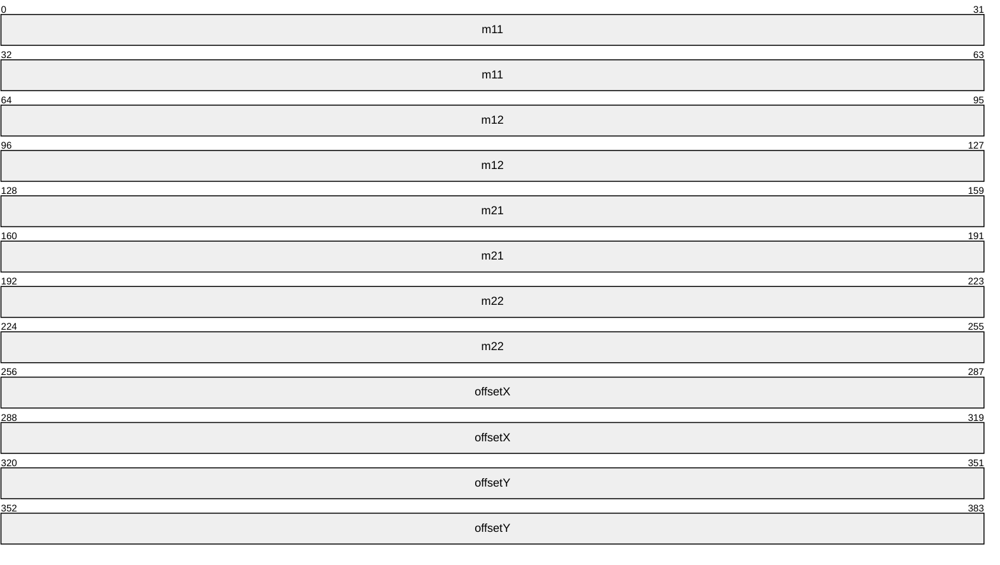

**m11 (8 bytes):** A 64-bit floating-point number. The value of the matrix's cell referenced by row 1 column 1.

**m12 (8 bytes):** A 64-bit floating-point number. The value of the matrix's cell referenced by row 1 column 2.

**m21 (8 bytes):** A 64-bit floating-point number. The value of the matrix's cell referenced by row 2 column 1.

**m22 (8 bytes):** A 64-bit floating-point number. The value of the matrix's cell referenced by row 2 column 2.

**offsetX (8 bytes):** A 64-bit floating-point number. The value of the matrix's cell referenced by row 3 column 1. This value represents the translation along the X-axis.

**offsetY (8 bytes):** A 64-bit floating-point number. The value of the matrix's cell referenced by row 3 column 2. This value represents the translation along the Y-axis.

<a id="Section_2.2.3.3"></a>
#### 2.2.3.3 Mil4x4Matrix

The Mil4x4Matrix structure specifies a 4x4 matrix used for transformations in 3-D space.

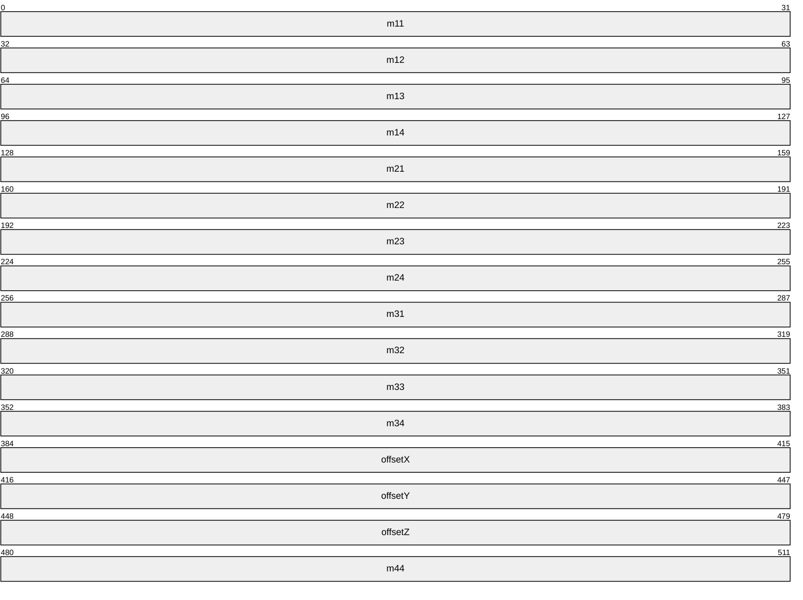

**m11 (4 bytes):** A 4-byte floating-point number. The value of the matrix's cell referenced by row 1 column 1.

**m12 (4 bytes):** A 4-byte floating-point number. The value of the matrix's cell referenced by row 1 column 2.

**m13 (4 bytes):** A 4-byte floating-point number. The value of the matrix's cell referenced by row 1 column 3.

**m14 (4 bytes):** A 4-byte floating-point number. The value of the matrix's cell referenced by row 1 column 4.

**m21 (4 bytes):** A 4-byte floating-point number. The value of the matrix's cell referenced by row 2 column 1.

**m22 (4 bytes):** A 4-byte floating-point number. The value of the matrix's cell referenced by row 2 column 2.

**m23 (4 bytes):** A 4-byte floating-point number. The value of the matrix's cell referenced by row 2 column 3.

**m24 (4 bytes):** A 4-byte floating-point number. The value of the matrix's cell referenced by row 2 column 4.

**m31 (4 bytes):** A 4-byte floating-point number. The value of the matrix's cell referenced by row 3 column 1.

**m32 (4 bytes):** A 4-byte floating-point number. The value of the matrix's cell referenced by row 3 column 2.

**m33 (4 bytes):** A 4-byte floating-point number. The value of the matrix's cell referenced by row 3 column 3.

**m34 (4 bytes):** A 4-byte floating-point number. The value of the matrix's cell referenced by row 3 column 4.

**offsetX (4 bytes):** A 4-byte floating-point number. The value of the matrix's cell referenced by row 4 column 1. This value represents the translation along the X-axis.

**offsetY (4 bytes):** A 4-byte floating-point number. The value of the matrix's cell referenced by row 4 column 2. This value represents the translation along the Y-axis.

**offsetZ (4 bytes):** A 4-byte floating-point number. The value of the matrix's cell referenced by row 4 column 3. This value represents the translation along the Z-axis.

**m44 (4 bytes):** A 4-byte floating-point number. The value of the matrix's cell referenced by row 4 column 4.

<a id="Section_2.2.3.4"></a>
#### 2.2.3.4 MilColor

The MilColor structure describes a color in terms of red, green, blue and alpha channels interpreted as sRGB values.

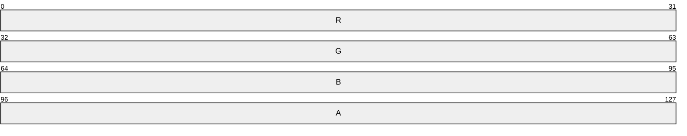

**R (4 bytes):** A 4-byte floating-point number. The red component of the color.

**G (4 bytes):** A 4-byte floating-point number. The green component of the color.

**B (4 bytes):** A 4-byte floating-point number. The blue component of the color.

**A (4 bytes):** A 4-byte floating-point number. The alpha component of the color.

<a id="Section_2.2.3.5"></a>
#### 2.2.3.5 MilColorTransform

The MilColorTransform structure specifies a 5x5 matrix that transforms a color space into another color space.

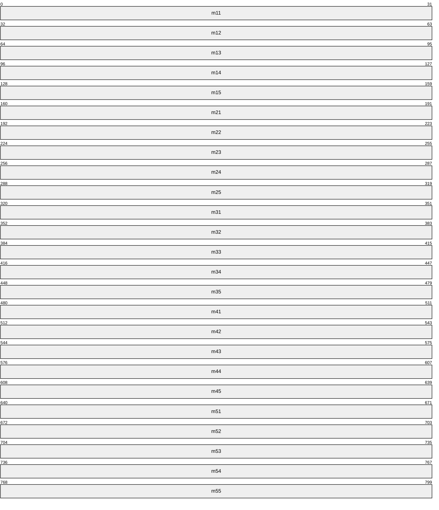

**m11 (4 bytes):** A 4-byte floating-point number. The value of the matrix's cell referenced by row 1 column 1.

**m12 (4 bytes):** A 4-byte floating-point number. The value of the matrix's cell referenced by row 1 column 2.

**m13 (4 bytes):** A 4-byte floating-point number. The value of the matrix's cell referenced by row 1 column 3.

**m14 (4 bytes):** A 4-byte floating-point number. The value of the matrix's cell referenced by row 1 column 4.

**m15 (4 bytes):** A 4-byte floating-point number. The value of the matrix's cell referenced by row 1 column 5.

**m21 (4 bytes):** A 4-byte floating-point number. The value of the matrix's cell referenced by row 2 column 1.

**m22 (4 bytes):** A 4-byte floating-point number. The value of the matrix's cell referenced by row 2 column 2.

**m23 (4 bytes):** A 4-byte floating-point number. The value of the matrix's cell referenced by row 2 column 3.

**m24 (4 bytes):** A 4-byte floating-point number. The value of the matrix's cell referenced by row 2 column 4.

**m25 (4 bytes):** A 4-byte floating-point number. The value of the matrix's cell referenced by row 2 column 5.

**m31 (4 bytes):** A 4-byte floating-point number. The value of the matrix's cell referenced by row 3 column 1.

**m32 (4 bytes):** A 4-byte floating-point number. The value of the matrix's cell referenced by row 3 column 2.

**m33 (4 bytes):** A 4-byte floating-point number. The value of the matrix's cell referenced by row 3 column 3.

**m34 (4 bytes):** A 4-byte floating-point number. The value of the matrix's cell referenced by row 3 column 4.

**m35 (4 bytes):** A 4-byte floating-point number. The value of the matrix's cell referenced by row 3 column 5.

**m41 (4 bytes):** A 4-byte floating-point number. The value of the matrix's cell referenced by row 4 column 1.

**m42 (4 bytes):** A 4-byte floating-point number. The value of the matrix's cell referenced by row 4 column 2.

**m43 (4 bytes):** A 4-byte floating-point number. The value of the matrix's cell referenced by row 4 column 3.

**m44 (4 bytes):** A 4-byte floating-point number. The value of the matrix's cell referenced by row 4 column 4.

**m45 (4 bytes):** A 4-byte floating-point number. The value of the matrix's cell referenced by row 4 column 5.

**m51 (4 bytes):** A 4-byte floating-point number. The value of the matrix's cell referenced by row 5 column 1.

**m52 (4 bytes):** A 4-byte floating-point number. The value of the matrix's cell referenced by row 5 column 2.

**m53 (4 bytes):** A 4-byte floating-point number. The value of the matrix's cell referenced by row 5 column 3.

**m54 (4 bytes):** A 4-byte floating-point number. The value of the matrix's cell referenced by row 5 column 4.

**m55 (4 bytes):** A 4-byte floating-point number. The value of the matrix's cell referenced by row 5 column 5.

<a id="Section_2.2.3.6"></a>
#### 2.2.3.6 MilGlyphBitmap

The MilGlyphBitmap structure describes a bitmap stored in the glyph cache for later consumption by a glyph run resource. The MilGlyphBitmap structure comprises a header, immediately followed by the described bitmap elements. The bitmap is made up of 1-bit elements.

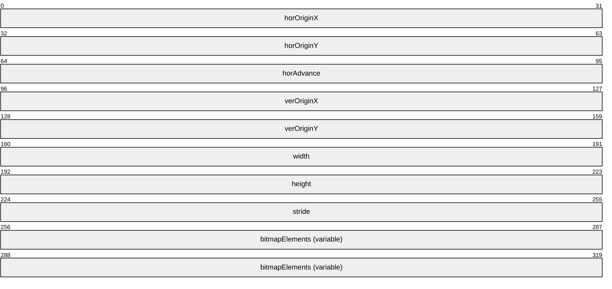

**horOriginX (4 bytes):** A 32-bit signed integer. Contains the offset along the X-axis that is applied (added) to the glyph anchor point to get the coordinate of the left edge of rectangle where the glyph MUST be placed. This value is used for regular text and is irrelevant when text is rendered vertically. Measured in number of bitmap elements.

**horOriginY (4 bytes):** A 32-bit signed integer. Contains the offset along the Y-axis that is applied (subtracted) from the glyph anchor point to get the coordinate of the top edge of rectangle where the glyph MUST be placed. This value is used for regular text and is irrelevant when text is rendered vertically. Measured in number of bitmap elements.

**horAdvance (4 bytes):** A 32-bit signed integer. Contains the offset along the X-axis that is subtracted from the glyph position when the text is right-to-left. Measured in number of bitmap elements.

**verOriginX (4 bytes):** A 32-bit signed integer. Contains the offset along the X-axis that is applied (added) to the glyph anchor point to get the coordinate of left edge of rectangle where the glyph MUST be placed. This value is used when text is rendered vertically and is irrelevant for regular text. Measured in bitmap elements.

**verOriginY (4 bytes):** A 32-bit signed integer. Contains the offset along the Y-axis that is applied (added) to the glyph anchor point to get the coordinate of top edge of rectangle where the glyph MUST be placed. This value is used when text is rendered vertically and is irrelevant for regular text. Measured in number of bitmap elements.

**width (4 bytes):** A 32-bit unsigned integer. Specifies the bitmap width, measured in number of bitmap elements.

**height (4 bytes):** A 32-bit unsigned integer. Specifies the bitmap height, measured in number of bitmap elements.

**stride (4 bytes):** A 32-bit unsigned integer. Specifies the number of bytes stored in one row of pixels. The stride field MUST be aligned to a 32-bit boundary.

**bitmapElements (variable):** An array of bitmap elements, each 1 bit in length. The length of this field is *x* bytes, where *x* = **stride** * **height**.

<a id="Section_2.2.3.7"></a>
#### 2.2.3.7 MilGraphicsAccelerationAssessment

The MilGraphicsAccelerationAssessment structure specifies measured display capabilities of the client machine.

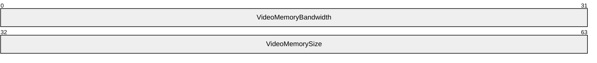

**VideoMemoryBandwidth (4 bytes):** A 32-bit unsigned integer. The assessment of the client machine's video memory bandwidth, in megabytes per second, times one thousand (MB/sec * 1000.0).

**VideoMemorySize (4 bytes):** A 32-bit unsigned integer. The assessment, in bytes, of the client machine's video memory size.

<a id="Section_2.2.3.8"></a>
#### 2.2.3.8 MilGraphicsAccelerationCaps

The MilGraphicsAccelerationCaps structure specifies inherent display capabilities of the client machine.


**TierValue (4 bytes):** A 32-bit signed integer. A value representing a very rough approximation of the capabilities of the display machine. This value SHOULD be zero for display devices with no hardware acceleration, 65,536 for display devices with hardware acceleration where pixel shader operations are not hardware accelerated, or 131,072 for display devices with 3-D hardware acceleration using pixel shaders.

**HasWDDMSupport (4 bytes):** A 32-bit integer Boolean value. If nonzero, the client machine is using WDDM display drivers.<1>

**PixelShaderVersion (4 bytes):** A 32-bit unsigned integer. The pixel shader version supported by the client machine.

**VertexShaderVersion (4 bytes):** A 32-bit unsigned integer. The vertex shader version supported by the client machine.

**MaxTextureWidth (4 bytes):** A 32-bit unsigned integer. The maximum texture width supported by the client machine.

**MaxTextureHeight (4 bytes):** A 32-bit unsigned integer. The maximum texture height supported by the client machine.

**WindowCompatibleMode (4 bytes):** A 32-bit integer Boolean value. If nonzero, the client machine supports hardware accelerated rendering in windowed mode.

**FullScreenCompatibleMode (4 bytes):** A 32-bit integer Boolean value. If nonzero, the client machine supports hardware accelerated rendering in full-screen mode.

**BitsPerPixel (4 bytes):** A 32-bit unsigned integer. The pixel bit depth of the client machine display.

<a id="Section_2.2.3.9"></a>
#### 2.2.3.9 MilPoint

The MilPoint structure specifies a point by its location in two-dimensional space. The point is specified by its location relative to the origin. For more information on the origin in two-dimensional space, see section [2](#Section_1.3).

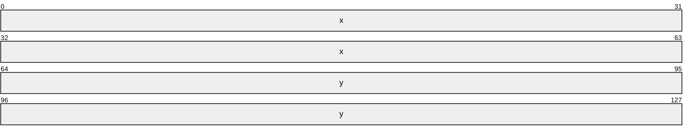

**x (8 bytes):** A 64-bit floating-point number. The X-axis coordinate of the point.

**y (8 bytes):** A 64-bit floating-point number. The Y-axis coordinate of the point.

<a id="Section_2.2.3.10"></a>
#### 2.2.3.10 Mil3DPoint

The Mil3DPoint structure specifies a point. The point is specified by its location in three-dimensional space relative to the origin.

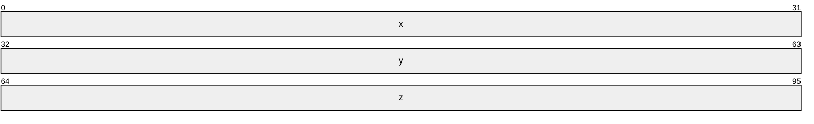

**x (4 bytes):** A 32-bit floating-point number. The X-axis coordinate of the point.

**y (4 bytes):** A 32-bit floating-point number. The Y-axis coordinate of the point.

**z (4 bytes):** A 32-bit floating-point number. The Z-axis coordinate of the point.

<a id="Section_2.2.3.11"></a>
#### 2.2.3.11 MilRect

The MilRect structure specifies a rectangle by the location of its top-left corner, its width and its height.


**x (8 bytes):** A 64-bit floating-point number. The X-axis coordinate of the top-left corner of the rectangle.

**y (8 bytes):** A 64-bit floating-point number. The Y-axis coordinate of the top-left corner of the rectangle.

**width (8 bytes):** A 64-bit floating-point number. The width of the rectangle.

**height (8 bytes):** A 64-bit floating-point number. The height of the rectangle.

<a id="Section_2.2.3.12"></a>
#### 2.2.3.12 MilRectI

The MilRectI structure specifies a rectangle by the location of its top-left and bottom-right corners, using integer values.

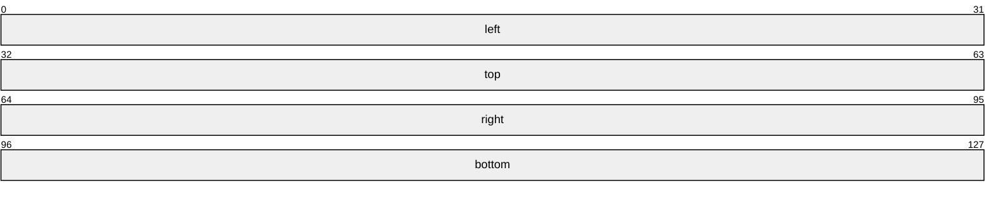

**left (4 bytes):** A 32-bit signed integer. The X-axis coordinate of the top-left corner of the rectangle.

**top (4 bytes):** A 32-bit signed integer. The Y-axis coordinate of the top-left corner of the rectangle.

**right (4 bytes):** A 32-bit signed integer. The X-axis coordinate of the bottom-right corner of the rectangle.

**bottom (4 bytes):** A 32-bit signed integer. The Y-axis coordinate of the bottom-right corner of the rectangle.

<a id="Section_2.2.3.13"></a>
#### 2.2.3.13 MilRectRB

The MilRectRB structure specifies a rectangle by the location of its top-left and bottom-right corners.


**left (8 bytes):** A 64-bit floating-point number. The X-axis coordinate of the top-left corner of the rectangle.

**top (8 bytes):** A 64-bit floating-point number. The Y-axis coordinate of the top-left corner of the rectangle.

**right (8 bytes):** A 64-bit floating-point number. The X-axis coordinate of the bottom-right corner of the rectangle.

**bottom (8 bytes):** A 64-bit floating-point number. The Y-axis coordinate of the bottom-right corner of the rectangle.

<a id="Section_2.2.3.14"></a>
#### 2.2.3.14 MilRenderOptions

The MilRenderOptions structure specifies behavioral modifications to how a resource of type TYPE_VISUAL or TYPE_WINDOWNODE is rasterized.

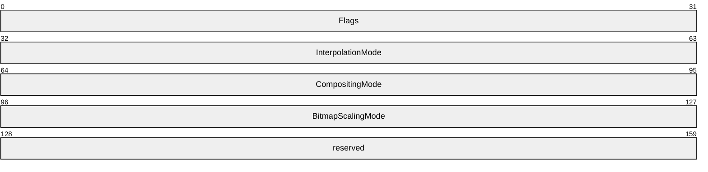

**Flags (4 bytes):** A [MilRenderOptionFlags](#Section_2.2.2.18) enumeration. Specifies binary rendering options as well as which fields of the structure contain values and which MUST be ignored.

**InterpolationMode (4 bytes):** A [MilBitmapInterpolationMode](#Section_2.2.2.2) enumeration. Specifies how the pixels of a bitmap MUST be sampled when the bitmap is drawn larger than its natural size.

**CompositingMode (4 bytes):** A [MilCompositingMode](#Section_2.2.2.7) enumeration. Specifies how the rasterized pixels of a TYPE_VISUAL or TYPE_WINDOWNODE resource MUST be blended with the background.

**BitmapScalingMode (4 bytes):** A [MilBitmapScalingMode](#Section_2.2.2.3) enumeration. Specifies the level of quality to be used for scaling an image.

**reserved (4 bytes):** Reserved. MUST be set to zero when sent and MUST be ignored when received.

<a id="Section_2.2.3.15"></a>
#### 2.2.3.15 MilSize

The MilSize structure specifies the size of a two-dimensional object.

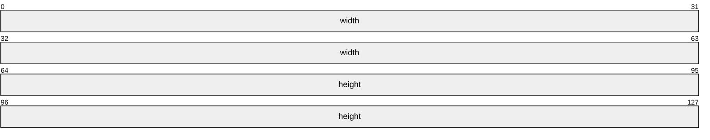

**width (8 bytes):** A 64-bit floating-point number. The width of the object.

**height (8 bytes):** A 64-bit floating-point number. The height of the object.

<a id="Section_2.2.3.16"></a>
#### 2.2.3.16 MilGradientStop

The MilGradientStop structure describes the location and color of a transition point in a gradient.


**Offset (8 bytes):** A 64-bit floating-point number. Describes the location of the gradient stop within the gradient vector.

**R (4 bytes):** A 4-byte floating-point number. The red component of the color of the gradient stop.

**G (4 bytes):** A 4-byte floating-point number. The green component of the color of the gradient stop.

**B (4 bytes):** A 4-byte floating-point number. The blue component of the color of the gradient stop.

**A (4 bytes):** A 4-byte floating-point number. The alpha component of the color of the gradient stop. Also called the opacity component.

<a id="Section_2.2.3.17"></a>
#### 2.2.3.17 MilVisualRenderParameter

The MilVisualRenderParameter structure describes a rendering parameter to be applied to a visual.


**ParameterType (4 bytes):** A [MilVisualRenderParameterType](#Section_2.2.2.26) enumeration. Indicates the type of rendering parameter described by this structure.

**unused0 (20 bytes):** An array of exactly five 32-bit unsigned integers. The value of this field is unused and MUST be set to zero.

**ContextualizedOpacityMultiplier (8 bytes):** A 64-bit floating-point number. If the value of the ParameterType field is equal to ContextualizedOpacityMultiplier (0x00000002), the value of this field MUST be combined with the current rendering context and used to specify the opacity multiplier to be applied to a visual and its subtree.

**unused1 (4 bytes):** A 32-bit unsigned integer. The value of this field is unused and MUST be set to zero.

<a id="Section_2.2.3.18"></a>
#### 2.2.3.18 MilWindowMargins

The MilWindowMargins structure specifies margins used in rasterizing the client area of a window. Margins are used in the following messages:

- The [MILCMD_WINDOWNODE_SETALPHAMARGINS](#Section_3.2.5.4.7) message uses margins to specify a window node's image that MUST be drawn with per-pixel transparency.
- The [MILCMD_WINDOWNODE_SETMAXIMIZEDCLIPMARGINS](#Section_2.2.7.47) message uses margins to specify a window node's maximized clip.
- The [MILCMD_GDISPRITEBITMAP_UPDATEMARGINS](#Section_3.3.5.8.2) message uses margins to specify a sprite resource drawn by the composition engine.
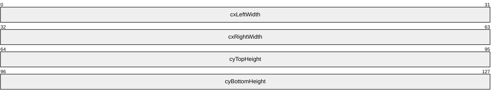

**cxLeftWidth (4 bytes):** A 32-bit signed integer. Width of the left margin. Specifies the part of the left border that extends into the client area.

**cxRightWidth (4 bytes):** A 32-bit signed integer. Width of the right margin. Specifies the part of the right border that extends into the client area.

**cyTopHeight (4 bytes):** A 32-bit signed integer. Height of the top margin. Specifies the part of the top border that extends into the client area.

**cyBottomHeight (4 bytes):** A 32-bit signed integer. Height of the bottom margin. Specifies the part of the bottom border that extends into the client area.

<a id="Section_2.2.3.19"></a>
#### 2.2.3.19 OFFSCREEN_RT_OFFSET

The OFFSCREEN_RT_OFFSET structure describes the results of an alternate desktop-view rasterization process as requested using the corresponding OFFSCREEN_RT_TEXTURE structure. The rasterized surface contents are returned in a payload of the [MILMSG_METARTCAPTUREBITSREPLY](#Section_2.2.9.13) message, and this structure specifies the relative address of the first byte of the rasterized image. Each of the rasterized images is returned in the Portable Network Graphics [[PNG]](https://go.microsoft.com/fwlink/?LinkId=131792) format.


**Offset (4 bytes):** A 32-bit unsigned integer. The value of this field specifies the address, relative to the first byte of the MILMSG_METARTCAPTUREBITSREPLY message, of the first byte of the rasterized image.

**unused0 (4 bytes):** A 32-bit unsigned integer. The value of this field is unused and MUST be set to zero.

**AdapterID (8 bytes):** A 64-bit unsigned integer. The value of this field MUST be set to the unique identifier of the graphics card adapter that was used to create the surface on the server.<2>

**MonitorID (8 bytes):** A 64-bit unsigned integer. The value of this field MUST be set to the unique identifier of the display monitor that is used to display the surface.<3>

<a id="Section_2.2.3.20"></a>
#### 2.2.3.20 OFFSCREEN_RT_OFFSETS

The OFFSCREEN_RT_OFFSETS structure describes an array of results of an alternate desktop view rasterization process.


**SurfacesCount (4 bytes):** A 32-bit unsigned integer. Indicates the number of rasterization results returned. The value of this field MUST be less than or equal to 0x00000008.

**DxgiFormat (4 bytes):** A [DXGI_FORMAT](#Section_2.2.2.1) enumeration. Indicates the pixel format shared by all of the specified surfaces.

**Width (4 bytes):** A 32-bit unsigned integer. Specifies the width shared by all of the specified surfaces.

**Height (4 bytes):** A 32-bit unsigned integer. Specifies the height shared by all of the specified surfaces.

**Surfaces (192 bytes):** An array of exactly eight (8) [OFFSCREEN_RT_OFFSET](#Section_2.2.3.19) structures. Array elements from zero through SurfacesCount (exclusive) MUST be properly initialized. Array elements from SurfacesCount through seven (inclusive) MUST be set to zero.

<a id="Section_2.2.3.21"></a>
#### 2.2.3.21 OFFSCREEN_RT_TEXTURE

This structure contains information about the graphics card and monitor used to create and display the surface.

```mermaid
packet-beta
  0-63: "reserved0"
  64-127: "hardwareId"
  128-191: "monitorId"
```

**reserved0 (8 bytes):** Reserved. MUST be set to zero when sent and MUST be ignored when received.

**hardwareId (8 bytes):** This field MUST be set to a unique identifier corresponding to the graphics card adapter that was used to create the surface on the server side.

**monitorId (8 bytes):** This field MUST be set to a unique identifier corresponding to the display monitor that is used to display the surface.

<a id="Section_2.2.3.22"></a>
#### 2.2.3.22 OFFSCREEN_RT_TEXTURES

The OFFSCREEN_RT_TEXTURES structure describes an array of surfaces that will be used as render targets for the purpose of rasterization of an alternate desktop view.

```mermaid
packet-beta
  0-31: "SurfacesCount"
  32-63: "DxgiFormat"
  64-95: "Width"
  96-127: "Height"
  128-223: "Surfaces (192 bytes)"
```

**SurfacesCount (4 bytes):** A 32-bit unsigned integer. Indicates the number of surfaces that will be used to rasterize the alternate desktop views. The value of this field MUST be less than or equal to 0x00000008.

**DxgiFormat (4 bytes):** A [DXGI_FORMAT](#Section_2.2.2.1) enumeration. Indicates the pixel format shared by all the specified surfaces.

**Width (4 bytes):** A 32-bit unsigned integer. Specifies the width shared by all the specified surfaces.

**Height (4 bytes):** A 32-bit unsigned integer. Specifies the height shared by all the specified surfaces.

**Surfaces (192 bytes):** An array of exactly eight (8) [OFFSCREEN_RT_TEXTURE](#Section_2.2.3.21) structures. Array elements from zero up to SurfacesCount (exclusive) MUST BE properly initialized. Array elements from SurfacesCount up to seven (inclusive) MUST BE set to zero.

<a id="Section_2.2.4"></a>
### 2.2.4 Geometry Data Structures

The structures specified in this section are sent from the server to the client as payloads of a MILCMD_PATHGEOMETRY message. Each MILCMD_PATHGEOMETRY message contains a MIL_PATHGEOMETRY structure, which in turn contains one or more MIL_PATHFIGURE structures, which in turn contain one or more segment structures.

<a id="Section_2.2.4.1"></a>
#### 2.2.4.1 MIL_SEGMENT_LINE

The MIL_SEGMENT_LINE packet describes the contents of a line segment.

```mermaid
packet-beta
  0-31: "Type"
  32-63: "Flags"
  64-95: "BackSize"
  96-127: "reserved"
  128-223: "Point (16 bytes)"
```

**Type (4 bytes):** A [MilSegmentType](#Section_2.2.2.20) enumeration. The value of this field MUST be equal to 0x00000001.

**Flags (4 bytes):** A [MilPathSegmentFlags](#Section_2.2.2.16) enumeration. The properties of this segment.

**BackSize (4 bytes):** A 32-bit unsigned integer. The offset to the first byte of this structure. The offset is measured in bytes, relative to the first byte of the previous segment structure in the current path figure. The value of this field MUST be set to zero if this is the first segment in the current path figure. For information on path figures see [MIL_PATHFIGURE (section 2.2.4.3)](#Section_2.2.4.3).

**reserved (4 bytes):** Reserved. MUST be set to zero when sent, and MUST be ignored when received.

**Point (16 bytes):** A [MilPoint](#Section_2.2.3.9) structure. The end point of this line segment.

The start point of this segment is the end point of the previous segment. If this segment is the first segment in the current path figure, the start point of this segment is the start point of the current path figure. For information on path figures see MIL_PATHFIGURE (section 2.2.4.3).

<a id="Section_2.2.4.2"></a>
#### 2.2.4.2 MIL_SEGMENT_POLY

The MIL_SEGMENT_POLY packet describes the control points of a poly segment (a segment consisting of one or more line segments).

```mermaid
packet-beta
  0-31: "Type"
  32-63: "Flags"
  64-95: "BackSize"
  96-127: "Count"
  128-191: "ControlPoints (variable)"
```

**Type (4 bytes):** A [MilSegmentType](#Section_2.2.2.20) enumeration. The value of this field MUST be set to 0x00000005, which indicates a poly-line segment.

**Flags (4 bytes):** A [MilPathSegmentFlags](#Section_2.2.2.16) enumeration. The properties of this segment.

**BackSize (4 bytes):** A 32-bit unsigned integer. The offset to the first byte of this structure. The offset is measured in bytes, relative to the first byte of the previous segment structure in the current path figure. The value of this field MUST be set to zero if this is the first segment in the current path figure.

**Count (4 bytes):** A 32-bit unsigned integer. The number of control points.

**ControlPoints (variable):** A variable-length array of [MilPoint](#Section_2.2.3.9) structures. This is the collection of control points determining the shape of this poly segment.

<a id="Section_2.2.4.3"></a>
#### 2.2.4.3 MIL_PATHFIGURE

The MIL_PATHFIGURE packet describes the contents of a path figure. It is immediately followed by a set of segment structures contained in the **Segments** field. The **SegmentCount** field specifies the quantity of segment structures.

```mermaid
packet-beta
  0-31: "BackSize"
  32-63: "Flags"
  64-95: "SegmentCount"
  96-127: "messageSize"
  128-223: "StartPoint (16 bytes)"
  224-255: "OffsetToLastSegment"
  256-287: "reserved"
  288-351: "Segments (variable)"
```

**BackSize (4 bytes):** A 32-bit unsigned integer. The offset in bytes to the previous path figure structure in the current path geometry. The value of this field MUST be set to zero if this is the first path figure in the current path geometry.

**Flags (4 bytes):** A [MilPathFigureFlags](#Section_2.2.2.14) enumeration. The properties of this path figure.

**SegmentCount (4 bytes):** A 32-bit unsigned integer. The number of segments in this path figure.

**messageSize (4 bytes):** A 32-bit unsigned integer. The total size of this message and its payload in bytes. The value of this field MUST be greater than or equal to 0x00000028 and MUST be divisible by four.

**StartPoint (16 bytes):** A [MilPoint](#Section_2.2.3.9) structure. The start point of this path figure.

**OffsetToLastSegment (4 bytes):** A 32-bit unsigned integer. The offset of the start of this segment, measured in bytes relative to the start of the last segment.

**reserved (4 bytes):** Reserved. MUST be set to zero when sent, and MUST be ignored when received.

**Segments (variable):** A variable-length array of either [MIL_SEGMENT_LINE](#Section_2.2.4.1) or [MIL_SEGMENT_POLY](#Section_2.2.4.2) structures. This is the collection of segments contained in this path figure. The value of this field MUST be a sequence of exactly **SegmentCount** valid segment structures along with their payloads.

<a id="Section_2.2.4.4"></a>
#### 2.2.4.4 MIL_PATHGEOMETRY

The MIL_PATHGEOMETRY packet describes the contents of a path geometry. It is immediately followed by a set of path figure structures, along with their payloads, in the **Figures** field. The **FigureCount** field specifies the quantity of structures in the set.

```mermaid
packet-beta
  0-31: "messageSize"
  32-63: "Flags"
  64-159: "Bounds (32 bytes)"
  160-191: "FigureCount"
  192-223: "reserved"
  224-287: "Figures (variable)"
```

**messageSize (4 bytes):** A 32-bit unsigned integer. The total size of this message and its payload in bytes. The value of this field MUST be greater than or equal to 0x00000030 and MUST be divisible by four.

**Flags (4 bytes):** A [MilPathGeometryFlags](#Section_2.2.2.15) enumeration. The properties of this path geometry.

**Bounds (32 bytes):** A [MilRectRB](#Section_2.2.3.13) structure. The axis-aligned bounds of this path geometry.

**FigureCount (4 bytes):** A 32-bit unsigned integer. The number of path figures in this path geometry.

**reserved (4 bytes):** Reserved. MUST be set to zero when sent, and MUST be ignored when received.

**Figures (variable):** A variable-length array of MIL_PATHFIGURE structures. This is the collection of path figures contained in this path geometry. The value of this field MUST be a sequence of exactly **FigureCount** valid MIL_PATHFIGURE structures along with their payloads.

<a id="Section_2.2.5"></a>
### 2.2.5 Connection Control Messages

The messages specified in this section are sent from the server to the client as payloads of the encapsulating protocol.

<a id="Section_2.2.5.1"></a>
#### 2.2.5.1 MILCTRLCMD_VERSIONREQUEST

The MILCTRLCMD_VERSIONREQUEST packet requests the list of protocol versions supported by the client. The client MUST respond with a MILMSG_VERSIONREPLY message.

```mermaid
packet-beta
  0-31: "controlCode"
  32-63: "messageSize"
  64-127: "reserved"
```

**controlCode (4 bytes):** A 32-bit unsigned integer containing the control code for this message. The value of this field MUST be equal to 0x00000001.

**messageSize (4 bytes):** A 32-bit unsigned integer. The size of this message in bytes. The value of this field MUST be set to 0x00000010.

**reserved (8 bytes):** Reserved. MUST be set to zero when sent, and MUST be ignored when received.

<a id="Section_2.2.5.2"></a>
#### 2.2.5.2 MILCTRLCMD_VERSIONANNOUNCEMENT

The MILCTRLCMD_VERSIONANNOUNCEMENT packet notifies the client about which protocol version will be used. If the client does not support the specified version the server MUST disconnect the channel in response to this message.

```mermaid
packet-beta
  0-31: "controlCode"
  32-63: "messageSize"
  64-95: "protocolVersion"
  96-127: "reserved"
```

**controlCode (4 bytes):** A 32-bit unsigned integer containing the control code for this message. The value of this field MUST be equal to 0x00000002.

**messageSize (4 bytes):** A 32-bit unsigned integer. The size, in bytes, of this message. The value of this field MUST be set to 0x00000010.

**protocolVersion (4 bytes):** A 32-bit unsigned integer. The protocol version identifier. For the protocol specified in this document, this value MUST be set to MIL_SDK_VERSION (0x1042EA27).

**reserved (4 bytes):** Reserved. MUST be set to zero when sent, and MUST be ignored when received.

<a id="Section_2.2.5.3"></a>
#### 2.2.5.3 MILCTRLCMD_OPENCONNECTION

The MILCTRLCMD_OPENCONNECTION packet opens a new connection to the client.

```mermaid
packet-beta
  0-31: "controlCode"
  32-63: "messageSize"
  64-95: "unused"
  96-127: "connectingFlags"
```

**controlCode (4 bytes):** A 32-bit unsigned integer containing the control code for this message. The value of this field MUST be equal to 0x00000003.

**messageSize (4 bytes):** A 32-bit unsigned integer. The size of this message in bytes. The value of this field MUST be set to 0x00000010.

**unused (4 bytes):** A 32-bit unsigned integer. This field is unused and MUST be set to zero.

**connectingFlags (4 bytes):** A [MilConnection](#Section_2.2.2.9) enumeration. Describes the properties of the new connection.

<a id="Section_2.2.5.4"></a>
#### 2.2.5.4 MILCTRLCMD_CLOSECONNECTION

The MILCTRLCMD_CLOSECONNECTION packet indicates that the connection has been closed.

```mermaid
packet-beta
  0-31: "controlCode"
  32-63: "messageSize"
  64-127: "reserved"
```

**controlCode (4 bytes):** A 32-bit unsigned integer containing the control code for this message. The value of this field MUST be equal to 0x00000004.

**messageSize (4 bytes):** A 32-bit unsigned integer. The size of this message in bytes. The value of this field MUST be set to 0x00000010.

**reserved (8 bytes):** Reserved. MUST be set to zero when sent, and MUST be ignored when received.

<a id="Section_2.2.5.5"></a>
#### 2.2.5.5 MILCTRLCMD_OPENCHANNEL

The MILCTRLCMD_OPENCHANNEL packet opens a new channel on this connection.

```mermaid
packet-beta
  0-31: "controlCode"
  32-63: "messageSize"
  64-95: "channelHandle"
  96-127: "sourceChannelHandle"
```

**controlCode (4 bytes):** A 32-bit unsigned integer containing the control code for this message. The value of this field MUST be equal to 0x00000005.

**messageSize (4 bytes):** A 32-bit unsigned integer. The size of this message in bytes. The value of this field MUST be set to 0x00000010.

**channelHandle (4 bytes):** A 32-bit unsigned integer. This [**handle**](#gt_handle) value will be associated with the newly created channel. The value of this field MUST be a channel handle valid for creation on this connection.

**sourceChannelHandle (4 bytes):** A 32-bit unsigned integer. The value of this field MUST be either set to zero or to a valid channel handle. If this value is nonzero then the new channel and the channel specified by this handle will be related for the purposes of resource handle duplication, as specified in section [3.1.1.2](#Section_3.1.1.2).

<a id="Section_2.2.5.6"></a>
#### 2.2.5.6 MILCTRLCMD_CLOSECHANNEL

The MILCTRLCMD_CLOSECHANNEL packet closes a channel and releases all resources associated with it.

```mermaid
packet-beta
  0-31: "controlCode"
  32-63: "messageSize"
  64-95: "channelHandle"
  96-127: "reserved"
```

**controlCode (4 bytes):** A 32-bit unsigned integer containing the control code for this message. The value of this field MUST be equal to 0x00000006.

**messageSize (4 bytes):** A 32-bit unsigned integer. The size of this message in bytes. The value of this field MUST be set to 0x00000010.

**channelHandle (4 bytes):** A 32-bit unsigned integer. This field MUST be set to a valid channel handle. This handle identifies the channel that is the target for this message.

**reserved (4 bytes):** Reserved. MUST be set to zero when sent, and MUST be ignored when received.

<a id="Section_2.2.5.7"></a>
#### 2.2.5.7 MILCTRLCMD_DATAONCHANNEL

The MILCTRLCMD_DATAONCHANNEL packet submits a batch of messages to a channel.

```mermaid
packet-beta
  0-31: "controlCode"
  32-63: "messageSize"
  64-95: "hChannel"
  96-127: "reserved"
  128-191: "payload (variable)"
```

**controlCode (4 bytes):** A 32-bit unsigned integer containing the control code for this message. The value of this field MUST be equal to 0x00000007.

**messageSize (4 bytes):** A 32-bit unsigned integer. The total size of this message and its payload in bytes. The value of this field MUST be set to a number greater than or equal to 0x00000010.

**hChannel (4 bytes):** A 32-bit unsigned integer. This field MUST be set to a valid channel handle. This handle identifies the channel that is the target for this message.

**reserved (4 bytes):** Reserved. MUST be set to zero when sent, and MUST be ignored when received.

**payload (variable):** A variable-length byte array. The payload of this packet MUST be a contiguous series of zero or more valid channel messages. Each of these messages MUST be of a size in bytes that is divisible by four. The payload MUST be one of the channel messages as described in section [2.2.7](#Section_2).

<a id="Section_2.2.5.8"></a>
#### 2.2.5.8 MILCTRLCMD_HANDLESURFACEMANAGEREVENT

The MILCTRLCMD_HANDLESURFACEMANAGEREVENT packet indicates that present history tokens are available for processing by the compositor.

```mermaid
packet-beta
  0-31: "controlCode"
  32-63: "messageSize"
  64-95: "hSourceChannel"
  96-127: "fSetHandleSFMEvent"
```

**controlCode (4 bytes):** A 32-bit unsigned integer containing the control code for this message. The value of this field MUST be equal to 0x0000000C.

**messageSize (4 bytes):** A 32-bit unsigned integer. The size of this message in bytes. The value of this field MUST be set to 0x00000010.

**hSourceChannel (4 bytes):** A 32-bit unsigned integer. The source channel identifies the partition required to process present history tokens.

**fSetHandleSFMEvent (4 bytes):** A 32-bit integer Boolean value. If the value of this field is nonzero, the partition identified by the **hSourceChannel** field will be used for the creation of [MILCMD_GDISPRITEBITMAP](#Section_3.3.5.8.1) resources that will require looking up [**logical surface**](#gt_logical-surface) objects constructed by the encapsulating protocol. For details on logical surfaces, see [MS-RDPEDC](../MS-RDPEDC/MS-RDPEDC.md).

<a id="Section_2.2.6"></a>
### 2.2.6 Connection Notifications

<a id="Section_2.2.6.1"></a>
#### 2.2.6.1 MILCTRLCMD_CONNECTIONNOTIFICATION

The MILCTRLCMD_CONNECTIONNOTIFICATION packet contains a notification control message.

```mermaid
packet-beta
  0-31: "controlCode"
  32-63: "messageSize"
  64-127: "reserved"
  128-191: "notification (variable)"
```

**controlCode (4 bytes):** A 32-bit unsigned integer containing the control code for this message. The value of this field MUST be equal to 0x00000009.

**messageSize (4 bytes):** A 32-bit unsigned integer. The total size of this message and the notification in bytes. The value of this field MUST be set to a number greater than or equal to 0x00000010.

**reserved (8 bytes):** Reserved. MUST be set to zero when sent, and MUST be ignored when received.

**notification (variable):** A variable-length byte array. Describes a connection notification message that is used by the server to inform the connected client that an event has occurred. The size in bytes of the notification payload MUST be added to the messageSize field of this message. The message MUST be MILMSG_CONNECTIONLOST or MILMSG_VERSIONREPLY.

<a id="Section_2.2.6.2"></a>
#### 2.2.6.2 MILCTRLCMD_CHANNELNOTIFICATION

The MILCTRLCMD_CHANNELNOTIFICATION packet contains a notification message intended for a specific channel.

```mermaid
packet-beta
  0-31: "controlCode"
  32-63: "messageSize"
  64-95: "channelHandle"
  96-127: "reserved"
  128-191: "notification (variable)"
```

**controlCode (4 bytes):** A 32-bit unsigned integer containing the control code for this message. The value of this field MUST be equal to 0x0000000A.

**messageSize (4 bytes):** A 32-bit unsigned integer. The total size of this message and the notification in bytes. The value of this field MUST be set to a number greater than or equal to 0x00000010.

**channelHandle (4 bytes):** A 32-bit unsigned integer. This field MUST be set to a valid channel handle. This handle identifies the channel that is the target for this message.

**reserved (4 bytes):** Reserved. MUST be set to zero when sent, and MUST be ignored when received.

**notification (variable):** A variable-length byte array. Describes a channel notification message. The size in bytes of the notification payload MUST be added to the messageSize field of this message. These MUST be any of the messages enumerated in section [2.2.6](#Section_2.2.6) Connection Notifications, except for MILMSG_CONNECTIONLOST and MILMSG_VERSIONREPLY.

<a id="Section_2.2.6.3"></a>
#### 2.2.6.3 MILCTRLCMD_CONNECTIONBROADCAST

The MILCTRLCMD_CONNECTIONBROADCAST packet contains a notification message intended for all channels on this connection.

```mermaid
packet-beta
  0-31: "controlCode"
  32-63: "messageSize"
  64-127: "reserved"
  128-191: "notification (variable)"
```

**controlCode (4 bytes):** A 32-bit unsigned integer containing the control code for this message. The value of this field MUST be equal to 0x0000000B.

**messageSize (4 bytes):** A 32-bit unsigned integer. The total size, in bytes, of this message and the notification. The value of this field MUST be set to a number greater than or equal to 0x00000010.

**reserved (8 bytes):** Reserved. MUST be set to zero when sent, and MUST be ignored when received.

**notification (variable):** A variable-length byte array. Describes a notification message that is used by the server to inform all connected clients of an event occurrence. The size, in bytes, of the notification payload MUST be added to the messageSize field of this message.

<a id="Section_2.2.7"></a>
### 2.2.7 Channel Messages

The messages specified in this section are sent from the server to the client as payloads of a [MILCTRLCMD_DATAONCHANNEL](#Section_2.2.5.7) message.

<a id="Section_2.2.7.1"></a>
#### 2.2.7.1 MILCMD_TRANSPORT_SYNCFLUSH

The MILCMD_TRANSPORT_SYNCFLUSH packet requests a notification to be sent by the client when the current batch has been processed, composed, and presented. The client MUST respond with a MILMSG_SYNCFLUSHREPLY notification.

```mermaid
packet-beta
  0-31: "messageSize"
  32-63: "controlCode"
```

**messageSize (4 bytes):** A 32-bit unsigned integer. The size of this message in bytes. The value of this field MUST be set to 0x00000008.

**controlCode (4 bytes):** A 32-bit unsigned integer containing the control code for this message. The value of this field MUST be equal to 0x00000001.

<a id="Section_2.2.7.2"></a>
#### 2.2.7.2 MILCMD_TRANSPORT_ROUNDTRIPREQUEST

The MILCMD_TRANSPORT_ROUNDTRIPREQUEST packet requests a notification message to be sent by the client when the current batch has been processed, composed and presented, and the resulting frame has appeared on the screen. The client MUST respond with a [MILMSG_NOTIFYROUNDTRIPREPLY](#Section_2.2.9.8) notification. This message/notification pair differs from [MILCMD_TRANSPORT_SYNCFLUSH](#Section_2.2.7.1) and [MILMSG_SYNCFLUSHREPLY](#Section_2.2.9.1) only if the graphics system running on the client behaves asynchronously from the composition engine. In that case, the reply to this message MUST wait the additional time between frame presentation and actual frame appearance on the screen.

```mermaid
packet-beta
  0-31: "messageSize"
  32-63: "controlCode"
  64-95: "RequestUniquenessId"
```

**messageSize (4 bytes):** A 32-bit unsigned integer. The size of this message in bytes. The value of this field MUST be set to 0x0000000C.

**controlCode (4 bytes):** A 32-bit unsigned integer containing the control code for this message. The value of this field MUST be equal to 0x00000003.

**RequestUniquenessId (4 bytes):** A 32-bit unsigned integer. A 32-bit numeric identifier that is meant to be used by the server as a request context handle. When responding to a round trip request with a MILMSG_NOTIFYROUNDTRIPREPLY notification, the client MUST use the identifier used by the server to send the matching round trip request.

<a id="Section_2.2.7.3"></a>
#### 2.2.7.3 MILCMD_TRANSPORT_ASYNCFLUSH

The MILCMD_TRANSPORT_ASYNCFLUSH packet requests a notification message to be sent by the client when all currently outstanding updates have been processed, composed and presented by the composition engine. The client MUST respond with a MILMSG_ASYNCFLUSHREPLY notification. This message/notification pair behaves identically to MILCMD_TRANSPORT_SYNCFLUSH and MILMSG_SYNCFLUSHREPLY, with the exception that this message includes a token that is returned with the notification.<4>

```mermaid
packet-beta
  0-31: "messageSize"
  32-63: "controlCode"
  64-95: "responseToken"
  96-127: "reserved"
```

**messageSize (4 bytes):** A 32-bit unsigned integer. The size of this message, in bytes. The value of this field MUST be set to 0x00000010.

**controlCode (4 bytes):** A 32-bit unsigned integer containing the control code for this message. The value of this field MUST be equal to 0x00000004.

**responseToken (4 bytes):** A 32-bit unsigned integer. A value that is returned in the responseToken field of the MILMSG_ASYNCFLUSHREPLY notification that is sent by the client when this async flush request is completed.

**reserved (4 bytes):** Reserved. MUST be ignored when received.

<a id="Section_2.2.7.4"></a>
#### 2.2.7.4 MILCMD_PARTITION_REGISTERFORNOTIFICATIONS

The MILCMD_PARTITION_REGISTERFORNOTIFICATIONS packet requests that informational notifications be sent or stop being sent by the client to this channel. The server MUST be prepared to drop informational messages it is not interested in. This message does not affect whether other channels receive informational notifications. Multiple channels MAY register for notifications simultaneously. The initial state of a channel upon creation is that it is not registered for notifications.

```mermaid
packet-beta
  0-31: "messageSize"
  32-63: "controlCode"
  64-95: "Enable"
```

**messageSize (4 bytes):** A 32-bit unsigned integer. The size of this message in bytes. The value of this field MUST be set to 0x0000000C.

**controlCode (4 bytes):** A 32-bit unsigned integer containing the control code for this message. The value of this field MUST be equal to 0x00000005.

**Enable (4 bytes):** A 32-bit integer Boolean value. If this value is nonzero, informational notifications MUST be sent to this channel. If this value is zero, information notifications MUST NOT be sent to this channel.

<a id="Section_2.2.7.5"></a>
#### 2.2.7.5 MILCMD_CHANNEL_REQUESTTIER

The MILCMD_CHANNEL_REQUESTTIER packet requests that the current hardware tier be sent to this channel. The hardware tier is comprised of graphics capability information as defined by the [MILMSG_HARDWARETIER](#Section_2.2.9.4) messages. The client MUST respond with a MILMSG_HARDWARETIER notification.

```mermaid
packet-beta
  0-31: "messageSize"
  32-63: "controlCode"
  64-95: "ReturnCommonMinimum"
```

**messageSize (4 bytes):** A 32-bit unsigned integer. The size of this message in bytes. The value of this field MUST be set to 0x0000000C.

**controlCode (4 bytes):** A 32-bit unsigned integer containing the control code for this message. The value of this field MUST be equal to 0x00000009.

**ReturnCommonMinimum (4 bytes):** A 32-bit integer Boolean value. This value affects the behavior of this message when the client is connected to multiple display devices. If this value is zero, the hardware tier of the primary device MUST be returned. Otherwise, a common minimum tier for all display devices MUST be returned.

<a id="Section_2.2.7.6"></a>
#### 2.2.7.6 MILCMD_CHANNEL_CREATERESOURCE

The MILCMD_CHANNEL_CREATERESOURCE packet creates a resource of a specified type with reference count equal to one and associates this reference with a resource handle value. This handle value will be used to address the resource created by this message.

```mermaid
packet-beta
  0-31: "messageSize"
  32-63: "controlCode"
  64-95: "hNewResource"
  96-127: "resType"
```

**messageSize (4 bytes):** A 32-bit unsigned integer. The size of this message in bytes. The value of this field MUST be set to 0x00000010.

**controlCode (4 bytes):** A 32-bit unsigned integer containing the control code for this message. The value of this field MUST be equal to 0x0000000A.

**hNewResource (4 bytes):** A 32-bit unsigned integer. The value of this field MUST be a resource handle that is not currently allocated on this channel. This handle value will be associated with the newly created resource. This handle has to meet one of the following two conditions:

- The handle has never been a handle in a MILCMD_CHANNEL_CREATERESOURCE (section 2.2.7.6) message.
- The handle has been deleted with a [MILCMD_CHANNEL_DELETERESOURCE (section 2.2.7.7)](#Section_2.2.7.7) message.
**resType (4 bytes):** A 32-bit unsigned integer. The type of the resource to be created, as specified in [Resource Types (section 2.2.1)](#Section_3.1.1.5).

<a id="Section_2.2.7.7"></a>
#### 2.2.7.7 MILCMD_CHANNEL_DELETERESOURCE

The MILCMD_CHANNEL_DELETERESOURCE packet deletes a resource handle. If the reference count of the resource associated with this handle reaches zero then the resource is also released.

```mermaid
packet-beta
  0-31: "messageSize"
  32-63: "controlCode"
  64-95: "hTargetResource"
  96-127: "resType"
```

**messageSize (4 bytes):** A 32-bit unsigned integer. The size of this message in bytes. The value of this field MUST be set to 0x00000010.

**controlCode (4 bytes):** A 32-bit unsigned integer containing the control code for this message. The value of this field MUST be equal to 0x0000000B.

**hTargetResource (4 bytes):** A 32-bit unsigned integer. This field MUST be set to a valid resource handle. This handle MUST be deleted on this channel. After this message is issued, this handle value becomes invalid for use in other messages, but it becomes valid for creation in a resource creation message.

**resType (4 bytes):** A 32-bit unsigned integer. The type of the resource to be deleted. This value is provided for verification purposes and MUST correspond to the type of the resource associated with the resource handle that is being deleted.

<a id="Section_2.2.7.8"></a>
#### 2.2.7.8 MILCMD_CHANNEL_DUPLICATEHANDLE

The MILCMD_CHANNEL_DUPLICATEHANDLE message indicates that the resource referenced by the **Original** field (located on the receiving channel) MUST also be associated to the handle in the **Duplicate** field (located on the channel specified by the **TargetChannel** field).

```mermaid
packet-beta
  0-31: "messageSize"
  32-63: "controlCode"
  64-95: "Original"
  96-127: "TargetChannel"
  128-159: "Duplicate"
```

**messageSize (4 bytes):** A 32-bit unsigned integer. The size of this message in bytes. The value of this field MUST be set to 0x00000014.

**controlCode (4 bytes):** A 32-bit unsigned integer containing the control code for this message. The value of this field MUST be equal to 0x0000000C.

**Original (4 bytes):** A 32-bit unsigned integer. This field MUST be set to a valid resource handle. The resource referenced by this handle on this channel is associated with the new handle on the destination channel.

**TargetChannel (4 bytes):** A 32-bit unsigned integer. This field MUST be set to a valid channel handle. The newly created resource handle will be associated with this channel.

**Duplicate (4 bytes):** A 32-bit unsigned integer. The value of this field MUST be a resource handle valid for creation on the target channel. This handle value will be associated with the resource referenced by this message.

<a id="Section_2.2.7.9"></a>
#### 2.2.7.9 MILCMD_BITMAP_PIXELS

The MILCMD_BITMAP_PIXELS packet updates the contents of a bitmap resource. This message includes the bitmap image and an optional palette description, as specified by the imageBitmap and imagePalette fields, respectively.

```mermaid
packet-beta
  0-31: "messageSize"
  32-63: "controlCode"
  64-95: "targetResource"
  96-127: "width"
  128-159: "height"
  160-191: "format"
  192-223: "stride"
  224-255: "offset"
  256-287: "reserved"
  288-319: "uiPaletteColorCount"
  320-383: "dpiX"
  384-447: "dpiY"
  448-511: "imageBitmap (variable)"
  512-575: "imagePalette (variable)"
```

**messageSize (4 bytes):** A 32-bit unsigned integer. The total size, in bytes, of this message and its payload. The value of this field MUST be set to a number divisible by four and greater than or equal to 0x00000038.

**controlCode (4 bytes):** A 32-bit unsigned integer containing the control code for this message. The value of this field MUST be equal to 0x0000000E.

**targetResource (4 bytes):** A 32-bit unsigned integer. The value of this field MUST be set to a valid resource handle referencing a resource of type TYPE_BITMAPSOURCE. This handle identifies the resource that is the target for this message.

**width (4 bytes):** A 32-bit unsigned integer. The width of the bitmap image in pixels.

**height (4 bytes):** A 32-bit unsigned integer. The height of the bitmap image in pixels.

**format (4 bytes):** A [MilPixelFormat](#Section_2.2.2.17) enumeration. The pixel format of the bitmap image.

**stride (4 bytes):** A 32-bit unsigned integer. The distance, in bytes, between first pixels in consecutive rows of the bitmap image.

**offset (4 bytes):** A 32-bit unsigned integer. The distance, in bytes, between the first pixel in the first row of the bitmap image and the first byte of the payload following this message.

**reserved (4 bytes):** Reserved. MUST be ignored when received.

**uiPaletteColorCount (4 bytes):** A 32-bit unsigned integer. The number of entries in the palette. The value of this field MUST be less than or equal to 256.

**dpiX (8 bytes):** A 64-bit floating-point number. The horizontal DPI of the bitmap image.

**dpiY (8 bytes):** A 64-bit floating-point number. The vertical DPI of the bitmap image.

**imageBitmap (variable):** A variable-length array of 32-bit unsigned integers. The bitmap image pixels in the format specified by the format field. This field MUST be of size, in bytes, equal to value of the height field multiplied by the value of the stride field and then rounded up to an integer value divisible by four.

**imagePalette (variable):** A variable-length array of 32-bit unsigned integers. This field MUST be present if and only if the format of this bitmap image as specified by the format field is palletized. This field MUST be of size, in bytes, equal to the size of the palette as specified by the uiPaletteColorCount field times four.

<a id="Section_2.2.7.10"></a>
#### 2.2.7.10 MILCMD_BITMAP_COMPRESSEDPIXELS

The MILCMD_BITMAP_COMPRESSEDPIXELS packet updates the contents of a bitmap resource. This message includes the bitmap image specified in the compressedImageBitmap field in Portable Network Graphics [[PNG]](https://go.microsoft.com/fwlink/?LinkId=131792) format.

```mermaid
packet-beta
  0-31: "messageSize"
  32-63: "controlCode"
  64-95: "targetResource"
  96-159: "dpiX"
  160-223: "dpiY"
  224-287: "compressedImageBitmap (variable)"
```

**messageSize (4 bytes):** A 32-bit unsigned integer. The total size of this message and its payload in bytes. The value of this field MUST be set to a number divisible by four and greater than or equal to 0x0000001C.

**controlCode (4 bytes):** A 32-bit unsigned integer containing the control code for this message. The value of this field MUST be equal to 0x0000000F.

**targetResource (4 bytes):** A 32-bit unsigned integer. The value of this field MUST be set to a valid resource handle referencing a resource of type TYPE_BITMAPSOURCE. This handle identifies the resource that is the target for this message.

**dpiX (8 bytes):** A 64-bit floating-point number. The horizontal DPI of the bitmap image.

**dpiY (8 bytes):** A 64-bit floating-point number. The vertical DPI of the bitmap image.

**compressedImageBitmap (variable):** A variable-length array of 32-bit unsigned integers. The bitmap image pixels in Portable Network Graphics [PNG] format.

<a id="Section_2.2.7.11"></a>
#### 2.2.7.11 MILCMD_DOUBLERESOURCE

The MILCMD_DOUBLERESOURCE packet updates a value-type resource that holds a value of type double.

```mermaid
packet-beta
  0-31: "messageSize"
  32-63: "controlCode"
  64-95: "targetResource"
  96-159: "Value"
```

**messageSize (4 bytes):** A 32-bit unsigned integer. The size of this message in bytes. The value of this field MUST be set to 0x00000014.

**controlCode (4 bytes):** A 32-bit unsigned integer containing the control code for this message. The value of this field MUST be equal to 0x00000012.

**targetResource (4 bytes):** A 32-bit unsigned integer. The value of this field MUST be set to a valid resource handle referencing a resource of type TYPE_DOUBLERESOURCE. This handle identifies the resource that is the target for this message.

**Value (8 bytes):** A 64-bit floating-point number. The value to be associated with this resource.

<a id="Section_2.2.7.12"></a>
#### 2.2.7.12 MILCMD_COLORRESOURCE

The MILCMD_COLORRESOURCE packet updates a value-type resource that holds a value of type MilColor.

```mermaid
packet-beta
  0-31: "messageSize"
  32-63: "controlCode"
  64-95: "targetResource"
  96-191: "Value (16 bytes)"
```

**messageSize (4 bytes):** A 32-bit unsigned integer. The size of this message in bytes. The value of this field MUST be set to 0x0000001C.

**controlCode (4 bytes):** A 32-bit unsigned integer containing the control code for this message. The value of this field MUST be equal to 0x00000013.

**targetResource (4 bytes):** A 32-bit unsigned integer. The value of this field MUST be set to a valid resource handle referencing a resource of type TYPE_COLORRESOURCE. This handle identifies the resource that is the target for this message.

**Value (16 bytes):** A [MilColor](#Section_2.2.3.4) structure. The value to be associated with this resource.

<a id="Section_2.2.7.13"></a>
#### 2.2.7.13 MILCMD_POINTRESOURCE

The MILCMD_POINTRESOURCE packet updates a value-type resource that holds a value of type MilPoint.

```mermaid
packet-beta
  0-31: "messageSize"
  32-63: "controlCode"
  64-95: "targetResource"
  96-191: "Value (16 bytes)"
```

**messageSize (4 bytes):** A 32-bit unsigned integer. The size of this message in bytes. The value of this field MUST be set to 0x0000001C.

**controlCode (4 bytes):** A 32-bit unsigned integer containing the control code for this message. The value of this field MUST be equal to 0x00000014.

**targetResource (4 bytes):** A 32-bit unsigned integer. The value of this field MUST be set to a valid resource handle referencing a resource of type TYPE_POINTRESOURCE. This handle identifies the resource that is the target for this message.

**Value (16 bytes):** A [MilPoint](#Section_2.2.3.9) structure. The value to be associated with this resource.

<a id="Section_2.2.7.14"></a>
#### 2.2.7.14 MILCMD_RECTRESOURCE

The MILCMD_RECTRESOURCE packet updates a value-type resource that holds a value of type MilRect.

```mermaid
packet-beta
  0-31: "messageSize"
  32-63: "controlCode"
  64-95: "targetResource"
  96-191: "Value (32 bytes)"
```

**messageSize (4 bytes):** A 32-bit unsigned integer. The size of this message in bytes. The value of this field MUST be set to 0x0000002C.

**controlCode (4 bytes):** A 32-bit unsigned integer containing the control code for this message. The value of this field MUST be equal to 0x00000015.

**targetResource (4 bytes):** A 32-bit unsigned integer. The value of this field MUST be set to a valid resource handle referencing a resource of type TYPE_RECTRESOURCE. This handle identifies the resource that is the target for this message.

**Value (32 bytes):** A [MilRect](#Section_2.2.3.11) structure. The value to be associated with this resource.

<a id="Section_2.2.7.15"></a>
#### 2.2.7.15 MILCMD_SIZERESOURCE

The MILCMD_SIZERESOURCE packet updates a value-type resource that holds a value of type MilSize.

```mermaid
packet-beta
  0-31: "messageSize"
  32-63: "controlCode"
  64-95: "targetResource"
  96-191: "Value (16 bytes)"
```

**messageSize (4 bytes):** A 32-bit unsigned integer. The size of this message in bytes. The value of this field MUST be set to 0x0000001C.

**controlCode (4 bytes):** A 32-bit unsigned integer containing the control code for this message. The value of this field MUST be equal to 0x00000016.

**targetResource (4 bytes):** A 32-bit unsigned integer. The value of this field MUST be set to a valid resource handle referencing a resource of type TYPE_SIZERESOURCE. This handle identifies the resource that is the target for this message.

**Value (16 bytes):** A [MilSize](#Section_2.2.3.15) structure. The value to be associated with this resource.

<a id="Section_2.2.7.16"></a>
#### 2.2.7.16 MILCMD_MATRIXRESOURCE

The MILCMD_MATRIXRESOURCE packet updates a value-type resource that holds a value of type Mil3x2Matrix.

```mermaid
packet-beta
  0-31: "messageSize"
  32-63: "controlCode"
  64-95: "targetResource"
  96-191: "Value (48 bytes)"
```

**messageSize (4 bytes):** A 32-bit unsigned integer. The size of this message in bytes. The value of this field MUST be set to 0x0000003C.

**controlCode (4 bytes):** A 32-bit unsigned integer containing the control code for this message. The value of this field MUST be equal to 0x00000017.

**targetResource (4 bytes):** A 32-bit unsigned integer. The value of this field MUST be set to a valid resource handle referencing a resource of type TYPE_MATRIXRESOURCE. This handle identifies the resource that is the target for this message.

**Value (48 bytes):** A [Mil3x2Matrix](#Section_2.2.3.2) structure. The value to be associated with this resource.

<a id="Section_2.2.7.17"></a>
#### 2.2.7.17 MILCMD_COLORTRANSFORMRESOURCE

The MILCMD_COLORTRANSFORMRESOURCE packet updates a value-type resource that holds a value of type MilColorTransform.

```mermaid
packet-beta
  0-31: "messageSize"
  32-63: "controlCode"
  64-95: "targetResource"
  96-191: "Value (100 bytes)"
```

**messageSize (4 bytes):** A 32-bit unsigned integer. The size of this message in bytes. The value of this field MUST be set to 0x00000070.

**controlCode (4 bytes):** A 32-bit unsigned integer containing the control code for this message. The value of this field MUST be equal to 0x00000018.

**targetResource (4 bytes):** A 32-bit unsigned integer. The value of this field MUST be set to a valid resource handle referencing a resource of type TYPE_COLORTRANSFORMRESOURCE. This handle identifies the resource that is the target for this message.

**Value (100 bytes):** A [MilColorTransform](#Section_2.2.3.5) structure. The value to be associated with this resource.

<a id="Section_2.2.7.18"></a>
#### 2.2.7.18 MILCMD_RENDERDATA

The MILCMD_RENDERDATA packet updates the drawing instruction stream for a render data resource.

```mermaid
packet-beta
  0-31: "messageSize"
  32-63: "controlCode"
  64-95: "targetResource"
  96-127: "cbData"
  128-191: "renderData (variable)"
```

**messageSize (4 bytes):** A 32-bit unsigned integer. The total size of this message and its payload in bytes. The value of this field MUST be set to a number divisible by four and greater than or equal to 0x00000010.

**controlCode (4 bytes):** A 32-bit unsigned integer containing the control code for this message. The value of this field MUST be equal to 0x00000019.

**targetResource (4 bytes):** A 32-bit unsigned integer. The value of this field MUST be set to a valid resource handle referencing a resource of type TYPE_RENDERDATA. This handle identifies the resource that is the target for this message.

**cbData (4 bytes):** A 32-bit unsigned integer. The size of the renderData field in bytes.

**renderData (variable):** A variable-length array of 32-bit unsigned integers. This field represents the payload of this message. The value of this field MUST consist of a series of valid drawing instructions.

<a id="Section_2.2.7.19"></a>
#### 2.2.7.19 MILCMD_TILEBRUSH_SETSOURCEMODIFICATIONS

The MILCMD_TILEBRUSH_SETSOURCEMODIFICATIONS packet updates source modification properties for a tile brush.

```mermaid
packet-beta
  0-31: "messageSize"
  32-63: "controlCode"
  64-95: "targetResource"
  96-127: "sourceModifications"
  128-159: "LowColorKey"
  160-191: "HighColorKey"
```

**messageSize (4 bytes):** A 32-bit unsigned integer. The size of this message in bytes. The value of this field MUST be set to 0x00000018.

**controlCode (4 bytes):** A 32-bit unsigned integer containing the control code for this message. The value of this field MUST be equal to 0x0000001A.

**targetResource (4 bytes):** A 32-bit unsigned integer. The value of this field MUST be set to a valid resource handle referencing a resource of type TYPE_IMAGEBRUSH. This handle identifies the resource that is the target for this message.

**sourceModifications (4 bytes):** A [MilSourceModification](#Section_2.2.2.21) enumeration. The source modifications.

**LowColorKey (4 bytes):** An unsigned 32-bit integer. The low end of the color range, which will be drawn as transparent. This field is meaningful only if the **sourceModifications** field is set to ColorKey (0x00000002). In B8G8R8A8 format.

**HighColorKey (4 bytes):** An unsigned 32-bit integer. The high end of the color range, which will be drawn as transparent. This field is meaningful only if the **sourceModifications** field is set to ColorKey (0x00000002). In B8G8R8A8 format.

<a id="Section_2.2.7.20"></a>
#### 2.2.7.20 MILCMD_VISUAL_SETOFFSET

The MILCMD_VISUAL_SETOFFSET packet specifies how the coordinate space of a visual is transformed relative to that of its parent visual.

```mermaid
packet-beta
  0-31: "messageSize"
  32-63: "controlCode"
  64-95: "targetResource"
  96-159: "offsetX"
  160-223: "offsetY"
```

**messageSize (4 bytes):** A 32-bit unsigned integer. The size of this message in bytes. The value of this field MUST be set to 0x0000001C.

**controlCode (4 bytes):** A 32-bit unsigned integer containing the control code for this message. The value of this field MUST be equal to 0x0000001C.

**targetResource (4 bytes):** A 32-bit unsigned integer. The value of this field MUST be set to a valid resource handle referencing a resource of type TYPE_VISUAL or TYPE_WINDOWNODE. This handle identifies the resource that is the target for this message.

**offsetX (8 bytes):** A 64-bit floating-point number. The horizontal offset of the specified visual.

**offsetY (8 bytes):** A 64-bit floating-point number. The vertical offset of the specified visual.

<a id="Section_2.2.7.21"></a>
#### 2.2.7.21 MILCMD_VISUAL_SETTRANSFORM

The MILCMD_VISUAL_SETTRANSFORM packet specifies how the coordinate space of a visual is transformed relative to that of its parent visual.

```mermaid
packet-beta
  0-31: "messageSize"
  32-63: "controlCode"
  64-95: "targetResource"
  96-127: "hTransform"
```

**messageSize (4 bytes):** A 32-bit unsigned integer. The size of this message in bytes. The value of this field MUST be set to 0x00000010.

**controlCode (4 bytes):** A 32-bit unsigned integer containing the control code for this message. The value of this field MUST be equal to 0x0000001D.

**targetResource (4 bytes):** A 32-bit unsigned integer. The value of this field MUST be set to a valid resource handle referencing a resource of type TYPE_VISUAL or TYPE_WINDOWNODE. This handle identifies the resource that is the target for this message.

**hTransform (4 bytes):** A 32-bit unsigned integer. The value of this field MUST either be set to zero or set to a valid resource handle referencing a resource of type TYPE_TRANSLATETRANSFORM, TYPE_SCALETRANSFORM, TYPE_MATRIXTRANSFORM, or TYPE_TRANSFORMGROUP. This resource represents the transform of the specified visual. If this value is NULL, then the coordinate system of the specified visual is either transformed as specified by a [MILCMD_VISUAL_SETOFFSET](#Section_3.3.5.3.4) message or not transformed. Transformation occurs relative to the coordinate system of the specified visual's parent.

<a id="Section_2.2.7.22"></a>
#### 2.2.7.22 MILCMD_VISUAL_SETCLIP

The MILCMD_VISUAL_SETCLIP packet specifies the area to which the rendering of a visual will be restricted.

```mermaid
packet-beta
  0-31: "messageSize"
  32-63: "controlCode"
  64-95: "targetResource"
  96-127: "hClip"
```

**messageSize (4 bytes):** A 32-bit unsigned integer. The size of this message in bytes. The value of this field MUST be set to 0x00000010.

**controlCode (4 bytes):** A 32-bit unsigned integer containing the control code for this message. The value of this field MUST be equal to 0x0000001E.

**targetResource (4 bytes):** A 32-bit unsigned integer. The value of this field MUST be set to a valid resource handle referencing a resource of type TYPE_VISUAL or TYPE_WINDOWNODE. This handle identifies the resource that is the target for this message.

**hClip (4 bytes):** A 32-bit unsigned integer. The value of this field MUST either be set to zero or set to a valid resource handle referencing a resource of type TYPE_RECTANGLEGEOMETRY, TYPE_COMBINEDGEOMETRY, or TYPE_PATHGEOMETRY. This resource represents the geometry that will clip the specified visual. If the TYPE_VISUAL or TYPE_WINDOWNODE resource already has a TYPE_RECTANGLEGEOMETRY, TYPE_COMBINEDGEOMETRY, or TYPE_PATHGEOMETRY resource set as a clip, the reference to the old clip MUST be removed and replaced with the new TYPE_RECTANGLEGEOMETRY, TYPE_COMBINEDGEOMETRY, or TYPE_PATHGEOMETRY resource referenced by the message. If the value of the **hClip** field is NULL, then the existing reference to a TYPE_RECTANGLEGEOMETRY, TYPE_COMBINEDGEOMETRY, or TYPE_PATHGEOMETRY clip resource MUST be removed. In this case, the TYPE_VISUAL or TYPE_WINDOWNODE resource targeted by the message MUST be rendered with no clip.

<a id="Section_2.2.7.23"></a>
#### 2.2.7.23 MILCMD_VISUAL_SETALPHA

The MILCMD_VISUAL_SETALPHA packet specifies how the rendering of a visual MUST be blended with the background.

```mermaid
packet-beta
  0-31: "messageSize"
  32-63: "controlCode"
  64-95: "targetResource"
  96-159: "alpha"
```

**messageSize (4 bytes):** A 32-bit unsigned integer. The size of this message in bytes. The value of this field MUST be set to 0x00000014.

**controlCode (4 bytes):** A 32-bit unsigned integer containing the control code for this message. The value of this field MUST be equal to 0x0000001F.

**targetResource (4 bytes):** A 32-bit unsigned integer. The value of this field MUST be set to a valid resource handle referencing a resource of type TYPE_VISUAL or TYPE_WINDOWNODE. This handle identifies the resource that is the target for this message.

**alpha (8 bytes):** A 64-bit floating-point number. The opacity of the specified visual. A value of 0 or less specifies that the visual is completely transparent, whereas a value of 1 or greater specifies that the visual is completely opaque. This value MUST be greater than or equal to 0 and less than or equal to 1.

<a id="Section_2.2.7.24"></a>
#### 2.2.7.24 MILCMD_VISUAL_SETRENDEROPTIONS

The MILCMD_VISUAL_SETRENDEROPTIONS packet specifies rendering behavioral options for a visual.

```mermaid
packet-beta
  0-31: "messageSize"
  32-63: "controlCode"
  64-95: "targetResource"
  96-191: "renderOptions (20 bytes)"
```

**messageSize (4 bytes):** A 32-bit unsigned integer. The size of this message in bytes. The value of this field MUST be set to 0x00000020.

**controlCode (4 bytes):** A 32-bit unsigned integer containing the control code for this message. The value of this field MUST be equal to 0x00000020.

**targetResource (4 bytes):** A 32-bit unsigned integer. The value of this field MUST be set to a valid resource handle referencing a resource of type TYPE_VISUAL or TYPE_WINDOWNODE. This handle identifies the resource that is the target for this message.

**renderOptions (20 bytes):** A [MilRenderOptions](#Section_2.2.3.14) enumeration. The render options that MUST be used to render the specified visual.

<a id="Section_2.2.7.25"></a>
#### 2.2.7.25 MILCMD_VISUAL_SETCONTENT

The MILCMD_VISUAL_SETCONTENT packet specifies the drawing content that is directly associated with a visual.

```mermaid
packet-beta
  0-31: "messageSize"
  32-63: "controlCode"
  64-95: "targetResource"
  96-127: "hContent"
```

**messageSize (4 bytes):** A 32-bit unsigned integer. The size of this message in bytes. The value of this field MUST be set to 0x00000010.

**controlCode (4 bytes):** A 32-bit unsigned integer containing the control code for this message. The value of this field MUST be equal to 0x00000021.

**targetResource (4 bytes):** A 32-bit unsigned integer. The value of this field MUST be set to a valid resource handle referencing a resource of type TYPE_VISUAL or TYPE_WINDOWNODE. This handle identifies the resource that is the target for this message.

**hContent (4 bytes):** A 32-bit unsigned integer. The value of this field MUST either be set to zero or to a valid resource handle referencing a resource of type TYPE_RENDERDATA. This resource represents the graphical elements drawn directly by this visual, behind those of its children. If this value is NULL then the specified visual does not draw anything itself, though its properties will still have an effect on the rendering of its child visuals.

<a id="Section_2.2.7.26"></a>
#### 2.2.7.26 MILCMD_VISUAL_REMOVEALLCHILDREN

The MILCMD_VISUAL_REMOVEALLCHILDREN packet clears out the child collection of a visual.

```mermaid
packet-beta
  0-31: "messageSize"
  32-63: "controlCode"
  64-95: "targetResource"
```

**messageSize (4 bytes):** A 32-bit unsigned integer. The size of this message in bytes. The value of this field MUST be set to 0x0000000C.

**controlCode (4 bytes):** A 32-bit unsigned integer containing the control code for this message. The value of this field MUST be equal to 0x00000022.

**targetResource (4 bytes):** A 32-bit unsigned integer. The value of this field MUST be set to a valid resource handle referencing a resource of type TYPE_VISUAL or TYPE_WINDOWNODE. This handle identifies the resource that is the target for this message.

<a id="Section_2.2.7.27"></a>
#### 2.2.7.27 MILCMD_VISUAL_REMOVECHILD

The MILCMD_VISUAL_REMOVECHILD packet removes a visual from the child collection of another visual.

The previous contents of the child collection of a visual are determined by the history of all [MILCMD_VISUAL_INSERTCHILDAT](#Section_2.2.7.28), MILCMD_VISUAL_REMOVECHILD and [MILCMD_VISUAL_REMOVEALLCHILDREN](#Section_3.3.5.3.3) packets that targeted the visual since it was created. This will include all such packets where the **targetResource** field had the same value as the **targetResource** field in this packet, that were sent after the last [MILCMD_CHANNEL_CREATERESOURCE](#Section_2.2.7.6) packet in which the **hNewResource** field had the same value as the **targetResource** field in this packet.

```mermaid
packet-beta
  0-31: "messageSize"
  32-63: "controlCode"
  64-95: "targetResource"
  96-127: "hChild"
```

**messageSize (4 bytes):** A 32-bit unsigned integer. The size of this message in bytes. The value of this field MUST be set to 0x00000010.

**controlCode (4 bytes):** A 32-bit unsigned integer containing the control code for this message. The value of this field MUST be equal to 0x00000023.

**targetResource (4 bytes):** A 32-bit unsigned integer. The value of this field MUST be set to a valid resource handle referencing a resource of type TYPE_VISUAL or TYPE_WINDOWNODE. This handle identifies the resource that is the target for this message.

**hChild (4 bytes):** A 32-bit unsigned integer. The value of this field MUST either be set to zero or set to a valid resource handle referencing a resource of type TYPE_VISUAL or TYPE_WINDOWNODE. This resource MUST be a child of the target visual. After this message is processed this resource will no longer be a child of the target visual.

<a id="Section_2.2.7.28"></a>
#### 2.2.7.28 MILCMD_VISUAL_INSERTCHILDAT

The MILCMD_VISUAL_INSERTCHILDAT packet inserts a new visual into the child collection of another visual at a specified offset.

The previous contents of the child collection of a visual are determined by the history of all MILCMD_VISUAL_INSERTCHILDAT, [MILCMD_VISUAL_REMOVECHILD](#Section_3.2.5.3.2) and [MILCMD_VISUAL_REMOVEALLCHILDREN](#Section_3.3.5.3.3) packets that targeted the visual since it was created. This will include all such packets where the **targetResource** field had the same value as the **targetResource** field in this packet, that were sent after the last [MILCMD_CHANNEL_CREATERESOURCE](#Section_2.2.7.6) packet in which the **hNewResource** field had the same value as the **targetResource** field in this packet.

```mermaid
packet-beta
  0-31: "messageSize"
  32-63: "controlCode"
  64-95: "targetResource"
  96-127: "hChild"
  128-159: "index"
```

**messageSize (4 bytes):** A 32-bit unsigned integer. The size of this message in bytes. The value of this field MUST be set to 0x00000014.

**controlCode (4 bytes):** A 32-bit unsigned integer containing the control code for this message. The value of this field MUST be equal to 0x00000024.

**targetResource (4 bytes):** A 32-bit unsigned integer. The value of this field MUST be set to a valid resource handle referencing a resource of type TYPE_VISUAL or TYPE_WINDOWNODE. This handle identifies the resource that is the target for this message.

**hChild (4 bytes):** A 32-bit unsigned integer. The value of this field MUST either be set to zero or set to a valid resource handle referencing a resource of type TYPE_VISUAL or TYPE_WINDOWNODE. This resource MUST NOT be a child of the target visual or any other visual. After this message is processed this resource will be a child of the target visual.

**index (4 bytes):** A 32-bit unsigned integer. The value of this field MUST be less than or equal to the number of visuals in the child collection. The visual resource associated with the hChild resource handle will be inserted into the child collection at the specified index, shifting existing elements in the collection starting at that index upward by one position.

<a id="Section_2.2.7.29"></a>
#### 2.2.7.29 MILCMD_VISUAL_SETCOLORTRANSFORM

The MILCMD_VISUAL_SETCOLORTRANSFORM packet specifies how the color space of a visual is transformed relative to that of its parent visual.

```mermaid
packet-beta
  0-31: "messageSize"
  32-63: "controlCode"
  64-95: "targetResource"
  96-127: "hTransform"
```

**messageSize (4 bytes):** A 32-bit unsigned integer. The size of this message in bytes. The value of this field MUST be set to 0x00000010.

**controlCode (4 bytes):** A 32-bit unsigned integer containing the control code for this message. The value of this field MUST be equal to 0x00000025.

**targetResource (4 bytes):** A 32-bit unsigned integer. The value of this field MUST be set to a valid resource handle referencing a resource of type TYPE_VISUAL or TYPE_WINDOWNODE. This handle identifies the resource that is the target for this message.

**hTransform (4 bytes):** A 32-bit unsigned integer. The value of this field MUST either be set to zero or set to a valid resource handle referencing a resource of type TYPE_COLORTRANSFORMRESOURCE. If the **hTransform** field is nonzero, then this resource represents the transformation that is applied to each pixel of the final rasterization of this visual, before this visual is blended with the background. If the **hTransform** field is zero, then no color transformation is applied to the rasterization of this visual.

<a id="Section_2.2.7.30"></a>
#### 2.2.7.30 MILCMD_VISUAL_ADDRENDERPARAMETER

The MILCMD_VISUAL_ADDRENDERPARAMETER packet adds a rendering parameter to the list of rendering parameters of a visual. The parameters will be used when rendering this visual's content and visual subtree.

```mermaid
packet-beta
  0-31: "messageSize"
  32-63: "controlCode"
  64-95: "targetResource"
  96-191: "RenderParameter (28 bytes)"
```

**messageSize (4 bytes):** A 32-bit unsigned integer. The size of this message, in bytes. The value of this field MUST be set to 0x00000030.

**controlCode (4 bytes):** A 32-bit unsigned integer containing the control code for this message. The value of this field MUST be equal to 0x00000026.

**targetResource (4 bytes):** A 32-bit unsigned integer. The value of this field MUST be set to a valid resource handle referencing a resource of type TYPE_VISUAL or TYPE_WINDOWNODE. This handle identifies the resource that is the target for this message.

**RenderParameter (28 bytes):** A [MilVisualRenderParameter](#Section_2.2.3.17) structure. The rendering parameter to be added to the rendering parameters list of the specified visual.

<a id="Section_2.2.7.31"></a>
#### 2.2.7.31 MILCMD_VISUAL_REMOVERENDERPARAMETER

The MILCMD_VISUAL_REMOVERENDERPARAMETER packet removes the first rendering parameter of the specified type found in the list of rendering parameters of a visual. If no matching rendering parameter is found, this packet MUST be ignored.

```mermaid
packet-beta
  0-31: "messageSize"
  32-63: "controlCode"
  64-95: "targetResource"
  96-127: "ParameterType"
```

**messageSize (4 bytes):** A 32-bit unsigned integer. The size of this message in bytes. The value of this field MUST be set to 0x00000010.

**controlCode (4 bytes):** A 32-bit unsigned integer containing the control code for this message. The value of this field MUST be equal to 0x00000027.

**targetResource (4 bytes):** A 32-bit unsigned integer. The value of this field MUST be set to a valid resource handle referencing a resource of type TYPE_VISUAL or TYPE_WINDOWNODE. This handle identifies the resource that is the target for this message.

**ParameterType (4 bytes):** A [MilVisualRenderParameterType](#Section_2.2.2.26) enumeration. The type of the parameter to be removed from the rendering parameters list of the specified visual.

<a id="Section_2.2.7.32"></a>
#### 2.2.7.32 MILCMD_VISUAL_SETCONTEXTUALIZEDOPACITY

The MILCMD_VISUAL_SETCONTEXTUALIZEDOPACITY packet instructs the composition engine how to treat opacity modifiying rendering parameters.

```mermaid
packet-beta
  0-31: "messageSize"
  32-63: "controlCode"
  64-95: "targetResource"
  96-127: "ContextualizedOpacity"
```

**messageSize (4 bytes):** A 32-bit unsigned integer. The size of this message in bytes. The value of this field MUST be set to 0x00000010.

**controlCode (4 bytes):** A 32-bit unsigned integer containing the control code for this message. The value of this field MUST be equal to 0x00000028.

**targetResource (4 bytes):** A 32-bit unsigned integer. The value of this field MUST be set to a valid resource handle referencing a resource of type TYPE_VISUAL or TYPE_WINDOWNODE. This handle identifies the resource that is the target for this message.

**ContextualizedOpacity (4 bytes):** A 32-bit integer Boolean value. If true, the composition engine will establish an opacity modification context based upon the type of the render target being used and the extra modification supplied with the request to update the content of the render target (see the **IncludeCursors** field in MILCMD_METABITMAPRENDERTARGET_CAPTUREBITS).

When the **ContextualizedOpacity** field is set to TRUE, the server MUST determine the opacity of the visual using the following algorithm.

- If the render target requires cursors--that is, if the meta bitmap render target has **IncludeCursors** set to 0x1 using the [MILCMD_METABITMAPRENDERTARGET_CAPTUREBITS](#Section_2.2.7.57) message:
- If the visual has been activated in a capture render pass using [MILCMD_VISUAL_SETRENDERFORCAPTURE](#Section_2.2.7.34), the *ContextualizedOpacityMultiplier* rendering parameter for the specified visual will be used to derive the effective opacity of the visual.
- If the visual has not been activated in a capture render pass, its opacity will be determined by the original opacity of the node (set using the [MILCMD_VISUAL_SETALPHA](#Section_3.2.5.3.7) message) as follows:
- If the opacity was originally set to zero, the opacity MUST be set to 1.0. (The visual MUST be made fully opaque.)
- If the opacity was originally set to a nonzero value, the original opacity value will be preserved.
- If the render target does not require cursors (this is the default case), the *ContextualizedOpacityMultiplier* rendering parameter of the specified visual MUST be used to derive the effective opacity of the node.
<a id="Section_2.2.7.33"></a>
#### 2.2.7.33 MILCMD_VISUAL_SETCOLORTRANSFORMROOT

The MILCMD_VISUAL_SETCOLORTRANSFORMROOT packet instructs the composition engine to treat a specified visual as the root of the composition tree, or to stop treating a specified visual as the root.

The server MUST<5> emit this command packet for the root of a visual tree, with the **fColorTransformRoot** field set to true. If the server changes the shape of the tree via a [MILCMD_TARGET_SETROOT](#Section_3.3.5.2.2) packet such that a visual that was previously a root of a visual tree stops being a root, then the server MUST emit this command packet for that visual with the **fColorTransformRoot** field set to false.

The client MAY ignore this packet if any of the following conditions are true:

- The client renders root and non-root visuals identically.
- The client can determine the root of a visual tree by traversing the tree.
- The client determines the root of the visual tree by processing the MILCMD_TARGET_SETROOT packet.
```mermaid
packet-beta
  0-31: "messageSize"
  32-63: "controlCode"
  64-95: "targetResource"
  96-127: "fColorTransformRoot"
```

**messageSize (4 bytes):** A 32-bit unsigned integer. The size of this message in bytes. The value of this field MUST be set to 0x00000010.

**controlCode (4 bytes):** A 32-bit unsigned integer containing the control code for this message. The value of this field MUST be equal to 0x00000029.

**targetResource (4 bytes):** A 32-bit unsigned integer. The value of this field MUST be set to a valid resource handle referencing a resource of type TYPE_VISUAL or TYPE_WINDOWNODE. This handle identifies the resource that is the target for this message.

**fColorTransformRoot (4 bytes):** A 32-bit integer Boolean value. If true, the specified visual MUST be treated as the root of the composition tree.

<a id="Section_2.2.7.34"></a>
#### 2.2.7.34 MILCMD_VISUAL_SETRENDERFORCAPTURE

The MILCMD_VISUAL_SETRENDERFORCAPTURE packet indicates whether or not the contents of a visual will be rendered when executing a capture or read-back request. If this packet is never emitted for a particular visual, then the visual will be rendered (the default behavior).

```mermaid
packet-beta
  0-31: "messageSize"
  32-63: "controlCode"
  64-95: "targetResource"
  96-127: "renderForCapture"
```

**messageSize (4 bytes):** A 32-bit unsigned integer containing the size, in bytes, of this message. The value of this field MUST be set to 0x00000010.

**controlCode (4 bytes):** A 32-bit unsigned integer containing the control code for this message. The value of this field MUST be equal to 0x0000002A.

**targetResource (4 bytes):** A 32-bit unsigned integer. This handle identifies the resource that is the target for this message. The value of this field MUST be set to a valid resource handle referencing a resource of type TYPE_VISUAL or TYPE_WINDOWNODE.

**renderForCapture (4 bytes):** A 32-bit integer Boolean value. If this value is true, the visual MUST always be rendered as part of the composition pass. If this value is false, the visual MUST NOT be rendered when executing a screen capture or read-back request.

<a id="Section_2.2.7.35"></a>
#### 2.2.7.35 MILCMD_WINDOWNODE_CREATE

The MILCMD_WINDOWNODE_CREATE packet initializes a window node resource.

```mermaid
packet-beta
  0-31: "messageSize"
  32-63: "controlCode"
  64-95: "targetResource"
  96-159: "hsprite"
  160-223: "hwnd"
  224-255: "windowTargetCachingMode"
```

**messageSize (4 bytes):** A 32-bit unsigned integer. The size of this message in bytes. The value of this field MUST be set to 0x00000020.

**controlCode (4 bytes):** A 32-bit unsigned integer containing the control code for this message. The value of this field MUST be equal to 0x0000002B.

**targetResource (4 bytes):** A 32-bit unsigned integer. The value of this field MUST be set to a valid resource handle referencing a resource of type TYPE_WINDOWNODE. This handle identifies the resource that is the target for this message.

**hsprite (8 bytes):** A 64-bit unsigned integer. The numerical identifier of the sprite associated with this window node.

**hwnd (8 bytes):** A 64-bit unsigned integer. The numerical identifier of the window associated with this window node.

**windowTargetCachingMode (4 bytes):** A [MilWindowTargetCachingMode](#Section_2.2.2.28) enumeration. Specifies the desired caching mode for the window target hosted by the specified window node.

<a id="Section_2.2.7.36"></a>
#### 2.2.7.36 MILCMD_WINDOWNODE_DETACH

The MILCMD_WINDOWNODE_DETACH packet detaches a window node from its associated window target, if any.

```mermaid
packet-beta
  0-31: "messageSize"
  32-63: "controlCode"
  64-95: "targetResource"
```

**messageSize (4 bytes):** A 32-bit unsigned integer. The size of this message in bytes. The value of this field MUST be set to 0x0000000C.

**controlCode (4 bytes):** A 32-bit unsigned integer containing the control code for this message. The value of this field MUST be equal to 0x0000002C.

**targetResource (4 bytes):** A 32-bit unsigned integer. The value of this field MUST be set to a valid resource handle referencing a resource of type TYPE_WINDOWNODE. This handle identifies the resource that is the target for this message.

<a id="Section_2.2.7.37"></a>
#### 2.2.7.37 MILCMD_WINDOWNODE_SETBOUNDS

The MILCMD_WINDOWNODE_SETBOUNDS packet updates the window, client, and content rectangle properties for a window node.

```mermaid
packet-beta
  0-31: "messageSize"
  32-63: "controlCode"
  64-95: "targetResource"
  96-191: "rcWindow (16 bytes)"
  192-287: "rcClient (16 bytes)"
  288-383: "rcContent (16 bytes)"
```

**messageSize (4 bytes):** A 32-bit unsigned integer. The size of this message in bytes. The value of this field MUST be set to 0x0000003C.

**controlCode (4 bytes):** A 32-bit unsigned integer containing the control code for this message. The value of this field MUST be equal to 0x0000002E.

**targetResource (4 bytes):** A 32-bit unsigned integer. The value of this field MUST be set to a valid resource handle referencing a resource of type TYPE_WINDOWNODE. This handle identifies the resource that is the target for this message.

**rcWindow (16 bytes):** A [MilRectI](#Section_2.2.3.12) structure. The bounding rectangle of the window associated with this window node, including the non-client area.

**rcClient (16 bytes):** A MilRectI structure. The bounding rectangle of the client area of the window associated with this window node.

**rcContent (16 bytes):** A MilRectI structure. The rectangle containing the client area as well as the menu bar and scroll bars of the window associated with this window node.

<a id="Section_2.2.7.38"></a>
#### 2.2.7.38 MILCMD_WINDOWNODE_UPDATESPRITEHANDLE

The MILCMD_WINDOWNODE_UPDATESPRITEHANDLE packet updates the sprite associated with this window node.

```mermaid
packet-beta
  0-31: "messageSize"
  32-63: "controlCode"
  64-95: "targetResource"
  96-159: "hsprite"
```

**messageSize (4 bytes):** A 32-bit unsigned integer. The size of this message in bytes. The value of this field MUST be set to 0x00000014.

**controlCode (4 bytes):** A 32-bit unsigned integer containing the control code for this message. The value of this field MUST be equal to 0x00000030.

**targetResource (4 bytes):** A 32-bit unsigned integer. The value of this field MUST be set to a valid resource handle referencing a resource of type TYPE_WINDOWNODE. This handle identifies the resource that is the target for this message.

**hsprite (8 bytes):** A 64-bit unsigned integer. Contains the numerical identifier of the new sprite associated with this window node.

<a id="Section_2.2.7.39"></a>
#### 2.2.7.39 MILCMD_WINDOWNODE_SETSPRITEIMAGE

The MILCMD_WINDOWNODE_SETSPRITEIMAGE packet associates a window node with an image resource representing a window sprite.

```mermaid
packet-beta
  0-31: "messageSize"
  32-63: "controlCode"
  64-95: "targetResource"
  96-127: "hImage"
```

**messageSize (4 bytes):** A 32-bit unsigned integer. The size of this message in bytes. The value of this field MUST be set to 0x00000010.

**controlCode (4 bytes):** A 32-bit unsigned integer containing the control code for this message. The value of this field MUST be equal to 0x00000032.

**targetResource (4 bytes):** A 32-bit unsigned integer. The value of this field MUST be set to a valid resource handle referencing a resource of type TYPE_WINDOWNODE. This handle identifies the resource that is the target for this message.

**hImage (4 bytes):** A 32-bit unsigned integer. The value of this field MUST either be set to zero or set to a valid resource handle referencing a resource of type TYPE_GDISPRITEBITMAP. This resource represents the sprite associated with this window node. If the value of this field is zero, the target window node has no sprite image associated with it, and any previous association is removed.

<a id="Section_2.2.7.40"></a>
#### 2.2.7.40 MILCMD_WINDOWNODE_SETLOGICALSURFACEIMAGE

The MILCMD_WINDOWNODE_SETLOGICALSURFACEIMAGE packet associates the window node with an image resource representing a logical surface.

```mermaid
packet-beta
  0-31: "messageSize"
  32-63: "controlCode"
  64-95: "targetResource"
  96-127: "hImage"
```

**messageSize (4 bytes):** A 32-bit unsigned integer. The size of this message in bytes. The value of this field MUST be set to 0x00000010.

**controlCode (4 bytes):** A 32-bit unsigned integer containing the control code for this message. The value of this field MUST be equal to 0x00000034.

**targetResource (4 bytes):** A 32-bit unsigned integer. The value of this field MUST be set to a valid resource handle referencing a resource of type TYPE_WINDOWNODE. This handle identifies the resource that is the target for this message.

**hImage (4 bytes):** A 32-bit unsigned integer. The value of this field MUST either be set to zero or set to a valid resource handle referencing a resource of type TYPE_GDISPRITEBITMAP. The image resource representing a logical surface. If the value of this field is zero, the target window node has no logical image associated with it, and any previous association is removed.

<a id="Section_2.2.7.41"></a>
#### 2.2.7.41 MILCMD_WINDOWNODE_SETSPRITECLIP

The MILCMD_WINDOWNODE_SETSPRITECLIP packet specifies the area to which the rendering of the sprite associated with a window node will be restricted.

```mermaid
packet-beta
  0-31: "messageSize"
  32-63: "controlCode"
  64-95: "targetResource"
  96-127: "fForDirtyAccum"
  128-159: "hClip"
```

**messageSize (4 bytes):** A 32-bit unsigned integer. The size of this message in bytes. The value of this field MUST be set to 0x00000014.

**controlCode (4 bytes):** A 32-bit unsigned integer containing the control code for this message. The value of this field MUST be equal to 0x00000035.

**targetResource (4 bytes):** A 32-bit unsigned integer. The value of this field MUST be set to a valid resource handle referencing a resource of type TYPE_WINDOWNODE. This handle identifies the resource that is the target for this message.

**fForDirtyAccum (4 bytes):** A 32-bit integer Boolean value. Specifies how the sprite associated with the target window node will be clipped during rendering. If this value is false, the sprite rendering MUST be clipped by the clip specified in the **hClip** field. If this value is true, the sprite rendering MUST be clipped by the clip geometry being passed with the accumulation region returned by the surface manager.

**hClip (4 bytes):** A 32-bit unsigned integer. The value of this field MUST either be set to zero or set to a valid resource handle referencing a resource of type TYPE_PATHGEOMETRY. This resource represents the geometry that will clip the specified sprite if and only if the value of the **fForDirtyAccum** field is false. If the value of the **fForDirtyAccum** field is false and the value of the **hClip** field is NULL, the rendering of the specified sprite is not clipped.

<a id="Section_2.2.7.42"></a>
#### 2.2.7.42 MILCMD_WINDOWNODE_SETDXCLIP

The MILCMD_WINDOWNODE_SETDXCLIP packet updates the content clip property for a window node.<6>

```mermaid
packet-beta
  0-31: "messageSize"
  32-63: "controlCode"
  64-95: "targetResource"
  96-127: "hClip"
```

**messageSize (4 bytes):** A 32-bit unsigned integer. The size of this message in bytes. The value of this field MUST be set to 0x00000010.

**controlCode (4 bytes):** A 32-bit unsigned integer containing the control code for this message. The value of this field MUST be equal to 0x00000036.

**targetResource (4 bytes):** A 32-bit unsigned integer. The value of this field MUST be set to a valid resource handle referencing a resource of type TYPE_WINDOWNODE. This handle identifies the resource that is the target for this message.

**hClip (4 bytes):** A 32-bit unsigned integer. The value of this field MUST be set either to zero or to a valid resource handle referencing a resource of type TYPE_RECTANGLEGEOMETRY, TYPE_COMBINEDGEOMETRY, or TYPE_PATHGEOMETRY. This resource represents the geometry that will clip the content of the specified window node. If this value is NULL then the rendering of the content in question is unrestricted.

<a id="Section_2.2.7.43"></a>
#### 2.2.7.43 MILCMD_WINDOWNODE_SETSOURCEMODIFICATIONS

The MILCMD_WINDOWNODE_SETSOURCEMODIFICATIONS packet specifies how the content of a window node MUST be blended with the background.

```mermaid
packet-beta
  0-31: "messageSize"
  32-63: "controlCode"
  64-95: "targetResource"
  96-127: "sourceModifications"
  128-159: "LowColorKey"
  160-191: "HighColorKey"
```

**messageSize (4 bytes):** A 32-bit unsigned integer. The size of this message in bytes. The value of this field MUST be set to 0x00000018.

**controlCode (4 bytes):** A 32-bit unsigned integer containing the control code for this message. The value of this field MUST be equal to 0x00000037.

**targetResource (4 bytes):** A 32-bit unsigned integer. The value of this field MUST be set to a valid resource handle referencing a resource of type TYPE_WINDOWNODE. This handle identifies the resource that is the target for this message.

**sourceModifications (4 bytes):** A [MilSourceModification](#Section_2.2.2.21) enumeration. The source modification flags.

**LowColorKey (4 bytes):** An unsigned 32-bit integer. The low end of the color range, which will be drawn as transparent. This field is meaningful only if the **sourceModifications** field is set to ColorKey (0x00000002), in which case any pixels whose red, green, blue, and alpha values are greater than or equal to the value of the **LowColorKey** field and less than or equal to the value of the **HighColorKey** field MUST be drawn as if they were fully transparent pixels, instead. This is in B8R8G8A8 format.

**HighColorKey (4 bytes):** An unsigned 32-bit integer. The high end of the color range, which will be drawn as transparent. This field is meaningful only if the **sourceModifications** field is set to ColorKey (0x00000002), in which case any pixels whose red, green, blue, and alpha values are greater than or equal to the value of the **LowColorKey** field and less than or equal to the value of the **HighColorKey** field MUST be drawn as if they were fully transparent pixels, instead. This is in B8R8G8A8 format.

<a id="Section_2.2.7.44"></a>
#### 2.2.7.44 MILCMD_WINDOWNODE_SETALPHAMARGINS

The MILCMD_WINDOWNODE_SETALPHAMARGINS packet specifies the margins of the window node's image which MUST be drawn with per-pixel transparency. The rest of the image is drawn fully opaquely.

```mermaid
packet-beta
  0-31: "messageSize"
  32-63: "controlCode"
  64-95: "targetResource"
  96-191: "margins (16 bytes)"
```

**messageSize (4 bytes):** A 32-bit unsigned integer. The size of this message in bytes. The value of this field MUST be set to 0x0000001C.

**controlCode (4 bytes):** A 32-bit unsigned integer containing the control code for this message. The value of this field MUST be equal to 0x00000038.

**targetResource (4 bytes):** A 32-bit unsigned integer. The value of this field MUST be set to a valid resource handle referencing a resource of type TYPE_WINDOWNODE. This handle identifies the resource that is the target for this message.

**margins (16 bytes):** A [MilWindowMargins](#Section_2.2.3.18) structure. The new margins of the window node's image which MUST be drawn with per-pixel transparency.

<a id="Section_2.2.7.45"></a>
#### 2.2.7.45 MILCMD_WINDOWNODE_SETCOMPOSEONCE

The MILCMD_WINDOWNODE_SETCOMPOSEONCE packet specifies whether a window node MUST be marked as a **composed-once** visual. A visual marked for **composed-once** accumulates rendering instructions like a normal visual, but the instructions are executed only once at the next available composition pass, and then they are discarded. This construct is useful for emulating direct writes to the screen in a composed desktop environment.

```mermaid
packet-beta
  0-31: "messageSize"
  32-63: "controlCode"
  64-95: "targetResource"
  96-127: "fComposeOnce"
```

**messageSize (4 bytes):** A 32-bit unsigned integer. The size of this message in bytes. The value of this field MUST be set to 0x00000010.

**controlCode (4 bytes):** A 32-bit unsigned integer containing the control code for this message. The value of this field MUST be equal to 0x00000039.

**targetResource (4 bytes):** A 32-bit unsigned integer. The value of this field MUST be set to a valid resource handle referencing a resource of type TYPE_WINDOWNODE. This handle identifies the resource that is the target for this message.

**fComposeOnce (4 bytes):** A 32-bit integer Boolean value. If this value is nonzero, the contents of the sprite image associated with this window node MUST be rendered only once. If this value is zero, the sprite image associated with this window node MUST be rendered using default rendering rules as described in section [3.1](#Section_3.1).

<a id="Section_2.2.7.46"></a>
#### 2.2.7.46 MILCMD_WINDOWNODE_COPYCOMPOSITOROWNEDRESOURCES

The MILCMD_WINDOWNODE_COPYCOMPOSITOROWNEDRESOURCES packet instructs a window node to copy its sprite clip DX clip shapes from a source node.

```mermaid
packet-beta
  0-31: "messageSize"
  32-63: "controlCode"
  64-95: "targetResource"
  96-127: "hSourceNode"
```

**messageSize (4 bytes):** A 32-bit unsigned integer. The size of this message in bytes. The value of this field MUST be set to 0x00000010.

**controlCode (4 bytes):** A 32-bit unsigned integer containing the control code for this message. The value of this field MUST be equal to 0x0000003A.

**targetResource (4 bytes):** A 32-bit unsigned integer. The value of this field MUST be set to a valid resource handle referencing a resource of type TYPE_WINDOWNODE. This handle identifies the resource that is the target for this message.

**hSourceNode (4 bytes):** A 32-bit unsigned integer. The value of this field MUST either be set to zero or set to a valid resource handle referencing a resource of type TYPE_WINDOWNODE. If this field is set to zero, the message MUST be ignored. If this field is not set to zero, the sprite and DX clip resources associated with this resource will be copied into the target window node resource.

<a id="Section_2.2.7.47"></a>
#### 2.2.7.47 MILCMD_WINDOWNODE_SETMAXIMIZEDCLIPMARGINS

The MILCMD_WINDOWNODE_SETMAXIMIZEDCLIPMARGINS packet updates the maximized clip margins property of the target window node. This property defines the inset from the window rectangle that the content will be clipped against. The amount that the content will be clipped is how much into the content rectangle the inset rectangle is.

```mermaid
packet-beta
  0-31: "messageSize"
  32-63: "controlCode"
  64-95: "targetResource"
  96-191: "maximizedClipMargins (16 bytes)"
```

**messageSize (4 bytes):** A 32-bit unsigned integer. The size of this message in bytes. The value of this field MUST be set to 0x0000001C.

**controlCode (4 bytes):** A 32-bit unsigned integer containing the control code for this message. The value of this field MUST be equal to 0x0000003B.

**targetResource (4 bytes):** A 32-bit unsigned integer. The value of this field MUST be set to a valid resource handle referencing a resource of type TYPE_WINDOWNODE. This handle identifies the resource that is the target for this message.

**maximizedClipMargins (16 bytes):** A [MilWindowMargins](#Section_2.2.3.18) structure. The value of this field specifies the new maximized clip margins.

<a id="Section_2.2.7.48"></a>
#### 2.2.7.48 MILCMD_WINDOWNODE_NOTIFYVISRGNUPDATE

The MILCMD_WINDOWNODE_NOTIFYVISRGNUPDATE packet notifies the target window node that the [**visible region**](#gt_visible-region) of associated window has changed.

```mermaid
packet-beta
  0-31: "messageSize"
  32-63: "controlCode"
  64-95: "targetResource"
```

**messageSize (4 bytes):** A 32-bit unsigned integer. The size of this message in bytes. The value of this field MUST be set to 0x0000000C.

**controlCode (4 bytes):** A 32-bit unsigned integer containing the control code for this message. The value of this field MUST be equal to 0x0000003C.

**targetResource (4 bytes):** A 32-bit unsigned integer. The value of this field MUST be set to a valid resource handle referencing a resource of type TYPE_WINDOWNODE. This handle identifies the resource that is the target for this message.

<a id="Section_2.2.7.49"></a>
#### 2.2.7.49 MILCMD_WINDOWNODE_PROTECTCONTENT

The MILCMD_WINDOWNODE_PROTECTCONTENT packet instructs the composition engine to replace the contents of this window node with a black rectangle when rendering for the purpose of fulfilling a capture or read-back request.

```mermaid
packet-beta
  0-31: "messageSize"
  32-63: "controlCode"
  64-95: "targetResource"
  96-127: "Protected"
```

**messageSize (4 bytes):** A 32-bit unsigned integer. The size of this message in bytes. The value of this field MUST be set to 0x00000010.

**controlCode (4 bytes):** A 32-bit unsigned integer containing the control code for this message. The value of this field MUST be equal to 0x0000003F.

**targetResource (4 bytes):** A 32-bit unsigned integer. The value of this field MUST be set to a valid resource handle referencing a resource of type TYPE_WINDOWNODE. This handle identifies the resource that is the target for this message.

**Protected (4 bytes):** A 32-bit integer Boolean value. If true and if ScreenReadback rendering parameter is set for this window node and if rendering the window node to fulfill a capture or read-back request, the compositor MUST replace the contents of this window node with a black rectangle matching the size of the bounding box of the window node contents.

<a id="Section_2.2.7.50"></a>
#### 2.2.7.50 MILCMD_VISUALGROUP

The MILCMD_VISUALGROUP packet updates all properties of a **TYPE_VISUALGROUP** resource.

The visual group [**resource**](#gt_resource) provides a mechanism for implementations to include inclusionary and exclusionary filters associated with an off-screen render target.

A render target is associated with a visual tree. The scene described by the visual tree is expected to be rendered in the off-screen render target. The scene is composed by one or more visual nodes. During a normal render walk, the visual nodes are included or excluded to the visual scene by explicit properties (such as parameterized opacity).

The inclusionary and exclusionary filtering mechanism allows a further level of specialization. It overrides those properties by explicitly including or excluding nodes for the render pass associated with an off-screen render target.

- The inclusionary and exclusionary filter lists are sets. If a visual appears more than once in the same list, the filtering mechanism MUST behave as if the visual appears only once that list.
- The inclusionary list has higher priority than the exclusionary list. If a visual is in both the inclusionary and exclusionary list, the filtering mechanism MUST behave exactly as if the visual only appears in the inclusionary list.
- If a subsequent MILCMD_VISUALGROUP packet is received, the filter lists MUST be treated with higher priority, overriding information in lists received in packets sent prior.
```mermaid
packet-beta
  0-31: "messageSize"
  32-63: "controlCode"
  64-95: "targetResource"
  96-127: "ExcludeVisualCollectionSize"
  128-159: "IncludeVisualCollectionSize"
  160-223: "ExcludeVisualCollection (variable)"
  224-287: "IncludeVisualCollection (variable)"
```

**messageSize (4 bytes):** A 32-bit unsigned integer. The total size of this message and its payload in bytes. The value of this field MUST be set to a number divisible by four and greater than or equal to 0x00000014.

**controlCode (4 bytes):** A 32-bit unsigned integer containing the control code for this message. The value of this field MUST be equal to 0x00000041.

**targetResource (4 bytes):** A 32-bit unsigned integer. The value of this field MUST be set to a valid resource handle referencing a resource of type TYPE_VISUALGROUP. This handle identifies the resource that is the target for this message.

**ExcludeVisualCollectionSize (4 bytes):** A 32-bit unsigned integer. The size in bytes of the ExcludeVisualCollection array.

**IncludeVisualCollectionSize (4 bytes):** A 32-bit unsigned integer. The size in bytes of the IncludeVisualCollection array.

**ExcludeVisualCollection (variable):** A variable-length array of handles to resources of type **TYPE_VISUAL** or **TYPE_WINDOWNODE**. This is the collection of visuals contained in this visual group that will be excluded from the render pass, even if they would normally be included by normal rendering options. The number of elements in this array MUST be equal to the value of the **ExcludeVisualCollectionSize** field divided by four.

**IncludeVisualCollection (variable):** A variable-length array of handles to resources of type **TYPE_VISUAL** or **TYPE_WINDOWNODE**. This is the collection of visuals contained in this visual group that will be included in the render-pass, even if they would normally be excluded by parameterized rendering options. The number of elements in this array MUST be equal to the value of the **IncludeVisualCollectionSize** field divided by four.

<a id="Section_2.2.7.51"></a>
#### 2.2.7.51 MILCMD_HWNDTARGET_CREATE

The MILCMD_HWNDTARGET_CREATE packet initializes a window rendering target resource. This message MUST be sent once and only once, for each instance of a window rendering target resource, immediately after the instance has been created.

```mermaid
packet-beta
  0-31: "messageSize"
  32-63: "controlCode"
  64-95: "targetResource"
  96-159: "reserved0"
  160-191: "width"
  192-223: "height"
  224-319: "clearColor (16 bytes)"
  320-351: "reserved1"
  352-383: "reserved2"
```

**messageSize (4 bytes):** A 32-bit unsigned integer. The size of this message in bytes. The value of this field MUST be set to 0x00000034.

**controlCode (4 bytes):** A 32-bit unsigned integer containing the control code for this message. The value of this field MUST be equal to 0x00000042.

**targetResource (4 bytes):** A 32-bit unsigned integer. The value of this field MUST be set to a valid resource handle referencing a resource of type TYPE_HWNDRENDERTARGET or TYPE_DESKTOPRENDERTARGET. This handle identifies the resource that is the target for this message.

**reserved0 (8 bytes):** Reserved. MUST be ignored when received.

**width (4 bytes):** A 32-bit unsigned integer. The width of the render target in pixels.

**height (4 bytes):** A 32-bit unsigned integer. The height of the render target in pixels.

**clearColor (16 bytes):** A [MilColor](#Section_2.2.3.4) structure. The background color that MUST be used to clear the render target at the beginning of a composition pass.

**reserved1 (4 bytes):** Reserved. MUST be ignored when received.

**reserved2 (4 bytes):** Reserved. MUST be ignored when received.

<a id="Section_2.2.7.52"></a>
#### 2.2.7.52 MILCMD_TARGET_UPDATEWINDOWSETTINGS

The MILCMD_TARGET_UPDATEWINDOWSETTINGS packet updates how this rendering target interacts with the window to which it is drawing.

```mermaid
packet-beta
  0-31: "messageSize"
  32-63: "controlCode"
  64-95: "targetResource"
  96-191: "windowRect (16 bytes)"
  192-223: "windowLayerType"
  224-255: "transparencyMode"
  256-287: "constantAlpha"
  288-319: "isChild"
  320-351: "isRTL"
  352-383: "renderingEnabled"
  384-479: "colorKey (16 bytes)"
  480-511: "disableCookie"
```

**messageSize (4 bytes):** A 32-bit unsigned integer. The size of this message in bytes. The value of this field MUST be set to 0x00000048.

**controlCode (4 bytes):** A 32-bit unsigned integer containing the control code for this message. The value of this field MUST be equal to 0x00000043.

**targetResource (4 bytes):** A 32-bit unsigned integer. The value of this field MUST be set to a valid resource handle referencing a resource of type TYPE_HWNDRENDERTARGET, TYPE_DESKTOPRENDERTARGET, or TYPE_METABITMAPRENDERTARGET. This handle identifies the resource that is the target for this message.

**windowRect (16 bytes):** A [MilRectI](#Section_2.2.3.12) structure. This rectangle will be treated as the new window rectangle for the window associated with the rendering target specified by the **targetResource** field.

**windowLayerType (4 bytes):** A [MilWindowLayerType](#Section_2.2.2.27) enumeration. The requested window layer type for this render target.

**transparencyMode (4 bytes):** A [MilTransparencyFlags](#Section_2.2.2.24) enumeration. The requested transparency mode for this render target.

**constantAlpha (4 bytes):** A 4-byte floating-point number. The opacity of the window, if transparency is enabled.

**isChild (4 bytes):** A 32-bit integer Boolean value. If this value is nonzero, the window associated with the rendering target specified by the **targetResource** field MUST be treated as a child window.

**isRTL (4 bytes):** A 32-bit integer Boolean value. If this value is nonzero, the window associated with the rendering target specified by the **targetResource** field MUST be treated as a right-to-left window.

**renderingEnabled (4 bytes):** A 32-bit integer Boolean value. If this value is set to zero, this render target MUST be disabled and the value of the **disableCookie** field MUST be stored for later use. If this value is nonzero, the value of the **disableCookie** field MUST be compared to the value of the **disableCookie** field as stored when disabling this render target, and if these values are equal this render target MUST be enabled.

**colorKey (16 bytes):** A [MilColor](#Section_2.2.3.4) structure. If the transparency mode flags specify that this render target is color-keyed, this value MUST be used as the color key.

**disableCookie (4 bytes):** A 32-bit unsigned integer that is used to match multiple MILCMD_TARGET_UPDATEWINDOWSETTINGS message instances sent to the same resource. If the **renderingEnabled** field is zero, the server MUST disable rendering of this target and store the value of the **disableCookie** field for later use. Otherwise, if the **renderingEnabled** field is non-zero, the server MUST:

- Compare the value of this field with the value it stored the last time it received a MILCMD_TARGET_UPDATEWINDOWSETTINGS message that targeted the same resource and had a zero value for the **renderingEnabled** field.
- Re-enable rendering for this target if and only if the two values match.
<a id="Section_2.2.7.53"></a>
#### 2.2.7.53 MILCMD_TARGET_SETROOT

The MILCMD_TARGET_SETROOT packet sets the root of the visual tree that draws into this render target.

```mermaid
packet-beta
  0-31: "messageSize"
  32-63: "controlCode"
  64-95: "targetResource"
  96-127: "hRoot"
```

**messageSize (4 bytes):** A 32-bit unsigned integer. The size of this message in bytes. The value of this field MUST be set to 0x00000010.

**controlCode (4 bytes):** A 32-bit unsigned integer containing the control code for this message. The value of this field MUST be equal to 0x00000045.

**targetResource (4 bytes):** A 32-bit unsigned integer. The value of this field MUST be set to a valid resource handle referencing a resource of type TYPE_HWNDRENDERTARGET, TYPE_DESKTOPRENDERTARGET or TYPE_METABITMAPRENDERTARGET. This handle identifies the resource that is the target for this message.

**hRoot (4 bytes):** A 32-bit unsigned integer. The value of this field MUST either be set to zero or set to a valid resource handle referencing a resource of type TYPE_VISUAL or TYPE_WINDOWNODE. This visual will be the new root of the visual tree that draws into this render target.

<a id="Section_2.2.7.54"></a>
#### 2.2.7.54 MILCMD_TARGET_SETCLEARCOLOR

The MILCMD_TARGET_SETCLEARCOLOR packet sets the background color of this rendering target. The composition engine fills the target with this color before composing the visual tree.

```mermaid
packet-beta
  0-31: "messageSize"
  32-63: "controlCode"
  64-95: "targetResource"
  96-191: "clearColor (16 bytes)"
```

**messageSize (4 bytes):** A 32-bit unsigned integer. The size of this message in bytes. The value of this field MUST be set to 0x0000001C.

**controlCode (4 bytes):** A 32-bit unsigned integer containing the control code for this message. The value of this field MUST be equal to 0x00000046.

**targetResource (4 bytes):** A 32-bit unsigned integer. The value of this field MUST be set to a valid resource handle referencing a resource of type TYPE_HWNDRENDERTARGET, TYPE_DESKTOPRENDERTARGET or TYPE_METABITMAPRENDERTARGET. This handle identifies the resource that is the target for this message.

**clearColor (16 bytes):** A [MilColor](#Section_2.2.3.4) structure. The background color that MUST be used to clear the render target at the beginning of a composition pass.

<a id="Section_2.2.7.55"></a>
#### 2.2.7.55 MILCMD_TARGET_INVALIDATE

The MILCMD_TARGET_INVALIDATE packet invalidates a rectangle of a rendering target. The composition engine will re-compose the affected area to validate the contents.

```mermaid
packet-beta
  0-31: "messageSize"
  32-63: "controlCode"
  64-95: "targetResource"
  96-191: "rc (16 bytes)"
```

**messageSize (4 bytes):** A 32-bit unsigned integer. The total size of this message and its payload in bytes. The value of this field MUST be set to a number divisible by four and greater than or equal to 0x0000001C.

**controlCode (4 bytes):** A 32-bit unsigned integer containing the control code for this message. The value of this field MUST be equal to 0x00000047.

**targetResource (4 bytes):** A 32-bit unsigned integer. The value of this field MUST be set to a valid resource handle referencing a resource of type TYPE_HWNDRENDERTARGET, TYPE_DESKTOPRENDERTARGET or TYPE_METABITMAPRENDERTARGET. This handle identifies the resource that is the target for this message.

**rc (16 bytes):** A [MilRectI](#Section_2.2.3.12) structure. The area of the render target to invalidate.

<a id="Section_2.2.7.56"></a>
#### 2.2.7.56 MILCMD_TARGET_CAPTUREBITS

The MILCMD_TARGET_CAPTUREBITS packet enqueues a capture request to a rendering target. The client MUST respond with a MILMSG_CAPTUREBITSREPLY notification containing the pixels representing the rasterization of the specified area with any modifications specified by the [MILCMD_VISUALGROUP](#Section_2.2.7.50), [MILCMD_VISUAL_ADDRENDERPARAMETER](#Section_2.2.7.30) or [MILCMD_WINDOWNODE_PROTECTCONTENT](#Section_3.2.5.4.11) packets.

```mermaid
packet-beta
  0-31: "messageSize"
  32-63: "controlCode"
  64-95: "targetResource"
  96-127: "x"
  128-159: "y"
  160-191: "width"
  192-223: "height"
  224-255: "dxgiFormat"
  256-319: "unused"
```

**messageSize (4 bytes):** A 32-bit unsigned integer. The size of this message in bytes. The value of this field MUST be set to 0x00000028.

**controlCode (4 bytes):** A 32-bit unsigned integer containing the control code for this message. The value of this field MUST be equal to 0x00000049.

**targetResource (4 bytes):** A 32-bit unsigned integer. The value of this field MUST be set to a valid resource handle referencing a resource of type TYPE_HWNDRENDERTARGET, TYPE_DESKTOPRENDERTARGET or TYPE_METABITMAPRENDERTARGET. This handle identifies the resource that is the target for this message.

**x (4 bytes):** A 32-bit unsigned integer. The X-coordinate of the top-left corner of the requested capture area.

**y (4 bytes):** A 32-bit unsigned integer. The Y-coordinate of the top-left corner of the requested capture area.

**width (4 bytes):** A 32-bit unsigned integer. The width of the requested capture area in pixels.

**height (4 bytes):** A 32-bit unsigned integer. The height of the requested capture area in pixels.

**dxgiFormat (4 bytes):** A DXGI_FORMAT enumeration. The pixel format to be used by the composition engine when capturing the specified area.

**unused (8 bytes):** A 64-bit unsigned integer. This field is unused and MUST be set to zero.

<a id="Section_2.2.7.57"></a>
#### 2.2.7.57 MILCMD_METABITMAPRENDERTARGET_CAPTUREBITS

The MILCMD_METABITMAPRENDERTARGET_CAPTUREBITS packet enqueues a rasterization and capture request to an offscreen render target. The client MUST respond with a MILMSG_METARTCAPTUREBITSREPLY notification containing the pixels representing the rasterization of the specified desktop area. The rasterization performed for the capture MUST adhere to the settings received in [MILCMD_WINDOWNODE_PROTECTCONTENT](#Section_3.2.5.4.11) messages, and it MUST black out the visible content area as specified by any received MILCMD_WINDOWNODE_PROTECTCONTENT messages.

```mermaid
packet-beta
  0-31: "messageSize"
  32-63: "controlCode"
  64-95: "targetResource"
  96-127: "Width"
  128-159: "Height"
  160-223: "UpdateId"
  224-255: "IncludeCursors"
  256-287: "unused"
  288-383: "UpdateParam (40 bytes)"
```

**messageSize (4 bytes):** A 32-bit unsigned integer. The size of this message, in bytes. The value of this field MUST be set to 0x0000004C.

**controlCode (4 bytes):** A 32-bit unsigned integer containing the control code for this message. The value of this field MUST be equal to 0x0000004A.

**targetResource (4 bytes):** A 32-bit unsigned integer. The value of this field MUST be set to a valid resource handle referencing a resource of type TYPE_METABITMAPRENDERTARGET. This handle identifies the resource that is the target for this message.

**Width (4 bytes):** A 32-bit unsigned integer. The width of the requested capture area in pixels.

**Height (4 bytes):** A 32-bit unsigned integer. The height of the requested capture area in pixels.

**UpdateId (8 bytes):** A 64-bit unsigned integer. Describes a unique identifier for the rasterization request. This identifier MUST be used by the server to correlate [MILMSG_METARTCAPTUREBITSREPLY](#Section_2.2.9.13) notifications with the outstanding rasterization requests.

**IncludeCursors (4 bytes):** A 32-bit unsigned integer. Describes how to render cursors during the render pass. Cursors MUST be rendered if, and only if, the value of this field is set to a nonzero value.

**unused (4 bytes):** A 32-bit unsigned integer. This field is unused and MUST be set to zero.

**UpdateParam (40 bytes):** A [MAGN_UPDATE_TEXTURES_PARAM](#Section_2.2.3.1) structure. Describes an affine transform to be applied to the root node of the visual tree when rasterizing the requested render target.

<a id="Section_2.2.7.58"></a>
#### 2.2.7.58 MILCMD_METABITMAPRENDERTARGET_CREATE

The MILCMD_METABITMAPRENDERTARGET_CREATE packet instructs the composition engine to initialize the offscreen render target with an offscreen render target texture set.

```mermaid
packet-beta
  0-31: "messageSize"
  32-63: "controlCode"
  64-95: "targetResource"
  96-159: "reserved"
  160-255: "Textures (208 bytes)"
```

**messageSize (4 bytes):** A 32-bit unsigned integer. The size of this message in bytes. The value of this field MUST be set to 0x000000E4.

**controlCode (4 bytes):** A 32-bit unsigned integer containing the control code for this message. The value of this field MUST be equal to 0x0000004B.

**targetResource (4 bytes):** A 32-bit unsigned integer. The value of this field MUST be set to a valid resource handle referencing a resource of type TYPE_METABITMAPRENDERTARGET. This handle identifies the resource that is the target for this message.

**reserved (8 bytes):** Reserved. Can be set to any value when sent and MUST be ignored upon receipt.

**Textures (208 bytes):** An [OFFSCREEN_RT_TEXTURES](#Section_2.2.3.22) structure. Describes the set of surfaces to use when rasterizing the offscreen render target.

<a id="Section_2.2.7.59"></a>
#### 2.2.7.59 MILCMD_METABITMAPRENDERTARGET_SETTRANSFORM

The MILCMD_METABITMAPRENDERTARGET_SETTRANSFORM packet sets an additional transform to be applied to the off-screen render target root visual.

```mermaid
packet-beta
  0-31: "messageSize"
  32-63: "controlCode"
  64-95: "targetResource"
  96-127: "hTransform"
```

**messageSize (4 bytes):** A 32-bit unsigned integer. The size of this message in bytes. The value of this field MUST be set to 0x00000010.

**controlCode (4 bytes):** A 32-bit unsigned integer containing the control code for this message. The value of this field MUST be equal to 0x0000004C.

**targetResource (4 bytes):** A 32-bit unsigned integer. The value of this field MUST be set to a valid resource handle referencing a resource of type TYPE_METABITMAPRENDERTARGET. This handle identifies the resource that is the target for this message.

**hTransform (4 bytes):** A 32-bit unsigned integer. The value of this field MUST be set either to zero or to a valid resource handle referencing a resource of type TYPE_TRANSLATETRANSFORM, TYPE_SCALETRANSFORM, TYPE_MATRIXTRANSFORM, or TYPE_TRANSFORMGROUP; the referenced resource represents the additional transform to be applied to the off-screen render target root visual. If the value of this field is zero then no additional transform is to be applied.

<a id="Section_2.2.7.60"></a>
#### 2.2.7.60 MILCMD_METABITMAPRENDERTARGET_SETCOLORTRANSFORM

The MILCMD_METABITMAPRENDERTARGET_SETCOLORTRANSFORM packet sets an additional color transform to be applied to the offscreen render target root visual.

```mermaid
packet-beta
  0-31: "messageSize"
  32-63: "controlCode"
  64-95: "targetResource"
  96-127: "hTransform"
```

**messageSize (4 bytes):** A 32-bit unsigned integer. The size of this message in bytes. The value of this field MUST be set to 0x00000010.

**controlCode (4 bytes):** A 32-bit unsigned integer containing the control code for this message. The value of this field MUST be equal to 0x0000004D.

**targetResource (4 bytes):** A 32-bit unsigned integer. The value of this field MUST be set to a valid resource handle referencing a resource of type TYPE_METABITMAPRENDERTARGET. This handle identifies the resource that is the target for this message.

**hTransform (4 bytes):** A 32-bit unsigned integer. The value of this field MUST either be set to zero or set to a valid resource handle referencing a resource of type TYPE_COLORTRANSFORMRESOURCE; the referenced resource represents the additional color transform to be applied to the off screen render target root visual. If the value of this field is zero then no additional color transform is to be applied.

<a id="Section_2.2.7.61"></a>
#### 2.2.7.61 MILCMD_METABITMAPRENDERTARGET

The MILCMD_METABITMAPRENDERTARGET packet instructs the composition engine to update the offscreen render target to match the new offscreen render target texture set.

```mermaid
packet-beta
  0-31: "messageSize"
  32-63: "controlCode"
  64-95: "targetResource"
  96-191: "Textures (208 bytes)"
```

**messageSize (4 bytes):** A 32-bit unsigned integer. The size of this message in bytes. The value of this field MUST be set to 0x000000DC.

**controlCode (4 bytes):** A 32-bit unsigned integer containing the control code for this message. The value of this field MUST be equal to 0x0000004E.

**targetResource (4 bytes):** A 32-bit unsigned integer. The value of this field MUST be set to a valid resource handle referencing a resource of type TYPE_METABITMAPRENDERTARGET. This handle identifies the resource that is the target for this message.

**Textures (208 bytes):** An [OFFSCREEN_RT_TEXTURES](#Section_2.2.3.22) structure.

<a id="Section_2.2.7.62"></a>
#### 2.2.7.62 MILCMD_METABITMAPRENDERTARGET_SETFILTERLIST

The MILCMD_METABITMAPRENDERTARGET_SETFILTERLIST packet instructs the composition engine to apply a visual inclusion/exclusion list when rasterizing the offscreen render target.

```mermaid
packet-beta
  0-31: "messageSize"
  32-63: "controlCode"
  64-95: "targetResource"
  96-127: "hIncExcVisuals"
```

**messageSize (4 bytes):** A 32-bit unsigned integer. The size of this message in bytes. The value of this field MUST be set to 0x00000010.

**controlCode (4 bytes):** A 32-bit unsigned integer containing the control code for this message. The value of this field MUST be equal to 0x00000050.

**targetResource (4 bytes):** A 32-bit unsigned integer. The value of this field MUST be set to a valid resource handle referencing a resource of type TYPE_METABITMAPRENDERTARGET. This handle identifies the resource that is the target for this message.

**hIncExcVisuals (4 bytes):** A 32-bit unsigned integer. The value of this field MUST either be set to zero or set to a valid resource handle referencing a resource of type TYPE_VISUALGROUP; the referenced resource represents the inclusion/exclusion list to be applied when rasterizing the offscreen render target. If the value of this field is zero, then no inclusion/exclusion list is to be applied.

<a id="Section_2.2.7.63"></a>
#### 2.2.7.63 MILCMD_GLYPHCACHE_ADDBITMAPS

The MILCMD_GLYPHCACHE_ADDBITMAPS packet adds glyph run bitmaps to the glyph cache. The bitmap data immediately follows the header of this message.

```mermaid
packet-beta
  0-31: "messageSize"
  32-63: "controlCode"
  64-95: "targetResource"
  96-127: "FontFaceHandle"
  128-159: "GlyphCount"
  160-223: "bitmapsToAdd (variable)"
```

**messageSize (4 bytes):** A 32-bit unsigned integer. The total size of this message and its payload in bytes. The value of this field MUST be set to a number divisible by four and greater than or equal to 0x00000014.

**controlCode (4 bytes):** A 32-bit unsigned integer containing the control code for this message. The value of this field MUST be equal to 0x00000052.

**targetResource (4 bytes):** A 32-bit unsigned integer. The value of this field MUST be set to a valid resource handle referencing a resource of type TYPE_GLYPHCACHE. This handle identifies the resource that is the target for this message.

**FontFaceHandle (4 bytes):** A 32-bit unsigned integer. The number to identify the font set of bitmaps this bitmap belongs to.

**GlyphCount (4 bytes):** A 32-bit unsigned integer. The number of glyph bitmaps that follow the message.

**bitmapsToAdd (variable):** An array of [MilGlyphBitmap](#Section_2.2.3.6) structures. The set of bitmaps to add.

<a id="Section_2.2.7.64"></a>
#### 2.2.7.64 MILCMD_GLYPHCACHE_REMOVEBITMAPS

The MILCMD_GLYPHCACHE_REMOVEBITMAPS packet removes glyph run bitmaps from the glyph cache.

```mermaid
packet-beta
  0-31: "messageSize"
  32-63: "controlCode"
  64-95: "targetResource"
  96-127: "FontFaceHandle"
  128-159: "GlyphCount"
  160-223: "bitmapsToRemove (variable)"
```

**messageSize (4 bytes):** A 32-bit unsigned integer. The total size of this message and its payload in bytes. The value of this field MUST be set to a number divisible by four and greater than or equal to 0x00000014.

**controlCode (4 bytes):** A 32-bit unsigned integer containing the control code for this message. The value of this field MUST be equal to 0x00000053.

**targetResource (4 bytes):** A 32-bit unsigned integer. The value of this field MUST be set to a valid resource handle referencing a resource of type TYPE_GLYPHCACHE. This handle identifies the resource that is the target for this message.

**FontFaceHandle (4 bytes):** A 32-bit unsigned integer. The number to identify the font set of bitmaps this bitmap belongs to.

**GlyphCount (4 bytes):** A 32-bit unsigned integer. Number of glyph bitmaps to be removed.

**bitmapsToRemove (variable):** An array of 32-bit unsigned integers. A set of indices representing the glyph bitmaps to remove from the glyph cache.

<a id="Section_2.2.7.65"></a>
#### 2.2.7.65 MILCMD_GLYPHRUN_CREATE

The MILCMD_GLYPHRUN_CREATE packet creates or updates a GlyphRun resource. The server MUST use this message to create a resource of type TYPE_GLYPHRUN, instead of the standard MILCMD_CHANNEL_CREATERESOURCE message.

```mermaid
packet-beta
  0-31: "messageSize"
  32-63: "controlCode"
  64-95: "targetResource"
  96-127: "hGlyphCache"
  128-159: "GlyphCount"
  160-191: "PrecontrastLevel"
  192-255: "GlyphIndices (variable)"
```

**messageSize (4 bytes):** A 32-bit unsigned integer. The total size of this message and its payload in bytes. The value of this field MUST be set to a number divisible by four and greater than or equal to 0x00000018.

**controlCode (4 bytes):** A 32-bit unsigned integer containing the control code for this message. The value of this field MUST be equal to 0x00000054.

**targetResource (4 bytes):** A 32-bit unsigned integer. The value of this field MUST be set to a valid resource handle referencing a resource of type TYPE_GLYPHRUN. This handle identifies the resource that is the target for this message. If the handle is not associated with an existing glyph run resource then it MUST be a resource handle valid for creation on this channel. In that case, a new glyph run resource will be created and this handle value will be associated with the new resource.

**hGlyphCache (4 bytes):** A 32-bit unsigned integer. The value of this field MUST be set to a valid resource handle referencing a resource of type TYPE_GLYPHCACHE. This resource represents the glyph cache where the glyph bitmaps that will be used by this glyph run are stored.

**GlyphCount (4 bytes):** A 32-bit unsigned integer. The number of glyphs contained in the glyph run.

**PrecontrastLevel (4 bytes):** A 32-bit signed integer. Instructs the composition engine to thicken or thin the glyphs. The value of this field MUST be larger than zero and MUST be less than or equal to six.

**GlyphIndices (variable):** A variable-length array of 32-bit unsigned integers. An array containing the glyph bitmap indices that are used to render this glyph run. Only the least significant 16 bits of each integer in the array is relevant. The size of this array is specified by the GlyphCount field.

<a id="Section_2.2.7.66"></a>
#### 2.2.7.66 MILCMD_GLYPHRUN_ADDREALIZATION

The MILCMD_GLYPHRUN_ADDREALIZATION packet adds a bitmap realization description to a glyph run resource. See section [3.1.1.6.3](#Section_3.1.1.6.3) for a description of realizations.

```mermaid
packet-beta
  0-31: "messageSize"
  32-63: "controlCode"
  64-95: "targetResource"
  96-127: "RealizationHandle"
  128-159: "FontFaceHandle"
```

**messageSize (4 bytes):** A 32-bit unsigned integer. The size of this message in bytes. The value of this field MUST be set to 0x00000014.

**controlCode (4 bytes):** A 32-bit unsigned integer containing the control code for this message. The value of this field MUST be equal to 0x00000055.

**targetResource (4 bytes):** A 32-bit unsigned integer. The value of this field MUST be set to a valid resource handle referencing a resource of type TYPE_GLYPHRUN. This handle identifies the resource that is the target for this message.

**RealizationHandle (4 bytes):** A 32-bit unsigned integer. The ID of the realization to update.

**FontFaceHandle (4 bytes):** A 32-bit unsigned integer. Indicates where glyph bitmaps MUST be taken for this realization. Glyph runs can be served by only one glyph cache, but different realizations can use different font faces in this glyph cache.

<a id="Section_2.2.7.67"></a>
#### 2.2.7.67 MILCMD_GLYPHRUN_REMOVEREALIZATION

The MILCMD_GLYPHRUN_REMOVEREALIZATION packet removes a bitmap realization from a glyph run resource.

```mermaid
packet-beta
  0-31: "messageSize"
  32-63: "controlCode"
  64-95: "targetResource"
  96-127: "RealizationHandle"
```

**messageSize (4 bytes):** A 32-bit unsigned integer. The size of this message in bytes. The value of this field MUST be set to 0x00000010.

**controlCode (4 bytes):** A 32-bit unsigned integer containing the control code for this message. The value of this field MUST be equal to 0x00000056.

**targetResource (4 bytes):** A 32-bit unsigned integer. The value of this field MUST be set to a valid resource handle referencing a resource of type TYPE_GLYPHRUN. This handle identifies the resource that is the target for this message.

**RealizationHandle (4 bytes):** A 32-bit unsigned integer. The ID of the realization to remove, as previously specified in a MILCMD_GLYPHRUN_ADDREALIZATION message.

<a id="Section_2.2.7.68"></a>
#### 2.2.7.68 MILCMD_GDISPRITEBITMAP

The MILCMD_GDISPRITEBITMAP packet associates a GDI sprite bitmap resource with a logical surface handle. The client MUST correlate the resource with a logical surface that it built via the encapsulating protocol, by comparing the hlsurface field with the logical surface's ID received in the encapsulating protocol [MS-RDPEDC](../MS-RDPEDC/MS-RDPEDC.md).

```mermaid
packet-beta
  0-31: "messageSize"
  32-63: "controlCode"
  64-95: "targetResource"
  96-159: "hsprite"
  160-223: "hlsurface"
```

**messageSize (4 bytes):** A 32-bit unsigned integer. The size of this message in bytes. The value of this field MUST be set to 0x0000001C.

**controlCode (4 bytes):** A 32-bit unsigned integer containing the control code for this message. The value of this field MUST be equal to 0x00000057.

**targetResource (4 bytes):** A 32-bit unsigned integer. The value of this field MUST be set to a valid resource handle referencing a resource of type TYPE_GDISPRITEBITMAP. This handle identifies the resource that is the target for this message.

**hsprite (8 bytes):** A 64-bit unsigned integer. The ID of the sprite object that the target resource will be associated with.

**hlsurface (8 bytes):** A 64-bit unsigned integer. The ID of the logical surface object with which the target resource will be associated.

<a id="Section_2.2.7.69"></a>
#### 2.2.7.69 MILCMD_GDISPRITEBITMAP_UPDATEMARGINS

The MILCMD_GDISPRITEBITMAP_UPDATEMARGINS packet updates the margins that specify what part of a sprite will be wrapped with a bitmap resource. The area of the sprite outside of these margins MUST NOT be drawn by the composition engine.

```mermaid
packet-beta
  0-31: "messageSize"
  32-63: "controlCode"
  64-95: "targetResource"
  96-191: "margins (16 bytes)"
```

**messageSize (4 bytes):** A 32-bit unsigned integer. The size of this message in bytes. The value of this field MUST be set to 0x0000001C.

**controlCode (4 bytes):** A 32-bit unsigned integer containing the control code for this message. The value of this field MUST be equal to 0x00000058.

**targetResource (4 bytes):** A 32-bit unsigned integer. The value of this field MUST be set to a valid resource handle referencing a resource of type TYPE_GDISPRITEBITMAP. This handle identifies the resource that is the target for this message.

**margins (16 bytes):** A [MilWindowMargins](#Section_2.2.3.18) structure. The new margins for the specified sprite resource.

<a id="Section_2.2.7.70"></a>
#### 2.2.7.70 MILCMD_GDISPRITEBITMAP_UPDATESURFACE

The MILCMD_GDISPRITEBITMAP_UPDATESURFACE packet updates the expected pixel format of the surface associated with this image resource.

```mermaid
packet-beta
  0-31: "messageSize"
  32-63: "controlCode"
  64-95: "targetResource"
  96-127: "dxgiFmtRealization"
```

**messageSize (4 bytes):** A 32-bit unsigned integer. The size of this message in bytes. The value of this field MUST be set to 0x00000010.

**controlCode (4 bytes):** A 32-bit unsigned integer containing the control code for this message. The value of this field MUST be equal to 0x00000059.

**targetResource (4 bytes):** A 32-bit unsigned integer. The value of this field MUST be set to a valid resource handle referencing a resource of type TYPE_GDISPRITEBITMAP. This handle identifies the resource that is the target for this message.

**dxgiFmtRealization (4 bytes):** A DXGI_FORMAT enumeration. The pixel format of the surface associated with this image resource.

<a id="Section_2.2.7.71"></a>
#### 2.2.7.71 MILCMD_GDISPRITEBITMAP_UNMAPSECTION

The MILCMD_GDISPRITEBITMAP_UNMAPSECTION packet notifies the client that the sprite object referenced by this sprite resource will not be modified any further. After sending this packet, the server MUST NOT emit any further packets that modify the sprite object referenced by this sprite resource.

The client MAY ignore this message. If the client does not ignore this message, it MUST NOT release the sprite object when this notification message is received. It can, however, can use this information for performance optimizations, such as storage optimizations that are advantageous only when the sprite is static.

This situation can arise, for example, if the server implements visual animations for a closing window. During the closing animation, the server can stop sending graphical updates to the window's sprite.

```mermaid
packet-beta
  0-31: "messageSize"
  32-63: "controlCode"
  64-95: "targetResource"
```

**messageSize (4 bytes):** A 32-bit unsigned integer. The size of this message in bytes. The value of this field MUST be set to 0x0000000C.

**controlCode (4 bytes):** A 32-bit unsigned integer containing the control code for this message. The value of this field MUST be equal to 0x0000005A.

**targetResource (4 bytes):** A 32-bit unsigned integer. The value of this field MUST be set to a valid resource handle referencing a resource of type TYPE_GDISPRITEBITMAP. This handle identifies the resource that is the target for this message.

<a id="Section_2.2.7.72"></a>
#### 2.2.7.72 MILCMD_GDISPRITEBITMAP_NOTIFYDIRTY

The MILCMD_GDISPRITEBITMAP_NOTIFYDIRTY packet is used to notify the client when a sprite has become dirty.

```mermaid
packet-beta
  0-31: "messageSize"
  32-63: "controlCode"
  64-95: "targetResource"
  96-127: "dirtyFlags"
  128-191: "notificationCookie"
```

**messageSize (4 bytes):** A 32-bit unsigned integer. The size of this message, in bytes. The value of this field MUST be set to 0x00000018.

**controlCode (4 bytes):** A 32-bit unsigned integer containing the control code for this message. The value of this field MUST be equal to 0x0000005B.

**targetResource (4 bytes):** A 32-bit unsigned integer. The value of this field MUST be set to a valid resource handle referencing a resource of type **TYPE_GDISPRITEBITMAP**. This handle identifies the resource that is the target for this message.

**dirtyFlags (4 bytes):** A 32-bit signed integer. Specifies whether the notification handler MUST retrieve the invalidated region and the accumulated faux opacity clip.

**notificationCookie (8 bytes):** A 64-bit signed integer. A unique identifier that is used to match the notification with the description of dirty region reported by the surface manager.

<a id="Section_2.2.7.73"></a>
#### 2.2.7.73 MILCMD_MESHGEOMETRY2D_SETCONSTANTOPACITY

The MILCMD_MESHGEOMETRY2D_SETCONSTANTOPACITY packet sets the opacity value of all vertices of a mesh geometry 2-D. This causes the mesh to be drawn with uniform opacity.

```mermaid
packet-beta
  0-31: "messageSize"
  32-63: "controlCode"
  64-95: "targetResource"
  96-127: "Opacity"
```

**messageSize (4 bytes):** A 32-bit unsigned integer. The size of this message in bytes. The value of this field MUST be set to 0x00000010.

**controlCode (4 bytes):** A 32-bit unsigned integer containing the control code for this message. The value of this field MUST be equal to 0x00000066.

**targetResource (4 bytes):** A 32-bit unsigned integer. The value of this field MUST be set to a valid resource handle referencing a resource of type TYPE_MESHGEOMETRY2D. This handle identifies the resource that is the target for this message.

**Opacity (4 bytes):** A 32-bit signed integer. The opacity to be set for all vertices of this mesh geometry 2-D resource.

<a id="Section_2.2.7.74"></a>
#### 2.2.7.74 MILCMD_CACHEDVISUALIMAGE_FREEZE

The MILCMD_CACHEDVISUALIMAGE_FREEZE packet instructs the composition engine not to stop updating contents of this cached visual image to reflect changes in the resources this cached visual image resource refers to.

```mermaid
packet-beta
  0-31: "messageSize"
  32-63: "controlCode"
  64-95: "targetResource"
```

**messageSize (4 bytes):** A 32-bit unsigned integer. The size of this message in bytes. The value of this field MUST be set to 0x0000000C.

**controlCode (4 bytes):** A 32-bit unsigned integer containing the control code for this message. The value of this field MUST be equal to 0x00000067.

**targetResource (4 bytes):** A 32-bit unsigned integer. The value of this field MUST be set to a valid resource handle referencing a resource of type TYPE_CACHEDVISUALIMAGE. This handle identifies the resource that is the target for this message.

<a id="Section_2.2.7.75"></a>
#### 2.2.7.75 MILCMD_GLYPHBITMAP

The MILCMD_GLYPHBITMAP message is a payload of the [MILCMD_GLYPHCACHE_ADDBITMAPS (section 2.2.7.63)](#Section_3.2.5.6.1) message. The MILCMD_GLYPHBITMAP is a header that describes a bitmap following the header. This payloaded bitmap contain the glyph pixels. As part of the MILCMD_GLYPHCACHE_ADDBITMAPS message, the glyph bitmaps described by MILCMD_GLYPHBITMAP are stored in the glyph cache targeted by MILCMD_GLYPHCACHE_ADDBITMAPS for later consumption by a TYPE_GLYPHRUN resource.

```mermaid
packet-beta
  0-31: "reserved0"
  32-63: "reserved1"
  64-95: "horOriginX"
  96-127: "horOriginY"
  128-159: "horAdvance"
  160-191: "verOriginX"
  192-223: "verOriginY"
  224-255: "width"
  256-287: "height"
  288-319: "stride"
```

**reserved0 (4 bytes):** Can be set to any value when sent, and MUST be ignored when received.

**reserved1 (4 bytes):** Can be set to any value when sent, and MUST be ignored when received.

**horOriginX (4 bytes):** A 32-bit signed integer. Contains the offset along the X-axis that is applied (added) to the glyph anchor point to get the coordinate of the left edge of rectangle where the glyph MUST be placed. This value is used for regular text and is irrelevant when text is rendered vertically. Measured in number of bitmap elements.

**horOriginY (4 bytes):** A 32-bit signed integer. Contains the offset along the Y-axis that is applied (subtracted) from the glyph anchor point to get the coordinate of the top edge of rectangle where the glyph MUST be placed. This value is used for regular text and is irrelevant when text is rendered vertically. Measured in number of bitmap elements.

**horAdvance (4 bytes):** A 32-bit signed integer. Contains the offset along the X-axis that is subtracted from the glyph position when the text is right-to-left. Measured in number of bitmap elements.

**verOriginX (4 bytes):** A 32-bit signed integer. Contains the offset along the X-axis that is applied (added) to the glyph anchor point to get the coordinate of left edge of rectangle where the glyph MUST be placed. This value is used when text is rendered vertically and is irrelevant for regular text. Measured in number of bitmap elements.

**verOriginY (4 bytes):** A 32-bit signed integer. Contains the offset along the Y-axis that is applied (added) to the glyph anchor point to get the coordinate of top edge of rectangle where the glyph MUST be placed. This value is used when text is rendered vertically and is irrelevant for regular text. Measured in number of bitmap elements.

**width (4 bytes):** A 32-bit unsigned integer. Specifies the bitmap width, measured in number of bitmap elements.

**height (4 bytes):** A 32-bit unsigned integer. Specifies the bitmap height, measured in number of bitmap elements.

**stride (4 bytes):** A 32-bit unsigned integer. Specifies the bitmap stride, measured in bytes (offset between neighboring rows of bitmap). This value MUST be a multiple of 4.

<a id="Section_2.2.7.76"></a>
#### 2.2.7.76 MILCMD_SCENE3D

This message updates all properties of a resource of type TYPE_SCENE3D. Represents a 3-D scene described by a set of models, a camera, and a viewport rectangle.

```mermaid
packet-beta
  0-31: "messageSize"
  32-63: "controlCode"
  64-95: "targetResource"
  96-191: "viewport (32 bytes)"
  192-223: "hmodels"
  224-255: "hcamera"
  256-287: "hViewportAnimations"
```

**messageSize (4 bytes):** A 32-bit unsigned integer. The size of this message in bytes. The value of this field MUST be set to 0x00000038.

**controlCode (4 bytes):** A 32-bit unsigned integer containing the control code for this message. The value of this field MUST be equal to 0x0000007A.

**targetResource (4 bytes):** A 32-bit unsigned integer. This field MUST be set to a valid resource handle referencing a resource of type TYPE_SCENE3D. This handle identifies the resource that is the target for this message.

**viewport (32 bytes):** A [MilRect](#Section_2.2.3.11) structure. The rectangle defining the 2-D bounds of the scene.

**hmodels (4 bytes):** A 32-bit unsigned integer. The value of this field MUST either be set to zero or set to a valid resource handle referencing a resource of type TYPE_MODEL3DGROUP representing the Model3Ds to be drawn. If the value of this field is zero, then the 3D scene represented by the **targetResource** field does not produce any rasterization.

**hcamera (4 bytes):** A 32-bit unsigned integer. The value of this field MUST either be set to zero or set to a valid resource handle referencing a resource of type TYPE_MATRIXCAMERA representing the Camera specifying how the scene is looked at. If the value of this field is zero, then the 3D scene represented by the **targetResource** field does not produce any rasterization.

**hViewportAnimations (4 bytes):** A 32-bit unsigned integer. The value of this field MUST either be set to zero or set to a valid resource handle referencing a resource of type TYPE_RECTRESOURCE. If the value of this field is nonzero, the referenced resource animates the value of the **Viewport** property; otherwise, the viewport is static and is represented by the value of the **viewport** field.

<a id="Section_2.2.7.77"></a>
#### 2.2.7.77 MILCMD_MATRIXCAMERA

This message updates all properties of a resource of type TYPE_MATRIXCAMERA. Represents a camera which specifies the view and projection transforms as 3-D matrix objects.

```mermaid
packet-beta
  0-31: "messageSize"
  32-63: "controlCode"
  64-95: "targetResource"
  96-191: "viewMatrix (64 bytes)"
  192-287: "projectionMatrix (64 bytes)"
  288-319: "htransform"
```

**messageSize (4 bytes):** A 32-bit unsigned integer. The size of this message in bytes. The value of this field MUST be set to 0x00000090.

**controlCode (4 bytes):** A 32-bit unsigned integer containing the control code for this message. The value of this field MUST be equal to 0x0000007B.

**targetResource (4 bytes):** A 32-bit unsigned integer. This field MUST be set to a valid resource handle referencing a resource of type TYPE_MATRIXCAMERA. This handle identifies the resource that is the target for this message.

**viewMatrix (64 bytes):** A [Mil4x4Matrix](#Section_2.2.3.3) structure. The viewing transformation.

**projectionMatrix (64 bytes):** A Mil4x4Matrix structure. The transformation that projects 3-D to 2-D.

**htransform (4 bytes):** A 32-bit unsigned integer. The value of this field MUST either be set to zero or set to a valid resource handle referencing a resource of type TYPE_MATRIXTRANSFORM3D. This resource represents the transformation applied to the Camera. If this field is zero, no transformation matrix is applied to the Camera.

<a id="Section_2.2.7.78"></a>
#### 2.2.7.78 MILCMD_MODEL3DGROUP

This message updates all properties of a resource of type TYPE_MODEL3DGROUP. This resource represents a group of 3-D model resources, which can be treated as a single, compound 3-D model.

```mermaid
packet-beta
  0-31: "messageSize"
  32-63: "controlCode"
  64-95: "targetResource"
  96-127: "htransform"
  128-159: "ChildrenCollectionSize"
  160-223: "ChildrenCollection (variable)"
```

**messageSize (4 bytes):** A 32-bit unsigned integer. The total size of this message and its payload in bytes. The value of this field MUST be set to a number divisible by four and greater than or equal to 0x00000014.

**controlCode (4 bytes):** A 32-bit unsigned integer containing the control code for this message. The value of this field MUST be equal to 0x0000007C.

**targetResource (4 bytes):** A 32-bit unsigned integer. This field MUST be set to a valid resource handle referencing a resource of type TYPE_MODEL3DGROUP. This handle identifies the resource that is the target for this message.

**htransform (4 bytes):** A 32-bit unsigned integer. The value of this field MUST either be set to zero or set to a valid resource handle referencing a resource of type TYPE_MATRIXTRANSFORM3D. This resource represents the transformation applied to the model. If this field is set to zero, then no transformation is applied to the model.

**ChildrenCollectionSize (4 bytes):** A 32-bit unsigned integer. The size in bytes of the ChildrenCollection array.

**ChildrenCollection (variable):** A variable-length array of handles to resources of type TYPE_GEOMETRYMODEL3D. This is the collection of 3-D models contained in this model 3-D group. The number of elements in this array MUST be equal to the value of the ChildrenCollectionSize field divided by four.

<a id="Section_2.2.7.79"></a>
#### 2.2.7.79 MILCMD_AMBIENTLIGHT

This message updates all properties of a resource of type TYPE_AMBIENTLIGHT. This resource represents a light object that applies light to objects uniformly, regardless of their shape.

```mermaid
packet-beta
  0-31: "messageSize"
  32-63: "controlCode"
  64-95: "targetResource"
  96-191: "color (16 bytes)"
  192-223: "htransform"
  224-255: "hColorAnimations"
```

**messageSize (4 bytes):** A 32-bit unsigned integer. The size of this message in bytes. The value of this field MUST be set to 0x00000024.

**controlCode (4 bytes):** A 32-bit unsigned integer containing the control code for this message. The value of this field MUST be equal to 0x0000007D.

**targetResource (4 bytes):** A 32-bit unsigned integer. This field MUST be set to a valid resource handle referencing a resource of type TYPE_AMBIENTLIGHT. This handle identifies the resource that is the target for this message.

**color (16 bytes):** A [MilColor](#Section_2.2.3.4) structure. The color emitted by the light.

**htransform (4 bytes):** A 32-bit unsigned integer. The value of this field MUST either be set to zero or set to a valid resource handle referencing a resource of type TYPE_MATRIXTRANSFORM3D. This resource represents the transformation applied to the model. If the value of the field is zero, then the transform for the target light is the identity transform.

**hColorAnimations (4 bytes):** A 32-bit unsigned integer. The value of this field MUST either be set to zero or set to a valid resource handle referencing a resource of type TYPE_COLORRESOURCE. If the value of this field is nonzero, the referenced resource animates the value of the **Color** property; otherwise, the property is not animated.

<a id="Section_2.2.7.80"></a>
#### 2.2.7.80 MILCMD_GEOMETRYMODEL3D

This message updates all properties of a resource of type TYPE_GEOMETRYMODEL3D. This resource represents a 3-D model comprised of a mesh geometry 3-D and a material.

```mermaid
packet-beta
  0-31: "messageSize"
  32-63: "controlCode"
  64-95: "targetResource"
  96-127: "htransform"
  128-159: "hgeometry"
  160-191: "hbrush"
```

**messageSize (4 bytes):** A 32-bit unsigned integer. The size of this message in bytes. The value of this field MUST be set to 0x00000018.

**controlCode (4 bytes):** A 32-bit unsigned integer containing the control code for this message. The value of this field MUST be equal to 0x0000007E.

**targetResource (4 bytes):** A 32-bit unsigned integer. This field MUST be set to a valid resource handle referencing a resource of type TYPE_GEOMETRYMODEL3D. This handle identifies the resource that is the target for this message.

**htransform (4 bytes):** A 32-bit unsigned integer. The value of this field MUST either be set to zero or set to a valid resource handle referencing a resource of type TYPE_MATRIXTRANSFORM3D. This resource represents the transformation applied to the model. If the value of the field is zero, then the transform for the target 3-D model is the identity transform.

**hgeometry (4 bytes):** A 32-bit unsigned integer. The value of this field MUST either be set to zero or set to a valid resource handle referencing a resource of type MILCMD_MESHGEOMETRY3D. This resource represents the surface of the model. If the value of this field is zero, the 3-D model represented by the **targetResource** field does not produce any rasterization.

**hbrush (4 bytes):** A 32-bit unsigned integer. The value of this field MUST be set either to zero or to a valid resource handle referencing a resource of type TYPE_SOLIDCOLORBRUSH, TYPE_LINEARGRADIENTBRUSH, or TYPE_IMAGEBRUSH. This resource represents the brush that will be used as texture to be mapped on the surface of the model. If the value of this field is zero, the 3-D model represented by **targetResource** does not produce any rasterization.

<a id="Section_2.2.7.81"></a>
#### 2.2.7.81 MILCMD_MESHGEOMETRY3D

This message updates all properties of a resource of type TYPE_MESHGEOMETRY3D. This resource represents a triangle primitive for building a 3-D shape.

```mermaid
packet-beta
  0-31: "messageSize"
  32-63: "controlCode"
  64-95: "targetResource"
  96-127: "PositionsCollectionSize"
  128-159: "TextureCoordinatesCollectionSize"
  160-191: "TriangleIndicesCollectionSize"
  192-223: "BlendColorsCollectionSize"
  224-287: "PositionsCollection (variable)"
  288-351: "TextureCoordinatesCollection (variable)"
  352-415: "TriangleIndicesCollection (variable)"
  416-479: "BlendColorsCollection (variable)"
```

**messageSize (4 bytes):** A 32-bit unsigned integer. The total size of this message and its payload in bytes. The value of this field MUST be set to a number divisible by four and greater than or equal to 0x0000001C.

**controlCode (4 bytes):** A 32-bit unsigned integer containing the control code for this message. The value of this field MUST be equal to 0x0000007F.

**targetResource (4 bytes):** A 32-bit unsigned integer. This field MUST be set to a valid resource handle referencing a resource of type TYPE_MESHGEOMETRY3D. This handle identifies the resource that is the target for this message.

**PositionsCollectionSize (4 bytes):** A 32-bit unsigned integer. The size in bytes of the PositionsCollection array.

**TextureCoordinatesCollectionSize (4 bytes):** A 32-bit unsigned integer. The size in bytes of the TextureCoordinatesCollection array.

**TriangleIndicesCollectionSize (4 bytes):** A 32-bit unsigned integer. The size in bytes of the TriangleIndicesCollection array.

**BlendColorsCollectionSize (4 bytes):** A 32-bit unsigned integer. The size in bytes of the BlendColorsCollection array.

**PositionsCollection (variable):** A variable-length array of Mil3DPoint structures. Contains the vertices of the mesh. The number of elements in this array MUST be equal to the value of the PositionsCollectionSize field divided by 24.

**TextureCoordinatesCollection (variable):** A variable-length array of [MilPoint](#Section_2.2.3.9) structures. Contains the coordinates that define the Brush-to-mesh mapping for each vertex. There MUST be exactly one per vertex. The number of elements in this array MUST be equal to the value of the TextureCoordinatesCollectionSize field divided by 16.

**TriangleIndicesCollection (variable):** A variable-length array of 32-bit signed integers. Contains the indices into the Positions collection that define the triangles. If this collection is empty then the triangles are implicitly defined by each set of three vertices starting with the first, second and third, then the fourth, fifth and sixth, and so on. The number of elements in this array MUST be equal to the value of the TriangleIndicesCollectionSize field divided by 4.

**BlendColorsCollection (variable):** A variable-length array of 32-bit integers. Contains the per-vertex color that gets blended with the lighting result. These only work with DiffuseMaterial and there MUST be one per vertex. The number of elements in this array MUST be equal to the value of the BlendColorsCollectionSize field divided by 4.

<a id="Section_2.2.7.82"></a>
#### 2.2.7.82 MILCMD_MESHGEOMETRY2D

This message updates all properties of a resource of type TYPE_MESHGEOMETRY2D. This resource represents a mesh that draws a 2-D shape by defining vertices and triangles.

```mermaid
packet-beta
  0-31: "messageSize"
  32-63: "controlCode"
  64-95: "targetResource"
  96-127: "PositionsCollectionSize"
  128-159: "TextureCoordinatesCollectionSize"
  160-191: "VertexOpacitiesCollectionSize"
  192-223: "TriangleIndicesCollectionSize"
  224-287: "PositionsCollection (variable)"
  288-351: "TextureCoordinatesCollection (variable)"
  352-415: "VertexOpacitiesCollection (variable)"
  416-479: "TriangleIndicesCollection (variable)"
```

**messageSize (4 bytes):** A 32-bit unsigned integer. The total size of this message and its payload in bytes. The value of this field MUST be set to a number divisible by four and greater than or equal to 0x0000001C.

**controlCode (4 bytes):** A 32-bit unsigned integer containing the control code for this message. The value of this field MUST be equal to 0x00000080.

**targetResource (4 bytes):** A 32-bit unsigned integer. This field MUST be set to a valid resource handle referencing a resource of type TYPE_MESHGEOMETRY2D. This handle identifies the resource that is the target for this message.

**PositionsCollectionSize (4 bytes):** A 32-bit unsigned integer. The size in bytes of the PositionsCollection array.

**TextureCoordinatesCollectionSize (4 bytes):** A 32-bit unsigned integer. The size in bytes of the TextureCoordinatesCollection array.

**VertexOpacitiesCollectionSize (4 bytes):** A 32-bit unsigned integer. The size in bytes of the VertexOpacitiesCollection array.

**TriangleIndicesCollectionSize (4 bytes):** A 32-bit unsigned integer. The size in bytes of the TriangleIndicesCollection array.

**PositionsCollection (variable):** A variable-length array of Mil3DPoint structures. Contains the vertices on the mesh. The number of elements in this array MUST be equal to the value of the PositionsCollectionSize field divided by 24.

**TextureCoordinatesCollection (variable):** A variable-length array of [MilPoint](#Section_2.2.3.9) structures. Contains the coordinates that define the brush-to-mesh mapping for each vertex. There MUST be exactly one per vertex. The number of elements in this array MUST be equal to the value of the TextureCoordinatesCollectionSize field divided by 16.

**VertexOpacitiesCollection (variable):** A variable-length array of 32-bit integers. Contains the opacity of each vertex in the mesh. There MUST be exactly one per vertex. The number of elements in this array MUST be equal to the value of the VertexOpacitiesCollectionSize field divided by 4.

**TriangleIndicesCollection (variable):** A variable-length array of 32-bit integers. Contains the indices into the Positions collection that define the triangles. If this collection is empty then the triangles are implicitly defined by each set of three vertices starting with the first, second and third, then the fourth, fifth and sixth, and so on. The number of elements in this array MUST be equal to the value of the TriangleIndicesCollectionSize field divided by 4.

<a id="Section_2.2.7.83"></a>
#### 2.2.7.83 MILCMD_GEOMETRY2DGROUP

This message updates all properties of a resource of type TYPE_GEOMETRY2DGROUP. This resource represents a group of 2-D geometry resources, which can be treated as a single, compound 2-D geometry.

```mermaid
packet-beta
  0-31: "messageSize"
  32-63: "controlCode"
  64-95: "targetResource"
  96-127: "ChildrenCollectionSize"
  128-191: "ChildrenCollection (variable)"
```

**messageSize (4 bytes):** A 32-bit unsigned integer. The total size of this message and its payload in bytes. The value of this field MUST be set to a number divisible by four and greater than or equal to 0x00000010.

**controlCode (4 bytes):** A 32-bit unsigned integer containing the control code for this message. The value of this field MUST be equal to 0x00000081.

**targetResource (4 bytes):** A 32-bit unsigned integer. This field MUST be set to a valid resource handle referencing a resource of type TYPE_GEOMETRY2DGROUP. This handle identifies the resource that is the target for this message.

**ChildrenCollectionSize (4 bytes):** A 32-bit unsigned integer. The size in bytes of the ChildrenCollection array.

**ChildrenCollection (variable):** A variable-length array of handles to resources of type TYPE_GEOMETRY2DGROUP or TYPE_MESHGEOMETRY2D (as defined in section [2.2.1](#Section_3.1.1.5)). Describes the 2-D geometry resources that are contained in this geometry 2-D group. The number of elements in this array MUST be equal to the value of the ChildrenCollectionSize field divided by four.

<a id="Section_2.2.7.84"></a>
#### 2.2.7.84 MILCMD_MATRIXTRANSFORM3D

This message updates all properties of a resource of type TYPE_MATRIXTRANSFORM3D. This resource creates a transformation specified by a 4x4 matrix, used to manipulate objects or coordinate systems in 3-D world space.

```mermaid
packet-beta
  0-31: "messageSize"
  32-63: "controlCode"
  64-95: "targetResource"
  96-191: "matrix (64 bytes)"
```

**messageSize (4 bytes):** A 32-bit unsigned integer. The size of this message in bytes. The value of this field MUST be set to 0x0000004C.

**controlCode (4 bytes):** A 32-bit unsigned integer containing the control code for this message. The value of this field MUST be equal to 0x00000082.

**targetResource (4 bytes):** A 32-bit unsigned integer. This field MUST be set to a valid resource handle referencing a resource of type TYPE_MATRIXTRANSFORM3D. This handle identifies the resource that is the target for this message.

**matrix (64 bytes):** A [Mil4x4Matrix](#Section_2.2.3.3) structure. The transformation matrix.

<a id="Section_2.2.7.85"></a>
#### 2.2.7.85 MILCMD_CACHEDVISUALIMAGE

The MILCMD_CACHEDVISUALIMAGE message updates all properties of a [**resource**](#gt_resource) of type TYPE_CACHEDVISUALIMAGE. This resource represents a bitmap that contains a [**rasterization**](#gt_rasterization) of a visual tree. The rasterization is cached from frame to frame, such that if the contained visual tree does not change then it does not need to be traversed in subsequent frames.

```mermaid
packet-beta
  0-31: "messageSize"
  32-63: "controlCode"
  64-95: "targetResource"
  96-191: "Viewbox (32 bytes)"
  192-287: "RealizationSize (16 bytes)"
  288-319: "hViewboxAnimations"
  320-351: "hRealizationSizeAnimations"
  352-383: "hVisual"
  384-415: "ViewboxUnits"
  416-447: "unused0"
  448-479: "unused1"
  480-511: "unused2"
```

**messageSize (4 bytes):** A 32-bit unsigned integer. The size of this message in bytes. The value of this field MUST be set to 0x00000058.

**controlCode (4 bytes):** A 32-bit unsigned integer containing the control code for this message. The value of this field MUST be equal to 0x00000083.

**targetResource (4 bytes):** A 32-bit unsigned integer. This field MUST be set to a valid resource [**handle**](#gt_handle) referencing a resource of type TYPE_CACHEDVISUALIMAGE. This handle identifies the resource that is the target for this message.

**Viewbox (32 bytes):** A [MilRect](#Section_2.2.3.11) structure. The position and dimensions of the content in this cached visual image.

**RealizationSize (16 bytes):** A [MilSize](#Section_2.2.3.15) structure. The size in pixels of the intermediate render target used to realize this cached visual image. If this value is zero, the size of the **Viewbox** is used instead.

**hViewboxAnimations (4 bytes):** A 32-bit unsigned integer. The value of this field MUST either be set to zero or set to a valid resource handle referencing a resource of type TYPE_RECTRESOURCE. If the value of this field is nonzero, the referenced resource animates the value of the **Viewbox** property; otherwise, the property is not animated.

**hRealizationSizeAnimations (4 bytes):** A 32-bit unsigned integer. The value of this field MUST either be set to zero or set to a valid resource handle referencing a resource of type TYPE_SIZERESOURCE. If the value of this field is nonzero, the referenced resource animates the value of the **RealizationSize** property; otherwise, the property is not animated.

**hVisual (4 bytes):** A 32-bit unsigned integer. The value of this field MUST either be set to zero or set to a valid resource handle referencing a resource of type TYPE_VISUAL or TYPE_WINDOWNODE. This resource represents the root of the subtree whose rasterization is cached. If the value of this field is zero, rendering MUST NOT be done into the cached visual image.

**ViewboxUnits (4 bytes):** A [MilBrushMappingMode](#Section_2.2.2.4) enumeration. Specifies whether the **Viewbox** field value is relative to the bounding box of the tile brush contents or whether the value is absolute.

**unused0 (4 bytes):** A 32-bit unsigned integer. The value of this field is unused and MUST be set to zero.

**unused1 (4 bytes):** A 32-bit unsigned integer. The value of this field is unused and MUST be set to zero.

**unused2 (4 bytes):** A 32-bit unsigned integer. The value of this field is unused and MUST be set to zero.

<a id="Section_2.2.7.86"></a>
#### 2.2.7.86 MILCMD_TRANSFORMGROUP

This message updates all properties of a resource of type TYPE_TRANSFORMGROUP. This resource represents a group of transform resources, which behave as a single, compound transform.

```mermaid
packet-beta
  0-31: "messageSize"
  32-63: "controlCode"
  64-95: "targetResource"
  96-127: "ChildrenCollectionSize"
  128-191: "ChildrenCollection (variable)"
```

**messageSize (4 bytes):** A 32-bit unsigned integer. The total size of this message and its payload in bytes. The value of this field MUST be set to a number divisible by four and greater than or equal to 0x00000010.

**controlCode (4 bytes):** A 32-bit unsigned integer containing the control code for this message. The value of this field MUST be equal to 0x00000084.

**targetResource (4 bytes):** A 32-bit unsigned integer. This field MUST be set to a valid resource handle referencing a resource of type TYPE_TRANSFORMGROUP. This handle identifies the resource that is the target for this message.

**ChildrenCollectionSize (4 bytes):** A 32-bit unsigned integer. The size in bytes of the ChildrenCollection array.

**ChildrenCollection (variable):** A variable-length array of handles to resources of type TYPE_TRANSLATETRANSFORM, TYPE_SCALETRANSFORM, TYPE_MATRIXTRANSFORM, or TYPE_TRANSFORMGROUP. This is the collection of transforms contained in this transform group. The number of elements in this array MUST be equal to the value of the ChildrenCollectionSize field divided by four.

<a id="Section_2.2.7.87"></a>
#### 2.2.7.87 MILCMD_TRANSLATETRANSFORM

This message updates all properties of a [**resource**](#gt_resource) of type TYPE_TRANSLATETRANSFORM. This resource represents a translation transform of an object in 2-D space.

```mermaid
packet-beta
  0-31: "messageSize"
  32-63: "controlCode"
  64-95: "targetResource"
  96-159: "X"
  160-223: "Y"
  224-255: "hXAnimations"
  256-287: "hYAnimations"
```

**messageSize (4 bytes):** A 32-bit unsigned integer. The size of this message in bytes. The value of this field MUST be set to 0x00000024.

**controlCode (4 bytes):** A 32-bit unsigned integer containing the control code for this message. The value of this field MUST be equal to 0x00000085.

**targetResource (4 bytes):** A 32-bit unsigned integer. This field MUST be set to a valid resource [**handle**](#gt_handle) referencing a resource of type TYPE_TRANSLATETRANSFORM. This handle identifies the resource that is the target for this message.

**X (8 bytes):** A 64-bit floating-point number. The translation along the X-axis.

**Y (8 bytes):** A 64-bit floating-point number. The translation along the Y-axis.

**hXAnimations (4 bytes):** A 32-bit unsigned integer. The value of this field MUST either be set to zero or set to a valid resource handle referencing a resource of type TYPE_DOUBLERESOURCE. If the value of this field is nonzero, the referenced resource animates the value of the **X** property; otherwise, the property is ignored and the horizontal offset is the value in the **X** field.

**hYAnimations (4 bytes):** A 32-bit unsigned integer. The value of this field MUST either be set to zero or set to a valid resource handle referencing a resource of type TYPE_DOUBLERESOURCE. If the value of this field is nonzero, the referenced resource animates the value of the **Y** property; otherwise, the property is ignored and the vertical offset is the value in the **Y** field.

<a id="Section_2.2.7.88"></a>
#### 2.2.7.88 MILCMD_SCALETRANSFORM

This message updates all properties of a [**resource**](#gt_resource) of type TYPE_SCALETRANSFORM. This resource represents a scale transform of an object in 2-D space.

```mermaid
packet-beta
  0-31: "messageSize"
  32-63: "controlCode"
  64-95: "targetResource"
  96-159: "ScaleX"
  160-223: "ScaleY"
  224-287: "CenterX"
  288-351: "CenterY"
  352-383: "hScaleXAnimations"
  384-415: "hScaleYAnimations"
  416-447: "hCenterXAnimations"
  448-479: "hCenterYAnimations"
```

**messageSize (4 bytes):** A 32-bit unsigned integer. The size of this message in bytes. The value of this field MUST be set to 0x0000003C.

**controlCode (4 bytes):** A 32-bit unsigned integer containing the control code for this message. The value of this field MUST be equal to 0x00000086.

**targetResource (4 bytes):** A 32-bit unsigned integer. This field MUST be set to a valid resource [**handle**](#gt_handle) referencing a resource of type TYPE_SCALETRANSFORM. This handle identifies the resource that is the target for this message.

**ScaleX (8 bytes):** A 64-bit floating-point number. The amount to stretch or shrink an object along the X-axis.

**ScaleY (8 bytes):** A 64-bit floating-point number. The amount to stretch or shrink an object along the Y-axis.

**CenterX (8 bytes):** A 64-bit floating-point number. The X-coordinate of the center point of scaling.

**CenterY (8 bytes):** A 64-bit floating-point number. The Y-coordinate of the center point of scaling.

**hScaleXAnimations (4 bytes):** A 32-bit unsigned integer. The value of this field MUST either be set to zero or set to a valid resource handle referencing a resource of type TYPE_DOUBLERESOURCE. If the value of this field is nonzero, the referenced resource animates the value of the **ScaleX** property; otherwise, the property is not animated.

**hScaleYAnimations (4 bytes):** A 32-bit unsigned integer. The value of this field MUST either be set to zero or set to a valid resource handle referencing a resource of type TYPE_DOUBLERESOURCE. If the value of this field is nonzero, the referenced resource animates the value of the **ScaleY** property; otherwise, the property is not animated.

**hCenterXAnimations (4 bytes):** A 32-bit unsigned integer. The value of this field MUST either be set to zero or set to a valid resource handle referencing a resource of type TYPE_DOUBLERESOURCE. If the value of this field is nonzero, the referenced resource animates the value of the **CenterX** property; otherwise, the property is not animated.

**hCenterYAnimations (4 bytes):** A 32-bit unsigned integer. The value of this field MUST either be set to zero or set to a valid resource handle referencing a resource of type TYPE_DOUBLERESOURCE. If the value of this field is nonzero, the referenced resource animates the value of the **CenterY** property; otherwise, the property is not animated.

<a id="Section_2.2.7.89"></a>
#### 2.2.7.89 MILCMD_MATRIXTRANSFORM

This message updates all properties of a resource of type TYPE_MATRIXTRANSFORM. This resource represents an arbitrary affine matrix transformation that is used to manipulate objects or coordinate systems in 2-D space.

```mermaid
packet-beta
  0-31: "messageSize"
  32-63: "controlCode"
  64-95: "targetResource"
  96-191: "Matrix (48 bytes)"
  192-223: "hMatrixAnimations"
```

**messageSize (4 bytes):** A 32-bit unsigned integer. The size of this message in bytes. The value of this field MUST be set to 0x00000040.

**controlCode (4 bytes):** A 32-bit unsigned integer containing the control code for this message. The value of this field MUST be equal to 0x00000087.

**targetResource (4 bytes):** A 32-bit unsigned integer. This field MUST be set to a valid resource handle referencing a resource of type TYPE_MATRIXTRANSFORM. This handle identifies the resource that is the target for this message.

**Matrix (48 bytes):** A [Mil3x2Matrix](#Section_2.2.3.2) structure. The matrix that defines this transform.

**hMatrixAnimations (4 bytes):** A 32-bit unsigned integer. The value of this field MUST either be set to zero or set to a valid resource handle referencing a resource of type TYPE_MATRIXRESOURCE. If the value of this field is nonzero, the referenced resource animates the value of the **Matrix** property; otherwise, the property is not animated.

<a id="Section_2.2.7.90"></a>
#### 2.2.7.90 MILCMD_RECTANGLEGEOMETRY

This message updates all properties of a resource of type TYPE_RECTANGLEGEOMETRY. This resource represents a rectangle-shaped geometry with optionally rounded corners.

```mermaid
packet-beta
  0-31: "messageSize"
  32-63: "controlCode"
  64-95: "targetResource"
  96-191: "Rect (32 bytes)"
  192-223: "hRectAnimations"
```

**messageSize (4 bytes):** A 32-bit unsigned integer. The size of this message in bytes. The value of this field MUST be set to 0x00000030.

**controlCode (4 bytes):** A 32-bit unsigned integer containing the control code for this message. The value of this field MUST be equal to 0x00000088.

**targetResource (4 bytes):** A 32-bit unsigned integer. This field MUST be set to a valid resource handle referencing a resource of type TYPE_RECTANGLEGEOMETRY. This handle identifies the resource that is the target for this message.

**Rect (32 bytes):** A [MilRect](#Section_2.2.3.11) structure. The position and dimensions of the rectangle.

**hRectAnimations (4 bytes):** A 32-bit unsigned integer. The value of this field MUST either be set to zero or set to a valid resource handle referencing a resource of type TYPE_RECTRESOURCE. If the value of this field is nonzero, the referenced resource animates the value of the **Rect** property; otherwise, the property is not animated.

<a id="Section_2.2.7.91"></a>
#### 2.2.7.91 MILCMD_COMBINEDGEOMETRY

This message updates all properties of a resource of type TYPE_COMBINEDGEOMETRY. This resource represents the result of the combination of two geometry objects.

```mermaid
packet-beta
  0-31: "messageSize"
  32-63: "controlCode"
  64-95: "targetResource"
  96-127: "GeometryCombineMode"
  128-159: "hGeometry1"
  160-191: "hGeometry2"
```

**messageSize (4 bytes):** A 32-bit unsigned integer. The size of this message in bytes. The value of this field MUST be set to 0x00000018.

**controlCode (4 bytes):** A 32-bit unsigned integer containing the control code for this message. The value of this field MUST be equal to 0x00000089.

**targetResource (4 bytes):** A 32-bit unsigned integer. This field MUST be set to a valid resource handle referencing a resource of type TYPE_COMBINEDGEOMETRY. This handle identifies the resource that is the target for this message.

**GeometryCombineMode (4 bytes):** A [MilGeometryCombineMode](#Section_2.2.2.11) enumeration. Specifies how the two geometries will be combined.

**hGeometry1 (4 bytes):** A 32-bit unsigned integer. The value of this field MUST either be set to zero or set to a valid resource handle referencing a resource of type TYPE_RECTANGLEGEOMETRY, TYPE_COMBINEDGEOMETRY, or TYPE_PATHGEOMETRY. This resource represents the first geometry to be combined.

**hGeometry2 (4 bytes):** A 32-bit unsigned integer. The value of this field MUST either be set to zero or set to a valid resource handle referencing a resource of type TYPE_RECTANGLEGEOMETRY, TYPE_COMBINEDGEOMETRY, or TYPE_PATHGEOMETRY. This resource represents the second geometry to be combined.

<a id="Section_2.2.7.92"></a>
#### 2.2.7.92 MILCMD_PATHGEOMETRY

This message updates all properties of a resource of type TYPE_PATHGEOMETRY. This resource represents a complex shape. The path is defined by a series of figures, each of which is defined by a series of segments. Figures are laid out as described by [MIL_PATHGEOMETRY (section 2.2.4.4)](#Section_2.2.4.4), are part of the message, and follow the MILCMD_PATHGEOMETRY header.

```mermaid
packet-beta
  0-31: "messageSize"
  32-63: "controlCode"
  64-95: "targetResource"
  96-127: "FillRule"
  128-159: "FiguresCollectionSize"
  160-223: "FiguresCollection (variable)"
```

**messageSize (4 bytes):** A 32-bit unsigned integer. The total size of this message and its payload in bytes. The value of this field MUST be set to a number divisible by four and greater than or equal to 0x00000014.

**controlCode (4 bytes):** A 32-bit unsigned integer containing the control code for this message. The value of this field MUST be equal to 0x0000008A.

**targetResource (4 bytes):** A 32-bit unsigned integer. This field MUST be set to a valid resource handle referencing a resource of type TYPE_PATHGEOMETRY. This handle identifies the resource that is the target for this message.

**FillRule (4 bytes):** A [MilFillRule](#Section_2.2.2.10) enumeration. Specifies how the intersecting areas contained in this path geometry are combined.

**FiguresCollectionSize (4 bytes):** A 32-bit unsigned integer. The size in bytes of the FiguresCollection array.

**FiguresCollection (variable):** A variable-length array of elements of type MIL_PATHGEOMETRY. The collection of path figure objects contained in this path geometry. The number of elements in this array MUST be equal to the value of the FiguresCollectionSize field divided by 28.

<a id="Section_2.2.7.93"></a>
#### 2.2.7.93 MILCMD_SOLIDCOLORBRUSH

The MILCMD_SOLIDCOLORBRUSH message updates all properties of a resource of type TYPE_SOLIDCOLORBRUSH. This resource represents a brush that fills an area with a solid color.

```mermaid
packet-beta
  0-31: "messageSize"
  32-63: "controlCode"
  64-95: "targetResource"
  96-159: "Opacity"
  160-255: "Color (16 bytes)"
  256-287: "hOpacityAnimations"
  288-319: "hTransform"
  320-351: "hRelativeTransform"
  352-383: "hColorAnimations"
```

**messageSize (4 bytes):** A 32-bit unsigned integer. The size of this message in bytes. The value of this field MUST be set to 0x00000034.

**controlCode (4 bytes):** A 32-bit unsigned integer containing the control code for this message. The value of this field MUST be equal to 0x0000008B.

**targetResource (4 bytes):** A 32-bit unsigned integer. This field MUST be set to a valid resource handle referencing a resource of type TYPE_SOLIDCOLORBRUSH. This handle identifies the resource that is the target for this message.

**Opacity (8 bytes):** A 64-bit floating-point number. The degree of opacity of this brush.

**Color (16 bytes):** A [MilColor](#Section_2.2.3.4) structure. The color of the brush.

**hOpacityAnimations (4 bytes):** A 32-bit unsigned integer. The value of this field MUST either be set to zero or set to a valid resource handle referencing a resource of type TYPE_DOUBLERESOURCE. If the value of this field is nonzero, the referenced resource animates the value of the **Opacity** property; otherwise, the property is not animated.

**hTransform (4 bytes):** A 32-bit unsigned integer. The value of this field MUST either be set to zero or set to a valid resource handle referencing a resource of type TYPE_TRANSLATETRANSFORM, TYPE_SCALETRANSFORM, TYPE_MATRIXTRANSFORM, or TYPE_TRANSFORMGROUP. This resource represents the transformation that is applied to the brush. This transformation is applied after the brush's output has been mapped and positioned. If the value is zero, no transformation is applied to the brush.

**hRelativeTransform (4 bytes):** A 32-bit unsigned integer. The value of this field MUST either be set to zero or set to a valid resource handle referencing a resource of type TYPE_TRANSLATETRANSFORM, TYPE_SCALETRANSFORM, TYPE_MATRIXTRANSFORM, or TYPE_TRANSFORMGROUP. This resource represents the transformation that is applied to the brush using relative coordinates. If the value is zero, no transformation is applied to the brush.

**hColorAnimations (4 bytes):** A 32-bit unsigned integer. The value of this field MUST either be set to zero or set to a valid resource handle referencing a resource of type TYPE_COLORRESOURCE. If the value of this field is nonzero, the referenced resource animates the value of the **Color** property; otherwise, the property is not animated. If the value is zero, the color from the **Color** field is used for the target resource.

<a id="Section_2.2.7.94"></a>
#### 2.2.7.94 MILCMD_LINEARGRADIENTBRUSH

This message updates all properties of a resource of type TYPE_LINEARGRADIENTBRUSH. This resource represents a brush that fills an area with a linear gradient.

```mermaid
packet-beta
  0-31: "messageSize"
  32-63: "controlCode"
  64-95: "targetResource"
  96-159: "Opacity"
  160-255: "StartPoint (16 bytes)"
  256-351: "EndPoint (16 bytes)"
  352-383: "hOpacityAnimations"
  384-415: "hTransform"
  416-447: "hRelativeTransform"
  448-479: "ColorInterpolationMode"
  480-511: "MappingMode"
  512-543: "SpreadMethod"
  544-575: "GradientStopsCollectionSize"
  576-607: "hStartPointAnimations"
  608-639: "hEndPointAnimations"
  640-703: "GradientStopsCollection (variable)"
```

**messageSize (4 bytes):** A 32-bit unsigned integer. The total size of this message and its payload in bytes. The value of this field MUST be set to a number divisible by four and greater than or equal to 0x00000058.

**controlCode (4 bytes):** A 32-bit unsigned integer containing the control code for this message. The value of this field MUST be equal to 0x0000008C.

**targetResource (4 bytes):** A 32-bit unsigned integer. This field MUST be set to a valid resource handle referencing a resource of type TYPE_LINEARGRADIENTBRUSH. This handle identifies the resource that is the target for this message.

**Opacity (8 bytes):** A 64-bit floating-point number. The degree of opacity of this brush.

**StartPoint (16 bytes):** A [MilPoint](#Section_2.2.3.9) structure. The starting coordinates of the linear gradient.

**EndPoint (16 bytes):** A MilPoint structure. The ending coordinates of the linear gradient.

**hOpacityAnimations (4 bytes):** A 32-bit unsigned integer. The value of this field MUST either be set to zero or set to a valid resource handle referencing a resource of type TYPE_DOUBLERESOURCE. If the value of this field is nonzero, the referenced resource animates the value of the **Opacity** property; otherwise, the property is not animated. If the value is zero, the opacity from the **Opacity** field is used.

**hTransform (4 bytes):** A 32-bit unsigned integer. The value of this field MUST either be set to zero or set to a valid resource handle referencing a resource of type TYPE_TRANSLATETRANSFORM, TYPE_SCALETRANSFORM, TYPE_MATRIXTRANSFORM, or TYPE_TRANSFORMGROUP. This resource represents the transformation that is applied to the brush. This transformation is applied after the brush's output has been mapped and positioned. If the value is zero, no transform is applied to the brush output.

**hRelativeTransform (4 bytes):** A 32-bit unsigned integer. The value of this field MUST either be set to zero or set to a valid resource handle referencing a resource of type TYPE_TRANSLATETRANSFORM, TYPE_SCALETRANSFORM, TYPE_MATRIXTRANSFORM, or TYPE_TRANSFORMGROUP. This resource represents the transformation that is applied to the brush using relative coordinates. If the value is zero no transform is applied to the brush output.

**ColorInterpolationMode (4 bytes):** A [MilColorInterpolationMode](#Section_2.2.2.6) enumeration. Specifies how the gradient colors are interpolated.

**MappingMode (4 bytes):** A [MilBrushMappingMode](#Section_2.2.2.4) enumeration. Specifies whether the gradient brush's positioning coordinates are absolute or relative to the output area.

**SpreadMethod (4 bytes):** A [MilGradientSpreadMethod](#Section_2.2.2.12) enumeration. Specifies how to draw a gradient that starts or ends inside the bounds of the object to be painted.

**GradientStopsCollectionSize (4 bytes):** A 32-bit unsigned integer. The size in bytes of the GradientStopsCollection array.

**hStartPointAnimations (4 bytes):** A 32-bit unsigned integer. The value of this field MUST either be set to zero or set to a valid resource handle referencing a resource of type TYPE_POINTRESOURCE. If the value of this field is nonzero, the referenced resource animates the value of the **StartPoint** property; otherwise, the property is not animated.

**hEndPointAnimations (4 bytes):** A 32-bit unsigned integer. The value of this field MUST either be set to zero or set to a valid resource handle referencing a resource of type TYPE_POINTRESOURCE. If the value of this field is nonzero, the referenced resource animates the value of the **EndPoint** property; otherwise, the property is not animated.

**GradientStopsCollection (variable):** A variable-length array of [MilGradientStop](#Section_2.2.3.16) structures. This is the collection of this brush's gradient stops. The number of elements in this array MUST be equal to the value of the GradientStopsCollectionSize field divided by 24.

<a id="Section_2.2.7.95"></a>
#### 2.2.7.95 MILCMD_IMAGEBRUSH

This message updates all properties of a resource of type TYPE_IMAGEBRUSH. This resource represents a brush that fills an area by tiling an image.

```mermaid
packet-beta
  0-31: "messageSize"
  32-63: "controlCode"
  64-95: "targetResource"
  96-159: "Opacity"
  160-255: "Viewport (32 bytes)"
  256-351: "Viewbox (32 bytes)"
  352-415: "CacheInvalidationThresholdMinimum"
  416-479: "CacheInvalidationThresholdMaximum"
  480-511: "hOpacityAnimations"
  512-543: "hTransform"
  544-575: "hRelativeTransform"
  576-607: "ViewportUnits"
  608-639: "ViewboxUnits"
  640-671: "hViewportAnimations"
  672-703: "hViewboxAnimations"
  704-735: "Stretch"
  736-767: "TileMode"
  768-799: "AlignmentX"
  800-831: "AlignmentY"
  832-863: "CachingHint"
  864-895: "hImageSource"
```

**messageSize (4 bytes):** A 32-bit unsigned integer. The size of this message in bytes. The value of this field MUST be set to 0x00000098.

**controlCode (4 bytes):** A 32-bit unsigned integer containing the control code for this message. The value of this field MUST be equal to 0x0000008D.

**targetResource (4 bytes):** A 32-bit unsigned integer. This field MUST be set to a valid resource handle referencing a resource of type TYPE_IMAGEBRUSH. This handle identifies the resource that is the target for this message.

**Opacity (8 bytes):** A 64-bit floating-point number. The degree of opacity of this brush.

**Viewport (32 bytes):** A [MilRect](#Section_2.2.3.11) structure. The position and dimensions of the base tile for this tile brush.

**Viewbox (32 bytes):** A MilRect structure. The position and dimensions of the content in this tile brush tile.

**CacheInvalidationThresholdMinimum (8 bytes):** A 64-bit floating-point number. The cache invalidation threshold minimum value for this tile brush. This value is used to determine when this tile brush object MUST be regenerated due to changes in scale.

**CacheInvalidationThresholdMaximum (8 bytes):** A 64-bit floating-point number. The cache invalidation threshold maximum value for this tile brush. This value is used to determine when this tile brush object MUST be regenerated due to changes in scale.

**hOpacityAnimations (4 bytes):** A 32-bit unsigned integer. The value of this field MUST either be set to zero or set to a valid resource handle referencing a resource of type TYPE_DOUBLERESOURCE. If the value of this field is nonzero, the referenced resource animates the value of the **Opacity** property; otherwise, the target resource opacity is set to the value of the **Opacity** field.

**hTransform (4 bytes):** A 32-bit unsigned integer. The value of this field MUST either be set to zero or set to a valid resource handle referencing a resource of type TYPE_TRANSLATETRANSFORM, TYPE_SCALETRANSFORM, TYPE_MATRIXTRANSFORM, or TYPE_TRANSFORMGROUP. This resource represents the transformation that is applied to the brush. This transformation is applied after the brush's output has been mapped and positioned. If this field is zero, no transformation is applied to the brush output.

**hRelativeTransform (4 bytes):** A 32-bit unsigned integer. The value of this field MUST either be set to zero or set to a valid resource handle referencing a resource of type TYPE_TRANSLATETRANSFORM, TYPE_SCALETRANSFORM, TYPE_MATRIXTRANSFORM, or TYPE_TRANSFORMGROUP. This resource represents the transformation that is applied to the brush using relative coordinates. If this field is zero, no transformation is applied to the brush output.

**ViewportUnits (4 bytes):** A [MilBrushMappingMode](#Section_2.2.2.4) enumeration. Specifies whether the value of the Viewport field, which indicates the size and position of the tile brush base tile, is relative to the size of the output area.

**ViewboxUnits (4 bytes):** A MilBrushMappingMode enumeration. Specifies whether the Viewbox field value is relative to the bounding box of the tile brush contents or whether the value is absolute.

**hViewportAnimations (4 bytes):** A 32-bit unsigned integer. The value of this field MUST either be set to zero or set to a valid resource handle referencing a resource of type TYPE_RECTRESOURCE. If the value of this field is nonzero, the referenced resource animates the value of the **Viewport** property; otherwise, the resource viewport is set to the rectangle in the **viewport** field.

**hViewboxAnimations (4 bytes):** A 32-bit unsigned integer. The value of this field MUST either be set to zero or set to a valid resource handle referencing a resource of type TYPE_RECTRESOURCE. If the value of this field is nonzero, the referenced resource animates the value of the **Viewbox** property; otherwise, the resource viewbox is set to the rectangle in the **viewbox** message.

**Stretch (4 bytes):** A [MilStretch](#Section_2.2.2.22) enumeration. Specifies how the content of this tile brush stretches to fit its tiles.

**TileMode (4 bytes):** A [MilTileMode](#Section_2.2.2.23) enumeration. Specifies how a TileBrush fills the area to be painted if the base tile is smaller than the output area.

**AlignmentX (4 bytes):** A [MilHorizontalAlignment](#Section_2.2.2.13) enumeration. The horizontal alignment of content in the tile brush base tile.

**AlignmentY (4 bytes):** A [MilVerticalAlignment](#Section_2.2.2.25) enumeration. The vertical alignment of content in the tile brush base tile.

**CachingHint (4 bytes):** A [MilCachingHint](#Section_2.2.2.5) enumeration. The caching hint for this tile brush.

**hImageSource (4 bytes):** A 32-bit unsigned integer. The value of this field MUST be set either to zero or to a valid resource handle referencing a resource of type TYPE_BITMAPSOURCE, TYPE_CACHEDVISUALIMAGE, or TYPE_GDISPRITEBITMAP. This resource represents the image displayed by this image brush. If this field is zero, nothing is rendered for the target resource.

<a id="Section_2.2.8"></a>
### 2.2.8 Render Data Drawing Instructions

The messages specified in this section are sent from the server to the client as payloads of a [MILCMD_RENDERDATA](#Section_2.2.7.18) message. They represent the sequence of drawing primitives that draw the render data resource. For all drawing primitives defined for render data, resource handle fields set to zero indicate that the field is ignored. Drawing of this primitive is done by using the remaining drawing primitive fields.

<a id="Section_2.2.8.1"></a>
#### 2.2.8.1 MILCMD_DRAW_BITMAP

The MILCMD_DRAW_BITMAP packet instructs the compositor to draw a bitmap with the provided resource of type TYPE_BITMAPSOURCE. If no bitmap is provided, this call is a no-op.

```mermaid
packet-beta
  0-31: "messageSize"
  32-63: "controlCode"
  64-95: "hBitmap"
  96-127: "reserved"
```

**messageSize (4 bytes):** A 32-bit unsigned integer. The size of this message in bytes. The value of this field MUST be set to 0x00000010.

**controlCode (4 bytes):** A 32-bit unsigned integer containing the control code for this message. The value of this field MUST be equal to 0x00000068.

**hBitmap (4 bytes):** A 32-bit unsigned integer. The value of this field MUST either be set to zero or set to a valid resource handle referencing a resource of type TYPE_BITMAPSOURCE. The bitmap resource referenced by this handle will be rendered in the current drawing context.

**reserved (4 bytes):** Reserved. MUST be set to zero when sent, and MUST be ignored when received.

<a id="Section_2.2.8.2"></a>
#### 2.2.8.2 MILCMD_DRAW_GLASS

The MILCMD_DRAW_GLASS packet instructs the compositor to draw up to four geometries using the glass shader as the brush. The geometries MUST be non-intersecting.

The geometries are specified with resource handles, and only those geometries whose handles are not NULL are drawn. If all four handles are NULL, this packet has no effect.

```mermaid
packet-beta
  0-31: "messageSize"
  32-63: "controlCode"
  64-95: "hGeometry0"
  96-127: "hGeometry1"
  128-159: "hGeometry2"
  160-191: "hGeometry3"
  192-223: "hColor"
  224-255: "hAfterglow"
  256-287: "hColorBalance"
  288-319: "hAfterglowBalance"
  320-351: "hBlurBalance"
```

**messageSize (4 bytes):** A 32-bit unsigned integer. The size of this message in bytes. The value of this field MUST be set to 0x0000002C.

**controlCode (4 bytes):** A 32-bit unsigned integer containing the control code for this message. The value of this field MUST be equal to 0x00000069.

**hGeometry0 (4 bytes):** A 32-bit unsigned integer. The value of this field MUST either be set to zero or set to a valid resource handle referencing a resource of type TYPE_RECTANGLEGEOMETRY, TYPE_COMBINEDGEOMETRY, or TYPE_PATHGEOMETRY.

**hGeometry1 (4 bytes):** A 32-bit unsigned integer. The value of this field MUST either be set to zero or set to a valid resource handle referencing a resource of type TYPE_RECTANGLEGEOMETRY, TYPE_COMBINEDGEOMETRY, or TYPE_PATHGEOMETRY.

**hGeometry2 (4 bytes):** A 32-bit unsigned integer. The value of this field MUST either be set to zero or set to a valid resource handle referencing a resource of type TYPE_RECTANGLEGEOMETRY, TYPE_COMBINEDGEOMETRY, or TYPE_PATHGEOMETRY.

**hGeometry3 (4 bytes):** A 32-bit unsigned integer. The value of this field MUST either be set to zero or set to a valid resource handle referencing a resource of type TYPE_RECTANGLEGEOMETRY, TYPE_COMBINEDGEOMETRY, or TYPE_PATHGEOMETRY.

**hColor (4 bytes):** A 32-bit unsigned integer. The value of this field MUST either be set to zero or set to a valid resource handle referencing a resource of type TYPE_COLORRESOURCE. A tinting color that modifies the appearance of the glass blur effect.

**hAfterglow (4 bytes):** A 32-bit unsigned integer. The value of this field MUST either be set to zero or set to a valid resource handle referencing a resource of type TYPE_COLORRESOURCE.

**hColorBalance (4 bytes):** A 32-bit unsigned integer. The value of this field MUST either be set to zero or set to a valid resource handle referencing a resource of type TYPE_DOUBLERESOURCE.

**hAfterglowBalance (4 bytes):** A 32-bit unsigned integer. The value of this field MUST either be set to zero or set to a valid resource handle referencing a resource of type TYPE_DOUBLERESOURCE.

**hBlurBalance (4 bytes):** A 32-bit unsigned integer. The value of this field MUST either be set to zero or set to a valid resource handle referencing a resource of type TYPE_DOUBLERESOURCE.

<a id="Section_2.2.8.3"></a>
#### 2.2.8.3 MILCMD_DRAW_MESH2D

The MILCMD_DRAW_MESH2D packet instructs the compositor to draw the specified two-dimensional mesh in the current drawing context.

```mermaid
packet-beta
  0-31: "messageSize"
  32-63: "controlCode"
  64-95: "hMesh"
  96-127: "hImageSource"
```

**messageSize (4 bytes):** A 32-bit unsigned integer. The size of this message in bytes. The value of this field MUST be set to 0x00000010.

**controlCode (4 bytes):** A 32-bit unsigned integer containing the control code for this message. The value of this field MUST be equal to 0x0000006A.

**hMesh (4 bytes):** A 32-bit unsigned integer. The value of this field MUST either be set to zero or set to a valid resource handle referencing a resource of type TYPE_GEOMETRY2DGROUP or TYPE_MESHGEOMETRY2D (as defined in section [2.2.1](#Section_3.1.1.5)). The two-dimensional mesh described by this resource will be drawn in the current drawing context.

**hImageSource (4 bytes):** A 32-bit unsigned integer. The value of this field MUST either be set to zero or set to a valid resource handle referencing a resource of type TYPE_BITMAPSOURCE, TYPE_CACHEDVISUALIMAGE, or TYPE_GDISPRITEBITMAP. This resource is used to texture the mesh specified by the **hMesh** field.

<a id="Section_2.2.8.4"></a>
#### 2.2.8.4 MILCMD_DRAW_OCCLUSIONRECTANGLE

The MILCMD_DRAW_OCCLUSIONRECTANGLE packet instructs the compositor to treat the specified rectangle as if a part of the rendered scene was occluded by it. This allows the client to implement optimizations around minimizing the section of the scene graph that is traversed to compose the scene. The client MAY ignore this message.

```mermaid
packet-beta
  0-31: "messageSize"
  32-63: "controlCode"
  64-159: "Rectangle (32 bytes)"
```

**messageSize (4 bytes):** A 32-bit unsigned integer. The size of this message in bytes. The value of this field MUST be set to 0x00000028.

**controlCode (4 bytes):** A 32-bit unsigned integer containing the control code for this message. The value of this field MUST be equal to 0x0000006B.

**Rectangle (32 bytes):** A [MilRect](#Section_2.2.3.11) structure. The composition engine MAY assume that the part of the scene delimited by this rectangle is occluded and is not necessary to redraw.

<a id="Section_2.2.8.5"></a>
#### 2.2.8.5 MILCMD_DRAW_VISUAL

The MILCMD_DRAW_VISUAL packet instructs the compositor to draw the specified visual along with its content and visual subtree in the current drawing context.

```mermaid
packet-beta
  0-31: "messageSize"
  32-63: "controlCode"
  64-95: "hVisual"
```

**messageSize (4 bytes):** A 32-bit unsigned integer. The size of this message in bytes. The value of this field MUST be set to 0x0000000C.

**controlCode (4 bytes):** A 32-bit unsigned integer containing the control code for this message. The value of this field MUST be equal to 0x0000006C.

**hVisual (4 bytes):** A 32-bit unsigned integer. The value of this field MUST either be set to zero or set to a valid resource handle referencing a resource of type TYPE_VISUAL or TYPE_WINDOWNODE. This visual, along with its content and visual subtree, will be rendered in the current drawing context.

<a id="Section_2.2.8.6"></a>
#### 2.2.8.6 MILCMD_DRAW_RECTANGLE

The MILCMD_DRAW_RECTANGLE packet instructs the compositor to draw a rectangle with the specified brush. If the brush is NULL, the execution of this message MUST result in no operation.

```mermaid
packet-beta
  0-31: "messageSize"
  32-63: "controlCode"
  64-159: "rectangle (32 bytes)"
  160-191: "hBrush"
  192-223: "reserved"
```

**messageSize (4 bytes):** A 32-bit unsigned integer. The size of this message in bytes. The value of this field MUST be set to 0x00000030.

**controlCode (4 bytes):** A 32-bit unsigned integer containing the control code for this message. The value of this field MUST be equal to 0x0000006D.

**rectangle (32 bytes):** A [MilRect](#Section_2.2.3.11) structure. The rectangle to fill and/or stroke.

**hBrush (4 bytes):** A 32-bit unsigned integer. The value of this field MUST either be set to zero or set to a valid resource handle referencing a resource of type TYPE_SOLIDCOLORBRUSH, TYPE_LINEARGRADIENTBRUSH or TYPE_IMAGEBRUSH. This resource represents the brush with which to fill the rectangle. The value of this field MAY be NULL, in which case no fill is performed.

**reserved (4 bytes):** Reserved. MUST be ignored when received.

<a id="Section_2.2.8.7"></a>
#### 2.2.8.7 MILCMD_DRAW_RECTANGLE_ANIMATE

The MILCMD_DRAW_RECTANGLE_ANIMATE packet instructs the compositor to draw a rectangle with the specified brush. If the brush is NULL, the execution of this message MUST result in no operation.

```mermaid
packet-beta
  0-31: "messageSize"
  32-63: "controlCode"
  64-159: "rectangle (32 bytes)"
  160-191: "hBrush"
  192-223: "hRectangleAnimations"
```

**messageSize (4 bytes):** A 32-bit unsigned integer. The size of this message in bytes. The value of this field MUST be set to 0x00000030.

**controlCode (4 bytes):** A 32-bit unsigned integer containing the control code for this message. The value of this field MUST be equal to 0x0000006E.

**rectangle (32 bytes):** A [MilRect](#Section_2.2.3.11) structure. The rectangle to fill and/or stroke.

**hBrush (4 bytes):** A 32-bit unsigned integer. The value of this field MUST either be set to zero or set to a valid resource handle referencing a resource of type TYPE_SOLIDCOLORBRUSH, TYPE_LINEARGRADIENTBRUSH or TYPE_IMAGEBRUSH. This resource represents the brush with which to fill the rectangle. The value of this field MAY be NULL, in which case no fill is performed.

**hRectangleAnimations (4 bytes):** A 32-bit unsigned integer. The value of this field MUST either be set to zero or set to a valid resource handle referencing a resource of type TYPE_RECTRESOURCE. If the value of this field is nonzero, the referenced resource animates the value of the **Rectangle** property; otherwise, the property is not animated.

<a id="Section_2.2.8.8"></a>
#### 2.2.8.8 MILCMD_DRAW_GEOMETRY

The MILCMD_DRAW_GEOMETRY packet instructs the compositor to draw a Geometry with the provided brush. If the brush is NULL, no rendering is done as a result of processing this message.

```mermaid
packet-beta
  0-31: "messageSize"
  32-63: "controlCode"
  64-95: "hBrush"
  96-127: "hGeometry"
```

**messageSize (4 bytes):** A 32-bit unsigned integer. The size of this message in bytes. The value of this field MUST be set to 0x00000010.

**controlCode (4 bytes):** A 32-bit unsigned integer containing the control code for this message. The value of this field MUST be equal to 0x0000006F.

**hBrush (4 bytes):** A 32-bit unsigned integer. The value of this field MUST either be set to zero or set to a valid resource handle referencing a resource of type TYPE_SOLIDCOLORBRUSH, TYPE_LINEARGRADIENTBRUSH or TYPE_IMAGEBRUSH. This resource represents the brush with which to fill the geometry. The value of this field MAY be set to NULL, in which case no fill is performed.

**hGeometry (4 bytes):** A 32-bit unsigned integer. The value of this field MUST either be set to zero or set to a valid resource handle referencing a resource of type TYPE_RECTANGLEGEOMETRY, TYPE_COMBINEDGEOMETRY, or TYPE_PATHGEOMETRY. The geometry to fill and/or stroke.

<a id="Section_2.2.8.9"></a>
#### 2.2.8.9 MILCMD_DRAW_IMAGE

The MILCMD_DRAW_IMAGE packet instructs the compositor to draw an image into the region specified by a rectangle. The image will potentially be stretched and distorted to fit that rectangle.

```mermaid
packet-beta
  0-31: "messageSize"
  32-63: "controlCode"
  64-159: "rectangle (32 bytes)"
  160-191: "hImageSource"
  192-223: "reserved"
```

**messageSize (4 bytes):** A 32-bit unsigned integer. The size of this message in bytes. The value of this field MUST be set to 0x00000030.

**controlCode (4 bytes):** A 32-bit unsigned integer containing the control code for this message. The value of this field MUST be equal to 0x00000070.

**rectangle (32 bytes):** A [MilRect](#Section_2.2.3.11) structure. The rectangle into which the image source will be fit.

**hImageSource (4 bytes):** A 32-bit unsigned integer. The value of this field MUST either be set to zero or set to a valid resource handle referencing a resource of type TYPE_BITMAPSOURCE, TYPE_CACHEDVISUALIMAGE, or TYPE_GDISPRITEBITMAP. This resource represents the image source to draw.

**reserved (4 bytes):** Reserved. MUST be set to zero when sent, and MUST be ignored when received.

<a id="Section_2.2.8.10"></a>
#### 2.2.8.10 MILCMD_DRAW_IMAGE_ANIMATE

The MILCMD_DRAW_IMAGE_ANIMATE packet instructs the compositor to draw an image into the region specified by a rectangle. The image will potentially be stretched and distorted to fit that rectangle.

```mermaid
packet-beta
  0-31: "messageSize"
  32-63: "controlCode"
  64-159: "rectangle (32 bytes)"
  160-191: "hImageSource"
  192-223: "hRectangleAnimations"
```

**messageSize (4 bytes):** A 32-bit unsigned integer. The size of this message in bytes. The value of this field MUST be set to 0x00000030.

**controlCode (4 bytes):** A 32-bit unsigned integer containing the control code for this message. The value of this field MUST be equal to 0x00000071.

**rectangle (32 bytes):** A [MilRect](#Section_2.2.3.11) structure. The rectangle into which the image source will be fit.

**hImageSource (4 bytes):** A 32-bit unsigned integer. The value of this field MUST either be set to zero or set to a valid resource handle referencing a resource of type TYPE_BITMAPSOURCE, TYPE_CACHEDVISUALIMAGE, or TYPE_GDISPRITEBITMAP. This resource represents the image source to draw.

**hRectangleAnimations (4 bytes):** A 32-bit unsigned integer. The value of this field MUST either be set to zero or set to a valid resource handle referencing a resource of type TYPE_RECTRESOURCE. If the value of this field is nonzero, the referenced resource animates the value of the **Rectangle** property; otherwise, the property is not animated.

<a id="Section_2.2.8.11"></a>
#### 2.2.8.11 MILCMD_DRAW_GLYPH_RUN

The MILCMD_DRAW_GLYPH_RUN packet instructs the compositor to draw a glyph run.

```mermaid
packet-beta
  0-31: "messageSize"
  32-63: "controlCode"
  64-95: "hForegroundBrush"
  96-127: "hGlyphRun"
```

**messageSize (4 bytes):** A 32-bit unsigned integer. The size of this message in bytes. The value of this field MUST be set to 0x00000010.

**controlCode (4 bytes):** A 32-bit unsigned integer containing the control code for this message. The value of this field MUST be equal to 0x00000072.

**hForegroundBrush (4 bytes):** A 32-bit unsigned integer. The value of this field MUST either be set to zero or set to a valid resource handle referencing a resource of type TYPE_SOLIDCOLORBRUSH, TYPE_LINEARGRADIENTBRUSH or TYPE_IMAGEBRUSH. This resource represents the foreground brush to draw the glyph run with.

**hGlyphRun (4 bytes):** A 32-bit unsigned integer. The value of this field MUST either be set to zero or set to a valid resource handle referencing a resource of type TYPE_GLYPHRUN. This resource represents the glyph run to draw.

<a id="Section_2.2.8.12"></a>
#### 2.2.8.12 MILCMD_DRAW_SCENE3D

The MILCMD_DRAW_SCENE3D packet instructs the compositor to draw a 3-D scene.

```mermaid
packet-beta
  0-31: "messageSize"
  32-63: "controlCode"
  64-95: "hScene3D"
  96-127: "reserved"
```

**messageSize (4 bytes):** A 32-bit unsigned integer. The size of this message, in bytes. The value of this field MUST be set to 0x00000010.

**controlCode (4 bytes):** A 32-bit unsigned integer containing the control code for this message. The value of this field MUST be equal to 0x00000073.

**hScene3D (4 bytes):** A 32-bit unsigned integer. The value of this field MUST either be set to zero or set to a valid resource handle referencing a resource of type TYPE_SCENE3D. This resource represents the 3-D scene to draw.

**reserved (4 bytes):** Reserved. MUST be ignored when received.

<a id="Section_2.2.8.13"></a>
#### 2.2.8.13 MILCMD_PUSH_CLIP

The MILCMD_PUSH_CLIP packet instructs the compositor to push a clip region, which will apply to all drawing primitives until the corresponding pop call, as described in section [3.1.1.7](#Section_3.1.1.7).

```mermaid
packet-beta
  0-31: "messageSize"
  32-63: "controlCode"
  64-95: "hClipGeometry"
  96-127: "reserved"
```

**messageSize (4 bytes):** A 32-bit unsigned integer. The size of this message in bytes. The value of this field MUST be set to 0x00000010.

**controlCode (4 bytes):** A 32-bit unsigned integer containing the control code for this message. The value of this field MUST be equal to 0x00000074.

**hClipGeometry (4 bytes):** A 32-bit unsigned integer. The value of this field MUST either be set to zero or set to a valid resource handle referencing a resource of type TYPE_RECTANGLEGEOMETRY, TYPE_COMBINEDGEOMETRY, or TYPE_PATHGEOMETRY. This resource represents the geometry to which we will clip.

**reserved (4 bytes):** Reserved. MUST be set to zero when sent, and MUST be ignored when received.

<a id="Section_2.2.8.14"></a>
#### 2.2.8.14 MILCMD_PUSH_OPACITY

The MILCMD_PUSH_OPACITY packet instructs the compositor to push an opacity that will blend the composite of all drawing primitives added until the corresponding pop call, as described in section [3.1.1.7](#Section_3.1.1.7).

```mermaid
packet-beta
  0-31: "messageSize"
  32-63: "controlCode"
  64-127: "opacity"
```

**messageSize (4 bytes):** A 32-bit unsigned integer. The size of this message in bytes. The value of this field MUST be set to 0x00000010.

**controlCode (4 bytes):** A 32-bit unsigned integer containing the control code for this message. The value of this field MUST be equal to 0x00000076.

**opacity (8 bytes):** A 64-bit floating-point number. The opacity with which to blend: 0 is transparent, 1 is opaque.

<a id="Section_2.2.8.15"></a>
#### 2.2.8.15 MILCMD_PUSH_OPACITY_ANIMATE

The MILCMD_PUSH_OPACITY_ANIMATE packet instructs the compositor to push an opacity that will blend the composite of all drawing primitives added until the corresponding pop call, as described in section [3.1.1.7](#Section_3.1.1.7).

```mermaid
packet-beta
  0-31: "messageSize"
  32-63: "controlCode"
  64-127: "opacity"
  128-159: "hOpacityAnimations"
  160-191: "reserved"
```

**messageSize (4 bytes):** A 32-bit unsigned integer. The size of this message in bytes. The value of this field MUST be set to 0x00000018.

**controlCode (4 bytes):** A 32-bit unsigned integer containing the control code for this message. The value of this field MUST be equal to 0x00000076.

**opacity (8 bytes):** A 64-bit floating-point number. The opacity with which to blend: 0 is transparent, 1 is opaque.

| Value | Meaning |
| --- | --- |
| 0x0000000000000000 | Transparent opacity is used with blending. |
| 0x0000000000000001 | Drawing primitives are opaque. |

**hOpacityAnimations (4 bytes):** A 32-bit unsigned integer. The value of this field MUST either be set to zero or set to a valid resource handle referencing a resource of type TYPE_DOUBLERESOURCE. If the value of this field is nonzero, the referenced resource animates the value of the **Opacity** property; otherwise, the property is not animated.

**reserved (4 bytes):** Reserved. MUST be set to zero when sent, and MUST be ignored when received.

<a id="Section_2.2.8.16"></a>
#### 2.2.8.16 MILCMD_PUSH_TRANSFORM

The MILCMD_PUSH_TRANSFORM packet instructs the compositor to push a transform that will apply to all drawing operations until the corresponding pop call, as described in section [3.1.1.7](#Section_3.1.1.7).

```mermaid
packet-beta
  0-31: "messageSize"
  32-63: "controlCode"
  64-95: "hTransform"
  96-127: "reserved"
```

**messageSize (4 bytes):** A 32-bit unsigned integer. The size of this message in bytes. The value of this field MUST be set to 0x00000010.

**controlCode (4 bytes):** A 32-bit unsigned integer containing the control code for this message. The value of this field MUST be equal to 0x00000077.

**hTransform (4 bytes):** A 32-bit unsigned integer. The value of this field MUST either be set to zero or set to a valid resource handle referencing a resource of type TYPE_TRANSLATETRANSFORM, TYPE_SCALETRANSFORM, TYPE_MATRIXTRANSFORM, or TYPE_TRANSFORMGROUP. This resource represents the transform to push.

**reserved (4 bytes):** Reserved. MUST be set to zero when sent, and MUST be ignored when received.

<a id="Section_2.2.8.17"></a>
#### 2.2.8.17 MILCMD_POP

The MILCMD_POP packet instructs the compositor to pop the most recently pushed value from the appropriate rendering stack, as described in section [3.1.1.7](#Section_3.1.1.7).

```mermaid
packet-beta
  0-31: "messageSize"
  32-63: "controlCode"
```

**messageSize (4 bytes):** A 32-bit unsigned integer. The size of this message in bytes. The value of this field MUST be set to 0x00000008.

**controlCode (4 bytes):** A 32-bit unsigned integer containing the control code for this message. The value of this field MUST be equal to 0x00000078.

<a id="Section_2.2.9"></a>
### 2.2.9 Channel Notification Messages

The messages specified in this section are notifications sent from the client to the server. These notifications each MUST be sent as the payload of either a [MILCTRLCMD_CHANNELNOTIFICATION](#Section_2.2.6.2) or a [MILCTRLCMD_CONNECTIONBROADCAST](#Section_2.2.6.3) message, depending on the intended recipients. The only exception is the MILMSG_VERSIONREPLY notification, which MUST be sent as the payload of a [MILCTRLCMD_CONNECTIONNOTIFICATION](#Section_2.2.6.1) message.

<a id="Section_2.2.9.1"></a>
#### 2.2.9.1 MILMSG_SYNCFLUSHREPLY

The MILMSG_SYNCFLUSHREPLY packet is sent in response to a MILCMD_TRANSPORT_SYNCFLUSH control message once the composition engine processes and composes the batch containing that message. It is used for synchronization purposes.

```mermaid
packet-beta
  0-31: "controlCode"
  32-63: "reserved0"
  64-95: "hr"
  96-191: "reserved1 (48 bytes)"
```

**controlCode (4 bytes):** A 32-bit unsigned integer containing the control code for this message. The value of this field MUST be equal to 0x00000001.

**reserved0 (4 bytes):** Reserved. MUST be set to zero when sent, and MUST be ignored when received.

**hr (4 bytes):** An [**HRESULT**](#gt_hresult) indicating whether the flush completed successfully or was aborted due to an error.

**reserved1 (48 bytes):** Reserved. MUST be set to zero when sent, and MUST be ignored when received.

<a id="Section_2.2.9.2"></a>
#### 2.2.9.2 MILMSG_CAPTUREBITSREPLY

The MILMSG_CAPTUREBITSREPLY packet is sent in response to a MILCMD_TARGET_CAPTUREBITS message. It is followed by a byte payload containing the captured pixels. The size of the pixel buffer is specified by the cbBitsSize field.

```mermaid
packet-beta
  0-31: "controlCode"
  32-63: "reserved0"
  64-127: "reserved1"
  128-159: "cbBitsSize"
  160-191: "dxgiFormat"
  192-223: "hr"
  224-319: "reserved2 (32 bytes)"
  320-383: "pixels (variable)"
```

**controlCode (4 bytes):** A 32-bit unsigned integer containing the control code for this message. The value of this field MUST be equal to 0x00000002.

**reserved0 (4 bytes):** Reserved. MUST be set to zero when sent, and MUST be ignored when received.

**reserved1 (8 bytes):** Reserved. MUST be set to zero when sent, and MUST be ignored when received.

**cbBitsSize (4 bytes):** A 32-bit unsigned integer. The size, in bytes, of the pixel buffer that follows this notification.

**dxgiFormat (4 bytes):** A DXGI_FORMAT enumeration. The pixel format of the pixel buffer.

**hr (4 bytes):** An [**HRESULT**](#gt_hresult) code that indicates the result of the capture operation.

**reserved2 (32 bytes):** Reserved. MUST be set to zero when sent, and MUST be ignored when received.

**pixels (variable):** A variable-length array of 32-bit unsigned integers. The pixels that represent the captured render target.

<a id="Section_2.2.9.3"></a>
#### 2.2.9.3 MILMSG_VERSIONREPLY

The MILMSG_VERSIONREPLY packet sent in response to a [MILCTRLCMD_VERSIONREQUEST](#Section_2.2.5.1) control message. This is a variable-length notification. The header is immediately followed by an array of 32-bit unsigned integer values representing the IDs of the message protocols supported by the client. The supportedVersionsCount field indicates how many IDs are included after the header. The size of the encapsulating MILCTRLCMD_CONNECTION_NOTIFICATION message MUST be set to 0x0000004C plus the size in bytes of the array that follows the header of this message.

```mermaid
packet-beta
  0-31: "controlCode"
  32-63: "reserved0"
  64-95: "SupportedVersionsCount"
  96-191: "reserved1 (48 bytes)"
  192-255: "supportedVersions (variable)"
```

**controlCode (4 bytes):** A 32-bit unsigned integer containing the control code for this message. The value of this field MUST be equal to 0x00000003.

**reserved0 (4 bytes):** Reserved. MUST be set to zero when sent, and MUST be ignored when received.

**SupportedVersionsCount (4 bytes):** A 32-bit unsigned integer. The count of different protocol versions supported by the composition engine.

**reserved1 (48 bytes):** Reserved. MUST be set to zero when sent, and MUST be ignored when received.

**supportedVersions (variable):** A variable-length array of 32-bit unsigned integers. An array of IDs of the protocol versions supported by the composition engine. This field MUST be of size, in bytes, equal to the value of supportedVersionsCount field multiplied by four. For this version of the protocol, the value MIL_SDK_VERSION (0x1042EA27) MUST be included in this field.

<a id="Section_2.2.9.4"></a>
#### 2.2.9.4 MILMSG_HARDWARETIER

The MILMSG_HARDWARETIER packet notification message is used by the client to send the hardware tier to the server. This notification MUST be sent in response to the [MILCMD_CHANNEL_REQUESTTIER](#Section_2.2.7.5) message, or automatically to all channels registered for notifications with the [MILCMD_PARTITION_REGISTERFORNOTIFICATIONS](#Section_2.2.7.4) whenever a possible tier change is detected in the composition engine.

```mermaid
packet-beta
  0-31: "controlCode"
  32-63: "reserved"
  64-95: "CommonMinimumCaps"
  96-127: "DisplayUniqueness"
  128-223: "Caps (36 bytes)"
  224-287: "Assessment"
```

**controlCode (4 bytes):** A 32-bit unsigned integer containing the control code for this message. The value of this field MUST be equal to 0x00000004.

**reserved (4 bytes):** Reserved. MUST be set to zero when sent, and MUST be ignored when received.

**CommonMinimumCaps (4 bytes):** A 32-bit integer Boolean value. If nonzero, this message specifies the common minimum capability across all the displays on the client machine. Otherwise, this message describes the capability of the client machine's primary display.

**DisplayUniqueness (4 bytes):** A 32-bit unsigned integer. A value that represents the state of the display device. The only way in which this field MUST be populated or interpreted is that when this value changes it means the display has gone through a state reset.

**Caps (36 bytes):** A [MilGraphicsAccelerationCaps](#Section_2.2.3.8) structure. The inherent display capabilities of the client machine.

**Assessment (8 bytes):** A [MilGraphicsAccelerationAssessment](#Section_2.2.3.7) structure. An assessment of the performance characteristics of the client machine.

<a id="Section_2.2.9.5"></a>
#### 2.2.9.5 MILMSG_COMPOSITIONDEVICESTATECHANGE

The MILMSG_COMPOSITIONDEVICESTATECHANGE packet indicates a change in the display device state.

```mermaid
packet-beta
  0-31: "controlCode"
  32-63: "reserved0"
  64-95: "deviceStateOld"
  96-127: "deviceStateNew"
  128-223: "reserved1 (44 bytes)"
```

**controlCode (4 bytes):** A 32-bit unsigned integer containing the control code for this message. The value of this field MUST be equal to 0x00000005.

**reserved0 (4 bytes):** Reserved. MUST be set to zero when sent, and MUST be ignored when received.

**deviceStateOld (4 bytes):** A [MilCompositionDeviceState](#Section_2.2.2.8) enumeration. The old device state.

**deviceStateNew (4 bytes):** A MilCompositionDeviceState enumeration. The new device state.

**reserved1 (44 bytes):** Reserved. MUST be set to zero when sent, and MUST be ignored when received.

<a id="Section_2.2.9.6"></a>
#### 2.2.9.6 MILMSG_PARTITIONISZOMBIE

The MILMSG_PARTITIONISZOMBIE packet notifies the server that the partition to which this channel is connected has encountered an error; in this event, the client MUST send this notification message and MUST NOT continue rendering. The server MUST close the affected channel in response to this message.

```mermaid
packet-beta
  0-31: "controlCode"
  32-63: "reserved0"
  64-95: "hrFailureCode"
  96-191: "reserved1 (48 bytes)"
```

**controlCode (4 bytes):** A 32-bit unsigned integer containing the control code for this message. The value of this field MUST be equal to 0x00000006.

**reserved0 (4 bytes):** Reserved. MUST be set to zero when sent, and MUST be ignored when received.

**hrFailureCode (4 bytes):** An [**HRESULT**](#gt_hresult) code indicating the nature of the error encountered by the composition engine. Allowed codes are E_OUTOFMEMORY (0x8007000E), UCEERR_RENDERTHREADFAILURE (0x89810406), and MILERR_QPC_TIME_WENT_BACKWARD (0x8981009b).

**reserved1 (48 bytes):** Reserved. MUST be set to zero when sent, and MUST be ignored when received.

<a id="Section_2.2.9.7"></a>
#### 2.2.9.7 MILMSG_NOTIFYCOMPOSITIONTIMEEXCEEDED

The MILMSG_NOTIFYCOMPOSITIONTIMEEXCEEDED packet indicates that the composition time has exceeded the allocated time per frame.

```mermaid
packet-beta
  0-31: "controlCode"
  32-63: "reserved0"
  64-159: "reserved1 (52 bytes)"
```

**controlCode (4 bytes):** A 32-bit unsigned integer containing the control code for this message. The value of this field MUST be equal to 0x00000007.

**reserved0 (4 bytes):** Reserved. MUST be set to zero when sent, and MUST be ignored when received.

**reserved1 (52 bytes):** Reserved. MUST be set to zero when sent, and MUST be ignored when received.

<a id="Section_2.2.9.8"></a>
#### 2.2.9.8 MILMSG_NOTIFYROUNDTRIPREPLY

The MILMSG_NOTIFYROUNDTRIPREPLY packet is sent in response to the MILCMD_TRANSPORT_ROUNDTRIPREQUEST.

```mermaid
packet-beta
  0-31: "controlCode"
  32-63: "reserved0"
  64-95: "RequestUniquenessId"
  96-191: "reserved1 (48 bytes)"
```

**controlCode (4 bytes):** A 32-bit unsigned integer containing the control code for this message. The value of this field MUST be equal to 0x00000008.

**reserved0 (4 bytes):** Reserved. MUST be set to zero when sent, and MUST be ignored when received.

**RequestUniquenessId (4 bytes):** A 32-bit unsigned integer. The value of this field MUST be equal to the value of the RequestUniquenessId field of the corresponding MILCMD_TRANSPORT_ROUNDTRIPREQUEST message.

**reserved1 (48 bytes):** Reserved. MUST be set to zero when sent, and MUST be ignored when received.

<a id="Section_2.2.9.9"></a>
#### 2.2.9.9 MILMSG_CONNECTIONLOST

The MILMSG_CONNECTIONLOST packet instructs the server that the connection to the client was lost.

```mermaid
packet-beta
  0-31: "controlCode"
  32-63: "reserved0"
  64-159: "reserved1 (52 bytes)"
```

**controlCode (4 bytes):** A 32-bit unsigned integer containing the control code for this message. The value of this field MUST be equal to 0x0000000B.

**reserved0 (4 bytes):** Reserved. MUST be set to zero when sent, and MUST be ignored when received.

**reserved1 (52 bytes):** Reserved. MUST be set to zero when sent, and MUST be ignored when received.

<a id="Section_2.2.9.10"></a>
#### 2.2.9.10 MILMSG_ASYNCFLUSHREPLY

The MILMSG_ASYNCFLUSHREPLY packet is sent to notify the channel client that an async flush has completed.

```mermaid
packet-beta
  0-31: "controlCode"
  32-63: "reserved0"
  64-95: "responseToken"
  96-127: "hrCode"
  128-223: "reserved1 (44 bytes)"
```

**controlCode (4 bytes):** A 32-bit unsigned integer containing the control code for this message. The value of this field MUST be equal to 0x0000000D.

**reserved0 (4 bytes):** Reserved. MUST be set to zero when sent, and MUST be ignored when received.

**responseToken (4 bytes):** A 32-bit unsigned integer. The token for the async flush that triggered this message, as specified in a MILCMD_TRANSPORT_ASYNCFLUSH message.

**hrCode (4 bytes):** An [**HRESULT**](#gt_hresult) that represents the result of the flush operation.

**reserved1 (44 bytes):** Reserved. MUST be set to zero when sent, and MUST be ignored when received.

<a id="Section_2.2.9.11"></a>
#### 2.2.9.11 MILMSG_RENDERSTATUS

The MILMSG_RENDERSTATUS packet is an information notification sent by the client after rendering a frame for which it has encountered a recoverable graphics hardware rendering error. On the first subsequent correctly rendered frame, the client MUST issue this message with the error field set to zero, indicating a successfully rendered frame. The hardware state that triggered the error is expected to be transient and of short duration.<7>

```mermaid
packet-beta
  0-31: "controlCode"
  32-63: "reserved0"
  64-95: "hrCode"
  96-191: "reserved1 (48 bytes)"
```

**controlCode (4 bytes):** A 32-bit unsigned integer containing the control code for this message. The value of this field MUST be equal to 0x0000000E.

**reserved0 (4 bytes):** Reserved. MUST be set to zero when sent, and MUST be ignored when received.

**hrCode (4 bytes):** An [**HRESULT**](#gt_hresult) representing the result of the most recent composition pass.

**reserved1 (48 bytes):** Reserved. MUST be set to zero when sent, and MUST be ignored when received.

<a id="Section_2.2.9.12"></a>
#### 2.2.9.12 MILMSG_DISABLECOMPOSITION

The MILMSG_DISABLECOMPOSITION packet message is sent indicating that composition has been disabled.

```mermaid
packet-beta
  0-31: "controlCode"
  32-63: "reserved0"
  64-159: "reserved1 (52 bytes)"
```

**controlCode (4 bytes):** A 32-bit unsigned integer containing the control code for this message. The value of this field MUST be equal to 0x0000000F.

**reserved0 (4 bytes):** Reserved. MUST be set to zero when sent, and MUST be ignored when received.

**reserved1 (52 bytes):** Reserved. MUST be set to zero when sent, and MUST be ignored when received.

<a id="Section_2.2.9.13"></a>
#### 2.2.9.13 MILMSG_METARTCAPTUREBITSREPLY

The MILMSG_METARTCAPTUREBITSREPLY packet describes the results of rasterization of an alternate desktop view using an offscreen render target.

```mermaid
packet-beta
  0-31: "controlCode"
  32-63: "reserved0"
  64-95: "hr"
  96-127: "cbBitsSize"
  128-191: "reserved1"
  192-287: "reserved2 (36 bytes)"
  288-383: "SurfaceOffsets (208 bytes)"
  384-447: "pixels (variable)"
```

**controlCode (4 bytes):** A 32-bit unsigned integer containing the control code for this message. The value of this field MUST be equal to 0x00000011.

**reserved0 (4 bytes):** Reserved. MUST be set to zero when sent, and MUST be ignored when received.

**hr (4 bytes):** An [**HRESULT**](#gt_hresult) code that indicates the result of the alternate desktop view rasterization operation.

**cbBitsSize (4 bytes):** A 32-bit unsigned integer. The size, in bytes, of the pixel buffers that follow this notification.

**reserved1 (8 bytes):** Reserved. MUST be set to zero when sent, and MUST be ignored when received.

**reserved2 (36 bytes):** Reserved. MUST be set to zero when sent, and MUST be ignored when received.

**SurfaceOffsets (208 bytes):** An [OFFSCREEN_RT_OFFSETS](#Section_2.2.3.20) structure. Describes how to interpret the pixel buffer in terms of the matching capture bits request.

**pixels (variable):** A variable-length array of 32-bit unsigned integers. The pixels that represent the rasterized alternate desktop view surfaces. Each of the surfaces returned in the **SurfaceOffsets** array specifies an offset into this buffer that is the address of the first pixel of the surface relative to the beginning of the buffer.

<a id="Section_3"></a>
# 3 Protocol Details

<a id="Section_3.1"></a>
## 3.1 Common Details

<a id="Section_3.1.1"></a>
### 3.1.1 Abstract Data Model

<a id="Section_3.1.1.1"></a>
#### 3.1.1.1 Object Handles

The protocol constructs and manipulates a set of objects referenced by 32-bit numerical IDs known as [**handles**](#gt_handle). Only two types of objects are referenced by handle: [**channels**](#gt_channel) and [**resources**](#gt_resource). A channel is a partitioning of a connection, used to scope resources. All channel manipulations are done via control messages, whereas resources are manipulated via channel messages. Before channels can be opened and resources created on them, the connection must be initialized. Connection initialization is described in section [3.1.3](#Section_1.3).

Channels and resources are created via specific creation messages (channels via control messages, and resources via channel messages), which specify the handle that has to be associated with the newly created object. The handle can later be reclaimed with a destroy message.

The value of each handle MUST be a nonzero 32-bit integer that, at creation time, is not associated with any other object in the same scope. In other words, two objects in the same scope MUST have different handles. Two objects in different scopes, however, can have the same handle value. In particular, each [**connection**](#gt_connection) has a single scope for channel handles, and each channel has its own dedicated scope for resource handles. The server is responsible for allocating handle values when it creates new objects. Although the protocol allows for arbitrary handle values, the server SHOULD minimize the numerical values of the handles. For example, one possible implementation strategy is to keep a table of handles currently in use for each scope, and to search that table for an unused handle value, starting at 1, whenever a new creation message is to be issued.

Although channel messages are submitted in batches, the messages in a batch are processed in the order in which they are submitted, so the handle lifetime can be tracked through a single batch. For example, in the same batch, handle 52 can be released and then reassigned to a new object, as long as it happens in that order.

After a handle is destroyed, it can be reused in the same scope for a different object, of a different type, if so desired. The object that was associated with the handle, however, could not have been destroyed if its reference count did not reach zero with the handle deletion. In that case, from that point on, the object has no handle, and therefore it is no longer addressable by the server. However, it can continue to have an effect on the behavior of the client because it can be referenced by other objects.

<a id="Section_3.1.1.2"></a>
#### 3.1.1.2 Resource Handle Duplication

The protocol specifies a method for assigning a second [**handle**](#gt_handle) or more to an object already associated with a handle. The new handle can, in fact, be on a different [**channel**](#gt_channel) than the original handle. Multiple handles allow an object to be accessed through multiple channels.

<a id="Section_3.1.1.3"></a>
#### 3.1.1.3 Scene Graph

The protocol constructs and manipulates a [**scene graph**](#gt_scene-graph), which is a set of objects representing drawing instructions, with associated graphical [**resources**](#gt_resource) and spatial relationships between those. The scene graph is similar in concept to that as specified in [[SVG1.1]](https://go.microsoft.com/fwlink/?LinkId=90539). The main objects in a scene graph are the **visual** and the **rendering target**.

<a id="Section_3.1.1.3.1"></a>
##### 3.1.1.3.1 Visuals

A visual is a grouping of related graphical objects that can contain a stream of drawing instructions as well as one or more child visual objects. In this sense, a visual is conceptually similar to the "g" object as specified in [[SVG1.1]](https://go.microsoft.com/fwlink/?LinkId=90539). The protocol requires that visuals have to support the following attributes:

- An array of child visuals.
- A transform that specifies how the coordinate space of a visual is transformed relative to that of its parent visual.
- A clip that specifies the area to which the rendering of a visual will be restricted (this is in local coordinate space).
- An alpha value that specifies how the rendering of a visual has to be blended with the background.
- A render option field that specifies rendering behavioral options for a visual (see section [2.2.3.14](#Section_2.2.3.14) MilRenderOptions).
- A content [**handle**](#gt_handle) to a render data [**resource**](#gt_resource).
- A handle to a transform used to transform the visual color space. This transform resource represents the transformation that is applied to each pixel of the final [**rasterization**](#gt_rasterization) of this visual before the visual is blended with the background.
- A render parameter list (see section [2.2.3.17](#Section_2.2.3.17)).
<a id="Section_3.1.1.3.2"></a>
##### 3.1.1.3.2 Window Nodes

This protocol supports the creation of a specialized visual [**resource**](#gt_resource) called [**window**](#gt_window) node and a special bitmap resource called **GDIbitmap** used to render [**surfaces**](#gt_surface) created and rendered with related protocols. These are:

- [MS-RDPEDC](../MS-RDPEDC/MS-RDPEDC.md) for external surface creation ([**logical surfaces**](#gt_logical-surface)).
- [MS-RDPEGDI](../MS-RDPEGDI/MS-RDPEGDI.md) and [MS-RDPBCGR](../MS-RDPBCGR/MS-RDPBCGR.md) for logical surface rendering.
Each window node is a special visual that can be part of the [**scene graph**](#gt_scene-graph). Each visual can render two **GDIBitmap** resources that we label the **spriteImage** and the **logicalSurfaceImage**. The window node's **spriteImage** has to be rendered first, followed by the **logicalSurfaceImage**. The window node MAY have clips for both bitmaps. The **spriteClip** is used with the **spriteImage** and the **dxClip** is used with the **logicalSurfaceImage**. The window node also has the following other attributes:

- **rcWindow:** Bounding rectangle for the window node.
- **rcContent:** Bounding rectangle for the window node contents (render data from visual and bitmaps).
- Source modification flags as described in section [2.2.2.21](#Section_2.2.2.21).
- A **MilWindowMargins** attribute that specifies the margins of the window node's image that has to be drawn with per-pixel transparency. The rest of the image is drawn fully opaque.
- A **composed-once** flag, indicating that the window node has to be marked as a **composed-once** visual. A visual marked for **composed-once** accumulates rendering instructions like a normal visual, but the instructions are executed only once at the next available composition pass, and then they are discarded. This construct is useful for emulating direct writes to the screen in a composed [**desktop**](#gt_desktop) environment.
- A **protected content** flag indicating that the contents of this window node have to be filled with a black rectangle when rendering for the purpose of fulfilling a capture or read-back request.
- **Clip margins:** When set, this clip is an inset from **rcWindow** used to clip content when rendering.
<a id="Section_3.1.1.3.3"></a>
##### 3.1.1.3.3 Render Targets

A rendering target represents a [**surface**](#gt_surface) to which a [**scene graph**](#gt_scene-graph) is rasterized. It references a single visual as the root of the scene graph. The rendering target has the following attributes:

- The **clearColor** field is the clear color of the target
- The **width** and **height** fields are the size of the render target
The protocol also supports a meta render target. This render target is used for offscreen rendering of all or parts of the composition tree, and can be used alongside simple render targets described above.

<a id="Section_3.1.1.4"></a>
#### 3.1.1.4 Resource Model

The visual and rendering target objects are two examples of [**composition engine**](#gt_composition-engine) [**resources**](#gt_resource). A resource is any object that is explicitly created by the client on behalf of the server, upon receiving a resource creation message. Resources are referenced by [**handles**](#gt_handle) scoped to the [**channel**](#gt_channel) in which they are created. These handles follow the lifetime rules as specified in section [3.1.1](#Section_3.1.1).

Resources can reference other resources in the same [**scene graph**](#gt_scene-graph). This appears in the protocol as a message that contains two or more handle values, one representing the resource that is the target of the message and the others representing resources to be referenced by the first. A resource is considered live if it has a handle or is referenced by another live resource. This can be implemented by a client by using a variety of schemes, such as reference counting or garbage collection. The protocol does not specify any read-back capabilities. Therefore, once the server issues a handle deletion message, the resource previously referenced by that handle becomes inaccessible to the server. However, it can still have an effect on the scene graph, if it is referenced by another live resource. A resource can only be deleted ultimately by the client when it is not associated with a handle and not referenced by another live resource.

<a id="Section_3.1.1.5"></a>
#### 3.1.1.5 Resource Types

All [**resources**](#gt_resource) can be grouped into one of the following three categories:

- 2-D resources
- 3-D resources
- Value resources
<a id="Section_3.1.1.5.1"></a>
##### 3.1.1.5.1 2-D Drawing Resources

Two-dimensional drawing [**resources**](#gt_resource) represent all the information necessary to rasterize 2-D drawing instructions. For example, a shape-drawing instruction references a geometry, which defines the outline of the shape and a brush, which defines how the shape is filled. These resources are grouped into five subcategories: geometries, text, imaging, brushes, and transforms.

<a id="Section_3.1.1.5.1.1"></a>
###### 3.1.1.5.1.1 Geometries

A geometry [**resource**](#gt_resource) is a vector description of an image, conceptually similar to the "path" element as specified in [[SVG1.1]](https://go.microsoft.com/fwlink/?LinkId=90539). A geometry resource defines an outline of an area that can be filled, or used as a clip. Geometries are organized as collections of figures, with each figure represented as a collection of segments. The most general geometry type is the path geometry, which is comprised of a stream of messages that specify the individual figures and segments. In addition, the protocol specifies a variety of specialized geometry resources such as the rectangle geometry resource. These higher-level resources have a more compact protocol format and allow for more efficient updates.

The following are the types of geometries specified by this protocol:

**Path:** Specifies a shape defined by a collection of figures each with an arbitrary set of line segments.

**Rectangle:** Specifies a rectangular shape.

**Combined geometry:** The result of combining two geometries with a binary operator. The possible operators are Exclude, which is the area inside the first geometry but not inside the second; Intersect, which is the area inside both geometries; Union, which is the area inside either one or both of the two geometries; and Xor, which is the area in one and only one of either of the two geometries.

In addition, a special type of geometry called a "2-D mesh" is a collection of (point, texel) pairs that represent how the pixels in an image have to be mapped to the rendering target at [**rasterization**](#gt_rasterization) time. The map is stored as an array of vertices representing destination coordinates and texturing coordinates, and an array of indices into the vertex array that specify triangular sections of the mesh.

There are two types of mesh resources:

**Mesh geometry 2D:** A single mesh geometry. Each of the three values from the array of indices defines a triangle to be drawn as part of the mesh.

**Geometry 2D Group:** A group of 2-D mesh resources that can be treated as a unit.

<a id="Section_3.1.1.5.1.2"></a>
###### 3.1.1.5.1.2 Text

Text is represented by a [**resource**](#gt_resource) called a [**glyph run**](#gt_glyph-run). Each glyph run resource represents a segment of a single line of homogeneously formatted text. The behavior of glyph run resources is specified in more detail in section [3.1.7](#Section_3.1.7).

<a id="Section_3.1.1.5.1.3"></a>
###### 3.1.1.5.1.3 Images

An image [**resource**](#gt_resource) represents a finite rectangular area that contains color information. The most common type of image is a bitmap, which is a simple two-dimensional array of pixel colors. However, an image can also be procedurally generated from a [**scene graph**](#gt_scene-graph). In total, there are three image resources:

**Bitmap:** A reference to an actual [**surface**](#gt_surface) containing color data. A bitmap has the following attributes:

**Width:** Pixel width.

**Height:** Pixel height.

**Stride:** Pixel stride.

**Format:** Pixel format ([MilPixelFormat](#Section_2.2.2.17)).

**Dpix, and Dpiy:** Horizontal and vertical DPI.

**paleteCount:** If the bitmap has a pallet, this is the number of entries in the pallet. This MUST be smaller than 256.

**palletArray, pixelData:** Bitmap pixels.

**CachedVisualImage:** This resource represents a bitmap that contains a [**rasterization**](#gt_rasterization) of a visual tree. The rasterization is cached from frame to frame, such that if the contained visual tree does not change, then it does not need to be traversed in subsequent frames. The cached visual image has the following attributes:

**ViewBox:** A MilSize structure that holds the position and dimensions of the content in this cached visual image.

**RealizationSize:** A MilSize structure that holds the size, in pixels, of the intermediate render target used to realize this cached visual image. If this value is zero, the size of the **ViewBox** is used instead.

**hViewBoxAnimation:** A 32-bit unsigned integer. The value of this field has to be either set to zero or set to a valid resource [**handle**](#gt_handle) referencing a resource of type TYPE_RECTRESOURCE. This optional resource animates the value of the **ViewBox** property.

**hRealizationSizeAnimations:** A 32-bit unsigned integer. The value of this field has to be either set to zero or set to a valid resource handle referencing a resource of type TYPE_SIZERESOURCE. This optional resource animates the value of the **RealizationSize** property.

**hVisual:** A 32-bit unsigned integer. The value of this field has to be either set to zero or set to a valid resource handle referencing a resource of type TYPE_VISUAL or TYPE_WINDOWNODE. This resource represents the root of the subtree whose rasterization is cached.

**ViewboxUnits:** A [MilBrushMappingMode](#Section_2.2.2.4) enumeration. Specifies whether the **ViewBox** field value is relative to the bounding box of the tile brush contents, or whether the value is absolute.

**GDIBitmap:** This is a bitmap that uses a [**logical surface**](#gt_logical-surface) handle to retrieve surface characteristics and pixels from a logical surface created by the [MS-RDPEDC](../MS-RDPEDC/MS-RDPEDC.md) protocol. The GDIBitap resource has the following attributes:

**hLusurface:** A logical surface handle that is used to get surface size format and pixel data from the [MS-RDPEDC] protocol.

**Margins:** A MilWindowMargins structure. When the client is rendering this bitmap, only the pixels inside the margins can be used.

<a id="Section_3.1.1.5.1.4"></a>
###### 3.1.1.5.1.4 Brushes

A brush defines how color values have to be assigned to pixels in a theoretically infinite plane. Brushes are used to fill geometries.

The following are the types of brushes specified by this protocol.

**Solid color brush:** Fills the whole infinite plane with a single color. For a complete list of supported [**resource**](#gt_resource) attributes, see [MILCMD_SOLIDCOLORBRUSH (section 2.2.7.93)](#Section_2.2.7.93) message fields.

**Linear gradient brush:** Fills the infinite plane with a linear gradient similar to the *linearGradient* element, as specified in [[SVG1.1]](https://go.microsoft.com/fwlink/?LinkId=90539). For a complete list of supported resource attributes, see [MILCMD_LINEARGRADIENTBRUSH (section 2.2.7.94)](#Section_3.2.5.10.2) message fields.

**Image brush:** Fills the infinite plane with one or more copies of the pixels defined by an image resource. The image brush is defined by graphical objects that have finite extent. These finite extent objects can be stretched to fill the conceptual infinite plane, similar to the behavior of the *pattern* element, as specified in [SVG1.1]. For a complete list of supported resource attributes, see [MILCMD_IMAGEBRUSH (section 2.2.7.95)](#Section_3.2.5.10.3) message fields.

<a id="Section_3.1.1.5.1.5"></a>
###### 3.1.1.5.1.5 Transforms

The default coordinate system for a rendering target has its origin at point (0, 0) at the upper-left corner of the rendering target's bounds, with the X-coordinate growing larger towards the right and the Y-coordinate growing larger toward the bottom. A transform [**resource**](#gt_resource) modifies the coordinate system of part of a [**scene graph**](#gt_scene-graph), similar to the behavior of the **transform** attribute as specified in [[SVG1.1]](https://go.microsoft.com/fwlink/?LinkId=90539) section 7. For example, a line drawn in the default coordinate system from (0, 0) to (10, 10) starts at the upper-left corner of the rendering target and ends 10 logical units to the right and 10 logical units below the top-left corner. If the line drawing instruction is in a visual that references a scale transform with (x, y) values of (2, 3), then the line starts at the upper-left corner and ends 20 units to the right and 30 units below that.

The most generic type of **transform** is the matrix transform, which consists of a full affine transformation matrix. Other **transform** types allow for higher-level semantics, which imply a smaller protocol footprint. The following are the types of **transforms** specified by this protocol.

**Matrix transform:** A full affine matrix. The matrix entries are specified as follows in figure .

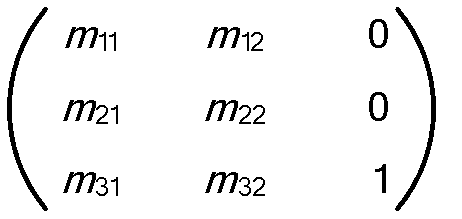

Figure 1: Matrix entries

The values **m11**, **m12**, **m21**, and **m22** define the scale, rotation, and skew effects of the matrix, whereas the values **m31** and **m32** define the **x** and **y** translation effects.

**Translate transform:** A **transform** that affects only the horizontal or vertical offset of the coordinate system. The resource properties are interpreted as follows in figure .

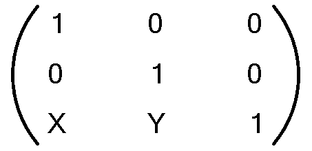

Figure 2: Translate transform resource properties

**Scale transform:** A **transform** that changes the apparent size of the coordinate system. By default, the scale is centered at the origin of the coordinate system, but that can be changed with the CenterX and CenterY properties. The resource properties are interpreted as follows in figure .

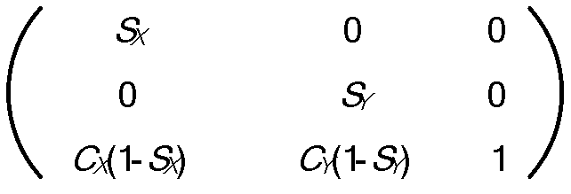

Figure 3: Scale transform resource properties

**Transform group:** An array of **transforms**. The transformation matrix of the group is the product of the transformation matrices of each **transform** in the array.

<a id="Section_3.1.1.5.1.6"></a>
###### 3.1.1.5.1.6 Color Transforms

A Color Transform is a [**resource**](#gt_resource) that changes a color space similarly to how a 2-D transform changes a coordinate space. The transformation is performed by representing the color as a five-dimensional vector, where the first four values are the red, green, blue, and alpha [**channels**](#gt_channel) of the color and the last value is 1, and multiplying it by a 5x5 matrix that represents the color transformation. The resulting five-dimensional vector contains the representation of the new color. This protocol specifies only one color transform resource, which is explicitly defined by a 5x5 matrix.

The [**rasterization**](#gt_rasterization) of the visual is changed by applying the color transform to the result of rasterizing the visual and its subtree.

<a id="Section_3.1.1.5.2"></a>
##### 3.1.1.5.2 3-D Drawing Resources

Three-Dimensional Drawing [**Resources**](#gt_resource) represent all information necessary to rasterize 3-D objects. Unlike 2-D primitives, 3-D objects are always built out of meshes, with no higher-level primitives specified. These resources are grouped into five subcategories: 3-D geometries and meshes, cameras, lights, transforms, and models. These resources are conceptually similar to those described in [[OPENGL]](https://go.microsoft.com/fwlink/?LinkId=90241), with the significant exception that the coordinate system specified by this protocol is left-handed; that is, the direction of positive values for the Z-axis is away from the observer and toward the screen.

<a id="Section_3.1.1.5.2.1"></a>
###### 3.1.1.5.2.1 3-D Geometries

A 3-D Geometry [**resource**](#gt_resource) is a resolution-independent description of a 3-D object. It defines a representation of a [**surface**](#gt_surface), in the physical sense, that can be textured and lit to give the on-screen appearance of a real 3-D object. A 3-D Geometry is positioned in space by a 3-D transform, lit by a combination of a light resource, and a set of surface properties defined in a material resource, and projected onto a 2-D surface by a camera resource.

This protocol specifies only one 3-D Geometry resource, called a 3-D mesh resource. A mesh is a collection of vertices grouped in triads, each one representing a triangle to be drawn in 3-D space. Each vertex is represented by a spatial position, a color, and a texture coordinate. Triangles are represented as triads of indices into the vertex arrays.

<a id="Section_3.1.1.5.2.2"></a>
###### 3.1.1.5.2.2 Lights

A Light is a [**resource**](#gt_resource) that defines how texturing pixel colors defined by a material are converted to pixel colors in the rasterized output, based on properties of the material and the relative positions and orientations in the 3-D space of the model being lit, the light, and the camera. Lights implement a mathematical model that represents the behavior of actual lights in the physical world, similar to those specified in [[OPENGL]](https://go.microsoft.com/fwlink/?LinkId=90241).

This protocol specifies only one type of light: ambient light.

**Ambient light:** Illuminates all pixels in a model uniformly, regardless of model or camera position. An ambient light does not have a defined position in 3-D space.

<a id="Section_3.1.1.5.2.3"></a>
###### 3.1.1.5.2.3 Cameras

A Camera is a [**resource**](#gt_resource) that defines how the 3-D coordinate system in which models and lights are defined is projected into a 2-D coordinate system for [**rasterization**](#gt_rasterization) purposes. Conceptually, a Camera represents an observer with a lens that warps the world in some particular way, similarly to the behavior of projection matrices as specified in [[OPENGL]](https://go.microsoft.com/fwlink/?LinkId=90241).

This protocol specifies only one type of camera:

**Matrix camera:** Provides direct control over the view and projection matrices.

<a id="Section_3.1.1.5.2.4"></a>
###### 3.1.1.5.2.4 3-D Transforms

A 3-D Transform is a [**resource**](#gt_resource) that modifies the coordinate system of a model or a camera, similar to the behavior of transformation matrices as specified in [[OPENGL]](https://go.microsoft.com/fwlink/?LinkId=90241). Generally, models are defined in "model space", that is, all coordinates are specified relative to some arbitrary origin that has no relation to other objects in the 3-D scene, but serves only to establish the relative positions of the vertices in that model. A 3-D Transform is then used to position the model as a whole in "world space", which is the coordinate system that relates all models, lights, and cameras to each other.

The most generic type of 3-D Transform is the matrix 3-D transform, which consists of a full 4x4 transformation matrix. The matrix 3-D transform is the only transform specified by this protocol.

**Matrix 3-D transform:** A full 4x4 matrix. The matrix entries are specified in figure:

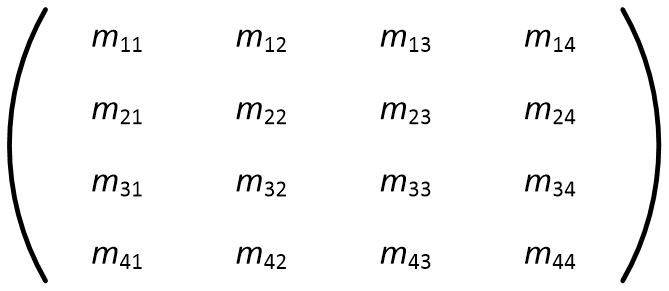

Figure 4: Matrix entries

<a id="Section_3.1.1.5.2.5"></a>
###### 3.1.1.5.2.5 Models

A Model [**resource**](#gt_resource) represents an object in a 3-D scene. This protocol specifies only one basic type of model resources: the 3-D geometry model, which consists of a 3-D geometry plus a 3-D transform. The 3-D geometry defines the shape of the object.

In addition to 3-D geometry models, the protocol also specifies a 3-D model group, which is an array of 3-D models. The group resource allows for the creation of hierarchical models.

<a id="Section_3.1.1.5.2.6"></a>
###### 3.1.1.5.2.6 3-D Scene

A 3-D Scene [**resource**](#gt_resource) represents the integration of an entire 3-D Scene into a 2-D [**scene graph**](#gt_scene-graph). It contains a 3-D model group, a camera, and a rectangle that defines the viewport in which the scene is rendered. This type of resource is as specified in the MILCMD_DRAW_SCENE3D ([2.2.7.75](#Section_2.2.7.75)) render data instruction.

<a id="Section_3.1.1.5.3"></a>
##### 3.1.1.5.3 Value Resources and Animation

A value [**resource**](#gt_resource) contains a single-typed value. The following are the data types for which there exist corresponding value resources:

- DOUBLE
- COLOR
- POINT
- RECT
- SIZE
- MATRIX
- COLORTRANSFORM
These resources can be referenced by other resources to represent the value of some property. For example, a solid color brush resource contains a color value, but can also reference a color resource, in which case the value of the color resource defines the color of the brush.

Value resources are most useful for animations. An update message for a value resource is often smaller than an update message for other resources.

<a id="Section_3.1.1.6"></a>
#### 3.1.1.6 Drawing Text

Text is drawn as a sequence of bitmaps that, when put together, form a line of text. Each bitmap represents a [**glyph**](#gt_glyph) and has additional offset parameters that participate in the positioning of the bitmap in the sequence. The bitmaps themselves must be produced by the server.

When drawing a [**glyph run**](#gt_glyph-run), the [**rasterization**](#gt_rasterization) engine picks the set of glyph bitmaps that most closely match the final resolution at which the glyphs in the glyph run have to be drawn, based on the current device transform. Each glyph bitmap of a set representing the same glyph is known as a realization of that glyph. The server MAY provide any number of realizations for each glyph. It MUST provide at least one realization for each glyph used in the [**scene graph**](#gt_scene-graph). Determining the scaling factor at which the glyphs are rendered is an implementation-specific detail and depends on the rasterizer logic.

<a id="Section_3.1.1.6.1"></a>
##### 3.1.1.6.1 Glyph Cache

The client of this protocol MUST provide support for the sharing of [**glyph**](#gt_glyph) bitmaps across multiple [**channels**](#gt_channel) belonging to the same connection set as defined in section [3.1.1.1](#Section_3.1.1.1). The repository of shared glyph bitmaps is known as the Glyph Cache.

The function of the Glyph Cache is to store unique bitmaps representing characters available in a font set. The entries are grouped in font face sets identified by a font face [**handle**](#gt_handle). Within a font face set, individual glyph bitmaps are identified by a glyph index. The server MUST create font face sets for all the fonts used in the [**scene graph**](#gt_scene-graph), and for all the scales at which it will render the fonts without scaling. If, at [**rasterization**](#gt_rasterization) time, a font face of the exact needed scale is not available, the rasterization engine MUST pick the font face that is closest in scale.

<a id="Section_3.1.1.6.2"></a>
##### 3.1.1.6.2 Glyph Run Resource

Lines of text are organized in units called [**glyph runs**](#gt_glyph-run). A glyph run is a sequence of [**glyphs**](#gt_glyph) drawn with a common set of font and size parameters. All of the information necessary to draw a glyph run is retained by a Glyph Run Resource. This consists of a sequence of glyph indices and the pre-contrast level that controls how the text is to be rendered. In addition, a Glyph Run Resource also references one or more realizations for each glyph. Because a single glyph run can be encountered more than once in a full traversal of the [**scene graph**](#gt_scene-graph), the glyph run references a set of realizations for each scale at which it will be drawn.

<a id="Section_3.1.1.6.3"></a>
##### 3.1.1.6.3 Drawing Text

To draw text, the server MUST first create [**rasterizations**](#gt_rasterization) of the [**glyph**](#gt_glyph) bitmaps for all glyphs to be drawn and MUST then populate the glyph cache with these glyph bitmaps by using a sequence as specified in [2.2.7.65](#Section_2.2.7.65). Next, the server MUST create a [**glyph run**](#gt_glyph-run) [**resource**](#gt_resource) that contains an array of glyph bitmap indices and reference that glyph run resource from a glyph run rendering instruction. Finally, the server MUST add at least one **realization** to the glyph.

**Realization:** A description that indicates the font face set that has to be used for a specific scale. Realizations are a collection of bitmaps that contain rasterizations for every font character used. A realization is maintained for every font and font size. Bitmaps are added to the realization on first use. Subsequent uses from other glyphs exploit the same realization entry. See figure for an example of a glyph run with two realizations.

When it is time to render a glyph run, the [**composition engine**](#gt_composition-engine) calculates the scale at which it needs to be rendered and chooses from the realization list the font face that best matches that scale. The combination of font face and glyph index is then used to address the specific glyph bitmap to be used for each glyph. Figure depicts a glyph run with two realizations that index glyph bitmaps in two font face sets that are rasterized for two different scales.

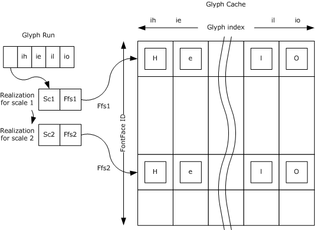

Figure 5: Example glyph run with two realizations

To prepare a glyph run for rendering with a specified font at two different scales (as shown in the previous figure), the following steps MUST be performed:

- Rasterize glyph bitmaps for the glyphs in the glyph run at scale Sc1.
- Allocate a font face [**handle**](#gt_handle) Ffs1 for text that is rendered with scale Sc1.
- Allocate indices for the glyphs that are rasterized in step 1, and add the glyph bitmaps to the glyph cache that addresses them with (Ffs1, glyph index) pairs.
- Rasterize glyph bitmaps for the glyphs in the glyph run at scale Sc2.
- Allocate a new font face handle Ffs2 for the text that is rendered with scale Sc2.
- Add the bitmaps that are rasterized for scale Sc2 to the cache using the new font face handle and the same indices as used for Fsf1.
- Create a glyph run that contains the glyph indices that are allocated for the required text.
- Add two realizations to the newly created glyph run. The realizations are described by (scale, font face id) pairs, in this example (Sc1, Ffs1) and (Sc2, Ffs2).
<a id="Section_3.1.1.7"></a>
#### 3.1.1.7 Drawing Instruction Streams

The protocol specifies a declarative, retained rendering model. To draw anything, an application must emit messages to create a set of [**resources**](#gt_resource) and then emit a set of additional messages to represent drawing instructions that reference those resources. The drawing instructions are emitted as a buffer containing a list of drawing messages.

Drawing instruction streams are retained by a resource known as a "render data" resource. A render data resource can be updated, but not incrementally; that is, the drawing instruction stream can only be replaced wholesale. The drawing instruction stream consists of a subprotocol, as specified in Render Data Drawing Instructions ([2.2.8](#Section_2.2.8)).

The drawing instructions need to be executed with consideration of the effective transform and clip at the visual that references the render data stream. For example, if the render data stream is referenced by the root visual and that visual has a scale transform, then all rendering operations in the render data stream will be scaled by the amount specified by the transform. The render data stream can include instructions that modify the effective transform and clip. These instructions require the client to maintain a stack of transforms and clips.

When a transform is pushed onto the stack, it is multiplied with the previous effective transform. When it is popped, the previous transform comes into effect again. Similarly for clips: each new clip pushed onto the stack is intersected with the previous clip. The instruction stream can also push an opacity instruction. When this happens, the client rasterizes all subsequent rendering instructions to an off-screen surface until a matching pop instruction is encountered, at which point the off-screen surface needs to be blended with the background with the opacity previously specified by the push instruction. There are three different instructions to push transforms, clips, and opacity values, but there is only one pop instruction. Therefore, the client has to keep a single stack for all three kinds of operations and match each pop with the last pushed instruction.

When the client finishes rendering any one individual render data instruction stream, it needs to clear the transform, clip, and opacity stack, if it is not empty. Then, the client needs to restore the transform, clip, and opacity stack rendering properties to the values they had before that particular stream was rendered.

<a id="Section_3.1.1.8"></a>
#### 3.1.1.8 Surface Management

The server maintains a hierarchical model of all graphics produced by all applications running on the machine. The root object is the [**desktop**](#gt_desktop), which can simply be a structural object, or it can contain graphics of its own, such as a background image. Attached to the root object are zero or more [**top-level windows**](#gt_top-level-window), each of which, in turn, can contain zero or more child [**windows**](#gt_window), and so on. This tree is organized to draw to one or more [**surfaces**](#gt_surface). At least one surface MUST be created to represent the entire desktop.

In a noncomposed desktop, all windows and the desktop itself draw directly to the same one surface, according to information about the structure of the window tree and the properties of the windows. In a composed desktop, as specified in this protocol, each top-level window has its own dedicated surface. All windows in the subtree rooted at a particular top-level window draw to that top-level window's surface. A [**composition engine**](#gt_composition-engine) then combines all top-level window surfaces and any graphical contents belonging to the desktop itself to rasterize the surface representing the entire desktop. In that case, the desktop is represented by a [**scene graph**](#gt_scene-graph) containing all window surfaces and any extra graphical elements needed to draw the desktop. The topology of this scene graph is not necessarily the same as that of the window tree. For example, the server MAY<8> decorate each top-level window with an additional set of graphical elements that provide window-management functionality.

Each window surface is represented by a [**sprite**](#gt_sprite) [**resource**](#gt_resource), which MAY be targeted by a set of immediate-mode drawing primitives as specified in Remote Desktop Protocol: Graphics Devices Interfaces (GDI) Acceleration Extension [MS-RDPEGDI](../MS-RDPEGDI/MS-RDPEGDI.md) and Remote Desktop Protocol: Desktop Composition Virtual Channel Extension [MS-RDPEDC](../MS-RDPEDC/MS-RDPEDC.md), or it MAY be targeted by its own scene graph as specified by this protocol. The sprite resource is referenced by a window node resource, which is a special type of visual resource, and therefore can be inserted in larger tree of visuals representing the desktop. The window node resource references a numerical identifier representing the window. Any 64-bit value is valid for this purpose<9> as long as each value is used only by a single window node at any given time. In addition, window nodes can use zero as the window identifier. This is useful for representing sprites that are not associated with windows.<10>

<a id="Section_3.1.2"></a>
### 3.1.2 Timers

Some messages sent from the server to the client require the client to send back a response. For these synchronous messages, the server MAY start a timer when the message is sent and ignore the reply if it is not received by the time the timer expires. The client MUST process synchronous messages immediately and issue a reply before the timer expires. The time-out period for all synchronous messages is 20 seconds.

<a id="Section_3.1.3"></a>
### 3.1.3 Initialization

The figure in this section shows the message flow between server and client during the lifetime of the [**connection**](#gt_connection) initialization. All dynamic virtual [**channel**](#gt_channel) errors that are returned due to sending or receiving messages result in a protocol error. The connection state starts with version negotiation. On successful version negotiation, channels are open and messages exchanged. At the end of the session, the server MUST close the session by closing all channels and then the connection.

Version negotiation is done in two steps: first, the server asks the client for a list of supported versions, and then the server tells the client which version MUST be used. The process is synchronous, and the connection is not fully usable until this process is completed. If the server opens multiple connections to the client, each connection MAY negotiate a separate protocol version.

The first message in this sequence is [MILCTRLCMD_VERSIONREQUEST](#Section_2.2.5.1). After sending this message, the server MUST wait for a reply for at least 20 seconds before sending another message or terminating the connection. If the reply does not arrive within 20 seconds, the server MAY stop waiting and terminate the connection.

When the client receives this message, it MUST send back to the server a [MILCTRLCMD_CONNECTIONNOTIFICATION](#Section_2.2.6.1) message containing a [MILMSG_VERSIONREPLY](#Section_2.2.9.3) notification, with the payload listing all of the protocol versions that the client supports. For the version of the protocol specified in this document, the client MUST include the value MIL_SDK_VERSION (0x1042EA27) as specified in section 2.2.9.3 MILMSG_VERSIONREPLY.

After the server receives the notification, it MUST decide which supported version to use. If none of the returned versions are understood by the server, the connection MUST be closed by terminating the dynamic virtual channel as specified in [MS-RDPEDYC](../MS-RDPEDYC/MS-RDPEDYC.md). Otherwise, the server MUST issue a [MILCTRLCMD_VERSIONANNOUNCEMENT](#Section_2.2.5.2) message to complete the handshake with the client. The **protocolVersion** field of the message MUST be set to the selected protocol version, which MUST be one of the values returned by the client in the MILCTRLCMD_CONNECTIONNOTIFICATION message. For the version of the protocol specified in this document, this value MUST be MIL_SDK_VERSION (0x1042EA27). From this point on, the server is also done with versioning, and it MUST assume that the connection has been successfully established.

Upon receiving the MILCTRLCMD_VERSIONANNOUNCEMENT message, the client MUST validate that the specified protocol version is valid. All further messages MUST be interpreted according to the specification of the protocol for the given version. From this point on the connection is fully established.

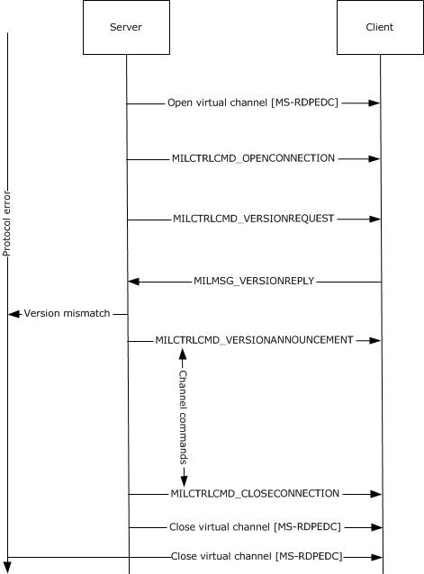

Figure 6: Initializing a connection – message flow

<a id="Section_3.1.4"></a>
### 3.1.4 Higher-Layer Triggered Events

None.

<a id="Section_3.1.5"></a>
### 3.1.5 Processing Events and Sequencing Rules

<a id="Section_3.1.5.1"></a>
#### 3.1.5.1 Initializing a Connection

The following figure shows the message flow between server and client during [**connection**](#gt_connection) initialization. All dynamic virtual [**channel**](#gt_channel) errors that are returned due to sending or receiving messages result in a protocol error.


Figure 7: Initializing a connection – message flow

<a id="Section_3.1.5.2"></a>
#### 3.1.5.2 Protocol Errors

Protocol errors are handled as follows:

- When unrecoverable errors occur during client processing of messages, the client MUST release all protocol-created [**resources**](#gt_resource) and state, and MUST send a MILMSG_PARTITIONISZOMBIE error message back to the server. As a result, the server will close its [**connection**](#gt_connection), reset its state, and open a new connection.
- When an error occurs while processing client-sent notifications on the server, the server closes its connection and opens a new connection as needed.
<a id="Section_3.1.5.3"></a>
#### 3.1.5.3 Channel Message Flow

Once a [**connection**](#gt_connection) has been established, the server MUST open [**channels**](#gt_channel) to send messages to the client. The general message flow is outlined in figure below. Any errors encountered on either the server or client MUST be handled as outlined in section [3.1.5.2](#Section_3.1.5.2).


Figure 8: Channel message flow

Most channel messages only require notifications on error conditions that occur while processing the message by the client. There are some connection and channel messages that require responses from the client. A detailed description of messages that require responses is given in section [3.3.5](#Section_1.3).

<a id="Section_3.1.6"></a>
### 3.1.6 Timer Events

None.

<a id="Section_3.1.7"></a>
### 3.1.7 Other Local Events

None.

<a id="Section_3.2"></a>
## 3.2 Server Details

<a id="Section_3.2.1"></a>
### 3.2.1 Abstract Data Model

None.

<a id="Section_3.2.2"></a>
### 3.2.2 Timers

The server MAY start a 20-second timer when it sends a [MILCTRLCMD_VERSIONREQUEST](#Section_2.2.5.1) message or a [MILCMD_TRANSPORT_SYNCFLUSH](#Section_2.2.7.1) message to the client.

The response for a MILCTRLCMD_VERSIONREQUEST message is a [MILMSG_VERSIONREPLY](#Section_2.2.9.3) message. If the reply does not arrive before the timer expires, the server MAY terminate the connection on the assumption that the requested version is unsupported.

The response for a MILCMD_TRANSPORT_SYNCFLUSH message is a [MILMSG_SYNCFLUSHREPLY](#Section_2.2.9.1) message. If the reply does not arrive before the timer expires, the server MAY stop waiting and ignore any reply that comes late.

<a id="Section_3.2.3"></a>
### 3.2.3 Initialization

<a id="Section_3.2.3.1"></a>
#### 3.2.3.1 Opening the Connection

The protocol is in effect as soon as a dynamic [**channel**](#gt_channel) is opened, as specified in Remote Desktop Protocol: Dynamic Virtual Channel Extension [MS-RDPEDYC](../MS-RDPEDYC/MS-RDPEDYC.md). The server opens the dynamic channel and initializes the protocol by sending a [MILCTRLCMD_OPENCONNECTION](#Section_2.2.5.3) message. This message MUST be the very first message sent by the server.

<a id="Section_3.2.4"></a>
### 3.2.4 Higher-Layer Triggered Events

The Desktop Window Manager triggers switching [**desktop**](#gt_desktop) composition on and off on the server. This has an effect on the high-level Remote Desktop state with regard to desktop composition. The server sends a TS_COMPDESK_TOGGLE packet, as specified in section 2.2.1.1 of [MS-RDPEDC](../MS-RDPEDC/MS-RDPEDC.md), to instruct the client to stop running in desktop composition mode.

In response to the Desktop Window Manager turning desktop composition off on the server, the server MUST close all [**connections**](#gt_connection) of this protocol to the client. In response to the Desktop Window Manager turning on desktop composition on the server, the server MUST establish a top-level connection and it MAY establish one or more child connections.

<a id="Section_3.2.5"></a>
### 3.2.5 Processing Events and Sequencing Rules

The server receives messages from the client, sent through the back-channel. These messages fall into three categories: response messages, informational notifications, and critical notifications.

Response messages are sent by the client only when the server sends a corresponding request message. For example, if the server sends a [MILCMD_TRANSPORT_SYNCFLUSH](#Section_2.2.7.1) message to the client, then the client MUST reply with a [MILMSG_SYNCFLUSHREPLY](#Section_2.2.9.1) message. The client MUST NOT send response messages unless a request message is received. The following messages are response messages:

MILMSG_SYNCFLUSHREPLY**:** A [**channel**](#gt_channel) message sent in response to MILCMD_TRANSPORT_SYNCFLUSH. This message MUST be sent after all messages preceding the MILCMD_TRANSPORT_SYNCFLUSH message have been executed.

[MILMSG_CAPTUREBITSREPLY](#Section_2.2.9.2)**:** A channel message sent in response to [MILCMD_TARGET_CAPTUREBITS](#Section_3.2.5.2.3). This message MUST be sent after all messages submitted before the request have been completed.

[MILMSG_METARTCAPTUREBITSREPLY](#Section_2.2.9.13)**:** A channel message sent in response to [MILCMD_METABITMAPRENDERTARGET_CAPTUREBITS](#Section_2.2.7.57).

[MILMSG_VERSIONREPLY](#Section_2.2.9.3)**:** A connection-level message sent in response to [MILCTRLCMD_VERSIONREQUEST](#Section_2.2.5.1).

[MILMSG_NOTIFYROUNDTRIPREPLY](#Section_2.2.9.8)**:** Sent in response to [MILCMD_TRANSPORT_ROUNDTRIPREQUEST](#Section_2.2.7.2). This message MUST be sent after all preceding messages are completed.

[MILMSG_ASYNCFLUSHREPLY](#Section_2.2.9.10)**:** Sent in response to a [MILCMD_TRANSPORT_ASYNCFLUSH](#Section_2.2.7.3) message.

Informational notifications are issued autonomously by the client to inform the server of state changes. The server MAY safely ignore these messages, or it MAY use them to modify the data it sends to the client. For example, in response to the [MILMSG_HARDWARETIER](#Section_2.2.9.4) message, the server can either degrade or enhance the complexity of the graphical data it sends to the client so as to match the reported changing hardware capabilities. The following messages are informational notifications:

- MILMSG_HARDWARETIER
- [MILMSG_NOTIFYCOMPOSITIONTIMEEXCEEDED](#Section_2.2.9.7)
The MILMSG_HARDWARETIER message is sent in two different situations:

- MILMSG_HARDWARETIER MUST be sent as a response to an explicit request, indicated by the server with the [MILCMD_CHANNEL_REQUESTTIER](#Section_2.2.7.5) message.
- The client MAY send this message after a display modification. In this case, the message is issued by the client to any channel on which a [MILCMD_PARTITION_REGISTERFORNOTIFICATIONS](#Section_2.2.7.4) message has been sent.
A display modification can, for example, include any combination of the following: mode change, monitor topology change, resolution change, color depth change, or driver update.

Critical notifications are also issued autonomously by the client, but the server MUST process these messages in specific ways. The following messages are critical notifications:

[MILMSG_COMPOSITIONDEVICESTATECHANGE](#Section_2.2.9.5)**:** Issued by the client if the composed [**desktop**](#gt_desktop) state changes while the current scene is being rendered. The valid device states are enumerated by **MilCompositionDeviceState**. In response to this message, the server MAY re-build mil [**resources**](#gt_resource) attached to composed desktop resources that could have become invalid.

[MILMSG_PARTITIONISZOMBIE](#Section_2.2.9.6)**:** Sent by the client whenever it encounters an error during protocol parsing or scene rendering. The server will respond by shutting down all channels and [**connections**](#gt_connection), and then rebuilding the rendering scene.

[MILMSG_RENDERSTATUS](#Section_2.2.9.11)**:** Sent by the client to indicate that the status of the [**composition engine**](#gt_composition-engine) has changed. This notification MUST be sent when the client experiences a non-fatal asynchronous rendering failure.

[MILMSG_DISABLECOMPOSITION](#Section_2.2.9.12)**:** Sent by the client to indicate that desktop composition has been disabled. In response to this message, the server shuts down all channels and connections.

[**MILMSG_CONNECTIONLOST**](#Section_2.2.9.9)**:** Sent by the client to indicate that its connection to the server has been lost. In response to this message, the server shuts down all channels and connections.

<a id="Section_3.2.5.1"></a>
#### 3.2.5.1 Connection Control Messages and Notifications

The following [**connection**](#gt_connection) control messages can be used:

**MILCTRLCMD_OPENCONNECTION:** The server MUST send this message before any other messages, after a dynamic virtual [**channel**](#gt_channel) has been opened for this protocol.

**MILCTRLCMD_CLOSECONNECTION:** The server MUST send this message after all messages in a connection session and before closing the dynamic virtual channel for this connection.

**MILCTRLCMD_VERSIONREQUEST:** The server SHOULD send this message to request the list of supported protocol versions. The client MUST respond with a MILMSG_VERSIONREPLY notification.

**MILCTRLCMD_VERSIONANNOUNCEMENT:** The server MUST send this message in response to the client sending a MILMSG_VESIONREPLY notification.

**MILCTRLCMD_OPENCHANNEL, MILCTRLCMD_CLOSECHANNEL and MILCTRLCMD_DATAONCHANNEL:** These messages are sent by the server to open and to close channels, and to send data on channels within a connection. Section [3.2.5.1.1](#Section_3.2.5.1.1) describes these messages in more detail.

**MILCTRLCMD_HANDLESURFACEMANAGEREVENT:** The server SHOULD send this message to indicate that the connection will render [**surfaces**](#gt_surface) created by the [MS-RDPEDC](../MS-RDPEDC/MS-RDPEDC.md) protocol.

**Notifications:** There are two types of notifications: connection notifications and channel notifications. Connection notifications are notifications that are scoped to the entire connection. These are sent using MILCTRLCMD_CONNECTIONNOTIFICATION. Channel notifications can be sent using MILCTRLCMD_CHANNELNOTIFICATION and MILCTRLCMD_CONNECTIONBROADCAST.

The MILCTRLCMD_CONNECTIONNOTIFICATION payload is a connection notification that can be:

**MILMSG_VERSIONREPLY:** The client MUST send this notification in response to a MILCTRLCMD_VERSIONREQUEST message.

**MILMSG_CONNECTIONLOST:** This MUST be sent by the client when it is about to terminate a connection.

The MILCTRLCMD_CHANNELNOTIFICATION payload is a channel notification that MAY be sent as a response to channel messages. The **channelHandle** field of the message contains the originating channel. These messages can be any notification described in section [2.2.9](#Section_2.2.9). Sending rules are described in section [3.3.5](#Section_1.3), where applicable.

<a id="Section_3.2.5.1.1"></a>
##### 3.2.5.1.1 Channel Messages

To open a [**channel**](#gt_channel), the server MUST send a MILCTRLCMD_OPENCHANNEL message to the client. The server MUST create a state that will allow it to allocate [**resource**](#gt_resource) [**handles**](#gt_handle), which will be used to identify resources across the protocol. The new channel is identified by the **channelHandle** field of the MILCTRLCMD_OPENCHANNEL channel message. When a new channel is requested by the server, if the **sourceChannelHandle** field is not NULL, the new channel is related to the set to which the specified existing channel belongs. If the field is NULL, a new set of related channels is implicitly requested. Related channels can have resources duplicated from one to the other.

To send a channel, the server MUST send a MILCTRLCMD_DATAONCHANNEL message to the client where the payload of the channel message data MUST be the channel message. Channel messages are either resource lifetime messages or resource manipulation messages. Lifetime messages are used for the creation and destruction of resources, while resource manipulation messages apply values from fields within the message to resource attributes.

The order in which the server sends channel messages defines the order in which the client MUST process the messages. All channel messages have the same header that contains:

**messageSize:** The size of the message.

**controlCode:** A value identifying the message type.

**targetResource:** A handle for a resource to which the message applies.

The server MAY receive an error notification if:

- The target resource handle lookup fails on the client.
- The target resource type does not match the message resource type on the client.
- The message processing for the targeted resource generates a failure on the client.
<a id="Section_3.2.5.1.2"></a>
##### 3.2.5.1.2 Creating and Deleting Resources

To create [**resources**](#gt_resource), the server MUST send resource create and resource destroy [**channel**](#gt_channel) messages.

**MILCMD_CHANNEL_CREATERESOURCE:** Used to create a new resource of the type indicated by the **resType** field. The server MUST assign a new resource [**handle**](#gt_handle). The server MUST then send a MILCMD_CHANNEL_CREATERESOURCE message with the new handle in the **hNewResource** message field.

**MILCMD_CHANNEL_DELETERESOURCE:** To delete a resource, the server MUST free the handle for the resource and send a MILCMD_CHANNEL_DELETERESOURCE message. The server MUST NOT send any other messages targeting the deleted handle until a new resource is created at that handle.

**MILCMD_CHANNEL_DUPLICATEHANDLE:** To duplicate a resource from one channel to another, the server MUST send a MILCMD_CHANNEL_DUPLICATEHANDLE message. The source and destination channels MUST be part of a set of related channels. Special care must be taken with the new handle value allocation and the order of this message and other messages in the batches of the two channels involved in the duplication. The client learns about the handle duplication only when the batch containing the [MILCMD_CHANNEL_DUPLICATEHANDLE](#Section_2.2.7.8) message is processed. The server must consider this when allocating the new handle value on the destination channel. The lifetime of handle values, as known to the client, includes only the effects of any batches submitted on the destination channel before the batch that contains the handle duplication message. Similarly, the new handle value will be in use on the destination channel as a result of processing a batch on the source channel. Therefore, the following sequence of actions is recommended for handle duplication:

- Any batches for the destination channel have to be submitted. This synchronizes the server's and client's understanding of the lifetime of handles on that channel.
- The server has to allocate a new handle for the destination channel and add it to the MILCMD_CHANNEL_DUPLICATEHANDLE message.
- The server has to submit the batch on the source channel. This again synchronizes the server's and the client's understanding of the lifetime of the new handle.
- The server can now submit messages to the destination channel that reference the new handle. When the server is done with the new handle, it can submit a destroy message in a batch on the target channel.
- It is important that step 3 happen before step 4, or the messages on the destination channel that reference the new handle will be rejected by the client, as the handle value will be unknown at that point. Submitting batches at steps 1 and 3 simplifies the bookkeeping that the server needs to do to keep track of which handles are known to the client and which are not.
Once created, all resource types have messages associated with them that allow the resource attributes to be set by using resource update messages. For all messages that set a reference to another resource by resource handle as an attribute, sending a NULL handle will always mean clearing that attribute resource reference.

<a id="Section_3.2.5.2"></a>
#### 3.2.5.2 Manipulating Render Target Resources

The render target is the top-most [**resource**](#gt_resource) of the composition tree. To create a render target, the server MUST allocate a new [**handle**](#gt_handle) and send a MILCMD_CHANNEL_CREATERESOURCE, with the **type** field set to TYPE_DESKTOPRENDERTARGET and the **hNewResource** field set to the new resource handle. After creating the render target, the server MUST configure the new resource with a MILCMD_HWNDTARGET_CREATE message.

<a id="Section_3.2.5.2.1"></a>
##### 3.2.5.2.1 MILCMD_TARGET_SETROOT

After creating the [**resource**](#gt_resource), the server SHOULD set a visual as the target's root node by sending a MILCMD_TARGET_SETROOT with the **hRoot** field set to the root visual.

<a id="Section_3.2.5.2.2"></a>
##### 3.2.5.2.2 MILCMD_TARGET_SETCLEARCOLOR

The server SHOULD set the render target root color by sending MILCMD_TARGET_SETCLEARCOLOR with the new clear color value.

<a id="Section_3.2.5.2.3"></a>
##### 3.2.5.2.3 MILCMD_TARGET_CAPTUREBITS

This message is sent by the server to request a copy of render target contents. The client MUST respond by sending a MILMSG_CAPTUREBITSREPLY notification containing a copy of the render target pixels. This message MUST be sent on the back [**channel**](#gt_channel) corresponding to the channel on which the MILCMD_TARGET_CAPTUREBITS message was received. The MILCMD_TARGET_CAPTUREBITS fields are used as follows:

**x, y:** The offsets in render target coordinates from which pixels are to be read.

**width, height:** The width and height of the capture area in render target coordinates.

**dxgiFormat:** The DXGI_FORMAT pixel format for the returned render target area.

<a id="Section_3.2.5.2.4"></a>
##### 3.2.5.2.4 MILCMD_METABITMAPRENDERTARGET_CREATE message

The server MUST send this command to configure the targeted TYPE_METABITMAPRENDERTARGET [**resource**](#gt_resource) as follows:

- The targeted resource MUST be configured to have the same settings as the current TYPE_DESKTOPTRENDERTARGET resource.
- The following fields of the MILCMD_HWNDTARGET_CREATE message MUST exactly match the [**desktop**](#gt_desktop) render target: **width**, **height**, **clearColor**, **flags**, and **preFilteringDisabled**.
- The meta bitmap render target MUST use the same root visual that the desktop render target uses. This root visual was sent to the desktop render target via the MILCMD_TARGET_SETROOT message.
If no current desktop render target exists, then the command MUST succeed, but the resource MUST return a failure response to future MILCMD_METABITMAPRENDERTARGET_CAPTUREBITS request messages.

<a id="Section_3.2.5.2.5"></a>
##### 3.2.5.2.5 MILCMD_METABITMAPRENDERTARGET_CAPTUREBITS message

The server MAY request the retrieval of a captured bitmap from the meta bitmap render target by sending this command. The capture bitmap size is specified by the **Width** and **Height** fields.

First, the meta bitmap render target MUST refresh its parameters as specified via the **UpdateParam** field. Next, the server MUST re-render the content in the area to be captured. Finally, the server MUST reply on the back [**channel**](#gt_channel) with a MILMSG_METARTCAPTUREBITSREPLY.

The reply message MUST fill in the **SurfaceOffsets** field with a SurfacesCount of 1, and set the **DxgiFormat**, **Width**, and **Height** in the reply to the same format as originally requested by the caller. The pixels field MUST contain a PNG representation of the captured bitmap. The **Surfaces** subfield of the **SurfaceOffsets** field MUST contain a nonzero **AdapterID** field and a nonzero **MonitorID** field that uniquely identify the client machine's display adapter and monitor. The **Surfaces** subfield of the **SurfaceOffsets** field MUST also have the **Offset** field set to zero, indicating that the PNG bitmap data directly follows the message reply header.

On success, the **cbData** field of the response MUST be set to the size, in bytes, of the PNG bitmap, and the **hr** field MUST be set to 0. If any failures occur, then the reply message must instead set the **cbSize** field to zero and set the **hr** field to 0x80004005.

<a id="Section_3.2.5.2.6"></a>
##### 3.2.5.2.6 MILCMD_METABITMAPRENDERTARGET_SETTRANSFORM message

The server SHOULD set a transform on a TYPE_METABITMAPRENDERTARGET [**resource**](#gt_resource) by sending a MILCMD_METABITMAPRENDERTARGET_SETTRANSFORM message. It MUST use the **hTransform** field resource (which MUST be of TYPE_TRANSFORM) as the initial transform when rendering its root visual. This will enable the meta bitmap render target to draw a transformed view of the [**desktop**](#gt_desktop).

<a id="Section_3.2.5.2.7"></a>
##### 3.2.5.2.7 MILCMD_METABITMAPRENDERTARGET_SETCOLORTRANSFORM

The server MAY set a color transform to a TYPE_METABITMAPRENDERTARGET by sending a METABITMAPRENDERTARGET_SETCOLORTRANSFORM message to the targeted [**resource**](#gt_resource).

<a id="Section_3.2.5.2.8"></a>
##### 3.2.5.2.8 MILCMD_METABITMAPRENDERTARGET_SETFILTERLIST

The server MAY exclude a set of TYPE_VISUAL or TYPE_WINDOWNODE [**resources**](#gt_resource) from a TYPE_METABITMAPRENDERTARGET by sending a MILCMD_METABITMAPRENDERTARGET_SETFILTERLIST command to the targeted resource.

<a id="Section_3.2.5.3"></a>
#### 3.2.5.3 Manipulating Visual Resources

Visuals are used as nodes in a [**scene graph**](#gt_scene-graph) that is built as a result of decoding this protocol.

To create a visual, the server MUST allocate a new [**handle**](#gt_handle) and send a MILCMD_CHANNEL_CREATERESOURCE with the **resource type** field set to TYPE_VISUAL or TYPE_WINDOWNODE and the **hNewResource** field set to the new [**resource**](#gt_resource) handle. Window node resources inherit all behavior from visual resources, so all messages that apply to visual resources also apply to window node resources. For more information, see section [3.2.5.4](#Section_1.3.3).

<a id="Section_3.2.5.3.1"></a>
##### 3.2.5.3.1 MILCMD_VISUAL_INSERTCHILDAT

To insert a visual into another visual's child array, the server MUST send a MILCMD_VISUAL_INSERTCHILDAT command targeting the parent visual. The message fields MUST be set as follows:

**hChild:** A [**handle**](#gt_handle) to the child visual that is to be inserted in the visual targeted by this message. If the [**resource**](#gt_resource) dereferenced by **hChild** is not a visual, a protocol error must be returned.

**Index:** The index in the child array where the child MUST be inserted.

<a id="Section_3.2.5.3.2"></a>
##### 3.2.5.3.2 MILCMD_VISUAL_REMOVECHILD

To remove a visual from the child array of its parent visual, the server MUST send a MILCMD_VISUAL_REMOVECHILD targeting the parent with the **hChild** message field that is set to the [**handle**](#gt_handle) of the visual [**resource**](#gt_resource) that is to be removed from targeted visuals child array.

<a id="Section_3.2.5.3.3"></a>
##### 3.2.5.3.3 MILCMD_VISUAL_REMOVEALLCHILDREN

To remove all children from a visual, the server MUST send a MILCMD_VISUAL_REMOVEALLCHILDREN to the target visual.

<a id="Section_3.2.5.3.4"></a>
##### 3.2.5.3.4 MILCMD_VISUAL_SETOFFSET

To set an offset transform to a visual, the server MUST send a MILCMD_VISUAL_SETOFFSET to the target visual. The offset MUST be set to the **offsetX** and **offsetY** message fields.

<a id="Section_3.2.5.3.5"></a>
##### 3.2.5.3.5 MILCMD_VISUAL_SETTRANSFORM

To set a transform to a visual, the server MUST send a MILCMD_VISUAL_SETTRANSFORM to the target visual. The transform [**resource**](#gt_resource) [**handle**](#gt_handle) MUST be set to the **hTransform** message field. If **hTransform** is NULL, any existing transform is to be removed.

<a id="Section_3.2.5.3.6"></a>
##### 3.2.5.3.6 MILCMD_VISUAL_SETCLIP

To set a clip to a visual, the server MUST send a MILCMD_VISUAL_SETCLIP to the target visual. The geometry [**resource**](#gt_resource) [**handle**](#gt_handle) MUST be set to the **hClip** message field. If **hClip** is NULL, any exiting clip is to be removed.

<a id="Section_3.2.5.3.7"></a>
##### 3.2.5.3.7 MILCMD_VISUAL_SETALPHA

To set an alpha value to a visual, the server MUST send a MILCMD_VISUAL_SETALPHA to the targeted visual. The **alpha** message field contains the requested alpha value.

<a id="Section_3.2.5.3.8"></a>
##### 3.2.5.3.8 MILCMD_VISUAL_SETRENDEROPTIONS

To set the visual render options, the server must send a MILCMD_VISUAL_SETRENDEROPTIONS for the targeted visual. See section [2.2.3.14](#Section_2.2.3.14) MilRenderOptions for details on render options.

<a id="Section_3.2.5.3.9"></a>
##### 3.2.5.3.9 MILCMD_VISUAL_SETCONTENT

To set a render data [**resource**](#gt_resource) as a visual's content, the server MUST send a MILCMD_VISUAL_SETCONTENT message for the targeted visual. The **hContent** message field MUST be set to a render data resource [**handle**](#gt_handle).

<a id="Section_3.2.5.3.10"></a>
##### 3.2.5.3.10 MILCMD_VISUAL_SETCOLORTRANSFORM

To set the color transform of a visual, the server MUST send a MILCMD_VISUAL_SETCOLORTRANSFORM message for the targeted visual. The **hTransform** field MUST contain a [**handle**](#gt_handle) to a TYPE_COLORTRANSFORMRESOURCE [**resource**](#gt_resource).

<a id="Section_3.2.5.3.11"></a>
##### 3.2.5.3.11 MILCMD_VISUAL_ADDRENDERPARAMETER

To add a render parameter to a visual, the server MUST send a MILCMD_VISUAL_ADDRENDERPARAMETER message for the targeted [**resource**](#gt_resource). The server MUST set the render parameter to the **RenderParameter** message field.

<a id="Section_3.2.5.3.12"></a>
##### 3.2.5.3.12 MILCMD_VISUAL_REMOVERENDERPARAMETER

To remove a render parameter from a visual, the server MUST send a MILCMD_VISUAL_REMOVERENDERPARAMETER message. The parameter to be removed MUST be set to the **ParameterType** message field.

<a id="Section_3.2.5.3.13"></a>
##### 3.2.5.3.13 MILCMD_VISUAL SETCONEXTUALIZEDOPACITY

To manipulate contextualized opacity settings for a visual, the server MUST send MILCMD_VISUAL SETCONEXTUALIZEDOPACITY for the targeted visuals.

This message enables or disables contextualized opacity according to the value of the **ContextualizedOpacity** message field. When the **ContextualizedOpacity** field is set to TRUE, the server MUST determine the opacity of the visual by using the following algorithm.

- If the render target requires cursors—that is, if the meta bitmap render target has **IncludeCursors** set to 0x1 using the MILCMD_METABITMAPRENDERTARGET_CAPTUREBITS message:
- If the visual has been activated in a capture render pass by using MILCMD_VISUAL_SETRENDERFORCAPTURE, the *ContextualizedOpacityMultiplier* rendering parameter (section [2.2.3.17](#Section_2.2.3.17)) for the specified visual will be used to derive the effective opacity of the visual.
- If the visual has not been activated in a capture render pass, its opacity will be determined by the original opacity of the node (set using the MILCMD_VISUAL_SETALPHA message) as follows:
- If the opacity was originally set to zero, the opacity MUST be set to 1.0. (The visual MUST be made fully opaque.)
- If the opacity was originally set to a nonzero value, the original opacity value will be preserved.
- If the render target does not require cursors, the *ContextualizedOpacityMultiplier* rendering parameter of the specified visual MUST be used to derive the effective opacity of the node. This is the default case.
<a id="Section_3.2.5.3.14"></a>
##### 3.2.5.3.14 MILCMD_VISUAL_SETCOLORTRANSFORMROOT

To set a visuals color transform root, the server MUST send a MILCMD_VISUAL_SETCOLORTRANSFORMROOT message for the targeted visual. If the message **fColorTransformRoot** field is set to true, this visual MUST be treated as the composition tree root.

<a id="Section_3.2.5.3.15"></a>
##### 3.2.5.3.15 MILCMD_VISUAL_SETRENDERFORCAPTURE

To mark a composition tree under a visual as render for capture, the server MUST send a MILCMD_VISUAL_SETRENDERFORCAPTURE with the **renderForCapture** message field set to true for the targeted visual.

<a id="Section_3.2.5.4"></a>
#### 3.2.5.4 Manipulating Window Node Resources

To create a [**window**](#gt_window) node [**resource**](#gt_resource), the server MUST allocate a new [**handle**](#gt_handle) for the resource. The server MUST send a MILCMD_CHANNEL_CREATERESOURCE with the **resource type** field set to TYPE_WINDOWNODE and the **hNewResource** field set to the new handle. Window node resources inherit all behavior from visual resources, so all messages from section [3.2.5.3](#Section_1.3.3) can be used for window node resources. Window node resources also support the additional messages in this section.

<a id="Section_3.2.5.4.1"></a>
##### 3.2.5.4.1 MILCMD_WINDOWNODE_SETBOUNDS

The server MAY send this message to set bounds on the targeted [**window**](#gt_window) node.

<a id="Section_3.2.5.4.2"></a>
##### 3.2.5.4.2 MILCMD_WINDOWNODE_SETSPRITEIMAGE

To set a GdiSpriteBitmap [**resource**](#gt_resource) to the **spriteImage** [**window**](#gt_window) node attribute, the server MUST send a MILCMD_WINDOWNODE_SETSPRITEIMAGE message with the **GdiSpriteBitmap** resource [**handle**](#gt_handle) set as the **hImage** field of the message.

<a id="Section_3.2.5.4.3"></a>
##### 3.2.5.4.3 MILCMD_WINDOWNODE_SETLOGICALSURFACEIMAGE

To set a GdiSpriteBitmap [**resource**](#gt_resource) to the **logicalSurfaceImage** [**window**](#gt_window) node attribute, the server MUST send a MILCMD_WINDOWNODE_SETLOGICALSURFACEIMAGE message with the GdiSpriteBitmap resource [**handle**](#gt_handle) set as the **hImage** field of the message.

<a id="Section_3.2.5.4.4"></a>
##### 3.2.5.4.4 MILCMD_WINDOWNODE_SETSPRITECLIP

To set a clip to be used when rendering a [**window**](#gt_window) nodes **spriteImage**, the server MAY send a MILCMD_WINDOWNODE_SETSPRITECLIP message with the **hClip** message field set to a TYPE_PATHGEOMETRY [**handle**](#gt_handle).

<a id="Section_3.2.5.4.5"></a>
##### 3.2.5.4.5 MILCMD_WINDOWNODE_SETDXCLIP

To set a clip to be used when rendering a [**window**](#gt_window) node's **logicalSurfaceImage**, the server MAY send a MILCMD_WINDOWNODE_SETDXCLIP message with the **hClip** message field set to a TYPE_GEOMETRY [**handle**](#gt_handle).

<a id="Section_3.2.5.4.6"></a>
##### 3.2.5.4.6 MILCMD_WINDOWNODE_SETSOURCEMODIFICATIONS

To set source modifications on a [**window**](#gt_window) node [**resource**](#gt_resource), the server MUST send a MILCMD_WINDOWNODE_SETSOURCEMODIFICATIONS message to the targeted window node resource. The **sourceModifications** and **color key** message fields specify how the content of the targeted window node MUST be blended with the background:

**sourceModifications:** Contains the modification flags (**MilSourceModification**).

**LowColorKey:** Contains the low end of the color range, which will be drawn as transparent. This field is meaningful only if the **sourceModifications** field is set to ColorKey (0x00000002). This is in B8R8G8A8 format.

**HighColorKey:** Contains the high end of the color range, which will be drawn as transparent. This field is meaningful only if the **sourceModifications** field is set to ColorKey (0x00000002). This is in B8R8G8A8 format.

<a id="Section_3.2.5.4.7"></a>
##### 3.2.5.4.7 MILCMD_WINDOWNODE_SETALPHAMARGINS

To set alpha margins, the server MAY send a MILCMD_WINDOWNODE_SETALPHAMARGINS for the targeted [**window**](#gt_window) node [**resource**](#gt_resource). The message **margins** field is set to the window node.

<a id="Section_3.2.5.4.8"></a>
##### 3.2.5.4.8 MILCMD_WINDOWNODE_SETCOMPOSEONCE

To mark a [**window**](#gt_window) node [**resource**](#gt_resource) as **composed-once**, the server can send a MILCMD_WINDOWNODE_SETCOMPOSEONCE message for the targeted window node.

The **fComposeOnce** message field specifies whether the targeted window node MUST be marked as a **composed-once** visual. A visual marked for **composed-once** accumulates rendering instructions like a normal visual, but the instructions are executed only once at the next available composition pass, and then they are discarded. This construct is useful for emulating direct writes to the screen in a composed [**desktop**](#gt_desktop) environment.

<a id="Section_3.2.5.4.9"></a>
##### 3.2.5.4.9 MILCMD_WINDOWNODE_COPYCOMPOSITOROWNEDRESOURCES

Indicates that the [**sprite**](#gt_sprite) and [**logical surfaces**](#gt_logical-surface) clips are to be copied from the [**window**](#gt_window) node dereferenced by the **hSourceNode** field to the targeted window node.

<a id="Section_3.2.5.4.10"></a>
##### 3.2.5.4.10 MILCMD_WINDOWNODE_SETMAXIMIZEDCLIPMARGINS

Copies the margins from the message's **maximizedClipMargins** field to the targeted [**window**](#gt_window) node **clip margins**.

<a id="Section_3.2.5.4.11"></a>
##### 3.2.5.4.11 MILCMD_WINDOWNODE_PROTECTCONTENT

Specifies that when rendering for filling a capture or read-back request, the contents of the targeted [**window**](#gt_window) node MUST be replaced with a black rectangle.

<a id="Section_3.2.5.5"></a>
#### 3.2.5.5 Manipulating Geometry Resources

<a id="Section_3.2.5.5.1"></a>
##### 3.2.5.5.1 MILCMD_RECTANGLEGEOMETRY

After creating a TYPE_RECTANGLEGEOMETRY type [**resource**](#gt_resource), the server MUST configure the resource with a MILCMD_RECTANGLEGEOMETRY resource.

The target resource for this message MUST be of type TYPE_RECTANGLEGEOMETRY. This message is used to update all the properties of the target rectangle geometry resource. A MilRect structure that is provided through this message updates the position and dimensions of the target resource.

An optional resource [**handle**](#gt_handle) referencing a resource of type TYPE_RECTRESOURCE can be provided. This optional resource animates the position and dimensions of the target rectangle geometry resource.

<a id="Section_3.2.5.5.2"></a>
##### 3.2.5.5.2 MILCMD_COMBINEDGEOMETRY

After creating a TYPE_COMBINEDGEOMETRY type [**resource**](#gt_resource), the server MUST configure the resource with a MILCMD_COMBINEDGEOMETRY resource.

The target resource for this message MUST be of type TYPE_COMBINEDGEOMETRY. This message is used to update all the properties of the target combined-geometry resource.

A combined geometry resource represents the result of the combination of two geometry objects. The two combining geometry objects MUST be of TYPE_GEOMETRY. Because TYPE_GEOMETRY is the base type of TYPE_RECTANGLEGEOMETRY, TYPE_PATHGEOMETRY and TYPE_COMBINEDGEOMETRY, any resources of these types can be combined using this message.

The two geometry objects can be combined using the modes specified in MilGeometryCombineMode.

<a id="Section_3.2.5.5.3"></a>
##### 3.2.5.5.3 MILCMD_PATHGEOMETRY

After creating a TYPE_PATHGEOMETRY type [**resource**](#gt_resource), the server MUST configure the resource with a MILCMD_PATHGEOMETRY resource.

The target resource for this message MUST be of type TYPE_PATHGEOMETRY. This message is used to update all the properties of the target path geometry resource.

A path geometry resource represents a complex geometric shape. Each MILCMD_PATHGEOMETRY message contains a MIL_PATHGEOMETRY structure. The MIL_PATHGEOMETRY is defined by a series of MIL_PATH_FIGURE structures, which in turn contains a series of segments (it could contain both MIL_SEGMENT_LINE and MIL_SEGMENT_POLY).

The following figure shows the layout of MILCMD_PATHGEOMETRY as described in Geometry Data Structures.

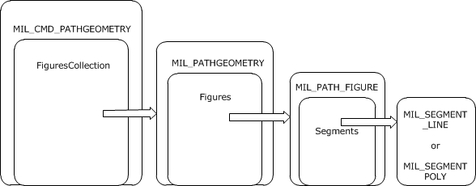

Figure 9: Layout of MILCMD_PATHGEOMETRY message

<a id="Section_3.2.5.5.4"></a>
##### 3.2.5.5.4 MILCMD_MESHGEOMETRY2D

After creating a TYPE_MESHGEOMETRY2D type [**resource**](#gt_resource), the server MUST configure the resource with a MILCMD_MESHGEOMETRY2D resource.

The target resource for this message MUST be of type TYPE_MESHGEOMETRY2D that represents a mesh that draws a 2-D shape by defining vertices and triangles. This message updates all properties of this resource.

This message requires the following four collections in order to build TYPE_MESHGEOMETRY2D resource:

- A variable-length array of Mil3DPoint structures that represents the vertices on the mesh.
- A variable-length array of MilPoint structures that represents the coordinates that define the brush-to-mesh mapping for each vertex. There MUST be exactly one per vertex.
- A variable-length array of 32-bit integers that represents the opacity of each vertex in the mesh. There MUST be exactly one entry in the opacity array per vertex.
- A variable-length array of 32-bit integers that represents the indices into the Positions collection that define the triangles. If this collection is empty, the triangles are implicitly defined by each set of three vertices, starting with the first, second and third, then the fourth, fifth and sixth, and so on.
<a id="Section_3.2.5.5.5"></a>
##### 3.2.5.5.5 MILCMD_GEOMETRY2DGROUP

After creating a TYPE_GEOMETRY2DGROUP [**resource**](#gt_resource) the server MUST send a MILCMD_GEOMETRY2DGROUP message targeting the new resource. This message updates all properties of this resource.

This message requires a variable-length array of [**handles**](#gt_handle) to resources of type TYPE_GEOMETRY2DGROUP or TYPE_MESHGEOMETRY2D that describes the 2-D geometry resources contained in this geometry 2-D group.

<a id="Section_3.2.5.5.6"></a>
##### 3.2.5.5.6 MILCMD_MESHGEOMETRY3D

After creating a TYPE_MESHGEOMETRY3D [**resource**](#gt_resource), the server MUST send a MILCMD_MESHGEOMETRY3D message targeting the new resource.

The TYPE_MESHGEOMETRY3D resource is a collection of vertices grouped in triads, each one representing a triangle to be drawn in 3-D space. Each vertex is represented by a spatial position, a color, and a texture coordinate. Triangles are represented as triads of indices into the vertex arrays.

This message updates all properties of this resource. This message requires the following 4 collections in order to build TYPE_MESHGEOMETRY3D resource:

- A variable-length array of Mil3DPoint structures that represents the vertices on the mesh.
- A variable-length array of MilPoint structures that represents the coordinates that define the brush-to-mesh mapping for each vertex. There MUST be exactly one entry in the coordinates array per vertex.
- A variable-length array of 32-bit integers that represents the indices into the Positions collection that define the triangles. If this collection is empty then the triangles are implicitly defined by each set of three vertices, starting with the first, second and third, then the fourth, fifth and sixth, and so on.
- A variable-length array of 32-bit integers that represents the color of each vertex in the mesh. These only work with DiffuseMaterial. There MUST be one color entry per vertex.
<a id="Section_3.2.5.5.7"></a>
##### 3.2.5.5.7 MILCMD_GEOMETRYMODEL3D

After creating a TYPE_GEOMETRYMODEL3D [**resource**](#gt_resource), the server MUST send a MILCMD_GEOMETRYMODEL3D message targeting the new resource.

A 3-D geometry model resource consists of a 3-D mesh geometry resource, a 3-D transform, and a brush that fills this geometry. This message updates all properties of this resource.

<a id="Section_3.2.5.6"></a>
#### 3.2.5.6 Manipulating Text Resources

<a id="Section_3.2.5.6.1"></a>
##### 3.2.5.6.1 MILCMD_GLYPHCACHE_ADDBITMAPS

The server MAY add [**glyph**](#gt_glyph) bitmaps to the glyph cache by sending this message for the targeted glyph cache. For details on message fields and usage, see sections [2.2.7.63](#Section_3.2.5.6.1) and [3.1.1.6](#Section_3.1.1.5.1.2). The glyph bitmaps included in the command's payload have MILCMD_GLYPHBITMAP headers followed by the glyph pixels (section [2.2.7.75](#Section_2.2.7.75)).

<a id="Section_3.2.5.6.2"></a>
##### 3.2.5.6.2 MILCMD_GLYPHCACHE_REMOVEBITMAPS

The server MAY remove [**glyph**](#gt_glyph) bitmaps from a glyph cache by sending this message for the targeted glyph cache. For details on message fields and usage, see sections [2.2.7.64](#Section_2.2.7.64) and [3.1.1.6](#Section_3.1.1.5.1.2).

<a id="Section_3.2.5.6.3"></a>
##### 3.2.5.6.3 MILCMD_GLYPHRUN_CREATE

The server MAY set [**glyph**](#gt_glyph) bitmaps to a [**glyph run**](#gt_glyph-run), by sending this message to the targeted TYPE_GLYPHRUN [**resource**](#gt_resource). For details on message fields and usage, see sections [2.2.7.65](#Section_2.2.7.65) and [3.1.1.6](#Section_3.1.1.5.1.2).

<a id="Section_3.2.5.6.4"></a>
##### 3.2.5.6.4 MILCMD_GLYPHRUN_ADDREALIZATION

The server MUST add at least one realization to all [**glyph runs**](#gt_glyph-run). It SHOULD do so by sending this command to the targeted TYPE_GLYPHRUN [**resource**](#gt_resource). For details on message fields and usage, see sections [2.2.7.66](#Section_2.2.7.66) and [3.1.1.6](#Section_3.1.1.5.1.2).

<a id="Section_3.2.5.6.5"></a>
##### 3.2.5.6.5 MILCMD_GLYPHRUN_REMOVEREALIZATION

The server MAY remove realization from a TYPE_GLYPHRUN by sending this command. For details on message fields and usage, see sections [2.2.7.67](#Section_2.2.7.67) and [3.1.1.6](#Section_3.1.1.5.1.2).

<a id="Section_3.2.5.7"></a>
#### 3.2.5.7 Manipulating and Handling Bitmap Resources

<a id="Section_3.2.5.7.1"></a>
##### 3.2.5.7.1 MILCMD_BITMAP_PIXELS

After creating a TYPE_BITMAPSOURCE type [**resource**](#gt_resource), the server MUST use this message to update the contents and attributes of the newly created TYPE_BITMAPSOURCE resource.

<a id="Section_3.2.5.7.2"></a>
##### 3.2.5.7.2 MILCMD_BITMAP_COMPRESSEDPIXELS

After creating a TYPE_BITMAPSOURCE, the server MUST use this message to update the contents and attributes of the newly created TYPE_BITMAPSOURCE [**resource**](#gt_resource). The payloaded png data contains the pixels and attributes for this resource.

<a id="Section_3.2.5.8"></a>
#### 3.2.5.8 Manipulating GDIBitmap Resources

<a id="Section_3.2.5.8.1"></a>
##### 3.2.5.8.1 MILCMD_GDISPRITEBITMAP

The server SHOULD set the [**logical surface**](#gt_logical-surface) [**handle**](#gt_handle) for a TYPE_GDISPRITEBITMAP by sending a MILCMD_GDISPRITEBITMAP message for the targeted [**resource**](#gt_resource). The server sets the logical surface handle to the **hlsurface** message field. This handle is used by the client to get [**surface**](#gt_surface) data and attributes for a surface created by the client in response to messages received as part of the protocols specified in [MS-RDPEDC](../MS-RDPEDC/MS-RDPEDC.md), [MS-RDPEGDI](../MS-RDPEGDI/MS-RDPEGDI.md), and [MS-RDPBCGR](../MS-RDPBCGR/MS-RDPBCGR.md).

<a id="Section_3.2.5.8.2"></a>
##### 3.2.5.8.2 MILCMD_GDISPRITEBITMAP_UPDATEMARGINS

The server MAY set the **margins** message field to the targeted resource **margins** attributes by sending a MILCMD_GDISPRITEBITMAP_UPDATEMARGINS message for the targeted [**resource**](#gt_resource). The margins specify what part of a [**sprite**](#gt_sprite) will be wrapped with a bitmap resource. The area of the sprite outside of these margins MUST NOT be drawn by the [**composition engine**](#gt_composition-engine).

<a id="Section_3.2.5.8.3"></a>
##### 3.2.5.8.3 MILCMD_GDISPRITEBITMAP_UPDATESURFACE

The server MAY set the **dxgiFmtRealization** message field values to the targeted [**resource**](#gt_resource) **pixelFormat** attribute.

<a id="Section_3.2.5.8.4"></a>
##### 3.2.5.8.4 MILCMD_GDISPRITEBITMAP_UNMAPSECTION

The MILCMD_GDISPRITEBITMAP_UNMAPSECTION packet indicates to the client that the [**sprite**](#gt_sprite) object referenced by this sprite [**resource**](#gt_resource) MUST NOT be modified any further. This situation can arise, for example, if the server implements visual animations for a closing [**window**](#gt_window). During the closing animation, the server can stop sending graphical updates to the window's sprite. The client MUST NOT release the sprite object at this time, but it can, for example, perform certain storage optimizations that are advantageous only if the sprite is static. The client MAY ignore this message.

<a id="Section_3.2.5.8.5"></a>
##### 3.2.5.8.5 MILCMD_GDISPRITEBITMAP_NOTIFYDIRTY

The server MAY notify the targeted [**resource**](#gt_resource) that the [**surface**](#gt_surface) identified by its [**logical surface**](#gt_logical-surface) [**handle**](#gt_handle) is dirty.

<a id="Section_3.2.5.9"></a>
#### 3.2.5.9 Manipulating Cached Visual Image Resources

<a id="Section_3.2.5.9.1"></a>
##### 3.2.5.9.1 MILCMD_CACHEDVISUALIMAGE

The server MAY update all attributes of the targeted cached visual image [**resource**](#gt_resource). The values in the message fields are set to the targeted resource attributes.

<a id="Section_3.2.5.9.2"></a>
##### 3.2.5.9.2 MILCMD_CACHEDVISUALIMAGE_FREEZE

The client MUST stop updating the targeted cached visual image [**resource**](#gt_resource) as a result of updates to the composition subtree whose [**rasterization**](#gt_rasterization) is cached.

<a id="Section_3.2.5.10"></a>
#### 3.2.5.10 Manipulating Brush Resources

<a id="Section_3.2.5.10.1"></a>
##### 3.2.5.10.1 MILCMD_SOLIDCOLORBRUSH

The server SHOULD update a TYPE_SOLIDCOLORBRUSH [**resource**](#gt_resource) by sending a MILCMD_SOLIDCOLORBRUSH command. The server MUST set requested attributes to corresponding message fields: **Opacity**, **color**, **hOpacityAnimations** resource (type TYPE_DOUBLERESOURCE), **hTransform** resource(TYPE_TRANSFORM), **hRelativeTransform** (TYPE_TRANSFORM), and **hColorAnimations** (TYPE_COLORRESOURCE).

<a id="Section_3.2.5.10.2"></a>
##### 3.2.5.10.2 MILCMD_LINEARGRADIENTBRUSH

The server SHOULD update a TYPE_LINEARGRADIENTBRUSH [**resource**](#gt_resource) by sending a MILCMD_LINEARGRADIENTBRUSH message. The server MUST set requested attributes to corresponding message fields (section [2.2.7.94](#Section_3.2.5.10.2)).

<a id="Section_3.2.5.10.3"></a>
##### 3.2.5.10.3 MILCMD_IMAGEBRUSH

The server SHOULD update a TYPE_IMAGEBRUSH [**resource**](#gt_resource) by sending a MILCMD_IMAGEBRUSH message. The server MUST set requested attributes to corresponding message fields (section [2.2.7.94](#Section_3.2.5.10.2)).

<a id="Section_3.2.5.11"></a>
#### 3.2.5.11 Manipulating Transform Resources

<a id="Section_3.2.5.11.1"></a>
##### 3.2.5.11.1 MILCMD_MATRIXTRANSFORM

The server SHOULD send this message to update all the properties of a TYPE_MATRIXRESOURCE [**resource**](#gt_resource). This resource represents an arbitrary affine matrix transformation that is used to manipulate objects or coordinate systems in 2-D space.

This message consists of a Mil3x2Matrix structure that defines this transform.

An optional resource [**handle**](#gt_handle) referencing resource of type TYPE_MATRIXRESOURCE can also be provided. This optional resource animates the value of the matrix property. When TYPE_MATRIXRESOURCE resource is modified using MILCMD_MATRIXRESOURCE (section [2.2.7.16](#Section_2.2.7.16)), it notifies the TYPE_MATRIXTRANSFORM resources to which it has been attached.

<a id="Section_3.2.5.11.2"></a>
##### 3.2.5.11.2 MILCMD_TRANSLATETRANSFORM

The server SHOULD send this message to update all the properties of a TYPE_TRANSLATETRANSFORM [**resource**](#gt_resource).

This message consists of two 64-bit floating-point numbers that provide the translation along the x- and y-axes.

Two optional resource [**handles**](#gt_handle) referencing resources of type TYPE_DOUBLERESOURCE can also be provided. These optional resources animate the X and Y translation of this resource. When TYPE_DOUBLERESOURCE resource is modified using MILCMD_DOUBLERESOURCE (section [2.2.7.11](#Section_2.2.7.11)), it notifies the TYPE_TRANSLATETRANSFORM resources to which it has been attached.

<a id="Section_3.2.5.11.3"></a>
##### 3.2.5.11.3 MILCMD_SCALETRANSFORM

The server SHOULD send this message to update all the properties of a TYPE_SCALETRANSFORM [**resource**](#gt_resource).

This message consists of two 64-bit floating-point numbers that provide the amount to stretch or shrink along x- and y-axes.

This message consists of two 64-bit floating-point numbers that provide the center coordinates of the scaling.

Four optional resource handles referencing resources of type TYPE_DOUBLERESOURCE can also be provided. These optional resources animate the scaleX, scaleY, centerX, and centerY of this resource. When TYPE_DOUBLERESOURCE resource is modified using MILCMD_DOUBLERESOURCE (section [2.2.7.11](#Section_2.2.7.11)), it notifies the TYPE_SCALETRANSFORM resources to which it has been attached.

<a id="Section_3.2.5.11.4"></a>
##### 3.2.5.11.4 MILCMD_TRANSFORMGROUP

The server SHOULD send this message to update all the properties of a TYPE_TRANSFORMGROUP [**resource**](#gt_resource).

This message has a variable-length array of [**handles**](#gt_handle) to resources of type TYPE_TRANSFORM. Any resource of type TYPE_TRANSLATETRANSFORM, TYPE_SCALETRANSFORM, TYPE_MATRIXTRANSFORM, and TYPE_TRANSFORMGROUP can be passed in this array.

<a id="Section_3.2.5.12"></a>
#### 3.2.5.12 Manipulating Value Resources

Value [**resources**](#gt_resource) are resources that contain a single typed value. Value resources are of the following types: TYPE_DOUBLERESOURCE, TYPE_COLORRESOURCE, TYPE_POINTRESOURCE, TYPE_RECTRESOURCE, TYPE_MATRIXRESOURCE, and TYPE_COLORTRANSFORMRESOURCE.

All value resources have a single corresponding message defined. The server MAY manipulate a value resource command by sending a message with the value field set to the desired value, for the targeted value resource.

The corresponding value resource messages are: MILCMD_DOUBLERESOURCE, MILCMD_COLORRESOURCE, MILCMD_POINTRESOURCE, MILCMD_RECTRESOURCE, MILCMD_SIZERESOURCE, MILCMD_MATRIXRESOURCE, and MILCMD_COLORTRANSFORMRESOURCE.

<a id="Section_3.2.5.13"></a>
#### 3.2.5.13 Manipulating Drawing Instruction Streams

Drawing stream instructions are command buffers contained in TYPE_RENDERDATA [**resources**](#gt_resource) (section [3.1.1.7](#Section_3.1.1.7)). These resources are set as content of TYPE_VISUAL or TYPE_WINDOWNODE resources. During a render walk of the tree, the contents of the TYPE_RENDERDATA resources of all visuals are rendered at the visuals' current transform, clip, and opacity context. When a visual is rendered, any drawing will be affected by the visuals offset, transform, and clip. In addition, the visuals in the parent chain will also contribute their offset, transform, and clip as the tree is walked for rendering. The combination will produce a modified coordinate space in which the visual is rendered.

To draw in a visual, the server MAY create a TYPE_RENDERDATA resource. To do this, the server sets a drawing instruction buffer to the TYPE_RENDERDATA resource by sending a MILCMD_RENDERDATA message to the TYPE_RENDERDATA resource, with the TYPE_RENDERDATA sent as content of a TYPE_VISUAL or TYPE_WINDOWNODE resource.

<a id="Section_3.2.5.13.1"></a>
##### 3.2.5.13.1 MILCMD_RENDERDATA

The server SHOULD build a render data instruction buffer for a TYPE_RENDERDATA [**resource**](#gt_resource) with the following drawing instructions:

**MILCMD_DRAW_BITMAP:** Draws the specified **hBitmap** resource at its native size.

**MILCMD_DRAW_GLASS:** Executes a Gaussian blur effect of the existing render target pixels in the areas specified by the four geometry resources.

**MILCMD_DRAW_MESH2D:** Draws the mesh geometry specified by the **hMesh** parameter by using hImageSource as the source texture.

**MILCMD_DRAW_VISUAL:** Draws the visual tree as specified by the **hVisual** parameter.

**MILCMD_DRAW:** Fills the rectangle shape specified by the rectangle parameter with the **hBrush** specified in the command.

**MILCMD_DRAW_RECTANGLE:** Fills the shape specified by the **hRectangleAnimations** resource. If **hRectangleAnimations** is null, then the shape will be specified by the rectangle parameter. The rectangle shape will be filled with the **hBrush** specified in the instruction.

**MILCMD_DRAW_GEOMETRY:** Fills the current shape specified by the **hGeometry** parameter with the **hBrush** specified in the instruction.

**MILCMD_DRAW_IMAGE:** Draws the image specified by the **hImageSource** parameter into the rectangle specified by the rectangle parameter.

**MILCMD_DRAW_IMAGE_ANIMATE:** Draws the image specified by the **hImageSource** parameter into the rectangle shape specified by the **hRectangleAnimations** resource. If **hRectangleAnimations** is null, then the shape will be specified by the rectangle parameter.

**MILCMD_DRAW_GLYPH_RUN:** Draws the [**glyphs**](#gt_glyph) specified in the **hGlyphRun** resource with the brush specified by the **hForegroundBrush** parameter.

**MILCMD_DRAW_SCENE3D:** Draws the 3-D scene as described by the TYPE_SCENE3D**hScene3D** resource.

**MILCMD_PUSH_CLIP:** Ensures that all future drawing is clipped by the specified **hClipGeometry** resource. When the matching MILCMD_POP render data instruction is processed, the drawing will no longer be clipped.

**MILCMD_PUSH_OPACITY:** Ensures that all future drawing is collected into an intermediate render target resource. When the matching MILCMD_POP render data instruction is processed, the intermediate render target must be blended with a fixed alpha value as specified by the **opacity** parameter.

**MILCMD_PUSH_OPACITY_ANIMATE:** Ensures that all future drawing is collected into an intermediate render target resource. When the matching MILCMD_POP render data instruction is processed, the intermediate render target must be blended with a fixed alpha value as specified by the **hOpacityAnimations** resource. If **hOpacityAnimations** is null, then the opacity is specified by the **opacity** parameter.

**MILCMD_PUSH_TRANSFORM:** Ensures that all future drawing is transformed by the **hTransform** resource. When the matching MILCMD_POP render data instruction is processed, the drawing will no longer be transformed.

**MILCMD_POP:** Ends the previous MILCMD_PUSH_CLIP, MILCMD_PUSH_OPACITY, MILCMD_PUSH_OPACITY_ANIMATE, or MILCMD_PUSH_TRANSFORM instruction. The changes to rendering that were affected by the previous push instruction will be undone and all state restored.

<a id="Section_3.2.5.14"></a>
#### 3.2.5.14 Manipulating 3-D Scenes

The server MAY request the rendering of 3-D scenes by creating TYPE_SCENE3D [**resources**](#gt_resource).

<a id="Section_3.2.5.14.1"></a>
##### 3.2.5.14.1 MILCMD_SCENE3D

The server MUST send this message to configure TYPE_SCENE3D [**resources**](#gt_resource). See sections [2.2.7.76](#Section_2.2.7.76) and [3.1.1.5.2.6](#Section_3.1.1.5.2.6) for message field and usage details. The TYPE_SCENE3D resource requires the following resources:

- A TYPE_MODEL3DGROUP resource that contains an array of TYPE_GEOMETRYMODEL3D. The array contains TYPE_MESHGEOMETRY3D resources describing the scene.
- A TYPE_CAMERA resource used for the 3-D projection.
- A TYPE_RECTRESOURCE resource for the viewport or a MilRect viewport value.
<a id="Section_3.2.5.14.2"></a>
##### 3.2.5.14.2 MILCMD_MODEL3DGROUP

The server MUST send this message to set an array of TYPE_GEOMETRYMODEL3D [**resources**](#gt_resource) on a TYPE_MODEL3DGROUP resource. See sections [2.2.7.78](#Section_2.2.7.78) and [3.1.1.5.2.6](#Section_3.1.1.5.2.6) for message field and usage details.

<a id="Section_3.2.5.14.3"></a>
##### 3.2.5.14.3 MILCMD_GEOMETRYMODEL3D

The server MUST send this message to set a MILCMD_MESHGEOMETRY3D [**resource**](#gt_resource) on a TYPE_GEOMETRYMODEL3D resource. See sections [2.2.7.80](#Section_2.2.7.80) and [3.1.1.5.2.6](#Section_3.1.1.5.2.6) for message field and usage details.

<a id="Section_3.2.5.14.4"></a>
##### 3.2.5.14.4 MILCMD_MATRIXCAMERA

The server MUST send this message to set camera parameters on a 3-D projection camera used to render a 3-D scene. See sections [2.2.7.77](#Section_2.2.7.77) and [3.1.1.5.2.6](#Section_3.1.1.5.2.6) for message field and usage details.

<a id="Section_3.2.5.14.5"></a>
##### 3.2.5.14.5 MILCMD_MATRIXTRANSFORM3D

The server MUST send this message to set the transform matrix on a TYPE_MATRIXTRANSFORM3D transform. See sections [2.2.7.84](#Section_2.2.7.84) and [3.1.1.5.2.6](#Section_3.1.1.5.2.6) for message field and usage details.

<a id="Section_3.2.5.15"></a>
#### 3.2.5.15 Closing the Connection

To gracefully close a [**connection**](#gt_connection), the server MUST do the following:

- Delete all [**resources**](#gt_resource) by using the [MILCMD_CHANNEL_DELETERESOURCE (section 2.2.7.7)](#Section_2.2.7.7) message.
- Close the [**channel**](#gt_channel) by using the [MILCTRLCMD_CLOSECHANNEL (section 2.2.5.6)](#Section_2.2.5.6) message.
- Close the connection by using the [MILCTRLCMD_CLOSECONNECTION (section 2.2.5.4)](#Section_2.2.5.4) message.
<a id="Section_3.2.6"></a>
### 3.2.6 Timer Events

None.

<a id="Section_3.2.7"></a>
### 3.2.7 Other Local Events

None.

<a id="Section_3.3"></a>
## 3.3 Client Details

<a id="Section_3.3.1"></a>
### 3.3.1 Abstract Data Model

None.

<a id="Section_3.3.2"></a>
### 3.3.2 Timers

None.

<a id="Section_3.3.3"></a>
### 3.3.3 Initialization

In this protocol, the server opens [**connections**](#gt_connection) to the client. The client MUST manage incoming connections by observing the encapsulating protocol. Each connection MAY define its own protocol version. Although this document contains only one version, and it is the first and only version of this protocol, a client MUST perform the version negotiation steps specified in section [3.1.3](#Section_1.3), for future compatibility.

<a id="Section_3.3.4"></a>
### 3.3.4 Higher-Layer Triggered Events

If a dynamic virtual [**channel**](#gt_channel) associated with a [**connection**](#gt_connection) is terminated [MS-RDPEDYC](../MS-RDPEDYC/MS-RDPEDYC.md), the client MUST release all the system [**resources**](#gt_resource) that are associated with that connection. The client MUST also break the hosting relationship between that connection and its parent connection, if one exists. As a result, the client MUST recompose the rendering target of the parent connection as if the server had gracefully closed the child connection. For more information, see section [3.2.5.15](#Section_3.2.5.15).

<a id="Section_3.3.5"></a>
### 3.3.5 Processing Events and Sequencing Rules

The client processes all messages by parsing headers that identify the message type. All messages received by the client through the transport are [**connection**](#gt_connection) control messages. The type of connection control message is specified by the first four bytes of the message. If the server specifies a message type that is not one of the messages in section [2.2.5](#Section_2.2.5), the server has issued an invalid message and the client MUST close the connection. For all messages that MUST contain a payload composed of other messages, the server MUST specify valid message types. That is, if the client cannot correctly identify one of the enclosed messages, the server has issued an invalid message packet and the client MUST close the connection. Connection messages received over a dynamic virtual [**channel**](#gt_channel) as specified by [MS-RDPEDC](../MS-RDPEDC/MS-RDPEDC.md) belong to the same connection.

<a id="Section_3.3.5.1"></a>
#### 3.3.5.1 Connection Control Messages and Notifications

**Connection control messages:** Connection control messages are handled as follows:

**MILCTRLCMD_OPENCONNECTION:** The client MUST initialize the state necessary to process messages for this [**connection**](#gt_connection). This is the first message expected on a newly opened dynamic virtual [**channel**](#gt_channel).

**MILCTRLCMD_CLOSECONNECTION:** The dynamic virtual channel for this connection is about to be closed. The client MUST release all data structures associated with this connection. Any other messages received on this connection MUST be ignored.

**MILCTRLCMD_VERSIONREQUEST:** The server is requesting the list of supported protocol versions. The client MUST respond with a [MILMSG_VERSIONREPLY message (section 2.2.9.3)](#Section_2.2.9.3).

**MILCTRLCMD_VERSIONANNOUNCEMENT:** This message specifies the version that the server will use on this connection.

**MILCTRLCMD_OPENCHANNEL, MILCTRLCMD_CLOSECHANNEL, and MILCTRLCMD_DATAONCHANNEL:** These messages are used to open and close channels and to send data on channels within a connection. Section [3.3.5.1.1](#Section_3.3.5.1.1) describes these messages in more detail.

**MILCTRLCMD_HANDLESURFACEMANAGEREVENT:** This connection will render [**surfaces**](#gt_surface) created by the [MS-RDPEDC](../MS-RDPEDC/MS-RDPEDC.md) protocol.

**Notifications:** There are two types of notifications: connection notifications and channel notifications. Connection notifications are scoped to the entire connection and are sent using MILCTRLCMD_CONNECTIONNOTIFICATION. Channel notifications can be sent using MILCTRLCMD_CHANNELNOTIFICATION and MILCTRLCMD_CONNECTIONBROADCAST.

The MILCTRLCMD_CONNECTIONNOTIFICATION payload is a connection notification that can be one of the following:

**MILMSG_VERSIONREPLY:** The client MUST send this notification in response to a MILCTRLCMD_VERSIONREQUEST message.

**MILMSG_CONNECTIONLOST:** The client MUST send this notification when it is about to terminate a connection.

The MILCTRLCMD_CHANNELNOTIFICATION includes a channel notification payload that MAY be sent as a response to channel message. The **channelHandle** field of the message contains the originating channel. The notification can be any notification described in section [2.2.9](#Section_2.2.9). Applicable sending rules are described in section [3.3.5](#Section_1.3).

<a id="Section_3.3.5.1.1"></a>
##### 3.3.5.1.1 Channel Messages

When receiving a MILCTRLCMD_OPENCHANNEL message, the client MUST create state that will allow it to [**handle**](#gt_handle) [**resource**](#gt_resource) manipulation [**channel**](#gt_channel) messages on the new channel. The new channel is identified by the **channelHandle** field of the MILCTRLCMD_OPENCHANNEL channel message. When a new channel is created, if the **sourceChannelHandle** field is not NULL, the new channel is related to the set to which the specified existing channel belongs. If the field is NULL, a new set of related channels is implicitly created. Related channels can have resources duplicated from one to the other.

When receiving a MILCTRLCMD_DATAONCHANNEL message, the client MUST interpret the data at the message payload offset as a channel message, and process that channel message. Channel messages are either resource lifetime messages or resource manipulation messages. Lifetime messages are used for the creation and destruction of resources, while resource manipulation messages update apply fields pay-loaded by the message to resource attributes.

All channel messages MUST be processed in the order in which they are received. All channel messages have the same header that contains the following fields:

**messageSize:** Size of the message.

**controlCode:** Value identifying the message type.

**targetResource:** Handle to a resource for which the message applies.

A protocol error notification must be sent to the server if any of the following criteria are met:

- The target resource handle lookup fails.
- The target resource type does not match the message resource type.
- The message processing for the targeted resource generates a failure.
<a id="Section_3.3.5.1.2"></a>
##### 3.3.5.1.2 Processing Resource Lifetime Messages

[**Resources**](#gt_resource) are created and destroyed in response to resource create and destroy [**channel**](#gt_channel) messages.

**MILCMD_CHANNEL_CREATERESOURCE:** When the client receives a MILCMD_CHANNEL_CREATERESOURCE message, it creates a new resource of the type in the resType field of the message and assigns the new resources to the [**handle**](#gt_handle) in the **hNewResource** field of the message. All processing of subsequent messages targeting **hNewResource** MUST be performed for the resource assigned to handle **hNewResource**. If a message type does not match the resource type, a protocol error has occurred and the client MUST send an error notification message.

**MILCMD_CHANNEL_DELETERESOURCE:** When the client receives a MILCMD_CHANNEL_DELETERESOURCE message, it MUST remove the handle assignment to the referenced resource. No other messages are expected for this resource. Messages sent to an allocated handle are a protocol error.

**MILCMD_CHANNEL_DUPLICATEHANDLE:** When a client receives a MILCMD_CHANNEL_DUPLICATEHANDLE message, the resource referenced by the **Original** field (located on the receiving channel) MUST also be associated with the handle in the **Duplicate** field (located on the channel specified by the **TargetChannel** field).

The source and destination channels MUST be part of a set of related channels. Related channels are defined in section [3.3.5.1.1](#Section_3.3.5.1.1). Duplication is permitted only between any two channels belonging to the same set.

<a id="Section_3.3.5.2"></a>
#### 3.3.5.2 Processing Render Target Messages

The render target is the topmost [**resource**](#gt_resource) of the composition tree. When receiving a MILCMD_CHANNEL_CREATERESOURCE message, the client MUST create a render target with the type set to TYPE_DESKTOPRENDERTARGET. After creation, the render target is configured with a MILCMD_HWNDTARGET_CREATE message. The client MUST set the following attributes to values from the MILCMD_HWNDTARGET_CREATE fields:

**clearColor:** The clear color of the target.

**width, height:** The size of the render target.

<a id="Section_3.3.5.2.1"></a>
##### 3.3.5.2.1 MILCMD_HWNDTARGET_CREATE

When processing this message, the client MUST set the **width**, **height**, and **clearColor** message fields values to the targeted render target attributes.

<a id="Section_3.3.5.2.2"></a>
##### 3.3.5.2.2 MILCMD_TARGET_SETROOT

When processing this message, the client MUST set the visual dereferenced by the **hRoot** message field as the targeted render target root. If **hRoot** does not dereference a visual [**resource**](#gt_resource), a protocol error MUST be sent to the server.

<a id="Section_3.3.5.2.3"></a>
##### 3.3.5.2.3 MILCMD_TARGET_SETCLEARCOLOR

When processing this message, the client MUST set the color specified in the **clearColor** message field as the targeted render target clear color.

<a id="Section_3.3.5.2.4"></a>
##### 3.3.5.2.4 MILCMD_TARGET_CAPTUREBITS

This message is sent by the server to request a copy of render target contents. The client must respond by sending a MILMSG_CAPTUREBITSREPLY notification containing a copy of the render target pixels. This message MUST be sent on the backchannel corresponding to the [**channel**](#gt_channel) on which the MILCMD_TARGET_CAPTUREBITS message was received. The MILCMD_TARGET_CAPTUREBITS fields are used as follows:

**x, y:** Specify the offsets in render target coordinates from which pixels are to be read.

**width, height:** The width and height of capture area in render target coordinates.

**dxgiFormat:** The DXGI_FORMAT pixel format for the returned render target area.

<a id="Section_3.3.5.2.5"></a>
##### 3.3.5.2.5 MILCMD_METABITMAPRENDERTARGET_CREATE

The client MUST configure the targeted TYPE_METABITMAPRENDERTARGET [**resource**](#gt_resource) as follows.

The targeted resource MUST be configured to have the same settings as the current TYPE_DESKTOPTRENDERTARGET resource.

The following fields of the MILCMD_HWNDTARGET_CREATE message MUST exactly match the [**desktop**](#gt_desktop) render target: **width**, **height**, **clearColor**, **flags**, and **preFilteringDisabled**.

The meta bitmap render target MUST use the same root visual that the desktop render target uses. This root visual was sent to the desktop render target via the MILCMD_TARGET_SETROOT message. If no current desktop render target exists, then the command MUST succeed but the resource MUST return a failure in response to future MILCMD_METABITMAPRENDERTARGET_CAPTUREBITS request messages.

<a id="Section_3.3.5.2.6"></a>
##### 3.3.5.2.6 MILCMD_METABITMAPRENDERTARGET_CAPTUREBITS

The command indicates that the server requests the retrieval of a captured bitmap from the meta bitmap render target. The capture bitmap size is specified by the Width and Height fields.

First, the meta bitmap render target MUST refresh its parameters as specified via the **UpdateParam** field. Then, it MUST re-render the content in the area to be captured. Finally, it MUST reply on the back [**channel**](#gt_channel) with a MILMSG_METARTCAPTUREBITSREPLY.

The reply message MUST fill in the **SurfaceOffsets** field with a **SurfacesCount** of 1 and set the **DxgiFormat**, **Width**, and **Height** in the reply to the same format as originally requested by the caller. The pixels field MUST contain a PNG representation of the captured bitmap. The **Surfaces** subfield of the **SurfaceOffsets** field MUST contain a nonzero **AdapterID** field and a nonzero **MonitorID** field that uniquely identify the display adapter and monitor of the client machine. The **Surfaces** subfield of the **SurfaceOffsets** field MUST also have the **Offset** field set to zero, indicating that the PNG bitmap data directly follows the message reply header.

On success, the **cbData** field of the response MUST be set to the size, in bytes, of the PNG bitmap, and the **hr** field must be set to 0. If any failures occur, then the reply message must instead set the **cbSize** field to zero and set the **hr** field to 0x80004005.

<a id="Section_3.3.5.2.7"></a>
##### 3.3.5.2.7 MILCMD_METABITMAPRENDERTARGET_SETTRANSFORM

When the client receives a MILCMD_METABITMAPRENDERTARGET_SETTRANSFORM message, it MUST use the **hTransform** field [**resource**](#gt_resource) (which MUST be of TYPE_TRANSFORM) as the initial transform when rendering its root visual. This will enable the meta bitmap render target to draw a transformed view of the [**desktop**](#gt_desktop).

<a id="Section_3.3.5.2.8"></a>
##### 3.3.5.2.8 MILCMD_METABITMAPRENDERTARGET_SETCOLORTRANSFORM

When the client receives a MILCMD_METABITMAPRENDERTARGET_SETCOLORTRANSFORM message, it MUST use the **hTransform** field [**resource**](#gt_resource) (which must be of TYPE_COLORTRANSFORMRESOURCE) as the initial color transform when rendering its root visual. This will enable the meta bitmap render target to draw the [**desktop**](#gt_desktop) with a color transform.

<a id="Section_3.3.5.2.9"></a>
##### 3.3.5.2.9 MILCMD_METABITMAPRENDERTARGET_SETFILTERLIST

When the client receives a MILCMD_METABITMAPRENDERTARGET_SETFILTERLIST message, it MUST use the **hIncExcVisuals** field [**resource**](#gt_resource) (which must be of TYPE_VISUALGROUP) as a list of visual resources that MUST NOT be rendered during the processing of a MILCMD_METABITMAPRENDERTARGET_CAPTUREBITS message. This will allow the meta bitmap render target to draw the [**desktop**](#gt_desktop) but selectively exclude certain visual resources during the rendering.

<a id="Section_3.3.5.3"></a>
#### 3.3.5.3 Processing Visual Resource Messages

Visuals are used as nodes in [**scene graph**](#gt_scene-graph) built as a result of decoding this protocol. The client MUST create a visual when decoding a MILCMD_CHANNEL_CREATERESOURCE message with the **resource type** field set to TYPE_VISUAL.

<a id="Section_3.3.5.3.1"></a>
##### 3.3.5.3.1 MILCMD_VISUAL_INSERTCHILDAT

When processing a MILCMD_VISUAL_INSERTCHILDAT message, the client MUST insert the visual dereferenced by the **hChild** message field into the targeted visual's child array at the index message field.

<a id="Section_3.3.5.3.2"></a>
##### 3.3.5.3.2 MILCMD_VISUAL_REMOVECHILD

When processing this message, the client MUST remove the visual dereferenced by the message **hChild** field from the targeted visual's child array.

<a id="Section_3.3.5.3.3"></a>
##### 3.3.5.3.3 MILCMD_VISUAL_REMOVEALLCHILDREN

When processing this message, the client MUST remove all visual [**resource**](#gt_resource) children from the targeted visual's child array.

<a id="Section_3.3.5.3.4"></a>
##### 3.3.5.3.4 MILCMD_VISUAL_SETOFFSET

When processing a MILCMD_VISUAL_SETOFFSET message, the client MUST set an offset transform defined by **offsetX** and **offsetY** message fields on the targeted visual, where **offsetX** is the horizontal offset and **offsetY** is the vertical offset.

<a id="Section_3.3.5.3.5"></a>
##### 3.3.5.3.5 MILCMD_VISUAL_SETTRANSFORM

When processing a MILCMD_VISUAL_SETTRANSFORM message, the client MUST set the transform [**resource**](#gt_resource) dereferenced by the **hTransform** message field on the targeted visual. If **hTransform** does not dereference a transform resource, a protocol error MUST be returned to the server.

<a id="Section_3.3.5.3.6"></a>
##### 3.3.5.3.6 MILCMD_VISUAL_SETCLIP

When processing a MILCMD_VISUAL_SETCLIP message, the client MUST set the geometry [**resource**](#gt_resource) dereferenced by **hClip** message field as a clip on the targeted visual. If **hClip** does not dereference a geometry resource, a protocol error must be returned to the server.

<a id="Section_3.3.5.3.7"></a>
##### 3.3.5.3.7 MILCMD_VISUAL_SETALPHA

When processing a MILCMD_VISUAL_SETALPHA message, the client MUST set the alpha value specified in the **alpha** message field on the targeted visual.

<a id="Section_3.3.5.3.8"></a>
##### 3.3.5.3.8 MILCMD_VISUAL_SETRENDEROPTIONS

When processing a MILCMD_VISUAL_SETRENDEROPTIONS message, the client MUST set the target visual's render options to the **renderOptions** message field. See section [2.2.3.14](#Section_2.2.3.14) MilRenderOptions for details on render options.

<a id="Section_3.3.5.3.9"></a>
##### 3.3.5.3.9 MILCMD_VISUAL_SETCONTENT

When processing a MILCMD_VISUAL_SETCONTENT message, the client MUST set the render data [**resource**](#gt_resource) dereferenced by the **hContent** message field as the targeted visual's render data. If **hContent** does not dereference a render data resource, a protocol error MUST be returned.

<a id="Section_3.3.5.3.10"></a>
##### 3.3.5.3.10 MILCMD_VISUAL_SETCOLORTRANSFORM

When processing a MILCMD_VISUAL_SETCOLORTRANSFORM message, the client MUST set the transform dereferenced by the **hTransform** message field as the targeted visual's color transform. This [**resource**](#gt_resource) represents the transformation that is applied to each pixel of the final [**rasterization**](#gt_rasterization) of this visual, before this visual is blended with the background.

<a id="Section_3.3.5.3.11"></a>
##### 3.3.5.3.11 MILCMD_VISUAL_ADDRENDERPARAMETER

When processing a MILCMD_VISUAL_ADDRENDERPARAMETER message, the client MUST set the targeted visual's render parameter to the **RenderParameter** message field. [2.2.3.17](#Section_2.2.3.17) defines values for render parameters.

<a id="Section_3.3.5.3.12"></a>
##### 3.3.5.3.12 MILCMD_VISUAL_REMOVERENDERPARAMETER

When processing a MILCMD_VISUAL_REMOVERENDERPARAMETER message, the client MUST remove the render parameter of the type specified by the **ParameterType** message field.

<a id="Section_3.3.5.3.13"></a>
##### 3.3.5.3.13 MILCMD_VISUAL SETCONEXTUALIZEDOPACITY

This message enables or disables contextualized opacity according to the value of the **ContextualizedOpacity** message field. When the **ContextualizedOpacity** field is set to TRUE, the server MUST decide the opacity of the visual by using the following algorithm:

- If the render target requires cursors—that is, if the meta bitmap render target has IncludeCursors set to 0x1 using the MILCMD_METABITMAPRENDERTARGET_CAPTUREBITS message:
- If the visual has been activated in a capture render pass by using MILCMD_VISUAL_SETRENDERFORCAPTURE, the *ContextualizedOpacityMultiplier* rendering parameter (section [2.2.3.17](#Section_2.2.3.17)) for the specified visual will be used to derive the effective opacity of the visual.
- If the visual has not been activated in a capture render pass, its opacity will be determined by the original opacity of the node (set using the MILCMD_VISUAL_SETALPHA message) as follows:
- If the opacity was originally set to zero, the opacity MUST be set to 1.0. (The visual MUST be made fully opaque.)
- If the opacity was originally set to a nonzero value, the original opacity value will be preserved.
- If the render target does not require cursors, the *ContextualizedOpacityMultiplier* rendering parameter of the specified visual MUST be used to derive the effective opacity of the node. This is the default case.
<a id="Section_3.3.5.3.14"></a>
##### 3.3.5.3.14 MILCMD_VISUAL_SETCOLORTRANSFORMROOT

The client MUST treat the targeted visual as the visual tree root if **fColorTransformRoot** is set to TRUE.

<a id="Section_3.3.5.3.15"></a>
##### 3.3.5.3.15 MILCMD_VISUAL_SETRENDERFORCAPTURE

The targeted visual MUST NOT be included when rendering for a render-target capture, if the **renderForCapture** message field is set to TRUE.

<a id="Section_3.3.5.4"></a>
#### 3.3.5.4 Processing Window Node Messages

The client MUST create a visual when decoding a MILCMD_CHANNEL_CREATERESOURCE message with the **resource type** field set to TYPE_WINDOWNODE.

<a id="Section_3.3.5.4.1"></a>
##### 3.3.5.4.1 MILCMD_WINDOWNODE_CREATE

When processing this message, the client MUST set the targeted [**window**](#gt_window) node attributes to the values from the message fields.

<a id="Section_3.3.5.4.2"></a>
##### 3.3.5.4.2 MILCMD_WINDOWNODE_SETBOUNDS

When processing this message, the client MUST set bounds of the targeted [**window**](#gt_window) node [**resource**](#gt_resource) attributes to the bounds from the message fields.

<a id="Section_3.3.5.4.3"></a>
##### 3.3.5.4.3 MILCMD_WINDOWNODE_SETSPRITEIMAGE

When processing this message, the client MUST set the GdiSpriteBitmap dereferenced by the **hImage** message field as the targeted [**window**](#gt_window) nodes **spriteImage** bitmap. If **hImage** does not dereference a TYPE_GDISPRITEBITMAP [**resource**](#gt_resource), a protocol error must be returned to the server.

<a id="Section_3.3.5.4.4"></a>
##### 3.3.5.4.4 MILCMD_WINDOWNODE_SETLOGICALSURFACEIMAGE

When processing this message, the client MUST set the GdiSpriteBitmap dereferenced by the **hImage** message field as the targeted [**window**](#gt_window) node's **logicalSurfaceImage** bitmap. If **hImage** does not dereference a TYPE_GDISPRITEBITMAP, a protocol error must be returned.

<a id="Section_3.3.5.4.5"></a>
##### 3.3.5.4.5 MILCMD_WINDOWNODE_SETSPRITECLIP

When processing this message, the client MUST set the geometry [**resource**](#gt_resource) dereferenced by the **hClip** message field as the clip to be used when rendering the targeted [**window**](#gt_window) node **spriteImage** bitmap. If **hClip** does not dereference a TYPE_PATHGEOMETRY resource, a protocol error must be returned to the server.

<a id="Section_3.3.5.4.6"></a>
##### 3.3.5.4.6 MILCMD_WINDOWNODE_SETDXCLIP

When processing this message, the client MUST set the geometry [**resource**](#gt_resource) dereferenced by the **hClip** message field as the clip to be used when rendering the targeted [**window**](#gt_window) node **logicalSurfaceImage** bitmap. If **hClip** does not dereference a TYPE_PATHGEOMETRY resource, a protocol error MUST be returned to the server.

<a id="Section_3.3.5.4.7"></a>
##### 3.3.5.4.7 MILCMD_WINDOWNODE_SETSOURCEMODIFICATIONS

When processing this message, the client MUST set the targeted [**window**](#gt_window) node's source modification and color key attributes to the message **source modification** and **color key** fields.

Specifies how the content of the targeted window node MUST be blended with the background:

**sourceModifications:** Contains the modification flags (**MilSourceModification**).

**LowColorKey:** Contains the low end of the color range, which will be drawn as transparent. This field is meaningful only if the **sourceModifications** field is set to ColorKey (0x00000002). This is in B8R8G8A8 format.

**HighColorKey:** Contains the high end of the color range, which will be drawn as transparent. This field is meaningful only if the **sourceModifications** field is set to ColorKey (0x00000002). This is in B8R8G8A8 format.

<a id="Section_3.3.5.4.8"></a>
##### 3.3.5.4.8 MILCMD_WINDOWNODE_SETALPHAMARGINS

When processing this message, the client MUST set the targeted [**window**](#gt_window) alpha margins attribute to the margins specified in the **margins** message field.

<a id="Section_3.3.5.4.9"></a>
##### 3.3.5.4.9 MILCMD_WINDOWNODE_SETCOMPOSEONCE

The fComposeOnce message field specifies whether the targeted [**window**](#gt_window) node MUST be marked as a **composed-once** visual. A visual marked for **composed-once** accumulates rendering instructions like a normal visual, but the instructions are executed only once at the next available composition pass, and then they are discarded. This construct is useful for emulating direct writes to the screen in a composed [**desktop**](#gt_desktop) environment.

<a id="Section_3.3.5.4.10"></a>
##### 3.3.5.4.10 MILCMD_WINDOWNODE_COPYCOMPOSITOROWNEDRESOURCES

Indicates that the [**sprite**](#gt_sprite) and [**logical surface**](#gt_logical-surface) clips are to be copied from the [**window**](#gt_window) node dereferenced by the **hSourceNode** field to the targeted window node.

<a id="Section_3.3.5.4.11"></a>
##### 3.3.5.4.11 MILCMD_WINDOWNODE_SETMAXIMIZEDCLIPMARGINS

When processing this message, the client MUST copy the margins from the message's **maximizedClipMargins** field to the targeted [**window**](#gt_window) node **clip margins**.

<a id="Section_3.3.5.4.12"></a>
##### 3.3.5.4.12 MILCMD_WINDOWNODE_PROTECTCONTENT

Specifies that the contents of the targeted [**window**](#gt_window) node MUST be replaced with a black rectangle when rendering for filling a capture or read-back request. When processing this command, the client MUST mark the targeted window node for rendering as described above.

<a id="Section_3.3.5.5"></a>
#### 3.3.5.5 Processing Geometry Resources

<a id="Section_3.3.5.5.1"></a>
##### 3.3.5.5.1 MILCMD_RECTANGLEGEOMETRY

The target [**resource**](#gt_resource) for this message MUST be of type TYPE_RECTANGLEGEOMETRY. This message is used to update all the properties of the target rectangle geometry resource. A MilRect structure provided through this message updates the position and dimensions of the target resource.

An optional resource [**handle**](#gt_handle) referencing a resource of type TYPE_RECTRESOURCE can be provided. This optional resource animates the position and dimensions of the target rectangle geometry resource.

<a id="Section_3.3.5.5.2"></a>
##### 3.3.5.5.2 MILCMD_COMBINEDGEOMETRY

The target [**resource**](#gt_resource) for this message MUST be of type TYPE_COMBINEDGEOMETRY. This message is used to update all the properties of the target combined-geometry resource.

A combined geometry resource represents the result of the combination of two geometry objects. The two combining geometry objects MUST be of TYPE_GEOMETRY. Because TYPE_GEOMETRY is the base type of TYPE_RECTANGLEGEOMETRY, TYPE_PATHGEOMETRY and TYPE_COMBINEDGEOMETRY, any resources of these types can be combined through this message.

The two geometry objects can be combined through the modes specified in MilGeometryCombineMode.

<a id="Section_3.3.5.5.3"></a>
##### 3.3.5.5.3 MILCMD_PATHGEOMETRY

The target [**resource**](#gt_resource) for this message MUST be of type TYPE_PATHGEOMETRY. This message is used to update all the properties of the target path geometry resource.

A path geometry resource represents a complex geometric shape. Each MILCMD_PATHGEOMETRY message contains a MIL_PATHGEOMETRY structure. The MIL_PATHGEOMTRY is defined by a series of MIL_PATH_FIGURE structures, each of which in turn contains a series of segments (it could contain both MIL_SEGMENT_LINE and MIL_SEGMENT_POLY segments).

The following figure describes the layout of MILCMD_PATHGEOMETRY as described in Geometry data structures.


Figure 10: Layout of MILCMD_PATHGEOMETRY

<a id="Section_3.3.5.5.4"></a>
##### 3.3.5.5.4 MILCMD_MESHGEOMETRY2D

The target [**resource**](#gt_resource) for this message MUST be a resource of type TYPE_MESHGEOMETRY2D that represents a mesh that draws a 2-D shape by defining vertices and triangles. This message updates all properties of this resource.

This message requires the following four collections in order to build TYPE_MESHGEOMETRY2D resource:

- A variable-length array of Mil3DPoint structures that represents the vertices on the mesh.
- A variable-length array of MilPoint structures that represents the coordinates that define the brush-to-mesh mapping for each vertex. There MUST be exactly one MilPoint structure per vertex.
- A variable-length array of 32-bit integers that represents the opacity of each vertex in the mesh. There MUST be exactly one opacity entry per vertex.
- A variable-length array of 32-bit integers that represents the indices into the Positions collection that define the triangles. If this collection is empty, then the triangles are implicitly defined by each set of three vertices, starting with the first, second and third, then the fourth, fifth and sixth, and so on.
<a id="Section_3.3.5.5.5"></a>
##### 3.3.5.5.5 MILCMD_GEOMETRY2DGROUP

The target [**resource**](#gt_resource) for this message MUST be a resource of type TYPE_GEOMETRY2DGROUP that represents a group of 2-D geometry resources, which can be treated as a single, compound 2-D geometry. This message updates all properties of this resource.

This message requires a variable-length array of [**handles**](#gt_handle) to resources of type TYPE_GEOMETRY2DGROUP or TYPE_MESHGEOMETRY2D that describes the 2-D geometry resources contained in this geometry 2-D group.

<a id="Section_3.3.5.5.6"></a>
##### 3.3.5.5.6 MILCMD_MESHGEOMETRY3D

The target [**resource**](#gt_resource) for this message MUST be a resource of type TYPE_MESHGEOMETRY3D that represents a mesh that draws a 3-D shape. This 3-D mesh is a collection of vertices grouped in triads, each one representing a triangle to be drawn in 3-D space. Each vertex is represented by a spatial position, a color, and a texture coordinate. Triangles are represented as triads of indices into the vertex arrays.

This message updates all properties of this resource. This message requires four collections to build a TYPE_MESHGEOMETRY3D resource

- A variable-length array of Mil3DPoint structures that represents the vertices on the mesh.
- A variable-length array of MilPoint structures that represents the coordinates that define the brush-to-mesh mapping for each vertex. There MUST be exactly one MilPoint structure per vertex.
- A variable-length array of 32-bit integers that represents the indices into the Positions collection that define the triangles. If this collection is empty, then the triangles are implicitly defined by each set of three vertices, starting with the first, second and third, then the fourth, fifth and sixth, and so on.
- A variable-length array of 32-bit integers that represents the color of each vertex in the mesh. These only work with DiffuseMaterial. There MUST be one entry in this array per vertex.
<a id="Section_3.3.5.5.7"></a>
##### 3.3.5.5.7 MILCMD_GEOMETRYMODEL3D

The target [**resource**](#gt_resource) for this message MUST be of type TYPE_GEOMETRYMODEL3D. A 3-D geometry model resource consists of a 3-D mesh geometry resource, a 3-D transform, and a brush that fills this geometry. This message updates all properties of this resource.

<a id="Section_3.3.5.6"></a>
#### 3.3.5.6 Processing Text Resource Messages

<a id="Section_3.3.5.6.1"></a>
##### 3.3.5.6.1 MILCMD_GLYPHCACHE_ADDBITMAPS

The client MUST process this message by adding the message [**glyph**](#gt_glyph) bitmaps to the targeted glyph cache [**resource**](#gt_resource). For details on message fields and usage, see sections [2.2.7.63](#Section_3.2.5.6.1) and [3.1.1.6](#Section_3.1.1.5.1.2). The glyph bitmaps payloaded by the command have MILCMD_GLYPHBITMAP headers followed by the glyph pixels ([2.2.7.75](#Section_2.2.7.75)).

<a id="Section_3.3.5.6.2"></a>
##### 3.3.5.6.2 MILCMD_GLYPHCACHE_REMOVEBITMAPS

The client MUST process this message by removing the indexed message [**glyph**](#gt_glyph) bitmaps from the targeted glyph cache [**resource**](#gt_resource). For details on message fields and usage, see sections [2.2.7.64](#Section_2.2.7.64) and [3.1.1.6](#Section_3.1.1.5.1.2).

<a id="Section_3.3.5.6.3"></a>
##### 3.3.5.6.3 MILCMD_GLYPHRUN_CREATE

The client MUST process this message by setting the payloaded [**glyph**](#gt_glyph) indices to the targeted TYPE_GLYPHRUN [**resource**](#gt_resource). For details on message fields and usage, see sections [2.2.7.65](#Section_2.2.7.65) and [3.1.1.6](#Section_3.1.1.5.1.2).

<a id="Section_3.3.5.6.4"></a>
##### 3.3.5.6.4 MILCMD_GLYPHRUN_ADDREALIZATION

The client MUST process this message by adding a realization to the targeted TYPE_GLYPHRUN [**resource**](#gt_resource). For details on message fields and usage, see sections [2.2.7.66](#Section_2.2.7.66) and [3.1.1.6](#Section_3.1.1.5.1.2).

<a id="Section_3.3.5.6.5"></a>
##### 3.3.5.6.5 MILCMD_GLYPHRUN_REMOVEREALIZATION

The client MUST process this message by removing a realization from the targeted TYPE_GLYPHRUN [**resource**](#gt_resource). For details on message fields and usage, see sections [2.2.7.67](#Section_2.2.7.67) and [3.1.1.6](#Section_3.1.1.5.1.2).

<a id="Section_3.3.5.7"></a>
#### 3.3.5.7 Processing Image Resource Messages

<a id="Section_3.3.5.7.1"></a>
##### 3.3.5.7.1 MILCMD_BITMAP_PIXELS

The client MUST use this message to update the contents and attributes of the targeted [**window**](#gt_window).

<a id="Section_3.3.5.7.2"></a>
##### 3.3.5.7.2 MILCMD_BITMAP_COMPRESSEDPIXELS

This client MUST use this message to update the contents and attributes of the targeted [**resource**](#gt_resource). The payloaded PNG data has the pixels and attributes.

<a id="Section_3.3.5.8"></a>
#### 3.3.5.8 Processing GDIBitmap Resource Messages

<a id="Section_3.3.5.8.1"></a>
##### 3.3.5.8.1 MILCMD_GDISPRITEBITMAP

The client MUST set the **logical surface handle** message field to the targeted [**resource**](#gt_resource) [**logical surface**](#gt_logical-surface) [**handle**](#gt_handle) attribute. This handle is used by the client to get [**surface**](#gt_surface) data and attributes for a surface created by the client in response to messages received as part of the protocols specified in [MS-RDPEDC](../MS-RDPEDC/MS-RDPEDC.md), [MS-RDPEGDI](../MS-RDPEGDI/MS-RDPEGDI.md), and [MS-RDPBCGR](../MS-RDPBCGR/MS-RDPBCGR.md).

<a id="Section_3.3.5.8.2"></a>
##### 3.3.5.8.2 MILCMD_GDISPRITEBITMAP_UPDATEMARGINS

This client MUST set the **margins** message field to the targeted [**resource**](#gt_resource) **margins** attributes. The margins specify what part of a [**sprite**](#gt_sprite) will be wrapped with a bitmap resource. The area of the sprite outside of these margins MUST NOT be drawn by the [**composition engine**](#gt_composition-engine).

<a id="Section_3.3.5.8.3"></a>
##### 3.3.5.8.3 MILCMD_GDISPRITEBITMAP_UPDATESURFACE

The client MUST set the **dxgiFmtRealization** message field values to the targeted [**resource**](#gt_resource) **pixelFormat** attribute.

<a id="Section_3.3.5.8.4"></a>
##### 3.3.5.8.4 MILCMD_GDISPRITEBITMAP_UNMAPSECTION

The MILCMD_GDISPRITEBITMAP_UNMAPSECTION packet indicates to the client that the [**sprite**](#gt_sprite) object referenced by this sprite [**resource**](#gt_resource) MUST NOT be modified any further. This situation can arise, for example, if the server implements visual animations for a closing [**window**](#gt_window).

During the closing animation, the server can stop sending graphical updates to the window's sprite. The client MUST NOT release the sprite object at this time, but it can, for example, perform certain storage optimizations that are advantageous only if the sprite is static. The client MAY ignore this message.

<a id="Section_3.3.5.8.5"></a>
##### 3.3.5.8.5 MILCMD_GDISPRITEBITMAP_NOTIFYDIRTY

When processing this message, the client MUST re-render its composition scene where the [**logical surface**](#gt_logical-surface) referenced by the targeted [**resource**](#gt_resource) is visible.

<a id="Section_3.3.5.9"></a>
#### 3.3.5.9 Processing Cached Visual Image Messages

<a id="Section_3.3.5.9.1"></a>
##### 3.3.5.9.1 MILCMD_CACHEDVISUALIMAGE

The client MUST update all attributes of the targeted cached visual image [**resource**](#gt_resource). The values in the message fields are set to the targeted resource attributes.

<a id="Section_3.3.5.9.2"></a>
##### 3.3.5.9.2 MILCMD_CACHEDVISUALIMAGE_FREEZE

The client MUST stop updating the targeted cached visual image [**resource**](#gt_resource) as a result of updates to the composition subtree whose [**rasterization**](#gt_rasterization) is cached.

<a id="Section_3.3.5.10"></a>
#### 3.3.5.10 Processing Brush Resource Messages

<a id="Section_3.3.5.10.1"></a>
##### 3.3.5.10.1 MILCMD_SOLIDCOLORBRUSH

The target [**resource**](#gt_resource) for this message MUST be TYPE_SOLIDCOLORBRUSH. The client MUST update the targeted resource by applying the values of the following fields to the brush attributes: **Opacity**, **color**, **hOpacityAnimations** resource (type TYPE_DOUBLERESOURCE), **hTransform** resource (TYPE_TRANSFORM), **hRelativeTransform** (TYPE_TRANSFORM), and **hColorAnimations** (TYPE_COLORRESOURCE).

<a id="Section_3.3.5.10.2"></a>
##### 3.3.5.10.2 MILCMD_LINEARGRADIENTBRUSH

The targeted [**resource**](#gt_resource) MUST be TYPE_LINEARGRADIENTBRUSH. The client MUST update the targeted resource by applying all the fields that are specific to the message resource to the targeted resource attributes (section [2.2.7.94](#Section_3.2.5.10.2)).

<a id="Section_3.3.5.10.3"></a>
##### 3.3.5.10.3 MILCMD_IMAGEBRUSH

The targeted [**resource**](#gt_resource) MUST be TYPE_IMAGEBRUSH. The client MUST update the targeted resource by applying all the fields that are specific to the message resource to the targeted resource attributes (section [2.2.7.95](#Section_3.2.5.10.3)).

<a id="Section_3.3.5.11"></a>
#### 3.3.5.11 Processing Transform Resource Messages

<a id="Section_3.3.5.11.1"></a>
##### 3.3.5.11.1 MILCMD_MATRIXTRANSFORM

The target [**resource**](#gt_resource) for this message MUST be of type TYPE_MATRIXTRANSFORM. This message is used to update all the properties of the target matrix transform resource. This resource represents an arbitrary affine matrix transformation that is used to manipulate objects or coordinate systems in 2-D space.

This message consists of a Mil3x2Matrix structure that defines this transform.

An optional resource [**handle**](#gt_handle) referencing resource of type TYPE_MATRIXRESOURCE can also be provided. This optional resource animates the value of the matrix property. When TYPE_MATRIXRESOURCE resource is modified using MILCMD_MATRIXRESOURCE (section [2.2.7.16](#Section_2.2.7.16)), it notifies the TYPE_MATRIXTRANSFORM resources to which it has been attached.

<a id="Section_3.3.5.11.2"></a>
##### 3.3.5.11.2 MILCMD_TRANSLATETRANSFORM

The target [**resource**](#gt_resource) for this message MUST be of type TYPE_TRANSLATETRANSFORM. This message is used to update all the properties of the target translate transform resource.

This message consists of two 64-bit floating point numbers that provide the translation along the X- and Y-axes.

Two optional resource [**handles**](#gt_handle) referencing resources of type TYPE_DOUBLERESOURCE can also be provided. These optional resources animate the X and Y translation of this resource. When TYPE_DOUBLERESOURCE resource is modified using MILCMD_DOUBLERESOURCE (section [2.2.7.11](#Section_2.2.7.11)), it notifies the TYPE_TRANSLATETRANSFORM resources to which it has been attached.

<a id="Section_3.3.5.11.3"></a>
##### 3.3.5.11.3 MILCMD_SCALETRANSFORM

The target [**resource**](#gt_resource) for this message MUST be of type TYPE_SCALETRANSFORM. This message is used to update all the properties of the target translate transform resource.

This message consists of two 64-bit floating-point numbers that provide the amount by which to stretch or shrink along the X- and Y-axis.

This message consists of two 64-bit floating-point numbers that provide the center coordinates of the scaling.

Four optional resource [**handles**](#gt_handle) referencing resources of type TYPE_DOUBLERESOURCE can also be provided. These optional resources animate the scaleX, scaleY, centerX, and centerY of this resource. When TYPE_DOUBLERESOURCE resource is modified using MILCMD_DOUBLERESOURCE (section [2.2.7.11](#Section_2.2.7.11)), it notifies the TYPE_SCALETRANSFORM resources to which it has been attached.

<a id="Section_3.3.5.11.4"></a>
##### 3.3.5.11.4 MILCMD_TRANSFORMGROUP

The target [**resource**](#gt_resource) for this message MUST be of type TYPE_TRANSFORMGROUP. This message is used to update all the properties of the target transform group resource.

This message requires a variable-length array of [**handles**](#gt_handle) to resources of type TYPE_TRANSFORM. Any resource of type TYPE_TRANSLATETRANSFORM, TYPE_SCALETRANSFORM, TYPE_MATRIXTRANSFORM, or TYPE_TRANSFORMGROUP can be passed in this array.

<a id="Section_3.3.5.11.5"></a>
##### 3.3.5.11.5 MILCMD_MATRIXTRANSFORM3D

The target [**resource**](#gt_resource) for this message MUST be of type TYPE_MATRIXTRANSFORM3D. This message is used to update all the properties of the target 3-D matrix transform resource. This resource creates a transformation specified by a 4x4 matrix, used to manipulate objects or coordinate systems in 3-D world space.

This message consists of a Mil4x4Matrix structure that defines this transform.

<a id="Section_3.3.5.12"></a>
#### 3.3.5.12 Processing Value Resource Messages

Value [**resources**](#gt_resource) are resources that contain a single typed value. Value resources are of the following types: TYPE_DOUBLERESOURCE, TYPE_COLORRESOURCE, TYPE_POINTRESOURCE, TYPE_RECTRESOURCE, TYPE_MATRIXRESOURCE, and TYPE_COLORTRANSFORMRESOURCE. All value resources have a single corresponding defined message.

When the client receives a value resource command, it MUST set the target resources value attribute to the value from the message. The corresponding value resource messages are MILCMD_DOUBLERESOURCE, MILCMD_COLORRESOURCE, MILCMD_POINTRESOURCE, MILCMD_RECTRESOURCE, MILCMD_SIZERESOURCE, MILCMD_MATRIXRESOURCE, and MILCMD_COLORTRANSFORMRESOURCE.

<a id="Section_3.3.5.13"></a>
#### 3.3.5.13 Processing Drawing Instruction Streams

Drawing stream instructions are command buffers contained in TYPE_RENDERDATA [**resources**](#gt_resource) (section [3.1.1.7](#Section_3.1.1.7)). These resources are set as content of TYPE_VISUAL or TYPE_WINDOWNODE resources. During a scene transversal for scene rendering, TYPE_RENDERDATA contents resources of all visuals are rendered at the visual's current transform, clip, and opacity context. When a visual is rendered, any drawing will be affected by the visual's offset, transform, and clip. In addition, the visuals in the parent chain will also contribute their offset, transform, and clip as the tree is walked for rendering. The combination will produce a modified coordinate space in which the visual renders.

<a id="Section_3.3.5.13.1"></a>
##### 3.3.5.13.1 MILCMD_RENDERDATA

The target [**resource**](#gt_resource) for this message must be TYPE_RENDERDATA. The client must set the drawing command buffer from the message **renderData** field to the targeted resource. Drawing instructions are enumerated as follows:

**MILCMD_DRAW_BITMAP:** When the client processes a MILCMD_DRAW_BITMAP render data instruction, it MUST draw the specified **hBitmap** resource at its native size.

**MILCMD_DRAW_GLASS:** When the client processes a MILCMD_DRAW_GLASS render data instruction, it MUST execute a Gaussian blur effect of the existing render target pixels in the areas specified by the four geometry resources.

**MILCMD_DRAW_MESH2D:** When the client processes a MILCMD_DRAW_MESH2D render data instruction, it MUST draw the mesh geometry specified by the **hMesh** parameter by using **hImageSource** as the source texture.

**MILCMD_DRAW_OCCLUSIONRECTANGLE:** The client can ignore any MILCMD_DRAW_OCCLUSIONRECTANGLE render data instructions.

**MILCMD_DRAW_VISUAL:** When the client processes a MILCMD_DRAW_VISUAL render data instruction, it MUST draw the visual tree as specified by the **hVisual** parameter.

**MILCMD_DRAW_RECTANGLE:** When the client processes a MILCMD_DRAW_RECTANGLE render data instruction, it MUST fill the rectangle shape specified by the **rectangle** parameter with the **hBrush** specified in the command.

**MILCMD_DRAW_RECTANGLE_ANIMATE:** When the client processes a MILCMD_DRAW_RECTANGLE_ANIMATE render data instruction, it MUST fill the shape specified by the **hRectangleAnimations** resource. If **hRectangleAnimations** is null, then the shape MUST be specified by the **rectangle** parameter. The rectangle shape MUST be filled with the **hBrush** specified in the instruction.

**MILCMD_DRAW_GEOMETRY:** When the client processes a MILCMD_DRAW_GEOMETRY render data instruction, it MUST fill the current shape specified by the **hGeometry** parameter with the **hBrush** specified in the instruction.

**MILCMD_DRAW_IMAGE:** When the client processes a MILCMD_DRAW_IMAGE render data instruction, it MUST draw the image specified by the **hImageSource** parameter into the rectangle specified by the **rectangle** parameter.

**MILCMD_DRAW_IMAGE_ANIMATE:** When the client processes a MILCMD_DRAW_IMAGE_ANIMATE render data instruction, it MUST draw the image specified by the **hImageSource** parameter into the rectangle shape specified by the **hRectangleAnimations** resource. If **hRectangleAnimations** is null, then the shape MUST be specified by the **rectangle** parameter.

**MILCMD_DRAW_GLYPH_RUN:** When the client processes a MILCMD_DRAW_GLYPH_RUN render data instruction, it MUST draw the [**glyphs**](#gt_glyph) specified in the **hGlyphRun** resource with the brush specified by the **hForegroundBrush** parameter.

**MILCMD_DRAW_SCENE3D:** When the client processes a MILCMD_DRAW_SCENE3D render data instruction, it MUST draw the 3-D scene as described by the TYPE_SCENE3D hScene3D resource.

**MILCMD_PUSH_CLIP:** When the client processes a MILCMD_PUSH_CLIP render data instruction, it MUST ensure that all future drawing is clipped by the specified **hClipGeometry** resource. When the matching MILCMD_POP render data instruction is processed, the drawing MUST no longer be clipped.

**MILCMD_PUSH_OPACITY:** When the client processes a MILCMD_PUSH_OPACITY render data instruction, it MUST ensure that all future drawing is collected into an intermediate render target resource. When the matching MILCMD_POP render data instruction is processed, the intermediate render target must be blended with a fixed alpha value as specified by the **opacity** parameter

**MILCMD_PUSH_OPACITY_ANIMATE:** When the client processes a MILCMD_PUSH_OPACITY_ANIMATE render data instruction, it MUST ensure that all future drawing is collected into an intermediate render target resource. When the matching MILCMD_POP render data instruction is processed, the intermediate render target must be blended with a fixed alpha value as specified by the **hOpacityAnimations** resource. If **hOpacityAnimations** is null, then the opacity is specified by the **opacity** parameter.

**MILCMD_PUSH_TRANSFORM:** When the client processes a MILCMD_PUSH_TRANSFORM render data instruction, it MUST ensure that all future drawing is transformed by the **hTransform** resource. When the matching MILCMD_POP render data instruction is processed, the drawing MUST no longer be transformed.

**MILCMD_POP:** When the client processes a MILCMD_POP render data instruction, it MUST end the previous MILCMD_PUSH_CLIP, MILCMD_PUSH_OPACITY, MILCMD_PUSH_OPACITY_ANIMATE, or MILCMD_PUSH_TRANSFORM instruction. The changes to rendering that were affected by the previous push instruction MUST be undone and all state restored.

<a id="Section_3.3.5.14"></a>
#### 3.3.5.14 Processing Scene 3-D Messages

<a id="Section_3.3.5.14.1"></a>
##### 3.3.5.14.1 MILCMD_SCENE3D

The client MUST use this message to configure a TYPE_SCENE3D [**resource**](#gt_resource). See sections [2.2.7.76](#Section_2.2.7.76) and [3.1.1.5.2.6](#Section_3.1.1.5.2.6) for message field and usage details. The TYPE_SCENE3D resource requires the following resources:

- A TYPE_MODEL3DGROUP resource that contains an array of TYPE_GEOMETRYMODEL3D, which in turn contains TYPE_MESHGEOMETRY3D resources describing the scene.
- A TYPE_CAMERA resource used for the 3-D projection.
- A TYPE_RECTRESOURCE resource for the viewport or a MilRect viewport value.
<a id="Section_3.3.5.14.2"></a>
##### 3.3.5.14.2 MILCMD_MODEL3DGROUP

When processing this message, the client MUST set the commands array of TYPE_GEOMETRYMODEL3D [**resources**](#gt_resource) to the targeted TYPE_MODEL3DGROUP resource. See sections [2.2.7.78](#Section_2.2.7.78) and [3.1.1.5.2.6](#Section_3.1.1.5.2.6) for message field and usage details.

<a id="Section_3.3.5.14.3"></a>
##### 3.3.5.14.3 MILCMD_GEOMETRYMODEL3D

When processing this message, the client MUST set the command's MILCMD_MESHGEOMETRY3D [**resource**](#gt_resource) to the targeted TYPE_GEOMETRYMODEL3D resource. See sections [2.2.7.80](#Section_2.2.7.80) and [3.1.1.5.2.6](#Section_3.1.1.5.2.6) for message field and usage details.

<a id="Section_3.3.5.14.4"></a>
##### 3.3.5.14.4 MILCMD_MATRIXCAMERA

The server MUST send this message to set camera parameters on a 3-D projection camera used to render a 3-D scene. See sections [2.2.7.77](#Section_2.2.7.77) and [3.1.1.5.2.6](#Section_3.1.1.5.2.6) for message field and usage details.

<a id="Section_3.3.5.14.5"></a>
##### 3.3.5.14.5 MILCMD_MATRIXTRANSFORM3D

The server MUST send this message to set the transform matrix on a TYPE_MATRIXTRANSFORM3D transform. See sections [2.2.7.84](#Section_2.2.7.84) and [3.1.1.5.2.6](#Section_3.1.1.5.2.6) for message field and usage details.

<a id="Section_3.3.6"></a>
### 3.3.6 Timer Events

None.

<a id="Section_3.3.7"></a>
### 3.3.7 Other Local Events

The client MAY send a set of informational notification messages to the server when the state of the client machine changes in a way relevant to this protocol. The set of notifications that are considered informational is specified in section [3.2.5](#Section_1.3). Although all information notifications are optional, the client SHOULD monitor sufficient machine state to issue all informational notifications. Each notification is specified in detail in section [2.2.9](#Section_2.2.9).

The only special case is [MILMSG_HARDWARETIER](#Section_2.2.9.4), which MAY be sent as either an informational notification or as a response notification. If the server issues a [MILCMD_PARTITION_REGISTERFORNOTIFICATIONS](#Section_2.2.7.4) message, the client MUST send a MILMSG_HARDWARETIER notification whenever the hardware tier changes. If the server issues a [MILCMD_CHANNEL_REQUESTTIER](#Section_2.2.7.5) message, the client MUST send a MILMSG_HARDWARETIER message as a reply.

<a id="Section_4"></a>
# 4 Protocol Examples

<a id="Section_4.1"></a>
## 4.1 Establishing a Connection

The server initiates the [**connection**](#gt_connection) by sending a MILCTRLCMD_OPENCONNECTION message. This message is followed by a MILCTRLCMD_VERSIONREQUEST message that initiates the protocol version negotiation between the server and the client. Once the client processes both messages and replies with a MILMSG_VERSIONREPLY connection notification, the server has to choose a protocol version from the set of protocol versions supported by the client and proceed to announce it to the client by sending a MILCTRLCMD_VERSIONANNOUNCEMENT message. The server has to choose to terminate the connection if the client does not reply in time or if the reply does not contain a protocol version identifier supported by the server.

<a id="Section_4.1.1"></a>
### 4.1.1 Opening a Connection

The following is an annotated dump of the [MILCTRLCMD_OPENCONNECTION](#Section_2.2.5.3) message.

00000000 03 00 00 00 10 00 00 00-00 00 00 00 01 00 00 00 ................

03 00 00 00 MILCTRLCMD_OPENCONNECTION::controlCode = 0x00000003

10 00 00 00 MILCTRLCMD_OPENCONNECTION::messageSize = 0x10 = 16 bytes

00 00 00 00 MILCTRLCMD_OPENCONNECTION::unused (4 bytes)

01 00 00 00 MILCTRLCMD_OPENCONNECTION::connectingFlags = MilConnection::IsDwm

<a id="Section_4.1.2"></a>
### 4.1.2 Negotiating the Protocol Version

<a id="Section_4.1.2.1"></a>
#### 4.1.2.1 Requesting a List of Supported Protocol Versions

The following example is an annotated dump of the [MILCTRLCMD_VERSIONREQUEST](#Section_2.2.5.1) message. The server sends this message and expects the client to reply with a [**connection**](#gt_connection) notification message containing a [MILMSG_VERSIONREPLY](#Section_2.2.9.3) message that specifies a list of protocol versions supported by the client.

00000000 01 00 00 00 10 00 00 00-00 00 00 00 00 00 00 00 ................

01 00 00 00 MILCTRLCMD_VERSIONREQUEST::controlCode = 0x00000001

10 00 00 00 MILCTRLCMD_VERSIONREQUEST::messageSize = 0x10 = 16 bytes

00 00 00 00 00 00 00 00 MILCTRLCMD_VERSIONREQUEST::unused (8 bytes)

<a id="Section_4.1.2.2"></a>
#### 4.1.2.2 Replying with a List of Supported Protocol Versions

The following example is an annotated dump of the [MILCTRLCMD_CONNECTIONNOTIFICATION](#Section_2.2.6.1) message followed by a [MILMSG_VERSIONREPLY](#Section_2.2.9.3) [**connection**](#gt_connection) notification, followed by a variable-length array of supported protocol version identifiers. This notification is sent by the client in response to the [MILCTRLCMD_VERSIONREQUEST](#Section_2.2.5.1) message sent by the server.

00000000 09 00 00 00 50 00 00 00-00 00 00 00 00 00 00 00 ....P...........

00000010 03 00 00 00 00 00 00 00-01 00 00 00 00 00 00 00 ................

00000020 00 00 00 00 00 00 00 00-00 00 00 00 00 00 00 00 ................

00000030 00 00 00 00 00 00 00 00-00 00 00 00 00 00 00 00 ................

00000040 00 00 00 00 00 00 00 00-00 00 00 00 8c 46 3d 61 .............F=a

09 00 00 00 MILCTRLCMD_CONNECTIONNOTIFICATION::controlCode = 0x00000009

50 00 00 00 MILCTRLCMD_CONNECTIONNOTIFICATION::messageSize = 0x50 = 80 bytes

00 00 00 00 00 00 00 00 MILCTRLCMD_CONNECTIONNOTIFICATION::unused (8 bytes)

03 00 00 00 MILMSG_VERSIONREPLY::controlCode = 0x00000003

00 00 00 00 MILMSG_VERSIONREPLY::unused (4 bytes)

01 00 00 00 MILMSG_VERSIONREPLY::SupportedVersionsCount = 0x00000001

00 00 00 00 (repeated 12 times) MILMSG_VERSIONREPLY::unused (48 bytes)

8c 46 3d 61 MILMSG_VERSIONREPLY::supportedVersions.

Because the **SupportedVersionsCount** field is set to 0x00000001, the **supportedVersions** array is exactly 4 bytes in size and contains the MIL_SDK_VERSION identifier supported by the client.

<a id="Section_4.1.2.3"></a>
#### 4.1.2.3 Announcing a Protocol Version Selected for This Connection

The following example is an annotated dump of the [MILCTRLCMD_VERSIONANNOUNCEMENT](#Section_2.2.5.2) message.

00000000 02 00 00 00 10 00 00 00-8c 46 3d 61 00 00 00 00 .........F=a....

02 00 00 00 MILCTRLCMD_VERSIONANNOUNCEMENT::controlCode = 0x00000002

10 00 00 00 MILCTRLCMD_VERSIONANNOUNCEMENT::messageSize = 0x00000010 (16 bytes)

27 EA 42 10 MILCTRLCMD_VERSIONANNOUNCEMENT::protocolVersion = MIL_SDK_VERSION

00 00 00 00 MILCTRLCMD_VERSIONANNOUNCEMENT::unused0 (4 bytes)

<a id="Section_5"></a>
# 5 Security

The following sections specify security considerations for implementers of the Remote Desktop Protocol: Composited Remoting V2.

<a id="Section_5.1"></a>
## 5.1 Security Considerations for Implementers

Content [**rasterization**](#gt_rasterization) is a safe operation, so the only security consideration is information disclosure. Privileged graphics might be transmitted from the server to the client. For example, visual representations of confidential data. Cleartext passwords are also to be taken into consideration. This protocol does not specify any security measures. The transport defines a security model to prevent eavesdropping via user authentication and packet encryption.

<a id="Section_5.2"></a>
## 5.2 Index of Security Parameters

This protocol specification includes no security parameters.

<a id="Section_6"></a>
# 6 Appendix A: Product Behavior

The information in this specification is applicable to the following Microsoft products or supplemental software. References to product versions include released service packs.

- Windows 7 operating system
- Windows Server 2008 R2 operating system
Exceptions, if any, are noted below. If a service pack or Quick Fix Engineering (QFE) number appears with the product version, behavior changed in that service pack or QFE. The new behavior also applies to subsequent service packs of the product unless otherwise specified. If a product edition appears with the product version, behavior is different in that product edition.

Unless otherwise specified, any statement of optional behavior in this specification that is prescribed using the terms "SHOULD" or "SHOULD NOT" implies product behavior in accordance with the SHOULD or SHOULD NOT prescription. Unless otherwise specified, the term "MAY" implies that the product does not follow the prescription.

<1> Section 2.2.3.8: Windows 7 and Windows Server 2008 R2 operating system only compose the desktop over a remote desktop session if this field is set to true.

<2> Section 2.2.3.19: Windows 7 and Windows Server 2008 R2 set the value of this field to the [**locally unique identifier (LUID)**](#gt_locally-unique-identifier-luid) of the graphics card adapter that was used to create the surface on the server side.

<3> Section 2.2.3.19: Windows 7 and Windows Server 2008 R2 set the value of this field to the HMONITOR monitor handle of the display monitor that is used to display the surface.

<4> Section 2.2.7.3: Windows 7 and Windows Server 2008 R2 use this message instead of MILCMD_TRANSPORT_SYNCFLUSH to indicate that the Windows Composition Engine enforces synchronization with DirectX content for redirected windows. When running on the same machine and process as the Desktop Window Manager, the Windows Composition Engine waits until any pending asynchronous DirectX content is finished being rendered to redirected windows before sending the reply notification. When running over the network, however, the behavior of the message/notification pair is identical to that of MILCMD_TRANSPORT_SYNCFLUSH.

<5> Section 2.2.7.33: If this packet is not emitted correctly for the root visual, Windows 7 does not render glass correctly when full-screen desktop magnification is turned on.

<6> Section 2.2.7.42: Windows only processes this packet if the window node specified in the **targetResource** field is attached to a window target resource that rasterizes its own scene graph.

<7> Section 2.2.9.11: Examples of Windows 7 client-side states that would trigger these messages are timeout detection and recovery events in which the driver has detected and recovered from situations where a GPU stops operating.

Windows 7 and Windows Server 2008 R2 clients can send back the following possible error codes:

| Value | Meaning |
| --- | --- |
| 0x8898008D | No hardware is available. |
| 0x88980006 | Display state is invalid. |
| 0x00000000 | Success. |

<8> Section 3.1.1.8: Windows 7 and Windows Server 2008 R2 decorate each [**top-level window**](#gt_top-level-window) with a set of instructions that draw the glassy blur effect if the Aero theme is selected, on top of which it draws a dynamic highlight effect that simulates environmental reflection and a set of nonclient elements, including the application icon, window title, and Minimize, Restore, Maximize, and Close buttons, depending on window styles.

<9> Section 3.1.1.8: Windows 7 and Windows Server 2008 R2 use actual Win32 HWND values as the window identifiers, as an implementation shortcut. The HWND values are not usable by the client other than as specified by this protocol.

<10> Section 3.1.1.8: On Windows 7 and Windows Server 2008 R2, windowless [**sprites**](#gt_sprite) are used to represent mouse cursors.

<a id="Section_7"></a>
# 7 Change Tracking

No table of changes is available. The document is either new or has had no changes since its last release.

<a id="revision-history"></a>

## Revision History

| Date | Version | Revision Class | Comments |
| --- | --- | --- | --- |
| 12/5/2008 | 0.1 | Major | Initial Availability |
| 1/16/2009 | 0.1.1 | Editorial | Changed language and formatting in the technical content. |
| 2/27/2009 | 1.0 | Major | Updated and revised the technical content. |
| 4/10/2009 | 1.0.1 | Editorial | Changed language and formatting in the technical content. |
| 5/22/2009 | 2.0 | Major | Updated and revised the technical content. |
| 7/2/2009 | 3.0 | Major | Updated and revised the technical content. |
| 8/14/2009 | 4.0 | Major | Updated and revised the technical content. |
| 9/25/2009 | 4.1 | Minor | Clarified the meaning of the technical content. |
| 11/6/2009 | 4.1.1 | Editorial | Changed language and formatting in the technical content. |
| 12/18/2009 | 4.1.2 | Editorial | Changed language and formatting in the technical content. |
| 1/29/2010 | 5.0 | Major | Updated and revised the technical content. |
| 3/12/2010 | 6.0 | Major | Updated and revised the technical content. |
| 4/23/2010 | 7.0 | Major | Updated and revised the technical content. |
| 6/4/2010 | 8.0 | Major | Updated and revised the technical content. |
| 7/16/2010 | 9.0 | Major | Updated and revised the technical content. |
| 8/27/2010 | 10.0 | Major | Updated and revised the technical content. |
| 10/8/2010 | 11.0 | Major | Updated and revised the technical content. |
| 11/19/2010 | 12.0 | Major | Updated and revised the technical content. |
| 1/7/2011 | 13.0 | Major | Updated and revised the technical content. |
| 2/11/2011 | 14.0 | Major | Updated and revised the technical content. |
| 3/25/2011 | 14.0 | None | No changes to the meaning, language, or formatting of the technical content. |
| 5/6/2011 | 14.0 | None | No changes to the meaning, language, or formatting of the technical content. |
| 6/17/2011 | 14.1 | Minor | Clarified the meaning of the technical content. |
| 9/23/2011 | 14.1 | None | No changes to the meaning, language, or formatting of the technical content. |
| 12/16/2011 | 15.0 | Major | Updated and revised the technical content. |
| 3/30/2012 | 15.0 | None | No changes to the meaning, language, or formatting of the technical content. |
| 7/12/2012 | 15.0 | None | No changes to the meaning, language, or formatting of the technical content. |
| 10/25/2012 | 15.0 | None | No changes to the meaning, language, or formatting of the technical content. |
| 1/31/2013 | 15.0 | None | No changes to the meaning, language, or formatting of the technical content. |
| 8/8/2013 | 16.0 | Major | Updated and revised the technical content. |
| 11/14/2013 | 16.0 | None | No changes to the meaning, language, or formatting of the technical content. |
| 2/13/2014 | 16.0 | None | No changes to the meaning, language, or formatting of the technical content. |
| 5/15/2014 | 16.0 | None | No changes to the meaning, language, or formatting of the technical content. |
| 6/30/2015 | 16.0 | None | No changes to the meaning, language, or formatting of the technical content. |
| 10/16/2015 | 16.0 | None | No changes to the meaning, language, or formatting of the technical content. |
| 7/14/2016 | 16.0 | None | No changes to the meaning, language, or formatting of the technical content. |
| 6/1/2017 | 16.0 | None | No changes to the meaning, language, or formatting of the technical content. |
