# [MS-RDPEA]: Remote Desktop Protocol: Audio Output Virtual Channel Extension

Table of Contents

1 Introduction

- [1 Introduction](#Section_1)
  - [1.1 Glossary](#Section_1.1)
  - [1.2 References](#Section_1.2)
    - [1.2.1 Normative References](#Section_1.2.1)
    - [1.2.2 Informative References](#Section_1.2.2)
  - [1.3 Overview](#Section_1.3)
    - [1.3.1 Audio Redirection Protocol Transport Options](#Section_1.3.1)
    - [1.3.2 Audio Redirection Protocol](#Section_1.3.2)
      - [1.3.2.1 Initialization Sequence](#Section_1.3.2.1)
      - [1.3.2.2 Data Transfer Sequences](#Section_1.3.2.2)
      - [1.3.2.3 Audio Setting Transfer Sequences](#Section_1.3.2.3)
  - [1.4 Relationship to Other Protocols](#Section_1.4)
  - [1.5 Prerequisites/Preconditions](#Section_1.5)
  - [1.6 Applicability Statement](#Section_1.6)
  - [1.7 Versioning and Capability Negotiation](#Section_1.7)
  - [1.8 Vendor-Extensible Fields](#Section_1.8)
  - [1.9 Standards Assignments](#Section_1.9)

2 Messages

- [2 Messages](#Section_2)
  - [2.1 Transport](#Section_2.1)
  - [2.2 Message Syntax](#Section_2.2)
    - [2.2.1 RDPSND PDU Header (SNDPROLOG)](#Section_2.2.1)
    - [2.2.2 Initialization Sequence](#Section_2.2.2)
      - [2.2.2.1 Server Audio Formats and Version PDU (SERVER_AUDIO_VERSION_AND_FORMATS)](#Section_2.2.2.1)
        - [2.2.2.1.1 Audio Format (AUDIO_FORMAT)](#Section_2.2.2.1.1)
      - [2.2.2.2 Client Audio Formats and Version PDU (CLIENT_AUDIO_VERSION_AND_FORMATS)](#Section_2.2.2.2)
      - [2.2.2.3 Quality Mode PDU](#Section_2.2.2.3)
      - [2.2.2.4 Crypt Key PDU (SNDCRYPT)](#Section_2.2.2.4)
    - [2.2.3 Data Sequence](#Section_2.2.3)
      - [2.2.3.1 Training PDU (SNDTRAINING)](#Section_2.2.3.1)
      - [2.2.3.2 Training Confirm PDU (SNDTRAININGCONFIRM)](#Section_2.2.3.2)
      - [2.2.3.3 WaveInfo PDU (SNDWAVINFO)](#Section_2.2.3.3)
      - [2.2.3.4 Wave PDU (SNDWAV)](#Section_2.2.3.4)
      - [2.2.3.5 Wave Encrypt PDU (SNDWAVCRYPT)](#Section_2.2.3.5)
      - [2.2.3.6 UDP Wave PDU (SNDUDPWAVE)](#Section_2.2.3.6)
        - [2.2.3.6.1 Audio FragData (AUDIO_FRAGDATA)](#Section_2.2.3.6.1)
      - [2.2.3.7 UDP Wave Last PDU (SNDUDPWAVELAST)](#Section_2.2.3.7)
      - [2.2.3.8 Wave Confirm PDU (SNDWAV_CONFIRM)](#Section_2.2.3.8)
      - [2.2.3.9 Close PDU (SNDCLOSE)](#Section_2.2.3.9)
      - [2.2.3.10 Wave2 PDU (SNDWAVE2)](#Section_2.2.3.10)
    - [2.2.4 Audio Setting Transfer Sequences](#Section_2.2.4)
      - [2.2.4.1 Volume PDU (SNDVOL)](#Section_2.2.4.1)
      - [2.2.4.2 Pitch PDU (SNDPITCH)](#Section_2.2.4.2)

3 Protocol Details

- [3 Protocol Details](#Section_3)
  - [3.1 Common Details](#Section_3.1)
    - [3.1.1 Abstract Data Model](#Section_3.1.1)
      - [3.1.1.1 Protocol Version](#Section_3.1.1.1)
      - [3.1.1.2 Audio Format List and Current Audio Format](#Section_3.1.1.2)
      - [3.1.1.3 Crypt Key](#Section_3.1.1.3)
      - [3.1.1.4 Quality Mode Setting](#Section_3.1.1.4)
      - [3.1.1.5 UDP Support](#Section_3.1.1.5)
    - [3.1.2 Timers](#Section_3.1.2)
    - [3.1.3 Initialization](#Section_3.1.3)
    - [3.1.4 Higher-Layer Triggered Events](#Section_3.1.4)
      - [3.1.4.1 Playing Audio](#Section_3.1.4.1)
    - [3.1.5 Message Processing Events and Sequencing Rules](#Section_3.1.5)
    - [3.1.6 Timer Events](#Section_3.1.6)
    - [3.1.7 Other Local Events](#Section_3.1.7)
  - [3.2 Client Details](#Section_3.2)
    - [3.2.1 Abstract Data Model](#Section_3.2.1)
    - [3.2.2 Timers](#Section_3.2.2)
    - [3.2.3 Initialization](#Section_3.2.3)
    - [3.2.4 Higher-Layer Triggered Events](#Section_3.2.4)
    - [3.2.5 Message Processing Events and Sequencing Rules](#Section_3.2.5)
      - [3.2.5.1 Initialization Sequence](#Section_3.2.5.1)
        - [3.2.5.1.1 Messages](#Section_3.2.5.1.1)
          - [3.2.5.1.1.1 Processing a Server Audio Formats and Version PDU](#Section_3.2.5.1.1.1)
          - [3.2.5.1.1.2 Sending a Client Audio Formats and Version PDU](#Section_3.2.5.1.1.2)
          - [3.2.5.1.1.3 Sending a Quality Mode PDU](#Section_3.2.5.1.1.3)
          - [3.2.5.1.1.4 Processing a Training PDU](#Section_3.2.5.1.1.4)
          - [3.2.5.1.1.5 Sending a Training Confirm PDU](#Section_3.2.5.1.1.5)
          - [3.2.5.1.1.6 Processing a Crypt Key PDU](#Section_3.2.5.1.1.6)
      - [3.2.5.2 Data Transfer Sequence](#Section_3.2.5.2)
        - [3.2.5.2.1 Messages](#Section_3.2.5.2.1)
          - [3.2.5.2.1.1 Processing a WaveInfo PDU](#Section_3.2.5.2.1.1)
          - [3.2.5.2.1.2 Processing a Wave PDU](#Section_3.2.5.2.1.2)
          - [3.2.5.2.1.3 Processing a Wave Encrypt PDU](#Section_3.2.5.2.1.3)
          - [3.2.5.2.1.4 Processing a UDP Wave PDU](#Section_3.2.5.2.1.4)
          - [3.2.5.2.1.5 Processing a UDP Wave Last PDU](#Section_3.2.5.2.1.5)
          - [3.2.5.2.1.6 Sending a Wave Confirm PDU](#Section_3.2.5.2.1.6)
          - [3.2.5.2.1.7 Processing a Close PDU](#Section_3.2.5.2.1.7)
      - [3.2.5.3 Settings Transfer Sequence](#Section_3.2.5.3)
        - [3.2.5.3.1 Messages](#Section_3.2.5.3.1)
          - [3.2.5.3.1.1 Processing a Volume PDU](#Section_3.2.5.3.1.1)
          - [3.2.5.3.1.2 Processing a Pitch PDU](#Section_3.2.5.3.1.2)
    - [3.2.6 Timer Events](#Section_3.2.6)
    - [3.2.7 Other Local Events](#Section_3.2.7)
  - [3.3 Server Details](#Section_3.3)
    - [3.3.1 Abstract Data Model](#Section_3.3.1)
    - [3.3.2 Timers](#Section_3.3.2)
    - [3.3.3 Initialization](#Section_3.3.3)
    - [3.3.4 Higher-Layer Triggered Events](#Section_3.3.4)
    - [3.3.5 Message Processing Events and Sequencing Rules](#Section_3.3.5)
      - [3.3.5.1 Initialization Sequence](#Section_3.3.5.1)
        - [3.3.5.1.1 Messages](#Section_3.3.5.1.1)
          - [3.3.5.1.1.1 Sending a Server Audio Formats and Version PDU](#Section_3.3.5.1.1.1)
          - [3.3.5.1.1.2 Processing a Client Audio Formats and Version PDU](#Section_3.3.5.1.1.2)
          - [3.3.5.1.1.3 Processing a Quality Mode PDU](#Section_3.3.5.1.1.3)
          - [3.3.5.1.1.4 Sending a Training PDU](#Section_3.3.5.1.1.4)
          - [3.3.5.1.1.5 Processing a Training Confirm PDU](#Section_3.3.5.1.1.5)
          - [3.3.5.1.1.6 Sending a Crypt Key PDU](#Section_3.3.5.1.1.6)
      - [3.3.5.2 Data Transfer Sequence](#Section_3.3.5.2)
        - [3.3.5.2.1 Messages](#Section_3.3.5.2.1)
          - [3.3.5.2.1.1 Sending a WaveInfo PDU](#Section_3.3.5.2.1.1)
          - [3.3.5.2.1.2 Sending a Wave PDU](#Section_3.3.5.2.1.2)
          - [3.3.5.2.1.3 Sending a Wave Encrypt PDU](#Section_3.3.5.2.1.3)
          - [3.3.5.2.1.4 Sending a UDP Wave PDU](#Section_3.3.5.2.1.4)
          - [3.3.5.2.1.5 Sending a UDP Wave Last PDU](#Section_3.3.5.2.1.5)
          - [3.3.5.2.1.6 Processing a Wave Confirm PDU](#Section_3.3.5.2.1.6)
          - [3.3.5.2.1.7 Sending a Close PDU](#Section_3.3.5.2.1.7)
          - [3.3.5.2.1.8 Sending a Wave2 PDU](#Section_3.3.5.2.1.8)
      - [3.3.5.3 Audio Settings Transfer Sequence](#Section_3.3.5.3)
        - [3.3.5.3.1 Messages](#Section_3.3.5.3.1)
          - [3.3.5.3.1.1 Sending a Volume PDU](#Section_3.3.5.3.1.1)
          - [3.3.5.3.1.2 Sending a Pitch PDU](#Section_3.3.5.3.1.2)
    - [3.3.6 Timer Events](#Section_3.3.6)
    - [3.3.7 Other Local Events](#Section_3.3.7)

4 Protocol Examples

- [4 Protocol Examples](#Section_4)
  - [4.1 Annotated Initialization Sequence](#Section_4.1)
    - [4.1.1 Server Audio Formats and Version PDU](#Section_4.1.1)
    - [4.1.2 Client Audio Formats and Version PDU](#Section_4.1.2)
    - [4.1.3 Training PDU](#Section_4.1.3)
    - [4.1.4 Training Confirm PDU](#Section_4.1.4)
  - [4.2 Annotated Virtual Channel Data Transfer Sequence](#Section_4.2)
    - [4.2.1 WaveInfo PDU](#Section_4.2.1)
    - [4.2.2 Wave PDU](#Section_4.2.2)
    - [4.2.3 Wave Confirm PDU](#Section_4.2.3)
    - [4.2.4 Wave2 PDU](#Section_4.2.4)
  - [4.3 Annotated UDP Data Transfer Sequence Using Wave Encrypt PDU](#Section_4.3)
    - [4.3.1 Wave Encrypt PDU](#Section_4.3.1)
    - [4.3.2 Wave Confirm PDU](#Section_4.3.2)
  - [4.4 Annotated UDP Data Transfer Sequence Using UPD Wave PDU](#Section_4.4)
    - [4.4.1 UDP Wave PDU](#Section_4.4.1)
    - [4.4.2 UDP Wave Last PDU](#Section_4.4.2)
    - [4.4.3 Wave Confirm PDU](#Section_4.4.3)

5 Security

- [5 Security](#Section_5)
  - [5.1 Security Considerations for Implementers](#Section_5.1)
  - [5.2 Index of Security Parameters](#Section_5.2)

6 Appendix A: Product Behavior

- [6 Appendix A: Product Behavior](#Section_6)

7 Change Tracking

- [7 Change Tracking](#Section_7)

For the legal notice and IP terms, see [LEGAL.md](../LEGAL.md).
Last updated: 4/23/2024.
See [Revision History](#revision-history) for full version history.

# 1 Introduction

The Remote Desktop Protocol: Audio Output Virtual Channel Extension [MS-RDPEA], an extension to the Remote Desktop Protocol, seamlessly transfers audio data from a [**server**](#gt_server) to a [**client**](#gt_client).

Sections 1.5, 1.8, 1.9, 2, and 3 of this specification are normative. All other sections and examples in this specification are informative.

## 1.1 Glossary

This document uses the following terms:

**audio format**: A data structure that is used to define waveform-audio data. The actual structure of individual formats is opaque to the underlying transport protocol. For more information, see [MSDN-AUDIOFORMAT].

**client**: A computer on which the remote procedure call (RPC) client is executing.

**dynamic virtual channel**: A transport used for lossless communication between an RDP client and a server component over a main data connection, as specified in [MS-RDPEDYC].

**protocol data unit (PDU)**: Information that is delivered as a unit among peer entities of a network and that can contain control information, address information, or data. For more information on remote procedure call (RPC)-specific PDUs, see [[C706]](https://go.microsoft.com/fwlink/?LinkId=89824) section 12.

**RC4**: A variable key-length symmetric encryption algorithm. For more information, see [[SCHNEIER]](https://go.microsoft.com/fwlink/?LinkId=817338) section 17.1.

**server**: A computer on which the remote procedure call (RPC) server is executing.

**SHA-1 hash**: A hashing algorithm as specified in [[FIPS180-2]](https://go.microsoft.com/fwlink/?LinkId=89868) that was developed by the National Institute of Standards and Technology (NIST) and the National Security Agency (NSA).

**User Datagram Protocol (UDP)**: The connectionless protocol within TCP/IP that corresponds to the transport layer in the ISO/OSI reference model.

**virtual channel**: A transport used for communication between a client and a server component over a main data connection, in 1600-byte chunks, as specified in Static Virtual Channels in [MS-RDPBCGR](../MS-RDPBCGR/MS-RDPBCGR.md).

**MAY, SHOULD, MUST, SHOULD NOT, MUST NOT:** These terms (in all caps) are used as defined in [[RFC2119]](https://go.microsoft.com/fwlink/?LinkId=90317). All statements of optional behavior use either MAY, SHOULD, or SHOULD NOT.

## 1.2 References

Links to a document in the Microsoft Open Specifications library point to the correct section in the most recently published version of the referenced document. However, because individual documents in the library are not updated at the same time, the section numbers in the documents may not match. You can confirm the correct section numbering by checking the [Errata](https://go.microsoft.com/fwlink/?linkid=850906).

### 1.2.1 Normative References

We conduct frequent surveys of the normative references to assure their continued availability. If you have any issue with finding a normative reference, please contact [dochelp@microsoft.com](mailto:dochelp@microsoft.com). We will assist you in finding the relevant information.

[FIPS180-2] National Institute of Standards and Technology, "Secure Hash Standard", FIPS PUB 180-2, August 2002, [http://csrc.nist.gov/publications/fips/fips180-2/fips180-2.pdf](https://go.microsoft.com/fwlink/?LinkId=89868)

[MS-RDPBCGR] Microsoft Corporation, "[Remote Desktop Protocol: Basic Connectivity and Graphics Remoting](../MS-RDPBCGR/MS-RDPBCGR.md)".

[MS-RDPEDYC] Microsoft Corporation, "[Remote Desktop Protocol: Dynamic Channel Virtual Channel Extension](../MS-RDPEDYC/MS-RDPEDYC.md)".

[MS-RDPEUDP] Microsoft Corporation, "[Remote Desktop Protocol: UDP Transport Extension](#Section_2.1)".

[MS-RDPEVOR] Microsoft Corporation, "[Remote Desktop Protocol: Video Optimized Remoting Virtual Channel Extension](../MS-RDPEVOR/MS-RDPEVOR.md)".

[RFC2119] Bradner, S., "Key words for use in RFCs to Indicate Requirement Levels", BCP 14, RFC 2119, March 1997, [https://www.rfc-editor.org/info/rfc2119](https://go.microsoft.com/fwlink/?LinkId=90317)

[RFC2361] Fleischman, E., "WAVE and AVI Codec Registries", RFC 2361, June 1998, [https://www.rfc-editor.org/info/rfc2361](https://go.microsoft.com/fwlink/?LinkId=90337)

[SCHNEIER] Schneier, B., "Applied Cryptography, Second Edition", John Wiley and Sons, 1996, ISBN: 0471117099, [http://www.wiley.com/WileyCDA/WileyTitle/productCd-0471117099.html](https://go.microsoft.com/fwlink/?LinkId=817338)

### 1.2.2 Informative References

[ETSI-GSM] European Telecommunications Standards Organization, "GSM UMTS 3GPP Numbering Cross Reference", March 2008, [http://webapp.etsi.org/key/key.asp?GSMSpecPart1=06&GSMSpecPart2=10&Search=search](https://go.microsoft.com/fwlink/?LinkId=114230)

[G711] ITU-T, "Pulse code modulation (PCM) of voice frequencies", Recommendation G.711, November 1988, [http://www.itu.int/rec/T-REC-G.711-198811-I/en](https://go.microsoft.com/fwlink/?LinkId=114229)

[ISO/IEC-11172-3] International Organization for Standardization, "Information technology - Coding of moving pictures and associated audio for digital storage media at up to about 1,5 Mbit/s -- Part 3: Audio", ISO/IEC 11172-3:1993, [http://www.iso.org/iso/iso_catalogue/catalogue_tc/catalogue_detail.htm?csnumber=22412](https://go.microsoft.com/fwlink/?LinkId=124085)

**Note** There is a charge to download the specification.

[MS-RDPEFS] Microsoft Corporation, "[Remote Desktop Protocol: File System Virtual Channel Extension](../MS-RDPEFS/MS-RDPEFS.md)".

[MSDN-AUDIOFORMAT] Microsoft Corporation, "WAVEFORMATEX", [http://msdn.microsoft.com/en-us/library/ms713497.aspx](https://go.microsoft.com/fwlink/?LinkId=93409)

[MSDN-getsockname] Microsoft Corporation, "getsockname function", [http://msdn.microsoft.com/en-us/library/ms738543.aspx](https://go.microsoft.com/fwlink/?LinkId=106493)

## 1.3 Overview

This section provides a high-level overview of the operation of Remote Desktop Protocol: Audio Output Virtual Channel Extension. The purpose of the protocol is to transfer audio data from the [**server**](#gt_server) to the [**client**](#gt_client). For example, when the server plays an audio file, this protocol is used by the server to transfer the audio data to the client. The client can then play the audio.

### 1.3.1 Audio Redirection Protocol Transport Options

Remote Desktop Protocol: Audio Output Virtual Channel Extension information can be exchanged between the client and server via two different transport methods:

- Static [**virtual channels**](#gt_virtual-channel), as specified in [MS-RDPBCGR](../MS-RDPBCGR/MS-RDPBCGR.md)
- [**Dynamic virtual channels**](#gt_dynamic-virtual-channel), as specified in [MS-RDPEDYC](../MS-RDPEDYC/MS-RDPEDYC.md)
- [**UDP**](#gt_user-datagram-protocol-udp)
Static or dynamic virtual channels can be used to transmit all information between client and server and have to be used for some sequences. For certain sequences, however, UDP can be used as well. Throughout this document, references are made to sending data over static or dynamic virtual channels and over UDP.

Throughout this document, the term *virtual channel* is used if it applies to either dynamic virtual channels or static virtual channels.

The term *dynamic virtual channel* is used when either a reliable transport or an unreliable UDP transport, as specified in [MS-RDPEUDP](#Section_2.1), is used.

### 1.3.2 Audio Redirection Protocol

Remote Desktop Protocol: Audio Output Virtual Channel Extension is divided into three distinct sequences:

- [Initialization Sequence (section 1.3.2.1)](#Section_3.2.3)
The connection is established and capabilities and settings are exchanged.

- [Data Transfer Sequences (section 1.3.2.2)](#Section_3.3.5.2)
Audio data is transferred.

- [Audio Setting Transfer Sequences (section 1.3.2.3)](#Section_1.3.2.3)
Changes to audio settings are transferred.

#### 1.3.2.1 Initialization Sequence

The initialization sequence has the following goals:

- Establish the client and server protocol versions and capabilities.
- Establish a list of [**audio formats**](#gt_audio-format) common to both the client and the server. All audio data transmits in a format specified in this list.
- Determine if [**UDP**](#gt_user-datagram-protocol-udp) can be used to transmit audio data.
Initially, the server sends a [Server Audio Formats and Version PDU](#Section_4.1.1), specifying its protocol version and supported audio formats to the client. In response, the client sends a [Client Audio Formats and Version protocol data unit (PDU)](#Section_4.1.2). At this point, the server and client have each other's versions, each other's capabilities, and a synchronized list of supported audio formats.

If both the client and the server are at least version 6, the client has to send a [Quality Mode PDU](#Section_2.2.2.3) immediately after sending the Client Audio Formats and Version PDU.

If the client wants to accept data over UDP, the client advertises a port to be used for UDP traffic. Given the client's port, the server attempts to use UDP to send a [Training PDU](#Section_4.1.3) to the client over the port. The client in turn attempts to reply with its own [Training Confirm PDU](#Section_4.1.4). The server then attempts to send a private key (using a [Crypt Key PDU](#Section_3.3.5.1.1.6)) to the client, using the audio virtual channels. This key will be used to encrypt some data sent over UDP. If all of the preceding steps succeed, the data transfer sequences are sent over UDP. If any of the preceding steps fail, the data transfer sequences are sent over virtual channels.

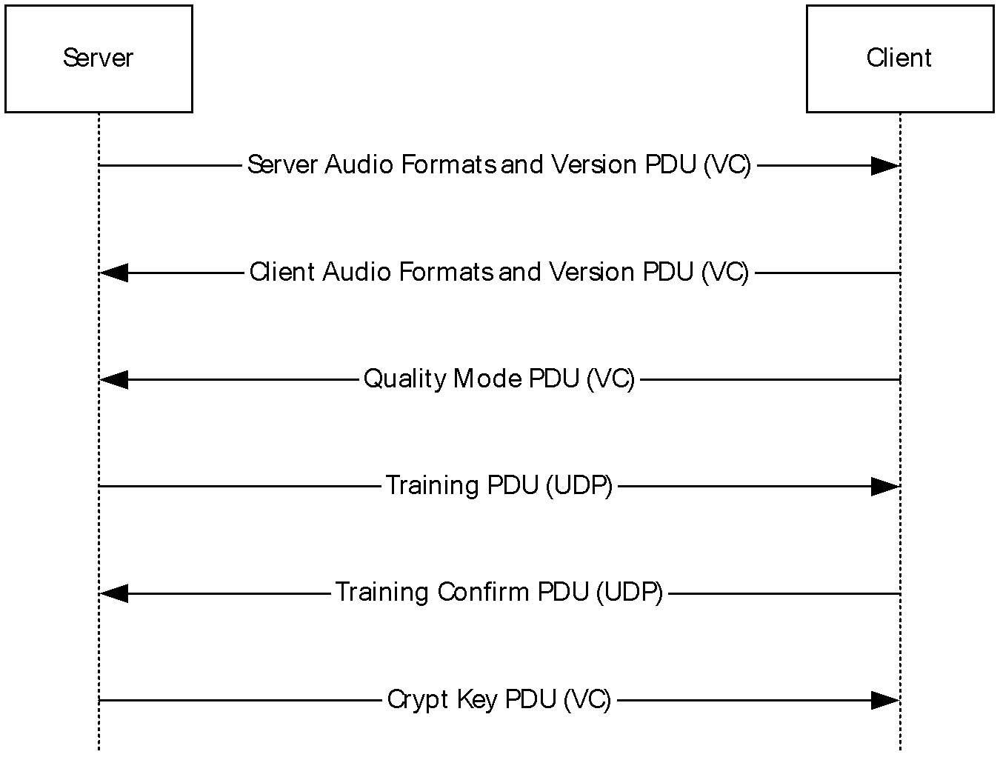

Figure 1: Initialization sequence using UDP for data transfer

If all data transfer sequences are to be sent over virtual channels, the server and client exchange a Training PDU and a Training Confirm PDU over virtual channels.

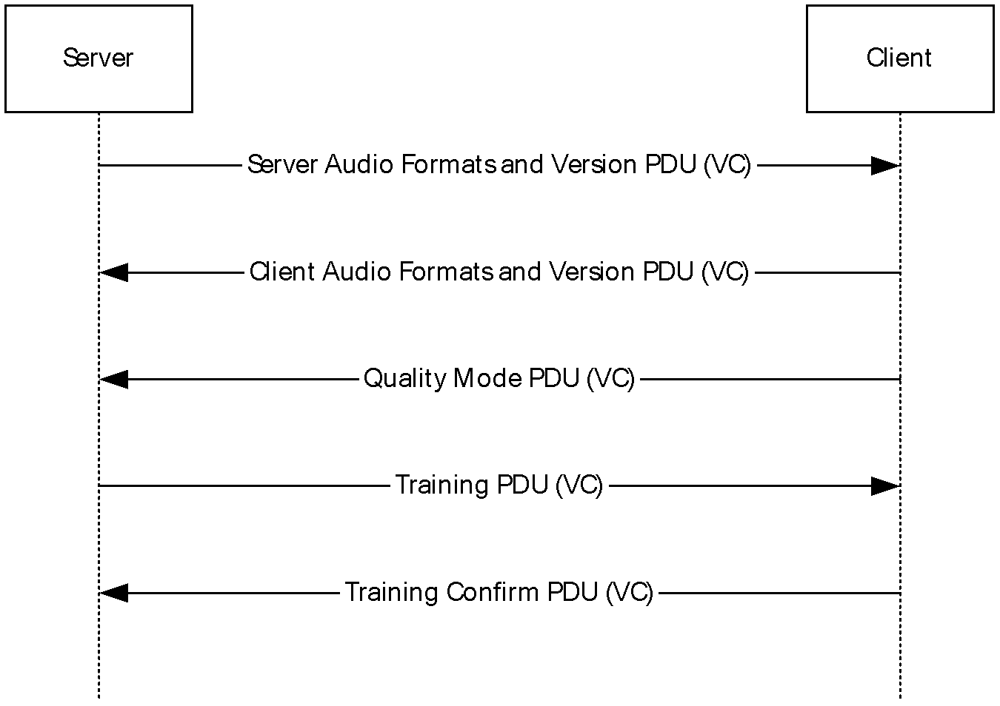

Figure 2: Initialization sequence using virtual channels for data transfer

#### 1.3.2.2 Data Transfer Sequences

The data transfer sequences have the goal of transferring audio data from the server to the client. Two different protocols exist for the data transfer sequences: one protocol transfers over virtual channels, and another transfers over UDP.

The data transfer sequence over virtual channels has a very simple protocol. If the client version or server version is less than 8, the server sends two consecutive packets of audio data: a [WaveInfo PDU (section 2.2.3.3)](#Section_4.2.1) and a [Wave PDU (section 2.2.3.4)](#Section_4.2.2). Upon consuming the audio data, the client sends back a [Wave Confirm PDU (section 2.2.3.8)](#Section_4.2.3) to the server to notify the server that it has consumed the audio data. Consuming the audio data means it was processed, canceled, or dropped by the client. See section [3.2.5.2.1.6](#Section_3.2.5.2.1.6) for details of how the wTimeStamp field of the Wave Confirm PDU is set.

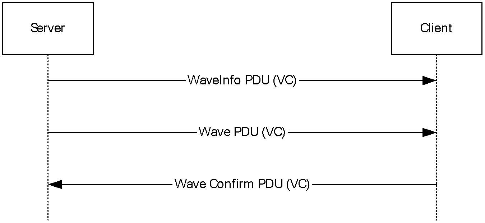

Figure 3: Data transfer sequence over virtual channels using WaveInfo PDU and Wave PDU

If the client and server versions are both at least 8, the server sends [Wave2 PDU (section 2.2.3.10)](#Section_4.2.4). On consuming the audio data, the client sends back a Wave Confirm PDU (section 2.2.3.8) to the server to notify the server that it has consumed the audio data.

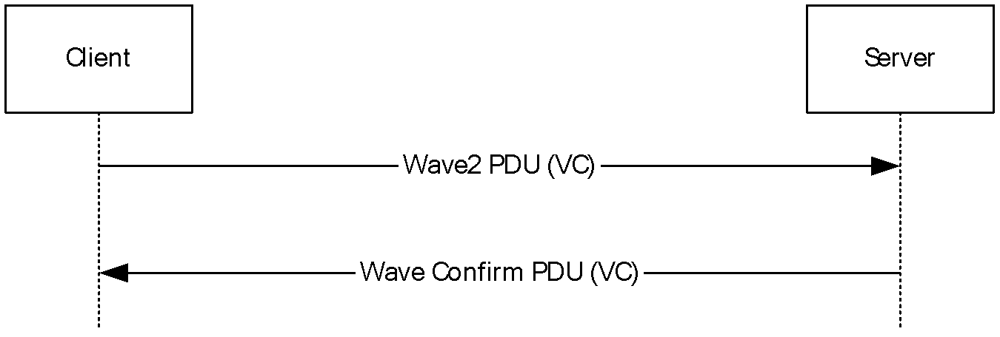

Figure 4: Data transfer sequence over virtual channels using Wave2 PDU

The protocol for the data transfer sequence over UDP is a little more involved. Similar to the protocol over virtual channels, the server sends a chunk of audio data to the client. When the client finishes consuming the audio data, the client sends back a Wave Confirm PDU to the server. The difference with the protocol used over virtual channels is how the server sends the audio data.

If either the client or server version is less than 5, the server sends audio data using a [Wave Encrypt PDU (section 2.2.3.5)](#Section_4.3.1). Upon consumption of the audio data, the client sends a Wave Confirm PDU to the server.

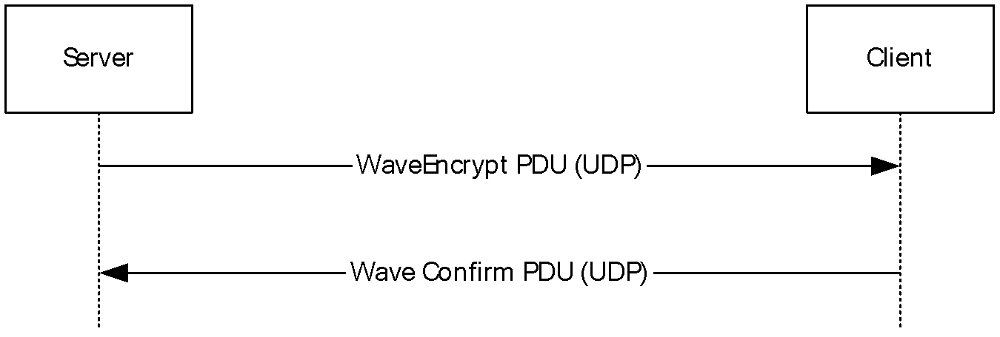

Figure 5: Data transfer sequence over UDP

If the client and server versions are both at least 5, another method can be used to send audio data over UDP. This method involves the server sending the audio data in successive PDUs. All PDUs (except for the final one) are [UDP Wave PDUs (section 2.2.3.6)](#Section_4.4.1). The final [**PDU**](#gt_protocol-data-unit-pdu) is a [UDP Wave Last PDU (section 2.2.3.7)](#Section_4.4.2). Given these PDUs, the client reconstructs the audio data sample. Upon consumption of audio data, the client sends a Wave Confirm PDU to the server.

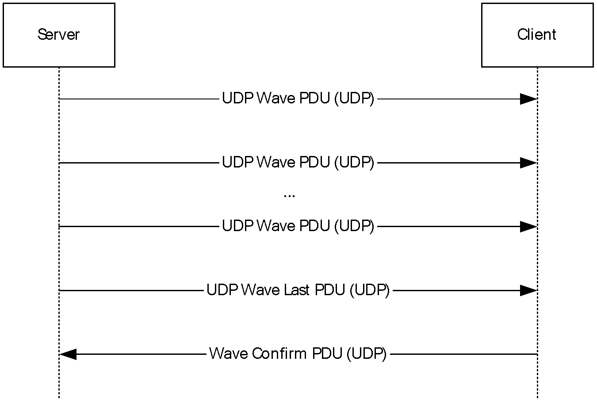

Figure 6: Data transfer sequence over UDP when protocol version is at least 5

During the [initialization sequence (section 1.3.2.1)](#Section_3.2.3), the server uses the [Crypt Key PDU (section 2.2.2.4)](#Section_3.3.5.1.1.6) to send a 32-byte private key over a virtual channel to the client. Some audio data is encrypted using this key.

At the end of the audio data transfer, the server notifies the client by sending a [Close PDU (section 2.2.3.9)](#Section_2.2.3.9) over a virtual channel.

#### 1.3.2.3 Audio Setting Transfer Sequences

The audio setting transfer sequence has the goal of transferring audio setting changes from the server to the client. Two different settings can be redirected: Volume and Pitch. All audio setting transfer sequences are sent over virtual channels. The settings are redirected using the [Volume PDU (section 2.2.4.1)](#Section_2.2.4.1) and [Pitch PDU (section 2.2.4.2)](#Section_3.2.5.3.1.2), respectively.

## 1.4 Relationship to Other Protocols

The Remote Desktop Protocol: Audio Output Virtual Channel Extension is embedded in a static virtual channel transport, as specified in [MS-RDPBCGR](../MS-RDPBCGR/MS-RDPBCGR.md) section 1.3.3 or a dynamic virtual channel transport, as specified in [MS-RDPEDYC](../MS-RDPEDYC/MS-RDPEDYC.md).

## 1.5 Prerequisites/Preconditions

The Remote Desktop Protocol: Audio Output Virtual Channel Extension operates only after the static virtual channel transport (as specified in [MS-RDPBCGR](../MS-RDPBCGR/MS-RDPBCGR.md)) or dynamic virtual channel (as specified in [MS-RDPEDYC](../MS-RDPEDYC/MS-RDPEDYC.md)) is fully established. If the static or dynamic virtual channel transport is terminated, no other communication occurs over the Remote Desktop Protocol: Audio Output Virtual Channel Extension.

## 1.6 Applicability Statement

The Remote Desktop Protocol: Audio Output Virtual Channel Extension is designed to be run within the context of a Remote Desktop Protocol [**virtual channel**](#gt_virtual-channel) established between a client and server. This protocol is applicable when the client is required to play audio that is playing on the server.

## 1.7 Versioning and Capability Negotiation

The Remote Desktop Protocol: Audio Output Virtual Channel Extension is capability-based. The client and the server exchange capabilities during the protocol [Initialization Sequence](#Section_3.2.3) (as specified in section 1.3.2.1).

After the capabilities have been received and stored, the client and the server do not send [**PDUs**](#gt_protocol-data-unit-pdu) or data formats that cannot be processed by the other.

## 1.8 Vendor-Extensible Fields

None.

## 1.9 Standards Assignments

None.

# 2 Messages

## 2.1 Transport

This protocol is designed to operate over three transports:

- A static virtual channel, as specified in [MS-RDPBCGR](../MS-RDPBCGR/MS-RDPBCGR.md) section 2.2.6 and 3.1.5.2. The [**virtual channel**](#gt_virtual-channel) name is "RDPSND".<1> The usage of a channel name when opening a dynamic virtual channel is specified in [MS-RDPEDYC](../MS-RDPEDYC/MS-RDPEDYC.md) section 2.2.2.1. The Remote Desktop Protocol layer manages the creation, setup, and transmission of data over the virtual channel.
- A dynamic virtual channel, as specified in [MS-RDPEDYC]. The virtual channel name is AUDIO_PLAYBACK_DVC when a reliable transport is used; or AUDIO_PLAYBACK_LOSSY_DVC when an unreliable [**UDP**](#gt_user-datagram-protocol-udp) transport, as specified in [MS-RDPEUDP](#Section_2.1), is used.<2> The Remote Desktop Protocol layer manages the creation, setup, and transmission of data over the virtual channel.
- User Datagram Protocol (UDP), where the port is advertised in the [Client Audio Formats and Version PDU (section 2.2.2.2)](#Section_4.1.2).
Virtual channels MUST be used to establish connections, exchange capabilities, and change settings, and they MUST also be used to change audio settings. Audio data can be transferred over either UDP or virtual channels. The sections that follow specify when to send Data Transfer Sequence messages over UDP and when to send them over virtual channels.

## 2.2 Message Syntax

The following sections contain Remote Desktop Protocol: Audio Output Virtual Channel Extension message syntax.

### 2.2.1 RDPSND PDU Header (SNDPROLOG)

The RDPSND PDU header is present in many audio [**PDUs**](#gt_protocol-data-unit-pdu). It is used to identify the PDU type, specify the length of the PDU, and convey message flags.

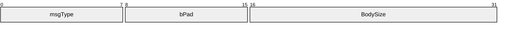

**msgType (1 byte):** An 8-bit unsigned integer that specifies the type of audio PDU that follows the **BodySize** field.

| Value | Meaning |
| --- | --- |
| SNDC_CLOSE 0x01 | [Close PDU](#Section_2.2.3.9) |
| SNDC_WAVE 0x02 | [WaveInfo PDU](#Section_4.2.1) |
| SNDC_SETVOLUME 0x03 | [Volume PDU](#Section_2.2.4.1) |
| SNDC_SETPITCH 0x04 | [Pitch PDU](#Section_3.2.5.3.1.2) |
| SNDC_WAVECONFIRM 0x05 | [Wave Confirm PDU](#Section_4.2.3) |
| SNDC_TRAINING 0x06 | [Training PDU](#Section_4.1.3) or [Training Confirm PDU](#Section_4.1.4) |
| SNDC_FORMATS 0x07 | [Server Audio Formats and Version PDU](#Section_4.1.1) or [Client Audio Formats and Version PDU](#Section_4.1.2) |
| SNDC_CRYPTKEY 0x08 | [Crypt Key PDU](#Section_3.3.5.1.1.6) |
| SNDC_WAVEENCRYPT 0x09 | [Wave Encrypt PDU](#Section_4.3.1) |
| SNDC_UDPWAVE 0x0A | [UDP Wave PDU](#Section_4.4.1) |
| SNDC_UDPWAVELAST 0x0B | [UDP Wave Last PDU](#Section_4.4.2) |
| SNDC_QUALITYMODE 0x0C | [Quality Mode PDU](#Section_2.2.2.3) |
| SNDC_WAVE2 0x0D | [Wave2 PDU](#Section_4.2.4) |

**bPad (1 byte):** An 8-bit unsigned integer. Unused. The value in this field is arbitrary and MUST be ignored on receipt.

**BodySize (2 bytes):** A 16-bit unsigned integer. If **msgType** is not set to 0x02 (SNDC_WAVE), then this field specifies the size, in bytes, of the data that follows the RDPSND PDU header. If **msgType** is set to 0x02 (SNDC_WAVE), then the representation of **BodySize** is explained in the **Header** field in section 2.2.3.3.

### 2.2.2 Initialization Sequence

The following sections contain Remote Desktop Protocol: Audio Output Virtual Channel Extension message syntax for the initialization sequence. The initialization sequence is used to accomplish the following:

- Establish the client and server protocol versions and capabilities.
- Establish a list of audio formats common to both the client and the server. All audio data is transmitted in a format specified by this list.
- Determine whether [**UDP**](#gt_user-datagram-protocol-udp) can be used to transmit audio data.

#### 2.2.2.1 Server Audio Formats and Version PDU (SERVER_AUDIO_VERSION_AND_FORMATS)

The Server Audio Formats and Version PDU is a [**PDU**](#gt_protocol-data-unit-pdu) used by the [**server**](#gt_server) to send version information and a list of supported [**audio formats**](#gt_audio-format) to the [**client**](#gt_client). This PDU MUST be sent using virtual channels.

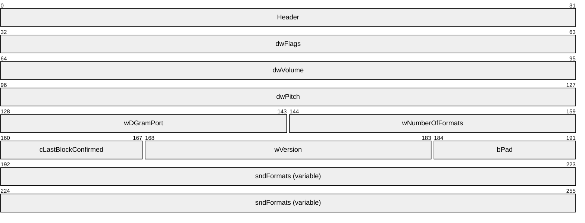

**Header (4 bytes):** A [RDPSND PDU Header (section 2.2.1)](#Section_2.2.1). The **msgType** field of the RDPSND PDU Header MUST be set to SNDC_FORMATS (0x07).

**dwFlags (4 bytes):** A 32-bit unsigned integer. This field is unused. The value is arbitrary and MUST be ignored on receipt.

**dwVolume (4 bytes):** A 32-bit unsigned integer. This field is unused. The value is arbitrary and MUST be ignored on receipt.

**dwPitch (4 bytes):** A 32-bit unsigned integer. This field is unused. The value is arbitrary and MUST be ignored on receipt.

**wDGramPort (2 bytes):** A 16-bit unsigned integer. This field is unused. The value is arbitrary and MUST be ignored on receipt.

**wNumberOfFormats (2 bytes):** A 16-bit unsigned integer. Number of [AUDIO_FORMAT](#Section_2.2.2.1.1) structures contained in the **sndFormats** array.

**cLastBlockConfirmed (1 byte):** An 8-bit unsigned integer specifying the initial value for the **cBlockNo** counter used by the [WaveInfo PDU](#Section_4.2.1), [Wave2 PDU](#Section_4.2.4), [Wave Encrypt PDU](#Section_4.3.1), [UDP Wave PDU](#Section_4.4.1), and [UDP Wave Last PDU](#Section_4.4.2). The value sent by the server is arbitrary. See section [3.3.5.2.1.1](#Section_3.3.5.2.1.1) for more information about the **cBlockNo** counter.

**wVersion (2 bytes):** A 16-bit unsigned integer that contains the version of the protocol supported by the server.<3>

**bPad (1 byte):** An 8-bit unsigned integer. This field is unused. The value is arbitrary and MUST be ignored on receipt.

**sndFormats (variable):** A variable-sized array of audio formats supported by the server, each conforming in structure to the AUDIO_FORMAT structure. The number of formats in the array is **wNumberOfFormats**.

##### 2.2.2.1.1 Audio Format (AUDIO_FORMAT)

The AUDIO_FORMAT structure is used to describe a supported [**audio format**](#gt_audio-format).

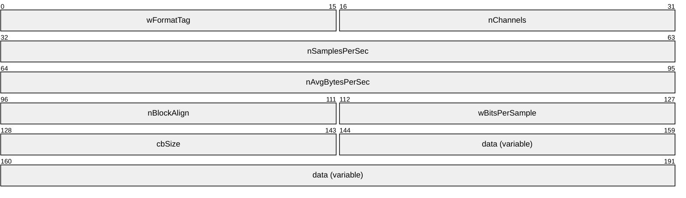

**wFormatTag (2 bytes):** An unsigned 16-bit integer identifying the compression format of the audio format. It MUST be set to a WAVE form Registration Number listed in [[RFC2361]](https://go.microsoft.com/fwlink/?LinkId=90337). At a minimum, clients and servers MUST support WAVE_FORMAT_PCM (0x0001). All compression formats supported on specific Windows versions along with corresponding **wFormatTag** field values are specified by the product behavior note in the **data** field description of this section.

**nChannels (2 bytes):** An unsigned 16-bit integer that specifies the number of channels in the audio format. The number of channels is part of the audio format and is not determined by the Remote Desktop Protocol: Audio Output Virtual Channel Extension protocol.

**nSamplesPerSec (4 bytes):** An unsigned 32-bit integer that specifies the number of audio samples per second in the audio format.

**nAvgBytesPerSec (4 bytes):** An unsigned 32-bit integer that specifies the average number of bytes the audio format uses to encode one second of audio data.

**nBlockAlign (2 bytes):** An unsigned 16-bit integer that specifies the minimum atomic unit of data needed to process audio of this format. See [[MSDN-AUDIOFORMAT]](https://go.microsoft.com/fwlink/?LinkId=93409) for more information about block alignment semantics.

**wBitsPerSample (2 bytes):** An unsigned 16-bit integer that specifies the number of bits needed to represent a sample.

**cbSize (2 bytes):** An unsigned 16-bit integer specifying the size of the **data** field.

**data (variable):** Extra data specific to the audio format.<4> See [MSDN-AUDIOFORMAT] for additional details about extra format information. The size of **data**, in bytes, is **cbSize**.

#### 2.2.2.2 Client Audio Formats and Version PDU (CLIENT_AUDIO_VERSION_AND_FORMATS)

The Client Audio Formats and Version PDU is a [**PDU**](#gt_protocol-data-unit-pdu) that is used to send version information, capabilities, and a list of supported [**audio formats**](#gt_audio-format) from the client to the server.<5> After the server sends its version and a list of supported audio formats to the client, the client sends back a Client Audio Formats and Version PDU to the server containing its version and a list of formats that both the client and server support. This PDU MUST be sent by using virtual channels.

**Header (4 bytes):** An [RDPSND PDU header (section 2.2.1)](#Section_2.2.1). The **msgType** field of the RDPSND PDU header MUST be set to SNDC_FORMATS (0x07).

**dwFlags (4 bytes):** A 32-bit unsigned integer that specifies the general capability flags. The **dwFlags** field MUST be one or more of the following flags, combined with a bitwise OR operator.

| Value | Meaning |
| --- | --- |
| TSSNDCAPS_ALIVE 0x00000001 | The client is capable of consuming audio data. This flag MUST be set for audio data to be transferred. |
| TSSNDCAPS_VOLUME 0x00000002 | The client is capable of applying a volume change to all the audio data that is received. |
| TSSNDCAPS_PITCH 0x00000004 | The client is capable of applying a pitch change to all the audio data that is received. |

**dwVolume (4 bytes):** A 32-bit unsigned integer. If the TSSNDCAPS_VOLUME flag is not set in the **dwFlags** field, the **dwVolume** field MUST be ignored. If the TSSNDCAPS_VOLUME flag is set in the **dwFlags** field, the **dwVolume** field specifies the initial volume of the audio stream. The low-order word contains the left-channel volume setting, and the high-order word contains the right-channel setting. A value of 0xFFFF represents full volume, and a value of 0x0000 is silence.

This value is to be interpreted logarithmically. This means that the perceived increase in volume is the same when increasing the volume level from 0x5000 to 0x6000 as it is from 0x4000 to 0x5000.

**dwPitch (4 bytes):** A 32-bit unsigned integer. If the TSSNDCAPS_PITCH flag is not set in the **dwFlags** field, the **dwPitch** field MUST be ignored. If the TSSNDCAPS_PITCH flag is set in the **dwFlags** field, the **dwPitch** field specifies the initial pitch of the audio stream. The pitch is specified as a fixed-point value. The high-order word contains the signed integer part of the number, and the low-order word contains the fractional part. A value of 0x8000 in the low-order word represents one-half, and 0x4000 represents one-quarter. For example, the value 0x00010000 specifies a multiplier of 1.0 (no pitch change), and a value of 0x000F8000 specifies a multiplier of 15.5.

**wDGramPort (2 bytes):** A 16-bit unsigned integer that, if set to a nonzero value, specifies the client port that the server MUST use to send data over UDP. A zero value means UDP is not supported. This field MUST be specified by using big-endian byte ordering.

**wNumberOfFormats (2 bytes):** A 16-bit unsigned integer that specifies the number of [AUDIO_FORMAT](#Section_2.2.2.1.1) structures that are contained in an **sndFormats** array.

**cLastBlockConfirmed (1 byte):** An 8-bit unsigned integer. This field is unused. The value is arbitrary and MUST be ignored on receipt.

**wVersion (2 bytes):** A 16-bit unsigned integer that specifies the version of the protocol that is supported by the client.<6>

**bPad (1 byte):** An 8-bit unsigned integer. This field is unused. The value is arbitrary and MUST be ignored on receipt.

**sndFormats (variable):** A variable-sized array of audio formats that are supported by the client and the server, each conforming in structure to the AUDIO_FORMAT. Each audio format MUST also appear in the [Server Audio Formats and Version PDU](#Section_4.1.1) list of audio formats just sent by the server. The number of formats in the array is **wNumberOfFormats**.

#### 2.2.2.3 Quality Mode PDU

The Quality Mode PDU is a [**PDU**](#gt_protocol-data-unit-pdu) used by the client to select one of three quality modes. If both the client and server are at least version 6, the client MUST send a Quality Mode PDU immediately after sending the audio formats. This packet is only used when the client and server versions are both at least 6.<7> This PDU MUST be sent using virtual channels.

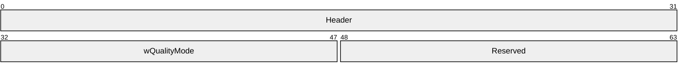

**Header (4 bytes):** An [RDPSND PDU Header (section 2.2.1)](#Section_2.2.1). The **msgType** field of the RDPSND PDU Header MUST be set to SNDC_QUALITYMODE (0x0C).

**wQualityMode (2 bytes):** A 16-bit unsigned integer. This field specifies the quality setting the client has requested. The definition of these three modes is implementation-dependent, but SHOULD use the following guidelines.

| Value | Meaning |
| --- | --- |
| DYNAMIC_QUALITY 0x0000 | The server dynamically adjusts the audio format to best match the bandwidth and latency characteristics of the network. |
| MEDIUM_QUALITY 0x0001 | The server chooses an audio format from the list of formats the client supports that gives moderate audio quality and requires a moderate amount of bandwidth. |
| HIGH_QUALITY 0x0002 | The server chooses the audio format that provides the best quality audio without regard to the bandwidth requirements for that format. |

**Reserved (2 bytes):** A 16-bit unsigned integer. This field is unused. The value is arbitrary and MUST be ignored on receipt.

#### 2.2.2.4 Crypt Key PDU (SNDCRYPT)

The Crypt Key PDU is a [**PDU**](#gt_protocol-data-unit-pdu) used to send a 32-byte key from the server to the client. The key is used to encrypt some audio data sent over UDP. This PDU MUST be sent using virtual channels.

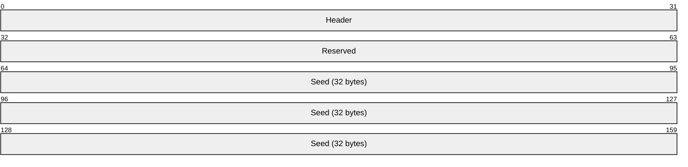

**Header (4 bytes):** A [RDPSND PDU Header (section 2.2.1)](#Section_2.2.1). The **msgType** field of the RDPSND PDU Header MUST be set to SNDC_CRYPTKEY (0x0008).

**Reserved (4 bytes):** A 32-bit unsigned integer. This field is unused. The value is arbitrary and MUST be ignored on receipt.

**Seed (32 bytes):** A 32-byte symmetric key used for encryption and decryption of audio data sent over UDP. A random number SHOULD be used as the symmetric key. When a [Wave Encrypt PDU](#Section_4.3.1) is sent, the key MUST be used to encrypt the audio data. When a [UDP Wave PDU](#Section_4.4.1) is sent with a [UDP Wave Last PDU](#Section_4.4.2), there is no encrypted audio data and the key MUST be used instead to generate a signature.

### 2.2.3 Data Sequence

The following sections contain the Remote Desktop Protocol: Audio Output Virtual Channel Extension message syntax for the data transfer sequence. The data transfer sequence is used to transfer audio data from server to client. To receive audio data from the server, the client MUST have set the flag TSSNDCAPS_ALIVE (0x0000001) in the [Client Audio Formats and Version PDU](#Section_4.1.2) sent during the initialization sequence described in section [2.2.2](#Section_3.3.5.1).

#### 2.2.3.1 Training PDU (SNDTRAINING)

The Training PDU is a [**PDU**](#gt_protocol-data-unit-pdu) used by the server to request that the client send it a [Training Confirm PDU](#Section_4.1.4). In response, the client MUST immediately send a Training Confirm PDU to the server. The server uses the sending and receiving of these packets for diagnostic purposes. This PDU can be sent using virtual channels or UDP.

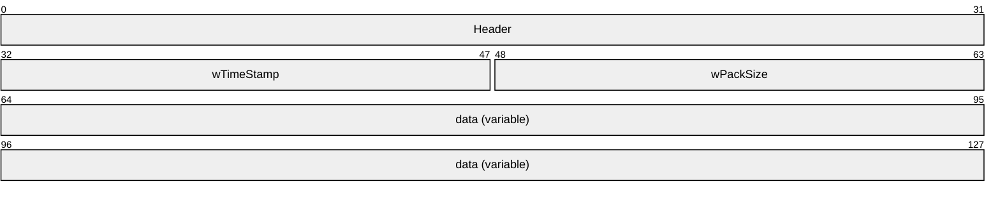

**Header (4 bytes):** An [RDPSND PDU Header (section 2.2.1)](#Section_2.2.1). The **msgType** field of the RDPSND PDU Header MUST be set to SNDC_TRAINING (0x06).

**wTimeStamp (2 bytes):** A 16-bit unsigned integer. In the Training PDU this value is arbitrary.

**wPackSize (2 bytes):** A 16-bit unsigned integer. If the size of **data** is nonzero, then this field specifies the size, in bytes, of the entire PDU. If the size of **data** is 0, then **wPackSize** MUST be 0.

**data (variable):** Unused. The value in this field is arbitrary and MUST be ignored on receipt.

#### 2.2.3.2 Training Confirm PDU (SNDTRAININGCONFIRM)

The Training Confirm PDU is a [**PDU**](#gt_protocol-data-unit-pdu) sent by the client to confirm the reception of a [Training PDU](#Section_4.1.3). This PDU MUST be sent using virtual channels or UDP. The server MAY use data from this PDU to calculate how fast the network can transmit data, as described in section [3.3.5.1.1.5](#Section_3.3.5.1.1.5).

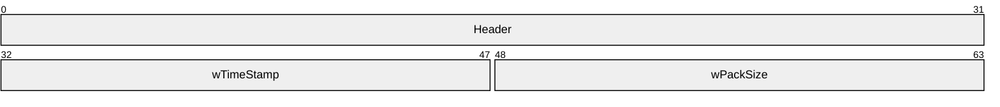

**Header (4 bytes):** An [RDPSND PDU Header (section 2.2.1)](#Section_2.2.1). The **msgType** field of the RDPSND PDU Header MUST be set to SNDC_TRAINING (0x06).

**wTimeStamp (2 bytes):** A 16-bit unsigned integer. This value MUST be set to the same value as the **wTimeStamp** field in the Training PDU received from the server. If the value is not set as indicated, the result from the server-side calculation (section 3.3.5.1.1.5) will be invalid.

**wPackSize (2 bytes):** A 16-bit unsigned integer. This value MUST be set to the same value as the **wPackSize** field in the Training PDU received from the server. If the value is not set as indicated, the result from the server-side calculation (section 3.3.5.1.1.5) will be invalid.

#### 2.2.3.3 WaveInfo PDU (SNDWAVINFO)

The WaveInfo PDU is the first of two consecutive [**PDUs**](#gt_protocol-data-unit-pdu) used to transmit audio data over virtual channels. This packet contains information about the audio data along with the first 4 bytes of the audio data itself. This PDU MUST be sent using static virtual channels.

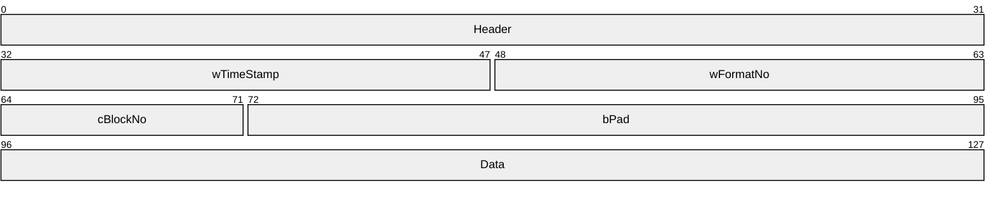

**Header (4 bytes):** An [RDPSND PDU Header (section 2.2.1)](#Section_2.2.1). The **msgType** field of the RDPSND PDU Header MUST be set to SNDC_WAVE (0x02). The **BodySize** field of the RDPSND PDU Header is the size of the WaveInfo PDU plus the size of the **data** field of the [Wave PDU](#Section_4.2.2) that immediately follows this packet minus the size of the Header.

**wTimeStamp (2 bytes):** A 16-bit unsigned integer representing the time stamp of the audio data. It SHOULD be set to a time that represents when this PDU is built.<8>

**wFormatNo (2 bytes):** A 16-bit unsigned integer that represents an index into the list of [**audio formats**](#gt_audio-format) exchanged between the client and server during the initialization phase, as described in section [3.1.1.2](#Section_3.1.1.2). The format located at that index is the format of the audio data in this PDU and the Wave PDU that immediately follows this packet.

**cBlockNo (1 byte):** An 8-bit unsigned integer specifying the block ID of the audio data. When the client notifies the server that it has consumed the audio data, it sends a [Wave Confirm PDU (section 2.2.3.8)](#Section_4.2.3) containing this field in its **cConfirmedBlockNo** field.

**bPad (3 bytes):** A 24-bit unsigned integer. This field is unused. The value is arbitrary and MUST be ignored on receipt.

**Data (4 bytes):** The first four bytes of the audio data. The rest of the audio data arrives in the next PDU, which MUST be a Wave PDU. The audio data MUST be in the audio format from the list of formats exchanged during the Initialization Sequence (section [2.2.2](#Section_3.3.5.1)); this list is found at the index specified in the **wFormatNo** field.

#### 2.2.3.4 Wave PDU (SNDWAV)

The Wave PDU is the second of two consecutive [**PDUs**](#gt_protocol-data-unit-pdu) used to transmit audio data over virtual channels. This packet contains the rest of the audio data not sent in the [WaveInfo PDU](#Section_4.2.1). This PDU MUST be sent using virtual channels.

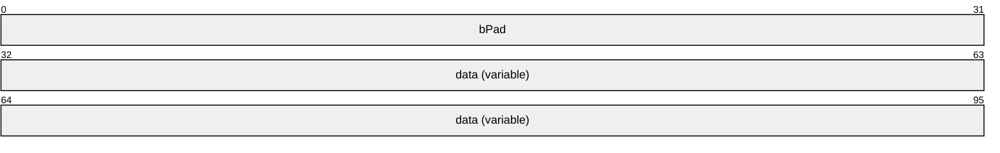

**bPad (4 bytes):** A 32-bit unsigned integer that MUST be set to 0x00000000.

**data (variable):** The rest of the audio data. The size of the audio data MUST be equal to the **BodySize** field of the [RDPSND PDU header](#Section_2.2.1) of the WaveInfo PDU that immediately preceded this packet, minus the size of the preceding WaveInfo PDU packet (not including the size of its Header field). The format of the audio data MUST be the format specified in the list of formats exchanged during the [Initialization Sequence](#Section_3.3.5.1) and found at the index specified in the **wFormatNo** field of the preceding WaveInfo PDU.

#### 2.2.3.5 Wave Encrypt PDU (SNDWAVCRYPT)

The Wave Encrypt PDU is a [**PDU**](#gt_protocol-data-unit-pdu) used to send audio data from the server to the client. This PDU MUST be sent over UDP.

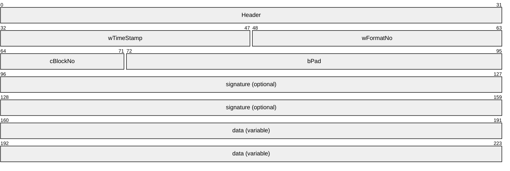

**Header (4 bytes):** An [RDPSND PDU Header (section 2.2.1)](#Section_2.2.1). The **msgType** field of the RDPSND PDU header MUST be set to SNDC_WAVEENCRYPT (0x09).

**wTimeStamp (2 bytes):** A 16-bit unsigned integer representing the time stamp of the audio data. It SHOULD be set to a time that represents when this PDU is built<9>.

**wFormatNo (2 bytes):** A 16-bit unsigned integer that represents an index into the list of formats exchanged between the client and server during the initialization phase, as described in section [3.1.1.2](#Section_3.1.1.2).

**cBlockNo (1 byte):** An 8-bit unsigned integer specifying the block ID of the audio data. When the client notifies the server that it has consumed the audio data, it sends a [Wave Confirm PDU](#Section_4.2.3) containing this field in its **cConfirmedBlockNo** field.

**bPad (3 bytes):** A 24-bit unsigned integer. This field is unused. The value is arbitrary and MUST be ignored on receipt.

**signature (8 bytes):** An 8-byte digital signature. If the protocol version of either the server or the client is less than 5, then this field MUST NOT exist. If the version of the server and the client are at least 5, then this field MUST exist. An explanation of how this field is created is specified in section [3.3.5.2.1.3](#Section_3.3.5.2.1.3).

**data (variable):** Encrypted audio data. The audio data MUST be in the format specified by the **wFormatNo** and MUST be encrypted. For an explanation of how the data is encrypted, see section 3.3.5.2.1.3.

#### 2.2.3.6 UDP Wave PDU (SNDUDPWAVE)

The UDP Wave PDU is a [**PDU**](#gt_protocol-data-unit-pdu) used to send a fragment of audio data from the server to the client. This packet is only used when the client and server versions are both at least 5. This PDU MUST be sent over UDP.

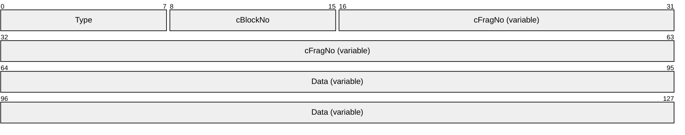

**Type (1 byte):** An 8-bit unsigned integer. This field MUST be set to SNDC_UDPWAVE (0x0A).

**cBlockNo (1 byte):** An 8-bit unsigned integer specifying the block ID of the audio data. When the client notifies the server that it has consumed the audio data, it sends a [Wave Confirm PDU](#Section_4.2.3) containing this field in its **cConfirmedBlockNo** field.

**cFragNo (variable):** An 8-bit or 16-bit unsigned integer specifying the order of the audio data fragment in the overall audio sample. The 0x80 bit of the first byte is used to determine if the field is one or two bytes in length. If the first byte is less than 0x80, then the field is 1 byte. If the first byte is greater than or equal to 0x80, then this field is 2 bytes. To calculate the value of the field, the second byte holds 8 low-order bits, while the first byte holds 7 high-order bits.

**Data (variable):** A portion of an [Audio FragData](#Section_2.2.3.6.1) structure. Several UDP Wave PDUs and a [UDP Wave Last PDU](#Section_4.4.2) contain pieces of a structure conforming to Audio FragData. This algorithm is specified in section [3.2.5.2.1.5](#Section_3.2.5.2.1.5).

##### 2.2.3.6.1 Audio FragData (AUDIO_FRAGDATA)

The Audio FragData structure is used to describe the data that is fragmented and sent in several [UDP Wave PDUs](#Section_4.4.1) and a final [UDP Wave Last PDU](#Section_4.4.2).

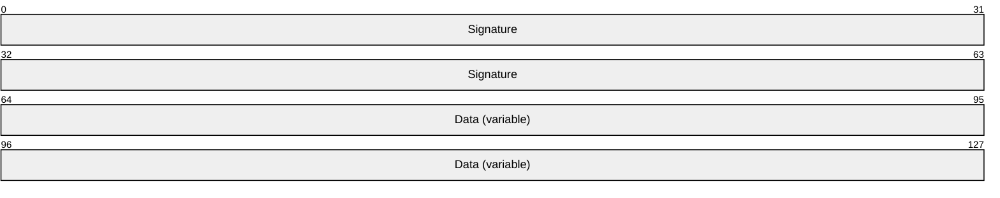

**Signature (8 bytes):** An 8-byte digital signature. The algorithm for creating this field is the same as creating the **signature** field of a [Wave Encrypt PDU](#Section_4.3.1) as specified in section [3.3.5.2.1.3](#Section_3.3.5.2.1.3).

**Data (variable):** Audio data. The format of the audio data MUST be the format specified in the **wFormatNo** field of the UDP Wave Last PDU that sends the final piece of this structure.

#### 2.2.3.7 UDP Wave Last PDU (SNDUDPWAVELAST)

The UDP Wave Last PDU is a [**PDU**](#gt_protocol-data-unit-pdu) used to send the final fragment of audio data from the server to the client. This packet is only used when the client and server versions are both at least 5. This PDU MUST be sent over UDP.

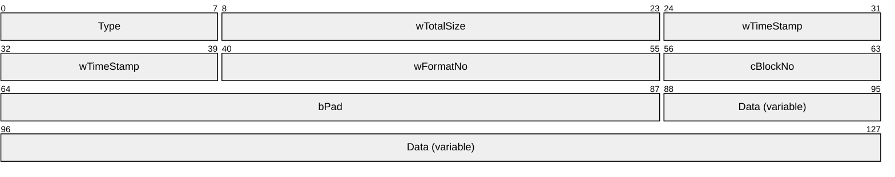

**Type (1 byte):** An 8-bit unsigned integer. This field MUST be set to SNDC_UDPWAVELAST (0x0B).

**wTotalSize (2 bytes):** A 16-bit unsigned integer that represents the total size of the audio data sent in successive PDUs. The amount of audio data in previous [UDP Wave PDUs](#Section_4.4.1) plus the amount of audio data in this PDU MUST be equivalent to **wTotalSize**.

**wTimeStamp (2 bytes):** A 16-bit unsigned integer representing the time stamp of the audio data.

**wFormatNo (2 bytes):** A 16-bit unsigned integer that represents an index into the list of formats exchanged between the client and server during the initialization phase, as described in section [3.1.1.2](#Section_3.1.1.2).

**cBlockNo (1 byte):** An 8-bit unsigned integer specifying the block id of the audio data. When the client notifies the server that it has consumed the audio data, it sends a [Wave Confirm PDU](#Section_4.2.3) containing this field in its **cConfirmedBlockNo** field.

**bPad (3 bytes):** A 24-bit unsigned integer. This field is unused. The value is arbitrary and MUST be ignored on receipt.

**Data (variable):** A portion of an [Audio FragData](#Section_2.2.3.6.1). Several UDP Wave PDUs and a UDP Wave Last PDU MUST contain pieces of a structure conforming to Audio FragData, as specified in section [3.2.5.2.1.5](#Section_3.2.5.2.1.5).

#### 2.2.3.8 Wave Confirm PDU (SNDWAV_CONFIRM)

The Wave Confirm PDU is a [**PDU**](#gt_protocol-data-unit-pdu) that MUST be sent by the client to the server immediately after the following two events occur:

- An audio data sample is received from the server, whether using a [WaveInfo PDU](#Section_4.2.1) and [Wave PDU](#Section_4.2.2), a [Wave2 PDU](#Section_4.2.4), a [Wave Encrypt PDU](#Section_4.3.1), or several [UDP Wave PDUs](#Section_4.4.1) followed by a [UDP Wave Last PDU](#Section_4.4.2).
- The audio data sample is emitted to completion by the client.
This PDU can be sent using static virtual channels or UDP.

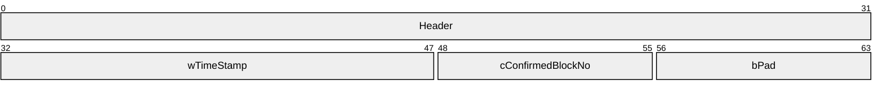

**Header (4 bytes):** An [RDPSND PDU Header (section 2.2.1)](#Section_2.2.1). The **msgType** field of the RDPSND PDU Header MUST be set to SNDC_WAVECONFIRM (0x05).

**wTimeStamp (2 bytes):** A 16-bit unsigned integer. See section [3.2.5.2.1.6](#Section_3.2.5.2.1.6) for details of how this field is set.

**cConfirmedBlockNo (1 byte):** An 8-bit unsigned integer that MUST be the same as the **cBlockNo** field of the UDP Wave Last PDU (section 2.2.3.7), the Wave Encrypt PDU (section 2.2.3.5) or the WaveInfo PDU (section 2.2.3.3) just received from the server.

**bPad (1 byte):** An unsigned 8-bit integer. This field is unused. The value is arbitrary and MUST be ignored on receipt.

#### 2.2.3.9 Close PDU (SNDCLOSE)

The Close PDU is a [**PDU**](#gt_protocol-data-unit-pdu) sent by the server to notify the client that audio streaming has stopped. This PDU MUST be sent using virtual channels.

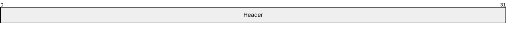

**Header (4 bytes):** An [RDPSND PDU Header (section 2.2.1)](#Section_2.2.1). The **msgType** field of the RDPSND PDU Header MUST be set to SNDC_CLOSE (0x01).

#### 2.2.3.10 Wave2 PDU (SNDWAVE2)

The Wave2 PDU is used to transmit audio data over virtual channels.

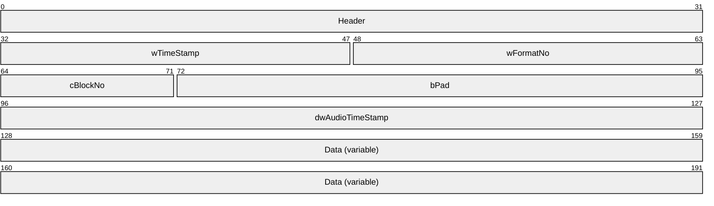

**Header (4 bytes):** An [RDPSND PDU Header (section 2.2.1)](#Section_2.2.1). The **msgType** field of the RDPSND PDU Header MUST be set to SNDC_WAVE2 (0x0D). The **BodySize** field of the RDPSND PDU Header is the size of this PDU minus the size of the header.

**wTimeStamp (2 bytes):** A 16-bit unsigned integer representing the time stamp of the audio data. It SHOULD<10> be set to a time that represents when this PDU is built.

**wFormatNo (2 bytes):** A 16-bit unsigned integer that represents an index into the list of audio formats exchanged between the client and server during the initialization phase, as described in section [3.1.1.2](#Section_3.1.1.2). The format located at that index is the format of the audio data in this PDU and the Wave PDU that immediately follows this packet.

**cBlockNo (1 byte):** An 8-bit unsigned integer specifying the block ID of the audio data. When the client notifies the server that it has consumed the audio data, it sends a [Wave Confirm PDU (section 2.2.3.8)](#Section_4.2.3) containing this field in its **cConfirmedBlockNo** field.

**bPad (3 bytes):** A 24-bit unsigned integer. This field is unused. The value is arbitrary and MUST be ignored on receipt.

**dwAudioTimeStamp (4 bytes):** A 32-bit unsigned integer representing the timestamp when the server gets audio data from the audio source. The timestamp is the number of milliseconds that have elapsed since the system was started. This timestamp SHOULD be used to sync the audio stream with a video stream remoted using the Remote Desktop Protocol: Video Optimized Remoting Virtual Channel Extension (see the **hnsTimestampOffset** and **hnsTimestamp** fields as specified in [MS-RDPEVOR](../MS-RDPEVOR/MS-RDPEVOR.md) sections 2.2.1.2 and 2.2.1.6, respectively).

**Data (variable):** Audio data. The format of the audio data MUST be the format specified in the list of formats exchanged during the initialization sequence and found at the index specified in the **wFormatNo** field.

### 2.2.4 Audio Setting Transfer Sequences

The following sections contain the message syntax for the audio setting transfer sequence. The audio setting transfer sequence is used to transfer audio setting changes from the server to the client. Two different settings MAY be redirected: Volume and Pitch. All audio setting transfer sequences are sent over virtual channels.

#### 2.2.4.1 Volume PDU (SNDVOL)

The Volume PDU is a [**PDU**](#gt_protocol-data-unit-pdu) sent from the server to the client to specify the volume to be set on the audio stream. For this packet to be sent, the client MUST have set the flag TSSNDCAPS_VOLUME (0x0000002) in the [Client Audio Formats and Version PDU (section 2.2.2.2)](#Section_4.1.2) that is sent during the initialization sequence described in section [2.2.2](#Section_3.3.5.1).

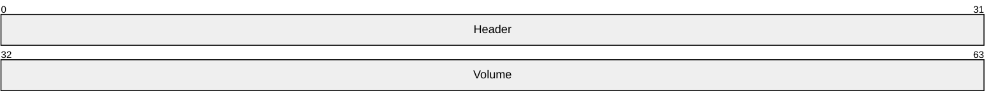

**Header (4 bytes):** An [RDPSND PDU Header (section 2.2.1)](#Section_2.2.1). The **msgType** field of the RDPSND PDU Header MUST be set to SNDC_VOLUME (0x03).

**Volume (4 bytes):** A 32-bit unsigned integer specifying the volume to be set on the audio stream. See the **dwVolume** field in section 2.2.2.2 for semantics of the data in this field.

#### 2.2.4.2 Pitch PDU (SNDPITCH)

The Pitch PDU is a [**PDU**](#gt_protocol-data-unit-pdu) sent from the server to the client to specify the pitch to be set on the audio stream. For this packet to be sent, the client MUST have set the flag TSSNDCAPS_PITCH (0x0000004) in the [Client Audio Formats and Version PDU (section 2.2.2.2)](#Section_4.1.2) that is sent during the initialization sequence specified in section [2.2.2](#Section_3.3.5.1).

**Header (4 bytes):** An [RDPSND PDU Header (section 2.2.1)](#Section_2.2.1). The **msgType** field of the RDPSND PDU Header MUST be set to SNDC_PITCH (0x04).

**Pitch (4 bytes):** A 32-bit unsigned integer. Although the server can send this PDU, the client MUST ignore it.

# 3 Protocol Details

## 3.1 Common Details

### 3.1.1 Abstract Data Model

This section describes a conceptual model of possible data organization that an implementation maintains to participate in this protocol. The described organization is provided to facilitate an explanation of how the protocol behaves. This document does not mandate that implementations adhere to this model as long as their external behavior is consistent with that described in this document.

#### 3.1.1.1 Protocol Version

The **wVersion** field of the [Server Audio Formats and Version PDU](#Section_4.1.1) and [Client Audio Formats and Version PDU](#Section_4.1.2) indicate the protocol version supported on the [**server**](#gt_server) and [**client**](#gt_client), respectively. The protocol version is used to determine some of the protocol capabilities. For example, the Quality Mode is supported only if both the client protocol version and server protocol version are at least 6.

#### 3.1.1.2 Audio Format List and Current Audio Format

A list of [**audio formats**](#gt_audio-format) is sent by the client to the server in the [Client Audio Formats and Version PDU](#Section_4.1.2). This list MUST be maintained throughout the duration of the protocol. The **wFormatNo** field of the [Wave Info PDU](#Section_4.2.1), the [Wave Encrypt PDU](#Section_4.3.1), and the [UDP Wave Last PDU](#Section_4.4.2) is an index into this list. The format located at that index is the current audio format. The current audio format MAY change during protocol operation. The index to the audio format list is zero-based, where the value 0 refers to the first format in the list.

#### 3.1.1.3 Crypt Key

The Crypt Key is a key used by the client and the server for two purposes:

- To encrypt and decrypt data in a [Wave Encrypt PDU](#Section_4.3.1).
- To create the **signature** field for an [Audio FragData](#Section_2.2.3.6.1) and Wave Encrypt PDU.
A specification for both purposes is specified in section [3.3.5.2.1.3](#Section_3.3.5.2.1.3).

#### 3.1.1.4 Quality Mode Setting

If protocol versions of both the client and server are at least version 6, then the client MUST inform the server of its preferred audio quality setting by sending a [Quality Mode PDU](#Section_2.2.2.3) to the server. This setting SHOULD be stored on the server, and it specifies which mode the server uses to tune the audio quality for the connection.

#### 3.1.1.5 UDP Support

To attempt to have data sent over [**UDP**](#gt_user-datagram-protocol-udp), the client advertises a port in a [Client Audio Formats and Version PDU](#Section_4.1.2). The server attempts to use UDP by sending a [Training PDU](#Section_4.1.3) to the client over the port; the client in turn attempts to reply with a [Training Confirm PDU](#Section_4.1.4). The server then attempts to send a private key to the client using a [Crypt Key PDU](#Section_3.3.5.1.1.6). If all of the preceding steps succeed, the data transfer sequences are sent over UDP. If any of the preceding steps fail, the data transfer sequences are sent over static [**virtual channels**](#gt_virtual-channel).

### 3.1.2 Timers

No common timers are used.

### 3.1.3 Initialization

Before protocol operation can commence, the static or dynamic virtual channel MUST be established by using the parameters specified in section [2.1](#Section_2.1).<11> The server and client also need to negotiate the protocol version, whether to use [**UDP**](#gt_user-datagram-protocol-udp), and a common list of audio formats, by exchanging a [Server Audio Formats and Version PDU](#Section_4.1.1) and a [Client Audio Formats and Version PDU](#Section_4.1.2).

### 3.1.4 Higher-Layer Triggered Events

#### 3.1.4.1 Playing Audio

When audio is played on the server (for example, when the server opens an MP3 file in Windows Media Player), the server MUST start redirecting the audio data. If the initialization sequence (section [2.2.2](#Section_3.3.5.1)) has not transpired, the server MUST start the initialization sequence and then proceed to start the data transfer sequence (section [2.2.3](#Section_2.2.3)).

### 3.1.5 Message Processing Events and Sequencing Rules

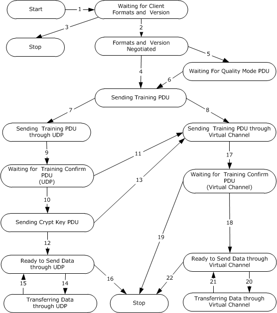

Figure 7: State transition diagram

The state transition diagram summarizes the message sequencing rules for the Remote Desktop Protocol: Audio Output Virtual Channel Extension. The following are the descriptions of each of the arrows:

- **Event**: connected from client.
**Action**: server sends Server Audio Formats and Version PDU.

- **Event**: server receives Client Audio Formats and Version PDU.
**Action**: server enters "Formats and Version Negotiated" state.

- **Event**: timeout after waiting for Client Audio Formats and Version PDU.
**Action**: server terminates the protocol.

- **Event**: client version <6 or server version <6.
**Action**: server enters "Sending Training PDU" state.

- **Event**: client version >=6, and server version >=6.
**Action**: wait for Quality Mode PDU from client.

- **Event**: server receives Quality Mode PDU or timeout.
**Action**: server enters "Sending Training PDU" state.

- **Event**: there is a valid UDP port in Client Audio Formats and Version PDU, and server is attempting to use UDP.
**Action**: server enters "Sending Training PDU through UDP" state.

- **Event**: there is no valid UDP port in Client Audio Formats and Version PDU, or server is not attempting to use UDP.
**Action**: server enters "Sending Training PDU through Virtual Channel" state.

- **Event**: server sends Training PDU through UDP.
**Action**: server enters "Waiting for Training Confirm PDU" state.

- **Event**: server receives Training Confirm PDU from client.
**Action**: server sends Crypt Key PDU.

- **Event**: timeout after waiting for Training Confirm PDU using UDP.
**Action**: server enters "Sending Training PDU through Virtual Channel" state.

- **Event**: server sends Crypt Key PDU and succeeds.
**Action**: server enters "Ready to Send Data through UDP" state.

- **Event**: failure when sending Crypt Key PDU.
**Action**: server enters "Sending Training PDU through Virtual Channel" state.

- **Event**: data ready.
**Action**: server sends Wave Encrypt PDU, or UDP Wave PDU and UDP Wave Last PDU.

- **Event**: server receives Wave Confirm PDU from client.
**Action**: server enters "Ready to Send Data through UDP" state.

- **Event**: failure when sending data.
**Action**: server sends Close PDU and terminates the protocol.

- **Event**: server sends Training PDU through virtual channel.
**Action**: server enters "Waiting for Training Confirm PDU" state.

- **Event**: server receives Training Confirm PDU from client.
**Action**: server enters "Ready to Send Data through Virtual Channel" state.

- **Event**: timeout after waiting for Training Confirm PDU through virtual channel.
**Action**: server terminates the protocol.

- **Event**: data ready.
**Action**: server sends WaveInfo PDU, Wave PDU, or Wave2 PDU.

- **Event**: server receives Wave Confirm PDU from client.
**Action**: server enters "Ready to Send Data through Virtual Channel" state.

- **Event**: failure when sending data.
**Action**: server sends Close PDU and server terminates the protocol.

Unless otherwise specified, malformed, unrecognized, and out-of-sequence packets MUST be ignored by the server and the client.

### 3.1.6 Timer Events

No common timer events are used.

### 3.1.7 Other Local Events

There are no common local events.

## 3.2 Client Details

### 3.2.1 Abstract Data Model

The abstract data model is specified in section [3.1.1](#Section_3.1.1).

### 3.2.2 Timers

No timers are used.

### 3.2.3 Initialization

Initialization is specified in section [3.1.3](#Section_3.1.3).

### 3.2.4 Higher-Layer Triggered Events

No client higher-layer triggered events are used.

### 3.2.5 Message Processing Events and Sequencing Rules

#### 3.2.5.1 Initialization Sequence

Initialization messages exchange the basic information to establish the connection, and to perform capabilities negotiation. Initialization ensures that the server and client both know which messages are supported. Future versions of the protocol might support new messages that current versions do not support. As a result, this negotiation is important to ensure that no messages are sent from one side that the other cannot interpret.

##### 3.2.5.1.1 Messages

###### 3.2.5.1.1.1 Processing a Server Audio Formats and Version PDU

The structure and fields of the [Server Audio Formats and Version PDU](#Section_4.1.1) are specified in section 2.2.2.1.

The Server Audio Formats and Version PDU MUST be the first message received by the client in the protocol sequence. The client uses the version of the server to discover which messages are supported by the protocol.

###### 3.2.5.1.1.2 Sending a Client Audio Formats and Version PDU

The structure and fields of the [Client Audio Formats and Version PDU](#Section_4.1.2) are specified in section 2.2.2.2.

The client MUST acknowledge the [Server Audio Formats and Version PDU](#Section_4.1.1) message by sending its own version and capabilities information, in a Client Audio Formats and Version PDU. The list of formats sent by the client MUST be a subset of the list of formats that was sent by the server in the preceding Server Audio Formats and Version PDU. Formats that do not appear in the server list MUST NOT be sent by the client in this message.

The list of formats sent by the client will be referenced in the [data transfer sequence](#Section_3.3.5.2). The **wFormatNo** field of the [WaveInfo PDU](#Section_4.2.1), the [Wave2 PDU](#Section_4.2.4), the [UDP Wave Last PDU](#Section_4.4.2), and the [Wave Encrypt PDU](#Section_4.3.1) messages all represent an index into this list. A value of **I** refers to the **I**th format of this list and means that the audio data is encoded in the **I**th format of the list.

If the client wants to allow the server to send audio data over [**UDP**](#gt_user-datagram-protocol-udp), as described in the data transfer sequence, the client MUST set the **wDGramPort** field to a valid nonzero UDP port on the client machine. However, setting the **wDGramPort** field to a valid nonzero UDP port on the client machine does not guarantee that the server will send audio data over UDP. The server MAY<12> send all audio data over virtual channels and no data over UDP.

If the client does not want to allow the server to send audio data over UDP, thereby forcing all audio data to be sent over virtual channels, the client MUST set the **wDGramPort** field to 0.

###### 3.2.5.1.1.3 Sending a Quality Mode PDU

The structure and fields of the [Quality Mode PDU](#Section_2.2.2.3) are specified in section 2.2.2.3.

If both the client and server are at least version 6, then the client MUST send a Quality Mode PDU immediately after sending the audio formats.

###### 3.2.5.1.1.4 Processing a Training PDU

The structure and fields of the [Training PDU](#Section_4.1.3) are specified in section 2.2.3.1.

The Training PDU MAY be sent by the server at any time and during any sequence, not just during the [initialization sequence](#Section_3.2.3). The only prerequisite is that version exchange MUST have occurred.

If the client advertises a [**UDP**](#gt_user-datagram-protocol-udp) port during version exchange, the Training PDU MAY<13> be sent over UDP or over virtual channels. Any subsequent audio data SHOULD be sent over the same transport method that is used to send the Training PDU by the server.

The client MUST respond with a [Training Confirm PDU](#Section_4.1.4) using the same transport on which the Training PDU was received.

###### 3.2.5.1.1.5 Sending a Training Confirm PDU

The structure and fields of the [Training Confirm PDU](#Section_4.1.4) are specified in section 2.2.3.2.

A Training Confirm PDU MUST NOT be sent unless the client has just received a [Training PDU](#Section_4.1.3) from the server. The wT**imeStamp** and **wPackSize** field MUST be set to the same value as the **wTimeStamp** and **wPackSize** field of the Training PDU just received.

###### 3.2.5.1.1.6 Processing a Crypt Key PDU

The structure and fields of the [Crypt Key PDU](#Section_3.3.5.1.1.6) are specified in section 2.2.2.4.

A Crypt Key PDU MUST only be received over virtual channels.

The following steps MUST have occurred before a Crypt Key PDU can be sent:

- The client advertised a local UDP port to be used for the transfer of audio data during version exchange.
- The server successfully sent a [Training PDU](#Section_4.1.3) over UDP to the client.
- The client successfully replied by sending a [Training Confirm PDU](#Section_4.1.4) over UDP to the server.
This key MUST be used to help digitally sign pieces of audio data and to help encrypt pieces of audio data.

#### 3.2.5.2 Data Transfer Sequence

The data transfer sequence messages are used to send audio data from the server to the client.

##### 3.2.5.2.1 Messages

###### 3.2.5.2.1.1 Processing a WaveInfo PDU

The structure and fields of the [WaveInfo PDU](#Section_4.2.1) are specified in section 2.2.3.3.

A WaveInfo PDU and a [Wave PDU](#Section_4.2.2), sent consecutively by the server, combine to form an audio sample. The client reproduces the sample by taking the four bytes of audio data in the **data** field of the WaveInfo PDU, and prepending it to what is in the **data** field of the Wave PDU.

The **wFormatNo** field of the WaveInfo PDU is an index into the list of formats sent by the client in the [Client Audio Formats and Version PDU](#Section_4.1.2). A value of **i** means the format of the audio data is the **i**th format of that list.

After consuming the data, the client MUST respond by sending a [Wave Confirm PDU](#Section_4.2.3) to the server. The **cConfirmedBlockNo** field of the Wave Confirm PDU MUST be identical to the **cBlockNo** field of the WaveInfo PDU.

If a packet for **cBlockNo n** is lost and an audio sample is constructed for a **cBlockNo** that is greater than **n**, the client abandons all packets associated with **cBlockNo n** and quits processing that sample.

This [**PDU**](#gt_protocol-data-unit-pdu) MUST have been sent by the server over virtual channels.

###### 3.2.5.2.1.2 Processing a Wave PDU

The structure and fields of the [Wave PDU](#Section_4.2.2) are specified in section 2.2.3.4.

A [WaveInfo PDU](#Section_4.2.1) and a Wave PDU, sent consecutively by the server, combine to form an audio sample. The client reproduces the sample by taking the four bytes of audio data in the **data** field of the WaveInfo PDU, and prepending it to what is in the **data** field of the Wave PDU.

This [**PDU**](#gt_protocol-data-unit-pdu) MUST have been sent by the server over virtual channels.

###### 3.2.5.2.1.3 Processing a Wave Encrypt PDU

The structure and fields of the [Wave Encrypt PDU](#Section_4.3.1) are specified in section 2.2.3.5.

Unlike a [WaveInfo PDU](#Section_4.2.1) and [Wave PDU](#Section_4.2.2), the Wave Encrypt PDU contains the entire audio sample in its **data** field.

The **wFormatNo** field of the Wave Encrypt PDU is an index into the list of formats sent by the client in the [Client Audio Formats and Version PDU](#Section_4.1.2). A value of **i** means the format of the audio data is the **i**th format of that list.

The client MUST decrypt the data before consuming it. How the server encrypts the data is specified in section [3.3.5.2.1.3](#Section_3.3.5.2.1.3).

This [**PDU**](#gt_protocol-data-unit-pdu) MUST have been sent by the server over UDP.

###### 3.2.5.2.1.4 Processing a UDP Wave PDU

The structure and fields of the [UDP Wave PDU](#Section_4.4.1) are specified in section 2.2.3.6.

The client MUST receive several UDP Wave PDUs and one [UDP Wave Last PDU](#Section_4.4.2), each containing the same value within the **cBlockNo** field. These [**PDUs**](#gt_protocol-data-unit-pdu) contain the fragments of a sample of audio data. Once the UDP Wave Last PDU and all of the associated UDP Wave PDUs are received, the client SHOULD reproduce the entire audio data and consume it. The algorithm for reproducing the sample is specified in section [3.2.5.2.1.5](#Section_3.2.5.2.1.5).

If an entire sequence of UDP Wave PDUs and the UDP Wave Last PDU get consumed by the client, the client MUST disregard any pending UDP Wave PDUs from previous blocks.

This PDU MUST have been sent over UDP and only if the client's version and the server's version are both at least 5.

###### 3.2.5.2.1.5 Processing a UDP Wave Last PDU

The structure and fields of the [UDP Wave Last PDU](#Section_4.4.2) are specified in section 2.2.3.7.

The client receives several [UDP Wave PDUs](#Section_4.4.1) and one UDP Wave Last PDU, each containing the same value within the **cBlockNo** field. These [**PDUs**](#gt_protocol-data-unit-pdu) contain the fragments of an [Audio FragData](#Section_2.2.3.6.1) structure in the **Data** field.

The client MUST consume the original audio data sample. The sample is recreated as follows:

The UDP Wave Last PDU holds the final fragment of audio data. As a result, its **data** field contains data that belongs at the end of the recreated audio sample.

The **cFragNo** field determines the order of the fragments in the UDP Wave PDUs. The contents of the **Data** field in each of the UDP Wave PDUs MUST be concatenated in the order determined by the **cFragNo** field. The UDP Wave PDU whose **cFragNo** field is 0 represents the start of the audio data, followed by the PDU whose **cFragNo** is 1, and so on. The **Data** field of the UDP Wave Last PDU holds the audio data that is concatenated as the end of the sample. Concatenating all of these **Data** fields yields an AUDIO_FRAGDATA structure that reproduces the original sample.

The **wFormatNo** field is an index into the list of formats sent by the client in the [Client Audio Formats and Version PDU](#Section_4.1.2). A value of **i** means the format of the audio data is the **i**th format of that list.

This PDU MUST have been sent over UDP and only if the client's version and the server's version are both at least 5.

###### 3.2.5.2.1.6 Sending a Wave Confirm PDU

The structure and fields of the [Wave Confirm PDU](#Section_4.2.3) are specified in section 2.2.3.8.

Unless an unreliable UDP transport is used, as specified in [MS-RDPEUDP](#Section_2.1), the client MUST send a Wave Confirm PDU in response to any audio sample sent by the server. The client MUST send the [**PDU**](#gt_protocol-data-unit-pdu) over the same channel used to receive the audio sample. That is, if the client received a [WaveInfo PDU](#Section_4.2.1) and [Wave PDU](#Section_4.2.2), then the client MUST send the Wave Confirm PDU over virtual channels. If the client received a [Wave Encrypt PDU](#Section_4.3.1), or several [UDP Wave PDUs](#Section_4.4.1) and a [UDP Wave Last PDU](#Section_4.4.2), then the client MUST send the Wave Confirm PDU over UDP.

The client MUST send the Wave Confirm PDU immediately after consuming the audio data. The **cConfirmedBlockNo** field of the Wave Confirm PDU MUST be identical to the **cBlockNo** field of the PDU that sent the audio data, whether it is a WaveInfo PDU, a Wave Encrypt PDU, or a UDP Wave Last PDU. The **wTimeStamp** field MUST be set to the same field of the originating WaveInfo PDU, Wave Encrypt PDU, or UDP Wave Last PDU, plus the time, in milliseconds, between receiving the complete wave PDU from the network and sending this PDU. This enables the server to calculate the amount of time it takes for the client to receive the audio data PDU and send the confirmation.

###### 3.2.5.2.1.7 Processing a Close PDU

The structure and fields of the [Close PDU](#Section_2.2.3.9) are specified in section 2.2.3.9. The Close PDU is sent when the server intends to stop rendering audio (for example, just before a disconnect).

Upon receiving the Close PDU, the client MUST NOT render any audio received after the Close PDU. The client finishes any audio that arrived before this PDU and that remains to be rendered. This [**PDU**](#gt_protocol-data-unit-pdu) signals the end of audio transfer. As a result, the server side MUST NOT send any PDUs except a [Training PDU](#Section_4.1.3) and a [Server Audio Formats and Version PDU](#Section_4.1.1) (which will restart the entire audio output redirection protocol).

This packet MUST be received over virtual channels.

#### 3.2.5.3 Settings Transfer Sequence

The Settings Transfer Sequence messages are used to send audio settings changes from the server to the client. These packets are sent any time after the initialization sequence or any time before the server sends a [Close PDU](#Section_2.2.3.9).

##### 3.2.5.3.1 Messages

###### 3.2.5.3.1.1 Processing a Volume PDU

The structure and fields of the [Volume PDU](#Section_2.2.4.1) are specified in section 2.2.4.1.

On receiving a Volume PDU, the client MUST adjust the volume to the value specified in the **Volume** field.

###### 3.2.5.3.1.2 Processing a Pitch PDU

The structure and fields of the [Pitch PDU](#Section_3.2.5.3.1.2) are specified in section 2.2.4.2.

On receiving a Pitch PDU, the client does nothing.

### 3.2.6 Timer Events

No client timer events are used.

### 3.2.7 Other Local Events

No additional client events are used.

## 3.3 Server Details

### 3.3.1 Abstract Data Model

The abstract data model is specified in section [3.1.1](#Section_3.1.1).

### 3.3.2 Timers

The [**server**](#gt_server) MAY use a timeout while waiting for a [Client Audio Formats and Version PDU](#Section_4.1.2).<14> The server MAY use a timeout in implementing a retry algorithm for the [**UDP**](#gt_user-datagram-protocol-udp) [Training PDU](#Section_4.1.3).<15> The server MAY also use a timeout while waiting for a [Quality Mode PDU](#Section_2.2.2.3).<16>

### 3.3.3 Initialization

Initialization is specified in section [3.1.3](#Section_3.1.3).

### 3.3.4 Higher-Layer Triggered Events

The server MUST play and stream audio. For example, if a user opens an audio file in a media player, the server initiates this protocol and begins streaming the audio.

### 3.3.5 Message Processing Events and Sequencing Rules

#### 3.3.5.1 Initialization Sequence

##### 3.3.5.1.1 Messages

###### 3.3.5.1.1.1 Sending a Server Audio Formats and Version PDU

The structure and fields of the [Server Audio Formats and Version PDU](#Section_4.1.1) are specified in section 2.2.2.1.

The first message the server sends to the client MUST be a Server Audio Formats and Version PDU.

###### 3.3.5.1.1.2 Processing a Client Audio Formats and Version PDU

The structure and fields of the [Client Audio Formats and Version PDU](#Section_4.1.2) (client PDU) are specified in section 2.2.2.2. The server MUST receive this message prior to receiving any other message that is sent by the client. If the client sends this PDU out of sequence (section [3.1.5](#Section_3.1.5)), for example, before the server sends the [Server Audio Formats and Version PDU](#Section_4.1.1) (server PDU) to the client, the server can make a best effort to process the client PDU as if it had arrived after the server PDU was sent.<17>

The list of formats that are sent by the client are referenced in the [data transfer sequence](#Section_3.3.5.2). The **wFormatNo** field of the [WaveInfo PDU](#Section_4.2.1), the [UDP Wave Last PDU](#Section_4.4.2), and the [Wave Encrypt PDU](#Section_4.3.1) all represent an index into this list. A value of **I** refers to the **I**th format of this list, which means that the audio data is encoded in the **I**th format of the list.

The **wDGramPort** field holds the value of the port that the server MUST use to send data over [**UDP**](#gt_user-datagram-protocol-udp). If the value is set to 0, the server MUST use virtual channels for the data transfer sequence. If the field is not set to 0, the server SHOULD<18> use UDP.

Although the **dwPitch** field specifies the initial pitch on the client, the server does nothing with this value.

###### 3.3.5.1.1.3 Processing a Quality Mode PDU

The structure and fields of the [Quality Mode PDU](#Section_2.2.2.3) are specified in section 2.2.2.3.

If both the client and server are at least version 6, then the server MUST wait and try to receive a Quality Mode PDU after receiving a [Client Audio Formats and Version PDU](#Section_4.1.2). The server SHOULD store the **wQualityMode** field as specified in section [3.1.1.4](#Section_3.1.1.4). The server SHOULD use the quality mode DYNAMIC_QUALITY (section 2.2.2.3) if it does not receive the Quality Mode PDU within a specified amount of time.<19>

###### 3.3.5.1.1.4 Sending a Training PDU

The structure and fields of the [Training PDU](#Section_4.1.3) are specified in section 2.2.3.1.

During the initialization sequence, the server sends a Training PDU and receives a [Training Confirm PDU](#Section_4.1.4). The server can also send a Training PDU and receive a Training Confirm PDU for diagnostic purposes.

The server can send the Training PDU at any time and during any sequence, not just during the [initialization sequence](#Section_3.2.3).

If the client advertises a UDP port during version exchange, the server SHOULD<20> choose to send the Training PDU over UDP but does not have to.

###### 3.3.5.1.1.5 Processing a Training Confirm PDU

The structure and fields of the [Training Confirm PDU](#Section_4.1.4) are specified in section 2.2.3.2.

A Training Confirm PDU is received only if the server sends a [Training PDU](#Section_4.1.3). The **wTimeStamp** and **wPackSize** fields MUST contain the same value as the corresponding fields in the Training PDU sent by the server.

The server MAY use the values of the wTimeStamp and wPackSize fields of this [**PDU**](#gt_protocol-data-unit-pdu) to calculate how fast the network is transmitting data. The result of this calculation MAY then be used to determine the audio format to use when sending audio data to the client.

If the server sent a Training PDU over [**UDP**](#gt_user-datagram-protocol-udp) and it does not receive a Training Confirm PDU after a certain amount of time, then the server SHOULD send additional Training PDUs over UDP. If after several retries the server has not successfully received a Training Confirm PDU, the server SHOULD use virtual channels for data transfer instead of UDP.<21>

###### 3.3.5.1.1.6 Sending a Crypt Key PDU

The structure and fields of the [Crypt Key PDU](#Section_3.3.5.1.1.6) are specified in section 2.2.2.4.

A Crypt Key PDU MUST only be sent over virtual channels. The server SHOULD send this PDU if it intends to use [**UDP**](#gt_user-datagram-protocol-udp) for the data transfer sequence.<22> If the server does not intend to use UDP for the data transfer sequence, the server MUST NOT send a Crypt Key PDU. To use UDP, the client MUST have advertised a valid port during version exchange, and the server MUST have successfully sent a [Training PDU](#Section_4.1.3) and received a [Training Confirm PDU](#Section_4.1.4) from the client over UDP.

#### 3.3.5.2 Data Transfer Sequence

The data transfer sequence messages are used to send audio data from the server to the client.

As specified in section [1.3.2.2](#Section_3.3.5.2), there are three distinct sequences for the exchange of audio data:

- The first involves sending a [WaveInfo PDU](#Section_4.2.1) and a [Wave PDU](#Section_4.2.2), and receiving a [Wave Confirm PDU](#Section_4.2.3) over virtual channels.
- The second involves sending a [Wave Encrypt PDU](#Section_4.3.1) and receiving a Wave Confirm PDU over [**UDP**](#gt_user-datagram-protocol-udp).
- The third involves sending several [UDP Wave PDUs](#Section_4.4.1) and a [UDP Wave Last PDU](#Section_4.4.2), and receiving a Wave Confirm PDU over UDP.
If the client does not advertise a valid port for UDP during version exchange, the first sequence MUST be used.

If the client does advertise a valid port for UDP and the version of either the client or server is below 5, the first or second sequence SHOULD<23> be used.

If the client does advertise a valid port for UDP and the version of both the client and the server are at least 5, any of the three sequences SHOULD<24> be used.

For the data transfer sequence to take place, the client MUST have set the TSSNDCAPS_ALIVE (0x0000001) flag in the [Client Audio Formats and Version PDU](#Section_4.1.2).

After a particular sequence is selected for use by the server, that sequence SHOULD be used throughout the protocol. Any malformed packets MUST be ignored.

##### 3.3.5.2.1 Messages

###### 3.3.5.2.1.1 Sending a WaveInfo PDU

The structure and fields of the [WaveInfo PDU](#Section_4.2.1) are specified in section 2.2.3.3.

The data fields of a WaveInfo PDU and a [Wave PDU](#Section_4.2.2), sent consecutively by the server, combine to form an audio sample. The audio sample MUST be greater than four bytes. The first four bytes of the audio sample are placed in the **data** field of this [**PDU**](#gt_protocol-data-unit-pdu). The remaining data is sent in the **data** field of the Wave PDU that immediately follows this PDU.

The **BodySize** field of the [RDPSND PDU Header](#Section_2.2.1) of this PDU MUST be set to 8 bytes more than the size of the entire audio sample.

The **cBlockNo** field MUST be one more than the **cBlockNo** field of the last audio sample sent. If the value of the last **cBlockNo** was 255, then the value of **cBlockNo** for this PDU MUST be 0. If this is the first audio sample sent, then the **cBlockNo** field MUST be one more than the **cLastBlockConfirmed** field of the [Server Audio Formats and Version PDU](#Section_4.1.1) sent by the server to the client.

The **wFormatNo** field is an index into the list of formats sent by the client in the [Client Audio Formats and Version PDU](#Section_4.1.2). A value of **i** means the format of the audio data is the **i**th format of that list.

This PDU MUST be sent over virtual channels.

###### 3.3.5.2.1.2 Sending a Wave PDU

The structure and fields of the [Wave PDU](#Section_4.2.2) are specified in section 2.2.3.4.

A [WaveInfo PDU](#Section_4.2.1) and a Wave PDU, sent consecutively by the server, combine to form an audio sample.

This [**PDU**](#gt_protocol-data-unit-pdu) MUST be sent over virtual channels.

###### 3.3.5.2.1.3 Sending a Wave Encrypt PDU

The structure and fields of the [Wave Encrypt PDU](#Section_4.3.1) are specified in section 2.2.3.5.

Unlike a [WaveInfo PDU](#Section_4.2.1) and [Wave PDU](#Section_4.2.2), the Wave Encrypt PDU contains the entire audio sample in the **data** field.

The **cBlockNo** field MUST be set as specified in section [3.3.5.2.1.1](#Section_3.3.5.2.1.1).

The **wFormatNo** field is an index into the list of formats sent by the client in the [Client Audio Formats and Version PDU](#Section_4.1.2). A value of **i** means the format of the audio data is the **i**th format of that list.

The audio data MUST be encrypted. Given:

- The original audio data of the same size
- And given a 36-byte number, where:
- the first 32 bytes are the field **Seed**, exchanged in the [Crypt Key PDU](#Section_3.3.5.1.1.6) during the [initialization sequence](#Section_3.2.3). If the server did not send a Crypt Key PDU, all 32 bytes of the **Seed** MUST be set to 0x00.
- the thirty-third byte is **cBlockNo**
- the final three bytes are 0x000000
A [**SHA-1 hash**](#gt_sha-1-hash) algorithm (as specified in [[FIPS180-2]](https://go.microsoft.com/fwlink/?LinkId=89868)) is run over this 36-byte number and the field **data** to produce a 20-byte hash. The original audio data is encrypted with [**RC4**](#gt_rc4) (as specified in [[SCHNEIER]](https://go.microsoft.com/fwlink/?LinkId=817338)) using this 20-byte hash as a key.

If the client and server versions are both at least 5, then the **signature** field MUST exist. Otherwise, the field MUST NOT exist. This is how the signature is created. Given:

- A 36-byte number, where:
- the first 32 bytes are the field **Seed**, exchanged in the Crypt Key PDU during the initialization sequence. If the server did not send a Crypt Key PDU, all 32 bytes of the **Seed** MUST be set to 0x00.
- the thirty-third byte is **cBlockNo**
- and the final three bytes are 0x000000
A SHA-1 hash algorithm is run over this 36-byte number and the field **data** to produce a 20-byte hash. The value of this field is set to the first 8 bytes of this hash.

This [**PDU**](#gt_protocol-data-unit-pdu) MUST be sent over UDP<25>.

###### 3.3.5.2.1.4 Sending a UDP Wave PDU

The structure and fields of the [UDP Wave PDU](#Section_4.4.1) are specified in section 2.2.3.6.

If the client and server's versions are both at least 5, the server MAY choose to send an [Audio FragData](#Section_2.2.3.6.1) structure, using several [**PDUs**](#gt_protocol-data-unit-pdu). All PDUs, except for the final one, MUST be UDP Wave PDUs. The final PDU MUST be a [UDP Wave Last PDU](#Section_4.4.2). The **cFragNo** value of each UDP Wave PDU corresponds to the order of the fragment Audio FragData structure. The very first fragment at the beginning of the audio sample MUST have a **cFragNo** value of 0, and each successive fragment MUST have a **cFragNo** value that is 1 more than the preceding fragment.

The **cBlockNo** field of all UDP Wave PDUs holding fragments of an audio sample MUST be the same. The **cBlockNo** field MUST be set as specified in section [3.3.5.2.1.1](#Section_3.3.5.2.1.1).

This PDU MUST be sent over UDP and only if the client and server's versions are both at least 5.

###### 3.3.5.2.1.5 Sending a UDP Wave Last PDU

The structure and fields of the [UDP Wave Last PDU](#Section_4.4.2) are specified in section 2.2.3.7.

The **cBlockNo** field MUST be set as specified in section [3.3.5.2.1.1](#Section_3.3.5.2.1.1).

The **wFormatNo** field is an index into the list of formats sent by the client in the [Client Audio Formats and Version PDU](#Section_4.1.2). A value of **i** means the format of the audio data is the **i**th format of that list.

This [**PDU**](#gt_protocol-data-unit-pdu) MUST be sent over UDP and only if the client and server's versions are both at least 5.

###### 3.3.5.2.1.6 Processing a Wave Confirm PDU

The structure and fields of the [Wave Confirm PDU](#Section_4.2.3) are specified in section 2.2.3.8.

Upon receiving a Wave Confirm PDU, the server knows that the client consumed the audio sample that has a **cBlockNo** value identical to **cConfirmedBlockNo**.

If the server sent the audio sample using UDP and does not receive a Wave Confirm PDU, then the server MUST continue normally.

###### 3.3.5.2.1.7 Sending a Close PDU

The structure and fields of the [Close PDU](#Section_2.2.3.9) are specified in section 2.2.3.9.

To stop sending audio, the server sends this [**PDU**](#gt_protocol-data-unit-pdu).

This packet MUST be sent over virtual channels.

###### 3.3.5.2.1.8 Sending a Wave2 PDU

The structure and fields of the Wave2 PDU are specified in section [2.2.3.10](#Section_4.2.4).

The **BodySize** field of the RDPSND PDU Header of this PDU MUST be set to the size of the PDU minus the size of the Header.

The **cBlockNo** field MUST be one more than the **cBlockNo** field of the last audio sample sent. If the value of the last **cBlockNo** was 255, the value of **cBlockNo** for this PDU MUST be 0. If this is the first audio sample sent, the **cBlockNo** field MUST be one more than the **cLastBlockConfirmed** field of the Server Audio Formats and Version PDU sent by the server to the client.

The **wFormatNo** field is an index into the list of formats sent by the client in the Client Audio Formats and Version PDU. A value of **i** means that the format of the audio data is the **i**th format of that list.

This PDU MUST be sent over virtual channels.

#### 3.3.5.3 Audio Settings Transfer Sequence

The audio settings transfer sequence messages are used to send audio setting changes from the server to the client.

##### 3.3.5.3.1 Messages

###### 3.3.5.3.1.1 Sending a Volume PDU

The structure and fields of the [Volume PDU](#Section_2.2.4.1) are specified in section 2.2.4.1.

For the server to send this packet, the client MUST have had the TSSNDCAPS_VOLUME (0x00000002) flag set in the **dwFlags** field of the [Client Audio Formats and Version PDU](#Section_4.1.2) sent during the [initialization sequence](#Section_3.2.3).

###### 3.3.5.3.1.2 Sending a Pitch PDU

The structure and fields of the [Pitch PDU](#Section_3.2.5.3.1.2) are specified in section 2.2.4.2.

For the server to send this packet, the client MUST have had the TSSNDCAPS_PITCH (0x00000004) flag set in the **dwFlags** field of the [Client Audio Formats and Version PDU](#Section_4.1.2) sent during the [initialization sequence](#Section_3.2.3).

### 3.3.6 Timer Events

No server timer events are used.

### 3.3.7 Other Local Events

No additional server events are used.

# 4 Protocol Examples

## 4.1 Annotated Initialization Sequence

The following is an annotated dump of an [initialization sequence](#Section_3.2.3) using virtual channels for data transfer, as specified in section 1.3.2.1.

### 4.1.1 Server Audio Formats and Version PDU

The following is an annotated dump of a [Server Audio Formats and Version PDU](#Section_4.1.1).

00000000 07 2b 90 00 08 fb 8b 00 e0 f1 09 00 70 27 1f 77 .+..........p'.w

00000010 00 00 05 00 ff 05 00 00 01 00 02 00 22 56 00 00 ............"V..

00000020 88 58 01 00 04 00 10 00 00 00 06 00 02 00 22 56 .X............"V

00000030 00 00 44 ac 00 00 02 00 08 00 00 00 07 00 02 00 ..D.............

00000040 22 56 00 00 44 ac 00 00 02 00 08 00 00 00 02 00 "V..D...........

00000050 02 00 22 56 00 00 27 57 00 00 00 04 04 00 20 00 .."V..'W...... .

00000060 f4 03 07 00 00 01 00 00 00 02 00 ff 00 00 00 00 ................

00000070 c0 00 40 00 f0 00 00 00 cc 01 30 ff 88 01 18 ff ..@.......0.....

00000080 11 00 02 00 22 56 00 00 b9 56 00 00 00 04 04 00 ...."V...V......

00000090 02 00 f9 03

07 -> SNDPROLOG::Type = SNDC_FORMATS (7)

2b -> SNDPROLOG::bPad = 0x2b

90 00 -> SNDPROLOG::BodySize = 0x90 = 144 bytes

08 fb 8b 00 -> SERVER_AUDIO_VERSION_AND_FORMATS::dwFlags = 0x008bfb08

e0 f1 09 00 -> SERVER_AUDIO_VERSION_AND_FORMATS::dwVolume = 0x0009f1e0

70 27 1f 77 -> SERVER_AUDIO_VERSION_AND_FORMATS::dwPitch = 0x771f2770

00 00 -> SERVER_AUDIO_VERSION_AND_FORMATS::wDGramPort = 0

05 00 -> SERVER_AUDIO_VERSION_AND_FORMATS::wNumberOfFormats = 5

ff -> SERVER_AUDIO_VERSION_AND_FORMATS::cLastBlockConfirmed = 0xff = 255

05 00 -> SERVER_AUDIO_VERSION_AND_FORMATS::wVersion = 5

00 -> SERVER_AUDIO_VERSION_AND_FORMATS::bPad = 0

01 00 02 00 22 56 00 00 88 58 01 00 04 00 10 00 00 00 -> AUDIO_FORMAT

01 00 -> AUDIO_FORMAT::wFormatTag = WAVE_FORMAT_PCM (1)

02 00 -> AUDIO_FORMAT::nChannels = 2

22 56 00 00 -> AUDIO_FORMAT::nSamplesPerSec = 0x5622 = 22050

88 58 01 00 -> AUDIO_FORMAT::nAvgBytesPerSec = 0x15888 = 88200

04 00 -> AUDIO_FORMAT::nBlockAlign = 0x0004 = 4

10 00 -> AUDIO_FORMAT::wBitsPerSample = 0x10 = 16

00 00 -> AUDIO_FORMAT::cbSize = 0

06 00 02 00 22 56 00 00 44 ac 00 00 02 00 08 00 00 00 -> AUDIO_FORMAT

06 00 -> AUDIO_FORMAT::wFormatTag = WAVE_FORMAT_ALAW (6)

02 00 -> AUDIO_FORMAT::nChannels = 2

22 56 00 00 -> AUDIO_FORMAT::nSamplesPerSec = 0x5622 = 22050

44 ac 00 00 -> AUDIO_FORMAT::nAvgBytesPerSec = 0xac44 = 44100

02 00 -> AUDIO_FORMAT::nBlockAlign = 2

08 00 -> AUDIO_FORMAT::wBitsPerSample = 8

00 00 -> AUDIO_FORMAT::cbSize = 0

07 00 02 00 22 56 00 00 44 ac 00 00 02 00 08 00 00 00 -> AUDIO_FORMAT

07 00 -> AUDIO_FORMAT::wFormatTag = WAVE_FORMAT_MULAW (7)

02 00 -> AUDIO_FORMAT::nChannels = 2

22 56 00 00 -> AUDIO_FORMAT::nSamplesPerSec = 0x5622 = 22050

44 ac 00 00 -> AUDIO_FORMAT::nAvgBytesPerSec = 0xac44 = 44100

02 00 -> AUDIO_FORMAT::nBlockAlign = 2

08 00 -> AUDIO_FORMAT::wBitsPerSample = 8

00 00 -> AUDIO_FORMAT::cbSize = 0

02 00 02 00 22 56 00 00 27 57 00 00 00 04 04 00 20 00 f4 03 07 00 00 01

00 00 00 02 00 ff 00 00 00 00 c0 00 40 00 f0 00 00 00 cc 01 30 ff 88 01

18 ff -> AUDIO_FORMAT

02 00 -> AUDIO_FORMAT::wFormatTag = WAVE_FORMAT_ADPCM (2)

02 00 -> AUDIO_FORMAT::nChannels = 2

22 56 00 00 -> AUDIO_FORMAT::nSamplesPerSec = 0x5622 = 22050

27 57 00 00 -> AUDIO_FORMAT::nAvgBytesPerSec = 0x5727 = 22311

00 04 -> AUDIO_FORMAT::nBlockAlign = 0x400 = 1024

04 00 -> AUDIO_FORMAT::wBitsPerSample = 4

20 00 -> AUDIO_FORMAT::cbSize = 0x20 = 32

f4 03 07 00 00 01 00 00 00 02 00 ff 00 00 00 00 c0 00 40 00 f0 00 00

00 cc 01 30 ff 88 01 18 ff -> data

11 00 02 00 22 56 00 00 b9 56 00 00 00 04 04 00 02 00 f9 03 -> AUDIO_FORMAT

11 00 -> AUDIO_FORMAT::wFormatTag = 0x11 = WAVE_FORMAT_DVI_ADPCM (17)

02 00 -> AUDIO_FORMAT::nChannels = 2

22 56 00 00 -> AUDIO_FORMAT::nSamplesPerSec = 0x5622 = 22050

b9 56 00 00 -> AUDIO_FORMAT::nAvgBytesPerSec =0x56b9 = 22201

00 04 -> AUDIO_FORMAT::nBlockAlign = 0x400 = 1024

04 00 -> AUDIO_FORMAT::wBitsPerSample = 4

02 00 -> AUDIO_FORMAT::cbSize = 2

f9 03 -> AUDIO_FORMAT::data

### 4.1.2 Client Audio Formats and Version PDU

The following is an annotated dump of a [Client Audio Formats and Version PDU](#Section_4.1.2).

00000000 07 00 90 00 03 00 00 00 ff ff ff ff 00 f7 f9 00 ................

00000010 00 00 05 00 28 05 00 7c 01 00 02 00 22 56 00 00 ....(..|...."V..

00000020 88 58 01 00 04 00 10 00 00 00 06 00 02 00 22 56 .X............"V

00000030 00 00 44 ac 00 00 02 00 08 00 00 00 07 00 02 00 ..D.............

00000040 22 56 00 00 44 ac 00 00 02 00 08 00 00 00 02 00 "V..D...........

00000050 02 00 22 56 00 00 27 57 00 00 00 04 04 00 20 00 .."V..'W...... .

00000060 f4 03 07 00 00 01 00 00 00 02 00 ff 00 00 00 00 ................

00000070 c0 00 40 00 f0 00 00 00 cc 01 30 ff 88 01 18 ff ..@.......0.....

00000080 11 00 02 00 22 56 00 00 b9 56 00 00 00 04 04 00 ...."V...V......

00000090 02 00 f9 03

07 -> SNDPROLOG::Type = SNDC_FORMATS (7)

00 -> SNDPROLOG::bPad = 0

90 00 -> SNDPROLOG::BodySize = 0x90 = 144 bytes

03 00 00 00 -> CLIENT_AUDIO_VERSION_AND_FORMATS::dwFlags = 0x00000003

0x03

= 0x01 |

0x02

= TSSNDCAPS_ALIVE |

TSSNDCAPS_VOLUME

ff ff ff ff -> CLIENT_AUDIO_VERSION_AND_FORMATS::dwVolume = 0xffffffff

00 f7 f9 00 -> CLIENT_AUDIO_VERSION_AND_FORMATS::dwPitch = 0x00f9f700

00 00 -> CLIENT_AUDIO_VERSION_AND_FORMATS::wDGramPort = 0

05 00 -> CLIENT_AUDIO_VERSION_AND_FORMATS::wNumberOfFormats = 5

28 -> CLIENT_AUDIO_VERSION_AND_FORMATS::cLastBlockConfirmed = 0x28

05 00 -> CLIENT_AUDIO_VERSION_AND_FORMATS::wVersion = 5

7c -> CLIENT_AUDIO_VERSION_AND_FORMATS::bPad = 0x7c

01 00 02 00 22 56 00 00 88 58 01 00 04 00 10 00 00 00 -> AUDIO_FORMAT

01 00 -> AUDIO_FORMAT::wFormatTag = WAVE_FORMAT_PCM (1)

02 00 -> AUDIO_FORMAT::nChannels = 2

22 56 00 00 -> AUDIO_FORMAT::nSamplesPerSec = 0x5622 = 22050

88 58 01 00 -> AUDIO_FORMAT::nAvgBytesPerSec = 0x15888 = 88200

04 00 -> AUDIO_FORMAT::nBlockAlign = 0x0004 = 4

10 00 -> AUDIO_FORMAT::wBitsPerSample = 0x10 = 16

00 00 -> AUDIO_FORMAT::cbSize = 0

06 00 02 00 22 56 00 00 44 ac 00 00 02 00 08 00 00 00 -> AUDIO_FORMAT

06 00 -> AUDIO_FORMAT::wFormatTag = WAVE_FORMAT_ALAW (6)

02 00 -> AUDIO_FORMAT::nChannels = 2

22 56 00 00 -> AUDIO_FORMAT::nSamplesPerSec = 0x5622 = 22050

44 ac 00 00 -> AUDIO_FORMAT::nAvgBytesPerSec = 0xac44 = 44100

02 00 -> AUDIO_FORMAT::nBlockAlign = 2

08 00 -> AUDIO_FORMAT::wBitsPerSample = 8

00 00 -> AUDIO_FORMAT::cbSize = 0

07 00 02 00 22 56 00 00 44 ac 00 00 02 00 08 00 00 00 -> AUDIO_FORMAT

07 00 -> AUDIO_FORMAT::wFormatTag = WAVE_FORMAT_MULAW (7)

02 00 -> AUDIO_FORMAT::nChannels = 2

22 56 00 00 -> AUDIO_FORMAT::nSamplesPerSec = 0x5622 = 22050

44 ac 00 00 -> AUDIO_FORMAT::nAvgBytesPerSec = 0xac44 = 44100

02 00 -> AUDIO_FORMAT::nBlockAlign = 2

08 00 -> AUDIO_FORMAT::wBitsPerSample = 8

00 00 -> AUDIO_FORMAT::cbSize = 0

02 00 02 00 22 56 00 00 27 57 00 00 00 04 04 00 20 00 f4 03 07 00 00 01 00 00 00 02 00 ff 00 00 00 00 c0 00 40 00 f0 00 00 00 cc 01 30 ff 88 01 18 ff -> AUDIO_FORMAT

02 00 -> AUDIO_FORMAT::wFormatTag = WAVE_FORMAT_ADPCM (2)

02 00 -> AUDIO_FORMAT::nChannels = 2

22 56 00 00 -> AUDIO_FORMAT::nSamplesPerSec = 0x5622 = 22050

27 57 00 00 -> AUDIO_FORMAT::nAvgBytesPerSec = 0x5727 = 22311

00 04 -> AUDIO_FORMAT::nBlockAlign = 0x400 = 1024

04 00 -> AUDIO_FORMAT::wBitsPerSample = 4

20 00 -> AUDIO_FORMAT::cbSize = 0x20 = 32

f4 03 07 00 00 01 00 00 00 02 00 ff 00 00 00 00 c0 00 40 00 f0 00 00 00 cc 01 30 ff 88 01 18 ff -> data

11 00 02 00 22 56 00 00 b9 56 00 00 00 04 04 00 02 00 f9 03 -> AUDIO_FORMAT

11 00 -> AUDIO_FORMAT::wFormatTag = 0x11 = WAVE_FORMAT_DVI_ADPCM (17)

02 00 -> AUDIO_FORMAT::nChannels = 2

22 56 00 00 -> AUDIO_FORMAT::nSamplesPerSec = 0x5622 = 22050

b9 56 00 00 -> AUDIO_FORMAT::nAvgBytesPerSec =0x56b9 = 22201

00 04 -> AUDIO_FORMAT::nBlockAlign = 0x400 = 1024

04 00 -> AUDIO_FORMAT::wBitsPerSample = 4

02 00 -> AUDIO_FORMAT::cbSize = 2

f9 03 -> AUDIO_FORMAT::data

### 4.1.3 Training PDU

The following is an annotated dump of a [Training PDU](#Section_4.1.3).

00000000 06 23 fc 03 da 89 00 04 52 90 49 f1 f1 bb e9 eb .#......R.I.....

00000010 b3 a6 db 3c 87 0c 3e 99 24 5e 0d 1c 06 b7 47 de ...<..>.$^....G.

00000020 b3 12 4d c8 43 bb 8b a6 1f 03 5a 7d 09 38 25 1f ..M.C.....Z}.8%.

00000030 5d d4 cb fc 96 f5 45 3b 13 0d 89 0a 1c db ae 32 ].....E;.......2

…

000003d0 20 9a 50 ee 40 78 36 fd 12 49 32 f6 9e 7d 49 dc .P.@x6..I2..}I.

000003e0 ad 4f 14 f2 44 40 66 d0 6b c4 30 b7 32 3b a1 22 .O..D@f.k.0.2;."

000003f0 f6 22 91 9d e1 8b 1f da b0 ca 99 02 b9 72 9d 49 ."...........r.I

06 -> SNDPROLOG::Type = SNDC_TRAINING (6)

23 -> SNDPROLOG::bPad = 0x23

fc 03 -> SNDPROLOG::BodySize = 0x3fc

da 89 -> SNDTRAINING::wTimeStamp = 0x89da

00 04 -> SNDTRAINING::wPackSize = 0x400 = 1024 bytes

52 90 49 … 72 9d 49 -> SNDTRAINING::data

### 4.1.4 Training Confirm PDU

The following is an annotated dump of a [Training Confirm PDU](#Section_4.1.4).

00000000 06 55 04 00 da 89 00 04 .#......

06 -> SNDPROLOG::Type = SNDC_TRAINING (6)

55 -> SNDPROLOG::bPad = 0x55

04 00 -> SNDPROLOG::BodySize = 0x4

da 89 -> SNDTRAINING::wTimeStamp = 0x89da

00 04 -> SNDTRAINING::wPackSize = 0x400 = 1024 bytes

## 4.2 Annotated Virtual Channel Data Transfer Sequence

The following is an annotated dump of a data transfer sequence over virtual channels, as specified in section [1.3.2.2](#Section_3.3.5.2).

### 4.2.1 WaveInfo PDU

The following is an annotated dump of a [WaveInfo PDU](#Section_4.2.1).

00000000 02 7e 51 02 d7 ad 0f 00 08 00 00 00 20 48 17 d6 .~Q.........H...

02 -> SNDPROLOG::Type = SNDC_WAVE (2)

7e -> SNDPROLOG::bPad = 0x7e

51 02 -> SNDPROLOG::BodySize = 0x251 = 593 bytes

d7 ad -> SNDWAVINFO::wTimeStamp = 0xadd7

0f 00 -> SNDWAVINFO::wFormatNo = 0xf = format #15

08 -> SNDWAVINFO::cBlockNo = 8

00 00 00 -> SNDWAVINFO::bPad = 0

20 48 17 d6 -> SNDWAVINFO::data

### 4.2.2 Wave PDU

The following is an annotated dump of a [Wave PDU](#Section_4.2.2).

00000000 00 00 00 00 84 02 80 24 49 92 24 89 02 80 24 49 .......$I.$...$I

00000010 92 24 89 02 80 24 49 92 24 89 02 80 24 49 92 24 .$...$I.$...$I.$

00000020 09 82 74 61 4d 28 00 48 92 24 49 92 28 00 48 92 ..taM(.H.$I.(.H.

...

00000030 0f 7b de 20 b2 2a 72 74 37 d9 bc dd 5f 4d 0b 58 .{. .*rt7..._M.X

00000040 a5 05 a9 12 3c 19 40 59 6a 48 aa 4e 11 4c 51 63 ....<.@YjH.N.LQc

00000050 55 cd 57 1f f8 91 ba 48 aa U.W....H.

00 00 00 00 -> SNDWAVE::Type = 0

84 02 80… ba 48 aa -> SNDWAVE::data

### 4.2.3 Wave Confirm PDU

The following is an annotated dump of a [Wave Confirm PDU](#Section_4.2.3).

00000000 05 39 04 00 b7 5a 08 77 .9...Z.w

05 -> SNDPROLOG::Type = SNDC_WAVECONFIRM

39 -> SNDPROLOG::bPad = 0x39

04 00 -> SNDPROLOG::BodySize = 0x4 = 4 bytes

b7 5a -> SNDWAV_CONFIRM::wTimeStamp = 0x5ab7

08 -> SNDWAV_CONFIRM::cConfirmedBlockNo = 8

77 -> SNDWAV_CONFIRM::bPad = 0x77

### 4.2.4 Wave2 PDU

The following is an annotated dump of a [Wave2 PDU](#Section_4.2.4).

00000000 0d 00 04 01 16 a1 03 00-02 00 00 00 c2 b8 ac 0d ................

00000010 27 0c 45 83 04 84 82 20-b0 48 6c 18 0d 84 84 c3 '.E.... .Hl.....

00000020 41 10 50 2a 11 19 84 42-a1 11 81 44 40 21 08 08 A.P*...B...D@!..

00000030 4b fe c7 24 3c 1c 9f 07-45 9a 07 0e 13 28 a5 ba K..$<...E....(..

00000040 60 c4 03 c5 f8 57 1d d6-5a 2b f3 4f 83 9e 5f 04 `....W..Z+.O.._.

...

000000e0 b1 51 00 09 8b 26 04 c1-71 41 71 34 eb bc 01 25 .Q...&..qAq4...%

000000f0 45 c6 e0 14 2c 0c 20 b1-6b 67 d8 10 5c 48 a8 2e E...,. .kg..\H..

00000100 b0 dc 44 ba 53 00 55 c0 ..D.S.U.

0d -> SNDPROLOG::Type = SNDC_WAVE2 (13)

00 -> SNDPROLOG::bPad = 0x00

04 01 -> SNDPROLOG::BodySize = 0x104 = 260 bytes

16 a1 -> SNDWAVE2::wTimeStamp = 0xa116

03 00 -> SNDWAVE2::wFormatNo = 0x3 = format #3

02 -> SNDWAVE2::cBlockNo = 2

00 00 00 -> SNDWAVE2::bPad = 0

c2 b8 ac 0d -> SNDWAVE2::dwAudioTimeStamp = 0xdacb8c2 = 229423298

27 0c 45 … 00 55 c0 -> SNDWAVE2::data

## 4.3 Annotated UDP Data Transfer Sequence Using Wave Encrypt PDU

The following is an annotated dump of a data transfer sequence over UDP when the client and server versions are both less than 5, as specified in section [1.3.2.2](#Section_3.3.5.2).

### 4.3.1 Wave Encrypt PDU

The following is an annotated dump of a [Wave Encrypt PDU](#Section_4.3.1).

00cd7dd0 09 e0 b8 03 b4 d0 2d 00 24 00 00 00 fd 19 07 55

...

00cd8180 a6 ba 89 4c 36 f2 56 89 dd c0 42 78

09 -> SNDPROLOG::Type = SNDC_WAVEENCRYPT (9)

e0 -> SNDPROLOG::bPad = 0xe0

b8 03 -> SNDPROLOG::BodySize = 0x3b8 = 952 bytes

b4 d0 -> SNDWAVCRYPT::wTimeStamp = 0xd0b4

2d 00 -> SNDWAVCRYPT::wFormatNo = 0x2d = format #45

24 -> SNDWAVCRYPT::cBlockNo = 0x24 = 36

00 00 00 -> SNDWAVCRYPT::bPad

fd 19 07 55 ... c0 42 78 -> SNDWAVCRYPT::data

### 4.3.2 Wave Confirm PDU

The following is an annotated dump of a [Wave Confirm PDU](#Section_4.2.3).

00000000 05 25 04 00 b7 5a 24 22 .9...Z.w

05 -> SNDPROLOG::Type = SNDC_WAVECONFIRM

25 -> SNDPROLOG::bPad = 0x39

04 00 -> SNDPROLOG::BodySize = 0x4 = 4 bytes

b7 5a -> SNDWAV_CONFIRM::wTimeStamp = 0x5ab7

24 -> SNDWAV_CONFIRM::cConfirmedBlockNo = 0x24 = 36

22 -> SNDWAV_CONFIRM::bPad = 0x22

## 4.4 Annotated UDP Data Transfer Sequence Using UPD Wave PDU

The following is an annotated dump of a data transfer sequence over UDP when the client and server versions are both at least 5, as specified in section [1.3.2.2](#Section_3.3.5.2).

### 4.4.1 UDP Wave PDU

The following is an annotated dump of a [UDP Wave PDU](#Section_4.4.1).

00000000 0a 00 00 87 27 b8 77 78 21 b9 e8 00 00 00 00 00

00000010 00 00 00 00 00 00 00 00 00 00 00 00 00 00 00 00

0a -> SNDUDPWAVE::Type = SNDC_UDPWAVE (0xa)

00 -> SNDUDPWAVE::cBlockNo = 0

00 -> SNDUDPWAVE::cFragNo = 0

87 27 b8 ... 00 00 00 -> SNDUDPWAVE::data

### 4.4.2 UDP Wave Last PDU

The following is an annotated dump of a [UDP Wave Last PDU](#Section_4.4.2).

00000000 0b 08 20 b9 1a 04 00 00 00 00 00 00 00 00 00 00

00000010 00 00 00 00 00 00 00 00 00 00 00 00 00 00 00 00

0b -> SNDUDPWAVELAST::Type

08 20 -> SNDUDPWAVELAST::wTotalSize = 0x2008

b9 1a -> SNDUDPWAVELAST::wTimeStamp = 0x1ab9

04 00 -> SNDUDPWAVELAST::wFormatNo = 0x4

00 -> SNDUDPWAVELAST::cBlockNo = 0

00 00 00 -> SNDUDPWAVELAST::bPad

00 00 00 ... 00 00 00 -> SNDUDPWAVELAST::data

### 4.4.3 Wave Confirm PDU

The following is an annotated dump of a [Wave Confirm PDU](#Section_4.2.3).

00000000 05 25 04 00 b7 2a 00 22

05 -> SNDPROLOG::Type = SNDC_WAVECONFIRM

25 -> SNDPROLOG::bPad = 0x39

04 00 -> SNDPROLOG::BodySize = 0x4 = 4 bytes

b7 2a -> SNDWAV_CONFIRM::wTimeStamp = 0x2ab7

00 -> SNDWAV_CONFIRM::cConfirmedBlockNo = 0

22 -> SNDWAV_CONFIRM::bPad = 0x22

# 5 Security

## 5.1 Security Considerations for Implementers

All virtual channel traffic is secured by the underlying core Remote Desktop Protocol. An overview of the implemented security-related mechanisms is specified in [MS-RDPBCGR](../MS-RDPBCGR/MS-RDPBCGR.md) section 5.

There are no security considerations for dynamic virtual channel; see [MS-RDPEDYC](../MS-RDPEDYC/MS-RDPEDYC.md) section 5.

When audio data is sent using [UDP Wave PDUs](#Section_4.4.1) and [UDP Wave Last PDUs](#Section_4.4.2), the audio is not encrypted during transmission between the client and the server. However, verification that the audio data has been transmitted intact is possible since these [**PDUs**](#gt_protocol-data-unit-pdu) are signed. Sending audio data using this UDP sequence is not recommended because the audio data is not encrypted. Instead, virtual channels are recommended.

When audio data is sent using [Wave Encrypt PDUs](#Section_4.3.1), the audio data is encrypted using RC4 and SHA-1. When the client or server protocol version is less than 5, verification that the audio data has been transmitted intact is not possible because these PDUs are not signed. Sending audio data using this UDP sequence is not recommended because SHA-1 has been proven to be insecure. Instead, virtual channels are recommended.

## 5.2 Index of Security Parameters

None.

# 6 Appendix A: Product Behavior

The information in this specification is applicable to the following Microsoft products or supplemental software. References to product versions include updates to those products.

- Windows XP operating system
- Windows Server 2003 operating system
- Windows Vista operating system
- Windows Server 2008 operating system
- Windows 7 operating system
- Windows Server 2008 R2 operating system
- Windows 8 operating system
- Windows Server 2012 operating system
- Windows 8.1 operating system
- Windows Server 2012 R2 operating system
- Windows 10 operating system
- Windows Server 2016 operating system
- Windows Server 2019 operating system
- Windows Server 2022 operating system
- Windows 11 operating system
- Windows Server 2025 operating system
Exceptions, if any, are noted in this section. If an update version, service pack or Knowledge Base (KB) number appears with a product name, the behavior changed in that update. The new behavior also applies to subsequent updates unless otherwise specified. If a product edition appears with the product version, behavior is different in that product edition.

Unless otherwise specified, any statement of optional behavior in this specification that is prescribed using the terms "SHOULD" or "SHOULD NOT" implies product behavior in accordance with the SHOULD or SHOULD NOT prescription. Unless otherwise specified, the term "MAY" implies that the product does not follow the prescription.

<1> Section 2.1: In Windows, the client advertises the static virtual channel named "RDPDR", as defined in [MS-RDPEFS](../MS-RDPEFS/MS-RDPEFS.md). If that channel is not advertised, the server will not issue any communication on the "RDPSND" channel. Not supported on Windows XP and Windows Server 2003.

<2> Section 2.1: Windows 8, Windows Server 2012, Windows 8.1, Windows Server 2012 R2, Windows 10, Windows Server 2016, and Windows Server 2019 always use unreliable [**UDP**](#gt_user-datagram-protocol-udp) for dynamic virtual channel if the following three conditions are true. Otherwise, reliable transport is used.

- An unreliable UDP transport is available.
- The protocol version of both client and server is at least version 8.
- The AAC codec is used to compress data.
<3> Section 2.2.2.1:

| Client and server version | Meaning |
| --- | --- |
| 0x02 | Windows XP |
| 0x05 | Windows XP operating system Service Pack 1 (SP1), Windows XP operating system Service Pack 2 (SP2), and Windows XP operating system Service Pack 3 (SP3) |
| 0x05 | Windows Server 2003 |
| 0x05 | Windows Vista |
| 0x05 | Windows Server 2008 |
| 0x06 | Windows 7 |
| 0x06 | Windows Server 2008 R2 operating system |
| 0x08 | Windows 8, Windows Server 2012, Windows 8.1, Windows Server 2012 R2, Windows 10, Windows Server 2016, and Windows Server 2019 |

<4> Section 2.2.2.1.1: For more information about registering format information, see [[RFC2361]](https://go.microsoft.com/fwlink/?LinkId=90337).

For more information about Pulse-Code Modulation (PCM), see [[G711]](https://go.microsoft.com/fwlink/?LinkId=114229).

For more information about Global System for Mobile communications (GSM), see [[ETSI-GSM]](https://go.microsoft.com/fwlink/?LinkId=114230).

The following tables show codecs and associated format tags that are supported by default on the different versions of Windows, which support audio redirection. Unless otherwise specified, information about these codecs can be found in [RFC2361].

The following codecs are supported by default on Windows XP and Windows Server 2003:

| Codec name | Format tag | Exceptions |
| --- | --- | --- |
| DSP Group, Inc. TrueSpeech | WAVE_FORMAT_DSPGROUP_TRUESPEECH 0x0022 | - |
| ISO/MPEG Layer 3 [[ISO/IEC-11172-3]](https://go.microsoft.com/fwlink/?LinkId=124085) | WAVE_FORMAT_MPEGLAYER3 0x0055 | - |
| Voxware, Inc. AC10 | WAVE_FORMAT_VOXWARE_AC10 0x0071 | Not supported on Windows Server 2003 |
| Voxware, Inc. AC16 | WAVE_FORMAT_VOXWARE_AC16 0x0072 | Not supported on Windows Server 2003 |
| Voxware, Inc. AC20 | WAVE_FORMAT_VOXWARE_AC20 0x0073 | - |
| Voxware, Inc. AC8 | WAVE_FORMAT_VOXWARE_AC8 0x0070 | Not supported on Windows Server 2003 |

The following codecs are supported by default on Windows:

| Codec name | Format tag | Exceptions |
| --- | --- | --- |
| Microsoft PCM | WAVE_FORMAT_PCM 0x0001 | - |
| Microsoft Adaptive PCM | WAVE_FORMAT_ADPCM 0x0002 | - |
| Microsoft ALAW | WAVE_FORMAT_ALAW 0x0006 | - |
| Microsoft G.723 | WAVE_FORMAT_MSG723 0x0042 | - |
| Microsoft GSM | WAVE_FORMAT_GSM610 0x0031 | - |
| Microsoft MULAW | WAVE_FORMAT_MULAW 0x0007 | - |
| Microsoft AAC | WAVE_FORMAT_AAC 0xa106 | Not supported on Windows XP, Windows Server 2003, Windows Vista, Windows Server 2008, Windows 7, and Windows Server 2008 R2 |

Microsoft Implementations deviate from the GSM standard [ETSI-GSM] while bitpacking coefficients, as described by the following example:

ITU-T Standard Implementation of GSM 610

if (((*c >> 4) & 0x0F) != GSM_MAGIC) return -1;

LARc[1] = (*c++ & 0xF) << 2; /* 1 */

LARc[1] |= (*c >> 6) & 0x3;

LARc[2] = *c++ & 0x3F;

LARc[3] = (*c >> 3) & 0x1F;

LARc[4] = (*c++ & 0x7) << 2;

LARc[4] |= (*c >> 6) & 0x3;

LARc[5] = (*c >> 2) & 0xF;

LARc[6] = (*c++ & 0x3) << 2;

LARc[6] |= (*c >> 6) & 0x3;

LARc[7] = (*c >> 3) & 0x7;

LARc[8] = *c++ & 0x7;

Microsoft Implementaion of GSM 610

LAR[1] = (ab[0] & 0x3F);

LAR[2] = ((ab[0] & 0xC0) >> 6) | ((ab[1] & 0x0F) << 2);

LAR[3] = ((ab[1] & 0xF0) >> 4) | ((ab[2] & 0x01) << 4);

LAR[4] = ((ab[2] & 0x3E) >> 1);

LAR[5] = ((ab[2] & 0xC0) >> 6) | ((ab[3] & 0x03) << 2);

LAR[6] = ((ab[3] & 0x3C) >> 2);

LAR[7] = ((ab[3] & 0xC0) >> 6) | ((ab[4] & 0x01) << 2);

LAR[8] = ((ab[4] & 0x0E) >> 1);

The ITU implementation is Most Significant Bit (MSB) to Least Significant Bit (LSB). The Microsoft Implementation is LSB to MSB. The following coefficients are represented as MSB to LSB. The first line is the bit position in the actual byte, the second line is the coefficient index, and the third line is the bit position of the coefficients.

ITU:

BYTE 0 BYTE 1 BYTE 2 BYTE 3

7 6 5 4 3 2 1 0 | 7 6 5 4 3 2 1 0 | 7 6 5 4 3 2 1 0 | 7 6 5 4 3 2 1 0

1 1 1 1 1 1 2 2 2 2 2 2 3 3 3 3 3 4 4 4 4 4 ...

5 4 3 2 1 0 5 4 3 2 1 0 4 3 2 1 0 4 3 2 1 0 ...

MS:

BYTE 3 BYTE 2 BYTE 1 BYTE 0

7 6 5 4 3 2 1 0 | 7 6 5 4 3 2 1 0 | 7 6 5 4 3 2 1 0 | 7 6 5 4 3 2 1 0

... 4 4 4 4 4 3 3 3 3 3 2 2 2 2 2 2 1 1 1 1 1 1

... 4 3 2 1 0 4 3 2 1 0 5 4 3 2 1 0 5 4 3 2 1 0

<5> Section 2.2.2.2: AAC is only used if the client includes an AUDIO_FORMAT entry with **wFormatTag** equal to Microsoft AAC, and **nAvgBytesPerSec** equal to 12000 in **sndFormats** when sending the Client Audio Formats and Version PDU.

<6> Section 2.2.2.2:

| Client and server version | Meaning |
| --- | --- |
| 0x02 | Windows XP |
| 0x05 | Windows XP SP1, Windows XP SP2, and Windows XP SP3 |
| 0x05 | Windows Server 2003 |
| 0x05 | Windows Vista |
| 0x05 | Windows Server 2008 |
| 0x06 | Windows 7 |
| 0x06 | Windows Server 2008 R2 |
| 0x08 | Windows 8, Windows Server 2012, Windows 8.1, Windows Server 2012 R2, Windows 10, Windows Server 2016, and Windows Server 2019 |

<7> Section 2.2.2.3: If the server version is under 6, the Quality Mode PDU will not be handled on the server side. If the server version is at least 6, but the client version is under 6, the Quality Mode PDU will be ignored on the server side.

<8> Section 2.2.3.3: Windows sets this field to the number of milliseconds that have elapsed since the system was started.

<9> Section 2.2.3.5: Windows sets this field to the number of milliseconds that have elapsed since the system was started.

<10> Section 2.2.3.10: Windows sets this field to the number of milliseconds that have elapsed since the system was started.

<11> Section 3.1.3: Windows 8 and Windows Server 2012 will try to create a dynamic virtual channel first. If that fails, they will try to create a static virtual channel.

<12> Section 3.2.5.1.1.2: Windows XP and Windows Server 2003 clients try to negotiate UDP using the API function **getsockname**. If the function is successful, Windows clients advertise a UDP port. Otherwise, the clients use static virtual channels. For more information about the **getsockname** function, see [[MSDN-getsockname]](https://go.microsoft.com/fwlink/?LinkId=106493).

Windows Vista, Windows Server 2008, Windows 7, and Windows Server 2008 R2 always use static virtual channels, even if the client advertises a UDP port.

Windows 8 and Windows Server 2012 always use virtual channels, even if the client advertises a UDP port.

Windows XP and Windows XP SP1 servers use UDP.

Windows Server 2003, Windows XP SP2, and Windows XP SP3 use UDP if the client advertises a UDP port, with the following exception: if the client version is less than 5, and the data size is greater than the maximum datagram size for the UDP socket, these servers use static virtual channels.

<13> Section 3.2.5.1.1.4: In Windows XP and Windows Server 2003, if a client advertises a UDP port during version exchange, the [Training PDUs](#Section_4.1.3) are first sent over UDP. Static virtual channels are used only if the communication over UDP fails.

In Windows Vista, Windows Server 2008 operating system, Windows 7, and Windows Server 2008 R2, the training PDU is always sent over static virtual channels even if the client has advertised a UDP port.

In Windows 8 and Windows Server 2012, the training PDU is always sent over virtual channels even if the client has advertised a UDP port.

<14> Section 3.3.2: A Windows server will wait 10 seconds after sending a [Server Audio Formats and Version PDU](#Section_4.1.1). If a [Client Audio Formats and Version PDU](#Section_4.1.2) is not received within this time, the server terminates the protocol.

<15> Section 3.3.2: Windows XP and Windows Server 2003 servers will wait 1 second after sending a UDP Training PDU for the [Training Confirm PDU](#Section_4.1.4). If the Training Confirm PDUs are not received, the server will retry up to 10 times before falling back on static virtual channels.

<16> Section 3.3.2: Windows 7 and Windows Server 2008 R2 servers will wait 10 seconds after receiving a Client Audio Formats and Version PDU. If the [Quality Mode PDU](#Section_2.2.2.3) is not received, the server uses the DYNAMIC_QUALITY quality mode (section 2.2.2.3).

<17> Section 3.3.5.1.1.2: If a Windows server receives the client PDU before sending the server PDU to the client, the server processes the client PDU as if it were received in the normal sequence (after the server sends the server PDU). If the format list that is contained in the client PDU is not a subset of the format list that is contained in the server PDU, the server handles the format list as if it is a subset of the formats it sends out. The server picks a format from the list, and if the format is not supported by the server, the server will close the virtual channel. If the picked format is supported on the server side, the server will start sending data using that format. Note that even when the server starts sending data, it can change the format later and subsequently close the virtual channel if the changed format is not supported on server side.

<18> Section 3.3.5.1.1.2: Windows XP and Windows Server 2003 use UDP.

Windows Vista, Windows Server 2008, Windows 7, and Windows Server 2008 R2 always use virtual channels.

Windows 8 and Windows Server 2012 always use virtual channels.

<19> Section 3.3.5.1.1.3: Windows 7 and Windows Server 2008 R2 servers will wait 10 seconds after receiving a Client Audio Formats and Version PDU. If the Quality Mode PDU is not received, the server uses the DYNAMIC_QUALITY quality mode (section 2.2.2.3).

<20> Section 3.3.5.1.1.4: Windows XP and Windows Server 2003 clients try to negotiate UDP by using the API function **getsockname**. If the function is successful, Windows clients advertise a UDP port. Otherwise, the clients use static virtual channels. For more information about the **getsockname** function, see [MSDN-getsockname].

Windows Vista, Windows Server 2008, Windows 7, and Windows Server 2008 R2 always use static virtual channels, even if the client advertises a UDP port.

Windows 8 and Windows Server 2012 always use virtual channels, even if the client advertises a UDP port.

Windows Server 2003, Windows XP, Windows XP SP1, Windows XP SP2, and Windows XP SP3 servers use UDP, provided that the client advertises a UDP port.

<21> Section 3.3.5.1.1.5: Windows XP and Windows Server 2003 servers will wait 1 second after sending a UDP Training PDU for the Training Confirm PDU. If theTraining Confirm PDUs are not received, the server will retry up to 10 times before falling back on static virtual channels.

<22> Section 3.3.5.1.1.6: Windows XP and Windows Server 2003 servers will not send a Crypt Key PDU if the Encryption Level in the RDP Listener settings is set to "Low".

<23> Section 3.3.5.2: Windows XP and Windows Server 2003 clients try to negotiate UDP by using the API function **getsockname**. If the function is successful, Windows clients advertise a UDP port. Otherwise, the clients use static virtual channels. For more information about the **getsockname** function, see [MSDN-getsockname].

Windows Vista, Windows Server 2008, Windows 7, and Windows Server 2008 R2 always use static virtual channels, even if the client advertises a UDP port and the samples will be sent by using a [WaveInfo PDU](#Section_4.2.1) and a [Wave PDU](#Section_4.2.2).

Windows 8 and Windows Server 2012 always use virtual channels, even if the client advertises a UDP port and the samples are sent by using a WaveInfo PDU and a Wave PDU, or a [Wave2 PDU](#Section_4.2.4).

Windows XP and Windows XP SP1 servers use UDP and samples are sent using a [Wave Encrypt PDU](#Section_4.3.1).

When the client version is less than 5, Windows Server 2003, Windows XP SP2, and Windows XP SP3 use UDP and samples are sent using a Wave Encrypt PDU. However, if the data size is greater than the maximum datagram size for the UDP socket, the samples are sent using a static virtual channel with a WaveInfo PDU and Wave PDU.

<24> Section 3.3.5.2: Windows XP and Windows Server 2003 clients try to negotiate UDP by using the API function **getsockname**. If the function is successful, Windows clients advertise a UDP port. Otherwise, the clients use static virtual channels. For more information about the **getsockname** function, see [MSDN-getsockname].

Windows Vista, Windows Server 2008, Windows 7, and Windows Server 2008 R2 always use static virtual channels, even if the client advertises a UDP port and the samples will be sent by using a WaveInfo PDU and a Wave PDU.

Windows 8 and Windows Server 2012 always use virtual channels, even if the client advertises a UDP port and the samples are sent by using a WaveInfo PDU and a Wave PDU, or a Wave2 PDU.

Windows XP and Windows XP SP1 use UDP if the client advertises a UDP port and the samples will be sent by using a Wave Encrypt PDU.

If the client is less than 5 and the data size is greater than the maximum datagram size for the UDP socket, Windows Server 2003, Windows XP SP2, and Windows XP SP3 will use a static virtual channel, otherwise, the samples will be sent by using a Wave Encrypt PDU over UDP.

If the server is Windows Server 2003, Windows XP SP2, or Windows XP SP3, and the client is at least 5, the samples will be sent over UDP. If the data size is greater than the maximum datagram size for the UDP socket, samples will be sent by using [UDP Wave PDUs](#Section_4.4.1) and a [**UDP Wave Last PDU**](#Section_4.4.2); otherwise, the samples will be sent by using a Wave Encrypt PDU.

The maximum datagram size for the UDP socket depends on system configuration parameters. Typically, the value is 1460 bytes.

<25> Section 3.3.5.2.1.3: Windows XP and Windows Server 2003 clients try to negotiate UDP by using the API function **getsockname**. If this function is successful, these clients advertise a UDP port. Otherwise, these clients use static [**virtual channels**](#gt_virtual-channel). For more information about the **getsockname** function, see [MSDN-getsockname].

# 7 Change Tracking

This section identifies changes that were made to this document since the last release. Changes are classified as Major, Minor, or None.

The revision class **Major** means that the technical content in the document was significantly revised. Major changes affect protocol interoperability or implementation. Examples of major changes are:

- A document revision that incorporates changes to interoperability requirements.
- A document revision that captures changes to protocol functionality.
The revision class **Minor** means that the meaning of the technical content was clarified. Minor changes do not affect protocol interoperability or implementation. Examples of minor changes are updates to clarify ambiguity at the sentence, paragraph, or table level.

The revision class **None** means that no new technical changes were introduced. Minor editorial and formatting changes may have been made, but the relevant technical content is identical to the last released version.

The changes made to this document are listed in the following table. For more information, please contact [dochelp@microsoft.com](mailto:dochelp@microsoft.com).

| Section | Description | Revision class |
| --- | --- | --- |
| [6](#Section_6) Appendix A: Product Behavior | Added Windows Server 2025 to the list of applicable products. | Major |

## Revision History

| Date | Version | Revision Class | Comments |
| --- | --- | --- | --- |
| 7/20/2007 | 0.1 | Major | MCPP Milestone 5 Initial Availability |
| 9/28/2007 | 0.2 | Minor | Made technical and editorial changes based on feedback. |
| 10/23/2007 | 0.3 | Minor | Made technical and editorial changes based on feedback. |
| 11/30/2007 | 0.4 | Minor | Made technical and editorial changes based on feedback. |
| 1/25/2008 | 0.4.1 | Editorial | Changed language and formatting in the technical content. |
| 3/14/2008 | 0.4.2 | Editorial | Changed language and formatting in the technical content. |
| 5/16/2008 | 0.4.3 | Editorial | Changed language and formatting in the technical content. |
| 6/20/2008 | 0.5 | Minor | Clarified the meaning of the technical content. |
| 7/25/2008 | 0.6 | Minor | Clarified the meaning of the technical content. |
| 8/29/2008 | 0.7 | Minor | Clarified the meaning of the technical content. |
| 10/24/2008 | 0.8 | Minor | Clarified the meaning of the technical content. |
| 12/5/2008 | 1.0 | Major | Updated and revised the technical content. |
| 1/16/2009 | 2.0 | Major | Updated and revised the technical content. |
| 2/27/2009 | 2.0.1 | Editorial | Changed language and formatting in the technical content. |
| 4/10/2009 | 3.0 | Major | Updated and revised the technical content. |
| 5/22/2009 | 3.1 | Minor | Clarified the meaning of the technical content. |
| 7/2/2009 | 4.0 | Major | Updated and revised the technical content. |
| 8/14/2009 | 4.0.1 | Editorial | Changed language and formatting in the technical content. |
| 9/25/2009 | 4.1 | Minor | Clarified the meaning of the technical content. |
| 11/6/2009 | 5.0 | Major | Updated and revised the technical content. |
| 12/18/2009 | 6.0 | Major | Updated and revised the technical content. |
| 1/29/2010 | 7.0 | Major | Updated and revised the technical content. |
| 3/12/2010 | 8.0 | Major | Updated and revised the technical content. |
| 4/23/2010 | 9.0 | Major | Updated and revised the technical content. |
| 6/4/2010 | 9.0.1 | Editorial | Changed language and formatting in the technical content. |
| 7/16/2010 | 9.0.1 | None | No changes to the meaning, language, or formatting of the technical content. |
| 8/27/2010 | 9.0.1 | None | No changes to the meaning, language, or formatting of the technical content. |
| 10/8/2010 | 9.0.1 | None | No changes to the meaning, language, or formatting of the technical content. |
| 11/19/2010 | 9.0.1 | None | No changes to the meaning, language, or formatting of the technical content. |
| 1/7/2011 | 9.0.1 | None | No changes to the meaning, language, or formatting of the technical content. |
| 2/11/2011 | 10.0 | Major | Updated and revised the technical content. |
| 3/25/2011 | 10.0 | None | No changes to the meaning, language, or formatting of the technical content. |
| 5/6/2011 | 10.0 | None | No changes to the meaning, language, or formatting of the technical content. |
| 6/17/2011 | 10.1 | Minor | Clarified the meaning of the technical content. |
| 9/23/2011 | 10.1 | None | No changes to the meaning, language, or formatting of the technical content. |
| 12/16/2011 | 11.0 | Major | Updated and revised the technical content. |
| 3/30/2012 | 12.0 | Major | Updated and revised the technical content. |
| 7/12/2012 | 13.0 | Major | Updated and revised the technical content. |
| 10/25/2012 | 13.0 | None | No changes to the meaning, language, or formatting of the technical content. |
| 1/31/2013 | 13.0 | None | No changes to the meaning, language, or formatting of the technical content. |
| 8/8/2013 | 14.0 | Major | Updated and revised the technical content. |
| 11/14/2013 | 14.0 | None | No changes to the meaning, language, or formatting of the technical content. |
| 2/13/2014 | 14.0 | None | No changes to the meaning, language, or formatting of the technical content. |
| 5/15/2014 | 14.0 | None | No changes to the meaning, language, or formatting of the technical content. |
| 6/30/2015 | 15.0 | Major | Significantly changed the technical content. |
| 10/16/2015 | 15.0 | None | No changes to the meaning, language, or formatting of the technical content. |
| 7/14/2016 | 15.0 | None | No changes to the meaning, language, or formatting of the technical content. |
| 6/1/2017 | 15.0 | None | No changes to the meaning, language, or formatting of the technical content. |
| 9/15/2017 | 16.0 | Major | Significantly changed the technical content. |
| 12/1/2017 | 16.0 | None | No changes to the meaning, language, or formatting of the technical content. |
| 9/12/2018 | 17.0 | Major | Significantly changed the technical content. |
| 4/7/2021 | 18.0 | Major | Significantly changed the technical content. |
| 6/25/2021 | 19.0 | Major | Significantly changed the technical content. |
| 4/23/2024 | 20.0 | Major | Significantly changed the technical content. |
