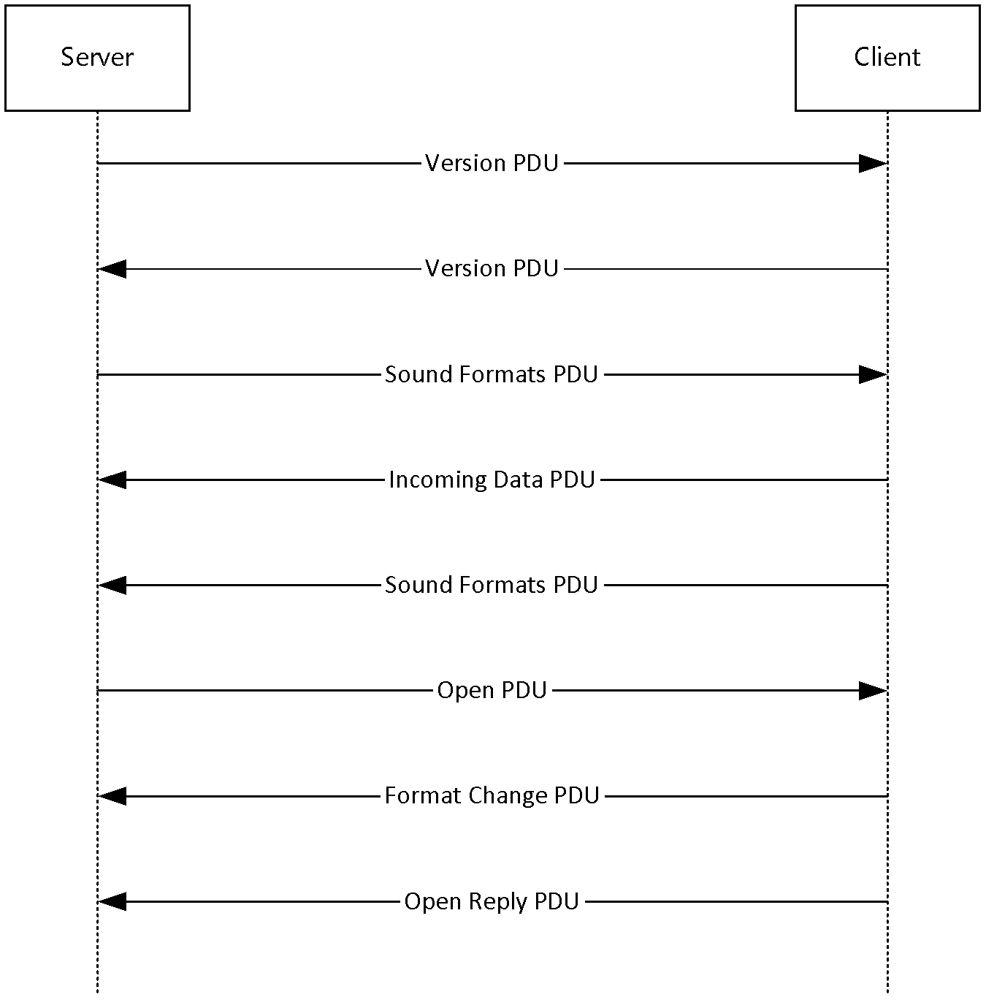
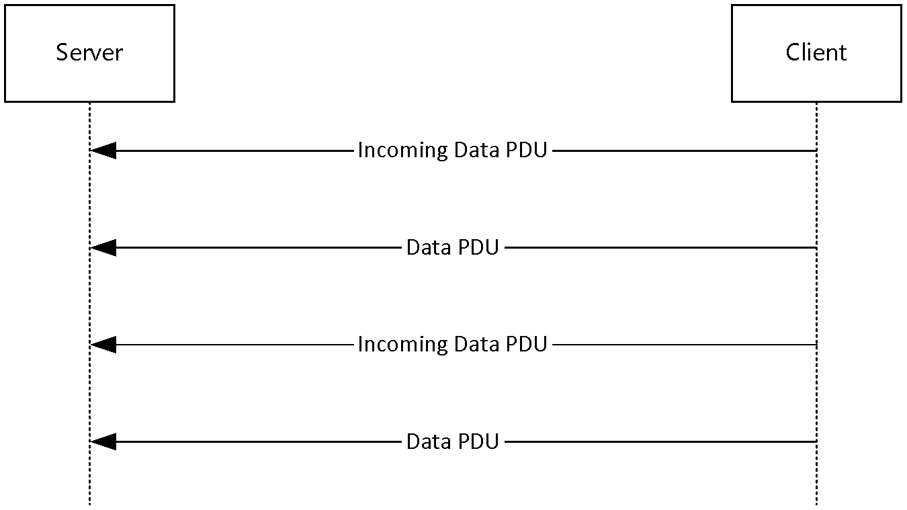
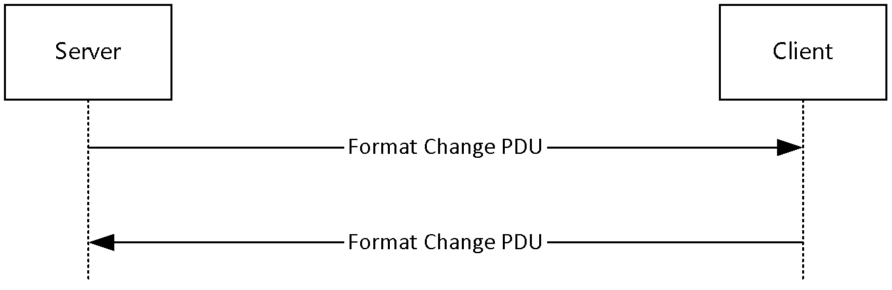
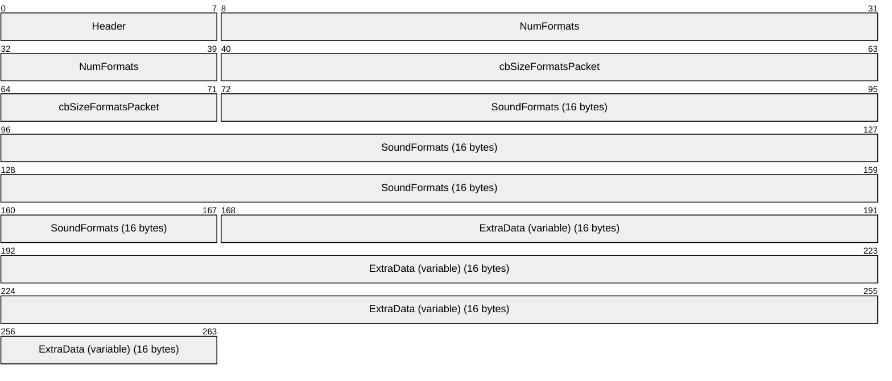
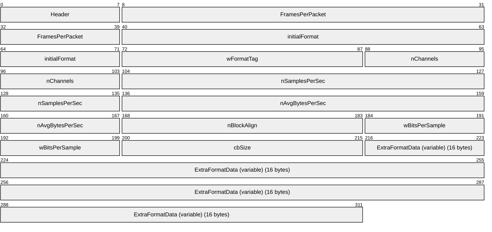
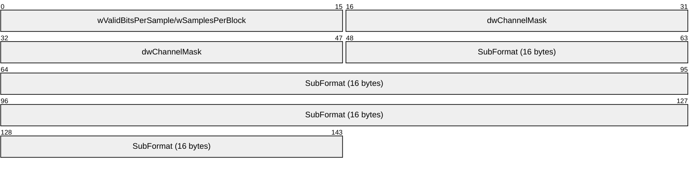
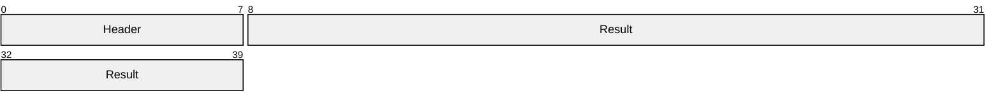
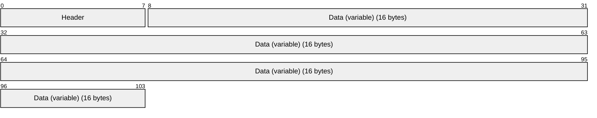
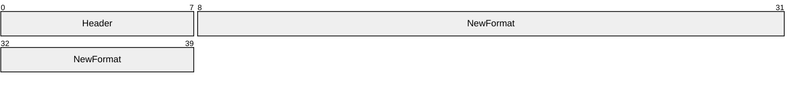
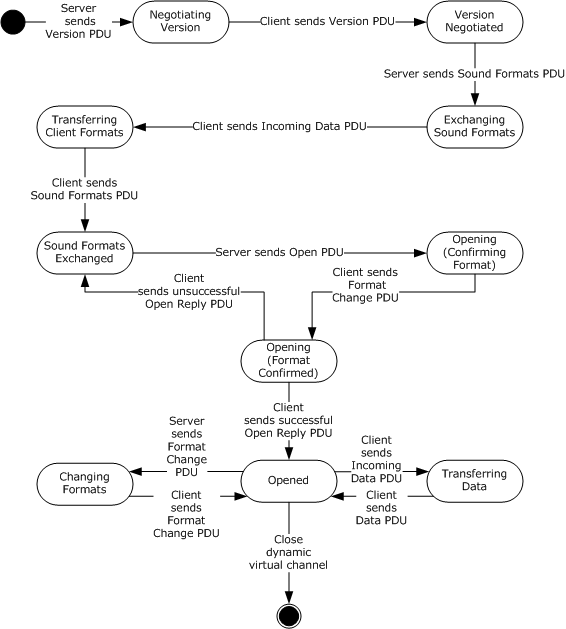

# [MS-RDPEAI]: Remote Desktop Protocol: Audio Input Redirection Virtual Channel Extension

Table of Contents

1 Introduction

- [1 Introduction](#Section_1)
  - [1.1 Glossary](#Section_1.1)
  - [1.2 References](#Section_1.2)
    - [1.2.1 Normative References](#Section_1.2.1)
    - [1.2.2 Informative References](#Section_1.2.2)
  - [1.3 Overview](#Section_1.3)
    - [1.3.1 Initialization Sequence](#Section_1.3.1)
    - [1.3.2 Data Transfer Sequence](#Section_1.3.2)
    - [1.3.3 Format Change Sequence](#Section_1.3.3)
  - [1.4 Relationship to Other Protocols](#Section_1.4)
  - [1.5 Prerequisites/Preconditions](#Section_1.5)
  - [1.6 Applicability Statement](#Section_1.6)
  - [1.7 Versioning and Capability Negotiation](#Section_1.7)
  - [1.8 Vendor-Extensible Fields](#Section_1.8)
  - [1.9 Standards Assignments](#Section_1.9)

2 Messages

- [2 Messages](#Section_2)
  - [2.1 Transport](#Section_2.1)
  - [2.2 Message Syntax](#Section_2.2)
    - [2.2.1 SNDIN_PDU Header](#Section_2.2.1)
    - [2.2.2 Initialization Messages](#Section_2.2.2)
      - [2.2.2.1 Version PDU (MSG_SNDIN_VERSION)](#Section_2.2.2.1)
      - [2.2.2.2 Sound Formats PDU (MSG_SNDIN_FORMATS)](#Section_2.2.2.2)
      - [2.2.2.3 Open PDU (MSG_SNDIN_OPEN)](#Section_2.2.2.3)
        - [2.2.2.3.1 Extended Wave Format Structure (WAVEFORMAT_EXTENSIBLE)](#Section_2.2.2.3.1)
      - [2.2.2.4 Open Reply PDU (MSG_SNDIN_OPEN_REPLY)](#Section_2.2.2.4)
    - [2.2.3 Data Transfer Messages](#Section_2.2.3)
      - [2.2.3.1 Incoming Data PDU (MSG_SNDIN_DATA_INCOMING)](#Section_2.2.3.1)
      - [2.2.3.2 Data PDU (MSG_SNDIN_DATA)](#Section_2.2.3.2)
    - [2.2.4 Format Change Messages](#Section_2.2.4)
      - [2.2.4.1 Format Change PDU (MSG_SNDIN_FORMATCHANGE)](#Section_2.2.4.1)

3 Protocol Details

- [3 Protocol Details](#Section_3)
  - [3.1 Common Details](#Section_3.1)
    - [3.1.1 Abstract Data Model](#Section_3.1.1)
    - [3.1.2 Timers](#Section_3.1.2)
    - [3.1.3 Initialization](#Section_3.1.3)
    - [3.1.4 Higher-Layer Triggered Events](#Section_3.1.4)
      - [3.1.4.1 Recording Audio](#Section_3.1.4.1)
    - [3.1.5 Message Processing Events and Sequencing Rules](#Section_3.1.5)
      - [3.1.5.1 Protocol Initialization](#Section_3.1.5.1)
      - [3.1.5.2 Protocol Termination](#Section_3.1.5.2)
    - [3.1.6 Timer Events](#Section_3.1.6)
    - [3.1.7 Other Local Events](#Section_3.1.7)
  - [3.2 Client Details](#Section_3.2)
    - [3.2.1 Abstract Data Model](#Section_3.2.1)
    - [3.2.2 Timers](#Section_3.2.2)
    - [3.2.3 Initialization](#Section_3.2.3)
    - [3.2.4 Higher-Layer Triggered Events](#Section_3.2.4)
    - [3.2.5 Message Processing Events and Sequencing Rules](#Section_3.2.5)
      - [3.2.5.1 Initialization Sequence](#Section_3.2.5.1)
        - [3.2.5.1.1 Processing a Version PDU](#Section_3.2.5.1.1)
        - [3.2.5.1.2 Sending a Version PDU](#Section_3.2.5.1.2)
        - [3.2.5.1.3 Processing a Sound Formats PDU](#Section_3.2.5.1.3)
        - [3.2.5.1.4 Sending an Incoming Data PDU](#Section_3.2.5.1.4)
        - [3.2.5.1.5 Sending a Sound Formats PDU](#Section_3.2.5.1.5)
        - [3.2.5.1.6 Processing an Open PDU](#Section_3.2.5.1.6)
        - [3.2.5.1.7 Sending a Format Change PDU](#Section_3.2.5.1.7)
        - [3.2.5.1.8 Sending an Open Reply PDU](#Section_3.2.5.1.8)
      - [3.2.5.2 Data Transfer Sequence](#Section_3.2.5.2)
        - [3.2.5.2.1 Sending an Incoming Data PDU](#Section_3.2.5.2.1)
        - [3.2.5.2.2 Sending a Data PDU](#Section_3.2.5.2.2)
      - [3.2.5.3 Format Change Sequence](#Section_3.2.5.3)
        - [3.2.5.3.1 Processing a Format Change PDU](#Section_3.2.5.3.1)
        - [3.2.5.3.2 Sending a Format Change PDU](#Section_3.2.5.3.2)
    - [3.2.6 Timer Events](#Section_3.2.6)
    - [3.2.7 Other Local Events](#Section_3.2.7)
  - [3.3 Server Details](#Section_3.3)
    - [3.3.1 Abstract Data Model](#Section_3.3.1)
    - [3.3.2 Timers](#Section_3.3.2)
    - [3.3.3 Initialization](#Section_3.3.3)
    - [3.3.4 Higher-Layer Triggered Events](#Section_3.3.4)
    - [3.3.5 Message Processing Events and Sequencing Rules](#Section_3.3.5)
      - [3.3.5.1 Initialization Sequence](#Section_3.3.5.1)
        - [3.3.5.1.1 Sending a Version PDU](#Section_3.3.5.1.1)
        - [3.3.5.1.2 Processing a Version PDU](#Section_3.3.5.1.2)
        - [3.3.5.1.3 Sending a Sound Formats PDU](#Section_3.3.5.1.3)
        - [3.3.5.1.4 Processing an Incoming Data PDU](#Section_3.3.5.1.4)
        - [3.3.5.1.5 Processing a Sound Formats PDU](#Section_3.3.5.1.5)
        - [3.3.5.1.6 Sending an Open PDU](#Section_3.3.5.1.6)
        - [3.3.5.1.7 Processing a Format Change PDU](#Section_3.3.5.1.7)
        - [3.3.5.1.8 Processing an Open Reply PDU](#Section_3.3.5.1.8)
      - [3.3.5.2 Data Transfer Sequence](#Section_3.3.5.2)
        - [3.3.5.2.1 Processing an Incoming Data PDU](#Section_3.3.5.2.1)
        - [3.3.5.2.2 Processing a Data PDU](#Section_3.3.5.2.2)
      - [3.3.5.3 Format Change Sequence](#Section_3.3.5.3)
        - [3.3.5.3.1 Sending a Format Change PDU](#Section_3.3.5.3.1)
        - [3.3.5.3.2 Processing a Format Change PDU](#Section_3.3.5.3.2)
    - [3.3.6 Termination](#Section_3.3.6)
    - [3.3.7 Timer Events](#Section_3.3.7)
    - [3.3.8 Other Local Events](#Section_3.3.8)

4 Protocol Examples

- [4 Protocol Examples](#Section_4)
  - [4.1 Annotated Initialization Sequence](#Section_4.1)
    - [4.1.1 Server Version PDU](#Section_4.1.1)
    - [4.1.2 Client Version PDU](#Section_4.1.2)
    - [4.1.3 Server Sound Formats PDU](#Section_4.1.3)
    - [4.1.4 Incoming Data PDU](#Section_4.1.4)
    - [4.1.5 Client Sound Formats PDU](#Section_4.1.5)
    - [4.1.6 Open PDU](#Section_4.1.6)
    - [4.1.7 Format Change PDU](#Section_4.1.7)
    - [4.1.8 Open Reply PDU](#Section_4.1.8)
  - [4.2 Annotated Data Transfer Sequence](#Section_4.2)
    - [4.2.1 Incoming Data PDU](#Section_4.2.1)
    - [4.2.2 Data PDU](#Section_4.2.2)
  - [4.3 Annotated Format Change Sequence](#Section_4.3)
    - [4.3.1 Server Format Change PDU](#Section_4.3.1)
    - [4.3.2 Client Format Change PDU](#Section_4.3.2)

5 Security

- [5 Security](#Section_5)
  - [5.1 Security Considerations for Implementers](#Section_5.1)
  - [5.2 Index of Security Parameters](#Section_5.2)

6 Appendix A: Product Behavior

- [6 Appendix A: Product Behavior](#Section_6)

7 Change Tracking

- [7 Change Tracking](#Section_7)

For the legal notice and IP terms, see [LEGAL.md](../LEGAL.md).
Last updated: 4/23/2024.
See [Revision History](#revision-history) for full version history.

# 1 Introduction

The Remote Desktop Protocol: Audio Input Redirection Virtual Channel Extension seamlessly transfers audio data from a Remote Desktop Protocol client to a Remote Desktop Protocol server.

Sections 1.5, 1.8, 1.9, 2, and 3 of this specification are normative. All other sections and examples in this specification are informative.

## 1.1 Glossary

This document uses the following terms:

**audio format**: A data structure that is used to define waveform-audio data. The actual structure of individual formats is opaque to the underlying transport protocol. For more information, see [MSDN-AUDIOFORMAT].

**dynamic virtual channel**: A transport used for lossless communication between an RDP client and a server component over a main data connection, as specified in [MS-RDPEDYC].

**Dynamic Virtual Channel (DVC) Listener (or Listener)**: A named endpoint registered at the TS client during initialization of a DVC. DVC listeners are service providers to the applications that run on a TS server.

**globally unique identifier (GUID)**: A term used interchangeably with universally unique identifier (UUID) in Microsoft protocol technical documents (TDs). Interchanging the usage of these terms does not imply or require a specific algorithm or mechanism to generate the value. Specifically, the use of this term does not imply or require that the algorithms described in [[RFC4122]](https://go.microsoft.com/fwlink/?LinkId=90460) or [[C706]](https://go.microsoft.com/fwlink/?LinkId=89824) must be used for generating the [**GUID**](#gt_globally-unique-identifier-guid). See also universally unique identifier (UUID).

**HRESULT**: An integer value that indicates the result or status of an operation. A particular HRESULT can have different meanings depending on the protocol using it. See [MS-ERREF](../MS-ERREF/MS-ERREF.md) section 2.1 and specific protocol documents for further details.

**little-endian**: Multiple-byte values that are byte-ordered with the least significant byte stored in the memory location with the lowest address.

**protocol data unit (PDU)**: Information that is delivered as a unit among peer entities of a network and that can contain control information, address information, or data. For more information on remote procedure call (RPC)-specific PDUs, see [C706] section 12.

**Remote Desktop Protocol (RDP) client**: The client that initiated a remote desktop connection.

**Remote Desktop Protocol (RDP) server**: The server to which a client initiated a remote desktop connection.

**Wave Capture Device**: A device that captures audio to the computer.

**MAY, SHOULD, MUST, SHOULD NOT, MUST NOT:** These terms (in all caps) are used as defined in [[RFC2119]](https://go.microsoft.com/fwlink/?LinkId=90317). All statements of optional behavior use either MAY, SHOULD, or SHOULD NOT.

## 1.2 References

Links to a document in the Microsoft Open Specifications library point to the correct section in the most recently published version of the referenced document. However, because individual documents in the library are not updated at the same time, the section numbers in the documents may not match. You can confirm the correct section numbering by checking the [Errata](https://go.microsoft.com/fwlink/?linkid=850906).

### 1.2.1 Normative References

We conduct frequent surveys of the normative references to assure their continued availability. If you have any issue with finding a normative reference, please contact [dochelp@microsoft.com](mailto:dochelp@microsoft.com). We will assist you in finding the relevant information.

[MS-ERREF] Microsoft Corporation, "[Windows Error Codes](../MS-ERREF/MS-ERREF.md)".

[MS-RDPBCGR] Microsoft Corporation, "[Remote Desktop Protocol: Basic Connectivity and Graphics Remoting](../MS-RDPBCGR/MS-RDPBCGR.md)".

[MS-RDPEA] Microsoft Corporation, "[Remote Desktop Protocol: Audio Output Virtual Channel Extension](../MS-RDPEA/MS-RDPEA.md)".

[MS-RDPEDYC] Microsoft Corporation, "[Remote Desktop Protocol: Dynamic Channel Virtual Channel Extension](../MS-RDPEDYC/MS-RDPEDYC.md)".

[RFC2119] Bradner, S., "Key words for use in RFCs to Indicate Requirement Levels", BCP 14, RFC 2119, March 1997, [https://www.rfc-editor.org/info/rfc2119](https://go.microsoft.com/fwlink/?LinkId=90317)

[RFC2361] Fleischman, E., "WAVE and AVI Codec Registries", RFC 2361, June 1998, [https://www.rfc-editor.org/info/rfc2361](https://go.microsoft.com/fwlink/?LinkId=90337)

### 1.2.2 Informative References

[ETSI-GSM] European Telecommunications Standards Organization, "GSM UMTS 3GPP Numbering Cross Reference", March 2008, [http://webapp.etsi.org/key/key.asp?GSMSpecPart1=06&GSMSpecPart2=10&Search=search](https://go.microsoft.com/fwlink/?LinkId=114230)

[MSDN-WAVEFMTEXT] Microsoft Corporation, "WAVEFORMATEXTENSIBLE", [http://msdn.microsoft.com/en-us/library/ms713496.aspx](https://go.microsoft.com/fwlink/?LinkId=128854)

## 1.3 Overview

This section provides a high-level overview of the operation of the Remote Desktop Protocol: Audio Input Redirection Virtual Channel Extension. The purpose of this protocol is to transfer audio data from a [**Remote Desktop Protocol (RDP) client**](#gt_remote-desktop-protocol-rdp-client) to a [**Remote Desktop Protocol (RDP) server**](#gt_remote-desktop-protocol-rdp-server), hereinafter referred to as client and server, respectively. For example, an application running on a server can request to record audio data. This data will be transferred from the client to the server, allowing a server application to record from an audio device installed on the client.

The protocol is divided into three main sequences:

**Initialization sequence:** The server and client exchange versions and audio formats, and begin recording.

**Data transfer sequence:** The client sends audio data to the server.

**Format change sequence:** The server requests a new [**audio format**](#gt_audio-format), and the client confirms this request.

### 1.3.1 Initialization Sequence

The initialization sequence has the following goals:

- To establish the client and server protocol versions and capabilities.
- To establish a list of [**audio formats**](#gt_audio-format) supported by both the client and the server.
- To begin recording audio data.
Initially, the server sends a [Version PDU](#Section_4.1.1) to the client within the already established [**dynamic virtual channel**](#gt_dynamic-virtual-channel). The client will respond with its own Version PDU. Next, the server will send a [Sound Formats PDU](#Section_4.1.5), which contains a list of the audio formats the server supports. The client sends its own Sound Formats PDU to the server, establishing the common list of audio formats. All audio data will be encoded using one of the formats in this list.

Once the audio formats have been exchanged, the server will indicate that it has requested to begin recording, by sending an [Open PDU](#Section_4.1.6). The client will attempt to start recording from an attached audio capture device and return the result to the server in an [Open Reply PDU](#Section_4.1.8). At this point, the client will begin sending audio data.

Figure 1: Initialization sequence

### 1.3.2 Data Transfer Sequence

The data transfer sequence simply transfers audio data from the client to the server. The client will encode captured audio data using the current [**audio format**](#gt_audio-format) agreed on during either the initialization sequence or the format change sequence and send it to the server. The client first sends an [Incoming Data PDU](#Section_4.1.4), which informs the server that the next packet will contain audio data. The client will then send the audio data in a [Data PDU](#Section_4.2.2).

Figure 2: Data transfer sequence

### 1.3.3 Format Change Sequence

The format change sequence provides a mechanism for the server to request that the client use a different format for encoding the audio data. The server initiates the sequence by sending a [Format Change PDU](#Section_4.1.7), identifying the server's desired format out of the list that was agreed on during the initialization sequence. The client will then confirm this change of format by sending a Format Change PDU specifying the same format. From this point, the client will encode audio data using the new format.

Figure 3: Format change sequence

## 1.4 Relationship to Other Protocols

The Remote Desktop Protocol: Audio Input Redirection Virtual Channel Extension is embedded in a [**dynamic virtual channel**](#gt_dynamic-virtual-channel) transport, as specified in [MS-RDPEDYC](../MS-RDPEDYC/MS-RDPEDYC.md).

## 1.5 Prerequisites/Preconditions

The Remote Desktop Protocol: Audio Input Redirection Virtual Channel Extension operates only after the [**dynamic virtual channel**](#gt_dynamic-virtual-channel) transport, as specified in [MS-RDPEDYC](../MS-RDPEDYC/MS-RDPEDYC.md), is fully established. If the dynamic virtual channel transport is terminated, no other communication occurs over the Remote Desktop Protocol: Audio Input Redirection Virtual Channel Extension.

All multiple-byte fields within a message are assumed to contain data in [**little-endian**](#gt_little-endian) byte ordering, unless otherwise specified.

## 1.6 Applicability Statement

The Remote Desktop Protocol: Audio Input Redirection Virtual Channel Extension is designed to run within the context of a Remote Desktop Protocol (RDP) [**dynamic virtual channel**](#gt_dynamic-virtual-channel) established between an [**RDP client**](#gt_remote-desktop-protocol-rdp-client) and [**RDP server**](#gt_remote-desktop-protocol-rdp-server). The protocol is applicable when the client is required to record audio and transfer the recorded audio to the server.

## 1.7 Versioning and Capability Negotiation

The Remote Desktop Protocol: Audio Input Redirection Virtual Channel Extension is capability-based. The client and the server exchange capabilities during the protocol initialization sequence (as specified in section [3.2.5.1](#Section_3.3.5.1), and section [3.3.5.1](#Section_3.3.5.1)). After the capabilities have been exchanged, the client and server do not send [**protocol data units (PDUs)**](#gt_protocol-data-unit-pdu) or data formats that cannot be processed by the other.

## 1.8 Vendor-Extensible Fields

This protocol uses [**HRESULT**](#gt_hresult) values as defined in [MS-ERREF](../MS-ERREF/MS-ERREF.md) section 2.1.1. Vendors can define their own HRESULT values, provided that they set the C bit (0x20000000) for each vendor-defined value, indicating that the value is a customer code.

## 1.9 Standards Assignments

None.

# 2 Messages

## 2.1 Transport

This protocol is designed to operate over a [**dynamic virtual channel**](#gt_dynamic-virtual-channel), as specified in [MS-RDPEDYC](../MS-RDPEDYC/MS-RDPEDYC.md) section 1.1. The dynamic virtual channel name is the null-terminated ANSI encoded character string "AUDIO_INPUT", which is the name of the [**Listener**](#gt_bb000f88-ce99-44ce-bdc2-2e438a2f131f) on the client side. The usage of a channel name when opening a dynamic virtual channel is specified in [MS-RDPEDYC] section 2.2.2.1. The RDP layer manages the creation, setup, and transmission of data over the dynamic virtual channel.

## 2.2 Message Syntax

The following sections define the syntax for the various [**PDUs**](#gt_protocol-data-unit-pdu) in each protocol sequence. The listing is not exclusive; some PDUs can appear in other sequences.

### 2.2.1 SNDIN_PDU Header

The SNDIN_PDU header MUST be included in all audio capture PDUs. It identifies the type of the [**PDU**](#gt_protocol-data-unit-pdu).

**MessageId (1 byte):** An 8-bit unsigned integer that specifies the type of audio PDU.

| Value | Meaning |
| --- | --- |
| MSG_SNDIN_VERSION 0x01 | [Version PDU](#Section_4.1.1) |
| MSG_SNDIN_FORMATS 0x02 | [Sound Formats PDU](#Section_4.1.5) |
| MSG_SNDIN_OPEN 0x03 | [Open PDU](#Section_4.1.6) |
| MSG_SNDIN_OPEN_REPLY 0x04 | [Open Reply PDU](#Section_4.1.8) |
| MSG_SNDIN_DATA_INCOMING 0x05 | [Incoming Data PDU](#Section_4.1.4) |
| MSG_SNDIN_DATA 0x06 | [Data PDU](#Section_4.2.2) |
| MSG_SNDIN_FORMATCHANGE 0x07 | [Format Change PDU](#Section_4.1.7) |

### 2.2.2 Initialization Messages

The following sections contain the Remote Desktop Protocol: Audio Input Redirection Virtual Channel Extension message syntax for exchanging versions and capabilities, establishing a list of audio formats supported by both the client and the server, and starting audio data recording. For more information, see section [3.1.3](#Section_3.1.3).

#### 2.2.2.1 Version PDU (MSG_SNDIN_VERSION)

The Version PDU is sent by the server and the client to negotiate which version of the protocol MUST be used.

**Header (1 byte):** A [SNDIN_PDU](#Section_2.2.1) header (section 2.2.1). The **MessageId** field of the SNDIN_PDU header MUST be set to MSG_SNDIN_VERSION (0x01).

**Version (4 bytes):** A 32-bit unsigned integer. This field specifies the protocol version used by the client or server that sent this [**PDU**](#gt_protocol-data-unit-pdu).

| Value | Meaning |
| --- | --- |
| 0x00000001 | Version 1 |
| 0x00000002 | Version 2 |

The advertised version affects the usage of the Format Change PDU (section [3.3.5.3.1](#Section_3.3.5.3.1)).

#### 2.2.2.2 Sound Formats PDU (MSG_SNDIN_FORMATS)

The Sound Formats PDU is sent by the server and the client to negotiate a common list of supported [**audio formats**](#gt_audio-format).

**Header (1 byte):** An [SNDIN_PDU](#Section_2.2.1) header (section 2.2.1). The **MessageId** field of the SNDIN_PDU header MUST be set to MSG_SNDIN_FORMATS (0x02).

**NumFormats (4 bytes):** A 32-bit unsigned integer. This field specifies the number of formats in the **SoundFormats** array.

**cbSizeFormatsPacket (4 bytes):** A 32-bit unsigned integer. This field is reserved in the Sound Formats PDU that is sent from server to client. The value is arbitrary in the PDU sent from server to client, and MUST be ignored upon receipt on the client side. In the PDU sent from client to server, this field MUST be set to the size, in bytes, of the entire PDU minus the size, in bytes, of the **ExtraData** field.

**SoundFormats (16 bytes):** A variable-sized array of audio formats supported by the client or server. The number of formats is **NumFormats**. Each element in the array conforms to the AUDIO_FORMAT, as specified in [MS-RDPEA](../MS-RDPEA/MS-RDPEA.md) section 2.2.2.1.1. Any of the audio codecs defined in [[RFC2361]](https://go.microsoft.com/fwlink/?LinkId=90337) are allowed by this protocol. Implementations MUST, at a minimum, support WAVE_FORMAT_PCM (0x0001). For more information about this codec, see [MS-RDPEA] section 2.2.2.1.1.<1>

**ExtraData (variable):** An optional field that contains additional data. This data MAY be appended to the end of a Sound Formats PDU. The data is arbitrary and MUST be ignored by the recipient. The recipient finds out where **ExtraData** starts by parsing the PDU. This will tell the total size of all the data fields in this PDU except **ExtraData**. The size of ExtraData can be calculated by subtracting the size of the useful data from the size of the PDU. The **MSG_SNDIN_FORMATS** structure is encapsulated in the Dynamic VC Data First PDU ([MS-RDPEDYC](../MS-RDPEDYC/MS-RDPEDYC.md) section 2.2.3.1) and Dynamic VC Data PDU ([MS-RDPEDYC] section 2.2.3.2). The length of these PDUs is determined as described in [MS-RDPEDYC] sections 3.1.5.1 and 3.1.5.2.

#### 2.2.2.3 Open PDU (MSG_SNDIN_OPEN)

The Open PDU is sent by the server and indicates that the server requests to start recording from the client device. The **wFormatTag**, **nChannels**, **nSamplesPerSec**, **nAvgBytesPerSec**, **nBlockAlign**, **wBitsPerSample**, **cbSize**, and **ExtraFormatData** fields specify the [**audio format**](#gt_audio-format) that the client SHOULD use to record from the audio input device. The **initialFormat** field contains an index into the list of audio formats agreed to by the client and the server. The **initialFormat** field specifies the format in which audio data MUST be encoded.

**Header (1 byte):** A [SNDIN_PDU](#Section_2.2.1) header (section 2.2.1). The **MessageId** field of the SNDIN_PDU header MUST be set to MSG_SNDIN_OPEN (0x03).

**FramesPerPacket (4 bytes):** A 32-bit unsigned integer. This field specifies the number of audio frames that the client MUST send in each [Data PDU](#Section_4.2.2). The product of nChannels, 2, and FramesPerPacket is the size of audio data that the client MUST put in a Data PDU. The audio data size is determined by the server application and is not determined by the Remote Desktop Protocol: Audio Input Redirection Virtual Channel Extension.

**initialFormat (4 bytes):** A 32-bit unsigned integer. This field is an index into the list of audio formats agreed on by the client and server. This field specifies the initial audio format.

**wFormatTag (2 bytes):** A 16-bit unsigned integer identifying the compression codec of the audio format. For more information on compression formats, see [[RFC2361]](https://go.microsoft.com/fwlink/?LinkId=90337). If this field is set to WAVE_FORMAT_EXTENSIBLE (0xFFFE), the **cbSize** field MUST be equal to 22.

**nChannels (2 bytes):** A 16-bit unsigned integer. This field specifies the number of channels in the audio format identified by **wFormatTag**. It is part of the audio format and is not determined by the Remote Desktop Protocol: Audio Input Redirection Virtual Channel Extension.

**nSamplesPerSec (4 bytes):** A 32-bit unsigned integer. This field specifies the sampling rate, in hertz, for recording audio.

**nAvgBytesPerSec (4 bytes):** A 32-bit unsigned integer. This field specifies average data-transfer rate for the format, in bytes per second.

**nBlockAlign (2 bytes):** A 16-bit unsigned integer. This field specifies the block alignment, in bytes. The block alignment is the minimum atomic unit of data for this audio format.

**wBitsPerSample (2 bytes):** A 16-bit unsigned integer. This field specifies the size, in bits, for each audio sample.

**cbSize (2 bytes):** A 16-bit unsigned integer specifying the size of the **ExtraFormatData** field.

**ExtraFormatData (variable):** Extra data specific to the audio format. The size of **ExtraFormatData**, in bytes, is **cbSize**. If **cbSize** is 0, this field MUST NOT exist. If **wFormatTag** is set to WAVE_FORMAT_EXTENSIBLE (0xFFFE), this field MUST be a [WAVEFORMAT_EXTENSIBLE](#Section_2.2.2.3.1) structure.

##### 2.2.2.3.1 Extended Wave Format Structure (WAVEFORMAT_EXTENSIBLE)

The Extended Wave Format Structure provides detailed [**audio format**](#gt_audio-format) information. For more information, see [[MSDN-WAVEFMTEXT]](https://go.microsoft.com/fwlink/?LinkId=128854).

**wValidBitsPerSample/wSamplesPerBlock (2 bytes):** Depending on the format used, the 16–bit field before **dwChannelMask** can be interpreted as either **wValidBitsPerSample** or **wSamplesPerBlock**. **wValidBitsPerSample** is a 16-bit unsigned integer specifying how many bits are valid for each sample. This value MUST be less than or equal to the value of the **wBitsPerSample** field of the containing [Open PDU](#Section_4.1.6). **wSamplesPerBlock** is a 16-bit unsigned integer specifying the number of samples contained in one compressed block of audio data. This value is used with compressed formats that have a fixed number of samples within each block. This value can be set to 0 if a variable number of samples is contained in each block of compressed audio data.

**dwChannelMask (4 bytes):** A 32-bit unsigned integer specifying from which audio channels to record. This field MUST be a bitwise OR of the following values.

| Bit Range | Field | Description |
| --- | --- | --- |
| Variable | SPEAKER_FRONT_LEFT | 0x00000001 |
| Variable | SPEAKER_FRONT_RIGHT | 0x00000002 |
| Variable | SPEAKER_FRONT_CENTER | 0x00000004 |
| Variable | SPEAKER_LOW_FREQUENCY | 0x00000008 |
| Variable | SPEAKER_BACK_LEFT | 0x00000010 |
| Variable | SPEAKER_BACK_RIGHT | 0x00000020 |
| Variable | SPEAKER_FRONT_LEFT_OF_CENTER | 0x00000040 |
| Variable | SPEAKER_FRONT_RIGHT_OF_CENTER | 0x00000080 |
| Variable | SPEAKER_BACK_CENTER | 0x00000100 |
| Variable | SPEAKER_SIDE_LEFT | 0x00000200 |
| Variable | SPEAKER_SIDE_RIGHT | 0x00000400 |
| Variable | SPEAKER_TOP_CENTER | 0x00000800 |
| Variable | SPEAKER_TOP_FRONT_LEFT | 0x00001000 |
| Variable | SPEAKER_TOP_FRONT_CENTER | 0x00002000 |
| Variable | SPEAKER_TOP_FRONT_RIGHT | 0x00004000 |
| Variable | SPEAKER_TOP_BACK_LEFT | 0x00008000 |
| Variable | SPEAKER_TOP_BACK_CENTER | 0x00010000 |
| Variable | SPEAKER_TOP_BACK_RIGHT | 0x00020000 |

**SubFormat (16 bytes):** A [**GUID**](#gt_globally-unique-identifier-guid) that specifies the audio format to use for recording data. This field MUST be set to KSDATAFORMAT_SUBTYPE_PCM ({00000001-0000-0010-8000-00aa00389b71}).

#### 2.2.2.4 Open Reply PDU (MSG_SNDIN_OPEN_REPLY)

The Open Reply PDU is sent by the client to convey the result of an attempt to open the audio capture device.

**Header (1 byte):** A [SNDIN_PDU](#Section_2.2.1) header (section 2.2.1). The **MessageId** field of the SNDIN_PDU header MUST be set to MSG_SNDIN_OPEN_REPLY (0x04).

**Result (4 bytes):** An [**HRESULT**](#gt_hresult) containing the status of the attempt to open the client-side [**Wave Capture Device**](#gt_wave-capture-device).

### 2.2.3 Data Transfer Messages

The following sections contain the Remote Desktop Protocol: Audio Input Redirection Virtual Channel Extension message syntax for transferring audio data from client to server. For more information, see section [3.2.5.2](#Section_3.3.5.2).

#### 2.2.3.1 Incoming Data PDU (MSG_SNDIN_DATA_INCOMING)

The Incoming Data PDU is sent by the client to indicate that the next packet sent MUST either be a [Data PDU](#Section_4.2.2) or a [Sound Formats PDU](#Section_4.1.5). This [**PDU**](#gt_protocol-data-unit-pdu) is used for diagnostic purposes. The time used to transmit a Data PDU/Sound Formats PDU can be found out by comparing the time between receiving a Data PDU/Sound Formats PDU and receiving an Incoming Data PDU. The server MAY use this time and the data size of a Data PDU/Sound Formats PDU to calculate how fast the network is transmitting data. The result of this calculation MAY then be used to determine the audio format to use.

**Header (1 byte):** An [SNDIN_PDU](#Section_2.2.1) header (section 2.2.1). The **MessageId** field of the SNDIN_PDU header MUST be set to MSG_SNDIN_DATA_INCOMING (0x05).

#### 2.2.3.2 Data PDU (MSG_SNDIN_DATA)

The Data PDU is sent by the client and contains a fragment of audio data.

**Header (1 byte):** A [SNDIN_PDU](#Section_2.2.1) header (section 2.2.1). The **MessageId** field of the SNDIN_PDU header MUST be set to MSG_SNDIN_DATA (0x06).

**Data (variable):** A variable-length field that contains audio data. The recipient can determine the length of the **Data** field by subtracting the length of the **Header** field from the length of the Data PDU. The **MSG_SNDIN_DATA** structure is encapsulated in the Dynamic VC Data First PDU ([MS-RDPEDYC](../MS-RDPEDYC/MS-RDPEDYC.md) section 2.2.3.1) and Dynamic VC Data PDU ([MS-RDPEDYC] section 2.2.3.2). The length of these PDUs is determined as described in [MS-RDPEDYC] sections 3.1.5.1 and 3.1.5.2.

### 2.2.4 Format Change Messages

The following section specifies the Remote Desktop Protocol: Audio Input Redirection Virtual Channel Extension message syntax for changing audio data encoding format. For more information, see section [3.2.5.1.7](#Section_3.2.5.1.7) and section [3.3.5.1.7](#Section_3.3.5.1.7).

#### 2.2.4.1 Format Change PDU (MSG_SNDIN_FORMATCHANGE)

The Format Change PDU is sent by the server to request that the client change [**audio formats**](#gt_audio-format) and by the client to confirm a format change.

**Header (1 byte):** An [SNDIN_PDU](#Section_2.2.1) header (section 2.2.1). The **MessageId** field of the SNDIN_PDU header MUST be set to MSG_SNDIN_FORMATCHANGE (0x07).

**NewFormat (4 bytes):** A 32-bit unsigned integer that represents an index into the list of audio formats exchanged between the client and server during the initialization phase, as specified in section [3.1.1](#Section_3.1.1). For more information about changing audio formats, see sections [3.2.5.3](#Section_1.3.3) and [3.3.5.3](#Section_1.3.3).

# 3 Protocol Details

## 3.1 Common Details

### 3.1.1 Abstract Data Model

This section describes a conceptual model of possible data organization that an implementation maintains to participate in this protocol. The described organization is provided to facilitate the explanation of how the protocol behaves. This document does not mandate that implementations adhere to this model as long as their external behavior is consistent with that described in this document.

**Audio format list:** The client and server maintain a list of [**audio formats**](#gt_audio-format) that were agreed on during the initialization sequence throughout the duration of the protocol. The **NewFormat** field of the [Format Change PDU](#Section_4.1.7) and the **InitialFormat** field of the [Open PDU](#Section_4.1.6) are indices into this list. The index to the **audio format list** is zero-based, where the value zero refers to the first format in the list.

**Current audio format:** The client and server maintain the current audio formats. This is the format in which audio data MUST be encoded when transmitted from the client to the server. The **NewFormat** field of the Format Change PDU or the **InitialFormat** field of the Open PDU indicates the current audio format.

**Audio capture device state:** The audio capture device has two states: **opened** and **not opened**. Initially the state is **not opened**. The server sends an Open PDU to ask the client to open the audio capture device. The client sends an [Open Reply PDU](#Section_4.1.8) to tell the server the result of opening the capture device. If the capture device is opened successfully, the audio input device state becomes **opened**.

**Audio data ready:** The client sends an [Incoming Data PDU](#Section_4.1.4) to tell the server that it is ready to send data. The server maintains the **audio data ready** state to prepare to receive a [Data PDU](#Section_4.2.2).

**Protocol version:** The client and server store the protocol version negotiated during the initialization sequence.

### 3.1.2 Timers

None.

### 3.1.3 Initialization

Before this protocol begins, the [**dynamic virtual channel**](#gt_dynamic-virtual-channel) transport MUST be established as specified in section [2.1](#Section_2.1). The server and client also need to negotiate the protocol version and a common list of [**audio formats**](#gt_audio-format) by exchanging [Version PDUs](#Section_4.1.1) and [Sound Formats PDUs](#Section_4.1.5). Once the protocol version and audio formats list have been exchanged, the server sends an [Open PDU](#Section_4.1.6) to the client to indicate that the server requests to start recording. The client attempts to start recording and returns the result to the server in an [Open Reply PDU](#Section_4.1.8) message.

### 3.1.4 Higher-Layer Triggered Events

#### 3.1.4.1 Recording Audio

When the server attempts to start recording audio, for example the server runs Sound Recorder, the client MUST redirect the audio data. If the initialization sequence has not happened, the server MUST begin the initialization sequence.

### 3.1.5 Message Processing Events and Sequencing Rules

The state transition diagram in the following figure summarizes the message sequencing rules for the Remote Desktop Protocol: Audio Input Redirection Virtual Channel Extension. Further details on sending and processing the messages are included in sections [3.2.5](#Section_3.3.5) and [3.3.5](#Section_3.3.5). Malformed packets that do not meet the specifications outlined in section [2.2](#Section_1.3), unrecognized packets, and out-of-sequence packets MUST be ignored by the server and the client. There are no time-outs for receiving a reply for any request.

Figure 4: State transition diagram

#### 3.1.5.1 Protocol Initialization

The protocol begins when the server opens the [**dynamic virtual channel**](#gt_dynamic-virtual-channel). The first [**PDU**](#gt_protocol-data-unit-pdu) sent is always the [Version PDU](#Section_4.1.1).

#### 3.1.5.2 Protocol Termination

The protocol is terminated when the [**dynamic virtual channel**](#gt_dynamic-virtual-channel) is closed. This can occur at any time during the protocol sequence and not merely on the state transition labeled "Close dynamic virtual channel". The close can be initiated by either the [**RDP server**](#gt_remote-desktop-protocol-rdp-server) or the [**RDP client**](#gt_remote-desktop-protocol-rdp-client), but it is normally initiated by the RDP client.

### 3.1.6 Timer Events

None.

### 3.1.7 Other Local Events

None.

## 3.2 Client Details

### 3.2.1 Abstract Data Model

The abstract data model is specified in section [3.1.1](#Section_3.1.1).

### 3.2.2 Timers

None.

### 3.2.3 Initialization

Initialization is specified in section [3.1.3](#Section_3.1.3).

### 3.2.4 Higher-Layer Triggered Events

See section [3.1.4](#Section_3.1.4) for more information.

### 3.2.5 Message Processing Events and Sequencing Rules

#### 3.2.5.1 Initialization Sequence

##### 3.2.5.1.1 Processing a Version PDU

The structure and fields of the [Version PDU](#Section_4.1.1) are specified in section 2.2.2.1.

The Version PDU MUST be the first [**PDU**](#gt_protocol-data-unit-pdu) received by the client. The client MUST store the protocol version and use this to determine which messages are supported by the server.

##### 3.2.5.1.2 Sending a Version PDU

The structure and fields of the [Version PDU](#Section_4.1.1) are specified in section 2.2.2.1.

The client MUST acknowledge the Version PDU sent by the server by sending its own Version PDU to the server.

##### 3.2.5.1.3 Processing a Sound Formats PDU

The structure and fields of the [Sound Formats PDU](#Section_4.1.5) are specified in section 2.2.2.2.

The client uses the [**audio formats**](#gt_audio-format) sent by the server when selecting which formats will be used.

##### 3.2.5.1.4 Sending an Incoming Data PDU

The structure and format of the [Incoming Data PDU](#Section_4.1.4) are specified in section 2.2.3.1.

The client MUST send an Incoming Data PDU before responding to the server with a [Sound Formats PDU](#Section_4.1.5).

##### 3.2.5.1.5 Sending a Sound Formats PDU

The structure and fields of the [Sound Formats PDU](#Section_4.1.5) are specified in section 2.2.2.2.

The client MUST respond to the Sound Formats PDU sent by the server by replying with its own Sound Formats PDU. The list of [**audio formats**](#gt_audio-format) that the client sends back to the server MUST be a subset of the list sent by the server. Formats that are not in the server's list MUST NOT be included in the client's audio format list.

The list sent by the client establishes the allowed audio formats for the current protocol session. These formats MUST be referenced by the **NewFormat** field of the [Format Change PDUs](#Section_4.1.7) and the **initialFormat** field of the [Open PDU](#Section_4.1.6). A value of *I* refers to the *I*th format of this list and means that audio data MUST be encoded in the *I*th format in the list.

##### 3.2.5.1.6 Processing an Open PDU

The structure and fields of the [Open PDU](#Section_4.1.6) are specified in section 2.2.2.3.

The server sends the Open PDU to indicate that it is ready to start receiving audio data. The Open PDU specifies two [**audio formats**](#gt_audio-format). The first format is specified by the **InitialFormat** field and is an index into the negotiated audio formats list. This format is the audio format that the client MUST use to encode audio data and send to the server. The format is used to encode audio data that can be changed by a [Format Change PDU](#Section_4.1.7) later.

The second format is specified by the **wFormatTag**, **nChannels**, **nSamplesPerSec**, **nAvgBytesPerSec**, **nBlockAlign**, **nBitsPerSample**, **cbSize**, and **ExtraFormatData** fields. These fields specify the format that SHOULD be used to capture data from the actual audio input device.

##### 3.2.5.1.7 Sending a Format Change PDU

The structure and format of the [Format Change PDU](#Section_4.1.7) are specified in section 2.2.4.1.

Client sends Format Change PDU after it receives a Format Change PDU from the server. The **NewFormat** field MUST be set to the same value as the **NewFormat** field in the server’s Format Change PDU.

Client also sends Format Change PDU after it receives [Open PDU](#Section_4.1.6) from server. Client sends this Format Change PDU before sending [Open Reply PDU](#Section_4.1.8), and the **NewFormat** field MUST be set to the same value as the **initialFormat** field in the server’s Open PDU.

##### 3.2.5.1.8 Sending an Open Reply PDU

The structure and fields of the [Open Reply PDU](#Section_4.1.8) are specified in section 2.2.2.4.

After processing an [Open PDU](#Section_4.1.6), the client MUST attempt to begin recording from a local audio input device. The client MUST inform the server of the result by sending an appropriate [**HRESULT**](#gt_hresult) code in the **Result** field. An HRESULT code is an error code when its first bit is set to 1. See [MS-ERREF](../MS-ERREF/MS-ERREF.md) section 2.1 for a description of HRESULT.

#### 3.2.5.2 Data Transfer Sequence

##### 3.2.5.2.1 Sending an Incoming Data PDU

The structure and format of the [Incoming Data PDU](#Section_4.1.4) are specified in section 2.2.3.1.

Once the client has captured a packet of audio data to send to the server, the client MUST send an Incoming Data PDU immediately before sending each [Data PDU](#Section_4.2.2).

##### 3.2.5.2.2 Sending a Data PDU

The structure and format of the [Data PDU](#Section_4.2.2) are specified in section 2.2.3.2.

This message MUST be sent immediately after sending an [Incoming Data PDU](#Section_4.1.4). The client MUST fill the **Data** field with an audio packet encoded using the current [**audio format**](#gt_audio-format).

#### 3.2.5.3 Format Change Sequence

##### 3.2.5.3.1 Processing a Format Change PDU

The structure and format of the [Format Change PDU](#Section_4.1.7) are specified in section 2.2.4.1.

The Format Change PDU indicates that the server requires the client to use a different [**audio format**](#gt_audio-format) to encode audio data. The client MUST change the current audio format to the value contained in the **NewFormat** field, which is an index into the negotiated audio formats list. The client MUST also confirm the format change by replying with a Format Change PDU. After sending a Format Change PDU, all audio data MUST be encoded using the new format until the server requests another format change.

##### 3.2.5.3.2 Sending a Format Change PDU

The structure and format of the [Format Change PDU](#Section_4.1.7) are specified in section 2.2.4.1.

After processing a Format Change PDU, the client MUST confirm the format change by replying with its own Format Change PDU. The **NewFormat** field MUST be set to the new value of the current [**audio format**](#gt_audio-format). After sending a Format Change PDU, all audio data MUST be encoded using the new format, until the server requests another format change. The format change operation MUST always succeed.

### 3.2.6 Timer Events

None.

### 3.2.7 Other Local Events

None.

## 3.3 Server Details

### 3.3.1 Abstract Data Model

The abstract data model is specified in section [3.1.1](#Section_3.1.1).

### 3.3.2 Timers

After sending [Version PDU](#Section_4.1.1), the server MAY use a time-out when waiting for the client's Version PDU.<2>

After sending [Sound Formats PDU](#Section_4.1.5), the server MAY use a time-out when waiting for the client's Sound Formats PDU.<3>

After sending [Open PDU](#Section_4.1.6), the server MAY use a time-out when waiting for the client's Open Reply PDU.<4>

### 3.3.3 Initialization

Initialization is specified in section [3.1.3](#Section_3.1.3).

### 3.3.4 Higher-Layer Triggered Events

See section [3.1.4](#Section_3.1.4) for more information.

### 3.3.5 Message Processing Events and Sequencing Rules

#### 3.3.5.1 Initialization Sequence

##### 3.3.5.1.1 Sending a Version PDU

The structure and fields of the [Version PDU](#Section_4.1.1) are specified in section 2.2.2.1.

The Version PDU MUST be the first [**PDU**](#gt_protocol-data-unit-pdu) sent by the server.

##### 3.3.5.1.2 Processing a Version PDU

The structure and fields of the [Version PDU](#Section_4.1.1) are specified in section 2.2.2.1.

The server MUST store the protocol version sent by the client.

##### 3.3.5.1.3 Sending a Sound Formats PDU

The structure and fields of the [Sound Formats PDU](#Section_4.1.5) are specified in section 2.2.2.2.

The server MUST send a Sound Formats PDU after processing the client's [Version PDU](#Section_4.1.1). The Sound Formats PDU informs the client of the [**audio formats**](#gt_audio-format) that are supported by the server.

##### 3.3.5.1.4 Processing an Incoming Data PDU

The structure and format of the [Incoming Data PDU](#Section_4.1.4) are specified in section 2.2.3.1.

The client sends an Incoming Data PDU to inform the server that it is about to respond with its [Sound Formats PDU](#Section_4.1.5). This [**PDU**](#gt_protocol-data-unit-pdu) is used for diagnostic purposes. An Incoming Data PDU also precedes a Data PDU (see section [3.3.5.2.1](#Section_3.3.5.2.1)).

##### 3.3.5.1.5 Processing a Sound Formats PDU

The structure and fields of the [Sound Formats PDU](#Section_4.1.5) are specified in section 2.2.2.2.

The server MUST store the list of [**audio formats**](#gt_audio-format) sent by the client. This list is the final list of formats that can be used during this protocol session.

##### 3.3.5.1.6 Sending an Open PDU

The structure and fields of the [Open PDU](#Section_4.1.6) are specified in section 2.2.2.3.

The server sends an Open PDU after the [**audio format**](#gt_audio-format) exchange is completed. The fields of the Open PDU MUST be set according to section [3.2.5.1.6](#Section_3.2.5.1.6).

##### 3.3.5.1.7 Processing a Format Change PDU

The structure and format of the [Format Change PDU](#Section_4.1.7) are specified in section 2.2.4.1.

Before sending the [Open Reply PDU](#Section_4.1.8) and beginning the transmission of audio data, the client sends a Format Change PDU. This [**PDU**](#gt_protocol-data-unit-pdu) confirms the initial format chosen by the server and informs the server that all audio data MUST initially be encoded in the format specified by the **NewFormat** field.

##### 3.3.5.1.8 Processing an Open Reply PDU

The structure and fields of the [Open Reply PDU](#Section_4.1.8) are specified in section 2.2.2.4.

The Open Reply PDU contains the result of the client’s attempt to open the audio capture device. If the **Result** field is a success code, the client will begin sending audio data. If the **Result** field is an error code, the client MUST not send audio data. If the **Result** field is an error code, then the server MAY send an additional [Open PDU](#Section_4.1.6).

#### 3.3.5.2 Data Transfer Sequence

##### 3.3.5.2.1 Processing an Incoming Data PDU

The structure and format of the [Incoming Data PDU](#Section_4.1.4) are specified in section 2.2.3.1.

The Incoming Data PDU indicates that the client is about to send a packet of audio data. The server uses this information for diagnostic purposes. An Incoming Data PDU also precedes a [Sound Formats PDU](#Section_4.1.5) (see section [3.3.5.1.4](#Section_3.3.5.1.4)).

##### 3.3.5.2.2 Processing a Data PDU

The structure and format of the [Data PDU](#Section_4.2.2) are specified in section 2.2.3.2.

After receiving a Data PDU, the server decodes the audio data according to the current [**audio format**](#gt_audio-format). The decoded audio is then provided to server-side applications that are recording audio.

#### 3.3.5.3 Format Change Sequence

##### 3.3.5.3.1 Sending a Format Change PDU

The structure and format of the [Format Change PDU](#Section_4.1.7) are specified in section 2.2.4.1.

When the server determines that a new format is necessary, it MUST choose one from the list of [**audio formats**](#gt_audio-format) negotiated in the initialization sequence. The server MUST set the **NewFormat** field of the Format Change PDU to the index into the list of the new audio formats.

The server MUST continue to decode any audio data that arrives using the old audio format until it receives the confirmation Format Change PDU from the client.

If the originally selected format was an AAC format, then the version advertised by the server and client in the Version PDU (section [2.2.2.1](#Section_4.1.1)) affects the usage of the Format Change PDU:

- If the client advertised support for version 0x00000001 in the Version PDU (section 2.2.2.1), the server SHOULD NOT send a Format Change PDU.
- If both the client and server advertised support for version 0x00000002 or greater, the server SHOULD send the Format Change PDU to request that the client use a different AAC format if changes in network conditions require using an AAC codec with different parameters.

##### 3.3.5.3.2 Processing a Format Change PDU

The structure and format of the [Format Change PDU](#Section_4.1.7) are specified in section 2.2.4.1.

The client sends a Format Change PDU to confirm the format change. After receiving acknowledgment, server MUST set **Current audio format** as **NewFormat**. From this point, all audio data sent by the client MUST be encoded using the new [**audio format**](#gt_audio-format). The server MUST decode all audio packets that arrive after this [**PDU**](#gt_protocol-data-unit-pdu) according to the new audio format.

### 3.3.6 Termination

Termination is specified in section [3.1.5.2](#Section_3.1.5.2).

### 3.3.7 Timer Events

None.

### 3.3.8 Other Local Events

None.

# 4 Protocol Examples

## 4.1 Annotated Initialization Sequence

The following is an annotated dump of an initialization sequence, as described in section [1.3.1](#Section_3.3.5.1).

### 4.1.1 Server Version PDU

The following is an annotated dump of a [Version PDU](#Section_4.1.1).

00000000 01 01 00 00 00

01 -> MSG_SNDIN_PDU_HEADER::MessageId = MSG_SNDIN_VERSION (1)

01 00 00 00 -> MSG_SNDIN_VERSION::Version = 1

### 4.1.2 Client Version PDU

The following is an annotated dump of a [Version PDU](#Section_4.1.1).

00000000 01 01 00 00 00

01 -> MSG_SNDIN_PDU_HEADER::MessageId = MSG_SNDIN_VERSION (1)

01 00 00 00 -> MSG_SNDIN_VERSION::Version = 1

### 4.1.3 Server Sound Formats PDU

The following is an annotated dump of a [Sound Formats PDU](#Section_4.1.5).

00000000 02 15 00 00 00 00 00 00 80 01 00 02 00 44 ac 00

00000010 00 10 b1 02 00 04 00 10 00 00 00 02 00 02 00 44

00000020 ac 00 00 47 ad 00 00 00 08 04 00 20 00 f4 07 07

00000030 00 00 01 00 00 00 02 00 ff 00 00 00 00 c0 00 40

00000040 00 f0 00 00 00 cc 01 30 ff 88 01 18 ff 11 00 02

00000050 00 44 ac 00 00 db ac 00 00 00 08 04 00 02 00 f9

00000060 07 02 00 02 00 22 56 00 00 27 57 00 00 00 04 04

00000070 00 20 00 f4 03 07 00 00 01 00 00 00 02 00 ff 00

00000080 00 00 00 c0 00 40 00 f0 00 00 00 cc 01 30 ff 88

00000090 01 18 ff 11 00 02 00 22 56 00 00 b9 56 00 00 00

000000a0 04 04 00 02 00 f9 03 02 00 01 00 44 ac 00 00 a3

000000b0 56 00 00 00 04 04 00 20 00 f4 07 07 00 00 01 00

000000c0 00 00 02 00 ff 00 00 00 00 c0 00 40 00 f0 00 00

000000d0 00 cc 01 30 ff 88 01 18 ff 11 00 01 00 44 ac 00

000000e0 00 6d 56 00 00 00 04 04 00 02 00 f9 07 02 00 02

000000f0 00 11 2b 00 00 19 2c 00 00 00 02 04 00 20 00 f4

00000100 01 07 00 00 01 00 00 00 02 00 ff 00 00 00 00 c0

00000110 00 40 00 f0 00 00 00 cc 01 30 ff 88 01 18 ff 11

00000120 00 02 00 11 2b 00 00 a9 2b 00 00 00 02 04 00 02

00000130 00 f9 01 02 00 01 00 22 56 00 00 93 2b 00 00 00

00000140 02 04 00 20 00 f4 03 07 00 00 01 00 00 00 02 00

00000150 ff 00 00 00 00 c0 00 40 00 f0 00 00 00 cc 01 30

00000160 ff 88 01 18 ff 11 00 01 00 22 56 00 00 5c 2b 00

00000170 00 00 02 04 00 02 00 f9 03 31 00 01 00 44 ac 00

00000180 00 fd 22 00 00 41 00 00 00 02 00 40 01 02 00 02

00000190 00 40 1f 00 00 00 20 00 00 00 02 04 00 20 00 f4

000001a0 01 07 00 00 01 00 00 00 02 00 ff 00 00 00 00 c0

000001b0 00 40 00 f0 00 00 00 cc 01 30 ff 88 01 18 ff 11

000001c0 00 02 00 40 1f 00 00 ae 1f 00 00 00 02 04 00 02

000001d0 00 f9 01 02 00 01 00 11 2b 00 00 0c 16 00 00 00

000001e0 01 04 00 20 00 f4 01 07 00 00 01 00 00 00 02 00

000001f0 ff 00 00 00 00 c0 00 40 00 f0 00 00 00 cc 01 30

00000200 ff 88 01 18 ff 11 00 01 00 11 2b 00 00 d4 15 00

00000210 00 00 01 04 00 02 00 f9 01 31 00 01 00 22 56 00

00000220 00 7e 11 00 00 41 00 00 00 02 00 40 01 02 00 01

00000230 00 40 1f 00 00 00 10 00 00 00 01 04 00 20 00 f4

00000240 01 07 00 00 01 00 00 00 02 00 ff 00 00 00 00 c0

00000250 00 40 00 f0 00 00 00 cc 01 30 ff 88 01 18 ff 11

00000260 00 01 00 40 1f 00 00 d7 0f 00 00 00 01 04 00 02

00000270 00 f9 01 31 00 01 00 11 2b 00 00 bf 08 00 00 41

00000280 00 00 00 02 00 40 01 31 00 01 00 40 1f 00 00 59

00000290 06 00 00 41 00 00 00 02 00 40 01

02 -> MSG_SNDIN_PDU_HEADER::Version = MSG_SNDIN_FORMATS (2)

15 00 00 00 -> MSG_SNDIN_FORMATS::NumFormats = 0x15 = 21

00 00 00 80 -> MSG_SNDIN_FORMATS::cbSizeFormatsPacket = 0x80000000 = 2147483648 bytes

01 00 02 00 44 ac 00 00 10 b1 02 00 04 00 10 00 00 00 -> AUDIO_FORMAT

01 00 -> AUDIO_FORMAT::wFormatTag = 0x1 = 1

02 00 -> AUDIO_FORMAT::nChannels = 0x2 = 2

44 ac 00 00 -> AUDIO_FORMAT::nSamplesPerSecond = 0xac44 = 44100

10 b1 02 00 -> AUDIO_FORMAT::nAvgBytesPerSecond = 0x2b110 = 176400

04 00 -> AUDIO_FORMAT::nBlockAlign = 0x4 = 4

10 00 -> AUDIO_FORMAT::wBitsPerSample = 0x10 = 16

00 00 -> AUDIO_FORMAT::cbSize = 0x0 = 0

02 00 02 00 44 ac 00 00 47 ad 00 00 00 08 04 00 20 00 f4 07 07 00 00 01 00 00 00

02 00 ff 00 00 00 00 c0 00 40 00 f0 00 00 00 cc 01 30 ff 88 01 18 ff ->

AUDIO_FORMAT

02 00 -> AUDIO_FORMAT::wFormatTag = WAVE_FORMAT_ADPCM (2)

02 00 -> AUDIO_FORMAT::nChannels = 0x2 = 2

44 ac 00 00 -> AUDIO_FORMAT::nSamplesPerSecond = 0xac44 = 44100

47 ad 00 00 -> AUDIO_FORMAT::nAvgBytesPerSecond = 0xad47 = 44359

00 08 -> AUDIO_FORMAT::nBlockAlign = 0x800 = 2048

04 00 -> AUDIO_FORMAT::wBitsPerSample = 0x4 = 4

20 00 -> AUDIO_FORMAT::cbSize = 0x20 = 32

f4 07 07 00 00 01 00 00 00 02 00 ff 00 00 00 00 c0 00 40 00 f0 00 00 00 cc

01 30 ff 88 01 18 ff -> data

11 00 02 00 44 ac 00 00 db ac 00 00 00 08 04 00 02 00 f9 07 -> AUDIO_FORMAT

11 00 -> AUDIO_FORMAT::wFormatTag = WAVE_FORMAT_DVI_ADPCM (17)

02 00 -> AUDIO_FORMAT::nChannels = 0x2 = 2

44 ac 00 00 -> AUDIO_FORMAT::nSamplesPerSecond = 0xac44 = 44100

db ac 00 00 -> AUDIO_FORMAT::nAvgBytesPerSecond = 0xacdb = 44251

00 08 -> AUDIO_FORMAT::nBlockAlign = 0x800 = 2048

04 00 -> AUDIO_FORMAT::wBitsPerSample = 0x4 = 4

02 00 -> AUDIO_FORMAT::cbSize = 0x2 = 2

f9 07 -> data

02 00 02 00 22 56 00 00 27 57 00 00 00 04 04 00 20 00 f4 03 07 00 00 01 00 00 00

02 00 ff 00 00 00 00 c0 00 40 00 f0 00 00 00 cc 01 30 ff 88 01 18 ff ->

AUDIO_FORMAT

02 00 -> AUDIO_FORMAT::wFormatTag = WAVE_FORMAT_ADPCM (2)

02 00 -> AUDIO_FORMAT::nChannels = 0x2 = 2

22 56 00 00 -> AUDIO_FORMAT::nSamplesPerSecond = 0x5622 = 22050

27 57 00 00 -> AUDIO_FORMAT::nAvgBytesPerSecond = 0x5727 = 22311

00 04 -> AUDIO_FORMAT::nBlockAlign = 0x400 = 1024

04 00 -> AUDIO_FORMAT::wBitsPerSample = 0x4 = 4

20 00 -> AUDIO_FORMAT::cbSize = 0x20 = 32

f4 03 07 00 00 01 00 00 00 02 00 ff 00 00 00 00 c0 00 40 00 f0 00 00 00 cc

01 30 ff 88 01 18 ff -> data

11 00 02 00 22 56 00 00 b9 56 00 00 00 04 04 00 02 00 f9 03 -> AUDIO_FORMAT

11 00 -> AUDIO_FORMAT::wFormatTag = WAVE_FORMAT_DVI_ADPCM (17)

02 00 -> AUDIO_FORMAT::nChannels = 0x2 = 2

22 56 00 00 -> AUDIO_FORMAT::nSamplesPerSecond = 0x5622 = 22050

b9 56 00 00 -> AUDIO_FORMAT::nAvgBytesPerSecond = 0x56b9 = 22201

00 04 -> AUDIO_FORMAT::nBlockAlign = 0x400 = 1024

04 00 -> AUDIO_FORMAT::wBitsPerSample = 0x4 = 4

02 00 -> AUDIO_FORMAT::cbSize = 0x2 = 2

f9 03 -> data

02 00 01 00 44 ac 00 00 a3 56 00 00 00 04 04 00 20 00 f4 07 07 00 00 01 00 00 00

02 00 ff 00 00 00 00 c0 00 40 00 f0 00 00 00 cc 01 30 ff 88 01 18 ff ->

AUDIO_FORMAT

02 00 -> AUDIO_FORMAT::wFormatTag = WAVE_FORMAT_ADPCM (2)

01 00 -> AUDIO_FORMAT::nChannels = 0x1 = 1

44 ac 00 00 -> AUDIO_FORMAT::nSamplesPerSecond = 0xac44 = 44100

a3 56 00 00 -> AUDIO_FORMAT::nAvgBytesPerSecond = 0x56a3 = 22179

00 04 -> AUDIO_FORMAT::nBlockAlign = 0x400 = 1024

04 00 -> AUDIO_FORMAT::wBitsPerSample = 0x4 = 4

20 00 -> AUDIO_FORMAT::cbSize = 0x20 = 32

f4 07 07 00 00 01 00 00 00 02 00 ff 00 00 00 00 c0 00 40 00 f0 00 00 00 cc

01 30 ff 88 01 18 ff -> data

11 00 01 00 44 ac 00 00 6d 56 00 00 00 04 04 00 02 00 f9 07 -> AUDIO_FORMAT

11 00 -> AUDIO_FORMAT::wFormatTag = WAVE_FORMAT_DVI_ADPCM (17)

01 00 -> AUDIO_FORMAT::nChannels = 0x1 = 1

44 ac 00 00 -> AUDIO_FORMAT::nSamplesPerSecond = 0xac44 = 44100

6d 56 00 00 -> AUDIO_FORMAT::nAvgBytesPerSecond = 0x566d = 22125

00 04 -> AUDIO_FORMAT::nBlockAlign = 0x400 = 1024

04 00 -> AUDIO_FORMAT::wBitsPerSample = 0x4 = 4

02 00 -> AUDIO_FORMAT::cbSize = 0x2 = 2

f9 07 -> data

02 00 02 00 11 2b 00 00 19 2c 00 00 00 02 04 00 20 00 f4 01 07 00 00 01 00 00 00

02 00 ff 00 00 00 00 c0 00 40 00 f0 00 00 00 cc 01 30 ff 88 01 18 ff ->

AUDIO_FORMAT

02 00 -> AUDIO_FORMAT::wFormatTag = WAVE_FORMAT_ADPCM (2)

02 00 -> AUDIO_FORMAT::nChannels = 0x2 = 2

11 2b 00 00 -> AUDIO_FORMAT::nSamplesPerSecond = 0x2b11 = 11025

19 2c 00 00 -> AUDIO_FORMAT::nAvgBytesPerSecond = 0x2c19 = 11289

00 02 -> AUDIO_FORMAT::nBlockAlign = 0x200 = 512

04 00 -> AUDIO_FORMAT::wBitsPerSample = 0x4 = 4

20 00 -> AUDIO_FORMAT::cbSize = 0x20 = 32

f4 01 07 00 00 01 00 00 00 02 00 ff 00 00 00 00 c0 00 40 00 f0 00 00 00 cc

01 30 ff 88 01 18 ff -> data

11 00 02 00 11 2b 00 00 a9 2b 00 00 00 02 04 00 02 00 f9 01 -> AUDIO_FORMAT

11 00 -> AUDIO_FORMAT::wFormatTag = WAVE_FORMAT_DVI_ADPCM (17)

02 00 -> AUDIO_FORMAT::nChannels = 0x2 = 2

11 2b 00 00 -> AUDIO_FORMAT::nSamplesPerSecond = 0x2b11 = 11025

a9 2b 00 00 -> AUDIO_FORMAT::nAvgBytesPerSecond = 0x2ba9 = 11177

00 02 -> AUDIO_FORMAT::nBlockAlign = 0x200 = 512

04 00 -> AUDIO_FORMAT::wBitsPerSample = 0x4 = 4

02 00 -> AUDIO_FORMAT::cbSize = 0x2 = 2

f9 01 -> data

02 00 01 00 22 56 00 00 93 2b 00 00 00 02 04 00 20 00 f4 03 07 00 00 01 00 00 00

02 00 ff 00 00 00 00 c0 00 40 00 f0 00 00 00 cc 01 30 ff 88 01 18 ff -> AUDIO_FORMAT

02 00 -> AUDIO_FORMAT::wFormatTag = WAVE_FORMAT_ADPCM (2)

01 00 -> AUDIO_FORMAT::nChannels = 0x1 = 1

22 56 00 00 -> AUDIO_FORMAT::nSamplesPerSecond = 0x5622 = 22050

93 2b 00 00 -> AUDIO_FORMAT::nAvgBytesPerSecond = 0x2b93 = 11155

00 02 -> AUDIO_FORMAT::nBlockAlign = 0x200 = 512

04 00 -> AUDIO_FORMAT::wBitsPerSample = 0x4 = 4

20 00 -> AUDIO_FORMAT::cbSize = 0x20 = 32

f4 03 07 00 00 01 00 00 00 02 00 ff 00 00 00 00 c0 00 40 00 f0 00 00 00 cc

01 30 ff 88 01 18 ff -> data

11 00 01 00 22 56 00 00 5c 2b 00 00 00 02 04 00 02 00 f9 03 -> AUDIO_FORMAT

11 00 -> AUDIO_FORMAT::wFormatTag = WAVE_FORMAT_DVI_ADPCM (17)

01 00 -> AUDIO_FORMAT::nChannels = 0x1 = 1

22 56 00 00 -> AUDIO_FORMAT::nSamplesPerSecond = 0x5622 = 22050

5c 2b 00 00 -> AUDIO_FORMAT::nAvgBytesPerSecond = 0x2b5c = 11100

00 02 -> AUDIO_FORMAT::nBlockAlign = 0x200 = 512

04 00 -> AUDIO_FORMAT::wBitsPerSample = 0x4 = 4

02 00 -> AUDIO_FORMAT::cbSize = 0x2 = 2

f9 03 -> data

31 00 01 00 44 ac 00 00 fd 22 00 00 41 00 00 00 02 00 40 01 -> AUDIO_FORMAT

31 00 -> AUDIO_FORMAT::wFormatTag = WAVE_FORMAT_GSM610 (49)

01 00 -> AUDIO_FORMAT::nChannels = 0x1 = 1

44 ac 00 00 -> AUDIO_FORMAT::nSamplesPerSecond = 0xac44 = 44100

fd 22 00 00 -> AUDIO_FORMAT::nAvgBytesPerSecond = 0x22fd = 8957

41 00 -> AUDIO_FORMAT::nBlockAlign = 0x41 = 65

00 00 -> AUDIO_FORMAT::wBitsPerSample = 0x0 = 0

02 00 -> AUDIO_FORMAT::cbSize = 0x2 = 2

40 01 -> data

02 00 02 00 40 1f 00 00 00 20 00 00 00 02 04 00 20 00 f4 01 07 00 00 01 00 00 00

02 00 ff 00 00 00 00 c0 00 40 00 f0 00 00 00 cc 01 30 ff 88 01 18 ff -> AUDIO_FORMAT

02 00 -> AUDIO_FORMAT::wFormatTag = WAVE_FORMAT_ADPCM (2)

02 00 -> AUDIO_FORMAT::nChannels = 0x2 = 2

40 1f 00 00 -> AUDIO_FORMAT::nSamplesPerSecond = 0x1f40 = 8000

00 20 00 00 -> AUDIO_FORMAT::nAvgBytesPerSecond = 0x2000 = 8192

00 02 -> AUDIO_FORMAT::nBlockAlign = 0x200 = 512

04 00 -> AUDIO_FORMAT::wBitsPerSample = 0x4 = 4

20 00 -> AUDIO_FORMAT::cbSize = 0x20 = 32

f4 01 07 00 00 01 00 00 00 02 00 ff 00 00 00 00 c0 00 40 00 f0 00 00 00 cc

01 30 ff 88 01 18 ff -> data

11 00 02 00 40 1f 00 00 ae 1f 00 00 00 02 04 00 02 00 f9 01 -> AUDIO_FORMAT

11 00 -> AUDIO_FORMAT::wFormatTag = WAVE_FORMAT_DVI_ADPCM (17)

02 00 -> AUDIO_FORMAT::nChannels = 0x2 = 2

40 1f 00 00 -> AUDIO_FORMAT::nSamplesPerSecond = 0x1f40 = 8000

ae 1f 00 00 -> AUDIO_FORMAT::nAvgBytesPerSecond = 0x1fae = 8110

00 02 -> AUDIO_FORMAT::nBlockAlign = 0x200 = 512

04 00 -> AUDIO_FORMAT::wBitsPerSample = 0x4 = 4

02 00 -> AUDIO_FORMAT::cbSize = 0x2 = 2

f9 01 -> data

02 00 01 00 11 2b 00 00 0c 16 00 00 00 01 04 00 20 00 f4 01 07 00 00 01 00 00 00

02 00 ff 00 00 00 00 c0 00 40 00 f0 00 00 00 cc 01 30 ff 88 01 18 ff -> AUDIO_FORMAT

02 00 -> AUDIO_FORMAT::wFormatTag = WAVE_FORMAT_ADPCM (2)

01 00 -> AUDIO_FORMAT::nChannels = 0x1 = 1

11 2b 00 00 -> AUDIO_FORMAT::nSamplesPerSecond = 0x2b11 = 11025

0c 16 00 00 -> AUDIO_FORMAT::nAvgBytesPerSecond = 0x160c = 5644

00 01 -> AUDIO_FORMAT::nBlockAlign = 0x100 = 256

04 00 -> AUDIO_FORMAT::wBitsPerSample = 0x4 = 4

20 00 -> AUDIO_FORMAT::cbSize = 0x20 = 32

f4 01 07 00 00 01 00 00 00 02 00 ff 00 00 00 00 c0 00 40 00 f0 00 00 00 cc

01 30 ff 88 01 18 ff -> data

11 00 01 00 11 2b 00 00 d4 15 00 00 00 01 04 00 02 00 f9 01 -> AUDIO_FORMAT

11 00 -> AUDIO_FORMAT::wFormatTag = WAVE_FORMAT_DVI_ADPCM (17)

01 00 -> AUDIO_FORMAT::nChannels = 0x1 = 1

11 2b 00 00 -> AUDIO_FORMAT::nSamplesPerSecond = 0x2b11 = 11025

d4 15 00 00 -> AUDIO_FORMAT::nAvgBytesPerSecond = 0x15d4 = 5588

00 01 -> AUDIO_FORMAT::nBlockAlign = 0x100 = 256

04 00 -> AUDIO_FORMAT::wBitsPerSample = 0x4 = 4

02 00 -> AUDIO_FORMAT::cbSize = 0x2 = 2

f9 01 -> data

31 00 01 00 22 56 00 00 7e 11 00 00 41 00 00 00 02 00 40 01 -> AUDIO_FORMAT

31 00 -> AUDIO_FORMAT::wFormatTag = WAVE_FORMAT_GSM610 (49)

01 00 -> AUDIO_FORMAT::nChannels = 0x1 = 1

22 56 00 00 -> AUDIO_FORMAT::nSamplesPerSecond = 0x5622 = 22050

7e 11 00 00 -> AUDIO_FORMAT::nAvgBytesPerSecond = 0x117e = 4478

41 00 -> AUDIO_FORMAT::nBlockAlign = 0x41 = 65

00 00 -> AUDIO_FORMAT::wBitsPerSample = 0x0 = 0

02 00 -> AUDIO_FORMAT::cbSize = 0x2 = 2

40 01 -> data

02 00 01 00 40 1f 00 00 00 10 00 00 00 01 04 00 20 00 f4 01 07 00 00 01 00 00 00

02 00 ff 00 00 00 00 c0 00 40 00 f0 00 00 00 cc 01 30 ff 88 01 18 ff -> AUDIO_FORMAT

02 00 -> AUDIO_FORMAT::wFormatTag = WAVE_FORMAT_ADPCM (2)

01 00 -> AUDIO_FORMAT::nChannels = 0x1 = 1

40 1f 00 00 -> AUDIO_FORMAT::nSamplesPerSecond = 0x1f40 = 8000

00 10 00 00 -> AUDIO_FORMAT::nAvgBytesPerSecond = 0x1000 = 4096

00 01 -> AUDIO_FORMAT::nBlockAlign = 0x100 = 256

04 00 -> AUDIO_FORMAT::wBitsPerSample = 0x4 = 4

20 00 -> AUDIO_FORMAT::cbSize = 0x20 = 32

f4 01 07 00 00 01 00 00 00 02 00 ff 00 00 00 00 c0 00 40 00 f0 00 00 00 cc

01 30 ff 88 01 18 ff -> data

11 00 01 00 40 1f 00 00 d7 0f 00 00 00 01 04 00 02 00 f9 01 -> AUDIO_FORMAT

11 00 -> AUDIO_FORMAT::wFormatTag = WAVE_FORMAT_DVI_ADPCM (17)

01 00 -> AUDIO_FORMAT::nChannels = 0x1 = 1

40 1f 00 00 -> AUDIO_FORMAT::nSamplesPerSecond = 0x1f40 = 8000

d7 0f 00 00 -> AUDIO_FORMAT::nAvgBytesPerSecond = 0xfd7 = 4055

00 01 -> AUDIO_FORMAT::nBlockAlign = 0x100 = 256

04 00 -> AUDIO_FORMAT::wBitsPerSample = 0x4 = 4

02 00 -> AUDIO_FORMAT::cbSize = 0x2 = 2

f9 01 -> data

31 00 01 00 11 2b 00 00 bf 08 00 00 41 00 00 00 02 00 40 01 -> AUDIO_FORMAT

31 00 -> AUDIO_FORMAT::wFormatTag = WAVE_FORMAT_GSM610 (49)

01 00 -> AUDIO_FORMAT::nChannels = 0x1 = 1

11 2b 00 00 -> AUDIO_FORMAT::nSamplesPerSecond = 0x2b11 = 11025

bf 08 00 00 -> AUDIO_FORMAT::nAvgBytesPerSecond = 0x8bf = 2239

41 00 -> AUDIO_FORMAT::nBlockAlign = 0x41 = 65

00 00 -> AUDIO_FORMAT::wBitsPerSample = 0x0 = 0

02 00 -> AUDIO_FORMAT::cbSize = 0x2 = 2

40 01 -> data

31 00 01 00 40 1f 00 00 59 06 00 00 41 00 00 00 02 00 40 01 -> AUDIO_FORMAT

31 00 -> AUDIO_FORMAT::wFormatTag = WAVE_FORMAT_GSM610 (49)

01 00 -> AUDIO_FORMAT::nChannels = 0x1 = 1

40 1f 00 00 -> AUDIO_FORMAT::nSamplesPerSecond = 0x1f40 = 8000

59 06 00 00 -> AUDIO_FORMAT::nAvgBytesPerSecond = 0x659 = 1625

41 00 -> AUDIO_FORMAT::nBlockAlign = 0x41 = 65

00 00 -> AUDIO_FORMAT::wBitsPerSample = 0x0 = 0

02 00 -> AUDIO_FORMAT::cbSize = 0x2 = 2

40 01 -> data

### 4.1.4 Incoming Data PDU

The following is an annotated dump of an [Incoming Data PDU](#Section_4.1.4).

00000000 05

05 -> MSG_SNDIN_PDU_HEADER::Version = MSG_SNDIN_DATA_INCOMING (5)

### 4.1.5 Client Sound Formats PDU

The following is an annotated dump of a [Sound Formats PDU](#Section_4.1.5).

00000000 02 15 00 00 00 9b 02 00 00 01 00 02 00 44 ac 00

00000010 00 10 b1 02 00 04 00 10 00 00 00 02 00 02 00 44

00000020 ac 00 00 47 ad 00 00 00 08 04 00 20 00 f4 07 07

00000030 00 00 01 00 00 00 02 00 ff 00 00 00 00 c0 00 40

00000040 00 f0 00 00 00 cc 01 30 ff 88 01 18 ff 11 00 02

00000050 00 44 ac 00 00 db ac 00 00 00 08 04 00 02 00 f9

00000060 07 02 00 02 00 22 56 00 00 27 57 00 00 00 04 04

00000070 00 20 00 f4 03 07 00 00 01 00 00 00 02 00 ff 00

00000080 00 00 00 c0 00 40 00 f0 00 00 00 cc 01 30 ff 88

00000090 01 18 ff 11 00 02 00 22 56 00 00 b9 56 00 00 00

000000a0 04 04 00 02 00 f9 03 02 00 01 00 44 ac 00 00 a3

000000b0 56 00 00 00 04 04 00 20 00 f4 07 07 00 00 01 00

000000c0 00 00 02 00 ff 00 00 00 00 c0 00 40 00 f0 00 00

000000d0 00 cc 01 30 ff 88 01 18 ff 11 00 01 00 44 ac 00

000000e0 00 6d 56 00 00 00 04 04 00 02 00 f9 07 02 00 02

000000f0 00 11 2b 00 00 19 2c 00 00 00 02 04 00 20 00 f4

00000100 01 07 00 00 01 00 00 00 02 00 ff 00 00 00 00 c0

00000110 00 40 00 f0 00 00 00 cc 01 30 ff 88 01 18 ff 11

00000120 00 02 00 11 2b 00 00 a9 2b 00 00 00 02 04 00 02

00000130 00 f9 01 02 00 01 00 22 56 00 00 93 2b 00 00 00

00000140 02 04 00 20 00 f4 03 07 00 00 01 00 00 00 02 00

00000150 ff 00 00 00 00 c0 00 40 00 f0 00 00 00 cc 01 30

00000160 ff 88 01 18 ff 11 00 01 00 22 56 00 00 5c 2b 00

00000170 00 00 02 04 00 02 00 f9 03 31 00 01 00 44 ac 00

00000180 00 fd 22 00 00 41 00 00 00 02 00 40 01 02 00 02

00000190 00 40 1f 00 00 00 20 00 00 00 02 04 00 20 00 f4

000001a0 01 07 00 00 01 00 00 00 02 00 ff 00 00 00 00 c0

000001b0 00 40 00 f0 00 00 00 cc 01 30 ff 88 01 18 ff 11

000001c0 00 02 00 40 1f 00 00 ae 1f 00 00 00 02 04 00 02

000001d0 00 f9 01 02 00 01 00 11 2b 00 00 0c 16 00 00 00

000001e0 01 04 00 20 00 f4 01 07 00 00 01 00 00 00 02 00

000001f0 ff 00 00 00 00 c0 00 40 00 f0 00 00 00 cc 01 30

00000200 ff 88 01 18 ff 11 00 01 00 11 2b 00 00 d4 15 00

00000210 00 00 01 04 00 02 00 f9 01 31 00 01 00 22 56 00

00000220 00 7e 11 00 00 41 00 00 00 02 00 40 01 02 00 01

00000230 00 40 1f 00 00 00 10 00 00 00 01 04 00 20 00 f4

00000240 01 07 00 00 01 00 00 00 02 00 ff 00 00 00 00 c0

00000250 00 40 00 f0 00 00 00 cc 01 30 ff 88 01 18 ff 11

00000260 00 01 00 40 1f 00 00 d7 0f 00 00 00 01 04 00 02

00000270 00 f9 01 31 00 01 00 11 2b 00 00 bf 08 00 00 41

00000280 00 00 00 02 00 40 01 31 00 01 00 40 1f 00 00 59

00000290 06 00 00 41 00 00 00 02 00 40 01 00 00 00 00 00

000002a0 00 00 00 00 00 00 00 00 00 00 00 00 00 00 00 00

...

000003f0 00 00 00 00 00 00 00 00 00 00 00 00 00 00 00 00

02 -> MSG_SNDIN_PDU_HEADER::Version = MSG_SNDIN_FORMATS (2)

15 00 00 00 -> MSG_SNDIN_FORMATS::NumFormats = 0x15 = 21

9b 02 00 00 -> MSG_SNDIN_FORMATS::cbSizeFormatsPacket = 0x29b = 667 bytes

01 00 02 00 44 ac 00 00 10 b1 02 00 04 00 10 00 00 00 -> AUDIO_FORMAT

01 00 -> AUDIO_FORMAT::wFormatTag = 0x1 = 1

02 00 -> AUDIO_FORMAT::nChannels = 0x2 = 2

44 ac 00 00 -> AUDIO_FORMAT::nSamplesPerSecond = 0xac44 = 44100

10 b1 02 00 -> AUDIO_FORMAT::nAvgBytesPerSecond = 0x2b110 = 176400

04 00 -> AUDIO_FORMAT::nBlockAlign = 0x4 = 4

10 00 -> AUDIO_FORMAT::wBitsPerSample = 0x10 = 16

00 00 -> AUDIO_FORMAT::cbSize = 0x0 = 0

02 00 02 00 44 ac 00 00 47 ad 00 00 00 08 04 00 20 00 f4 07 07 00 00 01 00 00 00

02 00 ff 00 00 00 00 c0 00 40 00 f0 00 00 00 cc 01 30 ff 88 01 18 ff ->

AUDIO_FORMAT

02 00 -> AUDIO_FORMAT::wFormatTag = WAVE_FORMAT_ADPCM (2)

02 00 -> AUDIO_FORMAT::nChannels = 0x2 = 2

44 ac 00 00 -> AUDIO_FORMAT::nSamplesPerSecond = 0xac44 = 44100

47 ad 00 00 -> AUDIO_FORMAT::nAvgBytesPerSecond = 0xad47 = 44359

00 08 -> AUDIO_FORMAT::nBlockAlign = 0x800 = 2048

04 00 -> AUDIO_FORMAT::wBitsPerSample = 0x4 = 4

20 00 -> AUDIO_FORMAT::cbSize = 0x20 = 32

f4 07 07 00 00 01 00 00 00 02 00 ff 00 00 00 00 c0 00 40 00 f0 00 00 00 cc

01 30 ff 88 01 18 ff -> data

11 00 02 00 44 ac 00 00 db ac 00 00 00 08 04 00 02 00 f9 07 -> AUDIO_FORMAT

11 00 -> AUDIO_FORMAT::wFormatTag = WAVE_FORMAT_DVI_ADPCM (17)

02 00 -> AUDIO_FORMAT::nChannels = 0x2 = 2

44 ac 00 00 -> AUDIO_FORMAT::nSamplesPerSecond = 0xac44 = 44100

db ac 00 00 -> AUDIO_FORMAT::nAvgBytesPerSecond = 0xacdb = 44251

00 08 -> AUDIO_FORMAT::nBlockAlign = 0x800 = 2048

04 00 -> AUDIO_FORMAT::wBitsPerSample = 0x4 = 4

02 00 -> AUDIO_FORMAT::cbSize = 0x2 = 2

f9 07 -> data

02 00 02 00 22 56 00 00 27 57 00 00 00 04 04 00 20 00 f4 03 07 00 00 01 00 00 00

02 00 ff 00 00 00 00 c0 00 40 00 f0 00 00 00 cc 01 30 ff 88 01 18 ff

-> AUDIO_FORMAT

02 00 -> AUDIO_FORMAT::wFormatTag = WAVE_FORMAT_ADPCM (2)

02 00 -> AUDIO_FORMAT::nChannels = 0x2 = 2

22 56 00 00 -> AUDIO_FORMAT::nSamplesPerSecond = 0x5622 = 22050

27 57 00 00 -> AUDIO_FORMAT::nAvgBytesPerSecond = 0x5727 = 22311

00 04 -> AUDIO_FORMAT::nBlockAlign = 0x400 = 1024

04 00 -> AUDIO_FORMAT::wBitsPerSample = 0x4 = 4

20 00 -> AUDIO_FORMAT::cbSize = 0x20 = 32

f4 03 07 00 00 01 00 00 00 02 00 ff 00 00 00 00 c0 00 40 00 f0 00 00 00 cc

01 30 ff 88 01 18 ff -> data

11 00 02 00 22 56 00 00 b9 56 00 00 00 04 04 00 02 00 f9 03 -> AUDIO_FORMAT

11 00 -> AUDIO_FORMAT::wFormatTag = WAVE_FORMAT_DVI_ADPCM (17)

02 00 -> AUDIO_FORMAT::nChannels = 0x2 = 2

22 56 00 00 -> AUDIO_FORMAT::nSamplesPerSecond = 0x5622 = 22050

b9 56 00 00 -> AUDIO_FORMAT::nAvgBytesPerSecond = 0x56b9 = 22201

00 04 -> AUDIO_FORMAT::nBlockAlign = 0x400 = 1024

04 00 -> AUDIO_FORMAT::wBitsPerSample = 0x4 = 4

02 00 -> AUDIO_FORMAT::cbSize = 0x2 = 2

f9 03 -> data

02 00 01 00 44 ac 00 00 a3 56 00 00 00 04 04 00 20 00 f4 07 07 00 00 01 00 00 00

02 00 ff 00 00 00 00 c0 00 40 00 f0 00 00 00 cc 01 30 ff 88 01 18 ff ->

AUDIO_FORMAT

02 00 -> AUDIO_FORMAT::wFormatTag = WAVE_FORMAT_ADPCM (2)

01 00 -> AUDIO_FORMAT::nChannels = 0x1 = 1

44 ac 00 00 -> AUDIO_FORMAT::nSamplesPerSecond = 0xac44 = 44100

a3 56 00 00 -> AUDIO_FORMAT::nAvgBytesPerSecond = 0x56a3 = 22179

00 04 -> AUDIO_FORMAT::nBlockAlign = 0x400 = 1024

04 00 -> AUDIO_FORMAT::wBitsPerSample = 0x4 = 4

20 00 -> AUDIO_FORMAT::cbSize = 0x20 = 32

f4 07 07 00 00 01 00 00 00 02 00 ff 00 00 00 00 c0 00 40 00 f0 00 00 00 cc

01 30 ff 88 01 18 ff -> data

11 00 01 00 44 ac 00 00 6d 56 00 00 00 04 04 00 02 00 f9 07 -> AUDIO_FORMAT

11 00 -> AUDIO_FORMAT::wFormatTag = WAVE_FORMAT_DVI_ADPCM (17)

01 00 -> AUDIO_FORMAT::nChannels = 0x1 = 1

44 ac 00 00 -> AUDIO_FORMAT::nSamplesPerSecond = 0xac44 = 44100

6d 56 00 00 -> AUDIO_FORMAT::nAvgBytesPerSecond = 0x566d = 22125

00 04 -> AUDIO_FORMAT::nBlockAlign = 0x400 = 1024

04 00 -> AUDIO_FORMAT::wBitsPerSample = 0x4 = 4

02 00 -> AUDIO_FORMAT::cbSize = 0x2 = 2

f9 07 -> data

02 00 02 00 11 2b 00 00 19 2c 00 00 00 02 04 00 20 00 f4 01 07 00 00 01 00 00 00

02 00 ff 00 00 00 00 c0 00 40 00 f0 00 00 00 cc 01 30 ff 88 01 18 ff ->

AUDIO_FORMAT

02 00 -> AUDIO_FORMAT::wFormatTag = WAVE_FORMAT_ADPCM (2)

02 00 -> AUDIO_FORMAT::nChannels = 0x2 = 2

11 2b 00 00 -> AUDIO_FORMAT::nSamplesPerSecond = 0x2b11 = 11025

19 2c 00 00 -> AUDIO_FORMAT::nAvgBytesPerSecond = 0x2c19 = 11289

00 02 -> AUDIO_FORMAT::nBlockAlign = 0x200 = 512

04 00 -> AUDIO_FORMAT::wBitsPerSample = 0x4 = 4

20 00 -> AUDIO_FORMAT::cbSize = 0x20 = 32

f4 01 07 00 00 01 00 00 00 02 00 ff 00 00 00 00 c0 00 40 00 f0 00 00 00 cc

01 30 ff 88 01 18 ff -> data

11 00 02 00 11 2b 00 00 a9 2b 00 00 00 02 04 00 02 00 f9 01 -> AUDIO_FORMAT

11 00 -> AUDIO_FORMAT::wFormatTag = WAVE_FORMAT_DVI_ADPCM (17)

02 00 -> AUDIO_FORMAT::nChannels = 0x2 = 2

11 2b 00 00 -> AUDIO_FORMAT::nSamplesPerSecond = 0x2b11 = 11025

a9 2b 00 00 -> AUDIO_FORMAT::nAvgBytesPerSecond = 0x2ba9 = 11177

00 02 -> AUDIO_FORMAT::nBlockAlign = 0x200 = 512

04 00 -> AUDIO_FORMAT::wBitsPerSample = 0x4 = 4

02 00 -> AUDIO_FORMAT::cbSize = 0x2 = 2

f9 01 -> data

02 00 01 00 22 56 00 00 93 2b 00 00 00 02 04 00 20 00 f4 03 07 00 00 01 00 00 00

02 00 ff 00 00 00 00 c0 00 40 00 f0 00 00 00 cc 01 30 ff 88 01 18 ff ->

AUDIO_FORMAT

02 00 -> AUDIO_FORMAT::wFormatTag = WAVE_FORMAT_ADPCM (2)

01 00 -> AUDIO_FORMAT::nChannels = 0x1 = 1

22 56 00 00 -> AUDIO_FORMAT::nSamplesPerSecond = 0x5622 = 22050

93 2b 00 00 -> AUDIO_FORMAT::nAvgBytesPerSecond = 0x2b93 = 11155

00 02 -> AUDIO_FORMAT::nBlockAlign = 0x200 = 512

04 00 -> AUDIO_FORMAT::wBitsPerSample = 0x4 = 4

20 00 -> AUDIO_FORMAT::cbSize = 0x20 = 32

f4 03 07 00 00 01 00 00 00 02 00 ff 00 00 00 00 c0 00 40 00 f0 00 00 00 cc

01 30 ff 88 01 18 ff -> data

11 00 01 00 22 56 00 00 5c 2b 00 00 00 02 04 00 02 00 f9 03 -> AUDIO_FORMAT

11 00 -> AUDIO_FORMAT::wFormatTag = WAVE_FORMAT_DVI_ADPCM (17)

01 00 -> AUDIO_FORMAT::nChannels = 0x1 = 1

22 56 00 00 -> AUDIO_FORMAT::nSamplesPerSecond = 0x5622 = 22050

5c 2b 00 00 -> AUDIO_FORMAT::nAvgBytesPerSecond = 0x2b5c = 11100

00 02 -> AUDIO_FORMAT::nBlockAlign = 0x200 = 512

04 00 -> AUDIO_FORMAT::wBitsPerSample = 0x4 = 4

02 00 -> AUDIO_FORMAT::cbSize = 0x2 = 2

f9 03 -> data

31 00 01 00 44 ac 00 00 fd 22 00 00 41 00 00 00 02 00 40 01 -> AUDIO_FORMAT

31 00 -> AUDIO_FORMAT::wFormatTag = WAVE_FORMAT_GSM610 (49)

01 00 -> AUDIO_FORMAT::nChannels = 0x1 = 1

44 ac 00 00 -> AUDIO_FORMAT::nSamplesPerSecond = 0xac44 = 44100

fd 22 00 00 -> AUDIO_FORMAT::nAvgBytesPerSecond = 0x22fd = 8957

41 00 -> AUDIO_FORMAT::nBlockAlign = 0x41 = 65

00 00 -> AUDIO_FORMAT::wBitsPerSample = 0x0 = 0

02 00 -> AUDIO_FORMAT::cbSize = 0x2 = 2

40 01 -> data

02 00 02 00 40 1f 00 00 00 20 00 00 00 02 04 00 20 00 f4 01 07 00 00 01 00 00 00

02 00 ff 00 00 00 00 c0 00 40 00 f0 00 00 00 cc 01 30 ff 88 01 18 ff ->

AUDIO_FORMAT

02 00 -> AUDIO_FORMAT::wFormatTag = WAVE_FORMAT_ADPCM (2)

02 00 -> AUDIO_FORMAT::nChannels = 0x2 = 2

40 1f 00 00 -> AUDIO_FORMAT::nSamplesPerSecond = 0x1f40 = 8000

00 20 00 00 -> AUDIO_FORMAT::nAvgBytesPerSecond = 0x2000 = 8192

00 02 -> AUDIO_FORMAT::nBlockAlign = 0x200 = 512

04 00 -> AUDIO_FORMAT::wBitsPerSample = 0x4 = 4

20 00 -> AUDIO_FORMAT::cbSize = 0x20 = 32

f4 01 07 00 00 01 00 00 00 02 00 ff 00 00 00 00 c0 00 40 00 f0 00 00 00 cc

01 30 ff 88 01 18 ff -> data

11 00 02 00 40 1f 00 00 ae 1f 00 00 00 02 04 00 02 00 f9 01 -> AUDIO_FORMAT

11 00 -> AUDIO_FORMAT::wFormatTag = WAVE_FORMAT_DVI_ADPCM (17)

02 00 -> AUDIO_FORMAT::nChannels = 0x2 = 2

40 1f 00 00 -> AUDIO_FORMAT::nSamplesPerSecond = 0x1f40 = 8000

ae 1f 00 00 -> AUDIO_FORMAT::nAvgBytesPerSecond = 0x1fae = 8110

00 02 -> AUDIO_FORMAT::nBlockAlign = 0x200 = 512

04 00 -> AUDIO_FORMAT::wBitsPerSample = 0x4 = 4

02 00 -> AUDIO_FORMAT::cbSize = 0x2 = 2

f9 01 -> data

02 00 01 00 11 2b 00 00 0c 16 00 00 00 01 04 00 20 00 f4 01 07 00 00 01 00 00 00

02 00 ff 00 00 00 00 c0 00 40 00 f0 00 00 00 cc 01 30 ff 88 01 18 ff ->

AUDIO_FORMAT

02 00 -> AUDIO_FORMAT::wFormatTag = WAVE_FORMAT_ADPCM (2)

01 00 -> AUDIO_FORMAT::nChannels = 0x1 = 1

11 2b 00 00 -> AUDIO_FORMAT::nSamplesPerSecond = 0x2b11 = 11025

0c 16 00 00 -> AUDIO_FORMAT::nAvgBytesPerSecond = 0x160c = 5644

00 01 -> AUDIO_FORMAT::nBlockAlign = 0x100 = 256

04 00 -> AUDIO_FORMAT::wBitsPerSample = 0x4 = 4

20 00 -> AUDIO_FORMAT::cbSize = 0x20 = 32

f4 01 07 00 00 01 00 00 00 02 00 ff 00 00 00 00 c0 00 40 00 f0 00 00 00 cc

01 30 ff 88 01 18 ff -> data

11 00 01 00 11 2b 00 00 d4 15 00 00 00 01 04 00 02 00 f9 01 -> AUDIO_FORMAT

11 00 -> AUDIO_FORMAT::wFormatTag = WAVE_FORMAT_DVI_ADPCM (17)

01 00 -> AUDIO_FORMAT::nChannels = 0x1 = 1

11 2b 00 00 -> AUDIO_FORMAT::nSamplesPerSecond = 0x2b11 = 11025

d4 15 00 00 -> AUDIO_FORMAT::nAvgBytesPerSecond = 0x15d4 = 5588

00 01 -> AUDIO_FORMAT::nBlockAlign = 0x100 = 256

04 00 -> AUDIO_FORMAT::wBitsPerSample = 0x4 = 4

02 00 -> AUDIO_FORMAT::cbSize = 0x2 = 2

f9 01 -> data

31 00 01 00 22 56 00 00 7e 11 00 00 41 00 00 00 02 00 40 01 -> AUDIO_FORMAT

31 00 -> AUDIO_FORMAT::wFormatTag = WAVE_FORMAT_GSM610 (49)

01 00 -> AUDIO_FORMAT::nChannels = 0x1 = 1

22 56 00 00 -> AUDIO_FORMAT::nSamplesPerSecond = 0x5622 = 22050

7e 11 00 00 -> AUDIO_FORMAT::nAvgBytesPerSecond = 0x117e = 4478

41 00 -> AUDIO_FORMAT::nBlockAlign = 0x41 = 65

00 00 -> AUDIO_FORMAT::wBitsPerSample = 0x0 = 0

02 00 -> AUDIO_FORMAT::cbSize = 0x2 = 2

40 01 -> data

02 00 01 00 40 1f 00 00 00 10 00 00 00 01 04 00 20 00 f4 01 07 00 00 01 00 00 00

02 00 ff 00 00 00 00 c0 00 40 00 f0 00 00 00 cc 01 30 ff 88 01 18 ff ->

AUDIO_FORMAT

02 00 -> AUDIO_FORMAT::wFormatTag = WAVE_FORMAT_ADPCM (2)

01 00 -> AUDIO_FORMAT::nChannels = 0x1 = 1

40 1f 00 00 -> AUDIO_FORMAT::nSamplesPerSecond = 0x1f40 = 8000

00 10 00 00 -> AUDIO_FORMAT::nAvgBytesPerSecond = 0x1000 = 4096

00 01 -> AUDIO_FORMAT::nBlockAlign = 0x100 = 256

04 00 -> AUDIO_FORMAT::wBitsPerSample = 0x4 = 4

20 00 -> AUDIO_FORMAT::cbSize = 0x20 = 32

f4 01 07 00 00 01 00 00 00 02 00 ff 00 00 00 00 c0 00 40 00 f0 00 00 00 cc

01 30 ff 88 01 18 ff -> data

11 00 01 00 40 1f 00 00 d7 0f 00 00 00 01 04 00 02 00 f9 01 -> AUDIO_FORMAT

11 00 -> AUDIO_FORMAT::wFormatTag = WAVE_FORMAT_DVI_ADPCM (17)

01 00 -> AUDIO_FORMAT::nChannels = 0x1 = 1

40 1f 00 00 -> AUDIO_FORMAT::nSamplesPerSecond = 0x1f40 = 8000

d7 0f 00 00 -> AUDIO_FORMAT::nAvgBytesPerSecond = 0xfd7 = 4055

00 01 -> AUDIO_FORMAT::nBlockAlign = 0x100 = 256

04 00 -> AUDIO_FORMAT::wBitsPerSample = 0x4 = 4

02 00 -> AUDIO_FORMAT::cbSize = 0x2 = 2

f9 01 -> data

31 00 01 00 11 2b 00 00 bf 08 00 00 41 00 00 00 02 00 40 01 -> AUDIO_FORMAT

31 00 -> AUDIO_FORMAT::wFormatTag = WAVE_FORMAT_GSM610 (49)

01 00 -> AUDIO_FORMAT::nChannels = 0x1 = 1

11 2b 00 00 -> AUDIO_FORMAT::nSamplesPerSecond = 0x2b11 = 11025

bf 08 00 00 -> AUDIO_FORMAT::nAvgBytesPerSecond = 0x8bf = 2239

41 00 -> AUDIO_FORMAT::nBlockAlign = 0x41 = 65

00 00 -> AUDIO_FORMAT::wBitsPerSample = 0x0 = 0

02 00 -> AUDIO_FORMAT::cbSize = 0x2 = 2

40 01 -> data

31 00 01 00 40 1f 00 00 59 06 00 00 41 00 00 00 02 00 40 01 -> AUDIO_FORMAT

31 00 -> AUDIO_FORMAT::wFormatTag = WAVE_FORMAT_GSM610 (49)

01 00 -> AUDIO_FORMAT::nChannels = 0x1 = 1

40 1f 00 00 -> AUDIO_FORMAT::nSamplesPerSecond = 0x1f40 = 8000

59 06 00 00 -> AUDIO_FORMAT::nAvgBytesPerSecond = 0x659 = 1625

41 00 -> AUDIO_FORMAT::nBlockAlign = 0x41 = 65

00 00 -> AUDIO_FORMAT::wBitsPerSample = 0x0 = 0

02 00 -> AUDIO_FORMAT::cbSize = 0x2 = 2

40 01 -> data

00... 00 00 00 -> MSG_SNDIN_OPEN::ExtraData

### 4.1.6 Open PDU

The following is an annotated dump of an [Open PDU](#Section_4.1.6).

00000000 03 9d 08 00 00 0b 00 00 00 fe ff 02 00 44 ac 00

00000010 00 10 b1 02 00 04 00 10 00 16 00 10 00 03 00 00

00000020 00 01 00 00 00 00 00 10 00 80 00 00 aa 00 38 9b

00000030 71

03 -> MSG_SNDIN_PDU_HEADER::Version = MSG_SNDIN_OPEN (3)

9d 08 00 00 -> MSG_SNDIN_OPEN::FramesPerPacket = 0x89d = 2205

0b 00 00 00 -> MSG_SNDIN_OPEN::InitialFormat = 0xb = 11

fe ff -> MSG_SNDIN_OPEN::wFormatTag = WAVE_FORMAT_EXTENSIBLE (65534)

02 00 -> MSG_SNDIN_OPEN::nChannels = 0x2 = 2

44 ac 00 00 -> MSG_SNDIN_OPEN::nSamplesPerSecond = 0xac44 = 44100

10 b1 02 00 -> MSG_SNDIN_OPEN::nAvgBytesPerSecond = 0x2b110 = 176400

04 00 -> MSG_SNDIN_OPEN::nBlockAlign = 0x4 = 4

10 00 -> MSG_SNDIN_OPEN::wBitsPerSample = 0x10 = 16

16 00 -> MSG_SNDIN_OPEN::cbSize = 0x16 = 22

10 00 03 00 00 00 01 00 00 00 00 00 10 00 80 00 00 aa 00 38 9b 71 -> ExtraFormatData

10 00 -> WAVEFORMAT_EXTENSIBLE::wValidBitsPerSample = 0x10 = 16

03 00 00 00 -> WAVEFORMAT_EXTENSIBLE::dwChannelMask = 0x3

= SPEAKER_FRONT_LEFT | SPEAKER_FRONT_RIGHT

01 00 00 00 00 00 10 00 80 00 00 aa 00 38 9b 71 -> WAVEFORMAT_EXTENSIBLE::SubFormat

= KSDATAFORMAT_SUBTYPE_PCM {00000001-0000-0010-8000-00aa00389b71}

### 4.1.7 Format Change PDU

The following is an annotated [Format Change PDU](#Section_4.1.7).

00000000 07 0b 00 00 00

07 -> MSG_SNDIN_PDU_HEADER::Version = MSG_SNDIN_FORMATCHANGE (7)

0b 00 00 00 -> MSG_SNDIN_FORMATCHANGE::NewFormat = 0xb = 11

### 4.1.8 Open Reply PDU

The following is an annotated dump of an [Open Reply PDU](#Section_4.1.8).

00000000 04 00 00 00 00

04 -> MSG_SNDIN_PDU_HEADER::Version = MSG_SNDIN_OPEN_REPLY (4)

00 00 00 00 -> MSG_SNDIN_OPEN_REPLY::Result = S_OK (0)

## 4.2 Annotated Data Transfer Sequence

The following is an annotated dump of a data transfer sequence as described in section [1.3.2](#Section_3.3.5.2).

### 4.2.1 Incoming Data PDU

The following is an annotated dump of an [Incoming Data PDU](#Section_4.1.4).

00000000 05

05 -> MSG_SNDIN_PDU_HEADER::Version = MSG_SNDIN_DATA_INCOMING (5)

### 4.2.2 Data PDU

The following is an annotated dump of a [Data PDU](#Section_4.2.2).

00000000 06 d6 38 99 59 05 ac 56 93 24 05 d4 df 13 5a c6

00000010 7c b6 6e 7b 0b bb 2d d9 e9 5c 04 2e fc 64 d9 89

00000020 1d 59 89 71 1d 2d b1 b2 b1 e5 1c b9 4c 78 c1 f7

00000030 6d 13 3b b6 77 26 ed b6 bd eb b6 d9 60 df 4e 2d

00000040 59 a7 97 09 93 11 d3 76 9a 4d b9 60 5b c6 ca 3b

00000050 2d 2b 75 d9 a3 c4 18 99 36 49 d3 44 2e f6 c9 34

00000060 11 48 56 95 91 24 28 f5 c0 8f 76 24 17 6e 51 c2

00000070 ac 00 00 10 04 74 16 25 49 92 24 a1 61 da 44 44

00000080 49 92 24 d3 07 d7 cd a2 bd 95 e4 48 ae 06 07 4b

00000090 7d fb 38 52 e2 a8 24 2d 09 12 40 49 62 c3 6c 00

000000a0 12 24 49 f2 6c 8e ee 40 5e ce 86 20 49 22 45 cf

000000b0 8f 49 92 24 c9 37 76 35 61 78 dc b6 8d 2b 9c 38

000000c0 0c 49 92 24 d3 08 d7 d5 14 65 4c 10 80 04 00 f2

000000d0 db 7b db c6 53 e1 bc 23 99 64 73 92 24 49 55 39

000000e0 22 c9 7d 7d bb 80 33 19 4c 52 ee fe fb b4 db 96

000000f0 3f c6 8a 96 64 db 96 e5 88 51 52 1b b7 8d 78 5c

00000100 fe ff ff ff ff 51 e8 16 11 63 5f ac 22 cd 92 65

00000110 51 0f 98 1f 49 92 24 c9 cc 96 24 49 92 0c 3c 6d

00000120 f6 dc 48 92 94 77 8d 91 9d 51 d0 6f c9 91 24 89

00000130 95 67 b1 73 46 db 4c 99 a9 c0 25 77 2e 61 92 3d

00000140 42 6d df fe 5d df 93 f8 d6 95 53 a3 d1 ff 6f db

00000150 b6 bd 66 b2 ed d9 b6 6d 5b 77 7c db b6 6d 60 67

00000160 cf 14 27 49 92 24 6b a1 b0 19 31 57 67 99 eb 25

00000170 dd ea e2 9a 71 e1 25 49 92 be 9c 63 92 65 07 c5

00000180 c9 c2 c7 92 23 b4 4d

06 -> MSG_SNDIN_PDU_HEADER::Version = MSG_SNDIN_DATA (6)

d6... 23 b4 4d -> Data

## 4.3 Annotated Format Change Sequence

The following is an annotated format change sequence as described in section [1.3.3](#Section_1.3.3).

### 4.3.1 Server Format Change PDU

The following is an annotated [Format Change PDU](#Section_4.1.7).

00000000 07 0b 00 00 00

07 -> MSG_SNDIN_PDU_HEADER::Version = MSG_SNDIN_FORMATCHANGE (7)

0b 00 00 00 -> MSG_SNDIN_FORMATCHANGE::NewFormat = 0xb = 11

### 4.3.2 Client Format Change PDU

The following is an annotated [Format Change PDU](#Section_4.1.7).

00000000 07 0b 00 00 00

07 -> MSG_SNDIN_PDU_HEADER::Version = MSG_SNDIN_FORMATCHANGE (7)

0b 00 00 00 -> MSG_SNDIN_FORMATCHANGE::NewFormat = 0xb = 11

# 5 Security

## 5.1 Security Considerations for Implementers

All dynamic virtual traffic is secured by the underlying core RDP. An overview of the implemented security-related mechanisms is as described in [MS-RDPBCGR](../MS-RDPBCGR/MS-RDPBCGR.md) section 5.

## 5.2 Index of Security Parameters

None.

# 6 Appendix A: Product Behavior

The information in this specification is applicable to the following Microsoft products or supplemental software. References to product versions include updates to those products.

- Windows 7 operating system
- Windows Server 2008 R2 operating system
- Windows 8 operating system
- Windows Server 2012 operating system
- Windows 8.1 operating system
- Windows Server 2012 R2 operating system
- Windows 10 operating system
- Windows Server 2016 operating system
- Windows Server 2019 operating system
- Windows Server 2022 operating system
- Windows 11 operating system
- Windows Server 2025 operating system
Exceptions, if any, are noted in this section. If an update version, service pack or Knowledge Base (KB) number appears with a product name, the behavior changed in that update. The new behavior also applies to subsequent updates unless otherwise specified. If a product edition appears with the product version, behavior is different in that product edition.

Unless otherwise specified, any statement of optional behavior in this specification that is prescribed using the terms "SHOULD" or "SHOULD NOT" implies product behavior in accordance with the SHOULD or SHOULD NOT prescription. Unless otherwise specified, the term "MAY" implies that the product does not follow the prescription.

<1> Section 2.2.2.2: The following codecs are supported by default on Windows, which includes support for audio input redirection. Unless otherwise specified, information about these codecs can be found in [[RFC2361]](https://go.microsoft.com/fwlink/?LinkId=90337).

| Codec name | Format tag |
| --- | --- |
| Microsoft PCM | WAVE_FORMAT_PCM 0x0001 |
| Microsoft Adaptive PCM | WAVE_FORMAT_ADPCM 0x0002 |
| Microsoft ALAW | WAVE_FORMAT_ALAW 0x0006 |
| Microsoft G.723 | WAVE_FORMAT_MSG723 0x0042 |
| Microsoft GSM | WAVE_FORMAT_GSM610 0x0031 |
| Microsoft MULAW | WAVE_FORMAT_MULAW 0x0007 |
| Microsoft AAC Not supported on Windows 7 and Windows Server 2008 R2 | WAVE_FORMAT_AAC 0xa106 |

Microsoft Implementations deviate from the GSM standard [[ETSI-GSM]](https://go.microsoft.com/fwlink/?LinkId=114230) while bitpacking coefficients, as described by the following example:

ITU-T Standard Implementation of GSM 610

if (((*c >> 4) & 0x0F) != GSM_MAGIC) return -1;

LARc[1] = (*c++ & 0xF) << 2; /* 1 */

LARc[1] |= (*c >> 6) & 0x3;

LARc[2] = *c++ & 0x3F;

LARc[3] = (*c >> 3) & 0x1F;

LARc[4] = (*c++ & 0x7) << 2;

LARc[4] |= (*c >> 6) & 0x3;

LARc[5] = (*c >> 2) & 0xF;

LARc[6] = (*c++ & 0x3) << 2;

LARc[6] |= (*c >> 6) & 0x3;

LARc[7] = (*c >> 3) & 0x7;

LARc[8] = *c++ & 0x7;

Microsoft Implementaion of GSM 610

LAR[1] = (ab[0] & 0x3F);

LAR[2] = ((ab[0] & 0xC0) >> 6) | ((ab[1] & 0x0F) << 2);

LAR[3] = ((ab[1] & 0xF0) >> 4) | ((ab[2] & 0x01) << 4);

LAR[4] = ((ab[2] & 0x3E) >> 1);

LAR[5] = ((ab[2] & 0xC0) >> 6) | ((ab[3] & 0x03) << 2);

LAR[6] = ((ab[3] & 0x3C) >> 2);

LAR[7] = ((ab[3] & 0xC0) >> 6) | ((ab[4] & 0x01) << 2);

LAR[8] = ((ab[4] & 0x0E) >> 1);

The ITU implementation is Most Significant Bit (MSB) to Least Significant Bit (LSB). The Microsoft Implementation is LSB to MSB. The following coefficients are represented as MSB to LSB. The first line is the bit position in the actual byte, the second line is the coefficient index, and the third line is the bit position of the coefficients.

ITU:

BYTE 0 BYTE 1 BYTE 2 BYTE 3

7 6 5 4 3 2 1 0 | 7 6 5 4 3 2 1 0 | 7 6 5 4 3 2 1 0 | 7 6 5 4 3 2 1 0

1 1 1 1 1 1 2 2 2 2 2 2 3 3 3 3 3 4 4 4 4 4 ...

5 4 3 2 1 0 5 4 3 2 1 0 4 3 2 1 0 4 3 2 1 0 ...

MS:

BYTE 3 BYTE 2 BYTE 1 BYTE 0

7 6 5 4 3 2 1 0 | 7 6 5 4 3 2 1 0 | 7 6 5 4 3 2 1 0 | 7 6 5 4 3 2 1 0

... 4 4 4 4 4 3 3 3 3 3 2 2 2 2 2 2 1 1 1 1 1 1

... 4 3 2 1 0 4 3 2 1 0 5 4 3 2 1 0 5 4 3 2 1 0

<2> Section 3.3.2: Servers implemented for Windows will wait 5 seconds after sending a Version PDU. If the Version PDU from the client is not received within this time, the server terminates the protocol.

<3> Section 3.3.2: Servers implemented for Windows will wait 5 seconds after sending a Sound Formats PDU. If the Sound Formats PDU from the client is not received within this time, the server terminates the protocol.

<4> Section 3.3.2: Servers implemented for Windows will wait 5 seconds after sending an Open PDU. If the Open Reply PDU from the client is not received within this time, the server terminates the protocol.

# 7 Change Tracking

This section identifies changes that were made to this document since the last release. Changes are classified as Major, Minor, or None.

The revision class **Major** means that the technical content in the document was significantly revised. Major changes affect protocol interoperability or implementation. Examples of major changes are:

- A document revision that incorporates changes to interoperability requirements.
- A document revision that captures changes to protocol functionality.
The revision class **Minor** means that the meaning of the technical content was clarified. Minor changes do not affect protocol interoperability or implementation. Examples of minor changes are updates to clarify ambiguity at the sentence, paragraph, or table level.

The revision class **None** means that no new technical changes were introduced. Minor editorial and formatting changes may have been made, but the relevant technical content is identical to the last released version.

The changes made to this document are listed in the following table. For more information, please contact [dochelp@microsoft.com](mailto:dochelp@microsoft.com).

| Section | Description | Revision class |
| --- | --- | --- |
| [6](#Section_6) Appendix A: Product Behavior | Added Windows Server 2025 to the list of applicable products. | Major |

## Revision History

| Date | Version | Revision Class | Comments |
| --- | --- | --- | --- |
| 12/5/2008 | 0.1 | Major | Initial Availability |
| 1/16/2009 | 0.1.1 | Editorial | Changed language and formatting in the technical content. |
| 2/27/2009 | 0.1.2 | Editorial | Changed language and formatting in the technical content. |
| 4/10/2009 | 0.1.3 | Editorial | Changed language and formatting in the technical content. |
| 5/22/2009 | 0.2 | Minor | Clarified the meaning of the technical content. |
| 7/2/2009 | 0.2.1 | Editorial | Changed language and formatting in the technical content. |
| 8/14/2009 | 0.2.2 | Editorial | Changed language and formatting in the technical content. |
| 9/25/2009 | 1.0 | Major | Updated and revised the technical content. |
| 11/6/2009 | 2.0 | Major | Updated and revised the technical content. |
| 12/18/2009 | 2.0.1 | Editorial | Changed language and formatting in the technical content. |
| 1/29/2010 | 3.0 | Major | Updated and revised the technical content. |
| 3/12/2010 | 4.0 | Major | Updated and revised the technical content. |
| 4/23/2010 | 4.0.1 | Editorial | Changed language and formatting in the technical content. |
| 6/4/2010 | 4.1 | Minor | Clarified the meaning of the technical content. |
| 7/16/2010 | 4.1 | None | No changes to the meaning, language, or formatting of the technical content. |
| 8/27/2010 | 4.1 | None | No changes to the meaning, language, or formatting of the technical content. |
| 10/8/2010 | 4.1 | None | No changes to the meaning, language, or formatting of the technical content. |
| 11/19/2010 | 4.1 | None | No changes to the meaning, language, or formatting of the technical content. |
| 1/7/2011 | 4.1 | None | No changes to the meaning, language, or formatting of the technical content. |
| 2/11/2011 | 5.0 | Major | Updated and revised the technical content. |
| 3/25/2011 | 5.0 | None | No changes to the meaning, language, or formatting of the technical content. |
| 5/6/2011 | 5.0 | None | No changes to the meaning, language, or formatting of the technical content. |
| 6/17/2011 | 5.1 | Minor | Clarified the meaning of the technical content. |
| 9/23/2011 | 5.1 | None | No changes to the meaning, language, or formatting of the technical content. |
| 12/16/2011 | 6.0 | Major | Updated and revised the technical content. |
| 3/30/2012 | 7.0 | Major | Updated and revised the technical content. |
| 7/12/2012 | 8.0 | Major | Updated and revised the technical content. |
| 10/25/2012 | 8.0 | None | No changes to the meaning, language, or formatting of the technical content. |
| 1/31/2013 | 8.0 | None | No changes to the meaning, language, or formatting of the technical content. |
| 8/8/2013 | 9.0 | Major | Updated and revised the technical content. |
| 11/14/2013 | 9.0 | None | No changes to the meaning, language, or formatting of the technical content. |
| 2/13/2014 | 9.0 | None | No changes to the meaning, language, or formatting of the technical content. |
| 5/15/2014 | 10.0 | Major | Updated and revised the technical content. |
| 6/30/2015 | 11.0 | Major | Significantly changed the technical content. |
| 10/16/2015 | 11.0 | None | No changes to the meaning, language, or formatting of the technical content. |
| 7/14/2016 | 11.0 | None | No changes to the meaning, language, or formatting of the technical content. |
| 6/1/2017 | 11.0 | None | No changes to the meaning, language, or formatting of the technical content. |
| 9/15/2017 | 12.0 | Major | Significantly changed the technical content. |
| 9/12/2018 | 13.0 | Major | Significantly changed the technical content. |
| 4/7/2021 | 14.0 | Major | Significantly changed the technical content. |
| 6/25/2021 | 15.0 | Major | Significantly changed the technical content. |
| 4/29/2022 | 16.0 | Major | Significantly changed the technical content. |
| 4/23/2024 | 17.0 | Major | Significantly changed the technical content. |
