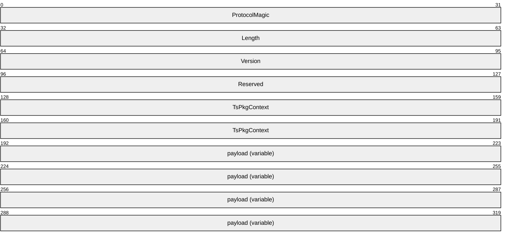
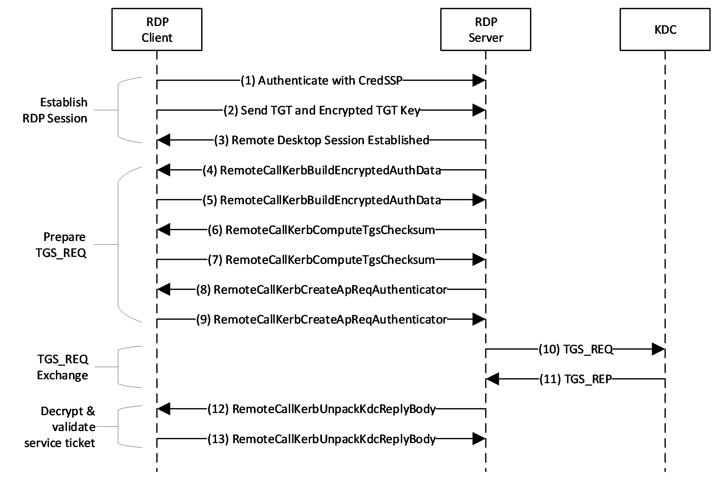

# [MS-RDPEAR]: Remote Desktop Protocol Authentication Redirection Virtual Channel

Table of Contents

1 Introduction

- [1 Introduction](#Section_1)
  - [1.1 Glossary](#Section_1.1)
  - [1.2 References](#Section_1.2)
    - [1.2.1 Normative References](#Section_1.2.1)
    - [1.2.2 Informative References](#Section_1.2.2)
  - [1.3 Overview](#Section_1.3)
  - [1.4 Relationship to Other Protocols](#Section_1.4)
  - [1.5 Prerequisites/Preconditions](#Section_1.5)
  - [1.6 Applicability Statement](#Section_1.6)
  - [1.7 Versioning and Capability Negotiation](#Section_1.7)
  - [1.8 Vendor-Extensible Fields](#Section_1.8)
  - [1.9 Standards Assignments](#Section_1.9)

2 Messages

- [2 Messages](#Section_2)
  - [2.1 Transport](#Section_2.1)
  - [2.2 Message Syntax](#Section_2.2)
    - [2.2.1 Common Data Structures](#Section_2.2.1)
      - [2.2.1.1 RemoteGuardCallId Enumeration](#Section_2.2.1.1)
      - [2.2.1.2 Kerberos Data Structures](#Section_2.2.1.2)
        - [2.2.1.2.1 KERB_ASN1_DATA](#Section_2.2.1.2.1)
        - [2.2.1.2.2 KERB_RPC_OCTET_STRING](#Section_2.2.1.2.2)
        - [2.2.1.2.3 KERB_RPC_INTERNAL_NAME](#Section_2.2.1.2.3)
        - [2.2.1.2.4 KERB_RPC_PA_DATA](#Section_2.2.1.2.4)
        - [2.2.1.2.5 KERB_RPC_CRYPTO_API_BLOB](#Section_2.2.1.2.5)
        - [2.2.1.2.6 SECPKG_SUPPLEMENTAL_CRED](#Section_2.2.1.2.6)
        - [2.2.1.2.7 SECPKG_SUPPLEMENTAL_CRED_ARRAY](#Section_2.2.1.2.7)
        - [2.2.1.2.8 KERB_RPC_ENCRYPTION_KEY](#Section_2.2.1.2.8)
        - [2.2.1.2.9 KerbCredIsoRemoteInput](#Section_2.2.1.2.9)
        - [2.2.1.2.10 KerbCredIsoRemoteOutput](#Section_2.2.1.2.10)
      - [2.2.1.3 NTLM Data Structures](#Section_2.2.1.3)
        - [2.2.1.3.1 NT_CHALLENGE](#Section_2.2.1.3.1)
        - [2.2.1.3.2 NT_RESPONSE](#Section_2.2.1.3.2)
        - [2.2.1.3.3 MSV1_0_LM3_RESPONSE](#Section_2.2.1.3.3)
        - [2.2.1.3.4 USER_SESSION_KEY](#Section_2.2.1.3.4)
        - [2.2.1.3.5 MSV1_0_CREDENTIAL_KEY](#Section_2.2.1.3.5)
        - [2.2.1.3.6 MSV1_0_REMOTE_ENCRYPTED_SECRETS](#Section_2.2.1.3.6)
        - [2.2.1.3.7 NtlmCredIsoRemoteInput](#Section_2.2.1.3.7)
        - [2.2.1.3.8 NtlmCredIsoRemoteOutput](#Section_2.2.1.3.8)
    - [2.2.2 Package-Specific Messages](#Section_2.2.2)
      - [2.2.2.1 Kerberos Messages](#Section_2.2.2.1)
        - [2.2.2.1.1 NegotiateVersion](#Section_2.2.2.1.1)
        - [2.2.2.1.2 BuildAsReqAuthenticator](#Section_2.2.2.1.2)
        - [2.2.2.1.3 VerifyServiceTicket](#Section_2.2.2.1.3)
        - [2.2.2.1.4 CreateApReqAuthenticator](#Section_2.2.2.1.4)
        - [2.2.2.1.5 DecryptApReply](#Section_2.2.2.1.5)
        - [2.2.2.1.6 UnpackKdcReplyBody](#Section_2.2.2.1.6)
        - [2.2.2.1.7 ComputeTgsChecksum](#Section_2.2.2.1.7)
        - [2.2.2.1.8 BuildEncryptedAuthData](#Section_2.2.2.1.8)
        - [2.2.2.1.9 PackApReply](#Section_2.2.2.1.9)
        - [2.2.2.1.10 HashS4UPreauth](#Section_2.2.2.1.10)
        - [2.2.2.1.11 SignS4UPreauthData](#Section_2.2.2.1.11)
        - [2.2.2.1.12 VerifyChecksum](#Section_2.2.2.1.12)
        - [2.2.2.1.13 DecryptPacCredentials](#Section_2.2.2.1.13)
        - [2.2.2.1.14 CreateECDHKeyAgreement](#Section_2.2.2.1.14)
        - [2.2.2.1.15 CreateDHKeyAgreement](#Section_2.2.2.1.15)
        - [2.2.2.1.16 DestroyKeyAgreement](#Section_2.2.2.1.16)
        - [2.2.2.1.17 KeyAgreementGenerateNonce](#Section_2.2.2.1.17)
        - [2.2.2.1.18 FinalizeKeyAgreement](#Section_2.2.2.1.18)
      - [2.2.2.2 NTLM Messages](#Section_2.2.2.2)
        - [2.2.2.2.1 NegotiateVersion](#Section_2.2.2.2.1)
        - [2.2.2.2.2 Lm20GetNtlm3ChallengeResponse](#Section_2.2.2.2.2)
        - [2.2.2.2.3 CalculateNtResponse](#Section_2.2.2.2.3)
        - [2.2.2.2.4 CalculateUserSessionKeyNt](#Section_2.2.2.2.4)
        - [2.2.2.2.5 CompareCredentials](#Section_2.2.2.2.5)

3 Protocol Details

- [3 Protocol Details](#Section_3)
  - [3.1 Common Details](#Section_3.1)
    - [3.1.1 Abstract Data Model](#Section_3.1.1)
    - [3.1.2 Timers](#Section_3.1.2)
    - [3.1.3 Initialization](#Section_3.1.3)
    - [3.1.4 Higher-Layer Triggered Events](#Section_3.1.4)
    - [3.1.5 Message Processing Events and Sequencing Rules](#Section_3.1.5)
      - [3.1.5.1 RemoteCallKerbNegotiateVersion](#Section_3.1.5.1)
      - [3.1.5.2 RemoteCallKerbBuildAsReqAuthenticator](#Section_3.1.5.2)
      - [3.1.5.3 RemoteCallKerbVerifyServiceTicket](#Section_3.1.5.3)
      - [3.1.5.4 RemoteCallKerbCreateApReqAuthenticator](#Section_3.1.5.4)
      - [3.1.5.5 RemoteCallKerbDecryptApReply](#Section_3.1.5.5)
      - [3.1.5.6 RemoteCallKerbUnpackKdcReplyBody](#Section_3.1.5.6)
      - [3.1.5.7 RemoteCallKerbComputeTgsChecksum](#Section_3.1.5.7)
      - [3.1.5.8 RemoteCallKerbBuildEncryptedAuthData](#Section_3.1.5.8)
      - [3.1.5.9 RemoteCallKerbPackApReply](#Section_3.1.5.9)
      - [3.1.5.10 RemoteCallKerbHashS4UPreauth](#Section_3.1.5.10)
      - [3.1.5.11 RemoteCallKerbSignS4UPreauthData](#Section_3.1.5.11)
      - [3.1.5.12 RemoteCallKerbVerifyChecksum](#Section_3.1.5.12)
      - [3.1.5.13 RemoteCallKerbDecryptPacCredentials](#Section_3.1.5.13)
      - [3.1.5.14 RemoteCallKerbCreateECDHKeyAgreement](#Section_3.1.5.14)
      - [3.1.5.15 RemoteCallKerbCreateDHKeyAgreement](#Section_3.1.5.15)
      - [3.1.5.16 RemoteCallKerbDestroyKeyAgreement](#Section_3.1.5.16)
      - [3.1.5.17 RemoteCallKerbKeyAgreementGenerateNonce](#Section_3.1.5.17)
      - [3.1.5.18 RemoteCallKerbFinalizeKeyAgreement](#Section_3.1.5.18)
      - [3.1.5.19 RemoteCallNtlmNegotiateVersion](#Section_3.1.5.19)
      - [3.1.5.20 RemoteCallNtlmLm20GetNtlm3ChallengeResponse](#Section_3.1.5.20)
      - [3.1.5.21 RemoteCallNtlmCalculateNtResponse](#Section_3.1.5.21)
      - [3.1.5.22 RemoteCallNtlmCalculateUserSessionKeyNt](#Section_3.1.5.22)
      - [3.1.5.23 RemoteCallNtlmCompareCredentials](#Section_3.1.5.23)
    - [3.1.6 Timer Events](#Section_3.1.6)
    - [3.1.7 Other Local Events](#Section_3.1.7)

4 Protocol Examples

- [4 Protocol Examples](#Section_4)
  - [4.1 Requesting a Service Ticket](#Section_4.1)

5 Security

- [5 Security](#Section_5)
  - [5.1 Security Considerations for Implementers](#Section_5.1)
  - [5.2 Index of Security Parameters](#Section_5.2)

6 Appendix A: Full IDL

- [6 Appendix A: Full IDL](#Section_6)
  - [6.1 Appendix A.1: RemoteGuardCallIds.H](#Section_6.1)
  - [6.2 Appendix A.2: Kerberos.IDL](#Section_6.2)
  - [6.3 Appendix A.3: NTLM.IDL](#Section_6.3)

7 Appendix B: Product Behavior

- [7 Appendix B: Product Behavior](#Section_7)

8 Change Tracking

- [8 Change Tracking](#Section_8)

For the legal notice and IP terms, see [LEGAL.md](../LEGAL.md).
Last updated: 4/23/2024.
See [Revision History](#revision-history) for full version history.

# 1 Introduction

Remote Desktop Protocol Authentication Redirection Virtual Channel is an extension to the Credential Security Support Provider [MS-CSSP](#Section_5) protocol which allows credentials to be used on a Remote Desktop server without passing the raw credentials directly to the server. This enhances security, as this protocol allows for RDP sessions to be set up without revealing plaintext credentials to malware which may be on the target server.

Sections 1.5, 1.8, 1.9, 2, and 3 of this specification are normative. All other sections and examples in this specification are informative.

## 1.1 Glossary

This document uses the following terms:

**Abstract Syntax Notation One (ASN.1)**: A notation to define complex data types to carry a message, without concern for their binary representation, across a network. ASN.1 defines an encoding to specify the data types with a notation that does not necessarily determine the representation of each value. ASN.1 encoding rules are sets of rules used to transform data that is specified in the ASN.1 language into a standard format that can be decoded on any system that has a decoder based on the same set of rules. ASN.1 and its encoding rules were once part of the same standard. They have since been separated, but it is still common for the terms ASN.1 and Basic Encoding Rules (BER) to be used to mean the same thing, though this is not the case. Different encoding rules can be applied to a given ASN.1 definition. The choice of encoding rules used is an option of the protocol designer. ASN.1 is described in the following specifications: [[ITUX660]](https://go.microsoft.com/fwlink/?LinkId=89922) for general procedures; [[ITUX680]](https://go.microsoft.com/fwlink/?LinkId=89923) for syntax specification; [[ITUX690]](https://go.microsoft.com/fwlink/?LinkId=89924) for the Basic Encoding Rules (BER), Canonical Encoding Rules (CER), and Distinguished Encoding Rules (DER) encoding rules; and [[ITUX691]](https://go.microsoft.com/fwlink/?LinkId=192078) for the Packed Encoding Rules (PER). Further background information on ASN.1 is also available in [DUBUISSON].

**big-endian**: Multiple-byte values that are byte-ordered with the most significant byte stored in the memory location with the lowest address.

**CredSSP client**: Any application that executes the role of the client to authenticate the identity of a user at the network layer to the server by using the [**CredSSP Protocol**](#gt_credssp-protocol).

**CredSSP Protocol**: The Credential Security Support Provider (CredSSP) Protocol enables an application to delegate the user's credentials from the client, utilizing a client side security support provider (SSP), to the target server that is utilizing a server side SSP. First CredSSP sets up an encrypted Transport Layer Security (TLS) protocol tunnel, and then negotiates [**Kerberos**](#gt_kerberos) or [**NT LAN Manager (NTLM) Authentication Protocol**](#gt_nt-lan-manager-ntlm-authentication-protocol) for authentication as described in [MS-CSSP](#Section_5).

**CredSSP server**: Any application that executes the role of the server to authenticate the identity of a user at the network layer to the server by using the [**CredSSP Protocol**](#gt_credssp-protocol).

**Cryptographic Application Programming Interface (CAPI) or CryptoAPI**: The Microsoft cryptographic application programming interface (API). An API that enables application developers to add authentication, encoding, and encryption to Windows-based applications.

**Distinguished Encoding Rules (DER)**: A method for encoding a data object based on Basic Encoding Rules (BER) encoding but with additional constraints. DER is used to encode X.509 certificates that need to be digitally signed or to have their signatures verified.

**elliptic curve cryptography (ECC)**: A public-key cryptosystem that is based on high-order elliptic curves over finite fields. For more information, see [[IEEE1363]](https://go.microsoft.com/fwlink/?LinkId=89899).

**Hash-based Message Authentication Code (HMAC)**: A mechanism for message authentication using cryptographic hash functions. HMAC can be used with any iterative cryptographic hash function (for example, MD5 and SHA-1) in combination with a secret shared key. The cryptographic strength of HMAC depends on the properties of the underlying hash function.

**Interface Definition Language (IDL)**: The International Standards Organization (ISO) standard language for specifying the interface for remote procedure calls. For more information, see [[C706]](https://go.microsoft.com/fwlink/?LinkId=89824) section 4.

**Kerberos**: An authentication system that enables two parties to exchange private information across an otherwise open network by assigning a unique key (called a ticket) to each user that logs on to the network and then embedding these tickets into messages sent by the users. For more information, see [MS-KILE](../MS-KILE/MS-KILE.md).

**Key Distribution Center (KDC)**: The [**Kerberos**](#gt_kerberos) service that implements the authentication and ticket granting services specified in the [**Kerberos**](#gt_kerberos) protocol. The service runs on computers selected by the administrator of the realm or domain; it is not present on every machine on the network. It has to have access to an account database for the realm that it serves. [**KDCs**](#gt_key-distribution-center-kdc) are integrated into the domain controller role. It is a network service that supplies tickets to clients for use in authenticating to services.

**little-endian**: Multiple-byte values that are byte-ordered with the least significant byte stored in the memory location with the lowest address.

**LMOWF**: In the context of NTLM authentication, a NT LAN Manager (LM) one-way function (OWF) is used to create a hash based on the user's password to generate a principal's secret key. The LAN Manager (LM) hash was superseded by the NTLM (NT) hash.

**NT LAN Manager (NTLM) Authentication Protocol**: A protocol using a challenge-response mechanism for authentication in which clients are able to verify their identities without sending a password to the server. It consists of three messages, commonly referred to as Type 1 (negotiation), Type 2 (challenge) and Type 3 (authentication).

**NTOWF**: In the context of an NTLM authentication, a NT LAN Manager (NT) one-way function (OWF) used to create a hash based on the user's password to generate a principal's secret key. The NTLM hash superseded the LAN Manager (LM) hash.

**privilege attribute certificate (PAC)**: A Microsoft-specific authorization data present in the authorization data field of a ticket. The [**PAC**](#gt_privilege-attribute-certificate-pac) contains several logical components, including group membership data for authorization, alternate credentials for non-Kerberos authentication protocols, and policy control information for supporting interactive logon.

**protocol data unit (PDU)**: Information that is delivered as a unit among peer entities of a network and that can contain control information, address information, or data. For more information on remote procedure call (RPC)-specific PDUs, see [C706] section 12.

**Remote Desktop**: See [**Remote Desktop Protocol (RDP)**](#gt_remote-desktop-protocol-rdp).

**Remote Desktop Protocol (RDP)**: A multi-channel protocol that allows a user to connect to a computer running Microsoft Terminal Services (TS). RDP enables the exchange of client and server settings and also enables negotiation of common settings to use for the duration of the connection, so that input, graphics, and other data can be exchanged and processed between client and server.

**Remote Desktop Protocol (RDP) client**: The client that initiated a remote desktop connection.

**Remote Desktop Protocol (RDP) server**: The server to which a client initiated a remote desktop connection.

**remote procedure call (RPC)**: A communication protocol used primarily between client and server. The term has three definitions that are often used interchangeably: a runtime environment providing for communication facilities between computers (the RPC runtime); a set of request-and-response message exchanges between computers (the RPC exchange); and the single message from an RPC exchange (the RPC message). For more information, see [C706].

**Rivest-Shamir-Adleman (RSA)**: A system for public key cryptography. [**RSA**](#gt_rivest-shamir-adleman-rsa) is specified in [[RFC8017]](https://go.microsoft.com/fwlink/?linkid=2164409).

**service ticket**: A ticket for any service other than the ticket-granting service (TGS). A [**service ticket**](#gt_service-ticket) serves only to classify a ticket as not a [**ticket-granting ticket (TGT)**](#gt_ticket-granting-ticket-tgt) or cross-realm TGT, as specified in [[RFC4120]](https://go.microsoft.com/fwlink/?LinkId=90458).

**SHAOWF**: A Secure Hash Algorithm (SHA) one-way function (OWF) used to create a hash based on the user's password to generate a principal's secret key. SHA hash superseded NTLM hash.

**ticket-granting ticket (TGT)**: A special type of ticket that can be used to obtain other tickets. The TGT is obtained after the initial authentication in the Authentication Service (AS) exchange; thereafter, users do not need to present their credentials, but can use the TGT to obtain subsequent tickets.

**virtual channel**: A communication channel available in a TS server session between applications running at the server and applications running on the TS client.

**MAY, SHOULD, MUST, SHOULD NOT, MUST NOT:** These terms (in all caps) are used as defined in [[RFC2119]](https://go.microsoft.com/fwlink/?LinkId=90317). All statements of optional behavior use either MAY, SHOULD, or SHOULD NOT.

## 1.2 References

Links to a document in the Microsoft Open Specifications library point to the correct section in the most recently published version of the referenced document. However, because individual documents in the library are not updated at the same time, the section numbers in the documents may not match. You can confirm the correct section numbering by checking the [Errata](https://go.microsoft.com/fwlink/?linkid=850906).

### 1.2.1 Normative References

We conduct frequent surveys of the normative references to assure their continued availability. If you have any issue with finding a normative reference, please contact [dochelp@microsoft.com](mailto:dochelp@microsoft.com). We will assist you in finding the relevant information.

[C706] The Open Group, "DCE 1.1: Remote Procedure Call", C706, August 1997, [https://publications.opengroup.org/c706](https://go.microsoft.com/fwlink/?LinkId=89824)

**Note** Registration is required to download the document.

[ITUX680] ITU-T, "Abstract Syntax Notation One (ASN.1): Specification of Basic Notation", Recommendation X.680, July 2002, [http://www.itu.int/ITU-T/studygroups/com17/languages/X.680-0207.pdf](https://go.microsoft.com/fwlink/?LinkId=89923)

[KERB-PARAM] Internet Assigned Numbers Authority (IANA), "Kerberos Parameters", [https://www.iana.org/assignments/kerberos-parameters/kerberos-parameters.xhtml](https://go.microsoft.com/fwlink/?LinkId=808077)

[MIDLINF] Microsoft Corporation, "MIDL Language Reference", [https://learn.microsoft.com/en-us/windows/desktop/Midl/midl-language-reference](https://go.microsoft.com/fwlink/?LinkId=89938)

[MS-CSSP] Microsoft Corporation, "[Credential Security Support Provider (CredSSP) Protocol](#Section_5)".

[MS-DTYP] Microsoft Corporation, "[Windows Data Types](../MS-DTYP/MS-DTYP.md)".

[MS-NLMP] Microsoft Corporation, "[NT LAN Manager (NTLM) Authentication Protocol](../MS-NLMP/MS-NLMP.md)".

[MS-PAC] Microsoft Corporation, "[Privilege Attribute Certificate Data Structure](../MS-PAC/MS-PAC.md)".

[MS-RDPEDYC] Microsoft Corporation, "[Remote Desktop Protocol: Dynamic Channel Virtual Channel Extension](../MS-RDPEDYC/MS-RDPEDYC.md)".

[MS-RPCE] Microsoft Corporation, "[Remote Procedure Call Protocol Extensions](../MS-RPCE/MS-RPCE.md)".

[RFC2119] Bradner, S., "Key words for use in RFCs to Indicate Requirement Levels", BCP 14, RFC 2119, March 1997, [https://www.rfc-editor.org/info/rfc2119](https://go.microsoft.com/fwlink/?LinkId=90317)

[RFC3280] Housley, R., Polk, W., Ford, W., and Solo, D., "Internet X.509 Public Key Infrastructure Certificate and Certificate Revocation List (CRL) Profile", RFC 3280, April 2002, [http://www.rfc-editor.org/info/rfc3280](https://go.microsoft.com/fwlink/?LinkId=90414)

[RFC3961] Raeburn, K., "Encryption and Checksum Specifications for Kerberos 5", RFC 3961, February 2005, [https://www.rfc-editor.org/info/rfc3961](https://go.microsoft.com/fwlink/?LinkId=90450)

[RFC3962] Raeburn, K., "Advanced Encryption Standard (AES) Encryption for Kerberos 5", RFC 3962, February 2005, [https://www.rfc-editor.org/info/rfc3962](https://go.microsoft.com/fwlink/?LinkId=90451)

[RFC4120] Neuman, C., Yu, T., Hartman, S., and Raeburn, K., "The Kerberos Network Authentication Service (V5)", RFC 4120, July 2005, [https://www.rfc-editor.org/rfc/rfc4120](https://go.microsoft.com/fwlink/?LinkId=90458)

[RFC4556] Zhu, L., and Tung, B., "Public Key Cryptography for Initial Authentication in Kerberos", RFC 4556, June 2006, [https://www.rfc-editor.org/info/rfc4556](https://go.microsoft.com/fwlink/?LinkId=90482)

[RFC5349] Zhu, L., Jaganathan, K., and Lauter, K., "Elliptic Curve Cryptography (ECC) Support for Public Key Cryptography for Initial Authentication in Kerberos (PKINIT)", RFC 5349, September 2008, [https://www.rfc-editor.org/info/rfc5349](https://go.microsoft.com/fwlink/?LinkId=129652)

[RFC6113] Hartman, S., and Zhu, L., "A Generalized Framework for Kerberos Pre-Authentication", RFC 6113, April 2011, [https://www.rfc-editor.org/info/rfc6113](https://go.microsoft.com/fwlink/?LinkId=226316)

[RFC8017] Moriarty, K., Ed., Kaliski, B., Jonsson, J., and Rusch, A., "PKCS #1: RSA Cryptography Specifications Version 2.2", November 2016, [https://www.rfc-editor.org/info/rfc8017](https://go.microsoft.com/fwlink/?linkid=2164409)

[X690] ITU-T, "Information Technology - ASN.1 Encoding Rules: Specification of Basic Encoding Rules (BER), Canonical Encoding Rules (CER) and Distinguished Encoding Rules (DER)", Recommendation X.690, July 2002, [http://www.itu.int/rec/T-REC-X.690/en](https://go.microsoft.com/fwlink/?LinkId=90593)

### 1.2.2 Informative References

[DUBUISSON] Dubuisson, O., "ASN.1 Communication between Heterogeneous Systems", Morgan Kaufmann, October 2000, ISBN: 0126333610.

[KERB-TICKET-LOGON] Microsoft Corporation, "KERB_TICKET_LOGON structure", [https://msdn.microsoft.com/en-us/library/windows/desktop/aa378143(v=vs.85).aspx](https://go.microsoft.com/fwlink/?LinkId=808713)

[MS-KILE] Microsoft Corporation, "[Kerberos Protocol Extensions](../MS-KILE/MS-KILE.md)".

[MS-RDPBCGR] Microsoft Corporation, "[Remote Desktop Protocol: Basic Connectivity and Graphics Remoting](../MS-RDPBCGR/MS-RDPBCGR.md)".

[MSDN-TSVC] Microsoft Corporation, "Using Terminal Services Virtual Channels", [http://msdn.microsoft.com/en-us/library/aa383546.aspx](https://go.microsoft.com/fwlink/?LinkId=90149)

[MSDOCS-CGP] Microsoft Corporation, "What's new in Credential Protection", [https://learn.microsoft.com/en-us/windows-server/security/credentials-protection-and-management/whats-new-in-credential-protection](https://go.microsoft.com/fwlink/?linkid=2146426)

## 1.3 Overview

The Remote Desktop Protocol: Authentication Redirection Virtual Channel (RDPEAR) Protocol allows the use of credentials over a [**Remote Desktop Protocol (RDP)**](#gt_remote-desktop-protocol-rdp) connection without revealing those credentials to the remote system. Prior to this protocol, the authentication protocol under remote desktop, Credential Security Support Provider (CredSSP) Protocol [MS-CSSP](#Section_5), passed full credentials to the remote system. This is required because the remote system logs the user on to present the full interactive session.

RDPEAR Protocol is used to perform authentication over a Remote Desktop connection by establishing a [**virtual channel**](#gt_virtual-channel) between the source and the target devices to relay authentication requests received by the target device to the source device. All authentication requests for [**Kerberos**](#gt_kerberos) and [**NTLM**](#gt_nt-lan-manager-ntlm-authentication-protocol) are forwarded to the source over the new virtual channel, and responses to those requests are sent back to the target device to relay out to the resource server.

This protocol improves upon the [**CredSSP Protocol**](#gt_credssp-protocol) by allowing the remoting behavior without sending plaintext credentials over the wire. Instead, opaque credentials are sent to the [**CredSSP server**](#gt_credssp-server). Any time the server needs to use credentials, a request message is sent to the [**CredSSP client**](#gt_credssp-client) that processes the request and provides the opaque credentials. Upon completion of the request, the client sends an output reply message containing the results of the operation back to the server.

Credential Guard, also called Remote Guard, will use RDPEAR Protocol to provide a safer mechanism to Remote Desktop into different machines. The feature is dependent on redirecting authentication requests over a virtual channel and using network logon to log the user into the target machine. This is a remote desktop protocol extension, where remote desktop client can remote into on-prem servers by enabling Remote Credential Guard.

## 1.4 Relationship to Other Protocols

The primary target transport for this protocol is the Remote Desktop Protocol: Dynamic Virtual Channel Extension [MS-RDPEDYC](../MS-RDPEDYC/MS-RDPEDYC.md).

Other protocols relevant to the use and implementation of the RDPEAR Protocol are:

Credential Security Support Provider (CredSSP) Protocol [MS-CSSP](#Section_5). RDPEAR relies on CredSSP as a transport mechanism to send an initial authentication buffer over the wire to establish remote use of credentials.

Kerberos Protocol Extensions [MS-KILE](../MS-KILE/MS-KILE.md). The RDPEAR Protocol supports Kerberos authentication on a [**CredSSP server**](#gt_credssp-server) by performing Kerberos credential proof operations on the [**CredSSP client**](#gt_credssp-client).

NT LAN Manager (NTLM) Authentication Protocol [MS-NLMP](../MS-NLMP/MS-NLMP.md). The RDPEAR Protocol supports NTLM authentication on a CredSSP server by performing NTLM credential proof operations on the CredSSP client.

## 1.5 Prerequisites/Preconditions

The RDPEAR Protocol does not define any transport mechanism. It is assumed that an authenticated, secure channel is used for the underlying transport, for example, a [**Remote Desktop**](#gt_remote-desktop) Virtual Channel [MS-RDPEDYC](../MS-RDPEDYC/MS-RDPEDYC.md).

[**Kerberos**](#gt_kerberos) authentication via the RDPEAR Protocol requires that the server be either in a trusting domain or the same domain as the client. This is a prerequisite for the client to be able to request a [**ticket-granting ticket (TGT)**](#gt_ticket-granting-ticket-tgt) on behalf of the server.

## 1.6 Applicability Statement

The RDPEAR Protocol is intended to be applicable under any circumstance in which CredSSP [MS-CSSP](#Section_5) is used to establish a connection.

This protocol allows a [**CredSSP server**](#gt_credssp-server) to authenticate a user without plaintext credentials. This provides an advantage under circumstances when the security status of the server is not known. If an attacker has breached the system, the RDPEAR Protocol allows the user to use that system without exposing plaintext credentials to the attacker.

## 1.7 Versioning and Capability Negotiation

Each security package supporting this protocol implements versioning independently and negotiates version and capabilities as part of initialization. For Kerberos and NTLM, it is required that the [**CredSSP server**](#gt_credssp-server) send a **RemoteCallKerbNegotateVersion** message (sections [2.2.2.1.1](#Section_2.2.2.1.13) and [3.1.5.1](#Section_3.1.5.1)) or a **RemoteCallNtlmNegotiateVersion** message (sections [2.2.2.2.1](#Section_2.2.2.2.1) and [3.1.5.19](#Section_3.1.5.19)), respectively, with the maximum protocol version it supports. The [**CredSSP client**](#gt_credssp-client) responds with a matching message containing the protocol version that will be used for future communications. As the protocol currently has only one version; this maximum version is required to be zero.

## 1.8 Vendor-Extensible Fields

None.

## 1.9 Standards Assignments

None.

# 2 Messages

## 2.1 Transport

All messages are transported over an RDP dynamic virtual channel, as specified in [MS-RDPEDYC](../MS-RDPEDYC/MS-RDPEDYC.md), with the name Microsoft::Windows::RDS::AuthRedirection. The [**CredSSP server**](#gt_credssp-server) MUST send all requests over this channel using the formats specified in this specification, and the [**CredSSP client**](#gt_credssp-client) MUST listen for incoming connections on this channel, accept them, process incoming messages, and send responses on the same channel.

## 2.2 Message Syntax

Multiple underlying authentication protocols are supported by the RDPEAR Protocol. All messages share a standard format, regardless of protocol. There are two layers in each message:

The RDPEAR Outer Layer, which is processed by CredSSP [MS-CSSP](#Section_5)

The Security Package Inner Layer, which is processed by an individual security package, such as NTLM ([MS-NLMP](../MS-NLMP/MS-NLMP.md)) or Kerberos ([MS-KILE](../MS-KILE/MS-KILE.md)).

The RDPEAR Outer Layer is made up of the following unencrypted data.

**ProtocolMagic (4 bytes):** A 32-bit integer that MUST be equal to the value 0x4EACC3C8.

**Length (4 bytes):** A 32-bit unsigned integer value that contains the overall length of the message.

**Version (4 bytes):** A 32-bit unsigned integer value describing the RDPEAR Protocol version. This MUST be 0x00000000.

**Reserved (4 bytes):** Reserved for future use.

**TsPkgContext (8 bytes):** Used by the RDPEAR [**virtual channel**](#gt_virtual-channel) ([[MSDN-TSVC]](https://go.microsoft.com/fwlink/?LinkId=90149)) to maintain internal consistency across messages. This field MUST be zero in all network messages.

**payload (variable):** The encrypted portion of the RDPEAR Outer Layer. The plain text data consists of an [**Abstract Syntax Notation One (ASN.1)**](#gt_abstract-syntax-notation-one-asn1) structure, as specified in [[ITUX680]](https://go.microsoft.com/fwlink/?LinkId=89923), and is encoded using [**Distinguished Encoding Rules (DER)**](#gt_distinguished-encoding-rules-der), as specified in [[X690]](https://go.microsoft.com/fwlink/?LinkId=90593) section 10. The plaintext data is encrypted using the negotiated security context between the client and server as part of [MS-CSSP].

The **payload** structure is defined by the ASN.1:

TSRemoteGuardVersion ::= ENUMERATED {

tsremoteguardv1 (0)

}

TSRemoteGuardInnerPacket ::= SEQUENCE {

version [0] TSRemoteGuardVersion DEFAULT tsremoteguardv1,

packageName [1] OCTET STRING,

buffer [2] OCTET STRING,

extension [3] ANY OPTIONAL, -- X.680 open type for future extension point

...

}

**version:** The encrypted data version. This MUST be 0.

**packageName:** The name of the security package to which the **buffer** is targeted. The [**CredSSP client**](#gt_credssp-client) uses **packageName** in order to route the **buffer** appropriately.

**buffer:** The opaque (at this layer) security package call buffer. This buffer is to be processed by the security package described by the **packageName** field. The buffer has a 16-byte header with the first 2 bytes set to 0x1 (unsigned). The other 14 bytes are set to 0.

**extension:** An optional extension point for future versions. This is currently unused, and MAY be omitted.

### 2.2.1 Common Data Structures

#### 2.2.1.1 RemoteGuardCallId Enumeration

The **RemoteGuardCallId** enumeration defines all possible input/output message pairs for all security packages with the value stored in the **CallId** field in the following structures:

- **KerbCredIsoRemoteInput** section [2.2.1.2.9](#Section_2.2.1.2.9).
- **KerbCredIsoRemoteOutput** section [2.2.1.2.10](#Section_2.2.1.2.10).
- **NtlmCredIsoRemoteInput** section [2.2.1.3.7](#Section_2.2.1.3.7).
- **NtlmCredIsoRemoteOutput** section [2.2.1.3.8](#Section_2.2.1.3.8).
typedef enum _RemoteGuardCallId

{

RemoteCallMinimum = 0,

// start generic calls - not tied to a specific SSP

RemoteCallGenericMinimum = 0,

RemoteCallGenericReserved = 0,

RemoteCallGenericMaximum = 0xff,

// end general calls

// Start Kerberos remote calls

RemoteCallKerbMinimum = 0x100,

RemoteCallKerbNegotiateVersion = 0x100,

RemoteCallKerbBuildAsReqAuthenticator,

RemoteCallKerbVerifyServiceTicket,

RemoteCallKerbCreateApReqAuthenticator,

RemoteCallKerbDecryptApReply,

RemoteCallKerbUnpackKdcReplyBody,

RemoteCallKerbComputeTgsChecksum,

RemoteCallKerbBuildEncryptedAuthData,

RemoteCallKerbPackApReply,

RemoteCallKerbHashS4UPreauth,

RemoteCallKerbSignS4UPreauthData,

RemoteCallKerbVerifyChecksum,

Reserved1,

Reserved2,

Reserved3,

Reserved4,

Reserved5,

Reserved6,

Reserved7,

RemoteCallKerbDecryptPacCredentials,

RemoteCallKerbCreateECDHKeyAgreement,

RemoteCallKerbCreateDHKeyAgreement,

RemoteCallKerbDestroyKeyAgreement,

RemoteCallKerbKeyAgreementGenerateNonce,

RemoteCallKerbFinalizeKeyAgreement,

RemoteCallKerbMaximum = 0x1ff,

// End Kerberos remote calls

// Start NTLM remote calls

RemoteCallNtlmMinimum = 0x200,

RemoteCallNtlmNegotiateVersion = 0x200,

RemoteCallNtlmLm20GetNtlm3ChallengeResponse,

RemoteCallNtlmCalculateNtResponse,

RemoteCallNtlmCalculateUserSessionKeyNt,

RemoteCallNtlmCompareCredentials,

RemoteCallNtlmMaximum = 0x2ff,

// End NTLM remote calls

RemoteCallMaximum = 0x2ff,

RemoteCallInvalid = 0xffff // This enumeration MUST fit in 16 bits

} RemoteGuardCallId;

#### 2.2.1.2 Kerberos Data Structures

##### 2.2.1.2.1 KERB_ASN1_DATA

The **KERB_ASN1_DATA** structure is used to pack standards-compliant, predefined Kerberos structures, avoiding additional overhead incurred by a custom data type in the Kerberos [**Interface Definition Languages (IDLs)**](#gt_interface-definition-language-idl) file.

typedef struct _KERB_ASN1_DATA {

ULONG Pdu;

ULONG32 Length;

[size_is(Length)] PUCHAR Asn1Buffer;

} KERB_ASN1_DATA;

**Pdu:** A ULONG ([MS-DTYP](../MS-DTYP/MS-DTYP.md) section 2.2.51) that contains the [**protocol data unit (PDU)**](#gt_protocol-data-unit-pdu) that is used to decode the data. MUST be zero and SHOULD be ignored.<1>

**Length:** A ULONG32 ([MS-DTYP] section 2.2.53) that indicates the length of the **Asn1Buffer** field.

**Asn1Buffer:** A pointer to a UCHAR ([MS-DTYP] section 2.2.45) that is an array of characters that contains the encoded data.

##### 2.2.1.2.2 KERB_RPC_OCTET_STRING

A **KERB_RPC_OCTET_STRING** structure is used to contain a padata-value. See [[RFC4120]](https://go.microsoft.com/fwlink/?LinkId=90458) section 5.2.7 for the PA-DATA sequence definition that contains a padata-type and a padata-value. This structure format follows the definition for **octet string** in [MS-DTYP](../MS-DTYP/MS-DTYP.md) section 2.4.4.17.5. See also definition for **octet** in [MS-DTYP] section 2.1.5.

- typedef struct _KERB_RPC_OCTET_STRING {
- ULONG length;
- [size_is(length)] PUCHAR value;
- } KERB_RPC_OCTET_STRING;
**length:** A ULONG ([MS-DTYP] section 2.2.51) that contains the length of the **value** array field.

**value:** A pointer to a UCHAR ([MS-DTYP] section 2.2.45), an array of 8-bit data items.

##### 2.2.1.2.3 KERB_RPC_INTERNAL_NAME

The **KERB_RPC_INTERNAL_NAME** structure is used to specify the **ClientName** field in the **CreateApReqAuthenticator** message (section [2.2.2.1.4](#Section_2.2.2.1.4)).

- typedef struct _KERB_RPC_INTERNAL_NAME {
- SHORT NameType;
- USHORT NameCount;
- [size_is(NameCount)] RPC_UNICODE_STRING* Names;
- } KERB_RPC_INTERNAL_NAME;
**NameType:** A SHORT ([MS-DTYP](../MS-DTYP/MS-DTYP.md) section 2.2.42) that indicates the type of names in the **Names** field, as specified in [[RFC4120]](https://go.microsoft.com/fwlink/?LinkId=90458) section 6.2.

**NameCount**: A USHORT type ([MS-DTYP] section 2.2.58) that indicates the number of names in the **Names** array field.

**Names:** A pointer to an RPC_UNICODE_STRING ([MS-DTYP] section 2.3.10) that contains the client names.

##### 2.2.1.2.4 KERB_RPC_PA_DATA

The **KERB_RPC_PA_DATA** structure is used to contain the pre-authorization data.

- typedef struct _KERB_RPC_PA_DATA{
- INT32 preauth_data_type;
- KERB_RPC_OCTET_STRING preauth_data;
- } KERB_RPC_PA_DATA;
**preauth_data_type:** An INT32 ([MS-DTYP](../MS-DTYP/MS-DTYP.md) section 2.2.22) that indicates the type of pre-authorization data in the **preauth_data** field.

**preauth_data:** A **KERB_RPC_OCTET_STRING** structure (section [2.2.1.2.2](#Section_2.2.1.2.2)) that contains the pre-authorization data.

##### 2.2.1.2.5 KERB_RPC_CRYPTO_API_BLOB

The **KERB_RPC_CRYPTO_API_BLOB** structure is used to compute the public key in the CreateDHKeyAgreement message (section [2.2.2.1.15](#Section_2.2.2.1.15)).

- typedef struct _KERB_RPC_CRYPTO_API_BLOB{
- DWORD cbData;
- [size_is(cbData)] PBYTE pbData;
- } KERB_RPC_CRYPTO_API_BLOB;
**cbData:** A DWORD ([MS-DTYP](../MS-DTYP/MS-DTYP.md) section 2.2.9) that indicates the size of the **pbData** field.

**pbData:** A pointer to a BYTE ([MS-DTYP] section 2.2.6) array that contains the data used in the computation of the public key.

##### 2.2.1.2.6 SECPKG_SUPPLEMENTAL_CRED

The **SECPKG_SUPPLEMENTAL_CRED** structure is used in the **SECPKG_SUPPLEMENTAL_CRED_ARRAY** structure (section [2.2.1.2.7](#Section_2.2.1.2.7)).

- typedef struct _SECPKG_SUPPLEMENTAL_CRED {
- RPC_UNICODE_STRING PackageName;
- ULONG CredentialSize;
- [size_is(CredentialSize)] PUCHAR Credentials;
- } SECPKG_SUPPLEMENTAL_CRED, *PSECPKG_SUPPLEMENTAL_CRED;
**PackageName:** An **RPC_UNICODE_STRING** structure ([MS-DTYP](../MS-DTYP/MS-DTYP.md) section 2.3.10) that contains the name of the package.

**CredentialSize:** A ULONG ([MS-DTYP] section 2.2.51) that contains the size of the **Credentials** array field.

**Credentials:** A pointer to a UCHAR ([MS-DTYP] section 2.2.45), an array that contains the credentials.

##### 2.2.1.2.7 SECPKG_SUPPLEMENTAL_CRED_ARRAY

The **SECPKG_SUPPLEMENTAL_CRED_ARRAY** structure is used in the DecryptPacCredentials message (section [2.2.2.1.13](#Section_2.2.2.1.13)) to contain the decoded array of credentials.

- typedef struct _SECPKG_SUPPLEMENTAL_CRED_ARRAY {
- ULONG CredentialCount;
- [size_is(CredentialCount)] SECPKG_SUPPLEMENTAL_CRED Credentials[*];
- } SECPKG_SUPPLEMENTAL_CRED_ARRAY, *PSECPKG_SUPPLEMENTAL_CRED_ARRAY;
**CredentialCount:** A ULONG ([MS-DTYP](../MS-DTYP/MS-DTYP.md) section 2.2.51) that contains the count of **SECPKG_SUPPLEMENTAL_CRED** structures (section [2.2.1.2.6](#Section_2.2.1.2.6)) in the **Credentials** array field.

**Credentials:** An array of **SECPKG_SUPPLEMENTAL_CRED** structures (section 2.2.1.2.6) that contains the decoded credentials.

##### 2.2.1.2.8 KERB_RPC_ENCRYPTION_KEY

The **KERB_RPC_ENCRYPTION_KEY** structure is the opaque representation of any Kerberos EncryptionKey [[RFC4120]](https://go.microsoft.com/fwlink/?LinkId=90458) section 5.2.9. This data structure is understood and consumed only by the [**CredSSP client**](#gt_credssp-client); therefore, contents can be unique to each implementation and implementation version. The [**CredSSP server**](#gt_credssp-server) SHOULD treat this as an opaque blob and return what is provided by the client without assumptions of structure or size. Each implementation of CredSSP client SHOULD be allowed to create a structure that makes sense for their Kerberos implementation.

typedef struct _KERB_RPC_ENCRYPTION_KEY {

void* reserved1;

long reserved2;

KERB_RPC_OCTET_STRING reserved3;

} KERB_RPC_ENCRYPTION_KEY, *PKERB_RPC_ENCRYPTION_KEY;

**reserved1:** A void pointer to any type of data (requires a typecast to use) points to unique implementation-specific data.

**reserved2:** A long ([MS-DTYP](../MS-DTYP/MS-DTYP.md) section 2.2.27) that contains the encryption type.

**reserved3:** A **KERB_RPC_OCTET_STRING** structure (section [2.2.1.2.2](#Section_2.2.1.2.2)) that contains the key value.

##### 2.2.1.2.9 KerbCredIsoRemoteInput

The **KerbCredIsoRemoteInput** structure is used for a Kerberos call message. It is paired with a **KerbCredIsoRemoteOutput** structure (section [2.2.1.2.10](#Section_2.2.1.2.10)) Kerberos reply message. The **CallId** field determines which of the following union members is associated with the current message. Note that input and output each use different parts of the same message structure.

typedef struct _KerbCredIsoRemoteInput

{

// CallId determines the call being sent over the wire.

RemoteGuardCallId CallId;

// Input paramters are held in a union so that each call can be sent

// over the wire in the same type of KerbCredIsoRemoteInput structure.

[switch_type(RemoteGuardCallId), switch_is(CallId)] union

{

// Used to negotiate the protocol version that will be used.

// Server sends the maximum version it supports; client

// replies with the version that will actually be used.

[case(RemoteCallKerbNegotiateVersion)] struct

{

ULONG MaxSupportedVersion;

} NegotiateVersion;

// Create an AS_REQ message authenticator.

[case(RemoteCallKerbBuildAsReqAuthenticator)] struct

{

KERB_RPC_ENCRYPTION_KEY* EncryptionKey;

KERB_RPC_ENCRYPTION_KEY* ArmorKey; // optional

PLARGE_INTEGER TimeSkew;

} BuildAsReqAuthenticator;

// Verify that the given service ticket is valid within the given skew.

// The encrypted part of the reply data is decrypted for the caller.

[case(RemoteCallKerbVerifyServiceTicket)] struct

{

KERB_ASN1_DATA* PackedTicket;

KERB_RPC_ENCRYPTION_KEY* ServiceKey;

PLARGE_INTEGER TimeSkew; // optional

} VerifyServiceTicket;

// Create an authenticator for an KRB_AP_REQ message.

[case(RemoteCallKerbCreateApReqAuthenticator)] struct

{

KERB_RPC_ENCRYPTION_KEY* EncryptionKey;

ULONG SequenceNumber;

KERB_RPC_INTERNAL_NAME* ClientName;

PRPC_UNICODE_STRING ClientRealm;

PLARGE_INTEGER SkewTime;

KERB_RPC_ENCRYPTION_KEY* SubKey; // optional

KERB_ASN1_DATA* AuthData; // optional

KERB_ASN1_DATA* GssChecksum; // optional

ULONG KeyUsage;

} CreateApReqAuthenticator;

// Decrypt the encrypted part of an AP_REP.

[case(RemoteCallKerbDecryptApReply)] struct

{

KERB_ASN1_DATA* EncryptedReply;

KERB_RPC_ENCRYPTION_KEY* Key;

} DecryptApReply;

// Decrypt the encrypted part of a KRB_KDC_REP from the KDC. The type

// of reply is indicated by the PDU - either encrypted AS_REPLY PDU or

// encrypted TGS_REPLY PDU. Key usage allows the caller to specify either the

// TGS or AS REP key derivation types. This is done to allow back-compatibility

// with a previous server release which returned the wrong PDU for an AS_REP.

[case(RemoteCallKerbUnpackKdcReplyBody)] struct

{

KERB_ASN1_DATA* EncryptedData;

KERB_RPC_ENCRYPTION_KEY* Key;

KERB_RPC_ENCRYPTION_KEY* StrengthenKey;

ULONG Pdu;

ULONG KeyUsage;

} UnpackKdcReplyBody;

// Calculate the MAC for a KRB_TGS_REQ. In RFC4120 it is referred

// to as a "Checksum"and thus the terminology is maintained.

[case(RemoteCallKerbComputeTgsChecksum)] struct

{

KERB_ASN1_DATA* RequestBody;

KERB_RPC_ENCRYPTION_KEY* Key;

ULONG ChecksumType;

} ComputeTgsChecksum;

// Encrypt the given authorization data which is to be included

// within the request body of a message to be sent to the KDC.

[case(RemoteCallKerbBuildEncryptedAuthData)] struct

{

ULONG KeyUsage;

KERB_RPC_ENCRYPTION_KEY* Key;

KERB_ASN1_DATA* PlainAuthData;

} BuildEncryptedAuthData;

// Pack up and encrypt a KRB_AP_REP message using the given session key.

[case(RemoteCallKerbPackApReply)] struct

{

KERB_ASN1_DATA* Reply;

KERB_ASN1_DATA* ReplyBody;

KERB_RPC_ENCRYPTION_KEY* SessionKey;

} PackApReply;

// Create a MAC for S4U pre-authentication data to be include in a KRB_TGS_REQ

// when requesting an S4U service ticket for another principal.

[case(RemoteCallKerbHashS4UPreauth)] struct

{

KERB_ASN1_DATA* S4UPreauth;

KERB_RPC_ENCRYPTION_KEY* Key;

LONG ChecksumType;

} HashS4UPreauth;

// Create a MAC for S4U pre-authentication data that is for

// certificate-based users. This pa-data is added to KRB_TGS_REQ

// when requesting an S4U service ticket.

[case(RemoteCallKerbSignS4UPreauthData)] struct

{

KERB_RPC_ENCRYPTION_KEY* Key;

BOOL IsRequest;

KERB_ASN1_DATA* UserId;

PLONG ChecksumType;

} SignS4UPreauthData;

// Calculate a MAC from the given data and compare it to the given expected

// value. Used to detect mismatches which may indicate tampering with the

// PAC which is sent by the KDC to the client inside a KRB_KDC_REP.

[case(RemoteCallKerbVerifyChecksum)] struct

{

KERB_RPC_ENCRYPTION_KEY* Key;

ULONG ChecksumType;

ULONG ExpectedChecksumSize;

[size_is(ExpectedChecksumSize)] const UCHAR* ExpectedChecksum;

ULONG DataToCheckSize;

[size_is(DataToCheckSize)] const UCHAR* DataToCheck;

} VerifyChecksum;

// Decrypt the supplemental credentials which are contained

// with the PAC sent back by the KDC in a KRB_KDC_REP.

[case(RemoteCallKerbDecryptPacCredentials)] struct

{

KERB_RPC_ENCRYPTION_KEY* Key;

ULONG Version;

ULONG EncryptionType;

ULONG DataSize;

[size_is(DataSize)] UCHAR* Data;

} DecryptPacCredentials;

// Create a new ECDH key agreement handle with the given ECC key bit length

[case(RemoteCallKerbCreateECDHKeyAgreement)] struct

{

ULONG KeyBitLen;

} CreateECDHKeyAgreement;

[case(RemoteCallKerbCreateDHKeyAgreement)] struct

{

// This [case(RemoteCallKerb)] struct has no input parameters, but for

// simplicity and consistency with the other parameters, let's define

// this as a [case(RemoteCallKerb)] struct with a single ignored value.

UCHAR Ignored;

} CreateDHKeyAgreement;

// Destroy a key agreement handle which was previously constructed

// with either CreateECDHKeyAgreement or CreateDHKeyAgreement.

[case(RemoteCallKerbDestroyKeyAgreement)] struct

{

KEY_AGREEMENT_HANDLE KeyAgreementHandle;

} DestroyKeyAgreement;

// Generate a nonce for use with the given key agreement. This nonce is part

// of the Diffie-Hellman agreement that is part of Kerberos PKINIT (RFC 4556)

[case(RemoteCallKerbKeyAgreementGenerateNonce)] struct

{

KEY_AGREEMENT_HANDLE KeyAgreementHandle;

} KeyAgreementGenerateNonce;

// Finish a Kerberos PKINIT (RFC 4556) key agreement.

[case(RemoteCallKerbFinalizeKeyAgreement)] struct

{

KEY_AGREEMENT_HANDLE* KeyAgreementHandle;

ULONG KerbEType;

ULONG RemoteNonceLen;

[size_is(RemoteNonceLen)] PBYTE RemoteNonce;

ULONG X509PublicKeyLen;

[size_is(X509PublicKeyLen)] PBYTE X509PublicKey;

} FinalizeKeyAgreement;

};

} KerbCredIsoRemoteInput, *PKerbCredIsoRemoteInput;

**CallId:** An ID from the **RemoteGuardCallId** enumeration (section [2.2.1.1](#Section_2.2.1.1)) that determines which of the following union members is associated with the current message.

**NegotiateVersion:** A structure (section [2.2.2.1.1](#Section_2.2.2.1.13)) that contains the maximum version agreed between the server and the client. Used to negotiate the protocol version that will be used. Server sends the maximum version it supports; client replies with the version that will be used.

**BuildAsReqAuthenticator:** A structure (section [2.2.2.1.2](#Section_2.2.2.1.2)) used to create an AS_REQ message authenticator.

**VerifyServiceTicket:** A structure (section [2.2.2.1.3](#Section_2.2.2.1.3)) used to verify that the given service ticket is valid within the given skew.

**CreateApReqAuthenticator:** A structure (section [2.2.2.1.4](#Section_2.2.2.1.4)) used to create an authenticator for an KRB_AP_REQ message.

**DecryptApReply:** A structure (section [2.2.2.1.5](#Section_2.2.2.1.5)) used to decrypt the encrypted part of an AP_REP reply message.

**UnpackKdcReplyBody:** A structure (section [2.2.2.1.6](#Section_2.2.2.1.6)) used to decrypt the encrypted part of a KRB_KDC_REP from the KDC. The type of reply is indicated by the PDU.

**ComputeTgsChecksum:** A structure (section [2.2.2.1.7](#Section_2.2.2.1.7)) used to calculate the MAC for a KRB_TGS_REQ, specified as Checksum in [[RFC4120]](https://go.microsoft.com/fwlink/?LinkId=90458).

**BuildEncryptedAuthData:** A structure (section [2.2.2.1.8](#Section_2.2.2.1.8)) used to encrypt the given authorization data which is to be included within the request body of a message to be sent to the KDC.

**PackApReply:** A structure (section [2.2.2.1.9](#Section_2.2.2.1.9)) used to pack up and encrypt a KRB_AP_REP message using the given session key.

**HashS4UPreauth:** A structure (section [2.2.2.1.10](#Section_2.2.2.1.10)) used to create a MAC for S4U pre-authentication data to be include in a KRB_TGS_REQ when requesting a S4U service ticket for another principal.

**SignS4UPreauthData:** A structure (section [2.2.2.1.11](#Section_2.2.2.1.11)) used to create a MAC for S4U pre-authentication data that is for certificate-based users. This pa-data is added to KRB_TGS_REQ when requesting an S4U service ticket.

**VerifyChecksum:** A structure (section [2.2.2.1.12](#Section_2.2.2.1.12)) used to calculate a MAC from the given data and compare it to the given expected value to detect mismatches which may indicate tampering with the PAC that is sent by the KDC to the client inside a KRB_KDC_REP reply message ([RFC4120] section 5.4.2).

**DecryptPacCredentials:** A structure (section [2.2.2.1.13](#Section_2.2.2.1.13)) used to decrypt the supplemental credentials which are contained with the PAC sent back by the KDC in a KRB_KDC_REP reply message.

**CreateECDHKeyAgreement:** A structure (section [2.2.2.1.14](#Section_2.2.2.1.14)) used to create a new ECDH key agreement handle with the given ECC key bit length.

**CreateDHKeyAgreement:** A structure (section [2.2.2.1.15](#Section_2.2.2.1.15)) that contains an **Ignored** field as a UCHAR single character value that can be set to any value.

**DestroyKeyAgreement:** A structure (section [2.2.2.1.16](#Section_2.2.2.1.16)) used to destroy a key agreement handle which was previously constructed with either **CreateECDHKeyAgreement** structure or **CreateDHKeyAgreement** structure.

**KeyAgreementGenerateNonce:** A structure (section [2.2.2.1.17](#Section_2.2.2.1.17)) used to generate a nonce for use with the given key agreement. This nonce is part of the Diffie-Hellman agreement that is part of Kerberos PKINIT ([[RFC4556]](https://go.microsoft.com/fwlink/?LinkId=90482)). Contains the key agreement handle.

**FinalizeKeyAgreement:** A structure (section [2.2.2.1.18](#Section_2.2.2.1.18)) used to finish a Kerberos PKINIT ([RFC4556]) key agreement with an X509 server public key ([[RFC3280]](https://go.microsoft.com/fwlink/?LinkId=90414)).

##### 2.2.1.2.10 KerbCredIsoRemoteOutput

The **KerbCredIsoRemoteOutput** structure is used for a Kerberos reply message. It is paired with a **KerbCredIsoRemoteInput** structure (section [2.2.1.2.9](#Section_2.2.1.2.9)) Kerberos call message. The **CallId** field determines which of the following union members is associated with the current message. Note that input and output each use different parts of the same message structure.

typedef struct _KerbCredIsoRemoteOutput

{

RemoteGuardCallId CallId;

NTSTATUS Status;

[switch_type(RemoteGuardCallId), switch_is(CallId)] union

{

[case(RemoteCallKerbNegotiateVersion)] struct

{

ULONG VersionToUse;

} NegotiateVersion;

[case(RemoteCallKerbBuildAsReqAuthenticator)] struct

{

LONG PreauthDataType;

KERB_RPC_OCTET_STRING PreauthData;

} BuildAsReqAuthenticator;

[case(RemoteCallKerbVerifyServiceTicket)] struct

{

KERB_ASN1_DATA DecryptedTicket;

LONG KerbProtocolError;

} VerifyServiceTicket;

[case(RemoteCallKerbCreateApReqAuthenticator)] struct

{

LARGE_INTEGER AuthenticatorTime;

KERB_ASN1_DATA Authenticator;

LONG KerbProtocolError;

} CreateApReqAuthenticator;

[case(RemoteCallKerbDecryptApReply)] struct

{

KERB_ASN1_DATA ApReply;

} DecryptApReply;

[case(RemoteCallKerbUnpackKdcReplyBody)] struct

{

LONG KerbProtocolError;

KERB_ASN1_DATA ReplyBody;

} UnpackKdcReplyBody;

[case(RemoteCallKerbComputeTgsChecksum)] struct

{

KERB_ASN1_DATA Checksum;

} ComputeTgsChecksum;

[case(RemoteCallKerbBuildEncryptedAuthData)] struct

{

KERB_ASN1_DATA EncryptedAuthData;

} BuildEncryptedAuthData;

[case(RemoteCallKerbPackApReply)] struct

{

ULONG PackedReplySize;

[size_is(PackedReplySize)] PUCHAR PackedReply;

} PackApReply;

[case(RemoteCallKerbHashS4UPreauth)] struct

{

PULONG ChecksumSize;

[size_is(, *ChecksumSize)] PUCHAR* ChecksumValue;

} HashS4UPreauth;

[case(RemoteCallKerbSignS4UPreauthData)] struct

{

PLONG ChecksumType;

PULONG ChecksumSize;

[size_is(, *ChecksumSize)] PUCHAR* ChecksumValue;

} SignS4UPreauthData;

[case(RemoteCallKerbVerifyChecksum)] struct

{

BOOL IsValid;

} VerifyChecksum;

[case(RemoteCallKerbDecryptPacCredentials)] struct

{

PSECPKG_SUPPLEMENTAL_CRED_ARRAY Credentials;

} DecryptPacCredentials;

[case(RemoteCallKerbCreateECDHKeyAgreement)] struct

{

KEY_AGREEMENT_HANDLE* KeyAgreementHandle;

KERBERR* KerbErr;

PULONG EncodedPubKeyLen;

[size_is(, *EncodedPubKeyLen)] PBYTE* EncodedPubKey;

} CreateECDHKeyAgreement;

[case(RemoteCallKerbCreateDHKeyAgreement)] struct

{

KERB_RPC_CRYPTO_API_BLOB* ModulusP;

KERB_RPC_CRYPTO_API_BLOB* GeneratorG;

KERB_RPC_CRYPTO_API_BLOB* FactorQ;

KEY_AGREEMENT_HANDLE* KeyAgreementHandle;

KERBERR* KerbErr;

PULONG LittleEndianPublicKeyLen;

[size_is(, *LittleEndianPublicKeyLen)] PBYTE* LittleEndianPublicKey;

} CreateDHKeyAgreement;

[case(RemoteCallKerbDestroyKeyAgreement)] struct

{

// This [case(RemoteCallKerb)] struct has no output, but for

// simplicity and consistency define as a

// [case(RemoteCallKerb)] struct with a single ignored value.

UCHAR Ignored;

} DestroyKeyAgreement;

[case(RemoteCallKerbKeyAgreementGenerateNonce)] struct

{

PULONG NonceLen;

[size_is(, *NonceLen)] PBYTE* Nonce;

} KeyAgreementGenerateNonce;

[case(RemoteCallKerbFinalizeKeyAgreement)] struct

{

KERB_RPC_ENCRYPTION_KEY* SharedKey;

} FinalizeKeyAgreement;

};

} KerbCredIsoRemoteOutput, *PKerbCredIsoRemoteOutput;

**CallId:** An ID from the **RemoteGuardCallId** enumeration (section [2.2.1.1](#Section_2.2.1.1)) that determines which of the following union members is associated with the current message.

**NegotiateVersion:** A structure (section [2.2.2.1.1](#Section_2.2.2.1.13)) that contains the **VersionToUse** agreed between the server and the client. Used to negotiate the protocol version that will be used. Server sends the maximum version it supports; client replies with the version that will be used for future exchanges.

**BuildAsReqAuthenticator:** A structure (section [2.2.2.1.2](#Section_2.2.2.1.2)) that contains the padata-type of the **PreauthData** field and the padata-value to be included in the KRB_AS_REQ message [[RFC4120]](https://go.microsoft.com/fwlink/?LinkId=90458) section 5.2.7.

**VerifyServiceTicket:** A structure (section [2.2.2.1.3](#Section_2.2.2.1.3)) that contains the decrypted EncTicketPart of the input Kerberos ticket and the validation result, as expressed by one of the error codes specified in [RFC4120] section 7.5.9.

**CreateApReqAuthenticator:** A structure (section [2.2.2.1.4](#Section_2.2.2.1.4)) used to contain an authenticator for an KRB_AP_REQ message. Includes the timestamp, a [**DER**](#gt_distinguished-encoding-rules-der)-encoded Kerberos **EncryptedData** structure containing an authenticator to be included in a KRB_AP_REQ message, and protocol-level errors specified in [RFC4120] section 7.5.9.

**DecryptApReply:** A structure (section [2.2.2.1.5](#Section_2.2.2.1.5)) that contains the decrypted EncAPRepPart ([RFC4120] section 5.5.2) in DER-encoded form.

**UnpackKdcReplyBody:** A structure (section [2.2.2.1.6](#Section_2.2.2.1.6)) that contains the decrypted reply body and any protocol-level errors that have occurred.

**ComputeTgsChecksum:** A structure (section [2.2.2.1.7](#Section_2.2.2.1.7)) that contains the Checksum ([RFC4120]) a calculated MAC for a KRB_TGS_REQ request message.

**BuildEncryptedAuthData:** A structure (section [2.2.2.1.8](#Section_2.2.2.1.8)) that contains the encrypted authorization data as a DER-encoded Kerberos **EncryptedData** structure containing the encrypted PA-DATA ([RFC4120] section 5.5.1).

**PackApReply:** A structure (section [2.2.2.1.9](#Section_2.2.2.1.9)) that contains the DER-encoded KRB_AP_REP, which contains the encrypted EncAPRepPart from the PackApReply input and the size in bytes of the encoded reply ([RFC4120] section 5.5.2).

**HashS4UPreauth:** A structure (section [2.2.2.1.10](#Section_2.2.2.1.10)) that contains the hash size and the resulting hash of the input pre-authentication data.

**SignS4UPreauthData:** A structure (section [2.2.2.1.11](#Section_2.2.2.1.11)) that contains the checksum type, the checksum size, and the checksum value of the resulting hash of the input pre-authentication data.

**VerifyChecksum:** A structure (section [2.2.2.1.12](#Section_2.2.2.1.12)) that contains a BOOL **IsValid** field that indicates whether the calculated checksum matches or not.

**DecryptPacCredentials:** A structure (section [2.2.2.1.13](#Section_2.2.2.1.13)) that contains the decoded array of credentials supplied by the KDC.

**CreateECDHKeyAgreement:** A structure (section [2.2.2.1.14](#Section_2.2.2.1.14)) used to create a new ECDH key agreement handle. Contains a key agreement handle for use with future message exchanges, any Kerberos errors, the length of the **EncodedPubKey** field, and the **EncodedPubKey** that is the encoded subjectPublicKey value, suitable for populating a **SubjectPublicKeyInfo** structure ([[RFC3280]](https://go.microsoft.com/fwlink/?LinkId=90414)).

**CreateDHKeyAgreement:** A structure (section [2.2.2.1.15](#Section_2.2.2.1.15)) used to create the [**little endian**](#gt_little-endian) representation of the RSA public key value. Suitable for use with the [**CryptoAPI**](#gt_7ddf051d-9105-430a-8a89-f551dd4dd0ee) as a public key blob. Contains three KERB_RPC_CRYPTO_API_BLOB pointers, the key agreement handle, any Kerberos errors, the length of the public key and the public key in little-endian format.

**DestroyKeyAgreement:** A structure (section [2.2.2.1.16](#Section_2.2.2.1.16)) that contains an **Ignored** field as a UCHAR single character value.

**KeyAgreementGenerateNonce:** A structure (section [2.2.2.1.17](#Section_2.2.2.1.17)) used to generate a nonce for use with the given key agreement. This nonce is part of the Diffie-Hellman agreement that is part of Kerberos PKINIT ([[RFC4556]](https://go.microsoft.com/fwlink/?LinkId=90482)). Contains the nonce length and the **Nonce** for use in a key agreement operation.

**FinalizeKeyAgreement:** A structure (section [2.2.2.1.18](#Section_2.2.2.1.18)) used to finish a Kerberos PKINIT ([RFC4556]) key agreement. Contains the **SharedKey** that is the resulting key from the agreement.

#### 2.2.1.3 NTLM Data Structures

##### 2.2.1.3.1 NT_CHALLENGE

The **NT_CHALLENGE** structure is used in the **NtChallenge** field in the CalculateNtResponse message (section [2.2.2.2.3](#Section_2.2.2.2.3)).

- typedef struct _NT_CHALLENGE{
- UCHAR Data[MSV1_0_CHALLENGE_LENGTH];
- } NT_CHALLENGE, *PNT_CHALLENGE;
**Data:** A UCHAR ([MS-DTYP](../MS-DTYP/MS-DTYP.md) section 2.2.45) that is an array of 8-bit data items with a length specified by **MSV1_0_CHALLENGE_LENGTH** (8) that specifies the number bytes in the string.

##### 2.2.1.3.2 NT_RESPONSE

The **NT_RESPONSE** structure is used in the **NtResponse** field in the CalculateNtResponse message (section [2.2.2.2.3](#Section_2.2.2.2.3)) and in the CalculateUserSessionKeyNt message (section [2.2.2.2.4](#Section_2.2.2.2.4)).

- typedef struct _NT_RESPONSE{
- UCHAR Data[MSV1_0_RESPONSE_LENGTH];
- } NT_RESPONSE, *PNT_RESPONSE;
**Data:** A UCHAR ([MS-DTYP](../MS-DTYP/MS-DTYP.md) section 2.2.45) that is an array of 8-bit data items with a length specified by **MSV1_0_RESPONSE_LENGTH** (24) that specifies the number bytes in the string.

##### 2.2.1.3.3 MSV1_0_LM3_RESPONSE

The **MSV1_0_LM3_RESPONSE** structure is used in the **Lm3Response** field in the Lm20GetNtlm3ChallengeResponse message (section [2.2.2.2.2](#Section_2.2.2.2.2)).

- typedef struct {
- UCHAR Response[MSV1_0_NTLM3_RESPONSE_LENGTH];
- UCHAR ChallengeFromClient[MSV1_0_CHALLENGE_LENGTH];
- } MSV1_0_LM3_RESPONSE, *PMSV1_0_LM3_RESPONSE;
**Response:** A UCHAR ([MS-DTYP](../MS-DTYP/MS-DTYP.md) section 2.2.45) that is an array of 8-bit data items with a length specified by **MSV1_0_NTLM3_RESPONSE_LENGTH** (16) that specifies the number bytes in the string.

**ChallengeFromClient:** A UCHAR type that is an array of 8-bit data items with a length specified by **MSV1_0_CHALLENGE_LENGTH** (8) that specifies the number bytes in the string.

##### 2.2.1.3.4 USER_SESSION_KEY

The **USER_SESSION_KEY** structure is used in the **UserSessionKey** field in the Lm20GetNtlm3ChallengeResponse message (section 2.2.2.2.3) and the CalculateUserSessionKeyNt message (section [2.2.2.2.4](#Section_2.2.2.2.4)).

- typedef struct {
- UCHAR Data[MSV1_0_USER_SESSION_KEY_LENGTH];
- } USER_SESSION_KEY, *PUSER_SESSION_KEY;
**Data:** A UCHAR type ([MS-DTYP](../MS-DTYP/MS-DTYP.md) section 2.2.45) that is an array of 8-bit data items with a length specified by **MSV1_0_USER_SESSION_KEY_LENGTH** (16) that specifies the number bytes in the string.

##### 2.2.1.3.5 MSV1_0_CREDENTIAL_KEY

The **MSV1_0_CREDENTIAL_KEY** structure is used in the **MSV1_0_REMOTE_ENCRYPTED_SECRETS** structure (section 2.2.1.3.10).

- typedef struct _MSV1_0_CREDENTIAL_KEY {
- UCHAR Data[MSV1_0_CREDENTIAL_KEY_LENGTH];
- } MSV1_0_CREDENTIAL_KEY, *PMSV1_0_CREDENTIAL_KEY;
**Data:** A UCHAR ([MS-DTYP](../MS-DTYP/MS-DTYP.md) section 2.2.45) that is an array of 8-bit data items with a length specified by **MSV1_0_CREDENTIAL_KEY_LENGTH** (20) that specifies the number bytes in the string.

##### 2.2.1.3.6 MSV1_0_REMOTE_ENCRYPTED_SECRETS

The **MSV1_0_REMOTE_ENCRYPTED_SECRETS** structure is the opaque representation of NLTM secrets.<2> This data structure is understood and consumed only by the [**CredSSP client**](#gt_credssp-client); therefore, contents can be unique to each implementation and implementation version. The [**CredSSP server**](#gt_credssp-server) SHOULD treat this as an opaque blob and return what is provided by the client without assumptions of structure or size. Each implementation of CredSSP client SHOULD be allowed to create a structure that makes sense for their NTLM implementation.

typedef struct _MSV1_0_REMOTE_ENCRYPTED_SECRETS

{

BOOLEAN reserved1;

BOOLEAN reserved2;

BOOLEAN reserved3;

MSV1_0_CREDENTIAL_KEY_TYPE reserved4;

MSV1_0_CREDENTIAL_KEY reserved5;

ULONG reservedSize;

[size_is(reservedSize)] UCHAR* reserved6;

} MSV1_0_REMOTE_ENCRYPTED_SECRETS, *PMSV1_0_REMOTE_ENCRYPTED_SECRETS;

**reserved1:** A BOOLEAN ([MS-DTYP](../MS-DTYP/MS-DTYP.md) section 2.2.4) reserved for implementation-specific use.

**reserved2:** A BOOLEAN reserved for implementation-specific use.

**reserved3:** A BOOLEAN reserved for implementation-specific use.

**reserved4:** An **MSV1_0_CREDENTIAL_KEY_TYPE** enumerated value that indicates the type of credential key that is used. Values are reserved or for internal use only.

typedef enum _MSV1_0_CREDENTIAL_KEY_TYPE{

InvalidCredKey, // reserved

IUMCredKey, // reserved

DomainUserCredKey,

LocalUserCredKey, // For internal use only - should never be present in

// MSV1_0_REMOTE_ENCRYPTED_SECRETS

ExternallySuppliedCredKey // reserved

} MSV1_0_CREDENTIAL_KEY_TYPE;

**reserved5:** An **MSV1_0_CREDENTIAL_KEY** structure (section [2.2.1.3.5](#Section_2.2.1.3.5)) that contains the credential key.

**reservedSize:** A ULONG ([MS-DTYP] section 2.2.51) that indicates the size of the **reserved6** field.

**reserved6:** A pointer to a UCHAR ([MS-DTYP] section 2.2.45), an array of characters that contains the credential.

##### 2.2.1.3.7 NtlmCredIsoRemoteInput

The **NtlmCredIsoRemoteInput** structure is used for an NTLM call message. It is paired with an **NtlmCredIsoRemoteOutput** structure (section [2.2.1.3.8](#Section_2.2.1.3.8)) NTLM reply message. The **CallId** determines which of the following union members is associated with the current message. Note that input and output each use different parts of the same message structure.

**Note:** The word "server" refers to the LSA server which is providing access to credentials and "client" refers to the LSA client which is using the credentials provided by the server. This is the opposite of the RDP view.

typedef struct _NtlmCredIsoRemoteInput

{

RemoteGuardCallId CallId;

[switch_type(RemoteGuardCallId), switch_is(CallId)] union

{

// Used to negotiate the protocol version that will be used.

// Server sends the maximum version it supports; client replies

// with the version that will actually be used.

[case(RemoteCallNtlmNegotiateVersion)] struct

{

ULONG MaxSupportedVersion;

} NegotiateVersion;

// Use the provided credential and challenge to generate the

// NT and LM response for the NTLM v2 authentication protocol.

[case(RemoteCallNtlmLm20GetNtlm3ChallengeResponse)] struct

{

PMSV1_0_REMOTE_ENCRYPTED_SECRETS Credential;

PRPC_UNICODE_STRING UserName;

PRPC_UNICODE_STRING LogonDomainName;

PRPC_UNICODE_STRING ServerName;

UCHAR ChallengeToClient[MSV1_0_CHALLENGE_LENGTH];

} Lm20GetNtlm3ChallengeResponse;

// Use the provided credential to calculate a response

// to this challenge according to the NTLM v1 protocol.

[case(RemoteCallNtlmCalculateNtResponse)] struct

{

PNT_CHALLENGE NtChallenge;

PMSV1_0_REMOTE_ENCRYPTED_SECRETS Credential;

} CalculateNtResponse;

// Use the provided credential and response to calculate

// a session key according to the NTLM v1 protocol.

[case(RemoteCallNtlmCalculateUserSessionKeyNt)] struct

{

PNT_RESPONSE NtResponse;

PMSV1_0_REMOTE_ENCRYPTED_SECRETS Credential;

} CalculateUserSessionKeyNt;

// Compare the provided credentials to determine whether

// they're identical.

[case(RemoteCallNtlmCompareCredentials)] struct

{

PMSV1_0_REMOTE_ENCRYPTED_SECRETS LhsCredential;

PMSV1_0_REMOTE_ENCRYPTED_SECRETS RhsCredential;

} CompareCredentials;

};

} NtlmCredIsoRemoteInput, *PNtlmCredIsoRemoteInput;

**CallId:** An ID from the **RemoteGuardCallId** enumeration (section [2.2.1.1](#Section_2.2.1.1)) that determines which of the following union members is associated with the current message.

**NegotiateVersion:** A structure (section [2.2.2.2.1](#Section_2.2.2.2.1)) that contains the maximum version agreed between the server and the client. Used to negotiate the protocol version that will be used. Server sends the maximum version it supports; client replies with the version that will be used.

**Lm20GetNtlm3ChallengeResponse:** A structure (section [2.2.2.2.2](#Section_2.2.2.2.2)) that contains the user credentials from which to generate an NTLM v2 response and session keys.

**CalculateNtResponse:** A structure (section [2.2.2.2.3](#Section_2.2.2.2.3)) that contains the challenge sent by the server and the NTLM credentials from which to generate a response.

**CalculateUserSessionKeyNt:** A structure (section [2.2.2.2.4](#Section_2.2.2.2.4)) that contains the response sent during NTLM v1 authentication and the NTLM credentials used to generate the response.

**CompareCredentials:** A structure (section [2.2.2.2.5](#Section_2.2.2.2.5)) that contains the first and the second credential to be compared.

##### 2.2.1.3.8 NtlmCredIsoRemoteOutput

The **NtlmCredIsoRemoteOutput** structure is used for an NTLM reply message. It is paired with an **NtlmCredIsoRemoteInput** structure (section [2.2.1.3.7](#Section_2.2.1.3.7)) NTLM call message. The **CallId** determines which of the following union members is associated with the current message. Note that input and output each use different parts of the same message structure.

typedef struct _NtlmCredIsoRemoteOutput

{

RemoteGuardCallId CallId;

NTSTATUS Status;

[switch_type(RemoteGuardCallId), switch_is(CallId)] union

{

[case(RemoteCallNtlmNegotiateVersion)] struct

{

ULONG VersionToUse;

} NegotiateVersion;

[case(RemoteCallNtlmLm20GetNtlm3ChallengeResponse)] struct

{

USHORT Ntlm3ResponseLength;

[size_is(Ntlm3ResponseLength)] BYTE *Ntlm3Response;

MSV1_0_LM3_RESPONSE Lm3Response;

USER_SESSION_KEY UserSessionKey;

LM_SESSION_KEY LmSessionKey;

} Lm20GetNtlm3ChallengeResponse;

[case(RemoteCallNtlmCalculateNtResponse)] struct

{

NT_RESPONSE NtResponse;

} CalculateNtResponse;

[case(RemoteCallNtlmCalculateUserSessionKeyNt)] struct

{

USER_SESSION_KEY UserSessionKey;

} CalculateUserSessionKeyNt;

[case(RemoteCallNtlmCompareCredentials)] struct

{

BOOL AreNtOwfsEqual;

BOOL AreLmOwfsEqual;

BOOL AreShaOwfsEqual;

} CompareCredentials;

};

} NtlmCredIsoRemoteOutput, *PNtlmCredIsoRemoteOutput;

**CallId:** An ID from the **RemoteGuardCallId** enumeration (section [2.2.1.1](#Section_2.2.1.1)) that determines which of the following union members is associated with the current message.

**NegotiateVersion:** A structure (section [2.2.2.2.1](#Section_2.2.2.2.1)) that contains the **VersionToUse** agreed between the server and the client. Used to negotiate the protocol version that will be used. Server sends the maximum version it supports; client replies with the version that will be used for future exchanges.

**Lm20GetNtlm3ChallengeResponse:** A structure (section [2.2.2.2.2](#Section_2.2.2.2.2)) that contains the generated response to the provided challenge.

**CalculateNtResponse:** A structure (section [2.2.2.2.3](#Section_2.2.2.2.3)) that contains the generated NTLMv1 response, as specified in [MS-NLMP] section 3.3.1.

**CalculateUserSessionKeyNt:** A structure (section [2.2.2.2.4](#Section_2.2.2.2.4)) that contains the calculated user session key.

**CompareCredentials:** A structure (section [2.2.2.2.5](#Section_2.2.2.2.5)) that contains three BOOL values that indicate whether the values in the credentials matched.

### 2.2.2 Package-Specific Messages

All package-specific messages are formatted by using the Distributed Computing Environment (DCE) data representation as specified in [[C706]](https://go.microsoft.com/fwlink/?LinkId=89824), and as exposed by the type marshaling support in [**Remote Procedure Call (RPC)**](#gt_remote-procedure-call-rpc), as specified in Type Serialization Version 1, [MS-RPCE](../MS-RPCE/MS-RPCE.md) section 2.2.6. This requires that an [**Interface Definition Language (IDL)**](#gt_interface-definition-language-idl) file for the types be created and that this IDL be used for marshaling the data into a single message. See also the MIDL Language Reference [[MIDLINF]](https://go.microsoft.com/fwlink/?LinkId=89938).

All packages use messages in a call-and-response manner. For each call (input) message initiated by a [**CredSSP server**](#gt_credssp-server), there is a corresponding response (output) that is returned by the [**CredSSP client**](#gt_credssp-client).

The **RemoteGuardCallId** enumeration (section [2.2.1.1](#Section_2.2.1.1)) defines all possible message pairs for all security packages.

A single structure defines all possible inputs, and another structure defines all possible outputs. The individual data for each input/output pair is contained within a union. The value from the **RemoteGuardCallId** enumeration that is held within the outer structure determines which union member is associated with the current message. In this way, the message encoding is known in advance by both ends of the connection, simplifying message processing.

#### 2.2.2.1 Kerberos Messages

Kerberos calls are formatted as **KerbCredIsoRemoteInput** objects (section [2.2.1.3.7](#Section_2.2.1.3.7)), and responses are formatted as **KerbCredIsoRemoteOutput** objects (section [2.2.1.2.10](#Section_2.2.1.2.10)). The structures, as defined in the IDL, are made primarily of unions. In this way, the single **KerbCredIsoRemoteInput** and **KerbCredIsoRemoteOutput** structure types can represent multiple Input and Output message pairs as documented in the following sections.

Some Kerberos messages make use of [**Abstract Syntax Notation One (ASN.1)**](#gt_abstract-syntax-notation-one-asn1) structures, as specified in [[ITUX680]](https://go.microsoft.com/fwlink/?LinkId=89923), and are encoded using [**Distinguished Encoding Rules (DER)**](#gt_distinguished-encoding-rules-der), as specified in [[X690]](https://go.microsoft.com/fwlink/?LinkId=90593) section 10. The definitions of these structures are contained in [[RFC4120]](https://go.microsoft.com/fwlink/?LinkId=90458) and [[RFC6113]](https://go.microsoft.com/fwlink/?LinkId=226316). When such structure packing is used, the data type of the message field is **KERB_ASN1_DATA** (section [2.2.1.2.1](#Section_2.2.1.2.10)). These fields are used in order to pack standards-compliant, predefined Kerberos structures, avoiding additional overhead incurred by a custom data type in the Kerberos [**Interface Definition Language (IDL)**](#gt_interface-definition-language-idl) file.

##### 2.2.2.1.1 NegotiateVersion

The **NegotiateVersion** structure is used to negotiate the protocol version that the Kerberos packages on the [**CredSSP server**](#gt_credssp-server) and [**CredSSP client**](#gt_credssp-client) will use to communicate. The server sends the maximum version it supports. The client replies with the version that will be used. As the protocol currently has only one version, this maximum MUST be zero.

When populating this field of the **KerbCredIsoRemoteInput** structure, the **CallId** field MUST be set to RemoteCallKerbNegotiateVersion.

struct

{

ULONG MaxSupportedVersion;

} NegotiateVersion;

**MaxSupportedVersion:** A ULONG type that contains the highest protocol version that the CredSSP server supports. Note that this currently MUST be zero.

When populating this field of the **KerbCredIsoRemoteOutput** structure, the **CallId** field MUST be set to RemoteCallKerbNegotiateVersion.

struct

{

ULONG VersionToUse;

} NegotiateVersion;

**VersionToUse:** A ULONG type that contains the protocol version that will be used for future exchanges. Note that this currently MUST be zero.

##### 2.2.2.1.2 BuildAsReqAuthenticator

The **BuildAsReqAuthenticator** structure is used to create an AS_REQ message authenticator for inclusion in a KRB_AS_REQ message to the KDC [[RFC4120]](https://go.microsoft.com/fwlink/?LinkId=90458).

When populating this field of the **KerbCredIsoRemoteInput** structure, the **CallId** field MUST be set to RemoteCallKerbBuildAsReqAuthenticator.

struct

{

KERB_RPC_ENCRYPTION_KEY* EncryptionKey;

KERB_RPC_ENCRYPTION_KEY* ArmorKey; // optional

PLARGE_INTEGER TimeSkew;

} BuildAsReqAuthenticator;

**EncryptionKey:** A **KERB_RPC_ENCRYPTION_KEY** structure (section [2.2.1.2.8](#Section_2.2.1.2.8)) that contains the Kerberos key used to protect the [**Key Distribution Center (KDC)**](#gt_key-distribution-center-kdc) reply.

**ArmorKey:** Optional. A **KERB_RPC_ENCRYPTION_KEY** structure (section 2.2.1.2.8) that contains the FAST armor key. Specify only when an **EncryptedChallenge** padata-value ([RFC4120]) is needed in the request. When specified, the **ArmorKey** is combined with the **EncryptionKey** to derive a FAST challenge key. See [[RFC6113]](https://go.microsoft.com/fwlink/?LinkId=226316) section 5.4.6.

**TimeSkew:** A LARGE_INTEGER ([MS-DTYP](../MS-DTYP/MS-DTYP.md) section 2.3.5) that contains the adjustment to be applied to local system time. This is used to bring the encrypted authenticator in sync with the KDC time.

When populating this field of the **KerbCredIsoRemoteOutput** structure, the **CallId** field MUST be set to RemoteCallKerbBuildAsReqAuthenticator.

struct

{

LONG PreauthDataType;

KERB_RPC_OCTET_STRING PreauthData;

} BuildAsReqAuthenticator;

**PreauthDataType:** A LONG ([MS-DTYP] section 2.2.27) that contains the padata-type of the **PreauthData**. See [RFC4120], section 5.2.7.

**PreauthData:** A **KERB_RPC_OCTET_STRING** structure (section [2.2.1.2.2](#Section_2.2.1.2.2)) that contains the padata-value to be included in the KRB_AS_REQ message ([RFC4120]).

##### 2.2.2.1.3 VerifyServiceTicket

The **VerifyServiceTicket** structure is used to decrypt and validate a service ticket reply from the [**KDC**](#gt_key-distribution-center-kdc) ([[RFC4120]](https://go.microsoft.com/fwlink/?LinkId=90458) section 5.3). It is used to verify that the given service ticket is valid within the given skew. The encrypted part of the reply data is decrypted for the caller.

When populating this field of the **KerbCredIsoRemoteInput** structure, the **CallId** field MUST be set to RemoteCallKerbVerifyServiceTicket.

struct

{

KERB_ASN1_DATA* PackedTicket;

KERB_RPC_ENCRYPTION_KEY* ServiceKey;

PLARGE_INTEGER TimeSkew; // optional

} VerifyServiceTicket;

**PackedTicket:** A pointer to a **KERB_ASN1_DATA** structure (section [2.2.1.2.1](#Section_2.2.1.2.10)) that contains the [**DER**](#gt_distinguished-encoding-rules-der)-encoded Kerberos ticket to be verified and decrypted.

**ServiceKey:** A pointer to a **KERB_RPC_ENCRYPTION_KEY** structure (section [2.2.1.2.8](#Section_2.2.1.2.8)) that contains the key required to decrypt the ticket.

**TimeSkew:** Optional. A pointer to a LARGE_INTEGER that contains the allowed time drift between a client and the KDC. This is utilized for ticket validity checks based on the system time and ticket start and expiration times.

When populating this field of the **KerbCredIsoRemoteOutput** structure, the **CallId** field MUST be set to RemoteCallKerbVerifyServiceTicket.

struct

{

KERB_ASN1_DATA DecryptedTicket;

LONG KerbProtocolError;

} VerifyServiceTicket;

**DecryptedTicket:** A **KERB_ASN1_DATA** structure that contains the decrypted EncTicketPart of the input Kerberos ticket.

**KerbProtocolError:** A LONG type that contains the validation result, as expressed by one of the error codes defined by [RFC4120] section 7.5.9.

##### 2.2.2.1.4 CreateApReqAuthenticator

The **CreateApReqAuthenticator** structure is used to create an authenticator for inclusion in a KRB_AP_REQ message ([[RFC4120]](https://go.microsoft.com/fwlink/?LinkId=90458) section 5.5.1).

When populating this field of the **KerbCredIsoRemoteInput** structure, the **CallId** field MUST be set to RemoteCallKerbCreateApReqAuthenticator.

struct

{

KERB_RPC_ENCRYPTION_KEY* EncryptionKey;

ULONG SequenceNumber;

KERB_RPC_INTERNAL_NAME* ClientName;

PRPC_UNICODE_STRING ClientRealm;

PLARGE_INTEGER SkewTime;

KERB_RPC_ENCRYPTION_KEY* SubKey; // optional

KERB_ASN1_DATA* AuthData; // optional

KERB_ASN1_DATA* GssChecksum; // optional

ULONG KeyUsage;

} CreateApReqAuthenticator;

**EncryptionKey:** A pointer to a **KERB_RPC_ENCRYPTION_KEY** structure (section [2.2.1.2.8](#Section_2.2.1.2.8)) that is the opaque structure associated with the key that the [**CredSSP server**](#gt_credssp-server) uses to build the authenticator. The exact format of this structure is [**CredSSP client**](#gt_credssp-client) dependent. The key comes from a previous **UnpackKdcReplyBody** output message (section [2.2.2.1.6](#Section_2.2.2.1.6)).

**SequenceNumber:** A ULONG type that contains the replay detection sequence number.

**ClientName:** A pointer to a **KERB_RPC_INTERNAL_NAME** structure (section [2.2.1.2.3](#Section_2.2.1.2.3)) that contains the name of the initiating principal.

**ClientRealm:** A pointer to an **RPC_UNICODE_STRING** structure ([MS-DTYP](../MS-DTYP/MS-DTYP.md) section 2.3.10) that contains the realm/domain of the initiating principal.

**SkewTime:** A pointer to a LARGE_INTEGER that contains the time adjustment, if any, to account for clock drift from KDC.

**SubKey:** Optional. A pointer to a **KERB_RPC_ENCRYPTION_KEY** structure (section 2.2.1.2.8) that contains the sub-session key negotiated with KDC as defined in [RFC4120] section 1.7.

**AuthData:** Optional. A pointer to a **KERB_ASN1_DATA** structure (section [2.2.1.2.1](#Section_2.2.1.2.10)) that contains additional authentication data.

**GssChecksum:** Optional. A pointer to a **KERB_ASN1_DATA** structure that contains the checksum of application data associated with a request.

**KeyUsage:** A ULONG number used to alter the encryption key. MUST be one of the following values from [RFC4120] section 7.5.1.

| Value | Meaning |
| --- | --- |
| 3 | KRB_AS_REP key usage number. |
| 8 | KRB_TGS_REP key usage number. |

When populating this field of the **KerbCredIsoRemoteOutput** structure, the **CallId** field MUST be set to RemoteCallKerbCreateApReqAuthenticator.

struct

{

LARGE_INTEGER AuthenticatorTime;

KERB_ASN1_DATA Authenticator;

LONG KerbProtocolError;

} CreateApReqAuthenticator;

**AuthenticatorTime:** A LARGE_INTEGER that contains the timestamp used in the authenticator.

**Authenticator:** A **KERB_ASN1_DATA** structure that is the [**DER**](#gt_distinguished-encoding-rules-der)-encoded Kerberos **EncryptedData** structure containing an authenticator to be included in a KRB_AP_REQ message ([RFC4120] section 5.5.1).

**KerbProtocolError:** A LONG that contains any protocol-level errors that occur while building the authenticator, as expressed by one of the error codes defined in [RFC4120] section 7.5.9

##### 2.2.2.1.5 DecryptApReply

The **DecryptApReply** structure is used to decrypt the encrypted part of a KRB_AP_REP message ([[RFC4120]](https://go.microsoft.com/fwlink/?LinkId=90458) section 5.5.2).

When populating this field of the **KerbCredIsoRemoteInput** structure, the **CallId** field MUST be set to RemoteCallKerbDecryptApReply.

struct

{

KERB_ASN1_DATA* EncryptedReply;

KERB_RPC_ENCRYPTION_KEY* Key;

} DecryptApReply;

**EncryptedReply:** A pointer to a **KERB_ASN1_DATA** structure (section [2.2.1.2.1](#Section_2.2.1.2.10)) that contains the [**DER**](#gt_distinguished-encoding-rules-der)-encoded enc-part of a **KRB_AP_REP** message to be decrypted.

**Key:** A pointer to a **KERB_RPC_ENCRYPTION_KEY** structure (section [2.2.1.2.8](#Section_2.2.1.2.8)) that is the opaque structure associated with the key that the [**CredSSP server**](#gt_credssp-server) uses to decrypt **EncryptedReply**. The exact format of this structure is [**CredSSP client**](#gt_credssp-client) dependent. The key comes from a previous **UnpackKdcReplyBody** output message (section [2.2.2.1.6](#Section_2.2.2.1.6)).

When populating this field of the **KerbCredIsoRemoteOutput** structure, the **CallId** field MUST be set to RemoteCallKerbDecryptApReply.

struct

{

KERB_ASN1_DATA ApReply;

} DecryptApReply;

**ApReply:** A **KERB_ASN1_DATA** structure that contains the decrypted **EncAPRepPart** ([RFC4120] section 5.5.2) in DER-encoded form.

##### 2.2.2.1.6 UnpackKdcReplyBody

The **UnpackKdcReplyBody** structure is used to decrypt the encrypted part of a KRB_KDC_REP message ([[RFC4120]](https://go.microsoft.com/fwlink/?LinkId=90458) section 5.4.2) from the [**KDC**](#gt_key-distribution-center-kdc). The type of reply is indicated by the PDU, either encrypted AS_REP PDU or encrypted TGS_REP PDU. The **KeyUsage** field allows the caller to specify either the TGS or AS key derivation types.<3>

When populating this field of the **KerbCredIsoRemoteInput** structure, the **CallId** field MUST be set to RemoteCallKerbUnpackKdcReplyBody.

struct

{

KERB_ASN1_DATA* EncryptedData;

KERB_RPC_ENCRYPTION_KEY* Key;

KERB_RPC_ENCRYPTION_KEY* StrengthenKey;

ULONG Pdu;

ULONG KeyUsage;

} UnpackKdcReplyBody;

**EncryptedData:** A pointer to a **KERB_ASN1_DATA** structure (section [2.2.1.2.1](#Section_2.2.1.2.10)) that contains the [**DER**](#gt_distinguished-encoding-rules-der)-encoded, encrypted reply data to be decrypted.

**Key:** A pointer to a **KERB_RPC_ENCRYPTION_KEY** structure (section [2.2.1.2.8](#Section_2.2.1.2.8)) that is the opaque structure associated with the decryption key that the [**CredSSP server**](#gt_credssp-server) uses. The exact format of this structure is [**CredSSP client**](#gt_credssp-client) dependent. The key comes from a previous **UnpackKdcReplyBody** output message (section 2.2.2.1.6) or the CredSSP client.

**StrengthenKey:** A pointer to a **KERB_RPC_ENCRYPTION_KEY** structure that contains the reply strengthening key, if any, supplied by the KDC for increasing the strength of encryption on the reply.

**Pdu:** A ULONG that contains the [**PDU**](#gt_protocol-data-unit-pdu) used to decode the data. MUST be zero and SHOULD be ignored.<4>

**KeyUsage:** A ULONG that contains the key usage flags for decryption. MUST be one of the following values from [RFC4120] section 7.5.1:

| Value | Meaning |
| --- | --- |
| 3 | KRB_AS_REP key usage number. |
| 8 | KRB_TS_REP key usage number. |

When populating this field of the **KerbCredIsoRemoteOutput** structure, the **CallId** field MUST be set to RemoteCallKerbUnpackKdcReplyBody.

struct

{

LONG KerbProtocolError;

KERB_ASN1_DATA ReplyBody;

} UnpackKdcReplyBody;

**KerbProtocolError:** A LONG that contains any protocol-level errors that have occurred.

**ReplyBody:** A **KERB_ASN1_DATA** structure that contains the decrypted reply.

##### 2.2.2.1.7 ComputeTgsChecksum

The **ComputeTgsChecksum** structure is used to calculate the MAC and create a keyed checksum over a KRB_KDC_REQ message, which is required for proving authenticity of client requests for a service ticket ([[RFC4120]](https://go.microsoft.com/fwlink/?LinkId=90458)).

When populating this field of the **KerbCredIsoRemoteInput** structure, the **CallId** field MUST be set to RemoteCallKerbComputeTgsChecksum.

struct

{

KERB_ASN1_DATA* RequestBody;

KERB_RPC_ENCRYPTION_KEY* Key;

ULONG ChecksumType;

} ComputeTgsChecksum;

**RequestBody:** A pointer to a **KERB_ASN1_DATA** structure that contains the [**DER**](#gt_distinguished-encoding-rules-der)-encoded KDC-REQ-BODY to be checksummed.

**Key**: A pointer to a **KERB_RPC_ENCRYPTION_KEY** structure that contains the key used to authenticate the checksum.

**ChecksumType:** A ULONG that contains a valid Kerberos checksum type ID, as defined in [[RFC3961]](https://go.microsoft.com/fwlink/?LinkId=90450) or [[RFC3962]](https://go.microsoft.com/fwlink/?LinkId=90451).

When populating this field of the **KerbCredIsoRemoteOutput** structure, the **CallId** field MUST be set to RemoteCallKerbComputeTgsChecksum.

struct

{

KERB_ASN1_DATA Checksum;

} ComputeTgsChecksum;

**Checksum:** A **KERB_ASN1_DATA** structure that contains the DER-encoded Kerberos Checksum structure, as defined in [RFC4120] Appendix A.

##### 2.2.2.1.8 BuildEncryptedAuthData

The **BuildEncryptedAuthData** structure is used to encrypt the given authorization PA-DATA sequence, using a shared key, to be included within the request body of a message to be sent to the [**KDC**](#gt_key-distribution-center-kdc) ([[RFC4120]](https://go.microsoft.com/fwlink/?LinkId=90458) section 5.2.7).

When populating this field of the **KerbCredIsoRemoteInput** structure, the **CallId** field MUST be set to RemoteCallKerbBuildEncryptedAuthData.

struct

{

ULONG KeyUsage;

KERB_RPC_ENCRYPTION_KEY* Key;

KERB_ASN1_DATA* PlainAuthData;

} BuildEncryptedAuthData;

**KeyUsage:** A ULONG number used to alter the encryption key. MUST be one of the following values from [RFC4120] section 7.5.1.

| Value | Meaning |
| --- | --- |
| 3 | KRB_AS_REP key usage number. |
| 8 | KRB_TGS_REP key usage number. |

**Key:** A pointer to a **KERB_RPC_ENCRYPTION_KEY** structure that contains the encryption key used to build the encrypted output.

**PlainAuthData:** A pointer to a **KERB_ASN1_DATA** structure that contains the [**DER**](#gt_distinguished-encoding-rules-der)-encoded PA-DATA to be encrypted ([RFC4120] section 5.2.7).

When populating this field of the **KerbCredIsoRemoteOutput** structure, the **CallId** field MUST be set to RemoteCallKerbBuildEncryptedAuthData.

struct

{

KERB_ASN1_DATA EncryptedAuthData;

} BuildEncryptedAuthData;

**EncryptedAuthData:** A **KERB_ASN1_DATA** structure that is the DER-encoded Kerberos **EncryptedData** structure containing the encrypted PA-DATA ([RFC4120] section 5.5.1).

##### 2.2.2.1.9 PackApReply

The **PackApReply** structure is used to pack up and encrypt a KRB_AP_REP message using the given session key. The **ReplyBody** is encrypted using the **SessionKey**, then added to the KRB_AP_REP. The resulting Kerberos AP reply is then [**DER**](#gt_distinguished-encoding-rules-der)-encoded and returned via an output message. For more details see section 3.1.5.9.

When populating this field of the **KerbCredIsoRemoteInput** structure, the **CallId** field MUST be set to RemoteCallKerbPackApReply.

struct

{

KERB_ASN1_DATA* Reply;

KERB_ASN1_DATA* ReplyBody;

KERB_RPC_ENCRYPTION_KEY* SessionKey;

} PackApReply;

**Reply:** A pointer to a **KERB_ASN1_DATA** structure that contains the DER-encoded KRB_AP_REP ([[RFC4120]](https://go.microsoft.com/fwlink/?LinkId=90458) section 5.5.2) to marshal.

**ReplyBody:** A pointer to a **KERB_ASN1_DATA** structure that contains the DER-encoded EncAPRepPart ([RFC4120] section 5.5.2) to marshal.

**SessionKey:** A pointer to a **KERB_RPC_ENCRYPTION_KEY** structure that contains the session key to encrypt reply.

When populating this field of the **KerbCredIsoRemoteOutput** structure, the **CallId** field MUST be set to RemoteCallKerbPackApReply.

struct

{

ULONG PackedReplySize;

[size_is(PackedReplySize)] PUCHAR PackedReply;

} PackApReply;

**PackedReplySize:** A ULONG that indicates the size, in bytes, of the **PackedReply** CHAR array field that contains the encoded reply.

**PackedReply:** A pointer to a CHAR array that contains the DER-encoded KRB_AP_REP, which contains the encrypted EncAPRepPart ([RFC4120] section 5.5.2) from the PackApReply input message.

##### 2.2.2.1.10 HashS4UPreauth

The **HashS4UPreauth** structure is used to create a MAC for S4U pre-authentication data to be included in a KRB_TGS_REQ when requesting a S4U service ticket for another principal. A keyed hash of the S4U pre-authentication data of the type PA-FOR-USER ([[KERB-PARAM]](https://go.microsoft.com/fwlink/?LinkId=808077)) is created to process the result that is used for integrity checks on the ticket request by the **KDC**.

When populating this field of the **KerbCredIsoRemoteInput** structure, the **CallId** field MUST be set to RemoteCallKerbHashS4UPreauth.

struct

{

KERB_ASN1_DATA* S4UPreauth;

KERB_RPC_ENCRYPTION_KEY* Key;

LONG ChecksumType;

} HashS4UPreauth;

**S4UPreauth:** A pointer to a **KERB_ASN1_DATA** structure that contains the [**DER**](#gt_distinguished-encoding-rules-der)-encoded padata-value to be hashed [[RFC4120]](https://go.microsoft.com/fwlink/?LinkId=90458) section 5.2.7.

**Key**: A pointer to a **KERB_RPC_ENCRYPTION_KEY** structure that contains the authentication key used in the secure hash.

**ChecksumType:** A LONG that contains a valid Kerberos checksum type ID, as defined in [[RFC3961]](https://go.microsoft.com/fwlink/?LinkId=90450) or [[RFC3962]](https://go.microsoft.com/fwlink/?LinkId=90451).

When populating this field of the **KerbCredIsoRemoteOutput** structure, the **CallId** field MUST be set to RemoteCallKerbHashS4UPreauth.

struct

{

PULONG ChecksumSize;

[size_is(, *ChecksumSize)] PUCHAR* ChecksumValue;

} HashS4UPreauth;

**ChecksumSize:** A pointer to a ULONG that contains the output hash size of the **ChecksumValue** array field.

**ChecksumValue:** A pointer to a CHAR array that contains the resulting hash of the input pre-authentication data.

##### 2.2.2.1.11 SignS4UPreauthData

The **SignS4UPreauthData** structure is used to create a MAC for S4U pre-authentication data that is for certificate-based users. This pa-data is added to KRB_TGS_REQ when requesting an S4U service ticket. A keyed hash of the S4U pre-authentication data of the type PA-FOR-X509-USER ([[KERB-PARAM]](https://go.microsoft.com/fwlink/?LinkId=808077)) is created to process the result that is used for integrity checks on the ticket request by the [**KDC**](#gt_key-distribution-center-kdc).

When populating this field of the **KerbCredIsoRemoteInput** structure, the **CallId** field MUST be set to RemoteCallKerbSignS4UPreauthData.

struct

{

KERB_RPC_ENCRYPTION_KEY* Key;

BOOL IsRequest;

KERB_ASN1_DATA* UserId;

PLONG ChecksumType;

} SignS4UPreauthData;

**Key**: A pointer to a **KERB_RPC_ENCRYPTION_KEY** structure that contains the authentication key used in the secure hash.

**IsRequest:** A BOOL. If TRUE, then the operation is for a request. Else, the operation is for a reply.

**UserId:** A pointer to a **KERB_ASN1_DATA** structure that contains the X509 pre-authentication data to be hashed.

**ChecksumType:** A pointer to a LONG that contains a valid Kerberos checksum type ID, as defined in [[RFC3961]](https://go.microsoft.com/fwlink/?LinkId=90450) or [[RFC3962]](https://go.microsoft.com/fwlink/?LinkId=90451).

When populating this field of the **KerbCredIsoRemoteOutput** structure, the **CallId** field MUST be set to RemoteCallKerbSignS4UPreauthData.

struct

{

PLONG ChecksumType;

PULONG ChecksumSize;

[size_is(, *ChecksumSize)] PUCHAR* ChecksumValue;

} SignS4UPreauthData;

**ChecksumType:** A pointer to a LONG that contains a valid Kerberos checksum type ID, as defined in [RFC3961] or [RFC3962].

**ChecksumSize:** A pointer to a LONG that indicates the size of the output hash size.

**ChecksumValue:** A CHAR array that contains the resulting hash of the input pre-authentication data.

##### 2.2.2.1.12 VerifyChecksum

The **VerifyChecksum** structure is used to calculate a MAC from the given data and compare it to the given expected value. This structure is used to detect mismatches which may indicate tampering with the PAC which is sent by the [**KDC**](#gt_key-distribution-center-kdc) to the client inside a KRB_KDC_REP. The checksum operation is performed over the input data and key and compared with the expected value. The output message indicates whether the checksum is a match or not.

When populating this field of the **KerbCredIsoRemoteInput** structure, the **CallId** field MUST be set to RemoteCallKerbVerifyChecksum.

struct

{

KERB_RPC_ENCRYPTION_KEY* Key;

ULONG ChecksumType;

ULONG ExpectedChecksumSize;

[size_is(ExpectedChecksumSize)] const UCHAR* ExpectedChecksum;

ULONG DataToCheckSize;

[size_is(DataToCheckSize)] const UCHAR* DataToCheck;

} VerifyChecksum;

**Key:** A pointer to a **KERB_RPC_ENCRYPTION_KEY** structure that contains the encryption key used in the checksum operation.

**ChecksumType:** A ULONG that contains a valid Kerberos checksum type ID, as defined in [[RFC3961]](https://go.microsoft.com/fwlink/?LinkId=90450) or [[RFC3962]](https://go.microsoft.com/fwlink/?LinkId=90451).

**ExpectedChecksumSize:** A ULONG that indicates the byte size of the **ExpectedChecksum** array field that contains the expected checksum.

**ExpectedChecksum:** A CHAR array that contains the expected checksum data.

**DataToCheckSize:** A ULONG that indicates the size of the **DataToCheck** array field that contains the input data to check.

**DataToCheck:** A CHAR array that contains the input data over which to perform the checksum.

When populating this field of the **KerbCredIsoRemoteOutput** structure, the **CallId** field MUST be set to RemoteCallKerbVerifyChecksum.

struct

{

BOOL IsValid;

} VerifyChecksum;

**IsValid:** A BOOL. If TRUE, indicates that the calculated checksum matches.

##### 2.2.2.1.13 DecryptPacCredentials

The **DecryptPacCredentials** structure is used to decrypt the supplemental credentials that are returned in the PAC ([MS-PAC](../MS-PAC/MS-PAC.md)**)** by the [**KDC**](#gt_key-distribution-center-kdc) in a reply message. For more details see section [3.1.5.13](#Section_3.1.5.13).

When populating this field of the **KerbCredIsoRemoteInput** structure, the **CallId** field MUST be set to RemoteCallKerbDecryptPacCredentials.

struct

{

KERB_RPC_ENCRYPTION_KEY* Key;

ULONG Version;

ULONG EncryptionType;

ULONG DataSize;

[size_is(DataSize)] UCHAR* Data;

} DecryptPacCredentials;

**Key:** A pointer to a **KERB_RPC_ENCRYPTION_KEY** structure (section [2.2.1.2.8](#Section_2.2.1.2.8)) that contains the key needed to decrypt the credentials.

**Version:** A ULONG that indicates the version in the **PAC_CREDENTIAL_INFO** structure **Version** field ([MS-PAC] section 2.6.1), as supplied in the [**Privilege Attribute Certificate (PAC)**](#gt_privilege-attribute-certificate-pac).

**EncryptionType:** A ULONG that indicates the Kerberos etype used for encryption. Kerberos parameters are documented in [[KERB-PARAM]](https://go.microsoft.com/fwlink/?LinkId=808077).

**DataSize:** A ULONG that indicates the size of the credentials from a **PAC_CREDENTIAL_INFO** structure.

**Data:** The credential data from a **PAC_CREDENTIAL_INFO** structure **SerializedData** field.

When populating this field of the **KerbCredIsoRemoteOutput** structure, the **CallId** field MUST be set to RemoteCallKerbDecryptPacCredentials.

struct

{

PSECPKG_SUPPLEMENTAL_CRED_ARRAY Credentials;

} DecryptPacCredentials;

**Credentials:** A pointer to a **SECPKG_SUPPLEMENTAL_CRED_ARRAY** structure (section [2.2.1.2.7](#Section_2.2.1.2.7)) that contains the decoded array of credentials supplied by the KDC.

##### 2.2.2.1.14 CreateECDHKeyAgreement

The **CreateECDHKeyAgreement** structure is used to create a new ECDH key agreement handle with the given ECC key bit length to be used in Kerberos PKINIT ([[RFC4556]](https://go.microsoft.com/fwlink/?LinkId=90482)). The key agreement will use elliptic curve cryptography as specified in ([[RFC5349]](https://go.microsoft.com/fwlink/?LinkId=129652)).

When populating this field of the **KerbCredIsoRemoteInput** structure, the **CallId** field MUST be set to RemoteCallKerbCreateECDHKeyAgreement.

struct

{

ULONG KeyBitLen;

} CreateECDHKeyAgreement;

**KeyBitLen:** A ULONG that indicates the desired length of the [**ECC**](#gt_elliptic-curve-cryptography-ecc) key to use for an ECDH key agreement. Valid values are:

| Bit Range | Field | Description |
| --- | --- | --- |
| Variable | 256 | Specifies a key handle for performing a NIST P-256 ECC signature with SHA256 hash. |
| Variable | 384 | Specifies a key handle for performing a NIST P-384 ECC signature with SHA384 hash. |
| Variable | 521 | Specifies a key handle for performing a NIST P-521 ECC signature with SHA512 hash. |

When populating this field of the **KerbCredIsoRemoteOutput** structure, the **CallId** field MUST be set to RemoteCallKerbCreateECDHKeyAgreement.

struct

{

KEY_AGREEMENT_HANDLE* KeyAgreementHandle;

KERBERR* KerbErr;

PULONG EncodedPubKeyLen;

[size_is(, *EncodedPubKeyLen)] PBYTE* EncodedPubKey;

} CreateECDHKeyAgreement;

**KeyAgreementHandle:** A pointer to a KEY_AGREEMENT_HANDLE type that contains the key handle for use with future message exchanges.

**KerbErr:** A pointer to a KERBERR type that contains any Kerberos protocol-specific errors that occurred when processing the input message.

**EncodedPubKeyLen:** A pointer to a ULONG that contains the length of the **EncodedPubKey** buffer field.

**EncodedPubKey:** A byte array that contains the encoded subjectPublicKey value, suitable for populating a **SubjectPublicKeyInfo** structure [[RFC3280]](https://go.microsoft.com/fwlink/?LinkId=90414).

##### 2.2.2.1.15 CreateDHKeyAgreement

The **CreateDHKeyAgreement** structure is used to create a key handle to be used in Kerberos PKINIT. The key agreement will use Diffie-Hellman, as specified in [[RFC4556]](https://go.microsoft.com/fwlink/?LinkId=90482). The outputs of this message exchange are suitable for building a **SubjectPublicKeyInfo** structure [[RFC3280]](https://go.microsoft.com/fwlink/?LinkId=90414) for inclusion in a Kerberos PKINIT message exchange [RFC4556].

When populating this field of the **KerbCredIsoRemoteInput** structure, the **CallId** field MUST be set to RemoteCallKerbCreateDHKeyAgreement.

struct

{

// This [case(RemoteCallKerb)] struct has no input parameters, but for

// simplicity and consistency with the other parameters, let's define

// this as a [case(RemoteCallKerb)] struct with a single ignored value.

UCHAR Ignored;

} CreateDHKeyAgreement;

**Ignored:** A UCHAR that can be set to any value. This field is ignored.

When populating this field of the **KerbCredIsoRemoteOutput** structure, the **CallId** field MUST be set to RemoteCallKerbCreateDHKeyAgreement.

struct

{

KERB_RPC_CRYPTO_API_BLOB* ModulusP;

KERB_RPC_CRYPTO_API_BLOB* GeneratorG;

KERB_RPC_CRYPTO_API_BLOB* FactorQ;

KEY_AGREEMENT_HANDLE* KeyAgreementHandle;

KERBERR* KerbErr;

PULONG LittleEndianPublicKeyLen;

[size_is(, *LittleEndianPublicKeyLen)] PBYTE* LittleEndianPublicKey;

} CreateDHKeyAgreement;

**ModulusP:** A pointer to a **KERB_RPC_CRYPTO_API_BLOB** structure that contains the [**RSA**](#gt_rivest-shamir-adleman-rsa) prime modulus *P* [[RFC8017]](https://go.microsoft.com/fwlink/?linkid=2164409).

**GeneratorG:** A pointer to a **KERB_RPC_CRYPTO_API_BLOB** structure that contains the RSA prime generator *G* [RFC8017].

**FactorQ:** A pointer to a **KERB_RPC_CRYPTO_API_BLOB** structure that contains the RSA prime factor *Q* [RFC8017].

**KeyAgreementHandle:** A pointer to a KEY_AGREEMENT_HANDLE type that indicates the key handle for use with future message exchanges.

**KerbErr:** A pointer to a KERBERR type that contains any Kerberos protocol-specific errors that occurred processing the input message ([[RFC4120]](https://go.microsoft.com/fwlink/?LinkId=90458) section 7.5.9).

**LittleEndianPublicKeyLen:** A pointer to a ULONG that indicates the byte length of **LittleEndianPublicKey** array field.

**LittleEndianPublicKey:** A byte array that contains the [**little-endian**](#gt_little-endian) representation of the RSA public key value suitable for use with the [**CryptoAPI**](#gt_7ddf051d-9105-430a-8a89-f551dd4dd0ee) as a public key blob.

##### 2.2.2.1.16 DestroyKeyAgreement

The **DestroyKeyAgreement** structure is used to destroy a key agreement handle which was previously constructed with either a **CreateECDHKeyAgreement** structure (section [2.2.2.1.14](#Section_2.2.2.1.14)) or a **CreateDHKeyAgreement** structure (section [2.2.2.1.15](#Section_2.2.2.1.15)). A [**CredSSP server**](#gt_credssp-server) SHOULD perform a RemoteCallKerbDestroyKeyAgreement message exchange to ensure that no resources are leaked. For more details see section [3.1.5.16](#Section_3.1.5.16).

When populating this field of the **KerbCredIsoRemoteInput** structure, the **CallId** field MUST be set to RemoteCallKerbDestroyKeyAgreement.

struct

{

KEY_AGREEMENT_HANDLE KeyAgreementHandle;

} DestroyKeyAgreement;

**KeyAgreementHandle:** A KEY_AGREEMENT_HANDLE type that indicates the key agreement to be destroyed.

When populating this field of the **KerbCredIsoRemoteOutput** structure, the **CallId** field MUST be set to RemoteCallKerbDestroyKeyAgreement.

struct

{

UCHAR Ignored;

} DestroyKeyAgreement;

**Ignored:** A UCHAR. The value of this field is undefined. Implementers SHOULD ignore it.

##### 2.2.2.1.17 KeyAgreementGenerateNonce

The **KeyAgreementGenerateNonce** structure is used to generates a nonce value for inclusion in the DHNonce in a Kerberos PKINIT message exchange ([[RFC4556]](https://go.microsoft.com/fwlink/?LinkId=90482) Section 3.2.1). This nonce is part of the Diffie-Hellman agreement that is part of Kerberos PKINIT.

When populating this field of the **KerbCredIsoRemoteInput** structure, the **CallId** field MUST be set to RemoteCallKerbKeyAgreementGenerateNonce.

struct

{

KEY_AGREEMENT_HANDLE KeyAgreementHandle;

} KeyAgreementGenerateNonce;

**KeyAgreementHandle:** A KEY_AGREEMENT_HANDLE type that contains the key agreement associated with the nonce.

When populating this field of the **KerbCredIsoRemoteOutput** structure, the **CallId** field MUST be set to RemoteCallKerbKeyAgreementGenerateNonce.

struct

{

PULONG NonceLen;

[size_is(, *NonceLen)] PBYTE* Nonce;

} KeyAgreementGenerateNonce;

**NonceLen:** A pointer to a ULONG that indicates the byte length of the **Nonce** field.

**Nonce:** A byte array that contains the nonce for use in a key agreement operation.

##### 2.2.2.1.18 FinalizeKeyAgreement

The **FinalizeKeyAgreement** structure is used to perform the final step in a Kerberos PKINIT ([[RFC4556]](https://go.microsoft.com/fwlink/?LinkId=90482)) key agreement operation, resulting in a shared secret between the Kerberos client and the [**KDC**](#gt_key-distribution-center-kdc). Upon completion, the **KeyAgreementHandle** used in this message exchange is no longer valid in any further message exchanges.

When populating this field of the **KerbCredIsoRemoteInput** structure, the **CallId** field MUST be set to RemoteCallKerbFinalizeKeyAgreement.

struct

{

KEY_AGREEMENT_HANDLE* KeyAgreementHandle;

ULONG KerbEType;

ULONG RemoteNonceLen;

[size_is(RemoteNonceLen)] PBYTE RemoteNonce;

ULONG X509PublicKeyLen;

[size_is(X509PublicKeyLen)] PBYTE X509PublicKey;

} FinalizeKeyAgreement;

**KeyAgreementHandle:** A pointer to a KEY_AGREEMENT_HANDLE type that contains the key agreement to be finished.

**KerbEType:** A ULONG that indicates the Kerberos encryption type used for encryption. Kerberos parameters are documented in [[KERB-PARAM]](https://go.microsoft.com/fwlink/?LinkId=808077).

**RemoteNonceLen:** A ULONG that indicates the byte length of **RemoteNonce** array field.

**RemoteNonce:** A byte array that contains the nonce provided by the remote end of the key agreement.

**X509PublicKeyLen:** A ULONG that indicates the byte length of **X509PublicKey** array field.

**X509PublicKey:** A byte array that contains the [**big-endian**](#gt_big-endian) server public key.

When populating this field of the **KerbCredIsoRemoteOutput** structure, the **CallId** field MUST be set to RemoteCallKerbFinalizeKeyAgreement.

struct

{

KERB_RPC_ENCRYPTION_KEY* SharedKey;

} FinalizeKeyAgreement;

**SharedKey:** A pointer to a **KERB_RPC_ENCRYPTION_KEY** structure that contains the resulting key from the agreement.

#### 2.2.2.2 NTLM Messages

NTLM calls are formatted as **NtlmCredIsoRemoteInput** objects, and responses are formatted as **NtlmCredIsoRemoteOutput** objects (section [2.2.1.3.8](#Section_2.2.1.3.8)). The structures, as defined in the IDL, are made primarily of unions. In this way, the single **NtlmCredIsoRemoteInput** and **NtlmCredIsoRemoteOutput** structure types represent multiple Input and Output message pairs as documented in the following sections.

##### 2.2.2.2.1 NegotiateVersion

The **NegotiateVersion** structure is used to negotiate the protocol version that the NTLM packages on the [**CredSSP server**](#gt_credssp-server) and [**CredSSP client**](#gt_credssp-client) will use to communicate. The server sends the maximum version it supports. The client replies with the version that will actually be used. It SHOULD be called before any other calls are made. As the protocol currently has only one version, this maximum MUST be zero.

When populating this field of the **NtlmCredIsoRemoteInput** structure, the **CallId** field MUST be set to RemoteCallNtlmNegotiateVersion.

struct

{

ULONG MaxSupportedVersion;

} NegotiateVersion;

**MaxSupportedVersion:** A ULONG that indicates the highest protocol version the CredSSP server supports. Note that this currently MUST be zero.

When populating this field of the **NtlmCredIsoRemoteOutput** structure, the **CallId** field MUST be set to RemoteCallNtlmNegotiateVersion.

struct

{

ULONG VersionToUse;

} NegotiateVersion;

**VersionToUse:** A ULONG that indicates the protocol version that will be used for future exchanges. Note that this currently MUST be zero.

##### 2.2.2.2.2 Lm20GetNtlm3ChallengeResponse

The **Lm20GetNtlm3ChallengeResponse** structure is used to calculate the responses and session keys to generate the NT and LM response for use in the NTLM v2 protocol as specified in [MS-NLMP](../MS-NLMP/MS-NLMP.md) section 3.3.2.

When populating this field of the **NtlmCredIsoRemoteInput** structure, the **CallId** field MUST be set to RemoteCallNtlmLm20GetNtlm3ChallengeResponse.

struct

{

PMSV1_0_REMOTE_ENCRYPTED_SECRETS Credential;

PRPC_UNICODE_STRING UserName;

PRPC_UNICODE_STRING LogonDomainName;

PRPC_UNICODE_STRING ServerName;

UCHAR ChallengeToClient[MSV1_0_CHALLENGE_LENGTH];

} Lm20GetNtlm3ChallengeResponse;

**Credential:** A pointer to an **MSV1_0_REMOTE_ENCRYPTED_SECRETS** structure (section [2.2.1.3.6](#Section_2.2.1.3.6)) that contains the credential from which to generate an NTLM v2 response and session keys.

**UserName:** A pointer to an **RPC_UNICODE_STRING** structure that contains the user name corresponding to the specified credential.

**LogonDomainName:** A pointer to an **RPC_UNICODE_STRING** structure that contains the domain name for the specified credential.

**ServerName:** A pointer to an **RPC_UNICODE_STRING** structure that contains the host name of the server from which this challenge originated.

**ChallengeToClient:** A UCHAR array of **MSV1_0_CHALLENGE_LENGTH** (8) size that contains the server-generated NTLM challenge data sent to the client.

When populating this field of the **NtlmCredIsoRemoteOutput** structure, the **CallId** field MUST be set to RemoteCallNtlmLm20GetNtlm3ChallengeResponse.

struct

{

USHORT Ntlm3ResponseLength;

[size_is(Ntlm3ResponseLength)] BYTE *Ntlm3Response;

MSV1_0_LM3_RESPONSE Lm3Response;

USER_SESSION_KEY UserSessionKey;

LM_SESSION_KEY LmSessionKey;

} Lm20GetNtlm3ChallengeResponse;

**Ntlm3ResponseLength:** A USHORT that indicates the length of the **Ntlm3Response** buffer field.

**Ntlm3Response:** A BYTE buffer containing the generated response to the provided challenge, as specified by [MS-NLMP].

**Lm3Response:** An **MSV1_0_LM3_RESPONSE** structure (section [2.2.1.3.3](#Section_2.2.1.3.3)) that contains the generated LMv2 response.

**UserSessionKey:** A **USER_SESSION_KEY** structure (section [2.2.1.3.4](#Section_2.2.1.3.4)) that contains the generated NTv2 session key.

**LmSessionKey:** An LM_SESSION_KEY type that indicates the generated LMv2 session key.

##### 2.2.2.2.3 CalculateNtResponse

The **CalculateNtResponse** structure is used to calculate the NT Response to this challenge using the provided challenge and credentials for use in the NTLM v1 protocol as specified in [MS-NLMP](../MS-NLMP/MS-NLMP.md) section 3.3.1.

When populating this field of the **NtlmCredIsoRemoteInput** structure, the **CallId** field MUST be set to RemoteCallNtlmCalculateNtResponse.

struct

{

PNT_CHALLENGE NtChallenge;

PMSV1_0_REMOTE_ENCRYPTED_SECRETS Credential;

} CalculateNtResponse;

**NtChallenge:** A pointer to an **NT_CHALLENGE** structure (section [2.2.1.3.1](#Section_2.2.1.3.1)) that contains the challenge sent by the server.

**Credential:** A pointer to an **MSV1_0_REMOTE_ENCRYPTED_SECRETS** structure (section [2.2.1.3.6](#Section_2.2.1.3.6)) that contains the NTLM credentials from which to generate a response.

When populating this field of the **NtlmCredIsoRemoteOutput** structure, the **CallId** field MUST be set to RemoteCallNtlmCalculateNtResponse.

struct

{

NT_RESPONSE NtResponse;

} CalculateNtResponse;

**NtResponse:** An **NT_RESPONSE** structure that contains The NTLMv1 response, generated as specified in [MS-NLMP] section 3.3.1.

##### 2.2.2.2.4 CalculateUserSessionKeyNt

The **CalculateUserSessionKeyNt** structure is used to calculate a session key using the provided response and credentials for use in the NTLM v1 protocol as specified in [MS-NLMP](../MS-NLMP/MS-NLMP.md) section 3.3.1.

When populating this field of the **NtlmCredIsoRemoteInput** structure, the **CallId** field MUST be set to RemoteCallNtlmCalculateUserSessionKeyNt.

struct

{

PNT_RESPONSE NtResponse;

PMSV1_0_REMOTE_ENCRYPTED_SECRETS Credential;

} CalculateUserSessionKeyNt;

**NtResponse:** A pointer to an **NT_RESPONSE** structure that contains the response sent during NTLM v1 authentication.

**Credential:** A pointer to an **MSV1_0_REMOTE_ENCRYPTED_SECRETS** structure (section [2.2.1.3.6](#Section_2.2.1.3.6)) that contains the NTLM credentials used to generate the response.

When populating this field of the **NtlmCredIsoRemoteOutput** structure, the **CallId** field MUST be set to RemoteCallNtlmCalculateUserSessionKeyNt.

struct

{

USER_SESSION_KEY UserSessionKey;

} CalculateUserSessionKeyNt;

**UserSessionKey:** A **USER_SESSION_KEY** structure that contains the session key, calculated as specified in [MS-NLMP] section 3.3.1.

##### 2.2.2.2.5 CompareCredentials

The **CompareCredentials** structure is used to decrypt and compare the provided credentials to determine which fields match and if the credentials are identical.

When populating this field of the **NtlmCredIsoRemoteInput** structure, the **CallId** field MUST be set to RemoteCallNtlmCompareCredentials.

struct

{

PMSV1_0_REMOTE_ENCRYPTED_SECRETS LhsCredential;

PMSV1_0_REMOTE_ENCRYPTED_SECRETS RhsCredential;

} CompareCredentials;

**LhsCredential:** A pointer to an **MSV1_0_REMOTE_ENCRYPTED_SECRETS** structure that contains the first credential to be compared.

**RhsCredential:** A pointer to an **MSV1_0_REMOTE_ENCRYPTED_SECRETS** structure that contains the second credential to be compared.

When populating this field of the **NtlmCredIsoRemoteOutput** structure, the **CallId** field MUST be set to RemoteCallNtlmCompareCredentials.

struct

{

BOOL AreNtOwfsEqual;

BOOL AreLmOwfsEqual;

BOOL AreShaOwfsEqual;

} CompareCredentials;

**AreNtOwfsEqual:** A BOOL. If TRUE, indicates that the [**NTOWF**](#gt_ntowf) values in the credentials matched.

**AreLmOwfsEqual:** A BOOL. If TRUE, indicates that the [**LMOWF**](#gt_lmowf) values in the credentials matched.

**AreShaOwfsEqual:** A BOOL. If TRUE, indicates that the [**SHAOWF**](#gt_shaowf) values in the credentials matched.

# 3 Protocol Details

## 3.1 Common Details

### 3.1.1 Abstract Data Model

None.

### 3.1.2 Timers

None.

### 3.1.3 Initialization

None.

### 3.1.4 Higher-Layer Triggered Events

None.

### 3.1.5 Message Processing Events and Sequencing Rules

#### 3.1.5.1 RemoteCallKerbNegotiateVersion

The **RemoteCallKerbNegotiateVersion** call uses the Kerberos NegotiateVersion message (section [2.2.2.1.1](#Section_2.2.2.1.13)) to negotiate the protocol version that the Kerberos packages on the [**CredSSP server**](#gt_credssp-server) and [**CredSSP client**](#gt_credssp-client) will use to communicate. It SHOULD be called before any other calls are made. As the protocol currently has only one version, this maximum MUST be zero.

To perform this message exchange, the CredSSP server MUST send a **KerbCredIsoRemoteInput** object to the CredSSP client. The **CallId** field MUST be set to RemoteCallKerbNegotiateVersion, and the **MaxSupportedVersion** member of the union MUST be populated.

To reply to the preceding input message, the CredSSP client MUST respond with a **KerbCredIsoRemoteOutput** object. The **CallId** field MUST be set to RemoteCallKerbNegotiateVersion, and the **VersionToUse** member of the union MUST be populated.

#### 3.1.5.2 RemoteCallKerbBuildAsReqAuthenticator

The **RemoteCallKerbBuildAsReqAuthenticator** call uses the Kerberos BuildAsReqAuthenticator message (section [2.2.2.1.2](#Section_2.2.2.1.2)) to create an authenticator for inclusion in a KRB_AS_REQ message to the KDC.

To perform this message exchange, the [**CredSSP server**](#gt_credssp-server) MUST send a **KerbCredIsoRemoteInput** object to the [**CredSSP client**](#gt_credssp-client). The **CallId** field MUST be set to RemoteCallKerbBuildAsReqAuthenticator, and the **BuildAsReqAuthenticator** member of the union MUST be populated.

To reply to the preceding input message, the CredSSP client MUST respond with a **KerbCredIsoRemoteOutput** object. The **CallId** field MUST be set to **RemoteCallKerbBuildAsReqAuthenticator**, and the **BuildAsReqAuthenticator** member of the union MUST be populated.

#### 3.1.5.3 RemoteCallKerbVerifyServiceTicket

The **RemoteCallKerbVerifyServiceTicket** call uses the Kerberos VerifyServiceTicket message (section [2.2.2.1.3](#Section_2.2.2.1.3)) to decrypt and validate a service ticket reply from the KDC. See [[RFC4120]](https://go.microsoft.com/fwlink/?LinkId=90458) section 5.3

To perform this message exchange, the [**CredSSP server**](#gt_credssp-server) MUST send a **KerbCredIsoRemoteInput** object to the [**CredSSP client**](#gt_credssp-client). The **CallId** field MUST be set to RemoteCallKerbVerifyServiceTicket, and the **VerifyServiceTicket** member of the union MUST be populated.

To reply to the preceding input message, the CredSSP client MUST respond with a **KerbCredIsoRemoteOutput** object. The **CallId** field MUST be set to RemoteCallKerbVerifyServiceTicket, and the **VerifyServiceTicket** member of the union MUST be populated.

#### 3.1.5.4 RemoteCallKerbCreateApReqAuthenticator

The **RemoteCallKerbCreateApReqAuthenticator** call uses the Kerberos CreateApReqAuthenticator message (section [2.2.2.1.4](#Section_2.2.2.1.4)) to process a message exchange that creates an authenticator for inclusion in a KRB_AP_REQ message ([[RFC4120]](https://go.microsoft.com/fwlink/?LinkId=90458) section 5.5.1).

To perform this message exchange, the [**CredSSP server**](#gt_credssp-server) MUST send a **KerbCredIsoRemoteInput** object to the [**CredSSP client**](#gt_credssp-client). The **CallId** field MUST be set to RemoteCallKerbCreateApReqAuthenticator, and the **CreateApReqAuthenticator** member of the union MUST be populated.

To reply to the preceding input message, the CredSSP client MUST respond with a **KerbCredIsoRemoteOutput** object. The **CallId** field MUST be set to RemoteCallKerbCreateApReqAuthenticator, and the **CreateApReqAuthenticator** member of the union MUST be populated.

#### 3.1.5.5 RemoteCallKerbDecryptApReply

The **RemoteCallKerbDecryptApReply** call uses the Kerberos DecryptApReply message (section [2.2.2.1.5](#Section_2.2.2.1.5)) to decrypt the encrypted part of a KRB_AP_REP message ([[RFC4120]](https://go.microsoft.com/fwlink/?LinkId=90458) section 5.5.2).

To perform this message exchange, the [**CredSSP server**](#gt_credssp-server) MUST send a KerbCredIsoRemoteInput object to the [**CredSSP client**](#gt_credssp-client). The **CallId** field MUST be set to RemoteCallKerbDecryptApReply, and the **DecryptApReply** member of the union MUST be populated.

To reply to the preceding input message, the CredSSP client MUST respond with a **KerbCredIsoRemoteOutput** object. The **CallId** field MUST be set to RemoteCallKerbDecryptApReply, and the **DecryptApReply** member of the union MUST be populated.

#### 3.1.5.6 RemoteCallKerbUnpackKdcReplyBody

The **RemoteCallKerbUnpackKdcReplyBody** call uses the Kerberos UnpackKdcReplyBody message (section [2.2.2.1.6](#Section_2.2.2.1.6)) to decrypt the encrypted part of a KRB_KDC_REP message ([[RFC4120]](https://go.microsoft.com/fwlink/?LinkId=90458) section 5.4.2). The type of reply indicated by the [**PDU**](#gt_protocol-data-unit-pdu) MUST be zero. The **KeyUsage** field allows the caller to specify either the AS_REP (3) or TGS_REP (8) key derivation types.<5>

To perform this message exchange, the [**CredSSP server**](#gt_credssp-server) MUST send a **KerbCredIsoRemoteInput** object to the [**CredSSP client**](#gt_credssp-client). The **CallId** field MUST be set to RemoteCallKerbUnpackKdcReplyBody, and the **UnpackKdcReplyBody** member of the union MUST be populated.

To reply to the preceding input message, the CredSSP client MUST respond with a **KerbCredIsoRemoteOutput** object. The **CallId** field MUST be set to RemoteCallKerbUnpackKdcReplyBody, and the **UnpackKdcReplyBody** member of the union MUST be populated.

#### 3.1.5.7 RemoteCallKerbComputeTgsChecksum

The **RemoteCallKerbComputeTgsChecksum** call uses the Kerberos ComputeTgsChecksum message (section [2.2.2.1.7](#Section_2.2.2.1.7)) to create a keyed checksum over a KRB_KDC_REQ message, which is required for proving authenticity of client requests for a service ticket.

To perform this message exchange, the [**CredSSP server**](#gt_credssp-server) MUST send a **KerbCredIsoRemoteInput** object to the [**CredSSP client**](#gt_credssp-client). The **CallId** field MUST be set to RemoteCallKerbComputeTgsChecksum, and the **ComputeTgsChecksum** member of the union MUST be populated.

To reply to the preceding input message, the CredSSP client MUST respond with a **KerbCredIsoRemoteOutput** object. The **CallId** field MUST be set to RemoteCallKerbComputeTgsChecksum, and the **ComputeTgsChecksum** member of the union MUST be populated.

#### 3.1.5.8 RemoteCallKerbBuildEncryptedAuthData

The **RemoteCallKerbBuildEncryptedAuthData** call uses the Kerberos BuildEncryptedAuthData message (section [2.2.2.1.8](#Section_2.2.2.1.8)) to take a PA-DATA sequence ([[RFC4120]](https://go.microsoft.com/fwlink/?LinkId=90458) section 5.2.7) and encrypt it using a shared key.

To perform this message exchange, the [**CredSSP server**](#gt_credssp-server) MUST send a **KerbCredIsoRemoteInput** object to the [**CredSSP client**](#gt_credssp-client). The **CallId** field MUST be set to RemoteCallKerbBuildEncryptedAuthData, and the **BuildEncryptedAuthData** member of the union MUST be populated.

To reply to the preceding input message, the CredSSP client MUST respond with a **KerbCredIsoRemoteOutput** object. The **CallId** field MUST be set to RemoteCallKerbBuildEncryptedAuthData, and the **BuildEncryptedAuthData** member of the union MUST be populated.

#### 3.1.5.9 RemoteCallKerbPackApReply

The **RemoteCallKerbPackApReply** call uses the Kerberos PackApReply message (section [2.2.2.1.9](#Section_2.2.2.1.9)) to take a KRB_AP_REP, EncAPRepPart, and key. The EncAPRepPart is encrypted using the key, then added to the KRB_AP_REP. The resulting Kerberos AP reply is then [**DER**](#gt_distinguished-encoding-rules-der)-encoded and returned via an output message. [[RFC4120]](https://go.microsoft.com/fwlink/?LinkId=90458) section 3.2 defines the client/server authentication exchange.

To perform this message exchange, the [**CredSSP server**](#gt_credssp-server) MUST send a **KerbCredIsoRemoteInput** object to the [**CredSSP client**](#gt_credssp-client). The **CallId** field MUST be set to RemoteCallKerbPackApReply, and the **PackApReply** member of the union MUST be populated.

To reply to the preceding input message, the CredSSP client MUST respond with a **KerbCredIsoRemoteOutput** object. The **CallId** field MUST be set to RemoteCallKerbPackApReply, and the **PackApReply** member of the union MUST be populated.

#### 3.1.5.10 RemoteCallKerbHashS4UPreauth

The **RemoteCallKerbHashS4UPreauth** call uses the Kerberos HashS4UPreauth message (section [2.2.2.1.10](#Section_2.2.2.1.10)) to perform a keyed hash of the S4U pre-authentication data of the type PA-FOR_USER ([[KERB-PARAM]](https://go.microsoft.com/fwlink/?LinkId=808077)). The result is used for integrity checks on the ticket request by the KDC.

To perform this message exchange, the [**CredSSP server**](#gt_credssp-server) MUST send a **KerbCredIsoRemoteInput** object to the [**CredSSP client**](#gt_credssp-client). The **CallId** field MUST be set to RemoteCallKerbHashS4UPreauth, and the **HashS4UPreauth** member of the union MUST be populated.

To reply to the preceding input message, the CredSSP client MUST respond with a **KerbCredIsoRemoteOutput** object. The **CallId** field MUST be set to RemoteCallKerbHashS4UPreauth, and the **HashS4UPreauth** member of the union MUST be populated.

#### 3.1.5.11 RemoteCallKerbSignS4UPreauthData

The **RemoteCallKerbSignS4UPreauthData** call uses the Kerberos SignS4UPreauthData message (section [2.2.2.1.11](#Section_2.2.2.1.11)) to perform a keyed hash of the S4U pre-authentication data of the type PA-FOR-X509-USER ([[KERB-PARAM]](https://go.microsoft.com/fwlink/?LinkId=808077)). The result is used for integrity checks on the ticket request by the KDC.

To perform this message exchange, the [**CredSSP server**](#gt_credssp-server) MUST send a **KerbCredIsoRemoteInput** object to the [**CredSSP client**](#gt_credssp-client). The **CallId** field MUST be set to RemoteCallKerbSignS4UPreauthData, and the **SignS4UPreauthData** member of the union MUST be populated.

To reply to the preceding input message, the CredSSP client MUST respond with a **KerbCredIsoRemoteOutput** object. The **CallId** field MUST be set to RemoteCallKerbSignS4UPreauthData, and the **SignS4UPreauthData** member of the union MUST be populated.

#### 3.1.5.12 RemoteCallKerbVerifyChecksum

The **RemoteCallKerbVerifyChecksum** call uses the Kerberos VerifyChecksum message (section [2.2.2.1.12](#Section_2.2.2.1.12)) to take input data, a key, and an expected checksum as inputs. The checksum operation is then performed over the input data and key, and compared with the expected value. The output message indicates whether the checksum is a match or not.

To perform this message exchange, the [**CredSSP server**](#gt_credssp-server) MUST send a **KerbCredIsoRemoteInput** object to the [**CredSSP client**](#gt_credssp-client). The **CallId** field MUST be set to RemoteCallKerbVerifyChecksum, and the **VerifyChecksum** member of the union MUST be populated.

To reply to the preceding input message, the CredSSP client MUST respond with a **KerbCredIsoRemoteOutput** object. The **CallId** field MUST be set to RemoteCallKerbVerifyChecksum, and the **VerifyChecksum** member of the union MUST be populated.

#### 3.1.5.13 RemoteCallKerbDecryptPacCredentials

The **RemoteCallKerbDecryptPacCredentials** call uses the Kerberos DecryptPacCredentials message (section [2.2.2.1.13](#Section_2.2.2.1.13)) to decrypt the supplemental credentials that are returned in the PAC [MS-PAC](../MS-PAC/MS-PAC.md) by the KDC. The credentials are then re-encrypted with a connection-specific key, making them usable only with the same [**CredSSP client**](#gt_credssp-client) that decrypted them. This guards against attackers on the [**CredSSP server**](#gt_credssp-server) who may be scanning memory for such credentials.

To perform this message exchange, the CredSSP server MUST send a **KerbCredIsoRemoteInput** object to the CredSSP client. The **CallId** field MUST be set to RemoteCallKerbDecryptPacCredentials, and the **DecryptPacCredentials** member of the union MUST be populated.

To reply to the preceding input message, the CredSSP client MUST respond with a **KerbCredIsoRemoteOutput** object. The **CallId** field MUST be set to RemoteCallKerbDecryptPacCredentials, and the **DecryptPacCredentials** member of the union MUST be populated.

#### 3.1.5.14 RemoteCallKerbCreateECDHKeyAgreement

The **RemoteCallKerbCreateECDHKeyAgreement** call uses the Kerberos CreateECDHKeyAgreement message (section [2.2.2.1.14](#Section_2.2.2.1.14)) to create a key handle to be used in Kerberos PKINIT [[RFC4556]](https://go.microsoft.com/fwlink/?LinkId=90482). The key agreement will use elliptic curve cryptography as defined in [[RFC5349]](https://go.microsoft.com/fwlink/?LinkId=129652).

The output **KeyAgreementHandle** is connection-specific, and is only valid for use with the same [**CredSSP client**](#gt_credssp-client) that created the handle. This ensures that the key agreement will only be used by the [**CredSSP server**](#gt_credssp-server) that requested the handle, and only for a single negotiated session [MS-CSSP](#Section_5).

To perform this message exchange, the CredSSP server MUST send a **KerbCredIsoRemoteInput** object to the CredSSP client. The **CallId** field MUST be set to RemoteCallKerbCreateECDHKeyAgreement, and the **CreateECDHKeyAgreement** member of the union MUST be populated.

To reply to the preceding input message, the CredSSP client MUST respond with a **KerbCredIsoRemoteOutput** object. The **CallId** field MUST be set to RemoteCallKerbCreateECDHKeyAgreement, and the **CreateECDHKeyAgreement** member of the union MUST be populated.

#### 3.1.5.15 RemoteCallKerbCreateDHKeyAgreement

The **RemoteCallKerbCreateDHKeyAgreement** call uses the Kerberos CreateDHKeyAgreement message (section [2.2.2.1.15](#Section_2.2.2.1.15)) to create a key handle to be used in Kerberos PKINIT. The key agreement will use Diffie-Hellman, as defined in [[RFC4556]](https://go.microsoft.com/fwlink/?LinkId=90482).

The outputs of this message exchange are suitable for building a **SubjectPublicKeyInfo** structure ([[RFC3280]](https://go.microsoft.com/fwlink/?LinkId=90414)) for inclusion in a Kerberos PKINIT message exchange ([RFC4556]).

The output **KeyAgreementHandle** is connection-specific and is only valid for use with the same [**CredSSP client**](#gt_credssp-client) which created the handle. This ensures that the key agreement will be used only by the [**CredSSP server**](#gt_credssp-server) that requested the handle, and only for a single negotiated session [MS-CSSP](#Section_5).

To perform this message exchange, the CredSSP server MUST send a **KerbCredIsoRemoteInput** object to the CredSSP client. The **CallId** field MUST be set to RemoteCallKerbCreateDHKeyAgreement, and the **CreateDHKeyAgreement** member of the union MUST be populated.

To reply to the preceding input message, the CredSSP client MUST respond with a **KerbCredIsoRemoteOutput** object. The **CallId** field MUST be set to RemoteCallKerbCreateDHKeyAgreement, and the **CreateDHKeyAgreement** member of the union MUST be populated.

#### 3.1.5.16 RemoteCallKerbDestroyKeyAgreement

The **RemoteCallKerbDestroyKeyAgreement** call uses the Kerberos DestroyKeyAgreement message (section [2.2.2.1.16](#Section_2.2.2.1.16)) to clean up system resources associated with a previously created DH key agreement. [**CredSSP servers**](#gt_credssp-server) that use either **RemoteCallKerbCreateDHKeyAgreement** or **RemoteCallKerbCreateECDHKeyAgreement** SHOULD perform a RemoteCallKerbDestroyKeyAgreement message exchange to ensure no resources are leaked. Otherwise, the key agreement resources will be leaked on [**CredSSP client**](#gt_credssp-client) until the connection is broken.

To perform this message exchange, the CredSSP server MUST send a **KerbCredIsoRemoteInput** object to the CredSSP client. The **CallId** field MUST be set to RemoteCallKerbDestroyKeyAgreement, and the **DestroyKeyAgreement** member of the union MUST be populated.

To reply to the preceding input message, the CredSSP client MUST respond with a **KerbCredIsoRemoteOutput** object. The **CallId** field MUST be set to RemoteCallKerbDestroyKeyAgreement, and the **DestroyKeyAgreement** member of the union MUST be populated.

#### 3.1.5.17 RemoteCallKerbKeyAgreementGenerateNonce

The **RemoteCallKerbKeyAgreementGenerateNonce** call uses the Kerberos KeyAgreementGenerateNonce message (section [2.2.2.1.17](#Section_2.2.2.1.17)) to generate a nonce value for inclusion in the DHNonce in a Kerberos PKINIT message exchange ([[RFC4556]](https://go.microsoft.com/fwlink/?LinkId=90482) Section 3.2.1).

To perform this message exchange, the [**CredSSP server**](#gt_credssp-server) MUST send a **KerbCredIsoRemoteInput** object to the [**CredSSP client**](#gt_credssp-client). The **CallId** field MUST be set to RemoteCallKerbKeyAgreementGenerateNonce, and the **KeyAgreementGenerateNonce** member of the union MUST be populated.

To reply to the preceding input message, the CredSSP client MUST respond with a **KerbCredIsoRemoteOutput** object. The **CallId** field MUST be set to RemoteCallKerbKeyAgreementGenerateNonce, and the **KeyAgreementGenerateNonce** member of the union MUST be populated.

#### 3.1.5.18 RemoteCallKerbFinalizeKeyAgreement

The **RemoteCallKerbFinalizeKeyAgreement** call uses the Kerberos FinalizeKeyAgreement message (section [2.2.2.1.18](#Section_2.2.2.1.18)) to perform the final step in a key agreement operation, resulting in a shared secret between the Kerberos client and the KDC. Upon completion, the KeyAgreementHandle used in this message exchange is no longer valid in any further message exchanges.

The resulting SharedKey from this exchange is only valid for use with same CredSSP session [MS-CSSP](#Section_5) connection over which the key was created.

To perform this message exchange, the [**CredSSP server**](#gt_credssp-server) must send a **KerbCredIsoRemoteInput** object to the [**CredSSP client**](#gt_credssp-client). The **CallId** field MUST be set to RemoteCallKerbFinalizeKeyAgreement, and the **FinalizeKeyAgreement** member of the union MUST be populated.

To reply to the preceding input message, the CredSSP client MUST respond with a **KerbCredIsoRemoteOutput** object. The **CallId** field MUST be set to RemoteCallKerbFinalizeKeyAgreement, and the **FinalizeKeyAgreement** member of the union MUST be populated.

#### 3.1.5.19 RemoteCallNtlmNegotiateVersion

The **RemoteCallNtlmNegotiateVersion** call uses the NTLM NegotiateVersion message (section [2.2.2.2.1](#Section_2.2.2.2.1)) to negotiate the protocol version that the NTLM packages on the [**CredSSP server**](#gt_credssp-server) and [**CredSSP client**](#gt_credssp-client) will use to communicate. It SHOULD be called before any other calls are made. As the protocol currently has only one version, this maximum MUST be zero.

To perform this message exchange, the CredSSP server MUST send a **NtlmCredIsoRemoteInput** object to the CredSSP client. The **CallId** field MUST be set to RemoteCallNtlmNegotiateVersion, and the **MaxSupportedVersion** member of the union MUST be populated.

To reply to the preceding input message, the CredSSP client MUST respond with a **NtlmCredIsoRemoteOutput** object. The **CallId** field MUST be set to RemoteCallNtlmNegotiateVersion, and the **VersionToUse** member of the union MUST be populated.

#### 3.1.5.20 RemoteCallNtlmLm20GetNtlm3ChallengeResponse

The **RemoteCallNtlmLm20GetNtlm3ChallengeResponse** call uses the NTLM Lm20GetNtlm3ChallengeResponse message (section [2.2.2.2.2](#Section_2.2.2.2.2)) to perform the NTLM v2 calculations as defined in [MS-NLMP](../MS-NLMP/MS-NLMP.md) section 3.3.2. It uses the provided credentials, challenge, and information about the user and server involved to calculate the responses and session keys for use in the NTLM v2 protocol.

To perform this message exchange, the [**CredSSP server**](#gt_credssp-server) MUST send a **NtlmCredIsoRemoteInput** object to the [**CredSSP client**](#gt_credssp-client). The **CallId** field MUST be set to RemoteCallNtlmLm20GetNtlm3ChallengeResponse, and the **NtlmLm20GetNtlm3ChallengeResponse** member of the union MUST be populated.

To reply to the preceding input message, the CredSSP client MUST respond with a **NtlmCredIsoRemoteOutput** object. The **CallId** field MUST be set to RemoteCallNtlmLm20GetNtlm3ChallengeResponse, and the **NtlmLm20GetNtlm3ChallengeResponse** member of the union MUST be populated.

#### 3.1.5.21 RemoteCallNtlmCalculateNtResponse

The **RemoteCallNtlmCalculateNtResponse** call uses the NTLM CalculateNtResponse message (section [2.2.2.2.3](#Section_2.2.2.2.3)) to calculate the NT Response for use in the NTLM v1 protocol as defined in [MS-NLMP](../MS-NLMP/MS-NLMP.md) section 3.3.1 using the provided challenge and credentials.

To perform this message exchange, the [**CredSSP server**](#gt_credssp-server) MUST send a **NtlmCredIsoRemoteInput** object to the [**CredSSP client**](#gt_credssp-client). The **CallId** field MUST be set to RemoteCallNtlmCalculateNtResponse, and the **NtlmCalculateNtResponse** member of the union MUST be populated.

To reply to the preceding input message, the CredSSP client MUST respond with a **NtlmCredIsoRemoteOutput** object. The **CallId** MUST be set to RemoteCallNtlmCalculateNtResponse, and the **NtlmCalculateNtResponse** member of the union MUST be populated.

#### 3.1.5.22 RemoteCallNtlmCalculateUserSessionKeyNt

The **RemoteCallNtlmCalculateUserSessionKeyNt** call uses the NTLM CalculateUserSessionKeyNt message (section [2.2.2.2.4](#Section_2.2.2.2.4)) to calculate the session key for use in the NTLM v1 protocol as defined in [MS-NLMP](../MS-NLMP/MS-NLMP.md) section 3.3.1 using the provided response and credentials.

To perform this message exchange, the [**CredSSP server**](#gt_credssp-server) MUST send a **NtlmCredIsoRemoteInput** object to the [**CredSSP client**](#gt_credssp-client). The **CallId** field MUST be set to RemoteCallNtlmCalculateUserSessionKeyNt, and the **NtlmCalculateUserSessionKeyNt** member of the union MUST be populated.

To reply to the preceding input message, the CredSSP client MUST respond with a **NtlmCredIsoRemoteOutput** object. The **CallId** field MUST be set to RemoteCallNtlmCalculateUserSessionKeyNt, and the **NtlmCalculateUserSessionKeyNt** member of the union MUST be populated.

#### 3.1.5.23 RemoteCallNtlmCompareCredentials

The **RemoteCallNtlmCompareCredentials** call uses the NTLM CompareCredentials message (section [2.2.2.2.5](#Section_2.2.2.2.5)) to decrypt and compare the provided credentials to determine which fields match.

To perform this message exchange, the [**CredSSP server**](#gt_credssp-server) MUST send a **NtlmCredIsoRemoteInput** object to the [**CredSSP client**](#gt_credssp-client). The **CallId** field MUST be set to RemoteCallNtlmCompareCredentials, and the **NtlmCompareCredentials** member of the union MUST be populated.

To reply to the preceding input message, the CredSSP client MUST respond with a **NtlmCredIsoRemoteOutput** object. The **CallId** field MUST be set to RemoteCallNtlmCompareCredentials, and the **NtlmCompareCredentials** member of the union MUST be populated.

### 3.1.6 Timer Events

None.

### 3.1.7 Other Local Events

None.

# 4 Protocol Examples

## 4.1 Requesting a Service Ticket

The following diagram demonstrates use of the RDPEAR protocol in requesting a [**service ticket**](#gt_service-ticket) over [**RDP**](#gt_remote-desktop-protocol-rdp).

Figure 1: Sequence diagram for requesting a service ticket over RDP using RDPEAR

| Message Group | Description | References |
| --- | --- | --- |
| Establish RDP Session | Establish the initial RDP connection using CredSSP. The TGT and its associated encrypted session key are transmitted in a **KERB_TICKET_LOGON** structure. | [MS-RDPBCGR](../MS-RDPBCGR/MS-RDPBCGR.md) [MS-CSSP](#Section_5) [[KERB-TICKET-LOGON]](https://go.microsoft.com/fwlink/?LinkId=808713) |
| Prepare TGS_REQ | Prepare a service ticket request for processing by the domain controller. | [MS-KILE](../MS-KILE/MS-KILE.md) [MS-RDPEAR] section [3.1.5.8](../MS-KILE/MS-KILE.md) [MS-RDPEAR] section [3.1.5.7](../MS-KILE/MS-KILE.md) [MS-RDPEAR] section [3.1.5.4](../MS-KILE/MS-KILE.md) |
| TSG_REQ Exchange | Request the service ticket from the [**KDC**](#gt_key-distribution-center-kdc). | [MS-KILE] |
| Decrypt & validate service ticket | Decrypt the service ticket reply from the KDC using the encrypted session key that was initially sent to the RDP server in message (2). | [MS-RDPEAR] section [3.1.5.6](#Section_3.1.5.6) |

The following steps describe how this protocol is used in requesting a service ticket:

- A [**CredSSP client**](#gt_credssp-client) connects to a [**RDP server**](#gt_2041833b-a196-4b8a-b8a8-8ed5424415b9).
- The TGT for the authenticated user is sent to the server along with an encrypted TGT session key, inside of a **KERB_TICKET_LOGON** structure [MS-CSSP].
- The RDP session is established and the TGT sent in step 2 is ready for use.
- The RDP server requests authentication data for the target service.
- The [**RDP client**](#gt_b58fec62-3d34-4209-94eb-e933b4cd4513) replies with the requested authentication data.
- The RDP server requests that the client calculate an [**HMAC**](#gt_hash-based-message-authentication-code-hmac) over the TGS_REQ [[RFC4120]](https://go.microsoft.com/fwlink/?LinkId=90458), which will be sent to the domain controller.
- The RDP client replies with the requested HMAC value.
- The RDP server requests an authenticator to insert into the TGS_REQ padata [RFC4120].
- The RDP client replies with the requested authenticator value.
- The RDP server requests a service ticket from the KDC.
- The KDC replies with the service ticket. This reply is partially encrypted.
- The RDP server requests that the TGS_REP be decrypted and validated.
- The RDP client replies with the decrypted data, including the session key.

# 5 Security

## 5.1 Security Considerations for Implementers

None.

## 5.2 Index of Security Parameters

None.

# 6 Appendix A: Full IDL

## 6.1 Appendix A.1: RemoteGuardCallIds.H

The header file containing the RemoteGuardCallId enumeration is as follows:

typedef enum _RemoteGuardCallId

{

RemoteCallMinimum = 0,

// start generic calls - not tied to a specific SSP

RemoteCallGenericMinimum = 0,

RemoteCallGenericReserved = 0,

RemoteCallGenericMaximum = 0xff,

// end general calls

// Start Kerberos remote calls

RemoteCallKerbMinimum = 0x100,

RemoteCallKerbNegotiateVersion = 0x100,

RemoteCallKerbBuildAsReqAuthenticator,

RemoteCallKerbVerifyServiceTicket,

RemoteCallKerbCreateApReqAuthenticator,

RemoteCallKerbDecryptApReply,

RemoteCallKerbUnpackKdcReplyBody,

RemoteCallKerbComputeTgsChecksum,

RemoteCallKerbBuildEncryptedAuthData,

RemoteCallKerbPackApReply,

RemoteCallKerbHashS4UPreauth,

RemoteCallKerbSignS4UPreauthData,

RemoteCallKerbVerifyChecksum,

Reserved1,

Reserved2,

Reserved3,

Reserved4,

Reserved5,

Reserved6,

Reserved7,

RemoteCallKerbDecryptPacCredentials,

RemoteCallKerbCreateECDHKeyAgreement,

RemoteCallKerbCreateDHKeyAgreement,

RemoteCallKerbDestroyKeyAgreement,

RemoteCallKerbKeyAgreementGenerateNonce,

RemoteCallKerbFinalizeKeyAgreement,

RemoteCallKerbMaximum = 0x1ff,

// End Kerberos remote calls

// Start NTLM remote calls

RemoteCallNtlmMinimum = 0x200,

RemoteCallNtlmNegotiateVersion = 0x200,

RemoteCallNtlmLm20GetNtlm3ChallengeResponse,

RemoteCallNtlmCalculateNtResponse,

RemoteCallNtlmCalculateUserSessionKeyNt,

RemoteCallNtlmCompareCredentials,

RemoteCallNtlmMaximum = 0x2ff,

// End NTLM remote calls

RemoteCallMaximum = 0x2ff,

RemoteCallInvalid = 0xffff // This enumeration MUST fit in 16 bits

} RemoteGuardCallId;

## 6.2 Appendix A.2: Kerberos.IDL

The full syntax of the Kerberos message types IDL is as follows:

import "ms-dtyp.idl";

#include "ms-rdpear_remoteguardcallids.h"

// Various types used by the Input/Output structs futher down below

typedef LONG64 KEY_AGREEMENT_HANDLE;

typedef LONG KERBERR, *PKERBERR; // [RFC4120], section 7.5.9

static const KEY_AGREEMENT_HANDLE KEY_AGREEMENT_HANDLE_INVALID = -1;

typedef struct _KERB_ASN1_DATA {

ULONG Pdu;

ULONG32 Length;

[size_is(Length)] PUCHAR Asn1Buffer;

} KERB_ASN1_DATA;

typedef struct _KERB_RPC_OCTET_STRING {

ULONG length;

[size_is(length)] PUCHAR value;

} KERB_RPC_OCTET_STRING;

typedef struct _KERB_RPC_INTERNAL_NAME {

SHORT NameType;

USHORT NameCount;

[size_is(NameCount)] RPC_UNICODE_STRING* Names;

} KERB_RPC_INTERNAL_NAME;

typedef struct _KERB_RPC_PA_DATA

{

INT32 preauth_data_type;

KERB_RPC_OCTET_STRING preauth_data;

} KERB_RPC_PA_DATA;

typedef struct _KERB_RPC_CRYPTO_API_BLOB

{

DWORD cbData;

[size_is(cbData)] PBYTE pbData;

} KERB_RPC_CRYPTO_API_BLOB;

typedef struct _SECPKG_SUPPLEMENTAL_CRED {

RPC_UNICODE_STRING PackageName;

ULONG CredentialSize;

[size_is(CredentialSize)] PUCHAR Credentials;

} SECPKG_SUPPLEMENTAL_CRED, *PSECPKG_SUPPLEMENTAL_CRED;

typedef struct _SECPKG_SUPPLEMENTAL_CRED_ARRAY {

ULONG CredentialCount;

[size_is(CredentialCount)] SECPKG_SUPPLEMENTAL_CRED Credentials[*];

} SECPKG_SUPPLEMENTAL_CRED_ARRAY, *PSECPKG_SUPPLEMENTAL_CRED_ARRAY;

typedef struct _KERB_RPC_ENCRYPTION_KEY {

void* reserved1;

long reserved2;

KERB_RPC_OCTET_STRING reserved3;

} KERB_RPC_ENCRYPTION_KEY, *PKERB_RPC_ENCRYPTION_KEY;

// Objects of this type encapsulate input parameters for a remote Kerberos

// credential isolation server. Optional values, which may be null, are indicated

// with a trailing “optional” comment.

typedef struct _KerbCredIsoRemoteInput

{

// CallId determines the call being sent over the wire.

RemoteGuardCallId CallId;

// Input paramters are held in a union so that each call can be sent

// over the wire in the same type of KerbCredIsoRemoteInput structure.

[switch_type(RemoteGuardCallId), switch_is(CallId)] union

{

[case(RemoteCallKerbNegotiateVersion)] struct

{

ULONG MaxSupportedVersion;

} NegotiateVersion;

// Create an AS_REQ message authenticator.

[case(RemoteCallKerbBuildAsReqAuthenticator)] struct

{

KERB_RPC_ENCRYPTION_KEY* EncryptionKey;

KERB_RPC_ENCRYPTION_KEY* ArmorKey; // optional

PLARGE_INTEGER TimeSkew;

} BuildAsReqAuthenticator;

// Verify that the given service ticket is valid within the given skew.

// The encrypted part of the reply data is decrypted for the caller.

[case(RemoteCallKerbVerifyServiceTicket)] struct

{

KERB_ASN1_DATA* PackedTicket;

KERB_RPC_ENCRYPTION_KEY* ServiceKey;

PLARGE_INTEGER TimeSkew; // optional

} VerifyServiceTicket;

// Create an authenticator for an KRB_AP_REQ message.

[case(RemoteCallKerbCreateApReqAuthenticator)] struct

{

KERB_RPC_ENCRYPTION_KEY* EncryptionKey;

ULONG SequenceNumber;

KERB_RPC_INTERNAL_NAME* ClientName;

PRPC_UNICODE_STRING ClientRealm;

PLARGE_INTEGER SkewTime;

KERB_RPC_ENCRYPTION_KEY* SubKey; // optional

KERB_ASN1_DATA* AuthData; // optional

KERB_ASN1_DATA* GssChecksum; // optional

ULONG KeyUsage;

} CreateApReqAuthenticator;

// Decrypt the encrypted part of an AP_REP.

[case(RemoteCallKerbDecryptApReply)] struct

{

KERB_ASN1_DATA* EncryptedReply;

KERB_RPC_ENCRYPTION_KEY* Key;

} DecryptApReply;

// Decrypt the encrypted part of a KRB_KDC_REP from the KDC. The type

// of reply is indicated by the PDU – either encrypted AS_REPLY PDU or

// encrypted TGS_REPLY PDU. Key usage allows the caller to specify either the

// TGS or AS REP key derivation types. This is done to allow back-compatibility

// with a previous server release which returned the wrong PDU for an AS_REP.

[case(RemoteCallKerbUnpackKdcReplyBody)] struct

{

KERB_ASN1_DATA* EncryptedData;

KERB_RPC_ENCRYPTION_KEY* Key;

KERB_RPC_ENCRYPTION_KEY* StrengthenKey;

ULONG Pdu;

ULONG KeyUsage;

} UnpackKdcReplyBody;

// Calculate the MAC for a KRB_TGS_REQ. In RFC 4120 it is referred

// to as a "Checksum" and thus the terminology is maintained.

[case(RemoteCallKerbComputeTgsChecksum)] struct

{

KERB_ASN1_DATA* RequestBody;

KERB_RPC_ENCRYPTION_KEY* Key;

ULONG ChecksumType;

} ComputeTgsChecksum;

// Encrypt the given authorization data which is to be included

// within the request body of a message to be sent to the KDC.

[case(RemoteCallKerbBuildEncryptedAuthData)] struct

{

ULONG KeyUsage;

KERB_RPC_ENCRYPTION_KEY* Key;

KERB_ASN1_DATA* PlainAuthData;

} BuildEncryptedAuthData;

// Pack up and encrypt a KRB_AP_REP message using the given session key.

[case(RemoteCallKerbPackApReply)] struct

{

KERB_ASN1_DATA* Reply;

KERB_ASN1_DATA* ReplyBody;

KERB_RPC_ENCRYPTION_KEY* SessionKey;

} PackApReply;

// Create a MAC for S4U pre-authentication data to be include in a KRB_TGS_REQ

// when requesting an S4U service ticket for another principal.

[case(RemoteCallKerbHashS4UPreauth)] struct

{

KERB_ASN1_DATA* S4UPreauth;

KERB_RPC_ENCRYPTION_KEY* Key;

LONG ChecksumType;

} HashS4UPreauth;

// Create a MAC for S4U pre-authentication data that is for

// certificate-based users. This pa-data is added to KRB_TGS_REQ

// when requesting anS4U service ticket.

[case(RemoteCallKerbSignS4UPreauthData)] struct

{

KERB_RPC_ENCRYPTION_KEY* Key;

BOOL IsRequest;

KERB_ASN1_DATA* UserId;

PLONG ChecksumType;

} SignS4UPreauthData;

// Calculate a MAC from the given data and compare it to the given expected

// value. Used to detect mismatches which may indicate tampering with

// the PAC which is sent by the KDC to the client inside a KRB_KDC_REP.

[case(RemoteCallKerbVerifyChecksum)] struct

{

KERB_RPC_ENCRYPTION_KEY* Key;

ULONG ChecksumType;

ULONG ExpectedChecksumSize;

[size_is(ExpectedChecksumSize)] const UCHAR* ExpectedChecksum;

ULONG DataToCheckSize;

[size_is(DataToCheckSize)] const UCHAR* DataToCheck;

} VerifyChecksum;

// Decrypt the supplemental credentials which are contained

// with the PAC sent back by the KDC in a KRB_KDC_REP.

[case(RemoteCallKerbDecryptPacCredentials)] struct

{

KERB_RPC_ENCRYPTION_KEY* Key;

ULONG Version;

ULONG EncryptionType;

ULONG DataSize;

[size_is(DataSize)] UCHAR* Data;

} DecryptPacCredentials;

// Create a new ECDH key agreement handle with the given ECC key bit length

[case(RemoteCallKerbCreateECDHKeyAgreement)] struct

{

ULONG KeyBitLen;

} CreateECDHKeyAgreement;

[case(RemoteCallKerbCreateDHKeyAgreement)] struct

{

// This [case(RemoteCallKerb)] struct has no input parameters, but for

// simplicity and consistency with the other parameters, let's define

// this as a [case(RemoteCallKerb)] struct with a single ignored value.

UCHAR Ignored;

} CreateDHKeyAgreement;

// Destroy a key agreement handle which was previously constructed

// with either CreateECDHKeyAgreement or CreateDHKeyAgreement.

[case(RemoteCallKerbDestroyKeyAgreement)] struct

{

KEY_AGREEMENT_HANDLE KeyAgreementHandle;

} DestroyKeyAgreement;

// Generate a nonce for use with the given key agreement. This nonce is part

// of the Diffie-Hellman agreement that is part of Kerberos PKINIT (RFC 4556)

[case(RemoteCallKerbKeyAgreementGenerateNonce)] struct

{

KEY_AGREEMENT_HANDLE KeyAgreementHandle;

} KeyAgreementGenerateNonce;

// Finish a Kerberos PKINIT (RFC 4556) key agreement.

[case(RemoteCallKerbFinalizeKeyAgreement)] struct

{

KEY_AGREEMENT_HANDLE* KeyAgreementHandle;

ULONG KerbEType;

ULONG RemoteNonceLen;

[size_is(RemoteNonceLen)] PBYTE RemoteNonce;

ULONG X509PublicKeyLen;

[size_is(X509PublicKeyLen)] PBYTE X509PublicKey;

} FinalizeKeyAgreement;

};

} KerbCredIsoRemoteInput, *PKerbCredIsoRemoteInput;

// Objects of this type contain the output which corresponds to one of the

// inputs from the above KerbCredIsoRemoteInput structure. Please see the

// input type in the above union for an explanation of the call.

typedef struct _KerbCredIsoRemoteOutput

{

RemoteGuardCallId CallId;

NTSTATUS Status;

[switch_type(RemoteGuardCallId), switch_is(CallId)] union

{

[case(RemoteCallKerbNegotiateVersion)] struct

{

ULONG VersionToUse;

} NegotiateVersion;

[case(RemoteCallKerbBuildAsReqAuthenticator)] struct

{

LONG PreauthDataType;

KERB_RPC_OCTET_STRING PreauthData;

} BuildAsReqAuthenticator;

[case(RemoteCallKerbVerifyServiceTicket)] struct

{

KERB_ASN1_DATA DecryptedTicket;

LONG KerbProtocolError;

} VerifyServiceTicket;

[case(RemoteCallKerbCreateApReqAuthenticator)] struct

{

LARGE_INTEGER AuthenticatorTime;

KERB_ASN1_DATA Authenticator;

LONG KerbProtocolError;

} CreateApReqAuthenticator;

[case(RemoteCallKerbDecryptApReply)] struct

{

KERB_ASN1_DATA ApReply;

} DecryptApReply;

[case(RemoteCallKerbUnpackKdcReplyBody)] struct

{

LONG KerbProtocolError;

KERB_ASN1_DATA ReplyBody;

} UnpackKdcReplyBody;

[case(RemoteCallKerbComputeTgsChecksum)] struct

{

KERB_ASN1_DATA Checksum;

} ComputeTgsChecksum;

[case(RemoteCallKerbBuildEncryptedAuthData)] struct

{

KERB_ASN1_DATA EncryptedAuthData;

} BuildEncryptedAuthData;

[case(RemoteCallKerbPackApReply)] struct

{

ULONG PackedReplySize;

[size_is(PackedReplySize)] PUCHAR PackedReply;

} PackApReply;

[case(RemoteCallKerbHashS4UPreauth)] struct

{

PULONG ChecksumSize;

[size_is(, *ChecksumSize)] PUCHAR* ChecksumValue;

} HashS4UPreauth;

[case(RemoteCallKerbSignS4UPreauthData)] struct

{

PLONG ChecksumType;

PULONG ChecksumSize;

[size_is(, *ChecksumSize)] PUCHAR* ChecksumValue;

} SignS4UPreauthData;

[case(RemoteCallKerbVerifyChecksum)] struct

{

BOOL IsValid;

} VerifyChecksum;

[case(RemoteCallKerbDecryptPacCredentials)] struct

{

PSECPKG_SUPPLEMENTAL_CRED_ARRAY Credentials;

} DecryptPacCredentials;

[case(RemoteCallKerbCreateECDHKeyAgreement)] struct

{

KEY_AGREEMENT_HANDLE* KeyAgreementHandle;

KERBERR* KerbErr;

PULONG EncodedPubKeyLen;

[size_is(, *EncodedPubKeyLen)] PBYTE* EncodedPubKey;

} CreateECDHKeyAgreement;

[case(RemoteCallKerbCreateDHKeyAgreement)] struct

{

KERB_RPC_CRYPTO_API_BLOB* ModulusP;

KERB_RPC_CRYPTO_API_BLOB* GeneratorG;

KERB_RPC_CRYPTO_API_BLOB* FactorQ;

KEY_AGREEMENT_HANDLE* KeyAgreementHandle;

KERBERR* KerbErr;

PULONG LittleEndianPublicKeyLen;

[size_is(, *LittleEndianPublicKeyLen)] PBYTE* LittleEndianPublicKey;

} CreateDHKeyAgreement;

[case(RemoteCallKerbDestroyKeyAgreement)] struct

{

// This [case(RemoteCallKerb)] struct has no output, but for

// simplicity and consistency define as a

// [case(RemoteCallKerb)] struct with a single ignored value.

UCHAR Ignored;

} DestroyKeyAgreement;

[case(RemoteCallKerbKeyAgreementGenerateNonce)] struct

{

PULONG NonceLen;

[size_is(, *NonceLen)] PBYTE* Nonce;

} KeyAgreementGenerateNonce;

[case(RemoteCallKerbFinalizeKeyAgreement)] struct

{

KERB_RPC_ENCRYPTION_KEY* SharedKey;

} FinalizeKeyAgreement;

};

} KerbCredIsoRemoteOutput, *PKerbCredIsoRemoteOutput;

## 6.3 Appendix A.3: NTLM.IDL

The full syntax of the NTLM message types IDL is as follows:

import "ms-dtyp.idl";

#include "ms-rdpear_remoteguardcallids.h"

#define MSV1_0_CREDENTIAL_KEY_LENGTH 20

#define MSV1_0_CHALLENGE_LENGTH 8

#define MSV1_0_RESPONSE_LENGTH 24

#define MSV1_0_NTLM3_RESPONSE_LENGTH 16

#define MSV1_0_USER_SESSION_KEY_LENGTH 16

typedef struct _NT_CHALLENGE{

UCHAR Data[MSV1_0_CHALLENGE_LENGTH];

} NT_CHALLENGE, *PNT_CHALLENGE;

typedef struct _NT_RESPONSE{

UCHAR Data[MSV1_0_RESPONSE_LENGTH];

} NT_RESPONSE, *PNT_RESPONSE;

typedef struct {

UCHAR Response[MSV1_0_NTLM3_RESPONSE_LENGTH];

UCHAR ChallengeFromClient[MSV1_0_CHALLENGE_LENGTH];

} MSV1_0_LM3_RESPONSE, *PMSV1_0_LM3_RESPONSE;

typedef struct {

UCHAR Data[MSV1_0_USER_SESSION_KEY_LENGTH];

} USER_SESSION_KEY, *PUSER_SESSION_KEY;

typedef NT_CHALLENGE LM_SESSION_KEY;

typedef enum _MSV1_0_CREDENTIAL_KEY_TYPE{

InvalidCredKey, // reserved

IUMCredKey, // reserved

DomainUserCredKey,

LocalUserCredKey, // For internal use only - should never be present in

// MSV1_0_REMOTE_ENCRYPTED_SECRETS

ExternallySuppliedCredKey // reserved

} MSV1_0_CREDENTIAL_KEY_TYPE;

typedef struct _MSV1_0_CREDENTIAL_KEY {

UCHAR Data[MSV1_0_CREDENTIAL_KEY_LENGTH];

} MSV1_0_CREDENTIAL_KEY, *PMSV1_0_CREDENTIAL_KEY;

typedef struct _MSV1_0_REMOTE_ENCRYPTED_SECRETS{

BOOLEAN reserved1;

BOOLEAN reserved2;

BOOLEAN reserved3;

MSV1_0_CREDENTIAL_KEY_TYPE reserved4;

MSV1_0_CREDENTIAL_KEY reserved5;

ULONG reservedSize;

[size_is(reservedSize)] UCHAR* reserved6;

- } MSV1_0_REMOTE_ENCRYPTED_SECRETS, *PMSV1_0_REMOTE_ENCRYPTED_SECRETS;

// Note: in this documentation, "server" refers to the LSA server

// (which is providing access to credentials) and "client" refers to

// the LSA client (which is using the credentials provided by the server).

// This is the opposite of the RDP view.

typedef struct _NtlmCredIsoRemoteInput

{

RemoteGuardCallId CallId;

[switch_type(RemoteGuardCallId), switch_is(CallId)] union

{

// Used to negotiate the protocol version that will be used.

// Client sends that maximum version it supports; server replies

// with the version that will actually be used.

[case(RemoteCallNtlmNegotiateVersion)] struct

{

ULONG MaxSupportedVersion;

} NegotiateVersion;

// Use the provided credential and challenge to generate the

// NT and LM response for the NTLM v2 authentication protocol.

[case(RemoteCallNtlmLm20GetNtlm3ChallengeResponse)] struct

{

PMSV1_0_REMOTE_ENCRYPTED_SECRETS Credential;

PRPC_UNICODE_STRING UserName;

PRPC_UNICODE_STRING LogonDomainName;

PRPC_UNICODE_STRING ServerName;

UCHAR ChallengeToClient[MSV1_0_CHALLENGE_LENGTH];

} Lm20GetNtlm3ChallengeResponse;

// Use the provided credential to calculate a response

// to this challenge according to the NTLM v1 protocol.

[case(RemoteCallNtlmCalculateNtResponse)] struct

{

PNT_CHALLENGE NtChallenge;

PMSV1_0_REMOTE_ENCRYPTED_SECRETS Credential;

} CalculateNtResponse;

// Use the provided credential and response to calculate

// a session key according to the NTLM v1 protocol.

[case(RemoteCallNtlmCalculateUserSessionKeyNt)] struct

{

PNT_RESPONSE NtResponse;

PMSV1_0_REMOTE_ENCRYPTED_SECRETS Credential;

} CalculateUserSessionKeyNt;

// Compare the provided credentials to determine whether

// they're identical.

[case(RemoteCallNtlmCompareCredentials)] struct

{

PMSV1_0_REMOTE_ENCRYPTED_SECRETS LhsCredential;

PMSV1_0_REMOTE_ENCRYPTED_SECRETS RhsCredential;

} CompareCredentials;

};

} NtlmCredIsoRemoteInput, *PNtlmCredIsoRemoteInput;

typedef struct _NtlmCredIsoRemoteOutput

{

RemoteGuardCallId CallId;

NTSTATUS Status;

[switch_type(RemoteGuardCallId), switch_is(CallId)] union

{

[case(RemoteCallNtlmNegotiateVersion)] struct

{

ULONG VersionToUse;

} NegotiateVersion;

[case(RemoteCallNtlmLm20GetNtlm3ChallengeResponse)] struct

{

USHORT Ntlm3ResponseLength;

[size_is(Ntlm3ResponseLength)] BYTE *Ntlm3Response;

MSV1_0_LM3_RESPONSE Lm3Response;

USER_SESSION_KEY UserSessionKey;

LM_SESSION_KEY LmSessionKey;

} Lm20GetNtlm3ChallengeResponse;

[case(RemoteCallNtlmCalculateNtResponse)] struct

{

NT_RESPONSE NtResponse;

} CalculateNtResponse;

[case(RemoteCallNtlmCalculateUserSessionKeyNt)] struct

{

USER_SESSION_KEY UserSessionKey;

} CalculateUserSessionKeyNt;

[case(RemoteCallNtlmCompareCredentials)] struct

{

BOOL AreNtOwfsEqual;

BOOL AreLmOwfsEqual;

BOOL AreShaOwfsEqual;

} CompareCredentials;

};

} NtlmCredIsoRemoteOutput, *PNtlmCredIsoRemoteOutput;

# 7 Appendix B: Product Behavior

The information in this specification is applicable to the following Microsoft products or supplemental software. References to product versions include updates to those products.

- Windows 10 operating system
- Windows Server 2016 operating system
- Windows Server operating system
- Windows Server 2019 operating system
- Windows Server 2022 operating system
- Windows 11 operating system
- Windows Server 2025 operating system
Exceptions, if any, are noted in this section. If an update version, service pack or Knowledge Base (KB) number appears with a product name, the behavior changed in that update. The new behavior also applies to subsequent updates unless otherwise specified. If a product edition appears with the product version, behavior is different in that product edition.

Unless otherwise specified, any statement of optional behavior in this specification that is prescribed using the terms "SHOULD" or "SHOULD NOT" implies product behavior in accordance with the SHOULD or SHOULD NOT prescription. Unless otherwise specified, the term "MAY" implies that the product does not follow the prescription.

<1> Section 2.2.1.2.1: The PDU values for KRB_AS_REP and for KRB_TGS_REP messages have been changed to zero (0) and backported to every product in the applicability list for the April 9, 2024 service release. Previous values for each product are in the following table.

| Operating systems | KRB_AS_REP PDUs | KRB_TGS_REP PDUs |
| --- | --- | --- |
| Windows 11, version 23H2 operating system Windows Server 2022, 23H2 operating system | 70 | 71 |
| Windows 10 v1809 operating system Windows Server Windows Server 2019 | 62 | 63 |
| Windows 10 v1607 operating system Windows Server 2016 | 69 | 70 |

<2> Section 2.2.1.3.6: For more information on Kerberos and NTLM secrets see [[MSDOCS-CGP]](https://go.microsoft.com/fwlink/?linkid=2146426).

<3> Section 2.2.2.1.6: This is done to allow back-compatibility with applicable Windows Server releases which returned the wrong PDU for an AS_REP message.

<4> Section 2.2.2.1.6: The PDU values for KRB_AS_REP and for KRB_TGS_REP messages have been changed to zero (0) and backported to every product in the applicability list for the April 9, 2024 service release. Previous values for each product are in the following table.

| Operating system | KRB_AS_REP PDUs | KRB_TGS_REP PDUs |
| --- | --- | --- |
| Windows 11, version 23H2 Windows Server 2022, 23H2 | 70 | 71 |
| Windows 10 v1809 Windows Server Windows Server 2019 | 62 | 63 |
| Windows 10 v1607 Windows Server 2016 | 69 | 70 |

<5> Section 3.1.5.6: This is done to allow back-compatibility with applicable Windows Server releases which returned the wrong PDU for an AS_REP message.

# 8 Change Tracking

This section identifies changes that were made to this document since the last release. Changes are classified as Major, Minor, or None.

The revision class **Major** means that the technical content in the document was significantly revised. Major changes affect protocol interoperability or implementation. Examples of major changes are:

- A document revision that incorporates changes to interoperability requirements.
- A document revision that captures changes to protocol functionality.
The revision class **Minor** means that the meaning of the technical content was clarified. Minor changes do not affect protocol interoperability or implementation. Examples of minor changes are updates to clarify ambiguity at the sentence, paragraph, or table level.

The revision class **None** means that no new technical changes were introduced. Minor editorial and formatting changes may have been made, but the relevant technical content is identical to the last released version.

The changes made to this document are listed in the following table. For more information, please contact [dochelp@microsoft.com](mailto:dochelp@microsoft.com).

| Section | Description | Revision class |
| --- | --- | --- |
| [7](#Section_7) Appendix B: Product Behavior | Updated applicability list for this version of Windows Server. | Major |

## Revision History

| Date | Version | Revision Class | Comments |
| --- | --- | --- | --- |
| 7/14/2016 | 1.0 | New | Released new document. |
| 3/16/2017 | 2.0 | Major | Significantly changed the technical content. |
| 6/1/2017 | 2.0 | None | No changes to the meaning, language, or formatting of the technical content. |
| 9/15/2017 | 3.0 | Major | Significantly changed the technical content. |
| 12/1/2017 | 3.0 | None | No changes to the meaning, language, or formatting of the technical content. |
| 9/12/2018 | 4.0 | Major | Significantly changed the technical content. |
| 10/1/2020 | 5.0 | Major | Significantly changed the technical content. |
| 4/7/2021 | 6.0 | Major | Significantly changed the technical content. |
| 6/25/2021 | 7.0 | Major | Significantly changed the technical content. |
| 9/20/2023 | 8.0 | Major | Significantly changed the technical content. |
| 3/25/2024 | 9.0 | Major | Significantly changed the technical content. |
| 4/23/2024 | 10.0 | Major | Significantly changed the technical content. |
