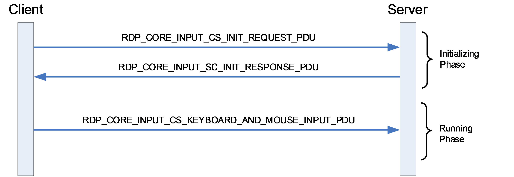
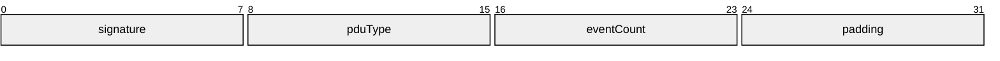
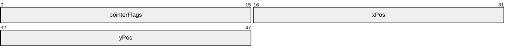
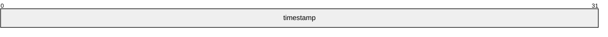
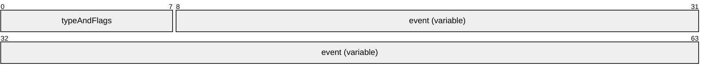
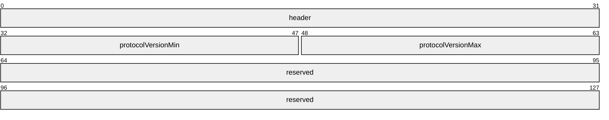
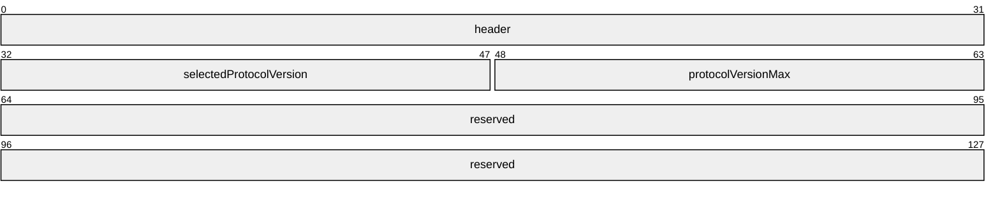
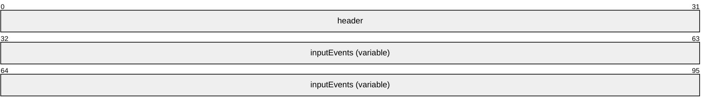

# [MS-RDPECI]: Remote Desktop Protocol: Core Input Virtual Channel Extension

Table of Contents

1 Introduction

- [1 Introduction](#Section_1)
  - [1.1 Glossary](#Section_1.1)
  - [1.2 References](#Section_1.2)
    - [1.2.1 Normative References](#Section_1.2.1)
    - [1.2.2 Informative References](#Section_1.2.2)
  - [1.3 Overview](#Section_1.3)
  - [1.4 Relationship to Other Protocols](#Section_1.4)
  - [1.5 Prerequisites/Preconditions](#Section_1.5)
  - [1.6 Applicability Statement](#Section_1.6)
  - [1.7 Versioning and Capability Negotiation](#Section_1.7)
  - [1.8 Vendor-Extensible Fields](#Section_1.8)
  - [1.9 Standards Assignments](#Section_1.9)

2 Messages

- [2 Messages](#Section_2)
  - [2.1 Transport](#Section_2.1)
  - [2.2 Message Syntax](#Section_2.2)
    - [2.2.1 Namespaces](#Section_2.2.1)
    - [2.2.2 Common Data Types](#Section_2.2.2)
      - [2.2.2.1 RDP_CORE_INPUT_HEADER](#Section_2.2.2.1)
      - [2.2.2.2 PACKED_EVENT_TYPE_AND_FLAGS](#Section_2.2.2.2)
      - [2.2.2.3 TS_KEYBOARD_EVENT](#Section_2.2.2.3)
      - [2.2.2.4 TS_UNICODE_KEYBOARD_EVENT](#Section_2.2.2.4)
      - [2.2.2.5 TS_POINTER_EVENT](#Section_2.2.2.5)
      - [2.2.2.6 TS_QOE_INPUT_TIMESTAMP_EVENT](#Section_2.2.2.6)
      - [2.2.2.7 TS_RELPOINTER_EVENT](#Section_2.2.2.7)
      - [2.2.2.8 RDP_CORE_INPUT_EVENT_CONTAINER](#Section_2.2.2.8)
    - [2.2.3 Core Input Messages](#Section_2.2.3)
      - [2.2.3.1 RDP_CORE_INPUT_CS_INIT_REQUEST_PDU](#Section_2.2.3.1)
      - [2.2.3.2 RDP_CORE_INPUT_SC_INIT_RESPONSE_PDU](#Section_2.2.3.2)
      - [2.2.3.3 RDP_CORE_INPUT_CS_KEYBOARD_AND_MOUSE_INPUT_PDU](#Section_2.2.3.3)

3 Protocol Details

- [3 Protocol Details](#Section_3)
  - [3.1 Common Details](#Section_3.1)
    - [3.1.1 Abstract Data Model](#Section_3.1.1)
    - [3.1.2 Timers](#Section_3.1.2)
    - [3.1.3 Initialization](#Section_3.1.3)
    - [3.1.4 Higher-Layer Triggered Events](#Section_3.1.4)
    - [3.1.5 Message Processing Events and Sequencing Rules](#Section_3.1.5)
      - [3.1.5.1 Processing a Core Input Message](#Section_3.1.5.1)
    - [3.1.6 Timer Events](#Section_3.1.6)
    - [3.1.7 Other Local Events](#Section_3.1.7)
  - [3.2 Server Details](#Section_3.2)
    - [3.2.1 Abstract Data Model](#Section_3.2.1)
    - [3.2.2 Timers](#Section_3.2.2)
    - [3.2.3 Initialization](#Section_3.2.3)
    - [3.2.4 Higher-Layer Triggered Events](#Section_3.2.4)
    - [3.2.5 Message Processing Events and Sequencing Rules](#Section_3.2.5)
      - [3.2.5.1 Processing an RDP_CORE_INPUT_CS_INIT_REQUEST_PDU Message](#Section_3.2.5.1)
      - [3.2.5.2 Sending an RDP_CORE_INPUT_SC_INIT_RESPONSE_PDU Message](#Section_3.2.5.2)
      - [3.2.5.3 Processing an RDP_CORE_INPUT_CS_KEYBOARD_AND_MOUSE_INPUT_PDU Message](#Section_3.2.5.3)
    - [3.2.6 Timer Events](#Section_3.2.6)
    - [3.2.7 Other Local Events](#Section_3.2.7)
  - [3.3 Client Details](#Section_3.3)
    - [3.3.1 Abstract Data Model](#Section_3.3.1)
    - [3.3.2 Timers](#Section_3.3.2)
    - [3.3.3 Initialization](#Section_3.3.3)
    - [3.3.4 Higher-Layer Triggered Events](#Section_3.3.4)
    - [3.3.5 Message Processing Events and Sequencing Rules](#Section_3.3.5)
      - [3.3.5.1 Sending an RDP_CORE_INPUT_CS_INIT_REQUEST_PDU Message](#Section_3.3.5.1)
      - [3.3.5.2 Processing an RDP_CORE_INPUT_SC_INIT_RESPONSE_PDU Message](#Section_3.3.5.2)
      - [3.3.5.3 Sending an RDP_CORE_INPUT_CS_KEYBOARD_AND_MOUSE_INPUT_PDU Message](#Section_3.3.5.3)
    - [3.3.6 Timer Events](#Section_3.3.6)
    - [3.3.7 Other Local Events](#Section_3.3.7)

4 Protocol Examples

- [4 Protocol Examples](#Section_4)
  - [4.1 Version and Capabilities Exchange](#Section_4.1)
    - [4.1.1 Init Request](#Section_4.1.1)
    - [4.1.2 Init Response](#Section_4.1.2)
  - [4.2 Keyboard and Mouse Input](#Section_4.2)

5 Security

- [5 Security](#Section_5)
  - [5.1 Security Considerations for Implementers](#Section_5.1)
  - [5.2 Index of Security Parameters](#Section_5.2)

6 Appendix A: Product Behavior

- [6 Appendix A: Product Behavior](#Section_6)

7 Change Tracking

- [7 Change Tracking](#Section_7)

For the legal notice and IP terms, see [LEGAL.md](../LEGAL.md).
Last updated: 4/23/2024.
See [Revision History](#revision-history) for full version history.

# 1 Introduction

The Remote Desktop Protocol: Core Input Virtual Channel Extension applies to the Remote Desktop Protocol: Basic Connectivity and Graphics Remoting. The core input protocol is used to remote keyboard and mouse input from a terminal server client to a terminal server.

Sections 1.5, 1.8, 1.9, 2, and 3 of this specification are normative. All other sections and examples in this specification are informative.

## 1.1 Glossary

This document uses the following terms:

**little-endian**: Multiple-byte values that are byte-ordered with the least significant byte stored in the memory location with the lowest address.

**terminal server**: A computer on which terminal services is running.

**MAY, SHOULD, MUST, SHOULD NOT, MUST NOT:** These terms (in all caps) are used as defined in [[RFC2119]](https://go.microsoft.com/fwlink/?LinkId=90317). All statements of optional behavior use either MAY, SHOULD, or SHOULD NOT.

## 1.2 References

Links to a document in the Microsoft Open Specifications library point to the correct section in the most recently published version of the referenced document. However, because individual documents in the library are not updated at the same time, the section numbers in the documents may not match. You can confirm the correct section numbering by checking the [Errata](https://go.microsoft.com/fwlink/?linkid=850906).

### 1.2.1 Normative References

We conduct frequent surveys of the normative references to assure their continued availability. If you have any issue with finding a normative reference, please contact [dochelp@microsoft.com](mailto:dochelp@microsoft.com). We will assist you in finding the relevant information.

[MS-RDPBCGR] Microsoft Corporation, "[Remote Desktop Protocol: Basic Connectivity and Graphics Remoting](../MS-RDPBCGR/MS-RDPBCGR.md)".

[MS-RDPEDYC] Microsoft Corporation, "[Remote Desktop Protocol: Dynamic Channel Virtual Channel Extension](../MS-RDPEDYC/MS-RDPEDYC.md)".

[RFC2119] Bradner, S., "Key words for use in RFCs to Indicate Requirement Levels", BCP 14, RFC 2119, March 1997, [https://www.rfc-editor.org/info/rfc2119](https://go.microsoft.com/fwlink/?LinkId=90317)

### 1.2.2 Informative References

None.

## 1.3 Overview

The Remote Desktop Protocol: Core Input Virtual Channel Extension is used to remote keyboard and mouse input from a [**terminal server**](#gt_terminal-server) client to a terminal server and replaces the Slow-Path and Fast-Path Input Event PDUs specified in [MS-RDPBCGR](../MS-RDPBCGR/MS-RDPBCGR.md) sections 2.2.8.1.1.3.1.1 and 2.2.8.1.2.

Keyboard and mouse input is generated at the client by a physical or virtual keyboard or mouse, encoded, and then sent on the wire to the server. After this input is received and decoded by the server, it is injected into the session associated with the remote user, effectively remoting the keyboard and mouse input generated at the client.

An example message flow encapsulating all of the input messages, described in section [2.2.3](#Section_2.2.3), and protocol phases is presented in the following figure.

Figure 1: Messages exchanged by the core input protocol endpoints

The core input protocol is divided into two distinct phases:

- Initialization Phase
- Running Phase
The Initialization Phase occurs at the start of the connection. During this phase, the server and client exchange the supported protocol version using RDP_CORE_INPUT_CS_INIT_REQUEST_PDU (section [2.2.3.1](#Section_2.2.3.1)) and RDP_CORE_INPUT_SC_INIT_RESPONSE_PDU (section [2.2.3.2](#Section_2.2.3.2)) messages. The client initiates this exchange when the dynamic virtual channel (sections [1.4](#Section_1.4) and [2.1](#Section_2.1)) over which the core input messages will flow has been opened.

Once both endpoints are ready, the Running Phase is entered. During this phase, the client sends keyboard and mouse events to the server encapsulated in the RDP_CORE_INPUT_CS_KEYBOARD_AND_MOUSE_INPUT_PDU (section [2.2.3.3](#Section_2.2.3.3)) message. The server decodes these events and injects them into the user's session.

## 1.4 Relationship to Other Protocols

The Remote Desktop Protocol: Core Input Virtual Channel Extension is embedded in a dynamic virtual channel transport, as specified in [MS-RDPEDYC](../MS-RDPEDYC/MS-RDPEDYC.md) sections 1 to 3.

The Remote Desktop Protocol: Core Input Virtual Channel Extension replaces the TS_FP_INPUT_PDU specified in [MS-RDPBCGR](../MS-RDPBCGR/MS-RDPBCGR.md) section 2.2.8.1.2.

## 1.5 Prerequisites/Preconditions

The Remote Desktop Protocol: Core Input Virtual Channel Extension operates only after the dynamic virtual channel transport is fully established. If the dynamic virtual channel transport is terminated, the Remote Desktop Protocol: Core Input Virtual Channel Extension is also terminated. The protocol is terminated by closing the underlying virtual channel. For details about closing the dynamic virtual channel, see [MS-RDPEDYC](../MS-RDPEDYC/MS-RDPEDYC.md) section 3.2.5.2.

## 1.6 Applicability Statement

The Remote Desktop Protocol: Core Input Virtual Channel Extension is applicable in scenarios where the transfer of keyboard and mouse events (generated by a physical or virtual keyboard and mouse) is required from a [**terminal server**](#gt_terminal-server) client to a terminal server.

## 1.7 Versioning and Capability Negotiation

During the Initialization phase, the server and client exchange the supported protocol version using the RDP_CORE_INPUT_CS_INIT_REQUEST_PDU (section [2.2.3.1](#Section_2.2.3.1)) and RDP_CORE_INPUT_SC_INIT_RESPONSE_PDU (section [2.2.3.2](#Section_2.2.3.2)) messages. The client initiates this exchange when the dynamic virtual channel (sections [1.4](#Section_1.4) and [2.1](#Section_2.1)) over which the core input messages will flow has been opened.

## 1.8 Vendor-Extensible Fields

None.

## 1.9 Standards Assignments

None.

# 2 Messages

## 2.1 Transport

The Remote Desktop Protocol: Core Input Virtual Channel Extension is designed to operate over a dynamic virtual channel, as specified in [MS-RDPEDYC] sections 1 to 3. The dynamic virtual channel name is the null-terminated ANSI character string "Microsoft::Windows::RDS::CoreInput". The usage of channel names in the context of opening a dynamic virtual channel is specified in [MS-RDPEDYC](../MS-RDPEDYC/MS-RDPEDYC.md) section 2.2.2.1.

## 2.2 Message Syntax

The following sections specify the Remote Desktop Protocol: Core Input Virtual Channel Extension message syntax. All multiple-byte fields within a message MUST be marshaled in [**little-endian**](#gt_little-endian) byte order, unless otherwise specified.

### 2.2.1 Namespaces

### 2.2.2 Common Data Types

#### 2.2.2.1 RDP_CORE_INPUT_HEADER

The **RDP_CORE_INPUT_HEADER** structure is included in all core input PDUs and is used to identify the PDU type and to specify how many keyboard or mouse events are included in the RDP_CORE_INPUT_CS_KEYBOARD_AND_MOUSE_INPUT_PDU message that follows.

**signature (1 byte):** An 8-bit, unsigned integer that MUST always be set to 0x03.

**pduType (1 byte):** An 8-bit, unsigned integer that identifies the type of core input PDU

| **Value** | **Meaning** |
| --- | --- |
| PDUTYPE_CS_INIT_REQUEST 0x01 | [RDP_CORE_INPUT_CS_INIT_REQUEST_PDU (section 2.2.3.1)](#Section_2.2.3.1) |
| PDUTYPE_SC_INIT_RESPONSE 0x02 | [RDP_CORE_INPUT_SC_INIT_RESPONSE_PDU (section 2.2.3.2)](#Section_2.2.3.2) |
| PDUTYPE_CS_KEYBOARD_AND_MOUSE_INPUT 0x03 | [RDP_CORE_INPUT_CS_KEYBOARD_AND_MOUSE_INPUT_PDU (section 2.2.3.3)](#Section_2.2.3.3) |

**eventCount (1 byte):** An 8-bit unsigned integer. If the **pduType** field is set to RDP_CORE_INPUT_CS_KEYBOARD_AND_MOUSE_INPUT_PDU (0x03), then this field MUST contain the number of the mouse and keyboard events included in the message. It MUST be set to zero for all other values of **pduType**.

**padding (1 byte):** An 8-bit, unsigned integer that SHOULD be set to zero.

#### 2.2.2.2 PACKED_EVENT_TYPE_AND_FLAGS

The **PACKED_EVENT_TYPE_AND_FLAGS** structure is a single byte that specifies the event type and associated flags for each event included in the RDP_CORE_INPUT_CS_KEYBOARD_AND_MOUSE_INPUT_PDU (section [2.2.3.3](#Section_2.2.3.3)) message.

**flags (5 bits):** A 5-bit, unsigned integer that contains flags specific to the input event. Only used for keyboard input events.

If the **type** field is set to INPUT_EVENT_SCANCODE (0x0).

| **Value** | **Meaning** |
| --- | --- |
| INPUT_KBDFLAGS_RELEASE 0x01 | The absence of this flag indicates a key-down event, while its presence indicates a key-release event. |
| INPUT_KBDFLAGS_EXTENDED 0x02 | Indicates that the keystroke message contains an extended scancode. For enhanced 101-key and 102-key keyboards, extended keys include the right ALT and right CTRL keys on the main section of the keyboard; the INS, DEL, HOME, END, PAGE UP, PAGE DOWN and ARROW keys in the clusters to the left of the numeric keypad; and the Divide ("/") and ENTER keys in the numeric keypad. |
| INPUT_KBDFLAGS_EXTENDED1 0x04 | Used to send keyboard events triggered by the PAUSE key. A PAUSE key press and release MUST be sent as the following sequence of keyboard events: CTRL (0x1D) DOWN NUMLOCK (0x45) DOWN CTRL (0x1D) UP NUMLOCK (0x45) UP The CTRL DOWN and CTRL UP events MUST both include the FASTPATH_INPUT_KBDFLAGS_EXTENDED1 flag. |

If the **type** field is set to INPUT_EVENT_UNICODE (0x4).

| **Value** | **Meaning** |
| --- | --- |
| INPUT_KBDFLAGS_RELEASE 0x01 | The absence of this flag indicates a key-down event, while its presence indicates a key-release event. |

If the **type** field is set to INPUT_EVENT_SYNC (0x3).

| **Value** | **Meaning** |
| --- | --- |
| INPUT_SYNC_SCROLL_LOCK 0x01 | Indicates that the Scroll Lock indicator light SHOULD be on. |
| INPUT_SYNC_NUM_LOCK 0x02 | Indicates that the Num Lock indicator light SHOULD be on. |
| INPUT_SYNC_CAPS_LOCK 0x04 | Indicates that the Caps Lock indicator light SHOULD be on. |
| INPUT_SYNC_KANA_LOCK 0x08 | Indicates that the Kana Lock indicator light SHOULD be on. |

**type (3 bits):** A 3-bit, unsigned integer that specifies the type of input event.

| Value | Event Payload |
| --- | --- |
| INPUT_EVENT_SCANCODE 0x0 | Indicates a Keyboard Event. The event payload is a TS_KEYBOARD_EVENT (section [2.2.2.3](#Section_2.2.2.3)) structure. |
| INPUT_EVENT_MOUSE 0x1 | Indicates a Mouse Event. The event payload is a TS_POINTER_EVENT (section [2.2.2.5](#Section_2.2.2.5)) structure. |
| INPUT_EVENT_MOUSEX 0x2 | Indicates an Extended Mouse Event. The event payload is a TS_POINTER_EVENT (section 2.2.2.5) structure. |
| INPUT_EVENT_SYNC 0x3 | Indicates a Synchronize Event with no event payload. This event is used to synchronize the values of the toggle keys (for example, Caps Lock) and to reset the server key state to all keys up. The synchronize event SHOULD be followed by key-down events to communicate which keyboard and mouse keys are down. |
| INPUT_EVENT_UNICODE 0x4 | Indicates a Unicode Keyboard Event. The event payload is a TS_UNICODE_KEYBOARD_EVENT (section [2.2.2.4](#Section_2.2.2.4)) structure. |
| INPUT_EVENT_QOE_TIMESTAMP 0x6 | Indicates a Quality-of-Experience (QoE) Timestamp Event. The event payload is a TS_QOE_INPUT_TIMESTAMP_EVENT (section [2.2.2.6](#Section_2.2.2.6)) structure. |
| INPUT_EVENT_RELMOUSE 0x5 | Indicates a Relative Mouse Event. The event payload is a TS_RELPOINTER_EVENT (section [2.2.2.7](#Section_2.2.2.7)) structure. |

#### 2.2.2.3 TS_KEYBOARD_EVENT

The TS_KEYBOARD_EVENT is used to transmit a scan code-based keyboard event. See section [2.2.2.2](#Section_2.2.2.2) for flags associated with this event.

**keyCode (1 byte):** An 8-bit, unsigned integer. The scan code associated with the key event. The server translates the scan code into an appropriate character depending on the language locale and keyboard layout used in the session.

#### 2.2.2.4 TS_UNICODE_KEYBOARD_EVENT

The TS_UNICODE_KEYBOARD_EVENT is used to transmit a Unicode-based keyboard event. See section [2.2.2.2](#Section_2.2.2.2) for flags associated with this event.

**unicodeCode (2 bytes):** A 16-bit, unsigned integer. The Unicode character input code.

#### 2.2.2.5 TS_POINTER_EVENT

The TS_POINTER_EVENT is used to transmit a mouse wheel, move, or button event.

**pointerFlags (2 bytes):** A 16-bit, unsigned integer that contains flags that describes the pointer event. For a mouse wheel event:

| **Flag** | **Meaning** |
| --- | --- |
| PTRFLAGS_HWHEEL 0x0400 | The event is a horizontal mouse wheel rotation. The only valid flags in a horizontal wheel rotation event are PTRFLAGS_WHEEL_NEGATIVE and the WheelRotationMask; all other pointer flags are ignored. This flag MUST NOT be sent to a server that does not indicate support for horizontal mouse wheel events in the Input Capability Set (MS-RDPBGCR section 2.2.7.1.6). |
| PTRFLAGS_WHEEL 0x0200 | The event is a vertical mouse wheel rotation. The only valid flags in a vertical wheel rotation event are PTRFLAGS_WHEEL_NEGATIVE and the WheelRotationMask; all other pointer flags are ignored. |
| PTRFLAGS_WHEEL_NEGATIVE 0x0100 | The wheel rotation value (contained in the WheelRotationMask bit field) is negative and MUST be sign-extended before injection at the server. |
| WheelRotationMask 0x01FF | The bit field that describes the number of rotation units the mouse wheel was rotated. The value is negative if the PTRFLAGS_WHEEL_NEGATIVE flag is set. |

If both PTRFLAGS_WHEEL (0x0200) and PTRFLAGS_HWHEEL (0x0400) are specified, then PTRFLAGS_WHEEL takes precedence.

For a mouse movement event:

| **Flag** | **Meaning** |
| --- | --- |
| PTRFLAGS_MOVE 0x0800 | Indicates that the mouse position MUST be updated to the location specified by the xPos and yPos fields. |

For a mouse button event:

| **Flag** | **Meaning** |
| --- | --- |
| PTRFLAGS_DOWN 0x8000 | Indicates that a click event has occurred at the position specified by the xPos and yPos fields. The button flags indicate which button has been clicked, and at least one of these flags MUST be set. |
| PTRFLAGS_BUTTON1 0x1000 | Mouse button 1 (left button) was clicked or released. If the PTRFLAGS_DOWN flag is set, then the button was clicked, otherwise it was released. |
| PTRFLAGS_BUTTON2 0x2000 | Mouse button 2 (right button) was clicked or released. If the PTRFLAGS_DOWN flag is set, then the button was clicked, otherwise it was released. |
| PTRFLAGS_BUTTON3 0x4000 | Mouse button 3 (middle button or wheel) was clicked or released. If the PTRFLAGS_DOWN flag is set, then the button was clicked, otherwise it was released. |

For an extended mouse button event:

| **Flag** | **Meaning** |
| --- | --- |
| PTRXFLAGS_DOWN 0x8000 | Indicates that a click event has occurred at the position specified by the xPos and yPos fields. The button flags indicate which button has been clicked, and at least one of these flags MUST be set. |
| PTRXFLAGS_BUTTON1 0x0001 | Extended mouse button 1 (also referred to as button 4) was clicked or released. If the PTRXFLAGS_DOWN flag is set, the button was clicked; otherwise, it was released. |
| PTRXFLAGS_BUTTON2 0x0002 | Extended mouse button 2 (also referred to as button 5) was clicked or released. If the PTRXFLAGS_DOWN flag is set, the button was clicked; otherwise, it was released. |

**xPos (2 bytes):** A 16-bit, unsigned integer that specifies the x-coordinate of the pointer relative to the top-left corner of the server's desktop. This field SHOULD be ignored by the server if the PTRFLAGS_WHEEL (0x0200) or PTRFLAGS_HWHEEL (0x0400) flag is specified in the **pointerFlags** field.

**yPos (2 bytes):** A 16-bit, unsigned integer that specifies the y-coordinate of the pointer relative to the top-left corner of the server's desktop. This field SHOULD be ignored by the server if the PTRFLAGS_WHEEL (0x0200) or PTRFLAGS_HWHEEL (0x0400) flag is specified in the **pointerFlags** field.

#### 2.2.2.6 TS_QOE_INPUT_TIMESTAMP_EVENT

The TS_QOE_INPUT_TIMESTAMP_EVENT is used to enable the calculation of Quality of Experience (QoE) metrics. This event is sent solely for informational and debugging purposes and MUST NOT be transmitted to the server if the TS_INPUT_FLAG_QOE_TIMESTAMPS (0x0200) flag was not received in the Input Capability Set ([MS-RDPBCGR](../MS-RDPBCGR/MS-RDPBCGR.md) section 2.2.7.1.6).

**timestamp (4 bytes):** A 32-bit, unsigned integer. A client-generated timestamp, in milliseconds, that indicates when the current input batch was encoded by the client. The value of the first timestamp sent by the client implicitly defines the origin for all subsequent timestamps. The server is responsible for handling roll-over of the timestamp.

#### TS_RELPOINTER_EVENT

The TS_RELPOINTER_EVENT structure is used to specify relative mouse pointer movement (as opposed to absolute positioning).

**pointerFlags (2 bytes):**

For a mouse movement event:

| **Flag** | **Meaning** |
| --- | --- |
| PTRFLAGS_MOVE 0x0800 | Indicates that the mouse position MUST be updated to the location specified by the xPos and yPos fields.. |

For a mouse button event:

| **Flag** | **Meaning** |
| --- | --- |
| PTRFLAGS_DOWN 0x8000 | Indicates that a press event has occurred at the position that results from the application of the **xDelta** and **yDelta** fields to the previous position. The button flags indicate which button has been pressed and at least one of these flags MUST be set. |
| PTRFLAGS_BUTTON1 0x1000 | Mouse button 1 (left button) was clicked or released. If the PTRFLAGS_DOWN flag is set, then the button was clicked, otherwise it was released. |
| PTRFLAGS_BUTTON2 0x2000 | Mouse button 2 (right button) was clicked or released. If the PTRFLAGS_DOWN flag is set, then the button was clicked, otherwise it was released. |
| PTRFLAGS_BUTTON3 0x4000 | Mouse button 3 (middle button or wheel) was clicked or released. If the PTRFLAGS_DOWN flag is set, then the button was clicked, otherwise it was released. |

For an extended mouse button event:

| **Flag** | **Meaning** |
| --- | --- |
| PTRXFLAGS_DOWN 0x8000 | Indicates that a press event has occurred at the position that results from the application of the **xDelta** and **yDelta** fields to the previous position. The button flags indicate which button has been pressed and at least one of these flags MUST be set. |
| PTRXFLAGS_BUTTON1 0x0001 | Extended mouse button 1 (also referred to as button 4) was clicked or released. If the PTRXFLAGS_DOWN flag is set, the button was clicked; otherwise, it was released. |
| PTRXFLAGS_BUTTON2 0x0002 | Extended mouse button 2 (also referred to as button 5) was clicked or released. If the PTRXFLAGS_DOWN flag is set, the button was clicked; otherwise, it was released. |

**xDelta (2 bytes):** A 16-bit signed integer that specifies the distance the pointer has moved on the x-axis since the previous position update was sent. Negative values indicate that the pointer is moving to the left.

**yDelta (2 bytes):** A 16-bit signed integer that specifies the distance the pointer has moved on the y-axis since the previous position update was sent. Negative values indicate that the pointer is moving up.

#### 2.2.2.8 RDP_CORE_INPUT_EVENT_CONTAINER

The **RDP_CORE_INPUT_EVENT_CONTAINER** structure is used to wrap event-specific information.

**typeAndFlags (1 byte):** A **PACKED_EVENT_TYPE_AND_FLAGS** (section [2.2.2.2](#Section_2.2.2.2)) structure. The embedded **type** field specifies the type of event contained in the **event** field.

**event (variable):** A TS_KEYBOARD_EVENT (section [2.2.2.3](#Section_2.2.2.3)), TS_UNICODE_KEYBOARD_EVENT (section [2.2.2.4](#Section_2.2.2.4)), TS_POINTER_EVENT (section [2.2.2.5](#Section_2.2.2.5)), or TS_QOE_INPUT_TIMESTAMP_EVENT (section [2.2.2.6](#Section_2.2.2.6)).

### 2.2.3 Core Input Messages

#### 2.2.3.1 RDP_CORE_INPUT_CS_INIT_REQUEST_PDU

The RDP_CORE_INPUT_CS_INIT_REQUEST_PDU message is sent by the client endpoint and is used to transport supported core input protocol versions to the server.

**header (4 bytes):** An **RDP_CORE_INPUT_HEADER** (section [2.2.2.1](#Section_2.2.2.1)) structure. The embedded **pduType** field MUST be set to PDUTYPE_CS_INIT_REQUEST (0x01).

**protocolVersionMin (2 bytes):** A 16-bit, unsigned integer that specifies the minimum core input protocol version supported by the client.

| Value | Meaning |
| --- | --- |
| RDP_CORE_INPUT_PROTOCOL_VERSION_100 0x0100 | Version 1.0 of the RDP Core input remoting protocol. |

**protocolVersionMax (2 bytes):** A 16-bit, unsigned integer that specifies the maximum core input protocol version supported by the client.

| Value | Meaning |
| --- | --- |
| RDP_CORE_INPUT_PROTOCOL_VERSION_100 0x0100 | Version 1.0 of the RDP Core input remoting protocol. |

**reserved (8 bytes):** A 64-bit, unsigned integer that SHOULD be set to zero.

#### 2.2.3.2 RDP_CORE_INPUT_SC_INIT_RESPONSE_PDU

The RDP_CORE_INPUT_SC_INIT_RESPONSE_PDU message is sent by the server endpoint and is used to transport the selected core input protocol version to the client.

**header (4 bytes):** An **RDP_CORE_INPUT_HEADER** (section [2.2.2.1](#Section_2.2.2.1)) structure. The embedded **pduType** field MUST be set to PDUTYPE_CS_INIT_RESPONSE (0x02).

**selectedProtocolVersion (2 bytes):** A 16-bit, unsigned integer that contains the core input protocol version selected by the server.

| Value | Meaning |
| --- | --- |
| RDP_CORE_INPUT_PROTOCOL_VERSION_100 0x0100 | Version 1.0 of the RDP Core input remoting protocol. |

**protocolVersionMax (2 bytes):** A 16-bit, unsigned integer that specifies the maximum core input protocol version supported by the server.

| Value | Meaning |
| --- | --- |
| RDP_CORE_INPUT_PROTOCOL_VERSION_100 0x0100 | Version 1.0 of the RDP Core input remoting protocol. |

**reserved (8 bytes):** A 64-bit, unsigned integer that SHOULD be set to zero.

#### 2.2.3.3 RDP_CORE_INPUT_CS_KEYBOARD_AND_MOUSE_INPUT_PDU

The RDP_CORE_INPUT_CS_KEYBOARD_AND_MOUSE_INPUT_PDU message is sent by the client endpoint and is used to remote a collection of keyboard or mouse events to the server.

**header (4 bytes):** An **RDP_CORE_INPUT_HEADER** (section [2.2.2.1](#Section_2.2.2.1)) structure. The embedded **pduType** field MUST be set to PDUTYPE_CS_KEYBOARD_AND_MOUSE_INPUT (0x03). The **eventCount** field specifies how many events are included in this message. This allows up to 255 input events in one PDU.

**inputEvents (variable):** An array of RDP_CORE_INPUT_EVENT_CONTAINER (section [2.2.2.8](#Section_2.2.2.8)) structures containing input events to be processed by the server. The number of events present in this array is specified by the embedded **eventCount** field in the **header** field.

# 3 Protocol Details

## 3.1 Common Details

### 3.1.1 Abstract Data Model

None.

### 3.1.2 Timers

None.

### 3.1.3 Initialization

None.

### 3.1.4 Higher-Layer Triggered Events

No higher-layer triggered events are used.

### 3.1.5 Message Processing Events and Sequencing Rules

#### 3.1.5.1 Processing a Core Input Message

All core input messages are prefaced by the **RDP_CORE_INPUT_HEADER** (section [2.2.2.1](#Section_2.2.2.1)) structure.

When a core input message is processed, the **pduType** field in the header MUST first be examined to determine if the message is within the subset of expected messages as described in section [1.3](#Section_1.3). If the message is not expected, it SHOULD be ignored.

### 3.1.6 Timer Events

None.

### 3.1.7 Other Local Events

No additional events are used.

## 3.2 Server Details

### 3.2.1 Abstract Data Model

None.

### 3.2.2 Timers

None.

### 3.2.3 Initialization

Upon receiving the RDP_CORE_INPUT_CS_INIT_REQUEST_PDU (section [2.2.3.1](#Section_2.2.3.1)) message, the server MUST send the RDP_CORE_INPUT_SC_INIT_RESPONSE_PDU (section [2.2.3.2](#Section_2.2.3.2)) message to the client, as specified in section [3.2.5.2](#Section_3.2.5.2), to signal that the Initialization Phase is complete and that it is ready to accept and process keyboard and mouse input.

### 3.2.4 Higher-Layer Triggered Events

None.

### 3.2.5 Message Processing Events and Sequencing Rules

#### 3.2.5.1 Processing an RDP_CORE_INPUT_CS_INIT_REQUEST_PDU Message

The structure and fields of the RDP_CORE_INPUT_CS_INIT_REQUEST_PDU message are specified in section [2.2.3.1](#Section_2.2.3.1).

The **header** field MUST be processed as specified in section [3.1.5.1](#Section_3.1.5.1). If the message is valid, the server SHOULD send an RDP_CORE_INPUT_SC_INIT_RESPONSE_PDU (section [2.2.3.2](#Section_2.2.3.2)) message to the client, as specified in section [3.2.5.2](#Section_3.2.5.2).

#### 3.2.5.2 Sending an RDP_CORE_INPUT_SC_INIT_RESPONSE_PDU Message

The structure and fields of the RDP_CORE_INPUT_SC_INIT_RESPONSE_PDU message are specified in section [2.2.3.2](#Section_2.2.3.2). The message fields MUST be populated in accordance with this description. The server MUST populate the **capsSet** field with a single instance of a correctly initialized capability set structure (section [2.2.2.3](#Section_2.2.2.3)).

Once the RDP_CORE_INPUT_SC_INIT_RESPONSE_PDU message has been sent to the client, the server SHOULD be ready to accept and process keyboard and mouse input, as specified in section [3.2.5.3](#Section_3.2.5.3), that will be sent by the client using the RDP_CORE_INPUT_CS_KEYBOARD_AND_MOUSE_INPUT_PDU (section [2.2.3.3](#Section_2.2.3.3)) message.

#### 3.2.5.3 Processing an RDP_CORE_INPUT_CS_KEYBOARD_AND_MOUSE_INPUT_PDU Message

The structure and fields of the RDP_CORE_INPUT_CS_KEYBOARD_AND_MOUSE_INPUT_PDU message are specified in section [2.2.3.3](#Section_2.2.3.3).

The **header** field MUST be processed as specified in section [3.1.5.1](#Section_3.1.5.1). If the message is valid, the server SHOULD extract the input event parameters and then inject an appropriate synthesized input event into the remote session.

### 3.2.6 Timer Events

None.

### 3.2.7 Other Local Events

None.

## 3.3 Client Details

### 3.3.1 Abstract Data Model

None.

### 3.3.2 Timers

None.

### 3.3.3 Initialization

The client MUST send the RDP_CORE_INPUT_CS_INIT_REQUEST_PDU (section [2.2.3.1](#Section_2.2.3.1)) message to the server, as specified in section [3.3.5.1](#Section_3.3.5.1), once the dynamic virtual channel (section [2.1](#Section_2.1)) is opened. After the server responds with the RDP_CORE_INPUT_SC_INIT_RESPONSE_PDU (section [2.2.3.2](#Section_2.2.3.2)), the Initialization Phase is complete, and the client SHOULD send keyboard and mouse input generated by the user to the server.

### 3.3.4 Higher-Layer Triggered Events

None.

### 3.3.5 Message Processing Events and Sequencing Rules

#### 3.3.5.1 Sending an RDP_CORE_INPUT_CS_INIT_REQUEST_PDU Message

The structure and fields of the RDP_CORE_INPUT_CS_INIT_REQUEST_PDU message are specified in section [2.2.3.1](#Section_2.2.3.1). The message fields MUST be populated in accordance with this description, and the client MUST specify the range of protocol versions that it supports.

#### 3.3.5.2 Processing an RDP_CORE_INPUT_SC_INIT_RESPONSE_PDU Message

The structure and fields of the RDP_CORE_INPUT_SC_INIT_RESPONSE_PDU message are specified in section [2.2.3.2](#Section_2.2.3.2).

The **header** field MUST be processed as specified in section [3.1.5.1](#Section_3.1.5.1). If the message is valid, the client SHOULD hook the keyboard and mouse input subsystem, listen for changes to the cursor shape and position, and send updates using the RDP_CORE_INPUT_CS_KEYBOARD_AND_MOUSE_INPUT_PDU message, as specified in section [3.2.5.3](#Section_3.2.5.3).

#### 3.3.5.3 Sending an RDP_CORE_INPUT_CS_KEYBOARD_AND_MOUSE_INPUT_PDU Message

The structure and fields of the RDP_CORE_INPUT_CS_KEYBOARD_AND_MOUSE_INPUT_PDU message are specified in section [2.2.3.3](#Section_2.2.3.3). The message fields MUST be populated in accordance with this description based on whether a keyboard scan code, Unicode character, synchronize, QOE timestamp, or mouse event is being sent.

### 3.3.6 Timer Events

None.

### 3.3.7 Other Local Events

None.

# 4 Protocol Examples

## 4.1 Version and Capabilities Exchange

### 4.1.1 Init Request

The following are network captures of the [RDP_CORE_INPUT_CS_INIT_REQUEST_PDU (section 2.2.3.1)](#Section_2.2.3.1).

00000000 03 01 00 00 00 01 00 01-00 00 00 00 00 00 00 00

03 -> RDP_CORE_INPUT_HEADER::signature (1 Byte) 01 -> RDP_CORE_INPUT_HEADER::pduType is PDUTYPE_CS_INIT_REQUEST (1 Byte) 00 -> RDP_CORE_INPUT_HEADER::eventCount not used for PDUTYPE_CS_INIT_REQUEST (1 Byte) 00 -> RDP_CORE_INPUT_HEADER::padding (1 Byte) 00 01 -> RDP_CORE_INPUT_INIT_REQUEST_PDU::protocolVersionMin 0x0100 (2 Bytes) 00 01 -> RDP_CORE_INPUT_INIT_REQUEST_PDU::protocolVersionMax 0x0100 (2 Bytes) 00 00 00 00 00 00 00 00 -> RDP_CORE_INPUT_INIT_REQUEST_PDU::reserved (8 bytes)

### 4.1.2 Init Response

The following are network captures of the [RDP_CORE_INPUT_SC_INIT_RESPONSE_PDU (section 2.2.3.2)](#Section_2.2.3.2).

00000000 03 02 00 00 00 01 00 01-00 00 00 00 00 00 00 00 00 00

03 -> RDP_CORE_INPUT_HEADER::signature (1 Byte) 02 -> RDP_CORE_INPUT_HEADER::pduType is PDUTYPE_SC_INIT_RESPONSE (1 Byte) 00 -> RDP_CORE_INPUT_HEADER::eventCount not used for PDUTYPE_SC_INIT_RESPONSE (1 Byte) 00 -> RDP_CORE_INPUT_HEADER::padding (1 Byte) 00 01 -> RDP_CORE_INPUT_INIT_RESPONSE_PDU::selectedProtocolVersion 0x0100 (2 Bytes) 00 01 -> RDP_CORE_INPUT_INIT_RESPONSE_PDU::protocolVersionMax 0x0100 (2 Bytes) 00 00 00 00 00 00 00 00 -> RDP_CORE_INPUT_INIT_RESPONSE_PDU::reserved (8 bytes)

## 4.2 Keyboard and Mouse Input

The following are network captures of the [RDP_CORE_INPUT_CS_KEYBOARD_AND_MOUSE_INPUT_PDU (section 2.2.3.3)](#Section_2.2.3.3).

00000000 03 03 02 00 c0 c0 57 86-04 20 00 04 00 00 00 00

03 -> RDP_CORE_INPUT_HEADER::signature (1 Byte) 03 -> RDP_CORE_INPUT_HEADER::pduType is PDUTYPE_CS_KEYBOARD_AND_MOUSE_INPUT (1 Byte) 02 -> RDP_CORE_INPUT_HEADER::eventCount 2 (1 Byte) 00 -> RDP_CORE_INPUT_HEADER::padding (1 Byte) Event 1: 00000004 c0 c0 57 86 04 c0 -> TS_INPUT_FASTPATH_EVENT_QOE_TIMESTAMP 0xc0 (1 Byte) c0 57 86 04 -> timestamp 0x048657c0 (4 Bytes) Event 2: 00000009 20 00 04 00 00 00 00 20 -> TS_INPUT_FASTPATH_EVENT_MOUSE 0x20 (1 Byte) 00 04 -> TS_POINTER_EVENT::pointerFlags 0x0400 TS_FLAG_MOUSE_HWHEEL (2 Bytes) 00 00 -> TS_POINTER_EVENT::x 0 (2 Bytes) 00 00 -> TS_POINTER_EVENT::y 0 (2 Bytes)

# 5 Security

## 5.1 Security Considerations for Implementers

None.

## 5.2 Index of Security Parameters

None.

# 6 Appendix A: Product Behavior

The information in this specification is applicable to the following Microsoft products or supplemental software. References to product versions include updates to those products.

- Windows 11 operating system
- Windows Server 2022, 23H2 operating system
- Windows Server 2025 operating system
Exceptions, if any, are noted in this section. If an update version, service pack or Knowledge Base (KB) number appears with a product name, the behavior changed in that update. The new behavior also applies to subsequent updates unless otherwise specified. If a product edition appears with the product version, behavior is different in that product edition.

Unless otherwise specified, any statement of optional behavior in this specification that is prescribed using the terms "SHOULD" or "SHOULD NOT" implies product behavior in accordance with the SHOULD or SHOULD NOT prescription. Unless otherwise specified, the term "MAY" implies that the product does not follow the prescription.

# 7 Change Tracking

This section identifies changes that were made to this document since the last release. Changes are classified as Major, Minor, or None.

The revision class **Major** means that the technical content in the document was significantly revised. Major changes affect protocol interoperability or implementation. Examples of major changes are:

- A document revision that incorporates changes to interoperability requirements.
- A document revision that captures changes to protocol functionality.
The revision class **Minor** means that the meaning of the technical content was clarified. Minor changes do not affect protocol interoperability or implementation. Examples of minor changes are updates to clarify ambiguity at the sentence, paragraph, or table level.

The revision class **None** means that no new technical changes were introduced. Minor editorial and formatting changes may have been made, but the relevant technical content is identical to the last released version.

The changes made to this document are listed in the following table. For more information, please contact [dochelp@microsoft.com](mailto:dochelp@microsoft.com).

| Section | Description | Revision class |
| --- | --- | --- |
| [2.2.2.2](#Section_2.2.2.2) PACKED_EVENT_TYPE_AND_FLAGS | Updated for Windows 11 v24H2 and Windows Server 2025. Added input event type INPUT_EVENT_RELMOUSE a Relative Mouse Event. | Major |
| [2.2.2.7](#Section_2.2.2.7) TS_RELPOINTER_EVENT | Updated for Windows 11 v24H2 and Windows Server 2025. Added section. Event is used to specify relative mouse pointer movement. | Major |
| [6](#Section_6) Appendix A: Product Behavior | Added Windows Server 2025 to the product applicability list. | Major |

## Revision History

| Date | Version | Revision Class | Comments |
| --- | --- | --- | --- |
| 9/20/2023 | 1.0 | New | Released new document. |
| 4/23/2024 | 2.0 | Major | Significantly changed the technical content. |
