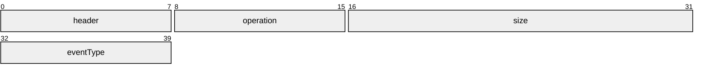
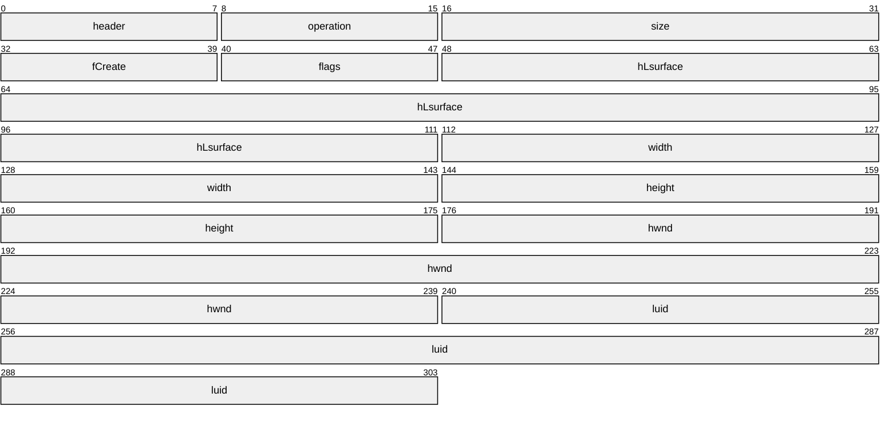
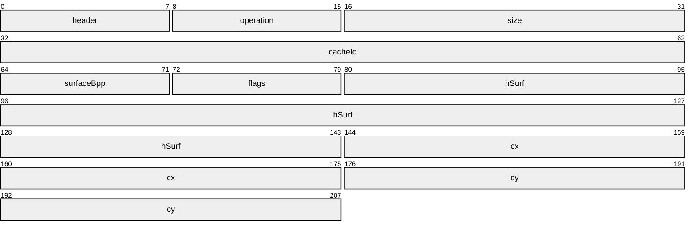
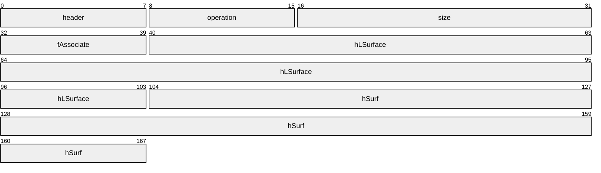
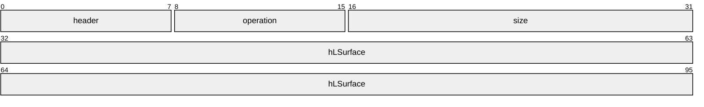
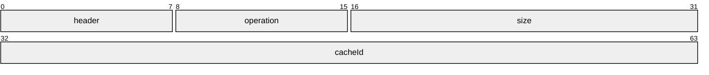
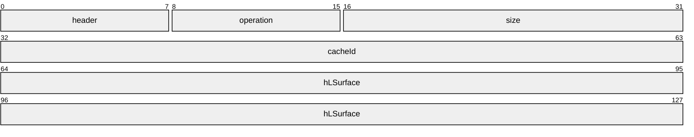

# [MS-RDPEDC]: Remote Desktop Protocol: Desktop Composition Virtual Channel Extension

Table of Contents

1 Introduction

- [1 Introduction](#Section_1)
  - [1.1 Glossary](#Section_1.1)
  - [1.2 References](#Section_1.2)
    - [1.2.1 Normative References](#Section_1.2.1)
    - [1.2.2 Informative References](#Section_1.2.2)
  - [1.3 Overview](#Section_1.3)
    - [1.3.1 Desktop Composition Concepts](#Section_1.3.1)
    - [1.3.2 Relationship to Update Orders PDU](#Section_1.3.2)
    - [1.3.3 Message Flows](#Section_1.3.3)
      - [1.3.3.1 Desktop Composition Mode Management](#Section_1.3.3.1)
      - [1.3.3.2 Redirection Object Lifetime and Association Management](#Section_1.3.3.2)
      - [1.3.3.3 Drawing Operations Management](#Section_1.3.3.3)
  - [1.4 Relationship to Other Protocols](#Section_1.4)
  - [1.5 Prerequisites/Preconditions](#Section_1.5)
  - [1.6 Applicability Statement](#Section_1.6)
  - [1.7 Versioning and Capability Negotiation](#Section_1.7)
  - [1.8 Vendor-Extensible Fields](#Section_1.8)
  - [1.9 Standards Assignments](#Section_1.9)

2 Messages

- [2 Messages](#Section_2)
  - [2.1 Transport](#Section_2.1)
  - [2.2 Message Syntax](#Section_2.2)
    - [2.2.1 Desktop Composition Mode Management](#Section_2.2.1)
      - [2.2.1.1 Drawing and Desktop Mode Changes Order (TS_COMPDESK_TOGGLE)](#Section_2.2.1.1)
    - [2.2.2 Redirection Object Lifetime Management](#Section_2.2.2)
      - [2.2.2.1 Logical Surface Lifetime Management Orders (TS_COMPDESK_LSURFACE)](#Section_2.2.2.1)
      - [2.2.2.2 Redirection Surfaces Lifetime Management Order (TS_COMPDESK_SURFOBJ)](#Section_2.2.2.2)
      - [2.2.2.3 Redirection Surface and Logical Surface Association Order (TS_COMPDESK_REDIRSURF_ASSOC_LSURFACE)](#Section_2.2.2.3)
      - [2.2.2.4 Logical Surface Compositor Reference (TS_COMPDESK_LSURFACE_COMPREF_PENDING)](#Section_2.2.2.4)
    - [2.2.3 Drawing Operations Management](#Section_2.2.3)
      - [2.2.3.1 Retargeting Drawing Order (TS_COMPDESK_SWITCH_SURFOBJ)](#Section_2.2.3.1)
      - [2.2.3.2 FlushComposeOnce Drawing Order (TS_COMPDESK_FLUSH_COMPOSEONCE)](#Section_2.2.3.2)

3 Protocol Details

- [3 Protocol Details](#Section_3)
  - [3.1 Common Details](#Section_3.1)
    - [3.1.1 Abstract Data Model](#Section_3.1.1)
    - [3.1.2 Timers](#Section_3.1.2)
    - [3.1.3 Higher-Layer Triggered Events](#Section_3.1.3)
    - [3.1.4 Message Processing Events and Sequencing Rules](#Section_3.1.4)
    - [3.1.5 Timer Events](#Section_3.1.5)
    - [3.1.6 Other Local Events](#Section_3.1.6)
  - [3.2 Client Details](#Section_3.2)
    - [3.2.1 Abstract Data Model](#Section_3.2.1)
    - [3.2.2 Timers](#Section_3.2.2)
    - [3.2.3 Initialization](#Section_3.2.3)
    - [3.2.4 Higher-Layer Triggered Events](#Section_3.2.4)
    - [3.2.5 Message Processing Events and Sequencing Rules](#Section_3.2.5)
      - [3.2.5.1 Desktop Composition Mode Management](#Section_3.2.5.1)
        - [3.2.5.1.1 Handling Drawing and Desktop Mode Changes Order](#Section_3.2.5.1.1)
      - [3.2.5.2 Redirection Object Lifetime Management](#Section_3.2.5.2)
        - [3.2.5.2.1 Handling Logical Surfaces Lifetime Management Order](#Section_3.2.5.2.1)
        - [3.2.5.2.2 Handling Redirection Surfaces Lifetime Management Order](#Section_3.2.5.2.2)
        - [3.2.5.2.3 Handling Redirection Surface and Logical Surface Association Management Order](#Section_3.2.5.2.3)
        - [3.2.5.2.4 Logical Surface Compositor Reference Order](#Section_3.2.5.2.4)
      - [3.2.5.3 Drawing Operations Management](#Section_3.2.5.3)
        - [3.2.5.3.1 Handling Retargeting Drawing Order](#Section_3.2.5.3.1)
        - [3.2.5.3.2 Handling Closing Drawing Order](#Section_3.2.5.3.2)
    - [3.2.6 Timer Events](#Section_3.2.6)
    - [3.2.7 Other Local Events](#Section_3.2.7)
  - [3.3 Server Details](#Section_3.3)
    - [3.3.1 Abstract Data Model](#Section_3.3.1)
    - [3.3.2 Timers](#Section_3.3.2)
    - [3.3.3 Initialization](#Section_3.3.3)
    - [3.3.4 Higher-Layer Triggered Events](#Section_3.3.4)
    - [3.3.5 Message Processing Events and Sequencing Rules](#Section_3.3.5)
      - [3.3.5.1 Desktop Composition Mode Management](#Section_3.3.5.1)
        - [3.3.5.1.1 Constructing a Drawing and Desktop Mode Changes Order](#Section_3.3.5.1.1)
      - [3.3.5.2 Redirection Object Lifetime Management](#Section_3.3.5.2)
        - [3.3.5.2.1 Constructing a Logical Surface Lifetime Management and Association Order](#Section_3.3.5.2.1)
        - [3.3.5.2.2 Constructing a Redirection Surface Lifetime Management and Association Order](#Section_3.3.5.2.2)
        - [3.3.5.2.3 Constructing a Logical Surface Compositor Reference Order](#Section_3.3.5.2.3)
      - [3.3.5.3 Drawing Operations Management](#Section_3.3.5.3)
        - [3.3.5.3.1 Constructing a Retargeting Drawing Order](#Section_3.3.5.3.1)
        - [3.3.5.3.2 Constructing a Closing Drawing Order](#Section_3.3.5.3.2)
    - [3.3.6 Timer Events](#Section_3.3.6)
    - [3.3.7 Other Local Events](#Section_3.3.7)

4 Protocol Examples

- [4 Protocol Examples](#Section_4)
  - [4.1 Annotated Desktop Composition Mode Management](#Section_4.1)
    - [4.1.1 Drawing and Desktop Mode Change Order](#Section_4.1.1)
  - [4.2 Annotated Drawing Operations Management](#Section_4.2)
    - [4.2.1 Retargeting Drawing Order](#Section_4.2.1)
    - [4.2.2 FlushComposeOnce Drawing Order](#Section_4.2.2)
  - [4.3 Annotated Redirection Object Lifetime and Association Management](#Section_4.3)
    - [4.3.1 Logical Surface Creation Order](#Section_4.3.1)
    - [4.3.2 Redirection Surfaces Creation Order](#Section_4.3.2)
    - [4.3.3 Redirection Surface and Logical Surface Association Order](#Section_4.3.3)
    - [4.3.4 Logical Surface Compositor Reference Order](#Section_4.3.4)

5 Security

- [5 Security](#Section_5)
  - [5.1 Security Considerations for Implementers](#Section_5.1)

6 Appendix A: Product Behavior

- [6 Appendix A: Product Behavior](#Section_6)

7 Change Tracking

- [7 Change Tracking](#Section_7)

For the legal notice and IP terms, see [LEGAL.md](../LEGAL.md).
Last updated: 6/1/2017.
See [Revision History](#revision-history) for full version history.

# 1 Introduction

The Remote Desktop Protocol: Desktop Composition Virtual Channel Extension enables a remote display [**client**](#gt_client) to replicate the functionality of the [**Desktop Window Manager (DWM)**](#gt_desktop-window-manager-dwm) [[MSDN-DWM]](https://go.microsoft.com/fwlink/?LinkId=122186) across a network boundary. The actual [**composition**](#gt_composition) of the desktop and the protocol governing it are specified in [MS-RDPBCGR](../MS-RDPBCGR/MS-RDPBCGR.md) and [MS-RDPEGDI](../MS-RDPEGDI/MS-RDPEGDI.md). This composition is driven by the Remote Desktop Protocol: Composited Remoting 2 protocol [MS-RDPCR2](../MS-RDPCR2/MS-RDPCR2.md).

This protocol specification describes the communication that occurs between a [**compose desktop mediator**](#gt_compose-desktop-mediator) and a [**surface manager proxy**](#gt_surface-manager-proxy).

Sections 1.5, 1.8, 1.9, 2, and 3 of this specification are normative. All other sections and examples in this specification are informative.

## 1.1 Glossary

This document uses the following terms:

**client**: A computer on which the remote procedure call (RPC) client is executing.

**compose desktop mediator**: The component responsible for interacting with the [**sprite manager**](#gt_sprite-manager) on the top end and with the Remote Desktop Protocol, as specified in [MS-RDPBCGR](../MS-RDPBCGR/MS-RDPBCGR.md), on the bottom end. The [**compose desktop mediator**](#gt_compose-desktop-mediator) receives events regarding changes to the [**composition**](#gt_composition) mode and to the [**sprite manager**](#gt_sprite-manager). It then creates PDUs to send over the network.

**composed mode**: In this mode, drawing operations are first rendered to in-memory [**redirection surfaces**](#gt_redirection-surface). Later, the compositor uses these surfaces to compose the desktop image and render to the screen or primary display device.

**composition**: An activity the compositor performs that entails using a [**sprite tree**](#gt_sprite-tree), a geometrical description of a scene, and [**composition**](#gt_composition) properties to generate a final scene on a rendering device.

**desktop composition**: The [**composition**](#gt_composition) of a [**sprite tree**](#gt_sprite-tree) that represents the desktop with nodes representing the [**sprites**](#gt_sprite).

**desktop switch**: The act of switching from one user desktop to another, or to the Windows Secure Desktop.

**Desktop Window Manager (DWM)**: A server-side application that is responsible for building a [**sprite tree**](#gt_sprite-tree) that includes all the [**sprites**](#gt_sprite) in the current desktop. The [**Desktop Window Manager**](#gt_desktop-window-manager-dwm) uses a compositor to produce the final representation of the screen.

**drawing operation**: The process of changing visual data stored on a [**surface manager**](#gt_surface-manager) or [**redirection surface**](#gt_redirection-surface).

**drawing order**: A synthetic representation of an operation that causes a change in the content of a surface.

**logical surface**: A 64-bit numerical ID that uniquely identifies a [**surface**](#gt_surface) that is meant to be composed with the rest of the desktop. The surface is allocated and populated externally to the composition engine. The composition engine uses this ID to obtain [**surface**](#gt_surface) contents and receive [**surface**](#gt_surface) update notifications.

**non-composed mode**: In this mode, drawing operations are rendered directly to the screen or primary display device.

**redirection surface**: The component responsible for maintaining a second set of display data for a graphical user interface (GUI). This second set of display data is manipulated in the background, and sent as a static data set to a [**surface manager**](#gt_surface-manager) to allow for a smoother display. This process is known as double-buffering.

**server**: A computer on which the remote procedure call (RPC) server is executing.

**sprite**: A top-level contained entity on a windowing system, such as a window, cursor, pop-up menu, or outline-drag. Sprites are entities allocated by the server's window management system, and are meant to describe compositional properties of surfaces. Sprites are most often associated with windows, but they can also be free-floating. For example, a windowless sprite might be used to hold an image of the mouse cursor.

**sprite manager**: The component responsible for the creation, destruction, and property association of [**sprites**](#gt_sprite).

**sprite tree**: The logical hierarchical representation of a set of [**sprite**](#gt_sprite) elements.

**surface**: A part of system or video memory containing color data for a rectangular array of pixels.

**surface manager**: The component responsible for maintaining the display data for a graphical user interface (GUI).

**surface manager proxy**: The component running in the terminal services [**client**](#gt_client) that is responsible for interacting with the [**surface manager**](#gt_surface-manager) and a compositor on the top end, and with the Remote Desktop Protocol, as specified in [MS-RDPBCGR], implementation on the bottom end.

**MAY, SHOULD, MUST, SHOULD NOT, MUST NOT:** These terms (in all caps) are used as defined in [[RFC2119]](https://go.microsoft.com/fwlink/?LinkId=90317). All statements of optional behavior use either MAY, SHOULD, or SHOULD NOT.

## 1.2 References

Links to a document in the Microsoft Open Specifications library point to the correct section in the most recently published version of the referenced document. However, because individual documents in the library are not updated at the same time, the section numbers in the documents may not match. You can confirm the correct section numbering by checking the [Errata](http://msdn.microsoft.com/en-us/library/dn781092.aspx).

### 1.2.1 Normative References

We conduct frequent surveys of the normative references to assure their continued availability. If you have any issue with finding a normative reference, please contact [dochelp@microsoft.com](mailto:dochelp@microsoft.com). We will assist you in finding the relevant information.

[MS-RDPBCGR] Microsoft Corporation, "[Remote Desktop Protocol: Basic Connectivity and Graphics Remoting](../MS-RDPBCGR/MS-RDPBCGR.md)".

[MS-RDPEGDI] Microsoft Corporation, "[Remote Desktop Protocol: Graphics Device Interface (GDI) Acceleration Extensions](../MS-RDPEGDI/MS-RDPEGDI.md)".

[RFC2119] Bradner, S., "Key words for use in RFCs to Indicate Requirement Levels", BCP 14, RFC 2119, March 1997, [http://www.rfc-editor.org/rfc/rfc2119.txt](https://go.microsoft.com/fwlink/?LinkId=90317)

### 1.2.2 Informative References

[MS-RDPCR2] Microsoft Corporation, "[Remote Desktop Protocol: Composited Remoting V2](../MS-RDPCR2/MS-RDPCR2.md)".

[MSDN-DWM-COMP] Microsoft Corporation, "Enable and Control DWM Composition", [http://msdn.microsoft.com/en-us/library/aa969538(VS.85).aspx](https://go.microsoft.com/fwlink/?LinkId=178529)

[MSDN-DWM] Microsoft Corporation, "Desktop Window Manager", [http://msdn.microsoft.com/en-us/library/aa969540.aspx](https://go.microsoft.com/fwlink/?LinkId=122186)

## 1.3 Overview

The Remote Desktop Protocol: Desktop Composition Virtual Channel Extension supports [**desktop composition**](#gt_desktop-composition) across a remote machine boundary. Support for desktop composition is optional in the Remote Desktop Protocol [MS-RDPBCGR](../MS-RDPBCGR/MS-RDPBCGR.md) section 2.2.1.13 and is negotiated as part of the capability-negotiation process.

### 1.3.1 Desktop Composition Concepts

[**Desktop composition**](#gt_desktop-composition), also called [**composed mode**](#gt_composed-mode), is one of the two drawing modes of the [**server**](#gt_server). The other drawing mode is [**non-composed mode**](#gt_non-composed-mode).

Desktop composition is built on top of a sprite tree that mirrors the sprite tree on the server. The nodes of the sprite tree represent the sprite in the windowing system. The compositor running on the [**client**](#gt_client) receives the instructions to build the sprite tree. When a [**composition**](#gt_composition) pass is scheduled, the compositor queries the [**surface manager proxy**](#gt_surface-manager-proxy) for the surface data representing the nodes in the [**sprite tree**](#gt_sprite-tree).

While the server is operating in the composite drawing mode, each [**drawing operation**](#gt_drawing-operation) is targeted to a specific [**redirection surface**](#gt_redirection-surface) attached to a logical surface. The implementation of the server's composition drawing mode and transition is independent of this protocol specification. The protocol receives the server’s mode and desktop changes, and sends them to the client such that the client’s drawing mode is in sync with that on the server.

A logical surface represents in-memory content for the compositor in system memory. A logical surface is attached to a sprite, which specifies composition properties. For example, a compose-once [**sprite**](#gt_sprite) is designed to be rendered in the forefront of the visual scene in order to implement direct screen drawing operations.

The protocol extensions described in this specification specify the following:

- The desktop composition mode management. The drawing mode and transition of the client is a mirror of the drawing mode and transition of the server.
- The redirection object lifetime and association management. The lifetime and association of the objects is a mirror of the objects in the sprite tree on the server.
- [**Drawing orders**](#gt_drawing-order) specific to composition mode.
- Capabilities negotiation for desktop composition remoting.

### 1.3.2 Relationship to Update Orders PDU

The Remote Desktop Protocol: Desktop Composition Virtual Channel Extension consists of a set of alternate secondary [**drawing orders**](#gt_drawing-order) supported by the Remote Desktop Protocol: Graphics Device Interface (GDI), as specified in [MS-RDPEGDI](../MS-RDPEGDI/MS-RDPEGDI.md) sections 1.3.1.2.3 and 2.2.2.2.1.3.

Alternate secondary drawing orders are wrapped in an Orders Update structure (as specified in [MS-RDPEGDI] section 2.2.2.1) or a Fast-Path Orders Update (as specified in [MS-RDPEGDI] section 2.2.2.2). The following figure shows the layering of the protocol stack with this wrapping.

Figure 1: Update PDU packet objects

The X.224 fast-path header can be replaced by the X.224 header and the MCS Send Data Indication header, as specified in [MS-RDPBCGR](../MS-RDPBCGR/MS-RDPBCGR.md) section 2.2.8.

### 1.3.3 Message Flows

#### 1.3.3.1 Desktop Composition Mode Management

[**Desktop composition**](#gt_desktop-composition) is an operational mode of the graphics subsystem. The graphics subsystem starts in the [**non-composed mode**](#gt_non-composed-mode) mode. It has to be brought into the [**composed mode**](#gt_composed-mode).

The following illustration shows the overall sequence involved in the drawing mode changes (starting and stopping [**composition**](#gt_composition), and switching from, or to, the composed desktop).

Figure 2: Sequence of operations involving drawing mode changes

The [**Desktop Window Manager (DWM)**](#gt_desktop-window-manager-dwm) signals to the [**compose desktop mediator**](#gt_compose-desktop-mediator) that it is entering or leaving the composed mode drawing mode with the COMPOSITION_ON and COMPOSITION_OFF events. After the DWM enters the composed mode drawing mode, it can temporarily leave and re-enter the desktop that is currently being composed.

The desktop mediator forwards the messages to the client. Duplicated or out-of-order messages are supposed to be ignored by the client.

The implementation of the DWM transition for composed mode and desktop mode is independent of this protocol specification.

#### 1.3.3.2 Redirection Object Lifetime and Association Management

Logical surface and [**redirection surface**](#gt_redirection-surface) are two types of objects used by the [**Desktop Window Manager**](#gt_desktop-window-manager-dwm). The objects are allocated on the server, and their handles are sent to the client and used by the compositor on the client to access the surface data and properties from the [**surface manager proxy**](#gt_surface-manager-proxy).

The protocol extension specified here is responsible for remoting the handle values to the client. The remote protocol keeps the lifetime and association of the proxy redirection objects on the client in sync with their corresponding redirection surface on the server.

The following illustration shows an overview of the object lifetime and association when the desktop is in a composed mode.

Figure 3: Logical surface and redirection surface management

#### 1.3.3.3 Drawing Operations Management

After a logical surface and its associated [**redirection surface**](#gt_redirection-surface) are created, the redirection surface is targeted by primary, secondary, and alternate secondary [**drawing orders**](#gt_drawing-order), as specified in section 1.3.1.2 of [MS-RDPEGDI](../MS-RDPEGDI/MS-RDPEGDI.md). The SWITCH_SURFOBJ message is sent when a drawing order targets a different redirection surface than the previous one.

The following illustration shows the overall sequence of [**drawing operations**](#gt_drawing-operation) on a redirection surface.

Figure 4: Sequence of drawing operations on a redirection surface

Drawing to a redirection surface can happen only after a redirection surface is created and is attached to a logical surface.

The **FLUSH_COMPOSEONCE** command causes an explicit flush for the compose-once sprite. See [Drawing Operations Management](#Section_2.2.3) in section 3.2.5.3 for more detail.

## 1.4 Relationship to Other Protocols

The Remote Desktop Protocol: Desktop Composition Virtual Channel Extension is embedded in a Static Virtual Channel transport, as specified in [MS-RDPBCGR](../MS-RDPBCGR/MS-RDPBCGR.md) section 3.1.5.2.

## 1.5 Prerequisites/Preconditions

The Remote Desktop Protocol: Desktop Composition Virtual Channel Extension operates only after the Static Virtual Channel transport [MS-RDPBCGR](../MS-RDPBCGR/MS-RDPBCGR.md) is fully established. If the Static Virtual Channel transport is terminated, no other communication over the Remote Desktop Protocol: Desktop Composition Virtual Channel Extension occurs.

## 1.6 Applicability Statement

The Remote Desktop Protocol: Desktop Composition Virtual Channel Extension is designed to be run within the context of a Remote Desktop Protocol Virtual Channel established between a client and a server. This protocol applies to driving a [**surface manager**](#gt_surface-manager) used in conjunction with a compositor.

## 1.7 Versioning and Capability Negotiation

The Remote Desktop Protocol: Desktop Composition Virtual Channel Extension does not implement any version negotiation. All capability negotiation is specified in [MS-RDPBCGR](../MS-RDPBCGR/MS-RDPBCGR.md) section 1.7.

## 1.8 Vendor-Extensible Fields

The Remote Desktop Protocol: Desktop Composition Virtual Channel Extension contains no vendor-extensible fields.

## 1.9 Standards Assignments

The Remote Desktop Protocol: Desktop Composition Virtual Channel Extension does not use any assigned standard.

# 2 Messages

## 2.1 Transport

The Remote Desktop Protocol: Desktop Composition Virtual Channel Extension messages are passed between the [**client**](#gt_client) and the [**server**](#gt_server) embedded within a Remote Desktop Protocol connection, as specified in [MS-RDPBCGR](../MS-RDPBCGR/MS-RDPBCGR.md) section 2.1.

The Remote Desktop Protocol: Desktop Composition Virtual Channel Extension itself does not establish any transport connections.

## 2.2 Message Syntax

### 2.2.1 Desktop Composition Mode Management

#### 2.2.1.1 Drawing and Desktop Mode Changes Order (TS_COMPDESK_TOGGLE)

The server sends the TS_COMPDESK_TOGGLE packet to the client to communicate changes in the drawing mode and in the desktop mode.

The drawing mode indicates whether the [**desktop composition**](#gt_desktop-composition) is turned on. The drawing mode changes as a result of enabling and disabling desktop composition.

The desktop mode indicates whether the current desktop is the one that is being composed if [**composition**](#gt_composition) is turned on. The desktop mode changes as a result of [**desktop switch**](#gt_desktop-switch).

**header (1 byte):** An 8-bit unsigned integer. An alternate secondary order header, as specified in [MS-RDPEGDI](../MS-RDPEGDI/MS-RDPEGDI.md) section 2.2.2.2.1.3.1.1. The embedded **order type** field MUST be set to TS_ALTSEC_COMPDESK_FIRST (0x0c).

**operation (1 byte):** An 8-bit unsigned integer. The operation code. This field MUST be set to COMPDESKTOGGLE (0x01).

**size (2 bytes):** A 16-bit unsigned integer. The size of the order data that follows the **size** field. This field MUST be set to 0x0001.

**eventType (1 byte):** An 8-bit unsigned integer. The specific event that is being signaled to the client to change its drawing and desktop mode. It MUST have one of the following values:

| Value | Meaning |
| --- | --- |
| REDIRMODE_COMPOSITION_OFF 0x00 | The server is leaving desktop composition mode. |
| REDIRMODE_RESERVED_00 0x01 | This value is reserved and not used. It SHOULD be ignored if received. |
| REDIRMODE_RESERVED_01 0x02 | This value is reserved and not used. It SHOULD be ignored if received. |
| REDIRMODE_COMPOSITION_ON 0x03 | The server is entering desktop composition mode. |
| REDIRMODE_DWM_DESK_ENTER 0x04 | The server is switching from a [**non-composed mode**](#gt_non-composed-mode) desktop to a [**composed mode**](#gt_composed-mode) desktop. |
| REDIRMODE_DWM_DESK_LEAVE 0x05 | The server is switching from a composed mode to a non-composed mode desktop. |

### 2.2.2 Redirection Object Lifetime Management

The [**desktop composition**](#gt_desktop-composition) is based on the existence of nodes in the [**sprite tree**](#gt_sprite-tree) whose content is being rendered by the compositor in a final visual scene. Each logical surface is created at the client upon receipt of a **TS_COMPDESK_LSURFACE** command. After a logical surface is created, several [**redirection surfaces**](#gt_redirection-surface) MAY be attached to it and detached from it. At any given time, it MUST be true that no more than one redirection surface is attached to a logical surface. When a logical surface is being destroyed, no redirection surface can be attached to it.

#### 2.2.2.1 Logical Surface Lifetime Management Orders (TS_COMPDESK_LSURFACE)

The server sends the TS_COMPDESK_LSURFACE packet to the client to indicate the creation or destruction of a logical surface.

**header (1 byte):** An 8-bit unsigned integer. An alternate secondary order header as specified in [MS-RDPEGDI](../MS-RDPEGDI/MS-RDPEGDI.md) section 2.2.2.2.1.3.1.1. The embedded order type field MUST be set to TS_ALTSEC_COMPDESK_FIRST (0x0C).

**operation (1 byte):** An 8-bit unsigned integer. The operation code. This field MUST be set to LSURFACE_CREATE_DESTROY (0x02).

**size (2 bytes):** A 16-bit unsigned integer. The size of the order data that follows the size field. This field MUST be set to 0x22.

**fCreate (1 byte):** An 8-bit unsigned integer. This field is used to indicate a logical surface "create" event when set to 1 and a "destroy" event when set to 0.

| Name | Value |
| --- | --- |
| create | 0x01 |
| destroy | 0x00 |

**flags (1 byte):** An 8-bit unsigned integer. A collection of flags with the following meaning if **fCreate** is set to 1. If **fCreate** is set to 0, these fields MUST be ignored:

| Value | Meaning |
| --- | --- |
| TS_COMPDESK_HLSURF_COMPOSEONCE 0x00000001 | This logical surface is a compose-once surface. |
| TS_COMPDESK_HLSURF_REDIRECTION 0x00000004 | This logical surface is a redirection surface. |

**hLsurface (8 bytes):** A 64-bit unsigned integer. A [**surface manager**](#gt_surface-manager)–generated identifier for a logical surface.

**width (4 bytes):** A 32-bit unsigned integer. The width (or x-axis size) of the logical surface, in pixels. This field is not used, and MUST be set to 0 on the server and ignored on the client.

**height (4 bytes):** A 32-bit unsigned integer. The height (or y-axis size) of the logical surface, in pixels. This field is not used, and MUST be set to 0 on the server and ignored on the client.

**hwnd (8 bytes):** A 64-bit unsigned integer. The window handle associated with this logical surface on the server.

**luid (8 bytes):** A 64-bit unsigned integer. This field is not used, and MUST be set to 0 on the server and ignored on the client.

#### 2.2.2.2 Redirection Surfaces Lifetime Management Order (TS_COMPDESK_SURFOBJ)

The server sends the TS_COMPDESK_SURFOBJ packet to the client to create or destroy a [**redirection surface**](#gt_redirection-surface).

**header (1 byte):** An 8-bit unsigned integer. An alternate secondary order header as specified in [MS-RDPEGDI](../MS-RDPEGDI/MS-RDPEGDI.md) section 2.2.2.2.1.3.1.1. The embedded order type field MUST be set to TS_ALTSEC_COMPDESK_FIRST (0x0C).

**operation (1 byte):** An 8-bit unsigned integer. This field MUST be set to SURFOBJ_CREATE_DESTROY (0x03).

**size (2 bytes):** A 16-bit unsigned integer. The size of the order data that follows the **size** field. This field MUST be set to 0x16.

**cacheId (4 bytes):** A 32-bit unsigned integer. This **cacheId** is a unique, per-connection number that the server generates in order to identify the surface. Only 31 of the 32 bits are used as an identifier. The highest bit of the **cacheId** field is used to indicate a redirection surface creation when set to 0 and a redirection surface destroy when set to 1.

**surfaceBpp (1 byte):** An 8-bit unsigned integer. The number of bits used to encode one pixel in the redirection surface.

**flags (1 byte):** The **flags** field MUST be set to 0, and ignored if received.

**hSurf (8 bytes):** A 64-bit unsigned integer. A [**sprite manager**](#gt_sprite-manager)–generated identifier for a surface attached to a [**sprite**](#gt_sprite).

**cx (4 bytes):** A 32-bit unsigned integer. The x-axis size of the redirection surface, in pixels.

**cy (4 bytes):** A 32-bit unsigned integer. The y-axis size of the redirection surface, in pixels.

#### 2.2.2.3 Redirection Surface and Logical Surface Association Order (TS_COMPDESK_REDIRSURF_ASSOC_LSURFACE)

The server sends the TS_COMPDESK_REDIRSURF_ASSOC_LSURFACE packet to the client to indicate the association or disassociation between a [**redirection surface**](#gt_redirection-surface) and a logical surface.

**header (1 byte):** An 8-bit unsigned integer. An alternate secondary order header as specified in [MS-RDPEGDI](../MS-RDPEGDI/MS-RDPEGDI.md) section 2.2.2.2.1.3.1.1. The embedded order type field MUST be set to TS_ALTSEC_COMPDESK_FIRST (0x0C).

**operation (1 byte):** An 8-bit unsigned integer. This field MUST be set to REDIRSURF_ASSOC_DEASSOC_LSURFACE (0x04).

**size (2 bytes):** A 16-bit unsigned integer. The size of the order data that follows the size field. This field MUST be set to 0x11.

**fAssociate (1 byte):** A 8-bit unsigned integer. This field is used to indicate a logical surface and redirection surface "association" when set to 1 and "disassociation" when set to 0.

| Name | Value |
| --- | --- |
| Disassociation | 0x00 |
| Association | 0x01 |

**hLSurface (8 bytes):** A 64-bit unsigned integer. A [**surface manager**](#gt_surface-manager)–generated identifier for a logical surface.

**hSurf (8 bytes):** A 64-bit unsigned integer. A [**sprite manager**](#gt_sprite-manager)–generated identifier for a surface attached to a logical surface.

#### 2.2.2.4 Logical Surface Compositor Reference (TS_COMPDESK_LSURFACE_COMPREF_PENDING)

The server sends a Logical Surface Compositor Reference (TS_COMPDESK_LSURFACE_COMPREF_PENDING) packet when a logical surface has been referenced by the compositor on the server. Upon receiving this packet, the client SHOULD retain the logical surface until the compositor retrieves the logical surface.

**header (1 byte):** An 8-bit unsigned integer. An alternate secondary order header as specified in [MS-RDPEGDI](../MS-RDPEGDI/MS-RDPEGDI.md) section 2.2.2.2.1.3.1.1. The embedded order type field MUST be set to TS_ALTSEC_COMPDESK_FIRST (0x0C).

**operation (1 byte):** An 8-bit unsigned integer. This field MUST be set to LSURFACE_COMPREF_PENDING (0x05).

**size (2 bytes):** A 16-bit unsigned integer. The size of the order data that follows the size field. This field MUST be set to 0x8.

**hLSurface (8 bytes):** A 64-bit unsigned integer. An identifier generated by the [**surface manager**](#gt_surface-manager) for a logical surface.

### 2.2.3 Drawing Operations Management

#### 2.2.3.1 Retargeting Drawing Order (TS_COMPDESK_SWITCH_SURFOBJ)

The server sends the TS_COMPDESK_SWITCH_SURFOBJ packet when a [**drawing operation**](#gt_drawing-operation) is targeting a [**redirection surface**](#gt_redirection-surface).

**header (1 byte):** An 8-bit unsigned integer. An alternate secondary order header, as specified in [MS-RDPEGDI](../MS-RDPEGDI/MS-RDPEGDI.md) section 2.2.2.2.1.3.1.1. The embedded order type field MUST be set to TS_ALTSEC_COMPDESK_FIRST (0x0C).

**operation (1 byte):** An 8-bit unsigned integer. The operation code. This field MUST be set to SURFOBJSWITCH (0x06).

**size (2 bytes):** A 16-bit unsigned integer. The size of the order data that follows the **size** field. This field MUST be set to 0x0004.

**cacheId (4 bytes):** A 32-bit unsigned integer. This **cacheId** is a unique per-connection number that the server generates in order to identify the [**sprite**](#gt_sprite). Only 31 bits of this field are used as an identifier. The highest bit of the **cacheId** field is not used and MUST be set to 0.

#### 2.2.3.2 FlushComposeOnce Drawing Order (TS_COMPDESK_FLUSH_COMPOSEONCE)

The server sends the TS_COMPDESK_FLUSH_COMPOSEONCE packet after the [**drawing operation**](#gt_drawing-operation) on a [**redirection surface**](#gt_redirection-surface) marked as compose-once has been completed.

**header (1 byte):** An 8-bit unsigned integer. An alternate secondary order header as specified in [MS-RDPEGDI](../MS-RDPEGDI/MS-RDPEGDI.md) section 2.2.2.2.1.3.1.1. The embedded order type field MUST be set to TS_ALTSEC_COMPDESK_FIRST (0x0C).

**operation (1 byte):** An 8-bit unsigned integer. The operation code. This field MUST be set to FLUSHCOMPOSEONCE (0x07).

**size (2 bytes):** A 16-bit unsigned integer. The size of the order data that follows the **size** field. This field MUST be set to 0x000c.

**cacheId (4 bytes):** A 32-bit unsigned integer. This **cacheId** field is a unique per-connection number that the server generates in order to identify the [**sprite**](#gt_sprite). Only 31 bits of this field are used as an identifier. The highest bit of the **cacheId** field MUST set to 0 and ignored by the client.

**hLSurface (8 bytes):** A 64-bit unsigned integer. An identifier generated by the [**sprite manager**](#gt_sprite-manager) for a logical surface.

# 3 Protocol Details

## 3.1 Common Details

### 3.1.1 Abstract Data Model

This section describes a conceptual model of possible data organization that an implementation maintains to participate in this protocol. The described organization is provided to facilitate the explanation of how the protocol behaves. This document does not mandate that implementations adhere to this model as long as their external behavior is consistent with that described in this document.

**Redirection surface handle:** In a composed desktop, each top-level window has its own dedicated [**surface**](#gt_surface). All windows rooted at a particular top-level window draw to that top-level window's surface. These surfaces are called [**redirection surfaces**](#gt_redirection-surface). Each redirection surface is identified by a unique 64-bit value on the server, which is the redirection surface handle.

**Logical surface handle:** The composition engine on the server maintains a hierarchical structure of [**logical surfaces**](#gt_logical-surface) that it uses to obtain the content of the associated redirection surface. Each logical surface is identified by a unique 64-bit value, called the logical surface handle.

Each logical surface can be associated with only one redirection surface at any given time.

**Cache ID:** A 32-bit unsigned integer that is unique within a connection. The server generates this to identify a redirection surface. Only 31 of the 32 bits are used as an identifier. The highest bit of the cacheId field is used to indicate a redirection surface creation when set to 0 and a redirection surface destroy when set to 1.

The [**compose desktop mediator**](#gt_compose-desktop-mediator), driven by the graphics subsystem on the server, sends the surface creation, association, and deletion messages (see section [2.2.2](#Section_2.2.2)) to the [**surface manager proxy**](#gt_surface-manager-proxy) on the client, which MAY create corresponding data structures for the surfaces on the client.

Each redirection surface MAY be targeted by a set of immediate-mode drawing primitives such as those specified in Remote Desktop Protocol: Graphics Device Interface (GDI) Acceleration Extensions [MS-RDPEGDI](../MS-RDPEGDI/MS-RDPEGDI.md). These updates will result in updates to the data structure created on the client. A composition engine on the client, such as that specified in [MS-RDPCR2](../MS-RDPCR2/MS-RDPCR2.md), MAY access the content of the surfaces and receive update notifications through the logical surface handle values (see [MS-RDPCR2] section 3.1.1.8).

### 3.1.2 Timers

None.

### 3.1.3 Higher-Layer Triggered Events

None.

### 3.1.4 Message Processing Events and Sequencing Rules

None.

### 3.1.5 Timer Events

None.

### 3.1.6 Other Local Events

None.

## 3.2 Client Details

### 3.2.1 Abstract Data Model

There are no additional ADM details beyond those specified in the common Abstract Data Model (section [3.1.1](#Section_3.1.1)).

### 3.2.2 Timers

The [**client**](#gt_client) uses no timers.

### 3.2.3 Initialization

The static virtual channel MUST be established using the parameters specified in [MS-RDPBCGR](../MS-RDPBCGR/MS-RDPBCGR.md) section 2.2.6 before protocol operation can commence.

### 3.2.4 Higher-Layer Triggered Events

The client uses no higher-layer triggered events.

### 3.2.5 Message Processing Events and Sequencing Rules

This section specifies how the client processes messages it receives from the server. The client does not return any message to the server.

The legal sequences of the server's messages are specified in section [3.3.5](#Section_3.3.5). Messages sent in the wrong order are ignored by the client. For example, if REDIRMODE_DWM_DESK_LEAVE is called before REDIRMODE_COMPOSITION_ON, or [**surface**](#gt_surface) deletion is called before surface creation, the messages are ignored.

#### 3.2.5.1 Desktop Composition Mode Management

##### 3.2.5.1.1 Handling Drawing and Desktop Mode Changes Order

During client [**desktop composition**](#gt_desktop-composition) initialization, the client receives messages specifying mode changes. The **eventType** field of the [TS_COMPDESK_TOGGLE](#Section_2.2.1.1) message specifies the event type. The client behavior is as follows:

- **REDIRMODE_COMPOSITION_ON:** The [**surface manager proxy**](#gt_surface-manager-proxy) transitions the DrawingMode to composited. The presentation-layer application transitions the drawing responsibility to the compositor.
- **REDIRMODE_COMPOSITION_OFF:** The surface manager proxy transitions the DrawingMode to noncomposited. The presentation-layer application switches the drawing responsibility away from the compositor.
- **REDIRMODE_DWM_DESK_LEAVE:** The surface manager proxy transitions the DesktopMode from the compose-desktop to the non-compose desktop. The DrawingMode remains at composited. The presentation-layer application switches the drawing responsibility away from the compositor.
- **REDIRMODE_DWM_DESK_ENTER:** The surface manager proxy transitions the DesktopMode from the non-compose–desktop to the compose desktop. The DrawingMode remains at composited. The presentation-layer application switches the drawing responsibility to the compositor.

#### 3.2.5.2 Redirection Object Lifetime Management

##### 3.2.5.2.1 Handling Logical Surfaces Lifetime Management Order

When the client receives a [TS_COMPDESK_LSURFACE](#Section_2.2.2.1) message, the [**surface manager proxy**](#gt_surface-manager-proxy) processes the message as follows:

- If the **fCreate** value is 0x1, the surface manager proxy creates a proxy structure for the logical surface. The surface manager proxy and the [**compose desktop mediator**](#gt_compose-desktop-mediator) identify the logical surface by a unique handle identified by the **hLSurface** value in the message.
- The **flags** value indicates properties of the logical surface on the server, and is persisted with the proxy structure for the logical surface. It MAY be used by the compositor in composition.
- TS_COMPDESK_HLSURF_REDIRECTION (0x4) indicates that this logical surface is a redirection surface.
- TS_COMPDESK_HLSURF_COMPOSEONCE (0x1) indicates that this logical surface is a compose-once surface.
- If the **fCreate** value is 0x0, the surface manager proxy destroys proxy structure for the logical surface.
The **flags** value MUST be ignored when the **fCreate** value is 0.

- The compositor identifies the logical surface by the unique value of the message's **hLSurface** field. The compositor uses the **hLSurface** values to obtain the data from the [**redirection surface**](#gt_redirection-surface) associated with the logical surface.

##### 3.2.5.2.2 Handling Redirection Surfaces Lifetime Management Order

Upon receipt of the [TS_COMPDESK_SURFOBJ](#Section_2.2.2.2) message, the [**surface manager proxy**](#gt_surface-manager-proxy) tests the highest bit of the message's **cacheId** field. The surface manager proxy processes the message as follows:

- If the highest bit is NOT set, the surface manager proxy creates the [**redirection surface**](#gt_redirection-surface) using the supplied **cacheId** identified.
- If the highest bit is set, the surface manager proxy destroys the redirection surface that the supplied **cacheId** identified.
- The **hSurf** field is a unique identifier used to identify the redirection surface generated on the server.
- The **surfaceBpp**, **cx**, and **cy** fields are used to create a redirection bitmap on the client.

##### 3.2.5.2.3 Handling Redirection Surface and Logical Surface Association Management Order

When the client receives a [TS_COMPDESK_REDIRSURF_ASSOC_LSURFACE](#Section_2.2.2.3) message, the [**surface manager proxy**](#gt_surface-manager-proxy) processes the message as follows:

- If the **fAssociate** value is 0x1, the surface manager proxy creates an association between the proxy structure for the logical surface and [**redirection surface**](#gt_redirection-surface). The surface manager proxy and the [**compose desktop mediator**](#gt_compose-desktop-mediator) identify the logical surface and redirection surface by the unique handles identified by the **hLSurface** and **hSurf** values in the message.
- If the **fAssociate** value is 0x0, the surface manager proxy destroys the association between the proxy structure for the logical surface and redirection surface. The association between a logical surface and a redirection surface SHOULD be unique at any given time. The association SHOULD be destroyed before a logical surface or a redirection surface proxy is destroyed.

##### 3.2.5.2.4 Logical Surface Compositor Reference Order

Upon receipt of a [TS_COMPDESK_LSURFACE_COMPREF_PENDING (section 2.2.2.4)](#Section_2.2.2.4) message, the surface manager proxy SHOULD NOT release the proxy structure for the logical surface until the compositor opens a reference to it. This is to avoid releasing a logical surface before the compositor has a chance to get a reference to it, which could cause drawing artifacts.

#### 3.2.5.3 Drawing Operations Management

##### 3.2.5.3.1 Handling Retargeting Drawing Order

Upon receipt of a [TS_COMPDESK_SWITCH_SURFOBJ](#Section_2.2.3.1) message, the application uses the [**surface manager proxy**](#gt_surface-manager-proxy) with the **cacheId** to identify the [**redirection surface**](#gt_redirection-surface) to use. Any subsequent [**drawing order**](#gt_drawing-order) is applied onto the redirection surface specified by this message.

##### 3.2.5.3.2 Handling Closing Drawing Order

Upon receipt of the [TS_COMPDESK_FLUSH_COMPOSEONCE](#Section_2.2.3.2) message, the [**surface manager proxy**](#gt_surface-manager-proxy) uses the value of the **hLSurface** field to inform the compositor that a logical [**drawing operation**](#gt_drawing-operation) onto a compose-once [**surface**](#gt_surface) has been completed. The surface manager proxy MAY use the value of the **hLSurface** field to force the compositor to run a [**composition**](#gt_composition) pass.

A logical drawing operation onto a surface at the server MAY be broken down into multiple primary, secondary, and alternate secondary drawing orders, as specified in [MS-RDPEGDI](../MS-RDPEGDI/MS-RDPEGDI.md) section 1.3.1.2.

A surface can be created for the compose-once logical surface when the TS_COMPDESK_HLSURF_COMPOSEONCE flag is set, as specified in [MS-RDPEGDI] section 2.2.2.1. In this case, the **FLUSHCOMPOSEONCE** command MUST be received at the end of a logical drawing operation to cause an explicit flush.

For surfaces that are not flagged as compose once, the **FLUSHCOMPOSEONCE** command SHOULD NOT be received.

### 3.2.6 Timer Events

The client uses no timer events.

### 3.2.7 Other Local Events

The client uses no additional events.

## 3.3 Server Details

### 3.3.1 Abstract Data Model

There are no additional ADM details beyond those specified in the common Abstract Data Model (section [3.1.1](#Section_3.1.1)).

### 3.3.2 Timers

The server uses no timers.

### 3.3.3 Initialization

The Static Virtual Channel MUST be established using the parameters specified in [MS-RDPBCGR](../MS-RDPBCGR/MS-RDPBCGR.md) section 2.2.6 before protocol operation can commence.

### 3.3.4 Higher-Layer Triggered Events

The following table lists the events that the server uses.

| Event | Description |
| --- | --- |
| DWM-startup | Sent by the [**Desktop Window Manager**](#gt_desktop-window-manager-dwm) upon enabling DWM [**composition**](#gt_composition). For more information, please see [[MSDN-DWM-COMP]](https://go.microsoft.com/fwlink/?LinkId=178529). |
| DWM-shutdown | Sent by the Desktop Window Manager upon disabling DWM composition. For more information, please see [MSDN-DWM-COMP]. |
| SwitchDesktop | A change of desktop focus has occurred. |
| LogicalSurface-Create | A logical surface is created. |
| LogicalSurface-Destroy | A logical surface is destroyed. |
| Surface-Attach | Creation or re-creation of a [**redirection surface**](#gt_redirection-surface), attaching it to a logical surface. |
| Surface-Detach | Destruction of a redirection surface, detaching it from a logical surface. |
| SwitchSurfObj | A [**drawing order**](#gt_drawing-order) targets a different redirection surface than the current one. |
| FlushComposeOnce | Drawing on a window or on a redirection sprite. A logical drawing order completed on a surface attached to a compose-once sprite. |

### 3.3.5 Message Processing Events and Sequencing Rules

This section specifies how the server sends messages to the client. The server does not expect or wait for any message from the client.

#### 3.3.5.1 Desktop Composition Mode Management

[**Desktop composition**](#gt_desktop-composition) is an operational mode of the graphics subsystem. The graphics subsystem starts in the [**non-composed mode**](#gt_non-composed-mode). It has to be brought into the [**composed mode**](#gt_composed-mode).

The [**Desktop Window Manager (DWM)**](#gt_desktop-window-manager-dwm) uses the COMPOSITION_ON and COMPOSITION_OFF events to notify the [**compose desktop mediator**](#gt_compose-desktop-mediator) that it is entering or leaving the composed mode drawing mode. After the DWM enters the composed mode drawing mode, it can temporarily leave and re-enter the desktop that is currently being composed.

The desktop mediator forwards the messages to the client.

The implementation of the DWM transition for composed mode and desktop mode is independent of this protocol specification.

##### 3.3.5.1.1 Constructing a Drawing and Desktop Mode Changes Order

When the [**Desktop Window Manager**](#gt_desktop-window-manager-dwm) transitions to [**composed mode**](#gt_composed-mode) drawing (triggering the Desktop Window Manager startup message), the [**compose desktop mediator**](#gt_compose-desktop-mediator) MUST create the [TS_COMPDESK_TOGGLE](#Section_2.2.1.1) message with the **eventType** set to 0x03 (REDIRMODE_COMPOSITION_ON).

When the compose desktop mediator is in composed mode drawing and the desktop switches to a [**non-composed mode**](#gt_non-composed-mode) desktop, the compose desktop mediator MUST create the TS_COMPDESK_TOGGLE message with the **eventType** field set to 0x05 (REDIRMODE_DWM_DESK_LEAVE).

When the Desktop Window Manager is in composed mode drawing and the desktop switches from a non-composed mode desktop to the composed mode desktop, the compose desktop mediator MUST create the TS_COMPDESK_TOGGLE message with the **eventType** set to 0x04 (REDIRMODE_DWM_DESK_ENTER).

When the Desktop Window Manager transitions to non-composed mode drawing (triggering the Desktop Window Manager shutdown message), the protocol compose desktop mediator MUST create the TS_COMPDESK_TOGGLE message with the **eventType** set to 0x00 (REDIRMODE_COMPOSITION_OFF).

#### 3.3.5.2 Redirection Object Lifetime Management

Logical surface and [**redirection surface**](#gt_redirection-surface) are two types of objects used by the [**Desktop Window Manager**](#gt_desktop-window-manager-dwm). The objects are allocated on the server, and their handles are sent to the client and used by the compositor on the client to access the surface data and properties from the [**surface manager proxy**](#gt_surface-manager-proxy).

The protocol extension that is specified here is responsible for remoting the handle values to the client. The remote protocol keeps the lifetime and association of the proxy redirection objects on the client in sync with their corresponding redirection surface on the server.

##### 3.3.5.2.1 Constructing a Logical Surface Lifetime Management and Association Order

The [**Desktop Window Manager**](#gt_desktop-window-manager-dwm) or an application triggers the logical surface creation event when a [**sprite**](#gt_sprite) is created.

Upon logical surface creation, the [**sprite manager**](#gt_sprite-manager) requests the [**compose desktop mediator**](#gt_compose-desktop-mediator) to construct the [TS_COMPDESK_LSURFACE](#Section_2.2.2.1) message and set the **fCreate** field to 0x1 (TRUE). The compose desktop mediator uses a unique logical_surface handle, called the **hLSurface** handle, created by the [**surface manager**](#gt_surface-manager).

The **flags** field MUST be set to 0x4 (TS_COMPDESK_HLSURF_REDIRECTION) for all redirection surfaces. If the surface is also a compose once surface, the **flags** field MUST be set to 0x5 (TS_COMPDESK_HLSURF_REDIRECTION | TS_COMPDESK_HLSURF_COMPOSEONCE).

The Desktop Window Manager or an application triggers the logical surface destroy event when a sprite is destroyed or when a window associated with a logical surface is destroyed.

Upon logical surface destruction, the sprite manager requests the compose desktop mediator to construct the TS_COMPDESK_LSURFACE message and set the **fCreate** field to 0x0 (FALSE). The compose desktop mediator uses the unique **hLSurface** handle created by the surface manager.

The flags field MUST be set to 0, and ignored if received.

##### 3.3.5.2.2 Constructing a Redirection Surface Lifetime Management and Association Order

The [**Desktop Window Manager**](#gt_desktop-window-manager-dwm) triggers the [**redirection surface**](#gt_redirection-surface) creation and association with logical surface event when a redirection surface is created.

Upon redirection surface creation and association to a logical surface, the [**sprite manager**](#gt_sprite-manager) requests the [**compose desktop mediator**](#gt_compose-desktop-mediator) to construct the [TS_COMPDESK_SURFOBJ](#Section_2.2.2.2) message. The compose desktop mediator uses the unique **hSurf** handle created by the [**surface manager**](#gt_surface-manager) as well as a **CacheId** (which is an incrementing count unique in the session). The compose desktop mediator also constructs the [TS_COMPDESK_REDIRSURF_ASSOC_LSURFACE](#Section_2.2.2.3) message using the unique **hSurf** and **hLSurf** values and with **fAssociate** set to 0x1 (TRUE).

The Desktop Window Manager triggers the redirection surface destruction and dis-association with logical surface event when a redirection surface is destroyed.

Upon redirection surface destruction, the sprite manager requests the compose desktop mediator to construct the TS_COMPDESK_SURFOBJ message and set the highest bit of **cacheId** to 1. The compose desktop mediator uses the unique **hSurf** handle created by the surface manager and the CacheId associated with this redirection surface with the highest bit set to 1. The compose desktop mediator also constructs the TS_COMPDESK_REDIRSURF_ASSOC_LSURFACE message using the unique **hSurf** and **hLSurf** values and with **fAssociate** set to 0x0 (FALSE).

Note that the separation of the redirection surface creation and association in the wire protocol separates the redirection surface lifetime from its association with the logical surface. This flexibility allows the wire protocol to remain unchanged if the sprite manager separates the redirection surface creation and association to logical surface events in the future.

##### 3.3.5.2.3 Constructing a Logical Surface Compositor Reference Order

The [**Desktop Window Manager**](#gt_desktop-window-manager-dwm) triggers the Compositor Reference event when a [**logical surface**](#gt_logical-surface) has been referenced by the compositor on the server.

The [**compose desktop mediator**](#gt_compose-desktop-mediator) constructs the [TS_COMPDESK_LSURFACE_COMPREF_PENDING](#Section_2.2.2.4) message using the unique **hLSurf** value, to instruct the client to retain the logical surface until the compositor retrieves the logical surface.

#### 3.3.5.3 Drawing Operations Management

After a logical surface and its associated [**redirection surface**](#gt_redirection-surface) are created, the redirection surface is targeted by primary, secondary, and alternate secondary [**drawing orders**](#gt_drawing-order), as specified in section 3.3.5.1 of [MS-RDPEGDI](../MS-RDPEGDI/MS-RDPEGDI.md). The SWITCH_SURFOBJ message is sent when a drawing order targets a different redirection surface than the previous one.

Drawing to a redirection surface can happen only after a redirection surface is created and is attached to a logical surface.

##### 3.3.5.3.1 Constructing a Retargeting Drawing Order

When an application paints in the visible area of a window or a [**sprite**](#gt_sprite), the graphics engine notifies the [**compose desktop mediator**](#gt_compose-desktop-mediator) as to which [**redirection surface**](#gt_redirection-surface) the [**drawing operation**](#gt_drawing-operation) is targeting.

If the redirection surface is different from the target surface of the previous drawing operation, the compose desktop mediator looks up the redirection surface and extracts the associated **cacheId** value. The compose desktop mediator then constructs a [TS_COMPDESK_SWITCH_SURFOBJ](#Section_2.2.3.1) message by using the **cacheId** value.

The **TS_COMPDESK_SWITCH_SURFOBJ** command MUST be sent before sending the [**drawing orders**](#gt_drawing-order) for a given redirection surface. If more than one drawing order specifies the same redirection surface, the command SHOULD NOT be sent.

##### 3.3.5.3.2 Constructing a Closing Drawing Order

When an application performs a [**drawing operation**](#gt_drawing-operation) on the compose-once [**sprite**](#gt_sprite), the graphics engine notifies the [**compose desktop mediator**](#gt_compose-desktop-mediator) which [**redirection surface**](#gt_redirection-surface) the drawing operation is targeting. The compose desktop mediator looks up the redirection surface (previously attached to the compose-once sprite) and extracts the **cacheId** and **hLSurface** field values.

The compose desktop mediator constructs a [TS_COMPDESK_FLUSH_COMPOSEONCE](#Section_2.2.3.2) message by using the **cacheId** and **hLSurface** values.

The compose desktop mediator sends the TS_COMPDESK_FLUSH_COMPOSEONCE message subsequent to any [**drawing order**](#gt_drawing-order) associated with the drawing operation that has been placed in the transmission buffer.

### 3.3.6 Timer Events

The server uses no timer events.

### 3.3.7 Other Local Events

The server uses no additional events.

# 4 Protocol Examples

## 4.1 Annotated Desktop Composition Mode Management

### 4.1.1 Drawing and Desktop Mode Change Order

The following is an annotated dump of the [TS_COMPDESK_TOGGLE](#Section_2.2.1.1) message.

00000000 32 01 01 00 03 2....

32 -> TS_ORDER_HEADER::controlFlags (TS_ALTSEC_COMPDESK_FIRST)

0 --\

0 |

1 | Order Type = 0x0c = 12 = TS_ALTSEC_COMPDESK_FIRST

1 |

0 |

0 --/

1 --\ 0x2 = TS_SECONDARY = Alternate Secondary Order

0 --/

01 -> TS_COMPDESK_TOGGLE::operation = COMPDESKTOGGLE (1)

01 00 -> TS_COMPDESK_TOGGLE::size = 1 byte

03 -> TS_COMPDESK_TOGGLE::eventType = REDIRMODE_COMPOSITION_ON (3)

## 4.2 Annotated Drawing Operations Management

### 4.2.1 Retargeting Drawing Order

The following is an annotated dump of the [TS_COMPDESK_SWITCH_SURFOBJ](#Section_2.2.3.1) message.

00000000 32 06 04 00 8f 00 00 00

32 -> TS_ORDER_HEADER::controlFlags (TS_ALTSEC_COMPDESK_FIRST)

0 --\

0 |

1 | Order Type = 0x0c = 12 = TS_ALTSEC_COMPDESK_FIRST

1 |

0 |

0 --/

1 --\ 0x2 = TS_SECONDARY = Alternate Secondary Order

0 --/

06 -> TS_COMPDESK_SWITCH_SURFOBJ::operation (6)

04 00 -> TS_COMPDESK_SWITCH_SURFOBJ::size = 0x4 bytes

8f 00 00 00 -> TS_COMPDESK_SWITCH_SURFOBJ::cacheId = 0x0000008f

### 4.2.2 FlushComposeOnce Drawing Order

The following is an annotated dump of the [TS_COMPDESK_FLUSH_COMPOSEONCE](#Section_2.2.3.2) message.

00000000 32 07 0c 00 b5 00 00 00 d8 08 0f 17 00 00 00 00 2...............

32 -> TS_ORDER_HEADER::controlFlags (TS_ALTSEC_COMPDESK_FIRST)

0 --\

0 |

1 | Order Type = 0x0c = 12 = TS_ALTSEC_COMPDESK_FIRST

1 |

0 |

0 --/

1 --\ 0x2 = TS_SECONDARY = Alternate Secondary Order

0 --/

07 -> TS_COMPDESK_FLUSH_COMPOSEONCE::operation = FLUSHCOMPOSEONCE (7)

0c 00 -> TS_COMPDESK_FLUSH_COMPOSEONCE::size = 0x000c = 12 bytes

b5 00 00 00 -> TS_COMPDESK_FLUSH_COMPOSEONCE::cacheId = 0x00000000b5

d8 08 0f 17 00 00 00 00 -> TS_COMPDESK_FLUSH_COMPOSEONCE::hLSurface = 0x00000000170f08d8

## 4.3 Annotated Redirection Object Lifetime and Association Management

### 4.3.1 Logical Surface Creation Order

The following is an annotated dump of the [TS_COMPDESK_LSURFACE](#Section_2.2.2.1) message.

00000000 32 02 22 00 01 00 a7 01-12 11 00 00 00 00 00 00 2...............

00000010 00 00 00 00 00 00 00 00-00 00 a8 c5 00 00 00 00

00000020 00 00 00 00 00 00

32 -> TS_ORDER_HEADER::controlFlags (TS_ALTSEC_COMPDESK_FIRST)

0 --\

0 |

1 | Order Type = 0x0c = 12 = TS_ALTSEC_COMPDESK_FIRST

1 |

0 |

0 --/

1 --\ 0x2 = TS_SECONDARY = Alternate Secondary Order

0 --/

02 -> TS_COMPDESK_LSURFACE::operation = LSURFACE (2)

22 00 -> TS_COMPDESK_LSURFACE::size = 0x22 = 34 bytes

01 -> TS_COMPDESK_LSURFACE::fCreate = TRUE

00 -> TS_COMPDESK_LSURFACE::Flags = 0 (reserved)

a7 01 12 11 00 00 00 00 -> TS_COMPDESK_LSURFACE::hlsurface = 0x111201a7

00 00 00 00 -> TS_COMPDESK_LSURFACE::width = 0

00 00 00 00 -> TS_COMPDESK_LSURFACE::height = 0

00 00 00 00 a8 c5 00 00 -> TS_COMPDESK_LSURFACE::hwnd = 0xc5a8

00 00 00 00 00 00 00 00 -> TS_COMPDESK_LSURFACE::luid = 0

### 4.3.2 Redirection Surfaces Creation Order

The following is an annotated dump of the [TS_COMPDESK_SURFOBJ](#Section_2.2.2.2) message.

00000000 32 03 16 00 09 00 00 00-20 00 84 01 05 07 00 00 2....... .......

00000010 00 00 40 00 00 00 40 00-00 00

32 -> TS_ORDER_HEADER::controlFlags (TS_ALTSEC_COMPDESK_FIRST)

0 --\

0 |

1 | Order Type = 0x0c = 12 = TS_ALTSEC_COMPDESK_FIRST

1 |

0 |

0 --/

1 --\ 0x2 = TS_SECONDARY = Alternate Secondary Order

0 --/

03 -> TS_COMPDESK_SURFOBJ::operation = SURFOBJ (3)

16 00 -> TS_COMPDESK_SURFOBJ::size = 0x16 = 22 bytes

09 00 00 00 -> TS_COMPDESK_SURFOBJ::CacheId = 0x9

20 -> TS_COMPDESK_SURFOBJ::SurfaceBpp = 32

00 -> TS_COMPDESK_SURFOBJ::Flags = 0 (reserved)

84 01 05 07 00 00 00 00 -> TS_COMPDESK_SURFOBJ::hsurf = 0x7050184

40 00 00 00 -> TS_COMPDESK_SURFOBJ::cx = 0x40 (64)

40 00 00 00 -> TS_COMPDESK_SURFOBJ::cy = 0x40 (64)

### 4.3.3 Redirection Surface and Logical Surface Association Order

The following is an annotated dump of the [TS_COMPDESK_REDIRSURF_ASSOC_LSURFACE](#Section_2.2.2.3) message.

00000000 32 04 11 00 01 8c 01 12-07 00 00 00 00 84 01 05 2...............

00000010 07 00 00 00 00

32 -> TS_ORDER_HEADER::controlFlags (TS_ALTSEC_COMPDESK_FIRST)

0 --\

0 |

1 | Order Type = 0x0c = 12 = TS_ALTSEC_COMPDESK_FIRST

1 |

0 |

0 --/

1 --\ 0x2 = TS_SECONDARY = Alternate Secondary Order

0 --/

04 -> TS_COMPDESK_REDIRSURF_ASSOC_LSURFACE::operation = REDIRSURF ASSOC_LSURFACE (4)

11 00 -> TS_COMPDESK_REDIRSURF_ASSOC_LSURFACE::size = 0x11 = 17 bytes

01 -> TS_COMPDESK_REDIRSURF_ASSOC_LSURFACE::fAssociate = TRUE

8c 01 12 07 00 00 00 00 -> TS_COMPDESK_REDIRSURF_ASSOC_LSURFACE::hlsurface = 0x712018c

84 01 05 07 00 00 00 00 -> TS_COMPDESK_REDIRSURF_ASSOC_LSURFACE::hsurf = 0x7050184

### 4.3.4 Logical Surface Compositor Reference Order

The following is an annotated dump of the [TS_COMPDESK_LSURFACE_COMPREF_PENDING](#Section_2.2.2.4) message.

00000000 32 05 08 00 58 01 12 7b-00 00 00 00 83 00 00 00 2...X..{........

32 -> TS_ORDER_HEADER::controlFlags (TS_ALTSEC_COMPDESK_FIRST)

0 --\

0 |

1 | Order Type = 0x0c = 12 = TS_ALTSEC_COMPDESK_FIRST

1 |

0 |

0 --/

1 --\ 0x2 = TS_SECONDARY = Alternate Secondary Order

0 --/

05 -> TS_COMPDESK_ LSURFACE_COMPREF_PENDING::operation = LSURFACE_COMPREF_PENDING (5)

08 00 -> TS_COMPDESK_ LSURFACE_COMPREF_PENDING::size = 0x8 bytes

58 01 12 7b 00 00 00 00 -> TS_COMPDESK_ LSURFACE_COMPREF_PENDING::hlsurf = 0x7b120158

# 5 Security

## 5.1 Security Considerations for Implementers

There are no security considerations for messages in this protocol because all Static Virtual Channel traffic is secured by the underlying core Remote Desktop Protocol (specified in [MS-RDPBCGR](../MS-RDPBCGR/MS-RDPBCGR.md)). For information on the implemented security-related mechanisms, see [MS-RDPBCGR] section 5.

# 6 Appendix A: Product Behavior

The information in this specification is applicable to the following Microsoft products or supplemental software. References to product versions include released service packs.

- Windows Vista operating system
- Windows 7 operating system
- Windows Server 2008 R2 operating system
Exceptions, if any, are noted below. If a service pack or Quick Fix Engineering (QFE) number appears with the product version, behavior changed in that service pack or QFE. The new behavior also applies to subsequent service packs of the product unless otherwise specified. If a product edition appears with the product version, behavior is different in that product edition.

Unless otherwise specified, any statement of optional behavior in this specification that is prescribed using the terms "SHOULD" or "SHOULD NOT" implies product behavior in accordance with the SHOULD or SHOULD NOT prescription. Unless otherwise specified, the term "MAY" implies that the product does not follow the prescription.

# 7 Change Tracking

No table of changes is available. The document is either new or has had no changes since its last release.

## Revision History

| Date | Version | Revision Class | Comments |
| --- | --- | --- | --- |
| 12/5/2008 | 0.1 | Major | Initial Availability. |
| 1/16/2009 | 0.1.1 | Editorial | Changed language and formatting in the technical content. |
| 2/27/2009 | 0.1.2 | Editorial | Changed language and formatting in the technical content. |
| 4/10/2009 | 0.1.3 | Editorial | Changed language and formatting in the technical content. |
| 5/22/2009 | 1.0 | Major | Updated and revised the technical content. |
| 7/2/2009 | 2.0 | Major | Updated and revised the technical content. |
| 8/14/2009 | 3.0 | Major | Updated and revised the technical content. |
| 9/25/2009 | 3.1 | Minor | Clarified the meaning of the technical content. |
| 11/6/2009 | 4.0 | Major | Updated and revised the technical content. |
| 12/18/2009 | 5.0 | Major | Updated and revised the technical content. |
| 1/29/2010 | 6.0 | Major | Updated and revised the technical content. |
| 3/12/2010 | 6.0.1 | Editorial | Changed language and formatting in the technical content. |
| 4/23/2010 | 6.0.2 | Editorial | Changed language and formatting in the technical content. |
| 6/4/2010 | 6.0.3 | Editorial | Changed language and formatting in the technical content. |
| 7/16/2010 | 6.0.3 | None | No changes to the meaning, language, or formatting of the technical content. |
| 8/27/2010 | 6.0.3 | None | No changes to the meaning, language, or formatting of the technical content. |
| 10/8/2010 | 6.0.3 | None | No changes to the meaning, language, or formatting of the technical content. |
| 11/19/2010 | 6.0.3 | None | No changes to the meaning, language, or formatting of the technical content. |
| 1/7/2011 | 6.0.3 | None | No changes to the meaning, language, or formatting of the technical content. |
| 2/11/2011 | 6.0.3 | None | No changes to the meaning, language, or formatting of the technical content. |
| 3/25/2011 | 6.0.3 | None | No changes to the meaning, language, or formatting of the technical content. |
| 5/6/2011 | 6.0.3 | None | No changes to the meaning, language, or formatting of the technical content. |
| 6/17/2011 | 6.1 | Minor | Clarified the meaning of the technical content. |
| 9/23/2011 | 6.1 | None | No changes to the meaning, language, or formatting of the technical content. |
| 12/16/2011 | 7.0 | Major | Updated and revised the technical content. |
| 3/30/2012 | 7.0 | None | No changes to the meaning, language, or formatting of the technical content. |
| 7/12/2012 | 7.0 | None | No changes to the meaning, language, or formatting of the technical content. |
| 10/25/2012 | 7.0 | None | No changes to the meaning, language, or formatting of the technical content. |
| 1/31/2013 | 7.0 | None | No changes to the meaning, language, or formatting of the technical content. |
| 8/8/2013 | 8.0 | Major | Updated and revised the technical content. |
| 11/14/2013 | 8.0 | None | No changes to the meaning, language, or formatting of the technical content. |
| 2/13/2014 | 8.0 | None | No changes to the meaning, language, or formatting of the technical content. |
| 5/15/2014 | 8.0 | None | No changes to the meaning, language, or formatting of the technical content. |
| 6/30/2015 | 8.0 | None | No changes to the meaning, language, or formatting of the technical content. |
| 10/16/2015 | 8.0 | None | No changes to the meaning, language, or formatting of the technical content. |
| 7/14/2016 | 8.0 | None | No changes to the meaning, language, or formatting of the technical content. |
| 6/1/2017 | 8.0 | None | No changes to the meaning, language, or formatting of the technical content. |
