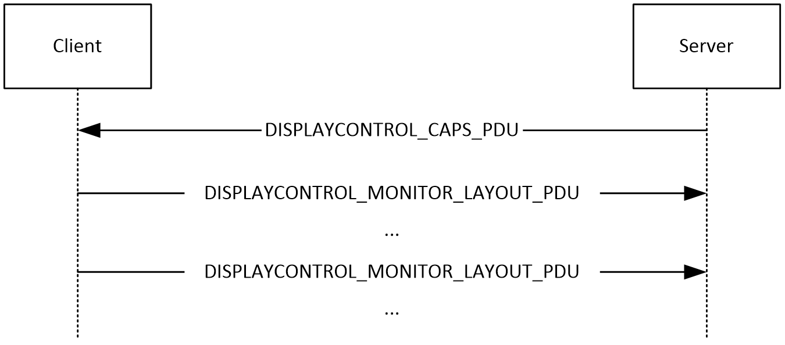
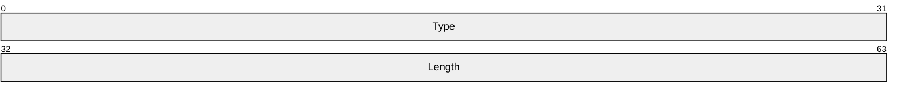
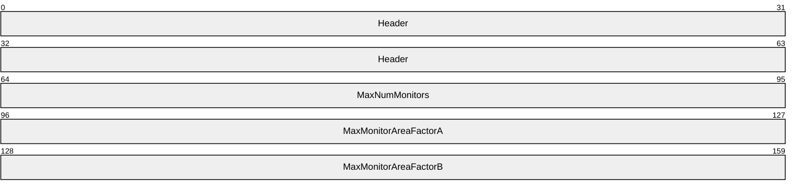
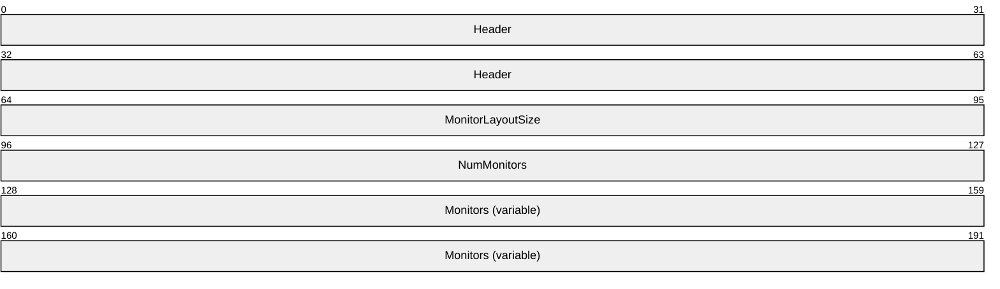
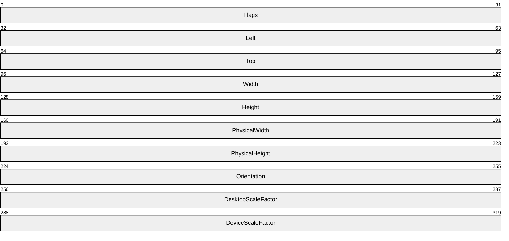

# [MS-RDPEDISP]: Remote Desktop Protocol: Display Update Virtual Channel Extension

Table of Contents

1 Introduction

- [1 Introduction](#Section_1)
  - [1.1 Glossary](#Section_1.1)
  - [1.2 References](#Section_1.2)
    - [1.2.1 Normative References](#Section_1.2.1)
    - [1.2.2 Informative References](#Section_1.2.2)
  - [1.3 Protocol Overview (Synopsis)](#Section_1.3)
  - [1.4 Relationship to Other Protocols](#Section_1.4)
  - [1.5 Prerequisites/Preconditions](#Section_1.5)
  - [1.6 Applicability Statement](#Section_1.6)
  - [1.7 Versioning and Capability Negotiation](#Section_1.7)
  - [1.8 Vendor-Extensible Fields](#Section_1.8)
  - [1.9 Standards Assignments](#Section_1.9)

2 Messages

- [2 Messages](#Section_2)
  - [2.1 Transport](#Section_2.1)
  - [2.2 Message Syntax](#Section_2.2)
    - [2.2.1 Common Data Types](#Section_2.2.1)
      - [2.2.1.1 DISPLAYCONTROL_HEADER](#Section_2.2.1.1)
    - [2.2.2 Display Control Messages](#Section_2.2.2)
      - [2.2.2.1 DISPLAYCONTROL_CAPS_PDU](#Section_2.2.2.1)
      - [2.2.2.2 DISPLAYCONTROL_MONITOR_LAYOUT_PDU](#Section_2.2.2.2)
        - [2.2.2.2.1 DISPLAYCONTROL_MONITOR_LAYOUT](#Section_2.2.2.2.1)

3 Protocol Details

- [3 Protocol Details](#Section_3)
  - [3.1 Server Details](#Section_3.1)
    - [3.1.1 Abstract Data Model](#Section_3.1.1)
    - [3.1.2 Timers](#Section_3.1.2)
    - [3.1.3 Initialization](#Section_3.1.3)
    - [3.1.4 Higher-Layer Triggered Events](#Section_3.1.4)
    - [3.1.5 Processing Events and Sequencing Rules](#Section_3.1.5)
      - [3.1.5.1 Sending DISPLAYCONTROL_CAPS_PDU](#Section_3.1.5.1)
      - [3.1.5.2 Processing DISPLAYCONTROL_MONITOR_LAYOUT_PDU](#Section_3.1.5.2)
    - [3.1.6 Timer Events](#Section_3.1.6)
    - [3.1.7 Other Local Events](#Section_3.1.7)
  - [3.2 Client Details](#Section_3.2)
    - [3.2.1 Abstract Data Model](#Section_3.2.1)
      - [3.2.1.1 Maximum Monitor Count](#Section_3.2.1.1)
      - [3.2.1.2 Maximum Monitor Area Factor A](#Section_3.2.1.2)
      - [3.2.1.3 Maximum Monitor Area Factor B](#Section_3.2.1.3)
    - [3.2.2 Timers](#Section_3.2.2)
    - [3.2.3 Initialization](#Section_3.2.3)
    - [3.2.4 Higher-Layer Triggered Events](#Section_3.2.4)
    - [3.2.5 Processing Events and Sequencing Rules](#Section_3.2.5)
      - [3.2.5.1 Processing DISPLAYCONTROL_CAPS_PDU](#Section_3.2.5.1)
      - [3.2.5.2 Sending DISPLAYCONTROL_MONITOR_LAYOUT_PDU](#Section_3.2.5.2)
    - [3.2.6 Timer Events](#Section_3.2.6)
    - [3.2.7 Other Local Events](#Section_3.2.7)

4 Protocol Examples

- [4 Protocol Examples](#Section_4)

5 Security

- [5 Security](#Section_5)
  - [5.1 Security Considerations for Implementers](#Section_5.1)
  - [5.2 Index of Security Parameters](#Section_5.2)

6 Appendix A: Product Behavior

- [6 Appendix A: Product Behavior](#Section_6)

7 Change Tracking

- [7 Change Tracking](#Section_7)

For the legal notice and IP terms, see [LEGAL.md](../LEGAL.md).
Last updated: 4/23/2024.
See [Revision History](#revision-history) for full version history.

# 1 Introduction

This document specifies the Remote Desktop Protocol: Display Control Channel Extension to the Remote Desktop Protocol: Basic Connectivity and Graphics Remoting, as specified in [MS-RDPBCGR](../MS-RDPBCGR/MS-RDPBCGR.md) sections 1 to 5. This control protocol is used by the client to request display configuration changes in a remote session. Display configuration changes include the addition, removal and repositioning of monitors, resolution updates, and orientation updates.

Sections 1.5, 1.8, 1.9, 2, and 3 of this specification are normative. All other sections and examples in this specification are informative.

## 1.1 Glossary

This document uses the following terms:

**ANSI character**: An 8-bit Windows-1252 character set unit.

**desktop scale factor**: The scale factor (as a percentage) applied to Windows Desktop Applications.

**device scale factor**: The scale factor as a percentage is applied to Windows Store Apps. This value has to be calculated such that the effective maximum height of a Windows Store App is always greater than 768 pixels, otherwise the app will not start.

**dynamic virtual channel**: A transport used for lossless communication between an RDP client and a server component over a main data connection, as specified in [MS-RDPEDYC].

**virtual channel**: A communication channel available in a TS server session between applications running at the server and applications running on the TS client.

**MAY, SHOULD, MUST, SHOULD NOT, MUST NOT:** These terms (in all caps) are used as defined in [[RFC2119]](https://go.microsoft.com/fwlink/?LinkId=90317). All statements of optional behavior use either MAY, SHOULD, or SHOULD NOT.

## 1.2 References

Links to a document in the Microsoft Open Specifications library point to the correct section in the most recently published version of the referenced document. However, because individual documents in the library are not updated at the same time, the section numbers in the documents may not match. You can confirm the correct section numbering by checking the [Errata](https://go.microsoft.com/fwlink/?linkid=850906).

### 1.2.1 Normative References

We conduct frequent surveys of the normative references to assure their continued availability. If you have any issue with finding a normative reference, please contact [dochelp@microsoft.com](mailto:dochelp@microsoft.com). We will assist you in finding the relevant information.

[MS-RDPBCGR] Microsoft Corporation, "[Remote Desktop Protocol: Basic Connectivity and Graphics Remoting](../MS-RDPBCGR/MS-RDPBCGR.md)".

[MS-RDPEDYC] Microsoft Corporation, "[Remote Desktop Protocol: Dynamic Channel Virtual Channel Extension](../MS-RDPEDYC/MS-RDPEDYC.md)".

[MS-RDPEGFX] Microsoft Corporation, "[Remote Desktop Protocol: Graphics Pipeline Extension](../MS-RDPEGFX/MS-RDPEGFX.md)".

[MS-RDPRFX] Microsoft Corporation, "[Remote Desktop Protocol: RemoteFX Codec Extension](../MS-RDPRFX/MS-RDPRFX.md)".

[RFC2119] Bradner, S., "Key words for use in RFCs to Indicate Requirement Levels", BCP 14, RFC 2119, March 1997, [https://www.rfc-editor.org/info/rfc2119](https://go.microsoft.com/fwlink/?LinkId=90317)

### 1.2.2 Informative References

None.

## 1.3 Protocol Overview (Synopsis)

The sequence of messages exchanged by the Remote Desktop Protocol: Display Control Virtual Channel Extension is described in the following figure. The messages exchanged in this diagram are strictly sequential.

Figure 1: The Display Control message sequence

After the Display Control [**dynamic virtual channel**](#gt_dynamic-virtual-channel) has been opened, the server communicates display capabilities to the client by sending the **DISPLAYCONTROL_CAPS_PDU** (section [2.2.2.1](#Section_2.2.2.1)) message. This message specifies a set of parameters to which the client is required to adhere when sending the **DISPLAYCONTROL_MONITOR_LAYOUT_PDU** (section [2.2.2.2](#Section_2.2.2.2)) message.

To request a display configuration change on the server (such as the addition of a monitor or a new resolution for an existing monitor), the client sends the **DISPLAYCONTROL_MONITOR_LAYOUT_PDU** message to the server. If the requested configuration is not possible, or is invalid, the server will not update the remote session with the requested parameters.

Changes in the server-side display configuration occur out of band to the Remote Desktop Protocol: Display Control Virtual Channel Extension. If the requested graphics configuration is valid and can be configured on the server, then the server will either:

- Initiate a Deactivation-Reactivation Sequence (as specified in [MS-RDPBCGR](../MS-RDPBCGR/MS-RDPBCGR.md) section 1.3.1.3) if the Remote Desktop Protocol: Graphics Pipeline Extension is not being used to remote session graphics.
- Restart the graphics pipeline using the surface management commands (specified in [MS-RDPEGFX](../MS-RDPEGFX/MS-RDPEGFX.md) section 1.3) if the Remote Desktop Protocol: Graphics Pipeline Extension is being used to remote session graphics.
The **DISPLAYCONTROL_MONITOR_LAYOUT_PDU** message can be sent whenever a display configuration change is required.

## 1.4 Relationship to Other Protocols

The Remote Desktop Protocol: Display Control Virtual Channel Extension is embedded in a [**dynamic virtual channel**](#gt_dynamic-virtual-channel) transport, as specified in [MS-RDPEDYC](../MS-RDPEDYC/MS-RDPEDYC.md) sections 1 to 3.

## 1.5 Prerequisites/Preconditions

The Remote Desktop Protocol: Display Control Virtual Channel Extension operates only after the [**dynamic virtual channel**](#gt_dynamic-virtual-channel) transport is fully established. If the dynamic virtual channel transport is terminated, the Remote Desktop Protocol: Display Control Virtual Channel Extension is also terminated. The protocol is terminated by closing the underlying [**virtual channel**](#gt_virtual-channel). For details about closing the dynamic virtual channel, refer to [MS-RDPEDYC](../MS-RDPEDYC/MS-RDPEDYC.md) section 3.2.5.2.

If the RemoteFX codec ([MS-RDPRFX](../MS-RDPRFX/MS-RDPRFX.md) sections 2.2.2 and 3.1.8) is being used to encode graphics data from a remote session, then the Remote Desktop Protocol: Display Control Virtual Channel Extension SHOULD NOT be used to request display configuration changes.

## 1.6 Applicability Statement

The Remote Desktop Protocol: Display Control Virtual Channel Extension is applicable in scenarios where a mechanism to request display configuration changes in a remote session without disconnecting and reconnecting is required.

## 1.7 Versioning and Capability Negotiation

None.

## 1.8 Vendor-Extensible Fields

None.

## 1.9 Standards Assignments

None.

# 2 Messages

## 2.1 Transport

The Remote Desktop Protocol: Display Control Virtual Channel Extension is designed to operate over a dynamic virtual channel, as specified in [MS-RDPEDYC](../MS-RDPEDYC/MS-RDPEDYC.md) sections 1 to 3. The dynamic virtual channel name is the null-terminated [**ANSI character**](#gt_ansi-character) string "Microsoft::Windows::RDS::DisplayControl". The usage of channel names in the context of opening a dynamic virtual channel is specified in [MS-RDPEDYC] section 2.2.2.1.

## 2.2 Message Syntax

The following sections specify the Remote Desktop Protocol: Display Virtual Channel Extension message syntax.

### 2.2.1 Common Data Types

#### 2.2.1.1 DISPLAYCONTROL_HEADER

The **DISPLAYCONTROL_HEADER** structure is included in all display control PDUs and specifies the PDU type and the length of the PDU.

**Type (4 bytes):** A 32-bit unsigned integer that specifies the display control PDU type.

| Value | Meaning |
| --- | --- |
| DISPLAYCONTROL_PDU_TYPE_CAPS 0x00000005 | **DISPLAYCONTROL_CAPS_PDU** (section [2.2.2.1](#Section_2.2.2.1)) |
| DISPLAYCONTROL_PDU_TYPE_MONITOR_LAYOUT 0x00000002 | **DISPLAYCONTROL_MONITOR_LAYOUT_PDU** (section [2.2.2.2](#Section_2.2.2.2)) |

**Length (4 bytes):** A 32-bit unsigned integer that specifies the length of the display control PDU, in bytes. This value MUST include the length of the DISPLAYCONTROL_HEADER (8 bytes).

### 2.2.2 Display Control Messages

#### 2.2.2.1 DISPLAYCONTROL_CAPS_PDU

The DISPLAYCONTROL_CAPS_PDU message is a server-to-client PDU that is used to specify a set of parameters which the client must adhere to when sending the **DISPLAYCONTROL_MONITOR_LAYOUT_PDU** (section [2.2.2.2](#Section_2.2.2.2)) message.

**Header (8 bytes):** A **DISPLAYCONTROL_HEADER** (section [2.2.1.1](#Section_2.2.1.1)) structure. The **Type** field MUST be set to DISPLAYCONTROL_PDU_TYPE_CAPS (0x00000005).

**MaxNumMonitors (4 bytes):** A 32-bit unsigned integer that specifies the maximum number of monitors supported by the server.

**MaxMonitorAreaFactorA (4 bytes):** A 32-bit unsigned integer that is used to specify the maximum monitor area supported by the server. The maximum supported monitor area (in square pixels) is given by **MaxNumMonitors** * **MaxMonitorAreaFactorA** * **MaxMonitorAreaFactorB**.

**MaxMonitorAreaFactorB (4 bytes):** A 32-bit unsigned integer that is used to specify the maximum monitor area supported by the server. The maximum supported monitor area (in square pixels) is given by **MaxNumMonitors** * **MaxMonitorAreaFactorA** * **MaxMonitorAreaFactorB**.

#### 2.2.2.2 DISPLAYCONTROL_MONITOR_LAYOUT_PDU

The **DISPLAYCONTROL_MONITOR_LAYOUT_PDU** message is a client-to-server PDU that is used to request a display configuration change on the server, such as the addition of a monitor or a new resolution for an existing monitor. Note that the entire monitor layout MUST be included in the **Monitors** field even if the configuration of only a single monitor is updated.

**Header (8 bytes):** A **DISPLAYCONTROL_HEADER** (section [2.2.1.1](#Section_2.2.1.1)) structure. The **Type** field MUST be set to DISPLAYCONTROL_PDU_TYPE_MONITOR_LAYOUT (0x00000002).

**MonitorLayoutSize (4 bytes):** A 32-bit unsigned integer that specifies the size, in bytes, of a single element in the **Monitors** field. This field MUST be set to 40 bytes, the size of the **DISPLAYCONTROL_MONITOR_LAYOUT** structure (section [2.2.2.2.1](#Section_2.2.2.2.1)).

**NumMonitors (4 bytes):** A 32-bit unsigned integer that specifies the number of display monitor definitions in the **Monitors** field. The maximum number of monitor definitions allowed is specified in the **MaxNumMonitors** field of the **DISPLAYCONTROL_CAPS_PDU** (section [2.2.2.1](#Section_2.2.2.1)) message.

**Monitors (variable):** A variable-length array containing a series of **DISPLAYCONTROL_MONITOR_LAYOUT** structures that specify the display monitor layout of the client. The number of **DISPLAYCONTROL_MONITOR_LAYOUT** structures is specified by the **NumMonitors** field. The area (in square pixels) of the layout specified by the **DISPLAYCONTROL_MONITOR_LAYOUT** structures MUST NOT exceed the maximum monitor area defined by the server in the **DISPLAYCONTROL_CAPS_PDU** message.

##### 2.2.2.2.1 DISPLAYCONTROL_MONITOR_LAYOUT

The **DISPLAYCONTROL_MONITOR_LAYOUT** structure is used to specify the characteristics of a monitor. The coordinates used to describe the monitor position MUST be relative to the upper-left corner of the monitor designated as the "primary display monitor". The upper-left corner of the primary monitor is always (0, 0).

**Flags (4 bytes):** A 32-bit unsigned integer that specifies monitor configuration flags.

| Flag | Meaning |
| --- | --- |
| DISPLAYCONTROL_MONITOR_PRIMARY 0x00000001 | The monitor specified by this structure is the primary monitor. |

**Left (4 bytes):** A 32-bit signed integer that specifies the x-coordinate of the upper-left corner of the display monitor.

**Top (4 bytes):** A 32-bit signed integer that specifies the y-coordinate of the upper-left corner of the display monitor.

**Width (4 bytes):** A 32-bit unsigned integer that specifies the width of the monitor in pixels. The width MUST be greater than or equal to 200 pixels and less than or equal to 8192 pixels, and MUST NOT be an odd value.

**Height (4 bytes):** A 32-bit unsigned integer that specifies the height of the monitor in pixels. The height MUST be greater than or equal to 200 pixels and less than or equal to 8192 pixels.

**PhysicalWidth (4 bytes):** A 32-bit unsigned integer that specifies the physical width of the monitor, in millimeters (mm). This value MUST be ignored if it is less than 10 mm or greater than 10,000 mm or the **PhysicalHeight** field is less than 10 mm or greater than 10,000 mm.

**PhysicalHeight (4 bytes):** A 32-bit unsigned integer that specifies the physical height of the monitor, in millimeters. This value MUST be ignored if it is less than 10 mm or greater than 10,000 mm or **PhysicalWidth** is less than 10 mm or greater than 10,000 mm.

**Orientation (4 bytes):** A 32-bit unsigned integer that specifies the orientation of the monitor in degrees. Valid values are 0, 90, 180 or 270. This value MUST be ignored if it is not set to one of these values.

| Value | Meaning |
| --- | --- |
| ORIENTATION_LANDSCAPE 0 | The desktop is not rotated. |
| ORIENTATION_PORTRAIT 90 | The desktop is rotated clockwise by 90 degrees. |
| ORIENTATION_LANDSCAPE_FLIPPED 180 | The desktop is rotated clockwise by 180 degrees. |
| ORIENTATION_PORTRAIT_FLIPPED 270 | The desktop is rotated clockwise by 270 degrees. |

**DesktopScaleFactor (4 bytes):** A 32-bit, unsigned integer that specifies the [**desktop scale factor**](#gt_desktop-scale-factor) of the monitor. This value MUST be ignored if it is less than 100 percent or greater than 500 percent, or if **DeviceScaleFactor** is not 100 percent, 140 percent, or 180 percent.

**DeviceScaleFactor (4 bytes):** A 32-bit, unsigned integer that specifies the [**device scale factor**](#gt_device-scale-factor) of the monitor. This value MUST be ignored if it is not set to 100 percent, 140 percent, or 180 percent or if **DesktopScaleFactor** is less than 100 percent or greater than 500 percent.<1>

# 3 Protocol Details

## 3.1 Server Details

### 3.1.1 Abstract Data Model

This section describes a conceptual model of possible data organization that an implementation maintains to participate in this protocol. The described organization is provided to facilitate the explanation of how the protocol behaves. This document does not mandate that implementations adhere to this model as long as their external behavior is consistent with that described in this document.

**Note** It is possible to implement the following conceptual data by using a variety of techniques as long as the implementation produces external behavior that is consistent with that described in this document.

### 3.1.2 Timers

None.

### 3.1.3 Initialization

None.

### 3.1.4 Higher-Layer Triggered Events

None.

### 3.1.5 Processing Events and Sequencing Rules

#### 3.1.5.1 Sending DISPLAYCONTROL_CAPS_PDU

The structure and fields of the **DISPLAYCONTROL_CAPS_PDU** message are specified in section [2.2.2.1](#Section_2.2.2.1). The message fields MUST be populated in accordance with this description.

#### 3.1.5.2 Processing DISPLAYCONTROL_MONITOR_LAYOUT_PDU

The structure and fields of the **DISPLAYCONTROL_MONITOR_LAYOUT_PDU** message are specified in section [2.2.2.2](#Section_2.2.2.2). The server SHOULD trigger a display configuration update in the remote session using the parameters specified by the client if all of the following conditions are true:

- All of the fields specified in the **DISPLAYCONTROL_MONITOR_LAYOUT_PDU** message are valid, consistent and within range.
- None of the specified monitors overlap.
- Each monitor is adjacent to at least one other monitor (even if only at a single point).

### 3.1.6 Timer Events

None.

### 3.1.7 Other Local Events

None.

## 3.2 Client Details

### 3.2.1 Abstract Data Model

This section describes a conceptual model of possible data organization that an implementation maintains to participate in this protocol. The described organization is provided to facilitate the explanation of how the protocol behaves. This document does not mandate that implementations adhere to this model as long as their external behavior is consistent with that described in this document.

**Note** It is possible to implement the following conceptual data by using a variety of techniques as long as the implementation produces external behavior that is consistent with that described in this document.

#### 3.2.1.1 Maximum Monitor Count

The Maximum Monitor Count store contains the contents of the **MaxNumMonitors** field of the **DISPLAYCONTROL_CAPS_PDU** (section [2.2.2.1](#Section_2.2.2.1)) message.

#### 3.2.1.2 Maximum Monitor Area Factor A

The Maximum Monitor Area Factor A store contains the contents of the **MaxMonitorAreaFactorA** field of the **DISPLAYCONTROL_CAPS_PDU** (section [2.2.2.1](#Section_2.2.2.1)) message.

#### 3.2.1.3 Maximum Monitor Area Factor B

The Maximum Monitor Area Factor B store contains the contents of the **MaxMonitorAreaFactorB** field of the **DISPLAYCONTROL_CAPS_PDU** (section [2.2.2.1](#Section_2.2.2.1)) message.

### 3.2.2 Timers

None.

### 3.2.3 Initialization

None.

### 3.2.4 Higher-Layer Triggered Events

None.

### 3.2.5 Processing Events and Sequencing Rules

#### 3.2.5.1 Processing DISPLAYCONTROL_CAPS_PDU

The structure and fields of the **DISPLAYCONTROL_CAPS_PDU** message are specified in section [2.2.2.1](#Section_2.2.2.1). Upon receiving the **DISPLAYCONTROL_CAPS_PDU** message, the client MUST store the contents of the **MaxNumMonitors**, **MaxMonitorAreaFactorA** and **MaxMonitorAreaFactorB** fields in the **Maximum Monitor Count** (section [3.2.1.1](#Section_3.2.1.1)), **Maximum Monitor Area Factor A** (section [3.2.1.2](#Section_3.2.1.2)), and **Maximum Monitor Area Factor B** (section [3.2.1.3](#Section_3.2.1.3)) ADM elements respectively.

#### 3.2.5.2 Sending DISPLAYCONTROL_MONITOR_LAYOUT_PDU

The structure and fields of the **DISPLAYCONTROL_MONITOR_LAYOUT_PDU** message are specified in section [2.2.2.2](#Section_2.2.2.2). The message fields MUST be populated in accordance with that description. The maximum area of the monitor layout MUST NOT exceed product of the **Maximum Monitor Count** (section [3.2.1.1](#Section_3.2.1.1)), **Maximum Monitor Area Factor A** (section [3.2.1.2](#Section_3.2.1.2)), and **Maximum Monitor Area Factor B** (section [3.2.1.3](#Section_3.2.1.3)) ADM elements.

### 3.2.6 Timer Events

None.

### 3.2.7 Other Local Events

None.

# 4 Protocol Examples

None.

# 5 Security

## 5.1 Security Considerations for Implementers

None.

## 5.2 Index of Security Parameters

None.

# 6 Appendix A: Product Behavior

The information in this specification is applicable to the following Microsoft products or supplemental software. References to product versions include updates to those products.

- Windows 8.1 operating system
- Windows Server 2012 R2 operating system
- Windows 10 operating system
- Windows Server 2016 operating system
- Windows Server operating system
- Windows Server 2019 operating system
- Windows Server 2022 operating system
- Windows 11 operating system
- Windows Server 2025 operating system
Exceptions, if any, are noted in this section. If an update version, service pack or Knowledge Base (KB) number appears with a product name, the behavior changed in that update. The new behavior also applies to subsequent updates unless otherwise specified. If a product edition appears with the product version, behavior is different in that product edition.

Unless otherwise specified, any statement of optional behavior in this specification that is prescribed using the terms "SHOULD" or "SHOULD NOT" implies product behavior in accordance with the SHOULD or SHOULD NOT prescription. Unless otherwise specified, the term "MAY" implies that the product does not follow the prescription.

<1> Section 2.2.2.2.1: The **DeviceScaleFactor** field is processed only in Windows 8.1.

# 7 Change Tracking

This section identifies changes that were made to this document since the last release. Changes are classified as Major, Minor, or None.

The revision class **Major** means that the technical content in the document was significantly revised. Major changes affect protocol interoperability or implementation. Examples of major changes are:

- A document revision that incorporates changes to interoperability requirements.
- A document revision that captures changes to protocol functionality.
The revision class **Minor** means that the meaning of the technical content was clarified. Minor changes do not affect protocol interoperability or implementation. Examples of minor changes are updates to clarify ambiguity at the sentence, paragraph, or table level.

The revision class **None** means that no new technical changes were introduced. Minor editorial and formatting changes may have been made, but the relevant technical content is identical to the last released version.

The changes made to this document are listed in the following table. For more information, please contact [dochelp@microsoft.com](mailto:dochelp@microsoft.com).

| Section | Description | Revision class |
| --- | --- | --- |
| [6](#Section_6) Appendix A: Product Behavior | Added Windows Server 2025 to the list of applicable products. | Major |

## Revision History

| Date | Version | Revision Class | Comments |
| --- | --- | --- | --- |
| 8/8/2013 | 1.0 | New | Released new document. |
| 11/14/2013 | 2.0 | Major | Updated and revised the technical content. |
| 2/13/2014 | 3.0 | Major | Updated and revised the technical content. |
| 5/15/2014 | 3.0 | None | No changes to the meaning, language, or formatting of the technical content. |
| 6/30/2015 | 4.0 | Major | Significantly changed the technical content. |
| 10/16/2015 | 4.0 | None | No changes to the meaning, language, or formatting of the technical content. |
| 7/14/2016 | 4.0 | None | No changes to the meaning, language, or formatting of the technical content. |
| 6/1/2017 | 5.0 | Major | Significantly changed the technical content. |
| 9/15/2017 | 6.0 | Major | Significantly changed the technical content. |
| 9/12/2018 | 7.0 | Major | Significantly changed the technical content. |
| 4/7/2021 | 8.0 | Major | Significantly changed the technical content. |
| 6/25/2021 | 9.0 | Major | Significantly changed the technical content. |
| 4/23/2024 | 10.0 | Major | Significantly changed the technical content. |
