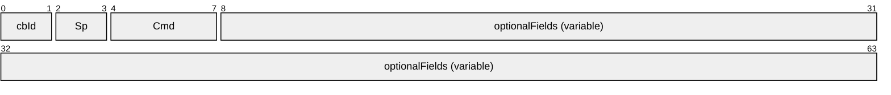
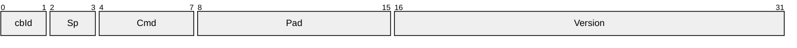
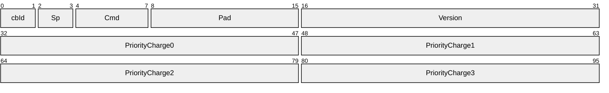
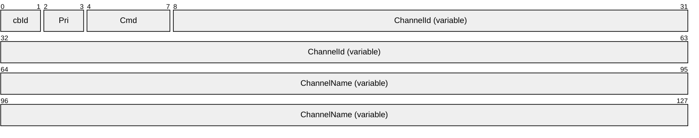
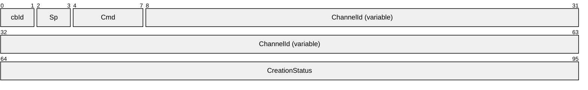
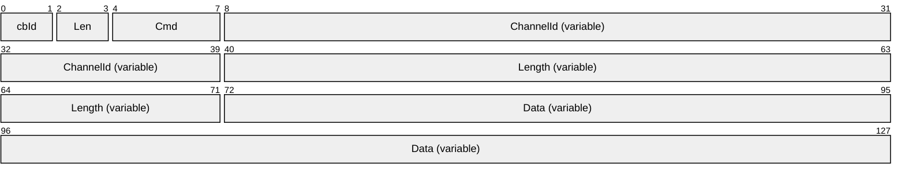
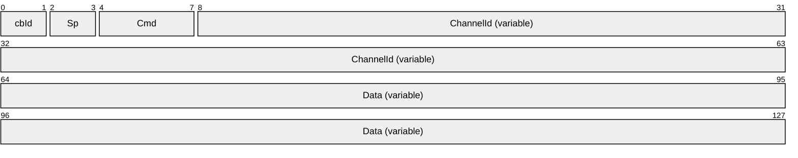
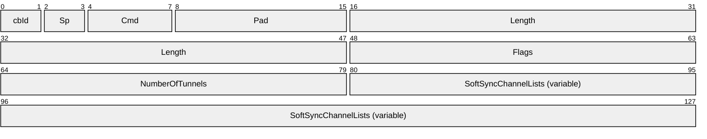
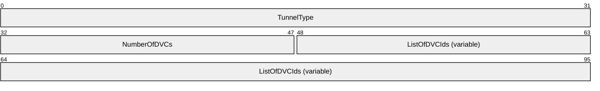
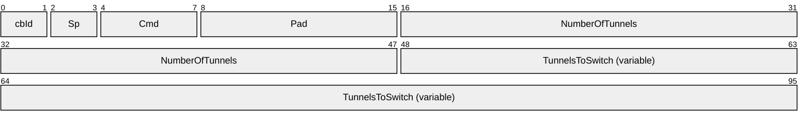

# [MS-RDPEDYC]: Remote Desktop Protocol: Dynamic Channel Virtual Channel Extension

Table of Contents

1 Introduction

- [1 Introduction](#Section_1)
  - [1.1 Glossary](#Section_1.1)
  - [1.2 References](#Section_1.2)
    - [1.2.1 Normative References](#Section_1.2.1)
    - [1.2.2 Informative References](#Section_1.2.2)
  - [1.3 Overview](#Section_1.3)
    - [1.3.1 Encapsulation of DVC Traffic](#Section_1.3.1)
      - [1.3.1.1 Encapsulation in the DRDYNVC Static Virtual Channel](#Section_1.3.1.1)
      - [1.3.1.2 Encapsulation in a Multitransport Tunnel Message](#Section_1.3.1.2)
    - [1.3.2 DVC Setup](#Section_1.3.2)
    - [1.3.3 Message Flows](#Section_1.3.3)
      - [1.3.3.1 Opening a DVC](#Section_1.3.3.1)
      - [1.3.3.2 Sending and Receiving Data](#Section_1.3.3.2)
        - [1.3.3.2.1 Sending Data](#Section_1.3.3.2.1)
        - [1.3.3.2.2 Receiving Data](#Section_1.3.3.2.2)
      - [1.3.3.3 Closing a DVC](#Section_1.3.3.3)
  - [1.4 Relationship to Other Protocols](#Section_1.4)
  - [1.5 Prerequisites/Preconditions](#Section_1.5)
  - [1.6 Applicability Statement](#Section_1.6)
  - [1.7 Versioning and Capability Negotiation](#Section_1.7)
  - [1.8 Vendor-Extensible Fields](#Section_1.8)
  - [1.9 Standards Assignments](#Section_1.9)

2 Messages

- [2 Messages](#Section_2)
  - [2.1 Transport](#Section_2.1)
  - [2.2 Message Syntax](#Section_2.2)
    - [2.2.1 Initializing DVCs](#Section_2.2.1)
      - [2.2.1.1 DVC Capabilities Request PDU](#Section_2.2.1.1)
        - [2.2.1.1.1 Version 1 (DYNVC_CAPS_VERSION1)](#Section_2.2.1.1.1)
        - [2.2.1.1.2 Version 2 (DYNVC_CAPS_VERSION2)](#Section_2.2.1.1.2)
        - [2.2.1.1.3 Version 3 (DYNVC_CAPS_VERSION3)](#Section_2.2.1.1.3)
      - [2.2.1.2 DVC Capabilities Response PDU (DYNVC_CAPS_RSP)](#Section_2.2.1.2)
    - [2.2.2 Opening a DVC](#Section_2.2.2)
      - [2.2.2.1 DVC Create Request PDU (DYNVC_CREATE_REQ)](#Section_2.2.2.1)
      - [2.2.2.2 DVC Create Response PDU (DYNVC_CREATE_RSP)](#Section_2.2.2.2)
    - [2.2.3 Sending and Receiving Data](#Section_2.2.3)
      - [2.2.3.1 DVC Data First PDU (DYNVC_DATA_FIRST)](#Section_2.2.3.1)
      - [2.2.3.2 DVC Data PDU (DYNVC_DATA)](#Section_2.2.3.2)
      - [2.2.3.3 DVC Data First Compressed PDU (DYNVC_DATA_FIRST_COMPRESSED)](#Section_2.2.3.3)
      - [2.2.3.4 DVC Data Compressed PDU (DYNVC_DATA_COMPRESSED)](#Section_2.2.3.4)
    - [2.2.4 Closing a DVC (DYNVC_CLOSE)](#Section_2.2.4)
    - [2.2.5 Soft-Sync](#Section_2.2.5)
      - [2.2.5.1 Soft-Sync Request PDU (DYNVC_SOFT_SYNC_REQUEST)](#Section_2.2.5.1)
        - [2.2.5.1.1 Soft-Sync Channel List (DYNVC_SOFT_SYNC_CHANNEL_LIST)](#Section_2.2.5.1.1)
      - [2.2.5.2 Soft-Sync Response PDU (DYNVC_SOFT_SYNC_RESPONSE)](#Section_2.2.5.2)

3 Protocol Details

- [3 Protocol Details](#Section_3)
  - [3.1 Common Details](#Section_3.1)
    - [3.1.1 Abstract Data Model](#Section_3.1.1)
    - [3.1.2 Timers](#Section_3.1.2)
    - [3.1.3 Initialization](#Section_3.1.3)
    - [3.1.4 Higher-Layer Triggered Events](#Section_3.1.4)
    - [3.1.5 Message Processing Events and Sequencing Rules](#Section_3.1.5)
      - [3.1.5.1 Sending Data](#Section_3.1.5.1)
        - [3.1.5.1.1 DVC Data First (DYNVC_DATA_FIRST)](#Section_3.1.5.1.1)
        - [3.1.5.1.2 DVC Data (DYNVC_DATA)](#Section_3.1.5.1.2)
        - [3.1.5.1.3 DVC Data First Compressed (DYNVC_DATA_FIRST_COMPRESSED)](#Section_3.1.5.1.3)
        - [3.1.5.1.4 DVC Data Compressed (DYNVC_DATA_COMPRESSED)](#Section_3.1.5.1.4)
      - [3.1.5.2 Receiving Data](#Section_3.1.5.2)
        - [3.1.5.2.1 DVC Data First (DYNVC_DATA_FIRST)](#Section_3.1.5.2.1)
        - [3.1.5.2.2 DVC Data (DYNVC_DATA)](#Section_3.1.5.2.2)
        - [3.1.5.2.3 Reassembly of Fragmented Virtual Channel Data](#Section_3.1.5.2.3)
        - [3.1.5.2.4 Processing Packet Errors](#Section_3.1.5.2.4)
        - [3.1.5.2.5 DVC Data First Compressed (DYNVC_DATA_FIRST_COMPRESSED)](#Section_3.1.5.2.5)
        - [3.1.5.2.6 DVC Data Compressed (DYNVC_DATA_COMPRESSED)](#Section_3.1.5.2.6)
      - [3.1.5.3 Soft-Sync](#Section_3.1.5.3)
      - [3.1.5.4 Tunneling Static VC Traffic](#Section_3.1.5.4)
        - [3.1.5.4.1 Initialization](#Section_3.1.5.4.1)
        - [3.1.5.4.2 Creating Tunneling DVCs](#Section_3.1.5.4.2)
        - [3.1.5.4.3 Relation to Soft-Sync](#Section_3.1.5.4.3)
        - [3.1.5.4.4 Recovering Static Virtual Channel Flags](#Section_3.1.5.4.4)
        - [3.1.5.4.5 Termination](#Section_3.1.5.4.5)
    - [3.1.6 Timer Events](#Section_3.1.6)
    - [3.1.7 Other Local Events](#Section_3.1.7)
  - [3.2 Client Details](#Section_3.2)
    - [3.2.1 Abstract Data Model](#Section_3.2.1)
    - [3.2.2 Timers](#Section_3.2.2)
    - [3.2.3 Initialization](#Section_3.2.3)
      - [3.2.3.1 DVC Client Manager Initialization](#Section_3.2.3.1)
        - [3.2.3.1.1 Version Level 1 (DYNVC_CAPS_VERSION1)](#Section_3.2.3.1.1)
        - [3.2.3.1.2 Version Level 2 (DYNVC_CAPS_VERSION2)](#Section_3.2.3.1.2)
        - [3.2.3.1.3 Version Level 3 (DYNVC_CAPS_VERSION3)](#Section_3.2.3.1.3)
        - [3.2.3.1.4 Capabilities Response (DYNVC_CAPS_RSP)](#Section_3.2.3.1.4)
      - [3.2.3.2 DVC Initialization](#Section_3.2.3.2)
        - [3.2.3.2.1 DVC Create Response (DYNVC_CREATE_RSP)](#Section_3.2.3.2.1)
    - [3.2.4 Higher-Layer Triggered Events](#Section_3.2.4)
    - [3.2.5 Message Processing Events and Sequencing Rules](#Section_3.2.5)
      - [3.2.5.1 Sending and Receiving Data](#Section_3.2.5.1)
      - [3.2.5.2 Closing a DVC (DYNVC_CLOSE)](#Section_3.2.5.2)
      - [3.2.5.3 Soft-Sync](#Section_3.2.5.3)
        - [3.2.5.3.1 Processing the Soft-Sync Request PDU](#Section_3.2.5.3.1)
        - [3.2.5.3.2 Sending the Soft-Sync Response PDU](#Section_3.2.5.3.2)
    - [3.2.6 Timer Events](#Section_3.2.6)
    - [3.2.7 Other Local Events](#Section_3.2.7)
  - [3.3 Server Details](#Section_3.3)
    - [3.3.1 Abstract Data Model](#Section_3.3.1)
    - [3.3.2 Timers](#Section_3.3.2)
    - [3.3.3 Initialization](#Section_3.3.3)
      - [3.3.3.1 DVC Server Manager Initialization](#Section_3.3.3.1)
        - [3.3.3.1.1 Version Level 1 (DYNVC_CAPS_VERSION1)](#Section_3.3.3.1.1)
        - [3.3.3.1.2 Version Level 2 (DYNVC_CAPS_VERSION2)](#Section_3.3.3.1.2)
        - [3.3.3.1.3 Version Level 3 (DYNVC_CAPS_VERSION3)](#Section_3.3.3.1.3)
        - [3.3.3.1.4 Capabilities Response (DYNVC_CAPS_RSP)](#Section_3.3.3.1.4)
      - [3.3.3.2 DVC Initialization](#Section_3.3.3.2)
    - [3.3.4 Higher-Layer Triggered Events](#Section_3.3.4)
    - [3.3.5 Message Processing Events and Sequencing Rules](#Section_3.3.5)
      - [3.3.5.1 Sending and Receiving Data](#Section_3.3.5.1)
      - [3.3.5.2 Closing a DVC (DYNVC_CLOSE)](#Section_3.3.5.2)
      - [3.3.5.3 Soft-Sync](#Section_3.3.5.3)
        - [3.3.5.3.1 Sending the Soft-Sync Request PDU](#Section_3.3.5.3.1)
        - [3.3.5.3.2 Processing the Soft-Sync Response PDU](#Section_3.3.5.3.2)
    - [3.3.6 Timer Events](#Section_3.3.6)
    - [3.3.7 Other Local Events](#Section_3.3.7)

4 Protocol Examples

- [4 Protocol Examples](#Section_4)
  - [4.1 Annotated Initializing DVCs](#Section_4.1)
    - [4.1.1 DVC Capabilities Request (Version2) PDU](#Section_4.1.1)
    - [4.1.2 DVC Capabilities Response PDU](#Section_4.1.2)
  - [4.2 Annotated Opening a DVC](#Section_4.2)
    - [4.2.1 DVC Create Request PDU](#Section_4.2.1)
    - [4.2.2 DVC Create Response PDU](#Section_4.2.2)
  - [4.3 Annotated Sending and Receiving Data](#Section_4.3)
    - [4.3.1 DVC Data First PDU](#Section_4.3.1)
    - [4.3.2 DVC Data PDU](#Section_4.3.2)
    - [4.3.3 DVC Data First Compressed PDU](#Section_4.3.3)
    - [4.3.4 DVC Data Compressed PDU](#Section_4.3.4)
  - [4.4 Annotated Closing a DVC](#Section_4.4)
    - [4.4.1 DVC Close PDU](#Section_4.4.1)

5 Security

- [5 Security](#Section_5)
  - [5.1 Security Considerations for Implementers](#Section_5.1)
  - [5.2 Index of Security Parameters](#Section_5.2)

6 Appendix A: Product Behavior

- [6 Appendix A: Product Behavior](#Section_6)

7 Change Tracking

- [7 Change Tracking](#Section_7)

For the legal notice and IP terms, see [LEGAL.md](../LEGAL.md).
Last updated: 4/23/2024.
See [Revision History](#revision-history) for full version history.

# 1 Introduction

The Remote Desktop Protocol: Dynamic Virtual Channel Extension is an extension and refinement of the [**virtual channel**](#gt_virtual-channel) protocol, as specified in [MS-RDPBCGR](../MS-RDPBCGR/MS-RDPBCGR.md). It supports features such as classes of priority (that can be used to implement bandwidth allocation) and individually connected endpoints using [**dynamic virtual channel (DVC) listeners**](#gt_bb000f88-ce99-44ce-bdc2-2e438a2f131f).

Sections 1.5, 1.8, 1.9, 2, and 3 of this specification are normative. All other sections and examples in this specification are informative.

## 1.1 Glossary

This document uses the following terms:

**American National Standards Institute (ANSI) character set**: A character set defined by a code page approved by the American National Standards Institute (ANSI). The term "ANSI" as used to signify Windows code pages is a historical reference and a misnomer that persists in the Windows community. The source of this misnomer stems from the fact that the Windows code page 1252 was originally based on an ANSI draft, which became International Organization for Standardization (ISO) Standard 8859-1 [[ISO/IEC-8859-1]](https://go.microsoft.com/fwlink/?LinkId=90689). In Windows, the ANSI character set can be any of the following code pages: 1252, 1250, 1251, 1253, 1254, 1255, 1256, 1257, 1258, 874, 932, 936, 949, or 950. For example, "ANSI application" is usually a reference to a non-Unicode or code-page-based application. Therefore, "ANSI character set" is often misused to refer to one of the character sets defined by a Windows code page that can be used as an active system code page; for example, character sets defined by code page 1252 or character sets defined by code page 950. Windows is now based on Unicode, so the use of ANSI character sets is strongly discouraged unless they are used to interoperate with legacy applications or legacy data.

**ANSI character**: An 8-bit Windows-1252 character set unit.

**data message (or message)**: Data exchanged between an application running on a [**terminal services**](#gt_terminal-services-ts) server and a [**dynamic virtual channel (DVC) listeners**](#gt_bb000f88-ce99-44ce-bdc2-2e438a2f131f) running on a TS client. The maximum length of a [**data message**](#gt_data-message-or-message) is 2^32 – 1 bytes.

**dynamic virtual channel**: A transport used for lossless communication between an RDP client and a server component over a main data connection, as specified in [MS-RDPEDYC].

**Dynamic Virtual Channel (DVC) Listener (or Listener)**: A named endpoint registered at the TS client during initialization of a DVC. DVC listeners are service providers to the applications that run on a TS server.

**dynamic virtual channel (DVC) manager**: An application that runs on the TS servers and clients. They manage the initialization, creation, and closing of [**DVCs**](#gt_fda9b8e9-bec6-4e04-9833-83bee294f3d3). They are responsible for maintaining established channels and for transferring messages between the applications on the TS servers and the [**DVC listeners**](#gt_bb000f88-ce99-44ce-bdc2-2e438a2f131f) that run on the TS clients.

**listener**: A session running on a terminal server that listens for incoming connection requests.

**priority class**: The priority of a group of channels. Channels of a higher priority class will typically be allotted a larger proportion of available bandwidth than those of a lower class.

**static virtual channel**: A static transport used for lossless communication between a client component and a server component over a main data connection, as specified in [MS-RDPBCGR].

**terminal services (TS)**: A service on a server computer that allows delivery of applications, or the desktop itself, to various computing devices. When a user runs an application on a terminal server, the application execution takes place on the server computer and only keyboard, mouse, and display information is transmitted over the network. Each user sees only his or her individual session, which is managed transparently by the server operating system and is independent of any other client session.

**virtual channel**: A communication channel available in a TS server session between applications running at the server and applications running on the TS client.

**MAY, SHOULD, MUST, SHOULD NOT, MUST NOT:** These terms (in all caps) are used as defined in [[RFC2119]](https://go.microsoft.com/fwlink/?LinkId=90317). All statements of optional behavior use either MAY, SHOULD, or SHOULD NOT.

## 1.2 References

Links to a document in the Microsoft Open Specifications library point to the correct section in the most recently published version of the referenced document. However, because individual documents in the library are not updated at the same time, the section numbers in the documents may not match. You can confirm the correct section numbering by checking the [Errata](https://go.microsoft.com/fwlink/?linkid=850906).

### 1.2.1 Normative References

We conduct frequent surveys of the normative references to assure their continued availability. If you have any issue with finding a normative reference, please contact [dochelp@microsoft.com](mailto:dochelp@microsoft.com). We will assist you in finding the relevant information.

[MS-DTYP] Microsoft Corporation, "[Windows Data Types](../MS-DTYP/MS-DTYP.md)".

[MS-ERREF] Microsoft Corporation, "[Windows Error Codes](../MS-ERREF/MS-ERREF.md)".

[MS-RDPBCGR] Microsoft Corporation, "[Remote Desktop Protocol: Basic Connectivity and Graphics Remoting](../MS-RDPBCGR/MS-RDPBCGR.md)".

[MS-RDPEGFX] Microsoft Corporation, "[Remote Desktop Protocol: Graphics Pipeline Extension](../MS-RDPEGFX/MS-RDPEGFX.md)".

[MS-RDPEMT] Microsoft Corporation, "[Remote Desktop Protocol: Multitransport Extension](../MS-RDPEMT/MS-RDPEMT.md)".

[RFC2119] Bradner, S., "Key words for use in RFCs to Indicate Requirement Levels", BCP 14, RFC 2119, March 1997, [https://www.rfc-editor.org/info/rfc2119](https://go.microsoft.com/fwlink/?LinkId=90317)

### 1.2.2 Informative References

None.

## 1.3 Overview

The Remote Desktop Protocol: Dynamic Channel Virtual Channel Extension implements a generic connection-oriented communication channel on top of the virtual channel protocol. A [**dynamic virtual channel (DVC)**](#gt_fda9b8e9-bec6-4e04-9833-83bee294f3d3) is established over an existing [**static virtual channel**](#gt_static-virtual-channel). A static virtual channel session, as defined in [MS-RDPBCGR] section 1.3.3, is a typical client/server relationship. The Remote Desktop Protocol (RDP) layer manages the creation, setup, and data transmission over the [**virtual channel**](#gt_virtual-channel).

A DVC consists of two endpoints logically connected over a network. One endpoint is an application running on a [**terminal services (TS)**](#gt_terminal-services-ts) server, and the other endpoint is an application running on a TS client.

DVCs are created and maintained by [**DVC managers**](#gt_04b4723b-a59c-4334-b791-47b9299e8d2e). There is a DVC manager running on both the TS server and the TS client. The DVC server manager is responsible for initializing the DVC environment and for creating individual DVCs. The DVC client manager is responsible for creating and maintaining connections to client-side DVC manager applications.

After the DVC managers are initialized, the DVC server manager can create individual DVCs. These channels are used to exchange messages between applications running on the TS server and DVC listeners running on the TS client. Sending and receiving messages is symmetrical between the client and server, and either side can initiate sending a [**data message (or message)**](#gt_data-message-or-message).

### 1.3.1 Encapsulation of DVC Traffic

If a multitransport connection ([MS-RDPEMT](../MS-RDPEMT/MS-RDPEMT.md) section 1.3) is associated with a given RDP connection, the [**DVC**](#gt_fda9b8e9-bec6-4e04-9833-83bee294f3d3) PDUs, specified in section [2.2](#Section_2.2), can be embedded inside either the dedicated DRDYNVC static virtual channel, or inside a Tunnel Data PDU ([MS-RDPEMT] section 2.2.2.3). If a multitransport connection is not present, then the DVC PDUs are encapsulated inside the dedicated DRDYNVC static virtual channel.

#### 1.3.1.1 Encapsulation in the DRDYNVC Static Virtual Channel

The following diagram illustrates the wire-level encapsulation when a DVC is embedded inside the dedicated static virtual channel named DRDYNVC.

Figure 1: Static virtual channel objects

This is a Windows implementation detail and does not limit the definition and the description of the Remote Desktop Protocol: Dynamic Channel Virtual Channel Extension. Any transport that has similar characteristics can be used to support a DVC implementation. The Remote Desktop Protocol: Dynamic Channel Virtual Channel Extension makes use of the following features of a [**static virtual channel**](#gt_static-virtual-channel):

- Capability to indicate the reception of a complete message to the DVC handler.
- Capability to support a minimum message size that is sufficient for the complete reception of the PDUs used for version negotiation and channel open/close functionality.

#### 1.3.1.2 Encapsulation in a Multitransport Tunnel Message

The following diagram illustrates the wire-level encapsulation when a [**DVC**](#gt_fda9b8e9-bec6-4e04-9833-83bee294f3d3) is embedded inside a multitransport connection tunnel ([MS-RDPEMT](../MS-RDPEMT/MS-RDPEMT.md) sections 1.3 and 1.4).

Figure 2: Encapsulation inside a multitransport connection tunnel

### 1.3.2 DVC Setup

The following diagram illustrates the sequence of operations involved in initializing the client and server environments.

Figure 3: DVC initialization sequence

The initialization is performed at the completion of the connection sequence ([MS-RDPBCGR] section 1.3.1.1) using the established [**static virtual channel**](#gt_static-virtual-channel) session, as specified in [MS-RDPBCGR](../MS-RDPBCGR/MS-RDPBCGR.md) section 1.3.3.

The initialization is performed once per connection. At startup and initialization, a [**DVC server manager**](#gt_04b4723b-a59c-4334-b791-47b9299e8d2e) performs a version negotiation with a DVC client manager over the existing DRDYNVC static virtual channel.

The client and server initialize their environments by exchanging a capability message. The DVC server manager sends a capabilities protocol data unit (PDU) that indicates the maximum supported version level as well as any capability information that is relevant for the supported version. The capability information describes the features supported by the server.

The DVC client manager responds with a capabilities response PDU that states the maximum version level that it supports. The server adjusts the protocol features to match the client capabilities. After this negotiation, the DVC server manager and DVC client manager are ready to establish individual [**DVCs**](#gt_fda9b8e9-bec6-4e04-9833-83bee294f3d3).

### 1.3.3 Message Flows

#### 1.3.3.1 Opening a DVC

The following diagram illustrates the sequence of operations involved in the creation of a [**DVC**](#gt_fda9b8e9-bec6-4e04-9833-83bee294f3d3).

Figure 4: DVC open sequence

A DVC consists of two endpoints logically connected over a network. One endpoint is an application running on a TS server, and the other endpoint is an application running on a TS client. The applications running on the TS client are referred to as [**DVC listeners**](#gt_bb000f88-ce99-44ce-bdc2-2e438a2f131f). These [**listeners**](#gt_listener) are service providers to the applications running on the TS server.

Channels are established by the [**DVC managers**](#gt_04b4723b-a59c-4334-b791-47b9299e8d2e) exchanging Create Request and Create Response PDUs. Channels are created by a DVC server manager in response to a channel-create request by an application. When an application makes a request to a DVC server manager to create a channel, the server generates a channel identifier (that is, a unique number for the requested session), and sends this identifier (and the listener name the application is requesting a connection to) in a Create Request PDU to the DVC client manager. The DVC client manager locates the requested listener, and the listener creates a DVC using the **ChannelId**. The DVC client manager binds the endpoint to the **ChannelId**. The client then sends a Create Response message to the server indicating the endpoint creation status. If the creation is successful, the DVC server manager indicates to the application that the session is established and is ready for sending and receiving data. The client and server maintain the endpoints for the life of the channel.

When a multitransport connection ([MS-RDPEMT](../MS-RDPEMT/MS-RDPEMT.md) section 1.3) is negotiated for a given RDP connection, the DVC server manager can establish a particular DVC from one of the connected transports (TCP, UDP-R, or UDP-L) based on preferences specified by the application endpoint. For example, an application can request that the DVC be encapsulated in a TCP transport for a feature that requires full-reliability but can be latency-tolerant, such as printer redirection. An application can also request that the DVC be encapsulated in a UDP-L transport for a feature that is loss-tolerant but latency-sensitive, such as audio output redirection.

The server DVC manager sends the Create Request PDU over the selected transport, and the client responds by sending the Create Response PDU back to the server over the same transport.

#### 1.3.3.2 Sending and Receiving Data

The maximum size of a message that a sender can pass to a [**DVC manager**](#gt_04b4723b-a59c-4334-b791-47b9299e8d2e) is 2^32-1 bytes (see section [3.1.5.2.3](#Section_3.1.5.2.3)). The Remote Desktop Protocol: Dynamic Virtual Channel Extension specifies a maximum PDU size of 1,600 bytes. A data PDU consists of a header and message data. The DVC manager is responsible for fragmenting and reassembling large messages. This is provided as a service to the sender and receiver.

The sending and receiving of messages is symmetrical between the client and server, and either side can initiate sending a message. Depending on the size of the message being sent, there are two different message sequences for sending and receiving data, as illustrated in the following diagram.

Figure 5: Send data sequence via DVC PDUs

##### 1.3.3.2.1 Sending Data

If the sender makes a request to send a message that has a data size of no more than 1590 bytes, then a single PDU is sent that contains the message and a header with the **Cmd** field set to indicate that the PDU type is Data.

If the sender makes a request to send a message that has a data size of more than 1590 bytes, then the [**DVC manager**](#gt_04b4723b-a59c-4334-b791-47b9299e8d2e) fragments the message into blocks and can send multiple PDUs. The first PDU contains the first fragment of message data and a header with the **Cmd** field set to indicate that the PDU type is Data First and the **Length** field set to the total length of the message the sender is sending. Subsequent PDUs of type Data are sent until the entire message is transmitted.

The receiver does not acknowledge receipt of the data.

##### 1.3.3.2.2 Receiving Data

If a message has been fragmented, the first data PDU received will be of type Data First. If the message has not been fragmented, the first and only PDU for this message will be of type Data.

When a [**DVC manager**](#gt_04b4723b-a59c-4334-b791-47b9299e8d2e) receives a Data First PDU, it saves the message data and continues receiving Data PDUs until all the data is received. The DVC manager then reassembles the data and passes the data to the receiver associated with this channel.

When a DVC manager receives a Data PDU that has not been preceded by a Data First PDU, it passes the message data directly to the receiver without any additional processing.

The DVC manager does not acknowledge receipt of the data.

#### 1.3.3.3 Closing a DVC

Either an application running on the TS server or a [**listener**](#gt_listener) running on the TS client can request that a channel be closed. The following diagram illustrates the sequence of operations involved in closing a [**DVC**](#gt_fda9b8e9-bec6-4e04-9833-83bee294f3d3).

Figure 6: DVC close sequence

When the [**DVC server manager**](#gt_04b4723b-a59c-4334-b791-47b9299e8d2e) initiates closing a channel, it sends a Close Request PDU that specifies the **ChannelId** to the DVC client manager. The client responds with a Close Response PDU that specifies the **ChannelId**.

When a client initiates a channel-close, it sends an unsolicited Close Response PDU that specifies the **ChannelId** to the server. The server does not respond to the Client Close Response PDU.

## 1.4 Relationship to Other Protocols

The Remote Desktop Protocol: Dynamic Virtual Channel Extension is embedded in a [**static virtual channel**](#gt_static-virtual-channel) transport, as specified in [MS-RDPBCGR](../MS-RDPBCGR/MS-RDPBCGR.md).

## 1.5 Prerequisites/Preconditions

The Remote Desktop Protocol: Dynamic Virtual Channel Extension operates only after the [**static virtual channel**](#gt_static-virtual-channel) transport (as specified in [MS-RDPBCGR](../MS-RDPBCGR/MS-RDPBCGR.md)) is fully established. If the static virtual channel transport is terminated, no other communication over the Remote Desktop Protocol: Dynamic Virtual Channel Extension occurs.

## 1.6 Applicability Statement

The Remote Desktop Protocol: Dynamic Virtual Channel Extension is designed to be run within the context of an RDP [**virtual channel**](#gt_virtual-channel) established between a client and a server. The Remote Desktop Protocol: Dynamic Virtual Channel Extension is applicable when creating applications such as Plug and Play device redirection and media infrastructure layer composition engine commands.

## 1.7 Versioning and Capability Negotiation

The version of the Remote Desktop Protocol: Dynamic Channel Virtual Channel Extension is negotiated by a [**DVC client manager**](#gt_04b4723b-a59c-4334-b791-47b9299e8d2e) in response to a Capabilities PDU sent by a DVC server manager. The server indicates the maximum capability it supports, and the client responds with a Capabilities Response PDU that indicates the maximum capability that it can support.

There are three versions of the Remote Desktop Protocol: Dynamic Channel Virtual Channel Extension.

- Version 1: The first version of the protocol consists of initialization, closing, and the sending of data over [**DVCs**](#gt_fda9b8e9-bec6-4e04-9833-83bee294f3d3).
- Version 2: The second version introduced the capability to specify priority classes for virtual channels in order to allocate different bandwidth to different classes of virtual channels.
- Version 3: The third version introduced the ability to send and receive compressed data.
Implementations can support version 1, versions 1 and 2, or versions 1, 2, and 3 of the protocol. The negotiation of the protocol between the server and the client is described in section [2.2.1](#Section_2.2.1).

## 1.8 Vendor-Extensible Fields

This protocol uses NTSTATUS values as defined in [MS-ERREF](../MS-ERREF/MS-ERREF.md) section 2.3. Vendors are free to choose their own values for this field, as long as the C bit (0x20000000) is set, indicating it is a customer code.

## 1.9 Standards Assignments

The Remote Desktop Protocol: Dynamic Virtual Channel Extension does not use any standards assignments.

# 2 Messages

The following sections specify how Remote Desktop Protocol: Dynamic Virtual Channel Extension messages are encapsulated on the wire and common data types.

This protocol references commonly used data types as defined in [MS-DTYP](../MS-DTYP/MS-DTYP.md).

## 2.1 Transport

Remote Desktop Protocol: Dynamic Virtual Channel Extension messages are passed between a [**DVC manager**](#gt_04b4723b-a59c-4334-b791-47b9299e8d2e) on a server and a DVC manager on a client, and are transmitted over one of the following underlying transport mechanisms:

- A static virtual channel ([MS-RDPBCGR](../MS-RDPBCGR/MS-RDPBCGR.md) sections 1.3.3 and 2.2.6), where the name of the channel is the [**ANSI character**](#gt_ansi-character) string "DRDYNVC" and bulk compression is enabled.
- A lossy or reliable UDP multitransport connection ([MS-RDPEMT](../MS-RDPEMT/MS-RDPEMT.md) sections 1.3 and 2.2.2.3).
The Remote Desktop Protocol: Dynamic Virtual Channel Extension does not establish any transport connections.

## 2.2 Message Syntax

The Remote Desktop Protocol: Dynamic Virtual Channel Extension consists of the following five types of messages exchanged between the server and the client.

- Capability Negotiation message
- Channel Open message
- Channel DataFirst message and DataFirst Compressed message
- Channel Data message and Data Compressed message
- Channel Close message
Each PDU has the same 1-byte header with the **optionalFields** field following it. The **cbId** and **Cmd** fields are common to all PDUs. The data following the PDU header depends on the type of the message and is addressed in the following sections.

**cbId (2 bits):** Indicates the length of the **ChannelId** field.

| Value | Meaning |
| --- | --- |
| 0x00 | The **ChannelId** is 1 byte wide. |
| 0x01 | The **ChannelId** is 2 bytes wide. |
| 0x02 | The **ChannelId** is 4 bytes wide. |
| 0x03 | Invalid value. |

**Sp (2 bits):** The value and meaning depend on the **Cmd** field.

**Cmd (4 bits):** Indicates the PDU type and MUST be set to one of the following values.

| Value | Meaning |
| --- | --- |
| 0x01 | The message contained in the **optionalFields** field is a [Create Request PDU (section 2.2.2.1)](#Section_2.2.2.1) or a [Create Response PDU (section 2.2.2.2)](#Section_2.2.2.2). |
| 0x02 | The message contained in the **optionalFields** field is a [Data First PDU (section 2.2.3.1)](#Section_2.2.3.1). |
| 0x03 | The message contained in the **optionalFields** field is a [Data PDU (section 2.2.3.2)](#Section_2.2.3.2). |
| 0x04 | The message contained in the **optionalFields** field is a [Close Request PDU (section 2.2.4)](#Section_2.2.4) or a Close Response PDU (section 2.2.4). |
| 0x05 | The message contained in the **optionalFields** field is a [Capability Request PDU (section 2.2.1.1)](#Section_2.2.1.1) or a [Capabilities Response PDU (section 2.2.1.2)](#Section_2.2.1.2). |
| 0x06 | The message contained in the **optionalFields** field is a Data First Compressed PDU (section [2.2.3.3](#Section_2.2.3.3)). |
| 0x07 | The message contained in the **optionalFields** field is a Data Compressed PDU (section [2.2.3.4](#Section_2.2.3.4)). |
| 0x08 | The message contained in the **optionalFields** field is a Soft-Sync Request PDU (section [2.2.5.1](#Section_2.2.5.1)). |
| 0x09 | The message contained in the **optionalFields** field is a Soft-Sync Response PDU (section [2.2.5.2](#Section_2.2.5.2)). |

**optionalFields (variable):** The data following the message header depends on the type of the message and is addressed in the following sections.

### 2.2.1 Initializing DVCs

Capabilities PDUs are exchanged to negotiate the version level of the Remote Desktop Protocol: Dynamic Channel Virtual Channel Extension that is supported. Three different Capabilities PDUs are used to negotiate version-level support.

- [DYNVC_CAPS_VERSION1 (section 2.2.1.1.1)](#Section_2.2.1.1.1) PDU is sent by a DVC server manager to indicate it supports version 1 of the protocol.
- [DYNVC_CAPS_VERSION2 (section 2.2.1.1.2)](#Section_2.2.1.1.2) PDU is sent by a DVC server manager to indicate it supports version 2 of the protocol.
- [DYNVC_CAPS_VERSION3 (section 2.2.1.1.3)](#Section_2.2.1.1.3) PDU is sent by a DVC server manager to indicate it supports version 3 of the protocol.
- [DYNVC_CAPS_RSP (section 2.2.1.2)](#Section_2.2.1.2) PDU is sent by a [**DVC client manager**](#gt_04b4723b-a59c-4334-b791-47b9299e8d2e) to acknowledge the version level it supports.
A DVC server manager initializes a [**DVC**](#gt_fda9b8e9-bec6-4e04-9833-83bee294f3d3) environment by sending a DYNVC_CAPS_VERSION1 (section 2.2.1.1.1), a DYNVC_CAPS_VERSION2 (section 2.2.1.1.2), or a DYNVC_CAPS_VERSION3 (section 2.2.1.1.3) PDU to the DVC client manager to indicate the highest version level supported by the server. The client MUST respond with a DYNVC_CAPS_RSP (section 2.2.1.2) PDU that indicates the highest version level supported by the client.

The DVC server manager MUST send a Capabilities message prior to creating a DVC and wait for a response from the client. This happens just once; if capability exchange has already been completed, the channel creation continues. The DVC client manager MUST reply with a DYNVC_CAPS_RSP (section 2.2.1.2) PDU as soon as it receives the server request.

#### 2.2.1.1 DVC Capabilities Request PDU

##### 2.2.1.1.1 Version 1 (DYNVC_CAPS_VERSION1)

The DYNVC_CAPS_VERSION1 PDU is sent by the DVC server manager to indicate that it supports version 1 of the Remote Desktop Protocol: Dynamic Channel Virtual Channel Extension.<1>

**cbId (2 bits):** Unused. MUST be set to 0x00.

**Sp (2 bits):** Unused. SHOULD be initialized to 0x00.<2>

**Cmd (4 bits):** MUST be set to 0x05 (Capabilities).

**Pad (1 byte):** An 8-bit unsigned integer. Unused. MUST be set to 0x00.

**Version (2 bytes):** A 16-bit unsigned integer. MUST be set to 0x0001.

##### 2.2.1.1.2 Version 2 (DYNVC_CAPS_VERSION2)

The DYNVC_CAPS_VERSION2 PDU is sent by the DVC server manager to indicate that it supports version 2 of the Remote Desktop Protocol: Dynamic Virtual Channel Extension.<3>

**cbId (2 bits):** Unused. MUST be set to 0x00.

**Sp (2 bits):** Unused. SHOULD be set to 0x00.<4>

**Cmd (4 bits):** MUST be set to 0x05 (Capabilities).

**Pad (1 byte):** An 8-bit unsigned integer. Unused. MUST be set to 0x00.

**Version (2 bytes):** A 16-bit unsigned integer. MUST be set to 0x0002.

**PriorityCharge0 (2 bytes):** A 16-bit unsigned integer. Specifies the amount of bandwidth that is allotted for each [**priority class**](#gt_priority-class), in accordance with the following algorithm.

**PriorityCharge1 (2 bytes):** A 16-bit unsigned integer. Specifies the amount of bandwidth that is allotted for each priority class, in accordance with the following algorithm.

**PriorityCharge2 (2 bytes):** A 16-bit unsigned integer. Specifies the amount of bandwidth that is allotted for each priority class, in accordance with the following algorithm.

**PriorityCharge3 (2 bytes):** A 16-bit unsigned integer. Specifies the amount of bandwidth that is allotted for each priority class, in accordance with the following algorithm.

The **PriorityCharge** fields determine how much bandwidth is allocated for each priority class. The percentage is calculated using the following formula.

Base = PriorityCharge0 * PriorityCharge1 *

PriorityCharge2 * PriorityCharge3 /

(PriorityCharge1 * PriorityCharge2 *

PriorityCharge3 + PriorityCharge0 *

PriorityCharge2 * PriorityCharge3 +

PriorityCharge0 * PriorityCharge1 * PriorityCharge3 +

PriorityCharge0 * PriorityCharge1 *

PriorityCharge2)

BandwidthPriority0 = Base / PriorityCharge0

BandwidthPriority1 = Base / PriorityCharge1

BandwidthPriority2 = Base / PriorityCharge2

BandwidthPriority3 = Base / PriorityCharge3

Where BandwidthPriorityX is a number between 0 and 1, and the total sum of all BandwidthPriorityX values is equal to 1. If PriorityChargeX is set to 0, the priority formula is not used and the data is sent immediately; remaining bandwidth is shared among channels with non-zero PriorityChargeX values, as described in the formula.

To calculate priority charges from given priorities the formula is as follows.

PriorityCharge0 = 65536 / (BandwidthPriority0 * 100)

PriorityCharge1 = 65536 / (BandwidthPriority1 * 100)

PriorityCharge2 = 65536 / (BandwidthPriority2 * 100)

PriorityCharge3 = 65536 / (BandwidthPriority3 * 100)

Where BandwidthPriorityX is a number between 0 and 1, and the total sum of all BandwidthPriorityX values is equal to 1.

For example, to have distribution for priority 0 to 3 be 70%, 20%, 7%, and 3%, the priority charges numbers are as follows.

PriorityCharge0 = 65536 / (0.70*100) = 936

PriorityCharge1 = 65536 / (0.20*100) = 3276

PriorityCharge2 = 65536 / (0.07*100) = 9362

PriorityCharge3 = 65536 / (0.03*100) = 21845

Calculating the priority from priority charges, as follows.

Base = 936 * 3276 * 9362 * 21845 /

(3276 * 9362 * 21845 + 936 * 9362 *

21845 + 936 * 3276 * 21845 + 936 *

3276 * 9362) = 655

BandwidthPriority0 = 655/936 = 70%

BandwidthPriority1 = 655/3276 = 20%

BandwidthPriority2 = 655/9362 = 7%

BandwidthPriority3 = 655/21845 = 3%

##### 2.2.1.1.3 Version 3 (DYNVC_CAPS_VERSION3)

The DYNVC_CAPS_VERSION3 PDU is sent by the DVC server manager to indicate that it supports version 3 of the Remote Desktop Protocol: Dynamic Virtual Channel Extension.<5>

**cbId (2 bits):** Unused. MUST be set to 0x00.

**Sp (2 bits):** Unused. SHOULD be set to 0x00.<6>

**Cmd (4 bits):** MUST be set to 0x05 (Capabilities).

**Pad (1 byte):** An 8-bit unsigned integer. Unused. MUST be set to 0x00.

**Version (2 bytes):** A 16-bit unsigned integer. MUST be set to 0x0003.

**PriorityCharge0 (2 bytes):** A 16-bit unsigned integer. Specifies the amount of bandwidth that is allotted for each [**priority class**](#gt_priority-class), in accordance with the algorithm specified in section [2.2.1.1.2](#Section_2.2.1.1.2).

**PriorityCharge1 (2 bytes):** A 16-bit unsigned integer. Specifies the amount of bandwidth that is allotted for each priority class, in accordance with the algorithm specified in section 2.2.1.1.2.

**PriorityCharge2 (2 bytes):** A 16-bit unsigned integer. Specifies the amount of bandwidth that is allotted for each priority class, in accordance with the algorithm specified in section 2.2.1.1.2.

**PriorityCharge3 (2 bytes):** A 16-bit unsigned integer. Specifies the amount of bandwidth that is allotted for each priority class, in accordance with the algorithm specified in section 2.2.1.1.2.

#### 2.2.1.2 DVC Capabilities Response PDU (DYNVC_CAPS_RSP)

The DYNVC_CAPS_RSP (section 2.2.1.2) PDU is sent by the [**DVC client manager**](#gt_04b4723b-a59c-4334-b791-47b9299e8d2e) to the DVC server manager acknowledging the version level capabilities supported.

**cbId (2 bits):** Unused. MUST be set to 0x00.

**Sp (2 bits):** Unused. SHOULD be set to 0x00.<7>

**Cmd (4 bits):** MUST be set to 0x05 (Capabilities).

**Pad (1 byte):** An 8-bit unsigned integer. Unused. MUST be set to 0x00.

**Version (2 bytes):** A 16-bit unsigned integer that indicates the protocol version level supported; MUST be set to the version level supported.

| Value | Meaning |
| --- | --- |
| 0x0001 | Version level one is supported. |
| 0x0002 | Version level two is supported. |
| 0x0003 | Version level three is supported. |

### 2.2.2 Opening a DVC

The [**DVC server manager**](#gt_04b4723b-a59c-4334-b791-47b9299e8d2e) initiates opening a [**DVC**](#gt_fda9b8e9-bec6-4e04-9833-83bee294f3d3) by exchanging Create PDUs with a DVC client manager. The server sends a [DYNVC_CREATE_REQ (section 2.2.2.1)](#Section_2.2.2.1) PDU to the client, and the client responds with a [DYNVC_CREATE_RSP (section 2.2.2.2)](#Section_2.2.2.2) PDU that indicates the status of the client endpoint creation.

#### 2.2.2.1 DVC Create Request PDU (DYNVC_CREATE_REQ)

The DYNVC_CREATE_REQ (section 2.2.2.1) PDU is sent by the [**DVC server manager**](#gt_04b4723b-a59c-4334-b791-47b9299e8d2e) to the DVC client manager to request that a channel be opened.

**cbId (2 bits):** Indicates the length of the **ChannelId** field.

| Value | Meaning |
| --- | --- |
| 0x00 | The **ChannelId** field length is 1 byte. |
| 0x01 | The **ChannelId** field length is 2 bytes. |
| 0x02 | The **ChannelId** field length is 4 bytes. |
| 0x03 | Invalid value. |

**Pri (2 bits):** Version 1 of the Remote Desktop Protocol: Dynamic Virtual Channel Extension (as specified in section [2.2.1.1.1](#Section_2.2.1.1.1)) does not support priority classes. The client SHOULD ignore this field.

In version 2 of the Remote Desktop Protocol: Dynamic Virtual Channel Extension, this field specifies the [**priority class**](#gt_priority-class) for the channel that is being created, with the **Pri** field values 0, 1, 2, and 3 corresponding to PriorityCharge0, PriorityCharge1, PriorityCharge2, and PriorityCharge3, as specified in section [2.2.1.1.2](#Section_2.2.1.1.2). The method of determining priority class is the same for both client to server data and server to client data.

**Cmd (4 bits):** MUST be set to 0x01 (Create).

**ChannelId (variable):** A variable-length 8-bit, 16-bit, or 32-bit unsigned integer. This is a server-generated identifier for the channel being created. The DVC server manager MUST ensure that this number is unique within a [**static virtual channel**](#gt_static-virtual-channel) connection.

**ChannelName (variable):** A null-terminated [**ANSI**](#gt_100cd8a6-5cb1-4895-9de6-e4a3c224a583) encoded character string. The name of the [**listener**](#gt_listener) on the TS client with which the TS server application is requesting that a channel be opened.

#### 2.2.2.2 DVC Create Response PDU (DYNVC_CREATE_RSP)

The DYNVC_CREATE_RSP (section 2.2.2.2) PDU is sent by the [**DVC client manager**](#gt_04b4723b-a59c-4334-b791-47b9299e8d2e) to indicate the status of the client DVC create operation.

**cbId (2 bits):** Indicates the length of the **ChannelId** field.

| Value | Meaning |
| --- | --- |
| 0x00 | The **ChannelId** field length is 1 byte. |
| 0x01 | The **ChannelId** field length is 2 bytes. |
| 0x02 | The **ChannelId** field length is 4 bytes. |
| 0x03 | Invalid value. |

**Sp (2 bits):** Unused. SHOULD be initialized to 0x00.

**Cmd (4 bits):** MUST be set to 0x01 (Create).

**ChannelId (variable):** A variable length 8-bit, 16-bit, or 32-bit unsigned integer. Set to the value of the **ChannelId** in the [DYNVC_CREATE_REQ (section 2.2.2.1)](#Section_2.2.2.1) PDU.

**CreationStatus (4 bytes):** A 32-bit, signed integer that specifies the HRESULT code that indicates success or failure of the client DVC creation. HRESULT codes are specified in [MS-ERREF](../MS-ERREF/MS-ERREF.md) section 2.1. A zero or positive value indicates success; a negative value indicates failure.

### 2.2.3 Sending and Receiving Data

The maximum size of a message that a sender can pass to a [**DVC manager**](#gt_04b4723b-a59c-4334-b791-47b9299e8d2e) is 2^32-1 bytes. The Remote Desktop Protocol: Dynamic Virtual Channel Extension specifies a maximum PDU size of 1,600 bytes. A data PDU consists of a header and message data. When a message that has a data size exceeding 1590 bytes is required to be sent by a DVC manager, the message MUST be sent using a [DYNVC_DATA_FIRST (section 2.2.3.1)](#Section_2.2.3.1) structure, followed by an optional sequence of [DYNVC_DATA (section 2.2.3.2)](#Section_2.2.3.2) structures.

Version 3 of the Remote Desktop Protocol: Dynamic Virtual Channel Extension adds support for compressed data PDUs. It is possible for a single message to contain both compressed and uncompressed data blocks. A DVC manager that supports version 3 of this protocol MUST be able to handle a sequence beginning with either a DYNVC_DATA_FIRST (section 2.2.3.1) structure or a DYNVC_DATA_FIRST_COMPRESSED (section [2.2.3.3](#Section_2.2.3.3)) structure, followed by an arbitrary sequence of DYNVC_DATA (section 2.2.3.2) structures and DYNVC_DATA_COMPRESSED (section [2.2.3.4](#Section_2.2.3.4)) structures.

For an overview of sending and receiving data, see section [1.3.3.2](#Section_1.3.3.2).

#### 2.2.3.1 DVC Data First PDU (DYNVC_DATA_FIRST)

The DYNVC_DATA_FIRST PDU is used to send the first block of data of a fragmented message when compression is not being used for the data block. It MUST be the first PDU sent when a message has been fragmented and the data block is not compressed. The total length, in bytes, of the message to be sent is indicated in the **Length** field, and the data field contains the first block of the fragmented data.

**cbId (2 bits):** Indicates the length of the **ChannelId** field.

| Value | Meaning |
| --- | --- |
| 0x0 | **ChannelId** field length is 1 byte. |
| 0x1 | **ChannelId** field length is 2 bytes. |
| 0x2 | **ChannelId** field length is 4 bytes. |
| 0x3 | Invalid value. |

**Len (2 bits):** Indicates the length of the **Length** field.

| Value | Meaning |
| --- | --- |
| 0x0 | **Length** field length is 1 byte. |
| 0x1 | **Length** field length is 2 bytes. |
| 0x2 | **Length** field length is 4 bytes. |
| 0x3 | Invalid value; MUST NOT be used. |

**Cmd (4 bits):** This field MUST be set to 0x02 (Data First).

**ChannelId (variable):** A variable-length 8-bit, 16-bit, or 32-bit unsigned integer. Set to the value of the **ChannelId** associated with the [**DVC**](#gt_fda9b8e9-bec6-4e04-9833-83bee294f3d3) on which the PDU is being sent.

**Length (variable):** A variable length 8-bit, 16-bit, or 32-bit unsigned integer. Set to total length of the message to be sent.

**Data (variable):** An array of bytes. The first block of data of a fragmented message. Message data is sent as 8-bit unsigned integers. The DVC header size is defined as the sum of the sizes of the **Cmd**, **Len**, **cbId**, **ChannelId** and **Length** fields. The length of the data in the **Data** field is determined as follows:

- If the sum of the DVC header size and the value specified by the **Length** field is less than 1,600 bytes, then the actual data length equals the value specified by the **Length** field.
- If the sum of the DVC header size and the value specified by the **Length** field is equal to or larger than 1,600 bytes, then the actual data length equals 1,600 bytes minus the DVC header size.

#### 2.2.3.2 DVC Data PDU (DYNVC_DATA)

The DYNVC_DATA PDU is used to send both single messages and blocks of fragmented messages when compression is not being used for the data block.

A single DYNVC_DATA PDU is used to send a message when the total length of the message data is less than or equal to 1,590 bytes.

Multiple DYNVC_DATA PDUs are used to send messages that have been fragmented and that are sent subsequent to a [DYNVC_DATA_FIRST (section 2.2.3.1)](#Section_2.2.3.1) PDU. DYNVC_DATA PDUs are sent until the entire fragmented message has been sent.

**cbId (2 bits):** Indicates the length of the **ChannelId** field.

| Value | Meaning |
| --- | --- |
| 0x00 | **ChannelId** field length is 1 byte. |
| 0x01 | **ChannelId** field length is 2 bytes. |
| 0x02 | **ChannelId** field length is 4 bytes. |
| 0x03 | Invalid value. |

**Sp (2 bits):** Unused. SHOULD be initialized to 0x00.<8>

**Cmd (4 bits):** MUST be set to 0x03 (Data).

**ChannelId (variable):** A variable-length 8-bit, 16-bit, or 32-bit unsigned integer. Set to the value of the **ChannelId** associated with the [**DVC**](#gt_fda9b8e9-bec6-4e04-9833-83bee294f3d3) upon which the PDU is being sent.

**Data (variable):** An array of bytes. Message data is sent as 8-bit unsigned integers. The maximum size of the array is 1,600 minus the length of the DYNVC_DATA header in bytes. The actual size of this field is the length of the packet after reassembly, as described in [MS-RDPBCGR](../MS-RDPBCGR/MS-RDPBCGR.md) section 3.1.5.2.2.1, minus the space taken for **Cmd**, **Sp**, **cbId**, and **ChannelId** fields.

#### 2.2.3.3 DVC Data First Compressed PDU (DYNVC_DATA_FIRST_COMPRESSED)

The DYNVC_DATA_FIRST_COMPRESSED PDU is used to send the first block of data of a fragmented message when the data block is compressed. It MUST be the first PDU sent when the message has been fragmented and the data block is compressed. The total uncompressed length, in bytes, of the message to be sent is indicated in the Length field, and the data field contains the first block of the fragmented, compressed data. This PDU MUST NOT be used unless both DVC managers support version 3 of the Remote Desktop Protocol: Dynamic Virtual Channel Extension, and a reliable transport is being used (UDP-R or TCP).

**cbId (2 bits):** Indicates the length of the **ChannelId** field.

| Value | Meaning |
| --- | --- |
| 0x0 | **ChannelId** field length is 1 byte. |
| 0x1 | **ChannelId** field length is 2 bytes. |
| 0x2 | **ChannelId** field length is 4 bytes. |
| 0x3 | Invalid value. |

**Len (2 bits):** Indicates the length of the **Length** field.

| Value | Meaning |
| --- | --- |
| 0x0 | **Length** field length is 1 byte. |
| 0x1 | **Length** field length is 2 bytes. |
| 0x2 | **Length** field length is 4 bytes. |
| 0x3 | Invalid value; MUST NOT be used. |

**Cmd (4 bits):** This field MUST be set to 0x06 (Data First Compressed).

**ChannelId (variable):** A variable-length 8-bit, 16-bit, or 32-bit unsigned integer. Set to the value of the **ChannelId** associated with the DVC on which the PDU is being sent.

**Length (variable):** A variable length 8-bit, 16-bit, or 32-bit unsigned integer. Set to total length of the message to be sent.

**Data (variable):** An RDP_SEGMENTED_DATA ([MS-RDPEGFX](../MS-RDPEGFX/MS-RDPEGFX.md) section 2.2.5.1) structure containing a single RDP8_BULK_ENCODED_DATA ([MS-RDPEGFX] section 2.2.5.3) segment. The segment contains the first block of data in a fragmented message, where the data has been compressed with the RDP 8.0 Bulk Compression algorithm ([MS-RDPEGFX] section 3.1.9.1) with the following modifications:

- Maximum number of uncompressed bytes in a single segment: 8,192 instead of 65,535.
- Maximum match distance / minimum history size: 8,192 bytes instead of 2,500,000 bytes.
- The compression type code is PACKET_COMPR_TYPE_RDP8_LITE (0x06) instead of PACKET_COMPR_TYPE_RDP8 (0x04).
If the data block cannot be compressed, the length of the **Data** field will be exactly two bytes larger than the length of the uncompressed data block, in order to contain the RDP_SEGMENTED_DATA **descriptor** and RDP8_BULK_ENCODED_DATA **header** fields. Thus, the maximum length of the data block, before compression, is 1,598 bytes minus the space taken for the **Cmd**, **Len**, **cbId**, **ChannelId**, and **Length** fields.

#### 2.2.3.4 DVC Data Compressed PDU (DYNVC_DATA_COMPRESSED)

The DYNVC_DATA_COMPRESSED PDU is used to send both single messages and blocks of fragmented messages when the data block is compressed.

A single DYNVC_DATA_COMPRESSED PDU is used to send a message when the total length of the original message data, before compression, is less than or equal to 1,590 bytes.

Multiple DYNVC_DATA_COMPRESSED PDUs are used to send messages that have been fragmented and are sent subsequent to a DYNVC_DATA_FIRST_COMPRESSED (section [2.2.3.3](#Section_2.2.3.3)) PDU. DYNVC_DATA_COMPRESSED PDUs are sent until the entire fragmented message has been sent. This PDU MUST NOT be used unless both DVC managers support version 3 of the Remote Desktop Protocol: Dynamic Virtual Channel Extension, and a reliable transport is being used (UDP-R or TCP).

**cbId (2 bits):** Indicates the length of the **ChannelId** field.

| Value | Meaning |
| --- | --- |
| 0x00 | **ChannelId** field length is 1 byte. |
| 0x01 | **ChannelId** field length is 2 bytes. |
| 0x02 | **ChannelId** field length is 4 bytes. |
| 0x03 | Invalid value. |

**Sp (2 bits):** Unused. SHOULD be initialized to 0x00.<9>

**Cmd (4 bits):** MUST be set to 0x07 (Data Compressed).

**ChannelId (variable):** A variable-length 8-bit, 16-bit, or 32-bit unsigned integer. Set to the value of the **ChannelId** associated with the [**DVC**](#gt_fda9b8e9-bec6-4e04-9833-83bee294f3d3) upon which the PDU is being sent.

**Data (variable):** An RDP_SEGMENTED_DATA ([MS-RDPEGFX](../MS-RDPEGFX/MS-RDPEGFX.md) section 2.2.5.1) structure containing a single RDP8_BULK_ENCODED_DATA ([MS-RDPEGFX] section 2.2.5.3) segment. The segment contains the first and only block of data in an unfragmented message, or a block of data following the first block in a fragmented message, where the data has been compressed with the RDP 8.0 Bulk Compression algorithm ([MS-RDPEGFX] section 3.1.9.1) with the following modifications:

- Maximum number of uncompressed bytes in a single segment: 8,192 instead of 65,535.
- Maximum match distance / minimum history size: 8,192 bytes instead of 2,500,000 bytes.
- The compression type code is PACKET_COMPR_TYPE_RDP8_LITE (0x06) instead of PACKET_COMPR_TYPE_RDP8 (0x04).
If the data block cannot be compressed, the length of the **Data** field will be exactly two bytes larger than the length of the uncompressed data block, in order to contain the RDP_SEGMENTED_DATA **descriptor** and RDP8_BULK_ENCODED_DATA **header** fields. Thus, the maximum length of the data block, before compression, is 1,598 bytes minus the space taken for **Cmd**, **Sp**, **cbId**, and **ChannelId** fields.

### 2.2.4 Closing a DVC (DYNVC_CLOSE)

A DYNVC_CLOSE (section 2.2.4) PDU is sent by either a [**DVC**](#gt_fda9b8e9-bec6-4e04-9833-83bee294f3d3) server manager or a [**DVC client manager**](#gt_04b4723b-a59c-4334-b791-47b9299e8d2e) to close a DVC. A DYNVC_CLOSE (section 2.2.4) PDU is used for both a close request and a close response.

**cbId (2 bits):** Indicates the length of the **ChannelId** field.

| Value | Meaning |
| --- | --- |
| 0x00 | **ChannelId** field length is 1 byte. |
| 0x01 | **ChannelId** field length is 2 bytes. |
| 0x02 | **ChannelId** field length is 4 bytes. |
| 0x03 | Invalid value. |

**Sp (2 bits):** Unused. SHOULD be initialized to 0x00.

**Cmd (4 bits):** MUST be set to 0x04. (Close)

**ChannelId (variable):** A variable length 8-bit, 16-bit, or 32-bit unsigned integer. Set to the value of the **ChannelId** associated with the DVC that is being closed.

### 2.2.5 Soft-Sync

Soft-Sync is an optional feature used to defer the use of the multitransport tunnels (reliable UDP and lossy UDP as described in [MS-RDPEMT](../MS-RDPEMT/MS-RDPEMT.md) section 1.3) as a transport for dynamic virtual channels until after these tunnels have been successfully created. For an overview of Soft-Sync, see section [3.1.5.3](#Section_3.1.5.3).

#### 2.2.5.1 Soft-Sync Request PDU (DYNVC_SOFT_SYNC_REQUEST)

A DYNVC_SOFT_SYNC_REQUEST PDU is sent by a [**DVC**](#gt_fda9b8e9-bec6-4e04-9833-83bee294f3d3) server manager over the DRDYNVC static virtual channel on the main RDP connection.

**cbId (2 bits):** Unused. MUST be set to 0x00.

**Sp (2 bits):** Unused. MUST be set to 0x00.

**Cmd (4 bits):** MUST be set to 0x08. (Soft-Sync Request)

**Pad (1 byte):** An 8-bit, unsigned integer. Unused. MUST be set to 0x00.

**Length (4 bytes):** A 32-bit, unsigned integer indicating the total size, in bytes, of the **Length**, **Flags**, **NumberOfTunnels**, and **SoftSyncChannelLists** fields.

**Flags (2 bytes):** A 16-bit, unsigned integer that specifies the contents of this PDU.

| Flags | Meaning |
| --- | --- |
| SOFT_SYNC_TCP_FLUSHED 0x01 | Indicates that no more data will be sent over TCP for the specified DVCs. This flag MUST be set. |
| SOFT_SYNC_CHANNEL_LIST_PRESENT 0x02 | Indicates that one or more Soft-Sync Channel Lists (section [3.1.5.1.1](#Section_3.1.5.1.1)) are present in this PDU. |

**NumberOfTunnels (2 bytes):** A 16-bit, unsigned integer that indicates the number of multitransport tunnels on which dynamic virtual channel data will be written by the server manager.

**SoftSyncChannelLists (variable):** This field can contain one or more DYNVC_SOFT_SYNC_CHANNEL_LIST (section 3.1.5.1.1) structures as indicated by the **NumberOfTunnels** field and the SOFT_SYNC_CHANNEL_LIST_PRESENT flag.

##### 2.2.5.1.1 Soft-Sync Channel List (DYNVC_SOFT_SYNC_CHANNEL_LIST)

One or more DYNVC_SOFT_SYNC_CHANNEL_LISTs are contained in a Soft-Sync Request PDU to indicate which dynamic virtual channels have data written by the server on the specified multitransport tunnel. The values specified in the **TunnelType** and **ChannelId** fields MUST NOT appear in more than one Soft-Sync Channel List.

**TunnelType (4 bytes):** Indicates the target tunnel type for the transport switch.

| Value | Meaning |
| --- | --- |
| TUNNELTYPE_UDPFECR 0x00000001 | RDP-UDP Forward Error Correction (FEC) multitransport tunnel ([MS-RDPEMT](../MS-RDPEMT/MS-RDPEMT.md) section 1.3). |
| TUNNELTYPE_UDPFECL 0x00000003 | RDP-UDP FEC lossy multitransport tunnel ([MS-RDPEMT] section 1.3). |

**NumberOfDVCs (2 bytes)**: A 16-bit, unsigned integer indicating the number of DVCs that will have data written by the server manager on this tunnel.

**ListOfDVCIds (variable)**: One or more 32-bit, unsigned integers, as indicated by the **NumberOfDVCs** field, containing the channel ID of each DVC that will have data written by the server manager on this tunnel.

#### 2.2.5.2 Soft-Sync Response PDU (DYNVC_SOFT_SYNC_RESPONSE)

A DYNVC_SOFT_SYNC_RESPONSE PDU is sent by a DVC client manager over the DRDYNVC static virtual channel on the main RDP connection in response to a Soft-Sync Request PDU (section [2.2.5.1](#Section_2.2.5.1)). This PDU MUST include all of the multitransport tunnels that will be used by the client manager for writing data to a DVC.

**cbId (2 bits)**: Unused. MUST be set to 0x00.

**Sp (2 bits)**: Unused. MUST be set to 0x00.

**Cmd (4 bits)**: MUST be set to 0x09. (Soft-Sync Response)

**Pad (1 byte)**: An 8-bit unsigned integer. Unused. MUST be set to 0x00.

**NumberOfTunnels (4 bytes)**: A 32-bit, unsigned integer indicating the number of multitransport tunnels on which DVC data will be written by the client manager.

**TunnelsToSwitch (variable)**: One or more 32-bit, unsigned integers, as indicated by the **NumberOfTunnels** field, containing the type of each tunnel on which DVC data will be written by the client manager.

| Value | Meaning |
| --- | --- |
| TUNNELTYPE_UDPFECR 0x00000001 | RDP-UDP Forward Error Correction (FEC) reliable multitransport tunnel ([MS-RDPEMT](../MS-RDPEMT/MS-RDPEMT.md) section 1.3). |
| TUNNELTYPE_UDPFECL 0x00000003 | RDP-UDP FEC lossy multitransport tunnel ([MS-RDPEMT] section 1.3). |

# 3 Protocol Details

The following sections specify details of the Remote Desktop Protocol: Dynamic Virtual Channel Extension, including common, client, and server abstract data models and message processing rules.

## 3.1 Common Details

The following diagram illustrates the states and transitions of this protocol.

Figure 7: State diagram

**Static channel created event:** This event signals that the static channel is available to send and receive data, as described in [MS-RDPBCGR](../MS-RDPBCGR/MS-RDPBCGR.md) section 3.1.5.2.

**Caps exchange state:** In this state, the client and the server exchange capabilities, as described in section [2.2.1](#Section_2.2.1).

**Caps received event:** After the capabilities have been received by both sides, the protocol is ready to open dynamic channels.

**Ready state:** In this state, the protocol can open new channels, as described in [2.2.2](#Section_2.2.2). For each new channel it will enter new state.

**Create channel event:** Signifies that the server is requesting a new channel, as described in section 2.2.2.

**Opening channel state:** In this state, the server awaits a DVC Create Response PDU, as described in section [2.2.2.2](#Section_2.2.2.2).

**Channel create fail event:** The response indicated failure, the channel is closed.

**Create success event:** The channel is ready to send and receive data.

**Send/Receive state:** The dynamic channel is ready to send and process incoming data. See below for detailed data processing state diagram.

**Channel close event:** Close the channel because either the client or the server have sent Closing a DVC packet, as described in section [2.2.4](#Section_2.2.4).

**Static channel disconnected event:** This event signifies that the connection between the client and the server is broken and, at this point, the protocol terminates.

The following diagram illustrates data processing while a channel is in the Send/Receive state.

Figure 8: Data processing while a channel is in Send/Receive state

There are basically two substates:

**Multi fragment state:** This state starts with DYNVC_DATA_FIRST packet and then multiple DYNVC_DATA packets until the amount of data received is equal to the **Length** field of this packet.

**Single fragment:** Only a single DYNVC_DATA packet is received.

These reassembly rules are described in more detail in section [3.1.5.2.3](#Section_3.1.5.2.3).

### 3.1.1 Abstract Data Model

This section describes a conceptual model of possible data organization that an implementation maintains to participate in this protocol. The organization is provided to explain how the protocol behaves. This document does not mandate that implementations adhere to this model, as long as their external behavior is consistent with that described in this document.

**ChannelId:** A unique ID that the server generates and sends in a [DVC Create Request PDU (section 2.2.2.1)](#Section_2.2.2.1). The **ChannelId** is valid until the server or client issues a Closing a [**DVC**](#gt_fda9b8e9-bec6-4e04-9833-83bee294f3d3) PDU (as specified in section [2.2.4](#Section_2.2.4)); afterwards, the **ChannelId** value can be reused in another DVC Create Request PDU.

**Listener:** A logical object identified by its name which consists of a string of [**ANSI encoded characters**](#gt_ansi-character). The server uses the listener name to initiate channel connection by using a DVC Create Request PDU. The client maintains a list of active listeners and uses that list to send a [DVC Create Response PDU (section 2.2.2.2)](#Section_2.2.2.2). The client MAY change the list at any time without notifying the server. Changing the list content MUST NOT result in any change in the existing DVC state.

**Priority Class:** This field identifies how much bandwidth needs to be allocated for a particular class of channels. The bandwidth used by all channels with the same **Priority Class** MUST have a predetermined allocation, as described in section [2.2.1.1.2](#Section_2.2.1.1.2). **Priority Class** of value 0 will use the bandwidth calculated from PriorityCharge0, Priority Class of 1 will use PriorityCharge2, and so on.

**Version:** The number exchanged between clients in DVC Capabilities Request/Response packets, see section [2.2.1.1](#Section_2.2.1.1). It is used by both sides to determine what features the protocol supports as described in section [3.2.3.1](#Section_3.2.3.1).

### 3.1.2 Timers

No common timers are used.

### 3.1.3 Initialization

The TS server [**DVC manager**](#gt_04b4723b-a59c-4334-b791-47b9299e8d2e) begins the initialization sequence immediately following the establishment of a [**static virtual channel**](#gt_static-virtual-channel) session, as specified in [MS-RDPBCGR](../MS-RDPBCGR/MS-RDPBCGR.md) section 3.1.5.2. A TS server DVC manager and a TS client DVC manager exchange Capabilities PDUs as described in section [2.2.1](#Section_2.2.1) and initialize themselves to the version level negotiated. Individual [**DVCs**](#gt_fda9b8e9-bec6-4e04-9833-83bee294f3d3) are created by the DVC server manager exchanging the DVC Create Request/Response, as described in section [2.2.2](#Section_2.2.2), with the DVC client manager only after the Capabilities PDUs have been exchanged.

### 3.1.4 Higher-Layer Triggered Events

There are no common events specified for the Remote Desktop Protocol: Dynamic Virtual Channel Extension.

### 3.1.5 Message Processing Events and Sequencing Rules

Sending and receiving messages is symmetrical between the [**DVC server manager**](#gt_04b4723b-a59c-4334-b791-47b9299e8d2e) and the DVC client manager. After the server creates a [**DVC**](#gt_fda9b8e9-bec6-4e04-9833-83bee294f3d3), applications running on either the server or the client can initiate sending a message. The PDUs and the sending sequence are the same regardless of who initiates sending the message.

Messages are sent and received using four different PDUs, depending on the total length of the message being sent and whether bulk compression is used.

- [DYNVC_DATA_FIRST (section 2.2.3.1)](#Section_2.2.3.1)
- [DYNVC_DATA (section 2.2.3.2)](#Section_2.2.3.2)
- [DYNVC_DATA_FIRST_COMPRESSED (section 2.2.3.3)](#Section_2.2.3.3)
- [DYNVC_DATA_ COMPRESSED (section 2.2.3.4)](#Section_2.2.3.4)
The maximum message size that an application can pass to a DVC manager for sending to a receiver at one time is 2^32-1 bytes. The Remote Desktop Protocol: Dynamic Virtual Channel Extension specifies a maximum PDU size of 1,600 bytes. A data PDU consists of a header and message data. Large messages are fragmented by the sending DVC manager and reassembled by the receiving DVC manager. This is provided as a service to the requesting application.

Data transmitted over an unreliable channel MUST NOT be fragmented because an unreliable channel cannot guarantee that there will be no dropped or out-of-order sequence packets. In terms of the transports described in section [2.1](#Section_2.1), static virtual channels and UDP-R multitransport connections provide reliable data transportation, while UDP-L multitransport connections are unreliable and MUST NOT transport fragmented data.

#### 3.1.5.1 Sending Data

##### 3.1.5.1.1 DVC Data First (DYNVC_DATA_FIRST)

When the length of the message data being sent exceeds 1,590 bytes, the [DYNVC_DATA_FIRST (section 2.2.3.1)](#Section_2.2.3.1) PDU is sent as the first data PDU. The **Length** field is set to the total length of the message, and the **Data** field contains the first block of fragmented data. Subsequent [DYNVC_DATA (section 2.2.3.2)](#Section_2.2.3.2) PDUs are sent until all the data has been sent.

To send compressed data, the DYNVC_DATA_FIRST_COMPRESSED (section [2.2.3.3](#Section_2.2.3.3)) PDU can be used in place of the DYNVC_DATA_FIRST PDU, as specified in section [3.1.5.1.3](#Section_3.1.5.1.3).

##### 3.1.5.1.2 DVC Data (DYNVC_DATA)

The [DYNVC_DATA (section 2.2.3.2)](#Section_2.2.3.2) PDU is used to send data when the total length of the PDU message plus the PDU header exceeds 1,600 bytes or the length of the message data being sent is less than 1,590 bytes. In the case where the total length of the PDU message plus the PDU header exceeds 1,600 bytes, the DYNVC_DATA_FIRST (section [2.2.3.1](#Section_2.2.3.1)) PDU is sent as the first data PDU, followed by DYNVC_DATA (section 2.2.3.2) PDUs until all the data has been sent.

To send compressed data, the DYNVC_DATA_COMPRESSED (section [2.2.3.4](#Section_2.2.3.4)) PDU can be used in place of the DYNVC_DATA PDU, as specified in section [3.1.5.1.4](#Section_3.1.5.1.4).

##### 3.1.5.1.3 DVC Data First Compressed (DYNVC_DATA_FIRST_COMPRESSED)

When the length of the original uncompressed message data being sent exceeds 1,590 bytes, and bulk data compression of the channel data is desired, the DYNVC_DATA_FIRST_COMPRESSED (section [2.2.3.3](#Section_2.2.3.3)) PDU is sent as the first data PDU. The Length field is set to the total uncompressed length of the message, and the Data field contains a RDP8_BULK_ENCODED_DATA ([MS-RDPEGFX](../MS-RDPEGFX/MS-RDPEGFX.md) section 2.2.5.3) structure containing the first data block, compressed with the RDP 8.0 Bulk Data Compressor ([MS-RDPEGFX] section 3.1.9.1). Subsequent DYNVC_DATA_COMPRESSED (section [2.2.3.4](#Section_2.2.3.4)) PDUs are sent until all the data has been sent.

Each channel MUST use a dedicated compression context for sending data, such that any compressed data refers only to the prior data sent on that channel.

This PDU MUST be used only over a reliable transport (UDP-R or TCP) between two [**DVC**](#gt_fda9b8e9-bec6-4e04-9833-83bee294f3d3) managers that support version 3 of the Remote Desktop Protocol: Dynamic Channel Virtual Channel Extension.

##### 3.1.5.1.4 DVC Data Compressed (DYNVC_DATA_COMPRESSED)

The DYNVC_DATA_COMPRESSED (section [2.2.3.4](#Section_2.2.3.4)) PDU is used to send data when bulk data compression of the channel data is desired. If the total uncompressed length of the message exceeds 1,590 bytes, the DYNVC_DATA_FIRST_COMPRESSED (section [2.2.3.3](#Section_2.2.3.3)) PDU is sent as the first data PDU, followed by DYNVC_DATA_COMPRESSED (section 2.2.3.4) PDUs until all the data has been sent. If the total uncompressed length of the message is less than 1,590 bytes, a single DYNVC_DATA_COMPRESSED (section 2.2.3.4) PDU is sent.

Each channel MUST use a dedicated compression context for sending data, such that any compressed data refers only to the prior data sent on that channel.

This PDU MUST be used only over a reliable transport (UDP-R or TCP) between two [**DVC**](#gt_fda9b8e9-bec6-4e04-9833-83bee294f3d3) managers that support version 3 of the Remote Desktop Protocol: Dynamic Channel Virtual Channel Extension.

#### 3.1.5.2 Receiving Data

Data transmitted over an unreliable channel MUST NOT be fragmented, because an unreliable channel cannot guarantee that there will be no dropped or out-of-order sequence packets. In terms of the transports described in section [2.1](#Section_2.1), static virtual channels and UDP-R multitransport connections provide reliable data transportation, while UDP-L multitransport connections are unreliable and MUST NOT transport fragmented data.

##### 3.1.5.2.1 DVC Data First (DYNVC_DATA_FIRST)

When the [**DVC manager**](#gt_04b4723b-a59c-4334-b791-47b9299e8d2e) receives a PDU, it checks the **Cmd** field to determine the type of PDU that has been sent. If the **Cmd** field is set to 0x02, the PDU type is [DYNVC_DATA_FIRST (section 2.2.3.1)](#Section_2.2.3.1). The **Length** field indicates the total length of the message that is being sent, and the data field contains the first block of the fragmented message. The DVC manager stores the data and reads the next data PDU.

##### 3.1.5.2.2 DVC Data (DYNVC_DATA)

When the [**DVC manager**](#gt_04b4723b-a59c-4334-b791-47b9299e8d2e) receives a PDU, it checks the **Cmd** field to determine the type of PDU that has been sent. If the **Cmd** field is set to 0x03, the PDU type is [DYNVC_DATA (section 2.2.3.2)](#Section_2.2.3.2). This PDU is used to send blocks of fragmented messages or one complete nonfragmented message.

If a DYNVC_DATA (section 2.2.3.2) PDU is preceded by a [DYNVC_DATA_FIRST (section 2.2.3.1)](#Section_2.2.3.1) PDU or a DYNVC_DATA_FIRST_COMPRESSED (section [2.2.3.3](#Section_2.2.3.3)) PDU, the receiver stores this data with the previously received data and continues to receive DYNVC_DATA (section 2.2.3.2) PDUs until the entire message has been received. The DVC manager reassembles the fragmented data and passes a complete message to the receiver.

If a DYNVC_DATA (section 2.2.3.2) PDU is not preceded by a DYNVC_DATA_FIRST (section 2.2.3.1) PDU, the receiver passes the message in the **Data** field directly to the receiver without further processing.

##### 3.1.5.2.3 Reassembly of Fragmented Virtual Channel Data

The [**DVC**](#gt_fda9b8e9-bec6-4e04-9833-83bee294f3d3) message can span multiple DVC data packets. If a transmission sequence starts with DYNVC_DATA_FIRST (section [2.2.3.1](#Section_2.2.3.1)) or DYNVC_DATA_FIRST_COMPRESSED (section [2.2.3.3](#Section_2.2.3.3)), this indicates a multiple-data packet transmission, with the total length of the data indicated by the **Length** field of DYNVC_DATA_FIRST or DYNVC_DATA_FIRST_COMPRESSED packet.

The data arrives in multiple consecutive DYNVC_DATA (section [2.2.3.2](#Section_2.2.3.2)) or DYNVC_DATA_COMPRESSED (section [2.2.3.4](#Section_2.2.3.4)) packets until the total length of the message is received. At this point, the message can be processed.

If a transmission sequence starts with a DYNVC_DATA or DYNVC_DATA_COMPRESSED packet, then the DVC data message does not span multiple DVC packets, and the data can be processed immediately.

##### 3.1.5.2.4 Processing Packet Errors

When an unrecognized or malformed packet is received by the server or the client, the implementation MUST terminate the [**static virtual channel**](#gt_static-virtual-channel) connection. This action MUST be taken for any unrecognized message or field values.

If a packet is received with a length shorter than the expected length, the implementation MUST terminate the static virtual channel connection.

Out-of-sequence packets, or the receipt of multiples of packets that are supposed to be received only once, MUST terminate the static virtual channel connection.

##### 3.1.5.2.5 DVC Data First Compressed (DYNVC_DATA_FIRST_COMPRESSED)

When the DVC manager receives a PDU, the **Cmd** field MUST be checked to determine the type of PDU that has been sent. If the **Cmd** field is set to 0x06, the PDU type is DYNVC_DATA_FIRST_COMPRESSED (section [2.2.3.3](#Section_2.2.3.3)). The **Length** field indicates the total uncompressed length of the message that is being sent, and the data field contains the first block of the fragmented message. The DVC manager decompresses the data block using RDP 8.0 Bulk Data Compression ([MS-RDPEGFX](../MS-RDPEGFX/MS-RDPEGFX.md) section 3.1.9.1), stores the data, and reads the next data PDU.

Each channel MUST use a dedicated decompression context for receiving data, as any compressed data received will refer only to the prior data received on that channel.

##### 3.1.5.2.6 DVC Data Compressed (DYNVC_DATA_COMPRESSED)

When the DVC manager receives a PDU, the **Cmd** field MUST be checked to determine the type of PDU that has been sent. If the **Cmd** field is set to 0x07, the PDU type is DYNVC_DATA_COMPRESSED (section [2.2.3.4](#Section_2.2.3.4)). This PDU is used to send blocks of fragmented messages or one complete unfragmented message when compression is used.

If a DYNVC_DATA_COMPRESSED (section 2.2.3.4) PDU is preceded by a DYNVC_DATA_FIRST (section [2.2.3.1](#Section_2.2.3.1)) PDU or DYNVC_DATA_FIRST_COMPRESSED (section [2.2.3.3](#Section_2.2.3.3)) PDU, the receiver MUST decompress the data block using RDP 8.0 Bulk Data Compression ([MS-RDPEGFX](../MS-RDPEGFX/MS-RDPEGFX.md) section 3.1.9.1), store this data with the previously received data, and continue to receive DYNVC_DATA_COMPRESSED (section 2.2.3.4) PDUs until the entire message has been received. The DVC manager reassembles the fragmented data and passes a complete message to the receiver.

If a DYNVC_DATA_COMPRESSED (section 2.2.3.4) PDU is not preceded by a DYNVC_DATA_FIRST (section 2.2.3.1) PDU or DYNVC_DATA_FIRST_COMPRESSED (section 2.2.3.3) PDU, the receiver MUST decompress the message in the **Data** field using RDP 8.0 Bulk Data Compression and pass it directly to the receiver without further processing.

Each channel MUST use a dedicated decompression context for receiving data, as any compressed data received will refer only to the prior data received on that channel.

#### 3.1.5.3 Soft-Sync

Soft-Sync is an optional feature used to defer the use of the multitransport tunnels (reliable UDP and lossy UDP as described in [MS-RDPEMT](../MS-RDPEMT/MS-RDPEMT.md) section 1.3) as a transport for dynamic virtual channels until after these tunnels have been successfully created.<10>

Figure 9: Soft-Sync negotiation

The server and client indicate support for Soft-Sync by setting the SOFTSYNC_TCP_TO_UDP flag in the Server Multitransport Channel Data ([MS-RDPBCGR](../MS-RDPBCGR/MS-RDPBCGR.md) section 2.2.1.3.8) and Client Multitransport Channel Data ([MS-RDPBCGR] section 2.2.1.4.6). Soft-Sync MUST NOT be used unless it is supported by both the server and client.

If Soft-Sync is supported by the server and client, the DRDYNVC static virtual channel on the main RDP connection MUST initially be used by the server manager and client manager for reading and writing all dynamic virtual channel data. The server manager and client manager MUST NOT send or receive any dynamic virtual channel data on the multitransport tunnels until the Soft-Sync negotiation has completed.

The Initiate Multitransport Response PDU ([MS-RDPBCGR] section 2.2.15.2) MUST be sent to the server after a multitransport tunnel is created. Soft-Sync MUST NOT occur until a successful Initiate Multitransport Response PDU has been received by the server for all supported multitransport tunnels.

The server manager sends a Soft-Sync Request PDU (section [2.2.5.1](#Section_2.2.5.1)) to the client manager and then starts to send dynamic virtual channel data on the multitransport tunnels. After receiving the Soft-Sync Request PDU, the client manager sends a Soft-Sync Response PDU (section [2.2.5.2](#Section_2.2.5.2)) to the server manager and then starts sending and receiving dynamic virtual channel data on the multitransport tunnels. After receiving the Soft-Sync Response PDU, the server manager starts to receive dynamic virtual channel data on the multitransport tunnels.

#### 3.1.5.4 Tunneling Static VC Traffic

Static virtual channel traffic can optionally be tunneled over a reliable multitransport tunnel, using dynamic virtual channels, if this capability is supported by the server and client.

##### 3.1.5.4.1 Initialization

The server and client indicate support for tunneling static virtual channel traffic over a reliable multitransport tunnel by setting the TRANSPORTTYPE_UDP_PREFERRED (0x100) flag in the Server Multitransport Channel Data ([MS-RDPBCGR](../MS-RDPBCGR/MS-RDPBCGR.md) section 2.2.1.3.8) and Client Multitransport Channel Data ([MS-RDPBCGR] section 2.2.1.4.6). This flag SHOULD be set only if the SOFTSYNC_TCP_TO_UDP (0x200) flag is also set. Static virtual channel tunneling MUST NOT be used unless it is supported by both the server and client.

Static virtual channels MUST be created on the main RDP connection as described in [MS-RDPBCGR] section 1.3.1.1, using the Client MCS Channel Join Request ([MS-RDPBCGR] section 2.2.1.8) and Server MCS Channel Join Confirm PDUs ([MS-RDPBCGR] section 2.2.1.9). Data MUST NOT be sent or received over these static virtual channels, with the exception of the DRDYNVC channel, which is used to encapsulate dynamic virtual channel data (section [1.3.1.1](#Section_1.3.1.1)).

##### 3.1.5.4.2 Creating Tunneling DVCs

After the server has completed processing of all the MCS Channel Join Request PDUs ([MS-RDPBCGR](../MS-RDPBCGR/MS-RDPBCGR.md) section 2.2.1.8), sent the corresponding Channel Join Confirm PDUs ([MS-RDPBCGR] section 2.2.1.9), and performed any necessary dynamic virtual channel initialization (section [2.2.1](#Section_2.2.1)), the server manager MUST send a DVC Create Request PDU (section [2.2.2.1](#Section_2.2.2.1)). The **ChannelName** field in the DVC Create Request PDU MUST be set to the corresponding ANSI static virtual channel name that was specified in the **channelDefArray** field of the Client Network Data block of the MCS Connect Initial PDU ([MS-RDPBCGR] section 2.2.1.3.4). A DVC Create Request PDU MUST be sent for all static virtual channels with the exception of the DRDYNVC channel, which MUST continue to be used as a static virtual channel.

The server and client DVC managers MUST use the dynamic virtual channel to send and receive all data for the corresponding static virtual channel. The incoming data SHOULD NOT be reassembled by the client or server manager. Rather, each data chunk from the data PDUs (section [2.2.3](#Section_2.2.3)) MUST be delivered as-is so that the application endpoint can perform the reassembly (as specified in [MS-RDPBCGR] section 3.1.5.2.2.1), hence ensuring that there is no change in the data transfer interface layer.

##### 3.1.5.4.3 Relation to Soft-Sync

Before Soft-Sync is complete, the dynamic virtual channels that are tunneling static virtual channel data will send and receive data using the DRDYNVC static virtual channel on the main RDP connection. If Soft-Sync completes successfully on these dynamic virtual channels, they MUST start to use a reliable multitransport tunnel.

The server manager SHOULD perform Soft-Sync on all dynamic virtual channels that are tunneling static virtual channel data by indicating each channel ID in the **SoftSyncChannelLists** field of the Soft-Sync Request PDU (section [2.2.5.1](#Section_2.2.5.1)). The server manager MUST specify a reliable transport (for example, TUNNELTYPE_UDPFECR) in the **TunnelType** field of a Soft-Sync Request PDU that specifies one or more dynamic virtual channels tunneling static virtual channel data.

##### 3.1.5.4.4 Recovering Static Virtual Channel Flags

The encapsulations in section [1.3.1](#Section_1.3.1) are also valid for static virtual channel tunneling. No additional Channel PDU Header is present for the encapsulated data ([MS-RDPBCGR](../MS-RDPBCGR/MS-RDPBCGR.md) section 2.2.6.1.1). Thus, the Channel PDU Header flags are no longer transmitted with the static virtual channel data. Some of these flags can be recovered by the receiver as follows:

- CHANNEL_FLAG_FIRST (0x00000001) corresponds to a DYNVC_DATA_FIRST PDU (section 2.2.3.1), a DYNVC_DATA_FIRST_COMPRESSED PDU (section [2.2.3.3](#Section_2.2.3.3)), a DYNVC_DATA PDU (section [2.2.3.2](#Section_2.2.3.2)) containing the entire message, or a DYNVC_DATA_COMPRESSED PDU (section [2.2.3.4](#Section_2.2.3.4)) containing the entire message.
- CHANNEL_FLAG_LAST (0x00000002) corresponds to a DYNVC_DATA PDU (section 2.2.3.2) or a DYNVC_DATA_COMPRESSED PDU (section 2.2.3.4) if the entire message has been received.
- CHANNEL_FLAG_SHOW_PROTOCOL (0x00000010) depends on the implementation only. An implementation can decide whether or not to prepend a Channel PDU Header ([MS-RDPBCGR] section 2.2.6.1.1) when the received data is passed to the application endpoint. The application endpoint MUST be given enough information to perform reassembly.<11>
- CHANNEL_FLAG_PACKET_COMPRESSED (0x00200000) is not set because static virtual channel bulk compression MUST NOT be used to compress or decompress the message. If channel compression is desired, dynamic virtual channel compression can be used to compress the data by using the DYNVC_DATA_FIRST_COMPRESSED PDU (section 2.2.3.3) and DYNVC_DATA_COMPRESSED PDU (section 2.2.3.4).
The remaining flags (which are used for static virtual channel bulk compression and flow control) cannot be used.

##### 3.1.5.4.5 Termination

Each tunneling dynamic virtual channel SHOULD remain open for the duration of the static virtual channel connection. If the application endpoint requests that the static virtual channel be closed, the DVC manager SHOULD silently discard any received data on the associated dynamic virtual channel.

### 3.1.6 Timer Events

There are no common timer events.

### 3.1.7 Other Local Events

There are no local events specified for the Remote Desktop Protocol: Dynamic Virtual Channel Extension.

## 3.2 Client Details

### 3.2.1 Abstract Data Model

The abstract data model is specified in section [3.1.1](#Section_3.1.1).

### 3.2.2 Timers

There are no client timers.

### 3.2.3 Initialization

#### 3.2.3.1 DVC Client Manager Initialization

The Remote Desktop Protocol: Dynamic Virtual Channel Extension encompasses three version levels. The server specifies priority charges in Version 2 or 3 (as described in section [2.2.1.1.2](#Section_2.2.1.1.2)); no such priority charges are specified in Version 1. If the client supports channel priorities, it MUST set the **Version** field of [DYNVC_CAPS_RSP (section 2.2.1.2)](#Section_2.2.1.2) to at least 2. The server specifies support for compressed dynamic virtual channel data as well as channel priorities by using the Version 3 PDU. If the client supports compressed dynamic virtual channel data as well as channel priorities, it MUST set the Version field of DYNVC_CAPS_RSP to 3.

Capabilities PDUs are exchanged to negotiate the version level of the Remote Desktop Protocol: Dynamic Virtual Channel Extension that is supported. Three different Capabilities PDUs are used to negotiate version level support.

- [DYNVC_CAPS_VERSION1 (section 2.2.1.1.1)](#Section_2.2.1.1.1) PDU is sent by a server to indicate it supports version 1 of this protocol.
- DYNVC_CAPS_VERSION2 (section 2.2.1.1.2) PDU is sent by a server to indicate it supports version 2 of this protocol.
- [DYNVC_CAPS_VERSION3 (section 2.2.1.1.3)](#Section_2.2.1.1.3) PDU is sent by a server to indicate it supports version 3 of this protocol.
- DYNVC_CAPS_RSP (section 2.2.1.2) PDU is sent by a client to acknowledge the version level it supports.
A Capabilities PDU has the **Cmd** field set to 0x05.

When a [**DVC client manager**](#gt_04b4723b-a59c-4334-b791-47b9299e8d2e) receives a Capabilities Request, it checks the **Version** field to determine what protocol version level the DVC server manager is requesting support for. The client MUST respond with a DYNVC_CAPS_RSP (section 2.2.1.2) PDU indicating the highest version level supported by the client.

##### 3.2.3.1.1 Version Level 1 (DYNVC_CAPS_VERSION1)

A [DYNVC_CAPS_VERSION1 (section 2.2.1.1.1)](#Section_2.2.1.1.1) PDU has the **Version** field set to 0x01.

##### 3.2.3.1.2 Version Level 2 (DYNVC_CAPS_VERSION2)

A [DYNVC_CAPS_VERSION2](#Section_2.2.1.1.2) PDU has the **Version** field set to 0x02.

A DYNVC_CAPS_VERSION2 (section 2.2.1.1.2) PDU specifies a [**data message (or message)**](#gt_data-message-or-message) [**priority class**](#gt_priority-class). The client SHOULD use this information to allocate bandwidth for each priority class for the data that it sends to the server. Section 2.2.1.1.2 specifies how bandwidth is allocated based on the priority class.

##### 3.2.3.1.3 Version Level 3 (DYNVC_CAPS_VERSION3)

A DYNVC_CAPS_VERSION3 PDU has the **Version** field set to 0x03.

A DYNVC_CAPS_VERSION3 (section [2.2.1.1.3](#Section_2.2.1.1.3)) PDU specifies a message priority class. The client SHOULD use this information to allocate bandwidth for each priority class for the data that it sends to the server. Section [2.2.1.1.2](#Section_2.2.1.1.2) specifies how bandwidth is allocated based on the priority class.

##### 3.2.3.1.4 Capabilities Response (DYNVC_CAPS_RSP)

If a client receives a [DYNVC_CAPS_VERSION1 (section 2.2.1.1.1)](#Section_2.2.1.1.1), a [DYNVC_CAPS_VERSION2 (section 2.2.1.1.2)](#Section_2.2.1.1.2), or a [DYNVC_CAPS_VERSION3 (section 2.2.1.1.3)](#Section_2.2.1.1.3) PDU from the server, it MUST reply with a [Capabilities Response PDU (section 2.2.1.2)](#Section_2.2.1.2).

#### 3.2.3.2 DVC Initialization

##### 3.2.3.2.1 DVC Create Response (DYNVC_CREATE_RSP)

When a [**DVC client manager**](#gt_04b4723b-a59c-4334-b791-47b9299e8d2e) receives a [DYNVC_CREATE_REQ (section 2.2.2.1)](#Section_2.2.2.1) PDU from the DVC server manager, it uses the [**listener**](#gt_listener) name and **ChannelId** to create a named channel. The DVC client manager uses the listener name to locate a listener on the TS client that has advertised itself as being available to accept connections. A client-side listener is created that associates the **ChannelId** with the specified listener. After the channel is created, the listener name is no longer used and all data is sent referencing the **ChannelId**.

The client responds to the server with a [DYNVC_CREATE_RSP (section 2.2.2.2)](#Section_2.2.2.2) PDU indicating the channel creation status. Any positive or zero value indicates success. A negative value indicates failure.

On failure, the server DVC manager can reuse the failed **ChannelId** for another channel without first sending a [DYNVC_CLOSE (section 2.2.4)](#Section_2.2.4) PDU. Therefore, the client MUST NOT add the failed **ChannelId** into the list of active **ChannelIds**.

If the channel creation was successful, the client SHOULD maintain this channel until it is closed or the connection is terminated.

### 3.2.4 Higher-Layer Triggered Events

**Channel Close Request:** Sent by a [**listener**](#gt_listener) to the [**DVC client manager**](#gt_04b4723b-a59c-4334-b791-47b9299e8d2e) requesting that a [**DVC**](#gt_fda9b8e9-bec6-4e04-9833-83bee294f3d3) be closed.

**Send-Data Request:** A message passed to the DVC client manager for sending data over a DVC.

### 3.2.5 Message Processing Events and Sequencing Rules

#### 3.2.5.1 Sending and Receiving Data

Sending and receiving messages is symmetrical between the [**DVC server manager**](#gt_04b4723b-a59c-4334-b791-47b9299e8d2e) and the DVC client manager. After the server creates a [**DVC**](#gt_fda9b8e9-bec6-4e04-9833-83bee294f3d3), applications running on either the server or the client can initiate sending a message. The PDUs and the sending sequence are the same regardless of who initiates sending the message. The sending and receiving of data is specified in section [3.1.5](#Section_3.1.5).

#### 3.2.5.2 Closing a DVC (DYNVC_CLOSE)

A channel can be closed by either a [**DVC client manager**](#gt_04b4723b-a59c-4334-b791-47b9299e8d2e) or a DVC server manager. A [DYNVC_CLOSE (section 2.2.4)](#Section_2.2.4) PDU is used for both a close request and a close response.

When a DVC client manager receives a DYNVC_CLOSE (section 2.2.4) PDU, the client MAY respond with a DYNVC_CLOSE (section 2.2.4) PDU specifying the **ChannelId**.

When a client initiates a channel-close, it sends an unsolicited DYNVC_CLOSE (section 2.2.4) PDU specifying the **ChannelId** to the server. The server does not respond to the DYNVC_CLOSE (section 2.2.4) PDU.

Upon closing a channel, the client SHOULD remove the **ChannelId** from the list of active **ChannelIds**.

If the client receives a DYNVC_CLOSE (section 2.2.4) PDU for a channel that is not in the list of active **ChannelIds**, the client MUST ignore the PDU and SHOULD NOT respond with a DYNVC_CLOSE (section 2.2.4) PDU.

#### 3.2.5.3 Soft-Sync

##### 3.2.5.3.1 Processing the Soft-Sync Request PDU

The structure and fields of the Soft-Sync Request PDU are specified in section [2.2.5.1](#Section_2.2.5.1). The receipt of this PDU indicates to the client manager that the server manager is now sending data for specific dynamic virtual channels on a multitransport tunnel. If Soft-Sync is supported by the server and client, then, in order to ensure that no data is received out of order, the client DVC manager MUST NOT begin to read dynamic virtual channel data on any multitransport tunnel until after the Soft-Sync Request PDU has been received.

The client DVC manager SHOULD respond to the Soft-Sync Request PDU by sending a Soft-Sync Response PDU. If the client DVC manager does not send a Soft-Sync Response PDU, then all dynamic virtual channel data MUST be sent over the DRDYNVC static virtual channel on the main RDP connection.

##### 3.2.5.3.2 Sending the Soft-Sync Response PDU

The structure and fields of the Soft-Sync Response PDU are specified in section [2.2.5.2](#Section_2.2.5.2), and the PDU MUST be initialized according to this specification. For each dynamic virtual channel, the client DVC manager SHOULD begin to send data on the same multitransport tunnel that the server indicated will be used in the Soft-Sync Request PDU.

The client DVC manager MUST NOT send the Soft-Sync Response PDU until it has received the Soft-Sync Request PDU and sent a successful Initiate Multitransport Response PDU ([MS-RDPBCGR](../MS-RDPBCGR/MS-RDPBCGR.md) section 2.2.15.2) for each multitransport tunnel that will be used to send dynamic virtual channel data. Each multitransport tunnel that the client manager will use to send dynamic virtual channel data MUST be specified in the **TunnelsToSwitch** field.

The Soft-Sync Response PDU MUST be sent over the DRDYNVC static virtual channel on the main RDP connection. Immediately after sending this PDU, for each dynamic virtual channel, the client DVC manager MUST consistently use either a multitransport tunnel or the DRDYNVC static virtual channel on the main RDP connection to send data.

### 3.2.6 Timer Events

There are no client timer events.

### 3.2.7 Other Local Events

There are no other local events used by the client.

## 3.3 Server Details

### 3.3.1 Abstract Data Model

The abstract data model is specified in section [3.1.1](#Section_3.1.1).

### 3.3.2 Timers

The [**DVC server manager**](#gt_04b4723b-a59c-4334-b791-47b9299e8d2e) sets a timer when it is initializing a [**DVC**](#gt_fda9b8e9-bec6-4e04-9833-83bee294f3d3). The timer is set to expire 10 seconds after the server sends a Capabilities Request to the DVC client manager. The server sends either a [DYNVC_CAPS_VERSION1 (section 2.2.1.1.1)](#Section_2.2.1.1.1), a [DYNVC_CAPS_VERSION2 (section 2.2.1.1.2)](#Section_2.2.1.1.2), or a [DYNVC_CAPS_VERSION3 (section 2.2.1.1.3)](#Section_2.2.1.1.3) PDU, depending on the protocol version level it supports. If the client does not respond to the Capabilities Request within 10 seconds, the server fails the creation of the DVC.

### 3.3.3 Initialization

Before protocol operation can commence, the [**static virtual channel**](#gt_static-virtual-channel) MUST be established using the parameters specified in section [2.1](#Section_2.1).

#### 3.3.3.1 DVC Server Manager Initialization

The [**DVC managers**](#gt_04b4723b-a59c-4334-b791-47b9299e8d2e) on the TS server and the TS client initialize themselves by exchanging Capabilities PDUs to negotiate the version level of the Remote Desktop Protocol: Dynamic Virtual Channel Extension that is supported. Three different Capabilities PDUs are used to negotiate version level support:

- [DYNVC_CAPS_VERSION1 (section 2.2.1.1.1)](#Section_2.2.1.1.1) PDU is sent by a server to indicate it supports version 1 of this protocol.
- [DYNVC_CAPS_VERSION2 (section 2.2.1.1.2)](#Section_2.2.1.1.2) PDU is sent by a server to indicate it supports version 2 of this protocol.
- [DYNVC_CAPS_VERSION3 (section 2.2.1.1.3)](#Section_2.2.1.1.3) PDU is sent by a server to indicate it supports version 3 of this protocol.
- [DYNVC_CAPS_RSP (section 2.2.1.2)](#Section_2.2.1.2) PDU is sent by a client to acknowledge the version level it supports.
A Capabilities PDU has the **Cmd** field set to 0x05.

Immediately following the establishment of a [**static virtual channel**](#gt_static-virtual-channel) session, as specified in [MS-RDPBCGR](../MS-RDPBCGR/MS-RDPBCGR.md), the DVC server manager begins the initialization sequence. The DVC server manager sets a 10-second timer and sends a DYNVC_CAPS_VERSION1 (section 2.2.1.1.1), a DYNVC_CAPS_VERSION2 (section 2.2.1.1.2), or a DYNVC_CAPS_VERSION3 (section 2.2.1.1.3) PDU to the DVC client manager to indicate its highest version level supported. The DVC client manager MUST respond with a DYNVC_CAPS_RSP (section 2.2.1.2) PDU indicating the highest version level supported by the client. If the client does not respond to a Capabilities Request PDU before the 10-second timer expires, the server fails the creation of the [**DVC**](#gt_fda9b8e9-bec6-4e04-9833-83bee294f3d3).

The DVC server manager MUST adjust to the version level supported by the DVC client manager.

##### 3.3.3.1.1 Version Level 1 (DYNVC_CAPS_VERSION1)

A [DYNVC_CAPS_VERSION1 (section 2.2.1.1.1)](#Section_2.2.1.1.1) PDU is sent to indicate that the highest protocol version level that the [**DVC server manager**](#gt_04b4723b-a59c-4334-b791-47b9299e8d2e) supports is version level 1. For PDU initialization see section Version Level 1 (DYNVC_CAPS_VERSION1) (section [3.2.3.1.1)](#Section_6b8a35adf77e44388e429e763c3619fa).

##### 3.3.3.1.2 Version Level 2 (DYNVC_CAPS_VERSION2)

A [DYNVC_CAPS_VERSION2 (section 2.2.1.1.2)](#Section_2.2.1.1.2) PDU is sent to indicate that the highest protocol version level the [**DVC server manager**](#gt_04b4723b-a59c-4334-b791-47b9299e8d2e) supports is version level 2. For PDU initialization see section Version Level 2 (DYNVC_CAPS_VERSION2) (section [3.2.3.1.2)](#Section_50a571a257bc45e0b094cced754914fc).

##### 3.3.3.1.3 Version Level 3 (DYNVC_CAPS_VERSION3)

A [DYNVC_CAPS_VERSION3 (section 2.2.1.1.3)](#Section_2.2.1.1.3) PDU is sent to indicate that the highest protocol version level the DVC server manager supports is version level 3. For PDU initialization, see Version Level 3 (DYNVC_CAPS_VERSION3) (section [3.2.3.1.3)](#Section_4c70b0d4d82c4ce2a7bde64e52b7580d).

##### 3.3.3.1.4 Capabilities Response (DYNVC_CAPS_RSP)

The [DYNVC_CAPS_RSP (section 2.2.1.2)](#Section_2.2.1.2) PDU is sent by the [**DVC client manager**](#gt_04b4723b-a59c-4334-b791-47b9299e8d2e) to indicate the protocol version level it supports.

The version level supported is indicated by the value of the **Version** field. If the client doesn't respond with a Capabilities Response packet within 10 seconds, the server MUST NOT make any further attempts to send a DVC Create Request packet.

#### 3.3.3.2 DVC Initialization

A [**DVC server manager**](#gt_04b4723b-a59c-4334-b791-47b9299e8d2e) initializes a channel by exchanging Create PDUs with a DVC client manager.

Two different Create PDUs are used to open a channel:

- [DYNVC_CREATE_REQ (section 2.2.2.1)](#Section_2.2.2.1)
- [DYNVC_CREATE_RSP (section 2.2.2.2)](#Section_2.2.2.2)
A DVC server manager creates a channel in response to a request by an application running on the TS server to create a channel to a [**listener**](#gt_listener) running on the TS client. The server creates a channel for the requesting application using a listener name. The server sends the **ChannelId** and the listener name to the DVC client manager. A version 2 server also sends the channel priority to the DVC client manager. The server maintains this **ChannelId** for the life of the channel.

The DVC client manager responds to the DVC server manager with a DYNVC_CREATE_RSP (section 2.2.2.2) PDU indicating the channel creation status. Any positive or zero value indicates success. A negative value indicates failure.

On failure, the server DVC manager MAY<12> send a [DYNVC_CLOSE (section 2.2.4)](#Section_2.2.4) PDU for the failed channel. The listener name is only used at channel initialization. After the channel is initialized, all data is sent referencing the **ChannelId**.

The Channel ID MUST be unique within a [**static virtual channel**](#gt_static-virtual-channel) session. The server DVC manager SHOULD reuse a Channel ID if the channel creation failed, or if the channel has been closed.

There is no processing specified by the Remote Desktop Protocol: Dynamic Virtual Channel Extension for a [**priority class**](#gt_priority-class).

### 3.3.4 Higher-Layer Triggered Events

- [**Static virtual channel**](#gt_static-virtual-channel) created: Immediately upon creation of a static virtual channel, as specified in [MS-RDPBCGR](../MS-RDPBCGR/MS-RDPBCGR.md), the [**DVC server manager**](#gt_04b4723b-a59c-4334-b791-47b9299e8d2e) begins the initialization sequence.
- Channel creation request: Sent by an application to the DVC server manager requesting the creation of a [**DVC**](#gt_fda9b8e9-bec6-4e04-9833-83bee294f3d3) with a [**listener**](#gt_listener) running on a TS client.
- Channel close request: Sent by an application to the DVC server manager requesting the closure of a DVC.
- Send-Data request: A [**data message (or message)**](#gt_data-message-or-message) passed to the DVC server manager for sending data over a DVC.

### 3.3.5 Message Processing Events and Sequencing Rules

#### 3.3.5.1 Sending and Receiving Data

Sending and receiving messages is symmetrical between the [**DVC server manager**](#gt_04b4723b-a59c-4334-b791-47b9299e8d2e) and the DVC client manager. After the server creates a [**DVC**](#gt_fda9b8e9-bec6-4e04-9833-83bee294f3d3), applications running on either the server or the client can initiate sending a message. The PDUs and the sending sequence are the same regardless of who initiates sending the message. The sending and receiving of data is specified in section [3.1.5](#Section_3.1.5).

#### 3.3.5.2 Closing a DVC (DYNVC_CLOSE)

The closure of a channel can be requested by either an application running on the TS server or a [**listener**](#gt_listener) running on the TS client. A [DYNVC_CLOSE (section 2.2.4)](#Section_2.2.4) PDU is used for both a close request and a close response.

The DVC server manager sends a DYNVC_CLOSE (section 2.2.4) PDU (specifying the **ChannelId** to close) to the [**DVC client manager**](#gt_04b4723b-a59c-4334-b791-47b9299e8d2e). The client replies with a DYNVC_CLOSE (section 2.2.4) PDU.

When a DVC client manager initiates a channel-close, it sends an unsolicited DYNVC_CLOSE (section 2.2.4) PDU specifying the **ChannelId** to the server. The server does not respond to the DYNVC_CLOSE (section 2.2.4) PDU.

Upon closing the channel, the DVC server manager MAY reuse the **ChannelId** in the next [DVC Create Request PDU (section 2.2.2.1)](#Section_2.2.2.1).

#### 3.3.5.3 Soft-Sync

##### 3.3.5.3.1 Sending the Soft-Sync Request PDU

The structure and fields of the Soft-Sync Request PDU are specified in section [2.2.5.1](#Section_2.2.5.1), and the PDU MUST be initialized according to this specification. The server manager MUST NOT send this PDU until it has received a successful Initiate Multitransport Response PDU ([MS-RDPBCGR](../MS-RDPBCGR/MS-RDPBCGR.md) section 2.2.15.2) for each multitransport tunnel that the server manager will use to send dynamic virtual channel data.

The server manager MUST include a Soft-Sync Channel List in the **SoftSyncChannelLists** field for each multitransport tunnel that will be used to send dynamic virtual channel data, with the **TunnelType** field set to the ID of the specified multitransport tunnel and the **ListOfDVCIds** field set to contain the channel ID of each dynamic virtual channel for which the server manager will send data using the specified multitransport tunnel. The **Flags** field MUST contain the SOFT_SYNC_TCP_FLUSHED (0x01) flag (indicating that the server will send no more data for the specified DVCs over the main RDP connection) and MUST also specify the SOFT_SYNC_CHANNEL_LIST_PRESENT (0x02) flag if the **SoftSyncChannelLists** field contains one or more Soft-Sync Channel List (section [2.2.5.1.1](#Section_2.2.5.1.1)) structures.

The Soft-Sync Request PDU MUST be sent over the DRDYNVC static virtual channel on the main RDP connection. Immediately after sending this PDU, for each dynamic virtual channel, the server manager MUST consistently use either a multitransport tunnel or the DRDYNVC static virtual channel on the main RDP connection to send data.

##### 3.3.5.3.2 Processing the Soft-Sync Response PDU

The structure and fields of the Soft-Sync Response PDU are specified in section [2.2.5](#Section_2.2.5). The receipt of this PDU indicates to the server DVC manager that the client DVC manager is now sending data for some or all dynamic virtual channels on a multitransport tunnel. If Soft-Sync is supported by the server and client, then, in order to ensure that no data is received out of order, the server DVC manager MUST NOT begin to read dynamic virtual channel data on any multitransport tunnel until after the Soft-Sync Response PDU has been received.

### 3.3.6 Timer Events

There are no timer events used by the Remote Desktop Protocol: Dynamic Virtual Channel Extension.

### 3.3.7 Other Local Events

There are no other local events.

# 4 Protocol Examples

The following sections describe several operations as used in common scenarios to illustrate the function of the Remote Desktop Protocol: Dynamic Virtual Channel Extension Specification.

## 4.1 Annotated Initializing DVCs

### 4.1.1 DVC Capabilities Request (Version2) PDU

The following is an annotated sample of the [DYNVC_CAPS_VERSION2 PDU (section 2.2.1.1.2)](#Section_2.2.1.1.2).

00000000 58 00 02 00 33 33 11 11 3d 0a a7 04 X...33..=...

58 -> Header bitmask fields

0 - --\

1 - | DYNVC_CAPS_VERSION2::Cmd = Capabilities (5)

0 - |

1 - --/

1 - --\ DYNVC_CAPS_VERSION2::Sp = 2

0 - --/

0 - --\ DYNVC_CAPS_VERSION2::cbId = 0

0 - --/

00 -> Pad

02 00 -> DYNVC_CAPS_VERSION2::Version = 0x0002 = 2

33 33 -> DYNVC_CAPS_VERSION2::PriorityCharge0 = 0x3333 = 13107 (~5%)

11 11 -> DYNVC_CAPS_VERSION2::PriorityCharge1 = 0x1111 = 4369 (~15%)

3d 0a -> DYNVC_CAPS_VERSION2::PriorityCharge2 = 0x0a3d = 2621 (~25%)

a7 04 -> DYNVC_CAPS_VERSION2::PriorityCharge3 = 0x04a7 = 1191 (~55%)

### 4.1.2 DVC Capabilities Response PDU

The following is an annotated sample of the [DYNVC_CAPS_RSP PDU (section 2.2.1.2)](#Section_2.2.1.2).

00000000 50 00 02 00

50 -> Header bitmask fields

0 - --\

1 - | DYNVC_CAPS_RSP::Cmd = Capabilities (5)

0 - |

1 - --/

0 - --\ DYNVC_CAPS_RSP::Sp = 0

0 - --/

0 - --\ DYNVC_CAPS_RSP::cbId = 0

0 - --/

00 -> Pad

02 00 -> DYNVC_CAPS_RSP::Version = 0x0002 = 2

## 4.2 Annotated Opening a DVC

### 4.2.1 DVC Create Request PDU

The following is an annotated sample of the [DYNVC_CREATE_REQ PDU (section 2.2.2.1)](#Section_2.2.2.1).

00000000 10 03 74 65 73 74 64 76 63 00 ..testdvc.

10 -> Header bitmask fields

0 - --\

0 - | DYNVC_CREATE_REQ::Cmd = Create (1)

0 - |

1 - --/

0 - --\ DYNVC_CREATE_REQ::Pri = 0

0 - --/

0 - --\ DYNVC_CREATE_REQ::cbId = 0

0 - --/

03 -> DYNVC_CREATE_REQ::ChannelId

74 65 73 74 64 76 63 00 -> DYNVC_CREATE_REQ::ChannelName = "testdvc" (null-terminated character string)

### 4.2.2 DVC Create Response PDU

The following is an annotated sample of the [DYNVC_CREATE_RSP PDU (section 2.2.2.2)](#Section_2.2.2.2).

00000000 10 03 00 00 00 00 ......

10 -> Header bitmask fields

0 - --\

0 - | DYNVC_CREATE_RSP::Cmd = Create (1)

0 - |

1 - --/

0 - --\ DYNVC_CREATE_RSP::Sp = 0

0 - --/

0 - --\ DYNVC_CREATE_RSP::cbId = 0

0 - --/

03 -> DYNVC_CREATE_RSP::ChannelId

00 00 00 00 -> DYNVC_CREATE_RSP::CreationStatus = 0x00000000

## 4.3 Annotated Sending and Receiving Data

### 4.3.1 DVC Data First PDU

The following is an annotated sample of the [DYNVC_DATA_FIRST PDU (section 2.2.3.1)](#Section_2.2.3.1).

00000000 24 03 7b 0c 71 71 71 71 71 71 71 71 71 71 71 71 $.{.qqqqqqqqqqqq

00000010 71 71 71 71 71 71 71 71 71 71 71 71 71 71 71 71 qqqqqqqqqqqqqqqq

00000020 71 71 71 71 71 71 71 71 71 71 71 71 71 71 71 71 qqqqqqqqqqqqqqqq

00000030 71 71 71 71 71 71 71 71 71 71 71 71 71 71 71 71 qqqqqqqqqqqqqqqq

00000040 71 71 71 71 71 71 71 71 71 71 71 71 71 71 71 71 qqqqqqqqqqqqqqqq

00000050 71 71 71 71 71 71 71 71 71 71 71 71 71 71 71 71 qqqqqqqqqqqqqqqq

00000060 71 71 71 71 71 71 71 71 71 71 71 71 71 71 71 71 qqqqqqqqqqqqqqqq

00000070 71 71 71 71 71 71 71 71 71 71 71 71 71 71 71 71 qqqqqqqqqqqqqqqq

00000080 71 71 71 71 71 71 71 71 71 71 71 71 71 71 71 71 qqqqqqqqqqqqqqqq

00000090 71 71 71 71 71 71 71 71 71 71 71 71 71 71 71 71 qqqqqqqqqqqqqqqq

000000a0 71 71 71 71 71 71 71 71 71 71 71 71 71 71 71 71 qqqqqqqqqqqqqqqq

000000b0 71 71 71 71 71 71 71 71 71 71 71 71 71 71 71 71 qqqqqqqqqqqqqqqq

000000c0 71 71 71 71 71 71 71 71 71 71 71 71 71 71 71 71 qqqqqqqqqqqqqqqq

000000d0 71 71 71 71 71 71 71 71 71 71 71 71 71 71 71 71 qqqqqqqqqqqqqqqq

000000e0 71 71 71 71 71 71 71 71 71 71 71 71 71 71 71 71 qqqqqqqqqqqqqqqq

000000f0 71 71 71 71 71 71 71 71 71 71 71 71 71 71 71 71 qqqqqqqqqqqqqqqq

00000100 71 71 71 71 71 71 71 71 71 71 71 71 71 71 71 71 qqqqqqqqqqqqqqqq

00000110 71 71 71 71 71 71 71 71 71 71 71 71 71 71 71 71 qqqqqqqqqqqqqqqq

00000120 71 71 71 71 71 71 71 71 71 71 71 71 71 71 71 71 qqqqqqqqqqqqqqqq

00000130 71 71 71 71 71 71 71 71 71 71 71 71 71 71 71 71 qqqqqqqqqqqqqqqq

00000140 71 71 71 71 71 71 71 71 71 71 71 71 71 71 71 71 qqqqqqqqqqqqqqqq

00000150 71 71 71 71 71 71 71 71 71 71 71 71 71 71 71 71 qqqqqqqqqqqqqqqq

00000160 71 71 71 71 71 71 71 71 71 71 71 71 71 71 71 71 qqqqqqqqqqqqqqqq

00000170 71 71 71 71 71 71 71 71 71 71 71 71 71 71 71 71 qqqqqqqqqqqqqqqq

00000180 71 71 71 71 71 71 71 71 71 71 71 71 71 71 71 71 qqqqqqqqqqqqqqqq

00000190 71 71 71 71 71 71 71 71 71 71 71 71 71 71 71 71 qqqqqqqqqqqqqqqq

000001a0 71 71 71 71 71 71 71 71 71 71 71 71 71 71 71 71 qqqqqqqqqqqqqqqq

000001b0 71 71 71 71 71 71 71 71 71 71 71 71 71 71 71 71 qqqqqqqqqqqqqqqq

000001c0 71 71 71 71 71 71 71 71 71 71 71 71 71 71 71 71 qqqqqqqqqqqqqqqq

000001d0 71 71 71 71 71 71 71 71 71 71 71 71 71 71 71 71 qqqqqqqqqqqqqqqq

000001e0 71 71 71 71 71 71 71 71 71 71 71 71 71 71 71 71 qqqqqqqqqqqqqqqq

000001f0 71 71 71 71 71 71 71 71 71 71 71 71 71 71 71 71 qqqqqqqqqqqqqqqq

00000200 71 71 71 71 71 71 71 71 71 71 71 71 71 71 71 71 qqqqqqqqqqqqqqqq

00000210 71 71 71 71 71 71 71 71 71 71 71 71 71 71 71 71 qqqqqqqqqqqqqqqq

00000220 71 71 71 71 71 71 71 71 71 71 71 71 71 71 71 71 qqqqqqqqqqqqqqqq

00000230 71 71 71 71 71 71 71 71 71 71 71 71 71 71 71 71 qqqqqqqqqqqqqqqq

00000240 71 71 71 71 71 71 71 71 71 71 71 71 71 71 71 71 qqqqqqqqqqqqqqqq

00000250 71 71 71 71 71 71 71 71 71 71 71 71 71 71 71 71 qqqqqqqqqqqqqqqq

00000260 71 71 71 71 71 71 71 71 71 71 71 71 71 71 71 71 qqqqqqqqqqqqqqqq

00000270 71 71 71 71 71 71 71 71 71 71 71 71 71 71 71 71 qqqqqqqqqqqqqqqq

00000280 71 71 71 71 71 71 71 71 71 71 71 71 71 71 71 71 qqqqqqqqqqqqqqqq

00000290 71 71 71 71 71 71 71 71 71 71 71 71 71 71 71 71 qqqqqqqqqqqqqqqq

000002a0 71 71 71 71 71 71 71 71 71 71 71 71 71 71 71 71 qqqqqqqqqqqqqqqq

000002b0 71 71 71 71 71 71 71 71 71 71 71 71 71 71 71 71 qqqqqqqqqqqqqqqq

000002c0 71 71 71 71 71 71 71 71 71 71 71 71 71 71 71 71 qqqqqqqqqqqqqqqq

000002d0 71 71 71 71 71 71 71 71 71 71 71 71 71 71 71 71 qqqqqqqqqqqqqqqq

000002e0 71 71 71 71 71 71 71 71 71 71 71 71 71 71 71 71 qqqqqqqqqqqqqqqq

000002f0 71 71 71 71 71 71 71 71 71 71 71 71 71 71 71 71 qqqqqqqqqqqqqqqq

00000300 71 71 71 71 71 71 71 71 71 71 71 71 71 71 71 71 qqqqqqqqqqqqqqqq

00000310 71 71 71 71 71 71 71 71 71 71 71 71 71 71 71 71 qqqqqqqqqqqqqqqq

00000320 71 71 71 71 71 71 71 71 71 71 71 71 71 71 71 71 qqqqqqqqqqqqqqqq

00000330 71 71 71 71 71 71 71 71 71 71 71 71 71 71 71 71 qqqqqqqqqqqqqqqq

00000340 71 71 71 71 71 71 71 71 71 71 71 71 71 71 71 71 qqqqqqqqqqqqqqqq

00000350 71 71 71 71 71 71 71 71 71 71 71 71 71 71 71 71 qqqqqqqqqqqqqqqq

00000360 71 71 71 71 71 71 71 71 71 71 71 71 71 71 71 71 qqqqqqqqqqqqqqqq

00000370 71 71 71 71 71 71 71 71 71 71 71 71 71 71 71 71 qqqqqqqqqqqqqqqq

00000380 71 71 71 71 71 71 71 71 71 71 71 71 71 71 71 71 qqqqqqqqqqqqqqqq

00000390 71 71 71 71 71 71 71 71 71 71 71 71 71 71 71 71 qqqqqqqqqqqqqqqq

000003a0 71 71 71 71 71 71 71 71 71 71 71 71 71 71 71 71 qqqqqqqqqqqqqqqq

000003b0 71 71 71 71 71 71 71 71 71 71 71 71 71 71 71 71 qqqqqqqqqqqqqqqq

000003c0 71 71 71 71 71 71 71 71 71 71 71 71 71 71 71 71 qqqqqqqqqqqqqqqq

000003d0 71 71 71 71 71 71 71 71 71 71 71 71 71 71 71 71 qqqqqqqqqqqqqqqq

000003e0 71 71 71 71 71 71 71 71 71 71 71 71 71 71 71 71 qqqqqqqqqqqqqqqq

000003f0 71 71 71 71 71 71 71 71 71 71 71 71 71 71 71 71 qqqqqqqqqqqqqqqq

00000400 71 71 71 71 71 71 71 71 71 71 71 71 71 71 71 71 qqqqqqqqqqqqqqqq

00000410 71 71 71 71 71 71 71 71 71 71 71 71 71 71 71 71 qqqqqqqqqqqqqqqq

00000420 71 71 71 71 71 71 71 71 71 71 71 71 71 71 71 71 qqqqqqqqqqqqqqqq

00000430 71 71 71 71 71 71 71 71 71 71 71 71 71 71 71 71 qqqqqqqqqqqqqqqq

00000440 71 71 71 71 71 71 71 71 71 71 71 71 71 71 71 71 qqqqqqqqqqqqqqqq

00000450 71 71 71 71 71 71 71 71 71 71 71 71 71 71 71 71 qqqqqqqqqqqqqqqq

00000460 71 71 71 71 71 71 71 71 71 71 71 71 71 71 71 71 qqqqqqqqqqqqqqqq

00000470 71 71 71 71 71 71 71 71 71 71 71 71 71 71 71 71 qqqqqqqqqqqqqqqq

00000480 71 71 71 71 71 71 71 71 71 71 71 71 71 71 71 71 qqqqqqqqqqqqqqqq

00000490 71 71 71 71 71 71 71 71 71 71 71 71 71 71 71 71 qqqqqqqqqqqqqqqq

000004a0 71 71 71 71 71 71 71 71 71 71 71 71 71 71 71 71 qqqqqqqqqqqqqqqq

000004b0 71 71 71 71 71 71 71 71 71 71 71 71 71 71 71 71 qqqqqqqqqqqqqqqq

000004c0 71 71 71 71 71 71 71 71 71 71 71 71 71 71 71 71 qqqqqqqqqqqqqqqq

000004d0 71 71 71 71 71 71 71 71 71 71 71 71 71 71 71 71 qqqqqqqqqqqqqqqq

000004e0 71 71 71 71 71 71 71 71 71 71 71 71 71 71 71 71 qqqqqqqqqqqqqqqq

000004f0 71 71 71 71 71 71 71 71 71 71 71 71 71 71 71 71 qqqqqqqqqqqqqqqq

00000500 71 71 71 71 71 71 71 71 71 71 71 71 71 71 71 71 qqqqqqqqqqqqqqqq

00000510 71 71 71 71 71 71 71 71 71 71 71 71 71 71 71 71 qqqqqqqqqqqqqqqq

00000520 71 71 71 71 71 71 71 71 71 71 71 71 71 71 71 71 qqqqqqqqqqqqqqqq

00000530 71 71 71 71 71 71 71 71 71 71 71 71 71 71 71 71 qqqqqqqqqqqqqqqq

00000540 71 71 71 71 71 71 71 71 71 71 71 71 71 71 71 71 qqqqqqqqqqqqqqqq

00000550 71 71 71 71 71 71 71 71 71 71 71 71 71 71 71 71 qqqqqqqqqqqqqqqq

00000560 71 71 71 71 71 71 71 71 71 71 71 71 71 71 71 71 qqqqqqqqqqqqqqqq

00000570 71 71 71 71 71 71 71 71 71 71 71 71 71 71 71 71 qqqqqqqqqqqqqqqq

00000580 71 71 71 71 71 71 71 71 71 71 71 71 71 71 71 71 qqqqqqqqqqqqqqqq

00000590 71 71 71 71 71 71 71 71 71 71 71 71 71 71 71 71 qqqqqqqqqqqqqqqq

000005a0 71 71 71 71 71 71 71 71 71 71 71 71 71 71 71 71 qqqqqqqqqqqqqqqq

000005b0 71 71 71 71 71 71 71 71 71 71 71 71 71 71 71 71 qqqqqqqqqqqqqqqq

000005c0 71 71 71 71 71 71 71 71 71 71 71 71 71 71 71 71 qqqqqqqqqqqqqqqq

000005d0 71 71 71 71 71 71 71 71 71 71 71 71 71 71 71 71 qqqqqqqqqqqqqqqq

000005e0 71 71 71 71 71 71 71 71 71 71 71 71 71 71 71 71 qqqqqqqqqqqqqqqq

000005f0 71 71 71 71 71 71 71 71 71 71 71 71 71 71 71 71 qqqqqqqqqqqqqqqq

00000600 71 71 71 71 71 71 71 71 71 71 71 71 71 71 71 71 qqqqqqqqqqqqqqqq

00000610 71 71 71 71 71 71 71 71 71 71 71 71 71 71 71 71 qqqqqqqqqqqqqqqq

00000620 71 71 71 71 71 71 71 71 71 71 71 71 71 71 71 71 qqqqqqqqqqqqqqqq

00000630 71 71 71 71 71 71 71 71 71 71 71 71 71 71 71 71 qqqqqqqqqqqqqqqq

24 -> Header bitmask fields

0 - --\

0 - | DYNVC_DATA_FIRST::Cmd = DataFirst (2)

1 - |

0 - --/

0 - --\ DYNVC_DATA_FIRST::Len = 1

1 - --/

0 - --\ DYNVC_DATA_FIRST::cbId = 0

0 - --/

03 -> DYNVC_DATA_FIRST::ChannelId = 0x3

7b 0c -> DYNVC_DATA_FIRST::Length = 0x0c7b = 3195 bytes

71 .... 71 -> DYNVC_DATA_FIRST::Data = (1600 - 4) bytes of actual payload

### 4.3.2 DVC Data PDU

The following is an annotated sample of the [DYNVC_DATA PDU (section 2.2.3.2)](#Section_2.2.3.2).

00000000 34 03 71 71 71 71 71 71 71 71 71 71 71 71 71 71 4.qqqqqqqqqqqqqq

00000010 71 71 71 71 71 71 71 71 71 71 71 71 71 71 71 71 qqqqqqqqqqqqqqqq

00000020 71 71 71 71 71 71 71 71 71 71 71 71 71 71 71 71 qqqqqqqqqqqqqqqq

00000030 71 71 71 71 71 71 71 71 71 71 71 71 71 71 71 71 qqqqqqqqqqqqqqqq

00000040 71 71 71 71 71 71 71 71 71 71 71 71 71 71 71 71 qqqqqqqqqqqqqqqq

00000050 71 71 71 71 71 71 71 71 71 71 71 71 71 71 71 71 qqqqqqqqqqqqqqqq

00000060 71 71 71 71 71 71 71 71 71 71 71 71 71 71 71 71 qqqqqqqqqqqqqqqq

00000070 71 71 71 71 71 71 71 71 71 71 71 71 71 71 71 71 qqqqqqqqqqqqqqqq

00000080 71 71 71 71 71 71 71 71 71 71 71 71 71 71 71 71 qqqqqqqqqqqqqqqq

00000090 71 71 71 71 71 71 71 71 71 71 71 71 71 71 71 71 qqqqqqqqqqqqqqqq

000000a0 71 71 71 71 71 71 71 71 71 71 71 71 71 71 71 71 qqqqqqqqqqqqqqqq

000000b0 71 71 71 71 71 71 71 71 71 71 71 71 71 71 71 71 qqqqqqqqqqqqqqqq

000000c0 71 71 71 71 71 71 71 71 71 71 71 71 71 71 71 71 qqqqqqqqqqqqqqqq

000000d0 71 71 71 71 71 71 71 71 71 71 71 71 71 71 71 71 qqqqqqqqqqqqqqqq

000000e0 71 71 71 71 71 71 71 71 71 71 71 71 71 71 71 71 qqqqqqqqqqqqqqqq

000000f0 71 71 71 71 71 71 71 71 71 71 71 71 71 71 71 71 qqqqqqqqqqqqqqqq

00000100 71 71 71 71 71 71 71 71 71 71 71 71 71 71 71 71 qqqqqqqqqqqqqqqq

00000110 71 71 71 71 71 71 71 71 71 71 71 71 71 71 71 71 qqqqqqqqqqqqqqqq

00000120 71 71 71 71 71 71 71 71 71 71 71 71 71 71 71 71 qqqqqqqqqqqqqqqq

00000130 71 71 71 71 71 71 71 71 71 71 71 71 71 71 71 71 qqqqqqqqqqqqqqqq

00000140 71 71 71 71 71 71 71 71 71 71 71 71 71 71 71 71 qqqqqqqqqqqqqqqq

00000150 71 71 71 71 71 71 71 71 71 71 71 71 71 71 71 71 qqqqqqqqqqqqqqqq

00000160 71 71 71 71 71 71 71 71 71 71 71 71 71 71 71 71 qqqqqqqqqqqqqqqq

00000170 71 71 71 71 71 71 71 71 71 71 71 71 71 71 71 71 qqqqqqqqqqqqqqqq

00000180 71 71 71 71 71 71 71 71 71 71 71 71 71 71 71 71 qqqqqqqqqqqqqqqq

00000190 71 71 71 71 71 71 71 71 71 71 71 71 71 71 71 71 qqqqqqqqqqqqqqqq

000001a0 71 71 71 71 71 71 71 71 71 71 71 71 71 71 71 71 qqqqqqqqqqqqqqqq

000001b0 71 71 71 71 71 71 71 71 71 71 71 71 71 71 71 71 qqqqqqqqqqqqqqqq

000001c0 71 71 71 71 71 71 71 71 71 71 71 71 71 71 71 71 qqqqqqqqqqqqqqqq

000001d0 71 71 71 71 71 71 71 71 71 71 71 71 71 71 71 71 qqqqqqqqqqqqqqqq

000001e0 71 71 71 71 71 71 71 71 71 71 71 71 71 71 71 71 qqqqqqqqqqqqqqqq

000001f0 71 71 71 71 71 71 71 71 71 71 71 71 71 71 71 71 qqqqqqqqqqqqqqqq

00000200 71 71 71 71 71 71 71 71 71 71 71 71 71 71 71 71 qqqqqqqqqqqqqqqq

00000210 71 71 71 71 71 71 71 71 71 71 71 71 71 71 71 71 qqqqqqqqqqqqqqqq

00000220 71 71 71 71 71 71 71 71 71 71 71 71 71 71 71 71 qqqqqqqqqqqqqqqq

00000230 71 71 71 71 71 71 71 71 71 71 71 71 71 71 71 71 qqqqqqqqqqqqqqqq

00000240 71 71 71 71 71 71 71 71 71 71 71 71 71 71 71 71 qqqqqqqqqqqqqqqq

00000250 71 71 71 71 71 71 71 71 71 71 71 71 71 71 71 71 qqqqqqqqqqqqqqqq

00000260 71 71 71 71 71 71 71 71 71 71 71 71 71 71 71 71 qqqqqqqqqqqqqqqq

00000270 71 71 71 71 71 71 71 71 71 71 71 71 71 71 71 71 qqqqqqqqqqqqqqqq

00000280 71 71 71 71 71 71 71 71 71 71 71 71 71 71 71 71 qqqqqqqqqqqqqqqq

00000290 71 71 71 71 71 71 71 71 71 71 71 71 71 71 71 71 qqqqqqqqqqqqqqqq

000002a0 71 71 71 71 71 71 71 71 71 71 71 71 71 71 71 71 qqqqqqqqqqqqqqqq

000002b0 71 71 71 71 71 71 71 71 71 71 71 71 71 71 71 71 qqqqqqqqqqqqqqqq

000002c0 71 71 71 71 71 71 71 71 71 71 71 71 71 71 71 71 qqqqqqqqqqqqqqqq

000002d0 71 71 71 71 71 71 71 71 71 71 71 71 71 71 71 71 qqqqqqqqqqqqqqqq

000002e0 71 71 71 71 71 71 71 71 71 71 71 71 71 71 71 71 qqqqqqqqqqqqqqqq

000002f0 71 71 71 71 71 71 71 71 71 71 71 71 71 71 71 71 qqqqqqqqqqqqqqqq

00000300 71 71 71 71 71 71 71 71 71 71 71 71 71 71 71 71 qqqqqqqqqqqqqqqq

00000310 71 71 71 71 71 71 71 71 71 71 71 71 71 71 71 71 qqqqqqqqqqqqqqqq

00000320 71 71 71 71 71 71 71 71 71 71 71 71 71 71 71 71 qqqqqqqqqqqqqqqq

00000330 71 71 71 71 71 71 71 71 71 71 71 71 71 71 71 71 qqqqqqqqqqqqqqqq

00000340 71 71 71 71 71 71 71 71 71 71 71 71 71 71 71 71 qqqqqqqqqqqqqqqq

00000350 71 71 71 71 71 71 71 71 71 71 71 71 71 71 71 71 qqqqqqqqqqqqqqqq

00000360 71 71 71 71 71 71 71 71 71 71 71 71 71 71 71 71 qqqqqqqqqqqqqqqq

00000370 71 71 71 71 71 71 71 71 71 71 71 71 71 71 71 71 qqqqqqqqqqqqqqqq

00000380 71 71 71 71 71 71 71 71 71 71 71 71 71 71 71 71 qqqqqqqqqqqqqqqq

00000390 71 71 71 71 71 71 71 71 71 71 71 71 71 71 71 71 qqqqqqqqqqqqqqqq

000003a0 71 71 71 71 71 71 71 71 71 71 71 71 71 71 71 71 qqqqqqqqqqqqqqqq

000003b0 71 71 71 71 71 71 71 71 71 71 71 71 71 71 71 71 qqqqqqqqqqqqqqqq

000003c0 71 71 71 71 71 71 71 71 71 71 71 71 71 71 71 71 qqqqqqqqqqqqqqqq

000003d0 71 71 71 71 71 71 71 71 71 71 71 71 71 71 71 71 qqqqqqqqqqqqqqqq

000003e0 71 71 71 71 71 71 71 71 71 71 71 71 71 71 71 71 qqqqqqqqqqqqqqqq

000003f0 71 71 71 71 71 71 71 71 71 71 71 71 71 71 71 71 qqqqqqqqqqqqqqqq

00000400 71 71 71 71 71 71 71 71 71 71 71 71 71 71 71 71 qqqqqqqqqqqqqqqq

00000410 71 71 71 71 71 71 71 71 71 71 71 71 71 71 71 71 qqqqqqqqqqqqqqqq

00000420 71 71 71 71 71 71 71 71 71 71 71 71 71 71 71 71 qqqqqqqqqqqqqqqq

00000430 71 71 71 71 71 71 71 71 71 71 71 71 71 71 71 71 qqqqqqqqqqqqqqqq

00000440 71 71 71 71 71 71 71 71 71 71 71 71 71 71 71 71 qqqqqqqqqqqqqqqq

00000450 71 71 71 71 71 71 71 71 71 71 71 71 71 71 71 71 qqqqqqqqqqqqqqqq

00000460 71 71 71 71 71 71 71 71 71 71 71 71 71 71 71 71 qqqqqqqqqqqqqqqq

00000470 71 71 71 71 71 71 71 71 71 71 71 71 71 71 71 71 qqqqqqqqqqqqqqqq

00000480 71 71 71 71 71 71 71 71 71 71 71 71 71 71 71 71 qqqqqqqqqqqqqqqq

00000490 71 71 71 71 71 71 71 71 71 71 71 71 71 71 71 71 qqqqqqqqqqqqqqqq

000004a0 71 71 71 71 71 71 71 71 71 71 71 71 71 71 71 71 qqqqqqqqqqqqqqqq

000004b0 71 71 71 71 71 71 71 71 71 71 71 71 71 71 71 71 qqqqqqqqqqqqqqqq

000004c0 71 71 71 71 71 71 71 71 71 71 71 71 71 71 71 71 qqqqqqqqqqqqqqqq

000004d0 71 71 71 71 71 71 71 71 71 71 71 71 71 71 71 71 qqqqqqqqqqqqqqqq

000004e0 71 71 71 71 71 71 71 71 71 71 71 71 71 71 71 71 qqqqqqqqqqqqqqqq

000004f0 71 71 71 71 71 71 71 71 71 71 71 71 71 71 71 71 qqqqqqqqqqqqqqqq

00000500 71 71 71 71 71 71 71 71 71 71 71 71 71 71 71 71 qqqqqqqqqqqqqqqq

00000510 71 71 71 71 71 71 71 71 71 71 71 71 71 71 71 71 qqqqqqqqqqqqqqqq

00000520 71 71 71 71 71 71 71 71 71 71 71 71 71 71 71 71 qqqqqqqqqqqqqqqq

00000530 71 71 71 71 71 71 71 71 71 71 71 71 71 71 71 71 qqqqqqqqqqqqqqqq

00000540 71 71 71 71 71 71 71 71 71 71 71 71 71 71 71 71 qqqqqqqqqqqqqqqq

00000550 71 71 71 71 71 71 71 71 71 71 71 71 71 71 71 71 qqqqqqqqqqqqqqqq

00000560 71 71 71 71 71 71 71 71 71 71 71 71 71 71 71 71 qqqqqqqqqqqqqqqq

00000570 71 71 71 71 71 71 71 71 71 71 71 71 71 71 71 71 qqqqqqqqqqqqqqqq

00000580 71 71 71 71 71 71 71 71 71 71 71 71 71 71 71 71 qqqqqqqqqqqqqqqq

00000590 71 71 71 71 71 71 71 71 71 71 71 71 71 71 71 71 qqqqqqqqqqqqqqqq

000005a0 71 71 71 71 71 71 71 71 71 71 71 71 71 71 71 71 qqqqqqqqqqqqqqqq

000005b0 71 71 71 71 71 71 71 71 71 71 71 71 71 71 71 71 qqqqqqqqqqqqqqqq

000005c0 71 71 71 71 71 71 71 71 71 71 71 71 71 71 71 71 qqqqqqqqqqqqqqqq

000005d0 71 71 71 71 71 71 71 71 71 71 71 71 71 71 71 71 qqqqqqqqqqqqqqqq

000005e0 71 71 71 71 71 71 71 71 71 71 71 71 71 71 71 71 qqqqqqqqqqqqqqqq

000005f0 71 71 71 71 71 71 71 71 71 71 71 71 71 71 71 71 qqqqqqqqqqqqqqqq

00000600 71 71 71 71 71 71 71 71 71 71 71 71 71 71 71 71 qqqqqqqqqqqqqqqq

00000610 71 71 71 71 71 71 71 71 71 71 71 71 71 71 71 71 qqqqqqqqqqqqqqqq

00000620 71 71 71 71 71 71 71 71 71 71 71 71 71 71 71 71 qqqqqqqqqqqqqqqq

00000630 71 71 71 71 71 71 71 71 71 71 71 71 71 71 71 71 qqqqqqqqqqqqqqqq

34 -> Header bitmask fields

0 - --\

0 - | DYNVC_DATA::Cmd = Data (3)

1 - |

1 - --/

0 - --\ DYNVC_DATA::Sp = 1

1 - --/

0 - --\ DYNVC_DATA::cbId = 0

0 - --/

03 -> DYNVC_DATA::ChannelId = 0x3

71 .... 71 -> DYNVC_DATA::Data = (1600 - 2) bytes of actual payload

The last packet in the sequence for the remaining data: DYNVC_DATA PDU (section 2.2.3.2).

00000000 34 03 71

34 -> Header bitmask fields

0 - --\

0 - | DYNVC_DATA::Cmd = Data (3)

1 - |

1 - --/

0 - --\ DYNVC_DATA::Sp = 1

1 - --/

0 - --\ DYNVC_DATA::cbId = 0

0 - --/

03 -> DYNVC_DATA::ChannelId = 0x3

71 -> DYNVC_DATA::Data = (3 - 2) bytes of actual payload.

### 4.3.3 DVC Data First Compressed PDU

The following is an annotated sample of the DYNVC_DATA_FIRST_COMPRESSED PDU (section 2.2.3.3).

00000000 64 03 7b 0c e0 26 38 c4 3f f4 74 01 d.{.à&8Ä?ôt.

64 -> Header bitmask fields

0 - --\

1 - | DYNVC_DATA_FIRST_COMPRESSED::Cmd = DataFirstCompressed (6)

1 - |

0 - --/

0 - --\ DYNVC_DATA_FIRST_COMPRESSED::Sp = 1

1 - --/

0 - --\ DYNVC_DATA_FIRST_COMPRESSED::cbId = 0

0 - --/

03 -> DYNVC_DATA_FIRST_COMPRESSED::ChannelId = 0x3

7b 0c -> DYNVC_DATA_FIRST_COMPRESSED::Length = 0x0c7b = 3195 bytes

e0 .... 01 -> DYNVC_DATA_COMPRESSED::Data = 8 bytes of compressed payload

e0 = DEBLOCK_SINGLE

26 = PACKET_COMPRESSED + type 6

38 = binary 0 0111000

c4 = binary 1 10001 00

3f = binary 001 11111

f4 = binary 11110 100

74 = binary 0111010 0

01 = one bit (least-significant) ignored from 0x74 byte.

Compressed payload binary stream:

0 01110001 = literal 71 = "q"

10001 00001 = match distance = 1

1111111110 1000111010 = match length = 1024 + 570 = 1594

Uncompressed payload: 1595 bytes of actual payload

00000000 71 71 71 71 71 71 71 71 71 71 71 71 71 71 71 71 qqqqqqqqqqqqqqqq

00000010 71 71 71 71 71 71 71 71 71 71 71 71 71 71 71 71 qqqqqqqqqqqqqqqq

00000020 71 71 71 71 71 71 71 71 71 71 71 71 71 71 71 71 qqqqqqqqqqqqqqqq

00000030 71 71 71 71 71 71 71 71 71 71 71 71 71 71 71 71 qqqqqqqqqqqqqqqq

00000040 71 71 71 71 71 71 71 71 71 71 71 71 71 71 71 71 qqqqqqqqqqqqqqqq

00000050 71 71 71 71 71 71 71 71 71 71 71 71 71 71 71 71 qqqqqqqqqqqqqqqq

00000060 71 71 71 71 71 71 71 71 71 71 71 71 71 71 71 71 qqqqqqqqqqqqqqqq

00000070 71 71 71 71 71 71 71 71 71 71 71 71 71 71 71 71 qqqqqqqqqqqqqqqq

00000080 71 71 71 71 71 71 71 71 71 71 71 71 71 71 71 71 qqqqqqqqqqqqqqqq

00000090 71 71 71 71 71 71 71 71 71 71 71 71 71 71 71 71 qqqqqqqqqqqqqqqq

000000a0 71 71 71 71 71 71 71 71 71 71 71 71 71 71 71 71 qqqqqqqqqqqqqqqq

000000b0 71 71 71 71 71 71 71 71 71 71 71 71 71 71 71 71 qqqqqqqqqqqqqqqq

000000c0 71 71 71 71 71 71 71 71 71 71 71 71 71 71 71 71 qqqqqqqqqqqqqqqq

000000d0 71 71 71 71 71 71 71 71 71 71 71 71 71 71 71 71 qqqqqqqqqqqqqqqq

000000e0 71 71 71 71 71 71 71 71 71 71 71 71 71 71 71 71 qqqqqqqqqqqqqqqq

000000f0 71 71 71 71 71 71 71 71 71 71 71 71 71 71 71 71 qqqqqqqqqqqqqqqq

00000100 71 71 71 71 71 71 71 71 71 71 71 71 71 71 71 71 qqqqqqqqqqqqqqqq

00000110 71 71 71 71 71 71 71 71 71 71 71 71 71 71 71 71 qqqqqqqqqqqqqqqq

00000120 71 71 71 71 71 71 71 71 71 71 71 71 71 71 71 71 qqqqqqqqqqqqqqqq

00000130 71 71 71 71 71 71 71 71 71 71 71 71 71 71 71 71 qqqqqqqqqqqqqqqq

00000140 71 71 71 71 71 71 71 71 71 71 71 71 71 71 71 71 qqqqqqqqqqqqqqqq

00000150 71 71 71 71 71 71 71 71 71 71 71 71 71 71 71 71 qqqqqqqqqqqqqqqq

00000160 71 71 71 71 71 71 71 71 71 71 71 71 71 71 71 71 qqqqqqqqqqqqqqqq

00000170 71 71 71 71 71 71 71 71 71 71 71 71 71 71 71 71 qqqqqqqqqqqqqqqq

00000180 71 71 71 71 71 71 71 71 71 71 71 71 71 71 71 71 qqqqqqqqqqqqqqqq

00000190 71 71 71 71 71 71 71 71 71 71 71 71 71 71 71 71 qqqqqqqqqqqqqqqq

000001a0 71 71 71 71 71 71 71 71 71 71 71 71 71 71 71 71 qqqqqqqqqqqqqqqq

000001b0 71 71 71 71 71 71 71 71 71 71 71 71 71 71 71 71 qqqqqqqqqqqqqqqq

000001c0 71 71 71 71 71 71 71 71 71 71 71 71 71 71 71 71 qqqqqqqqqqqqqqqq

000001d0 71 71 71 71 71 71 71 71 71 71 71 71 71 71 71 71 qqqqqqqqqqqqqqqq

000001e0 71 71 71 71 71 71 71 71 71 71 71 71 71 71 71 71 qqqqqqqqqqqqqqqq

000001f0 71 71 71 71 71 71 71 71 71 71 71 71 71 71 71 71 qqqqqqqqqqqqqqqq

00000200 71 71 71 71 71 71 71 71 71 71 71 71 71 71 71 71 qqqqqqqqqqqqqqqq

00000210 71 71 71 71 71 71 71 71 71 71 71 71 71 71 71 71 qqqqqqqqqqqqqqqq

00000220 71 71 71 71 71 71 71 71 71 71 71 71 71 71 71 71 qqqqqqqqqqqqqqqq

00000230 71 71 71 71 71 71 71 71 71 71 71 71 71 71 71 71 qqqqqqqqqqqqqqqq

00000240 71 71 71 71 71 71 71 71 71 71 71 71 71 71 71 71 qqqqqqqqqqqqqqqq

00000250 71 71 71 71 71 71 71 71 71 71 71 71 71 71 71 71 qqqqqqqqqqqqqqqq

00000260 71 71 71 71 71 71 71 71 71 71 71 71 71 71 71 71 qqqqqqqqqqqqqqqq

00000270 71 71 71 71 71 71 71 71 71 71 71 71 71 71 71 71 qqqqqqqqqqqqqqqq

00000280 71 71 71 71 71 71 71 71 71 71 71 71 71 71 71 71 qqqqqqqqqqqqqqqq

00000290 71 71 71 71 71 71 71 71 71 71 71 71 71 71 71 71 qqqqqqqqqqqqqqqq

000002a0 71 71 71 71 71 71 71 71 71 71 71 71 71 71 71 71 qqqqqqqqqqqqqqqq

000002b0 71 71 71 71 71 71 71 71 71 71 71 71 71 71 71 71 qqqqqqqqqqqqqqqq

000002c0 71 71 71 71 71 71 71 71 71 71 71 71 71 71 71 71 qqqqqqqqqqqqqqqq

000002d0 71 71 71 71 71 71 71 71 71 71 71 71 71 71 71 71 qqqqqqqqqqqqqqqq

000002e0 71 71 71 71 71 71 71 71 71 71 71 71 71 71 71 71 qqqqqqqqqqqqqqqq

000002f0 71 71 71 71 71 71 71 71 71 71 71 71 71 71 71 71 qqqqqqqqqqqqqqqq

00000300 71 71 71 71 71 71 71 71 71 71 71 71 71 71 71 71 qqqqqqqqqqqqqqqq

00000310 71 71 71 71 71 71 71 71 71 71 71 71 71 71 71 71 qqqqqqqqqqqqqqqq

00000320 71 71 71 71 71 71 71 71 71 71 71 71 71 71 71 71 qqqqqqqqqqqqqqqq

00000330 71 71 71 71 71 71 71 71 71 71 71 71 71 71 71 71 qqqqqqqqqqqqqqqq

00000340 71 71 71 71 71 71 71 71 71 71 71 71 71 71 71 71 qqqqqqqqqqqqqqqq

00000350 71 71 71 71 71 71 71 71 71 71 71 71 71 71 71 71 qqqqqqqqqqqqqqqq

00000360 71 71 71 71 71 71 71 71 71 71 71 71 71 71 71 71 qqqqqqqqqqqqqqqq

00000370 71 71 71 71 71 71 71 71 71 71 71 71 71 71 71 71 qqqqqqqqqqqqqqqq

00000380 71 71 71 71 71 71 71 71 71 71 71 71 71 71 71 71 qqqqqqqqqqqqqqqq

00000390 71 71 71 71 71 71 71 71 71 71 71 71 71 71 71 71 qqqqqqqqqqqqqqqq

000003a0 71 71 71 71 71 71 71 71 71 71 71 71 71 71 71 71 qqqqqqqqqqqqqqqq

000003b0 71 71 71 71 71 71 71 71 71 71 71 71 71 71 71 71 qqqqqqqqqqqqqqqq

000003c0 71 71 71 71 71 71 71 71 71 71 71 71 71 71 71 71 qqqqqqqqqqqqqqqq

000003d0 71 71 71 71 71 71 71 71 71 71 71 71 71 71 71 71 qqqqqqqqqqqqqqqq

000003e0 71 71 71 71 71 71 71 71 71 71 71 71 71 71 71 71 qqqqqqqqqqqqqqqq

000003f0 71 71 71 71 71 71 71 71 71 71 71 71 71 71 71 71 qqqqqqqqqqqqqqqq

00000400 71 71 71 71 71 71 71 71 71 71 71 71 71 71 71 71 qqqqqqqqqqqqqqqq

00000410 71 71 71 71 71 71 71 71 71 71 71 71 71 71 71 71 qqqqqqqqqqqqqqqq

00000420 71 71 71 71 71 71 71 71 71 71 71 71 71 71 71 71 qqqqqqqqqqqqqqqq

00000430 71 71 71 71 71 71 71 71 71 71 71 71 71 71 71 71 qqqqqqqqqqqqqqqq

00000440 71 71 71 71 71 71 71 71 71 71 71 71 71 71 71 71 qqqqqqqqqqqqqqqq

00000450 71 71 71 71 71 71 71 71 71 71 71 71 71 71 71 71 qqqqqqqqqqqqqqqq

00000460 71 71 71 71 71 71 71 71 71 71 71 71 71 71 71 71 qqqqqqqqqqqqqqqq

00000470 71 71 71 71 71 71 71 71 71 71 71 71 71 71 71 71 qqqqqqqqqqqqqqqq

00000480 71 71 71 71 71 71 71 71 71 71 71 71 71 71 71 71 qqqqqqqqqqqqqqqq

00000490 71 71 71 71 71 71 71 71 71 71 71 71 71 71 71 71 qqqqqqqqqqqqqqqq

000004a0 71 71 71 71 71 71 71 71 71 71 71 71 71 71 71 71 qqqqqqqqqqqqqqqq

000004b0 71 71 71 71 71 71 71 71 71 71 71 71 71 71 71 71 qqqqqqqqqqqqqqqq

000004c0 71 71 71 71 71 71 71 71 71 71 71 71 71 71 71 71 qqqqqqqqqqqqqqqq

000004d0 71 71 71 71 71 71 71 71 71 71 71 71 71 71 71 71 qqqqqqqqqqqqqqqq

000004e0 71 71 71 71 71 71 71 71 71 71 71 71 71 71 71 71 qqqqqqqqqqqqqqqq

000004f0 71 71 71 71 71 71 71 71 71 71 71 71 71 71 71 71 qqqqqqqqqqqqqqqq

00000500 71 71 71 71 71 71 71 71 71 71 71 71 71 71 71 71 qqqqqqqqqqqqqqqq

00000510 71 71 71 71 71 71 71 71 71 71 71 71 71 71 71 71 qqqqqqqqqqqqqqqq

00000520 71 71 71 71 71 71 71 71 71 71 71 71 71 71 71 71 qqqqqqqqqqqqqqqq

00000530 71 71 71 71 71 71 71 71 71 71 71 71 71 71 71 71 qqqqqqqqqqqqqqqq

00000540 71 71 71 71 71 71 71 71 71 71 71 71 71 71 71 71 qqqqqqqqqqqqqqqq

00000550 71 71 71 71 71 71 71 71 71 71 71 71 71 71 71 71 qqqqqqqqqqqqqqqq

00000560 71 71 71 71 71 71 71 71 71 71 71 71 71 71 71 71 qqqqqqqqqqqqqqqq

00000570 71 71 71 71 71 71 71 71 71 71 71 71 71 71 71 71 qqqqqqqqqqqqqqqq

00000580 71 71 71 71 71 71 71 71 71 71 71 71 71 71 71 71 qqqqqqqqqqqqqqqq

00000590 71 71 71 71 71 71 71 71 71 71 71 71 71 71 71 71 qqqqqqqqqqqqqqqq

000005a0 71 71 71 71 71 71 71 71 71 71 71 71 71 71 71 71 qqqqqqqqqqqqqqqq

000005b0 71 71 71 71 71 71 71 71 71 71 71 71 71 71 71 71 qqqqqqqqqqqqqqqq

000005c0 71 71 71 71 71 71 71 71 71 71 71 71 71 71 71 71 qqqqqqqqqqqqqqqq

000005d0 71 71 71 71 71 71 71 71 71 71 71 71 71 71 71 71 qqqqqqqqqqqqqqqq

000005e0 71 71 71 71 71 71 71 71 71 71 71 71 71 71 71 71 qqqqqqqqqqqqqqqq

000005f0 71 71 71 71 71 71 71 71 71 71 71 71 71 71 71 71 qqqqqqqqqqqqqqqq

00000600 71 71 71 71 71 71 71 71 71 71 71 71 71 71 71 71 qqqqqqqqqqqqqqqq

00000610 71 71 71 71 71 71 71 71 71 71 71 71 71 71 71 71 qqqqqqqqqqqqqqqq

00000620 71 71 71 71 71 71 71 71 71 71 71 71 71 71 71 71 qqqqqqqqqqqqqqqq

00000630 71 71 71 71 71 71 71 71 71 71 71 qqqqqqqqqqq

### 4.3.4 DVC Data Compressed PDU

The following is an annotated sample of the [DYNVC_DATA_COMPRESSED PDU (section 2.2.3.4)](#Section_2.2.3.4).

00000000 70 03 e0 26 88 7f e8 f4 02 p.à&ˆ.èô.

70 -> Header bitmask fields

0 - --\

1 - | DYNVC_DATA_COMPRESSED::Cmd = DataCompressed (7)

1 - |

1 - --/

0 - --\ DYNVC_DATA_COMPRESSED::Sp = 0

0 - --/

0 - --\ DYNVC_DATA_COMPRESSED::cbId = 0

0 - --/

03 -> DYNVC_DATA_COMPRESSED::ChannelId = 0x3

e0 .... 02 -> DYNVC_DATA_COMPRESSED::Data = 7 bytes of compressed payload

e0 = DEBLOCK_SINGLE

26 = PACKET_COMPRESSED + type 6

88 = binary 10001 000

7f = binary 01 111111

e8 = binary 1110 1000

f4 = binary 111101 00

02 = two bits (least-significant) ignored from 0x00 byte.

Compressed payload binary stream:

10001 00001 = match distance = 1 (referring to "q" from the previous payload in section 4.3.3)

1111111110 1000111101 = match length = 1024 + 573 = 1597

Uncompressed payload: 1597 bytes of actual payload

00000000 71 71 71 71 71 71 71 71 71 71 71 71 71 71 71 71 qqqqqqqqqqqqqqqq

00000010 71 71 71 71 71 71 71 71 71 71 71 71 71 71 71 71 qqqqqqqqqqqqqqqq

00000020 71 71 71 71 71 71 71 71 71 71 71 71 71 71 71 71 qqqqqqqqqqqqqqqq

00000030 71 71 71 71 71 71 71 71 71 71 71 71 71 71 71 71 qqqqqqqqqqqqqqqq

00000040 71 71 71 71 71 71 71 71 71 71 71 71 71 71 71 71 qqqqqqqqqqqqqqqq

00000050 71 71 71 71 71 71 71 71 71 71 71 71 71 71 71 71 qqqqqqqqqqqqqqqq

00000060 71 71 71 71 71 71 71 71 71 71 71 71 71 71 71 71 qqqqqqqqqqqqqqqq

00000070 71 71 71 71 71 71 71 71 71 71 71 71 71 71 71 71 qqqqqqqqqqqqqqqq

00000080 71 71 71 71 71 71 71 71 71 71 71 71 71 71 71 71 qqqqqqqqqqqqqqqq

00000090 71 71 71 71 71 71 71 71 71 71 71 71 71 71 71 71 qqqqqqqqqqqqqqqq

000000a0 71 71 71 71 71 71 71 71 71 71 71 71 71 71 71 71 qqqqqqqqqqqqqqqq

000000b0 71 71 71 71 71 71 71 71 71 71 71 71 71 71 71 71 qqqqqqqqqqqqqqqq

000000c0 71 71 71 71 71 71 71 71 71 71 71 71 71 71 71 71 qqqqqqqqqqqqqqqq

000000d0 71 71 71 71 71 71 71 71 71 71 71 71 71 71 71 71 qqqqqqqqqqqqqqqq

000000e0 71 71 71 71 71 71 71 71 71 71 71 71 71 71 71 71 qqqqqqqqqqqqqqqq

000000f0 71 71 71 71 71 71 71 71 71 71 71 71 71 71 71 71 qqqqqqqqqqqqqqqq

00000100 71 71 71 71 71 71 71 71 71 71 71 71 71 71 71 71 qqqqqqqqqqqqqqqq

00000110 71 71 71 71 71 71 71 71 71 71 71 71 71 71 71 71 qqqqqqqqqqqqqqqq

00000120 71 71 71 71 71 71 71 71 71 71 71 71 71 71 71 71 qqqqqqqqqqqqqqqq

00000130 71 71 71 71 71 71 71 71 71 71 71 71 71 71 71 71 qqqqqqqqqqqqqqqq

00000140 71 71 71 71 71 71 71 71 71 71 71 71 71 71 71 71 qqqqqqqqqqqqqqqq

00000150 71 71 71 71 71 71 71 71 71 71 71 71 71 71 71 71 qqqqqqqqqqqqqqqq

00000160 71 71 71 71 71 71 71 71 71 71 71 71 71 71 71 71 qqqqqqqqqqqqqqqq

00000170 71 71 71 71 71 71 71 71 71 71 71 71 71 71 71 71 qqqqqqqqqqqqqqqq

00000180 71 71 71 71 71 71 71 71 71 71 71 71 71 71 71 71 qqqqqqqqqqqqqqqq

00000190 71 71 71 71 71 71 71 71 71 71 71 71 71 71 71 71 qqqqqqqqqqqqqqqq

000001a0 71 71 71 71 71 71 71 71 71 71 71 71 71 71 71 71 qqqqqqqqqqqqqqqq

000001b0 71 71 71 71 71 71 71 71 71 71 71 71 71 71 71 71 qqqqqqqqqqqqqqqq

000001c0 71 71 71 71 71 71 71 71 71 71 71 71 71 71 71 71 qqqqqqqqqqqqqqqq

000001d0 71 71 71 71 71 71 71 71 71 71 71 71 71 71 71 71 qqqqqqqqqqqqqqqq

000001e0 71 71 71 71 71 71 71 71 71 71 71 71 71 71 71 71 qqqqqqqqqqqqqqqq

000001f0 71 71 71 71 71 71 71 71 71 71 71 71 71 71 71 71 qqqqqqqqqqqqqqqq

00000200 71 71 71 71 71 71 71 71 71 71 71 71 71 71 71 71 qqqqqqqqqqqqqqqq

00000210 71 71 71 71 71 71 71 71 71 71 71 71 71 71 71 71 qqqqqqqqqqqqqqqq

00000220 71 71 71 71 71 71 71 71 71 71 71 71 71 71 71 71 qqqqqqqqqqqqqqqq

00000230 71 71 71 71 71 71 71 71 71 71 71 71 71 71 71 71 qqqqqqqqqqqqqqqq

00000240 71 71 71 71 71 71 71 71 71 71 71 71 71 71 71 71 qqqqqqqqqqqqqqqq

00000250 71 71 71 71 71 71 71 71 71 71 71 71 71 71 71 71 qqqqqqqqqqqqqqqq

00000260 71 71 71 71 71 71 71 71 71 71 71 71 71 71 71 71 qqqqqqqqqqqqqqqq

00000270 71 71 71 71 71 71 71 71 71 71 71 71 71 71 71 71 qqqqqqqqqqqqqqqq

00000280 71 71 71 71 71 71 71 71 71 71 71 71 71 71 71 71 qqqqqqqqqqqqqqqq

00000290 71 71 71 71 71 71 71 71 71 71 71 71 71 71 71 71 qqqqqqqqqqqqqqqq

000002a0 71 71 71 71 71 71 71 71 71 71 71 71 71 71 71 71 qqqqqqqqqqqqqqqq

000002b0 71 71 71 71 71 71 71 71 71 71 71 71 71 71 71 71 qqqqqqqqqqqqqqqq

000002c0 71 71 71 71 71 71 71 71 71 71 71 71 71 71 71 71 qqqqqqqqqqqqqqqq

000002d0 71 71 71 71 71 71 71 71 71 71 71 71 71 71 71 71 qqqqqqqqqqqqqqqq

000002e0 71 71 71 71 71 71 71 71 71 71 71 71 71 71 71 71 qqqqqqqqqqqqqqqq

000002f0 71 71 71 71 71 71 71 71 71 71 71 71 71 71 71 71 qqqqqqqqqqqqqqqq

00000300 71 71 71 71 71 71 71 71 71 71 71 71 71 71 71 71 qqqqqqqqqqqqqqqq

00000310 71 71 71 71 71 71 71 71 71 71 71 71 71 71 71 71 qqqqqqqqqqqqqqqq

00000320 71 71 71 71 71 71 71 71 71 71 71 71 71 71 71 71 qqqqqqqqqqqqqqqq

00000330 71 71 71 71 71 71 71 71 71 71 71 71 71 71 71 71 qqqqqqqqqqqqqqqq

00000340 71 71 71 71 71 71 71 71 71 71 71 71 71 71 71 71 qqqqqqqqqqqqqqqq

00000350 71 71 71 71 71 71 71 71 71 71 71 71 71 71 71 71 qqqqqqqqqqqqqqqq

00000360 71 71 71 71 71 71 71 71 71 71 71 71 71 71 71 71 qqqqqqqqqqqqqqqq

00000370 71 71 71 71 71 71 71 71 71 71 71 71 71 71 71 71 qqqqqqqqqqqqqqqq

00000380 71 71 71 71 71 71 71 71 71 71 71 71 71 71 71 71 qqqqqqqqqqqqqqqq

00000390 71 71 71 71 71 71 71 71 71 71 71 71 71 71 71 71 qqqqqqqqqqqqqqqq

000003a0 71 71 71 71 71 71 71 71 71 71 71 71 71 71 71 71 qqqqqqqqqqqqqqqq

000003b0 71 71 71 71 71 71 71 71 71 71 71 71 71 71 71 71 qqqqqqqqqqqqqqqq

000003c0 71 71 71 71 71 71 71 71 71 71 71 71 71 71 71 71 qqqqqqqqqqqqqqqq

000003d0 71 71 71 71 71 71 71 71 71 71 71 71 71 71 71 71 qqqqqqqqqqqqqqqq

000003e0 71 71 71 71 71 71 71 71 71 71 71 71 71 71 71 71 qqqqqqqqqqqqqqqq

000003f0 71 71 71 71 71 71 71 71 71 71 71 71 71 71 71 71 qqqqqqqqqqqqqqqq

00000400 71 71 71 71 71 71 71 71 71 71 71 71 71 71 71 71 qqqqqqqqqqqqqqqq

00000410 71 71 71 71 71 71 71 71 71 71 71 71 71 71 71 71 qqqqqqqqqqqqqqqq

00000420 71 71 71 71 71 71 71 71 71 71 71 71 71 71 71 71 qqqqqqqqqqqqqqqq

00000430 71 71 71 71 71 71 71 71 71 71 71 71 71 71 71 71 qqqqqqqqqqqqqqqq

00000440 71 71 71 71 71 71 71 71 71 71 71 71 71 71 71 71 qqqqqqqqqqqqqqqq

00000450 71 71 71 71 71 71 71 71 71 71 71 71 71 71 71 71 qqqqqqqqqqqqqqqq

00000460 71 71 71 71 71 71 71 71 71 71 71 71 71 71 71 71 qqqqqqqqqqqqqqqq

00000470 71 71 71 71 71 71 71 71 71 71 71 71 71 71 71 71 qqqqqqqqqqqqqqqq

00000480 71 71 71 71 71 71 71 71 71 71 71 71 71 71 71 71 qqqqqqqqqqqqqqqq

00000490 71 71 71 71 71 71 71 71 71 71 71 71 71 71 71 71 qqqqqqqqqqqqqqqq

000004a0 71 71 71 71 71 71 71 71 71 71 71 71 71 71 71 71 qqqqqqqqqqqqqqqq

000004b0 71 71 71 71 71 71 71 71 71 71 71 71 71 71 71 71 qqqqqqqqqqqqqqqq

000004c0 71 71 71 71 71 71 71 71 71 71 71 71 71 71 71 71 qqqqqqqqqqqqqqqq

000004d0 71 71 71 71 71 71 71 71 71 71 71 71 71 71 71 71 qqqqqqqqqqqqqqqq

000004e0 71 71 71 71 71 71 71 71 71 71 71 71 71 71 71 71 qqqqqqqqqqqqqqqq

000004f0 71 71 71 71 71 71 71 71 71 71 71 71 71 71 71 71 qqqqqqqqqqqqqqqq

00000500 71 71 71 71 71 71 71 71 71 71 71 71 71 71 71 71 qqqqqqqqqqqqqqqq

00000510 71 71 71 71 71 71 71 71 71 71 71 71 71 71 71 71 qqqqqqqqqqqqqqqq

00000520 71 71 71 71 71 71 71 71 71 71 71 71 71 71 71 71 qqqqqqqqqqqqqqqq

00000530 71 71 71 71 71 71 71 71 71 71 71 71 71 71 71 71 qqqqqqqqqqqqqqqq

00000540 71 71 71 71 71 71 71 71 71 71 71 71 71 71 71 71 qqqqqqqqqqqqqqqq

00000550 71 71 71 71 71 71 71 71 71 71 71 71 71 71 71 71 qqqqqqqqqqqqqqqq

00000560 71 71 71 71 71 71 71 71 71 71 71 71 71 71 71 71 qqqqqqqqqqqqqqqq

00000570 71 71 71 71 71 71 71 71 71 71 71 71 71 71 71 71 qqqqqqqqqqqqqqqq

00000580 71 71 71 71 71 71 71 71 71 71 71 71 71 71 71 71 qqqqqqqqqqqqqqqq

00000590 71 71 71 71 71 71 71 71 71 71 71 71 71 71 71 71 qqqqqqqqqqqqqqqq

000005a0 71 71 71 71 71 71 71 71 71 71 71 71 71 71 71 71 qqqqqqqqqqqqqqqq

000005b0 71 71 71 71 71 71 71 71 71 71 71 71 71 71 71 71 qqqqqqqqqqqqqqqq

000005c0 71 71 71 71 71 71 71 71 71 71 71 71 71 71 71 71 qqqqqqqqqqqqqqqq

000005d0 71 71 71 71 71 71 71 71 71 71 71 71 71 71 71 71 qqqqqqqqqqqqqqqq

000005e0 71 71 71 71 71 71 71 71 71 71 71 71 71 71 71 71 qqqqqqqqqqqqqqqq

000005f0 71 71 71 71 71 71 71 71 71 71 71 71 71 71 71 71 qqqqqqqqqqqqqqqq

00000600 71 71 71 71 71 71 71 71 71 71 71 71 71 71 71 71 qqqqqqqqqqqqqqqq

00000610 71 71 71 71 71 71 71 71 71 71 71 71 71 71 71 71 qqqqqqqqqqqqqqqq

00000620 71 71 71 71 71 71 71 71 71 71 71 71 71 71 71 71 qqqqqqqqqqqqqqqq

00000630 71 71 71 71 71 71 71 71 71 71 71 71 71 qqqqqqqqqqqqq

The last packet in the sequence for the remaining data: DYNVC_DATA_COMPRESSED PDU (section 2.2.3.4).

00000000 70 03 06 71 71 71 p..qqq

70 -> Header bitmask fields

0 - --\

1 - | DYNVC_DATA_COMPRESSED::Cmd = DataCompressed (7)

1 - |

1 - --/

0 - --\ DYNVC_DATA_COMPRESSED::Sp = 0

0 - --/

0 - --\ DYNVC_DATA_COMPRESSED::cbId = 0

0 - --/

03 -> DYNVC_DATA_COMPRESSED::ChannelId = 0x3

06 .... 71 -> DYNVC_DATA_COMPRESSED::Data = 4 bytes of compressed payload

06 = type 6 (PACKET_COMPRESSED flag is not set)

71 .... 71 = 3 bytes of actual payload

## 4.4 Annotated Closing a DVC

### 4.4.1 DVC Close PDU

The following is an annotated sample of the [DYNVC_CLOSE PDU (section 2.2.4)](#Section_2.2.4).

00000000 40 03 @.

40 -> Header bitmask fields

0 - --\

1 - | DYNVC_CLOSE::Cmd = Close (4)

0 - |

0 - --/

0 - --\ DYNVC_CLOSE::Sp = 0

0 - --/

0 - --\ DYNVC_CLOSE::cbId = 0

0 - --/

03 -> DYNVC_CLOSE::ChannelId = 0x3

# 5 Security

The following sections specify security considerations for implementers of the Remote Desktop Protocol: Dynamic Virtual Channel Extension.

## 5.1 Security Considerations for Implementers

There are no security considerations for Remote Desktop Protocol: Dynamic Virtual Channel Extension messages because all [**static virtual channel**](#gt_static-virtual-channel) traffic is secured by the underlying RDP core protocol. For an overview of the implemented security-related mechanisms, see [MS-RDPBCGR](../MS-RDPBCGR/MS-RDPBCGR.md) section 5.

## 5.2 Index of Security Parameters

There are no security parameters in the Remote Desktop Protocol: Dynamic Virtual Channel Extension.

# 6 Appendix A: Product Behavior

The information in this specification is applicable to the following Microsoft products or supplemental software. References to product versions include updates to those products.

- Windows Vista operating system
- Windows Server 2008 operating system
- Windows 7 operating system
- Windows Server 2008 R2 operating system
- Windows 8 operating system
- Windows Server 2012 operating system
- Windows 8.1 operating system
- Windows Server 2012 R2 operating system
- Windows 10 operating system
- Windows Server 2016 operating system
- Windows Server operating system
- Windows Server 2019 operating system
- Windows Server 2022 operating system
- Windows 11 operating system
- Windows Server 2025 operating system
Exceptions, if any, are noted in this section. If an update version, service pack or Knowledge Base (KB) number appears with a product name, the behavior changed in that update. The new behavior also applies to subsequent updates unless otherwise specified. If a product edition appears with the product version, behavior is different in that product edition.

Unless otherwise specified, any statement of optional behavior in this specification that is prescribed using the terms "SHOULD" or "SHOULD NOT" implies product behavior in accordance with the SHOULD or SHOULD NOT prescription. Unless otherwise specified, the term "MAY" implies that the product does not follow the prescription.

<1> Section 2.2.1.1.1: The DYNVC_CAPS_VERSION1 PDU is supported only in Windows Vista.

<2> Section 2.2.1.1.1: Windows implementations do not initialize the **Sp** field. As a result, its value is random.

<3> Section 2.2.1.1.2: The [DYNVC_CAPS_VERSION2](#Section_2.2.1.1.2) PDU is supported in Windows Vista operating system with Service Pack 1 (SP1), Windows Server 2008, Windows 7, and Windows Server 2008 R2.

<4> Section 2.2.1.1.2: Windows implementations do not initialize the **Sp** field. As a result, its value is random.

<5> Section 2.2.1.1.3: The DYNVC_CAPS_VERSION3 PDU is not supported in Windows Vista, Windows Server 2008, Windows 7, and Windows Server 2008 R2.

<6> Section 2.2.1.1.3: Windows implementations do not initialize the **Sp** field. As a result, its value is random.

<7> Section 2.2.1.2: Windows implementations do not initialize the **Sp** field. As a result, its value is random.

<8> Section 2.2.3.2: Windows implementations do not initialize this field. As a result, its value is random.

<9> Section 2.2.3.4: Windows implementations do not initialize the **Sp** field. As a result, its value is random.

<10> Section 3.1.5.3: Soft-Sync is not supported by the following operating systems: Windows Vista, Windows Server 2008, Windows 7, Windows Server 2008 R2, Windows 8, and Windows Server 2012.

<11> Section 3.1.5.4.4: Windows implementations do not prepend the Channel PDU Header to tunneled static VC data, but the CHANNEL_FLAG_FIRST flag, CHANNEL_FLAG_LAST flag, and message length are passed to application endpoints.

<12> Section 3.3.3.2: A DYNVC_CLOSE PDU is sent for channels that failed to be created in Windows Vista operating system, Windows Server 2008 operating system with Service Pack 2 (SP2), Windows 7 operating system, Windows Server 2008 R2 operating system, Windows 8 operating system, and Windows Server 2012 operating system.

# 7 Change Tracking

This section identifies changes that were made to this document since the last release. Changes are classified as Major, Minor, or None.

The revision class **Major** means that the technical content in the document was significantly revised. Major changes affect protocol interoperability or implementation. Examples of major changes are:

- A document revision that incorporates changes to interoperability requirements.
- A document revision that captures changes to protocol functionality.
The revision class **Minor** means that the meaning of the technical content was clarified. Minor changes do not affect protocol interoperability or implementation. Examples of minor changes are updates to clarify ambiguity at the sentence, paragraph, or table level.

The revision class **None** means that no new technical changes were introduced. Minor editorial and formatting changes may have been made, but the relevant technical content is identical to the last released version.

The changes made to this document are listed in the following table. For more information, please contact [dochelp@microsoft.com](mailto:dochelp@microsoft.com).

| Section | Description | Revision class |
| --- | --- | --- |
| [6](#Section_6) Appendix A: Product Behavior | Added Windows Server 2025 to the list of applicable products. | Major |

## Revision History

| Date | Version | Revision Class | Comments |
| --- | --- | --- | --- |
| 2/22/2007 | 0.01 | New | Version 0.01 release |
| 6/1/2007 | 1.0 | Major | Updated and revised the technical content. |
| 7/3/2007 | 1.0.1 | Minor | Editorial fixes only. |
| 7/20/2007 | 1.0.2 | Editorial | Changed language and formatting in the technical content. |
| 8/10/2007 | 1.0.3 | Editorial | Changed language and formatting in the technical content. |
| 9/28/2007 | 1.0.4 | Editorial | Changed language and formatting in the technical content. |
| 10/23/2007 | 1.0.5 | Minor | Revised a figure; revised size of cmd field in several packets. |
| 11/30/2007 | 1.1 | Minor | Clarified the meaning of the technical content. |
| 1/25/2008 | 1.1.1 | Editorial | Changed language and formatting in the technical content. |
| 3/14/2008 | 1.1.2 | Editorial | Changed language and formatting in the technical content. |
| 5/16/2008 | 1.1.3 | Editorial | Changed language and formatting in the technical content. |
| 6/20/2008 | 1.2 | Minor | Clarified the meaning of the technical content. |
| 7/25/2008 | 1.2.1 | Editorial | Changed language and formatting in the technical content. |
| 8/29/2008 | 1.2.2 | Editorial | Changed language and formatting in the technical content. |
| 10/24/2008 | 1.2.3 | Editorial | Changed language and formatting in the technical content. |
| 12/5/2008 | 2.0 | Major | Updated and revised the technical content. |
| 1/16/2009 | 2.1 | Minor | Clarified the meaning of the technical content. |
| 2/27/2009 | 2.1.1 | Editorial | Changed language and formatting in the technical content. |
| 4/10/2009 | 2.1.2 | Editorial | Changed language and formatting in the technical content. |
| 5/22/2009 | 3.0 | Major | Updated and revised the technical content. |
| 7/2/2009 | 3.0.1 | Editorial | Changed language and formatting in the technical content. |
| 8/14/2009 | 3.0.2 | Editorial | Changed language and formatting in the technical content. |
| 9/25/2009 | 3.0.3 | Editorial | Changed language and formatting in the technical content. |
| 11/6/2009 | 3.0.4 | Editorial | Changed language and formatting in the technical content. |
| 12/18/2009 | 4.0 | Major | Updated and revised the technical content. |
| 1/29/2010 | 5.0 | Major | Updated and revised the technical content. |
| 3/12/2010 | 6.0 | Major | Updated and revised the technical content. |
| 4/23/2010 | 6.0.1 | Editorial | Changed language and formatting in the technical content. |
| 6/4/2010 | 7.0 | Major | Updated and revised the technical content. |
| 7/16/2010 | 7.0 | None | No changes to the meaning, language, or formatting of the technical content. |
| 8/27/2010 | 7.0 | None | No changes to the meaning, language, or formatting of the technical content. |
| 10/8/2010 | 7.0 | None | No changes to the meaning, language, or formatting of the technical content. |
| 11/19/2010 | 7.0 | None | No changes to the meaning, language, or formatting of the technical content. |
| 1/7/2011 | 7.0 | None | No changes to the meaning, language, or formatting of the technical content. |
| 2/11/2011 | 8.0 | Major | Updated and revised the technical content. |
| 3/25/2011 | 9.0 | Major | Updated and revised the technical content. |
| 5/6/2011 | 9.0 | None | No changes to the meaning, language, or formatting of the technical content. |
| 6/17/2011 | 9.1 | Minor | Clarified the meaning of the technical content. |
| 9/23/2011 | 9.1 | None | No changes to the meaning, language, or formatting of the technical content. |
| 12/16/2011 | 10.0 | Major | Updated and revised the technical content. |
| 3/30/2012 | 10.0 | None | No changes to the meaning, language, or formatting of the technical content. |
| 7/12/2012 | 11.0 | Major | Updated and revised the technical content. |
| 10/25/2012 | 11.0 | None | No changes to the meaning, language, or formatting of the technical content. |
| 1/31/2013 | 11.0 | None | No changes to the meaning, language, or formatting of the technical content. |
| 8/8/2013 | 12.0 | Major | Updated and revised the technical content. |
| 11/14/2013 | 12.0 | None | No changes to the meaning, language, or formatting of the technical content. |
| 2/13/2014 | 13.0 | Major | Updated and revised the technical content. |
| 5/15/2014 | 13.0 | None | No changes to the meaning, language, or formatting of the technical content. |
| 6/30/2015 | 14.0 | Major | Significantly changed the technical content. |
| 10/16/2015 | 14.1 | Minor | Clarified the meaning of the technical content. |
| 3/2/2016 | 15.0 | Major | Significantly changed the technical content. |
| 7/14/2016 | 15.0 | None | No changes to the meaning, language, or formatting of the technical content. |
| 6/1/2017 | 16.0 | Major | Significantly changed the technical content. |
| 9/15/2017 | 17.0 | Major | Significantly changed the technical content. |
| 9/12/2018 | 18.0 | Major | Significantly changed the technical content. |
| 4/7/2021 | 19.0 | Major | Significantly changed the technical content. |
| 6/25/2021 | 20.0 | Major | Significantly changed the technical content. |
| 4/23/2024 | 21.0 | Major | Significantly changed the technical content. |
